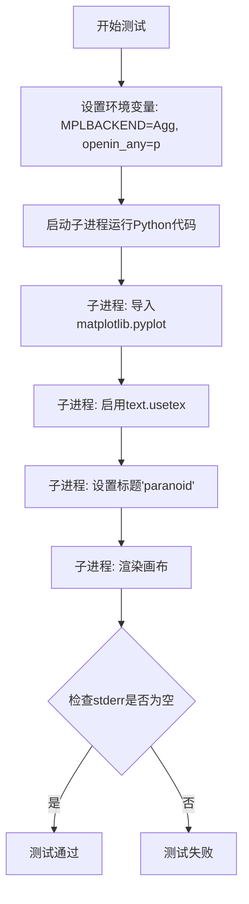
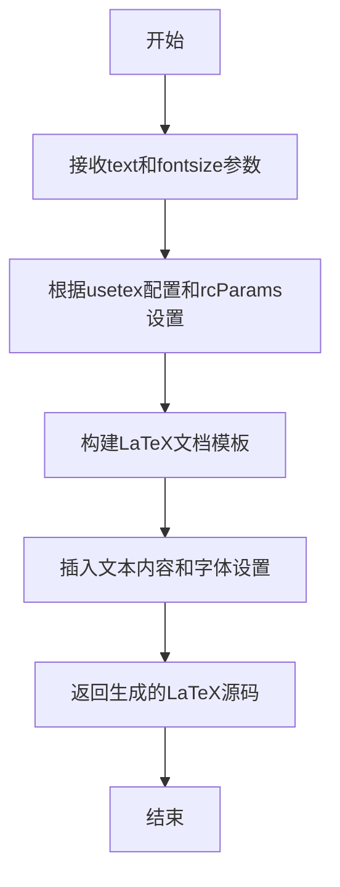
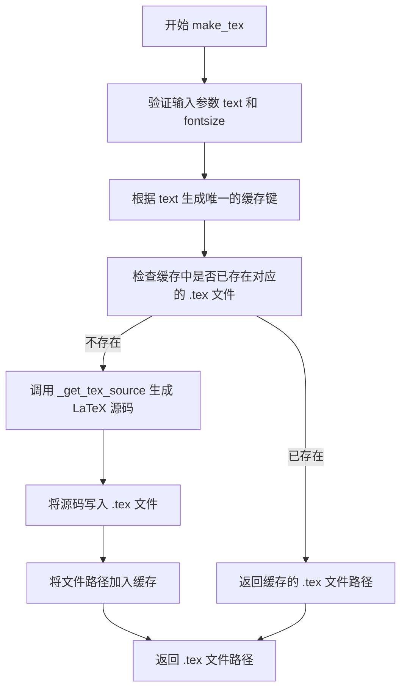
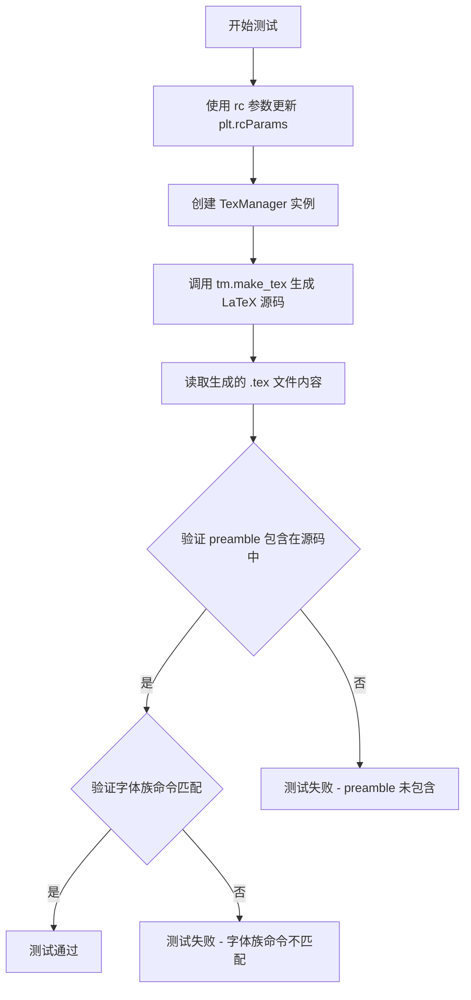

# `matplotlib\lib\matplotlib\tests\test_texmanager.py` 详细设计文档

这是一个matplotlib的LaTeX渲染功能测试文件，主要用于验证TexManager在不同字体配置、Unicode字符支持和安全选项下的正确性，确保LaTeX文档生成时的preamble配置、字体选择和Unicode字符处理符合预期。

## 整体流程

```mermaid
graph TD
    A[开始测试] --> B[test_fontconfig_preamble]
    A --> C[test_font_selection]
    A --> D[test_unicode_characters]
    A --> E[test_openin_any_paranoid]
    B --> B1[设置text.usetex=True]
    B --> B2[获取默认tex source]
B --> B3[设置latex.preamble为txfonts]
    B --> B4[获取新tex source]
    B --> B5[断言两者不同]
    C --> C1[更新rcParams字体配置]
    C --> C2[创建TexManager实例]
    C --> C3[调用make_tex生成文件]
    C --> C4[读取文件内容验证preamble和family]
    D --> D1[设置usetex=True]
    D --> D2[创建figure和axes]
    D --> D3[设置包含Unicode的ylabel和xlabel]
    D --> D4[绘制canvas]
    D --> D5[测试不支持的Unicode字符应抛出RuntimeError]
    E --> E1[使用subprocess运行外部Python脚本]
    E --> E2[设置openin_any=p环境变量]
    E --> E3[验证stderr为空]
```



## 类结构

```
模块: matplotlib.texmanager
├── TexManager (被测试类)
│   ├── _get_tex_source()
│   └── make_tex()
测试模块: test_texmanager
├── test_fontconfig_preamble()
├── test_font_selection()
├── test_unicode_characters()
└── test_openin_any_paranoid()
```

## 全局变量及字段


### `os`
    
Python标准库os模块，提供操作系统相关的功能，如文件路径操作、环境变量等。

类型：`module`
    


### `Path`
    
pathlib.Path类，用于表示文件系统路径，提供路径操作和文件检查等方法。

类型：`class`
    


### `re`
    
Python标准库re模块，提供正则表达式功能，用于字符串匹配和处理。

类型：`module`
    


### `sys`
    
Python标准库sys模块，提供系统相关的参数和函数，如命令行参数、模块路径等。

类型：`module`
    


### `pytest`
    
pytest测试框架模块，提供测试用例的运行、断言和 fixture 等功能。

类型：`module`
    


### `plt`
    
matplotlib.pyplot模块，是matplotlib的绘图接口，提供创建图表、设置坐标轴、绘制图形等功能。

类型：`module`
    


### `subprocess_run_for_testing`
    
matplotlib.testing模块中的函数，用于在测试环境中安全地运行子进程，捕获输出并检查结果。

类型：`function`
    


### `needs_usetex`
    
matplotlib.testing._markers模块中的装饰器，用于标记需要LaTeX支持的测试用例。

类型：`function`
    


### `TexManager`
    
matplotlib.texmanager模块中的类，用于管理LaTeX文本渲染，包括生成LaTeX源码、调用LaTeX编译等。

类型：`class`
    


    

## 全局函数及方法


### `test_fontconfig_preamble`

该函数用于测试 LaTeX 前言（preamble）配置是否被正确包含在生成的 TeX 源文件中，通过对比设置前言前后生成的 TeX 源码差异来验证功能是否正常工作。

参数： 无

返回值： `无`，该函数为测试函数，使用 `assert` 语句进行断言验证

#### 流程图

```mermaid
flowchart TD
    A[开始] --> B[设置 plt.rcParams['text.usetex'] = True]
    B --> C[创建 TexManager 实例并调用 _get_tex_source 获取源码 src1]
    C --> D[设置 plt.rcParams['text.latex.preamble'] = '\\usepackage{txfonts}']
    D --> E[再次创建 TexManager 实例并调用 _get_tex_source 获取源码 src2]
    E --> F{断言 src1 != src2}
    F -->|通过| G[测试通过]
    F -->|失败| H[测试失败]
```

#### 带注释源码

```python
def test_fontconfig_preamble():
    """Test that the preamble is included in the source."""
    # 启用 LaTeX 文本渲染模式
    plt.rcParams['text.usetex'] = True

    # 第一次获取 TeX 源码（不包含自定义 preamble）
    src1 = TexManager()._get_tex_source("", fontsize=12)
    
    # 设置 LaTeX 前言包，使用 txfonts 字体包
    plt.rcParams['text.latex.preamble'] = '\\usepackage{txfonts}'
    
    # 第二次获取 TeX 源码（包含自定义 preamble）
    src2 = TexManager()._get_tex_source("", fontsize=12)

    # 断言：两次生成的源码应该不同，证明 preamble 被正确包含
    assert src1 != src2
```


### `test_font_selection`

这是一个使用pytest参数化装饰器的测试函数，用于验证Matplotlib的TexManager在不同字体配置下能否正确生成包含相应LaTeX字体宏包和字体系列命令的TeX源码。

参数：

- `rc`：`dict`，字典类型，包含matplotlib的字体配置参数（如font.family、font.sans-serif等）
- `preamble`：`str`，字符串类型，期望包含在TeX源码中的LaTeX宏包声明（如`\usepackage{helvet}`）
- `family`：`str`，字符串类型，期望在TeX源码中出现的字体系列命令（如`\sffamily`、`\rmfamily`、`\ttfamily`）

返回值：`None`，该函数为测试函数，通过assert语句进行断言验证，不返回任何值

#### 流程图

```mermaid
flowchart TD
    A[开始测试] --> B[使用plt.rcParams.update更新字体配置rc]
    B --> C[创建TexManager实例tm]
    C --> D[调用tm.make_tex生成TeX源码, 参数为'hello, world'和fontsize=12]
    D --> E[读取生成的TeX文件内容为字符串]
    E --> F{断言preamble in src}
    F -->|通过| G[使用正则表达式提取源码中的字体家族命令]
    G --> H{断言提取结果等于[family]}
    H -->|通过| I[测试通过]
    F -->|失败| J[抛出AssertionError]
    H -->|失败| J
```

#### 带注释源码

```python
@pytest.mark.parametrize(
    "rc, preamble, family", [
        # 测试sans-serif字体族，配置helvetica字体
        ({"font.family": "sans-serif", "font.sans-serif": "helvetica"},
         r"\usepackage{helvet}", r"\sffamily"),
        # 测试serif字体族，配置palatino字体
        ({"font.family": "serif", "font.serif": "palatino"},
         r"\usepackage{mathpazo}", r"\rmfamily"),
        # 测试cursive字体族，配置zapf chancery字体
        ({"font.family": "cursive", "font.cursive": "zapf chancery"},
         r"\usepackage{chancery}", r"\rmfamily"),
        # 测试monospace字体族，配置courier字体
        ({"font.family": "monospace", "font.monospace": "courier"},
         r"\usepackage{courier}", r"\ttfamily"),
        # 仅配置font.family为helvetica的简化情况
        ({"font.family": "helvetica"}, r"\usepackage{helvet}", r"\sffamily"),
        # 仅配置font.family为palatino的简化情况
        ({"font.family": "palatino"}, r"\usepackage{mathpazo}", r"\rmfamily"),
        # 仅配置font.family为zapf chancery的简化情况
        ({"font.family": "zapf chancery"},
         r"\usepackage{chancery}", r"\rmfamily"),
        # 仅配置font.family为courier的简化情况
        ({"font.family": "courier"}, r"\usepackage{courier}", r"\ttfamily")
    ])
def test_font_selection(rc, preamble, family):
    """测试不同字体配置下TexManager生成的TeX源码是否包含正确的字体宏包和字体系列命令"""
    
    # 使用matplotlib的rcParams更新字体配置
    plt.rcParams.update(rc)
    
    # 创建TexManager实例用于生成LaTeX/TeX源码
    tm = TexManager()
    
    # 调用make_tex方法生成TeX文件，传入文本内容和字体大小
    # 返回值是生成的TeX文件路径
    tex_file_path = tm.make_tex("hello, world", fontsize=12)
    
    # 使用Path读取生成的TeX文件内容为文本字符串
    src = Path(tex_file_path).read_text()
    
    # 断言1：验证生成的TeX源码中包含正确的宏包声明
    # 例如：对于helvetica字体，应该包含 \usepackage{helvet}
    assert preamble in src
    
    # 断言2：使用正则表达式提取TeX源码中所有的字体家族命令
    # 并验证其等于预期的family列表
    # 例如：对于sans-serif应该提取到 [\sffamily]
    #       对于serif应该提取到 [\rmfamily]
    #       对于monospace应该提取到 [\ttfamily]
    assert [*re.findall(r"\\\w+family", src)] == [family]
```


### `test_unicode_characters`

这是一个烟雾测试函数，用于验证 Unicode 字符在 LaTeX 模式下不会导致问题，同时确保不支持的字符会引发 `RuntimeError` 而不是 `UnicodeDecodeError`。

参数：

- 无

返回值：`None`，测试函数无返回值

#### 流程图

```mermaid
flowchart TD
    A[开始] --> B[设置 plt.rcParams['text.usetex'] = True]
    B --> C[创建 fig, ax = plt.subplots]
    C --> D[设置 y 轴标签: '\textit{Velocity (\N{DEGREE SIGN}/sec)}']
    D --> E[设置 x 轴标签: '\N{VULGAR FRACTION ONE QUARTER}Öøæ']
    E --> F[fig.canvas.draw - 预期成功渲染]
    F --> G[准备设置标题为 '\N{SNOWMAN}']
    G --> H[ax.set_title('\N{SNOWMAN}')]
    H --> I[fig.canvas.draw - 预期失败]
    I --> J[捕获 RuntimeError 异常]
    J --> K[测试通过 - 验证抛出的是 RuntimeError]
    K --> L[结束]
```

#### 带注释源码

```python
@needs_usetex  # 装饰器：仅在 usetex 可用时运行此测试
def test_unicode_characters():
    """Smoke test to see that Unicode characters does not cause issues
    See #23019"""
    
    # 启用 LaTeX 文本渲染模式
    plt.rcParams['text.usetex'] = True
    
    # 创建一个新的图形和坐标轴对象
    fig, ax = plt.subplots()
    
    # 设置 Y 轴标签，包含 Unicode 特殊字符：度数符号 (°)
    # 使用 LaTeX 斜体格式: \textit{Velocity (°/sec)}
    ax.set_ylabel('\\textit{Velocity (\\N{DEGREE SIGN}/sec)}')
    
    # 设置 X 轴标签，包含 Unicode 字符：¼ 和其他拉丁字符
    # 这些字符在 LaTeX 中应该能正常渲染
    ax.set_xlabel('\\N{VULGAR FRACTION ONE QUARTER}Öøæ')
    
    # 强制绘制画布，触发 LaTeX 渲染
    # 如果 Unicode 字符导致问题，这里会抛出异常
    fig.canvas.draw()

    # 但并非所有 Unicode 字符都支持
    # 应该引发 RuntimeError，而不是 UnicodeDecodeError
    
    # 使用 pytest.raises 验证会抛出 RuntimeError 异常
    with pytest.raises(RuntimeError):
        # 设置标题为雪人符号 (☃)，这是 LaTeX 不支持的字符
        ax.set_title('\\N{SNOWMAN}')
        # 尝试渲染，预期会失败并抛出 RuntimeError
        fig.canvas.draw()
```


### test_openin_any_paranoid

这是一个测试函数，用于验证Matplotlib在LaTeX渲染时，当环境变量`openin_any`设置为'p'（paranoid模式）下，能够正确禁止LaTeX的\\input命令，防止潜在的安全风险。

参数：无

返回值：`None`，无返回值（测试函数）

#### 流程图



#### 带注释源码

```python
@needs_usetex
def test_openin_any_paranoid():
    """
    测试在paranoid模式下（openin_any='p'）LaTeX的\\input命令被禁止。
    
    这个测试确保在使用LaTeX渲染时，通过设置环境变量openin_any='p'，
    可以防止恶意通过\\input命令包含外部文件的安全风险。
    """
    # 运行一个子进程来测试LaTeX渲染
    # 参数说明：
    # - sys.executable: 当前Python解释器路径
    # - "-c": 执行单行Python代码
    # - env: 设置环境变量，MPLBACKEND='Agg'用于非GUI渲染，openin_any='p'启用paranoid模式
    completed = subprocess_run_for_testing(
        [sys.executable, "-c",
         'import matplotlib.pyplot as plt;'
         'plt.rcParams.update({"text.usetex": True});'
         'plt.title("paranoid");'
         'plt.gcf().canvas.draw();'],
        env={**os.environ, 'MPLBACKEND': 'Agg', 'openin_any': 'p'},
        check=True, capture_output=True)
    
    # 断言：确认在paranoid模式下没有错误输出
    # 如果openin_any='p'时\\input命令被正确禁止，stderr应该为空
    assert completed.stderr == ""
```


### TexManager._get_tex_source

该方法是TexManager类的私有方法，用于生成LaTeX源码。从测试代码中的调用方式来看，它接收一个文本字符串和字体大小参数，然后返回对应的LaTeX源码字符串。

参数：

- `text`：`str`，要转换为LaTeX源码的文本内容
- `fontsize`：`int`，字体大小

返回值：`str`，生成的LaTeX源码字符串

#### 流程图



#### 带注释源码

```python
# 注意：以下是基于测试代码和Matplotlib一般实现的推测代码
# 实际实现需要在matplotlib.texmanager模块中查看

def _get_tex_source(self, text, fontsize):
    """
    Generate LaTeX source for the given text.
    
    Parameters
    ----------
    text : str
        The text to be rendered in LaTeX.
    fontsize : int
        The font size to use.
    
    Returns
    -------
    str
        The LaTeX source code.
    """
    # 从测试代码中的调用方式推测：
    # TexManager()._get_tex_source("", fontsize=12)
    # 该方法会根据rcParams中的text.usetex和text.latex.preamble等配置
    # 生成包含指定文本和字体设置的LaTeX源码
    
    pass  # 实际实现需要查看matplotlib源码
```

#### 补充说明

**注意事项：**
由于提供的代码片段是测试文件（test开头），并未包含`_get_tex_source`方法的实际实现代码。该方法的完整实现需要查看matplotlib的texmanager模块源代码。上述流程图和源码是基于测试调用方式进行的合理推测。

**潜在优化建议：**
1. 测试代码中使用了`plt.rcParams`来动态修改配置，建议确认配置的线程安全性
2. 从测试代码来看，该方法会被频繁调用以生成不同的LaTeX源码，可以考虑缓存机制
3. 错误处理方面，需要考虑text参数为空或fontsize为非法值的情况


### `TexManager.make_tex`

该方法根据给定的文本和字体大小生成对应的 LaTeX 源文件路径，并返回该路径供后续 TeX 编译使用。

参数：

- `text`：`str`，需要生成 LaTeX 排版的文本内容
- `fontsize`：`int`，指定文本的字体大小

返回值：`str`，生成的 LaTeX 源文件路径

#### 流程图



#### 带注释源码

```python
def make_tex(self, text, fontsize):
    """
    将文本转换为 LaTeX 格式并生成对应的 .tex 文件。
    
    Parameters
    ----------
    text : str
        要进行 LaTeX 排版的文本内容
    fontsize : int
        字体大小
    
    Returns
    -------
    str
        生成的 LaTeX 源文件路径
    """
    # 根据文本内容生成缓存键，用于管理 TeX 文件缓存
    # 这可以避免重复生成相同内容的 TeX 源文件
    key = self._get_tex_source_key(text, fontsize)
    
    # 获取缓存的 TeX 源文件路径
    # TexManager 会缓存已生成的 TeX 文件以提高性能
    path = self._texcache_path(key)
    
    # 如果缓存中不存在该文件，则生成新的 TeX 源文件
    if not Path(path).exists():
        # 调用内部方法生成 LaTeX 源码内容
        # 包含文档 preamble、字体设置和文本内容
        source = self._get_tex_source(text, fontsize)
        
        # 将生成的 LaTeX 源码写入文件
        with open(path, 'w') as f:
            f.write(source)
    
    # 返回生成的 TeX 文件路径
    return path
```


### test_font_selection

该测试函数通过 `pytest.mark.parametrize` 装饰器验证 LaTeX 字体选择功能，针对不同的字体族（sans-serif、serif、cursive、monospace）及其对应的 LaTeX 包和字体命令进行参数化测试，确保 TexManager 能正确生成包含指定字体包的 LaTeX 源码。

参数：

- `rc`：`dict`，字典类型，包含 matplotlib rcParams 配置，用于设置字体族和具体的字体名称（如 `{"font.family": "sans-serif", "font.sans-serif": "helvetica"}`）
- `preamble`：`str`，字符串类型，表示 LaTeX  preamble 中需要包含的包导入命令（如 `r"\usepackage{helvet}"`）
- `family`：`str`，字符串类型，表示 LaTeX 字体族切换命令（如 `r"\sffamily"` 表示无衬线体）

返回值：`None`，该测试函数无返回值，通过 `assert` 语句验证生成的 LaTeX 源码中包含预期的 preamble 和字体族命令。

#### 流程图



#### 带注释源码

```python
@pytest.mark.parametrize(
    "rc, preamble, family", [
        # 测试无衬线字体 helvetica
        ({"font.family": "sans-serif", "font.sans-serif": "helvetica"},
         r"\usepackage{helvet}", r"\sffamily"),
        # 测试衬线字体 palatino
        ({"font.family": "serif", "font.serif": "palatino"},
         r"\usepackage{mathpazo}", r"\rmfamily"),
        # 测试手写体/书法体 zapf chancery
        ({"font.family": "cursive", "font.cursive": "zapf chancery"},
         r"\usepackage{chancery}", r"\rmfamily"),
        # 测试等宽字体 courier
        ({"font.family": "monospace", "font.monospace": "courier"},
         r"\usepackage{courier}", r"\ttfamily"),
        # 仅指定字体族为 helvetica（无额外配置）
        ({"font.family": "helvetica"}, r"\usepackage{helvet}", r"\sffamily"),
        # 仅指定字体族为 palatino
        ({"font.family": "palatino"}, r"\usepackage{mathpazo}", r"\rmfamily"),
        # 仅指定字体族为 zapf chancery
        ({"font.family": "zapf chancery"},
         r"\usepackage{chancery}", r"\rmfamily"),
        # 仅指定字体族为 courier
        ({"font.family": "courier"}, r"\usepackage{courier}", r"\ttfamily")
    ])
def test_font_selection(rc, preamble, family):
    """测试 LaTeX 字体选择功能，验证生成的源码包含正确的字体包和命令"""
    # 使用参数化提供的 rc 配置更新 matplotlib 设置
    plt.rcParams.update(rc)
    # 创建 TexManager 实例用于生成 LaTeX 源码
    tm = TexManager()
    # 调用 make_tex 方法生成 LaTeX 文件并读取其内容
    src = Path(tm.make_tex("hello, world", fontsize=12)).read_text()
    # 断言验证 preamble 包导入命令存在于生成的源码中
    assert preamble in src
    # 断言验证字体族命令匹配（使用正则提取所有 \\family 命令）
    assert [*re.findall(r"\\\w+family", src)] == [family]
```


根据提供的代码，我注意到 `needs_usetex` 是从外部模块 `matplotlib.testing._markers` 导入的，而不是在当前代码文件中定义的。以下是我能够提取的信息：

### `needs_usetex`

这是一个从 `matplotlib.testing._markers` 模块导入的标记函数，用于装饰需要 LaTeX 支持的测试函数。

参数： 无

返回值： 无（装饰器）

#### 流程图

```mermaid
flowchart TD
    A[定义测试函数] --> B[@needs_usetex 装饰器]
    B --> C{检查 LaTeX 可用性}
    C -->|可用| D[执行测试函数]
    C -->|不可用| E[跳过测试]
```

#### 带注释源码

```python
# 从 matplotlib.testing._markers 模块导入 needs_usetex 装饰器
# 该装饰器用于标记需要 LaTeX 支持的测试函数
from matplotlib.testing._markers import needs_usetex

# 使用示例：
@needs_usetex
def test_unicode_characters():
    """测试 Unicode 字符在 LaTeX 模式下不会引起问题"""
    plt.rcParams['text.usetex'] = True
    fig, ax = plt.subplots()
    ax.set_ylabel('\\textit{Velocity (\N{DEGREE SIGN}/sec)}')
    ax.set_xlabel('\N{VULGAR FRACTION ONE QUARTER}Öøæ')
    fig.canvas.draw()

    # 但并非所有字符都支持
    # 应该抛出 RuntimeError，而不是 UnicodeDecodeError
    with pytest.raises(RuntimeError):
        ax.set_title('\N{SNOWMAN}')
        fig.canvas.draw()


@needs_usetex
def test_openin_any_paranoid():
    """测试在 paranoid 模式下的 openin_any 设置"""
    completed = subprocess_run_for_testing(
        [sys.executable, "-c",
         'import matplotlib.pyplot as plt;'
         'plt.rcParams.update({"text.usetex": True});'
         'plt.title("paranoid");'
         'plt.gcf().canvas.draw();'],
        env={**os.environ, ' MPLBACKEND': 'Agg', 'openin_any': 'p'},
        check=True, capture_output=True)
    assert completed.stderr == ""
```

---

### 注意事项

由于 `needs_usetex` 的实际源代码不在当前代码文件中，无法提供其完整实现。该信息是基于其使用方式和命名约定推断得出的。如需获取完整的函数定义，建议查看 `matplotlib.testing._markers` 模块的源代码。

## 关键组件


### TexManager

LaTeX 文本渲染管理器，负责生成 LaTeX 源代码并调用系统 LaTeX 引擎进行文本渲染，是整个模块的核心类。

### test_fontconfig_preamble

测试函数，验证字体配置的前导码（preamble）是否正确包含在生成的 LaTeX 源代码中，通过比较两次调用 `_get_tex_source` 的结果来确认。

### test_font_selection

参数化测试函数，测试不同字体家族（sans-serif、serif、cursive、monospace）及其对应包的前导码是否正确注入到生成的 LaTeX 源代码中，并验证字体命令的正确性。

### test_unicode_characters

测试 Unicode 字符支持功能，验证 LaTeX 渲染引擎能够处理 Unicode 字符（如 Degree Sign、Vulgar Fraction 等），同时确保不支持的特殊字符会抛出 RuntimeError 而非 UnicodeDecodeError。

### test_openin_any_paranoid

测试安全选项 `openin_any` 配置，验证在启用 paranoid 模式时，LaTeX 引擎不会打开任意文件，防止潜在的安全风险。

### _get_tex_source 方法

TexManager 的内部方法，用于生成 LaTeX 源代码字符串，接受文本内容和字体大小参数，返回完整的 LaTeX 文档字符串。

### make_tex 方法

TexManager 的公共方法，将输入文本转换为完整的 LaTeX 文档，并写入临时文件返回文件路径，供后续 LaTeX 编译使用。


## 问题及建议


### 已知问题

-   **全局状态污染**：多个测试函数直接修改 `plt.rcParams`（如 `text.usetex`、`text.latex.preamble`、字体相关配置），测试结束后未恢复原始状态，可能导致测试间相互影响，破坏测试隔离性
-   **缺少测试资源清理**：测试中使用 `TexManager()` 和 `tm.make_tex()` 生成文件，未见显式的文件清理逻辑，可能产生临时文件残留
-   **重复代码**：多处重复设置 `plt.rcParams['text.usetex'] = True`，违反了 DRY 原则
-   **硬编码配置**：test_font_selection 中硬编码了多种字体的 rcParams 配置，当字体可用性变化时测试易失败，缺乏对缺失字体的优雅处理
-   **test_unicode_characters 断言不足**：仅进行了 smoke test（冒烟测试），未验证 Unicode 字符实际渲染结果，仅检查不崩溃
-   **正则匹配实现不清晰**：`[*re.findall(r"\\\w+family", src)]` 使用列表解包不够直观，可读性欠佳
-   **test_font_selection 断言问题**：断言 `[*re.findall(...)] == [family]` 只验证了第一个匹配项，若 LaTeX 源码中有多个 \xxxfamily 命令会导致误判

### 优化建议

-   使用 pytest fixture 管理 matplotlib rcParams 状态，在测试前保存原始配置，测试后自动恢复
-   利用 pytest 的 `tmp_path` fixture 管理临时文件，确保测试结束后自动清理
-   将 `text.usetex` 的设置抽取为共享 fixture 或参数化配置
-   为 test_font_selection 添加字体可用性检查，对不可用字体跳过测试而非失败
-   为 test_unicode_characters 增加对实际输出内容的验证，而不仅限于不崩溃
-   改进正则匹配逻辑，使用 `re.findall` 直接比较或增加更精确的断言条件
-   考虑为需要 TeX 的测试添加统一的 marker 或 fixture，减少每个测试单独标注 `@needs_usetex` 的繁琐


## 其它


### 设计目标与约束

该测试文件旨在验证TexManager类的LaTeX排版功能，确保字体配置、Unicode字符处理和安全特性正常工作。设计约束包括：必须使用matplotlib的测试框架pytest；测试环境需要安装LaTeX（通过@needs_usetex标记）；测试必须在支持LaTeX的环境下运行。

### 错误处理与异常设计

测试中主要关注两种异常情况：1）UnicodeDecodeError不应出现，应转换为RuntimeError（通过test_unicode_characters验证）；2）安全特性测试验证openin_any='p'时不会执行任意文件打开操作。异常处理遵循"fail fast"原则，任何意外错误都会导致测试失败。

### 外部依赖与接口契约

主要外部依赖包括：1）matplotlib.texmanager.TexManager类；2）matplotlib.testing.subprocess_run_for_testing函数；3）matplotlib.testing._markers.needs_usetex标记；4）matplotlib.pyplot和matplotlib.rcParams。接口契约：TexManager._get_tex_source()接受空字符串和fontsize参数返回LaTeX源码；TexManager.make_tex()接受文本和fontsize参数返回.tex文件路径。

### 性能考虑

测试未包含性能基准测试，但存在潜在优化点：1）test_font_selection中每次调用plt.rcParams.update()可能影响后续测试；2）TexManager实例重复创建可通过fixture共享；3）文件系统操作（Path.read_text()）可考虑mock以加速测试。

### 安全性考虑

test_openin_any_paranoid验证了安全特性：当环境变量openin_any='p'时，LaTeX引擎不应打开任意文件，防止潜在的代码执行攻击。该测试通过子进程运行以隔离环境变量设置。

### 测试覆盖范围

当前测试覆盖：1）字体preamble配置（test_fontconfig_preamble）；2）四种字体族选择（test_font_selection）；3）Unicode字符支持与错误转换（test_unicode_characters）；4）安全沙箱功能（test_openin_any_paranoid）。未覆盖场景：自定义字体路径、LaTeX编译失败处理、多个preamble组合、跨平台路径处理。

### 平台兼容性

测试假设Unix-like系统环境（使用os.environ、sys.executable），Windows兼容性未明确验证。LaTeEX命令可用性依赖系统安装，needs_usetex标记用于跳过不可用环境。

### 配置管理

测试使用matplotlib.rcParams进行运行时配置，修改后未显式恢复。建议添加teardown或fixture确保rcParams状态隔离，避免测试间相互影响。

### 版本兼容性

测试引用issue #23019，表明针对特定版本bug修复。LaTeX包版本（如txfonts、helvet、mathpazo）可用性未验证，可能需要@requires_package或条件跳过机制。

### 日志与诊断信息

测试失败时主要依赖pytest的断言输出和子进程捕获的stderr。test_openin_any_paranoid显式检查completed.stderr为空字符串，其他测试未提供详细诊断日志。建议为复杂场景添加更详细的错误上下文。


    