# `matplotlib\lib\matplotlib\tests\test_text.py` 详细设计文档

该代码是 Matplotlib 的测试套件，专注于测试文本（Text）、注释（Annotation）及字体相关的核心功能。代码通过大量测试函数验证文本渲染、坐标转换、对齐方式、换行逻辑、包含检测、抗锯齿设置、旋转模式以及坐标系统等细节，确保 Matplotlib 在各种场景下文本处理的正确性和稳定性。

## 整体流程

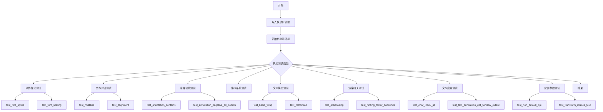

## 类结构

```
无自定义类定义（所有类均来自 Matplotlib 库）
```

## 全局变量及字段


### `pyparsing_version`
    
Stores the parsed version of the pyparsing library, used for version-specific checks.

类型：`packaging.version.Version`
    


    

## 全局函数及方法


### `test_font_styles`

该函数是一个图像对比测试函数，用于验证matplotlib中不同字体样式（normal、bold、bold italic、light、condensed）的渲染效果。测试通过创建带有不同字体属性的注解（annotation），并使用`image_comparison`装饰器生成或对比测试图像来验证字体属性是否正确应用。

参数：该函数没有显式参数

返回值：`None`，该函数为测试函数，主要通过断言和图像对比进行验证

#### 流程图

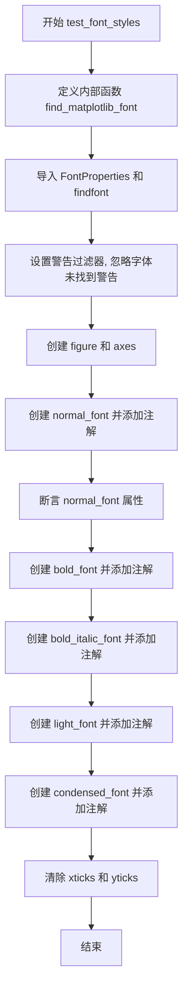

#### 带注释源码

```python
@image_comparison(['font_styles'])  # 装饰器: 比较生成的图像与基准图像
def test_font_styles():
    """测试不同字体样式（normal, bold, bold italic, light, condensed）的渲染"""
    
    def find_matplotlib_font(**kw):
        """内部函数: 根据字体参数查找并返回 FontProperties 对象"""
        prop = FontProperties(**kw)  # 创建字体属性对象
        path = findfont(prop, directory=mpl.get_data_path())  # 查找字体文件路径
        return FontProperties(fname=path)  # 返回基于字体文件的 FontProperties
    
    # 导入所需的字体管理模块
    from matplotlib.font_manager import FontProperties, findfont
    
    # 设置警告过滤器: 忽略找不到 'Foo' 字体家族的警告（预期行为）
    warnings.filterwarnings(
        'ignore',
        r"findfont: Font family \[u?'Foo'\] not found. Falling back to .",
        UserWarning,
        module='matplotlib.font_manager')
    
    # 创建图形和坐标轴
    fig, ax = plt.subplots()
    
    # 测试 normal 字体样式
    normal_font = find_matplotlib_font(
        family="sans-serif",   # 字体家族
        style="normal",        # 字体样式
        variant="normal",      # 字体变体
        size=14)               # 字体大小
    a = ax.annotate(
        "Normal Font",         # 注解文本
        (0.1, 0.1),            # 注解位置
        xycoords='axes fraction',  # 坐标使用轴分数
        fontproperties=normal_font)  # 应用字体属性
    # 断言验证字体属性正确
    assert a.get_fontname() == 'DejaVu Sans'    # 字体名称
    assert a.get_fontstyle() == 'normal'          # 字体样式
    assert a.get_fontvariant() == 'normal'        # 字体变体
    assert a.get_weight() == 'normal'             # 字体粗细
    assert a.get_stretch() == 'normal'            # 字体宽度
    
    # 测试 bold 字体样式（使用不存在的 'Foo' 字体家族，触发回退）
    bold_font = find_matplotlib_font(
        family="Foo",          # 不存在的字体家族（会回退到默认字体）
        style="normal",
        variant="normal",
        weight="bold",         # 粗体
        stretch=500,           # 宽度拉伸
        size=14)
    ax.annotate(
        "Bold Font",
        (0.1, 0.2),
        xycoords='axes fraction',
        fontproperties=bold_font)
    
    # 测试 bold italic 字体样式
    bold_italic_font = find_matplotlib_font(
        family="sans serif",
        style="italic",        # 斜体
        variant="normal",
        weight=750,            # 粗细数值
        stretch=500,
        size=14)
    ax.annotate(
        "Bold Italic Font",
        (0.1, 0.3),
        xycoords='axes fraction',
        fontproperties=bold_italic_font)
    
    # 测试 light 字体样式
    light_font = find_matplotlib_font(
        family="sans-serif",
        style="normal",
        variant="normal",
        weight=200,             # 较细的字体
        stretch=500,
        size=14)
    ax.annotate(
        "Light Font",
        (0.1, 0.4),
        xycoords='axes fraction',
        fontproperties=light_font)
    
    # 测试 condensed 字体样式
    condensed_font = find_matplotlib_font(
        family="sans-serif",
        style="normal",
        variant="normal",
        weight=500,
        stretch=100,           # 压缩的字体宽度
        size=14)
    ax.annotate(
        "Condensed Font",
        (0.1, 0.5),
        xycoords='axes fraction',
        fontproperties=condensed_font)
    
    # 清除坐标轴刻度（使图像对比更清晰）
    ax.set_xticks([])
    ax.set_yticks([])
```


### `test_multiline`

这是一个图像对比测试函数，用于验证matplotlib在文本渲染中对多行文本和数学表达式的支持情况，特别是带有上标和下标的复杂数学公式的对齐方式。

参数： 无

返回值：`None`，该测试函数不返回任何值，仅用于生成测试图像

#### 流程图

```mermaid
flowchart TD
    A[开始测试] --> B[创建新图形 plt.figure]
    B --> C[创建子图 ax = plt.subplot 1,1,1]
    C --> D[设置标题 multiline text alignment]
    D --> E[添加第一个文本 TpTpTp\n$M$\nTpTpTp]
    E --> F[添加第二个文本 TpTpTp\n$M^{M^{M^{M}}}$\nTpTpTp]
    F --> G[添加第三个文本 TpTpTp\n$M_{q_{q_{q}}}$\nTpTpTp]
    G --> H[设置坐标轴范围 xlim 0-1, ylim 0-0.8]
    H --> I[隐藏刻度线 xticks yticks]
    I --> J[结束测试生成图像]
```

#### 带注释源码

```python
@image_comparison(['multiline'])  # 装饰器：使用multiline.png作为参考图像进行对比
def test_multiline():
    """测试函数：验证多行文本和数学表达式的渲染效果"""
    
    # 创建一个新的图形窗口
    plt.figure()
    
    # 在图形中添加一个子图（1行1列第1个位置）
    ax = plt.subplot(1, 1, 1)
    
    # 设置子图标题，支持换行显示
    ax.set_title("multiline\ntext alignment")

    # 在x=0.2, y=0.5位置添加第一个文本对象
    # 包含普通文本和简单数学表达式$M$
    # size=20设置字体大小，ha="center"水平居中，va="top"垂直顶部对齐
    plt.text(
        0.2, 0.5, "TpTpTp\n$M$\nTpTpTp", size=20, ha="center", va="top")

    # 在x=0.5, y=0.5位置添加第二个文本对象
    # 包含嵌套上标表达式$M^{M^{M^{M}}}$
    plt.text(
        0.5, 0.5, "TpTpTp\n$M^{M^{M^{M}}}$\nTpTpTp", size=20,
        ha="center", va="top")

    # 在x=0.8, y=0.5位置添加第三个文本对象
    # 包含嵌套下标表达式$M_{q_{q_{q}}}$
    plt.text(
        0.8, 0.5, "TpTpTp\n$M_{q_{q_{q}}}$\nTpTpTp", size=20,
        ha="center", va="top")

    # 设置x轴范围为0到1
    plt.xlim(0, 1)
    # 设置y轴范围为0到0.8
    plt.ylim(0, 0.8)

    # 隐藏x轴刻度线
    ax.set_xticks([])
    # 隐藏y轴刻度线
    ax.set_yticks([])
```


### `test_multiline2`

该测试函数用于验证matplotlib中多行文本的渲染和不同垂直对齐方式（底部、顶部、基线）的正确性，通过在四个不同的Y轴位置绘制包含普通文本和数学公式的多行文本，并使用矩形框标注文本的实际边界范围。

参数：无

返回值：`None`，测试函数无返回值

#### 流程图

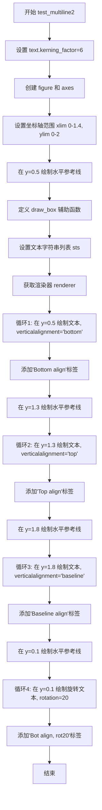

#### 带注释源码

```python
# TODO: tighten tolerance after baseline image is regenerated for text overhaul
@image_comparison(['multiline2'], style='mpl20', tol=0.05)
def test_multiline2():
    """测试多行文本在不同垂直对齐方式下的渲染效果"""
    
    # Remove this line when this test image is regenerated.
    # 设置文本字距调整因子为6（调整后需要重新生成基准图像）
    plt.rcParams['text.kerning_factor'] = 6

    # 创建图形和坐标轴
    fig, ax = plt.subplots()

    # 设置坐标轴范围
    ax.set_xlim(0, 1.4)
    ax.set_ylim(0, 2)
    
    # 在y=0.5处绘制水平参考线（颜色C2，线宽0.3）
    ax.axhline(0.5, color='C2', linewidth=0.3)
    
    # 定义测试用的文本字符串列表，包含普通文本和数学公式
    sts = ['Line', '2 Lineg\n 2 Lg', '$\\sum_i x $', 'hi $\\sum_i x $\ntest',
           'test\n $\\sum_i x $', '$\\sum_i x $\n $\\sum_i x $']
    
    # 获取画布渲染器，用于计算文本边界框
    renderer = fig.canvas.get_renderer()

    def draw_box(ax, tt):
        """辅助函数：在文本周围绘制边界框"""
        # 创建矩形对象，clip_on=False表示不裁剪到坐标轴内
        r = mpatches.Rectangle((0, 0), 1, 1, clip_on=False,
                               transform=ax.transAxes)
        # 计算文本的窗口范围并转换到轴坐标
        r.set_bounds(
            tt.get_window_extent(renderer)
            .transformed(ax.transAxes.inverted())
            .bounds)
        # 将矩形添加到坐标轴
        ax.add_patch(r)

    horal = 'left'  # 水平对齐方式为左对齐
    
    # 循环1：y=0.5位置，底部对齐（bottom）
    for nn, st in enumerate(sts):
        tt = ax.text(0.2 * nn + 0.1, 0.5, st, horizontalalignment=horal,
                     verticalalignment='bottom')
        draw_box(ax, tt)
    # 添加标签说明
    ax.text(1.2, 0.5, 'Bottom align', color='C2')

    # 循环2：y=1.3位置，顶部对齐（top）
    ax.axhline(1.3, color='C2', linewidth=0.3)
    for nn, st in enumerate(sts):
        tt = ax.text(0.2 * nn + 0.1, 1.3, st, horizontalalignment=horal,
                     verticalalignment='top')
        draw_box(ax, tt)
    ax.text(1.2, 1.3, 'Top align', color='C2')

    # 循环3：y=1.8位置，基线对齐（baseline）
    ax.axhline(1.8, color='C2', linewidth=0.3)
    for nn, st in enumerate(sts):
        tt = ax.text(0.2 * nn + 0.1, 1.8, st, horizontalalignment=horal,
                     verticalalignment='baseline')
        draw_box(ax, tt)
    ax.text(1.2, 1.8, 'Baseline align', color='C2')

    # 循环4：y=0.1位置，底部对齐并旋转20度
    ax.axhline(0.1, color='C2', linewidth=0.3)
    for nn, st in enumerate(sts):
        tt = ax.text(0.2 * nn + 0.1, 0.1, st, horizontalalignment=horal,
                     verticalalignment='bottom', rotation=20)
        draw_box(ax, tt)
    ax.text(1.2, 0.1, 'Bot align, rot20', color='C2')
```


### test_antialiasing

该函数是一个图像对比测试，用于验证文本抗锯齿（antialiasing）功能的正确性。测试通过对比不同参数设置下的文本渲染效果，确认传入参数能够正确覆盖全局rcParams设置。

参数： 无

返回值： `None`，该函数为测试函数，不返回任何值

#### 流程图

```mermaid
flowchart TD
    A[开始] --> B[设置mpl.rcParams['text.antialiased'] = False]
    B --> C[创建图形 figsize=(5.25, 0.75)]
    C --> D[在位置0.3, 0.75添加文本'antialiased', antialiased=True]
    D --> E[在位置0.3, 0.25添加数学公式, antialiased=True]
    E --> F[设置mpl.rcParams['text.antialiased'] = True]
    F --> G[在位置0.7, 0.75添加文本'not antialiased', antialiased=False]
    G --> H[在位置0.7, 0.25添加数学公式, antialiased=False]
    H --> I[设置mpl.rcParams['text.antialiased'] = False]
    I --> J[结束]
```

#### 带注释源码

```python
@image_comparison(['antialiased.png'], style='mpl20')
def test_antialiasing():
    # 设置全局rcParams，测试传入参数是否能覆盖此设置
    mpl.rcParams['text.antialiased'] = False  # Passed arguments should override.

    # 创建宽度5.25、高度0.75英寸的图形（扁平形状以适应测试文本）
    fig = plt.figure(figsize=(5.25, 0.75))
    
    # 在图形中添加文本"antialiased"，位置(0.3, 0.75)，居中对齐
    # 尽管全局设置为False，但antialiased=True参数应覆盖全局设置
    fig.text(0.3, 0.75, "antialiased", horizontalalignment='center',
             verticalalignment='center', antialiased=True)
    
    # 在图形中添加数学公式 sqrt(x)，位置(0.3, 0.25)
    # 同样使用antialiased=True覆盖全局设置
    fig.text(0.3, 0.25, r"$\sqrt{x}$", horizontalalignment='center',
             verticalalignment='center', antialiased=True)

    # 更改全局设置为True，测试False参数是否能覆盖
    mpl.rcParams['text.antialiased'] = True  # Passed arguments should override.
    
    # 添加"not antialiased"文本，antialiased=False应覆盖全局True设置
    fig.text(0.7, 0.75, "not antialiased", horizontalalignment='center',
             verticalalignment='center', antialiased=False)
    
    # 添加数学公式，antialiased=False应覆盖全局True设置
    fig.text(0.7, 0.25, r"$\sqrt{x}$", horizontalalignment='center',
             verticalalignment='center', antialiased=False)

    # 最后将全局设置改回False，验证这不会影响已创建的文本对象
    mpl.rcParams['text.antialiased'] = False  # Should not affect existing text.
```


### test_contains

该函数是一个pytest测试函数，用于测试matplotlib中文本对象的contains方法是否能正确检测鼠标事件是否落在旋转后的文本边界内。函数通过在文本周围生成网格点，逐个测试每个点是否被识别为"在文本内"，并用可视化方式（黄色点表示在内部，红色点表示在外部）展示测试结果。

参数： 无

返回值： 无（测试函数）

#### 流程图

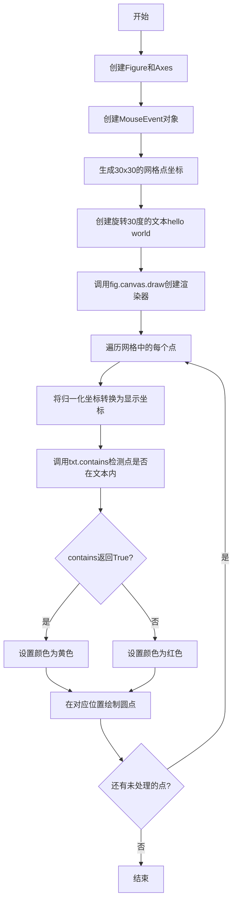

#### 带注释源码

```python
@image_comparison(['text_contains.png'], tol=0.05)
def test_contains():
    """
    测试Text.contains方法是否能正确检测鼠标事件是否在旋转后的文本内。
    使用图像比较验证测试结果，容差为0.05。
    """
    fig = plt.figure()  # 创建新的图形对象
    ax = plt.axes()    # 创建坐标轴

    # 创建鼠标按下事件，初始化位置在(0.5, 0.5)
    # 参数: 事件类型, canvas, x, y, button, key
    mevent = MouseEvent('button_press_event', fig.canvas, 0.5, 0.5, 1, None)

    # 生成测试点的坐标范围从0.25到0.75，共30个点
    xs = np.linspace(0.25, 0.75, 30)
    ys = np.linspace(0.25, 0.75, 30)
    # 创建网格，用于测试文本周围各个位置
    xs, ys = np.meshgrid(xs, ys)

    # 在(0.5, 0.4)位置创建文本，旋转30度
    # 这是测试的核心：旋转后的文本边界检测
    txt = plt.text(
        0.5, 0.4, 'hello world', ha='center', fontsize=30, rotation=30)
    # 取消注释可以查看文本的边界框
    # txt.set_bbox(dict(edgecolor='black', facecolor='none'))

    # 重要：必须先绘制画布，因为contains方法需要渲染器才能工作
    # 在调用draw之前，文本的窗口extent可能未计算
    fig.canvas.draw()

    # 遍历网格中的每个点
    for x, y in zip(xs.flat, ys.flat):
        # 将归一化的轴坐标转换为显示坐标（像素坐标）
        mevent.x, mevent.y = plt.gca().transAxes.transform([x, y])
        # 调用文本的contains方法检测鼠标事件是否在文本内
        # 返回(contains, details)元组
        contains, _ = txt.contains(mevent)
        # 根据检测结果设置颜色：黄色表示在文本内，红色表示在文本外
        color = 'yellow' if contains else 'red'

        # 捕获当前的viewLim，绘制点，然后恢复viewLim
        # 这样可以避免改变坐标轴的显示范围
        vl = ax.viewLim.frozen()
        ax.plot(x, y, 'o', color=color)
        ax.viewLim.set(vl)
```


### `test_annotation_contains`

这是一个测试函数，用于验证 `Annotation.contains` 方法是否分别检查文本和箭头的边界框，而不是检查它们的联合边界框。

参数： 无

返回值：`None`，该函数为测试函数，使用 `assert` 语句进行断言验证，不返回具体值

#### 流程图

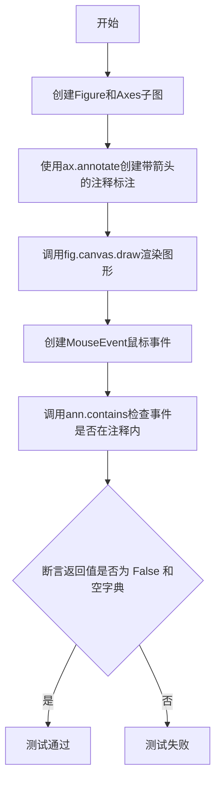

#### 带注释源码

```python
def test_annotation_contains():
    # Check that Annotation.contains looks at the bboxes of the text and the
    # arrow separately, not at the joint bbox.
    # 创建一个新的图形窗口和一个坐标轴
    fig, ax = plt.subplots()
    # 创建带箭头的注释标注，文本为"hello"，起点在(0.4, 0.4)，文本位置在(0.6, 0.6)
    ann = ax.annotate(
        "hello", xy=(.4, .4), xytext=(.6, .6), arrowprops={"arrowstyle": "->"})
    # 绘制画布，这是必要的，因为contains方法需要渲染器存在才能正常工作
    fig.canvas.draw()  # Needed for the same reason as in test_contains.
    # 创建鼠标按下事件，位置转换自数据坐标(0.5, 0.6)
    event = MouseEvent(
        "button_press_event", fig.canvas, *ax.transData.transform((.5, .6)))
    # 断言：注释的contains方法应返回(False, {})，表示事件不在注释的边界框内
    # 这是因为事件位置(0.5, 0.6)不在文本或箭头的独立边界框内
    assert ann.contains(event) == (False, {})
```


### `test_annotate_errors`

这是一个测试函数，用于验证在使用 `ax.annotate()` 时传入无效的 `xycoords` 参数是否会正确抛出 `TypeError` 或 `ValueError` 异常。

参数：

- `err`：`type`，期望抛出的异常类型（TypeError 或 ValueError）
- `xycoords`：`any`，无效的 xycoords 参数值，用于测试错误处理
- `match`：`str`，期望与异常消息匹配的正则表达式模式

返回值：`None`，该函数为测试函数，不返回任何值

#### 流程图

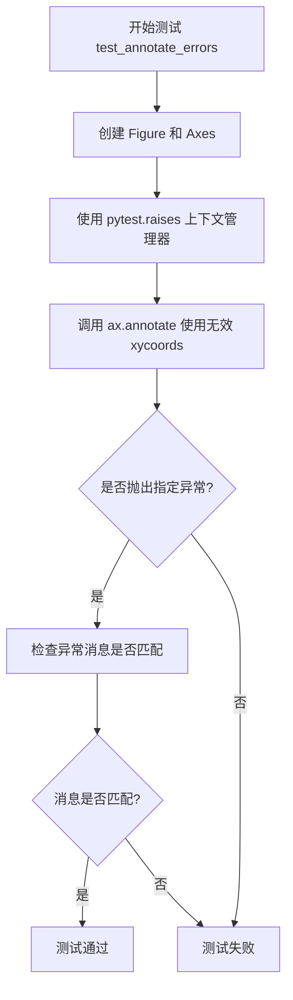

#### 带注释源码

```python
@pytest.mark.parametrize('err, xycoords, match', (
    # 测试 callable 返回类型错误：print 函数不是有效的 BboxBase 或 Transform
    (TypeError, print, "xycoords callable must return a BboxBase or Transform, not a"),
    # 测试 list 类型错误：xycoords 不能是 list
    (TypeError, [0, 0], r"'xycoords' must be an instance of str, tuple"),
    # 测试无效坐标字符串：错误坐标名称
    (ValueError, "foo", "'foo' is not a valid coordinate"),
    # 测试无效坐标字符串：带空格的错误坐标名称
    (ValueError, "foo bar", "'foo bar' is not a valid coordinate"),
    # 测试无效 offset 坐标：以 offset 开头的无效坐标
    (ValueError, "offset foo", "xycoords cannot be an offset coordinate"),
    # 测试无效 axes 坐标：以 axes 开头的无效坐标
    (ValueError, "axes foo", "'foo' is not a recognized unit"),
))
def test_annotate_errors(err, xycoords, match):
    """
    参数化测试函数，验证 ax.annotate() 对无效 xycoords 参数的错误处理
    
    参数:
        err: 期望抛出的异常类型
        xycoords: 无效的 xycoords 参数值
        match: 期望的异常消息正则匹配模式
    """
    # 创建新的图形和坐标轴
    fig, ax = plt.subplots()
    # 使用 pytest.raises 捕获并验证异常
    with pytest.raises(err, match=match):
        # 尝试创建带无效 xycoords 的注释
        ax.annotate('xy', (0, 0), xytext=(0.5, 0.5), xycoords=xycoords)
        # 需要绘制画布以触发完整的验证逻辑
        fig.canvas.draw()
```


### `test_titles`

这是一个测试函数，用于验证图表的左标题和右标题功能是否正常工作，通过创建图表、设置左对齐和右对齐的标题，并隐藏坐标轴刻度来进行测试。

参数： 无

返回值： `None`，该函数不返回任何值，仅执行绘图操作

#### 流程图

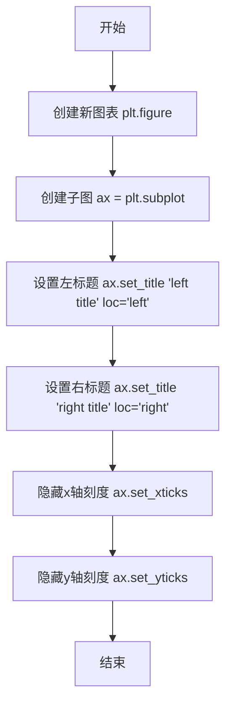

#### 带注释源码

```python
@image_comparison(['titles'])  # 装饰器：用于图像比较测试，预期输出图像为 'titles'
def test_titles():
    # left and right side titles
    # 测试函数：验证图表左右两侧标题的设置功能
    
    plt.figure()  # 创建新图表
    ax = plt.subplot(1, 1, 1)  # 创建单个子图
    ax.set_title("left title", loc="left")  # 设置左对齐标题
    ax.set_title("right title", loc="right")  # 设置右对齐标题
    ax.set_xticks([])  # 隐藏x轴刻度
    ax.set_yticks([])  # 隐藏y轴刻度
```


### `test_alignment`

这是一个图像对比测试函数，用于测试matplotlib文本对齐功能，验证不同垂直对齐方式（top、bottom、baseline、center）和旋转角度（0°、30°）下的文本渲染效果是否符合预期。

参数：无

返回值：无

#### 流程图

```mermaid
flowchart TD
    A[开始] --> B[创建新图形 figure]
    C[创建1x1子图 ax] --> D[初始化x=0.1]
    D --> E[外层循环: rotation in (0, 30)]
    E --> F[内层循环: alignment in (top, bottom, baseline, center)]
    F --> G[使用va=alignment和rotation绘制文本1: alignment + ' Tj']
    G --> H[使用va=alignment和rotation绘制文本2: 数学表达式]
    H --> I[x += 0.1]
    I --> F
    F --> J[绘制两条水平参考线 y=0.5 和 y=1.0]
    J --> K[设置坐标轴范围和刻度]
    K --> L[结束]
    
    style A fill:#f9f,color:#000
    style L fill:#9f9,color:#000
```

#### 带注释源码

```python
@image_comparison(['text_alignment'], style='mpl20', tol=0.08)
def test_alignment():
    """
    测试函数：验证文本在不同垂直对齐方式和旋转角度下的渲染效果
    装饰器 @image_comparison: 
        - 期望输出图像文件: 'text_alignment'
        - 样式: 'mpl20' (matplotlib 2.0 风格)
        - 容差: 0.08 (允许的像素差异)
    """
    # 创建新图形窗口
    plt.figure()
    # 创建1行1列的子图，返回axes对象
    ax = plt.subplot(1, 1, 1)

    # 初始x坐标位置
    x = 0.1
    # 外层循环：测试两种旋转角度 (0度和30度)
    for rotation in (0, 30):
        # 内层循环：测试四种垂直对齐方式
        for alignment in ('top', 'bottom', 'baseline', 'center'):
            # 在(ax, 0.5)位置绘制带对齐参数的文本
            # bbox参数: 添加圆角矩形背景框 (facecolor小麦色, 半透明alpha=0.5)
            ax.text(
                x, 0.5, alignment + " Tj", va=alignment, rotation=rotation,
                bbox=dict(boxstyle='round', facecolor='wheat', alpha=0.5))
            # 在(ax, 1.0)位置绘制数学公式文本
            ax.text(
                x, 1.0, r'$\sum_{i=0}^{j}$', va=alignment, rotation=rotation)
            # x坐标递增，为下一个测试点留出空间
            x += 0.1

    # 绘制两条水平参考线，用于视觉验证文本对齐
    ax.plot([0, 1], [0.5, 0.5])  # 对应第一行文本y坐标
    ax.plot([0, 1], [1.0, 1.0])  # 对应第二行文本y坐标

    # 设置坐标轴范围: x轴[0,1], y轴[0,1.5]
    ax.set_xlim(0, 1)
    ax.set_ylim(0, 1.5)
    # 隐藏x轴和y轴刻度，使图像更清晰
    ax.set_xticks([])
    ax.set_yticks([])
```


### `test_axes_titles`

该函数是一个图像对比测试，用于验证坐标轴标题在不同位置（左侧、居中、右侧）的设置是否正确渲染。

参数： 无

返回值：`None`，该函数为测试函数，不返回任何值

#### 流程图

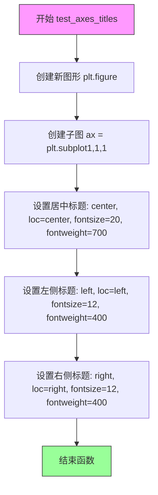

#### 带注释源码

```python
@image_comparison(['axes_titles.png'])  # 装饰器：使用图像对比测试，基准图像为 axes_titles.png
def test_axes_titles():
    # 相关问题 #3327：测试坐标轴标题的渲染
    plt.figure()  # 创建一个新的图形
    ax = plt.subplot(1, 1, 1)  # 创建1行1列的子图，选择第1个
    # 设置居中标题，字体大小20，加粗
    ax.set_title('center', loc='center', fontsize=20, fontweight=700)
    # 设置左侧标题，字体大小12，正常粗细
    ax.set_title('left', loc='left', fontsize=12, fontweight=400)
    # 设置右侧标题，字体大小12，正常粗细
    ax.set_title('right', loc='right', fontsize=12, fontweight=400)
```


### `test_set_position`

该测试函数用于验证 Matplotlib 中 Annotation 对象的 `set_position` 方法和 `xyann` 属性是否能正确更新注释文本的位置。测试通过创建注释、获取初始窗口范围、设置新位置后再次获取窗口范围，比较偏移值是否符合预期。

参数：此函数无参数

返回值：`None`，该函数为测试函数，使用 `assert` 语句进行断言验证，不返回任何值

#### 流程图

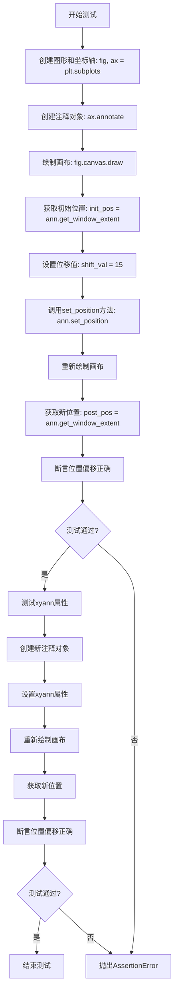

#### 带注释源码

```python
def test_set_position():
    """
    测试Annotation对象的set_position方法和xyann属性是否正确更新位置。
    验证通过set_position和直接赋值xyann两种方式移动注释文本的效果。
    """
    # 创建图形和坐标轴对象
    fig, ax = plt.subplots()

    # 测试 set_position 方法
    # 创建注释注释对象，初始位置在(0,0)，使用figure pixels坐标系
    ann = ax.annotate(
        'test', (0, 0), xytext=(0, 0), textcoords='figure pixels')
    
    # 绘制画布以确保文本渲染器已初始化
    fig.canvas.draw()

    # 获取注释的初始窗口范围（包含文本和箭头的边界框）
    init_pos = ann.get_window_extent(fig.canvas.renderer)
    
    # 设置位移值
    shift_val = 15
    
    # 使用set_position方法移动注释文本
    ann.set_position((shift_val, shift_val))
    
    # 重新绘制画布以更新注释位置
    fig.canvas.draw()
    
    # 获取移动后的窗口范围
    post_pos = ann.get_window_extent(fig.canvas.renderer)

    # 验证每个坐标轴的最小值是否正确偏移了shift_val
    for a, b in zip(init_pos.min, post_pos.min):
        assert a + shift_val == b

    # 测试 xyann 属性
    # 重新创建注释对象以避免前一个测试的影响
    ann = ax.annotate(
        'test', (0, 0), xytext=(0, 0), textcoords='figure pixels')
    
    # 绘制画布
    fig.canvas.draw()

    # 获取初始位置
    init_pos = ann.get_window_extent(fig.canvas.renderer)
    
    # 设置位移值
    shift_val = 15
    
    # 直接通过xyann属性移动注释文本（xyann存储注释文本相对于xy的偏移）
    ann.xyann = (shift_val, shift_val)
    
    # 重新绘制画布
    post_pos = ann.get_window_extent(fig.canvas.renderer)

    # 验证位置偏移
    for a, b in zip(init_pos.min, post_pos.min):
        assert a + shift_val == b
```


### `test_char_index_at`

该函数是一个测试函数，用于验证 Text 对象的 `_char_index_at` 方法在不同位置（包括边界和极端情况）下返回正确字符索引的能力。测试通过比较不同字符（"i"和"m"）的宽度来确定索引逻辑的正确性。

参数： 无

返回值： 无

#### 流程图

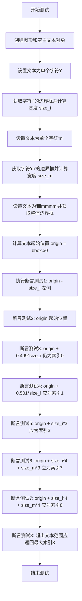

#### 带注释源码

```python
def test_char_index_at():
    """测试 Text._char_index_at 方法在不同位置返回正确的字符索引"""
    # 创建一个新的图形对象
    fig = plt.figure()
    # 在图形中添加一个空的文本对象，位置在 (0.1, 0.9)
    text = fig.text(0.1, 0.9, "")

    # 设置文本为单个字符 'i' 并获取其边界框
    text.set_text("i")
    bbox = text.get_window_extent()
    # 计算字符 'i' 的宽度
    size_i = bbox.x1 - bbox.x0

    # 设置文本为单个字符 'm' 并获取其边界框
    text.set_text("m")
    bbox = text.get_window_extent()
    # 计算字符 'm' 的宽度
    size_m = bbox.x1 - bbox.x0

    # 设置文本为 'iiiimmmm'（4个'i'后跟4个'm'）并获取边界框
    text.set_text("iiiimmmm")
    bbox = text.get_window_extent()
    # 记录文本的起始 x 坐标
    origin = bbox.x0

    # 开始验证 _char_index_at 方法的各种情况
    
    # 情况1: 查询位置在第一个字符左侧，应返回索引 0
    assert text._char_index_at(origin - size_i) == 0  # left of first char
    
    # 情况2: 查询位置在文本起始位置，应返回索引 0
    assert text._char_index_at(origin) == 0
    
    # 情况3: 查询位置在第一个字符宽度49.9%处，仍在第一个字符范围内，返回索引 0
    assert text._char_index_at(origin + 0.499*size_i) == 0
    
    # 情况4: 查询位置在第一个字符宽度50.1%处，超过第一个字符，返回索引 1
    assert text._char_index_at(origin + 0.501*size_i) == 1
    
    # 情况5: 查询位置在第4个'i'的末尾（第3个索引之后），返回索引 3
    assert text._char_index_at(origin + size_i*3) == 3
    
    # 情况6: 查询位置在4个'i'加上3个'm'的位置，返回索引 7
    assert text._char_index_at(origin + size_i*4 + size_m*3) == 7
    
    # 情况7: 查询位置在文本末尾，返回索引 8（最后一个字符的索引+1）
    assert text._char_index_at(origin + size_i*4 + size_m*4) == 8
    
    # 情况8: 查询位置超出文本末尾，仍返回最大索引 8
    assert text._char_index_at(origin + size_i*4 + size_m*10) == 8
```


### `test_non_default_dpi`

该函数是一个测试函数，用于验证 `Text.get_window_extent()` 方法在传入不同 DPI 参数时能否正确计算文本的窗口范围，并且确保调用该方法不会永久改变 figure 的 DPI 设置。

参数：

- `text`：`str`，测试用的文本内容，通过 `@pytest.mark.parametrize` 参数化为空字符串 `''` 和字符 `'O'` 两种情况

返回值：`None`，该函数为测试函数，使用断言进行验证，不返回任何值

#### 流程图

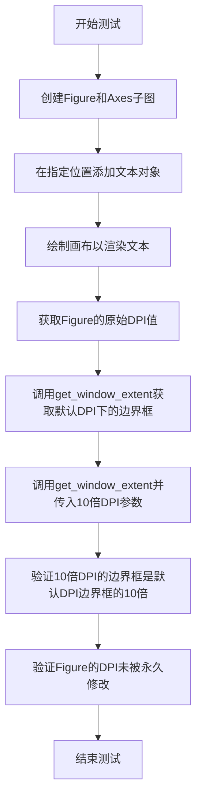

#### 带注释源码

```python
@pytest.mark.parametrize('text', ['', 'O'], ids=['empty', 'non-empty'])
def test_non_default_dpi(text):
    """
    测试 Text.get_window_extent() 在不同 DPI 参数下的行为。
    
    参数化测试两种情况：
    - 空字符串 '' (empty)
    - 单字符 'O' (non-empty)
    """
    # 创建 Figure 和 Axes 子图
    fig, ax = plt.subplots()

    # 在 Axes 上添加文本对象，位置为 (0.5, 0.5)，使用左下对齐
    t1 = ax.text(0.5, 0.5, text, ha='left', va='bottom')
    
    # 绘制画布，确保文本被渲染（只有渲染后才能正确计算边界框）
    fig.canvas.draw()
    
    # 记录原始 DPI 值
    dpi = fig.dpi

    # 获取默认 DPI 下的文本边界框
    bbox1 = t1.get_window_extent()
    
    # 获取 10 倍 DPI 下的文本边界框
    bbox2 = t1.get_window_extent(dpi=dpi * 10)
    
    # 验证：10倍 DPI 下的边界框坐标应该是默认 DPI 下的 10 倍
    # 使用 assert_allclose 进行近似比较，允许 5% 的相对误差
    np.testing.assert_allclose(bbox2.get_points(), bbox1.get_points() * 10,
                               rtol=5e-2)
    
    # 验证：调用 get_window_extent 不应该永久修改 Figure 的 DPI
    assert fig.dpi == dpi
```


### `test_get_rotation_string`

该函数是 Matplotlib 中的一个测试函数，用于验证 `Text` 类的 `get_rotation()` 方法能否正确处理字符串类型的旋转参数（'horizontal' 和 'vertical'）。

参数：无需参数

返回值：`None`，该函数为测试函数，通过断言验证逻辑，不返回任何值。

#### 流程图

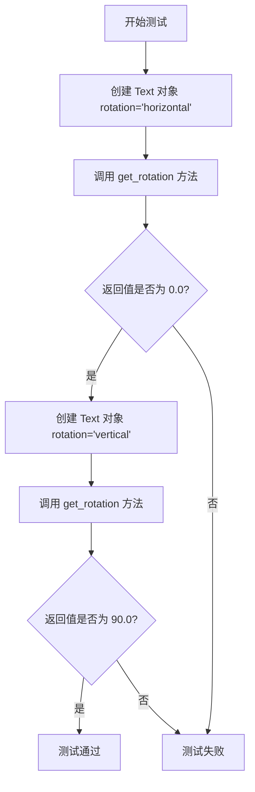

#### 带注释源码

```python
def test_get_rotation_string():
    """
    测试 Text 类的 get_rotation 方法对字符串旋转值的处理。
    
    测试场景：
    1. rotation='horizontal' 应该返回 0.0 度
    2. rotation='vertical' 应该返回 90.0 度
    """
    # 验证水平旋转字符串 'horizontal' 转换为 0 度
    # Text 类应将 'horizontal' 解释为水平文字，旋转角度为 0 度
    assert Text(rotation='horizontal').get_rotation() == 0.
    
    # 验证垂直旋转字符串 'vertical' 转换为 90 度
    # Text 类应将 'vertical' 解释为垂直文字，旋转角度为 90 度
    assert Text(rotation='vertical').get_rotation() == 90.
```


### `test_get_rotation_float`

该测试函数用于验证 `Text` 类在接收浮点数类型的 `rotation` 参数时，`get_rotation()` 方法能够原样返回该旋转角度。

参数：

- （无）

返回值：`None`，本函数仅执行断言，不返回任何值。

#### 流程图

```mermaid
flowchart TD
    start([开始]) --> forLoop{遍历列表 [15.0, 16.70, 77.4]}
    forLoop --> create[创建 Text 对象<br>rotation=i]
    create --> get[调用 get_rotation()]
    get --> check{返回值 == i?}
    check -- 是 --> forLoop
    check -- 否 --> raise[抛出 AssertionError]
    raise --> end([结束])
    forLoop --> end
```

#### 带注释源码

```python
def test_get_rotation_float():
    """
    测试当 rotation 参数为浮点数时，Text.get_rotation() 能正确返回该值。

    遍历三个典型的浮点数（15.0、16.70、77.4），创建对应的 Text 实例并
    断言 get_rotation() 返回的值与传入值相等。如果不相等会触发 AssertionError。
    """
    # 定义一组用于测试的浮点数旋转角度
    test_values = [15., 16.70, 77.4]

    # 逐个进行验证
    for i in test_values:
        # 创建一个带有指定 rotation 的 Text 对象
        text_obj = Text(rotation=i)

        # 获取其旋转角度并与原始输入比较
        # 若不相等，assert 会抛出异常
        assert text_obj.get_rotation() == i
```


### `test_get_rotation_int`

该函数是Matplotlib文本模块的单元测试，用于验证Text类在接收整数类型的rotation参数时，get_rotation方法能否正确将其转换为浮点数返回。

参数：无

返回值：`None`，该函数为测试函数，通过assert断言验证行为，不返回具体值。

#### 流程图

```mermaid
flowchart TD
    A[开始测试] --> B[定义测试数据: i = [67, 16, 41]]
    B --> C{遍历列表中的每个值 i}
    C -->|是| D[创建Text对象: Text(rotation=i)]
    D --> E[调用get_rotation方法: .get_rotation()]
    E --> F{断言结果 == float(i)}
    F -->|通过| C
    F -->|失败| G[抛出AssertionError]
    C -->|遍历完成| H[测试结束]
```

#### 带注释源码

```python
def test_get_rotation_int():
    """
    测试Text类处理整数类型rotation参数的功能
    
    验证当rotation参数为整数时，get_rotation方法能正确
    将其转换为浮点数返回。这是Text类旋转功能的基本类型测试。
    """
    # 定义测试用的整数旋转角度列表
    for i in [67, 16, 41]:
        # 创建Text对象，传入整数类型的rotation参数
        # 调用get_rotation获取旋转角度
        # 断言返回的旋转角度等于将原整数转换为float的值
        assert Text(rotation=i).get_rotation() == float(i)
```


### `test_get_rotation_raises`

该测试函数用于验证当 `Text` 对象的 `rotation` 参数传入无效值（如拼写错误的 'hozirontal'）时，是否会正确抛出 `ValueError` 异常。

参数：无

返回值：`None`，该函数为测试函数，不返回任何值，仅通过 `pytest.raises` 验证异常行为。

#### 流程图

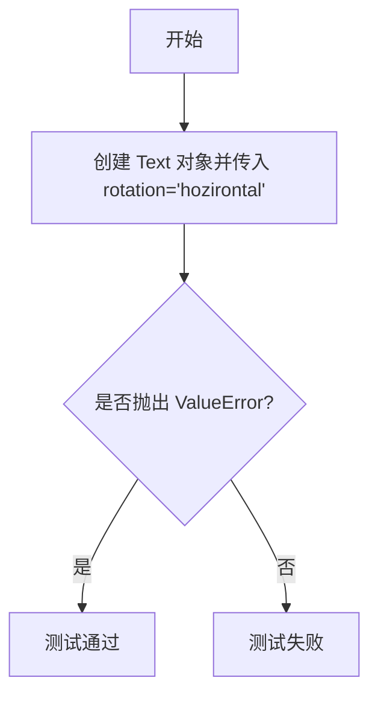

#### 带注释源码

```python
def test_get_rotation_raises():
    """测试无效的 rotation 值是否正确抛出 ValueError."""
    # 使用 pytest.raises 上下文管理器验证异常
    # 当 rotation 参数为非法的字符串（如拼写错误的 'hozirontal'）时，
    # Text 类的构造函数应该抛出 ValueError 异常
    with pytest.raises(ValueError):
        # 传入拼写错误的 'hozirontal'（正确应为 'horizontal'）
        # 这应该触发 ValueError 异常
        Text(rotation='hozirontal')
```


### `test_get_rotation_none`

该测试函数用于验证当 `Text` 对象的 `rotation` 参数设置为 `None` 时，`get_rotation()` 方法能够正确返回默认值 0.0。

参数：无需参数

返回值：`None`，该函数为测试函数，使用断言验证逻辑，不返回具体值。

#### 流程图

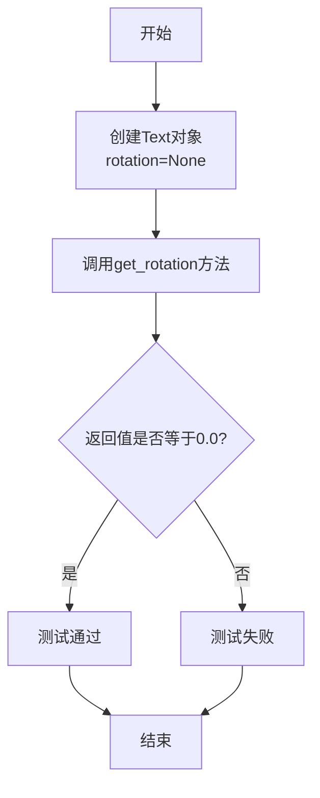

#### 带注释源码

```python
def test_get_rotation_none():
    """
    测试当rotation参数为None时，get_rotation()返回默认值0.0
    
    验证逻辑：
    - Text类在rotation为None时应该将旋转角度初始化为0.0
    - 这是Text类的合理默认行为，表示不旋转
    """
    # 创建一个rotation参数为None的Text对象，调用get_rotation()方法
    # 断言其返回值严格等于0.0
    assert Text(rotation=None).get_rotation() == 0.0
```


### `test_get_rotation_mod360`

该函数是一个测试函数，用于验证 `Text` 类的 `get_rotation` 方法能否正确处理旋转角度，将其规范到 0-360 度范围内（例如：360° → 0°，377° → 17°，720+177.2° → 177.2°）。

参数：此函数无参数。

返回值：`None`，该函数为测试函数，使用 `assert_almost_equal` 进行断言验证，不返回具体值。

#### 流程图

```mermaid
flowchart TD
    A[开始测试 test_get_rotation_mod360] --> B[定义测试用例数据对<br/>输入: [360., 377., 720+177.2]<br/>预期输出: [0., 17., 177.2]]
    B --> C[遍历测试用例]
    C --> D[创建 Text 对象<br/>rotation=输入角度]
    D --> E[调用 get_rotation 方法<br/>获取规范化后的旋转角度]
    E --> F{使用 assert_almost_equal<br/>比较实际输出与预期}
    F -->|通过| G[继续下一个测试用例]
    F -->|失败| H[抛出 AssertionError]
    G --> C
    C --> I[所有测试用例通过<br/>测试结束]
    I --> J[函数返回 None]
```

#### 带注释源码

```python
def test_get_rotation_mod360():
    """
    测试 Text.get_rotation 方法是否正确处理旋转角度到 0-360 度范围。
    
    测试逻辑：
    - 360度应规范化为0度
    - 377度应规范化为17度 (377 - 360 = 17)
    - 720+177.2度应规范化为177.2度 (897.2 - 720 = 177.2)
    """
    # 使用 zip 函数将输入角度和预期输出配对
    # 输入角度: [360., 377., 720+177.2]
    # 预期输出: [0., 17., 177.2]
    for i, j in zip([360., 377., 720+177.2], [0., 17., 177.2]):
        # 创建 Text 对象，传入旋转角度 i
        # 调用 get_rotation() 获取规范化后的旋转角度
        # 使用 assert_almost_equal 验证结果是否接近预期值 j
        assert_almost_equal(Text(rotation=i).get_rotation(), j)
```


### `test_null_rotation_with_rotation_mode`

该测试函数用于验证在旋转角度为0的情况下，使用 `rotation_mode='anchor'` 和 `rotation_mode='default'` 两种模式的文本对象具有相同的窗口边界（window extent）。通过参数化测试覆盖多种水平和垂直对齐方式的组合。

参数：

-  `ha`：`str`，水平对齐方式（horizontal alignment），可选值为 "center"、"right"、"left"
-  `va`：`str`，垂直对齐方式（vertical alignment），可选值为 "center"、"top"、"bottom"、"baseline"、"center_baseline"

返回值：`None`，该函数为测试函数，通过断言验证正确性，无显式返回值

#### 流程图

```mermaid
flowchart TD
    A[开始测试] --> B[创建Figure和Axes对象]
    B --> C[构建公共参数字典: rotation=0, va=va, ha=ha]
    C --> D[使用rotation_mode='anchor'创建文本t0]
    C --> E[使用rotation_mode='default'创建文本t1]
    D --> F[调用fig.canvas.draw渲染画布]
    E --> F
    F --> G[获取t0的窗口边界]
    F --> H[获取t1的窗口边界]
    G --> I[断言两个窗口边界点集相等]
    H --> I
    I --> J[测试结束]
```

#### 带注释源码

```python
@pytest.mark.parametrize("ha", ["center", "right", "left"])
@pytest.mark.parametrize("va", ["center", "top", "bottom",
                                "baseline", "center_baseline"])
def test_null_rotation_with_rotation_mode(ha, va):
    """
    测试在rotation=0的情况下，rotation_mode='anchor'和'default'的窗口边界是否一致。
    
    参数:
        ha: 水平对齐方式 (center/right/left)
        va: 垂直对齐方式 (center/top/bottom/baseline/center_baseline)
    """
    # 创建图形和坐标轴
    fig, ax = plt.subplots()
    
    # 构建公共参数：旋转角度设为0，传入对齐方式参数
    kw = dict(rotation=0, va=va, ha=ha)
    
    # 创建两个文本对象，分别使用不同的rotation_mode
    # rotation_mode='anchor': 根据锚点进行旋转
    # rotation_mode='default': 默认旋转模式
    t0 = ax.text(.5, .5, 'test', rotation_mode='anchor', **kw)
    t1 = ax.text(.5, .5, 'test', rotation_mode='default', **kw)
    
    # 渲染画布以计算文本的窗口边界
    fig.canvas.draw()
    
    # 断言：当旋转角度为0时，两种rotation_mode应该产生相同的窗口边界
    assert_almost_equal(
        t0.get_window_extent(fig.canvas.renderer).get_points(),
        t1.get_window_extent(fig.canvas.renderer).get_points()
    )
```


### `test_bbox_clipping`

该测试函数用于验证文本对象的边界框（bounding box）裁剪功能是否正常工作，包括检查简单文本和带有 fancy 样式的边界框在启用 `clip_on=True` 时是否被正确裁剪。

参数： 无

返回值： `None`，该测试函数不返回任何值，仅通过图像比较验证渲染结果

#### 流程图

```mermaid
flowchart TD
    A[开始测试] --> B[创建普通文本: clip_on=True, backgroundcolor='r']
    --> C[创建带fancy bbox的文本: clip_on=True]
    --> D[设置fancy bbox样式: boxstyle='round, pad=0.1']
    --> E[通过image_comparison验证渲染结果]
    --> F[结束测试]
```

#### 带注释源码

```python
@image_comparison(['text_bboxclip'])
def test_bbox_clipping():
    # 测试1: 验证带有背景色的简单文本在启用裁剪时的行为
    # 参数说明:
    #   - x=0.9, y=0.2: 文本位置（使用axes坐标）
    #   - 'Is bbox clipped?': 文本内容
    #   - backgroundcolor='r': 背景色为红色
    #   - clip_on=True: 启用边界框裁剪
    plt.text(0.9, 0.2, 'Is bbox clipped?', backgroundcolor='r', clip_on=True)
    
    # 测试2: 验证带有fancy样式边界框的文本在启用裁剪时的行为
    # 参数说明:
    #   - x=0.9, y=0.5: 文本位置
    #   - 'Is fancy bbox clipped?': 文本内容
    #   - clip_on=True: 启用边界框裁剪
    t = plt.text(0.9, 0.5, 'Is fancy bbox clipped?', clip_on=True)
    
    # 设置fancy样式的边界框
    # 参数说明:
    #   - boxstyle="round, pad=0.1": 圆角矩形样式，padding为0.1
    t.set_bbox({"boxstyle": "round, pad=0.1"})
```


### `test_annotation_negative_ax_coords`

该测试函数验证了 Matplotlib 中 Annotation（注释）在使用负坐标值时的渲染行为是否正确，涵盖了三种坐标系统：axes points（轴点）、axes fraction（轴分数）和 axes pixels（轴像素），并测试了正负坐标值以及垂直对齐方式的处理。

参数：无

返回值：无（`None`），该测试函数通过 `@image_comparison` 装饰器自动进行图像比对验证

#### 流程图

```mermaid
flowchart TD
    A[开始执行 test_annotation_negative_ax_coords] --> B[创建 Figure 和 Axes 对象]
    B --> C[添加 '+ pts' 注释: 正坐标 axes points]
    C --> D[添加 '- pts' 注释: 负y坐标 axes points, va='top']
    D --> E[添加 '+ frac' 注释: 正坐标 axes fraction]
    E --> F[添加 '- frac' 注释: 负y坐标 axes fraction, va='top']
    F --> G[添加 '+ pixels' 注释: 正坐标 axes pixels]
    G --> H[添加 '- pixels' 注释: 负y坐标 axes pixels, va='top']
    H --> I[由 @image_comparison 装饰器自动比对渲染图像]
    I --> J[结束]
```

#### 带注释源码

```python
@image_comparison(['annotation_negative_ax_coords.png'])
def test_annotation_negative_ax_coords():
    """
    测试 Annotation 在使用负坐标值时的渲染行为
    
    该测试覆盖三种坐标系统：
    1. axes points - 轴坐标系下的点单位
    2. axes fraction - 轴坐标系下的分数/比例单位
    3. axes pixels - 轴坐标系下的像素单位
    
    每种坐标系统测试正负坐标值，以及垂直对齐方式的处理
    """
    # 创建图形和坐标轴
    fig, ax = plt.subplots()

    # 测试 1: axes points 坐标系统 - 正坐标
    ax.annotate('+ pts',
                xytext=[30, 20], textcoords='axes points',
                xy=[30, 20], xycoords='axes points', fontsize=32)
    
    # 测试 2: axes points 坐标系统 - 负y坐标，顶部对齐
    ax.annotate('- pts',
                xytext=[30, -20], textcoords='axes points',
                xy=[30, -20], xycoords='axes points', fontsize=32,
                va='top')
    
    # 测试 3: axes fraction 坐标系统 - 正坐标
    ax.annotate('+ frac',
                xytext=[0.75, 0.05], textcoords='axes fraction',
                xy=[0.75, 0.05], xycoords='axes fraction', fontsize=32)
    
    # 测试 4: axes fraction 坐标系统 - 负y坐标，顶部对齐
    ax.annotate('- frac',
                xytext=[0.75, -0.05], textcoords='axes fraction',
                xy=[0.75, -0.05], xycoords='axes fraction', fontsize=32,
                va='top')

    # 测试 5: axes pixels 坐标系统 - 正坐标
    ax.annotate('+ pixels',
                xytext=[160, 25], textcoords='axes pixels',
                xy=[160, 25], xycoords='axes pixels', fontsize=32)
    
    # 测试 6: axes pixels 坐标系统 - 负y坐标，顶部对齐
    ax.annotate('- pixels',
                xytext=[160, -25], textcoords='axes pixels',
                xy=[160, -25], xycoords='axes pixels', fontsize=32,
                va='top')
    
    # @image_comparison 装饰器会自动：
    # 1. 渲染图形到文件
    # 2. 与基准图像 'annotation_negative_ax_coords.png' 比对
    # 3. 如果不匹配则测试失败
```


### `test_annotation_negative_fig_coords`

该函数是一个图像比对测试，用于验证 Matplotlib 中带负坐标值的图形注释（annotation）在不同坐标系下的渲染是否正确，包括 figure points、figure fraction 和 figure pixels 三种坐标系统。

参数： 无

返回值： `None`，该测试函数不返回任何值，仅通过 `@image_comparison` 装饰器进行图像比对验证

#### 流程图

```mermaid
flowchart TD
    A[开始测试] --> B[创建图形和坐标轴]
    B --> C[添加正坐标的 figure points 注释]
    C --> D[添加负坐标的 figure points 注释]
    D --> E[添加正坐标的 figure fraction 注释]
    E --> F[添加负坐标的 figure fraction 注释]
    F --> G[添加正坐标的 figure pixels 注释]
    G --> H[添加负坐标的 figure pixels 注释]
    H --> I[通过 @image_comparison 比对渲染结果]
    I --> J[测试结束]
```

#### 带注释源码

```python
@image_comparison(['annotation_negative_fig_coords.png'])  # 装饰器：比对生成的图像与基准图像
def test_annotation_negative_fig_coords():
    """测试带负坐标值的图形注释在不同坐标系下的渲染"""
    fig, ax = plt.subplots()  # 创建图形和坐标轴

    # 测试 figure points 坐标系 - 正坐标
    ax.annotate('+ pts',
                xytext=[10, 120], textcoords='figure points',  # 文本位置：figure points
                xy=[10, 120], xycoords='figure points',       # 注释点位置：figure points
                fontsize=32)

    # 测试 figure points 坐标系 - 负坐标
    ax.annotate('- pts',
                xytext=[-10, 180], textcoords='figure points',  # x坐标为负值
                xy=[-10, 180], xycoords='figure points',
                fontsize=32,
                va='top')  # 垂直对齐方式设为顶部

    # 测试 figure fraction 坐标系 - 正坐标
    ax.annotate('+ frac',
                xytext=[0.05, 0.55], textcoords='figure fraction',  # 文本位置：相对坐标
                xy=[0.05, 0.55], xycoords='figure fraction',
                fontsize=32)

    # 测试 figure fraction 坐标系 - 负坐标
    ax.annotate('- frac',
                xytext=[-0.05, 0.5], textcoords='figure fraction',  # x相对坐标为负值
                xy=[-0.05, 0.5], xycoords='figure fraction',
                fontsize=32,
                va='top')

    # 测试 figure pixels 坐标系 - 正坐标
    ax.annotate('+ pixels',
                xytext=[50, 50], textcoords='figure pixels',   # 文本位置：像素坐标
                xy=[50, 50], xycoords='figure pixels',
                fontsize=32)

    # 测试 figure pixels 坐标系 - 负坐标
    ax.annotate('- pixels',
                xytext=[-50, 100], textcoords='figure pixels',  # x像素坐标为负值
                xy=[-50, 100], xycoords='figure pixels',
                fontsize=32,
                va='top')
```


### `test_text_stale`

测试文本对象在添加后是否正确标记为stale（陈旧）状态，以及在调用`plt.draw_all()`后是否正确重置为非stale状态。

参数：

- 无参数

返回值：`None`，无返回值

#### 流程图

```mermaid
flowchart TD
    A[开始测试] --> B[创建包含2个子图的图形]
    B --> C[调用plt.draw_all]
    C --> D[断言: ax1.stale == False]
    D --> E[断言: ax2.stale == False]
    E --> F[断言: fig.stale == False]
    F --> G[在ax1上添加文本'aardvark']
    G --> H[断言: ax1.stale == True]
    H --> I[断言: txt1.stale == True]
    I --> J[断言: fig.stale == True]
    J --> K[在ax2上添加注释]
    K --> L[断言: ax2.stale == True]
    L --> M[断言: ann1.stale == True]
    M --> N[断言: fig.stale == True]
    N --> O[再次调用plt.draw_all]
    O --> P[断言: ax1.stale == False]
    P --> Q[断言: ax2.stale == False]
    Q --> R[断言: fig.stale == False]
    R --> S[结束测试]
```

#### 带注释源码

```python
def test_text_stale():
    """
    测试文本和注释对象的stale状态管理
    """
    # 创建包含1行2列子图的Figure对象
    fig, (ax1, ax2) = plt.subplots(1, 2)
    
    # 绘制所有挂起的对象，初始化stale状态
    plt.draw_all()
    
    # 初始状态：所有对象都不是stale
    assert not ax1.stale
    assert not ax2.stale
    assert not fig.stale

    # 在ax1上添加文本对象
    txt1 = ax1.text(.5, .5, 'aardvark')
    
    # 添加文本后，ax1、txt1和fig应该变为stale
    assert ax1.stale
    assert txt1.stale
    assert fig.stale

    # 在ax2上添加注释对象
    ann1 = ax2.annotate('aardvark', xy=[.5, .5])
    
    # 添加注释后，ax2、ann1和fig应该变为stale
    assert ax2.stale
    assert ann1.stale
    assert fig.stale

    # 再次绘制所有对象
    plt.draw_all()
    
    # 绘制后，所有对象应该重置为非stale状态
    assert not ax1.stale
    assert not ax2.stale
    assert not fig.stale
```


### `test_agg_text_clip`

该函数是一个图像对比测试函数，用于测试 Matplotlib 中 Agg 后端对文本裁剪功能的正确性。函数通过在两个子图中分别绘制带裁剪和不带裁剪的文本，验证 clip_on 参数是否正常工作。

参数： 无

返回值：`None`，该函数没有返回值，主要用于执行测试和生成对比图像

#### 流程图

```mermaid
flowchart TD
    A[开始] --> B[设置随机种子 np.random.seed(1)]
    B --> C[创建2行子图 fig, ax1, ax2 = plt.subplots(2)]
    C --> D[循环 10 次: for x, y in np.random.rand(10, 2)]
    D --> E[在 ax1 中添加文本 'foo', clip_on=True]
    E --> F[在 ax2 中添加文本 'foo', clip_on=False]
    F --> G{循环是否结束}
    G -->|否| D
    G -->|是| H[结束]
```

#### 带注释源码

```python
@image_comparison(['agg_text_clip.png'])  # 装饰器：用于对比生成的图像与基准图像
def test_agg_text_clip():
    """测试 Agg 后端中文本裁剪功能的图像对比测试"""
    np.random.seed(1)  # 设置随机种子为1，确保测试结果可重复
    fig, (ax1, ax2) = plt.subplots(2)  # 创建一个2行的子图布局
    
    # 循环10次，每次使用不同的随机坐标
    for x, y in np.random.rand(10, 2):
        # 在第一个子图中添加文本，启用裁剪功能
        ax1.text(x, y, "foo", clip_on=True)
        # 在第二个子图中添加文本，使用默认设置（不裁剪）
        ax2.text(x, y, "foo")
```


### `test_text_size_binding`

这是一个测试函数，用于验证 `FontProperties` 对象的字体大小属性是否正确绑定到 `rcParams['font.size']` 设置，确保字体大小不会随全局配置的改变而意外改变。

**参数：**

- 无参数

**返回值：** `None`，无返回值（通过 `assert` 断言进行验证）

#### 流程图

```mermaid
flowchart TD
    A[开始] --> B[设置 mpl.rcParams['font.size'] = 10]
    B --> C[创建 FontProperties 对象, size='large']
    C --> D[获取字体大小 sz1 = fp.get_size_in_points]
    D --> E[修改 mpl.rcParams['font.size'] = 100]
    E --> F[断言: sz1 == fp.get_size_in_points]
    F --> G{断言结果}
    G -->|通过| H[测试通过]
    G -->|失败| I[抛出 AssertionError]
    H --> J[结束]
    I --> J
```

#### 带注释源码

```python
def test_text_size_binding():
    """
    测试 FontProperties 对象的大小属性是否正确绑定到 rcParams['font.size']。
    
    该测试验证当全局字体大小设置改变时，已创建的 FontProperties 对象
    的大小不会被意外修改，确保字体属性的独立性和稳定性。
    """
    # 设置全局默认字体大小为 10pt
    mpl.rcParams['font.size'] = 10
    
    # 创建一个 FontProperties 对象，使用 'large' 作为大小
    # 'large' 是相对大小，会根据基础字体大小计算实际点数
    fp = mpl.font_manager.FontProperties(size='large')
    
    # 获取当前 FontProperties 对象的字体大小（以点为单位）
    # 此时应该返回基于 rcParams['font.size']=10 计算的 'large' 对应的大小
    sz1 = fp.get_size_in_points()
    
    # 将全局默认字体大小修改为 100pt
    mpl.rcParams['font.size'] = 100
    
    # 再次获取 FontProperties 对象的字体大小
    # 验证 sz1 与修改全局配置后的字体大小是否相等
    # 如果 FontProperties 正确绑定到 rcParams，则 sz1 应该保持不变
    # 因为 FontProperties 在创建时已经计算并缓存了大小
    assert sz1 == fp.get_size_in_points()
```


### `test_font_scaling`

该函数是一个图像比较测试，用于验证matplotlib在不同字体大小（从4pt到42pt，步长为2）下的字体缩放渲染功能是否正常工作。

参数： 无

返回值： `None`，该函数为测试函数，不返回任何值

#### 流程图

```mermaid
graph TD
    A[开始测试] --> B[设置PDF字体类型为42]
    B --> C[创建6.4x12.4英寸的图表]
    C --> D[禁用X轴和Y轴的刻度定位器]
    D --> E[设置Y轴范围为-10到600]
    E --> F[遍历字体大小4到42<br/>步长为2]
    F --> G[在图表上添加对应字体大小的文本]
    F --> H{字体大小遍历完成?}
    G --> F
    H --> I[结束测试]
```

#### 带注释源码

```python
@image_comparison(['font_scaling.pdf'])
def test_font_scaling():
    # 设置PDF字体类型为42（TrueType字体）
    mpl.rcParams['pdf.fonttype'] = 42
    
    # 创建一个宽6.4英寸、高12.4英寸的图表
    fig, ax = plt.subplots(figsize=(6.4, 12.4))
    
    # 禁用X轴和Y轴的主要刻度定位器，不显示刻度
    ax.xaxis.set_major_locator(plt.NullLocator())
    ax.yaxis.set_major_locator(plt.NullLocator())
    
    # 设置Y轴的显示范围从-10到600
    ax.set_ylim(-10, 600)

    # 遍历字体大小从4到42，步长为2（即4, 6, 8, ..., 42）
    for i, fs in enumerate(range(4, 43, 2)):
        # 在图表上添加文本，位置为(0.1, i*30)
        # 文本内容显示字体大小，字体大小设置为fs
        ax.text(0.1, i*30, f"{fs} pt font size", fontsize=fs)
```


### `test_two_2line_texts`

这是一个使用pytest参数化的测试函数，用于验证matplotlib中文本的行间距（linespacing）参数是否只影响文本的高度而不影响宽度。

参数：

- `spacing1`：`float`，第一个文本对象的行间距倍数
- `spacing2`：`float`，第二个文本对象的行间距倍数

返回值：`None`，该函数为测试函数，使用断言进行验证，无显式返回值

#### 流程图

```mermaid
flowchart TD
    A[开始测试] --> B[创建文本字符串 'line1\nline2']
    B --> C[创建新Figure对象]
    C --> D[获取Figure的渲染器renderer]
    D --> E[使用spacing1创建第一个文本text1]
    E --> F[使用spacing2创建第二个文本text2]
    F --> G[调用fig.canvas.draw渲染图形]
    G --> H[获取text1的窗口边界box1]
    H --> I[获取text2的窗口边界box2]
    I --> J{spacing1 == spacing2?}
    J -->|是| K[断言 box1.height == box2.height]
    J -->|否| L[断言 box1.height != box2.height]
    K --> M[断言 box1.width == box2.width]
    L --> M
    M --> N[结束测试]
```

#### 带注释源码

```python
@pytest.mark.parametrize('spacing1, spacing2', [(0.4, 2), (2, 0.4), (2, 2)])
def test_two_2line_texts(spacing1, spacing2):
    """测试行间距参数只影响文本高度不影响宽度"""
    # 定义包含两行的文本字符串
    text_string = 'line1\nline2'
    # 创建新的Figure对象
    fig = plt.figure()
    # 获取Figure的渲染器用于计算文本边界
    renderer = fig.canvas.get_renderer()

    # 在同一位置创建两个文本对象，使用不同的linespacing参数
    text1 = fig.text(0.25, 0.5, text_string, linespacing=spacing1)
    text2 = fig.text(0.25, 0.5, text_string, linespacing=spacing2)
    # 渲染图形以确保文本布局已计算
    fig.canvas.draw()

    # 获取两个文本对象的窗口边界框
    box1 = text1.get_window_extent(renderer=renderer)
    box2 = text2.get_window_extent(renderer=renderer)

    # 验证行间距只影响高度不影响宽度
    # 断言：不同行间距的文本宽度应该相等
    assert box1.width == box2.width
    # 根据行间距是否相等验证高度关系
    if spacing1 == spacing2:
        # 如果行间距相等，高度也应相等
        assert box1.height == box2.height
    else:
        # 如果行间距不等，高度应不等
        assert box1.height != box2.height
```


### `test_validate_linespacing`

该测试函数用于验证 `plt.text()` 函数的 `linespacing` 参数在接收非数值类型（如字符串）时能够正确抛出 `TypeError` 异常，确保参数类型校验机制正常工作。

参数： 无

返回值：`None`，该函数为测试函数，不返回任何值

#### 流程图

```mermaid
flowchart TD
    A[开始测试] --> B[调用 plt.text 并传入 linespacing='abc']
    B --> C{是否抛出 TypeError?}
    C -->|是| D[测试通过]
    C -->|否| E[测试失败]
    D --> F[结束]
    E --> F
```

#### 带注释源码

```python
def test_validate_linespacing():
    """
    测试 plt.text() 的 linespacing 参数类型验证。
    
    该测试验证当 linespacing 参数传入非数值类型（如字符串"abc"）时，
    会抛出 TypeError 异常。这是参数类型校验的基本测试。
    """
    # 使用 pytest.raises 上下文管理器期望捕获 TypeError 异常
    # 如果 plt.text 在收到非法的 linespacing 参数时没有抛出异常，
    # 或者抛出了其他类型的异常，则测试失败
    with pytest.raises(TypeError):
        # 调用 plt.text，传入字符串类型的 linespacing 参数
        # x=0.25, y=0.5 为文本位置，"foo" 为文本内容
        # linespacing="abc" 为非法参数，应触发 TypeError
        plt.text(.25, .5, "foo", linespacing="abc")
```


### `test_nonfinite_pos`

该函数是一个测试函数，用于验证 matplotlib 在处理非有限数值（NaN 和 Inf）作为文本坐标时的行为。

参数： 无

返回值：`None`，该函数为测试函数，无返回值

#### 流程图

```mermaid
graph TD
    A[开始] --> B[创建 Figure 和 Axes 对象]
    B --> C[在坐标 (0, NaN) 处添加文本 'nan']
    C --> D[在坐标 (Inf, 0) 处添加文本 'inf']
    D --> E[绘制 Figure 画布]
    E --> F[结束]
```

#### 带注释源码

```python
def test_nonfinite_pos():
    """测试处理非有限数值坐标的文本渲染"""
    # 创建一个新的 figure 和一个 axes
    fig, ax = plt.subplots()
    
    # 在 x=0, y=np.nan 的位置添加文本 'nan'
    # 测试当 y 坐标为 NaN 时的处理
    ax.text(0, np.nan, 'nan')
    
    # 在 x=np.inf, y=0 的位置添加文本 'inf'
    # 测试当 x 坐标为正无穷大时的处理
    ax.text(np.inf, 0, 'inf')
    
    # 强制绘制画布，确保文本被渲染
    # 这会触发内部坐标转换和渲染逻辑
    fig.canvas.draw()
```


### `test_hinting_factor_backends`

该测试函数用于验证不同的后端（如SVG和PNG）是否一致地应用了文本提示因子（hinting factor），确保在不同格式保存时文本的宽度保持一致（允许10%的相对误差）。

参数： 无

返回值： `None`，该函数为测试函数，不返回任何值

#### 流程图

```mermaid
graph TD
    A[开始测试] --> B[设置text.hinting_factor为1]
    B --> C[创建空白图形]
    C --> D[在图形中添加文本'some text']
    D --> E[保存为SVG格式]
    E --> F[获取文本在SVG后的窗口范围]
    F --> G[保存为PNG格式]
    G --> H[获取文本在PNG后的窗口范围]
    H --> I{比较两次窗口范围}
    I -->|通过| J[测试通过]
    I -->|失败| K[抛出断言错误]
```

#### 带注释源码

```python
def test_hinting_factor_backends():
    # 设置文本提示因子为1，这是用于控制文本渲染时提示（hinting）的参数
    plt.rcParams['text.hinting_factor'] = 1
    
    # 创建一个新的空白图形对象
    fig = plt.figure()
    
    # 在图形的中心位置(0.5, 0.5)添加文本'some text'
    t = fig.text(0.5, 0.5, 'some text')

    # 将图形保存为SVG格式到字节流中
    # 这会触发文本的渲染，从而应用hinting_factor
    fig.savefig(io.BytesIO(), format='svg')
    
    # 获取文本在SVG渲染后的窗口范围
    # intervalx返回x方向的区间 [x0, x1]
    expected = t.get_window_extent().intervalx

    # 将同一个图形保存为PNG格式
    # 这会使用不同的后端（AGG）进行渲染
    fig.savefig(io.BytesIO(), format='png')
    
    # 验证：不同后端应该一致地应用hinting_factor
    # 允许10%的相对误差(rtol=0.1)
    # 如果两次渲染的文本宽度差异超过10%，测试将失败
    np.testing.assert_allclose(t.get_window_extent().intervalx, expected,
                               rtol=0.1)
```


### `test_usetex_is_copied`

该测试函数间接验证了 `update_from` 方法（在复制刻度标签属性时使用）是否正确复制了 usetex 状态，确保不同子图能正确继承各自的 usetex 配置。

参数：该函数无参数。

返回值：`None`，该函数为测试函数，无返回值。

#### 流程图

```mermaid
flowchart TD
    A[开始] --> B[创建Figure对象]
    B --> C[设置rcParams['text.usetex'] = False]
    C --> D[添加子图121到ax1]
    D --> E[设置rcParams['text.usetex'] = True]
    E --> F[添加子图122到ax2]
    F --> G[调用fig.canvas.draw渲染]
    G --> H{遍历子图和预期usetex值}
    H --> I[获取子图的xaxis.majorTicks]
    I --> J{遍历每个刻度}
    J --> K[调用t.label1.get_usetex获取实际值]
    K --> L{断言实际值 == 预期值}
    L --> M[结束]
    
    style H fill:#f9f,stroke:#333
    style L fill:#9f9,stroke:#333
```

#### 带注释源码

```python
@needs_usetex  # 装饰器：标记该测试需要usetex环境
def test_usetex_is_copied():
    # 间接测试update_from方法（用于复制刻度标签属性）是否复制了usetex状态
    # 创建新的Figure对象
    fig = plt.figure()
    
    # 关闭全局usetex设置
    plt.rcParams["text.usetex"] = False
    # 添加第一个子图，此时usetex为False
    ax1 = fig.add_subplot(121)
    
    # 开启全局usetex设置
    plt.rcParams["text.usetex"] = True
    # 添加第二个子图，此时usetex为True
    ax2 = fig.add_subplot(122)
    
    # 渲染画布以触发标签的创建和属性应用
    fig.canvas.draw()
    
    # 遍历两个子图及其预期的usetex状态
    for ax, usetex in [(ax1, False), (ax2, True)]:
        # 遍历该子图xaxis的所有主刻度
        for t in ax.xaxis.majorTicks:
            # 断言：刻度标签的usetex状态应与创建时的rcParams一致
            assert t.label1.get_usetex() == usetex
```


### `test_single_artist_usetex`

This test function verifies that when a single artist (text) is marked with `usetex=True`, it bypasses the mathtext parser entirely. This is critical because the mathtext parser cannot handle certain TeX syntax like `\frac12` (it requires `\frac{1}{2}` instead). The test creates a figure, adds text with `usetex=True`, and draws the canvas to ensure the rendering works correctly without passing through mathtext.

参数：

- 该函数无参数

返回值：`None`，无返回值（测试函数）

#### 流程图

```mermaid
flowchart TD
    A[开始执行 test_single_artist_usetex] --> B[创建 Figure 对象: fig = plt.figure]
    B --> C[在 figure 上添加文本: fig.text .5, .5, r"$\frac12", usetex=True]
    C --> D[绘制 canvas: fig.canvas.draw]
    D --> E[结束执行]
    
    B -->|需要 usetex 支持| F[装饰器 @needs_usetex 检查环境]
    F -->|检查通过| B
```

#### 带注释源码

```python
@needs_usetex  # 装饰器：标记该测试需要 usetex 环境支持
def test_single_artist_usetex():
    """
    Check that a single artist marked with usetex does not get passed through
    the mathtext parser at all (for the Agg backend) (the mathtext parser
    currently fails to parse \frac12, requiring \frac{1}{2} instead).
    
    测试目的：
    验证当单个 artist（文本）标记 usetex=True 时，
    不会经过 mathtext 解析器处理。
    这对于 Agg 后端特别重要，因为 mathtext 解析器
    无法解析某些 TeX 语法（如 \frac12），必须使用 \frac{1}{2}。
    """
    
    # 创建一个新的 Figure 对象
    fig = plt.figure()
    
    # 在 figure 上添加文本，位置为 (0.5, 0.5)
    # 文本内容为 r"$\frac12$"，这是 LaTeX 语法
    # usetex=True 表示使用 LaTeX 渲染，不经过 mathtext 解析器
    fig.text(.5, .5, r"$\frac12$", usetex=True)
    
    # 绘制 canvas，触发文本的渲染流程
    # 如果 usetex 工作正常，文本将通过 LaTeX 引擎渲染
    # 而不会经过 mathtext 解析器（否则会因 \frac12 语法失败）
    fig.canvas.draw()
```


### `test_single_artist_usenotex`

该测试函数用于验证单个艺术家（如图形元素）可以在全局启用 `text.usetex` 的情况下，通过设置 `usetex=False` 来禁用 LaTeX 渲染功能。这确保了混合使用 LaTeX 和非 LaTeX 文本的灵活性。

参数：

-  `fmt`：`str`，输出格式参数，支持 "png"、"pdf" 或 "svg" 三种格式

返回值：`None`，该函数为测试函数，无返回值

#### 流程图

```mermaid
flowchart TD
    A[开始测试] --> B[设置全局rcParams: text.usetex=True]
    B --> C[创建新Figure对象]
    C --> D[在Figure中添加文本: 位置(0.5, 0.5), 内容'2_2_2', usetex=False]
    D --> E[将Figure保存为指定格式: format=fmt]
    E --> F[结束测试]
```

#### 带注释源码

```python
@pytest.mark.parametrize("fmt", ["png", "pdf", "svg"])
def test_single_artist_usenotex(fmt):
    # Check that a single artist can be marked as not-usetex even though the
    # rcParam is on ("2_2_2" fails if passed to TeX).  This currently skips
    # postscript output as the ps renderer doesn't support mixing usetex and
    # non-usetex.
    
    # 设置全局参数 text.usetex 为 True，启用全局 LaTeX 渲染
    plt.rcParams["text.usetex"] = True
    
    # 创建一个新的图形对象
    fig = plt.figure()
    
    # 在图形中心添加文本 "2_2_2"，并显式设置 usetex=False
    # 这样即使全局启用了 LaTeX，这段文本也不会通过 TeX 渲染
    # "2_2_2" 在 TeX 中会因下标语法而失败，所以需要禁用 usetex
    fig.text(.5, .5, "2_2_2", usetex=False)
    
    # 将图形保存为指定格式（png、pdf 或 svg）
    # 验证混合使用 usetex 和非 usetex 文本的功能正常
    fig.savefig(io.BytesIO(), format=fmt)
```


### `test_text_as_path_opacity`

该测试函数用于验证在使用 SVG 渲染器将文本绘制为路径（text as path）时，颜色透明度（opacity）的处理是否正确。它通过对比 `color` 参数中的 alpha 通道与 `alpha` 参数的效果，确保两种透明度设置方式都能正确渲染。

参数：此函数无显式参数，但通过 `@image_comparison` 装饰器接收测试框架传入的隐式参数

返回值：`None`，该函数作为测试用例，不返回任何值

#### 流程图

```mermaid
flowchart TD
    A[开始执行 test_text_as_path_opacity] --> B[创建新图形 figure]
    B --> C[关闭坐标轴: set_axis_off]
    C --> D[绘制第一个文本: 'c' at 0.25, 0.25, color=0,0,0,0.5]
    D --> E[绘制第二个文本: 'a' at 0.25, 0.5, alpha=0.5]
    E --> F[绘制第三个文本: 'x' at 0.25, 0.75, alpha=0.5, color=0,0,0,1]
    F --> G[由 @image_comparison 装饰器进行图像对比验证]
    G --> H[测试结束]
```

#### 带注释源码

```python
@image_comparison(['text_as_path_opacity.svg'])  # 装饰器：指定基线图像文件名，用于与渲染结果对比
def test_text_as_path_opacity():
    """
    测试当使用 SVG 渲染器将文本绘制为路径时，颜色透明度的处理是否正确。
    
    验证三种不同的透明度设置方式：
    1. 通过 color 元组中的第四个分量（alpha 通道）设置透明度
    2. 通过 alpha 参数设置透明度
    3. 结合使用 alpha 参数和完全不透明的 color 值
    """
    plt.figure()  # 创建新的图形 figure
    plt.gca().set_axis_off()  # 关闭坐标轴显示
    
    # 第一个文本：使用 color 元组 (R, G, B, A) 中的 A 分量设置 50% 透明度
    # color=(0, 0, 0, 0.5) 表示黑色，50% 不透明度
    plt.text(0.25, 0.25, 'c', color=(0, 0, 0, 0.5))
    
    # 第二个文本：使用独立的 alpha 参数设置 50% 透明度
    # 颜色默认为黑色，alpha=0.5 表示 50% 透明度
    plt.text(0.25, 0.5, 'a', alpha=0.5)
    
    # 第三个文本：同时使用 alpha 参数和完全不透明的 color
    # alpha=0.5 设置整体透明度，但 color=(0,0,0,1) 覆盖为完全不透明
    # 预期结果：完全不透明（因为 color 的 alpha 通道为 1）
    plt.text(0.25, 0.75, 'x', alpha=0.5, color=(0, 0, 0, 1))
    
    # 函数执行完毕后，@image_comparison 装饰器会自动保存渲染结果
    # 并与基线图像 'text_as_path_opacity.svg' 进行像素级对比
```


### `test_text_as_text_opacity`

该测试函数用于验证在 SVG 输出中文本使用 `color` 参数的 RGBA 透明度与使用 `alpha` 参数的透明度是否正确渲染，特别是在 `svg.fonttype` 设置为 'none'（即文本作为路径）的情况下。

参数：空（无参数）

返回值：`None`，该函数为测试函数，不返回任何值

#### 流程图

```mermaid
flowchart TD
    A[开始 test_text_as_text_opacity] --> B[设置 svg.fonttype 为 'none']
    B --> C[创建新图形窗口 plt.figure]
    C --> D[隐藏坐标轴 set_axis_off]
    D --> E[绘制第一个文本: 使用 color=(0, 0, 0, 0.5)]
    E --> F[绘制第二个文本: 使用 alpha=0.5]
    F --> G[绘制第三个文本: alpha=0.5 + color=(0, 0, 0, 1)]
    G --> H[通过 @image_comparison 装饰器进行图像比对]
    H --> I[结束]
```

#### 带注释源码

```python
@image_comparison(['text_as_text_opacity.svg'])  # 装饰器：比较生成图像与基准图像
def test_text_as_text_opacity():
    # 设置 SVG 字体类型为 'none'，使文本不转换为路径
    mpl.rcParams['svg.fonttype'] = 'none'
    
    # 创建一个新的图形（Figure）对象
    plt.figure()
    
    # 隐藏当前坐标轴
    plt.gca().set_axis_off()
    
    # 绘制第一个文本：使用 RGBA color 的 alpha 通道设置 50% 透明度
    plt.text(0.25, 0.25, '50% using `color`', color=(0, 0, 0, 0.5))
    
    # 绘制第二个文本：使用 alpha 参数设置 50% 透明度
    plt.text(0.25, 0.5, '50% using `alpha`', alpha=0.5)
    
    # 绘制第三个文本：同时使用 alpha=0.5 和完全不透明的 color
    plt.text(0.25, 0.75, '50% using `alpha` and 100% `color`', alpha=0.5,
             color=(0, 0, 0, 1))
```


### `test_text_repr`

这是一个smoketest测试函数，用于确保文本对象的repr表示在处理类别（category）数据类型时不会出错。

参数： 无

返回值：`None`，该函数没有显式返回值

#### 流程图

```mermaid
flowchart TD
    A[开始测试] --> B[调用plt.plot绘制类别数据折线图]
    B --> C[创建文本对象, x坐标为类别类型]
    C --> D[调用repr验证文本表示是否正常工作]
    D --> E[结束测试]
```

#### 带注释源码

```python
def test_text_repr():
    # smoketest to make sure text repr doesn't error for category
    # 这是一个smoketest测试，用于验证文本的repr在处理类别数据时不会出错
    
    # 绘制一个简单的折线图，使用类别数据['A', 'B']作为x轴数据
    plt.plot(['A', 'B'], [1, 2])
    
    # 创建一个文本对象，其中x坐标使用类别类型['A']
    # 这会测试Text对象在处理类别数据时的repr方法
    repr(plt.text(['A'], 0.5, 'Boo'))
```


### `test_annotation_update`

该函数是一个测试用例，用于验证 Matplotlib 中注解（Annotation）在调用 `tight_layout()` 方法后，其窗口范围（window extent）是否正确更新。它通过比较布局调整前后的注解窗口范围来确认注解能够响应布局变化。

参数： 无

返回值： `None`，该函数为测试函数，不返回任何值

#### 流程图

```mermaid
flowchart TD
    A[开始测试] --> B[创建图表和坐标轴: plt.subplots]
    B --> C[创建注解: ax.annotate]
    C --> D[获取初始窗口范围: extent1]
    D --> E[调用tight_layout调整布局]
    E --> F[获取调整后窗口范围: extent2]
    F --> G{extent1与extent2是否相近?}
    G -->|是| H[测试失败: 抛出AssertionError]
    G -->|否| I[测试通过]
    I --> J[结束测试]
```

#### 带注释源码

```python
def test_annotation_update():
    """
    测试注解在tight_layout后窗口范围是否更新
    
    该测试验证当调用fig.tight_layout()后，注解的窗口范围
    能够正确更新而不是保持旧的布局状态。
    """
    # 创建包含单个坐标轴的图表
    fig, ax = plt.subplots(1, 1)
    
    # 在坐标轴上创建注解，位置为(0.5, 0.5)
    an = ax.annotate('annotation', xy=(0.5, 0.5))
    
    # 获取注解在当前布局下的窗口范围
    extent1 = an.get_window_extent(fig.canvas.get_renderer())
    
    # 调用tight_layout调整图表布局
    fig.tight_layout()
    
    # 重新获取注解在布局调整后的窗口范围
    extent2 = an.get_window_extent(fig.canvas.get_renderer())
    
    # 断言：布局调整前后，注解的窗口范围应该发生变化
    # 如果范围相同，说明tight_layout没有正确更新注解位置
    assert not np.allclose(extent1.get_points(), extent2.get_points(),
                           rtol=1e-6)
```


### `test_annotation_units`

该测试函数用于验证 Matplotlib 中 annotation 对象能够正确处理混合坐标系统（`xycoords` 为元组形式，包含 "data" 和 "axes fraction"）。测试通过对比测试 figure 和参考 figure 的渲染结果，确保使用 datetime 对象作为坐标点时 annotation 仍能正确显示。

参数：

- `fig_test`：`Figure`，测试用的 figure 对象，由 `@check_figures_equal` 装饰器自动注入
- `fig_ref`：`Figure`，参考用的 figure 对象，由 `@check_figures_equal` 装饰器自动注入

返回值：`None`，无显式返回值（测试函数）

#### 流程图

```mermaid
flowchart TD
    A[开始 test_annotation_units] --> B[创建测试 figure 的子图 ax_test]
    B --> C[绘制 datetime.now 与数据点]
    C --> D[使用混合坐标创建 annotation<br/>xycoords=('data', 'axes fraction')<br/>xytext=(0, 0)<br/>textcoords='offset points']
    D --> E[创建参考 figure 的子图 ax_ref]
    E --> F[绘制相同的 datetime 数据点]
    F --> G[使用相同坐标创建 annotation<br/>但不指定 xytext 和 textcoords]
    G --> H[由 @check_figures_equal 装饰器<br/>对比两图渲染结果]
    H --> I{两图是否相等?}
    I -->|是| J[测试通过]
    I -->|否| K[测试失败]
```

#### 带注释源码

```python
@check_figures_equal()  # 装饰器：自动对比 fig_test 和 fig_ref 的渲染结果
def test_annotation_units(fig_test, fig_ref):
    """
    测试带单位的 annotation 功能。
    验证 xycoords 为元组形式（data + axes fraction）时的正确性。
    """
    # --- 测试 figure ---
    ax = fig_test.add_subplot()  # 创建子图
    # 绘制数据点以隐式设置 axes 范围
    ax.plot(datetime.now(), 1, "o")  # Implicitly set axes extents.
    # 创建 annotation，使用混合坐标系统
    # xycoords=('data', 'axes fraction') 表示 x 坐标使用数据坐标，y 坐标使用 axes 分数
    # xytext=(0, 0) 和 textcoords='offset points' 指定文本偏移量使用点单位
    ax.annotate("x", (datetime.now(), 0.5), xycoords=("data", "axes fraction"),
                # This used to crash before.
                xytext=(0, 0), textcoords="offset points")
    
    # --- 参考 figure ---
    ax = fig_ref.add_subplot()  # 创建参考子图
    ax.plot(datetime.now(), 1, "o")  # 绘制相同数据点
    # 创建相同 annotation，但不指定 xytext 和 textcoords（使用默认值）
    ax.annotate("x", (datetime.now(), 0.5), xycoords=("data", "axes fraction"))
```


### `test_large_subscript_title`

该函数是一个图像比对测试函数，用于验证 Matplotlib 中大号下标标题（包含数学表达式）的渲染效果，特别是对比了新的 `titley=None` 方式与旧的 `y=1.01` 方式设置标题位置的差异。

参数：无显式参数（pytest 测试函数）

返回值：`None`，测试函数无返回值

#### 流程图

```mermaid
flowchart TD
    A[开始 test_large_subscript_title] --> B[设置 rcParams: text.kerning_factor=6]
    B --> C[设置 rcParams: axes.titley=None]
    C --> D[创建 1x2 子图, figsize=(9, 2.5), constrained_layout=True]
    E[处理第一个子图 axs[0]] --> F[设置标题 LaTeX: $\\sum_{i} x_i$]
    F --> G[设置左侧标题: 'New way']
    G --> H[清除 x 轴标签]
    I[处理第二个子图 axs[1]] --> J[设置标题 LaTeX: $\\sum_{i} x_i$, y=1.01]
    J --> K[设置左侧标题: 'Old Way']
    K --> L[清除 x 轴标签]
    H --> M[执行图像比对验证]
    L --> M
    M --> N[结束]
```

#### 带注释源码

```python
@image_comparison(['large_subscript_title.png'], style='mpl20')
def test_large_subscript_title():
    """
    测试函数：验证大号下标标题的渲染效果
    对比新、旧两种设置标题垂直位置的方式
    """
    # 临时注释：当测试图像重新生成时移除此行
    # Remove this line when this test image is regenerated.
    
    # 设置文本字距调整因子为 6
    plt.rcParams['text.kerning_factor'] = 6
    
    # 禁用自动 titley 定位，强制使用默认行为
    plt.rcParams['axes.titley'] = None

    # 创建 1行2列的子图布局，宽度9英寸、高度2.5英寸，使用 constrained_layout
    fig, axs = plt.subplots(1, 2, figsize=(9, 2.5), constrained_layout=True)
    
    # === 第一个子图：使用新方式（titley=None）===
    ax = axs[0]
    # 设置主标题为数学公式（包含下标）
    ax.set_title(r'$\sum_{i} x_i$')
    # 在左侧添加副标题
    ax.set_title('New way', loc='left')
    # 清除 x 轴刻度标签
    ax.set_xticklabels([])

    # === 第二个子图：使用旧方式（y=1.01）===
    ax = axs[1]
    # 设置主标题为数学公式，并通过 y 参数手动指定垂直位置
    ax.set_title(r'$\sum_{i} x_i$', y=1.01)
    # 在左侧添加副标题
    ax.set_title('Old Way', loc='left')
    # 清除 x 轴刻度标签
    ax.set_xticklabels([])
    
    # 图像比对由 @image_comparison 装饰器自动完成
```


### `test_wrap`

这是一个测试函数，用于验证文本在子图（SubFigure）中正确换行的功能。通过创建带有不同旋转角度和水平对齐方式的文本，检查`_get_wrapped_text()`方法是否能正确返回换行后的文本内容。

参数：

- `x`：`float`，文本在子图中的x轴位置（相对于子图坐标系的分数坐标）
- `rotation`：`int`，文本的旋转角度（单位为度）
- `halign`：`str`，文本的水平对齐方式（'left'、'right'或'center'）

返回值：无返回值（该函数为测试函数，使用`assert`语句进行验证）

#### 流程图

```mermaid
graph TD
    A[开始] --> B[创建18x18的Figure对象]
    B --> C[创建3x3的GridSpec布局]
    C --> D[在中心位置添加子图subfig]
    D --> E[定义长文本字符串s]
    E --> F[调用subfig.text创建可换行文本]
    F --> G[设置旋转角度rotation和水平对齐halign]
    G --> H[调用fig.canvas.draw渲染画布]
    H --> I[调用text._get_wrapped_text获取换行后的文本]
    I --> J{验证文本是否正确换行}
    J -->|通过| K[测试通过]
    J -->|失败| L[抛出AssertionError]
```

#### 带注释源码

```python
@pytest.mark.parametrize(
    "x, rotation, halign",
    [(0.7, 0, 'left'),
     (0.5, 95, 'left'),
     (0.3, 0, 'right'),
     (0.3, 185, 'left')])
def test_wrap(x, rotation, halign):
    """
    测试文本在子图中正确换行的功能
    
    参数化测试用例:
    - (0.7, 0, 'left'): 右侧位置，无旋转，左对齐
    - (0.5, 95, 'left'): 中间位置，95度旋转，左对齐
    - (0.3, 0, 'right'): 左侧位置，无旋转，右对齐
    - (0.3, 185, 'left'): 左侧位置，185度旋转，左对齐
    """
    # 创建一个正方形画布
    fig = plt.figure(figsize=(18, 18))
    
    # 创建3x3的网格布局
    gs = GridSpec(nrows=3, ncols=3, figure=fig)
    
    # 在中心单元格(第1行第1列，索引从0开始)添加子图
    # 选择中心子图是因为它不与任何figure边界对齐
    # 这样可以确保只考虑subfigure的边界进行换行
    subfig = fig.add_subfigure(gs[1, 1])
    
    # 待测试的长文本字符串
    s = 'This is a very long text that should be wrapped multiple times.'
    
    # 在子图中创建文本，设置wrap=True启用自动换行
    # 参数分别为：x位置、y位置、文本内容、wrap=True启用换行
    # rotation参数设置旋转角度，ha参数设置水平对齐方式
    text = subfig.text(x, 0.7, s, wrap=True, rotation=rotation, ha=halign)
    
    # 强制渲染画布，这会触发文本布局计算
    fig.canvas.draw()
    
    # 验证换行后的文本内容
    # 预期结果：文本在合适的位置被换行，形成4行
    assert text._get_wrapped_text() == ('This is a very long\n'
                                        'text that should be\n'
                                        'wrapped multiple\n'
                                        'times.')
```


### `test_mathwrap`

该测试函数用于验证 Mathtext 文本在启用自动换行功能时的行为，特别是测试包含数学表达式的长文本是否能够正确换行。

参数：なし（该函数没有参数）

返回值：`None`，因为这是一个测试函数，不返回任何值

#### 流程图

```mermaid
flowchart TD
    A[开始测试] --> B[创建6x4大小的图形]
    C[定义包含Mathtext的字符串s] --> D[在图形中添加文本, 位置0<br/>0.5, 启用wrap=True]
    E[强制重绘画布] --> F[调用_get_wrapped_text获取换行后的文本]
    G{验证换行结果是否正确} -->|是| H[测试通过]
    G{验证换行结果是否正确} -->|否| I[测试失败]
```

#### 带注释源码

```python
def test_mathwrap():
    """测试Mathtext文本的自动换行功能"""
    
    # 创建一个6x4英寸大小的图形
    fig = plt.figure(figsize=(6, 4))
    
    # 定义一个包含Mathtext数学表达式的长字符串
    # 使用 $\overline{\mathrm{long}}$ 来测试数学公式的换行处理
    s = r'This is a very $\overline{\mathrm{long}}$ line of Mathtext.'
    
    # 在图形的(0, 0.5)位置添加文本，设置字体大小为40，启用自动换行
    text = fig.text(0, 0.5, s, size=40, wrap=True)
    
    # 强制重绘画布，确保文本渲染完成
    fig.canvas.draw()
    
    # 验证换行后的文本是否符合预期
    # 预期结果：文本在合理位置换行，数学表达式保持完整
    assert text._get_wrapped_text() == ('This is a very $\\overline{\\mathrm{long}}$\n'
                                        'line of Mathtext.')
```


### `test_get_window_extent_wrapped`

这是一个测试函数，用于验证当一个长标题自动换行成两行时，其垂直范围与显式两行标题的垂直范围相同。

参数： 无

返回值：`None`，该函数为测试函数，无返回值，通过断言验证结果

#### 流程图

```mermaid
flowchart TD
    A[开始测试] --> B[创建图1, 尺寸3x3]
    B --> C[设置长标题, wrap=True自动换行]
    C --> D[获取自动换行标题的窗口范围]
    D --> E[创建图2, 尺寸3x3]
    E --> F[设置显式双行标题\n换行符]
    F --> G[获取显式双行标题的窗口范围]
    G --> H{断言: y0相等?}
    H -->|是| I{断言: y1相等?}
    H -->|否| J[测试失败]
    I -->|是| K[测试通过]
    I -->|否| J
```

#### 带注释源码

```python
def test_get_window_extent_wrapped():
    # 测试目的：验证一个长标题在自动换行成两行时，
    # 其垂直范围与显式两行标题的垂直范围相同
    
    # 创建第一个图形，尺寸为3x3英寸
    fig1 = plt.figure(figsize=(3, 3))
    # 设置长标题，wrap=True启用自动换行功能
    fig1.suptitle("suptitle that is clearly too long in this case", wrap=True)
    # 获取自动换行后的标题窗口范围
    window_extent_test = fig1._suptitle.get_window_extent()

    # 创建第二个图形，尺寸为3x3英寸
    fig2 = plt.figure(figsize=(3, 3))
    # 设置显式的双行标题（使用换行符\n）
    fig2.suptitle("suptitle that is clearly\ntoo long in this case")
    # 获取显式双行标题的窗口范围
    window_extent_ref = fig2._suptitle.get_window_extent()

    # 断言：自动换行标题的y0坐标应等于显式双行标题的y0坐标
    assert window_extent_test.y0 == window_extent_ref.y0
    # 断言：自动换行标题的y1坐标应等于显式双行标题的y1坐标
    assert window_extent_test.y1 == window_extent_ref.y1
```


### `test_long_word_wrap`

这是一个测试函数，用于验证当文本中包含一个非常长的单词（没有空格可以换行）时，文本换行功能的处理逻辑。

参数：

- （无参数）

返回值：`None`，无返回值（测试函数）

#### 流程图

```mermaid
flowchart TD
    A[开始] --> B[创建6x4英寸的Figure对象]
    B --> C[在位置9.5, 8添加文本 'Alonglineoftexttowrap', wrap=True]
    C --> D[绘制画布以渲染文本]
    D --> E[调用 _get_wrapped_text 获取换行后的文本]
    E --> F[断言: 换行文本应等于原文本 'Alonglineoftexttowrap']
    F --> G{断言是否通过?}
    G -->|是| H[测试通过]
    G -->|否| I[测试失败]
```

#### 带注释源码

```python
def test_long_word_wrap():
    """
    测试长单词（无空格）的换行行为。
    
    当文本中没有空格可以换行时，即使启用了wrap=True，
    文本也应该保持为单行显示，不应被强制拆分成多行。
    """
    # 创建一个6x4英寸的图形对象
    fig = plt.figure(figsize=(6, 4))
    
    # 在坐标(9.5, 8)处添加文本，设置wrap=True启用自动换行
    # 文本内容是一个连续的长单词 'Alonglineoftexttowrap'
    text = fig.text(9.5, 8, 'Alonglineoftexttowrap', wrap=True)
    
    # 绘制画布以渲染文本，使文本对象准备好进行尺寸计算
    fig.canvas.draw()
    
    # 验证换行后的文本仍然保持原样（未换行）
    # 因为该单词没有空格可作为换行点
    assert text._get_wrapped_text() == 'Alonglineoftexttowrap'
```


### `test_wrap_no_wrap`

这是一个测试函数，用于验证当文本不需要换行时的行为是否正确。具体来说，它测试了带有 `wrap=True` 参数的短文本在不应该被换行的情况下，能否正确返回原始文本内容。

参数：- （无）

返回值：`None`，因为这是一个测试函数，不返回任何值，仅通过断言验证行为。

#### 流程图

```mermaid
flowchart TD
    A[开始执行 test_wrap_no_wrap] --> B[创建图形 fig, 尺寸 6x4 英寸]
    B --> C[在图形上创建文本对象 text, 位置 0,0, 内容 'non wrapped text', wrap=True]
    C --> D[调用 fig.canvas.draw 渲染图形]
    D --> E[调用 text._get_wrapped_text 获取换行后的文本]
    E --> F{断言: 换行文本 == 'non wrapped text'}
    F -->|通过| G[测试通过]
    F -->|失败| H[测试失败]
```

#### 带注释源码

```python
def test_wrap_no_wrap():
    """测试短文本在 wrap=True 时不应被换行"""
    # 创建一个 6x4 英寸的图形
    fig = plt.figure(figsize=(6, 4))
    
    # 在图形左下角 (0, 0) 位置创建文本，wrap=True 启用自动换行功能
    # 这里的文本 'non wrapped text' 很短，不足以触发换行
    text = fig.text(0, 0, 'non wrapped text', wrap=True)
    
    # 渲染图形，这一步是必要的，因为文本的换行计算需要渲染器的支持
    fig.canvas.draw()
    
    # 断言：对于短文本，即使 wrap=True，换行后的文本应该保持原样
    # 不应该被添加任何换行符
    assert text._get_wrapped_text() == 'non wrapped text'
```


### `test_buffer_size`

该测试函数用于验证在旧版本Agg渲染器中，大型非ASCII单字符（如"€"）的渲染缓冲区不会被较小的"a"字符的物理尺寸所影响，从而避免渲染被裁剪的问题。

参数：

- `fig_test`：`Figure`，测试用的图形对象，用于验证缓冲区大小修正后的渲染效果
- `fig_ref`：`Figure`，参考用的图形对象，用于与测试结果进行像素级对比

返回值：`None`，该函数通过 `@check_figures_equal` 装饰器进行图形比较，不直接返回数值

#### 流程图

```mermaid
graph TD
    A[开始执行test_buffer_size] --> B[创建测试图形fig_test]
    B --> C[在fig_test中添加子图ax]
    C --> D[设置y轴刻度: 0, 1]
    D --> E[设置y轴标签: '€', 'a']
    E --> F[将第二个标签颜色设为白色'w']
    F --> G[创建参考图形fig_ref]
    G --> H[在fig_ref中添加子图ax]
    H --> I[设置y轴刻度: 0, 1]
    I --> J[设置y轴标签: '€', '']
    J --> K[通过装饰器@check_figures_equal对比两个图形的渲染结果]
    K --> L[结束]
```

#### 带注释源码

```python
@check_figures_equal()
def test_buffer_size(fig_test, fig_ref):
    # On old versions of the Agg renderer, large non-ascii single-character
    # strings (here, "€") would be rendered clipped because the rendering
    # buffer would be set by the physical size of the smaller "a" character.
    # 解释：旧版本Agg渲染器存在一个bug，当渲染非ASCII字符（如欧元符号"€"）时，
    # 如果之前渲染过较小的ASCII字符（如"a"），缓冲区大小会被错误地设置为较小字符的尺寸，
    # 导致大字符被裁剪。这个测试验证该问题已被修复。
    
    ax = fig_test.add_subplot()
    # 创建测试图形的子图，用于添加非ASCII字符标签
    
    ax.set_yticks([0, 1])
    # 设置y轴刻度位置为0和1
    
    ax.set_yticklabels(["€", "a"])
    # 设置y轴标签：第一个是欧元符号（非ASCII字符），第二个是字母a（ASCII字符）
    # 欧元符号通常比字母a占用更大的渲染空间
    
    ax.yaxis.majorTicks[1].label1.set_color("w")
    # 将第二个标签（"a"）的颜色设置为白色（'w'），
    # 这样在视觉比较时第二个标签实际上是透明的，用于参考图形对比
    
    ax = fig_ref.add_subplot()
    # 创建参考图形，同样添加子图
    
    ax.set_yticks([0, 1])
    # 设置相同的y轴刻度
    
    ax.set_yticklabels(["€", ""])
    # 设置y轴标签：第一个是欧元符号，第二个是空字符串
    # 空字符串意味着参考图形中不渲染第二个标签，
    # 用于与测试图形中设置为白色的"a"进行视觉匹配
```


### `test_fontproperties_kwarg_precedence`

该测试函数用于验证在使用 `plt.xlabel` 和 `plt.ylabel` 时，直接传递的 kwargs（如 `size`）是否能够正确覆盖 `fontproperties` 参数中指定的字体属性默认值。

参数：无

返回值：`None`，该函数为测试函数，不返回任何值。

#### 流程图

```mermaid
flowchart TD
    A[开始测试] --> B[创建新图形 plt.figure]
    B --> C[调用 plt.xlabel<br/>参数: text='value'<br/>fontproperties='Times New Roman'<br/>size=40.0]
    C --> D[调用 plt.ylabel<br/>参数: text='counts'<br/>size=40.0<br/>fontproperties='Times New Roman']
    D --> E[获取 text1 的字体大小<br/>text1.get_size]
    E --> F{size == 40.0?}
    F -->|是| G[获取 text2 的字体大小<br/>text2.get_size]
    F -->|否| H[断言失败]
    G --> I{size == 40.0?}
    I -->|是| J[测试通过]
    I -->|否| K[断言失败]
    J --> L[结束测试]
    H --> L
    K --> L
```

#### 带注释源码

```python
def test_fontproperties_kwarg_precedence():
    """Test that kwargs take precedence over fontproperties defaults."""
    # 创建一个新的图形（Figure）对象
    plt.figure()
    
    # 测试1：调用 plt.xlabel
    # 参数说明：
    #   - "value": x轴标签的文本内容
    #   - fontproperties='Times New Roman': 设置字体属性为 Times New Roman
    #   - size=40.0: 直接传递 kwargs，设置字体大小为 40.0
    # 预期：size=40.0 应该覆盖 fontproperties 中的默认大小
    text1 = plt.xlabel("value", fontproperties='Times New Roman', size=40.0)
    
    # 测试2：调用 plt.ylabel
    # 参数说明：
    #   - "counts": y轴标签的文本内容
    #   - size=40.0: 直接传递 kwargs，设置字体大小为 40.0
    #   - fontproperties='Times New Roman': 设置字体属性为 Times New Roman
    # 预期：同样地，size=40.0 应该覆盖 fontproperties 中的默认大小
    text2 = plt.ylabel("counts", size=40.0, fontproperties='Times New Roman')
    
    # 断言1：验证 text1 的字体大小是否为 40.0
    # 如果 kwargs 正确优先于 fontproperties，这里应该返回 True
    assert text1.get_size() == 40.0
    
    # 断言2：验证 text2 的字体大小是否为 40.0
    # 无论 fontproperties 和 kwargs 的顺序如何，都应该返回 True
    assert text2.get_size() == 40.0
```


### `test_transform_rotates_text`

该函数用于测试当使用`transform_rotates_text=True`参数时，文本对象的旋转是否正确应用了提供的仿射变换。

参数：此函数无参数。

返回值：`None`，该函数为测试函数，不返回任何值。

#### 流程图

```mermaid
flowchart TD
    A[开始测试] --> B[获取当前Axes: plt.gca]
    B --> C[创建旋转30度的仿射变换: Affine2D.rotate_deg(30)]
    C --> D[在Axes上创建文本对象<br/>参数: x=0, y=0, text='test'<br/>transform=旋转变换<br/>transform_rotates_text=True]
    D --> E[获取文本的旋转角度: text.get_rotation]
    E --> F[断言旋转角度约等于30度: assert_almost_equal]
    F --> G[测试结束]
```

#### 带注释源码

```python
def test_transform_rotates_text():
    """
    测试当设置 transform_rotates_text=True 时，文本旋转是否正确应用变换。
    
    该测试验证 matplotlib 中文本对象的 transform_rotates_text 属性
    是否能够使文本正确继承坐标系的旋转变换。
    """
    # 获取当前的axes对象，用于添加文本
    ax = plt.gca()
    
    # 创建一个仿射2D变换，旋转30度
    # Affine2D 是用于2D仿射变换的类
    # rotate_deg() 接受度数作为参数
    transform = mtransforms.Affine2D().rotate_deg(30)
    
    # 在axes上创建文本对象
    # 参数说明:
    #   x=0, y=0: 文本位置
    #   text='test': 文本内容
    #   transform: 应用到文本的坐标变换
    #   transform_rotates_text=True: 关键参数，使文本也随变换旋转
    text = ax.text(0, 0, 'test', transform=transform,
                   transform_rotates_text=True)
    
    # 获取文本的旋转角度
    result = text.get_rotation()
    
    # 断言结果接近30度
    # assert_almost_equal 是 numpy.testing 中的函数
    # 用于检查两个值是否几乎相等（默认小数位为7）
    assert_almost_equal(result, 30)
```


### `test_update_mutate_input`

#### 描述
这是一个全局测试函数，用于验证 `matplotlib.text.Text` 类的 `update` 方法在更新文本属性时是否会意外修改（Mutation）传入的输入字典。该测试通过创建包含 `FontProperties` 对象和 `None` 值的字典，在调用 `update` 前后对比字典内容的引用（Identity），确保原始字典保持不变，从而保证 API 的不可变性和使用者的数据安全。

#### 参数
无

#### 返回值
`None`，该函数通过 `assert` 语句进行断言，不返回任何有意义的值。

#### 流程图

```mermaid
graph TD
    A([开始]) --> B[定义字典 inp: {fontproperties: FontProperties(weight='bold'), bbox: None}]
    B --> C[创建 inp 的副本 cache]
    C --> D[创建 Text 对象 t]
    D --> E[调用 t.update(inp)]
    E --> F{断言 inp['fontproperties'] 引用未改变?}
    F -- 是 --> G{断言 inp['bbox'] 引用未改变?}
    G -- 是 --> H([测试通过 / 结束])
    F -- 否 --> I([测试失败: fontproperties 被修改])
    G -- 否 --> J([测试失败: bbox 被修改])
```

#### 带注释源码

```python
def test_update_mutate_input():
    """
    测试 Text.update 方法是否会修改输入字典。
    验证 API 的不变性。
    """
    # 1. 准备测试数据：创建一个包含 FontProperties 对象和 None 值的字典
    inp = dict(fontproperties=FontProperties(weight="bold"),
               bbox=None)
    
    # 2. 保留原始数据的副本，用于后续比较
    cache = dict(inp)
    
    # 3. 创建一个 Text 实例
    t = Text()
    
    # 4. 调用被测试的 update 方法，传入 inp 字典
    t.update(inp)
    
    # 5. 断言：检查原始字典中的 'fontproperties' 键对应的对象引用
    # 是否仍然是同一个对象（即 update 方法没有替换或修改该对象本身）
    assert inp['fontproperties'] == cache['fontproperties']
    # 注：虽然使用了 == 进行比较，但在 Python 中对于自定义对象，除非重载了 __eq__，
    # 否则 == 默认比较的是身份 (identity)，类似于 'is'。
    # 这里的意图是确保引用未被替换。
    
    # 6. 断言：检查原始字典中的 'bbox' 键对应的值是否保持不变
    assert inp['bbox'] == cache['bbox']
```


### `test_invalid_rotation_values`

该函数是一个参数化测试函数，用于验证 `Text` 类在接收无效的 `rotation` 参数时是否正确抛出 `ValueError` 异常。

参数：

- `rotation`：`str` 或 `list`，要测试的无效旋转值（参数化为 'invalid string' 和 [90]）

返回值：`None`，该函数为测试函数，不返回任何值，仅通过 `pytest.raises` 验证异常抛出

#### 流程图

```mermaid
flowchart TD
    A[Start test_invalid_rotation_values] --> B[接收参数 rotation]
    B --> C[在 pytest.raises 上下文中执行 Text 构造函数]
    C --> D{是否抛出 ValueError?}
    D -->|是| E[检查错误消息是否匹配]
    E --> F{消息匹配?}
    F -->|是| G[测试通过]
    F -->|否| H[测试失败]
    D -->|否| I[测试失败]
    G --> J[End]
    H --> J
    I --> J
```

#### 带注释源码

```python
@pytest.mark.parametrize('rotation', ['invalid string', [90]])
def test_invalid_rotation_values(rotation):
    """
    测试 Text 类对无效 rotation 参数的错误处理。
    
    参数化测试使用两种无效的 rotation 值:
    1. 'invalid string' - 一个无效的字符串
    2. [90] - 一个列表而非数字或有效字符串
    
    期望行为: 两种情况都应该抛出 ValueError,
    错误消息应包含 "rotation must be 'vertical', 'horizontal' or a number"
    """
    # 使用 pytest.raises 上下文管理器验证异常抛出
    with pytest.raises(
            ValueError,
            match=("rotation must be 'vertical', 'horizontal' or a number")):
        # 创建 Text 对象，传入无效的 rotation 参数
        # 应该触发 ValueError 异常
        Text(0, 0, 'foo', rotation=rotation)
```


### `test_invalid_color`

这是一个测试函数，用于验证当使用无效的颜色值时，`plt.figtext` 方法会正确抛出 `ValueError` 异常。

参数：此函数没有参数。

返回值：`None`，测试函数不返回任何值，仅通过 `pytest.raises` 上下文管理器验证异常。

#### 流程图

```mermaid
flowchart TD
    A[开始测试 test_invalid_color] --> B[调用 plt.figtext with 无效颜色值 'foobar']
    B --> C{是否抛出 ValueError?}
    C -->|是| D[测试通过 - 异常被正确捕获]
    C -->|否| E[测试失败 - 未捕获的异常]
```

#### 带注释源码

```python
def test_invalid_color():
    # 测试函数：验证使用无效颜色值时是否抛出 ValueError
    # c="foobar" 是一个无效的颜色规范，Matplotlib 应该拒绝并抛出异常
    with pytest.raises(ValueError):
        # 调用 plt.figtext 方法，传入位置 (0.5, 0.5)、文本 "foo" 和无效颜色 "foobar"
        # 期望此处抛出 ValueError 异常，表示颜色值无效
        plt.figtext(.5, .5, "foo", c="foobar")
```


### `test_pdf_kerning`

该函数是一个图像对比测试，用于验证PDF后端在渲染文本时的字距调整（kerning）功能是否正常工作。通过在PDF中绘制重复的字符序列"ATATATATATATATATATA"并与基准图像进行比较，确保字符间的间距渲染正确。

参数：

- 无参数

返回值：`None`，该测试函数不返回任何值，仅通过图像对比验证渲染结果

#### 流程图

```mermaid
flowchart TD
    A[开始 test_pdf_kerning] --> B[设置 Matplotlib 样式为 mpl20]
    B --> C[创建新图形窗口: plt.figure]
    C --> D[在图形中添加文本: plt.figtext 0.1, 0.5, 'ATATATATATATATATATA', size=30]
    D --> E[@image_comparison 装饰器自动执行图像对比]
    E --> F[验证渲染的 PDF 图像与基准图像是否一致]
    F --> G[结束测试]
```

#### 带注释源码

```python
@image_comparison(['text_pdf_kerning.pdf'], style='mpl20')  # 图像对比装饰器，指定基准图像文件和使用的样式
def test_pdf_kerning():
    # 测试目的：验证 PDF 后端的字距调整（kerning）功能
    # 测试内容：检查重复字符 'A' 和 'T' 之间的间距渲染是否正确
    
    plt.figure()  # 创建一个新的图形窗口/画布
    plt.figtext(0.1, 0.5, "ATATATATATATATATATA", size=30)
    # 参数说明：
    # - 0.1: 文本在图形中的 x 坐标（相对于图形宽度的比例）
    # - 0.5: 文本在图形中的 y 坐标（相对于图形高度的比例）
    # - "ATATATATATATATATATA": 要渲染的文本字符串（重复的 A 和 T 字符，用于测试字距）
    # - size=30: 字体大小为 30 磅
```


### test_unsupported_script

该测试函数用于验证当在 Matplotlib 中绘制**不支持的 Unicode 脚本**（这里是孟加拉数字 `\N{BENGALI DIGIT ZERO}`）时，系统能够产生正确的警告信息。

**参数：**

- `recwarn`：`pytest.Recwarn`（实质为 `List[warnings.WarningMessage]`），pytest fixture，用于捕获测试执行期间产生的所有警告。

**返回值：**  
`None`。本函数不返回任何值，仅通过断言检查捕获的警告内容是否符合预期。

#### 流程图

```mermaid
flowchart TD
    A[开始] --> B[创建 Figure: plt.figure]
    B --> C[在图上添加孟加拉数字文本: fig.text .5 .5 “\N{BENGALI DIGIT ZERO}”]
    C --> D[渲染画布: fig.canvas.draw]
    D --> E[使用 recwarn 检查捕获的警告]
    E --> F{所有警告均为 UserWarning?}
    F -->|是| G[断言警告消息内容匹配预期]
    G --> H[测试通过]
    F -->|否| I[测试失败]
```

#### 带注释源码

```python
def test_unsupported_script(recwarn):
    """
    测试当使用不支持的 Unicode 脚本（例如孟加拉数字）时，
    Matplotlib 是否产生预期的警告。
    """
    # 1. 创建一个空白 Figure 对象
    fig = plt.figure()

    # 2. 在图中添加包含孟加拉数字的文本对象
    #    该字符在当前字体中缺失，会触发警告
    t = fig.text(.5, .5, "\N{BENGALI DIGIT ZERO}")

    # 3. 触发渲染，使警告在绘制时产生
    fig.canvas.draw()

    # 4. 验证捕获的所有警告均为 UserWarning
    assert all(isinstance(warn.message, UserWarning) for warn in recwarn)

    # 5. 进一步检查警告的具体消息内容
    #    - 第一条：缺少字形 2534（孟加拉数字）的警告
    #    - 第二条：Matplotlib 尚未原生支持孟加拉语的警告
    assert (
        [warn.message.args for warn in recwarn] ==
        [(r"Glyph 2534 (\N{BENGALI DIGIT ZERO}) missing from font(s) "
            + f"{t.get_fontname()}.",),
         (r"Matplotlib currently does not support Bengali natively.",)])
```


### `test_parse_math`

该函数是一个pytest测试用例，用于验证文本的`parse_math`参数功能。它测试当`parse_math=False`时不解析数学表达式，当`parse_math=True`时解析数学表达式并对无效数学符号抛出异常。

参数：无

返回值：无（`None`）

#### 流程图

```mermaid
flowchart TD
    A[开始测试] --> B[创建Figure和Axes]
    B --> C[添加文本: parse_math=False]
    C --> D[调用fig.canvas.draw绘制]
    D --> E[添加相同文本: parse_math=True]
    E --> F[调用pytest.raises捕获ValueError异常]
    F --> G{是否捕获到'Unknown symbol'错误}
    G -->|是| H[测试通过]
    G -->|否| I[测试失败]
    
    style F fill:#f9f,stroke:#333
    style H fill:#9f9,stroke:#333
    style I fill:#f99,stroke:#333
```

#### 带注释源码

```python
# 标记该测试在pyparsing 3.1.0版本时会失败，原因在该issue中有说明
# See gh-26152 for more information on this xfail
@pytest.mark.xfail(pyparsing_version.release == (3, 1, 0),
                   reason="Error messages are incorrect with pyparsing 3.1.0")
def test_parse_math():
    """
    测试parse_math参数的功能。
    - 当parse_math=False时，不解析数学表达式字符串
    - 当parse_math=True时，解析数学表达式并对无效符号抛出ValueError
    """
    # 创建一个新的图形窗口和一个子图
    fig, ax = plt.subplots()
    
    # 添加文本，parse_math=False表示不解析数学表达式
    # 即使包含\wrong{math}这样的无效数学语法也不会报错
    ax.text(0, 0, r"$ \wrong{math} $", parse_math=False)
    
    # 绘制画布，使文本对象真正创建
    fig.canvas.draw()

    # 重新添加相同的文本，但这次parse_math=True
    # 这会尝试解析数学表达式，\wrong不是有效的数学符号
    ax.text(0, 0, r"$ \wrong{math} $", parse_math=True)
    
    # 预期会抛出ValueError异常，错误信息包含'Unknown symbol'
    with pytest.raises(ValueError, match='Unknown symbol'):
        fig.canvas.draw()
```


### `test_parse_math_rcparams`

该测试函数用于验证 matplotlib 中 `text.parse_math` rcParams 的行为，确保默认情况下数学文本会被解析，而当 rcParams 设置为 False 时则不会解析，从而允许使用无效的数学符号而不抛出异常。

参数： 无

返回值： `None`，测试函数无返回值

#### 流程图

```mermaid
flowchart TD
    A[开始测试] --> B[创建Figure和Axes: fig, ax = plt.subplots]
    --> C[使用ax.text添加包含无效数学符号的文本: r"$ \wrong{math} $"]
    --> D{默认parse_math为True}
    --> E[调用fig.canvas.draw触发渲染]
    --> F[预期抛出ValueError: Unknown symbol]
    --> G[使用mpl.rc_context设置text.parse_math为False]
    --> H[创建新Figure和Axes]
    --> I[再次添加相同的无效数学文本]
    --> J[调用fig.canvas.draw]
    --> K{应该不抛出异常}
    --> L[测试通过]
    
    style F fill:#ff9999
    style K fill:#99ff99
```

#### 带注释源码

```python
@pytest.mark.xfail(pyparsing_version.release == (3, 1, 0),
                   reason="Error messages are incorrect with pyparsing 3.1.0")
def test_parse_math_rcparams():
    """
    测试 text.parse_math rcParams 的行为。
    默认情况下（True），matplotlib 会解析数学文本中的符号，
    如果遇到未知符号会抛出 ValueError。
    当设置为 False 时，不会解析数学文本，允许使用无效的数学符号。
    """
    
    # 测试默认行为：parse_math 为 True（默认值为 True）
    # 创建一个新的 figure 和 axes
    fig, ax = plt.subplots()
    # 添加包含无效数学符号的文本，\wrong{math} 不是有效的数学命令
    ax.text(0, 0, r"$ \wrong{math} $")
    # 尝试渲染图形，这会触发数学文本解析
    # 由于默认 parse_math=True，应该抛出 ValueError
    with pytest.raises(ValueError, match='Unknown symbol'):
        fig.canvas.draw()

    # 测试设置 rcParams 为 False 的情况
    # 使用 rc_context 临时修改 rcParams
    with mpl.rc_context({'text.parse_math': False}):
        # 创建新的 figure 和 axes
        fig, ax = plt.subplots()
        # 再次添加相同的无效数学文本
        ax.text(0, 0, r"$ \wrong{math} $")
        # 这次渲染不应该抛出异常，因为 parse_math=False
        # 文本会被视为普通文本而不是数学文本
        fig.canvas.draw()
```


### `test_pdf_font42_kerning`

该测试函数用于验证在 PDF 输出中使用 Type 42 字体（TrueType）时的字符间距（kerning）处理是否正确。函数通过设置 PDF 字体类型为 42，并绘制包含重复字符的文本字符串，然后与基准图像进行比较以确保渲染正确。

参数：なし（関数定義には明示的なパラメータがないが、pytestの`@image_comparison`デコレータにより暗黙的にパラメータが注入される可能性がある）

戻り値：`None`、この関数は値を返さない（テスト関数）

#### フロー図

```mermaid
flowchart TD
    A[テスト開始] --> B[pdf.fonttypeを42に設定]
    B --> C[新しいFigureを作成]
    C --> D[figtextでテキスト'ATAVATAVATAVATAVATA'を追加<br/>サイズ30]
    D --> E[画像比較デコレータがレンダリング結果を<br/>ベースライン画像と比較]
    E --> F[テスト合格/不合格を判定]
```

#### 注解付きソースコード

```python
@image_comparison(['text_pdf_font42_kerning.pdf'], style='mpl20')
def test_pdf_font42_kerning():
    """
    PDF出力時のType 42フォントカーニングをテストする。
    
    このテストは以下のことを確認する:
    1. PDFバックエンドがType 42フォントを正しくレンダリングできる
    2. 繰り返し文字'A'と'V'の間のカーニングが正しく表示される
    """
    # PDFフォントタイプを42（TrueType）に設定
    # これによりフォントがベクトルデータとしてではなく
    # 埋め込みフォントとして出力される
    plt.rcParams['pdf.fontType'] = 42
    
    # 新しい図を作成
    plt.figure()
    
    # 図面にテキストを追加
    # テキスト: "ATAVATAVATAVATAVATA"
    # 位置: x=0.1（図面の10%位置）, y=0.5（図面の50%位置）
    # サイズ: 30ポイント
    # この特定の文字列は'A'と'V'の繰り返しが特徴で、
    # カーニングのテストに適している
    plt.figtext(0.1, 0.5, "ATAVATAVATAVATAVATA", size=30)
```


### `test_pdf_chars_beyond_bmp`

该函数是一个图像对比测试用例，用于验证 Matplotlib 在 PDF 输出时正确渲染超出基本多语言平面（BMP）的 Unicode 字符（如数学符号 `\U00010308`），同时测试数学模式与普通文本混合排版的正确性。

参数：なし

返回值：`None`，该函数为 pytest 测试函数，执行图像渲染验证，无显式返回值。

#### 流程图

```mermaid
flowchart TD
    A[开始执行 test_pdf_chars_beyond_bmp] --> B[设置 rcParams: pdf.fonttype = 42]
    B --> C[设置 rcParams: mathtext.fontset = 'stixsans']
    C --> D[创建新图形 Figure]
    D --> E[调用 figtext 在坐标 0.1, 0.5 处渲染文本]
    E --> F[文本内容: 'Mass $m$ \U00010308']
    F --> G[字体大小设置为 30]
    G --> H[@image_comparison 装饰器进行图像对比验证]
    H --> I[测试结束]
```

#### 带注释源码

```python
@image_comparison(['text_pdf_chars_beyond_bmp.pdf'], style='mpl20')
def test_pdf_chars_beyond_bmp():
    """
    测试 PDF 导出时超出 BMP 的字符（Unicode 超过 U+FFFF）的渲染能力。
    使用的字符 \U00010308 是古意大利字母表中的一个字符，位于辅助平面上。
    """
    # 设置 PDF 字体类型为 42，即 TrueType 字体嵌入
    plt.rcParams['pdf.fonttype'] = 42
    
    # 设置数学文本字体集为 stixsans（无衬线 Stix 字体）
    plt.rcParams['mathtext.fontset'] = 'stixsans'
    
    # 创建新的图形对象
    plt.figure()
    
    # 在图形指定位置 (0.1, 0.5) 添加文本
    # 文本包含：普通文本 'Mass'、数学模式 '$m$'、以及超出 BMP 的 Unicode 字符
    plt.figtext(0.1, 0.5, "Mass $m$ \U00010308", size=30)
```


### `test_metrics_cache`

该测试函数用于验证 Matplotlib 中文本渲染的指标缓存是否正确工作，特别是检测非 TeX 字符串的缓存是否会错误地被 TeX 字符串碰撞使用。

参数：该函数无显式参数（使用 `@needs_usetex` 装饰器标记需要 TeX 环境）

返回值：`None`，该函数通过 `assert` 语句进行断言验证，无显式返回值

#### 流程图

```mermaid
flowchart TD
    A[开始] --> B[获取缓存对象 renderer_cache]
    B --> C[清空缓存]
    C --> D[创建 Figure]
    D --> E[添加普通文本 foo\nbar]
    E --> F[添加 TeX 文本 foo\nbar]
    F --> G[再次添加 TeX 文本 foo\nbar]
    G --> H[绘制 canvas]
    H --> I[获取 renderer]
    I --> J{验证 renderer 在缓存中}
    J -->|是| K[定义 call 函数捕获 draw_tex 调用]
    J -->|否| L[测试失败]
    K --> M[替换 renderer.draw_tex 为 call]
    M --> N[重新绘制 canvas]
    N --> O{验证 foo 和 bar 被绘制}
    O -->|是| P{验证 foo 和 bar 各只绘制一次}
    P -->|是| Q[获取缓存信息 cache_info]
    Q --> R{验证 hits > misses}
    R -->|是| S[测试通过]
    R -->|否| L
    P -->|否| L
    O -->|否| L
```

#### 带注释源码

```python
@needs_usetex
def test_metrics_cache():
    # 通过 inspect 获取 _get_text_metrics_function 签名中的可变默认参数 _cache
    # 这个 _cache 是一个字典，用作渲染器的缓存
    renderer_cache = inspect.signature(
        mpl.text._get_text_metrics_function
    ).parameters['_cache'].default

    # 清空缓存，确保测试从干净状态开始
    renderer_cache.clear()

    # 创建一个图形对象
    fig = plt.figure()
    # 添加普通文本（非 TeX 渲染）
    fig.text(.3, .5, "foo\nbar")
    # 添加 TeX 渲染的文本（使用 usetex=True）
    fig.text(.3, .5, "foo\nbar", usetex=True)
    # 在不同位置再次添加 TeX 文本
    fig.text(.5, .5, "foo\nbar", usetex=True)
    # 触发绘制，更新缓存
    fig.canvas.draw()
    # 获取渲染器
    renderer = fig._get_renderer()
    # 断言：渲染器应该在缓存中
    assert renderer in renderer_cache

    # 创建字典存储字符串与其绘制时 y 位置的映射
    ys = {}  # mapping of strings to where they were drawn in y with draw_tex.

    # 定义回调函数，用于捕获 draw_tex 的调用
    def call(*args, **kwargs):
        renderer, x, y, s, *_ = args
        # 记录每个字符串被绘制的 y 坐标
        ys.setdefault(s, set()).add(y)

    # 用自定义函数替换 renderer 的 draw_tex 方法
    renderer.draw_tex = call
    # 再次绘制 canvas
    fig.canvas.draw()
    # 断言：foo 和 bar 字符串都应该被绘制
    assert [*ys] == ["foo", "bar"]
    # 检查两个 TeX 子字符串是否使用相同的 y 位置绘制
    # 之前存在错误的缓存碰撞：非 TeX 字符串（先绘制）的指标会被第一个 TeX 字符串错误地重用
    assert len(ys["foo"]) == len(ys["bar"]) == 1

    # 获取该渲染器的缓存信息
    info = renderer_cache[renderer].cache_info()
    # 每个字符串首次布局（extents）会有一次 miss，绘制时会有一次 hit
    # 但 "foo\nbar" 被绘制两次，所以会有两次 hit
    assert info.hits > info.misses
```


### `test_metrics_cache2`

验证 matplotlib 中文本渲染指标缓存的有效性，检查内层和外层缓存机制是否正常工作，并确保缓存在渲染器生命周期结束时被正确清理。

参数：
- 无

返回值：`None`，无返回值（测试函数）

#### 流程图

```mermaid
flowchart TD
    A[开始] --> B[获取渲染器缓存引用]
    B --> C[垃圾回收]
    C --> D[清空渲染器缓存]
    E[定义helper内部函数] --> F[创建子图]
    F --> G[绘制图形但不渲染]
    G --> H[断言外层缓存长度为1]
    H --> I[获取缓存中的函数]
    I --> J[获取缓存信息]
    J --> K[断言内层缓存当前大小大于0]
    K --> L[断言当前大小等于未命中数]
    L --> M[断言命中数大于未命中数]
    M --> N[关闭图形]
    N --> O[调用helper函数]
    O --> P[垃圾回收]
    P --> Q[断言外层缓存长度为0]
    Q --> R[结束]
```

#### 带注释源码

```python
def test_metrics_cache2():
    """
    测试文本指标缓存机制的第二部分测试函数。
    验证：
    1. 外层缓存（renderer_cache）在图形创建后包含一个条目
    2. 内层缓存（func.cache_info()）在绘制时命中缓存
    3. 缓存生命周期与渲染器/图形对象绑定，在对象销毁后被清空
    """
    # 通过inspect模块获取mpl.text._get_text_metrics_function函数的签名
    # 并获取其_cache参数的默认值（这是一个可变默认对象，用作缓存）
    renderer_cache = inspect.signature(
        mpl.text._get_text_metrics_function
    ).parameters['_cache'].default
    
    # 强制进行垃圾回收，确保之前测试创建的渲染器被清理
    gc.collect()
    
    # 清空缓存，确保测试从干净的状态开始
    renderer_cache.clear()

    def helper():
        """
        内部辅助函数，用于执行实际的缓存测试逻辑。
        在这个函数内部创建图形和渲染器，测试缓存是否正常工作。
        """
        # 创建一个图形和一个坐标轴
        fig, ax = plt.subplots()
        
        # 执行无渲染绘制，触发文本指标的缓存计算
        fig.draw_without_rendering()
        
        # 验证外层缓存：图形创建后应该有一个缓存条目
        assert len(renderer_cache) == 1
        
        # 获取当前渲染器对应的缓存函数
        func = renderer_cache[fig.canvas.get_renderer()]
        
        # 获取该函数的缓存统计信息
        cache_info = func.cache_info()
        
        # 验证内层缓存已被使用：当前缓存大小应大于0
        assert cache_info.currsize > 0
        
        # 验证缓存状态：currsize等于misses说明所有缓存都是首次计算
        assert cache_info.currsize == cache_info.misses
        
        # 验证缓存命中：hits > misses说明缓存被成功复用
        assert cache_info.hits > cache_info.misses
        
        # 关闭图形，释放资源
        plt.close(fig)

    # 调用辅助函数执行测试
    helper()
    
    # 再次进行垃圾回收
    gc.collect()
    
    # 验证外层缓存的生命周期：
    # 当图形（和其关联的渲染器）被关闭并垃圾回收后，
    # 外层缓存应该为空，证明缓存生命周期与渲染器绑定
    assert len(renderer_cache) == 0
```


### `test_annotate_offset_fontsize`

该测试函数用于验证 `offset_fontsize` 参数是否正确工作，确保在使用 `offset fontsize` 坐标系时，10个点等于1个字体大小单位（当字体大小为10时）的转换关系准确。

参数：此函数无显式参数（作为 pytest 测试函数执行）

返回值：`None`，该函数为测试函数，使用 `assert` 语句进行断言验证，不返回具体值

#### 流程图

```mermaid
flowchart TD
    A[开始] --> B[创建 Figure 和 Axes]
    B --> C[定义坐标类型列表: offset points 和 offset fontsize]
    C --> D[定义偏移坐标: (10,10) 和 (1,1)]
    D --> E[使用列表推导创建两个 Annotation 对象]
    E --> F[获取两个 Annotation 的窗口范围]
    F --> G[绘制画布以更新渲染]
    G --> H{断言比较}
    H -->|相等| I[测试通过]
    H -->|不相等| J[测试失败]
```

#### 带注释源码

```python
def test_annotate_offset_fontsize():
    # Test that offset_fontsize parameter works and uses accurate values
    # 创建测试所需的 Figure 和 Axes 对象
    fig, ax = plt.subplots()
    
    # 定义两种坐标系统：'offset points' 和 'offset fontsize'
    text_coords = ['offset points', 'offset fontsize']
    
    # 10 points should be equal to 1 fontsize unit at fontsize=10
    # 当字体大小为10时，10个点应该等于1个字体大小单位
    xy_text = [(10, 10), (1, 1)]
    
    # 使用列表推导式创建两个 Annotation 对象
    # 第一个使用 offset points 坐标，偏移 (10, 10) 点
    # 第二个使用 offset fontsize 坐标，偏移 (1, 1) 字体大小单位
    anns = [ax.annotate('test', xy=(0.5, 0.5),
                        xytext=xy_text[i],
                        fontsize='10',
                        xycoords='data',
                        textcoords=text_coords[i]) for i in range(2)]
    
    # 获取两个 Annotation 的窗口范围 (bounding box)
    points_coords, fontsize_coords = (ann.get_window_extent() for ann in anns)
    
    # 必须绘制画布才能获取正确的窗口范围
    fig.canvas.draw()
    
    # 断言：两种坐标系统应该产生相同的窗口范围
    # 因为 10 points = 1 fontsize (当 fontsize=10 时)
    assert str(points_coords) == str(fontsize_coords)
```


### `test_get_set_antialiased`

该测试函数用于验证 Text 对象的抗锯齿（antialiased）属性的 getter 和 setter 方法是否正常工作，包括默认值设置和手动设置 True/False 的场景。

参数：无

返回值：`None`，测试函数不返回任何值，仅通过断言验证行为

#### 流程图

```mermaid
flowchart TD
    A[开始: test_get_set_antialiased] --> B[创建Text对象: txt = Text(.5, .5, "foo\nbar")]
    B --> C[断言: txt._antialiased == mpl.rcParams['text.antialiased']]
    C --> D[断言: txt.get_antialiased() == mpl.rcParams['text.antialiased']]
    D --> E[调用: txt.set_antialiased(True)]
    E --> F[断言: txt._antialiased is True]
    F --> G[断言: txt.get_antialiased() == txt._antialiased]
    G --> H[调用: txt.set_antialiased(False)]
    H --> I[断言: txt._antialiased is False]
    I --> J[断言: txt.get_antialiased() == txt._antialiased]
    J --> K[结束: 所有断言通过]
```

#### 带注释源码

```python
def test_get_set_antialiased():
    """
    测试 Text 对象的 antialiased 属性的 getter 和 setter 方法。
    验证默认行为和手动设置 True/False 的功能。
    """
    # 创建一个 Text 对象，位置在 (0.5, 0.5)，文本内容为 "foo\nbar"
    txt = Text(.5, .5, "foo\nbar")
    
    # 断言：验证 Text 对象的内部属性 _antialiased 默认值等于 rcParams 配置
    assert txt._antialiased == mpl.rcParams['text.antialiased']
    
    # 断言：验证 get_antialiased() 方法返回的值等于 rcParams 配置
    assert txt.get_antialiased() == mpl.rcParams['text.antialiased']

    # 调用 setter 方法，将 antialiased 设置为 True
    txt.set_antialiased(True)
    
    # 断言：验证内部属性 _antialiased 已正确设置为 True
    assert txt._antialiased is True
    
    # 断言：验证 get_antialiased() 方法返回的值与内部属性一致
    assert txt.get_antialiased() == txt._antialiased

    # 调用 setter 方法，将 antialiased 设置为 False
    txt.set_antialiased(False)
    
    # 断言：验证内部属性 _antialiased 已正确设置为 False
    assert txt._antialiased is False
    
    # 断言：验证 get_antialiased() 方法返回的值与内部属性一致
    assert txt.get_antialiased() == txt._antialiased
```


### `test_annotation_antialiased`

该测试函数用于验证 `Annotation` 对象的抗锯齿（antialiased）属性是否正确设置和获取。测试涵盖了在创建 Annotation 时通过参数设置 antialiased 属性，以及通过 set_antialiased 方法动态修改该属性，并检查默认值是否与全局配置 rcParams['text.antialiased'] 一致。

#### 参数

该函数无参数。

#### 返回值

该函数无返回值（返回类型为 `None`）。测试通过断言验证 Annotation 对象的 antialiased 属性状态。

#### 流程图

```mermaid
flowchart TD
    A[开始测试] --> B[创建 antialiased=True 的 Annotation 对象]
    B --> C[断言 annot._antialiased 为 True]
    C --> D[断言 annot.get_antialiased 返回 True]
    D --> E[创建 antialiased=False 的 Annotation 对象]
    E --> F[断言 annot2._antialiased 为 False]
    F --> G[断言 annot2.get_antialiased 返回 False]
    G --> H[创建 antialiased=False 的 Annotation 对象 annot3]
    H --> I[调用 annot3.set_antialiased(True)]
    I --> J[断言 annot3.get_antialiased 返回 True]
    J --> K[断言 annot3._antialiased 为 True]
    K --> L[创建未指定 antialiased 的 Annotation 对象 annot4]
    L --> M[断言 annot4._antialiased 等于 mpl.rcParams['text.antialiased']]
    M --> N[结束测试]
```

#### 带注释源码

```python
def test_annotation_antialiased():
    # 测试 Annotation 对象的 antialiased 属性设置和获取
    # 1. 创建带 antialiased=True 的 Annotation 对象
    annot = Annotation("foo\nbar", (.5, .5), antialiased=True)
    # 验证内部属性和获取方法返回一致的值
    assert annot._antialiased is True
    assert annot.get_antialiased() == annot._antialiased

    # 2. 创建带 antialiased=False 的 Annotation 对象
    annot2 = Annotation("foo\nbar", (.5, .5), antialiased=False)
    # 验证设置为 False 时的行为
    assert annot2._antialiased is False
    assert annot2.get_antialiased() == annot2._antialiased

    # 3. 创建 antialiased=False 的对象后动态修改为 True
    annot3 = Annotation("foo\nbar", (.5, .5), antialiased=False)
    annot3.set_antialiased(True)
    # 验证通过 set_antialiased 方法修改后的状态
    assert annot3.get_antialiased() is True
    assert annot3._antialiased is True

    # 4. 创建未指定 antialiased 的对象，验证默认值
    annot4 = Annotation("foo\nbar", (.5, .5))
    # 验证默认值为 rcParams 中的全局设置
    assert annot4._antialiased == mpl.rcParams['text.antialiased']
```


### `test_annotate_and_offsetfrom_copy_input`

这是一个测试函数，用于验证在使用 `OffsetFrom` 时，输入的坐标数组是否被正确复制（而非引用），以确保后续修改原始数组不会影响已创建的注释。

参数：

-  `fig_test`：matplotlib.figure.Figure，测试用的图形对象
-  `fig_ref`：matplotlib.figure.Figure，参考用的图形对象

返回值：`None`，该函数是一个测试用例，使用 `@check_figures_equal()` 装饰器进行图形比较

#### 流程图

```mermaid
flowchart TD
    A[开始] --> B[在 fig_test 上创建子图 ax_test]
    B --> C[绘制线条 l: plot 0,2 到 0,2]
    C --> D[创建坐标数组 of_xy = [.5, .5]]
    D --> E[使用 OffsetFrom 创建注释<br/>textcoords=OffsetFrom l, of_xy]
    E --> F[修改原始数组 of_xy[:] = 1]
    F --> G[在 fig_ref 上创建子图 ax_ref]
    G --> H[绘制相同的线条 l]
    H --> I[创建坐标数组 an_xy = [.5, .5]]
    I --> J[使用传统方式创建注释<br/>xycoords=l, xy=an_xy]
    J --> K[修改原始数组 an_xy[:] = 2]
    K --> L[装饰器比较两图是否相等]
    L --> M[结束]
```

#### 带注释源码

```python
@check_figures_equal()
def test_annotate_and_offsetfrom_copy_input(fig_test, fig_ref):
    # 测试目标：验证 OffsetFrom 会复制输入的坐标数组，而不是保存引用
    # 这样可以避免后续修改原始数组影响已创建的注释对象
    
    # ----- fig_test 分支：使用 OffsetFrom -----
    ax = fig_test.add_subplot()  # 创建子图
    l, = ax.plot([0, 2], [0, 2])  # 绘制一条线，后续用于 OffsetFrom 参考
    of_xy = np.array([.5, .5])  # 创建坐标数组 [.5, .5]
    # 使用 OffsetFrom 作为 textcoords:
    # OffsetFrom(l, of_xy) 表示文本位置相对于线条 l，偏移量为 of_xy
    # 注释文本将放在距离线条中心 (0.5, 0.5) 位置 10 像素处
    ax.annotate("foo", textcoords=OffsetFrom(l, of_xy), xytext=(10, 0),
                xy=(0, 0))  # xy 参数在这里未使用
    of_xy[:] = 1  # 修改原始数组内容为 [1, 1]
    # 如果 OffsetFrom 没有复制数组，这里修改会影响已创建的注释
    # 测试期望：注释位置不应受此影响
    
    # ----- fig_ref 分支：使用传统的 offset points -----
    ax = fig_ref.add_subplot()  # 创建参考子图
    l, = ax.plot([0, 2], [0, 2])  # 绘制相同的线
    an_xy = np.array([.5, .5])  # 创建相同的初始坐标数组
    # 使用传统方式：xycoords=l 指定线条坐标，xy=an_xy 指定目标点
    # textcoords="offset points" 表示 xytext 是像素偏移
    ax.annotate("foo", xy=an_xy, xycoords=l, xytext=(10, 0), textcoords="offset points")
    an_xy[:] = 2  # 修改数组为 [2, 2]
    # 参考分支验证：两种方式应产生相同的视觉效果
    
    # @check_figures_equal 装饰器会比较生成的图形
    # 如果 OffsetFrom 正确复制了输入，两图应该相等
```


### `test_text_antialiased_off_default_vs_manual`

该函数是一个测试函数，用于验证当全局参数 `text.antialiased` 设置为 `False` 时，手动设置 `antialiased=False` 的文本与使用默认参数（未手动设置 antialiased）的文本在渲染结果上是否一致。

参数：

- `fig_test`：`Figure` 对象，pytest 测试框架提供的测试图形对象，用于放置手动设置 `antialiased=False` 的文本
- `fig_ref`：`Figure` 对象，pytest 测试框架提供的参考图形对象，用于放置使用全局默认 antialiased 设置的文本

返回值：`None`，该函数为测试函数，不返回任何值

#### 流程图

```mermaid
flowchart TD
    A[开始测试] --> B[在fig_test中创建文本: 位置0.5, 0.5, 内容'6 inches x 2 inches, antialiased=False]
    --> C[设置全局参数: mpl.rcParams['text.antialiased'] = False]
    --> D[在fig_ref中创建文本: 位置0.5, 0.5, 内容'6 inches x 2 inches']
    --> E[使用@check_figures_equal装饰器比较两个图形的渲染结果]
    F{渲染结果是否相等?}
    F -->|是| G[测试通过]
    F -->|否| H[测试失败]
```

#### 带注释源码

```python
@check_figures_equal(extensions=['png', 'pdf', 'svg'])
def test_text_antialiased_off_default_vs_manual(fig_test, fig_ref):
    """
    测试当全局参数 text.antialiased 设置为 False 时，
    手动设置 antialiased=False 与使用默认参数的行为是否一致。
    
    Parameters:
        fig_test: 测试图形对象，在其中手动设置 antialiased=False
        fig_ref: 参考图形对象，使用全局默认的 antialiased 设置
    """
    # 在测试图形中创建文本，显式设置 antialiased=False
    fig_test.text(0.5, 0.5, '6 inches x 2 inches',
                             antialiased=False)

    # 将全局参数 text.antialiased 设置为 False
    mpl.rcParams['text.antialiased'] = False
    
    # 在参考图形中创建文本，使用全局默认的 antialiased 设置（即 False）
    fig_ref.text(0.5, 0.5, '6 inches x 2 inches')
```


### `test_text_antialiased_on_default_vs_manual`

该函数是一个图像比对测试，用于验证当全局配置 `text.antialiased` 设置为 `True` 时，通过参数显式传递 `antialiased=True` 创建的文本与使用默认配置创建的文本在视觉效果上是否一致。

参数：

- `fig_test`：`Figure`，测试组图像，通过显式参数 `antialiased=True` 创建文本
- `fig_ref`：`Figure`，参考组图像，通过全局配置 `text.antialiased=True` 创建文本

返回值：`None`，该函数为 pytest 测试用例，无返回值

#### 流程图

```mermaid
flowchart TD
    A[开始测试] --> B[设置fig_test文本: antialiased=True]
    B --> C[设置全局配置: mpl.rcParams['text.antialiased'] = True]
    C --> D[在fig_ref上创建文本: 使用默认配置]
    D --> E{调用@check_figures_equal装饰器}
    E -->|比对成功| F[测试通过]
    E -->|比对失败| G[测试失败]
```

#### 带注释源码

```python
@check_figures_equal(extensions=['png', 'pdf', 'svg'])
def test_text_antialiased_on_default_vs_manual(fig_test, fig_ref):
    """
    测试函数：验证显式设置 antialiased=True 与全局默认配置的效果一致性
    
    @check_figures_equal 装饰器自动比对 fig_test 和 fig_ref 生成的图像是否一致
    支持 png、pdf、svg 三种格式的图像比对
    """
    
    # 在测试组图像上创建文本，明确指定 antialiased=True
    # 参数: x=0.5, y=0.5, text='6 inches x 2 inches', antialiased=True
    fig_test.text(0.5, 0.5, '6 inches x 2 inches', antialiased=True)

    # 修改全局配置，将 text.antialiased 设置为 True
    mpl.rcParams['text.antialiased'] = True
    
    # 在参考组图像上创建文本，使用全局默认配置（继承上面的设置）
    fig_ref.text(0.5, 0.5, '6 inches x 2 inches')
```


### `test_text_annotation_get_window_extent`

该测试函数用于验证Annotation对象的`get_window_extent`方法能否正确返回文本的窗口边界框，并确保其与普通Text对象的边界框尺寸一致，同时检查边界框的坐标点是否符合预期的计算逻辑。

参数：无

返回值：`None`，该函数为测试函数，不返回任何值

#### 流程图

```mermaid
flowchart TD
    A[开始] --> B[创建Figure对象 dpi=100]
    B --> C[创建RendererAgg渲染器 200x200]
    C --> D[创建Annotation对象 'test' 坐标(0,0) xycoords='figure pixels']
    D --> E[设置Annotation的figure]
    E --> F[创建Text对象 'test' 位置(0,0)]
    F --> G[设置Text的figure]
    G --> H[获取Annotation的窗口边界框]
    H --> I[获取Text的窗口边界框]
    I --> J{断言: bbox.width == text_bbox.width}
    J --> K{断言: bbox.height == text_bbox.height}
    K --> L[获取渲染器的文本宽度高度下降值]
    L --> M[计算below_line = max字符下降值]
    M --> N[获取边界框的点坐标]
    N --> O{断言: points[0,0] == 0.0}
    O --> P{断言: points[1,0] == text_bbox.width}
    P --> Q{断言: points[0,1] == -below_line}
    Q --> R{断言: points[1,1] == text_bbox.height - below_line}
    R --> S[结束]
```

#### 带注释源码

```python
def test_text_annotation_get_window_extent():
    # 创建一个DPI为100的Figure对象
    figure = Figure(dpi=100)
    # 创建一个RendererAgg渲染器，宽度200，高度200，DPI 100
    renderer = RendererAgg(200, 200, 100)

    # 仅包含文本的注释（无箭头）
    # 创建Annotation对象，文本为'test'，xy坐标为(0,0)，坐标系为'figure pixels'
    annotation = Annotation('test', xy=(0, 0), xycoords='figure pixels')
    # 将annotation关联到figure
    annotation.set_figure(figure)

    # 创建一个普通Text对象，文本为'test'，位置为(0,0)
    text = Text(text='test', x=0, y=0)
    # 将text关联到figure
    text.set_figure(figure)

    # 获取annotation的窗口边界框，传入renderer参数
    bbox = annotation.get_window_extent(renderer=renderer)

    # 获取text的窗口边界框，传入renderer参数
    text_bbox = text.get_window_extent(renderer=renderer)
    # 断言annotation的宽度等于text的宽度
    assert bbox.width == text_bbox.width
    # 断言annotation的高度等于text的高度
    assert bbox.height == text_bbox.height

    # 获取渲染器中文本'text'的宽度、高度和下降值
    # 参数: 文本字符串, 字体属性, 是否为数学文本
    _, _, d = renderer.get_text_width_height_descent(
        'text', annotation._fontproperties, ismath=False)
    # 获取渲染器中文本'lp'的宽度、高度和下降值
    _, _, lp_d = renderer.get_text_width_height_descent(
        'lp', annotation._fontproperties, ismath=False)
    # 计算基线以下的下降值，取两者中的最大值
    below_line = max(d, lp_d)

    # 这些数值是当前Text实现的具体值
    # 获取边界框的四个角点坐标
    points = bbox.get_points()
    # 断言左下角x坐标为0.0
    assert points[0, 0] == 0.0
    # 断言右下角x坐标等于text的宽度
    assert points[1, 0] == text_bbox.width
    # 断言左下角y坐标为负的below_line值
    assert points[0, 1] == -below_line
    # 断言右上角y坐标等于text高度减去below_line
    assert points[1, 1] == text_bbox.height - below_line
```


### `test_text_with_arrow_annotation_get_window_extent`

该函数是一个单元测试，用于验证 matplotlib 中带有箭头注解的文本对象（Annotation）的 `get_window_extent` 方法是否能正确返回包含文本和箭头在内的完整边界框。

参数：- 该函数没有显式参数

返回值：`None`，该函数为测试函数，使用 assert 语句进行断言验证

#### 流程图

```mermaid
flowchart TD
    A[开始测试] --> B[创建Figure和Axes, dpi=100]
    B --> C[创建普通文本对象 txt]
    C --> D[创建带箭头的注解 ann]
    D --> E[调用 plt.draw 渲染]
    E --> F[获取 renderer]
    F --> G[获取文本边界框 text_bbox]
    G --> H[获取注解整体边界框 bbox]
    H --> I[获取箭头边界框 arrow_bbox]
    I --> J[获取注解中文本边界框 ann_txt_bbox]
    J --> K{验证 bbox.width == text_bbox.width + 50}
    K --> L{验证 ann_txt_bbox.height == text_bbox.height}
    L --> M{验证 ann_txt_bbox.width == text_bbox.width}
    M --> N[计算预期边界框 expected_bbox]
    N --> O{验证 bbox.height ≈ expected_bbox.height}
    O --> P[测试通过]
```

#### 带注释源码

```python
def test_text_with_arrow_annotation_get_window_extent():
    """测试带箭头的Annotation对象的get_window_extent方法"""
    # 设置箭头头部宽度参数
    headwidth = 21
    # 创建一个100 DPI的图形和坐标轴
    fig, ax = plt.subplots(dpi=100)
    # 在坐标轴上创建普通文本对象，位置为(0,0)
    txt = ax.text(s='test', x=0, y=0)
    # 创建带箭头的注解文本
    # xy: 箭头指向的点 (0, 50) 像素
    # xytext: 文本起始点 (50, 50) 像素
    # xycoords='figure pixels': 坐标使用图形像素坐标系
    # arrowprops: 箭头样式属性
    ann = ax.annotate(
        'test',
        xy=(0.0, 50.0),
        xytext=(50.0, 50.0), xycoords='figure pixels',
        arrowprops={
            'facecolor': 'black', 'width': 2,
            'headwidth': headwidth, 'shrink': 0.0})

    # 调用draw方法渲染图形，确保所有布局计算完成
    plt.draw()
    # 获取渲染器对象
    renderer = fig.canvas.renderer
    # bounding box of text: 获取普通文本的窗口范围
    text_bbox = txt.get_window_extent(renderer=renderer)
    # bounding box of annotation: 获取包含文本和箭头的整体窗口范围
    bbox = ann.get_window_extent(renderer=renderer)
    # bounding box of arrow: 仅获取箭头的窗口范围
    arrow_bbox = ann.arrow_patch.get_window_extent(renderer)
    # bounding box of annotation text: 获取注解中文本部分的窗口范围
    ann_txt_bbox = Text.get_window_extent(ann)

    # make sure annotation width is 50 px wider than
    # just the text: 验证注解宽度比纯文本宽50像素
    # 因为注解的xytext x坐标(50)比xy x坐标(0)大50
    assert bbox.width == text_bbox.width + 50.0
    # make sure the annotation text bounding box is same size
    # as the bounding box of the same string as a Text object
    # 验证注解中的文本边界框与普通Text对象的边界框高度相同
    assert ann_txt_bbox.height == text_bbox.height
    # 验证宽度也相同
    assert ann_txt_bbox.width == text_bbox.width
    # compute the expected bounding box of arrow + text
    # 计算预期的箭头+文本组合边界框（取两者的并集）
    expected_bbox = mtransforms.Bbox.union([ann_txt_bbox, arrow_bbox])
    # 验证实际获取的整体边界框高度与预期一致
    assert_almost_equal(bbox.height, expected_bbox.height)
```


### `test_arrow_annotation_get_window_extent`

该测试函数用于验证带有箭头（arrowprops）的 `Annotation` 对象的 `get_window_extent` 方法是否正确返回窗口范围（bounding box）。测试创建了一个带有箭头属性的空标注，计算其窗口范围，并验证宽度、高度和边界点坐标是否符合预期。

参数： 无

返回值：`None`，该函数为测试函数，使用断言进行验证，不返回具体值。

#### 流程图

```mermaid
flowchart TD
    A[开始] --> B[设置DPI=100, 计算dots_per_point]
    B --> C[创建Figure对象, 设置宽高均为2.0英寸]
    C --> D[创建RendererAgg渲染器]
    D --> E[创建带箭头属性的Annotation对象]
    E --> F[设置figure并调用draw方法]
    F --> G[调用get_window_extent获取边界框]
    G --> H[获取边界框的points]
    H --> I{验证断言}
    I -->|通过| J[测试通过]
    I -->|失败| K[抛出AssertionError]
```

#### 带注释源码

```python
def test_arrow_annotation_get_window_extent():
    # 设置DPI为100，用于后续计算
    dpi = 100
    # dots_per_point表示每点的像素数（1点=1/72英寸）
    dots_per_point = dpi / 72
    
    # 创建Figure对象，设置DPI为100
    figure = Figure(dpi=dpi)
    # 设置Figure的宽高均为2.0英寸
    figure.set_figwidth(2.0)
    figure.set_figheight(2.0)
    # 创建RendererAgg渲染器，尺寸200x200，DPI为100
    renderer = RendererAgg(200, 200, 100)

    # 创建带有箭头属性的Annotation对象
    # xy=(0.0, 50.0)表示箭头指向的坐标（ figure pixels坐标系）
    # xytext=(50.0, 50.0)表示文本框的位置
    # arrowprops定义了箭头样式：黑色填充，宽度8pt，箭头头部宽度10pt，不收缩
    annotation = Annotation(
        '', xy=(0.0, 50.0), xytext=(50.0, 50.0), xycoords='figure pixels',
        arrowprops={
            'facecolor': 'black', 'width': 8, 'headwidth': 10, 'shrink': 0.0})
    # 将annotation关联到figure
    annotation.set_figure(figure)
    # 绘制annotation以确保内部状态正确初始化
    annotation.draw(renderer)

    # 获取annotation的窗口范围（bounding box）
    bbox = annotation.get_window_extent()
    # 获取边界框的四个角点坐标
    points = bbox.get_points()

    # 验证边界框宽度等于50.0（xytext的x坐标减去xy的x坐标）
    assert bbox.width == 50.0
    # 验证边界框高度等于10.0点乘以每点的像素数（headwidth=10）
    assert_almost_equal(bbox.height, 10.0 * dots_per_point)
    # 验证左下角x坐标为0.0
    assert points[0, 0] == 0.0
    # 验证左下角y坐标等于50减去5点的像素值（箭头高度的一半）
    assert points[0, 1] == 50.0 - 5 * dots_per_point
```


### `test_empty_annotation_get_window_extent`

该函数是一个单元测试，用于测试当Annotation对象为空（文本为空字符串）时，其`get_window_extent`方法是否能正确返回窗口范围。

参数：

- 无

返回值：

- 无（返回None）

#### 流程图

```mermaid
graph TD
    A[开始] --> B[创建Figure对象 dpi=100]
    B --> C[设置figure宽度2.0英寸]
    C --> D[设置figure高度2.0英寸]
    D --> E[创建RendererAgg渲染器]
    E --> F[创建空文本Annotation对象]
    F --> G[为Annotation设置figure]
    G --> H[使用渲染器绘制Annotation]
    H --> I[调用get_window_extent获取边界框]
    I --> J[获取边界框的点坐标]
    J --> K[断言验证坐标: points[0,0]==0.0]
    K --> L[断言验证坐标: points[1,0]==0.0]
    L --> M[断言验证坐标: points[1,1]==50.0]
    M --> N[断言验证坐标: points[0,1]==50.0]
    N --> O[结束]
```

#### 带注释源码

```python
def test_empty_annotation_get_window_extent():
    """测试空Annotation的get_window_extent方法"""
    # 创建Figure对象，设置dpi为100
    figure = Figure(dpi=100)
    # 设置figure的宽度为2.0英寸
    figure.set_figwidth(2.0)
    # 设置figure的高度为2.0英寸
    figure.set_figheight(2.0)
    # 创建RendererAgg渲染器，宽度200，高度200，dpi 100
    renderer = RendererAgg(200, 200, 100)

    # 创建一个空的文本标注（Annotation）
    # 参数：文本内容为空字符串'', 起点xy=(0.0, 50.0), 文本位置xytext=(0.0, 50.0), 坐标系为figure pixels
    annotation = Annotation(
        '', xy=(0.0, 50.0), xytext=(0.0, 50.0), xycoords='figure pixels')
    # 为annotation设置所属的figure
    annotation.set_figure(figure)
    # 使用渲染器绘制annotation
    annotation.draw(renderer)

    # 获取annotation的窗口范围
    bbox = annotation.get_window_extent()
    # 获取窗口范围的点坐标
    points = bbox.get_points()

    # 验证点坐标的正确性
    # 第一个点的x坐标应该为0.0
    assert points[0, 0] == 0.0
    # 第二个点的x坐标应该为0.0
    assert points[1, 0] == 0.0
    # 第二个点的y坐标应该为50.0
    assert points[1, 1] == 50.0
    # 第一个点的y坐标应该为50.0
    assert points[0, 1] == 50.0
```


### `test_basic_wrap`

**描述**  
该测试函数用于验证 matplotlib 文本在开启自动换行 (`wrap=True`) 后，能否在不同的对齐方式、旋转角度、字体样式以及位置下正确渲染。函数通过 `@image_comparison` 装饰器与基准图 `basictext_wrap.png` 进行像素比对，以检测渲染结果是否符合预期。

#### 参数

该函数没有显式参数。

- （无）

#### 返回值

- `None`（无返回值）——函数仅用于执行测试断言，不返回任何数据。

#### 流程图

```mermaid
flowchart TD
    A([开始 test_basic_wrap]) --> B[创建 Figure 对象: plt.figure()]
    B --> C[设置坐标轴范围: plt.axis([0, 10, 0, 10])]
    C --> D[定义长字符串 t]
    D --> E[调用 plt.text 第1次<br>位置 (4,1) 左对齐<br>旋转 15° 开启换行]
    E --> F[调用 plt.text 第2次<br>位置 (6,5) 左对齐<br>旋转 15° 开启换行]
    F --> G[调用 plt.text 第3次<br>位置 (5,5) 右对齐<br>旋转 -15° 开启换行]
    G --> H[调用 plt.text 第4次<br>位置 (5,10) 中心对齐 斜体 18号<br>垂直对齐 top 开启换行]
    H --> I[调用 plt.text 第5次<br>位置 (3,4) 右对齐 斜体 serif<br>开启换行]
    I --> J[调用 plt.text 第6次<br>位置 (-1,0) 左对齐<br>旋转 -15° 开启换行]
    J --> K([测试结束<br>返回 None])
    
    %% 装饰器
    A -.-> Z[装饰器 @image_comparison<br>['basictext_wrap.png'], tol=0.3]
```

#### 带注释源码

```python
# 使用 image_comparison 装饰器，比较渲染结果与基准图
# 允许的像素误差为 0.3（tol=0.3）
@image_comparison(['basictext_wrap.png'], tol=0.3)
def test_basic_wrap():
    # 1. 创建一个新的 Figure 对象，后续的 plt.text 会绘制在此图上
    fig = plt.figure()

    # 2. 设置坐标轴范围为 [0, 10] x [0, 10]，与基准图的视图保持一致
    plt.axis([0, 10, 0, 10])

    # 3. 定义一个非常长的字符串，用来测试在开启换行后能否正确自动折行
    t = ("This is a really long string that I'd rather have wrapped so that"
         " it doesn't go outside of the figure, but if it's long enough it"
         " will go off the top or bottom!")

    # 4. 第一次 plt.text 调用：
    #    - 位置 (4, 1)
    #    - 左对齐 (ha='left')
    #    - 旋转 15°
    #    - 开启自动换行 (wrap=True)
    plt.text(4, 1, t, ha='left', rotation=15, wrap=True)

    # 5. 第二次 plt.text 调用：位置 (6, 5)，其它参数同上
    plt.text(6, 5, t, ha='left', rotation=15, wrap=True)

    # 6. 第三次 plt.text 调用：
    #    - 位置 (5, 5)
    #    - 右对齐 (ha='right')
    #    - 旋转 -15°
    #    - 开启换行
    plt.text(5, 5, t, ha='right', rotation=-15, wrap=True)

    # 7. 第四次 plt.text 调用：
    #    - 位置 (5, 10)
    #    - 中心对齐 (ha='center')
    #    - 垂直顶部对齐 (va='top')
    #    - 斜体风格 (style='oblique')
    #    - 字体大小 18
    #    - 开启换行
    plt.text(5, 10, t, fontsize=18, style='oblique', ha='center',
             va='top', wrap=True)

    # 8. 第五次 plt.text 调用：
    #    - 位置 (3, 4)
    #    - 右对齐 (ha='right')
    #    - 斜体 (style='italic')
    #    - 衬线字体族 (family='serif')
    #    - 开启换行
    plt.text(3, 4, t, family='serif', style='italic', ha='right', wrap=True)

    # 9. 第六次 plt.text 调用：
    #    - 位置 (-1, 0) （负 x 坐标测试左侧溢出）
    #    - 左对齐 (ha='left')
    #    - 旋转 -15°
    #    - 开启换行
    plt.text(-1, 0, t, ha='left', rotation=-15, wrap=True)

    # 测试结束，函数没有显式返回值，默认返回 None
```


### `test_font_wrap`

这是一个图像比较测试函数，用于验证matplotlib在不同字体属性（字体家族、字号、字重、样式）下的文本换行功能是否正常工作。

参数：
- 无显式参数（测试函数使用闭包外的配置）

返回值：`None`，测试函数无返回值，通过@image_comparison装饰器自动验证图像输出

#### 流程图

```mermaid
flowchart TD
    A[开始 test_font_wrap] --> B[创建新图形 fig]
    B --> C[设置坐标轴范围 0-10]
    C --> D[定义长字符串 t]
    D --> E[绘制第1个文本: serif字体, 18pt, 左对齐, 旋转15度]
    E --> F[绘制第2个文本: sans serif字体, 左对齐, 旋转15度]
    F --> G[绘制第3个文本: heavy字重, 居中对齐, 顶部对齐]
    G --> H[绘制第4个文本: monospace字体, 右对齐]
    H --> I[绘制第5个文本: 14pt, 斜体, 左对齐, 旋转-15度]
    I --> J[调用@image_comparison验证输出图像]
    J --> K[结束]
```

#### 带注释源码

```python
# TODO: tighten tolerance after baseline image is regenerated for text overhaul
@image_comparison(['fonttext_wrap.png'], tol=0.3)
def test_font_wrap():
    """
    测试函数：验证不同字体属性下的文本换行功能
    
    使用@image_comparison装饰器比较生成的图像与基准图像
    容差设置为0.3（待文本重构后需调整）
    """
    # 创建一个新的图形窗口
    fig = plt.figure()
    
    # 设置坐标轴范围为[0, 10] x [0, 10]
    plt.axis([0, 10, 0, 10])
    
    # 定义测试用的长字符串（包含空格，会触发换行）
    t = "This is a really long string that I'd rather have wrapped so that" \
        " it doesn't go outside of the figure, but if it's long enough it" \
        " will go off the top or bottom!"
    
    # 测试1: serif字体家族, 18pt字号, 左对齐, 旋转15度, 启用换行
    plt.text(4, -1, t, fontsize=18, family='serif', ha='left', rotation=15,
             wrap=True)
    
    # 测试2: sans serif字体家族, 左对齐, 旋转15度, 启用换行
    plt.text(6, 5, t, family='sans serif', ha='left', rotation=15, wrap=True)
    
    # 测试3: heavy字重, 居中对齐, 顶部对齐, 启用换行
    plt.text(5, 10, t, weight='heavy', ha='center', va='top', wrap=True)
    
    # 测试4: monospace字体家族, 右对齐, 启用换行
    plt.text(3, 4, t, family='monospace', ha='right', wrap=True)
    
    # 测试5: 14pt字号, italic斜体样式, 左对齐, 旋转-15度, 启用换行
    plt.text(-1, 0, t, fontsize=14, style='italic', ha='left', rotation=-15,
             wrap=True)
    
    # @image_comparison装饰器会自动:
    # 1. 运行测试函数生成图像
    # 2. 与baseline图像fonttext_wrap.png比较
    # 3. 在tol容差范围内验证一致性
```


### `test_ha_for_angle`

该函数是一个单元测试，用于验证 Text 类的 `_ha_for_angle` 方法能否根据不同的角度返回正确的水平对齐方式（'center'、'left' 或 'right'）。测试通过遍历 0 到 360 度的角度范围，确保方法返回的对齐方式始终在预期范围内。

参数：此函数无参数。

返回值：`None`，该函数不返回任何值，仅通过断言验证 `_ha_for_angle` 方法的正确性。

#### 流程图

```mermaid
flowchart TD
    A[开始测试] --> B[创建 Text 实例]
    B --> C[生成角度数组 0 到 360 度, 步长 0.1]
    C --> D{遍历角度}
    D -->|当前角度| E[调用 _ha_for_angle 方法]
    E --> F{断言对齐方式}
    F -->|对齐方式 in ['center', 'left', 'right']| G[继续下一个角度]
    F -->|对齐方式不在列表中| H[测试失败]
    G --> D
    D -->|所有角度遍历完成| I[结束测试]
```

#### 带注释源码

```python
def test_ha_for_angle():
    """
    测试 _ha_for_angle 方法是否能根据角度返回正确的水平对齐方式。
    该测试确保文本在旋转时能正确计算水平对齐方式。
    """
    # 创建一个 Text 实例，用于调用其内部的 _ha_for_angle 方法
    text_instance = Text()
    
    # 生成从 0 到 360 度的角度数组，步长为 0.1 度
    # 这覆盖了所有可能的旋转角度
    angles = np.arange(0, 360.1, 0.1)
    
    # 遍历每个角度，验证 _ha_for_angle 方法的返回值的正确性
    for angle in angles:
        # 调用内部方法获取给定角度对应的水平对齐方式
        alignment = text_instance._ha_for_angle(angle)
        
        # 断言返回的对齐方式必须是 'center'、'left' 或 'right' 之一
        # 如果返回其他值，测试将失败
        assert alignment in ['center', 'left', 'right']
```


### `test_va_for_angle`

该函数是一个单元测试，用于验证 Text 类的 `_va_for_angle` 方法能够根据给定的角度（0到360度）正确返回对应的垂直对齐方式（'center'、'top' 或 'baseline'）。

参数：此函数无参数。

返回值：`None`，该函数为测试函数，不返回任何值。

#### 流程图

```mermaid
flowchart TD
    A[开始] --> B[创建 Text 实例]
    B --> C[生成角度数组 0 到 360.1, 步长 0.1]
    C --> D{遍历角度}
    D -->|当前角度| E[调用 _va_for_angle 获取对齐方式]
    E --> F{检查返回值是否在有效集合中}
    F -->|是| G[继续下一个角度]
    F -->|否| H[断言失败]
    D -->|所有角度遍历完成| I[结束]
    G --> D
```

#### 带注释源码

```python
def test_va_for_angle():
    """
    测试 Text 类的 _va_for_angle 方法在不同角度下返回正确的垂直对齐方式。
    该测试覆盖 0 到 360 度的所有角度（步长 0.1 度），验证返回的对齐方式
    仅为 'center', 'top', 'baseline' 三者之一。
    """
    # 创建一个 Text 实例，用于调用其内部方法 _va_for_angle
    text_instance = Text()
    
    # 生成角度数组：从 0 度到 360 度，步长 0.1 度
    # 覆盖所有可能的旋转角度情况
    angles = np.arange(0, 360.1, 0.1)
    
    # 遍历每个角度，验证 _va_for_angle 方法的返回值
    for angle in angles:
        # 根据当前角度获取对应的垂直对齐方式
        alignment = text_instance._va_for_angle(angle)
        
        # 断言返回的对齐方式在有效集合内
        # 有效值为 'center', 'top', 'baseline'
        assert alignment in ['center', 'top', 'baseline']
```


### `test_xtick_rotation_mode`

该函数是 Matplotlib 的一个图像比对测试，用于验证 X 轴刻度标签的旋转模式（rotation_mode="xtick"）是否正确渲染。测试创建了一个包含主坐标轴和副坐标轴的图形，并设置37个刻度标签，每个标签应用不同的旋转角度（0到360度），最后通过图像比对验证渲染结果是否符合预期。

参数： 无

返回值：`None`，该函数没有返回值，主要通过图像比对验证功能正确性

#### 流程图

```mermaid
graph TD
    A[开始 test_xtick_rotation_mode] --> B[创建图形和主坐标轴<br/>fig, ax = plt.subplots figsize=(12, 1)]
    B --> C[隐藏主坐标轴的Y轴刻度<br/>ax.set_yticks]
    C --> D[创建副坐标轴<br/>ax2 = ax.twiny]
    D --> E[设置主坐标轴X刻度<br/>ax.set_xticks range=37, rotation_mode='xtick']
    E --> F[设置副坐标轴X刻度<br/>ax2.set_xticks range=37, rotation_mode='xtick']
    F --> G[生成0-360度的角度数组<br/>angles = np.linspace 0, 360, 37]
    G --> H[循环为主坐标轴每个刻度标签设置旋转角度<br/>tick.set_rotation angle]
    H --> I[循环为副坐标轴每个刻度标签设置旋转角度<br/>tick.set_rotation angle]
    I --> J[调整子图布局<br/>plt.subplots_adjust]
    J --> K[结束<br/>@image_comparison 装饰器进行图像比对]
```

#### 带注释源码

```python
# TODO: tighten tolerance after baseline image is regenerated for text overhaul
# 图像比对装饰器：比较生成的图像与基准图像 'xtick_rotation_mode.png'
# remove_text=False: 保留文本进行比对
# style='mpl20': 使用 mpl20 风格
# tol=0.3: 容差为 0.3
@image_comparison(['xtick_rotation_mode.png'], remove_text=False, style='mpl20',
                  tol=0.3)
def test_xtick_rotation_mode():
    # 创建一个宽度12、高度1英寸的图形（扁长形状适合展示X轴刻度）
    fig, ax = plt.subplots(figsize=(12, 1))
    
    # 隐藏主坐标轴的Y轴刻度和标签
    ax.set_yticks([])
    
    # 创建一个共享Y轴的副坐标轴（位于顶部）
    ax2 = ax.twiny()

    # 为主坐标轴设置37个X轴刻度位置，标签为'foo'，旋转模式为'xtick'
    # rotation_mode='xtick' 表示刻度标签的旋转以刻度线为基准
    ax.set_xticks(range(37), ['foo'] * 37, rotation_mode="xtick")
    
    # 为副坐标轴设置相同的刻度和旋转模式
    ax2.set_xticks(range(37), ['foo'] * 37, rotation_mode="xtick")

    # 生成37个角度值，从0度到360度均匀分布
    angles = np.linspace(0, 360, 37)

    # 遍历主坐标轴的所有X轴刻度标签，为每个标签设置对应的旋转角度
    for tick, angle in zip(ax.get_xticklabels(), angles):
        tick.set_rotation(angle)
    
    # 遍历副坐标轴的所有X轴刻度标签，同样设置旋转角度
    for tick, angle in zip(ax2.get_xticklabels(), angles):
        tick.set_rotation(angle)

    # 调整子图布局参数：
    # left=0.01: 左边距1%
    # right=0.99: 右边距99%
    # top=.6: 顶部边距60%
    # bottom=.4: 底部边距40%
    plt.subplots_adjust(left=0.01, right=0.99, top=.6, bottom=.4)
```


### `test_ytick_rotation_mode`

该函数是一个图像对比测试，用于验证 Y 轴刻度标签的旋转模式（rotation_mode="ytick"）是否正确渲染。它创建一个纵向图表，设置左右两侧的 Y 轴刻度，并为每个刻度标签应用不同的旋转角度（0 到 360 度），最后通过图像对比验证输出是否符合预期。

参数： 无

返回值： `None`，该函数为测试函数，不返回任何值

#### 流程图

```mermaid
flowchart TD
    A[开始测试] --> B[创建子图 figsize=(1, 12)]
    B --> C[隐藏X轴刻度 ax.set_xticks]
    C --> D[创建双Y轴 ax2 = ax.twinx]
    D --> E[设置左侧Y轴刻度 rotation_mode='ytick']
    E --> F[设置右侧Y轴刻度 rotation_mode='ytick']
    F --> G[生成角度数组 0-360度]
    G --> H[遍历左侧Y轴标签并设置旋转角度]
    H --> I[遍历右侧Y轴标签并设置旋转角度]
    I --> J[调整子图布局]
    J --> K[结束测试]
```

#### 带注释源码

```python
@image_comparison(['ytick_rotation_mode.png'], remove_text=False, style='mpl20',
                  tol=0.3)
def test_ytick_rotation_mode():
    """
    测试Y轴刻度标签的旋转模式（rotation_mode='ytick'）是否正确工作。
    使用图像对比验证，基准图像为 'ytick_rotation_mode.png'。
    允许 0.3 的容差差异。
    """
    # 创建一个纵向的图表（窄而高），用于测试Y轴标签
    fig, ax = plt.subplots(figsize=(1, 12))
    
    # 隐藏X轴刻度，因为此测试仅关注Y轴
    ax.set_xticks([])
    
    # 创建一个共享X轴的双Y轴（左右各一个Y轴）
    ax2 = ax.twinx()

    # 设置左侧Y轴的刻度：37个刻度，标签均为'foo'，旋转模式为'ytick'
    # rotation_mode='ytick' 表示标签的旋转是相对于Y轴进行的
    ax.set_yticks(range(37), ['foo'] * 37, rotation_mode="ytick")
    
    # 设置右侧Y轴的刻度，同样使用'ytick'旋转模式
    ax2.set_yticks(range(37), ['foo'] * 37, rotation_mode='ytick')

    # 生成37个均匀分布的角度，从0度到360度
    angles = np.linspace(0, 360, 37)
    
    # 遍历左侧Y轴的每个刻度标签，按照对应角度进行旋转
    for tick, angle in zip(ax.get_yticklabels(), angles):
        tick.set_rotation(angle)
    
    # 遍历右侧Y轴的每个刻度标签，按照对应角度进行旋转
    for tick, angle in zip(ax2.get_yticklabels(), angles):
        tick.set_rotation(angle)

    # 调整子图布局：
    # left=0.4, right=0.6：左右两侧留出空间给Y轴标签
    # top=0.99, bottom=0.01：几乎占满整个图形高度
    plt.subplots_adjust(left=0.4, right=0.6, top=.99, bottom=.01)
```

## 关键组件


### 文本渲染与样式测试

使用`@image_comparison`装饰器对各种文本渲染场景进行图像比对测试，包括字体样式（normal、bold、italic、light、condensed）、文本对齐（top、bottom、baseline、center）、反锯齿设置等。

### 注释(Annotation)功能测试

测试Annotation类的各种特性，包括箭头注释、坐标系统支持（axes points、axes fraction、figure pixels等）、负坐标处理、包含检测、窗口范围计算等。

### 文本换行(Wrap)功能

测试文本自动换行功能，包括基本换行、数学公式换行、长单词换行、换行边界处理等场景，使用`_get_wrapped_text()`方法验证换行结果。

### 坐标系统转换

测试不同的坐标系统转换，包括data、axes fraction、axes points、figure fraction、figure pixels、offset points、offset fontsize等坐标系的正确性验证。

### 文本包含检测(Text Containment)

使用MouseEvent模拟鼠标事件，测试Text和Annotation对象的contains方法，验证文本区域的碰撞检测功能。

### 文本度量缓存(Text Metrics Cache)

测试文本度量值的缓存机制，使用inspect模块访问内部缓存，验证缓存命中率和缓存生命周期管理。

### 多后端输出测试

测试不同输出格式（PNG、PDF、SVG）的文本渲染一致性，包括字体类型、字距调整、透明度处理等。

### 字体属性管理

测试FontProperties类的各种属性设置和获取，包括字体大小、字体族、样式、变体、粗细、拉伸等属性的优先级和继承关系。


## 问题及建议


### 已知问题

-   **重复导入**: `test_font_styles` 函数内部重复导入了 `FontProperties` 和 `findfont`，这些已经在文件顶部导入，属于冗余代码。
-   **未清理的注释代码**: `test_contains` 和 `test_annotation_contains` 中有被注释掉的 bbox 设置代码，应该删除以保持代码整洁。
-   **测试风格不一致**: 部分测试使用 `plt.figure()` + `plt.subplot()`，部分使用 `fig, ax = plt.subplots()`，风格不统一。
-   **脆弱的缓存测试**: `test_metrics_cache` 和 `test_metrics_cache2` 使用 `inspect.signature` 直接访问内部缓存参数，这种实现方式依赖于库内部实现细节，容易因版本更新而失效。
-   **测试文件过大**: 该测试文件包含大量测试函数（超过60个），违反了单一职责原则，建议按功能拆分为多个文件。
-   **TODO注释未完成**: 多个测试有 `# TODO: tighten tolerance after baseline image is regenerated for text overhaul` 注释，表明技术债务已知但未修复。
-   **魔法数字**: 多处使用硬编码的数字（如 `0.05`, `0.08`, `0.3` 等容差值），应该提取为常量或配置。
-   **不必要的复杂度**: `test_wrap` 创建了 3x3 的 GridSpec 但只使用中心单元格，可以简化为直接创建子图。

### 优化建议

-   移除 `test_font_styles` 内部重复的导入语句。
-   删除 `test_contains` 和 `test_annotation_contains` 中注释掉的代码块。
-   统一测试风格，全部使用 `plt.subplots()` 模式。
-   重构缓存测试，使用更稳定的公共 API 或 mock 方式测试缓存行为。
-   将测试文件拆分为多个模块，例如按功能分为 `test_text.py`, `test_annotation.py`, `test_font_properties.py` 等。
-   完成 TODO 注释中的任务，重新生成基准图像并调整容差值。
-   将容差值提取为模块级常量，例如 `TOL_MPL20 = 0.05`，提高可维护性。
-   简化 `test_wrap` 的实现，直接创建单一子图而非使用 GridSpec。

## 其它


### 设计目标与约束

该代码为matplotlib文本渲染功能的综合测试套件，核心目标是验证文本（Text）、注释（Annotation）的渲染正确性、对齐方式、坐标系统、抗锯齿设置以及文本换行等核心功能的正确性。约束条件包括依赖matplotlib主库、numpy、pyparsing等第三方库，且部分测试需要特定的baseline图像进行像素级对比。

### 错误处理与异常设计

测试代码主要通过pytest框架进行错误验证，使用`pytest.raises`捕获预期的异常类型。例如`test_annotate_errors`函数使用参数化测试验证不同xycoords输入下的TypeError和ValueError；`test_invalid_rotation_values`捕获旋转角度不合法的ValueError；`test_invalid_color`捕获颜色格式错误的异常。测试中的异常设计遵循"预期异常必须被明确捕获并验证"的原则，确保代码在非法输入下能够正确报错。

### 数据流与状态机

测试代码的数据流主要分为两类：渲染类测试和逻辑类测试。渲染类测试（如`test_font_styles`、`test_multiline`）遵循"创建图形对象→设置文本属性→渲染→比对图像"的流程；逻辑类测试（如`test_contains`、`test_annotation_contains`）遵循"创建对象→触发事件→验证结果"的流程。状态机方面，图形对象从创建（stale=True）到渲染（stale=False）的状态转换在`test_text_stale`中被验证。

### 外部依赖与接口契约

代码依赖以下外部接口：matplotlib.text.Text类及其方法（如get_rotation、set_position、get_window_extent等）、matplotlib.text.Annotation类、matplotlib.figure.Figure类、matplotlib.axes.Axes类、matplotlib.backend_bases.MouseEvent类。接口契约主要体现在：Text.get_window_extent()返回BoundingBox对象、Annotation.contains()返回(布尔值, 字典)元组、ax.annotate()返回Annotation对象等。pyparsing库用于数学文本解析，其版本通过`pyparsing_version`变量被检测并用于条件跳过测试。

### 关键算法说明

代码中涉及的关键算法包括：文本换行算法（`_get_wrapped_text`方法，通过`wrap=True`触发）、字符索引计算算法（`_char_index_at`方法，用于确定鼠标点击位置对应的字符）、旋转角度到对齐方式的映射算法（`_ha_for_angle`和`_va_for_angle`方法）。这些算法在相应测试函数中被验证其正确性。

### 测试覆盖范围

测试覆盖了以下方面：字体样式（family、style、variant、weight、stretch、size）、文本对齐（horizontalalignment、verticalalignment）、坐标系统（data、axes fraction、figure pixels、offset points等）、文本换行（wrap功能）、注释箭头与偏移、文本包含检测（contains方法）、文本旋转与旋转模式、stale状态管理、Unicode字符渲染、DPI缩放、TeX渲染等。

### 技术债务与优化空间

1. 多个测试带有TODO注释，指出需要在baseline图像重新生成后收紧容差（tol），表明当前测试的精确度有待提高
2. `test_parse_math`和`test_parse_math_rcparams`使用`@pytest.mark.xfail`标记已知失败的测试用例，说明pyparsing 3.1.0版本存在兼容性问题
3. 部分测试函数（如`test_font_styles`）内部定义辅助函数，建议提取为模块级函数以提高复用性
4. 图像对比测试依赖外部baseline文件，增加了测试维护成本

### 性能考量

测试中包含缓存验证测试（`test_metrics_cache`和`test_metrics_cache2`），验证文本度量信息的缓存机制是否正常工作。`test_buffer_size`测试了大字符渲染时的缓冲区处理。此外，频繁的`fig.canvas.draw()`调用在每个测试中都会被执行多次，可能影响测试执行效率。

### 版本兼容性与边界条件

代码通过`pyparsing_version`检测pyparsing版本，针对特定版本（3.1.0）的问题测试进行了跳过处理。边界条件测试包括：空字符串和单字符文本测试（`test_non_default_dpi`）、非有限坐标值测试（`test_nonfinite_pos`）、长单词换行测试（`test_long_word_wrap`）、旋转角度边界值测试（0度、90度、360度等）等。
    