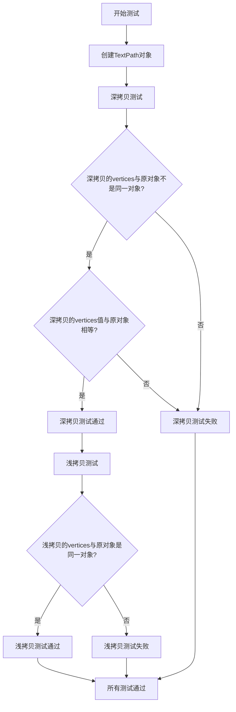

# `matplotlib\lib\matplotlib\tests\test_textpath.py` 详细设计文档

该文件是一个简单的单元测试文件，用于验证matplotlib库中TextPath对象的深拷贝和浅拷贝行为是否符合预期，确保拷贝后的vertices属性具有正确的独立性和值相等性。

## 整体流程



## 类结构

```
无自定义类结构
仅包含一个测试函数test_copy()
```

## 全局变量及字段


    

## 全局函数及方法


### `test_copy`

这是一个测试函数，用于验证 matplotlib 的 TextPath 对象在使用 `copy.deepcopy()` 和 `copy.copy()` 时的行为是否符合预期，确保深拷贝创建了新的顶点数组，而浅拷贝共享同一个顶点数组。

参数：无

返回值：`None`，无返回值（测试函数通过断言验证行为）

#### 流程图

```mermaid
flowchart TD
    A[开始 test_copy] --> B[创建 TextPath 对象<br/>tp = TextPath((0, 0), '.')]
    B --> C[断言1: 深拷贝的顶点不是原对象的顶点<br/>copy.deepcopy(tp).vertices is not tp.vertices]
    C --> D{断言1通过?}
    D -->|是| E[断言2: 深拷贝的顶点值与原对象相同<br/>copy.deepcopy(tp).vertices == tp.vertices]
    D -->|否| F[抛出 AssertionError]
    E --> G{断言2通过?}
    G -->|是| H[断言3: 浅拷贝的顶点是原对象的顶点<br/>copy.copy(tp).vertices is tp.vertices]
    G -->|否| F
    H --> I{断言3通过?}
    I -->|是| J[测试通过, 函数结束]
    I -->|否| F
```

#### 带注释源码

```python
import copy  # 导入 copy 模块,提供深拷贝和浅拷贝功能

from matplotlib.textpath import TextPath  # 从 matplotlib 导入 TextPath 类


def test_copy():
    """
    测试 TextPath 对象的拷贝行为
    
    验证:
    1. 深拷贝创建新的顶点数组
    2. 深拷贝的顶点值与原对象相同
    3. 浅拷贝共享同一个顶点数组
    """
    # 创建一个简单的 TextPath 对象,位置为 (0,0),内容为 "."
    tp = TextPath((0, 0), ".")
    
    # 断言1: 验证深拷贝创建了新的顶点数组对象
    # is 用于比较对象身份,确保不是同一个引用
    assert copy.deepcopy(tp).vertices is not tp.vertices
    
    # 断言2: 验证深拷贝的顶点值与原对象完全相同
    # 使用 .all() 将布尔数组转换为单个布尔值
    assert (copy.deepcopy(tp).vertices == tp.vertices).all()
    
    # 断言3: 验证浅拷贝共享同一个顶点数组对象
    # 浅拷贝只复制引用,不复制实际数据
    assert copy.copy(tp).vertices is tp.vertices
```


## 关键组件


### TextPath对象

TextPath是matplotlib.textpath模块中的类，用于将文本转换为路径对象。这里用于创建文本"."的路径，以测试其拷贝行为。

### copy模块

Python标准库中的copy模块，提供deepcopy和copy函数，分别用于对象的深拷贝和浅拷贝。这里用于测试TextPath对象的拷贝方式。

### test_copy函数

测试函数，创建TextPath实例，并通过深拷贝和浅拷贝验证对象的vertices属性是否正确复制。深拷贝应产生独立的对象，浅拷贝应共享内部引用。

### 断言语句

使用assert语句验证深拷贝后vertices不共享且值相等，浅拷贝后vertices共享。从而确保TextPath的拷贝行为符合预期。


## 问题及建议


### 已知问题

-   **缺乏标准测试框架**：代码使用了手动 assert 语句而非标准测试框架（如 pytest 或 unittest），导致无法利用测试发现、参数化测试、 fixture 等功能
-   **测试覆盖不足**：仅覆盖了浅拷贝和深拷贝的基本验证，缺少边界情况测试（如空字符串、特殊字符、Unicode 等）
-   **无文档注释**：测试函数缺少 docstring，无法说明测试目的和预期行为
-   **硬编码测试数据**：测试坐标 (0, 0) 和字符串 "." 直接硬编码，缺乏灵活性和可维护性
-   **无错误处理**：未对 TextPath 初始化失败或异常情况进行测试
-   **无测试隔离**：未使用 fixture 进行测试数据的setup/teardown，可能影响测试独立性和可重复性

### 优化建议

-   **采用 pytest 框架**：使用 pytest 重构，可利用 @pytest.fixture、@pytest.mark.parametrize 等特性提升测试组织能力
-   **添加 docstring**：为 test_copy 函数添加文档说明测试目的、验证点和预期结果
-   **参数化测试**：使用 @pytest.mark.parametrize 覆盖多种输入场景（不同坐标、不同字符串）
-   **提取测试数据**：将测试参数定义为常量或 fixture，便于维护和扩展
-   **增加边界测试**：添加空字符串、None、超长字符串等边界用例
-   **异常测试**：添加对无效输入（如非字符串参数）的异常处理验证


## 其它


### 设计目标与约束

本代码旨在验证matplotlib.textpath.TextPath对象的深拷贝和浅拷贝行为是否符合预期。设计目标包括：1）确保深拷贝创建独立的vertices数组对象；2）确保深拷贝后的vertices数据值与原对象相同；3）确保浅拷贝共享相同的vertices数组对象引用。约束条件为仅使用Python标准库中的copy模块和matplotlib库。

### 错误处理与异常设计

本代码采用assert语句进行验证，未实现复杂的错误处理机制。若TextPath构造失败或拷贝操作异常，pytest框架会捕获并报告。断言失败时抛出AssertionError，明确指出预期与实际结果的差异。代码未对无效输入（如None值或类型错误）进行显式检查，依赖上游调用方保证输入合法性。

### 数据流与状态机

数据流较为简单：创建TextPath对象→执行深拷贝操作→验证vertices非同一引用→验证vertices数据相等→执行浅拷贝操作→验证vertices为同一引用。状态转换遵循：初始状态（创建对象）→深拷贝状态（独立对象）→验证状态（断言检查）→浅拷贝状态（共享引用）→最终状态（测试完成）。无复杂的状态机设计。

### 外部依赖与接口契约

主要外部依赖包括：1）Python标准库copy模块，提供deepcopy和copy函数；2）matplotlib.textpath.TextPath类，提供文本路径创建功能。接口契约方面：TextPath构造函数接受位置坐标和字符串文本参数；vertices属性返回numpy数组对象；深拷贝返回新实例，浅拷贝返回共享内部状态的新实例。

### 性能考量

本代码为单元测试，性能不是主要关注点。TextPath对象规模较小，拷贝操作开销可忽略。深拷贝操作时间复杂度为O(n)，其中n为vertices数组元素数量。在生产环境中，如需频繁拷贝大型TextPath对象，可考虑实现__copy__和__deepcopy__方法优化性能。

### 安全性考虑

代码不涉及用户输入、敏感数据或外部资源访问，安全性风险较低。测试数据为硬编码的简单字符串"."，无安全敏感内容。copy模块的使用符合Python标准安全实践，不存在代码注入或恶意对象序列化风险。

### 可维护性与扩展性

代码结构清晰但较为简单，当前扩展性良好。不足之处：1）测试用例单一，仅覆盖基本场景；2）缺乏参数化测试支持；3）未封装为独立测试类。建议改进：可增加多种文本内容的测试用例、添加异常情况测试（如拷贝自定义TextPath子类）、集成到pytest测试套件中管理。

### 测试策略

采用单元测试策略，使用assert语句验证预期行为。测试覆盖三个核心场景：深拷贝对象独立性验证、数据一致性验证、浅拷贝引用共享验证。测试驱动开发模式，通过断言明确预期结果。建议补充边界情况测试：空文本、超长文本、特殊字符、Unicode内容等。

### 版本兼容性

代码兼容Python 3.6+版本。matplotlib版本需支持TextPath类及其vertices属性。copy模块为Python标准库，无版本限制。深拷贝与浅拷贝行为在Python 3.x中保持一致，兼容性良好。

### 配置管理

本代码无需外部配置文件，所有参数均为硬编码。测试环境依赖通过import语句声明。如需扩展测试场景，可考虑使用pytest fixtures管理不同TextPath实例，或通过环境变量控制测试行为。

    