# `matplotlib\lib\matplotlib\tests\test_ticker.py` 详细设计文档

这是matplotlib ticker模块的单元测试文件，测试了各种坐标轴刻度定位器（Locator）和格式化器（Formatter）的功能，包括MaxNLocator、LinearLocator、MultipleLocator、AutoMinorLocator、LogLocator、LogitLocator、FixedLocator、IndexLocator、SymmetricalLogLocator、AsinhLocator、ScalarFormatter、LogFormatter系列、LogitFormatter、FormatStrFormatter、StrMethodFormatter、EngFormatter、PercentFormatter等类别的正确性和边界条件。

## 整体流程

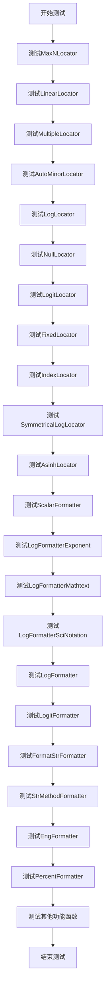

## 类结构

```
测试类层次结构
├── TestMaxNLocator (测试最大刻度数量定位器)
├── TestLinearLocator (测试线性定位器)
├── TestMultipleLocator (测试倍数定位器)
├── TestAutoMinorLocator (测试自动副刻度定位器)
├── TestLogLocator (测试对数定位器)
├── TestNullLocator (测试空定位器)
├── _LogitHelper (Logit测试辅助类)
├── TestLogitLocator (测试Logit定位器)
├── TestFixedLocator (测试固定定位器)
├── TestIndexLocator (测试索引定位器)
├── TestSymmetricalLogLocator (测试对称对数定位器)
├── TestAsinhLocator (测试反双曲正弦定位器)
├── TestScalarFormatter (测试标量格式化器)
├── TestLogFormatterExponent (测试对数指数格式化器)
├── TestLogFormatterMathtext (测试对数数学文本格式化器)
├── TestLogFormatterSciNotation (测试对数科学计数格式化器)
├── TestLogFormatter (测试对数格式化器)
├── TestLogitFormatter (测试Logit格式化器)
├── TestFormatStrFormatter (测试格式字符串格式化器)
├── TestStrMethodFormatter (测试字符串方法格式化器)
├── TestEngFormatter (测试工程格式化器)
└── TestPercentFormatter (测试百分比格式化器)
```

## 全局变量及字段


### `basic_data`
    
Test data for basic MaxNLocator tests with various vmin/vmax ranges and expected tick values

类型：`List[Tuple[Union[int, float], Union[int, float], np.ndarray]]`
    


### `integer_data`
    
Test data for integer locator tests with steps parameter validation

类型：`List[Tuple[float, float, Optional[List[Union[int, float]]], np.ndarray]]`
    


### `params`
    
Test parameters for major tick count and expected minor tick count validation

类型：`List[Tuple[int, int]]`
    


### `majorstep_minordivisions`
    
Major step sizes and expected minor divisions for testing auto minor locator

类型：`List[Tuple[Union[int, float], int]]`
    


### `limits`
    
Test axis limits for AutoMinorLocator additional tests covering various magnitudes

类型：`List[Tuple[float, float]]`
    


### `reference`
    
Expected minor tick locations for corresponding limits in AutoMinorLocator tests

类型：`List[List[float]]`
    


### `additional_data`
    
Combined limits and reference data for parameterized AutoMinorLocator tests

类型：`List[Tuple[Tuple[float, float], List[float]]]`
    


### `offset_data`
    
Test data for ScalarFormatter offset value calculations with various ranges

类型：`List[Tuple[Union[int, float], Union[int, float], Union[int, float]]]`
    


### `use_offset_data`
    
Boolean values for testing ScalarFormatter useOffset parameter behavior

类型：`List[bool]`
    


### `useMathText_data`
    
Boolean values for testing ScalarFormatter use_mathtext parameter

类型：`List[bool]`
    


### `scilimits_data`
    
Test parameters for scientific notation limits and formatting

类型：`List[Tuple[bool, Tuple[int, int], Tuple[float, float], int, bool]]`
    


### `cursor_data`
    
Test data for cursor precision formatting with input values and expected string outputs

类型：`List[Tuple[float, str]]`
    


### `format_data`
    
Test data for ScalarFormatter format_data method validation

类型：`List[Tuple[float, str]]`
    


### `param_data`
    
Parameters for LogFormatterExponent basic tests including labelOnlyBase and base configurations

类型：`List[Tuple[bool, int, Union[np.ndarray, range], Union[np.ndarray, range], List[str]]]`
    


### `base_data`
    
Base values for LogFormatterExponent parametrized tests

类型：`List[float]`
    


### `fmt`
    
Pre-created LogFormatterMathtext instance for min_exponent testing

类型：`mticker.LogFormatterMathtext`
    


### `test_data`
    
Test data tuples for LogFormatterMathtext min_exponent validation

类型：`List[Tuple[int, float, str]]`
    


### `pprint_data`
    
Extensive test data for LogFormatter pretty printing with value, domain and expected output

类型：`List[Tuple[float, float, str]]`
    


### `decade_test`
    
Reference decade values for LogitFormatter tests including powers of 10 and 1/2

类型：`List[float]`
    


### `lims_minor_major`
    
Parameters for testing minor vs major tick display in LogitFormatter

类型：`List[Tuple[bool, Tuple[float, float], Tuple[Tuple[int, bool], Tuple[int, bool]]]]`
    


### `raw_format_data`
    
Raw test data for EngFormatter with unicode_minus, input and expected outputs for different places

类型：`List[Tuple[bool, float, Tuple[str, str, str]]]`
    


### `percent_data`
    
Test data for PercentFormatter with xmax, decimals, symbol, x, display_range and expected output

类型：`List[Tuple[Union[int, float], Optional[int], Optional[str], Union[int, float], Union[int, float], str]]`
    


### `percent_ids`
    
Descriptive test IDs for PercentFormatter parametrized tests

类型：`List[str]`
    


### `latex_data`
    
Test data for PercentFormatter latex and usetex parameters

类型：`List[Tuple[bool, bool, str]]`
    


### `ref_basic_limits`
    
Reference basic limits for LogitLocator tests spanning multiple orders of magnitude

类型：`List[Tuple[float, float]]`
    


### `ref_basic_major_ticks`
    
Expected major tick values corresponding to ref_basic_limits for LogitLocator validation

类型：`List[np.ndarray]`
    


### `ref_maxn_limits`
    
Reference limits for testing LogitLocator behavior with MaxNLocator-like zoomed scenarios

类型：`List[Tuple[float, float]]`
    


### `acceptable_vmin_vmax`
    
Acceptable vmin/vmax values for LogitLocator nonsingular method testing

类型：`List[float]`
    


### `TestMaxNLocator.basic_data`
    
Test data for basic MaxNLocator tests with various vmin/vmax ranges and expected tick values

类型：`List[Tuple[Union[int, float], Union[int, float], np.ndarray]]`
    


### `TestMaxNLocator.integer_data`
    
Test data for integer locator tests with steps parameter validation

类型：`List[Tuple[float, float, Optional[List[Union[int, float]]], np.ndarray]]`
    


### `TestAutoMinorLocator.params`
    
Test parameters for major tick count and expected minor tick count validation

类型：`List[Tuple[int, int]]`
    


### `TestAutoMinorLocator.majorstep_minordivisions`
    
Major step sizes and expected minor divisions for testing auto minor locator

类型：`List[Tuple[Union[int, float], int]]`
    


### `TestAutoMinorLocator.limits`
    
Test axis limits for AutoMinorLocator additional tests covering various magnitudes

类型：`List[Tuple[float, float]]`
    


### `TestAutoMinorLocator.reference`
    
Expected minor tick locations for corresponding limits in AutoMinorLocator tests

类型：`List[List[float]]`
    


### `TestAutoMinorLocator.additional_data`
    
Combined limits and reference data for parameterized AutoMinorLocator tests

类型：`List[Tuple[Tuple[float, float], List[float]]]`
    


### `TestLogitLocator.ref_basic_limits`
    
Reference basic limits for LogitLocator tests spanning multiple orders of magnitude

类型：`List[Tuple[float, float]]`
    


### `TestLogitLocator.ref_basic_major_ticks`
    
Expected major tick values corresponding to ref_basic_limits for LogitLocator validation

类型：`List[np.ndarray]`
    


### `TestLogitLocator.ref_maxn_limits`
    
Reference limits for testing LogitLocator behavior with MaxNLocator-like zoomed scenarios

类型：`List[Tuple[float, float]]`
    


### `TestLogitLocator.acceptable_vmin_vmax`
    
Acceptable vmin/vmax values for LogitLocator nonsingular method testing

类型：`List[float]`
    


### `TestScalarFormatter.offset_data`
    
Test data for ScalarFormatter offset value calculations with various ranges

类型：`List[Tuple[Union[int, float], Union[int, float], Union[int, float]]]`
    


### `TestScalarFormatter.use_offset_data`
    
Boolean values for testing ScalarFormatter useOffset parameter behavior

类型：`List[bool]`
    


### `TestScalarFormatter.useMathText_data`
    
Boolean values for testing ScalarFormatter use_mathtext parameter

类型：`List[bool]`
    


### `TestScalarFormatter.scilimits_data`
    
Test parameters for scientific notation limits and formatting

类型：`List[Tuple[bool, Tuple[int, int], Tuple[float, float], int, bool]]`
    


### `TestScalarFormatter.cursor_data`
    
Test data for cursor precision formatting with input values and expected string outputs

类型：`List[Tuple[float, str]]`
    


### `TestScalarFormatter.format_data`
    
Test data for ScalarFormatter format_data method validation

类型：`List[Tuple[float, str]]`
    


### `TestLogFormatterExponent.param_data`
    
Parameters for LogFormatterExponent basic tests including labelOnlyBase and base configurations

类型：`List[Tuple[bool, int, Union[np.ndarray, range], Union[np.ndarray, range], List[str]]]`
    


### `TestLogFormatterExponent.base_data`
    
Base values for LogFormatterExponent parametrized tests

类型：`List[float]`
    


### `TestLogFormatterMathtext.fmt`
    
Pre-created LogFormatterMathtext instance for min_exponent testing

类型：`mticker.LogFormatterMathtext`
    


### `TestLogFormatterMathtext.test_data`
    
Test data tuples for LogFormatterMathtext min_exponent validation

类型：`List[Tuple[int, float, str]]`
    


### `TestLogFormatterSciNotation.test_data`
    
Test data for LogFormatterSciNotation basic formatting tests

类型：`List[Tuple[int, float, str]]`
    


### `TestLogFormatter.pprint_data`
    
Extensive test data for LogFormatter pretty printing with value, domain and expected output

类型：`List[Tuple[float, float, str]]`
    


### `TestLogitFormatter.decade_test`
    
Reference decade values for LogitFormatter tests including powers of 10 and 1/2

类型：`List[float]`
    


### `TestLogitFormatter.lims_minor_major`
    
Parameters for testing minor vs major tick display in LogitFormatter

类型：`List[Tuple[bool, Tuple[float, float], Tuple[Tuple[int, bool], Tuple[int, bool]]]]`
    


### `TestStrMethodFormatter.test_data`
    
Test data for StrMethodFormatter with format string, input, unicode_minus and expected output

类型：`List[Tuple[str, Tuple, bool, str]]`
    


### `TestEngFormatter.raw_format_data`
    
Raw test data for EngFormatter with unicode_minus, input and expected outputs for different places

类型：`List[Tuple[bool, float, Tuple[str, str, str]]]`
    


### `TestPercentFormatter.percent_data`
    
Test data for PercentFormatter with xmax, decimals, symbol, x, display_range and expected output

类型：`List[Tuple[Union[int, float], Optional[int], Optional[str], Union[int, float], Union[int, float], str]]`
    


### `TestPercentFormatter.percent_ids`
    
Descriptive test IDs for PercentFormatter parametrized tests

类型：`List[str]`
    


### `TestPercentFormatter.latex_data`
    
Test data for PercentFormatter latex and usetex parameters

类型：`List[Tuple[bool, bool, str]]`
    
    

## 全局函数及方法


### `_impl_locale_comma`

该函数用于测试 matplotlib 的 ScalarFormatter 在使用特定语言环境（locale）时的逗号格式处理能力，验证数字格式化和本地化功能是否正确工作。

参数：此函数没有参数。

返回值：`None`，该函数不返回任何值，主要用于执行测试断言。

#### 流程图

```mermaid
flowchart TD
    A[开始] --> B{尝试设置locale为de_DE.UTF-8}
    B -->|成功| C[创建ScalarFormatter with useMathText=True, useLocale=True]
    B -->|失败| D[打印跳过消息并返回]
    C --> E[测试格式'$&#92;&#92;mathdefault{%1.1f}$' with 值0.5]
    E --> F[断言结果为'$&#92;&#92;mathdefault{0{,}5}$']
    F --> G[测试格式',$&#92;&#92;mathdefault{,%1.1f},$' with 值0.5]
    G --> H[断言结果为',$&#92;&#92;mathdefault{,0{,}5},$']
    H --> I[创建ScalarFormatter with useMathText=False, useLocale=True]
    I --> J[测试格式'%1.1f' with 值0.5]
    J --> K[断言结果为'0,5']
    K --> L[结束]
```

#### 带注释源码

```python
def _impl_locale_comma():
    """
    测试locale逗号格式的功能实现
    
    该函数验证ScalarFormatter._format_maybe_minus_and_locale方法
    在处理德语 locale (de_DE.UTF-8) 时的逗号十进制分隔符行为
    """
    # 尝试设置德国locale，用于测试逗号作为小数分隔符
    try:
        locale.setlocale(locale.LC_ALL, 'de_DE.UTF-8')
    except locale.Error:
        # 如果系统不支持该locale，打印跳过消息并退出
        print('SKIP: Locale de_DE.UTF-8 is not supported on this machine')
        return
    
    # 创建支持数学文本和locale的格式化器
    ticks = mticker.ScalarFormatter(useMathText=True, useLocale=True)
    
    # 测试基本格式：德语locale中0.5应显示为0,5
    fmt = '$\\mathdefault{%1.1f}$'
    x = ticks._format_maybe_minus_and_locale(fmt, 0.5)
    # 验证数学文本模式下逗号被正确转义为{,}
    assert x == '$\\mathdefault{0{,}5}$'
    
    # 测试格式字符串本身包含逗号的情况
    # 验证格式化字符串中的逗号不会被locale修改
    fmt = ',$\\mathdefault{,%1.1f},$'
    x = ticks._format_maybe_minus_and_locale(fmt, 0.5)
    # 验证字符串中的逗号被保留
    assert x == ',$\\mathdefault{,0{,}5},$'
    
    # 测试不使用数学文本的情况
    # 确保不使用math text时不会添加额外的花括号
    ticks = mticker.ScalarFormatter(useMathText=False, useLocale=True)
    fmt = '%1.1f'
    x = ticks._format_maybe_minus_and_locale(fmt, 0.5)
    # 验证纯文本模式下直接输出0,5
    assert x == '0,5'
```


### `test_locale_comma`

这是一个测试函数，用于测试当使用 locale 设置时，数字格式中小数点是否正确转换为逗号（如德国 locale 中的 "0,5"）。该测试通过子进程运行以避免 locale 设置问题。

参数：无

返回值：无（`None`），该函数为测试函数，不返回任何值

#### 流程图

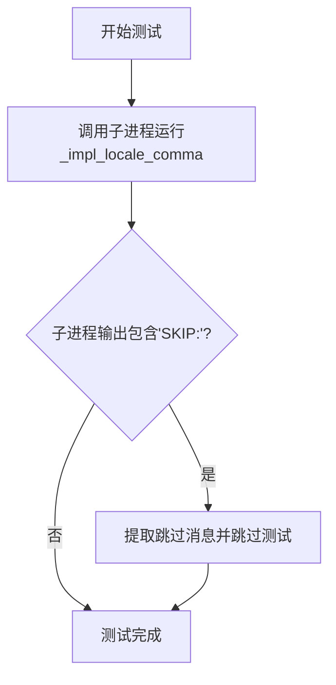

#### 带注释源码

```python
def test_locale_comma():
    # On some systems/pytest versions, `pytest.skip` in an exception handler
    # does not skip, but is treated as an exception, so directly running this
    # test can incorrectly fail instead of skip.
    # Instead, run this test in a subprocess, which avoids the problem, and the
    # need to fix the locale after.
    # 说明：在某些系统或pytest版本中，在异常处理器中使用pytest.skip不会正确跳过测试，
    # 而是被视为异常。因此改为在子进程中运行测试，以避免问题并消除修复locale的需要。
    
    proc = mpl.testing.subprocess_run_helper(_impl_locale_comma, timeout=60,
                                             extra_env={'MPLBACKEND': 'Agg'})
    # 调用子进程运行_impl_locale_comma函数，设置60秒超时，使用Agg后端
    
    skip_msg = next((line[len('SKIP:'):].strip()
                     for line in proc.stdout.splitlines()
                     if line.startswith('SKIP:')),
                    '')
    # 从子进程输出中查找包含'SKIP:'的行，提取跳过消息
    
    if skip_msg:
        pytest.skip(skip_msg)
    # 如果存在跳过消息，则跳过该测试
```


### `test_majformatter_type`

该函数是一个单元测试，用于验证在尝试将 `LogLocator`（定位器）错误地设置为坐标轴的主格式器（major formatter）时，系统能否正确抛出 `TypeError` 异常。这确保了类型检查机制的正确性，防止用户将定位器误用为格式器。

参数：无

返回值：`None`，该函数为测试函数，不返回任何值，仅通过 `pytest.raises` 验证异常行为

#### 流程图

```mermaid
flowchart TD
    A[开始测试] --> B[创建图形和坐标轴: fig, ax = plt.subplots()]
    B --> C[尝试设置LogLocator为major formatter]
    C --> D{是否抛出TypeError?}
    D -->|是| E[测试通过]
    D -->|否| F[测试失败]
```

#### 带注释源码

```python
def test_majformatter_type():
    """
    测试函数：验证将LogLocator设置为major formatter时是否抛出TypeError
    
    该测试确保类型检查机制正常工作，防止用户误用Locator作为Formatter
    """
    # 创建一个新的图形和坐标轴
    fig, ax = plt.subplots()
    
    # 验证尝试将LogLocator（这是一个Locator）设置为major formatter
    # 会抛出TypeError，因为set_major_formatter期望接收Formatter类型，
    # 而LogLocator是Locator类型
    with pytest.raises(TypeError):
        ax.xaxis.set_major_formatter(mticker.LogLocator())
```


### test_minformatter_type

该测试函数用于验证当向 `set_minor_formatter` 方法传递错误类型（`LogLocator`）时，是否会正确抛出 `TypeError` 异常。

参数：无

返回值：`None`，测试函数不返回任何值

#### 流程图

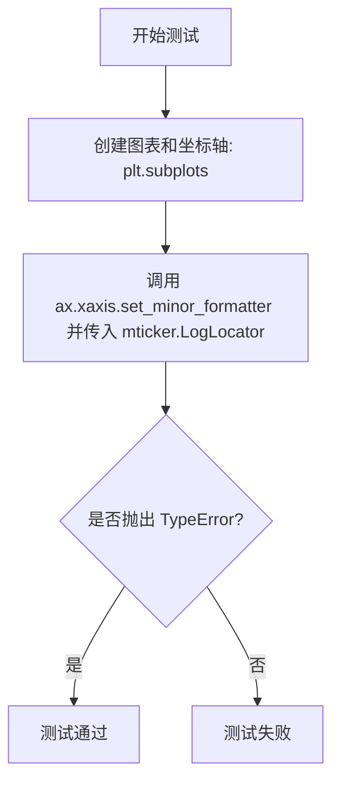

#### 带注释源码

```python
def test_minformatter_type():
    """
    测试 set_minor_formatter 方法的类型检查。
    
    验证当传入错误类型的参数（LogLocator）时，
    set_minor_formatter 会抛出 TypeError 异常。
    """
    # 创建一个新的图表和坐标轴对象
    fig, ax = plt.subplots()
    
    # 使用 pytest.raises 上下文管理器验证当传入 LogLocator 
    #（这不是一个有效的 formatter 类型）时是否会抛出 TypeError
    with pytest.raises(TypeError):
        ax.xaxis.set_minor_formatter(mticker.LogLocator())
```


### `test_majlocator_type`

该测试函数用于验证 Matplotlib 的 Axis.set_major_locator 方法在接收到错误类型的参数（LogFormatter）时能够正确抛出 TypeError，确保类型检查机制正常工作。

参数：
- 该函数无参数

返回值：`None`，无返回值（测试函数）

#### 流程图

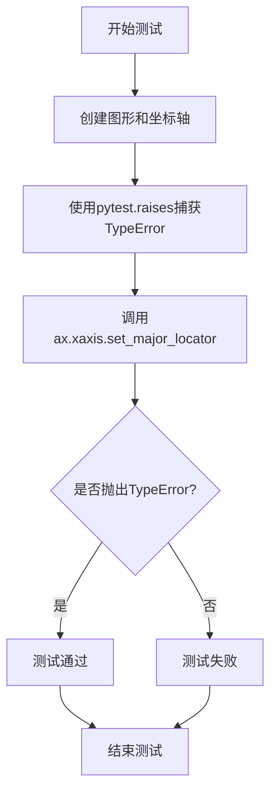

#### 带注释源码

```python
def test_majlocator_type():
    """
    测试 set_major_locator 的类型检查功能。
    
    该测试验证当传入错误类型的参数（LogFormatter）时，
    set_major_locator 方法能够正确抛出 TypeError 异常。
    """
    # 创建一个新的图形和坐标轴对象
    fig, ax = plt.subplots()
    
    # 使用 pytest.raises 上下文管理器期望捕获 TypeError
    with pytest.raises(TypeError):
        # 尝试将 LogFormatter（格式化器）设置为 major locator（定位器）
        # 这是错误的使用方式，应该传入 Locator 而非 Formatter
        ax.xaxis.set_major_locator(mticker.LogFormatter())
```


### `test_minlocator_type`

验证将格式器（Formatter）错误地设置为刻度定位器（Locator）时，会抛出 TypeError 异常。

参数：无

返回值：`None`，测试函数无返回值

#### 流程图

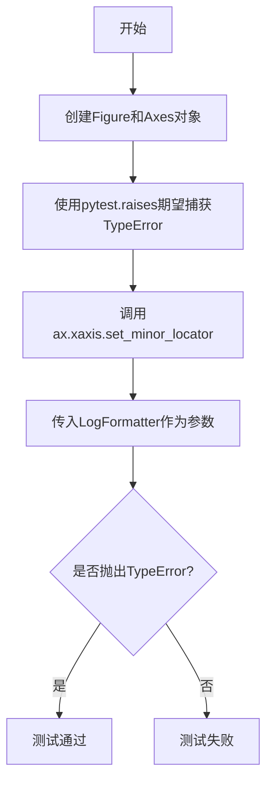

#### 带注释源码

```python
def test_minlocator_type():
    """
    测试将格式器设置为定位器时是否会抛出TypeError。
    
    此测试验证了matplotlib的类型检查机制，确保
    set_minor_locator方法只能接受Locator类型，
    不能接受Formatter类型。
    """
    # 创建一个新的图形和坐标轴对象
    fig, ax = plt.subplots()
    
    # 期望抛出TypeError，因为LogFormatter是格式器而不是定位器
    with pytest.raises(TypeError):
        # 尝试将LogFormatter设置为minor locator，这应该失败
        ax.xaxis.set_minor_locator(mticker.LogFormatter())
```


### `test_minorticks_rc`

该函数是一个测试函数，用于验证 matplotlib 中通过 rcParams 设置 minor ticks 的可见性是否正确工作。它通过创建四个子图，分别测试 x 轴和 y 轴 minor ticks 的显示与隐藏情况。

参数：None（无参数）

返回值：`None`，无返回值（测试函数）

#### 流程图

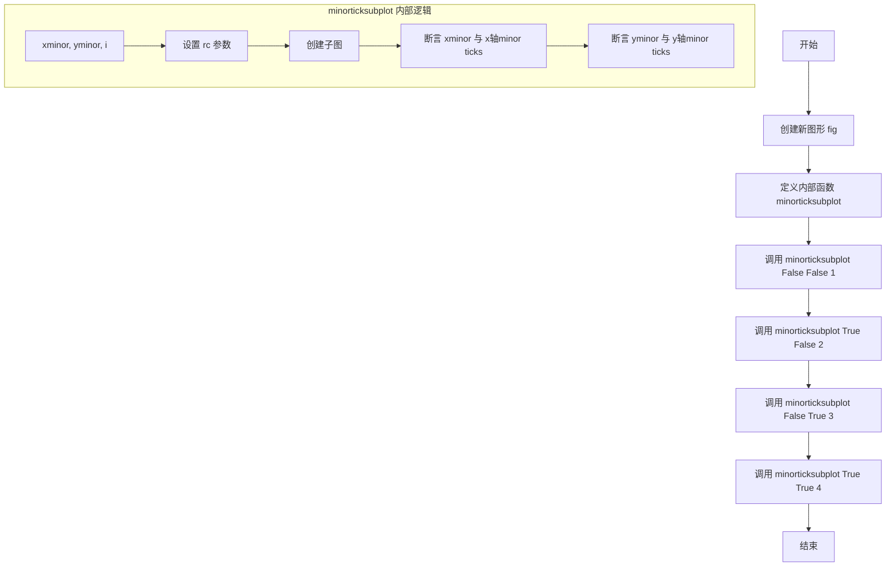

#### 带注释源码

```python
def test_minorticks_rc():
    """
    测试通过 rcParams 设置 minor ticks 可见性的功能。
    
    验证 xtick.minor.visible 和 ytick.minor.visible 参数
    是否能正确控制坐标轴上 minor 刻度线的显示与隐藏。
    """
    # 创建一个新的图形对象
    fig = plt.figure()

    def minorticksubplot(xminor, yminor, i):
        """
        内部辅助函数：创建子图并验证 minor ticks 的可见性。
        
        参数:
            xminor: bool - 是否显示 x 轴的 minor ticks
            yminor: bool - 是否显示 y 轴的 minor ticks
            i: int - 子图的位置编号 (1-4)
        """
        # 根据参数构建 rc 配置字典
        rc = {'xtick.minor.visible': xminor,
              'ytick.minor.visible': yminor}
        
        # 使用指定的 rc 上下文创建子图
        with plt.rc_context(rc=rc):
            ax = fig.add_subplot(2, 2, i)

        # 断言：xminor 为 True 时 x 轴应有 minor ticks，为 False 时应没有
        assert (len(ax.xaxis.get_minor_ticks()) > 0) == xminor
        # 断言：yminor 为 True 时 y 轴应有 minor ticks，为 False 时应没有
        assert (len(ax.yaxis.get_minor_ticks()) > 0) == yminor

    # 测试用例1：x轴和y轴都不显示 minor ticks
    minorticksubplot(False, False, 1)
    # 测试用例2：仅 x 轴显示 minor ticks
    minorticksubplot(True, False, 2)
    # 测试用例3：仅 y 轴显示 minor ticks
    minorticksubplot(False, True, 3)
    # 测试用例4：x轴和y轴都显示 minor ticks
    minorticksubplot(True, True, 4)
```


### `test_minorticks_toggle`

该函数用于测试坐标轴的次要刻度（minor ticks）开关功能，验证 `Axis.minorticks_on()` 和 `Axis.minorticks_off()` 方法在不同比例尺（linear、log、asinh、logit）下的正确性。

参数： 无

返回值：`None`，无返回值

#### 流程图

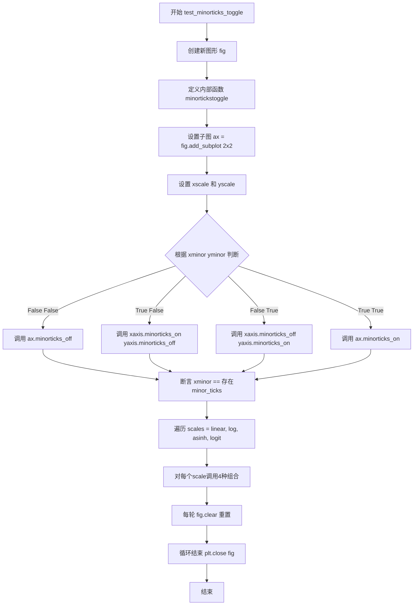

#### 带注释源码

```python
def test_minorticks_toggle():
    """
    Test toggling minor ticks
    
    Test `.Axis.minorticks_on()` and `.Axis.minorticks_off()`. Testing is
    limited to a subset of built-in scales - 'linear', 'log', 'asinh'
    and 'logit'. `symlog` scale does not seem to have a working minor
    locator and is omitted. In future, this test should cover all scales in
    `matplotlib.scale.get_scale_names()`.
    """
    # 创建新的Figure对象
    fig = plt.figure()
    
    # 定义内部辅助函数，用于测试minor ticks的开关逻辑
    def minortickstoggle(xminor, yminor, scale, i):
        # 在2x2子图网格中的第i个位置创建子图
        ax = fig.add_subplot(2, 2, i)
        # 设置x轴和y轴的比例尺
        ax.set_xscale(scale)
        ax.set_yscale(scale)
        
        # 根据xminor和yminor的开关状态调用对应的方法
        if not xminor and not yminor:
            # 关闭x和y轴的minor ticks
            ax.minorticks_off()
        if xminor and not yminor:
            # 仅开启x轴的minor ticks
            ax.xaxis.minorticks_on()
            ax.yaxis.minorticks_off()
        if not xminor and yminor:
            # 仅开启y轴的minor ticks
            ax.xaxis.minorticks_off()
            ax.yaxis.minorticks_on()
        if xminor and yminor:
            # 开启x和y轴的minor ticks
            ax.minorticks_on()
        
        # 验证x轴minor ticks数量与预期一致
        assert (len(ax.xaxis.get_minor_ticks()) > 0) == xminor
        # 验证y轴minor ticks数量与预期一致
        assert (len(ax.yaxis.get_minor_ticks()) > 0) == yminor
    
    # 定义测试用的比例尺列表
    scales = ['linear', 'log', 'asinh', 'logit']
    
    # 遍历每种比例尺
    for scale in scales:
        # 测试4种组合：(关闭,关闭), (开启,关闭), (关闭,开启), (开启,开启)
        minortickstoggle(False, False, scale, 1)
        minortickstoggle(True, False, scale, 2)
        minortickstoggle(False, True, scale, 3)
        minortickstoggle(True, True, scale, 4)
        # 清空图形准备下一次迭代
        fig.clear()
    
    # 关闭图形释放资源
    plt.close(fig)
```


### `test_remove_overlap`

这是一个测试函数，用于验证 Matplotlib 中坐标轴的 `remove_overlapping_locs` 属性的功能。该测试确保当存在重叠的次要刻度位置时，能够正确地过滤掉它们，同时验证 getter/setter 方法的正确性。

参数：

-  `remove_overlapping_locs`：`bool | None`，控制是否移除重叠的次要刻度位置。`True` 表示移除，`False` 表示不移除，`None` 测试默认值行为。
-  `expected_num`：`int`，期望的过滤后的次要刻度数量，用于验证过滤逻辑是否正确。

返回值：`None`，该函数为测试函数，无返回值。

#### 流程图

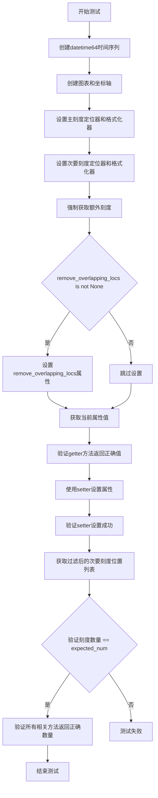

#### 带注释源码

```python
@pytest.mark.parametrize('remove_overlapping_locs, expected_num',
                         ((True, 6),
                          (None, 6),  # this tests the default
                          (False, 9)))
def test_remove_overlap(remove_overlapping_locs, expected_num):
    # 创建datetime64类型的时间序列，从2018-11-03到2018-11-05
    t = np.arange("2018-11-03", "2018-11-06", dtype="datetime64")
    x = np.ones(len(t))

    # 创建图表和坐标轴
    fig, ax = plt.subplots()
    ax.plot(t, x)

    # 设置主刻度定位器为按天定位，格式化器为日期格式（带星期几）
    ax.xaxis.set_major_locator(mpl.dates.DayLocator())
    ax.xaxis.set_major_formatter(mpl.dates.DateFormatter('\n%a'))

    # 设置次要刻度定位器为按小时定位（0, 6, 12, 18点），格式化器为时分格式
    ax.xaxis.set_minor_locator(mpl.dates.HourLocator((0, 6, 12, 18)))
    ax.xaxis.set_minor_formatter(mpl.dates.DateFormatter('%H:%M'))
    
    # 强制获取额外的次要刻度，确保测试场景更全面
    ax.xaxis.get_minor_ticks(15)
    
    # 根据参数设置remove_overlapping_locs属性
    if remove_overlapping_locs is not None:
        ax.xaxis.remove_overlapping_locs = remove_overlapping_locs

    # 验证getter方法存在且工作正常
    current = ax.xaxis.remove_overlapping_locs
    assert (current == ax.xaxis.get_remove_overlapping_locs())
    
    # 使用plt.setp设置属性，验证setter功能
    plt.setp(ax.xaxis, remove_overlapping_locs=current)
    new = ax.xaxis.remove_overlapping_locs
    assert (new == ax.xaxis.remove_overlapping_locs)

    # 验证过滤功能：获取过滤后的次要刻度位置列表
    assert len(ax.xaxis.get_minorticklocs()) == expected_num
    
    # 验证衍生方法的过滤结果一致性
    assert len(ax.xaxis.get_minor_ticks()) == expected_num
    assert len(ax.xaxis.get_minorticklabels()) == expected_num
    assert len(ax.xaxis.get_minorticklines()) == expected_num*2
```


### `test_bad_locator_subs`

该函数是针对 `LogLocator.set_params()` 方法的参数验证测试，通过传入非法的 `subs` 参数（字符串列表或二维数组）来验证其是否能正确抛出 `ValueError` 异常，确保参数校验逻辑的正确性。

参数：

- `sub`：`List[str] | np.ndarray`，测试用的错误 subs 参数，测试两种非法输入：字符串列表 `['hi', 'aardvark']` 和二维数组 `np.zeros((2, 2))`

返回值：`None`，测试函数无返回值

#### 流程图

```mermaid
graph TD
    A[开始测试] --> B[创建 LogLocator 实例]
    B --> C{参数化测试: sub}
    C -->|第一次迭代| D[sub = ['hi', 'aardvark']]
    C -->|第二次迭代| E[sub = np.zeros((2, 2))]
    D --> F[调用 ll.set_params(subs=sub)]
    E --> F
    F --> G{是否抛出 ValueError?}
    G -->|是| H[测试通过]
    G -->|否| I[测试失败]
```

#### 带注释源码

```python
@pytest.mark.parametrize('sub', [
    ['hi', 'aardvark'],           # 测试用例1: 字符串列表形式的非法 subs 参数
    np.zeros((2, 2))])            # 测试用例2: 二维数组形式的非法 subs 参数
def test_bad_locator_subs(sub):
    """
    测试 LogLocator.set_params() 对非法 subs 参数的异常处理。
    
    该测试验证当传入非法的 subs 参数时，set_params 方法能够正确地
    抛出 ValueError 异常。合法的 subs 参数应该是一维数组或可迭代对象，
    而非字符串列表或二维数组。
    """
    ll = mticker.LogLocator()     # 创建 LogLocator 实例
    with pytest.raises(ValueError):  # 预期抛出 ValueError 异常
        ll.set_params(subs=sub)   # 调用 set_params 方法尝试设置非法的 subs 参数
```


### `test_small_range_loglocator`

这是一个测试函数，用于验证 `LogLocator` 在小范围数据（numticks 较小且 lims 范围较窄）下的刻度值生成是否正确。

参数：

- `numticks`：`int`，期望生成的最大刻度数量
- `lims`：`tuple[float, float]`，数据范围下限和上限 (vmin, vmax)
- `ticks`：`list[float]`，期望生成的刻度值列表

返回值：`None`，该函数没有返回值，仅通过断言验证 `LogLocator.tick_values()` 的输出是否符合预期

#### 流程图

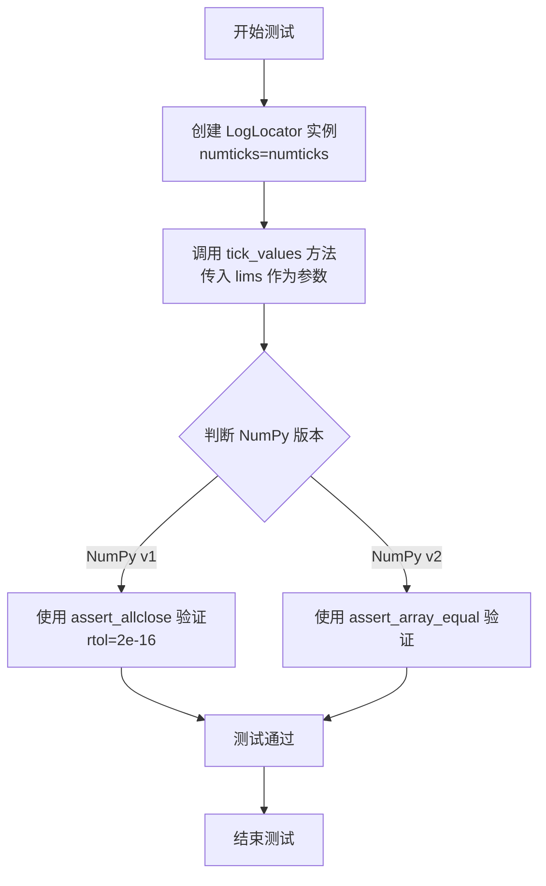

#### 带注释源码

```python
@pytest.mark.parametrize("numticks, lims, ticks", [
    # 参数化测试用例：numticks, lims范围, 期望的刻度值
    (1, (.5, 5), [.1, 1, 10]),
    (2, (.5, 5), [.1, 1, 10]),
    (3, (.5, 5), [.1, 1, 10]),
    (9, (.5, 5), [.1, 1, 10]),
    (1, (.5, 50), [.1, 10, 1_000]),
    (2, (.5, 50), [.1, 1, 10, 100]),
    (3, (.5, 50), [.1, 1, 10, 100]),
    (9, (.5, 50), [.1, 1, 10, 100]),
    (1, (.5, 500), [.1, 10, 1_000]),
    (2, (.5, 500), [.01, 1, 100, 10_000]),
    (3, (.5, 500), [.1, 1, 10, 100, 1_000]),
    (9, (.5, 500), [.1, 1, 10, 100, 1_000]),
    (1, (.5, 5000), [.1, 100, 100_000]),
    (2, (.5, 5000), [.001, 1, 1_000, 1_000_000]),
    (3, (.5, 5000), [.001, 1, 1_000, 1_000_000]),
    (9, (.5, 5000), [.1, 1, 10, 100, 1_000, 10_000]),
])
@mpl.style.context('default')
def test_small_range_loglocator(numticks, lims, ticks):
    """测试 LogLocator 在小范围数据下的刻度值生成"""
    # 创建 LogLocator 实例，传入期望的最大刻度数量
    ll = mticker.LogLocator(numticks=numticks)
    
    # 根据 NumPy 版本选择不同的断言方法
    if parse_version(np.version.version).major < 2:
        # NumPy v1: 使用 assert_allclose 进行近似相等验证
        # rtol=2e-16 设置了非常严格的相对误差容限
        assert_allclose(ll.tick_values(*lims), ticks, rtol=2e-16)
    else:
        # NumPy v2+: 使用 assert_array_equal 进行精确相等验证
        assert_array_equal(ll.tick_values(*lims), ticks)
```


### test_loglocator_properties

该函数是一个测试函数，用于验证 LogLocator 在各种输入情况下返回的刻度值是否满足基本且理想的属性。它通过遍历不同数量的刻度和不同的指数范围，检查生成的 decades（指数值）是否符合预期的约束条件。

参数：  
- 该函数没有显式参数

返回值：`None`，该函数不返回值，只包含断言来验证逻辑

#### 流程图

```mermaid
flowchart TD
    A[开始测试] --> B[设置max_numticks=8, pow_end=20]
    B --> C[遍历numticks从1到max_numticks]
    C --> D[遍历lo和hi的组合从range中]
    D --> E[创建LogLocator实例numticks]
    E --> F[调用tick_values获取刻度值]
    F --> G[计算decades: log10转换为指数并取整]
    G --> H[断言: 刻度数量 <= numticks + 2]
    H --> I[断言: decades[0] < lo <= decades[1]]
    I --> J[断言: decades[-2] <= hi < decades[-1]]
    J --> K[计算stride: 连续decades之间的差值]
    K --> L{检查decades是否是stride的整数倍}
    L -->|是| M[验证通过]
    L -->|否| N[遍历offset从0到stride-1]
    N --> O[计算替代decades]
    O --> P{断言: alt_decades长度 < decades长度 或 > numticks}
    P -->|通过| M
    P -->|失败| Q[测试失败]
    M --> R{是否还有更多lo,hi组合}
    R -->|是| D
    R -->|否| S{是否还有更多numticks}
    S -->|是| C
    S -->|否| T[结束测试]
```

#### 带注释源码

```python
@mpl.style.context('default')
def test_loglocator_properties():
    """
    测试 LogLocator 返回的刻度是否满足各种输入情况下基本且理想的属性。
    """
    # 设置最大刻度数和指数范围的上限
    max_numticks = 8
    pow_end = 20
    
    # 使用 itertools.product 遍历所有 numticks 值与 (lo, hi) 指数范围的组合
    for numticks, (lo, hi) in itertools.product(
            range(1, max_numticks + 1), itertools.combinations(range(pow_end), 2)):
        
        # 创建具有指定 numticks 数量的 LogLocator 实例
        ll = mticker.LogLocator(numticks=numticks)
        
        # 获取刻度值，并将刻度值转换为以10为底的指数，再四舍五入为整数
        # 这样可以得到每个刻度对应的 decade（10的幂）
        decades = np.log10(ll.tick_values(10**lo, 10**hi)).round().astype(int)
        
        # 断言1: 刻度数量不超过请求的数量，加上上下各一个额外刻度
        # 这是为了确保定位器不会生成过多的刻度
        assert len(decades) <= numticks + 2
        
        # 断言2: 第一个 decade 小于 lo，且第二个 decade 大于等于 lo
        # 确保下限 lo 被刻度范围覆盖
        assert decades[0] < lo <= decades[1]
        
        # 断言3: 倒数第二个 decade 小于等于 hi，且最后一个 decade 大于 hi
        # 确保上限 hi 被刻度范围覆盖
        assert decades[-2] <= hi < decades[-1]
        
        # 提取连续的 decades 之间的差值（步长）
        # 使用集合去除重复值，假设步长是常数
        stride, = {*np.diff(decades)}  # Extract the (constant) stride.
        
        # 检查 decades 是否都是 stride 的整数倍
        if not (decades % stride == 0).all():
            # 如果不是所有 decades 都是 stride 的整数倍，
            # 则验证对于给定的 stride，没有其他可接受的偏移量
            # 即：它们要么导致刻度数少于所选方案，要么超过请求的刻度数
            for offset in range(0, stride):
                alt_decades = range(lo + offset, hi + 1, stride)
                assert len(alt_decades) < len(decades) or len(alt_decades) > numticks
```


### `test_NullFormatter`

这是一个测试函数，用于验证 `NullFormatter` 类的基本功能，确保它正确返回空字符串。

参数：此函数没有参数。

返回值：`None`，测试函数的默认返回值。

#### 流程图

```mermaid
flowchart TD
    A[开始测试] --> B[创建 NullFormatter 实例]
    B --> C[测试 __call__ 方法: formatter(1.0) == '']
    C --> D[测试 format_data 方法: formatter.format_data(1.0) == '']
    D --> E[测试 format_data_short 方法: formatter.format_data_short(1.0) == '']
    E --> F[结束测试]
```

#### 带注释源码

```python
def test_NullFormatter():
    """
    测试 NullFormatter 类的基本格式化功能。
    NullFormatter 应该返回空字符串用于任何输入值。
    """
    # 创建一个 NullFormatter 实例
    formatter = mticker.NullFormatter()
    
    # 测试 __call__ 方法是否返回空字符串
    assert formatter(1.0) == ''
    
    # 测试 format_data 方法是否返回空字符串
    assert formatter.format_data(1.0) == ''
    
    # 测试 format_data_short 方法是否返回空字符串
    assert formatter.format_data_short(1.0) == ''
```


### `test_set_offset_string`

该测试函数用于验证格式化器的 `set_offset_string` 方法是否正确设置和获取偏移字符串。它接受一个格式化器对象，测试在设置偏移前后，偏移字符串的值是否符合预期。

参数：
- `formatter`：`matplotlib.ticker.FuncFormatter` 或 `matplotlib.ticker.FixedFormatter`，待测试的格式化器实例，用于验证偏移字符串的设置和获取功能。

返回值：`None`，测试函数无返回值，通过断言验证偏移字符串的正确性。

#### 流程图

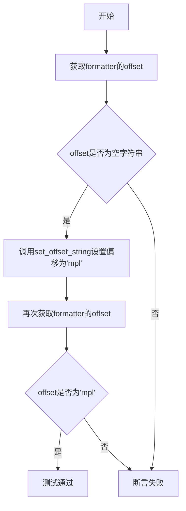

#### 带注释源码

```python
@pytest.mark.parametrize('formatter', (
    mticker.FuncFormatter(lambda a: f'val: {a}'),
    mticker.FixedFormatter(('foo', 'bar'))))
def test_set_offset_string(formatter):
    # 步骤1：验证初始状态下偏移字符串为空
    assert formatter.get_offset() == ''
    # 步骤2：设置偏移字符串为'mpl'
    formatter.set_offset_string('mpl')
    # 步骤3：验证设置后偏移字符串为'mpl'
    assert formatter.get_offset() == 'mpl'
```


### `test_minorticks_on_multi_fig`

该函数是一个测试函数，用于验证在包含多个boxplot且共享x轴的多轴Figure中开启次刻度网格线不会抛出异常。

参数： 无

返回值：`None`，该函数为测试函数，通过断言验证功能，不返回任何值

#### 流程图

```mermaid
flowchart TD
    A[开始] --> B[创建Figure和Axes: plt.subplots]
    B --> C[添加第一个boxplot: positions=[0]]
    C --> D[添加第二个boxplot: positions=[0]]
    D --> E[添加第三个boxplot: positions=[1]]
    E --> F[开启主网格线: ax.grid which='major']
    F --> G[开启次网格线: ax.grid which='minor']
    G --> H[开启次刻度: ax.minorticks_on]
    H --> I[无渲染绘制: fig.draw_without_rendering]
    I --> J[断言: 验证x网格线存在]
    J --> K[断言: 验证次刻度定位器类型为AutoMinorLocator]
    K --> L[结束]
```

#### 带注释源码

```python
def test_minorticks_on_multi_fig():
    """
    Turning on minor gridlines in a multi-Axes Figure
    that contains more than one boxplot and shares the x-axis
    should not raise an exception.
    """
    # 创建一个包含单个Axes的Figure
    fig, ax = plt.subplots()

    # 在位置0添加第一个boxplot，数据为0-9
    ax.boxplot(np.arange(10), positions=[0])
    
    # 在位置0添加第二个boxplot（重复位置）
    ax.boxplot(np.arange(10), positions=[0])
    
    # 在位置1添加第三个boxplot
    ax.boxplot(np.arange(10), positions=[1])

    # 开启主网格线显示
    ax.grid(which="major")
    
    # 开启次网格线显示
    ax.grid(which="minor")
    
    # 开启次刻度
    ax.minorticks_on()
    
    # 执行无渲染绘制，验证不会抛出异常
    fig.draw_without_rendering()

    # 断言：验证x轴网格线已创建
    assert ax.get_xgridlines()
    
    # 断言：验证x轴的次刻度定位器是AutoMinorLocator类型
    assert isinstance(ax.xaxis.get_minor_locator(), mpl.ticker.AutoMinorLocator)
```


### test_engformatter_usetex_useMathText

该测试函数验证 EngFormatter 在启用 usetex=True 或 useMathText=True 时，能正确地在数字周围插入美元符号（$），确保数学文本在图表中正确渲染。

参数：此函数无参数

返回值：`None`，测试函数无返回值

#### 流程图

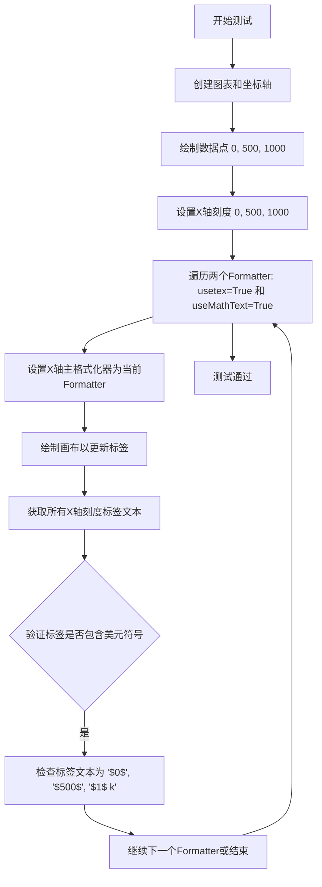

#### 带注释源码

```python
def test_engformatter_usetex_useMathText():
    """
    测试 EngFormatter 在启用 usetex 或 useMathText 时
    能否正确地在数字周围插入美元符号
    """
    # 创建一个新的图形和坐标轴对象
    fig, ax = plt.subplots()
    
    # 绘制简单的线性数据 [0, 500, 1000] -> [0, 500, 1000]
    ax.plot([0, 500, 1000], [0, 500, 1000])
    
    # 设置X轴的主要刻度位置为 0, 500, 1000
    ax.set_xticks([0, 500, 1000])
    
    # 遍历两种格式化器配置:
    # 1. usetex=True: 使用 LaTeX 渲染
    # 2. useMathText=True: 使用 Mathtext 渲染
    for formatter in (mticker.EngFormatter(usetex=True),
                      mticker.EngFormatter(useMathText=True)):
        
        # 将当前格式化器设置为X轴的主格式化器
        ax.xaxis.set_major_formatter(formatter)
        
        # 绘制画布以触发标签更新
        fig.canvas.draw()
        
        # 获取所有X轴刻度标签的文本内容
        x_tick_label_text = [labl.get_text() for labl in ax.get_xticklabels()]
        
        # 验证美元符号已被插入到数字周围
        # 期望结果: ['$0$', '$500$', '$1$ k']
        # - 0 被格式化为 $0$
        # - 500 被格式化为 $500$
        # - 1000 被格式化为 $1$ k (使用工程前缀)
        assert x_tick_label_text == ['$0$', '$500$', '$1$ k']
```


### `test_engformatter_offset_oom`

该测试函数用于验证 EngFormatter 在处理数据偏移（data_offset）和噪声（noise）时的偏移量（offset）计算是否正确，特别是检验不同数量级（order of magnitude）下的前缀选择是否正确。

参数：

-  `data_offset`：`float`，数据中心的偏移量
-  `noise`：`float`，噪声幅度，用于生成数据点
-  `oom_center_desired`：`int`，期望的中心值数量级
-  `oom_noise_desired`：`int`，期望的噪声数量级

返回值：`None`，该函数为测试函数，通过断言验证行为

#### 流程图

```mermaid
flowchart TD
    A[开始] --> B[创建Figure和Axes]
    B --> C[生成测试数据: ydata = data_offset + np.arange(-5, 7) * noise]
    C --> D[绘制数据到Axes]
    D --> E[创建 EngFormatter, useOffset=True, unit='eV']
    E --> F[设置ENG_PREFIXES[0] = '_' 保证offset字符串长度一致]
    F --> G[设置Axes的yaxis major formatter]
    G --> H[渲染canvas]
    H --> I{formatter.offset 是否存在?}
    I -->|是| J[获取offset字符串, 验证noise和center的前缀]
    I -->|否| K[验证offset为空字符串]
    J --> L[验证刻度标签不包含UNIT]
    L --> M[结束]
    K --> N[验证刻度标签包含正确的前缀和UNIT]
    N --> M
```

#### 带注释源码

```python
@pytest.mark.parametrize(
    'data_offset, noise, oom_center_desired, oom_noise_desired', [
        # 参数化测试：不同的数据偏移和噪声组合
        (271_490_000_000.0,    10,         9,  0),
        (27_149_000_000_000.0, 10_000_000, 12, 6),
        (27.149,               0.01,       0, -3),
        (2_714.9,              0.01,       3, -3),
        (271_490.0,            0.001,      3, -3),
        (271.49,               0.001,      0, -3),
        # 当 oom(data_offset)-1 和 oom(noise)-2 等于标准 3*N oom 时
        # oom_noise_desired < oom(noise) 的情况
        (27_149_000_000.0,     100,        9, +3),
        (27.149,               1e-07,      0, -6),
        (271.49,               0.0001,     0, -3),
        (27.149,               0.0001,     0, -3),
        # 测试 oom(data_offset) <= oom(noise) 的情况
        (27_149.0,             10_000,     0, 3),
        (27.149,               10_000,     0, 3),
        (27.149,               1_000,      0, 3),
        (27.149,               100,        0, 0),
        (27.149,               10,         0, 0),
    ]
)
def test_engformatter_offset_oom(
    data_offset,    # 数据中心的偏移量
    noise,         # 噪声幅度
    oom_center_desired,  # 期望的中心值数量级
    oom_noise_desired   # 期望的噪声数量级
):
    """测试 EngFormatter 的偏移量计算在不同数量级下的正确性"""
    UNIT = "eV"  # 单位
    fig, ax = plt.subplots()  # 创建图形和坐标轴
    
    # 生成测试数据：data_offset + [-5, -4, ..., 6] * noise
    ydata = data_offset + np.arange(-5, 7, dtype=float)*noise
    ax.plot(ydata)  # 绘制数据
    
    # 创建工程格式化器，启用偏移量
    formatter = mticker.EngFormatter(useOffset=True, unit=UNIT)
    # 将ENG_PREFIXES[0]设为'_'以保证offset字符串长度一致
    formatter.ENG_PREFIXES[0] = "_"
    
    ax.yaxis.set_major_formatter(formatter)  # 设置y轴格式化器
    fig.canvas.draw()  # 渲染画布
    
    # 获取实际的offset和刻度标签
    offset_got = formatter.get_offset()
    ticks_got = [labl.get_text() for labl in ax.get_yticklabels()]
    
    # 验证offset的正确性
    if formatter.offset:
        # 如果存在offset，验证noise和center的前缀
        prefix_noise_got = offset_got[2]  # 获取噪声前缀
        prefix_noise_desired = formatter.ENG_PREFIXES[oom_noise_desired]
        prefix_center_got = offset_got[-1-len(UNIT)]  # 获取中心值前缀
        prefix_center_desired = formatter.ENG_PREFIXES[oom_center_desired]
        
        # 断言前缀正确
        assert prefix_noise_desired == prefix_noise_got
        assert prefix_center_desired == prefix_center_got
        
        # 确保刻度标签不包含单位
        for tick in ticks_got:
            assert UNIT not in tick
    else:
        # 如果没有offset，验证期望的中心数量级为0且offset为空
        assert oom_center_desired == 0
        assert offset_got == ""
        
        # 确保刻度标签包含正确的前缀和单位
        for tick in ticks_got:
            # 0在所有数量级下都是0，不管oom_noise_desired是多少
            prefix_idx = 0 if tick[0] == "0" else oom_noise_desired
            assert tick.endswith(formatter.ENG_PREFIXES[prefix_idx] + UNIT)
```


### `TestMaxNLocator.test_basic`

该方法是一个pytest测试用例，用于测试`MaxNLocator`类在基本数据场景下的tick值生成功能。测试使用参数化方式传入不同的vmin、vmax和预期tick值，验证`MaxNLocator`能够正确生成指定数量的tick标记。

参数：

- `self`：TestMaxNLocator类实例
- `vmin`：float，测试数据的最小值范围边界
- `vmax`：float，测试数据的最大值的边界  
- `expected`：numpy.ndarray，期望返回的tick值数组

返回值：无（void），该方法为测试用例，使用assert语句进行验证

#### 流程图

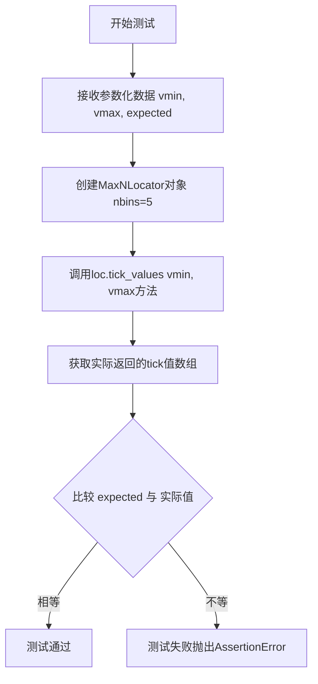

#### 带注释源码

```python
@pytest.mark.parametrize('vmin, vmax, expected', basic_data)
def test_basic(self, vmin, vmax, expected):
    """
    测试MaxNLocator的基本tick值生成功能
    
    参数化测试用例:
    - (20, 100) -> [20., 40., 60., 80., 100.]
    - (0.001, 0.0001) -> [0., 0.0002, 0.0004, 0.0006, 0.0008, 0.001]
    - (-1e15, 1e15) -> [-1.0e+15, -5.0e+14, 0e+00, 5e+14, 1.0e+15]
    - (0, 0.85e-50) -> np.arange(6) * 2e-51
    - (-0.85e-50, 0) -> np.arange(-5, 1) * 2e-51
    """
    # 创建MaxNLocator定位器对象,设置最大tick数量为5
    loc = mticker.MaxNLocator(nbins=5)
    
    # 调用tick_values方法生成指定范围[vmin, vmax]内的tick值
    # 并使用assert_almost_equal断言验证结果与预期值是否近似相等
    assert_almost_equal(loc.tick_values(vmin, vmax), expected)
```


### `TestMaxNLocator.test_integer`

该测试方法用于验证`MaxNLocator`类在整数模式下的刻度值生成功能，通过参数化测试检查不同输入参数（最小值、最大值、步长）下生成的刻度值是否符合预期。

参数：

- `self`：`TestMaxNLocator`，测试类实例
- `vmin`：`float`，测试数据的最小值
- `vmax`：`float`，测试数据的最大值
- `steps`：`list` 或 `None`，用于控制刻度步长的可选参数
- `expected`：`numpy.ndarray`，期望生成的刻度值数组

返回值：`None`，该方法为测试方法，使用`assert_almost_equal`进行断言验证，不返回具体值

#### 流程图

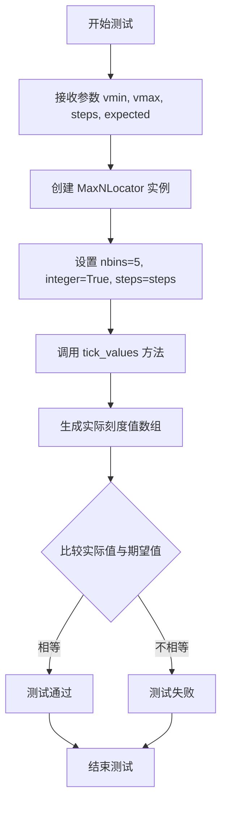

#### 带注释源码

```python
@pytest.mark.parametrize('vmin, vmax, steps, expected', integer_data)
def test_integer(self, vmin, vmax, steps, expected):
    """
    测试 MaxNLocator 在整数模式下的刻度值生成功能。
    
    参数化测试使用 integer_data 中的多组测试数据:
    - (-0.1, 1.1, None, [-1, 0, 1, 2])
    - (-0.1, 0.95, None, [-0.25, 0, 0.25, 0.5, 0.75, 1.0])
    - (1, 55, [1, 1.5, 5, 6, 10], [0, 15, 30, 45, 60])
    """
    # 创建 MaxNLocator 实例，设置最多5个刻度槽
    # integer=True 启用整数模式，steps 控制步长
    loc = mticker.MaxNLocator(nbins=5, integer=True, steps=steps)
    
    # 调用 tick_values 方法计算给定范围内的刻度值
    # 使用 assert_almost_equal 比较计算结果与期望值
    assert_almost_equal(loc.tick_values(vmin, vmax), expected)
```


### `TestMaxNLocator.test_errors`

该测试方法用于验证 `MaxNLocator` 类在接收无效参数时能否正确抛出预期的异常。它通过 pytest 参数化测试来覆盖多个错误场景，包括未知关键字参数、步骤值非递增以及步骤值类型错误等情况。

参数：

- `self`：`TestMaxNLocator`，测试类的实例对象
- `kwargs`：`dict`，传递给 `mticker.MaxNLocator` 的关键字参数
- `errortype`：`Type[type]`，预期的异常类型（如 `TypeError`、`ValueError`）
- `match`：`str`，用于匹配异常消息的正则表达式模式

返回值：`None`，该方法为一个测试函数，使用 `pytest.raises` 上下文管理器来验证异常抛出，不返回任何值

#### 流程图

```mermaid
flowchart TD
    A[开始测试 test_errors] --> B{参数化测试循环}
    B --> C[从参数列表获取 kwargs, errortype, match]
    C --> D[调用 mticker.MaxNLocator(**kwargs)]
    D --> E{是否抛出异常?}
    E -->|是| F[验证异常类型是否匹配 errortype]
    E -->|否| G[测试失败 - 未抛出预期异常]
    F --> H{异常消息是否匹配 match?}
    H -->|是| I[测试通过]
    H -->|否| J[测试失败 - 消息不匹配]
    I --> B
    J --> B
    G --> K[测试失败]
    
    style I fill:#90EE90
    style G fill:#FFB6C1
    style J fill:#FFB6C1
```

#### 带注释源码

```python
@pytest.mark.parametrize('kwargs, errortype, match', [
    # 测试用例1: 传递未知的关键字参数 'foo'
    ({'foo': 0}, TypeError,
     re.escape("set_params() got an unexpected keyword argument 'foo'")),
    # 测试用例2: 传递非递增的步骤列表 [2, 1]
    ({'steps': [2, 1]}, ValueError, "steps argument must be an increasing"),
    # 测试用例3: 传递整数步骤值 2 (应为列表)
    ({'steps': 2}, ValueError, "steps argument must be an increasing"),
    # 测试用例4: 传递超出范围的步骤值 [2, 11]
    ({'steps': [2, 11]}, ValueError, "steps argument must be an increasing"),
])
def test_errors(self, kwargs, errortype, match):
    """
    测试 MaxNLocator 构造函数在接收无效参数时是否正确抛出异常。
    
    测试场景:
    1. 未知关键字参数 - 应抛出 TypeError
    2. 非递增的步骤列表 - 应抛出 ValueError
    3. 非列表类型的步骤值 - 应抛出 ValueError
    4. 超出有效范围的步骤值 - 应抛出 ValueError
    
    参数:
        kwargs: dict - 传递给 MaxNLocator 的关键字参数
        errortype: Type[Exception] - 预期的异常类型
        match: str - 异常消息的正则匹配模式
    """
    # 使用 pytest.raises 上下文管理器验证异常抛出
    # 如果未抛出异常或异常类型不匹配，测试将失败
    with pytest.raises(errortype, match=match):
        # 创建 MaxNLocator 实例，传入无效参数
        # 预期会触发 set_params() 中的参数验证逻辑
        mticker.MaxNLocator(**kwargs)
```


### `TestMaxNLocator.test_padding`

该方法是一个 pytest 测试用例，用于验证 `MaxNLocator` 类的 `steps` 参数处理逻辑是否正确，特别是当用户提供的 steps 不完整时，类内部能够正确地补全为默认的标准步骤数组 `[1, 2, 10]`。

参数：

- `self`：隐式参数，测试方法所属的类实例
- `steps`：`list`，用户传入的步骤列表，用于初始化 `MaxNLocator`
- `result`：`list`，期望的补全后的步骤列表

返回值：`None`，该方法为测试用例，通过断言验证逻辑，不返回任何值

#### 流程图

```mermaid
flowchart TD
    A[开始测试] --> B[接收参数 steps 和 result]
    B --> C[创建 MaxNLocator 实例<br/>loc = mticker.MaxNLocator(steps=steps)]
    C --> D[获取内部属性 _steps<br/>loc._steps]
    D --> E{assert loc._steps == result}
    E -->|通过| F[测试通过]
    E -->|失败| G[抛出 AssertionError]
    
    style C fill:#f9f,color:#000
    style E fill:#ff9,color:#000
    style F fill:#9f9,color:#000
    style G fill:#f99,color:#000
```

#### 带注释源码

```python
@pytest.mark.parametrize('steps, result', [
    # 参数化测试：测试不同的 steps 输入及其期望的补全结果
    # 场景1: 完整的 steps [1, 2, 10]，期望保持不变
    ([1, 2, 10], [1, 2, 10]),
    # 场景2: 缺少 1，期望补全为 [1, 2, 10]
    ([2, 10], [1, 2, 10]),
    # 场景3: 缺少 10，期望补全为 [1, 2, 10]
    ([1, 2], [1, 2, 10]),
    # 场景4: 只有 2，期望补全为 [1, 2, 10]
    ([2], [1, 2, 10]),
])
def test_padding(self, steps, result):
    """
    测试 MaxNLocator 的 steps 参数补全逻辑。
    
    MaxNLocator 内部维护一个默认的步骤数组 [1, 2, 10]，当用户
    提供的 steps 不完整时，应该自动补全为该默认数组。
    
    参数:
        steps: 用户提供的 steps 参数
        result: 期望的内部 _steps 属性值
    """
    # 使用给定的 steps 参数创建 MaxNLocator 实例
    loc = mticker.MaxNLocator(steps=steps)
    
    # 断言内部存储的 _steps 属性与期望的 result 一致
    # 使用 .all() 确保数组所有元素都相等
    assert (loc._steps == result).all()
```


### `TestLinearLocator.test_basic`

该测试方法用于验证 `LinearLocator` 类在基本场景下的 tick 值生成功能是否正确，通过创建一个具有3个刻度数的线性定位器，并检查其在给定范围 [-0.8, 0.2] 内生成的刻度值是否与预期值 [-0.8, -0.3, 0.2] 相等。

参数： 无显式参数（self 为隐式参数，表示测试类实例本身）

返回值：`None`，该方法为测试方法，通过断言验证功能，不返回任何值

#### 流程图

```mermaid
flowchart TD
    A[开始测试 test_basic] --> B[创建 LinearLocator 实例<br/>numticks=3]
    B --> C[定义期望的测试值数组<br/>np.array([-0.8, -0.3, 0.2])]
    C --> D[调用 loc.tick_values 方法<br/>参数: vmin=-0.8, vmax=0.2]
    D --> E[执行 assert_almost_equal 断言<br/>比较实际返回值与期望值]
    E --> F{断言是否通过?}
    F -->|是| G[测试通过 - 测试结束]
    F -->|否| H[测试失败 - 抛出 AssertionError]
```

#### 带注释源码

```python
def test_basic(self):
    """
    测试 LinearLocator 在基本场景下的 tick 值生成功能。
    验证方法：创建 numticks=3 的 LinearLocator，
    检查其在范围 [-0.8, 0.2] 内生成的刻度值是否正确。
    """
    # 步骤1: 创建 LinearLocator 实例，设置刻度数量为3
    loc = mticker.LinearLocator(numticks=3)
    
    # 步骤2: 定义期望的测试值数组，用于后续断言验证
    # 期望生成三个均匀分布的刻度点: -0.8, -0.3, 0.2
    test_value = np.array([-0.8, -0.3, 0.2])
    
    # 步骤3: 调用 tick_values 方法，传入最小值和最大值
    # 该方法会根据 numticks=3 在 [-0.8, 0.2] 范围内生成刻度值
    # 步骤4: 使用 assert_almost_equal 断言验证返回的刻度值
    # 与期望的 test_value 是否几乎相等（按元素比较）
    assert_almost_equal(loc.tick_values(-0.8, 0.2), test_value)
```


### TestLinearLocator.test_zero_numticks

该测试方法用于验证当 `LinearLocator` 的 `numticks` 参数设置为 0 时，`tick_values` 方法返回空列表的行为。

参数：

- `self`：`TestLinearLocator` 实例，隐含的测试类实例参数，无类型提示，指向测试类本身

返回值：`None`，测试方法不返回任何值

#### 流程图

```mermaid
graph TD
    A[开始测试方法 test_zero_numticks] --> B[创建 LinearLocator 实例, numticks=0]
    B --> C[调用 tick_values 方法, 参数 -0.8 和 0.2]
    C --> D[验证返回值为空列表]
    D --> E[结束测试]
```

#### 带注释源码

```python
def test_zero_numticks(self):
    """
    测试当 numticks 为 0 时的 LinearLocator 行为。
    验证 tick_values 方法在 numticks=0 时返回空列表。
    """
    # 创建一个 LinearLocator 实例，numticks 设置为 0
    loc = mticker.LinearLocator(numticks=0)
    
    # 调用 tick_values 方法，传入范围 -0.8 到 0.2
    # 预期返回空列表，因为 numticks 为 0
    # 注意：这里使用了 == 比较，但没有 assert 语句，可能是测试不完整
    loc.tick_values(-0.8, 0.2) == []
```


### TestLinearLocator.test_set_params

该方法是一个测试函数，用于验证 `LinearLocator` 类的 `set_params()` 方法能够正确地修改 `numticks` 和 `presets` 参数。测试创建初始的 LinearLocator 实例，然后调用 set_params 修改参数，最后通过断言验证参数是否被成功更新。

参数：

- `self`：隐式参数，TestLinearLocator 类的实例方法标准参数

返回值：`None`，该方法为测试函数，无显式返回值，通过断言验证逻辑正确性

#### 流程图

```mermaid
flowchart TD
    A[开始测试] --> B[创建LinearLocator实例<br/>numticks=2, presets={}]
    B --> C[调用set_params方法<br/>numticks=8, presets={(0, 1): []}]
    C --> D{验证 loc.numticks == 8}
    D -->|是| E{验证 loc.presets == {(0, 1): []}}
    D -->|否| F[测试失败]
    E -->|是| G[测试通过]
    E -->|否| F
```

#### 带注释源码

```python
def test_set_params(self):
    """
    Create linear locator with presets={}, numticks=2 and change it to
    something else. See if change was successful. Should not exception.
    """
    # 第一步：创建LinearLocator实例，初始参数为numticks=2, presets为空字典
    loc = mticker.LinearLocator(numticks=2)
    
    # 第二步：调用set_params方法修改参数为numticks=8, presets={(0, 1): []}
    # set_params是LinearLocator类的方法，用于动态修改定位器的参数
    loc.set_params(numticks=8, presets={(0, 1): []})
    
    # 第三步：断言验证numticks参数是否被成功修改为8
    assert loc.numticks == 8
    
    # 第四步：断言验证presets参数是否被成功修改为{(0, 1): []}
    assert loc.presets == {(0, 1): []}
```


### TestLinearLocator.test_presets

该测试方法用于验证 `LinearLocator` 的预设（presets）功能是否正常工作。presets 允许用户为特定的值域范围预定义刻度值，当请求的 tick 值落在预设范围内时，将返回预设的刻度列表而不是自动计算的刻度。

参数：

- `self`：`TestLinearLocator`，测试类实例本身

返回值：`None`，测试方法无返回值，通过断言验证功能正确性

#### 流程图

```mermaid
flowchart TD
    A[开始测试] --> B[创建LinearLocator实例并设置presets]
    B --> C{测试 tick_values 1-2}
    C --> D[断言返回 [1, 1.25, 1.75]]
    D --> E{测试 tick_values 2-1}
    E --> F[断言返回 [1, 1.25, 1.75]]
    F --> G{测试 tick_values 0-2}
    G --> H[断言返回 [0.5, 1.5]]
    H --> I{测试 tick_values 0.0-2.0}
    I --> J[断言返回 [0.5, 1.5]]
    J --> K{测试 tick_values 0-1 无对应presets}
    K --> L[使用np.linspace生成默认刻度]
    L --> M[结束测试]
```

#### 带注释源码

```python
def test_presets(self):
    """
    测试 LinearLocator 的预设（presets）功能。
    预设允许为特定的值域范围预定义刻度列表。
    """
    # 创建一个 LinearLocator 实例，配置预设：
    # - 当值域在 (1, 2) 范围内时，使用刻度 [1, 1.25, 1.75]
    # - 当值域在 (0, 2) 范围内时，使用刻度 [0.5, 1.5]
    loc = mticker.LinearLocator(presets={(1, 2): [1, 1.25, 1.75],
                                         (0, 2): [0.5, 1.5]})
    
    # 测试1: 正向查询 (1, 2) 范围，应返回预设的 [1, 1.25, 1.75]
    assert loc.tick_values(1, 2) == [1, 1.25, 1.75]
    
    # 测试2: 反向查询 (2, 1) 范围，也应返回相同的预设值
    # LinearLocator 应该忽略顺序，返回相同结果
    assert loc.tick_values(2, 1) == [1, 1.25, 1.75]
    
    # 测试3: 查询 (0, 2) 范围，应返回预设的 [0.5, 1.5]
    assert loc.tick_values(0, 2) == [0.5, 1.5]
    
    # 测试4: 使用浮点数 (0.0, 2.0) 查询，验证浮点数兼容性
    assert loc.tick_values(0.0, 2.0) == [0.5, 1.5]
    
    # 测试5: 查询 (0, 1) 范围，该范围没有对应预设
    # 应回退到自动生成刻度的默认行为，生成11个均匀分布的刻度
    assert (loc.tick_values(0, 1) == np.linspace(0, 1, 11)).all()
```


### TestMultipleLocator.test_basic

该测试方法用于验证 MultipleLocator 类的基本刻度值生成功能，通过创建指定 base=3.147 的 MultipleLocator 实例，调用其 tick_values 方法生成 -7 到 10 范围内的刻度值，并与预期数组进行近似相等断言。

参数：

- `self`：TestMultipleLocator，测试类实例本身，无需显式传递

返回值：`None`，测试方法无返回值，通过 assert_almost_equal 断言验证计算结果

#### 流程图

```mermaid
flowchart TD
    A[测试开始] --> B[创建MultipleLocator实例<br/>base=3.147]
    B --> C[调用tick_values方法<br/>参数vmin=-7, vmax=10]
    C --> D[生成实际刻度值数组]
    D --> E[定义期望刻度值数组<br/>-9.441, -6.294, -3.147, 0, 3.147, 6.294, 9.441, 12.588]
    E --> F{assert_almost_equal<br/>实际值 ≈ 期望值?}
    F -->|是| G[测试通过]
    F -->|否| H[测试失败]
    G --> I[测试结束]
    H --> I
```

#### 带注释源码

```python
def test_basic(self):
    """
    测试 MultipleLocator 类的基本刻度值生成功能。
    验证当给定 base=3.147 时，tick_values 方法能够正确生成
    覆盖指定范围 [-7, 10] 的刻度值序列。
    """
    # 创建 MultipleLocator 实例，设置 base=3.147
    # base 参数定义了刻度值之间的基础间隔
    loc = mticker.MultipleLocator(base=3.147)
    
    # 定义期望的刻度值数组
    # 从 -9.441 开始，以 3.147 为步长递增，直到 12.588
    test_value = np.array([-9.441, -6.294, -3.147, 0., 3.147, 6.294,
                           9.441, 12.588])
    
    # 调用 tick_values 方法获取实际刻度值
    # vmin=-7: 期望范围的最小值
    # vmax=10: 期望范围的最大值
    # 该方法会返回覆盖该范围的刻度值数组
    assert_almost_equal(loc.tick_values(-7, 10), test_value)
    # assert_almost_equal: 近似相等断言，允许数值误差
    # 如果实际值与期望值差异过大，则抛出 AssertionError
```


### `TestMultipleLocator.test_basic_with_offset`

该测试方法用于验证 MultipleLocator 类在带有偏移量（offset）参数时的基本功能，通过创建带有 base 和 offset 参数的定位器，并验证其在给定范围内生成的刻度值是否符合预期。

参数：

- `self`：`TestMultipleLocator`，测试类实例本身

返回值：`None`，测试方法无返回值，通过断言验证功能正确性

#### 流程图

```mermaid
flowchart TD
    A[开始测试] --> B[创建MultipleLocator实例<br/>base=3.147, offset=1.2]
    B --> C[调用tick_values方法<br/>参数: vmin=-7, vmax=10]
    C --> D[生成刻度值数组]
    D --> E[预期值: np.array<br/>[-8.241, -5.094, -1.947, 1.2, 4.347, 7.494, 10.641]]
    E --> F{断言验证}
    F -->|通过| G[测试通过]
    F -->|失败| H[测试失败]
```

#### 带注释源码

```python
def test_basic_with_offset(self):
    """
    测试MultipleLocator在带有offset参数时的基本行为。
    验证带有偏移量的刻度定位器能够正确生成指定范围内的刻度值。
    """
    # 创建MultipleLocator实例，base为基数，offset为偏移量
    loc = mticker.MultipleLocator(base=3.147, offset=1.2)
    
    # 定义期望的输出结果
    # 这些值是通过 base*k + offset 计算得出的
    # 例如: 3.147 * -3 + 1.2 = -8.241
    #      3.147 * -2 + 1.2 = -5.094
    #      3.147 * -1 + 1.2 = -1.947
    #      3.147 * 0 + 1.2 = 1.2
    #      3.147 * 1 + 1.2 = 4.347
    #      3.147 * 2 + 1.2 = 7.494
    #      3.147 * 3 + 1.2 = 10.641
    test_value = np.array([-8.241, -5.094, -1.947, 1.2, 4.347, 7.494,
                           10.641])
    
    # 验证tick_values方法返回的数组与预期值几乎相等
    assert_almost_equal(loc.tick_values(-7, 10), test_value)
```


### TestMultipleLocator.test_view_limits

该方法用于测试 MultipleLocator 在 `axes.autolimit_mode` 为 'data' 模式下的视图边界行为，验证 view_limits 方法能否正确返回原始的数据边界。

参数：

- `self`：隐式参数，TestMultipleLocator 实例本身

返回值：`None`（测试方法无返回值，通过 assert 语句验证）

#### 流程图

```mermaid
flowchart TD
    A[开始测试] --> B[设置 rc_context: axes.autolimit_mode='data']
    B --> C[创建 MultipleLocator base=3.147]
    C --> D[调用 view_limits(-5, 5)]
    D --> E{断言结果是否等于 (-5, 5)}
    E -->|是| F[测试通过]
    E -->|否| G[测试失败]
```

#### 带注释源码

```python
def test_view_limits(self):
    """
    Test basic behavior of view limits.
    """
    # 使用 rc_context 临时设置 autolimit_mode 为 'data' 模式
    # 在该模式下，view_limits 应该返回原始的数据边界
    with mpl.rc_context({'axes.autolimit_mode': 'data'}):
        # 创建 MultipleLocator，base=3.147 表示刻度间隔为 3.147
        loc = mticker.MultipleLocator(base=3.147)
        # 断言：在 data 模式下，view_limits 应返回原始边界 (-5, 5)
        assert_almost_equal(loc.view_limits(-5, 5), (-5, 5))
```


### `TestMultipleLocator.test_view_limits_round_numbers`

该测试方法用于验证 MultipleLocator 在 'round_numbers' 自动限制模式下的行为是否正确，特别是确保当输入范围为 (-4, 4) 时，能够正确返回扩展后的视图限制值 (-6.294, 6.294)。

参数：

- `self`：`TestMultipleLocator` 实例，测试方法的隐式参数

返回值：`None`，该方法为测试用例，无显式返回值，仅通过断言验证逻辑正确性

#### 流程图

```mermaid
flowchart TD
    A[开始测试] --> B[设置rc_context: axes.autolimit_mode='round_numbers']
    B --> C[创建MultipleLocator实例: base=3.147]
    C --> D[调用view_limits方法: loc.view_limits(-4, 4)]
    D --> E{断言结果是否等于<br/>(-6.294, 6.294)}
    E -->|是| F[测试通过]
    E -->|否| G[测试失败]
    F --> H[结束]
    G --> H
```

#### 带注释源码

```python
def test_view_limits_round_numbers(self):
    """
    Test that everything works properly with 'round_numbers' for auto
    limit.
    """
    # 使用 rc_context 临时设置 matplotlib 的 autolimit_mode 为 'round_numbers'
    # 这是一种自动限制模式，会将视图边界扩展到更"美观"的数值
    with mpl.rc_context({'axes.autolimit_mode': 'round_numbers'}):
        # 创建 MultipleLocator 实例，base=3.147 表示刻度间隔为 3.147
        loc = mticker.MultipleLocator(base=3.147)
        
        # 验证 view_limits 方法在 round_numbers 模式下的行为
        # 输入范围为 (-4, 4)，期望输出为扩展后的 (-6.294, 6.294)
        # -6.294 = -2 * 3.147, 6.294 = 2 * 3.147
        # 这表明该方法会将范围扩展到最接近的 base 的整数倍
        assert_almost_equal(loc.view_limits(-4, 4), (-6.294, 6.294))
```


### TestMultipleLocator.test_view_limits_round_numbers_with_offset

该测试方法验证MultipleLocator在启用"round_numbers"自动限制模式和带有偏移量的情况下，view_limits方法能否正确返回扩展后的视图边界。

参数：

- `self`：`TestMultipleLocator`，测试类的实例，隐式参数，代表当前测试对象

返回值：`None`，该方法为测试方法，无显式返回值，通过assert_almost_equal断言验证view_limits的返回结果是否符合预期

#### 流程图

```mermaid
flowchart TD
    A[开始测试] --> B[设置rc_context: axes.autolimit_mode='round_numbers']
    B --> C[创建MultipleLocator: base=3.147, offset=1.3]
    C --> D[调用view_limits: 输入范围 -4 到 4]
    D --> E[获取返回的边界元组]
    E --> F{验证结果}
    F -->|等于期望值 (-4.994, 4.447)| G[测试通过]
    F -->|不等于期望值| H[测试失败]
    G --> I[结束]
    H --> I
```

#### 带注释源码

```python
def test_view_limits_round_numbers_with_offset(self):
    """
    Test that everything works properly with 'round_numbers' for auto
    limit.
    """
    # 使用rc_context上下文管理器设置matplotlib的autolimit_mode为'round_numbers'
    # 这样在调用view_limits时会使用round_numbers模式来扩展边界
    with mpl.rc_context({'axes.autolimit_mode': 'round_numbers'}):
        # 创建一个MultipleLocator对象，base=3.147为间隔基数
        # offset=1.3为偏移量，会影响生成的tick位置
        loc = mticker.MultipleLocator(base=3.147, offset=1.3)
        
        # 调用view_limits方法，传入数据范围-4到4
        # 期望在round_numbers模式下，结合offset偏移量
        # 返回扩展后的视图边界(-4.994, 4.447)
        assert_almost_equal(loc.view_limits(-4, 4), (-4.994, 4.447))
```


### TestMultipleLocator.test_view_limits_single_bin

测试当只有一个bin时，'round_numbers'模式是否正常工作，验证MaxNLocator在nbins=1时能够正确计算视图限制。

参数：

- `self`：TestMultipleLocator，测试类实例本身

返回值：`None`，无返回值（测试方法，使用assert_almost_equal进行断言验证）

#### 流程图

```mermaid
flowchart TD
    A[开始测试] --> B[设置rc_context: axes.autolimit_mode='round_numbers']
    B --> C[创建MaxNLocator, nbins=1]
    C --> D[调用loc.view_limits -2.3, 2.3]
    D --> E[断言结果等于 -4, 4]
    E --> F[测试通过]
```

#### 带注释源码

```python
def test_view_limits_single_bin(self):
    """
    Test that 'round_numbers' works properly with a single bin.
    """
    # 使用rc_context设置autolimit_mode为round_numbers
    # 这会影响view_limits方法的舍入行为
    with mpl.rc_context({'axes.autolimit_mode': 'round_numbers'}):
        # 创建一个MaxNLocator，nbins=1表示只使用一个bin
        loc = mticker.MaxNLocator(nbins=1)
        # 调用view_limits方法，传入vmin=-2.3和vmax=2.3
        # 期望返回值为(-4, 4)，即自动扩展到合适的整数值
        assert_almost_equal(loc.view_limits(-2.3, 2.3), (-4, 4))
```


### TestMultipleLocator.test_set_params

该方法用于测试MultipleLocator的set_params方法功能，验证能够成功修改base和offset参数。

参数：
- 无（该方法没有输入参数，使用固定的测试数据）

返回值：无（该方法为测试方法，使用assert进行验证，不返回实际值）

#### 流程图

```mermaid
flowchart TD
    A[开始测试] --> B[创建MultipleLocator实例 base=0.7]
    B --> C[调用set_params修改base为1.7]
    C --> D[断言 mult._edge.step == 1.7]
    D --> E[调用set_params修改offset为3]
    E --> F[断言 mult._offset == 3]
    F --> G[测试通过]
```

#### 带注释源码

```python
def test_set_params(self):
    """
    Create multiple locator with 0.7 base, and change it to something else.
    See if change was successful.
    """
    # 创建一个base为0.7的MultipleLocator实例
    mult = mticker.MultipleLocator(base=0.7)
    
    # 调用set_params方法修改base为1.7
    mult.set_params(base=1.7)
    
    # 验证base参数是否已成功修改，通过检查内部属性_edge.step
    assert mult._edge.step == 1.7
    
    # 调用set_params方法修改offset为3
    mult.set_params(offset=3)
    
    # 验证offset参数是否已成功修改
    assert mult._offset == 3
```


### `TestAutoMinorLocator.test_basic`

这是一个测试方法，用于验证 `AutoMinorLocator` 在基本场景下能否正确生成次要刻度（minor ticks）。测试创建一个图形，设置 x 轴范围为 (0, 1.39)，启用次要刻度，然后断言获取的次要刻度位置与预期值几乎相等。

参数：

- `self`：隐式参数，测试类实例本身，无需显式传递

返回值：`None`，该方法为测试方法，没有返回值，通过断言验证正确性

#### 流程图

```mermaid
flowchart TD
    A[开始测试] --> B[创建图形和坐标轴: plt.subplots]
    B --> C[设置x轴范围: set_xlim 0 到 1.39]
    C --> D[启用次要刻度: minorticks_on]
    D --> E[定义预期次要刻度值数组 test_value]
    E --> F[获取实际次要刻度位置: get_ticklocs minor=True]
    F --> G{断言: 实际值是否与预期值几乎相等}
    G -->|是| H[测试通过]
    G -->|否| I[测试失败]
```

#### 带注释源码

```python
def test_basic(self):
    """
    测试 AutoMinorLocator 在基本场景下的行为。
    验证在 x 轴范围 [0, 1.39] 时能否正确生成次要刻度。
    """
    # 创建一个新的图形和坐标轴对象
    fig, ax = plt.subplots()
    
    # 设置 x 轴的数据范围为 0 到 1.39
    ax.set_xlim(0, 1.39)
    
    # 开启次要刻度的显示
    ax.minorticks_on()
    
    # 定义预期的次要刻度位置数组
    # 包含 21 个次要刻度值，分布在 0 到 1.35 之间
    test_value = np.array([0.05, 0.1, 0.15, 0.25, 0.3, 0.35, 0.45,
                           0.5, 0.55, 0.65, 0.7, 0.75, 0.85, 0.9,
                           0.95, 1.05, 1.1, 1.15, 1.25, 1.3, 1.35])
    
    # 断言：获取的次要刻度位置应与预期值几乎相等
    # 使用 assert_almost_equal 进行浮点数近似相等比较
    assert_almost_equal(ax.xaxis.get_ticklocs(minor=True), test_value)
```


### `TestAutoMinorLocator.test_first_and_last_minorticks`

该测试方法验证AutoMinorLocator在处理边界情况时能够正确生成第一个和最后一个次级刻度线，特别针对issue #22331中发现的边界问题进行回归测试。

参数：
- `self`：TestAutoMinorLocator实例对象，隐式参数，无需显式传递

返回值：`None`，该方法为测试方法，通过assert_almost_equal断言验证次级刻度位置的正确性，无显式返回值

#### 流程图

```mermaid
flowchart TD
    A[开始测试 test_first_and_last_minorticks] --> B[创建图形和坐标轴: plt.subplots]
    B --> C[设置x轴范围: -1.9 到 1.9]
    C --> D[设置次级定位器: AutoMinorLocator]
    D --> E[获取次级刻度位置]
    E --> F{断言验证}
    F -->|通过| G[设置新范围: -5 到 5]
    F -->|失败| H[抛出AssertionError]
    G --> I[获取新范围次级刻度]
    I --> J{断言验证}
    J -->|通过| K[测试结束]
    J -->|失败| H
```

#### 带注释源码

```python
def test_first_and_last_minorticks(self):
    """
    Test that first and last minor tick appear as expected.
    """
    # This test is related to issue #22331
    # 创建图形和坐标轴对象
    fig, ax = plt.subplots()
    
    # 设置x轴显示范围为 -1.9 到 1.9
    ax.set_xlim(-1.9, 1.9)
    
    # 为x轴设置AutoMinorLocator自动次级刻度定位器
    ax.xaxis.set_minor_locator(mticker.AutoMinorLocator())
    
    # 定义预期的次级刻度位置数组
    # 包含从-1.9到1.9的所有次级刻度点（排除了整数位置）
    test_value = np.array([-1.9, -1.8, -1.7, -1.6, -1.4, -1.3, -1.2, -1.1,
                           -0.9, -0.8, -0.7, -0.6, -0.4, -0.3, -0.2, -0.1,
                           0.1, 0.2, 0.3, 0.4, 0.6, 0.7, 0.8, 0.9, 1.1,
                           1.2, 1.3, 1.4, 1.6, 1.7, 1.8, 1.9])
    
    # 断言验证获取的次级刻度位置与预期值几乎相等
    assert_almost_equal(ax.xaxis.get_ticklocs(minor=True), test_value)

    # 更改x轴范围为 -5 到 5，测试更大范围的边界情况
    ax.set_xlim(-5, 5)
    
    # 新范围的预期次级刻度位置
    # 5的倍数位置作为主刻度，次级刻度分布在主刻度之间
    test_value = np.array([-5.0, -4.5, -3.5, -3.0, -2.5, -1.5, -1.0, -0.5,
                           0.5, 1.0, 1.5, 2.5, 3.0, 3.5, 4.5, 5.0])
    
    # 再次断言验证新范围下次级刻度的正确性
    assert_almost_equal(ax.xaxis.get_ticklocs(minor=True), test_value)
```


### TestAutoMinorLocator.test_low_number_of_majorticks

该方法是一个测试用例，用于验证当轴上主刻度数量较少（0个或1个）时，自动次刻度定位器（AutoMinorLocator）的行为是否符合预期。该测试通过设置不同的主刻度数量，检查在边界情况下（无主刻度或仅一个主刻度）是否正确地不生成次刻度。

参数：

- `self`：隐式参数，表示测试类实例本身，无需显式传递
- `nb_majorticks`：`int`，主刻度的数量，用于设置主刻度的位置数量
- `expected_nb_minorticks`：`int`，预期生成的次刻度数量，用于与实际结果进行断言验证

返回值：无（`None`），该方法为一个测试用例，使用断言来验证功能，不返回任何值

#### 流程图

```mermaid
flowchart TD
    A[开始测试] --> B[创建图形和坐标轴]
    B --> C[设置x轴范围为0到5]
    C --> D[根据nb_majorticks设置主刻度位置]
    D --> E[启用次刻度显示]
    E --> F[设置次刻度定位器为AutoMinorLocator]
    F --> G[获取实际次刻度位置数量]
    G --> H{断言: 实际数量 == 预期数量?}
    H -->|是| I[测试通过]
    H -->|否| J[测试失败]
```

#### 带注释源码

```python
@pytest.mark.parametrize('nb_majorticks, expected_nb_minorticks', params)
def test_low_number_of_majorticks(
        self, nb_majorticks, expected_nb_minorticks):
    # This test is related to issue #8804
    # 创建一个新的图形和坐标轴对象
    fig, ax = plt.subplots()
    # 设置x轴的显示范围为0到5，便于测试不同的代码路径
    xlims = (0, 5)  # easier to test the different code paths
    # 设置x轴的显示范围
    ax.set_xlim(*xlims)
    # 根据nb_majorticks参数，在0到5的范围内均匀设置主刻度
    # 当nb_majorticks为0时，不设置主刻度
    # 当nb_majorticks为1时，只在中间设置一个主刻度
    ax.set_xticks(np.linspace(xlims[0], xlims[1], nb_majorticks))
    # 开启次刻度的显示
    ax.minorticks_on()
    # 为x轴设置自动次刻度定位器
    ax.xaxis.set_minor_locator(mticker.AutoMinorLocator())
    # 断言：获取的次刻度位置数量应等于预期数量
    # 当主刻度数量为0或1时，预期没有次刻度
    assert len(ax.xaxis.get_minorticklocs()) == expected_nb_minorticks
```


### `TestAutoMinorLocator.test_using_all_default_major_steps`

该测试方法验证默认的主刻度步长（major steps）与 `AutoLocator` 的内部 `_steps` 属性是否一致，确保自动定位器使用预期的主刻度间隔进行次刻度分割。

参数：

- `self`：`TestAutoMinorLocator` 实例对象，Python 实例方法的隐式参数

返回值：`None`，该方法无返回值（测试方法）

#### 流程图

```mermaid
flowchart TD
    A[开始 test_using_all_default_major_steps] --> B[设置 rc_context: _internal.classic_mode=False]
    B --> C[从 majorstep_minordivisions 提取主步长列表: [1, 2, 2.5, 5, 10]]
    C --> D[创建 AutoLocator 实例]
    D --> E[获取 AutoLocator._steps 属性值]
    E --> F{assert_allclose 验证}
    F -->|通过| G[测试通过]
    F -->|失败| H[抛出 AssertionError]
    G --> I[结束]
    H --> I
```

#### 带注释源码

```python
def test_using_all_default_major_steps(self):
    """
    验证 AutoLocator 使用所有默认的主刻度步长。
    
    该测试确保 AutoLocator 的内部 _steps 属性与测试类中定义的
    majorstep_minordivisions 的主步长值相匹配。
    """
    # 使用 rc_context 设置内部经典模式为 False
    # 这确保使用现代默认行为而非遗留行为
    with mpl.rc_context({'_internal.classic_mode': False}):
        # 从 majorstep_minordivisions 列表中提取第一个元素（主步长）
        # majorstep_minordivisions = [(1, 5), (2, 4), (2.5, 5), (5, 5), (10, 5)]
        # 提取后: majorsteps = [1, 2, 2.5, 5, 10]
        majorsteps = [x[0] for x in self.majorstep_minordivisions]
        
        # 创建 AutoLocator 实例并获取其内部 _steps 属性
        # _steps 表示自动定位器使用的主刻度步长候选值
        # 使用 assert_allclose 进行近似相等验证（考虑浮点精度）
        np.testing.assert_allclose(majorsteps,
                                   mticker.AutoLocator()._steps)
```


### TestAutoMinorLocator.test_number_of_minor_ticks

该测试方法用于验证 AutoMinorLocator 在给定主刻度步长情况下产生的次刻度分割数量是否符合预期。它通过参数化测试用例，检验不同主刻度步长（1、2、2.5、5、10）与对应期望次刻度分割数（5、4、5、5、5）之间的映射关系。

参数：

- `self`：`TestAutoMinorLocator`，测试类实例本身
- `major_step`：`float`，主刻度的步长值，用于设置 x 轴范围和主刻度位置
- `expected_nb_minordivisions`：`int`，期望的次刻度分割数量（即 minor ticks 数量 + 1）

返回值：无返回值（`None`），该方法为测试方法，通过 `assert` 断言验证结果

#### 流程图

```mermaid
flowchart TD
    A[开始测试] --> B[创建图表和坐标轴: fig, ax = plt.subplots]
    B --> C[设置x轴范围: ax.set_xlim0, major_step]
    C --> D[设置主刻度位置: ax.set_xticksxlims]
    D --> E[开启次刻度: ax.minorticks_on]
    E --> F[设置AutoMinorLocator: ax.xaxis.set_minor_locator]
    F --> G[获取次刻度位置数量: lenax.xaxis.get_minorticklocs]
    G --> H[计算分割数: nb_minor_divisions = len + 1]
    H --> I{断言: nb_minor_divisions == expected_nb_minordivisions}
    I --> |通过| J[测试通过]
    I --> |失败| K[抛出AssertionError]
```

#### 带注释源码

```python
@pytest.mark.parametrize('major_step, expected_nb_minordivisions',
                         majorstep_minordivisions)
def test_number_of_minor_ticks(
        self, major_step, expected_nb_minordivisions):
    """
    测试 AutoMinorLocator 在不同主刻度步长下产生的次刻度分割数。
    
    参数化测试用例:
    - major_step=1  -> expected_nb_minordivisions=5  (每大格5等分)
    - major_step=2  -> expected_nb_minordivisions=4  (每大格4等分)
    - major_step=2.5-> expected_nb_minordivisions=5  
    - major_step=5  -> expected_nb_minordivisions=5  
    - major_step=10 -> expected_nb_minordivisions=5  
    """
    # 创建新的图表和坐标轴对象
    fig, ax = plt.subplots()
    
    # 设置x轴范围为从0到主刻度步长
    xlims = (0, major_step)
    ax.set_xlim(*xlims)
    
    # 在x轴两端设置主刻度
    ax.set_xticks(xlims)
    
    # 开启次刻度显示
    ax.minorticks_on()
    
    # 设置次刻度定位器为AutoMinorLocator
    ax.xaxis.set_minor_locator(mticker.AutoMinorLocator())
    
    # 获取次刻度位置列表，计算其长度+1即为分割数
    # (+1是因为两个主刻度之间的空间被分割成n个区间，需要n+1个刻度点标记)
    nb_minor_divisions = len(ax.xaxis.get_minorticklocs()) + 1
    
    # 验证分割数是否符合预期
    assert nb_minor_divisions == expected_nb_minordivisions
```


### `TestAutoMinorLocator.test_additional`

该方法是一个pytest测试函数，用于验证`AutoMinorLocator`在各种极端或特殊数值范围（如图形极限、极小值、负值等）下的正确性。测试通过创建图表、启用次要刻度、设置网格和Y轴范围，然后断言实际的次要刻度位置与预期的参考值是否几乎相等。

参数：

- `self`：`TestAutoMinorLocator`，测试类实例，包含测试所需的上下文和辅助数据
- `lim`：tuple of (float, float)，Y轴的视图范围限制（vmin, vmax），用于设置`ax.set_ylim(lim)`
- `ref`：list of float，预期的Y轴次要刻度位置列表，用于与实际获取的次要刻度进行比对

返回值：`None`，该方法为测试方法，没有返回值；通过`assert_almost_equal`断言验证`ax.yaxis.get_ticklocs(minor=True)`返回的次要刻度位置是否与`ref`近似相等

#### 流程图

```mermaid
flowchart TD
    A[开始测试] --> B[创建图表和坐标轴: fig, ax = plt.subplots]
    B --> C[启用次要刻度: ax.minorticks_on]
    C --> D[设置Y轴次要网格: ax.grid True minor y]
    D --> E[设置Y轴主要网格: ax.grid True major color=k]
    E --> F[设置Y轴视图范围: ax.set_ylim lim]
    F --> G[获取Y轴次要刻度位置: ax.yaxis.get_ticklocs minor=True]
    G --> H[断言验证: assert_almost_equal 实际刻度与参考值ref]
    H --> I[测试结束]
```

#### 带注释源码

```python
@pytest.mark.parametrize('lim, ref', additional_data)
def test_additional(self, lim, ref):
    """
    测试AutoMinorLocator在各种数值范围内的次要刻度生成
    
    参数化测试，使用多组不同的Y轴极限值和对应的预期次要刻度位置
    """
    # 创建新的图形和坐标轴对象
    fig, ax = plt.subplots()

    # 开启次要刻度的显示
    ax.minorticks_on()
    
    # 配置次要网格线：启用、只显示在Y轴、线宽为1
    ax.grid(True, 'minor', 'y', linewidth=1)
    
    # 配置主要网格线：启用、只显示在Y轴、颜色为黑色、线宽为1
    ax.grid(True, 'major', color='k', linewidth=1)
    
    # 设置Y轴的视图范围（数据坐标范围）
    ax.set_ylim(lim)

    # 断言验证：获取Y轴的次要刻度位置，并与预期参考值进行比较
    # assert_almost_equal 允许微小的浮点数误差
    assert_almost_equal(ax.yaxis.get_ticklocs(minor=True), ref)
```


### TestAutoMinorLocator.test_number_of_minor_ticks_auto

该方法是一个pytest测试函数，用于验证AutoMinorLocator在自动模式下的行为是否正确，通过两种方式（rc参数和直接参数）测试次要刻度（minor ticks）的数量是否符合预期。

参数：

- `self`：TestAutoMinorLocator实例，测试类的实例对象
- `lim`：tuple，表示坐标轴的范围限制 (xmin, xmax)
- `ref`：list，表示预期的次要刻度位置列表
- `use_rcparam`：bool，指示是否使用matplotlib的rc参数来配置AutoMinorLocator

返回值：无（测试函数不返回任何值，通过assert语句验证结果的正确性）

#### 流程图

```mermaid
flowchart TD
    A[开始测试 test_number_of_minor_ticks_auto] --> B{use_rcparam?}
    B -->|True| C[设置context为rc参数<br/>{'xtick.minor.ndivs': 'auto'<br/>'ytick.minor.ndivs': 'auto'}]
    B -->|False| D[kwargs设置<br/>{'n': 'auto'}]
    C --> E[创建图表和坐标轴]
    D --> E
    E --> F[设置xlim和ylim为lim]
    F --> G[设置xaxis次要刻度定位器<br/>AutoMinorLocator]
    G --> H[设置yaxis次要刻度定位器<br/>AutoMinorLocator]
    H --> I[获取xaxis次要刻度位置]
    I --> J[断言xaxis次要刻度位置等于ref]
    J --> K[获取yaxis次要刻度位置]
    K --> L[断言yaxis次要刻度位置等于ref]
    L --> M[结束测试]
```

#### 带注释源码

```python
@pytest.mark.parametrize('use_rcparam', [False, True])
@pytest.mark.parametrize(
    'lim, ref', [
        # 第一组测试数据：(0, 1.39) 范围
        ((0, 1.39),
         [0.05, 0.1, 0.15, 0.25, 0.3, 0.35, 0.45, 0.5, 0.55, 0.65, 0.7,
          0.75, 0.85, 0.9, 0.95, 1.05, 1.1, 1.15, 1.25, 1.3, 1.35]),
        # 第二组测试数据：(0, 0.139) 范围，刻度更密集
        ((0, 0.139),
         [0.005, 0.01, 0.015, 0.025, 0.03, 0.035, 0.045, 0.05, 0.055,
          0.065, 0.07, 0.075, 0.085, 0.09, 0.095, 0.105, 0.11, 0.115,
          0.125, 0.13, 0.135]),
    ])
def test_number_of_minor_ticks_auto(self, lim, ref, use_rcparam):
    """
    测试AutoMinorLocator在自动模式下的行为。
    
    验证两种配置方式：
    1. 通过matplotlib rc参数配置（use_rcparam=True）
    2. 通过直接传递n='auto'参数配置（use_rcparam=False）
    
    确保x轴和y轴的自动次要刻度数量正确。
    """
    # 根据use_rcparam选择不同的配置方式
    if use_rcparam:
        # 方式1：通过rc_context设置全局参数
        # 设置次要刻度自动分配
        context = {'xtick.minor.ndivs': 'auto', 'ytick.minor.ndivs': 'auto'}
        kwargs = {}  # 不需要传递额外参数给AutoMinorLocator
    else:
        # 方式2：通过构造函数参数直接传递
        context = {}
        kwargs = {'n': 'auto'}  # 显式指定自动模式

    # 使用rc_context临时应用配置
    with mpl.rc_context(context):
        # 创建图形和坐标轴对象
        fig, ax = plt.subplots()
        # 设置x轴和y轴的显示范围
        ax.set_xlim(*lim)
        ax.set_ylim(*lim)
        
        # 为x轴设置自动次要刻度定位器
        ax.xaxis.set_minor_locator(mticker.AutoMinorLocator(**kwargs))
        # 为y轴设置自动次要刻度定位器
        ax.yaxis.set_minor_locator(mticker.AutoMinorLocator(**kwargs))
        
        # 验证x轴的次要刻度位置是否符合预期
        assert_almost_equal(ax.xaxis.get_ticklocs(minor=True), ref)
        # 验证y轴的次要刻度位置是否符合预期
        assert_almost_equal(ax.yaxis.get_ticklocs(minor=True), ref)
```


### `TestAutoMinorLocator.test_number_of_minor_ticks_int`

该测试方法用于验证 `AutoMinorLocator` 在传入整数参数 `n` 时的行为是否符合预期。它通过参数化测试覆盖了不同的细分数量（n=2, 4, 10）和不同的坐标轴范围，同时测试了两种配置方式：通过 rc 参数和通过直接传入 kwargs 参数。

参数：

- `self`：`TestAutoMinorLocator`，测试类实例
- `n`：`int`，指定每个主刻度区间内的次级分割数（例如 n=2 表示将主刻度区间分为 2 等份）
- `lim`：`Tuple[float, float]`，表示坐标轴的范围 (vmin, vmax)
- `ref`：`List[float]`，期望的次级刻度位置列表，用于与实际结果比对
- `use_rcparam`：`bool`，如果为 True，则通过 rc 参数设置 `xtick.minor.ndivs` 和 `ytick.minor.ndivs`；否则通过 `AutoMinorLocator(n=n)` 传入

返回值：`None`，该方法为测试方法，无返回值，通过断言验证结果正确性

#### 流程图

```mermaid
flowchart TD
    A[开始测试 test_number_of_minor_ticks_int] --> B{判断 use_rcparam}
    B -->|True| C[设置 context = {'xtick.minor.ndivs': n, 'ytick.minor.ndivs': n}]
    B -->|False| D[设置 kwargs = {'n': n}]
    C --> E[进入 mpl.rc_context 上下文]
    D --> E
    E --> F[创建 fig 和 ax]
    F --> G[设置 xlim 和 ylim 为 lim]
    G --> H[设置主刻度定位器: MultipleLocator(1)]
    H --> I[设置次级定位器: AutoMinorLocator(**kwargs)]
    I --> J[获取 x 轴次级刻度位置]
    J --> K[获取 y 轴次级刻度位置]
    K --> L[断言 x 轴次级刻度 == ref]
    L --> M[断言 y 轴次级刻度 == ref]
    M --> N[结束测试]
```

#### 带注释源码

```python
@pytest.mark.parametrize('use_rcparam', [False, True])
@pytest.mark.parametrize(
    'n, lim, ref', [
        (2, (0, 4), [0.5, 1.5, 2.5, 3.5]),
        (4, (0, 2), [0.25, 0.5, 0.75, 1.25, 1.5, 1.75]),
        (10, (0, 1), [0.1, 0.2, 0.3, 0.4, 0.5, 0.6, 0.7, 0.8, 0.9]),
    ])
def test_number_of_minor_ticks_int(self, n, lim, ref, use_rcparam):
    """
    测试 AutoMinorLocator 在传入整数 n 参数时的次级刻度数量。
    
    参数化说明：
    - n=2: 每个主刻度区间分为2等份，产生 [0.5, 1.5, 2.5, 3.5]
    - n=4: 每个主刻度区间分为4等份，产生 [0.25, 0.5, 0.75, 1.25, 1.5, 1.75]
    - n=10: 每个主刻度区间分为10等份，产生 [0.1, 0.2, ..., 0.9]
    """
    # 根据 use_rcparam 选择配置方式
    if use_rcparam:
        # 方式1：通过 matplotlib rc 参数设置
        context = {'xtick.minor.ndivs': n, 'ytick.minor.ndivs': n}
        kwargs = {}
    else:
        # 方式2：通过 kwargs 直接传入 n 参数
        context = {}
        kwargs = {'n': n}

    # 使用 rc_context 临时设置 matplotlib 参数
    with mpl.rc_context(context):
        # 创建图形和坐标轴
        fig, ax = plt.subplots()
        
        # 设置坐标轴范围
        ax.set_xlim(*lim)
        ax.set_ylim(*lim)
        
        # 设置主刻度定位器为 MultipleLocator(1)，即每个单位一个主刻度
        ax.xaxis.set_major_locator(mticker.MultipleLocator(1))
        ax.xaxis.set_minor_locator(mticker.AutoMinorLocator(**kwargs))
        
        ax.yaxis.set_major_locator(mticker.MultipleLocator(1))
        ax.yaxis.set_minor_locator(mticker.AutoMinorLocator(**kwargs))
        
        # 验证 x 轴和 y 轴的次级刻度位置是否符合预期
        assert_almost_equal(ax.xaxis.get_ticklocs(minor=True), ref)
        assert_almost_equal(ax.yaxis.get_ticklocs(minor=True), ref)
```


### TestLogLocator.test_basic

该测试方法用于验证 LogLocator（对数刻度定位器）的基本功能，包括检查无效输入时的异常处理、使用默认 base=10 和指定 numticks 时的刻度值生成、以及使用 base=2 时的刻度值生成。

参数：

- `self`：实例方法隐式参数，不需要显式传递

返回值：`None`，测试方法无返回值，通过断言验证功能正确性

#### 流程图

```mermaid
flowchart TD
    A[开始 test_basic] --> B[创建 LogLocator numticks=5]
    B --> C[测试无效输入 0 到 1000]
    C --> D{是否抛出 ValueError?}
    D -->|是| E[捕获异常，验证通过]
    D -->|否| F[测试失败]
    E --> G[创建期望数组 1e-5 到 1e+7]
    G --> H[调用 tick_values 0.001 到 1.1e5]
    H --> I[断言实际值等于期望值]
    I --> J[创建 LogLocator base=2]
    J --> K[创建期望数组 0.5 到 128]
    K --> L[调用 tick_values 1 到 100]
    L --> M[断言实际值等于期望值]
    M --> N[结束测试]
```

#### 带注释源码

```python
def test_basic(self):
    """
    测试 LogLocator 的基本功能：
    1. 验证无效输入（0）会抛出 ValueError
    2. 验证默认 base=10 时的刻度值计算
    3. 验证指定 base=2 时的刻度值计算
    """
    # 创建具有5个刻度位的 LogLocator
    loc = mticker.LogLocator(numticks=5)
    
    # 测试用例1：对数刻度定位器不能处理0值（因为无法计算对数）
    # 期望抛出 ValueError 异常
    with pytest.raises(ValueError):
        loc.tick_values(0, 1000)

    # 定义期望的刻度值数组（从 1e-5 到 1e+7）
    test_value = np.array([1e-5, 1e-3, 1e-1, 1e+1, 1e+3, 1e+5, 1e+7])
    
    # 调用 tick_values 获取实际刻度值
    # 参数 vmin=0.001, vmax=1.1e5
    actual_value = loc.tick_values(0.001, 1.1e5)
    
    # 断言实际刻度值与期望值几乎相等（使用 assert_almost_equal）
    assert_almost_equal(actual_value, test_value)

    # 测试用例2：创建 base=2 的对数刻度定位器
    loc = mticker.LogLocator(base=2)
    
    # 定义期望的刻度值数组（2的幂次：0.5, 1, 2, 4, 8, 16, 32, 64, 128）
    test_value = np.array([.5, 1., 2., 4., 8., 16., 32., 64., 128.])
    
    # 调用 tick_values 获取实际刻度值
    # 参数 vmin=1, vmax=100
    actual_value = loc.tick_values(1, 100)
    
    # 断言实际刻度值与期望值几乎相等
    assert_almost_equal(actual_value, test_value)
```


### TestLogLocator.test_polar_axes

该方法用于测试极坐标轴（Polar Axes）的对数刻度逻辑是否正确。极坐标轴具有不同的刻度生成逻辑，此测试验证在极坐标投影下设置对数刻度时，刻度值是否按照预期生成。

参数：

- `self`：TestLogLocator 类实例本身，无需显式传递

返回值：`None`，该方法为测试函数，使用断言进行验证，不返回任何值

#### 流程图

```mermaid
flowchart TD
    A[开始测试] --> B[创建极坐标子图]
    B --> C[设置Y轴为对数刻度]
    C --> D[设置Y轴范围为1到100]
    D --> E{断言验证}
    E -->|通过| F[测试通过]
    E -->|失败| G[抛出AssertionError]
    F --> H[结束测试]
    G --> H
```

#### 带注释源码

```python
def test_polar_axes(self):
    """
    Polar Axes have a different ticking logic.
    """
    # 创建一个极坐标子图，subplot_kw参数指定投影类型为极坐标
    fig, ax = plt.subplots(subplot_kw={'projection': 'polar'})
    
    # 将Y轴的刻度设置为对数模式
    ax.set_yscale('log')
    
    # 设置Y轴的显示范围为1到100
    ax.set_ylim(1, 100)
    
    # 断言验证：对于极坐标轴上的对数刻度，
    # 在范围[1, 100]内应该生成的刻度值为[10, 100, 1000]
    # 极坐标轴的对数刻度生成逻辑与普通直角坐标系不同
    assert_array_equal(ax.get_yticks(), [10, 100, 1000])
```


### TestLogLocator.test_switch_to_autolocator

这是一个测试方法，用于验证 `LogLocator` 在特定场景下是否能够正确切换到自动定位器（AutoLocator）。测试涵盖了三种场景：1) 使用 `subs="all"` 时的行为；2) 使用自定义 subs 且作为次要定位器时跳过特定值；3) 已有主要和次要刻度时不进行切换。

参数：此方法无参数（仅包含隐式参数 `self`，指向测试类实例）

返回值：`None`，因为这是一个测试方法，不返回任何值

#### 流程图

```mermaid
flowchart TD
    A[开始测试 test_switch_to_autolocator] --> B[创建 LogLocator subs='all']
    B --> C[调用 tick_values 0.45, 0.55]
    C --> D{断言结果等于 0.44 到 0.56}
    D -->|通过| E[创建 LogLocator subs=np.arange(2, 10)]
    E --> F[调用 tick_values 0.9, 20]
    F --> G{断言 1.0 不在结果中}
    G -->|通过| H{断言 10.0 不在结果中}
    H -->|通过| I[创建 LogLocator subs='auto']
    I --> J[调用 tick_values 10, 20]
    J --> K{断言结果只包含 20}
    K -->|通过| L[测试结束]
    D -->|失败| M[抛出 AssertionError]
    G -->|失败| M
    H -->|失败| M
    K -->|失败| M
```

#### 带注释源码

```python
def test_switch_to_autolocator(self):
    """
    测试 LogLocator 在特定条件下切换到自动定位器的行为。
    
    该测试验证以下三个场景：
    1. 当 subs="all" 时，应生成覆盖整个范围的刻度值
    2. 当作为次要定位器（subs=np.arange(2,10)）时，应跳过 1.0 和 10.0
    3. 当已有主要和次要刻度（10 和 20）时，不应切换定位器
    """
    # 场景1：测试 subs="all" 的行为
    # 期望生成从 0.44 到 0.56 的等间距刻度值
    loc = mticker.LogLocator(subs="all")
    assert_array_equal(loc.tick_values(0.45, 0.55),
                       [0.44, 0.46, 0.48, 0.5, 0.52, 0.54, 0.56])
    
    # 场景2：检查当作为次要定位器时，跳过 1.0 和 10.0
    # 这是因为 1.0 和 10.0 是对数刻度的主要标记点
    loc = mticker.LogLocator(subs=np.arange(2, 10))
    assert 1.0 not in loc.tick_values(0.9, 20.)
    assert 10.0 not in loc.tick_values(0.9, 20.)
    
    # 场景3：已有主要和次要刻度时不切换
    # 当范围是 10-20 且已有 10（主刻度）和 20（主刻度）时，
    # 不应切换到自动定位器，只返回 20
    loc = mticker.LogLocator(subs="auto")
    tv = loc.tick_values(10, 20)
    assert_array_equal(tv[(10 <= tv) & (tv <= 20)], [20])
```


### TestLogLocator.test_set_params

该方法是测试类 TestLogLocator 中的一个测试方法，用于验证 LogLocator 的 set_params 方法能够正确修改对数定位器的参数（numticks、subs、base），并通过断言确认修改是否成功。

参数：

- `self`：TestLogLocator 实例，Python 实例方法的隐式参数，表示当前测试类实例

返回值：`None`，无返回值（测试方法使用断言验证）

#### 流程图

```mermaid
flowchart TD
    A[开始测试] --> B[创建默认LogLocator实例 loc = mticker.LogLocator]
    B --> C[调用set_params设置numticks=7, subs=[2.0], base=4]
    C --> D[断言 loc.numticks == 7]
    D --> E{断言结果}
    E -->|通过| F[断言 loc._base == 4]
    E -->|失败| I[测试失败]
    F --> G{断言结果}
    G -->|通过| H[断言 list(loc._subs) == [2.0]]
    G -->|失败| I
    H --> J{断言结果}
    J -->|通过| K[测试通过]
    J -->|失败| I
```

#### 带注释源码

```python
def test_set_params(self):
    """
    Create log locator with default value, base=10.0, subs=[1.0],
    numticks=15 and change it to something else.
    See if change was successful. Should not raise exception.
    """
    # 创建一个使用默认参数的对数定位器
    # 默认值: base=10.0, subs=[1.0], numticks=15
    loc = mticker.LogLocator()
    
    # 调用 set_params 方法修改定位器的参数
    # 修改: numticks=7, subs=[2.0], base=4
    loc.set_params(numticks=7, subs=[2.0], base=4)
    
    # 断言验证 numticks 参数已被正确修改为 7
    assert loc.numticks == 7
    
    # 断言验证 base 参数已被正确修改为 4
    assert loc._base == 4
    
    # 断言验证 subs 参数已被正确修改为 [2.0]
    # _subs 可能不是列表类型，需要转换为 list 进行比较
    assert list(loc._subs) == [2.0]
```


### TestLogLocator.test_tick_values_correct

验证 `LogLocator` 在给定区间 `[1, 1e7]` 且 `subs=(1, 2, 5)` 时产生的刻度值是否与预期的十进制序列一致。

**参数：**

- `self`：`TestLogLocator`，测试类的实例，代表当前测试用例对象。

**返回值：**  
`None`（该方法仅执行断言，不返回任何值）

#### 流程图

```mermaid
flowchart TD
    A([开始]) --> B[创建 LogLocator 实例，subs=(1,2,5)]
    B --> C[调用 tick_values(1, 1e7) 获取实际刻度序列]
    C --> D{使用 assert_almost_equal 比对实际值与期望数组}
    D -->|相等| E([结束])
    D -->|不等| F[抛出 AssertionError]
```

#### 带注释源码

```python
def test_tick_values_correct(self):
    """
    验证 LogLocator 在 subs=(1, 2, 5) 时，对区间 [1, 1e7] 生成的刻度值是否正确。
    """
    # 1. 创建 LogLocator 实例，指定子刻度乘数 subs 为 (1, 2, 5)
    ll = mticker.LogLocator(subs=(1, 2, 5))

    # 2. 期望的刻度值数组：基于 10 的幂次与 subs 中的每个系数相乘
    test_value = np.array([1.e-01, 2.e-01, 5.e-01, 1.e+00, 2.e+00, 5.e+00,
                           1.e+01, 2.e+01, 5.e+01, 1.e+02, 2.e+02, 5.e+02,
                           1.e+03, 2.e+03, 5.e+03, 1.e+04, 2.e+04, 5.e+04,
                           1.e+05, 2.e+05, 5.e+05, 1.e+06, 2.e+06, 5.e+06,
                           1.e+07, 2.e+07, 5.e+07])

    # 3. 使用 numpy.testing.assert_almost_equal 断言实际返回的刻度序列与期望相等
    assert_almost_equal(ll.tick_values(1, 1e7), test_value)
```


### TestLogLocator.test_tick_values_not_empty

这是一个测试方法，用于验证 LogLocator 在特定参数配置下生成的 tick 值数组不为空。

参数：

- `self`：TestLogLocator，测试类实例本身

返回值：无（void），这是一个测试方法，使用 assert_almost_equal 进行断言验证

#### 流程图

```mermaid
flowchart TD
    A[开始测试] --> B[设置 rcParams['_internal.classic_mode'] = False]
    B --> C[创建 LogLocator 实例, subs=(1, 2, 5)]
    C --> D[定义期望的 test_value 数组]
    D --> E[调用 ll.tick_values(1, 1e8)]
    E --> F{返回值是否非空?}
    F -->|是| G[使用 assert_almost_equal 验证返回值]
    G --> H[测试通过]
    F -->|否| I[测试失败]
```

#### 带注释源码

```python
def test_tick_values_not_empty(self):
    """
    测试 LogLocator 的 tick_values 方法在给定范围内返回非空数组。
    
    此测试确保当 subs=(1, 2, 5) 时，从 1 到 1e8 的范围能够生成
    完整的 log 刻度值，包括 0.1, 0.2, 0.5, 1, 2, 5, 10, 20, 50... 等值。
    """
    # 设置 matplotlib 内部经典模式为 False，确保使用现代行为
    mpl.rcParams['_internal.classic_mode'] = False
    
    # 创建 LogLocator 实例，指定子刻度为 (1, 2, 5)
    # 这些子刻度值决定了在每个十进制位内的刻度分布
    ll = mticker.LogLocator(subs=(1, 2, 5))
    
    # 定义期望的 tick 值数组
    # 这些值是 0.1 到 5e8 之间的对数刻度值，乘以 1, 2, 5 的系数
    test_value = np.array([1.e-01, 2.e-01, 5.e-01, 1.e+00, 2.e+00, 5.e+00,
                           1.e+01, 2.e+01, 5.e+01, 1.e+02, 2.e+02, 5.e+02,
                           1.e+03, 2.e+03, 5.e+03, 1.e+04, 2.e+04, 5.e+04,
                           1.e+05, 2.e+05, 5.e+05, 1.e+06, 2.e+06, 5.e+06,
                           1.e+07, 2.e+07, 5.e+07, 1.e+08, 2.e+08, 5.e+08])
    
    # 断言 LogLocator 生成的 tick 值与期望值几乎相等
    # 这个测试确保 tick_values 方法不会返回空数组
    assert_almost_equal(ll.tick_values(1, 1e8), test_value)
```


### TestLogLocator.test_multiple_shared_axes

该测试方法用于验证在多个共享轴（sharex=True, sharey=True）的情况下，LogLocator 能够正确地为所有子图生成一致的 yticks 和 ylim。

参数：

- `self`：TestLogLocator 实例，隐含的测试类实例参数

返回值：`None`，该方法为测试方法，无返回值，通过断言验证行为

#### 流程图

```mermaid
flowchart TD
    A[开始] --> B[创建随机数生成器 rng]
    B --> C[生成测试数据: 100个正态分布值 + 2个空列表]
    C --> D[创建子图: 3个 axes, sharex=True, sharey=True]
    D --> E[遍历每个 axis 和对应数据]
    E --> F[调用 ax.hist 绘制直方图]
    F --> G[设置 y 轴为对数刻度: set_yscale='log', nonpositive='clip']
    E --> H{还有更多 axes?}
    H -->|是| E
    H -->|否| I[遍历所有 axes 验证]
    I --> J[断言: 所有 axis 的 yticks 等于第一个 axis 的 yticks]
    J --> K[断言: 所有 axis 的 ylim 等于第一个 axis 的 ylim]
    K --> L[结束]
```

#### 带注释源码

```python
def test_multiple_shared_axes(self):
    """
    测试在多个共享轴情况下 LogLocator 的行为。
    
    该测试验证当创建共享 x 轴和 y 轴的多个子图时，
    所有子图应具有一致的 yticks 和 ylim。
    """
    # 1. 创建确定性随机数生成器，使用固定种子保证测试可复现
    rng = np.random.default_rng(19680801)
    
    # 2. 准备测试数据：[100个正态分布值, 空列表, 空列表]
    #    这样可以测试有数据和无数据的情况
    dummy_data = [rng.normal(size=100), [], []]
    
    # 3. 创建子图，3个 axes，共享 x 轴和 y 轴
    #    sharex=True: 所有子图共享 x 轴刻度
    #    sharey=True: 所有子图共享 y 轴刻度
    fig, axes = plt.subplots(len(dummy_data), sharex=True, sharey=True)

    # 4. 遍历每个子图和数据，绘制直方图并设置对数刻度
    for ax, data in zip(axes.flatten(), dummy_data):
        # 绘制直方图，bins=10
        ax.hist(data, bins=10)
        # 设置 y 轴为对数刻度
        # nonpositive='clip': 将非正值裁剪为最小正数
        ax.set_yscale('log', nonpositive='clip')

    # 5. 验证所有子图的 yticks 和 ylim 是否一致
    for ax in axes.flatten():
        # 断言：每个子图的 yticks 应该与第一个子图相同
        assert all(ax.get_yticks() == axes[0].get_yticks())
        # 断言：每个子图的 ylim 应该与第一个子图相同
        assert ax.get_ylim() == axes[0].get_ylim()
```


### TestNullLocator.test_set_params

验证 NullLocator 的 set_params() 方法在调用时会产生 UserWarning 警告，但不会抛出异常。

参数：

- 无

返回值：`None`，测试方法无返回值

#### 流程图

```mermaid
flowchart TD
    A[开始测试] --> B[创建 NullLocator 实例: loc = mticker.NullLocator()]
    B --> C[使用 pytest.warns 捕获 UserWarning]
    C --> D[调用 loc.set_params 方法]
    D --> E{是否产生 UserWarning?}
    E -->|是| F[测试通过]
    E -->|否| G[测试失败]
```

#### 带注释源码

```python
def test_set_params(self):
    """
    Create null locator, and attempt to call set_params() on it.
    Should not exception, and should raise a warning.
    """
    # 创建一个 NullLocator 实例
    # NullLocator 是一个不产生任何刻度位置的定位器
    loc = mticker.NullLocator()
    
    # 使用 pytest.warns 上下文管理器捕获 UserWarning
    # 验证 set_params() 调用时会产生警告但不会抛出异常
    with pytest.warns(UserWarning):
        loc.set_params()
```


### `_LogitHelper.isclose`

该方法用于比较两个位于 (0, 1) 区间内的数值是否在 logit 空间（对数几率空间）中接近，常用于 logit 坐标系的数值比较测试。

参数：
- `x`：数值类型（int/float），要比较的第一个值
- `y`：数值类型（int/float），要比较的第二个值

返回值：`bool`，如果两个值都在 (0, 1) 区间内且在 logit 空间接近返回 `True`，否则返回 `False`

#### 流程图

```mermaid
flowchart TD
    A[开始 isclose] --> B{检查 x 是否在 0 < x < 1}
    B -->|否| C[返回 False]
    B -->|是| D{检查 y 是否在 0 < y < 1}
    D -->|否| C
    D -->|是| E[计算 x 的 logit: -log(1/x - 1)]
    E --> F[计算 y 的 logit: -log(1/y - 1)]
    F --> G[使用 np.isclose 比较两个 logit 值]
    G --> H[返回比较结果]
```

#### 带注释源码

```python
class _LogitHelper:
    @staticmethod
    def isclose(x, y):
        """
        比较两个数值在 logit 空间是否接近。
        
        logit 变换公式: logit(x) = -log(1/x - 1) = log(x / (1 - x))
        这种变换将 (0, 1) 区间的值映射到整个实数轴，
        常用于对数几率坐标系的数值比较。
        
        参数:
            x: 第一个要比较的数值
            y: 第二个要比较的数值
            
        返回:
            bool: 如果两个值都在 (0, 1) 区间内且在 logit 空间接近返回 True，
                 否则返回 False
        """
        # 检查两个值是否都在有效区间 (0, 1) 内
        # logit 变换要求输入值必须在 0 到 1 之间（不含端点）
        if 0 < x < 1 and 0 < y < 1:
            # 将输入值转换为 logit 空间
            # logit(x) = -log(1/x - 1) = log(x / (1 - x))
            # 使用负对数形式避免数值精度问题
            logit_x = -np.log(1/x - 1)
            logit_y = -np.log(1/y - 1)
            
            # 在 logit 空间中比较两个值是否接近
            # np.isclose 使用相对容差和绝对容差进行浮点数比较
            return np.isclose(logit_x, logit_y)
        else:
            # 如果任一值不在有效区间，返回 False
            return False
```


### `_LogitHelper.assert_almost_equal`

该方法是一个静态工具函数，用于在 logit 空间中比较两个值（或数组）是否近似相等。首先将输入转换为 numpy 数组并验证所有元素都在 (0, 1) 范围内（排除边界值 0 和 1），然后通过 logit 变换（`-np.log(1/x - 1)`）将值映射到实数域，最后使用 `assert_almost_equal` 进行数值比较。

**参数：**

- `x`：任意类型，需要比较的第一个值或值序列
- `y`：任意类型，需要比较的第二个值或值序列

**返回值：** 无返回值（该方法内部使用 `assert` 语句进行断言，若不相等则抛出 `AssertionError`）

#### 流程图

```mermaid
flowchart TD
    A[开始 assert_almost_equal] --> B[将 x 转换为 numpy 数组 ax]
    B --> C[将 y 转换为 numpy 数组 ay]
    C --> D{检查 ax 所有元素 > 0 且 < 1}
    D -->|不满足| E[抛出 AssertionError]
    D -->|满足| F{检查 ay 所有元素 > 0 且 < 1}
    F -->|不满足| E
    F -->|满足| G[计算 lx = -np.log1p 1/ax - 1]
    G --> H[计算 ly = -np.log1p 1/ay - 1]
    H --> I[调用 assert_almost_equal lx ly]
    I --> J[结束]
```

#### 带注释源码

```python
@staticmethod
def assert_almost_equal(x, y):
    """
    在 logit 空间中比较两个值是否近似相等。
    
    参数:
        x: 第一个值或值序列
        y: 第二个值或值序列
    
    返回:
        无返回值，通过 assert 进行断言
    """
    # 将输入转换为 numpy 数组，以便进行向量化操作
    ax = np.array(x)
    ay = np.array(y)
    
    # 断言：确保第一个数组的所有元素都在 (0, 1) 范围内
    # logit 变换要求输入值不能等于 0 或 1
    assert np.all(ax > 0) and np.all(ax < 1), \
        "所有元素必须大于 0 且小于 1"
    
    # 断言：确保第二个数组的所有元素都在 (0, 1) 范围内
    assert np.all(ay > 0) and np.all(ay < 1), \
        "所有元素必须大于 0 且小于 1"
    
    # 执行 logit 变换：logit(x) = -log(1/x - 1)
    # 该变换将 (0, 1) 区间内的值映射到整个实数轴
    # 在实数域上进行近似相等比较更加稳定和准确
    lx = -np.log(1/ax - 1)
    ly = -np.log(1/ay - 1)
    
    # 使用 numpy.testing.assert_almost_equal 进行数值比较
    # 默认精度为小数点后 7 位
    assert_almost_equal(lx, ly)
```


### TestLogitLocator.test_basic_major

该方法是一个参数化测试，用于验证 LogitLocator 在不同限制范围下生成的主要刻度是否符合预期。

参数：

- `self`：TestLogitLocator，测试类实例
- `lims`：tuple (float, float)，参数化限制范围，例如 (5e-2, 1-5e-2)
- `expected_low_ticks`：numpy.ndarray，预期的小值刻度数组

返回值：`None`，该方法为测试方法，无返回值（隐式返回 None）

#### 流程图

```mermaid
flowchart TD
    A[开始测试] --> B[计算预期刻度: sorted<br/>[*expected_low_ticks, 0.5, *(1-expected_low_ticks)]]
    B --> C[创建LogitLocator实例<br/>nbins=100]
    C --> D[调用loc.tick_values获取实际刻度]
    D --> E{使用_LogitHelper.assert_almost_equal<br/>比较实际与预期刻度}
    E -->|相等| F[测试通过]
    E -->|不等| G[测试失败/抛出异常]
```

#### 带注释源码

```python
@pytest.mark.parametrize(
    "lims, expected_low_ticks",
    zip(ref_basic_limits, ref_basic_major_ticks),
)
def test_basic_major(self, lims, expected_low_ticks):
    """
    Create logit locator with huge number of major, and tests ticks.
    """
    # 计算预期刻度：包括小值刻度、中点0.5、以及小值刻度对应的对称大值刻度
    expected_ticks = sorted(
        [*expected_low_ticks, 0.5, *(1 - expected_low_ticks)]
    )
    # 创建 LogitLocator 实例，设置较大的 nbins 以产生足够多的刻度
    loc = mticker.LogitLocator(nbins=100)
    # 断言实际生成的刻度与预期刻度几乎相等
    _LogitHelper.assert_almost_equal(
        loc.tick_values(*lims),
        expected_ticks
    )
```


### TestLogitLocator.test_maxn_major

该测试方法用于验证当轴视图被放大（zoom in）时，LogitLocator 定位器能够保持与 MaxNLocator 定位器相同的行为模式，确保在各种缩放级别下刻度数值的生成逻辑一致。

参数：

- `lims`：元组 (tuple)，测试用的数据范围边界，来源于 `ref_maxn_limits`，具体取值为 `(0.4, 0.6)`、`(5e-2, 2e-1)`、`(1 - 2e-1, 1 - 5e-2)` 三组

返回值：`None`（无返回值），该方法为测试用例，通过断言验证逻辑正确性

#### 流程图

```mermaid
flowchart TD
    A[开始测试] --> B[创建 LogitLocator 实例 nbins=100]
    B --> C[创建 MaxNLocator 实例 nbins=100 steps=1,2,5,10]
    C --> D{遍历 nbins = 4, 8, 16}
    D -->|当前 nbins| E[设置 LogitLocator 参数]
    E --> F[设置 MaxNLocator 参数]
    F --> G[获取 LogitLocator 刻度值 ticks]
    G --> H[获取 MaxNLocator 刻度值 maxn_ticks]
    H --> I{验证 shape 相等}
    I -->|是| J{验证所有元素相等}
    J -->|是| D
    J -->|否| K[断言失败: 刻度值不匹配]
    I -->|否| L[断言失败: shape 不匹配]
    K --> M[测试结束]
    L --> M
    D --> N[测试完成]
    N --> M
```

#### 带注释源码

```python
@pytest.mark.parametrize("lims", ref_maxn_limits)
def test_maxn_major(self, lims):
    """
    When the axis is zoomed, the locator must have the same behavior as
    MaxNLocator.
    """
    # 创建一个 LogitLocator 实例，用于生成分布在 (0, 1) 区间的对数刻度
    # nbins=100 表示最多考虑100个区间来生成刻度
    loc = mticker.LogitLocator(nbins=100)
    
    # 创建一个 MaxNLocator 实例作为参考实现
    # steps=[1, 2, 5, 10] 定义了刻度步长的候选值序列
    maxn_loc = mticker.MaxNLocator(nbins=100, steps=[1, 2, 5, 10])
    
    # 遍历不同的 nbins 参数值，测试不同精细程度的刻度生成
    for nbins in (4, 8, 16):
        # 更新 LogitLocator 的最大刻度数量参数
        loc.set_params(nbins=nbins)
        
        # 更新 MaxNLocator 的最大刻度数量参数
        maxn_loc.set_params(nbins=nbins)
        
        # 使用当前的 lims 范围获取 LogitLocator 生成的刻度值
        ticks = loc.tick_values(*lims)
        
        # 使用相同的范围获取 MaxNLocator 生成的刻度值
        maxn_ticks = maxn_loc.tick_values(*lims)
        
        # 断言：确保两种定位器生成的刻度数组形状相同
        assert ticks.shape == maxn_ticks.shape
        
        # 断言：确保两种定位器生成的刻度值完全一致
        assert (ticks == maxn_ticks).all()
```


### TestLogitLocator.test_nbins_major

该测试方法用于验证 LogitLocator 在不同 nbins 参数设置下能否正确限制生成的刻度数量，确保刻度数量不超过 nbins + 2。

参数：

- `self`：`TestLogitLocator`，测试类实例本身
- `lims`：元组 (tuple)，表示输入的数值范围 (vmin, vmax)，来源于 `ref_basic_limits + ref_maxn_limits` 参数化数据

返回值：`None`，该方法为测试函数，使用 assert 断言进行验证，无显式返回值

#### 流程图

```mermaid
flowchart TD
    A[开始 test_nbins_major] --> B[获取 lims 参数]
    B --> C[计算 basic_needed = int(-np.floor(np.log10(lims[0]))) * 2 + 1]
    C --> D[创建 LogitLocator(nbins=100)]
    D --> E[遍历 nbins 从 basic_needed 递减到 2]
    E --> F[调用 loc.set_params(nbins=nbins)]
    F --> G[获取 tick_values 并验证长度 <= nbins + 2]
    G --> H{所有 nbins 遍历完成?}
    H -->|否| E
    H -->|是| I[测试通过]
```

#### 带注释源码

```python
@pytest.mark.parametrize("lims", ref_basic_limits + ref_maxn_limits)
def test_nbins_major(self, lims):
    """
    Assert logit locator for respecting nbins param.
    """
    # 根据下限计算生成基本刻度所需的数量
    # 使用对数计算：log10(lims[0]) 的负值向下取整，乘以 2 再加 1
    # 例如：lims[0] = 0.001 时，basic_needed = int(-(-3)) * 2 + 1 = 7
    basic_needed = int(-np.floor(np.log10(lims[0]))) * 2 + 1
    
    # 创建一个 nbins=100 的 LogitLocator 实例
    loc = mticker.LogitLocator(nbins=100)
    
    # 从 basic_needed 递减到 2，测试不同 nbins 值
    for nbins in range(basic_needed, 2, -1):
        # 设置当前的 nbins 参数
        loc.set_params(nbins=nbins)
        
        # 验证生成的刻度数量不超过 nbins + 2
        # assert 断言确保 locator 遵守 nbins 参数约束
        assert len(loc.tick_values(*lims)) <= nbins + 2
```


### TestLogitLocator.test_minor

这是一个测试方法，用于验证 LogitLocator 在大尺度下minor刻度的存在性，以及当major刻度被子采样时minor刻度的行为是否符合预期。

参数：

- `self`：`TestLogitLocator` 类实例，表示测试类本身
- `lims`：元组 (tuple)，来自 pytest parametrize，表示测试的数值范围（vmin, vmax），例如 `(5e-2, 1 - 5e-2)`
- `expected_low_ticks`：numpy.ndarray，来自 pytest parametrize，表示预期的主要低值刻度，例如 `1 / (10 ** np.arange(1, 3))`

返回值：无（`None`），该方法为测试方法，使用断言进行验证

#### 流程图

```mermaid
flowchart TD
    A[开始测试] --> B[计算期望刻度 expected_ticks]
    B --> C[获取 basic_needed = len(expected_ticks)]
    C --> D[创建 LogitLocator: loc 和 minor_loc]
    D --> E[循环 nbins 从 basic_needed 递减到 2]
    E --> F[设置 loc 和 minor_loc 的 nbins 参数]
    F --> G[获取 major_ticks 和 minor_ticks]
    G --> H{判断 major_ticks 数量 >= expected_ticks 数量?}
    H -->|是| I[断言 minor_ticks 数量 > major_ticks 数量 * 5]
    H -->|否| J[合并并排序 major_ticks 和 minor_ticks]
    J --> K[断言合并后的刻度等于 expected_ticks]
    I --> L[继续循环或结束]
    K --> L
    L --> M[测试结束]
```

#### 带注释源码

```python
@pytest.mark.parametrize(
    "lims, expected_low_ticks",
    zip(ref_basic_limits, ref_basic_major_ticks),
)
def test_minor(self, lims, expected_low_ticks):
    """
    In large scale, test the presence of minor,
    and assert no minor when major are subsampled.
    """
    # 根据预期的低值刻度构建完整的期望刻度列表（包含0.5和对称的高值刻度）
    expected_ticks = sorted(
        [*expected_low_ticks, 0.5, *(1 - expected_low_ticks)]
    )
    # 计算期望刻度的数量
    basic_needed = len(expected_ticks)
    # 创建主要的 LogitLocator（用于生成主刻度）
    loc = mticker.LogitLocator(nbins=100)
    # 创建次要模式的 LogitLocator（用于生成次刻度）
    minor_loc = mticker.LogitLocator(nbins=100, minor=True)
    # 从 basic_needed 递减到 2 进行测试
    for nbins in range(basic_needed, 2, -1):
        # 设置两个 locator 的 nbins 参数
        loc.set_params(nbins=nbins)
        minor_loc.set_params(nbins=nbins)
        # 获取主刻度和次刻度
        major_ticks = loc.tick_values(*lims)
        minor_ticks = minor_loc.tick_values(*lims)
        # 判断是否进行了子采样
        if len(major_ticks) >= len(expected_ticks):
            # 没有子采样时，断言次刻度数量应该远多于主刻度（每个区间约5个次刻度）
            assert (len(major_ticks) - 1) * 5 < len(minor_ticks)
        else:
            # 存在子采样时，合并主次刻度应该与期望刻度一致
            _LogitHelper.assert_almost_equal(
                sorted([*major_ticks, *minor_ticks]), expected_ticks)
```


### `TestLogitLocator.test_minor_attr`

该函数是针对 `LogitLocator` 类的 `minor` 属性进行单元测试，验证其 getter 和 setter 功能是否正常工作，以及通过 `set_params` 方法设置 `minor` 参数是否生效。

参数：

- `self`：`TestLogitLocator` 实例，测试类的实例本身

返回值：无返回值（`None`），该函数为测试用例，通过 `assert` 语句进行断言验证

#### 流程图

```mermaid
flowchart TD
    A[开始测试 test_minor_attr] --> B[创建 LogitLocator 实例, nbins=100]
    B --> C{断言: loc.minor == False}
    C -->|通过| D[设置 loc.minor = True]
    D --> E{断言: loc.minor == True}
    E -->|通过| F[调用 loc.set_params(minor=False)]
    F --> G{断言: loc.minor == False}
    G -->|通过| H[测试通过]
    C -->|失败| I[测试失败]
    E -->|失败| I
    G -->|失败| I
```

#### 带注释源码

```python
def test_minor_attr(self):
    """
    测试 LogitLocator 类的 minor 属性的 getter 和 setter 功能。
    
    该测试验证：
    1. 创建 LogitLocator 时，minor 属性默认为 False
    2. 可以通过直接赋值设置 minor 属性为 True
    3. 可以通过 set_params 方法将 minor 属性设置回 False
    """
    # 创建一个 LogitLocator 实例，设置 nbins=100
    loc = mticker.LogitLocator(nbins=100)
    
    # 断言：验证默认情况下 minor 属性为 False
    assert not loc.minor
    
    # 直接赋值：将 minor 属性设置为 True
    loc.minor = True
    
    # 断言：验证 minor 属性已被成功设置为 True
    assert loc.minor
    
    # 通过 set_params 方法将 minor 参数设置为 False
    loc.set_params(minor=False)
    
    # 断言：验证 minor 属性已被成功设置回 False
    assert not loc.minor
```


### TestLogitLocator.test_nonsingular_ok

该方法是一个pytest测试用例，用于验证LogitLocator的nonsingular方法在处理有效值时的正确性。

参数：

- `self`：隐式参数，TestLogitLocator类的实例
- `lims`：tuple，由两个在(0,1)范围内的浮点数组成的元组(a, b)，且a ≠ b，来自acceptable_vmin_vmax列表

返回值：无（测试方法，通过断言验证）

#### 流程图

```mermaid
flowchart TD
    A[开始测试 test_nonsingular_ok] --> B[从acceptable_vmin_vmax生成所有非重复的 lims 组合]
    B --> C[遍历每一组 lims]
    C --> D[创建 LogitLocator 实例: loc]
    D --> E[调用 loc.nonsingular 方法, 传入 lims]
    E --> F[获取返回值 lims2]
    F --> G{断言: sorted(lims) == sorted(lims2)?}
    G -->|是| C
    G -->|否| H[测试失败]
    C --> I[所有测试通过]
```

#### 带注释源码

```python
@pytest.mark.parametrize(
    "lims",
    [
        (a, b)
        for (a, b) in itertools.product(acceptable_vmin_vmax, repeat=2)
        # 生成所有两个值的组合，但排除相同值对
        if a != b
    ],
)
def test_nonsingular_ok(self, lims):
    """
    Create logit locator, and test the nonsingular method for acceptable
    value
    """
    # 创建一个LogitLocator实例
    loc = mticker.LogitLocator()
    # 调用nonsingular方法处理输入的lims
    # 该方法应返回调整后的区间边界
    lims2 = loc.nonsingular(*lims)
    # 断言：排序后的原始边界和调整后的边界应该相等
    # 因为nonsingular方法可能在vmin > vmax时交换它们
    assert sorted(lims) == sorted(lims2)
```


### TestLogitLocator.test_nonsingular_nok

该测试方法用于验证 `LogitLocator` 类的 `nonsingular` 方法在处理不可接受值（边界值超出有效范围 (0, 1)）时的行为是否正确。

参数：

- `okval`：`float`，来自 `acceptable_vmin_vmax` 参数化列表的可接受边界值，用于构造不可接受的输入范围

返回值：`None`（测试方法无返回值，通过断言验证行为）

#### 流程图

```mermaid
flowchart TD
    A[测试开始] --> B[创建LogitLocator实例]
    B --> C[设置vmin=-1, vmax=okval]
    C --> D[调用nonsingular方法]
    D --> E{断言检查}
    E --> |vmax2 == vmax| F[检查vmax保持不变]
    E --> |0 < vmin2 < vmax2| G[检查vmin2在有效范围内]
    F --> H[设置vmin=okval, vmax=2]
    G --> H
    H --> I[再次调用nonsingular方法]
    I --> J{断言检查}
    J --> |vmin2 == vmin| K[检查vmin保持不变]
    J --> |vmin2 < vmax2 < 1| L[检查vmax2在有效范围内]
    K --> M[测试通过]
    L --> M
```

#### 带注释源码

```python
@pytest.mark.parametrize("okval", acceptable_vmin_vmax)  # 参数化测试,okval来自可接受值列表
def test_nonsingular_nok(self, okval):
    """
    Create logit locator, and test the nonsingular method for non
    acceptable value
    """
    # 创建一个LogitLocator实例,用于对数刻度定位
    loc = mticker.LogitLocator()
    
    # 测试场景1: vmin=-1(无效), vmax=okval(有效)
    vmin, vmax = (-1, okval)
    # 调用nonsingular方法调整边界到有效范围
    vmin2, vmax2 = loc.nonsingular(vmin, vmax)
    
    # 断言1: 原始vmax应保持不变
    assert vmax2 == vmax
    # 断言2: 调整后的vmin2应在(0, vmax2)范围内
    assert 0 < vmin2 < vmax2
    
    # 测试场景2: vmin=okval(有效), vmax=2(无效)
    vmin, vmax = (okval, 2)
    # 再次调用nonsingular方法
    vmin2, vmax2 = loc.nonsingular(vmin, vmax)
    
    # 断言3: 原始vmin应保持不变
    assert vmin2 == vmin
    # 断言4: 调整后的vmax2应在(vmin2, 1)范围内
    assert vmin2 < vmax2 < 1
```


### TestFixedLocator.test_set_params

该测试方法用于验证 FixedLocator 类的 set_params 方法能够正确更新 nbins 参数。

参数：

- `self`：测试类实例，无需显式传递

返回值：`None`，该方法为测试方法，不返回任何值

#### 流程图

```mermaid
flowchart TD
    A[开始测试] --> B[创建 FixedLocator 实例: range(0, 24), nbins=5]
    B --> C[调用 set_params 方法: nbins=7]
    C --> D{验证参数更新}
    D -->|成功| E[断言 fixed.nbins == 7]
    E --> F[测试通过]
    D -->|失败| G[抛出 AssertionError]
```

#### 带注释源码

```python
def test_set_params(self):
    """
    Create fixed locator with 5 nbins, and change it to something else.
    See if change was successful.
    Should not exception.
    """
    # 创建一个 FixedLocator 实例，使用 range(0, 24) 作为固定刻度位置
    # 初始 nbins 设置为 5
    fixed = mticker.FixedLocator(range(0, 24), nbins=5)
    
    # 调用 set_params 方法尝试将 nbins 修改为 7
    fixed.set_params(nbins=7)
    
    # 断言验证 nbins 是否成功更新为 7
    # 如果 set_params 方法正常工作，此断言应通过
    assert fixed.nbins == 7
```


### TestIndexLocator.test_set_params

这是一个测试 IndexLocator 类参数设置功能的方法，用于验证能否成功通过 set_params 方法动态修改 IndexLocator 的 base 和 offset 参数，并确保修改后的值正确生效。

参数：
- 无显式参数（self 为隐式参数，表示测试类实例本身）

返回值：无返回值（测试方法，默认返回 None）

#### 流程图

```mermaid
flowchart TD
    A[开始测试] --> B[创建 IndexLocator 实例 base=3, offset=4]
    B --> C[调用 set_params 方法设置 base=7, offset=7]
    C --> D{验证 _base 属性}
    D -->|等于 7| E{验证 offset 属性}
    D -->|不等于 7| F[测试失败]
    E -->|等于 7| G[测试通过]
    E -->|不等于 7| F
```

#### 带注释源码

```python
def test_set_params(self):
    """
    Create index locator with 3 base, 4 offset. and change it to something
    else. See if change was successful.
    Should not exception.
    """
    # 步骤1：创建一个初始的 IndexLocator 实例，设置 base=3, offset=4
    index = mticker.IndexLocator(base=3, offset=4)
    
    # 步骤2：调用 set_params 方法修改参数为 base=7, offset=7
    index.set_params(base=7, offset=7)
    
    # 步骤3：断言验证 _base 属性已被成功修改为 7
    assert index._base == 7
    
    # 步骤4：断言验证 offset 属性已被成功修改为 7
    assert index.offset == 7
```


### `TestIndexLocator.test_tick_values_not_exceeding_vmax`

验证 `IndexLocator.tick_values()` 方法在各种参数配置下不会返回超过指定 `vmax` 的刻度值，确保索引定位器的边界处理正确性。

参数：

- `self`：隐式参数，测试类实例本身，无需额外描述

返回值：无（`None`），此测试方法通过断言验证行为，不返回任何值

#### 流程图

```mermaid
flowchart TD
    A[开始测试] --> B{测试用例 1: base=1, offset=0}
    B --> C[创建 IndexLocator]
    C --> D[调用 tick_values 0 到 4]
    D --> E{断言结果为 0,1,2,3,4}
    E -->|通过| F{测试用例 2: base=1, offset=0.5}
    F --> G[创建 IndexLocator base=1 offset=0.5]
    G --> H[调用 tick_values 0 到 4]
    H --> I{断言结果为 0.5,1.5,2.5,3.5}
    I -->|通过| J{测试用例 3: base=2, offset=0}
    J --> K[创建 IndexLocator base=2 offset=0]
    K --> L[调用 tick_values 0 到 5]
    L --> M{断言结果为 0,2,4}
    M -->|通过| N[所有测试通过]
    
    E -->|失败| O[测试失败抛出异常]
    I -->|失败| O
    M -->|失败| O
```

#### 带注释源码

```python
def test_tick_values_not_exceeding_vmax(self):
    """
    Test that tick_values does not return values greater than vmax.
    """
    # 测试用例1：验证 offset=0 时不会错误地包含 vmax
    # 当 base=1, offset=0, 范围为 0-4 时，应返回 0,1,2,3,4（包含 vmax=4）
    index = mticker.IndexLocator(base=1, offset=0)
    assert_array_equal(index.tick_values(0, 4), [0, 1, 2, 3, 4])

    # 测试用例2：验证带小数 offset 的情况
    # 当 base=1, offset=0.5, 范围为 0-4 时，应返回 0.5,1.5,2.5,3.5（不包含 vmax=4）
    index = mticker.IndexLocator(base=1, offset=0.5)
    assert_array_equal(index.tick_values(0, 4), [0.5, 1.5, 2.5, 3.5])

    # 测试用例3：验证 base > 1 的情况
    # 当 base=2, offset=0, 范围为 0-5 时，应返回 0,2,4（不包含 vmax=5）
    index = mticker.IndexLocator(base=2, offset=0)
    assert_array_equal(index.tick_values(0, 5), [0, 2, 4])
```


### `TestSymmetricalLogLocator.test_set_params`

该测试方法用于验证 `SymmetricalLogLocator` 类的 `set_params` 方法能够正确修改实例的 `subs` 和 `numticks` 参数，并确保参数修改后不会抛出异常。

参数：

- `self`：隐式参数，`TestSymmetricalLogLocator` 类的实例方法，无需显式传递

返回值：`None`，该测试方法通过 `assert` 语句进行断言验证，不返回任何值

#### 流程图

```mermaid
flowchart TD
    A[开始测试] --> B[创建 SymmetricalLogLocator 实例: base=10, linthresh=1]
    B --> C[调用 set_params 方法: subs=[2.0], numticks=8]
    C --> D{验证 sym._subs == [2.0]}
    D -->|通过| E{验证 sym.numticks == 8}
    D -->|失败| F[抛出 AssertionError]
    E -->|通过| G[测试通过]
    E -->|失败| F
    G --> H[结束测试]
```

#### 带注释源码

```python
def test_set_params(self):
    """
    Create symmetrical log locator with default subs =[1.0] numticks = 15,
    and change it to something else.
    See if change was successful.
    Should not exception.
    """
    # 步骤1: 创建 SymmetricalLogLocator 实例，默认为 base=10, linthresh=1
    # 默认的 subs 为 [1.0]，默认的 numticks 为 15
    sym = mticker.SymmetricalLogLocator(base=10, linthresh=1)
    
    # 步骤2: 调用 set_params 方法修改参数
    # 将 subs 从 [1.0] 修改为 [2.0]
    # 将 numticks 从 15 修改为 8
    sym.set_params(subs=[2.0], numticks=8)
    
    # 步骤3: 断言验证参数是否修改成功
    # 验证 _subs 属性是否被正确修改为 [2.0]
    assert sym._subs == [2.0]
    
    # 验证 numticks 属性是否被正确修改为 8
    assert sym.numticks == 8
```


### `TestSymmetricalLogLocator.test_values`

该方法是一个参数化测试用例，用于验证 `SymmetricalLogLocator` 在给定范围内生成正确的刻度值。针对 GitHub issue #25945 中报告的问题，测试对称对数定位器在 vmin=0, vmax=1 时返回 [0, 1]，以及在 vmin=-1, vmax=1 时返回 [-1, 0, 1] 的情况。

参数：

-  `vmin`：`int` 或 `float`，测试数据范围的最小值
-  `vmax`：`int` 或 `float`，测试数据范围的最大值
-  `expected`：`list`，期望返回的刻度值列表

返回值：`None`，该方法为测试用例，通过 `assert_array_equal` 断言验证结果

#### 流程图

```mermaid
flowchart TD
    A[开始测试] --> B[创建SymmetricalLogLocator实例<br/>base=10, linthresh=1]
    B --> C[调用tick_values方法<br/>传入vmin和vmax参数]
    C --> D[获取实际返回的刻度值ticks]
    D --> E{使用assert_array_equal<br/>比较ticks与expected}
    E -->|相等| F[测试通过]
    E -->|不相等| G[测试失败]
```

#### 带注释源码

```python
@pytest.mark.parametrize(
        'vmin, vmax, expected',
        [
            (0, 1, [0, 1]),           # 测试用例1: 仅正半轴范围
            (-1, 1, [-1, 0, 1]),     # 测试用例2: 跨越零点的范围
        ],
)
def test_values(self, vmin, vmax, expected):
    # https://github.com/matplotlib/matplotlib/issues/25945
    # 创建对称对数定位器，base=10表示以10为底
    # linthresh=1表示线性阈值，超过此值使用对数刻度
    sym = mticker.SymmetricalLogLocator(base=10, linthresh=1)
    
    # 调用tick_values方法生成指定范围内的刻度值
    ticks = sym.tick_values(vmin=vmin, vmax=vmax)
    
    # 使用assert_array_equal验证生成的刻度值是否符合预期
    assert_array_equal(ticks, expected)
```


### TestSymmetricalLogLocator.test_subs

该测试方法用于验证 SymmetricalLogLocator 在给定 subs 参数和视图区间时的刻度生成行为，确保负轴和正轴都能正确生成对应的 subs 刻度。

参数：此测试方法没有显式参数（使用 pytest 的参数化机制时由 pytest 框架管理）

返回值：`None`，该方法是一个测试用例，通过 assert 语句验证行为，不返回任何值

#### 流程图

```mermaid
flowchart TD
    A[开始测试] --> B[创建 SymmetricalLogLocator 实例]
    B --> C[设置 base=10, linthresh=1, subs=[2.0, 4.0]]
    C --> D[创建虚拟坐标轴]
    D --> E[设置视图区间为 -10 到 10]
    E --> F[调用 sym 获取刻度列表]
    F --> G[断言结果等于 [-20, -40, -2, -4, 0, 2, 4, 20, 40]]
    G --> H{断言是否通过}
    H -->|通过| I[测试通过]
    H -->|失败| J[抛出 AssertionError]
```

#### 带注释源码

```python
def test_subs(self):
    """
    测试 SymmetricalLogLocator 的 subs 参数功能。
    验证在给定 subs=[2.0, 4.0] 和视图区间 [-10, 10] 时，
    能正确生成负轴和正轴的 subs 刻度。
    """
    # 创建一个 SymmetricalLogLocator 实例
    # base=10: 对数部分使用 10 为底
    # linthresh=1: 线性阈值设为 1
    # subs=[2.0, 4.0]: 指定子刻度因子
    sym = mticker.SymmetricalLogLocator(base=10, linthresh=1, subs=[2.0, 4.0])
    
    # 创建虚拟坐标轴（用于模拟真实坐标轴环境）
    sym.create_dummy_axis()
    
    # 设置视图区间为 -10 到 10
    # 这将决定在哪些范围内生成刻度
    sym.axis.set_view_interval(-10, 10)
    
    # 调用 sym（即调用 __call__ 方法）获取刻度列表
    # 期望结果分析：
    # - 负轴（<-linthresh）: -10 * 2.0 = -20, -10 * 4.0 = -40（超出范围，可能被裁剪）
    # - 负轴线性区: -2, -4
    # - 零点: 0
    # - 正轴线性区: 2, 4
    # - 正轴（>linthresh）: 10 * 2.0 = 20, 10 * 4.0 = 40
    assert_array_equal(sym(), [-20, -40, -2, -4, 0, 2, 4, 20, 40])
```


### `TestSymmetricalLogLocator.test_extending`

该测试方法用于验证 `SymmetricalLogLocator` 类的扩展行为，包括在不同视图区间下的刻度值生成和视图极限计算。

参数：

- `self`：`TestSymmetricalLogLocator`，测试类实例本身

返回值：`None`，测试方法无返回值，通过断言验证行为

#### 流程图

```mermaid
flowchart TD
    A[开始测试] --> B[创建SymmetricalLogLocator base=10 linthresh=1]
    B --> C[创建虚拟轴]
    C --> D[设置视图区间为8到9]
    D --> E[断言刻度值等于1.0]
    E --> F[设置视图区间为8到12]
    F --> G[断言刻度值等于1.0和10.0]
    G --> H[断言view_limits10到10返回1到100]
    H --> I[断言view_limits-10到-10返回-100到-1]
    I --> J[断言view_limits0到0返回-0.001到0.001]
    J --> K[测试完成]
```

#### 带注释源码

```python
def test_extending(self):
    """
    测试 SymmetricalLogLocator 的扩展行为
    
    该测试验证以下场景:
    1. 当视图区间跨越线性阈值时，刻度值的生成
    2. view_limits 方法对数轴的极限计算
    """
    # 创建一个对称数 locator，基本数为10，线性阈值为1
    sym = mticker.SymmetricalLogLocator(base=10, linthresh=1)
    
    # 创建虚拟轴，用于模拟实际的坐标轴
    sym.create_dummy_axis()
    
    # 设置视图区间为8到9（位于线性阈值1以上，但在10以下）
    sym.axis.set_view_interval(8, 9)
    
    # 断言：在仅显示8-9区间时，仅生成1.0刻度
    assert (sym() == [1.0]).all()
    
    # 修改视图区间为8到12（现在跨越了10）
    sym.axis.set_view_interval(8, 12)
    
    # 断言：区间包含10时，应生成1.0和10.0两个刻度
    assert (sym() == [1.0, 10.0]).all()
    
    # 断言：正数对称对数轴的视图极限计算
    # 当视图中心为10时，极限应从1扩展到100
    assert sym.view_limits(10, 10) == (1, 100)
    
    # 断言：负数对称对数轴的视图极限计算
    # 当视图中心为-10时，极限应从-100扩展到-1
    assert sym.view_limits(-10, -10) == (-100, -1)
    
    # 断言：零值情况下的视图极限
    # 零值附近应使用默认的对称范围
    assert sym.view_limits(0, 0) == (-0.001, 0.001)
```


### TestAsinhLocator.test_init

测试AsinhLocator类的初始化功能，验证通过构造函数传入的linear_width和numticks参数，以及默认的base参数是否正确设置为实例属性。

参数：

- `self`：TestAsinhLocator，测试类的实例方法隐含参数

返回值：`None`，该方法为测试方法，使用assert断言进行验证，不返回任何值

#### 流程图

```mermaid
flowchart TD
    A[开始测试] --> B[创建AsinhLocator实例]
    B --> C[linear_width=2.718, numticks=19]
    C --> D[断言 lctr.linear_width == 2.718]
    D --> E[断言 lctr.numticks == 19]
    E --> F[断言 lctr.base == 10]
    F --> G[结束测试]
```

#### 带注释源码

```python
def test_init(self):
    """
    测试AsinhLocator类的初始化功能。
    
    验证：
    1. 通过构造函数传入的linear_width参数是否正确保存
    2. 通过构造函数传入的numticks参数是否正确保存
    3. 默认的base参数（未显式传入）是否默认为10
    """
    # 创建AsinhLocator实例，传入linear_width=2.718和numticks=19
    # base参数使用默认值10
    lctr = mticker.AsinhLocator(linear_width=2.718, numticks=19)
    
    # 断言验证实例的linear_width属性是否等于构造时传入的值
    assert lctr.linear_width == 2.718
    
    # 断言验证实例的numticks属性是否等于构造时传入的值
    assert lctr.numticks == 19
    
    # 断言验证实例的base属性是否使用默认值10
    assert lctr.base == 10
```


### TestAsinhLocator.test_set_params

该方法用于测试 `AsinhLocator` 类的 `set_params` 方法，验证其能够正确设置和更新定位器的各项参数（如 `numticks`、`symthresh`、`base`、`subs`），并正确处理 `None` 和空列表等边界情况。

参数：无（测试方法，无函数参数）

返回值：无（测试方法，无返回值）

#### 流程图

```mermaid
flowchart TD
    A[开始测试] --> B[创建AsinhLocator实例<br/>linear_width=5, numticks=17<br/>symthresh=0.125, base=4<br/>subs=(2.5, 3.25)]
    B --> C[验证初始参数设置正确]
    C --> D[调用set_params(numticks=23)]
    D --> E[断言numticks==23]
    E --> F[调用set_params(None)]
    F --> G[断言numticks保持为23]
    G --> H[调用set_params(symthresh=0.5)]
    H --> I[断言symthresh==0.5]
    I --> J[调用set_params(symthresh=None)]
    J --> K[断言symthresh保持为0.5]
    K --> L[调用set_params(base=7)]
    L --> M[断言base==7]
    M --> N[调用set_params(base=None)]
    N --> O[断言base保持为7]
    O --> P[调用set_params(subs=(2, 4.125))]
    P --> Q[断言subs==(2, 4.125)]
    Q --> R[调用set_params(subs=None)]
    R --> S[断言subs保持为(2, 4.125)]
    S --> T[调用set_params(subs=[])]
    T --> U[断言subs被设为None]
    U --> V[测试完成]
```

#### 带注释源码

```python
def test_set_params(self):
    """
    Test the set_params method of AsinhLocator.
    This test verifies that:
    1. AsinhLocator can be initialized with various parameters
    2. set_params correctly updates numticks, symthresh, base, and subs
    3. Passing None to set_params preserves the current value
    4. Passing an empty list [] for subs sets it to None
    """
    # 创建AsinhLocator实例，设置初始参数
    lctr = mticker.AsinhLocator(linear_width=5,
                                numticks=17, symthresh=0.125,
                                base=4, subs=(2.5, 3.25))
    
    # 验证初始参数设置正确
    assert lctr.numticks == 17
    assert lctr.symthresh == 0.125
    assert lctr.base == 4
    assert lctr.subs == (2.5, 3.25)

    # 测试更新numticks参数
    lctr.set_params(numticks=23)
    assert lctr.numticks == 23
    
    # 测试传入None应保持当前值不变
    lctr.set_params(None)
    assert lctr.numticks == 23

    # 测试更新symthresh参数
    lctr.set_params(symthresh=0.5)
    assert lctr.symthresh == 0.5
    
    # 测试传入None应保持当前值不变
    lctr.set_params(symthresh=None)
    assert lctr.symthresh == 0.5

    # 测试更新base参数
    lctr.set_params(base=7)
    assert lctr.base == 7
    
    # 测试传入None应保持当前值不变
    lctr.set_params(base=None)
    assert lctr.base == 7

    # 测试更新subs参数
    lctr.set_params(subs=(2, 4.125))
    assert lctr.subs == (2, 4.125)
    
    # 测试传入None应保持当前值不变
    lctr.set_params(subs=None)
    assert lctr.subs == (2, 4.125)
    
    # 测试传入空列表应将subs设为None
    lctr.set_params(subs=[])
    assert lctr.subs is None
```


### `TestAsinhLocator.test_linear_values`

该方法是一个测试用例，用于验证 AsinhLocator 在线性（近似零）范围内的 tick 值生成是否正确。通过创建不同的输入范围，验证 tick_values 方法能否正确生成均匀分布的刻度值。

参数：

- `self`：`TestAsinhLocator`，测试类实例本身，包含 AsinhLocator 的测试逻辑

返回值：`None`，测试方法不返回值，通过 assert 语句进行验证

#### 流程图

```mermaid
flowchart TD
    A[开始测试] --> B[创建 AsinhLocator 实例<br/>linear_width=100, numticks=11, base=0]
    B --> C[测试用例1: vmin=-1, vmax=1]
    C --> D[断言: tick_values(-1, 1) ≈ arange(-1, 1.01, 0.2)]
    D --> E[测试用例2: vmin=-0.1, vmax=0.1]
    E --> F[断言: tick_values(-0.1, 0.1) ≈ arange(-0.1, 0.101, 0.02)]
    F --> G[测试用例3: vmin=-0.01, vmax=0.01]
    G --> H[断言: tick_values(-0.01, 0.01) ≈ arange(-0.01, 0.0101, 0.002)]
    H --> I[结束测试]
```

#### 带注释源码

```python
def test_linear_values(self):
    """
    测试 AsinhLocator 在线性（接近零）范围内的 tick 值生成。
    验证当数据范围较小时，tick 值呈线性分布。
    """
    # 创建 AsinhLocator 实例，参数如下：
    # - linear_width=100: 线性区域宽度设为较大值，使靠近零的区域呈线性
    # - numticks=11: 生成最多11个刻度
    # - base=0: 不使用对数基底，强制线性分布
    lctr = mticker.AsinhLocator(linear_width=100, numticks=11, base=0)

    # 测试用例1: 范围 [-1, 1]
    # 期望生成11个均匀分布的刻度: -1.0, -0.8, -0.6, -0.4, -0.2, 0.0, 0.2, 0.4, 0.6, 0.8, 1.0
    assert_almost_equal(lctr.tick_values(-1, 1),
                        np.arange(-1, 1.01, 0.2))
    
    # 测试用例2: 范围 [-0.1, 0.1]
    # 期望生成均匀分布的小数值刻度
    assert_almost_equal(lctr.tick_values(-0.1, 0.1),
                        np.arange(-0.1, 0.101, 0.02))
    
    # 测试用例3: 范围 [-0.01, 0.01]
    # 验证更小范围内的线性刻度生成
    assert_almost_equal(lctr.tick_values(-0.01, 0.01),
                        np.arange(-0.01, 0.0101, 0.002))
```


### `TestAsinhLocator.test_wide_values`

测试 `AsinhLocator` 类在处理大范围数值（-100 到 100，-1000 到 1000）时的 tick 值生成是否正确，验证线性宽度较小时对数尺度的 tick 分布。

参数：

- `self`：测试类实例，无显式参数

返回值：`None`，通过断言验证 `AsinhLocator.tick_values()` 方法返回的 tick 值是否与预期相符

#### 流程图

```mermaid
graph TD
    A[开始测试] --> B[创建 AsinhLocator 实例<br/>linear_width=0.1, numticks=11, base=0]
    B --> C[调用 tick_values(-100, 100)]
    C --> D{断言结果是否匹配}
    D -->|是| E[调用 tick_values(-1000, 1000)]
    D -->|否| F[抛出 AssertionError]
    E --> G{断言结果是否匹配}
    G -->|是| H[测试通过]
    G -->|否| F
```

#### 带注释源码

```python
def test_wide_values(self):
    """测试大范围数值时 AsinhLocator 的 tick 值生成"""
    # 创建 AsinhLocator 实例，linear_width 较小（0.1）以触发对数尺度行为
    lctr = mticker.AsinhLocator(linear_width=0.1, numticks=11, base=0)

    # 测试中等范围（-100 到 100）的 tick 值
    # 期望得到对称的 tick 分布，包含零值
    assert_almost_equal(lctr.tick_values(-100, 100),
                        [-100, -20, -5, -1, -0.2,
                         0, 0.2, 1, 5, 20, 100])
    
    # 测试大范围（-1000 到 1000）的 tick 值
    # 验证对数尺度的 tick 分布是否正确扩展
    assert_almost_equal(lctr.tick_values(-1000, 1000),
                        [-1000, -100, -20, -3, -0.4,
                         0, 0.4, 3, 20, 100, 1000])
```


### TestAsinhLocator.test_near_zero

验证手动注入的零刻度是否能够正确覆盖附近的刻度值，确保零点在数值接近零的范围内被正确显示。

参数： 无（该方法为测试用例，无显式参数，隐含使用 pytest 框架）

返回值： 无（测试方法无返回值，通过断言验证正确性）

#### 流程图

```mermaid
flowchart TD
    A[开始测试] --> B[创建 AsinhLocator: linear_width=100, numticks=3, base=0]
    B --> C[调用 tick_values 方法, 输入范围 -1.1 到 0.9]
    C --> D[断言返回值为 [-1.0, 0.0, 0.9]]
    D --> E{断言是否通过}
    E -->|通过| F[测试通过]
    E -->|不通过| G[测试失败]
```

#### 带注释源码

```python
def test_near_zero(self):
    """Check that manually injected zero will supersede nearby tick"""
    # 创建一个 AsinhLocator 实例
    # linear_width=100: 线性宽度为100，控制接近零时的线性行为范围
    # numticks=3: 最多生成3个刻度
    # base=0: 基准值为0，禁用对数缩放
    lctr = mticker.AsinhLocator(linear_width=100, numticks=3, base=0)

    # 验证 tick_values 方法在指定范围内返回正确的刻度值
    # 期望返回 [-1.0, 0.0, 0.9]
    # 注意：0.0 是手动注入的零刻度，它应该覆盖原本可能生成的附近刻度
    assert_almost_equal(lctr.tick_values(-1.1, 0.9), [-1.0, 0.0, 0.9])
```


### TestAsinhLocator.test_fallback

该方法测试 AsinhLocator 在大范围数值时的回退行为，验证当数值范围跨越较大时，定位器能够正确生成线性间隔的刻度值。

参数：

- `self`：TestAsinhLocator 实例，隐式参数，表示测试类实例本身

返回值：`None`，该方法为测试方法，无返回值，通过断言验证逻辑正确性

#### 流程图

```mermaid
flowchart TD
    A[开始测试] --> B[创建 AsinhLocator 实例<br/>linear_width=1.0, numticks=11]
    B --> C[调用 tick_values 方法<br/>参数 vmin=101, vmax=102]
    C --> D[生成期望的刻度值数组<br/>np.arange(101, 102.01, 0.1)]
    D --> E{断言验证}
    E -->|通过| F[测试通过]
    E -->|失败| G[抛出 AssertionError]
```

#### 带注释源码

```python
def test_fallback(self):
    """
    测试 AsinhLocator 在大范围数值时的回退行为。
    当数值范围跨越较大时，定位器应回退到线性间隔的刻度生成方式。
    """
    # 创建一个 AsinhLocator 实例，设置线性宽度为 1.0，刻度数量为 11
    # linear_width 参数控制在线性区域和在对数区域之间的过渡
    lctr = mticker.AsinhLocator(1.0, numticks=11)

    # 调用 tick_values 方法，传入数值范围 [101, 102]
    # 期望返回线性间隔的刻度值，从 101 到 102.01，步长为 0.1
    # 这验证了当范围跨度足够大时，定位器会回退到线性刻度生成
    assert_almost_equal(lctr.tick_values(101, 102),
                        np.arange(101, 102.01, 0.1))
```


### TestAsinhLocator.test_symmetrizing

该测试方法用于验证 `AsinhLocator` 的对称化功能，确保在不同的视图区间下，生成的刻度值能够正确对称分布。

参数：此方法无参数（仅包含 self 参数）

返回值：`None`，该方法不返回任何值，仅通过断言验证 `AsinhLocator` 的对称行为

#### 流程图

```mermaid
flowchart TD
    A[开始测试] --> B[创建 AsinhLocator 实例]
    B --> C[创建虚拟坐标轴]
    C --> D[设置视图区间为 -1 到 2]
    D --> E[验证刻度为 [-1, 0, 2]]
    E --> F[设置视图区间为 -1 到 0.9]
    F --> G[验证刻度为 [-1, 0, 1]]
    G --> H[设置视图区间为 -0.85 到 1.05]
    H --> I[验证刻度为 [-1, 0, 1]]
    I --> J[设置视图区间为 1 到 1.1]
    J --> K[验证刻度为 [1, 1.05, 1.1]]
    K --> L[测试完成]
```

#### 带注释源码

```python
def test_symmetrizing(self):
    """
    测试 AsinhLocator 的对称化功能。
    
    该测试验证在不同视图区间下，AsinhLocator 能够生成对称的刻度值。
    特别是测试当视图区间不对称时，locator 如何调整刻度以保持对称性。
    """
    # 创建一个 AsinhLocator 实例
    # linear_width=1: 线性区域宽度为1
    # numticks=3: 最多生成3个刻度
    # symthresh=0.25: 对称阈值，超过此阈值时进行对称化处理
    # base=0: 不使用对数基
    lctr = mticker.AsinhLocator(linear_width=1, numticks=3,
                                symthresh=0.25, base=0)
    
    # 创建虚拟坐标轴，用于后续设置视图区间
    lctr.create_dummy_axis()

    # 测试用例1: 视图区间 [-1, 2]
    # 预期刻度 [-1, 0, 2]，包含负端点、正中心和正端点
    lctr.axis.set_view_interval(-1, 2)
    assert_almost_equal(lctr(), [-1, 0, 2])

    # 测试用例2: 视图区间 [-1, 0.9]
    # 区间不对称，正向范围较小
    # 预期刻度 [-1, 0, 1]，调整以保持对称性
    lctr.axis.set_view_interval(-1, 0.9)
    assert_almost_equal(lctr(), [-1, 0, 1])

    # 测试用例3: 视图区间 [-0.85, 1.05]
    # 区间接近对称但不完全对称
    # 预期刻度 [-1, 0, 1]，对称化处理
    lctr.axis.set_view_interval(-0.85, 1.05)
    assert_almost_equal(lctr(), [-1, 0, 1])

    # 测试用例4: 视图区间 [1, 1.1]
    # 仅在正轴范围内，验证对称化不会影响单向区间
    # 预期刻度 [1, 1.05, 1.1]，保持原有间隔
    lctr.axis.set_view_interval(1, 1.1)
    assert_almost_equal(lctr(), [1, 1.05, 1.1])
```


### `TestAsinhLocator.test_base_rounding`

该方法测试 `AsinhLocator` 在指定不同底数（base）时的刻度值生成和舍入行为，验证 base=10 和 base=5 两种情况下 tick_values 方法返回的刻度列表是否符合预期。

参数：

- `self`：`TestAsinhLocator`，测试类实例本身

返回值：`None`，该方法为测试方法，无返回值（通过 assert 断言验证正确性）

#### 流程图

```mermaid
flowchart TD
    A[开始 test_base_rounding] --> B[创建 AsinhLocator 实例 lctr10<br/>linear_width=1, numticks=8, base=10, subs=1,3,5]
    B --> C[调用 tick_values(-110, 110)]
    C --> D{验证返回值}
    D -->|通过 assert_almost_equal| E[创建 AsinhLocator 实例 lctr5<br/>linear_width=1, numticks=20, base=5]
    D -->|失败| F[抛出 AssertionError]
    E --> G[调用 tick_values(-1050, 1050)]
    G --> H{验证返回值}
    H -->|通过 assert_almost_equal| I[测试通过]
    H -->|失败| F
    I --> J[结束]
```

#### 带注释源码

```python
def test_base_rounding(self):
    """
    测试 AsinhLocator 在不同底数（base）设置下的刻度值生成和舍入行为。
    
    验证当 base=10 和 base=5 时，tick_values 方法能够正确生成
    基于对应底数的幂次刻度值，并进行合理的舍入。
    """
    # 测试 base=10 的情况
    # 创建 AsinhLocator: 线性宽度为1, 最多8个刻度, 底数为10, 子刻度因子为(1,3,5)
    lctr10 = mticker.AsinhLocator(linear_width=1, numticks=8,
                                  base=10, subs=(1, 3, 5))
    # 验证在范围[-110, 110]内生成的刻度值
    # 预期生成基于10的幂次的刻度: ...0.1, 0.3, 0.5, 1, 3, 5, 10, 30, 50, 100, 300, 500...
    assert_almost_equal(lctr10.tick_values(-110, 110),
                        [-500, -300, -100, -50, -30, -10, -5, -3, -1,
                         -0.5, -0.3, -0.1, 0, 0.1, 0.3, 0.5,
                         1, 3, 5, 10, 30, 50, 100, 300, 500])

    # 测试 base=5 的情况
    # 创建 AsinhLocator: 线性宽度为1, 最多20个刻度, 底数为5
    lctr5 = mticker.AsinhLocator(linear_width=1, numticks=20, base=5)
    # 验证在范围[-1050, 1050]内生成的刻度值
    # 预期生成基于5的幂次的刻度: ...0.2, 1, 5, 25, 125, 625...
    assert_almost_equal(lctr5.tick_values(-1050, 1050),
                        [-625, -125, -25, -5, -1, -0.2, 0,
                         0.2, 1, 5, 25, 125, 625])
```


### `TestScalarFormatter.test_unicode_minus`

该测试方法用于验证 `ScalarFormatter`（标量格式化器）是否正确响应 `axes.unicode_minus` 配置参数。它通过参数化测试，分别检查当启用 Unicode 负号（`\N{MINUS SIGN}`）和禁用（使用标准 ASCII 连字符 `-`）时，对负数 `-1` 的格式化结果是否符合预期。

参数：

-  `self`：`TestScalarFormatter`，测试类实例。
-  `unicode_minus`：`bool`，用于设置 `mpl.rcParams['axes.unicode_minus']` 的值，以控制是否使用 Unicode 负号。
-  `result`：`str`，期望得到的格式化后的字符串结果。

返回值：`None`，该方法为测试用例，通过断言验证逻辑，不返回具体值。

#### 流程图

```mermaid
flowchart TD
    A([开始测试 test_unicode_minus]) --> B{接收参数 unicode_minus, result}
    B --> C[设置全局配置: mpl.rcParams['axes.unicode_minus'] = unicode_minus]
    C --> D[获取当前坐标轴: plt.gca()]
    D --> E[获取主刻度格式化器: ax.xaxis.get_major_formatter()]
    E --> F[调用格式化方法: formatter.format_data_short(-1)]
    F --> G[去除空格: .strip()]
    G --> H{断言结果是否等于 result}
    H -->|通过| I([测试通过])
    H -->|失败| J([抛出 AssertionError])
```

#### 带注释源码

```python
@pytest.mark.parametrize('unicode_minus, result',
                         [(True, "\N{MINUS SIGN}1"), (False, "-1")])
def test_unicode_minus(self, unicode_minus, result):
    # 设置 Matplotlib 的全局配置参数 axes.unicode_minus
    # 如果 unicode_minus 为 True，则使用 Unicode 负号 (−)，否则使用 ASCII 连字符 (-)
    mpl.rcParams['axes.unicode_minus'] = unicode_minus
    
    # 断言：获取当前轴的主格式化器，并对 -1 进行简短格式化后去除空格
    # 应该得到 result 指定的字符串
    assert (
        plt.gca().xaxis.get_major_formatter().format_data_short(-1).strip()
        == result)
```


### `TestScalarFormatter.test_offset_value`

该方法是一个参数化测试（Parametrized Test），用于验证 `ScalarFormatter`（标度格式化器）是否能够根据轴的限制范围（xlim）正确计算和应用偏移量（offset）。偏移量通常用于简化刻度标签的显示（例如，将 [10000, 10020] 变为 [0, 20] 并在标签旁显示 "+10000"）。该测试涵盖了多种边界情况和数值范围，并验证了设置限值的顺序（从小到大或从大到小）不影响偏移量的计算结果。

参数：

- `left`：`float`，测试用例中的轴左侧边界值（vmin）。
- `right`：`float`，测试用例中的轴右侧边界值（vmax）。
- `offset`：`float`，期望 `formatter` 计算并设置的偏移量。

返回值：`None`，此方法为测试方法，无返回值（返回类型为 void）。

#### 流程图

```mermaid
graph TD
    A([开始测试]) --> B[创建 Figure 和 Axes]
    B --> C[获取 x 轴的主格式化器]
    C --> D{遍历 offset_data 参数集}
    
    D -->|当前参数: left, right, offset| E{left == right?}
    E -->|Yes| F[警告上下文管理器<br>pytest.warns UserWarning]
    E -->|No| G[nullcontext 无警告]
    
    F --> H1[设置轴限制 ax.set_xlim]
    G --> H1
    H1 --> I1[更新刻度 ax.xaxis._update_ticks]
    I1 --> J1[断言 formatter.offset == offset]
    
    J1 --> K{left == right?}
    K -->|Yes| L[警告上下文管理器]
    K -->|No| M[nullcontext]
    
    L --> H2[设置轴限制 ax.set_xlim(right, left)]
    M --> H2
    H2 --> I2[更新刻度 ax.xaxis._update_ticks]
    I2 --> J2[断言 formatter.offset == offset]
    
    J2 --> D
    D --> Z([测试结束])
```

#### 带注释源码

```python
@pytest.mark.parametrize('left, right, offset', offset_data)
def test_offset_value(self, left, right, offset):
    """
    测试 ScalarFormatter 的偏移量计算逻辑。
    验证在不同轴范围下，格式化器是否能正确计算出用于简化显示的公共偏移值。
    """
    # 1. 初始化测试环境：创建图形和坐标轴
    fig, ax = plt.subplots()
    # 获取当前坐标轴的主格式化器（通常默认为 ScalarFormatter）
    formatter = ax.xaxis.get_major_formatter()

    # 2. 测试正向设置范围 (left -> right)
    # 如果左右边界相同（例如 left=123, right=123），Matplotlib 会发出 "Attempting to set identical" 警告
    with (pytest.warns(UserWarning, match='Attempting to set identical')
          if left == right else nullcontext()):
        ax.set_xlim(left, right)
    
    # 强制更新刻度，触发格式化器的计算逻辑
    ax.xaxis._update_ticks()
    
    # 3. 断言：验证计算出的偏移量是否符合预期
    assert formatter.offset == offset

    # 4. 测试反向设置范围 (right -> left)
    # 验证无论设置顺序如何，偏移量计算结果应保持一致
    with (pytest.warns(UserWarning, match='Attempting to set identical')
          if left == right else nullcontext()):
        ax.set_xlim(right, left)
        
    ax.xaxis._update_ticks()
    assert formatter.offset == offset
```


### TestScalarFormatter.test_use_offset

该测试方法用于验证 ScalarFormatter 类的 `useOffset` 属性在通过 rc 参数设置后的行为是否正确。它通过参数化测试，分别验证 useOffset 为 True 和 False 两种情况下的格式化器行为。

参数：

- `self`：TestScalarFormatter，测试类实例（隐式参数）
- `use_offset`：bool，来自 `@pytest.mark.parametrize` 装饰器的参数化值，用于测试 `useOffset` 的两种可能取值（True/False）

返回值：无（测试方法无返回值，通过断言验证行为）

#### 流程图

```mermaid
flowchart TD
    A[开始测试] --> B{参数化: use_offset = True/False}
    B --> C[使用 mpl.rc_context 设置 axes.formatter.useoffset]
    C --> D[创建 ScalarFormatter 实例 tmp_form]
    D --> E[断言: tmp_form.get_useOffset == use_offset]
    E --> F[断言: tmp_form.offset == 0]
    F --> G[测试通过]
    
    style A fill:#f9f,stroke:#333
    style G fill:#9f9,stroke:#333
```

#### 带注释源码

```python
@pytest.mark.parametrize('use_offset', use_offset_data)  # 参数化: use_offset_data = [True, False]
def test_use_offset(self, use_offset):
    """
    测试 ScalarFormatter 的 useOffset 属性是否正确响应 rc 参数设置。
    
    验证逻辑：
    1. 通过 rcContext 设置 axes.formatter.useoffset 参数
    2. 创建新的 ScalarFormatter 实例
    3. 验证 get_useOffset() 返回值与设置值一致
    4. 验证 offset 初始值为 0
    """
    # 使用 rc_context 临时设置 matplotlib 的 rc 参数
    # axes.formatter.useoffset 控制是否在轴标签中使用偏移量
    with mpl.rc_context({'axes.formatter.useoffset': use_offset}):
        # 创建 ScalarFormatter 实例
        # 此时 formatter 会读取 rc 参数初始化其属性
        tmp_form = mticker.ScalarFormatter()
        
        # 断言1: 验证 get_useOffset() 返回的值与 rc 设置一致
        assert use_offset == tmp_form.get_useOffset()
        
        # 断言2: 验证在默认情况下 offset 初始化为 0
        # 注意: 当 useOffset 为 False 时，offset 仍保持为 0
        # 当 useOffset 为 True 时，offset 会在后续根据数据范围计算
        assert tmp_form.offset == 0
```


### `TestScalarFormatter.test_useMathText`

该测试方法通过参数化测试验证 `ScalarFormatter` 类的 `get_useMathText()` 方法能否正确返回全局配置 `axes.formatter.use_mathtext` 的值。

参数：

- `use_math_text`：`bool`，来自 `useMathText_data = [True, False]`，表示是否使用 mathtext 的预期配置值

返回值：`bool`，测试断言 `use_math_text == tmp_form.get_useMathText()`，验证格式化器的 `get_useMathText()` 方法返回的值与配置值一致

#### 流程图

```mermaid
flowchart TD
    A[开始测试] --> B{参数化: use_math_text = True/False}
    B --> C[使用 mpl.rc_context 设置 axes.formatter.use_mathtext = use_math_text]
    C --> D[创建 ScalarFormatter 实例 tmp_form]
    D --> E[调用 tmp_form.get_useMathText 获取实际返回值]
    E --> F{断言: use_math_text == 实际返回值}
    F -->|True| G[测试通过]
    F -->|False| H[测试失败]
    G --> I[结束测试]
    H --> I
```

#### 带注释源码

```python
@pytest.mark.parametrize('use_math_text', useMathText_data)  # 参数化: useMathText_data = [True, False]
def test_useMathText(self, use_math_text):
    """
    测试 ScalarFormatter.get_useMathText() 方法是否正确返回
    axes.formatter.use_mathtext 配置项的值
    """
    # 使用 rc_context 临时设置 matplotlib 配置
    with mpl.rc_context({'axes.formatter.use_mathtext': use_math_text}):
        # 创建 ScalarFormatter 实例
        tmp_form = mticker.ScalarFormatter()
        # 断言: 预期值应该等于格式化器实际返回的值
        assert use_math_text == tmp_form.get_useMathText()
```


### TestScalarFormatter.test_set_use_offset_float

这是 `TestScalarFormatter` 类中的一个测试方法，用于验证 `ScalarFormatter.set_useOffset()` 方法在接收浮点数参数时的行为是否正确。

参数：

- `self`：`TestScalarFormatter`，测试类的实例本身

返回值：`None`，无返回值（测试方法）

#### 流程图

```mermaid
flowchart TD
    A[开始测试] --> B[创建ScalarFormatter实例tmp_form]
    B --> C[调用tmp_form.set_useOffset&#40;0.5&#41;]
    C --> D[断言tmp_form.get_useOffset&#40;&#41; == False]
    D --> E{断言是否通过}
    E -->|通过| F[断言tmp_form.offset == 0.5]
    E -->|失败| G[测试失败]
    F --> H{断言是否通过}
    H -->|通过| I[测试通过]
    H -->|失败| G
```

#### 带注释源码

```python
def test_set_use_offset_float(self):
    """
    测试ScalarFormatter的set_useOffset方法处理浮点数参数的行为。
    
    当传入浮点数（如0.5）作为useOffset参数时：
    - get_useOffset()应返回False（因为0.5不是布尔真值）
    - offset属性应被设置为该浮点数值0.5
    """
    # 创建一个ScalarFormatter实例
    tmp_form = mticker.ScalarFormatter()
    
    # 使用浮点数0.5设置偏移
    tmp_form.set_useOffset(0.5)
    
    # 验证get_useOffset返回False（因为0.5被当作数值而非布尔值处理）
    assert not tmp_form.get_useOffset()
    
    # 验证offset属性被正确设置为0.5
    assert tmp_form.offset == 0.5
```


### `TestScalarFormatter.test_set_use_offset_bool`

该测试方法用于验证 `ScalarFormatter` 类的 `set_useOffset()` 方法在使用布尔值（True/False）作为参数时的正确行为，确保设置偏移启用/禁用状态时，偏移值能正确设置为0。

参数：

- `self`：`TestScalarFormatter`，测试类实例，包含测试所需的上下文

返回值：`None`，该方法为测试方法，使用断言验证行为，无返回值

#### 流程图

```mermaid
flowchart TD
    A[开始测试] --> B[创建ScalarFormatter实例 tmp_form]
    B --> C[调用 tmp_form.set_useOffset(True)]
    C --> D{验证: tmp_form.get_useOffset() == True?}
    D -->|是| E{验证: tmp_form.offset == 0?}
    D -->|否| F[测试失败]
    E -->|是| G[调用 tmp_form.set_useOffset(False)]
    E -->|否| F
    G --> H{验证: tmp_form.get_useOffset() == False?}
    H -->|是| I{验证: tmp_form.offset == 0?}
    H -->|否| F
    I -->|是| J[测试通过]
    I -->|否| F
```

#### 带注释源码

```python
def test_set_use_offset_bool(self):
    """
    测试 set_useOffset 方法在使用布尔值 True/False 时的行为。
    
    验证：
    1. 当 useOffset=True 时，get_useOffset() 返回 True，offset 设为 0
    2. 当 useOffset=False 时，get_useOffset() 返回 False，offset 保持为 0
    """
    # 步骤1: 创建 ScalarFormatter 实例
    # ScalarFormatter 是 matplotlib 中用于格式化坐标轴刻度标签的类
    tmp_form = mticker.ScalarFormatter()
    
    # 步骤2: 设置 useOffset 为 True
    # 期望行为：启用偏移功能，并将 offset 属性设为 0
    tmp_form.set_useOffset(True)
    
    # 步骤3: 验证 get_useOffset() 返回 True，表示偏移已启用
    assert tmp_form.get_useOffset()
    
    # 步骤4: 验证 offset 属性为 0
    assert tmp_form.offset == 0
    
    # 步骤5: 设置 useOffset 为 False
    # 期望行为：禁用偏移功能，offset 保持为 0
    tmp_form.set_useOffset(False)
    
    # 步骤6: 验证 get_useOffset() 返回 False，表示偏移已禁用
    assert not tmp_form.get_useOffset()
    
    # 步骤7: 验证 offset 属性仍为 0
    assert tmp_form.offset == 0
```


### `TestScalarFormatter.test_set_use_offset_int`

该测试方法用于验证 `ScalarFormatter.set_useOffset()` 方法在接收整数类型参数时的行为。具体来说，当传入整数 `1` 时，该方法应将其解释为偏移量（offset）值，而不是布尔值，因此 `get_useOffset()` 应返回 `False`，而 `offset` 属性应被设置为 `1`。

参数： 无

返回值： 无（测试方法，无返回值）

#### 流程图

```mermaid
flowchart TD
    A[开始测试] --> B[创建 ScalarFormatter 实例 tmp_form]
    B --> C[调用 tmp_form.set_useOffset&#40;1&#41;]
    C --> D[断言 tmp_form.get_useOffset&#40;&#41; == False]
    D --> E[断言 tmp_form.offset == 1]
    E --> F[测试结束]
```

#### 带注释源码

```python
def test_set_use_offset_int(self):
    """
    测试 set_useOffset 方法处理整数参数的行为。
    当传入整数时，应将其作为 offset 值处理，而不是作为布尔值。
    """
    # 创建一个新的 ScalarFormatter 实例
    tmp_form = mticker.ScalarFormatter()
    
    # 调用 set_useOffset 方法，传入整数 1
    # 预期行为：整数 1 被解释为 offset 值，
    # get_useOffset() 应返回 False（未启用 offset 作为布尔开关）
    tmp_form.set_useOffset(1)
    
    # 验证 get_useOffset() 返回 False
    # 因为传入的是整数，会被当作 offset 值处理
    assert not tmp_form.get_useOffset()
    
    # 验证 offset 属性被正确设置为 1
    assert tmp_form.offset == 1
```


### TestScalarFormatter.test_use_locale

该测试方法用于验证 ScalarFormatter 的本地化（locale）功能是否正常工作，特别是千位分隔符（thousands separator）在数字格式化中的应用。

参数：

- `self`：`TestScalarFormatter`，测试类实例，隐式参数，代表当前测试对象

返回值：`None`，测试方法无返回值，通过 assert 断言进行验证

#### 流程图

```mermaid
flowchart TD
    A[开始 test_use_locale] --> B[获取当前 locale 设置]
    B --> C{检查千位分隔符是否存在且分组有效?}
    C -->|否| D[跳过测试 - Locale 不支持分组]
    C -->|是| E[设置 rc_context: axes.formatter.use_locale=True]
    E --> F[创建 ScalarFormatter 实例]
    F --> G[断言 get_useLocale 返回 True]
    G --> H[创建虚拟 axis]
    H --> I[设置数据区间为 0-10]
    I --> J[设置刻度位置为 [1, 2, 3]]
    J --> K[格式化 1e9 并检查千位分隔符是否在结果中]
    K --> L[结束测试]
```

#### 带注释源码

```python
def test_use_locale(self):
    """
    测试 ScalarFormatter 的 locale 功能，特别是千位分隔符的应用。
    
    该测试验证当启用本地化格式设置时，数字格式化器能够正确使用
    系统locale中定义的千位分隔符来格式化大数字。
    """
    # 获取当前 locale 的配置信息
    conv = locale.localeconv()
    # 获取千位分隔符
    sep = conv['thousands_sep']
    
    # 检查 locale 是否支持数字分组
    # 如果没有千位分隔符，或者分组设置为空/CHAR_MAX，则跳过测试
    if not sep or conv['grouping'][-1:] in ([], [locale.CHAR_MAX]):
        pytest.skip('Locale does not apply grouping')  # pragma: no cover

    # 使用 rc_context 设置 axes.formatter.use_locale 为 True
    with mpl.rc_context({'axes.formatter.use_locale': True}):
        # 创建 ScalarFormatter 实例
        tmp_form = mticker.ScalarFormatter()
        
        # 断言：验证 get_useLocale() 返回 True
        assert tmp_form.get_useLocale()

        # 创建虚拟 axis（用于独立测试 formatter）
        tmp_form.create_dummy_axis()
        # 设置数据区间为 0 到 10
        tmp_form.axis.set_data_interval(0, 10)
        # 设置刻度位置
        tmp_form.set_locs([1, 2, 3])
        
        # 格式化 1e9 (即 1,000,000,000)，并验证千位分隔符出现在结果中
        assert sep in tmp_form(1e9)
```


### `TestScalarFormatter.test_scilimits`

该测试方法用于验证 ScalarFormatter 在不同科学计数法参数配置下的数量级（orderOfMagnitude）计算是否正确，确保格式化器能够根据 scilimits 和轴范围正确判断何时使用科学计数法。

参数：

- `self`：隐式参数，`TestScalarFormatter` 类的实例方法调用
- `sci_type`：`bool`，是否启用科学计数法
- `scilimits`：`tuple`，科学计数法的幂值上下限元组，格式为 (下限, 上限)
- `lim`：`tuple`，y 轴的显示范围，格式为 (最小值, 最大值)
- `orderOfMag`：`int`，期望的数量级值
- `fewticks`：`bool`，是否限制主刻度数量为 4 个

返回值：无（测试方法，返回类型为 `None`）

#### 流程图

```mermaid
flowchart TD
    A[开始测试 test_scilimits] --> B[创建 ScalarFormatter 实例 tmp_form]
    B --> C[调用 set_scientific 设置 sci_type]
    C --> D[调用 set_powerlimits 设置 scilimits]
    D --> E[创建子图和坐标轴]
    E --> F[设置 yaxis 的主格式化器为 tmp_form]
    F --> G[设置 y 轴 Limits 为 lim]
    G --> H{判断 fewticks 为真?}
    H -->|是| I[设置 MaxNLocator4 个主刻度]
    H -->|否| J[跳过设置]
    I --> K[获取主刻度位置并设置格式化器]
    J --> K
    K --> L[断言 orderOfMagnitude 等于预期值]
    L --> M[结束测试]
```

#### 带注释源码

```python
@pytest.mark.parametrize(
    'sci_type, scilimits, lim, orderOfMag, fewticks', scilimits_data)
def test_scilimits(self, sci_type, scilimits, lim, orderOfMag, fewticks):
    """
    测试 ScalarFormatter 的 scilimits 功能
    
    参数:
        sci_type: bool - 是否启用科学计数法
        scilimits: tuple - 科学计数法的幂值范围 (min_power, max_power)
        lim: tuple - y 轴范围 (ymin, ymax)
        orderOfMag: int - 期望的 10 的幂次
        fewticks: bool - 是否限制刻度数量
    """
    # 1. 创建 ScalarFormatter 实例
    tmp_form = mticker.ScalarFormatter()
    
    # 2. 设置是否使用科学计数法
    tmp_form.set_scientific(sci_type)
    
    # 3. 设置科学计数法的幂值上下限
    tmp_form.set_powerlimits(scilimits)
    
    # 4. 创建新的图形和坐标轴
    fig, ax = plt.subplots()
    
    # 5. 将 y 轴的主格式化器设置为刚才创建的格式化器
    ax.yaxis.set_major_formatter(tmp_form)
    
    # 6. 设置 y 轴的显示范围
    ax.set_ylim(*lim)
    
    # 7. 如果需要少量刻度，设置 MaxNLocator 限制为 4 个主刻度
    if fewticks:
        ax.yaxis.set_major_locator(mticker.MaxNLocator(4))
    
    # 8. 获取 y 轴的主刻度位置，并设置为格式化器的刻度位置
    # 这会触发格式化器的内部计算，包括 orderOfMagnitude 的计算
    tmp_form.set_locs(ax.yaxis.get_majorticklocs())
    
    # 9. 断言：验证计算出的 orderOfMagnitude 与预期值一致
    assert orderOfMag == tmp_form.orderOfMagnitude
```


### `TestScalarFormatter.test_format_data`

该测试方法用于验证 `ScalarFormatter.format_data()` 方法对不同数值格式化后返回的字符串是否符合预期，通过参数化测试覆盖多个输入值和期望输出。

参数：

- `value`：`float`，要格式化的数值输入
- `expected`：`str`，期望的格式化字符串结果

返回值：`None`，测试方法无返回值，通过断言验证格式化的正确性

#### 流程图

```mermaid
flowchart TD
    A[开始测试] --> B[设置rcParams axes.unicode_minus=False]
    --> C[创建ScalarFormatter实例sf]
    --> D[调用sf.format_datavalue获取实际结果]
    --> E{结果是否等于expected?}
    -->|是| F[测试通过]
    --> G[结束]
    E -->|否| H[测试失败抛出AssertionError]
    --> G
```

#### 带注释源码

```python
@pytest.mark.parametrize('value, expected', format_data)
def test_format_data(self, value, expected):
    """
    测试 ScalarFormatter.format_data 方法的格式化功能
    
    参数化测试数据 format_data 包含:
    - (.1, "1e-1"): 0.1 应格式化为 "1e-1"
    - (.11, "1.1e-1"): 0.11 应格式化为 "1.1e-1"
    - (1e8, "1e8"): 100000000 应格式化为 "1e8"
    - (1.1e8, "1.1e8"): 110000000 应格式化为 "1.1e8"
    """
    # 设置 matplotlib 参数，禁用 unicode 减号（使用普通 '-' 号）
    mpl.rcParams['axes.unicode_minus'] = False
    
    # 创建 ScalarFormatter 实例
    sf = mticker.ScalarFormatter()
    
    # 断言：格式化后的结果应等于预期值
    assert sf.format_data(value) == expected
```


### `TestScalarFormatter.test_cursor_precision`

该方法用于测试标量格式化器（ScalarFormatter）的鼠标悬停精度功能，验证在不同数值下`format_data_short`方法能否正确格式化数值并保留指定的小数位数。

参数：

- `self`：`TestScalarFormatter`，测试类实例，隐式参数
- `data`：`float`，从`cursor_data`参数化获取的输入数值，用于测试格式化器的精度
- `expected`：`str`，从`cursor_data`参数化获取的期望格式化结果字符串

返回值：无（通过`assert`断言验证，不返回任何值）

#### 流程图

```mermaid
graph TD
    A[开始测试 test_cursor_precision] --> B[创建图形和坐标轴 fig, ax = plt.subplots]
    B --> C[设置x轴范围 ax.set_xlim -1 到 1]
    C --> D[获取主要格式化器的 format_data_short 方法]
    D --> E{遍历 cursor_data 参数化数据}
    E -->|每个 data, expected| F[调用 fmtdata 获取格式化结果]
    F --> G{断言格式化结果 == expected}
    G -->|通过| H[测试通过]
    G -->|失败| I[抛出 AssertionError]
    E --> I
    H --> I
```

#### 带注释源码

```python
@pytest.mark.parametrize('data, expected', cursor_data)
def test_cursor_precision(self, data, expected):
    """
    测试 ScalarFormatter 的 format_data_short 方法在不同数值下的精度表现。
    
    参数化测试数据 cursor_data 包含：
    - 输入数值 (data)
    - 期望的格式化字符串 (expected)
    """
    # 创建一个新的图形和坐标轴对象
    fig, ax = plt.subplots()
    
    # 设置 x 轴的显示范围为 -1 到 1
    # 由于范围宽度为 2，鼠标悬停精度自动设为 0.001 (即 2/2000)
    ax.set_xlim(-1, 1)  # Pointing precision of 0.001.
    
    # 获取 x 轴的主要格式化器的 format_data_short 方法
    # format_data_short 用于格式化鼠标悬停时显示的数值
    fmt = ax.xaxis.get_major_formatter().format_data_short
    
    # 断言：验证格式化后的字符串与期望值一致
    assert fmt(data) == expected
```


### `TestScalarFormatter.test_cursor_dummy_axis`

该测试方法用于验证 `ScalarFormatter` 在使用虚拟轴（dummy axis）时的光标precision行为，确保在没有真实matplotlib轴的情况下，格式化器能够正确计算tick space和minpos。

参数：

-  `data`：`float`，要格式化的输入值，来自 `cursor_data` 参数化数据
-  `expected`：`str`，期望的格式化结果字符串（如 "0.000", "0.012", "0.123", "1.230", "12.300"）

返回值：`None`，测试方法无返回值

#### 流程图

```mermaid
flowchart TD
    A[开始测试] --> B[创建ScalarFormatter实例sf]
    B --> C[调用sf.create_dummy_axis创建虚拟轴]
    C --> D[设置虚拟轴视图区间为0到10]
    D --> E[获取format_data_short方法]
    E --> F[断言格式化结果等于expected]
    F --> G[断言get_tick_space返回9]
    G --> H[断言get_minpos返回0]
    H --> I[结束测试]
```

#### 带注释源码

```python
@pytest.mark.parametrize('data, expected', cursor_data)
def test_cursor_dummy_axis(self, data, expected):
    # Issue #17624
    # 创建ScalarFormatter实例
    sf = mticker.ScalarFormatter()
    
    # 创建虚拟轴，用于在没有真实matplotlib轴的情况下测试格式化器
    sf.create_dummy_axis()
    
    # 设置虚拟轴的视图区间为[0, 10]
    # 这模拟了一个从0到10的坐标轴范围
    sf.axis.set_view_interval(0, 10)
    
    # 获取format_data_short方法用于格式化数据
    fmt = sf.format_data_short
    
    # 断言：验证格式化后的字符串与预期值匹配
    # cursor_data = [[0., "0.000"], [0.0123, "0.012"], [0.123, "0.123"],
    #                [1.23, "1.230"], [12.3, "12.300"]]
    assert fmt(data) == expected
    
    # 断言：验证tick space计算正确
    # 视图区间为[0, 10]，tick space = 10 - 1 = 9（因为minpos=1）
    assert sf.axis.get_tick_space() == 9
    
    # 断言：验证最小正位置值
    # 设置视图区间后，minpos应为0（当包含0时）
    assert sf.axis.get_minpos() == 0
```


### `TestScalarFormatter.test_mathtext_ticks`

该方法用于测试在使用非数学文本字体（如 cmr10）时，matplotlib 能否正确处理数学文本刻度标签的渲染，特别是处理负号 glyph 的警告情况。

参数：
- `self`：`TestScalarFormatter` 实例，无需显式传递

返回值：`None`，此为测试方法，不返回任何值

#### 流程图

```mermaid
flowchart TD
    A[开始测试] --> B[配置matplotlibrc参数<br/>font.family: serif<br/>font.serif: cmr10<br/>axes.formatter.use_mathtext: False]
    B --> C{pytest版本 >= 8?}
    C -->|是| D[捕获两个警告<br/>Glyph 8722 和 cmr10 font]
    C -->|否| E[捕获一个警告<br/>cmr10 font should ideally]
    D --> F[创建Figure和Axes对象]
    E --> F
    F --> G[设置x轴刻度为 [-1, 0, 1]]
    G --> H[绘制画布 fig.canvas.draw]
    H --> I[测试完成]
```

#### 带注释源码

```python
def test_mathtext_ticks(self):
    """
    测试使用 cmr10 字体时数学文本刻度标签的渲染行为。
    验证负号 glyph (8722) 和字体警告的处理。
    """
    # 配置 matplotlib 参数：使用 serif 字体族，指定 cmr10 字体，
    # 并关闭数学文本格式化器
    mpl.rcParams.update({
        'font.family': 'serif',
        'font.serif': 'cmr10',
        'axes.formatter.use_mathtext': False
    })

    # 根据 pytest 版本分支处理不同的警告
    # pytest < 8 版本只警告 cmr10 字体问题
    if parse_version(pytest.__version__).major < 8:
        # 预期捕获关于 cmr10 字体不理想的用户警告
        with pytest.warns(UserWarning, match='cmr10 font should ideally'):
            # 创建图形和坐标轴对象
            fig, ax = plt.subplots()
            # 设置 x 轴主刻度位置：-1, 0, 1
            ax.set_xticks([-1, 0, 1])
            # 触发画布绘制，从而生成刻度标签
            fig.canvas.draw()
    else:
        # pytest >= 8 版本会额外捕获 glyph 8722 (负号) 的警告
        with (pytest.warns(UserWarning, match="Glyph 8722"),
              pytest.warns(UserWarning, match='cmr10 font should ideally')):
            fig, ax = plt.subplots()
            ax.set_xticks([-1, 0, 1])
            fig.canvas.draw()
```


### TestScalarFormatter.test_cmr10_substitutions

该测试函数用于验证在使用 cmr10 字体和 cm 数学文本字体集时，matplotlib 在绘制对数刻度标签时不会产生关于缺失字形（missing glyphs）的警告。

参数：

- `self`：`TestScalarFormatter`，测试类的实例
- `caplog`：`_pytest.logging.LogCaptureFixture`，pytest 的日志捕获 fixture，用于捕获测试期间的日志消息

返回值：`None`，无返回值（测试函数）

#### 流程图

```mermaid
flowchart TD
    A[开始测试] --> B[设置rcParams<br/>font.family: cmr10<br/>mathtext.fontset: cm<br/>axes.formatter.use_mathtext: True]
    B --> C[创建figure和axes]
    C --> D[绘制数据点<br/>x: [-0.03, 0.05]<br/>y: [40, 0.05]]
    D --> E[设置Y轴为对数刻度]
    E --> F[创建LogFormatterSciNotation格式化器]
    F --> G[设置Y轴刻度标签<br/>yticks: [0.02, 0.3, 4, 50]]
    G --> H[渲染figure canvas]
    H --> I{检查caplog中<br/>是否有WARNING日志}
    I -->|有警告| J[测试失败: 存在意外警告]
    I -->|无警告| K[测试通过: 无缺失字形警告]
```

#### 带注释源码

```python
def test_cmr10_substitutions(self, caplog):
    """
    Test that cmr10 font substitutions work correctly without warnings.
    
    This test verifies that when using the cmr10 font family with the cm
    mathtext fontset, matplotlib can properly render log scale tick labels
    without generating warnings about missing glyphs.
    """
    # Configure matplotlib to use cmr10 font family
    # - font.family: sets the default font family to cmr10 (Computer Modern Roman)
    # - mathtext.fontset: uses the cm (Computer Modern) fontset for math text
    # - axes.formatter.use_mathtext: enables mathtext formatting for axis labels
    mpl.rcParams.update({
        'font.family': 'cmr10',
        'mathtext.fontset': 'cm',
        'axes.formatter.use_mathtext': True,
    })

    # Test that it does not log a warning about missing glyphs.
    # Set up log capture at WARNING level for the mathtext logger
    with caplog.at_level(logging.WARNING, logger='matplotlib.mathtext'):
        # Create a new figure and axes
        fig, ax = plt.subplots()
        
        # Plot data with values that will require log scale tick formatting
        # The y-values span a range that needs logarithmic representation
        ax.plot([-0.03, 0.05], [40, 0.05])
        
        # Enable logarithmic scale on Y axis
        ax.set_yscale('log')
        
        # Define specific tick values to test
        yticks = [0.02, 0.3, 4, 50]
        
        # Create a scientific notation formatter for log scale
        formatter = mticker.LogFormatterSciNotation()
        
        # Set the Y axis ticks with the formatter
        ax.set_yticks(yticks, map(formatter, yticks))
        
        # Render the figure to trigger label generation
        fig.canvas.draw()
        
        # Assert that no warning was logged about missing glyphs
        # If the font lacks necessary glyphs, a warning would be captured
        assert not caplog.text
```


### TestScalarFormatter.test_empty_locs

该测试方法用于验证当位置列表（locs）为空时，ScalarFormatter 格式化器的调用行为是否符合预期，即返回空字符串。

参数：

- `self`：`TestScalarFormatter`（隐式参数），测试类的实例本身

返回值：`None`，测试函数无返回值，通过断言验证行为

#### 流程图

```mermaid
flowchart TD
    A[开始测试] --> B[创建ScalarFormatter实例 sf]
    B --> C[调用sf.set_locs设置空列表]
    C --> D[调用sf格式化值0.5]
    D --> E{返回值是否为空字符串?}
    E -->|是| F[测试通过]
    E -->|否| G[测试失败]
```

#### 带注释源码

```python
def test_empty_locs(self):
    """
    测试当位置列表为空时，ScalarFormatter的行为。
    验证在未设置任何刻度位置的情况下，格式化器返回空字符串。
    """
    # 创建一个ScalarFormatter实例
    # ScalarFormatter是matplotlib中用于格式化轴刻度标签的类
    sf = mticker.ScalarFormatter()
    
    # 设置空的位置列表
    # set_locs方法用于设置需要格式化的刻度位置
    # 传入空列表表示没有预设的刻度位置
    sf.set_locs([])
    
    # 调用格式化器，传入数值0.5
    # 期望在空位置列表的情况下返回空字符串''
    # 这是边界情况处理：当没有位置信息时，应返回空字符串而非报错
    assert sf(0.5) == ''
```


### TestLogFormatterExponent.test_basic

该方法是一个pytest测试用例，用于验证LogFormatterExponent格式化器在不同参数下的行为是否正确。它通过参数化测试覆盖多种底数值、指数值和标签配置，验证格式化器生成的标签是否符合预期。

参数：

- `labelOnlyBase`：`bool`，控制是否仅在指数为整数时显示标签
- `base`：`float`，对数刻度的底数（来自base_data参数化）
- `exponent`：`int`，视图区间的指数（来自param_data参数化）
- `locs`：`numpy.ndarray` 或 `range`，用于计算标签值的位置
- `positions`：`range`，标签的位置索引
- `expected`：`list`，期望的标签字符串列表

返回值：`None`，该方法为测试用例，通过assert语句验证功能正确性

#### 流程图

```mermaid
flowchart TD
    A[开始测试] --> B[创建LogFormatterExponent格式化器<br/>base=base, labelOnlyBase=labelOnlyBase]
    B --> C[创建虚拟坐标轴]
    C --> D[设置视图区间为1到base exponent]
    D --> E[计算标签值 vals = base locs]
    E --> F[使用格式化器生成标签列表<br/>labels = formatterx for x, pos in zipvals positions]
    F --> G[替换期望标签中的减号为Unicode Minus Sign]
    G --> H{assert labels == expected}
    H -->|通过| I[测试通过]
    H -->|失败| J[抛出AssertionError]
```

#### 带注释源码

```python
@pytest.mark.parametrize(
        'labelOnlyBase, exponent, locs, positions, expected', param_data)
@pytest.mark.parametrize('base', base_data)
def test_basic(self, labelOnlyBase, base, exponent, locs, positions,
               expected):
    # 创建一个LogFormatterExponent格式化器实例
    # 参数base指定对数刻度的底数
    # 参数labelOnlyBase指定是否仅在指数为整数时显示标签
    formatter = mticker.LogFormatterExponent(base=base,
                                             labelOnlyBase=labelOnlyBase)
    
    # 创建虚拟坐标轴，用于格式化器的内部计算
    formatter.create_dummy_axis()
    
    # 设置坐标轴的视图区间
    # 区间从1到base的exponent次幂
    formatter.axis.set_view_interval(1, base**exponent)
    
    # 计算要格式化的值：base的locs次幂
    vals = base**locs
    
    # 对每个值调用格式化器，获取对应的标签字符串
    # pos参数表示该值在刻度中的位置
    labels = [formatter(x, pos) for (x, pos) in zip(vals, positions)]
    
    # 将期望标签中的普通减号替换为Unicode减号符号
    # 以匹配格式化器的输出格式
    expected = [label.replace('-', '\N{Minus Sign}') for label in expected]
    
    # 验证格式化后的标签与期望标签完全一致
    assert labels == expected
```


### TestLogFormatterExponent.test_blank

验证 LogFormatterExponent 在 labelOnlyBase=True 时，对于非整数次幂返回空字符串的测试方法。

参数：

- `self`：`TestLogFormatterExponent`，测试类的实例本身

返回值：`None`，无返回值（测试方法，仅执行断言）

#### 流程图

```mermaid
flowchart TD
    A[开始 test_blank] --> B[创建 LogFormatterExponent 实例<br/>base=10, labelOnlyBase=True]
    B --> C[创建虚拟轴]
    C --> D[设置轴视图区间<br/>1 到 10]
    D --> E[调用 formatter 格式化 10\*\*0.1]
    E --> F{结果是否为空字符串?}
    F -->|是| G[断言通过]
    F -->|否| H[断言失败]
    G --> I[结束]
    H --> I
```

#### 带注释源码

```python
def test_blank(self):
    # Should be a blank string for non-integer powers if labelOnlyBase=True
    # 测试目的：当 labelOnlyBase=True 时，非整数次幂应返回空字符串
    
    # 创建一个 LogFormatterExponent 格式化器
    # base=10: 以10为底数
    # labelOnlyBase=True: 仅显示底数次幂（即整数指数）
    formatter = mticker.LogFormatterExponent(base=10, labelOnlyBase=True)
    
    # 为格式化器创建虚拟轴，用于计算和格式化
    formatter.create_dummy_axis()
    
    # 设置轴的视图区间为 [1, 10]
    formatter.axis.set_view_interval(1, 10)
    
    # 断言：对于非整数次幂 10**0.1 (≈1.2589)，
    # 由于 labelOnlyBase=True，应返回空字符串
    assert formatter(10**0.1) == ''
```


### `TestLogFormatterMathtext.test_min_exponent`

该方法是一个参数化测试函数，用于验证 `LogFormatterMathtext` 在不同最小指数设置下的格式化行为。

参数：

- `min_exponent`：`int`，设置 `axes.formatter.min_exponent` rc 参数的值，控制是否使用科学计数法显示指数
- `value`：`float`，需要格式化的数值
- `expected`：`str`，期望的格式化字符串结果

返回值：`None`，测试函数无返回值，通过断言验证结果

#### 流程图

```mermaid
flowchart TD
    A[开始测试] --> B[获取参数化数据: min_exponent, value, expected]
    B --> C[使用 mpl.rc_context 设置 axes.formatter.min_exponent]
    C --> D[调用 fmt(value) 进行格式化]
    D --> E{断言: fmt(value) == expected}
    E -->|通过| F[测试通过]
    E -->|失败| G[测试失败]
```

#### 带注释源码

```python
@pytest.mark.parametrize('min_exponent, value, expected', test_data)
def test_min_exponent(self, min_exponent, value, expected):
    """
    参数化测试：验证 LogFormatterMathtext 在不同 min_exponent 设置下的格式化行为
    
    测试数据说明：
    - min_exponent=0: 始终显示指数形式 (如 10^2)
    - min_exponent=3: 绝对值小于 10^3 时不显示指数 (如 100 而非 10^2)
    """
    # 使用 rc_context 临时设置 matplotlib 的 min_exponent 配置
    with mpl.rc_context({'axes.formatter.min_exponent': min_exponent}):
        # 调用格式化器的 __call__ 方法对 value 进行格式化
        # 并将结果与期望值进行断言比较
        assert self.fmt(value) == expected
```


### TestLogFormatterSciNotation.test_basic

该方法是一个pytest参数化测试函数，用于验证`LogFormatterSciNotation`格式化器在不同底数（base）和数值（value）下能否正确生成科学计数法格式的字符串。

参数：

- `self`：`TestLogFormatterSciNotation`，测试类实例本身（隐式参数）
- `base`：`int`，对数刻度的底数（如2或10），决定科学计数法的基数
- `value`：`float`，待格式化的数值，用于生成科学计数法表示
- `expected`：`str`，期望的格式化字符串结果，包含LaTeX数学标记

返回值：`None`，该方法为测试方法，无返回值，通过`assert`语句验证格式化结果

#### 流程图

```mermaid
flowchart TD
    A[开始测试] --> B[创建LogFormatterSciNotation实例<br/>base=base参数]
    B --> C[设置matplotlib上下文<br/>text.usetex=False]
    C --> D[调用formatter格式化value值]
    D --> E{格式化结果 == expected?}
    E -->|是| F[测试通过]
    E -->|否| G[测试失败]
    F --> H[结束]
    G --> H
```

#### 带注释源码

```python
# 测试数据：包含(base, value, expected)三元组
# 覆盖2和10两种底数，以及各种数值范围
test_data = [
    (2, 0.03125, '$\\mathdefault{2^{-5}}$'),      # 2^-5 = 0.03125
    (2, 1, '$\\mathdefault{2^{0}}$'),              # 2^0 = 1
    (2, 32, '$\\mathdefault{2^{5}}$'),             # 2^5 = 32
    (2, 0.0375, '$\\mathdefault{1.2\\times2^{-5}}$'),  # 1.2 * 2^-5
    (2, 1.2, '$\\mathdefault{1.2\\times2^{0}}$'),      # 1.2 * 2^0
    (2, 38.4, '$\\mathdefault{1.2\\times2^{5}}$'),     # 1.2 * 2^5
    (10, -1, '$\\mathdefault{-10^{0}}$'),         # -10^0 = -1
    (10, 1e-05, '$\\mathdefault{10^{-5}}$'),       # 10^-5
    (10, 1, '$\\mathdefault{10^{0}}$'),             # 10^0 = 1
    (10, 100000, '$\\mathdefault{10^{5}}$'),       # 10^5
    (10, 2e-05, '$\\mathdefault{2\\times10^{-5}}$'),  # 2 * 10^-5
    (10, 2, '$\\mathdefault{2\\times10^{0}}$'),     # 2 * 10^0
    (10, 200000, '$\\mathdefault{2\\times10^{5}}$'),  # 2 * 10^5
    (10, 5e-05, '$\\mathdefault{5\\times10^{-5}}$'),  # 5 * 10^-5
    (10, 5, '$\\mathdefault{5\\times10^{0}}$'),     # 5 * 10^0
    (10, 500000, '$\\mathdefault{5\\times10^{5}}$'),  # 5 * 10^5
]

# 使用默认样式上下文
@mpl.style.context('default')
# 参数化测试：base和value从test_data中遍历，expected为期望结果
@pytest.mark.parametrize('base, value, expected', test_data)
def test_basic(self, base, value, expected):
    """
    测试LogFormatterSciNotation的基本格式化功能
    
    参数:
        base: 对数刻度的底数
        value: 待格式化的数值
        expected: 期望的格式化字符串
    """
    # 创建指定底数的科学计数法格式化器
    formatter = mticker.LogFormatterSciNotation(base=base)
    
    # 设置matplotlib上下文，禁用LaTeX渲染（使用mathtext替代）
    with mpl.rc_context({'text.usetex': False}):
        # 验证格式化结果与期望值相等
        assert formatter(value) == expected
```


### `TestLogFormatter.test_pprint`

该测试方法用于验证 `LogFormatter._pprint_val` 方法在不同数值和域值下的格式化输出是否符合预期，通过参数化测试覆盖了多种数值范围和精度场景。

参数：

- `value`：`float`，要格式化的数值
- `domain`：`float`，用于确定格式化精度和范围的域值
- `expected`：`str`，期望的格式化结果字符串

返回值：无显式返回值（测试方法，通过断言验证）

#### 流程图

```mermaid
flowchart TD
    A[开始测试] --> B[创建LogFormatter实例]
    B --> C[调用_pprint_val方法]
    C --> D[获取格式化后的标签]
    D --> E{断言: label == expected?}
    E -->|是| F[测试通过]
    E -->|否| G[测试失败]
```

#### 带注释源码

```python
@pytest.mark.parametrize('value, domain, expected', pprint_data)
def test_pprint(self, value, domain, expected):
    """
    测试 LogFormatter 的 _pprint_val 方法的格式化功能
    
    参数化测试，使用 pprint_data 中的多组测试用例验证
    不同数值和域值下的格式化输出
    """
    # 创建 LogFormatter 实例
    fmt = mticker.LogFormatter()
    
    # 调用待测试的 _pprint_val 方法进行格式化
    # value: 要格式化的数值
    # domain: 域值，用于确定精度范围
    label = fmt._pprint_val(value, domain)
    
    # 断言格式化结果与预期一致
    assert label == expected
```

#### 关联的被测方法信息

由于 `test_pprint` 测试的是 `mticker.LogFormatter._pprint_val` 方法，以下是该方法的概要信息：

- **方法名**: `LogFormatter._pprint_val`
- **功能**: 根据域值对数值进行美化打印（pretty print）格式化
- **参数**:
  - `value`: `float`，要格式化的数值
  - `domain`: `float`，用于确定精度和小数位数的域值
- **返回**: `str`，格式化后的字符串标签


### `TestLogFormatter.test_format_data`

该测试方法用于验证 `LogFormatter` 类的 `format_data` 和 `format_data_short` 方法在处理不同数值时的格式化输出是否正确。

参数：

- `self`：隐式参数，代表测试类实例本身，无需显式传递
- `value`：`float`，待格式化的数值，用于测试对数刻度下的格式化功能
- `long`：`str`，期望的完整格式输出（如科学计数法表示）
- `short`：`str`，期望的简短格式输出

返回值：无（测试方法无返回值，通过 `assert` 断言验证）

#### 流程图

```mermaid
flowchart TD
    A[开始测试] --> B[创建Figure和Axes]
    B --> C[设置x轴为对数刻度]
    C --> D[获取x轴主格式化器]
    D --> E[调用format_data方法格式化value]
    E --> F{断言format_data输出是否等于long}
    F -->|是| G[调用format_data_short方法格式化value]
    F -->|否| H[测试失败]
    G --> I{断言format_data_short输出是否等于short}
    I -->|是| J[测试通过]
    I -->|否| K[测试失败]
```

#### 带注释源码

```python
@pytest.mark.parametrize('value, long, short', [
    (0.0, "0", "0"),
    (0, "0", "0"),
    (-1.0, "-10^0", "-1"),
    (2e-10, "2x10^-10", "2e-10"),
    (1e10, "10^10", "1e+10"),
])
def test_format_data(self, value, long, short):
    """
    测试 LogFormatter 的格式化功能。
    
    参数化测试：使用不同的数值验证 format_data 和 format_data_short 方法
    返回正确的格式化字符串。
    """
    # 创建一个新的图表和坐标轴
    fig, ax = plt.subplots()
    # 设置x轴为对数刻度
    ax.set_xscale('log')
    # 获取x轴的主格式化器
    fmt = ax.xaxis.get_major_formatter()
    # 断言 format_data 方法返回完整格式字符串
    assert fmt.format_data(value) == long
    # 断言 format_data_short 方法返回简短格式字符串
    assert fmt.format_data_short(value) == short
```


### TestLogFormatter._sub_labels

该函数是一个测试辅助方法，用于验证对数Formatter是否正确标记了需要显示标签的子刻度。它通过获取坐标轴的子刻度位置，计算对应的系数，并与期望的子刻度集合进行比较，以断言格式化器是否按预期工作。

参数：

- `self`：`TestLogFormatter`，调用此方法的测试类实例
- `axis`：`matplotlib.axis.Axis`，要测试的坐标轴对象（通常是 xaxis 或 yaxis）
- `subs`：`tuple`，期望被标记为需要显示标签的子刻度系数集合，默认为空元组

返回值：`None`，该函数通过 assert 语句进行断言验证，不返回任何值

#### 流程图

```mermaid
flowchart TD
    A[开始 _sub_labels] --> B[获取 axis 的子刻度格式化器]
    B --> C[获取 axis 的子刻度位置列表 minor_tlocs]
    C --> D[使用 minor_tlocs 设置格式化器的位置]
    D --> E[计算每个子刻度位置的系数 coefs<br>coefs = minor_tlocs / 10**floor(log10(minor_tlocs))]
    E --> F[根据 subs 生成期望的标签列表 label_expected<br>label_expected = round(c in coefs) in subs]
    F --> G[实际测试每个位置是否会被格式化<br>label_test = fmt(x != '' for x in minor_tlocs)]
    G --> H{assert label_test == label_expected}
    H -->|相等| I[测试通过]
    H -->|不等| J[测试失败抛出 AssertionError]
```

#### 带注释源码

```python
def _sub_labels(self, axis, subs=()):
    """Test whether locator marks subs to be labeled."""
    # 获取坐标轴的子刻度格式化器（Minor Formatter）
    fmt = axis.get_minor_formatter()
    
    # 获取坐标轴上所有子刻度的位置
    minor_tlocs = axis.get_minorticklocs()
    
    # 使用子刻度位置设置格式化器的参考点
    fmt.set_locs(minor_tlocs)
    
    # 计算每个子刻度位置对应的系数
    # 例如：位置 0.03 对数约为 -1.523，系数 = 0.03 / 10^(-2) = 3
    # 这样可以将不同数量级的刻度归一化到 1-10 的范围
    coefs = minor_tlocs / 10**(np.floor(np.log10(minor_tlocs)))
    
    # 根据期望的子刻度集合 subs，生成期望的标签列表
    # 如果子刻度系数四舍五入后在 subs 中，则该位置应该有标签
    label_expected = [round(c) in subs for c in coefs]
    
    # 实际测试格式化器对每个位置的处理
    # 如果格式化器返回非空字符串，说明该位置会被标记为需要显示标签
    label_test = [fmt(x) != '' for x in minor_tlocs]
    
    # 断言：实际标签情况应与期望一致
    assert label_test == label_expected
```


### TestLogFormatter.test_sublabel

该方法用于测试LogFormatter在对数坐标轴上的子标签（sub-label）显示逻辑，验证在不同的坐标轴范围（ decades）下，主刻度标签和次刻度标签是否按预期显示。

参数：
- `self`：`TestLogFormatter`，测试类实例本身，无需显式传递

返回值：`None`，该方法为测试方法，通过断言验证行为，不返回任何值

#### 流程图

```mermaid
flowchart TD
    A[开始测试] --> B[创建图表和坐标轴<br/>设置对数刻度]
    B --> C[配置主刻度定位器<br/>base=10, subs=[]]
    C --> D[配置次刻度定位器<br/>subs=np.arange(2, 10)]
    D --> E[设置主刻度格式化为仅显示基数<br/>labelOnlyBase=True]
    E --> F[设置次刻度格式化<br/>labelOnlyBase=False]
    F --> G[测试场景1: 范围1-1e4<br/>超过3个decades]
    G --> H[断言: 显示所有主刻度标签<br/>subs为空列表]
    H --> I[测试场景2: 范围1-800<br/>2-3个decades]
    I --> J[断言: subs为空列表]
    J --> K[测试场景3: 范围1-80<br/>1-2个decades]
    K --> L[断言: subs为空列表]
    L --> M[测试场景4: 范围0.8-9<br/>略多于1个decade]
    M --> N[断言: subs=[2,3,4,6]]
    N --> O[测试场景5: 范围1-8<br/>0.4-1个decade]
    O --> P[断言: subs=[2,3,4,6]]
    P --> Q[测试场景6: 范围0.5-0.9<br/>0-0.4个decade]
    Q --> R[断言: subs=np.arange(2,10)]
    R --> S[结束测试]
```

#### 带注释源码

```python
@mpl.style.context('default')
def test_sublabel(self):
    """测试LogFormatter的子标签功能"""
    # test label locator
    fig, ax = plt.subplots()  # 创建图表和坐标轴
    ax.set_xscale('log')  # 设置x轴为对数刻度
    
    # 配置主刻度定位器: base=10, 无子刻度
    ax.xaxis.set_major_locator(mticker.LogLocator(base=10, subs=[]))
    
    # 配置次刻度定位器: 子刻度为2-9
    ax.xaxis.set_minor_locator(mticker.LogLocator(base=10,
                                                  subs=np.arange(2, 10)))
    
    # 主刻度格式化器: 仅显示基数
    ax.xaxis.set_major_formatter(mticker.LogFormatter(labelOnlyBase=True))
    
    # 次刻度格式化器: 显示所有标签
    ax.xaxis.set_minor_formatter(mticker.LogFormatter(labelOnlyBase=False))
    
    # 场景1: 轴范围超过3个decades，仅显示基数标签
    ax.set_xlim(1, 1e4)
    fmt = ax.xaxis.get_major_formatter()
    fmt.set_locs(ax.xaxis.get_majorticklocs())
    show_major_labels = [fmt(x) != ''
                         for x in ax.xaxis.get_majorticklocs()]
    assert np.all(show_major_labels)  # 验证所有主刻度都显示标签
    self._sub_labels(ax.xaxis, subs=[])  # 验证子标签

    # 场景2: 轴范围2-3个decades，不显示子标签
    ax.set_xlim(1, 800)
    self._sub_labels(ax.xaxis, subs=[])

    # 场景3: 轴范围1-2个decades，不显示子标签
    ax.set_xlim(1, 80)
    self._sub_labels(ax.xaxis, subs=[])

    # 场景4: 轴范围略多于1个decade但跨越单个主刻度，标签子刻度2,3,4,6
    ax.set_xlim(.8, 9)
    self._sub_labels(ax.xaxis, subs=[2, 3, 4, 6])

    # 场景5: 轴范围0.4-1个decade，标签子刻度2,3,4,6
    ax.set_xlim(1, 8)
    self._sub_labels(ax.xaxis, subs=[2, 3, 4, 6])

    # 场景6: 轴范围0-0.4个decade，标签所有子刻度2-9
    ax.set_xlim(0.5, 0.9)
    self._sub_labels(ax.xaxis, subs=np.arange(2, 10, dtype=int))
```


### TestLogFormatter.test_LogFormatter_call

该方法是一个参数化测试方法，用于测试 LogFormatter 类的 `__call__` 方法是否正确将数值格式化为字符串。具体来说，它创建临时 LogFormatter 实例，设置虚拟坐标轴视图区间为 (1, 10)，然后验证格式化后的字符串表示是否与 Python 内置的 `str()` 函数转换结果一致。

参数：

- `self`：测试类实例，TestLogFormatter 类的实例本身
- `val`：`int`，参数化传入的测试值，当前测试用例中为 [1, 10, 100, 1000]

返回值：无（void），该方法为测试方法，使用 assert 语句进行断言验证，若失败则抛出 AssertionError

#### 流程图

```mermaid
flowchart TD
    A[开始测试] --> B[创建 LogFormatter 实例 temp_lf]
    B --> C[创建虚拟坐标轴]
    C --> D[设置视图区间为 1 到 10]
    D --> E{遍历参数化值 val}
    E -->|val=1| F1[调用 temp_lf(1) 格式化]
    E -->|val=10| F2[调用 temp_lf(10) 格式化]
    E -->|val=100| F3[调用 temp_lf(100) 格式化]
    E -->|val=1000| F4[调用 temp_lf(1000) 格式化]
    F1 --> G[断言 temp_lf(val) == str(val)]
    F2 --> G
    F3 --> G
    F4 --> G
    G --> H{断言是否通过}
    H -->|通过| I[测试通过]
    H -->|失败| J[抛出 AssertionError]
```

#### 带注释源码

```python
@pytest.mark.parametrize('val', [1, 10, 100, 1000])  # 参数化装饰器，测试多个不同的数值
def test_LogFormatter_call(self, val):
    # test _num_to_string method used in __call__
    # 创建 LogFormatter 实例用于测试
    temp_lf = mticker.LogFormatter()
    # 创建虚拟坐标轴（LogFormatter 需要 axis 对象才能正常工作）
    temp_lf.create_dummy_axis()
    # 设置坐标轴的视图区间为 1 到 10
    temp_lf.axis.set_view_interval(1, 10)
    # 断言：调用 LogFormatter 的 __call__ 方法得到的字符串
    # 应该与 Python 内置 str() 函数转换结果相同
    assert temp_lf(val) == str(val)
```


### TestLogFormatter.test_LogFormatter_call_tiny

该测试方法用于验证 LogFormatter 在处理极端微小值（接近浮点数下溢边界）时的系数计算正确性。

参数：

- `self`：TestLogFormatter，测试类的实例
- `val`：float，极端微小的测试值（1e-323, 2e-323, 10e-323, 11e-323）

返回值：`None`，测试方法无返回值，通过断言验证行为

#### 流程图

```mermaid
flowchart TD
    A[开始测试 test_LogFormatter_call_tiny] --> B[创建 LogFormatter 实例 temp_lf]
    B --> C[创建虚拟轴]
    C --> D[设置虚拟轴视图区间为 1 到 10]
    D --> E[调用 temp_lf val 对极端微小值进行格式化]
    E --> F{是否抛出异常}
    F -->|是| G[测试失败]
    F -->|否| H[测试通过]
```

#### 带注释源码

```python
@pytest.mark.parametrize('val', [1e-323, 2e-323, 10e-323, 11e-323])
def test_LogFormatter_call_tiny(self, val):
    # test coeff computation in __call__
    # 创建 LogFormatter 实例，用于格式化对数刻度轴的标签
    temp_lf = mticker.LogFormatter()
    # 创建虚拟轴，因为 LogFormatter 需要 axis 对象才能正常工作
    temp_lf.create_dummy_axis()
    # 设置虚拟轴的视图区间，模拟显示范围 [1, 10]
    temp_lf.axis.set_view_interval(1, 10)
    # 调用 LogFormatter 的 __call__ 方法，测试极端微小值的系数计算
    # 如果系数计算有问题，这里可能会抛出异常（如溢出或下溢）
    temp_lf(val)
```


### TestLogitFormatter.logit_deformatter

该方法是一个静态解析函数，用于将 LogitFormatter 生成的特定格式字符串（如科学计数法表示的 `$\mathdefault{1.41\cdot10^{-4}}$`、普通小数 `0.5` 或分数形式 `$\mathdefault{\frac{1}{2}}$`）逆向转换回对应的浮点数值。

参数：

- `string`：`str`，要解析的字符串，来源于 LogitFormatter 格式化后的标签文本

返回值：`float`，解析后的浮点数值

#### 流程图

```mermaid
flowchart TD
    A[开始: 接收格式化字符串] --> B{正则匹配科学计数法模式}
    B -->|匹配成功| C{提取补码标记 comp}
    C -->|有 comp| D[计算 mantissa 和 expo]
    D --> E{判断是否有有效数值}
    E -->|是| F{返回 1-value 还是 value}
    F -->|comp| G[返回 1 - value]
    F -->|无 comp| H[返回 value]
    E -->|否| B
    B -->|匹配失败| I{正则匹配分数模式}
    I -->|匹配成功| J[提取分子分母]
    J --> K[返回 num/deno]
    I -->|匹配失败| L[抛出 ValueError]
```

#### 带注释源码

```python
@staticmethod
def logit_deformatter(string):
    r"""
    Parser to convert string as r'$\mathdefault{1.41\cdot10^{-4}}$' in
    float 1.41e-4, as '0.5' or as r'$\mathdefault{\frac{1}{2}}$' in float
    0.5,
    """
    # 第一阶段：匹配科学计数法格式（如 1.41e-4 或 1-0.41 表示 1-0.41=0.59）
    # 正则分解：
    #   [^\d]*       - 匹配前导非数字字符（如 "STUFF"）
    #   (?P<comp>1-)? - 可选的补码标记 "1-"（表示 1 减去某值）
    #   (?P<mant>\d*\.?\d*)? - 可选的小数部分（如 "1.41"）
    #   (?:\\cdot)?  - 可选的乘号 "\cdot"
    #   (?:10\^\{(?P<expo>-?\d*)})? - 可选的指数部分（如 "10^{-2}"）
    #   [^\d]*$      - 匹配尾部非数字字符（如 "OTHERSTUFF"）
    match = re.match(
        r"[^\d]*"
        r"(?P<comp>1-)?"
        r"(?P<mant>\d*\.?\d*)?"
        r"(?:\\cdot)?"
        r"(?:10\^\{(?P<expo>-?\d*)})?"
        r"[^\d]*$",
        string,
    )
    if match:
        # 解析补码标记（是否形如 "1-x" 格式）
        comp = match["comp"] is not None
        # 提取尾数，默认为 1（当只有指数时，如 "10^{-2}" 表示 0.01）
        mantissa = float(match["mant"]) if match["mant"] else 1
        # 提取指数，默认为 0
        expo = int(match["expo"]) if match["expo"] is not None else 0
        # 计算数值：尾数 × 10^指数
        value = mantissa * 10 ** expo
        # 只有当存在有效数值（尾数或指数）时才返回
        if match["mant"] or match["expo"] is not None:
            if comp:
                # 如果是补码形式（如 "1-0.41"），返回 1 - value
                return 1 - value
            return value
    
    # 第二阶段：匹配分数格式（如 \frac{1}{2} 表示 0.5）
    match = re.match(
        r"[^\d]*\\frac\{(?P<num>\d+)\}\{(?P<deno>\d+)\}[^\d]*$", string
    )
    if match:
        num, deno = float(match["num"]), float(match["deno"])
        return num / deno
    
    # 无法解析时抛出异常
    raise ValueError("Not formatted by LogitFormatter")
```


### TestLogitFormatter.test_logit_deformater

该方法是一个测试用例，用于验证 `LogitFormatter` 的逆向解析功能，即将从 `LogitFormatter` 格式化后的字符串（如 LaTeX 格式）转换回对应的浮点数值。

参数：

- `fx`：`str`，待解析的字符串，来自 LogitFormatter 的格式化输出
- `x`：`float` 或 `None`，期望解析得到的浮点数值；若为 `None` 则期望抛出 `ValueError`

返回值：`bool`，测试用例的返回值（pytest 测试方法隐式返回）

#### 流程图

```mermaid
flowchart TD
    A[开始测试] --> B{参数 x 是否为 None?}
    B -->|是| C[期望抛出 ValueError]
    B -->|否| D[调用 logit_deformatter 解析 fx]
    C --> D
    D --> E{解析是否成功?}
    E -->|否| F[抛出 ValueError]
    E -->|是| G[获取解析结果 y]
    G --> H[使用 _LogitHelper.isclose 验证 y ≈ x]
    H --> I[返回测试结果]
    F --> I
```

#### 带注释源码

```python
@pytest.mark.parametrize(
    "fx, x",  # 参数化多组测试数据
    [
        (r"STUFF0.41OTHERSTUFF", 0.41),  # 简单小数
        (r"STUFF1.41\cdot10^{-2}OTHERSTUFF", 1.41e-2),  # 科学计数法
        (r"STUFF1-0.41OTHERSTUFF", 1 - 0.41),  # 补码形式 1-x
        (r"STUFF1-1.41\cdot10^{-2}OTHERSTUFF", 1 - 1.41e-2),  # 补码+科学计数法
        (r"STUFF", None),  # 无效输入，期望抛出异常
        (r"STUFF12.4e-3OTHERSTUFF", None),  # 格式不匹配，期望抛出异常
    ],
)
def test_logit_deformater(self, fx, x):
    """测试 LogitFormatter 的逆向解析功能"""
    if x is None:
        # 当期望结果为 None 时，验证是否正确抛出 ValueError
        with pytest.raises(ValueError):
            TestLogitFormatter.logit_deformatter(fx)
    else:
        # 正常解析并验证结果
        y = TestLogitFormatter.logit_deformatter(fx)
        assert _LogitHelper.isclose(x, y)


@staticmethod
def logit_deformatter(string):
    r"""
    解析器：将 LogitFormatter 格式化后的字符串转换回浮点数
    
    支持的格式：
    - r'$\mathdefault{1.41\cdot10^{-4}}$' -> 1.41e-4
    - '0.5' -> 0.5
    - r'$\mathdefault{\frac{1}{2}}$' -> 0.5
    """
    # 第一部分：匹配科学计数法和补码形式
    # 模式: [前缀](可选1-)(可选数字)(可选\cdot)(可选10^{指数})[后缀]
    match = re.match(
        r"[^\d]*"  # 匹配任意非数字开头
        r"(?P<comp>1-)?"  # 可选的补码标记 "1-"
        r"(?P<mant>\d*\.?\d*)?"  # 可选的尾数（如 0.41 或 1.41）
        r"(?:\\cdot)?"  # 可选的乘号 \cdot
        r"(?:10\^\{(?P<expo>-?\d*)\})?"  # 可选的10的幂次
        r"[^\d]*$",  # 任意非数字结尾
        string,
    )
    if match:
        comp = match["comp"] is not None  # 是否有补码标记
        mantissa = float(match["mant"]) if match["mant"] else 1  # 尾数，默认为1
        expo = int(match["expo"]) if match["expo"] is not None else 0  # 指数，默认为0
        value = mantissa * 10 ** expo  # 计算值
        
        # 如果有尾数或指数，才返回有效值
        if match["mant"] or match["expo"] is not None:
            if comp:
                return 1 - value  # 补码形式：1 - value
            return value
    
    # 第二部分：匹配分数形式 \frac{num}{deno}
    match = re.match(
        r"[^\d]*\\frac\{(?P<num>\d+)\}\{(?P<deno>\d+)\}[^\d]*$", string
    )
    if match:
        num, deno = float(match["num"]), float(match["deno"])
        return num / deno  # 计算分数值
    
    # 无法解析，抛出异常
    raise ValueError("Not formatted by LogitFormatter")
```


### TestLogitFormatter.test_basic

测试LogitFormatter在理想的对数空间刻度下，格式化值是否与输入值对应。

参数：

- `x`：`float`，要测试的数值，范围在(0,1)之间，代表对数空间中的一个点

返回值：`None`，该方法为测试方法，通过assert语句验证格式化器的正确性，无显式返回值

#### 流程图

```mermaid
flowchart TD
    A[开始测试] --> B[创建LogitFormatter实例]
    B --> C[设置测试位置decade_test]
    C --> D[调用formatter格式化输入x]
    D --> E[使用logit_deformatter解析格式化后的字符串]
    E --> F[使用_LogitHelper.isclose比较x和解析后的值]
    F --> G{是否接近相等}
    G -->|是| H[测试通过]
    G -->|否| I[测试失败抛出AssertionError]
```

#### 带注释源码

```python
decade_test = sorted(
    [10 ** (-i) for i in range(1, 10)]
    + [1 - 10 ** (-i) for i in range(1, 10)]
    + [1 / 2]
)

@pytest.mark.parametrize("x", decade_test)
def test_basic(self, x):
    """
    Test the formatted value correspond to the value for ideal ticks in
    logit space.
    """
    # 创建LogitFormatter实例，use_overline=False表示不使用上划线表示法
    formatter = mticker.LogitFormatter(use_overline=False)
    # 设置测试用的刻度位置列表，包含10的负幂、1减去10的负幂、以及0.5
    formatter.set_locs(self.decade_test)
    # 对输入x进行格式化，得到字符串表示
    s = formatter(x)
    # 使用logit_deformatter静态方法将格式化后的字符串解析回数值
    x2 = TestLogitFormatter.logit_deformatter(s)
    # 验证解析后的数值与原始输入x接近相等
    assert _LogitHelper.isclose(x, x2)
```


### `TestLogitFormatter.test_invalid`

该测试方法用于验证当对 LogitFormatter 输入无效值（超出 0 到 1 范围的值）时，格式化器能够正确返回空字符串而不抛出异常。

参数：

- `x`：`int` 或 `float`，测试参数化的无效值（-1, -0.5, -0.1, 1.1, 1.5, 2）

返回值：`None`，该方法通过断言验证，不返回实际值

#### 流程图

```mermaid
flowchart TD
    A[开始测试] --> B[创建 LogitFormatter 实例 use_overline=False]
    B --> C[设置格式化器位置为 decade_test]
    C --> D[调用 formatter(x 其中 x 为无效值]
    D --> E{格式化器处理}
    E -->|成功| F[返回空字符串]
    E -->|异常| G[测试失败]
    F --> H[断言结果 s == '']
    H --> I[测试通过]
```

#### 带注释源码

```python
@pytest.mark.parametrize("x", (-1, -0.5, -0.1, 1.1, 1.5, 2))
def test_invalid(self, x):
    """
    Test that invalid value are formatted with empty string without
    raising exception.
    """
    # 创建一个 LogitFormatter 实例，use_overline=False 表示不使用上标
    formatter = mticker.LogitFormatter(use_overline=False)
    # 设置格式化器的位置，用于确定格式化输出的有效位置
    formatter.set_locs(self.decade_test)
    # 使用无效值（小于0或大于1）调用格式化器
    s = formatter(x)
    # 断言：对于无效值，格式化器应返回空字符串而不抛出异常
    assert s == ""
```


### `TestLogitFormatter.test_variablelength`

该测试方法用于验证 LogitFormatter 的格式化长度会根据相邻标签的不同而变化，确保格式化器能够自适应地调整精度。

参数：

- `self`：隐式参数，`TestLogitFormatter` 类的实例，代表测试类本身
- `x`：`float`，通过参数化传入的 logit 空间数值，范围为 1/(1+exp(-linspace(-7, 7, 10)))

返回值：`None`，该方法为测试方法，使用 assert 语句进行断言验证，无显式返回值

#### 流程图

```mermaid
flowchart TD
    A[开始测试 test_variablelength] --> B[创建 LogitFormatter 实例 formatter]
    B --> C[遍历 N 值集合: 10, 20, 50, 100, 200, 1000, 2000, 5000, 10000]
    C --> D{检查条件: x + 1/N < 1?}
    D -->|是| E[设置 formatter 位置: x-1/N, x, x+1/N]
    D -->|否| F[跳过当前 N 值]
    E --> G[格式化值 x 得到字符串 sx]
    G --> H[格式化值 x+1/N 得到字符串 sx1]
    H --> I[使用 logit_deformatter 解析 sx 和 sx1 为数值]
    I --> J[计算差值 d = sx1数值 - sx数值]
    J --> K{验证: 0 < d < 2/N?}
    K -->|是| L[断言通过]
    K -->|否| M[断言失败, 测试不通过]
    L --> C
    F --> C
    C --> N{所有 N 值遍历完成?}
    N -->|否| C
    N -->|是| O[结束测试]
    M --> O
```

#### 带注释源码

```python
@pytest.mark.parametrize("x", 1 / (1 + np.exp(-np.linspace(-7, 7, 10))))
def test_variablelength(self, x):
    """
    The format length should change depending on the neighbor labels.
    """
    # 创建一个不使用上划线格式的 LogitFormatter 实例
    formatter = mticker.LogitFormatter(use_overline=False)
    
    # 遍历不同的 N 值，测试不同密度下的格式化行为
    for N in (10, 20, 50, 100, 200, 1000, 2000, 5000, 10000):
        # 仅当 x + 1/N 小于 1 时才进行测试（确保值在有效范围内）
        if x + 1 / N < 1:
            # 设置格式化器的参考位置，包括当前值和相邻值
            formatter.set_locs([x - 1 / N, x, x + 1 / N])
            
            # 格式化当前值 x 和相邻值 x+1/N
            sx = formatter(x)
            sx1 = formatter(x + 1 / N)
            
            # 使用 logit_deformatter 将格式化字符串解析回数值
            # 计算相邻标签之间的实际差值
            d = (
                TestLogitFormatter.logit_deformatter(sx1)
                - TestLogitFormatter.logit_deformatter(sx)
            )
            
            # 验证差值在预期范围内：大于0且小于2/N
            # 这确保了格式化长度会随相邻标签密度自适应调整
            assert 0 < d < 2 / N
```


### TestLogitFormatter.test_minor_vs_major

该测试方法用于验证 LogitFormatter 在不同阈值下对 minor tick 和 major tick 的显示行为，确保 minor tick 标签在满足阈值条件时正确显示。

参数：

- `self`：TestLogitFormatter，测试类的实例对象
- `method`：bool，布尔值，指示使用 LogitLocator 生成 tick 值（True）还是直接使用 lims 作为 tick 值（False）
- `lims`：tuple of (float, float)，表示数据的范围下限和上限，用于生成 tick 值
- `cases`：list of tuple，每个元素为 (threshold, has_minor)，其中 threshold 是 minor 阈值，has_minor 是布尔值，期望在该阈值下是否显示 minor 标签

返回值：`None`，该方法为测试方法，没有返回值，通过 assert 语句验证逻辑正确性

#### 流程图

```mermaid
flowchart TD
    A[开始测试] --> B{判断 method}
    B -->|True| C[创建 LogitLocator minor=True]
    C --> D[调用 tick_values 生成 ticks]
    B -->|False| E[直接将 lims 转换为 numpy 数组作为 ticks]
    D --> F[创建 LogitFormatter minor=True]
    E --> F
    F --> G[遍历 cases 中的每个 threshold 和 has_minor]
    G --> H[调用 set_minor_threshold 设置阈值]
    H --> I[调用 format_ticks 格式化 ticks]
    I --> J[筛选非空标签]
    J --> K{判断 has_minor}
    K -->|True| L{assert len > 0}
    K -->|False| M{assert len == 0}
    L --> N[测试通过]
    M --> N
    N --> O[继续下一个 case]
    O --> G
```

#### 带注释源码

```python
@pytest.mark.parametrize("method, lims, cases", lims_minor_major)
def test_minor_vs_major(self, method, lims, cases):
    """
    Test minor/major displays.
    """
    # 根据 method 布尔值决定如何生成 tick 值
    if method:
        # method 为 True 时，使用 LogitLocator (minor=True) 生成 ticks
        min_loc = mticker.LogitLocator(minor=True)
        # 使用 lims 作为参数调用 tick_values 方法生成 tick 位置数组
        ticks = min_loc.tick_values(*lims)
    else:
        # method 为 False 时，直接将 lims 转换为 numpy 数组作为 ticks
        ticks = np.array(lims)
    
    # 创建 LogitFormatter，设置 minor=True 用于格式化 minor ticks
    min_form = mticker.LogitFormatter(minor=True)
    
    # 遍历测试用例，每个用例包含一个阈值和期望的 has_minor 布尔值
    for threshold, has_minor in cases:
        # 设置 minor tick 的阈值，决定在什么情况下显示 minor 标签
        min_form.set_minor_threshold(threshold)
        # 使用 formatter 对 ticks 进行格式化，返回格式化后的标签列表
        formatted = min_form.format_ticks(ticks)
        # 筛选出非空的标签（即实际会被显示的标签）
        labelled = [f for f in formatted if len(f) > 0]
        
        # 根据期望的 has_minor 值进行断言验证
        if has_minor:
            # 期望有 minor 标签，验证确实有标签被显示
            assert len(labelled) > 0, (threshold, has_minor)
        else:
            # 期望没有 minor 标签，验证确实没有标签被显示
            assert len(labelled) == 0, (threshold, has_minor)
```


### TestLogitFormatter.test_minor_number

该测试方法用于验证 LogitFormatter 的 minor_number 参数是否正确控制次要刻度标签的数量。它通过创建 LogitLocator 和 LogitFormatter 实例，设置不同的 minor_number 值（2、4、8、16），然后检查格式化后的刻度标签数量是否与设置的 minor_number 相等。

参数： 无（测试方法仅包含 self 参数）

返回值： 无返回值（测试函数）

#### 流程图

```mermaid
flowchart TD
    A[开始测试] --> B[创建 LogitLocator minor=True]
    B --> C[创建 LogitFormatter minor=True]
    C --> D[使用 loc 计算 ticks: 5e-2 到 1-5e-2]
    D --> E[遍历 minor_number 值: 2, 4, 8, 16]
    E --> F[设置 minor_number]
    F --> G[格式化 ticks]
    G --> H[筛选非空标签]
    H --> I{验证标签数量 == minor_number}
    I --> |是| J{继续下一个值}
    J --> E
    I --> |否| K[测试失败]
    E --> L[结束测试]
```

#### 带注释源码

```python
def test_minor_number(self):
    """
    Test the parameter minor_number
    """
    # 创建一个 LogitLocator 实例，minor=True 表示这是一个次要刻度定位器
    min_loc = mticker.LogitLocator(minor=True)
    
    # 创建一个 LogitFormatter 实例，minor=True 表示格式化次要刻度标签
    min_form = mticker.LogitFormatter(minor=True)
    
    # 计算从 0.05 到 0.95 范围内的刻度值
    ticks = min_loc.tick_values(5e-2, 1 - 5e-2)
    
    # 遍历不同的 minor_number 参数值进行测试
    for minor_number in (2, 4, 8, 16):
        # 设置 LogitFormatter 的 minor_number 参数
        # 该参数控制要显示的次要刻度标签数量
        min_form.set_minor_number(minor_number)
        
        # 使用设置好的 formatter 格式化所有 ticks
        formatted = min_form.format_ticks(ticks)
        
        # 筛选出非空的标签（即实际会被显示的标签）
        labelled = [f for f in formatted if len(f) > 0]
        
        # 断言：实际显示的标签数量应该等于设置的 minor_number
        assert len(labelled) == minor_number
```


### TestLogitFormatter.test_use_overline

该方法用于测试 LogitFormatter 的 use_overline 参数功能，验证在启用和禁用 overline 格式时的输出是否正确。

参数：

- `self`：TestLogitFormatter，表示测试类实例本身，无额外参数

返回值：`None`，该方法为测试方法，无返回值，通过断言验证逻辑正确性

#### 流程图

```mermaid
flowchart TD
    A[开始测试 use_overline 参数] --> B[设置测试值 x = 1 - 1e-2 = 0.99]
    B --> C[定义期望输出 fx1 = $mathdefault{1-10^{-2}}$ 不使用 overline]
    C --> D[定义期望输出 fx2 = $mathdefault{overline{10^{-2}}}$ 使用 overline]
    D --> E[创建 LogitFormatter 实例 use_overline=False]
    E --> F[断言 form(x) == fx1]
    F --> G[调用 form.use_overline(True) 启用 overline]
    G --> H[断言 form(x) == fx2]
    H --> I[调用 form.use_overline(False) 禁用 overline]
    I --> J[断言 form(x) == fx1]
    J --> K[测试结束]
```

#### 带注释源码

```python
def test_use_overline(self):
    """
    Test the parameter use_overline
    """
    # 定义测试值 x = 1 - 0.01 = 0.99
    x = 1 - 1e-2
    # 不使用 overline 时的期望输出格式: 1-10^{-2}
    fx1 = r"$\mathdefault{1-10^{-2}}$"
    # 使用 overline 时的期望输出格式: \overline{10^{-2}}
    fx2 = r"$\mathdefault{\overline{10^{-2}}}$"
    # 创建 LogitFormatter 实例，默认不使用 overline
    form = mticker.LogitFormatter(use_overline=False)
    # 验证不使用 overline 时的输出
    assert form(x) == fx1
    # 启用 overline 格式
    form.use_overline(True)
    # 验证使用 overline 时的输出
    assert form(x) == fx2
    # 再次禁用 overline 格式
    form.use_overline(False)
    # 验证禁用后的输出恢复为不使用 overline
    assert form(x) == fx1
```


### `TestLogitFormatter.test_one_half`

该方法是一个测试函数，用于测试 `LogitFormatter` 类的 `one_half` 参数功能。它验证了 `LogitFormatter` 在格式化数值 0.5（1/2）时，能够正确使用默认的 LaTeX 分数格式以及自定义的字符串格式。

参数：

- `self`：实例方法的标准参数，代表当前测试类 `TestLogitFormatter` 的实例

返回值：`None`，该方法通过断言验证功能，不返回任何值

#### 流程图

```mermaid
flowchart TD
    A[开始 test_one_half] --> B[创建 LogitFormatter 实例 form]
    B --> C[断言 默认格式包含 r&quot;\frac{1}{2}&quot;]
    C --> D[调用 set_one_half(&quot;1/2&quot;)]
    D --> E[断言 格式化结果包含 &quot;1/2&quot;]
    E --> F[调用 set_one_half(&quot;one half&quot;)]
    F --> G[断言 格式化结果包含 &quot;one half&quot;]
    G --> H[结束测试]
```

#### 带注释源码

```python
def test_one_half(self):
    """
    Test the parameter one_half
    """
    # 创建一个默认的 LogitFormatter 实例
    form = mticker.LogitFormatter()
    
    # 验证默认情况下，格式化 1/2 时使用 LaTeX 分数格式 \frac{1}{2}
    assert r"\frac{1}{2}" in form(1/2)
    
    # 通过 set_one_half 方法设置自定义的 1/2 表示形式为 "1/2"
    form.set_one_half("1/2")
    # 验证格式化 1/2 时包含自定义字符串 "1/2"
    assert "1/2" in form(1/2)
    
    # 再次设置自定义表示形式为 "one half"
    form.set_one_half("one half")
    # 验证格式化 1/2 时包含自定义字符串 "one half"
    assert "one half" in form(1/2)
```


### TestLogitFormatter.test_format_data_short

这是一个测试方法，用于验证 `LogitFormatter.format_data_short()` 方法在不同数据点数量下对数元概率值的格式化是否准确。

参数：

- `self`：`TestLogitFormatter` 实例，测试类的实例本身
- `N`：`int`，参数化测试参数，表示测试使用的数据点数量（取值为 100, 253, 754）

返回值：`None`，此方法为测试方法，无返回值（通过断言验证正确性）

#### 流程图

```mermaid
flowchart TD
    A[开始测试 test_format_data_short] --> B[生成测试数据: np.linspace 0 到 1 之间 N 个点]
    B --> C[排除首尾端点,取中间数据]
    C --> D[创建 LogitFormatter 实例]
    D --> E{遍历每个数据点 x}
    E -->|Yes| F[调用 format_data_short 格式化 x]
    F --> G{判断格式化结果是否以 '1-' 开头}
    G -->|Yes| H[解析 '1-' 后面的数值并计算 1 减去该值]
    G -->|No| I[直接将格式化结果转为浮点数]
    H --> J[计算原始值 x 与解析值 x2 的误差]
    I --> J
    J --> K{验证误差是否小于 1/N}
    K -->|Yes| E
    K -->|No| L[断言失败]
    E -->|No| M[测试通过]
```

#### 带注释源码

```python
@pytest.mark.parametrize("N", (100, 253, 754))
def test_format_data_short(self, N):
    """
    测试 LogitFormatter 的 format_data_short 方法在数元概率范围内的精度。
    
    参数:
        N: int - 测试数据的点数，使用参数化测试验证多个数据密度
    """
    # 在 [0, 1] 区间内生成 N 个等间距的点（包含端点）
    locs = np.linspace(0, 1, N)[1:-1]
    
    # 创建 LogitFormatter 实例用于格式化数元概率值
    form = mticker.LogitFormatter()
    
    # 遍历每个测试点
    for x in locs:
        # 调用 format_data_short 获取格式化后的字符串表示
        fx = form.format_data_short(x)
        
        # LogitFormatter 可能输出两种格式：
        # 1. "1-xxx" 形式表示 1 - xxx（用于大于0.5的数元概率）
        # 2. 直接的数值字符串（如 "0.41"）
        if fx.startswith("1-"):
            # 如果是 "1-" 开头，提取后面的数值并用 1 减去它
            x2 = 1 - float(fx[2:])
        else:
            # 否则直接转换为浮点数
            x2 = float(fx)
        
        # 验证格式化后再解析的数值与原始值的误差在可接受范围内
        # 允许的误差为 1/N，这与数据点的密度相关
        assert abs(x - x2) < 1 / N
```


### `TestFormatStrFormatter.test_basic`

该方法用于测试 `matplotlib.ticker.FormatStrFormatter` 类对 `%` 风格格式化字符串的支持，验证其能够正确将数值格式化为指定宽度的整数字符串。

参数：

- `self`：隐式参数，`TestFormatStrFormatter` 类的实例方法

返回值：`None`，该方法为测试方法，通过 `assert` 语句验证格式化结果的正确性

#### 流程图

```mermaid
flowchart TD
    A[开始测试] --> B[创建FormatStrFormatter实例<br/>format='%05d']
    B --> C[调用格式化器<br/>tmp_form(2)]
    C --> D{断言结果}
    D -->|通过| E[测试通过<br/>返回'00002']
    D -->|失败| F[测试失败<br/>抛出AssertionError]
```

#### 带注释源码

```python
def test_basic(self):
    # 测试 % 风格的格式化器
    # 创建一个 FormatStrFormatter 实例，使用 '%05d' 格式字符串
    # 格式说明：%05d 表示至少5位宽度，不足前导0填充，右对齐整数
    tmp_form = mticker.FormatStrFormatter('%05d')
    
    # 调用格式化器，传入数值 2
    # 期望输出：'00002' (2被格式化为5位宽度，前导补零)
    assert '00002' == tmp_form(2)
```

### 关键组件信息

| 组件名称 | 描述 |
|---------|------|
| `mticker.FormatStrFormatter` | 使用 Python 格式化字符串语法（`%` 或 `{}` 风格）的格式化器类 |
| `'%05d'` | 格式化模板字符串，表示至少5位整数，不足部分前导补零 |

### 技术债务与优化空间

1. **测试覆盖不足**：当前仅测试了一个基本用例（`%05d` 格式），建议增加更多边界情况测试，如负数、零、不同宽度、不同格式说明符等
2. **参数化测试缺失**：可使用 `@pytest.mark.parametrize` 装饰器参数化多个测试用例，提高代码复用性

### 其它项目

**设计目标与约束**：
- 验证 `FormatStrFormatter` 能正确处理 `%` 风格的格式化字符串
- 确保格式化结果符合 Python 内置 `str.format()` 或 `%` 操作符的行为

**错误处理与异常设计**：
- 若格式化字符串无效，应由 `FormatStrFormatter` 内部抛出 `ValueError` 或 `TypeError`
- 测试本身通过 `assert` 语句捕获不符合预期的情况

**数据流与状态机**：
- 输入：数值 `2`
- 处理：通过 `FormatStrFormatter.__call__` 方法应用格式化模板
- 输出：字符串 `'00002'`

**外部依赖与接口契约**：
- 依赖 `matplotlib.ticker` 模块中的 `FormatStrFormatter` 类
- 接口：`FormatStrFormatter(format)` 构造函数和 `__call__(value)` 可调用接口


### TestStrMethodFormatter.test_basic

该测试函数用于验证 StrMethodFormatter 类基于 Python 格式字符串规范（format string format）格式化数值的功能，通过参数化测试覆盖多种格式模板、输入值和 Unicode 减号选项。

参数：

- `self`：`TestStrMethodFormatter`，测试类的实例
- `format`：`str`，格式模板字符串（如 `'{x:05d}'` 或 `'{x:03d}-{pos:02d}'`）
- `input`：`tuple`，要格式化的数值元组，作为格式化参数传入
- `unicode_minus`：`bool`，是否使用 Unicode 减号符号（`\N{MINUS SIGN}`）替换普通减号
- `expected`：`str`，期望的格式化输出字符串

返回值：`None`，该测试函数无返回值，通过 `assert` 语句验证格式化结果是否与预期相符

#### 流程图

```mermaid
flowchart TD
    A[开始测试] --> B[根据unicode_minus设置rc上下文]
    B --> C[创建StrMethodFormatter实例<br/>format参数为格式模板]
    C --> D[调用格式化器__call__方法<br/>传入input元组作为参数]
    D --> E{断言}
    E -->|通过| F[测试通过]
    E -->|失败| G[抛出AssertionError]
    
    subgraph test_data参数化
    T1[format: '{x:05d}', input: (2,), unicode_minus: False, expected: '00002']
    T2[format: '{x:05d}', input: (2,), unicode_minus: True, expected: '00002']
    T3[format: '{x:05d}', input: (-2,), unicode_minus: False, expected: '-0002']
    T4[format: '{x:05d}', input: (-2,), unicode_minus: True, expected: '\N{MINUS SIGN}0002']
    T5[format: '{x:03d}-{pos:02d}', input: (2, 1), unicode_minus: False, expected: '002-01']
    T6[format: '{x:03d}-{pos:02d}', input: (2, 1), unicode_minus: True, expected: '002-01']
    T7[format: '{x:03d}-{pos:02d}', input: (-2, 1), unicode_minus: False, expected: '-02-01']
    T8[format: '{x:03d}-{pos:02d}', input: (-2, 1), unicode_minus: True, expected: '\N{MINUS SIGN}02-01']
    end
    
    F --> H[继续下一个参数化测试]
    H --> A
```

#### 带注释源码

```python
@pytest.mark.parametrize('format, input, unicode_minus, expected', test_data)
def test_basic(self, format, input, unicode_minus, expected):
    """
    测试 StrMethodFormatter 的基本格式化功能。
    
    参数化测试使用多组数据验证:
    - 不同格式模板（简单数字格式、复合位置格式）
    - 正负数输入
    - Unicode 减号开关
    """
    # 根据 unicode_minus 参数设置 matplotlib 的 rc 上下文
    # 当 unicode_minus=True 时，负号显示为 Unicode 专用符号
    with mpl.rc_context({"axes.unicode_minus": unicode_minus}):
        # 创建 StrMethodFormatter 实例，传入格式模板
        fmt = mticker.StrMethodFormatter(format)
        
        # 使用 assert 验证格式化结果
        # fmt(*input) 调用格式化器的 __call__ 方法
        assert fmt(*input) == expected
```


### TestEngFormatter.test_params

这是一个测试方法，用于验证 `EngFormatter` 在不同 `places` 参数值下的格式化行为。测试覆盖了多种场景，包括单位符号、不同的分隔符以及 `unicode_minus` 参数的影响。

参数：

- `unicode_minus`：`bool`，来自 rcParam['axes.unicode_minus'] 的布尔值，控制是否使用 Unicode 减号符号
- `input`：数值（int/float），待格式化的输入值
- `expected`：`tuple`，期望的输出元组，对应 `(places=None, places=0, places=2)` 三种情况下的预期结果

返回值：无（`None`），此测试方法通过断言验证结果，不返回任何值

#### 流程图

```mermaid
flowchart TD
    A[开始测试 test_params] --> B[设置 rcParams['axes.unicode_minus']]
    B --> C[定义单位符号 's' 和数字字符集]
    C --> D[创建三个 EngFormatter 实例<br/>places=None, places=0, places=2]
    D --> E[Case 0: 测试无单位符号且默认空格分隔符]
    E --> F[Case 1: 测试带单位符号 's' 且默认空格分隔符]
    F --> G[Case 2: 测试带单位符号和自定义分隔符循环]
    G --> H{遍历自定义分隔符}
    H -->|空字符串| I[Case 2.1: 无分隔符]
    H -->|窄空格| J[Case 2.2: 窄空格分隔符]
    H -->|特殊字符| K[Case 2.3: 特殊字符串分隔符]
    I --> L[Case 3: 无单位符号且自定义分隔符]
    J --> L
    K --> L
    L --> M[断言所有格式化的输出与期望值匹配]
    M --> N[结束测试]
```

#### 带注释源码

```python
@pytest.mark.parametrize('unicode_minus, input, expected', raw_format_data)
def test_params(self, unicode_minus, input, expected):
    """
    Test the formatting of EngFormatter for various values of the 'places'
    argument, in several cases:

    0. without a unit symbol but with a (default) space separator;
    1. with both a unit symbol and a (default) space separator;
    2. with both a unit symbol and some non default separators;
    3. without a unit symbol but with some non default separators.

    Note that cases 2. and 3. are looped over several separator strings.
    """

    # 设置 rcParams 以控制减号符号的显示方式
    plt.rcParams['axes.unicode_minus'] = unicode_minus
    UNIT = 's'  # seconds，单位符号
    DIGITS = '0123456789'  # %timeit showed 10-20% faster search than set

    # Case 0: unit='' (default) and sep=' ' (default).
    # 'expected' already corresponds to this reference case.
    exp_outputs = expected
    formatters = (
        mticker.EngFormatter(),  # places=None (default)
        mticker.EngFormatter(places=0),
        mticker.EngFormatter(places=2)
    )
    for _formatter, _exp_output in zip(formatters, exp_outputs):
        assert _formatter(input) == _exp_output

    # Case 1: unit=UNIT and sep=' ' (default).
    # Append a unit symbol to the reference case.
    # Beware of the values in [1, 1000), where there is no prefix!
    exp_outputs = (_s + " " + UNIT if _s[-1] in DIGITS  # case w/o prefix
                   else _s + UNIT for _s in expected)
    formatters = (
        mticker.EngFormatter(unit=UNIT),  # places=None (default)
        mticker.EngFormatter(unit=UNIT, places=0),
        mticker.EngFormatter(unit=UNIT, places=2)
    )
    for _formatter, _exp_output in zip(formatters, exp_outputs):
        assert _formatter(input) == _exp_output

    # Test several non default separators: no separator, a narrow
    # no-break space (Unicode character) and an extravagant string.
    for _sep in ("", "\N{NARROW NO-BREAK SPACE}", "@_@"):
        # Case 2: unit=UNIT and sep=_sep.
        # Replace the default space separator from the reference case
        # with the tested one `_sep` and append a unit symbol to it.
        exp_outputs = (_s + _sep + UNIT if _s[-1] in DIGITS  # no prefix
                       else _s.replace(" ", _sep) + UNIT
                       for _s in expected)
        formatters = (
            mticker.EngFormatter(unit=UNIT, sep=_sep),  # places=None
            mticker.EngFormatter(unit=UNIT, places=0, sep=_sep),
            mticker.EngFormatter(unit=UNIT, places=2, sep=_sep)
        )
        for _formatter, _exp_output in zip(formatters, exp_outputs):
            assert _formatter(input) == _exp_output

        # Case 3: unit='' (default) and sep=_sep.
        # Replace the default space separator from the reference case
        # with the tested one `_sep`. Reference case is already unitless.
        exp_outputs = (_s.replace(" ", _sep) for _s in expected)
        formatters = (
            mticker.EngFormatter(sep=_sep),  # places=None (default)
            mticker.EngFormatter(places=0, sep=_sep),
            mticker.EngFormatter(places=2, sep=_sep)
        )
        for _formatter, _exp_output in zip(formatters, exp_outputs):
            assert _formatter(input) == _exp_output
```


### TestPercentFormatter.test_basic

该测试方法用于验证 PercentFormatter 类的百分比格式化功能，通过参数化测试覆盖了不同的小数位数设置、百分号符号、显示范围等场景，确保格式化器能正确将数值转换为百分比字符串。

参数：

- `self`：`TestPercentFormatter`，测试类实例本身
- `xmax`：`float`，PercentFormatter 的最大范围参数，用于确定百分比的基数
- `decimals`：`int | None`，小数位数（None 表示自动计算小数位数）
- `symbol`：`str`，百分号符号，可以是 '%'、None 或自定义字符串
- `x`：`float`，要格式化的数值
- `display_range`：`float`，显示范围，用于自动确定小数位数
- `expected`：`str`，期望的格式化输出字符串

返回值：无（测试方法通过 assert 语句进行断言验证，不返回任何值）

#### 流程图

```mermaid
flowchart TD
    A[开始测试] --> B[从percent_data获取参数组合]
    B --> C[创建PercentFormatter实例<br/>xmax: 最大范围<br/>decimals: 小数位数<br/>symbol: 百分号符号]
    C --> D[调用formatter.format_pct<br/>参数: x值, display_range]
    D --> E{输出 == expected?}
    E -->|是| F[测试通过]
    E -->|否| G[测试失败<br/>抛出AssertionError]
    F --> H[继续下一个参数组合]
    H --> B
```

#### 带注释源码

```python
@pytest.mark.parametrize(
        'xmax, decimals, symbol, x, display_range, expected',
        percent_data, ids=percent_ids)
def test_basic(self, xmax, decimals, symbol,
               x, display_range, expected):
    """
    测试 PercentFormatter 的基础百分比格式化功能
    
    参数化测试覆盖了以下场景:
    - 显式设置小数位数 (decimals=0, 1, 2, 3)
    - 自动计算小数位数 (decimals=None)
    - 不同的百分号符号 ('%', None, 自定义字符串)
    - 不同的数值范围 (x > 100%, x = 100%, x < 100%, x < 0%)
    - 不同的显示范围 (display_range)
    """
    # 创建 PercentFormatter 格式化器实例
    # xmax: 最大值范围，决定百分比的基数
    # decimals: 小数位数，None 表示自动计算
    # symbol: 百分号符号
    formatter = mticker.PercentFormatter(xmax, decimals, symbol)
    
    # 设置 matplotlib 上下文，禁用 LaTeX 文本渲染以确保测试一致性
    with mpl.rc_context(rc={'text.usetex': False}):
        # 调用 format_pct 方法进行格式化
        # x: 要格式化的数值
        # display_range: 显示范围，用于自动确定小数位数
        # 断言格式化结果与期望值相等
        assert formatter.format_pct(x, display_range) == expected
```


### TestPercentFormatter.test_latex

该方法为测试类 `TestPercentFormatter` 中的测试用例，用于验证 `PercentFormatter` 在不同 LaTeX 和 usetex 配置下的百分比格式化功能。

参数：

- `self`：隐式参数，`TestPercentFormatter` 实例本身
- `is_latex`：`bool`，指定 `PercentFormatter` 是否处于 LaTeX 模式
- `usetex`：`bool`，指定全局 `text.usetex` 配置
- `expected`：`str`，期望返回的格式化字符串

参数详细说明：

| 参数名称 | 参数类型 | 参数描述 |
|---------|---------|----------|
| self | TestPercentFormatter | 测试类实例，隐式传递 |
| is_latex | bool | 控制 PercentFormatter 的 is_latex 参数，用于测试 LaTeX 模式下的符号处理 |
| usetex | bool | 控制全局 rc 参数 text.usetex，用于测试与 usetex 交互时的行为 |
| expected | str | 期望 format_pct(50, 100) 返回的字符串结果 |

返回值：`bool`，测试断言的结果（True 表示测试通过，False 表示失败）

#### 流程图

```mermaid
flowchart TD
    A[开始 test_latex] --> B[获取参数 is_latex, usetex, expected]
    B --> C[创建 PercentFormatter 实例<br/>symbol='\\{t}%', is_latex=is_latex]
    C --> D[设置 rc_context<br/>rc={'text.usetex': usetex}]
    D --> E[调用 fmt.format_pct<br/>参数: x=50, display_range=100]
    E --> F{is_latex=False<br/>usetex=False?}
    F -->|是| G[返回 r'50\{t}%']
    F -->|否| H{is_latex=False<br/>usetex=True?}
    H -->|是| I[返回 r'50\\\{t\}\%']
    H -->|否| J{is_latex=True<br/>usetex=False?}
    J -->|是| K[返回 r'50\{t}%']
    J -->|否| L[返回 r'50\{t}%']
    G --> M[断言结果 == expected]
    I --> M
    K --> M
    L --> M
    M --> N[测试通过/失败]
```

#### 带注释源码

```python
# 定义 LaTeX 格式的测试数据，包含四种组合
# 格式: (is_latex, usetex, expected_output)
latex_data = [
    (False, False, r'50\{t}%'),    # 非 LaTeX 模式，非 usetex
    (False, True, r'50\\\{t\}\%'),  # 非 LaTeX 模式，usetex 开启
    (True, False, r'50\{t}%'),     # LaTeX 模式，非 usetex
    (True, True, r'50\{t}%'),      # LaTeX 模式，usetex 开启
]

# pytest 参数化装饰器，自动生成四个测试用例
@pytest.mark.parametrize('is_latex, usetex, expected', latex_data)
def test_latex(self, is_latex, usetex, expected):
    """
    测试 PercentFormatter 在不同 LaTeX 配置下的百分比格式化。
    
    验证:
    1. is_latex=True 时，特殊字符会被正确转义
    2. is_latex=False 但 usetex=True 时，需要额外转义反斜杠
    3. display_range=100 决定小数位数
    """
    # 创建 PercentFormatter，symbol 包含需要转义的字符
    fmt = mticker.PercentFormatter(symbol='\\{t}%', is_latex=is_latex)
    
    # 使用 rc_context 临时设置 text.usetex
    with mpl.rc_context(rc={'text.usetex': usetex}):
        # 调用 format_pct，参数 x=50, display_range=100
        # 50/100 = 0.5，即 50%
        result = fmt.format_pct(50, 100)
        
        # 断言格式化结果与预期一致
        assert result == expected
```

## 关键组件


### MaxNLocator
自动选择刻度数量的定位器，根据数据范围自动确定合适的刻度数量和位置，支持整数模式和自定义步长。

### LinearLocator
线性刻度定位器，在指定区间内均匀分布刻度，支持预设值和自定义刻度数量。

### MultipleLocator
倍数定位器，按照固定的base值和可选的offset生成刻度序列，用于创建等间距的刻度标记。

### AutoMinorLocator
自动次刻度定位器，根据主刻度自动计算和生成次刻度位置，支持手动指定次刻度数量。

### LogLocator
对数刻度定位器，在对数尺度上生成刻度，支持不同的底数、subs参数和自动切换到线性定位器。

### NullLocator
空定位器，不生成任何刻度位置，主要用于隐藏刻度线。

### LogitLocator
Logit刻度定位器，专门用于logit分布的刻度生成，支持主刻度和次刻度，能够处理接近0和1的极值。

### FixedLocator
固定位置定位器，使用预定义的固定位置列表生成刻度。

### IndexLocator
索引定位器，根据base和offset参数按索引生成刻度位置。

### SymmetricalLogLocator
对称对数定位器，结合线性尺度和对数尺度，在原点附近使用线性尺度，两侧使用对数尺度。

### AsinhLocator
反正弦双曲定位器，使用asinh变换实现平滑的线性到对数的过渡，适合处理跨越多个数量级的数据。

### ScalarFormatter
标量数值格式化器，将数值转换为字符串表示，支持科学计数法、偏移量显示和本地化格式。

### LogFormatterExponent
对数指数格式化器，为对数轴生成指数形式的标签，支持不同底数和是否只显示基础值。

### LogFormatterSciNotation
对数科学计数格式化器，使用科学计数法显示对数轴的数值。

### LogFormatter
通用对数格式化器，提供对数轴标签的完整格式化功能。

### LogitFormatter
Logit格式化器，专门用于logit分布的数值格式化，支持特殊显示如overline和分数表示。

### FormatStrFormatter
格式字符串格式化器，使用Python的%格式字符串格式化数值。

### StrMethodFormatter
字符串方法格式化器，使用str.format()方法格式化数值。

### EngFormatter
工程格式化器，使用工程单位前缀（如k、M、G等）格式化数值，便于阅读大数值。

### PercentFormatter
百分比格式化器，将数值转换为百分比形式，支持自定义小数位数和百分号符号。

### NullFormatter
空格式化器，返回空字符串，用于隐藏刻度标签。

### FuncFormatter
函数格式化器，接受自定义函数来生成刻度标签文本。

### FixedFormatter
固定标签格式化器，使用预定义的标签列表为刻度位置分配固定文本。

### Axis刻度管理
管理主刻度和次刻度的定位器与格式化器组合，包括刻度数量限制、重叠处理和可见性控制。

## 问题及建议


### 已知问题

- `TestLinearLocator.test_zero_numticks` 方法中使用 `==` 进行比较而非 `assert` 语句，导致测试不会实际验证结果是否为空列表
- `TestLogLocator.test_basic` 中捕获 `ValueError` 异常但未验证异常消息的具体内容，测试覆盖不够严格
- `TestAutoMinorLocator.test_additional` 和 `TestEngFormatter.test_params` 方法过长，代码行数分别超过 50 和 100 行，可读性和可维护性较差
- `TestEngFormatter.test_params` 中存在大量嵌套循环和重复逻辑，参数化测试的设计模式可以进一步优化以减少代码冗余
- 多个测试类中存在重复的 `fig, ax = plt.subplots()` 和 `fig.canvas.draw()` 调用模式，可以考虑提取为测试 fixtures 以提高代码复用性
- 测试数据中存在硬编码的数值（如 scientific notation 数值、limit 边界值），缺乏对这些魔法数值的解释性注释，增加了后续维护的理解成本

### 优化建议

- 修复 `test_zero_numticks` 中的逻辑错误，使用 `assert loc.tick_values(-0.8, 0.2) == []` 或 `assert_almost_equal` 进行正确验证
- 为异常测试添加具体的异常消息验证，例如 `assert str(e.value).contains("expected message")`
- 将大型测试方法拆分为多个小型、聚焦的辅助测试方法，每个方法只测试一个特定行为
- 使用 `@pytest.fixture` 装饰器创建可复用的图形上下文 fixture，减少测试方法中的重复 setup 代码
- 为复杂的测试数据添加文档字符串或常量命名，如将 `1e-15` 定义为 `TINY_VALUE = 1e-15`，提高代码可读性
- 考虑为 `TestLogFormatter` 和 `TestEngFormatter` 中的大数据集使用外部数据文件或生成函数，减少测试文件体积

## 其它


### 设计目标与约束

本测试模块旨在验证 matplotlib.ticker 模块中各类定位器（Locator）和格式化器（Formatter）的正确性，确保它们能够在不同数据范围、刻度参数和格式化选项下正确生成刻度值和标签。设计约束包括：必须使用 pytest 框架进行参数化测试，确保代码兼容 Python 3.x 和 NumPy 的各种版本，且测试必须在无头环境中运行（如使用 Agg 后端）。

### 错误处理与异常设计

测试代码覆盖了多种异常场景，包括：1) 无效参数传递（如传递未知关键字参数）；2) 非递增的 steps 参数；3) 无效的 vmin/vmax 边界；4) 空刻度位置；5) 类型不匹配的设置。测试使用 pytest.raises 验证这些异常被正确抛出，并检查错误消息是否符合预期。

### 数据流与状态机

测试数据流涉及以下主要路径：输入参数（vmin, vmax, nbins, steps 等）→ Locator/Formatter 对象创建 → 参数验证 → 刻度值计算（tick_values）→ 视图限制计算（view_limits）→ 格式化输出。对于 AutoMinorLocator，存在从主刻度确定次刻度的状态转换逻辑；对于 LogLocator，存在基于对数空间的刻度生成状态机。

### 外部依赖与接口契约

本模块依赖以下外部包：numpy（数值计算）、matplotlib（绘图库本身）、pytest（测试框架）、packaging.version（版本解析）。接口契约包括：所有 Locator 必须实现 tick_values(vmin, vmax) 方法；所有 Formatter 必须实现 __call__(value, pos) 方法；set_params() 方法必须接受特定关键字参数并验证参数有效性。

### 性能要求与基准

测试代码中包含针对大范围数据的性能测试，如 test_engformatter_offset_oom 使用大规模数据偏移测试 EngFormatter 的偏移量计算效率。对于 LogLocator 的小范围测试，验证了在窄范围内正确生成刻度的能力。性能基准主要关注刻度生成的准确性和边界情况处理。

### 版本兼容性考虑

测试代码考虑了多个版本的兼容性：1) pytest 版本差异（版本 < 8 时有特定警告处理）；2) NumPy 版本差异（test_small_range_loglocator 中对 NumPy 1.x 和 2.x 有不同断言）；3) Matplotlib 内部配置（如 _internal.classic_mode 的影响）。测试使用 parse_version 进行版本判断和条件分支处理。

### 测试覆盖率目标

当前测试覆盖了以下定位器和格式化器：MaxNLocator（基本、整数、错误处理、填充）、LinearLocator（基本、零刻度、参数设置、预设值）、MultipleLocator（基本、偏移、视图限制）、AutoMinorLocator（基本、边界情况、次刻度数量）、LogLocator（基本、极坐标、自动切换、参数设置）、以及各类 Formatter 的格式化逻辑。测试使用参数化测试（@pytest.mark.parametrize）最大化覆盖率。

### 配置管理与环境设置

测试使用 mpl.rc_context 动态修改 Matplotlib 的运行时配置，包括：axes.autolimit_mode、axes.formatter.useoffset、axes.formatter.use_mathtext、axes.unicode_minus、xtick.minor.ndivs、ytick.minor.ndivs、_internal.classic_mode 等。测试还使用 @mpl.style.context 临时应用样式设置。

### 边界条件与极端值测试

代码测试了多种边界情况：1) 极大/极小数值（1e15, 0.0001）；2) 零范围（vmin == vmax）；3) 负数范围；4) 次刻度与主刻度的临界情况；5) 对数刻度的极端范围（1e-323 级别）；6) 百分比格式化的极端值（-2000%）；7) 工程师格式化的数量级偏移测试。

### 并发与线程安全性

测试主要关注单线程环境下的功能正确性。对于共享坐标轴的测试（如 test_multiple_shared_axes），验证了多个子图共享轴时的刻度一致性。测试不涉及并发写入同一 formatter 对象的场景，这可能是潜在的改进点。

### 可维护性与代码质量

测试代码遵循清晰的命名约定（Test* 类名，test_* 方法名），使用详细的文档字符串解释测试目的，并使用参数化测试减少代码重复。测试数据（offset_data, scilimits_data 等）集中定义在类级别，便于维护和扩展。然而，部分测试方法较长，可以考虑拆分为更小的测试单元。

    