# `matplotlib\lib\matplotlib\tests\test_tightlayout.py` 详细设计文档

这是一个matplotlib的测试文件，主要用于测试tight_layout功能的各个方面，包括单子图、多子图、子图网格、图像显示、偏移框布局、坐标轴刻度、外置标题、颜色条以及各种边界情况和渲染器兼容性。

## 整体流程

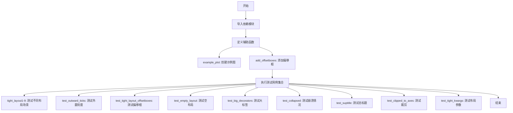

## 类结构

```
测试模块 (无类定义)
├── 辅助函数
│   ├── example_plot
│   └── add_offsetboxes
└── 测试函数 (18个)
```

## 全局变量及字段


### `pytestmark`
    
pytest标记列表，用于指定测试fixtures和标记

类型：`List[pytest.mark.Mark]`
    


### `rows`
    
子图网格的行数

类型：`int`
    


### `cols`
    
子图网格的列数

类型：`int`
    


### `colors`
    
用于区分不同子图的颜色列表

类型：`List[str]`
    


### `x`
    
用于绘制线条的x坐标数据点

类型：`List[int]`
    


### `y`
    
用于绘制线条的y坐标数据点

类型：`List[int]`
    


    

## 全局函数及方法


### `example_plot`

创建一个简单的示例子图，包含一条直线、坐标轴标签和标题，用于 tight_layout 测试。

参数：

- `ax`：`matplotlib.axes.Axes`，要绑定的子图对象
- `fontsize`：`int`，默认值 12，标题和坐标轴标签的字体大小

返回值：`None`，该函数直接在传入的 axes 对象上绘制图形，不返回任何值

#### 流程图

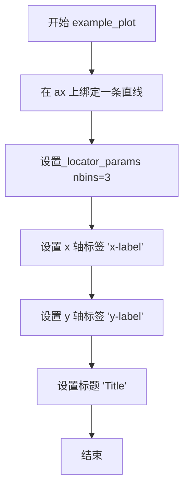

#### 带注释源码

```python
def example_plot(ax, fontsize=12):
    """
    创建示例子图，用于 tight_layout 测试。
    
    Parameters
    ----------
    ax : matplotlib.axes.Axes
        要绑定的子图对象
    fontsize : int, optional
        标题和坐标轴标签的字体大小，默认值为 12
    """
    # 在子图上绑制一条简单的直线，数据点为 [1, 2]
    ax.plot([1, 2])
    
    # 设置定位器参数，x 轴和 y 轴均使用 3 个刻度线
    ax.locator_params(nbins=3)
    
    # 设置 x 轴标签为 'x-label'，使用指定的字体大小
    ax.set_xlabel('x-label', fontsize=fontsize)
    
    # 设置 y 轴标签为 'y-label'，使用指定的字体大小
    ax.set_ylabel('y-label', fontsize=fontsize)
    
    # 设置图表标题为 'Title'，使用指定的字体大小
    ax.set_title('Title', fontsize=fontsize)
```


### `add_offsetboxes`

该函数用于在给定的 matplotlib Axes 对象周围添加一圈装饰性的偏移框（OffsetBoxes）。它根据指定的 `size`（大小）、`margin`（边距）和 `color`（颜色）生成8个定位在 Axes 边缘的矩形，并将其作为艺术家（Artist）添加到 Axes 中，常用于测试 tight_layout 对子图外框的处理。

参数：

- `ax`：`matplotlib.axes.Axes`，要添加偏移框的目标 Axes 对象。
- `size`：`int` 或 `float`，偏移框的宽度和高度（默认 10）。
- `margin`：`float`，用于计算锚点位置的边距系数（默认 0.1）。
- `color`：`str`，偏移框矩形的填充颜色（默认 'black'）。

返回值：`None`。该函数直接修改传入的 `ax` 对象，不返回值。

#### 流程图

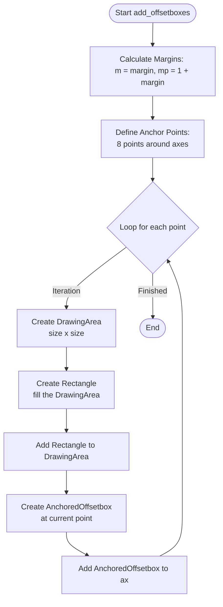

#### 带注释源码

```python
def add_offsetboxes(ax, size=10, margin=.1, color='black'):
    """
    Surround ax with OffsetBoxes
    """
    # 计算边距系数，m 为负边距，mp 为正边距(1+边距)
    # 用于确定环绕 axes 的 8 个锚点
    m, mp = margin, 1+margin
    
    # 定义 8 个锚点坐标 (x, y)，对应 axes 的相对坐标系 (0-1)
    # 分别是：左下，左中左上，上中，右上，右中，右下，下中
    anchor_points = [(-m, -m), (-m, .5), (-m, mp),
                     (.5, mp), (mp, mp), (mp, .5),
                     (mp, -m), (.5, -m)]
                     
    # 遍历每个锚点位置
    for point in anchor_points:
        # 1. 创建一个绘图区域 (DrawingArea)
        da = DrawingArea(size, size)
        
        # 2. 创建一个矩形填满这个区域作为背景
        background = Rectangle((0, 0), width=size,
                               height=size,
                               facecolor=color,
                               edgecolor='None',
                               linewidth=0,
                               antialiased=False)
                               
        # 3. 将矩形添加到绘图区域
        da.add_artist(background)

        # 4. 创建一个锚定偏移框 (AnchoredOffsetbox)
        # loc='center': 内部元素居中
        # bbox_to_anchor=point: 锚点位置
        # bbox_transform=ax.transAxes: 使用 axes 的相对坐标系
        anchored_box = AnchoredOffsetbox(
            loc='center',
            child=da,
            pad=0.,
            frameon=False,
            bbox_to_anchor=point,
            bbox_transform=ax.transAxes,
            borderpad=0.)
            
        # 5. 将偏移框添加到 axes
        ax.add_artist(anchored_box)
```


### `test_tight_layout1`

测试 Matplotlib 中单子图的 tight_layout 功能，通过创建单个子图并调用 `plt.tight_layout()` 来验证布局调整是否正确工作。该测试使用图像对比装饰器确保输出符合预期。

参数：  
无

返回值： `None`，该函数为测试函数，不返回任何值

#### 流程图

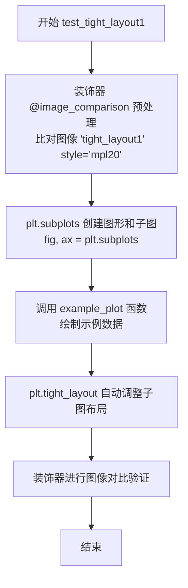

#### 带注释源码

```python
@image_comparison(['tight_layout1'], style='mpl20')  # 装饰器：比较生成的图像与基准图像，style='mpl20' 使用 mpl20 风格
def test_tight_layout1():
    """Test tight_layout for a single subplot."""
    # 1. 创建一个包含单个子图的图形窗口
    fig, ax = plt.subplots()
    
    # 2. 调用示例绘图函数，绘制测试图表并设置较大的字体
    #    fontsize=24 用于确保标签和标题足够大以测试布局边界
    example_plot(ax, fontsize=24)
    
    # 3. 调用 tight_layout 自动调整子图布局
    #    tight_layout 会重新计算子图的边界，使其适应图形窗口，
    #    留出足够的空间给坐标轴标签、标题等
    plt.tight_layout()
```


### `test_tight_layout2`

该函数是一个测试多子图 tight_layout 功能的测试用例，通过创建 2×2 的子图网格，为每个子图绘制示例数据，并调用 `plt.tight_layout()` 来调整子图之间的间距，以验证 tight_layout 算法在多子图场景下的正确性。

参数：
- 该函数没有参数

返回值：`None`，无返回值

#### 流程图

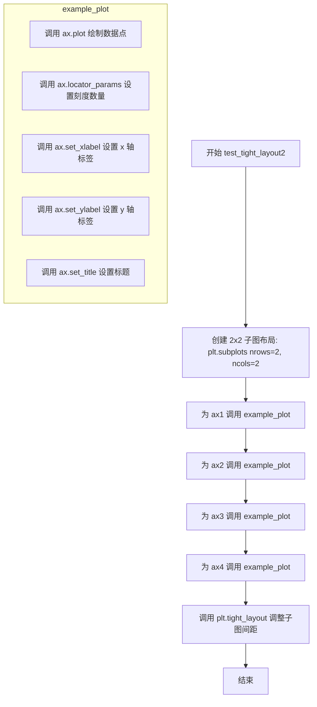

#### 带注释源码

```python
@image_comparison(['tight_layout2'], style='mpl20')
def test_tight_layout2():
    """
    Test tight_layout for multiple subplots.
    
    该测试用例验证 tight_layout 在多子图布局下的正确性。
    使用 @image_comparison 装饰器比较生成的图像与基准图像。
    """
    # 创建一个 2x2 的子图网格布局，返回 fig 对象和 2x2 的 axes 数组
    fig, ((ax1, ax2), (ax3, ax4)) = plt.subplots(nrows=2, ncols=2)
    
    # 为第一个子图 ax1 绘制示例数据
    example_plot(ax1)
    
    # 为第二个子图 ax2 绘制示例数据
    example_plot(ax2)
    
    # 为第三个子图 ax3 绘制示例数据
    example_plot(ax3)
    
    # 为第四个子图 ax4 绘制示例数据
    example_plot(ax4)
    
    # 调用 tight_layout 自动调整子图之间的间距
    # 使子图布局更加紧凑，避免标签重叠
    plt.tight_layout()
```


### `test_tight_layout3`

该函数通过创建三个不同位置的子图（2x2网格中的前两个和底部的一个），对每个子图应用示例绘图操作，最后调用`tight_layout()`来测试matplotlib的子图布局紧密度调整功能是否正确处理非均匀的子图网格布局。

参数：无

返回值：无（`None`），该测试函数不返回任何值，仅用于验证图像输出是否符合预期。

#### 流程图

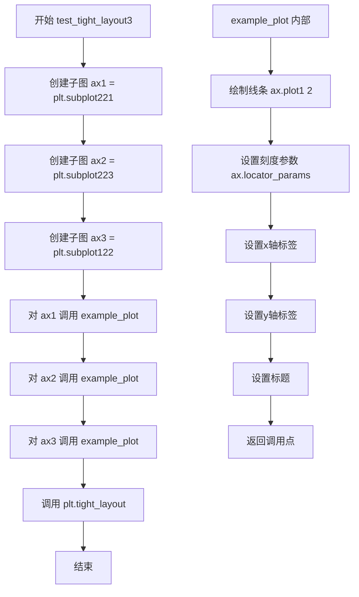

#### 带注释源码

```python
@image_comparison(['tight_layout3'], style='mpl20')  # 装饰器：比较生成的图像与基准图像，使用mpl20样式
def test_tight_layout3():
    """Test tight_layout for multiple subplots."""
    # 创建第一个子图：2x2网格中的左上角位置(第1行第1列)
    ax1 = plt.subplot(221)
    # 创建第二个子图：2x2网格中的左下角位置(第2行第1列)
    ax2 = plt.subplot(223)
    # 创建第三个子图：1x2网格中的右侧位置(占据整行)
    ax3 = plt.subplot(122)
    
    # 对第一个子图应用示例绘图（绘制线条、设置标签和标题）
    example_plot(ax1)
    # 对第二个子图应用相同的示例绘图
    example_plot(ax2)
    # 对第三个子图应用相同的示例绘图
    example_plot(ax3)
    
    # 调用tight_layout自动调整子图之间的间距，避免标签和标题重叠
    plt.tight_layout()
```


### `test_tight_layout4`

该测试函数用于验证`subplot2grid`创建的复杂网格布局在应用`tight_layout`时的正确性，通过创建包含 colspan 和 rowspan 参数的多个子图来测试布局调整算法。

参数：无

返回值：无返回值（测试函数）

#### 流程图

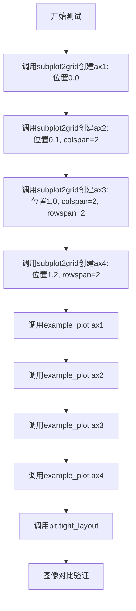

#### 带注释源码

```python
@image_comparison(['tight_layout4'], style='mpl20')  # 装饰器：比较生成的图像与基准图像
def test_tight_layout4():
    """Test tight_layout for subplot2grid."""
    # 创建3x3网格中的第一个子图，位于(0,0)位置
    ax1 = plt.subplot2grid((3, 3), (0, 0))
    
    # 创建子图，位于(0,1)位置，跨2列
    ax2 = plt.subplot2grid((3, 3), (0, 1), colspan=2)
    
    # 创建子图，位于(1,0)位置，跨2列2行（占据左下角大区域）
    ax3 = plt.subplot2grid((3, 3), (1, 0), colspan=2, rowspan=2)
    
    # 创建子图，位于(1,2)位置，跨2行（右侧竖长区域）
    ax4 = plt.subplot2grid((3, 3), (1, 2), rowspan=2)
    
    # 为每个子图绘制示例数据（线条、刻度、标签、标题）
    example_plot(ax1)
    example_plot(ax2)
    example_plot(ax3)
    example_plot(ax4)
    
    # 调用tight_layout自动调整子图间距，避免标签重叠
    plt.tight_layout()
```


### `test_tight_layout5`

该函数是一个pytest测试函数，用于测试matplotlib中tight_layout在显示图像（imshow）时的布局调整功能。通过创建包含图像的子图并调用tight_layout，验证布局算法能否正确处理图像元素。

参数：

- 该函数没有显式参数（由pytest框架隐式注入的参数如`request`等不计）

返回值：`None`，测试函数不返回值，通过@image_comparison装饰器进行图像对比验证

#### 流程图

```mermaid
flowchart TD
    A[开始测试] --> B[调用@image_comparison装饰器<br/>准备baseline图像对比]
    B --> C[创建子图: plt.subplot]
    C --> D[生成10x10数组: np.arange<br/>.reshape10, 10]
    D --> E[使用imshow显示图像<br/>interpolation=none]
    E --> F[调用plt.tight_layout<br/>调整布局]
    F --> G[对比输出图像与<br/>baseline tight_layout5]
    G --> H[测试通过/失败]
```

#### 带注释源码

```python
@image_comparison(['tight_layout5'], style='mpl20')
def test_tight_layout5():
    """Test tight_layout for image."""
    # 创建一个子图，等价于 fig, ax = plt.subplots() 后取第一个ax
    ax = plt.subplot()
    
    # 生成一个10x10的数组，值为0-99
    # 用于作为图像数据
    arr = np.arange(100).reshape((10, 10))
    
    # 在子图上显示图像
    # interpolation="none" 表示不进行插值
    ax.imshow(arr, interpolation="none")
    
    # 调用tight_layout自动调整子图间距
    # 确保图像与标题、轴标签等不重叠
    plt.tight_layout()
```


### `test_tight_layout6`

测试gridspec布局的tight_layout功能，验证在手动调整rect参数的情况下，gridspec能够正确应用tight_layout布局。

参数：此函数无显式参数（使用pytest的`@image_comparison`装饰器进行图像对比测试）

返回值：`None`，此函数为测试函数，不返回任何值

#### 流程图

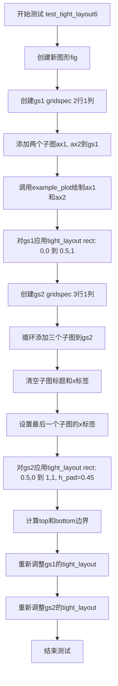

#### 带注释源码

```python
@image_comparison(['tight_layout6'], style='mpl20')
def test_tight_layout6():
    """Test tight_layout for gridspec."""

    # 由于tight layout无法完全自动完成此操作，会产生警告
    # 但测试是正确的，因为布局是手动编辑的
    with warnings.catch_warnings():
        warnings.simplefilter("ignore", UserWarning)
        
        # 创建新图形
        fig = plt.figure()

        # 创建第一个gridspec: 2行1列
        gs1 = mpl.gridspec.GridSpec(2, 1)
        ax1 = fig.add_subplot(gs1[0])
        ax2 = fig.add_subplot(gs1[1])

        # 使用example_plot绘制两个子图
        example_plot(ax1)
        example_plot(ax2)

        # 对gs1应用tight_layout，限制在figure的左半部分
        # rect参数: [left, bottom, right, top]
        gs1.tight_layout(fig, rect=[0, 0, 0.5, 1])

        # 创建第二个gridspec: 3行1列
        gs2 = mpl.gridspec.GridSpec(3, 1)

        # 循环添加三个子图
        for ss in gs2:
            ax = fig.add_subplot(ss)
            example_plot(ax)
            # 清空自动设置的标题和x标签
            ax.set_title("")
            ax.set_xlabel("")

        # 设置x标签
        ax.set_xlabel("x-label", fontsize=12)

        # 对gs2应用tight_layout，限制在figure的右半部分
        # h_pad设置垂直填充间距
        gs2.tight_layout(fig, rect=[0.5, 0, 1, 1], h_pad=0.45)

        # 计算两个gridspec的边界交集
        # 确保两个gridspec的top和bottom对齐
        top = min(gs1.top, gs2.top)
        bottom = max(gs1.bottom, gs2.bottom)

        # 重新调整gs1的布局，修正top和bottom边界
        gs1.tight_layout(fig, rect=[None, 0 + (bottom-gs1.bottom),
                                    0.5, 1 - (gs1.top-top)])
        
        # 重新调整gs2的布局
        gs2.tight_layout(fig, rect=[0.5, 0 + (bottom-gs2.bottom),
                                    None, 1 - (gs2.top-top)],
                         h_pad=0.45)
```


### `test_tight_layout7`

该测试函数用于验证 tight_layout 在同时存在左侧标题（loc='left'）和右侧标题（loc='right'）时的正确性，通过设置大字号（fontsize=24）来确保标题布局计算正确。

参数：无

返回值：`None`，无返回值（测试函数）

#### 流程图

```mermaid
flowchart TD
    A[开始 test_tight_layout7] --> B[设置 fontsize = 24]
    B --> C[创建子图: fig, ax = plt.subplots]
    C --> D[绘制线条: ax.plot([1, 2])]
    D --> E[设置刻度参数: ax.locator_params(nbins=3)]
    E --> F[设置x轴标签: ax.set_xlabel x-label]
    F --> G[设置y轴标签: ax.set_ylabel y-label]
    G --> H[设置左侧标题: ax.set_title Left Title, loc=left]
    H --> I[设置右侧标题: ax.set_title Right Title, loc=right]
    I --> J[调用 plt.tight_layout 调整布局]
    J --> K[结束/图像比对验证]
```

#### 带注释源码

```python
@image_comparison(['tight_layout7'], style='mpl20')  # 装饰器：与baseline图像比对验证
def test_tight_layout7():
    # tight layout with left and right titles
    # 测试tight_layout处理左右两侧标题的能力
    
    fontsize = 24  # 使用较大字号以测试布局边界情况
    fig, ax = plt.subplots()  # 创建单子图
    ax.plot([1, 2])  # 绘制简单线条数据
    ax.locator_params(nbins=3)  # 限制刻度数量为3个
    ax.set_xlabel('x-label', fontsize=fontsize)  # 设置x轴标签
    ax.set_ylabel('y-label', fontsize=fontsize)  # 设置y轴标签
    ax.set_title('Left Title', loc='left', fontsize=fontsize)   # 设置左侧对齐标题
    ax.set_title('Right Title', loc='right', fontsize=fontsize)  # 设置右侧对齐标题
    plt.tight_layout()  # 执行tight_layout自动调整子图间距
```


### `test_tight_layout8()`

测试自动使用 tight_layout 功能，验证通过 `fig.set_layout_engine(layout='tight', pad=0.1)` 设置的紧凑布局是否正确应用。

参数：
- 无

返回值：`None`，无返回值（测试函数）

#### 流程图

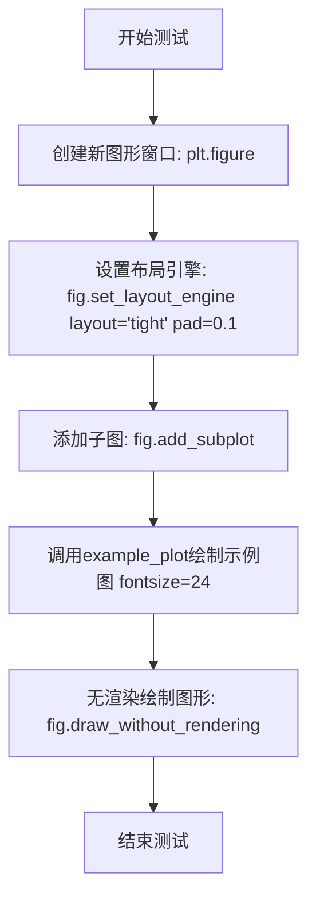

#### 带注释源码

```python
@image_comparison(['tight_layout8'], style='mpl20', tol=0.005)
def test_tight_layout8():
    """Test automatic use of tight_layout."""
    # 创建一个新的图形窗口（Figure对象）
    fig = plt.figure()
    
    # 设置布局引擎为'tight'模式，pad=0.1表示紧凑布局的填充值
    fig.set_layout_engine(layout='tight', pad=0.1)
    
    # 添加一个子图（Axes对象）到图形中
    ax = fig.add_subplot()
    
    # 调用example_plot函数绘制示例图，fontsize=24设置较大字体
    example_plot(ax, fontsize=24)
    
    # 在不实际渲染到显示设备的情况下绘制图形
    # 用于测试和图像比较
    fig.draw_without_rendering()
```

#### 依赖的全局函数信息

**`example_plot(ax, fontsize=12)`**

- 参数：
  - `ax`：`matplotlib.axes.Axes`，子图对象
  - `fontsize`：`int`，字体大小（默认12）
- 返回值：`None`，无返回值
- 描述：在给定的子图上绘制示例图表，包括线条、参数定位器、坐标轴标签和标题

#### 关键组件信息

1. **matplotlib.figure.Figure**：图形容器对象，提供 `set_layout_engine()` 和 `draw_without_rendering()` 方法
2. **matplotlib.axes.Axes**：子图对象，用于绘制数据
3. **example_plot**：测试辅助函数，用于创建标准化的测试图表
4. **@image_comparison**：测试装饰器，用于比较渲染结果与基准图像

#### 潜在技术债务或优化空间

1. **测试覆盖性**：当前仅测试了单一子图的情况，未测试多子图场景下的自动 tight_layout
2. **参数验证**：`pad=0.1` 的具体数值未进行边界测试
3. **图像容差**：`tol=0.005` 是硬编码值，可能在不同平台间存在差异

#### 其它项目

- **设计目标**：验证 Figure 对象的 `set_layout_engine()` 方法能够正确设置并自动应用 tight_layout
- **约束条件**：使用 `mpl20` 样式，需要与基准图像 `tight_layout8` 进行对比
- **错误处理**：通过 `@image_comparison` 装饰器自动处理图像不匹配的情况
- **外部依赖**：需要 matplotlib、Numpy、pytest 以及测试图像基准文件


### `test_tight_layout9`

测试 tight_layout 对于不可见子图的处理功能，验证当子图被设置为不可见时，tight_layout 算法能够正确忽略该子图并完成布局调整。

参数： 无

返回值： `None`，该函数为测试函数，不返回任何值

#### 流程图

```mermaid
flowchart TD
    A[开始 test_tight_layout9] --> B[创建 2x2 子图网格]
    B --> C[获取 axarr[1][1] 子图]
    C --> D[将 axarr[1][1] 设置为不可见 set_visible False]
    D --> E[调用 plt.tight_layout 执行布局调整]
    E --> F[结束测试]
    
    style A fill:#f9f,stroke:#333
    style F fill:#9f9,stroke:#333
```

#### 带注释源码

```python
@image_comparison(['tight_layout9'], style='mpl20')
def test_tight_layout9():
    # Test tight_layout for non-visible subplots
    # GH 8244
    # 创建一个 2x2 的子图布局，返回图形对象 f 和子图数组 axarr
    f, axarr = plt.subplots(2, 2)
    # 将右下角的子图 (索引 [1][1]) 设置为不可见
    axarr[1][1].set_visible(False)
    # 调用 tight_layout 自动调整子图间距和布局
    # 该操作应忽略不可见的子图 [1][1]，只对可见的三个子图进行布局
    plt.tight_layout()
```


### `test_outward_ticks`

该测试函数用于验证 `tight_layout` 在处理外置刻度（outward ticks）时的正确性，通过创建四个具有不同刻度方向的子图，检查布局计算是否正确考虑了刻度线的物理尺寸。

参数：无需参数

返回值：`None`，该函数为测试函数，不返回任何值

#### 流程图

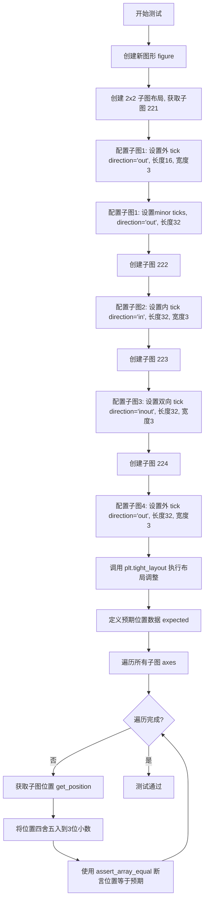

#### 带注释源码

```python
def test_outward_ticks():
    """
    Test automatic use of tight_layout.
    测试 tight_layout 是否正确考虑外置刻度的空间占用
    """
    # 创建一个新的图形对象
    fig = plt.figure()
    
    # === 第一个子图 (2,2,1): 外置刻度 (outward ticks) ===
    ax = fig.add_subplot(221)  # 创建 2x2 网格的第一个子图
    
    # 设置 X 轴刻度线向外，长度 16，宽度 3
    ax.xaxis.set_tick_params(tickdir='out', length=16, width=3)
    # 设置 Y 轴刻度线向外，长度 16，宽度 3
    ax.yaxis.set_tick_params(tickdir='out', length=16, width=3)
    
    # 设置次要刻度线（minor ticks）也向外，长度 32，宽度 3
    ax.xaxis.set_tick_params(
        tickdir='out', length=32, width=3, tick1On=True, which='minor')
    ax.yaxis.set_tick_params(
        tickdir='out', length=32, width=3, tick1On=True, which='minor')
    
    # 设置在 0 位置显示次要刻度
    ax.xaxis.set_ticks([0], minor=True)
    ax.yaxis.set_ticks([0], minor=True)
    
    # === 第二个子图 (2,2,2): 内置刻度 (inward ticks) ===
    ax = fig.add_subplot(222)
    # 设置 X 轴刻度线向内，长度 32，宽度 3
    ax.xaxis.set_tick_params(tickdir='in', length=32, width=3)
    # 设置 Y 轴刻度线向内，长度 32，宽度 3
    ax.yaxis.set_tick_params(tickdir='in', length=32, width=3)
    
    # === 第三个子图 (2,2,3): 双向刻度 (inout ticks) ===
    ax = fig.add_subplot(223)
    # 设置刻度线双向（既向内又向外），长度 32，宽度 3
    ax.xaxis.set_tick_params(tickdir='inout', length=32, width=3)
    ax.yaxis.set_tick_params(tickdir='inout', length=32, width=3)
    
    # === 第四个子图 (2,2,4): 外置刻度 (outward ticks) ===
    ax = fig.add_subplot(224)
    # 设置外置刻度，长度 32，宽度 3
    ax.xaxis.set_tick_params(tickdir='out', length=32, width=3)
    ax.yaxis.set_tick_params(tickdir='out', length=32, width=3)
    
    # 调用 tight_layout 自动调整子图间距，考虑刻度线空间
    plt.tight_layout()
    
    # === 验证阶段 ===
    # 定义经过视觉验证的预期位置坐标（考虑了刻度线占用空间）
    # 格式: [[x0, y0], [x1, y1]] 表示子图左下角和右上角坐标
    expected = [
        [[0.092, 0.605], [0.433, 0.933]],  # 子图1 位置
        [[0.581, 0.605], [0.922, 0.933]],  # 子图2 位置
        [[0.092, 0.138], [0.433, 0.466]],  # 子图3 位置
        [[0.581, 0.138], [0.922, 0.466]],  # 子图4 位置
    ]
    
    # 遍历所有子图，验证位置是否符合预期
    for nn, ax in enumerate(fig.axes):
        # 获取子图的轴域位置（归一化坐标）
        # 四舍五入到3位小数以消除浮点数精度问题
        assert_array_equal(
            np.round(ax.get_position().get_points(), 3),
            expected[nn]
        )
```


### `test_tight_layout_offsetboxes`

该测试函数用于验证matplotlib中tight_layout功能对偏移框（AnchoredOffsetbox）的处理是否正确，包括偏移框被纳入布局计算、不重叠以及不可见的偏移框不影响布局。

参数： 无

返回值：`None`，该函数为测试函数，不返回任何值

#### 流程图

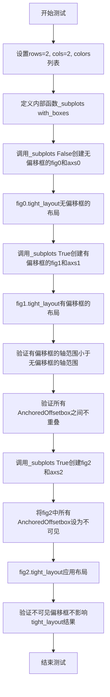

#### 带注释源码

```python
def test_tight_layout_offsetboxes():
    """
    测试tight_layout对偏移框的处理
    测试内容：
    1. 无偏移框时的基础tight_layout
    2. 有偏移框时，偏移框被纳入布局计算且不重叠
    3. 不可见的偏移框不影响tight_layout
    """
    # 定义2x2的子图网格
    rows = cols = 2
    # 定义四种颜色用于区分不同的子图
    colors = ['red', 'blue', 'green', 'yellow']
    # 定义绘图数据点
    x = y = [0, 1]

    def _subplots(with_boxes):
        """
        内部函数：创建子图并可选地添加偏移框
        
        参数:
            with_boxes: bool, 是否为每个轴添加偏移框
        返回:
            fig: Figure对象
            axs: Axes对象数组
        """
        # 创建2x2的子图
        fig, axs = plt.subplots(rows, cols)
        # 遍历每个子图轴
        for ax, color in zip(axs.flat, colors):
            # 在每个轴上绘制相同颜色的线
            ax.plot(x, y, color=color)
            # 如果需要添加偏移框
            if with_boxes:
                # 为每个轴添加偏移框，大小为20，颜色为对应颜色
                add_offsetboxes(ax, 20, color=color)
        return fig, axs

    # 0. 测试无偏移框时的tight_layout
    fig0, axs0 = _subplots(False)  # 创建无偏移框的子图
    fig0.tight_layout()  # 应用tight_layout

    # 1. 测试有偏移框时的tight_layout
    fig1, axs1 = _subplots(True)  # 创建有偏移框的子图
    fig1.tight_layout()  # 应用tight_layout

    # 验证：偏移框应该被纳入布局，导致轴范围缩小
    for ax0, ax1 in zip(axs0.flat, axs1.flat):
        bbox0 = ax0.get_position()  # 获取无偏移框时的轴位置
        bbox1 = ax1.get_position()  # 获取有偏移框时的轴位置
        # 断言轴范围确实因为偏移框而缩小
        assert bbox1.x0 > bbox0.x0  # x0应该更大
        assert bbox1.x1 < bbox0.x1  # x1应该更小
        assert bbox1.y0 > bbox0.y0  # y0应该更大
        assert bbox1.y1 < bbox0.y1  # y1应该更小

    # 验证：所有偏移框不应该重叠
    bboxes = []  # 用于存储所有偏移框的边界框
    for ax1 in axs1.flat:
        # 遍历轴的所有子元素
        for child in ax1.get_children():
            # 只处理AnchoredOffsetbox类型的子元素
            if not isinstance(child, AnchoredOffsetbox):
                continue
            # 获取该偏移框的窗口边界框
            bbox = child.get_window_extent()
            # 检查是否与已存储的边界框重叠
            for other_bbox in bboxes:
                assert not bbox.overlaps(other_bbox)  # 不应该重叠
            # 将当前边界框添加到列表
            bboxes.append(bbox)

    # 2. 测试不可见偏移框不影响tight_layout
    fig2, axs2 = _subplots(True)  # 创建有偏移框的子图
    # 将所有AnchoredOffsetbox设为不可见
    for ax in axs2.flat:
        for child in ax.get_children():
            if isinstance(child, AnchoredOffsetbox):
                child.set_visible(False)  # 设为不可见
    fig2.tight_layout()  # 应用tight_layout
    
    # 验证：不可见的偏移框不应该影响布局，结果应该与无偏移框时相同
    for ax0, ax2 in zip(axs0.flat, axs2.flat):
        bbox0 = ax0.get_position()  # 获取无偏移框时的轴位置
        bbox2 = ax2.get_position()  # 获取不可见偏移框时的轴位置
        # 断言两者位置完全相同
        assert_array_equal(bbox2.get_points(), bbox0.get_points())
```


### `test_empty_layout`

这是一个 pytest 测试函数，用于验证 Matplotlib 的 `tight_layout` 功能在空布局（Figure 中不包含任何 Axes）情况下的鲁棒性。该测试确保当 Figure 上没有任何子图时，调用 `tight_layout` 不会抛出异常。

参数：
- 该函数无显式参数。

返回值：
- `None`。该函数作为测试使用，不返回具体数值，测试通过与否取决于是否在执行过程中产生异常。

#### 流程图

```mermaid
flowchart TD
    A([开始测试]) --> B[获取当前 Figure 对象: fig = plt.gcf()]
    B --> C[调用 fig.tight_layout 尝试调整布局]
    C --> D{是否发生异常?}
    D -- 否 --> E([测试通过 - 结束])
    D -- 是 --> F([测试失败 - 抛出异常])
```

#### 带注释源码

```python
def test_empty_layout():
    """
    测试当没有 Axes 时，tight_layout 不会导致错误。
    验证空 Figure 的布局处理逻辑。
    """
    # 1. 获取当前处于活跃状态的 Figure 对象。
    #    如果当前不存在 Figure，matplotlib 会自动创建一个默认的空 Figure。
    #    根据测试目的，此处主要关注 Figure 本身是否有 Axes。
    fig = plt.gcf()

    # 2. 对 Figure 应用 tight_layout。
    #    正常情况下，即使 Figure 为空（没有 Axes），该方法也应该优雅地处理
    #    而不抛出 AttributeError 或其他异常。
    fig.tight_layout()
```


### `test_verybig_decorators`

测试超大标签（xlabel/ylabel）时不会发出警告。

参数：

- `label`：`str`，要测试的标签类型，可选值为"xlabel"或"ylabel"

返回值：`None`，无返回值（测试函数）

#### 流程图

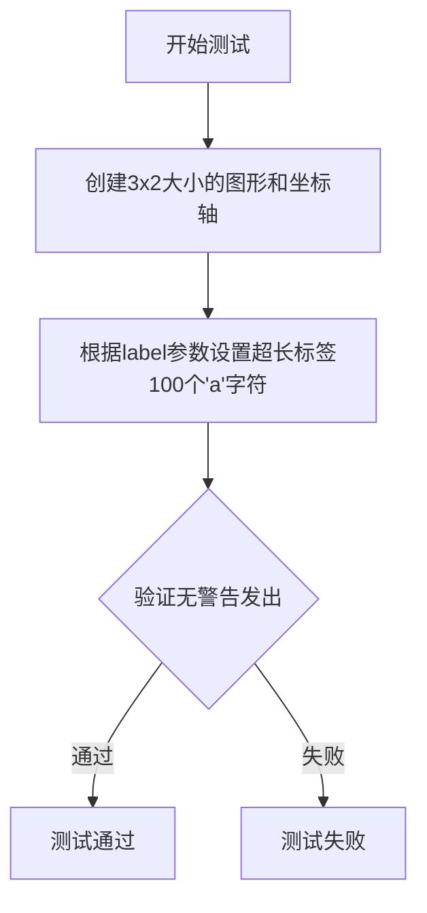

#### 带注释源码

```python
@pytest.mark.parametrize("label", ["xlabel", "ylabel"])  # 参数化测试,分别测试xlabel和ylabel
def test_verybig_decorators(label):
    """Test that no warning emitted when xlabel/ylabel too big."""
    # 创建一个3x2英寸大小的图形和坐标轴
    fig, ax = plt.subplots(figsize=(3, 2))
    # 设置超长标签(100个'a'字符),验证不会产生警告
    ax.set(**{label: 'a' * 100})
```


### `test_big_decorators_horizontal`

测试水平大标签（xlabel）不会产生警告。

参数：
- 无

返回值：`None`，无返回值

#### 流程图

```mermaid
flowchart TD
    A[开始测试] --> B[创建1行2列子图<br/>figsize=(3, 2)]
    B --> C[设置第一个子图的xlabel<br/>'a' * 30]
    C --> D[设置第二个子图的xlabel<br/>'b' * 30]
    D --> E[测试结束]
```

#### 带注释源码

```python
def test_big_decorators_horizontal():
    """Test that doesn't warn when xlabel too big."""
    # 创建一个1行2列的子图布局，图形大小为3x2英寸
    fig, axs = plt.subplots(1, 2, figsize=(3, 2))
    
    # 为第一个子图设置较长的xlabel标签（30个'a'字符）
    axs[0].set_xlabel('a' * 30)
    
    # 为第二个子图设置较长的xlabel标签（30个'b'字符）
    axs[1].set_xlabel('b' * 30)
```


### `test_big_decorators_vertical`

该测试函数用于验证当垂直标签（ylabel）的文本过长时，不会产生警告信息，确保tight_layout在处理大型垂直标签时能够正常工作。

参数： 无

返回值： `None`，该函数为测试函数，不返回任何值

#### 流程图

```mermaid
flowchart TD
    A[开始测试] --> B[创建2行1列子图<br/>figsize=(3, 2)]
    B --> C[设置第一个子图的ylabel<br/>'a' * 20]
    C --> D[设置第二个子图的ylabel<br/>'b' * 20]
    D --> E[测试完成<br/>无返回值]
```

#### 带注释源码

```python
def test_big_decorators_vertical():
    """Test that doesn't warn when ylabel too big."""
    # 创建一个2行1列的子图布局，设置图形大小为3x2英寸
    fig, axs = plt.subplots(2, 1, figsize=(3, 2))
    
    # 为第一个子图设置垂直标签，标签文本为20个'a'字符
    axs[0].set_ylabel('a' * 20)
    
    # 为第二个子图设置垂直标签，标签文本为20个'b'字符
    axs[1].set_ylabel('b' * 20)
    
    # 测试目的：验证即使标签文本很长，也不会触发警告
    # 该测试是test_verybig_decorators的补充，专门针对垂直标签场景
```


### `test_badsubplotgrid`

测试当子图网格配置不匹配时，`tight_layout` 是否产生 UserWarning 警告而不是抛出异常。

参数：

- 无

返回值：`None`，无返回值（测试函数）

#### 流程图

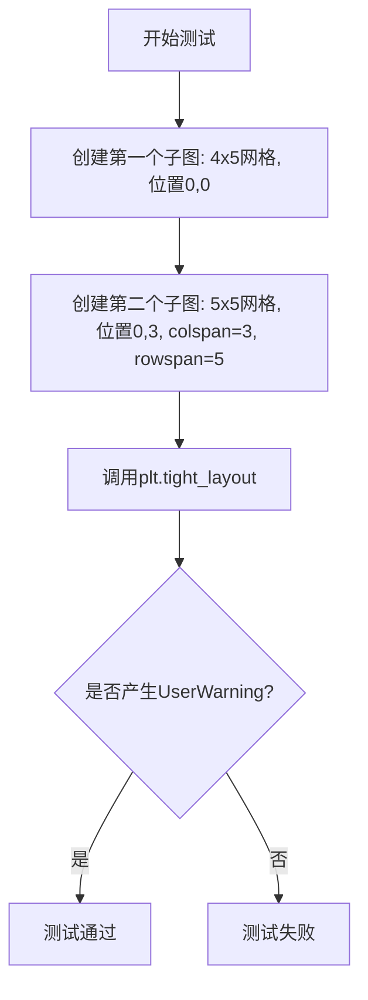

#### 带注释源码

```python
def test_badsubplotgrid():
    # 测试当子图网格不匹配时，我们得到警告而不是错误
    # 创建一个4行5列的网格，并在位置(0,0)创建子图
    plt.subplot2grid((4, 5), (0, 0))
    
    # 这是一个错误的条目：创建一个5行5列的网格，
    # 但指定了colspan=3和rowspan=5，这在原始的4行网格中会超出范围
    # 这种不匹配的配置应该触发警告
    plt.subplot2grid((5, 5), (0, 3), colspan=3, rowspan=5)
    
    # 使用pytest.warns上下文管理器验证tight_layout调用时是否产生UserWarning
    with pytest.warns(UserWarning):
        plt.tight_layout()
```


### `test_collapsed`

该测试函数用于验证当坐标轴的装饰元素（如注释文本）所需的空间超过可用宽度导致坐标轴实际尺寸为零时，`tight_layout` 不会应用（即保持原有位置不变），同时确保传递 `rect` 参数不会崩溃。

参数：无

返回值：`None`，无返回值（测试函数）

#### 流程图

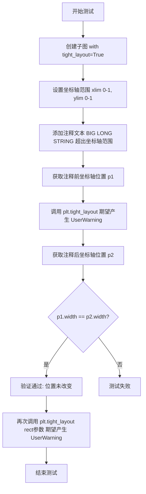

#### 带注释源码

```python
def test_collapsed():
    """
    测试边界情况：当坐标轴装饰元素所需空间超过可用宽度时，
    tight_layout 不会应用到坐标轴上。
    
    具体测试场景：
    - 创建一个带有 tight_layout 的子图
    - 添加一个超出坐标轴范围的注释文本
    - 验证调用 tight_layout 后坐标轴位置保持不变（因为装饰元素
      所需的边距空间大于可用宽度，会导致坐标轴尺寸为零或负数）
    - 同时测试传递 rect 参数不会崩溃
    """
    # 创建子图，tight_layout=True 表示启用自动 tight_layout
    fig, ax = plt.subplots(tight_layout=True)
    
    # 设置坐标轴的显示范围
    ax.set_xlim(0, 1)
    ax.set_ylim(0, 1)

    # 添加一个很长的注释文本，位置在坐标轴外部
    # xy=(1.25, 2) 是注释指向的点，xytext=(10.5, 1.75) 是文本位置
    # annotation_clip=False 确保注释不被裁剪，即使在坐标轴外也显示
    ax.annotate('BIG LONG STRING', xy=(1.25, 2), xytext=(10.5, 1.75),
                annotation_clip=False)
    
    # 获取调用 tight_layout 前的坐标轴位置
    p1 = ax.get_position()
    
    # 调用 tight_layout，期望产生 UserWarning
    # 因为装饰元素所需空间超过了可用宽度
    with pytest.warns(UserWarning):
        plt.tight_layout()
        # 获取调用 tight_layout 后的坐标轴位置
        p2 = ax.get_position()
        
        # 验证位置未改变（宽度相同）
        assert p1.width == p2.width
    
    # 测试传递 rect 参数不会崩溃
    # 同样期望产生 UserWarning
    with pytest.warns(UserWarning):
        plt.tight_layout(rect=[0, 0, 0.8, 0.8])
```


### `test_suptitle`

测试总标题（suptitle）位置，确保总标题在普通标题上方。

参数：无

返回值：`None`，该函数通过断言验证总标题位于普通标题之上，无显式返回值。

#### 流程图

```mermaid
flowchart TD
    A[开始] --> B[创建子图: plt.subplots tight_layout=True]
    B --> C[创建总标题: fig.suptitle 'foo']
    C --> D[创建普通标题: ax.set_title 'bar']
    D --> E[绘制画布: fig.canvas.draw]
    E --> F{断言检查}
    F -->|通过| G[测试通过: 总标题底部坐标 > 普通标题顶部坐标]
    F -->|失败| H[抛出AssertionError]
```

#### 带注释源码

```python
def test_suptitle():
    """
    测试总标题位置，确保在tight_layout下suptitle位于普通ax标题上方。
    
    验证逻辑：总标题的底部y坐标（y0）应大于普通标题的顶部y坐标（y1），
    这样在视觉上总标题才位于普通标题的上方。
    """
    # 创建一个启用tight_layout的子图
    fig, ax = plt.subplots(tight_layout=True)
    
    # 设置figure级别的总标题
    st = fig.suptitle("foo")
    
    # 设置axes级别的普通标题
    t = ax.set_title("bar")
    
    # 强制绘制画布以计算几何信息
    fig.canvas.draw()
    
    # 断言：总标题的底部y坐标 > 普通标题的顶部y坐标
    # 这确保总标题在视觉上位于普通标题的上方
    assert st.get_window_extent().y0 > t.get_window_extent().y1
```


### `test_non_agg_renderer`

该测试函数用于验证在使用 PDF 后端时，`tight_layout` 不会实例化除 PDF 渲染器之外的其他渲染器。它通过 monkeypatch 的方式拦截 `RendererBase.__init__` 方法，确保在执行 tight_layout 过程中只使用 PDF 渲染器。

参数：

- `monkeypatch`：`pytest.fixture`，用于在测试期间临时修改对象和方法
- `recwarn`：`pytest.fixture`，用于捕获和记录测试期间发出的警告

返回值：`None`，该函数为测试函数，不返回值，通过内部断言进行验证

#### 流程图

```mermaid
flowchart TD
    A[开始] --> B[保存原始RendererBase.__init__到unpatched_init]
    B --> C[定义自定义__init__函数]
    C --> C1[断言self是mpl.backends.backend_pdf.RendererPdf的实例]
    C1 --> C2[调用unpatched_init原始初始化方法]
    C2 --> D[使用monkeypatch替换RendererBase.__init__为自定义函数]
    D --> E[创建Figure和Axes: plt.subplots]
    E --> F[调用fig.tight_layout]
    F --> G{检查是否触发断言错误}
    G -->|无错误| H[测试通过]
    G -->|有错误| I[测试失败]
    H --> J[结束]
    I --> J
```

#### 带注释源码

```python
@pytest.mark.backend("pdf")  # 装饰器：指定该测试仅在PDF后端环境下运行
def test_non_agg_renderer(monkeypatch, recwarn):
    """
    测试非AGG渲染器（PDF渲染器）在tight_layout中的行为
    
    该测试验证当使用PDF后端时，tight_layout操作不会错误地
    实例化其他类型的渲染器（如AGG），而是正确使用PDF渲染器。
    """
    # 步骤1：保存原始的RendererBase.__init__方法，以便后续调用
    unpatched_init = mpl.backend_bases.RendererBase.__init__

    # 步骤2：定义一个自定义的__init__方法，用于拦截渲染器初始化
    def __init__(self, *args, **kwargs):
        # 检查：确保只实例化了PDF渲染器来执行PDF tight layout
        # 这是一个关键的断言，用于验证正确的渲染器被使用
        assert isinstance(self, mpl.backends.backend_pdf.RendererPdf)
        # 调用原始的初始化方法，保持正常的初始化逻辑
        unpatched_init(self, *args, **kwargs)

    # 步骤3：使用monkeypatch临时替换RendererBase的__init__方法
    # 这样在tight_layout执行过程中，所有渲染器初始化都会被拦截
    monkeypatch.setattr(mpl.backend_bases.RendererBase, "__init__", __init__)
    
    # 步骤4：创建一个简单的图形和一个子图
    fig, ax = plt.subplots()
    
    # 步骤5：执行tight_layout操作
    # 此时会触发渲染器的创建，应该只创建PDF渲染器
    # 如果创建了其他类型的渲染器，断言会失败
    fig.tight_layout()
```


### `test_manual_colorbar`

测试手动颜色条功能，验证在手动创建颜色条轴后调用 `tight_layout` 时会发出适当的警告，但不会抛出异常。

参数： 无

返回值： `None`，无返回值（测试函数）

#### 流程图

```mermaid
flowchart TD
    A[开始] --> B[创建 1x2 子图]
    B --> C[在 axes[1] 上创建散点图]
    C --> D[获取 axes[1] 的位置]
    D --> E[手动创建颜色条轴 cax]
    E --> F[添加颜色条到 figure]
    F --> G[调用 tight_layout 并捕获 UserWarning]
    G --> H[结束]
```

#### 带注释源码

```python
def test_manual_colorbar():
    # This should warn, but not raise
    # 创建一个包含 1 行 2 列子图的图形
    fig, axes = plt.subplots(1, 2)
    
    # 在第二个子图 (axes[1]) 上创建散点图
    # 点的颜色根据 c=[1, 5] 值映射
    pts = axes[1].scatter([0, 1], [0, 1], c=[1, 5])
    
    # 获取第二个子图的位置信息 (BoundingBox)
    ax_rect = axes[1].get_position()
    
    # 手动创建颜色条的坐标轴 (位于第二个子图的右侧)
    # 位置: [x1+0.005, y0, 0.015, height]
    cax = fig.add_axes(
        [ax_rect.x1 + 0.005, ax_rect.y0, 0.015, ax_rect.height]
    )
    
    # 为散点图添加颜色条，使用手动创建的 cax
    fig.colorbar(pts, cax=cax)
    
    # 调用 tight_layout，预期会触发 UserWarning
    # 警告信息应包含 "This figure includes Axes"
    # 因为手动添加的轴不会被 tight_layout 自动处理
    with pytest.warns(UserWarning, match="This figure includes Axes"):
        fig.tight_layout()
```


### `test_clipped_to_axes`

该测试函数用于验证`_fully_clipped_to_axes()`方法在默认条件下对所有投影类型返回True，并检查在非默认条件下（当艺术家设置裁剪路径为非坐标轴补丁时）返回False。确保`Axes.get_tightbbox()`能够正确跳过不需要参与布局计算的艺术家。

参数：
- 无参数

返回值：`None`，该函数不返回任何值，仅用于执行断言测试。

#### 流程图

```mermaid
flowchart TD
    A[开始测试] --> B[创建图形和三个子图]
    B --> C[分别为三个子图设置投影: rectilinear, mollweide, polar]
    C --> D[遍历每个子图]
    D --> E[关闭网格]
    E --> F[绘制线条和伪彩色图]
    F --> G[断言默认条件下艺术家完全裁剪到坐标轴]
    G --> H[设置非坐标轴裁剪路径]
    H --> I[断言非默认条件下艺术家未完全裁剪到坐标轴]
    I --> J{是否还有子图未处理}
    J -->|是| D
    J -->|否| K[结束测试]
```

#### 带注释源码

```python
def test_clipped_to_axes():
    # 确保 _fully_clipped_to_axes() 在所有投影类型的默认条件下返回 True。
    # Axes.get_tightbbox() 使用此方法来跳过布局计算中的艺术家。
    
    # 创建一个 10x10 的数组
    arr = np.arange(100).reshape((10, 10))
    
    # 创建一个图形，大小为 6x2 英寸
    fig = plt.figure(figsize=(6, 2))
    
    # 添加三个子图，分别使用不同的投影类型
    ax1 = fig.add_subplot(131, projection='rectilinear')  # 矩形投影
    ax2 = fig.add_subplot(132, projection='mollweide')   # Mollweide 投影
    ax3 = fig.add_subplot(133, projection='polar')        # 极坐标投影
    
    # 遍历每个子图进行测试
    for ax in (ax1, ax2, ax3):
        # 默认条件：艺术家被 ax.bbox 或 ax.patch 裁剪
        ax.grid(False)  # 关闭网格
        h, = ax.plot(arr[:, 0])  # 绘制线条，返回线条对象
        m = ax.pcolor(arr)       # 绘制伪彩色图，返回艺术家对象
        
        # 断言：默认情况下线条和伪彩色图完全裁剪到坐标轴
        assert h._fully_clipped_to_axes()
        assert m._fully_clipped_to_axes()
        
        # 非默认条件：艺术家不被 ax.patch 裁剪
        # 创建一个矩形，使用坐标轴变换
        rect = Rectangle((0, 0), 0.5, 0.5, transform=ax.transAxes)
        
        # 为线条和伪彩色图设置裁剪路径为矩形
        h.set_clip_path(rect)
        m.set_clip_path(rect.get_path(), rect.get_transform())
        
        # 断言：设置非坐标轴裁剪路径后，艺术家不再完全裁剪到坐标轴
        assert not h._fully_clipped_to_axes()
        assert not m._fully_clipped_to_axes()
```


### `test_tight_pads`

该函数用于测试 `tight_layout` 的 `pad` 参数，验证使用 `fig.set_tight_layout({'pad': 0.15})` 设置布局填充时是否会产生 `PendingDeprecationWarning` 警告。

参数：无

返回值：`None`，无返回值

#### 流程图

```mermaid
flowchart TD
    A[开始 test_tight_pads] --> B[创建 Figure 和 Axes: plt.subplots]
    B --> C[调用 fig.set_tight_layout 触发警告]
    C --> D{检测 PendingDeprecationWarning}
    D -->|警告匹配 'will be deprecated'| E[测试通过]
    D -->|警告不匹配| F[测试失败]
    E --> G[调用 fig.draw_without_rendering]
    G --> H[结束]
```

#### 带注释源码

```python
def test_tight_pads():
    """
    测试 tight_layout pads 参数。
    验证 fig.set_tight_layout({'pad': 0.15}) 会触发 PendingDeprecationWarning。
    """
    # 1. 创建一个新的 Figure 和一个 Axes
    #    等同于 fig = plt.figure(); ax = fig.add_subplot(111)
    fig, ax = plt.subplots()
    
    # 2. 使用 pytest.warns 捕获 PendingDeprecationWarning
    #    验证 set_tight_layout 方法即将被弃用
    #    match 参数确保警告消息包含 'will be deprecated'
    with pytest.warns(PendingDeprecationWarning,
                      match='will be deprecated'):
        # 3. 设置 tight_layout 参数 pad 为 0.15
        #    这是一个旧的 API，预计在未来版本中移除
        fig.set_tight_layout({'pad': 0.15})
    
    # 4. 渲染图形而不显示（用于验证布局计算）
    #    这会触发 tight_layout 的实际计算
    fig.draw_without_rendering()
```

---

### 上下文信息

#### 1. 文件整体运行流程

该测试文件 (`test_tight_layout.py`) 包含了多个与 `tight_layout` 功能相关的测试用例，涵盖以下方面：
- 基础布局测试 (`test_tight_layout1` - `test_tight_layout9`)
- 子图布局 (`test_outward_ticks`)
- OffsetBox 布局 (`test_tight_layout_offsetboxes`)
- 空布局处理 (`test_empty_layout`)
- 装饰器大小测试 (`test_verybig_decorators`, `test_big_decorators_horizontal`, `test_big_decorators_vertical`)
- 颜色条测试 (`test_manual_colorbar`)
- **Pads 参数测试 (`test_tight_pads`)** ← 本次分析目标
- 其他边界情况测试

#### 2. 全局变量和全局函数

| 名称 | 类型 | 描述 |
|------|------|------|
| `example_plot` | `function` | 辅助函数，用于创建带有标签和标题的示例plot |
| `add_offsetboxes` | `function` | 辅助函数，为坐标轴添加 OffsetBoxes 用于测试布局包含性 |
| `pytestmark` | `list` | pytest 标记，使用 `text_placeholders` fixture |
| `test_tight_pads` | `function` | 测试函数，验证 pad 参数的弃用警告 |

#### 3. 关键组件信息

| 组件名称 | 一句话描述 |
|----------|------------|
| `plt.subplots()` | 创建 Figure 和 Axes 的标准 matplotlib 工厂函数 |
| `fig.set_tight_layout()` | 设置 figure 紧凑布局参数的接口方法 |
| `fig.draw_without_rendering()` | 执行布局计算但不实际渲染的调试方法 |
| `pytest.warns()` | pytest 上下文管理器，用于捕获和验证警告 |

#### 4. 潜在的技术债务或优化空间

1. **API 弃用过渡**：`set_tight_layout()` 方法使用字典参数 `{'pad': 0.15}` 的方式已被标记为弃用，应迁移到新的 API（如 `fig.set_layout_engine(layout='tight', pad=0.15)`）
2. **测试覆盖**：当前仅测试了 `pad` 参数，未测试其他可能的参数如 `h_pad`, `w_pad`, `rect` 等
3. **重复代码**：多个测试函数中存在相似的 setup 逻辑，可提取为 fixture

#### 5. 设计目标与约束

- **设计目标**：确保 `tight_layout` 功能在不同场景下正常工作，并提供适当的弃用警告
- **约束**：测试必须在不实际渲染的情况下验证布局计算结果（使用 `draw_without_rendering()`）

#### 6. 错误处理与异常设计

- 使用 `pytest.warns(PendingDeprecationWarning)` 预期捕获弃用警告
- 如果未收到预期警告，测试将失败并报告错误
- 使用 `PendingDeprecationWarning` 而非 `DeprecationWarning`，表示该功能仍可使用但将在未来移除

#### 7. 外部依赖与接口契约

- **依赖库**：`matplotlib`, `numpy`, `pytest`
- **接口**：
  - `plt.subplots()` 返回 `(Figure, Axes)` 元组
  - `fig.set_tight_layout(params: dict)` 接受布局参数字典
  - `fig.draw_without_rendering()` 执行布局计算


### `test_tight_kwargs`

该函数用于测试 `plt.subplots()` 的 `tight_layout` 关键字参数功能，验证通过字典形式传递 `tight_layout` 参数（如 `{'pad': 0.15}`）时，图形布局能否正确应用紧凑布局设置。

参数：

- （无）

返回值：`None`，无返回值

#### 流程图

```mermaid
flowchart TD
    A[开始测试 test_tight_kwargs] --> B[调用 plt.subplots tight_layout={'pad': 0.15}]
    B --> C[创建 Figure 和 Axes 对象]
    C --> D[调用 fig.draw_without_rendering]
    D --> E[验证紧凑布局应用成功]
    E --> F[测试通过]
```

#### 带注释源码

```python
def test_tight_kwargs():
    """
    测试 tight_layout 关键字参数功能。
    
    该测试验证可以通过 plt.subplots 的 tight_layout 参数
    以字典形式传递布局参数（如 pad=0.15），并正确应用紧凑布局。
    """
    # 使用 tight_layout 关键字参数创建子图，pad 设置为 0.15
    fig, ax = plt.subplots(tight_layout={'pad': 0.15})
    
    # 绘制图形而不实际渲染，验证布局计算是否成功
    fig.draw_without_rendering()
```


### `test_tight_toggle`

该函数用于测试 Figure 对象的 `set_tight_layout` 方法在开启和关闭状态之间切换的功能，验证 `get_tight_layout` 方法能够正确返回当前的 tight_layout 状态。

参数： 无

返回值：`None`，该函数不返回值，仅通过断言验证状态切换的正确性

#### 流程图

```mermaid
flowchart TD
    A[开始: test_tight_toggle] --> B[创建Figure和Axes: plt.subplots]
    B --> C[进入pytest.warns上下文: 捕获PendingDeprecationWarning]
    C --> D[设置tight_layout为True: fig.set_tight_layout True]
    D --> E[断言: fig.get_tight_layout 返回 True]
    E --> F[设置tight_layout为False: fig.set_tight_layout False]
    F --> G[断言: fig.get_tight_layout 返回 False]
    G --> H[再次设置tight_layout为True: fig.set_tight_layout True]
    H --> I[断言: fig.get_tight_layout 返回 True]
    I --> J[结束: 函数返回]
    
    style A fill:#f9f,stroke:#333
    style J fill:#9f9,stroke:#333
```

#### 带注释源码

```python
def test_tight_toggle():
    """
    测试 tight_layout 的切换功能。
    
    该测试函数验证 Figure.set_tight_layout() 方法能够在 True 和 False 
    之间切换，并正确通过 Figure.get_tight_layout() 方法反映当前状态。
    """
    # 创建一个新的 Figure 和一个 Axes 子图
    fig, ax = plt.subplots()
    
    # 使用 pytest.warns 捕获 PendingDeprecationWarning
    # 因为 set_tight_layout 方法已被标记为即将弃用
    with pytest.warns(PendingDeprecationWarning):
        # 第一次设置：将 tight_layout 开启
        fig.set_tight_layout(True)
        # 验证 tight_layout 已开启
        assert fig.get_tight_layout()
        
        # 第二次设置：将 tight_layout 关闭
        fig.set_tight_layout(False)
        # 验证 tight_layout 已关闭
        assert not fig.get_tight_layout()
        
        # 第三次设置：重新开启 tight_layout
        fig.set_tight_layout(True)
        # 验证 tight_layout 保持开启状态
        assert fig.get_tight_layout()
```

## 关键组件


### tight_layout自动布局引擎
自动调整图形中所有子图的边距和间距，确保装饰器（如坐标轴标签、标题）不被裁剪。

### GridSpec网格规格化
定义子图的网格结构，支持复杂的多行多列布局，并提供tight_layout接口。

### AnchoredOffsetbox锚定偏移框
在坐标轴周围添加装饰性方块（如DrawingArea和Rectangle），并参与布局计算，影响tight_layout的结果。

### 子图布局管理
使用subplots、subplot2grid等函数创建多个坐标轴，并管理它们的位置和大小。

### 边界框计算系统
计算坐标轴、装饰器和图形元素的边界框，用于确定布局参数，是tight_layout的核心依赖。

### 警告与异常处理
在布局冲突或无法自动调整时发出UserWarning，提示用户手动调整布局参数。

### 图形渲染后端
支持多种渲染后端（如pdf），在布局计算时进行无渲染的边界框计算。

### 参数化测试框架
使用pytest的参数化装饰器测试不同的布局场景，确保布局算法的鲁棒性。


## 问题及建议


### 已知问题

-   **测试覆盖不完整**：部分测试函数缺少断言或验证逻辑，如 `test_verybig_decorators`、`test_big_decorators_horizontal`、`test_big_decorators_vertical` 仅创建对象但未验证结果
-   **硬编码数值**：`test_outward_ticks` 中的 `expected` 数组硬编码了布局位置数值，这些值在不同环境或Matplotlib版本中可能发生变化
-   **测试逻辑断言不完整**：`test_clipped_to_axes` 函数中 `assert h._fully_clipped_to_axes()` 和 `assert m._fully_clipped_to_axes()` 之后还有非默认条件的断言，但未明确验证两种条件的区别
-   **重复代码模式**：多个测试函数中重复创建 `fig, ax = plt.subplots()` 的模式，可提取为共享的 fixture 或辅助函数
-   **警告处理不一致**：部分测试使用 `warnings.catch_warnings()` 抑制警告，部分使用 `pytest.warns()` 检查警告，风格不统一
-   **Fixture 依赖隐式**：依赖 `text_placeholders` fixture 但代码中未定义，依赖外部测试框架提供
-   **辅助函数位置**：`example_plot` 和 `add_offsetboxes` 定义在测试函数之间，可读性欠佳，应组织到类或模块级别
-   **魔法数值**：多处使用如 `0.005`、`0.45`、`0.1` 等魔数，缺乏常量定义，语义不清晰

### 优化建议

-   为所有测试函数补充文档字符串，说明测试目的和预期行为
-   将硬编码的布局数值提取为模块级常量，并添加注释说明来源或依据
-   使用 pytest fixture 抽象重复的图形创建逻辑，提高测试代码可维护性
-   统一警告处理方式，对于预期行为的警告使用 `pytest.warns()` 进行显式验证
-   补充 `test_verybig_decorators` 等函数的断言，验证标签设置是否生效或警告是否被正确抑制
-   将辅助函数 `example_plot` 和 `add_offsetboxes` 移至文件顶部或专门的辅助模块
-   考虑为 `test_clipped_to_axes` 添加更完整的验证逻辑，区分默认条件和非默认条件的测试结果

## 其它


### 设计目标与约束

本测试套件旨在验证matplotlib tight_layout功能在多种场景下的正确性，包括：单/多子图布局、gridspec布局、图像显示、不可见子图、子图2grid布局、偏移框(OffsetBox)、颜色条(Colorbar)、不同投影类型(极坐标 Mollweide等)。测试覆盖边界情况如子图装饰器过大导致空间不足、空白图形、折叠子图等，确保tight_layout在各种约束条件下能正确处理或给出适当警告，同时保证不影响实际渲染结果。

### 错误处理与异常设计

代码中错误处理主要通过warnings模块和pytest.warns实现。使用warnings.catch_warnings()捕获并忽略特定警告（如tight_layout无法完全自动处理gridspec时的UserWarning）；使用pytest.warns()验证预期警告的发出，包括：不匹配子图网格警告、装饰器过大警告、颜色条导致图形包含多个轴的警告、布局空间不足导致轴尺寸为零的警告。对于空布局情况，测试验证不会抛出错误而是正常处理。

### 外部依赖与接口契约

主要外部依赖包括：numpy提供数值计算和数组比较；pytest作为测试框架；matplotlib本身包括gridspec.GridSpec（网格规格布局）、offsetbox.AnchoredOffsetbox和DrawingArea（偏移框）、patches.Rectangle（矩形）、backend_bases.RendererBase和backend_pdf.RendererPdf（PDF后端渲染器）。测试通过调用公共API如fig.tight_layout()、plt.tight_layout()、ax.set_position()、ax.get_children()等与matplotlib核心功能交互。

### 性能考虑

测试中使用fig.draw_without_rendering()方法进行布局验证，避免实际渲染开销，提高测试执行效率。image_comparison装饰器配合tol参数控制像素容差，在保证视觉准确性的同时允许适当的数值波动。部分测试通过设置style='mpl20'使用固定风格以确保测试的稳定性和可重复性。

### 测试策略

采用多层测试策略：基础功能测试(test_tight_layout1-9)覆盖常见布局场景；边界条件测试处理特殊情况如空布局、不可见子图、大装饰器；回归测试使用image_comparison确保布局算法稳定性；参数化测试使用pytest.mark.parametrize测试不同标签场景；后端特定测试使用pytest.mark.backend("pdf")验证特定渲染器行为；模拟测试使用monkeypatch验证内部调用如PDF渲染器实例化。

### 并发考虑

本测试代码主要关注单线程场景，未涉及并发测试。tight_layout作为图形布局调整功能，其执行通常在主线程中完成，测试中也未使用线程相关的测试fixture。

### 版本兼容性

测试中style='mpl20'参数指定使用matplotlib 2.0风格，表明测试针对较新版本。部分测试如test_tight_pads和test_tight_toggle涉及PendingDeprecationWarning，说明这些API将在未来版本中废弃，测试验证了过渡期的兼容性处理。

    