# `matplotlib\lib\matplotlib\tests\test_transforms.py` 详细设计文档

This code tests the Affine2D class, which represents a 2D affine transformation. It includes unit tests for initialization, transformation methods, and interaction with other transformations.

## 整体流程

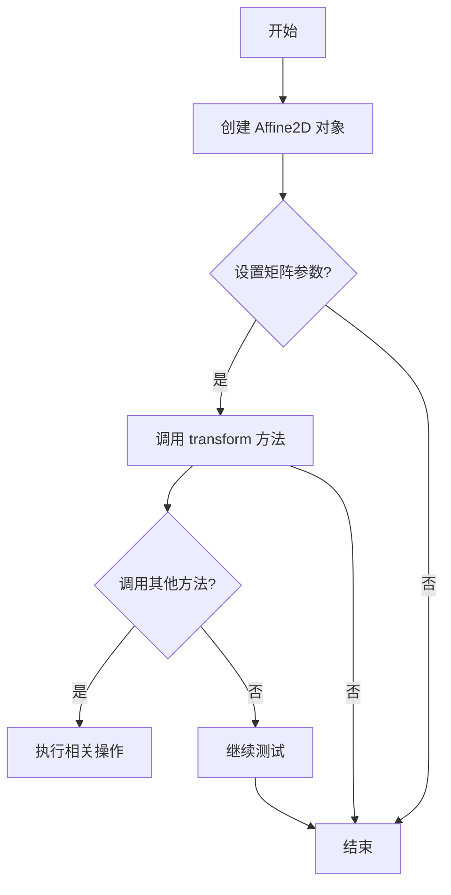

## 类结构

```
TestAffine2D (测试类)
├── test_init (测试初始化)
│   ├── test_init (测试构造函数)
│   ├── test_values (测试 from_values 方法)
│   ├── test_modify_inplace (测试 in-place 修改)
│   ├── test_clear (测试 clear 方法)
│   ├── test_rotate (测试 rotate 方法)
│   ├── test_rotate_around (测试 rotate_around 方法)
│   ├── test_scale (测试 scale 方法)
│   ├── test_skew (测试 skew 方法)
│   ├── test_translate (测试 translate 方法)
│   ├── test_rotate_plus_other (测试组合操作)
│   ├── test_rotate_around_plus_other (测试组合操作)
│   ├── test_scale_plus_other (测试组合操作)
│   ├── test_skew_plus_other (测试组合操作)
│   ├── test_translate_plus_other (测试组合操作)
│   └── test_invalid_transform (测试无效转换)
└── test_copy (测试 copy 方法)
```

## 全局变量及字段


### `single_point`
    
A list containing a single point [1.0, 1.0] used for testing transformations.

类型：`list`
    


### `multiple_points`
    
A list of multiple points [[0.0, 2.0], [3.0, 3.0], [4.0, 0.0]] used for testing transformations.

类型：`list`
    


### `pivot`
    
A list containing a single point [1.0, 1.0] used as pivot point for rotations and translations.

类型：`list`
    


### `TestAffine2D.single_point`
    
A list containing a single point [1.0, 1.0] used for testing transformations.

类型：`list`
    


### `TestAffine2D.multiple_points`
    
A list of multiple points [[0.0, 2.0], [3.0, 3.0], [4.0, 0.0]] used for testing transformations.

类型：`list`
    


### `TestAffine2D.pivot`
    
A list containing a single point [1.0, 1.0] used as pivot point for rotations and translations.

类型：`list`
    
    

## 全局函数及方法

### TestAffine2D.test_init

该函数测试了 `Affine2D` 类的构造函数，确保它可以接受不同的输入类型，包括列表、NumPy 数组和 NumPy 数组视图。

参数：

- 无

返回值：无

#### 流程图

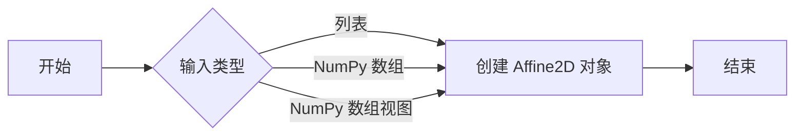

#### 带注释源码

```python
def test_init(self):
    # 测试 Affine2D 构造函数接受列表输入
    Affine2D([[1, 2, 3], [4, 5, 6], [7, 8, 9]])
    # 测试 Affine2D 构造函数接受 NumPy 数组输入
    Affine2D(np.array([[1, 2, 3], [4, 5, 6], [7, 8, 9]], int))
    # 测试 Affine2D 构造函数接受 NumPy 数组视图输入
    Affine2D(np.array([[1, 2, 3], [4, 5, 6], [7, 8, 9]], float))
```

### TestAffine2D.test_values

该函数测试 `Affine2D.from_values` 方法，确保从给定值创建的仿射变换与原始值相等。

参数：

- `values`：`numpy.ndarray`，仿射变换的值，形状为 (6,)。

返回值：无

#### 流程图

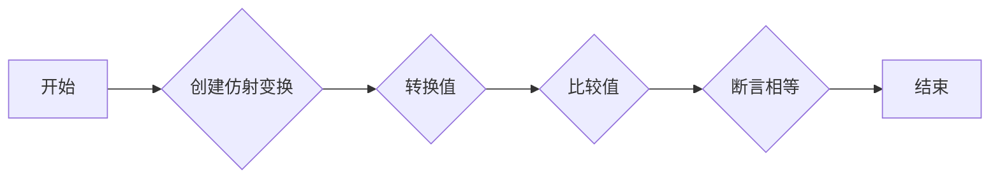

#### 带注释源码

```python
def test_values(self):
    np.random.seed(19680801)
    values = np.random.random(6)
    assert_array_equal(Affine2D.from_values(*values).to_values(), values)
```

### TestAffine2D.test_modify_inplace

This function tests the `modify_inplace` method of the `Affine2D` class, which is used to modify the matrix of an affine transformation in place.

#### 参数

- None

#### 返回值

- None

#### 流程图

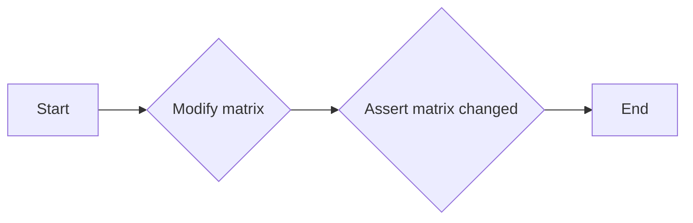

#### 带注释源码

```python
def test_modify_inplace(self):
    # Some polar transforms require modifying the matrix in place.
    trans = Affine2D()
    mtx = trans.get_matrix()
    mtx[0, 0] = 42
    assert_array_equal(trans.get_matrix(), [[42, 0, 0], [0, 1, 0], [0, 0, 1]])
```

### TestAffine2D.test_clear

该函数测试Affine2D类的`clear`方法，该方法将Affine2D对象重置为恒等变换。

#### 参数

- 无

#### 返回值

- 无

#### 流程图

```mermaid
graph LR
A[开始] --> B{调用Affine2D(np.random.rand(3, 3) + 5)}
B --> C{调用a.clear()}
C --> D{调用assert_array_equal(a.get_matrix(), [[1, 0, 0], [0, 1, 0], [0, 0, 1]])}
D --> E[结束]
```

#### 带注释源码

```python
def test_clear(self):
    a = Affine2D(np.random.rand(3, 3) + 5)  # Anything non-identity.
    a.clear()
    assert_array_equal(a.get_matrix(), [[1, 0, 0], [0, 1, 0], [0, 0, 1]])
```

### TestAffine2D.test_rotate

该函数测试了Affine2D类的rotate方法，该方法用于旋转Affine2D变换。

参数：

- `np.pi / 2`：`float`，旋转角度，以弧度为单位
- `90`：`int`，旋转角度，以度为单位

返回值：`None`，该函数不返回任何值

#### 流程图

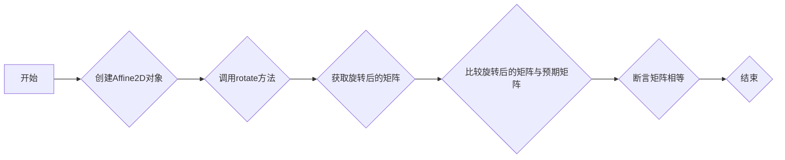

#### 带注释源码

```python
def test_rotate(self):
    r_pi_2 = Affine2D().rotate(np.pi / 2)
    r90 = Affine2D().rotate_deg(90)
    assert_array_equal(r_pi_2.get_matrix(), r90.get_matrix())
    assert_array_almost_equal(r90.transform(self.single_point), [-1, 1])
    assert_array_almost_equal(r90.transform(self.multiple_points),
                              [[-2, 0], [-3, 3], [0, 4]])

    r_pi = Affine2D().rotate(np.pi)
    r180 = Affine2D().rotate_deg(180)
    assert_array_equal(r_pi.get_matrix(), r180.get_matrix())
    assert_array_almost_equal(r180.transform(self.single_point), [-1, -1])
    assert_array_almost_equal(r180.transform(self.multiple_points),
                              [[0, -2], [-3, -3], [-4, 0]])

    r_pi_3_2 = Affine2D().rotate(3 * np.pi / 2)
    r270 = Affine2D().rotate_deg(270)
    assert_array_equal(r_pi_3_2.get_matrix(), r270.get_matrix())
    assert_array_almost_equal(r270.transform(self.single_point), [1, -1])
    assert_array_almost_equal(r270.transform(self.multiple_points),
                              [[2, 0], [3, -3], [0, -4]])

    assert_array_equal((r90 + r90).get_matrix(), r180.get_matrix())
    assert_array_equal((r90 + r180).get_matrix(), r270.get_matrix())
```

### TestAffine2D.test_rotate_around

该函数测试了Affine2D类的rotate_around方法，该方法用于围绕给定的点旋转Affine2D变换。

参数：

- pivot：`list`，旋转的基点坐标
- theta：`float`，旋转角度，以弧度为单位

返回值：`None`，该函数不返回任何值

#### 流程图

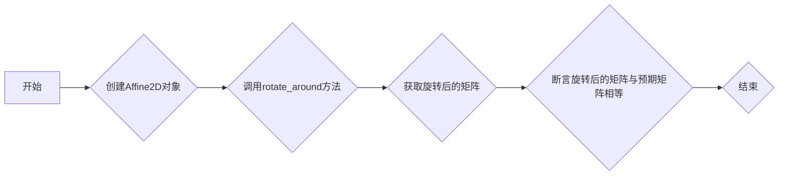

#### 带注释源码

```python
def test_rotate_around(self):
    r_pi_2 = Affine2D().rotate_around(*self.pivot, np.pi / 2)
    r90 = Affine2D().rotate_deg_around(*self.pivot, 90)
    assert_array_equal(r_pi_2.get_matrix(), r90.get_matrix())
    assert_array_almost_equal(r90.transform(self.single_point), [1, 1])
    assert_array_almost_equal(r90.transform(self.multiple_points),
                              [[0, 0], [-1, 3], [2, 4]])

    r_pi = Affine2D().rotate_around(*self.pivot, np.pi)
    r180 = Affine2D().rotate_deg_around(*self.pivot, 180)
    assert_array_equal(r_pi.get_matrix(), r180.get_matrix())
    assert_array_almost_equal(r180.transform(self.single_point), [1, 1])
    assert_array_almost_equal(r180.transform(self.multiple_points),
                              [[2, 0], [-1, -1], [-2, 2]])

    r_pi_3_2 = Affine2D().rotate_around(*self.pivot, 3 * np.pi / 2)
    r270 = Affine2D().rotate_deg_around(*self.pivot, 270)
    assert_array_equal(r_pi_3_2.get_matrix(), r270.get_matrix())
    assert_array_almost_equal(r270.transform(self.single_point), [1, 1])
    assert_array_almost_equal(r270.transform(self.multiple_points),
                              [[2, 2], [3, -1], [0, -2]])

    assert_array_almost_equal((r90 + r90).get_matrix(), r180.get_matrix())
    assert_array_almost_equal((r90 + r180).get_matrix(), r270.get_matrix())
```

### TestAffine2D.test_scale

该函数测试了Affine2D类的scale方法，该方法用于缩放Affine2D变换。

参数：

- `sx`：`float`，x轴缩放因子
- `sy`：`float`，y轴缩放因子

返回值：`None`，该函数不返回任何值

#### 流程图

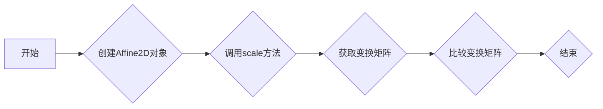

#### 带注释源码

```python
def test_scale(self):
    sx = Affine2D().scale(3, 1)
    sy = Affine2D().scale(1, -2)
    trans = Affine2D().scale(3, -2)
    assert_array_equal((sx + sy).get_matrix(), trans.get_matrix())
    assert_array_equal(trans.transform(self.single_point), [3, -2])
    assert_array_equal(trans.transform(self.multiple_points),
                       [[0, -4], [9, -6], [12, 0]])
```

### TestAffine2D.test_skew

该函数测试了Affine2D类的skew方法，该方法用于对Affine2D变换进行斜切变换。

参数：

- `trans_rad`：`Affine2D`，表示斜切变换的Affine2D对象
- `trans_deg`：`Affine2D`，表示斜切变换的Affine2D对象
- `trans`：`Affine2D`，表示斜切变换的Affine2D对象

返回值：无

#### 流程图

```mermaid
graph LR
A[开始] --> B{创建trans_rad}
B --> C{创建trans_deg}
C --> D{比较trans_rad和trans_deg的矩阵}
D --> E{创建trans}
E --> F{比较trans和trans_deg的矩阵}
F --> G{比较trans.transform(self.single_point)和[1.5, 1.25]}
G --> H{比较trans.transform(self.multiple_points)和[[1, 2], [4.5, 3.75], [4, 1]]}
H --> I[结束]
```

#### 带注释源码

```python
def test_skew(self):
    trans_rad = Affine2D().skew(np.pi / 8, np.pi / 12)
    trans_deg = Affine2D().skew_deg(22.5, 15)
    assert_array_equal(trans_rad.get_matrix(), trans_deg.get_matrix())
    # Using ~atan(0.5), ~atan(0.25) produces roundish numbers on output.
    trans = Affine2D().skew_deg(26.5650512, 14.0362435)
    assert_array_almost_equal(trans.transform(self.single_point), [1.5, 1.25])
    assert_array_almost_equal(trans.transform(self.multiple_points),
                              [[1, 2], [4.5, 3.75], [4, 1]])
```

### test_translate

该函数测试Affine2D类的`translate`方法，该方法用于将Affine2D变换平移指定的距离。

#### 参数

- `tx`：`Affine2D`，表示沿x轴平移的Affine2D变换。
- `ty`：`Affine2D`，表示沿y轴平移的Affine2D变换。

#### 返回值

- 无返回值。

#### 流程图

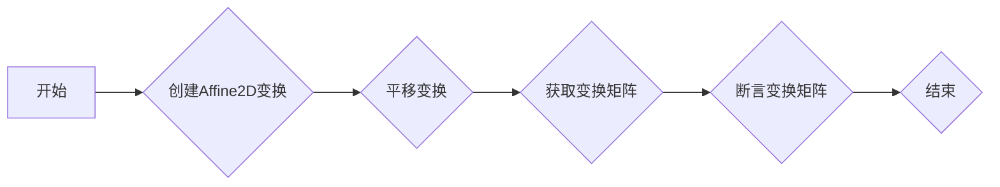

#### 带注释源码

```python
def test_translate(self):
    tx = Affine2D().translate(23, 0)
    ty = Affine2D().translate(0, 42)
    trans = Affine2D().translate(23, 42)
    assert_array_equal((tx + ty).get_matrix(), trans.get_matrix())
    assert_array_equal(trans.transform(self.single_point), [24, 43])
    assert_array_equal(trans.transform(self.multiple_points),
                       [[23, 44], [26, 45], [27, 42]])
```

### TestAffine2D.test_rotate_plus_other

该函数测试了Affine2D类的旋转操作与其他变换操作（如平移、缩放、倾斜）的组合。

参数：

- 无

返回值：无

#### 流程图

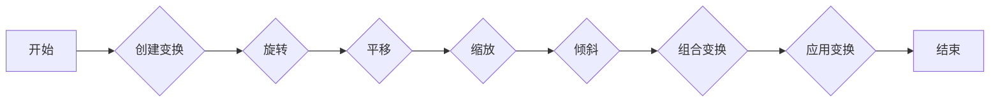

#### 带注释源码

```python
def test_rotate_plus_other(self):
    trans = Affine2D().rotate_deg(90).rotate_deg_around(*self.pivot, 180)
    trans_added = (Affine2D().rotate_deg(90) +
                   Affine2D().rotate_deg_around(*self.pivot, 180))
    assert_array_equal(trans.get_matrix(), trans_added.get_matrix())
    assert_array_almost_equal(trans.transform(self.single_point), [3, 1])
    assert_array_almost_equal(trans.transform(self.multiple_points),
                                  [[4, 2], [5, -1], [2, -2]])

    trans = Affine2D().rotate_deg(90).scale(3, -2)
    trans_added = Affine2D().rotate_deg(90) + Affine2D().scale(3, -2)
    assert_array_equal(trans.get_matrix(), trans_added.get_matrix())
    assert_array_almost_equal(trans.transform(self.single_point), [-3, -2])
    assert_array_almost_equal(trans.transform(self.multiple_points),
                                  [[-6, -0], [-9, -6], [0, -8]])

    trans = (Affine2D().rotate_deg(90)
             .skew_deg(26.5650512, 14.0362435))  # ~atan(0.5), ~atan(0.25)
    trans_added = (Affine2D().rotate_deg(90) +
                   Affine2D().skew_deg(26.5650512, 14.0362435))
    assert_array_equal(trans.get_matrix(), trans_added.get_matrix())
    assert_array_almost_equal(trans.transform(self.single_point), [-0.5, 0.75])
    assert_array_almost_equal(trans.transform(self.multiple_points),
                                  [[-2, -0.5], [-1.5, 2.25], [2, 4]])

    trans = Affine2D().rotate_deg(90).translate(23, 42)
    trans_added = Affine2D().rotate_deg(90) + Affine2D().translate(23, 42)
    assert_array_equal(trans.get_matrix(), trans_added.get_matrix())
    assert_array_almost_equal(trans.transform(self.single_point), [22, 43])
    assert_array_almost_equal(trans.transform(self.multiple_points),
                                  [[21, 42], [20, 45], [23, 46]])
```

### TestAffine2D.test_rotate_around_plus_other

This function tests the behavior of combining a rotation around a pivot point with other transformations (e.g., rotation, scaling, skewing, translating) using the `Affine2D` class in the `matplotlib.transforms` module.

#### 参数

- None

#### 返回值

- None

#### 流程图

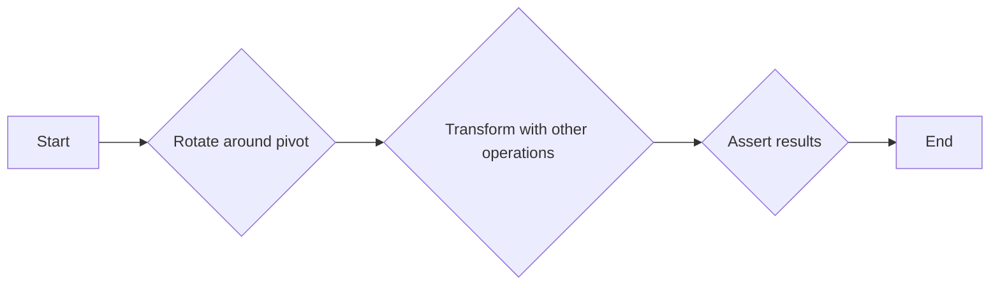

#### 带注释源码

```python
def test_rotate_around_plus_other(self):
    trans = Affine2D().rotate_deg_around(*self.pivot, 90).rotate_deg(180)
    trans_added = (Affine2D().rotate_deg_around(*self.pivot, 90) +
                   Affine2D().rotate_deg(180))
    assert_array_equal(trans.get_matrix(), trans_added.get_matrix())
    assert_array_almost_equal(trans.transform(self.single_point), [-1, -1])
    assert_array_almost_equal(trans.transform(self.multiple_points),
                              [[0, 0], [1, -3], [-2, -4]])

    trans = Affine2D().rotate_deg_around(*self.pivot, 90).scale(3, -2)
    trans_added = (Affine2D().rotate_deg_around(*self.pivot, 90) +
                   Affine2D().scale(3, -2))
    assert_array_equal(trans.get_matrix(), trans_added.get_matrix())
    assert_array_almost_equal(trans.transform(self.single_point), [3, -2])
    assert_array_almost_equal(trans.transform(self.multiple_points),
                              [[0, 0], [-3, -6], [6, -8]])

    trans = (Affine2D().rotate_deg_around(*self.pivot, 90)
             .skew_deg(26.5650512, 14.0362435))  # ~atan(0.5), ~atan(0.25)
    trans_added = (Affine2D().rotate_deg_around(*self.pivot, 90) +
                   Affine2D().skew_deg(26.5650512, 14.0362435))
    assert_array_equal(trans.get_matrix(), trans_added.get_matrix())
    assert_array_almost_equal(trans.transform(self.single_point), [1.5, 1.25])
    assert_array_almost_equal(trans.transform(self.multiple_points),
                              [[0, 0], [0.5, 2.75], [4, 4.5]])

    trans = Affine2D().rotate_deg_around(*self.pivot, 90).translate(23, 42)
    trans_added = (Affine2D().rotate_deg_around(*self.pivot, 90) +
                   Affine2D().translate(23, 42))
    assert_array_equal(trans.get_matrix(), trans_added.get_matrix())
    assert_array_almost_equal(trans.transform(self.single_point), [24, 43])
    assert_array_almost_equal(trans.transform(self.multiple_points),
                              [[23, 42], [22, 45], [25, 46]])
```

### TestAffine2D.test_scale_plus_other

该函数测试了Affine2D类的scale方法与其他变换方法（如rotate、rotate_around、skew、translate）组合后的结果是否正确。

#### 参数

- 无

#### 返回值

- 无

#### 流程图

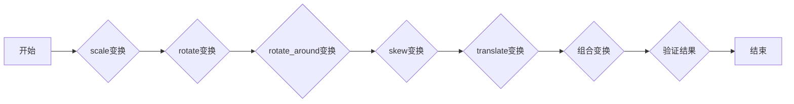

#### 带注释源码

```python
def test_scale_plus_other(self):
    trans = Affine2D().scale(3, -2).rotate_deg(90)
    trans_added = Affine2D().scale(3, -2) + Affine2D().rotate_deg(90)
    assert_array_equal(trans.get_matrix(), trans_added.get_matrix())
    assert_array_equal(trans.transform(self.single_point), [2, 3])
    assert_array_almost_equal(trans.transform(self.multiple_points),
                               [[4, 0], [6, 9], [0, 12]])
```

### TestAffine2D.test_skew_plus_other

该函数测试了Affine2D类的skew方法与其他变换方法组合后的结果。

#### 参数

- 无

#### 返回值

- 无

#### 流程图

```mermaid
graph LR
A[开始] --> B{执行skew方法}
B --> C{执行rotate方法}
C --> D{执行scale方法}
D --> E{执行skew_deg方法}
E --> F{执行translate方法}
F --> G{执行rotate_deg方法}
G --> H{执行rotate_deg_around方法}
H --> I{执行scale方法}
I --> J{执行skew_deg方法}
J --> K{执行translate方法}
K --> L{执行rotate方法}
L --> M{执行rotate_deg方法}
M --> N{执行rotate_deg_around方法}
N --> O{执行scale方法}
O --> P{执行skew_deg方法}
P --> Q{执行translate方法}
Q --> R{执行rotate_deg方法}
R --> S{执行rotate_deg_around方法}
S --> T{执行scale方法}
T --> U{执行skew_deg方法}
U --> V{执行translate方法}
V --> W{执行rotate_deg方法}
W --> X{执行rotate_deg_around方法}
X --> Y{执行scale方法}
Y --> Z{执行skew_deg方法}
Z --> AA{执行translate方法}
AA --> AB{执行rotate_deg方法}
AB --> AC{执行rotate_deg_around方法}
AC --> AD{结束}
```

#### 带注释源码

```python
def test_skew_plus_other(self):
    # Using ~atan(0.5), ~atan(0.25) produces roundish numbers on output.
    trans = Affine2D().skew_deg(26.5650512, 14.0362435).rotate_deg(90)
    trans_added = (Affine2D().skew_deg(26.5650512, 14.0362435) +
                   Affine2D().rotate_deg(90))
    assert_array_equal(trans.get_matrix(), trans_added.get_matrix())
    assert_array_almost_equal(trans.transform(self.single_point), [-1.25, 1.5])
    assert_array_almost_equal(trans.transform(self.multiple_points),
                              [[-2, 1], [-3.75, 4.5], [-1, 4]])

    trans = (Affine2D().skew_deg(26.5650512, 14.0362435)
             .rotate_deg_around(*self.pivot, 90))
    trans_added = (Affine2D().skew_deg(26.5650512, 14.0362435) +
                   Affine2D().rotate_deg_around(*self.pivot, 90))
    assert_array_equal(trans.get_matrix(), trans_added.get_matrix())
    assert_array_almost_equal(trans.transform(self.single_point), [0.75, 1.5])
    assert_array_almost_equal(trans.transform(self.multiple_points),
                              [[0, 1], [-1.75, 4.5], [1, 4]])

    trans = Affine2D().skew_deg(26.5650512, 14.0362435).scale(3, -2)
    trans_added = (Affine2D().skew_deg(26.5650512, 14.0362435) +
                   Affine2D().scale(3, -2))
    assert_array_equal(trans.get_matrix(), trans_added.get_matrix())
    assert_array_almost_equal(trans.transform(self.single_point), [4.5, -2.5])
    assert_array_almost_equal(trans.transform(self.multiple_points),
                              [[3, -4], [13.5, -7.5], [12, -2]])

    trans = Affine2D().skew_deg(26.5650512, 14.0362435).translate(23, 42)
    trans_added = (Affine2D().skew_deg(26.5650512, 14.0362435) +
                   Affine2D().translate(23, 42))
    assert_array_equal(trans.get_matrix(), trans_added.get_matrix())
    assert_array_almost_equal(trans.transform(self.single_point), [24.5, 43.25])
    assert_array_almost_equal(trans.transform(self.multiple_points),
                              [[24, 44], [27.5, 45.75], [27, 43]])
```

### TestAffine2D.test_translate_plus_other

该函数测试了Affine2D变换的平移操作与其他变换操作的组合。

#### 参数

- 无

#### 返回值

- 无

#### 流程图

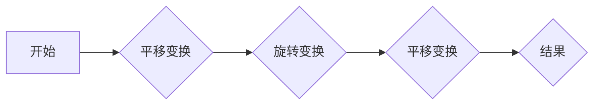

#### 带注释源码

```python
def test_translate_plus_other(self):
    trans = Affine2D().translate(23, 42).rotate_deg(90)
    trans_added = Affine2D().translate(23, 42) + Affine2D().rotate_deg(90)
    assert_array_equal(trans.get_matrix(), trans_added.get_matrix())
    assert_array_almost_equal(trans.transform(self.single_point), [-43, 24])
    assert_array_almost_equal(trans.transform(self.multiple_points),
                              [[-44, 23], [-45, 26], [-42, 27]])
```

### TestAffine2D.test_invalid_transform

该函数测试了 `Affine2D` 类的 `transform` 方法在接收到无效输入时的行为。

参数：

- `t`：`mtransforms.Affine2D`，要测试的 `Affine2D` 对象

返回值：无

#### 流程图

```mermaid
graph LR
A[开始] --> B{t.transform(1)}
B --> C{t.transform([[[1]]])}
C --> D{t.transform([])}
D --> E{t.transform([1])}
E --> F{t.transform([[1]])}
F --> G{t.transform([[1, 2, 3]])}
G --> H[结束]
```

#### 带注释源码

```python
def test_invalid_transform(self):
    t = mtransforms.Affine2D()
    # There are two different exceptions, since the wrong number of
    # dimensions is caught when constructing an array_view, and that
    # raises a ValueError, and a wrong shape with a possible number
    # of dimensions is caught by our CALL_CPP macro, which always
    # raises the less precise RuntimeError.
    with pytest.raises(ValueError):
        t.transform(1)
    with pytest.raises(ValueError):
        t.transform([[[1]]])
    with pytest.raises(RuntimeError):
        t.transform([])
    with pytest.raises(RuntimeError):
        t.transform([1])
    with pytest.raises(ValueError):
        t.transform([[1]])
    with pytest.raises(ValueError):
        t.transform([[1, 2, 3]])
```

### TestAffine2D.test_copy

该函数测试了Affine2D类的复制功能，包括浅拷贝和深拷贝。

#### 参数

- 无

#### 返回值

- 无

#### 流程图

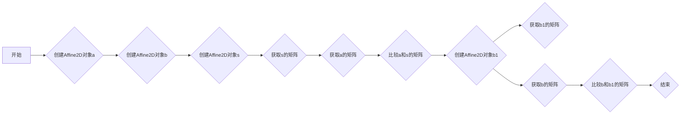

#### 带注释源码

```python
def test_copy(self):
    a = mtransforms.Affine2D()
    b = mtransforms.Affine2D()
    s = a + b
    # Updating a dependee should invalidate a copy of the dependent.
    s.get_matrix()  # resolve it.
    s1 = copy.copy(s)
    assert not s._invalid and not s1._invalid
    a.translate(1, 2)
    assert s._invalid and s1._invalid
    assert (s1.get_matrix() == a.get_matrix()).all()
    # Updating a copy of a dependee shouldn't invalidate a dependent.
    s.get_matrix()  # resolve it.
    b1 = copy.copy(b)
    b1.translate(3, 4)
    assert not s._invalid
    assert_array_equal(s.get_matrix(), a.get_matrix())
```

## 关键组件


### 张量索引与惰性加载

张量索引与惰性加载是代码中用于高效处理大型数据集的关键组件。它允许在需要时才计算数据，从而减少内存消耗和提高性能。

### 反量化支持

反量化支持是代码中用于处理量化数据的关键组件。它允许将量化数据转换回原始数据，以便进行进一步处理。

### 量化策略

量化策略是代码中用于优化模型性能的关键组件。它通过减少模型中使用的精度来减少模型大小和计算需求，从而提高模型在资源受限设备上的运行效率。


## 问题及建议


### 已知问题

-   **代码重复**: `test_init` 方法中多次重复调用 `Affine2D` 构造函数，可以提取为全局函数或类方法以减少代码重复。
-   **测试用例覆盖不足**: 部分测试用例可能没有覆盖所有边界条件，例如 `test_invalid_transform` 中没有测试非法矩阵维度的情况。
-   **异常处理**: 部分测试用例中使用了 `pytest.raises` 来捕获异常，但没有提供具体的异常类型，这可能导致测试不够精确。
-   **代码注释**: 部分代码块缺少注释，难以理解代码的功能和实现细节。

### 优化建议

-   **提取重复代码**: 将 `test_init` 中的重复代码提取为全局函数或类方法，减少代码冗余。
-   **增加测试用例**: 补充更多测试用例，覆盖所有边界条件和异常情况。
-   **精确异常处理**: 在测试用例中明确指定异常类型，提高测试的精确性。
-   **添加代码注释**: 在代码中添加必要的注释，提高代码的可读性和可维护性。
-   **代码优化**: 检查代码中是否存在性能瓶颈，并进行优化。
-   **代码风格**: 检查代码风格是否符合规范，并进行统一。
-   **文档化**: 补充代码文档，包括代码的功能、使用方法和示例。


## 其它


### 设计目标与约束

- 设计目标：
  - 提供一个模块化的、可扩展的二维变换库，支持多种变换操作，如平移、缩放、旋转、倾斜等。
  - 确保变换操作的高效性和准确性，满足绘图和图像处理的需求。
  - 提供清晰的API和文档，方便用户使用和理解。
- 约束条件：
  - 遵循Python编程规范和最佳实践。
  - 依赖的第三方库（如NumPy、Matplotlib）版本需与目标平台兼容。
  - 代码需具有良好的可读性和可维护性。

### 错误处理与异常设计

- 错误处理：
  - 对于无效的输入参数，抛出相应的异常，如`ValueError`、`TypeError`等。
  - 对于不支持的变换操作，抛出`NotImplementedError`。
- 异常设计：
  - 使用`try-except`语句捕获和处理可能出现的异常。
  - 提供详细的异常信息，帮助用户定位问题。

### 数据流与状态机

- 数据流：
  - 用户通过API调用变换函数，传入变换参数和原始数据。
  - 变换函数根据参数和原始数据计算变换矩阵。
  - 变换矩阵应用于原始数据，得到变换后的结果。
- 状态机：
  - 变换对象在创建时处于初始状态，即未进行任何变换。
  - 用户通过调用变换函数，改变变换对象的状态。
  - 变换对象在每次变换后，更新其内部状态。

### 外部依赖与接口契约

- 外部依赖：
  - NumPy：用于数学运算和数组操作。
  - Matplotlib：用于绘图和图像处理。
- 接口契约：
  - 变换函数的输入参数和返回值类型需符合约定。
  - 变换对象需提供统一的API接口，方便用户使用。
  - 变换对象需支持链式调用，方便用户组合多个变换操作。


    