# `matplotlib\lib\matplotlib\tests\test_triangulation.py` 详细设计文档

该文件是matplotlib库中triangulation（三角测量）模块的全面测试套件，涵盖了Triangulation类的创建与操作、Delaunay三角化算法、三角形插值（线性和立方）、网格细化、等高线绘制、颜色填充等功能的单元测试和集成测试。

## 整体流程

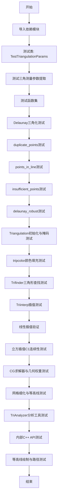

## 类结构

```
TestTriangulationParams (测试类)
├── test_extract_triangulation_params (参数提取测试)
├── 辅助函数: meshgrid_triangles (网格三角化生成)
└── 外部依赖: mtri.Triangulation
    ├── LinearTriInterpolator (线性插值)
    ├── CubicTriInterpolator (立方插值)
    ├── TriAnalyzer (分析工具)
    ├── UniformTriRefiner (网格细化)
    └── TriContourGenerator (等高线生成)
```

## 全局变量及字段


### `x`
    
A list of x‑coordinates for the triangulation points.

类型：`List[int]`
    


### `y`
    
A list of y‑coordinates for the triangulation points.

类型：`List[int]`
    


### `triangles`
    
A list of triangle vertex indices defining the triangulation.

类型：`List[List[int]]`
    


### `mask`
    
A list of boolean values indicating which triangles are masked.

类型：`List[bool]`
    


### `TestTriangulationParams.x`
    
A list of x‑coordinates for the triangulation points.

类型：`List[int]`
    


### `TestTriangulationParams.y`
    
A list of y‑coordinates for the triangulation points.

类型：`List[int]`
    


### `TestTriangulationParams.triangles`
    
A list of triangle vertex indices defining the triangulation.

类型：`List[List[int]]`
    


### `TestTriangulationParams.mask`
    
A list of boolean values indicating which triangles are masked.

类型：`List[bool]`
    
    

## 全局函数及方法


### TestTriangulationParams.test_extract_triangulation_params

该测试方法用于验证`Triangulation._extract_triangulation_params`类方法是否正确地从参数列表中提取x坐标、y坐标、三角形索引和掩码，并正确分离剩余的位置参数和关键字参数。

参数：

- `self`：`TestTriangulationParams`，测试类实例，包含类级别的测试数据（x, y, triangles, mask）
- `args`：`list`，由pytest参数化提供的位置参数列表，包含x, y坐标和可选的triangles
- `kwargs`：`dict`，由pytest参数化提供的关键字参数字典，包含可选的triangles和mask
- `expected`：`list`，由pytest参数化提供的期望返回值列表 [x, y, triangles, mask]

返回值：`None`，该测试方法通过断言验证参数提取的正确性，不返回任何值

#### 流程图

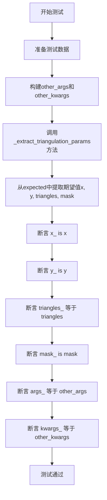

#### 带注释源码

```python
@pytest.mark.parametrize('args, kwargs, expected', [
    # 测试用例1：只提供x和y，无triangles和mask
    ([x, y], {}, [x, y, None, None]),
    # 测试用例2：提供x, y和triangles，无mask
    ([x, y, triangles], {}, [x, y, triangles, None]),
    # 测试用例3：通过kwargs提供triangles
    ([x, y], dict(triangles=triangles), [x, y, triangles, None]),
    # 测试用例4：通过kwargs提供mask
    ([x, y], dict(mask=mask), [x, y, None, mask]),
    # 测试用例5：同时提供triangles和mask
    ([x, y, triangles], dict(mask=mask), [x, y, triangles, mask]),
    # 测试用例6：所有参数都通过kwargs提供
    ([x, y], dict(triangles=triangles, mask=mask), [x, y, triangles, mask])
])
def test_extract_triangulation_params(self, args, kwargs, expected):
    # 定义额外的位置参数，用于测试参数分离功能
    other_args = [1, 2]
    # 定义额外的关键字参数，用于测试参数分离功能
    other_kwargs = {'a': 3, 'b': '4'}
    
    # 调用被测试的类方法，传入合并后的参数
    # 将args与other_args拼接，kwargs与other_kwargs合并
    x_, y_, triangles_, mask_, args_, kwargs_ = \
        mtri.Triangulation._extract_triangulation_params(
            args + other_args, {**kwargs, **other_kwargs})
    
    # 从期望结果中提取预期的值
    x, y, triangles, mask = expected
    
    # 验证x坐标是否正确提取（使用身份比较）
    assert x_ is x
    # 验证y坐标是否正确提取（使用身份比较）
    assert y_ is y
    # 验证三角形索引数组是否正确提取
    assert_array_equal(triangles_, triangles)
    # 验证掩码是否正确提取（使用身份比较）
    assert mask_ is mask
    # 验证剩余的位置参数是否正确分离
    assert args_ == other_args
    # 验证剩余的关键字参数是否正确分离
    assert kwargs_ == other_kwargs
```


### `test_extract_triangulation_positional_mask`

这是一个测试函数，用于验证 `Triangulation._extract_triangulation_params` 方法无法通过位置参数接收 `mask` 参数。该测试确保当 mask 作为位置参数传入时，会被当作未知参数处理，而不是被解析为 mask 参数。

参数：无

返回值：`None`，无返回值（测试函数）

#### 流程图

```mermaid
flowchart TD
    A[开始] --> B[创建 mask = [True]]
    B --> C[创建 args 列表: [[0, 2, 1], [0, 0, 1], [[0, 1, 2]], mask]]
    C --> D[调用 mtri.Triangulation._extract_triangulation_params args, {}]
    D --> E{提取参数}
    E --> F[提取 x_, y_, triangles_, mask_, args_, kwargs_]
    F --> G[断言: mask_ is None]
    G --> H[断言: args_ == [mask]]
    I[结束]
    
    style G fill:#90EE90
    style H fill:#90EE90
```

#### 带注释源码

```python
def test_extract_triangulation_positional_mask():
    """
    测试函数：验证 mask 不能通过位置参数传递
    
    该测试确保当 mask 作为第四个位置参数传入时，
    _extract_triangulation_params 方法会将其视为未知参数，
    而不是解析为 mask 参数。
    """
    # mask cannot be passed positionally
    # 定义一个 mask 列表，用于测试
    mask = [True]
    
    # 构造参数列表：x坐标, y坐标, triangles, mask(作为位置参数)
    # 期望结果：mask 应该被当作未知参数处理，而不是被解析
    args = [[0, 2, 1], [0, 0, 1], [[0, 1, 2]], mask]
    
    # 调用 _extract_triangulation_params 方法
    # 传入 args 和空的 kwargs
    x_, y_, triangles_, mask_, args_, kwargs_ = \
        mtri.Triangulation._extract_triangulation_params(args, {})
    
    # 断言：解析后的 mask_ 应该是 None，而不是传入的 mask
    assert mask_ is None
    
    # 断言：传入的 mask 应该被保留在 args_ 中，作为未知参数
    assert args_ == [mask]
    
    # the positional mask must be caught downstream because this must pass
    # unknown args through
    # 说明：位置参数的 mask 必须在下游被捕获，因为需要传递未知参数
```


### `test_triangulation_init`

该函数是针对 `mtri.Triangulation` 类初始化过程的单元测试，通过多个测试用例验证其在接收无效输入时能否正确抛出 `ValueError` 异常，并检查异常消息的准确性。

参数： 无

返回值： 无（`None`），该测试函数通过 `pytest` 框架验证异常行为，不返回任何值

#### 流程图

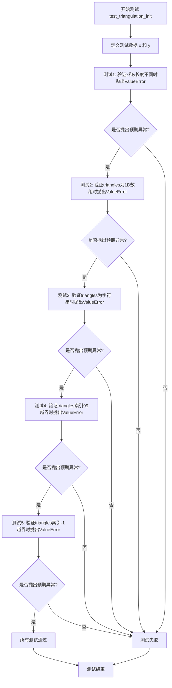

#### 带注释源码

```python
def test_triangulation_init():
    """
    测试 Triangulation 类初始化时的各种错误输入验证。
    
    该测试函数通过 pytest.raises 上下文管理器验证 Triangulation
    在接收无效参数时能够正确抛出 ValueError 异常，并检查异常消息
    是否与预期匹配。
    """
    # 定义测试用的坐标数据
    x = [-1, 0, 1, 0]  # x坐标列表，包含4个点
    y = [0, -1, 0, 1]  # y坐标列表，包含4个点
    
    # 测试用例1: 验证x和y长度不相等时抛出ValueError
    # 期望匹配的错误消息: "x and y must be equal-length"
    with pytest.raises(ValueError, match="x and y must be equal-length"):
        mtri.Triangulation(x, [1, 2])  # y传入[1, 2]只有2个元素，与x长度4不匹配
    
    # 测试用例2: 验证triangles参数维度错误时抛出ValueError
    # 期望匹配的错误消息: "triangles must be a (N, 3) int array, but found shape (3,)"
    with pytest.raises(
            ValueError,
            match=r"triangles must be a \(N, 3\) int array, but found shape "
                  r"\(3,\)"):
        # 传入[0, 1, 2]是一维数组，不是(N, 3)形状的二维数组
        mtri.Triangulation(x, y, [0, 1, 2])
    
    # 测试用例3: 验证triangles参数类型错误时抛出ValueError
    # 期望匹配的错误消息: "triangles must be a (N, 3) int array, not 'other'"
    with pytest.raises(
            ValueError,
            match=r"triangles must be a \(N, 3\) int array, not 'other'"):
        # 传入字符串'other'作为triangles参数，类型不正确
        mtri.Triangulation(x, y, 'other')
    
    # 测试用例4: 验证triangles索引值超出范围时抛出ValueError
    # 期望匹配的错误消息: "found value 99"
    with pytest.raises(ValueError, match="found value 99"):
        # 三角形索引99超出有效范围（最大索引为3）
        mtri.Triangulation(x, y, [[0, 1, 99]])
    
    # 测试用例5: 验证triangles索引值为负数时抛出ValueError
    # 期望匹配的错误消息: "found value -1"
    with pytest.raises(ValueError, match="found value -1"):
        # 三角形索引-1为无效的负数索引
        mtri.Triangulation(x, y, [[0, 1, -1]])
```


### `test_triangulation_set_mask`

这是一个测试函数，用于验证 `Triangulation` 类的 `set_mask` 方法的功能，包括设置遮罩、重置遮罩以及验证遮罩长度错误时的异常处理。

参数：  
无

返回值：  
`None`，测试函数不返回值

#### 流程图

```mermaid
flowchart TD
    A[开始测试] --> B[创建 Triangulation 对象]
    B --> C[检查 neighbors 属性]
    C --> D[调用 set_mask 设置遮罩 [False, True]]
    D --> E[断言 mask 等于 [False, True]]
    E --> F[调用 set_mask 重置为 None]
    F --> G[断言 mask 为 None]
    G --> H[循环测试无效遮罩]
    H --> I{遍历无效遮罩列表}
    I -->|每项| J[验证抛出 ValueError 异常]
    J --> K[测试完成]
```

#### 带注释源码

```python
def test_triangulation_set_mask():
    """
    测试 Triangulation 类的 set_mask 方法的各种功能。
    包括：设置遮罩、重置遮罩、验证遮罩长度错误时的异常处理。
    """
    # 定义三角剖分的点坐标
    x = [-1, 0, 1, 0]
    y = [0, -1, 0, 1]
    # 定义三角形索引
    triangles = [[0, 1, 2], [2, 3, 0]]
    # 创建 Triangulation 对象
    triang = mtri.Triangulation(x, y, triangles)

    # 检查邻居信息，这会强制创建 C++ 实现的三角剖分
    # 预期邻居数组为 [[-1, -1, 1], [-1, -1, 0]]
    assert_array_equal(triang.neighbors, [[-1, -1, 1], [-1, -1, 0]])

    # 设置遮罩：第一个三角形启用，第二个三角形遮罩
    triang.set_mask([False, True])
    # 验证遮罩设置正确
    assert_array_equal(triang.mask, [False, True])

    # 重置遮罩为 None
    triang.set_mask(None)
    # 验证遮罩已被重置
    assert triang.mask is None

    # 定义错误消息正则表达式
    msg = r"mask array must have same length as triangles array"
    # 测试各种无效的遮罩值：长度不匹配或类型错误
    for mask in ([False, True, False], [False], [True], False, True):
        # 预期抛出 ValueError 异常
        with pytest.raises(ValueError, match=msg):
            triang.set_mask(mask)
```


### `test_delaunay`

该测试函数验证 matplotlib 中 Delaunay 三角剖分的基本功能，包括点的存储、三角形的生成、边的构建、邻居的计算以及每个点至少被一个三角形使用。

参数：

- 该函数无任何参数

返回值：

- 该函数无返回值，仅通过断言进行验证

#### 流程图

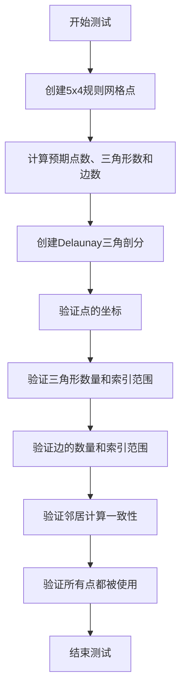

#### 带注释源码

```python
def test_delaunay():
    """
    测试Delaunay三角剖分的基本功能。
    
    该测试创建一个规则网格并验证三角剖分的各个方面：
    - 点坐标是否正确存储
    - 三角形数量和索引是否正确
    - 边的数量和索引是否正确
    - 邻居计算是否与C++实现一致
    - 所有点是否都被至少一个三角形使用
    """
    # No duplicate points, regular grid.
    # 创建一个5x4的规则网格，无重复点
    nx = 5  # x方向点数
    ny = 4  # y方向点数
    
    # 生成网格点坐标
    x, y = np.meshgrid(np.linspace(0.0, 1.0, nx), np.linspace(0.0, 1.0, ny))
    x = x.ravel()  # 展平为一维数组
    y = y.ravel()
    
    npoints = nx*ny  # 总点数 = 20
    # 规则网格的三角形数量：每个单元被分成2个三角形
    ntriangles = 2 * (nx-1) * (ny-1)  # = 2 * 4 * 3 = 24
    # 规则网格的边数计算公式
    nedges = 3*nx*ny - 2*nx - 2*ny + 1  # = 3*20 - 10 - 8 + 1 = 43

    # Create delaunay triangulation.
    # 使用matplotlib.tri创建Delaunay三角剖分
    triang = mtri.Triangulation(x, y)

    # The tests in the remainder of this function should be passed by any
    # triangulation that does not contain duplicate points.
    # 以下测试适用于任何不含重复点的三角剖分

    # Points - floating point.
    # 验证点的x坐标是否正确
    assert_array_almost_equal(triang.x, x)
    # 验证点的y坐标是否正确
    assert_array_almost_equal(triang.y, y)

    # Triangles - integers.
    # 验证三角形数量是否符合预期
    assert len(triang.triangles) == ntriangles
    # 验证三角形索引的最小值是否为0
    assert np.min(triang.triangles) == 0
    # 验证三角形索引的最大值是否为总点数-1
    assert np.max(triang.triangles) == npoints-1

    # Edges - integers.
    # 验证边的数量是否符合预期
    assert len(triang.edges) == nedges
    # 验证边索引的最小值是否为0
    assert np.min(triang.edges) == 0
    # 验证边索引的最大值是否为总点数-1
    assert np.max(triang.edges) == npoints-1

    # Neighbors - integers.
    # 检查C++三角剖分类计算的邻居与delaunay例程返回的是否相同
    neighbors = triang.neighbors  # 获取C++计算的邻居
    triang._neighbors = None       # 清除缓存，强制重新计算
    # 验证重新计算的邻居与原始邻居一致
    assert_array_equal(triang.neighbors, neighbors)

    # Is each point used in at least one triangle?
    # 验证所有点都被至少一个三角形使用
    # 获取所有三角形中使用的唯一顶点索引，应与0到npoints-1的序列相同
    assert_array_equal(np.unique(triang.triangles), np.arange(npoints))
```


### `test_delaunay_duplicate_points`

该测试函数用于验证Delaunay三角剖分算法能够正确处理重复点的情况，通过创建一个包含重复点的数据集，检查重复点的索引不会出现在最终的三角剖分结果中。

参数： 无

返回值： `None`，该函数为测试函数，不返回任何值

#### 流程图

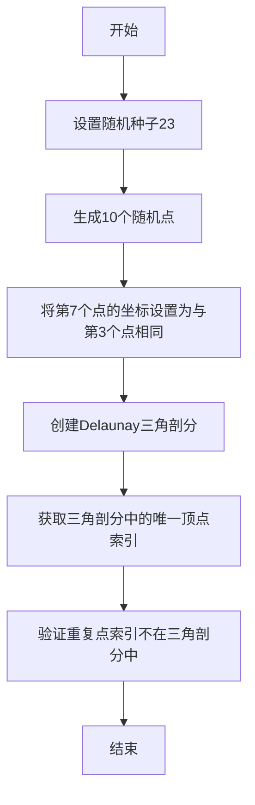

#### 带注释源码

```python
def test_delaunay_duplicate_points():
    # 定义测试参数：总点数为10
    npoints = 10
    # 定义重复点的索引
    duplicate = 7
    # 定义重复点参考点的索引
    duplicate_of = 3

    # 设置随机种子以确保测试结果可重复
    np.random.seed(23)
    # 生成npoints个随机x坐标
    x = np.random.random(npoints)
    # 生成npoints个随机y坐标
    y = np.random.random(npoints)
    # 将第duplicate个点的坐标设置为与第duplicate_of个点相同，创建重复点
    x[duplicate] = x[duplicate_of]
    y[duplicate] = y[duplicate_of]

    # 使用matplotlib的Triangulation创建Delaunay三角剖分
    # 重复点应该被忽略
    triang = mtri.Triangulation(x, y)

    # 验证：重复点的索引不应该出现在任何三角形中
    # 获取三角剖分中使用的所有唯一顶点索引
    unique_triangles = np.unique(triang.triangles)
    # 期望的结果是除了重复点索引外的所有其他索引
    expected = np.delete(np.arange(npoints), duplicate)
    # 使用assert_array_equal进行断言验证
    assert_array_equal(unique_triangles, expected)
```


### `test_delaunay_points_in_line`

该函数是一个测试用例，用于验证 Delaunay 三角剖分在所有点都位于一条直线上时的错误处理能力，确保代码能够优雅地失败而不是产生未定义的行为。

参数： 无

返回值： `None`，该测试函数不返回任何值，仅通过断言验证预期行为

#### 流程图

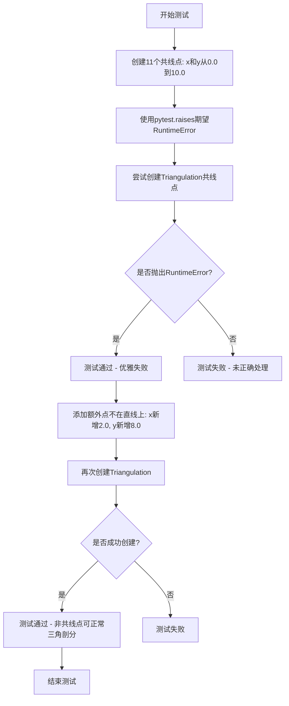

#### 带注释源码

```python
def test_delaunay_points_in_line():
    """
    测试当所有点都位于一条直线上时，Delaunay三角剖分的错误处理。
    
    该测试验证以下两种情况：
    1. 所有点共线时应该抛出RuntimeError
    2. 添加非共线点后应该能够成功创建三角剖分
    """
    # Cannot triangulate points that are all in a straight line, but check
    # that delaunay code fails gracefully.
    
    # 创建11个点，所有点都在从(0,0)到(10,10)的对角线上
    x = np.linspace(0.0, 10.0, 11)  # [0.0, 1.0, 2.0, ..., 10.0]
    y = np.linspace(0.0, 10.0, 11)  # [0.0, 1.0, 2.0, ..., 10.0]
    
    # 期望：当点全部共线时，Triangulation应该抛出RuntimeError异常
    # 这是预期的失败模式，确保库能够优雅地处理无效输入
    with pytest.raises(RuntimeError):
        mtri.Triangulation(x, y)

    # Add an extra point not on the line and the triangulation is OK.
    
    # 添加一个不在直线上的点(2.0, 8.0)，使点集不再全部共线
    x = np.append(x, 2.0)  # x数组新增一个值
    y = np.append(y, 8.0)  # y数组新增一个值
    
    # 验证：添加非共线点后，Triangulation应该能够成功创建
    mtri.Triangulation(x, y)
```


### test_delaunay_insufficient_points

该函数是一个参数化测试函数，用于验证当输入的点数量不足（少于3个）或存在重复点导致唯一点数少于3个时，Triangulation类是否会正确抛出ValueError异常。

参数：

- `x`：`list`，表示x坐标列表
- `y`：`list`，表示y坐标列表

返回值：`None`，该测试函数不返回任何值，仅通过pytest.raises验证是否抛出ValueError异常

#### 流程图

```mermaid
graph TD
    A[开始测试] --> B{参数化输入: x, y}
    B --> C[检查点数量是否少于3个或唯一点数少于3个]
    C --> D[调用 mtri.Triangulation(x, y)]
    D --> E{是否抛出 ValueError?}
    E -->|是| F[测试通过]
    E -->|否| G[测试失败]
```

#### 带注释源码

```python
@pytest.mark.parametrize('x, y', [
    # 测试用例1：空列表，应该抛出ValueError
    ([], []),
    # 测试用例2：只有1个点，应该抛出ValueError
    ([1], [5]),
    # 测试用例3：只有2个点，应该抛出ValueError
    ([1, 2], [5, 6]),
    # 测试用例4：存在重复点导致唯一点数少于3个，应该抛出ValueError
    ([1, 2, 1], [5, 6, 5]),
    # 测试用例5：存在重复点导致唯一点数少于3个，应该抛出ValueError
    ([1, 2, 2], [5, 6, 6]),
    # 测试用例6：存在多个重复点导致唯一点数少于3个，应该抛出ValueError
    ([1, 1, 1, 2, 1, 2], [5, 5, 5, 6, 5, 6]),
])
def test_delaunay_insufficient_points(x, y):
    """
    测试当提供不足的点时，Triangulation是否正确抛出ValueError。
    
    参数:
        x: x坐标列表
        y: y坐标列表
    
    注意:
        该测试函数使用pytest.raises来验证Triangulation构造函数
        在点数量不足时是否抛出ValueError异常。
    """
    with pytest.raises(ValueError):
        mtri.Triangulation(x, y)
```


### `test_delaunay_robust`

该测试函数用于验证 matplotlib 中 Triangulation 类在处理特定几何点集时的鲁棒性，特别是对比旧版 matplotlib.delaunay 和新版 qhull 库的三角剖分效果，确保每个测试点都被恰好一个三角形包含。

参数： 无

返回值： 无

#### 流程图

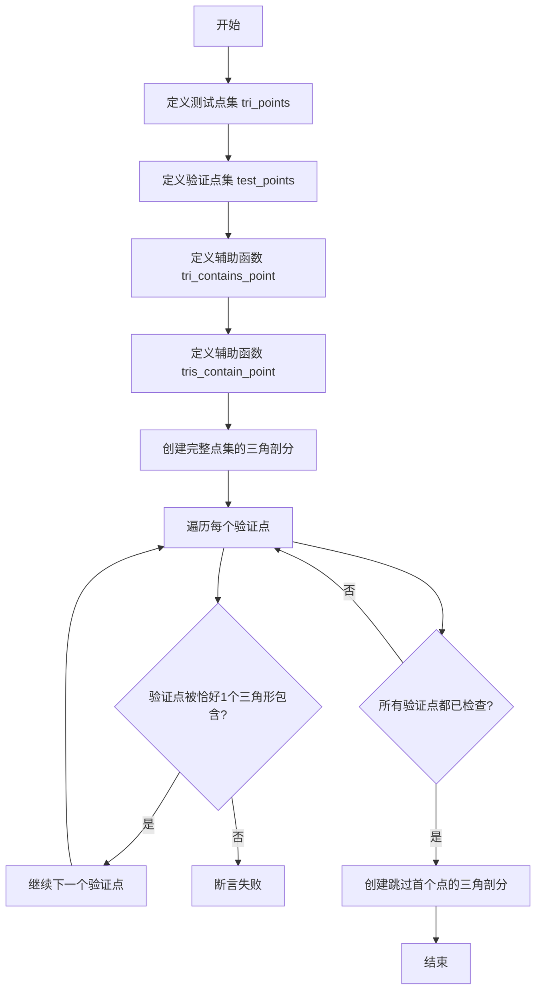

#### 带注释源码

```python
def test_delaunay_robust():
    # Fails when mtri.Triangulation uses matplotlib.delaunay, works when using
    # qhull.
    # 定义一组测试用的三角剖分点（7个点）
    tri_points = np.array([
        [0.8660254037844384, -0.5000000000000004],
        [0.7577722283113836, -0.5000000000000004],
        [0.6495190528383288, -0.5000000000000003],
        [0.5412658773652739, -0.5000000000000003],
        [0.811898816047911, -0.40625000000000044],
        [0.7036456405748561, -0.4062500000000004],
        [0.5953924651018013, -0.40625000000000033]])
    
    # 定义一组测试点，用于验证三角剖分的正确性
    test_points = np.asarray([
        [0.58, -0.46],
        [0.65, -0.46],
        [0.65, -0.42],
        [0.7, -0.48],
        [0.7, -0.44],
        [0.75, -0.44],
        [0.8, -0.48]])

    # 工具函数：判断由三个点(xtri, ytri)构成的三角形是否包含测试点xy
    # 避免对位于三角形边上或非常接近边的点调用此函数
    def tri_contains_point(xtri, ytri, xy):
        tri_points = np.vstack((xtri, ytri)).T
        return Path(tri_points).contains_point(xy)

    # 工具函数：返回指定三角剖分中有多少个三角形包含测试点xy
    # 避免对位于任何三角形边上或非常接近边的点调用此函数
    def tris_contain_point(triang, xy):
        return sum(tri_contains_point(triang.x[tri], triang.y[tri], xy)
                   for tri in triang.triangles)

    # 使用matplotlib.delaunay时，会创建无效的三角剖分（重叠三角形）;
    # 而使用qhull则正常工作
    triang = mtri.Triangulation(tri_points[:, 0], tri_points[:, 1])
    for test_point in test_points:
        assert tris_contain_point(triang, test_point) == 1

    # 如果忽略tri_points的第一个点，matplotlib.delaunay在计算凸包时会抛出KeyError;
    # qhull则正常工作
    triang = mtri.Triangulation(tri_points[1:, 0], tri_points[1:, 1])
```


### test_tripcolor

该函数是一个图像对比测试函数，用于测试 matplotlib 中 `tripcolor` 函数的功能。它创建两个子图，分别展示基于点的颜色（point colors）和基于面的颜色（facecolors）的三角形网格填充效果。

参数： 无

返回值： 无（该函数为测试函数，使用 `@image_comparison` 装饰器进行图像对比）

#### 流程图

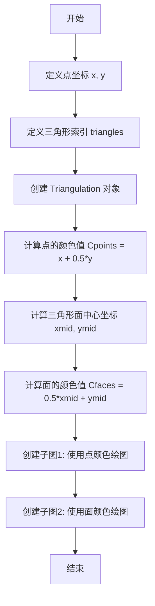

#### 带注释源码

```python
@image_comparison(['tripcolor1.png'])
def test_tripcolor():
    """
    测试 tripcolor 函数的两种颜色映射方式：
    1. 基于点的颜色（point colors）
    2. 基于面的颜色（facecolors）
    """
    
    # 定义网格点的 x 坐标（10个点）
    x = np.asarray([0, 0.5, 1, 0,   0.5, 1,   0, 0.5, 1, 0.75])
    
    # 定义网格点的 y 坐标（10个点）
    y = np.asarray([0, 0,   0, 0.5, 0.5, 0.5, 1, 1,   1, 0.75])
    
    # 定义三角形索引（10个三角形）
    triangles = np.asarray([
        [0, 1, 3], [1, 4, 3],
        [1, 2, 4], [2, 5, 4],
        [3, 4, 6], [4, 7, 6],
        [4, 5, 9], [7, 4, 9], [8, 7, 9], [5, 8, 9]])

    # 创建 Triangulation 对象，点数和三角形数相同
    triang = mtri.Triangulation(x, y, triangles)

    # 计算每个点的颜色值：基于 x + 0.5*y
    Cpoints = x + 0.5*y

    # 计算每个三角形面的中心坐标
    xmid = x[triang.triangles].mean(axis=1)
    ymid = y[triang.triangles].mean(axis=1)
    
    # 计算每个面的颜色值：基于面中心的 0.5*xmid + ymid
    Cfaces = 0.5*xmid + ymid

    # 第一个子图：使用点颜色进行填充
    plt.subplot(121)
    plt.tripcolor(triang, Cpoints, edgecolors='k')
    plt.title('point colors')

    # 第二个子图：使用面颜色进行填充
    plt.subplot(122)
    plt.tripcolor(triang, facecolors=Cfaces, edgecolors='k')
    plt.title('facecolors')
```


### `test_tripcolor_color`

该函数是 `matplotlib.tri` 模块中的一个测试函数，用于验证 `tripcolor` 方法在处理颜色参数（C 或 facecolors）时的各种边界情况和错误处理，包括参数缺失、长度不匹配、gouraud 着色模式限制以及位置参数与关键字参数的冲突。

参数：无（该函数不接受任何参数）

返回值：无（返回类型为 `None`），该函数仅执行断言和异常验证

#### 流程图

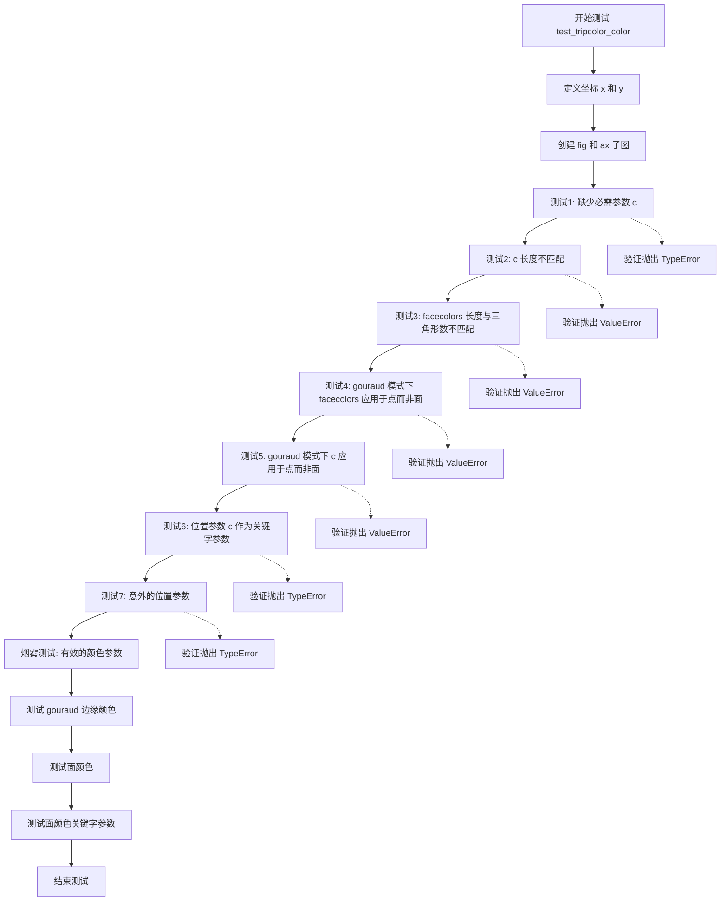

#### 带注释源码

```python
def test_tripcolor_color():
    """
    测试 tripcolor 方法的颜色参数处理和错误提示。
    验证各种无效输入是否抛出正确的异常，并进行烟雾测试验证有效输入。
    """
    # 定义测试用的坐标点，形成一个简单的四边形 triangulation
    x = [-1, 0, 1, 0]
    y = [0, -1, 0, 1]
    
    # 创建 figure 和 axes 用于测试
    fig, ax = plt.subplots()
    
    # 测试1: 验证缺少必需的 c 参数时抛出 TypeError
    # tripcolor() 需要至少一个颜色数据参数
    with pytest.raises(TypeError, match=r"tripcolor\(\) missing 1 required "):
        ax.tripcolor(x, y)
    
    # 测试2: 验证 c 参数长度与点数或面数都不匹配时抛出 ValueError
    # c 长度必须等于点数（边缘颜色）或面数（ facecolors）
    with pytest.raises(ValueError, match="The length of c must match either"):
        ax.tripcolor(x, y, [1, 2, 3])
    
    # 测试3: 验证 facecolors 长度与三角形数不匹配时抛出 ValueError
    # 三角形有2个，所以 facecolors 长度应为2而非4
    with pytest.raises(ValueError,
                       match="length of facecolors must match .* triangles"):
        ax.tripcolor(x, y, facecolors=[1, 2, 3, 4])
    
    # 测试4: 验证 gouraud 着色模式下 facecolors 不能用于面
    # gouraud 着色要求颜色在点上而非三角形面上
    with pytest.raises(ValueError,
                       match="'gouraud' .* at the points.* not at the faces"):
        ax.tripcolor(x, y, facecolors=[1, 2], shading='gouraud')
    
    # 测试5: 验证 gouraud 着色模式下 c 参数（位置参数）不能用于面
    # 同样，gouraud 要求颜色在点上
    with pytest.raises(ValueError,
                       match="'gouraud' .* at the points.* not at the faces"):
        ax.tripcolor(x, y, [1, 2], shading='gouraud')  # faces
    
    # 测试6: 验证 c 作为位置参数但与关键字参数 facecolors 冲突
    # 当同时使用 c 和 facecolors 时，c 应为 keyword-only 参数
    with pytest.raises(TypeError,
                       match="positional.*'c'.*keyword-only.*'facecolors'"):
        ax.tripcolor(x, y, C=[1, 2, 3, 4])
    
    # 测试7: 验证意外的位置参数会被拒绝
    with pytest.raises(TypeError, match="Unexpected positional parameter"):
        ax.tripcolor(x, y, [1, 2], 'unused_positional')
    
    # 烟雾测试: 验证有效的颜色规范可以正常工作
    
    # 边缘颜色：颜色数组长度等于点数（4个点）
    ax.tripcolor(x, y, [1, 2, 3, 4])  # edges
    
    # gouraud 着色边缘颜色：颜色在点上
    ax.tripcolor(x, y, [1, 2, 3, 4], shading='gouraud')  # edges
    
    # 面颜色：颜色数组长度等于三角形数（2个三角形）
    ax.tripcolor(x, y, [1, 2])  # faces
    
    # facecolors 关键字参数指定面颜色
    ax.tripcolor(x, y, facecolors=[1, 2])  # faces
```


### `test_tripcolor_clim`

该测试函数用于验证 matplotlib 中 `tripcolor` 函数的 `clim` 参数是否能够正确设置颜色映射的归一化范围（vmin 和 vmax）。

参数： 无

返回值： `None`，该函数为测试函数，无返回值（返回类型为 `None`）

#### 流程图

```mermaid
flowchart TD
    A[开始测试] --> B[设置随机种子 19680801]
    B --> C[生成随机数据 a, b, c 各10个元素]
    C --> D[创建子图 ax]
    D --> E[定义 clim 范围 (0.25, 0.75)]
    E --> F[调用 ax.tripcolor 并传入 clim 参数]
    F --> G[获取返回的 PolyCollection 的 norm 属性]
    G --> H{验证 norm.vmin 和 norm.vmax 是否等于 clim}
    H -->|是| I[测试通过]
    H -->|否| J[测试失败]
```

#### 带注释源码

```python
def test_tripcolor_clim():
    """
    测试 tripcolor 函数的 clim 参数是否正确设置归一化范围。
    
    该测试验证当使用 clim 参数时，tripcolor 返回的 colormap norm
    对象的 vmin 和 vmax 是否与指定的 clim 值一致。
    """
    # 设置随机种子以确保结果可复现
    np.random.seed(19680801)
    
    # 生成3组各10个随机数作为测试数据
    # a, b: 作为三角剖分的 x, y 坐标
    # c: 作为颜色数据值
    a, b, c = np.random.rand(10), np.random.rand(10), np.random.rand(10)

    # 创建新的 figure 和 subplot
    ax = plt.figure().add_subplot()
    
    # 定义期望的颜色范围限制
    clim = (0.25, 0.75)
    
    # 调用 tripcolor，传入坐标数据、颜色数据，以及 clim 参数
    # tripcolor 返回一个 PolyCollection 对象，其 .norm 属性包含归一化信息
    # 验证返回的 norm 对象的 vmin 和 vmax 是否与 clim 一致
    norm = ax.tripcolor(a, b, c, clim=clim).norm
    
    # 使用 assert 验证结果
    assert (norm.vmin, norm.vmax) == clim
```


### `test_tripcolor_warnings`

该测试函数用于验证 matplotlib 中 `tripcolor` 函数在同时使用位置参数 `c` 和关键字参数 `facecolors` 时的警告行为，确保当 `facecolors` 优先时，位置参数 `c` 会产生预期的警告信息。

参数：无需参数

返回值：`None`，因为这是一个测试函数，不返回任何值。

#### 流程图

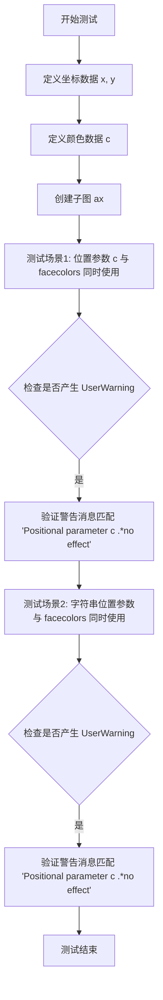

#### 带注释源码

```python
def test_tripcolor_warnings():
    """
    测试 tripcolor 函数在同时使用位置参数 c 和关键字参数 facecolors 时的警告行为。
    facecolors 参数应该优先，位置参数 c 不应该产生任何实际效果，但应该产生警告。
    """
    # 定义三角剖分的 x 坐标
    x = [-1, 0, 1, 0]
    # 定义三角剖分的 y 坐标
    y = [0, -1, 0, 1]
    # 定义颜色值
    c = [0.4, 0.5]
    # 创建一个新的图形和 Axes 对象
    fig, ax = plt.subplots()
    
    # 场景1: 当同时提供位置参数 c 和关键字参数 facecolors 时
    # facecolors 应该优先，位置参数 c 应该无效并产生警告
    # facecolors takes precedence over c
    with pytest.warns(UserWarning, match="Positional parameter c .*no effect"):
        ax.tripcolor(x, y, c, facecolors=c)
    
    # 场景2: 使用字符串作为位置参数，验证相同的警告行为
    with pytest.warns(UserWarning, match="Positional parameter c .*no effect"):
        ax.tripcolor(x, y, 'interpreted as c', facecolors=c)
```


### `test_no_modify`

该测试函数用于验证 matplotlib 的 Triangulation 类在创建对象时不会修改传入的三角形数组，确保传入的 triangles 参数保持不变。

参数：无

返回值：`None`，该函数为测试函数，不返回任何值

#### 流程图

```mermaid
flowchart TD
    A[开始] --> B[创建 triangles 数组: [[3, 2, 0], [3, 1, 0]]]
    B --> C[创建 points 数组: 4个二维点坐标]
    C --> D[保存 triangles 副本到 old_triangles]
    D --> E[创建 Triangulation 对象并访问 edges 属性]
    E --> F{检查 triangles 是否被修改}
    F -->|是| G[测试失败: 抛出 AssertionError]
    F -->|否| H[测试通过]
    G --> I[结束]
    H --> I
```

#### 带注释源码

```python
def test_no_modify():
    """
    Test that Triangulation does not modify triangles array passed to it.
    
    此测试验证 matplotlib.tri.Triangulation 类在实例化时不会修改
    用户传入的 triangles 数组，这是一个重要的不可变性保证。
    """
    # 定义一个 2x3 的 int32 类型的三角形数组
    # 每个三角形由三个顶点索引组成: [顶点1, 顶点2, 顶点3]
    triangles = np.array([[3, 2, 0], [3, 1, 0]], dtype=np.int32)
    
    # 定义四个二维点坐标，用于构成三角形
    # 格式为 [(x0,y0), (x1,y1), (x2,y2), (x3,y3)]
    points = np.array([(0, 0), (0, 1.1), (1, 0), (1, 1)])
    
    # 复制原始三角形数组，用于后续比较
    # 这一步至关重要，用于验证 Triangulation 是否修改了输入数组
    old_triangles = triangles.copy()
    
    # 创建 Triangulation 对象并访问 edges 属性
    # 访问 .edges 会触发内部计算，但不应修改传入的 triangles 数组
    # 如果 Triangulation 内部实现有副作用修改了输入数组，这里会失败
    mtri.Triangulation(points[:, 0], points[:, 1], triangles).edges
    
    # 断言原始三角形数组未被修改
    # 使用 assert_array_equal 确保每个元素都完全相等
    assert_array_equal(old_triangles, triangles)
```


### `test_trifinder`

该函数是matplotlib中用于测试TriFinder类的单元测试，验证在有遮罩（masked）的三角剖分中，Trifinder能够正确查找给定点所在的三角形索引，并处理边界情况（如点位于三角形边缘、顶点或外部）。

参数：

- 无显式参数（测试函数，使用模块级导入的测试工具和matplotlib.tri模块）

返回值：

- 无返回值（测试函数，使用断言验证正确性）

#### 流程图

```mermaid
graph TD
    A[开始测试] --> B[创建4x4网格点]
    B --> C[定义三角形索引数组]
    C --> D[创建遮罩数组 mask[8:10]=1]
    D --> E[创建Triangulation对象]
    E --> F[获取Trifinder实例]
    F --> G[测试内部点查找: meshgrid xs, ys = 0.25, 1.25, 2.25, 3.25]
    G --> H[断言tris结果]
    H --> I[测试偏移点: xs-0.5, ys-0.5]
    I --> J[断言tris结果]
    J --> K[测试边界边上的点]
    K --> L[断言tris结果]
    L --> M[测试边界角点]
    M --> N[断言tris结果]
    N --> O[测试水平共线点的三角剖分]
    O --> P[获取新的trifinder]
    P --> Q[断言tris结果]
    Q --> R[测试垂直共线点的三角剖分]
    R --> S[获取新的trifinder]
    S --> T[断言tris结果]
    T --> U[测试遮罩改变后trifinder重初始化]
    U --> V[设置新遮罩]
    V --> W[断言trifinder已更新]
    W --> X[结束测试]
```

#### 带注释源码

```python
def test_trifinder():
    """
    测试TriFinder类的功能，包括：
    1. 在有遮罩的三角剖分中查找点所在的三角形
    2. 处理点位于边界边、边界角点的情况
    3. 处理含有共线点的三角剖分
    4. 验证遮罩改变后trifinder会重新初始化
    """
    
    # ===== 第一个测试部分：测试遮罩三角剖分中的点 =====
    # 创建4x4的网格点
    x, y = np.meshgrid(np.arange(4), np.arange(4))
    x = x.ravel()  # 展平为1D数组
    y = y.ravel()
    
    # 定义三角形的顶点索引（构成网格的三角形划分）
    triangles = [[0, 1, 4], [1, 5, 4], [1, 2, 5], [2, 6, 5], [2, 3, 6],
                 [3, 7, 6], [4, 5, 8], [5, 9, 8], [5, 6, 9], [6, 10, 9],
                 [6, 7, 10], [7, 11, 10], [8, 9, 12], [9, 13, 12], [9, 10, 13],
                 [10, 14, 13], [10, 11, 14], [11, 15, 14]]
    
    # 创建遮罩：mask[8:10]=1 表示第8和第9个三角形被遮罩（即被排除）
    mask = np.zeros(len(triangles))
    mask[8:10] = 1
    
    # 创建带遮罩的三角剖分对象
    triang = mtri.Triangulation(x, y, triangles, mask)
    
    # 获取Trifinder对象（用于查找点所在的三角形）
    trifinder = triang.get_trifinder()
    
    # 测试点：创建内部点坐标
    xs = [0.25, 1.25, 2.25, 3.25]
    ys = [0.25, 1.25, 2.25, 3.25]
    xs, ys = np.meshgrid(xs, ys)
    xs = xs.ravel()
    ys = ys.ravel()
    
    # 查找每个点所在的三角形索引
    # -1表示点在三角形外部或被遮罩的三角形中
    tris = trifinder(xs, ys)
    
    # 预期结果：验证三角形索引
    # 注意：被遮罩的三角形(索引8,9)不会返回
    assert_array_equal(tris, [0, 2, 4, -1, 6, -1, 10, -1,
                              12, 14, 16, -1, -1, -1, -1, -1])
    
    # 测试偏移后的点（偏移-0.5）
    tris = trifinder(xs-0.5, ys-0.5)
    assert_array_equal(tris, [-1, -1, -1, -1, -1, 1, 3, 5,
                              -1, 7, -1, 11, -1, 13, 15, 17])
    
    # ===== 第二部分：测试边界边上的点 =====
    # 测试点精确位于边界边上的情况
    xs = [0.5, 1.5, 2.5, 0.5, 1.5, 2.5, 1.5, 1.5, 0.0, 1.0, 2.0, 3.0]
    ys = [0.0, 0.0, 0.0, 3.0, 3.0, 3.0, 1.0, 2.0, 1.5, 1.5, 1.5, 1.5]
    tris = trifinder(xs, ys)
    assert_array_equal(tris, [0, 2, 4, 13, 15, 17, 3, 14, 6, 7, 10, 11])
    
    # ===== 第三部分：测试边界角点 =====
    xs = [0.0, 3.0]
    ys = [0.0, 3.0]
    tris = trifinder(xs, ys)
    assert_array_equal(tris, [0, 17])
    
    # ===== 第四部分：测试水平共线点的三角剖分 =====
    # 这些不是有效的三角剖分，但TriFinder需要处理最简单的违规情况
    
    # delta = 0.0 表示有共线点
    delta = 0.0
    
    # 定义含有水平共线点的坐标
    x = [1.5, 0,  1,  2, 3, 1.5,   1.5]
    y = [-1,  0,  0,  0, 0, delta, 1]
    triangles = [[0, 2, 1], [0, 3, 2], [0, 4, 3], [1, 2, 5], [2, 3, 5],
                 [3, 4, 5], [1, 5, 6], [4, 6, 5]]
    triang = mtri.Triangulation(x, y, triangles)
    trifinder = triang.get_trifinder()
    
    # 测试点
    xs = [-0.1, 0.4, 0.9, 1.4, 1.9, 2.4, 2.9]
    ys = [-0.1, 0.1]
    xs, ys = np.meshgrid(xs, ys)
    tris = trifinder(xs, ys)
    assert_array_equal(tris, [[-1, 0, 0, 1, 1, 2, -1],
                              [-1, 6, 6, 6, 7, 7, -1]])
    
    # ===== 第五部分：测试垂直共线点的三角剖分 =====
    delta = 0.0
    
    x = [-1, -delta, 0,  0,  0, 0, 1]
    y = [1.5, 1.5,   0,  1,  2, 3, 1.5]
    triangles = [[0, 1, 2], [0, 1, 5], [1, 2, 3], [1, 3, 4], [1, 4, 5],
                 [2, 6, 3], [3, 6, 4], [4, 6, 5]]
    triang = mtri.Triangulation(x, y, triangles)
    trifinder = triang.get_trifinder()
    
    xs = [-0.1, 0.1]
    ys = [-0.1, 0.4, 0.9, 1.4, 1.9, 2.4, 2.9]
    xs, ys = np.meshgrid(xs, ys)
    tris = trifinder(xs, ys)
    assert_array_equal(tris, [[-1, -1], [0, 5], [0, 5], [0, 6], [1, 6], [1, 7],
                              [-1, -1]])
    
    # ===== 第六部分：测试遮罩改变后trifinder重初始化 =====
    x = [0, 1, 0, 1]
    y = [0, 0, 1, 1]
    triangles = [[0, 1, 2], [1, 3, 2]]
    triang = mtri.Triangulation(x, y, triangles)
    trifinder = triang.get_trifinder()
    
    # 测试点
    xs = [-0.2, 0.2, 0.8, 1.2]
    ys = [0.5, 0.5, 0.5, 0.5]
    tris = trifinder(xs, ys)
    assert_array_equal(tris, [-1, 0, 1, -1])
    
    # 改变遮罩：设置第一个三角形被遮罩
    triang.set_mask([1, 0])
    
    # 验证trifinder已重新初始化（对象身份相同）
    assert trifinder == triang.get_trifinder()
    
    # 重新测试：因为第一个三角形被遮罩，结果不同
    tris = trifinder(xs, ys)
    assert_array_equal(tris, [-1, -1, 1, -1])
```


### `test_triinterp`

该函数是一个测试函数，用于验证 matplotlib 中三角形插值器（`LinearTriInterpolator` 和 `CubicTriInterpolator`）的正确性。测试涵盖了掩码三角剖分、三角剖分外的点、混合配置（内外点）、二阶补丁测试以及三次插值相比线性插值的精度提升。

参数： 无

返回值：`None`，该函数为测试函数，不返回任何值

#### 流程图

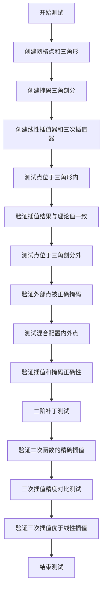

#### 带注释源码

```python
def test_triinterp():
    # 测试掩码三角剖分中的点
    # 创建4x4网格
    x, y = np.meshgrid(np.arange(4), np.arange(4))
    x = x.ravel()  # 展平为1D数组
    y = y.ravel()
    # 定义z值作为x和y的线性函数: z = 1.23*x - 4.79*y
    z = 1.23*x - 4.79*y
    # 定义三角形索引
    triangles = [[0, 1, 4], [1, 5, 4], [1, 2, 5], [2, 6, 5], [2, 3, 6],
                 [3, 7, 6], [4, 5, 8], [5, 9, 8], [5, 6, 9], [6, 10, 9],
                 [6, 7, 10], [7, 11, 10], [8, 9, 12], [9, 13, 12], [9, 10, 13],
                 [10, 14, 13], [10, 11, 14], [11, 15, 14]]
    # 创建掩码，掩码第8和第9个三角形
    mask = np.zeros(len(triangles))
    mask[8:10] = 1
    # 创建三角剖分对象
    triang = mtri.Triangulation(x, y, triangles, mask)
    # 创建三种插值器：线性插值、最小能量三次插值、几何三次插值
    linear_interp = mtri.LinearTriInterpolator(triang, z)
    cubic_min_E = mtri.CubicTriInterpolator(triang, z)
    cubic_geom = mtri.CubicTriInterpolator(triang, z, kind='geom')

    # 测试点位于三角形内部的情况
    xs = np.linspace(0.25, 2.75, 6)
    ys = [0.25, 0.75, 2.25, 2.75]
    xs, ys = np.meshgrid(xs, ys)  # 测试数组维度为2的情况
    # 遍历所有插值器，验证插值结果
    for interp in (linear_interp, cubic_min_E, cubic_geom):
        zs = interp(xs, ys)
        assert_array_almost_equal(zs, (1.23*xs - 4.79*ys))

    # 测试点位于三角剖分外部的情况
    xs = [-0.25, 1.25, 1.75, 3.25]
    ys = xs
    xs, ys = np.meshgrid(xs, ys)
    # 所有外部点应该被掩码
    for interp in (linear_interp, cubic_min_E, cubic_geom):
        zs = linear_interp(xs, ys)
        assert_array_equal(zs.mask, [[True]*4]*4)

    # 测试混合配置：部分点在内部，部分点在外部
    xs = np.linspace(0.25, 1.75, 6)
    ys = [0.25, 0.75, 1.25, 1.75]
    xs, ys = np.meshgrid(xs, ys)
    for interp in (linear_interp, cubic_min_E, cubic_geom):
        zs = interp(xs, ys)
        matest.assert_array_almost_equal(zs, (1.23*xs - 4.79*ys))
        # 创建掩码：只保留[1,2]x[1,2]范围内的点
        mask = (xs >= 1) * (xs <= 2) * (ys >= 1) * (ys <= 2)
        assert_array_equal(zs.mask, mask)

    # 二阶补丁测试：对于任意形状的三角形，
    # 补丁测试应对二次函数精确，且三次插值器kind='user'时应精确
    (a, b, c) = (1.23, -4.79, 0.6)

    # 定义二次函数
    def quad(x, y):
        return a*(x-0.5)**2 + b*(y-0.5)**2 + c*x*y

    # 定义二次函数的梯度
    def gradient_quad(x, y):
        return (2*a*(x-0.5) + c*y, 2*b*(y-0.5) + c*x)

    # 创建任意形状的三角形
    x = np.array([0.2, 0.33367, 0.669, 0., 1., 1., 0.])
    y = np.array([0.3, 0.80755, 0.4335, 0., 0., 1., 1.])
    triangles = np.array([[0, 1, 2], [3, 0, 4], [4, 0, 2], [4, 2, 5],
                          [1, 5, 2], [6, 5, 1], [6, 1, 0], [6, 0, 3]])
    triang = mtri.Triangulation(x, y, triangles)
    z = quad(x, y)
    dz = gradient_quad(x, y)
    # 二阶补丁测试的测试点
    xs = np.linspace(0., 1., 5)
    ys = np.linspace(0., 1., 5)
    xs, ys = np.meshgrid(xs, ys)
    # 创建用户类型的三次插值器，提供梯度信息
    cubic_user = mtri.CubicTriInterpolator(triang, z, kind='user', dz=dz)
    interp_zs = cubic_user(xs, ys)
    # 验证插值结果与二次函数一致
    assert_array_almost_equal(interp_zs, quad(xs, ys))
    # 验证梯度计算正确
    (interp_dzsdx, interp_dzsdy) = cubic_user.gradient(x, y)
    (dzsdx, dzsdy) = gradient_quad(x, y)
    assert_array_almost_equal(interp_dzsdx, dzsdx)
    assert_array_almost_equal(interp_dzsdy, dzsdy)

    # 三次插值精度提升测试：对于足够密的网格上的二次函数，
    # 三次插值应比线性插值表现更好
    n = 11
    x, y = np.meshgrid(np.linspace(0., 1., n+1), np.linspace(0., 1., n+1))
    x = x.ravel()
    y = y.ravel()
    z = quad(x, y)
    triang = mtri.Triangulation(x, y, triangles=meshgrid_triangles(n+1))
    xs, ys = np.meshgrid(np.linspace(0.1, 0.9, 5), np.linspace(0.1, 0.9, 5))
    xs = xs.ravel()
    ys = ys.ravel()
    linear_interp = mtri.LinearTriInterpolator(triang, z)
    cubic_min_E = mtri.CubicTriInterpolator(triang, z)
    cubic_geom = mtri.CubicTriInterpolator(triang, z, kind='geom')
    zs = quad(xs, ys)
    # 计算线性插值的误差
    diff_lin = np.abs(linear_interp(xs, ys) - zs)
    # 验证三次插值的误差显著小于线性插值
    for interp in (cubic_min_E, cubic_geom):
        diff_cubic = np.abs(interp(xs, ys) - zs)
        # 最大误差应至少小10倍
        assert np.max(diff_lin) >= 10 * np.max(diff_cubic)
        # 均方误差应至少小100倍
        assert (np.dot(diff_lin, diff_lin) >=
                100 * np.dot(diff_cubic, diff_cubic))
```


### `test_triinterpcubic_C1_continuity`

该函数是一个测试函数，用于验证 `CubicTriInterpolator`（三次三角插值器）的C1连续性。C1连续性意味着函数及其一阶导数在整个定义域内都是连续的。该测试通过检查在任意三角形上的9个形状函数在角点、边中点、重心和1/3重心点处的连续性来验证这一性质。

参数： 无（测试函数，不接受显式参数）

返回值：`None`，该函数为测试函数，通过断言验证结果，不返回任何值

#### 流程图

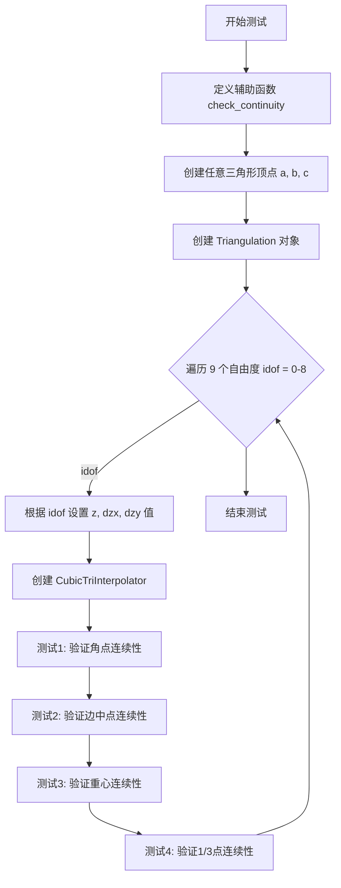

#### 带注释源码

```python
def test_triinterpcubic_C1_continuity():
    """
    测试 TriCubicInterpolator 的 C1 连续性。
    
    包含4个测试：
    1) 测试所有9个形状函数在角点处的函数值和导数连续性
    2) 测试每条边中点处的 C1 连续性（因梯度是2阶多项式，只需测试中点）
    3) 测试三角形重心处的 C1 连续性（3个子三角形交汇处）
    4) 测试中线1/3点处的 C1 连续性（2个子三角形的公共边中点）
    """
    
    # === 辅助函数定义 ===
    def check_continuity(interpolator, loc, values=None):
        """
        检查插值器在指定位置 loc 附近的连续性（函数值和导数）。
        
        参数：
            interpolator: TriInterpolator - 三角插值器对象
            loc: tuple - 测试位置 (x0, y0)
            values: array, optional - 期望值 [z0, dzx0, dzy0]
        
        工作流程：
            1. 在 loc 周围创建圆形采样点（24个点）
            2. 获取 loc 处的函数值和导数
            3. 比较周围点与中心点的差异
            4. 验证差异在容差范围内
        """
        n_star = 24       # 连续性采样点数
        epsilon = 1.e-10  # 到 loc 的距离
        k = 100.          # 连续性系数
        
        # 从 loc 获取坐标
        (loc_x, loc_y) = loc
        
        # 在 loc 周围创建圆形采样点
        star_x = loc_x + epsilon*np.cos(np.linspace(0., 2*np.pi, n_star))
        star_y = loc_y + epsilon*np.sin(np.linspace(0., 2*np.pi, n_star))
        
        # 获取中心点的函数值和导数
        z = interpolator([loc_x], [loc_y])[0]
        (dzx, dzy) = interpolator.gradient([loc_x], [loc_y])
        
        # 如果提供了期望值，则验证中心点值
        if values is not None:
            assert_array_almost_equal(z, values[0])
            assert_array_almost_equal(dzx[0], values[1])
            assert_array_almost_equal(dzy[0], values[2])
        
        # 计算周围点的函数值和导数
        diff_z = interpolator(star_x, star_y) - z
        (tab_dzx, tab_dzy) = interpolator.gradient(star_x, star_y)
        diff_dzx = tab_dzx - dzx
        diff_dzy = tab_dzy - dzy
        
        # 验证连续性：差异应小于 epsilon * k
        assert_array_less(diff_z, epsilon*k)
        assert_array_less(diff_dzx, epsilon*k)
        assert_array_less(diff_dzy, epsilon*k)

    # === 创建任意三角形（在单位正方形内）===
    (ax, ay) = (0.2, 0.3)
    (bx, by) = (0.33367, 0.80755)
    (cx, cy) = (0.669, 0.4335)
    
    # 定义7个点（3个三角形顶点 + 4个边界点）
    x = np.array([ax, bx, cx, 0., 1., 1., 0.])
    y = np.array([ay, by, cy, 0., 0., 1., 1.])
    
    # 定义8个三角形
    triangles = np.array([[0, 1, 2], [3, 0, 4], [4, 0, 2], [4, 2, 5],
                          [1, 5, 2], [6, 5, 1], [6, 1, 0], [6, 0, 3]])
    triang = mtri.Triangulation(x, y, triangles)

    # === 遍历9个自由度（形状函数）===
    for idof in range(9):
        # 初始化零数组
        z = np.zeros(7, dtype=np.float64)
        dzx = np.zeros(7, dtype=np.float64)
        dzy = np.zeros(7, dtype=np.float64)
        
        # values 用于存储期望值 [z0, dzx0, dzy0]
        values = np.zeros([3, 3], dtype=np.float64)
        
        # 确定当前测试的 case（0=函数值, 1=x导数, 2=y导数）
        case = idof // 3
        values[case, idof % 3] = 1.0
        
        # 根据 case 设置对应的值
        if case == 0:
            # 测试函数值形状函数
            z[idof] = 1.0
        elif case == 1:
            # 测试 x 导数形状函数
            dzx[idof % 3] = 1.0
        elif case == 2:
            # 测试 y 导数形状函数
            dzy[idof % 3] = 1.0
        
        # 创建三次三角插值器（user 模式：用户指定导数）
        interp = mtri.CubicTriInterpolator(triang, z, kind='user',
                                           dz=(dzx, dzy))
        
        # === 测试1：验证角点处的值和连续性 ===
        check_continuity(interp, (ax, ay), values[:, 0])
        check_continuity(interp, (bx, by), values[:, 1])
        check_continuity(interp, (cx, cy), values[:, 2])
        
        # === 测试2：验证边中点处的连续性 ===
        check_continuity(interp, ((ax+bx)*0.5, (ay+by)*0.5))
        check_continuity(interp, ((ax+cx)*0.5, (ay+cy)*0.5))
        check_continuity(interp, ((cx+bx)*0.5, (cy+by)*0.5))
        
        # === 测试3：验证重心处的连续性 ===
        check_continuity(interp, ((ax+bx+cx)/3., (ay+by+cy)/3.))
        
        # === 测试4：验证中线1/3点处的连续性 ===
        check_continuity(interp, ((4.*ax+bx+cx)/6., (4.*ay+by+cy)/6.))
        check_continuity(interp, ((ax+4.*bx+cx)/6., (ay+4.*by+cy)/6.))
        check_continuity(interp, ((ax+bx+4.*cx)/6., (ay+by+4.*cy)/6.))
```


### test_triinterpcubic_cg_solver

该函数是一个测试函数，用于验证稀疏共轭梯度（CG）求解器的正确性，该求解器用于 `TriCubicInterpolator`（kind='min_E' 模式）。函数包含三个基本测试：二维泊松矩阵求解、带有零对角元素的扩展矩阵求解、以及稀疏矩阵压缩时重复条目的正确求和。

参数： 无

返回值： 无（None），该函数为测试函数，不返回任何值

#### 流程图

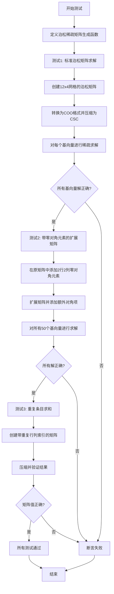

#### 带注释源码

```python
def test_triinterpcubic_cg_solver():
    """
    测试 TriCubicInterpolator 中使用的稀疏 CG（共轭梯度）求解器。
    包含3个基本测试：
    1) 二维泊松矩阵测试
    2) 带零对角元素的扩展矩阵测试
    3) 稀疏矩阵压缩时重复条目求和测试
    """
    # Now 3 basic tests of the Sparse CG solver, used for
    # TriCubicInterpolator with *kind* = 'min_E'
    # 1) A commonly used test involves a 2d Poisson matrix.
    
    def poisson_sparse_matrix(n, m):
        """
        返回二维泊松方程离散化后的稀疏矩阵（COO格式）。
        
        参数:
            n: 网格行数
            m: 网格列数
        返回:
            vals: 矩阵值数组
            rows: 行索引数组
            cols: 列索引数组
            shape: 矩阵维度 (n*m, n*m)
        """
        l = m*n  # 总点数
        # 构建行索引：主对角线 + 四个相邻对角线
        rows = np.concatenate([
            np.arange(l, dtype=np.int32),
            np.arange(l-1, dtype=np.int32), np.arange(1, l, dtype=np.int32),
            np.arange(l-n, dtype=np.int32), np.arange(n, l, dtype=np.int32)])
        # 构建列索引：对应于行索引的列位置
        cols = np.concatenate([
            np.arange(l, dtype=np.int32),
            np.arange(1, l, dtype=np.int32), np.arange(l-1, dtype=np.int32),
            np.arange(n, l, dtype=np.int32), np.arange(l-n, dtype=np.int32)])
        # 构建矩阵值：主对角线为4，相邻对角线为-1
        vals = np.concatenate([
            4*np.ones(l, dtype=np.float64),
            -np.ones(l-1, dtype=np.float64), -np.ones(l-1, dtype=np.float64),
            -np.ones(l-n, dtype=np.float64), -np.ones(l-n, dtype=np.float64)])
        # 实际上+1和-1对角线有一些零值（网格边界）
        vals[l:2*l-1][m-1::m] = 0.
        vals[2*l-1:3*l-2][m-1::m] = 0.
        return vals, rows, cols, (n*m, n*m)

    # ========== 测试1: 标准泊松矩阵求解 ==========
    # Instantiating a sparse Poisson matrix of size 48 x 48:
    (n, m) = (12, 4)
    mat = mtri._triinterpolate._Sparse_Matrix_coo(*poisson_sparse_matrix(n, m))
    mat.compress_csc()  # 压缩为CSC格式
    mat_dense = mat.to_dense()  # 转换为密集矩阵用于验证
    # Testing a sparse solve for all 48 basis vector
    for itest in range(n*m):
        b = np.zeros(n*m, dtype=np.float64)
        b[itest] = 1.  # 创建单位基向量
        x, _ = mtri._triinterpolate._cg(A=mat, b=b, x0=np.zeros(n*m),
                                        tol=1.e-10)  # 调用CG求解器
        # 验证 A @ x = b
        assert_array_almost_equal(np.dot(mat_dense, x), b)

    # ========== 测试2: 带零对角元素的扩展矩阵 ==========
    # Same matrix with inserting 2 rows - cols with null diag terms
    # (but still linked with the rest of the matrix by extra-diag terms)
    (i_zero, j_zero) = (12, 49)  # 新增行的索引
    vals, rows, cols, _ = poisson_sparse_matrix(n, m)
    # 调整索引：增加偏移量
    rows = rows + 1*(rows >= i_zero) + 1*(rows >= j_zero)
    cols = cols + 1*(cols >= i_zero) + 1*(cols >= j_zero)
    # adding extra-diag terms：添加额外的非对角项连接新行
    rows = np.concatenate([rows, [i_zero, i_zero-1, j_zero, j_zero-1]])
    cols = np.concatenate([cols, [i_zero-1, i_zero, j_zero-1, j_zero]])
    vals = np.concatenate([vals, [1., 1., 1., 1.]])
    mat = mtri._triinterpolate._Sparse_Matrix_coo(vals, rows, cols,
                                                  (n*m + 2, n*m + 2))
    mat.compress_csc()
    mat_dense = mat.to_dense()
    # Testing a sparse solve for all 50 basis vec
    for itest in range(n*m + 2):
        b = np.zeros(n*m + 2, dtype=np.float64)
        b[itest] = 1.
        x, _ = mtri._triinterpolate._cg(A=mat, b=b, x0=np.ones(n * m + 2),
                                        tol=1.e-10)
        assert_array_almost_equal(np.dot(mat_dense, x), b)

    # ========== 测试3: 重复条目求和 ==========
    # Now a simple test that summation of duplicate (i.e. with same rows,
    # same cols) entries occurs when compressed.
    vals = np.ones(17, dtype=np.float64)
    rows = np.array([0, 1, 2, 0, 0, 1, 1, 2, 2, 2, 2, 2, 1, 1, 1, 1, 1],
                    dtype=np.int32)
    cols = np.array([0, 1, 2, 1, 1, 0, 0, 1, 1, 1, 1, 1, 2, 2, 2, 2, 2],
                    dtype=np.int32)
    dim = (3, 3)
    mat = mtri._triinterpolate._Sparse_Matrix_coo(vals, rows, cols, dim)
    mat.compress_csc()
    mat_dense = mat.to_dense()
    # 验证重复条目被正确求和
    assert_array_almost_equal(mat_dense, np.array([
        [1., 2., 0.], [2., 1., 5.], [0., 5., 1.]], dtype=np.float64))
```


### test_triinterpcubic_geom_weights

该函数是一个测试函数，用于验证 `_DOF_estimator_geom`（几何自由度估计器）的权重计算正确性。测试通过旋转三角形配置来检查每个三角形的权重和是否为1（所有角度小于90度的情况）或2*w_i（存在大于90度的顶点角的情况）。

参数： 该函数没有参数。

返回值： 该函数没有返回值（返回类型为 `None`）。它通过断言来验证计算结果的正确性。

#### 流程图

```mermaid
flowchart TD
    A[开始测试] --> B[定义测试点坐标: ax=0, ay=1.687]
    B --> C[创建4个点的坐标数组x和y]
    C --> D[初始化z为零数组]
    D --> E[定义两个三角形: [[0,2,3], [1,3,2]]]
    E --> F[初始化sum_w为零数组 [4,2]]
    F --> G[循环旋转角度theta从0到2π, 共14个点]
    G --> H[计算旋转后的坐标 x_rot, y_rot]
    H --> I[创建Triangulation对象]
    I --> J[创建CubicTriInterpolator kind='geom']
    J --> K[创建_DOF_estimator_geom对象]
    K --> L[计算几何权重 weights]
    L --> M[计算权重和并测试4种可能性]
    M --> N{循环结束?}
    N -->|否| G
    N -->|是| O[断言: minabs of sum_w 接近0]
    O --> P[测试通过]
```

#### 带注释源码

```python
def test_triinterpcubic_geom_weights():
    """
    Tests to check computation of weights for _DOF_estimator_geom:
    The weight sum per triangle can be 1. (in case all angles < 90 degrees)
    or (2*w_i) where w_i = 1-alpha_i/np.pi is the weight of apex i; alpha_i
    is the apex angle > 90 degrees.
    """
    # 定义一个测试三角形的顶点坐标
    (ax, ay) = (0., 1.687)  # 第一个顶点的坐标
    
    # 创建4个点的x坐标数组: [ax, 0.5*ax, 0, 1]
    x = np.array([ax, 0.5*ax, 0., 1.])
    # 创建4个点的y坐标数组: [ay, -ay, 0, 0]
    y = np.array([ay, -ay, 0., 0.])
    
    # 初始化z值为零数组（用于插值）
    z = np.zeros(4, dtype=np.float64)
    
    # 定义两个三角形: 三角形0为[0,2,3], 三角形1为[1,3,2]
    triangles = [[0, 2, 3], [1, 3, 2]]
    
    # 初始化累计权重数组: 4种可能性, 2个三角形
    sum_w = np.zeros([4, 2])
    
    # 循环旋转整个图形，从0到2π，共14个角度
    for theta in np.linspace(0., 2*np.pi, 14):
        # 计算旋转后的坐标（旋转矩阵）
        x_rot = np.cos(theta)*x + np.sin(theta)*y
        y_rot = -np.sin(theta)*x + np.cos(theta)*y
        
        # 使用旋转后的坐标创建三角剖分对象
        triang = mtri.Triangulation(x_rot, y_rot, triangles)
        
        # 创建几何类型的立方三角插值器
        cubic_geom = mtri.CubicTriInterpolator(triang, z, kind='geom')
        
        # 创建几何自由度估计器
        dof_estimator = mtri._triinterpolate._DOF_estimator_geom(cubic_geom)
        
        # 计算几何权重
        weights = dof_estimator.compute_geom_weights()
        
        # 测试4种可能性:
        # 可能性0: 权重和减去1（所有角度<90度的情况）
        sum_w[0, :] = np.sum(weights, 1) - 1
        
        # 可能性1-3: 权重和减去2*weights[:, itri]
        # （存在大于90度顶点角的情况）
        for itri in range(3):
            sum_w[itri+1, :] = np.sum(weights, 1) - 2*weights[:, itri]
        
        # 断言：权重和的正确性
        # 至少有一种情况下的权重和应该是正确的（即最小值接近0）
        assert_array_almost_equal(np.min(np.abs(sum_w), axis=0),
                                  np.array([0., 0.], dtype=np.float64))
```


### `test_triinterp_colinear`

该测试函数验证在包含水平共线点的三角剖分中进行插值的功能。测试涵盖了线性插值器和两种三次插值器（min_E和geom），确保它们在处理简单违规的三角剖分（具有共线点）时仍能通过线性patch test，同时测试在平坦三角形内部强制指定tri_index的插值。

参数：无需显式参数（无函数参数）

返回值：`None`，该函数为测试函数，无返回值

#### 流程图

```mermaid
flowchart TD
    A[开始测试] --> B[定义初始坐标x0, y0]
    B --> C[定义仿射变换矩阵集合]
    C --> D{遍历每个变换矩阵}
    D -->|变换1| E[应用变换到坐标]
    E --> F[创建三角剖分]
    F --> G[生成测试点网格]
    G --> H[获取triangulation外的点mask]
    H --> I[计算目标插值结果zs_target]
    I --> J[创建三种插值器]
    J --> K{遍历三种插值器}
    K -->|LinearTriInterpolator| L[执行插值并验证]
    K -->|CubicTriInterpolator min_E| M[执行插值并验证]
    K -->|CubicTriInterpolator geom| N[执行插值并验证]
    L --> O{插值结果是否正确?}
    M --> O
    N --> O
    O -->|是| P[继续下一个变换]
    O -->|否| Q[抛出断言错误]
    P --> D
    Q --> R[测试结束]
    D -->|所有变换完成| S[测试平坦三角形内部插值]
    S --> T[选择三角形索引4]
    T --> U[生成三角形边上的测试点]
    U --> V[对三种插值器进行插值验证]
    V --> W[结束测试]
```

#### 带注释源码

```python
def test_triinterp_colinear():
    # Tests interpolating inside a triangulation with horizontal colinear
    # points (refer also to the tests :func:`test_trifinder` ).
    #
    # These are not valid triangulations, but we try to deal with the
    # simplest violations (i. e. those handled by default TriFinder).
    #
    # Note that the LinearTriInterpolator and the CubicTriInterpolator with
    # kind='min_E' or 'geom' still pass a linear patch test.
    # We also test interpolation inside a flat triangle, by forcing
    # *tri_index* in a call to :meth:`_interpolate_multikeys`.

    # If +ve, triangulation is OK, if -ve triangulation invalid,
    # if zero have colinear points but should pass tests anyway.
    delta = 0.

    # 定义初始坐标数组，包含共线点（y坐标中有0）
    x0 = np.array([1.5, 0,  1,  2, 3, 1.5,   1.5])
    y0 = np.array([-1,  0,  0,  0, 0, delta, 1])

    # 定义一组仿射变换矩阵，用于测试不同方向和大小的三角剖分
    # 避免使用浮点数系数以防止舍入误差导致三角剖分无效
    transformations = [[1, 0], [0, 1], [1, 1], [1, 2], [-2, -1], [-2, 1]]
    
    # 遍历每个变换
    for transformation in transformations:
        # 应用2D仿射变换（旋转+缩放）
        x_rot = transformation[0]*x0 + transformation[1]*y0
        y_rot = -transformation[1]*x0 + transformation[0]*y0
        (x, y) = (x_rot, y_rot)
        
        # 计算z值（线性函数：z = 1.23*x - 4.79*y）
        z = 1.23*x - 4.79*y
        
        # 定义三角形索引
        triangles = [[0, 2, 1], [0, 3, 2], [0, 4, 3], [1, 2, 5], [2, 3, 5],
                     [3, 4, 5], [1, 5, 6], [4, 6, 5]]
        
        # 创建三角剖分对象
        triang = mtri.Triangulation(x, y, triangles)
        
        # 生成测试点网格
        xs = np.linspace(np.min(triang.x), np.max(triang.x), 20)
        ys = np.linspace(np.min(triang.y), np.max(triang.y), 20)
        xs, ys = np.meshgrid(xs, ys)
        xs = xs.ravel()
        ys = ys.ravel()
        
        # 找出三角剖分外的点（trifinder返回-1表示在三角形外）
        mask_out = (triang.get_trifinder()(xs, ys) == -1)
        
        # 计算目标插值结果，外部点被mask
        zs_target = np.ma.array(1.23*xs - 4.79*ys, mask=mask_out)

        # 创建三种插值器：线性、三次min_E、三次geom
        linear_interp = mtri.LinearTriInterpolator(triang, z)
        cubic_min_E = mtri.CubicTriInterpolator(triang, z)
        cubic_geom = mtri.CubicTriInterpolator(triang, z, kind='geom')

        # 对每个插值器进行测试
        for interp in (linear_interp, cubic_min_E, cubic_geom):
            zs = interp(xs, ys)
            # 验证插值结果与目标值几乎相等
            assert_array_almost_equal(zs_target, zs)

    # 测试在平坦三角形内部进行插值（三角形[2,3,5]是共线的）
    # 通过强制指定tri_index参数来测试_interpolate_multikeys方法
    itri = 4  # 选择平坦三角形索引
    pt1 = triang.triangles[itri, 0]  # 获取三角形的第一个顶点索引
    pt2 = triang.triangles[itri, 1]  # 获取三角形的第二个顶点索引
    
    # 在三角形的一条边上生成测试点
    xs = np.linspace(triang.x[pt1], triang.x[pt2], 10)
    ys = np.linspace(triang.y[pt1], triang.y[pt2], 10)
    
    # 计算这些点上的目标z值
    zs_target = 1.23*xs - 4.79*ys
    
    # 对每个插值器测试强制tri_index的插值
    for interp in (linear_interp, cubic_min_E, cubic_geom):
        # 调用_interpolate_multikeys方法，强制使用指定的三角形索引
        zs, = interp._interpolate_multikeys(
            xs, ys, tri_index=itri*np.ones(10, dtype=np.int32))
        # 验证插值结果
        assert_array_almost_equal(zs_target, zs)
```


### `test_triinterp_transformations`

该函数是一个测试函数，用于验证三角插值方法（线性插值和三次插值）在旋转变换和尺度变换下的不变性。具体来说，它创建了一个极坐标网格的三角剖分，定义了测试函数z(x, y)，然后对整个图形进行旋转和缩放，验证插值结果在这些变换下保持不变。

参数： 该函数没有参数。

返回值： 该函数没有返回值（None）。

#### 流程图

```mermaid
flowchart TD
    A[开始测试] --> B[定义测试函数z(x, y)]
    B --> C[创建极坐标网格点 x0, y0]
    C --> D[创建三角剖分 triang0]
    D --> E[计算z0 = z(x0, y0)]
    E --> F[创建测试点网格 xs0, ys0]
    F --> G[第一次循环: 旋转角度 i_angle = 0]
    G --> H[旋转坐标和测试点]
    H --> I[创建三种插值器: linear, cubic_min_E, cubic_geom]
    I --> J[执行插值并存储结果]
    J --> K[第二次循环: 旋转角度 i_angle = 1]
    K --> L{旋转测试}
    L --> M[旋转坐标和测试点]
    M --> N[使用三种插值器进行插值]
    N --> O[验证旋转后结果与原始结果相等]
    O --> P[缩放测试: 对x轴或y轴进行缩放]
    P --> Q[创建缩放后的三角剖分]
    Q --> R[使用三种插值器进行插值]
    R --> S[验证缩放后结果与原始结果相等]
    S --> T[结束测试]
```

#### 带注释源码

```python
def test_triinterp_transformations():
    # 1) Testing that the interpolation scheme is invariant by rotation of the
    # whole figure.
    # Note: This test is non-trivial for a CubicTriInterpolator with
    # kind='min_E'. It does fail for a non-isotropic stiffness matrix E of
    # :class:`_ReducedHCT_Element` (tested with E=np.diag([1., 1., 1.])), and
    # provides a good test for :meth:`get_Kff_and_Ff`of the same class.
    #
    # 2) Also testing that the interpolation scheme is invariant by expansion
    # of the whole figure along one axis.
    
    # 定义网格参数：角度数和半径数
    n_angles = 20
    n_radii = 10
    min_radius = 0.15

    # 定义测试函数z(x, y)，这是一个复杂的数学函数
    # 用于生成具有特定模式的测试数据
    def z(x, y):
        # 计算两个极坐标相关的分量
        r1 = np.hypot(0.5 - x, 0.5 - y)
        theta1 = np.arctan2(0.5 - x, 0.5 - y)
        r2 = np.hypot(-x - 0.2, -y - 0.2)
        theta2 = np.arctan2(-x - 0.2, -y - 0.2)
        
        # 组合多个高斯型函数和余弦调制
        z = -(2*(np.exp((r1/10)**2)-1)*30. * np.cos(7.*theta1) +
              (np.exp((r2/10)**2)-1)*30. * np.cos(11.*theta2) +
              0.7*(x**2 + y**2))
        
        # 归一化到[0, 1]范围
        return (np.max(z)-z)/(np.max(z)-np.min(z))

    # First create the x and y coordinates of the points.
    # 创建极坐标网格的半径和角度
    radii = np.linspace(min_radius, 0.95, n_radii)
    angles = np.linspace(0 + n_angles, 2*np.pi + n_angles,
                         n_angles, endpoint=False)
    angles = np.repeat(angles[..., np.newaxis], n_radii, axis=1)
    angles[:, 1::2] += np.pi/n_angles  # 交错排列角度
    
    # 转换为笛卡尔坐标并展平
    x0 = (radii*np.cos(angles)).flatten()
    y0 = (radii*np.sin(angles)).flatten()
    
    # 创建Delaunay三角剖分
    triang0 = mtri.Triangulation(x0, y0)
    # 计算测试函数值
    z0 = z(x0, y0)

    # Then create the test points
    # 创建测试点网格
    xs0 = np.linspace(-1., 1., 23)
    ys0 = np.linspace(-1., 1., 23)
    xs0, ys0 = np.meshgrid(xs0, ys0)
    xs0 = xs0.ravel()
    ys0 = ys0.ravel()

    # 用于存储原始插值结果
    interp_z0 = {}
    
    # 测试旋转不变性：遍历两个旋转角度
    for i_angle in range(2):
        # Rotating everything
        theta = 2*np.pi / n_angles * i_angle
        
        # 应用旋转变换
        x = np.cos(theta)*x0 + np.sin(theta)*y0
        y = -np.sin(theta)*x0 + np.cos(theta)*y0
        xs = np.cos(theta)*xs0 + np.sin(theta)*ys0
        ys = -np.sin(theta)*xs0 + np.cos(theta)*ys0
        
        # 使用原始三角形的连接关系创建新三角剖分
        triang = mtri.Triangulation(x, y, triang0.triangles)
        
        # 创建三种插值器：线性、最小能量三次、几何三次
        linear_interp = mtri.LinearTriInterpolator(triang, z0)
        cubic_min_E = mtri.CubicTriInterpolator(triang, z0)
        cubic_geom = mtri.CubicTriInterpolator(triang, z0, kind='geom')
        
        dic_interp = {'lin': linear_interp,
                      'min_E': cubic_min_E,
                      'geom': cubic_geom}
        
        # Testing that the interpolation is invariant by rotation...
        for interp_key in ['lin', 'min_E', 'geom']:
            interp = dic_interp[interp_key]
            if i_angle == 0:
                # 第一次迭代：存储原始插值结果
                interp_z0[interp_key] = interp(xs0, ys0)
            else:
                # 第二次迭代：验证旋转后的结果与原始结果相等
                interpz = interp(xs, ys)
                matest.assert_array_almost_equal(interpz,
                                                 interp_z0[interp_key])

    # 测试缩放不变性
    scale_factor = 987654.3210
    for scaled_axis in ('x', 'y'):
        # Scaling everything (expansion along scaled_axis)
        if scaled_axis == 'x':
            # 沿x轴缩放
            x = scale_factor * x0
            y = y0
            xs = scale_factor * xs0
            ys = ys0
        else:
            # 沿y轴缩放
            x = x0
            y = scale_factor * y0
            xs = xs0
            ys = scale_factor * ys0
        
        # 创建缩放后的三角剖分
        triang = mtri.Triangulation(x, y, triang0.triangles)
        
        # 创建三种插值器
        linear_interp = mtri.LinearTriInterpolator(triang, z0)
        cubic_min_E = mtri.CubicTriInterpolator(triang, z0)
        cubic_geom = mtri.CubicTriInterpolator(triang, z0, kind='geom')
        
        dic_interp = {'lin': linear_interp,
                      'min_E': cubic_min_E,
                      'geom': cubic_geom}
        
        # Test that the interpolation is invariant by expansion along 1 axis...
        for interp_key in ['lin', 'min_E', 'geom']:
            interpz = dic_interp[interp_key](xs, ys)
            matest.assert_array_almost_equal(interpz, interp_z0[interp_key])
```


### test_tri_smooth_contouring

该函数是一个图像对比测试函数，基于 `tricontour_smooth_user` 示例，用于测试 matplotlib 中三角网格的平滑等值线绘制功能。它创建一个极坐标网格，定义一个复杂的数学函数作为测试数据，使用 Delaunay 三角剖分和均匀细化，然后通过 `tricontour` 绘制平滑等值线并与基准图像进行对比。

参数：
- 该函数没有显式参数（使用 pytest 的 `@image_comparison` 装饰器隐式传入测试相关的参数）

返回值：无返回值（测试函数，主要通过图像对比验证功能）

#### 流程图

```mermaid
flowchart TD
    A[开始] --> B[定义测试函数z(x, y)]
    B --> C[创建极坐标网格: radii和angles]
    C --> D[计算笛卡尔坐标: x0, y0]
    D --> E[创建Delaunay三角剖分: Triangulation]
    E --> F[计算测试函数值: z0]
    F --> G[设置mask过滤靠近中心的三角形]
    G --> H[创建UniformTriRefiner细化三角网格]
    H --> I[细化场数据: refine_field]
    I --> J[设置等值线级别: levels]
    J --> K[绘制三角网格线: triplot]
    K --> L[绘制平滑等值线: tricontour]
    L --> M[结束 - 图像对比验证]
```

#### 带注释源码

```python
@image_comparison(['tri_smooth_contouring.png'], remove_text=True, tol=0.072)
def test_tri_smooth_contouring():
    """
    Image comparison based on example tricontour_smooth_user.
    使用@image_comparison装饰器进行图像对比测试，
    基准图像为'tri_smooth_contouring.png'，移除文本，容差为0.072
    """
    # 测试参数：极坐标网格配置
    n_angles = 20      # 角度方向采样点数
    n_radii = 10       # 径向采样点数
    min_radius = 0.15  # 最小半径，用于过滤中心区域三角形

    def z(x, y):
        """
        定义测试用的高斯混合函数
        包含两个高斯峰（偶极子场）和二次项背景
        """
        # 第一个高斯峰：中心在(0.5, 0.5)
        r1 = np.hypot(0.5 - x, 0.5 - y)
        theta1 = np.arctan2(0.5 - x, 0.5 - y)
        
        # 第二个高斯峰：中心在(-0.2, -0.2)
        r2 = np.hypot(-x - 0.2, -y - 0.2)
        theta2 = np.arctan2(-x - 0.2, -y - 0.2)
        
        # 组合函数：两个高斯峰+二次背景
        # 使用cos调制产生角向变化
        z = -(2*(np.exp((r1/10)**2)-1)*30. * np.cos(7.*theta1) +
              (np.exp((r2/10)**2)-1)*30. * np.cos(11.*theta2) +
              0.7*(x**2 + y**2))
        
        # 归一化到[0, 1]范围
        return (np.max(z)-z)/(np.max(z)-np.min(z))

    # ========== 步骤1: 创建极坐标网格点 ==========
    # 从min_radius到0.95的线性间隔 radii
    radii = np.linspace(min_radius, 0.95, n_radii)
    
    # 角度数组：从n_angles开始到2*pi+n_angles
    angles = np.linspace(0 + n_angles, 2*np.pi + n_angles,
                         n_angles, endpoint=False)
    
    # 扩展角度数组到2D (n_angles, n_radii)
    angles = np.repeat(angles[..., np.newaxis], n_radii, axis=1)
    
    # 交替偏移角度以创建更均匀的网格
    angles[:, 1::2] += np.pi/n_angles
    
    # 转换为笛卡尔坐标并展平
    x0 = (radii*np.cos(angles)).flatten()
    y0 = (radii*np.sin(angles)).flatten()

    # ========== 步骤2: 创建三角剖分 ==========
    # 使用Delaunay方法创建三角剖分
    triang0 = mtri.Triangulation(x0, y0)
    
    # 计算测试函数在每个点的值
    z0 = z(x0, y0)

    # ========== 步骤3: 设置mask过滤中心区域 ==========
    # 计算每个三角形的外接圆半径
    # 过滤掉距离原点小于min_radius的三角形（中心区域）
    triang0.set_mask(np.hypot(x0[triang0.triangles].mean(axis=1),
                              y0[triang0.triangles].mean(axis=1))
                     < min_radius)

    # ========== 步骤4: 细化三角网格 ==========
    # 创建均匀细化器
    refiner = mtri.UniformTriRefiner(triang0)
    
    # 细化场数据，subdiv=4表示细化级别
    tri_refi, z_test_refi = refiner.refine_field(z0, subdiv=4)
    
    # 定义等值线级别：从0到1，步长0.025
    levels = np.arange(0., 1., 0.025)

    # ========== 步骤5: 绘制图形 ==========
    # 绘制原始三角网格（灰色线）
    plt.triplot(triang0, lw=0.5, color='0.5')
    
    # 绘制基于细化数据的平滑等值线（黑色）
    plt.tricontour(tri_refi, z_test_refi, levels=levels, colors="black")
```


### `test_tri_smooth_gradient`

这是一个测试函数，用于验证matplotlib中三角网格的平滑梯度可视化功能是否正确。函数通过创建电偶极子势场的三角剖分，计算其梯度，并以等高线图和矢量箭头图的形式可视化电势和电场强度。

参数： 无

返回值： 无

#### 流程图

```mermaid
graph TD
    A[开始] --> B[定义dipole_potential函数]
    B --> C[创建极坐标网格数据]
    C --> D[生成三角剖分Triangulation]
    D --> E[设置遮罩mask]
    E --> F[使用UniformTriRefiner加密场数据]
    F --> G[创建CubicTriInterpolator并计算梯度]
    G --> H[绘制三角网格]
    H --> I[绘制等高线图]
    I --> J[绘制电场矢量箭头]
    J --> K[结束]
```

#### 带注释源码

```python
@image_comparison(['tri_smooth_gradient.png'], remove_text=True, tol=0.092)
def test_tri_smooth_gradient():
    # Image comparison based on example trigradient_demo.

    def dipole_potential(x, y):
        """
        定义电偶极子势函数V。
        
        参数:
            x: x坐标数组
            y: y坐标数组
            
        返回:
            归一化后的电势值数组
        """
        r_sq = x**2 + y**2  # 计算半径的平方
        theta = np.arctan2(y, x)  # 计算角度
        z = np.cos(theta)/r_sq  # 电偶极子势公式
        return (np.max(z)-z) / (np.max(z)-np.min(z))  # 归一化

    # Creating a Triangulation
    # 创建极坐标网格参数
    n_angles = 30  # 角度采样点数
    n_radii = 10   # 半径采样点数
    min_radius = 0.2  # 最小半径（用于遮罩）
    
    # 生成半径和角度网格
    radii = np.linspace(min_radius, 0.95, n_radii)
    angles = np.linspace(0, 2*np.pi, n_angles, endpoint=False)
    angles = np.repeat(angles[..., np.newaxis], n_radii, axis=1)
    angles[:, 1::2] += np.pi/n_angles  # 错位排列
    
    # 转换为笛卡尔坐标并展平
    x = (radii*np.cos(angles)).flatten()
    y = (radii*np.sin(angles)).flatten()
    V = dipole_potential(x, y)  # 计算电势值
    
    # 创建三角剖分对象
    triang = mtri.Triangulation(x, y)
    # 设置遮罩：移除靠近中心（半径小于min_radius）的三角形
    triang.set_mask(np.hypot(x[triang.triangles].mean(axis=1),
                             y[triang.triangles].mean(axis=1))
                    < min_radius)

    # Refine data - interpolates the electrical potential V
    # 使用均匀三角网细化器加密场数据
    refiner = mtri.UniformTriRefiner(triang)
    tri_refi, z_test_refi = refiner.refine_field(V, subdiv=3)

    # Computes the electrical field (Ex, Ey) as gradient of -V
    # 创建三次三角插值器，计算-V的梯度（即电场强度）
    tci = mtri.CubicTriInterpolator(triang, -V)
    Ex, Ey = tci.gradient(triang.x, triang.y)  # 计算x和y方向的电场分量
    E_norm = np.hypot(Ex, Ey)  # 计算电场强度范数

    # Plot the triangulation, the potential iso-contours and the vector field
    plt.figure()
    plt.gca().set_aspect('equal')  # 设置等宽高比
    plt.triplot(triang, color='0.8')  # 绘制三角网格

    levels = np.arange(0., 1., 0.01)  # 等高线级别
    cmap = mpl.colormaps['hot']  # 使用热力图色图
    # 绘制电势等高线
    plt.tricontour(tri_refi, z_test_refi, levels=levels, cmap=cmap,
                   linewidths=[2.0, 1.0, 1.0, 1.0])
    # Plots direction of the electrical vector field
    # 绘制归一化电场矢量箭头
    plt.quiver(triang.x, triang.y, Ex/E_norm, Ey/E_norm,
               units='xy', scale=10., zorder=3, color='blue',
               width=0.007, headwidth=3., headlength=4.)
    # We are leaving ax.use_sticky_margins as True, so the
    # view limits are the contour data limits.
```


### `test_tritools`

该函数是一个测试函数，用于测试matplotlib.tri模块中TriAnalyzer类的核心功能，包括scale_factors（缩放因子）、circle_ratios（圆比率）和get_flat_tri_mask（获取平坦三角形掩码）。

参数：
- 无

返回值：`None`，该函数为测试函数，不返回任何值

#### 流程图

```mermaid
flowchart TD
    A[开始测试] --> B[测试1: 创建带掩码的三角网格]
    B --> C[创建TriAnalyzer并验证scale_factors]
    C --> D[验证circle_ratios with rescale=False]
    D --> E[测试2: 创建扁平三角形]
    E --> F[验证扁平三角形circle_ratios为0]
    F --> G[测试3: 创建复杂网格]
    G --> H[生成power变换的网格点]
    H --> I[获取flat_tri_mask并验证]
    I --> J[添加中心掩码]
    J --> K[再次获取mask并验证]
    K --> L[结束测试]
```

#### 带注释源码

```python
def test_tritools():
    """
    测试TriAnalyzer的scale_factors、circle_ratios和get_flat_tri_mask功能
    """
    # ============================================================
    # 测试1: 测试TriAnalyzer.scale_factors和circle_ratios
    # ============================================================
    # 创建一个包含5个点的三角网格
    x = np.array([0., 1., 0.5, 0., 2.])
    y = np.array([0., 0., 0.5*np.sqrt(3.), -1., 1.])
    # 定义三角形索引数组
    triangles = np.array([[0, 1, 2], [0, 1, 3], [1, 2, 4]], dtype=np.int32)
    # 创建掩码，第三个三角形被遮罩
    mask = np.array([False, False, True], dtype=bool)
    # 创建Triangulation对象
    triang = mtri.Triangulation(x, y, triangles, mask=mask)
    # 创建TriAnalyzer对象
    analyser = mtri.TriAnalyzer(triang)
    
    # 验证缩放因子是否正确
    # 预期值: [1, 1/(1+3**.5/2)]
    assert_array_almost_equal(analyser.scale_factors, [1, 1/(1+3**.5/2)])
    
    # 验证圆比率是否正确
    # 预期值: [0.5, 1/(1+sqrt(2)), nan] 其中第三个被masked
    assert_array_almost_equal(
        analyser.circle_ratios(rescale=False),
        np.ma.masked_array([0.5, 1./(1.+np.sqrt(2.)), np.nan], mask))

    # ============================================================
    # 测试2: 测试扁平三角形的circle_ratios
    # ============================================================
    # 创建三点共线的扁平三角形
    x = np.array([0., 1., 2.])
    y = np.array([1., 1.+3., 1.+6.])
    triangles = np.array([[0, 1, 2]], dtype=np.int32)
    triang = mtri.Triangulation(x, y, triangles)
    analyser = mtri.TriAnalyzer(triang)
    
    # 验证扁平三角形的圆比率为0
    assert_array_almost_equal(analyser.circle_ratios(), np.array([0.]))

    # ============================================================
    # 测试3: 测试TriAnalyzer.get_flat_tri_mask
    # 创建[-1, 1]x[-1, 1]的网格，在四个角落和中心有扁平三角形
    # ============================================================
    n = 9

    # 定义power变换函数，用于生成非均匀网格
    def power(x, a):
        """计算x的a次幂，保留符号"""
        return np.abs(x)**a*np.sign(x)

    # 生成网格点
    x = np.linspace(-1., 1., n+1)
    x, y = np.meshgrid(power(x, 2.), power(x, 0.25))
    x = x.ravel()
    y = y.ravel()

    # 创建三角网格
    triang = mtri.Triangulation(x, y, triangles=meshgrid_triangles(n+1))
    analyser = mtri.TriAnalyzer(triang)
    
    # 获取平坦三角形掩码，阈值0.2
    mask_flat = analyser.get_flat_tri_mask(0.2)
    
    # 验证掩码位置
    verif_mask = np.zeros(162, dtype=bool)
    corners_index = [0, 1, 2, 3, 14, 15, 16, 17, 18, 19, 34, 35, 126, 127,
                     142, 143, 144, 145, 146, 147, 158, 159, 160, 161]
    verif_mask[corners_index] = True
    assert_array_equal(mask_flat, verif_mask)

    # ============================================================
    # 测试4: 测试包含中心孔洞的网格
    # ============================================================
    # 在中心添加掩码三角形
    mask = np.zeros(162, dtype=bool)
    mask[80] = True
    triang.set_mask(mask)
    
    # 再次获取平坦三角形掩码
    mask_flat = analyser.get_flat_tri_mask(0.2)
    
    # 验证中心区域也被识别
    center_index = [44, 45, 62, 63, 78, 79, 80, 81, 82, 83, 98, 99, 116, 117]
    verif_mask[center_index] = True
    assert_array_equal(mask_flat, verif_mask)
```


### test_trirefine

该函数用于测试 matplotlib 中 `UniformTriRefiner` 类的三角网格细化功能，验证细分（subdivision）后生成的新三角网格的正确性，包括节点位置、遮罩（mask）传递以及不同三角形编号顺序对插值结果的一致性。

参数： 该函数没有显式的参数列表。

返回值：`None`，该函数为测试函数，主要通过断言进行验证，不返回任何值。

#### 流程图

```mermaid
flowchart TD
    A[开始: test_trirefine] --> B[创建初始三角网格参数: n=3, subdiv=2]
    B --> C[生成网格点坐标 x, y 并展平]
    C --> D[创建遮罩 mask: 后半部分三角形被遮罩]
    D --> E[创建 Triangulation 对象并应用遮罩]
    E --> F[创建 UniformTriRefiner 并细化三角网格]
    F --> G[验证细化后节点坐标正确性]
    G --> H[计算细化后三角形重心坐标]
    H --> I[通过 trifinder 查找每个细化三角形对应的原始三角形索引]
    I --> J[验证细化后遮罩与原始遮罩一致]
    J --> K[测试不同三角形编号顺序对插值结果的影响]
    K --> L[创建两组不同编号顺序的三角网格]
    L --> M[分别细化并计算插值结果]
    M --> N[验证两组插值结果一致]
    N --> O[结束]
```

#### 带注释源码

```python
def test_trirefine():
    # 测试 subdiv=2 的细化功能
    # 第一部分：测试基本细化功能
    n = 3
    subdiv = 2
    # 生成从 -1 到 1 的等间距点，共 n+1=4 个点
    x = np.linspace(-1., 1., n+1)
    # 创建网格
    x, y = np.meshgrid(x, x)
    # 展平为 1D 数组
    x = x.ravel()
    y = y.ravel()
    # 创建遮罩：总共 2*n^2 = 18 个三角形，后 9 个被遮罩
    mask = np.zeros(2*n**2, dtype=bool)
    mask[n**2:] = True
    # 创建三角网格对象，包含遮罩
    triang = mtri.Triangulation(x, y, triangles=meshgrid_triangles(n+1),
                                mask=mask)
    # 创建均匀细化器
    refiner = mtri.UniformTriRefiner(triang)
    # 执行细化，返回细化后的三角网格对象
    refi_triang = refiner.refine_triangulation(subdiv=subdiv)
    # 获取细化后的 x, y 坐标
    x_refi = refi_triang.x
    y_refi = refi_triang.y

    # 计算期望的细化后点数
    n_refi = n * subdiv**2
    # 生成验证用的参考网格
    x_verif = np.linspace(-1., 1., n_refi+1)
    x_verif, y_verif = np.meshgrid(x_verif, x_verif)
    x_verif = x_verif.ravel()
    y_verif = y_verif.ravel()
    # 验证细化后的节点是否与期望节点匹配
    # 使用约简方法比较，考虑数值精度
    ind1d = np.isin(np.around(x_verif*(2.5+y_verif), 8),
                    np.around(x_refi*(2.5+y_refi), 8))
    assert_array_equal(ind1d, True)

    # 第二部分：测试细化后三角形的遮罩是否正确传递
    # 获取细化后的遮罩
    refi_mask = refi_triang.mask
    # 计算每个细化后三角形的重心坐标
    refi_tri_barycenter_x = np.sum(refi_triang.x[refi_triang.triangles],
                                   axis=1) / 3.
    refi_tri_barycenter_y = np.sum(refi_triang.y[refi_triang.triangles],
                                   axis=1) / 3.
    # 获取原始三角网格的三角形查找器
    tri_finder = triang.get_trifinder()
    # 查找每个细化三角形重心对应的原始三角形索引
    refi_tri_indices = tri_finder(refi_tri_barycenter_x,
                                  refi_tri_barycenter_y)
    # 根据原始三角形索引获取对应的遮罩状态
    refi_tri_mask = triang.mask[refi_tri_indices]
    # 验证细化后的遮罩与基于原始遮罩推导的遮罩一致
    assert_array_equal(refi_mask, refi_tri_mask)

    # 第三部分：测试三角形编号顺序不影响插值结果
    # 定义四个点的坐标
    x = np.asarray([0.0, 1.0, 0.0, 1.0])
    y = np.asarray([0.0, 0.0, 1.0, 1.0])
    # 创建两个三角形编号顺序不同的三角网格
    triang = [mtri.Triangulation(x, y, [[0, 1, 3], [3, 2, 0]]),
              mtri.Triangulation(x, y, [[0, 1, 3], [2, 0, 3]])]
    # 定义测试函数 z = sqrt((x-0.3)^2 + (y-0.4)^2)
    z = np.hypot(x - 0.3, y - 0.4)
    # 对两个三角网格分别进行细化并插值
    xyz_data = []
    for i in range(2):
        refiner = mtri.UniformTriRefiner(triang[i])
        refined_triang, refined_z = refiner.refine_field(z, subdiv=1)
        # 组合坐标和 z 值
        xyz = np.dstack((refined_triang.x, refined_triang.y, refined_z))[0]
        # 按 x, y 排序以便比较
        xyz = xyz[np.lexsort((xyz[:, 1], xyz[:, 0]))]
        xyz_data += [xyz]
    # 验证两个不同编号顺序的三角网格细化后插值结果一致
    assert_array_almost_equal(xyz_data[0], xyz_data[1])
```


### `test_trirefine_masked`

该测试函数通过参数化测试验证了在存在重复点导致三角形数量少于点数的情况下，使用线性或三次插值器进行三角形细化的正确性。

参数：

- `interpolator`：`type`，测试参数化装饰器传入的插值器类，可以是 `mtri.LinearTriInterpolator` 或 `mtri.CubicTriInterpolator`

返回值：`None`，测试函数不返回任何值

#### 流程图

```mermaid
flowchart TD
    A[开始测试] --> B[创建2x2网格点]
    B --> C[展平并重复点以创建重复点]
    C --> D[创建零值数组z]
    D --> E[使用重复点创建Triangulation]
    E --> F[创建UniformTriRefiner]
    F --> G[使用指定插值器创建插值器]
    G --> H[调用refine_field进行细分]
    H --> I[验证细分结果]
    I --> J[结束测试]
```

#### 带注释源码

```python
@pytest.mark.parametrize('interpolator',
                         [mtri.LinearTriInterpolator,
                          mtri.CubicTriInterpolator],
                         ids=['linear', 'cubic'])
def test_trirefine_masked(interpolator):
    # 重复点意味着三角形数量少于点数，从而产生遮罩（masking）
    # 创建一个2x2的网格点
    x, y = np.mgrid[:2, :2]
    # 将点展平并重复每个点两次，产生重复点
    x = np.repeat(x.flatten(), 2)
    y = np.repeat(y.flatten(), 2)

    # 创建与x形状相同的零值数组
    z = np.zeros_like(x)
    # 使用重复点创建三角剖分
    tri = mtri.Triangulation(x, y)
    # 创建均匀三角形细化器
    refiner = mtri.UniformTriRefiner(tri)
    # 使用传入的插值器类创建插值器
    interp = interpolator(tri, z)
    # 执行字段细分，subdiv=2表示细分级别为2
    refiner.refine_field(z, triinterpolator=interp, subdiv=2)
```


### `meshgrid_triangles`

该函数用于生成与 `np.meshgrid` 生成的 (N, N) 点阵对应的三角形网格索引数组。它通过遍历网格中的每个单元，生成两个三角形来覆盖该单元，从而构建完整的三角形剖分。

参数：

-  `n`：`int`，表示网格的维度，即生成 N×N 个点的网格

返回值：`numpy.ndarray`，形状为 (2*(N-1)², 3) 的 int32 类型数组，每行包含三个顶点索引，表示一个三角形

#### 流程图

```mermaid
flowchart TD
    A[开始] --> B[初始化空列表 tri]
    --> C[外层循环: i from 0 to n-2]
    --> D[内层循环: j from 0 to n-2]
    --> E[计算顶点索引 a, b, c, d]
    --> F[添加三角形 [a, b, d] 和 [a, d, c]]
    --> G{内循环结束?}
    --> H[外循环结束?]
    --> I[将列表转换为numpy数组]
    --> J[结束, 返回三角形数组]
    
    C --> D
    D --> E
    E --> F
    F --> G
    G -->|No| D
    G -->|Yes| H
    H -->|No| C
    H -->|Yes| I
    I --> J
```

#### 带注释源码

```python
def meshgrid_triangles(n):
    """
    Return (2*(N-1)**2, 3) array of triangles to mesh (N, N)-point np.meshgrid.
    """
    tri = []  # 用于存储生成的三角形顶点索引
    # 遍历网格的每个单元（除了最外边界）
    for i in range(n-1):
        for j in range(n-1):
            # 计算当前单元四个角点的索引
            # 网格点按行优先顺序排列: (i, j) -> i + j*n
            a = i + j*n                  # 左下角 (i, j)
            b = (i+1) + j*n              # 右下角 (i+1, j)
            c = i + (j+1)*n              # 左上角 (i, j+1)
            d = (i+1) + (j+1)*n          # 右上角 (i+1, j+1)
            
            # 每个矩形单元被分割为两个三角形
            # 第一个三角形: a -> b -> d (右下三角)
            # 第二个三角形: a -> d -> c (左上三角)
            tri += [[a, b, d], [a, d, c]]
    
    # 转换为numpy数组并指定整数类型
    return np.array(tri, dtype=np.int32)
```


### `test_triplot_return`

该函数是一个单元测试，用于验证 `triplot` 方法能够正确返回其添加的艺术家对象（如线条和标记）。通过创建三角剖分对象并调用 `ax.triplot`，然后使用断言检查返回值不为 `None`，确保 `triplot` 方法在成功添加艺术家后返回相应的对象。

参数： 无

返回值： 无（测试函数，使用 `assert` 进行验证）

#### 流程图

```mermaid
flowchart TD
    A[开始测试] --> B[创建图形和轴对象: plt.figure().add_subplot()]
    B --> C[创建Triangulation对象: 四个点的坐标和三角形索引]
    C --> D[调用ax.triplot方法绘制三角网格]
    D --> E{返回值是否为None?}
    E -->|否, 返回艺术家对象| F[断言通过 - 测试成功]
    E -->|是, 返回None| G[断言失败 - 抛出AssertionError]
    F --> H[结束测试]
    G --> H
```

#### 带注释源码

```python
def test_triplot_return():
    # Check that triplot returns the artists it adds
    # 测试目的：验证 triplot 方法返回其创建的艺术家对象
    
    # 创建一个新的图形和一个子图轴（axes）
    ax = plt.figure().add_subplot()
    
    # 创建 Triangulation 对象，定义四个顶点的 x, y 坐标
    # 点: (0,0), (1,0), (0,1), (1,1) 形成一个正方形的四个角
    # triangles 定义两个三角形: [0,1,3] 和 [3,2,0]
    triang = mtri.Triangulation(
        [0.0, 1.0, 0.0, 1.0],  # x 坐标列表
        [0.0, 0.0, 1.0, 1.0],  # y 坐标列表
        triangles=[[0, 1, 3], [3, 2, 0]])  # 三角形顶点索引
    
    # 调用轴对象的 triplot 方法绘制三角网格
    # 参数: triang - Triangulation 对象
    #       "b-" - 蓝色实线样式
    # 期望返回值: 艺术家对象（Line2D 或包含 Line2D 的元组）
    assert ax.triplot(triang, "b-") is not None, \
        'triplot should return the artist it adds'
```


### `test_trirefiner_fortran_contiguous_triangles`

该函数是一个测试函数，用于验证在使用C连续和Fortran连续内存布局的三角形数组时，UniformTriRefiner的细化操作是否产生一致的输出结果，确保内存布局的差异不会影响三角剖分的细化逻辑。

参数：
- 该函数无显式参数

返回值：`None`，该函数为测试函数，通过断言验证行为，不返回任何值

#### 流程图

```mermaid
flowchart TD
    A[开始测试] --> B[创建C连续的三角形数组triangles1]
    B --> C[验证triangles1不是Fortran连续]
    C --> D[创建Fortran连续的三角形数组triangles2]
    D --> E[验证triangles2是Fortran连续]
    E --> F[定义点坐标x和y数组]
    F --> G[使用两种不同的三角形数组分别创建Triangulation对象triang1和triang2]
    G --> H[为每个Triangulation创建UniformTriRefiner对象]
    H --> I[调用refine_triangulation方法进行细分]
    I --> J[比较两个细化后的三角形数组是否相等]
    J --> K{断言结果}
    K -->|相等| L[测试通过]
    K -->|不相等| M[测试失败]
```

#### 带注释源码

```python
def test_trirefiner_fortran_contiguous_triangles():
    # github issue 4180.  Test requires two arrays of triangles that are
    # identical except that one is C-contiguous and one is fortran-contiguous.
    # 创建C连续的三角形数组 [[2, 0, 3], [2, 1, 0]]
    triangles1 = np.array([[2, 0, 3], [2, 1, 0]])
    # 断言确认triangles1是C连续的（而非Fortran连续）
    assert not np.isfortran(triangles1)

    # 从triangles1复制创建Fortran连续的三角形数组triangles2
    triangles2 = np.array(triangles1, copy=True, order='F')
    # 断言确认triangles2是Fortran连续的
    assert np.isfortran(triangles2)

    # 定义四个点的x坐标
    x = np.array([0.39, 0.59, 0.43, 0.32])
    # 定义四个点的y坐标
    y = np.array([33.99, 34.01, 34.19, 34.18])
    # 使用C连续三角形数组创建三角剖分对象
    triang1 = mtri.Triangulation(x, y, triangles1)
    # 使用Fortran连续三角形数组创建三角剖分对象
    triang2 = mtri.Triangulation(x, y, triangles2)

    # 为triang1创建统一三角剖分细化器
    refiner1 = mtri.UniformTriRefiner(triang1)
    # 为triang2创建统一三角剖分细化器
    refiner2 = mtri.UniformTriRefiner(triang2)

    # 对triang1进行细分（subdiv=1表示细分级别为1）
    fine_triang1 = refiner1.refine_triangulation(subdiv=1)
    # 对triang2进行相同级别的细分
    fine_triang2 = refiner2.refine_triangulation(subdiv=1)

    # 断言两个细化后的三角形数组完全相等
    assert_array_equal(fine_triang1.triangles, fine_triang2.triangles)
```


### `test_qhull_triangle_orientation`

该函数是一个测试函数，用于验证 Qhull 计算的三角剖分邻居与 Matplotlib 内部 C++ 计算的邻居是否一致，确保两种方法返回相同的结果。

参数： 无

返回值： `None`，该测试函数通过断言验证结果，不返回任何值。

#### 流程图

```mermaid
flowchart TD
    A[开始] --> B[生成网格点 xi = np.linspace -2 到 2, 100个点]
    B --> C[使用 meshgrid 创建 x, y 坐标]
    C --> D[根据条件 w 过滤点: x > y-1 & x < -1.95 & y > -1.2]
    D --> E[应用旋转变换: 25度]
    E --> F[创建 Delaunay 三角剖分 triang = mtri.Triangulation x1, y1]
    F --> G[获取 Qhull 计算的邻居: qhull_neighbors = triang.neighbors]
    G --> H[清除内部缓存: triang._neighbors = None]
    H --> I[使用 C++ 重新计算邻居: own_neighbors = triang.neighbors]
    I --> J{断言: qhull_neighbors == own_neighbors?}
    J -->|是| K[测试通过]
    J -->|否| L[测试失败]
```

#### 带注释源码

```python
def test_qhull_triangle_orientation():
    """
    测试 Qhull 和 C++ 计算的三角剖分邻居是否一致。
    
    关联 GitHub issue 4437: 验证 Qhull 返回的邻居信息与内部 C++ 
    实现计算的邻居信息是否匹配。
    """
    # 步骤1: 生成网格点
    # 从 -2 到 2 生成 100 个线性间隔的点
    xi = np.linspace(-2, 2, 100)
    
    # 步骤2: 创建二维网格
    # 使用 meshgrid 创建 x, y 坐标网格，然后展平为一维数组
    x, y = map(np.ravel, np.meshgrid(xi, xi))
    
    # 步骤3: 筛选特定区域的点
    # 创建一个布尔掩码，筛选满足以下条件的点:
    # - x > y - 1
    # - x < -1.95
    # - y > -1.2
    w = (x > y - 1) & (x < -1.95) & (y > -1.2)
    x, y = x[w], y[w]
    
    # 步骤4: 应用旋转变换
    # 将点绕原点旋转 25 度
    theta = np.radians(25)
    x1 = x*np.cos(theta) - y*np.sin(theta)
    y1 = x*np.sin(theta) + y*np.cos(theta)

    # 步骤5: 使用 Qhull 计算 Delaunay 三角剖分
    # 创建 Triangulation 对象，内部使用 Qhull 库进行三角剖分
    triang = mtri.Triangulation(x1, y1)

    # 步骤6: 获取 Qhull 计算的邻居信息
    # neighbors 属性返回每个三角形的相邻三角形索引
    qhull_neighbors = triang.neighbors

    # 步骤7: 清除内部缓存，强制使用 C++ 重新计算
    # 将 _neighbors 设置为 None，触发重新计算路径
    triang._neighbors = None
    
    # 步骤8: 获取 C++ 计算的邻居信息
    # 这次调用会使用 Matplotlib 内部的 C++ 实现重新计算
    own_neighbors = triang.neighbors

    # 步骤9: 验证两种方法的结果是否一致
    # 使用 numpy.testing 断言两个数组相等
    assert_array_equal(qhull_neighbors, own_neighbors)
```


### `test_trianalyzer_mismatched_indices`

这是一个测试函数，用于验证TriAnalyzer在处理具有不匹配索引的掩码三角形时是否能正确工作。该测试针对GitHub issue #4999，检验_get_compressed_triangulation方法在numpy >= 1.10版本下是否会出现VisibleDeprecationWarning警告。

参数：此函数没有参数。

返回值：`None`，该函数不返回任何值，仅执行测试逻辑。

#### 流程图

```mermaid
flowchart TD
    A[开始测试] --> B[定义x坐标数组: np.array[0., 1., 0.5, 0., 2.]]
    B --> C[定义y坐标数组: np.array[0., 0., 0.5*np.sqrt(3.), -1., 1.]]
    C --> D[定义三角形索引数组: np.array[[0,1,2], [0,1,3], [1,2,4]]]
    D --> E[定义掩码数组: np.array[False, False, True]]
    E --> F[创建Triangulation对象: mtri.Triangulationx, y, triangles, mask]
    F --> G[创建TriAnalyzer对象: mtri.TriAnalyzer]
    G --> H[调用analyser._get_compressed_triangulation方法]
    H --> I{检查是否有VisibleDeprecationWarning}
    I -->|有警告| J[测试失败 - 存在已知的弃用警告问题]
    I -->|无警告| K[测试通过]
    J --> L[结束]
    K --> L
```

#### 带注释源码

```python
def test_trianalyzer_mismatched_indices():
    """
    测试TriAnalyzer处理不匹配索引的能力。
    
    该测试函数针对GitHub issue #4999，验证TriAnalyzer类中的
    _get_compressed_triangulation方法在处理具有掩码的三角形时
    是否能正确工作，特别是在numpy >= 1.10版本中可能会出现的
    VisibleDeprecationWarning问题。
    """
    
    # 定义x坐标数组，包含5个点的x坐标
    x = np.array([0., 1., 0.5, 0., 2.])
    
    # 定义y坐标数组，包含5个点的y坐标
    # 其中0.5*np.sqrt(3.)约等于0.866，构成了等边三角形的高度
    y = np.array([0., 0., 0.5*np.sqrt(3.), -1., 1.])
    
    # 定义三角形索引数组，描述三角形顶点连接方式
    # 三个三角形: [0,1,2], [0,1,3], [1,2,4]
    triangles = np.array([[0, 1, 2], [0, 1, 3], [1, 2, 4]], dtype=np.int32)
    
    # 定义掩码数组，用于标识哪些三角形被掩码（忽略）
    # 第三个三角形被标记为True，表示该三角形被遮罩
    mask = np.array([False, False, True], dtype=bool)
    
    # 创建Triangulation对象，传入坐标、三角形索引和掩码
    triang = mtri.Triangulation(x, y, triangles, mask=mask)
    
    # 创建TriAnalyzer对象，用于分析三角形网格
    analyser = mtri.TriAnalyzer(triang)
    
    # 调用内部方法_get_compressed_triangulation()
    # 此方法用于获取压缩后的三角形网格表示
    # 在numpy >= 1.10版本中，此行可能会触发VisibleDeprecationWarning
    # 该测试用于验证此问题是否已被修复
    analyser._get_compressed_triangulation()
```


### `test_tricontourf_decreasing_levels`

该函数是一个测试函数，用于验证 `plt.tricontourf` 在给定递减的等高线级别（levels）时是否正确抛出 `ValueError` 异常。此测试与 GitHub issue 5477 相关，确保三角网格等高线填充图在处理递减级别时能够正确报错。

参数： 此函数没有显式参数（使用 pytest 框架的标准测试函数签名）

返回值：`None`，无返回值（pytest 测试函数）

#### 流程图

```mermaid
flowchart TD
    A[开始测试] --> B[定义三角形顶点坐标: x=[0.0, 1.0, 1.0], y=[0.0, 0.0, 1.0]]
    B --> C[定义z值: z=[0.2, 0.4, 0.6]]
    C --> D[创建新图表: plt.figure]
    D --> E[调用 plt.tricontourf 并传入递减级别 [1.0, 0.0]]
    E --> F{是否抛出 ValueError?}
    F -->|是| G[测试通过]
    F -->|否| H[测试失败]
    G --> I[结束测试]
    H --> I
```

#### 带注释源码

```python
def test_tricontourf_decreasing_levels():
    """
    测试 tricontourf 在给定递减等高线级别时是否正确抛出 ValueError。
    
    此测试对应 GitHub issue 5477，确保三角网格等高线填充图
    能够正确处理无效的递减级别输入。
    """
    # 定义三角形的三个顶点坐标
    x = [0.0, 1.0, 1.0]
    y = [0.0, 0.0, 1.0]
    
    # 定义每个顶点对应的z值（用于等高线计算）
    z = [0.2, 0.4, 0.6]
    
    # 创建新的 matplotlib 图表
    plt.figure()
    
    # 验证当传入递减的等高线级别时，tricontourf 会抛出 ValueError
    # 传入 levels=[1.0, 0.0]（从高到低，即递减顺序）
    with pytest.raises(ValueError):
        plt.tricontourf(x, y, z, [1.0, 0.0])
```


### `test_internal_cpp_api`

这是一个测试函数，用于验证 matplotlib._tri 模块中 C++ API 的错误处理和功能正确性。测试涵盖了 Triangulation、TriContourGenerator 和 TrapezoidMapTriFinder 三个核心类的构造函数与方法，包括参数验证、异常抛出条件和边界情况处理。

参数：

- 无

返回值：`None`，测试函数无返回值

#### 流程图

```mermaid
flowchart TD
    A[开始: test_internal_cpp_api] --> B[导入 matplotlib._tri 模块]
    
    B --> C1[测试 Triangulation 构造函数错误处理]
    C1 --> C2[测试空 x/y 长度不匹配]
    C2 --> C3[测试 triangles 维度错误]
    C3 --> C4[测试 mask 长度不匹配]
    C4 --> C5[测试 edges 维度错误]
    C5 --> C6[测试 neighbors 维度错误]
    C6 --> C7[创建有效 Triangulation 对象]
    
    C7 --> D1[测试 calculate_plane_coefficients 错误处理]
    D1 --> D2[测试 set_mask 错误处理]
    D2 --> D3[测试 set_mask 有效值: True]
    D3 --> D4[验证 get_edges 返回空数组]
    D4 --> D5[测试 set_mask 空元组]
    D5 --> D6[验证 get_edges 返回三条边]
    
    C7 --> E1[测试 TriContourGenerator 构造函数错误]
    E1 --> E2[创建有效 TriContourGenerator]
    E2 --> E3[测试 create_filled_contour 错误]
    
    E3 --> F1[测试 TrapezoidMapTriFinder 构造函数错误]
    F1 --> F2[创建 TrapezoidMapTriFinder]
    F2 --> F3[测试 find_many 错误处理]
    
    F3 --> G[结束]
    
    style C1 fill:#f9f,stroke:#333
    style E1 fill:#f9f,stroke:#333
    style F1 fill:#f9f,stroke:#333
```

#### 带注释源码

```python
def test_internal_cpp_api() -> None:
    """
    测试 matplotlib._tri 模块中 C++ API 的错误处理和功能。
    
    涵盖:
    - Triangulation 类的构造和属性方法
    - TriContourGenerator 类的构造和等值线生成
    - TrapezoidMapTriFinder 类的构造和查找功能
    
    返回: None
    """
    # 导入 C++ 实现的三角化模块，确保延迟加载的模块被加载
    from matplotlib import _tri  # noqa: F401, ensure lazy-loaded module *is* loaded.

    # ==================== Triangulation 类测试 ====================
    
    # 测试1: 测试 Triangulation 构造函数的不兼容参数错误
    # 预期抛出 TypeError，匹配特定错误信息
    with pytest.raises(
            TypeError,
            match=r'__init__\(\): incompatible constructor arguments.'):
        mpl._tri.Triangulation()  # type: ignore[call-arg]

    # 测试2: 测试 x 和 y 数组长度不匹配的错误
    # x 为空数组，y 为有一个元素的数组，应该抛出 ValueError
    with pytest.raises(
            ValueError, match=r'x and y must be 1D arrays of the same length'):
        mpl._tri.Triangulation(np.array([]), np.array([1]), np.array([[]]), (), (), (),
                               False)

    # 测试3: 测试 triangles 数组维度错误
    # triangles 应该是 (?,3) 形状的二维数组
    x = np.array([0, 1, 1], dtype=np.float64)
    y = np.array([0, 0, 1], dtype=np.float64)
    with pytest.raises(
            ValueError,
            match=r'triangles must be a 2D array of shape \(\?,3\)'):
        mpl._tri.Triangulation(x, y, np.array([[0, 1]]), (), (), (), False)

    # 测试4: 测试 mask 数组长度与 triangles 不匹配的错误
    tris = np.array([[0, 1, 2]], dtype=np.int_)
    with pytest.raises(
            ValueError,
            match=r'mask must be a 1D array with the same length as the '
                  r'triangles array'):
        mpl._tri.Triangulation(x, y, tris, np.array([0, 1]), (), (), False)

    # 测试5: 测试 edges 数组维度错误
    # edges 应该是 (?,2) 形状的二维数组
    with pytest.raises(
            ValueError, match=r'edges must be a 2D array with shape \(\?,2\)'):
        mpl._tri.Triangulation(x, y, tris, (), np.array([[1]]), (), False)

    # 测试6: 测试 neighbors 数组维度与 triangles 不匹配的错误
    with pytest.raises(
            ValueError,
            match=r'neighbors must be a 2D array with the same shape as the '
                  r'triangles array'):
        mpl._tri.Triangulation(x, y, tris, (), (), np.array([[-1]]), False)

    # 测试7: 创建有效的 Triangulation 对象用于后续测试
    # 参数: x坐标, y坐标, triangles数组, 空mask, 空edges, 空neighbors, 不自动细化
    triang = mpl._tri.Triangulation(x, y, tris, (), (), (), False)

    # ==================== calculate_plane_coefficients 测试 ====================
    
    # 测试8: 测试 calculate_plane_coefficients 的 z 数组长度错误
    with pytest.raises(
            ValueError,
            match=r'z must be a 1D array with the same length as the '
                  r'triangulation x and y arrays'):
        triang.calculate_plane_coefficients([])

    # ==================== set_mask 方法测试 ====================
    
    # 测试9: 测试 set_mask 的错误参数
    # mask 长度必须与 triangles 数组长度相同（当前为1）
    for mask in ([0, 1], None):
        with pytest.raises(
                ValueError,
                match=r'mask must be a 1D array with the same length as the '
                      r'triangles array'):
            triang.set_mask(mask)  # type: ignore[arg-type]

    # 测试10: 设置有效 mask（全部为 True，即遮罩所有三角形）
    triang.set_mask(np.array([True]))
    # 验证: 遮罩后边列表应为空
    assert_array_equal(triang.get_edges(), np.empty((0, 2)))

    # 测试11: 设置空元组 mask，等同于 Python Triangulation 的 mask=None
    triang.set_mask(())  # Equivalent to Python Triangulation mask=None
    # 验证: 应返回完整的边列表（3条边）
    assert_array_equal(triang.get_edges(), [[1, 0], [2, 0], [2, 1]])

    # ==================== TriContourGenerator 类测试 ====================
    
    # 测试12: 测试 TriContourGenerator 构造函数错误
    with pytest.raises(
            TypeError,
            match=r'__init__\(\): incompatible constructor arguments.'):
        mpl._tri.TriContourGenerator()  # type: ignore[call-arg]

    # 测试13: 测试 z 数组长度错误
    with pytest.raises(
            ValueError,
            match=r'z must be a 1D array with the same length as the x and y arrays'):
        mpl._tri.TriContourGenerator(triang, np.array([1]))

    # 测试14: 创建有效的 TriContourGenerator
    z = np.array([0, 1, 2])
    tcg = mpl._tri.TriContourGenerator(triang, z)

    # 测试15: 测试 create_filled_contour 的 levels 顺序错误
    # filled contour 的 levels 必须递增
    with pytest.raises(
            ValueError, match=r'filled contour levels must be increasing'):
        tcg.create_filled_contour(1, 0)

    # ==================== TrapezoidMapTriFinder 类测试 ====================
    
    # 测试16: 测试 TrapezoidMapTriFinder 构造函数错误
    with pytest.raises(
            TypeError,
            match=r'__init__\(\): incompatible constructor arguments.'):
        mpl._tri.TrapezoidMapTriFinder()  # type: ignore[call-arg]

    # 测试17: 创建 TrapezoidMapTriFinder 对象
    trifinder = mpl._tri.TrapezoidMapTriFinder(triang)

    # 测试18: 测试 find_many 的 x 和 y 形状不匹配错误
    with pytest.raises(
            ValueError, match=r'x and y must be array-like with same shape'):
        trifinder.find_many(np.array([0]), np.array([0, 1]))
```


### `test_qhull_large_offset`

该测试函数用于验证在给坐标点添加大偏移量（1e10）后，Matplotlib的Triangulation类仍能正确使用Qhull库生成有效的三角剖分，确保偏移后的三角形数量与原始三角形数量一致。

参数：無

返回值：無（测试函数，无返回值）

#### 流程图

```mermaid
flowchart TD
    A[开始测试] --> B[定义原始坐标点x, y]
    B --> C[设置大偏移量 offset = 1e10]
    C --> D[创建原始三角剖分 triang]
    D --> E[创建偏移后的三角剖分 triang_offset]
    E --> F[断言原始三角形数量 == 偏移后三角形数量]
    F --> G[测试通过]
```

#### 带注释源码

```python
def test_qhull_large_offset():
    # github issue 8682.
    # 该测试针对GitHub上的issue #8682，验证大偏移量情况下三角剖分的正确性
    
    # 定义原始坐标点：5个点形成一个正方形加中心点
    x = np.asarray([0, 1, 0, 1, 0.5])
    y = np.asarray([0, 0, 1, 1, 0.5])

    # 设置大偏移量1e10，用于测试数值稳定性
    offset = 1e10
    
    # 创建原始三角剖分
    triang = mtri.Triangulation(x, y)
    
    # 创建偏移后的三角剖分（所有点都加上大偏移量）
    triang_offset = mtri.Triangulation(x + offset, y + offset)
    
    # 断言：确保偏移后的三角形数量与原始三角形数量相同
    # 这验证了即使在大数值偏移情况下，Qhull仍能正确计算三角剖分
    assert len(triang.triangles) == len(triang_offset.triangles)
```


### `test_tricontour_non_finite_z`

这是一个测试函数，用于验证 `plt.tricontourf` 在给定三角剖分中当 z 值包含非有限值（inf、-inf、nan）或掩码点时是否正确抛出 ValueError。

参数： 无

返回值： `None`，无返回值（测试函数）

#### 流程图

```mermaid
flowchart TD
    A[开始测试] --> B[定义坐标 x, y]
    B --> C[创建 Triangulation 对象]
    C --> D[创建新图形 plt.figure]
    D --> E1[测试 z 包含 np.inf 的情况]
    E1 --> E2[测试 z 包含 -np.inf 的情况]
    E2 --> E3[测试 z 包含 np.nan 的情况]
    E3 --> E4[测试 z 包含掩码点的情况]
    E4 --> F[结束测试]
    
    E1 -- 捕获 ValueError --> E2
    E2 -- 捕获 ValueError --> E3
    E3 -- 捕获 ValueError --> E4
    E4 -- 捕获 ValueError --> F
```

#### 带注释源码

```python
def test_tricontour_non_finite_z():
    # github issue 10167.
    # 定义四个点的坐标，形成一个简单的正方形
    x = [0, 1, 0, 1]
    y = [0, 0, 1, 1]
    
    # 使用这些点创建三角剖分对象
    triang = mtri.Triangulation(x, y)
    
    # 创建一个新的图形
    plt.figure()

    # 测试1: 当 z 数组包含正无穷 (np.inf) 时，应抛出 ValueError
    with pytest.raises(ValueError, match='z array must not contain non-finite '
                                         'values within the triangulation'):
        plt.tricontourf(triang, [0, 1, 2, np.inf])

    # 测试2: 当 z 数组包含负无穷 (-np.inf) 时，应抛出 ValueError
    with pytest.raises(ValueError, match='z array must not contain non-finite '
                                         'values within the triangulation'):
        plt.tricontourf(triang, [0, 1, 2, -np.inf])

    # 测试3: 当 z 数组包含 NaN (np.nan) 时，应抛出 ValueError
    with pytest.raises(ValueError, match='z array must not contain non-finite '
                                         'values within the triangulation'):
        plt.tricontourf(triang, [0, 1, 2, np.nan])

    # 测试4: 当 z 数组包含掩码点（被 mask 标记的点）时，应抛出 ValueError
    with pytest.raises(ValueError, match='z must not contain masked points '
                                         'within the triangulation'):
        plt.tricontourf(triang, np.ma.array([0, 1, 2, 3], mask=[1, 0, 0, 0]))
```


### `test_tricontourset_reuse`

#### 描述
该函数是一个单元测试，用于验证 Matplotlib 中 `tricontour` 和 `tricontourf` 的底层 C++ 轮廓生成器（Contour Generator）是否能够被正确复用。具体来说，它测试当一个 `TriContourSet` 对象被作为第一个参数传递给新的 `tricontour` 调用时，系统是否会复用现有的生成器以优化性能，而非重新实例化。

#### 参数
无（该测试函数不接受外部参数，数据在函数体内定义）。

#### 返回值
`None`。该函数通过 `assert` 语句进行断言测试，失败时抛出异常，成功时返回 None。

#### 流程图

```mermaid
graph TD
    A([开始测试]) --> B[定义数据点 x, y, z]
    B --> C[创建 Figure 和 Axes]
    C --> D[调用 ax.tricontourf 创建填充轮廓 tcs1]
    D --> E[调用 ax.tricontour 创建线框轮廓 tcs2]
    E --> F{断言: tcs2._contour_generator != tcs1._contour_generator}
    F -- 验证不同对象产生不同生成器 --> G[调用 ax.tricontour 传入 tcs1 创建 tcs3]
    G --> H{断言: tcs3._contour_generator == tcs1._contour_generator}
    H -- 验证相同对象复用生成器 --> I([测试通过])
    F -- 失败 --> J([测试失败])
    H -- 失败 --> J
```

#### 带注释源码

```python
def test_tricontourset_reuse():
    # 测试目的：如果从一次 tricontour(f) 调用返回的 TriContourSet 被作为第一个
    # 参数传递给另一次调用，底层的 C++ 轮廓生成器将被复用。
    
    # 1. 定义三角剖分的点坐标和对应的 z 值 (高度)
    x = [0.0, 0.5, 1.0]
    y = [0.0, 1.0, 0.0]
    z = [1.0, 2.0, 3.0]
    
    # 2. 创建画布
    fig, ax = plt.subplots()
    
    # 3. 第一次调用：创建填充轮廓 (tricontourf)
    # 返回一个 TriContourSet 对象 tcs1
    tcs1 = ax.tricontourf(x, y, z)
    
    # 4. 第二次调用：基于相同数据创建线框轮廓 (tricontour)
    # 此时未复用 tcs1，应该是一个新的生成器
    tcs2 = ax.tricontour(x, y, z)
    
    # 5. 断言：验证两者不是同一个生成器实例
    # 因为传入的是 x, y, z 数据，而非 TriContourSet 对象
    assert tcs2._contour_generator != tcs1._contour_generator
    
    # 6. 第三次调用：传入现有的 TriContourSet 对象 tcs1
    # 此时应该复用 tcs1 的底层生成器
    tcs3 = ax.tricontour(tcs1, z)
    
    # 7. 断言：验证两者是同一个生成器实例
    # 这是该测试的核心，验证优化特性
    assert tcs3._contour_generator == tcs1._contour_generator
```

### 关键组件信息

1.  **TriContourSet** (`matplotlib.contour.TriContourSet`)
    *   描述：表示由 `tricontour` 或 `tricontourf` 生成的一组等高线（轮廓）。它包含了计算等高线所需的数据和配置。

2.  **_contour_generator** (内部 C++ 对象)
    *   描述：`TriContourSet` 内部的属性，指向底层的 C++ 轮廓生成器（通常是 `_tri.TriContourGenerator`）。该测试直接检查此对象是否相同，以验证内存优化。

3.  **matplotlib.pyplot**
    *   描述：Matplotlib 的顶层接口，提供 `subplots()`, `tricontour()`, `tricontourf()` 等绘图函数。

### 潜在的技术债务或优化空间

1.  **测试实现依赖内部实现细节**
    *   当前测试直接访问 `_contour_generator` 这一私有属性 (`assert tcs2._contour_generator ...`)。
    *   **优化建议**：这属于白盒测试，依赖于 Matplotlib 的内部实现。如果未来重构 C++ 绑定或重命名该属性，测试将断裂。建议在未来添加公共 API 来查询生成器的实例 ID 或状态，或者通过性能基准测试（Benchmark）来间接验证复用机制。

### 其它项目

*   **设计目标**：验证 TriContourSet 对象的复用机制，确保在处理复杂网格或动态更新时能够通过复用底层计算资源来提升渲染性能。
*   **错误处理**：无显式错误处理。该测试假设传入的数据（x, y, z）能构成有效的三角剖分。如果数据无效，`tricontourf` 或 `tricour` 会抛出异常导致测试失败。
*   **数据流**：
    *   输入：简单的列表数据 `x, y, z`。
    *   处理：Matplotlib 内部调用 `_tri` 模块进行三角剖分和等高线计算。
    *   输出：`TriContourSet` 对象。
*   **边界情况**：测试覆盖了“新建对象”与“复用对象”两种场景。


### `test_triplot_with_ls`

该测试函数用于验证 `triplot` 函数中 `ls` 参数（行风格简写形式）与 `linestyle` 参数（行风格全写形式）是否产生相同的绘图效果。

参数：

-  `fig_test`：`<Figure>`，由 `@check_figures_equal()` 装饰器提供的测试组图像对象
-  `fig_ref`：`<Figure>`，由 `@check_figures_equal()` 装饰器提供的参考组图像对象

返回值：`<None>`，该测试函数不返回任何值，结果由 `@check_figures_equal()` 装饰器进行图像比较

#### 流程图

```mermaid
flowchart TD
    A[开始 test_triplot_with_ls] --> B[定义测试数据 x, y, data]
    B --> C[使用 fig_test.subplots 创建子图]
    C --> D[调用 triplot 并使用 ls='--' 参数]
    D --> E[使用 fig_ref.subplots 创建子图]
    E --> F[调用 triplot 并使用 linestyle='--' 参数]
    F --> G{@check_figures_equal 装饰器比较两幅图}
    G -->|相同| H[测试通过]
    G -->|不同| I[测试失败]
```

#### 带注释源码

```python
@check_figures_equal()  # 装饰器：用于比较 fig_test 和 fig_ref 两幅图像是否一致
def test_triplot_with_ls(fig_test, fig_ref):
    # 定义三角剖分的 x 坐标
    x = [0, 2, 1]
    # 定义三角剖分的 y 坐标
    y = [0, 0, 1]
    # 定义三角形数据（三个点的索引）
    data = [[0, 1, 2]]
    
    # 在测试组图像中使用简写参数 ls='--' 绘制三角网格线
    fig_test.subplots().triplot(x, y, data, ls='--')
    
    # 在参考组图像中使用完整参数 linestyle='--' 绘制三角网格线
    fig_ref.subplots().triplot(x, y, data, linestyle='--')
    
    # 装饰器会自动比较两幅图是否完全相同
    # 如果相同则测试通过，否则抛出断言错误
```


### `test_triplot_label`

该测试函数用于验证 `triplot` 方法能够正确返回线条（lines）和标记（markers）对象，并且 `label` 参数能够正常工作，确保通过 `get_legend_handles_labels` 可以获取到正确的图例句柄和标签。

参数：
- 无

返回值：`None`，测试函数无返回值

#### 流程图

```mermaid
flowchart TD
    A[开始测试] --> B[定义坐标 x=[0, 2, 1], y=[0, 0, 1]]
    B --> C[定义数据 data=[[0, 1, 2]]]
    C --> D[创建子图 fig, ax = plt.subplots]
    D --> E[调用 ax.triplot x, y, data, label='label']
    E --> F[获取图例信息 handles, labels = ax.get_legend_handles_labels]
    F --> G{断言 labels == ['label']}
    G --> H{断言 len(handles) == 1}
    H --> I{断言 handles[0] is lines}
    I --> J[结束测试]
```

#### 带注释源码

```python
def test_triplot_label():
    # 定义三角形的顶点坐标
    x = [0, 2, 1]
    y = [0, 0, 1]
    # 定义三角形数据（顶点索引）
    data = [[0, 1, 2]]
    # 创建一个新的图形和坐标轴
    fig, ax = plt.subplots()
    # 调用 triplot 方法绘制三角形，传入 label 参数用于图例
    # triplot 返回 lines（线条对象）和 markers（标记对象）
    lines, markers = ax.triplot(x, y, data, label='label')
    # 获取当前坐标轴中的图例句柄和标签
    handles, labels = ax.get_legend_handles_labels()
    # 断言：验证标签列表是否正确包含 'label'
    assert labels == ['label']
    # 断言：验证图例句柄列表长度为 1
    assert len(handles) == 1
    # 断言：验证第一个句柄就是 triplot 返回的 lines 对象
    assert handles[0] is lines
```


### `test_tricontour_path`

该函数是一个测试函数，用于验证 `tricontour` 在生成轮廓路径时的正确性。它测试两种场景：1) 从边界到边界的线条，2) 域内的闭合线条环。函数创建三角形网格，计算轮廓，并验证返回的路径顶点、编码和是否正确转换为多边形。

参数： 无

返回值：`None`，该函数为测试函数，不返回任何值

#### 流程图

```mermaid
flowchart TD
    A[开始测试] --> B[创建三角形网格]
    B --> C[创建子图]
    C --> D[测试场景1: 边界到边界的线条]
    D --> E[获取轮廓路径]
    E --> F[断言路径数量为1]
    F --> G[断言顶点坐标]
    G --> H[断言路径编码]
    H --> I[断言多边形转换]
    I --> J[测试场景2: 闭合线条环]
    J --> K[获取轮廓路径]
    K --> L[断言路径数量为1]
    L --> M[断言顶点坐标]
    M --> N[断言路径编码]
    N --> O[断言多边形转换]
    O --> P[结束测试]
```

#### 带注释源码

```python
def test_tricontour_path():
    # 定义三角形的顶点坐标
    x = [0, 4, 4, 0, 2]
    y = [0, 0, 4, 4, 2]
    # 创建三角剖分对象
    triang = mtri.Triangulation(x, y)
    # 创建子图，获取axes对象
    _, ax = plt.subplots()

    # Line strip from boundary to boundary
    # 场景1: 测试从边界到边界的轮廓线
    # z值从左到右递减，产生一条从右上边界穿到左边的等值线
    cs = ax.tricontour(triang, [1, 0, 0, 0, 0], levels=[0.5])
    # 获取生成的路径对象列表
    paths = cs.get_paths()
    # 断言: 应该有1条路径
    assert len(paths) == 1
    # 期望的顶点坐标
    expected_vertices = [[2, 0], [1, 1], [0, 2]]
    # 断言: 路径顶点与期望匹配
    assert_array_almost_equal(paths[0].vertices, expected_vertices)
    # 断言: 路径编码正确 [1=移动到, 2=直线到]
    assert_array_equal(paths[0].codes, [1, 2, 2])
    # 断言: 转换为多边形正确
    assert_array_almost_equal(
        paths[0].to_polygons(closed_only=False), [expected_vertices])

    # Closed line loop inside domain
    # 场景2: 测试域内的闭合轮廓线
    # z值中间高周围低，产生一个闭合的等值线圈
    cs = ax.tricontour(triang, [0, 0, 0, 0, 1], levels=[0.5])
    paths = cs.get_paths()
    assert len(paths) == 1
    # 期望的顶点坐标 (闭合路径)
    expected_vertices = [[3, 1], [3, 3], [1, 3], [1, 1], [3, 1]]
    assert_array_almost_equal(paths[0].vertices, expected_vertices)
    # 断言: 路径编码 [1=移动到, 2=直线到, 79=闭合路径]
    assert_array_equal(paths[0].codes, [1, 2, 2, 2, 79])
    assert_array_almost_equal(paths[0].to_polygons(), [expected_vertices])
```


### `test_tricontourf_path`

**一句话概述**  
该函数是 **matplotlib** 中 `tricontourf`（三角网格填充等高线）功能的单元测试，用来验证在不同的层级（level）设置下，`tricontourf` 正确返回期望的路径（`Path`）对象，包括顶点坐标、路径编码（codes）以及多边形（polygons）表示。

**参数**  

- **无参数**  
  - 该函数不需要任何输入参数，测试数据在函数体内以局部变量的形式定义。

**返回值**  

- **返回值类型**：`None`  
- **返回值描述**：测试函数本身不返回业务数据，只是通过 `assert` 语句检查内部逻辑是否符合预期；如果所有断言通过，函数正常结束（返回 `None`）。

---

#### 流程图

```mermaid
flowchart TB
    Start("Start test_tricontourf_path") --> DefinePoints["定义测试点 x, y"]
    DefinePoints --> CreateTriangulation["创建 Triangulation"]
    CreateTriangulation --> CreateFigure["创建 figure 与 axes"]
    
    subgraph TestCase1 ["测试用例 1：多边形在域内部"]
        CallTCF1["ax.tricontourf(triang, [0,0,0,0,1], levels=[0.5, 1.5])"]
        GetPaths1["cs.get_paths()"]
        Asserts1["断言：路径数量、顶点、codes、to_polygons"]
    end
    
    subgraph TestCase2 ["测试用例 2：多边形沿边界并进入内部"]
        CallTCF2["ax.tricontourf(triang, [1,0,0,0,0], levels=[0.5, 1.5])"]
        GetPaths2["cs.get_paths()"]
        Asserts2["断言：路径数量、顶点、codes、to_polygons"]
    end
    
    subgraph TestCase3 ["测试用例 3：外边界包含内部孔洞"]
        CallTCF3["ax.tricontourf(triang, [0,0,0,0,1], levels=[-0.5, 0.5])"]
        GetPaths3["cs.get_paths()"]
        Asserts3["断言：路径数量、顶点、codes、to_polygons"]
    end

    CreateFigure --> TestCase1
    TestCase1 --> CallTCF1
    CallTCF1 --> GetPaths1
    GetPaths1 --> Asserts1
    Asserts1 --> TestCase2
    TestCase2 --> CallTCF2
    CallTCF2 --> GetPaths2
    GetPaths2 --> Asserts2
    Asserts2 --> TestCase3
    TestCase3 --> CallTCF3
    CallTCF3 --> GetPaths3
    GetPaths3 --> Asserts3
    Asserts3 --> End("End test")
```

---

#### 带注释源码

```python
def test_tricontourf_path():
    """
    测试 tricontourf 在不同层级设置下返回的路径（Path）是否正确。
    验证点、多边形顶点、路径编码 (codes) 以及 to_polygons() 的输出。
    """
    # 1) 准备三角网格的坐标点
    x = [0, 4, 4, 0, 2]   # x 坐标序列
    y = [0, 0, 4, 4, 2]   # y 坐标序列

    # 2) 基于给定坐标创建 Triangulation 对象
    triang = mtri.Triangulation(x, y)

    # 3) 创建 matplotlib 图表和坐标轴（后续调用 ax.tricontourf 使用）
    _, ax = plt.subplots()

    # ========== 测试用例 1：多边形完全在域内部 ==========
    # 调用 tricontourf，生成填充等高线，层级 [0.5, 1.5]
    cs = ax.tricontourf(triang, [0, 0, 0, 0, 1], levels=[0.5, 1.5])
    # 取出返回的路径对象列表
    paths = cs.get_paths()
    # 验证路径数量为 1
    assert len(paths) == 1
    # 期望的顶点顺序（闭合多边形）
    expected_vertices = [[3, 1], [3, 3], [1, 3], [1, 1], [3, 1]]
    # 验证顶点坐标
    assert_array_almost_equal(paths[0].vertices, expected_vertices)
    # 验证路径编码：1=moveto, 2=lineto, 79=closepoly
    assert_array_equal(paths[0].codes, [1, 2, 2, 2, 79])
    # 验证 to_polygons() 方法返回的闭合多边形
    assert_array_almost_equal(paths[0].to_polygons(), [expected_vertices])

    # ========== 测试用例 2：多边形沿边界并进入内部 ==========
    cs = ax.tricontourf(triang, [1, 0, 0, 0, 0], levels=[0.5, 1.5])
    paths = cs.get_paths()
    assert len(paths) == 1
    expected_vertices = [[2, 0], [1, 1], [0, 2], [0, 0], [2, 0]]
    assert_array_almost_equal(paths[0].vertices, expected_vertices)
    assert_array_equal(paths[0].codes, [1, 2, 2, 2, 79])
    assert_array_almost_equal(paths[0].to_polygons(), [expected_vertices])

    # ========== 测试用例 3：外边界包含内部孔洞 ==========
    cs = ax.tricontourf(triang, [0, 0, 0, 0, 1], levels=[-0.5, 0.5])
    paths = cs.get_paths()
    assert len(paths) == 1
    # 外边界顶点 + 内部孔洞顶点（共 10 个点）
    expected_vertices = [[0, 0], [4, 0], [4, 4], [0, 4], [0, 0],
                         [1, 1], [1, 3], [3, 3], [3, 1], [1, 1]]
    assert_array_almost_equal(paths[0].vertices, expected_vertices)
    # 外边界编码 + 孔洞编码
    assert_array_equal(paths[0].codes, [1, 2, 2, 2, 79, 1, 2, 2, 2, 79])
    # to_polygons 应把外边界和孔洞拆分为两个独立的多边形列表
    assert_array_almost_equal(paths[0].to_polygons(),
                              np.split(expected_vertices, [5]))
```

---

#### 关键组件信息

| 组件 | 一句话描述 |
|------|------------|
| `mtri.Triangulation` | 将离散的 x、y 坐标转化为三角网格结构。 |
| `ax.tricontourf` | 在三角网格上绘制填充等高线，返回 `TriContourSet`。 |
| `TriContourSet.get_paths` | 提取等高线生成的 `matplotlib.path.Path` 对象列表。 |
| `Path.vertices`、`Path.codes`、`Path.to_polygons` | 分别提供路径顶点、绘制指令编码以及拆分为独立多边形的接口。 |

---

#### 潜在的技术债务 / 优化空间

1. **测试参数化不足**  
   - 当前实现使用三个独立的代码块分别测试不同的层级，代码重复度高。可以使用 `pytest.mark.parametrize` 将层级、期望顶点、期望编码等抽取为参数，实现更简洁的参数化测试。

2. **硬编码的测试数据**  
   - 坐标点 `x、y` 与期望结果 `expected_vertices` 均为硬编码，若后续对 `tricontourf` 的内部实现进行更改，需要同步手动更新这些数据。可以考虑将典型案例抽象为辅助函数或数据文件。

3. **缺少异常路径覆盖**  
   - 当前仅覆盖了“正常”情形的返回值检查，未对非法输入（如 `levels` 顺序错误、非有限值 `z`）进行测试。可以补充相应的 `pytest.raises` 场景。

---

#### 其它项目

- **错误处理与异常设计**  
  - 本测试函数依赖 `assert` 语句来捕获不符合预期的返回值。若实现出现细微偏差（如浮点精度问题），`assert_array_almost_equal` 会给出清晰的差异信息。

- **数据流与状态机**  
  - 测试的数据流为：`x, y` → `Triangulation` → `tricontourf` → `TriContourSet` → `get_paths()` → `Path` 对象。状态转移是单向的，无内部状态驻留。

- **外部依赖与接口契约**  
  - 依赖 **matplotlib** (`mpl`、`plt`、`mtri`) 与 **numpy** 的公开 API。`tricontourf` 返回的 `TriContourSet` 必须实现 `get_paths()` 方法并返回符合 `matplotlib.path.Path` 合约的对象。

---

**结论**  
`test_tricontourf_path` 通过三组明确的用例，验证 `ax.tricontourf` 在不同层级配置下能够正确生成填充等高线的路径表示（顶点、编码、闭合多边形），是确保 `matplotlib` 三角网格等高线功能可靠性的关键单元测试。


### TestTriangulationParams.test_extract_triangulation_params

该方法是TestTriangulationParams类的测试方法，用于验证`mtri.Triangulation._extract_triangulation_params`函数能否正确解析三角剖分参数（x坐标、y坐标、三角形索引和掩码），并区分哪些参数应该被提取为三角剖分参数，哪些参数应该作为额外参数透传。

参数：

- `self`：TestTriangulationParams，当前测试类实例
- `args`：list，传入的位置参数列表，用于构建测试用例的参数组合
- `kwargs`：dict，关键字参数字典，用于构建测试用例的参数组合
- `expected`：list，期望的三角剖分参数结果 [x, y, triangles, mask]

返回值：无（测试方法，assert语句进行验证）

#### 流程图

```mermaid
flowchart TD
    A[开始测试] --> B[构建测试参数: other_args 和 other_kwargs]
    B --> C[调用 _extract_triangulation_params]
    C --> D[提取返回值: x_, y_, triangles_, mask_, args_, kwargs_]
    D --> E{验证 x_ is x}
    E -->|True| F{验证 y_ is y}
    E -->|False| G[测试失败]
    F -->|True| H{验证 triangles_ equals triangles}
    F -->|False| G
    H -->|True| I{验证 mask_ is mask}
    H -->|False| G
    I -->|True| J{验证 args_ equals other_args}
    I -->|False| G
    J -->|True| K{验证 kwargs_ equals other_kwargs}
    J -->|False| G
    K --> L[测试通过]
    
    style G fill:#ff9999
    style L fill:#99ff99
```

#### 带注释源码

```python
@pytest.mark.parametrize('args, kwargs, expected', [
    # 测试用例1：只有x和y，无triangles和mask
    ([x, y], {}, [x, y, None, None]),
    # 测试用例2：x, y, triangles作为位置参数
    ([x, y, triangles], {}, [x, y, triangles, None]),
    # 测试用例3：x, y作为位置参数，triangles作为关键字参数
    ([x, y], dict(triangles=triangles), [x, y, triangles, None]),
    # 测试用例4：x, y作为位置参数，mask作为关键字参数
    ([x, y], dict(mask=mask), [x, y, None, mask]),
    # 测试用例5：x, y, triangles作为位置参数，mask作为关键字参数
    ([x, y, triangles], dict(mask=mask), [x, y, triangles, mask]),
    # 测试用例6：x, y作为位置参数，triangles和mask作为关键字参数
    ([x, y], dict(triangles=triangles, mask=mask), [x, y, triangles, mask])
])
def test_extract_triangulation_params(self, args, kwargs, expected):
    # 定义额外的位置参数，用于测试参数透传
    other_args = [1, 2]
    # 定义额外的关键字参数，用于测试参数透传
    other_kwargs = {'a': 3, 'b': '4'}
    
    # 调用被测试的类方法 _extract_triangulation_params
    # 将args和kwargs与other参数合并后传入
    x_, y_, triangles_, mask_, args_, kwargs_ = \
        mtri.Triangulation._extract_triangulation_params(
            args + other_args, {**kwargs, **other_kwargs})
    
    # 解析期望的三角剖分参数
    x, y, triangles, mask = expected
    
    # 验证x坐标是否正确提取（使用is检查同一性）
    assert x_ is x
    # 验证y坐标是否正确提取（使用is检查同一性）
    assert y_ is y
    # 验证三角形索引是否正确提取（使用数组相等检查）
    assert_array_equal(triangles_, triangles)
    # 验证掩码是否正确提取（使用is检查同一性）
    assert mask_ is mask
    # 验证额外位置参数是否正确透传
    assert args_ == other_args
    # 验证额外关键字参数是否正确透传
    assert kwargs_ == other_kwargs
```

## 关键组件


### Triangulation 类

matplotlib.tri.Triangulation - 用于创建和管理二维三角剖分的核心类，支持点坐标、三角形索引和遮罩数组，提供邻居、边、三角形等几何信息查询。

### TriFinder

用于在三角剖分中快速查找给定坐标点所在三角形的索引，支持遮罩三角形的处理和边界点检测。

### LinearTriInterpolator

在三角剖分上进行线性插值，根据三角形顶点值计算三角形内任意点的插值结果。

### CubicTriInterpolator

在三角剖分上进行三次插值，支持三种模式：'min_E'（最小能量）、'geom'（几何权重）和'user'（用户指定），提供函数值和梯度计算。

### UniformTriRefiner

对三角剖分进行均匀细分，通过增加三角形数量来提高分辨率，支持场函数的细化和插值器更新。

### TriAnalyzer

分析三角剖分的几何属性，包括尺度因子、圆比率、扁平三角形检测等功能。

### C++ Triangulation API (_tri)

底层C++实现，提供高效的三角剖分计算、平面系数计算、边和邻居信息查询，以及TrapezoidMapTriFinder加速结构。

### TriContourGenerator

C++实现的三角等高线生成器，支持填充等高线和线框等高线的创建，内部可复用以优化性能。

### Delaunay 三角剖分 (Qhull)

使用Qhull库进行Delaunay三角剖分，支持重复点检测、凸包计算，处理退化情况（如共线点）并给出明确错误提示。

### 遮罩 (Mask) 支持

允许用户指定哪些三角形被忽略，用于创建带孔洞或部分活跃区域的三角剖分，遮罩可在创建后动态修改。

### 三角形边和邻居计算

自动计算三角形的边列表和邻居关系，支持C++和Python两套实现，通过一致性测试确保正确性。


## 问题及建议


### 已知问题

-   **辅助函数位置不当**：`meshgrid_triangles`函数定义在文件末尾，但被多个测试函数使用，应移至文件开头或单独的测试工具模块。
-   **代码重复**：多处测试函数重复创建相似的测试数据（如`x, y`坐标数组和`triangles`列表），如`test_trifinder`、`test_triinterp`等。
-   **测试函数过长**：部分测试函数如`test_triinterp`包含过多功能和测试场景，超过300行代码，缺乏单一职责原则。
-   **测试依赖全局状态**：大量使用`plt.figure()`、`plt.subplot()`等全局matplotlib状态，可能导致测试间的隐式耦合。
-   **随机数种子硬编码**：虽然`np.random.seed`保证了可重复性，但在多个位置使用可能导致隐藏的顺序依赖问题。
-   **硬编码的测试数据**：大量硬编码的数值数组（如三角形顶点、坐标点）降低了代码的可维护性和可读性。
-   **重复的临时函数定义**：`test_triinterpcubic_C1_continuity`中定义的`check_continuity`辅助函数应提取为模块级函数。
-   **断言消息不足**：部分`pytest.raises`使用通用错误消息，缺乏针对特定边界情况的明确描述。
-   **Magic Numbers**：代码中存在多处未解释的数值常量（如容差值0.072、0.092，数组索引等），应定义为具名常量。
-   **内部实现细节测试**：部分测试直接访问私有属性（如`triang._neighbors = None`），增加了与实现细节的耦合。

### 优化建议

-   **提取公共测试 fixtures**：使用pytest fixtures定义通用的triangulation对象和测试数据，减少重复代码。
-   **拆分大型测试函数**：将`test_triinterp`等大型函数拆分为多个小型、专注的测试函数。
-   **重构辅助函数**：将`meshgrid_triangles`和其他通用辅助函数移至模块顶部或单独的测试工具类。
-   **消除全局状态依赖**：使用matplotlib的面向对象API（如`fig, ax = plt.subplots()`）替代全局plt状态，或在每个测试后显式清理。
-   **参数化测试扩展**：对重复模式的测试使用`@pytest.mark.parametrize`装饰器，减少代码冗余。
-   **定义常量**：将Magic Numbers提取为模块级常量（如`TOLERANCE`、`MIN_RADIUS`等），提高代码可读性。
-   **文档字符串补充**：为关键测试函数添加文档字符串，说明测试目的、输入输出和预期行为。
-   **减少实现细节测试**：尽量通过公共API进行测试，减少对内部状态（如`_neighbors`）的直接访问和修改。
-   **统一错误处理模式**：确保所有边界情况测试使用一致的错误断言模式。


## 其它


### 设计目标与约束

本代码的设计目标是全面测试matplotlib.tri模块中的三角测量功能，包括参数提取、三角网格生成、插值、细化、分析等核心功能的正确性、健壮性和边界条件处理。约束条件包括：必须使用numpy数组作为主要数据结构；必须支持带mask的三角网格；必须兼容C++后端实现；测试用例必须能够处理各种异常输入并给出有意义的错误信息。

### 错误处理与异常设计

代码中的错误处理主要通过pytest.raises来验证异常抛出。关键异常类型包括：ValueError用于输入参数验证（如x和y长度不一致、三角形索引无效、mask长度不匹配等）；RuntimeError用于无法进行三角测量的情况（如所有点共线）；TypeError用于类型不兼容的构造参数。异常消息使用正则表达式匹配以确保错误信息的准确性和国际化兼容性。

### 数据流与状态机

三角测量模块的数据流主要包括：输入坐标数据(x, y) -> Triangulation对象初始化 -> 生成三角形网格、边、邻居关系 -> TriInterpolator进行插值计算 -> TriAnalyzer进行分析 -> UniformTriRefiner进行细化。状态机表现为Triangulation对象的mask设置、TriInterpolator的不同类型（linear、cubic）、TriRefiner的不同细化策略等状态的转换。

### 外部依赖与接口契约

主要外部依赖包括：numpy提供数组操作；matplotlib.base提供绘图功能；matplotlib._tri提供C++实现的Triangulation和TriContourGenerator；qhull库提供Delaunay三角测量算法。接口契约包括：Triangulation接受x、y坐标数组和可选的triangles、mask参数；TriInterpolator接受Triangulation和z值数组；所有插值器的__call__方法接受x、y坐标数组并返回插值结果；gradient方法返回偏导数。

### 性能考虑

测试中涉及的性能相关参数包括：大尺寸网格测试（nx=5, ny=4产生9个点和8个三角形）；C++后端与Python实现的性能对比（test_delaunay_robust）；CG求解器的效率测试（test_triinterpcubic_cg_solver测试48x48稀疏矩阵）；细化算法的性能（test_trirefine测试2级细分）。性能优化方向包括：延迟计算（C++ triangulation的neighbors属性）；稀疏矩阵压缩存储（COO到CSC格式转换）；缓存机制（TriFinder的复用）。

### 安全性考虑

代码中的安全性主要涉及：输入验证防止缓冲区溢出（通过ValueError检查数组形状和索引范围）；NaN和Inf值的检测（test_tricontour_non_finite_z）；masked数组的正确处理；内存安全（C++接口的类型检查）。同时需要防止恶意输入导致的拒绝服务攻击，如过大的细分级别或过多的测试点。

### 测试策略

测试策略采用多层次验证：单元测试验证核心算法正确性（TestTriangulationParams）；集成测试验证完整工作流程（test_triinterp）；图像回归测试验证可视化输出（test_tripcolor、test_tri_smooth_contouring）；边界条件测试处理异常输入；性能基准测试确保效率。测试数据覆盖：规则网格、随机点、共线点、重复点、masked网格、退化三角形等情况。

### 版本兼容性

代码需要兼容的版本特性包括：numpy >= 1.10的VisibleDeprecationWarning处理；matplotlib API的变化（如triplot返回值处理）；C++ _tri模块的API稳定性。向后兼容性通过deprecation警告机制和条件判断来维护。

### 配置管理

测试配置通过pytest fixtures和parametrize装饰器管理。关键配置参数包括：图像比较的tolerance值（tol=0.072、0.092）；随机种子设置（np.random.seed用于可重复性）；测试用网格尺寸参数；细分级别控制。配置通过模块级常量和测试函数局部变量共同定义。

### 资源管理

资源管理涉及：测试临时文件的创建和清理（通过image_comparison装饰器自动处理）；内存管理（大型数组的及时释放）；C++对象的生命周期管理（通过Python对象的引用计数）。测试中的资源包括：matplotlib figure对象（plt.figure()、plt.subplots()）；triangulation对象；插值器实例；文件句柄（隐式通过图像比较）。

### 并发与线程安全性

代码中未显式涉及多线程测试，但Triangulation对象和插值器在设计时需要考虑线程安全性。潜在问题包括：C++对象的并发访问；共享状态的修改（如set_mask）；缓存结果的线程安全更新。

### 日志与诊断

测试中的诊断信息主要通过：assert语句提供详细的断言失败信息；pytest的match参数验证错误消息内容；图像比较的差异可视化；调试打印（测试中使用的临时print语句已移除）。建议的日志级别为pytest的默认输出级别，失败时自动显示完整的上下文信息。

### 国际化与本地化

错误消息需要支持国际化，本代码中使用英文错误消息并通过正则表达式匹配。涉及国际化的消息包括：ValueError的错误提示（如"x and y must be equal-length"）；测试框架的默认输出。需要注意某些错误消息可能因numpy版本而异。

### 监控与度量

代码中的性能监控通过：显式计时的test_triinterpcubic_cg_solver；图像测试的tolerance值作为视觉差异度量；数值精度测试使用assert_array_almost_equal和assert_array_less。监控指标包括：数值精度（相对于解析解的误差）；执行时间；内存使用；视觉差异度。

### 可靠性与容错性

可靠性设计包括：输入数据的基本验证（点数、数组形状）；重复点的处理（test_delaunay_duplicate_points）；退化情况的容错（如共线点、flat triangles）；masked值的正确传播。容错机制通过：Try-except包装关键计算；默认值处理（如mask=None）；优雅降级（如无法使用C++后端时回退）。

### 部署与环境

测试环境要求：Python 3.x；numpy >= 1.x；matplotlib开发版本；pytest测试框架；qhull库（通过matplotlib自带）。环境变量和配置通过：PYTHONPATH设置；matplotlibrc配置（使用默认设置以确保测试一致性）。


    