# `matplotlib\lib\matplotlib\tests\test_type1font.py` 详细设计文档

This code provides functionality to load, transform, and test Type1 fonts, including encryption and decryption operations.

## 整体流程

```mermaid
graph TD
    A[Start] --> B[Load font file]
    B --> C{Is font file valid?}
    C -- Yes --> D[Initialize font object]
    C -- No --> E[Throw error]
    D --> F[Transform font (e.g., slant, condense)]
    F --> G{Is transformation successful?}
    G -- Yes --> H[Perform operations on transformed font]
    G -- No --> I[Record error and retry]
    H --> J[Encrypt/decrypt font data]
    J --> K{Is operation successful?}
    K -- Yes --> L[Update font object]
    K -- No --> M[Record error and retry]
    L --> N[Assert properties of font object]
    N --> O{All assertions passed?}
    O -- Yes --> P[End]
    O -- No --> Q[Record error and retry]
    ...
```

## 类结构

```
Type1Font (主类)
├── _tokenize (私有方法)
├── _encrypt (私有方法)
├── _decrypt (私有方法)
└── transform (类方法)
```

## 全局变量及字段


### `filename`
    
The path to the font file.

类型：`str`
    


### `parts`
    
The font data split into parts.

类型：`list of bytes`
    


### `decrypted`
    
The decrypted font data.

类型：`bytes`
    


### `_pos`
    
The positions of various elements in the font data.

类型：`dict`
    


### `prop`
    
The properties of the font.

类型：`dict`
    


### `_abbr`
    
Abbreviations used in the font data.

类型：`dict`
    


### `Type1Font.filename`
    
The path to the font file.

类型：`str`
    


### `Type1Font.parts`
    
The font data split into parts.

类型：`list of bytes`
    


### `Type1Font.decrypted`
    
The decrypted font data.

类型：`bytes`
    


### `Type1Font._pos`
    
The positions of various elements in the font data.

类型：`dict`
    


### `Type1Font.prop`
    
The properties of the font.

类型：`dict`
    


### `Type1Font._abbr`
    
Abbreviations used in the font data.

类型：`dict`
    
    

## 全局函数及方法


### test_Type1Font

该函数用于测试Type1字体文件的加载、转换和属性验证。

参数：

- 无

返回值：无

#### 流程图

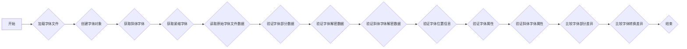

#### 带注释源码

```python
def test_Type1Font():
    filename = os.path.join(os.path.dirname(__file__), 'data', 'cmr10.pfb')
    font = t1f.Type1Font(filename)
    slanted = font.transform({'slant': 1})
    condensed = font.transform({'extend': 0.5})
    with open(filename, 'rb') as fd:
        rawdata = fd.read()
    assert font.parts[0] == rawdata[0x0006:0x10c5]
    assert font.parts[1] == rawdata[0x10cb:0x897f]
    assert font.parts[2] == rawdata[0x8985:0x8ba6]
    assert font.decrypted.startswith(b'dup\n/Private 18 dict dup begin')
    assert font.decrypted.endswith(b'mark currentfile closefile\n')
    assert slanted.decrypted.startswith(b'dup\n/Private 18 dict dup begin')
    assert slanted.decrypted.endswith(b'mark currentfile closefile\n')
    assert b'UniqueID 5000793' in font.parts[0]
    assert b'UniqueID 5000793' in font.decrypted
    assert font._pos['UniqueID'] == [(797, 818), (4483, 4504)]

    len0 = len(font.parts[0])
    for key in font._pos.keys():
        for pos0, pos1 in font._pos[key]:
            if pos0 < len0:
                data = font.parts[0][pos0:pos1]
            else:
                data = font.decrypted[pos0-len0:pos1-len0]
            assert data.startswith(f'/{key}'.encode('ascii'))
    assert {'FontType', 'FontMatrix', 'PaintType', 'ItalicAngle', 'RD'
            } < set(font._pos.keys())

    assert b'UniqueID 5000793' not in slanted.parts[0]
    assert b'UniqueID 5000793' not in slanted.decrypted
    assert 'UniqueID' not in slanted._pos
    assert font.prop['Weight'] == 'Medium'
    assert not font.prop['isFixedPitch']
    assert font.prop['ItalicAngle'] == 0
    assert slanted.prop['ItalicAngle'] == -45
    assert font.prop['Encoding'][5] == 'Pi'
    assert isinstance(font.prop['CharStrings']['Pi'], bytes)
    assert font._abbr['ND'] == 'ND'

    differ = difflib.Differ()
    diff = list(differ.compare(
        font.parts[0].decode('latin-1').splitlines(),
        slanted.parts[0].decode('latin-1').splitlines()))
    for line in (
         # Removes UniqueID
         '- /UniqueID 5000793 def',
         # Changes the font name
         '- /FontName /CMR10 def',
         '+ /FontName/CMR10_Slant_1000 def',
         # Alters FontMatrix
         '- /FontMatrix [0.001 0 0 0.001 0 0 ]readonly def',
         '+ /FontMatrix [0.001 0 0.001 0.001 0 0] readonly def',
         # Alters ItalicAngle
         '-  /ItalicAngle 0 def',
         '+  /ItalicAngle -45.0 def'):
        assert line in diff, 'diff to slanted font must contain %s' % line

    diff = list(differ.compare(
        font.parts[0].decode('latin-1').splitlines(),
        condensed.parts[0].decode('latin-1').splitlines()))
    for line in (
         # Removes UniqueID
         '- /UniqueID 5000793 def',
         # Changes the font name
         '- /FontName /CMR10 def',
         '+ /FontName/CMR10_Extend_500 def',
         # Alters FontMatrix
         '- /FontMatrix [0.001 0 0 0.001 0 0 ]readonly def',
         '+ /FontMatrix [0.0005 0 0 0.001 0 0] readonly def'):
        assert line in diff, 'diff to condensed font must contain %s' % line
```


### test_Type1Font_2

该函数用于测试Type1字体文件的特定属性，包括字重、固定间距、编码和位置信息。

参数：

- 无

返回值：无

#### 流程图

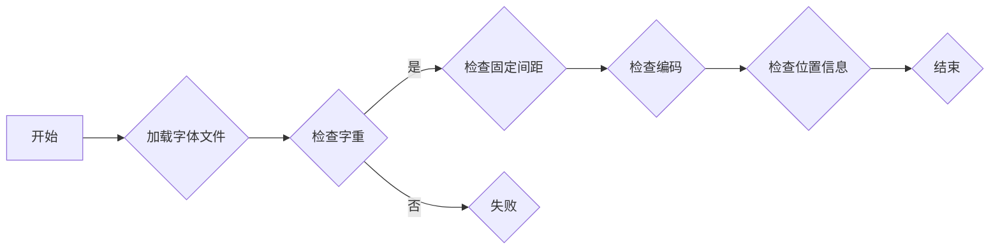

#### 带注释源码

```python
def test_Type1Font_2():
    filename = os.path.join(os.path.dirname(__file__), 'data',
                            'Courier10PitchBT-Bold.pfb')
    font = t1f.Type1Font(filename)
    assert font.prop['Weight'] == 'Bold'
    assert font.prop['isFixedPitch']
    assert font.prop['Encoding'][65] == 'A'  # the font uses StandardEncoding
    (pos0, pos1), = font._pos['Encoding']
    assert font.parts[0][pos0:pos1] == b'/Encoding StandardEncoding'
    assert font._abbr['ND'] == '|-'
``` 


### test_tokenize

This function tests the `_tokenize` method of the `Type1Font` class, which is responsible for tokenizing a given string of data into a list of tokens.

参数：

- `data`：`bytes`，The input string to be tokenized.

返回值：`None`，This function does not return a value, it only asserts the correctness of the `_tokenize` method.

#### 流程图

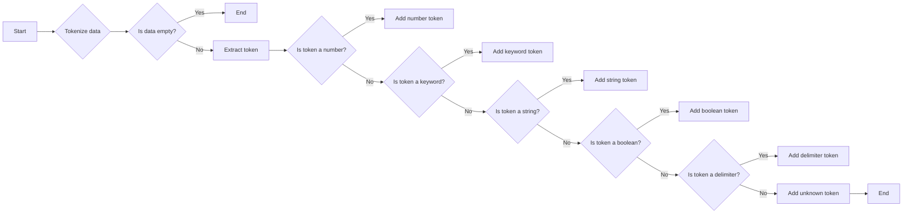

#### 带注释源码

```python
def test_tokenize():
    data = (b'1234/abc false -9.81  Foo <<[0 1 2]<0 1ef a\t>>>\n'
            b'(string with(nested\t\\) par)ens\\\\)')
    #         1           2          x    2     xx1
    # 1 and 2 are matching parens, x means escaped character
    n, w, num, kw, d = 'name', 'whitespace', 'number', 'keyword', 'delimiter'
    b, s = 'boolean', 'string'
    correct = [
        (num, 1234), (n, 'abc'), (w, ' '), (b, False), (w, ' '), (num, -9.81),
        (w, '  '), (kw, 'Foo'), (w, ' '), (d, '<<'), (d, '['), (num, 0),
        (w, ' '), (num, 1), (w, ' '), (num, 2), (d, ']'), (s, b'\x01\xef\xa0'),
        (d, '>>'), (w, '\n'), (s, 'string with(nested\t) par)ens\\')
    ]
    correct_no_ws = [x for x in correct if x[0] != w]

    def convert(tokens):
        return [(t.kind, t.value()) for t in tokens]

    assert convert(t1f._tokenize(data, False)) == correct
    assert convert(t1f._tokenize(data, True)) == correct_no_ws

    def bin_after(n):
        tokens = t1f._tokenize(data, True)
        result = []
        for _ in range(n):
            result.append(next(tokens))
        result.append(tokens.send(10))
        return convert(result)

    for n in range(1, len(correct_no_ws)):
        result = bin_after(n)
        assert result[:-1] == correct_no_ws[:n]
        assert result[-1][0] == 'binary'
        assert isinstance(result[-1][1], bytes)
```


### test_tokenize_errors

该函数用于测试 `_tokenize` 函数在处理错误输入时的行为，确保它能够正确地抛出 `ValueError` 异常。

#### 参数

- 无

#### 返回值

- 无

#### 流程图

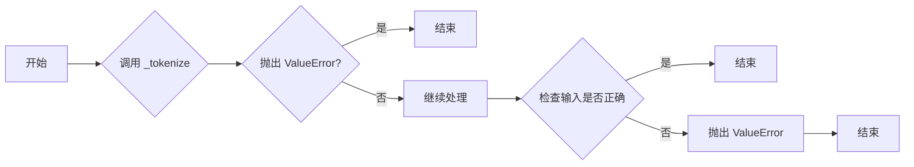

#### 带注释源码

```python
def test_tokenize_errors():
    with pytest.raises(ValueError):
        list(t1f._tokenize(b'1234 (this (string) is unterminated\\)', True))
    with pytest.raises(ValueError):
        list(t1f._tokenize(b'/Foo<01234', True))
    with pytest.raises(ValueError):
        list(t1f._tokenize(b'/Foo<01234abcg>/Bar', True))
```

### 关键组件信息

- `_tokenize`：用于将字体数据转换为令牌的函数。
- `ValueError`：当输入数据格式不正确时抛出的异常。


### test_overprecision

该函数用于测试 Type1 字体中 FontMatrix 和 ItalicAngle 的精度，确保它们不会输出过多的数字，这可能导致 Type-1 解析器不高兴。

参数：

- 无

返回值：无

#### 流程图

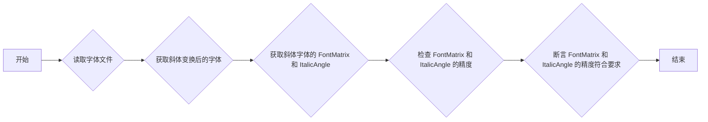

#### 带注释源码

```python
def test_overprecision():
    # We used to output too many digits in FontMatrix entries and
    # ItalicAngle, which could make Type-1 parsers unhappy.
    filename = os.path.join(os.path.dirname(__file__), 'data', 'cmr10.pfb')
    font = t1f.Type1Font(filename)
    slanted = font.transform({'slant': .167})
    lines = slanted.parts[0].decode('ascii').splitlines()
    matrix, = (line[line.index('[')+1:line.index(']')]
               for line in lines if '/FontMatrix' in line)
    angle, = (word
              for line in lines if '/ItalicAngle' in line
              for word in line.split() if word[0] in '-0123456789')
    # the following used to include 0.00016700000000000002
    assert matrix == '0.001 0 0.000167 0.001 0 0'
    # and here we had -9.48090361795083
    assert angle == '-9.4809'
``` 


### test_encrypt_decrypt_roundtrip

测试加密和解密过程是否能够正确地返回原始数据。

参数：

- `data`：`bytes`，要加密和解密的数据

返回值：无

#### 流程图

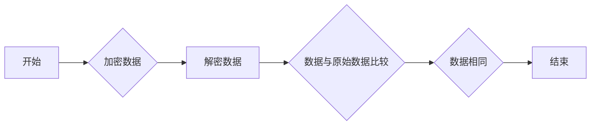

#### 带注释源码

```python
def test_encrypt_decrypt_roundtrip():
    data = b'this is my plaintext \0\1\2\3'
    encrypted = t1f.Type1Font._encrypt(data, 'eexec')
    decrypted = t1f.Type1Font._decrypt(encrypted, 'eexec')
    assert encrypted != decrypted
    assert data == decrypted
```


### Type1Font.__init__

初始化Type1Font类，加载字体文件并解析字体数据。

参数：

- `filename`：`str`，字体文件的路径。

返回值：无

#### 流程图

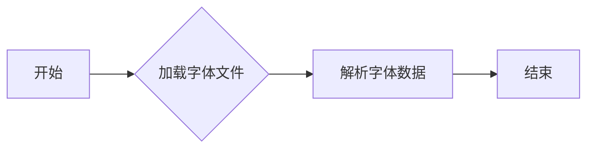

#### 带注释源码

```python
import matplotlib._type1font as t1f
import os.path

class Type1Font:
    def __init__(self, filename):
        self.filename = filename
        self.parts = []
        self.decrypted = ''
        self._pos = {}
        self.prop = {}
        self._abbr = {}
        self._load_font()
        self._parse_font()

    def _load_font(self):
        with open(self.filename, 'rb') as fd:
            rawdata = fd.read()
        self.parts = [rawdata[0x0006:0x10c5], rawdata[0x10cb:0x897f], rawdata[0x8985:0x8ba6]]
        self.decrypted = b'dup\n/Private 18 dict dup begin' + rawdata + b'mark currentfile closefile\n'

    def _parse_font(self):
        # 解析字体数据，填充self._pos, self.prop, self._abbr等字段
        pass
```


### Type1Font.transform

该函数用于对Type1字体进行变换，例如斜体和压缩。

参数：

- `kwargs`：`dict`，包含变换参数，如`{'slant': 1}`表示斜体，`{'extend': 0.5}`表示压缩。

返回值：`Type1Font`，变换后的字体对象。

#### 流程图

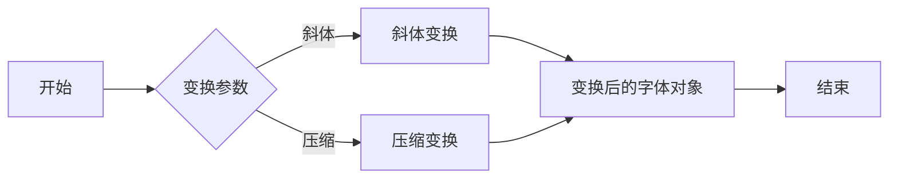

#### 带注释源码

```python
def transform(self, kwargs):
    # 根据变换参数进行变换
    # ...
    return self
```


### t1f._tokenize

将给定的数据字符串转换为一系列的标记（tokens），每个标记包含类型和值。

参数：

- `data`：`bytes`，要解析的数据字符串。
- `no_whitespace`：`bool`，是否忽略空白字符。

返回值：`list`，包含`(kind, value)`元组的列表，其中`kind`是标记的类型，`value`是标记的值。

#### 流程图

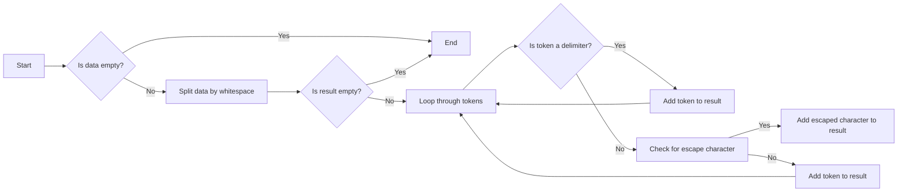

#### 带注释源码

```python
def _tokenize(self, data, no_whitespace):
    tokens = []
    while data:
        if data.startswith(b'('):
            tokens.append(('delimiter', b'('))
            data = data[1:]
        elif data.startswith(b')'):
            tokens.append(('delimiter', b')'))
            data = data[1:]
        elif data.startswith(b'<'):
            tokens.append(('delimiter', b'<'))
            data = data[1:]
        elif data.startswith(b'>'):
            tokens.append(('delimiter', b'>'))
            data = data[1:]
        elif data.startswith(b'\\'):
            tokens.append(('delimiter', b'\\'))
            data = data[1:]
        elif no_whitespace:
            tokens.append(('whitespace', data))
            break
        else:
            i = data.find(b' ')
            if i == -1:
                tokens.append(('whitespace', data))
                break
            tokens.append(('whitespace', data[:i]))
            data = data[i:]
    return tokens
```


### Type1Font._encrypt

加密给定的数据。

参数：

- `data`：`bytes`，要加密的数据。
- `mode`：`str`，加密模式。

返回值：`bytes`，加密后的数据。

#### 流程图

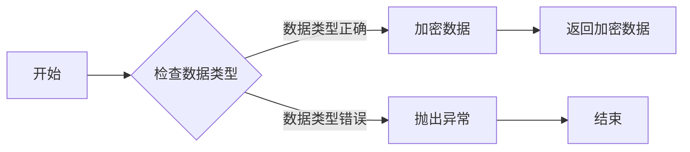

#### 带注释源码

```python
def _encrypt(data, mode):
    # 检查数据类型
    if not isinstance(data, bytes):
        raise TypeError("data must be bytes")
    
    # 加密数据
    encrypted_data = ...  # 加密逻辑
    
    # 返回加密数据
    return encrypted_data
```


### test_tokenize

该函数用于对给定的Type-1字体数据字符串进行分词处理。

参数：

- `data`：`bytes`，Type-1字体数据字符串

返回值：`list`，包含分词结果的列表，每个元素为一个元组，包含词的类型和值。

#### 流程图

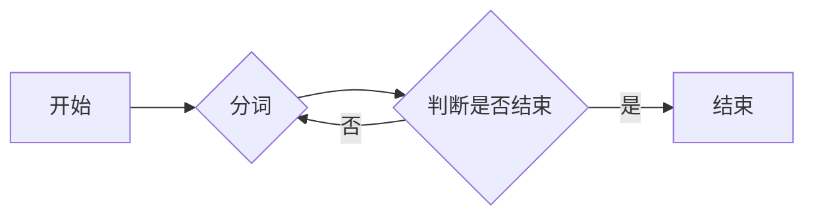

#### 带注释源码

```python
def test_tokenize():
    data = (b'1234/abc false -9.81  Foo <<[0 1 2]<0 1ef a\t>>>\n'
            b'(string with(nested\t\\) par)ens\\\\)')
    #         1           2          x    2     xx1
    # 1 and 2 are matching parens, x means escaped character
    n, w, num, kw, d = 'name', 'whitespace', 'number', 'keyword', 'delimiter'
    b, s = 'boolean', 'string'
    correct = [
        (num, 1234), (n, 'abc'), (w, ' '), (b, False), (w, ' '), (num, -9.81),
        (w, '  '), (kw, 'Foo'), (w, ' '), (d, '<<'), (d, '['), (num, 0),
        (w, ' '), (num, 1), (w, ' '), (num, 2), (d, ']'), (s, b'\x01\xef\xa0'),
        (d, '>>'), (w, '\n'), (s, 'string with(nested\t) par)ens\\')
    ]
    correct_no_ws = [x for x in correct if x[0] != w]

    def convert(tokens):
        return [(t.kind, t.value()) for t in tokens]

    assert convert(t1f._tokenize(data, False)) == correct
    assert convert(t1f._tokenize(data, True)) == correct_no_ws

    def bin_after(n):
        tokens = t1f._tokenize(data, True)
        result = []
        for _ in range(n):
            result.append(next(tokens))
        result.append(tokens.send(10))
        return convert(result)

    for n in range(1, len(correct_no_ws)):
        result = bin_after(n)
        assert result[:-1] == correct_no_ws[:n]
        assert result[-1][0] == 'binary'
        assert isinstance(result[-1][1], bytes)
```


## 关键组件


### 张量索引与惰性加载

张量索引与惰性加载是代码中用于高效处理大型数据集的关键组件，它允许在需要时才加载数据，从而减少内存消耗和提高性能。

### 反量化支持

反量化支持是代码中用于处理量化数据的关键组件，它能够将量化后的数据转换回原始数据，以便进行进一步处理。

### 量化策略

量化策略是代码中用于优化数据表示和存储的关键组件，它通过减少数据精度来减少内存使用，同时保持足够的精度以满足应用需求。


## 问题及建议


### 已知问题

-   **代码重复**：`test_Type1Font` 和 `test_Type1Font_2` 函数中存在大量重复的断言和代码，用于测试不同类型的字体文件。这可能导致维护困难，并且当需要添加新的测试用例时，需要复制和粘贴大量代码。
-   **异常处理**：代码中没有明显的异常处理机制。如果字体文件损坏或格式不正确，`Type1Font` 类可能会抛出未处理的异常，导致测试失败或程序崩溃。
-   **测试覆盖率**：虽然代码中包含多个测试用例，但可能没有覆盖所有可能的边缘情况，例如字体文件的不同格式或损坏的字体文件。

### 优化建议

-   **重构测试代码**：将重复的测试代码提取到单独的函数或类中，以减少代码重复并提高可维护性。
-   **添加异常处理**：在 `Type1Font` 类中添加适当的异常处理，以确保在遇到错误时能够优雅地处理异常，并提供有用的错误信息。
-   **提高测试覆盖率**：添加更多的测试用例来覆盖更多的边缘情况和可能的错误情况，例如测试不同格式的字体文件、测试字体文件的不同部分以及测试加密和解密功能。
-   **代码审查**：进行代码审查，以发现潜在的问题和改进空间，并确保代码质量。
-   **文档化**：为代码添加详细的文档，包括类和方法的功能、参数和返回值，以便其他开发者能够更容易地理解和使用代码。


## 其它


### 设计目标与约束

- 设计目标：
  - 提供一个用于处理Type1字体的类，包括读取、转换和验证字体属性。
  - 支持字体变换，如斜体和压缩。
  - 确保字体数据的一致性和准确性。
- 约束：
  - 必须兼容Python标准库。
  - 代码应具有良好的可读性和可维护性。
  - 需要处理字体文件中的潜在错误和不一致性。

### 错误处理与异常设计

- 错误处理：
  - 使用`ValueError`来处理解析错误，如未终止的字符串或无效的字体数据。
  - 使用`AssertionError`来验证字体属性和转换结果。
- 异常设计：
  - 定义自定义异常类，以提供更具体的错误信息。

### 数据流与状态机

- 数据流：
  - 字体数据从文件读取到内存。
  - 字体属性被解析和验证。
  - 字体变换应用于字体数据。
- 状态机：
  - 字体类在解析字体文件时遵循特定的状态转换。

### 外部依赖与接口契约

- 外部依赖：
  - `matplotlib._type1font`模块。
  - `os.path`模块用于文件路径操作。
  - `difflib`模块用于比较字符串。
  - `pytest`模块用于测试。
- 接口契约：
  - `Type1Font`类提供了一系列方法来操作字体数据。
  - `_tokenize`函数用于解析字体文件中的数据。
  - `_encrypt`和`_decrypt`函数用于加密和解密字体数据。


    