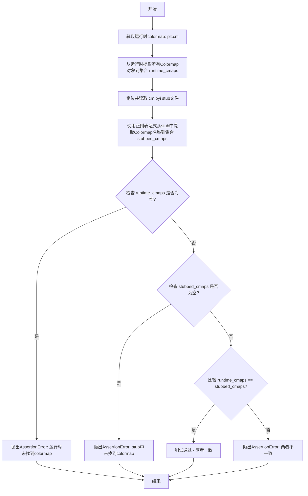

# `matplotlib\lib\matplotlib\tests\test_typing.py` 详细设计文档

这是一个matplotlib stub一致性测试模块，通过对比运行时实际可用的colormap和rcParams与stub定义文件(.pyi)中的声明，验证类型提示的准确性和完整性，确保开发者在IDE中获得的类型检查与运行时行为保持一致。

## 整体流程

```mermaid
graph TD
    A[开始] --> B[获取运行时plt.cm中的所有Colormap]
    B --> C[定位并读取cm.pyi stub文件]
C --> D[从stub文件中提取Colormap声明]
D --> E{运行时colormap集合 == stub集合?}
E -- 是 --> F[测试通过]
E -- 否 --> G[断言失败，提示不匹配]
F --> H[获取运行时plt.rcParamsDefault键名]
H --> I[验证RcKeyType与运行时键一致]
I --> J[提取rcParams分组键]
J --> K{运行时分组键 == RcGroupKeyType?]
K -- 是 --> L[测试通过]
K -- 否 --> M[断言失败]
```

## 类结构

```
此文件为纯测试模块，无类层次结构
模块级别: 全局函数
├── test_cm_stub_matches_runtime_colormaps()
└── test_rcparam_stubs()
```

## 全局变量及字段


### `runtime_cm`
    
matplotlib的cm子模块，提供颜色映射相关功能

类型：`ModuleType`
    


### `runtime_cmaps`
    
运行时matplotlib.colors模块中所有Colormap对象的名称集合

类型：`set[str]`
    


### `cm_pyi_path`
    
cm.pyi stub文件的路径对象

类型：`Path`
    


### `pyi_content`
    
cm.pyi stub文件的文本内容

类型：`str`
    


### `stubbed_cmaps`
    
从cm.pyi stub文件中正则匹配到的所有Colormap名称集合

类型：`set[str]`
    


### `runtime_rc_keys`
    
运行时plt.rcParamsDefault中所有非下划线开头的键名集合

类型：`set[str]`
    


### `runtime_rc_group_keys`
    
从rcParams键名中提取的所有分组键集合，用于表示参数的层级结构

类型：`set[str]`
    


    

## 全局函数及方法


### `test_cm_stub_matches_runtime_colormaps`

验证 matplotlib 的 colormap stub（类型提示文件 `cm.pyi`）中定义的 Colormap 与运行时 `plt.cm` 中实际存在的 Colormap 集合完全一致，确保类型提示的完整性与准确性。

参数： 无

返回值： `None`，该函数通过 `assert` 断言进行验证，若不一致则抛出 `AssertionError`

#### 流程图



#### 带注释源码

```python
def test_cm_stub_matches_runtime_colormaps():
    """
    验证colormap的stub与运行时一致
    
    该测试函数执行以下步骤：
    1. 从运行时 plt.cm 获取所有 Colormap 对象
    2. 从 cm.pyi stub 文件中解析出所有定义的 Colormap
    3. 比较两者是否完全一致，确保类型提示的准确性
    """
    
    # 第一步：获取运行时的 colormap
    # plt.cm 是 matplotlib 的颜色映射模块，包含了所有内置的 colormap
    runtime_cm = plt.cm
    
    # 遍历 runtime_cm 的所有属性，筛选出 Colormap 类型的对象
    # vars() 返回对象的 __dict__，即所有属性
    runtime_cmaps = {
        name                           # 属性名（colormap名称）
        for name, value in vars(runtime_cm).items()  # 遍历所有属性
        if isinstance(value, Colormap)  # 只保留 Colormap 类型
    }

    # 第二步：读取 stub 文件 cm.pyi
    # 构建 cm.pyi 文件的完整路径（位于当前文件所在目录的父目录）
    cm_pyi_path = Path(__file__).parent.parent / "cm.pyi"
    
    # 断言 stub 文件存在
    assert cm_pyi_path.exists(), f"{cm_pyi_path} does not exist"

    # 读取 stub 文件内容
    pyi_content = cm_pyi_path.read_text(encoding='utf-8')

    # 第三步：从 stub 文件中提取 Colormap 定义
    # 使用正则表达式匹配形如 "ColormapName: colors.Colormap" 的定义
    # ^ 表示行首，(\w+) 捕获_colormap名称，: colors.Colormap 是固定格式
    # re.MULTILINE 使 ^ 匹配每行的行首
    stubbed_cmaps = set(
        re.findall(r"^(\w+):\s+colors\.Colormap", pyi_content, re.MULTILINE)
    )

    # 第四步：验证运行时和 stub 中都找到了 colormap
    assert runtime_cmaps, (
        "No colormap variables found at runtime in matplotlib.colors"
    )
    assert stubbed_cmaps, (
        "No colormaps found in cm.pyi"
    )

    # 第五步：核心验证 - 比较运行时和 stub 的 colormap 集合是否完全一致
    # 这确保了类型提示文件准确反映了运行时的所有 colormap
    assert runtime_cmaps == stubbed_cmaps
```


### `test_rcparam_stubs`

该函数用于验证matplotlib的rcParams存根（stub）类型定义与运行时实际数据的一致性，确保`RcKeyType`和`RcGroupKeyType`类型注解准确反映了可用的rc参数键。

参数：无

返回值：`None`，该函数通过assert断言进行验证，如果不匹配则抛出AssertionError

#### 流程图

```mermaid
flowchart TD
    A[开始] --> B[获取运行时rc参数键]
    B --> C{过滤掉以'_'开头的键}
    C --> D[构建runtime_rc_keys集合]
    D --> E[断言: typing.get_args(RcKeyType) == runtime_rc_keys]
    E --> F{断言是否通过?}
    F -->|否| G[抛出AssertionError]
    F -->|是| H[遍历runtime_rc_keys构建分组键]
    H --> I[从键名分割构建组键]
    I --> J[构建runtime_rc_group_keys集合]
    J --> K[断言: typing.get_args(RcGroupKeyType) == runtime_rc_group_keys]
    K --> L{断言是否通过?}
    L -->|否| M[抛出AssertionError]
    L -->|是| N[结束]
    
    style G fill:#ffcccc
    style M fill:#ffcccc
    style N fill:#ccffcc
```

#### 带注释源码

```python
def test_rcparam_stubs():
    """
    验证rcParams的stub与运行时一致。
    检查RcKeyType和RcGroupKeyType类型定义是否与实际运行时数据匹配。
    """
    # 获取运行时默认rc参数键，排除私有键（以'_'开头）
    # plt.rcParamsDefault是包含所有默认rc参数的字典
    runtime_rc_keys = {
        name for name in plt.rcParamsDefault.keys()
        if not name.startswith('_')
    }

    # 断言：验证typing.get_args(RcKeyType)返回的类型元组
    # 应该等于运行时收集到的rc参数键集合
    # RcKeyType是用于类型注解的联合类型，定义在matplotlib.typing中
    assert {*typing.get_args(RcKeyType)} == runtime_rc_keys

    # 构建运行时rc group keys
    # rc参数支持点号分隔的组，例如 'axes.titlesize'
    # 需要提取所有可能的组键，如 'axes'
    runtime_rc_group_keys = set()
    for name in runtime_rc_keys:
        # 按 '.' 分割键名，例如 'axes.title.size' -> ['axes', 'title', 'size']
        groups = name.split('.')
        # 生成所有可能的组键组合
        # 对于 ['axes', 'title', 'size']，生成 'axes' 和 'axes.title'
        for i in range(1, len(groups)):
            runtime_rc_group_keys.add('.'.join(groups[:i]))

    # 断言：验证typing.get_args(RcGroupKeyType)返回的类型元组
    # 应该等于运行时构建的rc group keys集合
    # RcGroupKeyType是用于类型注解的联合类型，表示rc参数的组键
    assert {*typing.get_args(RcGroupKeyType)} == runtime_rc_group_keys
```

## 关键组件


### test_cm_stub_matches_runtime_colormaps

该函数验证matplotlib的colormap stub定义（cm.pyi文件）与运行时实际可用的colormap是否完全匹配，通过读取stub文件使用正则表达式提取colormap名称，并与运行时plt.cm模块中的Colormap对象进行比较。

### test_rcparam_stubs

该函数验证matplotlib的rc参数stub定义与运行时默认rc参数是否一致，分别检查顶层rc参数键和带点号的分组rc参数键（如axes.titlepad），确保stub类型注解与运行时实际参数完全对应。

### 运行时colormap收集逻辑

通过遍历plt.cm模块的所有属性，使用isinstance筛选出Colormap类型的对象，构建运行时可用的colormap集合，用于与stub定义进行比对。

### 运行时rc参数收集逻辑

从plt.rcParamsDefault获取默认rc参数，过滤掉以下划线开头的内部参数，同时通过分割带点号的参数名构建分组参数键集合，用于验证stub中的RcGroupKeyType类型注解。

### stub文件解析逻辑

使用正则表达式在cm.pyi文件中匹配colormap类型声明行，提取所有colormap的名称，用于与运行时集合进行差异比对。


## 问题及建议


### 已知问题

-   **路径硬编码问题**: 使用 `Path(__file__).parent.parent / "cm.pyi"` 硬编码相对路径，假设特定的项目目录结构，缺乏灵活性
-   **正则表达式匹配脆弱**: 使用 `re.findall(r"^(\w+):\s+colors\.Colormap", pyi_content, re.MULTILINE)` 匹配colormap声明，对pyi文件格式变化敏感，格式稍有变化可能导致匹配失败或遗漏
-   **缺乏详细错误诊断**: 断言失败时仅显示集合不相等，无法快速定位具体哪些colormap或rcparam缺失或多余
-   **缺失异常处理**: 文件读取操作 (`cm_pyi_path.read_text()`) 缺乏try-except保护，文件不存在或编码问题会导致未捕获异常
-   **stub格式依赖性强**: 代码假设colormap在pyi文件中以固定格式声明（`name: colors.Colormap`），如果采用类型别名或泛型等不同写法将无法识别

### 优化建议

-   将 `cm.pyi` 路径改为可配置参数或环境变量注入，提高测试可移植性
-   使用更健壮的AST解析（如 `ast` 模块或 `pyright` 库）代替正则表达式解析pyi文件，提高解析准确性
-   在断言失败时提供详细的差异报告，使用集合的差集运算输出具体缺失/多余的项
-   添加文件操作异常处理，对文件不存在、编码错误等情况进行友好处理并给出明确提示
-   考虑将stub验证逻辑封装为独立函数或类，提高代码可测试性和可维护性
-   添加测试参数化以支持不同的pyi文件路径或自定义类型检查场景


## 其它


### 设计目标与约束

该测试文件旨在验证matplotlib库的stub类型定义文件（cm.pyi）与运行时实际行为的一致性，确保类型检查器能够正确识别colormap和rcparam配置项。约束条件包括：必须在matplotlib安装后运行，需要访问cm.pyi文件，且依赖matplotlib的运行时环境。

### 错误处理与异常设计

测试函数使用assert语句进行断言验证，失败时抛出AssertionError并附带描述性错误信息。错误信息包含具体的缺失项或不一致项（如"No colormaps variables found at runtime"、"cm.pyi does not exist"等），便于快速定位问题。

### 数据流与状态机

数据流主要分为两条路径：路径一为colormap验证流程（读取pyi文件→正则匹配提取stubbed_cmaps→获取运行时colormap→比较一致性），路径二为rcparam验证流程（获取运行时rcKeys→从typing获取stubbed keys→获取group keys→比较一致性）。无复杂状态机设计。

### 外部依赖与接口契约

外部依赖包括：matplotlib库（plt.cm, plt.rcParamsDefault）、pathlib.Path类、re正则模块、typing模块。接口契约体现为：cm.pyi文件必须存在于项目父目录、运行时必须能访问matplotlib.colors.Colormap类型、typing.get_args(RcKeyType)和typing.get_args(RcGroupKeyType)必须返回预期类型元组。

### 性能考虑

该测试文件性能开销较小，主要操作包括文件读取、正则匹配和集合比较。对于大规模colormap列表，集合操作具有O(n)时间复杂度，整体测试执行时间应在毫秒级。

### 测试策略

采用黑盒验证策略，通过对比stub定义与运行时行为确保类型准确性。测试覆盖两种类型定义：Colormap类型和RcKeyType/RcGroupKeyType类型。未包含边界条件测试（如空集合、文件编码问题等）的显式处理。

### 可维护性与扩展性

代码结构清晰，两个独立测试函数分别验证不同类型定义，便于单独运行和调试。扩展方向可包括：添加更多类型定义验证、引入参数化测试支持多文件验证、处理版本兼容性检查等。

    