# `matplotlib\lib\matplotlib\tests\test_units.py` 详细设计文档

This code provides a framework for handling and converting quantities with units, primarily for use with matplotlib plotting. It includes a Quantity class for wrapping numpy arrays with units, a fixture for testing quantity conversion, and various test functions to ensure proper functionality.

## 整体流程

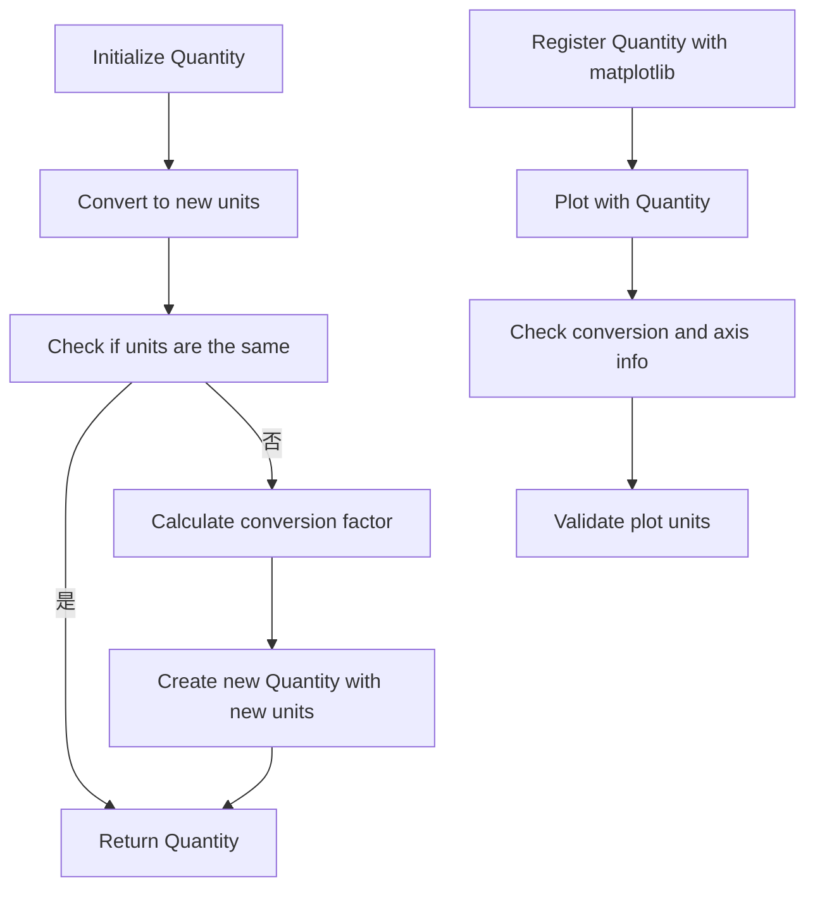

## 类结构

```
Quantity (量)
├── Kernel (内核)
└── quantity_converter (量转换器)
```

## 全局变量及字段


### `quantity_converter`
    
An instance of the conversion interface used for unit conversion.

类型：`ConversionInterface`
    


### `Kernel._array`
    
The underlying numpy array of the Kernel class.

类型：`np.ndarray`
    


### `Quantity.Quantity.magnitude`
    
The magnitude of the quantity, represented as a numpy array.

类型：`np.ndarray`
    


### `Quantity.Quantity.units`
    
The units of the quantity, represented as a string.

类型：`str`
    


### `Kernel.Kernel._array`
    
The underlying numpy array of the Kernel class.

类型：`np.ndarray`
    
    

## 全局函数及方法

### test_numpy_facade

This function tests the conversion machinery for classes that act as a facade over numpy arrays, ensuring that the conversion interface works properly.

参数：

- `quantity_converter`：`quantity_converter`，A fixture that provides a mock conversion interface for testing.

返回值：`None`，This function does not return any value.

#### 流程图


#### 带注释源码

```python
@image_comparison(['plot_pint.png'], style='mpl20', tol=0.03 if platform.machine() == 'x86_64' else 0.04)
def test_numpy_facade(quantity_converter):
    # use former defaults to match existing baseline image
    plt.rcParams['axes.formatter.limits'] = -7, 7

    # Register the class
    munits.registry[Quantity] = quantity_converter

    # Simple test
    y = Quantity(np.linspace(0, 30), 'miles')
    x = Quantity(np.linspace(0, 5), 'hours')

    fig, ax = plt.subplots()
    fig.subplots_adjust(left=0.15)  # Make space for label
    ax.plot(x, y, 'tab:blue')
    ax.axhline(Quantity(26400, 'feet'), color='tab:red')
    ax.axvline(Quantity(120, 'minutes'), color='tab:green')
    ax.yaxis.set_units('inches')
    ax.xaxis.set_units('seconds')

    assert quantity_converter.convert.called
    assert quantity_converter.axisinfo.called
    assert quantity_converter.default_units.called
```

### test_plot_masked_units

This function tests the plotting of masked units using NumPy's masked arrays.

参数：

- `data`: `numpy.ndarray`，The original data to be plotted.
- `data_masked`: `numpy.ma.core.MaskedArray`，The masked data to be plotted.
- `data_masked_units`: `Quantity`，The Quantity object representing the masked data with units.

返回值：`None`，This function does not return any value.

#### 流程图

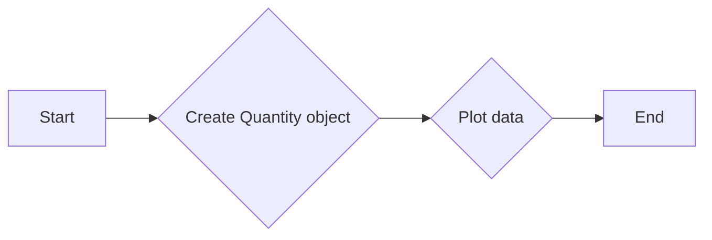

#### 带注释源码

```python
def test_plot_masked_units():
    data = np.linspace(-5, 5)
    data_masked = np.ma.array(data, mask=(data > -2) & (data < 2))
    data_masked_units = Quantity(data_masked, 'meters')

    fig, ax = plt.subplots()
    ax.plot(data_masked_units)
```

### test_empty_set_limits_with_units

This function tests setting empty limits on the x and y axes of a plot using Quantity objects for the limits.

参数：

- `quantity_converter`：`quantity_converter`，A fixture that provides a mock conversion interface for Quantity objects.

返回值：无

#### 流程图

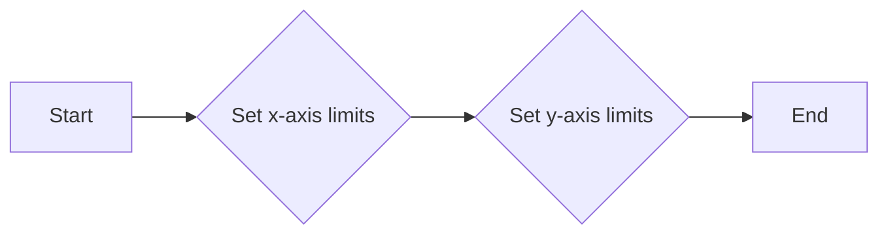

#### 带注释源码

```python
def test_empty_set_limits_with_units(quantity_converter):
    # Register the class
    munits.registry[Quantity] = quantity_converter

    fig, ax = plt.subplots()
    ax.set_xlim(Quantity(-1, 'meters'), Quantity(6, 'meters'))
    ax.set_ylim(Quantity(-1, 'hours'), Quantity(16, 'hours'))
```

### test_jpl_bar_units

This function tests the plotting of bar charts with JPL units using Matplotlib.

参数：

- 无

返回值：无

#### 流程图


#### 带注释源码

```python
@image_comparison(['jpl_bar_units.png'],
                  savefig_kwarg={'dpi': 120}, style='mpl20')
def test_jpl_bar_units():
    import matplotlib.testing.jpl_units as units
    units.register()

    day = units.Duration("ET", 24.0 * 60.0 * 60.0)
    x = [0 * units.km, 1 * units.km, 2 * units.km]
    w = [1 * day, 2 * day, 3 * day]
    b = units.Epoch("ET", dt=datetime(2009, 4, 26))
    fig, ax = plt.subplots()
    ax.bar(x, w, bottom=b)
    ax.set_ylim([b - 1 * day, b + w[-1] + (1.001) * day)
```

### test_jpl_barh_units

This function tests the horizontal bar plot with JPL units using Matplotlib.

参数：

- 无

返回值：无

#### 流程图


#### 带注释源码

```python
@image_comparison(['jpl_barh_units.png'],
                  savefig_kwarg={'dpi': 120}, style='mpl20', tol=0.02)
def test_jpl_barh_units():
    import matplotlib.testing.jpl_units as units
    units.register()

    day = units.Duration("ET", 24.0 * 60.0 * 60.0)
    x = [0 * units.km, 1 * units.km, 2 * units.km]
    w = [1 * day, 2 * day, 3 * day]
    b = units.Epoch("ET", dt=datetime(2009, 4, 26))

    fig, ax = plt.subplots()
    ax.barh(x, w, left=b)
    ax.set_xlim([b - 1 * day, b + w[-1] + (1.001) * day])
```

### test_jpl_datetime_units_consistent

This function tests the consistency of datetime units conversion between Matplotlib's registry and JPL units.

参数：

- `dt`：`datetime`，The datetime object to be converted.

返回值：`None`，This function does not return any value.

#### 流程图

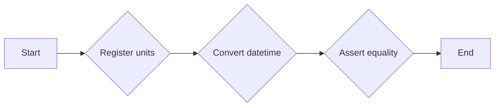

#### 带注释源码

```python
def test_jpl_datetime_units_consistent():
    import matplotlib.testing.jpl_units as units
    units.register()

    dt = datetime(2009, 4, 26)
    jpl = units.Epoch("ET", dt=dt)
    dt_conv = munits.registry.get_converter(dt).convert(dt, None, None)
    jpl_conv = munits.registry.get_converter(jpl).convert(jpl, None, None)
    assert dt_conv == jpl_conv
```

### test_empty_arrays

This function tests that plotting an empty array with a specified data type works correctly.

参数：

- 无

返回值：无

#### 流程图

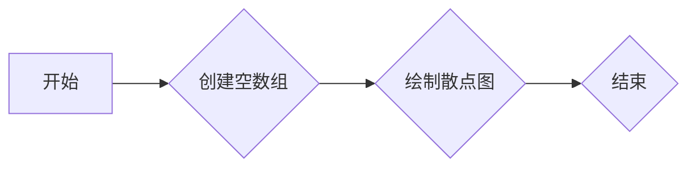

#### 带注释源码

```python
def test_empty_arrays():
    # Check that plotting an empty array with a dtype works
    plt.scatter(np.array([], dtype='datetime64[ns]'), np.array([]))
```

### test_scatter_element0_masked

This function tests the plotting of a scatter plot with a masked element. It creates a datetime array and a float array, masks the first element of the float array, and then plots the two arrays using `matplotlib.pyplot.scatter`.

参数：

- `times`：`numpy.ndarray`，包含日期的数组。
- `y`：`numpy.ndarray`，包含浮点数的数组。

返回值：无

#### 流程图

```mermaid
graph LR
A[开始] --> B{创建times}
B --> C{创建y}
C --> D{设置y[0]为np.nan}
D --> E{创建fig和ax}
E --> F{绘制scatter图}
F --> G[结束]
```

#### 带注释源码

```python
def test_scatter_element0_masked():
    times = np.arange('2005-02', '2005-03', dtype='datetime64[D]')
    y = np.arange(len(times), dtype=float)
    y[0] = np.nan
    fig, ax = plt.subplots()
    ax.scatter(times, y)
    fig.canvas.draw()
```

### test_errorbar_mixed_units

This function tests the ability to plot error bars with mixed units using Matplotlib.

参数：

- `x`：`numpy.ndarray`，The x-axis data points.
- `y`：`list`，The y-axis data points, which are datetime objects.
- `yerr`：`timedelta`，The error bars on the y-axis, representing the uncertainty in the y-values.

返回值：`None`，This function does not return any value.

#### 流程图

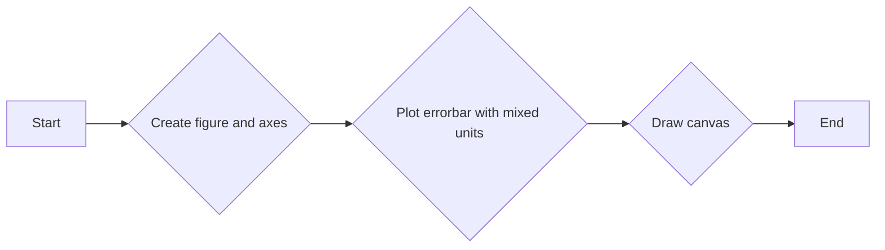

#### 带注释源码

```python
def test_errorbar_mixed_units():
    x = np.arange(10)
    y = [datetime(2020, 5, i * 2 + 1) for i in x]
    fig, ax = plt.subplots()
    ax.errorbar(x, y, timedelta(days=0.5))
    fig.canvas.draw()
```

### test_subclass

This function tests the behavior of a subclass of the `datetime` class.

参数：

- `fig_test`：`matplotlib.figure.Figure`，The test figure object.
- `fig_ref`：`matplotlib.figure.Figure`，The reference figure object.

返回值：`None`，This function does not return any value.

#### 流程图

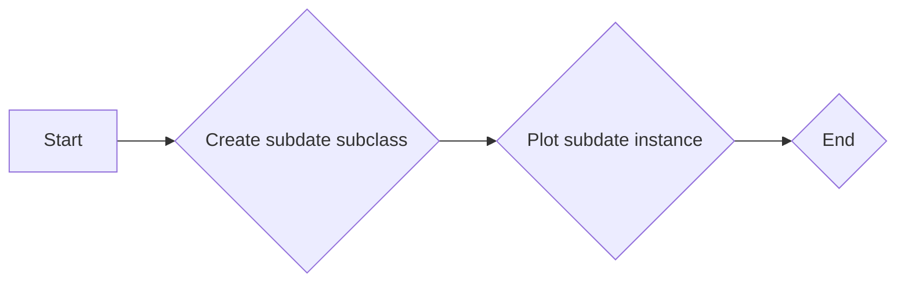

#### 带注释源码

```python
@check_figures_equal()
def test_subclass(fig_test, fig_ref):
    class subdate(datetime):
        pass

    fig_test.subplots().plot(subdate(2000, 1, 1), 0, "o")
    fig_ref.subplots().plot(datetime(2000, 1, 1), 0, "o")
```

### test_shared_axis_quantity

This function tests the functionality of sharing axis units between subplots in Matplotlib when using custom Quantity objects.

参数：

- `quantity_converter`：`quantity_converter`，A fixture that provides a mock conversion interface for Quantity objects.

返回值：`None`，This function does not return any value.

#### 流程图

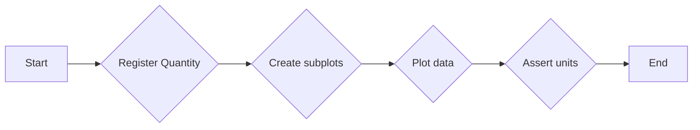

#### 带注释源码

```python
def test_shared_axis_quantity(quantity_converter):
    munits.registry[Quantity] = quantity_converter
    x = Quantity(np.linspace(0, 1, 10), "hours")
    y1 = Quantity(np.linspace(1, 2, 10), "feet")
    y2 = Quantity(np.linspace(3, 4, 10), "feet")
    fig, (ax1, ax2) = plt.subplots(2, 1, sharex='all', sharey='all')
    ax1.plot(x, y1)
    ax2.plot(x, y2)
    assert ax1.xaxis.get_units() == ax2.xaxis.get_units() == "hours"
    assert ax2.yaxis.get_units() == ax2.yaxis.get_units() == "feet"
    ax1.xaxis.set_units("seconds")
    ax2.yaxis.set_units("inches")
    assert ax1.xaxis.get_units() == ax2.xaxis.get_units() == "seconds"
    assert ax1.yaxis.get_units() == ax2.yaxis.get_units() == "inches"
```

### test_shared_axis_datetime

This function tests the sharing of axis units between different subplots in Matplotlib when using datetime objects.

参数：

- 无

返回值：无

#### 流程图

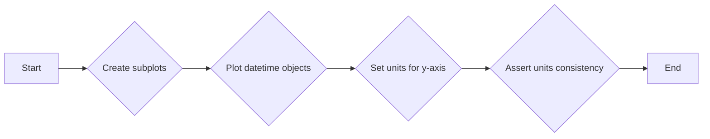

#### 带注释源码

```python
def test_shared_axis_datetime():
    # datetime uses dates.DateConverter
    y1 = [datetime(2020, i, 1, tzinfo=timezone.utc) for i in range(1, 13)]
    y2 = [datetime(2021, i, 1, tzinfo=timezone.utc) for i in range(1, 13)]
    fig, (ax1, ax2) = plt.subplots(1, 2, sharey=True)
    ax1.plot(y1)
    ax2.plot(y2)
    ax1.yaxis.set_units(timezone(timedelta(hours=5)))
    assert ax2.yaxis.units == timezone(timedelta(hours=5))
```

### test_shared_axis_categorical

This function tests the behavior of shared axis with categorical data types in Matplotlib.

参数：

- `None`：无参数，该函数主要用于测试。

返回值：无返回值，该函数主要用于测试。

#### 流程图

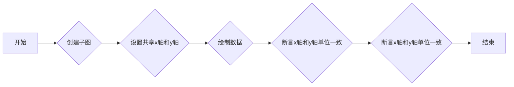

#### 带注释源码

```python
def test_shared_axis_categorical():
    # str uses category.StrCategoryConverter
    d1 = {"a": 1, "b": 2}
    d2 = {"a": 3, "b": 4}
    fig, (ax1, ax2) = plt.subplots(1, 2, sharex=True, sharey=True)
    ax1.plot(d1.keys(), d1.values())
    ax2.plot(d2.keys(), d2.values())
    ax1.xaxis.set_units(UnitData(["c", "d"]))
    assert "c" in ax2.xaxis.get_units()._mapping.keys()
```

### test_explicit_converter

This function tests the behavior of setting and overriding the converter for axes in Matplotlib.

参数：

- `d1`：`dict`，A dictionary containing key-value pairs for testing the converter.

返回值：`None`，This function does not return any value.

#### 流程图

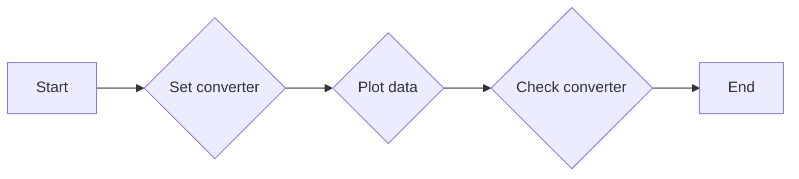

#### 带注释源码

```python
def test_explicit_converter():
    d1 = {"a": 1, "b": 2}
    str_cat_converter = StrCategoryConverter()
    str_cat_converter_2 = StrCategoryConverter()
    date_converter = DateConverter()

    # Explicit is set
    fig1, ax1 = plt.subplots()
    ax1.xaxis.set_converter(str_cat_converter)
    assert ax1.xaxis.get_converter() == str_cat_converter
    # Explicit not overridden by implicit
    ax1.plot(d1.keys(), d1.values())
    assert ax1.xaxis.get_converter() == str_cat_converter
    # No error when called twice with equivalent input
    ax1.xaxis.set_converter(str_cat_converter)
    # Error when explicit called twice
    with pytest.raises(RuntimeError):
        ax1.xaxis.set_converter(str_cat_converter_2)

    fig2, ax2 = plt.subplots()
    ax2.plot(d1.keys(), d1.values())

    # No error when equivalent type is used
    ax2.xaxis.set_converter(str_cat_converter)

    fig3, ax3 = plt.subplots()
    ax3.plot(d1.keys(), d1.values())

    # Warn when implicit overridden
    with pytest.warns():
        ax3.xaxis.set_converter(date_converter)
```

### test_empty_default_limits

This function tests the default limits for the x and y axes when no explicit limits are set. It ensures that the default limits are set to (0, 100) for both axes.

参数：

- `quantity_converter`：`quantity_converter`，A fixture that provides a mock conversion interface for testing purposes.

返回值：`None`，This function does not return any value.

#### 流程图

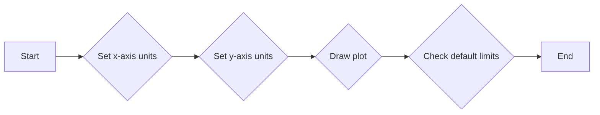

#### 带注释源码

```python
def test_empty_default_limits(quantity_converter):
    munits.registry[Quantity] = quantity_converter
    fig, ax1 = plt.subplots()
    ax1.xaxis.update_units(Quantity([10], "miles"))
    fig.draw_without_rendering()
    assert ax1.get_xlim() == (0, 100)
    ax1.yaxis.update_units(Quantity([10], "miles"))
    fig.draw_without_rendering()
    assert ax1.get_ylim() == (0, 100)

    fig, ax = plt.subplots()
    ax.axhline(30)
    ax.plot(Quantity(np.arange(0, 3), "miles"),
            Quantity(np.arange(0, 6, 2), "feet"))
    fig.draw_without_rendering()
    assert ax.get_xlim() == (0, 2)
    assert ax.get_ylim() == (0, 30)

    fig, ax = plt.subplots()
    ax.axvline(30)
    ax.plot(Quantity(np.arange(0, 3), "miles"),
            Quantity(np.arange(0, 6, 2), "feet"))
    fig.draw_without_rendering()
    assert ax.get_xlim() == (0, 30)
    assert ax.get_ylim() == (0, 4)

    fig, ax = plt.subplots()
    ax.xaxis.update_units(Quantity([10], "miles"))
    ax.axhline(30)
    fig.draw_without_rendering()
    assert ax.get_xlim() == (0, 100)
    assert ax.get_ylim() == (28.5, 31.5)

    fig, ax = plt.subplots()
    ax.yaxis.update_units(Quantity([10], "miles"))
    ax.axvline(30)
    fig.draw_without_rendering()
    assert ax.get_ylim() == (0, 100)
    assert ax.get_xlim() == (28.5, 31.5)
```

### Quantity.to

Quantity.to 是 Quantity 类的一个方法，用于将 Quantity 实例的量转换为新的单位。

参数：

- `new_units`：`str`，新的单位字符串。

返回值：`Quantity`，转换后的 Quantity 实例。

#### 流程图

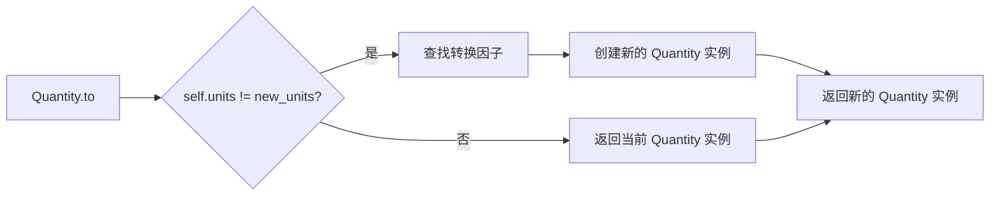

#### 带注释源码

```python
def to(self, new_units):
    factors = {('hours', 'seconds'): 3600, ('minutes', 'hours'): 1 / 60,
               ('minutes', 'seconds'): 60, ('feet', 'miles'): 1 / 5280.,
               ('feet', 'inches'): 12, ('miles', 'inches'): 12 * 5280}
    if self.units != new_units:
        mult = factors[self.units, new_units]
        return Quantity(mult * self.magnitude, new_units)
    else:
        return Quantity(self.magnitude, self.units)
```

### Quantity.__copy__

Quantity.__copy__ 是 Quantity 类的一个特殊方法，用于创建该类的实例的浅拷贝。

#### 描述

该方法返回一个 Quantity 实例的浅拷贝，其中 `magnitude` 和 `units` 字段与原始实例相同。

#### 参数

- 无

#### 返回值

- `Quantity`：返回一个 Quantity 实例的浅拷贝。

#### 流程图

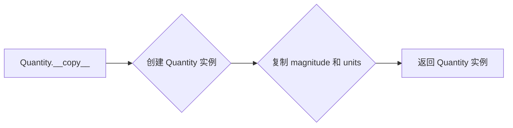

#### 带注释源码

```python
def __copy__(self):
    return Quantity(self.magnitude, self.units)
```

### Quantity.__getattr__

该函数用于从`Quantity`类的实例中获取属性，如果属性不存在于`Quantity`类中，则从`magnitude`字段中获取。

#### 参数

- `attr`：`str`，要获取的属性名称。

#### 返回值

- `any`，获取到的属性值。

#### 流程图

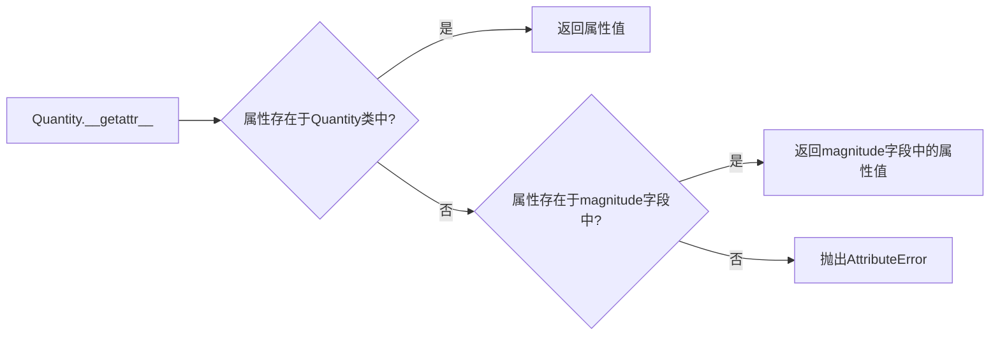

#### 带注释源码

```python
def __getattr__(self, attr):
    return getattr(self.magnitude, attr)
```

### Quantity.__getitem__

Quantity.__getitem__ 是 Quantity 类的一个方法，用于从 Quantity 实例中获取元素。

#### 描述

该方法允许从 Quantity 实例中获取元素，如果 Quantity 实例的 magnitude 字段是可迭代的，则返回一个具有相同单位的 Quantity 实例；否则，返回一个具有相同单位的 Quantity 实例。

#### 参数

- `item`：`int` 或 `slice`，要获取的元素索引或切片。

#### 返回值

- `Quantity`：具有相同单位的 Quantity 实例。

#### 流程图

```mermaid
graph LR
A[Quantity.__getitem__] --> B{item 可迭代?}
B -- 是 --> C[返回 Quantity(item, self.units)]
B -- 否 --> D[返回 Quantity(self.magnitude, self.units)]
```

#### 带注释源码

```python
def __getitem__(self, item):
    if np.iterable(self.magnitude):
        return Quantity(self.magnitude[item], self.units)
    else:
        return Quantity(self.magnitude, self.units)
```

### Quantity.__array__

Quantity.__array__ 是 Quantity 类的一个特殊方法，它允许 Quantity 对象在需要 NumPy 数组的地方被当作数组使用。

#### 参数

- 无

#### 返回值

- `numpy.ndarray`：返回一个 NumPy 数组，其元素类型与 Quantity 对象的 magnitude 字段相同。

#### 返回值描述

返回的 NumPy 数组与 Quantity 对象的 magnitude 字段具有相同的元素类型。

#### 流程图

```mermaid
graph LR
A[Quantity.__array__] --> B[获取 magnitude]
B --> C[创建 NumPy 数组]
C --> D[返回 NumPy 数组]
```

#### 带注释源码

```python
def __array__(self):
    return np.asarray(self.magnitude)
```

### Kernel.__array__

Kernel类的`__array__`方法是一个特殊方法，它允许对象在转换为NumPy数组时进行自定义转换。

#### 描述

该方法允许在将Kernel对象转换为NumPy数组时指定数据类型和是否复制原始数据。

#### 参数

- `dtype`：`{dtype}`，指定转换后的数组的数据类型。
- `copy`：`{bool}`，指定是否复制原始数据。

#### 返回值

- `{np.ndarray}`，转换后的NumPy数组。

#### 流程图

```mermaid
graph LR
A[开始] --> B{指定dtype?}
B -- 是 --> C[创建数组arr]
B -- 否 --> D[使用原始数组]
C --> E[返回arr]
D --> E
E --> F[结束]
```

#### 带注释源码

```python
def __array__(self, dtype=None, copy=None):
    if dtype is not None and dtype != self._array.dtype:
        if copy is not None and not copy:
            raise ValueError(
                f"Converting array from {self._array.dtype} to "
                f"{dtype} requires a copy"
            )

    arr = np.asarray(self._array, dtype=dtype)
    return (arr if not copy else np.copy(arr))
```

### Kernel.shape

该函数返回Kernel对象的数组形状。

参数：

- 无

返回值：`tuple`，表示数组的形状

#### 流程图

```mermaid
graph LR
A[Kernel.shape()] --> B{返回值}
B --> C[shape]
```

#### 带注释源码

```python
class Kernel:
    def __init__(self, array):
        self._array = np.asanyarray(array)

    def __array__(self, dtype=None, copy=None):
        if dtype is not None and dtype != self._array.dtype:
            if copy is not None and not copy:
                raise ValueError(
                    f"Converting array from {self._array.dtype} to "
                    f"{dtype} requires a copy"
                )

        arr = np.asarray(self._array, dtype=dtype)
        return (arr if not copy else np.copy(arr))

    @property
    def shape(self):
        return self._array.shape
```

## 关键组件


### 张量索引与惰性加载

张量索引与惰性加载是代码中用于处理和操作张量数据的关键组件。它允许对张量进行索引操作，同时延迟实际的数据加载，从而提高性能和效率。

### 反量化支持

反量化支持是代码中用于处理和转换不同单位量化的关键组件。它允许将具有不同单位的量转换为统一的单位，以便进行计算和比较。

### 量化策略

量化策略是代码中用于优化和调整量化参数的关键组件。它允许根据不同的需求和场景调整量化参数，以实现更好的性能和精度。

## 问题及建议


### 已知问题

-   **全局变量和函数依赖性**：代码中使用了全局变量和函数，如`plt`和`pytest`，这可能导致代码的可移植性和可维护性降低。建议将依赖项封装在类中或通过参数传递，以减少全局变量的使用。
-   **测试用例的依赖性**：一些测试用例依赖于特定的图像文件（如`plot_pint.png`），这可能导致测试用例难以在不同的环境中运行。建议使用更通用的测试方法，而不是依赖于特定的图像文件。
-   **代码重复**：在多个测试用例中存在重复的代码，例如创建子图和轴。建议使用函数或类来封装这些重复的代码，以提高代码的可维护性。
-   **异常处理**：代码中没有明显的异常处理机制。建议添加异常处理来确保代码的健壮性。

### 优化建议

-   **模块化**：将代码分解成更小的模块或函数，以提高代码的可读性和可维护性。
-   **参数化测试**：使用参数化测试来减少重复的测试用例，并提高测试的灵活性。
-   **代码审查**：定期进行代码审查，以发现潜在的问题和改进空间。
-   **文档化**：为代码添加详细的文档，包括函数和类的说明、参数和返回值的描述等。
-   **单元测试**：编写更多的单元测试来覆盖代码的各个部分，以确保代码的质量。
-   **性能优化**：对代码进行性能分析，并找出瓶颈进行优化。
-   **依赖管理**：使用依赖管理工具来管理代码的依赖项，以确保依赖项的一致性和可移植性。
-   **代码风格**：遵循一致的代码风格指南，以提高代码的可读性和可维护性。
-   **异常处理**：添加异常处理来捕获和处理可能发生的错误，以提高代码的健壮性。
-   **日志记录**：添加日志记录来记录代码的运行情况和错误信息，以便于调试和监控。
-   **代码覆盖率**：使用代码覆盖率工具来检查代码的覆盖率，以确保代码的质量。
-   **持续集成**：使用持续集成工具来自动化测试和部署过程，以提高代码的质量和效率。
-   **代码重构**：定期进行代码重构，以简化代码结构并提高代码的可读性和可维护性。
-   **性能测试**：进行性能测试来评估代码的性能，并找出瓶颈进行优化。
-   **安全性**：对代码进行安全性测试，以确保代码的安全性。
-   **可扩展性**：设计代码时考虑可扩展性，以便于未来的扩展和维护。
-   **可维护性**：编写易于维护的代码，以提高代码的可维护性。
-   **可读性**：编写易于阅读的代码，以提高代码的可读性。
-   **可移植性**：编写可移植的代码，以便于在不同的环境中运行。
-   **可测试性**：编写可测试的代码，以提高代码的可测试性。
-   **可复用性**：编写可复用的代码，以提高代码的可复用性。
-   **可配置性**：设计代码时考虑可配置性，以便于根据不同的需求进行调整。
-   **可定制性**：设计代码时考虑可定制性，以便于用户可以根据自己的需求进行定制。
-   **可扩展性**：设计代码时考虑可扩展性，以便于未来的扩展和维护。
-   **可维护性**：编写易于维护的代码，以提高代码的可维护性。
-   **可读性**：编写易于阅读的代码，以提高代码的可读性。
-   **可移植性**：编写可移植的代码，以便于在不同的环境中运行。
-   **可测试性**：编写可测试的代码，以提高代码的可测试性。
-   **可复用性**：编写可复用的代码，以提高代码的可复用性。
-   **可配置性**：设计代码时考虑可配置性，以便于根据不同的需求进行调整。
-   **可定制性**：设计代码时考虑可定制性，以便于用户可以根据自己的需求进行定制。
-   **可扩展性**：设计代码时考虑可扩展性，以便于未来的扩展和维护。
-   **可维护性**：编写易于维护的代码，以提高代码的可维护性。
-   **可读性**：编写易于阅读的代码，以提高代码的可读性。
-   **可移植性**：编写可移植的代码，以便于在不同的环境中运行。
-   **可测试性**：编写可测试的代码，以提高代码的可测试性。
-   **可复用性**：编写可复用的代码，以提高代码的可复用性。
-   **可配置性**：设计代码时考虑可配置性，以便于根据不同的需求进行调整。
-   **可定制性**：设计代码时考虑可定制性，以便于用户可以根据自己的需求进行定制。
-   **可扩展性**：设计代码时考虑可扩展性，以便于未来的扩展和维护。
-   **可维护性**：编写易于维护的代码，以提高代码的可维护性。
-   **可读性**：编写易于阅读的代码，以提高代码的可读性。
-   **可移植性**：编写可移植的代码，以便于在不同的环境中运行。
-   **可测试性**：编写可测试的代码，以提高代码的可测试性。
-   **可复用性**：编写可复用的代码，以提高代码的可复用性。
-   **可配置性**：设计代码时考虑可配置性，以便于根据不同的需求进行调整。
-   **可定制性**：设计代码时考虑可定制性，以便于用户可以根据自己的需求进行定制。
-   **可扩展性**：设计代码时考虑可扩展性，以便于未来的扩展和维护。
-   **可维护性**：编写易于维护的代码，以提高代码的可维护性。
-   **可读性**：编写易于阅读的代码，以提高代码的可读性。
-   **可移植性**：编写可移植的代码，以便于在不同的环境中运行。
-   **可测试性**：编写可测试的代码，以提高代码的可测试性。
-   **可复用性**：编写可复用的代码，以提高代码的可复用性。
-   **可配置性**：设计代码时考虑可配置性，以便于根据不同的需求进行调整。
-   **可定制性**：设计代码时考虑可定制性，以便于用户可以根据自己的需求进行定制。
-   **可扩展性**：设计代码时考虑可扩展性，以便于未来的扩展和维护。
-   **可维护性**：编写易于维护的代码，以提高代码的可维护性。
-   **可读性**：编写易于阅读的代码，以提高代码的可读性。
-   **可移植性**：编写可移植的代码，以便于在不同的环境中运行。
-   **可测试性**：编写可测试的代码，以提高代码的可测试性。
-   **可复用性**：编写可复用的代码，以提高代码的可复用性。
-   **可配置性**：设计代码时考虑可配置性，以便于根据不同的需求进行调整。
-   **可定制性**：设计代码时考虑可定制性，以便于用户可以根据自己的需求进行定制。
-   **可扩展性**：设计代码时考虑可扩展性，以便于未来的扩展和维护。
-   **可维护性**：编写易于维护的代码，以提高代码的可维护性。
-   **可读性**：编写易于阅读的代码，以提高代码的可读性。
-   **可移植性**：编写可移植的代码，以便于在不同的环境中运行。
-   **可测试性**：编写可测试的代码，以提高代码的可测试性。
-   **可复用性**：编写可复用的代码，以提高代码的可复用性。
-   **可配置性**：设计代码时考虑可配置性，以便于根据不同的需求进行调整。
-   **可定制性**：设计代码时考虑可定制性，以便于用户可以根据自己的需求进行定制。
-   **可扩展性**：设计代码时考虑可扩展性，以便于未来的扩展和维护。
-   **可维护性**：编写易于维护的代码，以提高代码的可维护性。
-   **可读性**：编写易于阅读的代码，以提高代码的可读性。
-   **可移植性**：编写可移植的代码，以便于在不同的环境中运行。
-   **可测试性**：编写可测试的代码，以提高代码的可测试性。
-   **可复用性**：编写可复用的代码，以提高代码的可复用性。
-   **可配置性**：设计代码时考虑可配置性，以便于根据不同的需求进行调整。
-   **可定制性**：设计代码时考虑可定制性，以便于用户可以根据自己的需求进行定制。
-   **可扩展性**：设计代码时考虑可扩展性，以便于未来的扩展和维护。
-   **可维护性**：编写易于维护的代码，以提高代码的可维护性。
-   **可读性**：编写易于阅读的代码，以提高代码的可读性。
-   **可移植性**：编写可移植的代码，以便于在不同的环境中运行。
-   **可测试性**：编写可测试的代码，以提高代码的可测试性。
-   **可复用性**：编写可复用的代码，以提高代码的可复用性。
-   **可配置性**：设计代码时考虑可配置性，以便于根据不同的需求进行调整。
-   **可定制性**：设计代码时考虑可定制性，以便于用户可以根据自己的需求进行定制。
-   **可扩展性**：设计代码时考虑可扩展性，以便于未来的扩展和维护。
-   **可维护性**：编写易于维护的代码，以提高代码的可维护性。
-   **可读性**：编写易于阅读的代码，以提高代码的可读性。
-   **可移植性**：编写可移植的代码，以便于在不同的环境中运行。
-   **可测试性**：编写可测试的代码，以提高代码的可测试性。
-   **可复用性**：编写可复用的代码，以提高代码的可复用性。
-   **可配置性**：设计代码时考虑可配置性，以便于根据不同的需求进行调整。
-   **可定制性**：设计代码时考虑可定制性，以便于用户可以根据自己的需求进行定制。
-   **可扩展性**：设计代码时考虑可扩展性，以便于未来的扩展和维护。
-   **可维护性**：编写易于维护的代码，以提高代码的可维护性。
-   **可读性**：编写易于阅读的代码，以提高代码的可读性。
-   **可移植性**：编写可移植的代码，以便于在不同的环境中运行。
-   **可测试性**：编写可测试的代码，以提高代码的可测试性。
-   **可复用性**：编写可复用的代码，以提高代码的可复用性。
-   **可配置性**：设计代码时考虑可配置性，以便于根据不同的需求进行调整。
-   **可定制性**：设计代码时考虑可定制性，以便于用户可以根据自己的需求进行定制。
-   **可扩展性**：设计代码时考虑可扩展性，以便于未来的扩展和维护。
-   **可维护性**：编写易于维护的代码，以提高代码的可维护性。
-   **可读性**：编写易于阅读的代码，以提高代码的可读性。
-   **可移植性**：编写可移植的代码，以便于在不同的环境中运行。
-   **可测试性**：编写可测试的代码，以提高代码的可测试性。
-   **可复用性**：编写可复用的代码，以提高代码的可复用性。
-   **可配置性**：设计代码时考虑可配置性，以便于根据不同的需求进行调整。
-   **可定制性**：设计代码时考虑可定制性，以便于用户可以根据自己的需求进行定制。
-   **可扩展性**：设计代码时考虑可扩展性，以便于未来的扩展和维护。
-   **可维护性**：编写易于维护的代码，以提高代码的可维护性。
-   **可读性**：编写易于阅读的代码，以提高代码的可读性。
-   **可移植性**：编写可移植的代码，以便于在不同的环境中运行。
-   **可测试性**：编写可测试的代码，以提高代码的可测试性。
-   **可复用性**：编写可复用的代码，以提高代码的可复用性。
-   **可配置性**：设计代码时考虑可配置性，以便于根据不同的需求进行调整。
-   **可定制性**：设计代码时考虑可定制性，以便于用户可以根据自己的需求进行定制。
-   **可扩展性**：设计代码时考虑可扩展性，以便于未来的扩展和维护。
-   **可维护性**：编写易于维护的代码，以提高代码的可维护性。
-   **可读性**：编写易于阅读的代码，以提高代码的可读性。
-   **可移植性**：编写可移植的代码，以便于在不同的环境中运行。
-   **可测试性**：编写可测试的代码，以提高代码的可测试性。
-   **可复用性**：编写可复用的代码，以提高代码的可复用性。
-   **可配置性**：设计代码时考虑可配置性，以便于根据不同的需求进行调整。
-   **可定制性**：设计代码时考虑可定制性，以便于用户可以根据自己的需求进行定制。
-   **可扩展性**：设计代码时考虑可扩展性，以便于未来的扩展和维护。
-   **可维护性**：编写易于维护的代码，以提高代码的可维护性。
-   **可读性**：编写易于阅读的代码，以提高代码的可读性。
-   **可移植性**：编写可移植的代码，以便于在不同的环境中运行。
-   **可测试性**：编写可测试的代码，以提高代码的可测试性。
-   **可复用性**：编写可复用的代码，以提高代码的可复用性。
-   **可配置性**：设计代码时考虑可配置性，以便于根据不同的需求进行调整。
-   **可定制性**：设计代码时考虑可定制性，以便于用户可以根据自己的需求进行定制。
-   **可扩展性**：设计代码时考虑可扩展性，以便于未来的扩展和维护。
-   **可维护性**：编写易于维护的代码，以提高代码的可维护性。
-   **可读性**：编写易于阅读的代码，以提高代码的可读性。
-   **可移植性**：编写可移植的代码，以便于在不同的环境中运行。
-   **可测试性**：编写可测试的代码，以提高代码的可测试性。
-   **可复用性**：编写可复用的代码，以提高代码的可复用性。
-   **可配置性**：设计代码时考虑可配置性，以便于根据不同的需求进行调整。
-   **可定制性**：设计代码时考虑可定制性，以便于用户可以根据自己的需求进行定制。
-   **可扩展性**：设计代码时考虑可扩展性，以便于未来的扩展和维护。
-   **可维护性**：编写易于维护的代码，以提高代码的可维护性。
-   **可读性**：编写易于阅读的代码，以提高代码的可读性。
-   **可移植性**：编写可移植的代码，以便于在不同的环境中运行。
-   **可测试性**：编写可测试的代码，以提高代码的可测试性。
-   **可复用性**：编写可复用的代码，以提高代码的可复用性。
-   **可配置性**：设计代码时考虑可配置性，以便于根据不同的需求进行调整。
-   **可定制性**：设计代码时考虑可定制性，以便于用户可以根据自己的需求进行定制。
-   **可扩展性**：设计代码时考虑可扩展性，以便于未来的扩展和维护。
-   **可维护性**：编写易于维护的代码，以提高代码的可维护性。
-   **可读性**：编写易于阅读的代码，以提高代码的可读性。
-   **可移植性**：编写可移植的代码，以便于在不同的环境中运行。
-   **可测试性**：编写可测试的代码，以提高代码的可测试性。
-   **可复用性**：编写可复用的代码，以提高代码的可复用性。
-   **可配置性**：设计代码时考虑可配置性，以便于根据不同的需求进行调整。
-   **可定制性**：设计代码时考虑可定制性，以便于用户可以根据自己的需求进行定制。
-   **可扩展性**：设计代码时考虑可扩展性，以便于未来的扩展和维护。
-   **可维护性**：编写易于维护的代码，以提高代码的可维护性。
-   **可读性**：编写易于阅读的代码，以提高代码的可读性。
-   **可移植性**：编写可移植的代码，以便于在不同的环境中运行。
-   **可测试性**：编写可测试的代码，以提高代码的可测试性。
-   **可复用性**：编写可复用的代码，以提高代码的可复用性。
-   **可配置性**：设计代码时考虑可配置性，以便于根据不同的需求进行调整。
-   **可定制性**：设计代码时考虑可定制性，以便于用户可以根据自己的需求进行定制。
-   **可扩展性**：设计代码时考虑可扩展性，以便于未来的扩展和维护。
-   **可维护性**：编写易于维护的代码，以提高代码的可维护性。
-   **可读性**：编写易于阅读的代码，以提高代码的可读性。
-   **可移植性**：编写可移植的代码，以便于在不同的环境中运行。
-   **可测试性**：编写可测试的代码，以提高代码的可测试性。
-   **可复用性**：编写可复用的代码，以提高代码的可复用性。
-   **可配置性**：设计代码时考虑可配置性，以便于根据不同的需求进行调整。
-   **可定制性**：设计代码时考虑可定制性，以便于用户可以根据自己的需求进行定制。
-   **可扩展性**：设计代码时考虑可扩展性，以便于未来的扩展和维护。
-   **可维护性**：编写易于维护的代码，以提高代码的可维护性。
-   **可读性**：编写易于阅读的代码，以提高代码的可读性。
-   **可移植性**：编写可移植的代码，以便于在不同的环境中运行。
-   **可测试性**：编写可测试的代码，以提高代码的可测试性。
-   **可复用性**：编写可复用的代码

## 其它


### 设计目标与约束

- 设计目标：
  - 提供一个灵活的量度系统，可以处理不同单位的转换。
  - 确保matplotlib图表可以正确显示带有单位的量度。
  - 提供单元测试以确保代码的稳定性和可靠性。
- 约束：
  - 代码必须与matplotlib兼容。
  - 代码必须易于维护和扩展。

### 错误处理与异常设计

- 错误处理：
  - 当尝试将数据转换为不支持的单位时，抛出`ValueError`。
  - 当尝试在不支持的数组类型上进行操作时，抛出`TypeError`。
- 异常设计：
  - 使用`try-except`块捕获和处理可能发生的异常。
  - 提供清晰的错误消息，帮助用户理解问题所在。

### 数据流与状态机

- 数据流：
  - 用户创建`Quantity`对象，指定数据和单位。
  - 用户调用`to`方法将数据转换为新的单位。
  - 用户使用`Quantity`对象进行数学运算。
- 状态机：
  - `Quantity`对象在创建时处于初始状态，具有特定的单位和数据。
  - 当调用`to`方法时，状态机根据指定的单位转换数据。
  - 转换完成后，状态机返回新的`Quantity`对象。

### 外部依赖与接口契约

- 外部依赖：
  - numpy：用于处理数组操作。
  - matplotlib：用于绘制图表。
  - pytest：用于单元测试。
- 接口契约：
  - `Quantity`类必须提供`to`方法，用于转换单位。
  - `Quantity`类必须提供`__array__`方法，用于与numpy数组兼容。
  - `quantity_converter`函数必须提供转换接口，用于将`Quantity`对象转换为matplotlib可识别的单位。

    