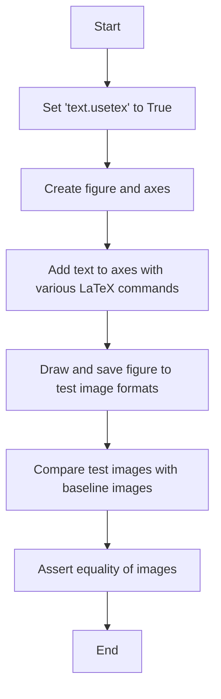
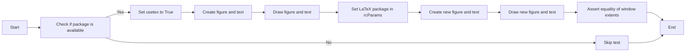
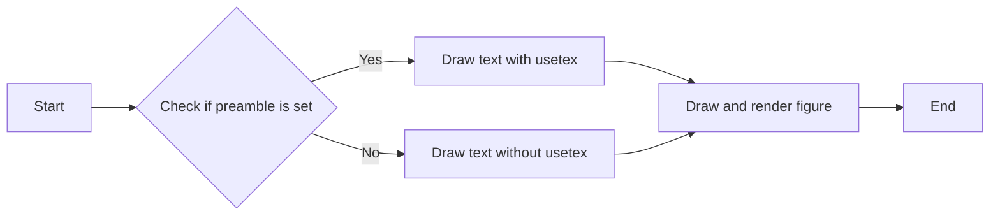
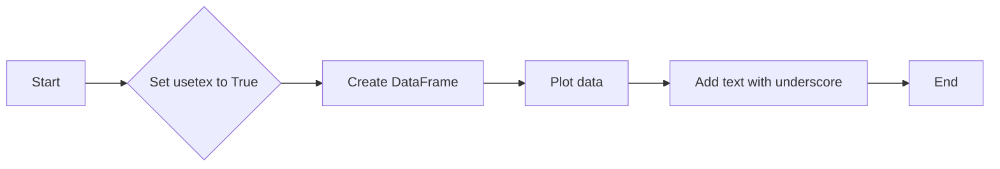
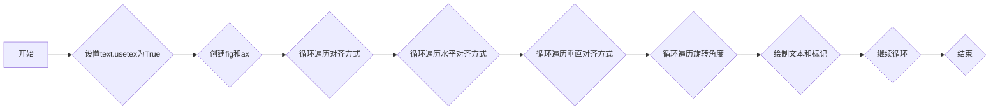
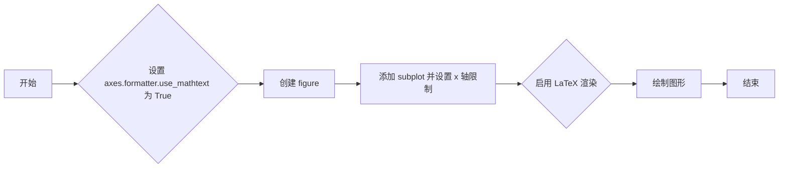

# `matplotlib\lib\matplotlib\tests\test_usetex.py` 详细设计文档

This file contains tests for the LaTeX rendering capabilities of Matplotlib, including handling of special characters, font sizes, and LaTeX packages.

## 整体流程



## 类结构

```
pytest (Testing framework)
├── matplotlib (Plotting library)
│   ├── testing (Testing utilities)
│   │   ├── test_text.py (This file)
│   │   ├── ...
│   ├── ...
│   └── ...
└── ... 
```

## 全局变量及字段


### `mpl`
    
Matplotlib module for creating static, animated, and interactive visualizations in Python.

类型：`module`
    


### `dviread`
    
Module for reading DVI files.

类型：`module`
    


### `_has_tex_package`
    
Function to check if a LaTeX package is available.

类型：`function`
    


### `check_figures_equal`
    
Function to compare figures for testing.

类型：`function`
    


### `image_comparison`
    
Function to compare images for testing.

类型：`function`
    


### `needs_usetex`
    
Decorator to mark tests that require usetex.

类型：`function`
    


### `plt`
    
Matplotlib plotting module.

类型：`module`
    


### `pytest`
    
Testing framework for Python.

类型：`module`
    


### `TemporaryFile`
    
Function to create a temporary file that is automatically deleted when closed.

类型：`function`
    


### `np`
    
NumPy module for numerical computing.

类型：`module`
    


### `parse_version`
    
Function to parse a version string.

类型：`function`
    


### `pytestmark`
    
Decorator to mark tests with a specific marker.

类型：`function`
    


### `pikepdf`
    
Module for working with PDF files.

类型：`module`
    


### `_old_gs_version`
    
Variable to store the version of Ghostscript.

类型：`variable`
    


### `image_comparison`
    
Function to compare images for testing.

类型：`function`
    


### `check_figures_equal`
    
Function to compare figures for testing.

类型：`function`
    


### `dviread`
    
Module for reading DVI files.

类型：`module`
    


### `_old_gs_version`
    
Variable to store the version of Ghostscript.

类型：`variable`
    


### `pikepdf`
    
Module for working with PDF files.

类型：`module`
    


    

## 全局函数及方法

### test_usetex

This function tests the LaTeX rendering capabilities of Matplotlib by creating a figure with various LaTeX-formatted text annotations and ensuring that they are rendered correctly.

#### 参数

- None

#### 返回值

- None

#### 流程图


#### 带注释源码

```python
@image_comparison(
    baseline_images=['test_usetex'],
    extensions=['pdf', 'png'],
    style="mpl20")
def test_usetex():
    mpl.rcParams['text.usetex'] = True
    fig, ax = plt.subplots()
    kwargs = {"verticalalignment": "baseline", "size": 24,
              "bbox": dict(pad=0, edgecolor="k", facecolor="none")}
    ax.text(0.2, 0.7,
            r'\LaTeX\ $\left[\int\limits_e^{2e}'
            r'\sqrt\frac{\log^3 x}{x}\,\mathrm{d}x \right\}$',
            **kwargs)
    ax.text(0.2, 0.3, "lg", **kwargs)
    ax.text(0.4, 0.3, r"$\frac{1}{2}\pi$", **kwargs)
    ax.text(0.6, 0.3, "$p^{3^A}$", **kwargs)
    ax.text(0.8, 0.3, "$p_{3_2}$", **kwargs)
    for x in {t.get_position()[0] for t in ax.texts}:
        ax.axvline(x)
    for y in {t.get_position()[1] for t in ax.texts}:
        ax.axhline(y)
    ax.set_axis_off()
```

### test_empty

This function tests the behavior of the `check_figures_equal` decorator when comparing figures with no content. It creates a figure with a single text annotation and compares it to a reference figure with no content.

参数：

- `fig_test`：`matplotlib.figure.Figure`，The figure to be tested.
- `fig_ref`：`matplotlib.figure.Figure`，The reference figure to compare against.

返回值：无

#### 流程图


#### 带注释源码

```python
@check_figures_equal(extensions=['png', 'pdf', 'svg'])
def test_empty(fig_test, fig_ref):
    mpl.rcParams['text.usetex'] = True
    fig_test.text(.5, .5, "% a comment")
    # No return statement, as this is a test function
```

### test_unicode_minus

This function tests the rendering of the Unicode minus sign in LaTeX mode.

参数：

- `fig_test`：`matplotlib.figure.Figure`，The figure to be tested.
- `fig_ref`：`matplotlib.figure.Figure`，The reference figure for comparison.

返回值：`None`，No return value.

#### 流程图


#### 带注释源码

```python
@check_figures_equal(extensions=['png', 'pdf', 'svg'])
def test_unicode_minus(fig_test, fig_ref):
    mpl.rcParams['text.usetex'] = True
    fig_test.text(.5, .5, "$-$")
    fig_ref.text(.5, .5, "\N{MINUS SIGN}")
```

### test_mathdefault

This function tests that the `\mathdefault` commands generated by tickers do not cause problems when later switching usetex on.

#### 参数

- None

#### 返回值

- None

#### 流程图


#### 带注释源码

```python
def test_mathdefault():
    plt.rcParams["axes.formatter.use_mathtext"] = True
    fig = plt.figure()
    fig.add_subplot().set_xlim(-1, 1)
    mpl.rcParams['text.usetex'] = True
    fig.canvas.draw()
```

### test_multiline_eqnarray

This function tests the rendering of a LaTeX `eqnarray*` environment in a matplotlib figure.

参数：

- 无

返回值：无

#### 流程图


#### 带注释源码

```python
@image_comparison(['eqnarray.png'])
def test_multiline_eqnarray():
    text = (
        r'\begin{eqnarray*}'
        r'foo\\'
        r'bar\\'
        r'baz\\'
        r'\end{eqnarray*}'
    )

    fig = plt.figure(figsize=(1, 1))
    fig.text(0.5, 0.5, text, usetex=True,
             horizontalalignment='center', verticalalignment='center')
```

### test_minus_no_descent

This function tests the special-casing of minus descent in DviFont._height_depth_of by checking that overdrawing a 1 and a -1 results in an overall height equivalent to drawing either of them separately.

#### 参数

- `fontsize`：`int`，The font size to use for the test.

#### 返回值

- None

#### 流程图


#### 带注释源码

```python
@pytest.mark.parametrize("fontsize", [8, 10, 12])
def test_minus_no_descent(fontsize):
    # Test special-casing of minus descent in DviFont._height_depth_of, by
    # checking that overdrawing a 1 and a -1 results in an overall height
    # equivalent to drawing either of them separately.
    mpl.style.use("mpl20")
    mpl.rcParams['font.size'] = fontsize
    heights = {}
    fig = plt.figure()
    for vals in [(1,), (-1,), (-1, 1)]:
        fig.clear()
        for x in vals:
            fig.text(.5, .5, f"${x}$", usetex=True)
        fig.canvas.draw()
        # The following counts the number of non-fully-blank pixel rows.
        heights[vals] = ((np.array(fig.canvas.buffer_rgba())[..., 0] != 255)
                         .any(axis=1).sum())
    assert len({*heights.values()}) == 1
```

### test_usetex_packages

This function tests the availability and functionality of LaTeX packages required for rendering text in Matplotlib with LaTeX support.

参数：

- `pkg`：`str`，The name of the LaTeX package to test.

返回值：`None`，This function does not return any value.

#### 流程图



#### 带注释源码

```python
@pytest.mark.parametrize('pkg', ['xcolor', 'chemformula'])
def test_usetex_packages(pkg):
    if not _has_tex_package(pkg):
        pytest.skip(f'{pkg} is not available')
    mpl.rcParams['text.usetex'] = True

    fig = plt.figure()
    text = fig.text(0.5, 0.5, "Some text 0123456789")
    fig.canvas.draw()

    mpl.rcParams['text.latex.preamble'] = (
        r'\PassOptionsToPackage{dvipsnames}{xcolor}\usepackage{%s}' % pkg)
    fig = plt.figure()
    text2 = fig.text(0.5, 0.5, "Some text 0123456789")
    fig.canvas.draw()
    np.testing.assert_array_equal(text2.get_window_extent(),
                                  text.get_window_extent())
```


### test_latex_pkg_already_loaded

This function tests if a LaTeX package is already loaded by checking the `text.latex.preamble` configuration in Matplotlib.

参数：

- `preamble`：`str`，The LaTeX package to be checked for loading.

返回值：`None`，This function does not return any value.

#### 流程图



#### 带注释源码

```python
def test_latex_pkg_already_loaded(preamble):
    plt.rcParams["text.latex.preamble"] = preamble
    fig = plt.figure()
    fig.text(.5, .5, "hello, world", usetex=True)
    fig.canvas.draw()
```


### test_usetex_with_underscore

This function tests the behavior of the `usetex` option in Matplotlib when using underscores in the data labels.

参数：

- 无

返回值：无

#### 流程图



#### 带注释源码

```python
def test_usetex_with_underscore():
    plt.rcParams["text.usetex"] = True
    df = {"a_b": range(5)[::-1], "c": range(5)}
    fig, ax = plt.subplots()
    ax.plot("c", "a_b", data=df)
    ax.legend()
    ax.text(0, 0, "foo_bar", usetex=True)
    plt.draw()
```


### test_missing_psfont

This function tests that an error is raised if a TeX font lacks a Type-1 equivalent.

参数：

- `fmt`：`str`，The format of the output file (e.g., 'pdf', 'svg').

返回值：`None`，This function does not return a value.

#### 流程图

```mermaid
graph LR
A[Start] --> B[Set dviread.PsfontsMap.__getitem__ to return a PsFont with a non-Type-1 font]
B --> C[Set mpl.rcParams['text.usetex'] to True]
C --> D[Create a figure and an axis]
D --> E[Add a text to the axis]
E --> F[Save the figure to a temporary file with the specified format]
F --> G[Check if a ValueError is raised]
G --> H[End]
```

#### 带注释源码

```python
def test_missing_psfont(fmt, monkeypatch):
    """An error is raised if a TeX font lacks a Type-1 equivalent"""
    monkeypatch.setattr(
        dviread.PsfontsMap, '__getitem__',
        lambda self, k: dviread.PsFont(
            texname=b'texfont', psname=b'Some Font',
            effects=None, encoding=None, filename=None))
    mpl.rcParams['text.usetex'] = True
    fig, ax = plt.subplots()
    ax.text(0.5, 0.5, 'hello')
    with TemporaryFile() as tmpfile, pytest.raises(ValueError):
        fig.savefig(tmpfile, format=fmt)
```

### test_pdf_type1_font_subsetting

This function tests that fonts in PDF output are properly subset.

参数：

- `tmpfile`：`TemporaryFile`，A temporary file object to save the PDF output.

返回值：`None`，No return value.

#### 流程图


#### 带注释源码

```python
def test_pdf_type1_font_subsetting(tmpfile):
    """Test that fonts in PDF output are properly subset."""
    pikepdf = pytest.importorskip("pikepdf")

    mpl.rcParams["text.usetex"] = True
    mpl.rcParams["text.latex.preamble"] = r"\usepackage{amssymb}"
    fig, ax = plt.subplots()
    ax.text(0.2, 0.7, r"$\int_{-\infty}^{\aleph}\sqrt{\alpha\beta\gamma}\mathrm{d}x$")
    ax.text(0.2, 0.5, r"$\mathfrak{x}\circledcirc\mathfrak{y}\in\mathbb{R}$")

    with TemporaryFile() as tmpfile:
        fig.savefig(tmpfile, format="pdf")
        tmpfile.seek(0)
        pdf = pikepdf.Pdf.open(tmpfile)

        length = {}
        page = pdf.pages[0]
        for font_name, font in page.Resources.Font.items():
            assert font.Subtype == "/Type1", (
                f"Font {font_name}={font} is not a Type 1 font"
            )

            # Subsetted font names have a 6-character tag followed by a '+'
            base_font = str(font["/BaseFont"]).removeprefix("/")
            assert re.match(r"^[A-Z]{6}\+", base_font), (
                f"Font {font_name}={base_font} lacks a subset indicator tag"
            )
            assert "/FontFile" in font.FontDescriptor, (
                f"Type 1 font {font_name}={base_font} is not embedded"
            )
            _, original_name = base_font.split("+", 1)
            length[original_name] = len(bytes(font["/FontDescriptor"]["/FontFile"]))

    print("Embedded font stream lengths:", length)
    # We should have several fonts, each much smaller than the original.
    # I get under 10kB on my system for each font, but allow 15kB in case
    # of differences in the font files.
    assert {
        'CMEX10',
        'CMMI12',
        'CMR12',
        'CMSY10',
        'CMSY8',
        'EUFM10',
        'MSAM10',
        'MSBM10',
    }.issubset(length), "Missing expected fonts in the PDF"
    for font_name, length in length.items():
        assert length < 15_000, (
            f"Font {font_name}={length} is larger than expected"
        )

    # For comparison, lengths without subsetting on my system:
    #  'CMEX10': 29686
    #  'CMMI12': 36176
    #  'CMR12': 32157
    #  'CMSY10': 32004
    #  'CMSY8': 32061
    #  'EUFM10': 20546
    #  'MSAM10': 31199
    #  'MSBM10': 34129
```

### test_rotation

该函数测试了LaTeX中不同文本对齐方式、水平和垂直对齐以及旋转角度的效果。

#### 参数

- 无

#### 返回值

- 无

#### 流程图



#### 带注释源码

```python
def test_rotation():
    mpl.rcParams['text.usetex'] = True

    fig = plt.figure()
    ax = fig.add_axes((0, 0, 1, 1))
    ax.set(xlim=(-0.5, 5), xticks=[], ylim=(-0.5, 3), yticks=[], frame_on=False)

    text = {val: val[0] for val in ['top', 'center', 'bottom', 'left', 'right']}
    text['baseline'] = 'B'
    text['center_baseline'] = 'C'

    for i, va in enumerate(['top', 'center', 'bottom', 'baseline', 'center_baseline']):
        for j, ha in enumerate(['left', 'center', 'right']):
            for k, angle in enumerate([0, 90, 180, 270]):
                k //= 2
                x = i + k / 2
                y = j + k / 2
                ax.plot(x, y, '+', c=f'C{k}', markersize=20, markeredgewidth=0.5)
                # 'My' checks full height letters plus descenders.
                ax.text(x, y, f"$\\mathrm{{My {text[ha]}{text[va]} {angle}}}$",
                        rotation=angle, horizontalalignment=ha, verticalalignment=va)
```

### test_unicode_sizing

This function tests the sizing of Unicode characters in LaTeX rendering using Matplotlib.

参数：

- `tp`：`mpl.textpath.TextToPath`，The TextToPath object used to convert text to a path for rendering.

返回值：`None`，This function does not return any value.

#### 流程图

```mermaid
graph LR
A[Start] --> B{Get scale of "W"}
B --> C{Get scale of "\textwon"}
C --> D{Assert scale equality}
D --> E[End]
```

#### 带注释源码

```python
def test_unicode_sizing():
    tp = mpl.textpath.TextToPath()
    scale1 = tp.get_glyphs_tex(mpl.font_manager.FontProperties(), "W")[0][0][3]
    scale2 = tp.get_glyphs_tex(mpl.font_manager.FontProperties(), r"\textwon")[0][0][3]
    assert scale1 == scale2
```

### test_usetex

This function tests the LaTeX rendering capabilities of Matplotlib by creating a figure with various LaTeX-formatted text annotations and ensuring that they are rendered correctly.

#### 参数

- None

#### 返回值

- None

#### 流程图


#### 带注释源码

```python
@image_comparison(
    baseline_images=['test_usetex'],
    extensions=['pdf', 'png'],
    style="mpl20")
def test_usetex():
    mpl.rcParams['text.usetex'] = True
    fig, ax = plt.subplots()
    kwargs = {"verticalalignment": "baseline", "size": 24,
              "bbox": dict(pad=0, edgecolor="k", facecolor="none")}
    ax.text(0.2, 0.7,
            r'\LaTeX\ $\left[\int\limits_e^{2e}'
            r'\sqrt\frac{\log^3 x}{x}\,\mathrm{d}x \right\}$',
            **kwargs)
    ax.text(0.2, 0.3, "lg", **kwargs)
    ax.text(0.4, 0.3, r"$\frac{1}{2}\pi$", **kwargs)
    ax.text(0.6, 0.3, "$p^{3^A}$", **kwargs)
    ax.text(0.8, 0.3, "$p_{3_2}$", **kwargs)
    for x in {t.get_position()[0] for t in ax.texts}:
        ax.axvline(x)
    for y in {t.get_position()[1] for t in ax.texts}:
        ax.axhline(y)
    ax.set_axis_off()
```

### test_empty

This function tests the behavior of the `check_figures_equal` decorator when comparing figures with an empty figure.

#### 参数

- `fig_test`：`matplotlib.figure.Figure`，The figure to be tested.
- `fig_ref`：`matplotlib.figure.Figure`，The reference figure to compare against.

#### 返回值

- 无返回值。

#### 流程图


#### 带注释源码

```python
@check_figures_equal(extensions=['png', 'pdf', 'svg'])
def test_empty(fig_test, fig_ref):
    mpl.rcParams['text.usetex'] = True
    fig_test.text(.5, .5, "% a comment")
    fig_ref.text(.5, .5, "% a comment")
    # The check_figures_equal decorator will compare fig_test and fig_ref
    # and assert that they are equal.
```

### 关键组件

- `check_figures_equal`：用于比较两个图是否相同的装饰器。
- `matplotlib.figure.Figure`：matplotlib中的图对象。

### test_unicode_minus

This function tests the rendering of the Unicode minus sign in LaTeX mode.

参数：

- `fig_test`：`matplotlib.figure.Figure`，The figure object to be tested.
- `fig_ref`：`matplotlib.figure.Figure`，The reference figure object for comparison.

返回值：`None`，This function does not return any value.

#### 流程图


#### 带注释源码

```python
@check_figures_equal(extensions=['png', 'pdf', 'svg'])
def test_unicode_minus(fig_test, fig_ref):
    mpl.rcParams['text.usetex'] = True
    fig_test.text(.5, .5, "$-$")
    fig_ref.text(.5, .5, "\N{MINUS SIGN}")
```

### test_mathdefault()

该函数测试在启用 LaTeX 渲染时，由 tickers 生成的 `\mathdefault` 命令是否会导致问题。

#### 参数

- 无

#### 返回值

- 无

#### 流程图



#### 带注释源码

```python
def test_mathdefault():
    plt.rcParams["axes.formatter.use_mathtext"] = True
    fig = plt.figure()
    fig.add_subplot().set_xlim(-1, 1)
    mpl.rcParams['text.usetex'] = True
    fig.canvas.draw()
```

### test_multiline_eqnarray

This function tests the rendering of a multiline equation array using LaTeX syntax.

参数：

- 无

返回值：无

#### 流程图


#### 带注释源码

```python
@image_comparison(['eqnarray.png'])
def test_multiline_eqnarray():
    text = (
        r'\begin{eqnarray*}'
        r'foo\\'
        r'bar\\'
        r'baz\\'
        r'\end{eqnarray*}'
    )

    fig = plt.figure(figsize=(1, 1))
    fig.text(0.5, 0.5, text, usetex=True,
             horizontalalignment='center', verticalalignment='center')
```


### test_minus_no_descent

This function tests the special-casing of minus descent in DviFont._height_depth_of by checking that overdrawing a 1 and a -1 results in an overall height equivalent to drawing either of them separately.

参数：

- fontsize：`int`，The font size to use for the test.

返回值：`None`，This function does not return any value.

#### 流程图

```mermaid
graph LR
A[Start] --> B[Set mpl style to "mpl20"]
B --> C[Set font size to fontsize]
C --> D[Create a figure]
D --> E[Clear the figure]
E --> F[Draw a 1]
F --> G[Draw a -1]
G --> H[Draw a 1 and -1 together]
H --> I[Draw a 1 separately]
I --> J[Draw a -1 separately]
J --> K[Draw lines around text]
K --> L[Set axis off]
L --> M[Draw again with different values]
M --> N[Draw again with different values]
N --> O[Draw again with different values]
O --> P[Assert that heights are equal]
P --> Q[End]
```

#### 带注释源码

```python
@pytest.mark.parametrize("fontsize", [8, 10, 12])
def test_minus_no_descent(fontsize):
    # Test special-casing of minus descent in DviFont._height_depth_of, by
    # checking that overdrawing a 1 and a -1 results in an overall height
    # equivalent to drawing either of them separately.
    mpl.style.use("mpl20")
    mpl.rcParams['font.size'] = fontsize
    heights = {}
    fig = plt.figure()
    for vals in [(1,), (-1,), (-1, 1)]:
        fig.clear()
        for x in vals:
            fig.text(.5, .5, f"${x}$", usetex=True)
        fig.canvas.draw()
        # The following counts the number of non-fully-blank pixel rows.
        heights[vals] = ((np.array(fig.canvas.buffer_rgba())[..., 0] != 255)
                         .any(axis=1).sum())
    assert len({*heights.values()}) == 1
``` 


### test_usetex_packages.test_usetex_packages

This function tests the availability and functionality of LaTeX packages when usetex is enabled in Matplotlib.

参数：

- `pkg`：`str`，The name of the LaTeX package to test.

返回值：`None`，This function does not return any value.

#### 流程图

```mermaid
graph LR
A[Start] --> B[Check if package is available]
B -- Yes --> C[Set usetex to True]
B -- No --> D[Skip test]
C --> E[Create figure and text]
E --> F[Draw the text with the package]
F --> G[Draw the text without the package]
G --> H[Compare the extents of the texts]
H --> I[Assert equality]
I --> J[End]
D --> J
```

#### 带注释源码

```python
@pytest.mark.parametrize('pkg', ['xcolor', 'chemformula'])
def test_usetex_packages(pkg):
    if not _has_tex_package(pkg):
        pytest.skip(f'{pkg} is not available')
    mpl.rcParams['text.usetex'] = True

    fig = plt.figure()
    text = fig.text(0.5, 0.5, "Some text 0123456789")
    fig.canvas.draw()

    mpl.rcParams['text.latex.preamble'] = (
        r'\PassOptionsToPackage{dvipsnames}{xcolor}\usepackage{%s}' % pkg)
    fig = plt.figure()
    text2 = fig.text(0.5, 0.5, "Some text 0123456789")
    fig.canvas.draw()
    np.testing.assert_array_equal(text2.get_window_extent(),
                                  text.get_window_extent())
```


### test_latex_pkg_already_loaded

This function tests if the LaTeX package specified in the `preamble` is already loaded by checking the text rendering of a simple string.

参数：

- `preamble`：`str`，The LaTeX package to be checked for loading.

返回值：`None`，This function does not return any value.

#### 流程图

```mermaid
graph LR
A[Start] --> B{Set "text.latex.preamble" to "preamble"}
B --> C{Create a figure and add text}
C --> D{Draw the figure}
D --> E{Check if the text is rendered correctly}
E --> F[End]
```

#### 带注释源码

```python
def test_latex_pkg_already_loaded(preamble):
    plt.rcParams["text.latex.preamble"] = preamble
    fig = plt.figure()
    fig.text(.5, .5, "hello, world", usetex=True)
    fig.canvas.draw()
```


### test_usetex_with_underscore

This function tests the rendering of LaTeX text with underscores in the matplotlib plot.

参数：

- 无

返回值：无

#### 流程图

```mermaid
graph LR
A[Start] --> B[Set matplotlib rcParams to use TeX]
B --> C[Create a DataFrame with underscore in column name]
C --> D[Create a plot with the DataFrame]
D --> E[Add a text with underscore]
E --> F[Draw the plot]
F --> G[End]
```

#### 带注释源码

```python
def test_usetex_with_underscore():
    plt.rcParams["text.usetex"] = True  # Set matplotlib to use TeX for rendering text
    df = {"a_b": range(5)[::-1], "c": range(5)}  # Create a DataFrame with underscore in column name
    fig, ax = plt.subplots()  # Create a plot
    ax.plot("c", "a_b", data=df)  # Plot the DataFrame
    ax.legend()  # Add a legend
    ax.text(0, 0, "foo_bar", usetex=True)  # Add a text with underscore
    plt.draw()  # Draw the plot
```


### test_missing_psfont.test_missing_psfont

This function tests that an error is raised if a TeX font lacks a Type-1 equivalent.

参数：

- `fmt`：`str`，The format of the output file (e.g., 'pdf', 'svg').

返回值：`None`，This function does not return a value.

#### 流程图

```mermaid
graph LR
A[Start] --> B[Set up test environment]
B --> C[Create figure and text]
C --> D[Save figure to temporary file]
D --> E[Check for ValueError]
E --> F[End]
```

#### 带注释源码

```python
def test_missing_psfont(fmt, monkeypatch):
    """An error is raised if a TeX font lacks a Type-1 equivalent"""
    monkeypatch.setattr(
        dviread.PsfontsMap, '__getitem__',
        lambda self, k: dviread.PsFont(
            texname=b'texfont', psname=b'Some Font',
            effects=None, encoding=None, filename=None))
    mpl.rcParams['text.usetex'] = True
    fig, ax = plt.subplots()
    ax.text(0.5, 0.5, 'hello')
    with TemporaryFile() as tmpfile, pytest.raises(ValueError):
        fig.savefig(tmpfile, format=fmt)
```


### test_pdf_type1_font_subsetting

This function tests that fonts in PDF output are properly subset.

参数：

-  `None`：无参数，该函数仅执行测试逻辑。

返回值：无返回值，该函数通过断言来验证测试结果。

#### 流程图

```mermaid
graph LR
A[Start] --> B[Set rcParams]
B --> C[Create figure and text]
C --> D[Save figure to PDF]
D --> E[Open PDF with pikepdf]
E --> F[Check font properties]
F --> G[Assert font is Type 1 and subsetted]
G --> H[Assert font is embedded]
H --> I[Assert font name has subset indicator]
I --> J[Assert font length is less than expected]
J --> K[End]
```

#### 带注释源码

```python
def test_pdf_type1_font_subsetting():
    """Test that fonts in PDF output are properly subset."""
    pikepdf = pytest.importorskip("pikepdf")

    mpl.rcParams["text.usetex"] = True
    mpl.rcParams["text.latex.preamble"] = r"\usepackage{amssymb}"
    fig, ax = plt.subplots()
    ax.text(0.2, 0.7, r"$\int_{-\infty}^{\aleph}\sqrt{\alpha\beta\gamma}\mathrm{d}x$")
    ax.text(0.2, 0.5, r"$\mathfrak{x}\circledcirc\mathfrak{y}\in\mathbb{R}$")

    with TemporaryFile() as tmpfile:
        fig.savefig(tmpfile, format="pdf")
        tmpfile.seek(0)
        pdf = pikepdf.Pdf.open(tmpfile)

        length = {}
        page = pdf.pages[0]
        for font_name, font in page.Resources.Font.items():
            assert font.Subtype == "/Type1", (
                f"Font {font_name}={font} is not a Type 1 font"
            )

            # Subsetted font names have a 6-character tag followed by a '+'
            base_font = str(font["/BaseFont"]).removeprefix("/")
            assert re.match(r"^[A-Z]{6}\+", base_font), (
                f"Font {font_name}={base_font} lacks a subset indicator tag"
            )
            assert "/FontFile" in font.FontDescriptor, (
                f"Type 1 font {font_name}={base_font} is not embedded"
            )
            _, original_name = base_font.split("+", 1)
            length[original_name] = len(bytes(font["/FontDescriptor"]["/FontFile"]))

    print("Embedded font stream lengths:", length)
    # We should have several fonts, each much smaller than the original.
    # I get under 10kB on my system for each font, but allow 15kB in case
    # of differences in the font files.
    assert {
        'CMEX10',
        'CMMI12',
        'CMR12',
        'CMSY10',
        'CMSY8',
        'EUFM10',
        'MSAM10',
        'MSBM10',
    }.issubset(length), "Missing expected fonts in the PDF"
    for font_name, length in length.items():
        assert length < 15_000, (
            f"Font {font_name}={length} is larger than expected"
        )

    # For comparison, lengths without subsetting on my system:
    #  'CMEX10': 29686
    #  'CMMI12': 36176
    #  'CMR12': 32157
    #  'CMSY10': 32004
    #  'CMSY8': 32061
    #  'EUFM10': 20546
    #  'MSAM10': 31199
    #  'MSBM10': 34129
``` 


### test_rotation

This function tests the rotation of text in Matplotlib with LaTeX support. It checks various combinations of horizontal and vertical alignment, as well as rotation angles.

#### 参数

- None

#### 返回值

- None

#### 流程图

```mermaid
graph LR
A[Start] --> B[Set rcParams to use LaTeX]
B --> C[Create figure and axes]
C --> D[Loop through horizontal alignment options]
D --> E[Loop through vertical alignment options]
E --> F[Loop through rotation angles]
F --> G[Plot '+' at (x, y)]
G --> H[Add text with specified alignment and rotation]
H --> I[Check if text is plotted correctly]
I --> J[End loop]
J --> K[End loop]
K --> L[End loop]
L --> M[End loop]
M --> N[End loop]
N --> O[End]
```

#### 带注释源码

```python
def test_rotation():
    mpl.rcParams['text.usetex'] = True

    fig = plt.figure()
    ax = fig.add_axes((0, 0, 1, 1))
    ax.set(xlim=(-0.5, 5), xticks=[], ylim=(-0.5, 3), yticks=[], frame_on=False)

    text = {val: val[0] for val in ['top', 'center', 'bottom', 'left', 'right']}
    text['baseline'] = 'B'
    text['center_baseline'] = 'C'

    for i, va in enumerate(['top', 'center', 'bottom', 'baseline', 'center_baseline']):
        for j, ha in enumerate(['left', 'center', 'right']):
            for k, angle in enumerate([0, 90, 180, 270]):
                k //= 2
                x = i + k / 2
                y = j + k / 2
                ax.plot(x, y, '+', c=f'C{k}', markersize=20, markeredgewidth=0.5)
                # 'My' checks full height letters plus descenders.
                ax.text(x, y, f"$\\mathrm{{My {text[ha]}{text[va]} {angle}}}$",
                        rotation=angle, horizontalalignment=ha, verticalalignment=va)
```


### test_unicode_sizing

This function tests the sizing of Unicode characters in Matplotlib's LaTeX rendering.

参数：

- 无

返回值：无

#### 流程图

```mermaid
graph LR
A[Start] --> B[Initialize TextToPath object]
B --> C[Get scale for "W"]
C --> D[Get scale for "\textwon"]
D --> E[Assert scale equality]
E --> F[End]
```

#### 带注释源码

```python
def test_unicode_sizing():
    tp = mpl.textpath.TextToPath()
    scale1 = tp.get_glyphs_tex(mpl.font_manager.FontProperties(), "W")[0][0][3]
    scale2 = tp.get_glyphs_tex(mpl.font_manager.FontProperties(), r"\textwon")[0][0][3]
    assert scale1 == scale2
``` 


## 关键组件


### 张量索引与惰性加载

张量索引与惰性加载是用于高效处理大型数据集的关键组件，它允许在需要时才计算数据，从而节省内存和提高性能。

### 反量化支持

反量化支持是用于优化模型性能的关键组件，它允许在模型训练过程中动态调整量化参数，以适应不同的硬件和性能需求。

### 量化策略

量化策略是用于优化模型性能的关键组件，它定义了如何将浮点数转换为固定点数，以减少模型大小和提高推理速度。


## 问题及建议


### 已知问题

-   **版本兼容性问题**：代码中使用了`packaging.version.parse`，这个函数在较旧的Python版本中可能不可用。如果需要支持旧版本，可能需要引入额外的依赖或使用不同的版本解析方法。
-   **全局变量和函数**：代码中存在一些全局变量和函数，如`pytestmark`和`dviread`，这些可能在不同环境中导致命名冲突或难以维护。
-   **异常处理**：代码中缺少异常处理机制，例如在`test_missing_psfont`中，如果`dviread.PsfontsMap`无法找到对应的字体，可能会抛出异常而未进行处理。
-   **性能问题**：代码中使用了大量的绘图操作，这些操作可能会对性能产生影响，尤其是在处理大量数据时。

### 优化建议

-   **版本兼容性**：考虑使用兼容性更好的版本解析方法，或者引入额外的依赖来支持旧版本的Python。
-   **模块化**：将全局变量和函数封装到模块中，以减少命名冲突和增强代码的可维护性。
-   **异常处理**：在关键操作中添加异常处理，确保代码的健壮性。
-   **性能优化**：对绘图操作进行优化，例如使用更高效的绘图库或减少不必要的绘图操作。
-   **代码注释**：增加代码注释，解释代码的功能和目的，提高代码的可读性。
-   **测试覆盖率**：增加单元测试，确保代码的每个部分都经过测试，提高代码的质量。


## 其它


### 设计目标与约束

- 设计目标：
  - 确保matplotlib的LaTeX渲染功能正确无误。
  - 提供单元测试以确保LaTeX渲染在不同情况下都能正常工作。
  - 确保测试覆盖了不同的LaTeX包和字体。

- 约束：
  - 必须使用matplotlib库进行测试。
  - 测试必须在具有LaTeX支持的环境中运行。
  - 测试必须使用pytest框架。

### 错误处理与异常设计

- 错误处理：
  - 当LaTeX包不可用时，测试将跳过相关测试。
  - 当字体缺少Type-1等效字体时，将引发错误并停止保存PDF文件。

- 异常设计：
  - 使用pytest的`raises`装饰器来测试预期的异常。
  - 使用`monkeypatch`来模拟环境变量和系统调用。

### 数据流与状态机

- 数据流：
  - 测试数据包括LaTeX文本、字体大小、角度和位置。
  - 测试结果包括图像比较和PDF文件分析。

- 状态机：
  - 测试流程包括设置参数、生成图像、比较图像和清理资源。

### 外部依赖与接口契约

- 外部依赖：
  - matplotlib
  - numpy
  - packaging
  - pytest
  - matplotlib-testing
  - pikepdf

- 接口契约：
  - matplotlib的API用于生成和保存图像。
  - pytest的API用于编写和运行测试。
  - pikepdf的API用于分析PDF文件。
  - matplotlib-testing的API用于图像比较。


    