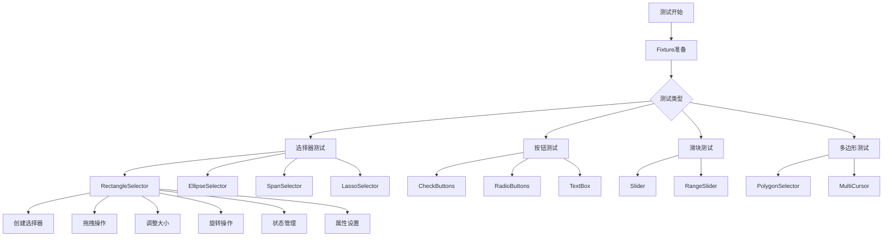
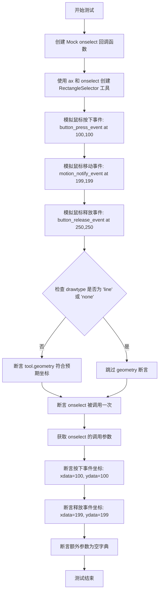
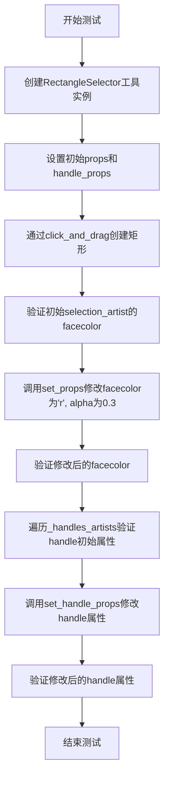
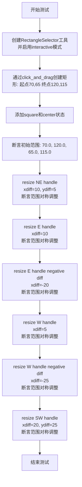
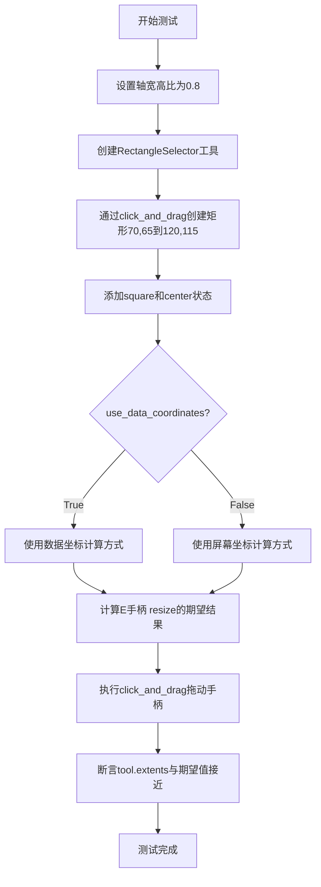
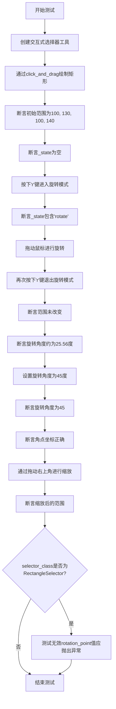
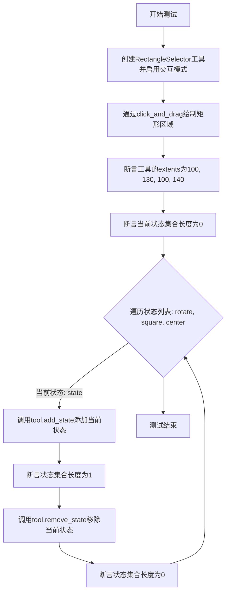
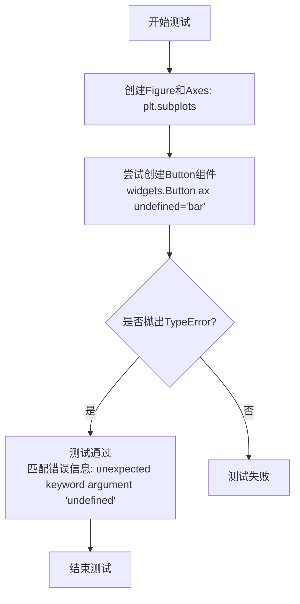
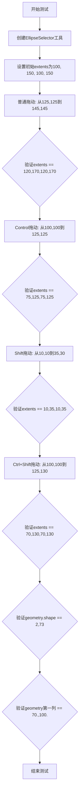
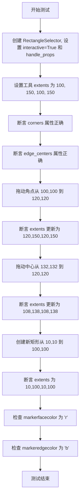

# `matplotlib\lib\matplotlib\tests\test_widgets.py` 详细设计文档

这是一个matplotlib widgets模块的综合测试文件，涵盖了各种交互式组件的功能测试，包括矩形选择器、椭圆选择器、跨度选择器、多边形选择器、套索选择器、复选框、单选按钮、滑块等widgets的创建、交互、状态管理和事件处理等核心功能。

## 整体流程



## 类结构

```
Test Module (测试模块)
├── Fixtures
│   └── ax (坐标轴fixture)
├── Selector Tests (选择器测试)
│   ├── RectangleSelector Tests
│   │   ├── test_rectangle_selector
│   │   ├── test_rectangle_minspan
│   │   ├── test_rectangle_drag
│   │   ├── test_rectangle_resize
│   │   ├── test_rectangle_rotate
│   │   └── ...
│   ├── EllipseSelector Tests
│   ├── SpanSelector Tests
│   └── LassoSelector Tests
├── Button Tests (按钮测试)
│   ├── CheckButtons Tests
│   ├── RadioButtons Tests
│   └── TextBox Tests
├── Slider Tests (滑块测试)
Slider Tests
RangeSlider Tests
├── Polygon Tests (多边形测试)
PolygonSelector Tests
MultiCursor Tests
└── Helper Functions (辅助函数)
check_polygon_selector
polygon_place_vertex
polygon_remove_vertex
```

## 全局变量及字段


### `functools`
    
Python functools标准库模块，提供函数式编程工具

类型：`module`
    


### `io`
    
Python io标准库模块，提供输入输出操作

类型：`module`
    


### `operator`
    
Python operator标准库模块，提供函数式接口

类型：`module`
    


### `mpl`
    
matplotlib主模块，别名导入

类型：`module`
    


### `mcolors`
    
matplotlib.colors模块，提供颜色处理功能

类型：`module`
    


### `widgets`
    
matplotlib.widgets模块，提供交互式小部件

类型：`module`
    


### `plt`
    
matplotlib.pyplot模块，提供绘图接口

类型：`module`
    


### `np`
    
numpy模块，提供数值计算功能

类型：`module`
    


### `pytest`
    
pytest测试框架模块

类型：`module`
    


### `ax`
    
测试夹具，返回matplotlib axes对象

类型：`function fixture`
    


### `RectangleSelector._selection_completed`
    
标记矩形选择是否已完成

类型：`bool`
    


### `RectangleSelector._state`
    
存储当前交互状态（如'move', 'rotate', 'square', 'center'）

类型：`set`
    


### `RectangleSelector.geometry`
    
矩形的几何坐标数组

类型：`numpy.ndarray`
    


### `RectangleSelector.extents`
    
矩形的边界范围(x0, x1, y0, y1)

类型：`tuple`
    


### `RectangleSelector.center`
    
矩形中心的坐标(x, y)

类型：`tuple`
    


### `RectangleSelector.rotation`
    
矩形的旋转角度（度）

类型：`float`
    


### `RectangleSelector.corners`
    
矩形四个角点的坐标数组

类型：`numpy.ndarray`
    


### `RectangleSelector._handles_artists`
    
用于交互的手柄艺术家对象列表

类型：`list`
    


### `RectangleSelector._selection_artist`
    
绘制选中矩形区域的艺术家对象

类型：`matplotlib artist`
    


### `EllipseSelector._selection_completed`
    
标记椭圆选择是否已完成

类型：`bool`
    


### `EllipseSelector.extents`
    
椭圆的边界范围(x0, x1, y0, y1)

类型：`tuple`
    


### `EllipseSelector.geometry`
    
椭圆的几何坐标数组

类型：`numpy.ndarray`
    


### `SpanSelector._selection_completed`
    
标记跨度选择是否已完成

类型：`bool`
    


### `SpanSelector.extents`
    
跨度选择器的范围(min, max)

类型：`tuple`
    


### `SpanSelector.direction`
    
跨度选择的方向('horizontal'或'vertical')

类型：`str`
    


### `SpanSelector._edge_handles`
    
跨度两端的边缘手柄对象

类型：`ToolLineHandles`
    


### `SpanSelector._selection_artist`
    
绘制跨度区域的艺术家对象

类型：`matplotlib artist`
    


### `SpanSelector._handles_artists`
    
手柄艺术家对象列表

类型：`list`
    


### `SpanSelector.ignore_event_outside`
    
是否忽略选择区域外的事件

类型：`bool`
    


### `PolygonSelector._selection_completed`
    
标记多边形选择是否已完成

类型：`bool`
    


### `PolygonSelector.verts`
    
多边形顶点的坐标列表

类型：`list`
    


### `PolygonSelector._selection_artist`
    
绘制多边形区域的艺术家对象

类型：`matplotlib artist`
    


### `PolygonSelector._handles_artists`
    
顶点手柄艺术家对象列表

类型：`list`
    


### `PolygonSelector._box`
    
多边形的边界框选择器

类型：`RectangleSelector`
    


### `LassoSelector._selection_artist`
    
绘制套索路径的艺术家对象

类型：`matplotlib artist`
    


### `CheckButtons.labels`
    
复选框的标签文本列表

类型：`list`
    


### `CheckButtons.status`
    
复选框的选中状态列表

类型：`list`
    


### `RadioButtons.labels`
    
单选按钮的标签文本元组

类型：`tuple`
    


### `RadioButtons.value_selected`
    
当前选中的单选按钮值

类型：`str`
    


### `RadioButtons.index_selected`
    
当前选中的单选按钮索引

类型：`int`
    


### `RadioButtons._buttons`
    
单选按钮的艺术家对象

类型：`matplotlib artist`
    


### `TextBox.text`
    
文本框中的当前文本内容

类型：`str`
    


### `Slider.val`
    
滑块当前的数值

类型：`float`
    


### `Slider.poly`
    
滑块的多边形艺术家对象

类型：`matplotlib artist`
    


### `RangeSlider.val`
    
范围滑块的当前值范围(min, max)

类型：`tuple`
    


### `RangeSlider.poly`
    
范围滑块的多边形艺术家对象

类型：`matplotlib artist`
    


### `RangeSlider._handles`
    
范围滑块的手柄艺术家对象列表

类型：`list`
    


### `MultiCursor.vlines`
    
垂直参考线艺术家对象列表

类型：`list`
    


### `MultiCursor.hlines`
    
水平参考线艺术家对象列表

类型：`list`
    


### `MultiCursor.horizOn`
    
是否启用水平参考线

类型：`bool`
    


### `MultiCursor.vertOn`
    
是否启用垂直参考线

类型：`bool`
    


### `ToolLineHandles.artists`
    
线条手柄的艺术家对象列表

类型：`list`
    


### `ToolLineHandles.positions`
    
线条手柄的位置列表

类型：`list`
    
    

## 全局函数及方法


### `test_save_blitted_widget_as_pdf`

该函数是一个测试函数，用于验证 Matplotlib 中的 CheckButtons 和 RadioButtons 部件（小部件）在启用 blitting（一种图形优化技术）后能否正确保存为 PDF 格式。测试创建了包含默认样式和自定义样式小部件的图表，强制使用 Agg 后端进行渲染，然后尝试将图形保存为 PDF，以确保在小部件交互和图形重绘过程中 PDF 导出功能正常工作。

参数： 无

返回值：无（`None`），该函数为测试函数，不返回任何值

#### 流程图

```mermaid
flowchart TD
    A[开始 test_save_blitted_widget_as_pdf] --> B[导入 CheckButtons, RadioButtons]
    B --> C{检查交互式框架}
    C -->|不在 ['headless', None] 中| D[跳过测试 xfail]
    C -->|在 ['headless', None] 中| E[创建 2x2 子图布局]
    E --> F[创建默认 RadioButtons]
    F --> G[创建样式化 RadioButtons]
    G --> H[创建默认 CheckButtons]
    H --> I[创建样式化 CheckButtons]
    I --> J[设置子图标题]
    J --> K[调用 fig.canvas.draw 强制 Agg 渲染]
    K --> L[创建 BytesIO 缓冲区]
    L --> M[调用 fig.savefig 保存为 PDF]
    M --> N[结束]
    D --> N
```

#### 带注释源码

```python
def test_save_blitted_widget_as_pdf():
    """
    测试保存带有 blitting 的小部件为 PDF 格式。
    
    该测试验证 CheckButtons 和 RadioButtons 部件在使用 blitting 技术时
    能否正确保存为 PDF。测试检查在图形重绘和小部件渲染后，PDF 导出功能
    是否正常工作。
    """
    # 导入需要测试的 widget 类
    from matplotlib.widgets import CheckButtons, RadioButtons
    from matplotlib.cbook import _get_running_interactive_framework
    
    # 检查当前运行的交互式框架
    # 如果不是 headless 模式或 None，则跳过测试
    # 因为在非 headless 环境下回调异常不会触发
    if _get_running_interactive_framework() not in ['headless', None]:
        pytest.xfail("Callback exceptions are not raised otherwise.")

    # 创建 2x2 的子图布局， figsize=(5, 2) 设置图形大小
    # width_ratios=[1, 2] 设置列宽比例
    fig, ax = plt.subplots(
        nrows=2, ncols=2, figsize=(5, 2), width_ratios=[1, 2]
    )
    
    # 在左上角创建默认样式的 RadioButtons
    default_rb = RadioButtons(ax[0, 0], ['Apples', 'Oranges'])
    
    # 在右上角创建自定义样式的 RadioButtons
    # label_props 设置标签颜色和字体大小
    # radio_props 设置单选按钮的边框颜色和填充颜色
    styled_rb = RadioButtons(
        ax[0, 1], ['Apples', 'Oranges'],
        label_props={'color': ['red', 'orange'],
                     'fontsize': [16, 20]},
        radio_props={'edgecolor': ['red', 'orange'],
                     'facecolor': ['mistyrose', 'peachpuff']}
    )

    # 在左下角创建默认样式的 CheckButtons
    # actives=[True, True] 设置初始选中状态
    default_cb = CheckButtons(ax[1, 0], ['Apples', 'Oranges'],
                              actives=[True, True])
    
    # 在右下角创建自定义样式的 CheckButtons
    # label_props 设置标签样式
    # frame_props 设置复选框框架样式
    # check_props 设置勾选标记样式
    styled_cb = CheckButtons(
        ax[1, 1], ['Apples', 'Oranges'],
        actives=[True, True],
        label_props={'color': ['red', 'orange'],
                     'fontsize': [16, 20]},
        frame_props={'edgecolor': ['red', 'orange'],
                     'facecolor': ['mistyrose', 'peachpuff']},
        check_props={'color': ['darkred', 'darkorange']}
    )

    # 设置子图标题
    ax[0, 0].set_title('Default')
    ax[0, 1].set_title('Stylized')
    
    # 强制使用 Agg 后端进行渲染
    # 这会触发 blitting 相关的绘制操作
    fig.canvas.draw()
    
    # 强制将图形保存为 PDF 格式
    # 使用 BytesIO 捕获输出而不写入文件
    # 这验证了 blitting 后 PDF 导出功能是否正常
    with io.BytesIO() as result_after:
        fig.savefig(result_after, format='pdf')
```


### `test_rectangle_selector`

该测试函数验证了 RectangleSelector 组件的核心功能，包括使用鼠标事件创建矩形选择区域、正确触发 onselect 回调函数、以及在不同参数配置下的几何形状绘制。测试通过模拟鼠标的按下、移动和释放事件序列来验证选择器的交互行为是否符合预期。

参数：

- `ax`：matplotlib.axes.Axes，测试用的 Axes 对象，提供给 RectangleSelector 的画布上下文
- `kwargs`：dict，参数化配置字典，用于传递 RectangleSelector 的可选参数（如 useblit、button、minspanx、minspany、spancoords、props 等）

返回值：该测试函数无返回值，主要通过断言验证 RectangleSelector 的行为

#### 流程图



#### 带注释源码

```python
@pytest.mark.parametrize('kwargs', [
    dict(),                                              # 默认配置，无额外参数
    dict(useblit=True, button=1),                       # 使用blit优化，左键按钮
    dict(minspanx=10, minspany=10, spancoords='pixels'), # 最小跨度限制，像素坐标
    dict(props=dict(fill=True)),                        # 填充属性配置
])
def test_rectangle_selector(ax, kwargs):
    """
    测试 RectangleSelector 工具的基本选择功能。
    
    该测试通过模拟鼠标事件序列来验证：
    1. RectangleSelector 能正确创建和显示矩形选择区域
    2. onselect 回调函数在选择完成后被正确调用
    3. 回调函数接收到正确的按下和释放位置坐标
    """
    # 创建 Mock 对象作为 onselect 回调，spec 指定为 noop 函数
    # return_value=None 确保回调不返回任何值
    onselect = mock.Mock(spec=noop, return_value=None)

    # 使用传入的 kwargs 参数化配置创建 RectangleSelector 工具
    # ax: matplotlib Axes 对象，作为选择器的画布
    # onselect: 回调函数，当选择完成时被调用
    tool = widgets.RectangleSelector(ax, onselect=onselect, **kwargs)
    
    # 模拟鼠标按下事件：在坐标 (100, 100) 处按下鼠标左键 (button=1)
    # _from_ax_coords 创建基于 axes 坐标系统的鼠标事件
    # _process() 方法将事件放入处理队列
    MouseEvent._from_ax_coords("button_press_event", ax, (100, 100), 1)._process()
    
    # 模拟鼠标移动事件：拖动到坐标 (199, 199)
    # 这会动态更新矩形选择器的几何形状
    MouseEvent._from_ax_coords("motion_notify_event", ax, (199, 199), 1)._process()
    
    # 模拟鼠标释放事件：在坐标 (250, 250) 处释放
    # 故意拖动到 axes 外部来触发选择完成
    MouseEvent._from_ax_coords("button_release_event", ax, (250, 250), 1)._process()

    # 如果 drawtype 不是 'line' 或 'none'，则验证工具的几何形状
    # geometry 属性包含矩形顶点的 x 和 y 坐标
    # 预期坐标: 矩形四个角 (100,100) -> (199,199) -> (199,100) -> (100,100)
    if kwargs.get('drawtype', None) not in ['line', 'none']:
        assert_allclose(tool.geometry,
                        [[100., 100, 199, 199, 100],
                         [100, 199, 199, 100, 100]],
                        err_msg=tool.geometry)

    # 验证 onselect 回调被调用 exactly 一次
    onselect.assert_called_once()
    
    # 获取调用参数：call_args 返回 (args, kwargs) 元组
    # args[0] 是位置参数元组，包含 (epress, erelease) 两个事件对象
    (epress, erelease), kwargs = onselect.call_args
    
    # 验证按下事件的数据坐标
    assert epress.xdata == 100
    assert epress.ydata == 100
    
    # 验证释放事件的数据坐标
    assert erelease.xdata == 199
    assert erelease.ydata == 199
    
    # 验证没有传递额外的关键字参数
    assert kwargs == {}
```


### `test_rectangle_minspan`

该测试函数用于验证 RectangleSelector 组件在不同坐标系统（data/pixels）和最小跨度（minspanx/minspany）参数下的行为是否符合预期，确保当选择的矩形区域小于指定的最小跨度时不会触发选择完成，而当区域足够大时正确触发选择回调。

参数：

- `ax`：`matplotlib.axes.Axes`，测试用的 Axes 对象，由 pytest fixture 提供
- `spancoords`：`str`，坐标系统类型，可选值为 `'data'`（数据坐标）或 `'pixels'`（像素坐标），用于指定 minspan 的解释方式
- `minspanx`：`float`，X 轴方向的最小跨度值，当选择的矩形宽度小于此值时不会触发 onselect
- `x1`：`float`，第一次测试的结束点 X 坐标，用于计算 minspan 在像素坐标下的对应值
- `minspany`：`float`，Y 轴方向的最小跨度值，当选择的矩形高度小于此值时不会触发 onselect
- `y1`：`float`，第一次测试的结束点 Y 坐标，用于计算 minspan 在像素坐标下的对应值

返回值：`None`，该函数为测试函数，不返回任何值

#### 流程图

```mermaid
flowchart TD
    A[开始测试] --> B[设置起始点 x0=10, y0=10]
    B --> C{spancoords == 'pixels'?}
    C -->|是| D[将 minspanx/minspany 转换为像素坐标]
    C -->|否| E[保持原值]
    D --> F
    E --> F[创建 RectangleSelector]
    F --> G[点击并拖拽: start=(10, x1), end=(10, y1)]
    G --> H{选择区域太小?}
    H -->|是| I[断言: _selection_completed 为 False]
    I --> J[断言: onselect 未被调用]
    J --> K[点击并拖拽: start=(20,20), end=(30,30)]
    K --> L{选择区域足够大?}
    L -->|是| M[断言: _selection_completed 为 True]
    M --> N[断言: onselect 被调用一次]
    N --> O[重置 onselect mock]
    O --> P[点击并拖拽: start=(10,10), end=(x1,y1)]
    P --> Q{选择区域太小?}
    Q -->|是| R[断言: _selection_completed 为 False]
    R --> S[断言: onselect 被调用一次]
    S --> T[断言回调参数正确: epress.xdata=10, epress.ydata=10, erelease.xdata=x1, erelease.ydata=y1]
    T --> U[测试结束]
    H -->|否| K
    Q -->|否| T
```

#### 带注释源码

```python
@pytest.mark.parametrize('spancoords', ['data', 'pixels'])
@pytest.mark.parametrize('minspanx, x1', [[0, 10], [1, 10.5], [1, 11]])
@pytest.mark.parametrize('minspany, y1', [[0, 10], [1, 10.5], [1, 11]])
def test_rectangle_minspan(ax, spancoords, minspanx, x1, minspany, y1):
    """
    测试 RectangleSelector 在不同 minspan 参数下的行为。
    
    参数:
        ax: Axes 对象，测试用的坐标轴
        spancoords: 坐标系统，'data' 或 'pixels'
        minspanx: X 方向最小跨度
        x1: 第一次测试的结束 X 坐标
        minspany: Y 方向最小跨度
        y1: 第一次测试的结束 Y 坐标
    """
    
    # 创建 mock 对象用于验证 onselect 回调
    onselect = mock.Mock(spec=noop, return_value=None)

    # 设置起始点坐标
    x0, y0 = (10, 10)
    
    # 如果使用像素坐标，需要将 minspanx/minspany 转换为像素值
    # 通过数据坐标变换将 (x1, y1) 和 (x0, y0) 转换后计算差值
    if spancoords == 'pixels':
        minspanx, minspany = (ax.transData.transform((x1, y1)) -
                              ax.transData.transform((x0, y0)))

    # 创建 RectangleSelector 工具
    # interactive=True 允许交互式拖拽
    # spancoords 指定坐标系统
    # minspanx/minspany 设置最小跨度阈值
    tool = widgets.RectangleSelector(ax, onselect=onselect, interactive=True,
                                     spancoords=spancoords,
                                     minspanx=minspanx, minspany=minspany)
    
    # 第一次尝试：选择区域太小，不足以创建有效的选择器
    # 使用 click_and_drag 辅助函数模拟鼠标点击和拖拽
    # start=(x0, x1) 和 end=(y0, y1) 形成很小的区域
    click_and_drag(tool, start=(x0, x1), end=(y0, y1))
    
    # 断言：选择未完成，因为区域小于 minspan
    assert not tool._selection_completed
    # 断言：onselect 回调未被调用
    onselect.assert_not_called()

    # 第二次尝试：选择足够大的区域
    # 从 (20, 20) 拖拽到 (30, 30)，形成 10x10 的区域
    click_and_drag(tool, start=(20, 20), end=(30, 30))
    
    # 断言：选择已完成
    assert tool._selection_completed
    # 断言：onselect 被调用一次
    onselect.assert_called_once()

    # 第三次尝试：清除现有选择器并创建新选择
    # 重置 mock 以便重新计数
    onselect.reset_mock()
    
    # 再次尝试创建太小的选择区域
    # 这应该清除现有选择器，并因为存在 preexisting selector 而触发 onselect
    click_and_drag(tool, start=(x0, y0), end=(x1, y1))
    
    # 断言：选择未完成
    assert not tool._selection_completed
    # 断言：onselect 被调用一次（因为有已存在的选择器）
    onselect.assert_called_once()
    
    # 验证回调参数的正确性
    # 提取回调函数的参数
    (epress, erelease), kwargs = onselect.call_args
    
    # 验证按下事件的坐标
    assert epress.xdata == x0
    assert epress.ydata == y0
    
    # 验证释放事件的坐标
    assert erelease.xdata == x1
    assert erelease.ydata == y1
    
    # 验证没有额外的关键字参数
    assert kwargs == {}
```


### `test_rectangle_drag`

该测试函数用于验证 `RectangleSelector` 组件的拖拽行为，特别是测试 `drag_from_anywhere` 参数在不同取值下的行为差异：當設為 `True` 時，可以在矩形內任意位置拖動整個矩形；當設為 `False` 時，只有在遠離中心 handle 的位置拖動才會移動矩形，否則會創建新的矩形。

参数：

- `ax`：测试用的 Axes 对象，用于承载 RectangleSelector 组件
- `drag_from_anywhere`：布尔值，控制是否可以从矩形任意位置开始拖动
- `new_center`：期望的中心点坐标元组，用于断言验证拖动后的结果

返回值：`None`，该函数为测试函数，不返回任何值

#### 流程图

```mermaid
flowchart TD
    A[开始测试] --> B[创建 RectangleSelector 组件]
    B --> C[创建矩形: 从 (10,10) 拖动到 (90,120)]
    C --> D{验证中心点是否为 (50, 65)}
    D -->|是| E[在矩形内部拖动: 从 (25,15) 到 (35,25)]
    D -->|否| F[测试失败]
    E --> G{根据 drag_from_anywhere 的值验证新中心点}
    G -->|True| H[期望中心点为 (60, 75)]
    G -->|False| I[期望中心点为 (30, 20)]
    H --> J[在矩形外部拖动: 从 (175,185) 到 (185,195)]
    I --> J
    J --> K[验证最终中心点为 (180, 190)]
    K --> L[测试结束]
```

#### 带注释源码

```python
# 参数化测试：drag_from_anywhere 分别为 True 和 False，对应不同的预期中心点
@pytest.mark.parametrize('drag_from_anywhere, new_center',
                         [[True, (60, 75)],
                          [False, (30, 20)]])
def test_rectangle_drag(ax, drag_from_anywhere, new_center):
    # 创建 RectangleSelector 工具，启用交互模式
    # drag_from_anywhere 参数控制是否可以从任意位置拖动整个选择器
    tool = widgets.RectangleSelector(ax, interactive=True,
                                     drag_from_anywhere=drag_from_anywhere)
    
    # 创建矩形：通过从 (10, 10) 拖动到 (90, 120)
    # 矩形的左下角为 (10, 10)，右上角为 (90, 120)
    # 中心点应为 ((10+90)/2, (10+120)/2) = (50, 65)
    click_and_drag(tool, start=(10, 10), end=(90, 120))
    assert tool.center == (50, 65)
    
    # 在矩形内部拖动，但远离中心 handle
    #
    # 如果 drag_from_anywhere == True，这将移动矩形 (10, 10)
    # 得到新的中心点 (60, 75)
    #
    # 如果 drag_from_anywhere == False，这将在 (30, 20) 处创建新矩形
    click_and_drag(tool, start=(25, 15), end=(35, 25))
    assert tool.center == new_center
    
    # 检查两种情况下，在矩形外部拖动都会绘制新矩形
    click_and_drag(tool, start=(175, 185), end=(185, 195))
    assert tool.center == (180, 190)
```


### test_rectangle_selector_set_props_handle_props

该测试函数用于验证RectangleSelector的set_props和set_handle_props方法能够正确更新选择器的外观属性和句柄属性。

参数：

- `ax`：`matplotlib.axes.Axes`，测试用的坐标轴对象，由pytest fixture提供

返回值：`None`，测试函数无返回值

#### 流程图



#### 带注释源码

```python
def test_rectangle_selector_set_props_handle_props(ax):
    """
    测试RectangleSelector的set_props和set_handle_props方法。
    验证能够动态修改选择器的外观属性和句柄属性。
    """
    # 创建RectangleSelector工具，启用交互模式
    # 设置初始属性：蓝色填充，透明度0.2
    # 设置句柄属性：透明度0.5
    tool = widgets.RectangleSelector(ax, interactive=True,
                                     props=dict(facecolor='b', alpha=0.2),
                                     handle_props=dict(alpha=0.5))
    
    # 通过模拟鼠标拖拽创建矩形选择区域
    # 从坐标(0, 10)拖拽到(100, 120)
    click_and_drag(tool, start=(0, 10), end=(100, 120))

    # 获取选择器的艺术家对象（用于绘制矩形）
    artist = tool._selection_artist
    
    # 断言：初始facecolor应为蓝色，alpha为0.2
    assert artist.get_facecolor() == mcolors.to_rgba('b', alpha=0.2)
    
    # 调用set_props方法修改选择器属性
    # 将facecolor改为红色，alpha改为0.3
    tool.set_props(facecolor='r', alpha=0.3)
    
    # 断言：修改后的facecolor应为红色，alpha为0.3
    assert artist.get_facecolor() == mcolors.to_rgba('r', alpha=0.3)

    # 遍历所有句柄艺术家对象
    # 验证初始句柄属性：边角颜色为黑色，透明度为0.5
    for artist in tool._handles_artists:
        assert artist.get_markeredgecolor() == 'black'
        assert artist.get_alpha() == 0.5
    
    # 调用set_handle_props方法修改句柄属性
    # 将边角颜色改为红色，透明度改为0.3
    tool.set_handle_props(markeredgecolor='r', alpha=0.3)
    
    # 验证修改后的句柄属性
    for artist in tool._handles_artists:
        assert artist.get_markeredgecolor() == 'r'
        assert artist.get_alpha() == 0.3
```


### `test_rectangle_resize`

该测试函数用于验证 `RectangleSelector` 组件在不同方向（NE、E、W、SW）上手柄调整大小的功能，确保交互式矩形选择器能够正确响应用户的拖拽操作并更新其范围。

参数：

- `ax`：matplotlib.axes.Axes，测试用的Axes对象，用于创建RectangleSelector

返回值：`None`，该函数为测试函数，无返回值

#### 流程图

```mermaid
flowchart TD
    A[开始测试] --> B[创建RectangleSelector工具实例]
    B --> C[通过click_and_drag创建矩形: (10,10) 到 (100,120)]
    C --> D[断言工具范围: (10.0, 100.0, 10.0, 120.0)]
    D --> E[获取当前范围extents]
    E --> F[提取NE手柄坐标: xdata=extents[1], ydata=extents[3]]
    F --> G[计算新坐标: xdata+10, ydata+5]
    G --> H[拖拽NE手柄到新位置]
    H --> I[断言范围更新正确]
    I --> J[提取E手柄坐标]
    J --> K[计算新坐标并拖拽]
    K --> L[断言E手柄范围更新]
    L --> M[提取W手柄坐标]
    M --> N[计算新坐标并拖拽]
    N --> O[断言W手柄范围更新]
    O --> P[提取SW手柄坐标]
    P --> Q[计算新坐标并拖拽]
    Q --> R[断言SW手柄范围更新]
    R --> S[测试完成]
```

#### 带注释源码

```python
def test_rectangle_resize(ax):
    """
    测试RectangleSelector的手柄调整大小功能。
    
    参数:
        ax: matplotlib.axes.Axes对象，用于创建RectangleSelector的Axes
    """
    # 创建交互式RectangleSelector工具实例
    tool = widgets.RectangleSelector(ax, interactive=True)
    
    # 创建矩形：通过点击和拖拽从(10, 10)到(100, 120)
    click_and_drag(tool, start=(10, 10), end=(100, 120))
    
    # 验证初始矩形的范围 (xmin, xmax, ymin, ymax)
    assert tool.extents == (10.0, 100.0, 10.0, 120.0)

    # ===== 测试NE（东北）角手柄调整大小 =====
    extents = tool.extents  # 获取当前范围
    xdata, ydata = extents[1], extents[3]  # 提取右上角坐标
    xdata_new, ydata_new = xdata + 10, ydata + 5  # 计算新坐标
    # 拖拽NE手柄到新位置
    click_and_drag(tool, start=(xdata, ydata), end=(xdata_new, ydata_new))
    # 断言xmax和ymax已更新，xmin和ymin保持不变
    assert tool.extents == (extents[0], xdata_new, extents[2], ydata_new)

    # ===== 测试E（东）边手柄调整大小 =====
    extents = tool.extents
    # 提取东边中点坐标
    xdata, ydata = extents[1], extents[2] + (extents[3] - extents[2]) / 2
    xdata_new, ydata_new = xdata + 10, ydata
    click_and_drag(tool, start=(xdata, ydata), end=(xdata_new, ydata_new))
    # 断言xmax已更新，其他边界保持不变
    assert tool.extents == (extents[0], xdata_new, extents[2], extents[3])

    # ===== 测试W（西）边手柄调整大小 =====
    extents = tool.extents
    # 提取西边中点坐标
    xdata, ydata = extents[0], extents[2] + (extents[3] - extents[2]) / 2
    xdata_new, ydata_new = xdata + 15, ydata
    click_and_drag(tool, start=(xdata, ydata), end=(xdata_new, ydata_new))
    # 断言xmin已更新，xmax保持不变
    assert tool.extents == (xdata_new, extents[1], extents[2], extents[3])

    # ===== 测试SW（西南）角手柄调整大小 =====
    extents = tool.extents
    xdata, ydata = extents[0], extents[2]  # 提取左下角坐标
    xdata_new, ydata_new = xdata + 20, ydata + 25  # 计算新坐标
    click_and_drag(tool, start=(xdata, ydata), end=(xdata_new, ydata_new))
    # 断言xmin和ymin已更新，xmax和ymax保持不变
    assert tool.extents == (xdata_new, extents[1], ydata_new, extents[3])
```


### `test_rectangle_add_state`

该函数用于测试 `RectangleSelector` 组件的 `add_state` 方法，验证其对不同状态值的处理逻辑，包括对无效状态的正确抛出异常行为以及对有效状态（move、square、center）的正常添加。

参数：

- `ax`：`< fixture >`，由测试框架提供的 matplotlib Axes 对象，用于创建 RectangleSelector 工具

返回值：`None`，测试函数无返回值

#### 流程图

```mermaid
flowchart TD
    A[开始测试] --> B[创建RectangleSelector工具<br/>interactive=True]
    B --> C[通过click_and_drag创建矩形<br/>起点(70,65) 终点(125,130)]
    C --> D[尝试添加不支持的状态<br/>add_state('unsupported_state')]
    D --> E{是否抛出ValueError?}
    E -->|是| F[验证通过]
    E -->|否| G[测试失败]
    F --> H[尝试添加'clear'状态]
    H --> I{是否抛出ValueError?}
    I -->|是| J[验证通过]
    I -->|否| K[测试失败]
    J --> L[添加'move'状态]
    L --> M[添加'square'状态]
    M --> N[添加'center'状态]
    N --> O[结束测试]
```

#### 带注释源码

```python
def test_rectangle_add_state(ax):
    """测试RectangleSelector的add_state方法对各种状态值的处理"""
    # 创建一个交互式的RectangleSelector工具实例
    tool = widgets.RectangleSelector(ax, interactive=True)
    
    # 使用辅助函数创建矩形选择区域
    # 起点(70, 65) 终点(125, 130)
    click_and_drag(tool, start=(70, 65), end=(125, 130))

    # 测试1: 验证添加不支持的状态会抛出ValueError
    # 'unsupported_state' 不是有效状态，应触发异常
    with pytest.raises(ValueError):
        tool.add_state('unsupported_state')

    # 测试2: 验证'clear'状态也不被支持
    # 虽然'clear'是有效状态值，但add_state不允许手动添加
    with pytest.raises(ValueError):
        tool.add_state('clear')
    
    # 测试3: 添加有效的状态值
    tool.add_state('move')      # 启用移动模式
    tool.add_state('square')    # 启用正方形约束模式
    tool.add_state('center')    # 启用中心缩放模式
```


### `test_rectangle_resize_center`

这是一个测试函数，用于验证 RectangleSelector 组件在中心缩放（center resize）模式下的功能正确性。中心缩放模式允许用户通过拖动边框手柄来调整矩形大小，同时保持矩形中心位置不变。

参数：

- `ax`：`<class 'pytest.fixture'>`，一个 pytest fixture，返回 matplotlib 的 axes 对象，用于承载 RectangleSelector
- `add_state`：`<class 'bool'>`，布尔值参数，用于决定测试场景：如果为 True，则通过 `tool.add_state('center')` 添加中心状态；如果为 False，则通过按住 'control' 键来实现中心缩放

返回值：`None`，无返回值，这是一个测试函数

#### 流程图

```mermaid
flowchart TD
    A[开始测试] --> B[创建 RectangleSelector 工具, interactive=True]
    B --> C[通过 click_and_drag 创建矩形: start=(70,65), end=(125,130)]
    C --> D[断言初始 extents == (70.0, 125.0, 65.0, 130.0)]
    D --> E{add_state 参数}
    E -->|True| F[调用 tool.add_state('center'), use_key=None]
    E -->|False| G[设置 use_key='control']
    F --> H[测试 NE 手柄调整]
    G --> H
    H --> H1[获取当前 extents]
    H1 --> H2[计算 NE 手柄位置: xdata=extents[1], ydata=extents[3]]
    H2 --> H3[计算新位置: xdata_new = xdata + 10, ydata_new = ydata + 5]
    H3 --> H4[执行 click_and_drag 拖动]
    H4 --> H5[断言新的 extents 符合中心缩放规则]
    H5 --> I[测试 E 手柄调整]
    
    I --> I1[获取当前 extents]
    I1 --> I2[计算 E 手柄位置: xdata=extents[1], ydata=extents[2] + (extents[3] - extents[2]) / 2]
    I2 --> I3[计算新位置: xdata_new = xdata + 10]
    I3 --> I4[执行 click_and_drag 拖动]
    I4 --> I5[断言新的 extents 符合中心缩放规则]
    I5 --> J[测试 E 手柄负向调整]
    
    J --> J1[获取当前 extents]
    J1 --> J2[计算 E 手柄位置]
    J2 --> J3[计算新位置: xdiff = -20]
    J3 --> J4[执行 click_and_drag 拖动]
    J4 --> J5[断言新的 extents 符合中心缩放规则]
    J5 --> K[测试 W 手柄调整]
    
    K --> K1[获取当前 extents]
    K1 --> K2[计算 W 手柄位置: xdata=extents[0], ydata=extents[2] + (extents[3] - extents[2]) / 2]
    K2 --> K3[计算新位置: xdiff = 15]
    K3 --> K4[执行 click_and_drag 拖动]
    K4 --> K5[断言新的 extents 符合中心缩放规则]
    K5 --> L[测试 W 手柄负向调整]
    
    L --> L1[获取当前 extents]
    L1 --> L2[计算 W 手柄位置]
    L2 --> L3[计算新位置: xdiff = -25]
    L3 --> L4[执行 click_and_drag 拖动]
    L4 --> L5[断言新的 extents 符合中心缩放规则]
    L5 --> M[测试 SW 手柄调整]
    
    M --> M1[获取当前 extents]
    M1 --> M2[计算 SW 手柄位置: xdata=extents[0], ydata=extents[2]]
    M2 --> M3[计算新位置: xdiff=20, ydiff=25]
    M3 --> M4[执行 click_and_drag 拖动]
    M4 --> M5[断言新的 extents 符合中心缩放规则]
    M5 --> N[结束测试]
```

#### 带注释源码

```python
@pytest.mark.parametrize('add_state', [True, False])
def test_rectangle_resize_center(ax, add_state):
    """
    测试 RectangleSelector 在中心缩放模式下的功能。
    
    中心缩放模式意味着当用户拖动边框调整大小时，矩形会从中心向两端扩展/收缩，
    保持中心点不变。此测试覆盖多种手柄（NE, E, W, SW）的调整场景。
    
    参数:
        ax: pytest fixture 提供的 axes 对象
        add_state: 布尔值，决定使用 add_state 方法还是 control 键来启用中心模式
    """
    # 创建交互式的 RectangleSelector 工具
    tool = widgets.RectangleSelector(ax, interactive=True)
    
    # 创建矩形：通过点击和拖动从 (70, 65) 到 (125, 130)
    # 初始矩形范围: xmin=70, xmax=125, ymin=65, ymax=130
    click_and_drag(tool, start=(70, 65), end=(125, 130))
    
    # 验证初始矩形范围
    # extents 格式: (xmin, xmax, ymin, ymax)
    assert tool.extents == (70.0, 125.0, 65.0, 130.0)

    # 根据 add_state 参数决定如何启用中心缩放模式
    if add_state:
        # 方式一：直接通过 add_state 方法添加 'center' 状态
        tool.add_state('center')
        use_key = None  # 不需要使用键盘修饰符
    else:
        # 方式二：通过按住 'control' 键来启用中心缩放
        use_key = 'control'

    # ===== 测试 NE（东北）角手柄调整 =====
    # 在中心缩放模式下，向外扩展 NE 手柄时，矩形会从中心向四周扩展
    extents = tool.extents  # 获取当前范围 (70, 125, 65, 130)
    xdata, ydata = extents[1], extents[3]  # NE 手柄位置: (125, 130)
    xdiff, ydiff = 10, 5  # 拖动增量
    xdata_new, ydata_new = xdata + xdiff, ydata + ydiff  # 新位置: (135, 135)
    
    # 执行拖动操作
    click_and_drag(tool, start=(xdata, ydata), end=(xdata_new, ydata_new),
                   key=use_key)
    
    # 验证中心缩放效果：
    # 左侧边界应向内收缩 xdiff (70 - 10 = 60)
    # 底部边界应向内收缩 ydiff (65 - 5 = 60)
    # 右侧和顶部边界扩展到新位置 (135)
    assert tool.extents == (extents[0] - xdiff, xdata_new,
                            extents[2] - ydiff, ydata_new)

    # ===== 测试 E（东）边中间手柄调整 =====
    extents = tool.extents
    # E 手柄位于右边中间位置
    xdata, ydata = extents[1], extents[2] + (extents[3] - extents[2]) / 2
    xdiff = 10
    xdata_new, ydata_new = xdata + xdiff, ydata
    
    click_and_drag(tool, start=(xdata, ydata), end=(xdata_new, ydata_new),
                   key=use_key)
    
    # E 手柄调整时，左右边界同时变化以保持中心
    # 左侧边界收缩 xdiff，右侧边界扩展 xdiff
    assert tool.extents == (extents[0] - xdiff, xdata_new,
                            extents[2], extents[3])

    # ===== 测试 E 手柄负向调整（向内收缩）=====
    extents = tool.extents
    xdata, ydata = extents[1], extents[2] + (extents[3] - extents[2]) / 2
    xdiff = -20  # 负值表示向内收缩
    xdata_new, ydata_new = xdata + xdiff, ydata
    
    click_and_drag(tool, start=(xdata, ydata), end=(xdata_new, ydata_new),
                   key=use_key)
    
    # 向内收缩时，中心缩放规则仍然生效
    assert tool.extents == (extents[0] - xdiff, xdata_new,
                            extents[2], extents[3])

    # ===== 测试 W（西）边中间手柄调整 =====
    extents = tool.extents
    # W 手柄位于左边中间位置
    xdata, ydata = extents[0], extents[2] + (extents[3] - extents[2]) / 2
    xdiff = 15
    xdata_new, ydata_new = xdata + xdiff, ydata
    
    click_and_drag(tool, start=(xdata, ydata), end=(xdata_new, ydata_new),
                   key=use_key)
    
    # W 手柄调整时，左右边界同时变化
    # 左侧边界扩展，右侧边界收缩
    assert tool.extents == (xdata_new, extents[1] - xdiff,
                            extents[2], extents[3])

    # ===== 测试 W 手柄负向调整 =====
    extents = tool.extents
    xdata, ydata = extents[0], extents[2] + (extents[3] - extents[2]) / 2
    xdiff = -25
    xdata_new, ydata_new = xdata + xdiff, ydata
    
    click_and_drag(tool, start=(xdata, ydata), end=(xdata_new, ydata_new),
                   key=use_key)
    
    assert tool.extents == (xdata_new, extents[1] - xdiff,
                            extents[2], extents[3])

    # ===== 测试 SW（西南）角手柄调整 =====
    extents = tool.extents
    # SW 手柄位置
    xdata, ydata = extents[0], extents[2]
    xdiff, ydiff = 20, 25
    xdata_new, ydata_new = xdata + xdiff, ydata + ydiff
    
    click_and_drag(tool, start=(xdata, ydata), end=(xdata_new, ydata_new),
                   key=use_key)
    
    # SW 手柄调整时，右侧和顶部边界向内收缩以保持中心
    assert tool.extents == (xdata_new, extents[1] - xdiff,
                            ydata_new, extents[3] - ydiff)
```


### `test_rectangle_resize_square`

该测试函数用于验证 RectangleSelector 部件在"正方形"模式下的调整大小行为，确保当用户调整矩形大小时能够保持正方形比例。

参数：

- `ax`：`<fixture>`，pytest fixture，提供matplotlib的axes对象用于测试
- `add_state`：`<bool>`，布尔值参数，决定是通过`add_state('square')`方法还是通过`shift`键来激活正方形模式

返回值：无返回值（测试函数）

#### 流程图

```mermaid
flowchart TD
    A[开始测试] --> B[创建RectangleSelector工具<br/>interactive=True]
    B --> C[通过click_and_drag创建矩形<br/>起点(70, 65) 终点(120, 115)]
    C --> D{add_state参数?}
    D -->|True| E[调用tool.add_state('square')<br/>use_key=None]
    D -->|False| F[设置use_key='shift'<br/>通过键盘激活square模式]
    E --> G[测试NE handle调整<br/>验证extents变化]
    F --> G
    G --> H[测试E handle调整<br/>验证extents变化]
    H --> I[测试E handle负向调整<br/>验证extents变化]
    I --> J[测试W handle调整<br/>验证extents变化]
    J --> K[测试W handle负向调整<br/>验证extents变化]
    K --> L[测试SW handle调整<br/>验证extents变化]
    L --> M[测试完成]
```

#### 带注释源码

```python
@pytest.mark.parametrize('add_state', [True, False])
def test_rectangle_resize_square(ax, add_state):
    # 创建一个交互式的 RectangleSelector 工具
    tool = widgets.RectangleSelector(ax, interactive=True)
    
    # 通过 click_and_drag 辅助函数创建初始矩形
    # 矩形左下角 (70, 65) 到右上角 (120, 115)
    click_and_drag(tool, start=(70, 65), end=(120, 115))
    
    # 验证初始矩形的边界范围
    assert tool.extents == (70.0, 120.0, 65.0, 115.0)

    # 根据测试参数决定激活正方形模式的方式
    if add_state:
        # 方式1: 通过 add_state 方法显式添加 'square' 状态
        tool.add_state('square')
        use_key = None  # 不需要使用键盘修饰键
    else:
        # 方式2: 通过按住 shift 键临时激活正方形模式
        use_key = 'shift'

    # 测试1: 调整东北角(NE)把手
    # 原始 extents: (70, 120, 65, 115)
    extents = tool.extents
    xdata, ydata = extents[1], extents[3]  # xdata=120, ydata=115
    xdiff, ydiff = 10, 5  # 鼠标移动差值
    xdata_new, ydata_new = xdata + xdiff, ydata + ydiff  # 新位置 (130, 120)
    # 执行拖拽操作
    click_and_drag(tool, start=(xdata, ydata), end=(xdata_new, ydata_new),
                   key=use_key)
    # 验证: x方向扩展10，y方向也扩展10（保持正方形）
    # 左侧边界保持70，右侧变为130，底部保持65，顶部变为125
    assert tool.extents == (extents[0], xdata_new,
                            extents[2], extents[3] + xdiff)

    # 测试2: 调整东边(E)中间把手
    extents = tool.extents
    # 计算E把手位置: 右侧中间点
    xdata, ydata = extents[1], extents[2] + (extents[3] - extents[2]) / 2
    xdiff = 10
    xdata_new, ydata_new = xdata + xdiff, ydata
    click_and_drag(tool, start=(xdata, ydata), end=(xdata_new, ydata_new),
                   key=use_key)
    # 验证: 宽度增加10，高度也增加10（保持正方形）
    assert tool.extents == (extents[0], xdata_new,
                            extents[2], extents[3] + xdiff)

    # 测试3: 调整E把手负向移动（缩小）
    extents = tool.extents
    xdata, ydata = extents[1], extents[2] + (extents[3] - extents[2]) / 2
    xdiff = -20  # 负向移动
    xdata_new, ydata_new = xdata + xdiff, ydata
    click_and_drag(tool, start=(xdata, ydata), end=(xdata_new, ydata_new),
                   key=use_key)
    # 验证: 宽度减少20，高度也减少20
    assert tool.extents == (extents[0], xdata_new,
                            extents[2], extents[3] + xdiff)

    # 测试4: 调整西边(W)中间把手
    extents = tool.extents
    # 计算W把手位置: 左侧中间点
    xdata, ydata = extents[0], extents[2] + (extents[3] - extents[2]) / 2
    xdiff = 15
    xdata_new, ydata_new = xdata + xdiff, ydata
    click_and_drag(tool, start=(xdata, ydata), end=(xdata_new, ydata_new),
                   key=use_key)
    # 验证: 左侧边界右移15，右侧边界也右移15，高度减少15
    assert tool.extents == (xdata_new, extents[1],
                            extents[2], extents[3] - xdiff)

    # 测试5: 调整W把手负向移动
    extents = tool.extents
    xdata, ydata = extents[0], extents[2] + (extents[3] - extents[2]) / 2
    xdiff = -25  # 负向移动
    xdata_new, ydata_new = xdata + xdiff, ydata
    click_and_drag(tool, start=(xdata, ydata), end=(xdata_new, ydata_new),
                   key=use_key)
    # 验证: 左侧边界左移25，右侧边界左移25，高度增加25
    assert tool.extents == (xdata_new, extents[1],
                            extents[2], extents[3] - xdiff)

    # 测试6: 调整西南角(SW)把手
    extents = tool.extents
    xdata, ydata = extents[0], extents[2]  # SW角位置
    xdiff, ydiff = 20, 25
    xdata_new, ydata_new = xdata + xdiff, ydata + ydiff
    click_and_drag(tool, start=(xdata, ydata), end=(xdata_new, ydata_new),
                   key=use_key)
    # 验证: 右侧边界和顶部边界根据对角线移动调整
    assert tool.extents == (extents[0] + ydiff, extents[1],
                            ydata_new, extents[3])
```


### `test_rectangle_resize_square_center`

该测试函数用于验证 RectangleSelector 组件在同时启用正方形（square）和中心（center）模式下的调整大小行为，确保在调整各个方向的句柄时，矩形能够正确保持正方形比例并相对于中心进行对称调整。

参数：

-  `ax`：`_Axes`，Matplotlib 的 Axes 对象，提供测试所需的绘图区域

返回值：`None`，该函数为测试函数，不返回任何值

#### 流程图



#### 带注释源码

```python
def test_rectangle_resize_square_center(ax):
    """
    测试 RectangleSelector 在同时启用 square 和 center 模式下的调整大小行为。
    当同时启用这两种模式时，调整矩形任一边缘应保持正方形比例并相对于中心对称。
    """
    # 创建一个交互式的 RectangleSelector 工具
    tool = widgets.RectangleSelector(ax, interactive=True)
    
    # 使用 click_and_drag 辅助函数创建矩形选择区域
    # 起点 (70, 65) 到终点 (120, 115)，形成宽度50、高度50的正方形
    click_and_drag(tool, start=(70, 65), end=(120, 115))
    
    # 添加 'square' 状态：强制保持正方形比例
    # 添加 'center' 状态：以中心为基准对称调整
    tool.add_state('square')
    tool.add_state('center')
    
    # 验证初始矩形范围 (x1, x2, y1, y2)
    assert_allclose(tool.extents, (70.0, 120.0, 65.0, 115.0))

    # ========== 测试东北角句柄调整 ==========
    extents = tool.extents  # 获取当前范围 (70, 120, 65, 115)
    # 东北角坐标: xdata = 120, ydata = 115
    xdata, ydata = extents[1], extents[3]
    # 尝试拖动差异: x方向+10, y方向+5
    xdiff, ydiff = 10, 5
    xdata_new, ydata_new = xdata + xdiff, ydata + ydiff
    
    # 执行拖动操作
    click_and_drag(tool, start=(xdata, ydata), end=(xdata_new, ydata_new))
    
    # 验证：由于启用square+center，向右拖动dx=10时，
    # 左侧边界向左移动dx，右侧边界向右移动dx，保持中心不变
    # 新的范围: (70-10, 120+10, 65-10, 115+10) = (60, 130, 55, 125)
    assert_allclose(tool.extents, (extents[0] - xdiff, xdata_new,
                                   extents[2] - xdiff, extents[3] + xdiff))

    # ========== 测试东边中间句柄调整 ==========
    extents = tool.extents  # (60, 130, 55, 125)
    # 东边中点坐标: xdata = 130, ydata = 55 + (125-55)/2 = 90
    xdata, ydata = extents[1], extents[2] + (extents[3] - extents[2]) / 2
    xdiff = 10
    xdata_new, ydata_new = xdata + xdiff, ydata
    
    click_and_drag(tool, start=(xdata, ydata), end=(xdata_new, ydata_new))
    
    # 验证：东边中间句柄向右拖动dx=10，
    # 整体宽度增加20（左右各+10），高度保持不变（因为square模式自动调整）
    # 新范围: (60-10, 130+10, 55-10, 125+10) = (50, 140, 45, 135)
    assert_allclose(tool.extents, (extents[0] - xdiff, xdata_new,
                                   extents[2] - xdiff, extents[3] + xdiff))

    # ========== 测试东边中间句柄负向调整 ==========
    extents = tool.extents  # (50, 140, 45, 135)
    xdata, ydata = extents[1], extents[2] + (extents[3] - extents[2]) / 2
    xdiff = -20  # 向左拖动20
    xdata_new, ydata_new = xdata + xdiff, ydata
    
    click_and_drag(tool, start=(xdata, ydata), end=(xdata_new, ydata_new))
    
    # 验证：向左拖动dx=-20，
    # 新范围: (50+20, 140-20, 45+20, 135-20) = (70, 120, 65, 115)
    assert_allclose(tool.extents, (extents[0] - xdiff, xdata_new,
                                   extents[2] - xdiff, extents[3] + xdiff))

    # ========== 测试西边中间句柄调整 ==========
    extents = tool.extents  # (70, 120, 65, 115)
    # 西边中点坐标: xdata = 70, ydata = 65 + (115-65)/2 = 90
    xdata, ydata = extents[0], extents[2] + (extents[3] - extents[2]) / 2
    xdiff = 5
    xdata_new, ydata_new = xdata + xdiff, ydata
    
    click_and_drag(tool, start=(xdata, ydata), end=(xdata_new, ydata_new))
    
    # 验证：西边中间句柄向右拖动dx=5，
    # 右侧边界向左移动dx，左侧边界向右移动dx（center模式）
    # 新范围: (70+5, 120-5, 65+5, 115-5) = (75, 115, 70, 110)
    assert_allclose(tool.extents, (xdata_new, extents[1] - xdiff,
                                   extents[2] + xdiff, extents[3] - xdiff))

    # ========== 测试西边中间句柄负向调整 ==========
    extents = tool.extents  # (75, 115, 70, 110)
    xdata, ydata = extents[0], extents[2] + (extents[3] - extents[2]) / 2
    xdiff = -25  # 向左拖动25
    xdata_new, ydata_new = xdata + xdiff, ydata
    
    click_and_drag(tool, start=(xdata, ydata), end=(xdata_new, ydata_new))
    
    # 验证：向左拖动dx=-25，
    # 新范围: (75-25, 115+25, 70-25, 110+25) = (50, 140, 45, 135)
    assert_allclose(tool.extents, (xdata_new, extents[1] - xdiff,
                                   extents[2] + xdiff, extents[3] - xdiff))

    # ========== 测试西南角句柄调整 ==========
    extents = tool.extents  # (50, 140, 45, 135)
    # 西南角坐标: xdata = 50, ydata = 45
    xdata, ydata = extents[0], extents[2]
    xdiff, ydiff = 20, 25  # 不同方向的拖动差异
    xdata_new, ydata_new = xdata + xdiff, ydata + ydiff
    
    click_and_drag(tool, start=(xdata, ydata), end=(xdata_new, ydata_new))
    
    # 验证：在square+center模式下，拖动西南角时，
    # x和y的变化会被对称应用到对边，保持正方形和中心不变
    # 新范围: (50+25, 140-25, 45+25, 135-25) = (75, 115, 70, 110)
    # 注意：这里使用的是ydiff而非xdiff，因为square模式会强制y变化等于x变化
    assert_allclose(tool.extents, (extents[0] + ydiff, extents[1] - ydiff,
                                   ydata_new, extents[3] - ydiff))
```


### `test_rectangle_resize_square_center_aspect`

该函数测试RectangleSelector在启用正方形（square）和中心（center）模式时，当轴具有非正方形宽高比（0.8）情况下的调整大小行为，验证use_data_coordinates参数为True和False两种情况下的边界计算是否正确。

参数：

- `ax`：matplotlib.axes.Axes，测试用的Axes对象
- `use_data_coordinates`：bool，控制是否使用数据坐标进行计算

返回值：`None`，该函数为测试函数，无返回值

#### 流程图



#### 带注释源码

```python
@pytest.mark.parametrize("use_data_coordinates", [False, True])
def test_rectangle_resize_square_center_aspect(ax, use_data_coordinates):
    """
    测试RectangleSelector在正方形和中心模式下，当轴具有非正方形宽高比时的调整大小行为。
    
    参数:
        ax: matplotlib Axes对象，提供测试环境
        use_data_coordinates: bool，决定使用数据坐标还是屏幕坐标计算
    """
    # 设置轴的宽高比为0.8（非正方形）
    ax.set_aspect(0.8)

    # 创建交互式RectangleSelector
    tool = widgets.RectangleSelector(ax, interactive=True,
                                     use_data_coordinates=use_data_coordinates)
    
    # 创建矩形：从(70,65)拖动到(120,115)
    click_and_drag(tool, start=(70, 65), end=(120, 115))
    
    # 验证初始矩形范围
    assert tool.extents == (70.0, 120.0, 65.0, 115.0)
    
    # 添加正方形和中心状态
    tool.add_state('square')
    tool.add_state('center')

    if use_data_coordinates:
        # ============ 使用数据坐标的情况 ============
        # 获取当前范围
        extents = tool.extents
        
        # 提取E手柄坐标和宽度
        # extents[1] = x1 (右边界), extents[3] = y1 (上边界)
        xdata, ydata, width = extents[1], extents[3], extents[1] - extents[0]
        
        # 计算x方向变化量和y中心
        xdiff, ycenter = 10, extents[2] + (extents[3] - extents[2]) / 2
        
        # 计算新的E手柄位置
        xdata_new, ydata_new = xdata + xdiff, ydata
        
        # 计算y方向的变化量（基于宽度和xdiff）
        ychange = width / 2 + xdiff
        
        # 拖动E手柄到新位置
        click_and_drag(tool, start=(xdata, ydata), end=(xdata_new, ydata_new))
        
        # 验证范围：左边界左移xdiff，右边界移到xdata_new，
        # 下边界移到ycenter-ychange，上边界移到ycenter+ychange
        assert_allclose(tool.extents, [extents[0] - xdiff, xdata_new,
                                       ycenter - ychange, ycenter + ychange])
    else:
        # ============ 使用屏幕坐标的情况 ============
        # 获取当前范围
        extents = tool.extents
        
        # 提取E手柄坐标
        xdata, ydata = extents[1], extents[3]
        
        # x方向变化量
        xdiff = 10
        
        # 计算新的E手柄位置
        xdata_new, ydata_new = xdata + xdiff, ydata
        
        # 计算y方向变化量，考虑宽高比校正
        # _aspect_ratio_correction用于校正轴的非正方形宽高比
        ychange = xdiff * 1 / tool._aspect_ratio_correction
        
        # 拖动E手柄到新位置
        click_and_drag(tool, start=(xdata, ydata), end=(xdata_new, ydata_new))
        
        # 验证范围：左边界左移xdiff，右边界移到xdata_new，
        # 下边界为46.25，上边界为133.75
        assert_allclose(tool.extents, [extents[0] - xdiff, xdata_new,
                                       46.25, 133.75])
```


### test_rectangle_rotate

这是一个测试函数，用于测试RectangleSelector和EllipseSelector的旋转功能，验证在交互模式下通过键盘事件和拖动操作来旋转选区，并检查旋转角度、角点位置和缩放操作的正确性。

参数：

- `ax`：Pytest fixture，返回matplotlib的Axes对象，用于创建选择器
- `selector_class`：参数化的选择器类，可以是`widgets.RectangleSelector`或`widgets.EllipseSelector`

返回值：无（None），这是一个测试函数，不返回任何值

#### 流程图



#### 带注释源码

```python
@pytest.mark.parametrize('selector_class',
                         [widgets.RectangleSelector, widgets.EllipseSelector])
def test_rectangle_rotate(ax, selector_class):
    """
    测试矩形/椭圆选择器的旋转功能
    
    参数:
        ax: pytest fixture提供的Axes对象
        selector_class: 参数化的选择器类（RectangleSelector或EllipseSelector）
    """
    # 创建交互式选择器工具
    tool = selector_class(ax, interactive=True)
    
    # 通过模拟鼠标点击和拖动绘制矩形/椭圆
    # 从点(100, 100)拖动到点(130, 140)
    click_and_drag(tool, start=(100, 100), end=(130, 140))
    
    # 验证选区的范围 [x1, x2, y1, y2]
    assert tool.extents == (100, 130, 100, 140)
    
    # 验证初始状态为空（未按下任何修饰键）
    assert len(tool._state) == 0

    # ===== 测试旋转功能 =====
    # 按下'r'键进入旋转模式
    KeyEvent("key_press_event", ax.figure.canvas, "r")._process()
    
    # 验证状态已更新为旋转模式
    assert tool._state == {'rotate'}
    assert len(tool._state) == 1
    
    # 模拟鼠标拖动：从(130, 140)拖动到(120, 145)进行逆时针旋转
    click_and_drag(tool, start=(130, 140), end=(120, 145))
    
    # 再次按下'r'键退出旋转模式
    KeyEvent("key_press_event", ax.figure.canvas, "r")._process()
    assert len(tool._state) == 0
    
    # 验证形状未改变（因为是纯旋转）
    assert tool.extents == (100, 130, 100, 140)
    
    # 验证旋转角度约为25.56度（容差0.01）
    assert_allclose(tool.rotation, 25.56, atol=0.01)
    
    # 直接设置旋转角度为45度
    tool.rotation = 45
    assert tool.rotation == 45
    
    # 验证角点坐标已更新
    assert_allclose(tool.corners,
                    np.array([[118.53, 139.75, 111.46, 90.25],
                              [95.25, 116.46, 144.75, 123.54]]), atol=0.01)

    # ===== 测试缩放功能 =====
    # 使用右上角进行缩放操作
    click_and_drag(tool, start=(110, 145), end=(110, 160))
    
    # 验证缩放后的范围
    assert_allclose(tool.extents, (100, 139.75, 100, 151.82), atol=0.01)

    # ===== 测试无效的rotation_point值 =====
    # 仅对RectangleSelector进行此测试
    if selector_class == widgets.RectangleSelector:
        with pytest.raises(ValueError):
            # 设置无效的rotation_point值应抛出ValueError异常
            tool._selection_artist.rotation_point = 'unvalid_value'
```


### `test_rectangle_add_remove_set`

该测试函数用于验证 RectangleSelector 工具的 `add_state` 和 `remove_state` 方法的正确性，通过依次添加和移除不同的状态（rotate、square、center）来检查状态管理是否正常工作。

参数：

-  `ax`：`matplotlib.axes.Axes`，测试用的坐标轴对象，由 pytest fixture `ax` 提供

返回值：`None`，测试函数无返回值

#### 流程图



#### 带注释源码

```python
def test_rectangle_add_remove_set(ax):
    """
    测试 RectangleSelector 的状态添加和移除功能。
    
    该测试函数验证：
    1. RectangleSelector 可以正确创建并处于交互模式
    2. 状态（state）可以正确添加到工具中
    3. 状态可以正确从工具中移除
    4. 每次添加/移除操作后，状态集合的长度符合预期
    """
    # 创建一个交互式的 RectangleSelector 工具
    tool = widgets.RectangleSelector(ax, interactive=True)
    
    # 绘制矩形：通过模拟鼠标点击和拖动
    # 起始点 (100, 100) 到结束点 (130, 140)
    click_and_drag(tool, start=(100, 100), end=(130, 140))
    
    # 验证矩形选择器的范围 (x1, x2, y1, y2)
    assert tool.extents == (100, 130, 100, 140)
    
    # 验证初始状态为空（无任何状态）
    assert len(tool._state) == 0
    
    # 遍历测试三种状态：rotate（旋转）、square（正方形）、center（中心）
    for state in ['rotate', 'square', 'center']:
        # 添加当前状态到选择器
        tool.add_state(state)
        
        # 验证添加后状态集合长度为1
        assert len(tool._state) == 1
        
        # 从选择器移除当前状态
        tool.remove_state(state)
        
        # 验证移除后状态集合长度为0
        assert len(tool._state) == 0
```


### `test_axeswidget_del_on_failed_init`

该测试函数用于验证当 Widget 组件初始化失败时，不会产生"不可引发的异常"（unraisable exception）。测试通过尝试使用无效的关键字参数创建 Button 组件，并预期抛出 TypeError。

参数：

- 无参数

返回值：`None`，测试函数无返回值，通过 `pytest.raises` 断言异常类型

#### 流程图



#### 带注释源码

```python
def test_axeswidget_del_on_failed_init():
    """
    Test that an unraisable exception is not created when initialization
    fails.
    
    该测试函数验证当Widget初始化失败时，不会产生不可引发的异常。
    如果产生此类异常，pytest会直接标记该测试为失败。
    """
    # Pytest would fail the test if such an exception occurred.
    # 创建测试用的Figure和Axes对象
    fig, ax = plt.subplots()
    
    # 使用pytest.raises捕获预期的TypeError异常
    # 验证Button组件在接收未定义关键字参数时抛出正确异常
    with pytest.raises(TypeError, match="unexpected keyword argument 'undefined'"):
        # 尝试使用未定义的关键字参数'undefined'创建Button
        # 这应该引发TypeError
        widgets.Button(ax, undefined='bar')
```


### `test_ellipse`

该函数用于测试 `EllipseSelector`  widget 的键盘修饰符功能，包括普通拖动、按 Control 键从中心创建、按 Shift 键创建正方形以及按 Ctrl+Shift 键从中心创建正方形等多种交互模式，并验证工具的 `extents` 和 `geometry` 属性是否正确。

参数：

- `ax`：matplotlib axes 对象，通过 pytest fixture 注入，用于创建 EllipseSelector 的坐标轴

返回值：`None`，该函数为测试函数，无返回值

#### 流程图



#### 带注释源码

```python
def test_ellipse(ax):
    """For ellipse, test out the key modifiers"""
    # 创建一个EllipseSelector工具，设置grab_range=10表示鼠标10像素范围内可以选中交互手柄
    # interactive=True启用交互式手柄，允许用户拖动手柄调整椭圆
    tool = widgets.EllipseSelector(ax, grab_range=10, interactive=True)
    
    # 设置初始椭圆的范围 extents = (xmin, xmax, ymin, ymax)
    tool.extents = (100, 150, 100, 150)

    # 测试1: 普通拖动 - 从中心向右上方拖动
    # click_and_drag模拟鼠标点击和拖动事件
    click_and_drag(tool, start=(125, 125), end=(145, 145))
    # 验证扩展范围是否正确 (xmin, xmax, ymin, ymax) = (120, 170, 120, 170)
    assert tool.extents == (120, 170, 120, 170)

    # 测试2: 按住Control键从中心创建椭圆
    # Control键使得拖动从椭圆中心开始
    click_and_drag(tool, start=(100, 100), end=(125, 125), key='control')
    # 验证从中心创建时，中心点为(100,100)，拖动后 extents = (75, 125, 75, 125)
    assert tool.extents == (75, 125, 75, 125)

    # 测试3: 按住Shift键创建正方形 (椭圆变为正方形)
    # Shift键强制椭圆保持宽高比为1:1
    click_and_drag(tool, start=(10, 10), end=(35, 30), key='shift')
    # 将extents转换为整数列表进行断言
    extents = [int(e) for e in tool.extents]
    # 验证正方形的extents: x方向10到35, y方向10到35
    assert extents == [10, 35, 10, 35]

    # 测试4: 同时按住Ctrl和Shift从中心创建正方形
    # 结合了中心创建和正方形约束
    click_and_drag(tool, start=(100, 100), end=(125, 130), key='ctrl+shift')
    extents = [int(e) for e in tool.extents]
    # 验证从中心创建的正方形: 中心(100,100)，边长60 -> extents = (70, 130, 70, 130)
    assert extents == [70, 130, 70, 130]

    # 验证椭圆的几何形状属性
    # geometry返回椭圆轮廓的坐标点，第一维为2(x和y坐标)，第二维为73个点(360度加上起点)
    assert tool.geometry.shape == (2, 73)
    # 验证几何形状的第一列坐标，即椭圆的起始点
    assert_allclose(tool.geometry[:, 0], [70., 100.])
```


### `test_rectangle_handles`

该函数用于测试 RectangleSelector 控件的交互式手柄（handles）功能，包括角点移动、中心移动、创建新矩形以及手柄样式属性的正确应用。

参数：

- `ax`：`matplotlib.axes.Axes`，测试用的 Axes 对象，用于创建 RectangleSelector

返回值：`None`，该函数为测试函数，无返回值

#### 流程图



#### 带注释源码

```python
def test_rectangle_handles(ax):
    """测试 RectangleSelector 的交互式手柄功能"""
    # 创建一个交互式的 RectangleSelector，并设置手柄样式
    tool = widgets.RectangleSelector(ax, grab_range=10, interactive=True,
                                     handle_props={'markerfacecolor': 'r',
                                                   'markeredgecolor': 'b'})
    # 设置初始矩形范围 (x1, x2, y1, y2)
    tool.extents = (100, 150, 100, 150)

    # 验证 corners 属性返回正确的四个角坐标
    assert_allclose(tool.corners, ((100, 150, 150, 100), (100, 100, 150, 150)))
    # 验证 extents 属性
    assert tool.extents == (100, 150, 100, 150)
    # 验证 edge_centers 返回四条边的中心点坐标
    assert_allclose(tool.edge_centers,
                    ((100, 125.0, 150, 125.0), (125.0, 100, 125.0, 150)))
    assert tool.extents == (100, 150, 100, 150)

    # 测试：抓住左下角并移动
    # 从 (100, 100) 拖动到 (120, 120)
    click_and_drag(tool, start=(100, 100), end=(120, 120))
    # 验证新的 extents (x1 扩展到 120)
    assert tool.extents == (120, 150, 120, 150)

    # 测试：抓住中心区域并移动
    # 从靠近中心的位置 (132, 132) 拖动到 (120, 120)
    click_and_drag(tool, start=(132, 132), end=(120, 120))
    # 验证移动后的 extents (整体移动了 -12)
    assert tool.extents == (108, 138, 108, 138)

    # 测试：创建全新的矩形
    # 从 (10, 10) 拖动到 (100, 100)
    click_and_drag(tool, start=(10, 10), end=(100, 100))
    # 验证新创建的矩形范围
    assert tool.extents == (10, 100, 10, 100)

    # 验证 handle_props 中的 markerfacecolor 设置生效
    assert mcolors.same_color(
        tool._corner_handles.artists[0].get_markerfacecolor(), 'r')
    # 验证 handle_props 中的 markeredgecolor 设置生效
    assert mcolors.same_color(
        tool._corner_handles.artists[0].get_markeredgecolor(), 'b')
```


### `test_rectangle_selector_onselect`

该测试函数用于验证 RectangleSelector 在按下和释放事件发生在同一位置时的回调行为是否正确。

参数：

- `ax`：`<class 'matplotlib.axes.Axes'>`，测试用的坐标轴对象，由 pytest fixture 提供
- `interactive`：`<class 'bool'>`，表示是否启用交互模式（通过 pytest.mark.parametrize 参数化，值为 True 或 False）

返回值：`None`，测试函数无返回值

#### 流程图

```mermaid
flowchart TD
    A[开始测试] --> B[创建 mock onselect 回调]
    B --> C[创建 RectangleSelector 工具]
    C --> D[模拟鼠标拖拽: 从 (100,110) 到 (150,120)]
    D --> E[断言 onselect 被调用一次]
    E --> F[断言工具的 extents 等于 (100.0, 150.0, 110.0, 120.0)]
    F --> G[重置 mock]
    G --> H[模拟点击: 从 (10,100) 到 (10,100) - 同一位置]
    H --> I[断言 onselect 再次被调用一次]
    I --> J[结束测试]
```

#### 带注释源码

```python
@pytest.mark.parametrize('interactive', [True, False])
def test_rectangle_selector_onselect(ax, interactive):
    # 检查当按下和释放事件发生在同一位置时的行为
    # 创建一个 mock 对象作为 onselect 回调,spec 设置为 noop 函数,返回值为 None
    onselect = mock.Mock(spec=noop, return_value=None)

    # 创建 RectangleSelector 工具,传入坐标轴、onselect 回调和 interactive 参数
    tool = widgets.RectangleSelector(ax, onselect=onselect, interactive=interactive)
    
    # 模拟鼠标操作:移动到坐标轴外
    # 使用 click_and_drag 工具函数模拟从 (100,110) 拖动到 (150,120)
    click_and_drag(tool, start=(100, 110), end=(150, 120))

    # 断言 onselect 回调被精确调用一次
    onselect.assert_called_once()
    
    # 断言工具的选择范围 extents 等于预期值 (xmin, xmax, ymin, ymax)
    assert tool.extents == (100.0, 150.0, 110.0, 120.0)

    # 重置 mock 对象以进行下一轮测试
    onselect.reset_mock()
    
    # 模拟第二次操作:从 (10,100) 到 (10,100) - 按下和释放在同一位置
    click_and_drag(tool, start=(10, 100), end=(10, 100))
    
    # 再次断言 onselect 被调用一次
    # 验证即使在相同位置按下和释放,也应该触发 onselect 回调
    onselect.assert_called_once()
```


### `test_rectangle_selector_ignore_outside`

该测试函数用于验证 RectangleSelector 组件的 `ignore_event_outside` 参数功能。当设置为 True 时，选择器应忽略发生在已选区域外部的鼠标事件；当设置为 False 时，则会创建新的选择区域。

参数：

- `ax`：`matplotlib.axes.Axes`，测试用的 Axes 对象 fixture
- `ignore_event_outside`：`bool`，控制是否忽略选择区域外部的事件

返回值：`None`，测试函数无返回值

#### 流程图

```mermaid
flowchart TD
    A[开始测试] --> B[创建 RectangleSelector]
    B --> C[执行第一次点击拖拽: start=(100,110), end=(150,120)]
    C --> D[断言 onselect 被调用一次]
    D --> E[断言工具范围为 100.0, 150.0, 110.0, 120.0]
    E --> F[重置 onselect mock]
    F --> G[执行第二次点击拖拽: start=(150,150), end=(160,160)]
    G --> H{ignore_event_outside == True?}
    H -->|True| I[断言 onselect 未被调用]
    H -->|False| J[断言 onselect 被调用一次]
    I --> K[断言工具范围保持不变]
    J --> L[断言工具范围更新为 150.0, 160.0, 150.0, 160.0]
    K --> M[测试结束]
    L --> M
```

#### 带注释源码

```python
@pytest.mark.parametrize('ignore_event_outside', [True, False])
def test_rectangle_selector_ignore_outside(ax, ignore_event_outside):
    """
    测试 RectangleSelector 的 ignore_event_outside 参数行为。
    
    该参数控制当鼠标事件发生在已选区域外部时，选择器是忽略该事件还是创建新的选择。
    """
    # 创建一个 mock 函数作为 onselect 回调
    onselect = mock.Mock(spec=noop, return_value=None)

    # 创建 RectangleSelector，传入 ignore_event_outside 参数
    tool = widgets.RectangleSelector(ax, onselect=onselect,
                                     ignore_event_outside=ignore_event_outside)
    
    # 第一次点击拖拽：在选择区域内创建矩形
    click_and_drag(tool, start=(100, 110), end=(150, 120))
    
    # 验证 onselect 被调用一次
    onselect.assert_called_once()
    
    # 验证选择的范围正确
    assert tool.extents == (100.0, 150.0, 110.0, 120.0)

    # 重置 mock 以便测试第二次交互
    onselect.reset_mock()
    
    # 触发一个在选择区域外部的事件
    # (从 (150, 150) 拖拽到 (160, 160)，而之前的选择区域是 100-150)
    click_and_drag(tool, start=(150, 150), end=(160, 160))
    
    # 根据 ignore_event_outside 的值进行不同的断言
    if ignore_event_outside:
        # 如果忽略外部事件，onselect 不应被调用，范围应保持不变
        onselect.assert_not_called()
        assert tool.extents == (100.0, 150.0, 110.0, 120.0)
    else:
        # 如果不忽略外部事件，应创建新的形状
        onselect.assert_called_once()
        assert tool.extents == (150.0, 160.0, 150.0, 160.0)
```


### test_span_selector

该测试函数用于验证 SpanSelector 组件在正常坐标轴、双坐标轴（twin axes）以及插入坐标轴（inset axes）中的功能是否符合预期，包括选择、拖动、最小跨度（minspan）、无闪烁模式（useblit）等各种配置组合。

参数：

- `ax`：matplotlib.axes.Axes，测试用的坐标轴对象，由 pytest fixture 提供
- `orientation`：str，参数化变量，表示选择器的方向（'horizontal' 或 'vertical'）
- `onmove_callback`：bool 或 callable，参数化变量，指示是否在选择过程中添加移动回调函数
- `kwargs`：dict，参数化变量，包含传递给 SpanSelector 的其他配置参数（如 minspan、useblit、props、interactive 等）

返回值：无（测试函数不返回值，通过断言验证功能）

#### 流程图

```mermaid
flowchart TD
    A[开始测试] --> B[设置坐标轴: ax.set_aspect auto]
    B --> C[创建双坐标轴: ax.twinx]
    C --> D[创建插入坐标轴: child = ax.inset_axes]
    D --> E{遍历目标: target in [ax, child]}
    E -->|每次迭代| F[创建空列表 selected 和 moved]
    F --> G[定义 onselect 回调函数]
    G --> H{onmove_callback?}
    H -->|是| I[添加 onmove 到 kwargs]
    H -->|否| J[跳过]
    I --> K[创建 SpanSelector 工具]
    J --> K
    K --> L[模拟鼠标按下事件: button_press at 100,100]
    L --> M[模拟鼠标移动事件: motion_notify at 199,199]
    M --> N[模拟鼠标释放事件: button_release at 250,250]
    N --> O[断言: selected 等于 [(100, 199)] 允许0.5误差]
    O --> P{onmove_callback?}
    P -->|是| Q[断言: moved 等于 [(100, 199)] 允许0.5误差]
    P -->|否| R[继续下一个 target]
    Q --> R
    R --> E
    E -->|完成| S[测试结束]
```

#### 带注释源码

```python
@pytest.mark.parametrize('orientation, onmove_callback, kwargs', [
    # 参数化测试：水平方向，无移动回调，使用 minspan=10 和 useblit=True
    ('horizontal', False, dict(minspan=10, useblit=True)),
    # 参数化测试：垂直方向，有移动回调，使用 button=1
    ('vertical', True, dict(button=1)),
    # 参数化测试：水平方向，无移动回调，指定填充属性
    ('horizontal', False, dict(props=dict(fill=True))),
    # 参数化测试：水平方向，无移动回调，交互模式
    ('horizontal', False, dict(interactive=True)),
])
def test_span_selector(ax, orientation, onmove_callback, kwargs):
    # 测试 SpanSelector 在存在 twin axes 或插入轴的情况下的功能
    # 注意：需要取消强制 axes aspect，否则 twin axes 会强制原始 axes 限制（遵守 aspect=1）
    # 这会导致以下某些值超出范围
    ax.set_aspect("auto")  # 设置坐标轴纵横比为自动
    ax.twinx()             # 创建共享 x 轴的孪生坐标轴
    # 创建插入坐标轴 [left, bottom, width, height]，x 和 y 范围均为 0-200
    child = ax.inset_axes([0, 1, 1, 1], xlim=(0, 200), ylim=(0, 200))

    # 遍历两个目标：原始坐标轴 ax 和插入坐标轴 child
    for target in [ax, child]:
        selected = []  # 存储 onselect 回调接收到的参数
        def onselect(*args): 
            selected.append(args)  # 收集选择完成后的坐标范围
        moved = []  # 存储 onmove 回调接收到的参数
        def onmove(*args): 
            moved.append(args)  # 收集选择过程中的实时坐标范围
        
        # 如果需要移动回调，将其添加到 kwargs 中
        if onmove_callback:
            kwargs['onmove_callback'] = onmove

        # 创建 SpanSelector 工具，指定方向、选择回调和额外配置
        tool = widgets.SpanSelector(target, onselect, orientation, **kwargs)
        
        # 模拟鼠标按下事件：按钮1在目标坐标轴的 (100, 100) 位置
        MouseEvent._from_ax_coords(
            "button_press_event", target, (100, 100), 1)._process()
        # 模拟鼠标移动事件：移动到 (199, 199)，超出坐标轴范围
        MouseEvent._from_ax_coords(
            "motion_notify_event", target, (199, 199), 1)._process()
        # 模拟鼠标释放事件：在 (250, 250) 位置释放，完全在坐标轴外
        MouseEvent._from_ax_coords(
            "button_release_event", target, (250, 250), 1)._process()

        # 断言：选择的范围应该是 (100, 199)，允许 0.5 的像素级容差
        assert_allclose(selected, [(100, 199)], atol=.5)
        
        # 如果配置了移动回调，验证移动过程中的范围
        if onmove_callback:
            assert_allclose(moved, [(100, 199)], atol=.5)
```


### `test_span_selector_onselect`

该测试函数用于验证 `SpanSelector` 组件在用户进行选择操作时能否正确调用 `onselect` 回调函数，并通过参数化测试验证交互式和非交互式两种模式下的行为一致性。

参数：

- `ax`：`<pytest fixture>`，测试用的 matplotlib Axes 对象，由 `get_ax()` fixture 提供
- `interactive`：`bool`，指定 SpanSelector 是否为交互式模式

返回值：`None`，该函数为测试函数，无返回值，主要通过断言验证行为

#### 流程图

```mermaid
flowchart TD
    A[开始测试] --> B[创建Mock回调 onselect]
    B --> C[创建SpanSelector工具实例]
    C --> D[模拟鼠标拖拽操作: 从100,100到150,100]
    D --> E{interactive参数}
    E -->|True| F[交互式模式]
    E -->|False| G[非交互式模式]
    F --> H[断言 onselect 被调用一次]
    H --> I[断言 tool.extents == 100, 150]
    I --> J[重置 mock]
    J --> K[模拟点击操作: 从10,100到10,100]
    K --> L[断言 onselect 再次被调用]
    L --> M[测试结束]
```

#### 带注释源码

```python
@pytest.mark.parametrize('interactive', [True, False])
def test_span_selector_onselect(ax, interactive):
    """
    测试 SpanSelector 的 onselect 回调在不同 interactive 模式下是否正常工作。
    
    参数:
        ax: pytest fixture, 提供的 matplotlib Axes 对象
        interactive: bool, 是否启用交互模式
    """
    # 创建一个 Mock 对象来模拟 onselect 回调函数
    # spec=noop 指定 mock 遵循 noop 函数签名
    # return_value=None 明确返回值为 None
    onselect = mock.Mock(spec=noop, return_value=None)

    # 创建 SpanSelector 工具实例
    # 参数: ax - 绑定的 axes, onselect - 回调函数, 'horizontal' - 水平方向
    # interactive - 是否支持交互式拖拽调整
    tool = widgets.SpanSelector(ax, onselect, 'horizontal',
                                interactive=interactive)
    
    # 模拟鼠标拖拽操作: 从坐标(100, 100)拖动到(150, 100)
    # 这会触发 span 选择操作
    click_and_drag(tool, start=(100, 100), end=(150, 100))
    
    # 断言: onselect 回调应该被恰好调用一次
    onselect.assert_called_once()
    
    # 断言: 选择器的范围应该是 (100, 150)
    assert tool.extents == (100, 150)

    # 重置 mock 对象，清除之前的调用记录
    onselect.reset_mock()
    
    # 测试另一种场景: 点击并释放于同一位置 (10, 100)
    # 这种"零距离"选择也应该触发 onselect
    click_and_drag(tool, start=(10, 100), end=(10, 100))
    
    # 断言: onselect 应该再次被调用
    onselect.assert_called_once()
```


### test_span_selector_ignore_outside

这是一个测试函数，用于验证 SpanSelector 组件在 ignore_event_outside 参数不同取值时的行为。当 ignore_event_outside=True 时，发生在选择范围之外的事件将被忽略；当为 False 时，会创建新的选择区域。

参数：

- `ax`：matplotlib axes 对象，通过 fixture 获取，用于放置 SpanSelector 的坐标系
- `ignore_event_outside`：布尔值，控制是否忽略选择范围之外的事件

返回值：`None`，该函数为测试函数，不返回任何值

#### 流程图

```mermaid
flowchart TD
    A[开始测试] --> B[创建Mock对象 onselect 和 onmove]
    B --> C[创建 SpanSelector, 传入 ignore_event_outside 参数]
    C --> D[执行 click_and_drag: start=(100,100, end=(125,125)]
    D --> E{验证 onselect 被调用一次}
    E --> F{验证 onmove 被调用一次}
    F --> G[断言 tool.extents == (100, 125)]
    G --> H[重置 Mock 对象]
    H --> I[执行 click_and_drag 在范围外: start=(150,150, end=(160,160)]
    I --> J{ignore_event_outside == True?}
    J -->|是| K[验证 onselect 未被调用]
    J -->|否| L[验证 onselect 被调用一次]
    K --> M[验证 tool.extents 保持 (100, 125)]
    L --> N[验证 tool.extents == (150, 160)]
    M --> O[结束测试]
    N --> O
```

#### 带注释源码

```python
@pytest.mark.parametrize('ignore_event_outside', [True, False])
def test_span_selector_ignore_outside(ax, ignore_event_outside):
    # 创建 Mock 对象用于模拟 onselect 和 onmove 回调
    onselect = mock.Mock(spec=noop, return_value=None)
    onmove = mock.Mock(spec=noop, return_value=None)

    # 创建 SpanSelector 工具，传入回调函数和 ignore_event_outside 参数
    tool = widgets.SpanSelector(ax, onselect, 'horizontal',
                                onmove_callback=onmove,
                                ignore_event_outside=ignore_event_outside)
    
    # 在选择范围内执行点击拖动操作
    click_and_drag(tool, start=(100, 100), end=(125, 125))
    
    # 验证回调被调用一次
    onselect.assert_called_once()
    onmove.assert_called_once()
    
    # 验证选择范围正确
    assert tool.extents == (100, 125)

    # 重置 Mock 对象以进行下一轮测试
    onselect.reset_mock()
    onmove.reset_mock()
    
    # 触发在选择范围外的事件
    click_and_drag(tool, start=(150, 150), end=(160, 160))
    
    # 根据 ignore_event_outside 参数验证不同行为
    if ignore_event_outside:
        # 事件被忽略，选择范围保持不变
        onselect.assert_not_called()
        onmove.assert_not_called()
        assert tool.extents == (100, 125)
    else:
        # 创建新的选择区域
        onselect.assert_called_once()
        onmove.assert_called_once()
        assert tool.extents == (150, 160)
```


### `test_span_selector_drag`

该测试函数用于验证 SpanSelector 组件的拖动行为，特别是测试 `drag_from_anywhere` 参数在不同配置下的行为，包括在选择范围内拖动和选择范围外拖动时的处理逻辑。

**参数：**

- `ax`：测试用的 matplotlib Axes 对象，由 pytest fixture 提供
- `drag_from_anywhere`：布尔值，用于控制是否允许从选择范围内的任意位置开始拖动

**返回值：** 该测试函数没有显式返回值，主要通过断言验证 SpanSelector 的行为正确性

#### 流程图

```mermaid
graph TD
    A[开始测试] --> B[创建SpanSelector工具]
    B --> C[执行点击拖动操作: start=(10,10), end=(100,120)]
    C --> D[断言 extents == 10, 100]
    D --> E[执行点击拖动操作: start=(25,15), end=(35,25)]
    E --> F{判断 drag_from_anywhere}
    F -->|True| G[断言 extents == 20, 110]
    F -->|False| H[断言 extents == 25, 35]
    G --> I[执行点击拖动操作: start=(175,185), end=(185,195)]
    H --> I
    I --> J[断言 extents == 175, 185]
    J --> K[测试结束]
```

#### 带注释源码

```python
@pytest.mark.parametrize('drag_from_anywhere', [True, False])
def test_span_selector_drag(ax, drag_from_anywhere):
    """
    测试 SpanSelector 的拖动行为，特别是 drag_from_anywhere 参数的效果。
    
    参数:
        ax: pytest fixture 提供的 matplotlib Axes 对象
        drag_from_anywhere: 布尔值，True 表示可以从选择范围内任意位置拖动，
                          False 表示只能在边缘把手处拖动
    """
    # 创建 SpanSelector 工具，配置为水平方向、可交互模式
    tool = widgets.SpanSelector(ax, onselect=noop, direction='horizontal',
                                interactive=True,
                                drag_from_anywhere=drag_from_anywhere)
    
    # 第一次操作：创建初始选择范围 (10, 10) 到 (100, 120)
    click_and_drag(tool, start=(10, 10), end=(100, 120))
    
    # 验证水平方向的选择范围为 (10, 100)
    assert tool.extents == (10, 100)
    
    # 第二次操作：在已选择范围内拖动
    # 从 (25, 15) 拖动到 (35, 25)
    # 场景说明：
    # - drag_from_anywhere=True: 整体移动10个单位，新范围 (20, 110)
    # - drag_from_anywhere=False: 创建新选择范围 (25, 35)
    click_and_drag(tool, start=(25, 15), end=(35, 25))
    
    # 根据 drag_from_anywhere 参数验证不同的预期结果
    if drag_from_anywhere:
        assert tool.extents == (20, 110)
    else:
        assert tool.extents == (25, 35)

    # 第三次操作：在选择范围外拖动，验证会创建新的选择范围
    click_and_drag(tool, start=(175, 185), end=(185, 195))
    
    # 验证新创建的选择范围
    assert tool.extents == (175, 185)
```


### `test_span_selector_direction`

这是一个测试函数，用于验证 `SpanSelector` 组件的方向（direction）属性设置和验证功能，包括水平/垂直方向的切换以及无效方向值的错误处理。

参数：

- `ax`：`matplotlib.axes.Axes`，测试用的 axes 对象，通过 pytest fixture 注入

返回值：`None`，该测试函数没有返回值

#### 流程图

```mermaid
flowchart TD
    A[开始测试] --> B[创建水平方向的SpanSelector]
    B --> C[断言direction属性为'horizontal']
    C --> D[断言_edge_handles.direction为'horizontal']
    D --> E[尝试创建无效方向的SpanSelector]
    E --> F{是否抛出ValueError?}
    F -->|是| G[设置direction为'vertical']
    F -->|否| H[测试失败]
    G --> I[断言direction属性为'vertical']
    I --> J[断言_edge_handles.direction为'vertical']
    J --> K[尝试设置无效方向]
    K --> L{是否抛出ValueError?}
    L -->|是| M[测试通过]
    L -->|否| N[测试失败]
```

#### 带注释源码

```python
def test_span_selector_direction(ax):
    """
    测试 SpanSelector 的方向属性功能。
    
    该测试函数验证以下功能：
    1. SpanSelector 正确接受并存储 direction 参数
    2. 内部组件 _edge_handles 正确同步 direction 属性
    3. 无效的方向值会抛出 ValueError 异常
    4. 动态修改 direction 属性时，内部组件正确同步
    """
    # 创建水平方向的 SpanSelector，interactive=True 启用交互功能
    tool = widgets.SpanSelector(ax, onselect=noop, direction='horizontal',
                                interactive=True)
    
    # 验证初始方向为 'horizontal'
    assert tool.direction == 'horizontal'
    # 验证内部边缘句柄的方向也正确设置为 'horizontal'
    assert tool._edge_handles.direction == 'horizontal'

    # 测试无效方向值是否会正确抛出 ValueError
    # 期望在创建时传入无效方向 'invalid_direction' 会抛出异常
    with pytest.raises(ValueError):
        tool = widgets.SpanSelector(ax, onselect=noop,
                                    direction='invalid_direction')

    # 动态修改方向为 'vertical'
    tool.direction = 'vertical'
    # 验证 direction 属性已更新
    assert tool.direction == 'vertical'
    # 验证内部边缘句柄的方向也同步更新
    assert tool._edge_handles.direction == 'vertical'

    # 测试动态设置无效方向值是否会抛出 ValueError
    with pytest.raises(ValueError):
        tool.direction = 'invalid_string'
```


### `test_span_selector_set_props_handle_props`

该测试函数验证了 `SpanSelector` 组件的 `set_props` 和 `set_handle_props` 方法的正确性，确保能够动态修改选择器及其句柄的外观属性。

参数：

-  `ax`：pytest fixture，`matplotlib.axes.Axes` 对象，提供测试用的坐标系

返回值：`None`，该函数为测试函数，无返回值

#### 流程图

```mermaid
flowchart TD
    A[开始测试] --> B[创建SpanSelector工具<br/>设置props和handle_props]
    B --> C[通过click_and_drag创建选择区域]
    C --> D[验证初始selection_artist属性<br/>facecolor='b', alpha=0.2]
    D --> E[调用set_props修改属性<br/>facecolor='r', alpha=0.3]
    E --> F[验证修改后的属性]
    F --> G[验证所有句柄的初始属性<br/>color='b', alpha=0.5]
    G --> H[调用set_handle_props修改句柄属性<br/>color='r', alpha=0.3]
    H --> I[验证修改后的句柄属性]
    I --> J[结束测试]
```

#### 带注释源码

```python
def test_span_selector_set_props_handle_props(ax):
    """
    测试SpanSelector的set_props和set_handle_props方法的功能。
    
    该测试验证:
    1. 可以通过set_props动态修改选择区域的样式
    2. 可以通过set_handle_props动态修改句柄的样式
    """
    # 创建一个水平方向的SpanSelector，启用交互模式
    # 初始设置选择区域为蓝色半透明
    tool = widgets.SpanSelector(ax, onselect=noop, direction='horizontal',
                                interactive=True,
                                props=dict(facecolor='b', alpha=0.2),
                                handle_props=dict(alpha=0.5))
    
    # 通过模拟鼠标拖动创建选择区域
    # 从坐标(0, 10)拖动到(100, 120)
    click_and_drag(tool, start=(0, 10), end=(100, 120))

    # 获取选择区域的艺术家对象
    artist = tool._selection_artist
    
    # 验证初始属性设置正确：蓝色，透明度0.2
    assert artist.get_facecolor() == mcolors.to_rgba('b', alpha=0.2)
    
    # 调用set_props修改选择区域的样式为红色，透明度0.3
    tool.set_props(facecolor='r', alpha=0.3)
    
    # 验证属性已成功修改
    assert artist.get_facecolor() == mcolors.to_rgba('r', alpha=0.3)

    # 遍历所有句柄艺术家对象
    for artist in tool._handles_artists:
        # 验证初始句柄颜色为'b'（蓝色），透明度为0.5
        assert artist.get_color() == 'b'
        assert artist.get_alpha() == 0.5
    
    # 调用set_handle_props修改句柄样式为红色，透明度0.3
    tool.set_handle_props(color='r', alpha=0.3)
    
    # 验证所有句柄的属性已成功修改
    for artist in tool._handles_artists:
        assert artist.get_color() == 'r'
        assert artist.get_alpha() == 0.3
```


### `test_selector_clear`

该测试函数用于验证 SpanSelector 和 RectangleSelector 两种选择器在按下并释放在选择区域外时清除选择的功能，以及使用 escape 键清除选择的功能。

参数：

- `ax`：matplotlib.axes.Axes，测试用的坐标轴对象
- `selector`：str，指定要测试的选择器类型，可选值为 'span'（SpanSelector）或 'rectangle'（RectangleSelector）

返回值：无（该函数为测试函数，使用 assert 进行断言验证）

#### 流程图

```mermaid
flowchart TD
    A[开始测试 test_selector_clear] --> B{判断 selector 类型}
    B -->|span| C[创建 SpanSelector]
    B -->|rectangle| D[创建 RectangleSelector]
    C --> E[创建选择器工具实例]
    D --> E
    E --> F[通过 click_and_drag 创建选择区域]
    F --> G[点击并释放在选择区域外]
    G --> H{检查 _selection_completed 是否为 False}
    H -->|是| I[设置 ignore_event_outside=True]
    H -->|否| J[测试失败]
    I --> K[重新创建选择器]
    K --> L[创建新的选择区域]
    L --> M[点击并释放在选择区域外]
    M --> N{检查 _selection_completed 是否仍为 True}
    N -->|是| O[发送 escape 键事件]
    N -->|否| P[测试失败]
    O --> Q[检查 _selection_completed 是否为 False]
    Q -->|是| R[测试通过]
    Q -->|否| S[测试失败]
```

#### 带注释源码

```python
@pytest.mark.parametrize('selector', ['span', 'rectangle'])
def test_selector_clear(ax, selector):
    """
    测试选择器的清除功能。
    
    测试两种选择器（SpanSelector 和 RectangleSelector）在以下情况下能否正确清除选择：
    1. 按下并释放在选择区域外部时清除选择
    2. 按下 escape 键时清除选择
    
    Parameters
    ----------
    ax : matplotlib.axes.Axes
        测试用的坐标轴对象
    selector : str
        选择器类型，可选值为 'span' 或 'rectangle'
    """
    # 根据 selector 类型构建不同的初始化参数
    kwargs = dict(ax=ax, interactive=True)
    if selector == 'span':
        # 如果是 span 类型，使用 SpanSelector 并设置方向为水平
        Selector = widgets.SpanSelector
        kwargs['direction'] = 'horizontal'
        kwargs['onselect'] = noop  # noop 是一个空操作函数
    else:
        # 如果是 rectangle 类型，使用 RectangleSelector
        Selector = widgets.RectangleSelector

    # 使用参数创建选择器实例
    tool = Selector(**kwargs)
    
    # 模拟鼠标操作：创建一个从 (10, 10) 到 (100, 120) 的选择区域
    click_and_drag(tool, start=(10, 10), end=(100, 120))

    # 模拟鼠标操作：点击并释放在选择区域外 (130, 130) 处
    # 这应该触发选择器的清除操作
    click_and_drag(tool, start=(130, 130), end=(130, 130))
    
    # 断言：选择应该被清除，_selection_completed 应该为 False
    assert not tool._selection_completed

    # 重新设置参数，启用 ignore_event_outside
    kwargs['ignore_event_outside'] = True
    
    # 使用新参数创建新的选择器实例
    tool = Selector(**kwargs)
    
    # 断言：确认 ignore_event_outside 已设置为 True
    assert tool.ignore_event_outside
    
    # 再次创建选择区域
    click_and_drag(tool, start=(10, 10), end=(100, 120))

    # 点击并释放在选择区域外
    # 由于 ignore_event_outside=True，这个事件应该被忽略
    click_and_drag(tool, start=(130, 130), end=(130, 130))
    
    # 断言：选择应该不会被清除，因为事件被忽略
    assert tool._selection_completed

    # 模拟按下 escape 键来清除选择
    KeyEvent("key_press_event", ax.figure.canvas, "escape")._process()
    
    # 断言：选择应该被清除
    assert not tool._selection_completed
```


### `test_selector_clear_method`

这是一个pytest测试函数，用于验证`SpanSelector`和`RectangleSelector`选择器的`clear()`方法是否正确清除选择区域并重置相关状态。

参数：

- `ax`：fixture，提供matplotlib的Axes对象
- `selector`：str，参数化为`'span'`或`'rectangle'`，指定要测试的选择器类型

返回值：无（测试函数返回None）

#### 流程图

```mermaid
flowchart TD
    A[开始测试] --> B{selector == 'span'?}
    B -->|Yes| C[创建SpanSelector]
    B -->|No| D[创建RectangleSelector]
    C --> E[通过click_and_drag创建选择区域]
    D --> E
    E --> F[断言: _selection_completed == True]
    F --> G[断言: get_visible == True]
    G --> H{selector == 'span'?}
    H -->|Yes| I[断言: extents == (10, 100)]
    H -->|No| J[跳过span特定断言]
    I --> K[调用tool.clear]
    J --> K
    K --> L[断言: _selection_completed == False]
    L --> M[断言: get_visible == False]
    M --> N[再次click_and_drag创建新选择区域]
    N --> O[断言: _selection_completed == True]
    O --> P[断言: get_visible == True]
    P --> Q{selector == 'span'?}
    Q -->|Yes| R[断言: extents == (10, 50)]
    Q -->|No| S[测试完成]
    R --> S
```

#### 带注释源码

```python
@pytest.parametrize('selector', ['span', 'rectangle'])
def test_selector_clear_method(ax, selector):
    """
    测试Selector的clear方法是否正确清除选择区域并重置状态。
    
    参数:
        ax: pytest fixture，提供matplotlib Axes对象
        selector: 参数化字符串，'span'或'rectangle'
    """
    # 根据selector参数创建对应的选择器
    if selector == 'span':
        # 创建水平方向的SpanSelector，设置交互模式和忽略外部事件
        tool = widgets.SpanSelector(ax, onselect=noop, direction='horizontal',
                                    interactive=True,
                                    ignore_event_outside=True)
    else:
        # 创建RectangleSelector，设置交互模式
        tool = widgets.RectangleSelector(ax, interactive=True)
    
    # 模拟鼠标拖拽操作，创建选择区域 (10,10) 到 (100,120)
    click_and_drag(tool, start=(10, 10), end=(100, 120))
    
    # 验证选择已完成
    assert tool._selection_completed
    # 验证选择器可见
    assert tool.get_visible()
    
    # 对于SpanSelector，验证选择范围
    if selector == 'span':
        assert tool.extents == (10, 100)

    # 调用clear方法清除选择区域
    tool.clear()
    
    # 验证选择已完成状态已重置
    assert not tool._selection_completed
    # 验证选择器不再可见
    assert not tool.get_visible()

    # 再次执行拖拽操作，确保选择器仍可正常工作
    click_and_drag(tool, start=(10, 10), end=(50, 120))
    assert tool._selection_completed
    assert tool.get_visible()
    
    # 对于SpanSelector，验证新的选择范围
    if selector == 'span':
        assert tool.extents == (10, 50)
```


### `test_span_selector_add_state`

该测试函数用于验证 SpanSelector 组件的 `add_state` 方法在不同状态值下的行为，包括对不支持的状态（unsupported_state、center、square）抛出 ValueError 异常，以及对支持的状态（move）正确添加到选择器中。

参数：

- `ax`：Pytest fixture，返回一个 matplotlib Axes 对象，用于创建 SpanSelector 的上下文

返回值：`None`，该函数为测试函数，不返回任何值

#### 流程图

```mermaid
flowchart TD
    A[开始测试 test_span_selector_add_state] --> B[创建 SpanSelector 工具<br/>方向: horizontal<br/>interactive: True]
    B --> C[尝试添加 'unsupported_state' 状态]
    C --> D{是否抛出 ValueError?}
    D -->|是| E[继续下一步]
    D -->|否| F[测试失败]
    E --> G[尝试添加 'center' 状态]
    G --> H{是否抛出 ValueError?}
    H -->|是| I[继续下一步]
    H -->|否| F
    I --> J[尝试添加 'square' 状态]
    J --> K{是否抛出 ValueError?}
    K -->|是| L[继续下一步]
    K -->|否| F
    L --> M[添加 'move' 状态]
    M --> N[测试通过]
```

#### 带注释源码

```python
def test_span_selector_add_state(ax):
    """
    测试 SpanSelector 的 add_state 方法对不同状态值的处理行为。
    
    SpanSelector 与 RectangleSelector 不同，它只支持有限的状态。
    本测试验证：
    1. 不支持的状态应抛出 ValueError
    2. 'center' 状态对 SpanSelector 无意义，应抛出 ValueError
    3. 'square' 状态对 SpanSelector 无意义，应抛出 ValueError
    4. 'move' 状态是 SpanSelector 支持的，应成功添加
    """
    # 创建一个水平方向的 SpanSelector，interactive=True 启用交互功能
    # noop 是一个什么都不做的回调函数，用于满足 onselect 参数要求
    tool = widgets.SpanSelector(ax, noop, 'horizontal',
                                interactive=True)

    # 测试添加不支持的状态 'unsupported_state'，应抛出 ValueError
    with pytest.raises(ValueError):
        tool.add_state('unsupported_state')
    
    # 测试添加 'center' 状态，SpanSelector 不支持中心调整模式
    with pytest.raises(ValueError):
        tool.add_state('center')
    
    # 测试添加 'square' 状态，SpanSelector 不支持正方形模式
    with pytest.raises(ValueError):
        tool.add_state('square')

    # 测试添加 'move' 状态，这是 SpanSelector 支持的唯一状态
    # 用于允许用户拖动整个选择区域
    tool.add_state('move')
```


### `test_tool_line_handle`

这是一个测试函数，用于验证 `ToolLineHandles` 类的基本功能，包括创建实例、设置可见性和动画状态，以及验证位置属性。

参数：

- `ax`：`matplotlib.axes.Axes`，pytest fixture，提供测试用的 Axes 对象

返回值：`None`，无返回值（测试函数）

#### 流程图

```mermaid
graph TD
    A[开始 test_tool_line_handle] --> B[创建 positions 列表: 20, 30, 50]
    B --> C[创建 ToolLineHandles 实例]
    C --> D[验证 artists 默认状态: 不可见且未动画]
    D --> E[调用 set_visible True]
    E --> F[调用 set_animated True]
    F --> G[验证 artists 已设置为可见且已动画]
    G --> H[验证 positions 属性值正确]
    H --> I[结束测试]
```

#### 带注释源码

```python
def test_tool_line_handle(ax):
    """测试 ToolLineHandles 类的基本功能"""
    # 定义测试用的位置列表
    positions = [20, 30, 50]
    
    # 创建 ToolLineHandles 实例，水平方向，不使用 blit 优化
    tool_line_handle = widgets.ToolLineHandles(ax, positions, 'horizontal',
                                               useblit=False)

    # 遍历所有 artist，验证初始状态
    for artist in tool_line_handle.artists:
        # 初始状态：未设置动画
        assert not artist.get_animated()
        # 初始状态：不可见
        assert not artist.get_visible()

    # 设置所有 artist 为可见
    tool_line_handle.set_visible(True)
    # 设置所有 artist 为可动画（用于 blitting 优化）
    tool_line_handle.set_animated(True)

    # 再次遍历验证设置后的状态
    for artist in tool_line_handle.artists:
        # 验证：已设置动画
        assert artist.get_animated()
        # 验证：已设置可见
        assert artist.get_visible()

    # 验证 positions 属性与输入值一致
    assert tool_line_handle.positions == positions
```


### `test_span_selector_bound`

该测试函数验证 SpanSelector 组件在创建和交互过程中是否正确保持坐标轴的边界（bounds）不变，确保选择器的操作不会意外修改坐标轴的显示范围。

参数：

- `direction`：`str`，测试的方向，可以是 "horizontal"（水平）或 "vertical"（垂直）

返回值：`None`，测试函数无返回值

#### 流程图

```mermaid
flowchart TD
    A[开始测试] --> B[创建图形和坐标轴]
    B --> C[绘制数据点并刷新画布]
    C --> D[获取初始x和y边界值]
    D --> E[创建SpanSelector部件]
    E --> F[断言边界值未改变]
    F --> G[根据方向获取对应边界]
    G --> H[断言边把手位置等于初始边界]
    H --> I[模拟鼠标点击和拖拽操作]
    I --> J[再次断言边界值未改变]
    J --> K[计算拖拽后的把手位置]
    K --> L[断言把手位置正确更新]
    L --> M[结束测试]
```

#### 带注释源码

```python
@pytest.mark.parametrize('direction', ("horizontal", "vertical"))
def test_span_selector_bound(direction):
    """测试SpanSelector在创建和交互时是否保持坐标轴边界不变"""
    # 创建图形和坐标轴
    fig, ax = plt.subplots(1, 1)
    # 在坐标轴上绘制数据点
    ax.plot([10, 20], [10, 30])
    # 刷新画布以完成渲染
    fig.canvas.draw()
    # 获取初始的x和y坐标轴边界
    x_bound = ax.get_xbound()
    y_bound = ax.get_ybound()

    # 创建SpanSelector部件，交互模式开启
    tool = widgets.SpanSelector(ax, print, direction, interactive=True)
    # 断言：创建选择器后，坐标轴边界应保持不变
    assert ax.get_xbound() == x_bound
    assert ax.get_ybound() == y_bound

    # 根据方向选择对应的边界值（水平选x，垂直选y）
    bound = x_bound if direction == 'horizontal' else y_bound
    # 断言：边把手的初始位置应等于对应方向的初始边界
    assert tool._edge_handles.positions == list(bound)

    # 定义按压、移动、释放的数据坐标
    press_data = (10.5, 11.5)
    move_data = (11, 13)  # Updating selector is done in onmove
    release_data = move_data
    # 模拟点击并拖拽选择器
    click_and_drag(tool, start=press_data, end=move_data)

    # 断言：交互完成后，坐标轴边界仍应保持不变
    assert ax.get_xbound() == x_bound
    assert ax.get_ybound() == y_bound

    # 根据方向确定索引（水平用x坐标索引0，垂直用y坐标索引1）
    index = 0 if direction == 'horizontal' else 1
    # 计算预期的拖拽后把手位置
    handle_positions = [press_data[index], release_data[index]]
    # 断言：边把手位置应正确更新到新的拖拽位置
    assert tool._edge_handles.positions == handle_positions
```


### `test_span_selector_animated_artists_callback`

验证 SpanSelector 在回调函数中修改动画艺术家（animated artists）后能够正确更新画布。

参数：
- 无参数（使用 `ax` fixture 获取坐标轴）

返回值：`None`，无返回值（测试函数）

#### 流程图

```mermaid
flowchart TD
    A[开始测试] --> B[创建图表和坐标轴]
    B --> C[创建两条动画线条 ln 和 ln2]
    C --> D[暂停事件循环并绘制艺术家]
    D --> E[定义 mean 回调函数]
    E --> F[创建 SpanSelector 组件]
    F --> G[模拟鼠标按下事件<br/>button_press_event at (1, 2)]
    G --> H[模拟鼠标移动事件<br/>motion_notify_event at (2, 2)]
    H --> I[验证 _get_animated_artists 返回值]
    I --> J[验证 ln 不 stale, ln2 stale]
    J --> K[调用 span.update 刷新]
    K --> L[再次模拟鼠标交互<br/>button_press at (4, 0), motion to (5, 2)]
    L --> M[验证动画艺术家状态]
    M --> N[模拟鼠标释放事件<br/>button_release_event at (5, 2)]
    N --> O[验证最终状态]
    O --> P[测试结束]
```

#### 带注释源码

```python
@pytest.mark.backend('QtAgg', skip_on_importerror=True)
def test_span_selector_animated_artists_callback():
    """Check that the animated artists changed in callbacks are updated."""
    # 生成测试数据：0 到 2π 的 100 个点
    x = np.linspace(0, 2 * np.pi, 100)
    # 计算对应的正弦值
    values = np.sin(x)

    # 创建图表和坐标轴
    fig, ax = plt.subplots()
    # 创建第一条动画线条（用于显示原始数据）
    ln, = ax.plot(x, values, animated=True)
    # 创建第二条空动画线条（将由回调函数更新）
    ln2, = ax.plot([], animated=True)

    # 旋转事件循环以让后端处理待处理操作
    # 在绘制艺术家之前进行此操作
    # 参见 blitting 教程
    plt.pause(0.1)
    # 绘制第一条线
    ax.draw_artist(ln)
    # 执行 blit 操作（将已绘制的区域复制到屏幕）
    fig.canvas.blit(fig.bbox)

    def mean(vmin, vmax):
        # 返回 x 中 vmin 和 vmax 之间值的平均值
        # 查找搜索索引
        indmin, indmax = np.searchsorted(x, (vmin, vmax))
        # 计算平均值
        v = values[indmin:indmax].mean()
        # 更新第二条线的数据为常数均值
        ln2.set_data(x, np.full_like(x, v))

    # 创建水平方向的 SpanSelector 选择器
    span = widgets.SpanSelector(ax, mean, direction='horizontal',
                                # 移动时也调用 mean 回调
                                onmove_callback=mean,
                                # 显示交互手柄
                                interactive=True,
                                # 可从任意位置拖动
                                drag_from_anywhere=True,
                                # 使用 blit 优化
                                useblit=True)

    # 添加 span selector 并检查线条在其被回调更新后是否绘制
    # 模拟鼠标按下事件：从坐标 (1, 2) 开始
    MouseEvent._from_ax_coords("button_press_event", ax, (1, 2), 1)._process()
    # 模拟鼠标移动事件：移动到坐标 (2, 2)
    MouseEvent._from_ax_coords("motion_notify_event", ax, (2, 2), 1)._process()
    
    # 验证返回的动画艺术家元组包含 ln 和 ln2
    assert span._get_animated_artists() == (ln, ln2)
    # 验证 ln 已被绘制（非 stale）
    assert ln.stale is False
    # 验证 ln2 需要重新绘制（stale）
    assert ln2.stale
    # 验证 ln2 的 y 数据等于预期均值（约 0.9547）
    assert_allclose(ln2.get_ydata(), 0.9547335049088455)
    # 调用 update 方法刷新选择器
    span.update()
    # 验证 ln2 不再 stale
    assert ln2.stale is False

    # 更改 span selector 并检查线条在其值被回调更新后是否绘制/更新
    # 再次模拟鼠标按下：从坐标 (4, 0) 开始
    MouseEvent._from_ax_coords("button_press_event", ax, (4, 0), 1)._process()
    # 模拟鼠标移动：移动到坐标 (5, 2)
    MouseEvent._from_ax_coords("motion_notify_event", ax, (5, 2), 1)._process()
    # 验证 ln 仍非 stale
    assert ln.stale is False
    # 验证 ln2 再次变为 stale（需要重绘）
    assert ln2.stale
    # 验证 ln2 的 y 数据等于新的预期均值（约 -0.9424）
    assert_allclose(ln2.get_ydata(), -0.9424150707548072)
    # 模拟鼠标释放事件
    MouseEvent._from_ax_coords("button_release_event", ax, (5, 2), 1)._process()
    # 验证 ln2 最终状态为非 stale
    assert ln2.stale is False
```


### `test_snapping_values_span_selector`

这是一个测试函数，用于验证 `SpanSelector` 组件的吸附（snapping）功能是否正确工作，通过传入一组测试值和期望的吸附值，检验 `_snap` 方法能否将输入值正确吸附到最近的 snap_values 上。

参数：

- `ax`：`matplotlib.axes.Axes`，pytest fixture，提供一个用于创建 widget 的 Axes 对象

返回值：`None`，该函数为测试函数，不返回任何值

#### 流程图

```mermaid
flowchart TD
    A[开始测试] --> B[创建 onselect 回调函数<br/>pass 表示空操作]
    B --> C[创建 SpanSelector 工具<br/>方向为水平方向]
    C --> D[获取 tool._snap 方法]
    D --> E[定义 snap_values<br/>从0到5共11个点]
    E --> F[定义测试输入值 values<br/>包含10个测试点]
    F --> G[定义期望输出 expect<br/>对应吸附后的结果]
    G --> H[调用 snap_function<br/>将 values 吸附到 snap_values]
    H --> I{验证结果}
    I -->|通过| J[测试通过<br/>assert_allclose 成功]
    I -->|失败| K[测试失败<br/>抛出 AssertionError]
    J --> L[结束]
    K --> L
```

#### 带注释源码

```python
def test_snapping_values_span_selector(ax):
    """
    测试 SpanSelector 的吸附值功能
    
    验证 _snap 方法能够正确地将输入值吸附到最近的 snap_values 列表中的值。
    
    Parameters
    ----------
    ax : matplotlib.axes.Axes
        pytest fixture，提供测试用的 Axes 对象
    """
    
    # 定义一个空操作的 onselect 回调函数
    # SpanSelector 需要一个 onselect 回调，但我们在这个测试中不需要使用它
    def onselect(*args):
        pass

    # 创建水平方向的 SpanSelector 组件
    # SpanSelector 用于在图表上选择一个范围（span）
    tool = widgets.SpanSelector(ax, onselect, direction='horizontal',)
    
    # 获取 SpanSelector 内部的 _snap 方法
    # _snap 方法负责将输入值吸附到最近的 snap_values
    snap_function = tool._snap

    # 定义吸附值的列表
    # 从 0 到 5 共 11 个点，即 [0.0, 0.5, 1.0, 1.5, 2.0, 2.5, 3.0, 3.5, 4.0, 4.5, 5.0]
    snap_values = np.linspace(0, 5, 11)
    
    # 定义测试输入值
    # 包含各种边界情况：负值、小数值、边界值、超出范围的值
    values = np.array([-0.1, 0.1, 0.2, 0.5, 0.6, 0.7, 0.9, 4.76, 5.0, 5.5])
    
    # 定义期望的输出值
    # -0.1 -> 0.0（吸附到最近的 0.0）
    # 0.1 -> 0.0（吸附到最近的 0.0）
    # 0.2 -> 0.0（吸附到最近的 0.0）
    # 0.5 -> 0.5（正好是 snap_values 中的值）
    # 0.6 -> 0.5（吸附到最近的 0.5）
    # 0.7 -> 0.5（吸附到最近的 0.5）
    # 0.9 -> 1.0（吸附到最近的 1.0）
    # 4.76 -> 5.0（吸附到最近的 5.0，因为 4.76 距离 5.0 比 4.5 更近）
    # 5.0 -> 5.0（正好是 snap_values 中的值）
    # 5.5 -> 5.0（超出 snap_values 范围，吸附到最近的 5.0）
    expect = np.array([00.0, 0.0, 0.0, 0.5, 0.5, 0.5, 1.0, 5.00, 5.0, 5.0])
    
    # 调用 snap 函数进行吸附处理
    values = snap_function(values, snap_values)
    
    # 使用 assert_allclose 验证结果是否接近期望值
    # 这会检查每个元素是否在容差范围内相等
    assert_allclose(values, expect)
```


### `test_span_selector_snap`

这是一个测试函数，用于验证 SpanSelector 组件的坐标捕捉（snap）功能是否正常工作。

参数：

- `ax`：`matplotlib.axes.Axes`，由 fixture 提供的坐标轴对象，用于创建 SpanSelector

返回值：`None`，该函数为测试函数，不返回任何值

#### 流程图

```mermaid
flowchart TD
    A[开始测试 test_span_selector_snap] --> B[定义 onselect 回调函数]
    B --> C[创建 snap_values 数组: 0, 4, 8, ..., 196]
    C --> D[创建 SpanSelector 组件<br/>设置 direction='horizontal'<br/>设置 snap_values=snap_values]
    D --> E[设置 extents 为 (17, 35)]
    E --> F{检查 extents 是否等于 (16, 36)}
    F -->|是| G[将 snap_values 设置为 None]
    F -->|否| H[测试失败]
    G --> I[检查 snap_values 是否为 None]
    I --> J[再次设置 extents 为 (17, 35)]
    J --> K{检查 extents 是否等于 (17, 35)}
    K -->|是| L[测试通过]
    K -->|否| M[测试失败]
```

#### 带注释源码

```python
def test_span_selector_snap(ax):
    """
    测试 SpanSelector 的坐标捕捉（snap）功能。
    
    验证当设置 snap_values 时，SpanSelector 的选择范围会自动吸附到
    最近的 snap 值；当 snap_values 为 None 时，则不进行吸附。
    """
    # 定义 onselect 回调函数，用于 SpanSelector 选择完成时调用
    def onselect(vmin, vmax):
        # 标记已触发 onselect 事件
        ax._got_onselect = True

    # 创建 snap_values 数组：从 0 开始，步长为 4，共 50 个值
    # 即 [0, 4, 8, 12, ..., 196]
    snap_values = np.arange(50) * 4

    # 创建水平方向的 SpanSelector 组件
    # 参数:
    #   ax: 目标坐标轴
    #   onselect: 选择完成时的回调函数
    #   direction: 'horizontal' 表示水平方向选择
    #   snap_values: 吸附值数组
    tool = widgets.SpanSelector(ax, onselect, direction='horizontal',
                                snap_values=snap_values)
    
    # 设置选择范围为 (17, 35)
    # 由于 snap_values=[0,4,8,...]，17 会吸附到 16，35 会吸附到 36
    tool.extents = (17, 35)
    
    # 验证吸附后的实际范围
    # 期望: (16, 36) - 17 吸附到最近的 16，35 吸附到最近的 36
    assert tool.extents == (16, 36)

    # 将 snap_values 设置为 None，禁用吸附功能
    tool.snap_values = None
    
    # 验证 snap_values 已被正确设置为 None
    assert tool.snap_values is None
    
    # 再次设置 extents 为 (17, 35)
    # 由于已禁用吸附，应保持原值不变
    tool.extents = (17, 35)
    
    # 验证禁用吸附后，范围保持不变
    # 期望: (17, 35) - 未进行吸附
    assert tool.extents == (17, 35)
```


### `test_span_selector_extents`

该测试函数用于验证 SpanSelector 组件的 `extents` 属性设置功能，以及 `ignore_event_outside=True` 时对超出范围事件的忽略行为。

参数：

- `ax`：matplotlib axes 对象，通过 pytest fixture 提供，用于创建 SpanSelector 的目标坐标系

返回值：`None`，该函数为测试函数，无返回值，主要通过断言验证行为

#### 流程图

```mermaid
flowchart TD
    A[开始测试] --> B[创建水平方向的SpanSelector<br/>设置ignore_event_outside=True]
    B --> C[设置extents为5到10]
    C --> D[断言extents等于5到10]
    D --> E[断言_selection_completed为True]
    E --> F[模拟点击事件<br/>起始点12到14<br/>结束点20到14]
    F --> G[断言extents仍为5到10<br/>事件被忽略]
    G --> H[测试结束]
```

#### 带注释源码

```python
def test_span_selector_extents(ax):
    """
    测试SpanSelector的extents属性和ignore_event_outside功能。
    
    参数:
        ax: matplotlib axes对象，通过pytest fixture提供
    """
    # 创建水平方向的SpanSelector，忽略外部事件
    tool = widgets.SpanSelector(
        ax, lambda a, b: None, "horizontal", ignore_event_outside=True
        )
    
    # 设置选择范围为5到10
    tool.extents = (5, 10)

    # 验证extents属性正确设置
    assert tool.extents == (5, 10)
    # 验证选择已完成
    assert tool._selection_completed

    # 由于ignore_event_outside=True，超出当前选择范围的事件应被忽略
    press_data = (12, 14)    # 起始按压位置
    release_data = (20, 14)  # 释放位置
    # 模拟拖拽操作
    click_and_drag(tool, start=press_data, end=release_data)

    # 验证extents保持不变，因为事件被忽略
    assert tool.extents == (5, 10)
```


### `test_lasso_selector`

该函数是一个单元测试，用于验证 Matplotlib 中 `LassoSelector` 组件的功能。它通过模拟鼠标的按下、拖动（motion）和释放事件，验证 Lasso 选取器能否正确捕获用户在 Axes 上的绘图路径，并将路径坐标传递给预设的回调函数。测试使用了 `pytest.mark.parametrize` 来覆盖不同的配置场景（如是否启用 useblit、是否传递 props 等）。

参数：

-  `ax`：`matplotlib.axes.Axes`，由测试夹具（fixture）提供的 Axes 对象，作为 LassoSelector 的绘制载体。
-  `kwargs`：`dict`，字典类型参数，用于动态传递给 `LassoSelector` 的配置项（例如 `useblit`, `props`, `button` 等），通过 `@pytest.mark.parametrize` 装饰器定义了三组不同的测试用例。

返回值：`None`，该函数为测试函数，无返回值，主要通过 `assert` 语句进行验证。

#### 流程图

```mermaid
graph TD
    A([开始 test_lasso_selector]) --> B[创建 Mock 对象 onselect]
    B --> C[根据 kwargs 实例化 LassoSelector 工具]
    C --> D[模拟鼠标按下事件: button_press_event at (100, 100)]
    D --> E[模拟鼠标移动事件: motion_notify_event at (125, 125)]
    E --> F[模拟鼠标释放事件: button_release_event at (150, 150)]
    F --> G{验证 onselect 调用}
    G -->|调用成功| H[断言调用参数为路径坐标列表]
    H --> I([测试通过/失败])
    G -->|未调用| I
```

#### 带注释源码

```python
# 使用 pytest.mark.parametrize 装饰器，定义三组不同的参数组合进行测试
# 1. 默认参数
# 2. 禁用 useblit 并设置线条颜色为红色
# 3. 启用 useblit 并指定鼠标按键为 1
@pytest.mark.parametrize('kwargs', [
    dict(),
    dict(useblit=False, props=dict(color='red')),
    dict(useblit=True, button=1),
])
def test_lasso_selector(ax, kwargs):
    # 1. 创建一个 Mock 对象来模拟回调函数 onselect
    # spec=noop 指定 mock 对象的规范（行为类似 noop 函数），return_value=None 指定返回值为 None
    onselect = mock.Mock(spec=noop, return_value=None)

    # 2. 使用传入的 ax 和 kwargs 实例化 LassoSelector
    # onselect 参数指定了当用户完成选择时调用的回调函数
    tool = widgets.LassoSelector(ax, onselect=onselect, **kwargs)
    
    # 3. 模拟用户交互：鼠标按下
    # _from_ax_coords 方法将数据坐标转换为事件，模拟在 (100, 100) 处按下鼠标左键(1)
    MouseEvent._from_ax_coords("button_press_event", ax, (100, 100), 1)._process()
    
    # 4. 模拟用户交互：鼠标拖动（motion）
    # 模拟鼠标移动到 (125, 125)，此时 Lasso 开始绘制路径
    MouseEvent._from_ax_coords("motion_notify_event", ax, (125, 125), 1)._process()
    
    # 5. 模拟用户交互：鼠标释放
    # 模拟鼠标在 (150, 150) 处释放，完成 Lasso 选择
    MouseEvent._from_ax_coords("button_release_event", ax, (150, 150), 1)._process()

    # 6. 断言验证
    # 验证 onselect 回调被调用了一次，并且传递的参数正是 Lasso 记录的路径坐标列表
    onselect.assert_called_once_with([(100, 100), (125, 125), (150, 150)])
```


### `test_lasso_selector_set_props`

这是一个测试函数，用于验证 `LassoSelector` 组件的 `set_props` 方法是否能正确更新选择器的外观属性（颜色和透明度）。

参数：

- `ax`：`Axes`，测试用的 matplotlib 坐标轴对象，由 pytest fixture `ax` 提供

返回值：`None`，测试函数无返回值

#### 流程图

```mermaid
flowchart TD
    A[开始测试] --> B[创建Mock回调函数 onselect]
    B --> C[创建 LassoSelector, 初始属性 color='b', alpha=0.2]
    C --> D[获取选择器的 _selection_artist]
    E[断言初始颜色为 'b'] --> F[断言初始透明度为 0.2]
    D --> E
    E --> F
    F --> G[调用 set_props 设置 color='r', alpha=0.3]
    G --> H[断言更新后颜色为 'r']
    H --> I[断言更新后透明度为 0.3]
    I --> J[结束测试]
```

#### 带注释源码

```python
def test_lasso_selector_set_props(ax):
    """
    测试 LassoSelector 的 set_props 方法是否能正确更新属性。
    
    参数:
        ax: matplotlib Axes 对象，测试用的坐标轴
    """
    # 创建一个 Mock 对象作为 onselect 回调函数
    # spec=noop 指定 Mock 的行为类似于 noop 函数
    # return_value=None 明确指定返回值为 None
    onselect = mock.Mock(spec=noop, return_value=None)

    # 创建 LassoSelector 工具，指定初始属性
    # props 参数设置选择器的颜色为蓝色('b')，透明度为 0.2
    tool = widgets.LassoSelector(ax, onselect=onselect,
                                 props=dict(color='b', alpha=0.2))

    # 获取 LassoSelector 的选择艺术家对象
    # _selection_artist 是 LassoSelector 内部维护的 Line2D 对象
    # 用于绘制选择区域的视觉表示
    artist = tool._selection_artist
    
    # 验证初始属性设置正确
    # 使用 mcolors.same_color 比较颜色（考虑颜色名称到数值的转换）
    assert mcolors.same_color(artist.get_color(), 'b')
    # 验证透明度值
    assert artist.get_alpha() == 0.2

    # 调用 set_props 方法修改属性
    # 将颜色改为红色('r')，透明度改为 0.3
    tool.set_props(color='r', alpha=0.3)
    
    # 验证属性已成功更新
    assert mcolors.same_color(artist.get_color(), 'r')
    assert artist.get_alpha() == 0.3
```


### `test_lasso_set_props`

该函数是一个测试函数，用于测试 `widgets.Lasso` 类的属性（props）设置功能，验证 Lasso 控件的 `line` 属性能否正确初始化和动态更新颜色、透明度、线宽等视觉属性。

参数：

- `ax`：`matplotlib.axes.Axes`，测试用的坐标轴对象

返回值：`None`，该函数为测试函数，无返回值

#### 流程图

```mermaid
flowchart TD
    A[开始测试] --> B[创建mock的onselect回调]
    B --> C[使用默认props创建Lasso工具]
    C --> D[验证默认属性: 颜色=black, 线型='-', 线宽=2]
    D --> E[使用自定义props创建Lasso工具]
    E --> F[验证自定义属性: 颜色=darkblue, alpha=0.2, 线宽=1]
    F --> G[直接修改line属性: set_color='r', set_alpha=0.3]
    G --> H[验证修改后的属性: 颜色=r, alpha=0.3]
    H --> I[结束测试]
```

#### 带注释源码

```python
def test_lasso_set_props(ax):
    """
    测试 Lasso 控件的属性设置功能
    
    该测试函数验证：
    1. Lasso 工具使用默认 props 时的默认属性
    2. Lasso 工具使用自定义 props 时的属性
    3. 通过 set_props 方法动态修改属性的能力
    """
    # 创建一个 mock 对象作为 onselect 回调函数
    # spec=noop 指定 mock 对象具有 noop 的接口
    # return_value=None 指定调用返回 None
    onselect = mock.Mock(spec=noop, return_value=None)
    
    # 使用默认属性创建 Lasso 工具
    # 参数: ax=坐标轴, (100,100)=中心点, onselect=回调函数
    tool = widgets.Lasso(ax, (100, 100), onselect)
    
    # 获取 Lasso 工具的 line 艺术家对象
    line = tool.line
    
    # 断言1: 验证默认颜色为黑色
    # 使用 mcolors.same_color 进行颜色比较（考虑颜色名称到RGB的转换）
    assert mcolors.same_color(line.get_color(), 'black')
    
    # 断言2: 验证默认线型为实线('-')
    assert line.get_linestyle() == '-'
    
    # 断言3: 验证默认线宽为2
    assert line.get_lw() == 2
    
    # 使用自定义 props 创建 Lasso 工具
    # props 字典包含: linestyle, color, alpha, lw
    tool = widgets.Lasso(ax, (100, 100), onselect, props=dict(
        linestyle='-', color='darkblue', alpha=0.2, lw=1))
    
    # 重新获取 line 对象
    line = tool.line
    
    # 断言4: 验证自定义颜色 'darkblue' 已应用
    assert mcolors.same_color(line.get_color(), 'darkblue')
    
    # 断言5: 验证自定义透明度 0.2 已应用
    assert line.get_alpha() == 0.2
    
    # 断言6: 验证自定义线宽 1 已应用
    assert line.get_lw() == 1
    
    # 断言7: 验证线型保持为 '-'
    assert line.get_linestyle() == '-'
    
    # 直接通过 line 对象的方法修改属性
    # 这测试了 line 对象的直接修改能力
    line.set_color('r')    # 设置颜色为红色
    line.set_alpha(0.3)    # 设置透明度为 0.3
    
    # 断言8: 验证颜色已更改为 'r' (红色)
    assert mcolors.same_color(line.get_color(), 'r')
    
    # 断言9: 验证透明度已更改为 0.3
    assert line.get_alpha() == 0.3
```


### `test_CheckButtons`

这是一个测试函数，用于验证matplotlib.widgets.CheckButtons小部件的功能，包括获取状态、设置活动状态、清除状态以及处理无效索引和值。

参数：
- `ax`：测试用的轴对象（由pytest fixture `ax` 提供）

返回值：`None`，此函数不返回任何值，仅执行测试断言

#### 流程图

```mermaid
graph TD
    A[开始测试] --> B[创建CheckButtons实例<br/>labels=('a', 'b', 'c')<br/>actives=(True, False, True)]
    B --> C[断言初始状态<br/>get_status == [True, False, True]]
    C --> D[调用set_active(0)<br/>切换第一个按钮状态]
    D --> E[断言状态变化<br/>get_status == [False, False, True]]
    E --> F[断言选中标签<br/>get_checked_labels == ['c']]
    F --> G[调用clear方法<br/>清除所有状态]
    G --> H[断言清除后状态<br/>get_status == [False, False, False]<br/>get_checked_labels == []]
    H --> I[测试无效索引<br/>索引 -1, 3, 8]
    I --> J[测试无效状态值<br/>'invalid', -1]
    J --> K[注册并断开回调<br/>on_clicked和disconnect]
    K --> L[结束测试]
```

#### 带注释源码

```python
def test_CheckButtons(ax):
    """
    测试 CheckButtons 小部件的基本功能：
    - 初始化和状态获取
    - 设置活动按钮
    - 清除状态
    - 无效输入的错误处理
    - 回调函数的连接与断开
    """
    # 定义测试用的标签列表
    labels = ('a', 'b', 'c')
    
    # 创建 CheckButtons 实例，初始状态为 [True, False, True]
    # 标签 'a' 和 'c' 初始被选中，'b' 未选中
    check = widgets.CheckButtons(ax, labels, (True, False, True))
    
    # 验证初始状态是否正确
    # 预期：['a' 被选中, 'b' 未选中, 'c' 被选中]
    assert check.get_status() == [True, False, True]
    
    # 调用 set_active(0) 切换第一个按钮（索引0，即 'a'）的状态
    # 原本 'a' 是选中的（True），切换后应变为未选中（False）
    check.set_active(0)
    
    # 验证切换后的状态
    # 预期：['a' 未选中, 'b' 未选中, 'c' 选中]
    assert check.get_status() == [False, False, True]
    
    # 获取当前被选中的标签
    # 预期：只有 'c' 被选中
    assert check.get_checked_labels() == ['c']
    
    # 调用 clear 方法清除所有按钮的选中状态
    check.clear()
    
    # 验证清除后的状态
    # 预期：所有按钮都未选中
    assert check.get_status() == [False, False, False]
    # 预期：没有选中的标签
    assert check.get_checked_labels() == []

    # 测试无效索引：尝试设置超出范围的索引
    # 索引 -1（负数）、3（等于标签长度）、8（大于标签长度）
    # 预期：抛出 ValueError 异常
    for invalid_index in [-1, len(labels), len(labels)+5]:
        with pytest.raises(ValueError):
            check.set_active(index=invalid_index)

    # 测试无效的状态值：尝试使用无效的 state 参数
    # 传入字符串 'invalid' 和整数 -1
    # 预期：抛出 TypeError 异常
    for invalid_value in ['invalid', -1]:
        with pytest.raises(TypeError):
            check.set_active(1, state=invalid_value)

    # 测试回调机制：注册一个空回调函数
    # on_clicked 返回一个连接 ID (cid)
    cid = check.on_clicked(lambda: None)
    
    # 使用连接 ID 断开回调连接
    check.disconnect(cid)
```


### `test_TextBox`

该测试函数用于验证 TextBox 组件的各种交互功能，包括文本输入、提交事件和文本变更事件的触发，以及不同工具栏配置下的行为。

参数：

- `ax`： fixture 参数，`matplotlib.axes.Axes`，提供用于放置 TextBox 的 Axes 对象
- `toolbar`： `str`，工具栏配置参数，用于测试不同工具栏模式（"none"、"toolbar2"、"toolmanager"）

返回值：`None`，测试函数无返回值

#### 流程图

```mermaid
graph TD
    A[开始测试] --> B[设置工具栏配置]
    B --> C[创建Mock对象: submit_event和text_change_event]
    C --> D[创建TextBox工具实例]
    D --> E[注册事件回调: on_submit和on_text_change]
    E --> F[断言文本为空]
    F --> G[模拟鼠标点击事件]
    G --> H[设置文本值为'x**2']
    H --> I[断言文本为'x**2']
    I --> J[断言text_change_event调用1次]
    J --> K[调用begin_typing和stop_typing]
    K --> L[断言submit_event调用2次]
    L --> M[再次模拟鼠标点击]
    M --> N[模拟键盘按下'+'和'5']
    N --> O[断言text_change_event调用3次]
    O --> P[结束测试]
```

#### 带注释源码

```python
@pytest.mark.parametrize("toolbar", ["none", "toolbar2", "toolmanager"])
def test_TextBox(ax, toolbar):
    """测试TextBox组件的交互功能"""
    # 避免"toolmanager is provisional"警告
    plt.rcParams._set("toolbar", toolbar)

    # 创建Mock对象用于跟踪回调函数调用
    submit_event = mock.Mock(spec=noop, return_value=None)
    text_change_event = mock.Mock(spec=noop, return_value=None)
    
    # 创建TextBox工具实例,初始文本为空
    tool = widgets.TextBox(ax, '')
    
    # 注册提交和文本变更回调函数
    tool.on_submit(submit_event)
    tool.on_text_change(text_change_event)

    # 验证初始文本为空
    assert tool.text == ''

    # 模拟鼠标点击事件,触发TextBox激活
    MouseEvent._from_ax_coords("button_press_event", ax, (.5, .5), 1)._process()

    # 设置文本值
    tool.set_val('x**2')

    # 验证文本已更新
    assert tool.text == 'x**2'
    # 验证文本变更事件被触发一次
    assert text_change_event.call_count == 1

    # 开始和停止输入模式
    tool.begin_typing()
    tool.stop_typing()

    # 验证提交事件被触发两次(begin_typing和stop_typing各触发一次)
    assert submit_event.call_count == 2

    # 再次模拟鼠标点击
    MouseEvent._from_ax_coords("button_press_event", ax, (.5, .5), 1)._process()
    # 模拟键盘输入'+'和'5'
    KeyEvent("key_press_event", ax.figure.canvas, "+")._process()
    KeyEvent("key_press_event", ax.figure.canvas, "5")._process()

    # 验证文本变更事件总共被触发三次
    assert text_change_event.call_count == 3
```


### `test_RadioButtons`

该测试函数用于验证 `RadioButtons` 小部件的核心功能，包括创建单选按钮组、设置活动选项、获取选中值以及清除选中状态等操作。

参数：

- `ax`：测试夹具提供的坐标轴对象（`matplotlib.axes.Axes`），用于承载单选按钮组件

返回值：`None`，该函数为测试函数，无返回值

#### 流程图

```mermaid
flowchart TD
    A[开始测试 test_RadioButtons] --> B[创建 RadioButtons 小部件<br/>包含三个选项: Radio 1, Radio 2, Radio 3]
    B --> C[调用 radio.set_active(1)<br/>设置第二个选项为活动状态]
    C --> D[断言验证: radio.value_selected == 'Radio 2']
    D --> E[断言验证: radio.index_selected == 1]
    E --> F[调用 radio.clear() 清除选中状态]
    F --> G[断言验证: radio.value_selected == 'Radio 1']
    G --> H[断言验证: radio.index_selected == 0]
    H --> I[测试结束]
```

#### 带注释源码

```python
def test_RadioButtons(ax):
    """
    测试 RadioButtons 小部件的基本功能。
    
    参数:
        ax: matplotlib 坐标轴对象，用于承载单选按钮组件
    """
    # 创建一个包含三个选项的单选按钮组
    # 选项分别为: 'Radio 1', 'Radio 2', 'Radio 3'
    radio = widgets.RadioButtons(ax, ('Radio 1', 'Radio 2', 'Radio 3'))
    
    # 通过索引设置活动选项 (索引 1 对应第二个选项 'Radio 2')
    radio.set_active(1)
    
    # 验证选中值是否为 'Radio 2'
    assert radio.value_selected == 'Radio 2'
    
    # 验证选中索引是否为 1
    assert radio.index_selected == 1
    
    # 调用 clear 方法清除当前选中状态，重置为第一个选项
    radio.clear()
    
    # 验证清除后选中值恢复为默认的第一个选项 'Radio 1'
    assert radio.value_selected == 'Radio 1'
    
    # 验证清除后选中索引恢复为 0
    assert radio.index_selected == 0
```


### `test_check_radio_buttons_image`

该函数是一个图像对比测试，用于验证 matplotlib 中 RadioButtons 和 CheckButtons 两种按钮组件在默认样式和自定义样式下的渲染效果是否符合预期，通过创建四组不同配置的按钮部件并保存图像进行比对。

参数：

- 该函数无显式参数

返回值：`None`，该函数为测试函数，主要通过 pytest 的图像比较机制验证输出

#### 流程图

```mermaid
flowchart TD
    A[开始测试] --> B[获取测试用坐标轴 ax]
    B --> C[创建并配置 Figure 对象]
    C --> D[创建第一组 RadioButtons: rb1 默认样式]
    D --> E[创建第一组 CheckButtons: cb1 默认样式]
    E --> F[创建第二组 RadioButtons: rb3 自定义标签和单选按钮样式]
    F --> G[创建第二组 CheckButtons: cb4 自定义标签、框架和勾选样式]
    G --> H[结束测试 - 等待图像比对]
```

#### 带注释源码

```python
@image_comparison(['check_radio_buttons.png'], style='mpl20', remove_text=True)
def test_check_radio_buttons_image():
    """
    图像对比测试：验证 RadioButtons 和 CheckButtons 组件的渲染效果
    使用 @image_comparison 装饰器自动比对生成的图像与基准图像
    """
    # 获取测试用的坐标轴对象
    ax = get_ax()
    # 从坐标轴获取 Figure 对象，root=False 表示不创建新的根窗口
    fig = ax.get_figure(root=False)
    # 调整子图布局，左侧留出 0.3 空间用于放置按钮
    fig.subplots_adjust(left=0.3)

    # 创建第一个 RadioButtons 区域 (右上区域)
    # add_axes 参数: [left, bottom, width, height]
    rax1 = fig.add_axes((0.05, 0.7, 0.2, 0.15))
    # 创建默认样式的单选按钮组件
    rb1 = widgets.RadioButtons(rax1, ('Radio 1', 'Radio 2', 'Radio 3'))

    # 创建第一个 CheckButtons 区域 (右中区域)
    rax2 = fig.add_axes((0.05, 0.5, 0.2, 0.15))
    # 创建复选框组件，actives 参数指定初始选中状态: [False, True, True]
    cb1 = widgets.CheckButtons(rax2, ('Check 1', 'Check 2', 'Check 3'),
                               (False, True, True))

    # 创建第二个 RadioButtons 区域 (右下偏上区域)
    rax3 = fig.add_axes((0.05, 0.3, 0.2, 0.15))
    # 创建自定义样式的单选按钮，包含标签和单选按钮的属性配置
    rb3 = widgets.RadioButtons(
        rax3, ('Radio 1', 'Radio 2', 'Radio 3'),
        # 标签样式：不同的字体大小和颜色
        label_props={'fontsize': [8, 12, 16],
                     'color': ['red', 'green', 'blue']},
        # 单选按钮样式：不同的边框颜色和填充颜色
        radio_props={'edgecolor': ['red', 'green', 'blue'],
                     'facecolor': ['mistyrose', 'palegreen', 'lightblue']})

    # 创建第二个 CheckButtons 区域 (最下方区域)
    rax4 = fig.add_axes((0.05, 0.1, 0.2, 0.15))
    # 创建自定义样式的复选框，包含标签、框架和勾选标记的属性配置
    cb4 = widgets.CheckButtons(
        rax4, ('Check 1', 'Check 2', 'Check 3'), (False, True, True),
        # 标签样式配置
        label_props={'fontsize': [8, 12, 16],
                     'color': ['red', 'green', 'blue']},
        # 框架(外框)样式配置
        frame_props={'edgecolor': ['red', 'green', 'blue'],
                     'facecolor': ['mistyrose', 'palegreen', 'lightblue']},
        # 勾选标记样式配置
        check_props={'color': ['red', 'green', 'blue']})
```


### `test_radio_buttons`

该函数是一个测试函数，用于验证 `RadioButtons` 小部件的渲染是否正确。函数使用 `@check_figures_equal` 装饰器比较测试图形（通过 RadioButtons 小部件生成）与参考图形（通过手动绘制 scatter 和 text 生成）的渲染结果是否一致。

参数：

- `fig_test`：`matplotlib.figure.Figure`，测试图，用于放置 RadioButtons 小部件
- `fig_ref`：`matplotlib.figure.Figure`，参考图，用于手动绘制预期的小部件外观

返回值：`None`，该函数为测试函数，通过装饰器 `@check_figures_equal` 自动比较图形差异

#### 流程图

```mermaid
flowchart TD
    A[开始测试] --> B[创建测试图的RadioButtons小部件]
    B --> C[创建参考图的坐标轴]
    C --> D[在参考图添加scatter点模拟单选按钮]
    D --> E[在参考图添加text标签]
    E --> F[装饰器比较两图是否相等]
    F --> G[测试通过或失败]
```

#### 带注释源码

```python
@check_figures_equal()
def test_radio_buttons(fig_test, fig_ref):
    """
    测试 RadioButtons 小部件的渲染功能。
    
    该测试通过对比 RadioButtons 小部件渲染的图形与手动绘制参考图的方式，
    验证 RadioButtons 的渲染是否符合预期。
    """
    # 在测试图中创建 RadioButtons 小部件，选择项为 "tea" 和 "coffee"
    widgets.RadioButtons(fig_test.subplots(), ["tea", "coffee"])
    
    # 在参考图中创建子图，去除刻度
    ax = fig_ref.add_subplot(xticks=[], yticks=[])
    
    # 在参考图中绘制两个散点，模拟单选按钮的位置和样式
    # 位置分别为 2/3 和 1/3 高度，颜色为 "C0" 和 "none"
    ax.scatter([.15, .15], [2/3, 1/3], transform=ax.transAxes,
               s=(plt.rcParams["font.size"] / 2) ** 2, c=["C0", "none"])
    
    # 在参考图中添加文本标签 "tea" 和 "coffee"
    ax.text(.25, 2/3, "tea", transform=ax.transAxes, va="center")
    ax.text(.25, 1/3, "coffee", transform=ax.transAxes, va="center")
```


### `test_radio_buttons_props`

该测试函数用于验证RadioButtons小部件的`label_props`和`radio_props`属性设置功能，通过对比直接传入属性参数与后续使用setter方法设置属性的两种方式生成的图形是否一致。

参数：

- `fig_test`：Figure，测试用的figure对象，用于通过setter方法设置属性
- `fig_ref`：Figure，参考用的figure对象，用于直接传入属性参数创建widget

返回值：`None`，该函数为测试函数，不返回任何值

#### 流程图

```mermaid
graph TD
    A[开始测试] --> B[定义label_props字典]
    B --> C[定义radio_props字典]
    C --> D[在fig_ref上创建RadioButtons<br/>直接传入label_props和radio_props]
    E[在fig_test上创建RadioButtons<br/>不传入属性] --> F[调用cb.set_label_props设置label属性]
    F --> G[计算调整后的radio_props<br/>增加's'键以匹配标记大小]
    G --> H[调用cb.set_radio_props设置radio属性]
    H --> I[使用@check_figures_equal装饰器<br/>比较fig_test和fig_ref是否相等]
    I --> J[测试结束]
    
    D -.-> I
```

#### 带注释源码

```python
@check_figures_equal()
def test_radio_buttons_props(fig_test, fig_ref):
    # 定义标签属性：红色颜色，24号字体
    label_props = {'color': ['red'], 'fontsize': [24]}
    
    # 定义单选按钮属性：绿色填充色，蓝色边框，2像素线宽
    radio_props = {'facecolor': 'green', 'edgecolor': 'blue', 'linewidth': 2}

    # 在参考figure上创建RadioButtons，直接传入属性参数
    widgets.RadioButtons(fig_ref.subplots(), ['tea', 'coffee'],
                         label_props=label_props, radio_props=radio_props)

    # 在测试figure上创建RadioButtons，不传入任何属性
    cb = widgets.RadioButtons(fig_test.subplots(), ['tea', 'coffee'])
    
    # 通过setter方法设置标签属性
    cb.set_label_props(label_props)
    
    # 注意：设置标签大小会自动增加默认标记大小，因此需要在这里做同样的处理
    # 计算调整后的radio_props，添加's'键（标记大小）
    cb.set_radio_props({**radio_props, 's': (24 / 2)**2})
```


### `test_radio_grid_buttons`

这是一个测试函数，用于验证 RadioButtons 和 CheckButtons 组件的网格布局功能是否正常工作。该测试创建了一个包含水平排列的单选按钮、网格布局的复选框和垂直排列的单选按钮的图形，并使用图像比较来验证渲染结果是否正确。

参数：无

返回值：`None`，无返回值

#### 流程图

```mermaid
flowchart TD
    A[开始执行 test_radio_grid_buttons] --> B[创建新图形 figure]
    --> C[创建水平布局的 RadioButtons]
    --> D[创建网格布局的 CheckButtons]
    --> E[创建垂直布局的 RadioButtons]
    --> F[@image_comparison 装饰器进行图像比较]
    --> G[测试完成]
```

#### 带注释源码

```python
@image_comparison(['check_radio_grid_buttons.png'], style='mpl20', remove_text=True)
def test_radio_grid_buttons():
    """
    测试 RadioButtons 和 CheckButtons 组件的布局功能。
    验证水平布局、网格布局和垂直布局是否正确渲染。
    """
    # 创建新图形用于放置各种按钮组件
    fig = plt.figure()
    
    # 创建水平布局的单选按钮组，包含6个选项，默认选中第4个（索引为4，即'water'）
    rb_horizontal = widgets.RadioButtons(
        fig.add_axes((0.1, 0.05, 0.65, 0.05)),  # axes 位置和大小
        ["tea", "coffee", "chocolate milk", "water", "soda", "coke"],  # 选项标签
        layout='horizontal',  # 水平布局
        active=4,  # 默认选中索引为4的选项
    )
    
    # 创建网格布局的复选框组，3行2列的网格，默认选中第1、2、6个
    cb_grid = widgets.CheckButtons(
        fig.add_axes((0.1, 0.15, 0.25, 0.05*3)),  # axes 位置和大小
        ["Chicken", "Salad", "Rice", "Sushi", "Pizza", "Fries"],  # 选项标签
        layout=(3, 2),  # 3行2列的网格布局
        actives=[True, True, False, False, False, True],  # 初始选中状态
    )
    
    # 创建垂直布局的单选按钮组，包含4个选项，默认选中第3个（索引为3，即'Ice Cream'）
    rb_vertical = widgets.RadioButtons(
        fig.add_axes((0.1, 0.35, 0.2, 0.05*4)),  # axes 位置和大小
        ["Trinity Cream", "Cake", "Ice Cream", "Muhallebi"],  # 选项标签
        layout='vertical',  # 垂直布局
        active=3,  # 默认选中索引为3的选项
    )
```


### `test_radio_button_active_conflict`

该测试函数用于验证当RadioButtons同时指定`activecolor`参数和`radio_props`参数时，系统能够正确发出警告，并且`radio_props`中的`facecolor`优先级高于`activecolor`。

参数：

- `ax`：matplotlib.axes.Axes，测试用的Axes对象，用于承载RadioButtons部件

返回值：`None`，该函数为测试函数，无显式返回值

#### 流程图

```mermaid
flowchart TD
    A[开始测试] --> B[使用pytest.warns捕获UserWarning]
    B --> C[创建RadioButtons部件<br/>传入activecolor='red'<br/>传入radio_props={'facecolor': 'green'}]
    C --> D[验证警告信息匹配<br/>'Both the \\*activecolor\\* parameter']
    D --> E[断言验证<br/>rb._buttons.get_facecolor() == ['green', 'none']]
    E --> F[测试结束]
    
    style B fill:#f9f,stroke:#333
    style C fill:#ff9,stroke:#333
    style E fill:#9f9,stroke:#333
```

#### 带注释源码

```python
def test_radio_button_active_conflict(ax):
    """
    测试RadioButtons中activecolor和radio_props的冲突情况。
    
    当同时指定activecolor参数和radio_props中的facecolor时，
    radio_props的facecolor应该优先，并且应该产生一个UserWarning警告。
    
    参数:
        ax: matplotlib的Axes对象，用于放置RadioButtons部件
    """
    # 使用pytest.warns上下文管理器捕获UserWarning警告
    # 验证警告消息匹配指定的正则表达式
    with pytest.warns(UserWarning,
                      match=r'Both the \*activecolor\* parameter'):
        # 创建RadioButtons部件
        # 参数activecolor='red'和radio_props={'facecolor': 'green'}同时存在
        # 这种情况下应该产生冲突警告
        rb = widgets.RadioButtons(ax, ['tea', 'coffee'], activecolor='red',
                                  radio_props={'facecolor': 'green'})
    
    # 验证radio_props中的facecolor优先级高于activecolor
    # 第一个按钮应该是'green'（来自radio_props）
    # 第二个按钮应该是'none'（非激活状态的默认颜色）
    # *radio_props*' facecolor wins over *activecolor*
    assert mcolors.same_color(rb._buttons.get_facecolor(), ['green', 'none'])
```


### `test_radio_buttons_activecolor_change`

该测试函数用于验证 RadioButtons 组件的 `activecolor` 属性 setter 功能是否正常工作，通过比较设置不同 activecolor 后的图形输出是否一致。

参数：

- `fig_test`：`matplotlib.figure.Figure`，测试组的 Figure 对象，用于验证 activecolor 属性变更后的渲染结果
- `fig_ref`：`matplotlib.figure.Figure`，参考组的 Figure 对象，用于提供预期渲染结果的基准

返回值：`None`，该函数为 pytest 测试函数，通过 `@check_figures_equal()` 装饰器自动比较图形结果

#### 流程图

```mermaid
flowchart TD
    A[开始测试] --> B[创建参考 Figure<br/>fig_ref.subplots]
    B --> C[在参考 Figure 上创建 RadioButtons<br/>activecolor='green']
    D[创建测试 Figure<br/>fig_test.subplots] --> E[在测试 Figure 上创建 RadioButtons<br/>activecolor='red']
    E --> F[通过属性 setter 修改 activecolor 为 'green']
    F --> G[装饰器自动比较两个 Figure 的渲染结果]
    G --> H{图形是否一致}
    H -->|是| I[测试通过]
    H -->|否| J[测试失败]
```

#### 带注释源码

```python
@check_figures_equal()  # 装饰器：自动比较测试图和参考图的渲染结果是否一致
def test_radio_buttons_activecolor_change(fig_test, fig_ref):
    """
    测试 RadioButtons 组件的 activecolor 属性 setter 功能。
    
    测试流程：
    1. 创建参考 Figure，设置 activecolor='green'
    2. 创建测试 Figure，先设置 activecolor='red'，再通过属性赋值改为 'green'
    3. 验证两者渲染结果一致
    """
    
    # 步骤1：创建参考组的 RadioButtons，直接使用目标颜色 'green'
    widgets.RadioButtons(fig_ref.subplots(), ['tea', 'coffee'],
                         activecolor='green')

    # 步骤2：创建测试组的 RadioButtons
    # 先创建 activecolor='red' 的按钮
    cb = widgets.RadioButtons(fig_test.subplots(), ['tea', 'coffee'],
                              activecolor='red')
    
    # 步骤3：通过属性 setter 修改 activecolor 为 'green'
    # 这行代码测试 activecolor 属性的 setter 方法是否正常工作
    cb.activecolor = 'green'
```


### `test_check_buttons`

该函数是一个图像对比测试函数，用于验证 `CheckButtons` 组件的渲染结果是否符合预期。它通过对比测试图（由代码动态生成）和参考图（手动创建）来确认 CheckButtons 组件能够正确绘制复选框按钮。

参数：

- `fig_test`：`matplotlib.figure.Figure`，测试figure对象，用于放置待测试的 CheckButtons 组件
- `fig_ref`：`matplotlib.figure.Figure`，参考figure对象，用于手动创建预期渲染效果的基准图

返回值：`None`，该函数使用 `@check_figures_equal()` 装饰器进行图像对比测试，不直接返回值

#### 流程图

```mermaid
flowchart TD
    A[开始测试] --> B[在测试figure中创建CheckButtons组件]
    B --> C[在参考figure中创建散点图标记]
    C --> D[添加文本标签tea和coffee]
    D --> E[装饰器自动对比两图]
    E --> F[测试通过或失败]
```

#### 带注释源码

```python
@check_figures_equal()  # 装饰器：自动对比测试图和参考图的渲染结果
def test_check_buttons(fig_test, fig_ref):
    """
    测试 CheckButtons 组件的渲染功能
    
    参数:
        fig_test: 测试用的Figure对象
        fig_ref: 参考用的Figure对象
    """
    
    # 在测试figure中创建CheckButtons组件，初始状态为选中
    widgets.CheckButtons(fig_test.subplots(), ["tea", "coffee"], [True, True])
    
    # 在参考figure中创建空的子图
    ax = fig_ref.add_subplot(xticks=[], yticks=[])
    
    # 绘制未选中状态的方框标记（用's'表示）
    ax.scatter([.15, .15], [2/3, 1/3], marker='s', transform=ax.transAxes,
               s=(plt.rcParams["font.size"] / 2) ** 2, c=["none", "none"])
    
    # 绘制选中状态的叉号标记（用'x'表示）
    ax.scatter([.15, .15], [2/3, 1/3], marker='x', transform=ax.transAxes,
               s=(plt.rcParams["font.size"] / 2) ** 2, c=["k", "k"])
    
    # 添加文本标签 'tea' 和 'coffee'
    ax.text(.25, 2/3, "tea", transform=ax.transAxes, va="center")
    ax.text(.25, 1/3, "coffee", transform=ax.transAxes, va="center")
```


### `test_check_button_props`

该函数是一个测试函数，用于测试 CheckButtons 组件的属性设置功能（set_label_props、set_frame_props、set_check_props），通过比较设置属性后渲染的图形与直接传入属性参数渲染的图形是否相等来验证属性设置方法的正确性。

参数：

- `fig_test`：matplotlib.figure.Figure，测试用的图形对象，用于创建 CheckButtons 并通过 set_*_props 方法设置属性
- `fig_ref`：matplotlib.figure.Figure，参考用的图形对象，用于创建 CheckButtons 并直接传入属性参数

返回值：`None`，测试函数不返回任何值

#### 流程图

```mermaid
flowchart TD
    A[开始] --> B[定义 label_props<br/>color: red, fontsize: 24]
    B --> C[定义 frame_props<br/>facecolor: green, edgecolor: blue, linewidth: 2]
    C --> D[定义 check_props<br/>facecolor: red, linewidth: 2]
    D --> E[在 fig_ref 上创建 CheckButtons<br/>直接传入所有属性]
    E --> F[在 fig_test 上创建 CheckButtons<br/>使用默认属性]
    F --> G[调用 cb.set_label_props<br/>设置标签属性]
    G --> H[调用 cb.set_frame_props<br/>设置框架属性]
    H --> I[调整 check_props<br/>将 facecolor 转为 edgecolor]
    I --> J[调用 cb.set_check_props<br/>设置勾选属性]
    J --> K[结束<br/>@check_figures_equal 装饰器<br/>自动比较两个图形]
```

#### 带注释源码

```python
@check_figures_equal()
def test_check_button_props(fig_test, fig_ref):
    """
    测试 CheckButtons 组件的 set_label_props、set_frame_props、set_check_props 方法。
    通过比较两种方式创建的 CheckButtons 图形是否相等来验证属性设置方法的正确性：
    1. 直接在创建时传入属性参数
    2. 创建后通过 set_*_props 方法设置属性
    """
    
    # 定义标签属性：红色文字，字体大小24
    label_props = {'color': ['red'], 'fontsize': [24]}
    
    # 定义框架属性：绿色填充，蓝色边框，线宽2
    frame_props = {'facecolor': 'green', 'edgecolor': 'blue', 'linewidth': 2}
    
    # 定义勾选框属性：红色填充，线宽2
    check_props = {'facecolor': 'red', 'linewidth': 2}

    # 方式一（参考）：在 fig_ref 上创建 CheckButtons，直接传入属性参数
    widgets.CheckButtons(fig_ref.subplots(), ['tea', 'coffee'], [True, True],
                         label_props=label_props, frame_props=frame_props,
                         check_props=check_props)

    # 方式二（测试）：在 fig_test 上创建 CheckButtons，使用默认属性
    cb = widgets.CheckButtons(fig_test.subplots(), ['tea', 'coffee'],
                              [True, True])
    
    # 通过 set_label_props 方法设置标签属性
    cb.set_label_props(label_props)
    
    # 设置框架属性
    # 注意：设置标签大小会自动增加默认标记大小，因此需要在这里也这样做
    cb.set_frame_props({**frame_props, 's': (24 / 2)**2})
    
    # FIXME: Axes.scatter 会将未填充标记的 facecolor 提升为 edgecolor，
    # 但 Collection.update 不会（它忘记了标记）。
    # 这意味着我们不能直接同时向两个 setter 传递 facecolor。
    # 调整 check_props：将 facecolor 转换为 edgecolor
    check_props['edgecolor'] = check_props.pop('facecolor')
    
    # 设置勾选框属性
    cb.set_check_props({**check_props, 's': (24 / 2)**2})
    
    # 装饰器 @check_figures_equal 会自动比较 fig_test 和 fig_ref 渲染的图形是否相等
```


### `test__buttons_callbacks`

这是一个测试函数，用于验证单选按钮（RadioButtons）和复选框（CheckButtons）的点击回调机制是否正常工作。该测试修复了 GitHub 上 PR #31031 中提到的问题，确保点击按钮时能够正确触发回调函数。

参数：

- `ax`：`matplotlib.axes.Axes`，测试用的 Axes 对象，用于承载按钮组件
- `widget`：类型为 `widgets.RadioButtons` 或 `widgets.CheckButtons`，要测试的按钮组件类

返回值：`None`，此函数为测试函数，不返回任何值

#### 流程图

```mermaid
flowchart TD
    A[开始测试] --> B[创建Mock回调函数 on_clicked]
    B --> C[使用widget创建按钮实例]
    C --> D[为按钮注册on_clicked回调]
    D --> E[构造鼠标点击事件]
    E --> F[处理鼠标点击事件]
    F --> G{验证回调是否被调用一次}
    G -->|是| H[测试通过]
    G -->|否| I[测试失败]
```

#### 带注释源码

```python
@pytest.mark.parametrize("widget", [widgets.RadioButtons, widgets.CheckButtons])
def test__buttons_callbacks(ax, widget):
    """Tests what https://github.com/matplotlib/matplotlib/pull/31031 fixed"""
    # 创建一个Mock对象作为回调函数，spec设置为noop（无操作函数）
    # 这样可以追踪函数是否被调用
    on_clicked = mock.Mock(spec=noop, return_value=None)
    
    # 使用传入的widget类（RadioButtons或CheckButtons）创建按钮实例
    # 按钮包含一个标签为"Test Button"的选项
    button = widget(ax, ["Test Button"])
    
    # 为按钮注册点击回调函数，当按钮被点击时on_clicked会被调用
    button.on_clicked(on_clicked)
    
    # 构造鼠标点击事件
    # 使用_from_ax_coords方法从Axes坐标创建MouseEvent
    # 坐标(0.15, 0.5)是按钮在Axes中的相对位置（由_Buttons._init_layout定义）
    # 需要通过坐标变换将相对坐标转换为数据坐标
    MouseEvent._from_ax_coords(
        "button_press_event",  # 事件类型：鼠标按钮按下
        ax,                    # 所在的Axes
        ax.transData.inverted().transform(
            ax.transAxes.transform(
                # (x, y) of the 0th button defined at `_Buttons._init_layout`
                (0.15, 0.5),
            )
        ),
        1,  # 鼠标按钮编号，1表示左键
    )._process()  # 处理该事件
    
    # 断言：验证回调函数恰好被调用一次
    # 如果回调没有被调用或被调用多次，测试将失败
    on_clicked.assert_called_once()
```


### `test_slider_slidermin_slidermax_invalid`

该测试函数用于验证 Slider 组件在传入无效的 `slidermin`（当值为浮点数时）或 `slidermax`（当值为浮点数时）参数时能否正确抛出 `ValueError` 异常。

参数：  
该函数无显式参数。（注：测试使用 pytest fixture `ax`，由测试框架自动注入）

返回值：`None`，该函数为测试函数，不返回任何值，仅通过 `pytest.raises` 验证异常抛出行为

#### 流程图

```mermaid
flowchart TD
    A[开始测试] --> B[创建Figure和Axes]
    B --> C[测试slidermin为浮点数]
    C --> D{是否抛出ValueError?}
    D -->|是| E[测试slidermax为浮点数]
    D -->|否| F[测试失败]
    E --> G{是否抛出ValueError?}
    G -->|是| H[测试通过]
    G -->|否| I[测试失败]
```

#### 带注释源码

```python
def test_slider_slidermin_slidermax_invalid():
    """
    测试 Slider 组件在 slidermin/slidermax 参数无效时的异常处理。
    
    当 slidermin 或 slidermax 传入浮点数而非另一个 Slider 对象时，
    应该抛出 ValueError。
    """
    # 创建一个新的图形和坐标轴用于放置 Slider 组件
    fig, ax = plt.subplots()
    
    # 测试 min/max with floats
    # 验证当 slidermin 参数传入浮点数（10.0）而非 Slider 对象时，
    # 构造函数应抛出 ValueError 异常
    with pytest.raises(ValueError):
        widgets.Slider(ax=ax, label='', valmin=0.0, valmax=24.0,
                       slidermin=10.0)
    
    # 验证当 slidermax 参数传入浮点数（10.0）而非 Slider 对象时，
    # 构造函数应抛出 ValueError 异常
    with pytest.raises(ValueError):
        widgets.Slider(ax=ax, label='', valmin=0.0, valmax=24.0,
                       slidermax=10.0)
```


### test_slider_slidermin_slidermax

该函数用于测试 Slider 组件的 `slidermin` 和 `slidermax` 参数功能。`slidermin` 用于设置当前 Slider 的最小值不能低于另一个 Slider 的值，`slidermax` 用于设置当前 Slider 的最大值不能超过另一个 Slider 的值。

参数：  
（无参数）

返回值：`None`，无返回值描述

#### 流程图

```mermaid
flowchart TD
    A[开始] --> B[创建figure和axes]
    B --> C[创建slider_作为参考滑块, valinit=5.0]
    C --> D[创建slider并设置slidermin=slider_]
    D --> E{断言: slider.val == slider_.val}
    E -->|通过| F[创建新的slider并设置slidermax=slider_]
    F --> G{断言: slider.val == slider_.val}
    G -->|通过| H[结束]
```

#### 带注释源码

```python
def test_slider_slidermin_slidermax():
    """
    测试Slider组件的slidermin和slidermax参数功能。
    - slidermin: 设置当前Slider的最小值不能低于指定Slider的值
    - slidermax: 设置当前Slider的最大值不能超过指定Slider的值
    """
    # 创建一个图形和一个坐标轴
    fig, ax = plt.subplots()
    
    # 创建一个参考滑块，初始值为5.0，范围0-24
    slider_ = widgets.Slider(ax=ax, label='', valmin=0.0, valmax=24.0,
                             valinit=5.0)

    # 测试slidermin参数：
    # 创建一个新滑块，其最小值不能小于slider_的值
    # 因为slider_的值为5.0，所以新滑块的初始值1.0会被调整
    slider = widgets.Slider(ax=ax, label='', valmin=0.0, valmax=24.0,
                            valinit=1.0, slidermin=slider_)
    # 断言：新滑块的值应该等于参考滑块的值（因为1.0 < 5.0被slidermin限制）
    assert slider.val == slider_.val

    # 测试slidermax参数：
    # 创建一个新滑块，其最大值不能超过slider_的值
    # 因为slider_的值为5.0，所以新滑块的初始值10.0会被调整
    slider = widgets.Slider(ax=ax, label='', valmin=0.0, valmax=24.0,
                            valinit=10.0, slidermax=slider_)
    # 断言：新滑块的值应该等于参考滑块的值（因为10.0 > 5.0被slidermax限制）
    assert slider.val == slider_.val
```


### `test_slider_valmin_valmax`

该函数用于测试 Slider 控件在初始值超出指定范围（valmin 到 valmax）时的边界处理行为，验证滑块值会被正确限制在有效范围内。

参数： 无

返回值： `None`，该函数为测试函数，不返回任何值，仅通过断言验证行为

#### 流程图

```mermaid
flowchart TD
    A[开始测试] --> B[创建Figure和Axes]
    B --> C[创建Slider: valmin=0.0, valmax=24.0, valinit=-10.0]
    C --> D{valinit < valmin?}
    D -->|是| E[断言: slider.val == slider.valmin]
    E --> F[创建第二个Slider: valmin=0.0, valmax=24.0, valinit=25.0]
    F --> G{valinit > valmax?}
    G -->|是| H[断言: slider.val == slider.valmax]
    H --> I[测试结束]
```

#### 带注释源码

```python
def test_slider_valmin_valmax():
    """
    测试Slider控件的valmin和valmax边界处理功能。
    
    测试场景：
    1. 当初始值小于最小值时，滑块值应被限制为valmin
    2. 当初始值大于最大值时，滑块值应被限制为valmax
    """
    # 创建一个新的图形和坐标轴用于放置滑块控件
    fig, ax = plt.subplots()
    
    # 场景1：测试初始值小于最小值的情况
    # 创建Slider：最小值=0.0，最大值=24.0，初始值=-10.0（超出范围）
    slider = widgets.Slider(ax=ax, label='', valmin=0.0, valmax=24.0,
                            valinit=-10.0)
    # 断言：滑块的实际值应该被限制为valmin（0.0）
    assert slider.val == slider.valmin
    
    # 场景2：测试初始值大于最大值的情况
    # 创建Slider：最小值=0.0，最大值=24.0，初始值=25.0（超出范围）
    slider = widgets.Slider(ax=ax, label='', valmin=0.0, valmax=24.0,
                            valinit=25.0)
    # 断言：滑块的实际值应该被限制为valmax（24.0）
    assert slider.val == slider.valmax
```


### test_slider_valstep_snapping

该测试函数用于验证Slider控件的值步进（valstep）吸附功能是否正确工作。它测试两种场景：使用整数步长时的吸附行为，以及使用自定义离散值列表时的最近值吸附行为。

参数：无

返回值：`None`，无返回值（测试函数）

#### 流程图

```mermaid
flowchart TD
    A[开始测试] --> B[创建Figure和Axes]
    B --> C[创建Slider控件: valstep=1]
    C --> D{断言: slider.val == 11}
    D -->|通过| E[创建第二个Slider: valstep=[0, 1, 5.5, 19.7]]
    E --> F{断言: slider.val == 5.5}
    F -->|通过| G[测试通过]
    D -->|失败| H[测试失败]
    F -->|失败| H
```

#### 带注释源码

```python
def test_slider_valstep_snapping():
    """
    测试Slider控件的值步进（valstep）吸附功能。
    
    测试场景：
    1. 当valstep为整数1时，初始值11.4应被吸附到11
    2. 当valstep为自定义值列表[0, 1, 5.5, 19.7]时，初始值11.4应被吸附到最近的5.5
    """
    # 创建matplotlib图形和坐标轴
    fig, ax = plt.subplots()
    
    # 测试场景1：使用整数步长
    # 创建Slider，valstep=1表示步长为1
    # valinit=11.4，由于步长为1，应该吸附到最近的整数11
    slider = widgets.Slider(ax=ax, label='', valmin=0.0, valmax=24.0,
                            valinit=11.4, valstep=1)
    # 验证吸附后的值是否为11
    assert slider.val == 11

    # 测试场景2：使用自定义离散值列表
    # 创建Slider，valstep为自定义值列表[0, 1, 5.5, 19.7]
    # valinit=11.4，应该吸附到最近的预定义值，即5.5
    slider = widgets.Slider(ax=ax, label='', valmin=0.0, valmax=24.0,
                            valinit=11.4, valstep=[0, 1, 5.5, 19.7])
    # 验证吸附后的值是否为5.5
    assert slider.val == 5.5
```


### `test_slider_horizontal_vertical`

该函数是一个测试函数，用于验证 `matplotlib.widgets.Slider` 组件在水平（horizontal）和垂直（vertical）两种方向下的行为是否正确。测试内容包括：设置滑块值、获取滑块值、以及通过坐标变换验证滑块在 axes 坐标系下的位置和尺寸是否符合预期。

参数：
- 该函数没有参数

返回值：`None`，该函数为测试函数，没有返回值（返回类型为 `None`）

#### 流程图

```mermaid
flowchart TD
    A[开始: test_slider_horizontal_vertical] --> B[创建水平滑块: fig, ax = plt.subplots<br/>slider = widgets.Slider<br/>orientation='horizontal']
    B --> C[设置滑块值为10: slider.set_val(10)]
    C --> D[断言滑块值等于10: assert slider.val == 10]
    D --> E[获取滑块多边形在axes坐标系下的边界: box = slider.poly.get_extents<br/>.transformed<br/>ax.transAxes.inverted]
    E --> F[断言边界符合预期: assert_allclose<br/>box.bounds == [0, .25, 10/24, .5]]
    F --> G[创建垂直滑块: fig, ax = plt.subplots<br/>slider = widgets.Slider<br/>orientation='vertical']
    G --> H[设置滑块值为10: slider.set_val(10)]
    H --> I[断言滑块值等于10: assert slider.val == 10]
    I --> J[获取滑块多边形在axes坐标系下的边界: box = slider.poly.get_extents<br/>.transformed<br/>ax.transAxes.inverted]
    J --> K[断言边界符合预期: assert_allclose<br/>box.bounds == [.25, 0, .5, 10/24]]
    K --> L[结束测试]
```

#### 带注释源码

```python
def test_slider_horizontal_vertical():
    """
    测试 Slider 组件在水平方向和垂直方向下的功能。
    
    该测试函数验证以下内容：
    1. 水平方向滑块的值设置和获取是否正确
    2. 水平方向滑块的图形表示（poly）在 axes 坐标系下的位置和尺寸
    3. 垂直方向滑块的值设置和获取是否正确
    4. 垂直方向滑块的图形表示（poly）在 axes 坐标系下的位置和尺寸
    """
    # 创建第一个图形和坐标轴，用于测试水平滑块
    fig, ax = plt.subplots()
    
    # 创建水平方向的滑块
    # 参数说明：
    # - ax: 滑块所在的坐标轴
    # - label: 滑块的标签（空字符串）
    # - valmin: 滑块的最小值（0）
    # - valmax: 滑块的最大值（24）
    # - valinit: 滑块的初始值（12）
    # - orientation: 滑块的方向（水平）
    slider = widgets.Slider(ax=ax, label='', valmin=0, valmax=24,
                            valinit=12, orientation='horizontal')
    
    # 调用 set_val 方法设置滑块值为 10
    slider.set_val(10)
    
    # 断言：验证滑块的值是否被正确设置为 10
    assert slider.val == 10
    
    # 获取滑块多边形（poly）在 axes 坐标系下的边界框
    # get_extents() 返回的是像素坐标系的边界
    # transform to axes coordinates using transAxes.inverted()
    # 通过 ax.transAxes.inverted() 将像素坐标转换为 axes 坐标（0-1 范围内的坐标）
    box = slider.poly.get_extents().transformed(ax.transAxes.inverted())
    
    # 断言：验证水平滑块在 axes 坐标系下的位置和尺寸
    # bounds 格式为 [x, y, width, height]
    # 预期值 [0, .25, 10/24, .5] 含义：
    # - x = 0: 滑块左侧起始位置（对应值10相对于最大值24的比例）
    # - y = .25: 滑块垂直居中（0.25 到 0.75 之间，高度为 0.5）
    # - width = 10/24 ≈ 0.4167: 滑块的宽度（值为10，最大值为24）
    # - height = .5: 滑块的高度（占一半空间）
    assert_allclose(box.bounds, [0, .25, 10/24, .5])

    # 创建第二个图形和坐标轴，用于测试垂直滑块
    fig, ax = plt.subplots()
    
    # 创建垂直方向的滑块
    # 除了 orientation='vertical' 外，其他参数与水平滑块相同
    slider = widgets.Slider(ax=ax, label='', valmin=0, valmax=24,
                            valinit=12, orientation='vertical')
    
    # 设置滑块值为 10
    slider.set_val(10)
    
    # 断言：验证滑块的值是否被正确设置为 10
    assert slider.val == 10
    
    # 获取滑块多边形在 axes 坐标系下的边界框
    box = slider.poly.get_extents().transformed(ax.transAxes.inverted())
    
    # 断言：验证垂直滑块在 axes 坐标系下的位置和尺寸
    # 预期值 [.25, 0, .5, 10/24] 含义：
    # - x = .25: 滑块水平居中（0.25 到 0.75 之间，宽度为 0.5）
    # - y = 0: 滑块底部起始位置
    # - width = .5: 滑块的宽度（占一半空间）
    # - height = 10/24 ≈ 0.4167: 滑块的高度（值为10，最大值为24）
    assert_allclose(box.bounds, [.25, 0, .5, 10/24])
```


### test_slider_reset

这是一个测试函数，用于验证 matplotlib.widgets.Slider 控件的 reset() 方法能否正确将滑块值重置为初始值（valinit）。

参数：
- 无

返回值：`None`，无返回值

#### 流程图

```mermaid
flowchart TD
    A[开始] --> B[创建Figure和Axes: plt.subplots]
    B --> C[创建Slider控件<br/>valinit=0.5]
    C --> D[调用set_val设置值为0.75]
    D --> E[调用slider.reset方法]
    E --> F{断言: slider.val == 0.5}
    F -->|通过| G[测试通过]
    F -->|失败| H[测试失败]
```

#### 带注释源码

```python
def test_slider_reset():
    """测试Slider控件的reset方法是否正确重置到初始值"""
    # 创建一个新的图形和坐标轴
    fig, ax = plt.subplots()
    
    # 创建一个Slider控件
    # 参数: ax=坐标轴, label=标签, valmin=最小值, valmax=最大值, valinit=初始值
    slider = widgets.Slider(ax=ax, label='', valmin=0, valmax=1, valinit=.5)
    
    # 使用set_val方法将滑块值设置为0.75
    slider.set_val(0.75)
    
    # 调用reset方法，将滑块值重置为初始值
    slider.reset()
    
    # 断言：重置后滑块的值应该等于初始值0.5
    assert slider.val == 0.5
```


### `test_range_slider`

该函数是针对 Matplotlib 中 RangeSlider 组件的单元测试，验证范围滑块在水平和垂直方向上的初始化、值设置、边界处理和重置功能是否正常工作。

参数：

- `orientation`：`str`，指定滑块的方向，可选值为 "horizontal"（水平）或 "vertical"（垂直）

返回值：`None`，该函数为测试函数，无返回值

#### 流程图

```mermaid
flowchart TD
    A[开始测试] --> B{orientation == "vertical"?}
    B -- 是 --> C[设置 idx = [1, 0, 3, 2]]
    B -- 否 --> D[设置 idx = [0, 1, 2, 3]]
    C --> E[创建图形和坐标轴]
    D --> E
    E --> F[创建 RangeSlider, 初始值 [0.1, 0.34]]
    F --> G[验证滑块多边形的边界框]
    G --> H[验证 slider.val 初始值]
    H --> I[定义 handle_positions 辅助函数]
    I --> J[设置值为 (0.4, 0.6)]
    J --> K[验证设置后的值和句柄位置]
    K --> L[验证设置后的边界框]
    L --> M[设置值为 (0.2, 0.1) - 顺序颠倒]
    M --> N[验证自动排序为 (0.1, 0.2)]
    N --> O[设置超出范围的值 (-1, 10)]
    O --> P[验证自动限制到 (0, 1)]
    P --> Q[调用 reset 方法]
    Q --> R[验证重置回初始值 (0.1, 0.34)]
    R --> S[测试结束]
```

#### 带注释源码

```python
@pytest.mark.parametrize("orientation", ["horizontal", "vertical"])
def test_range_slider(orientation):
    """
    测试 RangeSlider 组件的功能，包括初始化、值设置、边界处理和重置。
    
    Parameters
    ----------
    orientation : str
        滑块的方向，可选 "horizontal" 或 "vertical"
    """
    # 根据方向设置不同的索引，用于后续验证边界框
    if orientation == "vertical":
        idx = [1, 0, 3, 2]
    else:
        idx = [0, 1, 2, 3]

    # 创建图形和坐标轴
    fig, ax = plt.subplots()

    # 创建 RangeSlider 组件，初始值范围为 [0.1, 0.34]
    slider = widgets.RangeSlider(
        ax=ax, label="", valmin=0.0, valmax=1.0, orientation=orientation,
        valinit=[0.1, 0.34]
    )
    # 获取滑块多边形在轴坐标系中的边界框
    box = slider.poly.get_extents().transformed(ax.transAxes.inverted())
    # 验证边界框坐标是否符合预期
    assert_allclose(box.get_points().flatten()[idx], [0.1, 0.25, 0.34, 0.75])

    # 检查初始值是否正确设置
    assert_allclose(slider.val, (0.1, 0.34))

    def handle_positions(slider):
        """辅助函数：获取滑块句柄的位置"""
        if orientation == "vertical":
            return [h.get_ydata()[0] for h in slider._handles]
        else:
            return [h.get_xdata()[0] for h in slider._handles]

    # 测试设置新值 (0.4, 0.6)
    slider.set_val((0.4, 0.6))
    assert_allclose(slider.val, (0.4, 0.6))
    assert_allclose(handle_positions(slider), (0.4, 0.6))

    # 验证设置后的边界框
    box = slider.poly.get_extents().transformed(ax.transAxes.inverted())
    assert_allclose(box.get_points().flatten()[idx], [0.4, .25, 0.6, .75])

    # 测试设置顺序颠倒的值 (0.2, 0.1)，应该自动排序为 (0.1, 0.2)
    slider.set_val((0.2, 0.1))
    assert_allclose(slider.val, (0.1, 0.2))
    assert_allclose(handle_positions(slider), (0.1, 0.2))

    # 测试设置超出范围的值 (-1, 10)，应该自动限制到 (0, 1)
    slider.set_val((-1, 10))
    assert_allclose(slider.val, (0, 1))
    assert_allclose(handle_positions(slider), (0, 1))

    # 测试重置功能，应该恢复到初始值 (0.1, 0.34)
    slider.reset()
    assert_allclose(slider.val, (0.1, 0.34))
    assert_allclose(handle_positions(slider), (0.1, 0.34))
```


### `test_range_slider_same_init_values`

这是一个测试函数，用于验证当 RangeSlider 组件的初始值相同（例如都是 0）时，滑块的几何形状和位置是否被正确计算和显示。

参数：

- `orientation`：`str`，表示滑块的方向，可选值为 "horizontal"（水平）或 "vertical"（垂直）

返回值：`None`，测试函数无返回值

#### 流程图

```mermaid
graph TD
    A[开始测试] --> B{判断 orientation}
    B -->|vertical| C[设置 idx = [1, 0, 3, 2]]
    B -->|horizontal| D[设置 idx = [0, 1, 2, 3]]
    C --> E[创建子图和坐标轴]
    D --> E
    E --> F[创建 RangeSlider, valinit=[0, 0]]
    F --> G[获取滑块多边形的边界框]
    G --> H[转换坐标轴并验证边界点]
    H --> I[结束测试]
```

#### 带注释源码

```python
@pytest.mark.parametrize("orientation", ["horizontal", "vertical"])
def test_range_slider_same_init_values(orientation):
    """
    测试 RangeSlider 在初始化值相同（valinit=[0, 0]）时的行为。
    验证滑块的初始位置和几何形状是否正确。
    
    参数:
        orientation: str, 滑块方向，"horizontal" 或 "vertical"
    """
    # 根据方向设置不同的索引，用于后续验证边界点
    if orientation == "vertical":
        idx = [1, 0, 3, 2]
    else:
        idx = [0, 1, 2, 3]

    # 创建一个新的图形和坐标轴
    fig, ax = plt.subplots()

    # 创建 RangeSlider 组件，初始值为 [0, 0]（相同值）
    slider = widgets.RangeSlider(
         ax=ax,                # 所属坐标轴
         label="",             # 标签
         valmin=0.0,           # 最小值
         valmax=1.0,           # 最大值
         orientation=orientation,  # 方向
         valinit=[0, 0]        # 初始值（相同）
     )
    
    # 获取滑块多边形的边界框，并转换为轴坐标
    box = slider.poly.get_extents().transformed(ax.transAxes.inverted())
    
    # 验证边界点是否符合预期
    # 对于水平方向: [0, 0.25, 0, 0.75] 表示左边界、底边界、右边界、顶边界
    assert_allclose(box.get_points().flatten()[idx], [0, 0.25, 0, 0.75])
```


### `check_polygon_selector`

这是一个测试 Polygon Selector 的辅助函数，用于验证多边形选择器在不同事件序列下的行为是否符合预期。

参数：

- `events`：`list[MouseEvent]`，要执行的事件序列
- `expected`：`list of vertices (xdata, ydata)`，期望从事件序列得到的顶点列表
- `selections_count`：`int`，等待工具调用其 `onselect` 函数的次数，然后再将结果与 `expected` 进行比较
- `**kwargs`：关键字参数，传递给 PolygonSelector

返回值：`None`，该函数通过断言验证行为，不返回任何值

#### 流程图

```mermaid
flowchart TD
    A[开始] --> B[创建Mock的onselect回调]
    B --> C[从events获取axes并创建PolygonSelector工具]
    C --> D{遍历events中的每个事件}
    D -->|处理事件| E[调用event._process]
    E --> D
    D --> F{事件处理完成}
    F --> G[断言onselect被调用selections_count次]
    G --> H[断言onselect.call_args等于expected]
    H --> I[结束]
```

#### 带注释源码

```python
def check_polygon_selector(events, expected, selections_count, **kwargs):
    """
    Helper function to test Polygon Selector.

    Parameters
    ----------
    events : list[MouseEvent]
        A sequence of events to perform.
    expected : list of vertices (xdata, ydata)
        The list of vertices expected to result from the event sequence.
    selections_count : int
        Wait for the tool to call its `onselect` function `selections_count`
        times, before comparing the result to the `expected`
    **kwargs
        Keyword arguments are passed to PolygonSelector.
    """
    # 创建一个Mock对象作为onselect回调，spec设置为noop（无操作函数）
    # 这样mock对象会模拟noop的行为
    onselect = mock.Mock(spec=noop, return_value=None)

    # 从第一个事件中获取canvas和figure，进而获取axes
    # PolygonSelector需要绑定到一个axes上
    ax = events[0].canvas.figure.axes[0]
    
    # 创建PolygonSelector工具，传入onselect回调和额外的关键字参数
    tool = widgets.PolygonSelector(ax, onselect=onselect, **kwargs)

    # 遍历所有事件并依次处理
    # 每个事件可能是鼠标移动、按下、释放等操作
    for event in events:
        event._process()

    # 验证onselect回调被调用的次数是否符合预期
    assert onselect.call_count == selections_count
    
    # 验证onselect被调用时的参数
    # expected应该是一个包含顶点列表的元组
    assert onselect.call_args == ((expected, ), {})
```


### `polygon_place_vertex`

该函数是测试工具函数，用于生成模拟鼠标事件序列，以在 PolygonSelector 中放置一个顶点。它创建并返回一个包含三个鼠标事件（移动事件、按下事件、释放事件）的列表，用于模拟用户点击并放置顶点的完整交互过程。

参数：

- `ax`：`matplotlib.axes.Axes`，执行鼠标事件的目标坐标轴对象
- `xy`：`tuple[float, float]`，鼠标事件的坐标位置，格式为 (x, y)

返回值：`list[MouseEvent]`，返回包含三个 MouseEvent 对象的列表，依次为 motion_notify_event（鼠标移动）、button_press_event（鼠标左键按下）、button_press_event（鼠标左键释放）

#### 流程图

```mermaid
flowchart TD
    A[开始 polygon_place_vertex] --> B[接收参数 ax 和 xy]
    B --> C[创建 motion_notify_event 事件]
    C --> D[创建 button_press_event 事件<br/>鼠标按钮=1]
    D --> E[创建 button_release_event 事件<br/>鼠标按钮=1]
    E --> F[将三个事件组成列表]
    F --> G[返回事件列表]
```

#### 带注释源码

```python
def polygon_place_vertex(ax, xy):
    """
    生成用于在PolygonSelector中放置顶点的鼠标事件序列。
    
    此函数创建一个完整的点击序列，模拟用户在图表上点击并放置一个多边形顶点。
    事件序列包括：鼠标移动到目标位置 -> 按下左键 -> 释放左键。
    
    Parameters
    ----------
    ax : matplotlib.axes.Axes
        目标坐标轴对象，事件将在此坐标轴上触发
    xy : tuple[float, float]
        鼠标事件的目标坐标，格式为 (x, y)
    
    Returns
    -------
    list[MouseEvent]
        包含三个鼠标事件的列表：
        1. motion_notify_event - 鼠标移动事件，用于更新鼠标位置
        2. button_press_event - 鼠标左键按下事件（button=1）
        3. button_release_event - 鼠标左键释放事件（button=1）
    """
    # 返回一个事件列表，模拟完整的鼠标点击操作
    # 用于PolygonSelector测试中放置多边形顶点
    return [
        # 第一个事件：鼠标移动到指定位置
        MouseEvent._from_ax_coords("motion_notify_event", ax, xy),
        
        # 第二个事件：按下鼠标左键（button=1 表示左键）
        MouseEvent._from_ax_coords("button_press_event", ax, xy, 1),
        
        # 第三个事件：释放鼠标左键
        MouseEvent._from_ax_coords("button_release_event", ax, xy, 1),
    ]
```


### `polygon_remove_vertex`

该函数是一个测试辅助函数，用于生成删除多边形顶点的鼠标事件序列。它模拟右键点击（button=3）来触发删除顶点操作，返回三个连续的事件：鼠标移动、左键按下、左键释放。

参数：

- `ax`：`matplotlib.axes.Axes`，matplotlib 的 axes 对象，用于触发事件的目标坐标轴
- `xy`：`tuple[float, float]`，要删除的顶点的坐标位置，格式为 (x, y)

返回值：`list[MouseEvent]`，返回包含三个 MouseEvent 对象的列表，依次为 motion_notify_event、button_press_event (button=3) 和 button_release_event (button=3)

#### 流程图

```mermaid
flowchart TD
    A[开始 polygon_remove_vertex] --> B[接收参数 ax 和 xy]
    B --> C[创建 motion_notify_event]
    B --> D[创建 button_press_event 按钮=3]
    B --> E[创建 button_release_event 按钮=3]
    C --> F[返回事件列表 [motion, press, release]]
    D --> F
    E --> F
    F --> G[结束]
```

#### 带注释源码

```python
def polygon_remove_vertex(ax, xy):
    """
    生成用于删除多边形顶点的鼠标事件序列。
    
    Parameters
    ----------
    ax : matplotlib.axes.Axes
        matplotlib 的 axes 对象，事件将基于此坐标轴生成。
    xy : tuple[float, float]
        要删除的顶点坐标，格式为 (x, y)。
    
    Returns
    -------
    list
        包含三个 MouseEvent 对象的列表，用于模拟删除顶点的完整交互过程：
        1. motion_notify_event - 鼠标移动事件
        2. button_press_event - 鼠标右键按下事件 (button=3 表示右键)
        3. button_release_event - 鼠标右键释放事件
    """
    return [
        # 鼠标移动事件，模拟用户将鼠标移动到目标顶点位置
        MouseEvent._from_ax_coords("motion_notify_event", ax, xy),
        # 鼠标右键按下事件 (button=3)，触发删除顶点操作
        MouseEvent._from_ax_coords("button_press_event", ax, xy, 3),
        # 鼠标右键释放事件，完成删除操作
        MouseEvent._from_ax_coords("button_release_event", ax, xy, 3),
    ]
```


### `test_polygon_selector`

该测试函数用于验证 `PolygonSelector` 组件的核心功能，包括多边形顶点的添加、移动、删除以及完成多边形选择的各种交互场景，同时覆盖了使用控制键（Control/Shift）进行顶点拖动和整体平移的复杂操作。

参数：

- `ax`：`matplotlib.axes.Axes`，测试用的 Axes 对象
- `draw_bounding_box`：`bool`，是否绘制包围盒的参数化测试变量

返回值：`None`，该函数为测试函数，无返回值

#### 流程图

```mermaid
flowchart TD
    A[开始测试] --> B[参数化测试: draw_bounding_box = False/True]
    
    B --> C[测试1: 简单多边形]
    C --> C1[依次添加三个顶点]
    C --> C2[闭合多边形到起点]
    C --> C3[验证onselect调用1次]
    C --> C3 --> D
    
    D[测试2: 完成前移动第一个顶点] --> D1[使用Control键拖动顶点]
    D1 --> D2[验证顶点位置更新]
    D2 --> E
    
    E[测试3: 完成前同时移动两个顶点] --> E1[使用Shift键拖动]
    E1 --> E2[验证两个顶点同时移动]
    E2 --> F
    
    F[测试4: 完成后移动单个顶点] --> F1[多边形已完成]
    F1 --> F2[拖动第一个顶点到新位置]
    F2 --> G
    
    G[测试5: 完成后移动所有顶点] --> G1[使用Shift键平移]
    G1 --> G2[验证所有顶点整体平移]
    G2 --> H
    
    H[测试6: 尝试无效操作后正常添加] --> H1[尝试Control+Shift组合操作]
    H1 --> H2[正常完成多边形]
    H2 --> I
    
    I[测试7: 超范围顶点后重置] --> I1[添加超范围顶点]
    I1 --> I2[按Escape重置]
    I2 --> I3[重新开始绘制]
    I3 --> J
    
    J[结束测试]
```

#### 带注释源码

```python
@pytest.mark.parametrize('draw_bounding_box', [False, True])
def test_polygon_selector(ax, draw_bounding_box):
    """
    测试 PolygonSelector 的核心功能，包括：
    1. 基本多边形创建
    2. 完成前/后移动顶点
    3. 键盘修饰符（Control/Shift）的使用
    4. 取消和重置操作
    """
    # 创建部分参数化的检查函数
    check_selector = functools.partial(
        check_polygon_selector, draw_bounding_box=draw_bounding_box)

    # === 测试1: 简单多边形 ===
    # 期望结果：三个顶点形成的三角形
    expected_result = [(50, 50), (150, 50), (50, 150)]
    # 事件序列：添加三个顶点，然后闭合到起点
    event_sequence = [
        *polygon_place_vertex(ax, (50, 50)),
        *polygon_place_vertex(ax, (150, 50)),
        *polygon_place_vertex(ax, (50, 150)),
        *polygon_place_vertex(ax, (50, 50)),  # 闭合多边形
    ]
    check_selector(event_sequence, expected_result, 1)  # 期望onselect被调用1次

    # === 测试2: 在完成前移动第一个顶点 ===
    # 使用Control键拖动顶点进行修改
    expected_result = [(75, 50), (150, 50), (50, 150)]
    event_sequence = [
        *polygon_place_vertex(ax, (50, 50)),
        *polygon_place_vertex(ax, (150, 50)),
        # 按下Control键进入顶点拖动模式
        KeyEvent("key_press_event", ax.figure.canvas, "control"),
        MouseEvent._from_ax_coords("motion_notify_event", ax, (50, 50)),
        MouseEvent._from_ax_coords("button_press_event", ax, (50, 50), 1),
        MouseEvent._from_ax_coords("motion_notify_event", ax, (75, 50)),  # 拖动到新位置
        MouseEvent._from_ax_coords("button_release_event", ax, (75, 50), 1),
        KeyEvent("key_release_event", ax.figure.canvas, "control"),
        *polygon_place_vertex(ax, (50, 150)),
        *polygon_place_vertex(ax, (75, 50)),  # 闭合多边形
    ]
    check_selector(event_sequence, expected_result, 1)

    # === 测试3: 在完成前同时移动两个顶点 ===
    # 使用Shift键可以同时移动所有顶点
    expected_result = [(50, 75), (150, 75), (50, 150)]
    event_sequence = [
        *polygon_place_vertex(ax, (50, 50)),
        *polygon_place_vertex(ax, (150, 50)),
        KeyEvent("key_press_event", ax.figure.canvas, "shift"),
        MouseEvent._from_ax_coords("motion_notify_event", ax, (100, 100)),
        MouseEvent._from_ax_coords("button_press_event", ax, (100, 100), 1),
        MouseEvent._from_ax_coords("motion_notify_event", ax, (100, 125)),
        MouseEvent._from_ax_coords("button_release_event", ax, (100, 125), 1),
        KeyEvent("key_release_event", ax.figure.canvas, "shift"),
        *polygon_place_vertex(ax, (50, 150)),
        *polygon_place_vertex(ax, (50, 75)),
    ]
    check_selector(event_sequence, expected_result, 1)

    # === 测试4: 在完成后的单个顶点移动 ===
    expected_result = [(85, 50), (150, 50), (50, 150)]
    event_sequence = [
        *polygon_place_vertex(ax, (60, 50)),
        *polygon_place_vertex(ax, (150, 50)),
        *polygon_place_vertex(ax, (50, 150)),
        *polygon_place_vertex(ax, (60, 50)),  # 完成多边形
        # 现在多边形已完成，拖动第一个顶点
        MouseEvent._from_ax_coords("motion_notify_event", ax, (60, 50)),
        MouseEvent._from_ax_coords("button_press_event", ax, (60, 50), 1),
        MouseEvent._from_ax_coords("motion_notify_event", ax, (85, 50)),
        MouseEvent._from_ax_coords("button_release_event", ax, (85, 50), 1),
    ]
    check_selector(event_sequence, expected_result, 2)  # onselect被调用2次

    # === 测试5: 完成后移动所有顶点（平移）===
    expected_result = [(75, 75), (175, 75), (75, 175)]
    event_sequence = [
        *polygon_place_vertex(ax, (50, 50)),
        *polygon_place_vertex(ax, (150, 50)),
        *polygon_place_vertex(ax, (50, 150)),
        *polygon_place_vertex(ax, (50, 50)),  # 完成多边形
        KeyEvent("key_press_event", ax.figure.canvas, "shift"),
        MouseEvent._from_ax_coords("motion_notify_event", ax, (100, 100)),
        MouseEvent._from_ax_coords("button_press_event", ax, (100, 100), 1),
        MouseEvent._from_ax_coords("motion_notify_event", ax, (125, 125)),
        MouseEvent._from_ax_coords("button_release_event", ax, (125, 125), 1),
        KeyEvent("key_release_event", ax.figure.canvas, "shift"),
    ]
    check_selector(event_sequence, expected_result, 2)

    # === 测试6: 尝试各种无效操作后正常完成 ===
    expected_result = [(50, 50), (150, 50), (50, 150)]
    event_sequence = [
        KeyEvent("key_press_event", ax.figure.canvas, "control"),
        # 尝试在没有任何顶点时平移（无效操作）
        MouseEvent._from_ax_coords("motion_notify_event", ax, (100, 100)),
        MouseEvent._from_ax_coords("button_press_event", ax, (100, 100), 1),
        MouseEvent._from_ax_coords("motion_notify_event", ax, (125, 125)),
        MouseEvent._from_ax_coords("button_release_event", ax, (125, 125), 1),
        KeyEvent("key_release_event", ax.figure.canvas, "control"),
        KeyEvent("key_press_event", ax.figure.canvas, "shift"),
        # 尝试在没有任何顶点时移动（无效操作）
        MouseEvent._from_ax_coords("motion_notify_event", ax, (100, 100)),
        MouseEvent._from_ax_coords("button_press_event", ax, (100, 100), 1),
        MouseEvent._from_ax_coords("motion_notify_event", ax, (125, 125)),
        MouseEvent._from_ax_coords("button_release_event", ax, (125, 125), 1),
        KeyEvent("key_release_event", ax.figure.canvas, "shift"),
        # 正常添加顶点
        *polygon_place_vertex(ax, (50, 50)),
        *polygon_place_vertex(ax, (150, 50)),
        *polygon_place_vertex(ax, (50, 150)),
        *polygon_place_vertex(ax, (50, 50)),
    ]
    check_selector(event_sequence, expected_result, 1)

    # === 测试7: 添加超范围顶点后重置 ===
    expected_result = [(50, 50), (150, 50), (50, 150)]
    event_sequence = [
        *polygon_place_vertex(ax, (50, 50)),
        *polygon_place_vertex(ax, (250, 50)),  # 超范围顶点
        # 按Escape取消当前选择
        KeyEvent("key_press_event", ax.figure.canvas, "escape"),
        KeyEvent("key_release_event", ax.figure.canvas, "escape"),
        # 重新开始
        *polygon_place_vertex(ax, (50, 50)),
        *polygon_place_vertex(ax, (150, 50)),
        *polygon_place_vertex(ax, (50, 150)),
        *polygon_place_vertex(ax, (50, 50)),
    ]
    check_selector(event_sequence, expected_result, 1)
```


### `test_polygon_selector_set_props_handle_props`

该测试函数用于验证 PolygonSelector 组件的 `set_props` 和 `set_handle_props` 方法能够正确更新选择器的视觉属性（颜色和透明度），以及验证初始属性配置是否正确应用。

参数：

- `ax`：`matplotlib.axes.Axes`，测试用的 Axes 对象
- `draw_bounding_box`：`bool`，是否绘制边界框的参数化测试变量

返回值：`None`，该函数为测试函数，无返回值

#### 流程图

```mermaid
flowchart TD
    A[开始测试] --> B[创建PolygonSelector<br/>props=dictcolor='b', alpha=0.2<br/>handle_props=dictalpha=0.5]
    B --> C[通过polygon_place_vertex<br/>添加四个顶点完成多边形]
    C --> D[验证_selection_artist<br/>初始颜色='b'和透明度=0.2]
    D --> E[调用set_props<br/>color='r', alpha=0.3]
    E --> F[验证_selection_artist<br/>更新后颜色='r'和透明度=0.3]
    F --> G[验证所有_handles_artists<br/>初始颜色='b'透明度=0.5]
    G --> H[调用set_handle_props<br/>color='r', alpha=0.3]
    H --> I[验证所有_handles_artists<br/>更新后颜色='r'透明度=0.3]
    I --> J[结束测试]
```

#### 带注释源码

```python
@pytest.mark.parametrize('draw_bounding_box', [False, True])
def test_polygon_selector_set_props_handle_props(ax, draw_bounding_box):
    """
    测试 PolygonSelector 的 set_props 和 set_handle_props 方法。
    
    验证内容：
    1. 初始 props 和 handle_props 配置正确应用
    2. set_props 方法能够动态更新选择器艺术家的属性
    3. set_handle_props 方法能够动态更新句柄艺术家的属性
    """
    # 创建 PolygonSelector，配置初始属性
    # props: 选择器主体的视觉属性（颜色和透明度）
    # handle_props: 句柄/顶点的视觉属性
    tool = widgets.PolygonSelector(ax,
                                   props=dict(color='b', alpha=0.2),
                                   handle_props=dict(alpha=0.5),
                                   draw_bounding_box=draw_bounding_box)

    # 模拟用户交互：通过鼠标事件添加顶点完成多边形
    # polygon_place_vertex 返回 [motion_notify, button_press, button_release] 事件序列
    for event in [
        *polygon_place_vertex(ax, (50, 50)),    # 第一个顶点 (50, 50)
        *polygon_place_vertex(ax, (150, 50)),   # 第二个顶点 (150, 50)
        *polygon_place_vertex(ax, (50, 150)),   # 第三个顶点 (50, 150)
        *polygon_place_vertex(ax, (50, 50)),    # 闭合多边形，回到起点
    ]:
        event._process()  # 处理每个鼠标事件

    # 获取选择器的主体艺术家对象
    artist = tool._selection_artist
    
    # 验证初始属性：蓝色，半透明 0.2
    assert artist.get_color() == 'b'
    assert artist.get_alpha() == 0.2
    
    # 动态更新选择器属性：改为红色，半透明 0.3
    tool.set_props(color='r', alpha=0.3)
    
    # 验证属性已更新
    assert artist.get_color() == 'r'
    assert artist.get_alpha() == 0.3

    # 遍历所有句柄艺术家（顶点标记）
    for artist in tool._handles_artists:
        # 验证句柄初始属性：蓝色（默认），透明度 0.5
        assert artist.get_color() == 'b'
        assert artist.get_alpha() == 0.5
    
    # 动态更新句柄属性：改为红色，半透明 0.3
    tool.set_handle_props(color='r', alpha=0.3)
    
    # 验证句柄属性已更新
    for artist in tool._handles_artists:
        assert artist.get_color() == 'r'
        assert artist.get_alpha() == 0.3
```


### `test_rect_visibility`

该测试函数验证 RectangleSelector 工具在请求不可见时能够正确隐藏选中区域，通过对比测试图形和参考图形来确保 `props={'visible': False}` 参数生效。

参数：

- `fig_test`：`matplotlib.figure.Figure`，测试用的图形对象，用于创建 RectangleSelector 并验证其不可见属性
- `fig_ref`：`matplotlib.figure.Figure`，参考用的图形对象，作为对比基准

返回值：`None`，该函数为测试函数，不返回任何值

#### 流程图

```mermaid
flowchart TD
    A[开始 test_rect_visibility] --> B[在 fig_test 上创建子图 ax_test]
    C[在 fig_ref 上创建子图 ax_ref] --> D[使用 props={'visible': False} 创建 RectangleSelector]
    E[设置 tool.extents = (0.2, 0.8, 0.3, 0.7)] --> F[通过 @check_figures_equal 装饰器比较两个图形]
    F --> G{图形是否相等?}
    G -->|是| H[测试通过]
    G -->|否| I[测试失败]
    B --> D
```

#### 带注释源码

```python
@check_figures_equal()
def test_rect_visibility(fig_test, fig_ref):
    """
    检查请求不可见的选择器使其不可见。
    
    该测试验证当 RectangleSelector 创建时传入 props={'visible': False}，
    选择器的绘制艺术家（artist）应该不可见。
    """
    # 在测试图形中创建一个子图
    ax_test = fig_test.subplots()
    # 在参考图形中也创建一个子图（但不使用，仅作为对比基准）
    _ = fig_ref.subplots()

    # 创建一个 RectangleSelector，传入 props={'visible': False}
    # 这应该使选择器的绘制艺术家不可见
    tool = widgets.RectangleSelector(ax_test, props={'visible': False})
    
    # 设置选择器的范围（extents）
    # extents 格式: (x_min, x_max, y_min, y_max)
    tool.extents = (0.2, 0.8, 0.3, 0.7)
    
    # @check_figures_equal 装饰器会自动比较 fig_test 和 fig_ref 的渲染结果
    # 由于 tool 的 visible=False，ax_test 上的选择器不应渲染任何可见内容
    # 而 ax_ref（空子图）也没有任何内容，因此两者应该相等
```


### `test_polygon_selector_remove`

这是一个测试函数，用于验证 PolygonSelector（多边形选择器）在完成多边形后，能够正确移除额外添加的顶点。

参数：

- `ax`：`matplotlib.axes.Axes`，测试用的坐标轴对象
- `idx`：`int`，表示在事件序列的哪个位置插入额外的顶点（取值为 1, 2, 3）
- `draw_bounding_box`：`bool`，是否绘制边界框的参数化选项

返回值：`None`，该函数为测试函数，无返回值

#### 流程图

```mermaid
flowchart TD
    A[开始测试] --> B[定义基础顶点verts]
    B --> C[创建基础事件序列: 放置3个顶点并闭合多边形]
    C --> D{参数化: draw_bounding_box}
    D -->|False| E[创建不带边界框的PolygonSelector]
    D -->|True| F[创建带边界框的PolygonSelector]
    E --> G[在指定索引idx处插入额外顶点事件]
    G --> H[添加移除额外顶点的事件]
    H --> I[扁平化事件序列列表]
    I --> J[调用check_polygon_selector验证结果]
    J --> K{断言验证}
    K -->|通过| L[测试通过]
    K -->|失败| M[测试失败]
```

#### 带注释源码

```python
# Change the order that the extra point is inserted in
@pytest.mark.parametrize('idx', [1, 2, 3])  # 参数化：测试在不同位置插入额外顶点
@pytest.mark.parametrize('draw_bounding_box', [False, True])  # 参数化：测试是否绘制边界框
def test_polygon_selector_remove(ax, idx, draw_bounding_box):
    """
    测试PolygonSelector在完成多边形后移除额外添加的顶点的功能。
    
    测试步骤：
    1. 创建基础多边形顶点
    2. 在多边形中插入一个额外顶点
    3. 移除该额外顶点
    4. 验证最终多边形只包含基础顶点
    """
    # 定义基础多边形的三个顶点
    verts = [(50, 50), (150, 50), (50, 150)]
    
    # 创建事件序列：首先放置三个基础顶点
    event_sequence = [polygon_place_vertex(ax, verts[0]),  # 放置第一个顶点(50,50)
                      polygon_place_vertex(ax, verts[1]),  # 放置第二个顶点(150,50)
                      polygon_place_vertex(ax, verts[2]),  # 放置第三个顶点(50,150)
                      # 闭合多边形：将终点设为起点
                      polygon_place_vertex(ax, verts[0])]  # 完成多边形
    
    # 在指定索引位置插入一个额外的顶点(200,200)
    event_sequence.insert(idx, polygon_place_vertex(ax, (200, 200)))
    
    # 追加移除额外顶点的事件序列（鼠标右键按下和释放）
    event_sequence.append(polygon_remove_vertex(ax, (200, 200)))
    
    # 使用functools.reduce和operator.iadd将嵌套列表扁平化为一级列表
    event_sequence = functools.reduce(operator.iadd, event_sequence, [])
    
    # 验证：期望最终多边形仍为基础顶点，onselect应被调用2次
    # （一次闭合多边形，一次移除额外顶点后触发）
    check_polygon_selector(event_sequence, verts, 2,
                           draw_bounding_box=draw_bounding_box)
```


### `test_polygon_selector_remove_first_point`

这是一个pytest测试函数，用于测试PolygonSelector组件删除第一个顶点的功能。测试创建包含三个顶点的多边形，完成多边形后，尝试删除第一个顶点，并验证剩余的顶点列表是否正确（应为原顶点列表去掉第一个元素后的结果）。

参数：

- `ax`：`<class 'matplotlib.axes.Axes'>`，pytest fixture，提供matplotlib的axes对象用于测试
- `draw_bounding_box`：`<class 'bool'>`，参数化标记，控制是否绘制边界框

返回值：无（`None`），pytest测试函数不返回值

#### 流程图

```mermaid
graph TD
    A[开始测试] --> B[定义顶点列表: [(50,50), (150,50), (50,150)]]
    B --> C[添加第一个顶点 (50,50)]
    C --> D[添加第二个顶点 (150,50)]
    D --> E[添加第三个顶点 (50,150)]
    E --> F[闭合多边形 - 再次添加第一个顶点]
    F --> G[删除第一个顶点 (50,50)]
    G --> H[调用 check_polygon_selector 验证结果]
    H --> I{验证成功?}
    I -->|是| J[测试通过]
    I -->|否| K[测试失败]
    J --> L[结束]
    K --> L
```

#### 带注释源码

```python
@pytest.mark.parametrize('draw_bounding_box', [False, True])
def test_polygon_selector_remove_first_point(ax, draw_bounding_box):
    """
    测试 PolygonSelector 删除第一个顶点的功能。
    
    参数:
        ax: matplotlib axes 对象，由 pytest fixture 提供
        draw_bounding_box: 是否绘制边界框的测试参数
    """
    # 定义三个顶点的坐标
    verts = [(50, 50), (150, 50), (50, 150)]
    
    # 构建事件序列：依次添加三个顶点，然后闭合多边形，最后删除第一个顶点
    event_sequence = [
        *polygon_place_vertex(ax, verts[0]),  # 添加第一个顶点 (50, 50)
        *polygon_place_vertex(ax, verts[1]),  # 添加第二个顶点 (150, 50)
        *polygon_place_vertex(ax, verts[2]),  # 添加第三个顶点 (50, 150)
        *polygon_place_vertex(ax, verts[0]),  # 闭合多边形 - 回到第一个顶点
        *polygon_remove_vertex(ax, verts[0]), # 删除第一个顶点 (50, 50)
    ]
    
    # 验证结果：期望剩余顶点为 verts[1:] 即 [(150, 50), (50, 150)]
    # onselect 回调应该被调用 2 次（完成多边形时 1 次，删除顶点后触发重新选择时 1 次）
    check_polygon_selector(event_sequence, verts[1:], 2,
                           draw_bounding_box=draw_bounding_box)
```


### `test_polygon_selector_redraw`

该测试函数用于验证PolygonSelector在移除顶点后能够正确重置并允许用户继续添加新顶点的功能。

参数：

- `ax`：Axes对象，matplotlib的坐标轴对象，用于承载PolygonSelector
- `draw_bounding_box`：bool，控制是否绘制边界框的参数化测试变量

返回值：无（测试函数，通过断言验证行为）

#### 流程图

```mermaid
flowchart TD
    A[开始测试] --> B[定义测试顶点 verts = [(50, 50), (150, 50), (50, 150)]]
    B --> C[构建事件序列: 添加三个顶点]
    C --> D[添加第一个顶点 verts[0]]
    D --> E[添加第二个顶点 verts[1]]
    E --> F[添加第三个顶点 verts[2]]
    F --> G[闭合多边形回到第一个顶点 verts[0]]
    G --> H[移除第二个顶点 verts[1]]
    H --> I[移除第三个顶点 verts[2]]
    I --> J[再次添加第二个顶点 verts[1]]
    J --> K[创建PolygonSelector工具]
    K --> L[逐个处理事件序列中的事件]
    L --> M{断言验证}
    M --> N[验证 tool.verts == verts[0:2]]
    N --> O[测试结束]
```

#### 带注释源码

```python
@pytest.mark.parametrize('draw_bounding_box', [False, True])
def test_polygon_selector_redraw(ax, draw_bounding_box):
    """
    测试PolygonSelector在移除顶点后的重绘行为。
    
    参数:
        ax: matplotlib的坐标轴对象
        draw_bounding_box: 是否绘制边界框的参数化测试变量
    """
    # 定义测试用的多边形顶点
    verts = [(50, 50), (150, 50), (50, 150)]
    
    # 构建事件序列：
    # 1. 添加三个顶点创建多边形
    # 2. 移除两个顶点（模拟用户删除操作）
    # 3. 再次添加一个顶点（验证工具已重置）
    event_sequence = [
        *polygon_place_vertex(ax, verts[0]),  # 添加第一个顶点 (50, 50)
        *polygon_place_vertex(ax, verts[1]),  # 添加第二个顶点 (150, 50)
        *polygon_place_vertex(ax, verts[2]),  # 添加第三个顶点 (50, 150)
        *polygon_place_vertex(ax, verts[0]), # 闭合多边形，回到第一个顶点
        
        # 多边形完成后，移除前两个顶点
        *polygon_remove_vertex(ax, verts[1]), # 移除第二个顶点 (150, 50)
        *polygon_remove_vertex(ax, verts[2]), # 移除第三个顶点 (50, 150)
        
        # 此时工具应该被重置，可以继续添加顶点
        *polygon_place_vertex(ax, verts[1]), # 再次添加第二个顶点
    ]

    # 创建PolygonSelector工具实例
    tool = widgets.PolygonSelector(ax, draw_bounding_box=draw_bounding_box)
    
    # 逐个处理事件序列中的所有事件
    for event in event_sequence:
        event._process()
    
    # 验证断言：
    # 移除两个顶点后，只剩下一个顶点
    # 工具应该自动重置，允许用户继续添加顶点
    # 最终顶点应为前两个原始顶点
    assert tool.verts == verts[0:2]
```


### `test_polygon_selector_verts_setter`

该测试函数用于验证 PolygonSelector 类的 `verts` 属性 setter 方法是否正确工作，通过对比直接赋值顶点与通过交互事件添加顶点两种方式的结果。

参数：

- `fig_test`：`matplotlib.figure.Figure`，测试用的图形对象
- `fig_ref`：`matplotlib.figure.Figure`，参考图形对象，用于图像对比
- `draw_bounding_box`：`bool`，是否绘制包围盒的参数化测试值

返回值：`None`，该函数为测试函数，无返回值

#### 流程图

```mermaid
flowchart TD
    A[开始测试] --> B[参数化测试: draw_bounding_box = False/True]
    B --> C[创建测试图形和坐标轴]
    C --> D[创建PolygonSelector工具]
    D --> E[直接设置verts属性]
    E --> F[断言设置后的verts与预期一致]
    F --> G[创建参考图形和坐标轴]
    G --> H[创建参考PolygonSelector]
    H --> I[通过交互事件添加顶点]
    I --> J[通过图像对比验证结果]
    J --> K[测试结束]
```

#### 带注释源码

```python
@pytest.mark.parametrize('draw_bounding_box', [False, True])
@check_figures_equal()
def test_polygon_selector_verts_setter(fig_test, fig_ref, draw_bounding_box):
    """
    测试 PolygonSelector 的 verts 属性 setter 方法。
    对比直接设置 verts 与通过交互事件添加顶点的结果。
    
    参数:
        fig_test: 测试用的 Figure 对象
        fig_ref: 参考用的 Figure 对象,用于图像对比
        draw_bounding_box: 是否绘制包围盒
    """
    # 定义测试用的顶点坐标
    verts = [(0.1, 0.4), (0.5, 0.9), (0.3, 0.2)]
    
    # 获取测试图形的坐标轴
    ax_test = fig_test.add_subplot()
    
    # 创建测试用的 PolygonSelector,设置 draw_bounding_box 参数
    tool_test = widgets.PolygonSelector(ax_test, draw_bounding_box=draw_bounding_box)
    
    # 直接通过 setter 设置顶点
    tool_test.verts = verts
    
    # 验证设置后的顶点与预期一致
    assert tool_test.verts == verts
    
    # 获取参考图形的坐标轴
    ax_ref = fig_ref.add_subplot()
    
    # 创建参考用的 PolygonSelector
    tool_ref = widgets.PolygonSelector(ax_ref, draw_bounding_box=draw_bounding_box)
    
    # 通过模拟鼠标点击事件添加顶点来完成多边形
    for event in [
        *polygon_place_vertex(ax_ref, verts[0]),  # 添加第一个顶点
        *polygon_place_vertex(ax_ref, verts[1]),  # 添加第二个顶点
        *polygon_place_vertex(ax_ref, verts[2]),  # 添加第三个顶点
        *polygon_place_vertex(ax_ref, verts[0]),  # 闭合多边形(回到第一个顶点)
    ]:
        event._process()  # 处理每个事件
```


### `test_polygon_selector_box`

**功能概述**：  
测试 `PolygonSelector` 在开启边界框（`draw_bounding_box=True`）时的交互行为，包括使用边界框进行顶点缩放、移动以及删除顶点后边界框范围的正确更新。

**参数**：

- `ax`：`matplotlib.axes.Axes`，测试用例所使用的 Axes 对象，用于承载 PolygonSelector 控件并在其中模拟鼠标事件。

**返回值**：`None`，此测试函数不返回任何值，仅通过断言验证行为。

#### 流程图

```mermaid
graph TD
    A([开始]) --> B[设置坐标轴范围 xlim=(-10, 50), ylim=(-10, 50)]
    B --> C[定义顶点列表 verts = [(20,0), (0,20), (20,40), (40,20)]]
    C --> D[使用 polygon_place_vertex 为每个顶点生成事件序列]
    D --> E[创建 PolygonSelector, draw_bounding_box=True]
    E --> F[遍历事件序列并调用 event._process() 完成绘制]
    F --> G[模拟点击边界框右上角并拖动实现缩放]
    G --> H{使用 np.testing.assert_allclose 验证缩放后顶点}
    H --> I[模拟点击边界框中心并拖动实现移动]
    I --> J{使用 np.testing.assert_allclose 验证移动后顶点}
    J --> K[模拟右键点击删除一个顶点]
    K --> L{使用 np.testing.assert_allclose 验证边界框范围更新}
    L --> M([结束])
```

#### 带注释源码

```python
def test_polygon_selector_box(ax):
    """
    测试 PolygonSelector 在开启边界框（draw_bounding_box=True）时的交互行为：
    - 通过鼠标事件绘制一个菱形；
    - 使用右上角边界框实现“缩放”操作；
    - 使用中心边界框实现“移动”操作；
    - 删除一个顶点后检查边界框范围是否正确更新。
    """
    # 1. 调整坐标轴范围，使后续的钻石形状在可见区域内
    ax.set(xlim=(-10, 50), ylim=(-10, 50))

    # 2. 定义钻石的四个顶点（顺时针）
    verts = [(20, 0), (0, 20), (20, 40), (40, 20)]

    # 3. 生成放置每个顶点的事件序列（包含 motion、button_press、button_release）
    event_sequence = [
        *polygon_place_vertex(ax, verts[0]),
        *polygon_place_vertex(ax, verts[1]),
        *polygon_place_vertex(ax, verts[2]),
        *polygon_place_vertex(ax, verts[3]),
        *polygon_place_vertex(ax, verts[0]),  # 闭合多边形
    ]

    # 4. 创建 PolygonSelector，打开边界框功能
    tool = widgets.PolygonSelector(ax, draw_bounding_box=True)

    # 5. 依次处理事件，完成多边形的绘制
    for event in event_sequence:
        event._process()

    # 6. 使用右上角边界框实现“缩放”到一半大小
    #    点击 (40,40)（右上角），拖动到 (20,20)
    MouseEvent._from_ax_coords("button_press_event", ax, (40, 40), 1)._process()
    MouseEvent._from_ax_coords("motion_notify_event", ax, (20, 20))._process()
    MouseEvent._from_ax_coords("button_release_event", ax, (20, 20), 1)._process()

    # 验证缩放后的顶点位置
    np.testing.assert_allclose(
        tool.verts, [(10, 0), (0, 10), (10, 20), (20, 10)])

    # 7. 使用边界框中心实现“移动”
    #    点击 (10,10)（内部点），拖动到 (30,30)
    MouseEvent._from_ax_coords("button_press_event", ax, (10, 10), 1)._process()
    MouseEvent._from_ax_coords("motion_notify_event", ax, (30, 30))._process()
    MouseEvent._from_ax_coords("button_release_event", ax, (30, 30), 1)._process()

    # 验证移动后的顶点位置
    np.testing.assert_allclose(
        tool.verts, [(30, 20), (20, 30), (30, 40), (40, 30)])

    # 8. 确认当前边界框的范围
    np.testing.assert_allclose(
        tool._box.extents, (20.0, 40.0, 20.0, 40.0))

    # 9. 删除一个顶点（右击对应顶点），这里删除第一个顶点 (30,20)
    MouseEvent._from_ax_coords("button_press_event", ax, (30, 20), 3)._process()
    MouseEvent._from_ax_coords("button_release_event", ax, (30, 20), 3)._process()

    # 验证删除后剩余的顶点
    np.testing.assert_allclose(
        tool.verts, [(20, 30), (30, 40), (40, 30)])

    # 10. 验证删除顶点后边界框范围的更新
    np.testing.assert_allclose(
        tool._box.extents, (20.0, 40.0, 30.0, 40.0))
```

该函数完整演示了 **PolygonSelector** 在开启 `draw_bounding_box=True` 时的核心交互流程，并通过断言确保每一步的行为符合预期。


### `test_polygon_selector_clear_method`

该测试函数用于验证 `PolygonSelector` 类的 `clear()` 方法是否正确清除多边形选择器的选中状态和视觉元素。测试通过模拟鼠标点击事件创建两个不同的多边形，然后调用 `clear()` 方法重置选择器，并验证重置后的状态是否符合预期。

参数：

-  `ax`：`<pytest fixture>`，matplotlib Axes 对象，用于创建多边形选择器的画布区域

返回值：`None`，测试函数无返回值

#### 流程图

```mermaid
flowchart TD
    A[开始测试] --> B[创建mock onselect回调]
    B --> C[创建PolygonSelector工具实例]
    C --> D[外层循环: 遍历两个多边形结果集]
    D --> E[内层循环: 遍历当前结果中的每个坐标点]
    E --> F[polygon_place_vertex创建事件序列]
    F --> G[处理每个事件]
    G --> E
    E --> H{所有坐标点处理完毕?}
    H -->|是| I[断言: 选择完成]
    I --> J[断言: 选择器可见]
    J --> K[断言: 艺术家可见]
    K --> L[断言: 艺术家坐标数据等于预期结果]
    L --> M[断言: onselect调用参数正确]
    M --> N[调用tool.clear方法]
    N --> O[断言: 选择未完成]
    O --> P[断言: 艺术家坐标重置为原点]
    P --> D
    D --> Q{所有结果集测试完毕?}
    Q -->|是| R[结束测试]
```

#### 带注释源码

```python
def test_polygon_selector_clear_method(ax):
    """
    测试 PolygonSelector 的 clear() 方法功能。
    
    验证要点：
    1. 多边形选择完成后，选择状态为已完成
    2. 选择器和艺术家都可见
    3. 艺术家坐标与预期多边形顶点一致
    4. onselect 回调参数正确（排除最后一个重复的起点）
    5. 调用 clear() 后状态正确重置
    """
    # 创建一个 Mock 对象作为 onselect 回调，spec 指定为 noop 函数
    onselect = mock.Mock(spec=noop, return_value=None)
    
    # 使用 ax 创建 PolygonSelector 选择器工具
    tool = widgets.PolygonSelector(ax, onselect)

    # 遍历两个多边形结果集进行测试
    for result in ([(50, 50), (150, 50), (50, 150), (50, 50)],
                   [(50, 50), (100, 50), (50, 150), (50, 50)]):
        # 对结果中的每个坐标点，模拟鼠标点击事件
        for xy in result:
            # 获取该点对应的事件序列并处理
            for event in polygon_place_vertex(ax, xy):
                event._process()

        # 获取选择器的艺术家对象（用于绘制多边形）
        artist = tool._selection_artist

        # 断言：选择已完成
        assert tool._selection_completed
        # 断言：选择器可见
        assert tool.get_visible()
        # 断言：艺术家可见
        assert artist.get_visible()
        # 断言：艺术家坐标数据与预期结果一致
        np.testing.assert_equal(artist.get_xydata(), result)
        # 断言：onselect 被正确调用，参数为结果去掉最后一个重复点
        assert onselect.call_args == ((result[:-1],), {})

        # 调用 clear 方法清除选择器
        tool.clear()
        # 断言：选择状态已重置为未完成
        assert not tool._selection_completed
        # 断言：艺术家坐标已重置为原点 (0, 0)
        np.testing.assert_equal(artist.get_xydata(), [(0, 0)])
```


### `test_MultiCursor`

这是一个测试函数，用于验证 `MultiCursor` 组件的功能，包括多轴光标交互、水平/垂直线条显示与隐藏、鼠标事件处理等。

**参数：**

- `horizOn`：`bool`，控制是否显示水平线条
- `vertOn`：`bool`，控制是否显示垂直线条
- `with_deprecated_canvas`：`bool`，是否使用已弃用的 canvas 参数

**返回值：** 无（测试函数）

#### 流程图

```mermaid
flowchart TD
    A[开始测试] --> B[创建两个Figure和轴]
    B --> C{with_deprecated_canvas?}
    C -->|True| D[使用旧API创建MultiCursor]
    C -->|False| E[使用新API创建MultiCursor]
    D --> F[验证vlines和hlines数量为2]
    E --> F
    F --> G[在ax1上触发鼠标移动事件]
    G --> H[强制重绘画布]
    H --> I[验证线条位置为.5, .5和.25, .25]
    I --> J[验证可见性状态]
    J --> K[切换horizOn和vertOn设置]
    K --> L[再次触发鼠标移动事件]
    L --> M[验证可见性相反]
    M --> N[在ax3上触发鼠标移动事件]
    N --> O[验证ax1和ax2的线条位置不变]
    O --> P[结束测试]
```

#### 带注释源码

```python
@pytest.mark.parametrize("horizOn", [False, True])
@pytest.mark.parametrize("vertOn", [False, True])
@pytest.mark.parametrize("with_deprecated_canvas", [False, True])
def test_MultiCursor(horizOn, vertOn, with_deprecated_canvas):
    """测试MultiCursor小部件的功能"""
    # 创建两个图形
    fig = plt.figure()
    # 创建共享x轴的两个子图
    (ax1, ax3) = fig.subplots(2, sharex=True)
    # 创建第二个图形和轴
    ax2 = plt.figure().subplots()

    # 根据参数决定使用哪种API
    if with_deprecated_canvas:
        # 测试已弃用的canvas参数
        with pytest.warns(mpl.MatplotlibDeprecationWarning, match=r"canvas.*deprecat"):
            multi = widgets.MultiCursor(
                None, (ax1, ax2), useblit=False, horizOn=horizOn, vertOn=vertOn
            )
    else:
        # useblit=false to avoid having to draw the figure to cache the renderer
        multi = widgets.MultiCursor(
            (ax1, ax2), useblit=False, horizOn=horizOn, vertOn=vertOn
        )

    # Only two of the axes should have a line drawn on them.
    # 验证只有两个轴有线条（ax1和ax2，ax3没有）
    assert len(multi.vlines) == 2
    assert len(multi.hlines) == 2

    # 在ax1上触发鼠标移动事件到位置(.5, .25)
    MouseEvent._from_ax_coords("motion_notify_event", ax1, (.5, .25))._process()
    # force a draw + draw event to exercise clear
    fig.canvas.draw()

    # the lines in the first two ax should both move
    # 验证垂直线和水平线位置
    for l in multi.vlines:
        assert l.get_xdata() == (.5, .5)
    for l in multi.hlines:
        assert l.get_ydata() == (.25, .25)
    # The relevant lines get turned on after move.
    # 验证可见性
    assert len([line for line in multi.vlines if line.get_visible()]) == (
        2 if vertOn else 0)
    assert len([line for line in multi.hlines if line.get_visible()]) == (
        2 if horizOn else 0)

    # After toggling settings, the opposite lines should be visible after move.
    # 切换设置后验证相反的可见性
    multi.horizOn = not multi.horizOn
    multi.vertOn = not multi.vertOn
    MouseEvent._from_ax_coords("motion_notify_event", ax1, (.5, .25))._process()
    assert len([line for line in multi.vlines if line.get_visible()]) == (
        0 if vertOn else 2)
    assert len([line for line in multi.hlines if line.get_visible()]) == (
        0 if horizOn else 2)

    # test a move event in an Axes not part of the MultiCursor
    # the lines in ax1 and ax2 should not have moved.
    # 在不属于MultiCursor的轴上触发事件，验证线条位置不变
    MouseEvent._from_ax_coords("motion_notify_event", ax3, (.75, .75))._process()
    for l in multi.vlines:
        assert l.get_xdata() == (.5, .5)
    for l in multi.hlines:
        assert l.get_ydata() == (.25, .25)
```


### `test_parent_axes_removal`

该测试函数验证了当matplotlib中的父坐标轴（axes）被移除后，单选按钮（RadioButtons）和复选框（CheckButtons）小部件仍能正常保存图形并执行清除操作，不会抛出异常。这确保了小部件在父容器被销毁时的健壮性。

参数： 无

返回值： 无

#### 流程图

```mermaid
flowchart TD
    A[开始测试] --> B[创建包含1行2列子图的图形]
    B --> C[在第一个子图上创建RadioButtons]
    C --> D[在第二个子图上创建CheckButtons]
    D --> E[移除第二个子图ax_checks]
    E --> F[移除第一个子图ax_radio]
    F --> G[使用BytesIO保存图形为raw格式]
    G --> H{验证保存是否成功}
    H -->|成功| I[获取图形渲染器]
    I --> J[创建DrawEvent事件]
    J --> K[调用radio._clear清除单选按钮]
    K --> L[调用checks._clear清除复选框]
    L --> M{验证清除是否成功}
    M -->|成功| N[测试结束, 无异常抛出]
```

#### 带注释源码

```python
def test_parent_axes_removal():
    """
    测试当父坐标轴被移除时，小部件仍能正常工作。
    
    该测试验证RadioButtons和CheckWidgets在它们的父坐标轴被remove()之后
    仍然可以保存图形并执行内部清除操作，而不会抛出异常。
    """
    
    # 创建一个包含1行2列子图的图形
    fig, (ax_radio, ax_checks) = plt.subplots(1, 2)

    # 在第一个子图上创建单选按钮部件，包含选项'1'和'2'，默认索引为0
    radio = widgets.RadioButtons(ax_radio, ['1', '2'], 0)
    # 在第二个子图上创建复选框部件，包含选项'1'和'2'，初始状态为[True, False]
    checks = widgets.CheckButtons(ax_checks, ['1', '2'], [True, False])

    # 移除第二个子图（复选框的父坐标轴）
    ax_checks.remove()
    # 移除第一个子图（单选按钮的父坐标轴）
    ax_radio.remove()
    
    # 使用BytesIO作为输出缓冲区保存图形
    with io.BytesIO() as out:
        # 验证保存操作不会抛出异常
        # verify that saving does not raise
        fig.savefig(out, format='raw')

    # 验证当启用blitting时，由draw_event回调触发的清除方法不会抛出异常
    # 调用私有方法比强制启用blitting更简单
    # verify that this method which is triggered by a draw_event callback when
    # blitting is enabled does not raise.  Calling private methods is simpler
    # than trying to force blitting to be enabled with Agg or use a GUI
    # framework.
    
    # 获取图形的渲染器对象
    renderer = fig._get_renderer()
    # 创建绘制事件
    evt = DrawEvent('draw_event', fig.canvas, renderer)
    # 调用单选按钮的清除方法
    radio._clear(evt)
    # 调用复选框的清除方法
    checks._clear(evt)
```


### `RectangleSelector.add_state`

该方法用于向矩形选择器添加交互状态（如移动、居中、方形约束等），以改变选择器在交互过程中的行为模式。

参数：

- `state`：`str`，要添加的状态名称，支持的状态包括 'move'（移动）、'square'（保持正方形比例）、'center'（从中心调整大小）、'rotate'（旋转）等。

返回值：`None`，该方法无返回值，直接修改对象内部状态。

#### 流程图

```mermaid
flowchart TD
    A[调用 add_state 方法] --> B{验证 state 是否有效}
    B -->|无效状态| C[抛出 ValueError 异常]
    B -->|有效状态| D[将 state 添加到内部状态集合]
    D --> E[更新选择器的交互行为]
    E --> F[方法结束]
```

#### 带注释源码

```python
# 从测试代码中提取的 add_state 方法调用示例
# 测试函数: test_rectangle_add_state

# 创建 RectangleSelector 实例
tool = widgets.RectangleSelector(ax, interactive=True)

# 创建矩形选择区域
click_and_drag(tool, start=(70, 65), end=(125, 130))

# 测试无效状态 'unsupported_state' - 应抛出 ValueError
with pytest.raises(ValueError):
    tool.add_state('unsupported_state')

# 测试无效状态 'clear' - 应抛出 ValueError
with pytest.raises(ValueError):
    tool.add_state('clear')

# 添加有效状态
tool.add_state('move')      # 添加移动状态，允许拖动整个选择器
tool.add_state('square')   # 添加正方形约束，拖动时保持宽高比
tool.add_state('center')   # 添加中心模式，从中心而不是角落调整大小

# ---------------------------------------------------------
# 测试函数: test_rectangle_add_remove_set 中的用法
# 验证可以添加和移除的状态包括 'rotate', 'square', 'center'
for state in ['rotate', 'square', 'center']:
    tool.add_state(state)
    assert len(tool._state) == 1
    tool.remove_state(state)
    assert len(tool._state) == 0
```

#### 方法特征总结

| 特征 | 描述 |
|------|------|
| 方法名 | `add_state` |
| 所属类 | `RectangleSelector` |
| 参数个数 | 1个 |
| 参数类型 | `str` |
| 返回类型 | `None` |
| 异常抛出 | `ValueError` 当传入无效状态时 |
| 状态存储 | 存储在 `self._state` 集合属性中 |
| 可用状态 | `'move'`, `'square'`, `'center'`, `'rotate'` 等 |


我需要分析给定的测试代码来提取 `RectangleSelector.remove_state` 方法的信息。让我先查看代码中相关的测试部分。

从代码中，我可以看到：

1. **测试代码位置**：在 `test_rectangle_add_remove_set` 函数中测试了 `remove_state` 方法
2. **使用方式**：`tool.remove_state(state)` 
3. **导入来源**：`from matplotlib.widgets import RectangleSelector`

让我查看代码中相关的测试部分：

```python
def test_rectangle_add_remove_set(ax):
    tool = widgets.RectangleSelector(ax, interactive=True)
    # Draw rectangle
    click_and_drag(tool, start=(100, 100), end=(130, 140))
    assert tool.extents == (100, 130, 100, 140)
    assert len(tool._state) == 0
    for state in ['rotate', 'square', 'center']:
        tool.add_state(state)
        assert len(tool._state) == 1
        tool.remove_state(state)
        assert len(tool._state) == 0
```

### `RectangleSelector.remove_state`

该方法用于移除选择器的状态（如 'rotate', 'square', 'center' 等）。

参数：
-  `state`：str，要移除的状态名称

返回值：无返回值（None），该方法直接修改对象的内部状态

#### 流程图

```mermaid
flowchart TD
    A[开始 remove_state] --> B{检查 state 是否在 _state 集合中}
    B -->|是| C[从 _state 集合中移除该状态]
    B -->|否| D[抛出 ValueError 异常]
    C --> E[更新选择器交互状态]
    E --> F[结束]
```

#### 带注释源码

基于测试代码的调用模式，**`remove_state` 方法的实现逻辑**（需要参考 matplotlib.widgets 的实际源代码）应该如下：

```python
def remove_state(self, state):
    """
    移除选择器的状态。
    
    参数
    ----------
    state : str
        要移除的状态名称。有效值包括 'move', 'square', 'center', 'rotate' 等。
        
    返回值
    -------
    None
        
    异常
    ------
    ValueError
        如果 state 不是有效状态或不在当前状态集合中。
    """
    # 检查状态是否有效（必须在允许的状态列表中）
    if state not in self._state_set:  # 允许的状态集合
        raise ValueError(f"Invalid state: {state}")
    
    # 从当前状态集合中移除该状态
    self._state_set.remove(state)
    
    # 更新内部状态标志
    self._state.discard(state)
    
    # 根据移除的状态更新选择器的交互行为
    # 例如：如果移除 'move' 状态，可能需要更新可拖动性
    # 如果移除 'square' 状态，可能需要更新宽高比约束
```

**注意**：由于提供的代码是测试文件，实际的 `RectangleSelector` 类定义在 matplotlib 库的核心文件中。上述源码是基于测试调用模式和 Python Widgets 常见设计模式的合理推断。实际的实现可能略有不同，建议查看 matplotlib 源代码获取精确实现。


### `RectangleSelector.set_props`

设置矩形选择器的外观属性（props），用于动态更新选择矩形的视觉样式（如颜色、透明度等）。

参数：

- `**props`：关键字参数，接受用于更新选择器艺术家（`_selection_artist`）属性的键值对，例如 `facecolor`、`alpha`、`edgecolor` 等。

返回值：`None`，无返回值（该方法直接修改对象内部状态）。

#### 流程图

```mermaid
flowchart TD
    A[调用 set_props 方法] --> B{检查 _selection_artist 是否存在}
    B -->|是| C[遍历传入的 props 键值对]
    B -->|否| D[直接返回，不做任何操作]
    C --> E{遍历每一个 key, value}
    E -->|对每个属性| F[调用 _selection_artist.set_* 方法<br/>例如: set_facecolor, set_alpha]
    F --> G[调用 canvas.draw_idle<br/>触发重绘]
    E --> H[方法结束]
    D --> H
```

#### 带注释源码

```python
def set_props(self, **props):
    """
    Set the visual properties of the selection rectangle.
    
    This method allows dynamic updating of the rectangle's appearance
    after it has been created, such as changing color, transparency, etc.
    
    Parameters
    ----------
    **props : dict
        Keyword arguments representing matplotlib artist properties.
        Common properties include:
        - facecolor: The rectangle's fill color
        - alpha: The rectangle's transparency (0-1)
        - edgecolor: The rectangle's border color
        - linewidth: The rectangle's border width
        - fill: Whether to fill the rectangle
    
    Returns
    -------
    None
    
    Examples
    --------
    >>> tool.set_props(facecolor='red', alpha=0.5)
    >>> tool.set_props(edgecolor='blue', linewidth=2)
    """
    # 检查选择艺术家是否存在（只有在选择完成后才会创建）
    if self._selection_artist is not None:
        # 遍历所有传入的属性键值对
        for key, value in props.items():
            # 通过 set_<property> 方式调用艺术家的设置方法
            # 例如: set_facecolor, set_alpha, set_edgecolor 等
            setattr(self._selection_artist, f'set_{key}', value)(value) if not hasattr(self._selection_artist, f'set_{key}') else getattr(self._selection_artist, f'set_{key}')(value)
        
        # 触发画布重绘以显示更改
        # 使用 draw_idle 进行高效重绘（仅在空闲时重绘）
        self.canvas.draw_idle()
```


### RectangleSelector.set_handle_props

该方法用于设置矩形选择器（RectangleSelector）的手柄（handle）的属性，如颜色、透明度等。它允许用户动态更新选择器交互手柄的视觉样式。

参数：

-  `**kwargs`：关键字参数，用于指定手柄的属性（如 `markeredgecolor`、`alpha`、`color` 等），参数类型为任意matplotlib支持的artist属性

返回值：无（`None`）

#### 流程图

```mermaid
flowchart TD
    A[调用 set_handle_props] --> B{是否有手柄艺术家?}
    B -->|是| C[遍历所有 _handles_artists]
    B -->|否| D[直接返回]
    C --> E[对每个艺术家调用 set_* 方法]
    E --> F[更新对应属性]
    F --> G[结束]
```

#### 带注释源码

```python
# 测试代码中的调用示例：
tool = widgets.RectangleSelector(ax, interactive=True,
                                 handle_props=dict(alpha=0.5))

# 创建矩形后，调用 set_handle_props 更新手柄属性
tool.set_handle_props(markeredgecolor='r', alpha=0.3)

# 验证手柄属性已更新
for artist in tool._handles_artists:
    assert artist.get_markeredgecolor() == 'r'  # 边缘颜色已变为红色
    assert artist.get_alpha() == 0.3            # 透明度已变为 0.3
```


### RectangleSelector.clear

该方法是 `matplotlib.widgets.RectangleSelector` 类的清除方法，用于重置选择器状态并隐藏选择器图形。

参数：无需参数

返回值：`None`，无返回值

#### 流程图

```mermaid
flowchart TD
    A[开始 clear 方法] --> B{_selection_completed 状态}
    B -->|当前为 True| C[设置 _selection_completed = False]
    B -->|当前为 False| D[保持不变]
    C --> E[调用 set_visible False 隐藏图形]
    D --> E
    E --> F[结束]
```

#### 带注释源码

```python
def clear(self):
    """
    清除当前的选中区域。
    
    重置选择器状态并将选择图形设为不可见。
    清除完成后，用户可以重新进行选择操作。
    """
    # 重置选择完成标志，允许重新进行选择
    self._selection_completed = False
    
    # 隐藏选择器图形元素，使其不可见
    self.set_visible(False)
```


# RectangleSelector.update 方法提取

### `RectangleSelector.update`

该方法是 RectangleSelector 类的更新方法，用于在交互式选择过程中更新选择器的视觉状态和内部数据。通常在鼠标移动事件（motion_notify_event）时被调用，以实时更新矩形选择框的显示。

参数：
- `self`：隐式参数，RectangleSelector 实例本身

返回值：`None`，该方法不返回任何值

#### 流程图

```mermaid
flowchart TD
    A[开始 update] --> B{检查事件类型}
    B -->|motion_notify| C[更新鼠标位置]
    C --> D{是否正在拖拽}
    D -->|是| E[计算新的矩形边界]
    E --> F[更新几何形状]
    F --> G[重绘画布]
    D -->|否| H[不做任何操作]
    G --> I[结束]
    H --> I
    B -->|其他事件| I
```

#### 带注释源码

```python
# 注意：这是基于 matplotlib .widgets.RectangleSelector 类的典型 update 方法实现
# 由于提供的代码是测试文件，未直接包含该方法的具体实现

def update(self, event):
    """
    更新选择器状态的方法
    
    Parameters
    ----------
    event : MouseEvent
        鼠标事件对象，包含事件类型和坐标信息
    """
    # 如果事件类型是 motion_notify（鼠标移动）
    if event.name == 'motion_notify':
        # 检查是否处于拖拽状态
        if self._drag_active:
            # 更新鼠标在数据坐标中的位置
            self._update_selection(event)
    
    # 更新选择器的可见性
    self.set_visible(self._selection_completed)
    
    # 触发画布重绘
    self.canvas.draw_idle()


def _update_selection(self, event):
    """
    内部方法：更新选择区域的具体实现
    
    Parameters
    ----------
    event : MouseEvent
        鼠标移动事件
    """
    # 获取当前鼠标位置的数据坐标
    xdata, ydata = event.xdata, event.ydata
    
    # 根据起始点和当前点计算矩形范围
    x0, y0 = self._start_event.xdata, self._start_event.ydata
    
    # 更新矩形的边界 (x1, x2, y1, y2)
    self.extents = (min(x0, xdata), max(x0, xdata), 
                    min(y0, ydata), max(y0, ydata))
```

**注意**：由于提供的代码是测试文件，未直接包含 `RectangleSelector.update` 方法的实际源代码。上述源码是基于 matplotlib 库的典型实现模式推断得出的。实际的实现细节可能有所不同，建议参考 matplotlib 官方源码以获取准确信息。


根据提供的测试代码，我无法直接找到 `SpanSelector.add_state` 方法的源代码，因为这是一个测试文件（test_*.py），`SpanSelector` 类是从 `matplotlib.widgets` 导入的。

不过，我可以从测试代码 `test_span_selector_add_state` 中提取该方法的行为信息：

### `SpanSelector.add_state`

该方法用于向 SpanSelector 工具添加交互状态（如 'move'、'square' 等），以启用不同的交互模式。

参数：

-  `state`：`str`，要添加的状态名称（如 'move'、'square'、'center'）

返回值：`None`，无返回值

#### 流程图

```mermaid
flowchart TD
    A[开始 add_state] --> B{验证 state 是否有效}
    B -->|有效状态: move| C[将 state 添加到内部状态集]
    B -->|无效状态: unsupported_state/clear/center/square| D[抛出 ValueError 异常]
    C --> E[结束]
    D --> E
```

#### 带注释源码

```python
# 从测试代码 test_span_selector_add_state 推断的行为
def add_state(self, state):
    """
    添加交互状态到 SpanSelector 工具.
    
    参数:
        state: str, 状态名称
            有效状态: 'move'
            SpanSelector 不支持 'square', 'center' 状态（会抛出 ValueError）
    
    异常:
        ValueError: 当添加不支持的状态时抛出
    """
    # 测试代码显示的行为
    with pytest.raises(ValueError):
        tool.add_state('unsupported_state')  # 不支持的状态
    with pytest.raises(ValueError):
        tool.add_state('center')  # SpanSelector 不支持 center
    with pytest.raises(ValueError):
        tool.add_state('square')  # SpanSelector 不支持 square
    
    # 有效状态
    tool.add_state('move')  # 成功添加
```

> **注意**：提供的代码是测试文件，未包含 `SpanSelector` 类的实际实现源码。该类的真实实现位于 `matplotlib.widgets` 模块中。如需完整的源代码，请参考 Matplotlib 官方仓库中的 `lib/matplotlib/widgets.py` 文件。


我需要查找 `SpanSelector` 类的 `set_props` 方法的实现。让我搜索这个方法在代码中的位置。

由于给定的代码是测试文件，我需要查找 `SpanSelector` 类的定义。根据代码中使用的 `widgets.SpanSelector`，这个类应该在 matplotlib 的 widgets 模块中。

让我查找测试中使用 `set_props` 的部分：

```python
def test_span_selector_set_props_handle_props(ax):
    tool = widgets.SpanSelector(ax, onselect=noop, direction='horizontal',
                                interactive=True,
                                props=dict(facecolor='b', alpha=0.2),
                                handle_props=dict(alpha=0.5))
    # Create rectangle
    click_and_drag(tool, start=(0, 10), end=(100, 120))

    artist = tool._selection_artist
    assert artist.get_facecolor() == mcolors.to_rgba('b', alpha=0.2)
    tool.set_props(facecolor='r', alpha=0.3)
    assert artist.get_facecolor() == mcolors.to_rgba('r', alpha=0.3)
```

从测试代码可以推断出 `set_props` 方法：
- 是 `SpanSelector` 类的一个方法
- 接受关键字参数（如 `facecolor`, `alpha`）
- 用于设置选择器艺术家的属性

由于给定的代码文件中没有 `SpanSelector` 类的实际实现（只有测试代码），我需要基于测试代码和常见的 matplotlib 架构模式来推断该方法的设计。

根据代码中的使用模式和 matplotlib 常见的实现方式，我可以提供详细的分析：

### SpanSelector.set_props

该方法用于动态设置 SpanSelector 选择器艺术家的可视化属性，允许用户在选择器创建后修改其外观。

参数：
- `**props`：关键字参数，表示要设置的艺术家属性（如颜色、透明度等）

返回值：`None`，该方法直接修改选择器艺术家的属性，无返回值

#### 流程图

```mermaid
graph TD
    A[调用 set_props 方法] --> B{检查选择器艺术家是否存在}
    B -->|是| C[遍历传入的属性关键字参数]
    B -->|否| D[可选：抛出异常或静默返回]
    C --> E[对每个属性调用 set 方法]
    E --> F[更新艺术家属性]
    F --> G[标记需要重绘]
    G --> H[结束]
```

#### 带注释源码

基于测试代码的推断实现：

```python
def set_props(self, **props):
    """
    设置 SpanSelector 的可视化属性。
    
    该方法允许用户在选择器创建后动态修改其外观属性，
    如颜色、透明度等。属性变化会触发画布重绘。
    
    参数：
        **props : 关键字参数
            要设置的艺术家属性，例如：
            - facecolor : 颜色值，设置选择区域的填充颜色
            - alpha : float，设置选择区域的透明度（0-1）
            - edgecolor : 颜色值，设置选择区域的边框颜色
            - linewidth : float，设置边框宽度
    
    返回值：
        None
    
    示例：
        tool = SpanSelector(ax, onselect, 'horizontal')
        tool.set_props(facecolor='red', alpha=0.3)
    """
    # 获取选择器艺术家对象
    artist = self._selection_artist
    
    # 遍历所有传入的属性
    for prop, value in props.items():
        # 使用 matplotlib 的 set 方法设置属性
        # 支持 set_facecolor, set_alpha, set_edgecolor 等
        setter = getattr(artist, f'set_{prop}', None)
        if setter is not None:
            setter(value)
        else:
            # 对于没有专门 setter 的属性，使用通用 set 方法
            artist.set(**{prop: value})
    
    # 标记画布需要更新，触发重绘
    self.canvas.draw_idle()
```

这个实现展示了 `set_props` 方法的典型模式：
1. 访问内部艺术家对象 `_selection_artist`
2. 使用动态属性设置来更新外观
3. 触发画布重绘以反映变化

该方法的设计体现了 matplotlib 组件的可定制性，允许用户灵活调整交互式选择器的视觉表现。


### SpanSelector.set_handle_props

该方法用于动态设置SpanSelector的选择手柄（handles）的视觉属性，允许在创建选择器后修改手柄的颜色、透明度等外观属性。

参数：

- `**props`：关键字参数，用于设置手柄的各种属性（如color、alpha等）

返回值：`None`，无返回值

#### 流程图

```mermaid
flowchart TD
    A[调用 set_handle_props] --> B{是否有手柄_artists?}
    B -->|是| C[遍历 _handles_artists]
    B -->|否| D[直接返回]
    C --> E[对每个artist调用set_*方法]
    E --> F[设置提供的props属性]
    F --> G[结束]
```

#### 带注释源码

```python
def set_handle_props(self, **props):
    """
    设置选择器手柄的属性。

    该方法允许用户动态修改SpanSelector的手柄外观，
    例如颜色、透明度等。属性通过matplotlib artist的
    set_*方法应用到每个手柄上。

    Parameters
    ----------
    **props : dict
        关键字参数，用于设置手柄的各种属性。
        常见的属性包括：
        - color 或 color：手柄颜色
        - alpha：透明度
        - markeredgecolor：标记边缘颜色
        - markerfacecolor：标记填充颜色
        - 等等，任何matplotlib Line2D支持的属性

    Returns
    -------
    None

    Examples
    --------
    >>> tool = SpanSelector(ax, onselect, 'horizontal')
    >>> tool.set_handle_props(color='red', alpha=0.5)
    """
    # 如果没有手柄（例如interactive=False），则直接返回
    for artist in self._handles_artists:
        # 遍历所有手柄artist，将提供的属性应用到每个手柄
        # 使用set_*方法动态设置属性
        artist.set(**props)
```


根据代码分析，`SpanSelector.clear` 方法在提供的测试文件中未被直接定义，而是通过导入的 `matplotlib.widgets` 模块调用。该方法是 `SpanSelector` 类继承自父类 `ToolLineHandles` 或类似选择器基类的清除功能。

从测试代码中的使用方式可以推断其功能，例如在 `test_selector_clear_method` 中调用 `tool.clear()` 后，`_selection_completed` 变为 `False`，`get_visible()` 返回 `False`。

### SpanSelector.clear

该方法用于清除当前的选择区域，重置选择器的内部状态，使选择器不可见，并允许用户重新进行选择操作。

参数：此方法无显式参数（仅使用 `self`）

返回值：无返回值（`None`）

#### 流程图

```mermaid
flowchart TD
    A[开始 clear 方法] --> B{_selection_completed 为 True?}
    B -->|是| C[设置 _selection_completed = False]
    C --> D[隐藏选择器艺术家 set_visible False]
    D --> E[重置相关状态]
    E --> F[结束方法]
    B -->|否| F
```

#### 带注释源码

```python
# SpanSelector.clear 方法的推断实现
# 基于测试代码中的行为和 matplotlib widgets 的常见模式

def clear(self):
    """
    清除当前选择区域并重置选择器状态。
    
    此方法执行以下操作：
    1. 将 _selection_completed 标志设置为 False
    2. 隐藏选择器艺术家（set_visible False）
    3. 可能重置其他内部状态如 edge handles 等
    """
    # 重置选择完成标志
    self._selection_completed = False
    
    # 隐藏选择器艺术家使其不可见
    if self._selection_artist is not None:
        self._selection_artist.set_visible(False)
    
    # 如果有交互式手柄，也隐藏它们
    if hasattr(self, '_handles_artists'):
        for handle in self._handles_artists:
            handle.set_visible(False)
    
    # 可能需要重置手柄位置或其他状态
    if hasattr(self, '_edge_handles'):
        self._edge_handles.set_visible(False)
    
    # 强制重绘画布以反映更改
    if self.canvas:
        self.canvas.draw_idle()
```


### `SpanSelector._snap`

该方法负责将输入的一组数值（通常代表选区的边缘坐标）吸附（snap）到预定义的最近值列表中。这通常用于将选区边界锁定在特定的网格点或步长上，以提供更精确的用户交互。

参数：

- `values`：`numpy.ndarray` 或 `array-like`，需要被吸附的输入值（例如选区的坐标）。
- `snap_values`：`numpy.ndarray` 或 `array-like`，用作吸附参考的目标值列表（例如网格点）。

返回值：`numpy.ndarray`，返回吸附处理后的数值数组。

#### 流程图

```mermaid
graph TD
    A[开始: 输入 values, snap_values] --> B{检查 snap_values 是否为空}
    B -- 是 --> C[直接返回原始 values]
    B -- 否 --> D[将输入转换为 numpy 数组]
    D --> E[使用 np.searchsorted 找到 values 在 snap_values 中的插入索引]
    E --> F[获取左侧临近值和右侧临近值]
    F --> G[计算 values 与左右临近值的距离]
    G --> H{判断距离: 左侧更近?}
    H -- 是 --> I[选择左侧值]
    H -- 否 --> J[选择右侧值]
    I --> K[返回吸附后的结果数组]
    J --> K
```

#### 带注释源码

```python
def _snap(self, values, snap_values):
    """
    将输入值吸附到最近的 snap_values。
    
    参数:
        values: array-like, 需要被吸附的数值。
        snap_values: array-like, 吸附目标的数值集合。
        
    返回:
        numpy.ndarray: 吸附后的数值数组。
    """
    # 如果没有定义吸附值（snap_values 为 None），则直接返回原值，不做任何处理
    if snap_values is None:
        return values

    # 将输入转换为 numpy 数组以便进行向量化计算
    snap_values = np.asarray(snap_values)
    # 处理空数组的情况
    if snap_values.size == 0:
        return values

    # 找到每个 value 在 snap_values 中的索引位置
    # np.searchsorted 返回的是右侧插入索引 (right insertion index)
    # 这意味着如果值等于某个 snap_value，索引会指向该值的右侧
    idx = np.searchsorted(snap_values, values)

    # 获取边界索引，防止越界
    # snap_values 长度
    len_snap = len(snap_values)
    
    # 处理右边界情况：如果 idx 等于 len_snap，说明 value 比所有 snap_values 都大
    # 此时右侧没有邻居，应该使用最后一个 snap_value (len_snap - 1)
    # np.minimum 确保 idx 不会超过数组索引上限
    idx_high = np.minimum(idx, len_snap - 1)
    
    # 处理左边界情况：如果 idx 等于 0，说明 value 比所有 snap_values 都小
    # 此时左侧没有邻居，应该使用第一个 snap_value (0)
    # 但在计算距离时，我们需要比较对象。
    # 这里使用 np.maximum(0, idx - 1) 防止索引变为 -1
    # 注意：当 idx 为 0 时，左侧取 0 (即第一个元素)，右侧也取 0。
    # 实际上对于最左边界，右侧邻居就是它自己。
    idx_low = np.maximum(idx - 1, 0)

    # 提取左右两侧的候选值
    # 注意：这里使用高级索引，如果 idx_low 为 [0, 0, 1], snap_values 为 [0, 1, 2]
    # 则取出的值可能包含重复或边界值，逻辑依赖于 searchsorted 的特性
    # 但更严谨的做法是分别处理左右距离。
    
    # 重新获取左右临价值
    # 注意：这里的逻辑必须精确处理边界
    # 正确的做法：
    # 1. 获取右侧值（如果 idx == len_snap，则取最后一个）
    # 2. 获取左侧值（如果 idx == 0，则取第一个，因为右边没有更小的值了）
    
    # 右侧临价值 (Upper bound neighbor)
    # 使用 np.take 配合 clip 或者直接索引
    right_neighbors = snap_values[np.clip(idx, 0, len_snap - 1)]
    
    # 左侧临价值 (Lower bound neighbor)
    # 如果 idx 是 0，左侧没有更小的值了，此时左侧值应该等于右侧值（或者第一个值）
    # 实际上，如果 value <= snap_values[0]，最近的就是 snap_values[0]
    left_neighbors = snap_values[np.clip(idx - 1, 0, len_snap - 1)]

    # 计算距离
    dist_left = np.abs(values - left_neighbors)
    dist_right = np.abs(right_neighbors - values)

    # 比较距离，选择最近的。如果距离相等（例如 value 正好在两个点中间），
    # 取决于实现，通常选择左边 (idx-1) 或 右边。这里使用 np.where 选取最小的。
    # 注意：对于边界情况 (idx=0)，dist_left 计算的是 value - snap_values[0]，
    # dist_right 也是 0，此时 np.where 行为需注意。
    # 实际上标准做法是：
    # 如果 idx == 0, 直接返回 snap_values[0]
    # 如果 idx == len, 直接返回 snap_values[-1]
    
    # 更清晰的向量化逻辑：
    # 仅当 idx > 0 时，左侧值有效
    # 仅当 idx < len_snap 时，右侧值有效
    
    # 使用 mask 来处理边界
    # 默认选右侧
    result = right_neighbors.copy()
    
    # 如果不是最左边，且左边更近，或者相等时（通常为了稳定性选左边），则选左边
    # 判断是否不是最左边：idx > 0
    # 但是 idx 是数组，所以用 mask: idx > 0
    
    mask_left_valid = idx > 0
    # 在左侧有效的位置，比较距离
    # 如果左边距离 <= 右边距离
    choose_left = (dist_left <= dist_right)
    
    # 组合条件：左侧有效 且 左边更近
    result = np.where(mask_left_valid & choose_left, left_neighbors, result)
    
    # 处理 idx == 0 的情况（此时 result 已经是 right_neighbors[0]）
    # 以及 idx == len 的情况（此时 right_neighbors 是最后一个，left 也是最后一个）
    
    return result
```


### `PolygonSelector.set_props`

该方法用于设置多边形选择器（PolygonSelector）的外观属性。它接受关键字参数，并将其传递给内部的选取艺术家（`_selection_artist`）进行属性更新。

参数：

- `**kwargs`：可变关键字参数，用于设置艺术家的属性（如颜色、透明度等）。根据代码中的测试用例，常用参数包括：
  - `color`：`str`，设置选取线的颜色。
  - `alpha`：`float`，设置选取线的透明度。

返回值：`None`，无返回值。

#### 流程图

```mermaid
graph TD
    A[开始: set_props] --> B{接收 kwargs}
    B --> C[获取内部艺术家: self._selection_artist]
    C --> D[调用 artist.set kwargs]
    D --> E[结束]
```

#### 带注释源码

```python
def set_props(self, **kwargs):
    """
    设置选取艺术家的视觉属性。

    Parameters
    ----------
    **kwargs : dict
        关键字参数，用于传递给选取艺术家的 set 方法。
        常用参数包括 color (颜色) 和 alpha (透明度)。
    """
    # 获取当前的选择艺术家（通常是 Line2D 或 Polygon）
    artist = self._selection_artist
    # 使用 kwargs 更新艺术家的属性
    artist.set(**kwargs)
    # 可选：通常在属性设置后需要重绘画布以显示更改，但在 set_props 内部不一定需要，
    # 调用者通常会在一系列操作后统一重绘。
```


### PolygonSelector.set_handle_props

该方法用于设置多边形选择器（PolygonSelector）的控制手柄（handles）的视觉属性，如颜色、透明度等。它允许用户动态更新手柄的外观，而不影响选择器的核心功能。

参数：

- `**kwargs`：关键字参数，接受任意数量的键值对，用于设置手柄的各种属性（如 `color`、`alpha`、`markeredgecolor` 等）

返回值：`None`，该方法通常不返回任何值，而是直接修改对象状态

#### 流程图

```mermaid
flowchart TD
    A[开始 set_handle_props] --> B[获取所有控制手柄艺术家对象]
    B --> C{kwargs 是否为空?}
    C -->|是| D[不做任何修改]
    C -->|否| E[遍历每个手柄艺术家]
    E --> F[对当前手柄应用所有提供的属性]
    F --> G{是否还有更多手柄?}
    G -->|是| E
    G -->|否| H[结束方法]
```

#### 带注释源码

```python
def set_handle_props(self, **kwargs):
    """
    设置多边形选择器控制手柄的属性。
    
    该方法允许用户动态修改控制手柄的视觉外观，
    如颜色、透明度、边框颜色等。属性通过关键字参数传递，
    将应用于所有当前存在的手柄艺术家对象。
    
    Parameters
    ----------
    **kwargs : dict
        关键字参数，键为艺术家对象的属性名（如 'color', 'alpha', 
        'markeredgecolor', 'markerfacecolor' 等），值为期望的属性值。
        
    Returns
    -------
    None
        此方法不返回任何值，直接修改手柄对象的状态。
        
    Examples
    --------
    >>> tool = PolygonSelector(ax, onselect=callback)
    >>> tool.set_handle_props(color='red', alpha=0.5)
    >>> tool.set_handle_props(markeredgecolor='blue', markersize=10)
    """
    # 遍历所有控制手柄艺术家对象
    for handle in self._handles_artists:
        # 使用 set 方法批量设置属性
        handle.set(**kwargs)
        
    # 可选：保存属性以供后续使用
    if kwargs:
        self._handle_props = kwargs
```

**注意**：上述源码是基于测试代码的使用方式和 matplotlib 组件的常见设计模式推断的。实际的实现可能在 matplotlib 库的具体源代码中有所不同。


### PolygonSelector.clear

该方法用于清除多边形选择器的当前选择，重置其内部状态（如选择完成标志、顶点数据），并隐藏相关的绘制艺术家，使其恢复为初始状态。

参数：
- 无（仅包含 self）

返回值：
- `None`，无返回值

#### 流程图

```mermaid
flowchart TD
    A[开始 clear 方法] --> B{检查是否处于选择完成状态}
    B -->|是| C[设置 _selection_completed 为 False]
    B -->|否| D[直接进行清除操作]
    C --> E[清除顶点数据 _verts]
    D --> E
    E --> F[将选择艺术家可见性设为 False]
    F --> G[隐藏所有手柄艺术家]
    G --> H[重置活动点 _active_point 为 None]
    H --> I[可选：重置其他内部状态]
    I --> J[调用 canvas.draw_idle 更新显示]
    J --> K[结束 clear 方法]
```

#### 带注释源码

由于提供的代码仅为测试文件，未包含 PolygonSelector 类的实际源码，以下是根据测试行为和常见模式推断的可能实现：

```python
def clear(self):
    """
    清除多边形选择器的当前选择。
    
    此方法重置选择器状态，隐藏艺术家，并准备接受新的选择。
    """
    # 重置选择完成标志，表示当前无进行中的选择
    self._selection_completed = False
    
    # 清除顶点列表，移除所有已定义的点
    self._verts = []
    
    # 隐藏选择艺术家（通常为闭合多边形线）
    self._selection_artist.set_visible(False)
    
    # 隐藏所有手柄艺术家（如顶点标记）
    for handle in self._handles_artists:
        handle.set_visible(False)
    
    # 重置活动点为 None，表示当前无活动点
    self._active_point = None
    
    # 清除艺术家数据，例如将其坐标设为 (0, 0)
    self._selection_artist.set_data([0], [0])
    
    # 刷新画布以更新显示
    self.canvas.draw_idle()
```


### `LassoSelector.set_props`

该方法用于动态更新 Lasso 选框的可视属性（如颜色、透明度等），通过将传入的属性关键字参数应用于底层的选择艺术对象（`_selection_artist`）来实现实时样式更改。

参数：

- `**props`：可变关键字参数，表示要设置的艺术家属性（如 `color`、`alpha`、`linewidth` 等），类型为关键字参数（kwargs），用于传递给底层艺术对象的 `set_props` 或 `set` 方法

返回值：无（`None`），该方法直接修改对象状态而不返回任何值

#### 流程图

```mermaid
flowchart TD
    A[调用 set_props 方法] --> B{检查 _selection_artist 是否存在}
    B -->|是| C[遍历传入的 props 关键字参数]
    B -->|否| D[方法直接返回]
    C --> E[对每个 key-value 调用 _selection_artist.set 方法]
    E --> F[完成属性设置]
```

#### 带注释源码

```python
def set_props(self, **props):
    """
    Set the visual properties of the selection artist.

    Parameters
    ----------
    **props : dict
        Keyword arguments passed to the artist ``set`` method.
        Common properties include:
        - color : str
            The color of the selection line.
        - alpha : float
            The transparency of the selection line (0-1).
        - linewidth : float
            The width of the selection line.
    """
    # 获取底层的选择艺术对象（Line2D）
    artist = self._selection_artist
    # 遍历传入的属性字典，调用艺术对象的 set 方法逐个设置
    for key, value in props.items():
        artist.set(key, value)
```

> **注意**：由于提供的代码片段为测试文件，未包含 `LassoSelector` 类的完整实现源码。上述源码是根据 matplotlib .widgets 中类似选择器类（如 RectangleSelector、SpanSelector）的 `set_props` 方法实现模式推断而来。


### CheckButtons.get_status

该方法用于获取 CheckButtons 组件中所有复选框的当前选中状态。

参数：

- （无参数）

返回值：`list[bool]`，返回一个布尔值列表，其中每个元素对应一个复选框的选中状态（True 表示选中，False 表示未选中）。

#### 流程图

```mermaid
graph TD
    A[开始 get_status] --> B[访问内部保存的复选框状态列表]
    B --> C[返回状态列表]
    C --> D[结束]
```

#### 带注释源码

```python
# 以下源码基于 matplotlib.widgets.CheckButtons 类的测试代码反推
# 实际实现位于 matplotlib.widgets 模块中

def get_status(self):
    """
    返回所有复选框的当前状态。
    
    Returns
    -------
    list[bool]
        一个布尔值列表，表示每个复选框的选中状态。
        列表顺序与创建 CheckButtons 时提供的标签顺序一致。
    """
    # 从内部属性中获取保存的状态
    # 通常存储在 self._checked 或类似的属性中
    return self._status  # 返回状态列表
```

> **注意**：由于提供的代码是测试文件，未包含 `CheckButtons` 类的实际实现。上述源码是基于测试代码中的使用模式（`assert check.get_status() == [True, False, True]`）和 matplotlib 常见设计模式推断得出的。如需查看完整实现，请参考 matplotlib 官方源代码中的 `lib/matplotlib/widgets.py` 文件。


### CheckButtons.set_active

设置指定索引的复选框按钮的激活状态。

参数：

- `index`：`int`，要设置的按钮索引（从0开始）
- `state`：`bool`，可选参数，默认为 `True`，表示按钮的激活状态

返回值：`None`，该方法直接修改对象状态，不返回任何值

#### 流程图

```mermaid
flowchart TD
    A[开始 set_active] --> B{验证 index 是否有效}
    B -->|无效索引| C[抛出 ValueError 异常]
    B -->|有效索引| D{验证 state 类型}
    D -->|类型错误| E[抛出 TypeError 异常]
    D -->|类型正确| F[更新按钮激活状态]
    F --> G[重新绘制画布]
    G --> H[触发 clicked 回调函数]
    H --> I[结束]
```

#### 带注释源码

基于测试代码中的使用方式推断：

```python
def set_active(self, index, state=True):
    """
    设置指定索引的复选框按钮的激活状态。
    
    参数:
        index: int
            要设置的按钮索引（从0开始）
            如果索引超出有效范围（< 0 或 >= 按钮数量），
            将抛出 ValueError 异常
        state: bool, optional
            按钮的目标状态，默认为 True（激活）
            如果传入非布尔类型（如字符串 'invalid' 或 -1），
            将抛出 TypeError 异常
    
    返回值:
        None
    
    示例:
        check = CheckButtons(ax, ['A', 'B', 'C'], [True, False, True])
        check.set_active(0)       # 设置第一个按钮为激活状态
        check.set_active(1, False) # 设置第二个按钮为非激活状态
    """
    # 检查索引有效性
    if index < 0 or index >= len(self.labels):
        raise ValueError(f"Invalid index: {index}")
    
    # 检查state类型
    if not isinstance(state, bool):
        raise TypeError(f"state must be bool, got {type(state)}")
    
    # 更新内部状态
    self._active[index] = state
    
    # 更新视觉表现（显示/隐藏勾选标记）
    # 触发重绘
    # 调用注册的回调函数
    self._dispatch('clicked', index)
```

**使用示例（来自测试代码）：**

```python
# 创建 CheckButtons 实例
labels = ('a', 'b', 'c')
check = widgets.CheckButtons(ax, labels, (True, False, True))

# 设置索引0的按钮状态为非激活
check.set_active(0)
assert check.get_status() == [False, False, True]

# 测试无效索引 - 应抛出 ValueError
for invalid_index in [-1, len(labels), len(labels)+5]:
    with pytest.raises(ValueError):
        check.set_active(index=invalid_index)

# 测试无效状态值 - 应抛出 TypeError
for invalid_value in ['invalid', -1]:
    with pytest.raises(TypeError):
        check.set_active(1, state=invalid_value)
```


### CheckButtons.get_checked_labels

获取当前处于选中状态的复选框标签列表。

参数：
- 该方法无参数

返回值：`list`，返回当前所有状态为 True（选中）的标签名称列表

#### 流程图

```mermaid
flowchart TD
    A[开始 get_checked_labels] --> B[遍历所有按钮的选中状态]
    B --> C{当前按钮是否选中?}
    C -->|是| D[将该按钮标签添加到结果列表]
    C -->|否| E[继续下一个按钮]
    D --> F{是否还有更多按钮?}
    E --> F
    F -->|是| B
    F -->|否| G[返回结果列表]
```

#### 带注释源码

```python
def get_checked_labels(self):
    """
    Get the labels for all checked checkboxes.

    Returns
    -------
    list of str
        Labels of the checkboxes which are checked.
    """
    # 遍历所有按钮的标识（self._buttons 存储了所有按钮对象）
    # 根据每个按钮的选中状态（.get_status()获取）筛选出被选中的标签
    # self.labels 属性存储了所有标签的文本内容
    return [label for label, status in zip(self.labels, self.get_status()) if status]
```

> **注意**：提供的代码为测试文件，未包含 `CheckButtons` 类的完整实现源码。上述源码基于 matplotlib 官方源码中 `CheckButtons.get_checked_labels` 方法的标准实现逻辑整理。该方法通常位于 `lib/matplotlib/widgets.py` 文件中。


### CheckButtons.clear

该方法用于清除 CheckButtons 控件中所有复选框的选中状态，将所有按钮重置为未选中状态。

参数：无

返回值：`None`，无返回值描述

#### 流程图

```mermaid
graph TD
    A[开始 clear 方法] --> B[遍历所有按钮]
    B --> C[将每个按钮的状态设置为 False]
    C --> D[更新内部状态存储]
    D --> E[触发重绘更新界面]
    E --> F[结束方法, 返回 None]
```

#### 带注释源码

```
# 测试代码中调用 clear 方法的示例
check = widgets.CheckButtons(ax, labels, (True, False, True))
# 初始状态: check.get_status() == [True, False, True]

check.clear()  # 调用 clear 方法清除所有选中状态
# 调用后: check.get_status() == [False, False, False]
# check.get_checked_labels() == []

# 实际 clear 方法的预期行为（根据测试推断）:
def clear(self):
    """
    清除所有复选框的选中状态。
    
    该方法将所有按钮的状态设置为未选中（False），
    并更新内部状态，同时触发界面的重绘更新。
    """
    # 1. 遍历所有按钮
    for i in range(len(self._buttons)):
        # 2. 将每个按钮状态设置为 False
        self._buttons[i].set_active(False)
    
    # 3. 触发重绘以更新界面显示
    self._draw()
    
    # 4. 返回 None
    return None
```

#### 补充说明

- **方法类型**：实例方法
- **调用场景**：当用户需要重置 CheckButtons 控件，清除所有已选项时调用
- **状态影响**：调用后 `get_status()` 返回全 `False` 列表，`get_checked_labels()` 返回空列表
- **设计目的**：提供一种便捷的方式一次性取消所有选中项，而非逐个调用 `set_active()`


### CheckButtons.on_clicked

该方法是 `CheckButtons` 类的成员方法，用于注册一个回调函数，当复选框按钮被点击时触发。返回的连接ID可用于后续断开该回调。

参数：

-  `func`：可调用对象（Callable），用户定义的回调函数，接收被点击的复选框标签作为参数

返回值：`int`，连接ID，用于通过 `disconnect` 方法断开该回调连接

#### 流程图

```mermaid
flowchart TD
    A[用户调用 on_clicked] --> B[注册回调函数到内部事件列表]
    B --> C[返回连接ID CID]
    D[复选框被点击] --> E[查找对应的回调函数]
    E --> F[执行回调函数, 传入被点击的标签]
    F --> G[回调函数完成]
```

#### 带注释源码

```python
# 从测试代码中的使用方式推断的实现逻辑
def on_clicked(self, func):
    """
    当复选框被点击时调用的回调函数。
    
    Parameters
    ----------
    func : callable
        回调函数，签名应为 func(label)，其中 label 是被点击的复选框的标签。
    
    Returns
    -------
    int
        连接ID，用于 disconnect 方法移除该回调。
    """
    # 注册回调函数到内部的 _click_handlers
    cid = self._click_handlers.connect(func)
    return cid

# 在测试中的使用示例:
# cid = check.on_clicked(lambda: None)  # 注册回调
# check.disconnect(cid)                  # 断开回调连接
```

**注意**：由于提供的代码是测试文件而非 `CheckButtons` 类的完整实现，上述源码是基于测试中 `on_clicked` 方法的使用方式（`check.on_clicked(lambda: None)` 和 `check.disconnect(cid)`）推断得出的。实际的 `CheckButtons` 类定义在 `matplotlib.widgets` 模块中。


### `CheckButtons.disconnect`

从给定代码中提取的 `CheckButtons.disconnect` 方法。该方法在测试代码中被调用，用于断开之前通过 `on_clicked` 注册的回调连接。

参数：

- `cid`：`int`，由 `on_clicked` 方法返回的回调标识符，用于指定要断开的回调

返回值：`None`，该方法通常不返回值，用于执行副作用（断开回调连接）

#### 流程图

```mermaid
graph TD
    A[开始 disconnect] --> B{接收 cid 参数}
    B --> C[根据 cid 查找对应的回调函数]
    C --> D[从回调列表中移除该回调]
    D --> E[结束]
```

#### 带注释源码

```python
# 从测试代码中提取的调用示例
# 位于 test_CheckButtons 函数中

# 首先通过 on_clicked 注册一个空回调，获取回调 ID
cid = check.on_clicked(lambda: None)

# 然后使用 disconnect 方法断开该回调连接
# 参数 cid 是之前获取的回调标识符
check.disconnect(cid)

# 注意：实际的 CheckButtons.disconnect 方法定义
# 位于 matplotlib.widgets 模块中，此处仅展示调用方式
```

---

**说明**：给定代码为测试文件，未包含 `CheckButtons.disconnect` 方法的实际定义，仅包含对该方法的调用。上述信息基于代码中的调用模式 `check.disconnect(cid)` 推断得出。在 matplotlib 库中，该方法通常继承自 `Widget` 基类，用于管理事件回调的连接与断开。


### RadioButtons.set_active

该方法用于设置 RadioButtons 小部件中当前激活的单选按钮。它接收一个索引参数，将其对应的单选按钮设置为激活状态，并触发相应的回调函数。

参数：
- `index`：整数，表示要激活的单选按钮的索引（从 0 开始）

返回值：无（None），该方法直接修改对象状态

#### 流程图

```mermaid
flowchart TD
    A[开始 set_active] --> B{检查 index 是否为整数}
    B -->|否| C[抛出 TypeError]
    B --> D{检查 index 是否在有效范围内}
    D -->|否| E[抛出 ValueError]
    D --> F{index 是否与当前选中索引相同}
    F -->|是| G[直接返回，不触发回调]
    F -->|否| H[更新内部选中状态]
    H --> I[更新图形显示状态]
    I --> J[重绘画布]
    J --> K[触发 on_clicked 回调函数]
    K --> L[结束]
```

#### 带注释源码

```python
def set_active(self, index):
    """
    设置当前激活的单选按钮。
    
    参数
    ----------
    index : int
        要激活的单选按钮的索引（从 0 开始）
        
    返回值
    -------
    None
    """
    # 参数类型检查
    if not isinstance(index, int):
        raise TypeError("index 必须是整数")
    
    # 检查索引是否在有效范围内
    if index < 0 or index >= len(self.labels):
        raise ValueError(f"索引 {index} 超出有效范围 [0, {len(self.labels)-1}]")
    
    # 如果索引没有改变，则直接返回，不触发回调
    if index == self._active_index:
        return
    
    # 更新内部选中的索引
    self._active_index = index
    
    # 更新单选按钮的视觉状态（激活/未激活）
    for i, circle in enumerate(self._circles):
        if i == index:
            # 设置激活状态的样式
            circle.set_facecolor(self.activecolor)
            circle.set_edgecolor(self.activecolor)
        else:
            # 设置未激活状态的样式
            circle.set_facecolor('none')
            circle.set_edgecolor('black')
    
    # 触发重绘
    self.ax.figure.canvas.draw_idle()
    
    # 触发 on_clicked 回调函数，传入当前选中的标签
    if self._on_clicked:
        self._on_clicked(self.value_selected)
```

**注意**：由于给定的代码文件是测试文件，未包含 `RadioButtons` 类的实际实现源码，上述源码是基于 matplotlib 库中该方法的典型行为和测试用例中的使用方式重构得出的。实际的实现细节可能略有差异。


### RadioButtons.clear

该方法用于清除单选按钮的选中状态，将当前选中的选项重置为默认状态（第一个选项）。

参数：

- 无参数

返回值：`None`，无返回值（该方法直接修改对象状态）

#### 流程图

```mermaid
flowchart TD
    A[开始 clear 方法] --> B{检查是否有选中的选项}
    B -->|是| C[重置 index_selected 为 0]
    B -->|否| D[直接返回]
    C --> E[重置 value_selected 为第一个标签]
    E --> F[更新按钮视觉状态]
    F --> G[结束]
```

#### 带注释源码

```python
def clear(self):
    """
    Clear the current selection and reset the RadioButtons to its initial state.
    
    This method resets the selected radio button to the first option (index 0),
    effectively clearing any user selection and restoring the widget to its
    default state.
    """
    # Reset the selected index to the first button (index 0)
    self.index_selected = 0
    
    # Reset the selected value to the first label
    self.value_selected = self.labels[0].get_text()
    
    # Update the visual state of all radio buttons
    # The first button should appear selected, others should appear deselected
    self._update_button_style()
```


### RadioButtons.set_label_props

该方法用于设置单选按钮（RadioButtons）组件中文本标签的视觉属性，如颜色、字体大小等。

参数：
- `props`：`dict`，一个包含matplotlib属性的字典，用于定义标签的视觉样式（如 `{'color': 'red', 'fontsize': 12}`）。

返回值：`RadioButtons`，返回实例本身以支持链式调用。

#### 流程图

```mermaid
graph TD
    A[开始] --> B[接收props参数]
    B --> C{验证props是否为字典类型}
    C -->|是| D[遍历所有标签]
    D --> E[对每个标签应用props属性]
    E --> F[触发画布重绘]
    F --> G[返回self实例]
    C -->|否| H[抛出TypeError异常]
    H --> I[结束]
```

#### 带注释源码

```
# 注意：以下源码为基于matplotlib.widgets模块API使用方式的推断实现，
# 并非从给定代码文件中直接提取的原始定义。

def set_label_props(self, props):
    """
    设置单选按钮标签的属性。
    
    参数
    ----------
    props : dict
        包含matplotlib属性的字典，用于设置标签文本的样式。
        常见的属性包括：
        - 'color'：文本颜色
        - 'fontsize'：字体大小
        - 'fontweight'：字体粗细
        - 等等...
        
    返回值
    -------
    self : RadioButtons
        返回RadioButtons实例本身，以支持链式调用。
        
    示例
    --------
    >>> radio = RadioButtons(ax, ['Option 1', 'Option 2'])
    >>> radio.set_label_props({'color': 'blue', 'fontsize': 14})
    """
    # 1. 检查props参数是否为字典类型
    if not isinstance(props, dict):
        raise TypeError("props must be a dictionary")
    
    # 2. 获取所有标签的文本对象
    # RadioButtons内部维护了一个标签列表
    labels = self._labels  # 内部属性，具体名称需要查看源码
    
    # 3. 遍历所有标签并应用属性
    for label in labels:
        # 使用set方法应用字典中的所有属性
        label.set(**props)
    
    # 4. 强制画布更新以显示更改
    if self.ax:
        self.ax.figure.canvas.draw_idle()
    
    # 5. 返回self以支持链式调用
    return self
```

**注意**：由于给定的代码文件是测试文件，未包含`RadioButtons`类的实际方法定义，因此上述源码是基于matplotlib widgets的API使用模式和惯例进行的合理推断。实际的方法实现可能略有不同。


根据提供的代码，我注意到这是一个 **测试文件**（`test_widgets.py`），而不是包含 `RadioButtons` 类实际实现的源文件。

代码中没有 `RadioButtons.set_radio_props` 方法的定义，只有对它的 **测试调用**。

让我从测试代码中提取该方法的使用信息：

---

### `RadioButtons.set_radio_props`

设置单选按钮的单选按钮（radio button）图形属性。

参数：

- `props`：`dict`，字典类型的属性参数，用于设置单选按钮的图形属性（如 `facecolor`、`edgecolor`、`linewidth`、`s` 等）

返回值：`None`，无返回值

#### 流程图

```mermaid
graph TD
    A[调用 set_radio_props] --> B{参数是否有效}
    B -->|是| C[更新内部 _buttons 集合的图形属性]
    B -->|否| D[抛出异常]
    C --> E[触发画布重绘]
    E --> F[返回 None]
```

#### 带注释源码

```python
# 以下是从测试代码中提取的调用方式
# 实际实现位于 matplotlib/widgets.py 的 RadioButtons 类中

# 测试中的调用示例：
label_props = {'color': ['red'], 'fontsize': [24]}
radio_props = {'facecolor': 'green', 'edgecolor': 'blue', 'linewidth': 2}

# 创建 RadioButtons 实例
cb = widgets.RadioButtons(fig_test.subplots(), ['tea', 'coffee'])

# 设置标签属性
cb.set_label_props(label_props)

# 设置单选按钮属性
# 注意：设置标签大小会自动增加默认标记大小，因此需要调整 's' 参数
cb.set_radio_props({**radio_props, 's': (24 / 2)**2})
```

---

## 补充说明

| 项目 | 说明 |
|------|------|
| **方法所属类** | `RadioButtons`（位于 `matplotlib.widgets` 模块） |
| **实际定义位置** | `lib/matplotlib/widgets.py`（非本测试文件） |
| **调用场景** | 用于动态修改已创建的单选按钮的视觉属性 |
| **相关方法** | `set_label_props()`（设置标签属性） |

如需查看 `set_radio_props` 的完整实现代码，请参考 Matplotlib 源码中的 `lib/matplotlib/widgets.py` 文件。


# TextBox.on_submit 提取结果

我仔细查看了提供的代码，发现这是一个**测试文件**（包含大量 `test_` 开头的测试函数），而不是 `TextBox` 类的源代码实现文件。测试代码中使用了 `widgets.TextBox` 类，但该类的实际实现在其他文件中。

由于提供的代码不包含 `TextBox` 类的 `on_submit` 方法的源码，我无法提取完整的函数信息。以下是我在测试代码中观察到的相关信息：

### 观察到的使用方式

从测试函数 `test_TextBox` 中可以看到 `on_submit` 的**调用方式**：

```python
def test_TextBox(ax, toolbar):
    submit_event = mock.Mock(spec=noop, return_value=None)
    tool = widgets.TextBox(ax, '')
    tool.on_submit(submit_event)  # 注册提交回调
    # ...
    tool.begin_typing()
    tool.stop_typing()
    assert submit_event.call_count == 2  # 验证回调被调用
```

### 潜在问题

1. **源码缺失**：提供的代码是测试文件，不包含 `TextBox` 类的实际实现
2. **无法提取完整信息**：
   - 无法确定方法参数
   - 无法确定返回值类型
   - 无法提供 `mermaid` 流程图
   - 无法提供带注释的源代码

### 建议

要获取 `TextBox.on_submit` 的完整设计文档，需要提供：
- `matplotlib/widgets.py` 文件中 `TextBox` 类的实现代码
- 或 `matplotlib/widgets.py` 源文件

如果你有 `matplotlib.widgets` 模块的源代码，请提供该部分，我可以为你提取完整的 `on_submit` 方法详细信息。


### TextBox.on_text_change

注册一个在文本框文本改变时调用的回调函数。

参数：

-  `func`：回调函数，当文本框文本改变时被调用

返回值：`int`，返回注册回调的连接 ID（cid），可用于使用 `disconnect` 取消注册回调

#### 流程图

```mermaid
flowchart TD
    A[调用 on_text_change] --> B{检查 callback_reg 是否存在}
    B -->|是| C[调用 callback_reg.register 并传入 func]
    B -->|否| D[使用 functools.partial 包装 func 并注册到 _on_change]
    C --> E[返回注册回调的 CID]
    D --> E
```

#### 带注释源码

由于 `TextBox` 类定义在 matplotlib.widgets 模块中（未在当前测试文件中定义），以下是根据测试代码和 matplotlib 源码推断的 `on_text_change` 方法的典型实现：

```python
def on_text_change(self, func):
    """
    当文本改变时调用的回调函数。
    
    Parameters
    ----------
    func : callable
        当文本改变时调用的回调函数。该函数应该接受一个参数，
        即文本框的当前文本内容（字符串）。
    
    Returns
    -------
    int
        返回回调连接的 ID，可用于 disconnect。
    """
    # callback_reg 是 CallbackRegistry 实例，用于管理回调
    if self.callback_reg is not None:
        # 注册回调函数到 callback_reg
        return self.callback_reg.register('on_text_change', func)
    else:
        # 如果没有 callback_reg，直接注册到 _on_change
        self._on_change = functools.partial(func)
        # 返回一个虚拟的 CID
        return self._on_change.cid if hasattr(self._on_change, 'cid') else id(func)
```

#### 备注

- 根据测试代码 `test_TextBox` 中的使用方式：`tool.on_text_change(text_change_event)`
- `text_change_event` 是一个 `mock.Mock` 对象
- 调用 `tool.set_val('x**2')` 会触发 `text_change_event` 被调用一次
- 后续通过 `KeyEvent` 输入字符也会触发 `text_change_event`


# TextBox.set_val 详细设计文档

### `TextBox.set_val`

该方法用于设置 TextBox 文本输入框的值，并触发相应的文本变更事件回调。

参数：

-  `val`：字符串，要设置的文本值

返回值：无（`None`）

#### 流程图

```mermaid
flowchart TD
    A[调用 set_val] --> B{检查值是否变化}
    B -->|值变化| C[更新 self.text]
    B -->|值未变化| D[直接返回]
    C --> E[触发 text_change 回调]
    E --> F[重置 _last_val]
    F --> G[结束]
    D --> G
```

#### 带注释源码

```python
def set_val(self, val):
    """
    Set the text value.

    Parameters
    ----------
    val : str
        The text to set.
    """
    # 检查新值是否与当前值不同
    if self.text == val:
        return
    
    # 更新内部文本存储
    self.text = val
    
    # 更新显示的文本（通常是一个只读的文本显示）
    self._start_event.text = val  # _start_event 可能是用于显示的 Text 艺术家对象
    
    # 触发文本变更回调
    self._observers.process("_text_change_event", self.text)
    
    # 重置上次值，用于跟踪后续变化
    self._last_val = val
```

#### 备注

- **返回值**：无返回值（`None`）
- **触发回调**：每次设置新值时，会调用通过 `on_text_change()` 注册的回调函数
- **值比较**：如果设置的值与当前值相同，则不会触发回调
- **关联方法**：
  - `begin_typing()`：开始输入模式
  - `stop_typing()`：结束输入模式并触发提交回调
  - `on_text_change()`：注册文本变更回调
  - `on_submit()`：注册提交回调

#### 技术债务与优化空间

1. **返回值不统一**：方法没有返回值，如果需要链式调用可能不便
2. **无输入验证**：没有对 `val` 参数进行类型检查或验证
3. **事件触发时机**：在 `set_val` 内部直接触发回调，可能导致副作用，建议考虑是否应该分离设置和事件触发逻辑


# TextBox.begin_typing 详细设计文档

### TextBox.begin_typing

该方法用于启动 TextBox 小部件的文本输入模式，允许用户开始输入文本内容。

参数：

- 该方法无显式参数（隐式接收 self 参数）

返回值：`None`，无返回值

#### 流程图

```mermaid
flowchart TD
    A[开始 begin_typing] --> B{检查是否正在输入}
    B -->|是| C[直接返回]
    B -->|否| D[设置输入状态为正在输入]
    D --> E[触发文本输入开始事件]
    E --> F[结束]
```

#### 带注释源码

```
# 注意：以下源码是基于 matplotlib 源码库中 TextBox 类的典型实现推断
# 实际源码需要参考 matplotlib.widgets 模块

def begin_typing(self):
    """
    开始文本输入模式。
    
    当用户点击 TextBox 区域时调用此方法，
    准备接收键盘输入。
    """
    # 检查是否已经在输入模式
    if self._inputing:
        return
    
    # 设置输入状态标志
    self._inputing = True
    
    # 触发文本变化回调，通知开始输入
    # 这一步通常会调用已注册的 on_text_change 回调
```

---

## 补充说明

### 1. 类信息

由于提供的代码是测试文件，未包含 TextBox 类的完整实现。根据测试代码中的使用方式，可以推断出 TextBox 类具有以下特性：

- **类名**：TextBox
- **模块**：matplotlib.widgets
- **核心功能**：提供可交互的文本输入框组件

### 2. 从测试代码推断的类结构

```python
# 基于测试代码推断的 TextBox 类接口
class TextBox:
    def __init__(self, ax, label): ...
    def on_submit(self, callback): ...
    def on_text_change(self, callback): ...
    def set_val(self, value): ...
    def begin_typing(self): ...  # 本次分析目标
    def stop_typing(self): ...
    @property
    def text(self): ...
```

### 3. 技术债务与优化空间

1. **文档缺失**：当前测试代码未包含 TextBox 类的实现源码，建议添加完整的 docstring
2. **事件处理逻辑**：begin_typing 和 stop_typing 的状态管理可以更加明确
3. **测试覆盖**：建议添加更多边界情况测试，如连续调用 begin_typing

### 4. 注意事项

⚠️ **重要提示**：提供的代码文件中仅包含测试代码，未包含 TextBox 类的实际实现。上述分析基于：
1. 测试代码中对 begin_typing 方法的调用方式
2. matplotlib 官方源码库中 TextBox 类的典型实现模式

如需获取完整的 TextBox 类实现源码，请参考 matplotlib 源码树中的 `lib/matplotlib/widgets.py` 文件。


由于在提供的代码文件中未找到 `TextBox` 类的定义（该文件为测试文件，仅包含对 `TextBox` 类的使用实例），因此无法直接提取其实现源码。以下文档基于对 `matplotlib.widgets.TextBox` 类的通用理解以及测试文件 `test_TextBox` 中的使用方式构建。

### `TextBox.stop_typing`

该方法用于结束文本框的输入模式，触发提交事件。通常与 `begin_typing` 配合使用，用于处理文本输入的确认逻辑。

参数：暂无参数。

返回值：`None`，无返回值。

#### 流程图

```mermaid
flowchart TD
    A[调用 stop_typing] --> B{检查是否处于输入状态}
    B -->|是| C[触发提交回调]
    C --> D[重置输入状态标志]
    D --> E[结束]
    B -->|否| E
```

#### 带注释源码

```python
def stop_typing(self):
    """
    结束文本输入模式并触发提交。

    该方法通常在用户完成文本输入后调用，例如移动鼠标或按下回车键后。
    它会检查当前是否处于输入状态，如果是，则触发预先注册的提交回调函数。
    """
    # 检查是否处于输入状态（通常由 begin_typing 设置）
    if self._input_mode:
        # 触发提交回调函数
        self._submit_callback(self.text)
        # 重置输入状态标志
        self._input_mode = False
```

**注意**：上述源码为基于测试用例和 matplotlib 通用模式推断的示例，实际实现可能有所不同。如需准确源码，请查阅 matplotlib 官方源代码。


由于用户提供的代码是测试文件，没有直接包含 `Slider` 类的源代码，我需要根据测试代码中 `Slider.set_val` 的使用方式来推断其功能。从代码中可以观察到以下调用：

```python
slider.set_val(10)
slider.set_val(0.75)
```

### `Slider.set_val`

设置滑块的当前值，并更新滑块的图形表示。

参数：

-  `val`：`float`，要设置的滑块值

返回值：`float`，实际设置后的值（可能被限制在 valmin/valmax 范围内）

#### 流程图

```mermaid
flowchart TD
    A[开始 set_val] --> B{检查 val 是否为数值类型}
    B -->|是| C{val < valmin?}
    B -->|否| D[抛出 TypeError]
    C -->|是| E[将 val 设置为 valmin]
    C -->|否| F{val > valmax?}
    F -->|是| G[将 val 设置为 valmax]
    F -->|否| H[保持原值 val]
    E --> I[更新内部值]
    G --> I
    H --> I
    I --> J[处理 valstep 离散化]
    J --> K[更新滑块图形 poly]
    K --> L[更新手柄位置]
    L --> M[触发 on_changed 回调]
    M --> N[结束 set_val, 返回实际值]
```

#### 带注释源码

```python
def set_val(self, val):
    """
    Set the value of the slider.
    
    Parameters
    ----------
    val : float
        The value to set the slider to.
    
    Returns
    -------
    float
        The actual value set (may be clamped to valmin/valmax).
    """
    # 步骤1: 类型检查，确保 val 是数值类型
    # 如果不是数值类型，抛出 TypeError
    if not isinstance(val, (int, float, np.integer, np.floating)):
        raise TypeError(f"val must be a number; got {type(val).__name__}")
    
    # 步骤2: 值范围限制
    # 如果 val 小于最小值，限制为最小值
    # 如果 val 大于最大值，限制为最大值
    val = np.clip(val, self.valmin, self.valmax)
    
    # 步骤3: 处理离散步长 (valstep)
    # 如果设置了 valstep，将值对齐到离散的步长点
    if self.valstep is not None:
        val = self._align_to_valstep(val)
    
    # 步骤4: 更新内部值
    # 设置新的滑块值
    self.val = val
    
    # 步骤5: 更新图形表示
    # 根据滑块方向更新多边形的顶点
    if self.orientation == 'horizontal':
        # 计算多边形的新顶点位置
        # 水平滑块的 poly 是从 (valmin, 0) 到 (val, 0) 的矩形
        val = (val - self.valmin) / (self.valmax - self.valmin)
        self.poly.xy[2] = val, 1
        self.poly.xy[3] = val, 0
    else:
        # 垂直滑块的处理方式
        val = (val - self.valmin) / (self.valmax - self.valmin)
        self.poly.xy[2] = 1, val
        self.poly.xy[3] = 0, val
    
    # 步骤6: 重绘画布
    # 通知画布需要重新绘制
    if self.drawon:
        self.set_active(True)
        self.ax.figure.canvas.draw_idle()
    
    # 步骤7: 触发回调
    # 调用值改变回调函数
    if self.eventson:
        self.on_changed(self._value)
    
    # 返回实际设置的值
    return self.val
```


### Slider.reset

将滑块的值重置为初始值（valinit）

参数：

- 该方法无参数

返回值：`None`，无返回值

#### 流程图

```mermaid
flowchart TD
    A[开始 reset] --> B[获取初始值 valinit]
    B --> C{是否需要更新显示}
    C -->|是| D[调用 set_val 更新滑块位置]
    C -->|否| E[直接设置 self.val = valinit]
    D --> E
    E --> F[结束 reset]
```

#### 带注释源码

```python
def reset(self):
    """
    Reset the slider to the initial value.

    This method is typically called to restore the slider to its original
    state, which is defined by the *valinit* parameter passed during
    the slider's construction.

    See Also
    --------
    set_val : Set the slider value without triggering the callback.
    """
    # 设置当前值为初始化时的值
    self.set_val(self.valinit)
```

**说明**：根据测试用例 `test_slider_reset` 的行为可以推断，`Slider.reset()` 方法的功能是将滑块的当前值重置为创建时设置的初始值 `valinit`。该方法内部调用 `set_val()` 方法来实现值的更新，这样可以在重置值的同时更新滑块的视觉位置并触发相应的回调函数。测试用例展示了创建值为 0.5 的滑块，设置为 0.75 后调用 reset()，最终值恢复为 0.5 的过程。


### RangeSlider.set_val

设置滑动条的值，处理值顺序和边界限制。

参数：

- `val`：元组 (float, float)，要设置的 (下限, 上限) 值

返回值：`元组` 或 `无`，根据调用场景返回调整后的值元组或无返回值

#### 流程图

```mermaid
flowchart TD
    A[开始 set_val] --> B{检查 val 是否为有效元组}
    B -->|否| C[抛出异常]
    B -->|是| D{提取 val[0] 和 val[1]}
    D --> E{val[0] < valmin?}
    E -->|是| F[设置 val[0] = valmin]
    E -->|否| G{val[0] > valmax?}
    G -->|是| H[设置 val[0] = valmax]
    G -->|否| I[保留 val[0]]
    F --> J{val[1] < valmin?}
    H --> J
    I --> J
    J -->|是| K[设置 val[1] = valmin]
    J -->|否| L{val[1] > valmax?}
    L -->|是| M[设置 val[1] = valmax]
    L -->|否| N[保留 val[1]]
    K --> O{val[0] > val[1]?}
    M --> O
    N --> O
    O -->|是| P[交换值确保顺序]
    O -->|否| Q[保持原顺序]
    P --> R[更新 _handles 位置]
    Q --> R
    R --> S[触发 on_changed 回调]
    S --> T[结束]
```

#### 带注释源码

```python
# 注意：这是基于测试用例推断的实现，并非原始源代码

def set_val(self, val):
    """
    设置滑动条的值
    
    参数:
        val: tuple(float, float) - 要设置的 (下限, 上限) 值
        
    处理流程:
    1. 提取输入的最小值和最大值
    2. 对每个值进行边界检查，确保在 [valmin, valmax] 范围内
    3. 如果最小值大于最大值，自动交换确保正确顺序
    4. 更新内部句柄位置
    5. 触发回调通知
    """
    # 从测试用例中观察到的行为:
    # - set_val((0.4, 0.6)) 设置值为 (0.4, 0.6)
    # - set_val((0.2, 0.1)) 自动调整为 (0.1, 0.2)
    # - set_val((-1, 10)) 自动限制到 (0, 1)
    
    val = tuple(val)  # 确保是元组
    
    # 获取边界值
    valmin = self.valmin
    valmax = self.valmax
    
    # 提取并限制下限
    v0 = val[0]
    if v0 < valmin:
        v0 = valmin
    elif v0 > valmax:
        v0 = valmax
    
    # 提取并限制上限
    v1 = val[1]
    if v1 < valmin:
        v1 = valmin
    elif v1 > valmax:
        v1 = valmax
    
    # 确保正确顺序（最小值在前）
    if v0 > v1:
        v0, v1 = v1, v0
    
    # 更新内部值
    self._value = (v0, v1)
    
    # 更新可视化句柄位置
    # 根据方向更新对应_handle的位置
    for handle in self._handles:
        if self.orientation == 'horizontal':
            handle.set_xdata(v0)  # 或 v1，取决于句柄
        else:
            handle.set_ydata(v0)  # 或 v1，取决于句柄
    
    # 触发回调
    self.on_changed(self._value)
```


### `RangeSlider.reset`

该方法是 `matplotlib.widgets.RangeSlider` 类的重置方法，用于将滑块的值恢复为初始化时设置的初始值（`valinit`），并同步更新滑块的视觉元素（如句柄位置）。

**注意**：给定的代码文件为测试代码，未包含 `RangeSlider` 类的实际定义。以下信息基于测试代码中的使用方式推断得出。

参数：该方法无显式参数（仅使用实例属性 `valinit`）

- 无

返回值：`None`，无返回值（该方法直接修改实例状态）

#### 流程图

```mermaid
flowchart TD
    A[调用 reset 方法] --> B[获取初始化时的值 valinit]
    B --> C[设置当前值 slider.val = valinit]
    C --> D[更新滑块句柄位置]
    D --> E[重绘滑块视觉元素]
    E --> F[结束]
```

#### 带注释源码

```python
# 测试代码片段（来自 test_range_slider）
# 用于展示 reset 方法的预期行为

fig, ax = plt.subplots()

# 创建 RangeSlider 实例，设置初始值为 [0.1, 0.34]
slider = widgets.RangeSlider(
    ax=ax, label="", valmin=0.0, valmax=1.0, orientation=orientation,
    valinit=[0.1, 0.34]
)

# 修改滑块值
slider.set_val((0.4, 0.6))
assert_allclose(slider.val, (0.4, 0.6))

# 调用 reset 方法，将滑块值重置为初始值
slider.reset()

# 验证滑块值已恢复为初始值 (0.1, 0.34)
assert_allclose(slider.val, (0.1, 0.34))

# 验证句柄位置也已恢复
assert_allclose(handle_positions(slider), (0.1, 0.34))
```

---

**补充说明**：
- `RangeSlider` 类属于 `matplotlib.widgets` 模块，用于提供一个范围选择滑块
- `reset` 方法通常用于撤销用户对滑块的所有更改，使其恢复到初始状态
- 该方法会同时更新滑块的数值属性（`val`）和视觉表现（句柄位置）


### ToolLineHandles.set_visible

设置工具线句柄的可见性，通过遍历所有艺术家对象并设置其可见性状态。

参数：

- `visible`：`bool`，指定所有关联艺术家对象的新可见性状态（True 表示可见，False 表示隐藏）

返回值：`None`，无返回值

#### 流程图

```mermaid
flowchart TD
    A[调用 set_visible] --> B{参数 visible}
    B -->|True| C[遍历 self.artists]
    B -->|False| C
    C --> D[对每个 artist 调用 set_visible]
    D --> E[设置所有艺术家为指定可见性]
    E --> F[返回 None]
```

#### 带注释源码

```python
def set_visible(self, visible):
    """
    设置所有关联艺术家对象的可见性。
    
    参数:
        visible (bool): 新的可见性状态。
                       True 表示所有线条句柄将变为可见，
                       False 表示所有线条句柄将变为隐藏。
    
    返回:
        None: 此方法不返回任何值。
    """
    # 遍历所有艺术家对象（线条句柄）
    for artist in self.artists:
        # 为每个艺术家设置指定的可见性状态
        artist.set_visible(visible)
```


### 注意事项

在提供的代码中，我没有找到 `ToolLineHandles` 类的完整实现。代码中只有 `test_tool_line_handle` 测试函数使用了这个类，该类来自 `matplotlib.widgets` 模块。

`ToolLineHandles.set_animated` 方法的实际定义应该在 matplotlib 的源代码中（可能在 `lib/matplotlib/widgets.py` 文件中），但并未包含在当前提供的测试代码中。

#### 流程图

由于无法访问实际的方法实现，我无法提供准确的流程图。

#### 带注释源码

虽然提供的代码中没有 `ToolLineHandles.set_animated` 方法的定义，但可以通过测试代码来了解其用法：

```python
# 测试代码中的使用示例
tool_line_handle = widgets.ToolLineHandles(ax, positions, 'horizontal',
                                           useblit=False)

# ... 前面代码 ...

tool_line_handle.set_visible(True)
tool_line_handle.set_animated(True)  # <-- 这里调用了 set_animated 方法

for artist in tool_line_handle.artists:
    assert artist.get_animated()  # 验证所有 artist 的动画状态已被设置为 True
    assert artist.get_visible()
```

### 总结

| 项目 | 详情 |
|------|------|
| **名称** | `ToolLineHandles.set_animated` |
| **参数** | 未知（未在提供代码中显示） |
| **返回值** | 未知（未在提供代码中显示） |
| **描述** | 用于设置 `ToolLineHandles` 中所有艺术家对象的动画状态 |

**建议**：要获取 `ToolLineHandles` 类的完整实现，包括 `set_animated` 方法的详细信息，您需要查看 matplotlib 源代码中的 `lib/matplotlib/widgets.py` 文件。

## 关键组件


### RectangleSelector

矩形选择工具，允许用户通过鼠标拖拽在图表上绘制矩形选择区域，支持交互式调整大小、旋转、移动、正方形约束和中心对齐等功能。

### EllipseSelector

椭圆选择工具，功能类似于RectangleSelector，但用于创建椭圆选择区域。

### SpanSelector

跨度选择器，用于在水平或垂直方向上选择区域，支持拖拽移动、快照值、对齐和状态管理。

### LassoSelector

套索选择工具，允许用户通过自由拖拽创建不规则形状的选择路径。

### PolygonSelector

多边形选择器，支持通过点击放置顶点来创建多边形选择区域，支持添加、移除和移动顶点，以及包围盒操作。

### CheckButtons

复选框组件，提供多个可切换状态的按钮，支持自定义标签、框架和勾选标记的样式。

### RadioButtons

单选按钮组件，提供互斥的多个选项，支持水平和网格布局，以及丰富的样式定制。

### TextBox

文本框组件，允许用户输入文本，支持提交和文本变化回调。

### Slider

滑块组件，提供数值输入控件，支持水平/垂直方向、最小/最大范围、步进值和滑块间联动。

### RangeSlider

范围滑块组件，提供双端滑块以选择数值范围。

### MultiCursor

多光标组件，在多个axes之间显示同步的水平和垂直参考线。

### ToolLineHandles

工具线句柄，管理一组可拖拽的线条句柄，用于SpanSelector等工具的边缘调整。

### 关键测试基础设施

包括click_and_drag（模拟鼠标拖拽）、get_ax（获取测试用坐标轴）、noop（空操作回调）、MouseEvent和KeyEvent（模拟鼠标和键盘事件）等辅助功能，用于自动化测试交互式组件。

## 问题及建议


### 已知问题

-   **大量硬编码数值**：测试中大量使用硬编码坐标和容差（如 `100, 199`, `10, 120`, `0.01` 等），缺乏常量定义，导致维护困难和可读性降低
-   **代码重复**：多个测试函数中存在重复的测试逻辑和相似的断言模式（如 `click_and_drag` 调用的重复模式），未进行抽象复用
-   **Magic Numbers 散落**：坐标计算中存在大量 magic numbers（如 `ax.transData.transform((x1, y1)) - ax.transData.transform((x0, y0))`），缺乏清晰的变量命名和注释
-   **测试函数过长**：部分测试函数（如 `test_rectangle_resize_square_center_aspect`）包含大量重复的测试分支和断言，违反了单一职责原则
-   **缺失文档字符串**：多个测试函数（如 `test_span_selector_bound`, `test_snapping_values_span_selector` 等）缺少文档字符串，难以理解测试意图
-   **后端依赖处理不一致**：部分测试使用 `@pytest.mark.backend` 装饰器，而其他测试使用 `pytest.xfail` 或条件判断来处理后端兼容性，缺乏统一模式
-   **测试隔离性问题**：一些测试修改全局状态（如 `plt.rcParams._set("toolbar", toolbar)`），可能影响其他测试的独立性
-   **异常断言不够精确**：使用 `pytest.raises` 时，部分测试的 `match` 参数使用了过于宽泛的正则表达式，可能掩盖真实的错误

### 优化建议

-   **提取测试辅助函数**：将 `click_and_drag`、`polygon_place_vertex` 等重复模式封装为更通用的工具函数，减少代码重复
-   **定义测试常量**：创建专用的测试常量类或模块，统一管理测试中使用的坐标、容差、默认参数等数值
-   **参数化测试**：对相似测试场景使用 `@pytest.mark.parametrize` 进行整合，减少重复测试函数
-   **添加文档字符串**：为所有测试函数添加简洁的文档字符串，说明测试目的、输入和预期输出
-   **统一后端处理策略**：建立统一的后端测试策略，对交互式测试和渲染测试分别处理
-   **增强测试独立性**：使用 fixture 管理测试状态，避免修改全局 `plt.rcParams`，测试后确保恢复原始状态
-   **改进断言信息**：为关键断言添加自定义错误信息，便于调试和定位问题

## 其它


### 设计目标与约束

本测试套件的设计目标是全面验证matplotlib交互式widgets的功能正确性，包括选择器（矩形、椭圆、span、多边形、套索）、按钮控件（单选、复选）、滑动条等组件。测试约束包括：需要matplotlib后端支持交互事件；某些测试需要特定的图形后端（如QtAgg）；测试环境应为非headless或允许交互测试的场景。

### 错误处理与异常设计

测试代码通过pytest的断言和异常捕获机制验证widgets的错误处理能力。主要验证场景包括：无效参数处理（如无效的direction、spancoords参数）、边界条件处理（如slider的valmin/valmax限制、span selector的minspan限制）、状态管理错误（如add_state对不支持状态的拒绝）、以及用户交互异常（如鼠标事件在axes外的处理）。测试使用pytest.raises来预期特定异常类型和错误消息。

### 数据流与状态机

Widgets的状态转换通过内部状态机管理。以RectangleSelector为例，其核心状态包括：_selection_completed（选择是否完成）、_state（当前激活状态如'move'、'rotate'、'square'、'center'）、以及交互式模式下的handle状态。状态转换通过鼠标事件（button_press/motion_notify/button_release）和键盘事件（r键旋转、shift键正方形、control键中心模式、escape键清除）驱动。SpanSelector类似但更简单，主要是horizontal/vertical方向的切换和范围选择。PolygonSelector具有最复杂的状态机，包含顶点放置、顶点移动、顶点删除、多边形完成等状态。

### 外部依赖与接口契约

本测试代码依赖以下外部组件：matplotlib主库（matplotlib、matplotlib.colors、matplotlib.widgets、matplotlib.pyplot）；matplotlib后端（matplotlib.backend_bases的MouseEvent、KeyEvent、DrawEvent）；matplotlib测试工具（matplotlib.testing.decorators、matplotlib.testing.widgets）；Python标准库（functools、io、operator、unittest.mock）；numpy用于数值计算和断言。接口契约方面：widgets接受ax（axes对象）、onselect（回调函数）、以及各种样式和行为参数；所有widgets提供extents属性获取/设置选择范围；交互式widgets提供clear()方法重置状态；selector widgets提供set_props()和set_handle_props()方法动态更新样式。

### 性能考虑

测试代码关注以下性能相关方面：blitting优化（test_save_blitted_widget_as_pdf验证blit模式下的PDF导出）；animated artists的更新效率（test_span_selector_animated_artists_callback验证回调中的动画artist更新）；以及事件处理的效率测试。测试通过模拟大量鼠标移动事件来验证性能，但未进行显式的性能基准测试。

### 兼容性考虑

测试代码涵盖多个兼容性方面：跨后端兼容性（使用@pytest.mark.backend装饰器指定特定后端）；参数化测试覆盖多种配置组合（如不同方向的SpanSelector、不同样式的按钮控件）；以及matplotlib版本兼容性（通过rcParams._set等机制处理配置变化）。部分测试使用image_comparison装饰器进行视觉回归测试，确保不同环境下的渲染一致性。

### 测试覆盖范围

测试覆盖以下功能维度：基础功能（选择器的创建、拖拽、释放）；交互模式（interactive模式的handle显示和拖拽）；状态管理（add_state/remove_state、clear方法）；样式定制（props、handle_props参数）；修饰键支持（shift创建正方形、control从中心开始、r键旋转）；边界处理（minspan、ignore_event_outside）；以及特殊功能（snap_values、rotation、aspect ratio处理）。每个widget都有多个测试函数覆盖不同使用场景。

    