# `matplotlib\lib\matplotlib\texmanager.py` 详细设计文档

该模块提供了Matplotlib中LaTeX文本渲染的支持，通过TexManager类将TeX字符串转换为DVI和PNG文件，并利用缓存机制提高性能，支持不同的字体家族和自定义 preamble。

## 整体流程

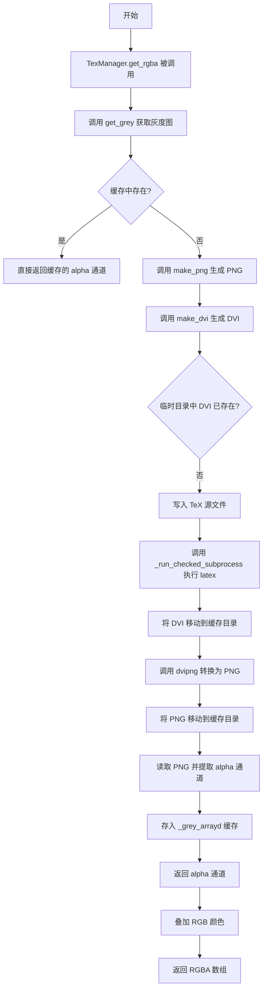

## 类结构

```
TexManager (TeX渲染管理类)
```

## 全局变量及字段


### `_log`
    
Logger instance for logging messages in the tex module

类型：`logging.Logger`
    


### `mpl`
    
The matplotlib library module

类型：`module`
    


### `np`
    
The numpy library module for numerical operations

类型：`module`
    


### `Path`
    
Pathlib class for file path manipulation

类型：`type[pathlib.Path]`
    


### `subprocess`
    
Subprocess module for running external commands

类型：`module`
    


### `TemporaryDirectory`
    
Temporary directory context manager class

类型：`type[tempfile.TemporaryDirectory]`
    


### `hashlib`
    
Hashlib module for cryptographic hashing

类型：`module`
    


### `functools`
    
Functools module for higher-order functions and utilities

类型：`module`
    


### `logging`
    
Logging module for application logging

类型：`module`
    


### `cbook`
    
Matplotlib cbook utility module

类型：`module`
    


### `dviread`
    
Matplotlib dviread module for DVI file processing

类型：`module`
    


### `TexManager._cache_dir`
    
Cache directory path for storing TeX processing results

类型：`Path`
    


### `TexManager._grey_arrayd`
    
Dictionary for caching rendered grey-scale image arrays

类型：`dict`
    


### `TexManager._font_families`
    
Tuple of supported font family names

类型：`tuple`
    


### `TexManager._check_cmsuper_installed`
    
LaTeX code snippet for checking cm-super package installation

类型：`str`
    


### `TexManager._font_preambles`
    
Dictionary mapping font names to LaTeX preamble commands

类型：`dict`
    


### `TexManager._font_types`
    
Dictionary mapping font names to font type categories

类型：`dict`
    
    

## 全局函数及方法


### `_usepackage_if_not_loaded`

该函数是一个全局辅助函数，用于生成 LaTeX 代码，条件性地加载 LaTeX 包。它通过 LaTeX 的 `\@ifpackageloaded` 命令检查指定包是否已加载，若未加载则生成相应的 `\usepackage` 命令，从而防止因用户在自定义前导文中重复加载包而导致的不同选项冲突问题。

参数：

- `package`：`str`，要加载的 LaTeX 包名称（如 "underscore"、"textcomp" 等）
- `option`：`str`，可选关键字参数，要传递给包的选项（如 "strings"）

返回值：`str`，生成的 LaTeX 代码片段，包含条件加载逻辑

#### 流程图

```mermaid
flowchart TD
    A[开始] --> B{option is not None?}
    B -->|Yes| C[option = f'[{option}]']
    B -->|No| D[option = '']
    C --> E[构建 LaTeX 代码模板]
    D --> E
    E --> F["使用 % 格式化<br/>替换 {package} 和 {option}"]
    F --> G[返回完整 LaTeX 代码字符串]
    G --> H[结束]
    
    style A fill:#f9f,color:#000
    style G fill:#9f9,color:#000
    style H fill:#9f9,color:#000
```

#### 带注释源码

```python
def _usepackage_if_not_loaded(package, *, option=None):
    """
    Output LaTeX code that loads a package (possibly with an option) if it
    hasn't been loaded yet.

    LaTeX cannot load twice a package with different options, so this helper
    can be used to protect against users loading arbitrary packages/options in
    their custom preamble.
    
    参数:
        package: str, 要加载的 LaTeX 包名称
        option: str, 可选关键字参数, 要传递给包的选项
    
    返回:
        str: 生成的 LaTeX 条件加载代码
    """
    # 如果提供了 option 参数，则格式化为 [option] 形式；否则为空字符串
    # 例如: option="strings" -> "[strings]", option=None -> ""
    option = f"[{option}]" if option is not None else ""
    
    # 返回 LaTeX 代码，使用 % 格式化字符串进行替换
    # \makeatletter 和 \makeatother 允许在 LaTeX 代码中使用 @ 字符
    # \@ifpackageloaded{package}{true}{false} 检查包是否已加载
    # 如果未加载，则执行 \usepackage[option]{package}
    return (
        r"\makeatletter"
        r"\@ifpackageloaded{%(package)s}{}{\usepackage%(option)s{%(package)s}}"
        r"\makeatother"
    ) % {"package": package, "option": option}
```

#### 生成的 LaTeX 代码示例

当调用 `_usepackage_if_not_loaded("underscore", option="strings")` 时，生成的代码为：

```latex
\makeatletter
\@ifpackageloaded{underscore}{}{\usepackage[strings]{underscore}}
\makeatother
```

当调用 `_usepackage_if_not_loaded("textcomp")` 时，生成的代码为：

```latex
\makeatletter
\@ifpackageloaded{textcomp}{}{\usepackage{textcomp}}
\makeatother
```


### `TexManager.__new__`

该方法是 `TexManager` 类的构造函数，使用 `functools.lru_cache` 装饰器实现单例模式，确保多次实例化时返回同一个对象。同时负责创建缓存目录以存储 TeX 处理结果。

参数：

- `cls`：`class`，调用该方法的类本身（Python `__new__` 方法的第一个隐式参数）

返回值：`TexManager`（或 object 的子类实例），返回 `TexManager` 的单例实例，确保全局唯一性。

#### 流程图


#### 带注释源码

```python
@functools.lru_cache  # 装饰器实现单例缓存，确保返回相同实例
def __new__(cls):
    """
    创建 TexManager 实例并确保单例模式。
    
    由于使用了 @functools.lru_cache 装饰器，
    第一次调用时会创建实例并缓存，后续调用直接返回缓存的实例。
    """
    # 创建缓存目录（如果不存在）
    # parents=True: 创建所有必要的父目录
    # exist_ok=True: 目录已存在时不抛出异常
    cls._cache_dir.mkdir(parents=True, exist_ok=True)
    
    # 调用基类的 __new__ 方法创建实例
    # 这是 Python 对象创建的标准方式
    return object.__new__(cls)
```


### `TexManager._get_font_family_and_reduced`

该方法用于获取当前配置的字体家族名称，并判断该字体是否为“reduced”字体（即需要使用特殊的LaTeX字体包来支持）。方法通过检查`rcParams`中的`font.family`设置，返回对应的字体家族和是否reduced的布尔值。

参数： 无

返回值：`Tuple[str, bool]`，返回元组包含：(1) 字体家族名称（字符串），如'serif'、'sans-serif'等；(2) 是否为reduced字体（布尔值），True表示需要使用特殊字体包，False表示使用标准字体。

#### 流程图

```mermaid
flowchart TD
    A[开始] --> B[获取 mpl.rcParams['font.family']]
    B --> C{len ff == 1?}
    C -->|是| D[ff_val = ff[0].lower]
    C -->|否| E[ff_val = None]
    D --> F{ff_val in _font_families?}
    F -->|是| G[返回 ff_val, False]
    F -->|否| H{ff_val in _font_preambles?}
    H -->|是| I[返回 _font_types[ff_val], True]
    H -->|否| J[记录日志警告]
    J --> K[返回 'serif', False]
    E --> K
    G --> L[结束]
    I --> L
    K --> L
```

#### 带注释源码

```python
@classmethod
def _get_font_family_and_reduced(cls):
    """Return the font family name and whether the font is reduced."""
    # 从matplotlib的配置参数中获取font.family设置
    ff = mpl.rcParams['font.family']
    # 如果只有一个字体设置，转换为小写；否则设为None
    ff_val = ff[0].lower() if len(ff) == 1 else None
    # 情况1：只有一个字体且是标准字体家族之一
    if len(ff) == 1 and ff_val in cls._font_families:
        # 直接返回该字体家族，不需要reduced字体处理
        return ff_val, False
    # 情况2：只有一个字体且在字体前导包中（自定义字体）
    elif len(ff) == 1 and ff_val in cls._font_preambles:
        # 返回字体类型（如serif），并标记为reduced字体
        return cls._font_types[ff_val], True
    # 情况3：不符合上述条件，使用默认serif字体
    else:
        # 记录信息日志，说明font.family必须是有效选项之一
        _log.info('font.family must be one of (%s) when text.usetex is '
                  'True. serif will be used by default.',
                  ', '.join(cls._font_families))
        # 返回默认的serif字体，非reduced
        return 'serif', False
```


### `TexManager._get_font_preamble_and_command`

该方法是一个类方法，用于生成LaTeX文档的字体前导码（preamble）和字体命令。它根据Matplotlib的rcParams配置，确定要使用的字体家族，并生成相应的LaTeX包加载命令和字体切换命令。

参数：此方法无显式参数（使用类方法和全局rcParams配置）

返回值：返回一个元组 `(preamble, fontcmd)`
- `preamble`：字符串，包含所有需要加载的LaTeX包和字体配置命令
- `fontcmd`：字符串，LaTeX字体命令（\sffamily、\ttfamily或\rmfamily）

#### 流程图

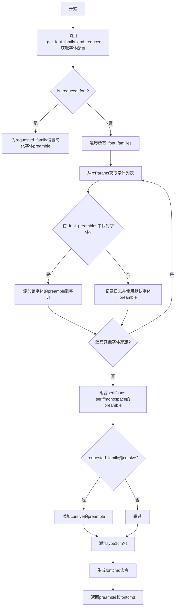

#### 带注释源码

```python
@classmethod
def _get_font_preamble_and_command(cls):
    """
    返回LaTeX字体前导码和字体命令。
    
    该方法根据rcParams中的font.family配置，构建适合LaTeX渲染的字体preamble，
    并确定使用的字体命令（\\sffamily、\\ttfamily或\\rmfamily）。
    """
    # 第一步：获取请求的字体家族和是否使用简化字体
    # _get_font_family_and_reduced方法分析font.family和font.* rcParams
    # 返回(字体家族名称, 是否为简化字体)的元组
    requested_family, is_reduced_font = cls._get_font_family_and_reduced()

    # 第二步：初始化preamble字典，用于存储各字体家族的preamble配置
    preambles = {}
    
    # 遍历所有支持的字体家族：serif, sans-serif, cursive, monospace
    for font_family in cls._font_families:
        # 如果是简化字体模式且当前遍历的字体家族等于请求的字体家族
        if is_reduced_font and font_family == requested_family:
            # 使用rcParams中指定的字体对应的preamble（简化模式）
            preambles[font_family] = cls._font_preambles[
                mpl.rcParams['font.family'][0].lower()]
        else:
            # 非简化模式：从rcParams中获取该字体家族的字体列表
            rcfonts = mpl.rcParams[f"font.{font_family}"]
            
            # 遍历字体列表（转换为小写），查找第一个在_font_preambles中有定义的字体
            for i, font in enumerate(map(str.lower, rcfonts)):
                if font in cls._font_preambles:
                    # 找到匹配的字体，记录其preamble
                    preambles[font_family] = cls._font_preambles[font]
                    _log.debug(
                        'family: %s, package: %s, font: %s, skipped: %s',
                        font_family, cls._font_preambles[font], rcfonts[i],
                        ', '.join(rcfonts[:i]),
                    )
                    break
            else:
                # 遍历完毕未找到匹配字体，使用日志警告并使用默认字体
                _log.info('No LaTeX-compatible font found for the %s font'
                          'family in rcParams. Using default.',
                          font_family)
                preambles[font_family] = cls._font_preambles[font_family]

    # 第三步：构建最终的preamble命令集合
    # 基础包：需要包含serif、sans-serif、monospace字体族的preamble
    cmd = {preambles[family]
           for family in ['serif', 'sans-serif', 'monospace']}
    
    # 如果请求的字体家族是cursive，额外添加cursive的preamble
    if requested_family == 'cursive':
        cmd.add(preambles['cursive'])
    
    # 添加type1cm包（提供任意大小字体的支持）
    cmd.add(r'\usepackage{type1cm}')
    
    # 将所有命令按字母顺序排序并用换行符连接，形成最终的preamble字符串
    preamble = '\n'.join(sorted(cmd))

    # 第四步：根据请求的字体家族确定LaTeX字体命令
    # sans-serif -> \sffamily, monospace -> \ttfamily, 其他 -> \rmfamily
    fontcmd = (r'\sffamily' if requested_family == 'sans-serif' else
               r'\ttfamily' if requested_family == 'monospace' else
               r'\rmfamily')
    
    # 返回preamble字符串和字体命令
    return preamble, fontcmd
```


### `TexManager._get_base_path`

返回基于tex字符串、字体大小和dpi的哈希值计算得到的缓存文件路径，用于存储TeX处理结果。

参数：

- `tex`：`str`，要渲染的LaTeX字符串
- `fontsize`：`float`，字体大小（磅）
- `dpi`：`int` 或 `None`，可选参数，图像分辨率（每英寸点数），默认为None

返回值：`Path`，缓存目录的路径对象，路径基于哈希值创建，包含完整的文件路径

#### 流程图

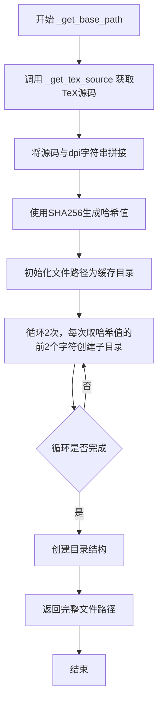

#### 带注释源码

```python
@classmethod
def _get_base_path(cls, tex, fontsize, dpi=None):
    """
    Return a file path based on a hash of the string, fontsize, and dpi.
    """
    # 第一步：获取TeX源码（包含字体 preamble 等）
    src = cls._get_tex_source(tex, fontsize) + str(dpi)
    
    # 第二步：使用SHA256对源码和dpi生成哈希值
    # 用于生成唯一的文件名，确保相同参数的TeX使用相同的缓存
    filehash = hashlib.sha256(
        src.encode('utf-8'),
        usedforsecurity=False
    ).hexdigest()
    
    # 第三步：从缓存根目录开始构建路径
    filepath = cls._cache_dir

    # 第四步：将哈希值分割成多层目录结构
    # num_letters=2 表示每级目录名取2个字符
    # num_levels=2 表示创建2级子目录
    # 例如：哈希值 abcdefgh... -> 缓存路径: .../ab/cd/abcdefgh
    num_letters, num_levels = 2, 2
    for i in range(0, num_letters*num_levels, num_letters):
        filepath = filepath / filehash[i:i+2]

    # 第五步：确保目录存在（parents=True 创建多级目录）
    filepath.mkdir(parents=True, exist_ok=True)
    
    # 第六步：返回完整的文件路径（包含完整哈希值作为文件名）
    return filepath / filehash
```


### `TexManager.get_basefile`

该方法是一个类方法，用于基于TeX字符串、字体大小和DPI生成唯一的缓存文件名。它通过内部方法`_get_base_path`计算哈希值并返回字符串形式的文件路径，主要目的是为TeX渲染结果提供缓存支持。

参数：

- `tex`：`str`，要渲染的LaTeX字符串
- `fontsize`：`int`，字体大小（单位：磅）
- `dpi`：`int | None`，可选参数，输出图像的分辨率（每英寸点数），默认为None

返回值：`str`，返回基于哈希计算的缓存文件路径字符串

#### 流程图

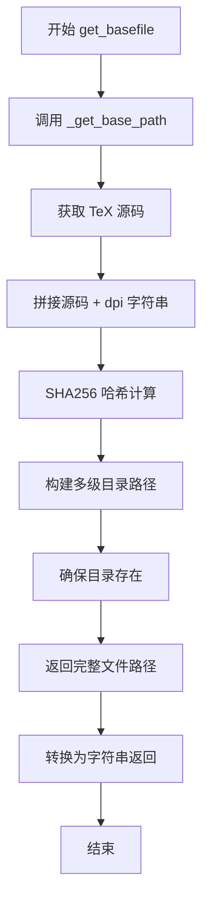

#### 带注释源码

```python
@classmethod
def get_basefile(cls, tex, fontsize, dpi=None):  # Kept for backcompat.
    """
    Return a filename based on a hash of the string, fontsize, and dpi.
    
    此方法为了保持向后兼容性而保留，实际功能委托给 _get_base_path 方法。
    它根据 TeX 字符串、字体大小和 DPI 计算哈希值，生成唯一的缓存文件名。
    
    参数:
        tex: 要渲染的 LaTeX 字符串
        fontsize: 字体大小（磅）
        dpi: 可选的设备分辨率参数，用于生成不同分辨率的输出
    
    返回:
        字符串形式的缓存文件路径
    """
    # 调用内部方法 _get_base_path 获取路径对象，然后转换为字符串返回
    return str(cls._get_base_path(tex, fontsize, dpi))
```


### `TexManager.get_font_preamble`

返回包含 TeX 前言字体配置的字符串。

参数：

- 无（仅使用类属性 `cls`）

返回值：`str`，返回包含字体配置信息的 LaTeX 前言字符串，用于配置文档的字体设置。

#### 流程图

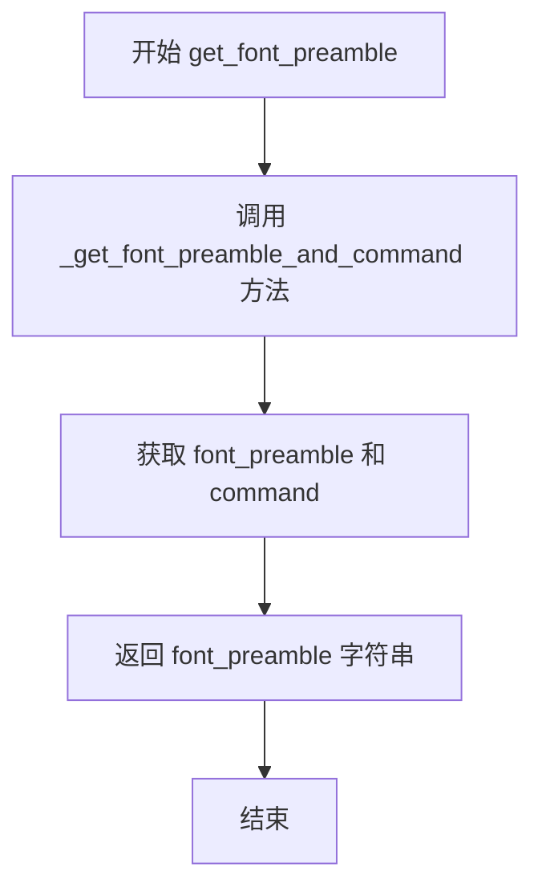

#### 带注释源码

```python
@classmethod
def get_font_preamble(cls):
    """
    Return a string containing font configuration for the tex preamble.
    """
    # 调用类方法 _get_font_preamble_and_command 获取字体前言和命令
    # 该方法会根据 rcParams 中的 font.family 配置生成相应字体宏
    font_preamble, command = cls._get_font_preamble_and_command()
    # 返回生成的前言配置字符串，不返回 command（command 用于实际字体命令）
    return font_preamble
```


### `TexManager.get_custom_preamble`

该方法用于获取用户在 Matplotlib 配置中自定义添加的 LaTeX preamble（导言区）内容，允许用户通过 `text.latex.preamble` rcParams 插入额外的 LaTeX 包或命令。

参数：此方法无显式参数（隐式参数 `cls` 为类本身）

返回值：`str`，返回用户配置的 LaTeX  preamble 字符串，默认值为空字符串或用户在 rcParams 中设置的内容

#### 流程图

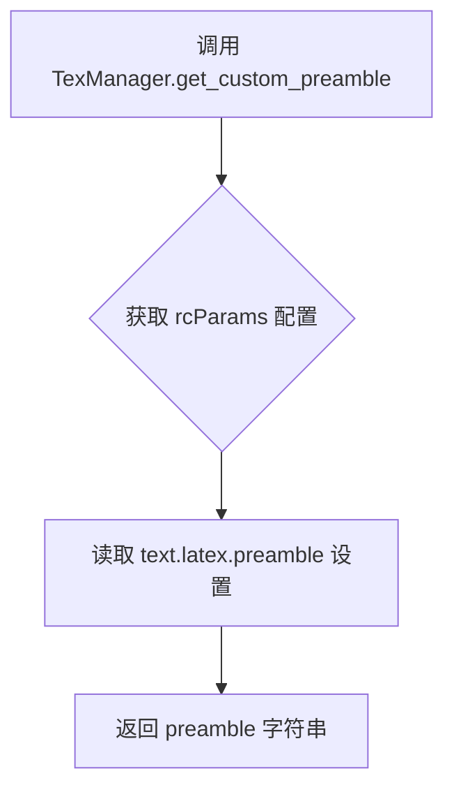

#### 带注释源码

```python
@classmethod
def get_custom_preamble(cls):
    """
    Return a string containing user additions to the tex preamble.
    
    该类方法从 Matplotlib 的 rcParams 配置中读取用户自定义的 LaTeX 导言区内容。
    用户可以通过设置 text.latex.preamble 来添加自定义的 LaTeX 包或命令，这些内容
    会在生成 TeX 文档时被插入到 preamble 部分。
    
    Returns:
        str: 用户配置的 LaTeX preamble 字符串，可能为空字符串或包含多个
             LaTeX 命令/包声明的字符串，如 r'\usepackage{amsmath}'
    
    Example:
        # 在 Matplotlib 配置文件中设置:
        # text.latex.preamble = [r'\usepackage{amsmath}', r'\usepackage{cases}']
        # 然后调用该方法会返回上述字符串
    """
    # 访问 Matplotlib 的全局配置字典，读取 text.latex.preamble 项
    # rcParams 是 Matplotlib 的运行时配置管理器
    return mpl.rcParams['text.latex.preamble']
```


### TexManager._get_tex_source

该方法用于生成完整的LaTeX文档源字符串，包含所有必要的包、字体配置和TeX表达式，以便后续通过LaTeX引擎进行渲染处理。

参数：

- `tex`：`str`，用户输入的需要渲染的TeX字符串
- `fontsize`：`float`，指定渲染的字体大小

返回值：`str`，返回完整的LaTeX文档源代码字符串，可直接用于生成.tex文件

#### 流程图

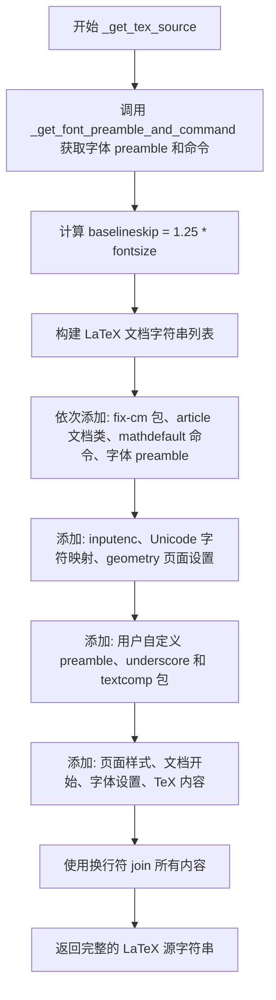

#### 带注释源码

```python
@classmethod
def _get_tex_source(cls, tex, fontsize):
    """
    Return the complete TeX source for processing a TeX string.
    
    该方法生成一个完整的 LaTeX 文档，用于将用户提供的 TeX 字符串
    渲染为可视化输出。文档包含所有必要的包加载和配置。
    
    参数:
        tex: str - 用户输入的 TeX 字符串
        fontsize: float - 字体大小
    
    返回:
        str - 完整的 LaTeX 文档源代码
    """
    # 获取字体 preamble 和字体命令（\sffamily, \ttfamily 或 \rmfamily）
    font_preamble, fontcmd = cls._get_font_preamble_and_command()
    
    # 计算行间距，baselineskip 通常为字体大小的 1.25 倍
    baselineskip = 1.25 * fontsize
    
    # 构建完整的 LaTeX 文档字符串
    return "\n".join([
        # 1. 加载 fix-cm 包以修复 Computer Modern 字体的某些问题
        r"\RequirePackage{fix-cm}",
        
        # 2. 使用 article 文档类（最简化的文档类）
        r"\documentclass{article}",
        
        # 3-5. 定义 \mathdefault 命令，用于在 usetex 模式下保持数学公式兼容性
        r"% Pass-through \mathdefault, which is used in non-usetex mode",
        r"% to use the default text font but was historically suppressed",
        r"% in usetex mode.",
        r"\newcommand{\mathdefault}[1]{#1}",
        
        # 6. 添加字体 preamble（包含所需字体的包和配置）
        font_preamble,
        
        # 7. 使用 UTF-8 编码
        r"\usepackage[utf8]{inputenc}",
        
        # 8. 定义 Unicode 字符 U+2212（负号）映射为 LaTeX 负号
        r"\DeclareUnicodeCharacter{2212}{\ensuremath{-}}",
        
        # 9-11. geometry 包设置页面大小（72in x 72in）和边距（1in）
        r"% geometry is loaded before the custom preamble as ",
        r"% convert_psfrags relies on a custom preamble to change the ",
        r"% geometry.",
        r"\usepackage[papersize=72in, margin=1in]{geometry}",
        
        # 12. 添加用户自定义的 preamble（从 rcParams 读取）
        cls.get_custom_preamble(),
        
        # 13-15. 加载 underscore 包处理文本中的下划线
        r"% Use `underscore` package to take care of underscores in text.",
        r"% The [strings] option allows to use underscores in file names.",
        _usepackage_if_not_loaded("underscore", option="strings"),
        
        # 16-18. 加载 textcomp 包（可能与用户自定义包冲突，使用条件加载）
        r"% Custom packages (e.g. newtxtext) may already have loaded ",
        r"% textcomp with different options.",
        _usepackage_if_not_loaded("textcomp"),
        
        # 19. 设置页面样式为空（不显示页眉页脚）
        r"\pagestyle{empty}",
        
        # 20. 开始文档环境
        r"\begin{document}",
        
        # 21-22. 空 hbox 确保即使空输入也能打印一页（psfrag 除外）
        r"% The empty hbox ensures that a page is printed even for empty",
        r"% inputs, except when using psfrag which gets confused by it.",
        
        # 23. 设置字体大小和行间距
        rf"\fontsize{{{fontsize}}}{{{baselineskip}}}%",
        
        # 24. 如果未定义 psfrag，则添加空盒子
        r"\ifdefined\psfrag\else\hbox{}\fi%",
        
        # 25. 使用指定的字体命令包装用户的 TeX 内容
        rf"{{{fontcmd} {tex}}}%",
        
        # 26. 结束文档环境
        r"\end{document}",
    ])
```


### `TexManager.make_tex`

生成一个 TeX 文件，用于将指定的 TeX 字符串渲染为特定字体大小的文档，并返回生成的 TeX 文件路径。

参数：

- `tex`：`str`，要渲染的 TeX 字符串
- `fontsize`：`float`，字体大小（磅）

返回值：`str`，生成的 TeX 文件的绝对路径字符串

#### 流程图

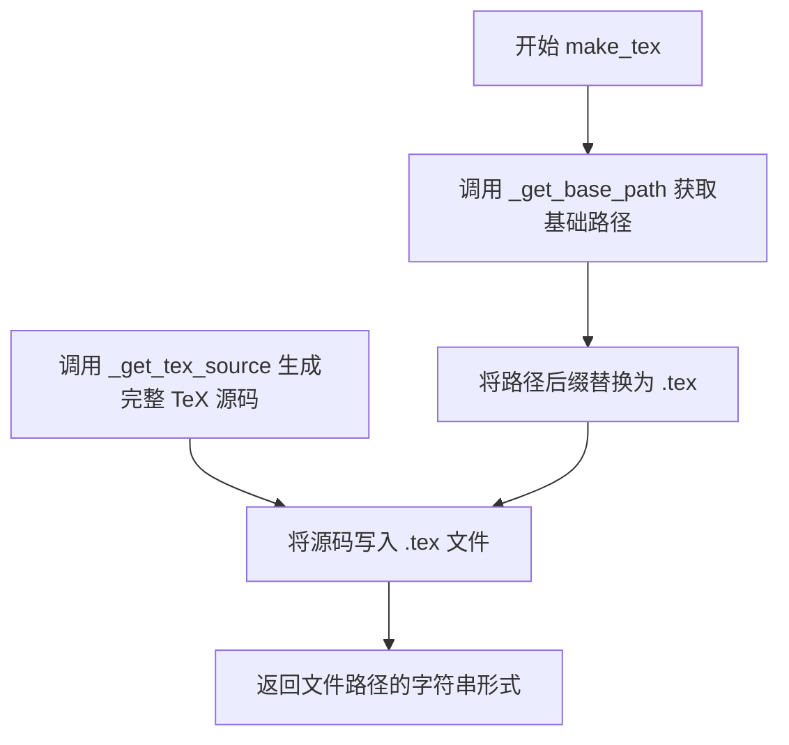

#### 带注释源码

```python
@classmethod
def make_tex(cls, tex, fontsize):
    """
    Generate a tex file to render the tex string at a specific font size.

    Return the file name.
    """
    # 基于 tex 字符串和 fontsize 计算缓存路径，并将后缀设为 .tex
    texpath = cls._get_base_path(tex, fontsize).with_suffix(".tex")
    
    # 调用 _get_tex_source 生成完整的 LaTeX 文档源码
    # 包含字体配置、页面设置、自定义 preamble 等内容
    # 然后将源码写入到指定的 .tex 文件中，使用 UTF-8 编码
    texpath.write_text(cls._get_tex_source(tex, fontsize), encoding='utf-8')
    
    # 返回生成的 TeX 文件的绝对路径字符串
    return str(texpath)
```


### `TexManager._run_checked_subprocess`

该方法是一个类方法，用于执行外部子进程（TeX/LaTeX相关命令），捕获其输出并在命令执行失败时提供详细的错误信息。

参数：

- `command`：`list[str]`，要执行的命令列表（如 `["latex", "-interaction=nonstopmode", "file.tex"]`）
- `tex`：`str`，被处理的TeX字符串，用于在错误信息中显示原始输入
- `cwd`：`Optional[str]`（关键字参数），执行命令时的工作目录，默认为缓存目录

返回值：`bytes`，子进程的标准输出内容

#### 流程图

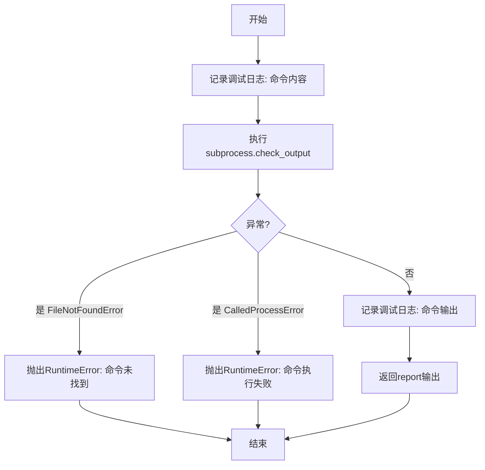

#### 带注释源码

```python
@classmethod
def _run_checked_subprocess(cls, command, tex, *, cwd=None):
    """
    执行外部命令并返回其输出，失败时抛出详细错误信息。
    
    参数:
        command: 命令列表, 如 ["latex", "-interaction=nonstopmode", "file.tex"]
        tex: 处理的TeX字符串, 用于错误信息
        cwd: 工作目录, 默认为缓存目录
    
    返回:
        命令的输出(字节串)
    
    异常:
        RuntimeError: 命令未找到或执行失败时抛出
    """
    # 记录debug日志, 显示完整的命令调用信息
    _log.debug(cbook._pformat_subprocess(command))
    
    try:
        # 执行子进程, 捕获stdout和stderr
        # cwd: 指定工作目录, 未指定时使用缓存目录
        # stderr合并到stdout以便统一捕获错误信息
        report = subprocess.check_output(
            command, 
            cwd=cwd if cwd is not None else cls._cache_dir,
            stderr=subprocess.STDOUT)
    except FileNotFoundError as exc:
        # 命令不存在(如latex/dvipng未安装)
        raise RuntimeError(
            f'Failed to process string with tex because {command[0]} '
            'could not be found') from exc
    except subprocess.CalledProcessError as exc:
        # TeX/LaTeX处理失败(如语法错误)
        raise RuntimeError(
            '{prog} was not able to process the following string:\n'
            '{tex!r}\n\n'
            'Here is the full command invocation and its output:\n\n'
            '{format_command}\n\n'
            '{exc}\n\n'.format(
                prog=command[0],  # 程序名
                format_command=cbook._pformat_subprocess(command),  # 格式化命令
                tex=tex.encode('unicode_escape'),  # TeX字符串(unicode转义)
                exc=exc.output.decode('utf-8', 'backslashreplace'))  # 错误输出
            ) from None
    
    # 记录成功执行的输出
    _log.debug(report)
    return report
```


### `TexManager.make_dvi`

生成一个包含 LaTeX 布局的 DVI 文件，用于渲染给定的 TeX 字符串，并返回 DVI 文件的路径。该方法会检查缓存目录，如果 DVI 文件已存在则直接返回，否则执行完整的 TeX 编译流程。

参数：
- `tex`：`str`，要渲染的 TeX 字符串
- `fontsize`：`int`，字体大小（磅）

返回值：`str`，生成的 DVI 文件的绝对路径字符串

#### 流程图

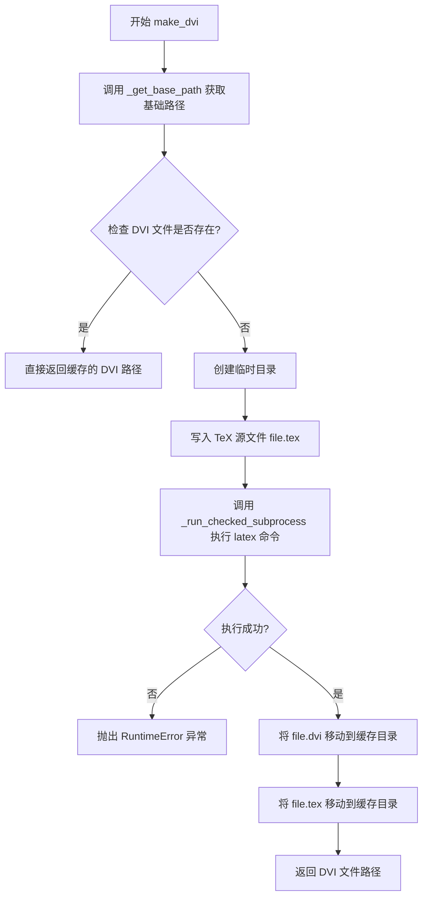

#### 带注释源码

```python
@classmethod
def make_dvi(cls, tex, fontsize):
    """
    Generate a dvi file containing latex's layout of tex string.

    Return the file name.
    """
    # 根据 tex 字符串和字体大小生成唯一的缓存路径
    dvipath = cls._get_base_path(tex, fontsize).with_suffix(".dvi")
    
    # 检查缓存：如果 DVI 文件已存在，直接返回路径，避免重复编译
    if not dvipath.exists():
        # 使用临时目录避免并发竞争条件
        # tmpdir 是最终输出目录的子目录，确保同一文件系统
        # 这样可以使用相对路径，避免 MPLCONFIGDIR 包含 ~ 等 TeX 不支持的字符
        with TemporaryDirectory(dir=dvipath.parent) as tmpdir:
            # 写入 TeX 源文件到临时目录
            Path(tmpdir, "file.tex").write_text(
                cls._get_tex_source(tex, fontsize), encoding='utf-8')
            
            # 执行 latex 编译命令，生成 DVI 文件
            cls._run_checked_subprocess(
                ["latex", "-interaction=nonstopmode", "--halt-on-error",
                 "file.tex"], tex, cwd=tmpdir)
            
            # 将生成的 DVI 文件原子性地移动到缓存目录
            Path(tmpdir, "file.dvi").replace(dvipath)
            
            # 同时移动 TeX 源文件到缓存目录，仅用于向后兼容性
            Path(tmpdir, "file.tex").replace(dvipath.with_suffix(".tex"))
    
    # 返回 DVI 文件的字符串路径
    return str(dvipath)
```

### 关键组件信息

| 组件名称 | 一句话描述 |
|---------|-----------|
| `_get_base_path` | 基于 TeX 字符串、字体大小和 DPI 生成唯一的缓存文件路径 |
| `_get_tex_source` | 生成完整的 LaTeX 文档源码，包含字体配置和必要的包 |
| `_run_checked_subprocess` | 执行外部命令（latex/dvipng），处理错误并记录日志 |
| `TemporaryDirectory` | 创建临时目录用于原子性文件操作，避免并发冲突 |

### 潜在的技术债务或优化空间

1. **并发竞争条件处理不完善**：虽然使用了临时目录，但在多进程同时处理相同 TeX 字符串时仍可能触发多次编译，建议使用文件锁机制
2. **错误恢复能力**：临时目录创建失败或磁盘空间不足时缺乏明确的错误提示
3. **缓存失效机制**：当 LaTeX 版本更新或系统字体变化时，缓存可能过期但不会被自动清除
4. **临时文件清理**：临时目录在 `with` 块结束后会被自动删除，但编译过程中产生的辅助文件（如 .aux, .log）未被清理

### 其它项目

#### 设计目标与约束

- **设计目标**：将 TeX 字符串转换为 DVI 格式的位图，通过缓存机制提高重复渲染性能
- **约束**：依赖系统安装的 LaTeX 工具链，需要对 `tex.cache` 目录有写权限

#### 错误处理与异常设计

- 捕获 `FileNotFoundError` 当 latex 命令不存在时，抛出 RuntimeError 并提示安装 LaTeX
- 捕获 `CalledProcessError` 当 LaTeX 编译失败时，抛出 RuntimeError 并附带完整的错误输出供调试

#### 数据流与状态机

```
输入 (tex, fontsize) 
    → 计算缓存路径 
    → 检查缓存存在? 
        → 是: 返回缓存路径
        → 否: 创建临时目录 
            → 写入 TeX 源 
            → 执行 latex 编译 
            → 移动 DVI 到缓存 
            → 返回路径
```

#### 外部依赖与接口契约

- **外部依赖**：系统必须安装 LaTeX (pdflatex/latex)
- **接口契约**：输入有效的 TeX 字符串和正整数字体大小，返回有效的 DVI 文件路径字符串
- **缓存位置**：默认 `~/.matplotlib/tex.cache`，可通过环境变量 `MPLCONFIGDIR` 自定义


### `TexManager.make_png`

该方法用于生成包含 LaTeX 渲染结果的 PNG 图像文件。它首先检查缓存中是否已存在对应的 PNG 文件，若不存在则调用 `make_dvi` 生成 DVI 文件，然后使用 `dvipng` 工具将 DVI 文件转换为 PNG 格式。

参数：

- `tex`：`str`，要渲染的 LaTeX 字符串
- `fontsize`：`float`，字体大小（单位：磅）
- `dpi`：`int`，图像的分辨率（每英寸点数）

返回值：`str`，生成的 PNG 文件的完整路径字符串

#### 流程图

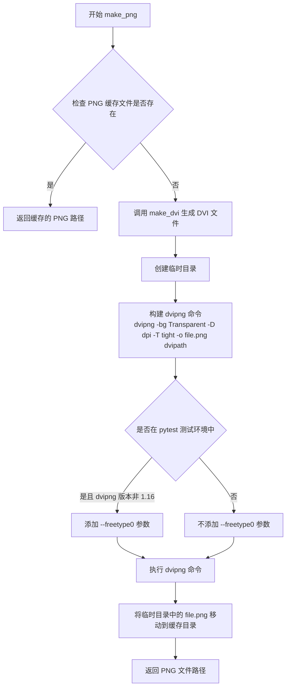

#### 带注释源码

```python
@classmethod
def make_png(cls, tex, fontsize, dpi):
    """
    Generate a png file containing latex's rendering of tex string.

    Return the file name.
    """
    # 根据 tex 字符串、字体大小和 dpi 计算缓存文件路径
    pngpath = cls._get_base_path(tex, fontsize, dpi).with_suffix(".png")
    
    # 检查缓存中是否已存在该 PNG 文件
    if not pngpath.exists():
        # 缓存未命中，调用 make_dvi 生成 DVI 文件
        dvipath = cls.make_dvi(tex, fontsize)
        
        # 在 PNG 文件所在目录创建临时目录（确保原子性替换）
        with TemporaryDirectory(dir=pngpath.parent) as tmpdir:
            # 构建 dvipng 命令行参数
            # -bg Transparent: 设置背景为透明
            # -D dpi: 设置输出分辨率
            # -T tight: 裁剪到内容边界
            # -o file.png: 输出文件名
            cmd = ["dvipng", "-bg", "Transparent", "-D", str(dpi),
                   "-T", "tight", "-o", "file.png", dvipath]
            
            # 当在 pytest 测试环境中时，禁用 FreeType 渲染以保证可重复性
            # 但 dvipng 1.16 版本有 bug（已在 f3ff241 中修复）会导致 --freetype0 模式失败
            # 因此对于 1.16 版本保留 FreeType 启用状态（图像会稍有偏差）
            if (getattr(mpl, "_called_from_pytest", False) and
                    mpl._get_executable_info("dvipng").raw_version != "1.16"):
                cmd.insert(1, "--freetype0")
            
            # 执行 dvipng 命令进行 DVI 到 PNG 的转换
            cls._run_checked_subprocess(cmd, tex, cwd=tmpdir)
            
            # 将生成的 PNG 文件从临时目录移动到缓存目录（原子操作）
            Path(tmpdir, "file.png").replace(pngpath)
    
    # 返回生成的 PNG 文件路径字符串
    return str(pngpath)
```


### `TexManager.get_grey`

该方法用于获取 LaTeX 渲染后的灰度（Alpha 通道）数据。它首先从缓存中查找是否已有对应的灰度数据，如果有则直接返回；否则调用 `make_png` 生成 PNG 图像，读取其 RGBA 数据并提取 Alpha 通道存入缓存后返回。

参数：

- `tex`：`str`，要渲染的 LaTeX 字符串
- `fontsize`：`int` 或 `None`，字体大小，默认为 None（从 rcParams['font.size'] 获取）
- `dpi`：`int` 或 `None`，图像分辨率，默认为 None（从 rcParams['savefig.dpi'] 获取）

返回值：`numpy.ndarray`，渲染结果的灰度/Alpha 通道数据

#### 流程图

```mermaid
flowchart TD
    A[开始 get_grey] --> B{获取 fontsize 和 dpi}
    B --> C[使用 mpl._val_or_rc 获取默认值]
    C --> D[构造缓存 key: (_get_tex_source, dpi)]
    E{检查缓存 _grey_arrayd} --> D
    D --> F{key 是否在缓存中?}
    F -->|是| G[从缓存获取 alpha]
    F -->|否| H[调用 make_png 生成 PNG 文件]
    H --> I[使用 mpl.image.imread 读取 PNG]
    I --> J[提取 RGBA 的最后一个通道作为 alpha]
    J --> K[将 alpha 存入缓存 _grey_arrayd]
    K --> L[返回 alpha]
    G --> L
```

#### 带注释源码

```python
@classmethod
def get_grey(cls, tex, fontsize=None, dpi=None):
    """
    Return the alpha channel.
    
    该方法获取 LaTeX 渲染后的灰度（Alpha 通道）数据。
    使用缓存机制避免重复渲染相同的 TeX 字符串。
    
    参数:
        tex: str, 要渲染的 LaTeX 字符串
        fontsize: int 或 None, 字体大小，默认从 rcParams['font.size'] 获取
        dpi: int 或 None, 图像 DPI，默认从 rcParams['savefig.dpi'] 获取
    
    返回:
        numpy.ndarray: 渲染结果的灰度/Alpha 通道数据
    """
    # 使用 mpl._val_or_rc 获取 fontsize，如果为 None 则从 rcParams['font.size'] 获取
    fontsize = mpl._val_or_rc(fontsize, 'font.size')
    # 使用 mpl._val_or_rc 获取 dpi，如果为 None 则从 rcParams['savefig.dpi'] 获取
    dpi = mpl._val_or_rc(dpi, 'savefig.dpi')
    
    # 构造缓存键：结合 TeX 源和 dpi
    # _get_tex_source 生成完整的 TeX 源文件内容
    key = cls._get_tex_source(tex, fontsize), dpi
    
    # 从缓存字典 _grey_arrayd 中尝试获取已缓存的 alpha 数据
    alpha = cls._grey_arrayd.get(key)
    
    # 如果缓存中没有该键对应的数据
    if alpha is None:
        # 调用 make_png 生成 PNG 文件
        pngfile = cls.make_png(tex, fontsize, dpi)
        
        # 使用 matplotlib 的 image 模块读取 PNG 文件为 RGBA 数组
        rgba = mpl.image.imread(pngfile)
        
        # 提取 RGBA 数组的最后一个通道（即 Alpha 通道）
        # RGBA 格式中，[:, :, -1] 正好是 alpha 通道
        cls._grey_arrayd[key] = alpha = rgba[:, :, -1]
    
    # 返回灰度/Alpha 通道数据
    return alpha
```


### `TexManager.get_rgba`

该方法将LaTeX/TeX字符串渲染为RGBA格式的NumPy数组，通过调用`get_grey`获取Alpha通道，并结合指定的RGB颜色值合成最终的rgba图像数据。

参数：

- `tex`：`str`，要渲染的LaTeX/TeX字符串
- `fontsize`：`int | None`，字体大小，默认为`None`（会从rcParams中获取）
- `dpi`：`int | None`，图像分辨率，默认为`None`（会从rcParams中获取）
- `rgb`：`tuple`，RGB颜色值元组，默认为`(0, 0, 0)`（黑色）

返回值：`numpy.ndarray`，返回形状为`(height, width, 4)`的RGBA图像数组， dtype通常为float64

#### 流程图

```mermaid
flowchart TD
    A[开始 get_rgba] --> B{调用 cls.get_grey 获取alpha通道}
    B --> C[创建空rgba数组: np.empty<br/>shape = alpha.shape + (4,)]
    C --> D[将rgb颜色转换为标准RGB格式并填充rgba[..., :3]]
    D --> E[将alpha通道复制到rgba[..., -1] 即透明度通道]
    E --> F[返回完整的RGBA数组]
    
    G[get_grey方法流程]
    G --> G1{检查缓存key是否存在}
    G1 -->|是| G2[直接从缓存返回alpha]
    G1 -->|否| G3[调用make_png生成PNG文件]
    G3 --> G4[读取PNG为RGBA图像]
    G4 --> G5[提取alpha通道并缓存]
    G5 --> G6[返回alpha]
```

#### 带注释源码

```python
@classmethod
def get_rgba(cls, tex, fontsize=None, dpi=None, rgb=(0, 0, 0)):
    r"""
    Return latex's rendering of the tex string as an RGBA array.

    Examples
    --------
    >>> texmanager = TexManager()
    >>> s = r"\TeX\ is $\displaystyle\sum_n\frac{-e^{i\pi}}{2^n}$!"
    >>> Z = texmanager.get_rgba(s, fontsize=12, dpi=80, rgb=(1, 0, 0))
    """
    # 第一步：获取灰度图像（Alpha通道）
    # 调用get_grey方法，该方法会：
    # 1. 检查缓存中是否有对应参数的渲染结果
    # 2. 如无缓存，调用make_png生成PNG文件
    # 3. 读取PNG并提取Alpha通道返回
    alpha = cls.get_grey(tex, fontsize, dpi)
    
    # 第二步：创建RGBA数组
    # 使用alpha的形状，在最后添加一个维度(4)用于RGBA四个通道
    rgba = np.empty((*alpha.shape, 4))
    
    # 第三步：填充RGB颜色
    # 将用户指定的rgb颜色元组(如(0,0,0)黑色)转换为标准RGB格式(0-1范围)
    # 并填充到rgba数组的前三个通道(R、G、B)
    rgba[..., :3] = mpl.colors.to_rgb(rgb)
    
    # 第四步：填充Alpha通道
    # 将之前获取的灰度图像作为透明度通道赋值给最后一个通道
    rgba[..., -1] = alpha
    
    # 第五步：返回完整的RGBA数组
    return rgba
```


### `TexManager.get_text_width_height_descent`

该方法用于计算给定 TeX 字符串的文本宽度、高度和下降量（descent）。它通过生成 DVI 文件并使用 dviread 读取页面尺寸来实现。

参数：

- `tex`：`str`，要渲染的 TeX 字符串
- `fontsize`：`float`，字体大小（以点为单位）
- `renderer`：`object`，可选，渲染器对象，用于计算 DPI 转换因子

返回值：`tuple[float, float, float]`，返回 (width, height, descent) 元组，其中 height 包含 descent

#### 流程图

```mermaid
flowchart TD
    A[开始] --> B{tex.strip() == ''?}
    B -->|是| C[返回 (0, 0, 0)]
    B -->|否| D[dvipath = cls.make_dvi(tex, fontsize)]
    D --> E{renderer 是否存在?}
    E -->|是| F[dpi_fraction = renderer.points_to_pixels(1.0)]
    E -->|否| G[dpi_fraction = 1]
    F --> H[使用 dviread.Dvi 打开 DVI 文件]
    G --> H
    H --> I[读取第一页]
    I --> J[计算 height + descent]
    J --> K[返回 (page.width, page.height + page.descent, page.descent)]
```

#### 带注释源码

```python
@classmethod
def get_text_width_height_descent(cls, tex, fontsize, renderer=None):
    """Return width, height and descent of the text."""
    # 如果 TeX 字符串为空，直接返回零值
    if tex.strip() == '':
        return 0, 0, 0
    
    # 生成 DVI 文件（包含 LaTeX 排版结果）
    dvipath = cls.make_dvi(tex, fontsize)
    
    # 计算 DPI 转换因子
    # 如果提供了渲染器，使用其 points_to_pixels 方法进行转换
    # 否则使用默认的 1:1 转换
    dpi_fraction = renderer.points_to_pixels(1.) if renderer else 1
    
    # 使用 dviread 打开生成的 DVI 文件
    # 72 * dpi_fraction 表示目标 DPI（如 72 表示 72 dpi）
    with dviread.Dvi(dvipath, 72 * dpi_fraction) as dvi:
        # DVI 文件可能包含多页，这里假设只处理第一页
        page, = dvi
    
    # 返回宽度、总体高度（包括 descent）和 descent
    # 注意：height 本身不包含 descent，需要相加才是完整的视觉高度
    return page.width, page.height + page.descent, page.descent
```

## 关键组件


### TexManager

核心类，负责将TeX字符串转换为DVI文件、PNG图像和RGBA数组，支持缓存机制以提高性能。

### _cache_dir

缓存目录，用于存储TeX处理结果（.dvi、.tex文件），位于~/.matplotlib/tex.cache。

### _grey_arrayd

用于缓存灰度（alpha通道）图像的字典，实现惰性加载，避免重复渲染相同的TeX字符串。

### _font_families

字体家族元组，包含('serif', 'sans-serif', 'cursive', 'monospace')，定义支持的字体类型。

### _font_preambles

字典，存储各类字体的LaTeX导言区配置，用于在生成TeX源文件时加载相应的字体包。

### _font_types

字典，映射字体名称到字体家族类型，用于解析rcParams中的字体配置。

### _get_tex_source

生成完整的TeX源文档，包含LaTeX包加载、字体配置、文档模板等，是TeX处理的核心。

### make_tex

生成.tex文件并返回文件路径，调用_get_tex_source生成LaTeX源码。

### make_dvi

生成DVI文件的核心方法，使用LaTeX编译TeX源码，包含临时目录和原子性文件替换以避免竞态条件。

### make_png

生成PNG图像的方法，先调用make_dvi生成DVI，再使用dvipng转换为PNG，支持透明背景和DPI配置。

### get_grey

返回TeX渲染结果的alpha通道（灰度），实现惰性加载和缓存机制，是RGBA渲染的基础。

### get_rgba

返回完整的RGBA NumPy数组，将灰度图与指定RGB颜色组合，用于Matplotlib的文本渲染。

### get_text_width_height_descent

计算TeX文本的宽度、高度和下降值，使用dviread解析DVI文件获取排版信息。

### _run_checked_subprocess

执行外部命令（latex、dvipng）的封装方法，提供错误处理和日志记录，支持调试输出。

### _get_font_preamble_and_command

解析字体配置，返回LaTeX导言区内容和字体命令（\sffamily、\ttfamily、\rmfamily）。

### _get_base_path

基于TeX字符串、字体大小和DPI生成缓存路径，使用SHA256哈希和分层目录结构优化文件查找。


## 问题及建议


### 已知问题

- **非线程安全的缓存**：`TexManager._grey_arrayd` 是类变量，在多线程环境下并发访问可能导致数据竞争和状态不一致
- **无限增长的内存缓存**：`_grey_arrayd` 字典没有大小限制或LRU淘汰机制，长时间运行会导致内存持续增长
- **缺乏缓存清理机制**：tex.cache 目录和内存缓存都没有过期策略或手动清理接口
- **文件覆盖的原子性问题**：`TemporaryDirectory` 使用 `dir=parent` 参数时，虽然注释说明是为了原子性替换，但在极端情况下（如进程崩溃）可能留下不完整的临时文件
- **异常处理不完整**：`get_text_width_height_descent` 方法假设 `dvi` 文件至少包含一页，如果为空会抛出 `ValueError`，调用方没有准备
- **硬编码的配置值**：字体包检查、路径哈希参数（num_letters=2, num_levels=2）等以魔法数字形式硬编码，缺乏灵活性
- **潜在的版本兼容性问题**：dvipng 版本检测逻辑复杂，且依赖于 `mpl._called_from_pytest` 内部属性判断测试环境

### 优化建议

- 将 `_grey_arrayd` 改为线程安全的数据结构（如使用 `threading.Lock` 或 `functools.lru_cache`），或迁移到基于文件的缓存
- 为内存缓存实现 LRU 策略，限制最大条目数，并提供显式的缓存清理方法
- 考虑添加缓存生命周期管理，如基于时间的过期策略或手动触发清理的公开API
- 在文件操作前增加磁盘空间检查，并在 `get_text_width_height_descent` 中添加对空 dvi 文件的处理
- 将魔法数字提取为类常量或配置选项，提高代码可维护性
- 重构版本检测逻辑，避免依赖内部私有属性，考虑使用标准的环境检测方式
- 为关键文件操作增加更详细的错误日志和重试机制，提高可靠性

## 其它


### 设计目标与约束

本模块的设计目标是为Matplotlib提供完整的TeX渲染支持，使得用户能够在图表中嵌入高质量的TeX排版的数学表达式和文本。核心约束包括：1) 必须安装LaTeX及相关工具（dvipng、dvips、Ghostscript等）；2) 渲染结果必须缓存以提高性能；3) 支持多种字体配置和自定义前导码；4) 必须处理不同后端（Agg、PS、PDF、SVG）的特定需求。

### 错误处理与异常设计

模块采用分层异常处理策略。在子进程执行层面，`_run_checked_subprocess`方法捕获`FileNotFoundError`（工具不存在）和`CalledProcessError`（执行失败），并生成包含完整命令和输出的详细错误信息。在文件操作层面，使用`try-except`捕获路径创建和文件写入错误。缓存相关的错误（如缓存目录不可写）会在初始化时检测并抛出`RuntimeError`。所有异常都包含上下文信息，便于用户定位问题。

### 数据流与状态机

数据流遵循以下路径：用户输入的TeX字符串 → 生成完整TeX源文件（包含字体配置、前导包、文档结构）→ 调用LaTeX处理生成DVI → 调用dvipng转换为PNG → 读取图像数据转换为RGBA/灰度数组。状态转换包括：待处理 → 缓存命中（直接返回）或缓存未命中（执行完整处理流程）→ 处理完成 → 缓存结果。缓存键由TeX源、字体大小和DPI的哈希值构成。

### 外部依赖与接口契约

外部依赖包括：1) LaTeX发行版（pdflatex/xelatex）；2) dvipng（用于PNG生成）；3) dvips和Ghostscript（PS后端）；4) 可选的LuaTeX（PDF/SVG后端加速）；5) Python标准库模块（subprocess、tempfile、hashlib等）；6) Matplotlib内部模块（mpl、cbook、dviread、image、colors）。接口契约方面，`get_rgba`和`get_grey`方法是主要入口，返回NumPy数组；`get_text_width_height_descent`返回文本度量信息；所有路径处理方法返回字符串文件名。

### 并发与线程安全性

模块在多进程并发调用方面有特殊设计。`make_dvi`和`make_png`方法使用临时目录（作为目标目录的子目录）来避免竞争条件，确保原子性文件替换。使用`TemporaryDirectory(dir=dvipath.parent)`确保临时文件与最终目标在同一文件系统上，使`replace()`操作原子化。类级别的`_grey_arrayd`缓存和`_cache_dir`目录操作需要考虑线程安全，但当前实现假设单进程多线程或通过文件系统锁实现进程间协调。

### 缓存机制与存储管理

缓存系统基于SHA256哈希的嵌套目录结构，使用两级目录（每级2个字符）组织缓存文件。缓存位置为`~/.matplotlib/tex.cache`。缓存键包含TeX源、字体大小和DPI的组合。灰度图缓存`_grey_arrayd`是内存级缓存，存储在类变量中。缓存一致性通过文件存在性检查维护，但未实现显式的缓存失效机制（如基于文件时间的过期策略）。

### 字体配置与LaTeX包管理

字体系统支持五种字体家族（serif、sans-serif、cursive、monospace、charter），通过`_font_preambles`和`_font_types`映射表管理。`_usepackage_if_not_loaded`辅助函数用于安全地加载LaTeX包，避免重复加载和选项冲突。`fix-cm`包用于修复Computer Modern字体的缩放问题，`type1cm`包提供Type 1字体支持，`geometry`包控制页面尺寸和边距，`underscore`包处理下划线，`textcomp`包提供文本符号支持。

### 性能优化考虑

性能优化策略包括：1) 使用`functools.lru_cache`实现单例模式，避免重复初始化；2) 内存缓存`_grey_arrayd`存储已转换的alpha通道；3) 文件系统缓存避免重复LaTeX编译；4) 临时目录使用目标目录的子目录，避免跨文件系统移动；5) dvipng在测试模式下可禁用FreeType以提高可复现性。潜在优化点：可考虑添加缓存大小限制和LRU淘汰机制，支持并行TeX处理以提高批量渲染性能。

### 潜在的技术债务与优化空间

1. **缓存管理不完善**：没有缓存大小限制和过期机制，长期使用可能导致缓存目录膨胀；2. **错误处理不够细粒度**：对LaTeX编译错误的解析不够精确，难以向用户展示具体的语法错误位置；3. **字体检测机制粗糙**：`_check_cmsuper_installed`使用编译时检查而非运行时精确检测；4. **缺少异步处理**：所有操作都是同步阻塞的，大批量渲染时会阻塞主线程；5. **测试依赖问题**：通过`mpl._called_from_pytest`和版本比较进行特殊处理增加了代码复杂度；6. **API兼容性负担**：`get_basefile`方法保留为向后兼容但实际未被使用。

### 配置与定制化能力

模块支持丰富的配置选项，通过Matplotlib的rcParams系统集成。`text.usetex`全局开关控制是否启用TeX渲染；`font.family`指定默认字体家族；`font.serif`、`font.sans-serif`等配置具体字体；`text.latex.preamble`允许用户添加自定义LaTeX前导码。`get_custom_preamble`方法合并用户自定义包，支持在LaTeX源中插入任意包和命令，提供了极大的灵活性但也带来了潜在的兼容性问题。

### 后端兼容性处理

模块针对不同Matplotlib后端有差异化处理：1) Agg后端依赖dvipng>=1.6生成PNG；2) PS后端需要PSfrag、dvips和Ghostscript>=9.0；3) PDF和SVG后端优先使用LuaTeX加速（但不用于解析TeX源）；4) psfrag特殊处理在空盒子（\hbox{}）条件判断中体现。`get_text_width_height_descent`方法使用`dviread.Dvi`直接读取DVI文件获取精确度量，支持各种渲染后端的尺寸需求。

### 安全考量

模块存在以下安全风险：1) 通过`text.latex.preamble`执行任意LaTeX代码，理论上可执行系统命令（尽管在TeX的沙箱限制内）；2) 缓存目录默认位于用户主目录，符号链接攻击风险较低但仍需注意；3) 子进程调用未设置超时，可能因恶意或错误的TeX代码导致永久阻塞；4) 文件名来自哈希值，相对安全但仍需验证路径遍历可能性。建议添加超时参数和更严格的路径验证。

### 平台特定行为

模块的行为因操作系统和安装的工具而异：1) Windows平台路径处理使用反斜杠，但TeX通常接受正斜杠；2) macOS和Linux的字体路径和可用包可能不同；3) 不同LaTeX发行版（TeX Live、MiKTeX）的包管理器行为不同；4) Ghostscript版本差异影响PS后端行为。代码中通过`mpl._get_executable_info("dvipng")`检测版本以处理已知bug（1.16版本的--freetype0问题）。

### 版本兼容性记录

当前实现保持与Matplotlib现有API的向后兼容：`get_basefile`标记为"Kept for backcompat"；单例模式通过`__new__`和`lru_cache`实现确保实例一致性；缓存文件格式保持稳定。模块需要LaTeX、dvipng、dvips、Ghostscript等外部工具，但未在代码中明确声明最低版本要求（除dvipng 1.16的已知问题外）。


    