# `matplotlib\lib\matplotlib\text.py` 详细设计文档

该文件实现了Matplotlib中用于处理图形文本和注解的核心类，包括Text类（负责文本的存储、布局计算和绘制）以及Annotation类（支持带箭头指向的注解功能），提供了完整的字体管理、文本换行、多行对齐、坐标系统转换等能力。

## 整体流程

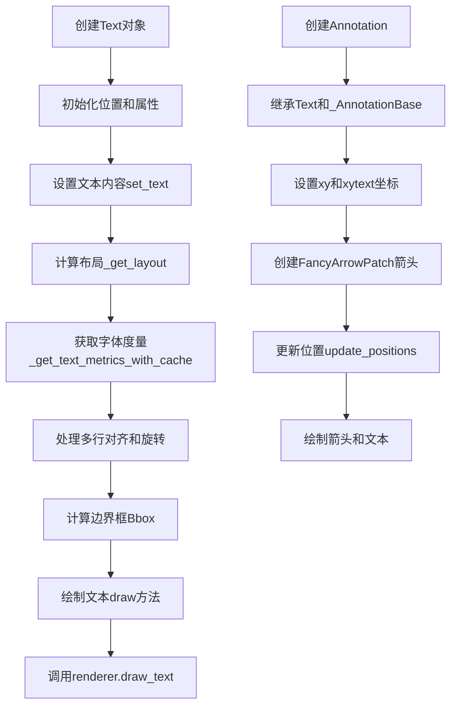

## 类结构

```
Artist (基类)
├── Text (文本处理主类)
│   └── Annotation (带箭头的注解)
└── _AnnotationBase (注解基类Mixin)

独立类:
└── OffsetFrom (偏移计算辅助类)

模块级函数:
├── _get_textbox
├── _get_text_metrics_with_cache
└── _get_text_metrics_function
```

## 全局变量及字段


### `_log`
    
模块级日志记录器

类型：`logging.Logger`
    


### `Text.zorder`
    
绘制顺序(类变量)

类型：`int`
    


### `Text._charsize_cache`
    
字符大小缓存(类变量)

类型：`dict`
    


### `Text._x`
    
文本位置x坐标

类型：`float`
    


### `Text._y`
    
文本位置y坐标

类型：`float`
    


### `Text._text`
    
文本内容

类型：`str`
    


### `Text._color`
    
文本颜色

类型：`str`
    


### `Text._fontproperties`
    
字体属性对象

类型：`FontProperties`
    


### `Text._rotation`
    
旋转角度

类型：`float`
    


### `Text._horizontalalignment`
    
水平对齐

类型：`str`
    


### `Text._verticalalignment`
    
垂直对齐

类型：`str`
    


### `Text._multialignment`
    
多行对齐

类型：`str`
    


### `Text._linespacing`
    
行间距

类型：`float`
    


### `Text._wrap`
    
是否换行

类型：`bool`
    


### `Text._bbox_patch`
    
背景框FancyBboxPatch

类型：`FancyBboxPatch`
    


### `Text._renderer`
    
渲染器引用

类型：`RendererBase`
    


### `Text._antialiased`
    
是否抗锯齿

类型：`bool`
    


### `Text._usetex`
    
是否使用TeX渲染

类型：`bool`
    


### `Text._parse_math`
    
是否解析数学文本

类型：`bool`
    


### `Text._transform_rotates_text`
    
变换是否影响文本方向

类型：`bool`
    


### `Text._rotation_mode`
    
旋转模式

类型：`str`
    


### `_AnnotationBase.xy`
    
坐标点

类型：`tuple`
    


### `_AnnotationBase.xycoords`
    
坐标系

类型：`str`
    


### `_AnnotationBase._draggable`
    
拖拽状态

类型：`DraggableAnnotation`
    


### `_AnnotationBase._annotation_clip`
    
裁剪行为

类型：`bool`
    


### `Annotation.xy`
    
被注解的坐标点

类型：`tuple`
    


### `Annotation.xycoords`
    
xy的坐标系

类型：`str`
    


### `Annotation.xytext`
    
文本位置

类型：`tuple`
    


### `Annotation.textcoords`
    
文本坐标系

类型：`str`
    


### `Annotation.arrowprops`
    
箭头属性

类型：`dict`
    


### `Annotation.arrow_patch`
    
FancyArrowPatch对象

类型：`FancyArrowPatch`
    


### `Annotation._textcoords`
    
文本坐标系统

类型：`str`
    


### `Annotation._arrow_relpos`
    
箭头相对位置

类型：`tuple`
    


### `OffsetFrom._artist`
    
参照艺术家对象

类型：`Artist`
    


### `OffsetFrom._ref_coord`
    
参照坐标

类型：`tuple`
    


### `OffsetFrom._unit`
    
单位(点或像素)

类型：`str`
    
    

## 全局函数及方法


### `_get_textbox`

计算文本的边界框（bbox）。该函数考虑了文本旋转对位置的影响，但宽度和高度使用的是未旋转盒子的大小（这与 `Text.get_window_extent` 方法不同）。

参数：
- `text`：`matplotlib.text.Text`，需要计算边界框的文本对象
- `renderer`：`matplotlib.backend_bases.RendererBase`，渲染器对象，用于获取文本布局信息

返回值：`tuple[float, float, float, float]`，返回 (x_box, y_box, w_box, h_box)，其中 x_box 和 y_box 是旋转后的边界框左下角坐标，w_box 和 h_box 是边界框的宽度和高度

#### 流程图

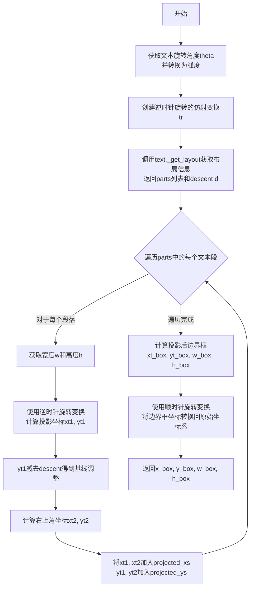

#### 带注释源码

```python
def _get_textbox(text, renderer):
    """
    Calculate the bounding box of the text.

    The bbox position takes text rotation into account, but the width and
    height are those of the unrotated box (unlike `.Text.get_window_extent`).
    """
    # TODO: This function may move into the Text class as a method. As a
    # matter of fact, the information from the _get_textbox function
    # should be available during the Text._get_layout() call, which is
    # called within the _get_textbox. So, it would be better to move this
    # function as a method with some refactoring of _get_layout method.

    # 用于存储所有文本段落在逆时针旋转坐标系下的x坐标
    projected_xs = []
    # 用于存储所有文本段落在逆时针旋转坐标系下的y坐标
    projected_ys = []

    # 获取文本的旋转角度（单位：度），转换为弧度
    theta = np.deg2rad(text.get_rotation())
    # 创建逆时针旋转的仿射变换矩阵
    tr = Affine2D().rotate(-theta)

    # 调用Text对象的_get_layout方法获取布局信息
    # 返回值：bbox（边界框）, parts（包含每行文本信息的列表）, d（descent值）
    _, parts, d = text._get_layout(renderer)

    # 遍历每一行文本的处理信息
    # parts中的每个元素格式为：(text_string, (width, height), x, y)
    for t, wh, x, y in parts:
        w, h = wh  # 解包获取宽度和高度

        # 使用逆时针旋转变换将文本起点坐标投影到未旋转的坐标系
        xt1, yt1 = tr.transform((x, y))
        # 减去descent值，调整y坐标以考虑基线
        yt1 -= d
        # 计算文本框右上角坐标
        xt2, yt2 = xt1 + w, yt1 + h

        # 将文本框的左下角和右上角x坐标加入列表
        projected_xs.extend([xt1, xt2])
        # 将文本框的左下角和右上角y坐标加入列表
        projected_ys.extend([yt1, yt2])

    # 计算投影后边界框的最小x和y坐标（即左下角）
    xt_box, yt_box = min(projected_xs), min(projected_ys)
    # 计算边界框的宽度和高度
    w_box, h_box = max(projected_xs) - xt_box, max(projected_ys) - yt_box

    # 使用顺时针旋转变换，将边界框坐标转换回原始坐标系
    # 这样得到的x_box, y_box是考虑了文本旋转后的位置
    x_box, y_box = Affine2D().rotate(theta).transform((xt_box, yt_box))

    # 返回边界框的坐标和尺寸
    # x_box, y_box: 旋转后的左下角坐标
    # w_box, h_box: 边界框的宽度和高度（未旋转）
    return x_box, y_box, w_box, h_box
```


### _get_text_metrics_with_cache

该函数是获取文本度量（宽度、高度、descent）的入口点，充当渲染器方法的包装器。它通过调用内部函数 `_get_text_metrics_function` 来利用双层缓存机制（外层基于弱引用的渲染器缓存，内层基于 LRU 的参数缓存），以避免重复计算。值得注意的是，该函数显式复制了 `fontprop` 对象，以应对 `FontProperties` 可变性导致的哈希值不稳定问题。

参数：

- `renderer`：`Any`，Matplotlib 后端渲染器实例，用于执行实际的度量计算。
- `text`：`str`，需要计算度量的文本字符串。
- `fontprop`：`FontProperties`，描述文本字体属性的对象（包含字体、大小、样式等）。
- `ismath`：`bool` 或 `str`，指示文本是否为数学文本（例如 "TeX" 或 True）。
- `dpi`：`float`，用于缩放的分辨率（每英寸点数）。

返回值：`tuple`，包含文本的宽度、高度和 descent 值（通常为 `(width, height, descent)`）。

#### 流程图

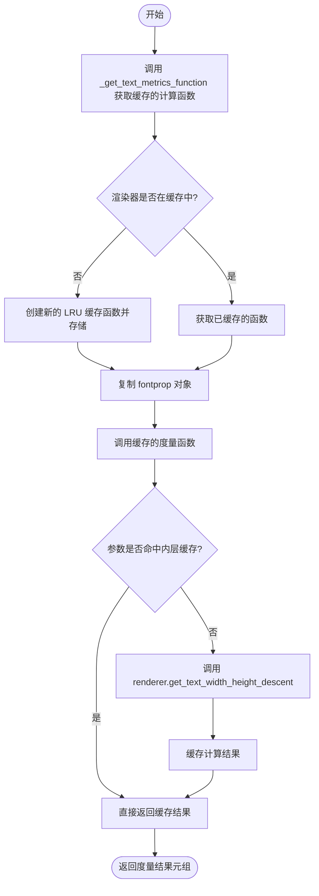

#### 带注释源码

```python
def _get_text_metrics_with_cache(renderer, text, fontprop, ismath, dpi):
    """
    Call ``renderer.get_text_width_height_descent``, caching the results.

    Parameters
    ----------
    renderer : object
        The renderer instance.
    text : str
        The text to measure.
    fontprop : `.font_manager.FontProperties`
        The font properties.
    ismath : bool or "TeX"
        Whether the text is math text.
    dpi : float
        The dpi to use for scaling.

    Returns
    -------
    tuple
        The width, height, and descent of the text.
    """

    # hit the outer cache layer and get the function to compute the metrics
    # for this renderer instance
    # 获取特定渲染器的缓存计算函数（两層缓存的入口）
    get_text_metrics = _get_text_metrics_function(renderer)
    
    # call the function to compute the metrics and return
    #
    # We pass a copy of the fontprop because FontProperties is both mutable and
    # has a `__hash__` that depends on that mutable state.  This is not ideal
    # as it means the hash of an object is not stable over time which leads to
    # very confusing behavior when used as keys in dictionaries or hashes.
    # 由于 FontProperties 是可变的且其哈希值依赖内部状态，直接作为缓存键可能导致
    # 行为异常，因此这里传入一个副本以保证缓存键的稳定性。
    return get_text_metrics(text, fontprop.copy(), ismath, dpi)
```


### `_get_text_metrics_function`

#### 描述

这是一个模块级的辅助函数，用于提供文本度量（宽、高、下沉距离）的获取功能。它采用**双层缓存架构**来优化性能：外层使用 `WeakKeyDictionary` 绑定到具体的渲染器（`renderer`）实例，以确保渲染器被垃圾回收时缓存也能被自动释放；内层使用 `functools.lru_cache` 针对具体的文本、字体属性、DPI 和数学模式进行缓存。该函数返回一个可调用对象，该对象封装了实际调用渲染器 `get_text_width_height_descent` 方法的逻辑。

#### 参数

- `input_renderer`：`matplotlib.backend_bases.RendererBase` (或类似渲染器实例)，需要为其设置或获取缓存的渲染器对象。
- `_cache`：`dict` (默认 `weakref.WeakKeyDictionary()`)，用于在函数调用之间持久化缓存的内部字典。这是一个可变默认参数，用于将缓存状态附加到函数本身。

#### 返回值

- `function`，返回一个内部函数 `_text_metrics`。该函数接收 `(text, fontprop, ismath, dpi)` 参数，并返回渲染器计算的文本宽、高和下沉距离。

#### 流程图

```mermaid
graph TD
    A[调用 _get_text_metrics_function] --> B{检查 _cache 中是否存在 input_renderer}
    B -->|存在| C[获取并返回已缓存的 _text_metrics 函数]
    B -->|不存在 (Cache Miss)| D[创建弱引用 renderer_ref]
    D --> E[定义内部函数 _text_metrics]
    E --> F[应用 @functools.lru_cache 装饰器]
    F --> G[_cache[input_renderer] = _text_metrics]
    G --> C
```

#### 带注释源码

```python
def _get_text_metrics_function(input_renderer, _cache=weakref.WeakKeyDictionary()):
    """
    Helper function to provide a two-layered cache for font metrics

    To get the rendered size of a size of string we need to know:
      - what renderer we are using
      - the current dpi of the renderer
      - the string
      - the font properties
      - is it math text or not

    We do this as a two-layer cache with the outer layer being tied to a
    renderer instance and the inner layer handling everything else.

    The outer layer is implemented as `.WeakKeyDictionary` keyed on the
    renderer.  As long as someone else is holding a hard ref to the renderer
    we will keep the cache alive, but it will be automatically dropped when
    the renderer is garbage collected.

    The inner layer is provided by an lru_cache with a large maximum size (such
    that we expect very few cache misses in actual use cases).  As the
    dpi is mutable on the renderer, we need to explicitly include it as part of
    the cache key on the inner layer even though we do not directly use it (it is
    used in the method call on the renderer).

    Parameters
    ----------
    input_renderer : maplotlib.backend_bases.RendererBase
        The renderer to set the cache up for.

    _cache : dict, optional
        We are using the mutable default value to attach the cache to the function.
        ...
    """
    # 1. 检查外层缓存（针对渲染器实例）
    if (_text_metrics := _cache.get(input_renderer, None)) is None:
        # 2. 如果缓存未命中，创建一个弱引用来持有渲染器
        #    这样可以避免产生不可破坏的引用循环（内存泄漏）
        renderer_ref = weakref.ref(input_renderer)

        # 3. 定义局部函数，并为其提供一个新的 lru_cache 实例
        #    dpi 参数虽然未使用，但参与缓存失效逻辑
        @functools.lru_cache(4096)
        def _text_metrics(text, fontprop, ismath, dpi):
            # 4. 在实际计算前检查渲染器是否仍然存活
            if (local_renderer := renderer_ref()) is None:
                raise RuntimeError(
                    "Trying to get text metrics for a renderer that no longer exists.  "
                    "This should never happen and is evidence of a bug elsewhere."
                    )
            # 5. 执行真正的渲染器方法调用并返回结果
            return local_renderer.get_text_width_height_descent(text, fontprop, ismath)

        # 6. 将新创建的函数存入外层缓存，供下次使用
        _cache[input_renderer] = _text_metrics

    # 返回内部函数（已绑定特定渲染器的缓存逻辑）
    return _text_metrics
```

### 关键组件信息

1.  **外层缓存 (`_cache`)**: 类型为 `WeakKeyDictionary`。这是第一层缓存，以渲染器实例为键。当渲染器对象没有任何强引用时，该缓存项会自动失效，保证了资源的及时释放。
2.  **内层缓存 (`_text_metrics`)**: 使用 `@functools.lru_cache` 装饰的函数。这是第二层缓存，以具体的文本内容、字体属性等为键，极大地减少了重复的字体度量计算。
3.  **弱引用 (`renderer_ref`)**: 使用 `weakref.ref` 包装渲染器。这是实现外层缓存自动清理机制的关键，防止闭包持有渲染器的强引用。

### 潜在的技术债务或优化空间

1.  **可变默认参数 (Mutable Default Argument)**: 代码使用了 `_cache=weakref.WeakKeyDictionary()` 作为默认参数。虽然注释中解释了这是为了将缓存附加到函数上，但这种模式在多线程环境下可能存在竞态条件（Race Condition），且被视为 Python 的反模式。更好的做法可能是使用全局变量或线程本地存储（Thread Local Storage）。
2.  **FontProperties 的哈希问题**: 在调用此函数的上一层 (`_get_text_metrics_with_cache`) 中，必须使用 `fontprop.copy()`。注释中提到 `FontProperties` 是可变的且其 `__hash__` 依赖于可变状态，这导致对象哈希不稳定（对象创建后修改属性会影响哈希值），这是导致缓存混淆的一个潜在风险点。
3.  **线程安全**: 代码注释中明确提到了线程之间的竞态条件，未来可能需要重构以支持多线程安全。

### 其它项目

#### 错误处理与异常设计

*   **渲染器丢失**: 在内部函数 `_text_metrics` 中，会检查 `renderer_ref()` 是否为 `None`。如果返回 `None`（渲染器已被销毁），则会抛出一个 `RuntimeError`，明确指出这是一个不应该发生的内部错误。
*   **缓存失效**: `dpi` 参数虽然在实际方法调用中未直接使用，但被故意包含在 `lru_cache` 的键参数中。这是因为渲染器的 DPI 是可变的，当 DPI 变化时，缓存必须失效以返回正确的度量值。

#### 数据流与状态机

*   **调用链**: `Text._get_layout` -> `_get_text_metrics_with_cache` -> `_get_text_metrics_function` -> `renderer.get_text_width_height_descent`。
*   **状态管理**: 该函数本身是“无状态”的（除了缓存），但它依赖于渲染器的状态（如 DPI）。缓存机制有效地将渲染器的状态变化（通过键的变化或弱引用的失效）反映到数据流中。


### Text.__init__

创建一个在窗口或数据坐标中存储和绘制文本的 `.Text` 实例。文本根据水平对齐和垂直对齐相对于锚点定位。

参数：

- `x`：`float`，默认值 0，文本的 x 坐标位置
- `y`：`float`，默认值 0，文本的 y 坐标位置
- `text`：`str`，默认值 ''，文本内容字符串
- `color`：`str` 或 `tuple` 或 `None`，默认值 None（默认使用 rc 参数），文本颜色
- `verticalalignment`：`str`，默认值 'baseline'，垂直对齐方式，可选 'top', 'center', 'bottom', 'baseline', 'center_baseline'
- `horizontalalignment`：`str`，默认值 'left'，水平对齐方式，可选 'left', 'center', 'right'
- `multialignment`：`str` 或 `None`，默认值 None，多行文本的对齐方式
- `fontproperties`：`FontProperties` 或 `str` 或 `pathlib.Path` 或 `None`，默认值 None（默认创建 FontProperties()），字体属性
- `rotation`：`float` 或 `str` 或 `None`，默认值 None，文本旋转角度（度）或 'vertical'/'horizontal'
- `linespacing`：`float` 或 `None`，默认值 None，行间距（字体大小的倍数）
- `rotation_mode`：`str` 或 `None`，默认值 None，旋转模式，可选 'default', 'anchor', 'xtick', 'ytick'
- `usetex`：`bool` 或 `None`，默认值 None（默认使用 rcParams['text.usetex']），是否使用 TeX 渲染
- `wrap`：`bool`，默认值 False，是否启用文本自动换行
- `transform_rotates_text`：`bool`，默认值 False，变换旋转是否影响文本方向
- `parse_math`：`bool` 或 `None`，默认值 None（默认使用 rcParams['text.parse_math']），是否解析数学文本
- `antialiased`：`bool` 或 `None`，默认值 None（默认使用 rcParams['text.antialiased']），是否使用抗锯齿渲染
- `**kwargs`：其他关键字参数，传递给父类 Artist 的属性

返回值：无（`None`），构造函数初始化对象状态

#### 流程图

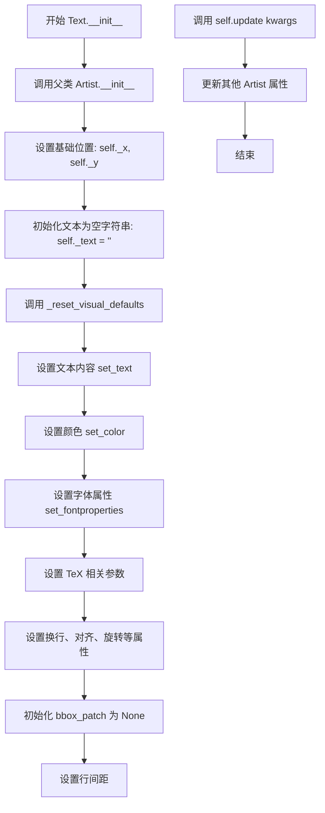

#### 带注释源码

```python
def __init__(self,
             x=0, y=0, text='', *,  # 位置参数：x, y 坐标和文本内容
             color=None,           # 颜色，默认使用 rc 参数
             verticalalignment='baseline',  # 垂直对齐：baseline
             horizontalalignment='left',     # 水平对齐：left
             multialignment=None,  # 多行对齐，默认继承 horizontalalignment
             fontproperties=None,  # 字体属性，默认创建 FontProperties()
             rotation=None,        # 旋转角度，默认不旋转
             linespacing=None,     # 行间距，默认 1.2 倍字体大小
             rotation_mode=None,   # 旋转模式，默认 'default'
             usetex=None,          # 是否使用 TeX，默认使用 rcParams['text.usetex']
             wrap=False,           # 是否自动换行，默认关闭
             transform_rotates_text=False,  # 变换旋转是否影响文本方向
             parse_math=None,    # 是否解析数学文本，默认使用 rcParams['text.parse_math']
             antialiased=None,  # 是否抗锯齿，默认使用 rcParams['text.antialiased']
             **kwargs           # 其他传递给 Artist 的关键字参数
             ):
    """
    Create a `.Text` instance at *x*, *y* with string *text*.

    The text is aligned relative to the anchor point (*x*, *y*) according
    to ``horizontalalignment`` (default: 'left') and ``verticalalignment``
    (default: 'baseline'). See also
    :doc:`/gallery/text_labels_and_annotations/text_alignment`.

    While Text accepts the 'label' keyword argument, by default it is not
    added to the handles of a legend.

    Valid keyword arguments are:

    %(Text:kwdoc)s
    """
    # 首先调用父类 Artist 的初始化方法
    super().__init__()
    
    # 设置文本的 x, y 坐标位置
    self._x, self._y = x, y
    
    # 初始化文本内容为空字符串
    self._text = ''
    
    # 调用内部方法重置所有视觉属性默认值
    self._reset_visual_defaults(
        text=text,
        color=color,
        fontproperties=fontproperties,
        usetex=usetex,
        parse_math=parse_math,
        wrap=wrap,
        verticalalignment=verticalalignment,
        horizontalalignment=horizontalalignment,
        multialignment=multialignment,
        rotation=rotation,
        transform_rotates_text=transform_rotates_text,
        linespacing=linespacing,
        rotation_mode=rotation_mode,
        antialiased=antialiased
    )
    
    # 使用 kwargs 更新其他 Artist 属性（如 visible, picker, clipbox 等）
    self.update(kwargs)
```


### `Text._reset_visual_defaults`

该方法用于初始化或重置Text对象的各种视觉属性默认值，包括文本内容、颜色、字体属性、对齐方式、旋转等，并将内部状态（如渲染器引用和边框补丁）重置为初始值。

参数：

- `self`：`Text`，Text对象实例本身
- `text`：`str`，默认值为空字符串，要显示的文本内容
- `color`：`str` 或 `None`，文本颜色，None时使用rcParams的"text.color"
- `fontproperties`：`FontProperties` 或 `str` 或 `pathlib.Path` 或 `None`，字体属性对象，None时使用默认FontProperties()
- `usetex`：`bool` 或 `None`，是否使用TeX渲染，None时使用rcParams的"text.usetex"
- `parse_math`：`bool` 或 `None`，是否解析数学文本，None时使用rcParams的"text.parse_math"
- `wrap`：`bool`，默认值为False，是否启用文本换行
- `verticalalignment`：`str`，默认值为'baseline'，垂直对齐方式
- `horizontalalignment`：`str`，默认值为'left'，水平对齐方式
- `multialignment`：`str` 或 `None`，多行文本对齐方式
- `rotation`：`float` 或 `str` 或 `None`，文本旋转角度或方向
- `transform_rotates_text`：`bool`，默认值为False，是否让变换影响文本方向
- `linespacing`：`float` 或 `None`，行间距倍数，None时默认为1.2
- `rotation_mode`：`str` 或 `None`，旋转模式
- `antialiased`：`bool` 或 `None`，是否使用抗锯齿渲染，None时使用rcParams的"text.antialiased"

返回值：`None`，该方法无返回值

#### 流程图

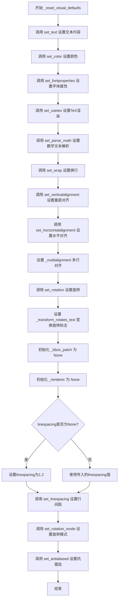

#### 带注释源码

```python
def _reset_visual_defaults(
    self,
    text='',
    color=None,
    fontproperties=None,
    usetex=None,
    parse_math=None,
    wrap=False,
    verticalalignment='baseline',
    horizontalalignment='left',
    multialignment=None,
    rotation=None,
    transform_rotates_text=False,
    linespacing=None,
    rotation_mode=None,
    antialiased=None
):
    # 设置文本字符串内容
    self.set_text(text)
    
    # 设置前景色，如果为None则从rcParams获取"text.color"
    self.set_color(mpl._val_or_rc(color, "text.color"))
    
    # 设置字体属性对象
    self.set_fontproperties(fontproperties)
    
    # 设置是否使用TeX渲染，如果为None则从rcParams获取"text.usetex"
    self.set_usetex(usetex)
    
    # 设置是否解析数学文本，如果为None则从rcParams获取"text.parse_math"
    self.set_parse_math(mpl._val_or_rc(parse_math, 'text.parse_math'))
    
    # 设置是否启用文本换行
    self.set_wrap(wrap)
    
    # 设置垂直对齐方式
    self.set_verticalalignment(verticalalignment)
    
    # 设置水平对齐方式
    self.set_horizontalalignment(horizontalalignment)
    
    # 直接设置多行对齐属性（不通过setter方法）
    self._multialignment = multialignment
    
    # 设置文本旋转角度
    self.set_rotation(rotation)
    
    # 设置变换是否影响文本方向的标志
    self._transform_rotates_text = transform_rotates_text
    
    # 初始化边框补丁为None（FancyBboxPatch实例）
    self._bbox_patch = None  # a FancyBboxPatch instance
    
    # 初始化渲染器引用为None
    self._renderer = None
    
    # 如果未指定行间距，则使用默认值1.2
    if linespacing is None:
        linespacing = 1.2  # Maybe use rcParam later.
    
    # 设置行间距
    self.set_linespacing(linespacing)
    
    # 设置旋转模式
    self.set_rotation_mode(rotation_mode)
    
    # 设置抗锯齿，如果为None则从rcParams获取"text.antialiased"
    self.set_antialiased(mpl._val_or_rc(antialiased, 'text.antialiased'))
```


### `Text.update`

该方法用于更新文本对象的属性，支持通过关键字参数批量设置文本的各种视觉属性，并按优先级处理字体属性和边框样式的更新。

参数：

-  `kwargs`：`dict`，关键字参数字典，用于更新文本对象的属性。支持的参数包括 `color`、`fontproperties`、`fontfamily`、`fontname`、`fontsize`、`fontstretch`、`fontstyle`、`fontvariant`、`fontweight`、`horizontalalignment`、`verticalalignment`、`multialignment`、`rotation`、`linespacing`、`rotation_mode`、`usetex`、`wrap`、`transform_rotates_text`、`parse_math`、`antialiased` 等，以及 `bbox` 用于设置文本的背景框。

返回值：`list`，返回从各 setter 方法收集的返回值列表。如果不需要返回值，则返回空列表。

#### 流程图

```mermaid
flowchart TD
    A[开始 update] --> B[创建哨兵对象 sentinel]
    B --> C[标准化 kwargs]
    C --> D{fontproperties in kwargs?}
    D -->|Yes| E[弹出 fontproperties]
    D -->|No| F{结束判断}
    E --> G[调用 set_fontproperties]
    G --> H[添加返回值到 ret]
    H --> F
    F --> I{bbox in kwargs?}
    I -->|Yes| J[弹出 bbox]
    I -->|No| K[调用父类 update]
    J --> K
    K --> L[调用 super().update]
    L --> M{bbox is not sentinel?}
    M -->|Yes| N[调用 set_bbox]
    M -->|No| O[返回 ret]
    N --> P[添加返回值到 ret]
    P --> O
```

#### 带注释源码

```python
def update(self, kwargs):
    # docstring inherited
    ret = []
    # 使用 cbook.normalize_kwargs 标准化 kwargs，确保参数名正确
    kwargs = cbook.normalize_kwargs(kwargs, Text)
    # 创建哨兵对象，因为 bbox 可以为 None，所以需要使用另一个哨兵
    sentinel = object()
    
    # 首先更新 fontproperties，因为它具有最低优先级
    fontproperties = kwargs.pop("fontproperties", sentinel)
    if fontproperties is not sentinel:
        # 调用 set_fontproperties 并将返回值添加到 ret 列表
        ret.append(self.set_fontproperties(fontproperties))
    
    # 最后更新 bbox，因为它依赖于字体属性
    bbox = kwargs.pop("bbox", sentinel)
    
    # 调用父类的 update 方法更新剩余的 kwargs
    ret.extend(super().update(kwargs))
    
    # 如果 bbox 不为 None，则设置 bbox
    if bbox is not sentinel:
        ret.append(self.set_bbox(bbox))
    
    # 返回收集的返回值列表
    return ret
```


### Text.contains

该方法用于检测鼠标事件是否发生在文本的轴对齐边界框（AABB）内。如果文本有包围盒补丁（bbox_patch），也会检测鼠标事件是否发生在包围盒内。

参数：

- `mouseevent`：`matplotlib.backend_bases.MouseEvent`，鼠标事件对象，包含鼠标的 x 和 y 坐标

返回值：`tuple[bool, dict]`，返回包含两个元素的元组：
  - 第一个元素为布尔值，表示鼠标事件是否发生在文本边界框内
  - 第二个元素为字典，包含检测到的属性信息（如有 bbox_patch 还会包含 "bbox_patch" 键）

#### 流程图

```mermaid
flowchart TD
    A[开始 contains 方法] --> B{检查条件}
    B --> C{画布不同<br/>或文本不可见<br/>或渲染器为空}
    C -->|是| D[返回 False, {}]
    C -->|否| E[获取文本窗口范围 bbox]
    E --> F{检查鼠标坐标是否在 bbox 内}
    F -->|x0 <= x <= x1 且 y0 <= y <= y1| G[inside = True]
    F -->|否则| H[inside = False]
    G --> I{是否存在 bbox_patch}
    H --> I
    I -->|是| J[检查 patch 包含性]
    I -->|否| K[返回 inside, cattr]
    J --> L[合并 patch 检测结果]
    L --> K
```

#### 带注释源码

```python
def contains(self, mouseevent):
    """
    Return whether the mouse event occurred inside the axis-aligned
    bounding-box of the text.
    """
    # 检查画布是否不同、文本是否可见、渲染器是否存在
    # 如果不满足条件，直接返回 False 和空字典
    if (self._different_canvas(mouseevent) or not self.get_visible()
            or self._renderer is None):
        return False, {}
    
    # 显式使用 Text.get_window_extent(self) 而不是 self.get_window_extent()
    # 以避免 Annotation.contains 意外覆盖整个注释边界框
    bbox = Text.get_window_extent(self)
    
    # 检查鼠标事件坐标是否在文本的轴对齐边界框内
    inside = (bbox.x0 <= mouseevent.x <= bbox.x1
              and bbox.y0 <= mouseevent.y <= bbox.y1)
    
    cattr = {}  # 初始化属性字典
    
    # 如果文本有周围补丁（bbox_patch），也检查其包含性
    # 并将结果与文本的检测结果合并
    if self._bbox_patch:
        patch_inside, patch_cattr = self._bbox_patch.contains(mouseevent)
        inside = inside or patch_inside
        cattr["bbox_patch"] = patch_cattr
    
    # 返回检测结果和属性信息
    return inside, cattr
```


### `Text.get_rotation`

该方法返回文本的旋转角度（以度为单位，范围0-360）。如果文本的变换会影响文本方向，则通过变换矩阵计算实际旋转角度；否则直接返回内部存储的旋转值。

参数：

- （无显式参数，隐式参数 `self` 为 `Text` 实例）

返回值：`float`，返回文本旋转角度（0-360度之间的度数）

#### 流程图

```mermaid
flowchart TD
    A[开始 get_rotation] --> B{get_transform_rotates_text?}
    B -->|True| C[获取变换对象 transform]
    B -->|False| D[直接返回 self._rotation]
    C --> E[获取无单位位置 get_unitless_position]
    E --> F[调用 transform.transform_angles]
    F --> G[提取标量返回值 .item(0)]
    G --> H[返回计算后的旋转角度]
    D --> H
```

#### 带注释源码

```python
def get_rotation(self):
    """
    Return the text angle in degrees between 0 and 360.
    
    返回文本的旋转角度（以度为单位，范围0到360度）。
    
    如果 _transform_rotates_text 为 True，则使用变换矩阵来计算
    实际显示的旋转角度，这考虑了坐标变换的影响。
    否则直接返回内部存储的 _rotation 值。
    """
    # 检查文本的变换是否影响文本方向
    if self.get_transform_rotates_text():
        # 获取当前的变换对象（通常是仿射变换）
        transform = self.get_transform()
        # 获取文本的无单位位置（用于计算变换后的角度）
        position = self.get_unitless_position()
        # 使用变换对象的 transform_angles 方法计算变换后的角度
        # 参数为角度列表和对应的点坐标列表
        # 返回结果是一个数组，使用 .item(0) 提取标量值
        return transform.transform_angles(
            [self._rotation], [position]).item(0)
    else:
        # 直接返回内部存储的旋转角度（未经变换）
        return self._rotation
```


### `Text.set_rotation`

该方法用于设置文本的旋转角度，支持数值角度（度）和预定义的方向关键字（'horizontal'、'vertical'），并将旋转值规范化为0-360度范围内的值。

参数：

- `s`：`float` 或 `{'vertical', 'horizontal'}`，旋转角度（度），逆时针为正方向。'horizontal' 等于 0，'vertical' 等于 90。

返回值：`None`，无返回值，仅修改对象内部状态。

#### 流程图

```mermaid
flowchart TD
    A[开始 set_rotation] --> B{isinstance(s, Real)?}
    B -->|是| C[将s转换为float并取模360<br/>self._rotation = float(s) % 360]
    B -->|否| D{cbook._str_equal(s, 'horizontal') or s is None?}
    D -->|是| E[self._rotation = 0.0]
    D -->|否| F{cbook._str_equal(s, 'vertical')?}
    F -->|是| G[self._rotation = 90.0]
    F -->|否| H[抛出ValueError]
    C --> I[self.stale = True]
    E --> I
    G --> I
    I --> J[结束]
    H --> J
```

#### 带注释源码

```python
def set_rotation(self, s):
    """
    Set the rotation of the text.

    Parameters
    ----------
    s : float or {'vertical', 'horizontal'}
        The rotation angle in degrees in mathematically positive direction
        (counterclockwise). 'horizontal' equals 0, 'vertical' equals 90.
    """
    # 检查s是否为实数类型（int、float等）
    if isinstance(s, Real):
        # 将s转换为float并取模360，确保角度在0-359之间
        self._rotation = float(s) % 360
    # 检查s是否为字符串'horizontal'或None
    elif cbook._str_equal(s, 'horizontal') or s is None:
        # 水平方向对应0度
        self._rotation = 0.
    # 检查s是否为字符串'vertical'
    elif cbook._str_equal(s, 'vertical'):
        # 垂直方向对应90度
        self._rotation = 90.
    else:
        # 参数无效，抛出ValueError异常
        raise ValueError("rotation must be 'vertical', 'horizontal' or "
                         f"a number, not {s}")
    # 标记对象状态已过期，需要重新渲染
    self.stale = True
```


### `Text.get_rotation_mode`

获取文本的旋转模式，该模式控制文本的旋转和对齐方式。

参数：

- `self`：`Text`，执行该方法的 Text 实例对象

返回值：`str | None`，返回文本的旋转模式，可能的值包括 `'default'`、`'anchor'`、`'xtick'`、`'ytick'` 或 `None`

#### 流程图

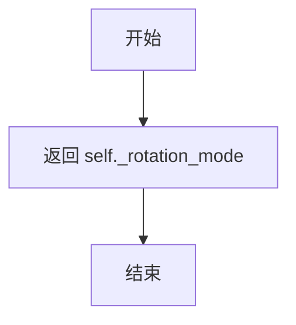

#### 带注释源码

```python
def get_rotation_mode(self):
    """
    Return the text rotation mode.
    
    返回文本的旋转模式。
    
    Returns
    -------
    str or None
        旋转模式，可以是:
        - 'default': 先旋转后对齐
        - 'anchor': 先对齐后旋转
        - 'xtick': 水平对齐根据角度调整，用于旋转的刻度标签
        - 'ytick': 垂直对齐根据角度调整，用于旋转的刻度标签
        - None: 等同于 'default'
    """
    return self._rotation_mode
```


### Text.set_rotation_mode

设置文本的旋转模式，控制文本旋转与对齐的先后顺序以及对齐方式。

参数：

- `m`：{None, 'default', 'anchor', 'xtick', 'ytick'}，旋转模式参数。为"default"时，文本先旋转后对齐；为"anchor"时，对齐先于旋转；"xtick"和"ytick"用于调整刻度标签的对齐方式，使文本视觉上指向锚点；传入None等同于"default"。

返回值：`None`，无返回值（Setter方法，修改对象内部状态）

#### 流程图

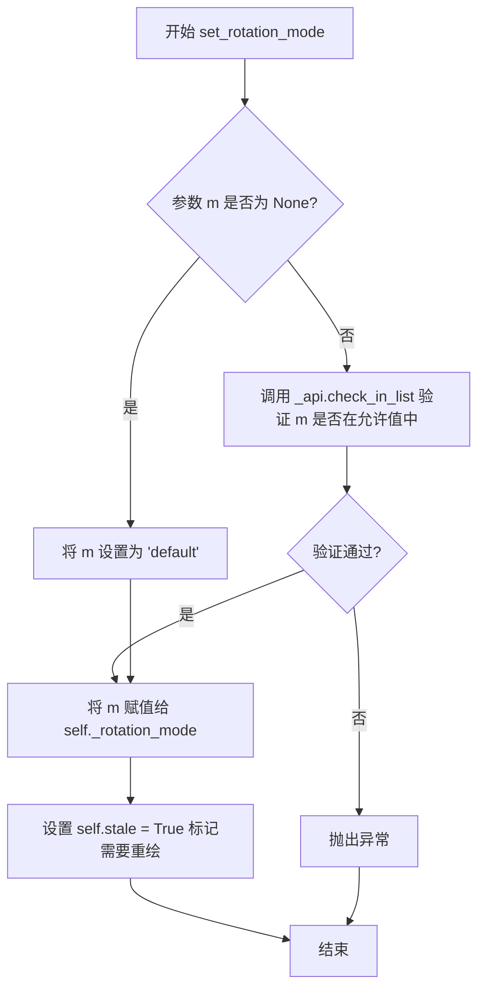

#### 带注释源码

```python
def set_rotation_mode(self, m):
    """
    Set text rotation mode.

    Parameters
    ----------
    m : {None, 'default', 'anchor', 'xtick', 'ytick'}
        If ``"default"``, the text will be first rotated, then aligned according
        to their horizontal and vertical alignments.  If ``"anchor"``, then
        alignment occurs before rotation. "xtick" and "ytick" adjust the
        horizontal/vertical alignment so that the text is visually pointing
        towards its anchor point. This is primarily used for rotated tick
        labels and positions them nicely towards their ticks. Passing
        ``None`` will set the rotation mode to ``"default"``.
    """
    # 如果传入 None，则默认为 "default" 模式
    if m is None:
        m = "default"
    else:
        # 使用 _api.check_in_list 验证旋转模式是否合法
        # 允许的值: 'anchor', 'default', 'xtick', 'ytick'
        _api.check_in_list(("anchor", "default", "xtick", "ytick"), rotation_mode=m)
    # 更新内部旋转模式状态
    self._rotation_mode = m
    # 标记对象为"过时"状态，表示需要重新渲染
    self.stale = True
```


### `Text.get_transform_rotates_text`

该方法用于获取文本对象的 `transform_rotates_text` 属性值，判断坐标系的旋转是否影响文本的方向。

参数：

- 无参数（仅包含 `self`）

返回值：`bool`，返回是否旋转坐标系会影响文本方向的布尔值。

#### 流程图

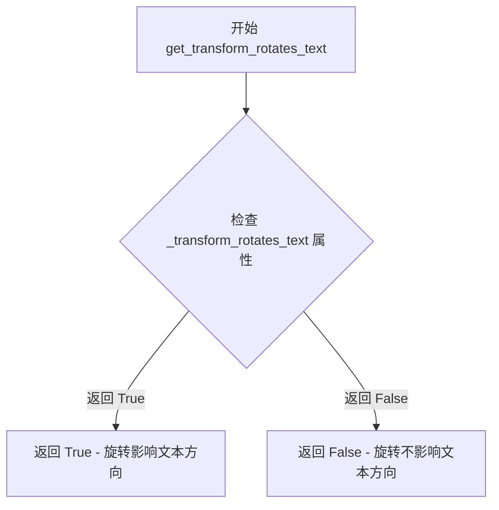

#### 带注释源码

```python
def get_transform_rotates_text(self):
    """
    Return whether rotations of the transform affect the text direction.
    """
    # 直接返回实例属性 _transform_rotates_text
    # 该属性在 Text 类初始化时通过 _reset_visual_defaults 方法设置
    # 默认为 False，表示坐标系的旋转不会改变文本的阅读方向
    # 当设置为 True 时，文本会随着坐标系的旋转而旋转其方向
    return self._transform_rotates_text
```


### `Text.set_transform_rotates_text`

设置文本对象是否受坐标变换旋转影响。当设置为 `True` 时，坐标系的旋转会同时旋转文本的方向（而非仅旋转文本位置），这在需要文本随图形变换旋转的场景中非常有用。

参数：

- `self`：`Text`，Text 类实例本身
- `t`：`bool`，指定是否让变换的旋转影响文本方向

返回值：`None`，无返回值（该方法直接修改对象内部状态）

#### 流程图

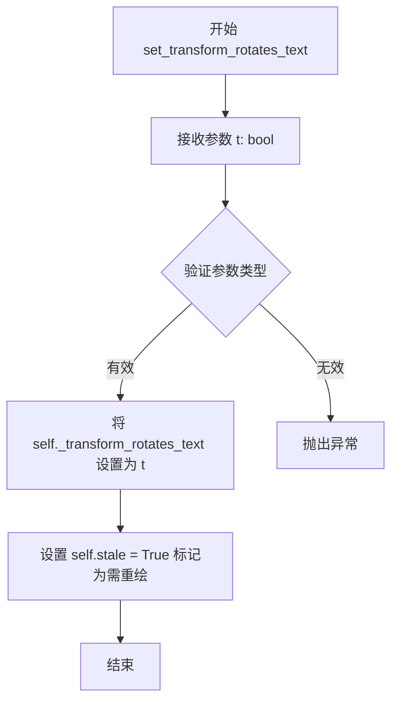

#### 带注释源码

```python
def set_transform_rotates_text(self, t):
    """
    Whether rotations of the transform affect the text direction.

    Parameters
    ----------
    t : bool
    """
    # 将传入的布尔值 t 赋值给内部属性 _transform_rotates_text
    # 该属性控制文本是否随坐标变换的旋转而旋转
    self._transform_rotates_text = t
    
    # 将 stale 标记设为 True，通知 Matplotlib 该对象需要重新渲染
    # 这是 Matplotlib 中常用的脏标记机制，用于优化渲染效率
    self.stale = True
```


### Text.set_antialiased

设置文本是否使用抗锯齿渲染。

参数：

- `antialiased`：`bool`，是否启用抗锯齿渲染

返回值：`None`，无返回值（setter 方法）

#### 流程图

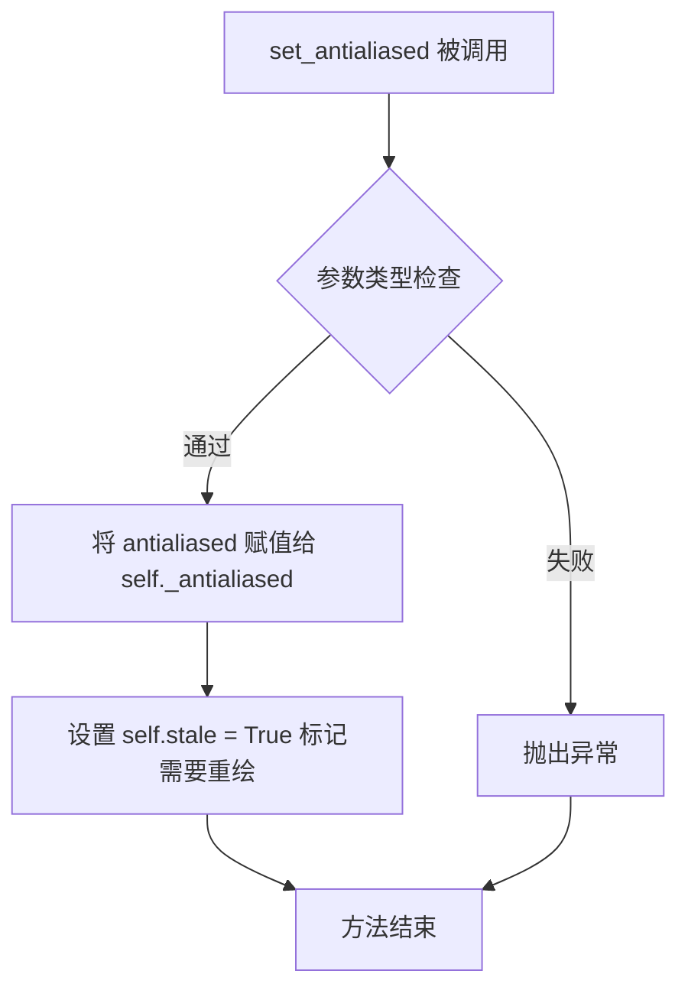

#### 带注释源码

```python
def set_antialiased(self, antialiased):
    """
    Set whether to use antialiased rendering.

    Parameters
    ----------
    antialiased : bool
        是否使用抗锯齿渲染的布尔值

    Notes
    -----
    Antialiasing will be determined by :rc:`text.antialiased`
    and the parameter *antialiased* will have no effect if the text contains
    math expressions.
    
    注意：如果文本包含数学表达式，antialiased 参数将无效，
    抗锯齿设置将由 :rc:`text.antialiased` 决定。
    """
    # 将传入的 antialiased 值存储到实例属性 _antialiased 中
    self._antialiased = antialiased
    
    # 设置 stale 标志为 True，标记该对象需要重新绘制
    # 这是 Matplotlib 中常用的模式，用于触发后续的图形更新
    self.stale = True
```


### `Text.get_antialiased`

该方法用于获取当前 Text 对象是否启用抗锯齿渲染的设置。抗锯齿渲染可以使得文本边缘更加平滑，减少锯齿感。

参数：  
无（仅包含 `self` 参数）

返回值：`bool`，返回当前文本是否使用抗锯齿渲染。`True` 表示启用抗锯齿，`False` 表示禁用抗锯齿。

#### 流程图

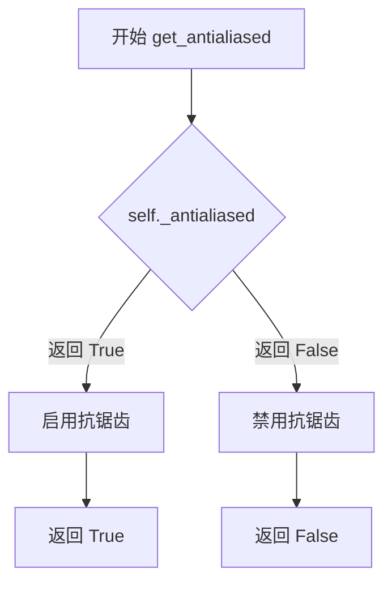

#### 带注释源码

```python
def get_antialiased(self):
    """Return whether antialiased rendering is used."""
    # 直接返回实例属性 _antialiased，该属性在 Text.__init__ 或 set_antialiased 方法中被设置
    # 默认值由 rcParams['text.antialiased'] 决定（通过 mpl._val_or_rc 获取）
    return self._antialiased
```


### Text.update_from

该方法用于从另一个 `Text` 对象复制所有视觉属性（包括颜色、对齐方式、字体属性、旋转等）到当前对象，实现文本样式的批量复制与同步，并标记当前对象为需重绘状态（`stale=True`）。

参数：

- `other`：`Text`，源 Text 对象，从中复制属性到当前对象

返回值：`None`，无返回值，仅更新对象内部状态

#### 流程图

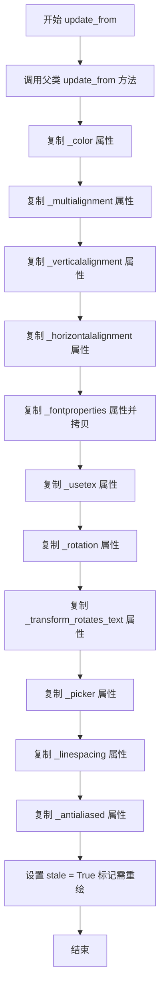

#### 带注释源码

```python
def update_from(self, other):
    """
    从另一个 Text 对象复制所有视觉属性到当前对象。

    Parameters
    ----------
    other : Text
        源 Text 对象，包含要复制的属性值。
    """
    # 调用父类 Artist 的 update_from 方法，复制基础 Artist 属性
    super().update_from(other)
    
    # 复制颜色属性
    self._color = other._color
    
    # 复制多行对齐方式
    self._multialignment = other._multialignment
    
    # 复制垂直对齐方式
    self._verticalalignment = other._verticalalignment
    
    # 复制水平对齐方式
    self._horizontalalignment = other._horizontalalignment
    
    # 复制字体属性（使用 copy() 创建副本，避免共享引用）
    self._fontproperties = other._fontproperties.copy()
    
    # 复制 TeX 渲染模式
    self._usetex = other._usetex
    
    # 复制旋转角度
    self._rotation = other._rotation
    
    # 复制变换是否影响文本方向的标志
    self._transform_rotates_text = other._transform_rotates_text
    
    # 复制拾取器设置（用于鼠标事件检测）
    self._picker = other._picker
    
    # 复制行间距
    self._linespacing = other._linespacing
    
    # 复制抗锯齿设置
    self._antialiased = other._antialiased
    
    # 标记对象为"陈旧"状态，表示需要重新绘制
    # 这是 Matplotlib 中常用的优化机制，避免不必要的重绘
    self.stale = True
```


### `Text._get_layout`

该方法用于计算文本的边界框（Bounding Box），同时返回多行文本的对齐信息。当文本需要旋转时，该方法会返回旋转后的边界框。

参数：

-  `renderer`：`matplotlib.backend_bases.RendererBase`，渲染器对象，用于获取文本的度量信息（宽度、高度、深度）

返回值：`(Bbox, list, float)`，返回一个三元组，包含：
- `Bbox`：文本的旋转后的边界框
- `list`：包含每行文本信息（文本内容、宽高、坐标）的列表
- `float`：最后一行文本的下降量（descent）

#### 流程图

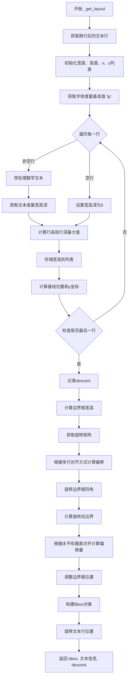

#### 带注释源码

```python
def _get_layout(self, renderer):
    """
    Return the extent (bbox) of the text together with
    multiple-alignment information. Note that it returns an extent
    of a rotated text when necessary.
    """
    # 初始化起始坐标
    thisx, thisy = 0.0, 0.0
    # 获取换行处理后的文本，并分割成行（确保lines不为空）
    lines = self._get_wrapped_text().split("\n")

    # 初始化存储每行宽度、高度、x坐标、y坐标的列表
    ws = []  # widths
    hs = []  # heights
    xs = []  # x coordinates
    ys = []  # y coordinates

    # 获取字体完整垂直范围，包括上升部和下降部
    # 使用"lp"作为参考字符来计算基础行高
    _, lp_h, lp_d = _get_text_metrics_with_cache(
        renderer, "lp", self._fontproperties,
        ismath="TeX" if self.get_usetex() else False,
        dpi=self.get_figure(root=True).dpi)
    # 计算最小行间距
    min_dy = (lp_h - lp_d) * self._linespacing

    # 遍历每一行文本
    for i, line in enumerate(lines):
        # 预处理数学文本，返回清洁文本和是否使用数学渲染的标志
        clean_line, ismath = self._preprocess_math(line)
        if clean_line:
            # 获取文本度量信息：宽度、高度、深度
            w, h, d = _get_text_metrics_with_cache(
                renderer, clean_line, self._fontproperties,
                ismath=ismath, dpi=self.get_figure(root=True).dpi)
        else:
            # 空行设置宽高深为0
            w = h = d = 0

        # 对于多行文本，当文本净高度（不含基线）大于"l"的高度时
        # 增加行间距，这与TeX的行为一致
        h = max(h, lp_h)
        d = max(d, lp_d)

        # 将宽度和高度添加到列表
        ws.append(w)
        hs.append(h)

        # 计算最后一行需要的基线度量
        baseline = (h - d) - thisy

        if i == 0:
            # 第一行：位置在基线上
            thisy = -(h - d)
        else:
            # 后续行：基线距离上一行底部一定距离
            thisy -= max(min_dy, (h - d) * self._linespacing)

        # 存储坐标
        xs.append(thisx)  # == 0.
        ys.append(thisy)

        # 更新y坐标到下一行起始位置
        thisy -= d

    # 记录最后一行的下降量
    descent = d

    # 边界框定义
    width = max(ws)
    xmin = 0
    xmax = width
    ymax = 0
    # 最后一行的基线减去其下降量
    ymin = ys[-1] - descent

    # 获取旋转矩阵
    M = Affine2D().rotate_deg(self.get_rotation())

    # 根据多行对齐方式调整文本行位置
    malign = self._get_multialignment()
    if malign == 'left':
        offset_layout = [(x, y) for x, y in zip(xs, ys)]
    elif malign == 'center':
        offset_layout = [(x + width / 2 - w / 2, y)
                         for x, y, w in zip(xs, ys, ws)]
    elif malign == 'right':
        offset_layout = [(x + width - w, y)
                         for x, y, w in zip(xs, ys, ws)]

    # 未旋转边界框的四个角
    corners_horiz = np.array(
        [(xmin, ymin), (xmin, ymax), (xmax, ymax), (xmax, ymin)])

    # 旋转边界框
    corners_rotated = M.transform(corners_horiz)
    # 计算旋转后边界
    xmin = corners_rotated[:, 0].min()
    xmax = corners_rotated[:, 0].max()
    ymin = corners_rotated[:, 1].min()
    ymax = corners_rotated[:, 1].max()
    width = xmax - xmin
    height = ymax - ymin

    # 获取水平和垂直对齐方式
    halign = self._horizontalalignment
    valign = self._verticalalignment

    rotation_mode = self.get_rotation_mode()
    if rotation_mode != "anchor":
        angle = self.get_rotation()
        if rotation_mode == 'xtick':
            # 根据角度调整水平对齐
            halign = self._ha_for_angle(angle)
        elif rotation_mode == 'ytick':
            # 根据角度调整垂直对齐
            valign = self._va_for_angle(angle)
        
        # 计算文本位置和偏移量以对齐边界框
        if halign == 'center':
            offsetx = (xmin + xmax) / 2
        elif halign == 'right':
            offsetx = xmax
        else:
            offsetx = xmin

        if valign == 'center':
            offsety = (ymin + ymax) / 2
        elif valign == 'top':
            offsety = ymax
        elif valign == 'baseline':
            offsety = ymin + descent
        elif valign == 'center_baseline':
            offsety = ymin + height - baseline / 2.0
        else:
            offsety = ymin
    else:
        # anchor模式的特殊处理
        xmin1, ymin1 = corners_horiz[0]
        xmax1, ymax1 = corners_horiz[2]

        if halign == 'center':
            offsetx = (xmin1 + xmax1) / 2.0
        elif halign == 'right':
            offsetx = xmax1
        else:
            offsetx = xmin1

        if valign == 'center':
            offsety = (ymin1 + ymax1) / 2.0
        elif valign == 'top':
            offsety = ymax1
        elif valign == 'baseline':
            offsety = ymax1 - baseline
        elif valign == 'center_baseline':
            offsety = ymax1 - baseline / 2.0
        else:
            offsety = ymin1

        # 应用旋转到偏移量
        offsetx, offsety = M.transform((offsetx, offsety))

    # 调整边界框位置
    xmin -= offsetx
    ymin -= offsety

    # 创建边界框对象
    bbox = Bbox.from_bounds(xmin, ymin, width, height)

    # 旋转文本行位置到第一个(x, y)位置周围
    xys = M.transform(offset_layout) - (offsetx, offsety)

    # 返回边界框、文本信息列表、下降量
    return bbox, list(zip(lines, zip(ws, hs), *xys.T)), descent
```


### Text.set_bbox

该方法用于在文本后方/周围绘制一个边框（包围盒），可用于设置文本的背景和/或边框。它通过在文本后方创建一个 `FancyBboxPatch` 来实现（另见 `Text.get_bbox_patch`）。默认情况下包围盒补丁为 None，仅在需要时创建。

参数：

- `rectprops`：`dict` 或 `None`，用于 `.FancyBboxPatch` 的属性字典。默认 boxstyle 为 'square'，`.patches.FancyBboxPatch` 的 mutation scale 设置为字体大小。传入 `None` 可完全移除 bbox patch。

返回值：`None`，该方法无返回值，直接修改对象状态。

#### 流程图

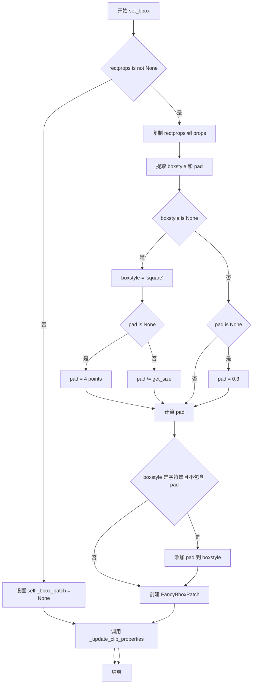

#### 带注释源码

```python
def set_bbox(self, rectprops):
    """
    Draw a box behind/around the text.

    This can be used to set a background and/or a frame around the text.
    It's realized through a `.FancyBboxPatch` behind the text (see also
    `.Text.get_bbox_patch`). The bbox patch is None by default and only
    created when needed.

    Parameters
    ----------
    rectprops : dict with properties for `.FancyBboxPatch` or None
         The default boxstyle is 'square'. The mutation
         scale of the `.patches.FancyBboxPatch` is set to the fontsize.

         Pass ``None`` to remove the bbox patch completely.

    Examples
    --------
    ::

        t.set_bbox(dict(facecolor='red', alpha=0.5))
    """

    # 如果传入了 rectprops，则创建或更新 FancyBboxPatch
    if rectprops is not None:
        # 复制属性字典，避免修改原始输入
        props = rectprops.copy()
        
        # 提取 boxstyle 和 pad，它们有特殊处理逻辑
        boxstyle = props.pop("boxstyle", None)
        pad = props.pop("pad", None)
        
        # 如果没有指定 boxstyle，使用默认的 'square'
        if boxstyle is None:
            boxstyle = "square"
            if pad is None:
                pad = 4  # points，默认填充为 4 点
            # 将 pad 转换为字体大小的比例
            pad /= self.get_size()  # to fraction of font size
        else:
            # 如果提供了 boxstyle 但没有提供 pad，使用默认值 0.3
            if pad is None:
                pad = 0.3
        
        # boxstyle 可以是字符串或可调用对象
        # 如果是字符串且不包含 pad，则将 pad 添加到 boxstyle 字符串中
        if isinstance(boxstyle, str) and "pad" not in boxstyle:
            boxstyle += ",pad=%0.2f" % pad
        
        # 创建 FancyBboxPatch 实例
        # 初始位置和大小设为 (0,0) 和 1x1，实际位置会在 draw 时通过 update_bbox_position_size 更新
        self._bbox_patch = FancyBboxPatch(
            (0, 0), 1, 1,
            boxstyle=boxstyle, transform=IdentityTransform(), **props)
    else:
        # 如果 rectprops 为 None，移除 bbox patch
        self._bbox_patch = None

    # 更新裁剪属性，确保 bbox patch 与 Text 的裁剪设置保持一致
    self._update_clip_properties()
```


### Text.get_bbox_patch

获取文本对象的边框补丁（bbox patch），即用于在文本周围绘制背景框的 FancyBboxPatch 对象。

参数：

- 该方法无参数（仅包含 `self`）

返回值：`FancyBboxPatch | None`，返回文本的边框补丁对象，如果尚未创建则返回 None。

#### 流程图

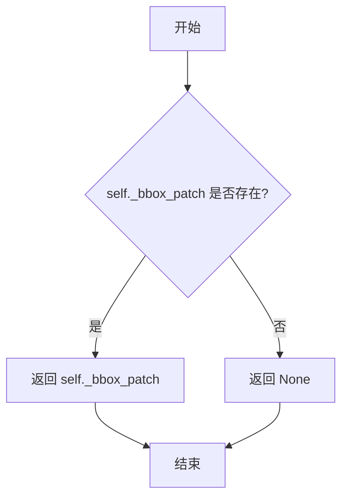

#### 带注释源码

```
def get_bbox_patch(self):
    """
    Return the bbox Patch, or None if the `.patches.FancyBboxPatch`
    is not made.

    For more details see `.Text.set_bbox`.
    """
    # 直接返回内部保存的 _bbox_patch 属性
    # 该属性在 set_bbox 方法中被设置
    # 如果从未调用过 set_bbox 或传入 None，则为 None
    return self._bbox_patch
```

#### 相关说明

- **所属类**：`Text`
- **内部属性**：使用 `self._bbox_patch` 存储 FancyBboxPatch 实例
- **设置方法**：对应的设置方法是 `Text.set_bbox(rectprops)`，用于创建或更新边框补丁
- **用途**：用于获取文本的背景框补丁，可在绘制时渲染文本的背景效果


### `Text.update_bbox_position_size`

该方法负责在绘制文本之前，计算并更新文本背景框（`_bbox_patch`）的位置和大小。它首先将文本的坐标从数据单位转换为显示坐标，然后结合文本的旋转角度，计算出包含文本的边界框（TextBox），最后设置背景框的边界、变换矩阵（平移和旋转）以及Mutation Scale（用于控制边框样式的缩放）。

参数：

- `renderer`：`RendererBase`（matplotlib 后端渲染器），用于获取文本度量（如宽度、高度）以及将点转换为像素。

返回值：`None`，该方法直接修改对象内部状态（`_bbox_patch`），不返回任何值。

#### 流程图

```mermaid
flowchart TD
    A([Start update_bbox_position_size]) --> B{_bbox_patch 是否存在?}
    B -- No --> C([Return None])
    B -- Yes --> D[获取文本坐标: convert_xunits/y -> transform]
    D --> E[调用 _get_textbox 计算文本包围盒]
    E --> F[设置 Patch 边界: set_bounds]
    F --> G[构建变换矩阵: 旋转角度 + 平移位置]
    G --> H[应用变换: set_transform]
    H --> I[计算字体大小像素值: points_to_pixels]
    I --> J[设置 Mutation Scale: set_mutation_scale]
    J --> K([End])
```

#### 带注释源码

```python
def update_bbox_position_size(self, renderer):
    """
    Update the location and the size of the bbox.

    This method should be used when the position and size of the bbox needs
    to be updated before actually drawing the bbox.
    """
    # 检查文本是否有背景框（_bbox_patch）
    if self._bbox_patch:
        # 获取文本在数据坐标系中的位置，并转换为显示（像素）坐标系
        # 注意：这里不使用 self.get_unitless_position，因为我们需要的是文本的绝对位置
        posx = float(self.convert_xunits(self._x))
        posy = float(self.convert_yunits(self._y))
        posx, posy = self.get_transform().transform((posx, posy))

        # 计算文本的实际包围盒（考虑旋转等因素）
        # 返回值分别为: 包围盒左下角x, y, 宽度, 高度
        x_box, y_box, w_box, h_box = _get_textbox(self, renderer)
        
        # 设置背景框的局部边界（相对于自身的左上角或左下角）
        self._bbox_patch.set_bounds(0., 0., w_box, h_box)
        
        # 设置背景框的全局变换：
        # 1. 先旋转文本需要的角度
        # 2. 再平移到文本当前的显示位置(posx, posy)加上文本包围盒的偏移(x_box, y_box)
        self._bbox_patch.set_transform(
            Affine2D()
            .rotate_deg(self.get_rotation())
            .translate(posx + x_box, posy + y_box))
        
        # 计算字体大小对应的像素值，并设置为背景框的突变比例
        # 这决定了边框圆角等样式的大小
        fontsize_in_pixel = renderer.points_to_pixels(self.get_size())
        self._bbox_patch.set_mutation_scale(fontsize_in_pixel)
```


### `Text.get_wrap`

获取文本对象的换行（wrap）属性，判断文本是否可以在图形边界内自动换行。

参数： 无

返回值：`bool`， 返回文本是否可以换行。

#### 流程图

```mermaid
flowchart TD
    A[开始 get_wrap] --> B{检查 wrap 属性}
    B -->|返回 True| C[文本可以在边界内换行]
    B -->|返回 False| D[文本不进行换行处理]
    C --> E[返回 self._wrap = True]
    D --> F[返回 self._wrap = False]
```

#### 带注释源码

```python
def get_wrap(self):
    """Return whether the text can be wrapped."""
    # 返回内部属性 _wrap 的值
    # _wrap 是一个布尔值，表示是否启用文本换行功能
    # 当为 True 时，文本将根据图形边界自动换行
    # 当为 False 时，文本将保持原始格式不进行换行
    return self._wrap
```


### `Text.set_wrap`

设置文本是否允许自动换行。换行功能确保文本被限制在（子）图形框内，但不考虑其他艺术家元素。

参数：

- `wrap`：`bool`，指定是否启用文本换行功能

返回值：`None`，该方法无返回值，仅设置内部属性

#### 流程图

```mermaid
flowchart TD
    A[开始 set_wrap] --> B{检查 wrap 参数类型}
    B -->|有效| C[将 wrap 赋值给 self._wrap]
    B -->|无效| D[抛出异常]
    C --> E[标记对象为 stale 需要重绘]
    E --> F[结束]
```

#### 带注释源码

```python
def set_wrap(self, wrap):
    """
    Set whether the text can be wrapped.

    Wrapping makes sure the text is confined to the (sub)figure box. It
    does not take into account any other artists.

    Parameters
    ----------
    wrap : bool

    Notes
    -----
    Wrapping does not work together with
    ``savefig(..., bbox_inches='tight')`` (which is also used internally
    by ``%matplotlib inline`` in IPython/Jupyter). The 'tight' setting
    rescales the canvas to accommodate all content and happens before
    wrapping.
    """
    # 将 wrap 参数直接赋值给内部属性 _wrap
    # 该属性在后续绘制时会被 _get_wrapped_text 方法检查
    # 以决定是否需要对文本进行换行处理
    self._wrap = wrap
```


### Text._get_wrap_line_width

该方法用于根据当前文本的方向（旋转角度和对齐方式）计算文本换行的最大可用宽度。它通过计算文本锚点到 Figure 边界框的距离来确定在给定对齐方式下文本可以使用的最大像素宽度。

参数：- 无

返回值：`float`，返回允许的最大行宽（像素）

#### 流程图

```mermaid
flowchart TD
    A[开始 _get_wrap_line_width] --> B[获取文本在显示坐标系中的位置 x0, y0]
    B --> C[获取 Figure 的窗口边界 figure_box]
    C --> D[获取文本的水平对齐方式 alignment]
    D --> E[设置旋转模式为 'anchor']
    E --> F[获取文本的旋转角度 rotation]
    F --> G[计算左侧距离 left]
    G --> H[计算右侧距离 right]
    H --> I{判断对齐方式}
    I -->|left| J[line_width = left]
    I -->|right| K[line_width = right]
    I -->|center| L[line_width = 2 * min(left, right)]
    J --> M[返回 line_width]
    K --> M
    L --> M
    
    G1[_get_dist_to_box 调用] --> G2{rotation > 270?}
    G2 -->|是| G3[计算第一象限距离]
    G2 -->|否| G4{rotation > 180?}
    G4 -->|是| G5[计算第二象限距离]
    G4 -->|否| G6{rotation > 90?}
    G6 -->|是| G7[计算第三象限距离]
    G6 -->|否| G8[计算第四象限距离]
    G3 --> G9[返回 min<h1, h2>]
    G5 --> G9
    G7 --> G9
    G8 --> G9
```

#### 带注释源码

```python
def _get_wrap_line_width(self):
    """
    Return the maximum line width for wrapping text based on the current
    orientation.
    """
    # 将文本位置转换为显示坐标（像素坐标）
    x0, y0 = self.get_transform().transform(self.get_position())
    
    # 获取 Figure 的窗口边界框（显示坐标）
    figure_box = self.get_figure().get_window_extent()

    # 获取文本的水平对齐方式：'left', 'center', 或 'right'
    alignment = self.get_horizontalalignment()
    
    # 设置旋转模式为 'anchor'，使旋转计算基于锚点
    self.set_rotation_mode('anchor')
    
    # 获取文本的旋转角度（度）
    rotation = self.get_rotation()

    # 计算从文本位置到 Figure 边界框左侧的距离（像素）
    left = self._get_dist_to_box(rotation, x0, y0, figure_box)
    
    # 计算从文本位置到 Figure 边界框右侧的距离
    # 使用 (180 + rotation) % 360 来获取相反方向的距离
    right = self._get_dist_to_box(
        (180 + rotation) % 360, x0, y0, figure_box)

    # 根据对齐方式确定最大行宽
    if alignment == 'left':
        line_width = left
    elif alignment == 'right':
        line_width = right
    else:  # center
        # 居中对齐时，取两侧最小距离的两倍，确保文本在中间
        line_width = 2 * min(left, right)

    return line_width


def _get_dist_to_box(self, rotation, x0, y0, figure_box):
    """
    Return the distance from the given points to the boundaries of a
    rotated box, in pixels.
    
    Parameters
    ----------
    rotation : float
        旋转角度（度），用于确定计算距离的方向
    x0, y0 : float
        文本锚点的显示坐标
    figure_box : Bbox
        Figure 的窗口边界框
        
    Returns
    -------
    float
        到边界框的最小距离（像素）
    """
    # 根据旋转角度确定所在的象限（0-90, 90-180, 180-270, 270-360）
    if rotation > 270:
        quad = rotation - 270
        # 计算到两个边的距离，取较小者
        h1 = (y0 - figure_box.y0) / math.cos(math.radians(quad))
        h2 = (figure_box.x1 - x0) / math.cos(math.radians(90 - quad))
    elif rotation > 180:
        quad = rotation - 180
        h1 = (x0 - figure_box.x0) / math.cos(math.radians(quad))
        h2 = (y0 - figure_box.y0) / math.cos(math.radians(90 - quad))
    elif rotation > 90:
        quad = rotation - 90
        h1 = (figure_box.y1 - y0) / math.cos(math.radians(quad))
        h2 = (x0 - figure_box.x0) / math.cos(math.radians(90 - quad))
    else:
        # 0-90 度范围
        h1 = (figure_box.x1 - x0) / math.cos(math.radians(rotation))
        h2 = (figure_box.y1 - y0) / math.cos(math.radians(90 - rotation))

    return min(h1, h2)
```


### `Text._get_wrapped_text`

该方法用于获取经过自动换行处理后的文本字符串。它首先检查文本是否启用换行功能，若未启用或使用 LaTeX 排版则直接返回原始文本；否则，根据计算出的最大行宽对文本的每一行进行逐行处理，通过计算单词组合的渲染宽度来决定换行位置，最终返回添加了换行符的文本。

参数：無（该方法为实例方法，隐含参数为 `self`）

返回值：`str`，返回经过换行处理后的文本字符串，如果未启用换行则返回原始文本。

#### 流程图

```mermaid
flowchart TD
    A[开始] --> B{是否启用换行?}
    B -->|否| C[返回原始文本 get_text]
    B -->|是| D{是否使用 LaTeX?}
    D -->|是| C
    D -->|否| E[计算行宽 line_width]
    E --> F[按换行符分割原始文本为多行]
    F --> G[遍历每一行未包装文本]
    G --> H{当前行是否为空?}
    H -->|是| I[继续下一行]
    H -->|否| J[按空格分割单词]
    J --> K{是否只剩一个单词?}
    K -->|是| L[直接添加到包装行]
    K -->|否| M[尝试逐步增加单词数量]
    M --> N{当前单词组合宽度是否超限?}
    N -->|是| O[添加前面的单词到包装行, 剩余单词进入下一轮]
    N -->|否| P{是否已包含所有剩余单词?}
    P -->|是| O
    P -->|否| M
    O --> Q{是否还有剩余单词?}
    Q -->|是| K
    Q -->|否| R[处理下一行]
    L --> R
    I --> R
    R --> S{是否还有未处理行?}
    S -->|是| G
    S -->|否| T[将包装行用换行符连接]
    T --> U[返回换行后的文本]
```

#### 带注释源码

```python
def _get_wrapped_text(self):
    """
    Return a copy of the text string with new lines added so that the text
    is wrapped relative to the parent figure (if `get_wrap` is True).
    """
    # 检查是否启用了文本换行功能，若未启用则直接返回原始文本
    if not self.get_wrap():
        return self.get_text()

    # LaTeX 模式的文本换行处理不完善，暂时忽略 LaTeX 文本的换行
    if self.get_usetex():
        return self.get_text()

    # 获取基于当前文本方向和父图形尺寸的最大行宽
    line_width = self._get_wrap_line_width()
    # 存储换行后的所有行
    wrapped_lines = []

    # 按换行符分割原始文本，保留用户显式换行的位置
    unwrapped_lines = self.get_text().split('\n')

    # 逐行处理未包装的文本
    for unwrapped_line in unwrapped_lines:
        # 将每行按空格分割成单词列表
        sub_words = unwrapped_line.split(' ')
        
        # 循环处理单词列表，处理完时停止
        while len(sub_words) > 0:
            # 如果只有一个单词，直接添加到最后并继续下一轮
            if len(sub_words) == 1:
                wrapped_lines.append(sub_words.pop(0))
                continue

            # 从两个单词开始尝试，逐步增加单词数量直到所有剩余单词
            for i in range(2, len(sub_words) + 1):
                # 拼接从开头到第 i 个单词的文本
                line = ' '.join(sub_words[:i])
                # 计算该文本在渲染时的宽度（像素）
                current_width = self._get_rendered_text_width(line)

                # 如果当前组合宽度超过行宽限制
                if current_width > line_width:
                    # 将不包括最后一个单词的部分加入包装行
                    wrapped_lines.append(' '.join(sub_words[:i - 1]))
                    # 剩余单词进入下一轮处理
                    sub_words = sub_words[i - 1:]
                    break

                # 如果已包含所有剩余单词且宽度未超限
                elif i == len(sub_words):
                    wrapped_lines.append(' '.join(sub_words[:i]))
                    # 清空单词列表，结束该行处理
                    sub_words = []
                    break

    # 将所有包装行用换行符连接成最终文本
    return '\n'.join(wrapped_lines)
```


### `Text.draw`

该方法时 `Text` 类的核心绘制方法，负责将文本对象渲染到指定的画布渲染器上。它首先检查文本的可见性和有效性，然后计算文本的布局（位置和包围盒），处理坐标转换，最后根据是否启用 TeX 渲染或路径效果来绘制文本字符串及可选的背景框。

参数：

- `renderer`：`matplotlib.backend_bases.RendererBase`，执行实际绘制的渲染器对象。

返回值：`None`，该方法直接作用于画布，不返回任何值。

#### 流程图

```mermaid
graph TD
    A([开始]) --> B{renderer is not None?}
    B -- 是 --> C[保存 renderer 引用]
    B -- 否 --> D{文本不可见?}
    C --> D
    D -- 是 --> E([返回])
    D -- 否 --> F{文本为空?}
    F -- 是 --> E
    F -- 否 --> G[打开渲染组]
    G --> H[获取换行后的文本]
    H --> I[调用 _get_layout 计算布局]
    I --> J[获取变换对象]
    J --> K[转换坐标 (x, y) 到显示坐标]
    K --> L{坐标是否为 NaN?}
    L -- 是 --> E
    L -- 否 --> M[获取画布宽高]
    M --> N{是否有 Bbox Patch?}
    N -- 是 --> O[更新并绘制 Bbox Patch]
    N -- 否 --> P[创建图形上下文 GC]
    O --> P
    P --> Q[设置 GC 属性 (颜色, 透明度等)]
    Q --> R[获取旋转角度]
    R --> S{遍历布局中的每一行}
    S --> T[预处理数学文本]
    T --> U{是否有路径效果?}
    U -- 是 --> V[使用 PathEffectRenderer]
    U -- 否 --> W[使用原始 renderer]
    V --> X
    W --> X{是否使用 TeX?}
    X -- 是 --> Y[调用 draw_tex]
    X -- 否 --> Z[调用 draw_text]
    Y --> S
    Z --> S
    S --> AA[恢复 GC]
    AA --> AB[关闭渲染组]
    AB --> AC[设置 stale 为 False]
    AC --> AD([结束])
```

#### 带注释源码

```python
@artist.allow_rasterization
def draw(self, renderer):
    # 继承自父类的 docstring

    # 如果传入了 renderer，则缓存到实例变量中供后续使用（如计算包围盒）
    if renderer is not None:
        self._renderer = renderer
    
    # 如果文本对象不可见，则不进行绘制
    if not self.get_visible():
        return
    
    # 如果文本内容为空，则直接返回
    if self.get_text() == '':
        return

    # 开启一个渲染组，便于管理图形状态和层次
    renderer.open_group('text', self.get_gid())

    # 使用上下文管理器处理换行逻辑
    with self._cm_set(text=self._get_wrapped_text()):
        # 获取文本的布局信息：包围盒(bbox)、每行信息(info)、行间距(descent)
        bbox, info, descent = self._get_layout(renderer)
        # 获取应用于文本的坐标变换
        trans = self.get_transform()

        # 获取文本的原始坐标（数据坐标或相对坐标）
        # 注意：这里不使用 self.get_position()，因为它可能包含单位
        x, y = self._x, self._y
        
        # 处理 masked array（掩码数组）的情况，将掩码值转为 NaN
        if np.ma.is_masked(x):
            x = np.nan
        if np.ma.is_masked(y):
            y = np.nan
            
        # 单位转换：将数据单位转换为显示单位
        posx = float(self.convert_xunits(x))
        posy = float(self.convert_yunits(y))
        
        # 应用变换：将 (posx, posy) 转换为显示坐标
        posx, posy = trans.transform((posx, posy))
        
        # 坐标有效性检查
        if np.isnan(posx) or np.isnan(posy):
            return  # 如果坐标是 NaN，直接返回，不发出警告
        if not np.isfinite(posx) or not np.isfinite(posy):
            _log.warning("posx and posy should be finite values")
            return

        # 获取画布的宽和高
        canvasw, canvash = renderer.get_canvas_width_height()

        # 如果存在背景框（bbox patch），则更新其位置和大小并绘制
        if self._bbox_patch:
            self.update_bbox_position_size(renderer)
            self._bbox_patch.draw(renderer)

        # 创建新的图形上下文（Graphics Context）
        gc = renderer.new_gc()
        # 设置前景色
        gc.set_foreground(mcolors.to_rgba(self.get_color()), isRGBA=True)
        # 设置透明度
        gc.set_alpha(self.get_alpha())
        # 设置 URL
        gc.set_url(self._url)
        # 设置抗锯齿
        gc.set_antialiased(self._antialiased)
        # 设置剪裁
        self._set_gc_clip(gc)

        # 获取文本旋转角度
        angle = self.get_rotation()

        # 遍历布局中的每一行进行绘制
        for line, wh, x, y in info:
            # 如果只有一行文本，mtext 指向 self，否则为 None
            mtext = self if len(info) == 1 else None
            
            # 将每行的绘制坐标加上文本对象的整体偏移量
            x = x + posx
            y = y + posy
            
            # 如果渲染器需要翻转 y 轴（例如某些后端）
            if renderer.flipy():
                y = canvash - y
                
            # 预处理数学表达式
            clean_line, ismath = self._preprocess_math(line)

            # 处理路径效果（如发光、描边等）
            if self.get_path_effects():
                from matplotlib.patheffects import PathEffectRenderer
                textrenderer = PathEffectRenderer(
                    self.get_path_effects(), renderer)
            else:
                textrenderer = renderer

            # 根据是否使用 TeX 渲染来调用不同的绘制方法
            if self.get_usetex():
                textrenderer.draw_tex(gc, x, y, clean_line,
                                      self._fontproperties, angle,
                                      mtext=mtext)
            else:
                textrenderer.draw_text(gc, x, y, clean_line,
                                       self._fontproperties, angle,
                                       ismath=ismath, mtext=mtext)

    # 恢复图形上下文
    gc.restore()
    # 关闭渲染组
    renderer.close_group('text')
    # 标记为非 stale，表示已绘制完毕
    self.stale = False
```


### Text.get_color

获取文本的前景颜色。

参数： 无

返回值：`str` 或颜色数组，返回文本的颜色值。

#### 流程图

```mermaid
flowchart TD
    A[开始] --> B[返回 self._color]
    B --> C[结束]
```

#### 带注释源码

```python
def get_color(self):
    """Return the color of the text."""
    return self._color
```


### `Text.set_color`

设置文本的前景色（颜色）。

参数：

- `color`：`matplotlib color`，要设置的文本颜色，支持多种颜色格式（如十六进制、RGB、颜色名称等）

返回值：`None`，无返回值（直接修改对象状态）

#### 流程图

```mermaid
flowchart TD
    A[开始 set_color] --> B{color是否为'auto'}
    B -- 是 --> F[直接设置self._color = color]
    B -- 否 --> C[调用_check_color_like验证颜色格式]
    C --> D{颜色格式是否有效}
    D -- 无效 --> E[抛出异常]
    D -- 有效 --> F[设置self._color = color]
    F --> G[设置self.stale = True标记需要重绘]
    G --> H[结束]
```

#### 带注释源码

```python
def set_color(self, color):
    """
    Set the foreground color of the text

    Parameters
    ----------
    color : :mpltype:`color`
    """
    # "auto" is only supported by axisartist, but we can just let it error
    # out at draw time for simplicity.
    # 检查颜色是否为特殊值"auto"，如果是则跳过颜色格式验证
    # 因为"auto"仅由axisartist使用，为了简化处理让其在下一次绘制时再报错
    if not cbook._str_equal(color, "auto"):
        # 验证颜色参数格式是否合法
        # 调用matplotlib.colors模块的颜色检查函数
        mpl.colors._check_color_like(color=color)
    
    # 将颜色值存储到实例属性_color中
    self._color = color
    
    # 标记对象状态为"stale"（过时）
    # 这告诉matplotlib该对象需要重新绘制，在下一次渲染时会重新绘制文本
    self.stale = True
```


### Text.get_fontproperties

该方法返回与当前文本对象关联的 `FontProperties` 对象，用于获取文本的字体属性信息（如字体名称、大小、样式等）。

参数：无（仅包含隐式参数 `self`）

返回值：`FontProperties`，返回当前 `Text` 对象所使用字体属性对象。

#### 流程图

```mermaid
flowchart TD
    A[调用 get_fontproperties] --> B{检查方法调用}
    B --> C[返回 self._fontproperties]
    C --> D[FontProperties对象]
    D --> E[调用者可获取字体属性]
    
    subgraph "内部状态"
        F[_fontproperties: FontProperties]
    end
    
    C -.-> F
```

#### 带注释源码

```python
def get_fontproperties(self):
    """
    Return the `.font_manager.FontProperties`.
    
    该方法返回当前Text对象内部存储的FontProperties实例。
    返回的FontProperties对象是一个副本还是引用，取决于内部的实现方式。
    调用者可以使用返回的FontProperties对象来查询或修改文本的字体属性。
    
    Returns
    -------
    FontProperties
        当前文本对象使用的字体属性对象，类型为 matplotlib.font_manager.FontProperties
    """
    return self._fontproperties
```

#### 技术债务与优化空间

1. **缺乏深拷贝保护**：该方法直接返回内部 `_fontproperties` 引用而非副本，调用者可以直接修改字体属性而不会触发 `stale = True` 状态更新，可能导致渲染不同步。建议考虑返回 `.copy()` 以保持一致性，或在文档中明确说明此行为。

2. **与其他 getter 方法的一致性**：对比 `get_fontname()`、`get_fontsize()` 等方法会调用 `FontProperties` 的 getter 方法，而此方法直接返回整个对象。考虑是否需要提供更细粒度的访问接口。

#### 设计目标与约束

- **设计目标**：提供访问文本字体属性的统一入口，使外部能够获取字体配置信息。
- **约束**：返回的 `FontProperties` 对象与 `Text` 实例生命周期绑定，当 `Text` 实例被序列化（如 `__getstate__`）时，`_renderer` 会被置为 `None`，但 `_fontproperties` 会保留。
- **与其他组件的关系**：此方法依赖于 `FontProperties` 类，该类在 `font_manager.py` 中定义，是 matplotlib 字体管理的核心组件。


### `Text.set_fontproperties`

设置用于控制文本的字体属性。该方法接受多种类型的输入（FontProperties对象、字符串或路径），将其统一转换为FontProperties对象并复制到实例属性中，同时标记实例需要重新渲染。

参数：

- `fp`：`.font_manager.FontProperties` 或 `str` 或 `pathlib.Path`，要设置的字体属性。如果传入字符串，会作为fontconfig模式被`.FontProperties`解析；如果传入`pathlib.Path`，则被解释为字体文件的绝对路径。

返回值：`None`，无返回值（ setter 方法）。

#### 流程图

```mermaid
flowchart TD
    A[开始 set_fontproperties] --> B{检查输入 fp 类型}
    B -->|FontProperties 对象| C[直接使用]
    B -->|str 字符串| D[解析为 fontconfig 模式]
    B -->|pathlib.Path 路径| E[解析为字体文件路径]
    D --> F[FontProperties._from_any]
    E --> F
    C --> F
    F --> G[复制 FontProperties 对象]
    G --> H[赋值给 self._fontproperties]
    H --> I[设置 self.stale = True]
    I --> J[标记对象需要重新渲染]
    J --> K[结束]
```

#### 带注释源码

```python
def set_fontproperties(self, fp):
    """
    Set the font properties that control the text.

    Parameters
    ----------
    fp : `.font_manager.FontProperties` or `str` or `pathlib.Path`
        If a `str`, it is interpreted as a fontconfig pattern parsed by
        `.FontProperties`.  If a `pathlib.Path`, it is interpreted as the
        absolute path to a font file.
    """
    # 使用 FontProperties._from_any 将任意类型的输入转换为 FontProperties 对象
    # 该方法可以处理：FontProperties 对象、字符串（fontconfig 模式）、pathlib.Path（字体文件路径）
    self._fontproperties = FontProperties._from_any(fp).copy()
    # 标记对象为"过时"状态，表示需要重新渲染
    # stale 属性被用于缓存失效机制，当字体属性改变时需要重新计算布局和绘制
    self.stale = True
```


### `Text.get_fontfamily`

该方法用于返回当前文本对象所使用的字体家族列表。它通过调用内部持有的 `FontProperties` 对象的 `get_family()` 方法来获取字体家族信息，是 Text 类提供的字体属性查询接口之一。

参数： 无（仅包含隐式参数 `self`）

返回值：`list[str]`，返回字体家族名称的列表，列表中的元素按优先级排序，用于字体查找。

#### 流程图

```mermaid
flowchart TD
    A[开始: get_fontfamily] --> B[调用self._fontproperties.get_family]
    B --> C[返回字体家族列表]
```

#### 带注释源码

```python
def get_fontfamily(self):
    """
    Return the list of font families used for font lookup.

    See Also
    --------
    .font_manager.FontProperties.get_family
    """
    # 通过内部持有的 _fontproperties 对象获取字体家族列表
    # _fontproperties 是 FontProperties 的实例，存储了文本的字体属性
    # get_family() 方法返回字体家族名称列表，按优先级排序
    return self._fontproperties.get_family()
```


### `Text.set_fontfamily`

设置文本的字体族（font family）。可以接受单个字体名称字符串，也可以接受一个按优先级降序排列的字符串列表。每个字符串可以是实际字体名称（如 "Arial"）或通用字体类名称（如 "serif"、"sans-serif"）。如果是通用名称，将根据对应的 rcParams 查询具体的字体名称。

参数：

- `fontname`：`str` 或 `list[str]`，字体族名称，可以是单个字体名或字体名列表

返回值：`None`，无返回值（该方法直接修改对象内部状态）

#### 流程图

```mermaid
flowchart TD
    A[调用 set_fontfamily] --> B{检查 fontname 参数}
    B -->|有效参数| C[调用 self._fontproperties.set_family]
    C --> D[设置 self.stale = True]
    D --> E[标记对象需要重绘]
    B -->|无效参数| F[由 FontProperties.set_family 抛出异常]
```

#### 带注释源码

```python
def set_fontfamily(self, fontname):
    """
    Set the font family.  Can be either a single string, or a list of
    strings in decreasing priority.  Each string may be either a real font
    name or a generic font class name.  If the latter, the specific font
    names will be looked up in the corresponding rcParams.

    If a `Text` instance is constructed with ``fontfamily=None``, then the
    font is set to :rc:`font.family`, and the
    same is done when `set_fontfamily()` is called on an existing
    `Text` instance.

    Parameters
    ----------
    fontname : {FONTNAME, 'serif', 'sans-serif', 'cursive', 'fantasy', \
'monospace'}

    See Also
    --------
    .font_manager.FontProperties.set_family
    """
    # 委托给内部的 FontProperties 对象进行实际的字体族设置
    self._fontproperties.set_family(fontname)
    # 标记该文本对象需要重新渲染（stale 状态）
    self.stale = True
```


### Text.get_fontname

获取当前文本对象所使用的字体名称。

参数：
- 无

返回值：`str`，返回字体名称字符串。

#### 流程图

```mermaid
flowchart TD
    A[调用 Text.get_fontname] --> B{检查 _fontproperties 是否存在}
    B -->|是| C[调用 _fontproperties.get_name]
    C --> D[返回字体名称字符串]
    B -->|否| E[返回默认值或空字符串]
```

#### 带注释源码

```python
def get_fontname(self):
    """
    Return the font name as a string.

    See Also
    --------
    .font_manager.FontProperties.get_name
    """
    # 调用内部 FontProperties 对象的 get_name 方法获取字体名称
    # self._fontproperties 是 FontProperties 类型的实例
    # 用于存储文本的字体属性（字体家族、名称、大小、样式等）
    return self._fontproperties.get_name()
```

#### 相关类信息

| 名称 | 类型 | 描述 |
|------|------|------|
| `_fontproperties` | `FontProperties` | 存储文本字体属性的内部对象 |
| `self` | `Text` | 当前 Text 类实例 |

#### 技术说明

- **设计目标**：提供一种获取文本字体的简单接口，封装了底层 FontProperties 的实现细节
- **依赖关系**：依赖于 `FontProperties.get_name()` 方法
- **潜在优化空间**：当前实现已非常简洁，无明显优化空间


### `Text.set_fontname`

设置文本的字体名称，作为 `set_fontfamily` 方法的别名使用。该方法将字体名称委托给内部的字体属性系统。

参数：

- `fontname`：`str`，字体名称，可以是具体的字体名称（如 "Arial"）或字体族名称（'serif', 'sans-serif', 'cursive', 'fantasy', 'monospace'）

返回值：`None`，无返回值，仅修改对象状态

#### 流程图

```mermaid
flowchart TD
    A[开始 set_fontname] --> B{检查 fontname 参数}
    B -->|有效参数| C[调用 self.set_fontfamily(fontname)]
    B -->|无效参数| D[由 set_fontfamily 抛出异常]
    C --> E[设置 self.stale = True]
    E --> F[标记对象需要重新渲染]
    F --> G[结束]
```

#### 带注释源码

```python
def set_fontname(self, fontname):
    """
    Alias for `set_fontfamily`.

    One-way alias only: the getter differs.

    Parameters
    ----------
    fontname : {FONTNAME, 'serif', 'sans-serif', 'cursive', 'fantasy', \
'monospace'}

    See Also
    --------
    .font_manager.FontProperties.set_family

    """
    # 调用 set_fontfamily 方法，将字体名称传递给字体属性系统
    # set_fontfamily 会验证字体名称并更新内部 _fontproperties 对象
    self.set_fontfamily(fontname)
```


### Text.get_fontstyle

获取文本对象的字体样式（Font Style），返回如 'normal'、'italic' 或 'oblique' 等字体样式字符串。该方法是 Text 类与 FontProperties 之间的简单代理调用，用于获取当前文本的字体样式属性。

参数：  
（无显式参数，隐含参数 `self` 为 Text 实例本身）

返回值：`str`，返回当前文本的字体样式，常见的返回值包括：
- `'normal'`：正常字体
- `'italic'`：斜体
- `'oblique'`：倾斜字体

#### 流程图

```mermaid
flowchart TD
    A[调用 Text.get_fontstyle] --> B{检查 _fontproperties 是否存在}
    B -->|是| C[调用 self._fontproperties.get_style]
    C --> D[返回字体样式字符串]
    B -->|否| E[返回默认值或抛出异常]
```

#### 带注释源码

```python
def get_fontstyle(self):
    """
    Return the font style as a string.

    See Also
    --------
    .font_manager.FontProperties.get_style
    """
    # 代理调用：内部委托给 FontProperties 实例的 get_style 方法
    # _fontproperties 是 FontProperties 类型对象，存储文本的字体属性
    return self._fontproperties.get_style()
```

#### 相关设计信息

| 项目 | 说明 |
|------|------|
| **所属类** | `Text` |
| **依赖组件** | `FontProperties` (来自 `matplotlib.font_manager`) |
| **设计模式** | 代理模式（Proxy Pattern）- 该方法是内部 `FontProperties` 对象的简单代理 |
| **调用层级** | 用户代码 → Text.get_fontstyle → FontProperties.get_style |
| **线程安全性** | 线程安全（只读操作） |
| **性能考量** | O(1) 时间复杂度，无额外计算开销 |


### Text.set_fontstyle

设置文本的字体样式。

参数：

- `fontstyle`：`str`，字体样式，可选值为 `'normal'`、`'italic'` 或 `'oblique'`

返回值：`None`，无返回值（该方法直接修改对象内部状态）

#### 流程图

```mermaid
flowchart TD
    A[开始 set_fontstyle] --> B{验证 fontstyle 参数}
    B -->|有效值| C[调用 _fontproperties.set_style]
    C --> D[设置 stale = True]
    D --> E[标记对象需要重绘]
    E --> F[结束]
    B -->|无效值| G[由 FontProperties.set_style 抛出异常]
    G --> F
```

#### 带注释源码

```python
def set_fontstyle(self, fontstyle):
    """
    Set the font style.

    Parameters
    ----------
    fontstyle : {'normal', 'italic', 'oblique'}

    See Also
    --------
    .font_manager.FontProperties.set_style
    """
    # 调用内部 FontProperties 对象的 set_style 方法来设置字体样式
    self._fontproperties.set_style(fontstyle)
    # 将 stale 标记设置为 True，表示文本对象的渲染状态已过期
    # 这会触发 matplotlib 在下次渲染时重新绘制该文本对象
    self.stale = True
```


### Text.get_fontsize

获取文本对象的字体大小。

参数：

- 无参数（仅 `self` 隐式参数）

返回值：`int`，返回字体大小（以磅为单位整数）。

#### 流程图

```mermaid
flowchart TD
    A[开始 get_fontsize] --> B{检查字体属性是否存在}
    B -->|是| C[调用 self._fontproperties.get_size_in_points]
    C --> D[返回整数字体大小]
    B -->|否| E[返回默认值或抛出异常]
    D --> F[结束]
    E --> F
```

#### 带注释源码

```python
def get_fontsize(self):
    """
    Return the font size as an integer.

    See Also
    --------
    .font_manager.FontProperties.get_size_in_points
    """
    # 返回字体属性对象中存储的字体大小（整数）
    # 调用 FontProperties 类的 get_size_in_points 方法获取字体大小
    return self._fontproperties.get_size_in_points()
```


### `Text.set_fontsize`

设置文本的字体大小。

参数：

- `fontsize`：`float` 或 `{'xx-small', 'x-small', 'small', 'medium', 'large', 'x-large', 'xx-large'}`，如果是浮点数，则以磅为单位；字符串值表示相对于默认字体大小的尺寸。

返回值：`None`，无返回值，仅修改对象内部状态。

#### 流程图

```mermaid
flowchart TD
    A[开始 set_fontsize] --> B{接收 fontsize 参数}
    B --> C[调用 self._fontproperties.set_size]
    C --> D[设置 self.stale = True]
    D --> E[标记对象需要重绘]
    E --> F[结束]
```

#### 带注释源码

```python
def set_fontsize(self, fontsize):
    """
    Set the font size.

    Parameters
    ----------
    fontsize : float or {'xx-small', 'x-small', 'small', 'medium', \
'large', 'x-large', 'xx-large'}
        If a float, the fontsize in points. The string values denote sizes
        relative to the default font size.

    See Also
    --------
    .font_manager.FontProperties.set_size
    """
    # 调用内部 FontProperties 对象的 set_size 方法来设置字体大小
    self._fontproperties.set_size(fontsize)
    # 将 stale 标记设为 True，通知渲染器该对象需要重新绘制
    self.stale = True
```


### Text.get_fontvariant

获取文本对象的字体变体（variant）属性，返回关联的 `FontProperties` 对象的字体变体值。

参数：空（无参数）

返回值：`str`，返回字体变体字符串（如 'normal' 或 'small-caps'）

#### 流程图

```mermaid
flowchart TD
    A[开始 get_fontvariant] --> B{获取 self._fontproperties}
    B --> C[调用 get_variant 方法]
    C --> D[返回字体变体字符串]
    D --> E[结束]
```

#### 带注释源码

```python
def get_fontvariant(self):
    """
    Return the font variant as a string.

    See Also
    --------
    .font_manager.FontProperties.get_variant
    """
    # 获取内部存储的 FontProperties 对象，并调用其 get_variant 方法
    # 返回字体变体字符串，通常为 'normal' 或 'small-caps'
    return self._fontproperties.get_variant()
```


### `Text.set_fontvariant`

设置文本的字体变体（variant），例如普通字体或小型大写字体。该方法将字体变体委托给内部的 FontProperties 对象进行管理，并标记当前对象为"过时"（stale）状态，以便在下次绘制时重新渲染。

参数：

- `variant`：`str`，字体变体，取值范围为 `'normal'`（普通字体）或 `'small-caps'`（小型大写字母）

返回值：`None`，无返回值

#### 流程图

```mermaid
graph TD
    A[开始 set_fontvariant] --> B{检查 variant 参数}
    B -->|valid| C[调用 self._fontproperties.set_variant]
    C --> D[设置 self.stale = True]
    D --> E[结束]
    
    style A fill:#f9f,stroke:#333
    style E fill:#9f9,stroke:#333
```

#### 带注释源码

```python
def set_fontvariant(self, variant):
    """
    Set the font variant.

    Parameters
    ----------
    variant : {'normal', 'small-caps'}
        字体变体类型，'normal' 表示普通字体，'small-caps' 表示小型大写字母

    See Also
    --------
    .font_manager.FontProperties.set_variant
    """
    # 将字体变体设置委托给内部的 FontProperties 对象
    self._fontproperties.set_variant(variant)
    # 标记当前文本对象需要重新渲染（重新布局）
    self.stale = True
```


### Text.get_fontweight

该方法是一个简单的访问器（getter），用于获取当前 Text 对象的字体权重。它直接委托给内部持有的 `_fontproperties` 对象的 `get_weight()` 方法来获取字体权重值，该值可以是字符串形式（如 'normal'、'bold'）或数字形式（如 400、700）。

**参数**：

- 无显式参数（仅包含隐式参数 `self`）

**返回值**：`str` 或 `number`，返回字体的权重值。字符串形式可能包括 'ultralight'、'light'、'normal'、'regular'、'book'、'medium'、'roman'、'semibold'、'demibold'、' demi'、'bold'、'heavy'、'extra bold'、'black'；数字形式为 0-1000 范围内的整数值。

#### 流程图

```mermaid
flowchart TD
    A[开始] --> B[调用 self._fontproperties.get_weight]
    B --> C[返回字体权重值]
    C --> D[结束]
```

#### 带注释源码

```python
def get_fontweight(self):
    """
    Return the font weight as a string or a number.

    See Also
    --------
    .font_manager.FontProperties.get_weight
    """
    # 委托给 FontProperties 对象的 get_weight 方法获取字体权重
    # 返回值可以是字符串形式（如 'bold'）或数字形式（如 700）
    return self._fontproperties.get_weight()
```


### Text.set_fontweight

设置文本的字体粗细（font weight）。

参数：

- `weight`：{str | int | float}，字体粗细值，可以是数值（0-1000范围内）或预定义字符串（如 'ultralight'、'light'、'normal'、'regular'、'book'、'medium'、'roman'、'semibold'、'demibold'、'demi'、'bold'、'heavy'、'extra bold'、'black'）

返回值：`None`，无返回值（该方法直接修改对象状态）

#### 流程图

```mermaid
flowchart TD
    A[开始 set_fontweight] --> B[接收 weight 参数]
    B --> C[调用 self._fontproperties.set_weight weight]
    C --> D[设置 self.stale = True]
    D --> E[标记对象需要重绘]
    E --> F[结束]
```

#### 带注释源码

```python
def set_fontweight(self, weight):
    """
    Set the font weight.

    Parameters
    ----------
    weight : {a numeric value in range 0-1000, 'ultralight', 'light', \
'normal', 'regular', 'book', 'medium', 'roman', 'semibold', 'demibold', \
'demi', 'bold', 'heavy', 'extra bold', 'black'}

    See Also
    --------
    .font_manager.FontProperties.set_weight
    """
    # 将weight参数传递给内部的FontProperties对象进行设置
    self._fontproperties.set_weight(weight)
    # 标记该对象已过时，需要重新渲染
    self.stale = True
```


### `Text.get_stretch`

该方法是一个委托方法，用于获取文本字体的拉伸（stretch）属性。它直接调用内部 `_fontproperties` 对象的 `get_stretch` 方法并返回结果，不进行任何额外处理。

参数：无（仅包含 `self` 参数）

返回值：`str | number`，返回字体的拉伸值，可以是字符串（如 'normal', 'condensed', 'expanded' 等）或数字值（0-1000）。

#### 流程图

```mermaid
flowchart TD
    A[调用 Text.get_stretch] --> B{检查 _fontproperties}
    B -->|存在| C[调用 _fontproperties.get_stretch]
    B -->|不存在| D[返回默认值或错误]
    C --> E[返回拉伸值<br/>string 或 number]
```

#### 带注释源码

```python
def get_stretch(self):
    """
    Return the font stretch as a string or a number.

    See Also
    --------
    .font_manager.FontProperties.get_stretch
    """
    # 直接委托给内部的 FontProperties 对象
    # 返回字体拉伸属性，可以是字符串形式（如 'normal', 'condensed', 'expanded'）
    # 或数字形式（0-1000 的数值）
    return self._fontproperties.get_stretch()
```


### Text.set_fontstretch

设置文本字体的横向拉伸或压缩程度。

参数：

- `stretch`：`int | str`，字体拉伸值，可以是 0-1000 的数值或字符串（如 'ultra-condensed'、'condensed'、'normal'、'expanded'、'ultra-expanded' 等）

返回值：`None`，无返回值（该方法直接修改对象内部状态）

#### 流程图

```mermaid
flowchart TD
    A[调用 set_fontstretch] --> B{参数类型检查}
    B -->|数值| C[调用 _fontproperties.set_stretch 传入数值]
    B -->|字符串| D[调用 _fontproperties.set_stretch 传入字符串]
    C --> E[设置 self.stale = True 标记为需重绘]
    D --> E
    E --> F[结束]
```

#### 带注释源码

```python
def set_fontstretch(self, stretch):
    """
    Set the font stretch (horizontal condensation or expansion).

    Parameters
    ----------
    stretch : {a numeric value in range 0-1000, 'ultra-condensed', \
'extra-condensed', 'condensed', 'semi-condensed', 'normal', 'semi-expanded', \
'expanded', 'extra-expanded', 'ultra-expanded'}

    See Also
    --------
    .font_manager.FontProperties.set_stretch
    """
    # 将 stretch 参数传递给内部的 FontProperties 对象进行设置
    # FontProperties 负责实际的字体属性管理
    self._fontproperties.set_stretch(stretch)
    # 标记该对象为 'stale' 状态，提示渲染引擎该文本需要重新绘制
    self.stale = True
```


### `Text.get_horizontalalignment`

该方法用于获取文本的水平对齐方式，返回值为 'left'、'center' 或 'right' 之一。

参数： 无（仅 `self`）

返回值：`str`，返回文本的水平对齐方式，值为 'left'、'center' 或 'right'。

#### 流程图

```mermaid
flowchart TD
    A[开始 get_horizontalalignment] --> B{检查文本可见性}
    B -->|可见| C[返回 self._horizontalalignment]
    B -->|不可见| D[返回空或默认对齐]
    C --> E[结束]
    D --> E
```

#### 带注释源码

```python
def get_horizontalalignment(self):
    """
    Return the horizontal alignment as a string.  Will be one of
    'left', 'center' or 'right'.
    """
    # 返回内部属性 _horizontalalignment，该属性在 Text.__init__ 或
    # _reset_visual_defaults 方法中初始化，默认值为 'left'
    # 对齐方式决定了文本相对于锚点(x, y)的水平位置
    return self._horizontalalignment
```

#### 相关字段信息

| 字段名称 | 类型 | 描述 |
|---------|------|------|
| `_horizontalalignment` | str | 文本水平对齐方式，值为 'left'、'center' 或 'right' |

#### 相关设置方法

| 方法名称 | 描述 |
|---------|------|
| `set_horizontalalignment(align)` | 设置文本水平对齐方式，参数 align 接受 'left'、'center' 或 'right' |

#### 使用示例

```python
# 创建文本对象
text = Text(x=0.5, y=0.5, text='Hello World', horizontalalignment='center')

# 获取水平对齐方式
alignment = text.get_horizontalalignment()  # 返回 'center'

# 修改水平对齐方式
text.set_horizontalalignment('right')
alignment = text.get_horizontalalignment()  # 返回 'right'
```


### Text.set_horizontalalignment

该方法用于设置文本相对于锚点的水平对齐方式。

参数：

- `align`：`{'left', 'center', 'right'}`，水平对齐方式

返回值：`None`，无返回值，仅修改对象内部状态

#### 流程图

```mermaid
flowchart TD
    A[开始 set_horizontalalignment] --> B{验证 align 是否有效}
    B -->|有效| C[设置 self._horizontalalignment = align]
    B -->|无效| D[抛出 ValueError]
    C --> E[设置 self.stale = True]
    E --> F[结束]
    D --> F
```

#### 带注释源码

```python
def set_horizontalalignment(self, align):
    """
    Set the horizontal alignment relative to the anchor point.

    See also :doc:`/gallery/text_labels_and_annotations/text_alignment`.

    Parameters
    ----------
    align : {'left', 'center', 'right'}
    """
    # 使用 _api.check_in_list 验证 align 参数是否在允许的值列表中
    # 允许的值为 'center', 'right', 'left'
    _api.check_in_list(['center', 'right', 'left'], align=align)
    
    # 将传入的对齐方式赋值给内部属性 _horizontalalignment
    self._horizontalalignment = align
    
    # 设置 stale 标记为 True，指示该对象需要重新渲染
    self.stale = True
```


### Text.get_verticalalignment

该方法用于获取文本的垂直对齐方式，返回值为字符串类型，可能是 'top'、'center'、'bottom'、'baseline' 或 'center_baseline' 之一。

参数：此方法无参数。

返回值：`str`，返回文本的垂直对齐方式。

#### 流程图

```mermaid
flowchart TD
    A[开始] --> B[读取实例变量 _verticalalignment]
    B --> C[返回 _verticalalignment 值]
    C --> D[结束]
```

#### 带注释源码

```python
def get_verticalalignment(self):
    """
    Return the vertical alignment as a string.  Will be one of
    'top', 'center', 'bottom', 'baseline' or 'center_baseline'.
    """
    # 直接返回实例属性 _verticalalignment，该属性在 Text.__init__ 或
    # Text._reset_visual_defaults 中被初始化，默认值为 'baseline'
    # 可通过 set_verticalalignment 方法设置该值
    return self._verticalalignment
```


### `Text.set_verticalalignment`

设置文本相对于锚点的垂直对齐方式。

参数：

- `align`：`str`，垂直对齐方式，可选值为 `'baseline'`、`'bottom'``、`'center'`、`'center_baseline'` 或 `'top'`

返回值：`None`，无返回值，仅修改对象内部状态

#### 流程图

```mermaid
flowchart TD
    A[开始 set_verticalalignment] --> B{检查 align 是否合法}
    B -->|合法| C[设置 self._verticalalignment = align]
    B -->|不合法| D[抛出 ValueError 异常]
    C --> E[设置 self.stale = True]
    E --> F[结束]
    D --> F
```

#### 带注释源码

```python
def set_verticalalignment(self, align):
    """
    Set the vertical alignment relative to the anchor point.

    See also :doc:`/gallery/text_labels_and_annotations/text_alignment`.

    Parameters
    ----------
    align : {'baseline', 'bottom', 'center', 'center_baseline', 'top'}
        垂直对齐方式：
        - 'baseline': 基线对齐
        - 'bottom': 底部对齐
        - 'center': 居中对齐
        - 'center_baseline': 基线居中对齐
        - 'top': 顶部对齐
    """
    # 使用 _api.check_in_list 验证 align 参数是否在允许的列表中
    _api.check_in_list(
        ['top', 'bottom', 'center', 'baseline', 'center_baseline'],
        align=align)
    # 将对齐方式赋值给内部属性 _verticalalignment
    self._verticalalignment = align
    # 标记对象为"过时"状态，指示渲染器需要重新绘制
    self.stale = True
```


### Text.set_multialignment

设置多行文本的对齐方式。该方法控制文本行在由水平和垂直对齐属性确定的边界框内的对齐方式。

参数：

- `align`：`str`，对齐方式，取值为 `'left'`、`'right'` 或 `'center'` 之一

返回值：`None`，无返回值

#### 流程图

```mermaid
flowchart TD
    A[开始 set_multialignment] --> B{验证 align 参数}
    B -->|有效值| C[设置 self._multialignment = align]
    B -->|无效值| D[抛出异常]
    C --> E[设置 self.stale = True]
    E --> F[结束]
    D --> F
```

#### 带注释源码

```
def set_multialignment(self, align):
    """
    Set the text alignment for multiline texts.

    The layout of the bounding box of all the lines is determined by the
    horizontalalignment and verticalalignment properties. This property
    controls the alignment of the text lines within that box.

    Parameters
    ----------
    align : {'left', 'right', 'center'}
    """
    # 验证对齐方式是否为有效值之一
    _api.check_in_list(['center', 'right', 'left'], align=align)
    # 将对齐方式存储到实例属性中
    self._multialignment = align
    # 标记对象为过时状态，需要重新渲染
    self.stale = True
```


### `Text.get_unitless_position`

返回文本的 (x, y) 无单位位置，即去除单位信息后的坐标值。该方法用于获取文本在数据坐标系中的实际位置，同时剥离任何单位信息。

参数：

- 该方法无参数（`self` 为实例引用，不计入参数）

返回值：`tuple[float, float]`，返回文本的 x 和 y 坐标，类型为浮点数元组

#### 流程图

```mermaid
flowchart TD
    A[开始 get_unitless_position] --> B[获取 self._x]
    B --> C[调用 convert_xunits 转换 x 坐标]
    C --> D[获取 self._y]
    D --> E[调用 convert_yunits 转换 y 坐标]
    E --> F[将结果转换为 float 类型]
    F --> G[返回 (x, y) 元组]
```

#### 带注释源码

```python
def get_unitless_position(self):
    """
    Return the (x, y) unitless position of the text.
    """
    # 此方法用于获取文本的位置，同时去除所有单位信息。
    # 此实现较为便捷，在多个位置都会调用此方法。
    # 将 x 坐标转换为无单位值（剥离单位信息）
    x = float(self.convert_xunits(self._x))
    # 将 y 坐标转换为无单位值（剥离单位信息）
    y = float(self.convert_yunits(self._y))
    # 返回无单位的 (x, y) 坐标元组
    return x, y
```


### `Text.get_position`

该方法用于返回文本对象的(x, y)坐标位置，它直接返回内部存储的`_x`和`_y`属性，这些值可能是带单位的（取决于设置时的输入）。

参数：

- `self`：`Text`，调用该方法的Text实例本身

返回值：`tuple`，返回文本的(x, y)位置，可能包含单位信息

#### 流程图

```mermaid
flowchart TD
    A[调用 get_position] --> B{方法执行}
    B --> C[返回 self._x 和 self._y]
    C --> D[调用者获取位置坐标]
```

#### 带注释源码

```python
def get_position(self):
    """Return the (x, y) position of the text."""
    # This should return the same data (possible unitized) as was
    # specified with 'set_x' and 'set_y'.
    return self._x, self._y
```


### Text.set_position

设置文本对象的 (x, y) 位置坐标。

参数：

- `xy`：`tuple[float, float]`，文本的坐标位置元组，包含 x 和 y 两个浮点数值

返回值：`None`，该方法无返回值，仅修改对象内部状态

#### 流程图

```mermaid
flowchart TD
    A[set_position 开始] --> B{检查 xy 参数}
    B -->|参数有效| C[调用 set_x 方法]
    B -->|参数无效| D[抛出异常]
    C --> E[从 xy 中提取 xy[0]]
    F[调用 set_y 方法] --> G[从 xy 中提取 xy[1]]
    E --> H[设置内部 _x 属性]
    G --> I[设置内部 _y 属性]
    H --> J[标记对象为 stale 需要重绘]
    I --> J
    J --> K[set_position 结束]
```

#### 带注释源码

```python
def set_position(self, xy):
    """
    Set the (*x*, *y*) position of the text.

    Parameters
    ----------
    xy : (float, float)
    """
    # 调用 set_x 方法设置 x 坐标，传入元组的第一个元素
    self.set_x(xy[0])
    # 调用 set_y 方法设置 y 坐标，传入元组的第二个元素
    self.set_y(xy[1])
```


### Text.set_x

设置文本对象的 x 坐标位置。

参数：

- `x`：`float`，文本的 x 坐标位置

返回值：`None`，该方法不返回任何值，仅更新内部状态并标记对象需要重绘

#### 流程图

```mermaid
flowchart TD
    A[开始 set_x] --> B{检查 x 值是否变化}
    B -->|是| C[更新 self._x = x]
    C --> D[设置 self.stale = True]
    B -->|否| E[不进行任何操作]
    D --> F[结束]
    E --> F
```

#### 带注释源码

```python
def set_x(self, x):
    """
    Set the *x* position of the text.

    Parameters
    ----------
    x : float
    """
    # 将传入的 x 值赋给内部属性 _x
    self._x = x
    # 标记该对象为" stale"（脏数据），表示需要重新渲染
    # 这是 matplotlib 中常用的优化机制，避免不必要的重绘
    self.stale = True
```


### Text.set_y

设置文本对象的垂直（Y轴）位置，并将该对象标记为“过时”（stale），以便在下次渲染时更新视图。

参数：

- `y`：`float`，文本的新 y 坐标。

返回值：`None`，该方法直接修改对象状态，无返回值。

#### 流程图

```mermaid
flowchart TD
    Start((开始)) --> SetY[self._y = y]
    SetY --> MarkStale[self.stale = True]
    MarkStale --> End((结束))
```

#### 带注释源码

```python
def set_y(self, y):
    """
    Set the *y* position of the text.

    Parameters
    ----------
    y : float
    """
    self._y = y  # 更新内部存储的 y 坐标
    self.stale = True  # 标记艺术家为脏数据，触发后续重绘
```


### `Text.get_text`

获取文本对象的文本内容。

参数：

- 无（仅 `self`）

返回值：`str`，返回存储在文本对象中的字符串。

#### 流程图

```mermaid
flowchart TD
    A[开始] --> B[返回 self._text]
    B --> C[结束]
```

#### 带注释源码

```python
def get_text(self):
    """Return the text string."""
    return self._text
```


### Text.set_text

设置文本字符串为指定的文本内容，支持换行符和 LaTeX 数学语法。

参数：

- `s`：`object`，任意对象，会被转换为字符串表示形式，其中 `None` 会被转换为空字符串

返回值：`None`，无返回值（该方法通过修改对象状态实现功能）

#### 流程图

```mermaid
flowchart TD
    A[开始 set_text] --> B{输入 s 是否为 None?}
    B -- 是 --> C[将 s 设为空字符串 '']
    B -- 否 --> D[将 s 转换为字符串 str(s)]
    C --> E{新文本是否与当前文本不同?}
    D --> E
    E -- 是 --> F[更新内部 _text 属性]
    F --> G[设置 stale = True 标记需要重绘]
    E -- 否 --> H[结束]
    G --> H
```

#### 带注释源码

```python
def set_text(self, s):
    r"""
    Set the text string *s*.

    It may contain newlines (``\n``) or math in LaTeX syntax.

    Parameters
    ----------
    s : object
        Any object gets converted to its `str` representation, except for
        ``None`` which is converted to an empty string.
    """
    # None 被转换为空字符串，其他对象统一转为字符串形式
    s = '' if s is None else str(s)
    # 仅当文本内容实际改变时才触发更新
    if s != self._text:
        self._text = s          # 更新内部存储的文本内容
        self.stale = True       # 标记对象状态为"陈旧"，触发后续重绘
```


### Text.set_backgroundcolor

设置文本的背景颜色。该方法通过边框补丁（bbox patch）实现，如果边框补丁不存在则创建一个新的，否则更新现有的边框补丁颜色。

参数：

- `color`：`:mpltype:`color`，背景颜色，可以是任何 matplotlib 支持的颜色格式

返回值：`None`，无返回值

#### 流程图

```mermaid
flowchart TD
    A[开始 set_backgroundcolor] --> B{_bbox_patch 是否为 None?}
    B -->|是| C[调用 set_bbox 创建新边框补丁]
    C --> D[设置 facecolor 和 edgecolor 为传入的 color]
    B -->|否| E[更新现有边框补丁的 facecolor]
    D --> F[调用 _update_clip_properties 更新裁剪属性]
    E --> F
    F --> G[设置 stale 为 True 标记需要重绘]
    G --> H[结束]
```

#### 带注释源码

```python
def set_backgroundcolor(self, color):
    """
    Set the background color of the text.

    This is realized through the bbox (see `.set_bbox`),
    creating the bbox patch if needed.

    Parameters
    ----------
    color : :mpltype:`color`

    See Also
    --------
    .set_bbox : To change the position of the bounding box
    """
    # 检查边框补丁是否存在
    if self._bbox_patch is None:
        # 如果不存在，创建一个新的边框补丁
        # 设置 facecolor 和 edgecolor 为传入的颜色值
        self.set_bbox(dict(facecolor=color, edgecolor=color))
    else:
        # 如果已存在，直接更新边框补丁的 facecolor
        self._bbox_patch.update(dict(facecolor=color))

    # 更新裁剪属性，确保背景颜色正确应用
    self._update_clip_properties()
    # 标记对象为 stale（需要重绘）
    self.stale = True
```


### Text.set_linespacing

设置文本的行间距为字体大小的倍数。

参数：

- `spacing`：`float`（浮点数），行间距，表示字体大小的倍数

返回值：`None`，该方法无返回值，仅修改对象内部状态

#### 流程图

```mermaid
flowchart TD
    A[开始 set_linespacing] --> B{检查spacing是否为Real类型}
    B -->|是| C[设置self._linespacing = spacing]
    C --> D[设置self.stale = True]
    D --> E[结束]
    B -->|否| F[抛出TypeError异常]
    F --> E
```

#### 带注释源码

```python
def set_linespacing(self, spacing):
    """
    Set the line spacing as a multiple of the font size.

    The default line spacing is 1.2.

    Parameters
    ----------
    spacing : float (multiple of font size)
        Line spacing as a multiple of the font size.
        Default value is 1.2.
    """
    # 使用_api.check_isinstance检查spacing参数是否为Real类型（数字类型）
    # 如果不是会抛出TypeError异常
    _api.check_isinstance(Real, spacing=spacing)
    
    # 将传入的spacing值赋给实例属性_linespacing
    # 这个值会在_get_layout方法中用于计算行间距
    self._linespacing = spacing
    
    # 设置stale属性为True，标记该对象需要重绘
    # 这是Matplotlib中常用的模式，当对象属性变化需要重绘时会设置此标志
    self.stale = True
```


### Text.get_usetex

该方法是一个简单的getter访问器，用于获取 `Text` 对象是否配置为使用 TeX 进行渲染的状态标志。

参数：

- （无参数，除隐式参数 `self`）

返回值：`bool`，返回此 Text 对象是否使用 TeX 进行渲染。

#### 流程图

```mermaid
graph TD
    A[开始 get_usetex] --> B{self._usetex 存在}
    B -->|是| C[返回 self._usetex]
    B -->|否| D[返回默认值 False]
    C --> E[结束]
    D --> E
```

#### 带注释源码

```python
def get_usetex(self):
    """Return whether this `Text` object uses TeX for rendering."""
    # 直接返回内部属性 _usetex
    # _usetex 在 Text.__init__ 或 Text.set_usetex 中被设置
    # 类型为 bool，表示是否启用 TeX 渲染
    return self._usetex
```

---

### 补充信息

#### 关联字段

| 字段名称 | 类型 | 描述 |
|---------|------|------|
| `_usetex` | bool | 标记该 Text 对象是否使用 TeX 渲染的内部标志 |

#### 关联方法

| 方法名称 | 描述 |
|---------|------|
| `Text.set_usetex` | 设置是否使用 TeX 渲染，接受 bool 或 None（None 时使用 rcParams['text.usetex']） |
| `Text._preprocess_math` | 预处理数学文本，当 usetex 为 True 时返回 "TeX" 标志 |
| `Text._get_layout` | 布局计算中根据 get_usetex() 决定 ismath 参数 |
| `Text.draw` | 绘制时根据 get_usetex() 选择调用 textrenderer.draw_tex 或 draw_text |

#### 调用流程中的位置

在 `Text.draw` 方法中的关键调用逻辑：

```python
if self.get_usetex():
    textrenderer.draw_tex(gc, x, y, clean_line,
                          self._fontproperties, angle,
                          mtext=mtext)
else:
    textrenderer.draw_text(gc, x, y, clean_line,
                           self._fontproperties, angle,
                           ismath=ismath, mtext=mtext)
```

这表明 `get_usetex()` 的返回值直接决定了文本渲染的后端路径：使用 TeX 引擎渲染还是使用 Matplotlib 的内置文本渲染器。


### Text.set_usetex

该方法用于设置 `Text` 对象是否使用 TeX 进行渲染。它可以将文本的 TeX 渲染模式设置为启用、禁用，或继承自 Matplotlib 的 rcParams 配置。

参数：

- `usetex`：`bool` 或 `None`，是否使用 TeX 渲染。`None` 表示使用 rcParams 中的 `text.usetex` 配置。

返回值：`None`，无返回值，该方法仅修改对象内部状态。

#### 流程图

```mermaid
flowchart TD
    A[开始 set_usetex] --> B{usetex 是否为 None?}
    B -->|是| C[调用 mpl._val_or_rc<br/>获取 rcParams['text.usetex']]
    B -->|否| D[直接使用 usetex 值]
    C --> E[将结果转换为 bool]
    D --> E
    E --> F[赋值给 self._usetex]
    F --> G[设置 self.stale = True]
    G --> H[结束]
```

#### 带注释源码

```python
@_docstring.kwarg_doc("bool, default: :rc:`text.usetex`")
def set_usetex(self, usetex):
    """
    Parameters
    ----------
    usetex : bool or None
        Whether to render using TeX, ``None`` means to use
        :rc:`text.usetex`.
    """
    # 使用 mpl._val_or_rc 获取实际值：
    # 如果 usetex 不是 None，直接使用其值；如果是 None，则回退到 rcParams['text.usetex']
    # 然后将结果转换为布尔值并存储到实例变量 _usetex 中
    self._usetex = bool(mpl._val_or_rc(usetex, 'text.usetex'))
    
    # 设置 stale 标记为 True，通知 Artist 该对象需要重新绘制
    self.stale = True
```


### `Text.get_parse_math`

该方法用于获取当前 `Text` 对象是否启用 mathtext 解析的设置状态。

参数：

- 无（仅包含 `self` 参数）

返回值：`bool`，返回是否对该 `Text` 对象考虑 mathtext 解析（`True` 表示启用，`False` 表示禁用）。

#### 流程图

```mermaid
flowchart TD
    A[调用 get_parse_math] --> B{返回 self._parse_math}
    B --> C[返回 True: 启用 mathtext 解析]
    B --> D[返回 False: 禁用 mathtext 解析]
```

#### 带注释源码

```python
def get_parse_math(self):
    """
    Return whether mathtext parsing is considered for this `Text`.

    Returns
    -------
    bool
        True if mathtext parsing is enabled for this Text object,
        False otherwise. This value is set by `set_parse_math` method
        and determines whether the text will be processed for math
        expressions (e.g., $...$).
    """
    return self._parse_math
```


### Text.set_parse_math

该方法用于设置 Text 对象的数学文本解析开关，控制该文本对象是否允许使用 mathtext 渲染。当设置为 False 时，无论文本内容如何都不会使用 mathtext；当设置为 True 时，会根据文本中未转义美元符号的数量决定是否使用 mathtext。

参数：

-  `parse_math`：`bool`，数学文本解析开关。如果为 False，该 Text 对象将永远不使用 mathtext 渲染；如果为 True，当文本中存在偶数个未转义美元符号时将使用 mathtext。

返回值：`None`，无返回值，该方法仅修改对象内部状态。

#### 流程图

```mermaid
flowchart TD
    A[开始 set_parse_math] --> B{接收 parse_math 参数}
    B --> C[将 parse_math 转换为布尔值: bool(parse_math)]
    C --> D[将转换后的值赋给 self._parse_math]
    D --> E[结束]
    
    style A fill:#f9f,color:#000
    style E fill:#9f9,color:#000
```

#### 带注释源码

```python
def set_parse_math(self, parse_math):
    """
    Override switch to disable any mathtext parsing for this `Text`.

    Parameters
    ----------
    parse_math : bool
        If False, this `Text` will never use mathtext.  If True, mathtext
        will be used if there is an even number of unescaped dollar signs.
    """
    # 使用 bool() 将输入参数转换为布尔值，确保类型安全
    # False: 完全禁用 mathtext，即使文本包含 $...$ 也不会解析
    # True: 启用 mathtext，根据 cbook.is_math_text() 的规则自动判断
    self._parse_math = bool(parse_math)
```


### Text.get_math_fontfamily

获取当前用于渲染数学文本的字体家族名称。

参数：
- 该方法无参数（仅包含 self）

返回值：`str`，返回数学文本渲染所使用的字体家族名称字符串。

#### 流程图

```mermaid
graph TD
    A[Text.get_math_fontfamily] --> B[调用 self._fontproperties.get_math_fontfamily]
    B --> C[返回字体家族名称字符串]
```

#### 带注释源码

```python
def get_math_fontfamily(self):
    """
    Return the font family name for math text rendered by Matplotlib.

    The default value is :rc:`mathtext.fontset`.

    See Also
    --------
    set_math_fontfamily
    """
    # 通过内部FontProperties对象获取数学字体家族名称
    return self._fontproperties.get_math_fontfamily()
```


### `Text.set_math_fontfamily`

设置 Matplotlib 渲染数学文本时使用的字体家族。该方法仅影响 Matplotlib 自己的数学渲染器，当使用 TeX 渲染（`usetex=True`）时无效。

参数：

- `fontfamily`：`str`，要设置的字体家族名称。有效字体家族定义在 matplotlibrc 文件中。

返回值：`None`，无返回值（该方法直接修改对象内部状态）

#### 流程图

```mermaid
flowchart TD
    A[开始 set_math_fontfamily] --> B{输入验证}
    B -->|fontfamily 为 str| C[调用 _fontproperties.set_math_fontfamily]
    B -->|fontfamily 类型错误| D[抛出 TypeError]
    C --> E[修改内部字体属性]
    E --> F[标记对象为 stale 需要重绘]
    F --> G[结束]
```

#### 带注释源码

```python
def set_math_fontfamily(self, fontfamily):
    """
    Set the font family for math text rendered by Matplotlib.

    This does only affect Matplotlib's own math renderer. It has no effect
    when rendering with TeX (``usetex=True``).

    Parameters
    ----------
    fontfamily : str
        The name of the font family.

        Available font families are defined in the
        :ref:`default matplotlibrc file
        <customizing-with-matplotlibrc-files>`.

    See Also
    --------
    get_math_fontfamily
    """
    # 调用内部 FontProperties 对象的 set_math_fontfamily 方法
    # FontProperties 对象存储在 self._fontproperties 中
    self._fontproperties.set_math_fontfamily(fontfamily)
```


### `Text.get_window_extent`

该方法用于获取文本在显示单位下的边界框（Bbox），即文本在屏幕或图像中的实际位置和尺寸。该方法常用于确定文本的点击区域、布局计算以及与其他图形元素的碰撞检测。

参数：

- `renderer`：`matplotlib.backend_bases.RendererBase`，可选，用于计算边界框的渲染器。如果艺术家已经被绘制，渲染器会被缓存；因此，通常只在第一次绘制之前调用时才需要传递此参数。实际使用中，通常更容易先触发一次绘制（例如调用 `Figure.draw_without_rendering()` 或 `plt.show()`）。
- `dpi`：`，可选，用于计算边界框的 DPI 值，默认为 `self.get_figure(root=True).dpi`（*不是*渲染器的 DPI）。例如，如果要匹配以自定义 DPI 保存的图像的区域，则应设置此参数。

返回值：`matplotlib.transforms.Bbox`，文本在显示单位下的边界框。

#### 流程图

```mermaid
flowchart TD
    A[开始 get_window_extent] --> B{文本是否可见?}
    B -->|否| C[返回 Bbox.unit]
    B -->|是| D{文本是否为空?}
    D -->|是| E[获取显示坐标 tx, ty]
    E --> F[返回零宽高的 Bbox]
    D -->|否| G{提供 renderer?}
    G -->|是| H[设置 self._renderer]
    G -->|否| I{self._renderer 是否存在?}
    I -->|否| J[从 figure 获取渲染器]
    J --> K{渲染器是否存在?}
    K -->|否| L[抛出 RuntimeError]
    K -->|是| M[进入 dpi 上下文]
    I -->|是| M
    M --> N[调用 _get_layout 计算布局]
    N --> O[获取无单位位置 x, y]
    O --> P[变换到显示坐标]
    P --> Q[平移边界框]
    Q --> R[返回 Bbox]
```

#### 带注释源码

```python
def get_window_extent(self, renderer=None, dpi=None):
    """
    Return the `.Bbox` bounding the text, in display units.

    In addition to being used internally, this is useful for specifying
    clickable regions in a png file on a web page.

    Parameters
    ----------
    renderer : Renderer, optional
        A renderer is needed to compute the bounding box.  If the artist
        has already been drawn, the renderer is cached; thus, it is only
        necessary to pass this argument when calling `get_window_extent`
        before the first draw.  In practice, it is usually easier to
        trigger a draw first, e.g. by calling
        `~.Figure.draw_without_rendering` or ``plt.show()``.

    dpi : float, optional
        The dpi value for computing the bbox, defaults to
        ``self.get_figure(root=True).dpi`` (*not* the renderer dpi); should be set
        e.g. if to match regions with a figure saved with a custom dpi value.
    """
    # 如果文本不可见，返回一个单位边界框
    if not self.get_visible():
        return Bbox.unit()

    # 获取文本所属的图形对象
    fig = self.get_figure(root=True)
    # 如果未指定 dpi，则使用图形的 dpi
    if dpi is None:
        dpi = fig.dpi

    # 处理空文本的情况
    if self.get_text() == '':
        # 临时设置图形的 dpi，然后获取显示坐标
        with cbook._setattr_cm(fig, dpi=dpi):
            tx, ty = self._get_xy_display()
            # 返回一个位置在 (tx, ty) 但宽高为 0 的边界框
            return Bbox.from_bounds(tx, ty, 0, 0)

    # 如果提供了渲染器，则保存到实例变量
    if renderer is not None:
        self._renderer = renderer

    # 如果没有渲染器，尝试从图形获取
    if self._renderer is None:
        self._renderer = fig._get_renderer()

    # 如果仍然没有渲染器，抛出错误
    if self._renderer is None:
        raise RuntimeError(
            "Cannot get window extent of text w/o renderer. You likely "
            "want to call 'figure.draw_without_rendering()' first.")

    # 在指定的 dpi 上下文中计算布局
    with cbook._setattr_cm(fig, dpi=dpi):
        # 获取文本布局信息（边界框、文本行信息、下降量）
        bbox, info, descent = self._get_layout(self._renderer)
        # 获取文本的无单位位置
        x, y = self.get_unitless_position()
        # 将位置变换到显示坐标
        x, y = self.get_transform().transform((x, y))
        # 根据文本位置平移边界框
        bbox = bbox.translated(x, y)
        # 返回计算得到的边界框
        return bbox
```


### `Annotation.get_tightbbox`

该方法用于获取注释文本的紧凑边界框（Bbox），如果注释点不在 Axes 内部，则返回空 bbox。

参数：

-  `renderer`：`matplotlib.backend_bases.RendererBase`，可选，用于渲染的渲染器。如果未提供，将尝试获取一个渲染器。

返回值：`~matplotlib.transforms.Bbox`，返回注释的紧凑边界框，如果注释点不在 Axes 内部或不可见，则返回 `Bbox.null()`。

#### 流程图

```mermaid
flowchart TD
    A[开始 get_tightbbox] --> B{调用 _check_xy 检查渲染器}
    B --> C{检查是否通过}
    C -->|否| D[返回 Bbox.null]
    C -->|是| E[调用父类 Text.get_tightbbox]
    E --> F[返回计算得到的 Bbox]
```

#### 带注释源码

```python
def get_tightbbox(self, renderer=None):
    # docstring inherited
    # 检查注释点是否在 Axes 内部或者是否应该绘制
    # 如果注释点超出 axes 范围且 annotation_clip 为 True，则返回空 bbox
    if not self._check_xy(renderer):
        return Bbox.null()
    # 调用父类 (Text) 的 get_tightbbox 方法获取紧凑边界框
    return super().get_tightbbox(renderer)
```

### 补充信息

#### 关键组件信息

| 名称 | 描述 |
|------|------|
| `Annotation` | 带有可选箭头的文本注释类，继承自 `Text` |
| `_check_xy` | 检查注释点是否在 Axes 内部或应该绘制的方法 |
| `Bbox.null()` | 返回一个空的边界框，表示无效或不可见的区域 |

#### 潜在的技术债务或优化空间

1. **方法位置**：该方法定义在 `Annotation` 类中而非 `Text` 类中，但名称让人误以为是 `Text` 的方法。这可能导致混淆。
2. **重复调用**：每次调用都会检查 `_check_xy`，如果需要多次获取 bbox，可能会重复计算。

#### 其它说明

- 该方法是 `Artist.get_tightbbox` 的重写，用于处理注释特有的裁剪逻辑
- `Annotation` 类的 `get_tightbbox` 会考虑箭头 patch 的边界框（在 `get_window_extent` 中），但 `get_tightbbox` 只返回文本本身的紧凑边界框


### `Text._preprocess_math`

该方法是 `Text` 类的私有方法，用于对文本字符串进行数学文本（mathtext）预处理，并根据预处理结果返回相应的标志，指示后续渲染所需的支持类型（TeX、True 或 False）。

参数：

- `self`：`Text`，Text 类的实例
- `s`：`str`，需要预处理的文本字符串

返回值：`tuple[str, str | bool]`

- 第一个元素为处理后的字符串
- 第二个元素为 mathtext 支持标志：`"TeX"`（使用 TeX 渲染）、`True`（使用 mathtext 渲染）或 `False`（不作为数学文本处理）

#### 流程图

```mermaid
flowchart TD
    A[开始 _preprocess_math] --> B{self.get_usetex()?}
    B -->|是| C[s == ' '?]
    C -->|是| D[s = r'\ ']
    C -->|否| E[返回 s, 'TeX']
    D --> E
    B -->|否| F{self.get_parse_math() == False?}
    F -->|是| G[返回 s, False]
    F -->|否| H{cbook.is_math_text(s)?}
    H -->|是| I[返回 s, True]
    H -->|否| J[s = s.replace r'\$' → '$']
    J --> K[返回 s, False]
```

#### 带注释源码

```python
def _preprocess_math(self, s):
    """
    Return the string *s* after mathtext preprocessing, and the kind of
    mathtext support needed.

    - If *self* is configured to use TeX, return *s* unchanged except that
      a single space gets escaped, and the flag "TeX".
    - Otherwise, if *s* is mathtext (has an even number of unescaped dollar
      signs) and ``parse_math`` is not set to False, return *s* and the
      flag True.
    - Otherwise, return *s* with dollar signs unescaped, and the flag
    False.
    """
    # 检查是否配置使用 TeX 渲染
    if self.get_usetex():
        # 如果是单个空格，需要转义为 TeX 空格命令
        if s == " ":
            s = r"\ "
        # 返回原始字符串和 "TeX" 标志
        return s, "TeX"
    # 如果禁用数学文本解析，直接返回原始字符串和 False 标志
    elif not self.get_parse_math():
        return s, False
    # 检查字符串是否为数学文本（通过检查未转义的美元符号数量）
    elif cbook.is_math_text(s):
        # 是数学文本，返回原字符串和 True 标志
        return s, True
    else:
        # 不是数学文本，将转义的美元符号还原为普通美元符号，返回 False 标志
        return s.replace(r"\$", "$"), False
```


### `Text._ha_for_angle`

根据旋转角度（以度为单位）和垂直对齐方式，确定水平对齐方式（'ha'），主要用于 rotation_mode "xtick" 模式下的文本对齐。

参数：

- `angle`：`float`，旋转角度（度数）

返回值：`str`，水平对齐方式，返回值为 `'center'`、`'left'` 或 `'right'` 之一

#### 流程图

```mermaid
graph TD
    A[开始] --> B{angle <= 10 or 85 <= angle <= 95 or 350 <= angle or 170 <= angle <= 190 or 265 <= angle <= 275}
    B -->|True| C[返回 'center']
    B -->|False| D{10 < angle < 85 or 190 < angle < 265}
    D -->|True| E{anchor_at_bottom}
    E -->|True| F[返回 'left']
    E -->|False| G[返回 'right']
    D -->|False| H[返回 'right' if anchor_at_bottom else 'left']
```

#### 带注释源码

```python
def _ha_for_angle(self, angle):
    """
    Determines horizontal alignment ('ha') for rotation_mode "xtick" based on
    the angle of rotation in degrees and the vertical alignment.
    """
    # 判断文本锚点是否在底部
    anchor_at_bottom = self.get_verticalalignment() == 'bottom'
    # 角度在特定范围内时，始终返回居中对齐
    if (angle <= 10 or 85 <= angle <= 95 or 350 <= angle or
            170 <= angle <= 190 or 265 <= angle <= 275):
        return 'center'
    # 角度在左侧区域时，根据锚点位置返回 left 或 right
    elif 10 < angle < 85 or 190 < angle < 265:
        return 'left' if anchor_at_bottom else 'right'
    # 其他角度情况，返回与上面相反的对齐方式
    return 'right' if anchor_at_bottom else 'left'
```


### `Text._va_for_angle`

该方法用于在 `rotation_mode` 设置为 "ytick" 时，根据文本的旋转角度（度）和水平对齐方式确定垂直对齐方式（'va'），以确保旋转后的刻度标签能够正确对齐。

参数：

- `angle`：`float`，旋转角度（度），表示文本的旋转角度

返回值：`str`，返回垂直对齐方式，可能的值包括 `'center'`、`'baseline'` 或 `'top'`

#### 流程图

```mermaid
flowchart TD
    A[开始 _va_for_angle] --> B{水平对齐是否为 'left'}
    B -->|是| C[anchor_at_left = True]
    B -->|否| D[anchor_at_left = False]
    C --> E{angle 在特殊区间?}
    D --> E
    E -->|是| F[返回 'center']
    E -->|否| G{angle 在 190~260 或 10~80 区间?}
    G -->|是| H{anchor_at_left?}
    G -->|否| I{anchor_at_left?}
    H -->|True| J[返回 'baseline']
    H -->|False| K[返回 'top']
    I -->|True| L[返回 'top']
    I -->|False| M[返回 'baseline']
```

#### 带注释源码

```python
def _va_for_angle(self, angle):
    """
    Determines vertical alignment ('va') for rotation_mode "ytick" based on
    the angle of rotation in degrees and the horizontal alignment.
    """
    # 根据水平对齐方式确定锚点位置
    # 如果水平对齐是 'left'，则锚点在左侧
    anchor_at_left = self.get_horizontalalignment() == 'left'
    
    # 当角度处于这些"稳定"区间时，返回居中对齐
    # 这些区间对应角度接近水平(0/360)、垂直(90)、或反向水平(180)
    if (angle <= 10 or 350 <= angle or 170 <= angle <= 190
            or 80 <= angle <= 100 or 260 <= angle <= 280):
        return 'center'
    
    # 当角度在这些区间时，根据锚点位置返回 baseline 或 top
    # 190 < angle < 260: 角度在左下半区
    # 10 < angle < 80: 角度在右上半区
    elif 190 < angle < 260 or 10 < angle < 80:
        # 左侧锚点用 baseline，右侧锚点用 top
        return 'baseline' if anchor_at_left else 'top'
    
    # 其他情况（角度在左上半区或右下半区）
    # 与上述逻辑相反
    return 'top' if anchor_at_left else 'baseline'
```


### `Text._get_xy_display`

该方法负责将文本对象的坐标从数据坐标系转换为显示坐标系（屏幕像素坐标）。它首先获取文本位置（剥离单位信息），然后通过文本的变换器将坐标转换为显示坐标。

参数： 无（仅 `self` 实例）

返回值：`tuple`，返回变换后的 `(x, y)` 坐标对，表示文本在显示空间中的像素位置。

#### 流程图

```mermaid
flowchart TD
    A[开始 _get_xy_display] --> B[调用 get_unitless_position 获取无单位坐标]
    B --> C{获取坐标 x, y}
    C --> D[调用 get_transform 获取坐标变换对象]
    D --> E[调用 transform 方法将坐标转换为显示坐标]
    E --> F[返回变换后的坐标对 (x, y)]
```

#### 带注释源码

```python
def _get_xy_display(self):
    """
    Get the (possibly unit converted) transformed x, y in display coords.
    """
    # 第一步：获取文本的坐标位置，剥离所有单位信息
    # 返回值是一个 (x, y) 元组，x 和 y 都是浮点数
    x, y = self.get_unitless_position()
    
    # 第二步：获取应用于该文本对象的坐标变换器
    # 这个变换器通常是将数据坐标转换为显示坐标的变换
    # 例如：如果是数据坐标文本，则使用 axes.transData
    transform = self.get_transform()
    
    # 第三步：使用变换器将 (x, y) 坐标从数据空间转换到显示空间（屏幕像素）
    # transform 方法接收一个坐标点并返回变换后的新坐标点
    return transform.transform((x, y))
```


### `Text._get_multialignment`

该方法用于获取多行文本的对齐方式。如果用户已经通过 `set_multialignment` 设置了多行对齐方式，则返回该值；否则回退到 `horizontalalignment`（水平对齐方式）。

参数：

- 该方法无参数（仅包含 `self`）

返回值：`str`，返回多行文本的对齐方式，可能是 'left'、'center' 或 'right' 之一。

#### 流程图

```mermaid
flowchart TD
    A[开始 _get_multialignment] --> B{self._multialignment 是否为 None}
    B -- 否 --> C[返回 self._multialignment]
    B -- 是 --> D[返回 self._horizontalalignment]
    C --> E[结束]
    D --> E
```

#### 带注释源码

```python
def _get_multialignment(self):
    """
    获取多行文本的对齐方式。

    如果已经通过 set_multialignment 设置了多行对齐方式，
    则返回该设置值；否则回退到水平对齐方式 horizontalalignment。
    """
    # 检查是否设置了多行对齐方式
    if self._multialignment is not None:
        # 用户已显式设置多行对齐，返回该值
        return self._multialignment
    else:
        # 未设置多行对齐，回退到水平对齐方式
        return self._horizontalalignment
```


### `Text._char_index_at`

该方法用于在显示空间（display space）中，根据给定的 x 坐标计算文本中最接近的字符索引。它通过累计每个字符的宽度来确定字符的位置，仅适用于单行文本。

参数：

- `x`：`float`，需要查找字符索引的显示空间 x 坐标

返回值：`int`，返回与给定 x 坐标最接近的字符索引

#### 流程图

```mermaid
flowchart TD
    A[开始 _char_index_at] --> B{self._text 是否为空?}
    B -->|是| C[返回 0]
    B -->|否| D[获取文本内容 text = self._text]
    D --> E{fontproperties 是否在缓存中?}
    E -->|否| F[创建新的缓存字典]
    E -->|是| G[获取已有缓存]
    F --> G
    G --> H{遍历文本中每个唯一字符}
    H --> I{字符是否已在缓存中?}
    I -->|否| J[设置文本为单个字符]
    J --> K[获取字符的窗口范围 bb]
    K --> L[计算字符宽度 bb.x1 - bb.x0]
    L --> M[存入缓存]
    I -->|是| N[继续下一个字符]
    M --> N
    H --> O[所有字符处理完成]
    O --> P[恢复原始文本 self.set_text]
    P --> Q[获取文本窗口范围 bb]
    Q --> R[计算累计宽度数组 size_accum]
    R --> S[计算相对于起始位置的 x 坐标 std_x = x - bb.x0]
    S --> T[找到最接近的索引 argmin]
    T --> U[返回索引]
```

#### 带注释源码

```python
def _char_index_at(self, x):
    """
    Calculate the index closest to the coordinate x in display space.

    The position of text[index] is assumed to be the sum of the widths
    of all preceding characters text[:index].

    This works only on single line texts.
    """
    # 如果文本为空，直接返回索引 0
    if not self._text:
        return 0

    # 获取当前文本内容
    text = self._text

    # 获取字体属性并转为字符串，作为缓存键
    fontproperties = str(self._fontproperties)
    # 检查该字体属性是否已有缓存字典
    if fontproperties not in Text._charsize_cache:
        # 如果没有，为该字体属性创建一个新的缓存字典
        Text._charsize_cache[fontproperties] = dict()

    # 获取该字体属性对应的字符宽度缓存
    charsize_cache = Text._charsize_cache[fontproperties]
    
    # 遍历文本中出现的唯一字符
    for char in set(text):
        # 如果该字符尚未在缓存中
        if char not in charsize_cache:
            # 设置文本为该单个字符，以便测量其宽度
            self.set_text(char)
            # 获取该字符的窗口边界框
            bb = self.get_window_extent()
            # 计算字符宽度（右侧 x 坐标 - 左侧 x 坐标）
            charsize_cache[char] = bb.x1 - bb.x0

    # 恢复原始文本内容
    self.set_text(text)
    # 获取恢复后文本的窗口边界框
    bb = self.get_window_extent()

    # 计算累计宽度数组
    # 第一个元素为 0，然后依次加上每个字符的宽度
    # 例如：文本 "abc"，缓存中 a=5, b=3, c=4
    # 则 size_accum = [0, 5, 8, 12]
    size_accum = np.cumsum([0] + [charsize_cache[x] for x in text])
    
    # 计算相对于文本起始位置的 x 坐标
    # bb.x0 是文本在显示空间中的起始 x 坐标
    std_x = x - bb.x0
    
    # 找到累计宽度数组中最接近 std_x 的索引
    # np.abs(size_accum - std_x) 计算每个位置与目标位置的差的绝对值
    # .argmin() 返回最小值（即最接近）的索引
    return (np.abs(size_accum - std_x)).argmin()
```


### Text._get_rendered_text_width

该方法用于计算给定文本字符串在渲染后的宽度（以像素为单位）。它通过调用带有缓存的文本度量获取函数，传入渲染器、文本、字体属性、是否为数学文本以及DPI参数，最终返回向上取整的宽度值。

参数：

- `self`：`Text`，Text类的实例方法，隐式传入
- `text`：`str`，需要计算宽度的文本字符串

返回值：`int`，返回文本渲染后的宽度（像素），使用 `math.ceil` 向上取整确保返回整数像素宽度

#### 流程图

```mermaid
flowchart TD
    A[开始 _get_rendered_text_width] --> B[调用 _get_text_metrics_with_cache]
    B --> C[传入参数: self._renderer, text, get_fontproperties, is_math_text, dpi]
    C --> D[获取文本度量: 宽度w, 高度h, 下降d]
    D --> E[返回 math.ceil(w)]
    E --> F[结束]
```

#### 带注释源码

```python
def _get_rendered_text_width(self, text):
    """
    Return the width of a given text string, in pixels.
    """

    # 调用带有缓存的文本度量获取函数
    # 参数说明：
    # - self._renderer: 当前渲染器实例，用于获取文本度量
    # - text: 需要计算宽度的文本字符串
    # - self.get_fontproperties(): 获取当前文本的字体属性
    # - cbook.is_math_text(text): 判断文本是否为数学文本
    # - self.get_figure(root=True).dpi: 获取图形的DPI值
    w, h, d = _get_text_metrics_with_cache(
        self._renderer, text, self.get_fontproperties(),
        cbook.is_math_text(text),
        self.get_figure(root=True).dpi)
    
    # 返回宽度值，向上取整确保返回整数像素宽度
    return math.ceil(w)
```


### `Text._get_dist_to_box`

该方法用于计算给定坐标点到旋转后的图形边界框之间的最小距离（以像素为单位），主要用于文本换行时确定可用的行宽度。

参数：

- `self`：`Text`，Text 实例本身
- `rotation`：`float`，文本的旋转角度（度）
- `x0`：`float`，文本位置的 x 坐标（像素）
- `y0`：`float`，文本位置的 y 坐标（像素）
- `figure_box`：`Bbox`，图形或子图的边界框

返回值：`float`，从给定点到旋转框边界的最小距离（像素）

#### 流程图

```mermaid
flowchart TD
    A[开始 _get_dist_to_box] --> B{rotation > 270?}
    B -->|Yes| C[计算 quad = rotation - 270]
    B -->|No| D{rotation > 180?}
    D -->|Yes| E[计算 quad = rotation - 180]
    D -->|No| F{rotation > 90?}
    F -->|Yes| G[计算 quad = rotation - 90]
    F -->|No| H[使用原始 rotation 计算]
    
    C --> I[计算 h1 和 h2]
    E --> I
    G --> I
    H --> I
    
    I --> J[返回 min(h1, h2)]
```

#### 带注释源码

```python
def _get_dist_to_box(self, rotation, x0, y0, figure_box):
    """
    Return the distance from the given points to the boundaries of a
    rotated box, in pixels.
    """
    # 处理旋转角度在 270-360 度范围的情况（第四象限）
    if rotation > 270:
        quad = rotation - 270  # 相对于 270 度的偏移
        # 计算到左边界的距离
        h1 = (y0 - figure_box.y0) / math.cos(math.radians(quad))
        # 计算到右边界的距离
        h2 = (figure_box.x1 - x0) / math.cos(math.radians(90 - quad))
    # 处理旋转角度在 180-270 度范围的情况（第三象限）
    elif rotation > 180:
        quad = rotation - 180  # 相对于 180 度的偏移
        # 计算到左边界的距离
        h1 = (x0 - figure_box.x0) / math.cos(math.radians(quad))
        # 计算到上边界的距离
        h2 = (y0 - figure_box.y0) / math.cos(math.radians(90 - quad))
    # 处理旋转角度在 90-180 度范围的情况（第二象限）
    elif rotation > 90:
        quad = rotation - 90  # 相对于 90 度的偏移
        # 计算到上边界的距离
        h1 = (figure_box.y1 - y0) / math.cos(math.radians(quad))
        # 计算到左边界的距离
        h2 = (x0 - figure_box.x0) / math.cos(math.radians(90 - quad))
    # 处理旋转角度在 0-90 度范围的情况（第一象限）
    else:
        # 计算到右边界的距离
        h1 = (figure_box.x1 - x0) / math.cos(math.radians(rotation))
        # 计算到上边界的距离
        h2 = (figure_box.y1 - y0) / math.cos(math.radians(90 - rotation))

    # 返回两个距离中的最小值
    return min(h1, h2)
```


### `Annotation.__init__`

这是 `Annotation` 类的构造函数，用于创建一个带有可选箭头的文本注释对象。该注释可以指向特定的坐标位置，支持多种坐标系，并可自定义箭头样式。

参数：

- `text`：`str`，注释的文本内容
- `xy`：`(float, float)`，要注释的点 (x, y)，坐标系由 *xycoords* 决定
- `xytext`：`(float, float) | None`，默认值 `None`，放置文本的位置，默认为与 *xy* 相同
- `xycoords`：`str`，默认值 `'data'`，*xy* 所使用的坐标系
- `textcoords`：`str | None`，默认值 `None`，*xytext* 所使用的坐标系，默认为 *xycoords* 的值
- `arrowprops`：`dict | None`，默认值 `None`，用于绘制 `FancyArrowPatch` 箭头的属性字典
- `annotation_clip`：`bool | None`，默认值 `None`，当注释点位于 Axes 外部时是否裁剪
- `**kwargs`：传递给 `Text` 类的额外关键字参数

返回值：`None`，无返回值（构造函数）

#### 流程图

```mermaid
flowchart TD
    A[开始 __init__] --> B[调用 _AnnotationBase.__init__]
    B --> C{检查 xytext 和 textcoords}
    C -->|xytext is None 但 textcoords 不为 None| D[发出警告]
    C -->|否则| E[设置 textcoords]
    E --> F{xytext is None?}
    F -->|是| G[xytext = xy]
    F -->|否| H[使用传入的 xytext]
    G --> I{arrowprops is not None?}
    H --> I
    I -->|是| J[复制 arrowprops]
    J --> K{arrowstyle in arrowprops?}
    K -->|是| L[提取 relpos]
    K -->|否| M[移除旧的箭头参数]
    L --> N[创建 FancyArrowPatch]
    M --> N
    I -->|否| O[arrow_patch = None]
    N --> P[调用 Text.__init__]
    O --> P
    P --> Q[结束 __init__]
```

#### 带注释源码

```python
def __init__(self, text, xy,
             xytext=None,
             xycoords='data',
             textcoords=None,
             arrowprops=None,
             annotation_clip=None,
             **kwargs):
    """
    Annotate the point *xy* with text *text*.

    In the simplest form, the text is placed at *xy*.

    Optionally, the text can be displayed in another position *xytext*.
    An arrow pointing from the text to the annotated point *xy* can then
    be added by defining *arrowprops*.

    Parameters
    ----------
    text : str
        The text of the annotation.

    xy : (float, float)
        The point *(x, y)* to annotate. The coordinate system is determined
        by *xycoords*.

    xytext : (float, float), default: *xy*
        The position *(x, y)* to place the text at. The coordinate system
        is determined by *textcoords*.

    xycoords : single or two-tuple of str or `.Artist` or `.Transform` or \
callable, default: 'data'
        The coordinate system that *xy* is given in.

    textcoords : single or two-tuple of str or `.Artist` or `.Transform` \
or callable, default: value of *xycoords*
        The coordinate system that *xytext* is given in.

    arrowprops : dict, optional
        The properties used to draw a `.FancyArrowPatch` arrow between the
        positions *xy* and *xytext*.  Defaults to None, i.e. no arrow is
        drawn.

    annotation_clip : bool or None, default: None
        Whether to clip (i.e. not draw) the annotation when the annotation
        point *xy* is outside the Axes area.

    **kwargs
        Additional kwargs are passed to `.Text`.

    Returns
    -------
    `.Annotation`
    """
    # 调用基类 _AnnotationBase 的初始化方法
    _AnnotationBase.__init__(self,
                             xy,
                             xycoords=xycoords,
                             annotation_clip=annotation_clip)
    # 警告用户关于不一致的输入数据
    if (xytext is None and
            textcoords is not None and
            textcoords != xycoords):
        _api.warn_external("You have used the `textcoords` kwarg, but "
                           "not the `xytext` kwarg.  This can lead to "
                           "surprising results.")

    # 清理 textcoords 并分配默认值
    if textcoords is None:
        textcoords = self.xycoords
    self._textcoords = textcoords

    # 清理 xytext 默认值
    if xytext is None:
        xytext = self.xy
    x, y = xytext

    self.arrowprops = arrowprops
    # 如果提供了箭头属性，则创建 FancyArrowPatch
    if arrowprops is not None:
        arrowprops = arrowprops.copy()
        if "arrowstyle" in arrowprops:
            self._arrow_relpos = arrowprops.pop("relpos", (0.5, 0.5))
        else:
            # 使用旧的 YAArrow API 转换为 FancyArrowPatch
            for key in ['width', 'headwidth', 'headlength', 'shrink']:
                arrowprops.pop(key, None)
        self.arrow_patch = FancyArrowPatch((0, 0), (1, 1), **arrowprops)
    else:
        self.arrow_patch = None

    # 必须放在最后，因为某些 kwargs 可能会传播到 arrow_patch
    # 调用 Text 类的初始化方法
    Text.__init__(self, x, y, text, **kwargs)
```


### `Annotation.contains`

该方法用于检测鼠标事件（`mouseevent`）是否发生在注释（Annotation）的文本区域或箭头区域内。如果鼠标点击在文本的包围盒内，或者（在有箭头的情况下）点击在箭头_patch内，则返回 `True`；否则返回 `False`。它同时返回一个字典 `tinfo`，其中包含文本包围盒（bbox_patch）的信息。

参数：

- `mouseevent`：`matplotlib.backend_bases.MouseEvent`，需要检测的鼠标事件对象。

返回值：`tuple[bool, dict]`，返回值为一个元组。
- 第一个元素为 `bool` 类型，表示鼠标事件是否发生在文本或箭头区域内。
- 第二个元素为 `dict` 类型，包含额外的上下文信息（如文本的包围盒信息）。

#### 流程图

```mermaid
flowchart TD
    A([Start Annotation.contains]) --> B{Mouse event on different canvas?}
    B -- Yes --> C[Return False, {}]
    B -- No --> D[Call Text.contains self, mouseevent]
    D --> E{Result contains & tinfo}
    E --> F{Is arrow_patch defined?}
    F -- No --> G[Return contains, tinfo]
    F -- Yes --> H[Call arrow_patch.contains mouseevent]
    H --> I{Is inside arrow?}
    I -- Yes --> J[Set contains = True]
    I -- No --> G
    J --> G
```

#### 带注释源码

```python
def contains(self, mouseevent):
    """
    Return whether the mouse event occurred inside the axis-aligned
    bounding-box of the text.
    """
    # 1. 检查鼠标事件是否来自不同的画布，如果是则直接返回 False
    if self._different_canvas(mouseevent):
        return False, {}
    
    # 2. 调用父类 Text 的 contains 方法，检查是否点击在文本上
    # 返回 contains (bool) 和 tinfo (dict，包含 bbox_patch 等信息)
    contains, tinfo = Text.contains(self, mouseevent)
    
    # 3. 如果存在箭头补丁 (arrow_patch)，则也检查鼠标是否点击在箭头上
    if self.arrow_patch is not None:
        # 检查箭头内部
        in_patch, _ = self.arrow_patch.contains(mouseevent)
        # 逻辑或：只要在文本内或在箭头内，都算在 Annotation 内
        contains = contains or in_patch
        
    # 4. 返回最终结果和文本的详细信息
    return contains, tinfo
```


### Annotation.xycoords

获取或设置注释的坐标系统，用于确定 `xy` 参数的坐标系统。

参数：

- 无参数（getter）
- `xycoords`：坐标系统，类型可以是 `str`、`tuple`、`Artist`、`Transform` 或 `callable`，默认为 `'data'`，表示使用被注释对象的坐标系

返回值：返回坐标系统（getter 返回 `_xycoords` 的值）

#### 流程图

```mermaid
flowchart TD
    A[访问 xycoords] --> B{是 getter 还是 setter?}
    B -->|getter| C[返回 self._xycoords]
    B -->|setter| D{检查是否为 offset 坐标}
    D -->|是 offset| E[抛出 ValueError]
    D -->|不是 offset| F[设置 self._xycoords = xycoords]
    
    G[_AnnotationBase 初始化] --> H[设置 self.xycoords = xycoords 默认值 'data']
```

#### 带注释源码

**Annotation.xycoords 属性（getter 和 setter）**

```python
@property
def xycoords(self):
    return self._xycoords

@xycoords.setter
def xycoords(self, xycoords):
    def is_offset(s):
        # 检查是否为 offset 类型的坐标字符串
        return isinstance(s, str) and s.startswith("offset")

    # xycoords 不能是 offset 坐标系统
    if (isinstance(xycoords, tuple) and any(map(is_offset, xycoords))
            or is_offset(xycoords)):
        raise ValueError("xycoords cannot be an offset coordinate")
    self._xycoords = xycoords
```

**_AnnotationBase 中的初始化**

```python
class _AnnotationBase:
    def __init__(self,
                 xy,
                 xycoords='data',  # 默认坐标系统为 'data'
                 annotation_clip=None):

        x, y = xy  # Make copy when xy is an array (and check the shape).
        self.xy = x, y
        self.xycoords = xycoords  # 设置坐标系统属性
        self.set_annotation_clip(annotation_clip)

        self._draggable = None
```


### `Annotation.xyann`

这是Annotation类的一个属性，用于获取或设置注释文本的位置坐标（xytext）。它作为Text.get_position()和Text.set_position()方法的包装器，提供对注释文本位置的便捷访问。

参数（setter）：

- `xytext`：元组 (float, float)，要设置的文本位置坐标

返回值（getter）：元组 (float, float)，当前注释文本的位置坐标

#### 流程图

```mermaid
graph TD
    A[访问Annotation.xyann] --> B{是否进行赋值操作?}
    B -->|是 - setter| C[调用set_position方法]
    B -->|否 - getter| D[调用get_position方法]
    C --> E[设置self._x和self._y]
    E --> F[标记对象为stale需要重绘]
    D --> G[返回self._x, self._y元组]
```

#### 带注释源码

```python
@property
def xyann(self):
    """
    The text position.

    See also *xytext* in `.Annotation`.
    """
    return self.get_position()

@xyann.setter
def xyann(self, xytext):
    self.set_position(xytext)
```

#### 详细说明

**属性类型**：这是一个Python属性（property），同时包含getter和setter。

**getter功能**：
- 调用`self.get_position()`方法
- 返回文本的当前位置坐标元组`(x, y)`
- `get_position()`方法返回的是`self._x, self._y`，即最初设置的坐标值

**setter功能**：
- 接收一个`xytext`参数，类型为元组`(float, float)`
- 调用`self.set_position(xytext)`方法进行设置
- `set_position()`内部会分别调用`set_x()`和`set_y()`
- 设置完成后会将`self.stale`设为`True`，标记该对象需要重新绘制

**与xytext的关系**：
- `xyann`属性是`Annotation`构造函数中`xytext`参数在对象创建后的存储位置
- 当用户在创建`Annotation`时指定`xytext`，该值会被传递给`Text.__init__()`作为文本的初始位置
- `xyann`属性提供了在创建后动态修改文本位置的接口


### `Annotation.get_anncoords`

该方法是`Annotation`类的一个简单访问器，用于获取文本坐标系的配置。它返回`_textcoords`属性，该属性定义了`Annotation.xyann`（文本位置）所使用的坐标系。

参数：

- （无参数，仅包含`self`）

返回值：`str` 或 `tuple`，返回用于 `.Annotation.xyann` 的坐标系，常见值包括 `'data'`、`'figure points'`、`'offset points'` 等字符串，或表示分别指定 x 和 y 坐标系的元组。

#### 流程图

```mermaid
flowchart TD
    A[开始: get_anncoords] --> B{self._textcoords}
    B --> C[返回坐标系]
    C --> D[结束]
```

#### 带注释源码

```python
def get_anncoords(self):
    """
    Return the coordinate system to use for `.Annotation.xyann`.

    See also *xycoords* in `.Annotation`.
    """
    # 直接返回内部存储的坐标系属性
    # _textcoords 可以是：
    #   - 字符串如 'data', 'figure points', 'offset points' 等
    #   - 元组如 ('figure fraction', 'data') 分别指定x和y坐标系
    # 此属性在 __init__ 中初始化，默认值继承自 xycoords
    return self._textcoords
```

---

**补充说明**：

| 项目 | 说明 |
|------|------|
| 所属类 | `Annotation` |
| 继承关系 | `Annotation` → `Text` + `_AnnotationBase` |
| 关联属性 | `anncoords`（property，包含getter和setter） |
| 关联方法 | `set_anncoords(self, coords)` — 用于设置坐标系 |
| 内部属性 | `self._textcoords` — 存储坐标系信息的私有属性 |
| 默认值 | 在 `__init__` 中如果没有传入 `textcoords`，则默认等于 `xycoords` |


### `Annotation.set_anncoords`

设置注释文本位置所使用的坐标系。

参数：

- `coords`：坐标系统，类型为 `str` 或 `tuple` 或 `Artist` 或 `Transform` 或 `callable`，用于指定 `.Annotation.xyann`（文本位置）使用的坐标系，类似于 `xycoords` 参数。

返回值：无（`None`），此方法直接修改对象状态。

#### 流程图

```mermaid
flowchart TD
    A[开始 set_anncoords] --> B[接收 coords 参数]
    B --> C[将 coords 赋值给 self._textcoords]
    C --> D[结束]
```

#### 带注释源码

```python
def set_anncoords(self, coords):
    """
    Set the coordinate system to use for `.Annotation.xyann`.

    See also *xycoords* in `.Annotation`.
    """
    self._textcoords = coords
```


### `Annotation.anncoords`

`anncoords` 是一个属性（property），用于获取或设置注释文本（`.Annotation.xyann`）的坐标系统。

参数：

-  对于 `get_anncoords()`: 无参数（除 `self`）
-  对于 `set_anncoords(coords)`:
    -  `coords`：坐标系统标识符，类型为 `str` 或 `tuple`，描述文本位置的坐标系

返回值：

-  对于 getter: `str` 或 `tuple`，当前设置的坐标系统
-  对于 setter: 无返回值

#### 流程图

```mermaid
graph TD
    A[访问 Annotation.anncoords] --> B{是获取还是设置?}
    B -->|获取| C[调用 get_anncoords]
    B -->|设置| D[调用 set_anncoords]
    C --> E[返回 self._textcoords]
    D --> F[设置 self._textcoords = coords]
    
    style A fill:#f9f,stroke:#333
    style E fill:#9f9,stroke:#333
    style F fill:#9f9,stroke:#333
```

#### 带注释源码

```python
def get_anncoords(self):
    """
    Return the coordinate system to use for `.Annotation.xyann`.

    See also *xycoords* in `.Annotation`.
    """
    return self._textcoords

def set_anncoords(self, coords):
    """
    Set the coordinate system to use for `.Annotation.xyann`.

    See also *xycoords* in `.Annotation`.
    """
    self._textcoords = coords

anncoords = property(get_anncoords, set_anncoords, doc="""
    The coordinate system to use for `.Annotation.xyann`.""")
```

#### 详细说明

1.  **属性本质**: `anncoords` 是一个 Python 属性（property），通过 `property()` 函数创建，包含 getter 和 setter 两个方法。
2.  **存储位置**: 坐标系统的值存储在实例变量 `self._textcoords` 中。
3.  **默认值**: 在 `Annotation.__init__` 中，如果没有显式传入 `textcoords`，它会被设置为与 `xycoords` 相同的值。
4.  **坐标系格式**: `coords` 参数可以是：
    - 字符串（如 `'data'`, `'figure points'`, `'offset points'` 等）
    - 元组（如 `('data', 'offset points')` 分别指定 x 和 y 坐标）


### `Annotation.set_figure`

设置注释对象及其箭头补丁的图形。该方法继承自 `Artist`，并额外处理箭头补丁（如果存在）的图形设置。

参数：

- `self`：当前 `Annotation` 实例
- `fig`：`matplotlib.figure.Figure` 或 `None`，要设置的图形对象

返回值：`None`，无返回值

#### 流程图

```mermaid
flowchart TD
    A[开始 set_figure] --> B{arrow_patch 是否存在?}
    B -->|是| C[调用 arrow_patch.set_figure(fig)]
    B -->|否| D[跳过箭头补丁设置]
    C --> E[调用 Artist.set_figure(self, fig)]
    D --> E
    E --> F[结束]
```

#### 带注释源码

```python
def set_figure(self, fig):
    """
    Set the figure for the annotation and its arrow patch.
    
    Parameters
    ----------
    fig : matplotlib.figure.Figure or None
        The figure to set for this annotation.
    """
    # docstring inherited
    # If there is an arrow patch, set its figure as well
    if self.arrow_patch is not None:
        self.arrow_patch.set_figure(fig)
    # Call the parent class set_figure to handle the annotation itself
    Artist.set_figure(self, fig)
```


### `Annotation.update_positions`

该方法负责计算并设置注释文本（`Annotation`）和箭头（`arrow_patch`）在画布上的精确像素位置。它根据当前的坐标系统（`xycoords`、`textcoords`）将数据坐标转换为显示坐标，并处理箭头的样式、尺寸以及起始点（相对于文本框的位置）。

参数：

- `renderer`：`matplotlib.backend_bases.RendererBase`，渲染器对象，用于将坐标转换为像素位置并计算文本的边界框（Bbox）。

返回值：`None`，该方法直接修改对象的内部状态，不返回任何值。

#### 流程图

```mermaid
flowchart TD
    A([开始 update_positions]) --> B{arrowprops 是否为 None?}
    B -- 是 --> C[直接返回，不绘制箭头]
    B -- 否 --> D[获取文本的窗口边界框 bbox]
    E[获取注释点的像素位置 arrow_end] --> D
    D --> F[获取 mutation_scale (箭头缩放比例)]
    F --> G{arrowprops 中是否包含 'arrowstyle'?}
    
    G -- 否 (简单箭头样式) --> H[计算宽度/头宽/头长/收缩值]
    H --> I[设置 'simple' 箭头样式]
    I --> J[寻找文本框最近角点作为箭头起点]
    J --> K[计算收缩距离 shrink_pts]
    
    G -- 是 ( fancy 箭头样式) --> L[直接跳过后续样式计算]
    
    K --> M[计算箭头起点 arrow_begin: bbox.p0 + bbox.size * _arrow_relpos]
    L --> M
    
    M --> N[设置箭头 patch 的位置: set_positions(arrow_begin, arrow_end)]
    
    O{arrowprops 中是否有 patchA?} -- 是 --> P[使用箭头props中的patchA]
    O -- 否 --> Q{是否有文本背景框 _bbox_patch?}
    Q -- 是 --> R[使用 _bbox_patch]
    Q -- 否 --> S{文本是否为空?}
    S -- 是 --> T[patchA 设为 None]
    S -- 否 --> U[创建围绕文本的矩形 Rectangle 作为 patchA]
    
    P --> V[设置 patchA 到 arrow_patch]
    R --> V
    T --> V
    U --> V
    
    V --> Z([结束])
```

#### 带注释源码

```python
def update_positions(self, renderer):
    """
    Update the pixel positions of the annotation text and the arrow patch.
    """
    # 1. 设置注释文本的变换，使其从文本坐标转换到显示坐标
    # 根据 anncoords (textcoords) 获取变换矩阵并应用
    self.set_transform(self._get_xy_transform(renderer, self.anncoords))

    # 2. 如果没有箭头属性，则不处理箭头，直接返回
    arrowprops = self.arrowprops
    if arrowprops is None:
        return

    # 3. 获取文本在渲染器中的像素边界框 (Bbox)
    bbox = Text.get_window_extent(self, renderer)

    # 4. 获取被注释点 (xy) 在像素坐标系中的位置 (x1, y1)
    arrow_end = x1, y1 = self._get_position_xy(renderer)

    # 5. 获取箭头mutation_scale，默认为文本大小
    ms = arrowprops.get("mutation_scale", self.get_size())
    self.arrow_patch.set_mutation_scale(ms)

    # 6. 处理箭头样式
    if "arrowstyle" not in arrowprops:
        # === 处理简单的箭头 (Legacy YAArrow style) ===
        
        # 获取收缩因子、宽度等参数
        shrink = arrowprops.get('shrink', 0.0)
        width = arrowprops.get('width', 4)
        headwidth = arrowprops.get('headwidth', 12)
        headlength = arrowprops.get('headlength', 12)

        # 计算箭头样式参数 (归一化到 mutation_scale)
        stylekw = dict(head_length=headlength / ms,
                       head_width=headwidth / ms,
                       tail_width=width / ms)

        # 应用 'simple' 箭头样式
        self.arrow_patch.set_arrowstyle('simple', **stylekw)

        # === 定位逻辑 ===
        # 选择文本边界框上距离被注释点最近的角点（或边中点）作为箭头起点
        # xpos/ypos 定义了文本框的左侧、中心、右侧（x）或下、中、上（y）
        xpos = [(bbox.x0, 0), ((bbox.x0 + bbox.x1) / 2, 0.5), (bbox.x1, 1)]
        ypos = [(bbox.y0, 0), ((bbox.y0 + bbox.y1) / 2, 0.5), (bbox.y1, 1)]
        
        # 找到距离被注释点 (x1, y1) 最近的 (x, y) 坐标对
        x, relposx = min(xpos, key=lambda v: abs(v[0] - x1))
        y, relposy = min(ypos, key=lambda v: abs(v[0] - y1))
        
        # 保存相对位置 (0~1之间)
        self._arrow_relpos = (relposx, relposy)
        
        # 计算收缩距离 (shrink)，以防止箭头越过文本或被注释点
        r = np.hypot(y - y1, x - x1)
        shrink_pts = shrink * r / renderer.points_to_pixels(1)
        self.arrow_patch.shrinkA = self.arrow_patch.shrinkB = shrink_pts

    # 7. 计算箭头的实际绘制起点 (arrow_begin)
    # 起点是文本框左下角 (bbox.p0) 加上相对位置的偏移量
    # 注意：TODO 中提到 Rotation needs to be accounted，但当前未处理旋转
    arrow_begin = bbox.p0 + bbox.size * self._arrow_relpos
    
    # 8. 设置箭头_patch的起点和终点
    # 箭头将首先被 patchA 和 patchB 裁剪，然后被 shrinkA 和 shrinkB 收缩
    self.arrow_patch.set_positions(arrow_begin, arrow_end)

    # 9. 设置 patchA (箭头起始点依附的对象)
    if "patchA" in arrowprops:
        # 用户显式指定了 patchA
        patchA = arrowprops["patchA"]
    elif self._bbox_patch:
        # 默认使用文本的背景框 (如果有)
        patchA = self._bbox_patch
    elif self.get_text() == "":
        # 文本为空则无 patch
        patchA = None
    else:
        # 否则创建一个包裹文本的矩形框作为 patchA
        # 这是一个默认的视觉优化，使箭头从文本边缘画出，而不是从文字中间
        pad = renderer.points_to_pixels(4)
        patchA = Rectangle(
            xy=(bbox.x0 - pad / 2, bbox.y0 - pad / 2),
            width=bbox.width + pad, height=bbox.height + pad,
            transform=IdentityTransform(), clip_on=False)
    
    # 应用 patchA 到箭头
    self.arrow_patch.set_patchA(patchA)
```


### `Annotation.draw`

该方法负责渲染 Annotation 对象，包括更新箭头和文本的位置、绘制箭头补丁（如果存在），然后调用父类 Text 的 draw 方法绘制文本。

参数：

- `renderer`：`matplotlib.backend_bases.RendererBase`，用于绘制图形元素的渲染器对象

返回值：`None`，该方法直接在渲染器上绘制内容，不返回任何值

#### 流程图

```mermaid
flowchart TD
    A[开始 draw] --> B{ renderer 是否为 None?}
    B -->|否| C[设置 self._renderer = renderer]
    B -->|是| D[使用已缓存的 renderer]
    C --> E{对象是否可见且 xy 坐标检查通过?}
    D --> E
    E -->|否| F[直接返回，不绘制]
    E -->|是| G[调用 update_positions 更新位置]
    G --> H[调用 update_bbox_position_size 更新边框]
    H --> I{arrow_patch 是否存在?}
    I -->|是| J[设置 arrow_patch 的 figure]
    I -->|否| L
    J --> K[绘制 arrow_patch]
    K --> L[调用 Text.draw 绘制文本]
    L --> M[结束]
```

#### 带注释源码

```python
@artist.allow_rasterization
def draw(self, renderer):
    """
    Draw the annotation to the given renderer.

    This method extends the Text.draw method to also draw the arrow patch
    if one exists. The positions are updated before drawing to ensure
    correct positioning.
    """
    # docstring inherited
    # 如果传入了 renderer，则缓存它供后续使用
    if renderer is not None:
        self._renderer = renderer
    
    # 检查注释是否可见且坐标检查通过（确保注释在 Axes 内部）
    # 如果不可见或坐标检查失败，直接返回不绘制
    if not self.get_visible() or not self._check_xy(renderer):
        return
    
    # 在 Text.draw 之前更新文本位置，以确保 FancyArrowPatch 正确放置
    # 更新注释文本和箭头补丁的像素位置
    self.update_positions(renderer)
    # 更新边框的位置和大小
    self.update_bbox_position_size(renderer)
    
    # 如果存在箭头补丁（FancyArrowPatch）
    if self.arrow_patch is not None:  # FancyArrowPatch
        # 如果箭头补丁没有 figure 但当前对象有，则设置箭头补丁的 figure
        if (self.arrow_patch.get_figure(root=False) is None and
                (fig := self.get_figure(root=False)) is not None):
            self.arrow_patch.set_figure(fig)
        # 绘制箭头补丁
        self.arrow_patch.draw(renderer)
    
    # 在 FancyArrowPatch 之后绘制文本，包括 FancyBboxPatch
    # 否则，楔形箭头样式可能会部分覆盖在边框上
    # 调用父类 Text 的 draw 方法绘制文本内容
    Text.draw(self, renderer)
```


### `Annotation.get_window_extent`

获取注释对象的窗口范围（边界框），包括文本和箭头_patch（如果存在）。该方法返回注释在显示坐标中的边界框，用于确定注释的点击区域或布局计算。

参数：

- `renderer`：`matplotlib.backend_bases.RendererBase` 或 `None`，可选参数，用于计算边界框的渲染器。如果未提供，将尝试自动获取渲染器。

返回值：`matplotlib.transforms.Bbox`，返回注释的边界框（包含文本和箭头_patch的联合边界框），单位为显示坐标。

#### 流程图

```mermaid
flowchart TD
    A[开始 get_window_extent] --> B{检查是否可见且xy坐标有效}
    B -->|否| C[返回 Bbox.unit()]
    B -->|是| D{提供 renderer?}
    D -->|是| E[设置 self._renderer = renderer]
    D -->|否| F{self._renderer 已有?}
    E --> G[获取 figure 的渲染器]
    F -->|否| G
    F -->|是| H{渲染器为 None?}
    G --> H
    H -->|是| I[抛出 RuntimeError]
    H -->|否| J[调用 update_positions 更新位置]
    J --> K[获取文本边界框]
    K --> L{arrow_patch 存在?}
    L -->|是| M[获取 arrow_patch 边界框]
    L -->|否| N[仅使用文本边界框]
    M --> O[合并所有边界框]
    N --> O
    O --> P[返回联合边界框]
```

#### 带注释源码

```python
def get_window_extent(self, renderer=None):
    # 继承自 docstring
    # 此块与 Text.get_window_extent 相同，但需要在调用 update_positions() 之前设置渲染器。
    
    # 检查注释是否可见且 xy 坐标在有效范围内
    if not self.get_visible() or not self._check_xy(renderer):
        # 如果不可见或坐标无效，返回单位边界框
        return Bbox.unit()

    # 如果提供了渲染器，则设置到实例变量
    if renderer is not None:
        self._renderer = renderer
    
    # 如果没有渲染器，尝试从 figure 获取
    if self._renderer is None:
        self._renderer = self.get_figure(root=True)._get_renderer()
    
    # 如果仍然没有渲染器，抛出错误
    if self._renderer is None:
        raise RuntimeError('Cannot get window extent without renderer')

    # 更新注释文本和箭头_patch的位置
    self.update_positions(self._renderer)

    # 获取文本的边界框
    text_bbox = Text.get_window_extent(self)
    bboxes = [text_bbox]

    # 如果存在箭头_patch，也获取其边界框
    if self.arrow_patch is not None:
        bboxes.append(self.arrow_patch.get_window_extent())

    # 返回所有边界框的联合
    return Bbox.union(bboxes)
```


### `Annotation.get_tightbbox`

该方法用于获取注释（Annotation）的紧凑边界框（Bounding Box），在返回边界框之前会先检查注释点是否在Axes内部，如果注释点不在Axes内部则返回空边界框。

参数：

- `renderer`：`RendererBase` 或 `None`，可选参数，用于渲染的渲染器。如果为 `None`，则在方法内部会尝试获取渲染器。

返回值：`Bbox`，返回注释的紧凑边界框。如果注释点不在可见区域内，则返回 `Bbox.null()`（空边界框）。

#### 流程图

```mermaid
flowchart TD
    A[开始 get_tightbbox] --> B{检查 _check_xy(renderer)}
    B -->|False| C[返回 Bbox.null()]
    B -->|True| D[调用父类 Text.get_tightbbox]
    D --> E[返回边界框]
    
    style A fill:#f9f,stroke:#333
    style C fill:#ff9,stroke:#333
    style E fill:#9f9,stroke:#333
```

#### 带注释源码

```python
def get_tightbbox(self, renderer=None):
    """
    获取注释的紧凑边界框。
    
    该方法继承自 Artist 类，用于计算文本的紧凑边界框。
    在计算之前，会先检查注释点是否在 Axes 的可见区域内。
    
    参数
    ----------
    renderer : RendererBase, optional
        渲染器对象。如果未提供，将尝试自动获取。
        
    返回值
    -------
    Bbox
        注释的紧凑边界框。如果注释点不在 Axes 内，则返回 Bbox.null()。
    """
    # docstring inherited
    # 首先检查注释点是否在Axes内部或是否应该被绘制
    # _check_xy 方法会根据 annotation_clip 设置和 xycoords 来判断
    if not self._check_xy(renderer):
        # 如果注释点不在可见区域内，返回空边界框
        return Bbox.null()
    # 调用父类 Text 的 get_tightbbox 方法获取实际的边界框
    # 父类方法会考虑文本、背景框等因素计算完整的边界框
    return super().get_tightbbox(renderer)
```


### `_AnnotationBase.__init__`

初始化 `_AnnotationBase` 类的实例，设置注释的坐标、坐标系和裁剪行为，并初始化可拖动状态。

参数：

-  `xy`：`tuple[float, float]`，要注释的点 (x, y) 坐标。坐标系由 *xycoords* 决定。
-  `xycoords`：`str`，*xy* 所在的坐标系，默认为 'data'。
-  `annotation_clip`：`bool | None`，当注释点 *xy* 在 Axes 外部时是否裁剪注释。默认为 None。

返回值：`None`，此方法是初始化方法，不返回任何值。

#### 流程图

```mermaid
graph TD
    A([开始 __init__]) --> B[解包 xy 得到 x, y]
    B --> C[设置 self.xy = (x, y)]
    C --> D[设置 self.xycoords = xycoords]
    D --> E[调用 self.set_annotation_clip annotation_clip]
    E --> F[设置 self._draggable = None]
    F --> G([结束 __init__])
```

#### 带注释源码

```python
def __init__(self,
             xy,
             xycoords='data',
             annotation_clip=None):
    """
    Initialize the AnnotationBase instance.

    Parameters
    ----------
    xy : (float, float)
        The point (x, y) to annotate. The coordinate system is determined by xycoords.
    xycoords : str, default: 'data'
        The coordinate system that xy is given in.
    annotation_clip : bool or None, default: None
        Whether to clip the annotation when the annotation point xy is outside the Axes.
    """
    x, y = xy  # Make copy when xy is an array (and check the shape).
    self.xy = x, y
    self.xycoords = xycoords
    self.set_annotation_clip(annotation_clip)

    self._draggable = None
```


### `_AnnotationBase._get_xy`

该方法用于获取注释对象的 (x, y) 坐标，并根据指定的坐标系统（`coords`）进行坐标转换。如果坐标系统是 'data'，则先将坐标从数据单位转换为浮点数，然后使用相应的变换将坐标转换到目标坐标系统。

参数：

- `renderer`：`matplotlib.backend_bases.RendererBase`，用于渲染的对象，用于获取变换信息
- `xy`：`tuple[float, float]`，要转换的原始 (x, y) 坐标
- `coords`：`str` 或 `tuple[str, str]`，坐标系统，指定 xy 坐标的参考系（如 'data'、'axes fraction' 等）

返回值：`tuple[float, float]`，转换后的 (x, y) 坐标（以像素为单位的显示坐标）

#### 流程图

```mermaid
flowchart TD
    A[开始 _get_xy] --> B[解包 xy 为 x, y]
    B --> C{coords 是否为元组?}
    C -->|是| D[解包 coords 为 xcoord, ycoord]
    C -->|否| E[将 coords 同时赋值给 xcoord 和 ycoord]
    D --> F{xcoord == 'data'?}
    E --> F
    F -->|是| G[将 x 转换为数据单位: x = float(self.convert_xunits(x))]
    F -->|否| H[跳过 x 转换]
    G --> I{ycoord == 'data'?}
    H --> I
    I -->|是| J[将 y 转换为数据单位: y = float(self.convert_yunits(y))]
    I -->|否| K[跳过 y 转换]
    J --> L[获取坐标变换: transform = self._get_xy_transform(renderer, coords)]
    K --> L
    L --> M[应用变换: return transform.transform((x, y))]
    M --> N[结束]
```

#### 带注释源码

```python
def _get_xy(self, renderer, xy, coords):
    """
    获取注释对象的 xy 坐标，并根据指定坐标系统进行转换。
    
    Parameters
    ----------
    renderer : matplotlib.backend_bases.RendererBase
        渲染器对象，用于获取变换信息。
    xy : tuple[float, float]
        要转换的原始 (x, y) 坐标。
    coords : str or tuple[str, str]
        坐标系统，指定 xy 坐标的参考系。可以是单个字符串（x 和 y 使用相同坐标系统）
        或元组（分别指定 x 和 y 的坐标系统）。
    
    Returns
    -------
    tuple[float, float]
        转换后的 (x, y) 坐标（通常是显示坐标/像素坐标）。
    """
    # 解包原始坐标
    x, y = xy
    
    # 解析坐标系统：如果是元组则分别解包 xcoord 和 ycoord，否则两者相同
    xcoord, ycoord = coords if isinstance(coords, tuple) else (coords, coords)
    
    # 如果 x 坐标系统是 'data'，将 x 从数据单位转换为浮点数
    if xcoord == 'data':
        x = float(self.convert_xunits(x))
    
    # 如果 y 坐标系统是 'data'，将 y 从数据单位转换为浮点数
    if ycoord == 'data':
        y = float(self.convert_yunits(y))
    
    # 获取坐标变换对象（根据 coords 类型创建相应的变换）
    # 然后将 (x, y) 应用该变换并返回结果
    return self._get_xy_transform(renderer, coords).transform((x, y))
```


### `_AnnotationBase._get_xy_transform`

该方法负责解析并生成坐标变换对象，将注释的坐标系统（如数据坐标、像素坐标、分数坐标等）转换为用于绘图的变换对象，支持混合坐标系统、回调函数、Artist边界框以及各种字符串坐标描述。

参数：

- `renderer`：`matplotlib.backend_bases.RendererBase`，用于获取渲染信息（如窗口边界框）的渲染器对象
- `coords`：坐标系统描述，可以是字符串、元组、Artist对象、BboxBase对象、Transform对象或可调用对象，指定xy坐标所在的坐标系

返回值：`Transform`，根据输入坐标系统返回相应的变换对象，用于将坐标转换为显示坐标

#### 流程图

```mermaid
flowchart TD
    A[开始 _get_xy_transform] --> B{coords是否为tuple}
    B -->|Yes| C[分解xcoord, ycoord]
    C --> D[递归调用_get_xy_transform]
    D --> E[使用blended_transform_factory合并变换]
    E --> Z[返回变换对象]
    B -->|No| F{coords是否可调用}
    F -->|Yes| G[调用coords获取变换]
    G --> H{返回类型是BboxBase?}
    H -->|Yes| I[返回BboxTransformTo包装]
    H -->|No| J{返回类型是Transform?}
    J -->|Yes| K[直接返回变换]
    J -->|No| L[抛出TypeError]
    F -->|No| M{coords是否为Artist}
    M -->|Yes| N[获取Artist的窗口边界框]
    N --> O[返回BboxTransformTo包装]
    M -->|No| P{coords是否为BboxBase}
    P -->|Yes| Q[返回BboxTransformTo包装]
    P -->|No| R{coords是否为Transform}
    R -->|Yes| S[直接返回变换]
    R -->|No| T{coords是否为字符串}
    T -->|No| U[抛出TypeError]
    T -->|Yes| V{coords == 'data'?}
    V -->|Yes| W[返回axes.transData]
    V -->|No| X{coords == 'polar'?}
    X -->|Yes| Y[返回PolarAxes.PolarTransform + transData]
    X -->|No| AA[解析coords获取bbox_name和unit]
    AA --> AB{bbox_name类型}
    AB -->|figure| AC[获取figure.figbbox]
    AB -->|subfigure| AD[获取subfigure.bbox]
    AB -->|axes| AE[获取axes.bbox]
    AB -->|offset| AF[调用_get_position_xy]
    AB -->|其他| AG[抛出ValueError]
    AC --> AH[根据unit创建缩放变换]
    AD --> AH
    AE --> AH
    AF --> AH
    AH --> AI[返回缩放+平移变换]
```

#### 带注释源码

```python
def _get_xy_transform(self, renderer, coords):
    """
    获取坐标变换对象，用于将注释坐标转换为显示坐标。
    
    参数:
        renderer: 渲染器对象，用于获取边界框等信息
        coords: 坐标系统描述，支持多种格式
    """
    
    # 处理元组形式的坐标系统（x和y使用不同坐标系统）
    if isinstance(coords, tuple):
        xcoord, ycoord = coords
        from matplotlib.transforms import blended_transform_factory
        # 递归获取x和y方向的变换，然后混合
        tr1 = self._get_xy_transform(renderer, xcoord)
        tr2 = self._get_xy_transform(renderer, ycoord)
        return blended_transform_factory(tr1, tr2)
    
    # 处理可调用对象（函数或lambda）
    elif callable(coords):
        tr = coords(renderer)
        if isinstance(tr, BboxBase):
            # 将边界框转换为变换
            return BboxTransformTo(tr)
        elif isinstance(tr, Transform):
            return tr
        else:
            raise TypeError(
                f"xycoords callable must return a BboxBase or Transform, not a "
                f"{type(tr).__name__}")
    
    # 处理Artist对象（如另一个artist的边界框）
    elif isinstance(coords, Artist):
        bbox = coords.get_window_extent(renderer)
        return BboxTransformTo(bbox)
    
    # 处理BboxBase对象
    elif isinstance(coords, BboxBase):
        return BboxTransformTo(coords)
    
    # 处理Transform对象（直接返回）
    elif isinstance(coords, Transform):
        return coords
    
    # 坐标系统必须是字符串，如果不是则报错
    elif not isinstance(coords, str):
        raise TypeError(
            f"'xycoords' must be an instance of str, tuple[str, str], Artist, "
            f"Transform, or Callable, not a {type(coords).__name__}")

    # 处理字符串坐标系统
    if coords == 'data':
        # 数据坐标系：使用axes的data transform
        return self.axes.transData
    elif coords == 'polar':
        # 极坐标系统
        from matplotlib.projections import PolarAxes
        return PolarAxes.PolarTransform() + self.axes.transData

    # 解析类似 "figure points", "axes pixels" 等格式
    try:
        bbox_name, unit = coords.split()
    except ValueError:  # i.e. len(coords.split()) != 2.
        raise ValueError(f"{coords!r} is not a valid coordinate") from None

    bbox0, xy0 = None, None

    # 根据坐标名称获取边界框
    if bbox_name == "figure":
        bbox0 = self.get_figure(root=False).figbbox
    elif bbox_name == "subfigure":
        bbox0 = self.get_figure(root=False).bbox
    elif bbox_name == "axes":
        bbox0 = self.axes.bbox

    # 获取参考点坐标
    if bbox0 is not None:
        xy0 = bbox0.p0  # 边界框的左上角
    elif bbox_name == "offset":
        # 偏移坐标：从注释位置开始偏移
        xy0 = self._get_position_xy(renderer)
    else:
        raise ValueError(f"{coords!r} is not a valid coordinate")

    # 根据单位创建缩放变换
    if unit == "points":
        # 点单位：1点 = dpi/72 像素
        tr = Affine2D().scale(
            self.get_figure(root=True).dpi / 72)
    elif unit == "pixels":
        # 像素单位：无缩放
        tr = Affine2D()
    elif unit == "fontsize":
        # 字体大小单位
        tr = Affine2D().scale(
            self.get_size() * self.get_figure(root=True).dpi / 72)
    elif unit == "fraction":
        # 分数单位：相对于边界框大小
        tr = Affine2D().scale(*bbox0.size)
    else:
        raise ValueError(f"{unit!r} is not a recognized unit")

    # 返回缩放+平移组合变换
    return tr.translate(*xy0)
```


### `_AnnotationBase.set_annotation_clip`

设置注释的裁剪行为，决定是否在注释点位于 Axes 外部时裁剪注释。

参数：
- `b`：`bool or None`，裁剪行为控制参数。当为 `True` 时，如果 `self.xy` 在 Axes 外部，则裁剪注释；当为 `False` 时，始终绘制注释；当为 `None` 时，如果 `self.xy` 在 Axes 外部且 `self.xycoords == "data"`，则裁剪注释。

返回值：`None`，无返回值（设置实例属性）。

#### 流程图

```mermaid
flowchart TD
    A[开始] --> B{检查参数 b}
    B -->|设置 self._annotation_clip = b| C[结束]
```

#### 带注释源码

```python
def set_annotation_clip(self, b):
    """
    Set the annotation's clipping behavior.

    Parameters
    ----------
    b : bool or None
        - True: The annotation will be clipped when ``self.xy`` is
          outside the Axes.
        - False: The annotation will always be drawn.
        - None: The annotation will be clipped when ``self.xy`` is
          outside the Axes and ``self.xycoords == "data"``.
    """
    # 将参数 b 的值直接赋值给实例属性 _annotation_clip
    # 该属性在后续绘制或坐标检查时会被读取，以决定是否裁剪注释
    self._annotation_clip = b
```


### `_AnnotationBase.get_annotation_clip`

返回注释的裁剪行为（clipping behavior），用于控制当注释点位于 Axes 外部时是否绘制该注释。

参数：

- （无参数）

返回值：`bool` 或 `None`，返回注释的裁剪行为配置。

- `True`：当 `self.xy` 位于 Axes 外部时，注释将被裁剪（不绘制）。
- `False`：注释始终会被绘制。
- `None`：当 `self.xy` 位于 Axes 外部且 `self.xycoords == "data"` 时，注释将被裁剪。

#### 流程图

```mermaid
flowchart TD
    A[开始 get_annotation_clip] --> B[返回 self._annotation_clip]
    B --> C[结束]
```

#### 带注释源码

```python
def get_annotation_clip(self):
    """
    Return the annotation's clipping behavior.

    See `set_annotation_clip` for the meaning of return values.
    """
    return self._annotation_clip
```

**代码说明**：
- 该方法是 `_AnnotationBase` 类的简单 getter 方法。
- 它返回实例变量 `_annotation_clip` 的值，该值在 `set_annotation_clip` 方法中被设置。
- 返回值可以是 `bool` 类型（`True` 或 `False`）或 `None`，用于控制注释的裁剪行为。
- 当返回 `None` 时，裁剪逻辑会在 `_check_xy` 方法中根据 `xycoords` 是否为 `"data"` 来决定是否裁剪。


### `_AnnotationBase._get_position_xy`

返回注释点的像素位置。

参数：

-  `renderer`：`matplotlib.backend_bases.RendererBase`，用于获取坐标变换所需的渲染器

返回值：`tuple[float, float]`，返回变换后的像素坐标 (x, y)

#### 流程图

```mermaid
flowchart TD
    A[开始 _get_position_xy] --> B[调用 _get_xy 方法]
    B --> C{coords 是元组?}
    C -->|是| D[解包 xcoord, ycoord]
    C -->|否| E[xcoord = ycoord = coords]
    D --> F{检查 xcoord == 'data'}
    E --> F
    F -->|是| G[转换 x 单位]
    F -->|否| H[跳过 x 转换]
    G --> I{检查 ycoord == 'data'}
    H --> I
    I -->|是| J[转换 y 单位]
    I -->|否| K[跳过 y 转换]
    J --> L[应用坐标变换]
    K --> L
    L --> M[返回像素坐标]
```

#### 带注释源码

```python
def _get_position_xy(self, renderer):
    """
    Return the pixel position of the annotated point.

    Parameters
    ----------
    renderer : matplotlib.backend_bases.RendererBase
        The renderer to use for coordinate transformation.

    Returns
    -------
    tuple[float, float]
        The pixel position (x, y) of the annotated point.
    """
    # 调用 _get_xy 方法，传入渲染器、注释点坐标和坐标系
    return self._get_xy(renderer, self.xy, self.xycoords)
```


### `_AnnotationBase._check_xy`

该方法用于检查注释的显示逻辑。它根据注释的裁剪设置（`annotation_clip`）以及注释点在 Axes 坐标系中的位置，来决定该注释是否应该被绘制。

参数：

- `renderer`：`matplotlib.backend_bases.RendererBase`，可选。用于将注释坐标转换为像素坐标的渲染器。如果为 `None`，则自动从当前 Figure 获取。

返回值：`bool`。如果返回 `True`，表示注释符合渲染条件，应当绘制；如果返回 `False`，则不绘制。

#### 流程图

```mermaid
flowchart TD
    A([开始 _check_xy]) --> B{ renderer 参数是否为 None?}
    B -- 是 --> C[获取 Figure 的渲染器]
    B -- 否 --> D[获取 annotation_clip 设置]
    C --> D
    D --> E{ annotation_clip 为 True 或\n (None 且 xycoords 为 'data')}
    E -- 否 --> F[返回 True]
    E -- 是 --> G[计算注释点的像素坐标 xy_pixel]
    G --> H[调用 axes.contains_point]
    H --> I([返回检查结果])
    F --> J([结束])
    I --> J
```

#### 带注释源码

```python
def _check_xy(self, renderer=None):
    """Check whether the annotation at *xy_pixel* should be drawn."""
    # 如果没有传入渲染器，则自动获取当前图形的渲染器
    if renderer is None:
        renderer = self.get_figure(root=True)._get_renderer()
    
    # 获取注释的裁剪行为配置
    b = self.get_annotation_clip()
    
    # 判断是否需要检查点在 Axes 内部
    # 只有当明确开启裁剪(b=True)或者是默认行为(None)且坐标为数据坐标时才进行检查
    if b or (b is None and self.xycoords == "data"):
        # 将注释的逻辑坐标转换为像素坐标
        xy_pixel = self._get_position_xy(renderer)
        # 检查该像素点是否位于 Axes 范围内
        return self.axes.contains_point(xy_pixel)
    
    # 默认返回 True，绘制注释
    return True
```


### `_AnnotationBase.draggable`

该方法用于设置或切换注解（Annotation）的鼠标拖拽功能，支持启用、禁用拖拽以及切换拖拽状态，并可选择是否使用blitting技术提升渲染性能。

参数：

- `state`：`bool or None`，设置拖拽状态。为 `True` 时启用拖拽，`False` 时禁用拖拽，`None` 时切换当前拖拽状态。
- `use_blit`：`bool`，默认值为 `False`。是否使用 blitting 技术进行更快的图像合成，相关细节见 :ref:`func-animation`。

返回值：`DraggableAnnotation or None`，如果注解可拖拽，则返回对应的 `.DraggableAnnotation` 辅助对象；否则返回 `None`。

#### 流程图

```mermaid
flowchart TD
    A[开始 draggable 方法] --> B{检查 _draggable 是否为 None}
    B -->|是| C[is_draggable = False]
    B -->|否| D[is_draggable = True]
    C --> E{state 是否为 None}
    D --> E
    E -->|是| F[state = not is_draggable]
    E -->|否| G{state 为 True}
    F --> G
    G -->|是| H{_draggable 是否为 None}
    H -->|是| I[创建 DraggableAnnotation 实例]
    H -->|否| J[返回现有的 _draggable]
    I --> K[设置 self._draggable = 实例]
    J --> L[返回 self._draggable]
    G -->|否| M{_draggable 不为 None}
    M -->|是| N[调用 disconnect 断开连接]
    M -->|否| O[返回 None]
    N --> P[设置 self._draggable = None]
    P --> O
    K --> L
```

#### 带注释源码

```
def draggable(self, state=None, use_blit=False):
    """
    Set whether the annotation is draggable with the mouse.

    Parameters
    ----------
    state : bool or None
        - True or False: set the draggability.
        - None: toggle the draggability.
    use_blit : bool, default: False
        Use blitting for faster image composition. For details see
        :ref:`func-animation`.

    Returns
    -------
    DraggableAnnotation or None
        If the annotation is draggable, the corresponding
        `.DraggableAnnotation` helper is returned.
    """
    # 动态导入 DraggableAnnotation 类，用于处理注解的拖拽交互
    from matplotlib.offsetbox import DraggableAnnotation
    
    # 判断当前注解是否处于可拖拽状态
    is_draggable = self._draggable is not None

    # 如果 state 为 None，则切换拖拽状态（取反当前状态）
    if state is None:
        state = not is_draggable

    # 当需要启用拖拽时
    if state:
        # 如果当前没有创建拖拽辅助对象，则新建一个
        if self._draggable is None:
            # 创建 DraggableAnnotation 实例，传入当前注解对象和 blit 参数
            self._draggable = DraggableAnnotation(self, use_blit)
    # 当需要禁用拖拽时
    else:
        # 如果已存在拖拽辅助对象，先断开其连接
        if self._draggable is not None:
            self._draggable.disconnect()
        # 清空拖拽辅助对象引用
        self._draggable = None

    # 返回当前的拖拽辅助对象（可能为 None 或 DraggableAnnotation 实例）
    return self._draggable
```


### OffsetFrom.__init__

这是 `OffsetFrom` 类的构造函数，用于初始化一个可调用的辅助类，用于处理 `Annotation` 的偏移计算。该类封装了艺术家对象、参考坐标和单位，用于后续计算相对于该艺术家的偏移变换。

参数：

- `artist`：`Artist` 或 `BboxBase` 或 `Transform`，要计算偏移量的对象
- `ref_coord`：`tuple[float, float]`，偏移原点的位置，如果是 Artist 或 BboxBase，则为该对象边界框的分数坐标；如果是 Transform，则为应用变换的值
- `unit`：`str`，默认值为 `'points'`，偏移输入使用的屏幕单位（像素或点）

返回值：`None`，构造函数无返回值

#### 流程图

```mermaid
flowchart TD
    A[开始 __init__] --> B[接收参数: artist, ref_coord, unit]
    B --> C{artist 参数类型检查}
    C -->|Artist 或 BboxBase| D[使用边界框计算]
    C -->|Transform| E[使用变换计算]
    C -->|其他类型| F[抛出类型错误]
    D --> G[将 ref_coord 赋值给 self._ref_coord]
    E --> G
    G --> H[调用 set_unit 方法设置单位]
    H --> I[结束 __init__]
    
    style F fill:#ffcccc
```

#### 带注释源码

```python
def __init__(self, artist, ref_coord, unit="points"):
    """
    OffsetFrom 类的初始化方法。

    Parameters
    ----------
    artist : `~matplotlib.artist.Artist` or `.BboxBase` or `.Transform`
        要计算偏移的对象。
        - 如果是 Artist 或 BboxBase：基于其边界框计算偏移
        - 如果是 Transform：直接应用该变换

    ref_coord : (float, float)
        偏移原点的坐标。
        - 对于 Artist 或 BboxBase：表示边界框的分数位置
        - 对于 Transform：表示应用变换的原始坐标

    unit : {'points', 'pixels'}, default: 'points'
        偏移输入使用的屏幕单位。
        - 'points'：点为单位，需要通过 renderer 转换
        - 'pixels'：像素为单位，直接使用
    """
    # 保存艺术家对象引用，用于后续 __call__ 时计算偏移
    self._artist = artist
    
    # 解包参考坐标并保存为元组
    # 注释：Make copy when ref_coord is an array (and check the shape)
    x, y = ref_coord
    self._ref_coord = x, y
    
    # 调用 set_unit 方法验证并设置单位
    self.set_unit(unit)
```


### OffsetFrom.set_unit

设置用于 `__call__` 方法中转换的输入单位。

参数：

- `unit`：`str`，要设置的单位，必须是 'points' 或 'pixels' 之一

返回值：`None`，无返回值（该方法直接修改对象内部状态 `_unit`）

#### 流程图

```mermaid
graph TD
    A[开始 set_unit] --> B{检查 unit 是否有效}
    B -->|有效 ('points' 或 'pixels')| C[设置 self._unit = unit]
    B -->|无效| D[抛出 ValueError 异常]
    C --> E[结束]
    D --> E
```

#### 带注释源码

```python
def set_unit(self, unit):
    """
    Set the unit for input to the transform used by ``__call__``.

    Parameters
    ----------
    unit : {'points', 'pixels'}
    """
    # 使用 _api.check_in_list 验证 unit 参数必须是 'points' 或 'pixels' 之一
    _api.check_in_list(["points", "pixels"], unit=unit)
    # 将验证通过的 unit 值保存到实例属性 _unit 中
    self._unit = unit
```


### `OffsetFrom.get_unit`

返回用于 `__call__` 方法中变换的输入单位（"points" 或 "pixels"）。

参数： 无

返回值：`str`，返回用于 `__call__` 方法中变换的输入单位，即屏幕单位类型（像素或点）。

#### 流程图

```mermaid
flowchart TD
    A[开始 get_unit] --> B[直接返回 self._unit 属性]
    B --> C[结束, 返回 'points' 或 'pixels']
```

#### 带注释源码

```python
def get_unit(self):
    """Return the unit for input to the transform used by ``__call__``."""
    # 直接返回实例属性 _unit，该属性在 __init__ 时初始化为 'points'（默认值）
    # 可通过 set_unit 方法修改为 'pixels'
    # 返回值类型为 str，取值为 "points" 或 "pixels"
    return self._unit
```


### `OffsetFrom.__call__`

该方法是一个可调用对象的实现，用于计算相对于指定艺术家的偏移变换。它接受一个渲染器作为参数，根据初始化时保存的艺术家对象、参考坐标和单位，计算并返回一个仿射变换（Affine2D），该变换将像素或点单位映射到相对于给定艺术家的屏幕坐标。

参数：

- `renderer`：`RendererBase`，用于计算偏移的渲染器

返回值：`Transform`，将 (x, y) 从像素或点单位映射到相对于给定艺术家的屏幕单位的仿射变换

#### 流程图

```mermaid
flowchart TD
    A[开始 __call__] --> B{self._artist 是 Artist?}
    B -->|是| C[获取 artist.get_window_extent]
    B -->|否| D{self._artist 是 BboxBase?}
    D -->|是| E[使用 self._artist 作为 bbox]
    D -->|否| F{self._artist 是 Transform?}
    F -->|是| G[使用 transform.transform 计算坐标]
    F -->|否| H[抛出类型错误]
    
    C --> I[计算 x = bbox.x0 + bbox.width * xf]
    I --> J[计算 y = bbox.y0 + bbox.height * yf]
    E --> I
    G --> K{self._unit == 'pixels'?}
    H --> L[结束]
    J --> K
    
    K -->|是| M[scale = 1]
    K -->|否| N[scale = renderer.points_to_pixels(1)]
    M --> O[返回 Affine2D.scale(scale).translate(x, y)]
    N --> O
```

#### 带注释源码

```python
def __call__(self, renderer):
    """
    Return the offset transform.

    Parameters
    ----------
    renderer : `RendererBase`
        The renderer to use to compute the offset

    Returns
    -------
    `Transform`
        Maps (x, y) in pixel or point units to screen units
        relative to the given artist.
    """
    # 判断 _artist 是否为 Artist 类型
    if isinstance(self._artist, Artist):
        # 获取艺术家在渲染器中的窗口范围（边界框）
        bbox = self._artist.get_window_extent(renderer)
        # 解构参考坐标（相对于边界框的比例）
        xf, yf = self._ref_coord
        # 根据边界框和参考比例计算绝对坐标
        x = bbox.x0 + bbox.width * xf
        y = bbox.y0 + bbox.height * yf
    # 判断 _artist 是否为 BboxBase 类型（边界框基类）
    elif isinstance(self._artist, BboxBase):
        # 直接使用传入的边界框对象
        bbox = self._artist
        xf, yf = self._ref_coord
        # 根据边界框和参考比例计算绝对坐标
        x = bbox.x0 + bbox.width * xf
        y = bbox.y0 + bbox.height * yf
    # 判断 _artist 是否为 Transform 类型（变换）
    elif isinstance(self._artist, Transform):
        # 使用变换将参考坐标转换为实际坐标
        x, y = self._artist.transform(self._ref_coord)
    else:
        # 类型不匹配时抛出类型错误
        _api.check_isinstance((Artist, BboxBase, Transform), artist=self._artist)
    
    # 根据单位确定缩放因子：
    # 像素单位：scale = 1（无需转换）
    # 点单位：scale = points_to_pixels(1)（将点转换为像素）
    scale = 1 if self._unit == "pixels" else renderer.points_to_pixels(1)
    
    # 返回先缩放后平移的仿射变换
    # 该变换将 (x, y) 从输入单位映射到屏幕坐标
    return Affine2D().scale(scale).translate(x, y)
```

## 关键组件


### Text类

Text类是matplotlib中处理文本存储和绘制的核心类，继承自Artist类，负责在窗口或数据坐标中存储和绘制文本，支持文本对齐、旋转、换行、多行文本布局等功能。

### Annotation类

Annotation类是Text类的子类，继承自_AnnotationBase，用于创建带有可选箭头的注释，可以指向特定的坐标位置(xy)，支持多种坐标系转换和箭头样式设置。

### _get_textbox函数

计算文本的边界框，考虑文本旋转但宽度和高度使用未旋转的框（与Text.get_window_extent不同），返回边界框的x、y、w、h值。

### _get_text_metrics_with_cache函数

调用renderer.get_text_width_height_descent方法获取文本度量，支持缓存结果，接受renderer、text、fontprop、ismath和dpi参数。

### _get_text_metrics_function函数

提供两层缓存的字体度量获取函数，外层使用WeakKeyDictionary与renderer实例绑定，内层使用lru_cache处理文本、字体属性和ismath参数，dpi参与缓存失效判断。

### OffsetFrom类

用于处理注释偏移的可调用辅助类，基于artist、参考坐标和单位（点或像素）计算偏移变换，返回从给定artist到屏幕单位的变换。

### _AnnotationBase类

Annotation的基类，处理坐标系统转换(xycoords和textcoords)，支持多种坐标表示方式（数据坐标、figure分数、axes像素等），包含注释裁剪和拖拽功能。

### 文本换行机制

_get_wrap_line_width计算基于当前方向的最大换行宽度，_get_wrapped_text通过递归方式将文本分割为多行，确保每行宽度不超过可用空间，支持自动换行功能。

### 文本布局计算(_get_layout方法)

计算文本的实际边界框(bbox)，处理多行文本对齐、旋转、基线调整等，返回bbox、行信息列表和descent值，是文本渲染前的核心布局计算步骤。

### 文本预处理(_preprocess_math方法)

根据usetex和parse_math设置对文本进行预处理，判断是否使用TeX渲染或mathtext解析，返回处理后的文本和数学文本类型标志。

### 字体属性管理

通过FontProperties类管理字体相关属性（family、size、weight、style等），支持字体属性缓存和复制，Text类通过_fontproperties属性存储和管理字体设置。

### FancyBboxPatch集成

Text类通过_bbox_patch属性管理文本背景框，使用FancyBboxPatch实现，支持背景色、边框样式等设置，与文本一起进行位置和大小的更新。


## 问题及建议


### 已知问题

-   **可变默认参数（Mutable Default Argument）**: `_get_text_metrics_function` 函数使用 `weakref.WeakKeyDictionary()` 作为可变默认参数，这违反了 Python 最佳实践，且代码注释中已提到存在潜在的线程竞态条件风险。
-   **FontProperties 哈希不稳定性**: 代码注释指出 `FontProperties` 既可变又依赖可变状态计算哈希值，导致对象哈希不稳定，在用作字典键时会产生混淆行为。
-   **类级别缓存可能无限增长**: `Text._charsize_cache` 是类级别字典，可能随时间积累大量条目而未清理，在长时间运行的应用程序中可能导致内存问题。
-   **代码重复**: `Annotation.get_window_extent` 与 `Text.get_window_extent` 存在大量重复代码块，增加了维护成本。
-   **魔法数字（Magic Numbers）**: 代码中多处使用硬编码数值，如缓存大小 `4096`、默认行间距 `1.2`、默认填充 `4` 等，缺乏统一配置管理。
-   **TODO 未完成**: 代码中存在 TODO 注释指出 `_get_textbox` 函数应移入 Text 类作为方法，以及注释中提到 "Rotation needs to be accounted" 的未完成功能。
-   **属性设置触发多次重绘**: 多个 setter 方法（如 `set_fontname`、`set_fontsize` 等）都独立设置 `self.stale = True`，连续修改多个属性时可能导致不必要的多次重绘。
-   **_bbox_patch 处理逻辑复杂**: `set_bbox` 方法中处理 boxstyle 和 pad 的逻辑较为复杂，且与 `update_bbox_position_size` 的交互容易产生混淆。

### 优化建议

-   **重构可变默认参数**: 将 `_cache` 参数显式传递或使用线程本地存储（threading.local）替代可变默认参数，解决线程安全问题。
-   **改进缓存策略**: 为 `_charsize_cache` 实现 LRU 策略或定期清理机制，防止内存泄漏；考虑使用 `functools.lru_cache` 替代手动缓存管理。
-   **消除代码重复**: 将 `Text.get_window_extent` 中的公共逻辑提取到基类或辅助函数中，让 `Annotation.get_window_extent` 复用这些逻辑。
-   **提取配置常量**: 将所有魔法数字提取为模块级常量或从 rcParams 读取，提高可配置性。
-   **合并属性更新**: 提供批量设置属性的方法（如 `set_properties`），在内部只触发一次 `stale = True` 更新。
-   **完善 TODO 项**: 完成 TODO 注释中提到的功能重构，将 `_get_textbox` 逻辑整合到 Text 类中。
-   **简化 bbox 处理逻辑**: 重构 `set_bbox` 方法，使用更清晰的参数验证和默认值处理逻辑。
-   **添加类型注解**: 为关键函数添加详细的类型注解，提高代码可读性和 IDE 支持。


## 其它


### 设计目标与约束

本模块的设计目标是提供灵活、高效的文本渲染能力，支持单行和多行文本、文本对齐、旋转、换行、数学公式渲染等功能。约束包括：文本坐标系统支持数据坐标、显示坐标、分数坐标等多种坐标系；文本换行不支持与`bbox_inches='tight'`同时使用；TeX渲染模式下换行功能受限。

### 错误处理与异常设计

模块中的错误处理主要包括：`ValueError`用于参数验证（如无效的旋转模式、对齐方式、字体属性等）；`RuntimeError`用于渲染器相关的运行时错误（如获取文本度量时渲染器已销毁）；`TypeError`用于类型不匹配的错误。关键异常场景包括：渲染器缺失时的处理、坐标转换失败时的处理、无效配置组合的警告。

### 数据流与状态机

文本对象的核心状态包括：位置状态（_x, _y）、文本内容（_text）、渲染属性（颜色、字体、对齐方式等）、换行状态（_wrap）、渲染器缓存状态（_renderer）。状态转换主要发生在：设置属性时触发`stale=True`标记、需要重新布局计算；绘制时调用`_get_layout()`进行布局计算并缓存结果；坐标转换时根据变换类型进行相应转换。

### 外部依赖与接口契约

主要外部依赖包括：`numpy`用于数值计算和数组操作；`matplotlib.font_manager.FontProperties`用于字体属性管理；`matplotlib.transforms`用于坐标变换；`matplotlib.patches`用于绘制文本边框和箭头；`matplotlib.backend_bases.RendererBase`用于渲染器接口。接口契约：RendererBase必须实现`get_text_width_height_descent()`方法；坐标变换必须返回`Transform`或`BboxBase`类型；字体属性对象必须实现hashable接口用于缓存键。

### 性能考虑与优化空间

性能关键点：文本度量缓存采用两级缓存策略（WeakKeyDictionary + LRU cache）；字符大小缓存`_charsize_cache`避免重复计算；布局计算`_get_layout()`结果在绘制时复用。优化建议：`_get_textbox()`函数可重构为Text类的方法以减少参数传递；字体属性对象的mutable hash问题可能导致缓存行为异常；多线程环境下`_cache`字典存在潜在竞态条件。

### 缓存策略

采用三层缓存机制：第一层是`_charsize_cache`类级别缓存，按字体属性缓存单个字符宽度；第二层是`_get_text_metrics_function()`中的LRU缓存（4096条目），缓存文本度量计算结果；第三层是渲染器实例级WeakKeyDictionary缓存，渲染器销毁时自动清理。缓存键包括：文本字符串、字体属性副本、ismath标志、DPI值。

### 线程安全性

代码中存在多个线程不安全因素：`_text_metrics_function()`使用可变默认参数`_cache=weakref.WeakKeyDictionary()`作为缓存容器，多线程并发访问可能导致数据竞争；`Text._charsize_cache`类变量在多线程环境下并发写入可能冲突。线程安全改进建议：使用`threading.local()`为每个线程提供独立的缓存实例，或在访问缓存时添加锁保护。

### 配置管理

文本渲染配置主要通过matplotlib RC参数管理，关键配置项包括：`text.color`默认文本颜色；`text.usetex`是否使用TeX渲染；`text.parse_math`是否解析数学公式；`text.antialiased`是否启用抗锯齿；`text.wrap`默认换行设置。可通过`mpl._val_or_rc()`函数获取配置值或使用默认值。

### 资源管理

主要资源包括：渲染器引用通过`_renderer`属性缓存，使用`WeakKeyDictionary`避免循环引用；FancyBboxPatch边框对象按需创建；字体属性对象通过`copy()`方法避免共享可变状态。对象序列化时`_renderer`被排除在pickle之外（`__getstate__`方法处理），反序列化时重新初始化。

### 边界条件处理

关键边界条件包括：空文本处理（`get_text() == ''`时返回零宽度的边界框）；NaN/Infinity坐标处理（在`draw()`方法中检测并跳过绘制）；掩码数组坐标处理（将掩码值转换为NaN）；旋转角度标准化（`set_rotation()`将角度取模360）；空文本行的换行处理（确保lines列表不为空）。


    