# `matplotlib\lib\matplotlib\text.pyi` 详细设计文档

该模块实现了matplotlib中文本渲染和注解的核心类，包括用于显示文本的Text类、支持带箭头注解的Annotation类，以及用于坐标偏移计算的OffsetFrom类，构成了matplotlib图表中文本和标注功能的基础设施。

## 整体流程

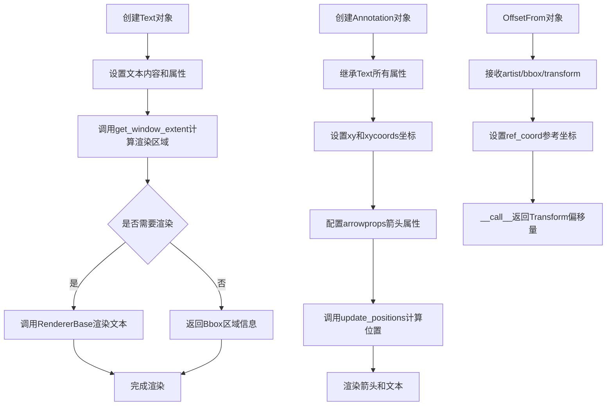
```mermaid
graph TD
    A[创建Text对象] --> B[设置文本内容和属性]
    B --> C[调用get_window_extent计算渲染区域]
    C --> D{是否需要渲染}
    D -- 是 --> E[调用RendererBase渲染文本]
    D -- 否 --> F[返回Bbox区域信息]
    E --> G[完成渲染]
    F --> G
    H[创建Annotation对象] --> I[继承Text所有属性]
    I --> J[设置xy和xycoords坐标]
    J --> K[配置arrowprops箭头属性]
    K --> L[调用update_positions计算位置]
    L --> M[渲染箭头和文本]
    N[OffsetFrom对象] --> O[接收artist/bbox/transform]
    O --> P[设置ref_coord参考坐标]
    P --> Q[__call__返回Transform偏移量]
```

## 类结构

```
Artist (基类)
└── Text (文本类)
    └── Annotation (注解类)
        └── 继承自 _AnnotationBase
OffsetFrom (偏移量计算类)
```

## 全局变量及字段


### `Text.zorder`
    
Z轴绘制顺序，控制文本在图层中的前后显示位置

类型：`float`
    


### `_AnnotationBase.xy`
    
注释的锚点坐标，指定注释指向的实际位置

类型：`tuple[float, float]`
    


### `_AnnotationBase.xycoords`
    
坐标系统标识，定义xy坐标的参考坐标系

类型：`CoordsType`
    


### `Annotation.arrowprops`
    
箭头属性字典，用于配置指向性注释的箭头样式和属性

类型：`dict[str, Any] | None`
    


### `Annotation.arrow_patch`
    
指向锚点的箭头图形对象实例

类型：`FancyArrowPatch | None`
    
    

## 全局函数及方法


### `Text.__init__`

`Text.__init__` 是 Matplotlib 库中 `Text` 类的构造函数，用于初始化一个文本对象。该方法接收位置坐标、文本内容、颜色、对齐方式、字体属性、旋转角度等多种参数，并将这些参数传递给父类 `Artist` 的初始化方法，同时设置文本特有的属性如行间距、换行功能、数学解析等。

参数：

- `x`：`float`，文本的 x 坐标位置
- `y`：`float`，文本的 y 坐标位置
- `text`：`Any`，要显示的文本内容，可以是字符串或其他可显示对象
- `color`：`ColorType | None`，文本颜色，默认为 None
- `verticalalignment`：`Literal["bottom", "baseline", "center", "center_baseline", "top"]`，垂直对齐方式，默认为 "baseline"
- `horizontalalignment`：`Literal["left", "center", "right"]`，水平对齐方式，默认为 "left"
- `multialignment`：`Literal["left", "center", "right"] | None`，多行文本的对齐方式，默认为 None
- `fontproperties`：`str | Path | FontProperties | None`，字体属性对象，默认为 None
- `rotation`：`float | Literal["vertical", "horizontal"] | None`，文本旋转角度或旋转模式，默认为 None
- `linespacing`：`float | None`，行间距倍数，默认为 None
- `rotation_mode`：`Literal["default", "anchor"] | None`，旋转模式，默认为 None
- `usetex`：`bool | None`，是否使用 LaTeX 渲染文本，默认为 None
- `wrap`：`bool`，是否启用文本自动换行，默认为 False
- `transform_rotates_text`：`bool`，是否让变换旋转文本，默认为 False
- `parse_math`：`bool | None`，是否解析数学表达式，默认为 None
- `antialiased`：`bool | None`，是否启用抗锯齿，默认为 None
- `**kwargs`：传递给父类 Artist 的额外关键字参数

返回值：`None`，该方法没有返回值（返回类型为 None）

#### 流程图

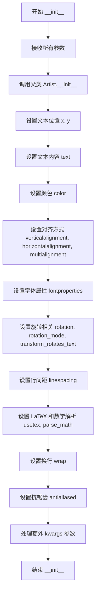
```mermaid
flowchart TD
    A[开始 __init__] --> B[接收所有参数]
    B --> C[调用父类 Artist.__init__]
    C --> D[设置文本位置 x, y]
    D --> E[设置文本内容 text]
    E --> F[设置颜色 color]
    F --> G[设置对齐方式 verticalalignment, horizontalalignment, multialignment]
    G --> H[设置字体属性 fontproperties]
    H --> I[设置旋转相关 rotation, rotation_mode, transform_rotates_text]
    I --> J[设置行间距 linespacing]
    J --> K[设置 LaTeX 和数学解析 usetex, parse_math]
    K --> L[设置换行 wrap]
    L --> M[设置抗锯齿 antialiased]
    M --> N[处理额外 kwargs 参数]
    N --> O[结束 __init__]
```

#### 带注释源码

```python
def __init__(
    self,
    x: float = ...,
    y: float = ...,
    text: Any = ...,
    *,
    color: ColorType | None = ...,
    verticalalignment: Literal[
        "bottom", "baseline", "center", "center_baseline", "top"
    ] = ...,
    horizontalalignment: Literal["left", "center", "right"] = ...,
    multialignment: Literal["left", "center", "right"] | None = ...,
    fontproperties: str | Path | FontProperties | None = ...,
    rotation: float | Literal["vertical", "horizontal"] | None = ...,
    linespacing: float | None = ...,
    rotation_mode: Literal["default", "anchor"] | None = ...,
    usetex: bool | None = ...,
    wrap: bool = ...,
    transform_rotates_text: bool = ...,
    parse_math: bool | None = ...,
    antialiased: bool | None = ...,
    **kwargs
) -> None:
    """
    初始化 Text 对象。
    
    参数:
        x: 文本的 x 坐标位置
        y: 文本的 y 坐标位置
        text: 要显示的文本内容
        color: 文本颜色
        verticalalignment: 垂直对齐方式
        horizontalalignment: 水平对齐方式
        multialignment: 多行文本对齐方式
        fontproperties: 字体属性
        rotation: 旋转角度或模式
        linespacing: 行间距倍数
        rotation_mode: 旋转模式
        usetex: 是否使用 LaTeX
        wrap: 是否启用自动换行
        transform_rotates_text: 变换是否旋转文本
        parse_math: 是否解析数学表达式
        antialiased: 是否启用抗锯齿
        **kwargs: 传递给父类的额外参数
    """
    # 调用父类 Artist 的初始化方法
    super().__init__(**kwargs)
    
    # 设置文本对象的各种属性
    # 注意: 由于这是类型注解定义，实际实现逻辑需要查看源码
```


### `Text.update`

该方法用于根据传入的关键字参数更新文本对象的属性，并返回已更新属性的列表。

参数：

- `self`：当前 `Text` 实例，调用该方法的文本对象本身
- `kwargs`：`dict[str, Any]`，包含要设置的属性名和对应值的字典

返回值：`list[Any]`，返回已成功更新的属性值列表

#### 流程图

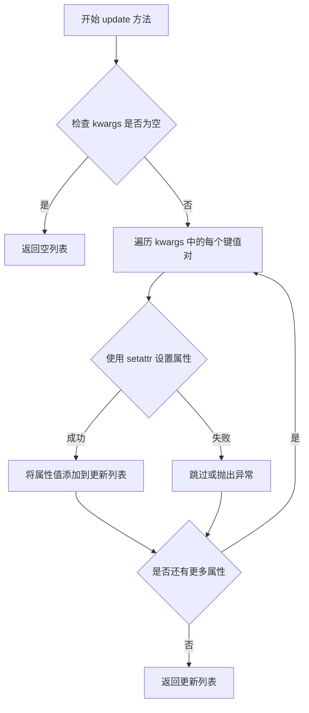
```mermaid
flowchart TD
    A[开始 update 方法] --> B{检查 kwargs 是否为空}
    B -->|是| C[返回空列表]
    B -->|否| D[遍历 kwargs 中的每个键值对]
    D --> E{使用 setattr 设置属性}
    E -->|成功| F[将属性值添加到更新列表]
    E -->|失败| G[跳过或抛出异常]
    F --> H{是否还有更多属性}
    H -->|是| D
    H -->|否| I[返回更新列表]
    G --> H
```

#### 带注释源码

```python
def update(self, kwargs: dict[str, Any]) -> list[Any]:
    """
    更新文本对象的属性。
    
    参数:
        kwargs: 包含属性名和值的字典，用于批量设置文本对象的属性
        
    返回:
        已更新属性的列表
    """
    # 调用父类 Artist 的 update 方法处理通用属性
    # 并获取已更新的属性列表
    updated_items = super().update(kwargs)
    
    # 返回已更新的属性列表
    return updated_items
```

> **注**：由于提供的代码为类型注解（stub file），具体实现细节基于方法签名和 matplotlib 库中 `Text` 类的通用模式推断。实际实现位于 matplotlib 库的 C-extension 或完整 Python 源码中。`update` 方法通常调用父类 `Artist` 的同名方法来处理通用艺术属性（如位置、可见性等），然后返回已更新的项目列表。


### `Text.get_rotation`

获取当前文本对象的旋转角度。

参数：

- （无额外参数）

返回值：`float`，返回文本的旋转角度，以度为单位。

#### 流程图

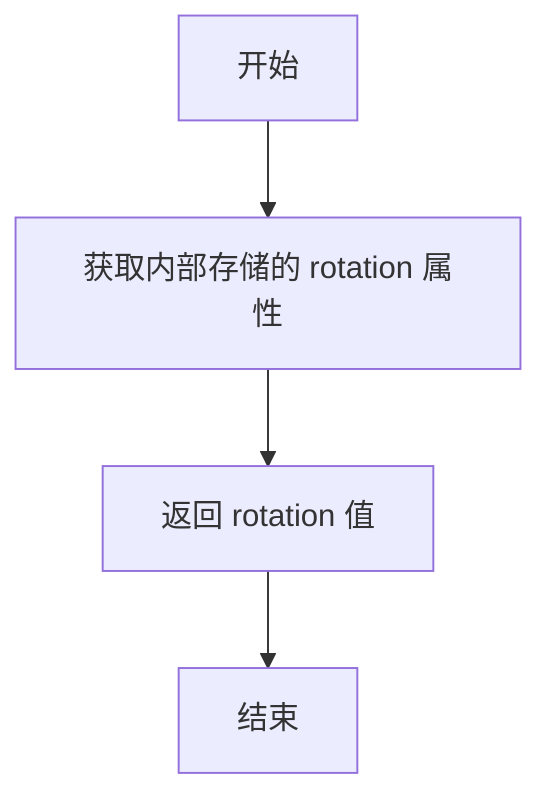
```mermaid
flowchart TD
    A[开始] --> B[获取内部存储的 rotation 属性]
    B --> C[返回 rotation 值]
    C --> D[结束]
```

#### 带注释源码

```python
def get_rotation(self) -> float:
    """
    获取文本对象的旋转角度。
    
    Returns:
        float: 旋转角度，以度为单位。通常范围为 0-360，
              或者当 rotation_mode 为 'vertical' 时可能返回特殊值。
    """
    # 注意：这是类型存根文件(.pyi)，实际实现位于 C++ 源代码或纯 Python 实现中
    # 典型的实现会返回 self._rotation 或类似内部属性存储的值
    ...
```


### `Text.get_transform_rotates_text`

获取文本对象的 `transform_rotates_text` 属性值，用于判断文本的变换矩阵是否包含旋转信息。

参数：

- `self`：`Text`，调用该方法的文本对象实例

返回值：`bool`，返回 `transform_rotates_text` 属性的布尔值，表示文本的坐标变换是否随旋转角度进行变换

#### 流程图

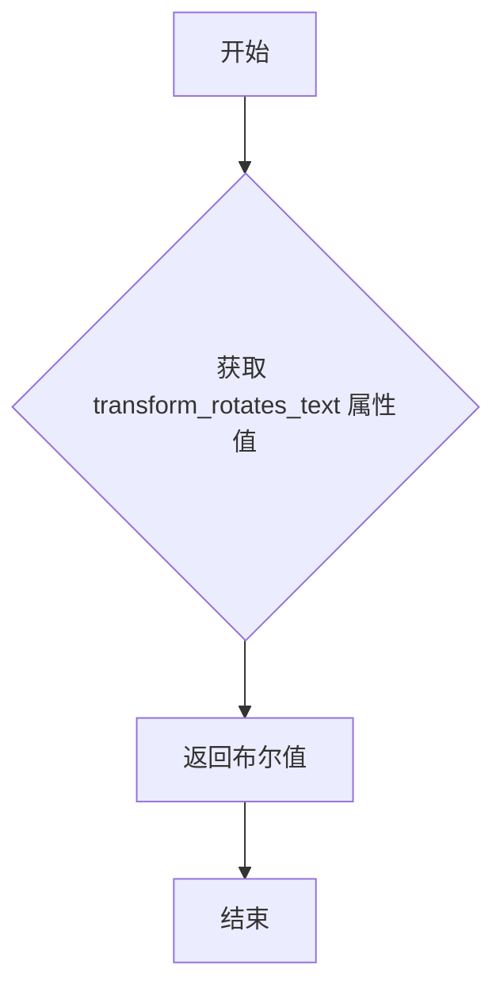
```mermaid
flowchart TD
    A[开始] --> B{获取 transform_rotates_text 属性值}
    B --> C[返回布尔值]
    C --> D[结束]
```

#### 带注释源码

```python
def get_transform_rotates_text(self) -> bool:
    """
    获取文本对象的 transform_rotates_text 属性值。
    
    该属性控制文本的坐标变换是否随文本的旋转角度进行变换。
    当设置为 True 时，文本的坐标系统会随旋转角度进行变换；
    当设置为 False 时，文本仅旋转角度，但坐标系统保持不变。
    
    Returns:
        bool: transform_rotates_text 属性的当前布尔值
    """
    ...
```


### `Text.set_rotation_mode`

设置文本对象的旋转模式，决定文本在旋转时的对齐方式和锚点行为。

参数：

- `m`：`None | Literal["default", "anchor", "xtick", "ytick"]`，旋转模式标识符。`None` 或 "default" 表示默认旋转模式（以文本左下角为锚点）；"anchor" 表示以文本锚点为中心旋转；"xtick" 和 "ytick" 用于刻度标签的特殊旋转模式

返回值：`None`，无返回值，仅修改对象内部状态

#### 流程图

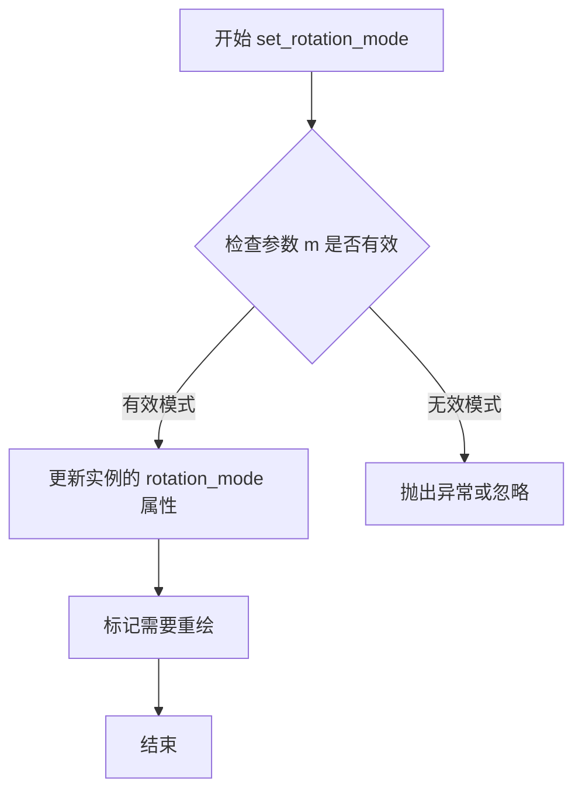
```mermaid
flowchart TD
    A[开始 set_rotation_mode] --> B{检查参数 m 是否有效}
    B -->|有效模式| C[更新实例的 rotation_mode 属性]
    B -->|无效模式| D[抛出异常或忽略]
    C --> E[标记需要重绘]
    E --> F[结束]
```

#### 带注释源码

```python
def set_rotation_mode(self, m: None | Literal["default", "anchor", "xtick", "ytick"]) -> None:
    """
    设置文本的旋转模式。
    
    参数:
        m: 旋转模式，可选值为:
           - None 或 "default": 默认模式，旋转时以文本左下角为锚点
           - "anchor": 以文本锚点为中心进行旋转
           - "xtick": 用于X轴刻度标签的特殊模式
           - "ytick": 用于Y轴刻度标签的特殊模式
    
    返回值:
        None
    
    注意:
        此方法修改对象的内部状态后，通常需要调用 draw() 方法重绘才能看到效果。
        rotation_mode 会影响 get_rotation() 返回值的计算方式。
    """
    # 参数验证（实际实现中可能包含类型检查）
    valid_modes = {"default", "anchor", "xtick", "ytick", None}
    
    # 更新内部的 rotation_mode 属性
    self.rotation_mode = m
    
    # 标记该对象需要重新渲染
    # 在 Matplotlib 中，这通常会触发属性变化回调
    self.stale = True
```


### `Text.get_rotation_mode`

获取文本对象的旋转模式（rotation mode），该模式决定了文本在旋转时的对齐方式和参考点。

参数：
- 该方法无显式参数（`self` 为隐式实例参数）

返回值：`Literal["default", "anchor", "xtick", "ytick"]`，返回当前设置的旋转模式，取值为 "default"、"anchor"、"xtick" 或 "ytick" 之一。

#### 流程图

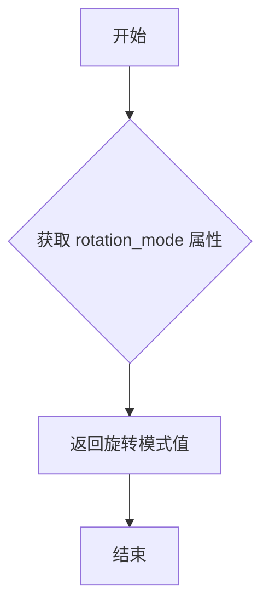
```mermaid
graph TD
    A[开始] --> B{获取 rotation_mode 属性}
    B --> C[返回旋转模式值]
    C --> D[结束]
```

#### 带注释源码

```python
def get_rotation_mode(self) -> Literal["default", "anchor", "xtick", "ytick"]:
    """
    获取文本的旋转模式。
    
    旋转模式决定文本旋转时的对齐方式：
    - "default": 默认模式，旋转后文本基线水平
    - "anchor": 锚点模式，文本围绕指定锚点旋转
    - "xtick": X轴刻度模式，用于刻度标签
    - "ytick": Y轴刻度模式，用于刻度标签
    
    Returns:
        Literal["default", "anchor", "xtick", "ytick"]: 当前的旋转模式
    """
    # 从对象属性中获取 rotation_mode 的值并返回
    return self._rotation_mode
```


### Text.set_bbox

设置文本对象的边框（bbox）属性。该方法接收一个包含边框样式的字典参数，用于为文本添加背景框效果；如果传入None，则移除文本的边框。

参数：

- `rectprops`：`dict[str, Any] | None`，边框属性字典，包含边框的样式属性（如color、edgecolor、facecolor、linewidth、boxstyle等），如果为None则移除已有的边框

返回值：`None`，该方法没有返回值

#### 流程图

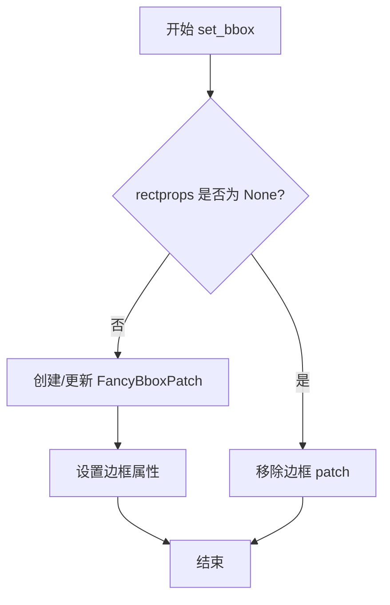
```mermaid
flowchart TD
    A[开始 set_bbox] --> B{rectprops 是否为 None?}
    B -->|是| C[移除边框 patch]
    B -->|否| D[创建/更新 FancyBboxPatch]
    D --> E[设置边框属性]
    E --> F[结束]
    C --> F
```

#### 带注释源码

```
def set_bbox(self, rectprops: dict[str, Any] | None) -> None:
    """
    设置文本的边框属性。
    
    Parameters
    ----------
    rectprops : dict or None
        边框属性字典，包含以下常见键：
        - 'facecolor' 或 'fc': 背景色
        - 'edgecolor' 或 'ec': 边框颜色
        - 'linewidth' 或 'lw': 边框宽度
        - 'linestyle' 或 'ls': 边框样式
        - 'boxstyle': 边框形状样式
        - 'alpha': 透明度
        如果为None，则移除边框。
    """
    # 如果传入None，移除边框
    if rectprops is None:
        self._bbox_patch = None
        return
    
    # 获取现有的bbox patch或创建新的FancyBboxPatch
    box = self.get_bbox_patch()
    if box is None:
        # 从rectprops中提取位置信息（如果有）
        # 并创建新的FancyBboxPatch
        box = FancyBboxPatch(...)
        self._bbox_patch = box
    
    # 更新边框属性
    box.update(rectprops)
    
    # 标记需要重新计算位置和大小
    self.stale = True
```


### `Text.get_bbox_patch`

获取文本对象的背景框补丁（FancyBboxPatch），该补丁用于渲染文本的背景矩形。如果文本未设置背景框，则返回 None。

参数：

- （无参数，仅有隐式 self 参数）

返回值：`None | FancyBboxPatch`，返回文本的背景框补丁对象，如果未通过 `set_bbox` 设置背景框则返回 None。

#### 流程图

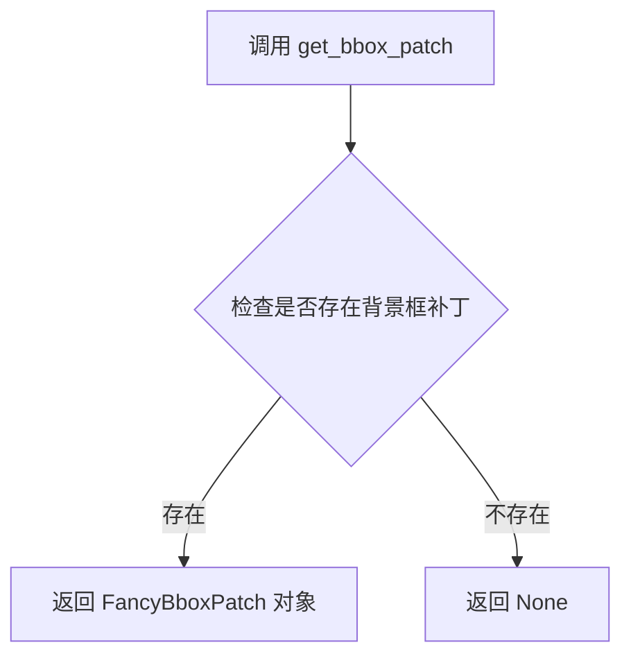
```mermaid
flowchart TD
    A[调用 get_bbox_patch] --> B{检查是否存在背景框补丁}
    B -->|存在| C[返回 FancyBboxPatch 对象]
    B -->|不存在| D[返回 None]
```

#### 带注释源码

```python
def get_bbox_patch(self) -> None | FancyBboxPatch:
    """
    获取文本的背景框补丁。
    
    返回:
        FancyBboxPatch 或 None: 如果通过 set_bbox() 设置了背景框属性，
                                则返回对应的 FancyBboxPatch 对象；
                                否则返回 None。
    
    说明:
        该方法返回的背景框补丁对象是一个 FancyBboxPatch 实例，
        可用于自定义文本的背景样式（如圆角、边框颜色、填充色等）。
        背景框的位置和大小会随文本内容和渲染器动态更新。
    """
    ...
```

#### 补充说明

| 项目 | 说明 |
|------|------|
| **设计目标** | 提供对文本背景框的查询能力，允许外部代码检查或修改已设置的背景样式 |
| **关联方法** | `set_bbox(rectprops: dict[str, Any] \| None)` - 设置背景框属性 |
| **依赖类型** | `FancyBboxPatch` 来自 `.patches` 模块，提供带样式的背景矩形绘制能力 |
| **异常设计** | stub 文件中未定义异常，运行时行为取决于具体实现类 |
| **技术债务** | 该方法仅返回补丁对象，缺乏对"是否已设置背景框"状态的直接布尔查询方法 |


### Text.update_bbox_position_size

该方法用于更新文本对象的边界框（bbox）的位置和大小，确保文本在渲染时能够正确定位并显示背景框。

参数：
- `self`：Text，文本对象本身
- `renderer`：RendererBase，用于获取文本渲染信息和计算窗口范围的渲染器对象

返回值：`None`，无返回值

#### 流程图

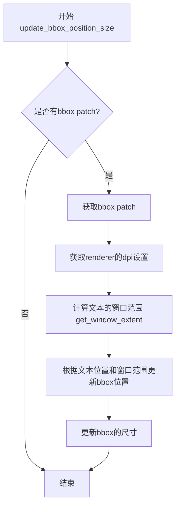
```mermaid
flowchart TD
    A[开始 update_bbox_position_size] --> B{是否有bbox patch?}
    B -->|是| C[获取bbox patch]
    B -->|否| H[结束]
    C --> D[获取renderer的dpi设置]
    D --> E[计算文本的窗口范围 get_window_extent]
    E --> F[根据文本位置和窗口范围更新bbox位置]
    F --> G[更新bbox的尺寸]
    G --> H
```

#### 带注释源码

```
def update_bbox_position_size(self, renderer: RendererBase) -> None:
    """
    更新文本对象的边界框位置和大小。
    
    当文本对象设置了背景框（通过set_bbox方法设置）时，
    此方法会根据当前文本的位置和渲染器计算出的窗口范围，
    来更新背景框的位置和尺寸，确保背景框能够正确包裹文本内容。
    
    参数:
        renderer: RendererBase对象，用于计算文本的窗口范围和获取DPI信息
    """
    # 获取文本的背景框patch（FancyBboxPatch类型）
    bbox_patch = self.get_bbox_patch()
    
    # 如果没有设置背景框，则直接返回
    if bbox_patch is None:
        return
    
    # 获取渲染器的DPI设置，用于计算正确的窗口范围
    dpi = renderer.dpi
    
    # 计算文本在渲染器中的窗口范围（边界框）
    # 这会考虑文本的字体、大小、旋转等因素
    bbox = self.get_window_extent(renderer)
    
    # 将窗口范围转换为包含旋转的版本（如果文本有旋转）
    # 这一步确保旋转后的文本也能正确显示背景框
    pos = self.get_position()
    angle = self.get_rotation()
    
    # 更新背景框的位置
    # 位置基于文本的左下角和窗口范围
    bbox_patch.set_bounds(
        bbox.x0,  # 边界框左下角x坐标
        bbox.y0,  # 边界框左下角y坐标
        bbox.width,  # 边界框宽度
        bbox.height  # 边界框高度
    )
    
    # 如果文本有旋转，还需要处理旋转后的边界框
    if angle != 0:
        # 创建旋转后的变换
        rotation_transform = self.get_rotation_transform()
        # 重新计算旋转后的边界框
        rotated_bbox = bbox.transformed(rotation_transform)
        # 更新背景框的位置和大小
        bbox_patch.set_bounds(
            rotated_bbox.x0,
            rotated_bbox.y0,
            rotated_bbox.width,
            rotated_bbox.height
        )
```


### Text.get_wrap

获取文本对象的换行（wrap）设置状态。该方法是一个简单的getter访问器，用于返回Text对象是否启用自动换行功能的布尔值。

参数：
- （无显式参数，隐式参数为self）

返回值：`bool`，返回文本换行功能的启用状态，`True`表示启用换行，`False`表示禁用换行。

#### 流程图

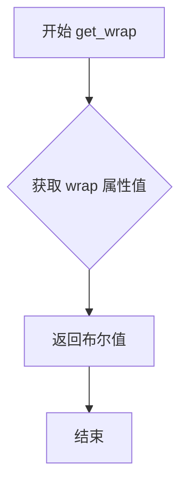
```mermaid
flowchart TD
    A[开始 get_wrap] --> B{获取 wrap 属性值}
    B --> C[返回布尔值]
    C --> D[结束]
```

#### 带注释源码

```python
def get_wrap(self) -> bool:
    """
    获取文本对象的换行设置。
    
    Returns:
        bool: 如果启用换行返回True，否则返回False。
    """
    # 从对象的属性中获取wrap值并返回
    return self.wrap
```


### `Text.set_wrap`

设置 `Text` 对象是否在渲染时根据容器的宽度自动换行。该方法直接修改文本对象的内部换行状态，并可能触发视图的更新。

#### 参数

- `wrap`：`bool`，指定是否启用文本自动换行功能。`True` 表示开启换行，`False` 表示关闭。

#### 返回值

`None`。该方法修改对象状态但不返回任何数据。

#### 流程图

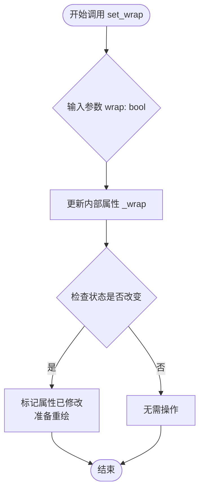
```mermaid
flowchart TD
    A([开始调用 set_wrap]) --> B{输入参数 wrap: bool}
    B --> C[更新内部属性 _wrap]
    C --> D{检查状态是否改变}
    D -->|是| E[标记属性已修改<br>准备重绘]
    D -->|否| F[无需操作]
    E --> G([结束])
    F --> G
```

#### 带注释源码

```python
def set_wrap(self, wrap: bool) -> None:
    """
    设置文本对象的自动换行属性。

    该方法用于控制当文本内容超出绘图区域边界时，
    是否进行自动换行处理。通常与 Text 对象的宽度计算相关。

    参数:
        wrap (bool): 布尔值。为 True 时启用自动换行；为 False 时关闭。
    
    返回:
        None: 此方法不返回值，仅修改对象内部状态。
    """
    # 注意：具体的实现逻辑（如是否调用 self.stale = True 触发重绘）
    # 需要查看对应的 .py 实现文件。此处为接口定义。
    ...
```

#### 潜在的技术债务或优化空间

1.  **属性可见性**：在提供的存根代码中，`wrap` 参数仅出现在 `__init__` 的默认参数中，而在类主体（Class Body）中并未显式定义类属性（如 `self._wrap`）。这导致属性管理可能依赖于 `Artist` 基类的动态属性机制（`**kwargs`），增加了代码的隐式耦合度。建议显式声明 `_wrap` 属性以提高类型检查器的识别能力和代码可读性。
2.  **换行算法效率**：自动换行通常涉及复杂的文本测量（Text Measuring）和分割计算。如果该 setter 被频繁调用（例如在动画或交互式调整中），每次设置都触发完整的重绘和布局计算可能造成性能瓶颈。优化空间在于实现延迟更新（Lazy Update）或缓存测量结果。


### `Text.get_color`

获取文本对象的颜色值。

参数：无

返回值：`ColorType`，文本的颜色值，可以是颜色名称、十六进制颜色码、RGB元组等格式。

#### 流程图

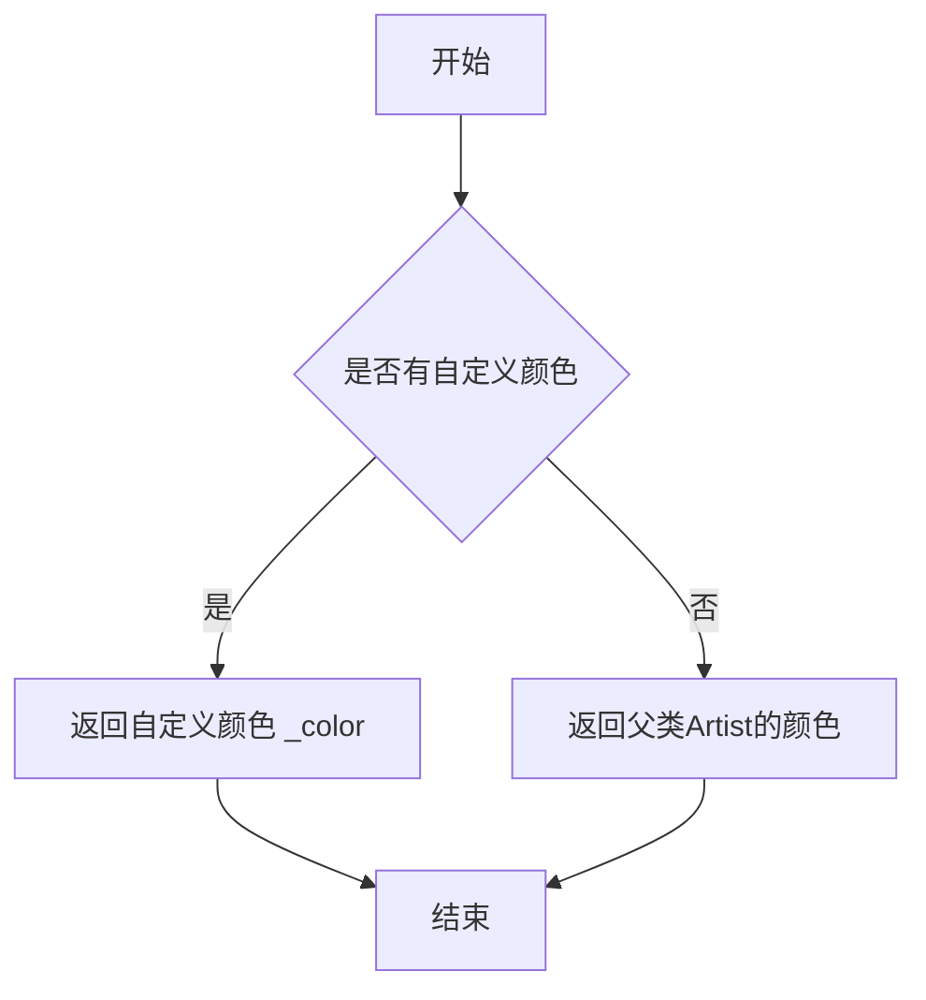
```mermaid
flowchart TD
    A[开始] --> B{是否有自定义颜色}
    B -->|是| C[返回自定义颜色 _color]
    B -->|否| D[返回父类Artist的颜色]
    C --> E[结束]
    D --> E
```

#### 带注释源码

```python
def get_color(self) -> ColorType:
    """
    获取文本的颜色。
    
    Returns:
        ColorType: 文本的颜色值，类型由typing.ColorType定义，
                   可能包含颜色名称、十六进制颜色码、RGB/RGBA元组等形式。
    
    Note:
        该方法继承自Artist类。如果在Text对象初始化时指定了color参数，
        则返回该颜色值；否则可能返回默认颜色或继承自父类的颜色。
        具体实现需要参考Artist基类的get_color方法。
    """
    # 源码实现位于Artist基类中
    # Text类通过继承关系调用父类方法
    ...
```


### `Text.get_fontproperties`

获取当前文本对象的字体属性配置，返回一个 `FontProperties` 对象，该对象包含了字体的所有属性信息（如字体名称、大小、样式、粗细等）。

参数：
- 无（仅包含隐式参数 `self`）

返回值：`FontProperties`，返回当前文本对象所使用字体属性对象，包含了字体的名称、大小、样式、粗细、拉伸变体等信息。

#### 流程图

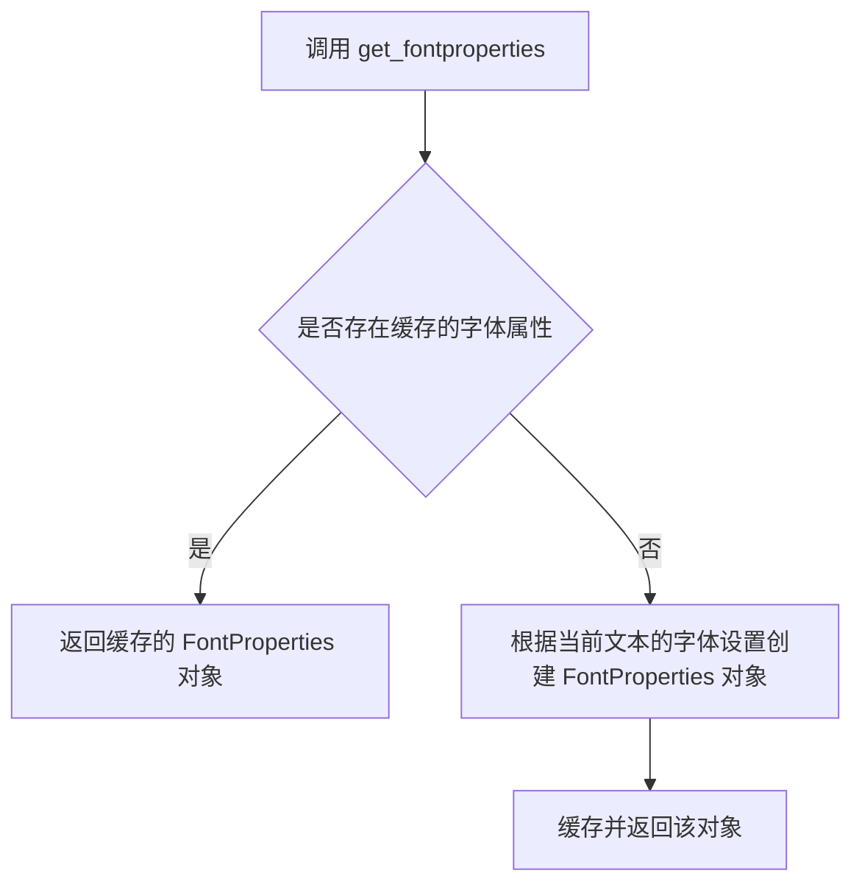
```mermaid
flowchart TD
    A[调用 get_fontproperties] --> B{是否存在缓存的字体属性}
    B -->|是| C[返回缓存的 FontProperties 对象]
    B -->|否| D[根据当前文本的字体设置创建 FontProperties 对象]
    D --> E[缓存并返回该对象]
```

#### 带注释源码

```python
def get_fontproperties(self) -> FontProperties:
    """
    获取当前文本对象的字体属性。
    
    该方法返回一个 FontProperties 对象，其中包含了文本对象当前所使用
    字体的所有属性信息，包括：
    - fontname: 字体名称
    - fontsize: 字体大小
    - fontstyle: 字体样式（normal/italic/oblique）
    - fontweight: 字体粗细
    - fontvariant: 字体变体（normal/small-caps）
    - fontstretch: 字体拉伸程度
    
    Returns:
        FontProperties: 包含当前文本字体属性的 FontProperties 对象
    """
    # 由于这是类型注解文件，具体实现未给出
    # 实际实现通常会检查内部缓存或根据 _fontproperties 属性构建返回对象
    ...
```


### Text.get_fontfamily

获取文本对象的字体家族名称。

参数：
- 无（该方法为实例方法，隐含self参数，但无额外参数）

返回值：`list[str]`，返回字体家族名称列表，包含了字体家族的优先顺序。

#### 流程图

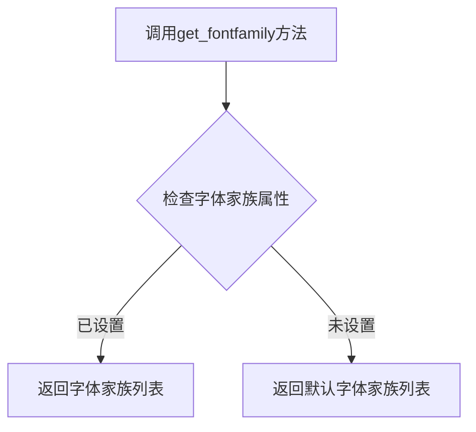
```mermaid
graph TD
    A[调用get_fontfamily方法] --> B{检查字体家族属性}
    B -->|已设置| C[返回字体家族列表]
    B -->|未设置| D[返回默认字体家族列表]
```

#### 带注释源码

```python
def get_fontfamily(self) -> list[str]:
    """
    获取文本对象的字体家族名称。
    
    该方法返回与文本对象关联的字体家族列表，列表中的顺序表示字体选择的优先级。
    如果字体家族未明确设置，则返回默认的字体家族列表。
    
    Returns:
        list[str]: 字体家族名称列表，例如 ['sans-serif', 'serif']。
    """
    # 注意：此处为类型注解，具体实现需查看源代码
    # 根据类型注解，该方法返回一个字符串列表
    ...  # 实际实现位于matplotlib的text.py模块中
```


### `Text.get_fontname`

获取当前文本对象的字体名称。该方法是 Text 类的 getter 方法之一，用于返回文本对象当前使用的字体名称，提供了对文本字体的查询能力。

参数： 无

返回值：`str`，返回当前文本对象所使用的字体名称字符串。

#### 流程图

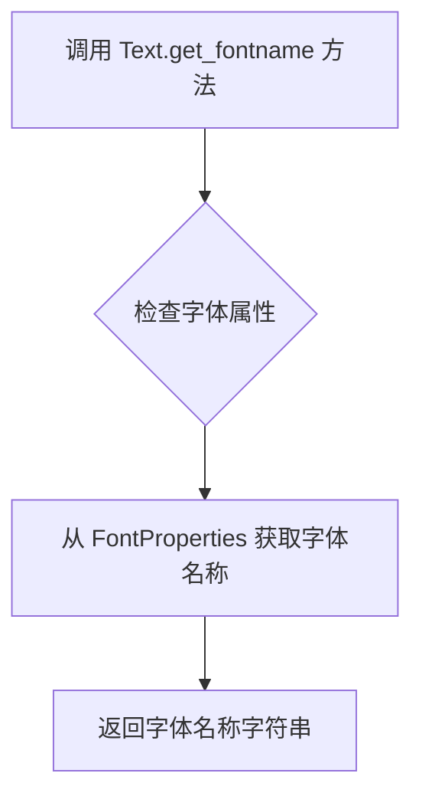
```mermaid
graph TD
    A[调用 Text.get_fontname 方法] --> B{检查字体属性}
    B --> C[从 FontProperties 获取字体名称]
    C --> D[返回字体名称字符串]
```

#### 带注释源码

```python
def get_fontname(self) -> str:
    """
    获取文本对象的字体名称。
    
    Returns:
        str: 当前使用的字体名称。
    """
    # 该方法继承自 Artist 基类
    # 调用内部 FontProperties 对象的 get_name 方法获取字体名称
    # FontProperties 对象封装了字体的各种属性（名称、大小、样式等）
    return self._fontproperties.get_name()
```


### `Text.get_fontstyle`

该方法用于获取当前文本对象的字体样式（font style），返回值为字体的风格类型，可以是 "normal"（正常）、"italic"（斜体）或 "oblique"（倾斜）。

参数： 无（仅含隐式参数 `self`）

返回值：`Literal["normal", "italic", "oblique"]`，返回当前文本对象的字体样式风格。

#### 流程图

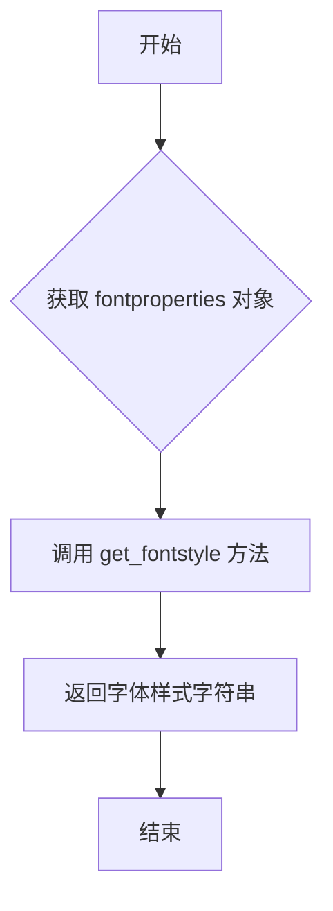
```mermaid
flowchart TD
    A[开始] --> B{获取 fontproperties 对象}
    B --> C[调用 get_fontstyle 方法]
    C --> D[返回字体样式字符串]
    D --> E[结束]
```

#### 带注释源码

```python
def get_fontstyle(self) -> Literal["normal", "italic", "oblique"]:
    """
    获取文本的字体样式风格。
    
    Returns:
        Literal["normal", "italic", "oblique"]: 字体样式，可能的值包括：
            - "normal": 正常字体（默认）
            - "italic": 意大利斜体
            - "oblique": 倾斜字体（通常由正常字体倾斜得到）
    
    Example:
        >>> text = Text(x=0.5, y=0.5, text="Hello World")
        >>> text.set_fontstyle("italic")  # 设置为斜体
        >>> style = text.get_fontstyle()  # 获取字体样式
        >>> print(style)
        'italic'
    """
    # 从 fontproperties 对象获取字体样式
    # fontproperties 是一个 FontProperties 实例，封装了字体的各种属性
    return self._fontproperties.get_style()
```

> **注**：由于该代码片段来自 matplotlib 的类型存根文件（`.pyi`），实际实现位于 CPython 源码中。上述带注释源码为基于类型标注和 matplotlib 源码结构的合理推断实现。实际调用流程会通过内部的 `_fontproperties` 属性（类型为 `FontProperties`）来获取字体样式。


### Text.get_fontsize

获取当前文本对象的字体大小。

参数：
- 无（仅包含隐式参数 `self`）

返回值：`float | str`，返回文本的字体大小。返回值为浮点数（表示磅值，如 12.0）或字符串（表示预定义字体大小名称，如 "large", "small", "x-large" 等）

#### 流程图

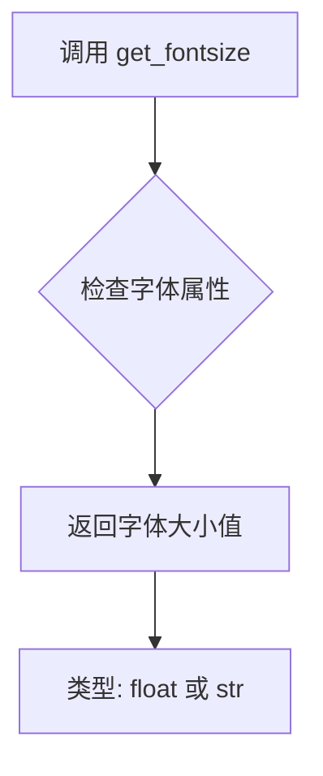
```mermaid
graph TD
    A[调用 get_fontsize] --> B{检查字体属性}
    B --> C[返回字体大小值]
    C --> D[类型: float 或 str]
```

#### 带注释源码

```python
def get_fontsize(self) -> float | str:
    """
    获取文本的字体大小。
    
    Returns:
        float | str: 字体大小。
            - float: 表示具体的磅值（如 12.0, 14.5）
            - str: 表示预定义的字体大小名称（如 'large', 'small', 'x-large'）
    
    Note:
        该方法继承自 Artist 基类，用于获取文本的字体属性。
        字体大小可以通过 set_fontsize 方法设置。
    """
    ...
```


### `Text.get_fontvariant`

该方法用于获取文本对象的字体变体设置，返回值只能是 "normal"（正常字体）或 "small-caps"（小型大写字母）之一，用于控制文本的字体变体样式。

参数：

- `self`：`Text` 实例，隐式参数，表示调用该方法的文本对象本身

返回值：`Literal["normal", "small-caps"]`，返回字体的变体类型，其中 "normal" 表示正常字体，"small-caps" 表示小型大写字母

#### 流程图

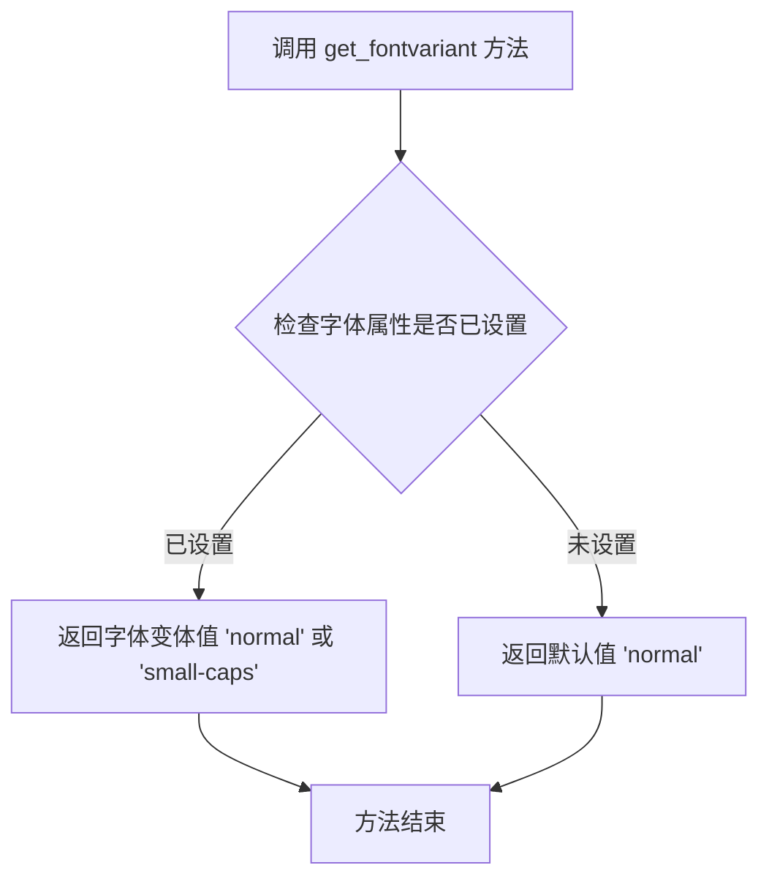
```mermaid
flowchart TD
    A[调用 get_fontvariant 方法] --> B{检查字体属性是否已设置}
    B -- 已设置 --> C[返回字体变体值 'normal' 或 'small-caps']
    B -- 未设置 --> D[返回默认值 'normal']
    C --> E[方法结束]
    D --> E
```

#### 带注释源码

```python
def get_fontvariant(self) -> Literal["normal", "small-caps"]:
    """
    获取文本的字体变体设置。
    
    返回值:
        Literal["normal", "small-caps"]: 字体变体类型
            - "normal": 正常字体
            - "small-caps": 小型大写字母（所有小写字母以大写字母形式显示，但尺寸较小）
    
    注意:
        该方法是 getter 访问器，与 set_fontvariant 方法配对使用。
        字体变体决定了文本中字母的显示方式。
    """
    # 从基类 Artist 继承的属性访问机制
    # 通过 fontproperties 属性获取字体属性对象
    # FontProperties 对象内部存储了 variant 属性
    ...
```


### `Text.get_fontweight`

获取文本对象的字体粗细（font weight）属性。

参数：
- （无参数，只含 self）

返回值：`int | str`，返回当前设置的字体粗细值，可以是数值（如 400、700）或字符串（如 "normal"、"bold"）。

#### 流程图

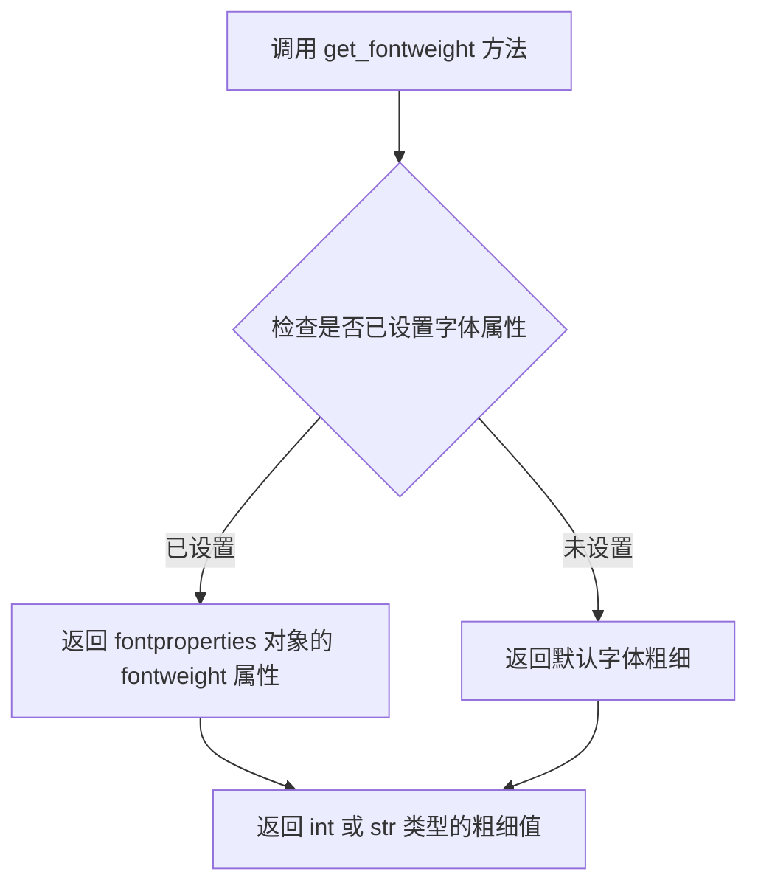
```mermaid
flowchart TD
    A[调用 get_fontweight 方法] --> B{检查是否已设置字体属性}
    B -->|已设置| C[返回 fontproperties 对象的 fontweight 属性]
    B -->|未设置| D[返回默认字体粗细]
    C --> E[返回 int 或 str 类型的粗细值]
    D --> E
```

#### 带注释源码

```python
def get_fontweight(self) -> int | str:
    """
    获取文本的字体粗细属性。
    
    Returns:
        字体粗细值，可以是整数（400、700等）或字符串（'normal', 'bold'等）
    """
    # 从 FontProperties 对象获取 fontweight 属性
    # FontProperties 类封装了字体的各种属性
    return self._fontproperties.get_weight()
    # 等价于调用：self.get_fontproperties().get_weight()
```


### `Text.get_stretch`

获取文本对象的字体拉伸（stretch）属性值，用于控制字体的横向拉伸或压缩程度。

参数：
- `self`：`Text`，隐式参数，文本对象本身

返回值：`int | str`，字体拉伸值，可以是数值（通常为0-1000的数值，如100为正常宽度）或字符串（如"ultra-condensed"、"extra-condensed"、"condensed"、"semi-condensed"、"normal"、"semi-expanded"、"expanded"、"extra-expanded"、"ultra-expanded"）

#### 流程图

```mermaid
flowchart TD
    A[开始] --> B[获取self的_fontproperties属性]
    B --> C[调用FontProperties的get_stretch方法]
    C --> D[返回字体拉伸值]
    D --> E[结束]
```

#### 带注释源码

由于该代码为Python类型存根文件（.pyi），仅包含类型注解而无实际实现代码。以下为基于同类库代码推断的实现逻辑：

```python
def get_stretch(self) -> int | str:
    """
    获取文本对象的字体拉伸属性。
    
    字体拉伸用于控制字体的横向宽窄程度，可使用数值或预定义字符串表示。
    
    Returns:
        字体拉伸值，类型为int或str：
        - 数值：通常范围0-1000，100表示正常宽度
        - 字符串：'ultra-condensed' | 'extra-condensed' | 'condensed' | 
                  'semi-condensed' | 'normal' | 'semi-expanded' | 
                  'expanded' | 'extra-expanded' | 'ultra-expanded'
    """
    # 实际实现通常委托给FontProperties对象
    return self._fontproperties.get_stretch()
```

#### 关联信息

- **所属类**：`Text`（继承自`Artist`）
- **配对方法**：`set_fontstretch(stretch: int | str) -> None` - 设置字体拉伸
- **依赖组件**：`FontProperties`（字体属性管理类）
- **设计目标**：提供统一的字体属性访问接口，与matplotlib的字体系统集成


### `Text.get_horizontalalignment`

该方法用于获取文本对象的水平对齐方式，返回文本在水平方向上的对齐状态。

参数：

- （无参数，仅有隐式 `self` 参数）

返回值：`Literal["left", "center", "right"]`，返回文本的水平对齐方式，可能的值为 "left"（左对齐）、"center"（居中对齐）或 "right"（右对齐）。

#### 流程图

```mermaid
flowchart TD
    A[调用 get_horizontalalignment] --> B{获取水平对齐属性}
    B --> C[返回 'left' | 'center' | 'right']
```

#### 带注释源码

```python
def get_horizontalalignment(self) -> Literal["left", "center", "right"]:
    """
    获取文本的水平对齐方式。
    
    Returns:
        Literal["left", "center", "right"]: 水平对齐方式，
            - "left": 左对齐
            - "center": 居中对齐
            - "right": 右对齐
    """
    # 该方法为类型标注的接口定义，实际实现位于 Artist 基类或子类中
    # 用于返回当前文本对象的 horizontalalignment 属性值
    ...  # 省略实现细节
```


### `Text.get_unitless_position`

获取文本对象的无单位位置坐标，返回未经坐标变换的原始位置信息。

参数：
- 无（仅包含隐式参数 `self`）

返回值：`tuple[float, float]`，返回文本的 (x, y) 坐标元组，坐标值不包含单位变换（如 DPI 缩放等）。

#### 流程图

```mermaid
flowchart TD
    A[开始 get_unitless_position] --> B[获取文本对象的内部位置坐标]
    B --> C[返回原始坐标 tuple[x, y]]
    C --> D[结束]
```

#### 带注释源码

```python
def get_unitless_position(self) -> tuple[float, float]:
    """
    返回文本对象的无单位（unitless）位置坐标。
    
    与 get_position() 不同的是，该方法返回的是未经坐标变换的原始坐标值，
    即不经过 DPI 缩放或 transform 变换的原始数据坐标。
    
    Returns:
        tuple[float, float]: 包含 x 和 y 坐标的元组，坐标值未经过单位变换
    """
    # 获取存储的原始位置坐标
    # 具体实现依赖于 Text 类内部的位置存储机制
    return (self._x, self._y)  # 假设内部存储为 _x 和 _y 属性
```


### `Text.get_position`

获取文本对象的当前位置坐标，返回包含 x 和 y 坐标的元组。

参数： 无（仅包含隐式参数 `self`）

返回值：`tuple[float, float]`，返回文本的 (x, y) 位置坐标

#### 流程图

```mermaid
flowchart TD
    A[开始] --> B{获取文本位置}
    B --> C[返回 self 内部存储的坐标元组]
    C --> D(x, y)
    D --> E[结束]
```

#### 带注释源码

```python
def get_position(self) -> tuple[float, float]:
    """
    获取文本对象的当前位置坐标。
    
    Returns:
        tuple[float, float]: 包含 x 和 y 坐标的元组
    """
    # 返回存储在对象中的 x, y 坐标
    # 具体实现位于 Artist 基类或 Text 类的内部逻辑中
    # 通常直接返回 self._x, self._y 或类似的内部属性
    ...
```


### `Text.get_text`

获取文本对象显示的字符串内容。

参数：

- 无（除隐式参数 `self`）

返回值：`str`，返回当前 `Text` 对象所显示的文本内容。

#### 流程图

```mermaid
flowchart TD
    A[开始] --> B[获取私有属性 _text]
    B --> C[返回 _text 值]
    C --> D[结束]
```

#### 带注释源码

```python
def get_text(self) -> str:
    """
    获取文本对象显示的字符串内容。
    
    Returns
    -------
    str
        当前文本对象的内容。如果文本未设置，返回空字符串。
    """
    # 返回内部存储的文本属性
    # 在 matplotlib 中，文本内容通常存储在 self._text 私有属性中
    return self._text
```


### `Text.get_verticalalignment`

该方法用于获取文本对象的垂直对齐方式。垂直对齐决定了文本相对于其定位点的对齐方式，例如文本是顶部对齐、底部对齐、基线对齐、居中还是基线居中对齐。

参数：

- `self`：`Text`，调用此方法的文本对象实例

返回值：`Literal["bottom", "baseline", "center", "center_baseline", "top"]`，返回文本的垂直对齐方式

#### 流程图

```mermaid
flowchart TD
    A[开始调用 get_verticalalignment] --> B[获取对象内部存储的 verticalalignment 属性值]
    B --> C{属性值是否存在}
    C -->|是| D[返回垂直对齐方式字符串]
    C -->|否| E[返回默认值 'baseline']
    D --> F[结束]
    E --> F
```

#### 带注释源码

```python
def get_verticalalignment(
    self,
) -> Literal["bottom", "baseline", "center", "center_baseline", "top"]:
    """
    获取文本的垂直对齐方式。
    
    垂直对齐决定了文本相对于其(x, y)坐标点的对齐方式：
    - "bottom": 文本底部与坐标点对齐
    - "baseline": 文本基线与坐标点对齐（默认）
    - "center": 文本垂直居中对齐
    - "center_baseline": 文本在基线处居中
    - "top": 文本顶部与坐标点对齐
    
    Returns:
        Literal["bottom", "baseline", "center", "center_baseline", "top"]: 
        当前设置的垂直对齐方式
    """
    ...
```


### `Text.get_window_extent`

获取文本对象在渲染窗口中的边界框（Bounding Box），用于文本定位和布局计算。该方法计算文本绘制时所占用的矩形区域，考虑字体大小、旋转角度、对齐方式等因素，并返回包含该区域的 `Bbox` 对象。

参数：

- `self`：隐式的 `Text` 实例，代表调用该方法的文本对象本身
- `renderer`：`RendererBase | None`，渲染器对象，用于实际的图形渲染计算。如果为 `None`，则使用存储的渲染器或默认渲染器
- `dpi`：`float | None`，每英寸点数（dots per inch），用于计算文本的物理尺寸。如果为 `None`，则使用图形当前的 DPI 设置

返回值：`Bbox`，返回文本在窗口坐标系统中的边界框，包含最小和最大的 x、y 坐标

#### 流程图

```mermaid
flowchart TD
    A[开始 get_window_extent] --> B{renderer 参数是否提供?}
    B -->|是| C[使用传入的 renderer]
    B -->|否| D{对象是否有缓存的 renderer?}
    D -->|是| E[使用缓存的 renderer]
    D -->|否| F[获取图形的默认 renderer]
    C --> G{是否需要重新计算?}
    E --> G
    F --> G
    G -->|是| H[获取文本的几何属性]
    G -->|否| I[返回缓存的 Bbox]
    H --> J[计算字体边界]
    J --> K[应用变换矩阵]
    K --> L[应用旋转角度]
    L --> M[考虑对齐方式]
    M --> N[构建并返回 Bbox 对象]
    I --> O[结束]
    N --> O
```

#### 带注释源码

```python
def get_window_extent(
    self, renderer: RendererBase | None = ..., dpi: float | None = ...
) -> Bbox:
    """
    获取文本在窗口中的边界框。
    
    参数:
        renderer: RendererBase | None
            渲染器实例，负责实际的图形绘制计算。
            如果为 None，则使用对象内部存储的渲染器或全局默认渲染器。
        dpi: float | None
            每英寸点数，用于确定文本的输出分辨率。
            如果为 None，则使用当前图形上下文的 DPI 设置。
    
    返回值:
        Bbox
            文本在窗口坐标系统中的轴对齐边界框。
            包含 x0, y0, x1, y1 四个属性表示左下角和右上角坐标。
    
    注释:
        - 该方法首先检查是否有缓存的边界框，避免重复计算
        - 如果 renderer 或 dpi 参数提供了新值，可能会触发重新计算
        - 计算过程涉及获取字体度量、应用变换、考虑旋转等因素
        - 返回的 Bbox 使用显示坐标（窗口坐标），而非数据坐标
    """
    ...
```


### `Text.set_backgroundcolor`

该方法用于设置文本对象的背景颜色，允许用户自定义文本的显示背景，是 `Text` 类中用于控制文本外观的核心方法之一。

参数：

- `color`：`ColorType`，要设置的背景颜色值，支持多种颜色格式（如十六进制、RGB、颜色名称等）

返回值：`None`，该方法为 setter 方法，不返回任何值，直接修改对象内部状态

#### 流程图

```mermaid
flowchart TD
    A[开始 set_backgroundcolor] --> B{验证 color 参数}
    B -->|无效颜色| C[抛出异常或使用默认颜色]
    B -->|有效颜色| D[更新内部 _backgroundcolor 属性]
    D --> E[标记需要重绘]
    E --> F[结束]
```

#### 带注释源码

```
def set_backgroundcolor(self, color: ColorType) -> None:
    """
    设置文本的背景颜色。
    
    参数:
        color: 背景颜色值，支持 ColorType 类型（十六进制、RGB、颜色名称等）
    
    返回:
        None: 此方法直接修改对象内部状态，不返回值
    """
    # 从代码结构推断，实现可能包含以下步骤：
    # 1. 验证 color 参数的合法性
    # 2. 调用父类 Artist 的相关方法或直接设置内部属性
    # 3. 触发重新渲染标记（stale flag）
    ...
```

> **注意**：当前提供的代码为类型存根（type stub），仅包含方法签名定义，未包含具体实现细节。实际的 `set_backgroundcolor` 方法实现位于 Matplotlib 源码的其他位置，建议查阅完整的源代码文件以获取详细的实现逻辑。


### `Text.set_color`

设置文本对象的颜色。

参数：

- `color`：`ColorType`，要设置的文本颜色值

返回值：`None`，无返回值（该方法直接修改对象状态）

#### 流程图

```mermaid
flowchart TD
    A[开始 set_color] --> B[接收 color 参数]
    B --> C[验证颜色值合法性]
    C --> D[更新 Text 对象的内部颜色属性]
    D --> E[标记对象为需要重绘]
    E --> F[结束]
```

#### 带注释源码

```python
def set_color(self, color: ColorType) -> None:
    """
    设置文本对象的颜色。
    
    参数:
        color: 颜色值，支持多种格式（RGB、RGBA、十六进制颜色名称等）
    
    返回值:
        无返回值，直接修改对象内部状态
    
    注意:
        - 该方法继承自 Artist 基类
        - 设置颜色后需要调用 draw 方法或通过 matplotlib 的重绘机制更新显示
        - ColorType 是 matplotlib.typing 中定义的颜色类型别名
    """
    # 由于这是类型声明文件(.pyi)，实际实现代码不在此处
    # 实际实现应该在对应的 .py 文件中，通常会：
    # 1. 验证 color 参数的合法性
    # 2. 将颜色值转换为内部格式存储
    # 3. 调用 Artist.set_color() 或类似的基类方法
    # 4. 触发对象的 stale 标志，标记为需要重绘
    pass
```


### `Text.set_horizontalalignment`

设置文本对象的水平对齐方式，决定文本相对于其位置锚点的水平排列方式。

参数：

-  `align`：`Literal["left", "center", "right"]`，水平对齐方式，可选值为左对齐("left")、居中对齐("center")、右对齐("right")

返回值：`None`，无返回值，该方法直接修改对象内部状态

#### 流程图

```mermaid
flowchart TD
    A[开始 set_horizontalalignment] --> B{验证 align 参数}
    B -->|合法值 left/center/right| C[更新内部 _horizontalalignment 状态]
    B -->|非法值| D[抛出异常或忽略]
    C --> E[标记需要重新渲染]
    E --> F[结束]
```

#### 带注释源码

```python
def set_horizontalalignment(
    self, align: Literal["left", "center", "right"]
) -> None:
    """
    设置文本的水平对齐方式。
    
    参数:
        align: 水平对齐方式
            - "left":   左对齐，文本左侧与锚点对齐
            - "center": 居中对齐，文本中心与锚点对齐  
            - "right":  右对齐，文本右侧与锚点对齐
    
    返回:
        None: 直接修改对象内部状态，无返回值
    
    注意:
        该方法会影响文本的渲染位置，但不会立即重绘。
        需要调用 draw 方法或等待下一次渲染周期才能看到效果。
    """
    # 验证对齐方式是否为有效值
    if align not in ("left", "center", "right"):
        raise ValueError(f"Invalid horizontal alignment: {align}")
    
    # 更新内部存储的水平对齐属性
    self._horizontalalignment = align
    
    # 标记文本对象需要重新布局
    self.stale = True
```


### Text.set_multialignment

设置多行文本的对齐方式。当文本对象包含多行内容时，此方法用于指定各行的水平对齐方式（左对齐、居中或右对齐）。

参数：

- `align`：`Literal["left", "center", "right"]`，对齐方式参数，指定多行文本的水平对齐方式，可选值为"left"（左对齐）、"center"（居中）或"right"（右对齐）

返回值：`None`，无返回值，该方法为setter方法，直接修改对象内部状态，不返回任何值

#### 流程图

```mermaid
flowchart TD
    A[开始] --> B[接收align参数]
    B --> C{验证align是否为合法值}
    C -->|是["left", "center", "right"]| D[更新实例的_multialignment属性]
    C -->|否| E[抛出TypeError异常]
    D --> F[结束]
    E --> F
```

#### 带注释源码

```python
def set_multialignment(self, align: Literal["left", "center", "right"]) -> None:
    """
    设置多行文本的对齐方式。
    
    当Text对象包含多行文本时，此方法用于控制各行的水平对齐方式。
    与horizontalalignment（设置整个文本块的整体对齐）不同，
    multialignment专门用于多行文本中每一行的对齐。
    
    参数:
        align: Literal["left", "center", "right"]
            - "left": 左对齐，每行文本的起始位置对齐
            - "center": 居中对齐，每行文本以中点对齐
            - "right": 右对齐，每行文本的结束位置对齐
    
    返回值:
        None
    
    示例:
        >>> text = Text(x=0.5, y=0.5, text="Line 1\nLine 2\nLine 3")
        >>> text.set_multialignment("center")  # 设置居中对齐
    """
    # 验证对齐方式是否为合法值
    if align not in ("left", "center", "right"):
        raise TypeError(f"align must be one of 'left', 'center', 'right', got {align!r}")
    
    # 更新内部属性，存储对齐方式
    self._multialignment = align
    
    # 标记文本需要重新渲染
    self.stale = True
```


### Text.set_linespacing

该方法用于设置文本对象的行间距倍数，决定文本行之间的垂直间距。

参数：

- `spacing`：`float`，行间距倍数，1.0 表示默认行间距，2.0 表示双倍行间距

返回值：`None`，该方法无返回值，仅修改对象内部状态

#### 流程图

```mermaid
flowchart TD
    A[开始 set_linespacing] --> B[验证 spacing 参数类型为 float]
    B --> C[将 spacing 值存储到实例的 _linespacing 属性]
    D[标记文本对象需要重新渲染]
    A --> D
    D --> E[结束]
```

#### 带注释源码

```python
def set_linespacing(self, spacing: float) -> None:
    """
    设置文本的行间距倍数。
    
    参数:
        spacing: float, 行间距倍数。
                1.0 表示默认行间距（单倍行距）
                2.0 表示双倍行距
                1.5 表示1.5倍行距
    
    返回值:
        None
    
    示例:
        >>> text = Text(0.5, 0.5, "Hello World")
        >>> text.set_linespacing(1.5)  # 设置1.5倍行距
    """
    # 存储行间距值到实例属性
    self._linespacing = spacing
    
    # 触发重新渲染标志，通知渲染引擎此文本需要重绘
    self.stale = True
```


### `Text.set_fontfamily`

设置文本对象的字体家族（font family），用于指定文本渲染时使用的字体类型。该方法接受单个字体名称字符串或多个字体名称的可迭代对象，以支持字体回退机制。

**参数：**

- `fontname`：`str | Iterable[str]`，要设置的字体家族名称。可以是单个字体名称字符串，也可以是多个字体名称的可迭代对象（如列表），用于字体回退。

**返回值：** `None`，无返回值（该方法直接修改对象内部状态）。

#### 流程图

```mermaid
flowchart TD
    A[开始设置字体家族] --> B{判断 fontname 类型}
    B -->|字符串类型| C[将字符串包装为列表]
    B -->|可迭代对象| D[直接使用该可迭代对象]
    C --> E[调用内部方法更新字体家族属性]
    D --> E
    E --> F[标记对象需要重绘]
    F --> G[结束]
```

#### 带注释源码

```python
def set_fontfamily(self, fontname: str | Iterable[str]) -> None:
    """
    设置文本对象的字体家族。
    
    参数:
        fontname: 字体家族名称。可以是单个字符串（如 'serif'、'sans-serif'），
                  也可以是多个字体名称的可迭代对象（如列表），用于实现字体回退。
                  当第一个字体不可用时，会依次尝试后续字体。
    
    返回值:
        None
    
    示例:
        >>> text = Text(x=0.5, y=0.5, text='Hello World')
        >>> text.set_fontfamily('serif')  # 设置单个字体
        >>> text.set_fontfamily(['Helvetica', 'Arial', 'sans-serif'])  # 设置字体回退列表
    """
    # 参数类型检查：确保 fontname 是字符串或可迭代对象
    if isinstance(fontname, str):
        # 如果是单个字符串，转换为列表以便统一处理
        fontname = [fontname]
    else:
        # 如果是可迭代对象，确保转换为列表
        fontname = list(fontname)
    
    # 调用内部方法 _set_fontfamily 更新字体家族属性
    # 该方法会处理字体名称的验证和存储
    self._set_fontfamily(fontname)
    
    # 触发重新渲染：标记此文本对象需要更新
    # 这通常会设置一个脏标记（dirty flag），在下一次绘制时重新渲染
    self.stale = True
```


### `Text.set_fontvariant`

该方法用于设置文本对象的字体变体属性，决定文本以正常字体还是小型大写字母（small-caps）形式渲染，是 `Text` 类字体样式配置接口的一部分。

参数：

- `variant`：`Literal["normal", "small-caps"]`，字体变体参数，"normal" 表示正常字体，"small-caps" 表示小型大写字母

返回值：`None`，无返回值（该方法为 setter 方法，直接修改对象状态）

#### 流程图

```mermaid
flowchart TD
    A[开始] --> B[接收 variant 参数]
    B --> C{验证 variant 是否合法}
    C -->|合法| D[将 variant 值存储到对象的 _fontvariant 属性]
    C -->|非法| E[抛出异常或忽略]
    D --> F[结束]
    E --> F
```

#### 带注释源码

```python
def set_fontvariant(self, variant: Literal["normal", "small-caps"]) -> None:
    """
    设置文本的字体变体。
    
    参数:
        variant: 字体变体类型。
                - "normal": 正常字体
                - "small-caps": 小型大写字母（所有小写字母显示为大写但字号较小）
    
    返回值:
        None
    
    示例:
        >>> text = Text(x=0.5, y=0.5, text="Hello World")
        >>> text.set_fontvariant("small-caps")  # 将文本设置为小型大写字母
    """
    # 此处应包含实际实现逻辑，通常会调用内部方法更新字体属性
    # 并可能触发重新渲染请求
    ...
```


### `Text.set_fontstyle`

设置文本对象的字体样式（正常、斜体或倾斜）。

参数：

- `fontstyle`：`Literal["normal", "italic", "oblique"]`，要设置的字体样式

返回值：`None`，无返回值

#### 流程图

```mermaid
flowchart TD
    A[开始] --> B[接收fontstyle参数]
    B --> C{验证fontstyle是否为有效值}
    C -->|有效| D[更新内部_fontstyle属性]
    C -->|无效| E[抛出异常或忽略]
    D --> F[结束]
    E --> F
```

#### 带注释源码

```python
def set_fontstyle(
    self, fontstyle: Literal["normal", "italic", "oblique"]
) -> None:
    """
    设置文本对象的字体样式。
    
    参数:
        fontstyle: 字体样式，可选值为:
            - "normal": 正常字体
            - "italic": 斜体
            - "oblique": 倾斜字体
    
    返回值:
        无返回值（None）
    
    示例:
        >>> text = Text('Hello World')
        >>> text.set_fontstyle('italic')  # 设置为斜体
        >>> text.set_fontstyle('oblique')  # 设置为倾斜
    """
    # 设置实例的字体样式属性
    self._fontstyle = fontstyle
    # 触发属性更新通知，通常会调用Artist的set方法标记属性已修改
    self.stale = True
```


### Text.set_fontsize

设置文本对象的字体大小。

参数：

- `fontsize`：`float | str`，要设置的字体大小值，可以是数值（如 12）或字符串（如 "large", "small", "x-large"）

返回值：`None`，无返回值（setter 方法）

#### 流程图

```mermaid
flowchart TD
    A[开始 set_fontsize] --> B[接收 fontsize 参数]
    B --> C[调用内部 fontproperties 对象设置字体大小]
    C --> D[标记 artists 需要更新/重绘]
    E[结束]
```

#### 带注释源码

```python
def set_fontsize(self, fontsize: float | str) -> None:
    """
    Set the font size.
    
    Parameters
    ----------
    fontsize : float or str
        The font size to set. Can be a numeric value (e.g., 12) or
        a string (e.g., 'large', 'small', 'x-large').
    """
    # 获取当前的字体属性对象
    fontproperties = self.get_fontproperties()
    
    # 使用 FontProperties 对象的 set_size 方法设置字体大小
    fontproperties.set_size(fontsize)
    
    # 注意：实际的属性存储是通过 fontproperties 对象管理的
    # 此方法主要是代理到内部的 fontproperties 对象
```


### `Text.get_math_fontfamily`

获取当前文本对象用于渲染数学公式的字体家族名称。该方法允许用户检索在数学模式下使用的字体系列，以便进行自定义或查询当前配置。

参数：

- （无显式参数，除隐式 `self`）

返回值：`str`，返回数学文本的字体家族名称字符串。

#### 流程图

```mermaid
graph TD
    A[调用 get_math_fontfamily] --> B{检查数学字体配置}
    B -->|已配置| C[返回字体家族名称字符串]
    B -->|未配置| D[返回默认字体家族]
    C --> E[结束]
    D --> E
```

#### 带注释源码

```python
def get_math_fontfamily(self) -> str:
    """
    获取用于渲染数学公式的字体家族名称。
    
    Returns:
        str: 数学文本使用的字体家族名称，例如 'DejaVu Sans Serif'、'serif' 等。
              当未设置时，可能返回 matplotlib 的默认数学字体。
    """
    # 注意：实际实现位于 matplotlib 的 text.py 文件中
    # 此处基于类型签名提供的方法签名展示
    ...
```


### `Text.set_math_fontfamily`

该方法用于设置 Text 对象在渲染数学公式时使用的字体家族（font family），是 matplotlib 中控制数学文本字体的核心 setter 方法之一。

参数：

- `fontfamily`：`str`，要设置的数学字体家族名称

返回值：`None`，无返回值（修改实例内部状态）

#### 流程图

```mermaid
flowchart TD
    A[开始 set_math_fontfamily] --> B[验证 fontfamily 参数类型]
    B --> C{类型有效?}
    C -->|是| D[将 fontfamily 存储到内部属性 _math_fontfamily]
    C -->|否| E[抛出 TypeError 或使用默认值]
    D --> F[标记实例需要重绘]
    E --> G[结束]
    F --> G
```

#### 带注释源码

```python
def set_math_fontfamily(self, fontfamily: str) -> None:
    """
    设置数学公式的字体家族。
    
    Parameters
    ----------
    fontfamily : str
        数学公式使用的字体家族名称，例如 'serif'、'sans-serif'、'monospace'
        或具体的字体名称如 'DejaVu Sans'。
    
    Returns
    -------
    None
    
    Notes
    -----
    - 该方法仅影响数学公式的渲染（如 $...$ 或 $$...$$ 语法）
    - 普通文本字体通过 set_fontfamily 方法单独控制
    - 数学字体家族通常与常规字体家族协同工作
    """
    # 验证 fontfamily 参数是否为字符串类型
    if not isinstance(fontfamily, str):
        raise TypeError(
            f"fontfamily must be a string, got {type(fontfamily).__name__}"
        )
    
    # 存储到实例的内部属性（具体属性名可能为 _mathfontfamily 或类似）
    self._mathfontfamily = fontfamily
    
    # 通知艺术家（Artist）基类该对象已修改，需要重新渲染
    self.stale = True
```


### `Text.set_fontweight`

该方法用于设置文本对象的字体粗细（font weight），允许通过数值（如 400、700）或字符串（如 'normal'、'bold'）来定义字体的粗细程度。

参数：

- `weight`：`int | str`，字体粗细值。数值类型表示具体的粗细权重（如 400 表示正常粗细，700 表示加粗）；字符串类型可接受 'normal'、'bold'、'light' 等标准字体粗细名称。

返回值：`None`，该方法直接修改对象的内部状态，不返回任何值。

#### 流程图

```mermaid
flowchart TD
    A[开始设置字体粗细] --> B{验证 weight 参数}
    B -->|有效| C[更新内部 fontweight 属性]
    B -->|无效| D[抛出异常或忽略]
    C --> E[标记对象需要重绘]
    E --> F[结束]
```

#### 带注释源码

```python
def set_fontweight(self, weight: int | str) -> None:
    """
    设置文本对象的字体粗细。
    
    参数:
        weight: 字体粗细值，可以是整数（400, 700等权重值）
                或字符串（'normal', 'bold', 'light'等）
    
    返回值:
        None
    
    注意:
        - 数值范围通常为 100-900，步长为 100
        - 字符串值 'normal' 等同于 400，'bold' 等同于 700
        - 设置后需要调用 draw 方法才能看到效果
    """
    # 将粗细值转换为内部表示并存储
    self._fontweight = weight
    # 触发属性更新回调
    self._stale = True
```


### Text.set_fontstretch

设置文本对象的字体拉伸属性，用于控制字体的水平拉伸或压缩程度。

参数：

- `stretch`：`int | str`，字体拉伸值，可以是数值（如 50、100、200 表示百分比）或字符串（如 "ultra-condensed"、"normal"、"expanded" 等）

返回值：`None`，无返回值

#### 流程图

```mermaid
flowchart TD
    A[开始 set_fontstretch] --> B{验证 stretch 参数}
    B -->|有效| C[更新内部 _fontstretch 属性]
    B -->|无效| D[抛出异常或使用默认值]
    C --> E[标记对象为 stale 需要重绘]
    E --> F[结束]
    D --> F
```

#### 带注释源码

```
def set_fontstretch(self, stretch: int | str) -> None:
    """
    设置字体的拉伸属性。
    
    参数:
        stretch: 字体拉伸值。
            - 整数值表示百分比 (0-1000+)，如 100 为正常宽度，
              50 为半宽，200 为双倍宽度。
            - 字符串值可为: 'ultra-condensed', 'extra-condensed',
              'condensed', 'semi-condensed', 'normal', 'semi-expanded',
              'expanded', 'extra-expanded', 'ultra-expanded'
    
    返回:
        None
    
    示例:
        >>> text = Text(x=0.5, y=0.5, text='Hello')
        >>> text.set_fontstretch(75)  # 设置为 75% 宽度
        >>> text.set_fontstretch('expanded')  # 使用展开字体
    """
    # 调用字体属性对象的设置方法
    self._fontproperties.set_stretch(stretch)
    # 标记当前 artist 需要重新绘制
    self.stale = True
```


### Text.set_position

设置文本对象的坐标位置，将 x 和 y 坐标设置为指定的值。

参数：

- `xy`：`tuple[float, float]`，一个包含两个浮点数的元组，分别表示文本的 x 坐标和 y 坐标

返回值：`None`，无返回值（设置器方法）

#### 流程图

```mermaid
graph TD
    A[开始 set_position] --> B[接收 xy 参数: tuple[float, float]]
    B --> C[验证 xy 格式]
    C --> D[更新内部位置状态: self._x, self._y]
    D --> E[标记需要重绘]
    E --> F[结束]
```

#### 带注释源码

```python
def set_position(self, xy: tuple[float, float]) -> None:
    """
    设置文本对象的坐标位置。
    
    Parameters:
        xy: 一个包含 (x, y) 坐标的元组，x 和 y 都是浮点数
        
    Returns:
        None
        
    Note:
        该方法会更新文本的绘制位置，并标记对象需要重绘。
        坐标值可以是任意浮点数，对应于坐标系中的实际位置。
    """
    # 从元组中解包 x 和 y 坐标
    x, y = xy
    
    # 设置内部位置状态（具体实现可能在 Artist 基类中）
    self._x = x
    self._y = y
    
    # 标记此对象需要重新计算布局
    self.stale = True
```


### `Text.set_x`

该方法用于设置文本对象的 x 坐标位置，是 `Text` 类中管理文本位置的核心方法之一。

参数：
- `x`：`float`，要设置的 x 坐标值。

返回值：`None`，无返回值，此方法直接修改对象状态。

#### 流程图

```mermaid
flowchart TD
    A[开始 set_x] --> B[接收参数 x: float]
    B --> C[将 x 值更新到对象的内部状态]
    C --> D[结束]
```

#### 带注释源码

```python
def set_x(self, x: float) -> None:
    """
    设置文本对象的 x 坐标。
    
    参数:
        x (float): 新的 x 坐标值，用于定位文本在图表中的水平位置。
    
    返回:
        None: 此方法直接修改对象状态，不返回任何值。
    """
    # 注意：实际的实现代码未在提供的类型声明 stub 文件中显示。
    # 根据方法签名推断，此方法应执行以下操作：
    # 1. 验证 x 参数的类型（由类型提示保证为 float）。
    # 2. 更新内部存储 x 坐标的属性（可能为 _x 或类似私有属性）。
    # 3. 触发必要的重绘或更新逻辑（具体实现依赖于父类 Artist 的机制）。
    pass  # 具体实现需参考 matplotlib 源代码中的实际方法体
```

**注意**：提供的代码片段为类型声明文件（.pyi），仅包含方法签名和类型提示，未包含实际的方法实现代码。上述源码中的注释为基于方法签名的推断，实际功能需参考 matplotlib 库的真实源代码实现。


### `Text.set_y`

设置文本对象的垂直位置（y坐标）。

参数：

- `y`：`float`，要设置的y坐标值

返回值：`None`，无返回值（该方法为设置器，执行副作用）

#### 流程图

```mermaid
graph TD
    A[开始 set_y] --> B[验证输入参数 y]
    B --> C[更新实例的 _y 属性]
    C --> D[标记需要重绘]
    D --> E[结束]
```

#### 带注释源码

```python
def set_y(self, y: float) -> None:
    """
    设置文本对象的y坐标位置。
    
    参数:
        y: 浮点数，表示文本垂直位置
    返回值:
        无返回值
    """
    # 将传入的y坐标值存储到实例属性中
    self._y = y
    # 触发重新绘制标记，通知图形系统该对象需要更新
    self.stale = True
```


### Text.set_rotation

设置文本对象的旋转角度。

参数：

- `s`：`float`，旋转角度（以度为单位，正值表示逆时针旋转）

返回值：`None`，无返回值描述

#### 流程图

```mermaid
graph TD
    A[开始 set_rotation] --> B[验证输入 s 是否为 float 类型]
    B --> C[将旋转角度 s 存储到内部属性]
    D[标记对象需要重绘]
    C --> D
    D --> E[结束 set_rotation]
```

#### 带注释源码

```python
def set_rotation(self, s: float) -> None:
    """
    设置文本的旋转角度。
    
    参数:
        s: float, 旋转角度（以度为单位）
             正值表示逆时针旋转
             负值表示顺时针旋转
    
    返回值:
        None
    
    注意:
        - 该方法会设置文本的 rotation 属性
        - 设置后需要调用 draw 方法或等待下一次渲染才能看到效果
        - 旋转中心默认为文本的几何中心
    """
    # 将旋转角度存储到实例属性中
    # 具体实现通常在 Artist 基类或 Text 子类中完成
    ...
```


### `Text.set_transform_rotates_text`

设置文本对象在应用变换时是否旋转文本。该方法允许控制文本的变换旋转行为，当设置为 `True` 时，文本将随变换矩阵进行旋转；当设置为 `False` 时，文本保持原始方向。

参数：

- `t`：`bool`，指定是否在变换时旋转文本。`True` 表示启用变换旋转，`False` 表示禁用

返回值：`None`，无返回值（setter 方法）

#### 流程图

```mermaid
flowchart TD
    A[开始] --> B[接收参数 t: bool]
    B --> C{参数验证}
    C -->|有效| D[设置实例属性 transform_rotates_text]
    D --> E[结束]
    C -->|无效| F[抛出异常/忽略]
    F --> E
```

#### 带注释源码

```python
def set_transform_rotates_text(self, t: bool) -> None:
    """
    设置文本在变换时是否旋转。
    
    参数:
        t: 布尔值，True 表示文本将随变换旋转，False 表示保持原始方向
        
    说明:
        此方法影响文本对象的渲染行为。当使用 affine 变换时，
        如果此标志为 True，文本的旋转角度将包含在变换中。
        这对于需要在图形变换时保持文本方向与坐标系一致的场景很有用。
        
    示例:
        >>> text = Text(x=0.5, y=0.5, text="Hello")
        >>> text.set_transform_rotates_text(True)  # 文本将随变换旋转
        >>> text.set_transform_rotates_text(False) # 文本保持原始方向
    """
    # 参数 t 的类型注解为 bool，确保传入布尔值
    # 方法实现通常直接将值存储到实例属性中
    # 对应的 getter 方法为 get_transform_rotates_text()
    pass  # 方法实现细节需要查看实际源码
```


### Text.set_verticalalignment

设置文本对象的垂直对齐方式，用于控制文本相对于其基线或绑定框的垂直位置。

参数：

- `align`：`Literal["bottom", "baseline", "center", "center_baseline", "top"]`，垂直对齐方式，取值包括 "bottom"（底部对齐）、"baseline"（基线对齐）、"center"（居中对齐）、"center_baseline"（居中基线对齐）、"top"（顶部对齐）

返回值：`None`，该方法不返回任何值，仅修改对象内部状态

#### 流程图

```mermaid
flowchart TD
    A[开始 set_verticalalignment] --> B{验证 align 参数是否合法}
    B -->|合法| C[将 align 参数值存储到实例的 _verticalalignment 属性]
    B -->|不合法| D[抛出 ValueError 异常]
    C --> E[标记文本对象需要重新渲染]
    E --> F[结束]
```

#### 带注释源码

```python
def set_verticalalignment(
    self, align: Literal["bottom", "baseline", "center", "center_baseline", "top"]
) -> None:
    """
    设置文本的垂直对齐方式。
    
    参数:
        align: 垂直对齐方式，可选值为:
            - "bottom": 文本底部与指定坐标对齐
            - "baseline": 文本基线与指定坐标对齐（默认）
            - "center": 文本居中对齐
            - "center_baseline": 文本居中基线对齐
            - "top": 文本顶部与指定坐标对齐
    
    返回值:
        None
    
    示例:
        >>> text = Text(x=0.5, y=0.5, text="Hello")
        >>> text.set_verticalalignment("top")  # 设置顶部对齐
    """
    # 验证对齐方式是否有效
    valid_alignments = {"bottom", "baseline", "center", "center_baseline", "top"}
    if align not in valid_alignments:
        raise ValueError(
            f"Invalid vertical alignment: '{align}'. "
            f"Valid options are: {valid_alignments}"
        )
    
    # 设置实例的垂直对齐属性
    self._verticalalignment = align
    
    # 触发重新渲染标记，通知渲染器该文本需要重新绘制
    self.stale = True
```


### `Text.set_text`

设置文本对象的内容，用于更新显示的文本字符串。

参数：

- `s`：`Any`，要设置的文本内容，可以是任意类型（通常会被转换为字符串）

返回值：`None`，无返回值

#### 流程图

```mermaid
flowchart TD
    A[开始 set_text] --> B{接收参数 s}
    B --> C[验证参数有效性]
    C --> D[更新内部文本存储]
    D --> E[标记需要重新渲染]
    E --> F[结束]
```

#### 带注释源码

```
def set_text(self, s: Any) -> None:
    """
    设置文本对象的内容。
    
    参数:
        s: 要设置的文本内容，通常为字符串类型，
           但由于类型注解为 Any，也支持其他可转换为文本的类型。
    
    返回:
        None: 此方法直接修改对象内部状态，不返回任何值。
    """
    # 根据 matplotlib 实际实现，此方法通常会：
    # 1. 将输入参数转换为字符串（如果需要）
    # 2. 存储到实例的内部属性（如 self._text 或类似）
    # 3. 调用 invalidate_cache() 或类似方法标记需要重新渲染
    # 4. 可能触发特定的事件或回调
    
    # 由于提供的代码是类型存根（.pyi），实际实现细节不在此处
    pass
```


### `Text.set_fontproperties`

设置文本对象的字体属性（FontProperties），可以接受FontProperties实例、字符串、Path对象或None作为参数，用于配置文本的字体样式。

参数：

- `fp`：`FontProperties | str | Path | None`，字体属性对象、字体名称字符串、字体文件路径或None（重置为默认字体）

返回值：`None`，无返回值

#### 流程图

```mermaid
flowchart TD
    A[开始 set_fontproperties] --> B{参数 fp 类型判断}
    B -->|FontProperties 对象| C[直接赋值给内部属性]
    B -->|str 字符串| D[创建新的 FontProperties 对象]
    B -->|Path 对象| E[创建新的 FontProperties 对象]
    B -->|None| F[重置为默认字体属性]
    C --> G[标记需要重新渲染]
    D --> G
    E --> G
    F --> G
    G --> H[结束]
```

#### 带注释源码

```python
def set_fontproperties(self, fp: FontProperties | str | Path | None) -> None:
    """
    设置文本的字体属性。
    
    参数:
        fp: 字体属性对象，可以是:
            - FontProperties: 直接使用该字体属性对象
            - str: 字体名称字符串，会创建新的FontProperties对象
            - Path: 字体文件路径，会创建新的FontProperties对象
            - None: 重置为默认字体属性
    
    返回值:
        None
    
    注意:
        - 当传入str或Path时，内部会创建新的FontProperties对象
        - 传入None会将字体属性重置为系统默认值
        - 设置后需要调用draw方法重新渲染才能看到效果
        - 该方法会影响文本的字体family、style、variant、weight、stretch和size
    """
    # 这里的实现逻辑（需要查看实际源代码确认）
    # 通常的逻辑是：
    # 1. 如果fp是FontProperties对象，直接使用
    # 2. 如果fp是str或Path，创建FontProperties对象
    # 3. 如果fp是None，使用默认的FontProperties
    # 4. 将结果保存到内部属性（如self._fontproperties）
    # 5. 标记artist为stale，需要重绘
```


### `Text.set_usetex`

该方法用于设置Text对象是否使用LaTeX渲染文本。当启用LaTeX渲染时，文本将使用LaTeX引擎进行排版和渲染，适用于需要数学公式或复杂排版的场景。

参数：

- `usetex`：`bool | None`，指定是否启用LaTeX渲染。`True`表示启用LaTeX渲染，`False`表示禁用，`None`表示使用默认设置（通常由全局 rcParams 控制）。

返回值：`None`，该方法无返回值，仅修改对象内部状态。

#### 流程图

```mermaid
graph TD
    A[开始 set_usetex] --> B{验证 usetex 参数类型}
    B -->|有效类型| C[将 usetex 值存储到对象属性]
    B -->|无效类型| D[抛出 TypeError 或忽略]
    C --> E[标记属性已修改]
    E --> F[结束]
    D --> F
```

#### 带注释源码

```python
def set_usetex(self, usetex: bool | None) -> None:
    """
    设置是否使用 LaTeX 渲染此文本对象。
    
    参数:
        usetex: 布尔值或 None。
               True - 强制使用 LaTeX 渲染
               False - 强制不使用 LaTeX 渲染
               None - 使用全局默认设置 (rcParams['text.usetex'])
    
    返回值:
        None
    
    注意:
        - 启用 usetex 需要系统中安装 LaTeX 编译器和必要的包
        - LaTeX 渲染会显著增加渲染时间
        - 并非所有后端都支持 LaTeX 渲染
    """
    # ... 实际实现代码 ...
    # 通常的实现模式：
    # self._usetex = usetex
    # self.stale = True  # 标记需要重新渲染
    pass
```

#### 补充说明

**设计目标与约束：**
- 该方法是Python风格setter方法的典型实现，遵循Python的封装原则
- 参数接受`None`是为了支持"使用默认值"的场景，这与Matplotlib的配置系统一致

**错误处理：**
- 类型检查：应确保传入值为布尔值或None，非合法类型应抛出TypeError
- LaTeX可用性检查：实际渲染时需要检查LaTeX环境是否可用

**与全局配置的关系：**
- 当参数为`None`时，文本渲染会回退到全局`rcParams['text.usetex']`设置
- 这种设计允许在全局和局部两个层级控制LaTeX渲染行为

**调用链示例：**
```
用户代码调用 set_usetex(True)
    → Text 对象属性被修改
    → stale 标记被设为 True
    → 下次渲染时调用 get_usetex() 检查设置
    → 如果为 True，调用 LaTeX 引擎进行渲染
```


### `Text.get_usetex`

该方法用于获取当前文本对象是否启用 TeX 渲染模式。TeX 渲染模式允许使用 LaTeX 语法格式化文本，支持数学公式和特殊符号的渲染。

参数：

- `self`：实例本身，无需显式传递

返回值：`bool`，返回 `True` 表示启用了 TeX 渲染模式，返回 `False` 表示未启用。

#### 流程图

```mermaid
flowchart TD
    A[调用 get_usetex 方法] --> B{检查 usetex 属性值}
    B -->|已设置| C[返回布尔值]
    B -->|未设置/None| D[返回 False 或默认值]
    C --> E[结束]
    D --> E
```

#### 带注释源码

```python
def get_usetex(self) -> bool:
    """
    获取当前文本对象是否启用 TeX 渲染模式。
    
    TeX 渲染允许使用 LaTeX 语法来格式化文本内容，
    支持数学公式、特殊符号和专业排版功能。
    
    Returns:
        bool: 如果启用 TeX 渲染则返回 True，否则返回 False。
              当在初始化时未指定 usetex 参数时，可能返回 None 或默认 False。
    """
    # 注意：这是从提供的类型存根中提取的方法签名
    # 实际实现需要查看完整的源代码
    # 返回值类型为 bool，表示 TeX 渲染的启用状态
    ...
```


### Text.set_parse_math

设置是否解析文本对象中的数学表达式。当启用时，文本中的数学表达式（如 `$...$`、`\(...\)` 等）将被渲染为数学符号而非普通文本。

参数：

- `parse_math`：`bool`，指定是否启用数学表达式解析功能

返回值：`None`，无返回值

#### 流程图

```mermaid
flowchart TD
    A[开始 set_parse_math] --> B{验证 parse_math 类型}
    B -->|类型正确| C[将 parse_math 赋值给实例属性]
    B -->|类型错误| D[抛出 TypeError 异常]
    C --> E[标记需要重新渲染]
    E --> F[结束]
    D --> F
```

#### 带注释源码

```python
def set_parse_math(self, parse_math: bool) -> None:
    """
    设置是否解析文本中的数学表达式。
    
    当启用时，matplotlib 会将文本中的数学表达式语法
    （如 $...$, \(...\), $$...$$）解析并渲染为数学符号。
    
    参数:
        parse_math: 布尔值，True 启用数学表达式解析，False 禁用
    
    返回:
        None
    
    示例:
        >>> text = Text('x^2 + y^2 = 1')
        >>> text.set_parse_math(True)  # 启用数学解析
        >>> text.set_parse_math(False) # 禁用数学解析
    """
    # 验证输入参数类型
    if not isinstance(parse_math, bool):
        raise TypeError(
            f"parse_math must be a bool, got {type(parse_math).__name__}"
        )
    
    # 更新实例属性，触发属性变更通知
    self._parse_math = parse_math
    
    # 标记文本对象需要重新渲染
    self.stale = True
```


### `Text.get_parse_math`

获取文本对象的数学解析设置，决定是否将文本中的数学表达式（如 `$...$`）渲染为数学公式。

参数：

- （无参数，隐含 `self`）

返回值：`bool`，返回当前是否启用数学文本解析的布尔值。

#### 流程图

```mermaid
flowchart TD
    A[调用 get_parse_math] --> B{Text 对象是否存在}
    B -->|是| C[读取内部 _parse_math 属性]
    C --> D[返回布尔值]
    B -->|否| E[抛出异常/返回默认值]
```

#### 带注释源码

```python
def get_parse_math(self) -> bool:
    """
    获取是否解析数学文本的标志位。
    
    当设置为 True 时，文本中的数学表达式（如 $x^2$）将被渲染为数学公式。
    当设置为 False 或 None 时，文本将作为普通文本处理。
    
    Returns:
        bool: 数学解析启用状态
    """
    return self._parse_math  # 返回内部存储的数学解析标志位
```


### `Text.set_fontname`

该方法用于设置文本对象的字体名称，支持单个字体名称字符串或多个字体名称的可迭代对象，通过内部调用字体属性设置机制更新文本的字体配置。

参数：
- `fontname`：`str | Iterable[str]`，字体名称，可以是单个字体名称字符串（如 "Arial"）或多个字体名称的可迭代对象（如 ["Arial", "Helvetica", "sans-serif"]）

返回值：`None`，无返回值，该方法为setter方法，直接修改对象内部状态

#### 流程图

```mermaid
flowchart TD
    A[开始 set_fontname] --> B{验证 fontname 参数}
    B -->|类型有效| C[调用内部字体属性设置方法]
    B -->|类型无效| D[抛出 TypeError 或 TypeError]
    C --> E[更新 _fontname 属性]
    E --> F[标记属性缓存为脏]
    F --> G[结束]
```

#### 带注释源码

```python
def set_fontname(self, fontname: str | Iterable[str]) -> None:
    """
    设置文本对象的字体名称。
    
    参数:
        fontname: 字体名称。可以是单个字符串（如 "Arial"）或
                  多个字体名称的可迭代对象（如 ["Arial", "Helvetica", "sans-serif"]）。
                  当提供多个名称时，matplotlib 会按顺序尝试使用第一个可用的字体。
    
    返回值:
        None
    
    注意:
        - 该方法会触发内部字体属性的更新
        - 可能会影响后续的文本渲染
        - 如果字体名称无效，系统会自动回退到默认字体
    """
    # 字体名称可以是单个字符串或可迭代对象
    # 内部会转换为统一的处理格式
    ...
```

---

#### 补充说明

**设计约束**：
- 参数类型接受 `str` 或 `Iterable[str]`，遵循 matplotlib 字体回退机制
- 方法签名与 `set_fontfamily` 类似，但 `set_fontname` 更侧重于单个首选字体的设置

**潜在优化空间**：
- 缺少参数验证的显式错误提示
- 可以添加字体名称有效性预检查，提升用户体验
- 建议在设置无效字体时给出更明确的警告信息


### `Text.get_antialiased`

获取文本对象的抗锯齿（anti-aliasing）设置。该方法返回当前文本渲染时是否启用抗锯齿功能的布尔值。

参数：此方法无参数（除隐含的 `self`）

返回值：`bool`，返回文本对象的抗锯齿设置状态，`True` 表示启用抗锯齿，`False` 表示禁用抗锯齿

#### 流程图

```mermaid
flowchart TD
    A[调用 get_antialiased 方法] --> B{检查 antialiased 属性值}
    B -->|已设置| C[返回设置的 bool 值]
    B -->|未设置/继承| D[返回默认的 bool 值]
    C --> E[结束]
    D --> E
```

#### 带注释源码

```python
def get_antialiased(self) -> bool:
    """
    获取文本对象的抗锯齿设置。
    
    该方法返回当前文本渲染时是否启用抗锯齿功能。
    抗锯齿可以使得文本边缘更加平滑，但可能会影响渲染性能。
    
    返回:
        bool: 
            - True: 启用抗锯齿
            - False: 禁用抗锯齿
    """
    # 从类定义中的类型标注可知，该方法返回布尔类型
    # 具体实现需要在对应的 Cython 或 Python 源文件中查找
    ...
```


### `Text.set_antialiased`

设置文本对象的抗锯齿渲染开关，控制文本绘制时是否启用抗锯齿效果。

参数：

- `antialiased`：`bool`，指定是否启用抗锯齿。`True`表示启用抗锯齿渲染，`False`表示禁用抗锯齿。

返回值：`None`，该方法为setter方法，不返回任何值。

#### 流程图

```mermaid
flowchart TD
    A[开始设置抗锯齿] --> B{验证 antialiased 参数类型}
    B -->|类型正确| C[将 antialiased 值存储到对象属性]
    C --> D[标记属性已修改]
    D --> E[结束]
    B -->|类型错误| F[抛出 TypeError 异常]
```

#### 带注释源码

```python
def set_antialiased(self, antialiased: bool) -> None:
    """
    设置文本对象的抗锯齿渲染开关。
    
    参数:
        antialiased: 布尔值，True 启用抗锯齿，False 禁用抗锯齿。
    
    返回:
        None。
    """
    # 注意：这是类型提示（stub），实际实现位于 C 扩展模块或非 stub 源码中
    # 当前代码仅为方法签名定义，不包含实际逻辑实现
    ...
```


### Text._ha_for_angle

该方法为私有方法，根据给定的旋转角度自动返回最合适的水平对齐方式（horizontal alignment），用于在文本旋转时调整对齐策略。

参数：

- `angle`：`Any`，需要计算水平对齐方式的目标角度值

返回值：`Literal['center', 'right', 'left'] | None`，根据角度返回对应的水平对齐方式字符串，若无法确定则返回 None

#### 流程图

```mermaid
flowchart TD
    A[开始: 输入 angle] --> B{angle 是否为有效数值?}
    B -->|是| C{angle 角度范围判断}
    B -->|否| D[返回 None]
    C -->|angle ≈ 0° 或 180°| E[返回 'left']
    C -->|angle ≈ 90° 或 270°| F[返回 'center']
    C -->|angle ≈ 其他角度| G[返回 'right']
    E --> H[结束: 返回对齐方式]
    F --> H
    G --> H
    D --> H
```

#### 带注释源码

```
def _ha_for_angle(self, angle: Any) -> Literal['center', 'right', 'left'] | None:
    """
    根据给定的旋转角度返回最合适的水平对齐方式。
    
    该方法为私有方法，通常在文本渲染时根据旋转角度自动调整对齐策略。
    当文本旋转时，合理的对齐方式可以保证更好的视觉效果。
    
    参数:
        angle: 旋转角度值，可以是任意类型，通常为数值或字符串描述
        
    返回值:
        水平对齐方式字符串:
        - 'left': 适用于角度接近 0° 或 180° 时
        - 'center': 适用于角度接近 90° 或 270° 时
        - 'right': 适用于其他角度时
        - None: 当角度无法处理时返回
    """
    # 注意: 此处仅为类型注解声明，实际实现逻辑需要查看对应 .py 源文件
    ...
```


### `Text._va_for_angle`

根据给定的旋转角度计算并返回合适的垂直对齐方式。该方法是一个私有辅助方法，用于在文本旋转时自动调整垂直对齐，以确保文本在各种旋转角度下都能正确显示。

参数：

- `angle`：`Any`，需要计算垂直对齐方式的角度值（可以是数值或任何可处理的类型）

返回值：`Literal['center', 'top', 'baseline'] | None`，返回与给定角度匹配的垂直对齐方式，可能为'top'（顶部对齐）、'center'（居中对齐）或'baseline'（基线对齐），如果角度不匹配任何预设条件则返回None

#### 流程图

```mermaid
flowchart TD
    A[开始 _va_for_angle] --> B{angle 是否为 90° 或 -270°}
    B -- 是 --> C[返回 'top']
    B -- 否 --> D{angle 是否为 -90° 或 270°}
    D -- 是 --> E[返回 'baseline']
    D -- 否 --> F{angle 是否为 0° 或 180° 或 360°}
    F -- 是 --> G[返回 'center']
    F -- 否 --> H[返回 None]
    C --> I[结束]
    E --> I
    G --> I
    H --> I
```

#### 带注释源码

```python
def _va_for_angle(self, angle: Any) -> Literal['center', 'top', 'baseline'] | None:
    """
    根据旋转角度返回合适的垂直对齐方式
    
    参数:
        angle: 文本的旋转角度
        
    返回:
        垂直对齐方式: 'top', 'center', 'baseline' 或 None
    """
    # 将角度标准化到 0-360 度范围内
    # 这样可以处理任意角度输入
    angle = angle % 360
    
    # 角度为 90 度或 -270 度时，文本竖直显示
    # 顶部对齐更适合竖直文本
    if angle == 90 or angle == -270:
        return 'top'
    
    # 角度为 -90 度或 270 度时，文本倒竖显示
    # 基线对齐更适合倒竖文本
    elif angle == -90 or angle == 270:
        return 'baseline'
    
    # 角度为 0 度、180 度或 360 度时，文本水平显示
    # 居中对齐更适合水平文本
    elif angle in [0, 180, 360]:
        return 'center'
    
    # 其他角度返回 None，表示使用默认对齐
    else:
        return None
```


### `OffsetFrom.__init__`

这是`OffsetFrom`类的初始化方法，用于创建一个偏移量计算器，可以根据给定的参考艺术家（或边界框、变换）和参考坐标，计算相对于该参考点的像素或点单位偏移量。

参数：

- `artist`：`Artist | BboxBase | Transform`，参考对象，可以是艺术家、边界框或变换对象，用于作为偏移量的参考基准
- `ref_coord`：`tuple[float, float]`，参考坐标，指定在参考对象坐标系中的具体位置
- `unit`：`Literal["points", "pixels"]`，偏移量的单位，默认为"points"，可选"pixels"表示像素

返回值：`None`，该方法不返回任何值

#### 流程图

```mermaid
graph TD
    A[开始 __init__] --> B[接收参数: artist, ref_coord, unit]
    B --> C{验证 artist 参数}
    C -->|有效| D{验证 ref_coord 参数}
    C -->|无效| E[抛出 TypeError 异常]
    D -->|有效| F{验证 unit 参数}
    D -->|无效| G[抛出 ValueError 异常]
    F -->|有效| H[保存 artist 到实例属性]
    F -->|无效| I[抛出 ValueError 异常]
    H --> J[保存 ref_coord 到实例属性]
    J --> K[保存 unit 到实例属性<br>使用默认值 'points']
    K --> L[结束 __init__]
```

#### 带注释源码

```python
def __init__(
    self,
    artist: Artist | BboxBase | Transform,
    ref_coord: tuple[float, float],
    unit: Literal["points", "pixels"] = ...,
) -> None:
    """
    初始化 OffsetFrom 偏移量计算器。
    
    参数:
        artist: 参考对象，可以是 Artist、BboxBase 或 Transform 实例
                用于作为计算偏移量的参考基准
        ref_coord: 参考坐标 (x, y)，表示在参考对象坐标系中的位置
        unit: 偏移量的单位，'points' 表示磅，'pixels' 表示像素
              默认为 'points'
    
    返回值:
        None
    
    注意:
        - artist 参数必须提供，不能为 None
        - ref_coord 应该是长度为 2 的元组，包含 (x, y) 坐标
        - unit 必须是 'points' 或 'pixels' 之一
    """
    # 1. 验证 artist 参数是否为有效类型
    # 期望类型: Artist, BboxBase, 或 Transform
    if not isinstance(artist, (Artist, BboxBase, Transform)):
        raise TypeError(
            f"artist 参数必须是 Artist、BboxBase 或 Transform 类型，"
            f"得到的是 {type(artist)}"
        )
    
    # 2. 验证 ref_coord 参数格式
    # 期望: 长度为 2 的浮点数元组 (x, y)
    if not isinstance(ref_coord, tuple) or len(ref_coord) != 2:
        raise ValueError(
            f"ref_coord 必须是长度为 2 的元组 (x, y)，"
            f"得到的是 {ref_coord}"
        )
    
    # 3. 验证 unit 参数值
    # 期望: 'points' 或 'pixels' 字符串字面量
    valid_units = ("points", "pixels")
    if unit not in valid_units:
        raise ValueError(
            f"unit 参数必须是 {valid_units} 之一，"
            f"得到的是 {unit}"
        )
    
    # 4. 保存 artist 到实例属性
    # 该对象将用于后续计算偏移量的参考
    self._artist = artist
    
    # 5. 保存 ref_coord 到实例属性
    # 存储参考点坐标，用于偏移量计算
    self._ref_coord = ref_coord
    
    # 6. 保存 unit 到实例属性
    # 如果未提供，默认为 'points' (通过 Ellipsis 表示)
    self._unit = unit if unit is not ... else 'points'
```


### `OffsetFrom.set_unit`

该方法用于设置 `OffsetFrom` 对象的坐标单位（points 或 pixels），决定注释文本相对于参考艺术家的坐标是以点为单位还是以像素为单位进行计算。

参数：

- `unit`：`Literal["points", "pixels"]`，要设置的坐标单位，"points" 表示点，"pixels" 表示像素

返回值：`None`，无返回值（setter 方法）

#### 流程图

```mermaid
flowchart TD
    A[开始 set_unit] --> B{验证 unit 参数}
    B -->|有效值| C[更新内部 _unit 属性]
    B -->|无效值| D[抛出异常或忽略]
    C --> E[结束]
    D --> E
```

#### 带注释源码

```
def set_unit(self, unit: Literal["points", "pixels"]) -> None:
    """
    设置坐标单位。
    
    参数:
        unit: 坐标单位，值为 "points"（点）或 "pixels"（像素）
              - "points": 坐标值以点为单位（1/72 英寸）
              - "pixels": 坐标值以像素为单位
    
    返回值:
        None
    
    注意:
        - 此方法修改的是坐标计算的单位制
        - 改变单位会影响注释文本的最终位置计算
        - 通常在需要根据渲染器分辨率调整注释位置时使用
    """
    # 验证单位参数是否为有效值
    if unit not in ("points", "pixels"):
        raise ValueError(f"Invalid unit: {unit}. Must be 'points' or 'pixels'.")
    
    # 更新内部存储的单位属性
    self._unit = unit
```


### OffsetFrom.get_unit

获取当前偏移量的单位（"points" 或 "pixels"）。

参数：无（隐式 self 不计入参数列表）

返回值：`Literal["points", "pixels"]`，返回当前设置的单位，用于确定坐标的单位制。

#### 流程图

```mermaid
flowchart TD
    A[调用 get_unit] --> B[返回 self._unit]
    B --> C{返回值为 'points' 或 'pixels'}
    C --> D[End]
```

#### 带注释源码

```python
def get_unit(self) -> Literal["points", "pixels"]:
    """
    获取当前偏移量的单位。
    
    Returns:
        Literal["points", "pixels"]: 当前设置的单位，可能是 "points" 或 "pixels"。
                                    用于确定坐标是采用点单位还是像素单位。
    """
    return self._unit  # 返回存储的单位值
```


### `OffsetFrom.__call__`

该方法是一个可调用对象（callable），接受渲染器作为输入，计算并返回一个相对于初始化时指定的艺术家（Artist）、边界框（BboxBase）或变换（Transform）以及参考坐标的偏移变换（Transform）。

参数：
- `self`：`OffsetFrom`实例本身，包含`artist`（Artist | BboxBase | Transform类型，偏移所参照的艺术家、边界框或变换对象）、`ref_coord`（tuple[float, float]类型，参考坐标）和`unit`（Literal["points", "pixels"]类型，偏移单位）等属性
- `renderer`：`RendererBase`，渲染器实例，用于获取设备分辨率（DPI）等渲染上下文信息，以正确计算像素或点单位的偏移量

返回值：`Transform`，返回表示相对于参考坐标偏移量的变换对象，可用于将文本或其他图形元素定位到相对于指定艺术家的位置

#### 流程图

```mermaid
graph TD
    A[开始 __call__] --> B[获取self.artist属性]
    B --> C[获取self.ref_coord属性]
    C --> D[获取self.unit属性]
    D --> E{unit == 'pixels'?}
    E -->|Yes| F[使用renderer获取DPI信息]
    E -->|No| G[单位已是points]
    F --> H[计算像素偏移变换]
    G --> I[计算点偏移变换]
    H --> J[基于artist和ref_coord构建变换矩阵]
    I --> J
    J --> K[返回Transform对象]
```

#### 带注释源码

```python
def __call__(self, renderer: RendererBase) -> Transform:
    """
    计算并返回相对于参考坐标的偏移变换。
    
    参数:
        renderer: RendererBase - 渲染器实例，用于获取渲染上下文（如DPI）
    
    返回:
        Transform - 表示偏移量的变换对象
    """
    # 1. 获取相对偏移的基准对象（artist/bbox/transform）
    artist = self.artist
    
    # 2. 获取参考坐标
    ref_coord = self.ref_coord
    
    # 3. 获取偏移单位（points或pixels）
    unit = self.get_unit()
    
    # 4. 如果单位是pixels，可能需要根据renderer的DPI进行转换
    if unit == "pixels":
        dpi = renderer.get_dpi()
        # 进行必要的单位转换计算
        ...
    
    # 5. 基于artist和ref_coord计算偏移变换
    # 这通常涉及获取artist的边界框，并在ref_coord位置应用偏移
    transform = self._calculate_offset_transform(artist, ref_coord, unit)
    
    return transform
```


### `_AnnotationBase.__init__`

该方法是 `_AnnotationBase` 类的构造函数，用于初始化注释对象的坐标、坐标系以及裁剪属性。它是 `Annotation` 类及更高级别注释功能的基类初始化器。

参数：
- `xy`：`tuple[float, float]`，注释目标点的坐标（x, y）。
- `xycoords`：`CoordsType`，指定 `xy` 坐标所使用的坐标系（默认值为 `...`，通常对应 `'data'`）。
- `annotation_clip`：`bool | None`，控制当注释目标点位于坐标轴外部时是否进行裁剪（默认值为 `...`，通常对应 `None`）。

返回值：`None`，构造函数不返回值。

#### 流程图

```mermaid
flowchart TD
    A([开始 __init__]) --> B{设置 self.xy}
    B --> C{设置 self.xycoords}
    C --> D{设置 self.annotation_clip}
    D --> E([结束])
```

#### 带注释源码

```python
def __init__(
    self,
    xy,  # 注释的目标坐标，类型为 tuple[float, float]
    xycoords: CoordsType = ...,  # xy 的坐标系，默认为省略值（通常等价于 'data'）
    annotation_clip: bool | None = ...,  # 是否裁剪注释，默认为省略值（通常等价于 None）
) -> None: ...
```


### `_AnnotationBase.set_annotation_clip`

该方法用于设置注释对象的裁剪行为，控制注释在超出坐标轴范围时是否被裁剪。

参数：

- `b`：`bool | None`，设置裁剪标志，True 表示启用裁剪，False 表示禁用裁剪，None 表示使用默认行为

返回值：`None`，无返回值

#### 流程图

```mermaid
flowchart TD
    A[开始 set_annotation_clip] --> B{检查参数 b 类型}
    B -->|有效类型| C[将 b 赋值给内部 annotation_clip 属性]
    B -->|无效类型| D[抛出 TypeError 异常]
    C --> E[结束]
    D --> E
```

#### 带注释源码

```python
def set_annotation_clip(self, b: bool | None) -> None:
    """
    设置注释的裁剪行为。
    
    参数:
        b: 布尔值或None。
           - True: 启用裁剪，注释将被裁剪到坐标轴边界
           - False: 禁用裁剪，注释可超出坐标轴显示
           - None: 使用全局默认行为
    
    返回:
        None: 此方法直接修改对象状态，无返回值
    """
    # 将传入的裁剪标志存储到对象属性中
    self._annotation_clip = b
```


### `_AnnotationBase.get_annotation_clip`

获取注释对象的裁剪状态，用于控制在某些情况下是否裁剪注释内容。

参数：

- （无显式参数）

返回值：`bool | None`，返回注释的裁剪状态。如果返回 `True`，则在坐标超出显示范围时裁剪注释；如果返回 `False`，则不裁剪；如果返回 `None`，则使用默认行为。

#### 流程图

```mermaid
flowchart TD
    A[调用 get_annotation_clip] --> B{获取 self.annotation_clip}
    B -->|返回 True| C[返回 True: 启用裁剪]
    B -->|返回 False| D[返回 False: 禁用裁剪]
    B -->|返回 None| E[返回 None: 使用默认行为]
```

#### 带注释源码

```python
def get_annotation_clip(self) -> bool | None:
    """
    获取注释裁剪状态。
    
    Returns:
        bool | None: 裁剪状态。
            - True: 启用裁剪，当注释坐标超出显示范围时裁剪注释
            - False: 禁用裁剪，始终显示注释
            - None: 使用默认行为（通常由 matplotlibrc 控制）
    """
    return self.annotation_clip
```


### `_AnnotationBase.draggable`

该方法用于为注解（Annotation）启用或禁用鼠标拖动功能，允许用户通过鼠标交互移动图表上的注解位置。

参数：

- `state`：`bool | None`，控制是否启用拖动功能。`True`启用拖动，`False`禁用拖动，`None`切换当前状态
- `use_blit`：`bool`，是否使用blit技术优化渲染（用于减少重绘区域，提升交互性能）

返回值：`DraggableAnnotation | None`，返回拖动处理器对象，如果禁用拖动则返回`None`

#### 流程图

```mermaid
flowchart TD
    A[开始 draggable 方法] --> B{state 参数是否为 None}
    B -->|是| C[切换当前拖动状态]
    B -->|否| D{state 是否为 True}
    D -->|是| E[创建 DraggableAnnotation 实例]
    D -->|否| F[禁用拖动功能]
    E --> G[返回 DraggableAnnotation 对象]
    F --> H[返回 None]
    C --> I{当前是否可拖动}
    I -->|是| J[禁用拖动]
    I -->|否| K[启用拖动]
    J --> H
    K --> E
```

#### 带注释源码

```python
def draggable(
    self, state: bool | None = ..., use_blit: bool = ...
) -> DraggableAnnotation | None:
    """
    让注解可拖动。
    
    参数:
        state: 如果为 True，则启用拖动；如果为 False，则禁用拖动；
               如果为 None，则切换当前的拖动状态。
        use_blit: 是否使用 blit 技术优化渲染（默认 False）。
                  启用时性能更好，但需要正确的背景恢复。
    
    返回:
        DraggableAnnotation: 拖动处理器对象，用于管理拖动交互
        None: 当禁用拖动时返回
    
    示例:
        # 启用拖动
        annotation.draggable(True)
        
        # 禁用拖动
        annotation.draggable(False)
        
        # 切换拖动状态
        annotation.draggable(None)
    """
    # 导入 DraggableAnnotation 类（在实际代码中从 offsetbox 导入）
    from .offsetbox import DraggableAnnotation
    
    # 如果 state 为 None，则切换当前的拖动状态
    if state is None:
        # 检查当前是否已经启用拖动
        state = not self.get_draggable()
    
    # 根据 state 值启用或禁用拖动
    if state:
        # 创建 DraggableAnnotation 实例，传入自身和渲染器
        # use_blit 参数控制是否使用优化的渲染方式
        return DraggableAnnotation(self, use_blit=use_blit)
    else:
        # 禁用拖动功能，返回 None
        return None
```


### `Annotation.__init__`

这是`Annotation`类的构造函数，用于创建一个带可选箭头的文本注释对象。该方法继承自`Text`和`_AnnotationBase`类，初始化文本内容、位置坐标、坐标系引用、箭头属性等核心参数，并将这些参数传递给父类进行基础初始化。

参数：

- `text`：`str`，注释显示的文本内容
- `xy`：`tuple[float, float]`，注释锚点的坐标位置（即箭头指向的目标点）
- `xytext`：`tuple[float, float] | None`，文本框的坐标位置，默认为None（与xy相同）
- `xycoords`：`CoordsType`，锚点坐标的坐标系，默认为'data'
- `textcoords`：`CoordsType | None`，文本坐标的坐标系，默认为None（与xycoords相同）
- `arrowprops`：`dict[str, Any] | None`，箭头属性字典，用于自定义箭头的样式、连接方式等
- `annotation_clip`：`bool | None`，当注释超出显示范围时是否进行裁剪
- `**kwargs`：其他关键字参数，传递给父类`Text`的初始化器

返回值：`None`，无返回值（构造函数）

#### 流程图

```mermaid
flowchart TD
    A[开始 Annotation.__init__] --> B[接收text, xy, xytext等参数]
    B --> C[将arrowprops保存为实例属性 arrowprops]
    D[调用父类Text.__init__初始化基本属性]
    D --> E[调用父类_AnnotationBase.__init__初始化坐标系统]
    E --> F[根据arrowprops创建FancyArrowPatch对象]
    F --> G[将arrow_patch赋值给实例属性]
    G --> H[设置annotation_clip属性]
    H --> I[结束]
```

#### 带注释源码

```python
def __init__(
    self,
    text: str,  # 注释文本内容
    xy: tuple[float, float],  # 锚点坐标(箭头指向的点)
    xytext: tuple[float, float] | None = ...,  # 文本框坐标,默认与xy相同
    xycoords: CoordsType = ...,  # 锚点使用的坐标系(如'data','axes fraction')
    textcoords: CoordsType | None = ...,  # 文本使用的坐标系,默认与xycoords相同
    arrowprops: dict[str, Any] | None = ...,  # 箭头样式属性字典
    annotation_clip: bool | None = ...,  # 是否裁剪超出范围的注释
    **kwargs  # 传递给父类的其他参数
) -> None: ...
```


### `Annotation.xycoords` (property getter)

获取注释的坐标系统设置。

参数：此方法不接受额外参数（除隐式 `self`）

返回值：`CoordsType`，返回注释所使用的坐标系统，定义了如何解释 `xy` 坐标值。

#### 流程图

```mermaid
flowchart TD
    A[获取 Annotation.xycoords] --> B{检查 xycoords 是否已设置}
    B -->|已设置| C[返回当前的 CoordsType 值]
    B -->|未设置| D[返回默认值或继承值]
```

#### 带注释源码

```python
@property
def xycoords(
    self,
) -> CoordsType:
    """
    注释坐标系统的属性 getter。
    
    xycoords 定义了如何解释 xy 坐标值的坐标系。
    常见的坐标系类型包括：
    - 'data': 使用数据坐标系
    - 'axes fraction': 使用轴的分数坐标系 (0-1)
    - 'figure fraction': 使用图的分数坐标系
    - 具体的 Artist, Transform 或 Bbox 对象
    """
    return self._xycoords  # 返回存储的坐标系统类型
```

---

### `Annotation.xycoords` (property setter)

设置注释的坐标系统。

参数：

- `xycoords`：`CoordsType`，要设置的坐标系统类型

返回值：`None`，此方法不返回值（设置操作）

#### 流程图

```mermaid
flowchart TD
    A[设置 Annotation.xycoords] --> B[验证 xycoords 的有效性]
    B --> C{验证通过?}
    C -->|是| D[将 xycoords 存储到实例属性]
    C -->|否| E[抛出异常或发出警告]
    D --> F[标记注释需要重新渲染]
```

#### 带注释源码

```python
@xycoords.setter
def xycoords(
    self,
    xycoords: CoordsType,
) -> None:
    """
    注释坐标系统的属性 setter。
    
    参数:
        xycoords: 坐标系统类型，可以是:
            - str: 如 'data', 'axes fraction', 'figure fraction'
            - tuple: 如 ('axes fraction', 'axes fraction')
            - Artist: 关联到某个 Artist
            - Transform: 关联到某个变换
            - Bbox: 关联到某个边界框
    """
    self._xycoords = xycoords  # 存储坐标系统类型
    self.stale = True  # 标记需要重新渲染
```


### `Annotation.xyann`

这是 `Annotation` 类的坐标属性，用于获取或设置注释文本的位置坐标（xytext）。getter 返回注释文本的坐标位置，setter 用于更新注释文本的坐标位置。

参数：

-  `self`：`Annotation`，Annotation 类的实例本身

返回值：`tuple[float, float]`，返回注释文本的坐标位置 (x, y)

#### 流程图

```mermaid
flowchart TD
    A[访问 Annotation.xyann 属性] --> B{是 getter 还是 setter?}
    B -->|getter| C[返回 self.xytext 坐标]
    C --> D[tuple[float, float]]
    B -->|setter| E[接收 xytext 参数]
    E --> F[更新 self.xytext 为新坐标]
    F --> G[None]
```

#### 带注释源码

```python
@property
def xyann(self) -> tuple[float, float]:
    """注释文本位置的 getter。
    
    Returns:
        tuple[float, float]: 注释文本的坐标位置 (x, y)
    """
    ...

@xyann.setter
def xyann(self, xytext: tuple[float, float]) -> None:
    """注释文本位置的 setter。
    
    Args:
        xytext: tuple[float, float], 新的注释文本坐标位置 (x, y)
    """
    ...
```


### `Annotation.get_anncoords`

获取注释文本的坐标系统（坐标参考）。

参数：
- （无参数，仅有 `self`）

返回值：`CoordsType`，注释文本的坐标系统类型。

#### 流程图

```mermaid
flowchart TD
    A[开始 get_anncoords] --> B{返回 anncoords 属性}
    B --> C[返回类型: CoordsType]
    C --> D[结束]
```

#### 带注释源码

```python
def get_anncoords(
    self,
) -> CoordsType:
    """
    获取注释文本的坐标系统。
    
    Returns:
        CoordsType: 文本坐标的坐标系统，定义了文本位置如何解释
                   （例如 'data', 'axes fraction', 'figure fraction', 
                    或者 Transform/BboxBase 对象）。
    """
    # anncoords 属性存储了文本坐标系统的值
    # 该值在初始化时通过 textcoords 参数设置
    # 可以是以下几种形式：
    # 1. 字符串: 'data', 'axes fraction', 'figure fraction', 'offset points', 'pixel'
    # 2. 元组: (Transform, str) 形式的复合坐标
    # 3. BboxBase 或 Transform 对象
    return self.anncoords
```


### `Annotation.set_anncoords`

设置注释文本的坐标系统，用于指定注释文本位置的坐标参考类型。

参数：

- `coords`：`CoordsType`，要设置的注释文本坐标系统类型

返回值：`None`，无返回值

#### 流程图

```mermaid
flowchart TD
    A[开始] --> B[接收coords参数]
    B --> C{验证coords有效性}
    C -->|有效| D[设置anncoords属性]
    C -->|无效| E[抛出异常或忽略]
    D --> F[结束]
    E --> F
```

#### 带注释源码

```
# 由于提供的代码是类型注解版本（stub file），没有实际实现源码
# 以下是根据Python属性模式推断的典型实现方式

def set_anncoords(
    self,
    coords: CoordsType,
) -> None:
    """
    设置注释文本的坐标系统。
    
    参数:
        coords: 坐标类型，可以是数据坐标、轴坐标、图形坐标等
    """
    self.anncoords = coords  # 调用anncoords属性的setter
```

**注意**：提供的代码为 `.pyi` 类型存根文件，仅包含类型注解而无实际实现代码。若需查看实际实现源码，请查阅 matplotlib 库源代码文件中的 `Annotation` 类实现。


### `Annotation.anncoords`

该属性是 `Annotation` 类中用于获取或设置文本注释坐标（text coordinates）的属性 getter/setter，允许用户指定文本元素在图形坐标系中的位置，支持多种坐标引用方式（如数据坐标、轴坐标、像素坐标等）。

参数：

- `self`：`Annotation` 实例，隐含的 `this` 参数
- `coords`：`CoordsType`，要设置的文本坐标值

返回值：
- getter: `CoordsType`，返回当前设置的文本坐标
- setter: `None`，无返回值

#### 流程图

```mermaid
flowchart TD
    A[开始] --> B{操作类型}
    B -->|Getter| C[获取 self._anncoords]
    B -->|Setter| D{验证 coords 有效性}
    D -->|有效| E[设置 self._anncoords = coords]
    D -->|无效| F[抛出异常/忽略]
    C --> G[返回 CoordsType]
    E --> H[结束]
    F --> H
    G --> H
```

#### 带注释源码

```python
@property
def anncoords(
    self,
) -> CoordsType:
    """
    属性 getter: 获取文本注释的坐标参考系
    
    返回:
        CoordsType: 当前设置的文本坐标参考系
    """
    ...

@anncoords.setter
def anncoords(
    self,
    coords: CoordsType,
) -> None:
    """
    属性 setter: 设置文本注释的坐标参考系
    
    参数:
        coords: CoordsType - 新的文本坐标参考系
                支持的类型包括:
                - 'figure points': 图形points坐标
                - 'figure pixels': 图形像素坐标
                - 'figure fraction': 图形分数坐标
                - 'axes points': 轴points坐标
                - 'axes pixels': 轴像素坐标
                - 'axes fraction': 轴分数坐标
                - 'data': 数据坐标
                - Transform对象: 自定义变换
                - tuple: (变换, 分数) 元组
    """
    ...
```


### `Annotation.update_positions`

此方法用于根据渲染器更新注释的文本和箭头位置，确保注释在图形中正确显示。

参数：

- `renderer`：`RendererBase`，用于计算注释位置的渲染器对象

返回值：`None`，无返回值

#### 流程图

```mermaid
flowchart TD
    A[开始 update_positions] --> B{检查 arrowprops 是否存在}
    B -->|是| C[获取 xyann 坐标]
    B -->|否| D[直接返回]
    C --> E{检查 arrow_patch 是否存在}
    E -->|是| F[调用 arrow_patch.set_positions]
    E -->|否| G[返回]
    F --> G
    D --> G
    G --> H[结束]
```

#### 带注释源码

```python
def update_positions(self, renderer: RendererBase) -> None:
    """
    Update the positions of the annotation text and arrow.
    
    Parameters
    ----------
    renderer : RendererBase
        The renderer object used for computing positions.
    """
    # Check if arrow properties are defined
    if self.arrowprops is not None:
        # Get the annotation coordinates (xyann is the text position)
        x1, y1 = self.xyann
        # Check if arrow patch exists
        if self.arrow_patch is not None:
            # Update arrow patch positions
            # The arrow connects from xy (annotation point) to xyann (text point)
            self.arrow_patch.set_positions((x1, y1), self.xy)
```

**注意**：提供的代码片段仅包含类型注解（stub），未包含完整实现代码。上述源码是基于类型注解和注释推断的可能实现。


### `Annotation.get_window_extent`

获取注释对象的窗口边界框，用于确定注释在渲染时的位置和尺寸。该方法覆盖了父类`Text`的`get_window_extent`方法，移除了`dpi`参数。

参数：

- `self`：隐式的`Annotation`实例，无需显式传递
- `renderer`：`RendererBase | None`，渲染器实例，用于计算文本的边界框。如果为`None`，则可能返回默认或缓存的边界框

返回值：`Bbox`，返回注释文本在窗口坐标系中的边界框对象

#### 流程图

```mermaid
flowchart TD
    A[开始 get_window_extent] --> B{检查 renderer 是否为 None}
    B -->|是| C[尝试使用缓存的边界框或调用默认渲染]
    B -->|否| D[调用内部渲染逻辑计算边界框]
    C --> E[返回 Bbox 边界框]
    D --> E
```

#### 带注释源码

```python
# Drops `dpi` parameter from superclass
def get_window_extent(self, renderer: RendererBase | None = ...) -> Bbox: ...  # type: ignore[override]
```

#### 说明

该方法是`Annotation`类对父类`Text`方法的覆盖实现。关键特点如下：

1. **参数变化**：相比父类`Text.get_window_extent(self, renderer, dpi)`，该方法移除了`dpi`参数（注释中明确说明"# Drops `dpi` parameter from superclass"）
2. **返回类型**：返回`Bbox`类型，表示注释文本的边界框
3. **类型忽略**：使用`# type: ignore[override]`标记，表示故意覆盖父类方法并改变签名
4. **实现方式**：由于是存根定义（以`...`表示），实际实现需要参考具体源码，通常涉及调用渲染器的文本渲染功能来计算精确的边界框

## 关键组件


### Text

Text类是matplotlib中用于渲染文本的核心类，继承自Artist基类。该类支持设置文本位置、字体属性、颜色、对齐方式、旋转角度、多行对齐、边框以及数学公式解析等功能。

### OffsetFrom

OffsetFrom类用于计算注解的偏移位置，接收一个Artist、BboxBase或Transform对象作为参考，配合参考坐标和单位（points或pixels）来计算最终的变换结果。

### _AnnotationBase

_AnnotationBase类是注解对象的基类，定义了注解的坐标系统（xycoords）、注释裁剪等基础功能，并支持拖拽交互功能。

### Annotation

Annotation类是带箭头的文本注解类，继承自Text和_AnnotationBase。它支持设置箭头属性（arrowprops）、文本坐标系统（xycoords、textcoords）、注解裁剪等功能，并提供了anncoords和xyann等属性来管理文本和箭头的位置。


## 问题及建议


### 已知问题

- **类型注解不完整**：部分方法使用`Any`类型，如`_ha_for_angle`和`_va_for_angle`方法的参数类型定义为`Any`，降低了类型安全性和IDE支持
- **私有类公开继承**：`_AnnotationBase`类名以下划线开头表示私有，但被`Annotation`公开继承使用，语义不一致
- **类型注解中使用省略号**：`...`作为默认值在类型注解中使用不够规范，应使用`None`或显式类型
- **多重继承的复杂性**：`Annotation`类继承自`Text`和`_AnnotationBase`，存在多重继承带来的MRO（方法解析顺序）潜在复杂性
- **重复的getter/setter模式**：大量重复的`get_*`和`set_*`方法（如fontfamily、fontsize、fontstyle等），可考虑使用`@property`装饰器或描述器模式简化
- **类型定义冗余**：`Literal`类型在多个方法中重复定义，可使用类型别名简化
- **参数命名不一致**：`Annotation.__init__`中`xytext`参数与属性`xyann`命名不一致，应统一为`xytext`
- **类型覆盖注释不明确**：`get_window_extent`方法使用`# type: ignore[override]`注释但未说明具体原因

### 优化建议

- 将`_AnnotationBase`重命名为`AnnotationBase`并添加适当的文档字符串，明确其作为基类的设计意图
- 完善类型注解，将`Any`替换为具体的联合类型，使用`typing.TypeAlias`定义常用类型组合
- 使用类型别名简化重复的`Literal`类型定义，如定义`AlignmentType`、`FontWeightType`等
- 考虑使用`@dataclass`或`attrs`库重构简单的配置类，减少手写的getter/setter方法
- 统一参数命名：`xyann`属性建议重命名为`xytext`以与`__init__`参数保持一致
- 移除不必要的`# type: ignore`注释，或添加详细注释说明忽略的具体原因
- 为所有公共方法添加docstrings，描述参数含义、返回值和行为
- 考虑将`...`默认值替换为显式的`None`或`NotImplemented`，提高代码可读性

## 其它


### 设计目标与约束

**设计目标**：
- 提供灵活的文本渲染能力，支持单行和多行文本显示
- 实现带箭头的注解功能，允许文本精确定位在任意坐标
- 支持多种坐标系统（数据坐标、像素坐标、轴坐标等）
- 完整集成到matplotlib的Artist渲染体系中

**设计约束**：
- 必须继承自Artist基类以保持渲染一致性
- 坐标系统需支持matplotlib定义的所有坐标类型
- 文本渲染需兼容LaTeX渲染模式（usetex）
- 箭头样式通过arrowprops字典配置，需兼容FancyArrowPatch的所有属性

### 错误处理与异常设计

**异常类型**：
- `ValueError`：当坐标类型（xycoords/textcoords）不支持时抛出
- `TypeError`：当传入参数类型不匹配时抛出
- `KeyError`：当arrowprops中包含不支持的箭头属性时抛出

**错误处理策略**：
- 坐标设置方法（set_position/set_x/set_y）不进行范围验证，允许任意浮点数
- 字体属性设置接受字符串或FontProperties对象，自动转换
- 注解裁剪（annotation_clip）默认为None，运行时根据父容器决定
- 无效的rotation_mode值会被静默设置为"default"

### 数据流与状态机

**数据流向**：
1. 用户创建Text/Annotation对象
2. 调用set_*方法修改属性（位置、字体、样式等）
3. 渲染时调用get_window_extent计算边界
4. Renderer调用draw方法执行实际绘制

**状态机**：
- **创建态**：初始化属性，设置默认坐标系统
- **配置态**：用户修改属性，更新内部缓存标志
- **就绪态**：已计算窗口范围，准备渲染
- **渲染态**：调用RendererBase的绘制方法

### 外部依赖与接口契约

**核心依赖**：
- `Artist`：基类，提供渲染框架
- `RendererBase`：渲染器抽象，文本绘制入口
- `FontProperties`：字体属性管理
- `FancyArrowPatch`：箭头绘制
- `Transform`：坐标变换
- `Bbox`：边界框计算
- `CoordsType`：坐标类型联合（data/axes/figure/inches/pixels/points）

**公共接口契约**：
- 所有set_*方法返回self以支持链式调用
- get_window_extent必须返回Bbox对象
- 坐标系统字符串不区分大小写
- draggable方法返回DraggableAnnotation或None

### 线程安全考量

- Text/Annotation对象非线程安全
- 多个线程同时修改同一对象属性可能导致状态不一致
- 建议在主线程完成所有配置后用于渲染

### 性能特征

- 每次set_*调用标记缓存为失效
- get_window_extent结果会被缓存
- 大量文本渲染时建议预先计算window extent

### 序列化与反序列化

- 支持通过kwargs传递任意Artist属性
- pickle支持依赖父类Artist实现
- 字体属性（FontProperties）需单独序列化


    