# `matplotlib\lib\matplotlib\textpath.py` 详细设计文档

该模块实现了文本到路径的转换功能，支持普通文本、LaTeX渲染和数学文本三种模式，能够将字符串转换为matplotlib的Path对象，用于在画布上绘制文本形状。

## 整体流程

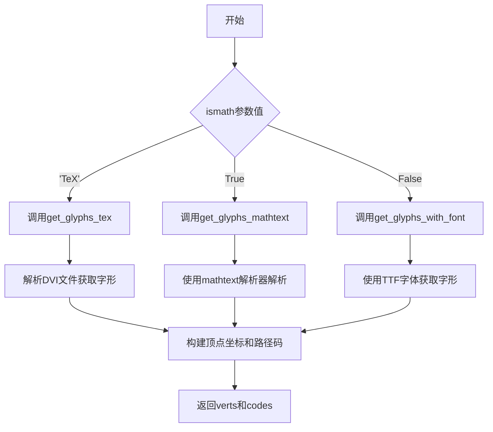

## 类结构

```
TextToPath (文本转路径核心类)
├── _get_font: 获取FT2Font字体对象
├── _get_hinting_flag: 获取提示标志
├── _get_char_id: 生成唯一字符ID
├── get_text_width_height_descent: 获取文本宽高下降
├── get_text_path: 主转换方法
├── get_glyphs_with_font: TTF字体字形获取
├── get_glyphs_mathtext: 数学文本字形获取
└── get_glyphs_tex: LaTeX字形获取

TextPath (继承Path)
├── __init__: 初始化
├── set_size: 设置大小
├── get_size: 获取大小
├── vertices: 顶点属性
├── codes: 路径码属性
└── _revalidate_path: 路径重新验证
```

## 全局变量及字段


### `_log`
    
模块级日志记录器

类型：`logging.Logger`
    


### `text_to_path`
    
TextToPath全局单例实例，用于将文本转换为路径

类型：`TextToPath`
    


### `TextToPath.mathtext_parser`
    
数学文本解析器，用于解析数学公式文本

类型：`MathTextParser`
    


### `TextToPath._texmanager`
    
LaTeX管理器，用于处理TeX文本渲染（当前未初始化）

类型：`TexManager`
    


### `TextToPath.FONT_SCALE`
    
字体缩放基准值，设置为100.0用于内部计算

类型：`float`
    


### `TextToPath.DPI`
    
DPI设置，用于字体大小计算，固定为72

类型：`int`
    


### `TextPath._xy`
    
文本位置坐标，存储文本的(x, y)位置

类型：`tuple`
    


### `TextPath._size`
    
字体大小，以磅为单位

类型：`float`
    


### `TextPath._cached_vertices`
    
缓存的顶点数组，存储转换后的路径顶点数据

类型：`numpy.ndarray`
    


### `TextPath._invalid`
    
路径有效性标志，True表示需要重新验证路径

类型：`bool`
    
    

## 全局函数及方法


### TextToPath.get_text_path

该方法是 TextToPath 类的核心方法，负责将文本字符串转换为路径数据（顶点和路径码），支持普通文本、数学文本（mathtext）和 TeX 渲染三种模式。

参数：

- `prop`：`~matplotlib.font_manager.FontProperties`，字体属性对象，用于指定文本的字体样式
- `s`：`str`，要转换为路径的文本字符串
- `ismath`：`{False, True, "TeX"}`，默认为 False。False 表示普通文本，True 表示使用 mathtext 解析器，"TeX" 表示使用 TeX 引擎渲染

返回值：`tuple[list, list]`，返回两个列表组成的元组。第一个列表是顶点坐标数组列表（verts），包含 (x, y) 坐标；第二个列表是路径码列表（codes），用于定义路径的绘制指令

#### 流程图

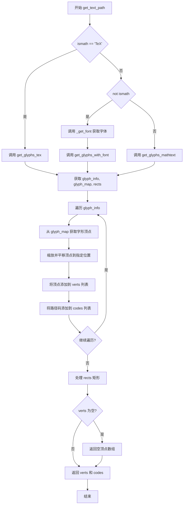

#### 带注释源码

```python
def get_text_path(self, prop, s, ismath=False):
    """
    Convert text *s* to path (a tuple of vertices and codes for
    matplotlib.path.Path).

    Parameters
    ----------
    prop : `~matplotlib.font_manager.FontProperties`
        The font properties for the text.
    s : str
        The text to be converted.
    ismath : {False, True, "TeX"}
        If True, use mathtext parser.  If "TeX", use tex for rendering.

    Returns
    -------
    verts : list
        A list of arrays containing the (x, y) coordinates of the vertices.
    codes : list
        A list of path codes.

    Examples
    --------
    Create a list of vertices and codes from a text, and create a `.Path`
    from those::

        from matplotlib.path import Path
        from matplotlib.text import TextToPath
        from matplotlib.font_manager import FontProperties

        fp = FontProperties(family="Comic Neue", style="italic")
        verts, codes = TextToPath().get_text_path(fp, "ABC")
        path = Path(verts, codes, closed=False)

    Also see `TextPath` for a more direct way to create a path from a text.
    """
    # 根据 ismath 参数选择不同的渲染路径
    # TeX 模式：使用 TexManager 处理
    if ismath == "TeX":
        glyph_info, glyph_map, rects = self.get_glyphs_tex(prop, s)
    # 普通文本模式：使用 TTF 字体
    elif not ismath:
        font = self._get_font(prop)
        glyph_info, glyph_map, rects = self.get_glyphs_with_font(font, s)
    # Mathtext 模式：使用数学文本解析器
    else:
        glyph_info, glyph_map, rects = self.get_glyphs_mathtext(prop, s)

    # 初始化空列表用于存储顶点和路径码
    verts, codes = [], []
    # 遍历每个字形信息：字形ID、x位置、y位置、缩放因子
    for glyph_id, xposition, yposition, scale in glyph_info:
        # 从字形映射中获取该字形的顶点和码
        verts1, codes1 = glyph_map[glyph_id]
        # 缩放顶点并平移到指定位置，然后添加到结果列表
        verts.extend(verts1 * scale + [xposition, yposition])
        codes.extend(codes1)
    # 处理矩形框（如数学表达式中的括号、根号等）
    for verts1, codes1 in rects:
        verts.extend(verts1)
        codes.extend(codes1)

    # 确保空字符串或只包含空格/换行符的情况返回有效的空路径
    if not verts:
        verts = np.empty((0, 2))

    return verts, codes
```


### `TextToPath._get_font`

该方法根据传入的字体属性（FontProperties）查找匹配的 FT2Font 字体对象，并将其大小设置为预定义的缩放因子和 DPI。

参数：

- `prop`：`FontProperties`，字体属性对象，用于查找匹配的字体

返回值：`FT2Font`，返回匹配字体属性且已设置大小的 FT2Font 字体对象

#### 流程图

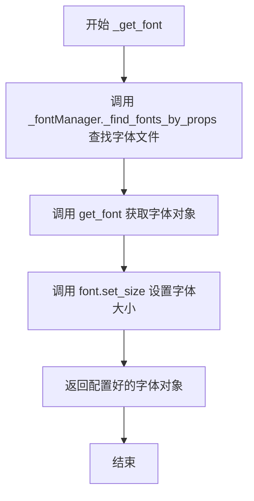

#### 带注释源码

```python
def _get_font(self, prop):
    """
    Find the `FT2Font` matching font properties *prop*, with its size set.
    """
    # 使用字体管理器根据字体属性查找对应的字体文件路径列表
    filenames = _fontManager._find_fonts_by_props(prop)
    
    # 根据文件路径获取字体对象
    font = get_font(filenames)
    
    # 设置字体的渲染大小：使用类常量 FONT_SCALE 作为缩放因子，DPI 为 72
    font.set_size(self.FONT_SCALE, self.DPI)
    
    # 返回配置好的字体对象供后续文本渲染使用
    return font
```


以下是基于您提供的代码和需求生成的详细设计文档。

### 1. 一段话描述

`TextToPath` 类是 Matplotlib 中用于将文本字符串转换为矢量路径（Path 对象）的核心转换器。其内部方法 `_get_hinting_flag` 负责提供字体渲染时的提示（Hinting）配置标志，目前固定返回 `LoadFlags.NO_HINTING`，以确保生成的路径坐标不依赖于字体的微调，从而获得数学上确定的轮廓。

### 2. 文件的整体运行流程

`TextToPath` 模块主要服务于图形渲染后端。当需要将文本（如坐标轴标签、图例文字）绘制为矢量形状而非光栅像素时，会调用 `TextToPath.get_text_path()`。该方法首先判断渲染模式（TeX、MathText 或普通文本），然后调用相应的字体获取方法（如 `_get_font`）加载字体，最后利用 `_get_hinting_flag` 指定的标志将字符转换为顶点（vertices）和编码（codes）数据，供 `Path` 对象使用。

### 3. 类的详细信息

#### 3.1 类字段

- **`FONT_SCALE`**: `float` (类属性)
    - 描述：用于将字体大小归一化的缩放因子（固定值 100.0）。
- **`DPI`**: `int` (类属性)
    - 描述：渲染分辨率（固定值 72）。
- **`mathtext_parser`**: `MathTextParser` (实例属性)
    - 描述：用于解析和渲染数学公式的解析器实例。
- **`_texmanager`**: `TexManager` (实例属性)
    - 描述：LaTeX 文本管理器的惰性初始化占位符。

#### 3.2 类方法概览

| 方法名 | 功能描述 |
| :--- | :--- |
| `get_text_path` | 将文本转换为包含顶点和路径码的元组，是外部调用的主入口。 |
| `get_text_width_height_descent` | 计算文本的宽、高和下降量。 |
| `_get_font` | 根据字体属性查找并配置 FT2Font 对象。 |
| `_get_hinting_flag` | **（目标方法）** 获取字体加载时的提示标志。 |
| `_get_char_id` | 生成字体和字符的唯一标识符。 |

---

### 4. 目标函数详细设计 (`TextToPath._get_hinting_flag`)

#### 描述

该方法是一个简单的访问器（Getter），用于获取当前文本转路径过程中使用的字体提示标志。它返回 `ft2font` 模块中定义的无提示（NO_HINTING）标志，这通常用于确保路径生成的精确性和跨平台一致性，避免因字体微调导致的细微差异。

#### 参数

- 无显式参数。（隐含参数 `self` 指向 `TextToPath` 实例）

#### 返回值

- **`int`**，返回 `matplotlib.ft2font.LoadFlags.NO_HINTING` 的整数值（通常为 2）。

#### 流程图

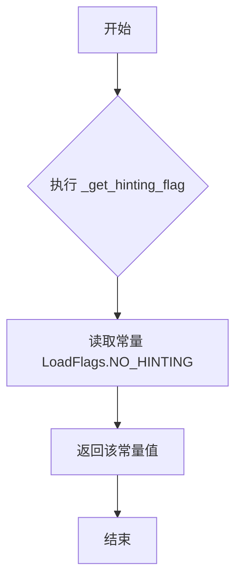

#### 带注释源码

```python
def _get_hinting_flag(self):
    """
    获取用于文本转路径渲染的字体提示标志。

    Returns
    -------
    int
        返回无提示标志 (LoadFlags.NO_HINTING)，以确保路径坐标
        的精确性，避免字体渲染时的细微调整。
    """
    # 直接返回 matplotlib.ft2font 中定义的无提示常量。
    # 禁用提示可以保证在不同的渲染后端或 DPI 下，路径的几何形状保持一致。
    return LoadFlags.NO_HINTING
```

### 5. 关键组件信息

- **组件名称**: `TextToPath._get_hinting_flag`
- **一句话描述**: 文本转路径模块的字体渲染配置提供器，确保矢量路径生成的无偏差性。

### 6. 潜在的技术债务或优化空间

1.  **未充分利用的设计**：
    在代码中，`_get_hinting_flag` 方法被定义为中心化的配置提供者，但是该类的其他方法（如 `get_text_width_height_descent` 和 `get_glyphs_mathtext`）在调用 `font.set_text` 或 `font.load_char` 时，**直接硬编码传入了 `flags=LoadFlags.NO_HINTING`**（见源码第 69 行和第 176 行），而没有调用此方法。这造成了代码重复（DRY 原则违反），并且如果将来需要修改提示策略（例如开启微调），必须在多处修改。
    *优化建议*：统一在该方法中获取标志，或将其作为实例属性缓存，直接在渲染逻辑中引用。

2.  **硬编码限制**：
    该方法直接返回常量，无法根据不同的输出格式（如 SVG、PDF、PS）或用户配置动态调整 Hintding 策略。

### 7. 其它项目

- **外部依赖与接口契约**：
    - **依赖库**：`matplotlib.ft2font.LoadFlags`。该枚举定义了 FreeType 字体加载的各种标志（如 `NO_HINTING`, `TARGET_LIGHT`, `TARGET_MONO`）。
    - **接口契约**：此方法虽然设计为无参数，但作为类方法依赖于类实例的存在以多态调用。

- **错误处理与异常设计**：
    - 该方法本身极其简单，不涉及具体的文件 IO 或复杂计算，因此没有显式的错误处理逻辑。所有的异常风险实际上转移到了调用方（如字体文件缺失、FreeType 库错误）。

- **数据流与状态机**：
    - **数据流**：配置（常量） -> 字体加载器 (`FT2Font`) -> 字符路径数据 (`Path`) -> 图形渲染。
    - **状态**：该方法属于“配置态”，其返回值在 `TextToPath` 实例初始化时确定（实际上在调用时确定），不持有可变状态。


### `TextToPath._get_char_id`

该方法用于为给定的字体对象和字符代码生成唯一的标识符，通过组合字体的 PostScript 名称和字符的十六进制编码并使用 URL 编码来确保标识符的唯一性和安全性。

参数：

- `font`：`FT2Font`，字体对象，用于获取其 PostScript 名称
- `ccode`：`int`，字符代码（Unicode 码点），表示要处理的字符

返回值：`str`，返回 URL 编码后的唯一标识符，格式为 `{font.postscript_name}-{ccode十六进制形式}`

#### 流程图

```mermaid
flowchart TD
    A[开始 _get_char_id] --> B[获取 font.postscript_name]
    B --> C[将 ccode 转换为十六进制字符串]
    C --> D[拼接字符串: {font.postscript_name}-{ccode:x}]
    D --> E[调用 urllib.parse.quote 进行 URL 编码]
    E --> F[返回编码后的字符串]
```

#### 带注释源码

```python
def _get_char_id(self, font, ccode):
    """
    Return a unique id for the given font and character-code set.
    """
    # 使用 f-string 格式化字符串，将字体的 PostScript 名称和字符代码（十六进制）组合
    # 例如: "Helvetica-Bold-41" (41 是字符 'A' 的十六进制 Unicode 码点)
    # :x 格式化符将整数 ccode 转换为小写十六进制字符串
    font_char_string = f"{font.postscript_name}-{ccode:x}"
    
    # 使用 urllib.parse.quote 对字符串进行 URL 编码，确保返回的字符串安全
    # 这对于作为字典键或用于文件路径特别重要
    # 特殊字符（如空格、斜杠等）会被转换为 %XX 格式
    return urllib.parse.quote(font_char_string)
```


### `TextToPath.get_text_width_height_descent`

获取文本的宽度、高度和下降值（descent），用于文本的尺寸计算和布局。支持三种模式：普通文本、LaTeX 模式和数学文本（mathtext）。

参数：

- `s`：`str`，要测量宽度的文本字符串
- `prop`：`FontProperties`，字体属性对象，包含字体大小、样式等信息
- `ismath`：`bool` 或 `str`，指定文本渲染模式。`False` 或 `True` 表示普通文本或 mathtext 模式；`"TeX"` 表示使用 LaTeX 渲染

返回值：`tuple`，包含三个浮点数的元组 `(宽度, 高度, 下降值)`，单位与输入字体大小一致

#### 流程图

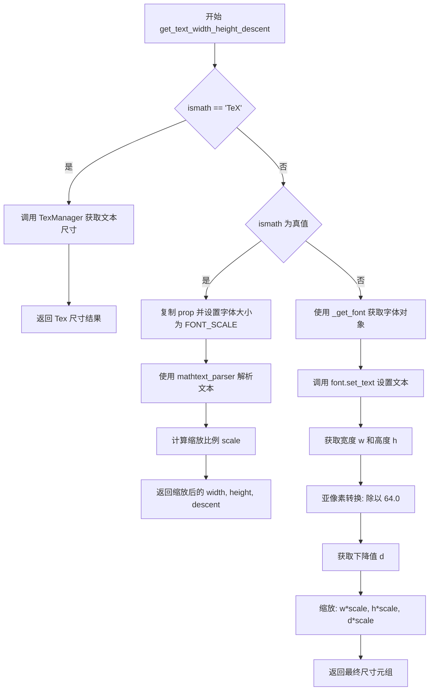

#### 带注释源码

```python
def get_text_width_height_descent(self, s, prop, ismath):
    """
    获取文本的宽度、高度和下降值。

    Parameters
    ----------
    s : str
        要测量的文本字符串
    prop : FontProperties
        字体属性对象
    ismath : bool or str
        文本渲染模式控制：
        - False: 普通文本渲染
        - True: 使用 mathtext 解析器
        - "TeX": 使用 LaTeX 渲染引擎

    Returns
    -------
    tuple[float, float, float]
        (宽度, 高度, 下降值)
    """
    # 从字体属性获取字体大小（以点为单位）
    fontsize = prop.get_size_in_points()

    # 如果使用 TeX 模式，委托给 TexManager 处理
    if ismath == "TeX":
        return TexManager().get_text_width_height_descent(s, fontsize)

    # 计算字体大小相对于 FONT_SCALE 的缩放因子
    # FONT_SCALE=100 是内部使用的基准字体大小
    scale = fontsize / self.FONT_SCALE

    # 如果是数学文本模式（但非 TeX）
    if ismath:
        # 复制字体属性以避免修改原始对象
        prop = prop.copy()
        # 设置为基准字体大小用于解析
        prop.set_size(self.FONT_SCALE)
        # 使用 mathtext 解析器解析数学文本
        width, height, descent, *_ = \
            self.mathtext_parser.parse(s, 72, prop)
        # 缩放到目标字体大小
        return width * scale, height * scale, descent * scale

    # 普通文本渲染路径
    # 根据字体属性获取匹配的 FreeType 字体对象
    font = self._get_font(prop)
    # 设置文本到字体，0.0 表示不进行字距调整
    font.set_text(s, 0.0, flags=LoadFlags.NO_HINTING)
    # 获取字符的宽度和高度（以 1/64 像素为单位）
    w, h = font.get_width_height()
    w /= 64.0  # convert from subpixels
    h /= 64.0
    # 获取下降值（文本基线以下的距离）
    d = font.get_descent()
    d /= 64.0
    # 应用字体大小缩放并返回结果
    return w * scale, h * scale, d * scale
```


### `TextToPath.get_text_path`

将文本字符串转换为路径数据（顶点坐标和路径码），支持普通文本、LaTeX渲染和数学文本三种模式。

参数：

- `prop`：`~matplotlib.font_manager.FontProperties`，字体属性对象，用于指定文本的字体样式
- `s`：`str`，要转换为路径的文本字符串
- `ismath`：`{False, True, "TeX"}`，数学文本渲染模式标志，False 表示普通文本，True 表示使用 mathtext 解析器，"TeX" 表示使用 LaTeX 渲染

返回值：`tuple[list, list]`，返回两个列表——verts 是包含顶点坐标的列表，codes 是对应的路径操作码列表

#### 流程图

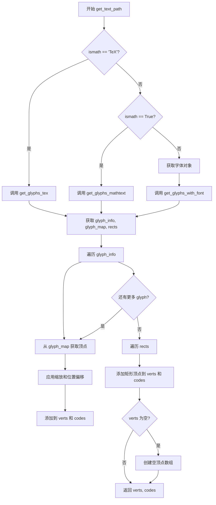

#### 带注释源码

```python
def get_text_path(self, prop, s, ismath=False):
    """
    Convert text *s* to path (a tuple of vertices and codes for
    matplotlib.path.Path).

    Parameters
    ----------
    prop : `~matplotlib.font_manager.FontProperties`
        The font properties for the text.
    s : str
        The text to be converted.
    ismath : {False, True, "TeX"}
        If True, use mathtext parser.  If "TeX", use tex for rendering.

    Returns
    -------
    verts : list
        A list of arrays containing the (x, y) coordinates of the vertices.
    codes : list
        A list of path codes.

    Examples
    --------
    Create a list of vertices and codes from a text, and create a `.Path`
    from those::

        from matplotlib.path import Path
        from matplotlib.text import TextToPath
        from matplotlib.font_manager import FontProperties

        fp = FontProperties(family="Comic Neue", style="italic")
        verts, codes = TextToPath().get_text_path(fp, "ABC")
        path = Path(verts, codes, closed=False)

    Also see `TextPath` for a more direct way to create a path from a text.
    """
    # 根据 ismath 参数选择不同的字形提取策略
    if ismath == "TeX":
        # TeX 模式：使用 LaTeX 渲染获取字形信息
        glyph_info, glyph_map, rects = self.get_glyphs_tex(prop, s)
    elif not ismath:
        # 普通文本模式：使用指定字体获取字形信息
        font = self._get_font(prop)
        glyph_info, glyph_map, rects = self.get_glyphs_with_font(font, s)
    else:
        # 数学文本模式：使用 mathtext 解析器获取字形信息
        glyph_info, glyph_map, rects = self.get_glyphs_mathtext(prop, s)

    # 初始化顶点和路径码列表
    verts, codes = [], []
    
    # 遍历所有字形信息，将字形顶点转换为完整路径
    # glyph_info 包含: (glyph_id, xposition, yposition, scale)
    for glyph_id, xposition, yposition, scale in glyph_info:
        # 从字形映射中获取该字形的顶点和路径码
        verts1, codes1 = glyph_map[glyph_id]
        # 应用缩放因子并添加位置偏移量
        verts.extend(verts1 * scale + [xposition, yposition])
        codes.extend(codes1)
    
    # 添加矩形框（用于数学文本中的装饰元素）
    for verts1, codes1 in rects:
        verts.extend(verts1)
        codes.extend(codes1)

    # 确保空字符串或只包含空白字符的情况返回有效的空路径
    if not verts:
        verts = np.empty((0, 2))

    return verts, codes
```


### `TextToPath.get_glyphs_with_font`

该方法接收一个TTF字体对象和字符串，利用文本布局辅助函数将字符串中的每个字符转换为对应的字形标识符和位置信息，并将新出现的字形路径添加到映射字典中，最终返回字形信息列表、更新后的字形映射字典以及空矩形列表。

参数：

- `font`：`FT2Font`，用于渲染文本的FreeType字体对象
- `s`：`str`，要转换为字形的字符串
- `glyph_map`：`Optional[OrderedDict]`，可选的字形映射字典，用于存储已处理的字形路径，键为字符ID，值为字形路径数据
- `return_new_glyphs_only`：`bool`，默认为False，若为True则仅返回新添加的字形，忽略已有字形

返回值：`tuple`，包含三个元素的元组
- 第一个元素：`list`，字形信息列表，每个元素为 `(glyph_id, xposition, yposition, size)` 元组
- 第二个元素：`OrderedDict`，更新后的字形映射字典
- 第三个元素：`list`，矩形列表（此处始终为空列表）

#### 流程图

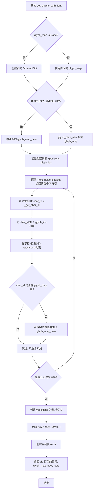

#### 带注释源码

```python
def get_glyphs_with_font(self, font, s, glyph_map=None,
                         return_new_glyphs_only=False):
    """
    Convert string *s to vertices and codes using the provided ttf font.
    """
    # 如果未提供 glyph_map，则创建新的空字典
    # 用于存储字形ID到路径数据的映射
    if glyph_map is None:
        glyph_map = OrderedDict()

    # 根据参数决定是返回全部字形还是仅新字形
    if return_new_glyphs_only:
        # 仅包含新添加的字形
        glyph_map_new = OrderedDict()
    else:
        # 包含所有字形（原有+新添加）
        glyph_map_new = glyph_map

    # 初始化存储位置和字形ID的列表
    xpositions = []
    glyph_ids = []
    
    # 遍历字符串中的每个字符布局信息
    # _text_helpers.layout 返回迭代器,每个item包含ft_object和char等信息
    for item in _text_helpers.layout(s, font):
        # 生成唯一字符ID: font的PostScript名称 + 字符的十六进制编码
        char_id = self._get_char_id(item.ft_object, ord(item.char))
        glyph_ids.append(char_id)
        xpositions.append(item.x)
        
        # 仅当该字形不在已有映射中时才获取路径
        # 这样可以避免重复处理相同字符,提高效率
        if char_id not in glyph_map:
            glyph_map_new[char_id] = item.ft_object.get_path()

    # 所有字符的y位置设为0(水平布局)
    ypositions = [0] * len(xpositions)
    # 所有字符的缩放比例设为1.0(原始大小)
    sizes = [1.] * len(xpositions)

    # 此方法不处理矩形(由其他方法如get_glyphs_mathtext处理)
    rects = []

    # 返回元组: (字形信息列表, 字形映射字典, 矩形列表)
    return (list(zip(glyph_ids, xpositions, ypositions, sizes)),
            glyph_map_new, rects)
```


### `TextToPath.get_glyphs_mathtext`

该方法用于将数学文本字符串解析并转换为路径图元信息（顶点坐标和路径码），支持从数学文本中提取字形数据。

参数：

- `prop`：`FontProperties`，字体属性对象，用于获取字体信息
- `s`：`str`，要解析的数学文本字符串
- `glyph_map`：`OrderedDict`，可选，用于缓存已加载的字形映射，默认为 `None`
- `return_new_glyphs_only`：`bool`，可选，指定是否仅返回新字形，默认为 `False`

返回值：`(list, OrderedDict, list)`，返回一个包含三个元素的元组：
- 第一个元素是字形信息列表（字形ID、x位置、y位置、缩放大小）
- 第二个元素是字形映射字典
- 第三个元素是矩形列表（用于绘制背景等）

#### 流程图

```mermaid
flowchart TD
    A[开始 get_glyphs_mathtext] --> B[复制字体属性并设置为 FONT_SCALE 大小]
    B --> C[调用 mathtext_parser.parse 解析数学文本]
    C --> D{glyph_map 是否为空?}
    D -->|是| E[创建新的 OrderedDict]
    D -->|否| F{return_new_glyphs_only?}
    E --> F
    F -->|是| G[创建新的 OrderedDict glyph_map_new]
    F -->|否| H[glyph_map_new = glyph_map]
    G --> I[初始化空列表: xpositions, ypositions, glyph_ids, sizes]
    H --> I
    I --> J{遍历 glyphs 中的每个字形}]
    J -->|每次迭代| K[获取 char_id]
    K --> L{char_id 不在 glyph_map 中?}
    L -->|是| M[清空字体、设置大小、加载字形、获取路径]
    L -->|否| N[跳过加载,直接使用缓存]
    M --> O[glyph_map_new[char_id] = font.get_path()]
    N --> P[添加坐标和大小到列表]
    O --> P
    P --> J
    J -->|遍历完成| Q[遍历 rects 创建矩形顶点]
    Q --> R[返回 zip 结果、glyph_map_new 和 myrects]
    R --> S[结束]
```

#### 带注释源码

```python
def get_glyphs_mathtext(self, prop, s, glyph_map=None,
                        return_new_glyphs_only=False):
    """
    Parse mathtext string *s* and convert it to a (vertices, codes) pair.
    """

    # 复制字体属性对象，避免修改原始属性
    prop = prop.copy()
    # 将字体大小设置为 FONT_SCALE (100.0)，用于高精度渲染
    prop.set_size(self.FONT_SCALE)

    # 使用 MathTextParser 解析数学文本字符串，返回宽度、高度、下降量、字形列表和矩形列表
    width, height, descent, glyphs, rects = self.mathtext_parser.parse(
        s, self.DPI, prop)

    # 如果没有提供 glyph_map，则创建一个新的空字典
    if not glyph_map:
        glyph_map = OrderedDict()

    # 根据 return_new_glyphs_only 决定是重用还是创建新的字形映射
    if return_new_glyphs_only:
        glyph_map_new = OrderedDict()
    else:
        glyph_map_new = glyph_map

    # 初始化用于存储字形位置和大小信息的空列表
    xpositions = []
    ypositions = []
    glyph_ids = []
    sizes = []

    # 遍历解析出的每个字形信息
    for font, fontsize, ccode, ox, oy in glyphs:
        # 生成字形的唯一标识符
        char_id = self._get_char_id(font, ccode)
        
        # 如果该字形尚未被加载
        if char_id not in glyph_map:
            # 清空字体缓冲区
            font.clear()
            # 设置字体大小和 DPI
            font.set_size(self.FONT_SCALE, self.DPI)
            # 加载指定字符，NO_HINTING 标志避免提示
            font.load_char(ccode, flags=LoadFlags.NO_HINTING)
            # 获取路径并存储到字形映射中
            glyph_map_new[char_id] = font.get_path()

        # 记录字形的位置坐标
        xpositions.append(ox)
        ypositions.append(oy)
        # 记录字形ID
        glyph_ids.append(char_id)
        # 计算相对大小（原始大小除以 FONT_SCALE）
        size = fontsize / self.FONT_SCALE
        sizes.append(size)

    # 处理矩形（用于绘制背景等）
    myrects = []
    for ox, oy, w, h in rects:
        # 定义矩形的五个顶点坐标（顺时针）
        vert1 = [(ox, oy), (ox, oy + h), (ox + w, oy + h),
                 (ox + w, oy), (ox, oy), (0, 0)]
        # 定义路径操作码：MOVETO 移动到起点，LINETO 画线到各点，CLOSEPOLY 闭合多边形
        code1 = [Path.MOVETO,
                 Path.LINETO, Path.LINETO, Path.LINETO, Path.LINETO,
                 Path.CLOSEPOLY]
        myrects.append((vert1, code1))

    # 返回字形信息、元组形式的坐标和大小字形映射字典，以及矩形列表
    return (list(zip(glyph_ids, xpositions, ypositions, sizes)),
            glyph_map_new, myrects)
```


### `TextToPath.get_glyphs_tex`

该方法用于将字符串使用 TeX 渲染模式转换为路径顶点坐标和路径码，通过调用 TexManager 生成 DVI 文件，解析 DVI 中的文本和盒子信息，获取每个字符的字体和字形数据，最后返回字形ID列表、位置信息、缩放比例以及字形映射和矩形列表。

参数：

- `prop`：`~matplotlib.font_manager.FontProperties`，字体属性对象，用于获取字体信息
- `s`：`str`，要转换为路径的文本字符串
- `glyph_map`：可选的 `OrderedDict`，用于存储已加载的字形映射，键为字符ID，值为字形路径数据
- `return_new_glyphs_only`：可选的 `bool`，如果为 True，则只返回新加载的字形；否则返回所有字形

返回值：返回一个包含四个元素的元组 `(glyph_ids, glyph_map_new, myrects)`，其中：
- `glyph_ids`：`list`，字形ID列表（由字符ID、x位置、y位置、缩放大小组成的元组列表）
- `glyph_map_new`：`OrderedDict`，更新后的字形映射字典
- `myrects`：`list`，矩形列表（由顶点坐标和路径码组成的元组列表）

#### 流程图

```mermaid
flowchart TD
    A[开始 get_glyphs_tex] --> B[调用 TexManager.make_dvi 生成 DVI 文件]
    B --> C[使用 dviread.Dvi 读取 DVI 文件]
    C --> D[获取 DVI 页面内容]
    D --> E{glyph_map 是否为 None?}
    E -->|是| F[创建新的 OrderedDict]
    E -->|否| G{return_new_glyphs_only?}
    F --> G
    G -->|是| H[创建新的 OrderedDict]
    G -->|否| I[使用原始 glyph_map]
    H --> J[初始化空列表: glyph_ids, xpositions, ypositions, sizes]
    I --> J
    J --> K[遍历 page.text 中的每个文本元素]
    K --> L{检查是否为 TTC 字体索引?}
    L -->|是| M[抛出 NotImplementedError]
    L -->|否| N[获取字体对象]
    N --> O{char_id 是否在 glyph_map 中?}
    O -->|否| P[清空字体并设置大小]
    P --> Q[加载字形到字体]
    Q --> R[将字形路径存入 glyph_map_new]
    O -->|是| S[跳过加载]
    R --> T[将 char_id 加入 glyph_ids]
    S --> T
    T --> U[记录 xposition, yposition, size]
    U --> V[遍历完所有文本元素?]
    V -->|否| K
    V -->|是| W[遍历 page.boxes 创建矩形顶点]
    W --> X[为每个矩形生成 MOVETO, LINETO, CLOSEPOLY 码]
    X --> Y[返回 (zip结果, glyph_map_new, myrects)]
    Y --> Z[结束]
```

#### 带注释源码

```python
def get_glyphs_tex(self, prop, s, glyph_map=None,
                   return_new_glyphs_only=False):
    """Convert the string *s* to vertices and codes using usetex mode."""
    # Mostly borrowed from pdf backend.

    # 第一步：使用 TexManager 生成 DVI 文件
    # DVI (DeVice Independent) 是 TeX 的输出格式
    dvifile = TexManager().make_dvi(s, self.FONT_SCALE)
    
    # 第二步：读取 DVI 文件并获取页面内容
    with dviread.Dvi(dvifile, self.DPI) as dvi:
        page, = dvi

    # 第三步：初始化 glyph_map
    # 如果未提供 glyph_map，则创建新的 OrderedDict 用于存储字形映射
    if glyph_map is None:
        glyph_map = OrderedDict()

    # 第四步：根据 return_new_glyphs_only 决定 glyph_map_new 的行为
    # 如果只返回新字形，则创建新的字典；否则使用原始 glyph_map
    if return_new_glyphs_only:
        glyph_map_new = OrderedDict()
    else:
        glyph_map_new = glyph_map

    # 初始化用于存储结果的列表
    glyph_ids, xpositions, ypositions, sizes = [], [], [], []

    # Gather font information and do some setup for combining
    # characters into strings.
    # 用于存储 Type 1 编码的字典（虽然在此方法中未实际使用）
    t1_encodings = {}
    
    # 第五步：遍历页面中的每个文本元素
    for text in page.text:
        # 根据字体路径获取 FT2Font 字体对象
        font = get_font(text.font.resolve_path())
        
        # 检查是否使用了子字体（TTC 字体索引）
        if text.font.subfont:
            raise NotImplementedError("Indexing TTC fonts is not supported yet")
        
        # 生成唯一字符 ID：字体 PostScript 名称 + 字符码的十六进制形式
        char_id = self._get_char_id(font, text.glyph)
        
        # 如果字符不在 glyph_map 中，则加载字形
        if char_id not in glyph_map:
            font.clear()
            font.set_size(self.FONT_SCALE, self.DPI)
            # 使用 TARGET_LIGHT 标志加载字形
            font.load_glyph(text.index, flags=LoadFlags.TARGET_LIGHT)
            # 将字形路径数据存入 glyph_map_new
            glyph_map_new[char_id] = font.get_path()

        # 将字符 ID 和位置信息添加到结果列表
        glyph_ids.append(char_id)
        xpositions.append(text.x)
        ypositions.append(text.y)
        # 计算缩放比例：字体大小除以基准缩放值
        sizes.append(text.font_size / self.FONT_SCALE)

    # 第六步：处理页面中的矩形盒子（boxes）
    # 这些矩形通常用于表示数学公式中的根号、分式等结构
    myrects = []

    # 遍历页面中的所有盒子
    for ox, oy, h, w in page.boxes:
        # 为每个盒子创建 5 个顶点 + 1 个闭合点的顶点列表
        # 顶点顺序：左下 -> 右下 -> 右上 -> 左上 -> 左下 -> 闭合点(0,0)
        vert1 = [(ox, oy), (ox + w, oy), (ox + w, ooy + h),
                 (ox, oy + h), (ox, oy), (0, 0)]
        # 对应的路径码：MOVETO 移动到起点，4个 LINETO 画线，CLOSEPOLY 闭合多边形
        code1 = [Path.MOVETO,
                 Path.LINETO, Path.LINETO, Path.LINETO, Path.LINETO,
                 Path.CLOSEPOLY]
        myrects.append((vert1, code1))

    # 第七步：返回结果
    # zip 将四个列表组合为元组列表，每个元素为 (glyph_id, x, y, scale)
    return (list(zip(glyph_ids, xpositions, ypositions, sizes)),
            glyph_map_new, myrects)
```


### `TextPath.__init__`

该方法是`TextPath`类的构造函数，用于将文本字符串转换为路径（Path）对象。它接受文本位置、字符串内容、字体大小、字体属性等参数，通过`TextToPath`将文本转换为顶点和路径代码，并调用父类`Path`的初始化方法完成路径的创建。

参数：

- `xy`：tuple 或 array of two float values，文本的位置坐标，默认为`(0, 0)`表示无偏移
- `s`：str，要转换为路径的文本字符串
- `size`：float，可选参数，字体大小（以磅为单位），默认为通过字体属性*prop*指定的大小
- `prop`：~matplotlib.font_manager.FontProperties，可选参数，字体属性，若未提供则使用默认的FontProperties（参数来自rcParams）
- `_interpolation_steps`：int，可选参数，（当前被忽略）
- `usetex`：bool，默认False，是否使用TeX渲染

返回值：无返回值（构造函数）

#### 流程图

```mermaid
flowchart TD
    A[开始 __init__] --> B[导入 matplotlib.text.Text]
    B --> C[将 prop 转换为 FontProperties 对象]
    C --> D{size 是否为 None?}
    D -->|是| E[从 prop 获取字体大小]
    D -->|否| F[使用传入的 size]
    E --> G[设置 self._xy]
    G --> H[调用 set_size 设置字体大小]
    H --> I[初始化 self._cached_vertices 为 None]
    I --> J[调用 Text()._preprocess_math 预处理数学文本]
    J --> K[调用 text_to_path.get_text_path 获取顶点和代码]
    K --> L[调用 Path.__init__ 初始化父类]
    L --> M[设置 self._should_simplify = False]
    M --> N[结束 __init__]
```

#### 带注释源码

```python
def __init__(self, xy, s, size=None, prop=None,
             _interpolation_steps=1, usetex=False):
    r"""
    Create a path from the text. Note that it simply is a path,
    not an artist. You need to use the `.PathPatch` (or other artists)
    to draw this path onto the canvas.

    Parameters
    ----------
    xy : tuple or array of two float values
        Position of the text. For no offset, use ``xy=(0, 0)``.

    s : str
        The text to convert to a path.

    size : float, optional
        Font size in points. Defaults to the size specified via the font
        properties *prop*.

    prop : `~matplotlib.font_manager.FontProperties`, optional
        Font property. If not provided, will use a default
        `.FontProperties` with parameters from the
        :ref:`rcParams<customizing-with-dynamic-rc-settings>`.

    _interpolation_steps : int, optional
        (Currently ignored)

    usetex : bool, default: False
        Whether to use tex rendering.

    Examples
    --------
    The following creates a path from the string "ABC" with Helvetica
    font face; and another path from the latex fraction 1/2::

        from matplotlib.text import TextPath
        from matplotlib.font_manager import FontProperties

        fp = FontProperties(family="Helvetica", style="italic")
        path1 = TextPath((12, 12), "ABC", size=12, prop=fp)
        path2 = TextPath((0, 0), r"$\frac{1}{2}$", size=12, usetex=True)

    Also see :doc:`/gallery/text_labels_and_annotations/demo_text_path`.
    """
    # 避免循环导入，在方法内部导入 Text 类
    from matplotlib.text import Text

    # 将 prop 参数转换为 FontProperties 对象（支持多种输入格式）
    prop = FontProperties._from_any(prop)
    
    # 如果未指定 size，则从 font properties 获取字体大小（以磅为单位）
    if size is None:
        size = prop.get_size_in_points()

    # 存储文本位置坐标
    self._xy = xy
    
    # 设置文本大小并初始化缓存失效标志
    self.set_size(size)

    # 初始化顶点缓存为 None（延迟计算）
    self._cached_vertices = None
    
    # 预处理文本字符串，处理数学表达式标记
    # 返回处理后的字符串 s 和 ismath 标志
    s, ismath = Text(usetex=usettex)._preprocess_math(s)
    
    # 调用父类 Path 的初始化方法
    # 传入从 text_to_path.get_text_path 获取的顶点和路径代码
    # _interpolation_steps 用于控制插值步骤，readonly=True 表示路径不可修改
    super().__init__(
        *text_to_path.get_text_path(prop, s, ismath=ismath),
        _interpolation_steps=_interpolation_steps,
        readonly=True)
    
    # 设置路径不应被简化（文本路径需要精确渲染）
    self._should_simplify = False
```


### TextPath.set_size

该方法用于设置 `TextPath` 对象的文本大小，并通过将 `_invalid` 标志设置为 `True` 来标记路径缓存失效，以便在下次访问顶点时触发路径重新计算。

参数：

- `size`：`float`，要设置的文本大小（以磅为单位）

返回值：`None`，无返回值（该方法仅修改实例状态）

#### 流程图

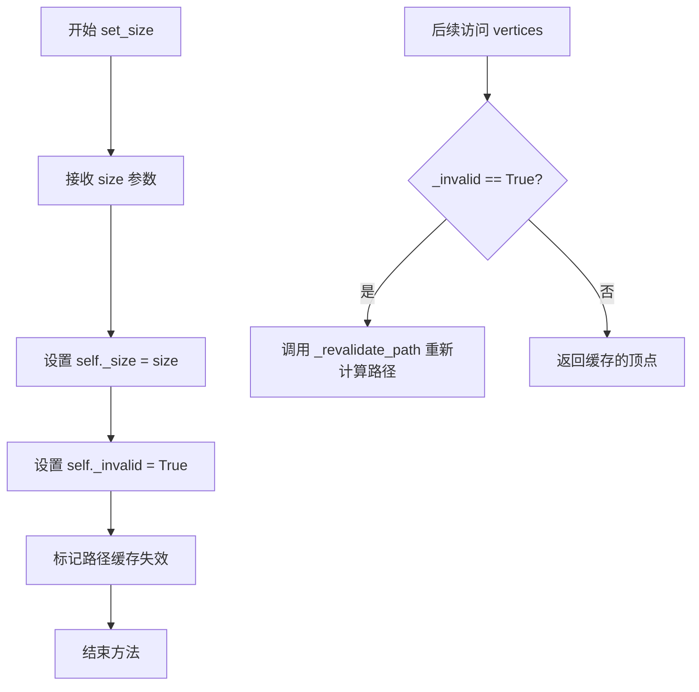

#### 带注释源码

```python
def set_size(self, size):
    """Set the text size."""
    # 将传入的 size 参数赋值给实例属性 _size
    # 该属性用于存储当前文本的字体大小
    self._size = size
    
    # 将 _invalid 标志设置为 True，标记路径缓存失效
    # 当 _invalid 为 True 时，访问 vertices 属性会触发 _revalidate_path 方法
    # 这确保了文本大小改变后，路径顶点会重新计算
    self._invalid = True
```


### `TextPath.get_size`

获取文本的字体大小。

参数：

- （无参数，除了隐式的 `self`）

返回值：`float`，返回文本的字体大小（以磅为单位）。

#### 流程图

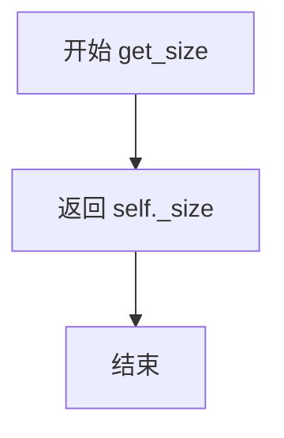

#### 带注释源码

```python
def get_size(self):
    """Get the text size."""
    return self._size
```

#### 详细说明

这是一个简单的访问器（getter）方法，属于 `TextPath` 类。该方法直接返回实例属性 `_size`，该属性在 `__init__` 方法中通过调用 `set_size` 方法设置，或在 `set_size` 方法中更新。

- **所属类**：`TextPath`
- **实例属性依赖**：`_size`（在 `set_size` 中被设置）
- **设计意图**：提供对文本字体大小的只读访问接口

#### 关联方法

- `set_size(self, size)`：设置文本大小，同时将 `_invalid` 标志设为 `True`，表示路径需要重新验证。


### `TextPath._revalidate_path`

更新文本路径的缓存顶点，当路径无效或缓存为空时重新计算。

参数：

- 无参数（仅使用实例属性 `self`）

返回值：`None`，无返回值（通过修改实例属性 `self._cached_vertices` 和 `self._invalid` 更新内部状态）

#### 流程图

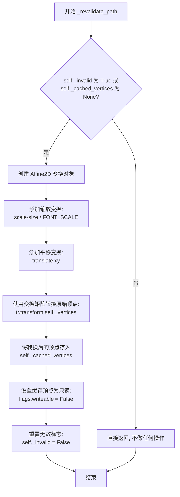

#### 带注释源码

```
def _revalidate_path(self):
    """
    Update the path if necessary.

    The path for the text is initially create with the font size of
    `.FONT_SCALE`, and this path is rescaled to other size when necessary.
    """
    # 检查路径是否需要重新验证
    # _invalid 标志在 set_size() 被调用时设为 True
    # _cached_vertices 为 None 时表示尚未缓存
    if self._invalid or self._cached_vertices is None:
        # 创建仿射变换矩阵:
        # 1. scale: 根据当前字体大小与基准字体大小的比例进行缩放
        # 2. translate: 根据文本位置 xy 进行平移
        tr = (Affine2D()
              .scale(self._size / text_to_path.FONT_SCALE)
              .translate(*self._xy))
        
        # 使用变换矩阵将原始顶点（基于 FONT_SCALE=100 创建）转换到目标大小和位置
        self._cached_vertices = tr.transform(self._vertices)
        
        # 将缓存的顶点数组设为只读，防止被意外修改
        self._cached_vertices.flags.writeable = False
        
        # 重置无效标志，表示路径已重新验证
        self._invalid = False
```


### `TextPath.vertices`

这是一个属性（property），用于返回路径的顶点坐标。它会在返回缓存的顶点之前检查是否需要重新验证路径，如果路径无效（如字体大小或位置已更改），则会重新计算顶点。

参数：
- （无显式参数，隐式参数为 `self`）

返回值：`numpy.ndarray`，返回路径的顶点坐标数组，形状为 `(n, 2)`，其中每行是一个顶点的 (x, y) 坐标。

#### 流程图

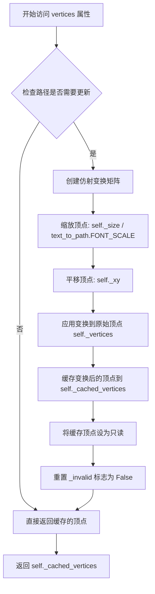

#### 带注释源码

```python
@property
def vertices(self):
    """
    Return the cached path after updating it if necessary.
    """
    # 调用 _revalidate_path 方法，确保路径是最新的
    self._revalidate_path()
    # 返回缓存的顶点坐标数组
    return self._cached_vertices


def _revalidate_path(self):
    """
    Update the path if necessary.

    The path for the text is initially create with the font size of
    `.FONT_SCALE`, and this path is rescaled to other size when necessary.
    """
    # 检查路径是否无效或缓存的顶点为空
    if self._invalid or self._cached_vertices is None:
        # 创建仿射变换：先缩放后平移
        # 缩放因子 = 当前字体大小 / 原始字体大小(FONT_SCALE=100)
        # 平移量 = 文本的(x, y)位置
        tr = (Affine2D()
              .scale(self._size / text_to_path.FONT_SCALE)
              .translate(*self._xy))
        
        # 对原始顶点应用变换矩阵，得到新顶点
        self._cached_vertices = tr.transform(self._vertices)
        
        # 将缓存的顶点设为只读，防止被意外修改
        self._cached_vertices.flags.writeable = False
        
        # 重置无效标志，表示路径已更新
        self._invalid = False
```


### TextPath.codes

该属性是TextPath类的只读属性，用于返回文本路径的绘制指令码（Path Codes），定义了路径中每个顶点的操作类型，如移动、直线、曲线等。

参数：无

返回值：`list`，返回路径的所有绘制指令码列表，每个码对应Path类中定义的常量（如MOVETO、LINETO、CLOSEPOLY等）

#### 流程图

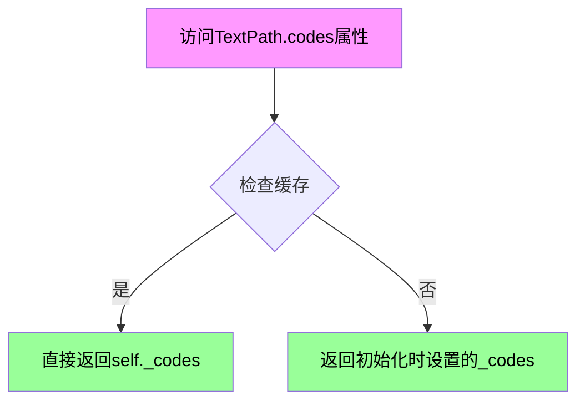

#### 带注释源码

```python
@property
def codes(self):
    """
    Return the codes
    """
    return self._codes
```

**源码解析：**

- `@property` 装饰器：将方法转换为属性，使其可以通过`实例.codes`的方式访问，而不需要调用括号
- `self._codes`：继承自父类`Path`的实例属性，在`TextPath.__init__`调用`super().__init__()`时从`text_to_path.get_text_path()`返回的codes参数传入
- 该属性是只读的（readonly=True在初始化时设置），返回的codes定义了路径的绘制指令，包含Path.MOVETO（移动到）、Path.LINETO（画线到）、Path.CLOSEPOLY（闭合多边形）等操作码


## 关键组件


### TextToPath

负责将字符串转换为路径的核心类，支持TeX、mathtext和普通文本三种渲染模式，提供字体查找、字形映射和顶点生成功能。

### TextToPath._get_font

根据字体属性查找匹配的FT2Font字体对象，并设置字体大小为FONT_SCALE，用于后续的字形渲染。

### TextToPath.get_text_width_height_descent

计算文本的宽度、高度和下降量，根据ismath参数选择不同的渲染引擎（TeX或mathtext）或直接使用字体对象。

### TextToPath.get_text_path

将文本转换为路径元组（顶点坐标列表和路径代码列表），内部根据渲染模式调用不同的字形获取方法。

### TextToPath.get_glyphs_with_font

使用指定的TTF字体将字符串转换为顶点和代码，实现字形的惰性加载和缓存（glyph_map），避免重复加载相同字形。

### TextToPath.get_glyphs_mathtext

解析mathtext字符串并转换为顶点和代码，处理数学公式的渲染，支持字形缓存和矩形绘制。

### TextToPath.get_glyphs_tex

使用TeX引擎将字符串转换为顶点和代码，支持usetex模式渲染，处理DVI文件解析和字形加载。

### TextPath

继承自Path的类，用于从文本创建路径对象，支持字体属性设置、大小调整和路径重新验证。

### TextPath.vertices

属性方法，返回缓存的路径顶点，在返回前会调用_revalidate_path确保路径已更新到当前设置的大小。

### TextPath._revalidate_path

路径重新验证方法，当大小或缓存无效时，应用仿射变换（缩放和平移）将原始路径调整到目标尺寸。

### glyph_map（惰性加载机制）

使用OrderedDict存储已加载的字形路径，实现字形缓存，避免重复从字体文件读取相同字形，提升渲染性能。

### LoadFlags量化控制

使用LoadFlags.NO_HINTING和LoadFlags.TARGET_LIGHT控制字形加载时的提示模式，影响字形的量化质量和渲染效果。

### FONT_SCALE与DPI常量

定义基准字体缩放值为100.0和72 DPI，用于内部渲染计算，再通过仿射变换缩放到目标尺寸，实现分辨率无关的文本路径生成。


## 问题及建议


### 已知问题

-   **TexManager重复实例化**: 在`get_text_width_height_descent`和`get_glyphs_tex`方法中，每次调用都创建新的`TexManager()`实例，缺乏缓存机制，导致重复初始化开销
-   **字体对象未缓存**: `_get_font`方法每次调用都重新查找和加载字体，没有实现字体对象缓存
-   **get_glyphs_mathtext中字体状态重置**: 在循环中重复调用`font.clear()`和`font.set_size()`，这些操作可以在循环外执行一次
- **冗余的Affine2D对象创建**: `_revalidate_path`方法每次调用都创建新的`Affine2D`变换对象，而非复用
- **魔数使用**: 代码中存在多个硬编码的数值（如64.0用于子像素转换、0.0等），缺乏常量定义降低可读性
- **glyph_map处理逻辑重复**: `get_glyphs_with_font`、`get_glyphs_mathtext`、`get_glyphs_tex`三个方法中处理`glyph_map`和`return_new_glyphs_only`的逻辑高度重复
- **循环中的列表extend操作效率低**: `get_text_path`方法中多次使用`verts.extend()`和`codes.extend()`，可考虑预先分配空间或使用列表推导式优化

### 优化建议

-   **引入TexManager缓存**: 使用单例模式或类级别缓存重用TexManager实例
-   **添加字体缓存机制**: 实现字体缓存字典，避免重复查找和加载相同字体
-   **提取公共逻辑**: 将glyph_map处理逻辑抽取为私有方法，减少代码重复
-   **定义常量类**: 将魔数提取为类常量或模块级常量，提高可维护性
-   **优化列表操作**: 在`get_text_path`中预先计算列表大小或使用numpy数组操作提升性能
-   **复用Affine2D对象**: 将变换矩阵作为实例属性缓存，仅在参数变化时重新创建
-   **添加错误处理**: 为字体加载、文件解析等IO操作添加try-except异常处理


## 其它


### 设计目标与约束

该模块的主要设计目标是将文本字符串转换为matplotlib的路径（Path）对象，支持三种渲染模式：纯文本、mathtext和TeX。主要约束包括：不支持TTC字体索引、依赖外部字体文件、TeX模式需要有效的TeX安装。

### 错误处理与异常设计

NotImplementedError：当尝试索引TTC字体时抛出。TexManager相关异常：TeX模式下调用的TeX命令失败时传播。Font相关异常：字体文件不存在或损坏时由get_font()抛出。ValueError：当传入无效的ismath参数时可能在Text类中抛出。

### 数据流与状态机

TextToPath类有两个主要状态：初始化状态（创建MathTextParser）和就绪状态。渲染流程：输入文本 -> 预处理（检测ismath模式）-> 选择渲染器（font/mathtext/TeX）-> 获取字形信息 -> 构建顶点坐标和路径码 -> 返回Path对象。TextPath类具有缓存机制（_cached_vertices），在set_size()调用后标记为无效（_invalid=True），下次访问vertices时重新验证。

### 外部依赖与接口契约

主要依赖：matplotlib.font_manager（字体管理）、matplotlib.ft2font（FreeType字体加载）、matplotlib.mathtext（数学文本解析）、matplotlib.texmanager（TeX管理）、matplotlib.dviread（DVI文件读取）、matplotlib.path.Path（路径基类）。外部接口：接受FontProperties对象、返回(Path verts, list codes)元组。

### 性能考虑

Glyph映射缓存：使用OrderedDict存储已解析的字形以避免重复解析。顶点缓存：TextPath类缓存转换后的顶点。字体对象复用：相同字体只加载一次。潜在优化：批量字符布局计算、并行渲染支持、LRU缓存字体查找结果。

### 线程安全性

TextToPath实例的方法可以安全地从多线程调用，因为不共享可变状态。TextPath的缓存机制（_cached_vertices）在单线程环境下工作正常，多线程环境下需要外部同步。TexManager和FontManager可能有共享状态，调用时需注意。

### 资源管理

字体资源：通过get_font()获取，使用后由matplotlib内部管理。TeX DVI文件：TexManager().make_dvi()创建的临时文件应被自动清理。内存：大型文档的路径对象可能占用大量内存，应考虑分页或流式处理。

### 配置选项

FONT_SCALE = 100.0：内部字体缩放基准值。DPI = 72：渲染分辨率。ismath参数：False（纯文本）、True（mathtext）、"TeX"（TeX渲染）。usetex参数：TextPath构造参数，控制是否使用TeX渲染。

### 使用示例

```python
from matplotlib.text import TextToPath, TextPath
from matplotlib.font_manager import FontProperties
from matplotlib.path import Path

# 使用TextToPath
ttp = TextToPath()
fp = FontProperties(family="Helvetica", size=12)
verts, codes = ttp.get_text_path(fp, "Hello World", ismath=False)

# 使用TextPath
path = TextPath((0, 0), "ABC", size=12, prop=fp)
vertices = path.vertices  # 触发路径重新验证
codes = path.codes

# TeX模式
path_tex = TextPath((0, 0), r"$\frac{1}{2}$", usetex=True)
```

### 兼容性考虑

Python版本：支持Python 3.6+。matplotlib版本：依赖较新的matplotlib版本（_text_helpers.layout等API）。字体格式：依赖FreeType支持的字体格式。TeX兼容性：需要TeX Live或类似TeX发行版。

    