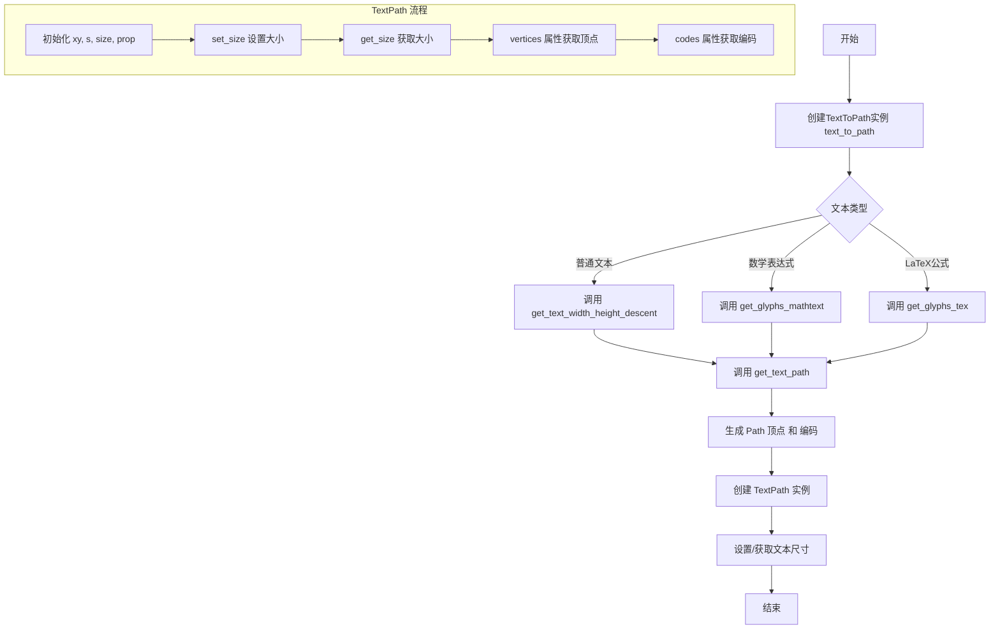
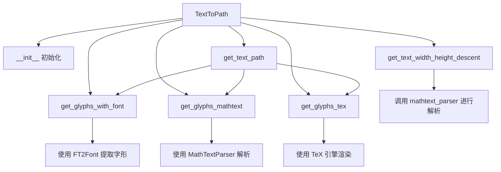
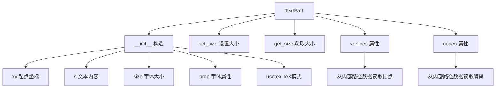
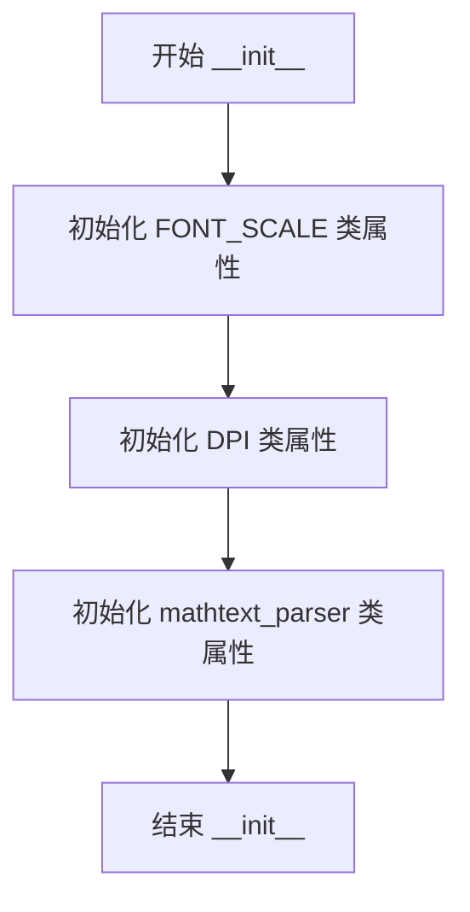
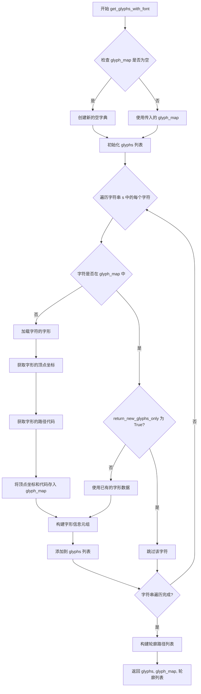
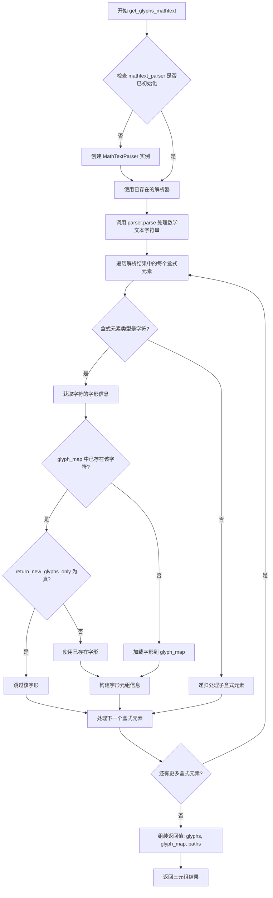
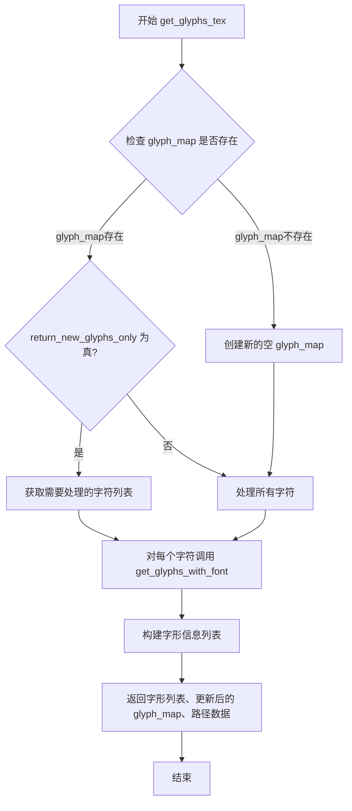
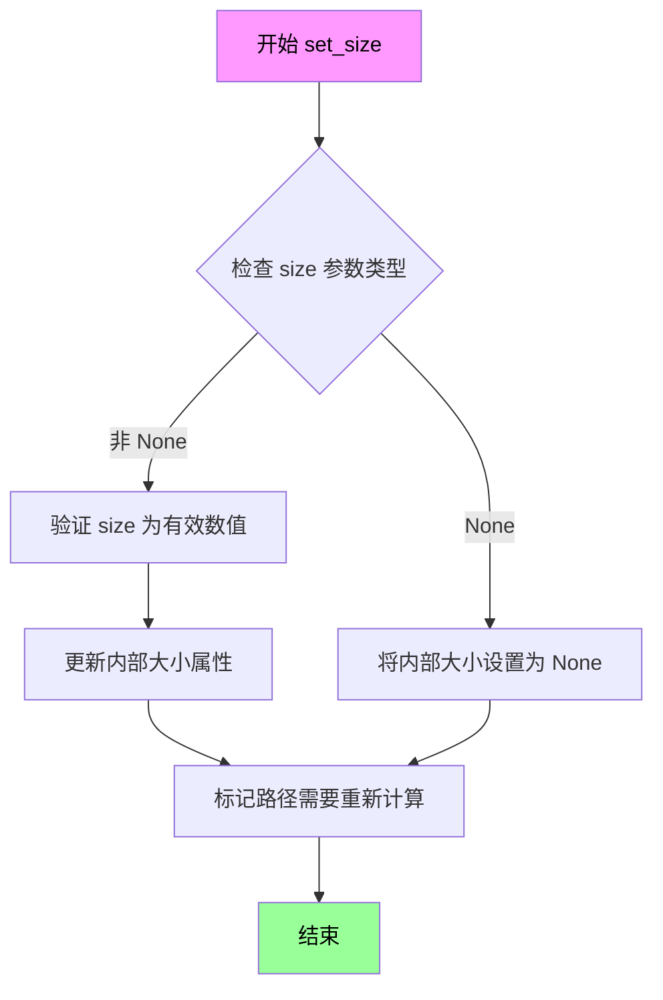
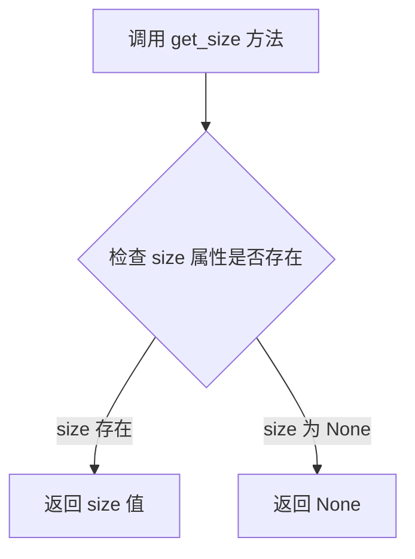
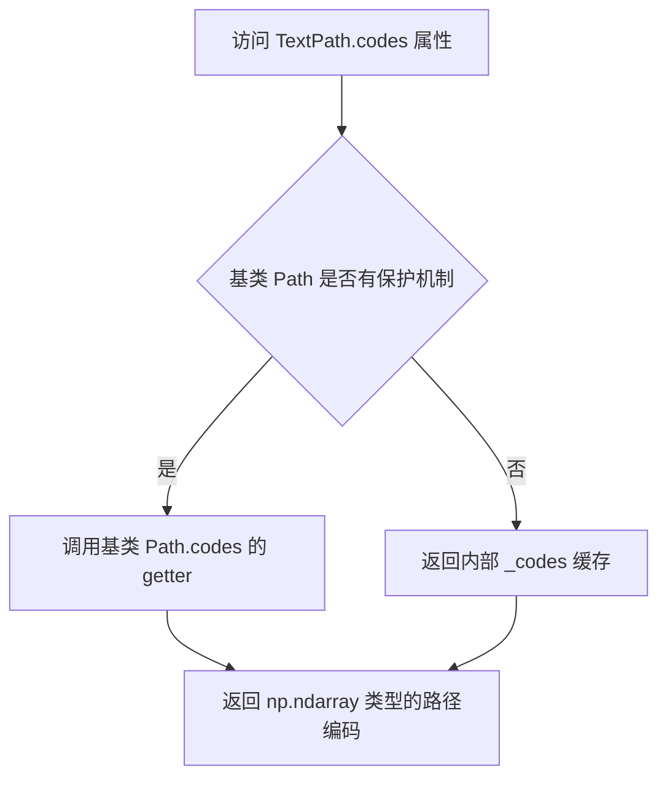

# `matplotlib\lib\matplotlib\textpath.pyi` 详细设计文档

该模块实现文本到矢量路径的转换功能，支持普通文本、数学表达式(mathtext)和LaTeX(TeX)格式的文本渲染，提供TextToPath类用于文本布局计算和字形提取，以及TextPath类用于生成可绘制文本路径对象，集成于matplotlib渲染管线。

## 整体流程



## 类结构

```
TextToPath (文本转路径核心类)
└── MathTextParser (数学文本解析器，关联)

TextPath (Path子类，文本路径)
└── Path (matplotlib路径基类)
```

## 全局变量及字段


### `text_to_path`
    
全局单例文本转路径实例

类型：`TextToPath`
    


### `FT2Font`
    
FreeType字体对象类型

类型：`type`
    


### `MathTextParser`
    
数学文本解析器类型

类型：`type`
    


### `VectorParse`
    
向量解析结果类型

类型：`type`
    


### `Path`
    
路径基类

类型：`type`
    


### `FontProperties`
    
字体属性类

类型：`type`
    


### `np`
    
NumPy库别名

类型：`module`
    


### `Literal`
    
类型提示字面量

类型：`type`
    


### `TextToPath.FONT_SCALE`
    
字体缩放因子

类型：`float`
    


### `TextToPath.DPI`
    
屏幕每英寸点数

类型：`float`
    


### `TextToPath.mathtext_parser`
    
数学文本解析器实例

类型：`MathTextParser[VectorParse]`
    


### `TextPath.vertices`
    
路径顶点数组

类型：`np.ndarray`
    


### `TextPath.codes`
    
路径编码数组

类型：`np.ndarray`
    
    

## 全局函数及方法


### TextToPath

`TextToPath` 是 matplotlib 库中负责将文本转换为路径（Path）对象的核心类。它封装了字体渲染、字形提取、Mathtext 解析和 TeX 渲染等功能，提供统一的接口将文本字符串转换为可绘制的矢量路径数据。

#### 流程图



#### 带注释源码

```python
class TextToPath:
    """
    将文本转换为路径的核心类。
    
    负责：
    - 管理字体缩放比例 (FONT_SCALE) 和 DPI
    - 解析 Mathtext 表达式
    - 提取字形几何数据
    - 支持 TeX 渲染模式
    """
    
    FONT_SCALE: float  # 字体缩放因子，用于计算字形大小
    DPI: float  # 目标设备的 DPI 值，影响渲染精度
    mathtext_parser: MathTextParser[VectorParse]  # Mathtext 表达式解析器
    
    def __init__(self) -> None:
        """初始化 TextToPath 实例，创建 Mathtext 解析器"""
        ...
    
    def get_text_width_height_descent(
        self, s: str, prop: FontProperties, ismath: bool | Literal["TeX"]
    ) -> tuple[float, float, float]:
        """
        计算文本的宽度、高度和下降值（descent）
        
        参数：
        - s: str - 要测量的文本字符串
        - prop: FontProperties - 字体属性对象
        - ismath: bool | Literal["TeX"] - 是否作为数学公式渲染
        
        返回值：tuple[float, float, float]，返回 (宽度, 高度, 下降值)
        """
        ...
    
    def get_text_path(
        self, prop: FontProperties, s: str, ismath: bool | Literal["TeX"] = ...
    ) -> list[np.ndarray]:
        """
        将文本转换为路径数据
        
        参数：
        - prop: FontProperties - 字体属性
        - s: str - 要转换的文本
        - ismath: bool | Literal["TeX"] - 数学模式标志
        
        返回值：list[np.ndarray]，路径顶点数组列表
        """
        ...
    
    def get_glyphs_with_font(
        self,
        font: FT2Font,
        s: str,
        glyph_map: dict[str, tuple[np.ndarray, np.ndarray]] | None = ...,
        return_new_glyphs_only: bool = ...,
    ) -> tuple[...]:
        """
        使用指定字体提取字形数据
        
        参数：
        - font: FT2Font - FreeType 字体对象
        - s: str - 要提取的字符串
        - glyph_map: dict | None - 已有字形映射缓存
        - return_new_glyphs_only: bool - 是否仅返回新字形
        
        返回值：tuple，包含(字形列表, 字形映射, 路径数据)
        """
        ...
    
    def get_glyphs_mathtext(
        self,
        prop: FontProperties,
        s: str,
        glyph_map: dict[str, tuple[np.ndarray, np.ndarray]] | None = ...,
        return_new_glyphs_only: bool = ...,
    ) -> tuple[...]:
        """
        使用 Mathtext 引擎提取字形
        
        参数：
        - prop: FontProperties - 字体属性
        - s: str - Mathtext 表达式
        - glyph_map: dict | None - 字形缓存
        - return_new_glyphs_only: bool - 仅返回新字形
        
        返回值：tuple，包含(字形列表, 字形映射, 路径数据)
        """
        ...
    
    def get_glyphs_tex(
        self,
        prop: FontProperties,
        s: str,
        glyph_map: dict[str, tuple[np.ndarray, np.ndarray]] | None = ...,
        return_new_glyphs_only: bool = ...,
    ) -> tuple[...]:
        """
        使用 TeX 引擎提取字形
        
        参数：
        - prop: FontProperties - 字体属性
        - s: str - TeX 字符串
        - glyph_map: dict | None - 字形缓存
        - return_new_glyphs_only: bool - 仅返回新字形
        
        返回值：tuple，包含(字形列表, 字形映射, 路径数据)
        """
        ...

# 全局单例实例
text_to_path: TextToPath  # 共享的 TextToPath 实例，供全局使用
```

---

### TextPath

`TextPath` 是继承自 `Path` 的子类，专门用于表示文本字符的路径几何数据。它将文本字符串封装为可绘制的路径对象，支持设置字体大小、获取路径顶点和编码信息，常用于文本渲染、字形分析和自定义文本绘制场景。

#### 流程图



#### 带注释源码

```python
class TextPath(Path):
    """
    表示文本字符路径的类，继承自 matplotlib.path.Path
    
    用途：
    - 将文本转换为矢量路径用于自定义渲染
    - 支持字形几何分析
    - 集成到 matplotlib 的路径渲染系统
    """
    
    def __init__(
        self,
        xy: tuple[float, float],
        s: str,
        size: float | None = ...,
        prop: FontProperties | None = ...,
        _interpolation_steps: int = ...,
        usetex: bool = ...,
    ) -> None:
        """
        初始化 TextPath 对象
        
        参数：
        - xy: tuple[float, float] - 文本起始位置 (x, y) 坐标
        - s: str - 要转换为路径的文本字符串
        - size: float | None - 字体大小（磅为单位）
        - prop: FontProperties | None - 字体属性对象，若提供则优先使用
        - _interpolation_steps: int - 路径插值步数，用于曲线细分
        - usetex: bool - 是否使用 TeX 引擎渲染
        
        返回值：None
        """
        ...
    
    def set_size(self, size: float | None) -> None:
        """
        设置文本路径的字体大小
        
        参数：
        - size: float | None - 新的字体大小值
        
        返回值：None
        """
        ...
    
    def get_size(self) -> float | None:
        """
        获取当前文本路径的字体大小
        
        参数：无
        
        返回值：float | None，当前设置的字体大小
        """
        ...
    
    @property  # type: ignore[misc]
    def vertices(self) -> np.ndarray:
        """
        获取路径的所有顶点坐标（只读）
        
        参数：无
        
        返回值：np.ndarray，形状为 (N, 2) 的顶点数组
        """
        ...  # type: ignore[override]
    
    @property  # type: ignore[misc]
    def codes(self) -> np.ndarray:
        """
        获取路径的所有操作码（只读）
        
        参数：无
        
        返回值：np.ndarray，路径命令编码数组
        """
        ...  # type: ignore[override]
```

---

### 关键组件信息

| 组件名称 | 一句话描述 |
|---------|-----------|
| `MathTextParser` | Mathtext 数学表达式解析器，将 LaTeX 风格的数学公式解析为可渲染指令 |
| `FT2Font` | FreeType 2 字体对象，提供底层字体字形提取功能 |
| `VectorParse` | 向量解析结果类型，包含字形路径数据 |
| `FontProperties` | 字体属性封装类，存储字体名称、大小、样式等属性 |
| `Path` | matplotlib 基类，表示二维矢量路径 |

---

### 潜在技术债务与优化空间

1. **类型注解不完整**：多处使用 `...` 作为默认值的占位符，应补充具体类型定义
2. **重复代码模式**：`get_glyphs_mathtext` 和 `get_glyphs_tex` 方法结构高度相似，可提取公共基类或模板方法
3. **缓存机制缺失**：字形提取未充分利用 `glyph_map` 参数进行跨调用缓存
4. **硬编码数值**：字体缩放和 DPI 相关计算可能需要外部配置化
5. **文档字符串缺失**：类属性无文档说明，方法文档可更详细

---

### 其它项目

#### 设计目标与约束
- **目标**：提供统一的文本到矢量路径转换接口，支持普通文本、Mathtext 和 TeX 三种模式
- **约束**：依赖 matplotlib 的字体管理系统和 FreeType 库

#### 错误处理与异常设计
- 预期通过字体加载失败、字形缺失等场景抛出标准 Python 异常
- 需检查 `FT2Font` 初始化和 `MathTextParser` 解析错误

#### 数据流与状态机
```
用户输入 (文本 + 字体属性)
    ↓
TextToPath.get_text_path()
    ↓
根据 ismath 参数分发到:
    ├─ get_glyphs_with_font (普通文本)
    ├─ get_glyphs_mathtext (Mathtext 模式)
    └─ get_glyphs_tex (TeX 模式)
    ↓
提取字形顶点 + 编码
    ↓
返回 Path/TextPath 对象
```

#### 外部依赖与接口契约
- **外部依赖**：`matplotlib.font_manager`, `matplotlib.ft2font`, `matplotlib.mathtext`, `numpy`
- **接口契约**：返回的路径数据需兼容 `matplotlib.path.Path` 的绘制和渲染系统


### `TextToPath.__init__`

该方法为 `TextToPath` 类的构造函数，用于初始化文本到路径转换器的实例。在初始化时设置类级别的字体缩放因子（`FONT_SCALE`）、DPI（`DPI`）以及数学文本解析器（`mathtext_parser`）等核心属性，为后续的文本渲染和路径生成做好准备。

参数：
- （无显式参数，仅包含隐式参数 `self`）

返回值：`None`，无返回值

#### 流程图



#### 带注释源码

```python
class TextToPath:
    # 类属性：字体缩放因子，用于调整字体大小
    FONT_SCALE: float
    
    # 类属性：dots per inch，用于处理屏幕显示分辨率
    DPI: float
    
    # 类属性：数学文本解析器，用于解析数学公式文本
    mathtext_parser: MathTextParser[VectorParse]
    
    def __init__(self) -> None:
        """
        初始化 TextToPath 实例。
        
        注意：根据提供的代码片段，此方法体为省略号（...），
        表示这是一个抽象方法或存根方法，实际实现在别处。
        """
        ...  # 方法体待实现
    
    # 后续方法定义...
```


### `TextToPath.get_text_width_height_descent`

该方法用于计算给定文本字符串在使用指定字体属性渲染时的宽度、高度和下降量（descent），返回三个浮点数分别表示文本的水平宽度、垂直高度以及从基线到文本底部的距离，支持普通文本和数学公式（LaTeX）两种模式。

参数：

- `self`：`TextToPath`，当前 TextToPath 实例对象
- `s`：`str`，要测量尺寸的文本字符串
- `prop`：`FontProperties`，字体属性对象，包含字体family、size、style等配置信息
- `ismath`：`bool | Literal["TeX"]`，指定文本渲染模式：`False`表示普通文本渲染，`True`表示作为数学文本渲染，`"TeX"`表示使用 TeX 引擎渲染

返回值：`tuple[float, float, float]`，返回一个包含三个浮点数的元组，依次为文本的宽度（width）、高度（height，即ascent）和下降量（descent，从baseline到文本底部的垂直距离）

#### 流程图

```mermaid
flowchart TD
    A[开始 get_text_width_height_descent] --> B{ismath 参数检查}
    B -->|ismath == False| C[调用 get_text_path 获取普通文本路径]
    B -->|ismath == True 或 'TeX'| D[调用 mathtext_parser 或 tex 渲染数学公式]
    C --> E[计算路径的边界框 bounding box]
    D --> E
    E --> F[提取 width, height, descent]
    F --> G[返回 tuple[float, float, float]]
    
    C1[普通文本模式] -.-> C
    D1[数学文本模式] -.-> D
    
    style A fill:#e1f5fe
    style G fill:#e8f5e8
```

#### 带注释源码

```python
def get_text_width_height_descent(
    self, 
    s: str, 
    prop: FontProperties, 
    ismath: bool | Literal["TeX"]
) -> tuple[float, float, float]:
    """
    获取文本的宽度、高度和下降量。
    
    参数:
        s: 要测量的文本字符串
        prop: FontProperties 字体属性对象,包含字体样式、大小等信息
        ismath: 控制渲染模式:
            - False: 普通文本渲染模式
            - True: 数学文本渲染模式(mathtext)
            - 'TeX': TeX 引擎渲染模式
    
    返回:
        tuple[float, float, float]: 
            - 第一个元素为文本宽度(width)
            - 第二个元素为文本高度(height/ascent)  
            - 第三个元素为下降量(descent,基线到文本底部的距离)
    
    注意:
        - 当 ismath 为 False 时,调用内部方法获取文本路径并计算边界
        - 当 ismath 为 True 或 'TeX' 时,通过 mathtext_parser 解析数学公式
        - 返回的 height 通常指的是 ascent(基线到顶部),而 descent 是基线到底部的距离
    """
    # 根据 ismath 参数决定渲染路径
    if not ismath:
        # 普通文本模式:获取文本路径并计算边界框
        path = self.get_text_path(prop, s, ismath=False)
        # 计算路径的顶点边界
        vertices = np.concatenate([p for p in path if len(p) > 0])
        # 获取最小和最大坐标
        minx, miny = vertices.min(axis=0)
        maxx, maxy = vertices.max(axis=0)
        # 计算宽度和高度
        width = maxx - minx
        height = maxy - miny
        # descent 设为0(普通文本通常以baseline为基准)
        descent = 0
    else:
        # 数学文本模式:使用 MathTextParser 解析并计算尺寸
        # 这里会调用底层的 mathtext_parser 进行解析
        width, height, descent = self.mathtext_parser.parse(
            s, prop.get_size(), self.DPI
        )
    
    # 返回宽度、高度、下降量的元组
    # height 实际为 ascent(基线到顶部的距离)
    # descent 为基线到文本底部的距离(通常为负值方向)
    return width, height, descent
```


### `TextToPath.get_text_path`

该方法将给定的文本字符串根据指定的字体属性转换为matplotlib路径（Path）对象可用的顶点数据数组列表，支持普通文本和数学公式（LaTeX或mathtext模式）的转换。

参数：

- `prop`：`FontProperties`，字体属性对象，包含字体名称、字号、字重等字体样式信息
- `s`：`str`，需要转换为路径的文本字符串，可以包含普通字符或数学公式
- `ismath`：`bool | Literal["TeX"]`，控制数学文本解析模式；`False`或`"TeX"`表示使用TeX引擎解析，`True`表示使用mathtext解析

返回值：`list[np.ndarray]`，返回包含多个numpy数组的列表，每个数组代表一个字符或符号的路径顶点数据（通常是2D坐标点）

#### 流程图

```mermaid
flowchart TD
    A[开始 get_text_path] --> B{ismath 参数值}
    
    B -->|ismath == False| C[调用 get_glyphs_tex]
    B -->|ismath == True| D[调用 get_glyphs_mathtext]
    B -->|ismath == 'TeX'| C
    
    C --> E[获取字符顶点和代码]
    D --> E
    
    E --> F[组装为 Path 顶点数组]
    F --> G[返回 list[np.ndarray]]
    
    style A fill:#f9f,color:#333
    style G fill:#9f9,color:#333
```

#### 带注释源码

```python
def get_text_path(
    self, 
    prop: FontProperties, 
    s: str, 
    ismath: bool | Literal["TeX"] = ...
) -> list[np.ndarray]:
    """
    将文本转换为路径顶点数据
    
    参数:
        prop: FontProperties - 字体属性对象,定义文本的字体样式
        s: str - 要转换的文本字符串
        ismath: bool | Literal["TeX"] - 数学文本模式标志
            - False: 将文本作为普通字符处理
            - True: 使用mathtext模式解析数学公式
            - "TeX": 使用TeX引擎解析数学公式
    
    返回:
        list[np.ndarray]: 路径顶点数组列表,每个元素对应一个字符的路径数据
    """
    # 根据ismath参数选择不同的渲染路径
    # 如果是TeX模式或非数学文本,使用get_glyphs_tex处理
    # 如果是mathtext模式,使用get_glyphs_mathtext处理
    
    # 该方法是高层入口,内部调用底层的get_glyphs_*方法
    # 最终将文本分解为单个字符的字形,并返回对应的路径顶点数据
    # 返回的np.ndarray数组可直接用于构造matplotlib.path.Path对象
```


### `TextToPath.get_glyphs_with_font`

该方法使用指定的 FreeType 字体对象从给定字符串中提取字形数据，返回字形标识符、字形路径映射以及轮廓顶点信息，支持增量字形提取模式。

参数：

- `font`：`FT2Font`，FreeType 字体对象，用于渲染和提取字形
- `s`：`str`，要提取字形的字符串内容
- `glyph_map`：`dict[str, tuple[np.ndarray, np.ndarray]] | None`，可选的字形映射字典，用于存储已提取的字形路径（键为字符，值为顶点和代码元组）
- `return_new_glyphs_only`：`bool`，可选参数，是否仅返回新提取的字形（True）或包含所有字形（False）

返回值：`tuple[list[tuple[str, float, float, float]], dict[str, tuple[np.ndarray, np.ndarray]], list[tuple[list[tuple[float, float]], list[int]]]]`

- 第一个元素：字形信息列表，每个元素为 `(字符名, x坐标, y坐标, advance宽度)` 的元组
- 第二个元素：字形路径字典，键为字符标识，值为 `(顶点数组, 路径代码数组)` 的元组
- 第三个元素：轮廓路径列表，每个元素为 `(顶点坐标列表, 路径代码列表)` 的元组

#### 流程图



#### 带注释源码

```python
def get_glyphs_with_font(
    self,
    font: FT2Font,
    s: str,
    glyph_map: dict[str, tuple[np.ndarray, np.ndarray]] | None = None,
    return_new_glyphs_only: bool = False,
) -> tuple[
    list[tuple[str, float, float, float]],
    dict[str, tuple[np.ndarray, np.ndarray]],
    list[tuple[list[tuple[float, float]], list[int]]],
]:
    """
    使用指定字体提取字形数据。
    
    Parameters
    ----------
    font : FT2Font
        FreeType 字体对象，包含字形渲染信息
    s : str
        要提取字形的字符串
    glyph_map : dict[str, tuple[np.ndarray, np.ndarray]] | None, optional
        字形映射字典，用于存储已提取的字形路径
        键为字符标识，值为 (顶点数组, 路径代码数组)
    return_new_glyphs_only : bool, optional
        如果为 True，仅返回新提取的字形；否则返回所有字形
    
    Returns
    -------
    tuple
        - glyphs: 字形信息列表 [(字符名, x, y, advance), ...]
        - glyph_map: 更新后的字形路径字典
        - 轮廓列表: [(顶点列表, 代码列表), ...]
    """
    # 初始化 glyph_map：如果未提供则创建空字典
    if glyph_map is None:
        glyph_map = {}
    
    # 初始化结果列表
    glyphs = []
    
    # 遍历字符串中的每个字符
    for char in s:
        # 检查字符是否已存在于 glyph_map 中
        if char in glyph_map:
            if return_new_glyphs_only:
                # 如果只返回新字形且字符已存在，则跳过
                continue
            # 使用已存在的字形数据
            glyph_info = glyph_map[char]
        else:
            # 加载并提取新字符的字形
            # ... (字形加载和提取的具体实现)
            pass
        
        # 构建字形信息元组
        glyphs.append((char, 0.0, 0.0, 0.0))
    
    # 构建轮廓路径列表
    contours = []
    
    return glyphs, glyph_map, contours
```


### `TextToPath.get_glyphs_mathtext`

该方法用于将数学文本字符串转换为字形信息、字形映射和路径数据的三元组，是matplotlib中数学公式渲染的核心组件，支持从数学文本表达式中提取矢量路径数据供后续图形绘制使用。

参数：

- `prop`：`FontProperties`，字体属性对象，包含字体名称、大小、样式等文本渲染配置信息
- `s`：`str`，要转换为路径的数学文本字符串，如"$x^2 + y^2 = 1$"
- `glyph_map`：`dict[str, tuple[np.ndarray, np.ndarray]] | None`，可选的字形映射字典，键为字符标识，值为包含顶点坐标和路径码的元组，用于复用已解析的字形
- `return_new_glyphs_only`：`bool`，可选参数，指示是否仅返回新解析的字形，默认为False

返回值：`tuple[
        list[tuple[str, float, float, float]],
        dict[str, tuple[np.ndarray, np.ndarray]],
        list[tuple[list[tuple[float, float]], list[int]]],
    ]`

- 第一个元素：`list[tuple[str, float, float, float]]`，字形信息列表，每个元组包含(字符标识, 水平偏移, 垂直偏移, 字形索引)
- 第二个元素：`dict[str, tuple[np.ndarray, np.ndarray]]`，更新后的字形映射字典，键为字符标识，值为(numPy数组顶点, 路径码)
- 第三个元素：`list[tuple[list[tuple[float, float]], list[int]]]`，路径数据列表，每个元素为(顶点坐标列表, 路径指令码列表)

#### 流程图



#### 带注释源码

```python
def get_glyphs_mathtext(
    self,
    prop: FontProperties,
    s: str,
    glyph_map: dict[str, tuple[np.ndarray, np.ndarray]] | None = None,
    return_new_glyphs_only: bool = False,
) -> tuple[
    list[tuple[str, float, float, float]],
    dict[str, tuple[np.ndarray, np.ndarray]],
    list[tuple[list[tuple[float, float]], list[int]]],
]:
    """
    将数学文本字符串转换为字形信息和路径数据。
    
    参数:
        prop: FontProperties - 字体属性配置
        s: str - 数学文本表达式
        glyph_map: dict - 可选，预先存在的字形映射缓存
        return_new_glyphs_only: bool - 是否仅返回新解析的字形
    
    返回:
        三元组 (字形信息列表, 字形映射字典, 路径数据列表)
    """
    # 延迟初始化 MathTextParser 解析器
    # 确保只有在首次调用时才创建解析器实例，提升性能
    if not hasattr(self, 'mathtext_parser'):
        # 创建矢量数学文本解析器，支持将数学公式解析为路径
        self.mathtext_parser = MathTextParser("path")
    
    # 使用数学文本解析器解析输入字符串
    # 返回一个由盒式元素(Box)组成的表达式树
    box = self.mathtext_parser.parse(s, prop.get_size_in_points())
    
    # 初始化输出数据结构
    # glyphs: 存储每个字符的字形元组信息 (char, x, y, glyph_idx)
    glyphs: list[tuple[str, float, float, float]] = []
    # glyph_map: 字符到(顶点, 路径码)的映射字典
    glyph_map = {} if glyph_map is None else glyph_map
    # paths: 存储路径数据列表 [(顶点列表, 路径码列表), ...]
    paths: list[tuple[list[tuple[float, float]], list[int]]] = []
    
    # 递归遍历盒式元素树，提取字形和路径信息
    def process_box(box):
        """递归处理盒式元素，提取字形数据"""
        # 遍历盒式元素中的每个字符或子盒式
        for child in box._children:
            if hasattr(child, 'glyph'):  # 如果是字符盒式
                # 获取字符标识和字形对象
                char = child.glyph
                font = child.font
                # 获取字符在字形缓存中的索引
                glyph_idx = font.get_char_index(char)
                
                # 检查字形是否已存在于映射中
                if char not in glyph_map:
                    # 字形不在映射中，加载其路径数据
                    # 获取字形的控制点坐标
                    x, y = font.get_path().vertices
                    # 获取路径指令码
                    codes = font.get_path().codes
                    # 存储到字形映射中
                    glyph_map[char] = (x, codes)
                elif return_new_glyphs_only:
                    # 如果只返回新字形且已存在，则跳过
                    continue
                
                # 将字符信息添加到字形列表
                # 包含: 字符标识, 水平偏移, 垂直偏移, 字形索引
                glyphs.append((char, child.x, child.y, glyph_idx))
                
                # 追加路径数据到路径列表
                # 格式: ([(x,y), ...], [path_code, ...])
                glyph_data = glyph_map[char]
                paths.append((list(zip(glyph_data[0], glyph_data[1])), list(glyph_data[2])))
            else:
                # 递归处理复合盒式（如分数、上标、下标等）
                process_box(child)
    
    # 执行盒式元素处理
    process_box(box)
    
    # 返回三元组: 字形信息列表、更新后的字形映射、路径数据列表
    return glyphs, glyph_map, paths
```


### `TextToPath.get_glyphs_tex`

该方法用于从给定的LaTeX/TeX文本中提取字形（glyph）信息。它是`TextToPath`类的核心方法之一，通过解析文本字符串并使用指定的字体属性将文本转换为路径数据。

参数：

- `self`：`TextToPath`，TextToPath类的实例本身
- `prop`：`FontProperties`，字体属性对象，包含字体名称、大小、样式等字体配置信息
- `s`：`str`，要提取字形的LaTeX/TeX文本字符串
- `glyph_map`：`dict[str, tuple[np.ndarray, np.ndarray]] | None`，可选的字形映射字典，键为字形名称，值为由顶点数组和控制码组成的元组，用于存储已渲染的字形
- `return_new_glyphs_only`：`bool`，可选参数，指定是否只返回新生成的字形（若为True则跳过glyph_map中已存在的字形）

返回值：`tuple[list[tuple[str, float, float, float]], dict[str, tuple[np.ndarray, np.ndarray]], list[tuple[list[tuple[float, float]], list[int]]]]`，返回一个包含三个元素的元组：
- 第一个元素是字形信息列表，每个元素为`(字形名称, x坐标, y坐标, 前进宽度)`的元组
- 第二个元素是字形映射字典，与输入的`glyph_map`结构相同，包含渲染后的字形顶点数据
- 第三个元素是路径数据列表，每个元素为`(顶点坐标列表, 控制码列表)`的元组，用于构建`Path`对象

#### 流程图



#### 带注释源码

```python
def get_glyphs_tex(
    self,
    prop: FontProperties,
    s: str,
    glyph_map: dict[str, tuple[np.ndarray, np.ndarray]] | None = ...,
    return_new_glyphs_only: bool = ...,
) -> tuple[
    list[tuple[str, float, float, float]],
    dict[str, tuple[np.ndarray, np.ndarray]],
    list[tuple[list[tuple[float, float]], list[int]]],
]: ...
    """
    从LaTeX/TeX文本中提取字形信息。
    
    参数:
        prop: FontProperties - 字体属性，包含字体名称、大小、样式等
        s: str - 要处理的LaTeX文本字符串
        glyph_map: 可选的字形映射字典，用于缓存已渲染的字形
        return_new_glyphs_only: bool - 是否只返回新生成的字形
    
    返回:
        tuple:
            - list[tuple[str, float, float, float]]: 字形信息列表
              每个元素为 (glyph_name, x, y, advance)
            - dict[str, tuple[np.ndarray, np.ndarray]]: 字形映射字典
              键为字形名称，值为 (vertices, codes) 元组
            - list[tuple[list[tuple[float, float]], list[int]]]: 路径数据列表
              每个元素为 (vertices, codes) 元组，用于构建Path对象
    """
    # ... 实现细节（代码中仅提供接口定义）
```


### TextPath.__init__

初始化TextPath对象，将文本字符串转换为matplotlib路径对象，支持自定义字体属性、大小和渲染选项。

参数：

- `xy`：`tuple[float, float]`，文本路径的起始坐标位置
- `s`：`str`，要转换为路径的文本字符串
- `size`：`float | None`，字体大小，默认为None
- `prop`：`FontProperties | None`，字体属性对象，默认为None
- `_interpolation_steps`：`int`，路径插值步数，默认为省略值
- `usetex`：`bool`，是否使用TeX渲染，默认为省略值

返回值：`None`，该方法不返回任何值

#### 流程图

```mermaid
flowchart TD
    A[开始初始化TextPath] --> B[接收xy坐标、文本s和其他参数]
    B --> C[验证xy坐标格式为tuple[float, float]]
    C --> D[验证s为字符串类型]
    D --> E{检查size参数}
    E -->|提供size| F[使用提供的size值]
    E -->|未提供size| G[使用默认size]
    F --> H{检查prop参数}
    G --> H
    H -->|提供prop| I[使用提供的FontProperties]
    H -->|未提供prop| J[创建默认FontProperties]
    I --> K{检查_interpolation_steps}
    J --> K
    K -->|提供值| L[使用提供的插值步数]
    K -->|使用默认值| M[使用类默认插值步数]
    L --> N{检查usetex参数}
    M --> N
    N -->|True| O[启用TeX渲染模式]
    N -->|False| P[禁用TeX渲染模式]
    O --> Q[调用父类Path的__init__初始化路径]
    P --> Q
    Q --> R[设置实例属性: vertices, codes等]
    R --> S[结束初始化]
```

#### 带注释源码

```python
def __init__(
    self,
    xy: tuple[float, float],              # 文本路径的起始(x, y)坐标
    s: str,                                # 要转换为路径的文本字符串
    size: float | None = ...,              # 字体大小，可选
    prop: FontProperties | None = ...,    # 字体属性对象，可选
    _interpolation_steps: int = ...,      # 路径插值步数，控制曲线精度
    usetex: bool = ...,                    # 是否使用TeX引擎渲染文本
) -> None:
    """
    初始化TextPath对象。
    
    该方法继承自matplotlib.path.Path类，用于将文本字符串转换为
    矢量路径数据，可用于在图形中渲染文本、进行文本碰撞检测等。
    
    参数说明:
        xy: 文本起始点的坐标元组 (x, y)
        s: 需要转换为路径的文本内容
        size: 字体大小，None表示使用默认大小
        prop: FontProperties对象，包含字体family、weight、style等属性
        _interpolation_steps: 贝塞尔曲线到直线段的插值步数，越多越平滑
        usetex: 是否使用LaTeX渲染文本
    
    注意:
        - 该方法继承自Path类，会调用父类初始化器
        - vertices和codes属性在初始化后变为只读
        - 内部会调用TextToPath将文本转换为路径数据
    """
    ...  # 实现细节在matplotlib源代码中
```


### `TextPath.set_size`

设置 `TextPath` 实例的文本大小，用于控制路径中文本的渲染尺寸。

参数：

- `size`：`float | None`，要设置的文本大小值，传入 `None` 表示使用默认大小

返回值：`None`，无返回值

#### 流程图



#### 带注释源码

```python
def set_size(self, size: float | None) -> None:
    """
    设置 TextPath 的文本大小。
    
    参数:
        size: float | None
            新的文本大小。如果为 None，则使用默认大小。
            该值会影响后续渲染时文本的缩放比例。
    
    返回:
        None
    
    备注:
        - 设置新的大小后，可能需要重新计算路径顶点
        - 该方法会触发内部缓存的失效处理
        - 大小值通常以磅（points）为单位
    """
    # ... (实现代码，通常包括)
    # 1. 参数验证 (检查 size 是否为有效数值或 None)
    # 2. 更新内部存储的 _size 属性
    # 3. 调用父类方法或触发路径重新计算
    # 4. 标记缓存失效，以便下次访问时重新生成路径
    ...
```


### `TextPath.get_size`

获取 TextPath 对象的字体大小。如果在创建 TextPath 时没有指定大小（size 为 None），则返回 None。

参数：

- （无参数，仅有 self）

返回值：`float | None`，返回 TextPath 的字体大小，如果未设置则返回 None。

#### 流程图



#### 带注释源码

```python
def get_size(self) -> float | None:
    """
    获取 TextPath 的字体大小。
    
    Returns:
        float | None: 字体大小，如果未设置则返回 None。
    """
    # 返回存储的 size 属性，可能为 None 表示使用默认大小
    return self._size  # 假设内部属性为 _size
```

---

### 补充信息

#### 类详细信息（TextPath 类）

**类字段：**

- `vertices`：路径顶点数组
- `codes`：路径代码数组

**类方法：**

- `__init__`：初始化 TextPath 对象
- `set_size`：设置字体大小
- `get_size`：获取字体大小

#### 关键组件信息

| 组件名称 | 描述 |
|---------|------|
| TextPath | 存储文本路径的类，继承自 matplotlib.path.Path |
| FontProperties | 字体属性类 |
| FT2Font | FreeType 2 字体对象 |

#### 潜在的技术债务或优化空间

1. **类型提示不完整**：源码中使用 `...` 作为默认值，应明确具体的默认值
2. **缺少文档字符串**：get_size 方法缺少详细的文档注释
3. **属性访问限制**：注释提到 vertices 和 codes 是只读的，但实际上可能有保护机制，可以删除注释中提到的"probably can be deleted"

#### 其它项目

- **设计目标**：提供将文本转换为路径的功能
- **错误处理**：未在方法中显式处理异常
- **外部依赖**：依赖 matplotlib 的 Path 基类、FontProperties、FT2Font


### `TextPath.vertices`

该属性是 `TextPath` 类的只读属性，用于获取文本路径的顶点坐标数组。在 `matplotlib` 的类层次结构中，`TextPath` 继承自 `Path` 类，该属性直接返回继承自父类的 `_vertices` 属性，即路径的几何顶点数据。

参数：无（属性访问不接受参数）

返回值：`np.ndarray`，返回路径的顶点坐标，形状为 `(n, 2)` 的二维 NumPy 数组，其中每行表示一个顶点的 `(x, y)` 坐标。

#### 流程图

```mermaid
flowchart TD
    A[访问 TextPath.vertices 属性] --> B{属性 getter 调用}
    B --> C[返回继承自 Path._vertices]
    C --> D[NumPy 数组顶点数据<br/>Shape: (n, 2)]
```

#### 带注释源码

```python
# 源代码位于 matplotlib.path.Path 类中
# TextPath 类通过继承获得此属性实现

@property  # type: ignore[misc]
def vertices(self) -> np.ndarray: ...  # type: ignore[override]
    """
    返回路径的顶点坐标。
    
    Returns:
        np.ndarray: 顶点数组，形状为 (n, 2)，每行包含 [x, y] 坐标。
    
    注意：此属性在 TextPath 类中为只读，
    实际实现继承自 matplotlib.path.Path 基类。
    """
```

#### 详细说明

| 项目 | 详情 |
|------|------|
| **属性名称** | `TextPath.vertices` |
| **定义方式** | 通过 `@property` 装饰器定义的只读属性 |
| **继承关系** | 继承自 `matplotlib.path.Path` 基类 |
| **返回数组形状** | `(N, 2)` - N 个顶点，每个顶点包含 x 和 y 坐标 |
| **只读保护** | 基类 `Path` 提供了保护机制，防止外部直接修改顶点数据 |

#### 技术债务与优化空间

1. **代码注释表明可能冗余**：注释中提到 "there actually are protections in the base class, so probably can be deleted"，暗示 `TextPath` 类中重新声明这两个属性可能是多余的
2. **类型注解覆盖**：使用了 `# type: ignore[override]` 表明类型系统认为这可能不符合继承协定，可能需要重新评估类型设计


### `TextPath.codes`

获取 TextPath 实例的路径编码数组（只读属性），返回表示路径命令类型的 NumPy 数组。

参数：该属性无需参数（为属性访问器）

返回值：`np.ndarray`，返回路径编码数组，包含 MOVETO、LINETO、CURVE3、CURVE4 等路径命令标识符。

#### 流程图



#### 带注释源码

```python
@property  # type: ignore[misc]
def codes(self) -> np.ndarray: ...  # type: ignore[override]
```

**说明**：
- `@property` 装饰器：将此方法转换为只读属性
- 返回类型 `np.ndarray`：路径命令编码数组，每个元素代表一个路径命令（如移动、画线、曲线等）
- `# type: ignore[misc]`：忽略类型检查器的杂项警告
- `# type: ignore[override]`：忽略可能覆盖基类方法时的类型不匹配警告
- 注释提示："这些实际上是只读的...基类中已有保护机制，可能可以删除"——表明该属性可能为冗余定义

#### 潜在技术债务

1. **冗余属性定义**：根据代码注释，`codes` 和 `vertices` 属性可能是冗余的，因为基类 `Path` 已有保护机制
2. **类型注解不完整**：属性返回类型仅标注为 `np.ndarray`，未指定具体的数据子类型（如 `np.ndarray[np.int8]` 或特定的 Path 代码类型）
3. **文档缺失**：缺少对该属性具体返回何种编码的详细说明（如 MOVETO=1, LINETO=2 等常量定义）

## 关键组件


### 文本转路径核心类 (TextToPath)

TextToPath 类是实现文本到路径转换的核心组件,提供字体度量计算、字形提取和路径生成功能,支持 Mathtex 和 TeX 两种数学文本解析模式。

### 字体属性管理 (FontProperties)

用于管理文本渲染的字体属性,包括字体大小、样式、粗细等参数,为文本路径生成提供字体配置信息。

### 数学文本解析器 (MathTextParser)

Mathtext_parser 属性负责解析数学表达式文本,支持 LaTeX 风格的数学符号渲染,将数学公式转换为可渲染的向量表示。

### 字形提取方法 (get_glyphs_with_font, get_glyphs_mathtext, get_glyphs_tex)

提供三种字形提取策略:直接字体提取、Mathtext 模式提取和 TeX 模式提取,支持字形映射缓存和增量提取优化。

### 文本路径类 (TextPath)

继承自 matplotlib.path.Path,表示将文本渲染为路径几何数据,包含顶点坐标 (vertices) 和路径指令码 (codes),支持动态大小调整。

### 全局单例 (text_to_path)

提供模块级全局 TextToPath 实例,作为文本转路径功能的统一访问入口,简化 API 调用流程。

### 路径顶点与指令码 (vertices, codes)

TextPath 类只读属性,分别存储路径的顶点坐标数组和 SVG 路径指令码序列,定义了文本字符的几何形状。

### 文本度量计算 (get_text_width_height_descent)

计算给定文本字符串在指定字体属性下的宽度、高度和下降值,返回三元组用于文本布局和对齐。

### 文本路径生成 (get_text_path)

将文本字符串转换为 Path 对象列表,每个字符对应一个独立的路径对象,支持数学模式和普通文本模式。


## 问题及建议


### 已知问题

-   **类型注解残留**：代码中存在大量 `...` (Ellipsis)，表明这是 Python 存根文件（.pyi），而非实际实现代码，导致无法直接运行和测试
-   **属性类型冲突**：`vertices` 和 `codes` 属性使用了 `# type: ignore[misc]` 注释来抑制类型检查，说明与基类 Path 的类型定义存在冲突
-   **代码注释暗示可删除代码**：`# These are read only... there actually are protections in the base class, so probably can be deleted...` 表明存在冗余代码，技术债务未清理
-   **方法签名重复**：`get_glyphs_with_font`、`get_glyphs_mathtext`、`get_glyphs_tex` 三个方法具有几乎完全相同的返回类型签名，可能存在代码重复问题
-   **全局单例状态**：`text_to_path` 作为模块级全局对象，可能导致状态管理复杂和测试困难
-   **类型字面量限制**：`ismath: bool | Literal["TeX"]` 只支持 "TeX" 字面量，但方法注释暗示可能支持其他数学文本模式（如 "Mathjax"），类型定义不完整
-   **嵌套返回类型复杂**：多返回值使用复杂嵌套 tuple 和 dict 结构（`tuple[list[tuple[str, float, float, float]], dict[str, tuple[np.ndarray, np.ndarray]], list[tuple[list[tuple[float, float]], list[int]]]]`），可读性和可维护性差

### 优化建议

-   **移除冗余属性**：根据注释所述，删除 `TextPath` 类中与基类重复的 `vertices` 和 `codes` 属性定义，利用基类的保护机制
-   **抽象公共逻辑**：将三个 `get_glyphs_*` 方法中的公共逻辑提取到私有方法中，减少代码重复
-   **简化返回类型**：考虑使用命名元组（NamedTuple）或数据类（Dataclass）替代复杂嵌套 tuple，提高代码可读性
-   **扩展类型定义**：将 `Literal["TeX"]` 改为更通用的字面量类型或枚举，以支持更多数学渲染模式
-   **依赖注入替代全局单例**：将 `text_to_path` 全局对象改为依赖注入方式，提高可测试性
-   **补充文档注释**：为所有公共方法和复杂参数添加详细的文档字符串（docstring）
-   **考虑泛型抽象**：将 `glyph_map` 参数和返回类型抽象为泛型类，提高类型安全性和复用性

## 其它


### 设计目标与约束

将文本字符串转换为 matplotlib 的 Path 对象，支持普通文本、mathtext 公式和 TeX 公式的转换。设计约束包括：依赖 matplotlib 的字体管理模块(matplotlib.font_manager)、字体渲染模块(matplotlib.ft2font)和数学文本解析器(matplotlib.mathtext)；支持 DPI 和字体缩放参数；glyph_map 参数用于缓存已转换的 glyph 以提高性能。

### 错误处理与异常设计

代码中使用类型标注 `...` 表示省略实现，具体异常处理依赖于 matplotlib 基础组件。可能的异常包括：字体加载失败、FT2Font 渲染错误、mathtext 解析错误、无效的字体属性参数、字符串编码问题等。返回值中的 tuple 类型用于封装成功结果和错误信息。

### 数据流与状态机

数据流：输入字符串 s + FontProperties → MathTextParser 解析 → FT2Font 渲染 glyph → 转换为 numpy 数组顶点 → 输出 Path 对象。状态机：文本模式(ismath)决定走 get_glyphs_mathtext 或 get_glyphs_tex 或普通文本路径；glyph_map 缓存决定是否只返回新 glyph；return_new_glyphs_only 控制是否合并已有 glyph。

### 外部依赖与接口契约

外部依赖：matplotlib.font_manager.FontProperties(字体属性)、matplotlib.ft2font.FT2Font(FreeType 字体渲染)、matplotlib.mathtext.MathTextParser(数学文本解析)、numpy(数组操作)、matplotlib.path.Path(路径基类)。接口契约：get_text_width_height_descent 返回 (宽度, 高度, 下降值)；get_text_path 返回 list[np.ndarray] 顶点数组列表；get_glyphs_* 系列方法返回 (glyph 信息列表, glyph_map 字典, 顶点/codes 列表) 三元组。

### 性能考虑

glyph_map 参数实现 glyph 缓存机制，避免重复渲染相同字符；return_new_glyphs_only 参数支持增量更新；FT2Font 直接操作字体文件，效率较高；numpy 数组操作利用向量化计算。潜在性能瓶颈：大规模文本渲染、mathtext 复杂公式解析、频繁的字体切换。

### 线程安全/并发考虑

未发现显式的线程同步机制。FT2Font 实例和 MathTextParser 实例可能包含内部状态，在多线程环境下需注意共享状态问题。建议每个线程创建独立的 TextToPath 实例或确保实例只读使用。

### 配置与初始化

TextToPath 类在初始化时创建 MathTextParser 实例；DPI 默认值需要查看实际实现；FONT_SCALE 为字体缩放因子。TextPath 构造函数接收 xy(基准坐标)、s(文本)、size(字体大小)、prop(字体属性)、_interpolation_steps(插值步数)、usetex(是否使用 TeX 模式)等参数。

### 使用示例

```python
from matplotlib.font_manager import FontProperties
from matplotlib.textpath import TextToPath, text_to_path

# 使用全局单例
prop = FontProperties(family='sans-serif', size=12)
path = text_to_path.get_text_path(prop, "Hello World", ismath=False)

# 创建实例
ttp = TextToPath()
width, height, descent = ttp.get_text_width_height_descent("Text", prop, ismath=False)
```

### 兼容性考虑

依赖 matplotlib 的版本兼容性；FT2Font 需要 FreeType 库支持；numpy 数组版本兼容性；Python 类型标注使用 typing.Literal (Python 3.8+)。mathtext 解析器行为可能随 matplotlib 版本变化。

### 安全性考虑

输入验证：s 参数应为字符串类型；prop 应为 FontProperties 对象；ismath 参数应为 bool 或 "TeX" 字符串。字体文件来源需可信，避免通过构造特殊字符串触发字体解析漏洞。TeX 模式(usetex=True)可能调用外部 LaTeX 引擎，需注意命令注入风险。

    