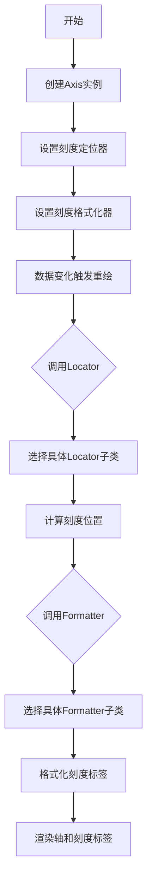
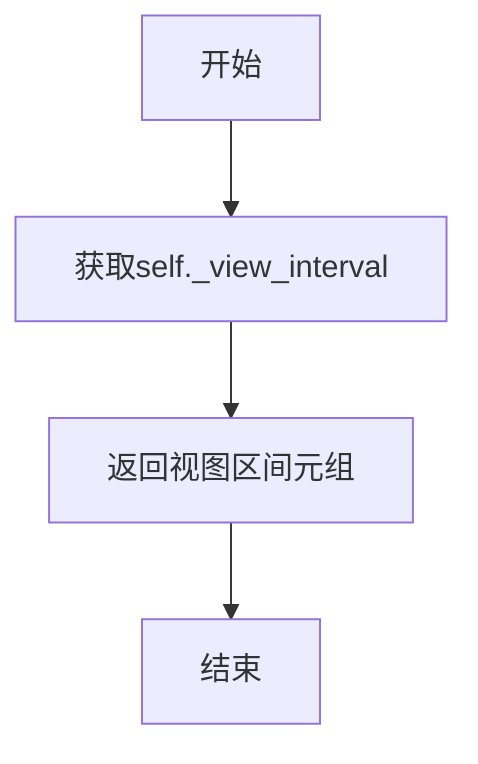
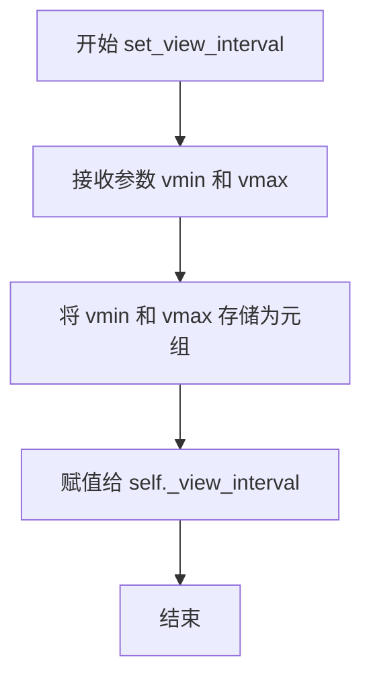
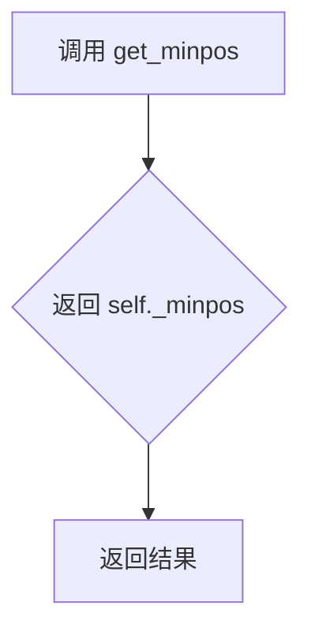
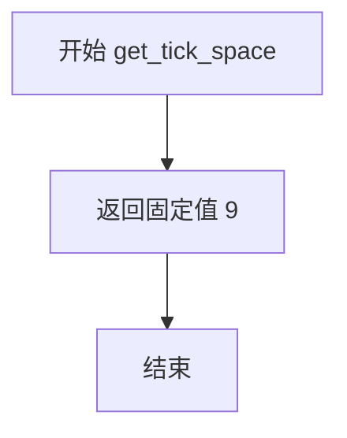
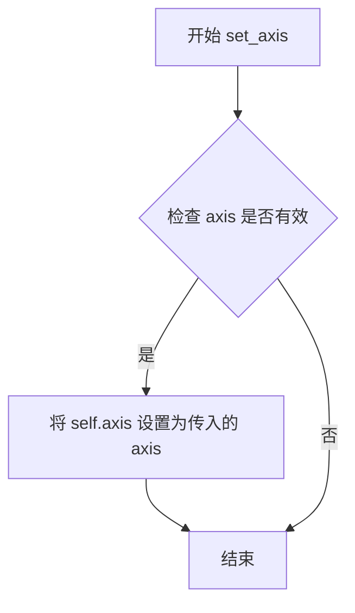
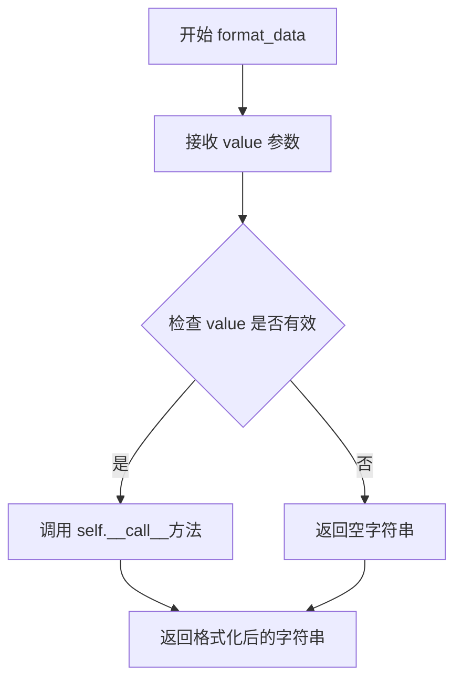
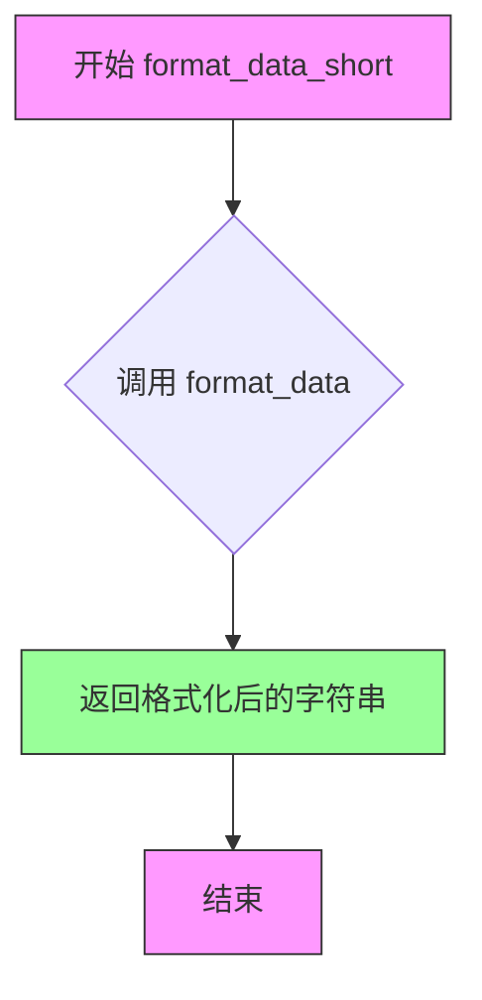

```mermaid
flowchart TD
    A[开始 _decade_less_equal] --> B{x == 0?}
    B -- 是 --> C[返回 0]
    B -- 否 --> D{x < 0?}
    D -- 是 --> E[返回 -_decade_greater_equal&#40;-x, base&#41;]
    D -- 否 --> F[计算 floor&#40;log&#40;x&#41; / log&#40;base&#41;&#41;]
    F --> G[返回 base ** 该.floor值]
    C --> H[结束]
    E --> H
    G --> H
```

# `matplotlib\lib\matplotlib\ticker.py` 详细设计文档

该模块提供了用于控制matplotlib图表轴刻度定位和格式化的各种类，包括多个Locator（定位器）实现用于确定刻度位置，以及多个Formatter（格式化器）实现用于生成刻度标签字符串。

## 整体流程



## 类结构

```
TickHelper (基类)
├── Formatter (格式化器基类)
│   ├── NullFormatter
│   ├── FixedFormatter
│   ├── FuncFormatter
│   ├── FormatStrFormatter
│   ├── StrMethodFormatter
│   ├── ScalarFormatter
│   │   └── EngFormatter
│   ├── LogFormatter
│   │   ├── LogFormatterExponent
│   │   ├── LogFormatterMathtext
│   │   └── LogFormatterSciNotation
│   ├── LogitFormatter
│   └── PercentFormatter
└── Locator (定位器基类)
    ├── IndexLocator
    ├── FixedLocator
    ├── NullLocator
    ├── LinearLocator
    ├── MultipleLocator
    ├── MaxNLocator
    │   ├── AutoLocator
    │   └── LogitLocator
    ├── LogLocator
    ├── SymmetricalLogLocator
    ├── AsinhLocator
    └── AutoMinorLocator
_DummyAxis (辅助类)
_Edge_integer (辅助类)
_UnicodeMinusFormat (格式化辅助类)
```

## 全局变量及字段


### `_log`
    
模块级别的日志记录器对象

类型：`logging.Logger`
    


### `__all__`
    
模块公开导出的类名和函数名列表

类型：`tuple`
    


### `_DummyAxis._data_interval`
    
轴的数据区间，存储为(start, end)元组

类型：`tuple`
    


### `_DummyAxis._view_interval`
    
轴的视图区间，存储为(vmin, vmax)元组

类型：`tuple`
    


### `_DummyAxis._minpos`
    
轴的最小正位置值，用于对数刻度计算

类型：`float`
    


### `TickHelper.axis`
    
关联的轴对象，用于获取视图和数据区间

类型：`Axis or None`
    


### `Formatter.locs`
    
存储当前刻度位置的列表

类型：`list`
    


### `FixedFormatter.seq`
    
固定标签序列，用于设置刻度标签

类型：`list of str`
    


### `FixedFormatter.offset_string`
    
标签的偏移量字符串

类型：`str`
    


### `FuncFormatter.func`
    
用户自定义的格式化函数

类型：`callable`
    


### `FuncFormatter.offset_string`
    
标签的偏移量字符串

类型：`str`
    


### `FormatStrFormatter.fmt`
    
printf风格的格式字符串

类型：`str`
    


### `StrMethodFormatter.fmt`
    
str.format风格的格式字符串

类型：`str`
    


### `ScalarFormatter._offset_threshold`
    
使用偏移表示法的阈值，控制节省的位数

类型：`int`
    


### `ScalarFormatter.orderOfMagnitude`
    
科学计数法的指数阶数

类型：`int`
    


### `ScalarFormatter.format`
    
当前使用的格式字符串

类型：`str`
    


### `ScalarFormatter._scientific`
    
是否启用科学计数法

类型：`bool`
    


### `ScalarFormatter._powerlimits`
    
科学计数法切换的幂次阈值(min_exp, max_exp)

类型：`tuple`
    


### `ScalarFormatter._usetex`
    
是否使用TeX数学模式渲染数字

类型：`bool`
    


### `ScalarFormatter._useOffset`
    
是否自动使用偏移表示法

类型：`bool`
    


### `ScalarFormatter.offset`
    
当前偏移量值

类型：`float`
    


### `ScalarFormatter._useLocale`
    
是否使用本地化设置格式化数字

类型：`bool`
    


### `ScalarFormatter._useMathText`
    
是否使用数学文本格式化

类型：`bool`
    


### `LogFormatter._base`
    
对数的底数

类型：`float`
    


### `LogFormatter.labelOnlyBase`
    
是否仅在整数次幂处标记刻度

类型：`bool`
    


### `LogFormatter.minor_thresholds`
    
控制次要刻度标记的阈值(subset, all)

类型：`tuple`
    


### `LogFormatter._sublabels`
    
标记的次要刻度系数集合

类型：`set or str`
    


### `LogFormatter._linthresh`
    
对称对数尺度的线性阈值

类型：`float or None`
    


### `LogitFormatter._use_overline`
    
是否使用上标线表示大于1/2的概率值

类型：`bool`
    


### `LogitFormatter._one_half`
    
表示1/2的字符串

类型：`str`
    


### `LogitFormatter._minor`
    
是否为次要刻度格式化器

类型：`bool`
    


### `LogitFormatter._labelled`
    
已标记的次要刻度位置集合

类型：`set`
    


### `LogitFormatter._minor_threshold`
    
标记次要刻度的最大刻度数阈值

类型：`int`
    


### `LogitFormatter._minor_number`
    
低于阈值时标记的次要刻度数量

类型：`int`
    


### `EngFormatter.unit`
    
工程单位符号

类型：`str`
    


### `EngFormatter.places`
    
小数位数精度

类型：`int or None`
    


### `EngFormatter.sep`
    
数值和单位之间的分隔符

类型：`str`
    


### `EngFormatter.ENG_PREFIXES`
    
SI单位前缀映射表

类型：`dict`
    


### `PercentFormatter.xmax`
    
对应100%的数据值

类型：`float`
    


### `PercentFormatter.decimals`
    
小数位数，None表示自动计算

类型：`int or None`
    


### `PercentFormatter._symbol`
    
百分比符号

类型：`str`
    


### `PercentFormatter._is_latex`
    
是否将symbol作为LaTeX处理

类型：`bool`
    


### `Locator.MAXTICKS`
    
允许生成的最大刻度数，超过则警告

类型：`int`
    


### `IndexLocator._base`
    
每隔_base个数据点放置一个刻度

类型：`int`
    


### `IndexLocator.offset`
    
第一个刻度的偏移量

类型：`int`
    


### `FixedLocator.locs`
    
固定的刻度位置数组

类型：`ndarray`
    


### `FixedLocator.nbins`
    
最大刻度数限制

类型：`int or None`
    


### `LinearLocator.numticks`
    
期望的刻度数量

类型：`int or None`
    


### `LinearLocator.presets`
    
预定义的(vmin,vmax)到刻度位置的映射

类型：`dict`
    


### `MultipleLocator._edge`
    
处理浮点精度边缘情况的辅助对象

类型：`_Edge_integer`
    


### `MultipleLocator._offset`
    
添加到每个_base倍数的偏移值

类型：`float`
    


### `MaxNLocator.default_params`
    
默认参数字典

类型：`dict`
    


### `MaxNLocator._nbins`
    
最大区间数或'auto'

类型：`int or str`
    


### `MaxNLocator._steps`
    
可接受的步长数组

类型：`ndarray`
    


### `MaxNLocator._extended_steps`
    
扩展的步长数组用于查找算法

类型：`ndarray`
    


### `MaxNLocator._symmetric`
    
是否生成关于零对称的范围

类型：`bool`
    


### `MaxNLocator._prune`
    
修剪策略('lower','upper','both')

类型：`str or None`
    


### `MaxNLocator._min_n_ticks`
    
最小需要的刻度数

类型：`int`
    


### `MaxNLocator._integer`
    
是否限制为整数刻度

类型：`bool`
    


### `LogLocator._base`
    
对数的底数

类型：`float`
    


### `LogLocator._subs`
    
次要刻度的系数

类型：`ndarray or str`
    


### `LogLocator.numticks`
    
最大刻点数或'auto'

类型：`int or str`
    


### `SymmetricalLogLocator._base`
    
对称对数尺度的底数

类型：`float`
    


### `SymmetricalLogLocator._linthresh`
    
对称对数尺度的线性阈值

类型：`float`
    


### `SymmetricalLogLocator._subs`
    
次要刻度的系数列表

类型：`list`
    


### `SymmetricalLogLocator.numticks`
    
最大刻点数

类型：`int`
    


### `AsinhLocator.linear_width`
    
准线性区域的尺度参数

类型：`float`
    


### `AsinhLocator.numticks`
    
近似的主要刻度数量

类型：`int`
    


### `AsinhLocator.symthresh`
    
对称性判定阈值

类型：`float`
    


### `AsinhLocator.base`
    
对数舍入的底数

类型：`int`
    


### `AsinhLocator.subs`
    
次要刻度的倍数

类型：`tuple or None`
    


### `LogitLocator._minor`
    
是否为次要刻度定位器

类型：`bool`
    


### `LogitLocator._nbins`
    
最大区间数或'auto'

类型：`int or str`
    


### `AutoMinorLocator.ndivs`
    
主刻度间次要刻度的划分数量

类型：`int or str or None`
    


### `_Edge_integer.step`
    
刻度间隔步长

类型：`float`
    


### `_Edge_integer._offset`
    
计算前减去的偏移量的绝对值

类型：`float`
    
    

## 全局函数及方法


### `scale_range`

该函数用于计算合适的刻度缩放比例（scale）和偏移量（offset），以便在坐标轴上均匀分布刻度。它根据数据的范围和期望的刻度数量，自动确定最佳的缩放因子和偏移值，常用于自动定位刻度位置。

参数：

- `vmin`：`float`，数据范围的最小值
- `vmax`：`float`，数据范围的最大值  
- `n`：`int`，期望的间隔数量（默认值为1）
- `threshold`：`int`，决定是否使用偏移的阈值（默认值为100）

返回值：`tuple[float, float]`，返回一个包含 (scale, offset) 的元组，其中 scale 是缩放比例，offset 是偏移量

#### 流程图

```mermaid
flowchart TD
    A[开始 scale_range] --> B[计算 dv = |vmax - vmin|]
    B --> C[计算 meanv = (vmax + vmin) / 2]
    C --> D{abs meanv / dv < threshold?}
    D -->|是| E[offset = 0]
    D -->|否| F[offset = copysign(10^(log10|meanv| // 1), meanv)]
    E --> G[scale = 10^(log10(dv / n) // 1)]
    F --> G
    G --> H[返回 (scale, offset)]
```

#### 带注释源码

```python
def scale_range(vmin, vmax, n=1, threshold=100):
    """
    计算合适的刻度缩放比例和偏移量。
    
    Parameters
    ----------
    vmin : float
        数据范围的最小值
    vmax : float
        数据范围的最大值
    n : int, optional
        期望的间隔数量，默认为1
    threshold : int, optional
        决定是否使用偏移的阈值，默认为100
        
    Returns
    -------
    tuple
        (scale, offset) - 缩放比例和偏移量
    """
    dv = abs(vmax - vmin)  # 计算数据范围，确保 > 0（调用前已排除奇异点）
    meanv = (vmax + vmin) / 2  # 计算数据范围的中点
    
    # 判断是否需要使用偏移：
    # 如果中值相对于范围的比例小于阈值，则不使用偏移（偏移为0）
    # 否则计算一个基于中值数量级的偏移量
    if abs(meanv) / dv < threshold:
        offset = 0
    else:
        # 使用中值的数量级作为偏移量，保留符号
        offset = math.copysign(10 ** (math.log10(abs(meanv)) // 1), meanv)
    
    # 计算缩放比例：基于范围和期望的间隔数量
    # 使用对数来确定合适的数量级
    scale = 10 ** (math.log10(dv / n) // 1)
    
    return scale, offset
```


### `_is_decade`

判断给定数值是否为指定底数的整数次幂（例如 10、100、1000 等）。

参数：

- `x`：数值类型（int/float），需要检查是否为底数整数次幂的值
- `base`：float，默认值为 10，底数，指定要检查多少次幂
- `rtol`：float 或 None，默认值为 None，相对容差，用于 `np.isclose` 判断整数次幂时的相对误差范围

返回值：`bool`，如果 x 是 base 的整数次幂则返回 True，否则返回 False

#### 流程图

```mermaid
flowchart TD
    A[开始 _is_decade] --> B{检查 x 是否为有限值}
    B -->|否| C[返回 False]
    B -->|是| D{x == 0.0?}
    D -->|是| E[返回 True]
    D -->|否| F[计算 lx = log|abs x| / log base]
    G{lx 是否接近整数?}
    F --> G
    G -->|是| H[返回 True]
    G -->|否| I[返回 False]
```

#### 带注释源码

```
def _is_decade(x, *, base=10, rtol=None):
    """
    Return True if *x* is an integer power of *base*.
    
    Parameters
    ----------
    x : scalar
        要检查的数值
    base : float, default 10
        底数
    rtol : float, optional
        相对容差，用于 np.isclose 判断
    """
    # 检查 x 是否为有限数值（非 inf、非 nan）
    if not np.isfinite(x):
        return False
    # 0 的对数在数学上可以认为是任意次幂的起点，返回 True
    if x == 0.0:
        return True
    # 计算以 base 为底、x 的对数
    # 例如 x=100, base=10 时，lx = log10(100) = 2
    lx = np.log(abs(x)) / np.log(base)
    # 如果未指定 rtol，使用默认的绝对容差判断
    if rtol is None:
        # np.isclose 判断 lx 是否接近其四舍五入值（即整数）
        return np.isclose(lx, np.round(lx))
    else:
        # 使用指定的相对容差进行判断
        return np.isclose(lx, np.round(lx), rtol=rtol)
```


### `_decade_less_equal`

返回不超过给定数值的最大整数次幂（以指定底数为基础）。

参数：

- `x`：`float` 或 `int`，要计算对数下限的数值
- `base`：`float` 或 `int`，对数的底数

返回值：`float`，返回不超过 x 的最大 base 的整数次幂

#### 流程图



#### 带注释源码

```python
def _decade_less_equal(x, base):
    """
    Return the largest integer power of *base* that's less or equal to *x*.

    If *x* is negative, the exponent will be *greater*.
    """
    # 特殊情况：如果 x 为 0，直接返回 0（0 的任何次幂都为 0）
    return (x if x == 0 else
            # 负数处理：利用对称性，-x 为正数，求其 >= -x 的最小幂，再取负
            -_decade_greater_equal(-x, base) if x < 0 else
            # 正数处理：计算 floor(log_base(x))，返回 base 的该次幂
            base ** np.floor(np.log(x) / np.log(base)))
```


### `_decade_greater_equal`

该函数用于计算给定数值 `x` 在指定底数 `base` 下，大于或等于 `x` 的最小整数次幂。当 `x` 为负数时，返回的指数会更小（即绝对值更大的负指数）。

参数：

-  `x`：数值（float 或 int），要比较的目标值
-  `base`：float，对数的底数（默认为10）

返回值：`float`，返回大于或等于 `x` 的 `base` 的最小整数次幂

#### 流程图

```mermaid
flowchart TD
    A[开始] --> B{x == 0?}
    B -->|是| C[返回 x]
    B -->|否| D{x < 0?}
    D -->|是| E[返回 -_decade_less_equal(-x, base)]
    D -->|否| F[计算 ceil(log(x) / log(base))]
    F --> G[返回 base ** 指数]
    C --> H[结束]
    E --> H
    G --> H
```

#### 带注释源码

```python
def _decade_greater_equal(x, base):
    """
    Return the smallest integer power of *base* that's greater or equal to *x*.

    If *x* is negative, the exponent will be *smaller*.

    Parameters
    ----------
    x : float or int
        The target value to compare against.
    base : float
        The base of the logarithm.

    Returns
    -------
    float
        The smallest integer power of base that is greater than or equal to x.
        For negative x, returns the power with a smaller (more negative) exponent.
    """
    # 如果 x 为 0，直接返回 0（0 的任何次幂都为 0）
    return (x if x == 0 else
            # 如果 x 为负数，转换为求 -x 的 _decade_less_equal 再取负
            # 因为对于负数，指数越大（越接近0）值越大，所以要找更小的指数
            -_decade_less_equal(-x, base) if x < 0 else
            # 对于正数，计算大于等于 x 的最小整数次幂
            # 使用 ceil(log(x)/log(base)) 计算指数
            base ** np.ceil(np.log(x) / np.log(base)))
```


### `_decade_less`

返回小于给定数值 x 的最大的 base 的整数次幂（当 x 为负数时，返回的指数会更大）。

参数：
- `x`：`float` 或 `int`，要处理的数值
- `base`：`float`，对数底数，通常为 10

返回值：`float`，返回小于 x 的最大的 base 的整数次幂

#### 流程图

```mermaid
flowchart TD
    A[开始] --> B{x < 0?}
    B -->|是| C[返回 -_decade_greater(-x, base)]
    B -->|否| D[less = _decade_less_equal(x, base)]
    D --> E{less == x?}
    E -->|是| F[less = less / base]
    E -->|否| G[返回 less]
    F --> G
    C --> H[结束]
    G --> H
```

#### 带注释源码

```python
def _decade_less(x, base):
    """
    Return the largest integer power of *base* that's less than *x*.

    If *x* is negative, the exponent will be *greater*.
    """
    # 处理负数情况：递归调用 _decade_greater 并取负
    if x < 0:
        return -_decade_greater(-x, base)
    
    # 获取小于等于 x 的最大幂
    less = _decade_less_equal(x, base)
    
    # 如果恰好等于 x（即 x 正好是 base 的整数次幂），则退一位
    if less == x:
        less /= base
    
    # 返回结果
    return less
```


### `_decade_greater`

该函数用于计算给定基数base的最小整数次幂，使得该次幂严格大于输入值x。当x为负数时，返回的指数绝对值会变小。

参数：
- `x`：`float`，需要比较的数值
- `base`：`float`，对数基数（通常为10）

返回值：`float`，大于x的最小整数次幂

#### 流程图

```mermaid
flowchart TD
    A[开始] --> B{x < 0?}
    B -->|是| C[返回 -_decade_less(-x, base)]
    B -->|否| D[调用 _decade_greater_equal(x, base)]
    D --> E{greater == x?}
    E -->|是| F[greater = greater * base]
    E -->|否| G[返回 greater]
    F --> G
    C --> H[结束]
    G --> H
```

#### 带注释源码

```python
def _decade_greater(x, base):
    """
    Return the smallest integer power of *base* that's greater than *x*.

    If *x* is negative, the exponent will be *smaller*.
    
    Parameters
    ----------
    x : float
        The value to compare against.
    base : float
        The base of the exponentiation (typically 10).
    
    Returns
    -------
    float
        The smallest power of base that is strictly greater than x.
        For negative x, returns a power with a smaller (more negative) exponent.
    """
    # 处理负数情况：利用对称性，调用_decade_less处理-x的绝对值
    if x < 0:
        # 负数的处理需要反转符号和逻辑
        return -_decade_less(-x, base)
    
    # 获取大于或等于x的最小整数次幂
    greater = _decade_greater_equal(x, base)
    
    # 如果刚好等于x（这种情况发生在x本身就是整数次幂时），
    # 需要乘以base得到严格更大的值
    if greater == x:
        greater *= base
    
    return greater
```


### `_is_close_to_int`

检查给定数值是否接近整数（考虑了浮点数精度问题）。

参数：

- `x`：数值类型，需要检查的数值

返回值：`bool`，如果 `x` 接近其四舍五入的值（即接近整数），返回 `True`，否则返回 `False`

#### 流程图

```mermaid
flowchart TD
    A[Start] --> B[计算 round(x)]
    B --> C{math.isclose(x, round(x))?}
    C -->|True| D[Return True]
    C -->|False| E[Return False]
```

#### 带注释源码

```python
def _is_close_to_int(x):
    """
    检查给定数值是否接近整数。

    由于浮点数精度问题，直接比较 x == round(x) 可能会失败，
    因此使用 math.isclose 进行容差比较。

    Parameters
    ----------
    x : 数值类型
        需要检查的数值

    Returns
    -------
    bool
        如果 x 接近其四舍五入的值，返回 True；否则返回 False
    """
    return math.isclose(x, round(x))
```


### `_DummyAxis.get_view_interval`

获取轴的视图区间（view interval），即当前视图的最小值和最大值。

参数：  
（无参数）

返回值：`tuple[float, float]`，返回视图区间的最小值和最大值组成的元组 `(vmin, vmax)`。

#### 流程图



#### 带注释源码

```python
def get_view_interval(self):
    """
    获取轴的视图区间。

    视图区间表示当前视图的可见范围，即轴上显示的最小值(vmin)和最大值(vmax)。
    这个方法通常被TickFormatter和Locator类调用，以获取当前轴的视图范围，
    从而决定如何格式化刻度标签或确定刻度位置。

    Returns
    -------
    tuple[float, float]
        视图区间的最小值和最大值，格式为(vmin, vmax)。
    """
    return self._view_interval
```


### `_DummyAxis.set_view_interval`

设置轴的视图区间（view interval），即坐标轴的显示范围。

参数：

- `vmin`：`float` 或 `int`，视图区间的最小值
- `vmax`：`float` 或 `int`，视图区间的最大值

返回值：`None`，无返回值（该方法直接修改对象内部状态）

#### 流程图



#### 带注释源码

```python
def set_view_interval(self, vmin, vmax):
    """
    设置轴的视图区间。

    Parameters
    ----------
    vmin : float or int
        视图区间的最小值（显示范围的起始值）。
    vmax : float or int
        视图区间的最大值（显示范围的结束值）。

    Notes
    -----
    此方法不检查 vmin 是否小于 vmax，调用者需确保参数顺序正确。
    通常配合 get_view_interval() 使用，后者会返回排序后的区间。
    """
    self._view_interval = (vmin, vmax)
```


### `_DummyAxis.get_minpos`

获取 DummyAxis 实例的最小正值（_minpos），该值主要用于对数刻度计算，确保数据区间中不存在零或负值。

参数：

- `self`：`_DummyAxis`，隐式参数，表示当前实例

返回值：`float`，返回最小正值，用于避免对数计算中的数值问题

#### 流程图



#### 带注释源码

```python
class _DummyAxis:
    """一个简化的虚拟 Axis 对象，用于在未绑定真实 Axis 时提供默认值"""
    __name__ = "dummy"

    def __init__(self, minpos=0):
        """
        初始化 DummyAxis
        
        参数:
            minpos: float, 默认值 0
                数据轴的最小正值，用于对数刻度计算
        """
        self._data_interval = (0, 1)    # 数据区间
        self._view_interval = (0, 1)   # 视图区间
        self._minpos = minpos           # 最小正值

    def get_minpos(self):
        """
        返回最小正值 _minpos
        
        该方法主要用于 LogLocator 等需要对数计算的定位器，
        确保数据中不存在零或负值（对数运算需要正数）
        
        返回:
            float: 最小正值
        """
        return self._minpos
```


### `_DummyAxis.get_data_interval`

获取模拟轴对象的数据区间，即数据的最小值和最大值。

参数：  
该方法无显式参数（`self` 为实例对象，不计入参数）。

返回值：`tuple`，返回数据区间 `(vmin, vmax)`，其中 `vmin` 和 `vmax` 分别表示数据的最小值和最大值。

#### 流程图

```mermaid
graph TD
    A[开始] --> B[获取 self._data_interval]
    B --> C[返回元组 (vmin, vmax)]
    C --> D[结束]
```

#### 带注释源码

```python
def get_data_interval(self):
    """
    Return the data interval.

    Returns
    -------
    tuple
        The data interval (vmin, vmax).
    """
    return self._data_interval
```


### `_DummyAxis.set_data_interval`

设置虚拟轴的数据区间，用于记录数据的最小值和最大值。

参数：

- `vmin`：`float` 或 `int`，数据区间的最小值
- `vmax`：`float` 或 `int`，数据区间的最大值

返回值：`None`，无返回值（该方法仅设置实例属性）

#### 流程图

```mermaid
flowchart TD
    A[开始 set_data_interval] --> B[输入参数 vmin, vmax]
    B --> C[self._data_interval = (vmin, vmax)]
    C --> D[结束]
```

#### 带注释源码

```python
def set_data_interval(self, vmin, vmax):
    """
    设置数据区间。

    Parameters
    ----------
    vmin : float or int
        数据区间的最小值。
    vmax : float or int
        数据区间的最大值。

    Returns
    -------
    None
        该方法不返回任何值，仅更新内部状态。
    """
    # 直接将传入的 vmin 和 vmax 元组赋值给 _data_interval 属性
    self._data_interval = (vmin, vmax)
```


### `_DummyAxis.get_tick_space`

获取轴的刻度空间大小，用于确定在轴上可以容纳的刻度数量。

参数：

- （无参数）

返回值：`int`，返回固定的刻度空间值 9

#### 流程图



#### 带注释源码

```python
def get_tick_space(self):
    """
    获取轴的刻度空间大小。
    
    该方法返回固定的刻度空间值 9，这是 matplotlib 长期使用的默认nbins值。
    _DummyAxis 是一个模拟轴类，用于在没有真实轴对象时提供默认行为，
    例如在 Formatter 或 Locator 类被实例化但尚未关联到真实轴时。
    
    Returns:
        int: 刻度空间大小，始终返回 9
    """
    # Just use the long-standing default of nbins==9
    return 9
```


### `TickHelper.set_axis`

设置与该 TickHelper 实例关联的轴（Axis）对象，使刻度辅助器能够访问轴的属性来进行刻度定位和格式化。

参数：

- `axis`：`any`，要设置的 Axis 对象，用于提供刻度定位和格式化所需的数据区间、视图区间等信息

返回值：`None`，无返回值

#### 流程图



#### 带注释源码

```python
def set_axis(self, axis):
    """
    设置与该 TickHelper 实例关联的轴（Axis）对象。

    此方法将传入的 axis 对象存储为实例属性，使刻度辅助器能够
    访问轴的数据区间、视图区间等信息，用于自动计算刻度位置
    和格式化刻度标签。

    Parameters
    ----------
    axis : object
        Matplotlib 的 Axis 对象（如 XAxis 或 YAxis），用于提供
        刻度定位所需的上下文信息。如果传入 None，则不会进行
        任何操作。

    Returns
    -------
    None
    """
    self.axis = axis  # 将传入的 axis 对象赋值给实例属性 axis
```


### `TickHelper.create_dummy_axis`

该方法用于在 `TickHelper` 对象中创建一个虚拟轴（`_DummyAxis`），当 `axis` 属性为 `None` 时，使用提供的关键字参数实例化一个 `_DummyAxis` 对象并赋值给 `self.axis`。这允许格式化器或定位器在没有真实轴的情况下执行某些操作。

参数：

- `**kwargs`：关键字参数，这些参数会被传递给 `_DummyAxis` 的构造函数。通常用于指定最小位置（`minpos`），类型为 `float`，默认为 `0`。

返回值：`None`，该方法直接修改对象的 `self.axis` 属性。

#### 流程图

```mermaid
flowchart TD
    A[开始 create_dummy_axis] --> B{self.axis is None?}
    B -->|是| C[创建 _DummyAxis 实例<br/>_DummyAxis(**kwargs)]
    C --> D[self.axis = _DummyAxis实例]
    D --> E[结束]
    B -->|否| F[什么都不做]
    F --> E
```

#### 带注释源码

```python
def create_dummy_axis(self, **kwargs):
    """
    创建虚拟轴（如果尚未存在）。
    
    此方法检查 TickHelper 是否已关联到 axis。如果没有（即 self.axis 为 None），
    则使用提供的 kwargs 参数创建一个 _DummyAxis 实例并赋值给 self.axis。
    这对于需要在没有真实轴的情况下进行某些计算的格式化器或定位器很有用。
    
    Parameters
    ----------
    **kwargs : keyword arguments
        传递给 _DummyAxis 构造器的关键字参数。
        常用参数包括：
        - minpos : float, optional
            轴的最小正值，用于避免对数运算中的除零错误，默认为 0。
    """
    if self.axis is None:
        # 当没有关联的轴时，创建一个虚拟轴对象
        # _DummyAxis 提供了轴的最小接口实现
        self.axis = _DummyAxis(**kwargs)
```

#### 相关类信息

**`_DummyAxis` 类**

```python
class _DummyAxis:
    """一个简单的虚拟轴类，提供轴的基础接口。"""
    
    def __init__(self, minpos=0):
        """
        初始化虚拟轴。
        
        Parameters
        ----------
        minpos : float, default: 0
            最小位置值，用于数据区间和视图区间的初始化。
        """
        self._data_interval = (0, 1)      # 数据区间
        self._view_interval = (0, 1)     # 视图区间
        self._minpos = minpos             # 最小位置
```


### `Formatter.__call__`

返回给定刻度值 `x` 的格式化字符串表示。该方法是 Formatter 类的抽象方法，由子类实现具体的格式化逻辑。

参数：

- `x`：`float`，要格式化的刻度值（tick value）
- `pos`：`int` 或 `None`，刻度的位置索引，`pos=None` 表示未指定的位置

返回值：`str`，格式化后的刻度标签字符串

#### 流程图

```mermaid
flowchart TD
    A[开始 __call__] --> B{pos is None or pos >= len(self.seq)}
    B -->|True| C[返回 '']
    B -->|False| D[返回 self.seq[pos]]
```

#### 带注释源码

```python
def __call__(self, x, pos=None):
    """
    Return the format for tick value *x* at position pos.
    ``pos=None`` indicates an unspecified location.
    """
    raise NotImplementedError('Derived must override')
```


### Formatter.format_ticks

该方法接收一个tick值列表，通过设置内部位置后依次调用格式化逻辑，生成所有tick对应的标签字符串列表。

参数：

- `values`：list，需要格式化的tick值列表

返回值：`list[str]`，格式化后的tick标签列表

#### 流程图

```mermaid
flowchart TD
    A[开始 format_ticks] --> B[调用 self.set_locs(values)]
    B --> C{遍历 values 和索引 i}
    C -->|对每个 value| D[调用 self.__call__(value, i)]
    D --> E[收集格式化的字符串]
    C --> F[返回字符串列表]
    E --> F
```

#### 带注释源码

```
def format_ticks(self, values):
    """
    Return the tick labels for all the ticks at once.
    
    Parameters
    ----------
    values : array-like
        Tick values to be formatted.
    
    Returns
    -------
    list of str
        Formatted tick labels.
    """
    # 首先设置内部存储的tick位置，供后续格式化使用
    # 某些Formatter子类需要知道所有tick位置才能正确格式化
    self.set_locs(values)
    
    # 遍历每个tick值，调用子类的__call__方法进行格式化
    # __call__方法接受value和position两个参数
    # 返回格式化后的字符串标签
    return [self(value, i) for i, value in enumerate(values)]
```


### Formatter.format_data

返回值的完整字符串表示，位置未指定。

参数：

- `value`：数值类型（int、float 或 numpy 数值），需要格式化的数值

返回值：`str`，返回完整的字符串表示形式

#### 流程图



#### 带注释源码

```python
def format_data(self, value):
    """
    Return the full string representation of the value with the
    position unspecified.
    """
    return self.__call__(value)
```


### `Formatter.format_data_short`

返回 tick 值的简短字符串版本。默认返回与位置无关的完整值。

参数：

- `value`：`任意类型`，需要格式化的 tick 值

返回值：`str`，tick 值的简短字符串表示

#### 流程图



#### 带注释源码

```python
def format_data_short(self, value):
    """
    Return a short string version of the tick value.

    Defaults to the position-independent long value.
    """
    # 默认实现直接调用 format_data 方法，返回完整格式的字符串表示
    return self.format_data(value)
```


### Formatter.get_offset

返回Formatter的偏移量字符串，用于在坐标轴上显示科学记数法或偏移量标记。

参数： 无

返回值：`str`，返回偏移量字符串。如果Formatter子类不存储偏移量，则返回空字符串。

#### 流程图

```mermaid
flowchart TD
    A[开始 get_offset] --> B{子类是否重写?}
    B -->|是 - ScalarFormatter| C[检查 locs 长度]
    B -->|是 - FixedFormatter/FuncFormatter| D[返回 offset_string]
    B -->|否 - 基类 Formatter| E[返回空字符串 '']
    C --> F{是否有 orderOfMagnitude 或 offset?}
    F -->|否| G[返回空字符串 '']
    F -->|是| H[构建 offsetStr]
    H --> I{是否有 offset?}
    I -->|是| J[格式化 offset 并添加符号]
    I -->|否| K[跳过]
    K --> L{是否有 orderOfMagnitude?}
    L -->|是| M[计算科学记数法字符串]
    L -->|否| N[跳过]
    M --> O{使用 MathText 或 TeX?}
    O -->|是| P[添加 \\times\\mathdefault{} 格式]
    O -->|否| Q[直接连接字符串]
    P --> R[返回格式化的字符串]
    Q --> R
    J --> L
```

#### 带注释源码

```python
def get_offset(self):
    """
    Return scientific notation, plus offset.
    """
    # 如果没有设置任何tick位置,返回空字符串
    if len(self.locs) == 0:
        return ''
    
    # 检查是否需要显示科学记数法或偏移量
    if self.orderOfMagnitude or self.offset:
        offsetStr = ''  # 初始化偏移量字符串
        sciNotStr = ''  # 初始化科学记数法字符串
        
        # 处理offset (加法偏移量,如 +1e5)
        if self.offset:
            offsetStr = self.format_data(self.offset)
            if self.offset > 0:
                offsetStr = '+' + offsetStr  # 正偏移量添加+号
        
        # 处理orderOfMagnitude (10的幂次,如 1e6)
        if self.orderOfMagnitude:
            if self._usetex or self._useMathText:
                # TeX/数学文本模式下的格式化
                sciNotStr = self.format_data(10 ** self.orderOfMagnitude)
            else:
                sciNotStr = '1e%d' % self.orderOfMagnitude
        
        # 根据输出模式组装最终字符串
        if self._useMathText or self._usetex:
            if sciNotStr != '':
                # 添加数学格式的乘号
                sciNotStr = r'\times\mathdefault{%s}' % sciNotStr
            # 构建完整的数学模式字符串
            s = fr'${sciNotStr}\mathdefault{{{offsetStr}}}$'
        else:
            # 普通文本模式直接拼接
            s = ''.join((sciNotStr, offsetStr))
        
        # 处理Unicode减号
        return self.fix_minus(s)
    
    # 没有偏移量时返回空字符串
    return ''
```


### Formatter.set_locs

设置刻度线的位置。该方法在计算刻度标签之前被调用，因为某些格式化器需要知道所有刻度的位置才能进行格式化。

参数：

- `locs`：list 或 array-like，刻度位置列表

返回值：`None`，无返回值（方法直接修改实例属性）

#### 流程图

```mermaid
flowchart TD
    A[set_locs 方法开始] --> B{self.locs 长度 > 0?}
    B -->|否| C[直接返回]
    B -->|是| D{self._useOffset 是否为真?}
    D -->|否| F[调用 _set_order_of_magnitude]
    D -->|是| E[调用 _compute_offset]
    E --> F
    F --> G[调用 _set_format]
    G --> H[方法结束]
    
    style A fill:#f9f,stroke:#333
    style H fill:#9f9,stroke:#333
```

#### 带注释源码

```python
def set_locs(self, locs):
    """
    Set the locations of the ticks.

    This method is called before computing the tick labels because some
    formatters need to know all tick locations to do so.
    """
    # 将传入的 locs 参数赋值给实例属性 self.locs
    # 这个列表将被其他方法使用，如 __call__ 和 get_offset
    self.locs = locs
```


### `Formatter.fix_minus`

该方法是一个静态工具方法，用于根据全局配置 `axes.unicode_minus` 决定是否将字符串中的连字符 `-` 替换为 Unicode 减号符号 `−` (U+2212)，以实现更精确的排版效果。

参数：

-  `s`：`str`，需要进行减号替换处理的字符串

返回值：`str`，返回处理后的字符串。如果 `axes.unicode_minus` 为 `True`，则将所有 `-` 替换为 Unicode 减号符号；否则返回原字符串。

#### 流程图

```mermaid
flowchart TD
    A[开始] --> B{检查 mpl.rcParams['axes.unicode_minus']}
    B -->|True| C[将 s 中的 '-' 替换为 '\N{MINUS SIGN}']
    C --> D[返回替换后的字符串]
    B -->|False| E[返回原始字符串 s]
    D --> F[结束]
    E --> F
```

#### 带注释源码

```python
@staticmethod
def fix_minus(s):
    """
    Some classes may want to replace a hyphen for minus with the proper
    Unicode symbol (U+2212) for typographical correctness.  This is a
    helper method to perform such a replacement when it is enabled via
    :rc:`axes.unicode_minus`.
    """
    # 根据 rcParams 配置决定是否进行 Unicode 减号替换
    # 如果启用 unicode_minus，则将普通连字符替换为专业的 Unicode 减号符号
    return (s.replace('-', '\N{MINUS SIGN}')
            if mpl.rcParams['axes.unicode_minus']
            else s)
```


### `Formatter._set_locator`

该方法是一个用于设置定位器（Locator）的钩子方法，子类可以重写它来执行特定的定位器设置操作。当前实现仅作为占位符，不执行任何操作。

参数：
- `locator`：`Locator`，要设置的定位器对象

返回值：`None`，无返回值

#### 流程图

```mermaid
flowchart TD
    A[开始] --> B[接收locator参数]
    B --> C{方法体为空}
    C -->|是| D[直接返回pass]
    D --> E[结束]
```

#### 带注释源码

```python
def _set_locator(self, locator):
    """
    Subclasses may want to override this to set a locator.
    """
    pass
```


### `NullFormatter.__call__`

该方法是 `NullFormatter` 类的核心功能实现，用于格式化刻度标签。它接受一个刻度值和位置参数，直接返回空字符串，实现不显示任何刻度标签的效果。

参数：

- `x`：`float`，待格式化的刻度值
- `pos`：`int` 或 `None`，刻度的位置索引，默认为 None

返回值：`str`，返回空字符串，表示不显示标签

#### 流程图

```mermaid
flowchart TD
    A[开始 __call__] --> B{接收参数 x 和 pos}
    B --> C[返回空字符串 '']
    C --> D[结束]
```

#### 带注释源码

```python
def __call__(self, x, pos=None):
    # docstring inherited
    return ''
```

**参数说明：**
- `x`：tick value，待格式化的数值
- `pos`：position，位置索引（可选参数，用于某些需要根据位置决定格式的场景）

**返回值说明：**
- 返回空字符串 `''`，表示该 tick 位置不显示任何标签

**功能说明：**
`NullFormatter` 是一个"空格式化器"，它继承自 `Formatter` 基类。当需要隐藏某个轴上的所有刻度标签时，可以使用此格式化器。它的实现极其简单——无论传入什么参数，都返回空字符串。这在需要手动控制刻度显示但不希望显示刻度标签的场景中非常有用。


### FixedFormatter.__init__

该方法是FixedFormatter类的构造函数，用于初始化固定格式化器，接收一个字符串序列作为参数，并设置内部属性seq（用于存储标签字符串序列）和offset_string（用于存储偏移量字符串）。

参数：

- `seq`：`sequence of str`，用于设置刻度标签的字符串序列

返回值：`None`，构造函数不返回值

#### 流程图

```mermaid
flowchart TD
    A[开始 __init__] --> B[接收 seq 参数]
    B --> C[设置 self.seq = seq]
    C --> D[设置 self.offset_string = '']
    D --> E[结束 __init__]
```

#### 带注释源码

```python
def __init__(self, seq):
    """Set the sequence *seq* of strings that will be used for labels."""
    self.seq = seq                          # 存储传入的字符串序列，用于后续标签匹配
    self.offset_string = ''                 # 初始化偏移字符串为空，后续可用于偏移量显示
```


### FixedFormatter.__call__

该方法是 FixedFormatter 类的核心方法，用于根据位置（pos）返回固定的标签字符串，而不考虑实际的刻度值（x）。它从预定义的字符串序列中检索对应位置的标签。

参数：

- `x`：`float`，刻度值，但在 FixedFormatter 中实际上被忽略，仅作为接口兼容性参数
- `pos`：`int` 或 `None`，刻度位置索引。当为 `None` 时表示未指定位置

返回值：`str`，返回与位置对应的标签字符串。如果 `pos` 为 `None` 或超出序列范围，则返回空字符串

#### 流程图

```mermaid
flowchart TD
    A[开始 __call__] --> B{pos is None or pos >= len(self.seq)}
    B -->|Yes| C[返回空字符串 '']
    B -->|No| D[返回 self.seq[pos]]
    C --> E[结束]
    D --> E
```

#### 带注释源码

```python
def __call__(self, x, pos=None):
    """
    Return the label that matches the position, regardless of the value.

    对于位置 pos < len(seq)，返回 seq[i]，无论 x 的值是什么。
    否则返回空字符串。seq 是该对象初始化时的字符串序列。
    
    参数:
        x: 刻度值（在此方法中被忽略，仅为保持 Formatter 接口一致性）
        pos: 刻度位置索引，如果为 None 表示未指定位置
    
    返回:
        str: 位置对应的标签字符串，或空字符串
    """
    # 检查位置是否为 None 或超出预定义序列的范围
    if pos is None or pos >= len(self.seq):
        # 位置无效，返回空字符串
        return ''
    else:
        # 从预定义序列中返回对应位置的标签
        return self.seq[pos]
```


### FixedFormatter.get_offset

该方法用于获取 FixedFormatter 的偏移字符串（offset_string），该偏移量通常用于在轴上显示额外的文本标签。

参数： 无

返回值：`str`，返回当前设置的偏移字符串

#### 流程图

```mermaid
flowchart TD
    A[开始 get_offset] --> B{self.offset_string 是否为空}
    B -->|否| C[返回 self.offset_string]
    B -->|是| C
```

#### 带注释源码

```python
def get_offset(self):
    """
    获取当前设置的偏移字符串。
    
    此方法返回 FixedFormatter 实例中存储的 offset_string 属性。
    该偏移字符串通常用于在坐标轴上显示额外的文本信息，
    例如在科学计数法中显示指数部分。
    
    Returns
    -------
    str
        当前设置的偏移字符串，默认为空字符串 ''。
    """
    return self.offset_string
```


### FixedFormatter.set_offset_string

设置固定格式化器的偏移字符串，用于在刻度标签前添加额外的偏移文本。

参数：

- `ofs`：`str`，要设置的偏移字符串（offset string）

返回值：`None`，无返回值

#### 流程图

```mermaid
graph TD
    A[开始] --> B[接收参数 ofs]
    B --> C[self.offset_string = ofs]
    C --> D[结束]
```

#### 带注释源码

```python
def set_offset_string(self, ofs):
    """
    设置偏移字符串。

    Parameters
    ----------
    ofs : str
        要设置的偏移字符串。
    """
    self.offset_string = ofs
```


### FuncFormatter.__init__

初始化 `FuncFormatter` 实例，接受一个用户自定义的格式化函数。

参数：

- `func`：`callable`，用户定义的函数，用于格式化刻度标签。该函数接受两个参数：刻度值 `x` 和位置 `pos`，并返回一个字符串。

返回值：`None`，构造函数不返回值。

#### 流程图

```mermaid
flowchart TD
    A[开始 __init__] --> B[接收 func 参数]
    B --> C{func 是否为可调用对象}
    C -->|是| D[将 func 赋值给 self.func]
    C -->|否| E[可能抛出 TypeError]
    D --> F[初始化 self.offset_string 为空字符串]
    F --> G[结束]
```

#### 带注释源码

```python
def __init__(self, func):
    """
    Initialize the FuncFormatter with a user-defined function.

    Parameters
    ----------
    func : callable
        A function that takes two inputs (a tick value ``x`` and a
        position ``pos``), and returns a string containing the corresponding
        tick label.
    """
    # 将用户提供的格式化函数存储为实例属性
    self.func = func
    # 初始化偏移字符串为空，用于存储轴上显示的额外偏移文本
    self.offset_string = ""
```


### `FuncFormatter.__call__`

返回用户自定义函数的格式化结果，将tick值和位置参数直接传递给用户定义的函数。

参数：

- `x`：`float`，tick值，即需要格式化的数值
- `pos`：`int` 或 `None`，tick的位置索引，``None``表示未指定位置

返回值：`str`，用户自定义函数返回的字符串结果

#### 流程图

```mermaid
flowchart TD
    A[开始 __call__] --> B{接收参数 x 和 pos}
    B --> C[直接调用 self.func 并传递 x 和 pos 参数]
    C --> D[返回用户函数的结果]
    D --> E[结束]
```

#### 带注释源码

```python
def __call__(self, x, pos=None):
    """
    Return the value of the user defined function.

    *x* and *pos* are passed through as-is.
    """
    # 直接将接收到的 tick 值 x 和位置 pos 传递给用户提供的函数
    # 用户函数负责实际的格式化逻辑
    return self.func(x, pos)
```


### FuncFormatter.get_offset

该方法用于获取FuncFormatter（用户自定义格式化器）当前设置的偏移字符串，主要用于在轴上显示额外的偏移标签信息。

参数：
- 无

返回值：`str`，返回当前存储的偏移字符串，如果未设置则返回空字符串。

#### 流程图

```mermaid
flowchart TD
    A[开始 get_offset] --> B{self.offset_string 是否为空}
    B -->|是| C[返回空字符串 '']
    B -->|否| D[返回 self.offset_string]
    C --> E[结束]
    D --> E[结束]
```

#### 带注释源码

```python
def get_offset(self):
    """
    获取当前设置的偏移字符串。
    
    该方法继承自 Formatter 基类，在 FuncFormatter 中返回
    通过 set_offset_string 设置的偏移字符串。
    该偏移字符串通常用于在轴的边缘显示额外的标注信息。
    
    Returns
    -------
    str
        当前设置的偏移字符串，如果未设置则返回空字符串。
    """
    return self.offset_string
```


### `FuncFormatter.set_offset_string`

设置 `FuncFormatter` 的偏移字符串，用于在刻度标签旁显示额外的偏移量信息。

参数：

-  `ofs`：`str`，要设置的偏移字符串

返回值：`None`，无返回值（仅设置实例属性）

#### 流程图

```mermaid
flowchart TD
    A[开始] --> B[接收 ofs 参数]
    B --> C[将 ofs 赋值给 self.offset_string]
    C --> D[结束]
```

#### 带注释源码

```python
def set_offset_string(self, ofs):
    """
    设置偏移字符串。
    
    Parameters
    ----------
    ofs : str
        要设置为偏移的字符串。该字符串将在 get_offset() 方法返回时显示在刻度标签旁。
    """
    self.offset_string = ofs  # 将传入的字符串赋值给实例属性 offset_string
```


### `FormatStrFormatter.__init__`

构造函数，用于初始化使用旧式（'%' 运算符）格式字符串的格式化器。

参数：

-  `fmt`：`str`，旧式格式字符串，包含单个变量格式（如 `'%g'`、`'%.2f'`），将应用于刻度值而非位置。

返回值：`None`，构造函数无返回值（隐式返回 `None`）。

#### 流程图

```mermaid
flowchart TD
    A[开始 __init__] --> B{输入参数 fmt}
    B -->|有效格式字符串| C[将 fmt 赋值给 self.fmt]
    C --> D[结束 __init__]
    B -->|无效格式字符串| E[可能在后续使用时抛出异常]
    E --> D
```

#### 带注释源码

```python
def __init__(self, fmt):
    """
    初始化 FormatStrFormatter。

    Parameters
    ----------
    fmt : str
        旧式 ('%' 运算符) 格式字符串，应包含单个变量格式 (%)。
        该字符串将应用于刻度值（而非位置）来生成标签。
        例如：'%g'、'%.2f'、'%+d' 等。
    """
    # 将传入的格式字符串存储为实例属性
    # 后续 __call__ 方法将使用此格式字符串格式化刻度值
    self.fmt = fmt
```


### FormatStrFormatter.__call__

使用旧式 printf 风格格式化字符串将数值转换为刻度标签。

参数：
- `x`：`float`，需要格式化的刻度值
- `pos`：`int | None`，刻度位置（此方法中未使用）

返回值：`str`，格式化后的刻度标签字符串

#### 流程图

```mermaid
flowchart TD
    A[接收调用] --> B{pos是否为None}
    B -->|是| C[直接格式化x]
    B -->|否| D[忽略pos参数]
    D --> C
    C --> E[执行 self.fmt % x]
    E --> F[返回格式化字符串]
```

#### 带注释源码

```python
def __call__(self, x, pos=None):
    """
    Return the formatted label string.

    Only the value *x* is formatted. The position is ignored.
    """
    # 使用旧式 % 格式化操作符将值 x 格式化为字符串
    # self.fmt 在 __init__ 中被设置，例如 '%g', '%.2f' 等
    return self.fmt % x
```

#### 补充说明

| 项目 | 描述 |
|------|------|
| **所属类** | `FormatStrFormatter` |
| **父类方法** | 继承自 `Formatter.__call__` |
| **核心功能** | 将数值通过 sprintf 风格格式串转换为字符串 |
| **格式化示例** | `fmt='%.2f'`, `x=3.14159` → `"3.14"` |
| **设计约束** | 格式字符串只能包含一个 `%` 格式化符 |
| **负数处理** | 默认使用 ASCII 短横杠而非 Unicode 减号 |


### `StrMethodFormatter.__init__`

初始化 `StrMethodFormatter` 实例，使用新的格式化字符串方法（`str.format`）来格式化刻度标签。该格式化器要求刻度值字段名为 `x`，刻度位置字段名为 `pos`。

参数：

- `fmt`：`str`，格式化字符串，使用 `str.format` 方法的语法，例如 `"{x:.2f}"`。

返回值：`None`，该方法是构造函数，不返回任何值。

#### 流程图

```mermaid
flowchart TD
    A[开始 __init__] --> B[接收 fmt 参数]
    B --> C[将 fmt 存储到 self.fmt]
    D[结束 __init__]
    C --> D
```

#### 带注释源码

```python
def __init__(self, fmt):
    """
    初始化 StrMethodFormatter。

    Parameters
    ----------
    fmt : str
        新的格式化字符串，遵循 str.format() 的语法规则。
        必须包含名为 'x' 的字段用于格式化刻度值，
        可选包含名为 'pos' 的字段用于格式化刻度位置。

    Returns
    -------
    None
    """
    self.fmt = fmt  # 保存格式化字符串到实例属性
```


### StrMethodFormatter.__call__

使用新式格式字符串（str.format）格式化tick标签，支持Unicode负号处理。

参数：

- `x`：`float`，要格式化的tick数值
- `pos`：`int | None`，位置索引，None表示未指定位置

返回值：`str`，格式化后的标签字符串

#### 流程图

```mermaid
flowchart TD
    A[开始 __call__] --> B[接收参数 x 和 pos]
    B --> C[创建 _UnicodeMinusFormat 实例]
    C --> D[调用 format 方法格式化字符串]
    D --> E[传入关键字参数 x=x, pos=pos]
    E --> F[返回格式化后的字符串]
```

#### 带注释源码

```python
class StrMethodFormatter(Formatter):
    """
    使用新式格式字符串（str.format方法）来格式化tick标签。

    用于tick值的字段必须标记为*x*，用于tick位置的字段必须标记为*pos*。

    格式化器在格式化负数值时会遵守:rc:`axes.unicode_minus`配置。

    通常不需要显式构造`.StrMethodFormatter`对象，
    因为`~.Axis.set_major_formatter`可以直接接受格式字符串。
    """

    def __init__(self, fmt):
        """
        初始化格式化器。

        Parameters
        ----------
        fmt : str
            格式字符串，例如 '{x:.2f}' 或 '{x:.3f}'
        """
        self.fmt = fmt

    def __call__(self, x, pos=None):
        """
        返回格式化后的标签字符串。

        *x*和*pos*作为关键字参数传递给`str.format`，
        使用这些确切的名称。

        Parameters
        ----------
        x : float
            要格式化的tick值
        pos : int or None, optional
            tick的位置索引，None表示未指定位置

        Returns
        -------
        str
            格式化后的字符串标签
        """
        # 使用_UnicodeMinusFormat实例来处理Unicode负号
        # 该格式化器继承自string.Formatter，会自动替换
        # 标准连字符为Unicode减号符号（U+2212）
        return _UnicodeMinusFormat().format(self.fmt, x=x, pos=pos)
```


### ScalarFormatter.__init__

描述：`ScalarFormatter`类的初始化方法，用于配置标量格式化器的各种显示选项，包括偏移表示法、数学文本、区域设置和TeX渲染模式。

参数：

- `useOffset`：bool 或 float 或 None，控制是否使用偏移表示法，默认为None（从rc参数`axes.formatter.useoffset`获取）
- `useMathText`：bool 或 None，控制是否使用数学文本格式，默认为None（从rc参数`axes.formatter.use_mathtext`获取）
- `useLocale`：bool 或 None，控制是否使用区域设置的小数点格式，默认为None（从rc参数`axes.formatter.use_locale`获取）
- `usetex`：bool 或 None，控制是否使用TeX数学模式渲染数字，默认为None（从rc参数`text.usetex`获取）

返回值：无（`__init__`方法不返回任何值）

#### 流程图

```mermaid
flowchart TD
    A[开始 ScalarFormatter.__init__] --> B{useOffset参数}
    B -->|None| C[mpl._val_or_rc获取rc默认值]
    B -->|非None| D[使用传入值]
    C --> E[设置self._offset_threshold]
    E --> F[调用set_useOffset方法]
    F --> G[调用set_usetex方法]
    G --> H[调用set_useMathText方法]
    H --> I[初始化orderOfMagnitude为0]
    I --> J[初始化format为空字符串]
    J --> K[初始化_scientific为True]
    K --> L[设置self._powerlimits]
    L --> M[调用set_useLocale方法]
    M --> N[结束初始化]
    
    D --> F
```

#### 带注释源码

```python
def __init__(self, useOffset=None, useMathText=None, useLocale=None, *,
             usetex=None):
    """
    初始化ScalarFormatter格式化器。
    
    参数:
        useOffset: bool或float, 默认None
            是否使用偏移表示法。None时会从rc参数获取默认值。
        useMathText: bool或None, 默认None
            是否使用数学文本格式。None时会从rc参数获取默认值。
        useLocale: bool或None, 默认None
            是否使用区域设置。None时会从rc参数获取默认值。
        usetex: bool或None, 默认None
            是否使用TeX渲染。None时会从rc参数获取默认值。
    """
    # 从rc参数或默认值获取useOffset设置
    # mpl._val_or_rc是一个内部函数，根据传入值是否为None来决定使用传入值还是rc参数
    useOffset = mpl._val_or_rc(useOffset, 'axes.formatter.useoffset')
    
    # 设置偏移阈值，当偏移可以节省的位数超过此阈值时使用偏移表示法
    self._offset_threshold = mpl.rcParams['axes.formatter.offset_threshold']
    
    # 设置各个配置选项
    self.set_useOffset(useOffset)      # 设置偏移表示法
    self.set_usetex(usetex)            # 设置TeX模式
    self.set_useMathText(useMathText)  # 设置数学文本模式
    
    # 初始化阶码（科学计数法的指数）
    self.orderOfMagnitude = 0
    
    # 初始化格式字符串
    self.format = ''
    
    # 初始化科学计数法标志，默认为True（启用科学计数法）
    self._scientific = True
    
    # 设置科学计数法的切换阈值
    # 格式为(min_exp, max_exp)，当指数小于等于min_exp或大于等于max_exp时使用科学计数法
    self._powerlimits = mpl.rcParams['axes.formatter.limits']
    
    # 设置区域设置（用于本地化的小数点等）
    self.set_useLocale(useLocale)
```


### `ScalarFormatter.get_usetex`

获取当前是否启用 TeX 数学模式进行数字渲染的布尔值。

参数：

- 该方法无参数（除隐式 `self`）

返回值：`bool`，返回是否启用 TeX 数学模式进行渲染。

#### 流程图

```mermaid
graph TD
    A[开始] --> B{返回 self._usetex}
    B --> C[结束]
```

#### 带注释源码

```python
def get_usetex(self):
    """Return whether TeX's math mode is enabled for rendering."""
    return self._usetex
```


### `ScalarFormatter.set_usetex`

设置是否使用 TeX 的数学模式来渲染数字格式化器中的数字。

参数：

- `val`：`bool | None`，一个布尔值或 None。如果为 True，则启用 TeX 模式；如果为 False，则禁用；如果为 None，则回退到 `text.usetex` RC 参数。

返回值：`None`，此方法不返回任何值。

#### 流程图

```mermaid
flowchart TD
    A[开始 set_usetex] --> B{val 是否为 None?}
    B -->|是| C[使用 mpl._val_or_rc 获取 rcParams['text.usetex']]
    B -->|否| D[直接使用 val 的值]
    C --> E[将结果赋值给 self._usetex]
    D --> E
    E --> F[结束]
```

#### 带注释源码

```python
def set_usetex(self, val):
    """
    Set whether to use TeX's math mode for rendering numbers in the formatter.
    
    Parameters
    ----------
    val : bool or None
        *None* resets to :rc:`text.usetex`.
    """
    # 使用 matplotlib 的 _val_or_rc 工具函数：
    # 如果 val 为 None，则从 rcParams['text.usetex'] 获取默认值
    # 否则使用传入的 val 值
    self._usetex = mpl._val_or_rc(val, 'text.usetex')
```


### `ScalarFormatter.get_useOffset`

该方法用于获取 ScalarFormatter 是否启用自动偏移表示法模式的状态。

参数： 无

返回值：`bool`，返回是否启用自动偏移表示法模式。如果返回 `True`，表示通过 `set_useOffset(True)` 启用了自动模式；如果返回 `False`，表示使用了显式偏移值（如通过 `set_useOffset(1000)` 设置）。

#### 流程图

```mermaid
flowchart TD
    A[开始 get_useOffset] --> B{self._useOffset 值判断}
    B -->|True| C[返回 True - 自动模式启用]
    B -->|False| D[返回 False - 自动模式未启用]
    C --> E[结束]
    D --> E
```

#### 带注释源码

```python
def get_useOffset(self):
    """
    Return whether automatic mode for offset notation is active.

    This returns True if ``set_useOffset(True)``; it returns False if an
    explicit offset was set, e.g. ``set_useOffset(1000)``.

    See Also
    --------
    ScalarFormatter.set_useOffset
    """
    return self._useOffset
```


### ScalarFormatter.set_useOffset

该方法用于设置 ScalarFormatter（标量格式化器）是否使用偏移表示法（offset notation）。当数值范围大但数值之间的差异相对较小时，偏移表示法可以将一个加法常数从刻度标签中分离出来，从而缩短显示的数字，减少重叠。

参数：

- `val`：`bool` 或 `float`，控制偏移表示法的行为。`False` 表示禁用；`True` 表示自动模式，由 `axes.formatter.offset_threshold` 控制何时启用；数值类型则强制使用指定的偏移值。

返回值：`None`，该方法无返回值，仅修改实例的内部状态。

#### 流程图

```mermaid
flowchart TD
    A[set_useOffset 被调用] --> B{val 是 bool 类型?}
    B -->|True| C[设置 self.offset = 0]
    B -->|False| D[设置 self._useOffset = False]
    C --> E[设置 self._useOffset = val]
    D --> F[设置 self.offset = val]
    E --> G[方法结束]
    F --> G
```

#### 带注释源码

```python
def set_useOffset(self, val):
    """
    Set whether to use offset notation.

    When formatting a set numbers whose value is large compared to their
    range, the formatter can separate an additive constant. This can
    shorten the formatted numbers so that they are less likely to overlap
    when drawn on an axis.

    Parameters
    ----------
    val : bool or float
        - If False, do not use offset notation.
        - If True (=automatic mode), use offset notation if it can make
          the residual numbers significantly shorter. The exact behavior
          is controlled by :rc:`axes.formatter.offset_threshold`.
        - If a number, force an offset of the given value.

    Examples
    --------
    With active offset notation, the values

    ``100_000, 100_002, 100_004, 100_006, 100_008``

    will be formatted as ``0, 2, 4, 6, 8`` plus an offset ``+1e5``, which
    is written to the edge of the axis.
    """
    # 检查传入值是否为布尔类型
    if isinstance(val, bool):
        # 布尔类型表示自动模式：将内部偏移量设为0，启用自动偏移
        self.offset = 0
        self._useOffset = val
    else:
        # 非布尔类型（数值）：强制使用给定的偏移值，禁用自动模式
        self._useOffset = False
        self.offset = val
```


### `ScalarFormatter.get_useLocale`

获取是否使用区域设置进行数字格式化的标志。

参数：

- 无参数（仅包含隐式参数 `self`）

返回值：`bool`，返回是否使用locale设置进行格式化（Decimal sign和positive sign）

#### 流程图

```mermaid
flowchart TD
    A[开始 get_useLocale] --> B[返回 self._useLocale]
    B --> C[结束]
```

#### 带注释源码

```python
def get_useLocale(self):
    """
    Return whether locale settings are used for formatting.

    See Also
    --------
    ScalarFormatter.set_useLocale
    """
    # 返回内部存储的 _useLocale 标志
    # 该标志控制是否使用locale设置来格式化数字的小数点符号和正号
    return self._useLocale
```


### `ScalarFormatter.set_useLocale`

设置是否使用本地化设置来处理小数点符号和正号。

参数：

- `val`：`bool or None`，*None* 重置为 :rc:`axes.formatter.use_locale`。

返回值：`None`，此方法不返回值，只设置内部状态。

#### 流程图

```mermaid
flowchart TD
    A[开始 set_useLocale] --> B{val is not None?}
    B -->|是| C[直接使用 val 的布尔值]
    B -->|否| D[从 rcParams 读取 axes.formatter.use_locale]
    C --> E[设置 self._useLocale 为布尔值]
    D --> E
    E --> F[结束]
```

#### 带注释源码

```python
def set_useLocale(self, val):
    """
    Set whether to use locale settings for decimal sign and positive sign.

    Parameters
    ----------
    val : bool or None
        *None* resets to :rc:`axes.formatter.use_locale`.
    """
    # 使用 mpl._val_or_rc 函数:
    # - 如果 val 不为 None，直接使用 val 的值
    # - 如果 val 为 None，从 rcParams['axes.formatter.use_locale'] 读取默认值
    self._useLocale = mpl._val_or_rc(val, 'axes.formatter.use_locale')
```


### `ScalarFormatter._format_maybe_minus_and_locale`

该函数是 `ScalarFormatter` 类的一个私有方法，用于格式化数值。它根据 `self._useLocale` 和 `self._useMathText` 两个属性的设置，决定使用哪种格式化方式（locale 格式化或普通格式化），并在最后调用 `fix_minus` 方法处理负号的 Unicode 符号转换。

参数：

- `fmt`：`str`，格式字符串，用于指定数值的格式化模板（如 "%.2f"）
- `arg`：`float` 或 `int`，要格式化的数值参数

返回值：`str`，格式化后的字符串结果

#### 流程图

```mermaid
flowchart TD
    A[开始 _format_maybe_minus_and_locale] --> B{self._useLocale 是真?}
    B -->|是| C{self._useMathText 是真?}
    B -->|否| D[使用 fmt % arg 格式化]
    D --> G[调用 fix_minus 处理负号]
    C -->|是| E[使用 locale.format_string 格式化<br/>并转义逗号]
    C -->|否| F[直接使用 locale.format_string 格式化]
    E --> G
    F --> G
    G --> H[返回格式化后的字符串]
```

#### 带注释源码

```python
def _format_maybe_minus_and_locale(self, fmt, arg):
    """
    Format *arg* with *fmt*, applying Unicode minus and locale if desired.
    
    Parameters
    ----------
    fmt : str
        格式字符串，例如 "%.2f" 或 "%1.4g"
    arg : float or int
        要格式化的数值
        
    Returns
    -------
    str
        格式化后的字符串
    """
    # 调用 fix_minus 方法处理负号的 Unicode 符号转换
    # 根据 self._useLocale 判断是否使用 locale 格式化
    return self.fix_minus(
            # 如果使用 math text，需要处理 locale.format_string 引入的逗号
            # 但不处理 fmt 中原本就存在的逗号
            (",".join(locale.format_string(part, (arg,), True).replace(",", "{,}")
                      for part in fmt.split(",")) if self._useMathText
             else locale.format_string(fmt, (arg,), True))
            if self._useLocale
            else fmt % arg)
```


### `ScalarFormatter.get_useMathText`

获取是否使用 fancy math 格式化的布尔值标志。

参数：

- （无参数，除了隐含的 `self`）

返回值：`bool`，返回 `_useMathText` 属性的当前值，指示是否启用 fancy math 格式化（如科学计数法显示为 $1.2 \times 10^3$）。

#### 流程图

```mermaid
flowchart TD
    A[调用 get_useMathText] --> B{返回 self._useMathText}
    B --> C[结束]
    
    style A fill:#e1f5fe
    style B fill:#fff3e0
    style C fill:#e8f5e8
```

#### 带注释源码

```python
def get_useMathText(self):
    """
    Return whether to use fancy math formatting.

    See Also
    --------
    ScalarFormatter.set_useMathText
    """
    # 直接返回内部属性 _useMathText 的值
    # 该属性在 set_useMathText 方法中设置
    # True 表示使用 fancy math 格式化（如 1.2 x 10^3）
    # False 表示使用普通格式（如 1.2e+3）
    return self._useMathText
```


### `ScalarFormatter.set_useMathText`

设置是否使用 fancy math formatting（数学文本格式化）。当启用时，科学计数法将格式化为如 `1.2 \times 10^3` 的形式。

参数：

-  `val`：`bool` 或 `None`，用于设置是否启用数学文本格式化；`None` 会重置为 `axes.formatter.use_mathtext` 的默认值

返回值：`None`，无返回值（修改实例属性）

#### 流程图

```mermaid
flowchart TD
    A[开始 set_useMathText] --> B{val is None?}
    B -->|Yes| C[获取 rcParams 中的 axes.formatter.use_mathtext]
    C --> D{_useMathText is False?}
    D -->|Yes| E[尝试查找字体]
    E --> F{找到的字体是 cmr10.ttf?}
    F -->|Yes| G[发出警告建议启用 mathtext]
    F -->|No| H[设置 _useMathText 为 rcParams 值]
    D -->|No| H
    B -->|No| I[直接设置 _useMathText 为 val]
    G --> J[结束]
    H --> J
    I --> J
```

#### 带注释源码

```python
def set_useMathText(self, val):
    r"""
    Set whether to use fancy math formatting.

    If active, scientific notation is formatted as :math:`1.2 \times 10^3`.

    Parameters
    ----------
    val : bool or None
        *None* resets to :rc:`axes.formatter.use_mathtext`.
    """
    # 如果 val 为 None，则从 rcParams 读取配置
    if val is None:
        # 从 matplotlibrc 获取默认的 use_mathtext 设置
        self._useMathText = mpl.rcParams['axes.formatter.use_mathtext']
        
        # 如果不使用 mathtext，检查字体配置
        if self._useMathText is False:
            try:
                # 导入字体管理器
                from matplotlib import font_manager
                # 查找当前字体
                ufont = font_manager.findfont(
                    font_manager.FontProperties(
                        family=mpl.rcParams["font.family"]
                    ),
                    fallback_to_default=False,
                )
            except ValueError:
                ufont = None

            # 如果使用的是 cmr10 字体，建议启用 mathtext
            if ufont == str(cbook._get_data_path("fonts/ttf/cmr10.ttf")):
                _api.warn_external(
                    "cmr10 font should ideally be used with "
                    "mathtext, set axes.formatter.use_mathtext to True"
                )
    else:
        # 直接设置 _useMathText 属性值
        self._useMathText = val
```


### `ScalarFormatter.__call__`

该方法是 `ScalarFormatter` 类的核心调用接口，负责将传入的数值 `x` 格式化为刻度标签字符串。它首先检查是否有可用的刻度位置，然后应用偏移量和数量级缩放，最后根据格式化模板生成最终的标签文本。

参数：

- `x`：`float`，需要格式化的刻度值（tick value）
- `pos`：`int | None`，位置索引，用于标识刻度的序号，默认为 None 表示未指定位置

返回值：`str`，格式化后的刻度标签字符串

#### 流程图

```mermaid
flowchart TD
    A[开始 __call__] --> B{self.locs 是否为空?}
    B -->|是| C[返回空字符串 '']
    B -->|否| D[计算 xp = (x - self.offset) / 10^orderOfMagnitude]
    D --> E{|xp| < 1e-8?}
    E -->|是| F[xp = 0]
    E -->|否| G[继续]
    F --> H[调用 _format_maybe_minus_and_locale]
    G --> H
    H --> I[返回格式化后的字符串]
```

#### 带注释源码

```python
def __call__(self, x, pos=None):
    """
    Return the format for tick value *x* at position *pos*.
    """
    # 检查是否已设置刻度位置列表
    if len(self.locs) == 0:
        # 如果没有设置刻度位置，返回空字符串
        return ''
    else:
        # 应用偏移量和数量级缩放：
        # 1. 减去偏移量 (self.offset) 以得到相对值
        # 2. 除以 10 的 orderOfMagnitude 次方以归一化
        xp = (x - self.offset) / (10. ** self.orderOfMagnitude)
        
        # 处理浮点数精度问题：将接近零的值置为零
        if abs(xp) < 1e-8:
            xp = 0
        
        # 使用格式化模板和本地化设置生成最终标签
        return self._format_maybe_minus_and_locale(self.format, xp)
```


### ScalarFormatter.set_scientific

设置是否启用科学计数法。

参数：

- `b`：`bool`，一个布尔值，用于指定是否开启科学计数法。为`True`时开启科学计数法，为`False`时关闭。

返回值：`None`，该方法没有返回值，直接修改实例的内部属性`_scientific`。

#### 流程图

```mermaid
graph TD
    A[开始 set_scientific] --> B{检查输入 b}
    B -->|bool(b) 转换| C[将 b 转换为布尔值]
    C --> D[self._scientific = bool(b)]
    D --> E[结束]
```

#### 带注释源码

```python
def set_scientific(self, b):
    """
    Turn scientific notation on or off.

    See Also
    --------
    ScalarFormatter.set_powerlimits
    """
    # 将输入参数 b 转换为布尔值，并赋值给内部属性 _scientific
    # _scientific 属性控制是否使用科学计数法来格式化刻度标签
    # 当 _scientific 为 True 时，大数值或小数值将使用科学计数法表示
    # 当 _scientific 为 False 时，即使数值很大或很小，也会使用普通浮点数格式
    self._scientific = bool(b)
```


### `ScalarFormatter.set_powerlimits`

设置科学计数的阈值，用于控制何时在普通十进制计数法和科学计数法之间切换。

参数：

-  `lims`：`tuple[int, int]`，一个包含两个整数的元组 `(min_exp, max_exp)`，定义科学计数法的切换阈值

返回值：`None`，无返回值

#### 流程图

```mermaid
flowchart TD
    A[开始 set_powerlimits] --> B{检查 lims 长度是否为2}
    B -->|否| C[抛出 ValueError: 'lims' must be a sequence of length 2]
    B -->|是| D[设置 self._powerlimits = lims]
    D --> E[结束]
    C --> E
```

#### 带注释源码

```python
def set_powerlimits(self, lims):
    r"""
    Set size thresholds for scientific notation.

    Parameters
    ----------
    lims : (int, int)
        A tuple *(min_exp, max_exp)* containing the powers of 10 that
        determine the switchover threshold. For a number representable as
        :math:`a \times 10^\mathrm{exp}` with :math:`1 <= |a| < 10`,
        scientific notation will be used if ``exp <= min_exp`` or
        ``exp >= max_exp``.

        The default limits are controlled by :rc:`axes.formatter.limits`.

        In particular numbers with *exp* equal to the thresholds are
        written in scientific notation.

        Typically, *min_exp* will be negative and *max_exp* will be
        positive.

        For example, ``formatter.set_powerlimits((-3, 4))`` will provide
        the following formatting:
        :math:`1 \times 10^{-3}, 9.9 \times 10^{-3}, 0.01,`
        :math:`9999, 1 \times 10^4`.

    See Also
    --------
    ScalarFormatter.set_scientific
    """
    # 验证输入参数必须是长度为2的序列
    if len(lims) != 2:
        raise ValueError("'lims' must be a sequence of length 2")
    # 将阈值存储到实例变量 _powerlimits
    # 该值在 _set_order_of_magnitude 方法中被使用
    self._powerlimits = lims
```


### ScalarFormatter.format_data_short

该方法用于将给定的数值格式化为简短字符串形式，根据数值大小和坐标轴信息自动选择合适的精度，确保在坐标轴上显示时数字不会过于拥挤或模糊。

参数：

- `value`：任意数值类型，需要格式化的数值

返回值：`str`，返回格式化后的短字符串表示

#### 流程图

```mermaid
flowchart TD
    A[开始 format_data_short] --> B{value是否被掩码?}
    B -->|是| C[返回空字符串]
    B -->|否| D{value是否为整数类型?}
    D -->|是| E[fmt = "%d"]
    D -->|否| F{axis是否为xaxis或yaxis?}
    F -->|是| G{是xaxis还是yaxis?}
    G -->|xaxis| H[获取x轴变换]
    G -->|yaxis| I[获取y轴变换]
    H --> J[计算邻近值并获取delta]
    I --> J
    F -->|否| K[使用视口间隔估算delta]
    J --> L[fmt = f"%-#.{cbook._g_sig_digits(value, delta)}g"]
    K --> L
    L --> M[调用_format_maybe_minus_and_locale]
    M --> N[返回格式化字符串]
```

#### 带注释源码

```
def format_data_short(self, value):
    # docstring inherited
    # 如果值是被masked的数组元素，返回空字符串
    if value is np.ma.masked:
        return ""
    # 如果值是整数类型，使用整数格式
    if isinstance(value, Integral):
        fmt = "%d"
    else:
        # 检查axis是否为xaxis或yaxis（用于确定合适的精度）
        if getattr(self.axis, "__name__", "") in ["xaxis", "yaxis"]:
            if self.axis.__name__ == "xaxis":
                # 获取x轴的变换及其逆变换
                axis_trf = self.axis.axes.get_xaxis_transform()
                axis_inv_trf = axis_trf.inverted()
                # 将值转换到屏幕坐标
                screen_xy = axis_trf.transform((value, 0))
                # 获取左右相邻像素位置的坐标轴值
                neighbor_values = axis_inv_trf.transform(
                    screen_xy + [[-1, 0], [+1, 0]])[:, 0]
            else:  # yaxis
                # 获取y轴的变换及其逆变换
                axis_trf = self.axis.axes.get_yaxis_transform()
                axis_inv_trf = axis_trf.inverted()
                # 将值转换到屏幕坐标
                screen_xy = axis_trf.transform((0, value))
                # 获取上下相邻像素位置的坐标轴值
                neighbor_values = axis_inv_trf.transform(
                    screen_xy + [[0, -1], [0, +1]])[:, 1]
            # 计算相邻值与当前值的最大差值，用于确定精度
            delta = abs(neighbor_values - value).max()
        else:
            # 没有可用的坐标轴信息时的粗略近似
            # 假设屏幕最多分成1e4个刻度
            a, b = self.axis.get_view_interval()
            delta = (b - a) / 1e4
        # 根据值和delta计算合适的有效数字位数
        fmt = f"%-#.{cbook._g_sig_digits(value, delta)}g"
    # 使用格式化方法处理Unicode减号和本地化设置
    return self._format_maybe_minus_and_locale(fmt, value)
```


### ScalarFormatter.format_data

返回给定数值的完整字符串表示形式，使用科学计数法或普通数值表示。

参数：

- `value`：`float`，要格式化的标量值

返回值：`str`，数值的完整字符串表示形式

#### 流程图

```mermaid
flowchart TD
    A[开始: format_data] --> B{value是否为0}
    B -->|是| C[返回'0']
    B -->|否| D[计算指数 e = floor(log10|value|)]
    E[计算尾数 s = value / 10^e, 四舍五入到10位]
    D --> E
    F{尾数s是否为整数}
    E --> F
    F -->|是| G[使用'%d'格式化s]
    F -->|否| H[使用'%1.10g'格式化s]
    G --> I[格式化尾数]
    H --> I
    J{e是否为0}
    I --> J
    J -->|是| K[返回格式化后的尾数]
    J -->|否| L[格式化指数 e]
    M{是否使用MathText或usetex}
    L --> M
    M -->|是| N[构建10^{exponent}格式]
    M -->|否| O[构建seexponent格式]
    N --> P{尾数s是否为1}
    O --> Q[返回最终格式化字符串]
    P -->|是| R[返回10^{exponent}]
    P -->|否| S[返回significand × exponent]
    R --> Q
    S --> Q
    K --> T[结束]
    Q --> T
```

#### 带注释源码

```python
def format_data(self, value):
    """
    Return the full string representation of the value with the
    position unspecified.
    """
    # 计算value绝对值的以10为底的对数，向下取整得到指数
    # 例如：value=1234 -> e=3, 因为10^3=1000 <= 1234 < 10000=10^4
    e = math.floor(math.log10(abs(value)))
    
    # 计算尾数：value除以10的e次方，然后四舍五入到10位小数
    # 例如：1234 / 10^3 = 1.234，四舍五入后约为1.234
    s = round(value / 10**e, 10)
    
    # 根据尾数是否为整数选择格式化字符串
    # 如果是整数（如1000=1×10^3），用"%d"格式化为整数
    # 否则用"%1.10g"保留10位有效数字
    significand = self._format_maybe_minus_and_locale(
        "%d" if s % 1 == 0 else "%1.10g", s)
    
    # 如果指数为0，说明数值在0.1到10之间，直接返回尾数
    if e == 0:
        return significand
    
    # 格式化指数部分
    exponent = self._format_maybe_minus_and_locale("%d", e)
    
    # 根据是否使用数学文本模式决定输出格式
    if self._useMathText or self._usetex:
        # 使用LaTeX格式：10^{exponent} 或 significand \times 10^{exponent}
        exponent = "10^{%s}" % exponent
        # 特殊情况：1×10^y 简化为 10^y
        return (exponent if s == 1
                else rf"{significand} \times {exponent}")
    else:
        # 普通格式：seexponent（如1.234e3）
        return f"{significand}e{exponent}"
```


### ScalarFormatter.get_offset

该方法用于获取标量格式化器的科学计数法和偏移量字符串，用于显示在坐标轴边缘。它根据当前的 `orderOfMagnitude`（数量级）和 `offset`（偏移量）属性，生成对应的显示字符串。

参数：  
无（仅含隐式参数 `self`）

返回值：`str`，返回科学计数法和偏移量的组合字符串，若无需显示则返回空字符串。

#### 流程图

```mermaid
flowchart TD
    A[开始 get_offset] --> B{self.locs 长度是否为 0?}
    B -->|是| C[返回空字符串 '']
    B -->|否| D{self.orderOfMagnitude 或 self.offset 是否存在?}
    D -->|否| C
    D -->|是| E[初始化 offsetStr 和 sciNotStr 为空字符串]
    E --> F{self.offset 是否存在?}
    F -->|是| G[使用 format_data 格式化 offset]
    G --> H{self.offset > 0?}
    H -->|是| I[在 offsetStr 前加 '+' 号]
    H -->|否| J[保持 offsetStr 不变]
    I --> K{self.orderOfMagnitude 是否存在?}
    J --> K
    F -->|否| K
    K -->|是| L{self._usetex 或 self._useMathText?}
    K -->|否| O[返回空字符串]
    L -->|是| M[使用 format_data 格式化 10^orderOfMagnitude]
    L -->|否| N[使用 '1e%d' 格式化]
    M --> P{self._useMathText 或 self._usetex?}
    N --> P
    P -->|是| Q[添加 \\times\\mathdefault 包装]
    P -->|否| R[直接拼接字符串]
    Q --> S[返回格式化的字符串并调用 fix_minus]
    R --> S
    S --> T[结束]
```

#### 带注释源码

```python
def get_offset(self):
    """
    Return scientific notation, plus offset.
    """
    # 如果没有设置任何刻度位置，直接返回空字符串
    if len(self.locs) == 0:
        return ''
    # 检查是否存在数量级或偏移量需要显示
    if self.orderOfMagnitude or self.offset:
        offsetStr = ''  # 初始化偏移量字符串
        sciNotStr = ''  # 初始化科学计数法字符串
        
        # 处理偏移量
        if self.offset:
            # 使用 format_data 方法格式化偏移量的值
            offsetStr = self.format_data(self.offset)
            # 如果偏移量为正，在前面加上 '+' 号
            if self.offset > 0:
                offsetStr = '+' + offsetStr
        
        # 处理科学计数法（数量级）
        if self.orderOfMagnitude:
            # 根据是否使用 LaTeX 或 math text 选择格式化方式
            if self._usetex or self._useMathText:
                # 使用 format_data 格式化 10 的幂
                sciNotStr = self.format_data(10 ** self.orderOfMagnitude)
            else:
                # 使用 '1e%d' 格式
                sciNotStr = '1e%d' % self.orderOfMagnitude
        
        # 根据是否使用 math text 或 TeX 构建最终字符串
        if self._useMathText or self._usetex:
            # 如果有科学计数法部分，添加 \times\mathdefault 包装
            if sciNotStr != '':
                sciNotStr = r'\times\mathdefault{%s}' % sciNotStr
            # 使用数学模式构建最终字符串
            s = fr'${sciNotStr}\mathdefault{{{offsetStr}}}$'
        else:
            # 直接拼接科学计数法和偏移量字符串
            s = ''.join((sciNotStr, offsetStr))
        
        # 调用 fix_minus 处理 Unicode 减号符号
        return self.fix_minus(s)
    
    # 如果既没有数量级也没有偏移量，返回空字符串
    return ''
```


### ScalarFormatter.set_locs

设置刻度位置，并在有刻度时计算偏移、阶数和格式化参数。

参数：

- `locs`：`array-like`，需要显示刻度的位置列表

返回值：`None`，该方法无返回值，直接修改对象内部状态

#### 流程图

```mermaid
flowchart TD
    A[开始 set_locs] --> B{len(locs) > 0?}
    B -->|否| C[直接返回]
    B -->|是| D{self._useOffset?}
    D -->|是| E[调用 _compute_offset 计算偏移量]
    D -->|否| F[跳过偏移计算]
    E --> G[调用 _set_order_of_magnitude 设置数量级]
    F --> G
    G --> H[调用 _set_format 设置格式字符串]
    H --> I[结束]
```

#### 带注释源码

```python
def set_locs(self, locs):
    # docstring inherited
    # 设置刻度位置
    self.locs = locs
    
    # 只有当存在刻度位置时才进行后续计算
    if len(self.locs) > 0:
        # 如果启用偏移模式，计算偏移量以缩短刻度标签
        if self._useOffset:
            self._compute_offset()
        
        # 根据刻度位置和视图范围确定科学计数法的阶数
        self._set_order_of_magnitude()
        
        # 根据偏移和阶数确定最终的格式化字符串
        self._set_format()
```

---

#### 关联方法调用关系

| 方法 | 职责 |
|------|------|
| `_compute_offset` | 计算使刻度标签最短的偏移值 |
| `_set_order_of_magnitude` | 确定科学计数法的10的幂次 |
| `_set_format` | 设置最终的printf格式字符串 |


### ScalarFormatter._compute_offset

计算并设置偏移量（offset），用于在显示tick标签时缩短数字表示。当tick值跨度大但范围相对较小时，通过减去一个常量（offset）来简化显示。

参数：

- 该方法无显式参数（隐式参数 `self` 为 ScalarFormatter 实例）

返回值：`无返回值（None）`，该方法通过修改实例属性 `self.offset` 来输出结果

#### 流程图

```mermaid
flowchart TD
    A[开始] --> B[获取self.locs所有tick位置]
    B --> C[获取轴的视图区间vmin, vmax]
    C --> D[过滤出在vmin到vmax范围内的tick]
    D --> E{过滤后是否有tick?}
    E -->|否| F[设置self.offset = 0]
    F --> Z[返回]
    E -->|是| G[计算lmin和lmax]
    G --> H{lmin == lmax 或<br/>lmin <= 0 <= lmax?}
    H -->|是| F
    H -->|否| I[计算绝对值abs_min, abs_max并排序]
    I --> J[获取符号sign]
    J --> K[计算oom_max = ceil(log10(abs_max))]
    K --> L[寻找最小幂次oom<br/>使abs_min//10**oom != abs_max//10**oom]
    L --> M{(abs_max - abs_min) / 10**oom <= 0.01?}
    M -->|是| N[重新计算oom<br/>处理跨越大10的幂次的情况]
    M -->|否| O
    N --> O
    O --> P[n = _offset_threshold - 1]
    P --> Q{abs_max // 10**oom >= 10**n?}
    Q -->|是| R[设置offset = sign * (abs_max // 10**oom) * 10**oom]
    Q -->|否| S[设置offset = 0]
    R --> Z
    S --> Z
```

#### 带注释源码

```python
def _compute_offset(self):
    """
    计算并设置偏移量，用于简化tick标签的显示。
    
    该方法分析当前tick位置，确定是否可以通過减去一个常量来缩短数字显示。
    只有当offset能够显著缩短显示位数时才会使用。
    """
    # 获取所有tick位置
    locs = self.locs
    
    # 限制在可见的tick范围内
    # 获取轴的视图区间 [vmin, vmax]
    vmin, vmax = sorted(self.axis.get_view_interval())
    
    # 将locs转换为numpy数组并过滤
    locs = np.asarray(locs)
    # 保留在视图区间内的tick
    locs = locs[(vmin <= locs) & (locs <= vmax)]
    
    # 如果没有可见的tick，设置offset为0并返回
    if not len(locs):
        self.offset = 0
        return
    
    # 获取tick的最小值和最大值
    lmin, lmax = locs.min(), locs.max()
    
    # 仅当至少有两个tick且所有tick符号相同时才使用offset
    # 如果所有tick相同或跨越零点（包含0），不使用offset
    if lmin == lmax or lmin <= 0 <= lmax:
        self.offset = 0
        return
    
    # 比较绝对值（我们希望除法朝向零舍入，所以使用绝对值）
    abs_min, abs_max = sorted([abs(float(lmin)), abs(float(lmax))])
    # 获取符号（正或负）
    sign = math.copysign(1, lmin)
    
    # 什么是使得abs_min和abs_max在精度上相等的最小10的幂次？
    # 注意：内部使用oom而不是10**oom以避免一些数值精度问题
    oom_max = np.ceil(math.log10(abs_max))
    # 从oom_max开始向下查找，找到第一个使abs_min和abs_max不相等的幂次
    oom = 1 + next(oom for oom in itertools.count(oom_max, -1)
                   if abs_min // 10 ** oom != abs_max // 10 ** oom)
    
    # 处理跨越大10的幂次的情况（相对于跨度）
    # 检查是否跨越了某个10的幂次的边界
    if (abs_max - abs_min) / 10 ** oom <= 1e-2:
        # 找到最小的10的幂次，使得abs_max和abs_min在该精度下相差不超过1
        oom = 1 + next(oom for oom in itertools.count(oom_max, -1)
                       if abs_max // 10 ** oom - abs_min // 10 ** oom > 1)
    
    # 仅当使用offset能节省至少_offset_threshold位数时才使用
    n = self._offset_threshold - 1
    # 根据计算结果设置offset
    self.offset = (sign * (abs_max // 10 ** oom) * 10 ** oom
                   if abs_max // 10 ** oom >= 10**n
                   else 0)
```


### ScalarFormatter._set_order_of_magnitude

该方法用于计算并设置科学计数法的阶数（order of magnitude），根据可见的刻度位置和_powerlimits_设置来确定是否使用科学计数法，以及使用的指数值。

参数：
- 该方法没有显式参数（隐式使用 `self`）

返回值：无（`None`），该方法直接修改实例属性 `self.orderOfMagnitude`

#### 流程图

```mermaid
flowchart TD
    A[开始] --> B{是否启用科学计数法<br/>self._scientific}
    B -->|否| C[设置 orderOfMagnitude = 0<br/>返回]
    B -->|是| D{lower power limit == upper power limit != 0}
    D -->|是| E[使用固定的阶数<br/>orderOfMagnitude = self._powerlimits[0]<br/>返回]
    D -->|否| F[获取可见刻度位置]
    F --> G{是否有可见刻度}
    G -->|否| H[设置 orderOfMagnitude = 0<br/>返回]
    G -->|是| I{是否有偏移量 self.offset}
    I -->|是| J[计算 oom = floor(log10(vmax - vmin))]
    I -->|否| K[计算 oom = floor(log10(locs.max()))]
    J --> L{oom <= powerlimits[0]}
    K --> L
    L -->|是| M[设置 orderOfMagnitude = oom]
    L -->|否| N{oom >= powerlimits[1]}
    N -->|是| M
    N -->|否| O[设置 orderOfMagnitude = 0]
    M --> P[结束]
    O --> P
    C --> P
    E --> P
    H --> P
```

#### 带注释源码

```python
def _set_order_of_magnitude(self):
    """
    Set the order of magnitude for scientific notation.
    
    This method determines whether to use scientific notation and calculates
    the appropriate exponent (order of magnitude) based on:
    1. Whether scientific notation is enabled (self._scientific)
    2. The visible tick locations
    3. The power limits (self._powerlimits)
    """
    # 如果科学计数法被禁用，直接设置阶数为0并返回
    if not self._scientific:
        self.orderOfMagnitude = 0
        return
    
    # 如果上下限相等且非零，使用固定的缩放比例
    if self._powerlimits[0] == self._powerlimits[1] != 0:
        # 固定缩放：当下限功率等于上限功率且都不为0时
        self.orderOfMagnitude = self._powerlimits[0]
        return
    
    # 限制在可见刻度范围内
    vmin, vmax = sorted(self.axis.get_view_interval())
    locs = np.asarray(self.locs)
    locs = locs[(vmin <= locs) & (locs <= vmax)]
    locs = np.abs(locs)
    
    # 如果没有可见刻度，设置阶数为0
    if not len(locs):
        self.orderOfMagnitude = 0
        return
    
    # 根据是否有偏移量计算阶数
    if self.offset:
        # 有偏移时，使用范围的对数
        oom = math.floor(math.log10(vmax - vmin))
    else:
        val = locs.max()
        if val == 0:
            oom = 0
        else:
            oom = math.floor(math.log10(val))
    
    # 根据幂限制决定是否使用科学计数法
    if oom <= self._powerlimits[0]:
        # 指数小于下限，使用科学计数法
        self.orderOfMagnitude = oom
    elif oom >= self._powerlimits[1]:
        # 指数大于上限，使用科学计数法
        self.orderOfMagnitude = oom
    else:
        # 指数在范围内，不使用科学计数法
        self.orderOfMagnitude = 0
```


### `ScalarFormatter._set_format`

设置格式化字符串以格式化所有刻度标签，根据数据范围动态确定合适的有效数字位数。

参数：此方法无显式参数（隐式使用 `self.locs`、`self.offset`、`self.orderOfMagnitude` 等实例属性）

返回值：无返回值（`None`），直接修改 `self.format` 属性

#### 流程图

```mermaid
flowchart TD
    A[开始 _set_format] --> B{lenself.locs &lt; 2?}
    B -->|是| C[将轴端点加入位置列表]
    B -->|否| D[使用原位置列表]
    C --> E[计算相对位置: locs = locs - offset / 10^orderOfMagnitude]
    D --> E
    E --> F[计算位置范围: loc_range = np.ptplocs]
    F --> G{loc_range == 0?}
    G -->|是| H[使用最大绝对值作为范围]
    G -->|否| I{继续}
    H --> I
    I --> J[去除临时端点 if lenlocs < 2]
    J --> K[计算范围的量级: loc_range_oom = floorlog10loc_range]
    K --> L[初步估算有效数字: sigfigs = max0, 3 - loc_range_oom]
    L --> M[计算阈值: thresh = 1e-3 * 10^loc_range_oom]
    M --> N{循环: sigfigs >= 0}
    N -->|是| O{四舍五入后最大误差 < 阈值?}
    O -->|是| P[sigfigs -= 1]
    O -->|否| Q[跳出循环]
    P --> N
    N -->|否| R[sigfigs += 1]
    Q --> R
    R --> S[设置格式: self.format = f'%1.{sigfigs}f']
    S --> T{_usetex 或 _useMathText?}
    T -->|是| U[包装为MathText格式]
    T -->|否| V[结束]
    U --> V
```

#### 带注释源码

```python
def _set_format(self):
    """
    Set the format string to format all the tick labels.
    
    This method determines the appropriate number of significant figures
    based on the range of tick locations to ensure readable and accurate
    tick label display.
    """
    # Determine locations to use for format calculation
    if len(self.locs) < 2:
        # When fewer than 2 tick locations, temporarily include axis end points
        # to calculate a meaningful range for determining precision
        _locs = [*self.locs, *self.axis.get_view_interval()]
    else:
        _locs = self.locs
    
    # Normalize locations by removing offset and scaling by order of magnitude
    # This transforms absolute values to values relative to the displayed range
    locs = (np.asarray(_locs) - self.offset) / 10. ** self.orderOfMagnitude
    
    # Calculate the range (peak-to-peak) of normalized locations
    loc_range = np.ptp(locs)
    
    # Handle edge case: curvilinear coordinates can yield identical points
    if loc_range == 0:
        loc_range = np.max(np.abs(locs))
    
    # Both points might be zero
    if loc_range == 0:
        loc_range = 1
    
    # Remove the temporarily added end points if they were added
    if len(self.locs) < 2:
        # We needed the end points only for the loc_range calculation
        locs = locs[:-2]
    
    # Determine the order of magnitude of the range
    loc_range_oom = int(math.floor(math.log10(loc_range)))
    
    # First estimate: Start with 3 significant figures, adjust based on range magnitude
    sigfigs = max(0, 3 - loc_range_oom)
    
    # Refined estimate: Iteratively reduce sigfigs until the rounding error
    # becomes significant (exceeds threshold), then add one back for safety
    thresh = 1e-3 * 10 ** loc_range_oom
    while sigfigs >= 0:
        # Check if rounding to current sigfigs preserves all tick positions
        if np.abs(locs - np.round(locs, decimals=sigfigs)).max() < thresh:
            sigfigs -= 1  # Can reduce precision
        else:
            break  # Reducing further would change displayed values
    sigfigs += 1  # Add one back for safety margin
    
    # Set the format string with determined precision
    self.format = f'%1.{sigfigs}f'
    
    # If using TeX or MathText, wrap the format string accordingly
    if self._usetex or self._useMathText:
        self.format = r'$\mathdefault{%s}$' % self.format
```


### LogFormatter.__init__

这是LogFormatter类的构造函数，用于初始化对数刻度刻度标签格式化器。它设置对数底数、是否仅标记主要整数次幂、次要刻度标记阈值以及对称对数刻度的线性阈值等配置。

参数：

- `base`：`float`，默认值10.0，对数轴所使用的底数（base of the logarithm used in all calculations）
- `labelOnlyBase`：`bool`，默认值False，如果为True，则只在整数次幂处标记刻度（If True, label ticks only at integer powers of base）
- `minor_thresholds`：`tuple` 或 `None`，默认值(None)，控制非整数次幂刻度的标记行为（If labelOnlyBase is False, these two numbers control the labeling of ticks that are not at integer powers of base）
- `linthresh`：`float` 或 `None`，默认值None，如果使用对称对数刻度，需要提供其linthresh参数（If a symmetric log scale is in use, its linthresh parameter must be supplied here）

返回值：`None`，该方法为构造函数，不返回任何值

#### 流程图

```mermaid
flowchart TD
    A[开始 __init__] --> B[调用 self.set_base base]
    B --> C[调用 self.set_label_minor labelOnlyBase]
    C --> D{minor_thresholds is None?}
    D -->|是| E{是否为经典模式?}
    D -->|否| G[设置 self.minor_thresholds]
    E -->|是| F[minor_thresholds = (0, 0)]
    E -->|否| H[minor_thresholds = (1, 0.4)]
    F --> I[设置实例属性]
    G --> I
    H --> I
    I --> J[self._sublabels = None]
    J --> K[self._linthresh = linthresh]
    K --> L[结束 __init__]
```

#### 带注释源码

```python
def __init__(self, base=10.0, labelOnlyBase=False,
             minor_thresholds=None,
             linthresh=None):
    """
    初始化 LogFormatter 实例。

    Parameters
    ----------
    base : float, default: 10.
        对数运算所使用的底数。
    labelOnlyBase : bool, default: False
        如果为 True，则仅在整数次幂处标记刻度。
        这通常用于主刻度，次要刻度则为 False。
    minor_thresholds : (subset, all), default: (1, 0.4)
        如果 labelOnlyBase 为 False，这两个数字控制非整数次幂刻度的标记；
        通常用于次要刻度。
        第一个数字 (subset) 是标记次要刻度的最大主刻度数量；
        第二个数字 (all) 是轴限制范围内的阈值，以对数单位计，
        用于避免拥挤；例如，默认值 (0.4) 和常用底数 10，
        只有当轴限制范围小于 0.4 十进制时才会显示所有次要刻度。
    linthresh : None or float, default: None
        如果使用对称对数刻度，必须在此处提供其 linthresh 参数。
    """
    # 设置对数底数
    self.set_base(base)
    # 设置是否仅标记底数的整数次幂
    self.set_label_minor(labelOnlyBase)
    # 如果未指定 minor_thresholds，根据是否为经典模式设置默认值
    if minor_thresholds is None:
        if mpl.rcParams['_internal.classic_mode']:
            # 经典模式：不标记次要刻度
            minor_thresholds = (0, 0)
        else:
            # 默认模式：根据子集和全部阈值标记次要刻度
            minor_thresholds = (1, 0.4)
    # 保存次要刻度阈值
    self.minor_thresholds = minor_thresholds
    # 初始化子标签为 None（将在 set_locs 中设置）
    self._sublabels = None
    # 保存线性阈值（用于对称对数刻度）
    self._linthresh = linthresh
```


### LogFormatter.set_base

设置对数formatter的基数，用于标签的格式化计算。

参数：

- `base`：`float`，要设置的底数（base），用于所有对数计算

返回值：`None`，无返回值（该方法直接修改实例属性）

#### 流程图

```mermaid
flowchart TD
    A[开始 set_base] --> B[接收 base 参数]
    B --> C{检查 base 类型}
    C -->|有效数值| D[将 base 转换为 float 类型]
    D --> E[赋值给 self._base]
    E --> F[结束]
    
    C -->|无效数值| G[抛出异常]
    G --> F
```

#### 带注释源码

```python
def set_base(self, base):
    """
    Change the *base* for labeling.

    .. warning::
       Should always match the base used for :class:`LogLocator`
    """
    # 将传入的 base 参数转换为 float 类型并存储到实例变量 _base 中
    # 这个值决定了后续所有对数计算的底数
    # 例如：base=10 时，log10 计算；base=2 时，log2 计算
    self._base = float(base)
```

**备注：**

- 该方法通常在 `LogFormatter` 初始化时由 `__init__` 方法调用
- 警告说明此处的 base 应该与对应的 `LogLocator` 使用的 base 保持一致，以确保标签与刻度位置正确对应
- 常见用法如设置 base=10 用于十进制对数刻度，或 base=2 用于二进制对数刻度


### `LogFormatter.set_label_minor`

切换次要刻度标签的开启或关闭状态。

参数：

- `labelOnlyBase`：`bool`，如果为 True，则仅在基数的整数次幂处标记刻度。

返回值：`None`，该方法无返回值，仅用于设置实例属性。

#### 流程图

```mermaid
flowchart TD
    A[开始 set_label_minor] --> B[接收 labelOnlyBase 参数]
    B --> C{参数类型检查}
    C -->|通过| D[将 labelOnlyBase 赋值给 self.labelOnlyBase]
    D --> E[结束]
```

#### 带注释源码

```python
def set_label_minor(self, labelOnlyBase):
    """
    Switch minor tick labeling on or off.

    Parameters
    ----------
    labelOnlyBase : bool
        If True, label ticks only at integer powers of base.
    """
    # 将传入的 labelOnlyBase 参数值存储到实例变量中
    # 该属性在 __call__ 方法中用于判断是否仅在基数的整数次幂处显示标签
    self.labelOnlyBase = labelOnlyBase
```


### LogFormatter.set_locs

设置刻度标签的位置，用于控制哪些刻度被标记。该方法根据轴的视图限制来确定在日志轴上标记哪些刻度。

参数：

- `locs`：`list` 或 `array-like` 或 `None`，可选，要设置刻度位置的列表。**注意**：当前算法中此参数被忽略，位置从轴的视图限制自动计算。

返回值：`None`，无返回值。该方法直接修改实例的 `_sublabels` 属性。

#### 流程图

```mermaid
flowchart TD
    A[开始 set_locs] --> B{minor_thresholds[0] 是无穷大?}
    B -->|是| C[设置 _sublabels = None]
    C --> Z[结束]
    B -->|否| D{linthresh 为 None?}
    D -->|是| E[尝试从 axis.transform 获取 linthresh]
    E --> F{获取成功?}
    F -->|否| G[linthresh 保持 None]
    F -->|是| H[使用获取的 linthresh]
    D -->|否| H
    G --> I[获取轴视图区间 vmin, vmax]
    H --> I
    I --> J{vmin <= 0 且 linthresh 为 None?}
    J -->|是| K[设置 _sublabels = {1} 标记幂次]
    K --> Z
    J -->|否| L{linthresh 不为 None?}
    L -->|是| M[对称日志情况: 计算对数部分的刻度数]
    L -->|否| N[普通日志情况: 计算 lmin, lmax 和刻度数]
    M --> O[计算 numdec]
    N --> O
    O --> P{numticks > minor_thresholds[0]?}
    P -->|是| Q[只标记基数: _sublabels = {1}]
    P -->|否| R{numdec > minor_thresholds[1]?}
    R -->|是| S[标记对数间隔系数]
    R -->|否| T[标记所有基数倍数]
    Q --> Z
    S --> Z
    T --> Z
```

#### 带注释源码

```python
def set_locs(self, locs=None):
    """
    Use axis view limits to control which ticks are labeled.

    The *locs* parameter is ignored in the present algorithm.
    """
    # 如果 minor_thresholds[0] 为无穷大，则禁用子标签设置
    if np.isinf(self.minor_thresholds[0]):
        self._sublabels = None
        return

    # 处理对称日志(symlog)情况
    linthresh = self._linthresh
    if linthresh is None:
        try:
            # 尝试从轴的变换中获取线性阈值
            linthresh = self.axis.get_transform().linthresh
        except AttributeError:
            pass

    # 获取轴的视图区间
    vmin, vmax = self.axis.get_view_interval()
    # 确保 vmin <= vmax
    if vmin > vmax:
        vmin, vmax = vmax, vmin

    # 如果没有线性阈值且视图包含非正值，可能是颜色条
    if linthresh is None and vmin <= 0:
        # 可能是使用旧版方式的颜色条
        self._sublabels = {1}  # 只标记基数的幂次
        return

    b = self._base

    # 根据是否有线性阈值分别处理
    if linthresh is not None:  # 对称日志情况
        # 只计算对数部分的刻度和十年数
        numdec = numticks = 0
        if vmin < -linthresh:
            # 计算负对数部分的刻度数
            rhs = min(vmax, -linthresh)
            numticks += (
                math.floor(math.log(abs(rhs), b))
                - math.floor(math.nextafter(math.log(abs(vmin), b), -math.inf)))
            numdec += math.log(vmin / rhs, b)
        if vmax > linthresh:
            # 计算正对数部分的刻度数
            lhs = max(vmin, linthresh)
            numticks += (
                math.floor(math.log(vmax, b))
                - math.floor(math.nextafter(math.log(lhs, b), -math.inf)))
            numdec += math.log(vmax / lhs, b)
    else:
        # 普通日志情况
        lmin = math.log(vmin, b)
        lmax = math.log(vmax, b)
        # nextafter 处理 vmin 恰好在十年边界的情况
        numticks = (math.floor(lmax)
                    - math.floor(math.nextafter(lmin, -math.inf)))
        numdec = abs(lmax - lmin)

    # 根据计算的刻度数和十年数决定标记策略
    if numticks > self.minor_thresholds[0]:
        # 标记只显示基数幂次
        self._sublabels = {1}
    elif numdec > self.minor_thresholds[1]:
        # 在基数之间添加对数间隔的标签
        # 包含基数幂次，以防位置包含"主要"和"次要"点(如颜色条)
        c = np.geomspace(1, b, int(b)//2 + 1)
        self._sublabels = set(np.round(c))
        # 对于 base 10，这产生 (1, 2, 3, 4, 6, 10)
    else:
        # 标记 base**n 的所有整数倍
        self._sublabels = set(np.arange(1, b + 1))
```


### `LogFormatter._num_to_string`

将数值转换为字符串格式，根据数值是否在特定范围内选择合适的显示方式（普通格式或科学计数法）。

参数：

-  `self`：`LogFormatter`，格式化器实例本身
-  `x`：`float`，要格式化的数值
-  `vmin`：`float`，视图区间的最小值（用于计算范围）
-  `vmax`：`float`，视图区间的最大值（用于计算范围）

返回值：`str`，格式化后的字符串表示

#### 流程图

```mermaid
flowchart TD
    A[开始] --> B{检查条件: 1 <= x <= 10000?}
    B -->|是| C[调用 self._pprint_val]
    C --> D[返回格式化结果]
    B -->|否| E[使用科学计数法格式化]
    E --> D
    D --> F[结束]
```

#### 带注释源码

```python
def _num_to_string(self, x, vmin, vmax):
    """
    将数值转换为字符串格式。
    
    如果数值在 [1, 10000] 范围内，使用 _pprint_val 方法进行美化格式化；
    否则使用科学计数法表示。
    
    Parameters
    ----------
    x : float
        要格式化的数值
    vmin : float
        视图区间的最小值，用于计算范围
    vmax : float
        视图区间的最大值，用于计算范围
        
    Returns
    -------
    str
        格式化后的字符串
    """
    # 判断数值是否在特定范围内
    # 如果在范围内，调用 _pprint_val 方法进行格式化，传入数值和范围差值
    # 如果不在范围内，使用科学计数法格式化，保留1位有效数字
    return self._pprint_val(x, vmax - vmin) if 1 <= x <= 10000 else f"{x:1.0e}"
```


### `LogFormatter.__call__`

返回格式化后的tick标签字符串，用于在 logarithmic 或 symlog 坐标轴上显示tick值。

参数：

- `x`：`float`，要格式化的tick值
- `pos`：`int` 或 `None`，tick的位置索引，None表示未指定位置

返回值：`str`，格式化后的tick标签字符串

#### 流程图

```mermaid
flowchart TD
    A[开始] --> B{x == 0.0?}
    B -->|Yes| C[返回 '0']
    B -->|No| D[x = abs(x)]
    D --> E[计算 fx = log(x) / log(base)]
    E --> F{is_x_decade = _is_close_to_int(fx)?}
    F -->|Yes| G[exponent = round(fx)]
    F -->|No| H[exponent = floor(fx)]
    G --> I[coeff = round(base^(fx - exponent))]
    H --> I
    I --> J{labelOnlyBase 且 not is_x_decade?}
    J -->|Yes| K[返回 '']
    J -->|No| L{_sublabels 存在 且 coeff 不在 _sublabels 中?}
    L -->|Yes| K
    L -->|No| M[获取 axis 的视图区间]
    M --> N[vmin, vmax = _nonsingular处理]
    N --> O[s = _num_to_string(x, vmin, vmax)]
    O --> P[返回 fix_minus(s)]
```

#### 带注释源码

```python
def __call__(self, x, pos=None):
    # docstring inherited
    # 处理symlog尺度的零点情况
    if x == 0.0:  # Symlog
        return '0'

    # 取绝对值，因为log只定义于正数
    x = abs(x)
    # 获取对数底数
    b = self._base
    # 计算对数值：log_base(x) = log(x) / log(base)
    fx = math.log(x) / math.log(b)
    # 判断x是否恰好是base的整数次幂（即一个decade）
    is_x_decade = _is_close_to_int(fx)
    # 计算指数：如果是decade则四舍五入，否则向下取整
    exponent = round(fx) if is_x_decade else np.floor(fx)
    # 计算系数：base^(fx - exponent)
    coeff = round(b ** (fx - exponent))

    # 如果只显示base的整数次幂的标签，且当前不是decade，则返回空字符串
    if self.labelOnlyBase and not is_x_decade:
        return ''
    # 如果存在_sublabels集合且系数不在其中，也返回空字符串（用于控制minor ticks的标签）
    if self._sublabels is not None and coeff not in self._sublabels:
        return ''

    # 获取axis的视图区间用于数值格式化
    vmin, vmax = self.axis.get_view_interval()
    # 处理区间边界可能的奇异性
    vmin, vmax = mtransforms._nonsingular(vmin, vmax, expander=0.05)
    # 将数值转换为字符串格式
    s = self._num_to_string(x, vmin, vmax)
    # 根据axes.unicode_minus配置修复负号显示
    return self.fix_minus(s)
```


### LogFormatter.format_data

该方法用于格式化对数轴上的刻度值，返回完整的字符串表示形式。它通过临时禁用"仅标签基数"模式，然后调用格式化器的 `__call__` 方法来生成格式化字符串，并使用 `strip_math` 去除数学环境标记。

参数：
- `value`：`float`，需要格式化的刻度值

返回值：`str`，格式化后的刻度标签字符串

#### 流程图

```mermaid
flowchart TD
    A[开始 format_data] --> B[使用_cbook._setattr_cm临时设置labelOnlyBase=False]
    B --> C[调用self.__call__value获取格式化字符串]
    C --> D[使用cbook.strip_math处理字符串]
    D --> E[返回结果字符串]
```

#### 带注释源码

```python
def format_data(self, value):
    """
    Return the full string representation of the value with the
    position unspecified.
    """
    # 使用上下文管理器临时将 labelOnlyBase 设置为 False
    # 这样可以确保即使在 labelOnlyBase=True 的情况下
    # 也能生成完整的格式化字符串
    with cbook._setattr_cm(self, labelOnlyBase=False):
        # 调用 __call__ 方法进行实际格式化
        # 这会应用对数格式化逻辑
        return cbook.strip_math(self.__call__(value))
```


### `LogFormatter.format_data_short`

格式化对数轴上的刻度值，返回其简短字符串表示形式。

参数：
- `value`：任意类型，要格式化的刻度值

返回值：`str`，返回值的简短字符串表示

#### 流程图

```mermaid
flowchart TD
    A[开始 format_data_short] --> B{检查value类型}
    B -->|Integral类型| C[使用 %d 格式化]
    B -->|其他类型| D{检查axis是否为xaxis或yaxis}
    D -->|是| E[计算neighbor_values和delta]
    D -->|否| F[使用视图区间近似计算delta]
    E --> G[使用delta和cbook._g_sig_digits确定精度]
    F --> G
    C --> H[使用_format_maybe_minus_and_locale格式化]
    G --> H
    H --> I[返回格式化后的字符串]
```

#### 带注释源码

```python
def format_data_short(self, value):
    # docstring inherited
    # 如果值为 np.ma.masked，则返回空字符串
    if value is np.ma.masked:
        return ""
    # 如果值是整数类型，使用整数格式
    if isinstance(value, Integral):
        fmt = "%d"
    else:
        # 如果 axis 是 xaxis 或 yaxis，计算基于屏幕空间的精度
        if getattr(self.axis, "__name__", "") in ["xaxis", "yaxis"]:
            if self.axis.__name__ == "xaxis":
                # 获取 x 轴变换及其逆变换
                axis_trf = self.axis.axes.get_xaxis_transform()
                axis_inv_trf = axis_trf.inverted()
                # 将值转换到屏幕坐标
                screen_xy = axis_trf.transform((value, 0))
                # 计算相邻值用于确定精度
                neighbor_values = axis_inv_trf.transform(
                    screen_xy + [[-1, 0], [+1, 0]])[:, 0]
            else:  # yaxis:
                # 获取 y 轴变换及其逆变换
                axis_trf = self.axis.axes.get_yaxis_transform()
                axis_inv_trf = axis_trf.inverted()
                screen_xy = axis_trf.transform((0, value))
                neighbor_values = axis_inv_trf.transform(
                    screen_xy + [[0, -1], [0, +1]])[:, 1]
            # 计算与相邻值的最大差值作为精度参考
            delta = abs(neighbor_values - value).max()
        else:
            # 非轴环境下的粗糙近似：最多 10000 分区
            a, b = self.axis.get_view_interval()
            delta = (b - a) / 1e4
        # 根据值和精度生成格式字符串
        fmt = f"%-#.{cbook._g_sig_digits(value, delta)}g"
    # 使用 locale 和 minus 格式化返回结果
    return self._format_maybe_minus_and_locale(fmt, value)
```


### `LogFormatter._pprint_val`

该方法用于格式化对数坐标轴上的数值，根据数值大小和范围智能选择最紧凑的显示格式。它首先检查数值是否可以直接显示为整数，然后根据数值范围选择合适的浮点数格式（科学计数法或定点表示），并对结果进行美化处理，去除不必要的尾随零和小数点。

参数：

- `self`：`LogFormatter`，方法所属的类实例
- `x`：`float`，要格式化的数值
- `d`：`float`，显示范围，用于决定使用哪种格式（科学计数法或定点表示）

返回值：`str`，格式化后的字符串表示

#### 流程图

```mermaid
flowchart TD
    A[开始 _pprint_val] --> B{检查条件<br/>abs x < 1e4 且 x == int x?}
    B -->|是| C[返回整数格式 '%d' % x]
    B -->|否| D[根据 d 选择格式]
    D --> E{d < 1e-2?}
    E -->|是| F[fmt = '%1.3e']
    E -->|否| G{d <= 1?}
    G -->|是| H[fmt = '%1.3f']
    G -->|否| I{d <= 10?}
    I -->|是| J[fmt = '%1.2f']
    I -->|否| K{d <= 1e5?}
    K -->|是| L[fmt = '%1.1f']
    K -->|否| M[fmt = '%1.1e']
    F --> N[使用 fmt 格式化 x]
    H --> N
    J --> N
    L --> N
    M --> N
    N --> O[按 'e' 分割结果]
    O --> P{分割后长度 == 2?}
    P -->|是| Q[提取尾数和指数]
    Q --> R{指数 != 0?}
    R -->|是| S[组合尾数和指数<br/>'%se%d' % mantissa, exponent]
    R -->|否| T[只返回尾数]
    P -->|否| U[去除尾随零和小数点]
    S --> V[返回格式化字符串]
    T --> V
    U --> V
```

#### 带注释源码

```python
def _pprint_val(self, x, d):
    """
    Pretty print a value, using scientific notation or fixed-point format
    depending on the magnitude.
    
    Parameters
    ----------
    x : float
        The value to format.
    d : float
        The display range (difference between max and min), used to determine
        the appropriate format.
    
    Returns
    -------
    str
        The formatted string representation of the value.
    """
    # 如果数值不太大且是整数，直接格式化为整数（更紧凑）
    if abs(x) < 1e4 and x == int(x):
        return '%d' % x
    
    # 根据显示范围 d 选择合适的格式：
    # - d < 1e-2: 极小范围，使用科学计数法保证精度
    # - d <= 1: 小范围，使用 3 位小数
    # - d <= 10: 中等范围，使用 2 位小数
    # - d <= 1e5: 较大范围，使用 1 位小数
    # - 其他: 大范围，使用科学计数法
    fmt = ('%1.3e' if d < 1e-2 else
           '%1.3f' if d <= 1 else
           '%1.2f' if d <= 10 else
           '%1.1f' if d <= 1e5 else
           '%1.1e')
    
    # 使用选定的格式格式化数值
    s = fmt % x
    
    # 检查结果是否使用科学计数法（包含 'e'）
    tup = s.split('e')
    if len(tup) == 2:
        # 分离尾数和指数
        mantissa = tup[0].rstrip('0').rstrip('.')  # 去除尾随零和小数点
        exponent = int(tup[1])
        
        # 如果指数不为 0，组合尾数和指数
        # 否则只返回尾数部分（避免显示如 "1.0e0"）
        if exponent:
            s = '%se%d' % (mantissa, exponent)
        else:
            s = mantissa
    else:
        # 非科学计数法格式，去除尾随零和小数点
        s = s.rstrip('0').rstrip('.')
    
    return s
```


### `LogFormatterExponent._num_to_string`

将数值转换为适合对数轴格式的字符串表示。根据数值大小选择不同的格式化策略：对于在对数范围内（1 到 10000 之间）的值，使用 `_pprint_val` 方法进行美化格式化；对于范围外的值，则使用通用科学计数法格式。

参数：

- `x`：`float`，要格式化的数值
- `vmin`：`float`，视图区间的最小值
- `vmax`：`float`，视图区间的最大值

返回值：`str`，格式化后的字符串

#### 流程图

```mermaid
flowchart TD
    A[开始] --> B[计算 fx = log x / log base]
    --> C{1 ≤ |fx| ≤ 10000?}
    C -->|是| D[计算 fd = log(vmax - vmin) / log base]
    --> E[调用 _pprint_val 方法格式化 fx 和 fd]
    --> F[返回格式化字符串]
    C -->|否| G[使用通用格式 f"{fx:1.0g}"]
    --> F
```

#### 带注释源码

```python
def _num_to_string(self, x, vmin, vmax):
    """
    将数值转换为适合对数轴格式的字符串。
    
    参数:
        x: 要格式化的数值
        vmin: 视图区间最小值
        vmax: 视图区间最大值
    
    返回:
        格式化后的字符串
    """
    # 计算以 base 为底的对数值（指数）
    fx = math.log(x) / math.log(self._base)
    
    # 判断是否在合理范围内
    if 1 <= abs(fx) <= 10000:
        # 计算视图范围的跨度（在对数空间内）
        fd = math.log(vmax - vmin) / math.log(self._base)
        
        # 使用父类的美化方法格式化数值
        s = self._pprint_val(fx, fd)
    else:
        # 对于超出范围的数值，使用通用格式
        s = f"{fx:1.0g}"
    
    return s
```


### `LogFormatterMathtext._non_decade_format`

该方法用于在数值为非 decade（即不是整数次幂）时，生成带有数学文本格式的标签字符串。它是 `LogFormatterMathtext` 类的私有方法，在 `__call__` 方法中当数值不是 decade 时被调用。

参数：

- `self`：`LogFormatterMathtext` 实例，隐式参数
- `sign_string`：`str`，数值的符号字符串（`'-'` 表示负数，`''` 表示正数）
- `base`：`str`，对数底数（如 `'10'`）的字符串形式
- `fx`：`float`，对数值（`log_base(x)`），即 exponent 值
- `usetex`：`bool`，是否启用 TeX 模式（当前版本中该参数未被使用）

返回值：`str`，返回 LaTeX 数学文本格式的字符串，如 `$\mathdefault{-10^{2.50}}$`

#### 流程图

```mermaid
flowchart TD
    A[开始 _non_decade_format] --> B[接收 sign_string, base, fx]
    B --> C[构建 LaTeX 格式字符串]
    C --> D[格式: $\mathdefault{-sign_string-base^{fx}}$]
    D --> E[使用 %.2f 格式化 fx 保留两位小数]
    E --> F[返回格式化后的字符串]
```

#### 带注释源码

```python
def _non_decade_format(self, sign_string, base, fx, usetex):
    """
    Return string for non-decade locations.
    
    当数值不是整數次幂（decade）时，生成数学文本格式的标签。
    例如：对于底数10和 fx=2.5，返回 $\mathdefault{10^{2.50}}$
    
    参数:
        sign_string: 符号字符串 '-' 或 ''
        base: 对数底数的字符串形式（如 '10'）
        fx: log_base(value) 的值，即 exponent
        usetex: 是否使用 TeX（当前版本未使用该参数）
    
    返回:
        LaTeX 数学文本格式的字符串
    """
    return r'$\mathdefault{%s%s^{%.2f}}$' % (sign_string, base, fx)
```

#### 调用关系说明

该方法在 `LogFormatterMathtext.__call__` 方法中被调用：

```python
# 在 __call__ 方法中
elif not is_x_decade:
    usetex = mpl.rcParams['text.usetex']
    return self._non_decade_format(sign_string, base, fx, usetex)
```

当 tick 值不是整數次幂（decade）时，通过此方法格式化显示，例如在 10^2 和 10^3 之间的值会显示为 `10^{2.50}` 这样的形式。


### LogFormatterMathtext.__call__

该方法是 `LogFormatterMathtext` 类的核心方法，用于将对数轴上的数值格式化为带有数学文本的标签字符串。它根据数值是对数基的整数次幂（ decade）还是中间值，分别采用不同的格式化策略，并处理正负号、绝对值转换以及数学文本渲染。

参数：

-  `x`：`float`，要格式化的数值（tick value）
-  `pos`：`int` 或 `None`，位置参数，`None` 表示未指定位置（继承自父类Formatter的签名，但在此方法中未使用）

返回值：`str`，格式化后的数学文本标签字符串

#### 流程图

```mermaid
flowchart TD
    A[开始 __call__] --> B{x == 0?}
    B -->|是| C[返回 $\mathdefault{0}$]
    B -->|否| D[获取符号字符串: '-' if x < 0 else '']
    D --> E[x = abs(x), b = self._base]
    E --> F[计算 fx = log(x) / log(b)]
    F --> G{_is_close_to_int(fx)?}
    G -->|是| H[exponent = round(fx)]
    G -->|否| I[exponent = floor(fx)]
    H --> J[coeff = round(b ** (fx - exponent))]
    I --> J
    J --> K{labelOnlyBase and not is_x_decade?}
    K -->|是| L[返回 '']
    K -->|否| M{_sublabels is not None and coeff not in _sublabels?}
    M -->|是| L
    M -->|否| N{is_x_decade?}
    N -->|是| O[fx = round(fx)]
    N -->|否| P{abs(fx) < min_exponent?}
    O --> Q[格式化base: '%d' if b%1==0 else '%s']
    P -->|是| R[返回 $\mathdefault{%s%g}$]
    P -->|否| S{not is_x_decade?}
    S -->|是| T[调用 _non_decade_format]
    S -->|否| U[返回 $\mathdefault{%s%s^{%d}}$]
    T --> V[返回非decade格式字符串]
    Q --> W{abs(fx) < min_exponent?}
    W -->|是| R
    W -->|否| X{not is_x_decade?}
    X -->|是| T
    X -->|否| U
```

#### 带注释源码

```python
def __call__(self, x, pos=None):
    """
    Return the format for tick value *x* at position pos.
    
    参数:
        x: float, 要格式化的数值
        pos: int or None, 位置参数（未使用，继承自父类）
    
    返回:
        str: 格式化后的数学文本标签
    """
    # 处理Symlog情况下的零值
    if x == 0:  # Symlog
        return r'$\mathdefault{0}$'

    # 处理负数：记录符号并将x转为绝对值
    sign_string = '-' if x < 0 else ''
    x = abs(x)
    b = self._base

    # 计算对数值：fx = log_base(x)
    # only label the decades
    fx = math.log(x) / math.log(b)
    
    # 判断x是否恰好是对数基的整数次幂（decade）
    is_x_decade = _is_close_to_int(fx)
    
    # 计算指数和系数
    # 如果是decade，使用round；否则使用floor
    exponent = round(fx) if is_x_decade else np.floor(fx)
    coeff = round(b ** (fx - exponent))

    # 如果只显示base的整数次幂标签，且当前不是decade，则返回空字符串
    if self.labelOnlyBase and not is_x_decade:
        return ''
    
    # 如果存在_sublabels（子标签集合）且系数不在其中，返回空字符串
    if self._sublabels is not None and coeff not in self._sublabels:
        return ''

    # 如果是decade，重新计算fx为整数值
    if is_x_decade:
        fx = round(fx)

    # use string formatting of the base if it is not an integer
    # 格式化base：如果是整数用%d，否则用%s
    if b % 1 == 0.0:
        base = '%d' % b
    else:
        base = '%s' % b

    # 如果指数绝对值小于最小指数阈值，直接显示数值
    if abs(fx) < mpl.rcParams['axes.formatter.min_exponent']:
        return r'$\mathdefault{%s%g}$' % (sign_string, x)
    # 如果不是decade，调用非decade格式化方法
    elif not is_x_decade:
        usetex = mpl.rcParams['text.usetex']
        return self._non_decade_format(sign_string, base, fx, usetex)
    # 否则，显示为 base^exponent 形式
    else:
        return r'$\mathdefault{%s%s^{%d}}$' % (sign_string, base, fx)
```


### `LogFormatterSciNotation._non_decade_format`

该方法用于格式化对数坐标轴上非十进制位置（即不是整数次幂的位置）的数值，返回带有科学计数法的LaTeX格式字符串。

参数：

- `self`：`LogFormatterSciNotation` 实例，当前 formatter 对象
- `sign_string`：`str`，符号字符串，用于表示正负号（通常是 `'-'` 或 `''`）
- `base`：`str` 或 `float`，对数底数（用于显示），如 `'10'`
- `fx`：`float`，值的对数（以 base 为底），即 `log_base(value)`
- `usetex`：`bool`，是否使用 TeX 模式渲染（虽然当前实现中未使用此参数）

返回值：`str`，返回 LaTeX 格式的科学计数法字符串，如 `$\mathdefault{3.5\times10^{2}}$`

#### 流程图

```mermaid
flowchart TD
    A[开始] --> B[将base转换为浮点数 b = float(base)]
    B --> C[计算指数: exponent = math.floor(fx)]
    C --> D[计算系数: coeff = b ** (fx - exponent)]
    D --> E{系数接近整数?}
    E -->|是| F[coeff = round(coeff)]
    E -->|否| G[保持coeff原值]
    F --> H[构建LaTeX格式字符串]
    G --> H
    H --> I[返回格式化的字符串]
    I --> J[结束]
```

#### 带注释源码

```python
def _non_decade_format(self, sign_string, base, fx, usetex):
    """
    Return string for non-decade locations.
    
    Parameters
    ----------
    sign_string : str
        符号字符串，用于表示数值的正负号
    base : str or float
        对数底数，用于显示（如 '10'）
    fx : float
        值的对数（以 base 为底）
    usetex : bool
        是否使用 TeX 模式（当前实现中未使用）
    
    Returns
    -------
    str
        LaTeX 格式的科学计数法字符串
    """
    # 将 base 转换为浮点数以便计算
    b = float(base)
    
    # 计算整数部分（指数）
    # fx 可能不是整数，例如 2.5 表示 10^2.5
    exponent = math.floor(fx)
    
    # 计算系数（小数部分）
    # 例如 fx=2.5, exponent=2, 则 coeff = b^(2.5-2) = b^0.5 = sqrt(b)
    coeff = b ** (fx - exponent)
    
    # 如果系数接近整数，则四舍五入为整数
    # 这是为了更美观的显示，如 10^2 而不是 10^1.99...
    if _is_close_to_int(coeff):
        coeff = round(coeff)
    
    # 构建 LaTeX 格式的科学计数法字符串
    # 格式: $\mathdefault{significand \times base^{exponent}}$
    # 例如: $\mathdefault{3.5\times10^{2}}$
    return r'$\mathdefault{%s%g\times%s^{%d}}$' \
        % (sign_string, coeff, base, exponent)
```


### `LogitFormatter.__init__`

初始化 LogitFormatter 实例，用于格式化概率刻度标签（使用数学文本格式）。

参数：

- `use_overline`：`bool`，默认值为 `False`。当 x > 1/2 时（x = 1 - v），指示是否应显示为 $\overline{v}$，默认显示为 $1 - v$。
- `one_half`：`str`，默认值为 `r"\frac{1}{2}"`。用于表示 1/2 的字符串。
- `minor`：`bool`，默认值为 `False`。指示格式化器是否格式化次要刻度。
- `minor_threshold`：`int`，默认值为 25。标记部分次要刻度的最大位置数。
- `minor_number`：`int`，默认值为 6。当刻度数量低于阈值时要标记的刻度数量。

返回值：`None`，构造函数不返回值。

#### 流程图

```mermaid
flowchart TD
    A[开始 __init__] --> B[设置 self._use_overline = use_overline]
    B --> C[设置 self._one_half = one_half]
    C --> D[设置 self._minor = minor]
    D --> E[初始化 self._labelled = set()]
    E --> F[设置 self._minor_threshold = minor_threshold]
    F --> G[设置 self._minor_number = minor_number]
    G --> H[结束]
```

#### 带注释源码

```python
def __init__(
    self,
    *,
    use_overline=False,
    one_half=r"\frac{1}{2}",
    minor=False,
    minor_threshold=25,
    minor_number=6,
):
    r"""
    Parameters
    ----------
    use_overline : bool, default: False
        If x > 1/2, with x = 1 - v, indicate if x should be displayed as
        $\overline{v}$. The default is to display $1 - v$.

    one_half : str, default: r"\\frac{1}{2}"
        The string used to represent 1/2.

    minor : bool, default: False
        Indicate if the formatter is formatting minor ticks or not.
        Basically minor ticks are not labelled, except when only few ticks
        are provided, ticks with most space with neighbor ticks are
        labelled. See other parameters to change the default behavior.

    minor_threshold : int, default: 25
        Maximum number of locs for labelling some minor ticks. This
        parameter have no effect if minor is False.

    minor_number : int, default: 6
        Number of ticks which are labelled when the number of ticks is
        below the threshold.
    """
    # 设置是否使用上划线表示大于1/2的概率值
    self._use_overline = use_overline
    # 设置表示1/2的字符串（用于数学文本格式）
    self._one_half = one_half
    # 设置是否为次要刻度格式化
    self._minor = minor
    # 初始化已标记刻度的集合
    self._labelled = set()
    # 设置次要刻度标记的阈值
    self._minor_threshold = minor_threshold
    # 设置要标记的次要刻度数量
    self._minor_number = minor_number
```


### `LogitFormatter.use_overline`

该方法用于切换 LogitFormatter 的显示模式，当概率值大于 1/2 时，可以选择使用上划线（overline）表示法（如 $\overline{v}$）或者传统的减法表示法（如 $1-v$）。

参数：

- `use_overline`：`bool`，控制是否使用上划线表示法。当为 `True` 时，大于 1/2 的概率值 x（表示为 x = 1 - v）将显示为 $\overline{v}$；当为 `False`（默认值）时，显示为 $1 - v$。

返回值：`None`，无返回值，该方法直接修改实例的内部属性 `_use_overline`。

#### 流程图

```mermaid
graph TD
    A[开始] --> B{接收 use_overline 参数}
    B --> C[将 self._use_overline 设置为传入的参数值]
    C --> D[结束]
```

#### 带注释源码

```python
def use_overline(self, use_overline):
    r"""
    Switch display mode with overline for labelling p>1/2.

    Parameters
    ----------
    use_overline : bool
        If x > 1/2, with x = 1 - v, indicate if x should be displayed as
        $\overline{v}$. The default is to display $1 - v$.
    """
    # 直接将传入的布尔值赋值给实例变量 _use_overline
    # 该变量在后续格式化过程中会被 _one_minus 方法使用
    self._use_overline = use_overline
```


### `LogitFormatter.set_one_half`

该方法用于设置 `LogitFormatter` 中表示 1/2 的字符串格式，属于概率格式化器的配置方法，允许用户自定义显示 1/2 的方式（如使用 `\frac{1}{2}` 或其他 LaTeX 表达式）。

参数：

- `one_half`：`str`，用于表示 1/2 的字符串

返回值：`None`，无返回值（该方法直接修改对象内部状态）

#### 流程图

```mermaid
flowchart TD
    A[开始] --> B[接收 one_half 参数]
    B --> C{参数类型检查}
    C -->|类型为 str| D[直接赋值给 self._one_half]
    C -->|类型错误| E[抛出异常]
    D --> F[结束]
    E --> F
```

#### 带注释源码

```python
def set_one_half(self, one_half):
    r"""
    Set the way one half is displayed.

    one_half : str
        The string used to represent 1/2.
    """
    self._one_half = one_half
```

**代码解释**：

- `self._one_half` 是 `LogitFormatter` 类的实例变量，在 `__init__` 方法中初始化为默认值 `r"\frac{1}{2}"`
- 该方法是一个简单的 setter，用于修改实例变量 `_one_half` 的值
- 接收一个字符串参数 `one_half`，该字符串将在格式化概率值时被使用，例如当 tick 值接近 0.5 时，会使用 `self._one_half` 来显示
- 方法没有返回值，直接修改对象内部状态


### `LogitFormatter.set_minor_threshold`

设置次要刻度标签的阈值，用于控制是否对次要刻度进行标签显示。

参数：

- `minor_threshold`：`int`，最大位置数，用于标记部分次要刻度。当次要刻点数量小于此阈值时，会选择性标记部分次要刻度。该参数在 `minor` 为 False 时无效。

返回值：`None`，无返回值（仅设置实例属性）。

#### 流程图

```mermaid
flowchart TD
    A[开始] --> B[接收 minor_threshold 参数]
    B --> C[将 minor_threshold 赋值给 self._minor_threshold]
    C --> D[结束]
```

#### 带注释源码

```python
def set_minor_threshold(self, minor_threshold):
    """
    Set the threshold for labelling minors ticks.

    Parameters
    ----------
    minor_threshold : int
        Maximum number of locations for labelling some minor ticks. This
        parameter have no effect if minor is False.
    """
    self._minor_threshold = minor_threshold
```


### `LogitFormatter.set_minor_number`

设置当某些次要刻度被标记时要标记的次要刻度数量。

参数：

- `minor_number`：`int`，当刻度数量低于阈值时要标记的刻度数量。

返回值：`None`，无返回值（设置实例属性）。

#### 流程图

```mermaid
graph TD
    A[开始] --> B[接收 minor_number 参数]
    B --> C[将 minor_number 赋值给 self._minor_number]
    C --> D[结束]
```

#### 带注释源码

```python
def set_minor_number(self, minor_number):
    """
    Set the number of minor ticks to label when some minor ticks are
    labelled.

    Parameters
    ----------
    minor_number : int
        Number of ticks which are labelled when the number of ticks is
        below the threshold.
    """
    self._minor_number = minor_number  # 将传入的 minor_number 值赋给实例属性 _minor_number
```


### `LogitFormatter.set_locs`

设置对数概率（logit）刻度上刻度线的位置，并确定哪些次要刻度应该被标注。

参数：

- `locs`：列表或数组类型，要设置的刻度位置序列

返回值：`None`，无返回值（该方法在特定条件下会提前返回`None`）

#### 流程图

```mermaid
flowchart TD
    A[开始 set_locs] --> B[将 locs 转换为 numpy 数组并存储到 self.locs]
    B --> C[清空 self._labelled 集合]
    C --> D{self._minor 是否为 False?}
    D -->|是| E[返回 None]
    D -->|否| F{所有 locs 是否都是特殊点?}
    F -->|是| G[返回 None - 次要刻度从理想点次采样]
    F -->|否| H{len(locs) &lt; self._minor_threshold?}
    H -->|是| I{len(locs) &lt; self._minor_number?}
    I -->|是| J[将所有 locs 标记为已标注]
    I -->|否| K[计算相邻刻度间距并选择最佳标注位置]
    H -->|否| L[选择间距最小的次要刻度进行标注]
    J --> M[结束]
    K --> M
    L --> M
```

#### 带注释源码

```python
def set_locs(self, locs):
    """
    Set the locations of the ticks.

    This method is called before computing the tick labels because some
    formatters need to know all tick locations to do so.
    
    对于 LogitFormatter，此方法还负责确定哪些次要刻度应该被标注。
    """
    # 将输入的位置列表转换为 numpy 数组并存储
    self.locs = np.array(locs)
    # 清空之前标记的集合
    self._labelled.clear()

    # 如果不是处理次要刻度，则直接返回，不进行任何标注决策
    if not self._minor:
        return None
    
    # 检查所有刻度位置是否都是特殊点：
    # 1. 是 decade (10 的幂次)
    # 2. 是 1-x 为 decade
    # 3. 接近 0.5 (即 2*x 接近整数 1)
    # 如果都是特殊点，说明次要刻度是从理想位置次采样的，不需要额外标注
    if all(
        _is_decade(x, rtol=1e-7)
        or _is_decade(1 - x, rtol=1e-7)
        or (_is_close_to_int(2 * x) and
            int(np.round(2 * x)) == 1)
        for x in locs
    ):
        # minor ticks are subsample from ideal, so no label
        return None
    
    # 如果刻度数量少于阈值，进行标注决策
    if len(locs) < self._minor_threshold:
        # 如果刻度数量非常少，少于 minor_number，则全部标注
        if len(locs) < self._minor_number:
            self._labelled.update(locs)
        else:
            # 刻度数量不是太少，但也不是很多
            # 需要选择一些间隔较大的次要刻度进行标注
            # 计算每个刻度与其前后刻度的距离
            # 使用负对数变换来处理 logit 尺度
            
            # 计算相邻刻度间的距离
            diff = np.diff(-np.log(1 / self.locs - 1))
            
            # 计算每个刻点到前一个刻点的距离（包含无穷大边界）
            space_pessimistic = np.minimum(
                np.concatenate(((np.inf,), diff)),  # 前面加无穷大
                np.concatenate((diff, (np.inf,))),  # 后面加无穷大
            )
            
            # 计算每个刻点到前后刻点的距离之和
            space_sum = (
                np.concatenate(((0,), diff))
                + np.concatenate((diff, (0,)))
            )
            
            # 根据两个标准排序选择最佳标注位置：
            # 1. 最小间距（越大概率越大）
            # 2. 作为 tiebreak，使用距离之和
            good_minor = sorted(
                range(len(self.locs)),
                key=lambda i: (space_pessimistic[i], space_sum[i]),
            )[-self._minor_number:]  # 选择最后几个（即间距最大的几个）
            
            # 更新标注集合
            self._labelled.update(locs[i] for i in good_minor)
```


### LogitFormatter._format_value

该方法用于格式化概率值（logit值），根据给定的数值和刻度位置，生成适当的字符串表示，支持科学计数法和精度控制。

参数：

- `x`：`float`，要格式化的概率值（0到1之间的浮点数）
- `locs`：`numpy.ndarray`，当前刻度位置数组，用于计算合适的精度
- `sci_notation`：`bool`，是否使用科学计数法表示，默认为 True

返回值：`str`，格式化后的字符串表示

#### 流程图

```mermaid
flowchart TD
    A[开始 _format_value] --> B{sci_notation?}
    B -->|True| C[计算指数 exponent = floor(log10(x))]
    B -->|False| D[exponent = 0, min_precision = 1]
    C --> E[min_precision = 0]
    D --> F[value = x * 10^(-exponent)]
    E --> F
    F --> G{len(locs) < 2?}
    G -->|True| H[precision = min_precision]
    G -->|False| I[计算差值 diff = sort(abs(locs - x))[1]]
    I --> J[precision = -log10(diff) + exponent]
    J --> K{precision 接近整数?}
    K -->|True| L[precision = round(precision)]
    K -->|False| M[precision = ceil(precision)]
    L --> N
    M --> N{precision < min_precision?}
    N -->|True| O[precision = min_precision]
    N -->|False| P
    O --> P
    P --> Q[mantissa = format(value, precision)]
    Q --> R{sci_notation?}
    R -->|False| S[返回 mantissa]
    R -->|True| T[返回 mantissa × 10^exponent]
```

#### 带注释源码

```python
def _format_value(self, x, locs, sci_notation=True):
    """
    格式化单个概率值为字符串。
    
    Parameters
    ----------
    x : float
        要格式化的概率值。
    locs : array-like
        刻度位置数组，用于确定精度。
    sci_notation : bool, default: True
        是否使用科学计数法。
    
    Returns
    -------
    str
        格式化后的字符串。
    """
    # 根据是否使用科学计数法确定指数和最小精度
    if sci_notation:
        # 计算以10为底的对数的向下取整作为指数
        exponent = math.floor(np.log10(x))
        # 科学计数法最小精度为0
        min_precision = 0
    else:
        exponent = 0
        # 非科学计数法最小精度为1（保留一位小数）
        min_precision = 1
    
    # 将值转换为尾数形式：value = mantissa × 10^exponent
    value = x * 10 ** (-exponent)
    
    # 如果位置少于2个，直接使用最小精度
    if len(locs) < 2:
        precision = min_precision
    else:
        # 计算与最近邻刻度的差值来确定精度
        diff = np.sort(np.abs(locs - x))[1]
        # 精度 = -log10(差值) + 指数
        # 这样可以保证两个值在视觉上可区分
        precision = -np.log10(diff) + exponent
        # 如果精度接近整数，使用round；否则使用ceil
        precision = (
            int(np.round(precision))
            if _is_close_to_int(precision)
            else math.ceil(precision)
        )
        # 确保精度不低于最小精度
        if precision < min_precision:
            precision = min_precision
    
    # 格式化尾数为指定精度的浮点数
    mantissa = r"%.*f" % (precision, value)
    
    # 根据是否使用科学计数法返回不同格式
    if not sci_notation:
        return mantissa
    # 返回科学计数法格式：mantissa × 10^exponent
    s = r"%s\cdot10^{%d}" % (mantissa, exponent)
    return s
```


### `LogitFormatter._one_minus`

该方法用于生成概率值 x 的"1-x"表示形式。根据格式化器的配置，它可以选择使用上划线形式（如 $\overline{v}$）或者标准的"1-v"形式来表示大于50%的概率值。

参数：

- `s`：`str`，需要被转换为 1-x 形式的字符串表示

返回值：`str`，返回格式化后的 1-x 表示形式

#### 流程图

```mermaid
flowchart TD
    A[开始] --> B{self._use_overline?}
    B -->|True| C[返回 r"\overline{s}"]
    B -->|False| D[返回 f"1-{s}"]
    C --> E[结束]
    D --> E
```

#### 带注释源码

```python
def _one_minus(self, s):
    """
    返回给定字符串的 '1-x' 形式表示。

    Parameters
    ----------
    s : str
        需要被转换为 1-x 形式的字符串表示（例如 '10^{3}'）。

    Returns
    -------
    str
        格式化后的 1-x 表示形式。
        如果 use_overline 为 True，返回 '\overline{s}'；
        否则返回 '1-s'。
    """
    # 如果启用上划线模式（用于显示 p>1/2 的概率），使用上划线形式
    if self._use_overline:
        # 返回 LaTeX 上划线格式：\overline{s}
        return r"\overline{%s}" % s
    else:
        # 否则返回标准的 '1-s' 格式
        return f"1-{s}"
```


### `LogitFormatter.__call__`

将给定的概率值格式化为人类可读的字符串标签，支持特殊值（1/2）、对数刻度、科学计数法和简单的十进制表示，并使用LaTeX数学文本包装。

参数：

-  `x`：`float`，待格式化的tick值，应在(0, 1)范围内表示概率
-  `pos`：`int | None`，tick的位置，未指定时为None

返回值：`str`，格式化后的tick标签字符串，包含在LaTeX数学模式中（`$\mathdefault{...}$`），或者对于无效输入返回空字符串

#### 流程图

```mermaid
flowchart TD
    A[开始: __call__] --> B{是否为minor tick且未标记?}
    B -->|是| C[返回空字符串]
    B -->|否| D{x <= 0 或 x >= 1?}
    D -->|是| C
    D -->|否| E{2*x 接近1?}
    E -->|是| F[使用one_half字符串]
    E -->|否| G{x < 0.5 且 x是10的整数次幂?}
    G -->|是| H[使用10^{exponent}格式]
    G -->|否| I{x > 0.5 且 1-x是10的整数次幂?}
    I -->|是| J[使用1-10^{exponent}格式]
    I -->|否| K{x < 0.1?}
    K -->|是| L[使用科学计数法格式化]
    K -->|否| M{x > 0.9?}
    M -->|是| N[使用1-格式化(1-x)格式化]
    M -->|否| O[使用简单小数格式]
    N --> P[包装LaTeX数学模式]
    O --> P
    L --> P
    J --> P
    H --> P
    F --> P
    P --> Q[返回格式化字符串]
```

#### 带注释源码

```python
def __call__(self, x, pos=None):
    """
    Return the format for tick value *x* at position pos.
    ``pos=None`` indicates an unspecified location.
    """
    # 如果是minor tick且该tick未被标记为需要标签,则返回空字符串
    if self._minor and x not in self._labelled:
        return ""
    
    # 概率值必须在(0, 1)范围内,否则返回空字符串
    if x <= 0 or x >= 1:
        return ""
    
    # 处理特殊情况: x接近0.5 (即1/2)
    # 使用_is_close_to_int检查2*x是否接近整数
    if _is_close_to_int(2 * x) and round(2 * x) == 1:
        s = self._one_half  # 使用用户定义的1/2表示形式
    
    # 处理x < 0.5且x是10的整数次幂的情况 (例如: 0.01, 0.1)
    # 使用_is_decade检查x是否为10的整数次幂
    elif x < 0.5 and _is_decade(x, rtol=1e-7):
        exponent = round(math.log10(x))
        s = "10^{%d}" % exponent
    
    # 处理x > 0.5且1-x是10的整数次幂的情况 (例如: 0.99, 0.9)
    # 根据use_overline设置决定使用1-v还是overline{v}
    elif x > 0.5 and _is_decade(1 - x, rtol=1e-7):
        exponent = round(math.log10(1 - x))
        s = self._one_minus("10^{%d}" % exponent)
    
    # 处理x < 0.1的情况: 使用科学计数法
    elif x < 0.1:
        s = self._format_value(x, self.locs)
    
    # 处理x > 0.9的情况: 使用1减去格式化后的(1-x)
    elif x > 0.9:
        s = self._one_minus(self._format_value(1-x, 1-self.locs))
    
    # 其他情况: 使用简单小数格式 (不采用科学计数法)
    else:
        s = self._format_value(x, self.locs, sci_notation=False)
    
    # 将结果包装在LaTeX数学模式中
    return r"$\mathdefault{%s}$" % s
```


### `LogitFormatter.format_data_short`

该方法用于将logit比例的概率值（0到1之间）格式化为简短字符串，根据数值范围选择科学计数法或定点表示法，以保持轴标签的简洁性和可读性。

参数：

- `value`：`float`，需要格式化的logit值（0到1之间的概率值）

返回值：`str`，返回格式化后的简短字符串表示

#### 流程图

```mermaid
flowchart TD
    A[开始: value] --> B{value < 0.1?}
    B -- 是 --> C[返回科学计数法: f"{value:e}"]
    B -- 否 --> D{value < 0.9?}
    D -- 是 --> E[返回定点表示: f"{value:f}"]
    D -- 否 --> F[返回1减去科学计数法: f"1-{1-value:e}"]
    C --> G[结束]
    E --> G
    F --> G
```

#### 带注释源码

```python
def format_data_short(self, value):
    # docstring inherited
    # Thresholds chosen to use scientific notation iff exponent <= -2.
    # 如果值小于0.1，使用科学计数法（当指数<= -2时使用）
    if value < 0.1:
        return f"{value:e}"
    # 如果值在0.1到0.9之间，使用定点浮点表示
    if value < 0.9:
        return f"{value:f}"
    # 对于接近1的值（>= 0.9），显示为 1-xxx 形式
    # 其中xxx是 (1-value) 的科学计数法表示
    return f"1-{1 - value:e}"
```


### EngFormatter.__init__

该方法是 `EngFormatter` 类的构造函数，用于初始化工程记号格式化器。该格式化器使用国际单位制（SI）词头（如 k、M、G 等）来表示 10 的 3 次方倍数的功率，并可附加指定的单位符号将数值格式化为工程记号形式，例如将 10 MHz 格式化为 "10 MHz"。

参数：

- `unit`：`str`，默认值：`""`，要使用的单位符号，适合与表示 1000 的幂的单字母表示一起使用。例如，'Hz' 或 'm'。
- `places`：`int`，默认值：`None`，显示数字的精度，指定小数点后的位数（在小数点前会有一到三位数字）。如果为 `None`，则回退到浮点格式 '%g'，最多显示 6 位有效数字。
- `sep`：`str`，默认值：`" "`（空格），用于分隔值和词头/单位的分隔符。例如，如果 `sep` 是 " "（默认），得到 '3.14 mV'；如果 `sep` 是 ""，得到 '3.14mV'。
- `usetex`：`bool`，默认值：`:rc:text.usetex`，启用/禁用 TeX 的数学模式来渲染数字。
- `useMathText`：`bool`，默认值：`:rc:axes.formatter.use_mathtext`，启用/禁用 mathtext 来渲染数字。
- `useOffset`：`bool` 或 `float`，默认值：`False`，是否使用基于 :math:`10^{3*N}` 词头的偏移记号。此功能允许在轴附近显示具有标准 SI 数量级词头的偏移。

返回值：`None`，构造函数无返回值。

#### 流程图

```mermaid
flowchart TD
    A[开始 EngFormatter.__init__] --> B[接收参数: unit, places, sep, usetex, useMathText, useOffset]
    B --> C[将 unit 赋值给实例属性 self.unit]
    C --> D[将 places 赋值给实例属性 self.places]
    D --> E[将 sep 赋值给实例属性 self.sep]
    E --> F[调用父类 ScalarFormatter.__init__]
    F --> G[传入参数: useOffset=useOffset, useMathText=useMathText, useLocale=False, usetex=usetex]
    G --> H[结束]
```

#### 带注释源码

```python
def __init__(self, unit="", places=None, sep=" ", *, usetex=None,
             useMathText=None, useOffset=False):
    r"""
    参数
    ----------
    unit : str, 默认值: ""
        要使用的单位符号，适合与表示1000的幂的单字母表示一起使用。
        例如，'Hz' 或 'm'。

    places : int, 默认值: None
        显示数字的精度，指定小数点后的位数（在小数点前会有一到三位数字）。
        如果为None，则回退到浮点格式'%g'，最多显示6位有效数字，
        即places等效值在0到5之间变化。

    sep : str, 默认值: " "
        用于分隔值和词头/单位的分隔符。例如，如果sep是" "（默认），
        得到'3.14 mV'；如果sep是""，得到'3.14mV'。
        其他有用选项包括：
        - sep="" 直接附加词头/单位到值
        - sep="\N{THIN SPACE}" (U+2009)
        - sep="\N{NARROW NO-BREAK SPACE}" (U+202F)
        - sep="\N{NO-BREAK SPACE}" (U+00A0)

    usetex : bool, 默认值: :rc:`text.usetex`
        启用/禁用TeX的数学模式来渲染数字。

    useMathText : bool, 默认值: :rc:`axes.formatter.use_mathtext`
        启用/禁用mathtext来渲染数字。

    useOffset : bool 或 float, 默认值: False
        是否使用基于10^{3*N}词头的偏移记号。
        此功能允许在轴附近显示具有标准SI数量级词头的偏移。
        偏移的计算方式与ScalarFormatter内部计算方式类似，
        但这里保证会得到使刻度标签超过3位的偏移。
        另见 `.set_useOffset`。

        .. versionadded:: 3.10
    """
    # 将unit参数保存为实例属性，用于后续格式化为带单位的字符串
    self.unit = unit
    
    # 将places参数保存为实例属性，控制小数点后的精度位数
    self.places = places
    
    # 将sep参数保存为实例属性，作为数值与词头/单位之间的分隔符
    self.sep = sep
    
    # 调用父类ScalarFormatter的__init__方法
    # 传入useOffset参数控制偏移记号
    # 传入useMathText参数控制是否使用数学文本格式化
    # useLocale固定为False，因为工程记号格式化通常不依赖本地化设置
    # 传入usetex参数控制是否使用TeX渲染
    super().__init__(
        useOffset=useOffset,
        useMathText=useMathText,
        useLocale=False,
        usetex=usetex,
    )
```


### EngFormatter.__call__

该方法是 EngFormatter 类的核心调用方法，用于将给定的数值格式化为工程计数法表示的字符串。它首先检查是否存在有效的tick位置和偏移量，如果没有偏移量，则直接调用 format_data 方法进行格式化；否则，根据偏移量和数量级对数值进行调整后再格式化。

参数：
- `x`：`float`，要格式化的tick值
- `pos`：`int` 或 `None`，tick的位置（可选参数，默认为None）

返回值：`str`，格式化后的工程计数法字符串

#### 流程图

```mermaid
flowchart TD
    A[开始 __call__] --> B{self.locs 为空 或 self.offset == 0?}
    B -->|是| C[调用 self.fix_minus self.format_data]
    B -->|否| D[计算 xp = (x - self.offset) / 10^orderOfMagnitude]
    D --> E{abs(xp) < 1e-8?}
    E -->|是| F[xp = 0]
    E -->|否| G[继续]
    F --> H[调用 self._format_maybe_minus_and_locale]
    C --> I[返回格式化字符串]
    G --> H
    H --> I
```

#### 带注释源码

```python
def __call__(self, x, pos=None):
    """
    Return the format for tick value *x* at position *pos*.

    If there is no currently offset in the data, it returns the best
    engineering formatting that fits the given argument, independently.
    """
    # 如果没有设置tick位置或者没有偏移量，则直接使用format_data格式化
    # 这是独立格式化的路径，不考虑其他tick的位置
    if len(self.locs) == 0 or self.offset == 0:
        return self.fix_minus(self.format_data(x))
    else:
        # 存在偏移量，需要先将数值调整到相对于偏移量的位置
        # 然后使用与ScalarFormatter类似的格式化方式
        xp = (x - self.offset) / (10. ** self.orderOfMagnitude)
        # 处理数值太小接近于零的情况，避免显示不必要的负零
        if abs(xp) < 1e-8:
            xp = 0
        # 应用locale设置和minus符号修复
        return self._format_maybe_minus_and_locale(self.format, xp)
```


### `EngFormatter.set_locs`

设置刻度位置，用于工程记号格式化。根据给定的刻度位置，计算视图区间中的偏移量、数量级和格式化字符串。

参数：

- `locs`：列表或类似数组， 要设置的刻度位置

返回值：`None`，无返回值（方法直接修改实例状态）

#### 流程图

```mermaid
flowchart TD
    A[开始 set_locs] --> B{locs 是否为空}
    B -->|是| C[直接返回，不做任何事]
    B -->|否| D[获取视图区间 vmin, vmax]
    D --> E{是否使用偏移}
    E -->|否| F[使用对数1000计算数量级]
    E -->|是| G[计算偏移量]
    G --> H{偏移量不为零}
    H -->|否| F
    H -->|是| I[将偏移量设为视图区间中值的 round 到 3 位小数]
    I --> F
    F --> J[调用 _set_format 设置格式]
    J --> K[结束]
```

#### 带注释源码

```python
def set_locs(self, locs):
    # docstring inherited
    # 将传入的刻度位置存储到实例变量
    self.locs = locs
    # 只有当存在刻度位置时才继续处理
    if len(self.locs) > 0:
        # 获取轴的视图区间（可见范围）
        vmin, vmax = sorted(self.axis.get_view_interval())
        # 如果启用偏移模式
        if self._useOffset:
            # 调用父类 ScalarFormatter 的方法计算偏移量
            self._compute_offset()
            # 如果计算出的偏移量不为零
            if self.offset != 0:
                # 我们不想使用 self._compute_offset 计算的偏移量，
                # 因为它不了解我们对工程前缀的偏好，这可能导致出现4位以上的刻度。
                # 这些刻度不太容易阅读，所以如果偏移量是合理的
                # （由 self._compute_offset 决定），我们将其设置为更好的值：
                # 取视图区间中间值并四舍五入到3位小数
                self.offset = round((vmin + vmax)/2, 3)
        # 使用 log1000 来使用工程师的数量级标准
        # 计算数量级：取视图范围差值以1000为底的对数，向下取整后再乘以3
        # 这确保了工程记号使用的标准（10^3, 10^6, 10^9 等）
        self.orderOfMagnitude = math.floor(math.log(vmax - vmin, 1000))*3
        # 调用父类的 _set_format 方法设置格式化字符串
        self._set_format()
```


### EngFormatter.get_offset

获取工程格式化器的偏移量字符串，用于显示在坐标轴边缘的科学计数法偏移量。

参数：

- （无参数，继承自父类 `Formatter`）

返回值：`str`，返回表示偏移量的字符串，如果不存在偏移量则返回空字符串。

#### 流程图

```mermaid
flowchart TD
    A[开始 get_offset] --> B{self.locs 长度是否为 0?}
    B -->|是| C[返回空字符串 '']
    B -->|否| D{self.offset 是否存在?}
    D -->|否| C
    D -->|是| E[初始化 offsetStr]
    E --> F[使用 format_data 格式化 offset]
    F --> G{self.offset > 0?}
    G -->|是| H[添加 '+' 前缀到 offsetStr]
    G -->|否| I[保持原样]
    H --> J
    I --> J[使用 format_data 格式化 10^orderOfMagnitude]
    J --> K{_useMathText 或 _usetex?}
    K -->|是| L[使用 LaTeX 格式: $\times$...]
    K -->|否| M[使用普通格式]
    L --> N[调用 fix_minus 处理负号]
    M --> N
    N --> O[返回结果字符串]
```

#### 带注释源码

```python
def get_offset(self):
    """
    获取工程格式化器的偏移量字符串。
    
    此方法返回显示在坐标轴边缘的偏移量字符串，
    用于科学计数法表示。工程格式化器与 ScalarFormatter
    不同，它总是使用 format_data 方法，且仅在存在偏移量
    时才返回非空字符串。
    """
    # docstring inherited
    # 如果没有设置任何刻度位置，直接返回空字符串
    if len(self.locs) == 0:
        return ''
    
    # 检查是否存在偏移量（offset 是加性常数，不同于数量级）
    if self.offset:
        # 初始化偏移量字符串
        offsetStr = ''
        # 再次检查偏移量是否存在（重复检查，可能是遗留代码）
        if self.offset:
            # 使用 format_data 方法将偏移量转换为工程表示
            offsetStr = self.format_data(self.offset)
            # 正偏移量添加 '+' 前缀以保持一致性
            if self.offset > 0:
                offsetStr = '+' + offsetStr
        
        # 计算科学计数法的数量级字符串 (10^orderOfMagnitude)
        sciNotStr = self.format_data(10 ** self.orderOfMagnitude)
        
        # 根据是否使用数学文本或 TeX 模式选择不同的格式
        if self._useMathText or self._usetex:
            # 使用 LaTeX 格式: $\times$...$
            if sciNotStr != '':
                sciNotStr = r'\times%s' % sciNotStr
            s = f'${sciNotStr}{offsetStr}$'
        else:
            # 使用普通字符串格式
            s = sciNotStr + offsetStr
        
        # 处理 Unicode 负号替换（根据 rcParams 配置）
        return self.fix_minus(s)
    
    # 没有偏移量时返回空字符串
    return ''
```


### EngFormatter.format_eng

将数字格式化为工程记数法表示（使用 SI 工程前缀表示 1000 的幂），并可选地附加单位后缀。

参数：

- `num`：`float` 或 `int`，需要格式化的数值

返回值：`str`，工程记数法格式化的字符串表示

#### 流程图

```mermaid
flowchart TD
    A[开始 format_eng] --> B{确定格式字符串}
    B --> C{判断 places 是否为 None}
    C -->|是| D[fmt = "g"]
    C -->|否| E[fmt = f".{self.places:d}f"]
    E --> F{判断数值符号}
    F --> G{value < 0?}
    G -->|是| H[sign = -1, value = -value]
    G -->|否| I[sign = 1]
    H --> J{value != 0?}
    I --> J
    J -->|是| K[计算 pow10 = floor(log10(value) / 3) * 3]
    J -->|否| L[pow10 = 0, value = 0.0]
    K --> M[限制 pow10 在 ENG_PREFIXES 范围内]
    L --> M
    M --> N[计算 mant = sign * value / (10 ** pow10)]
    N --> O{检查是否需要进位?}
    O --> P[mant >= 1000 且 pow10 < 最大前缀?]
    P -->|是| Q[mant /= 1000, pow10 += 3]
    P -->|否| R[获取对应的工程前缀]
    Q --> R
    R --> S{有单位或前缀?}
    S -->|是| T[构建 suffix = sep + prefix + unit]
    S -->|否| U[suffix = ""]
    T --> V{使用 LaTeX 或 MathText?}
    U --> V
    V -->|是| W[返回 ${mant:{fmt}}${suffix}]
    V -->|否| X[返回 {mant:{fmt}}{suffix}]
    W --> Y[结束]
    X --> Y
```

#### 带注释源码

```python
def format_eng(self, num):
    """
    Alias to EngFormatter.format_data
    """
    return self.format_data(num)

def format_data(self, value):
    """
    Format a number in engineering notation, appending a letter
    representing the power of 1000 of the original number.
    Some examples:

    >>> format_data(0)        # for self.places = 0
    '0'

    >>> format_data(1000000)  # for self.places = 1
    '1.0 M'

    >>> format_data(-1e-6)  # for self.places = 2
    '-1.00 \\N{MICRO SIGN}'
    """
    sign = 1
    # 确定格式字符串：如果 places 为 None，使用 'g'（最多6位有效数字），
    # 否则使用固定小数位数的 f 格式
    fmt = "g" if self.places is None else f".{self.places:d}f"

    if value < 0:
        sign = -1
        value = -value

    if value != 0:
        # 计算 10 的幂次，使用 math.floor(log10(value) / 3) * 3
        # 确保幂次是 3 的倍数（千进位）
        pow10 = int(math.floor(math.log10(value) / 3) * 3)
    else:
        pow10 = 0
        # 强制 value 为零，避免不一致性（如 format_eng(-0) = "0" 
        # 而 format_eng(0.0) = "0" 但 format_eng(-0.0) = "-0.0"）
        value = 0.0

    # 将幂次限制在 ENG_PREFIXES 范围内（-30 到 30）
    pow10 = np.clip(pow10, min(self.ENG_PREFIXES), max(self.ENG_PREFIXES))

    # 计算尾数（significand）：sign * value / (10 ** pow10)
    mant = sign * value / (10.0 ** pow10)
    # 处理边界情况：如 999.9... 可能被四舍五入为 1000 而不是 1k
    # 注意 SI 前缀范围外的极端情况（即 > 'Y'）
    if (abs(float(format(mant, fmt))) >= 1000
            and pow10 < max(self.ENG_PREFIXES)):
        mant /= 1000
        pow10 += 3

    # 获取对应的工程前缀
    unit_prefix = self.ENG_PREFIXES[int(pow10)]
    # 如果有单位或前缀，构建后缀
    if self.unit or unit_prefix:
        suffix = f"{self.sep}{unit_prefix}{self.unit}"
    else:
        suffix = ""
    # 根据是否使用 LaTeX/MathText 返回不同格式的字符串
    if self._usetex or self._useMathText:
        return f"${mant:{fmt}}${suffix}"
    else:
        return f"{mant:{fmt}}{suffix}"
```


### EngFormatter.format_data

将数值格式化为工程记数法，附加一个表示原数千倍幂的字母后缀。

参数：

- `value`：`float`，要格式化的数值

返回值：`str`，工程记数法格式化的字符串表示

#### 流程图

```mermaid
flowchart TD
    A[开始 format_data] --> B{value 是否小于 0?}
    B -->|是| C[sign = -1, value = -value]
    B -->|否| D[sign = 1]
    C --> E{value 是否等于 0?}
    D --> E
    E -->|是| F[pow10 = 0, value = 0.0]
    E -->|否| G[pow10 = floor(log10(value)/3)*3]
    F --> H[pow10 限制在 ENG_PREFIXES 范围内]
    G --> H
    H --> I[mant = sign * value / 10**pow10]
    I --> J{mant 格式化为字符串后绝对值 >= 1000?}
    J -->|是且 pow10 < 最大前缀| K[mant /= 1000, pow10 += 3]
    J -->|否| L[unit_prefix = ENG_PREFIXES[int(pow10)]]
    K --> L
    L --> M{self.unit 或 unit_prefix 存在?}
    M -->|是| N[suffix = sep + unit_prefix + unit]
    M -->|否| O[suffix = ""]
    N --> P{self._usetex 或 self._useMathText?}
    O --> P
    P -->|是| Q[返回 $mant{suffix}$]
    P -->|否| R[返回 mant{suffix}]
    Q --> S[结束]
    R --> S
```

#### 带注释源码

```python
def format_data(self, value):
    """
    Format a number in engineering notation, appending a letter
    representing the power of 1000 of the original number.
    Some examples:

    >>> format_data(0)        # for self.places = 0
    '0'

    >>> format_data(1000000)  # for self.places = 1
    '1.0 M'

    >>> format_data(-1e-6)  # for self.places = 2
    '-1.00 \N{MICRO SIGN}'
    """
    sign = 1  # 初始化符号为正
    # 确定格式化字符串：如果 places 为 None，使用 'g'，否则使用 '.{places}f'
    fmt = "g" if self.places is None else f".{self.places:d}f"

    # 处理负数：记录符号并将值转为正数进行计算
    if value < 0:
        sign = -1
        value = -value

    # 计算10的幂次（以3为步长，对应千进制单位）
    if value != 0:
        # log10(value) / 3 得到3的倍数指数，再向下取整
        pow10 = int(math.floor(math.log10(value) / 3) * 3)
    else:
        # 零值特殊情况处理
        pow10 = 0
        # 强制值为0.0，避免不一致（如 format_eng(-0) = "0" 和 format_eng(0.0) = "0"
        # 但 format_eng(-0.0) = "-0.0"）
        value = 0.0

    # 将幂次限制在ENG_PREFIXES字典的有效范围内（-30到30）
    pow10 = np.clip(pow10, min(self.ENG_PREFIXES), max(self.ENG_PREFIXES))

    # 计算尾数（有效数字部分）
    mant = sign * value / (10.0 ** pow10)

    # 处理边界情况：如999.9...可能四舍五入为1000而不是1k
    # 注意：避免超出SI前缀范围（即> 'Y'）的角落情况
    if (abs(float(format(mant, fmt))) >= 1000
            and pow10 < max(self.ENG_PREFIXES)):
        mant /= 1000
        pow10 += 3

    # 根据幂次获取对应的工程前缀
    unit_prefix = self.ENG_PREFIXES[int(pow10)]

    # 构建后缀：分隔符 + 前缀 + 单位
    if self.unit or unit_prefix:
        suffix = f"{self.sep}{unit_prefix}{self.unit}"
    else:
        suffix = ""

    # 根据是否使用LaTeX或数学文本返回格式化字符串
    if self._usetex or self._useMathText:
        return f"${mant:{fmt}}${suffix}"
    else:
        return f"{mant:{fmt}}{suffix}"
```


### PercentFormatter.__init__

初始化 PercentFormatter 实例，用于将数值格式化为百分比形式。

参数：

- `xmax`：`float`，默认值100，决定数值如何转换为百分比。*xmax* 是对应100%的数据值。百分比计算公式为 `x / xmax * 100`。如果数据已经是百分比形式，*xmax* 为100；另一种常见情况是 *xmax* 为1.0。
- `decimals`：`None` 或 `int`，默认值None，小数点后保留的位数。如果为 `None`，则自动计算小数位数。
- `symbol`：`str` 或 `None`，默认值'%'，要附加到标签的字符串。可以是 `None` 或空字符串表示不使用符号。当启用LaTeX模式时，LaTeX特殊字符会被转义，除非 *is_latex* 为 *True*。
- `is_latex`：`bool`，默认值False，如果为 `False`，*symbol* 中的保留LaTeX字符将被转义。

返回值：`None`，无返回值（构造函数）。

#### 流程图

```mermaid
flowchart TD
    A[开始 __init__] --> B[接收参数: xmax=100, decimals=None, symbol='%', is_latex=False]
    B --> C[设置 self.xmax = xmax + 0.0]
    C --> D[设置 self.decimals = decimals]
    D --> E[设置 self._symbol = symbol]
    E --> F[设置 self._is_latex = is_latex]
    F --> G[结束]
```

#### 带注释源码

```python
def __init__(self, xmax=100, decimals=None, symbol='%', is_latex=False):
    """
    初始化 PercentFormatter。
    
    参数:
        xmax (float): 决定数值如何转换为百分比。默认为100。
                     百分比计算公式为 x / xmax * 100。
        decimals (None or int): 小数点后保留的位数。默认为None，表示自动计算。
        symbol (str or None): 附加到标签的符号。默认为'%'。
        is_latex (bool): 是否使用LaTeX格式。默认为False。
    """
    # 将 xmax 转换为浮点数（如果已经是浮点数则不变，如果是整数则加0.0转为浮点数）
    self.xmax = xmax + 0.0
    
    # 存储小数位数配置，None表示自动计算
    self.decimals = decimals
    
    # 存储百分比符号
    self._symbol = symbol
    
    # 存储LaTeX标志
    self._is_latex = is_latex
```


### PercentFormatter.__call__

将数值格式化为带有适当缩放的百分比字符串。该方法首先获取轴的视图区间以计算显示范围，然后调用 `format_pct` 方法将数值转换为百分比格式，并使用 `fix_minus` 处理 Unicode 减号符号。

参数：

- `x`：`float`，要格式化的数值（刻度值）
- `pos`：`int` 或 `None`，刻度的位置索引，默认为 None（表示未指定位置）

返回值：`str`，格式化后的百分比字符串（例如 "34.5%"）

#### 流程图

```mermaid
flowchart TD
    A[开始 __call__] --> B[获取轴视图区间<br/>self.axis.get_view_interval]
    B --> C[计算显示范围<br/>display_range = abs(ax_max - ax_min)]
    C --> D[调用 format_pct<br/>self.format_pct(x, display_range)]
    D --> E{decimals 是否为 None?}
    E -->|是| F[计算小数位数<br/>基于 display_range]
    E -->|否| G[使用预设 decimals]
    F --> H[格式化数值<br/>f'{x:0.{decimals}f}']
    G --> H
    H --> I[添加百分比符号<br/>s + self.symbol]
    I --> J[fix_minus 处理 Unicode 减号]
    J --> K[返回格式化字符串]
    
    style A fill:#e1f5fe
    style K fill:#e8f5e8
```

#### 带注释源码

```python
def __call__(self, x, pos=None):
    """
    Format the tick as a percentage with the appropriate scaling.
    
    Parameters
    ----------
    x : float
        The tick value to be formatted.
    pos : int or None
        The position of the tick. If None, the position is unspecified.
    
    Returns
    -------
    str
        The formatted percentage string.
    """
    # 获取轴的视图区间（可见范围）
    ax_min, ax_max = self.axis.get_view_interval()
    # 计算显示范围，用于自动确定小数位数
    display_range = abs(ax_max - ax_min)
    # 调用 format_pct 进行百分比格式化，然后使用 fix_minus 处理 Unicode 减号
    return self.fix_minus(self.format_pct(x, display_range))
```


### PercentFormatter.format_pct

将数值格式化为带百分号的百分比字符串，根据显示范围自动确定小数位数。

参数：

- `x`：`float`，需要格式化的原始数值
- `display_range`：`float`，轴的显示范围，用于自动计算小数位数

返回值：`str`，格式化后的百分比字符串（例如 "34.5%"）

#### 流程图

```mermaid
flowchart TD
    A[开始 format_pct] --> B[调用 convert_to_pct 将数值转换为百分比]
    B --> C{self.decimals 是否为 None?}
    C -->|是| D[计算 display_range 对应的缩放范围 scaled_range]
    C -->|否| H[使用预设的 decimals]
    D --> E{scaled_range <= 0?}
    E -->|是| F[decimals = 0]
    E -->|否| G[计算 decimals = ceil(2.0 - log10(2.0 * scaled_range)), 限制在 0-5 之间]
    F --> I[格式化字符串: f'{x:0.{decimals}f}']
    G --> I
    H --> I
    I --> J[拼接符号: s + self.symbol]
    J --> K[返回最终百分比字符串]
```

#### 带注释源码

```python
def format_pct(self, x, display_range):
    """
    Format the number as a percentage number with the correct
    number of decimals and adds the percent symbol, if any.

    If ``self.decimals`` is `None`, the number of digits after the
    decimal point is set based on the *display_range* of the axis
    as follows:

    ============= ======== =======================
    display_range decimals sample
    ============= ======== =======================
    >50           0        ``x = 34.5`` => 35%
    >5            1        ``x = 34.5`` => 34.5%
    >0.5          2        ``x = 34.5`` => 34.50%
    ...           ...      ...
    ============= ======== =======================

    This method will not be very good for tiny axis ranges or
    extremely large ones. It assumes that the values on the chart
    are percentages displayed on a reasonable scale.
    """
    # 第一步：将输入值 x 转换为百分比形式 (乘以 100/xmax)
    x = self.convert_to_pct(x)
    
    # 第二步：确定小数位数
    if self.decimals is None:
        # 转换显示范围为百分比范围，用于自动计算合适的小数位数
        scaled_range = self.convert_to_pct(display_range)
        if scaled_range <= 0:
            # 范围为0或负数时，不显示小数
            decimals = 0
        else:
            # 根据范围动态计算小数位数
            # 公式推导：scaled_range > 0.5 * 10**(2 - decimals)
            # 转换为：decimals > 2 - log10(2 * scaled_range)
            # 使用 ceil 确保有足够的精度
            decimals = math.ceil(2.0 - math.log10(2.0 * scaled_range))
            if decimals > 5:
                decimals = 5  # 最多5位小数，避免过长
            elif decimals < 0:
                decimals = 0   # 最少0位小数
    else:
        # 使用预设的小数位数
        decimals = self.decimals
    
    # 第三步：格式化数值为字符串
    s = f'{x:0.{int(decimals)}f}'

    # 第四步：添加百分号符号并返回
    return s + self.symbol
```


### PercentFormatter.convert_to_pct

将输入值转换为百分比表示，基于 xmax 参数确定 100% 对应的数据值。

参数：

- `x`：`float`，需要转换为百分比格式的输入值

返回值：`float`，转换后的百分比数值（基于 xmax 计算）

#### 流程图

```mermaid
flowchart TD
    A[开始] --> B[输入参数 x]
    B --> C[计算 x / self.xmax]
    C --> D[乘以 100.0]
    D --> E[返回百分比值]
    E --> F[结束]
```

#### 带注释源码

```python
def convert_to_pct(self, x):
    """
    将输入值 x 转换为百分比数值。
    
    Parameters
    ----------
    x : float
        需要转换的数值。该值会基于 self.xmax 进行缩放。
        - 如果 xmax=100（默认），则直接返回 x * 1
        - 如果 xmax=1.0，则将数值转换为百分比形式
    
    Returns
    -------
    float
        转换后的百分比值，计算公式为：100.0 * (x / self.xmax)
    
    Examples
    --------
    >>> formatter = PercentFormatter(xmax=100)
    >>> formatter.convert_to_pct(50)
    50.0
    
    >>> formatter = PercentFormatter(xmax=1.0)
    >>> formatter.convert_to_pct(0.5)
    50.0
    """
    return 100.0 * (x / self.xmax)
```


### `PercentFormatter.symbol`

获取或设置用于显示的百分比符号，支持 LaTeX 特殊字符自动转义。

参数：

- `symbol`：`str`，要设置的百分比符号（仅 setter 参数）

返回值：`str`，处理后的百分比符号（getter 返回值类型）

#### 流程图

```mermaid
flowchart TD
    A[获取 symbol] --> B{_symbol 为空?}
    B -->|是| C[返回空字符串]
    B -->|否| D{is_latex 为 False 且 usetex 启用?}
    D -->|是| E[对特殊字符进行转义]
    D -->|否| F[返回原始 symbol]
    E --> G[替换 \\#$%&~_^{} 等字符]
    G --> F
    
    H[设置 symbol] --> I[直接赋值给 _symbol]
```

#### 带注释源码

```python
@property
def symbol(self):
    r"""
    The configured percent symbol as a string.

    If LaTeX is enabled via :rc:`text.usetex`, the special characters
    ``{'#', '$', '%', '&', '~', '_', '^', '\', '{', '}'}`` are
    automatically escaped in the string.
    """
    # 获取内部存储的符号
    symbol = self._symbol
    
    # 如果符号为空，返回空字符串
    if not symbol:
        symbol = ''
    # 如果不是 LaTeX 模式但启用了 usetex，需要转义特殊字符
    elif not self._is_latex and mpl.rcParams['text.usetex']:
        # 遍历 LaTeX 特殊字符列表，逐个进行转义
        # 反斜杠必须最先处理，以确保正确转义
        for spec in r'\#$%&~_^{}':
            symbol = symbol.replace(spec, '\\' + spec)
    
    return symbol

@symbol.setter
def symbol(self, symbol):
    """设置百分比符号"""
    self._symbol = symbol
```


### `Locator.tick_values`

该方法是matplotlib中刻度定位器的基类方法，用于根据给定的视图范围返回刻度值，但基类中未实现，由子类重写实现具体逻辑。

参数：
- `vmin`：`float` 或 `int`，视图范围的最小值
- `vmax`：`float` 或 `int`，视图范围的最大值

返回值：`list`，由子类重写返回具体的刻度值列表

#### 流程图

```mermaid
graph TD
    A[开始] --> B[接收vmin和vmax]
    B --> C{调用tick_values}
    C --> D[抛出NotImplementedError异常]
    D --> E[结束]
```

#### 带注释源码

```python
def tick_values(self, vmin, vmax):
    """
    Return the values of the located ticks given **vmin** and **vmax**.

    .. note::
        To get tick locations with the vmin and vmax values defined
        automatically for the associated ``axis`` simply call
        the Locator instance::

            >>> print(type(loc))
            <type 'Locator'>
            >>> print(loc())
            [1, 2, 3, 4]

    """
    raise NotImplementedError('Derived must override')
```


### `Locator.set_params`

设置定位器的参数。基类实现会发出警告，因为大多数定位器子类需要覆盖此方法以支持自定义参数设置。

参数：

- `**kwargs`：`任意关键字参数`，要设置的参数键值对，具体参数取决于子类实现

返回值：`None`，无返回值；若参数不被支持则发出警告

#### 流程图

```mermaid
flowchart TD
    A[开始 set_params] --> B{kwargs 是否为空?}
    B -->|是| C[直接返回]
    B -->|否| D{当前类是否定义了 set_params?}
    D -->|是| E[调用子类实现的 set_params]
    D -->|否| F[发出警告: 'set_params()' not defined for locator of type {type}]
    F --> G[结束]
    E --> G
    C --> G
```

#### 带注释源码

```python
def set_params(self, **kwargs):
    """
    Do nothing, and raise a warning. Any locator class not supporting the
    set_params() function will call this.
    """
    # 使用 _api.warn_external 发出外部警告
    # 警告信息包含当前定位器的类型，便于开发者定位问题
    _api.warn_external(
        "'set_params()' not defined for locator of type " +
        str(type(self)))
```

#### 说明

- **设计目的**：作为基类方法，当子类定位器未实现 `set_params` 方法时被调用
- **调用场景**：当用户尝试对不支持自定义参数的定位器调用 `set_params` 时触发
- **子类覆盖**：大多数具体定位器类（如 `IndexLocator`、`MaxNLocator`、`LogLocator` 等）都覆盖了此方法，提供各自的参数设置能力
- **参数处理**：基类实现不处理任何参数，所有参数通过 `**kwargs` 接收但未使用；子类通常会显式处理特定参数
- **设计模式**：这是一种"模板方法"模式的变体，基类提供默认警告行为，子类可覆盖以提供实际功能


### Locator.__call__

返回刻度位置。该方法是Locator类的抽象方法，由子类实现具体逻辑以返回刻度位置。

参数：

- 无除self外的参数

返回值：`list` 或 `numpy.ndarray`，返回刻度位置的列表

#### 流程图

```mermaid
flowchart TD
    A[开始 __call__] --> B{子类是否实现?}
    B -->|是| C[调用子类的 tick_values 方法]
    B -->|否| D[抛出 NotImplementedError]
    C --> E[返回刻度位置列表]
    D --> F[结束]
    E --> F
```

#### 带注释源码

```python
def __call__(self):
    """Return the locations of the ticks."""
    # note: some locators return data limits, other return view limits,
    # hence there is no *one* interface to call self.tick_values.
    raise NotImplementedError('Derived must override')
```


### Locator.raise_if_exceeds

该方法是 `Locator` 类的成员方法，用于在返回刻度位置列表之前检查其长度是否超过 `Locator.MAXTICKS`（默认值为 1000）。如果超过，则记录警告日志，以防止生成过多刻度导致 Matplotlib 内存溢出。该方法名称的由来是早期版本会直接抛出异常，后来改为记录警告。

参数：

- `locs`：`list` 或 `numpy.ndarray`，要检查的刻度位置列表

返回值：`list` 或 `numpy.ndarray`，返回传入的 `locs` 列表（未经修改）

#### 流程图

```mermaid
flowchart TD
    A[开始] --> B{len(locs) >= MAXTICKS?}
    B -->|是| C[记录警告日志]
    C --> D[返回 locs]
    B -->|否| D
    D --> E[结束]
```

#### 带注释源码

```python
def raise_if_exceeds(self, locs):
    """
    Log at WARNING level if *locs* is longer than `Locator.MAXTICKS`.

    This is intended to be called immediately before returning *locs* from
    ``__call__`` to inform users in case their Locator returns a huge
    number of ticks, causing Matplotlib to run out of memory.

    The "strange" name of this method dates back to when it would raise an
    exception instead of emitting a log.
    """
    # 检查刻度位置列表的长度是否达到或超过 MAXTICKS（默认1000）
    if len(locs) >= self.MAXTICKS:
        # 如果超过阈值，记录警告日志，包含生成的刻度数量和范围信息
        _log.warning(
            "Locator attempting to generate %s ticks ([%s, ..., %s]), "
            "which exceeds Locator.MAXTICKS (%s).",
            len(locs), locs[0], locs[-1], self.MAXTICKS)
    # 无论是否超过阈值，都返回原始的 locs 列表
    return locs
```


### `Locator.nonsingular`

调整给定的范围以避免奇点。该方法在自动缩放时调用，根据数据范围返回合适的视图边界。

参数：

- `v0`：`float`，范围的起始值
- `v1`：`float`，范围的结束值

返回值：`tuple[float, float]`，调整后的范围边界

#### 流程图

```mermaid
flowchart TD
    A[开始] --> B{检查 v0 == v1?}
    B -->|是| C[返回扩展后的区间]
    B --> D{检查 v0, v1 == (-inf, +inf)?}
    D -->|是| E[返回默认视图限制]
    D -->|否| F[返回原始 v0, v1]
    C --> G[调用 mtransforms._nonsingular]
    E --> G
    F --> G
    G --> H[结束]
```

#### 带注释源码

```python
def nonsingular(self, v0, v1):
    """
    Adjust a range as needed to avoid singularities.

    This method gets called during autoscaling, with ``(v0, v1)`` set to
    the data limits on the Axes if the Axes contains any data, or
    ``(-inf, +inf)`` if not.

    - If ``v0 == v1`` (possibly up to some floating point slop), this
      method returns an expanded interval around this value.
    - If ``(v0, v1) == (-inf, +inf)``, this method returns appropriate
      default view limits.
    - Otherwise, ``(v0, v1)`` is returned without modification.
    """
    # 使用 mtransforms._nonsingular 进行实际的范围调整
    # expander=.05 表示当范围需要扩展时，扩展 5% 作为边距
    return mtransforms._nonsingular(v0, v1, expander=.05)
```


### `Locator.view_limits`

该方法是 `Locator` 类的成员方法，用于根据给定的数据范围（vmin 到 vmax）选择合适的视图范围（view limits）。它是定位器（Locator）基类的默认实现，调用 `mtransforms._nonsingular` 来处理可能出现的奇异性问题（如零范围或无穷值），确保返回有效的视图边界。子类可以重写此方法以实现自定义的视图限制选择逻辑。

参数：

- `vmin`：`float`，视图范围的最小值
- `vmax`：`float`，视图范围的最大值

返回值：`tuple`，返回经过处理的 (vmin, vmax) 视图范围元组

#### 流程图

```mermaid
flowchart TD
    A[开始 view_limits] --> B{检查 vmin 和 vmax 有效性}
    B -->|需要处理奇异性| C[调用 mtransforms._nonsingular]
    B -->|无需处理| D[返回原始 vmin, vmax]
    C --> E[返回处理后的视图范围]
    D --> E
```

#### 带注释源码

```python
def view_limits(self, vmin, vmax):
    """
    Select a scale for the range from vmin to vmax.

    Subclasses should override this method to change locator behaviour.
    """
    return mtransforms._nonsingular(vmin, vmax)
```


### `IndexLocator.__init__`

用于初始化 IndexLocator 实例，设置tick定位器的基本参数，决定tick的间隔和起始偏移量。

参数：

- `base`：`int` 或 `float`，决定每隔多少个数据点放置一个tick
- `offset`：`int` 或 `float`，第一个tick的起始偏移量

返回值：`None`，构造函数无返回值

#### 流程图

```mermaid
flowchart TD
    A[开始 __init__] --> B[接收 base 参数]
    B --> C[接收 offset 参数]
    C --> D[设置 self._base = base]
    D --> E[设置 self.offset = offset]
    E --> F[结束]
```

#### 带注释源码

```python
def __init__(self, base, offset):
    """Place ticks every *base* data point, starting at *offset*."""
    # 参数 base: 决定tick之间的间隔，即每隔多少个数据点放置一个tick
    # 参数 offset: 决定第一个tick的起始位置偏移量
    self._base = base       # 存储间隔值，用于后续计算tick位置
    self.offset = offset    # 存储偏移量，用于确定起始tick位置
```


### IndexLocator.set_params

设置索引定位器的参数，用于调整刻度定位的行为。

参数：

- `base`：`int` 或 `float`，可选参数，设置数据点的间隔（如果为 None 则不更改）
- `offset`：`int` 或 `float`，可选参数，设置从该偏移量开始放置刻度（如果为 None 则不更改）

返回值：`None`，无返回值，仅更新对象内部状态

#### 流程图

```mermaid
flowchart TD
    A[开始 set_params] --> B{base is not None?}
    B -->|是| C[设置 self._base = base]
    B -->|否| D{offset is not None?}
    C --> D
    D -->|是| E[设置 self.offset = offset]
    D -->|否| F[结束]
    E --> F
```

#### 带注释源码

```python
def set_params(self, base=None, offset=None):
    """
    Set parameters within this locator
    
    Parameters
    ----------
    base : int or float, optional
        The interval between ticks (data point step).
        If None, the current value is retained.
    offset : int or float, optional
        The starting offset for tick placement.
        If None, the current value is retained.
    """
    # 检查是否提供了 base 参数
    if base is not None:
        # 更新内部存储的 base 值，用于确定刻度间隔
        self._base = base
    
    # 检查是否提供了 offset 参数
    if offset is not None:
        # 更新偏移量，决定第一个刻度的位置
        self.offset = offset
```


### IndexLocator.__call__

该方法是 `IndexLocator` 类的核心调用接口，用于返回索引图的刻度位置。它通过获取轴的数据区间（data interval），然后调用 `tick_values` 方法生成符合条件的刻度值数组。

参数：此方法不接受任何外部参数（仅包含 `self`）

返回值：`numpy.ndarray`，返回根据索引生成的刻度位置数组

#### 流程图

```mermaid
flowchart TD
    A[开始 __call__] --> B[获取轴的数据区间<br/>self.axis.get_data_interval]
    B --> C[解包得到 dmin, dmax]
    C --> D[调用 tick_values 方法<br/>传入 dmin 和 dmax]
    D --> E[返回刻度位置数组]
```

#### 带注释源码

```python
def __call__(self):
    """
    Return the locations of the ticks
    
    此方法是 IndexLocator 的核心接口,使得该类的实例可以像函数一样被调用。
    它遵循 Locator 基类的 __call__ 约定,返回一个刻度位置数组。
    """
    # 获取轴的数据区间,即数据的最小值和最大值
    # self.axis 是在 IndexLocator 实例被关联到 Axis 时由 TickHelper.set_axis() 设置的
    dmin, dmax = self.axis.get_data_interval()
    
    # 将数据区间传递给 tick_values 方法进行刻度计算
    # tick_values 方法使用 _base 和 offset 参数在 [dmin, dmax] 区间内生成刻度
    return self.tick_values(dmin, dmax)
```


### IndexLocator.tick_values

该方法根据给定的数据范围生成索引刻度位置，使用 `np.arange` 在闭区间 [vmin, vmax] 内以固定的步长（base）生成刻度值序列，并返回不超过 `Locator.MAXTICKS` 限制的刻度数组。

参数：

- `vmin`：`float`，数据范围的最小值
- `vmax`：`float`，数据范围的最大值

返回值：`numpy.ndarray`，计算得到的刻度位置数组

#### 流程图

```mermaid
graph TD
    A[开始 tick_values] --> B[计算刻度数组: np.arange<br/>(vmin + offset, vmax + 1e-12, base)]
    B --> C[调用 raise_if_exceeds<br/>检查刻度数量是否超限]
    C --> D{刻点数 <= MAXTICKS?}
    D -->|是| E[返回刻度数组]
    D -->|否| F[记录警告并返回数组]
```

#### 带注释源码

```python
def tick_values(self, vmin, vmax):
    # 我们需要在闭区间 [vmin, vmax] 内生成刻度值。
    # 由于 np.arange(start, stop) 返回的是半开区间 [start, stop) 的值，
    # 我们添加一个微小的偏移量 (1e-12)，使 stop = vmax + eps，
    # 从而确保 vmax 被包含在生成的刻度中。
    tick_values = np.arange(vmin + self.offset, vmax + 1e-12, self._base)
    # raise_if_exceeds 会检查刻度数量是否超过 MAXTICKS (1000)，
    # 如果超过则记录警告并返回完整数组（保留向后兼容性）
    return self.raise_if_exceeds(tick_values)
```


### FixedLocator.__init__

该方法是`FixedLocator`类的初始化方法，用于创建一个固定位置的刻度定位器。它接收一组预定义的刻度位置，并可选地设置最大bin数量以限制显示的刻度数量。

参数：

- `locs`：numpy.ndarray 或类似数组对象，要放置刻度的固定位置序列
- `nbins`：int 或 None，默认 None，要显示的最大刻点数量限制。如果为 None，则显示所有位置；否则会对位置进行子采样

返回值：`None`（初始化方法无返回值）

#### 流程图

```mermaid
flowchart TD
    A[开始 __init__] --> B[接收 locs 和 nbins 参数]
    B --> C[将 locs 转换为 numpy 数组]
    C --> D[使用 _api.check_shape 验证 locs 形状]
    D --> E{nbins 是否为 None?}
    E -->|是| F[设置 self.nbins = None]
    E -->|否| G[设置 self.nbins = max(nbins, 2)]
    F --> H[初始化完成]
    G --> H
```

#### 带注释源码

```python
def __init__(self, locs, nbins=None):
    """
    Initialize a FixedLocator with fixed tick locations.

    Parameters
    ----------
    locs : array-like
        Tick locations are fixed at these values.
    nbins : int or None, optional
        Maximum number of bins to limit the number of ticks. If None,
        all locations are used. If specified, the locs array will be
        subsampled to keep at most nbins + 1 ticks. The subsampling
        prefers including the smallest absolute value (e.g., zero).
    """
    # 将输入的 locs 转换为 numpy 数组，以便后续处理
    self.locs = np.asarray(locs)
    
    # 使用 _api.check_shape 验证 locs 是一维数组
    # (None,) 表示允许任何长度的单维度数组
    _api.check_shape((None,), locs=self.locs)
    
    # 处理 nbins 参数：
    # - 如果 nbins 为 None，保持为 None（使用所有位置）
    # - 否则确保 nbins 至少为 2（因为子采样逻辑需要）
    self.nbins = max(nbins, 2) if nbins is not None else None
```


### FixedLocator.set_params

设置FixedLocator的最大间隔数，用于限制返回的刻度数量。

参数：

- `nbins`：`int` 或 `None`，最大刻度数。如果为None，则返回所有固定位置；否则对locs数组进行子采样以保持刻度数量不超过nbins+1。

返回值：`None`，无返回值，仅修改对象内部状态。

#### 流程图

```mermaid
flowchart TD
    A[开始 set_params] --> B{nbins is not None?}
    B -->|是| C[设置 self.nbins = nbins]
    B -->|否| D[不进行任何操作]
    C --> E[结束]
    D --> E
```

#### 带注释源码

```python
def set_params(self, nbins=None):
    """Set parameters within this locator."""
    # 仅当nbins参数不为None时更新self.nbins
    # 如果nbins为None，则保持当前的nbins值不变
    if nbins is not None:
        self.nbins = nbins
```


### FixedLocator.__call__

该方法是`FixedLocator`类的调用接口，用于返回预定义的刻度位置。它直接调用`tick_values`方法，传入`None`作为视图区间参数，返回所有预定义的刻度位置（或根据`nbins`参数进行子采样后的位置）。

参数：此方法没有显式参数（除了隐式的`self`）

返回值：`numpy.ndarray`，返回刻度位置数组

#### 流程图

```mermaid
flowchart TD
    A[__call__执行] --> B{self.nbins是否为None}
    B -->|是| C[返回self.locs全部位置]
    B -->|否| D[计算步长: step = ceil(len/locs / nbins)]
    E[从self.locs按步长取元素] --> F{检查其他子采样组}
    F -->|循环i从1到step-1| G[取self.locs[i::step]]
    G --> H{比较绝对值最小}
    H -->|新组更小| I[更新ticks为新组]
    H -->|否则| J[保持当前ticks]
    I --> K[返回ticks]
    J --> K
    C --> K
    K --> L[调用raise_if_exceeds检查是否超过MAXTICKS]
    L --> M[返回最终刻度数组]
```

#### 带注释源码

```python
def __call__(self):
    """
    Return the locations of the ticks.
    
    此方法是FixedLocator的主要调用接口，用于获取刻度位置。
    它直接委托给tick_values方法，传入None作为vmin和vmax参数，
    因为FixedLocator的刻度位置是固定的，不依赖于视图区间。
    
    Returns:
        numpy.ndarray: 刻度位置数组
    """
    # 调用tick_values方法，传递None作为vmin和vmax
    # 因为刻度位置是预定义的，不受视图范围影响
    return self.tick_values(None, None)
```


### `FixedLocator.tick_values`

该方法用于返回固定刻度定位器的刻度位置。由于刻度值是预先固定的，输入的 `vmin` 和 `vmax` 参数实际上不会被使用。

参数：

- `vmin`：`float`，视图最小值（虽然不被使用，但为保持接口一致性而保留）
- `vmax`：`float`，视图最大值（虽然不被使用，但为保持接口一致性而保留）

返回值：`numpy.ndarray`，返回固定刻度位置的数组

#### 流程图

```mermaid
flowchart TD
    A[开始 tick_values] --> B{nbins 是否为 None?}
    B -->|是| C[直接返回 self.locs]
    B -->|否| D[计算步长: step = ceil(len/locs / nbins)]
    E[初始选取: ticks = locs[::step]] --> F{循环 i 从 1 到 step-1}
    F --> G[选取子序列: ticks1 = locs[i::step]]
    G --> H{abs(ticks1.min) < abs(ticks.min)?}
    H -->|是| I[更新 ticks = ticks1]
    H -->|否| J[保持 ticks 不变]
    I --> K{循环结束?}
    J --> K
    K -->|否| F
    K -->|是| L[调用 raise_if_exceeds 返回 ticks]
    C --> L
```

#### 带注释源码

```python
def tick_values(self, vmin, vmax):
    """
    Return the locations of the ticks.

    .. note::

        Because the values are fixed, *vmin* and *vmax* are not used.
    """
    # 如果没有限制最大刻度数量，直接返回所有预定义的刻度位置
    if self.nbins is None:
        return self.locs
    
    # 计算步长，用于对刻度位置数组进行子采样
    # 确保最终返回的刻点数量不超过 nbins + 1
    step = max(int(np.ceil(len(self.locs) / self.nbins)), 1)
    
    # 初始选取：从 locs 数组中每隔 step 个元素取一个
    ticks = self.locs[::step]
    
    # 遍历所有可能的子采样偏移量，找到包含最小绝对值的位置集合
    # 这确保了如果 0 包含在可能的刻度中，它会被包含在最终结果中
    for i in range(1, step):
        ticks1 = self.locs[i::step]
        if np.abs(ticks1).min() < np.abs(ticks).min():
            ticks = ticks1
    
    # raise_if_exceeds 会检查返回的刻度数量是否超过 MAXTICKS
    # 如果超过会记录警告，但仍然返回结果
    return self.raise_if_exceeds(ticks)
```


### `NullLocator.__call__`

该方法是`NullLocator`类的核心调用接口，用于返回空刻度位置列表，因为`NullLocator`的职责是不在坐标轴上放置任何刻度。

参数：
- 无显式参数（`self`为隐式参数）

返回值：`list`，返回空列表，表示不放置任何刻度。

#### 流程图

```mermaid
flowchart TD
    A[开始 __call__] --> B[调用 tick_values None None]
    B --> C{tick_values 返回空列表}
    C --> D[返回空列表]
    D --> E[结束]
```

#### 带注释源码

```python
class NullLocator(Locator):
    """
    Place no ticks.
    """

    def __call__(self):
        """
        返回刻度的位置。
        
        由于 NullLocator 不放置任何刻度，此方法直接调用 tick_values
        并返回其结果（空列表）。
        
        Returns
        -------
        list
            空列表，表示不放置任何刻度。
        """
        return self.tick_values(None, None)

    def tick_values(self, vmin, vmax):
        """
        返回刻度的位置。

        .. note::

            因为没有刻度，*vmin* 和 *vmax* 不被使用。
        
        Parameters
        ----------
        vmin : any
            最小值（被忽略）
        vmax : any
            最大值（被忽略）
        
        Returns
        -------
        list
            空列表
        """
        return []
```


### `NullLocator.tick_values`

该方法用于返回刻度位置，由于 `NullLocator` 的设计目标是不放置任何刻度，因此无论输入的视图范围如何，该方法始终返回一个空列表。

参数：

- `vmin`：任意类型，视图最小值（此方法不使用，仅作为接口兼容性保留）
- `vmax`：任意类型，视图最大值（此方法不使用，仅作为接口兼容性保留）

返回值：`list`，返回一个空列表，表示不放置任何刻度

#### 流程图

```mermaid
flowchart TD
    A[开始 tick_values] --> B[返回空列表]
    B --> C[结束]
```

#### 带注释源码

```python
def tick_values(self, vmin, vmax):
    """
    Return the locations of the ticks.

    .. note::

        Because there are no ticks, *vmin* and *vmax* are not used.
    """
    return []
```


### `LinearLocator.__init__`

初始化 `LinearLocator` 实例，用于在轴上均匀分布刻度线。该定位器首次调用时会尝试设置合适的刻度数量以实现良好的刻度分布，之后刻度数量将保持固定，以避免交互式导航时的跳动。

参数：

- `numticks`：`int` 或 `None`，默认值为 `None`。要生成的刻度数量，如果为 `None`，则默认使用 11 个刻度。
- `presets`：`dict` 或 `None`，默认值为 `None`。一个字典，将 `(vmin, vmax)` 元组映射到位置数组。如果当前 `(vmin, vmax)` 存在对应的条目，则会覆盖 `numticks` 参数。

返回值：`None`，无返回值（`__init__` 方法）。

#### 流程图

```mermaid
flowchart TD
    A[开始 __init__] --> B{numticks is None?}
    B -->|是| C[不设置 self._numticks<br/>使用属性默认值 11]
    B -->|否| D[设置 self._numticks = numticks]
    D --> E{presets is None?}
    C --> E
    E -->|是| F[设置 self.presets = {}]
    E -->|否| G[设置 self.presets = presets]
    F --> H[结束]
    G --> H
```

#### 带注释源码

```python
def __init__(self, numticks=None, presets=None):
    """
    Parameters
    ----------
    numticks : int or None, default None
        Number of ticks. If None, *numticks* = 11.
    presets : dict or None, default: None
        Dictionary mapping ``(vmin, vmax)`` to an array of locations.
        Overrides *numticks* if there is an entry for the current
        ``(vmin, vmax)``.
    """
    # 将 numticks 参数存储到实例属性
    # 注意：这里存储的是原始值，实际的刻度数量通过 numticks 属性访问器获取
    # 如果 _numticks 为 None，属性访问器会返回默认值 11
    self.numticks = numticks
    
    # 处理 presets 字典
    # 如果没有提供 presets，初始化为空字典
    # presets 用于缓存特定视图范围的刻度位置，以避免重复计算
    if presets is None:
        self.presets = {}
    else:
        self.presets = presets
```


### LinearLocator.numticks

这是 `LinearLocator` 类的一个属性（property），用于获取或设置刻度数量。

参数：

- 此属性不接受任何参数

返回值：`int`，返回刻度数量。如果未设置，则返回默认值 11

#### 流程图

```mermaid
flowchart TD
    A[访问 numticks 属性] --> B{_numticks 是否为 None?}
    B -->|是| C[返回默认值 11]
    B -->|否| D[返回 _numticks 的值]
```

#### 带注释源码

```python
@property
def numticks(self):
    # Old hard-coded default.
    # 这是一个属性 getter，当访问 numticks 属性时调用
    # 如果 _numticks 未被设置（为 None），则返回旧的硬编码默认值 11
    return self._numticks if self._numticks is not None else 11

@numticks.setter
def numticks(self, numticks):
    # 这是一个属性 setter，当设置 numticks 属性时调用
    # 将传入的 numticks 值存储到内部变量 _numticks 中
    self._numticks = numticks
```


### `LinearLocator.set_params`

设置 `LinearLocator` 定位器的参数，用于控制刻度的数量和预设位置。

参数：

- `numticks`：`int` 或 `None`，可选，要设置的刻度数量。如果为 `None`，则保持当前值不变。
- `presets`：`dict` 或 `None`，可选，字典映射 `(vmin, vmax)` 到刻度位置数组。如果提供，将覆盖现有的预设。

返回值：`None`，此方法不返回任何值。

#### 流程图

```mermaid
flowchart TD
    A[开始 set_params] --> B{presets 是否为 None}
    B -->|否| C[将 presets 赋值给 self.presets]
    B -->|是| D{numticks 是否为 None}
    C --> D
    D -->|否| E[将 numticks 赋值给 self.numticks]
    D -->|是| F[结束]
    E --> F
```

#### 带注释源码

```python
def set_params(self, numticks=None, presets=None):
    """Set parameters within this locator."""
    # 如果提供了 presets 参数，则更新实例的 presets 属性
    # presets 是一个字典，键为 (vmin, vmax) 元组，值为对应的刻度位置数组
    if presets is not None:
        self.presets = presets
    
    # 如果提供了 numticks 参数，则更新实例的 numticks 属性
    # numticks 控制生成刻度的数量，默认为 11
    if numticks is not None:
        self.numticks = numticks
```


### `LinearLocator.__call__`

该方法用于返回轴上刻度的位置。它通过获取轴的视图区间（vmin, vmax），然后调用 `tick_values` 方法计算并返回均匀分布的刻度位置数组。

参数：此方法没有显式参数（隐式参数 `self` 表示实例本身）

返回值：`numpy.ndarray`，返回刻度位置的数组

#### 流程图

```mermaid
flowchart TD
    A[开始 __call__] --> B[获取轴的视图区间]
    B --> C{vmin, vmax = axis.get_view_interval}
    C --> D[调用 tick_values 方法]
    D --> E[返回刻度位置数组]
    E --> F[结束]
```

#### 带注释源码

```python
def __call__(self):
    """
    Return the locations of the ticks.
    """
    # 获取轴的视图区间（可见范围）
    vmin, vmax = self.axis.get_view_interval()
    # 调用 tick_values 计算均匀分布的刻度位置
    return self.tick_values(vmin, vmax)
```


### LinearLocator.tick_values

该方法用于在给定范围内生成均匀分布的刻度位置值。它首先处理边界情况，然后检查预设值，最后使用numpy的linspace函数生成指定数量的等间距刻度。

参数：

- `vmin`：`float`，视图或数据范围的最小值
- `vmax`：`float`，视图或数据范围的最大值

返回值：`numpy.ndarray`，包含均匀分布的刻度位置值的数组

#### 流程图

```mermaid
flowchart TD
    A[开始 tick_values] --> B{检查边界有效性}
    B --> C[调用 mtransforms._nonsingular 处理 vmin, vmax]
    C --> D{检查预设值}
    D -->|存在预设| E[返回预设的刻度值]
    D -->|无预设| F{检查 numticks 是否为 0}
    F -->|是| G[返回空数组]
    F -->|否| H[使用 np.linspace 生成等间距刻度]
    H --> I[调用 raise_if_exceeds 检查并返回结果]
```

#### 带注释源码

```python
def tick_values(self, vmin, vmax):
    """
    Return the values of the located ticks given vmin and vmax.

    Implements the core tick location algorithm for evenly spaced ticks.
    """
    # Step 1: Handle edge cases and singularities
    # Ensure vmin and vmax are valid (non-zero span, finite values)
    vmin, vmax = mtransforms._nonsingular(vmin, vmax, expander=0.05)

    # Step 2: Check for preset tick locations
    # Presets override the numticks calculation if configured
    if (vmin, vmax) in self.presets:
        return self.presets[(vmin, vmax)]

    # Step 3: Handle zero ticks case
    if self.numticks == 0:
        return []
    
    # Step 4: Generate evenly spaced tick locations
    # Uses linear spacing from vmin to vmax with numticks points
    ticklocs = np.linspace(vmin, vmax, self.numticks)

    # Step 5: Return ticks with MAXTICKS check
    # Ensures we don't generate excessive ticks that could cause memory issues
    return self.raise_if_exceeds(ticklocs)
```


### `LinearLocator.view_limits`

该方法用于根据给定的视图范围智能选择视图限制，处理边界情况（如vmin等于vmax）并在`autolimit_mode`为'round_numbers'时对限制进行四舍五入以获得更友好的刻度。

参数：
- `vmin`：`float`，视图范围的最小值
- `vmax`：`float`，视图范围的最大值

返回值：`tuple[float, float]`，调整后的视图限制 (vmin, vmax)

#### 流程图

```mermaid
flowchart TD
    A[开始: view_limits vmin, vmax] --> B{vmax < vmin?}
    B -->|是| C[交换 vmin, vmax]
    B -->|否| D{vmin == vmax?}
    C --> D
    D -->|是| E[vmin -= 1, vmax += 1]
    D -->|否| F{autolimit_mode == 'round_numbers'?}
    E --> F
    F -->|是| G[计算指数和对数<br/>exponent, remainder = divmod<br/>math.log10(vmax - vmin)<br/>math.log10(numticks - 1)]
    F -->|否| I[调用 mtransforms._nonsingular]
    G --> H{remainder < 0.5?}
    H -->|是| J[exponent -= 1]
    H -->|否| K[保持 exponent]
    J --> L[计算缩放比例<br/>scale = (numticks - 1) ^ -exponent]
    K --> L
    L --> M[vmin = floor(scale * vmin) / scale<br/>vmax = ceil(scale * vmax) / scale]
    M --> I
    I --> N[返回 mtransforms._nonsingular(vmin, vmax)]
    N --> O[结束: 返回 (vmin, vmax)]
```

#### 带注释源码

```python
def view_limits(self, vmin, vmax):
    """
    Try to choose the view limits intelligently.
    
    This method adjusts the view limits to produce nicer-looking tick locations
    when autolimit_mode is set to 'round_numbers'.
    
    Parameters
    ----------
    vmin : float
        The minimum value of the view limit.
    vmax : float
        The maximum value of the view limit.
    
    Returns
    -------
    vmin, vmax : tuple of float
        The adjusted view limits.
    """
    # Ensure vmin is less than vmax by swapping if necessary
    if vmax < vmin:
        vmin, vmax = vmax, vmin

    # Handle the edge case where vmin equals vmax
    # Expand the range by 1 on each side to avoid singular limits
    if vmin == vmax:
        vmin -= 1
        vmax += 1

    # Apply round_numbers mode if configured
    # This attempts to round the limits to "nice" numbers
    if mpl.rcParams['axes.autolimit_mode'] == 'round_numbers':
        # Calculate the logarithmic range and determine appropriate scaling
        # This uses the number of ticks to determine the "niceness" of the scale
        exponent, remainder = divmod(
            math.log10(vmax - vmin), math.log10(max(self.numticks - 1, 1)))
        # Adjust exponent based on remainder to get rounder numbers
        exponent -= (remainder < .5)
        # Calculate the scale factor for rounding
        scale = max(self.numticks - 1, 1) ** (-exponent)
        # Apply floor to vmin and ceil to vmax with the scale factor
        vmin = math.floor(scale * vmin) / scale
        vmax = math.ceil(scale * vmax) / scale

    # Ensure the limits are non-singular (not infinite, not too close together)
    return mtransforms._nonsingular(vmin, vmax)
```


### MultipleLocator.__init__

初始化 MultipleLocator 实例，用于在每个基数的整数倍位置放置刻度，并可添加偏移量。

参数：

- `self`：隐式参数，MultipleLocator 实例本身
- `base`：`float`，默认值 1.0，刻度之间的间隔，必须大于 0
- `offset`：`float`，默认值 0.0，添加到每个基数倍数的值

返回值：`None`，构造函数不返回值

#### 流程图

```mermaid
flowchart TD
    A[开始 __init__] --> B{验证 base > 0?}
    B -->|是| C[创建 _Edge_integer 对象]
    B -->|否| D[抛出 ValueError]
    C --> E[设置 self._edge]
    E --> F[设置 self._offset]
    F --> G[结束]
    
    style B fill:#f9f,color:#333
    style C fill:#ff9,color:#333
    style E fill:#ff9,color:#333
    style F fill:#ff9,color:#333
```

#### 带注释源码

```python
def __init__(self, base=1.0, offset=0.0):
    """
    Parameters
    ----------
    base : float > 0, default: 1.0
        Interval between ticks.
    offset : float, default: 0.0
        Value added to each multiple of *base*.

        .. versionadded:: 3.8
    """
    # 使用 _Edge_integer 辅助类来管理刻度间隔的计算
    # _Edge_integer 会考虑浮点数精度问题
    # 第二个参数 0 表示初始偏移量为 0（实际偏移量通过 self._offset 管理）
    self._edge = _Edge_integer(base, 0)
    
    # 存储用户提供的偏移量，该值会在 tick_values 方法中被使用
    # 用于在每个基数倍数基础上添加一个常量偏移
    self._offset = offset
```


### `MultipleLocator.set_params`

设置 MultipleLocator 的参数，用于配置刻度定位器的基本间隔和偏移量。

参数：

- `base`：`float > 0, optional`，刻度之间的间隔。
- `offset`：`float, optional`，添加到每个 base 倍数的值。

返回值：`None`，该方法不返回任何值。

#### 流程图

```mermaid
flowchart TD
    A[开始 set_params] --> B{base is not None?}
    B -->|Yes| C[使用 base 重新创建 _Edge_integer 对象]
    B -->|No| D{offset is not None?}
    C --> D
    D -->|Yes| E[更新 self._offset 为新值]
    D -->|No| F[结束 set_params]
    E --> F
```

#### 带注释源码

```python
def set_params(self, base=None, offset=None):
    """
    Set parameters within this locator.

    Parameters
    ----------
    base : float > 0, optional
        Interval between ticks.
    offset : float, optional
        Value added to each multiple of *base*.

        .. versionadded:: 3.8
    """
    # 检查是否提供了 base 参数
    if base is not None:
        # 如果提供了 base，则使用新的 base 值重新创建 _Edge_integer 对象
        # _Edge_integer 是一个辅助类，用于处理浮点数精度问题
        self._edge = _Edge_integer(base, 0)
    
    # 检查是否提供了 offset 参数
    if offset is not None:
        # 如果提供了 offset，则更新实例的 _offset 属性
        # offset 表示要添加到每个 base 倍数的值
        self._offset = offset
```


### MultipleLocator.__call__

该方法是 `MultipleLocator` 类的实例调用接口，用于获取当前视图区间内的刻度位置。它从关联的轴对象获取视图范围，然后调用 `tick_values` 方法计算并返回符合条件的刻度值数组。

参数： 无显式参数（继承自 `Locator` 基类的隐式 `self` 参数）

返回值： `numpy.ndarray`，返回计算得到的刻度位置数组

#### 流程图

```mermaid
flowchart TD
    A[__call__ 方法开始] --> B[获取视图区间]
    B --> C{获取 axis 对象}
    C --> D[调用 axis.get_view_interval]
    D --> E[获取 vmin, vmax]
    E --> F[调用 tick_values 方法]
    F --> G[返回刻度位置数组]
    
    style A fill:#f9f,stroke:#333
    style G fill:#9f9,stroke:#333
```

#### 带注释源码

```python
def __call__(self):
    """
    Return the locations of the ticks.
    
    此方法是 MultipleLocator 类的核心调用接口，实现了可调用接口。
    当实例被调用时（如 locator()），此方法会被自动执行。
    """
    # 获取当前轴的视图区间（可见范围）
    # axis 属性继承自 TickHelper 基类
    # get_view_interval() 返回 (vmin, vmax) 元组，表示当前视图的最小和最大值
    vmin, vmax = self.axis.get_view_interval()
    
    # 调用 tick_values 方法计算在 [vmin, vmax] 范围内的刻度位置
    # 该方法会考虑 base（刻度间隔）和 offset（偏移量）参数
    # 返回一个 numpy 数组，包含所有符合条件的刻度位置
    return self.tick_values(vmin, vmax)
```


### `MultipleLocator.tick_values`

该方法根据指定的间隔（base）和偏移量（offset）计算并返回一组刻度位置值。它通过从视图区间边界开始，以 base 为步长生成一系列刻度点，并加上偏移量得到最终的刻度位置列表。

参数：

- `vmin`：`float`，视图区间的最小值，表示需要生成刻度的下界
- `vmax`：`float`，视图区间的最大值，表示需要生成刻度的上界

返回值：`numpy.ndarray`，返回计算得到的刻度位置数组，类型为 numpy 浮点数数组

#### 流程图

```mermaid
flowchart TD
    A[开始 tick_values] --> B{vmax < vmin?}
    B -->|是| C[交换 vmin 和 vmax]
    B -->|否| D[step = self._edge.step]
    C --> D
    D --> E[vmin -= self._offset]
    E --> F[vmax -= self._offset]
    F --> G[vmin = self._edge.ge<br/>(vmin) * step]
    G --> H[n = (vmax - vmin + 0.001 * step)<br/>// step]
    H --> I[locs = vmin - step + np.arange<br/>(n + 3) * step + self._offset]
    I --> J[return raise_if_exceeds<br/>(locs)]
    J --> K[结束]
```

#### 带注释源码

```
def tick_values(self, vmin, vmax):
    """
    Return the values of the located ticks given **vmin** and **vmax**.
    """
    # 确保 vmin <= vmax，如果顺序相反则交换
    if vmax < vmin:
        vmin, vmax = vmax, vmin
    
    # 获取步长（base值）
    step = self._edge.step
    
    # 减去偏移量，将区间调整为相对于偏移量进行计算
    vmin -= self._offset
    vmax -= self._offset
    
    # 使用 _edge.ge 计算满足 n*step >= vmin 的最小 n，然后乘以 step
    # 这确保第一个刻度点位于或超过 vmin
    vmin = self._edge.ge(vmin) * step
    
    # 计算在 [vmin, vmax] 范围内可以容纳多少个步长
    # 添加 0.001 * step 是为了处理浮点数精度问题，确保包含边界
    n = (vmax - vmin + 0.001 * step) // step
    
    # 生成刻度位置数组
    # 从 vmin - step 开始，生成 n+3 个点，步长为 step，最后加上偏移量
    locs = vmin - step + np.arange(n + 3) * step + self._offset
    
    # raise_if_exceeds 会检查刻度数量是否超过 MAXTICKS (1000)
    # 如果超过会记录警告并返回截断后的结果
    return self.raise_if_exceeds(locs)
```


### MultipleLocator.view_limits

该方法根据给定的数据范围（dmin, dmax）自动调整视图边界，使其与基数值对齐，并使用 round_numbers 模式或直接返回原始数据范围。

参数：

- `dmin`：`float`，数据范围的最小值
- `dmax`：`float`，数据范围的最大值

返回值：`tuple[float, float]`，调整后的视图边界 (vmin, vmax)

#### 流程图

```mermaid
flowchart TD
    A[开始 view_limits] --> B{axes.autolimit_mode<br/>=='round_numbers'?}
    B -->|是| C[计算偏移后的边界:<br/>vmin = le(dmin - offset) * step + offset<br/>vmax = ge(dmax - offset) * step + offset]
    C --> D{vmin == vmax?}
    D -->|是| E[vmin -= 1<br/>vmax += 1]
    D -->|否| F[调用 mtransforms._nonsingular<br/>(vmin, vmax)]
    B -->|否| G[直接返回原始边界:<br/>vmin = dmin<br/>vmax = dmax]
    G --> H[调用 mtransforms._nonsingular<br/>(vmin, vmax)]
    E --> H
    F --> I[返回 (vmin, vmax)]
    H --> I
```

#### 带注释源码

```python
def view_limits(self, dmin, dmax):
    """
    Set the view limits to the nearest tick values that contain the data.
    """
    # 检查是否使用 round_numbers 模式进行自动限制
    if mpl.rcParams['axes.autolimit_mode'] == 'round_numbers':
        # 计算偏移量：将数据范围减去偏移值，然后用 _edge 计算最近的边界
        # _edge.le(x): 返回最大的 n，使得 n*step <= x
        # _edge.ge(x): 返回最小的 n，使得 n*step >= x
        vmin = self._edge.le(dmin - self._offset) * self._edge.step + self._offset
        vmax = self._edge.ge(dmax - self._offset) * self._edge.step + self._offset
        
        # 如果计算出的最小值和最大值相同（只有一个 tick），
        # 则扩展边界以确保至少有一个 tick 的空间
        if vmin == vmax:
            vmin -= 1
            vmax += 1
    else:
        # 非 round_numbers 模式：直接使用原始数据边界
        vmin = dmin
        vmax = dmax

    # 使用 mtransforms._nonsingular 确保边界有效
    # 处理奇异性（如无穷大、零范围等）并返回安全的边界
    return mtransforms._nonsingular(vmin, vmax)
```


### MaxNLocator.__init__

该方法是 `MaxNLocator` 类的构造函数，用于初始化一个最大数量定位器，用于在视口范围内查找美观的刻度位置，最多可生成 nbins+1 个刻度。

参数：

- `nbins`：`int` 或 `'auto'` 或 `None`，最大间隔数，默认为 10。如果为 'auto'，则根据轴的长度自动确定。
- `**kwargs`：可选关键字参数，包括 steps、integer、symmetric、prune、min_n_ticks 等。

返回值：无（`None`）

#### 流程图

```mermaid
flowchart TD
    A[开始 __init__] --> B{nbins is not None?}
    B -->|Yes| C[将 nbins 加入 kwargs]
    B -->|No| D[跳过]
    C --> E[合并 default_params 和 kwargs]
    E --> F[调用 set_params 方法]
    F --> G[结束]
```

#### 带注释源码

```python
def __init__(self, nbins=None, **kwargs):
    """
    Parameters
    ----------
    nbins : int or 'auto', default: 10
        Maximum number of intervals; one less than max number of
        ticks.  If the string 'auto', the number of bins will be
        automatically determined based on the length of the axis.

    steps : array-like, optional
        Sequence of acceptable tick multiples, starting with 1 and
        ending with 10. For example, if ``steps=[1, 2, 4, 5, 10]``,
        ``20, 40, 60`` or ``0.4, 0.6, 0.8`` would be possible
        sets of ticks because they are multiples of 2.
        ``30, 60, 90`` would not be generated because 3 does not
        appear in this example list of steps.

    integer : bool, default: False
        If True, ticks will take only integer values, provided at least
        *min_n_ticks* integers are found within the view limits.

    symmetric : bool, default: False
        If True, autoscaling will result in a range symmetric about zero.

    prune : {'lower', 'upper', 'both', None}, default: None
        Remove the 'lower' tick, the 'upper' tick, or ticks on 'both' sides
        *if they fall exactly on an axis' edge* (this typically occurs when
        :rc:`axes.autolimit_mode` is 'round_numbers').  Removing such ticks
        is mostly useful for stacked or ganged plots, where the upper tick
        of an Axes overlaps with the lower tick of the axes above it.

    min_n_ticks : int, default: 2
        Relax *nbins* and *integer* constraints if necessary to obtain
        this minimum number of ticks.
    """
    # 如果提供了 nbins 参数，则将其添加到 kwargs 字典中
    if nbins is not None:
        kwargs['nbins'] = nbins
    # 合并默认参数和用户提供的参数，然后调用 set_params 方法进行设置
    self.set_params(**{**self.default_params, **kwargs})
```


### `MaxNLocator._validate_steps`

该方法是一个静态方法，用于验证并规范化传入的步长序列。它确保步长是一个在1到10之间递增的可迭代序列，并在序列两端自动补全1和10，以确保生成刻度的完整性。

参数：

- `steps`：`array-like`，待验证的步长序列，必须是包含1到10之间数字的递增序列

返回值：`numpy.ndarray`，返回经过验证并规范化处理后的步长序列（确保以1开头，以10结尾）

#### 流程图

```mermaid
flowchart TD
    A[开始验证 steps] --> B{steps 是否可迭代}
    B -->|否| C[抛出 ValueError: steps argument must be an increasing sequence of numbers between 1 and 10 inclusive]
    B -->|是| D[转换为 numpy 数组]
    D --> E{检查序列有效性}
    E -->|失败| C
    E -->|成功| F{steps[0] 是否等于 1}
    F -->|否| G[在开头插入 1]
    F -->|是| H{steps[-1] 是否等于 10}
    H -->|否| I[在末尾插入 10]
    H -->|是| J[返回处理后的 steps 数组]
    G --> J
    I --> J
```

#### 带注释源码

```python
@staticmethod
def _validate_steps(steps):
    """
    验证并规范化步长序列。
    
    参数:
        steps: 步长序列，必须是递增的数值序列，范围在1到10之间
    
    返回:
        经过验证并规范化后的步长序列（确保以1开头，以10结尾）
    """
    # 第一步：检查 steps 是否可迭代
    # 如果不可迭代，抛出详细的错误信息
    if not np.iterable(steps):
        raise ValueError('steps argument must be an increasing sequence '
                         'of numbers between 1 and 10 inclusive')
    
    # 将输入转换为 numpy 数组以便后续处理
    steps = np.asarray(steps)
    
    # 第二步：验证序列的有效性
    # 必须满足以下条件：
    # 1. 序列必须是严格递增的 (np.diff(steps) > 0)
    # 2. 第一个元素必须 >= 1
    # 3. 最后一个元素必须 <= 10
    if np.any(np.diff(steps) <= 0) or steps[-1] > 10 or steps[0] < 1:
        raise ValueError('steps argument must be an increasing sequence '
                         'of numbers between 1 and 10 inclusive')
    
    # 第三步：如果序列开头不是1，则在开头插入1
    # 这样可以确保刻度生成从1开始，覆盖完整的倍数范围
    if steps[0] != 1:
        steps = np.concatenate([[1], steps])
    
    # 第四步：如果序列结尾不是10，则在末尾插入10
    # 这样可以确保刻度生成到10结束
    if steps[-1] != 10:
        steps = np.concatenate([steps, [10]])
    
    # 返回规范化后的步长序列
    return steps
```


### MaxNLocator._staircase

该静态方法用于创建一个扩展的步长数组（阶梯），通过在原始步长数组两端扩展范围（分别乘以0.1和10），确保在后续计算中能够找到合适的步长值。

参数：

- `steps`：`numpy.ndarray` 或 `array-like`，原始的步长数组，通常包含从1到10之间的推荐步长值

返回值：`numpy.ndarray`，扩展后的步长数组，包含原始步长的缩小版本（0.1倍）、原始步长和放大版本（10倍）

#### 流程图

```mermaid
flowchart TD
    A[开始 _staircase] --> B{输入 steps}
    B --> C[取 steps[:-1] 即除最后一个元素外的所有元素]
    C --> D[计算 0.1 * steps[:-1]]
    D --> E[拼接: 0.1 * steps[:-1] + steps]
    E --> F[添加最后一个元素: 10 * steps[1]]
    F --> G[最终拼接: 0.1*steps[:-1] + steps + [10*steps[1]]]
    G --> H[返回扩展后的步长数组]
    H --> I[结束]
    
    style A fill:#f9f,color:#333
    style H fill:#9f9,color:#333
    style I fill:#9f9,color:#333
```

#### 带注释源码

```python
@staticmethod
def _staircase(steps):
    """
    创建一个扩展的步长数组（阶梯），用于在后续计算中查找合适的步长。
    
    该方法通过在原始步长数组的两端进行扩展：
    - 低端：取原始步长数组的前n-1个元素，乘以0.1
    - 原始：保持原始步长数组不变
    - 高端：取原始步长数组的第二个元素，乘以10
    
    Parameters
    ----------
    steps : array-like
        原始步长数组，通常包含从1到10之间的推荐步长值，例如 [1, 2, 2.5, 3, 4, 5, 6, 8, 10]
    
    Returns
    -------
    numpy.ndarray
        扩展后的步长数组，包含所有可能的步长候选值
    
    Notes
    -----
    例如，如果 steps = [1, 2, 5, 10]：
    - 0.1 * steps[:-1] = [0.1, 0.2, 0.5]
    - steps = [1, 2, 5, 10]
    - [10 * steps[1]] = [20]
    - 最终结果 = [0.1, 0.2, 0.5, 1, 2, 5, 10, 20]
    """
    # Make an extended staircase within which the needed step will be
    # found.  This is probably much larger than necessary.
    return np.concatenate([0.1 * steps[:-1], steps, [10 * steps[1]]])
```


### `MaxNLocator.set_params`

该方法用于设置 `MaxNLocator` 定位器的各类参数，以控制刻度生成的行为，如区间数量、步长序列、整数约束、对称性、剪枝策略和最小刻度数等。

参数：

-  `nbins`：`int` 或 `'auto'`，可选参数，用于控制最大区间数（即最大刻度数减一），决定刻度的密度
-  `steps`：数组-like，可选参数，用于指定可接受的刻度倍数序列，控制哪些步长值可以被选中
-  `integer`：`bool`，可选参数，若为 True，则仅在视图范围内至少有 `min_n_ticks` 个整数时才使用整数刻度
-  `symmetric`：`bool`，可选参数，若为 True，则自动缩放结果将产生关于零对称的范围
-  `prune`：`{'lower', 'upper', 'both', None}`，可选参数，用于在轴边缘处剪除刻度，可选值为下侧、上侧、两侧或无剪枝
-  `min_n_ticks`：`int`，可选参数，用于在获得最小刻度数的前提下放松 `nbins` 和 `integer` 的约束

返回值：`None`，该方法直接修改实例属性，不返回任何值

#### 流程图

```mermaid
flowchart TD
    A[开始 set_params] --> B{nbins in kwargs?}
    B -->|Yes| C[提取 nbins 并赋值给 self._nbins]
    C --> D{nbins != 'auto'?}
    D -->|Yes| E[self._nbins = int(self._nbins)]
    D -->|No| F[继续]
    B -->|No| F
    E --> F
    
    F --> G{symmetric in kwargs?}
    G -->|Yes| H[提取 symmetric 并赋值给 self._symmetric]
    G -->|No| I
    H --> I
    
    I --> J{prune in kwargs?}
    J -->|Yes| K[提取 prune 并检查合法性]
    K --> L{prune 合法?}
    L -->|Yes| M[赋值给 self._prune]
    L -->|No| N[抛出异常]
    J -->|No| O
    M --> O
    
    O --> P{min_n_ticks in kwargs?}
    P -->|Yes| Q[提取并赋值 self._min_n_ticks = max(1, value)]
    P -->|No| R
    Q --> R
    
    R --> S{steps in kwargs?}
    S -->|Yes| T{steps is None?}
    T -->|Yes| U[使用默认步长数组]
    T -->|No| V[调用 _validate_steps 验证并赋值]
    V --> W[调用 _staircase 扩展步长]
    S -->|No| X
    
    U --> W
    W --> X
    
    X --> Y{integer in kwargs?}
    Y -->|Yes| Z[提取并赋值 self._integer]
    Y -->|No| AA
    
    Z --> AA
    
    AA --> BB{还有其他 kwargs?}
    BB -->|Yes| CC[抛出 kwarg_error 异常]
    BB -->|No| DD[结束]
    
    N --> DD
    CC --> DD
```

#### 带注释源码

```python
def set_params(self, **kwargs):
    """
    Set parameters for this locator.

    Parameters
    ----------
    nbins : int or 'auto', optional
        see `.MaxNLocator`  # 最大区间数，'auto' 表示自动确定
    steps : array-like, optional
        see `.MaxNLocator`  # 可接受的刻度倍数序列
    integer : bool, optional
        see `.MaxNLocator`  # 是否强制使用整数刻度
    symmetric : bool, optional
        see `.MaxNLocator`  # 是否产生关于零对称的范围
    prune : {'lower', 'upper', 'both', None}, optional
        see `.MaxNLocator`  # 是否剪除边缘刻度
    min_n_ticks : int, optional
        see `.MaxNLocator`  # 最小刻度数量约束
    """
    # 处理 nbins 参数：如果提供了 nbins，则提取并处理
    # 如果值不是 'auto'，则转换为整数类型
    if 'nbins' in kwargs:
        self._nbins = kwargs.pop('nbins')
        if self._nbins != 'auto':
            self._nbins = int(self._nbins)
    
    # 处理 symmetric 参数：控制自动缩放是否产生对称范围
    if 'symmetric' in kwargs:
        self._symmetric = kwargs.pop('symmetric')
    
    # 处理 prune 参数：控制是否剪除边缘刻度
    # 使用 _api.check_in_list 验证 prune 的值是否在允许的列表中
    if 'prune' in kwargs:
        prune = kwargs.pop('prune')
        _api.check_in_list(['upper', 'lower', 'both', None], prune=prune)
        self._prune = prune
    
    # 处理 min_n_ticks 参数：设置最小刻度数量
    # 使用 max(1, ...) 确保至少为 1
    if 'min_n_ticks' in kwargs:
        self._min_n_ticks = max(1, kwargs.pop('min_n_ticks'))
    
    # 处理 steps 参数：设置可接受的刻度倍数序列
    # 如果为 None，则使用默认的步长数组 [1, 1.5, 2, 2.5, 3, 4, 5, 6, 8, 10]
    # 否则调用 _validate_steps 方法验证步长序列的合法性
    # 然后调用 _staircase 方法创建扩展步长数组
    if 'steps' in kwargs:
        steps = kwargs.pop('steps')
        if steps is None:
            self._steps = np.array([1, 1.5, 2, 2.5, 3, 4, 5, 6, 8, 10])
        else:
            self._steps = self._validate_steps(steps)
        self._extended_steps = self._staircase(self._steps)
    
    # 处理 integer 参数：控制是否强制使用整数刻度
    if 'integer' in kwargs:
        self._integer = kwargs.pop('integer')
    
    # 如果还有未识别的关键字参数，则抛出错误
    # _api.kwarg_error 会生成格式化的错误信息
    if kwargs:
        raise _api.kwarg_error("set_params", kwargs)
```


### `MaxNLocator._raw_ticks`

该方法用于在给定范围内生成刻度位置列表。它通过计算合适的步长来确定刻度，并确保生成的刻度数量满足最小要求。

参数：

- `vmin`：`float`，视图范围的最小值
- `vmax`：`float`，视图范围的最大值

返回值：`numpy.ndarray`，计算得到的刻度位置数组

#### 流程图

```mermaid
flowchart TD
    A[开始 _raw_ticks] --> B{nbins是否为'auto'}
    B -->|是| C{axis是否存在}
    C -->|是| D[调用axis.get_tick_space计算nbins]
    C -->|否| E[nbins = 9]
    D --> F[nbins = clip值]
    B -->|否| G[nbins = self._nbins]
    F --> H[计算scale和offset]
    G --> H
    H --> I[计算_vmin, _vmax和steps]
    J{self._integer?}
    J -->|是| K[过滤保留整数值]
    J -->|否| L[继续]
    K --> M[计算raw_step]
    L --> M
    M --> N{是否为3d坐标轴?}
    N -->|是| O[调整raw_step为23/24]
    N -->|否| P[继续]
    O --> Q[确定large_steps]
    P --> Q
    Q --> R{autolimit_mode是round_numbers?}
    R -->|是| S[计算floored_vmins和floored_vmaxs]
    R -->|否| T[继续]
    S --> U[更新large_steps]
    T --> V[查找最小large_step索引]
    U --> V
    V --> W{存在large_steps?}
    W -->|是| X[istep = 第一个large_step索引]
    W -->|否| Y[istep = len(steps) - 1]
    X --> Z[遍历候选步长]
    Y --> Z
    Z --> AA{步长满足整数约束?}
    AA -->|是| AB[step = max(1, step)]
    AA -->|否| AC[继续]
    AB --> AD[计算best_vmin]
    AC --> AD
    AD --> AE[使用_Edge_integer计算low和high]
    AF[生成刻度数组] --> AG[计算有效刻度数量nticks]
    AE --> AF
    AG --> AH{nticks >= min_n_ticks?}
    AH -->|是| AI[返回刻度 + offset]
    AH -->|否| AJ[继续遍历下一个步长]
    AI --> AK[结束]
    AJ --> Z
```

#### 带注释源码

```python
def _raw_ticks(self, vmin, vmax):
    """
    Generate a list of tick locations including the range *vmin* to
    *vmax*.  In some applications, one or both of the end locations
    will not be needed, in which case they are trimmed off
    elsewhere.
    """
    # 确定区间数量nbins
    if self._nbins == 'auto':
        if self.axis is not None:
            # 根据轴的刻度空间计算nbins，限制在1-9之间，但至少为min_n_ticks-1
            nbins = np.clip(self.axis.get_tick_space(),
                            max(1, self._min_n_ticks - 1), 9)
        else:
            nbins = 9
    else:
        nbins = self._nbins

    # 计算缩放比例和偏移量，用于调整步长
    scale, offset = scale_range(vmin, vmax, nbins)
    # 应用偏移量得到调整后的范围
    _vmin = vmin - offset
    _vmax = vmax - offset
    # 扩展步长数组并乘以缩放比例
    steps = self._extended_steps * scale
    
    # 如果要求整数刻度，则过滤掉非整数值
    if self._integer:
        # For steps > 1, keep only integer values.
        igood = (steps < 1) | (np.abs(steps - np.round(steps)) < 0.001)
        steps = steps[igood]

    # 计算原始步长
    raw_step = ((_vmax - _vmin) / nbins)
    
    # 处理3D坐标轴的特殊情况
    if hasattr(self.axis, "axes") and self.axis.axes.name == '3d':
        # Due to the change in automargin behavior in mpl3.9, we need to
        # adjust the raw step to match the mpl3.8 appearance. The zoom
        # factor of 2/48, gives us the 23/24 modifier.
        raw_step = raw_step * 23/24
    
    # 标记大于等于raw_step的步长
    large_steps = steps >= raw_step
    
    # 如果使用round_numbers模式，可能需要更大的步长
    if mpl.rcParams['axes.autolimit_mode'] == 'round_numbers':
        # Classic round_numbers mode may require a larger step.
        # Get first multiple of steps that are <= _vmin
        floored_vmins = (_vmin // steps) * steps
        floored_vmaxs = floored_vmins + steps * nbins
        large_steps = large_steps & (floored_vmaxs >= _vmax)

    # 找到最小的大步长索引
    if any(large_steps):
        istep = np.nonzero(large_steps)[0][0]
    else:
        istep = len(steps) - 1

    # 从最小的大步长开始，尝试找到能提供足够刻度的步长
    # 如果不够，向后尝试更小的步长
    for step in steps[:istep+1][::-1]:

        # 如果要求整数刻度且范围足够大，确保步长至少为1
        if (self._integer and
                np.floor(_vmax) - np.ceil(_vmin) >= self._min_n_ticks - 1):
            step = max(1, step)
        
        # 计算最佳起始点
        best_vmin = (_vmin // step) * step

        # 使用_Edge_integer类来处理大偏移量导致的精度问题
        # 边缘刻度超出vmin和/或vmax是为了"round_numbers"自动限制模式
        edge = _Edge_integer(step, offset)
        low = edge.le(_vmin - best_vmin)
        high = edge.ge(_vmax - best_vmin)
        # 生成刻度数组
        ticks = np.arange(low, high + 1) * step + best_vmin
        
        # 只计算将显示的刻度数量
        nticks = ((ticks <= _vmax) & (ticks >= _vmin)).sum()
        
        # 如果刻度数量足够，则停止搜索
        if nticks >= self._min_n_ticks:
            break
    
    # 返回加上偏移量的最终刻度数组
    return ticks + offset
```


### MaxNLocator.__call__

获取轴的视图区间并调用tick_values方法返回计算后的刻度位置数组。

参数：

- `self`：MaxNLocator实例，隐含参数，不需要显式传递

返回值：`ndarray`，包含计算后的刻度位置值

#### 流程图

```mermaid
flowchart TD
    A[__call__ 方法被调用] --> B[获取axis视图区间]
    B --> C[调用self.axis.get_view_interval]
    C --> D[得到vmin和vmax]
    D --> E[调用tick_values方法]
    E --> F[返回刻度位置数组]
```

#### 带注释源码

```python
def __call__(self):
    """
    Return the locations of the ticks.
    """
    # 从关联的axis对象获取当前的视图区间（可见范围）
    vmin, vmax = self.axis.get_view_interval()
    # 调用tick_values方法根据视图区间计算刻度位置
    return self.tick_values(vmin, vmax)
```


### MaxNLocator.tick_values

该方法用于在给定的视图范围内生成最多 nbins+1 个"好看"的刻度位置。它是 MaxNLocator 类的核心方法，通过 _raw_ticks 方法计算原始刻度，并根据 prune 参数决定是否移除边缘刻度。

参数：

- `vmin`：`float`，视图范围的最小值
- `vmax`：`float`，视图范围的最大值

返回值：`numpy.ndarray`，计算得出的刻度位置数组

#### 流程图

```mermaid
flowchart TD
    A["开始: tick_values(vmin, vmax)"] --> B{self._symmetric?}
    B -->|是| C["vmax = max(abs(vmin), abs(vmax))<br/>vmin = -vmax"]
    B -->|否| D["跳过对称处理"]
    C --> E["mtransforms._nonsingular<br/>(vmin, vmax)"]
    D --> E
    E --> F["locs = self._raw_ticks(vmin, vmax)"]
    F --> G{"self._prune?"}
    G -->|"'lower'"| H["locs = locs[1:]"]
    G -->|"'upper'"| I["locs = locs[:-1]"]
    G -->|"'both'"| J["locs = locs[1:-1]"]
    G -->|"None"| K["保持 locs 不变"]
    H --> L["return self.raise_if_exceeds(locs)"]
    I --> L
    J --> L
    K --> L
```

#### 带注释源码

```python
def tick_values(self, vmin, vmax):
    """
    Return the values of the located ticks given **vmin** and **vmax**.

    .. note::
        To get tick locations with the vmin and vmax values defined
        automatically for the associated ``axis`` simply call
        the Locator instance::

            >>> print(type(loc))
            <type 'MaxNLocator'>
            >>> print(loc())
            [1, 2, 3, 4]

    """
    # 如果要求对称（_symmetric为True），则使视图范围关于0对称
    if self._symmetric:
        vmax = max(abs(vmin), abs(vmax))
        vmin = -vmax
    
    # 调用mtransforms._nonsingular处理奇异性（vmin==vmax或无穷大等情况）
    vmin, vmax = mtransforms._nonsingular(
        vmin, vmax, expander=1e-13, tiny=1e-14)
    
    # 调用内部方法_raw_ticks生成原始刻度位置
    locs = self._raw_ticks(vmin, vmax)

    # 根据prune参数决定是否移除边缘刻度
    prune = self._prune
    if prune == 'lower':
        # 移除最低端的刻度
        locs = locs[1:]
    elif prune == 'upper':
        # 移除最高端的刻度
        locs = locs[:-1]
    elif prune == 'both':
        # 移除两端刻度
        locs = locs[1:-1]
    
    # raise_if_exceeds检查是否产生过多刻度（超过MAXTICKS=1000）
    return self.raise_if_exceeds(locs)
```


### `MaxNLocator.view_limits`

该方法用于根据给定的数据范围（dmin 到 dmax）选择合适的视图限制。如果启用了对称模式，则会创建关于零对称的范围；如果 autolimit_mode 为 'round_numbers'，则会使用 _raw_ticks 计算出合适的刻度边界。

参数：
- `dmin`：`float`，数据的最小值
- `dmax`：`float`，数据的最大值

返回值：`tuple`，返回 (dmin, dmax) 元组，表示调整后的视图限制范围

#### 流程图

```mermaid
flowchart TD
    A[开始 view_limits] --> B{_symmetric 是否为 True}
    B -->|是| C[设置 dmax = max|absdmin|, |absdmax|]
    B -->|否| D[保持原样]
    C --> E[dmin = -dmax]
    D --> E
    E --> F[调用 mtransforms._nonsingular<br/>处理 dmin, dmax]
    F --> G{axes.autolimit_mode<br/>== 'round_numbers'}
    G -->|是| H[调用 self._raw_ticks<br/>生成刻度列表]
    G -->|否| I[直接返回 dmin, dmax]
    H --> J[返回 [0] 和 [-1] 刻度<br/>即第一个和最后一个]
    I --> K[结束]
    J --> K
```

#### 带注释源码

```python
def view_limits(self, dmin, dmax):
    """
    根据数据范围选择视图限制。
    
    参数:
        dmin: 数据最小值
        dmax: 数据最大值
    
    返回:
        (dmin, dmax): 调整后的视图范围
    """
    # 如果启用了对称模式，确保范围关于零对称
    if self._symmetric:
        # 取绝对值的最大值作为新的范围边界
        dmax = max(abs(dmin), abs(dmax))
        # 将最小值设为负的最大值，实现对称
        dmin = -dmax

    # 使用 mtransforms._nonsingular 处理奇异性
    # 确保范围有效且不包含无穷大或NaN
    # expander=1e-12: 用于扩展小范围的系数
    # tiny=1e-13: 用于处理非常小的值
    dmin, dmax = mtransforms._nonsingular(
        dmin, dmax, expander=1e-12, tiny=1e-13)

    # 检查 matplotlib 的 autolimit_mode 设置
    if mpl.rcParams['axes.autolimit_mode'] == 'round_numbers':
        # 在 round_numbers 模式下，使用 _raw_ticks 计算合适的刻度
        # [[0, -1]] 表示取生成的刻度列表的第一个和最后一个
        # 这会返回包含数据范围的边界刻度
        return self._raw_ticks(dmin, dmax)[[0, -1]]
    else:
        # 否则直接返回处理后的 dmin 和 dmax
        return dmin, dmax
```


### `LogLocator.__init__`

该方法是 `LogLocator` 类的构造函数，用于初始化对数刻度定位器。它设置对数基数、子刻度乘数以及最大刻度数等参数，以支持在图表的对数轴上自动放置合适的刻度位置。

参数：

- `self`：隐式参数，实例本身
- `base`：`float`，默认值为 10.0，对数的底数，用于确定主刻度的位置（`base**n`，其中 n 为整数）
- `subs`：默认值 `(1.0,)`，可以是 `None`、`'auto'`、`'all'` 或浮点数序列，指定在整数幂次之间的乘数，用于确定次刻度的位置
- `numticks`：`int` 或 `None`，默认值为 `None`，允许的最大刻度数，如果为 `'auto'` 则自动确定

返回值：无（`None`），该方法为构造函数，仅初始化实例状态

#### 流程图

```mermaid
flowchart TD
    A[开始 __init__] --> B{numticks is None?}
    B -->|是| C{rcParams['_internal.classic_mode']?}
    B -->|否| F[设置 self._base]
    C -->|是| D[numticks = 15]
    C -->|否| E[numticks = 'auto']
    D --> F
    E --> F
    F --> G[self._set_subs(subs)]
    G --> H[self.numticks = numticks]
    H --> I[结束 __init__]
```

#### 带注释源码

```python
def __init__(self, base=10.0, subs=(1.0,), *, numticks=None):
    """
    Parameters
    ----------
    base : float, default: 10.0
        The base of the log used, so major ticks are placed at ``base**n``, where
        ``n`` is an integer.
    subs : None or {'auto', 'all'} or sequence of float, default: (1.0,)
        Gives the multiples of integer powers of the base at which to place ticks.
        The default of ``(1.0, )`` places ticks only at integer powers of the base.
        Permitted string values are ``'auto'`` and ``'all'``. Both of these use an
        algorithm based on the axis view limits to determine whether and how to put
        ticks between integer powers of the base:
        - ``'auto'``: Ticks are placed only between integer powers.
        - ``'all'``: Ticks are placed between *and* at integer powers.
        - ``None``: Equivalent to ``'auto'``.
    numticks : None or int, default: None
        The maximum number of ticks to allow on a given axis. The default of
        ``None`` will try to choose intelligently as long as this Locator has
        already been assigned to an axis using `~.axis.Axis.get_tick_space`, but
        otherwise falls back to 9.
    """
    # 如果未指定 numticks，根据是否处于经典模式设置默认值
    if numticks is None:
        if mpl.rcParams['_internal.classic_mode']:
            numticks = 15  # 经典模式使用固定值 15
        else:
            numticks = 'auto'  # 现代模式自动确定刻度数
    
    # 将 base 转换为浮点数并存储
    self._base = float(base)
    
    # 调用内部方法设置子刻度乘数
    self._set_subs(subs)
    
    # 存储允许的最大刻度数
    self.numticks = numticks
```


### `LogLocator.set_params`

设置 LogLocator 的参数，用于配置对数刻度定位器。

参数：

- `base`：`float` 或 `None`，对数底数，默认为 10.0
- `subs`：`str` 或 `sequence` 或 `None`，子刻度的倍数，默认为 (1.0,)
- `numticks`：`int` 或 `str` 或 `None`，最大刻度数量，默认为 'auto'

返回值：`None`，无返回值

#### 流程图

```mermaid
flowchart TD
    A[开始 set_params] --> B{base is not None?}
    B -- 是 --> C[self._base = float(base)]
    C --> D{subs is not None?}
    B -- 否 --> D
    D -- 是 --> E[self._set_subs(subs)]
    E --> F{numticks is not None?}
    D -- 否 --> F
    F -- 是 --> G[self.numticks = numticks]
    G --> H[结束]
    F -- 否 --> H
```

#### 带注释源码

```python
def set_params(self, base=None, subs=None, *, numticks=None):
    """
    Set parameters within this locator.

    Parameters
    ----------
    base : float, optional
        The base of the log used, so major ticks are placed at ``base**n``,
        where ``n`` is an integer.
    subs : None or {'auto', 'all'} or sequence of float, optional
        Gives the multiples of integer powers of the base at which to place
        ticks. The default of ``(1.0, )`` places ticks only at integer
        powers of the base.
    numticks : None or int, optional
        The maximum number of ticks to allow on a given axis.
    """
    # 如果提供了 base 参数，则将其转换为浮点数并设置
    if base is not None:
        self._base = float(base)
    # 如果提供了 subs 参数，则调用内部方法设置子刻度
    if subs is not None:
        self._set_subs(subs)
    # 如果提供了 numticks 参数，则设置最大刻度数量
    if numticks is not None:
        self.numticks = numticks
```


### `LogLocator._set_subs`

该方法用于设置对数刻度的次要刻度（minor ticks）的位置乘数。它决定了在每个主要幂次（base**i）之间需要放置多少个次要刻度。

参数：

- `subs`：`Union[None, str, Sequence[float]]`，可以是 `None`（自动模式）、字符串 `'auto'` 或 `'all'`、或浮点数序列，用于指定在整数次幂之间的刻度乘数

返回值：`None`，该方法为 setter 方法，不返回值，直接修改内部 `_subs` 属性

#### 流程图

```mermaid
flowchart TD
    A[开始 _set_subs] --> B{subs is None?}
    B -->|Yes| C[设置 self._subs = 'auto']
    B -->|No| D{subs is str?}
    D -->|Yes| E[检查 subs in ('all', 'auto')]
    E --> F[设置 self._subs = subs]
    D -->|No| G[尝试将 subs 转换为 float 数组]
    G --> H{转换成功?}
    H -->|No| I[抛出 ValueError]
    H -->|Yes| J{数组维度是否为1?}
    J -->|No| K[抛出 ValueError: 必须是一维数组]
    J -->|Yes| L[设置 self._subs = 转换后的数组]
    C --> M[结束]
    F --> M
    K --> M
    I --> M
    L --> M
```

#### 带注释源码

```python
def _set_subs(self, subs):
    """
    Set the minor ticks for the log scaling every ``base**i*subs[j]``.
    """
    # 如果 subs 为 None，设置為 'auto' 模式（与之前的旧 API 保持兼容）
    if subs is None:  # consistency with previous bad API
        self._subs = 'auto'
    # 如果 subs 是字符串，检查是否為有效的字符串值 'all' 或 'auto'
    elif isinstance(subs, str):
        _api.check_in_list(('all', 'auto'), subs=subs)
        self._subs = subs
    # 否则，尝试将 subs 解析为浮点数序列
    else:
        try:
            # 尝试将输入序列转换为 numpy 浮点数组
            self._subs = np.asarray(subs, dtype=float)
        except ValueError as e:
            # 转换失败时抛出详细的错误信息
            raise ValueError("subs must be None, 'all', 'auto' or "
                             "a sequence of floats, not "
                             f"{subs}.") from e
        # 检查转换后的数组维度，确保是一维数组
        if self._subs.ndim != 1:
            raise ValueError("A sequence passed to subs must be "
                             "1-dimensional, not "
                             f"{self._subs.ndim}-dimensional.")
```


### `LogLocator.__call__`

返回对数刻度的刻度位置。该方法获取轴的视图区间，然后调用 `tick_values` 方法计算并返回刻度位置数组。

参数：

- 无（除 `self` 外）

返回值：`numpy.ndarray`，返回计算得到的刻度位置数组

#### 流程图

```mermaid
flowchart TD
    A[开始 __call__] --> B[获取轴的视图区间<br/>self.axis.get_view_interval]
    B --> C[获取 vmin, vmax]
    C --> D[调用 tick_values 方法<br/>self.tick_values vmin, vmax]
    D --> E[返回刻度位置数组]
    E --> F[结束]
```

#### 带注释源码

```python
def __call__(self):
    """
    Return the locations of the ticks.
    """
    # 获取轴的视图区间（可见区域）
    vmin, vmax = self.axis.get_view_interval()
    # 调用 tick_values 方法计算刻度位置并返回
    return self.tick_values(vmin, vmax)
```


### LogLocator._log_b

该方法用于计算以指定底数为基准的对数值，针对常见的底数（10和2）使用专门的日志函数以获得更高的计算精度，避免浮点误差。

参数：

- `x`：`float` 或 `array-like`，需要计算对数的输入值

返回值：`float` 或 `ndarray`，返回以 `self._base` 为底数的对数值

#### 流程图

```mermaid
flowchart TD
    A[开始 _log_b] --> B{self._base == 10?}
    B -->|Yes| C[返回 np.log10(x)]
    B -->|No| D{self._base == 2?}
    D -->|Yes| E[返回 np.log2(x)]
    D -->|No| F[返回 np.log(x) / np.log(self._base)]
    C --> G[结束]
    E --> G
    F --> G
```

#### 带注释源码

```python
def _log_b(self, x):
    """
    计算以指定底数为基准的对数值。
    
    使用专门的日志函数以获得更高的计算精度。
    例如：log(.001) / log(10) = -2.999...（无论是 math.log 还是 np.log）
    都是由于浮点误差导致的。
    
    Parameters
    ----------
    x : float 或 array-like
        需要计算对数的输入值
    
    Returns
    -------
    float 或 ndarray
        以 self._base 为底数的对数值
    """
    # 使用专门的日志函数以获得更高的计算精度
    # 对于底数10使用np.log10，对于底数2使用np.log2
    # 其他情况使用通用公式 np.log(x) / np.log(base)
    return (np.log10(x) if self._base == 10 else
            np.log2(x) if self._base == 2 else
            np.log(x) / np.log(self._base))
```


### LogLocator.tick_values

该方法用于在对数刻度轴上计算刻度位置。它根据给定的视图范围 (vmin, vmax)、对数底数 (base) 和子刻度倍数 (subs) 计算所有刻度位置，支持自动模式下的智能步长选择，并能处理主刻度和次刻度的生成逻辑。

参数：
- `vmin`：`float`，视图范围的最小值，表示轴的下界
- `vmax`：`float`，视图范围的最大值，表示轴的上界

返回值：`numpy.ndarray`，返回计算得到的刻度位置数组

#### 流程图

```mermaid
flowchart TD
    A[开始 tick_values] --> B{numticks 是否为 'auto'}
    B -->|是| C[获取 axis 的 tick_space 或使用默认值 9]
    B -->|否| D[使用 numticks 作为 n_request]
    C --> D
    D --> E{vmin <= 0.0}
    E -->|是| F{axis 是否存在}
    E -->|否| G{vmax < vmin}
    F -->|是| H[vmin = axis.get_minpos]
    F -->|否| I[抛出 ValueError]
    H --> G
    G -->|是| J[vmin 和 vmax 交换]
    J --> K
    G -->|否| K
    K --> L[计算 efmin, efmax = _log_b([vmin, vmax])]
    L --> M[计算 emin = ceil(efmin), emax = floor(efmax)]
    M --> N[n_avail = emax - emin + 1]
    N --> O{_subs 是字符串?}
    O -->|是| P{n_avail >= 10 或 b < 3}
    O -->|否| Q[subs = _subs]
    P -->|是| R{_subs == 'auto'}
    P -->|否| S[subs = arange(2.0 或 1.0, b)]
    R -->|是| T[返回空数组]
    R -->|否| U[subs = array([1.0])]
    T --> V
    U --> V
    S --> V
    Q --> V
    V --> W{经典模式?}
    W -->|是| X[stride = ceil((n_avail-1)/(n_request-1))]
    W -->|否| Y[stride = n_avail // (n_request + 1) + 1]
    X --> Z
    Y --> Z[计算实际的 n_request]
    Z --> AA{stride 计算}
    AA --> AB{n_request == 0}
    AA --> AC{n_request == 1}
    AA --> AD{其他情况}
    AB --> AE[decades = [emin-1, emax+1]]
    AC --> AF[mid = round((efmin+efmax)/2)]
    AD --> AG[stride = (n_avail-1)//(n_request-1)]
    AE --> AH
    AF --> AG
    AG --> AH
    AH --> AI[计算 offset 和 decades 范围]
    AI --> AJ{is_minor = len(subs) > 1 或 subs[0] != 1.0}
    AJ -->|是| AK{stride == 1 或 n_avail <= 1?}
    AJ -->|否| AL[ticklocs = b ** decades]
    AK -->|是| AM[生成次刻度]
    AK -->|否| AN[ticklocs = 空数组]
    AM --> AO
    AN --> AO
    AL --> AO
    AO --> AP{需要切换到 AutoLocator?}
    AP -->|是| AQ[返回 AutoLocator().tick_values(vmin, vmax)]
    AP -->|否| AR[返回 raise_if_exceeds(ticklocs)]
```

#### 带注释源码

```python
def tick_values(self, vmin, vmax):
    # 根据 numticks 设置确定请求的刻度数量
    # 如果是 'auto' 模式，则从 axis 获取 tick_space，默认 9
    n_request = (
        self.numticks if self.numticks != "auto" else
        np.clip(self.axis.get_tick_space(), 2, 9) if self.axis is not None else
        9)

    b = self._base  # 对数底数，默认为 10.0
    
    # 检查 vmin 是否有效（必须为正数）
    if vmin <= 0.0:
        if self.axis is not None:
            vmin = self.axis.get_minpos()  # 获取最小正位置

        if vmin <= 0.0 or not np.isfinite(vmin):
            raise ValueError(
                "Data has no positive values, and therefore cannot be log-scaled.")

    # 确保 vmin <= vmax
    if vmax < vmin:
        vmin, vmax = vmax, vmin
        
    # 计算 vmin 和 vmax 的对数，得到浮点指数 efmin 和 efmax
    efmin, efmax = self._log_b([vmin, vmax])
    # 将浮点指数转换为整数指数边界
    emin = math.ceil(efmin)   # 下界整数指数
    emax = math.floor(efmax)  # 上界整数指数
    n_avail = emax - emin + 1  # 可用的十年刻度数量

    # 处理 subs 参数（子刻度倍数）
    if isinstance(self._subs, str):
        # 当十年数量很多或底数很小时，只在整数十年处放置刻度
        if n_avail >= 10 or b < 3:
            if self._subs == 'auto':
                return np.array([])  # 无刻度
            else:
                subs = np.array([1.0])  # 只有主刻度
        else:
            # 否则在 decade 内部放置子刻度
            _first = 2.0 if self._subs == 'auto' else 1.0
            subs = np.arange(_first, b)
    else:
        subs = self._subs

    # 根据不同模式计算 stride（步长）和 decades 数组
    if mpl.rcParams["_internal.classic_mode"]:  # 保持历史兼容公式
        stride = max(math.ceil((n_avail - 1) / (n_request - 1)), 1)
        decades = np.arange(emin - stride, emax + stride + 1, stride)
    else:
        # 现代算法：根据请求的刻度数量确定最佳 stride
        stride = n_avail // (n_request + 1) + 1
        nr = math.ceil(n_avail / stride)
        if nr <= n_request:
            n_request = nr
        else:
            assert nr == n_request + 1
        
        # 处理特殊边界情况：无刻度、一个刻度或多个刻度
        if n_request == 0:  # 边界外两个刻度
            decades = [emin - 1, emax + 1]
            stride = decades[1] - decades[0]
        elif n_request == 1:  # 靠近中心的一个刻度
            mid = round((efmin + efmax) / 2)
            stride = max(mid - (emin - 1), (emax + 1) - mid)
            decades = [mid - stride, mid, mid + stride]
        else:
            # 选择最大 stride 使得实际刻度数等于 n_request
            stride = (n_avail - 1) // (n_request - 1)
            if stride < n_avail / n_request:
                stride = n_avail // n_request
            
            # 计算 offset 以对齐十年边界
            olo = max(n_avail - stride * n_request, 0)
            ohi = min(n_avail - stride * (n_request - 1), stride)
            offset = (-emin) % stride
            if not olo <= offset < ohi:
                offset = olo
            decades = range(emin + offset - stride, emax + stride + 1, stride)

    # 判断是否为主刻度定位器或次刻度定位器
    is_minor = len(subs) > 1 or (len(subs) == 1 and subs[0] != 1.0)
    if is_minor:
        # 生成次刻度：每个 decade 内的子刻度位置
        if stride == 1 or n_avail <= 1:
            ticklocs = np.concatenate([
                subs * b**decade for decade in range(emin - 1, emax + 1)])
        else:
            ticklocs = np.array([])
    else:
        # 主刻度：仅在整数十年处
        ticklocs = b ** np.array(decades)

    # 特殊处理：如果次刻度定位器需要至少两个刻度每十年但无法满足，则切换到 AutoLocator
    if (len(subs) > 1
            and stride == 1
            and (len(decades) - 2  # 主刻度
                 + ((vmin <= ticklocs) & (ticklocs <= vmax)).sum())  # 次刻度
                 <= 1):
        return AutoLocator().tick_values(vmin, vmax)
    else:
        return self.raise_if_exceeds(ticklocs)
```


### `LogLocator.view_limits`

该方法尝试智能地选择视图（坐标轴）范围，针对对数刻度进行调整。它首先调用`nonsingular`方法确保范围有效，然后根据`axes.autolimit_mode`设置，将范围边界调整为对数刻度的十进制边界。

参数：

- `vmin`：`float`，视图最小值
- `vmax`：`float`，视图最大值

返回值：`tuple[float, float]`，返回调整后的视图范围(vmin, vmax)

#### 流程图

```mermaid
flowchart TD
    A[开始 view_limits] --> B[获取基础基数 b = self._base]
    B --> C[调用 self.nonsingular vmin, vmax]
    C --> D{axes.autolimit_mode == 'round_numbers'?}
    D -->|是| E[vmin = _decade_less_equal vmin, b]
    D -->|否| G[返回 vmin, vmax]
    E --> F[vmax = _decade_greater_equal vmax, b]
    F --> G
```

#### 带注释源码

```python
def view_limits(self, vmin, vmax):
    """
    Try to choose the view limits intelligently.
    """
    # 获取对数基数（例如10）
    b = self._base

    # 首先调用nonsingular确保范围有效，处理非有限值和非正值等情况
    vmin, vmax = self.nonsingular(vmin, vmax)

    # 检查是否启用'round_numbers'自动限制模式
    if mpl.rcParams['axes.autolimit_mode'] == 'round_numbers':
        # 将vmin向下调整为最接近的十进制幂（例如1.5->1, 0.3->0.1）
        vmin = _decade_less_equal(vmin, b)
        # 将vmax向上调整为最接近的十进制幂（例如1.5->10, 0.3->1）
        vmax = _decade_greater_equal(vmax, b)

    # 返回调整后的视图范围
    return vmin, vmax
```


### `LogLocator.nonsingular`

该方法用于调整对数刻度Locator的视图范围，处理各种奇异情况（如无穷值、非正值或相等值），确保返回有效的正数范围以进行对数缩放。

参数：

- `vmin`：`float`，视图范围的最小值
- `vmax`：`float`，视图范围的最大值

返回值：`tuple[float, float]`，返回调整后的 (vmin, vmax) 元组，确保适用于对数刻度

#### 流程图

```mermaid
flowchart TD
    A[开始 nonsingular] --> B{vmin > vmax?}
    B -->|是| C[交换 vmin 和 vmax]
    B -->|否| D{vmin 或 vmax 是无穷值?}
    C --> D
    D -->|是| E[设置 vmin=1, vmax=10]
    D -->|否| F{vmax <= 0?}
    E --> M[返回 (vmin, vmax)]
    F -->|是| G[发出警告]
    F -->|否| H[获取共享轴的最小正值]
    G --> I[设置 vmin=1, vmax=10]
    I --> M
    H --> J{minpos 是无穷?}
    J -->|是| K[设置 minpos=1e-300]
    J -->|否| L[保持 minpos 不变]
    K --> L
    L --> N{vmin <= 0?}
    N -->|是| O[设置 vmin = minpos]
    N -->|否| P{vmin == vmax?}
    O --> P
    P -->|是| Q[计算 decade_less 和 decade_greater]
    P -->|否| M
    Q --> M
```

#### 带注释源码

```python
def nonsingular(self, vmin, vmax):
    """
    Adjust a range as needed to avoid singularities for log scaling.
    
    This method is called during autoscaling to ensure the view limits
    are valid for logarithmic scaling (i.e., all positive values).
    """
    # 确保 vmin <= vmax
    if vmin > vmax:
        vmin, vmax = vmax, vmin
    
    # 处理无穷值情况：数据尚未绘制或数据无效
    if not np.isfinite(vmin) or not np.isfinite(vmax):
        vmin, vmax = 1, 10  # Initial range, no data plotted yet.
    # 处理非正值情况：对数刻度不能处理非正值
    elif vmax <= 0:
        _api.warn_external(
            "Data has no positive values, and therefore cannot be "
            "log-scaled.")
        vmin, vmax = 1, 10
    else:
        # 考虑共享轴的情况，获取所有共享轴中的最小正值
        minpos = min(axis.get_minpos() for axis in self.axis._get_shared_axis())
        if not np.isfinite(minpos):
            minpos = 1e-300  # This should never take effect.
        
        # 如果 vmin <= 0，使用最小正值作为下界
        if vmin <= 0:
            vmin = minpos
        
        # 如果 vmin == vmax，扩展范围至少跨越一个数量级
        if vmin == vmax:
            vmin = _decade_less(vmin, self._base)
            vmax = _decade_greater(vmax, self._base)
    
    return vmin, vmax
```


### `SymmetricalLogLocator.__init__`

用于初始化 SymmetricalLogLocator（对称对数定位器），该定位器用于在接近零的区域使用线性刻度，在超过阈值的区域使用对数刻度来放置刻度线。

参数：

- `transform`：`~.scale.SymmetricalLogTransform`，可选，如果设置则定义 symlog 变换的 base 和 linthresh
- `subs`：float 序列，可选，默认值为 [1]，即在 base 的整数幂次处放置刻度线的倍数
- `linthresh`：float，可选，symlog 变换的线性阈值，仅在 transform 未设置时使用
- `base`：float，可选，symlog 变换的基数，仅在 transform 未设置时使用

返回值：无

#### 流程图

```mermaid
graph TD
    A[开始 __init__] --> B{transform is not None?}
    B -->|Yes| C[设置 self._base = transform.base]
    C --> D[设置 self._linthresh = transform.linthresh]
    B -->|No| E{linthresh is not None and base is not None?}
    E -->|Yes| F[设置 self._base = base]
    F --> G[设置 self._linthresh = linthresh]
    E -->|No| H[抛出 ValueError]
    H --> I[错误: Either transform, or both linthresh and base, must be provided.]
    D --> J{subs is None?}
    G --> J
    J -->|Yes| K[设置 self._subs = [1.0]]
    J -->|No| L[设置 self._subs = subs]
    K --> M[设置 self.numticks = 15]
    L --> M
    M --> N[结束 __init__]
```

#### 带注释源码

```python
def __init__(self, transform=None, subs=None, linthresh=None, base=None):
    """
    Parameters
    ----------
    transform : `~.scale.SymmetricalLogTransform`, optional
        If set, defines the *base* and *linthresh* of the symlog transform.
    base, linthresh : float, optional
        The *base* and *linthresh* of the symlog transform, as documented
        for `.SymmetricalLogScale`.  These parameters are only used if
        *transform* is not set.
    subs : sequence of float, default: [1]
        The multiples of integer powers of the base where ticks are placed,
        i.e., ticks are placed at
        ``[sub * base**i for i in ... for sub in subs]``.

    Notes
    -----
    Either *transform*, or both *base* and *linthresh*, must be given.
    """
    # 如果提供了 transform 对象，则从其中提取 base 和 linthresh
    if transform is not None:
        self._base = transform.base
        self._linthresh = transform.linthresh
    # 否则，如果同时提供了 linthresh 和 base 参数，则使用这些值
    elif linthresh is not None and base is not None:
        self._base = base
        self._linthresh = linthresh
    # 如果既没有 transform，也没有 linthresh 和 base，则抛出错误
    else:
        raise ValueError("Either transform, or both linthresh "
                         "and base, must be provided.")
    # 设置子刻度倍数，默认值为 [1.0]，即只在整數幂次处放置刻度
    if subs is None:
        self._subs = [1.0]
    else:
        self._subs = subs
    # 设置默认的最大刻度数量为 15
    self.numticks = 15
```


### `SymmetricalLogLocator.set_params`

设置对称对数定位器的参数，用于控制tick的分布和数量。

参数：

- `subs`：`sequence of float` 或 `None`，可选参数，用于设置tick的倍数（即在每个 decade 的哪些位置放置 tick），默认为 `None`
- `numticks`：`int` 或 `None`，可选参数，用于设置tick的最大数量，默认为 `None`

返回值：`None`，该方法直接修改对象属性，不返回任何值

#### 流程图

```mermaid
flowchart TD
    A[开始 set_params] --> B{numticks is not None?}
    B -->|Yes| C[设置 self.numticks = numticks]
    B -->|No| D{subs is not None?}
    C --> D
    D -->|Yes| E[设置 self._subs = subs]
    D -->|No| F[结束]
    E --> F
```

#### 带注释源码

```python
def set_params(self, subs=None, numticks=None):
    """
    Set parameters within this locator.
    
    Parameters
    ----------
    subs : sequence of float, optional
        The multiples of integer powers of the base where ticks are placed,
        i.e., ticks are placed at ``[sub * base**i for i in ... for sub in subs]``.
        If None, uses the existing value.
    numticks : int, optional
        The approximate number of ticks to generate. If None, uses the existing value.
    """
    # 如果提供了 numticks 参数，则更新实例的 numticks 属性
    if numticks is not None:
        self.numticks = numticks
    
    # 如果提供了 subs 参数，则更新实例的 _subs 属性
    # _subs 控制在对数区域的 decade 内的哪些相对位置放置 tick
    if subs is not None:
        self._subs = subs
```


### `SymmetricalLogLocator.__call__`

该方法实现了 SymmetricalLogLocator 的调用接口，用于返回对称数轴（symlog）的刻度位置。它首先获取轴的视图区间，然后调用 `tick_values` 方法计算具体的刻度值。

参数：

- `self`：`SymmetricalLogLocator`，调用该方法的对象实例

返回值：`numpy.ndarray`，刻度位置数组，包含视图区间内的所有刻度位置

#### 流程图

```mermaid
flowchart TD
    A[__call__ 方法开始] --> B[获取 axis 对象]
    B --> C[调用 axis.get_view_interval]
    C --> D[获取视图区间 vmin, vmax]
    D --> E[调用 tick_values vmin, vmax]
    E --> F[返回刻度位置数组]
    
    subgraph tick_values 内部逻辑
    E --> G{检查区间是否在 linear 范围内}
    G -->|是| H[返回 vmin, 0, vmax]
    G -->|否| I{检查是否存在 log 区间}
    I --> J[计算 lower log range]
    I --> K[计算 upper log range]
    J --> L[计算 total_ticks 和 stride]
    K --> L
    L --> M[生成 decades 列表]
    M --> N[根据 subs 生成最终 ticklocs]
    N --> O[返回排序后的 ticklocs 数组]
    end
    
    F --> P[__call__ 方法结束]
```

#### 带注释源码

```python
def __call__(self):
    """
    Return the locations of the ticks.
    
    此方法是 SymmetricalLogLocator 的核心接口方法,实现了 Python 的可调用协议。
    它遵循 Locator 基类的约定,返回一个刻度位置数组。
    
    实现逻辑:
    1. 通过关联的 axis 对象获取当前的视图区间 (view interval)
    2. 将视图区间传递给 tick_values 方法进行实际的刻度计算
    3. 返回计算得到的刻度位置数组
    """
    # Note, these are untransformed coordinates
    # 获取轴对象的视图区间,返回 (vmin, vmax) 元组
    # 这些是未经过坐标变换的原始坐标值
    vmin, vmax = self.axis.get_view_interval()
    
    # 调用 tick_values 方法计算具体的刻度位置
    # tick_values 会根据 vmin, vmax 和 locator 的配置参数
    # (如 linthresh, base, subs 等) 计算合适的刻度位置
    return self.tick_values(vmin, vmax)
```


### `SymmetricalLogLocator.tick_values`

该方法用于在对称对数刻度（symlog）上生成刻度位置。它在线性区域（[-linthresh, linthresh]）内返回线性刻度，在对数区域（<-linthresh 或 >linthresh）内返回对数间隔刻度，并根据总刻点数限制自动调整步长。

参数：

- `vmin`：`float`，视图范围的最小值
- `vmax`：`float`，视图范围的最大值

返回值：`numpy.ndarray`，排序后的刻度位置数组

#### 流程图

```mermaid
flowchart TD
    A[开始 tick_values] --> B{vmax < vmin?}
    B -->|是| C[交换 vmin 和 vmax]
    B -->|否| D[继续]
    C --> D
    D --> E{-linthresh <= vmin < vmax <= linthresh?}
    E -->|是| F[返回 sorted{vmin, 0, vmax}]
    E -->|否| G[判断三个区域是否存在]
    G --> H[has_a: vmin < -linthresh]
    G --> I[has_c: vmax > linthresh]
    G --> J[has_b: 线性区域存在]
    H --> K[计算对数范围的边界]
    I --> K
    J --> K
    K --> L[计算总刻点数]
    L --> M[计算步长 stride]
    M --> N[生成 decades 数组]
    N --> O{has_a 存在?}
    O -->|是| P[添加负对数 decades]
    O -->|否| Q
    P --> Q
    Q --> R{has_b 存在?}
    R -->|是| S[添加 0]
    R -->|否| T
    S --> T
    T --> U{has_c 存在?}
    U -->|是| V[添加正对数 decades]
    U -->|否| W
    V --> W
    W --> X{subs 多于1个或非1?}
    X -->|是| Y[为每个 decade 添加 subs 倍数]
    X -->|否| Z[直接使用 decades]
    Y --> AA[返回排序后的刻度数组]
    Z --> AA
    F --> AA
```

#### 带注释源码

```python
def tick_values(self, vmin, vmax):
    """
    Return the locations of the ticks.
    """
    # 获取线性阈值（symlog 变换中线性与对数区域的边界）
    linthresh = self._linthresh

    # 确保 vmin <= vmax
    if vmax < vmin:
        vmin, vmax = vmax, vmin

    # 域被划分为三个区域（仅某些区域可能存在）:
    #
    # <======== -t ==0== t ========>
    # aaaaaaaaa    bbbbb   ccccccccc
    #
    # a) 和 c) 区域在整数对数位置有刻度。
    # 如果刻点数超过 self.numticks，需要减少刻点数。
    #
    # b) 区域在 0 处有一个刻度（我们假设 t 是一个小数值，
    # 线性段只是一个实现细节，不是很有趣。）
    #
    # "simple" 模式是范围完全落在 [-t, t] 内的情况
    #  -- 它应该只显示 (vmin, 0, vmax)
    
    # 情况1：范围完全在线性区域内
    if -linthresh <= vmin < vmax <= linthresh:
        # 只存在线性范围
        return sorted({vmin, 0, vmax})

    # 判断各区域是否存在
    # 存在负对数区域（a 区域）
    has_a = (vmin < -linthresh)
    # 存在正对数区域（c 区域）
    has_c = (vmax > linthresh)

    # 检查线性区域（b 区域）是否存在
    has_b = (has_a and vmax > -linthresh) or (has_c and vmin < linthresh)

    base = self._base

    # 内部函数：计算对数范围的边界
    def get_log_range(lo, hi):
        lo = np.floor(np.log(lo) / np.log(base))
        hi = np.ceil(np.log(hi) / np.log(base))
        return lo, hi

    # 计算所有范围，以便确定步长
    a_lo, a_hi = (0, 0)
    if has_a:
        # 计算负对数区域的边界
        a_upper_lim = min(-linthresh, vmax)
        a_lo, a_hi = get_log_range(abs(a_upper_lim), abs(vmin) + 1)

    c_lo, c_hi = (0, 0)
    if has_c:
        # 计算正对数区域的边界
        c_lower_lim = max(linthresh, vmin)
        c_lo, c_hi = get_log_range(c_lower_lim, vmax + 1)

    # 计算 a 和 c 区域中的整数指数总数
    total_ticks = (a_hi - a_lo) + (c_hi - c_lo)
    if has_b:
        total_ticks += 1  # 加上 0 处的刻度
    
    # 计算步长，确保刻点数不超过 numticks
    stride = max(total_ticks // (self.numticks - 1), 1)

    # 生成 decades 数组
    decades = []
    if has_a:
        # 添加负对数 decades（反转顺序）
        decades.extend(-1 * (base ** (np.arange(a_lo, a_hi,
                                                stride)[::-1])))

    if has_b:
        decades.append(0.0)  # 添加 0 处的刻度

    if has_c:
        # 添加正对数 decades
        decades.extend(base ** (np.arange(c_lo, c_hi, stride)))

    # 处理 subs（次级刻度的倍数）
    subs = np.asarray(self._subs)

    if len(subs) > 1 or subs[0] != 1.0:
        # 如果有多个 subs 或 subs 不等于 1.0，为每个 decade 添加 subs 倍数
        ticklocs = []
        for decade in decades:
            if decade == 0:
                ticklocs.append(decade)
            else:
                ticklocs.extend(subs * decade)
    else:
        # 只需要整数次幂的刻度
        ticklocs = decades

    # 返回排序后的刻度数组
    return self.raise_if_exceeds(np.array(ticklocs))
```


### SymmetricalLogLocator.view_limits

该方法是SymmetricalLogLocator类的核心方法之一，用于智能地选择对称数轴（symlog）的视图限制范围。它根据对数刻度的特性，在给定范围内选择合适的视图边界，确保在对称数轴上能够正确显示线性和对数区域。

参数：

- `vmin`：`float`，视图范围的最小值，表示数据或视图的下限
- `vmax`：`float`，视图范围的最大值，表示数据或视图的上限

返回值：`tuple[float, float]`，返回处理后的视图限制元组 (vmin, vmax)，确保视图范围有效且适合对称数轴显示

#### 流程图

```mermaid
flowchart TD
    A[开始 view_limits] --> B{检查 vmax < vmin?}
    B -->|是| C[交换 vmin 和 vmax]
    B -->|否| D{autolimit_mode == 'round_numbers'?}
    C --> D
    D -->|是| E[计算 vmin = _decade_less_equal vmin]
    D -->|否| H{检查 vmin == vmax?}
    E --> F[计算 vmax = _decade_greater_equal vmax]
    F --> G{vmin == vmax?}
    G -->|是| I[vmin = _decade_less vmin]
    G -->|否| J[调用 mtransforms._nonsingular]
    I --> J
    H -->|否| J
    D -->|否| J
    J --> K[返回视图限制]
```

#### 带注释源码

```python
def view_limits(self, vmin, vmax):
    """
    Try to choose the view limits intelligently.
    
    这个方法会根据对称数轴（symlog）的特性智能选择视图边界。
    它处理三种情况：
    1. 完全在线性区域内（[-linthresh, linthresh]）
    2. 跨线性和对数区域
    3. 完全在对数区域
    """
    # 获取对数基数
    b = self._base
    
    # 确保 vmin <= vmax，如果不符合则交换
    if vmax < vmin:
        vmin, vmax = vmax, vmin

    # 如果启用了round_numbers模式，需要对数边界进行取整
    if mpl.rcParams['axes.autolimit_mode'] == 'round_numbers':
        # 将vmin向下取整到最接近的10的幂次
        vmin = _decade_less_equal(vmin, b)
        # 将vmax向上取整到最接近的10的幂次
        vmax = _decade_greater_equal(vmax, b)
        
        # 如果取整后vmin和vmax相等，需要扩展范围
        if vmin == vmax:
            vmin = _decade_less(vmin, b)
            vmax = _decade_greater(vmax, b)

    # 使用mtransforms._nonsingular确保返回有效的非奇异范围
    # 这可以处理极端情况如无穷大或NaN值
    return mtransforms._nonsingular(vmin, vmax)
```


### `AsinhLocator.__init__`

该方法是 `AsinhLocator` 类的构造函数，用于初始化一个用于 asinh 归一化的刻度定位器，尝试使刻点近似均匀分布。

参数：

- `linear_width`：`float`，定义准线性区域范围的缩放参数
- `numticks`：`int`，默认值为 11，沿整个轴拟合的大致主刻度数量
- `symthresh`：`float`，默认值为 0.2，当数据范围近似关于零对称时，对称刻度的分数阈值
- `base`：`int`，默认值为 10，用于在数轴上对数刻度位置进行四舍五入的数字基数
- `subs`：`tuple`，默认值为 None，数字基数的倍数，通常用于次刻度，例如 base=10 时为 (2, 5)

返回值：`None`（Python 初始化方法隐式返回 None）

#### 流程图

```mermaid
flowchart TD
    A[开始 AsinhLocator.__init__] --> B[调用父类 Locator.__init__]
    B --> C[设置 self.linear_width = linear_width]
    C --> D[设置 self.numticks = numticks]
    D --> E[设置 self.symthresh = symthresh]
    E --> F[设置 self.base = base]
    F --> G[设置 self.subs = subs]
    G --> H[结束]
```

#### 带注释源码

```python
def __init__(self, linear_width, numticks=11, symthresh=0.2,
             base=10, subs=None):
    """
    Parameters
    ----------
    linear_width : float
        The scale parameter defining the extent
        of the quasi-linear region.
    numticks : int, default: 11
        The approximate number of major ticks that will fit
        along the entire axis
    symthresh : float, default: 0.2
        The fractional threshold beneath which data which covers
        a range that is approximately symmetric about zero
        will have ticks that are exactly symmetric.
    base : int, default: 10
        The number base used for rounding tick locations
        on a logarithmic scale. If this is less than one,
        then rounding is to the nearest integer multiple
        of powers of ten.
    subs : tuple, default: None
        Multiples of the number base, typically used
        for the minor ticks, e.g. (2, 5) when base=10.
    """
    # 调用父类 Locator 的初始化方法
    super().__init__()
    # 设置准线性区域的宽度参数
    self.linear_width = linear_width
    # 设置大致的刻点数量
    self.numticks = numticks
    # 设置对称阈值参数
    self.symthresh = symthresh
    # 设置数基参数
    self.base = base
    # 设置子刻度倍数参数
    self.subs = subs
```


### AsinhLocator.set_params

设置 AsinhLocator 定位器的参数，用于配置 ticks 的数量、对称阈值、基数和子倍数。

参数：

- `numticks`：`int` 或 `None`，可选，近似的主要 ticks 数量
- `symthresh`：`float` 或 `None`，可选，对称阈值，当数据范围关于零近似对称时使用
- `base`：`int` 或 `None`，可选，用于舍入 tick 位置的数基
- `subs`：`tuple` 或 `None`，可选，数基的倍数，通常用于次要 ticks

返回值：`None`，此方法不返回任何值

#### 流程图

```mermaid
flowchart TD
    A[开始 set_params] --> B{numticks is not None?}
    B -->|是| C[设置 self.numticks = numticks]
    B -->|否| D{symthresh is not None?}
    C --> D
    D -->|是| E[设置 self.symthresh = symthresh]
    D -->|否| F{base is not None?}
    E --> F
    F -->|是| G[设置 self.base = base]
    G --> H{subs is not None?}
    F -->|否| H
    H -->|是| I{len(subs) > 0?}
    H -->|否| J[结束]
    I -->|是| K[设置 self.subs = subs]
    I -->|否| L[设置 self.subs = None]
    K --> J
    L --> J
```

#### 带注释源码

```python
def set_params(self, numticks=None, symthresh=None,
               base=None, subs=None):
    """Set parameters within this locator."""
    # 如果提供了 numticks 参数，则更新实例的 numticks 属性
    if numticks is not None:
        self.numticks = numticks
    # 如果提供了 symthresh 参数，则更新实例的 symthresh 属性
    if symthresh is not None:
        self.symthresh = symthresh
    # 如果提供了 base 参数，则更新实例的 base 属性
    if base is not None:
        self.base = base
    # 如果提供了 subs 参数，则更新实例的 subs 属性
    # 如果 subs 为空元组，则设置为 None
    if subs is not None:
        self.subs = subs if len(subs) > 0 else None
```


### AsinhLocator.__call__

该方法用于返回轴上刻度位置，根据当前视图区间（view interval）计算刻度值。如果数据范围近似对称于零点，则使用对称的边界；否则使用视图区间的原始边界。

参数：
- `self`：隐式参数，`AsinhLocator` 实例本身

返回值：`numpy.ndarray`，返回计算得到的刻度位置数组

#### 流程图

```mermaid
flowchart TD
    A[开始 __call__] --> B[获取轴的视图区间 vmin, vmax]
    B --> C{检查数据范围是否近似对称}
    C -->|是: vmin * vmax < 0 且<br/>abs(1 + vmax / vmin) < symthresh| D[计算对称边界: bound = max(abs(vmin), abs(vmax))]
    C -->|否| E[使用原始视图区间]
    D --> F[调用 tick_values(-bound, bound)]
    E --> G[调用 tick_values(vmin, vmax)]
    F --> H[返回刻度位置数组]
    G --> H
```

#### 带注释源码

```python
def __call__(self):
    """
    Return the locations of the ticks.
    """
    # 获取轴的视图区间（可见区域）
    vmin, vmax = self.axis.get_view_interval()
    
    # 判断数据范围是否近似对称于零点：
    # 条件1: vmin * vmax < 0 表示跨零点（一个有正负值）
    # 条件2: abs(1 + vmax / vmin) < symthresh 评估对称程度
    if (vmin * vmax) < 0 and abs(1 + vmax / vmin) < self.symthresh:
        # 数据范围近似对称，向上取整到对称边界
        # 例如: vmin=-10, vmax=8, 对称后为 [-10, 10]
        bound = max(abs(vmin), abs(vmax))
        return self.tick_values(-bound, bound)
    else:
        # 数据范围不对称，使用原始视图区间
        return self.tick_values(vmin, vmax)
```


### AsinhLocator.tick_values

该方法用于在反双曲正弦（asinh）比例尺上生成均匀分布的刻度位置。它首先将数据空间的视图范围转换到"屏幕空间"（使用 `arcsinh` 变换），然后在该空间中生成均匀间隔的点，再将这些点转换回数据空间（使用 `sinh` 变换），最后对这些值进行底数n舍入以获得直观的刻度值。

参数：

- `vmin`：`float`，视图范围的最小值
- `vmax`：`float`，视图范围的最大值

返回值：`numpy.ndarray`，排序后的刻度位置数组

#### 流程图

```mermaid
flowchart TD
    A[开始: tick_values vmin, vmax] --> B[计算y范围: ymin, ymax = linear_width * asinh<br/>/linear_width]
    B --> C[生成均匀间隔的屏幕位置: ys = linspace ymin, ymax, numticks]
    C --> D{轴跨越零点?<br/>ymin * ymax < 0}
    D -->|是| E[确保包含零刻度:<br/>ys = hstack[ys[zero_dev > 0.5/numticks], 0.0]]
    D -->|否| F[继续]
    E --> F
    F --> G[转换到数据空间: xs = linear_width * sinh<br/>/linear_width]
    G --> H{base > 1?}
    H -->|是| I[计算幂:<br/>pows = sign(xs) * base**floor<br/>/log/abs(xs)]
    H -->|否| J[计算10的幂:<br/>pows = where<br/>/zero_xs, 1, 10**floor<br/>/log10/abs-xs]
    I --> K[计算q值: qs = outer<br/>/pows, subs flatten]
    J --> L[计算q值: qs = pows * round<br/>/xs / pows]
    K --> M[合并去重: ticks = sorted<br/>/setqs]
    L --> M
    M --> N{ticks数量 >= 2?}
    N -->|是| O[返回ticks]
    N -->|否| P[返回均匀分布的ticks:<br/>linspace vmin, vmax, numticks]
    O --> Q[结束]
    P --> Q
```

#### 带注释源码

```python
def tick_values(self, vmin, vmax):
    # 构造均匀间隔的"屏幕"位置
    # 首先使用arcsinh变换将数据空间映射到准线性区域
    # y = linear_width * asinh(x / linear_width)
    ymin, ymax = self.linear_width * np.arcsinh(np.array([vmin, vmax])
                                                / self.linear_width)
    
    # 在屏幕空间中生成均匀分布的刻度位置
    ys = np.linspace(ymin, ymax, self.numticks)
    
    # 计算相对于范围的零偏移量，用于后续判断是否包含零点
    zero_dev = abs(ys / (ymax - ymin))
    
    # 如果数据范围跨越零点，确保包含零刻度线
    if ymin * ymax < 0:
        # 保留距离零点足够远的点，并强制包含零点
        # 0.5/numticks 是确保零点不会被意外排除的阈值
        ys = np.hstack([ys[(zero_dev > 0.5 / self.numticks)], 0.0])

    # 将"屏幕"网格变换回数据空间
    # x = linear_width * sinh(y / linear_width)
    xs = self.linear_width * np.sinh(ys / self.linear_width)
    
    # 标记零值位置，用于后续处理
    zero_xs = (ys == 0)

    # 对数据空间的值进行底数n舍入，使其成为直观的数值
    # 分别处理正负值，并仔细处理零值
    # 使用 np.errstate(divide="ignore") 处理 0 的对数情况：base ** -inf = 0
    with np.errstate(divide="ignore"):
        if self.base > 1:
            # 对于 base > 1 的情况，使用指定的底数进行幂运算
            # 计算每个值的幂：sign(xs) * base ** floor(log|xs| / log(base))
            pows = (np.sign(xs)
                    * self.base ** np.floor(np.log(abs(xs)) / math.log(self.base)))
            # 如果有subs参数，使用外积生成更多的候选刻度
            qs = np.outer(pows, self.subs).flatten() if self.subs else pows
        else:
            # 对于 base <= 1 的情况，使用10的幂
            # 当计算 qs 时，sign(pows) 会相互抵消，所以不需要调整
            pows = np.where(zero_xs, 1, 10**np.floor(np.log10(abs(xs))))
            qs = pows * np.round(xs / pows)
    
    # 对候选刻度进行排序并去重
    ticks = np.array(sorted(set(qs)))

    # 如果有效刻度少于2个，退化为均匀分布的刻度
    return ticks if len(ticks) >= 2 else np.linspace(vmin, vmax, self.numticks)
```


### LogitLocator.__init__

初始化 LogitLocator 实例，用于在 logit 比例尺上均匀放置刻度。该类是 MaxNLocator 的子类，专门处理 0 到 1 范围内的概率数据刻度定位。

参数：

- `minor`：`bool`，默认值为 `False`，指示此定位器是否用于次要刻度（minor ticks）
- `nbins`：`int` 或 `'auto'`，可选参数，默认值为 `'auto'`，表示刻度数量，仅在 minor 为 False 时使用

返回值：`None`，此为构造函数，不返回任何值

#### 流程图

```mermaid
flowchart TD
    A[开始 __init__] --> B{minor 参数}
    B -->|True| C[设置 self._minor = True]
    B -->|False| D[设置 self._minor = False]
    C --> E[调用父类 MaxNLocator.__init__]
    D --> E
    E --> F[nbins='auto', steps=[1, 2, 5, 10]]
    F --> G[结束初始化]
```

#### 带注释源码

```python
def __init__(self, minor=False, *, nbins="auto"):
    """
    Parameters
    ----------
    nbins : int or 'auto', optional
        Number of ticks. Only used if minor is False.
    minor : bool, default: False
        Indicate if this locator is for minor ticks or not.
    """

    # 将 minor 参数存储为实例变量，用于后续判断是否为次要刻度定位器
    self._minor = minor
    
    # 调用父类 MaxNLocator 的初始化方法
    # nbins: 控制最大刻度数，'auto' 表示自动确定
    # steps: 定义可接受的刻度间隔倍数 [1, 2, 5, 10]
    # 这些步骤值决定了刻度如何分布在视窗范围内
    super().__init__(nbins=nbins, steps=[1, 2, 5, 10])
```


### `LogitLocator.set_params`

设置 `LogitLocator` 的参数，用于配置对数几率（logit）刻度的刻度定位器。

参数：

- `minor`：`bool` 或 `None`，表示该定位器是否用于次要刻度
- `**kwargs`：其他关键字参数，传递给父类 `MaxNLocator.set_params`

返回值：`None`，无返回值

#### 流程图

```mermaid
flowchart TD
    A[开始 set_params] --> B{minor is not None?}
    B -->|是| C[设置 self._minor = minor]
    B -->|否| D[跳过此步骤]
    C --> E[调用父类 set_params 方法]
    D --> E
    E --> F[结束]
    
    style A fill:#f9f,stroke:#333
    style F fill:#9f9,stroke:#333
```

#### 带注释源码

```python
def set_params(self, minor=None, **kwargs):
    """
    Set parameters within this locator.
    
    Parameters
    ----------
    minor : bool, optional
        Indicate if this locator is for minor ticks or not.
    **kwargs
        Additional parameters passed to the parent class MaxNLocator.set_params.
        See MaxNLocator for supported parameters (e.g., nbins, steps, integer,
        symmetric, prune, min_n_ticks).
    """
    # 如果提供了 minor 参数，则更新内部状态
    if minor is not None:
        self._minor = minor
    # 调用父类 MaxNLocator 的 set_params 方法来处理其他参数
    super().set_params(**kwargs)
```


### `LogitLocator.minor`

该属性用于获取或设置定位器是否用于次要刻度（minor ticks）。在`LogitLocator`类中，`minor`属性是一个布尔值，指示当前定位器是否配置为处理次要刻度。当值为`True`时，定位器将生成次要刻度的位置；当值为`False`时，定位器将生成主要刻度的位置。

参数：

- `self`：无显式参数，`LogitLocator`类实例本身

返回值：`bool`，返回`True`表示定位器用于次要刻度，返回`False`表示用于主要刻度

#### 流程图

```mermaid
flowchart TD
    A[获取 minor 属性] --> B{是否有 setter?}
    B -->|Yes| C[调用 minor.setter]
    B -->|No| D[返回 self._minor]
    C --> E{value 是否为 None?}
    E -->|No| F[设置 self._minor = value]
    E -->|Yes| G[调用 set_params]
    F --> H[返回 self._minor]
    G --> H
```

#### 带注释源码

```python
@property
def minor(self):
    """
    返回定位器是否用于次要刻度。
    
    Returns
    -------
    bool
        如果定位器用于次要刻度，返回 True；否则返回 False。
    """
    return self._minor

@minor.setter
def minor(self, value):
    """
    设置定位器是否用于次要刻度。
    
    Parameters
    ----------
    value : bool
        用于设置定位器的次要刻度标志。
    """
    self.set_params(minor=value)
```


### LogitLocator.tick_values

该方法用于在logit比例尺上生成均匀间隔的刻度位置。它是LogitLocator类的核心方法，负责根据给定的视图范围vmin和vmax计算合适的刻度值，处理对数尺度的特殊转换逻辑。

参数：

- `vmin`：`float`，视图范围的最小值
- `vmax`：`float`，视图范围的最大值

返回值：`numpy.ndarray`，返回计算得到的刻度位置数组

#### 流程图

```mermaid
flowchart TD
    A[开始 tick_values] --> B{轴是极坐标?}
    B -->|是| C[抛出 NotImplementedError]
    B -->|否| D{nbins 是 'auto'?}
    D -->|是| E[获取轴的刻度空间<br/>nbins = axis.get_tick_space]
    D -->|否| F[nbins = self._nbins]
    E --> G[计算理想刻度]
    F --> G
    G --> H[计算 binf 和 bsup<br/>基于 vmin 和 vmax 的对数值]
    H --> I{理想刻度数 >= 2?}
    I -->|是| J{理想刻度数 > nbins?}
    I -->|否| K{minor 模式?}
    J -->|是| L[子采样理想刻度]
    J -->|否| M[使用所有理想刻度]
    K -->|是| N[返回空数组]
    K -->|否| O[调用父类 tick_values]
    L --> P[根据 minor 标志选择对应刻度]
    M --> Q[生成 minor 刻度或 major 刻度]
    P --> R[返回刻度数组]
    Q --> R
    O --> R
```

#### 带注释源码

```python
def tick_values(self, vmin, vmax):
    """
    Return the values of the located ticks given vmin and vmax.
    """
    # dummy axis has no axes attribute
    # 检查是否为极坐标轴，极坐标轴不支持logit缩放
    if hasattr(self.axis, "axes") and self.axis.axes.name == "polar":
        raise NotImplementedError("Polar axis cannot be logit scaled yet")

    # 确定要使用的nbins数量
    if self._nbins == "auto":
        if self.axis is not None:
            nbins = self.axis.get_tick_space()
            if nbins < 2:
                nbins = 2
        else:
            nbins = 9
    else:
        nbins = self._nbins

    # 定义理想刻度函数：
    # linscale: ... 1e-3 1e-2 1e-1 1/2 1-1e-1 1-1e-2 1-1e-3 ...
    # b-scale : ... -3   -2   -1   0   1      2      3      ...
    def ideal_ticks(x):
        """计算理想刻度位置"""
        return 10 ** x if x < 0 else 1 - (10 ** (-x)) if x > 0 else 0.5

    # 调用nonsingular确保vmin和vmax有效
    vmin, vmax = self.nonsingular(vmin, vmax)
    
    # 计算binf：基于vmin确定下限指数
    binf = int(
        np.floor(np.log10(vmin))
        if vmin < 0.5
        else 0
        if vmin < 0.9
        else -np.ceil(np.log10(1 - vmin))
    )
    
    # 计算bsup：基于vmax确定上限指数
    bsup = int(
        np.ceil(np.log10(vmax))
        if vmax <= 0.5
        else 1
        if vmax <= 0.9
        else -np.floor(np.log10(1 - vmax))
    )
    
    # 计算理想刻度数量
    numideal = bsup - binf - 1
    
    if numideal >= 2:
        # 有2个或更多理想刻度，将其用作主刻度
        if numideal > nbins:
            # 理想刻度过多，对理想刻度进行子采样
            subsampling_factor = math.ceil(numideal / nbins)
            if self._minor:
                # minor模式：选择非主要位置的理想刻度
                ticklocs = [
                    ideal_ticks(b)
                    for b in range(binf, bsup + 1)
                    if (b % subsampling_factor) != 0
                ]
            else:
                # major模式：选择主要位置的理想刻度
                ticklocs = [
                    ideal_ticks(b)
                    for b in range(binf, bsup + 1)
                    if (b % subsampling_factor) == 0
                ]
            return self.raise_if_exceeds(np.array(ticklocs))
        
        if self._minor:
            # 生成minor刻度位置
            ticklocs = []
            for b in range(binf, bsup):
                if b < -1:
                    # 处理小于0.01的值
                    ticklocs.extend(np.arange(2, 10) * 10 ** b)
                elif b == -1:
                    # 处理0.01到0.1之间的值
                    ticklocs.extend(np.arange(2, 5) / 10)
                elif b == 0:
                    # 处理0.5到0.9之间的值
                    ticklocs.extend(np.arange(6, 9) / 10)
                else:
                    # 处理大于0.9的值
                    ticklocs.extend(
                        1 - np.arange(2, 10)[::-1] * 10 ** (-b - 1)
                    )
            return self.raise_if_exceeds(np.array(ticklocs))
        
        # 生成主刻度位置
        ticklocs = [ideal_ticks(b) for b in range(binf, bsup + 1)]
        return self.raise_if_exceeds(np.array(ticklocs))
    
    # 缩放比例太小，使用与线性刻度相同的刻度
    if self._minor:
        return []
    return super().tick_values(vmin, vmax)
```


### `LogitLocator.nonsingular`

该方法用于调整对数it坐标轴的范围，确保数据值在有效区间（0到1）内，避免对数it标度的奇异性。在自动缩放过程中调用此方法，以处理空数据、边界值或无效范围等情况。

参数：

- `vmin`：`float`，视图或数据的最小值
- `vmax`：`float`，视图或数据的最大值

返回值：`tuple[float, float]`，返回经过调整后的有效范围 (vmin, vmax)

#### 流程图

```mermaid
flowchart TD
    A[开始: nonsingular vmin, vmax] --> B{检查 vmin > vmax}
    B -->|是| C[交换 vmin 和 vmax]
    B -->|否| D{检查 vmin 或 vmax 不是有限值}
    C --> D
    D -->|是| E[设置初始范围 standard_minpos, 1-standard_minpos]
    D -->|否| F{检查 vmax <= 0 或 vmin >= 1}
    F -->|是| G[发出警告并设置初始范围]
    F -->|否| H{获取 minpos}
    H --> I[如果 axis 存在则调用 get_minpos 否则使用 standard_minpos]
    I --> J{检查 vmin <= 0}
    J -->|是| K[设置 vmin = minpos]
    J -->|否| L{检查 vmax >= 1}
    K --> L
    L -->|是| M[设置 vmax = 1 - minpos]
    L -->|否| N{检查 vmin == vmax}
    M --> N
    N -->|是| O[设置 vmin = 0.1 * vmin, vmax = 1 - 0.1 * vmin]
    N -->|否| P[返回调整后的 vmin, vmax]
    E --> P
    G --> P
    O --> P
```

#### 带注释源码

```python
def nonsingular(self, vmin, vmax):
    """
    调整范围以避免对数it标度的奇异性。

    此方法在自动缩放期间调用，(v0, v1) 如果 Axes 包含数据则设置为数据限制，
    否则设置为 (-inf, +inf)。

    Parameters
    ----------
    vmin : float
        视图或数据的最小值。
    vmax : float
        视图或数据的最大值。

    Returns
    -------
    vmin, vmax : tuple of float
        调整后的有效范围，确保值在 (0, 1) 区间内。
    """
    # 对数it标度的标准最小正位置值
    standard_minpos = 1e-7
    # 数据为空时的初始范围
    initial_range = (standard_minpos, 1 - standard_minpos)
    
    # 确保 vmin <= vmax
    if vmin > vmax:
        vmin, vmax = vmax, vmin
    
    # 处理非有限值（无穷大或NaN）
    if not np.isfinite(vmin) or not np.isfinite(vmax):
        vmin, vmax = initial_range  # 初始范围，尚未绘制数据
    # 处理所有值都不在 (0, 1) 范围内的情况
    elif vmax <= 0 or vmin >= 1:
        # vmax <= 0 当所有值为负时发生
        # vmin >= 1 当所有值大于1时发生
        _api.warn_external(
            "Data has no values between 0 and 1, and therefore cannot be "
            "logit-scaled."
        )
        vmin, vmax = initial_range
    else:
        # 获取最小正值
        minpos = (
            self.axis.get_minpos()
            if self.axis is not None
            else standard_minpos
        )
        if not np.isfinite(minpos):
            minpos = standard_minpos  # 这应该永远不会生效
        
        # 确保 vmin 大于最小正值
        if vmin <= 0:
            vmin = minpos
        
        # 注意：对于 vmax，我们应该查询类似于 get_minpos 的属性，
        # 但与小于1的最大数据点相关。不幸的是，Bbox._minpos 定义得非常深，
        # 并随数据更新，所以目前我们使用 1 - minpos 作为替代。
        if vmax >= 1:
            vmax = 1 - minpos
        
        # 如果范围退化为单个点，则扩展范围
        if vmin == vmax:
            vmin, vmax = 0.1 * vmin, 1 - 0.1 * vmin

    return vmin, vmax
```


### AutoLocator.__init__

该方法是 `AutoLocator` 类的构造函数，用于初始化自动刻度定位器。`AutoLocator` 是 `MaxNLocator` 的子类，它能够自动选择最佳的刻度间隔和最大刻度数。这是 Matplotlib 中大多数绘图的默认刻度定位器。

参数：
- 该方法无显式参数（隐式参数 `self` 代表实例本身）

返回值：`NoneType`，无返回值（构造函数）

#### 流程图

```mermaid
flowchart TD
    A[开始 __init__] --> B{检查 rcParams['_internal.classic_mode']}
    B -->|True| C[设置 nbins=9, steps=[1, 2, 5, 10]]
    B -->|False| D[设置 nbins='auto', steps=[1, 2, 2.5, 5, 10]]
    C --> E[调用父类 MaxNLocator.__init__]
    D --> E
    E --> F[结束]
```

#### 带注释源码

```python
def __init__(self):
    """
    To know the values of the non-public parameters, please have a
    look to the defaults of `~matplotlib.ticker.MaxNLocator`.
    """
    # 检查是否为经典模式（通过 rcParams 配置）
    if mpl.rcParams['_internal.classic_mode']:
        # 经典模式：使用固定的 9 个分箱和简化的步长数组
        nbins = 9
        steps = [1, 2, 5, 10]
    else:
        # 现代模式：使用自动分箱和更精细的步长数组
        # 自动分箱会根据实际需要调整分箱数量
        # 步长数组包含更多选项以获得更好的刻度分布
        nbins = 'auto'
        steps = [1, 2, 2.5, 5, 10]
    # 调用父类 MaxNLocator 的构造函数进行初始化
    # 父类会处理具体的刻度位置计算逻辑
    super().__init__(nbins=nbins, steps=steps)
```


### AutoMinorLocator.__init__

用于初始化 AutoMinorLocator 实例，该类用于在线性刻度轴上自动放置均匀间隔的次刻度线。

参数：

- `n`：`int` 或 `'auto'`，默认为 `None`，主刻度间隔之间的细分数量，例如 n=2 将在主刻度之间放置单个次刻度线。

返回值：`None`，构造函数不返回值。

#### 流程图

```mermaid
flowchart TD
    A[开始 __init__] --> B{参数 n 是否为 None?}
    B -->|是| C[保持 ndivs = None]
    B -->|否| D[设置 self.ndivs = n]
    D --> E[结束]
    C --> E
```

#### 带注释源码

```python
def __init__(self, n=None):
    """
    Parameters
    ----------
    n : int or 'auto', default: :rc:`xtick.minor.ndivs` or :rc:`ytick.minor.ndivs`
        The number of subdivisions of the interval between major ticks;
        e.g., n=2 will place a single minor tick midway between major ticks.

        If *n* is 'auto', it will be set to 4 or 5: if the distance
        between the major ticks equals 1, 2.5, 5 or 10 it can be perfectly
        divided in 5 equidistant sub-intervals with a length multiple of
        0.05; otherwise, it is divided in 4 sub-intervals.
    """
    # 将传入的 n 参数存储为实例变量 ndivs
    # 后续在 __call__ 方法中会根据此值和 rcParams 来决定具体的细分数量
    self.ndivs = n
```


### `AutoMinorLocator.__call__`

该方法用于在已知的两个或更多主刻度之间自动计算次刻度（minor ticks）的位置。它首先检查坐标轴是否使用对数刻度（对数刻度不支持），然后获取主刻度位置，计算主刻度间距，根据配置决定细分数量（ndivs），最后在视图范围内生成次刻度位置数组。

参数：
- （无显式参数，遵循父类 `Locator.__call__` 的接口）

返回值：`numpy.ndarray`，返回计算得到的次刻度位置数组，如果无法计算则返回空数组。

#### 流程图

```mermaid
flowchart TD
    A[__call__ 方法开始] --> B{axis.get_scale == 'log'?}
    B -- 是 --> C[发出警告 'AutoMinorLocator does not work on logarithmic scales']
    C --> D[返回空数组]
    B -- 否 --> E[获取主刻度位置 majorlocs]
    E --> F{len(majorlocs) >= 2?}
    F -- 否 --> G[返回空数组]
    F -- 是 --> H[计算主刻度间距 majorstep]
    H --> I{ndivs 是 None?}
    I -- 是 --> J[根据 axis_name 获取 rcParams 中的默认值]
    J --> K{ndivs == 'auto'?}
    I -- 否 --> K
    K -- 是 --> L[计算 majorstep_mantissa]
    L --> M{majorstep_mantissa 接近 [1, 2.5, 5, 10]?}
    M -- 是 --> N[ndivs = 5]
    M -- 否 --> O[ndivs = 4]
    K -- 否 --> P[ndivs = self.ndivs]
    N --> Q[计算 minorstep = majorstep / ndivs]
    O --> Q
    P --> Q
    Q --> R[获取视图区间 vmin, vmax]
    R --> S[计算 tmin, tmax]
    S --> T[生成次刻度位置数组 locs]
    T --> U[调用 raise_if_exceeds 并返回]
```

#### 带注释源码

```python
def __call__(self):
    # docstring inherited
    # 检查轴的刻度类型，对数刻度不支持 AutoMinorLocator
    if self.axis.get_scale() == 'log':
        _api.warn_external('AutoMinorLocator does not work on logarithmic scales')
        return []

    # 获取所有唯一的主刻度位置
    majorlocs = np.unique(self.axis.get_majorticklocs())
    
    # 需要至少两个主刻度才能计算次刻度位置
    if len(majorlocs) < 2:
        # Need at least two major ticks to find minor tick locations.
        # TODO: Figure out a way to still be able to display minor ticks with less
        # than two major ticks visible. For now, just display no ticks at all.
        return []
    
    # 计算主刻度之间的间距
    majorstep = majorlocs[1] - majorlocs[0]

    # 如果未指定 ndivs，则从 rcParams 获取默认值
    if self.ndivs is None:
        self.ndivs = mpl.rcParams[
            'ytick.minor.ndivs' if self.axis.axis_name == 'y'
            else 'xtick.minor.ndivs']  # for x and z axis

    # 如果 ndivs 为 'auto'，自动决定细分数量
    if self.ndivs == 'auto':
        # 获取主刻度间距的尾数部分（科学计数法表示）
        majorstep_mantissa = 10 ** (np.log10(majorstep) % 1)
        # 如果尾数接近 1, 2.5, 5 或 10，可以完美分成 5 等份
        ndivs = 5 if np.isclose(majorstep_mantissa, [1, 2.5, 5, 10]).any() else 4
    else:
        ndivs = self.ndivs

    # 计算次刻度间距
    minorstep = majorstep / ndivs

    # 获取视图区间并排序
    vmin, vmax = sorted(self.axis.get_view_interval())
    # 第一个主刻度位置作为参考点
    t0 = majorlocs[0]
    # 计算视图范围内次刻度的起始和结束索引
    tmin = round((vmin - t0) / minorstep)
    tmax = round((vmax - t0) / minorstep) + 1
    # 生成次刻度位置数组
    locs = (np.arange(tmin, tmax) * minorstep) + t0

    # 检查返回的刻度数量是否超过 MAXTICKS，避免内存问题
    return self.raise_if_exceeds(locs)
```


### `AutoMinorLocator.tick_values`

该方法为 `AutoMinorLocator` 类的 `tick_values` 方法，用于返回给定视图范围内的次要刻度位置。由于 `AutoMinorLocator` 的设计依赖于从轴获取主要刻度位置，因此不接受显式的 `vmin` 和 `vmax` 参数，而是通过调用实例本身来自动计算刻度位置。

参数：

-  `vmin`：`任意类型`，在当前实现中未被使用，仅作为接口占位符
-  `vmax`：`任意类型`，在当前实现中未被使用，仅作为接口占位符

返回值：`任意类型`，该方法直接抛出 `NotImplementedError` 异常，表示不支持此调用方式

#### 流程图

```mermaid
flowchart TD
    A[开始 tick_values] --> B{方法被调用}
    B --> C[抛出 NotImplementedError]
    C --> D[结束]
    
    style C fill:#ffcccc
    style D fill:#ffcccc
```

#### 带注释源码

```python
def tick_values(self, vmin, vmax):
    """
    返回给定 vmin 和 vmax 的刻度位置值。

    参数
    ----------
    vmin : 任意类型
        视图范围的最小值（在此实现中未使用）。
    vmax : 任意类型
        视图范围的最大值（在此实现中未使用）。

    返回值
    -------
    任意类型
        此方法不支持，会抛出 NotImplementedError。

    异常
    ------
    NotImplementedError
        当尝试调用此方法时总是抛出此异常。

    注意
    -----
    AutoMinorLocator 的设计依赖于从关联的 axis 对象动态获取主要刻度位置，
    因此无法接受静态的 vmin 和 vmax 参数。用户应直接调用实例本身
    （即 locator()）来获取自动计算的次要刻度位置。
    """
    raise NotImplementedError(
        f"Cannot get tick locations for a {type(self).__name__}")
```


### `_Edge_integer.__init__`

`_Edge_integer` 类的初始化方法，用于创建辅助计算对象，考虑浮点数精度限制以计算刻度位置作为步长的整数倍。

参数：

- `step`：`float > 0`，刻度之间的间隔
- `offset`：`float`，在计算刻度位置之前从数据限制中减去的偏移量

返回值：无返回值（`None`），构造函数

#### 流程图

```mermaid
flowchart TD
    A[开始 __init__] --> B{step <= 0?}
    B -->|是| C[抛出 ValueError: 'step' must be positive]
    B -->|否| D[设置 self.step = step]
    D --> E[设置 self._offset = abs(offset)]
    E --> F[结束]
    C --> F
```

#### 带注释源码

```python
def __init__(self, step, offset):
    """
    Parameters
    ----------
    step : float > 0
        Interval between ticks.
    offset : float
        Offset subtracted from the data limits prior to calculating tick
        locations.
    """
    # 验证 step 参数必须为正数，否则抛出异常
    if step <= 0:
        raise ValueError("'step' must be positive")
    
    # 设置实例属性 step，记录刻度间隔
    self.step = step
    
    # 设置实例属性 _offset，使用绝对值确保偏移量为非负数
    # 这样可以简化后续的边界计算逻辑
    self._offset = abs(offset)
```


### `_Edge_integer.closeto`

判断给定的数值 `ms` 是否接近目标边缘值 `edge`，考虑了浮点数精度问题和偏移量与步长的相对大小。

参数：

- `ms`：`float`，需要检查的数值（通常是一个模运算后的余数）
- `edge`：`float`，目标边缘值（通常为 0 或 1）

返回值：`bool`，如果 `ms` 接近 `edge` 则返回 `True`，否则返回 `False`

#### 流程图

```mermaid
flowchart TD
    A[开始 closeto] --> B{self._offset > 0?}
    B -->|是| C[计算 digits = log10(self._offset / self.step)]
    B -->|否| D[设置 tol = 1e-10]
    C --> E[计算 tol = max(1e-10, 10^(digits - 12))]
    E --> F[tol = min(0.4999, tol)]
    D --> G[返回 abs(ms - edge) < tol]
    F --> G
```

#### 带注释源码

```python
def closeto(self, ms, edge):
    """
    判断 ms 是否接近 edge。
    
    Parameters
    ----------
    ms : float
        需要检查的数值（通常是余数部分）。
    edge : float
        目标边缘值，通常为 0 或 1。
    
    Returns
    -------
    bool
        如果 ms 接近 edge 返回 True，否则返回 False。
    """
    # 当偏移量较大时，允许更大的容差范围
    if self._offset > 0:
        # 计算偏移量相对于步长的数量级
        digits = np.log10(self._offset / self.step)
        # 根据数量级计算容差：数量级越大，容差越大
        # 10^(digits - 12) 提供了自适应容差
        tol = max(1e-10, 10 ** (digits - 12))
        # 容差最大不超过 0.4999（避免混淆 0 和 1）
        tol = min(0.4999, tol)
    else:
        # 偏移量为零时使用极小容差
        tol = 1e-10
    # 判断 ms 与 edge 的差距是否在容差范围内
    return abs(ms - edge) < tol
```


### `_Edge_integer.le`

此方法用于计算小于或等于给定值 `x` 的最大整数 `n`，使得 `n * step <= x`。它考虑了浮点数精度问题，通过 `closeto` 方法判断余数是否接近步长的整数倍，以处理浮点数精度误差。

参数：

- `x`：`float`，要比较的输入值

返回值：`int`，满足 `n * step <= x` 的最大整数 `n`

#### 流程图

```mermaid
flowchart TD
    A[开始 le 方法] --> B[计算 d, m = divmod&#40;x, self.step&#41;]
    B --> C{self.closeto&#40;m / self.step, 1&#41;?}
    C -->|True| D[return d + 1]
    C -->|False| E[return d]
    D --> F[结束]
    E --> F
```

#### 带注释源码

```python
def le(self, x):
    """
    Return the largest n: n*step <= x.
    
    Parameters
    ----------
    x : float
        The input value to compare against n*step.
    
    Returns
    -------
    int
        The largest integer n such that n*step <= x.
    """
    # 使用 divmod 获取商 d 和余数 m，使得 x = d * step + m
    d, m = divmod(x, self.step)
    
    # 检查余数 m 与 step 的比值是否接近 1（即 m 是否接近 step）
    # 这处理了浮点数精度问题，比如 3.000000000000001 这种情况
    if self.closeto(m / self.step, 1):
        # 如果接近 step，说明 x 刚好超过 d+1 个 step，需要返回 d+1
        return d + 1
    
    # 否则返回 d，因为 d * step <= x < (d+1) * step
    return d
```


### `_Edge_integer.ge`

该方法是 `_Edge_integer` 类的成员方法，用于计算大于或等于给定值 `x` 的最小整数 `n`，使得 `n * step >= x`。该方法考虑了浮点数精度限制，通过 `closeto` 方法判断余数是否接近于0，以处理浮点运算的误差。

参数：

- `x`：`float`，要比较的数值，表示数据范围的一个边界值

返回值：`int`，返回满足 `n * step >= x` 的最小整数 `n`

#### 流程图

```mermaid
flowchart TD
    A[开始: ge] --> B[计算 d, m = divmod<br>divmod x by step]
    B --> C{m / step 是否接近 0?}
    C -->|是| D[返回 d]
    C -->|否| E[返回 d + 1]
    D --> F[结束]
    E --> F
```

#### 带注释源码

```python
def ge(self, x):
    """
    Return the smallest n: n*step >= x.
    
    参数:
        x : float
            要比较的数值，表示数据范围的一个边界值
            
    返回:
        int
            满足 n*step >= x 的最小整数 n
    """
    # 使用 divmod 获取商 d 和余数 m
    # d = x // step (整数部分)
    # m = x % step (余数部分)
    d, m = divmod(x, self.step)
    
    # 如果余数相对于 step 接近于 0 (即 x 恰好是 step 的整数倍)
    # 则返回 d，否则返回 d + 1
    if self.closeto(m / self.step, 0):
        return d
    return d + 1
```


### `_UnicodeMinusFormat.format_field`

该方法是一个专门的字符串格式化方法，用于让 `StrMethodFormatter` 尊重 `axes.unicode_minus` 设置。它在调用父类 `string.Formatter.format_field` 格式化值之后，通过 `Formatter.fix_minus` 将结果中的短横线替换为正确的 Unicode 减号符号（U+2212），以实现排版正确性。

参数：

- `value`：`任意类型`，要格式化的数值或对象
- `format_spec`：`str`，格式规格字符串，传递给父类的格式化规范

返回值：`str`，格式化后的字符串，其中负号可能已替换为 Unicode 减号

#### 流程图

```mermaid
flowchart TD
    A[开始 format_field] --> B[调用 super().format_field]
    B --> C[传入 value 和 format_spec]
    C --> D[获得基础格式化结果]
    D --> E{axes.unicode_minus 为 True?}
    E -->|是| F[调用 Formatter.fix_minus 替换 '-' 为 '−']
    E -->|否| G[返回原始结果]
    F --> G
    G --> H[返回最终字符串]
```

#### 带注释源码

```python
def format_field(self, value, format_spec):
    """
    格式化字段值，并应用 Unicode 减号替换。

    该方法继承自 string.Formatter，用于自定义格式化行为。
    它确保在使用 StrMethodFormatter 时，负号能够根据
    axes.unicode_minus 配置正确地显示为 Unicode 减号（U+2212）
    而非普通的连字符（'-'），提升图表的排版美观度。

    Parameters
    ----------
    value : 任意类型
        要格式化的值，通常是数值。
    format_spec : str
        格式规格字符串，遵循 Python 的格式化规范。

    Returns
    -------
    str
        格式化后的字符串，若启用 Unicode 减号则已替换负号。
    """
    # 调用父类 string.Formatter 的 format_field 方法
    # 执行标准的格式化操作，例如："{:.2f}".format(3.14159) -> "3.14"
    return Formatter.fix_minus(super().format_field(value, format_spec))
    # Formatter.fix_minus 会检查 mpl.rcParams['axes.unicode_minus']
    # 如果为 True，则将字符串中的 '-' 替换为 '\N{MINUS SIGN}' (U+2212)
```

## 关键组件


### Locator类体系

Locator是所有tick定位器的基类，负责确定轴上刻度的位置。核心方法包括tick_values()返回给定范围内的刻度位置，__call__()返回刻度值，raise_if_exceeds()防止生成过多刻度导致内存溢出。

### Formatter类体系

Formatter是所有tick格式化器的基类，负责将数值转换为显示的字符串。核心方法__call__(x, pos)将刻度值格式化为字符串，format_ticks()一次性格式化所有刻度，fix_minus()处理Unicode减号符号。

### ScalarFormatter

默认的数值格式化器，支持科学计数法、偏移量表示和数学文本格式化。关键方法包括set_useOffset()控制偏移量表示，set_useMathText()启用数学文本渲染，_compute_offset()计算最优偏移值，_set_order_of_magnitude()设置数量级。

### LogLocator

对数刻度定位器，在对数轴上放置刻度。支持base参数设置对数底数，subs参数控制次级刻度的位置，numticks限制最大刻度数量。核心逻辑在tick_values()中计算 decades 和 stride。

### MaxNLocator

自动选择最优刻度位置的定位器，通过nbins参数限制最大区间数。核心方法_raw_ticks()生成候选刻度，_staircase()构建扩展的步骤查找表，scale_range()计算合适的缩放和偏移。

### LinearLocator

在线性轴上均匀分布刻度的定位器。使用linspace生成等间距刻点，支持presets预设值映射到特定范围。

### MultipleLocator

在基数的整数倍位置放置刻度的定位器。_Edge_integer辅助类处理浮点数精度问题，确保正确计算边界。

### FixedLocator

在固定位置放置刻度的定位器。locs数组指定确切位置，nbins参数可限制最大刻点数并进行子采样。

### SymmetricalLogLocator

对称对数刻度定位器，适用于包含零点的对数轴。在线性区域(|-x| < linthresh)使用线性刻度，在对数区域使用对数刻度。

### LogFormatter

对数轴的格式化器基类。labelOnlyBase参数控制是否只在基数整数幂处标注，minor_thresholds控制次级刻度标签的密度。

### EngFormatter

工程notation格式化器，将数值转换为工程单位前缀(如k、M、G等)。ENG_PREFIXES字典定义SI单位前缀，format_data()方法实现转换逻辑。

### PercentFormatter

百分比格式化器，将数值转换为百分比显示。xmax参数定义100%对应的值，decimals控制小数位数，format_pct()实现自动精度计算。

### LogitLocator

Logit刻度定位器，用于概率值的对数几率轴。继承自MaxNLocator，ideal_ticks()定义理想的logit刻点位置。

### AutoMinorLocator

自动计算次级刻度的定位器，根据主刻度间隔自动细分。ndivs参数控制细分数量，'auto'模式自动选择4或5。

### _Edge_integer

处理浮点数边界计算的辅助类，用于MultipleLocator和MaxNLocator处理刻度间隔。closeto()方法处理大偏移量时的精度补偿。

### _is_decade系列函数

判断数值是否为基数整数幂的辅助函数集合，包括_is_decade()、_decade_less_equal()、_decade_greater_equal()等，用于LogLocator和相关格式化器的十年判断。


## 问题及建议


### 已知问题

- `ScalarFormatter.format_data_short` 方法中，当 `self.axis` 存在但 `self.axis.axes` 为 None 时会引发 AttributeError；逻辑分支假设 axis 必有 `__name__` 属性为 "xaxis" 或 "yaxis"，但未对其他情况做完整处理
- `LogLocator.tick_values` 方法过长（约 200 行），包含复杂的步进计算逻辑，难以维护且容易引入边界条件错误
- `TickHelper.axis = None` 作为类属性，可能导致多个实例共享同一 axis 引用时的状态污染
- `AutoMinorLocator.__call__` 中存在未完成的 TODO：当可视范围内少于两个主刻度时无法显示次刻度，但当前实现直接返回空列表
- `EngFormatter.set_locs` 中手动覆盖 `ScalarFormatter._compute_offset` 的行为，但计算逻辑与父类存在细微差异（如 offset 舍入方式）
- 多个 Locator 子类（如 `MaxNLocator`、`LogLocator`）使用 magic numbers（如 `nbins=9`、`numticks=15`）而未提取为类常量
- `LogitLocator.tick_values` 中对极小值处理使用硬编码的 `standard_minpos = 1e-7`，缺乏文档说明该值的来源和调整方式

### 优化建议

- 将 `LogLocator.tick_values` 拆分为多个私有方法（如 `_calculate_stride`、`_calculate_offset`、`_generate_ticklocs`），每行代码控制在 50 行以内
- 为所有关键类和方法添加完整的类型注解（type hints），提升静态分析能力和代码可读性
- 将 magic numbers 提取为类或模块级常量（如 `DEFAULT_NUMTICKS = 9`），并添加文档说明
- 在 `TickHelper` 中将 `axis = None` 改为实例属性 `self.axis = None`，避免类属性共享问题
- 为 `ScalarFormatter.format_data_short` 中的 axis 转换逻辑添加更健壮的异常处理或提前验证
- 考虑为 `Locator` 类添加运行时检查，防止同一实例被多个 Axis 共享使用
- 对 `scale_range`、`_log_b` 等频繁调用的纯函数添加缓存装饰器（`functools.lru_cache`）以提升性能
- 统一 `set_params` 方法的接口设计，为不支持该方法的 Locator 提供更清晰的警告或默认实现


## 其它


### 一段话描述

该模块是Matplotlib中用于处理坐标轴刻度定位（Locator）和格式化（Formatter）的核心模块，提供了丰富的刻度位置计算和标签显示功能，支持线性、对数、对称对数、Logit等多种坐标刻度类型，并允许用户通过自定义函数或格式字符串灵活控制刻度标签的呈现方式。

### 整体运行流程

模块初始化时，首先导入必要的依赖库（numpy、math、logging、locale等）以及matplotlib内部API。运行流程主要分为两个方向：
1. **定位流程（Locator）**：当Axes请求刻度位置时，Locator子类的`__call__`方法被调用，其内部通过`tick_values`方法根据视图区间（view interval）和数据区间（data interval）计算合适的刻度位置，必要时通过`view_limits`和`nonsingular`方法调整视图边界。
2. **格式化流程（Formatter）**：Formatter子类的`__call__`方法接收刻度值和位置，返回格式化的字符串标签；`format_ticks`方法批量处理所有刻度值；`set_locs`方法允许Formatter在格式化前获取所有刻度位置以进行全局优化（如偏移量计算、科学计数法等）。

### 类结构

#### Formatter类体系
- **Formatter**（基类）：定义格式化接口，包含`__call__`、`format_ticks`、`format_data`、`format_data_short`、`set_locs`、`fix_minus`等方法
- **NullFormatter**：返回空字符串
- **FixedFormatter**：基于位置返回固定字符串序列
- **FuncFormatter**：使用用户自定义函数格式化
- **FormatStrFormatter**：使用旧式%s格式化
- **StrMethodFormatter**：使用新式str.format格式化
- **ScalarFormatter**：默认的数值格式化器，支持偏移量、科学计数法、本地化等
- **LogFormatter**：对数坐标格式化
- **LogFormatterExponent**：对数坐标指数格式化
- **LogFormatterMathtext**：对数坐标数学文本格式化
- **LogFormatterSciNotation**：对数坐标科学计数法格式化
- **LogitFormatter**：Logit概率坐标格式化
- **EngFormatter**：工程单位格式化
- **PercentFormatter**：百分比格式化

#### Locator类体系
- **Locator**（基类）：定义定位接口，包含`__call__`、`tick_values`、`view_limits`、`nonsingular`、`raise_if_exceeds`等方法
- **IndexLocator**：按索引间隔定位
- **FixedLocator**：固定位置定位
- **NullLocator**：无刻度
- **LinearLocator**：线性间隔定位
- **MultipleLocator**：基于基数的倍数定位
- **MaxNLocator**：自动选择最优间隔定位
- **LogLocator**：对数间隔定位
- **SymmetricalLogLocator**：对称对数定位
- **AsinhLocator**：反双曲正弦定位
- **LogitLocator**：Logit概率定位
- **AutoLocator**：自动定位（MaxNLocator的便捷子类）
- **AutoMinorLocator**：自动次刻度定位

#### 辅助类
- **TickHelper**：Formatter和Locator的基类，管理axis引用
- **_DummyAxis**：用于无axis情况下的虚拟axis
- **_Edge_integer**：处理浮点数边界的整数计算
- **_UnicodeMinusFormat**：处理Unicode减号格式

### 关键组件信息

| 组件名称 | 一句话描述 |
|---------|-----------|
| ScalarFormatter | 默认的数值刻度格式化器，支持偏移量、科学计数法、本地化格式 |
| MaxNLocator | 自动计算最优刻度数量的定位器，是多数场景的默认选择 |
| LogLocator | 对数坐标的刻度定位器，处理正数值域的对数刻度计算 |
| AutoMinorLocator | 自动计算次刻度位置的定位器，基于主刻度进行细分 |
| SymmetricalLogLocator | 对称对数坐标定位器，处理跨越零点的对数线性混合刻度 |
| LogFormatter | 对数坐标的刻度标签格式化器，支持主次刻度区分显示 |
| EngFormatter | 工程单位格式化器，将数值转换为带SI前缀的工程表示 |
| PercentFormatter | 百分比格式化器，将数值转换为百分比形式显示 |
| TickHelper | 刻度辅助基类，管理axis引用和虚拟axis创建 |

### 设计目标与约束

1. **兼容性目标**：保持与旧版本API的向后兼容，特别是`set_params`方法和各种配置选项
2. **性能约束**：MAXTICKS=1000限制单次请求的最大刻度数量，防止内存溢出
3. **精度约束**：使用浮点数运算时考虑数值精度问题，如`_Edge_integer`类处理浮点误差
4. **灵活性目标**：支持多种配置方式（构造函数参数、setter方法、rc参数）
5. **可扩展性目标**：通过基类定义清晰接口，允许用户自定义Locator和Formatter

### 错误处理与异常设计

1. **NotImplementedError**：基类`Formatter.__call__`和`Locator.__call__`、`tick_values`方法抛出此异常，要求子类必须实现
2. **ValueError**：参数验证时抛出，如`MultipleLocator`的base必须为正数、`MaxNLocator`的steps必须是递增序列
3. **Warning**：通过`_api.warn_external`和`_log.warning`发出警告，如刻度过多时、弃用功能使用时
4. **数据边界处理**：通过`nonsingular`方法处理v0==v1或无穷大的边界情况
5. **数值稳定性**：使用`_is_close_to_int`、`_is_decade`等辅助函数进行浮点数近似判断

### 数据流与状态机

**Formatter状态转换**：
- 初始化状态 → set_locs调用后 → 计算偏移量/阶数/格式 → __call__返回格式化字符串
- ScalarFormatter内部状态：`_useOffset`、`_useMathText`、`_useLocale`、`orderOfMagnitude`、`offset`、`format`

**Locator状态转换**：
- 初始化状态 → __call__调用 → 获取view_interval → tick_values计算位置 → 返回刻度数组
- MaxNLocator内部状态：`_nbins`、`_steps`、`_symmetric`、`_prune`、`_integer`

**交互流程**：
```
Axis.set_major_locator() → Locator实例绑定到Axis
Axis.get_tick_locations() → Locator.__call__() → Locator.tick_values()
Axis.get_major_formatter() → Formatter实例
Formatter.set_locs() → Formatter内部状态计算
Axis.get_tick_labels() → Formatter.format_ticks() → Formatter.__call__() × N
```

### 外部依赖与接口契约

1. **matplotlib.axis.Axis**：Locator和Formatter的主要使用者，通过`get_view_interval()`、`get_data_interval()`等方法提供上下文
2. **matplotlib.transforms**：使用`mtransforms._nonsingular`处理奇异值和视图边界
3. **matplotlib.rcParams**：读取默认配置（axes.formatter.useoffset、axes.formatter.limits等）
4. **matplotlib.cbook**：使用数据路径、警告函数等工具
5. **numpy**：用于数值计算和数组操作
6. **math**：用于数学函数计算
7. **locale**：用于本地化数字格式

**接口契约**：
- Locator子类必须实现`__call__(self)`或`tick_values(self, vmin, vmax)`方法
- Formatter子类必须实现`__call__(self, x, pos=None)`方法
- 两者都可以选择实现`set_locs(self, locs)`方法用于批量预处理
- Locator可通过`view_limits`和`nonsingular`方法影响自动缩放行为

### 潜在技术债务与优化空间

1. **代码重复**：LogFormatter系列子类中存在大量重复代码（如`_num_to_string`逻辑），可以考虑重构为模板方法模式
2. **魔法数字**：代码中多处使用硬编码阈值（如1e-8、0.05、1000），应提取为可配置参数
3. **性能优化**：ScalarFormatter的`format_data_short`在计算邻居值时涉及多次坐标变换，可以缓存变换矩阵
4. **类型提示**：缺少类型注解，不利于静态分析和IDE支持
5. **文档一致性**：部分方法的docstring标注"docstring inherited"但实际未完全继承，应补充完整文档
6. **弃用处理**：一些旧API（如`set_params`的默认实现）仍在使用警告而非真正弃用
7. **单元测试覆盖**：建议增加边界条件测试（如极大值、极小值、NaN、Inf）
8. **复杂逻辑简化**：LogLocator和SymmetricalLogLocator的tick计算逻辑极其复杂，可考虑拆分为更小的辅助函数

### 其它项目

**配置管理**：
- 使用`mpl.rcParams`作为全局配置源
- 提供`mpl._val_or_rc`函数实现配置覆盖机制
- Formatter的`useOffset`、`useMathText`、`useLocale`等属性支持运行时动态修改

**国际化支持**：
- 通过`locale`模块支持不同地区的数字格式（千位分隔符、小数点）
- 通过`fix_minus`方法支持Unicode减号符号

**特殊场景处理**：
- 支持3D坐标轴（`axes.name == '3d'`）的特殊处理
- 支持极坐标（polar）的一些限制
- 处理颜色条（colorbar）场景下的特殊格式化需求

    