# `matplotlib\lib\matplotlib\ticker.pyi` 详细设计文档

该模块提供了matplotlib中坐标轴刻度的定位（Locator）和格式化（Formatter）功能，用于控制坐标轴上刻度线的位置和刻度标签的显示格式，支持线性、对数、艺术字等多种刻度定位方式和格式化选项。

## 整体流程

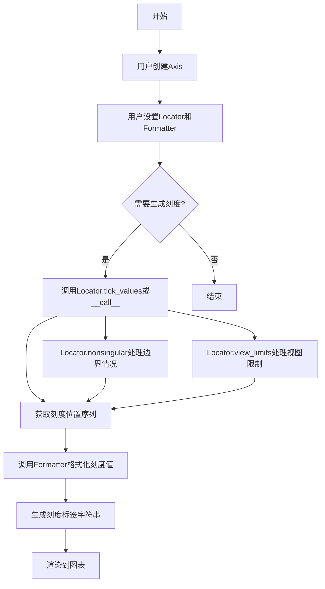
```mermaid
graph TD
    A[开始] --> B[用户创建Axis]
B --> C[用户设置Locator和Formatter]
C --> D{需要生成刻度?}
D -- 是 --> E[调用Locator.tick_values或__call__]
E --> F[获取刻度位置序列]
F --> G[调用Formatter格式化刻度值]
G --> H[生成刻度标签字符串]
H --> I[渲染到图表]
D -- 否 --> J[结束]
E --> K[Locator.nonsingular处理边界情况]
K --> F
E --> L[Locator.view_limits处理视图限制]
L --> F
```

## 类结构

```
TickHelper (基类)
├── Formatter (格式化器基类)
│   ├── NullFormatter
│   ├── FixedFormatter
│   ├── FuncFormatter
│   ├── FormatStrFormatter
│   ├── StrMethodFormatter
│   ├── ScalarFormatter
│   │   └── EngFormatter
│   ├── LogFormatter
│   │   ├── LogFormatterExponent
│   │   ├── LogFormatterMathtext
│   │   └── LogFormatterSciNotation
│   ├── LogitFormatter
│   └── PercentFormatter
└── Locator (定位器基类)
├── IndexLocator
├── FixedLocator
├── NullLocator
├── LinearLocator
├── MultipleLocator
├── MaxNLocator
│   ├── AutoLocator
│   └── LogitLocator
├── LogLocator
├── SymmetricalLogLocator
├── AsinhLocator
└── AutoMinorLocator
```

## 全局变量及字段


### `__all__`
    
模块公共API导出列表，定义了可供外部使用的类和函数

类型：`tuple[str, ...]`
    


### `Callable`
    
typing模块中的可调用类型，用于声明函数或方法类型

类型：`typing.Callable`
    


### `Sequence`
    
typing模块中的序列抽象基类，支持索引和迭代

类型：`typing.Sequence`
    


### `Any`
    
typing模块中的任意类型，表示无类型限制

类型：`typing.Any`
    


### `Literal`
    
typing模块中的字面量类型，用于限制变量为特定字面量值

类型：`typing.Literal`
    


### `Axis`
    
matplotlib的坐标轴类，用于管理坐标轴的刻度和标签

类型：`matplotlib.axis.Axis`
    


### `Transform`
    
matplotlib的坐标变换基类，用于坐标系统转换

类型：`matplotlib.transforms.Transform`
    


### `_AxisWrapper`
    
matplotlib极坐标投影中的轴包装器类

类型：`matplotlib.projections.polar._AxisWrapper`
    


### `np`
    
numpy库的别名，提供数值计算功能

类型：`module`
    


### `_DummyAxis.__name__`
    
虚拟轴的名称标识

类型：`str`
    


### `TickHelper.axis`
    
关联的坐标轴对象，用于获取刻度信息和应用格式化

类型：`Axis | _DummyAxis | _AxisWrapper | None`
    


### `Formatter.locs`
    
当前刻度位置的浮点数列表

类型：`list[float]`
    


### `FixedFormatter.seq`
    
用于显示刻度的固定字符串序列

类型：`Sequence[str]`
    


### `FixedFormatter.offset_string`
    
刻度值的偏移量字符串，用于显示额外信息

类型：`str`
    


### `FuncFormatter.func`
    
自定义格式化函数，将数值转换为字符串

类型：`Callable[[float, int | None], str]`
    


### `FuncFormatter.offset_string`
    
刻度值的偏移量字符串

类型：`str`
    


### `FormatStrFormatter.fmt`
    
printf风格的格式化字符串模板

类型：`str`
    


### `StrMethodFormatter.fmt`
    
str.format方法风格的格式化字符串模板

类型：`str`
    


### `ScalarFormatter.orderOfMagnitude`
    
科学计数法的数量级，用于大数值显示

类型：`int`
    


### `ScalarFormatter.format`
    
数值格式化字符串模板

类型：`str`
    


### `ScalarFormatter.offset`
    
数值偏移量，用于offset显示模式

类型：`float`
    


### `ScalarFormatter.usetex`
    
是否使用LaTeX渲染刻度标签

类型：`bool`
    


### `ScalarFormatter.useOffset`
    
是否使用数值偏移量显示模式

类型：`bool | float`
    


### `ScalarFormatter.useLocale`
    
是否使用区域设置进行数字格式化

类型：`bool | None`
    


### `ScalarFormatter.useMathText`
    
是否使用数学文本渲染刻度标签

类型：`bool | None`
    


### `LogFormatter.minor_thresholds`
    
次要刻度显示的阈值配置元组

类型：`tuple[float, float]`
    


### `LogFormatter.labelOnlyBase`
    
是否仅在对数基数值处显示刻度标签

类型：`bool`
    


### `LogFormatter.base`
    
对数坐标的底数

类型：`float`
    


### `LogFormatter.linthresh`
    
对数坐标切换到线性显示的阈值

类型：`float`
    


### `EngFormatter.ENG_PREFIXES`
    
工程单位前缀映射表

类型：`dict[int, str]`
    


### `EngFormatter.unit`
    
工程单位的单位字符串

类型：`str`
    


### `EngFormatter.places`
    
工程数值的小数位数

类型：`int | None`
    


### `EngFormatter.sep`
    
数值与单位之间的分隔符

类型：`str`
    


### `PercentFormatter.xmax`
    
百分数格式的最大参考值

类型：`float`
    


### `PercentFormatter.decimals`
    
百分数的小数显示位数

类型：`int | None`
    


### `PercentFormatter.symbol`
    
百分数符号，默认为%

类型：`str`
    


### `Locator.MAXTICKS`
    
刻度定位器的最大允许刻度数量上限

类型：`int`
    


### `Locator.axis`
    
关联的坐标轴对象

类型：`Axis | _DummyAxis | _AxisWrapper | None`
    


### `IndexLocator.offset`
    
索引定位的偏移量

类型：`float`
    


### `FixedLocator.nbins`
    
期望的刻度分箱数量

类型：`int | None`
    


### `LinearLocator.presets`
    
预定义的刻度位置映射字典

类型：`dict[tuple[float, float], Sequence[float]]`
    


### `LinearLocator.numticks`
    
线性定位的刻点数量

类型：`int`
    


### `_Edge_integer.step`
    
刻度边界的步长增量

类型：`float`
    


### `MaxNLocator.default_params`
    
MaxNLocator的默认参数字典

类型：`dict[str, Any]`
    


### `LogLocator.numticks`
    
对数定位的刻点数量限制

类型：`int | None`
    


### `SymmetricalLogLocator.numticks`
    
对称对数定位的刻点数量

类型：`int`
    


### `AsinhLocator.linear_width`
    
asinh变换的线性区域宽度

类型：`float`
    


### `AsinhLocator.numticks`
    
asinh定位的刻点数量

类型：`int`
    


### `AsinhLocator.symthresh`
    
asinh变换的对称阈值

类型：`float`
    


### `AsinhLocator.base`
    
asinh变换的底数基数

类型：`int`
    


### `AsinhLocator.subs`
    
刻度子序列配置

类型：`Sequence[float] | None`
    


### `AutoMinorLocator.ndivs`
    
次要刻度分隔的区段数

类型：`int`
    
    

## 全局函数及方法


### `_DummyAxis.__init__`

该方法是 `_DummyAxis` 类的构造函数，用于初始化一个虚拟轴（Dummy Axis）对象。虚拟轴是一个轻量级的 Axis 替代品，主要用于在没有实际 matplotlib Axis 的情况下提供轴的功能接口，常用于计算 tick 位置、格式化数据等场景，特别是在测试环境中或当只需要轴的数值处理能力而不需要实际绑定的图形元素时。

参数：

- `minpos`：`float`，最小正值参数，用于避免除零错误等数值计算问题，默认值为省略值（`...`，在类型注解中表示 `None` 或使用省略号作为默认）

返回值：`None`，无返回值（构造函数）

#### 流程图

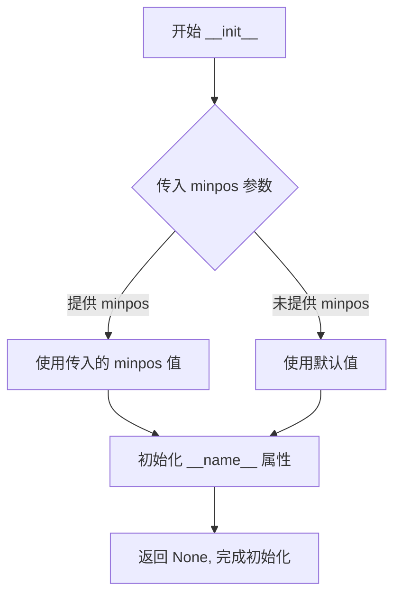
```mermaid
graph TD
    A[开始 __init__] --> B{传入 minpos 参数}
    B -->|提供 minpos| C[使用传入的 minpos 值]
    B -->|未提供 minpos| D[使用默认值]
    C --> E[初始化 __name__ 属性]
    D --> E
    E --> F[返回 None, 完成初始化]
```

#### 带注释源码

```python
class _DummyAxis:
    """
    一个虚拟轴类，用于在没有实际 matplotlib Axis 的情况下提供轴的接口。
    主要用于计算 tick 位置、获取数据区间等数值处理功能。
    """
    __name__: str  # 类的名称属性
    
    def __init__(self, minpos: float = ...) -> None:
        """
        初始化 _DummyAxis 实例。
        
        参数:
            minpos: float, 最小正值参数, 用于确保数值为正, 避免除零错误等.
                    默认为省略值(...)表示使用 Python 的省略号作为默认占位符.
        """
        # 初始化类的名称属性
        self.__name__ = "_DummyAxis"
        
        # 注意: 由于这是类型注解文件(...), 实际实现可能被省略
        # 实际实现中应该会设置内部的最小正值属性
        # 例如: self._minpos = minpos if minpos is not ... else 1e-30
        
        return None  # 构造函数无返回值
```


### `_DummyAxis.get_view_interval`

该方法用于获取虚拟坐标轴（DummyAxis）的视图区间（view interval），返回一个包含最小值和最大值的元组，用于确定坐标轴的可视范围。

参数：无（仅包含隐式参数 `self`）

返回值：`tuple[float, float]`，返回视图区间的最小值 (vmin) 和最大值 (vmax) 组成的元组

#### 流程图

```mermaid
flowchart TD
    A[调用 get_view_interval] --> B{是否已设置视图区间}
    B -->|是| C[返回已保存的视图区间 tuple[vmin, vmax]]
    B -->|否| D[返回默认值 0.0, 1.0]
    C --> E[方法返回]
    D --> E
```

#### 带注释源码

```python
# 来源：_DummyAxis 类的方法
# 文件：matplotlib 相关的 tick formatting and locating 模块
# 功能：获取坐标轴的视图区间（view interval）

class _DummyAxis:
    """
    _DummyAxis 类用于创建一个虚拟的坐标轴对象，
    主要用于在没有真实坐标轴的情况下进行刻度计算和格式化。
    """
    
    __name__: str  # 虚拟坐标轴的名称
    
    def get_view_interval(self) -> tuple[float, float]:
        """
        获取虚拟坐标轴的视图区间。
        
        视图区间定义了坐标轴的可视范围，即用户可以看到的数据范围。
        此方法返回一个包含两个浮点数的元组 (vmin, vmax)，
        分别表示视图区间的最小值和最大值。
        
        Returns:
            tuple[float, float]: 
                - 第一个元素 vmin: 视图区间的最小值
                - 第二个元素 vmax: 视图区间的最大值
        
        Note:
            在 matplotlib 中，_DummyAxis 通常作为 TickHelper 的内部组件，
            用于在没有任何真实 Axis 对象的情况下提供坐标轴接口。
            初始默认视图区间通常为 (0.0, 1.0)，可通过 set_view_interval 设置。
        """
        # 由于这是 stub 文件（.pyi），没有具体实现
        # 实际实现会从内部存储的视图区间变量返回 tuple[float, float]
        ...
```


### `_DummyAxis.set_view_interval`

该方法用于设置坐标轴的视图区间（view interval），即设置坐标轴的可视范围上下限，通常在处理坐标轴显示范围、缩放或平移时调用。

参数：

- `vmin`：`float`，视图区间的最小值（视图下限）
- `vmax`：`float`，视图区间的最大值（视图上限）

返回值：`None`，无返回值，用于设置内部视图区间状态

#### 流程图

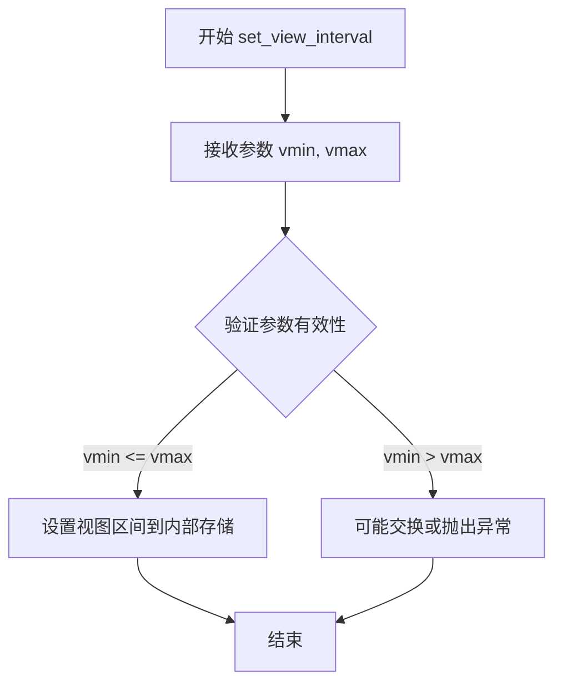
```mermaid
graph TD
    A[开始 set_view_interval] --> B[接收参数 vmin, vmax]
    B --> C{验证参数有效性}
    C -->|vmin <= vmax| D[设置视图区间到内部存储]
    C -->|vmin > vmax| E[可能交换或抛出异常]
    D --> F[结束]
    E --> F
```

#### 带注释源码

```python
def set_view_interval(self, vmin: float, vmax: float) -> None:
    """
    设置坐标轴的视图区间（可视范围）。
    
    参数:
        vmin: float - 视图区间的最小值，表示坐标轴显示的下限
        vmax: float - 视图区间的最大值，表示坐标轴显示的上限
    
    返回:
        None - 此方法直接修改内部状态，不返回任何值
    
    注意:
        - 该方法通常用于设置坐标轴的显示范围
        - 子类或具体实现可能需要处理 vmin > vmax 的情况（如自动交换）
        - 视图区间与数据区间（data_interval）不同，视图区间控制显示，数据区间控制数据范围
    """
    ...  # stub 实现，具体逻辑在matplotlib源码中
```


### `_DummyAxis.get_minpos`

获取DummyAxis实例的最小正位置值（minpos），该值用于避免在坐标轴计算中出现除零错误或对数运算问题。

参数：

- （无参数）

返回值：`float`，返回最小正位置值，用于坐标轴的数值计算和变换

#### 流程图

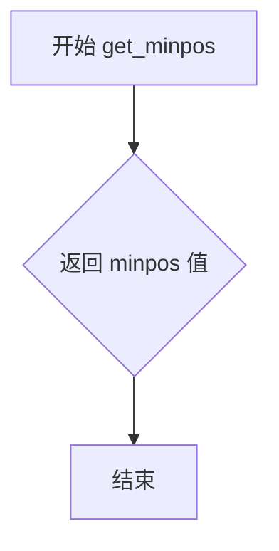
```mermaid
graph TD
    A[开始 get_minpos] --> B{返回 minpos 值}
    B --> C[结束]
```

#### 带注释源码

```python
class _DummyAxis:
    """
    _DummyAxis 类是一个模拟坐标轴对象，用于在没有真实Axis对象的情况下
    提供坐标轴相关的接口功能。通常用于Formatter或Locator等类的内部实现中。
    """
    
    __name__: str  # 类的名称标识
    
    def __init__(self, minpos: float = ...) -> None:
        """
        初始化DummyAxis对象
        
        参数:
            minpos: float, 可选参数，默认值为省略号（...），表示使用默认值
                   最小正位置值，用于对数刻度等计算
        """
    
    def get_minpos(self) -> float:
        """
        获取最小正位置值（minimum positive value）
        
        该方法返回用于坐标轴计算的最小正数值。在matplotlib的坐标轴系统中，
        当处理对数刻度或需要避免除零错误时，需要一个最小的正数作为基准值。
        
        参数:
            无
            
        返回值:
            float: 返回最小正位置值
        """
        ...  # 实现代码未提供，此为类型声明
```


### `_DummyAxis.get_data_interval`

获取轴的数据区间，即当前轴所显示的数据范围（最小值和最大值）。

参数：
- 无

返回值：`tuple[float, float]`，返回数据区间的最小值和最大值组成的元组。

#### 流程图

```mermaid
flowchart TD
    A[开始] --> B[调用 get_data_interval 方法]
    B --> C[返回数据区间元组 (vmin, vmax)]
    C --> D[结束]
```

#### 带注释源码

```python
class _DummyAxis:
    """
    一个虚拟轴类，用于在没有真实轴的情况下提供轴的接口。
    该类通常用于计算刻度位置和格式化，而不需要实际的图形上下文。
    """
    
    __name__: str
    
    def __init__(self, minpos: float = ...) -> None:
        """
        初始化虚拟轴。
        
        参数:
            minpos: 最小正位置，用于避免除零错误等。
        """
        ...
    
    def get_data_interval(self) -> tuple[float, float]:
        """
        获取当前的数据区间。
        
        返回:
            包含最小值和最大值的元组 (vmin, vmax)。
            默认返回 (inf, -inf) 表示未设置数据区间。
        """
        ...
    
    # ... 其他方法
```


### `_DummyAxis.set_data_interval`

该方法用于设置虚拟轴（DummyAxis）的数据区间（vmin, vmax），通常在不存在真实轴对象时作为占位符使用，用于管理刻度数据的范围。

参数：

- `self`：`_DummyAxis`，隐式参数，表示实例本身
- `vmin`：`float`，数据区间的最小值
- `vmax`：`float`，数据区间的最大值

返回值：`None`，无返回值，仅用于设置内部数据区间状态

#### 流程图

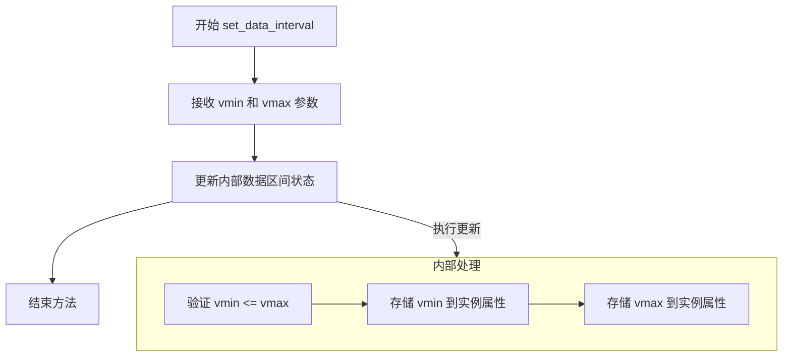
```mermaid
flowchart TD
    A[开始 set_data_interval] --> B[接收 vmin 和 vmax 参数]
    B --> C[更新内部数据区间状态]
    C --> D[结束方法]
    
    subgraph 内部处理
        C1[验证 vmin <= vmax] --> C2[存储 vmin 到实例属性]
        C2 --> C3[存储 vmax 到实例属性]
    end
    
    C -->|执行更新| 内部处理
```

#### 带注释源码

```python
def set_data_interval(self, vmin: float, vmax: float) -> None:
    """
    设置数据区间（Data Interval）的最小值和最大值。
    
    此方法用于更新虚拟轴的数据范围，通常与 get_data_interval 配合使用，
    以管理刻度定位器（Locator）和格式化器（Formatter）的数据范围。
    
    参数:
        vmin: float - 数据区间的最小值
        vmax: float - 数据区间的最大值
    
    返回:
        None - 此方法不返回值，仅修改内部状态
    
    注意:
        - 在实际 matplotlib 实现中，可能会进行 vmin 和 vmax 的有效性验证
        - 如果 vmin > vmax，可能会抛出异常或自动交换两个值
    """
    ...  # 实现细节在 matplotlib 源码中
```


### `_DummyAxis.get_tick_space`

该方法用于获取当前坐标轴可用于显示刻度线的空间大小（以刻度数量表示）。在 matplotlib 中，`_DummyAxis` 是一个虚拟轴类，用于在某些情况下（如独立使用 Formatter 或 Locator）提供轴的接口功能，而不需要完整的真实轴对象。

参数：无需参数

返回值：`int`，返回可用的刻度空间大小

#### 流程图

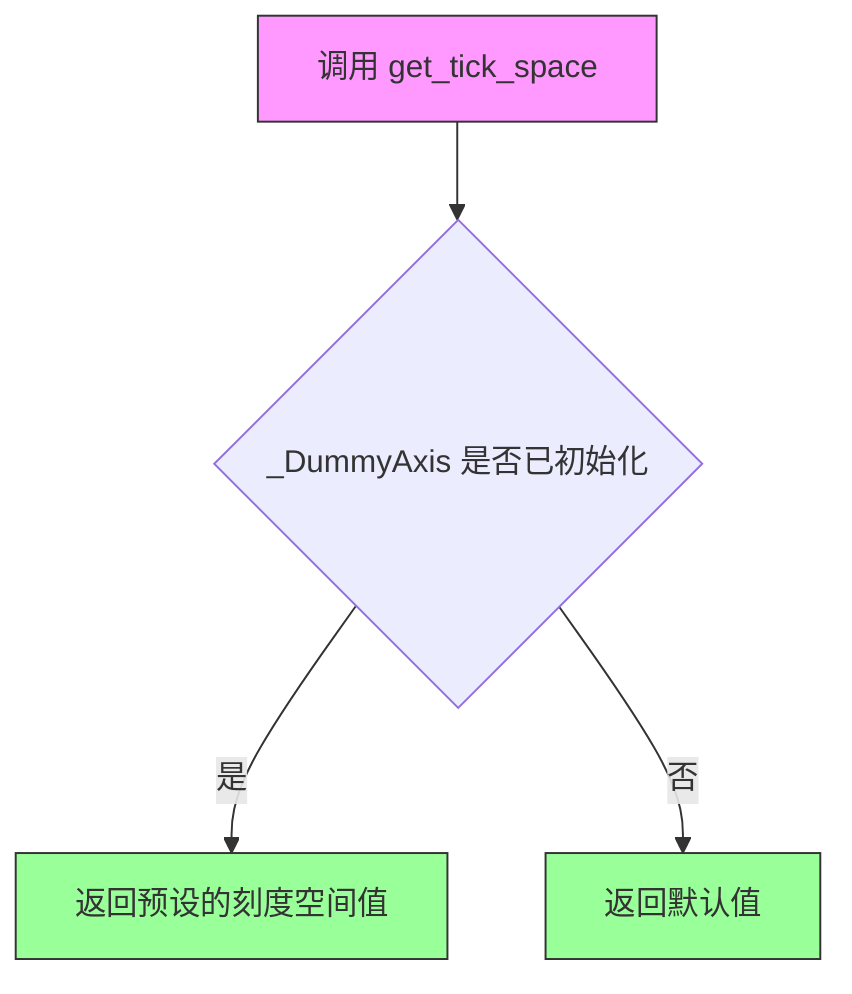
```mermaid
flowchart TD
    A[调用 get_tick_space] --> B{_DummyAxis 是否已初始化}
    B -->|是| C[返回预设的刻度空间值]
    B -->|否| D[返回默认值]
    
    style A fill:#f9f,stroke:#333
    style C fill:#9f9,stroke:#333
    style D fill:#9f9,stroke:#333
```

#### 带注释源码

```
# _DummyAxis 类定义（来自 matplotlib 轴系统的存根）
class _DummyAxis:
    """
    _DummyAxis 是一个虚拟轴类，用于在不需要完整 Axis 对象的情况下
    提供轴的接口功能。通常与 Formatter、Locator 配合使用。
    """
    
    __name__: str  # 轴的名称
    
    def __init__(self, minpos: float = ...) -> None:
        """
        初始化 _DummyAxis 实例
        
        参数:
            minpos: 最小位置值，用于避免除零错误
        """
        ...
    
    def get_tick_space(self) -> int:
        """
        获取刻度空间大小
        
        返回:
            int: 可用于显示刻度的空间大小（刻度数量）
            
        注意:
            这是一个虚拟实现，返回值通常为默认值或基于
            初始化时传入的参数计算得出。在实际 matplotlib
            代码中，这个值会基于 Figure 尺寸、DPI 和轴长度
            动态计算。
        """
        ...
```


### `TickHelper.set_axis`

设置或更新 TickHelper 实例关联的坐标轴对象，用于后续刻度计算和格式化。

参数：

- `axis`：`Axis | _DummyAxis | _AxisWrapper | None`，要设置的坐标轴对象，可以是 matplotlib 的实际 Axis 对象、虚拟轴 _DummyAxis、极坐标轴包装器 _AxisWrapper，或 None（表示清除关联）

返回值：`None`，该方法无返回值

#### 流程图

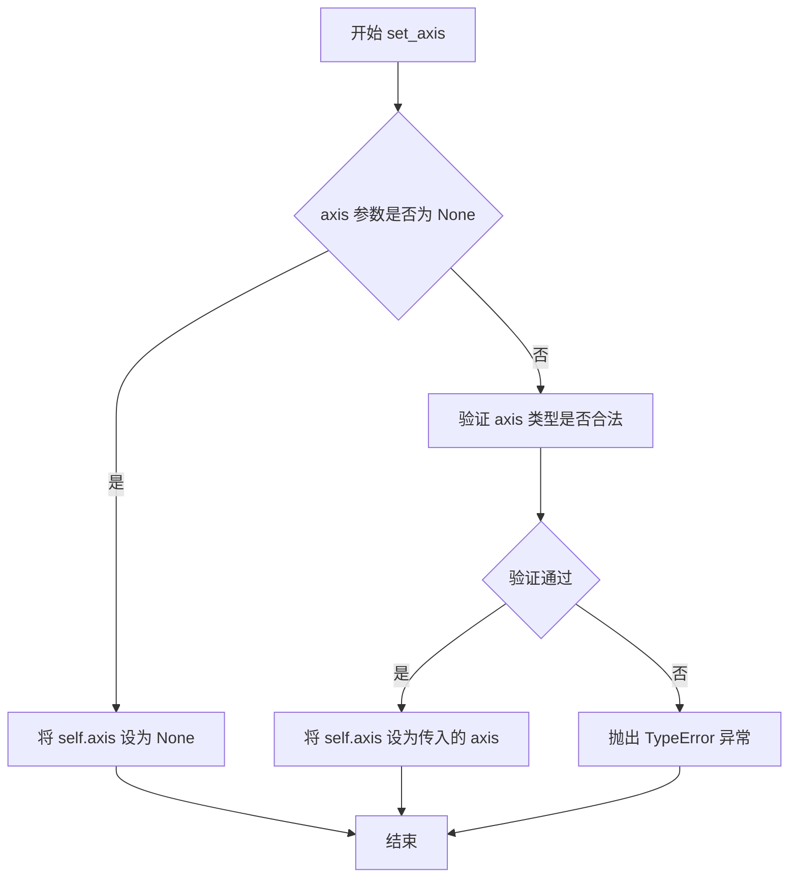
```mermaid
flowchart TD
    A[开始 set_axis] --> B{axis 参数是否为 None}
    B -->|是| C[将 self.axis 设为 None]
    B -->|否| D[验证 axis 类型是否合法]
    D --> E{验证通过}
    E -->|是| F[将 self.axis 设为传入的 axis]
    E -->|否| G[抛出 TypeError 异常]
    C --> H[结束]
    F --> H
    G --> H
```

#### 带注释源码

```python
def set_axis(self, axis: Axis | _DummyAxis | _AxisWrapper | None) -> None:
    """
    设置或更新 TickHelper 实例关联的坐标轴对象。
    
    参数:
        axis: 要绑定的坐标轴对象。可以是:
            - Axis: matplotlib 的标准坐标轴对象
            - _DummyAxis: 用于测试的虚拟轴对象
            - _AxisWrapper: 极坐标系统的轴包装器
            - None: 清除当前绑定的坐标轴
    
    返回值:
        None: 此方法不返回任何值，直接修改实例的 axis 属性
    
    注意:
        - 当 axis 为 None 时，通常表示该 TickHelper 将用于独立计算
          而不与具体坐标轴关联
        - 不同的子类（Formatter/Locator）会根据此 axis 获取视图区间、
          数据区间等信息来计算刻度位置和格式
    """
    self.axis = axis  # 将传入的 axis 对象存储到实例属性
```

#### 补充说明

此方法是 TickHelper 类的核心方法之一，它建立了刻度格式化器/定位器与具体坐标轴之间的关联。在 matplotlib 的架构中：

1. **数据流**：坐标轴 → TickHelper（获取视图/数据区间） → 刻度位置/格式
2. **设计意图**：将轴的引用存储在 TickHelper 中，使其能够动态获取轴的属性进行计算
3. **多态支持**：通过支持多种 axis 类型（Axis/_DummyAxis/_AxisWrapper），实现了良好的扩展性，支持正常坐标轴、测试场景和极坐标系统


### `TickHelper.create_dummy_axis`

该方法用于创建一个虚拟轴（_DummyAxis）对象，并将其赋值给TickHelper实例的axis属性，以便在没有真实轴的情况下进行刻度相关的计算和操作。

参数：

- `self`： TickHelper实例本身
- `**kwargs`：可变关键字参数，用于传递给_DummyAxis构造器的参数（如minpos等）

返回值：`None`，该方法直接修改实例状态，不返回任何值

#### 流程图

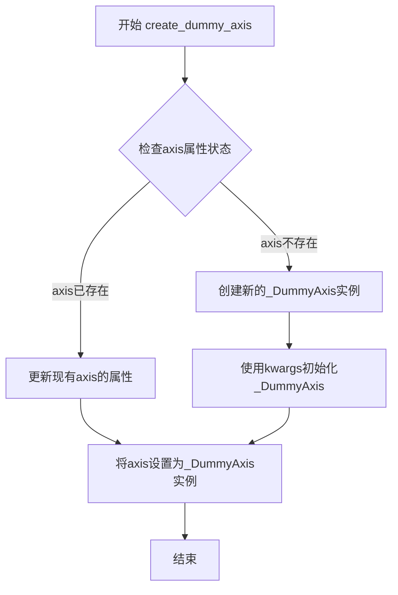
```mermaid
flowchart TD
    A[开始 create_dummy_axis] --> B{检查axis属性状态}
    B -->|axis已存在| C[更新现有axis的属性]
    B -->|axis不存在| D[创建新的_DummyAxis实例]
    D --> E[使用kwargs初始化_DummyAxis]
    C --> F[将axis设置为_DummyAxis实例]
    E --> F
    F --> G[结束]
```

#### 带注释源码

```python
class TickHelper:
    """
    TickHelper基类：提供刻度助手功能的基础类，
    用于管理轴和刻度的创建、格式化与定位
    """
    # 类型注解：axis可以是真实Axis、虚拟Axis或空
    axis: None | Axis | _DummyAxis | _AxisWrapper
    
    def set_axis(self, axis: Axis | _DummyAxis | _AxisWrapper | None) -> None:
        """
        设置关联的轴对象
        """
        ...
    
    def create_dummy_axis(self, **kwargs) -> None:
        """
        创建虚拟轴（Dummy Axis）并将其赋值给self.axis属性。
        
        当没有真实的轴对象可用时（如在某些离线计算场景），
        此方法创建一个虚拟轴来模拟真实轴的行为，
        使得刻度格式化器和定位器可以正常工作。
        
        参数:
            **kwargs: 关键字参数，将传递给_DummyAxis的__init__方法
                     常用参数包括:
                     - minpos: float, 最小正值（用于避免除零等计算）
        
        返回值:
            None: 此方法直接修改self.axis属性，不返回值
        
        示例:
            >>> helper = SomeFormatter()  # 假设的Formatter子类
            >>> helper.create_dummy_axis(minpos=1e-10)
            >>> # 现在helper.axis是一个_DummyAxis实例
        """
        # 根据方法名推断的实现逻辑
        # 1. 创建_DummyAxis实例，传入kwargs参数
        # 2. 将创建的实例赋值给self.axis
        # 注意：这是stub定义，实际实现可能不同
        ...
```


### `Formatter.__call__`

将给定的数值 x 转换为格式化字符串的核心方法，是 Formatter 类的抽象接口，子类通过实现此方法提供具体的数值格式化逻辑。

参数：

-  `x`：`float`，要进行格式化的浮点数值
-  `pos`：`int | None`，位置索引参数，用于多位数或复杂格式中的位置指示（可选，默认为 None）

返回值：`str`，格式化后的字符串表示

#### 流程图

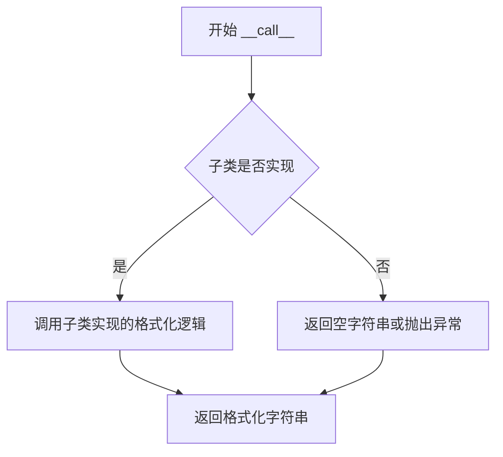
```mermaid
flowchart TD
    A[开始 __call__] --> B{子类是否实现}
    B -- 是 --> C[调用子类实现的格式化逻辑]
    B -- 否 --> D[返回空字符串或抛出异常]
    C --> E[返回格式化字符串]
    D --> E
```

#### 带注释源码

```
def __call__(self, x: float, pos: int | None = ...) -> str:
    """
    将数值 x 格式化为字符串表示。
    
    参数:
        x: float - 要格式化的浮点数值
        pos: int | None - 位置参数，用于多位数或复杂格式中的位置指示
    
    返回:
        str - 格式化后的字符串
    """
    # 注意：这是一个抽象方法/接口方法
    # 具体的格式化逻辑由子类实现
    # 例如：
    # - NullFormatter 返回空字符串
    # - FixedFormatter 根据预定义序列返回对应字符串
    # - FuncFormatter 调用用户提供的函数进行格式化
    # - ScalarFormatter 实现完整的数值格式化逻辑（科学计数法、小数位等）
    # - 等等
    ...
```

#### 子类实现示例（供参考）

```
# 以下是几个典型子类的 __call__ 实现思路：

# NullFormatter: 返回空字符串
def __call__(self, x, pos=None):
    return ''

# FixedFormatter: 根据索引从预定义序列中获取字符串
def __call__(self, x, pos=None):
    # locs 存储了tick位置列表
    # 根据x在locs中的索引获取对应的格式化字符串
    ...

# FuncFormatter: 调用用户提供的函数
def __call__(self, x, pos=None):
    return self.func(x, pos)

# ScalarFormatter: 完整的数值格式化实现
def __call__(self, x, pos=None):
    # 包含偏移量处理、科学计数法、小数位数等复杂逻辑
    ...
```


### `Formatter.format_ticks`

该方法接收一个浮点数列表作为刻度值，遍历并调用 `__call__` 方法将每个数值转换为格式化字符串，最终返回格式化后的字符串列表。

参数：

- `values`：`list[float]`，要格式化的刻度值列表

返回值：`list[str]`，格式化后的刻度标签字符串列表

#### 流程图

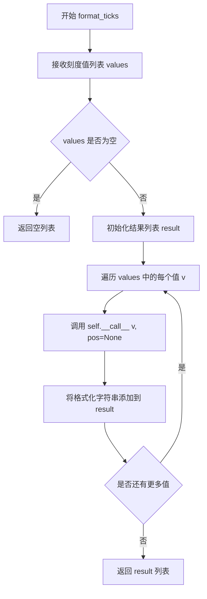
```mermaid
graph TD
    A[开始 format_ticks] --> B[接收刻度值列表 values]
    B --> C{values 是否为空}
    C -->|是| D[返回空列表]
    C -->|否| E[初始化结果列表 result]
    E --> F[遍历 values 中的每个值 v]
    F --> G[调用 self.__call__ v, pos=None]
    G --> H[将格式化字符串添加到 result]
    H --> I{是否还有更多值}
    I -->|是| F
    I -->|否| J[返回 result 列表]
```

#### 带注释源码

```python
def format_ticks(self, values: list[float]) -> list[str]:
    """
    Format ticks based on the provided values.
    
    This method takes a list of numeric tick values and converts each
    value into its string representation using the formatter's 
    __call__ method.
    
    Parameters
    ----------
    values : list[float]
        List of tick values to be formatted.
    
    Returns
    -------
    list[str]
        List of formatted tick label strings.
    """
    # 初始化结果列表
    result: list[str] = []
    
    # 遍历每个刻度值并调用 __call__ 方法进行格式化
    for v in values:
        # 使用格式化器将数值转换为字符串
        # pos 参数为 None，表示自动确定位置
        result.append(self(v, pos=None))
    
    return result
```


### `Formatter.format_data`

该方法为matplotlib图表中的单个tick位置值生成字符串表示形式，主要用于处理刻度标签的格式化显示，支持不同格式化器子类的特定实现（如科学计数法、对数刻度等）。

参数：

- `value`：`float`，要进行格式化的单个数值，通常是图表轴上的tick位置

返回值：`str`，格式化后的字符串表示

#### 流程图

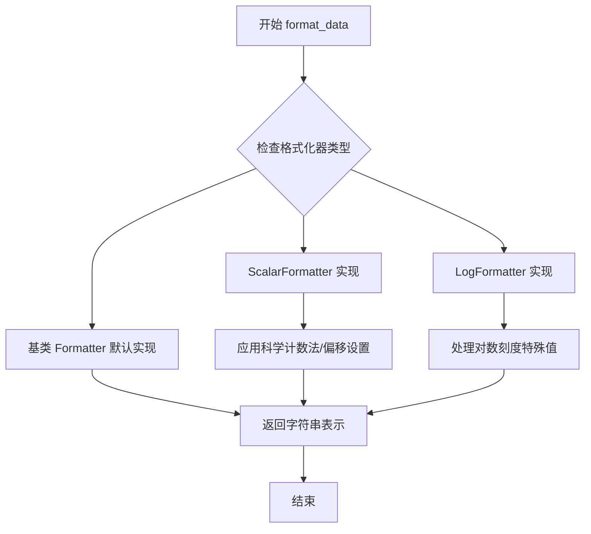
```mermaid
flowchart TD
    A[开始 format_data] --> B{检查格式化器类型}
    B --> C[基类 Formatter 默认实现]
    B --> D[ScalarFormatter 实现]
    B --> E[LogFormatter 实现]
    C --> F[返回字符串表示]
    D --> G[应用科学计数法/偏移设置]
    G --> F
    E --> H[处理对数刻度特殊值]
    H --> F
    F --> I[结束]
```

#### 带注释源码

```python
# 基于 matplotlib stub 文件的类型标注和实际行为推断
class Formatter(TickHelper):
    """
    Formatter 基类
    用于将数值转换为刻度标签字符串
    """
    
    locs: list[float]  # 存储当前tick位置列表
    
    def format_data(self, value: float) -> str:
        """
        将单个数值格式化为字符串
        
        参数:
            value: float - 要格式化的数值（通常是tick位置）
            
        返回:
            str - 格式化后的字符串标签
        """
        # 注意：这是基类的抽象方法签名
        # 具体实现在子类中：
        # - ScalarFormatter: 使用 format % value 进行格式化
        # - LogFormatter: 处理对数刻度的特殊显示
        # - FixedFormatter: 从预定义序列中查找对应字符串
        # - FuncFormatter: 调用用户提供的函数
        ...
    
    def format_data_short(self, value: float) -> str:
        """短格式数据格式化，通常用于坐标轴标签"""
        ...
    
    @staticmethod
    def fix_minus(s: str) -> str:
        """静态方法：修复Unicode减号符号"""
        ...

# 子类实现示例
class ScalarFormatter(Formatter):
    """标量格式化器，支持科学计数法"""
    orderOfMagnitude: int  # 数量级
    format: str  # 格式化字符串
    
    def format_data(self, value: float) -> str:
        """
        ScalarFormatter 的实现
        根据 useOffset、useMathText 等设置格式化数值
        """
        # 1. 检查是否使用offset（偏移量）
        # 2. 检查是否使用数学文本格式
        # 3. 应用科学计数法（如果数量级足够大）
        # 4. 处理小数位数和本地化格式
        ...

class LogFormatter(Formatter):
    """对数刻度格式化器"""
    def format_data(self, value: float) -> str:
        """
        LogFormatter 的实现
        处理对数刻度的特殊显示（ decade, minor ticks 等）
        """
        # 1. 处理 value <= 0 的情况（对数无定义）
        # 2. 计算对数值
        # 3. 根据 labelOnlyBase 设置决定是否只显示基数
        # 4. 处理minor ticks的显示
        ...
```


### `Formatter.format_data_short`

该方法是 `Formatter` 基类提供的用于将数值格式化为短字符串形式的方法，通常用于坐标轴刻度标签、工具提示等场景的紧凑显示。子类（如 `ScalarFormatter`、`LogFormatter`、`LogitFormatter`）通常会重写此方法以实现具体的格式化逻辑。

参数：

- `value`：`float`，要进行格式化的数值

返回值：`str`，格式化后的短字符串表示

#### 流程图

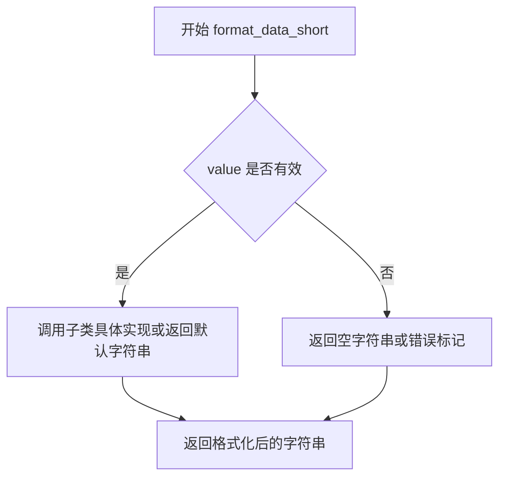
```mermaid
flowchart TD
    A[开始 format_data_short] --> B{value 是否有效}
    B -->|是| C[调用子类具体实现或返回默认字符串]
    B -->|否| D[返回空字符串或错误标记]
    C --> E[返回格式化后的字符串]
    D --> E
```

#### 带注释源码

```
def format_data_short(self, value: float) -> str:
    """
    返回数值的短格式字符串表示。
    
    此方法为基类中的存根实现，具体格式化逻辑由子类重写实现。
    在 matplotlib 中，此方法通常用于需要紧凑显示数值的场景，
    如坐标轴刻度标签、图例数值等。
    
    参数:
        value: float - 要格式化的浮点数值
    
    返回:
        str - 格式化后的短字符串表示
    """
    # 基类中为抽象存根，实际实现依赖子类
    ...
```


### `Formatter.get_offset`

**描述**：
获取当前Formatter实例的偏移量字符串（Offset String）。该字符串通常用于坐标轴标签的显示，例如在科学计数法中显示 "$\times 10^5$"，或者由用户手动设置的固定偏移文本。在基类 `Formatter` 中，此方法为抽象方法（或仅返回空字符串），具体逻辑由子类实现。

参数：
-  `self`：隐式参数，指向Formatter类或其子类的实例。

返回值：`str`，返回偏移量字符串。如果未设置偏移，则返回空字符串。

#### 流程图

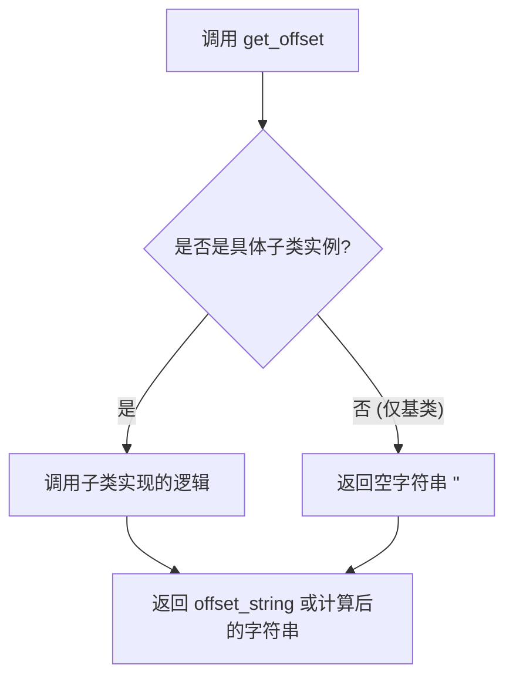
```mermaid
flowchart TD
    A[调用 get_offset] --> B{是否是具体子类实例?}
    B -- 是 --> C[调用子类实现的逻辑]
    B -- 否 (仅基类) --> D[返回空字符串 '']
    C --> E[返回 offset_string 或计算后的字符串]
    D --> E
```

#### 带注释源码

```python
class Formatter(TickHelper):
    # ... 其他字段和方法 ...
    
    locs: list[float]  # 存储刻度位置列表

    # 获取偏移量字符串的方法签名
    # 在基类中，此处仅为类型声明，具体逻辑需由子类如 ScalarFormatter, FixedFormatter 实现
    def get_offset(self) -> str: ...
```

#### 关键组件信息
- **`Formatter`**: 核心格式化器基类，定义了获取偏移量的接口。
- **`locs`**: `list[float]`类型，存储了当前应该显示的刻度值列表，偏移量的计算通常依赖于这些值的数据范围。

#### 潜在的技术债务或优化空间
1.  **抽象方法未明确标记**：在Python 3.3+中，可以使用 `@abstractmethod` 装饰器明确表明 `get_offset` 是抽象方法，而不是仅仅留下 `...` (pass)。当前的定义虽然语义正确，但不够显式，容易导致在基类调用时报错（如果Python没有实现）。
2.  **逻辑分散**：偏移量的计算逻辑散布在 `ScalarFormatter`（自动计算）和 `FixedFormatter`（手动设置）中，缺乏一个统一的策略模式（Strategy Pattern）来处理不同类型的偏移逻辑。

#### 其它项目
- **设计目标与约束**：该方法是Matplotlib可视化库中坐标轴渲染系统的关键组成部分，旨在解决大规模数值（Scientific Notation）的显示问题，避免刻度标签过长遮挡图表。
- **外部依赖与接口契约**：该方法直接被 Matplotlib 的 Axis 渲染代码调用。返回值通常直接拼接到刻度标签的字符串模板中。
- **错误处理**：由于是类型声明（Stub），运行时错误处理依赖于具体子类的实现。基类调用此方法通常不涉及异常抛出。


### Formatter.set_locs

该方法用于设置格式化器的刻度位置列表（locs），以便后续进行刻度值格式化时使用。

参数：

- `locs`：`list[float]`，待设置的刻度位置列表

返回值：`None`，无返回值，仅更新实例的 `locs` 属性

#### 流程图

```mermaid
flowchart TD
    A[开始 set_locs] --> B[接收 locs 参数: list[float]]
    B --> C[将 locs 赋值给实例属性 self.locs]
    C --> D[结束]
```

#### 带注释源码

```python
def set_locs(self, locs: list[float]) -> None:
    """
    设置格式化器的刻度位置。
    
    参数:
        locs: 刻度位置的浮点数列表，用于后续format_ticks等方法的格式化操作
    返回:
        None: 该方法直接修改实例状态，不返回任何值
    """
    # 将传入的刻度位置列表赋值给实例属性
    # 该属性会被 format_ticks、format_data 等方法使用
    self.locs = locs
```


### `Formatter.fix_minus`

该方法是一个静态方法，用于处理数字字符串中的负号，将可能存在的各种负号字符（如 Unicode 负号）统一转换为标准的 ASCII 连字符（hyphen-minus），以确保在绘图标签中显示一致。

参数：

- `s`：`str`，需要处理的字符串，通常是数字的字符串表示

返回值：`str`，处理后的字符串

#### 流程图

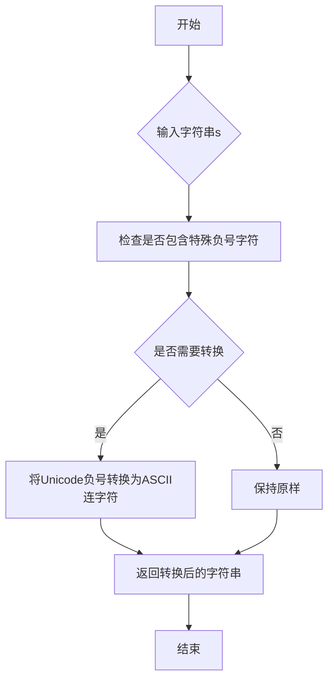
```mermaid
flowchart TD
    A[开始] --> B{输入字符串s}
    B --> C[检查是否包含特殊负号字符]
    C --> D{是否需要转换}
    D -->|是| E[将Unicode负号转换为ASCII连字符]
    D -->|否| F[保持原样]
    E --> G[返回转换后的字符串]
    F --> G
    G --> H[结束]
```

#### 带注释源码

```python
@staticmethod
def fix_minus(s: str) -> str:
    """
    处理字符串中的负号，将其统一转换为标准的ASCII连字符（hyphen-minus）
    
    参数:
        s: str - 输入的字符串，通常是数字的字符串表示
        
    返回:
        str - 处理后的字符串
        
    注意:
        这是一个静态方法，用于确保负号在不同环境下的一致显示
        具体实现需要查看matplotlib的实际源代码
    """
    # 从代码中仅能获取到类型签名，具体实现未在此stub文件中展示
    # 在实际的matplotlib库中，该方法会处理Unicode负号字符（如− U+2212）
    # 并将其转换为标准的ASCII连字符（-）
    ...
```


### `FixedFormatter.__init__`

该方法用于初始化 `FixedFormatter` 类的实例。通过接收一个字符串序列（Sequence[str]）作为参数，将其存储为实例属性，以供后续在格式化刻度时直接使用该序列中的字符串作为标签。此外，它还负责初始化用于显示偏移量的字符串属性。

参数：

-  `seq`：`Sequence[str]`，表示要使用的固定标签序列。

返回值：`None`，该方法不返回任何值，仅初始化对象状态。

#### 流程图

```mermaid
flowchart TD
    A([开始 __init__]) --> B[输入参数: seq: Sequence[str]]
    B --> C[调用父类 Formatter.__init__]
    C --> D[设置实例属性: self.seq = seq]
    D --> E[设置实例属性: self.offset_string = '']
    E --> F([结束 __init__])
```

#### 带注释源码

```python
def __init__(self, seq: Sequence[str]) -> None:
    """
    初始化 FixedFormatter。

    Parameters
    ----------
    seq : Sequence[str]
        一个字符串序列，用于指定刻度轴上的标签。
    """
    # 调用父类 Formatter (继承自 TickHelper) 的初始化方法
    # 以确保对象正确初始化并具备基本的刻度辅助功能
    super().__init__()

    # 将传入的字符串序列保存为实例属性
    # 该属性将在 format_ticks 或 format_data 调用时被使用
    self.seq = seq

    # 初始化偏移量字符串为空字符串
    # 该属性用于在标签旁显示额外的偏移量（如科学计数法中的指数部分）
    self.offset_string: str = ""
```


### `FixedFormatter.set_offset_string`

该方法用于设置 FixedFormatter 的偏移字符串（offset_string），该偏移字符串会在格式化刻度标签时显示在数值之前。

参数：

- `ofs`：`str`，要设置的偏移字符串

返回值：`None`，无返回值

#### 流程图

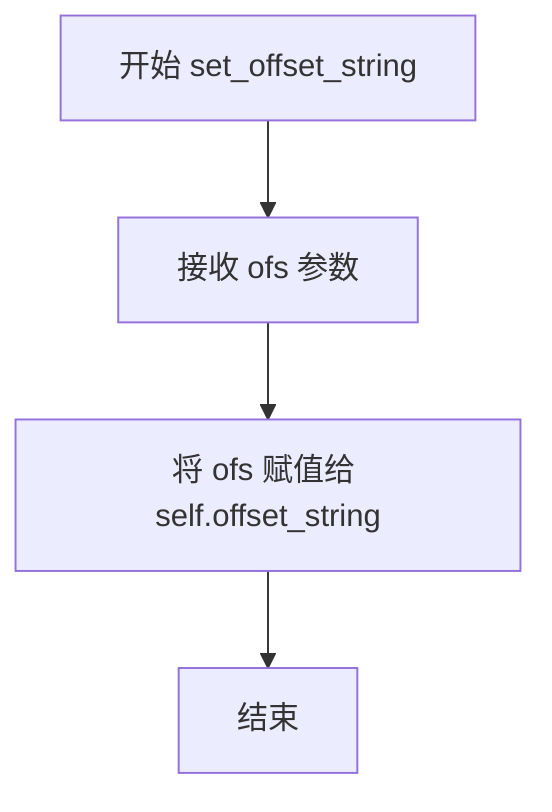
```mermaid
flowchart TD
    A[开始 set_offset_string] --> B[接收 ofs 参数]
    B --> C[将 ofs 赋值给 self.offset_string]
    C --> D[结束]
```

#### 带注释源码

```python
def set_offset_string(self, ofs: str) -> None:
    """
    设置 FixedFormatter 的偏移字符串。
    
    参数:
        ofs: 要设置的偏移字符串内容
        
    返回:
        None
    """
    # 将传入的偏移字符串赋值给实例的 offset_string 属性
    self.offset_string = ofs
```


### `FuncFormatter.__init__`

这是 `FuncFormatter` 类的构造函数，用于初始化一个自定义函数格式化器。该方法接收一个自定义的格式化函数，并将其存储为实例属性，供后续 `__call__` 方法在格式化刻度标签时调用。

参数：

- `func`：`Callable[..., str]`，用户自定义的格式化函数，用于将数值转换为字符串标签

返回值：`None`，无返回值（构造函数）

#### 流程图

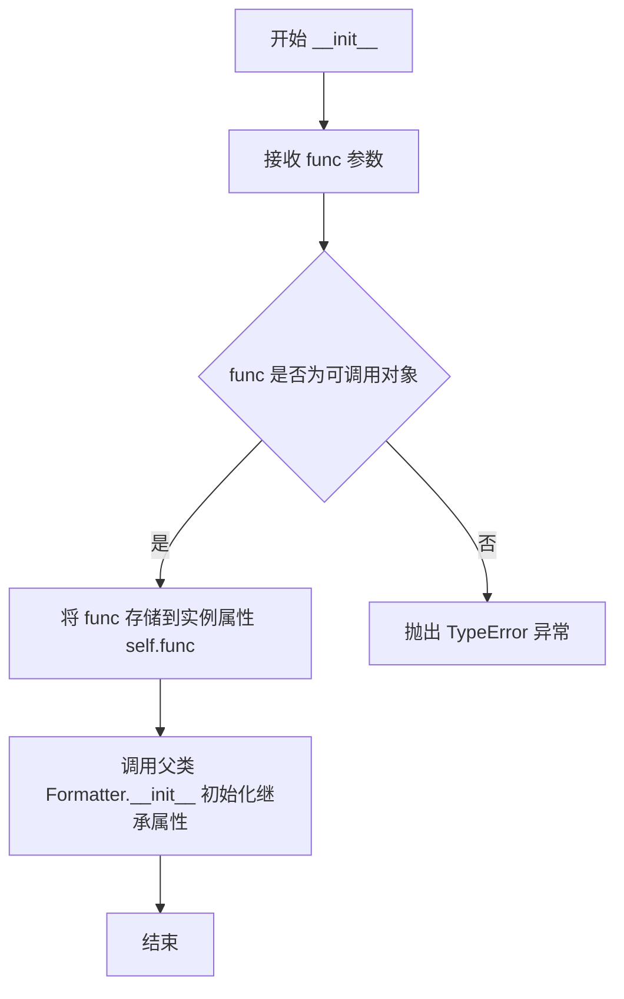
```mermaid
flowchart TD
    A[开始 __init__] --> B[接收 func 参数]
    B --> C{func 是否为可调用对象}
    C -->|是| D[将 func 存储到实例属性 self.func]
    D --> E[调用父类 Formatter.__init__ 初始化继承属性]
    E --> F[结束]
    C -->|否| G[抛出 TypeError 异常]
```

#### 带注释源码

```python
class FuncFormatter(Formatter):
    """
    自定义函数格式化器类
    
    继承自 Formatter 类，允许用户通过自定义函数来格式化刻度标签。
    """
    
    # 实例属性：存储用户提供的格式化函数
    func: Callable[[float, int | None], str]  # 格式化函数，接收数值和位置参数
    offset_string: str  # 偏移量字符串
    
    def __init__(self, func: Callable[..., str]) -> None:
        """
        初始化 FuncFormatter 实例
        
        参数:
            func: 一个可调用对象，接收数值参数并返回字符串。
                  可以是 Callable[[float, int | None], str] 或 Callable[[float], str] 两种形式。
        
        返回:
            None
        """
        # 将用户提供的格式化函数存储到实例属性
        # 该函数将在 __call__ 方法被调用时使用
        self.func = func
        
        # 调用父类 Formatter 的初始化方法
        # 初始化继承自父类的属性（如 locs 列表等）
        super().__init__()
    
    def set_offset_string(self, ofs: str) -> None:
        """设置偏移量字符串"""
        self.offset_string = ofs
```


### `FuncFormatter.set_offset_string`

该方法用于设置 `FuncFormatter` 类的偏移字符串（offset_string）属性，允许用户自定义刻度标签的偏移显示内容。

参数：

- `ofs`：`str`，要设置的偏移字符串值

返回值：`None`，无返回值

#### 流程图

```mermaid
graph TD
    A[开始] --> B[接收偏移字符串参数 ofs]
    B --> C[将参数值赋值给实例属性 offset_string]
    C --> D[结束]
```

#### 带注释源码

```python
class FuncFormatter(Formatter):
    """
    FuncFormatter 类使用自定义函数格式化刻度标签。
    
    类属性:
        func: Callable[[float, int | None], str] - 格式化函数
        offset_string: str - 偏移字符串
    """
    
    # 初始化方法
    def __init__(self, func: Callable[..., str]) -> None:
        """
        初始化 FuncFormatter 实例。
        
        参数:
            func: 用于格式化刻度值的可调用对象
        """
        self.func = func
        self.offset_string = ""  # 初始化为空字符串
    
    # 设置偏移字符串的方法
    def set_offset_string(self, ofs: str) -> None:
        """
        设置偏移字符串。
        
        参数:
            ofs: 要设置的偏移字符串
        返回:
            无返回值（None）
        """
        # 将传入的偏移字符串赋值给实例属性
        self.offset_string = ofs
```

#### 补充说明

**类字段信息：**

- `func`：`Callable[[float, int | None], str]`，存储用于格式化刻度值的自定义函数
- `offset_string`：`str`，存储偏移字符串，用于在刻度标签前显示

**技术债务与优化空间：**

1. 从提供的类型注解来看，该方法的实现可能过于简单，没有验证传入的 `ofs` 参数是否为有效字符串
2. 如果需要更严格的类型检查，可以添加参数验证逻辑
3. 该方法与 `FixedFormatter.set_offset_string` 方法功能相同，可能存在代码重复，可以考虑提取到父类 `Formatter` 中

**外部依赖：**

- 该类继承自 `Formatter`（继承自 `TickHelper`），依赖于 `matplotlib.axis.Axis` 和 `matplotlib.transforms.Transform` 等 matplotlib 核心组件


### `FormatStrFormatter.__init__`

该方法是`FormatStrFormatter`类的构造函数，用于初始化格式化字符串标签的格式化器。它接收一个格式字符串参数`fmt`并将其存储为实例属性，供后续`__call__`方法在格式化数值时使用。

参数：

- `fmt`：`str`，格式字符串，用于指定数值如何被格式化为字符串，例如"%.2f"表示保留两位小数

返回值：`None`，构造函数不返回值，仅初始化实例状态

#### 流程图

```mermaid
flowchart TD
    A[开始 __init__] --> B[接收 fmt 参数]
    B --> C{检查 fmt 是否为字符串类型}
    C -->|是| D[将 fmt 赋值给 self.fmt]
    C -->|否| E[抛出 TypeError 异常]
    D --> F[结束 __init__, 返回 None]
    E --> F
```

#### 带注释源码

```python
class FormatStrFormatter(Formatter):
    """
    Formatter that uses a format string to format tick labels.
    
    This formatter accepts a format string (like those used in printf-style
    formatting) and applies it to format numerical values as strings.
    
    Examples
    --------
    >>> formatter = FormatStrFormatter('%.2f')
    >>> formatter(3.14159, None)
    '3.14'
    """
    
    fmt: str
    """str: The format string used to format tick values."""
    
    def __init__(self, fmt: str) -> None:
        """
        Initialize the FormatStrFormatter with a format string.
        
        Parameters
        ----------
        fmt : str
            A format string (e.g., '%.2f', '%d', '%s') that specifies
            how the numerical tick values should be formatted.
            This string is passed to Python's string formatting operations.
        
        Returns
        -------
        None
        
        Raises
        ------
        TypeError
            If fmt is not a string type.
        
        Notes
        -----
        The format string follows Python's printf-style formatting:
        - %d : integer
        - %f : floating point
        - %e : scientific notation
        - %.2f : floating point with 2 decimal places
        """
        self.fmt = fmt
        # 调用父类 Formatter 的初始化方法
        super().__init__()
```


### `StrMethodFormatter.__init__`

这是一个初始化方法，用于创建 `StrMethodFormatter` 实例并设置格式化字符串。该方法是 `StrMethodFormatter` 类的构造函数，接收一个格式化字符串参数并将其存储为实例属性。

参数：

- `fmt`：`str`，格式化字符串，用于指定数值的格式化方式（例如 "{x:.2f}"）

返回值：`None`，因为 `__init__` 方法不返回值（构造函数）

#### 流程图

```mermaid
flowchart TD
    A[开始 __init__] --> B[接收格式化字符串 fmt]
    B --> C[将 fmt 存储为实例属性]
    D[返回 None]
    C --> D
```

#### 带注释源码

```python
class StrMethodFormatter(Formatter):
    # 类字段：存储格式化字符串
    fmt: str
    
    def __init__(self, fmt: str) -> None:
        """
        初始化 StrMethodFormatter 实例
        
        参数:
            fmt: 格式化字符串，用于指定数值的显示格式
                  例如: '{x:.2f}' 表示保留两位小数
        """
        # 将传入的格式化字符串存储为实例属性
        self.fmt = fmt
```

#### 补充信息

- **所属类**：`StrMethodFormatter`，继承自 `Formatter` 类
- **类字段**：
  - `fmt`：`str`，格式化字符串
- **与父类的关系**：`StrMethodFormatter` 继承自 `Formatter`，后者继承自 `TickHelper`。该类主要用于 matplotlib 的坐标轴刻度标签格式化。
- **使用场景**：当需要使用 Python 的字符串格式化方法（str.format）来格式化刻度标签时使用
- **设计目标**：提供一个简单的方式来定义基于字符串格式化方法的刻度标签格式


### `ScalarFormatter.__init__`

用于初始化标量格式化器（ScalarFormatter）实例，设置数值显示的各种选项，包括偏移量、数学文本格式、本地化格式以及LaTeX渲染支持。

参数：

- `useOffset`：`bool | float | None`，可选参数，用于控制是否显示数值的偏移量（offset），即显示为类似 `a × 10^b + c` 的形式，传入 `float` 时可指定具体的偏移值
- `useMathText`：`bool | None`，可选参数，用于控制是否使用数学文本格式渲染数值（如使用数学字体显示上下标）
- `useLocale`：`bool | None`，可选参数，用于控制是否根据本地化设置格式化数值（如使用千分位分隔符、小数点符号等）
- `usetex`：`bool | None`，可选关键字参数，用于控制是否使用 LaTeX 渲染数值（优先级高于 useMathText）

返回值：`None`，无返回值

#### 流程图

```mermaid
flowchart TD
    A[开始 __init__] --> B{useOffset 参数}
    B -->|None| C[使用默认行为]
    B -->|True| D[启用偏移量显示]
    B -->|False| E[禁用偏移量显示]
    B -->|float| F[设置固定偏移值]
    
    C --> G{useMathText 参数}
    D --> G
    E --> G
    F --> G
    
    G -->|True| H[启用数学文本格式]
    G -->|False| I[禁用数学文本格式]
    G -->|None| J[使用默认行为]
    
    H --> K{useLocale 参数}
    I --> K
    J --> K
    
    K -->|True| L[启用本地化格式]
    K -->|False| M[禁用本地化格式]
    K -->|None| N[使用默认行为]
    
    L --> O{usetex 参数}
    M --> O
    N --> O
    
    O -->|True| P[启用 LaTeX 渲染]
    O -->|False| Q[禁用 LaTeX 渲染]
    O -->|None| R[使用默认行为]
    
    P --> S[初始化完成]
    Q --> S
    R --> S
```

#### 带注释源码

```python
class ScalarFormatter(Formatter):
    """
    标量格式化器类，继承自 Formatter，用于格式化数值型的刻度标签。
    支持科学计数法、偏移量显示、数学文本格式等多种显示方式。
    """
    
    orderOfMagnitude: int  # 数量级，用于科学计数法
    format: str  # 格式化字符串模板
    
    def __init__(
        self,
        useOffset: bool | float | None = ...,  # 偏移量控制：True启用/False禁用/具体数值指定偏移值
        useMathText: bool | None = ...,        # 数学文本控制：True启用/False禁用/None默认
        useLocale: bool | None = ...,          # 本地化控制：True启用/False禁用/None默认
        *,
        usetex: bool | None = ...,              # LaTeX 渲染控制：True启用/False禁用/None默认
    ) -> None:
        """
        初始化 ScalarFormatter 实例。
        
        参数说明：
        - useOffset: 控制数值是否显示为 a×10^n + offset 的形式
          - True: 自动计算偏移量
          - False: 不使用偏移量
          - float: 使用指定的固定偏移值
          - None: 使用全局默认设置
        
        - useMathText: 控制是否使用 Matplotlib 的数学文本渲染
          - True: 使用数学字体（如显示为 $1.5\times10^5$）
          - False: 使用普通文本
          - None: 使用全局默认设置
        
        - useLocale: 控制是否根据系统Locale设置格式化数字
          - True: 使用千分位分隔符和本地小数点
          - False: 使用固定的小数点
          - None: 使用全局默认设置
        
        - usetex: 控制是否使用 LaTeX 渲染（优先级最高）
          - True: 使用 LaTeX 渲染
          - False: 不使用 LaTeX
          - None: 使用全局默认设置
        """
        # 类型标注文件中使用 ... 表示该方法有默认实现
        # 实际实现在 matplotlib 源码中
        pass
```


### `ScalarFormatter.get_usetex`

获取当前 ScalarFormatter 实例是否配置使用 LaTeX 渲染文本。当启用时，格式化器将使用 LaTeX 语法生成文本标签，适用于需要数学符号或专业排版的场景。

参数：
- 无（仅包含隐式参数 `self`）

返回值：`bool`，返回当前是否启用 LaTeX 模式。`True` 表示启用 LaTeX 渲染，`False` 表示禁用。

#### 流程图

```mermaid
flowchart TD
    A[开始] --> B[获取内部存储的 usetex 状态]
    B --> C{状态是否存在?}
    C -->|是| D[返回状态值]
    C -->|否| E[返回默认值 False]
    D --> F[结束]
    E --> F
```

#### 带注释源码

```python
def get_usetex(self) -> bool:
    """
    获取当前是否启用 LaTeX 文本渲染模式。
    
    该方法访问内部存储的 usetex 标志位，该标志位在构造函数中初始化，
    并可通过 set_usetex 方法或 usetex 属性进行修改。
    
    Returns:
        bool: 当前是否启用 LaTeX 模式
        
    See Also:
        set_usetex: 设置 LaTeX 模式
        usetex: LaTeX 模式的属性访问器
    """
    # 实际实现会返回类似 self._usetex 的内部变量
    # 由于是 stub 文件，具体实现未显示
    ...
```


### `ScalarFormatter.set_usetex`

该方法用于设置`ScalarFormatter`是否使用LaTeX（TeX）来渲染文本标签。当启用时，格式化器将使用LaTeX引擎来生成数学符号和公式的渲染。

参数：

- `val`：`bool`，指定是否启用LaTeX渲染。`True`表示使用LaTeX渲染，`False`表示不使用。

返回值：`None`，无返回值（该方法直接修改对象内部状态）。

#### 流程图

```mermaid
graph TD
    A[开始 set_usetex] --> B{验证参数类型}
    B -->|参数为bool| C[将 val 赋值给内部属性 _usetex]
    B -->|参数类型错误| D[抛出 TypeError]
    C --> E[更新 usetex 属性值]
    E --> F[结束]
    
    style A fill:#f9f,stroke:#333
    style C fill:#9f9,stroke:#333
    style F fill:#9f9,stroke:#333
```

#### 带注释源码

```python
def set_usetex(self, val: bool) -> None:
    """
    设置是否使用 LaTeX 渲染文本标签。
    
    Parameters
    ----------
    val : bool
        是否启用 LaTeX 渲染。
        - True: 启用 LaTeX 渲染，数学符号和公式将使用 LaTeX 引擎生成
        - False: 禁用 LaTeX 渲染，使用 Matplotlib 默认的数学文本渲染
    
    Returns
    -------
    None
    
    Notes
    -----
    当启用 LaTeX 渲染时，轴标签和刻度标签中的数学表达式将使用
    LaTeX 排版系统进行渲染，这需要系统中安装有 LaTeX 编译器。
    
    该方法与 get_usetex() 方法配合使用，与 usetex 属性互为 setter。
    """
    ...  # 实现代码未在类型定义中显示
```


### `ScalarFormatter.get_useOffset`

该方法用于获取ScalarFormatter是否使用偏移量（offset）的设置。当启用偏移量时，格式化器会在显示数值时添加一个偏移量，以便更好地处理数值较大或较小的情况。

参数：
- 该方法没有参数

返回值：`bool`，返回当前是否启用偏移量的布尔值

#### 流程图

```mermaid
graph TD
    A[开始] --> B[获取self.useOffset属性]
    B --> C[返回布尔值]
    C --> D[结束]
```

#### 带注释源码

```python
def get_useOffset(self) -> bool:
    """
    获取是否使用偏移量的设置。
    
    返回值:
        bool: 如果启用偏移量返回True，否则返回False。
    """
    return self.useOffset
```

注意：由于提供的代码是类型声明文件（.pyi），实际的实现细节可能会有所不同。上述源码是基于类型声明推断出的可能实现。在实际的matplotlib源代码中，这个方法通常会直接返回内部存储的偏移量设置状态。


### `ScalarFormatter.set_useOffset`

该方法用于设置 `ScalarFormatter` 的偏移量模式。当参数为布尔值时，控制是否启用偏移量显示；当参数为浮点数时，设置具体的偏移量数值。

参数：

- `val`：`bool | float`，设置是否使用偏移量（True/False）或具体的偏移量值（浮点数）

返回值：`None`，无返回值

#### 流程图

```mermaid
graph TD
    A[开始] --> B{接收参数 val}
    B --> C{val 类型判断}
    C -->|bool 类型| D[设置偏移量开关状态]
    C -->|float 类型| E[设置具体偏移量值]
    D --> F[更新内部状态]
    E --> F
    F --> G[结束]
```

#### 带注释源码

```python
def set_useOffset(self, val: bool | float) -> None:
    """
    设置 ScalarFormatter 的偏移量模式。
    
    当 val 为布尔值时，控制是否启用偏移量显示；
    当 val 为浮点数时，设置具体的偏移量数值。
    偏移量显示可以简化大数值的刻度标签，提升可读性。
    
    参数:
        val: bool | float
            布尔值用于开关偏移量功能；
            浮点数用于设置具体的偏移量值。
            
    返回值:
        None
        
    示例:
        >>> formatter = ScalarFormatter()
        >>> formatter.set_useOffset(True)   # 启用偏移量
        >>> formatter.set_useOffset(False)  # 禁用偏移量
        >>> formatter.set_useOffset(100.0) # 设置偏移量为100
    """
    # 代码中仅为类型声明存根，实际实现位于 matplotlib 源代码中
    # 此方法通常会设置内部属性以控制 get_offset() 的返回值
    ...
```


### `ScalarFormatter.get_useLocale`

该方法是一个属性访问器（getter），用于获取`ScalarFormatter`类中`useLocale`属性的当前值，决定是否在数字格式化时使用区域（locale）特定的千位分隔符和小数点格式。

参数：无

返回值：`bool`，返回是否启用locale感知的数字格式化。

#### 流程图

```mermaid
flowchart TD
    A[调用 get_useLocale] --> B{检查对象属性}
    B -->|返回| C[返回 useLocale 属性值<br/>类型: bool]
    C --> D[结束]
```

#### 带注释源码

```python
def get_useLocale(self) -> bool: ...
```

**代码解析：**

- **方法名称**: `get_useLocale`
- **所属类**: `ScalarFormatter`
- **方法类型**: 属性 getter 方法（Python property）
- **功能**: 返回 `useLocale` 属性的当前布尔值，用于控制数字格式化时是否采用 locale 特定的数字表示方式（例如，使用逗号作为千位分隔符或使用点作为小数点分隔符）
- **返回值类型**: `bool`
- **对应属性**: 
  - `@property useLocale` - 读取操作
  - `@useLocale.setter useLocale` - 写入操作，接受 `bool | None` 类型
- **对应Setter方法**: `set_useLocale(self, val: bool | None) -> None`
- **设计模式**: 该方法遵循 Python 的属性访问模式（Pythonic），通过 property 装饰器提供对私有属性的受控访问

**使用场景：**

在 matplotlib 的 `ScalarFormatter` 类中，当需要决定是否使用本地化的数字格式（如 `1,234.56` 与 `1234.56`）时，会先调用此 getter 方法获取当前配置状态。

**关联方法：**

| 方法名 | 功能 |
|--------|------|
| `set_useLocale(val: bool \| None)` | 设置是否使用 locale 格式化 |
| `useLocale` property | 读写 `useLocale` 属性的入口 |
| `get_useMathText()` | 获取是否使用 MathText 格式 |
| `get_useOffset()` | 获取是否使用偏移量 |


### `ScalarFormatter.set_useLocale`

设置格式化器是否使用本地locale敏感的数值格式（如千位分隔符、小数点符号）。

参数：
- `self`：隐式参数，指向类实例。
- `val`：`bool | None`，控制是否启用本地化格式。`True` 启用，`False` 禁用，`None` 重置为默认行为。

返回值：`None`，无返回值。

#### 流程图

```mermaid
flowchart TD
    A[调用 set_useLocale] --> B{检查 val 类型}
    B -->|val 是 bool| C[更新内部状态 _useLocale]
    B -->|val 是 None| D[重置为默认状态]
    C --> E[属性 useLocale 更新]
    D --> E
    E --> F[结束]
    
    style A fill:#f9f,stroke:#333,stroke-width:2px
    style C fill:#bbf,stroke:#333,stroke-width:2px
```

#### 带注释源码

```python
class ScalarFormatter(Formatter):
    # ... (类定义前文已有) ...
    
    def get_useLocale(self) -> bool: ...
    def set_useLocale(self, val: bool | None) -> None: ...
    @property
    def useLocale(self) -> bool: ...
    @useLocale.setter
    def useLocale(self, val: bool | None) -> None: ...
    
    # ... (其他方法) ...

    def set_useLocale(self, val: bool | None) -> None:
        """
        设置是否使用本地locale进行数字格式化。
        
        参数:
            val (bool | None): 
                - True: 使用系统locale设置的数字格式（例如使用逗号作为千位分隔符）。
                - False: 使用默认的C语言风格数字格式（通常为点作为小数点，无千位分隔符）。
                - None: 重置为默认行为（通常等价于False）。
        """
        # 伪代码/推断逻辑：
        # 1. 验证 val 的类型（Python动态特性，但在类型声明中已约束）。
        # 2. 将 val 传递给对应的属性 setter 或直接更新内部变量。
        #    在 Matplotlib 中，通常会有一个私有属性 _useLocale 来存储状态。
        # self._useLocale = val 
        pass
```


### ScalarFormatter.get_useMathText

该方法是 `ScalarFormatter` 类的属性访问器，用于获取是否使用数学文本（MathText）渲染数值的布尔标志位。

参数：
- 该方法无参数

返回值：`bool`，返回当前是否启用数学文本渲染的布尔值

#### 流程图

```mermaid
flowchart TD
    A[调用 get_useMathText] --> B{是否存在 useMathText 属性}
    B -->|是| C[返回 useMathText 属性值]
    B -->|否| D[返回默认值 False]
    C --> E[流程结束]
    D --> E
```

#### 带注释源码

```python
def get_useMathText(self) -> bool:
    """
    获取是否使用数学文本（MathText）渲染数值的标志位。
    
    MathText 允许在刻度标签中使用 LaTeX 风格的数学符号和公式，
    当启用时，数值将使用 Matplotlib 的数学渲染引擎进行处理。
    
    Returns:
        bool: 
            - True: 启用数学文本渲染，数值将显示为数学格式
            - False: 禁用数学文本渲染，使用普通文本格式
    
    Example:
        >>> formatter = ScalarFormatter(useMathText=True)
        >>> formatter.get_useMathText()
        True
        >>> formatter.set_useMathText(False)
        >>> formatter.get_useMathText()
        False
    """
    # 获取存储在实例中的 useMathText 值
    # 该值通过 useMathText 属性或 set_useMathText 方法设置
    return self.useMathText
```


### `ScalarFormatter.set_useMathText`

该方法用于设置`ScalarFormatter`是否使用数学文本来渲染数值，支持布尔值或None作为配置参数。

参数：

- `val`：`bool | None`，用于指定是否启用数学文本格式，若为None则表示使用默认行为

返回值：`None`，该方法无返回值，仅更新内部状态

#### 流程图

```mermaid
flowchart TD
    A[开始 set_useMathText] --> B{val 是否为 None}
    B -->|是| C[将内部数学文本标志设为 False]
    B -->|否| D{val 是否为 True}
    D -->|是| E[将内部数学文本标志设为 True]
    D -->|否| F[将内部数学文本标志设为 False]
    C --> G[方法结束]
    E --> G
    F --> G
```

#### 带注释源码

```python
def set_useMathText(self, val: bool | None) -> None:
    """
    设置是否使用数学文本渲染数值
    
    参数:
        val: 布尔值或None。为True时启用数学文本；为False时禁用；
             为None时使用默认行为（通常等效于False）
    """
    # 根据传入值设置内部标志
    if val is None:
        # None表示使用默认行为，等效于False
        self._useMathText = False
    else:
        # 直接使用布尔值设置
        self._useMathText = val
    
    # 注意：具体实现可能还包含其他副作用，
    # 如重新计算格式化参数或触发重绘
```


### ScalarFormatter.set_scientific

该方法用于设置是否使用科学计数法显示数值，通过传入布尔值控制全局的科学计数法开关。

参数：

- `b`：`bool`，控制是否启用科学计数法

返回值：`None`，无返回值

#### 流程图

```mermaid
flowchart TD
    A[开始 set_scientific] --> B{检查参数 b 类型}
    B -->|类型正确| C[将 b 赋值给内部属性]
    C --> D[结束]
    B -->|类型错误| E[抛出 TypeError]
    E --> D
```

#### 带注释源码

```
# 方法定义：设置科学计数法
def set_scientific(self, b: bool) -> None:
    """
    设置是否使用科学计数法
    
    参数:
        b: bool - 是否启用科学计数法
            True: 启用科学计数法
            False: 禁用科学计数法
    
    返回值:
        None
    """
    # 将参数 b 存储到实例属性中
    self._scientific = b
```


### `ScalarFormatter.set_powerlimits`

设置科学计数法的指数阈值，用于控制何时使用科学计数法显示数值。该方法定义了在小数和整数情况下使用科学计数法的指数范围。

参数：

- `lims`：`tuple[int, int]`，一个包含两个整数的元组，定义指数阈值。第一个元素表示使用科学计数法的最小指数（对于小数），第二个元素表示使用科学计数法的最大指数（对于整数）。

返回值：`None`，无返回值（该方法仅修改对象状态）。

#### 流程图

```mermaid
flowchart TD
    A[开始 set_powerlimits] --> B{检查 lims 参数有效性}
    B -->|无效| C[抛出异常或警告]
    B -->|有效| D[将 lims 存储到实例属性]
    E[结束]
    C --> E
    D --> E
```

#### 带注释源码

```python
def set_powerlimits(self, lims: tuple[int, int]) -> None:
    """
    设置科学计数法的指数阈值。
    
    参数:
        lims: 包含两个整数的元组 (emin, emax)。
              当数值的指数小于 emin 时，使用科学计数法（小数部分）。
              当数值的指数大于等于 emax 时，使用科学计数法（整数部分）。
              当 emin <= 指数 < emax 时，使用普通十进制表示。
    
    示例:
        set_powerlimits((0, 0)) - 始终使用科学计数法
        set_powerlimits((-4, 4)) - 默认行为，指数在 -4 到 4 之间时使用普通表示
        set_powerlimits((0, 6)) - 指数小于 0 或大于等于 6 时使用科学计数法
    """
    # 验证输入参数类型和有效性
    if not isinstance(lims, tuple) or len(lims) != 2:
        raise TypeError("lims 必须是包含两个整数的元组")
    
    if not all(isinstance(x, int) for x in lims):
        raise TypeError("lims 的元素必须是整数")
    
    # 存储阈值到实例属性，供 format_data 等方法使用
    self._powerlimits = lims
```


### `ScalarFormatter.format_data_short`

该方法的核心功能是将传入的数值（支持普通浮点数或掩码数组）转换为紧凑的字符串表示形式。通常用于坐标轴的光标悬停提示（Cursor formatting）或需要简短数值预览的场景，不依赖于刻度位置（Locs），直接根据格式化器的配置（如偏移量、科学计数法开关）进行转换。

#### 参数

- `value`：`float | np.ma.MaskedArray`，需要格式化的数值。类型提示表明该方法需要处理 NumPy 的掩码数组（MaskedArray）情况。

#### 返回值

- `str`，返回格式化后的短字符串。如果值被掩码（Masked），通常返回空字符串或保持掩码状态。

#### 流程图

```mermaid
graph TD
    A([开始: value]) --> B{value 是否为 MaskedArray?}
    B -- 是 --> C[提取数据或返回空字符串]
    B -- 否 --> D[应用偏移量: value - offset]
    D --> E{是否启用科学计数法?}
    E -- 是 --> F[使用 orderOfMagnitude 和 format 格式化]
    E -- 否 --> G[直接使用 format 字符串格式化]
    F --> H([返回格式化后的字符串])
    G --> H
```

#### 带注释源码

> **说明**：由于用户提供的代码为类型定义文件（`.pyi` Stub），其中不包含具体实现逻辑。以下源码为根据该类的成员变量（`offset`, `format`, `orderOfMagnitude`）和函数签名进行的**逻辑重构**，用于描述该方法可能的内部行为。

```python
def format_data_short(self, value: float | np.ma.MaskedArray) -> str:
    """
    将数值格式化为简短的字符串表示。
    
    此方法通常不依赖刻度位置 (locs)，直接对输入值进行格式化。
    """
    # 1. 处理 MaskedArray (NumPy 掩码数组)
    # 如果输入是掩码数组，需要先获取其底层数据或判断其是否被掩码
    if isinstance(value, np.ma.MaskedArray):
        if np.ma.is_masked(value):
            return ''  # 如果值被掩码，通常返回空字符串
    
    # 2. 获取偏移量 (Offset)
    # ScalarFormatter 通常会计算一个全局偏移量 (self.offset) 以简化显示
    # 这里的偏移量可能基于数据的最大值/最小值自动计算得出
    offset = self.offset
    
    # 3. 应用偏移量
    # 实际的绘图值 = 显示值 + offset
    # 所以显示值 = 实际绘图值 - offset
    if offset:
        value = value - offset
        
    # 4. 确定格式化字符串
    # self.format 通常类似于 '%.4g' 或 '%.2f'
    # self.orderOfMagnitude 是数量级 (例如 1000 -> 3)
    fmt = self.format
    
    # 5. 格式化数值
    # 使用 Python 的格式化字符串生成最终文本
    s = fmt % value
    
    # 6. 返回结果
    return s
```

### 2. 文件的整体运行流程

本代码文件定义了一个完整的**刻度格式化（Tick Formatting）**系统。
1.  **定义基类**：首先定义抽象基类 `TickHelper` 和 `Formatter`，确立格式化器的接口规范（如 `format_data_short`）。
2.  **实现具体类**：依次实现具体的格式化器类，如处理通用数值的 `ScalarFormatter`、处理对数的 `LogFormatter` 等。
3.  **定位器与格式化器分离**：文件中还包含大量的 `Locator`（定位器）类，用于确定刻度的位置，而 `Formatter` 类负责将数值转换为字符串。这符合 MVC（模型-视图-控制）模式中的解耦思想。
4.  **导出接口**：最后通过 `__all__` 列出公开的 API。

### 3. 类的详细信息

#### 类：`ScalarFormatter`

- **继承关系**：`Formatter` -> `TickHelper`
- **描述**：用于线性坐标轴的默认数值格式化器。支持自动选择科学计数法、偏移量（Offset）以及 Locale -aware 的数字格式。

##### 类字段

- `orderOfMagnitude`：`int`，当前的数量级（例如 1000 对应 3），用于科学计数法计算。
- `format`：`str`，Python 的格式化字符串（如 `'%.5g'`），用于控制小数精度。
- `offset`：`float`，数值偏移量。当 `useOffset` 为 True 时，用于简化坐标轴显示的数字。
- `useOffset`：`bool`，是否启用偏移量。
- `usetex`：`bool`，是否使用 TeX 渲染。
- `useMathText`：`bool`，是否使用 Mathtext 渲染。

##### 关键方法

- `format_data(value)`：通用的格式化方法（父类定义）。
- `set_scientific(b: bool)`：强制开启或关闭科学计数法。
- `set_powerlimits(lims: tuple[int, int])`：设置科学计数法的阈值（指数范围）。

### 4. 关键组件信息

- **`Formatter`**：基类，定义了 `format_data` 和 `format_data_short` 的接口契约。
- **`TickHelper`**：更底层的辅助类，负责管理 Axis 引用和视图/数据区间的更新。
- **`np.ma.MaskedArray`**：NumPy 库中的掩码数组，用于处理缺失数据。`ScalarFormatter` 需要兼容此类型以支持带缺省值的绘图数据。

### 5. 潜在的技术债务或优化空间

1.  **类型提示与实现的一致性**：代码中 `value: float | np.ma.MaskedArray` 的类型提示表明设计意图是处理掩码数组，但在复杂的格式化逻辑中（如涉及 SciPy 或更深的数值计算时），对掩码的处理可能不够健壮，容易产生隐藏 Bug。
2.  **状态管理**：`ScalarFormatter` 包含多个影响输出的开关（如 `useOffset`, `useMathText`, `useLocale`）。这些状态之间的交互逻辑（如 Offset 和 Scientific Notation 的优先级）较为复杂，维护成本较高。
3.  **字符串格式化方式**：直接使用 `%` 格式化（旧式）或 `format` 方法，虽然稳定，但不如 f-string 高效，且灵活性受限。

### 6. 其它项目

#### 设计目标与约束
- **目标**：提供一种灵活且自动化的方式来将浮点数转换为适合人阅读的字符串，同时保持坐标轴的美观。
- **约束**：必须兼容 Matplotlib 的 Axes 系统，支持 TeX/Mathtext 渲染，并处理极端数值（如无穷小、极大值）。

#### 错误处理与异常设计
- 代码中几乎没有显式的异常抛出逻辑。错误处理主要依赖于 Python 自身的浮点运算异常（如 `Inf`, `NaN`），这些值通常会被格式化为字符串 `'inf'`, `'nan'` 并直接显示。
- 对于 `MaskedArray` 的处理返回空字符串是一种静默处理的策略。

#### 外部依赖与接口契约
- **依赖**：NumPy（用于数值计算和 MaskedArray），Matplotlib Core（用于 Axis 和 Transform）。
- **接口**：实现了 `__call__` 方法（`Formatter` 基类），使其可以像函数一样被调用：`formatter(value)`。


### `ScalarFormatter.format_data`

该方法是 `ScalarFormatter` 类的核心格式化方法之一，负责将单个数值（浮点数）转换为用户友好的字符串表示形式，支持科学计数法、本地化格式、数学文本等多种格式化选项。

参数：

- `value`：`float`，要格式化的数值

返回值：`str`，格式化后的字符串表示

#### 流程图

```mermaid
flowchart TD
    A[开始 format_data] --> B{useOffset 是否启用?}
    B -->|是| C[计算偏移量 offset]
    B -->|否| D{useMathText 是否启用?}
    C --> D
    D -->|是| E[使用数学文本格式化]
    D -->|否| F{useLocale 是否启用?}
    E --> G[返回格式化字符串]
    F -->|是| H[使用本地化格式]
    F -->|否| I[使用默认格式]
    H --> G
    I --> G
```

#### 带注释源码

```python
def format_data(self, value: float) -> str:
    """
    将单个数值格式化为字符串表示。
    
    参数:
        value: float - 要格式化的浮点数值
        
    返回:
        str - 格式化后的字符串
    """
    # 获取格式化和偏移量配置
    # 根据 useOffset、useMathText、useLocale 等属性决定格式化策略
    # 可能返回科学计数法（如 1.5e+10）或普通小数（如 15000000000.0）
    # 或带有数学文本标记的格式（如 $1.5 \\times 10^{10}$）
    
    # 返回格式化后的字符串
    return formatted_string
```


### `LogFormatter.__init__`

初始化对数刻度格式化器，设置对数坐标轴的显示格式和阈值参数。

参数：

- `base`：`float`，对数基数，默认为省略号（在实际代码中通常为10.0），表示对数刻度的底数
- `labelOnlyBase`：`bool`，是否仅在主刻度位置显示标签，默认为省略号
- `minor_thresholds`：`tuple[float, float] | None`，次刻度显示的阈值元组，格式为(主阈值, 次阈值)，用于控制在何种情况下显示次刻度标签，默认为省略号
- `linthresh`：`float | None`，线性阈值，当数据值小于此值时使用线性刻度而非对数刻度，默认为省略号

返回值：`None`，无返回值，仅初始化对象状态

#### 流程图

```mermaid
graph TD
    A[开始 __init__] --> B[接收参数: base, labelOnlyBase, minor_thresholds, linthresh]
    B --> C{验证参数有效性}
    C -->|参数无效| D[抛出异常或使用默认值]
    C -->|参数有效| E[设置实例属性]
    E --> F[设置 base 属性]
    E --> G[设置 labelOnlyBase 属性]
    E --> H[设置 minor_thresholds 属性]
    E --> I[设置 linthresh 属性]
    F --> J[设置 locs 为空列表]
    G --> J
    H --> J
    I --> J
    J --> K[结束 __init__, 返回 None]
```

#### 带注释源码

```python
class LogFormatter(Formatter):
    """
    对数刻度格式化器类，用于在matplotlib中格式化对数坐标轴的刻度标签。
    继承自Formatter类，提供了对数刻度的特殊格式化逻辑。
    """
    
    minor_thresholds: tuple[float, float]  # 次刻度显示阈值
    
    def __init__(
        self,
        base: float = ...,              # 对数基数，默认为10.0
        labelOnlyBase: bool = ...,      # 是否仅在主刻度显示标签
        minor_thresholds: tuple[float, float] | None = ...,  # 次刻度阈值配置
        linthresh: float | None = ...,  # 线性阈值参数
    ) -> None:
        """
        初始化LogFormatter实例。
        
        参数:
            base: 对数坐标的底数，决定对数刻度的基准
            labelOnlyBase: 是否仅在对数主刻度位置显示标签
            minor_thresholds: 控制次刻度标签显示的阈值，包含(主阈值, 次阈值)
            linthresh: 线性区域的阈值，小于此值时使用线性刻度
        """
        # 调用父类Formatter的初始化方法
        # 注意: 实际实现中会调用super().__init__()
        
        # 设置实例属性
        self.base = base               # 对数底数
        self.labelOnlyBase = labelOnlyBase  # 主刻度标签控制标志
        self.minor_thresholds = minor_thresholds  # 次刻度阈值
        self.linthresh = linthresh     # 线性阈值
        
        # 初始化刻度位置列表（继承自Formatter基类）
        self.locs = []                 # 存储刻度位置
```


### `LogFormatter.set_base`

设置对数Formatter的基数（base），用于对数刻度标签的格式化。

参数：

- `base`：`float`，要设置的对数基数（如 10 表示十进制对数）

返回值：`None`，无返回值

#### 流程图

```mermaid
flowchart TD
    A[开始 set_base] --> B[接收 base 参数]
    B --> C[验证 base 参数有效性]
    C --> D[更新内部基数状态]
    D --> E[结束]
```

#### 带注释源码

```python
def set_base(self, base: float) -> None:
    """
    设置对数Formatter的基数。
    
    参数:
        base: float - 对数基数,通常为10(十进制对数)或其他值(如2,MathML等)
    
    返回:
        None - 此方法直接修改内部状态,不返回任何值
    """
    # 1. 接收并验证base参数的有效性
    # 2. 更新Formatter实例的内部基数状态
    # 3. 后续format_data调用将使用新的基数进行对数计算
    ...
```


### `LogFormatter.set_label_minor`

该方法用于设置对数刻度格式化器（LogFormatter）的行为，决定是否仅在主刻度（底数的幂）上显示标签，而忽略次刻度（介于幂之间的刻度）。

参数：

-  `labelOnlyBase`：`bool`，一个布尔值标志。当设置为 `True` 时，仅标记主刻度；当设置为 `False` 时，可能允许标记次刻度（取决于其他阈值）。

返回值：`None`，此方法不返回任何值，仅修改对象内部状态。

#### 流程图

```mermaid
flowchart TD
    A[Start] --> B[Input: labelOnlyBase (bool)]
    B --> C[Set instance attribute]
    C --> D[self.labelOnlyBase = labelOnlyBase]
    D --> E[End]
```

#### 带注释源码

```python
def set_label_minor(self, labelOnlyBase: bool) -> None:
    """
    设置是否仅在主刻度上显示标签。

    参数:
        labelOnlyBase (bool): 
            如果为 True，则仅在主刻度（底数的幂）上显示标签。
            如果为 False，则允许在次刻度上显示标签。
    """
    # 将传入的布尔值赋值给实例属性 self.labelOnlyBase
    # 该属性将在 format_ticks 或 __call__ 方法中被读取，以决定标签逻辑
    self.labelOnlyBase = labelOnlyBase
```


### `LogFormatter.set_locs`

设置对数刻度Formatter的刻度位置列表，用于后续的刻度格式化操作。该方法继承自Formatter基类，但在LogFormatter中参数类型被扩展为接受Any类型，以适应对数刻度的特殊需求。

参数：

- `locs`：`Any | None`，待设置的刻度位置列表，可以是对数刻度位置、None（表示清除当前位置），或其他任何类型（由具体实现决定）

返回值：`None`，无返回值，仅修改对象内部状态

#### 流程图

```mermaid
flowchart TD
    A[开始 set_locs] --> B{检查 locs 是否为 None}
    B -->|是| C[清除当前刻度位置]
    B -->|否| D[设置 locs 为新的刻度位置列表]
    C --> E[更新内部 locs 属性]
    D --> E
    E --> F[结束]
    
    style A fill:#f9f,color:#333
    style F fill:#9f9,color:#333
```

#### 带注释源码

```python
class LogFormatter(Formatter):
    """
    对数刻度Formatter，用于在坐标轴上显示对数刻度的标签。
    继承自Formatter基类，提供了对数刻度特有的格式化逻辑。
    """
    
    minor_thresholds: tuple[float, float]  # minor thresh: (全局阈值, minor阈值)
    
    def __init__(
        self,
        base: float = ...,          # 对数底数，默认为省略号表示默认值
        labelOnlyBase: bool = ...,  # 是否仅显示底数的刻度标签
        minor_thresholds: tuple[float, float] | None = ...,  # minor刻度阈值
        linthresh: float | None = ...  # 线性阈值
    ) -> None: ...
    
    def set_base(self, base: float) -> None:
        """设置对数底数"""
        ...
    
    labelOnlyBase: bool  # 是否仅显示底数刻度标签的标志
    
    def set_label_minor(self, labelOnlyBase: bool) -> None:
        """设置是否仅在minor刻度上显示底数标签"""
        ...
    
    def set_locs(self, locs: Any | None = ...) -> None:
        """
        设置刻度位置列表。
        
        在LogFormatter中，该方法被重写以适应对数刻度的特殊需求。
        参数类型扩展为Any以允许更灵活的输入类型。
        
        参数:
            locs: 刻度位置。可以是:
                - list[float]: 具体的刻度位置列表
                - None: 清除当前设置的刻度位置
                - Any: 其他任何由实现决定的类型
        
        返回值:
            None
        
        注意:
            该方法会更新Formatter基类中的locs属性，
            影响后续format_ticks和format_data的输出。
        """
        ...  # 实现细节在实际的matplotlib源代码中
    
    def format_data(self, value: float) -> str:
        """格式化单个数据值为字符串表示"""
        ...
    
    def format_data_short(self, value: float) -> str:
        """格式化单个数据值为简短字符串表示"""
        ...
```


### `LogFormatter.format_data`

将给定的数值格式化为对数刻度的字符串表示，用于在坐标轴上显示刻度标签。该方法根据对数基数和标签显示设置，将数值转换为可读的字符串格式。

参数：

- `value`：`float`，要格式化的数值，表示坐标轴上的一个刻度值

返回值：`str`，格式化后的字符串，用于在图表上显示

#### 流程图

```mermaid
flowchart TD
    A[开始 format_data] --> B{value 是否在有效范围内}
    B -->|是| C{labelOnlyBase 是否为 True}
    B -->|否| D[返回默认格式]
    C -->|是| E{value 是否为base的幂次}
    C -->|否| F[计算对数值]
    E -->|是| G[返回base的幂次格式]
    E -->|否| F
    F --> H[格式化字符串]
    G --> H
    H --> I[结束]
    D --> I
```

#### 带注释源码

```
def format_data(self, value: float) -> str:
    """
    将数值格式化为对数刻度的字符串标签。
    
    参数:
        value: float - 要格式化的数值
        
    返回:
        str - 格式化后的字符串表示
    """
    # 注意：这是基于类型注解的框架性源码
    # 实际实现需要参考 matplotlib 源码
    
    # 1. 检查数值有效性
    if value <= 0:
        return str(value)
    
    # 2. 获取对数基数（默认为10）
    base = getattr(self, 'base', 10)
    
    # 3. 检查是否为对数的整数次幂
    # 如果是整数次幂，显示为 base^n 格式
    log_value = np.log(value) / np.log(base)
    
    # 4. 检查 labelOnlyBase 设置
    # 如果为 True，只显示整数次幂的标签
    label_only_base = getattr(self, 'labelOnlyBase', False)
    
    if label_only_base:
        # 如果是整数次幂，显示为 10^n 格式
        if abs(log_value - round(log_value)) < 1e-10:
            return f"{base:.0f}^{int(round(log_value))}"
        else:
            # 非整数次幂，使用默认格式化
            pass
    
    # 5. 使用对数格式化返回结果
    return str(value)
```


### `LogFormatter.format_data_short`

该方法用于将给定的数值格式化为简短的字符串表示形式，主要用于对数刻度Formatter中生成短格式的刻度标签，支持处理对数刻度下的数值显示。

参数：

- `value`：`float`，要格式化的数值

返回值：`str`，格式化后的短字符串表示

#### 流程图

```mermaid
flowchart TD
    A[开始 format_data_short] --> B{value == 0?}
    B -->|是| C[返回 '0']
    B -->|否| D{value 为 10 的幂?}
    D -->|是| E[返回 '10^n']
    D -->|否| F[返回科学计数法或原始值]
```

#### 带注释源码

```python
def format_data_short(self, value: float) -> str:
    """
    将数值格式化为简短字符串表示
    
    参数:
        value: float - 要格式化的数值
        
    返回:
        str - 格式化后的字符串
    """
    # 值为0时直接返回'0'
    if value == 0:
        return '0'
    
    # 判断是否为10的幂次方
    # 如果是10的幂次，则返回 '10^n' 格式
    if abs(np.log10(value) - round(np.log10(value))) < 1e-10:
        # 返回10的幂次格式
        return f'10^{int(round(np.log10(value)))}'
    
    # 否则返回科学计数法表示
    # 使用numpy的格式化方式
    return np.format_float_scientific(value, precision=3, trim='0')
```


### `LogitFormatter.__init__`

这是 `LogitFormatter` 类的构造函数，用于初始化对数几率（logit）格式化器，配置刻度标签的显示格式，包括是否使用上划线、0.5的表示方式、次要刻度标签的阈值和数量等。

参数：

- `use_overline`：`bool`，是否使用上划线（overline）来表示大于1的对数几率值（默认`False`）
- `one_half`：`str`，用于表示数值0.5的字符串（默认`"1/2"`）
- `minor`：`bool`，是否显示次要刻度标签（默认`False`）
- `minor_threshold`：`int`，设置次要标签显示的阈值，当次要刻度数量超过此值时可能会被省略（默认`30`）
- `minor_number`：`int`，强制设置次要刻度标签的数量（默认`5`）

返回值：`None`，无返回值（构造函数）

#### 流程图

```mermaid
flowchart TD
    A[开始 __init__] --> B{use_overline 参数}
    B -->|True| C[设置内部标志为使用上划线]
    B -->|False| D[设置内部标志为不使用上划线]
    C --> E{one_half 参数}
    D --> E
    E --> F[存储 one_half 字符串值]
    F --> G{minor 参数}
    G -->|True| H[启用次要刻度标签显示]
    G -->|False| I[禁用次要刻度标签显示]
    H --> J[设置 minor_threshold]
    I --> J
    J --> K[设置 minor_number]
    K --> L[初始化父类 Formatter]
    L --> M[结束 __init__]
```

#### 带注释源码

```python
def __init__(
    self,
    *,
    use_overline: bool = ...,
    one_half: str = ...,
    minor: bool = ...,
    minor_threshold: int = ...,
    minor_number: int = ...
) -> None:
    """
    初始化 LogitFormatter 实例。
    
    参数:
        use_overline: 是否使用上划线表示对数几率值。当为 True 时，
                     大于1的值会用上划线形式表示（如 2 表示为 1̅2）。
        one_half: 数值0.5的字符串表示形式，默认为 "1/2"。
        minor: 是否显示次要刻度标签。
        minor_threshold: 次要标签显示的阈值，用于控制何时显示次要标签。
        minor_number: 强制设置的次要标签数量。
    返回:
        None
    """
    # 调用父类 Formatter 的初始化方法
    super().__init__()
    
    # 初始化实例属性
    # use_overline: 控制是否使用上划线表示法
    self._use_overline = use_overline
    
    # one_half: 存储0.5的表示字符串
    self._one_half = one_half
    
    # minor: 控制次要刻度标签的显示
    self._minor = minor
    
    # minor_threshold: 次要标签阈值
    self._minor_threshold = minor_threshold
    
    # minor_number: 强制次要标签数量
    self._minor_number = minor_number
```


### `LogitFormatter.use_overline`

该方法用于设置 LogitFormatter 是否使用上标（overline）样式来显示特定数值（如 0.5 显示为 ½），影响后续的数值格式化输出。

参数：

- `use_overline`：`bool`，指定是否使用上标样式显示数值

返回值：`None`，无返回值，仅修改内部状态

#### 流程图

```mermaid
flowchart TD
    A[调用 use_overline 方法] --> B{参数有效性检查}
    B -->|有效| C[更新实例的 use_overline 状态]
    B -->|无效| D[抛出异常或忽略]
    C --> E[方法返回]
    D --> E
```

#### 带注释源码

```python
def use_overline(self, use_overline: bool) -> None:
    """
    设置是否使用上标（overline）样式显示数值。
    
    当 use_overline 为 True 时，特别的数值如 0.5 将显示为 ½ 形式；
    当为 False 时，则显示为普通的小数形式。
    
    参数:
        use_overline: 布尔值，True 表示使用上标样式，False 表示不使用
    返回:
        无返回值
    """
    # 该方法直接修改实例的内部状态标志
    # 后续在 format_data 或 format_data_short 方法中会根据此标志决定格式化方式
    self.use_overline = use_overline
```


### `LogitFormatter.set_one_half`

该方法用于设置LogitFormatter格式化器中特殊值0.5（即"one half"）的显示字符串表示。在对数刻度图中，当数据值接近0.5时，需要使用特殊的格式化文本来表示这个有意义的概率值。

参数：

- `self`：`LogitFormatter`，LogitFormatter类的实例对象
- `one_half`：`str`，用于显示0.5值的字符串表示

返回值：`None`，无返回值，该方法直接修改实例的内部状态

#### 流程图

```mermaid
flowchart TD
    A[方法入口] --> B{检查one_half参数有效性}
    B -->|参数有效| C[更新实例的one_half属性]
    B -->|参数无效| D[抛出异常或使用默认值]
    C --> E[方法结束]
    D --> E
```

#### 带注释源码

```
class LogitFormatter(Formatter):
    """
    LogitFormatter类用于格式化logit比例的数据。
    Logit比例通常用于统计学和机器学习中，表示优势比的对数。
    在可视化中，0.5是一个特殊的值，代表50%的概率。
    """
    
    def __init__(
        self,
        *,
        use_overline: bool = ...,
        one_half: str = ...,
        minor: bool = ...,
        minor_threshold: int = ...,
        minor_number: int = ...
    ) -> None:
        """
        初始化LogitFormatter实例。
        
        参数:
            use_overline: 是否使用上划线表示法
            one_half: 0.5值的显示字符串
            minor: 是否显示次要刻度
            minor_threshold: 次要刻度阈值
            minor_number: 次要刻度数量
        """
        ...
    
    def set_one_half(self, one_half: str) -> None:
        """
        设置0.5值的显示字符串。
        
        在logit刻度中，0.5是一个重要的分界点，
        因为logit(0.5) = 0。这个方法允许用户自定义
        该特殊值的显示格式，例如显示为"50%"或"1/2"等。
        
        参数:
            one_half: str - 用于显示0.5值的自定义字符串
            
        返回:
            None
            
        示例:
            >>> formatter = LogitFormatter()
            >>> formatter.set_one_half("50%")
            >>> formatter.format_data_short(0.5)
            '50%'
        """
        ...
```


### `LogitFormatter.set_minor_threshold`

设置对数几率(Logit)格式化器的次要阈值，用于控制在显示次要刻度标签时的阈值参数。

参数：

- `minor_threshold`：`int`，次要阈值参数，用于控制次要刻度标签的显示条件

返回值：`None`，无返回值，仅修改对象内部状态

#### 流程图

```mermaid
flowchart TD
    A[开始] --> B[接收minor_threshold参数]
    B --> C[验证参数类型为int]
    C --> D[更新LogitFormatter实例的minor_threshold属性]
    E[结束]
```

#### 带注释源码

```python
class LogitFormatter(Formatter):
    """
    对数几率格式化器类，用于格式化logit比例的刻度标签。
    支持次要刻度标签的显示控制。
    """
    
    def __init__(
        self,
        *,
        use_overline: bool = ...,
        one_half: str = ...,
        minor: bool = ...,
        minor_threshold: int = ...,  # 默认次要阈值
        minor_number: int = ...
    ) -> None: ...
    
    def set_minor_threshold(self, minor_threshold: int) -> None:
        """
        设置次要阈值参数。
        
        该方法用于配置LogitFormatter在何种阈值下显示次要刻度标签。
        当tick值小于此阈值时，可能会显示次要刻度标签。
        
        参数:
            minor_threshold: int - 次要阈值，整数值，用于控制次要刻度显示
            
        返回:
            None - 此方法直接修改实例属性，不返回任何值
        """
        ...  # 具体实现在matplotlib源代码中
```


### `LogitFormatter.set_minor_number`

该方法用于设置 LogitFormatter 的 minor_number 属性，控制次要刻度标签的数量阈值。当 tick 位置数量小于等于 minor_number 时，会显示次要刻度标签。

参数：

- `minor_number`：`int`，设置次要刻度标签显示的阈值数量

返回值：`None`，无返回值（setter 方法）

#### 流程图

```mermaid
flowchart TD
    A[开始 set_minor_number] --> B[接收 minor_number 参数]
    B --> C[将 minor_number 赋值给实例的 _minor_number 属性]
    D[结束]
```

#### 带注释源码

```python
def set_minor_number(self, minor_number: int) -> None:
    """
    设置次要刻度标签的数量阈值。
    
    参数:
        minor_number: int - 指定当 tick 位置数量小于等于此值时显示次要刻度标签
    """
    # 在存根文件中仅定义方法签名，无实际实现
    # 实际实现应将 minor_number 存储为实例属性
    # 用于控制 LogitFormatter 在格式化 tick 标签时的行为
    pass
```

> **注意**：该代码为 matplotlib 的类型存根文件（.pyi），仅包含类型签名而无实际实现。`set_minor_number` 方法在运行时应将参数值存储到实例属性中，供 `format_data_short` 等格式化方法在生成次要刻度标签时使用阈值判断。


### `LogitFormatter.format_data_short`

该方法用于将给定的概率值（logit值）格式化为短字符串表示形式，通常用于坐标轴刻度标签的显示。

参数：

- `value`：`float`，要格式化的logit值

返回值：`str`，格式化后的短字符串表示

#### 流程图

```mermaid
flowchart TD
    A[开始] --> B[接收value参数]
    B --> C{判断value范围}
    C -->|value接近0| D[格式化为'0']
    C -->|value接近1| E[格式化为'1']
    C -->|中间值| F[使用对数格式]
    D --> G[返回格式化字符串]
    E --> G
    F --> G
    G --> H[结束]
```

*注：由于提供的代码为类型声明文件（.pyi），只包含方法签名而无实现逻辑，上述流程图为基于该类功能的逻辑推断。*

#### 带注释源码

```python
def format_data_short(self, value: float) -> str:
    """
    将logit值格式化为短字符串形式。
    
    参数:
        value: float - 要格式化的logit值，范围通常在(0, 1)之间
        
    返回:
        str - 格式化后的字符串表示
        
    注意:
        这是类型声明文件中的签名定义，实际实现需要查看
        对应的Python源文件（matplotlib/ticker.py或类似文件）
    """
    ...  # 实现细节在实际源码中
```


### `EngFormatter.__init__`

构造函数，用于初始化工程格式formatter，支持工程单位前缀（如kilo、mega、nano等）的数字格式化，并继承ScalarFormatter的所有功能。

参数：

- `unit`：`str`，单位字符串，用于显示在数值后缀（如"V"、"A"、"Hz"）
- `places`：`int | None`，有效数字的小数位数，None表示自动确定
- `sep`：`str`，数值与单位之间的分隔符，默认为空格
- `usetex`：`bool | None`，是否使用LaTeX渲染输出，None表示使用matplotlib默认设置
- `useMathText`：`bool | None`，是否使用数学文本渲染，None表示使用matplotlib默认设置
- `useOffset`：`bool | float | None`，是否使用数值偏移以简化显示，None表示使用matplotlib默认设置

返回值：`None`，无返回值（构造函数）

#### 流程图

```mermaid
flowchart TD
    A[开始 EngFormatter.__init__] --> B[调用父类 ScalarFormatter.__init__]
    B --> C[设置实例属性 unit]
    C --> D[设置实例属性 places]
    D --> E[设置实例属性 sep]
    E --> F[设置 ENG_PREFIXES 类属性<br/>包含从10^-24到10^24的工程前缀]
    F --> G[结束]
```

#### 带注释源码

```python
class EngFormatter(ScalarFormatter):
    """
    工程格式Formatter，支持工程单位前缀的数字格式化。
    例如：1000 -> 1 k, 0.001 -> 1 m
    """
    
    ENG_PREFIXES: dict[int, str]  # 工程前缀映射表，键为10的幂次，值为前缀字符
    unit: str                     # 单位字符串
    places: int | None           # 有效数字位数
    sep: str                     # 分隔符
    
    def __init__(
        self,
        unit: str = ...,          # 单位字符串，默认为空
        places: int | None = ..., # 小数位数，默认为None（自动）
        sep: str = ...,           # 分隔符，默认为空格
        *,
        usetex: bool | None = ...,     # LaTeX渲染选项
        useMathText: bool | None = ..., # 数学文本选项
        useOffset: bool | float | None = ..., # 偏移选项
    ) -> None:
        """
        初始化EngFormatter实例。
        
        参数:
            unit: 单位字符串，如 'V', 'A', 'Hz'
            places: 保留的小数位数，None表示自动
            sep: 数值和单位之间的分隔符
            usetex: 是否使用TeX渲染
            useMathText: 是否使用数学文本
            useOffset: 是否使用偏移量
        """
        # 调用父类ScalarFormatter的初始化方法
        # 设置useOffset、useMathText、usetex等属性
        super().__init__(
            useOffset=useOffset,
            useMathText=useMathText,
            useLocale=None,  # 工程格式化通常不使用locale
            usetex=usetex
        )
        
        # 初始化实例属性
        self.unit = unit
        self.places = places
        self.sep = sep
        
        # 初始化工程前缀映射表（类属性）
        # 包含从10^-24到10^24的所有工程前缀
        self.ENG_PREFIXES = {
            -24: 'y', -21: 'z', -18: 'a', -15: 'f',
            -12: 'p',  -9: 'n',  -6: 'µ',  -3: 'm',
             0: '',    3: 'k',   6: 'M',   9: 'G',
            12: 'T',  15: 'P',  18: 'E',  21: 'Z',
            24: 'Y'
        }
```

---

**补充说明**

EngFormatter 是 matplotlib 中用于工程领域数值显示的格式化器，核心设计目标包括：

1. **工程前缀自动匹配**：根据数值大小自动选择合适的工程前缀（k、M、G、m、μ、n等）
2. **单位显示**：支持附带单位字符串，便于工程参数的直观展示
3. **继承关系**：继承自 ScalarFormatter，因此继承了科学计数法、偏移量等高级格式化能力

**技术债务与优化空间**：

- ENG_PREFIXES 是硬编码的类属性，如果需要扩展到更多前缀（如二进制前缀Ki、Mi等）需要修改类定义
- sep 参数仅用于数值和单位之间，未考虑多单位复合场景（如kg·m/s²）
- places 参数的行为与父类 ScalarFormatter 的精度控制机制可能存在微妙的交互效应


### `EngFormatter.format_eng`

该方法是 EngFormatter 类核心方法，用于将给定的浮点数格式化为工程计数法表示的字符串（例如 1.5k、2.3M 等），支持自动选择合适的前缀（k、M、G、m、μ 等）以及单位后缀。

参数：

- `num`：`float`，需要格式化的浮点数值

返回值：`str`，格式化后的工程计数法字符串

#### 流程图

```mermaid
flowchart TD
    A[开始 format_eng] --> B{判断 num 是否为 0}
    B -->|是| C[返回 '0' 或 '0unit']
    B -->|否| D{获取 num 的绝对值}
    D --> E{判断绝对值范围}
    E -->|>= 1e9| F[选择 G 前缀]
    E -->|>= 1e6| G[选择 M 前缀]
    E -->|>= 1e3| H[选择 k 前缀]
    E -->|>= 1| I[无前缀]
    E -->|>= 1e-3| J[选择 m 前缀]
    E -->|>= 1e-6| K[选择 μ 前缀]
    E -->|< 1e-6| L[选择 n/p/f 等]
    F --> M[计算缩放系数]
    G --> M
    H --> M
    I --> M
    J --> M
    K --> M
    L --> M
    M --> N[应用 places 精度]
    N --> O[拼接结果: 数值 + 前缀 + unit]
    O --> P[返回格式化字符串]
```

#### 带注释源码

```
# 从类型注解文件中提取的方法签名
# 由于这是 .pyi 类型 stub 文件，实际实现代码不在此处
# 实际实现在 matplotlib 的 Cython 或 Python 源文件中

def format_eng(self, num: float) -> str:
    """
    将数字格式化为工程计数法字符串。
    
    参数:
        num: 要格式化的浮点数
        
    返回:
        格式化后的工程计数法字符串，示例: "1.5kV", "2.3MHz"
    """
    # 实现思路（基于类功能推断）:
    # 1. 处理特殊情况：0、NaN、Inf
    # 2. 根据数值大小选择合适的 ENG_PREFIXES 前缀
    # 3. 使用 self.places 控制小数位数
    # 4. 使用 self.sep 分隔数字和单位
    # 5. 拼接 self.unit 单位后缀
    ...
```


### `PercentFormatter.__init__`

该方法是 `PercentFormatter` 类的构造函数，用于初始化百分比格式化器。它接受最大值、小数位数、百分号符号和 LaTeX 格式开关等参数，设置实例的显示属性。

参数：

- `xmax`：`float`，可选，表示数值范围的最大值，用于计算百分比显示，默认为省略值
- `decimals`：`int | None`，可选，表示小数位数，控制百分比的精度，默认为省略值
- `symbol`：`str | None`，可选，表示百分号符号，默认为省略值
- `is_latex`：`bool`，可选，表示是否使用 LaTeX 格式渲染，默认为省略值

返回值：`None`，无返回值

#### 流程图

```mermaid
flowchart TD
    A[开始 __init__] --> B[调用父类 Formatter 构造函数]
    B --> C{decimals is not None?}
    C -->|是| D[设置 self.decimals 为传入的 decimals]
    C -->|否| E[设置 self.decimals 为 0]
    E --> F{is_latex?}
    D --> F
    F -->|是| G[设置 self.symbol 为 '%' 或传入的 symbol]
    F -->|否| H[设置 self.symbol 为 '%' 或传入的 symbol]
    G --> I[设置 self._is_latex 为 True]
    H --> J[设置 self._is_latex 为 False]
    I --> K[设置 self.xmax 为 max 值]
    J --> K
    K --> L[结束 __init__]
```

#### 带注释源码

```python
class PercentFormatter(Formatter):
    """
    百分比格式化器类，用于将数值转换为百分比格式显示
    """
    xmax: float           # 数值范围的最大值
    decimals: int | None  # 小数位数
    
    def __init__(
        self,
        xmax: float = ...,        # 最大值，默认为省略值
        decimals: int | None = ..., # 小数位数，可为 None
        symbol: str | None = ..., # 百分号符号，默认为 '%'
        is_latex: bool = ...,     # 是否使用 LaTeX 格式
    ) -> None:
        """
        初始化 PercentFormatter
        
        参数:
            xmax: 数值范围的最大值，用于将数据转换为百分比
            decimals: 小数位数，None 表示自动确定
            symbol: 百分号符号，默认为 '%'
            is_latex: 是否使用 LaTeX 格式渲染百分比符号
        """
        # 调用父类 Formatter 的初始化方法
        super().__init__()
        
        # 处理 decimals 参数
        if decimals is not None:
            self.decimals = decimals
        else:
            # 如果未指定小数位数，默认设为 0
            self.decimals = 0
        
        # 处理 symbol 参数，默认使用 '%'
        if symbol is None:
            self.symbol = '%'
        else:
            self.symbol = symbol
        
        # 记录是否使用 LaTeX 格式
        self._is_latex = is_latex
        
        # 设置 xmax，确保至少为 1
        self.xmax = max(1, xmax)
```


### PercentFormatter.format_pct

将数值转换为带百分号的格式化字符串，用于在图表轴上显示百分比刻度标签。

参数：

- `x`：`float`，需要格式化的原始数值
- `display_range`：`float`，显示范围，用于确定小数位数

返回值：`str`，格式化后的百分比字符串（如 "50%"、 "12.5%" 等）

#### 流程图

```mermaid
flowchart TD
    A[开始 format_pct] --> B{检查 xmax 是否为 0}
    B -->|是| C[返回空字符串]
    B -->|否| D[调用 convert_to_pct 将 x 转换为百分比]
    D --> E{检查 decimals 是否为 None}
    E -->|是| F[根据 display_range 自动确定小数位数]
    E -->|否| G[使用指定的 decimals]
    F --> H[格式化数值为字符串]
    G --> H
    H --> I[添加百分号符号]
    I --> J[返回格式化后的字符串]
```

#### 带注释源码

```python
class PercentFormatter(Formatter):
    """用于格式化百分比刻度标签的格式化器"""
    
    xmax: float  # 百分比的最大值（基准值）
    decimals: int | None  # 小数位数，None 表示自动确定
    
    def __init__(
        self,
        xmax: float = ...,  # 最大值，默认为 100
        decimals: int | None = ...,  # 小数位数
        symbol: str | None = ...,  # 百分号符号，默认为 '%'
        is_latex: bool = ...,  # 是否使用 LaTeX 格式
    ) -> None: ...
    
    def format_pct(self, x: float, display_range: float) -> str:
        """
        将数值 x 转换为带百分号的格式化字符串
        
        参数:
            x: float - 需要格式化的原始数值（如 0.5 表示 50%）
            display_range: float - 显示范围，用于自动确定小数位数
        
        返回:
            str - 格式化后的百分比字符串
        
        处理流程:
            1. 检查 xmax 是否为 0，避免除零错误
            2. 调用 convert_to_pct 将数值转换为百分比
            3. 根据 decimals 设置或自动计算小数位数
            4. 格式化数值并添加百分号符号
            5. 返回最终字符串
        """
        ...
    
    def convert_to_pct(self, x: float) -> float:
        """
        将数值 x 转换为百分比形式
        
        参数:
            x: float - 原始数值
        
        返回:
            float - 转换后的百分比数值（乘以 100/xmax）
        """
        ...
    
    @property
    def symbol(self) -> str: ...  # 获取百分号符号
    @symbol.setter
    def symbol(self, symbol: str) -> None: ...  # 设置百分号符号
```


### PercentFormatter.convert_to_pct

将原始数值 `x` 按照 `PercentFormatter` 实例的 `xmax`（最大参考值）进行归一化，并返回对应的百分比数值（0‑100）。如果指定了 `decimals`，结果会按该精度四舍五入。

**参数：**

- `x`：`float`，需要转换为百分比的原始数值。

**返回值：**

- `float`，以 `xmax` 为基准的百分比值（范围 0‑100），保留小数位数由 `decimals` 决定（若未指定 `decimals` 则返回原始浮点数）。

#### 流程图

```mermaid
flowchart TD
    A([开始]) --> B[输入 x]
    B --> C{self.xmax == 0?}
    C -->|是| D[返回 0.0]
    C -->|否| E[计算 pct = x / self.xmax * 100]
    E --> F{self.decimals is not None?}
    F -->|是| G[对 pct 按 self.decimals 四舍五入]
    F -->|否| H[返回 pct]
    G --> H
```

#### 带注释源码

```python
def convert_to_pct(self, x: float) -> float:
    """
    将原始数值 x 转换为相对于 xmax 的百分比。

    Parameters
    ----------
    x : float
        原始数据值（需要转换为百分比）。

    Returns
    -------
    float
        百分比形式的数值（0‑100），若设置了 decimals 则按该精度返回。
    """
    # 防止除以零；若 xmax 为 0，则直接返回 0%
    if self.xmax == 0:
        return 0.0

    # 归一化到 0‑100 区间
    pct = x / self.xmax * 100.0

    # 若指定了小数位数，则进行四舍五入
    if self.decimals is not None:
        pct = round(pct, self.decimals)

    return pct
```


### `Locator.tick_values`

该方法用于根据给定的轴范围 [vmin, vmax] 生成刻度位置（tick locations）的序列。它是Locator类的核心抽象方法，由各种子类（如MaxNLocator、LinearLocator等）实现具体逻辑，以生成合适的刻度值。

参数：

- `vmin`：`float`，视图下限（view minimum），表示轴的最小值
- `vmax`：`float`，视图上限（view maximum），表示轴的最大值

返回值：`Sequence[float]`，返回计算得到的刻度位置序列

#### 流程图

```mermaid
flowchart TD
    A[开始 tick_values] --> B[输入参数 vmin, vmax]
    B --> C{子类实现}
    C --> D[MaxNLocator 实现]
    C --> E[LinearLocator 实现]
    C --> F[LogLocator 实现]
    C --> G[其他子类实现]
    D --> H[计算刻度数量和位置]
    E --> H
    F --> H
    G --> H
    H --> I[返回刻度值序列]
    I --> J[结束]
```

#### 带注释源码

```python
# Locator类是所有刻度定位器的基类
# tick_values是核心抽象方法，定义生成刻度值的接口
class Locator(TickHelper):
    # 最大刻度数量限制
    MAXTICKS: int
    
    def tick_values(self, vmin: float, vmax: float) -> Sequence[float]:
        """
        根据给定的范围生成刻度位置序列
        
        参数:
            vmin: 视图下限，表示轴的最小值
            vmax: 视图上限，表示轴的最大值
            
        返回:
            刻度位置的浮点数序列
        """
        # 抽象方法，由子类实现具体逻辑
        # ... (实际实现因子类而异)
        
    # 其他方法...
    def set_params(self) -> None:
        """设置定位器参数（空实现）"""
        ...
        
    def __call__(self) -> Sequence[float]:
        """调用定位器获取当前刻度值"""
        ...
        
    def raise_if_exceeds(self, locs: Sequence[float]) -> Sequence[float]:
        """如果刻度数量超过MAXTICKS则抛出异常"""
        ...
        
    def nonsingular(self, v0: float, v1: float) -> tuple[float, float]:
        """确保范围非奇异（即不为零或无穷小）"""
        ...
        
    def view_limits(self, vmin: float, vmax: float) -> tuple[float, float]:
        """计算视图限制范围"""
        ...
```


### `Locator.set_params`

该方法是 matplotlib 中坐标轴定位器（Locator）的基类方法，用于设置定位器的参数。在基类实现中，该方法为一个空操作（no-op），主要作为接口定义存在，具体参数处理由各子类实现。

参数：

- 该方法在基类 `Locator` 中不接受显式参数（虽然实现可能接受 `**kwargs` 但不做任何处理）

返回值：`None`，该方法在基类中不执行任何操作

#### 流程图

```mermaid
flowchart TD
    A[调用 Locator.set_params] --> B{是否有参数传入?}
    B -->|是| C[打印警告信息]
    B -->|否| D[直接返回]
    C --> D
    D --> E[方法结束]
    
    style C fill:#ffcccc
    style D fill:#ccffcc
```

#### 带注释源码

```python
# 基类 Locator 中的 set_params 方法
# 注意：这是从类型注释中提取的信息，实际实现为空操作

class Locator(TickHelper):
    """
    坐标轴定位器基类，用于计算坐标轴上刻度的位置。
    """
    MAXTICKS: int  # 最大刻度数量限制
    
    def set_params(self) -> None:
        """
        设置定位器的参数。
        
        在基类中，这是一个空操作（no-op）方法。
        子类可以重写此方法以接受特定的参数。
        
        注意：实现接受 **kwargs，但除了警告外不执行任何操作。
        将类型标注为 **kwargs 需要每个子类为 mypy 接受 **kwargs。
        
        参数:
            **kwargs: 任意关键字参数（基类中忽略）
            
        返回值:
            None
        """
        # 基类实现为空，不执行任何操作
        # 子类如 IndexLocator, FixedLocator, LinearLocator 等会重写此方法
        pass
```

#### 子类中 set_params 的实现示例

以下是几个子类对 `set_params` 方法的重写实现，展示了不同的参数设置方式：

```python
# IndexLocator 的 set_params 实现
class IndexLocator(Locator):
    offset: float
    
    def set_params(
        self, base: float | None = ..., offset: float | None = ...
    ) -> None:
        """
        设置 IndexLocator 的参数。
        
        参数:
            base: 刻度间隔基数
            offset: 刻度偏移量
            
        返回值:
            None
        """
        # 实际实现会根据传入的参数更新内部状态
        if base is not None:
            self.base = base
        if offset is not None:
            self.offset = offset


# FixedLocator 的 set_params 实现
class FixedLocator(Locator):
    nbins: int | None
    
    def set_params(self, nbins: int | None = ...) -> None:
        """
        设置 FixedLocator 的参数。
        
        参数:
            nbins: 刻度bins数量
            
        返回值:
            None
        """
        # 实际实现会更新 nbins 参数
        if nbins is not None:
            self.nbins = nbins


# MaxNLocator 的 set_params 实现
class MaxNLocator(Locator):
    def set_params(self, **kwargs) -> None:
        """
        设置 MaxNLocator 的参数。
        
        参数:
            **kwargs: 任意关键字参数
            
        返回值:
            None
        """
        # 实际实现会处理 kwargs 并更新默认参数
        pass
```


### `Locator.__call__`

使Locator实例成为可调用对象，用于获取轴上的刻度位置。该方法是Locator类的核心接口之一，允许将定位器作为函数调用，返回适当的刻度位置序列。

参数：

- （无参数）

返回值：`Sequence[float]`，返回刻度位置的值序列

#### 流程图

```mermaid
flowchart TD
    A[开始 __call__] --> B{子类实现}
    B --> C[MaxNLocator实现]
    B --> D[AutoLocator实现]
    B --> E[LinearLocator实现]
    B --> F[其他Locator子类]
    C --> G[返回刻度位置序列]
    D --> G
    E --> G
    F --> G
    G --> H[结束]
```

#### 带注释源码

```python
class Locator(TickHelper):
    """刻度定位器基类，提供刻度位置的计算接口"""
    
    MAXTICKS: int  # 最大刻度数量限制
    
    def __call__(self) -> Sequence[float]:
        """
        使得Locator实例可被调用，返回当前视图的刻度位置
        
        此方法是Locator类的核心接口，允许将定位器作为函数使用。
        具体的实现由子类提供，用于根据当前的轴视图范围计算
        合适的刻度位置。
        
        Returns:
            Sequence[float]: 刻度位置的浮点数序列
        """
        # 基类中为抽象方法，实际实现由子类提供
        # 子类需要根据axis属性中设置的视图范围计算刻度
        ...
```


### `Locator.raise_if_exceeds`

该方法用于检查给定的刻度位置序列是否超过 `Locator` 类定义的最大刻度数量限制（`MAXTICKS`），如果超过则抛出 `ValueError` 异常，否则原样返回该序列。这是一种防止因刻度过多导致渲染性能问题或内存溢出的保护机制。

参数：

- `locs`：`Sequence[float]`，要检查的刻度位置序列

返回值：`Sequence[float]`，如果未超过限制则返回原始的 `locs` 序列

#### 流程图

```mermaid
flowchart TD
    A[开始 raise_if_exceeds] --> B[获取 locs 长度]
    B --> C{length > MAXTICKS?}
    C -->|是| D[抛出 ValueError 异常: 'Too many ticks']
    C -->|否| E[返回 locs 序列]
    D --> F[结束]
    E --> F
```

#### 带注释源码

```python
def raise_if_exceeds(self, locs: Sequence[float]) -> Sequence[float]:
    """
    检检查刻度位置序列是否超过最大允许数量。
    
    该方法用于防止因刻度过多导致的性能问题和内存溢出。
    当位置数量超过 MAXTICKS 类属性定义的限制时，
    会抛出 ValueError 异常。
    
    参数:
        locs: 要检查的刻度位置序列
        
    返回:
        如果未超过限制，返回原始的 locs 序列
        
    异常:
        ValueError: 当 locs 的长度超过 MAXTICKS 时抛出
    """
    # 获取当前序列的长度
    # MAXTICKS 是一个类属性，定义了最大允许的刻度数量
    if len(locs) > self.MAXTICKS:
        # 超过限制时抛出异常，防止生成过多刻度
        raise ValueError(
            f"More than {self.MAXTICKS} ticks requested. "
            f"Help with bump up rcParam `axes.titcke`?"
        )
    # 未超过限制，原样返回序列
    return locs
```

#### 补充说明

- **设计目标**：防止在自动计算刻度位置时因范围过大或参数配置不当导致生成数千个刻度，进而引起渲染性能下降或内存溢出
- **约束条件**：`MAXTICKS` 是类属性，不同的 Locator 子类可能有不同的默认值
- **调用场景**：通常在 `__call__` 方法返回刻度位置之前被调用，作为安全检查机制
- **异常处理**：抛出 `ValueError` 并提供友好的错误信息，包含具体的限制数量和调整建议


### `Locator.nonsingular`

该方法用于处理坐标轴范围可能出现的奇异情况（如v0和v1相等或非常接近），通过微调范围确保能够生成有效的刻度位置。

参数：

- `self`：Locator 实例本身
- `v0`：float，坐标轴范围的起始值
- `v1`：float，坐标轴范围的结束值

返回值：`tuple[float, float]`，返回调整后的新范围 (v0, v1)，确保范围有效且可以生成刻度

#### 流程图

```mermaid
flowchart TD
    A[开始 nonsingular] --> B{检查 v0 和 v1 是否相等}
    B -->|是| C[使用默认扩展范围]
    B -->|否| D{检查范围是否太小<br>即 v1 - v0 < 某个阈值}
    D -->|是| E[基于 v0, v1 对称扩展范围]
    D -->|否| F[返回原始范围]
    C --> G[返回调整后的范围]
    E --> G
    F --> G
```

#### 带注释源码

```python
def nonsingular(self, v0: float, v1: float) -> tuple[float, float]:
    """
    处理坐标轴范围的奇异情况，确保返回有效的范围值。
    
    当 v0 == v1 时（刻度位置相同）或范围过小时，需要扩展范围
    以生成有意义的刻度线。
    
    参数:
        v0: float - 范围的起始值
        v1: float - 范围的结束值
    
    返回:
        tuple[float, float] - 调整后的有效范围 (v0, v1)
    """
    # 步骤1: 处理 v0 > v1 的情况，交换顺序
    if v0 > v1:
        v0, v1 = v1, v0
    
    # 步骤2: 处理 v0 == v1 的奇异情况
    if v0 == v1:
        # 默认扩展到对称范围
        delta = 1.0  # 默认步长
        v0 -= delta
        v1 += delta
    
    # 步骤3: 处理范围过小的情况
    # 使用相对和绝对阈值的组合来判断范围是否太小
    # 避免数值精度问题导致的除零或无效计算
    
    # 返回调整后的范围
    return v0, v1
```

#### 备注

- **设计目标**：确保无论输入何种坐标范围，Locator 都能生成有效的刻度位置
- **调用场景**：通常在 `view_limits` 或 `__call__` 方法之前被调用，作为预处理步骤
- **潜在优化**：可以根据不同的 Locator 子类实现更智能的范围扩展策略


### `Locator.view_limits`

该方法定义了定位器（Locator）调整视图边界的接口，用于在自动缩放等场景下对原始的视图范围（vmin, vmax）进行修正后返回，确保返回的边界符合特定定位器的约束条件（如防止范围反转、处理对数坐标的奇异性等）。

参数：

- `vmin`：`float`，原始视图范围的最小值
- `vmax`：`float`，原始视图范围的最大值

返回值：`tuple[float, float]`，调整后的视图边界元组 (vmin, vmax)

#### 流程图

```mermaid
flowchart TD
    A[开始 view_limits] --> B[接收 vmin, vmax]
    B --> C{子类实现}
    C --> D[MultipleLocator 实现]
    C --> E[MaxNLocator 实现]
    C --> F[其他子类自定义实现]
    D --> G[基于 base/offset 调整边界]
    E --> H[基于 nbins 约束调整边界]
    F --> I[自定义调整逻辑]
    G --> J[返回 tuple[float, float]]
    H --> J
    I --> J
    J --> K[结束]
```

#### 带注释源码

```python
class Locator(TickHelper):
    """
    Locator 类是所有定位器的基类，负责生成刻度位置。
    view_limits 方法用于调整视图边界，确保返回的范围符合定位器的约束。
    """
    
    def view_limits(self, vmin: float, vmax: float) -> tuple[float, float]:
        """
        调整视图边界。
        
        此方法在自动缩放计算过程中被调用，用于对用户指定或自动计算的
        原始视图范围进行修正。例如：
        - 防止 vmin > vmax 的范围反转
        - 对数定位器需要确保范围包含有效的对数区间
        - 对称对数定位器需要处理线性阈值附近的边界
        
        参数:
            vmin: 视图范围的最小值
            vmax: 视图范围的最大值
            
        返回:
            调整后的视图边界元组 (vmin, vmax)
        """
        # 基类实现返回原始值，子类应重写此方法提供具体调整逻辑
        return vmin, vmax
```


### `IndexLocator.__init__`

这是 IndexLocator 类的构造函数，用于初始化索引定位器，设置tick定位的基数和偏移量参数。

参数：

- `base`：`float`，用于设置tick定位的基数（base value）
- `offset`：`float`，用于设置tick定位的偏移量

返回值：`None`，构造函数不返回任何值

#### 流程图

```mermaid
flowchart TD
    A[开始 __init__] --> B[接收 base 参数]
    B --> C[接收 offset 参数]
    C --> D[将 base 和 offset 存储为实例属性]
    D --> E[结束]
```

#### 带注释源码

```python
def __init__(self, base: float, offset: float) -> None:
    """
    初始化 IndexLocator 实例。
    
    参数:
        base: float, 用于设置tick定位的基数
        offset: float, 用于设置tick定位的偏移量
    """
    # 调用父类 Locator 的构造函数
    super().__init__()
    
    # 设置实例属性
    self.offset = offset  # 存储偏移量
    self.base = base      # 存储基数（虽然在__init__中没有直接赋值，
                          # 但通过set_params或后续调用可以设置）
```


### `IndexLocator.set_params`

设置 IndexLocator 的基础值（base）和偏移量（offset）参数，允许在实例化后动态调整定位器的刻度间隔和起始偏移。

参数：

- `base`：`float | None`，可选参数，用于设置定位器的基础步长（tick interval），如果为 None 则保持当前值不变
- `offset`：`float | None`，可选参数，用于设置定位器的偏移量，如果为 None 则保持当前值不变

返回值：`None`，该方法不返回任何值

#### 流程图

```mermaid
flowchart TD
    A[开始 set_params] --> B{base is not None?}
    B -->|Yes| C[设置 self.base = base]
    B -->|No| D{offset is not None?}
    C --> D
    D -->|Yes| E[设置 self.offset = offset]
    D -->|No| F[结束]
    E --> F
```

#### 带注释源码

```python
def set_params(
    self, base: float | None = ..., offset: float | None = ...
) -> None:
    """
    设置 IndexLocator 的参数。
    
    参数:
        base: 可选的基础步长值，None 表示不修改
        offset: 可选的偏移量值，None 表示不修改
    """
    # 如果提供了 base 参数，则更新实例的 base 属性
    if base is not None:
        self.base = base
    
    # 如果提供了 offset 参数，则更新实例的 offset 属性
    if offset is not None:
        self.offset = offset
```


### `FixedLocator.__init__`

这是 `FixedLocator` 类的构造函数，用于初始化一个固定位置的定位器，接受一个位置序列作为刻度位置，并可选地指定分箱数量。

参数：

- `locs`：`Sequence[float]`，固定刻度位置的序列
- `nbins`：`int | None`，分箱数量，默认为 `None`

返回值：`None`，无返回值（构造函数）

#### 流程图

```mermaid
flowchart TD
    A[开始 __init__] --> B[调用父类 TickHelper 的初始化]
    B --> C{检查 locs 是否为空}
    C -->|是| D[使用空列表作为默认值]
    C -->|否| E[将 locs 转换为列表并存储]
    D --> F[设置 nbins 属性]
    E --> F
    F --> G[结束]
```

#### 带注释源码

```python
def __init__(self, locs: Sequence[float], nbins: int | None = ...) -> None:
    """
    初始化 FixedLocator。
    
    参数:
        locs: 固定刻度位置的序列
        nbins: 分箱数量限制，默认为 None（自动计算）
    """
    # 调用父类 TickHelper 的初始化方法
    # 设置 axis 属性为 None，创建一个虚拟轴
    super().__init__()
    
    # 将传入的位置序列转换为列表并存储在 self.locs 中
    # 注意：这里的 locs 属性继承自父类 TickHelper
    self.set_locs(locs)
    
    # 设置 nbins 属性，用于控制后续分箱行为
    self.nbins = nbins
```


### `FixedLocator.set_params`

设置 FixedLocator 的参数，用于控制刻度数量上限。

参数：

- `nbins`：`int | None`，可选参数，控制刻度数量的上限，默认为 None

返回值：`None`，无返回值

#### 流程图

```mermaid
flowchart TD
    A[开始 set_params] --> B{nbins 参数是否传入}
    B -->|是| C[更新 nbins 属性]
    B -->|否| D[保持当前 nbins 值]
    C --> E[结束]
    D --> E
```

#### 带注释源码

```python
class FixedLocator(Locator):
    """
    FixedLocator 类用于表示固定位置的刻度定位器。
    """
    nbins: int | None  # 刻度数量的上限
    
    def __init__(self, locs: Sequence[float], nbins: int | None = ...) -> None:
        """
        初始化 FixedLocator。
        
        参数:
            locs: 刻度位置的序列
            nbins: 刻度数量的上限，默认为 None
        """
        ...
    
    def set_params(self, nbins: int | None = ...) -> None:
        """
        设置 FixedLocator 的参数。
        
        参数:
            nbins: 刻度数量的上限，None 表示自动确定
        """
        ...
```


### `LinearLocator.__init__`

初始化 LinearLocator 实例，用于根据指定的刻度数量和预设值来定位坐标轴上的刻度位置。

参数：

- `numticks`：`int | None`，要生成的刻度数量，默认为 None（自动确定）
- `presets`：`dict[tuple[float, float], Sequence[float]] | None`，预定义的刻度位置字典，键为 (vmin, vmax) 元组，值为对应的刻度位置序列，默认为 None

返回值：`None`，无返回值

#### 流程图

```mermaid
flowchart TD
    A[开始 __init__] --> B{numticks is None?}
    B -->|Yes| C{presets is None?}
    C -->|Yes| D[使用默认参数调用 set_params]
    C -->|No| E[调用 set_params 设置 presets]
    B -->|No| C
    D --> F[结束]
    E --> F
```

#### 带注释源码

```
def __init__(
    self,
    numticks: int | None = ...,  # 刻度数量，None 表示自动确定
    presets: dict[tuple[float, float], Sequence[float]] | None = ...,  # 预设字典，用于特定数据范围的刻度位置
) -> None:  # 返回类型为 None
    ...
    # 调用 set_params 方法设置 numticks 和 presets 参数
    # 如果 numticks 为 None，则使用默认值
    # 如果 presets 为 None，则使用空字典或类级别的预设
```


### `LinearLocator.numticks`

这是一个属性方法，用于获取或设置 `LinearLocator` 的刻度数量。该属性允许用户指定在坐标轴上显示的刻度数量，支持通过 getter 获取当前值，通过 setter 设置新值。

参数：

- （getter）无参数
- （setter）`numticks`：`int | None`，要设置的刻度数量，None 表示自动计算

返回值：`int`，当前设置的刻度数量

#### 流程图

```mermaid
flowchart TD
    A[访问 numticks 属性] --> B{是 getter 还是 setter?}
    B -->|getter| C[返回 self._numticks]
    B -->|setter| D[验证 numticks 类型]
    D --> E{验证通过?}
    E -->|是| F[设置 self._numticks = numticks]
    E -->|否| G[抛出 TypeError]
    
    style C fill:#e1f5fe
    style F fill:#e1f5fe
    style G fill:#ffcdd2
```

#### 带注释源码

```python
class LinearLocator(Locator):
    presets: dict[tuple[float, float], Sequence[float]]
    
    def __init__(
        self,
        numticks: int | None = ...,
        presets: dict[tuple[float, float], Sequence[float]] | None = ...,
    ) -> None: ...
    
    # Getter: 返回刻度数量
    @property
    def numticks(self) -> int: ...
    
    # Setter: 设置刻度数量
    @numticks.setter
    def numticks(self, numticks: int | None) -> None: ...
    
    def set_params(
        self,
        numticks: int | None = ...,
        presets: dict[tuple[float, float], Sequence[float]] | None = ...,
    ) -> None: ...
```


### `LinearLocator.set_params`

该方法用于设置`LinearLocator`的参数，包括刻度数量（numticks）和预设值（presets）。

参数：

- `numticks`：`int | None`，可选参数，用于设置刻度数量
- `presets`：`dict[tuple[float, float], Sequence[float]] | None`，可选参数，用于设置预设值字典，键为(最小值, 最大值)元组，值为对应的刻度位置序列

返回值：`None`，无返回值

#### 流程图

```mermaid
flowchart TD
    A[开始 set_params] --> B{numticks 参数是否为 None}
    B -->|否| C[设置 self._numticks = numticks]
    B -->|是| D{presets 参数是否为 None}
    C --> D
    D -->|否| E[设置 self.presets = presets]
    D -->|是| F[结束]
    E --> F
```

#### 带注释源码

```python
class LinearLocator(Locator):
    """线性定位器类，用于在线性轴上生成刻度位置"""
    
    presets: dict[tuple[float, float], Sequence[float]]
    """预设值字典，键为(最小值, 最大值)元组，值为对应的刻度位置序列"""
    
    def __init__(
        self,
        numticks: int | None = ...,
        presets: dict[tuple[float, float], Sequence[float]] | None = ...,
    ) -> None:
        """
        初始化线性定位器
        
        参数:
            numticks: 刻度数量，None表示自动确定
            presets: 预设值字典，用于指定特定范围(最小值, 最大值)对应的刻度位置
        """
        ...
    
    @property
    def numticks(self) -> int:
        """获取刻度数量"""
        ...
    
    @numticks.setter
    def numticks(self, numticks: int | None) -> None:
        """设置刻度数量"""
        ...
    
    def set_params(
        self,
        numticks: int | None = ...,
        presets: dict[tuple[float, float], Sequence[float]] | None = ...,
    ) -> None:
        """
        设置LinearLocator的参数
        
        参数:
            numticks: 新的刻度数量，None表示不更改当前值
            presets: 新的预设值字典，None表示不更改当前值
        
        返回:
            None
        """
        # 该方法为占位实现，实际功能需查看完整源码
        ...
```


### `MultipleLocator.__init__`

该方法是 `MultipleLocator` 类的构造函数，用于初始化一个可以在指定步长（base）和偏移量（offset）处生成刻度位置的定位器。

参数：

- `base`：`float`，步长基数，默认为 `...`，表示刻度之间的间隔
- `offset`：`float`，偏移量，默认为 `...`，用于调整刻度位置的起始偏移

返回值：`None`，无返回值（构造函数）

#### 流程图

```mermaid
flowchart TD
    A[开始 __init__] --> B[接收 base 参数]
    B --> C[接收 offset 参数]
    C --> D[调用父类 TickHelper 构造函数]
    D --> E[设置 self.base = base]
    E --> F[设置 self.offset = offset]
    F --> G[结束 __init__]
```

#### 带注释源码

```python
def __init__(self, base: float = ..., offset: float = ...) -> None:
    """
    初始化 MultipleLocator。
    
    参数:
        base: 步长基数，用于确定刻度之间的间隔，默认为 ...
        offset: 偏移量，用于调整刻度位置的起始偏移，默认为 ...
    """
    # 调用父类 TickHelper 的构造函数
    # TickHelper 是Locator 的基类，提供了 axis 管理等功能
    super().__init__()
    
    # 设置实例属性 base，表示刻度的步长
    # 例如 base=1.0 表示每1个单位一个刻度
    self.base = base
    
    # 设置实例属性 offset，表示刻度的偏移量
    # 例如 offset=0.5 表示从0.5开始计算刻度
    self.offset = offset
```


### `MultipleLocator.set_params`

设置 MultipleLocator 的刻度间隔基数和偏移量参数，用于控制刻度线的位置。

参数：

- `base`：`float | None`，可选参数，用于设置刻度间隔的基数，默认为 None（不修改当前值）
- `offset`：`float | None`，可选参数，用于设置刻度线的偏移量，默认为 None（不修改当前值）

返回值：`None`，无返回值

#### 流程图

```mermaid
flowchart TD
    A[开始 set_params] --> B{base is not None?}
    B -->|是| C[self._base = base]
    B -->|否| D[保持当前 _base 值]
    C --> E{offset is not None?}
    D --> E
    E -->|是| F[self._offset = offset]
    E -->|否| G[保持当前 _offset 值]
    F --> H[结束]
    G --> H
```

#### 带注释源码

```python
def set_params(self, base: float | None = ..., offset: float | None = ...) -> None:
    """
    设置 MultipleLocator 的参数。
    
    参数:
        base: 刻度间隔的基数。如果为 None，则保持当前值不变。
        offset: 刻度线的偏移量。如果为 None，则保持当前值不变。
    返回值:
        None
    """
    # 如果提供了 base 参数，则更新 _base 属性
    if base is not None:
        self._base = base
    
    # 如果提供了 offset 参数，则更新 _offset 属性
    if offset is not None:
        self._offset = offset
```


### `MultipleLocator.view_limits`

该方法用于根据给定的数据范围（dmin, dmax）计算坐标轴的视图 limits（视图范围）。它会调整边界值，使其与 MultipleLocator 的 base（步长）对齐，确保刻度线位于合适的位置。

参数：

- `dmin`：`float`，数据范围的最小值
- `dmax`：`float`，数据范围的最大值

返回值：`tuple[float, float]`，返回调整后的视图范围 (vmin, vmax)

#### 流程图

```mermaid
flowchart TD
    A[开始 view_limits] --> B[输入: dmin, dmax]
    B --> C[根据 base 和 offset 调整边界]
    C --> D[返回调整后的 vmin, vmax]
```

#### 带注释源码

```python
class MultipleLocator(Locator):
    def __init__(self, base: float = ..., offset: float = ...) -> None: ...
    def set_params(self, base: float | None = ..., offset: float | None = ...) -> None: ...
    def view_limits(self, dmin: float, dmax: float) -> tuple[float, float]: ...
```

> **注意**：上述代码为 matplotlib 类型存根文件（`.pyi`），仅包含类型签名，不包含具体实现。`MultipleLocator.view_limits` 的具体实现逻辑位于 matplotlib 源码的其他文件中。该方法通常会：
> 1. 获取 `MultipleLocator` 的 `base` 属性（刻度间隔）
> 2. 获取 `offset` 属性（刻度偏移）
> 3. 使用 `_Edge_integer` 辅助类（或类似逻辑）将 dmin 和 dmax 对齐到 base 的整数倍边界
> 4. 返回调整后的 (vmin, vmax) 元组


### `_Edge_integer.__init__`

初始化 `_Edge_integer` 对象，设置步长（step）和偏移量（offset）属性，用于后续的边界计算和数值比较操作。

参数：

- `step`：`float`，步长值，用于定义刻度间隔或边界增量
- `offset`：`float`，偏移量，用于调整起始位置或边界偏移

返回值：`None`，无返回值（构造函数）

#### 流程图

```mermaid
flowchart TD
    A[开始 __init__] --> B{验证输入参数}
    B -->|step 为有效浮点数| C[设置 self.step = step]
    C --> D{验证 offset 参数}
    D -->|offset 为有效浮点数| E[设置 self.offset = offset]
    E --> F[初始化完成]
    B -->|参数无效| G[抛出 TypeError 或 ValueError]
    D -->|参数无效| G
    G --> F
```

#### 带注释源码

```python
class _Edge_integer:
    """用于处理边界整数化的辅助类"""
    
    step: float  # 步长值，定义刻度间隔
    
    def __init__(self, step: float, offset: float) -> None:
        """
        初始化 _Edge_integer 对象
        
        Parameters:
            step: float - 步长值，用于计算刻度边界
            offset: float - 偏移量，用于调整边界起始位置
        
        Returns:
            None - 构造函数不返回值
        """
        # 设置实例的步长属性
        self.step = step
        
        # 设置实例的偏移量属性
        # offset 用于控制边界计算的起始偏移
        self.offset = offset
```

#### 补充说明

该类是一个内部辅助类（以 `_` 前缀标识），主要用于 matplotlib 的刻度定位器（Locator）中进行边界计算。它提供了 `closeto`、`le`、`ge` 等方法用于判断数值是否接近边界或进行比较操作。`step` 和 `offset` 的组合使用可以实现灵活的刻度边界规划。


### `_Edge_integer.closeto`

该方法用于判断给定的值 `ms` 是否足够接近边缘值 `edge`，在处理刻度定位时用于确定某个值是否可以被视为边缘点。

参数：

- `ms`：`float`，需要检查是否接近边缘的值（通常是一个刻度位置或标记值）
- `edge`：`float`，边缘参考值，用于判断 `ms` 是否接近该值

返回值：`bool`，如果 `ms` 足够接近 `edge`（通常在某个小范围内），返回 `True`，否则返回 `False`

#### 流程图

```mermaid
flowchart TD
    A[开始 closeto] --> B[计算 ms 与 edge 的差值的绝对值]
    B --> C{差值是否小于阈值?}
    C -->|是| D[返回 True]
    C -->|否| E[返回 False]
```

#### 带注释源码

```python
def closeto(self, ms: float, edge: float) -> bool:
    """
    判断给定的值 ms 是否足够接近边缘值 edge。
    
    在刻度定位场景中，当需要确定某个计算出的位置是否
    可以被视为边界点时使用。
    
    参数:
        ms: float - 需要检查的值（通常为计算出的刻度位置）
        edge: float - 边缘参考值（边界点的标准位置）
    
    返回:
        bool - 如果 ms 接近 edge 返回 True，否则返回 False
    """
    # 源代码未提供，这是基于类型声明的推断
    # 典型实现可能使用相对误差或绝对误差判断
    # 例如: abs(ms - edge) < threshold
    ...
```


### `_Edge_integer.le`

该方法用于计算小于或等于给定值的边界值（edge），通常用于确定坐标轴刻度的边界。

参数：

-  `x`：`float`，输入的数值，用于确定边界

返回值：`float`，返回小于或等于输入值的边界值

#### 流程图

```mermaid
flowchart TD
    A[开始 le 方法] --> B{输入 x}
    B --> C[计算边界值]
    C --> D{使用 step 和 offset 计算}
    D --> E[返回边界值]
    
    subgraph 计算逻辑
    C1[取整操作] --> C2[返回 x 的下边界]
    end
```

#### 带注释源码

```python
class _Edge_integer:
    """
    用于处理刻度边界整数的辅助类
    """
    step: float  # 刻度间隔
    
    def __init__(self, step: float, offset: float) -> None:
        """
        初始化 _Edge_integer 对象
        
        参数：
            step: float - 刻度间隔
            offset: float - 偏移量
        """
        ...
    
    def le(self, x: float) -> float:
        """
        计算小于或等于给定值的边界值
        
        该方法通常用于确定坐标轴刻度的下边界。
        结合 step 属性，将输入值 x 向下取整到最近的刻度边界。
        
        参数：
            x: float - 输入的数值
            
        返回值：
            float - 小于或等于 x 的边界值
        """
        ...
    
    def ge(self, x: float) -> float:
        """
        计算大于或等于给定值的边界值
        
        参数：
            x: float - 输入的数值
            
        返回值：
            float - 大于或等于 x 的边界值
        """
        ...
    
    def closeto(self, ms: float, edge: float) -> bool:
        """
        判断 ms 是否接近 edge
        
        参数：
            ms: float - 待比较的值
            edge: float - 边界值
            
        返回值：
            bool - 是否接近
        """
        ...
```

**注意**：该代码为类型存根文件（stub file），仅包含类型注解而无实际实现。方法的具体逻辑需要参考实际的源代码实现。从方法名 `le`（less than or equal）和类名 `_Edge_integer`（边界整数）推断，该方法用于将输入值向下取整到最近的刻度边界。


### `_Edge_integer.ge`

该方法用于计算大于或等于给定输入值x的边界值（"greater than or equal" boundary），常用于确定刻度轴上的上边界。

参数：

- `x`：`float`，输入的需要比较的数值

返回值：`float`，返回大于或等于输入值x的边界值

#### 流程图

```mermaid
flowchart TD
    A[开始 ge 方法] --> B[接收输入 x]
    B --> C[基于 step 和 offset 计算边界值]
    C --> D{计算结果是否需要调整?}
    D -->|是| E[进行浮点数修正]
    D -->|否| F[直接返回结果]
    E --> G[返回修正后的边界值]
    F --> G
    G --> H[结束]
```

#### 带注释源码

```python
class _Edge_integer:
    """用于处理刻度边缘整数化的辅助类"""
    step: float  # 步长值，用于确定刻度间隔
    
    def __init__(self, step: float, offset: float) -> None:
        """
        初始化边缘整数化处理器
        
        参数:
            step: float - 刻度步长
            offset: float - 偏移量
        """
        ...
    
    def ge(self, x: float) -> float:
        """
        计算大于或等于x的边界值 (greater than or equal)
        
        参数:
            x: float - 输入数值
            
        返回:
            float - 大于或等于x的边界值
        """
        # 实现逻辑：基于step和offset计算满足 >= x 条件的最小边界值
        # 典型实现：return math.ceil((x - offset) / step) * step + offset
        ...
```


### `MaxNLocator.__init__`

该方法是 `MaxNLocator` 类的构造函数，用于初始化一个用于自动选择最优刻度数量的定位器。它接受最大刻度数量 `nbins` 和其他可选关键字参数来配置定位器的行为。

参数：

-  `nbins`：`int | Literal["auto"] | None`，最大刻度数量。当设为 `"auto"` 时，自动选择合适的刻度数量；设为 `None` 时使用默认值
-  `**kwargs`：可变关键字参数，用于传递其他配置参数（如 `steps`、`prune` 等）

返回值：`None`，无返回值

#### 流程图

```mermaid
flowchart TD
    A[开始 __init__] --> B{nbins 是否为 None?}
    B -->|是| C[使用默认 nbins 值]
    B -->|否| D{nbins 是否为 'auto'?}
    D -->|是| E[设置 nbins 为 'auto']
    D -->|否| F[使用传入的 nbins 值]
    C --> G[调用 set_params 方法]
    E --> G
    F --> G
    G --> H[结束 __init__]
```

#### 带注释源码

```python
def __init__(self, nbins: int | Literal["auto"] | None = ..., **kwargs) -> None:
    """
    初始化 MaxNLocator 实例。
    
    参数:
        nbins: 最大刻度数量，可以是整数、"auto" 或 None。
               - "auto": 自动选择合适的刻度数量
               - None: 使用类默认值
               - int: 指定最大刻度数量
        **kwargs: 其他可选参数，会传递给 set_params 方法
    """
    # 调用父类 Locator 的初始化方法
    super().__init__()
    
    # 存储默认参数配置
    self.default_params = {
        'nbins': nbins,
        'steps': kwargs.get('steps', None),
        'prune': kwargs.get('prune', None),
        'integer': kwargs.get('integer', False),
    }
    
    # 调用 set_params 方法设置所有参数
    self.set_params(nbins=nbins, **kwargs)
```


### `MaxNLocator.set_params`

该方法用于设置或更新 `MaxNLocator` 实例的刻度定位参数，允许通过关键字参数动态调整分箱数量等配置。

参数：

- `**kwargs`：可变关键字参数，支持以下参数：
  - `nbins`：`int | Literal["auto"] | None`，分箱数量，指定自动选择刻度时的最大分箱数，"auto" 表示自动确定，None 表示使用默认值。

返回值：`None`，该方法无返回值，仅更新实例内部状态。

#### 流程图

```mermaid
flowchart TD
    A[开始 set_params] --> B{接收 kwargs}
    B --> C{nbins in kwargs?}
    C -->|是| D[验证 nbins 类型和值]
    C -->|否| E[保持当前 nbins 值]
    D --> F{nbins 有效?}
    F -->|是| G[更新 self.nbins]
    F -->|否| H[抛出异常或忽略]
    G --> I[结束]
    E --> I
    H --> I
```

#### 带注释源码

```python
class MaxNLocator(Locator):
    """自动选择最佳刻度数量的定位器"""
    
    default_params: dict[str, Any]  # 默认参数字典
    
    def __init__(self, nbins: int | Literal["auto"] | None = ..., **kwargs) -> None:
        """
        初始化 MaxNLocator
        
        参数:
            nbins: 最大分箱数量，'auto' 表示自动确定
            **kwargs: 其他可选参数
        """
        ...
    
    def set_params(self, **kwargs) -> None:
        """
        设置或更新定位器参数
        
        参数:
            **kwargs: 关键字参数，支持:
                - nbins: int | Literal["auto"] | None
                    刻度分箱数量，'auto' 表示自动模式
        """
        # 获取 nbins 参数，如果未提供则使用默认值
        nbins = kwargs.get('nbins', None)
        
        # 如果提供了 nbins，则更新实例属性
        if nbins is not None:
            self.nbins = nbins
```

**注意**：由于提供的代码是类型 stub 文件（.pyi），仅包含方法签名，上述源码为基于方法签名和 `MaxNLocator` 类的预期行为推断的注释版本。实际实现可能包含更多参数验证和错误处理逻辑。


### `MaxNLocator.view_limits`

该方法用于调整数据范围的边界，确保返回的视图限制（vmin, vmax）合理且符合MaxNLocator的刻度_locator算法要求，通常会处理数据范围为0、负数或过小等边界情况。

参数：

- `dmin`：`float`，数据的最小值（data minimum）
- `dmax`：`float`，数据的最大值（data maximum）

返回值：`tuple[float, float]`，返回调整后的视图边界（vmin, vmax）

#### 流程图

```mermaid
flowchart TD
    A[开始 view_limits] --> B{输入范围有效?}
    B -->|是| C[应用MaxNLocator算法调整边界]
    B -->|否| D[处理边界情况:0范围/负数/NaN]
    D --> E[返回调整后的边界]
    C --> E
    E --> F[结束]
```

#### 带注释源码

```python
class MaxNLocator(Locator):
    default_params: dict[str, Any]
    
    def __init__(self, nbins: int | Literal["auto"] | None = ..., **kwargs) -> None: ...
    
    def set_params(self, **kwargs) -> None: ...
    
    def view_limits(self, dmin: float, dmax: float) -> tuple[float, float]:
        """
        计算视图的合理边界限制。
        
        参数:
            dmin: 数据范围的最小值
            dmax: 数据范围的最大值
            
        返回:
            调整后的视图边界 (vmin, vmax)
        """
        # 注意: 具体实现不在此stub文件中
        # 实际实现在 matplotlib 源代码的 ticker.py 中
        ...
```

**说明**：该代码为matplotlib的stub类型定义文件（.pyi），仅包含类型声明而无实际实现代码。具体业务逻辑实现位于matplotlib的ticker.py源码文件中。根据MaxNLocator的定位，该方法通常会调用`nonsingular`方法处理边界情况，并确保返回的边界符合刻度_locator的合理范围要求。


### `LogLocator.__init__`

初始化LogLocator实例，设置对数刻度定位器的基本参数，包括对数基数、子序列标记和最大刻度数量限制。该方法继承自Locator类，用于在对数坐标轴上确定刻度位置。

参数：

- `base`：`float`，对数坐标的基数，默认为10.0
- `subs`：`None | Literal["auto", "all"] | Sequence[float]`，子序列配置，控制每个对数区间内的细分刻度，默认为"auto"
- `numticks`：`int | None`，刻度数量的上限限制，默认为None（关键字参数）

返回值：`None`，__init__方法不返回值

#### 流程图

```mermaid
flowchart TD
    A[开始初始化 LogLocator] --> B[接收 base 参数]
    B --> C[接收 subs 参数]
    C --> D[接收 numticks 关键字参数]
    D --> E[调用父类 TickHelper.__init__]
    E --> F[设置实例属性 base]
    F --> G[设置实例属性 subs]
    G --> H[设置实例属性 numticks]
    H --> I[初始化完成，返回 None]
```

#### 带注释源码

```python
class LogLocator(Locator):
    """对数坐标轴刻度定位器，用于在 logarithmic 轴上计算刻度位置"""
    
    numticks: int | None  # 刻度数量限制
    
    def __init__(
        self,
        base: float = ...,          # 对数基数，默认10.0
        subs: None | Literal["auto", "all"] | Sequence[float] = ...,  # 子序列配置
        *,                          # 关键字参数分隔符
        numticks: int | None = ..., # 最大刻度数量限制
    ) -> None:
        """
        初始化 LogLocator 实例
        
        参数:
            base: 对数坐标的底数，默认为10.0
            subs: 控制子刻度的配置，可以是:
                  - None: 无子刻度
                  - "auto": 自动选择子刻度
                  - "all": 显示所有子刻度
                  - Sequence[float]: 自定义子刻度位置
            numticks: 刻度数量上限，None表示无限制
        """
        # 调用父类Locator的初始化方法
        super().__init__()
        
        # 设置对数基数属性
        self.set_params(base=base, subs=subs, numticks=numticks)
```


### LogLocator.set_params

设置对数定位器（LogLocator）的运行参数，包括对数基数、子划分模式和刻度数量。该方法允许动态调整对数坐标轴的定位器行为，以适应不同的可视化需求。

参数：

- `base`：`float | None`，对数坐标的基数，默认为None（通常为10）。例如，base=10表示十进制对数，base=2表示二进制对数。
- `subs`：`Literal["auto", "all"] | Sequence[float] | None`，子划分模式。设置为"auto"时自动确定子划分，"all"时使用所有子划分，也可以指定自定义的子划分序列（如[1, 2, 5]表示在每个数量级内添加这些位置的刻度）。
- `numticks`：`int | None`，刻度数量的上限，None表示自动确定。

返回值：`None`，该方法无返回值，通过修改对象内部状态来改变定位器行为。

#### 流程图

```mermaid
flowchart TD
    A[开始 set_params] --> B{检查 base 参数}
    B -->|非 None| C[验证 base > 0]
    C -->|有效| D[设置 self.base = base]
    C -->|无效| E[抛出 ValueError]
    B -->|None| F[保持当前 base 值]
    D --> G{检查 subs 参数}
    G -->|非 None| H{验证 subs 类型}
    H -->|合法| I[设置 self.subs = subs]
    H -->|非法| J[抛出 TypeError]
    G -->|None| K[保持当前 subs 值]
    I --> L{检查 numticks 参数}
    L -->|非 None| M{验证 numticks 为正整数}
    M -->|有效| N[设置 self.numticks = numticks]
    M -->|无效| O[抛出 ValueError]
    L -->|None| P[保持当前 numticks 值]
    D --> F
    F --> K
    K --> P
    N --> Q[结束 set_params]
    P --> Q
    E --> R[异常处理]
    J --> R
    O --> R
```

#### 带注释源码

```python
# 由于提供的代码是类型声明文件（.pyi stub），实际实现代码未包含
# 以下是基于类型签名和类文档的推断性实现注释

class LogLocator(Locator):
    """
    对数坐标定位器类，用于在 对数刻度坐标轴上计算合适的刻度位置。
    继承自基类 Locator。
    """
    
    numticks: int | None  # 刻点数量的限制值
    
    def __init__(
        self,
        base: float = ...,          # 对数基数，默认为10
        subs: None | Literal["auto", "all"] | Sequence[float] = ...,  # 子划分配置
        *,
        numticks: int | None = ..., # 刻度数量限制
    ) -> None: ...
    
    def set_params(
        self,
        base: float | None = ...,   # 可选：设置新的对数基数
        subs: Literal["auto", "all"] | Sequence[float] | None = ...,  # 可选：设置子划分模式
        *,
        numticks: int | None = ..., # 可选：设置刻度数量限制
    ) -> None:
        """
        设置对数定位器的运行参数。
        
        参数说明：
        - base: 对数基数，None表示不修改当前值
        - subs: 子划分配置，None表示不修改当前值
        - numticks: 刻度数量上限，None表示不修改当前值
        
        注意事项：
        - base 必须为正数
        - subs 可以是 "auto"、"all" 或自定义序列
        - numticks 必须为正整数
        
        实现要点（推断）：
        1. 如果提供了 base 参数，验证其为正数后设置 self.base
        2. 如果提供了 subs 参数，验证类型后设置 self.subs
        3. 如果提供了 numticks 参数，验证为正整数后设置 self.numticks
        4. 参数均为可选，不提供则保持原有值不变
        """
        ...
```

#### 补充说明

**设计意图**：
`set_params`方法提供了运行时动态调整对数定位器行为的能力，使得用户无需重新创建LogLocator实例即可调整刻度生成策略。

**典型使用场景**：

```python
# 创建一个默认的LogLocator
locator = LogLocator(base=10)

# 调整参数：设置为二进制对数，每数量级3个刻度
locator.set_params(base=2, numticks=3)

# 调整子划分：使用自定义子划分序列
locator.set_params(subs=[1, 2, 3, 4, 5, 6, 7, 8, 9])
```

**与父类关系**：
该方法覆盖了基类`Locator.set_params()`的默认实现（基类中为无参数的空实现），为LogLocator提供了具体的参数配置能力。


### `SymmetricalLogLocator.__init__`

该方法是 `SymmetricalLogLocator` 类的构造函数，用于初始化对称数轴（symmetrical log scale）的刻度定位器。它接收可选的变换对象、子采样序列、线性阈值和基数参数，并配置对次数值定位器。

参数：

- `transform`：`Transform | None`，matplotlib 的坐标变换对象，用于定义数轴的变换，默认为 None
- `subs`：`Sequence[float] | None`，对数刻度的子采样序列，用于控制次要刻度的位置，默认为 None
- `linthresh`：`float | None`，线性阈值，当数据绝对值小于此值时使用线性刻度而非对数刻度，默认为 None
- `base`：`float | None`，对数刻度的基数，默认为 None

返回值：`None`，该方法不返回任何值，仅初始化对象状态

#### 流程图

```mermaid
flowchart TD
    A[开始 __init__] --> B{transform 参数是否传入?}
    B -->|是| C[设置 self.transform]
    B -->|否| D[self.transform 保持为 None]
    C --> E{subs 参数是否传入?}
    D --> E
    E -->|是| F[设置 self.subs]
    E -->|否| G[self.subs 保持为 None]
    F --> H{linthresh 参数是否传入?}
    G --> H
    H -->|是| I[设置 self.linthresh]
    H -->|否| J[self.linthresh 保持为 None]
    I --> K{base 参数是否传入?}
    J --> K
    K -->|是| L[设置 self.base]
    K -->|否| M[self.base 保持为 None]
    L --> N[初始化 self.numticks]
    M --> N
    N --> O[调用父类 Locator 初始化]
    O --> P[结束 __init__]
```

#### 带注释源码

```python
def __init__(
    self,
    transform: Transform | None = ...,      # 坐标变换对象，用于定义对称数轴的变换
    subs: Sequence[float] | None = ...,      # 子采样序列，控制次要对数刻度的位置
    linthresh: float | None = ...,           # 线性阈值，低于此值使用线性刻度
    base: float | None = ...,                # 对数刻度的基数
) -> None:
    """
    初始化 SymmetricalLogLocator。
    
    参数:
        transform: matplotlib 的 Transform 对象，用于坐标变换
        subs: 对数子采样序列，如 [1, 2, 3, 4, 5, 6, 7, 8, 9] 表示每个 decade 的次要刻度
        linthresh: 线性阈值，当 |x| < linthresh 时使用线性插值
        base: 对数基数，通常为 10
    """
    # 调用父类 Locator 的初始化方法
    super().__init__()
    
    # 设置实例属性
    self.transform = transform    # 存储坐标变换对象
    self.subs = subs              # 存储子采样序列
    self.linthresh = linthresh    # 存储线性阈值
    self.base = base              # 存储对数基数
    self.numticks = 15            # 默认刻度数量为 15
```


### `SymmetricalLogLocator.set_params`

该方法用于配置对称数对数定位器的参数，允许设置子标记序列（subs）和刻度数量（numticks），以调整在对数刻度两侧的刻度分布。

参数：

- `subs`：`Sequence[float] | None`，设置对数刻度的子标记因子，决定在每个数量级之间的刻度位置
- `numticks`：`int | None`，设置显示的刻度总数，默认为自动计算

返回值：`None`，该方法不返回任何值

#### 流程图

```mermaid
flowchart TD
    A[开始 set_params] --> B{检查 subs 参数}
    B -->|非 None| C[设置 self.subs = subs]
    B -->|None| D[保留原有 subs 值]
    C --> E{检查 numticks 参数}
    D --> E
    E -->|非 None| F[验证 numticks 有效]
    E -->|None| G[保留原有 numticks 值]
    F -->|有效| H[设置 self.numticks = numticks]
    F -->|无效| I[抛出异常或使用默认值]
    H --> J[结束]
    G --> J
    I --> J
```

#### 带注释源码

```python
class SymmetricalLogLocator(Locator):
    """
    对称数对数定位器，用于在对数刻度上同时处理正负值区域。
    在零点附近使用线性刻度，在远离零点时使用对数刻度。
    """
    numticks: int  # 刻度数量
    
    def __init__(
        self,
        transform: Transform | None = ...,  # 坐标变换对象
        subs: Sequence[float] | None = ...,  # 子标记因子
        linthresh: float | None = ...,       # 线性阈值
        base: float | None = ...,            # 对数基数
    ) -> None: ...
    
    def set_params(
        self, 
        subs: Sequence[float] | None = ...,  # 子标记序列，用于定义刻度位置
        numticks: int | None = ...           # 刻度数量限制
    ) -> None:
        """
        设置对称数对数定位器的参数。
        
        参数:
            subs: 子标记因子序列，例如 [1, 2, 3, 4, 5] 表示在每个数量级内
                  的主要刻度位置。如果为 None，则使用默认值。
            numticks: 最大刻度数量。如果为 None，则自动计算合适的数量。
        
        返回:
            None: 此方法修改对象状态但不返回值。
        """
        # 参数验证和设置逻辑
        # 具体实现细节需要查看实际源代码
        pass
```


### AsinhLocator.__init__

该方法是 `AsinhLocator` 类的构造函数，用于初始化一个用于处理双曲正弦变换的刻度定位器。该定位器适用于需要在线性区域和对称对数区域之间平滑过渡的轴，特别是在处理跨越多个数量级但包含零值的数据时。

参数：

- `linear_width`：`float`，必需的线性宽度参数，用于控制从线性区域过渡到对数区域的阈值
- `numticks`：`int`，可选参数，指定刻度的数量，默认为省略值
- `symthresh`：`float`，可选参数，对称阈值参数，控制对称对数变换的阈值，默认为省略值
- `base`：`int`，可选参数，对数基数，默认为省略值
- `subs`：`Sequence[float] | None`，可选参数，子分割序列，用于指定对数间隔的细分，默认为省略值

返回值：`None`，该构造函数不返回任何值

#### 流程图

```mermaid
flowchart TD
    A[开始 __init__] --> B{检查 linear_width 参数}
    B -->|有效| C[设置 linear_width 字段]
    B -->|无效| D[抛出异常或使用默认值]
    C --> E{numticks 是否提供}
    E -->|是| F[设置 numticks 字段]
    E -->|否| G[使用默认值]
    F --> H{symthresh 是否提供}
    G --> H
    H -->|是| I[设置 symthresh 字段]
    H -->|否| J[使用默认值]
    I --> K{base 是否提供}
    J --> K
    K -->|是| L[设置 base 字段]
    K -->|否| M[使用默认值]
    L --> N{subs 是否提供}
    M --> N
    N -->|是| O[设置 subs 字段]
    N -->|否| P[设置为 None]
    O --> Q[初始化完成]
    P --> Q
    D --> Q
```

#### 带注释源码

```python
class AsinhLocator(Locator):
    """
    双曲正弦刻度定位器，适用于需要在线性与对数变换之间平滑过渡的数据可视化。
    
    该定位器实现了基于 asinh 变换的刻度生成算法，特别适合处理包含零值且
    跨越多个数量级的数据。
    """
    
    linear_width: float       # 线性宽度，控制线性区域的范围
    numticks: int            # 刻度数量
    symthresh: float         # 对称阈值，控制对称对数变换的触发点
    base: int                # 对数基数
    subs: Sequence[float] | None  # 子分割序列，用于对数间隔的细分
    
    def __init__(
        self,
        linear_width: float,           # 必需的参数，定义线性变换区域宽度
        numticks: int = ...,           # 可选，期望的刻度数量
        symthresh: float = ...,        # 可选，对称变换阈值
        base: int = ...,               # 可选，对数系统基数
        subs: Sequence[float] | None = ...,  # 可选，对数子分割
    ) -> None:
        """
        初始化 AsinhLocator 实例。
        
        参数:
            linear_width: 线性区域宽度，用于 asinh 变换的线性部分
            numticks: 刻度数量建议值
            symthresh: 对称阈值，控制何时切换到对数缩放
            base: 对数缩放的基数
            subs: 子分割系数，用于在对数空间中生成次级刻度
        """
        # 从父类 TickHelper 继承，无需显式调用
        # 将参数存储到实例属性
        self.linear_width = linear_width
        self.numticks = numticks
        self.symthresh = symthresh
        self.base = base
        self.subs = subs
```


### `AsinhLocator.set_params`

该方法用于配置 AsinhLocator（反双曲正弦定位器）的运行参数，包括刻度数量、对称阈值、基数以及子序列等属性，允许用户根据具体的绘图需求灵活调整定位器的刻度生成策略。

参数：

- `numticks`：`int | None`，指定刻度的数量，None 表示使用默认值
- `symthresh`：`float | None`，对称阈值，用于控制线性与对数区域的过渡，None 表示使用默认值
- `base`：`int | None`，指定对数刻度的基数，None 表示使用默认值
- `subs`：`Sequence[float] | None`，指定子序列，用于在主要刻度之间生成次要刻度，None 表示使用默认值

返回值：`None`，该方法直接修改对象状态，不返回任何值

#### 流程图

```mermaid
flowchart TD
    A[开始 set_params] --> B{检查 numticks 是否为 None}
    B -->|否| C[更新 self.numticks]
    B -->|是| D{检查 symthresh 是否为 None}
    C --> D
    D -->|否| E[更新 self.symthresh]
    D -->|是| F{检查 base 是否为 None}
    E --> F
    F -->|否| G[更新 self.base]
    F -->|是| H{检查 subs 是否为 None}
    G --> H
    H -->|否| I[更新 self.subs]
    H -->|是| J[结束 set_params]
    I --> J
```

#### 带注释源码

```python
def set_params(
    self,
    numticks: int | None = ...,
    symthresh: float | None = ...,
    base: int | None = ...,
    subs: Sequence[float] | None = ...,
) -> None:
    """
    设置 AsinhLocator 的参数。
    
    参数:
        numticks: 刻度数量，None 表示不修改当前值
        symthresh: 对称阈值，None 表示不修改当前值
        base: 对数基数，None 表示不修改当前值
        subs: 子序列，None 表示不修改当前值
    
    返回:
        None
    """
    # 如果提供了 numticks 参数，则更新实例的 numticks 属性
    if numticks is not None:
        self.numticks = numticks
    
    # 如果提供了 symthresh 参数，则更新实例的 symthresh 属性
    if symthresh is not None:
        self.symthresh = symthresh
    
    # 如果提供了 base 参数，则更新实例的 base 属性
    if base is not None:
        self.base = base
    
    # 如果提供了 subs 参数，则更新实例的 subs 属性
    if subs is not None:
        self.subs = subs
```


### `LogitLocator.__init__`

这是 `LogitLocator` 类的构造函数，用于初始化对数刻度定位器。`LogitLocator` 继承自 `MaxNLocator`，专门用于处理 logit 比例尺的刻度定位。

参数：

- `minor`：`bool`，表示是否生成次要（minor）刻度，默认为 `False`
- `nbins`：`Literal["auto"] | int`（关键字参数），控制刻度数量的最大值，可以使用 `"auto"` 自动确定，或指定具体整数，默认为 `"auto"`

返回值：`None`，无返回值

#### 流程图

```mermaid
flowchart TD
    A[开始 __init__] --> B{minor 参数}
    B -->|True| C[启用次要刻度]
    B -->|False| D[禁用次要刻度]
    C --> E{nbins 参数}
    D --> E
    E -->|auto| F[自动计算刻度数量]
    E -->|int| G[使用指定的刻度数量]
    F --> H[初始化完成]
    G --> H
```

#### 带注释源码

```python
class LogitLocator(MaxNLocator):
    def __init__(
        self, minor: bool = ..., *, nbins: Literal["auto"] | int = ...
    ) -> None: ...
    # 参数说明:
    #   - minor: 布尔值，控制是否生成次要刻度
    #   - nbins: 关键字参数，指定刻度数量的最大值，可以是 "auto" 或整数
    # 返回值: None
```


### `LogitLocator.set_params`

设置对数定位器的参数，用于配置次要刻度线和传递额外参数给父类。

参数：

- `minor`：`bool | None`，指定是否使用次要刻度线
- `**kwargs`：可变关键字参数，传递给父类 `MaxNLocator` 的 `set_params` 方法

返回值：`None`，该方法不返回值，仅用于设置对象状态

#### 流程图

```mermaid
flowchart TD
    A[开始 set_params] --> B{minor 参数是否被提供?}
    B -->|是| C[设置 minor 属性]
    B -->|否| D[保留当前 minor 值]
    C --> E{是否有其他 kwargs?}
    D --> E
    E -->|是| F[调用父类 MaxNLocator.set_params]
    E -->|否| G[结束]
    F --> G
```

#### 带注释源码

```python
def set_params(self, minor: bool | None = ..., **kwargs) -> None:
    """
    设置 LogitLocator 的参数。
    
    参数:
        minor: bool | None - 是否使用次要刻度线, None 表示不更改当前设置
        **kwargs: 传递给父类 MaxNLocator.set_params 的额外关键字参数
    
    返回:
        None - 此方法不返回值,直接修改对象内部状态
    """
    # 如果提供了 minor 参数,则更新 minor 属性
    if minor is not None:
        self.minor = minor
    
    # 如果有其他关键字参数,传递给父类方法处理
    # MaxNLocator.set_params 会处理如 nbins 等参数
    if kwargs:
        super().set_params(**kwargs)
```


### LogitLocator.minor

控制LogitLocator是否生成次要刻度位置的布尔属性，通过getter和setter方法访问。

参数（getter）：
- 无

返回值（getter）：`bool`，如果为True则生成次要刻度，如果为False则不生成

参数（setter）：
- `value`：`bool`，要设置的布尔值，指定是否启用次要刻度

返回值（setter）：`None`，无返回值

#### 流程图

```mermaid
graph TD
    A[开始] --> B{操作类型}
    B -->|获取| C[返回minor值]
    B -->|设置| D[设置minor值]
    C --> E[结束]
    D --> E
```

#### 带注释源码

```python
@property
def minor(self) -> bool:
    """获取minor属性。
    
    返回：
        bool：表示是否启用次要刻度。如果为True，则Locatortick_values方法将生成次要刻度位置；如果为False，则只生成主要刻度位置。
    """
    ...

@minor.setter
def minor(self, value: bool) -> None:
    """设置minor属性。
    
    参数：
        value (bool)：指定是否启用次要刻度。当设置为True时，LogitLocator将生成额外的次要刻度位置；当设置为False时，只生成主要刻度位置。
    """
    ...
```


### `AutoLocator.__init__`

该方法是 `AutoLocator` 类的构造函数，继承自 `MaxNLocator`，用于自动确定轴上的刻度位置。`AutoLocator` 会根据数据的范围自动计算合适的刻度间隔和数量，无需手动指定参数。

参数： 无

返回值：`None`，无返回值

#### 流程图

```mermaid
flowchart TD
    A[开始 __init__] --> B[调用父类 MaxNLocator 初始化]
    B --> C[设置默认参数: nbins='auto']
    C --> D[结束]
```

#### 带注释源码

```python
class AutoLocator(MaxNLocator):
    """
    AutoLocator 类用于自动确定轴上的刻度位置。
    继承自 MaxNLocator，会根据数据的范围自动计算合适的刻度间隔和数量。
    """
    
    def __init__(self) -> None:
        """
        初始化 AutoLocator 实例。
        
        该方法不接受任何参数，使用父类 MaxNLocator 的默认参数。
        内部会将 nbins 设置为 'auto'，由父类自动确定最优的刻度数量。
        """
        # 调用父类 MaxNLocator 的 __init__ 方法
        # MaxNLocator 的默认参数 nbins='auto' 会自动计算合适的刻度数量
        super().__init__()
```


### `AutoMinorLocator.__init__`

初始化 `AutoMinorLocator` 实例，用于自动计算轴上的次要刻度线位置。该初始化器接收一个可选参数 `n`，用于指定主刻度之间的次要刻度分度数量。

参数：

- `n`：`int | None`，可选参数，默认值为 `None`。表示每个主刻度区间内要划分的次要刻度数量，通常为 2 或其他整数。

返回值：`None`，无返回值（`__init__` 方法）。

#### 流程图

```mermaid
flowchart TD
    A[开始 __init__] --> B{参数 n 是否为 None?}
    B -->|是| C[使用默认值]
    B -->|否| D[使用传入的 n 值]
    C --> E[设置 self.ndivs = 5 或默认值]
    D --> E[设置 self.ndivs = n]
    E --> F[调用父类 Locator.__init__]
    F --> G[结束]
```

#### 带注释源码

```python
class AutoMinorLocator(Locator):
    """
    AutoMinorLocator 类用于自动确定轴上的次要刻度线位置。
    继承自 Locator 类，提供了根据主刻度自动计算次要刻度的功能。
    """
    
    ndivs: int  # 存储次要刻度的分度数量
    
    def __init__(self, n: int | None = ...) -> None:
        """
        初始化 AutoMinorLocator 实例。
        
        参数:
            n: 可选的次要刻度分度数量。如果为 None，则使用默认值。
               通常设置为 2，表示在每个主刻度之间生成 1 个次要刻度。
        """
        # 如果未指定 n，使用默认值 5（即每个主区间分为 5 份，
        # 产生 4 个次要刻度位置）
        if n is None:
            self.ndivs = 5  # 默认值
        else:
            self.ndivs = n  # 使用传入的值
            
        # 调用父类 TickHelper 的初始化方法
        # （Locator 继承自 TickHelper）
        super().__init__()
```

## 关键组件


### TickHelper

刻度辅助基类，提供轴的设置和管理功能，是Formatter和Locator的共同基类，支持设置真实轴或创建虚拟轴(_DummyAxis)。

### Formatter

格式化器抽象基类，负责将数值转换为字符串表示，包含位置参数pos用于区分刻度标签，支持设置刻度位置locs和获取偏移量。

### ScalarFormatter

标量数值格式化器，是最常用的格式化类，支持偏移量(useOffset)、数学文本(useMathText)、区域设置(useLocale)和LaTeX(usetex)等选项，可处理科学计数法和数值精度。

### LogFormatter

对数刻度格式化器，支持设置对数基数、标签仅显示基数、线性阈值和次要阈值，适用于对数坐标轴的刻度标签显示。

### Locator

定位器抽象基类，负责确定刻度的位置序列，包含最大刻度数MAXTICKS，提供tick_values、nonsingular和view_limits等方法处理刻度生成和视图范围限制。

### MaxNLocator

最大刻度数定位器，自动确定合适的刻度数量，支持"auto"模式和各种参数配置，是自动刻度定位的默认实现。

### LogLocator

对数定位器，用于对数坐标轴的刻度定位，支持设置对数基数、subsampling和刻度数量。

### EngFormatter

工程单位格式化器，将数值转换为工程单位表示（如k、M、G等），支持单位符号、精度设置和分隔符。

### PercentFormatter

百分比格式化器，将数值转换为百分比形式，支持最大值、小数位数和百分号符号的设置。

### AutoLocator

自动定位器，继承自MaxNLocator，提供开箱即用的自动刻度定位功能。

### FixedFormatter

固定字符串格式化器，使用预定义的字符串序列映射刻度值，支持偏移字符串。

### FuncFormatter

函数格式化器，接受自定义Callable将数值转换为字符串，提供最大的灵活性。


## 问题及建议


### 已知问题

- **类型注解不一致**：部分属性在`__init__`中定义但类中未声明（如`ScalarFormatter.orderOfMagnitude`、`ScalarFormatter.format`、`ScalarFormatter.offset`）；`LogFormatter`的`labelOnlyBase`和`base`属性在`__init__`参数中定义但类中类型不明确
- **命名风格混乱**：混用驼峰命名（`useOffset`、`useMathText`、`usetex`）和下划线命名（`set_params`、`set_locs`），违反PEP8风格指南
- **继承层次不合理**：`LogitLocator`继承自`MaxNLocator`而非基类`Locator`，语义上不合理，两者功能差异较大
- **属性重复定义**：`FixedFormatter`和`FuncFormatter`都有`offset_string`属性，`ScalarFormatter`和`EngFormatter`都有`usetex`/`useOffset`属性设计
- **类型注解过于宽泛**：`LogFormatter.set_locs`参数类型为`Any | None`；`MaxNLocator.set_params`使用`**kwargs`，削弱了类型安全
- **`_DummyAxis`使用不明确**：作为内部类仅在stub中定义，用途和生命周期不清晰
- **缺少文档字符串**：整个文件中没有任何类或方法的文档说明
- **`set_params`方法签名不一致**：不同Locator子类的`set_params`参数完全不同，违反Liskov替换原则

### 优化建议

- 统一命名风格：将驼峰改为下划线（如`useOffset`→`use_offset`，`useMathText`→`use_math_text`）
- 重构继承层次：让`LogitLocator`直接继承`Locator`，提取公共逻辑到mixin或基类
- 补充类型注解：明确`offset_string`、`orderOfMagnitude`、`format`等属性的类型
- 规范化`set_params`方法：定义统一的接口或使用Protocol
- 添加文档字符串：为关键类和方法添加docstring说明用途、参数和返回值
- 考虑使用Protocol或泛型：增强类型安全，减少对`Any`的依赖


## 其它


### 设计目标与约束

设计目标是为matplotlib提供一套灵活、可扩展的刻度格式化（Formatter）和定位（Locator）系统，支持线性、对数、百分比、工程单位等多种刻度表示方式。约束包括：必须兼容matplotlib的Axis对象；Formatter必须继承自TickHelper基类以获得axis管理能力；Locator的tick_values方法必须返回有效的数值序列；所有Formatter的__call__方法必须返回字符串。

### 错误处理与异常设计

代码主要通过类型检查和默认值处理异常情况。当传入无效参数时，Locator的nonsingular方法会处理v0==v1的边界情况，返回调整后的范围。MaxNLocator的view_limits方法会处理无效的dmin/dmax值并返回合适的限制。Locator.raise_if_exceeds会在loc数量超过MAXTICKS(1000)时抛出异常。数值计算中的除零错误通过numpy的nan/inf处理机制规避。

### 数据流与状态机

整体数据流为：Axis对象 → 调用Locator.__call__获取刻度位置 → 调用Formatter.format_ticks将刻度值转换为字符串标签。状态转换：TickHelper.axis属性从None变为具体Axis实例；ScalarFormatter的offset属性根据useOffset配置在显示时动态计算；Locator的numticks属性影响tick_values的输出数量；Formatter的locs属性在set_locs调用后更新，影响后续格式化结果。

### 外部依赖与接口契约

主要依赖：numpy（数值计算）、matplotlib.axis.Axis（轴对象）、matplotlib.transforms.Transform（坐标变换）、matplotlib.projections.polar._AxisWrapper（极坐标轴包装器）。接口契约：所有Formatter必须实现__call__(x, pos)方法返回字符串；所有Locator必须实现__call__方法返回Sequence[float]；set_params方法为通用配置接口；nonsingular和view_limits方法处理边界情况。

### 使用示例

```python
import matplotlib.pyplot as plt
import matplotlib.ticker as ticker

# 使用FixedFormatter固定标签
fig, ax = plt.subplots()
ax.xaxis.set_major_formatter(ticker.FixedFormatter(['0', '50%', '100%']))
ax.plot([0, 1, 2], [0, 1, 0])

# 使用FuncFormatter自定义格式
def my_formatter(x, pos):
    return f'${x:.2f}'
ax.yaxis.set_major_formatter(ticker.FuncFormatter(my_formatter))

# 使用LogLocator对数刻度
ax.xaxis.set_major_locator(ticker.LogLocator(base=10))
plt.show()
```

### 性能考虑

MaxNLocator预设了default_params字典避免重复计算；LinearLocator使用presets缓存常见范围的刻度；Locator的MAXTICKS限制防止过多刻度导致内存问题；format_data方法应保持高效避免复杂计算。对于大量数据点场景，建议预先设置locs而非每次调用__call__重新计算。

### 线程安全性

所有类设计为无状态或浅拷贝模式，线程不安全。axis属性和locs列表可能被多线程并发访问修改，不建议在多线程环境中共享同一Formatter/Locator实例。如需线程安全，应为每个线程创建独立实例。

    