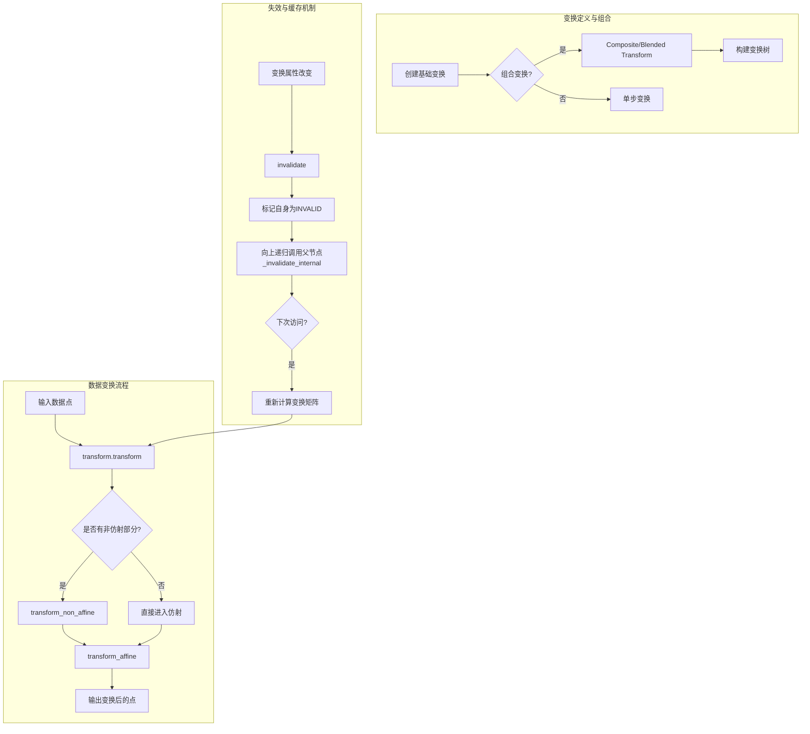
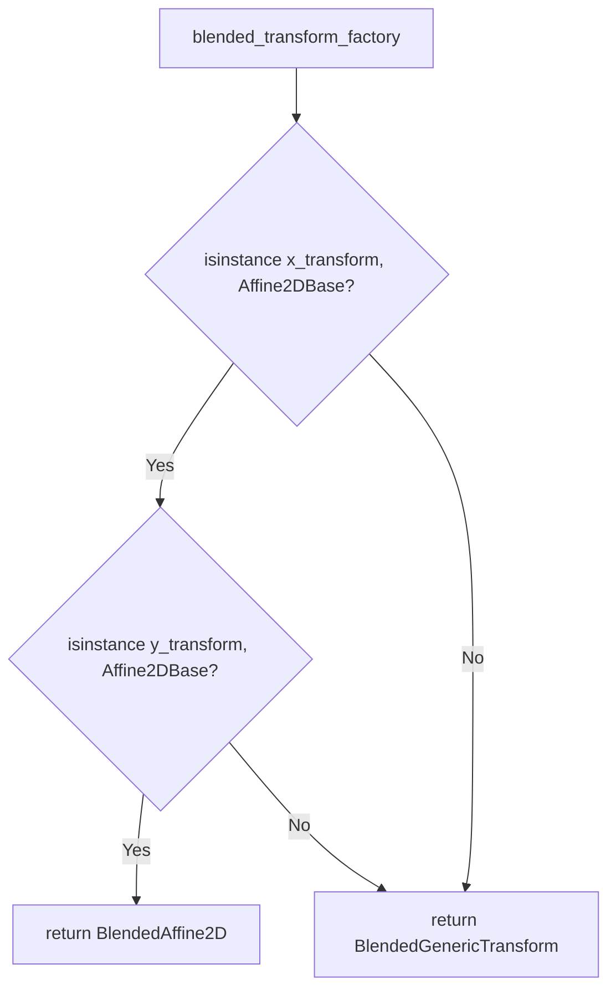
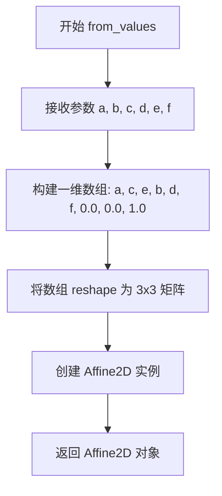
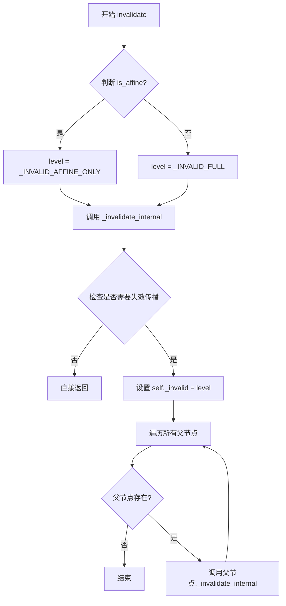
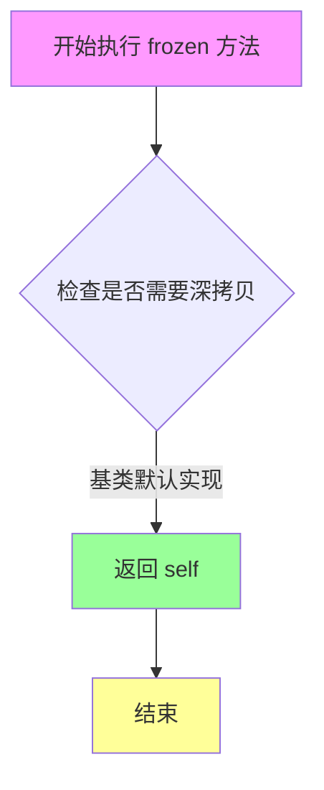
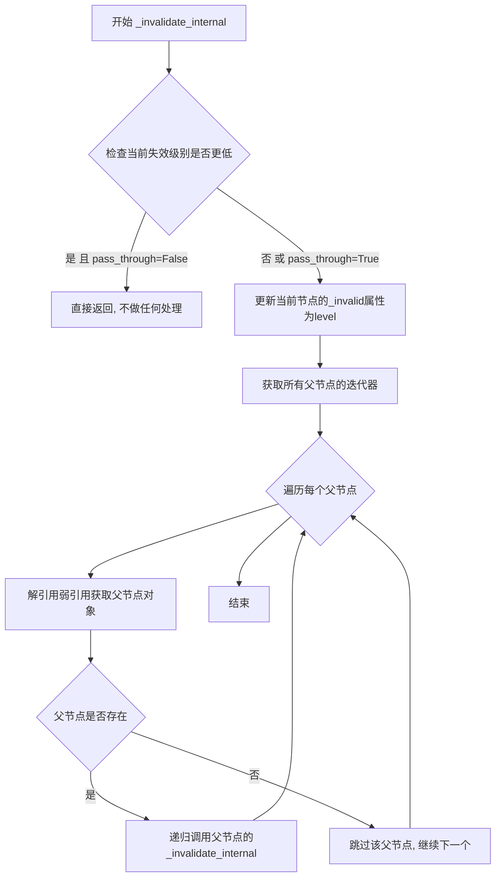
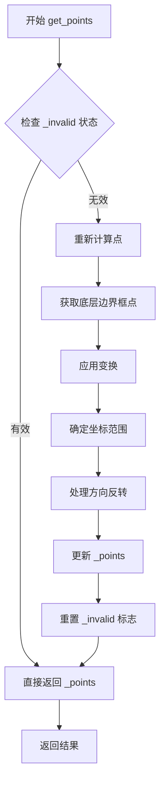

# `matplotlib\lib\matplotlib\transforms.py` 详细设计文档

Matplotlib的核心变换框架，提供了一套基于树形结构的任意几何变换系统。该系统通过TransformNode树管理变换的依赖关系，利用失效/缓存机制（invalidation/caching）避免不必要的重复计算，并区分仿射（Affine）和非仿射变换以优化渲染性能。

## 整体流程



## 类结构

```
TransformNode (基类: 树结构与失效逻辑)
├── BboxBase (抽象边界框)
│   ├── Bbox (可变边界框)
│   ├── TransformedBbox (自动变换的边界框)
│   └── LockableBbox (可锁定坐标的边界框)
├── Transform (变换基类)
│   ├── AffineBase (仿射变换基类)
│   │   ├── Affine2DBase (2D仿射基类)
│   │   │   ├── Affine2D (可变2D仿射)
│   │   │   ├── IdentityTransform (单位变换)
│   │   │   ├── CompositeAffine2D (组合仿射)
│   │   │   ├── BlendedAffine2D (混合仿射)
│   │   │   ├── BboxTransform (bbox到bbox)
│   │   │   ├── BboxTransformTo (单位bbox到目标)
│   │   │   ├── BboxTransformFrom (源到单位bbox)
│   │   │   ├── ScaledTranslation (缩放平移)
│   │   │   └── AffineDeltaTransform (增量变换)
│   │   └── _ScaledRotation (内部使用)
│   ├── TransformWrapper (运行时替换子节点)
│   ├── CompositeGenericTransform (通用组合变换)
│   ├── BlendedGenericTransform (通用混合变换)
│   └── TransformedPath (路径缓存)
└── _BlendedMixin (混合变换混入)
```

## 全局变量及字段


### `DEBUG`
    
全局调试标志，控制是否启用调试模式下的额外检查和输出

类型：`bool`
    


### `_default_minpos`
    
默认的最小正值数组，用于初始化边界框的最小位置

类型：`numpy.ndarray`
    


### `TransformNode._parents`
    
存储父节点的弱引用字典，用于跟踪变换节点的父子关系

类型：`dict`
    


### `TransformNode._invalid`
    
表示当前节点无效化状态的标志，可取_VALID、_INVALID_AFFINE_ONLY或_INVALID_FULL

类型：`int`
    


### `TransformNode._shorthand_name`
    
用于调试输出的简写名称，提高可读性

类型：`str`
    


### `BboxBase.is_affine`
    
标志位，表示该变换是否为仿射变换

类型：`bool`
    


### `Bbox._points`
    
存储边界框的两个角点坐标的2x2数组

类型：`numpy.ndarray`
    


### `Bbox._minpos`
    
存储每个方向的最小正值，用于处理对数刻度等场景

类型：`numpy.ndarray`
    


### `Bbox._points_orig`
    
存储初始化时的原始边界框点，用于检测边界框是否发生过变化

类型：`numpy.ndarray`
    


### `Transform.input_dims`
    
定义变换的输入维度，必须在子类中重写

类型：`int`
    


### `Transform.output_dims`
    
定义变换的输出维度，必须在子类中重写

类型：`int`
    


### `Transform.is_separable`
    
标志位，表示变换在x和y方向是否可分离

类型：`bool`
    


### `Transform.has_inverse`
    
标志位，表示该变换是否存在可计算的逆变换

类型：`bool`
    


### `AffineBase._inverted`
    
缓存的逆变换对象，避免重复计算

类型：`Affine2D or None`
    


### `Affine2D._mtx`
    
3x3仿射变换矩阵，存储完整的2D仿射变换参数

类型：`numpy.ndarray`
    


### `CompositeGenericTransform._a`
    
复合变换中首先应用的变换组件

类型：`Transform`
    


### `CompositeGenericTransform._b`
    
复合变换中第二个应用的变换组件

类型：`Transform`
    


### `BlendedGenericTransform._x`
    
用于x方向变换的变换对象

类型：`Transform`
    


### `BlendedGenericTransform._y`
    
用于y方向变换的变换对象

类型：`Transform`
    


### `IdentityTransform._mtx`
    
3x3单位矩阵，恒等变换的矩阵表示

类型：`numpy.ndarray`
    
    

## 全局函数及方法


### `_make_str_method`

该函数是一个高阶函数，用于为 `Transform` 子类动态生成 `__str__` 方法。它接受属性名作为位置参数和关键字参数，返回一个 lambda 函数，该函数能够格式化和返回对象的字符串表示形式。

参数：

- `*args`：位置参数，表示要在 `__str__` 输出中包含的属性名（字符串）
- `**kwargs`：关键字参数，表示要在 `__str__` 输出中包含的属性名和对应的关键字名称

返回值：`function`，返回一个 lambda 函数，该函数接受 `self` 参数并返回格式化的字符串表示

#### 流程图

```mermaid
flowchart TD
    A[开始 _make_str_method] --> B[创建 indent 函数<br/>使用 textwrap.indent 固定前缀 4 空格]
    B --> C[创建 strrepr 函数<br/>如果是字符串用 repr 否则用 str]
    C --> D[返回 lambda 函数]
    
    D --> E{调用 lambda self}
    E --> F[获取类型名 type(self).__name__]
    F --> G[遍历位置参数 args]
    G --> H[对每个 arg 调用 getattr 获取属性值]
    H --> I[用 strrepr 处理属性值并缩进]
    G --> J[遍历关键字参数 kwargs]
    J --> K[对每个 k, arg 调用 getattr 获取属性值]
    K --> L[用 strrepr 处理属性值并添加 key= 前缀]
    L --> M[拼接所有部分为最终字符串]
    M --> N[返回格式化字符串]
```

#### 带注释源码

```python
def _make_str_method(*args, **kwargs):
    """
    Generate a ``__str__`` method for a `.Transform` subclass.

    After ::

        class T:
            __str__ = _make_str_method("attr", key="other")

    ``str(T(...))`` will be

    .. code-block:: text

        {type(T).__name__}(
            {self.attr},
            key={self.other})
    """
    # 创建一个缩进函数，使用 4 个空格作为前缀
    # 这用于在多行输出中保持缩进格式
    indent = functools.partial(textwrap.indent, prefix=" " * 4)
    
    # 定义一个辅助函数，用于获取对象的字符串表示
    # 如果是字符串类型，使用 repr() 保持引号
    # 其他类型使用 str() 转换
    def strrepr(x): return repr(x) if isinstance(x, str) else str(x)
    
    # 返回一个 lambda 函数作为 __str__ 方法
    # 该函数构建格式化的字符串表示
    return lambda self: (
        # 以类名开始
        type(self).__name__ + "("
        # 拼接所有位置参数对应的属性值（带缩进）
        + ",".join([*(indent("\n" + strrepr(getattr(self, arg)))
                      for arg in args),
                    # 拼接所有关键字参数对应的属性值（带 key= 前缀和缩进）
                    *(indent("\n" + k + "=" + strrepr(getattr(self, arg)))
                      for k, arg in kwargs.items())])
        # 闭合括号
        + ")")
```


### blended_transform_factory

该函数是一个工厂函数，用于创建"混合"变换（blended transform），即在x方向和y方向分别应用不同的变换。根据输入的变换类型，它会自动选择最优的实现方式：如果两个变换都是仿射变换，则返回高效的`BlendedAffine2D`；否则返回通用的`BlendedGenericTransform`。

参数：

- `x_transform`：`Transform`，用于变换x轴的变换对象
- `y_transform`：`Transform`，用于变换y轴的变换对象

返回值：`Transform`，返回混合变换对象（`BlendedAffine2D`或`BlendedGenericTransform`）

#### 流程图



#### 带注释源码

```python
def blended_transform_factory(x_transform, y_transform):
    """
    Create a new "blended" transform using *x_transform* to transform
    the *x*-axis and *y_transform* to transform the *y*-axis.

    A faster version of the blended transform is returned for the case
    where both child transforms are affine.
    """
    # 检查x_transform和y_transform是否都是Affine2DBase类型
    # 如果都是仿射变换，可以使用优化的BlendedAffine2D实现
    if (isinstance(x_transform, Affine2DBase) and
            isinstance(y_transform, Affine2DBase)):
        # 返回优化的2D仿射混合变换
        return BlendedAffine2D(x_transform, y_transform)
    # 否则返回通用的混合变换实现
    return BlendedGenericTransform(x_transform, y_transform)
```


### `composite_transform_factory`

该函数是 Matplotlib 变换框架中的组合变换工厂函数，用于将两个变换组合成一个新的复合变换。它根据输入变换的类型（恒等变换、仿射变换或通用变换）智能地选择最优的复合变换实现，以优化性能。

参数：

- `a`：`Transform`，第一个变换，表示先应用的变换
- `b`：`Transform`，第二个变换，表示后应用的变换

返回值：`Transform`，组合后的变换对象，返回值类型可能是 `IdentityTransform`、`Affine2D`、`CompositeAffine2D` 或 `CompositeGenericTransform` 之一

#### 流程图

```mermaid
flowchart TD
    A[开始: composite_transform_factory] --> B{a 是 IdentityTransform?}
    B -->|是| C[返回 b]
    B -->|否| D{b 是 IdentityTransform?}
    D -->|是| E[返回 a]
    D -->|否| F{a 是 Affine2D 且 b 是 Affine2D?}
    F -->|是| G[返回 CompositeAffine2D(a, b)]
    F -->|否| H[返回 CompositeGenericTransform(a, b)]
    C --> I[结束]
    E --> I
    G --> I
    H --> I
```

#### 带注释源码

```python
def composite_transform_factory(a, b):
    """
    Create a new composite transform that is the result of applying
    transform a then transform b.

    Shortcut versions of the blended transform are provided for the
    case where both child transforms are affine, or one or the other
    is the identity transform.

    Composite transforms may also be created using the '+' operator,
    e.g.::

      c = a + b
    """
    # 检查 a 或 b 是否为恒等变换。使用 isinstance 来确保变换始终是 IdentityTransform。
    # 由于 TransformWrappers 是可变的，使用相等性判断会产生错误结果。
    if isinstance(a, IdentityTransform):
        # 如果 a 是恒等变换，直接返回 b
        return b
    elif isinstance(b, IdentityTransform):
        # 如果 b 是恒等变换，直接返回 a
        return a
    elif isinstance(a, Affine2D) and isinstance(b, Affine2D):
        # 如果两者都是 2D 仿射变换，返回优化的 CompositeAffine2D
        return CompositeAffine2D(a, b)
    # 否则返回通用的复合变换
    return CompositeGenericTransform(a, b)
```


### `_nonsingular`

该函数用于调整数值范围的端点，以避免在后续计算中出现奇异性（如除零、溢出等问题）。它处理了无效输入（inf、NaN）、区间过小、端点为零等边界情况。

参数：

-  `vmin`：`float`，范围的左端点
-  `vmax`：`float`，范围的右端点
-  `expander`：`float`，默认值为 `0.001`，当原始区间过小时，用于扩展 `vmin` 和 `vmax` 的比例因子
-  `tiny`：`float`，默认值为 `1e-15`，区间与端点最大绝对值之比的阈值，若小于此值则扩展区间
-  `increasing`：`bool`，默认值为 `True`，若为 `True` 则当 `vmin > vmax` 时交换端点

返回值：`tuple[float, float]`，处理后的端点值，可能被扩展和/或交换；若输入包含 inf 或 NaN，或两端点都为 0 或非常接近 0，则返回 `-expander, expander`

#### 流程图

```mermaid
flowchart TD
    A[开始] --> B{检查 vmin 或 vmax 是否为 inf/NaN}
    B -->|是| C[返回 -expander, expander]
    B -->|否| D{vmax < vmin?}
    D -->|是| E[交换 vmin 和 vmax, 记录 swapped=True]
    D -->|否| F[继续]
    E --> F
    F --> G[将 vmin, vmax 转换为 float]
    G --> H[计算 maxabsvalue = maxabs vmin, vmax]
    H --> I{maxabsvalue < 1e6 / tiny * np.finfo(float).tiny?}
    I -->|是| J[vmin = -expander, vmax = expander]
    I -->|否| K{vmax - vmin <= maxabsvalue * tiny?}
    K -->|是| L{两者都为零?}
    K -->|否| M[返回 vmin, vmax]
    L -->|是| J
    L -->|否| N[vmin -= expander*absvmin, vmax += expander*absvmax]
    J --> O
    N --> O
    O{swapped 且 not increasing?}
    O -->|是| P[再次交换 vmin, vmax]
    O -->|否| M
    P --> M
```

#### 带注释源码

```python
def _nonsingular(vmin, vmax, expander=0.001, tiny=1e-15, increasing=True):
    """
    Modify the endpoints of a range as needed to avoid singularities.

    Parameters
    ----------
    vmin, vmax : float
        The initial endpoints.
    expander : float, default: 0.001
        Fractional amount by which *vmin* and *vmax* are expanded if
        the original interval is too small, based on *tiny*.
    tiny : float, default: 1e-15
        Threshold for the ratio of the interval to the maximum absolute
        value of its endpoints.  If the interval is smaller than
        this, it will be expanded.  This value should be around
        1e-15 or larger; otherwise the interval will be approaching
        the double precision resolution limit.
    increasing : bool, default: True
        If True, swap *vmin*, *vmax* if *vmin* > *vmax*.

    Returns
    -------
    vmin, vmax : float
        Endpoints, expanded and/or swapped if necessary.
        If either input is inf or NaN, or if both inputs are 0 or very
        close to zero, it returns -*expander*, *expander*.
    """

    # 处理无效输入：若任一端点为 inf 或 NaN，返回默认扩展区间
    if (not np.isfinite(vmin)) or (not np.isfinite(vmax)):
        return -expander, expander

    swapped = False
    # 确保 vmin <= vmax，以便后续计算
    if vmax < vmin:
        vmin, vmax = vmax, vmin
        swapped = True

    # 将端点转换为 float 类型，避免整数类型的整数溢出问题
    # （如 abs(np.int8(-128)) == -128 而非 128）
    vmin, vmax = map(float, [vmin, vmax])

    # 计算端点的最大绝对值
    maxabsvalue = max(abs(vmin), abs(vmax))
    
    # 若区间极小（接近浮点精度极限），扩展到默认范围
    if maxabsvalue < (1e6 / tiny) * np.finfo(float).tiny:
        vmin = -expander
        vmax = expander

    # 若区间宽度相对于端点最大绝对值过小，也进行扩展
    elif vmax - vmin <= maxabsvalue * tiny:
        # 两端点都为零时，对称扩展
        if vmax == 0 and vmin == 0:
            vmin = -expander
            vmax = expander
        else:
            # 按端点绝对值的比例扩展
            vmin -= expander * abs(vmin)
            vmax += expander * abs(vmax)

    # 若最初交换了端点且用户希望保持原顺序（increasing=True）
    # 此处不交换；若 increasing=False 且曾交换过，则再次交换以还原
    if swapped and not increasing:
        vmin, vmax = vmax, vmin
        
    return vmin, vmax
```


### `offset_copy`

该函数用于创建一个带有额外偏移量的新变换。它接受一个变换对象、可选的图形对象、x 和 y 偏移量以及偏移单位，根据不同的单位（点、英寸或像素）计算偏移，并将偏移应用到原始变换上返回新的组合变换。

参数：

- `trans`：`Transform` 子类，任何要应用偏移的变换。
- `fig`：`~matplotlib.figure.Figure` 或 None，默认 None，当前图形。当 units 为 'dots' 时可以为 None。
- `x`：`float`，默认 0.0，要应用的 x 方向偏移量。
- `y`：`float`，默认 0.0，要应用的 y 方向偏移量。
- `units`：`str`，默认 'inches'，偏移的单位，可选值为 'inches'、'points' 或 'dots'。

返回值：`Transform` 子类，应用了偏移后的变换。

#### 流程图

```mermaid
flowchart TD
    A[开始 offset_copy] --> B{units in<br/>['dots', 'points', 'inches']?}
    B -->|否| C[抛出 ValueError]
    B -->|是| D{units == 'dots'?}
    D -->|是| E[返回 trans + Affine2D().translate(x, y)]
    D -->|否| F{fig is None?}
    F -->|是| G[抛出 ValueError<br/>'For units of inches or points<br/>a fig kwarg is needed']
    F -->|否| H{units == 'points'?}
    H -->|是| I[x = x / 72.0<br/>y = y / 72.0]
    H -->|否| J[单位为 'inches'<br/>保持 x, y 不变]
    I --> K[返回 trans + ScaledTranslation(x, y, fig.dpi_scale_trans)]
    J --> K
    E --> L[结束]
    K --> L
```

#### 带注释源码

```python
def offset_copy(trans, fig=None, x=0.0, y=0.0, units='inches'):
    """
    Return a new transform with an added offset.

    Parameters
    ----------
    trans : `Transform` subclass
        Any transform, to which offset will be applied.
    fig : `~matplotlib.figure.Figure`, default: None
        Current figure. It can be None if *units* are 'dots'.
    x, y : float, default: 0.0
        The offset to apply.
    units : {'inches', 'points', 'dots'}, default: 'inches'
        Units of the offset.

    Returns
    -------
    `Transform` subclass
        Transform with applied offset.
    """
    # 验证 units 参数是否合法，允许的值为 'dots', 'points', 'inches'
    _api.check_in_list(['dots', 'points', 'inches'], units=units)
    
    # 如果单位是 'dots'（像素），直接使用 Affine2D 的 translate 方法添加平移变换
    if units == 'dots':
        return trans + Affine2D().translate(x, y)
    
    # 对于 'inches' 和 'points' 单位，必须提供 fig 参数
    if fig is None:
        raise ValueError('For units of inches or points a fig kwarg is needed')
    
    # 如果单位是 'points'（点），需要将点转换为英寸（1点 = 1/72英寸）
    if units == 'points':
        x /= 72.0
        y /= 72.0
    
    # 默认单位是 'inches'（英寸），使用 ScaledTranslation 添加偏移
    # ScaledTranslation 会先根据 fig.dpi_scale_trans 转换偏移量，然后再应用平移
    return trans + ScaledTranslation(x, y, fig.dpi_scale_trans)
```


### `Affine2D.from_values`

创建一个新的 Affine2D 实例，根据提供的六个值初始化二维仿射变换矩阵。

参数：

- `a`：`float`，矩阵元素 a（第一行第一列），对应 x 方向的缩放因子
- `b`：`float`，矩阵元素 b（第二行第一列），对应 y 相对于 x 的剪切分量
- `c`：`float`，矩阵元素 c（第一行第二列），对应 x 相对于 y 的剪切分量
- `d`：`float`，矩阵元素 d（第二行第二列），对应 y 方向的缩放因子
- `e`：`float`，矩阵元素 e（第一行第三列），对应 x 方向的平移量
- `f`：`float`，矩阵元素 f（第二行第三列），对应 y 方向的平移量

返回值：`Affine2D`，返回新创建的二维仿射变换对象，其矩阵形式为：
```
a c e
b d f
0 0 1
```

#### 流程图



#### 带注释源码

```python
@staticmethod
def from_values(a, b, c, d, e, f):
    """
    Create a new Affine2D instance from the given values::

      a c e
      b d f
      0 0 1

    .
    """
    # 将六个矩阵元素按照列优先顺序构建一维数组
    # 顺序为: [a, c, e, b, d, f, 0.0, 0.0, 1.0]
    # 这是因为 numpy 的 reshape 默认按行填充，
    # 而我们需要得到矩阵:
    # [[a, c, e],
    #  [b, d, f],
    #  [0, 0, 1]]
    return Affine2D(
        np.array([a, c, e, b, d, f, 0.0, 0.0, 1.0], float).reshape((3, 3)))
```


### TransformNode.invalidate

使当前 `TransformNode` 失效并触发其所有祖先节点的失效传播。当变换发生任何变化时应调用此方法。

参数：此方法无显式参数（但内部调用 `_invalidate_internal`）

返回值：`None`，该方法通过调用内部方法 `_invalidate_internal` 触发失效传播

#### 流程图



#### 带注释源码

```python
def invalidate(self):
    """
    Invalidate this `TransformNode` and triggers an invalidation of its
    ancestors.  Should be called any time the transform changes.
    """
    # 根据 is_affine 属性决定失效级别：
    # - 如果是仿射变换，只标记为 AFFINE_ONLY 失效
    # - 否则标记为 FULL 失效
    # invalidating_node 参数指向触发失效的节点本身
    return self._invalidate_internal(
        level=self._INVALID_AFFINE_ONLY if self.is_affine else self._INVALID_FULL,
        invalidating_node=self)


def _invalidate_internal(self, level, invalidating_node):
    """
    Called by :meth:`invalidate` and subsequently ascends the transform
    stack calling each TransformNode's _invalidate_internal method.
    
    Parameters
    ----------
    level : int
        失效级别，可以是 _VALID, _INVALID_AFFINE_ONLY, 或 _INVALID_FULL
    invalidating_node : TransformNode
        触发失效的节点引用
    """
    # 如果当前节点的失效状态已经比要传播的失效状态更严重，
    # 且 pass_through 为 False，则无需做任何事
    # （pass_through=True 会强制所有祖先都失效，即使当前节点已经失效）
    if level <= self._invalid and not self.pass_through:
        return
    
    # 更新当前节点的失效状态
    self._invalid = level
    
    # 遍历所有父节点（通过弱引用存储）
    for parent in list(self._parents.values()):
        parent = parent()  # 解引用弱引用
        if parent is not None:
            # 递归调用父节点的 _invalidate_internal
            # 将失效向上传播
            parent._invalidate_internal(level=level, invalidating_node=self)
```


### `TransformNode.set_children`

设置转换节点的子节点，使失效系统能够识别哪些转换可以触发当前转换的失效。该方法应在依赖其他转换的转换类的构造函数中调用。

参数：

- `children`：`TransformNode`，可变数量的子节点（TransformNode 子类的实例），表示当前转换依赖的子转换节点

返回值：`None`，无返回值

#### 流程图

```mermaid
flowchart TD
    A[开始 set_children] --> B[获取当前节点 id_self = id(self)]
    B --> C{遍历 children 中的每个 child}
    C -->|对每个 child| D[创建弱引用 ref]
    D --> E[使用 lambda 回调实现自动清理]
    E --> F[将弱引用添加到 child._parents[id_self]]
    F --> C
    C -->|遍历完成| G[结束]
    
    style A fill:#f9f,stroke:#333
    style G fill:#9f9,stroke:#333
    style D fill:#ff9,stroke:#333
    style F fill:#9ff,stroke:#333
```

#### 带注释源码

```python
def set_children(self, *children):
    """
    Set the children of the transform, to let the invalidation
    system know which transforms can invalidate this transform.
    Should be called from the constructor of any transforms that
    depend on other transforms.
    """
    # Parents are stored as weak references, so that if the
    # parents are destroyed, references from the children won't
    # keep them alive.
    id_self = id(self)
    for child in children:
        # Use weak references so this dictionary won't keep obsolete nodes
        # alive; the callback deletes the dictionary entry. This is a
        # performance improvement over using WeakValueDictionary.
        ref = weakref.ref(
            self, lambda _, pop=child._parents.pop, k=id_self: pop(k))
        child._parents[id_self] = ref
```


### `TransformNode.frozen`

该方法返回当前变换节点的一个冻结副本。冻结副本在其子节点发生变化时不会更新，主要用于存储变换的已知状态，以避免使用 `copy.deepcopy()` 带来的性能开销。在基类 `TransformNode` 中，该方法直接返回 `self` 本身，这是一个"空操作"的默认实现，子类通常会重写此方法以提供真正的深拷贝行为。

参数： 无

返回值：`TransformNode`，返回当前变换节点本身（基类实现）

#### 流程图



#### 带注释源码

```python
def frozen(self):
    """
    Return a frozen copy of this transform node.  The frozen copy will not
    be updated when its children change.  Useful for storing a previously
    known state of a transform where ``copy.deepcopy()`` might normally be
    used.
    """
    # 基类实现直接返回自身，不进行任何拷贝
    # 子类如 BboxBase、Bbox、Affine2DBase 等会重写此方法
    # 以返回真正的冻结副本（深拷贝）
    return self
```


### `TransformNode._invalidate_internal`

该方法是TransformNode类的内部方法，负责处理变换节点的失效传播逻辑。当某个变换节点发生变更时，会触发其父节点的失效处理，通过递归方式沿着变换树向上传播失效状态，确保所有依赖的父节点能够及时更新缓存。

参数：

- `level`：`int`，表示失效的级别，值为`TransformNode._INVALID_AFFINE_ONLY`（仅失效仿射部分）或`TransformNode._INVALID_FULL`（完全失效）
- `invalidating_node`：`TransformNode`，触发此次失效的节点，用于传递给父节点以追踪失效来源

返回值：`None`，该方法无返回值，主要通过修改对象的内部状态`_invalid`来实现失效传播

#### 流程图



#### 带注释源码

```python
def _invalidate_internal(self, level, invalidating_node):
    """
    Called by :meth:`invalidate` and subsequently ascends the transform
    stack calling each TransformNode's _invalidate_internal method.
    """
    # 如果当前节点的失效级别已经比要传播的失效级别更低，
    # 且不是pass_through模式，则无需做任何处理，直接返回
    # 这样可以避免不必要的重复失效处理
    if level <= self._invalid and not self.pass_through:
        return
    
    # 更新当前节点的失效状态为新的失效级别
    self._invalid = level
    
    # 遍历所有父节点（使用list复制以防止迭代过程中修改）
    for parent in list(self._parents.values()):
        parent = parent()  # 解引用弱引用，获取实际的父节点对象
        # 如果父节点仍然存在（未被垃圾回收）
        if parent is not None:
            # 递归调用父节点的_invalidate_internal方法，
            # 将失效状态继续向上传播
            parent._invalidate_internal(level=level, invalidating_node=self)
```


### BboxBase.get_points

该方法是 `BboxBase` 类的抽象方法，用于获取边界框的坐标点。它返回一个二维数组，形式为 `[[x0, y0], [x1, y1]]`，其中 (x0, y0) 和 (x1, y1) 分别表示边界框的两个对角顶点。具体实现由子类（如 `Bbox`、`TransformedBbox`、`LockableBbox`）提供。

参数：

- `self`：调用该方法的对象本身，`BboxBase` 类型，表示边界框实例

返回值：`numpy.ndarray`，返回形状为 (2, 2) 的二维数组，格式为 `[[x0, y0], [x1, y1]]`，其中包含边界框的两个对角顶点坐标

#### 流程图



#### 带注释源码

```python
# 定义在 BboxBase 类中（抽象方法，具体实现由子类提供）
def get_points(self):
    """
    获取边界框的点坐标，以 [[x0, y0], [x1, y1]] 形式的数组返回。
    
    这是一个抽象方法，在 BboxBase 基类中抛出 NotImplementedError，
    具体实现由子类（如 Bbox, TransformedBbox, LockableBbox）提供。
    
    返回值：
        numpy.ndarray: 形状为 (2, 2) 的二维数组
    """
    # 基类中抛出异常，由子类重写实现具体逻辑
    raise NotImplementedError
```


### BboxBase.x0

获取边界框的第一个 x 坐标。该属性返回定义边界框的一对 x 坐标中的第一个，不保证小于 `x1`（若需保证请使用 `xmin`）。

参数：

- `self`：`BboxBase`，隐式参数，调用该属性的对象实例

返回值：`float` 或 `numpy.float64`，返回边界框的第一个 x 坐标（即 points[0, 0]）

#### 流程图

```mermaid
graph TD
    A[访问 x0 属性] --> B[调用 self.get_points 获取边界框点数组]
    B --> C[返回数组中第一行第一列的元素: points[0, 0]]
    C --> D[作为 x0 属性值返回]
```

#### 带注释源码

```python
@property
def x0(self):
    """
    The first of the pair of *x* coordinates that define the bounding box.

    This is not guaranteed to be less than :attr:`x1` (for that, use
    :attr:`~BboxBase.xmin`).
    """
    # 通过 get_points() 方法获取边界框的点数组
    # points 数组的形状为 (2, 2)，格式为 [[x0, y0], [x1, y1]]
    # 返回 [0, 0] 位置即 x0 坐标
    return self.get_points()[0, 0]
```


### BboxBase.y0

该属性返回边界框的第一对y坐标，即边界框两个角点中第一个点的y值。它通过调用 `get_points()` 方法获取边界框的点数组，然后返回索引 `[0, 1]` 处的值（即第一行的第二列）。

参数：无（这是一个属性，不接受任何参数）

返回值：`float`，返回边界框的第一个y坐标值

#### 流程图

```mermaid
flowchart TD
    A[访问 y0 属性] --> B{检查缓存/失效状态}
    B -->|需要重新计算| C[调用 get_points 方法]
    B -->|使用缓存| D[返回缓存的 _points 数组]
    C --> E[获取 points[0, 1] 值]
    E --> F[返回 y0 坐标值]
    D --> F
```

#### 带注释源码

```python
@property
def y0(self):
    """
    The first of the pair of *y* coordinates that define the bounding box.

    This is not guaranteed to be less than :attr:`y1` (for that, use
    :attr:`~BboxBase.ymin`).
    """
    # 调用父类的 get_points 方法获取边界框的点数组
    # 点数组的形状为 (2, 2)，格式为 [[x0, y0], [x1, y1]]
    # 返回 [0, 1] 即第一行第二列，也就是 y0 的值
    return self.get_points()[0, 1]
```


### BboxBase.x1

该属性返回定义边界框的第二对 x 坐标（即 x1），即 `[[x0, y0], [x1, y1]]` 数组中的 `[1, 0]` 位置的值。不保证大于 x0（若需保证，请使用 xmax 属性）。

参数：

- 无显式参数（隐式参数 `self` 为 `BboxBase` 实例）

返回值：`float`，返回边界框的第二 x 坐标值

#### 流程图

```mermaid
flowchart TD
    A[访问 x1 属性] --> B[调用 get_points 方法]
    B --> C[获取 2x2 数组: [[x0, y0], [x1, y1]]]
    C --> D[返回数组元素 self.get_points()[1, 0]]
    D --> E[即 x1 坐标值]
```

#### 带注释源码

```python
@property
def x1(self):
    """
    The second of the pair of *x* coordinates that define the bounding box.

    This is not guaranteed to be greater than :attr:`x0` (for that, use
    :attr:`~BboxBase.xmax`).
    """
    # 获取边界框的点数组 [[x0, y0], [x1, y1]]
    # 返回第二行第一列的元素，即 x1 坐标
    return self.get_points()[1, 0]
```


### `BboxBase.y1`

该属性返回边界框的第二个y坐标（即y1），对应边界框点数组中的 `points[1, 1]` 位置。需要注意的是，返回值不保证大于 `y0`（如需保证，请使用 `ymax` 属性）。

参数： （无参数，这是一个只读属性）

返回值：`float`，返回边界框的第二个y坐标值

#### 流程图

```mermaid
flowchart TD
    A[访问 y1 属性] --> B{调用 get_points}
    B --> C[获取 points 数组: [[x0, y0], [x1, y1]]]
    C --> D[返回 points[1, 1]]
    D --> E[即 y1 坐标值]
```

#### 带注释源码

```python
@property
def y1(self):
    """
    The second of the pair of *y* coordinates that define the bounding box.

    This is not guaranteed to be greater than :attr:`y0` (for that, use
    :attr:`~BboxBase.ymax`).
    """
    # 通过 get_points() 获取边界框的两个角点坐标
    # points[0] 是第一个角点 (x0, y0)
    # points[1] 是第二个角点 (x1, y1)
    # points[1, 1] 即为 y1 坐标值
    return self.get_points()[1, 1]
```


### `BboxBase.min`

获取边界框的左下角坐标（`min` 点），即 x 和 y 坐标的最小值。

参数：

- `self`：`BboxBase` 实例，调用该属性的边界框对象本身

返回值：`numpy.ndarray`，返回边界框的左下角坐标 ``[x_min, y_min]``

#### 流程图

```mermaid
flowchart TD
    A[获取 BboxBase.min] --> B{调用 get_points}
    B --> C[获取 2x2 数组<br/>[[x0, y0], [x1, y1]]]
    C --> D[执行 np.min<br/>axis=0]
    D --> E[返回 [x_min, y_min]]
    E --> F[左下角坐标点]
```

#### 带注释源码

```python
@property
def min(self):
    """
    The bottom-left corner of the bounding box.
    
    Returns the minimum x and y coordinates of the bounding box,
    which corresponds to the bottom-left corner in standard coordinate
    systems where y increases upward.
    """
    # 获取边界框的两个角点，形状为 (2, 2) 的数组
    # [[x0, y0], [x1, y1]]
    points = self.get_points()
    
    #沿 axis=0 (列方向) 取最小值，返回 [x_min, y_min]
    # 这等价于 np.min(points[:, 0]) 和 np.min(points[:, 1])
    return np.min(points, axis=0)
```


### `BboxBase.max`

该属性返回边界框的右上角坐标，通过沿 axis=0 方向对边界框点数组进行最大值运算得到。

参数：

- （无参数，这是一个属性）

返回值：`numpy.ndarray`，边界框的右上角坐标 ``[x, y]``

#### 流程图

```mermaid
flowchart TD
    A[开始] --> B[调用 self.get_points 获取边界框点]
    B --> C{np.max 在 axis=0 方向求最大值}
    C --> D[返回 [xmax, ymax] 右上角坐标]
    D --> E[结束]
    
    style A fill:#f9f,color:#333
    style E fill:#9f9,color:#333
```

#### 带注释源码

```python
@property
def max(self):
    """
    The top-right corner of the bounding box.
    
    注意：此属性不保证返回的坐标严格大于 min 属性返回的坐标。
    它仅返回沿 axis=0 方向的最大值，即 [max(x0, x1), max(y0, y1)]。
    如果需要保证 xmax > xmin 和 ymax > ymin，应使用 xmax 和 ymax 属性。
    """
    # 获取边界框的两个角点 [[x0, y0], [x1, y1]]
    # 然后沿 axis=0（列方向）取最大值，得到 [xmax, ymax]
    return np.max(self.get_points(), axis=0)
```


### BboxBase.width

该属性用于获取Bounding Box的（带符号的）宽度，通过获取边界框的两个x坐标点并计算差值得到。

参数：

- 无显式参数（隐式参数 `self` 为 `BboxBase` 实例）

返回值：`float`，返回边界框的（带符号的）宽度，即右侧x坐标减去左侧x坐标的差值。

#### 流程图

```mermaid
graph TD
    A[开始] --> B[获取self.get_points返回值]
    B --> C[提取x坐标: points[1, 0] - points[0, 0]]
    C --> D[返回宽度值]
```

#### 带注释源码

```python
@property
def width(self):
    """The (signed) width of the bounding box."""
    # 获取边界框的四个角点坐标，形状为 (2, 2) 的数组
    # points[0] 是左下角 [x0, y0]
    # points[1] 是右上角 [x1, y1]
    points = self.get_points()
    
    # 计算宽度：右侧x坐标 - 左侧x坐标
    # points[1, 0] 是 x1 (右侧)
    # points[0, 0] 是 x0 (左侧)
    # 返回值可以为负数，表示边界框的方向（从右向左）
    return points[1, 0] - points[0, 0]
```


### BboxBase.height

这是一个属性方法，返回边界框的（带符号的）高度。

参数：无（这是一个属性方法，只接受隐式的self参数）

返回值：`float`，返回边界框的带符号高度，即 points[1, 1] - points[0, 1]（y1 - y0）

#### 流程图

```mermaid
flowchart TD
    A[开始] --> B[调用 self.get_points 获取边界框点]
    B --> C[计算高度: points[1, 1] - points[0, 1]]
    C --> D[返回结果]
    D --> E[结束]
```

#### 带注释源码

```python
@property
def height(self):
    """The (signed) height of the bounding box."""
    # 获取边界框的两个角点坐标
    # points 数组的形状为 (2, 2)，其中：
    # points[0] 是第一个角点 [x0, y0]
    # points[1] 是第二个角点 [x1, y1]
    points = self.get_points()
    
    # 计算高度：y1 - y0
    # points[1, 1] 对应 y1（第二个角点的 y 坐标）
    # points[0, 1] 对应 y0（第一个角点的 y 坐标）
    # 返回值可以为负数，表示边界框是倒置的（y1 < y0）
    return points[1, 1] - points[0, 1]
```


### BboxBase.anchored

该方法根据给定的锚点位置（可以是相对坐标或方向标识符）在容器包围盒内返回一个定位后的新包围盒副本。

参数：

- `c`：`str` 或 `(float, float)`，锚点位置。可以是 `'C'`（中心）、`'SW'`、`'S'`、`'SE'`、`'E'`、`'NE'`、`'N'`、`'NW'`、`'W'` 等方向标识符，或者一个 `(x, y)` 相对坐标元组（0 表示左/下，1 表示右/上）
- `container`：`Bbox`，容器包围盒，用于确定新包围盒的位置

返回值：`Bbox`，返回定位在容器内指定锚点处的新包围盒副本

#### 流程图

```mermaid
flowchart TD
    A[开始 anchored 方法] --> B[获取 container.bounds]
    B --> C[获取 self.bounds]
    C --> D{判断 c 是否为字符串}
    D -->|是| E[从 coefs 字典获取对应坐标]
    D -->|否| F[直接使用 c 作为坐标]
    E --> G[计算 cx, cy]
    F --> G
    G --> H[计算新坐标: x = (l + cx * (w - W)) - L]
    H --> I[计算新坐标: y = (b + cy * (h - H)) - B]
    I --> J[返回新的 Bbox 对象]
    J --> K[结束]
```

#### 带注释源码

```python
def anchored(self, c, container):
    """
    Return a copy of the `Bbox` anchored to *c* within *container*.

    Parameters
    ----------
    c : (float, float) or {'C', 'SW', 'S', 'SE', 'E', 'NE', ...}
        Either an (*x*, *y*) pair of relative coordinates (0 is left or
        bottom, 1 is right or top), 'C' (center), or a cardinal direction
        ('SW', southwest, is bottom left, etc.).
    container : `Bbox`
        The box within which the `Bbox` is positioned.

    See Also
    --------
    .Axes.set_anchor
    """
    # 解包容器的边界: 左、下、宽、高
    l, b, w, h = container.bounds
    # 解包自身的边界: 左、下、宽、高
    L, B, W, H = self.bounds
    # 如果 c 是字符串（如 'C', 'SW' 等），从 coefs 字典获取对应系数
    # 否则直接使用 c 作为 (cx, cy) 坐标
    cx, cy = self.coefs[c] if isinstance(c, str) else c
    # 计算并返回定位后的新 Bbox
    # 公式说明:
    # - l + cx * (w - W): 容器左边界 + 相对位置 * 剩余空间 = 目标位置的坐标
    # - 减去 L: 减去自身的原始左边界，得到偏移量
    return Bbox(self._points +
                [(l + cx * (w - W)) - L,
                 (b + cy * (h - H)) - B])
```


### `BboxBase.transformed`

该方法通过给定的变换对象静态地变换当前包围盒，生成一个新的 `Bbox` 对象。它通过变换包围盒的三个角点（左下、左上、右下）来计算变换后的包围盒。

参数：

- `transform`：`Transform`，用于静态变换此包围盒的变换对象

返回值：`Bbox`，变换后的新包围盒

#### 流程图

```mermaid
flowchart TD
    A[开始] --> B[获取当前包围盒的点 pts = self.get_points]
    B --> C[构造三个角点数组<br/>pts[0] - 左下角<br/>[pts[0, 0], pts[1, 1]] - 左上角<br/>[pts[1, 0], pts[0, 1]] - 右下角]
    C --> D[调用 transform.transform 变换三个角点]
    D --> E[获取变换结果: ll-左下, ul-左上, lr-右下]
    E --> F[构造新包围盒: [ll, [lr[0], ul[1]]]]
    F --> G[返回 Bbox 对象]
    G --> H[结束]
```

#### 带注释源码

```python
def transformed(self, transform):
    """
    Construct a `Bbox` by statically transforming this one by *transform*.
    """
    # 获取当前包围盒的两个角点坐标 [[x0, y0], [x1, y1]]
    pts = self.get_points()
    
    # 构造三个关键点用于计算变换后的包围盒：
    # 1. pts[0] - 左下角点 [x0, y0]
    # 2. [pts[0, 0], pts[1, 1]] - 左上角点 [x0, y1]
    # 3. [pts[1, 0], pts[0, 1]] - 右下角点 [x1, y0]
    # 注意：这里没有使用右上角点，因为可以通过其他三个点推断出来
    ll, ul, lr = transform.transform(np.array(
        [pts[0], [pts[0, 0], pts[1, 1]], [pts[1, 0], pts[0, 1]]]))
    
    # 根据变换后的角点构造新的包围盒
    # ll 是变换后的左下角
    # [lr[0], ul[1]] 是通过变换后的右下角x坐标和左上角y坐标组合得到新的右上角
    return Bbox([ll, [lr[0], ul[1]]])
```


### `BboxBase.union`

计算并返回包含所有输入边界框的最小边界框（并集）。

参数：

- `bboxes`：可迭代的 `BboxBase` 对象序列，待合并的边界框集合

返回值：`Bbox`，一个包含所有输入边界框的最小边界框

#### 流程图

```mermaid
flowchart TD
    A[开始 union] --> B{检查 bboxes 是否为空}
    B -->|是| C[抛出 ValueError: 'bboxes' cannot be empty]
    B -->|否| D[计算所有 bbox.xmin 的最小值作为 x0]
    D --> E[计算所有 bbox.xmax 的最大值作为 x1]
    E --> F[计算所有 bbox.ymin 的最小值作为 y0]
    F --> G[计算所有 bbox.ymax 的最大值作为 y1]
    G --> H[创建并返回新 Bbox: [[x0, y0], [x1, y1]]]
    C --> I[结束]
    H --> I
```

#### 带注释源码

```python
@staticmethod
def union(bboxes):
    """
    返回包含所有给定 *bboxes* 的 `Bbox`。
    
    参数:
        bboxes: 包含 BboxBase 实例的可迭代对象
    
    返回:
        Bbox: 包含所有输入边界框的最小边界框
    
    异常:
        ValueError: 当 bboxes 为空时抛出
    """
    # 检查输入序列是否为空，若为空则抛出异常
    if not len(bboxes):
        raise ValueError("'bboxes' cannot be empty")
    
    # 计算所有边界框在 x 方向的最小值（最左边界）
    x0 = np.min([bbox.xmin for bbox in bboxes])
    
    # 计算所有边界框在 x 方向的最大值（最右边界）
    x1 = np.max([bbox.xmax for bbox in bboxes])
    
    # 计算所有边界框在 y 方向的最小值（最下边界）
    y0 = np.min([bbox.ymin for bbox in bboxes])
    
    # 计算所有边界框在 y 方向的最大值（最上边界）
    y1 = np.max([bbox.ymax for bbox in bboxes])
    
    # 使用计算得到的边界创建新的 Bbox 对象
    return Bbox([[x0, y0], [x1, y1]])
```


### BboxBase.intersection

计算两个Bounding Box的交集。如果两个Bounding Box相交，返回表示交集区域的Bbox对象；如果不相交，则返回None。

参数：

- `bbox1`：`BboxBase`，第一个Bounding Box
- `bbox2`：`BboxBase`，第二个Bounding Box

返回值：`Bbox | None`，如果两个Bounding Box相交则返回交集区域对应的Bbox对象，否则返回None

#### 流程图

```mermaid
flowchart TD
    A[开始: intersection bbox1, bbox2] --> B[计算x0 = max(bbox1.xmin, bbox2.xmin)]
    B --> C[计算x1 = min(bbox1.xmax, bbox2.xmax)]
    C --> D[计算y0 = max(bbox1.ymin, bbox2.ymin)]
    D --> E[计算y1 = min(bbox1.ymax, bbox2.ymax)]
    E --> F{判断 x0 <= x1}
    F -->|是| G[判断 y0 <= y1]
    G -->|是| H[返回 Bbox[[x0,y0], [x1,y1]]]
    G -->|否| I[返回 None]
    F -->|否| I
```

#### 带注释源码

```python
@staticmethod
def intersection(bbox1, bbox2):
    """
    Return the intersection of *bbox1* and *bbox2* if they intersect, or
    None if they don't.
    """
    # 计算两个bbox在x轴方向的交集区间
    # 取两个bbox的xmin中的较大值作为交集的左边界
    x0 = np.maximum(bbox1.xmin, bbox2.xmin)
    # 取两个bbox的xmax中的较小值作为交集的右边界
    x1 = np.minimum(bbox1.xmax, bbox2.xmax)
    
    # 计算两个bbox在y轴方向的交集区间
    # 取两个bbox的ymin中的较大值作为交集的下边界
    y0 = np.maximum(bbox1.ymin, bbox2.ymin)
    # 取两个bbox的ymax中的较小值作为交集的上边界
    y1 = np.minimum(bbox1.ymax, bbox2.ymax)
    
    # 检查x轴和y轴方向是否都有有效的交集区间
    # 如果x0 > x1，说明在x轴方向没有交集
    # 如果y0 > y1，说明在y轴方向没有交集
    # 只有当两个方向都有交集时才返回有效的Bbox，否则返回None
    return Bbox([[x0, y0], [x1, y1]]) if x0 <= x1 and y0 <= y1 else None
```


### Bbox.__init__

这是Bbox类的构造函数，用于初始化一个可变边界框对象。构造函数接收一个二维数组作为坐标点，验证其形状为(2, 2)，然后调用父类初始化方法，并设置边界框的内部属性。

参数：

- `points`：`numpy.ndarray`，一个(2, 2)的数组，形式为`[[x0, y0], [x1, y1]]`，表示边界框的两个角点坐标
- `**kwargs`：可变关键字参数，用于传递给父类`BboxBase`的初始化方法

返回值：`None`，构造函数不返回值，仅初始化对象状态

#### 流程图

```mermaid
graph TD
    A[开始 Bbox.__init__] --> B[调用父类 __init__]
    B --> C{验证 points 形状}
    C -->|形状为 (2, 2)| D[转换为 float 类型数组]
    C -->|形状不为 (2, 2)| E[抛出 ValueError]
    D --> F[设置 self._points]
    F --> G[设置 self._minpos]
    G --> H[设置 self._ignore = True]
    H --> I[保存原始点 self._points_orig]
    I --> J[结束]
    E --> J
```

#### 带注释源码

```python
def __init__(self, points, **kwargs):
    """
    Parameters
    ----------
    points : `~numpy.ndarray`
        A (2, 2) array of the form ``[[x0, y0], [x1, y1]]``.
    """
    # 调用父类 BboxBase (继承自 TransformNode) 的初始化方法
    # 传递所有关键字参数，如 shorthand_name 等
    super().__init__(**kwargs)
    
    # 将输入的 points 转换为 float 类型的 numpy 数组
    points = np.asarray(points, float)
    
    # 验证输入数组的形状是否为 (2, 2)
    # 即必须是一个 2x2 的二维数组，表示两个二维点
    if points.shape != (2, 2):
        raise ValueError('Bbox points must be of the form '
                         '"[[x0, y0], [x1, y1]]".')
    
    # 存储边界框的两个角点坐标
    # _points 是一个 (2, 2) 的 numpy 数组
    # 格式为 [[x0, y0], [x1, y1]]
    self._points = points
    
    # 初始化最小正值数组，用于处理对数刻度等情况
    # _default_minpos 是一个预先定义的数组 [np.inf, np.inf]
    self._minpos = _default_minpos.copy()
    
    # 设置忽略标志为 True，表示后续调用 update_from_data_xy 时
    # 将忽略现有的边界框边界，从零开始计算
    self._ignore = True
    
    # 保存原始点副本，用于支持 mutated 方法
    # 这样可以知道边界框自从初始化以来是否被修改过
    # 在某些上下文中，知道边界框是默认值还是已被修改是有帮助的
    self._points_orig = self._points.copy()
```


### Bbox.update_from_data_xy

该方法用于根据传入的 (x, y) 坐标更新 `Bbox` 的边界。方法内部将坐标转换为 `Path` 对象，然后调用 `update_from_path` 方法来完成实际的边界更新逻辑。

参数：

- `self`：`Bbox` 实例，隐式参数，表示当前 bounding box 对象
- `xy`：`array-like`，形状为 (N, 2) 的坐标数组，包含 N 个 (x, y) 坐标点
- `ignore`：`bool` 或 `None`，可选参数，用于控制是否忽略 Bbox 现有的边界。当为 `True` 时忽略现有边界；当为 `False` 时包含现有边界；当为 `None` 时使用最近一次调用 `ignore()` 方法设置的值
- `updatex`：`bool`，默认值为 `True`，控制是否更新 x 方向的边界
- `updatey`：`bool`，默认值为 `True`，控制是否更新 y 方向的边界

返回值：`None`，该方法无返回值，直接修改 Bbox 对象的内部状态

#### 流程图

```mermaid
flowchart TD
    A[开始 update_from_data_xy] --> B{xy 是否为空?}
    B -->|是| C[直接返回]
    B -->|否| D[创建 Path 对象 from xy]
    D --> E[调用 update_from_path 方法]
    E --> F[根据 ignore 参数确定是否忽略现有边界]
    E --> G[根据 updatex 和 updatey 确定更新范围]
    F --> H[计算新的边界点]
    G --> H
    H --> I[如果边界发生变化则调用 invalidate]
    I --> J[更新 _points 和 _minpos]
    J --> K[结束]
```

#### 带注释源码

```python
def update_from_data_xy(self, xy, ignore=None, updatex=True, updatey=True):
    """
    Update the `Bbox` bounds based on the passed in *xy* coordinates.

    After updating, the bounds will have positive *width* and *height*;
    *x0* and *y0* will be the minimal values.

    Parameters
    ----------
    xy : (N, 2) array-like
        The (x, y) coordinates.
    ignore : bool, optional
        - When ``True``, ignore the existing bounds of the `Bbox`.
        - When ``False``, include the existing bounds of the `Bbox`.
        - When ``None``, use the last value passed to :meth:`ignore`.
    updatex, updatey : bool, default: True
         When ``True``, update the x/y values.
    """
    # 如果传入的坐标数组为空，则直接返回，不进行任何更新
    if len(xy) == 0:
        return

    # 将坐标数组转换为 Path 对象，以便后续处理
    path = Path(xy)
    
    # 调用 update_from_path 方法完成实际的边界更新逻辑
    # 该方法会根据 ignore、updatex、updatey 参数来确定如何更新边界
    self.update_from_path(path, ignore=ignore,
                          updatex=updatex, updatey=updatey)
```


### `Bbox.frozen`

该方法用于获取当前可变 `Bbox`（边界框）的不可变副本。由于基类 `BboxBase` 的 `frozen` 方法只复制了边界点，而 `Bbox` 类特有属性 `_minpos`（用于处理对数刻度）不会被自动复制，因此该方法在基类基础上显式复制了该属性，以确保副本状态的完整性。

参数：

- 无显式参数（仅包含 `self`）

返回值：`Bbox`，返回一个冻结的边界框副本。

#### 流程图

```mermaid
flowchart TD
    A([Start Bbox.frozen]) --> B[调用 super().frozen&#40;&#41;]
    B --> C[BboxBase.frozen 创建新 Bbox 实例并复制 points]
    C --> D[复制当前 self.minpos 到新实例的 _minpos]
    D --> E([返回冻结的 Bbox 实例])
```

#### 带注释源码

```python
def frozen(self):
    # 继承自父类的文档字符串
    # docstring inherited
    
    # 1. 调用父类 BboxBase 的 frozen 方法。
    #    BboxBase.frozen 会创建一个新的 Bbox 对象，并传入当前边界点的副本。
    #    此时新对象的 _minpos 会被构造函数初始化为默认值。
    frozen_bbox = super().frozen()
    
    # 2. Bbox 类特有属性 _minpos (最小正值，用于对数刻度) 必须手动复制，
    #    否则新实例将丢失原始边界框的这一状态信息。
    frozen_bbox._minpos = self.minpos.copy()
    
    # 3. 返回这个不可变的“冻结”边界框
    return frozen_bbox
```


### `Bbox.from_extents`

创建一个新的 Bbox 对象，基于左、下、右、上的边界值。该方法是 Bbox 类的静态工厂方法，用于从给定的四个边界坐标构造一个二维边界框。

参数：

- `*args`：可变参数列表（float），四个浮点数，分别表示边界的左、下、右、上坐标
- `minpos`：float 或 None，可选参数，用于设置边界框的最小正值，这在处理对数刻度和其他可能导致负值浮点误差的刻度时很有用

返回值：`Bbox`，返回新创建的边界框对象

#### 流程图

```mermaid
flowchart TD
    A[开始 from_extents] --> B{检查 minpos 参数}
    B -->|提供 minpos| C[创建 Bbox 并设置 minpos]
    B -->|未提供 minpos| D[仅创建 Bbox]
    C --> E[返回 Bbox 对象]
    D --> E
```

#### 带注释源码

```python
@staticmethod
def from_extents(*args, minpos=None):
    """
    Create a new Bbox from *left*, *bottom*, *right* and *top*.

    The *y*-axis increases upwards.

    Parameters
    ----------
    left, bottom, right, top : float
        The four extents of the bounding box.
    minpos : float or None
        If this is supplied, the Bbox will have a minimum positive value
        set. This is useful when dealing with logarithmic scales and other
        scales where negative bounds result in floating point errors.
    """
    # 使用 np.reshape 将输入的四个参数 (left, bottom, right, top) 
    # 重塑为 2x2 的数组形式 [[left, bottom], [right, top]]
    bbox = Bbox(np.reshape(args, (2, 2)))
    
    # 如果提供了 minpos 参数，则设置边界框的最小正值
    # 这对于处理对数刻度特别重要，可以避免负值导致的浮点误差
    if minpos is not None:
        bbox._minpos[:] = minpos
    
    # 返回新创建的 Bbox 对象
    return bbox
```


### Bbox.from_bounds

该方法是一个静态工厂方法，用于根据左下角坐标(x0, y0)和宽度、高度(width, height)创建一个新的Bbox对象。width和height可以是负数。

参数：

- `x0`：`float`，边界框左下角的x坐标
- `y0`：`float`，边界框左下角的y坐标
- `width`：`float`，边界框的宽度（可以为负数）
- `height`：`float`，边界框的高度（可以为负数）

返回值：`Bbox`，返回新创建的边界框对象

#### 流程图

```mermaid
flowchart TD
    A[开始: from_bounds] --> B[接收参数 x0, y0, width, height]
    B --> C[计算右边界: x0 + width]
    C --> D[计算上边界: y0 + height]
    D --> E[调用 Bbox.from_extents]
    E --> F[创建 Bbox 对象]
    F --> G[返回 Bbox 实例]
```

#### 带注释源码

```python
@staticmethod
def from_bounds(x0, y0, width, height):
    """
    Create a new `Bbox` from *x0*, *y0*, *width* and *height*.

    *width* and *height* may be negative.
    """
    # 通过计算右上角坐标(x1, y1)，将bounds形式转换为extents形式
    # x1 = x0 + width
    # y1 = y0 + height
    return Bbox.from_extents(x0, y0, x0 + width, y0 + height)
```


### Bbox.null

该方法是一个静态方法，用于创建一个"null"（空/无效）边界框，其坐标范围从正无穷大到负无穷大，表示一个无效或空的边界区域。

参数：无

返回值：`Bbox`，返回一个表示空集的边界框对象，其左下角坐标为 (inf, inf)，右上角坐标为 (-inf, -inf)。

#### 流程图

```mermaid
flowchart TD
    A[开始] --> B[创建 Bbox 实例]
    B --> C[设置左上角坐标为 np.inf, np.inf]
    C --> D[设置右下角坐标为 -np.inf, -np.inf]
    D --> E[返回 Bbox 对象]
    E --> F[结束]
```

#### 带注释源码

```python
@staticmethod
def null():
    """
    Create a new null `Bbox` from (inf, inf) to (-inf, -inf).
    
    Returns
    -------
    Bbox
        A bounding box representing the empty set, where the first point
        is at positive infinity (inf, inf) and the second point is at
        negative infinity (-inf, -inf). This serves as an identity element
        for intersection operations and a starting point for accumulating
        bounds via update_from_data_xy.
    """
    return Bbox([[np.inf, np.inf], [-np.inf, -np.inf]])
```


### `Bbox.unit`

这是一个静态方法，用于创建一个从坐标 (0, 0) 到 (1, 1) 的单位边界框。

参数：无需参数

返回值：`Bbox`，返回一个新的单位边界框，其左下角为 (0, 0)，右上角为 (1, 1)

#### 流程图

```mermaid
flowchart TD
    A[Start] --> B[Create Bbox instance with points [[0, 0], [1, 1]]]
    B --> C[Return the new Bbox object]
    C --> D[End]
```

#### 带注释源码

```python
@staticmethod
def unit():
    """
    Create a new unit `Bbox` from (0, 0) to (1, 1).
    
    Returns
    -------
    Bbox
        A new bounding box with corners at (0, 0) and (1, 1).
    """
    # Create and return a Bbox with the unit square coordinates
    # [[x0, y0], [x1, y1]] = [[0, 0], [1, 1]]
    return Bbox([[0, 0], [1, 1]])
```


### Transform.transform

该方法是Matplotlib中所有变换类的基类方法，负责将给定的值数组从输入空间变换到输出空间。它首先将输入值重塑为二维数组（便于批量处理），然后依次应用非仿射变换和仿射变换，最后根据原始输入维度将结果转换回原来的形状返回。

参数：

- `values`：`array-like`，输入值数组，可以是长度为`input_dims`的一维数组或shape为(N, `input_dims`)的二维数组

返回值：`array`，输出值数组，维度取决于输入——如果输入是一维则返回一维，如果输入是二维则返回二维，shape为(N, `output_dims`)

#### 流程图

```mermaid
flowchart TD
    A[开始 transform] --> B[将values转换为numpy数组]
    B --> C[获取values的原始维度ndim]
    C --> D[将values重塑为2D数组 shape为-1, input_dims]
    D --> E[调用transform_non_affine进行非仿射变换]
    E --> F[调用transform_affine进行仿射变换]
    F --> G{原始维度ndim == 0?}
    G -->|Yes| H[返回res[0, 0]标量值]
    G -->|No| I{原始维度ndim == 1?}
    I -->|Yes| J[返回res.reshape-1一维数组]
    I -->|No| K{ndim == 2?}
    K -->|Yes| L[返回res二维数组]
    K -->|No| M[抛出ValueError]
```

#### 带注释源码

```python
def transform(self, values):
    """
    Apply this transformation on the given array of *values*.

    Parameters
    ----------
    values : array-like
        The input values as an array of length :attr:`~Transform.input_dims` or
        shape (N, :attr:`~Transform.input_dims`).

    Returns
    -------
    array
        The output values as an array of length :attr:`~Transform.output_dims` or
        shape (N, :attr:`~Transform.output_dims`), depending on the input.
    """
    # 确保values是一个2d数组（但记住原来是1d还是2d）
    # 使用np.asanyarray保持子类（如MaskedArray）的类型
    values = np.asanyarray(values)
    # 记录原始输入的维度，用于最后返回时恢复原始形状
    ndim = values.ndim
    # 将输入重塑为二维数组，每行是一个点
    # -1表示自动计算行数，self.input_dims是输入维度（对于2D变换是2）
    values = values.reshape((-1, self.input_dims))

    # 变换值：先应用非仿射变换，再应用仿射变换
    # 这是CompositeTransform的等效实现，对于纯仿射变换
    # transform_non_affine会直接返回原值
    res = self.transform_affine(self.transform_non_affine(values))

    # 将结果转换回输入值的形状
    if ndim == 0:
        # 如果输入是标量（0维），返回标量
        assert not np.ma.is_masked(res)  # 以防万一
        return res[0, 0]
    if ndim == 1:
        # 如果输入是一维数组，恢复为一维
        return res.reshape(-1)
    elif ndim == 2:
        # 如果输入是二维数组，直接返回（已经是正确的shape）
        return res
    # 如果维度不是0、1或2，抛出错误
    raise ValueError(
        "Input values must have shape (N, {dims}) or ({dims},)"
        .format(dims=self.input_dims))
```


### Transform.transform_affine

该方法用于仅应用变换的仿射部分到给定的值数组。在非仿射变换中通常是无操作；在仿射变换中等同于完整的transform方法。

参数：
- `values`：`array`，输入值数组，形状为 (N, input_dims) 或长度为 input_dims 的一维数组

返回值：`array`，输出值数组，形状为 (N, output_dims) 或长度为 output_dims 的一维数组，取决于输入

#### 流程图

```mermaid
flowchart TD
    A[开始 transform_affine] --> B[调用 self.get_affine 获取仿射变换对象]
    B --> C[调用仿射变换对象的 transform 方法]
    C --> D[返回转换后的数组]
```

#### 带注释源码

```python
def transform_affine(self, values):
    """
    Apply only the affine part of this transformation on the
    given array of values.

    ``transform(values)`` is always equivalent to
    ``transform_affine(transform_non_affine(values))``.

    In non-affine transformations, this is generally a no-op.  In
    affine transformations, this is equivalent to
    ``transform(values)``.

    Parameters
    ----------
    values : array
        The input values as an array of length :attr:`~Transform.input_dims` or
        shape (N, :attr:`~Transform.input_dims`).

    Returns
    -------
    array
        The output values as an array of length :attr:`~Transform.output_dims` or
        shape (N, :attr:`~Transform.output_dims`), depending on the input.
    """
    # 获取当前变换的仿射部分，然后调用其transform方法
    # 对于纯仿射变换，这会执行完整的变换
    # 对于包含非仿射部分的变换，这只执行仿射部分
    return self.get_affine().transform(values)
```


### Transform.transform_non_affine

该方法是 `Transform` 基类中的核心方法，用于仅执行变换的非仿射部分。在基类实现中，这是一个空操作（no-op），直接返回输入值不做任何变换。此方法被设计为可被子类重写，以实现具体的非仿射变换逻辑（如对数变换、极坐标变换等）。

参数：

- `values`：`array`，输入值数组，形状为 `input_dims` 的长度或 `(N, input_dims)`，其中 `input_dims` 是变换的输入维度

返回值：`array`，输出值数组，形状为 `output_dims` 的长度或 `(N, output_dims)`，取决于输入形式

#### 流程图

```mermaid
flowchart TD
    A["开始: transform_non_affine"] --> B{检查输入 values}
    B --> C["返回 values<br/>(基类实现为直接返回)]
    C --> D["结束: 返回变换后的数组"]
```

#### 带注释源码

```python
def transform_non_affine(self, values):
    """
    Apply only the non-affine part of this transformation.

    ``transform(values)`` is always equivalent to
    ``transform_affine(transform_non_affine(values))``.

    In non-affine transformations, this is generally equivalent to
    ``transform(values)``.  In affine transformations, this is
    always a no-op.

    Parameters
    ----------
    values : array
        The input values as an array of length
        :attr:`~matplotlib.transforms.Transform.input_dims` or
        shape (N, :attr:`~matplotlib.transforms.Transform.input_dims`).

    Returns
    -------
    array
        The output values as an array of length
        :attr:`~matplotlib.transforms.Transform.output_dims` or shape
        (N, :attr:`~matplotlib.transforms.Transform.output_dims`),
        depending on the input.
    """
    # 基类实现为空操作，直接返回输入值不做任何变换
    # 子类应重写此方法以实现具体的非仿射变换逻辑
    return values
```


### Transform.inverted

返回该变换的对应逆变换。它满足 `x == self.inverted().transform(self.transform(x))`。此方法的返回值应被视为临时的，对 *self* 的更新不会导致其逆变换副本的相应更新。

参数：

- （无显式参数，隐含参数 `self` 表示调用该方法的变换对象）

返回值：`Transform`，返回对应的逆变换对象。

#### 流程图

```mermaid
flowchart TD
    A[开始调用 inverted] --> B{子类是否实现了 inverted?}
    B -->|是 C: 调用子类的 inverted 实现
    B -->|否 C: 基类默认实现
    C --> D[返回逆变换 Transform 对象]
    
    style A fill:#f9f,color:#333
    style D fill:#9f9,color:#333
```

#### 带注释源码

```python
def inverted(self):
    """
    Return the corresponding inverse transformation.

    It holds ``x == self.inverted().transform(self.transform(x))``.

    The return value of this method should be treated as
    temporary.  An update to *self* does not cause a corresponding
    update to its inverted copy.
    """
    raise NotImplementedError()
```

**源码说明：**

- 这是一个基类方法，定义了逆变换的接口
- 具体实现由子类提供，例如：
  - `Affine2DBase.inverted()` - 使用 `numpy.linalg.inv` 计算逆矩阵
  - `BlendedGenericTransform.inverted()` - 组合两个子变换的逆变换
  - `CompositeGenericTransform.inverted()` - 反转组合顺序后分别求逆
  - `IdentityTransform.inverted()` - 返回自身
- 基类实现抛出 `NotImplementedError`，要求子类必须重写此方法
- 返回的逆变换对象是独立的副本，对原变换的修改不会影响已返回的逆变换


### Transform.get_affine

获取变换的仿射部分。在 `Transform` 基类中，该方法返回一个恒等变换；在子类中根据具体实现返回对应的仿射变换对象。

参数：
- 无

返回值：`IdentityTransform`，返回该变换的仿射部分。基类实现默认返回 `IdentityTransform()`，表示一个什么都不做的恒等变换；子类（如 `AffineBase`、`Affine2DBase`、`Affine2D`）通常返回 `self` 本身，因为它们本身就是仿射变换。

#### 流程图

```mermaid
flowchart TD
    A[调用 get_affine] --> B{检查当前变换类型}
    B -->|Transform 基类| C[返回 IdentityTransform 实例]
    B -->|AffineBase 或其子类| D[返回 self 自身]
    B -->|CompositeGenericTransform| E[根据右侧变换是否为仿射计算]
    B -->|BlendedGenericTransform| F[根据子变换关系构建仿射矩阵]
```

#### 带注释源码

```python
def get_affine(self):
    """
    Get the affine part of this transform.
    
    在 Transform 基类中，此方法返回 IdentityTransform()。
    子类通常会覆盖此方法：
    - AffineBase.get_affine 返回 self
    - CompositeGenericTransform.get_affine 组合两个子变换的仿射部分
    - BlendedGenericTransform.get_affine 根据 x/y 方向的变换构建仿射矩阵
    
    Returns
    -------
    Transform
        The affine part of this transform. For the base Transform class,
        this is always an IdentityTransform.
    """
    return IdentityTransform()
```

#### 备注

在代码中，有多个类覆盖了 `get_affine` 方法：

1. **AffineBase.get_affine**（第2049行附近）:
   ```python
   def get_affine(self):
       # docstring inherited
       return self
   ```

2. **IdentityTransform.get_affine**（第2349行附近）:
   ```python
   def get_affine(self):
       # docstring inherited
       return self
   ```

3. **CompositeGenericTransform.get_affine**（第2618行附近）:
   ```python
   def get_affine(self):
       # docstring inherited
       if not self._b.is_affine:
           return self._b.get_affine()
       else:
           return Affine2D(np.dot(self._b.get_affine().get_matrix(),
                                  self._a.get_affine().get_matrix()))
   ```

4. **BlendedGenericTransform.get_affine**（第2492行附近）:
   ```python
   def get_affine(self):
       # docstring inherited
       if self._invalid or self._affine is None:
           if self._x == self._y:
               self._affine = self._x.get_affine()
           else:
               x_mtx = self._x.get_affine().get_matrix()
               y_mtx = self._y.get_affine().get_matrix()
               mtx = np.array([x_mtx[0], y_mtx[1], [0.0, 0.0, 1.0]])
               self._affine = Affine2D(mtx)
           self._invalid = 0
       return self._affine
   ```

这个方法的设计遵循了**模板方法模式**，基类提供默认实现（返回恒等变换），子类根据自身特性覆盖以返回正确的仿射部分。这种设计使得调用者可以统一通过 `get_affine()` 获取任意变换对象的仿射部分，无需关心具体实现细节。


### Transform.__add__

该方法实现了变换的组合操作，允许通过 `+` 运算符将两个变换串联起来，形成新的复合变换。当执行 `A + B` 时，返回的变换 C 会先应用 A 的变换，再应用 B 的变换，即 `C.transform(x) == B.transform(A.transform(x))`。

参数：

- `self`：`Transform`，当前变换对象
- `other`：`Transform`，要组合在后面的另一个变换对象

返回值：`Transform` 或 `NotImplemented`，返回一个新的复合变换对象，如果 `other` 不是 `Transform` 类型则返回 `NotImplemented`

#### 流程图

```mermaid
flowchart TD
    A["开始: self.__add__(other)"] --> B{other 是 Transform 类型?}
    B -->|是| C["调用 composite_transform_factory(self, other)"]
    B -->|否| D["返回 NotImplemented"]
    C --> E["创建并返回复合变换对象"]
    E --> F["结束: 返回组合后的变换"]
    D --> F
    
    style A fill:#e1f5fe
    style E fill:#c8e6c9
    style F fill:#fff3e0
```

#### 带注释源码

```python
def __add__(self, other):
    """
    Compose two transforms together so that *self* is followed by *other*.

    ``A + B`` returns a transform ``C`` so that
    ``C.transform(x) == B.transform(A.transform(x))``.
    """
    # 检查 other 是否为 Transform 类型的实例
    # 如果是，则使用 composite_transform_factory 创建复合变换
    # 否则返回 NotImplemented，以支持其他类的 __radd__ 方法
    return (composite_transform_factory(self, other)
            if isinstance(other, Transform) else
            NotImplemented)
```


### `Transform.__sub__`

该方法实现了变换类的减法运算符 (`-`)，用于计算 `self - other`。其核心逻辑是先将 `self` 与 `other` 的逆变换进行组合（即 `self + other.inverted()`），但为了避免浮点数精度误差以及正确处理可变变换，该方法会尝试在变换树中寻找“捷径”：如果 `self` 包含 `other` 作为末尾子树，则直接消除；如果 `other` 以 `self` 开头，则进行反向消除。只有在无法使用捷径时，才回退到通用的求逆组合逻辑。

参数：
- `other`：`Transform`，要从中减去（进行求逆组合）的变换对象。

返回值：`Transform`，返回一个新的变换对象，表示 `self - other` 的结果。如果 `other` 不是 `Transform` 类型，则返回 `NotImplemented`；如果无法计算且不可逆，则抛出 `ValueError`。

#### 流程图

```mermaid
flowchart TD
    A([Start __sub__]) --> B{isinstance(other, Transform)?}
    B -- No --> C[Return NotImplemented]
    B -- Yes --> D[Loop self._iter_break_from_left_to_right]
    D --> E{sub_tree == other?}
    E -- Yes --> F[Return remainder<br>(Shortcut: Cancel common tail)]
    E -- No --> G{More sub_trees?}
    G -- Yes --> D
    G -- No --> H[Loop other._iter_break_from_left_to_right]
    H --> I{sub_tree == self?}
    I -- Yes --> J{remainder.has_inverse?}
    J -- No --> K[Raise ValueError<br>(Non-invertible component)]
    J -- Yes --> L[Return remainder.inverted<br>(Shortcut: Reverse cancel)]
    I -- No --> M{More sub_trees?}
    M -- Yes --> H
    M -- No --> N{other.has_inverse?}
    N -- No --> O[Raise ValueError<br>(Cannot invert and no shortcut)]
    N -- Yes --> P[Return self + other.inverted<br>(Fallback)]
```

#### 带注释源码

```python
def __sub__(self, other):
    """
    Compose *self* with the inverse of *other*, cancelling identical terms
    if any::

        # In general:
        A - B == A + B.inverted()
        # (but see note regarding frozen transforms below).

        # If A "ends with" B (i.e. A == A' + B for some A') we can cancel
        # out B:
        (A' + B) - B == A'

        # Likewise, if B "starts with" A (B = A + B'), we can cancel out A:
        A - (A + B') == B'.inverted() == B'^-1

    Cancellation (rather than naively returning ``A + B.inverted()``) is
    important for multiple reasons:

    - It avoids floating-point inaccuracies when computing the inverse of
      B: ``B - B`` is guaranteed to cancel out exactly (resulting in the
      identity transform), whereas ``B + B.inverted()`` may differ by a
      small epsilon.
    - ``B.inverted()`` always returns a frozen transform: if one computes
      ``A + B + B.inverted()`` and later mutates ``B``, then
      ``B.inverted()`` won't be updated and the last two terms won't cancel
      out anymore; on the other hand, ``A + B - B`` will always be equal to
      ``A`` even if ``B`` is mutated.
    """
    # 1. Check if other is a Transform instance. If not, return NotImplemented
    # to allow Python to try the reverse operator.
    if not isinstance(other, Transform):
        return NotImplemented
    
    # 2. Try to find a shortcut: Check if self ends with 'other'.
    # We iterate through self breaking it down from left to right.
    # If we find 'other' as a subtree, we return the remaining left part.
    for remainder, sub_tree in self._iter_break_from_left_to_right():
        if sub_tree == other:
            return remainder

    # 3. Try the reverse shortcut: Check if other starts with 'self'.
    # We iterate through other breaking it down.
    # If we find 'self' as a subtree, we return the inverse of the remaining right part.
    for remainder, sub_tree in other._iter_break_from_left_to_right():
        if sub_tree == self:
            # Ensure the remaining part is invertible before proceeding.
            if not remainder.has_inverse:
                raise ValueError(
                    "The shortcut cannot be computed since 'other' "
                    "includes a non-invertible component")
            return remainder.inverted()

    # 4. No shortcut possible. Fall back to naive composition: A + B^-1.
    # Check if 'other' is invertible.
    if other.has_inverse:
        return self + other.inverted()
    else:
        raise ValueError('It is not possible to compute transA - transB '
                         'since transB cannot be inverted and there is no '
                         'shortcut possible.')
```


### AffineBase.transform

该方法是 AffineBase 类的变换核心方法，负责对输入值进行仿射变换。它直接调用 `transform_affine` 方法来执行实际的变换操作，这是 AffineBase 类作为所有仿射变换基类的重要职责。

参数：

- `values`：array-like，输入的值数组，可以是长度为 `input_dims` 的一维数组或形状为 (N, `input_dims`) 的二维数组

返回值：`array`，变换后的输出数组，长度为 `output_dims` 或形状为 (N, `output_dims`)，具体取决于输入数组的维度

#### 流程图

```mermaid
flowchart TD
    A[开始 transform] --> B{检查 values 维度}
    B -->|1维| C[调用 transform_affine]
    B -->|2维| D[调用 transform_affine]
    C --> E[返回变换后的数组]
    D --> E
```

#### 带注释源码

```python
def transform(self, values):
    """
    Apply this transformation on the given array of *values*.

    Parameters
    ----------
    values : array-like
        The input values as an array of length :attr:`~Transform.input_dims` or
        shape (N, :attr:`~Transform.input_dims`).

    Returns
    -------
    array
        The output values as an array of length :attr:`~Transform.output_dims` or
        shape (N, :attr:`~Transform.output_dims`), depending on the input.
    """
    # docstring inherited
    return self.transform_affine(values)
```


### `AffineBase.get_matrix`

获取仿射变换的矩阵表示。该方法是仿射变换的基类方法，用于获取变换矩阵。

参数：
- 无参数

返回值：`numpy.ndarray`，返回仿射变换的3x3矩阵，矩阵格式如下：
```
a c e
b d f
0 0 1
```

#### 流程图

```mermaid
flowchart TD
    A[开始 get_matrix] --> B{检查 _invalid 标志}
    B -->|True| C[重置 _inverted 为 None]
    C --> D[重置 _invalid 为 0]
    D --> E[返回 _mtx 矩阵]
    B -->|False| E
```

#### 带注释源码

```python
def get_matrix(self):
    """
    Get the matrix for the affine part of this transform.
    """
    # 检查转换是否已被标记为无效（需要重新计算）
    if self._invalid:
        # 如果无效，清除缓存的逆矩阵
        self._inverted = None
        # 重置无效标志
        self._invalid = 0
    # 返回变换矩阵 _mtx
    return self._mtx
```


### `AffineBase.inverted`

该方法返回当前仿射变换的逆变换。如果逆变换尚未计算或当前变换已被修改（_invalid 标志被设置），则通过计算矩阵的逆矩阵来生成新的 Affine2D 对象，并缓存以供后续使用。

参数： 无

返回值：`Affine2D`，返回当前仿射变换的逆变换对象

#### 流程图

```mermaid
flowchart TD
    A[开始 inverted] --> B{self._inverted is None or self._invalid?}
    B -->|Yes| C[获取变换矩阵 self.get_matrix]
    B -->|No| F[返回缓存的 self._inverted]
    C --> D{是否有简写名称?}
    D -->|Yes| E[设置 shorthand_name 为 '(%s)-1' % self._shorthand_name]
    D -->|No| G[创建新 Affine2D 对象 inv(mtx)]
    E --> G
    G --> H[设置 self._inverted 为新逆变换]
    H --> I[重置 self._invalid 为 0]
    I --> F
```

#### 带注释源码

```python
def inverted(self):
    # docstring inherited
    # 检查缓存的逆变换是否存在，或者当前变换是否已被修改（_invalid 标志被设置）
    if self._inverted is None or self._invalid:
        # 获取当前仿射变换的矩阵表示
        mtx = self.get_matrix()
        # 确定逆变换的简写名称（如果存在的话）
        shorthand_name = None
        if self._shorthand_name:
            shorthand_name = '(%s)-1' % self._shorthand_name
        # 使用 numpy.linalg.inv 计算矩阵的逆，并创建新的 Affine2D 对象
        self._inverted = Affine2D(inv(mtx), shorthand_name=shorthand_name)
        # 重置无效标志
        self._invalid = 0
    # 返回缓存的逆变换对象
    return self._inverted
```


### Affine2D.rotate

向当前仿射变换矩阵添加旋转操作（按弧度计算），直接在原矩阵上进行修改。

参数：

- `theta`：`float`，旋转角度，以弧度为单位

返回值：`Affine2D`，返回自身以支持方法链式调用

#### 流程图

```mermaid
flowchart TD
    A[开始 rotate] --> B[计算 cosθ 和 sinθ]
    B --> C[提取当前矩阵元素 xx, xy, x0, yx, yy, y0]
    C --> D[计算旋转矩阵与当前矩阵的乘积]
    D --> E[更新 mtx[0,0], mtx[0,1], mtx[0,2]]
    E --> F[更新 mtx[1,0], mtx[1,1], mtx[1,2]]
    F --> G[调用 invalidate 标记失效]
    G --> H[返回 self]
```

#### 带注释源码

```python
def rotate(self, theta):
    """
    Add a rotation (in radians) to this transform in place.

    Returns *self*, so this method can easily be chained with more
    calls to :meth:`rotate`, :meth:`rotate_deg`, :meth:`translate`
    and :meth:`scale`.
    """
    # 计算旋转角度的余弦和正弦值
    a = math.cos(theta)
    b = math.sin(theta)
    # 获取当前变换矩阵的引用
    mtx = self._mtx
    # 将矩阵分解为各个元素，使用解包操作提高可读性
    # mtx 格式: [[a c e], [b d f], [0 0 1]]
    (xx, xy, x0), (yx, yy, y0), _ = mtx.tolist()
    # 旋转矩阵: [[a -b 0], [b a 0], [0 0 1]]
    # 执行矩阵乘法: rotation_matrix * current_matrix
    # 更新第一行
    mtx[0, 0] = a * xx - b * yx
    mtx[0, 1] = a * xy - b * yy
    mtx[0, 2] = a * x0 - b * y0
    # 更新第二行
    mtx[1, 0] = b * xx + a * yx
    mtx[1, 1] = b * xy + a * yy
    mtx[1, 2] = b * x0 + a * y0
    # 标记此变换已失效，通知父节点重新计算
    self.invalidate()
    # 返回自身以支持链式调用
    return self
```


### Affine2D.translate

该方法用于在二维仿射变换中添加平移操作，通过修改变换矩阵的平移分量来实现。方法返回 self 以支持链式调用。

参数：

- `tx`：`float`，沿 x 轴的平移距离
- `ty`：`float`，沿 y 轴的平移距离

返回值：`Affine2D`，返回自身实例，以便链式调用

#### 流程图

```mermaid
flowchart TD
    A[开始 translate] --> B{检查输入参数}
    B -->|有效| C[更新矩阵: _mtx[0, 2] += tx]
    C --> D[更新矩阵: _mtx[1, 2] += ty]
    D --> E[调用 invalidate 标记失效]
    E --> F[返回 self]
    F --> G[结束]
```

#### 带注释源码

```python
def translate(self, tx, ty):
    """
    Add a translation in place.

    Returns *self*, so this method can easily be chained with more
    calls to :meth:`rotate`, :meth:`rotate_deg`, :meth:`translate`
    and :meth:`scale`.
    """
    # 修改变换矩阵的平移分量
    # 矩阵格式: [[a, c, e], [b, d, f], [0, 0, 1]]
    # e (即 _mtx[0, 2]) 控制 x 轴平移
    # f (即 _mtx[1, 2]) 控制 y 轴平移
    self._mtx[0, 2] += tx
    self._mtx[1, 2] += ty
    # 标记该变换已失效,下次访问时需要重新计算
    self.invalidate()
    # 返回自身,支持链式调用,如: transform.rotate(0.5).translate(10, 20).scale(2)
    return self
```


### Affine2D.scale

该方法用于在仿射变换矩阵上添加缩放操作，支持分别对x和y方向进行缩放，若未指定y方向缩放因子则默认使用x方向的值。返回自身以支持方法链式调用。

参数：

- `sx`：`float`，x方向的缩放因子
- `sy`：`float` 或 `None`，y方向的缩放因子。若为 `None`，则默认使用 `sx` 的值

返回值：`Affine2D`，返回自身实例，以便链式调用

#### 流程图

```mermaid
flowchart TD
    A[开始 scale] --> B{sy is None?}
    B -- 是 --> C[sy = sx]
    B -- 否 --> D[使用传入的sy值]
    C --> E[应用缩放矩阵变换]
    D --> E
    E --> F[mtx[0,0] *= sx, mtx[0,1] *= sx, mtx[0,2] *= sx]
    F --> G[mtx[1,0] *= sy, mtx[1,1] *= sy, mtx[1,2] *= sy]
    G --> H[调用 invalidate 标记失效]
    H --> I[返回 self]
```

#### 带注释源码

```python
def scale(self, sx, sy=None):
    """
    Add a scale in place.

    If *sy* is None, the same scale is applied in both the *x*- and
    *y*-directions.

    Returns *self*, so this method can easily be chained with more
    calls to :meth:`rotate`, :meth:`rotate_deg`, :meth:`translate`
    and :meth:`scale`.
    """
    # 如果未指定y方向的缩放因子，则使用x方向的值（等比缩放）
    if sy is None:
        sy = sx
    # 直接对矩阵元素进行逐元素操作比使用numpy乘法更快
    # 变换矩阵格式:
    # a c e  ->  mtx[0,0] mtx[0,1] mtx[0,2]
    # b d f  ->  mtx[1,0] mtx[1,1] mtx[1,2]
    # 0 0 1  ->  mtx[2,0] mtx[2,1] mtx[2,2]
    self._mtx[0, 0] *= sx  # a *= sx
    self._mtx[0, 1] *= sx  # c *= sx
    self._mtx[0, 2] *= sx  # e *= sx
    self._mtx[1, 0] *= sy  # b *= sy
    self._mtx[1, 1] *= sy  # d *= sy
    self._mtx[1, 2] *= sy  # f *= sy
    # 标记此变换已失效，需要重新计算
    self.invalidate()
    # 返回自身以支持链式调用
    return self
```


### Affine2D.skew

该方法用于在现有的 2D 仿射变换上添加倾斜（skew）或剪切（shear）变换。它接收两个剪切角度参数（以弧度为单位），计算正切值后将其应用到当前变换矩阵上，最后使变换失效以便重新计算。该方法返回 `self`，以支持链式调用。

参数：

- `xShear`：`float`，表示沿 *x* 轴的剪切角度，以弧度为单位
- `yShear`：`float`，表示沿 *y* 轴的剪切角度，以弧度为单位

返回值：`Affine2D`，返回 `self` 以支持链式调用

#### 流程图

```mermaid
flowchart TD
    A[开始 skew 方法] --> B[计算 rx = math.tan(xShear)]
    B --> C[计算 ry = math.tan(yShear)]
    C --> D[获取当前变换矩阵 self._mtx]
    D --> E[分解矩阵元素: xx, xy, x0, yx, yy, y0]
    E --> F[应用倾斜变换公式更新矩阵元素]
    F --> G[mtx[0, 0] += rx * yx]
    G --> H[mtx[0, 1] += rx * yy]
    H --> I[mtx[0, 2] += rx * y0]
    I --> J[mtx[1, 0] += ry * xx]
    J --> K[mtx[1, 1] += ry * xy]
    K --> L[mtx[1, 2] += ry * x0]
    L --> M[调用 self.invalidate 使缓存失效]
    M --> N[返回 self]
```

#### 带注释源码

```python
def skew(self, xShear, yShear):
    """
    Add a skew in place.

    *xShear* and *yShear* are the shear angles along the *x*- and
    *y*-axes, respectively, in radians.

    Returns *self*, so this method can easily be chained with more
    calls to :meth:`rotate`, :meth:`rotate_deg`, :meth:`translate`
    and :meth:`scale`.
    """
    # 计算 x 方向的倾斜系数（剪切角的正切值）
    rx = math.tan(xShear)
    # 计算 y 方向的倾斜系数（剪切角的正切值）
    ry = math.tan(yShear)
    # 获取当前的变换矩阵
    mtx = self._mtx
    # Operating and assigning one scalar at a time is much faster.
    # 将矩阵分解为各个元素以便单独操作
    (xx, xy, x0), (yx, yy, y0), _ = mtx.tolist()
    # mtx = [[1 rx 0], [ry 1 0], [0 0 1]] * mtx
    # 应用倾斜变换矩阵到当前矩阵
    # 倾斜变换矩阵: [[1, rx, 0], [ry, 1, 0], [0, 0, 1]]
    # 矩阵乘法结果添加到现有元素
    mtx[0, 0] += rx * yx
    mtx[0, 1] += rx * yy
    mtx[0, 2] += rx * y0
    mtx[1, 0] += ry * xx
    mtx[1, 1] += ry * xy
    mtx[1, 2] += ry * x0
    # 使变换失效，标记为需要重新计算
    self.invalidate()
    # 返回 self 以支持链式调用
    return self
```


### `Affine2D.rotate_deg`

该方法用于以度为单位添加旋转到当前仿射变换矩阵中，是 `rotate` 方法的便捷包装器，通过将度数转换为弧度来实现旋转功能。方法返回 `self` 以支持链式调用。

参数：

- `degrees`：`float`，要旋转的角度，单位为度（degrees）

返回值：`Affine2D`，返回自身引用，以便进行链式调用

#### 流程图

```mermaid
flowchart TD
    A[开始 rotate_deg] --> B[接收 degrees 参数]
    B --> C[调用 math.radians<br/>将度数转换为弧度]
    C --> D[调用 rotate 方法<br/>传入弧度值]
    D --> E[rotate 方法内部:<br/>计算 cos 和 sin]
    E --> F[更新变换矩阵元素<br/>实现旋转矩阵乘法]
    F --> G[调用 invalidate<br/>标记变换为无效]
    G --> H[返回 self]
    H --> I[结束 rotate_deg]
```

#### 带注释源码

```python
def rotate_deg(self, degrees):
    """
    Add a rotation (in degrees) to this transform in place.

    Returns *self*, so this method can easily be chained with more
    calls to :meth:`rotate`, :meth:`rotate_deg`, :meth:`translate`
    and :meth:`scale`.
    """
    # 将度数转换为弧度，然后调用 rotate 方法
    # math.radians() 将角度从度数转换为弧度制
    # 1度 = π/180 弧度
    return self.rotate(math.radians(degrees))
```

#### 相关依赖方法 `rotate` 的源码

```python
def rotate(self, theta):
    """
    Add a rotation (in radians) to this transform in place.

    Returns *self*, so this method can easily be chained with more
    calls to :meth:`rotate`, :meth:`rotate_deg`, :meth:`translate`
    and :meth:`scale`.
    """
    # 计算旋转矩阵的三角分量
    # a = cos(θ), b = sin(θ)
    a = math.cos(theta)
    b = math.sin(theta)
    
    # 获取当前变换矩阵
    mtx = self._mtx
    
    # 将矩阵解包为各个元素
    # mtx 格式为: [[a c e], [b d f], [0 0 1]]
    (xx, xy, x0), (yx, yy, y0), _ = mtx.tolist()
    
    # 执行旋转矩阵乘法: [[a -b 0], [b a 0], [0 0 1]] * mtx
    # 新矩阵 = 旋转矩阵 * 当前矩阵
    mtx[0, 0] = a * xx - b * yx
    mtx[0, 1] = a * xy - b * yy
    mtx[0, 2] = a * x0 - b * y0
    mtx[1, 0] = b * xx + a * yx
    mtx[1, 1] = b * xy + a * yy
    mtx[1, 2] = b * x0 + a * y0
    
    # 标记变换已失效，需要重新计算
    self.invalidate()
    
    # 返回 self 以支持链式调用
    return self
```


### `Affine2D.get_matrix`

获取仿射变换的底层变换矩阵，返回一个 3x3 的二维数组，表示二维仿射变换的参数。

参数：

- 无显式参数（方法仅使用实例属性 `self`）

返回值：`numpy.ndarray`，一个 3x3 的变换矩阵，格式如下：

```
a c e
b d f
0 0 1
```

其中：
- `a, b, c, d` 控制缩放、旋转和倾斜
- `e, f` 控制平移

#### 流程图

```mermaid
flowchart TD
    A[开始 get_matrix] --> B{检查 _invalid 标志}
    B -->|已无效| C[重置 _inverted 为 None]
    C --> D[重置 _invalid 为 0]
    D --> E[返回 _mtx 矩阵]
    B -->|未无效| E
```

#### 带注释源码

```python
def get_matrix(self):
    """
    Get the underlying transformation matrix as a 3x3 array::

      a c e
      b d f
      0 0 1

    .
    """
    # 检查变换是否已被标记为无效（即矩阵需要更新）
    if self._invalid:
        # 如果变换无效，清除缓存的逆矩阵
        self._inverted = None
        # 重置无效标志为0，表示当前矩阵是最新的
        self._invalid = 0
    # 返回存储的变换矩阵
    return self._mtx
```


### Affine2D.set_matrix

设置二维仿射变换的底层变换矩阵。

参数：

- `mtx`：`numpy.ndarray`，3x3 仿射变换矩阵，格式为 `[[a, c, e], [b, d, f], [0, 0, 1]]`

返回值：`None`，无返回值（该方法直接修改对象内部状态）

#### 流程图

```mermaid
flowchart TD
    A[开始 set_matrix] --> B{检查矩阵有效性}
    B -->|是| C[self._mtx = mtx]
    C --> D[self.invalidate]
    D --> E[结束]
    
    style A fill:#f9f,color:#333
    style E fill:#9f9,color:#333
```

#### 带注释源码

```
def set_matrix(self, mtx):
    """
    Set the underlying transformation matrix from a 3x3 array::

      a c e
      b d f
      0 0 1

    .
    """
    # 将传入的 3x3 矩阵直接赋值给内部矩阵存储变量
    self._mtx = mtx
    # 调用 invalidate 方法标记当前变换为无效状态
    # 这会触发变换树中所有父节点的失效标记
    # 确保下次访问时重新计算变换结果
    self.invalidate()
```


### CompositeGenericTransform.frozen

返回该复合变换的冻结副本。冻结副本不会在其子节点变化时更新，用于存储已知状态的变换，类似于使用 `copy.deepcopy()` 但更轻量。

参数：
- `self`：隐式参数，CompositeGenericTransform 实例，当前复合变换对象

返回值：`Transform`，冻结后的变换副本

#### 流程图

```mermaid
flowchart TD
    A[开始] --> B[设置self._invalid = 0]
    B --> C[调用self._a.frozen获取左变换的冻结副本]
    C --> D[调用self._b.frozen获取右变换的冻结副本]
    D --> E{使用composite_transform_factory<br/>创建复合冻结变换}
    E --> F{frozen是否为<br/>CompositeGenericTransform?}
    F -->|是| G[返回frozen]
    F -->|否| H[调用frozen.frozen并返回结果]
    G --> I[结束]
    H --> I
```

#### 带注释源码

```python
def frozen(self):
    # docstring inherited  # 继承自 TransformNode.__doc__
    # 将当前复合变换的无效状态标记为0（有效），因为我们要创建一个冻结快照
    self._invalid = 0
    # 分别冻结左右两个子变换 a 和 b，然后使用工厂函数组合它们
    frozen = composite_transform_factory(
        self._a.frozen(), self._b.frozen())
    # 如果组合后的结果不是 CompositeGenericTransform（例如可能是 CompositeAffine2D
    # 或其他更优化的类型），需要再次调用其 frozen() 方法确保完全冻结
    if not isinstance(frozen, CompositeGenericTransform):
        return frozen.frozen()
    # 返回冻结后的复合变换
    return frozen
```


### `CompositeGenericTransform.get_affine`

获取组合变换的仿射部分。该方法返回一个表示组合变换仿射部分的 `Affine2D` 对象。

参数：

- （无显式参数，方法只使用 `self`）

返回值：`Affine2D`，返回组合变换的仿射矩阵。如果右侧变换 `_b` 不是仿射的，则直接返回 `_b` 的仿射部分；否则通过矩阵乘法将两个仿射变换组合在一起。

#### 流程图

```mermaid
flowchart TD
    A[开始 get_affine] --> B{检查 self._b.is_affine}
    B -->|是仿射| C[获取 self._b.get_affine 和 self._a.get_affine 的矩阵]
    B -->|不是仿射| D[直接返回 self._b.get_affine]
    C --> E[使用 np.dot 组合两个矩阵]
    E --> F[创建并返回 Affine2D 对象]
    D --> F
    F --> G[结束]
```

#### 带注释源码

```python
def get_affine(self):
    # docstring inherited
    # 获取组合变换的仿射部分
    if not self._b.is_affine:
        # 如果右侧变换 _b 不是仿射的，则直接返回 _b 的仿射部分
        return self._b.get_affine()
    else:
        # 如果右侧变换 _b 是仿射的，则通过矩阵乘法组合两个仿射变换
        # 先应用 _a 的变换，再应用 _b 的变换
        # 矩阵乘法顺序：result = _b * _a
        return Affine2D(np.dot(self._b.get_affine().get_matrix(),
                               self._a.get_affine().get_matrix()))
```


### CompositeGenericTransform.transform_non_affine

该方法实现了复合变换的非仿射部分变换，根据两个子变换的仿射特性选择最优的变换路径：若两者都是仿射则直接返回输入值；若仅左变换是非仿射则只执行左变换的非仿射部分；否则依次执行左变换的完整变换和右变换的非仿射部分。

参数：

- `values`：`array`，输入值数组，形状为 (N, input_dims) 或长度为 input_dims 的一维数组

返回值：`array`，变换后的输出值数组，形状为 (N, output_dims) 或长度为 output_dims 的一维数组

#### 流程图

```mermaid
flowchart TD
    A["开始: transform_non_affine(values)"] --> B{self._a.is_affine<br/>且 self._b.is_affine?}
    B -->|是| C["返回: values"]
    B -->|否| D{not self._a.is_affine<br/>且 self._b.is_affine?}
    D -->|是| E["返回: self._a.transform_non_affine(values)"]
    D -->|否| F["返回: self._b.transform_non_affine(self._a.transform(values))"]
    C --> G["结束"]
    E --> G
    F --> G
```

#### 带注释源码

```python
def transform_non_affine(self, values):
    """
    Apply only the non-affine part of this transformation.

    ``transform(values)`` is always equivalent to
    ``transform_affine(transform_non_affine(values))``.

    In non-affine transformations, this is generally equivalent to
    ``transform(values)``.  In affine transformations, this is
    always a no-op.

    Parameters
    ----------
    values : array
        The input values as an array of length
        :attr:`~matplotlib.transforms.Transform.input_dims` or
        shape (N, :attr:`~matplotlib.transforms.Transform.input_dims`).

    Returns
    -------
    array
        The output values as an array of length
        :attr:`~matplotlib.transforms.Transform.output_dims` or shape
        (N, :attr:`~matplotlib.transforms.Transform.output_dims`),
        depending on the input.
    """
    # 如果左右两个子变换都是仿射变换，则非仿射部分为空操作，直接返回输入值
    if self._a.is_affine and self._b.is_affine:
        return values
    # 如果左变换是非仿射且右变换是仿射，只需执行左变换的非仿射部分
    elif not self._a.is_affine and self._b.is_affine:
        return self._a.transform_non_affine(values)
    # 其他情况：需要先执行左变换的完整变换（包括仿射和非仿射），
    # 再执行右变换的非仿射部分
    else:
        return self._b.transform_non_affine(self._a.transform(values))
```


### CompositeGenericTransform.__add__

该方法用于将两个变换组合成一个复合变换，使得 `self` 先被应用，然后 `other` 被应用。即 `A + B` 返回一个变换 C，使得 `C.transform(x) == B.transform(A.transform(x))`。

参数：

- `self`：`CompositeGenericTransform`，隐式参数，当前复合变换对象
- `other`：`Transform`，要组合到当前变换之后的另一个变换对象

返回值：`Transform`，返回一个新的组合变换。如果 `other` 不是 `Transform` 实例，则返回 `NotImplemented`。

#### 流程图

```mermaid
flowchart TD
    A[开始 __add__] --> B{other 是否为 Transform 实例?}
    B -->|是| C[调用 composite_transform_factory 创建组合变换]
    C --> D[返回新的组合变换]
    B -->|否| E[返回 NotImplemented]
```

#### 带注释源码

```python
def __add__(self, other):
    """
    Compose two transforms together so that *self* is followed by *other*.

    ``A + B`` returns a transform ``C`` so that
    ``C.transform(x) == B.transform(A.transform(x))``.
    """
    # 如果 other 是 Transform 实例，则使用 composite_transform_factory 创建组合变换
    # 否则返回 NotImplemented，允许其他类处理此操作
    return (composite_transform_factory(self, other)
            if isinstance(other, Transform) else
            NotImplemented)
```


### BlendedGenericTransform.transform_non_affine

该方法实现了混合变换的非仿射部分，通过分别对 x 和 y 方向应用不同的变换来实现二维坐标的混合变换。当两个子变换都是仿射变换时，直接返回输入值以优化性能；当两个子变换相同时，只需计算一次非仿射变换。

参数：
- `values`：`numpy.ndarray`，输入的坐标值数组，形状为 (N, 2)，包含 N 个二维坐标点

返回值：`numpy.ndarray`，变换后的坐标值数组，形状为 (N, 2)，包含变换后的 N 个二维坐标点

#### 流程图

```mermaid
flowchart TD
    A[开始 transform_non_affine] --> B{两个子变换都是仿射?}
    B -->|是| C[直接返回 values]
    B -->|否| D{两个子变换相同且为二维?}
    D -->|是| E[使用 x 变换直接计算]
    D -->|否| F{x 是二维变换?}
    F -->|是| G[x_points = x.transform_non_affine values 的第0列]
    F -->|否| H[x_points = x.transform_non_affine values 0列并重塑]
    G --> I{y 是二维变换?}
    H --> I
    I -->|是| J[y_points = y.transform_non_affine values 的第1列]
    I -->|否| K[y_points = y.transform_non_affine values 1列并重塑]
    J --> L{存在掩码数组?}
    K --> L
    L -->|是| M[返回 np.ma.concatenate x_points 和 y_points]
    L -->|否| N[返回 np.concatenate x_points 和 y_points]
    E --> O[返回变换后的坐标]
```

#### 带注释源码

```python
def transform_non_affine(self, values):
    # docstring inherited
    # 优化路径：如果两个子变换都是仿射变换，非仿射部分不产生任何效果
    if self._x.is_affine and self._y.is_affine:
        return values
    
    x = self._x  # 获取 x 方向的变换
    y = self._y  # 获取 y 方向的变换

    # 进一步优化：当 x 和 y 变换相同且都是二维变换时，只需计算一次
    if x == y and x.input_dims == 2:
        return x.transform_non_affine(values)

    # 处理 x 坐标的变换
    # 根据输入维度选择不同的处理方式
    if x.input_dims == 2:
        # 二维变换：直接从结果中提取第一列（x 坐标）
        x_points = x.transform_non_affine(values)[:, 0:1]
    else:
        # 一维变换：只取输入值的第0列，变换后重塑为列向量
        x_points = x.transform_non_affine(values[:, 0])
        x_points = x_points.reshape((len(x_points), 1))

    # 处理 y 坐标的变换（逻辑与 x 坐标相同）
    if y.input_dims == 2:
        y_points = y.transform_non_affine(values)[:, 1:]
    else:
        y_points = y.transform_non_affine(values[:, 1])
        y_points = y_points.reshape((len(y_points), 1))

    # 处理掩码数组的情况，保持掩码属性
    if (isinstance(x_points, np.ma.MaskedArray) or
            isinstance(y_points, np.ma.MaskedArray)):
        return np.ma.concatenate((x_points, y_points), 1)
    else:
        return np.concatenate((x_points, y_points), 1)
```


### BlendedGenericTransform.frozen

返回一个新的冻结的混合变换，该变换使用当前变换的冻结副本（x方向和y方向分别冻结），以便在子变换变化时不会更新。

参数：

- 无参数（继承自父类，无额外参数）

返回值：`BlendedGenericTransform` 或 `BlendedAffine2D`，返回一个冻结的混合变换副本，其x和y方向的子变换都已冻结，不会随原变换的子变换变化而更新。

#### 流程图

```mermaid
flowchart TD
    A[调用 frozen 方法] --> B{检查子类类型}
    B -->|BlendedGenericTransform| C[调用 self._x.frozen 获取冻结的x变换]
    B -->|BlendedGenericTransform| D[调用 self._y.frozen 获取冻结的y变换]
    C --> E[调用 blended_transform_factory]
    D --> E
    E --> F[返回冻结的混合变换]
```

#### 带注释源码

```python
def frozen(self):
    # docstring inherited
    # 调用 blended_transform_factory 创建冻结版本的混合变换
    # self._x.frozen() 和 self._y.frozen() 分别获取x和y方向的冻结变换
    return blended_transform_factory(self._x.frozen(), self._y.frozen())
```


### BlendedGenericTransform.get_affine

获取混合变换的仿射部分。当x方向和y方向的变换相同时，直接返回该变换的仿射部分；否则，通过合并两个变换的仿射矩阵构建新的仿射变换。

参数：

- 无参数（继承自 `Transform` 基类）

返回值：`Affine2D`，返回当前混合变换的仿射变换矩阵

#### 流程图

```mermaid
flowchart TD
    A[开始 get_affine] --> B{检查缓存: _invalid 或 _affine 为空?}
    B -->|是| C{判断 _x == _y?}
    C -->|是| D[直接使用 _x.get_affine]
    C -->|否| E[分别获取 x 和 y 方向的仿射矩阵]
    E --> F[提取 x 矩阵第一行和 y 矩阵第二行]
    F --> G[组合成新矩阵 mtx]
    G --> H[创建 Affine2D 实例]
    H --> I[重置 _invalid 标志]
    I --> J[返回 _affine]
    B -->|否| J
```

#### 带注释源码

```python
def get_affine(self):
    # 继承自基类的文档字符串
    # docstring inherited
    
    # 检查是否需要重新计算仿射变换
    # 如果当前变换已失效(_invalid)或者仿射矩阵尚未计算(_affine为None)
    if self._invalid or self._affine is None:
        
        # 判断x方向和y方向的变换是否相同
        if self._x == self._y:
            # 如果相同，直接使用x方向的仿射变换，避免重复计算
            self._affine = self._x.get_affine()
        else:
            # 如果不同，需要分别获取两个方向的仿射矩阵
            x_mtx = self._x.get_affine().get_matrix()
            y_mtx = self._y.get_affine().get_matrix()
            
            # 由于混合变换是可分离的(separable)，我们只需要提取
            # x方向的缩放/平移(矩阵第一行)和y方向的缩放/平移(矩阵第二行)
            # 这样可以跳过b和c元素的设置(它们为0)
            mtx = np.array([x_mtx[0], y_mtx[1], [0.0, 0.0, 1.0]])
            
            # 使用合并后的矩阵创建新的仿射变换对象
            self._affine = Affine2D(mtx)
        
        # 重置失效标志，表示已完成计算
        self._invalid = 0
    
    # 返回计算得到的仿射变换
    return self._affine
```


### `IdentityTransform.transform`

该方法是 `IdentityTransform` 类的核心变换方法，负责对输入值执行恒等变换，即直接返回输入数据而不进行任何修改。作为一个高效的空操作实现，它利用 NumPy 的数组转换来保持输入的类型和形状，适用于需要占位变换但又不希望改变数据的场景。

参数：

- `values`：`array-like`，输入的坐标值数组，可以是长度为 `input_dims` 的一维数组或 shape 为 `(N, input_dims)` 的二维数组。

返回值：`array`，变换后的数组，输出形状与输入形状相同。

#### 流程图

```mermaid
flowchart TD
    A[开始 transform] --> B{检查输入}
    B --> C[将输入转换为NumPy数组]
    C --> D[直接返回原始数组<br/>不进行任何变换]
    D --> E[结束 transform<br/>返回输入数组]
```

#### 带注释源码

```python
def transform(self, values):
    """
    Apply this transformation on the given array of *values*.

    Parameters
    ----------
    values : array-like
        The input values as an array of length :attr:`~Transform.input_dims` or
        shape (N, :attr:`~Transform.input_dims`).

    Returns
    -------
    array
        The output values as an array of length :attr:`~Transform.output_dims` or
        shape (N, :attr:`~Transform.output_dims`), depending on the input.
    """
    # docstring inherited
    # IdentityTransform 不进行任何实际变换，直接返回输入值
    # 使用 np.asanyarray 确保返回的是 ndarray 或其子类（如 MaskedArray）
    return np.asanyarray(values)
```


### IdentityTransform.get_matrix

获取恒等变换的3x3变换矩阵。

参数：

- 无

返回值：`numpy.ndarray`，返回3x3单位矩阵，表示恒等变换的仿射变换矩阵。

#### 流程图

```mermaid
flowchart TD
    A[开始 get_matrix] --> B{检查 _invalid 标志}
    B -->|未失效| C[直接返回 _mtx]
    B -->|已失效| D[重置 _inverted 为 None]
    D --> E[重置 _invalid 标志]
    E --> C
    C --> F[结束, 返回单位矩阵]
```

#### 带注释源码

```python
def get_matrix(self):
    """
    获取恒等变换的变换矩阵。
    
    此方法返回存储的3x3单位矩阵，由于恒等变换是不可变的，
    因此不需要进行失效检查或重新计算。
    
    返回值
    -------
    numpy.ndarray
        3x3 单位矩阵:
        [[1, 0, 0],
         [0, 1, 0],
         [0, 0, 1]]
    """
    # docstring inherited (继承自 Affine2DBase 的文档字符串)
    return self._mtx  # 返回预计算的身份矩阵副本
```

## 关键组件


### TransformNode

变换树节点的基类，参与变换树结构并支持失效机制。当子节点内容改变时，父节点自动失效，通过缓存失效策略避免不必要的重计算，提升交互性能。

### BboxBase / Bbox

边界框的不可变基类和可变实现类，表示二维坐标轴对齐的矩形区域。提供丰富的属性方法（x0/y0/x1/y1/min/max/size/bounds等）和操作（anchored/shrunk/padded/translated/rotated等），支持从点数组、范围、边界等多种方式构造。

### TransformedBbox

自动根据子边界框和变换更新边界的动态边界框。当子边界框或变换改变时自动重新计算，保持与变换结果同步。

### LockableBbox

支持锁定边界框某些坐标值的边界框实现。锁定后即使子边界框变化，锁定的坐标值仍保持不变，适用于需要固定边界的场景。

### Transform / TransformWrapper

变换操作的基类和包装器。TransformWrapper允许在运行时替换子变换并正确触发失效机制。支持仿射和非仿射变换，提供transform/transform_affine/transform_non_affine等方法进行变换。

### Affine2DBase / Affine2D

二维仿射变换的只读基类和可变实现类。使用3x3矩阵表示二维仿射变换（旋转/缩放/剪切/平移），提供rotate/translate/scale/skew等链式操作方法，支持矩阵的直接获取和设置。

### IdentityTransform

恒等变换的特殊实现，以快速高效方式执行恒等操作。使用预计算的单位矩阵，避免不必要的计算开销。

### BlendedGenericTransform / BlendedAffine2D

混合变换，分别使用通用变换和仅2D仿射变换优化。对x方向和y方向使用不同变换，实现坐标系的灵活混合变换。

### CompositeGenericTransform / CompositeAffine2D

组合变换，分别表示通用和仅仿射的组合变换。通过`+`运算符组合两个变换，支持分解和简化操作。

### BboxTransform / BboxTransformTo / BboxTransformFrom

边界框之间的线性变换。BboxTransform将点从输入边界框线性变换到输出边界框，BboxTransformTo从单位边界框变换到目标，BboxTransformFrom从源边界框变换到单位边界框。

### TransformedPath / TransformedPatchPath

缓存非仿射变换结果的路径包装类。惰性加载变换后的路径，仅在变换的非仿射部分改变时重新计算，提高性能。


## 问题及建议


### 已知问题

-   **已废弃函数仍保留在代码库中**：`nonsingular`、`interval_contains`、`interval_contains_close`、`interval_contains_open` 等函数已标记为废弃（3.11版本），但仍保留在代码中，增加维护负担。
-   **DEBUG模式代码散布各处**：DEBUG检查代码分散在多个类中（如`TransformNode`、`Bbox`、`Affine2DBase`等），导致核心逻辑与调试逻辑混杂，可读性降低。
-   **弱引用回调的闭包捕获**：`__setstate__`方法中的lambda函数通过默认参数捕获外部变量（`pop=self._parents.pop, k=k`），这种模式可能导致内存泄漏或引用计数问题。
-   **重复的属性实现**：某些类（如`BlendedGenericTransform`）使用`property(lambda self: ...)`的方式定义只读属性，每次访问都会执行 lambda 函数，未进行缓存。
-   **copy模块未使用**：虽然实现了自定义的`__copy__`方法，但未使用Python标准库的`copy`模块，可能导致行为不一致。
-   **类型检查开销**：频繁使用`_api.check_isinstance`和`_api.check_shape`进行运行时类型检查，可能影响性能。
-   **矩阵运算效率**：在`CompositeAffine2D.get_matrix`中使用`np.dot`进行矩阵乘法，可以考虑使用`@`运算符或`numpy.linalg.matmul`获得更好的可读性。

### 优化建议

-   **移除废弃函数**：在适当的废弃周期后，移除`nonsingular`、`interval_contains`等相关废弃函数，简化代码库。
-   **提取DEBUG模式**：将DEBUG相关代码移至单独的模块或使用装饰器模式，减少核心业务逻辑的复杂性。
-   **改进弱引用管理**：使用`weakref.finalize`或改进的回调机制，避免通过lambda捕获可变状态。
-   **添加属性缓存**：对于不经常变化的只读属性（如`BlendedGenericTransform.is_affine`），使用`functools.cached_property`进行缓存。
-   **引入类型提示**：增加更完整的类型注解，使用`typing`模块的泛型类型，提高代码可维护性和IDE支持。
-   **使用标准复制机制**：考虑使用`copy.copy`或实现更规范的`__deepcopy__`方法，保持与Python标准库的一致性。
-   **提取魔数**：将硬编码的数值（如`1e-15`、`1e-6`、`0.001`等）提取为模块级常量，并添加有意义的名称和文档。
-   **优化矩阵运算**：考虑使用`numpy.matmul`或`@`运算符替代部分`np.dot`调用，提高代码可读性。


## 其它


### 设计目标与约束

本模块的设计目标是为Matplotlib提供一个通用的几何变换框架，支持任意仿射和非仿射变换，并通过失效/缓存机制避免不必要的重复计算。核心约束包括：变换节点组成树形结构，父节点依赖子节点；仿射变换优先使用后端渲染器执行；非仿射部分必须在仿射之前执行；所有变换组合遵循`完整变换 = 非仿射部分 + 仿射部分`的规则。

### 错误处理与异常设计

代码使用多种错误处理机制：使用`_api.check_isinstance()`验证参数类型（如`Bbox`、`Transform`实例）；使用`_api.check_shape()`验证数组形状；使用`ValueError`报告非法输入（如维度不匹配、奇异边界框）；使用`_api.warn_external()`发出警告（如奇异Bbox、MaskedArray）；DEBUG模式下启用额外检查（如`_check()`方法验证Bbox有效性）。

### 数据流与状态机

变换系统采用失效/缓存机制处理状态变更：节点有三种失效级别`_VALID`、`_INVALID_AFFINE_ONLY`、`_INVALID_FULL`；当子节点变更时自动失效父节点；`invalidate()`方法触发祖先链的级联失效；`pass_through=True`确保所有祖先总是被失效；`frozen()`返回不更新的冻结副本以存储已知状态。

### 外部依赖与接口契约

核心依赖包括：`numpy`（数值计算）、`numpy.linalg`（矩阵求逆）、`matplotlib._path`（C扩展路径操作）、`matplotlib._api`（API检查工具）、`weakref`（弱引用管理）。关键接口契约：`Transform`子类必须实现`input_dims`、`output_dims`、`transform()`和`inverted()`方法；`Bbox`必须提供`get_points()`方法返回`[[x0,y0],[x1,y1]]`格式；变换组合使用`+`运算符，返回`CompositeTransform`实例。

### 线程安全与并发考虑

代码本身不包含显式的线程同步机制。变换对象的失效/缓存机制在多线程环境下可能存在竞态条件：多个线程同时调用`invalidate()`或访问变换结果时可能导致状态不一致。建议在外部使用锁保护变换树的并发访问，或使用`frozen()`创建线程安全的快照。

### 性能优化策略

代码包含多项性能优化：使用`weakref`避免循环引用和内存泄漏；仿射变换使用C扩展`affine_transform`加速；`Affine2D`操作支持链式调用避免中间对象创建；使用`np.min`/`np.max`传播NaN值；复合变换根据类型选择最优实现（`CompositeAffine2D` vs `CompositeGenericTransform`）；`IdentityTransform`使用单例矩阵避免重复分配。

### 序列化与持久化

`TransformNode`实现了`__getstate__`和`__setstate__`方法处理序列化：`_parents`字典中的弱引用被转换为普通引用以便pickle；反序列化时重建弱引用并设置清理回调；`__copy__()`方法正确处理父子关系避免状态泄漏。

### 版本兼容性说明

代码包含版本相关的注释和弃用标记：`_is_finite()`方法标记为`versionadded:: 3.11`；`nonsingular`、`interval_contains`、`interval_contains_open`等函数已标记为`@_api.deprecated("3.11")`；某些API可能在未来版本中行为变更（如`Bbox.null()`的空集属性）。


    