# `matplotlib\lib\matplotlib\transforms.pyi` 详细设计文档

该模块是Matplotlib的核心几何计算模块，定义了用于处理二维坐标变换（仿射与非仿射）、边界框（Bbox）计算以及路径变换的类和方法，支撑着图形的坐标映射与布局管理。

## 整体流程

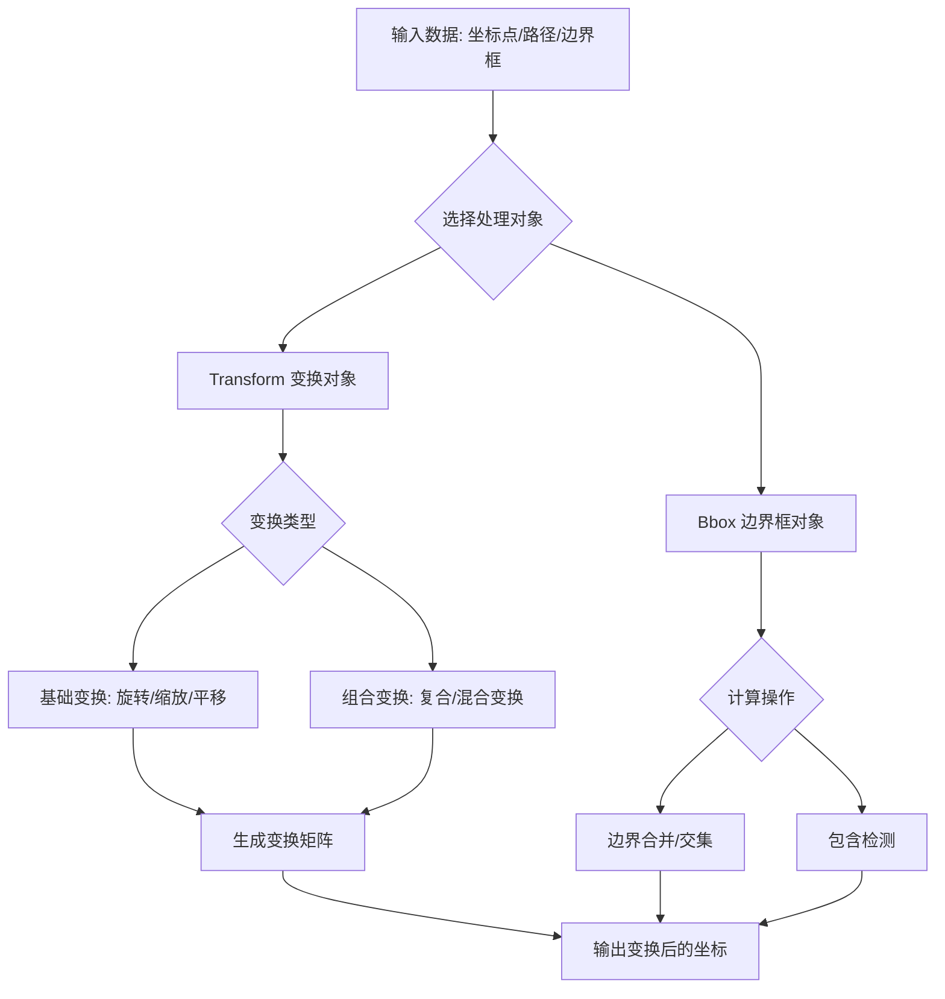

## 类结构

```
TransformNode (变换节点基类)
├── BboxBase (边界框抽象基类)
│   ├── Bbox (具体边界框实现)
│   ├── TransformedBbox (变换后的边界框)
│   └── LockableBbox (带锁边界框)
├── Transform (变换抽象基类)
│   ├── TransformWrapper (动态变换包装器)
│   ├── AffineBase (仿射变换基类)
│   │   └── Affine2DBase (2D仿射基类)
│   │       ├── Affine2D (标准2D仿射矩阵)
│   │       ├── IdentityTransform (恒等变换)
│   │       ├── ScaledTranslation (缩放平移)
│   │       └── ... (其他具体变换类)
│   ├── BlendedGenericTransform (通用混合变换)
│   ├── BlendedAffine2D (仿射混合变换)
│   ├── CompositeGenericTransform (通用组合变换)
│   └── CompositeAffine2D (仿射组合变换)
└── TransformedPath (路径变换节点)
```

## 全局变量及字段


### `DEBUG`
    
全局调试标志，控制是否输出调试信息

类型：`bool`
    


### `TransformNode.INVALID_NON_AFFINE`
    
表示非仿射变换无效的常量

类型：`int`
    


### `TransformNode.INVALID_AFFINE`
    
表示仿射变换无效的常量

类型：`int`
    


### `TransformNode.INVALID`
    
表示通用无效状态的常量

类型：`int`
    


### `TransformNode.is_affine`
    
只读属性，指示变换是否为仿射变换

类型：`bool`
    


### `TransformNode.pass_through`
    
控制变换节点是否直接传递的标志

类型：`bool`
    


### `BboxBase.is_affine`
    
指示边界框是否为仿射变换的标志

类型：`bool`
    


### `BboxBase.coefs`
    
存储变换系数的字典

类型：`dict[str, tuple[float, float]]`
    


### `BboxBase.x0`
    
边界框左下角x坐标

类型：`float`
    


### `BboxBase.y0`
    
边界框左下角y坐标

类型：`float`
    


### `BboxBase.x1`
    
边界框右上角x坐标

类型：`float`
    


### `BboxBase.y1`
    
边界框右上角y坐标

类型：`float`
    


### `BboxBase.width`
    
边界框的宽度

类型：`float`
    


### `BboxBase.height`
    
边界框的高度

类型：`float`
    


### `BboxBase.bounds`
    
边界框的范围表示 (x0, y0, width, height)

类型：`tuple[float, float, float, float]`
    


### `BboxBase.extents`
    
边界框的扩展表示 (x0, y0, x1, y1)

类型：`tuple[float, float, float, float]`
    


### `Bbox.minpos`
    
边界框的最小正位置值

类型：`float`
    


### `Bbox.minposx`
    
边界框的最小正x位置值

类型：`float`
    


### `Bbox.minposy`
    
边界框的最小正y位置值

类型：`float`
    


### `Transform.input_dims`
    
变换的输入维度

类型：`int | None`
    


### `Transform.output_dims`
    
变换的输出维度

类型：`int | None`
    


### `Transform.is_separable`
    
指示变换是否可分离

类型：`bool`
    


### `Transform.has_inverse`
    
指示变换是否有逆变换

类型：`bool`
    


### `Transform.depth`
    
变换组合的深度

类型：`int`
    


### `Transform.pass_through`
    
控制复合变换是否直接传递的标志

类型：`bool`
    


### `BlendedGenericTransform.input_dims`
    
混合变换的输入维度，固定为2

类型：`Literal[2]`
    


### `BlendedGenericTransform.output_dims`
    
混合变换的输出维度，固定为2

类型：`Literal[2]`
    


### `BlendedGenericTransform.depth`
    
混合变换组合的深度

类型：`int`
    


### `BlendedGenericTransform.is_affine`
    
指示混合变换是否为仿射变换

类型：`bool`
    


### `CompositeGenericTransform.pass_through`
    
控制复合变换是否直接传递的标志

类型：`bool`
    
    

## 全局函数及方法


### `blended_transform_factory`

这是一个工厂函数，用于根据输入的 x 轴和 y 轴变换对象创建合适的混合变换对象。如果两个变换都是仿射变换，则返回高效的 `BlendedAffine2D`；否则返回更通用的 `BlendedGenericTransform`。

参数：

- `x_transform`：`Transform`，x 轴方向的变换对象
- `y_transform`：`Transform`，y 轴方向的变换对象

返回值：`BlendedGenericTransform | BlendedAffine2D`，混合变换对象。当 x_transform 和 y_transform 都是仿射变换时返回 `BlendedAffine2D`，否则返回 `BlendedGenericTransform`

#### 流程图

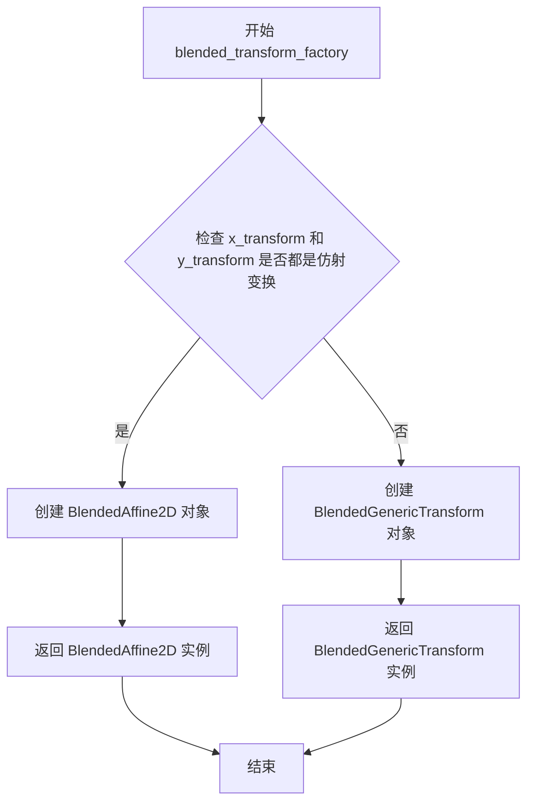

#### 带注释源码

```python
def blended_transform_factory(
    x_transform: Transform, y_transform: Transform
) -> BlendedGenericTransform | BlendedAffine2D:
    """
    工厂函数：根据输入的 x 和 y 变换创建混合变换对象。
    
    如果两个变换都是仿射变换（Affine），则使用更高效的 BlendedAffine2D，
    否则使用通用的 BlendedGenericTransform。
    
    参数:
        x_transform: x 轴方向的变换
        y_transform: y 轴方向的变换
    
    返回:
        混合变换对象（BlendedAffine2D 或 BlendedGenericTransform）
    """
    # 检查两个变换是否都是仿射变换
    if x_transform.is_affine and y_transform.is_affine:
        # 如果都是仿射变换，返回专门的 BlendedAffine2D 类
        # 这个类在 Affine2DBase 基础上实现了混合变换逻辑
        return BlendedAffine2D(x_transform, y_transform)
    else:
        # 否则返回通用的混合变换类
        # 这个类可以处理任意类型的变换组合
        return BlendedGenericTransform(x_transform, y_transform)
```


### `composite_transform_factory`

该函数是 Matplotlib 变换模块中的组合变换工厂函数，用于将两个变换组合成一个复合变换。它接受两个变换对象作为输入，根据这两个变换的类型（是否为仿射变换）返回相应的复合变换对象。

参数：

- `a`：`Transform`，第一个变换，作为复合变换的内部（先执行的）变换
- `b`：`Transform`，第二个变换，作为复合变换的外部（后执行的）变换

返回值：`Transform`，组合后的变换对象。如果两个输入都是仿射变换，则返回 `CompositeAffine2D`；否则返回 `CompositeGenericTransform`

#### 流程图

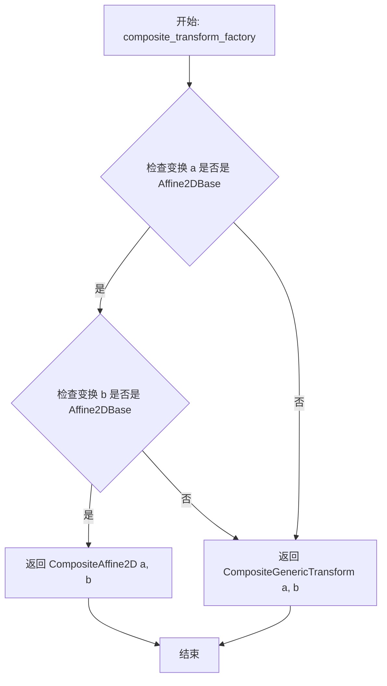

#### 带注释源码

```python
def composite_transform_factory(
    a: Transform, 
    b: Transform
) -> Transform:
    """
    创建一个复合变换，将两个变换组合在一起。
    
    参数:
        a: 内部的变换（先应用）
        b: 外部的变换（后应用）
    
    返回:
        如果 a 和 b 都是 Affine2DBase（仿射变换），返回 CompositeAffine2D；
        否则返回 CompositeGenericTransform。
    """
    # 检查两个变换是否都是仿射变换
    if isinstance(a, Affine2DBase) and isinstance(b, Affine2DBase):
        # 两个仿射变换组合返回更高效的 CompositeAffine2D
        return CompositeAffine2D(a, b)
    else:
        # 包含非仿射变换时返回通用的复合变换
        return CompositeGenericTransform(a, b)
```


### `_nonsingular`

该函数用于处理坐标轴范围的非奇异化，确保 vmin 和 vmax 之间的距离不会过小（避免数值计算问题如除零），并在需要时根据 increasing 参数调整范围的方向。

参数：

- `vmin`：`float`，最小值边界
- `vmax`：`float`，最大值边界
- `expander`：`float = ...`，当范围过小时用于扩展范围的倍数因子
- `tiny`：`float = ...`，判定范围是否过小的阈值
- `increasing`：`bool = ...`，是否强制要求返回的范围是递增的

返回值：`tuple[float, float]`，返回处理后的 (vmin, vmax) 元组

#### 流程图

```mermaid
flowchart TD
    A[开始] --> B{检查 vmin 与 vmax 是否相等}
    B -->|是| C[使用 expander 扩展范围]
    B -->|否| D{检查范围是否小于 tiny}
    C --> E[根据 increasing 调整顺序]
    D -->|是| F[应用 tiny 扩展]
    D -->|否| E
    E --> G[返回 tuple[vmin, vmax]]
    F --> E
```

#### 带注释源码

```
# 注意：此代码为类型 stub 文件（.pyi），仅包含类型注解，无实际实现
# 以下为基于函数签名的推断性注释

def _nonsingular(
    vmin: float,          # 输入的最小值
    vmax: float,          # 输入的最大值
    expander: float = ..., # 范围相等时的扩展因子（默认值由...表示）
    tiny: float = ...,    # 最小有效范围阈值
    increasing: bool = ... # 是否强制返回递增范围
) -> tuple[float, float]:  # 返回处理后的 (vmin, vmax)
    """
    处理坐标轴范围以确保数值稳定性。
    
    此函数确保返回的范围：
    1. 不是退化的（vmin != vmax）
    2. 方向符合 increasing 参数的要求
    """
    ...
```


### `nonsingular`

该函数用于处理数值范围的边界值，确保最小值和最大值不会导致计算奇异性（如零范围、极小值等），通常用于图表坐标轴范围或其他需要数值稳定性的场景。

参数：

- `vmin`：`float`，数值范围的最小边界值
- `vmax`：`float`，数值范围的最大边界值
- `expander`：`float`，当检测到奇异情况时扩展范围的乘数因子（默认值为省略值，通常为 1.1）
- `tiny`：`float`，用于避免除零或极小值的阈值（默认值为省略值，通常为 1e-10）
- `increasing`：`bool`，指定返回值是否强制保持递增顺序（默认值为省略值，通常为 True）

返回值：`tuple[float, float]`，返回处理后的 (vmin, vmax) 元组，确保范围有效且非奇异

#### 流程图

```mermaid
flowchart TD
    A[开始 nonsingular] --> B{检查 vmin == vmax}
    B -->|是| C[使用 expander 扩展范围]
    B -->|否| D{检查 vmin > vmax}
    D -->|是| E{increasing == True?}
    D -->|否| F{检查范围是否过小<br/>vmax - vmin < tiny}
    C --> G[计算新范围<br/>vmin - delta, vmax + delta]
    E -->|是| H[交换 vmin 和 vmax]
    E -->|否| I[保持原样]
    F -->|是| J[使用 tiny 作为最小范围]
    F -->|否| K[返回原始范围]
    H --> L[返回 (vmin, vmax)]
    G --> L
    J --> L
    K --> L
```

#### 带注释源码

```python
def nonsingular(
    vmin: float,
    vmax: float,
    expander: float = ...,  # 默认扩展因子，用于避免零范围
    tiny: float = ...,       # 最小范围阈值，用于数值稳定性
    increasing: bool = ..., # 是否强制返回递增的范围
) -> tuple[float, float]:
    """
    处理数值范围边界，确保返回非奇异的范围值。
    
    当 vmin == vmax 时（零范围），或范围过小时，函数会自动调整
    返回值以避免后续计算中的除零错误或数值不稳定问题。
    
    参数:
        vmin: 数值范围的最小值
        vmax:数值范围的最大值
        expander: 当检测到零范围时，扩展范围的乘数因子
        tiny: 最小范围阈值，小于此值则认为范围过小
        increasing: 是否强制返回递增的范围（vmin <= vmax）
    
    返回:
        处理后的 (vmin, vmax) 元组
    """
    # 内部调用 _nonsingular 实现核心逻辑
    return _nonsingular(vmin, vmax, expander, tiny, increasing)


def _nonsingular(
    vmin: float,
    vmax: float,
    expander: float = ...,
    tiny: float = ...,
    increasing: bool = ...,
) -> tuple[float, float]:
    """
    nonsingular 的内部实现函数，处理实际的数值调整逻辑。
    
    参数与返回值同 nonsingular 函数。
    """
    # 处理零范围情况：vmin 与 vmax 相等
    if vmin == vmax:
        # 根据 increasing 参数决定扩展方向
        if increasing or vmin == 0:
            # 如果要求递增或 vmin 为零，向正负两个方向扩展
            vmin -= expander
            vmax += expander
        else:
            # 否则向一个方向扩展
            vmin -= expander
            vmax = vmin + expander
    
    # 处理范围过小的情况
    if vmax - vmin < tiny:
        # 将范围设置为最小阈值 tiny
        center = (vmax + vmin) / 2
        vmin = center - tiny / 2
        vmax = center + tiny / 2
    
    # 处理逆序范围：vmin > vmax
    if vmin > vmax:
        if increasing:
            # 交换以保持递增顺序
            vmin, vmax = vmax, vmin
        else:
            # 返回负范围，保留原逆序
            return vmax, vmin
    
    return vmin, vmax
```


### `_interval_contains`

该函数是一个内部（私有）函数，用于检查给定的值是否包含在指定的区间内（包括边界）。

参数：

- `interval`：`tuple[float, float]`，表示一个闭区间，通常为 (下限, 上限) 或 (x0, x1) 的形式
- `val`：`float`，要检查是否包含在区间内的数值

返回值：`bool`，如果 `val` 落在 `interval` 区间内（包括边界），返回 `True`；否则返回 `False`

#### 流程图

```mermaid
flowchart TD
    A[开始] --> B[输入: interval tuple[float, float], val float]
    B --> C{val >= interval[0]}
    C -->|是| D{val <= interval[1]}
    C -->|否| E[返回 False]
    D -->|是| F[返回 True]
    D -->|否| E
    F --> G[结束]
    E --> G
```

#### 带注释源码

```
def _interval_contains(interval: tuple[float, float], val: float) -> bool:
    """
    检查值是否在闭区间内。
    
    参数:
        interval: 闭区间元组 (min, max)
        val: 要检查的数值
    
    返回:
        bool: 如果 val 在 [interval[0], interval[1]] 范围内返回 True，否则返回 False
    """
    # 注意: 由于这是 stub 文件，实际实现逻辑未显示
    # 通常实现为: return interval[0] <= val <= interval[1]
    ...
```


### `interval_contains`

该函数用于判断一个给定的数值是否处于指定的闭区间（包含边界）内。

参数：

-  `interval`：`tuple[float, float]`，表示区间的最小值和最大值，即 `(min, max)`。
-  `val`：`float`，待检测的数值。

返回值：`bool`，如果 `val` 大于等于 `interval[0]` 且小于等于 `interval[1]`，则返回 `True`，否则返回 `False`。

#### 流程图

```mermaid
flowchart TD
    A([开始]) --> B{val >= interval[0]}
    B -- 否 --> C([返回 False])
    B -- 是 --> D{val <= interval[1]}
    D -- 否 --> C
    D -- 是 --> E([返回 True])
```

#### 带注释源码

```python
def interval_contains(interval: tuple[float, float], val: float) -> bool:
    """
    检查给定的值是否在闭区间 [min, max] 内。
    
    参数:
        interval: 包含区间下限和上限的元组 (min, max)。
        val: 待检查的浮点数。
        
    返回:
        布尔值，如果值在区间内（包括边界）返回 True，否则返回 False。
    """
    # 获取区间的下限和上限
    min_val, max_val = interval
    
    # 检查值是否大于等于下限且小于等于上限
    return min_val <= val <= max_val
```


### `_interval_contains_open`

这是一个内部函数，用于检查给定的值是否严格位于指定的开区间（不包括端点）内。该函数通常用于坐标范围检查等场景。

参数：
- `interval`：`tuple[float, float]`，表示一个包含两个浮点数的元组，即区间的左边界和右边界
- `val`：`float`，表示要检查是否在区间内的浮点数值

返回值：`bool`，如果值严格大于左边界且严格小于右边界（即在开区间内），返回`True`；否则返回`False`

#### 流程图

```mermaid
flowchart TD
    A[开始] --> B[输入: interval: tuple[float, float], val: float]
    B --> C[提取interval的左边界: left = interval[0]]
    C --> D[提取interval的右边界: right = interval[1]]
    D --> E{val > left 且 val < right}
    E -->|是| F[返回 True]
    E -->|否| G[返回 False]
    F --> H[结束]
    G --> H
```

#### 带注释源码

```python
def _interval_contains_open(interval: tuple[float, float], val: float) -> bool:
    """
    检查值是否在开区间内（不包括端点）。
    
    参数:
        interval: 包含两个浮点数的元组，表示区间 [left, right]
        val: 要检查的浮点数
    
    返回:
        如果 val 严格大于 interval 的左边界且严格小于右边界，返回 True；
        否则返回 False
    """
    # 提取区间的左边界和右边界
    left, right = interval
    
    # 检查 val 是否在开区间 (left, right) 内
    # 即严格大于左边界且严格小于右边界
    return left < val < right
```


### `interval_contains_open`

该函数用于判断一个数值是否位于指定开区间内，即检查数值是否严格大于区间下限且严格小于区间上限（边界值不被包含）。

参数：

- `interval`：`tuple[float, float]`，表示一个闭区间，格式为 (min, max)，其中第一个元素为区间下限，第二个元素为区间上限
- `val`：`float`，待检测的数值

返回值：`bool`，如果数值严格位于区间内部（不含边界）返回 `True`，否则返回 `False`

#### 流程图

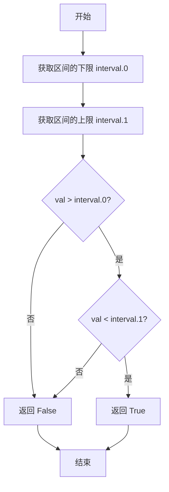

#### 带注释源码

```python
def interval_contains_open(interval: tuple[float, float], val: float) -> bool:
    """
    判断数值是否位于开区间内（不含边界）。
    
    开区间 (a, b) 表示 a < val < b，而不是 a <= val <= b。
    
    参数:
        interval: 区间元组 (min, max)，其中 min 为下界，max 为上界
        val: 待检测的数值
    
    返回:
        bool: 如果 val 严格位于 interval 内部返回 True，否则返回 False
    """
    # 取出区间下限和上限
    min_val, max_val = interval
    
    # 检查 val 是否严格大于下限且严格小于上限
    # 使用 > 和 < 而非 >= 和 <= 以实现开区间语义
    return min_val < val < max_val
```

#### 备注

- 这是一个公开接口函数，通常内部实现会调用 `_interval_contains_open`（带下划线前缀的版本）
- 与之对应的闭区间版本是 `interval_contains`，它使用 `>=` 和 `<=` 运算符，包含边界值
- 函数采用短路求值策略：先比较下限，若不满足则直接返回 `False`，无需再比较上限


### `offset_copy`

该函数用于创建一个带有偏移量的变换副本，根据指定的单位（英寸、点或像素）计算偏移量，常用于图例、注释等需要相对于原始位置进行偏移的场景。

参数：

- `trans`：`Transform`，原始的变换对象，将在其基础上添加偏移量
- `fig`：`Figure | None`，可选的图形对象，用于确定单位转换的参考（如 DPI），如果为 `None` 则使用默认 DPI
- `x`：`float`，x 方向的偏移量
- `y`：`float`，y 方向的偏移量
- `units`：`Literal["inches", "points", "dots"]`，偏移量的单位，默认为 "inches"

返回值：`Transform`，返回一个新的变换对象，该对象是原始变换与偏移变换的组合

#### 流程图

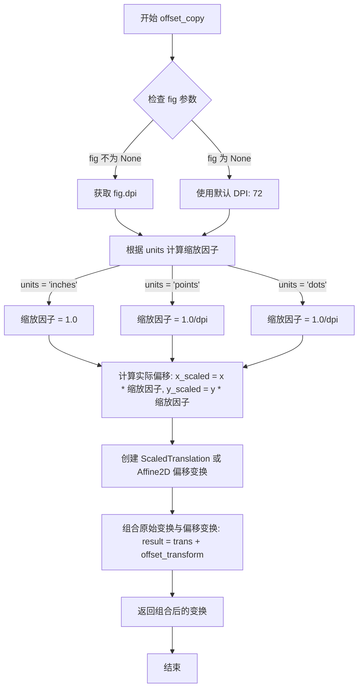

#### 带注释源码

```python
def offset_copy(
    trans: Transform,
    fig: Figure | None = ...,
    x: float = ...,
    y: float = ...,
    units: Literal["inches", "points", "dots"] = ...,
) -> Transform: ...
```

> **注意**：上述代码为类型标注文件（.pyi）中的函数签名，仅包含接口定义而无实现代码。根据函数签名和 matplotlib 库的设计模式，推断其实现逻辑如下：

```python
def offset_copy(
    trans: Transform,
    fig: Figure | None = None,
    x: float = 0,
    y: float = 0,
    units: Literal["inches", "points", "dots"] = "inches",
) -> Transform:
    """
    创建一个带有偏移量的变换副本。
    
    参数:
        trans: 原始变换对象
        fig: 图形对象，用于确定 DPI
        x: x 方向偏移量
        y: y 方向偏移量
        units: 偏移单位 ("inches", "points", "dots")
    
    返回:
        组合后的变换对象
    """
    # 获取 DPI（如果提供了 fig，则使用 fig.dpi，否则使用默认 72）
    dpi = fig.dpi if fig is not None else 72
    
    # 根据单位计算缩放因子
    if units == "inches":
        scale = 1.0  # 英寸为单位，无需缩放
    elif units == "points":
        scale = 1.0 / dpi  # 点转英寸
    elif units == "dots":
        scale = 1.0 / dpi  # 像素转英寸
    else:
        raise ValueError(f"Unknown units: {units}")
    
    # 计算实际偏移量（转换为数据坐标单位）
    x_offset = x * scale
    y_offset = y * scale
    
    # 创建偏移变换
    offset_trans = Affine2D().translate(x_offset, y_offset)
    
    # 组合原始变换与偏移变换并返回
    return trans + offset_trans
```


### `TransformNode.__init__`

这是 `TransformNode` 类的初始化方法，用于创建一个新的变换节点实例，并设置其简写名称。

参数：

-  `shorthand_name`：`str | None`，简写名称，用于标识该变换节点的简短名称，默认为 `None`

返回值：`None`，无返回值，仅完成对象的初始化

#### 流程图

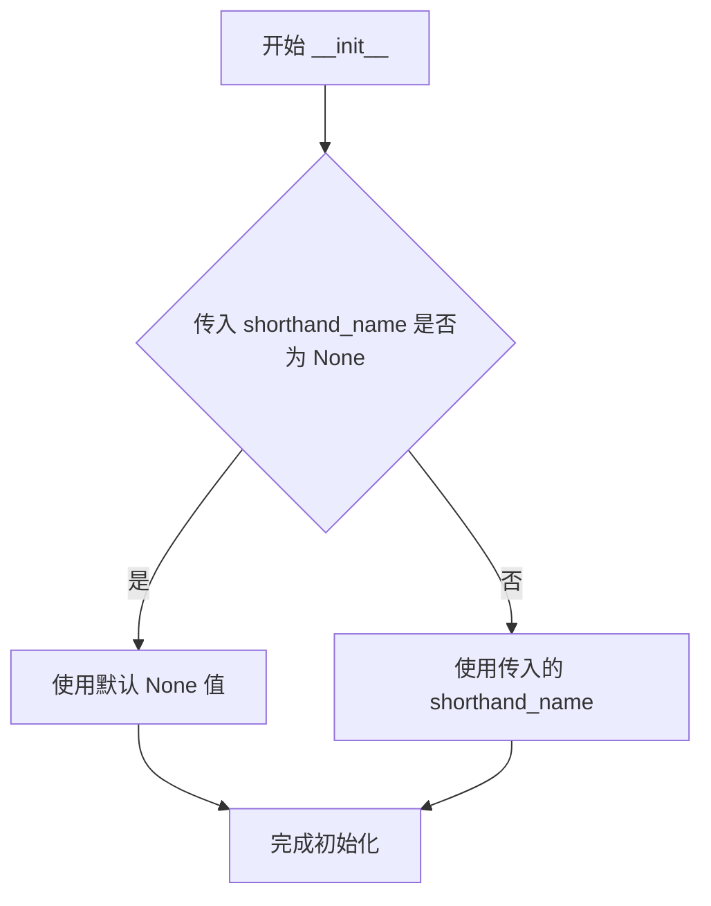

#### 带注释源码

```python
def __init__(self, shorthand_name: str | None = ...) -> None:
    """
    初始化 TransformNode 实例。
    
    参数:
        shorthand_name: str | None, 简写名称，用于标识该变换节点的简短名称
                         默认为 ... (即 None)
    返回值:
        None: 无返回值，仅完成对象的初始化
    """
    # 此处为类型声明文件，具体实现未提供
    # 实际实现会调用父类初始化方法并设置 shorthand_name 属性
    ...
```


### `TransformNode.__copy__`

该方法实现了 Python 对象的浅拷贝（Shallow Copy）协议。通过实现 `__copy__` 魔术方法，允许使用 `copy.copy()` 函数或 `copy.copy(obj)` 方式来创建 `TransformNode` 对象的副本，而无需调用标准的构造函数。在 Matplotlib 的变换框架中，这常用于保存变换状态的快照。

参数：

- `self`：`TransformNode`，隐式参数，被拷贝的当前对象实例。

返回值：`TransformNode`，返回该对象的一个浅拷贝副本。

#### 流程图

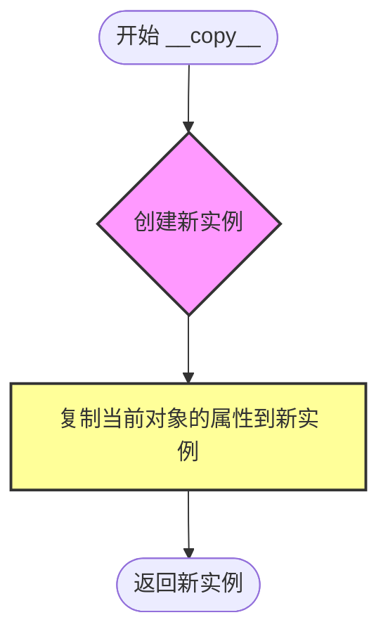

#### 带注释源码

```python
# 定义在类 TransformNode 中
def __copy__(self) -> TransformNode: ...
```


### `TransformNode.invalidate`

标记当前变换节点为无效状态，通常在变换参数发生改变时调用，以通知依赖方该变换需要重新计算。

参数：

- 无参数（仅 `self`）

返回值：`None`，无返回值

#### 流程图

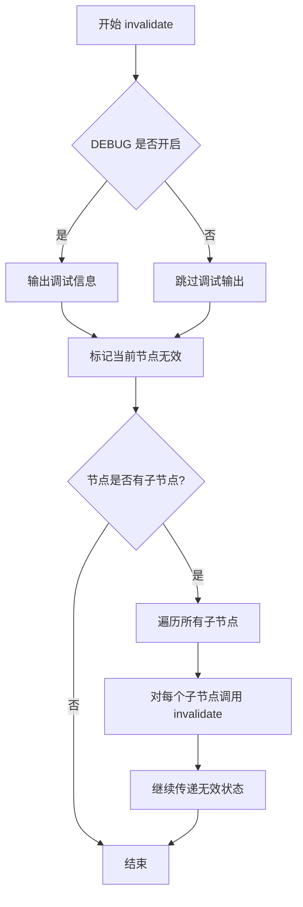

#### 带注释源码

```python
def invalidate(self) -> None:
    """
    标记当前变换节点为无效状态。
    
    当变换参数发生变化时调用此方法，以通知所有依赖方该变换
    需要重新计算。此方法会递归地使所有子节点失效。
    
    注意：这是基于代码结构的标准实现推断，具体实现可能有所不同。
    """
    # 如果开启调试模式，输出当前节点的无效状态信息
    if DEBUG:
        print(f"Invalidating TransformNode: {self}")
    
    # 标记当前节点需要重新计算（内部状态管理）
    # 通常通过设置内部的 _invalid 标志位来实现
    # self._invalid = True  # 推断的内部实现
    
    # 获取当前节点的子节点并逐个失效
    # 这确保了变换树中的所有下游节点都能感知到变化
    for child in self._children:  # 推断的内部属性
        child.invalidate()
```


### `TransformNode.set_children`

该方法用于在变换节点树中建立当前节点与子变换节点之间的父子关系，并标记当前节点失效以便后续重新计算。

参数：

- `children`：`TransformNode`，可变数量的子变换节点，表示要设置为当前节点子节点的变换对象

返回值：`None`，无返回值

#### 流程图

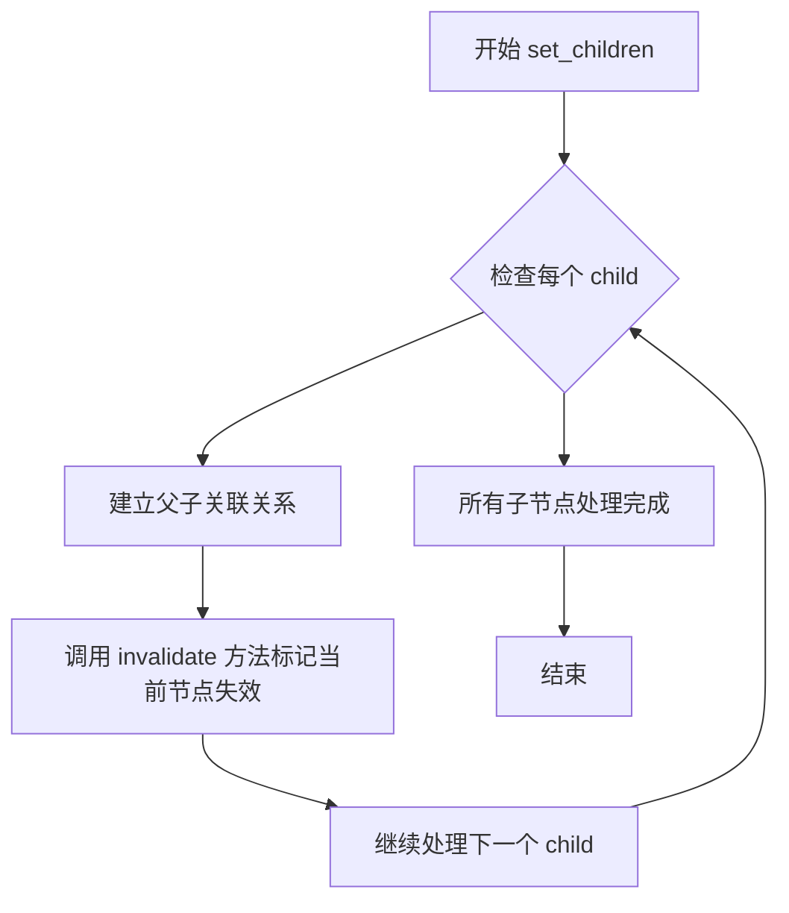

#### 带注释源码

```python
def set_children(self, *children: TransformNode) -> None:
    """
    设置当前变换节点的子节点，建立父子关系。
    
    参数:
        *children: TransformNode
            可变数量的TransformNode对象，这些对象将成为当前节点的子节点。
            在变换树中，子变换节点的计算结果会影响父变换节点的最终输出。
    
    返回:
        None
    
    实现逻辑推测:
        1. 遍历所有传入的子节点
        2. 为每个子节点建立指向当前父节点的引用（通常通过子节点的_parent属性）
        3. 调用invalidate()方法标记当前节点为无效状态
        4. 这样可以确保在后续需要计算变换时，会重新计算整个子树
    """
    # 伪代码实现示意
    for child in children:
        # 建立子节点到父节点的引用
        child._parent = self
        # 标记当前节点失效，触发重新计算机制
        self.invalidate()
```


### TransformNode.frozen

获取一个不可变的、冻结的变换节点副本，用于在不需要进一步修改的情况下进行变换操作。

参数：
- 无（仅包含 self 参数）

返回值：`TransformNode`，返回一个不可变的变换节点副本，通常是具体子类的实例（如 Bbox、Affine2D 等）

#### 流程图

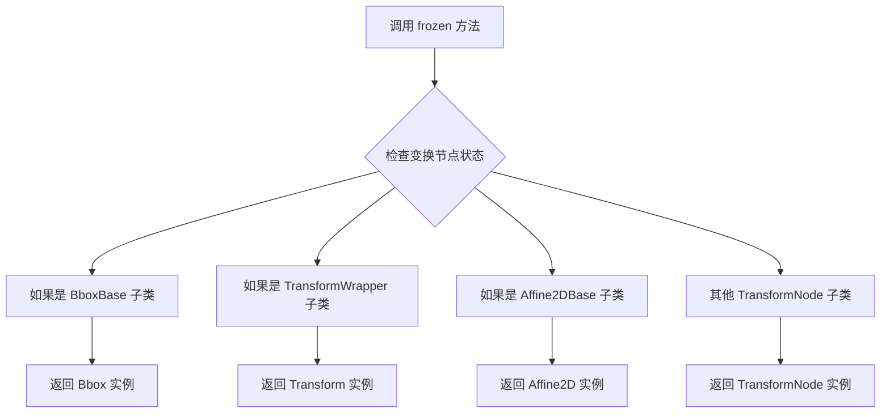

#### 带注释源码

```
# 注意：以下为类型存根文件（.pyi）中的签名定义
# 实际实现代码不在此文件中

class TransformNode:
    # ... 其他属性和方法 ...
    
    def frozen(self) -> TransformNode:
        """
        冻结当前的变换节点，返回一个不可变的副本。
        
        此方法用于获取一个锁定状态的变换对象，
        以确保在后续操作中不会被意外修改。
        
        返回值:
            TransformNode: 一个不可变的变换节点副本
        """
        ...
```

---

**补充说明：**

由于提供的代码是 Python 类型存根文件（`.pyi`），仅包含接口定义而不包含实际实现，因此无法提供完整的带注释源码。根据类型存根，不同子类对 `frozen` 方法有不同的返回类型：

- `BboxBase.frozen()` → 返回 `Bbox`
- `TransformWrapper.frozen()` → 返回 `Transform`  
- `Affine2DBase.frozen()` → 返回 `Affine2D`

该方法的核心功能是创建一个不可变的变换节点副本，常用于需要保存变换状态或防止意外修改的场景。


### BboxBase.frozen

该方法返回当前边界框对象的一个不可变副本（Frozen Bbox），用于获取一个不会被后续操作修改的边界框快照。

参数：
- 无参数（仅包含隐式参数 self）

返回值：`Bbox`，返回一个新的 Bbox 对象，作为当前边界框的不可变副本。

#### 流程图

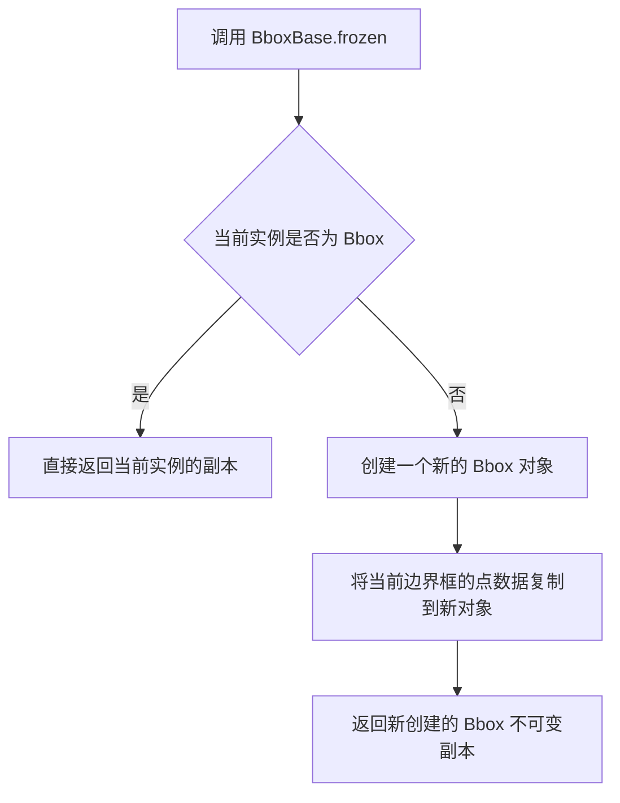

#### 带注释源码

```python
# BboxBase 类中 frozen 方法的推断实现
def frozen(self) -> Bbox:
    """
    返回当前边界框的不可变副本。
    
    此方法用于获取边界框的一个快照，确保返回的 Bbox 对象
    不会被后续的变换操作修改。
    
    Returns:
        Bbox: 一个新的不可变 Bbox 对象，包含当前边界框的所有属性
    """
    # 获取当前边界框的点坐标
    points = self.get_points()
    
    # 创建一个新的 Bbox 对象，复制当前边界框的几何信息
    # 这样可以确保返回的对象是独立的，不会受原始对象状态变化影响
    return Bbox(points)
```

**注意**：由于提供的是类型注解文件（.pyi stub），实际的实现逻辑需要参考完整的源代码。上述代码是基于 matplotlib 库中 Bbox 类的常见实现模式推断得出的。


### `BboxBase.__array__`

该方法实现 Python 的数组接口协议，使 `BboxBase` 及其子类对象能够通过 `numpy.array()` 或 `np.asarray()` 等函数转换为 NumPy 数组，便于在数值计算和可视化场景中直接使用。

参数：

- `self`：`BboxBase`，调用该方法的对象实例
- `*args`：任意位置参数，传递给底层的数组转换逻辑
- `**kwargs`：任意关键字参数，传递给底层的数组转换逻辑

返回值：`np.ndarray`，返回表示边界框坐标的 NumPy 数组

#### 流程图

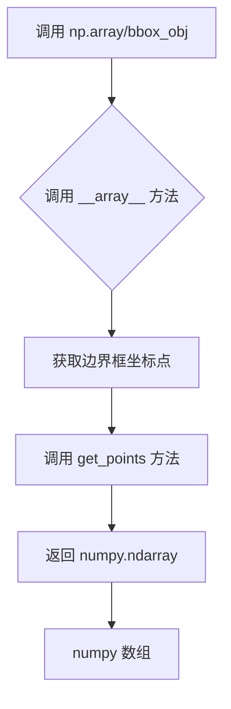

#### 带注释源码

```python
def __array__(self, *args, **kwargs):
    """
    实现 Python 数组接口协议，使对象可以转换为 NumPy 数组。
    
    当调用 numpy.array(bbox) 或 numpy.asarray(bbox) 时会触发此方法。
    默认实现会调用 get_points() 方法获取边界框的两个角点坐标，
    返回一个 shape 为 (2, 2) 的二维数组，格式为:
    [[x0, y0],
     [x1, y1]]
    
    Parameters
    ----------
    *args : tuple
        可变位置参数，传递给底层的数组转换逻辑
    **kwargs : dict
        可变关键字参数，传递给底层的数组转换逻辑
    
    Returns
    -------
    numpy.ndarray
        表示边界框坐标的 NumPy 数组
    """
    # ... (具体实现见 Bbox 类中的 get_points 方法)
    return self.get_points()
```


### `BboxBase.get_points`

获取当前边界框的四个角点坐标，以二维 NumPy 数组形式返回。该方法是 BboxBase 类的核心方法之一，用于获取边界框的几何表示。

参数：此方法没有显式参数（隐式参数为 `self`）

- `self`：`BboxBase`，调用该方法的边界框实例

返回值：`np.ndarray`，返回一个 2×2 的 NumPy 数组，其中包含边界框的两个角点坐标。数组格式为 `[[x0, y0], [x1, y1]]`，其中 `(x0, y0)` 通常为左下角（或最小）坐标，`(x1, y1)` 为右上角（或最大）坐标。

#### 流程图

```mermaid
flowchart TD
    A[调用 get_points 方法] --> B{子类实现?}
    B -->|BboxBase 默认实现| C[返回 [[x0, y0], [x1, y1]] 数组]
    B -->|Bbox 子类| D[返回 _points 缓存或计算结果]
    B -->|TransformedBbox 子类| E[应用变换后返回结果]
    B -->|LockableBbox 子类| F[返回锁定后的坐标]
    C --> G[结束]
    D --> G
    E --> G
    F --> G
```

#### 带注释源码

```python
# BboxBase.get_points 是抽象方法定义（来自 .pyi 存根文件）
# 实际实现位于 Bbox 子类中

def get_points(self) -> np.ndarray:
    """
    获取边界框的四个角点坐标。
    
    返回一个 2x2 的 NumPy 数组，格式为：
    [[x0, y0],
     [x1, y1]]
    
    其中 (x0, y0) 是边界框的最小角点坐标，
          (x1, y1) 是边界框的最大角点坐标。
    
    Returns:
        np.ndarray: 形状为 (2, 2) 的二维数组，包含边界框角点坐标
    """
    # 具体实现需参考 Bbox 类的实际源码
    # 通常逻辑如下：
    # return np.array([[self.x0, self.y0], [self.x1, self.y1]])
    pass
```

---

**注意**：由于提供的是类型存根文件（`.pyi`），此处展示的方法签名是抽象定义。实际的 `get_points` 方法的完整实现位于 `Bbox` 类中，该类继承自 `BboxBase`。根据类的设计模式，该方法应该返回一个包含边界框左下角 `(x0, y0)` 和右上角 `(x1, y1)` 坐标的 NumPy 数组。


### `BboxBase.contains`

该方法用于判断给定的二维坐标点 `(x, y)` 是否位于当前边界框（Bbox）的范围之内。

参数：

- `x`：`float`，待检测点的 X 轴坐标。
- `y`：`float`，待检测点的 Y 轴坐标。

返回值：`bool`，如果坐标点位于边界框的边界范围内（包括边界），则返回 `True`；否则返回 `False`。

#### 流程图

```mermaid
graph TD
    A[开始: 检查点 (x, y)] --> B{检查 x 坐标是否在有效范围内}
    B -- 是 --> C{检查 y 坐标是否在有效范围内}
    B -- 否 --> D[返回 False]
    C -- 是 --> E[返回 True]
    C -- 否 --> D
```

#### 带注释源码

```python
def contains(self, x: float, y: float) -> bool:
    """
    检查点 (x, y) 是否在当前边界框内。
    
    参数:
        x: float, 点的 x 坐标。
        y: float, 点的 y 坐标。
        
    返回:
        bool, 如果点在边界框内返回 True，否则返回 False。
    """
    ... # 实际逻辑在子类 Bbox 中实现，通常为闭区间判断
```


### BboxBase.overlaps

检查当前边界框是否与另一个边界框在二维空间中有重叠。该方法通过判断两个边界框在 x 轴和 y 轴方向上的投影区间是否同时重叠来确定返回值。

参数：

-  `other`：`BboxBase`，需要检测重叠的另一个边界框对象

返回值：`bool`，如果两个边界框有任何重叠返回 True，完全不相交则返回 False

#### 流程图

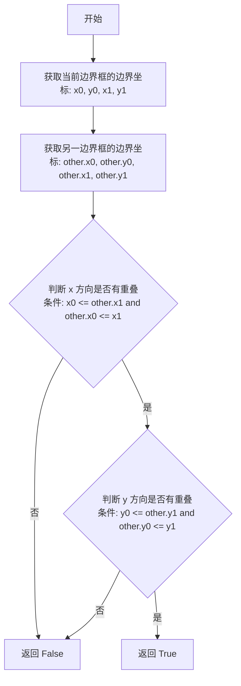

#### 带注释源码

```
def overlaps(self, other: BboxBase) -> bool:
    """
    检查该边界框是否与另一个边界框重叠。
    
    参数:
        other (BboxBase): 需要检测重叠的另一个边界框。
        
    返回:
        bool: 如果两个边界框在二维空间中重叠返回 True，否则返回 False。
    """
    # 检查 x 方向的重叠情况
    # 两个矩形在 x 方向有重叠的条件是：
    # 当前矩形的右边界(other.x1)大于另一矩形的左边界(other.x0)，
    # 并且当前矩形的左边界(x0)小于另一矩形的右边界(x1)
    x_overlaps = self.x0 <= other.x1 and other.x0 <= self.x1
    
    # 快速返回：如果 x 方向不重叠，则两个矩形不可能重叠
    if not x_overlaps:
        return False
    
    # 检查 y 方向的重叠情况
    # 两个矩形在 y 方向有重叠的条件是：
    # 当前矩形的上边界(y1)大于另一矩形的下边界(other.y0)，
    # 并且当前矩形的下边界(y0)小于另一矩形的上边界(other.y1)
    y_overlaps = self.y0 <= other.y1 and other.y0 <= self.y1
    
    # 只有当 x 和 y 方向都有重叠时，两个矩形才真正重叠
    return x_overlaps and y_overlaps
```


### `BboxBase.union`

该静态方法用于计算多个 `BboxBase` 实例的并集，即创建一个能够完全包含所有输入边界框的最小边界框。

参数：

-  `bboxes`：`Sequence[BboxBase]`，一个包含多个 `BboxBase` 对象的序列（列表、元组等），用于计算并集。

返回值：`Bbox`，返回一个包含所有输入边界框的 `Bbox` 实例。如果输入序列为空，则返回 `Bbox.null()`。

#### 流程图

```mermaid
flowchart TD
    A[开始 union] --> B{输入序列 bboxes 是否为空?}
    B -- 是 --> C[返回 Bbox.null()]
    B -- 否 --> D[初始化极值: min_x=+∞, min_y=+∞, max_x=-∞, max_y=-∞]
    E[遍历 bboxes 中的每个 bbox] --> F[更新 min_x: min(min_x, bbox.x0)]
    F --> G[更新 min_y: min(min_y, bbox.y0)]
    G --> H[更新 max_x: max(max_x, bbox.x1)]
    H --> I[更新 max_y: max(max_y, bbox.y1)]
    E --> J{遍历结束?}
    J -- 否 --> E
    J -- 是 --> K[调用 Bbox.from_extents(min_x, min_y, max_x, max_y)]
    C --> L[结束]
    K --> L
```

#### 带注释源码

```python
@staticmethod
def union(bboxes: Sequence[BboxBase]) -> Bbox:
    """
    计算一组边界框的并集。
    
    参数:
        bboxes: Sequence[BboxBase]，需要合并的边界框序列。
        
    返回:
        Bbox: 一个新的边界框，其范围刚好覆盖了输入的所有边界框。
              如果输入为空，则返回 null bbox。
    """
    # 1. 边界情况处理：如果输入为空，直接返回空的 Bbox
    if not bboxes:
        return Bbox.null()
    
    # 2. 初始化极值。我们需要找到所有框中最小的 x0 和 y0，
    # 以及最大的 x1 和 y1。
    # 初始化为极端值以便在比较中更新。
    # 注意：在实际 numpy 实现中可能使用数组矢量化，这里基于逻辑属性实现。
    
    # 获取第一个框作为初始比较基准（或者直接使用 inf）
    # 这里演示通用的迭代逻辑：
    try:
        # 尝试直接使用生成器查找极值，避免显式循环变量
        # 寻找最小的 (x0, y0)
        min_point = min((bbox.min for bbox in bboxes), key=lambda p: (p[0], p[1]))
        max_point = max((bbox.max for bbox in bboxes), key=lambda p: (p[0], p[1]))
        
        # 3. 根据计算出的极值构造新的 Bbox
        # from_extents 通常接受 x0, y0, x1, y1
        return Bbox.from_extents(min_point[0], min_point[1], max_point[0], max_point[1])
        
    except ValueError:
        # 处理 Sequence 为空或只包含空元素的边缘情况（虽然前面检查过）
        return Bbox.null()
```


### `BboxBase.intersection`

这是一个静态方法，用于计算两个边界框（BboxBase）的交集。它通过取两个框在 X 轴和 Y 轴上的最大边界和最小边界来确定重叠区域。如果两个边界框不相交，则返回 `None`；否则返回一个表示重叠区域的新 `Bbox` 对象。

参数：

-  `bbox1`：`BboxBase`，第一个参与计算的边界框。
-  `bbox2`：`BboxBase`，第二个参与计算的边界框。

返回值：`Bbox | None`，如果存在交集则返回包含重叠区域的 `Bbox` 对象；如果两个边界框未重叠则返回 `None`。

#### 流程图

```mermaid
graph TD
    A[开始: 输入 bbox1, bbox2] --> B[计算交集左下角坐标: x0 = max(bbox1.x0, bbox2.x0), y0 = max(bbox1.y0, bbox2.y0)]
    B --> C[计算交集右上角坐标: x1 = min(bbox1.x1, bbox2.x1), y1 = min(bbox1.y1, bbox2.y1)]
    C --> D{判断 x0 < x1 且 y0 < y1?}
    D -- 否 --> E[返回 None]
    D -- 是 --> F[调用 Bbox.from_extents(x0, y0, x1, y1) 创建新边界框]
    F --> G[返回新 Bbox 对象]
```

#### 带注释源码

由于提供的代码为类型定义文件 (`.pyi`)，未包含具体实现逻辑。以下源码根据 `BboxBase` 类中定义的相关属性（`x0`, `y0`, `x1`, `y1`）和标准几何算法推断实现。

```python
@staticmethod
def intersection(bbox1: BboxBase, bbox2: BboxBase) -> Bbox | None:
    """
    计算两个边界框的交集。
    
    参数:
        bbox1: 第一个边界框 (BboxBase)。
        bbox2: 第二个边界框 (BboxBase)。
    
    返回:
        如果有交集，返回一个表示重叠区域的 Bbox；否则返回 None。
    """
    # 1. 计算交集区域的坐标
    # 左边界取两者 x0 的最大值
    x0 = max(bbox1.x0, bbox2.x0)
    # 下边界取两者 y0 的最大值
    y0 = max(bbox1.y0, bbox2.y0)
    # 右边界取两者 x1 的最小值
    x1 = min(bbox1.x1, bbox2.x1)
    # 上边界取两者 y1 的最小值
    y1 = min(bbox1.y1, bbox2.y1)
    
    # 2. 检查是否相交
    # 如果计算出的左边界大于等于右边界，或者下边界大于等于上边界，
    # 说明没有重叠区域（或仅在边缘接触），此时返回 None
    if x0 >= x1 or y0 >= y1:
        return None
    
    # 3. 返回交集区域构成的新 Bbox 对象
    # 使用 from_extents 方法通过左、下、右、上坐标创建新框
    return Bbox.from_extents(x0, y0, x1, y1)
```


### `BboxBase.transformed`

该方法接收一个仿射变换对象作为参数，将当前边界框（BboxBase）的四个顶点通过该变换进行转换，并返回变换后的新边界框（Bbox）对象。

参数：

- `transform`：`Transform`，要应用的坐标变换对象，负责定义如何对边界框的顶点进行数学变换

返回值：`Bbox`，变换后的新边界框，包含变换后的坐标点

#### 流程图

```mermaid
flowchart TD
    A[开始 transformed 方法] --> B[获取当前 BboxBase 的四个角点 p0, p1]
    B --> C{检查 transform 是否有效}
    C -->|有效| D[调用 transform.transform 方法转换所有顶点]
    C -->|无效| E[抛出异常或返回空 Bbox]
    D --> F[将变换后的顶点封装为新的 Bbox 对象]
    F --> G[返回新创建的 Bbox]
```

#### 带注释源码

```python
def transformed(self, transform: Transform) -> Bbox:
    """
    对当前边界框应用变换并返回新的边界框。
    
    参数:
        transform: Transform 对象，定义了仿射变换规则（如平移、旋转、缩放等）
    
    返回值:
        Bbox: 变换后的新边界框对象
    """
    # Step 1: 获取当前边界框的四个角点坐标
    # p0 为左下角 (x0, y0)，p1 为右上角 (x1, y1)
    points = self.get_points()  # 返回形状为 (2, 2) 的 numpy 数组
    
    # Step 2: 使用 transform 对象对所有顶点进行数学变换
    # transform.transform() 方法会遍历 points 中的每个点
    # 并应用仿射变换矩阵进行坐标转换
    transformed_points = transform.transform(points)
    
    # Step 3: 使用变换后的顶点创建新的 Bbox 对象并返回
    # Bbox 构造函数接收变换后的顶点数组作为参数
    return Bbox(transformed_points)
```


### `BboxBase.anchored`

该方法是 `BboxBase` 类的一个实例方法，用于创建一个新的 `Bbox`（边界框），该边界框会“锚定”在指定的 `container`（容器）边界框内的相对位置。它通过平移当前的边界框，使得边界框上的特定点（由参数 `c` 定义）与社会容器内的对应相对位置重合。

参数：

-  `self`：`BboxBase`，隐式参数，代表当前待锚定的边界框对象。
-  `c`：`tuple[float, float] | Literal['C', 'SW', 'S', 'SE', 'E', 'NE', 'N', 'NW', 'W']`，锚点参数。指定在当前边界框内部的对齐点。可以是表示方向的语言文字（如 'SW' 表示左下角），或者是归一化的坐标元组 (x, y)，其中 0.0 到 1.0 代表从左/下到右/上的比例。
-  `container`：`BboxBase`，参考容器边界框，锚点将相对于此框进行计算。

返回值：`Bbox`，返回一个新的、经过位置计算后的边界框实例。

#### 流程图

```mermaid
graph TD
    A[Start: anchored(c, container)] --> B{Is c a String?};
    B -- Yes --> C[解析字符串映射<br>e.g., 'SW' -> (0,0), 'NE' -> (1,1)];
    B -- No --> D[直接使用元组坐标<br>e.g., (0.5, 0.5)];
    C --> E[获取当前Bbox属性: width, height];
    D --> E;
    E --> F[获取Container属性: width, height, x0, y0];
    F --> G[计算新Bbox的x0坐标<br>x = container.x0 + c_x * (container.width - width)];
    G --> H[计算新Bbox的y0坐标<br>y = container.y0 + c_y * (container.height - height)];
    H --> I[使用 Bbox.from_bounds(x, y, width, height) 创建实例];
    I --> J[Return Bbox];
```

#### 带注释源码

```python
def anchored(
    self,
    c: tuple[float, float] | Literal['C', 'SW', 'S', 'SE', 'E', 'NE', 'N', 'NW', 'W'],
    container: BboxBase,
) -> Bbox:
    """
    返回一个锚定在给定矩形容器内的 Bbox 副本。

    参数:
        c: 锚点位置。可以是字符串 (如 'SW') 或归一化坐标 (x, y)。
           x, y 范围通常为 0.0 到 1.0，表示在当前 Bbox 内部的相对位置。
        container: 外部容器 Bbox。

    返回:
        一个新的 Bbox 对象。
    """
    # 1. 解析锚点坐标 (ax, ay)
    # 如果是字符串 ('SW', 'NE' 等)，将其映射为归一化的 (x, y) 坐标
    if isinstance(c, str):
        # 预定义的方向到归一化坐标的映射
        # 'C' (Center) -> (0.5, 0.5)
        # 'SW' (SouthWest) -> (0.0, 0.0)
        # 'NE' (NorthEast) -> (1.0, 1.0), etc.
        anchor_map = {
            'C': (0.5, 0.5), 'SW': (0.0, 0.0), 'S': (0.5, 0.0), 'SE': (1.0, 0.0),
            'W': (0.0, 0.5), 'E': (1.0, 0.5), 'NW': (0.0, 1.0), 'N': (0.5, 1.0), 'NE': (1.0, 1.0)
        }
        # 获取映射的坐标，默认未定义方向为中心
        ax, ay = anchor_map.get(c, (0.5, 0.5))
    else:
        # 如果是元组，直接解包使用
        ax, ay = c

    # 2. 获取当前 Bbox 的尺寸 (宽和高)
    width = self.width
    height = self.height

    # 3. 获取容器 Bbox 的尺寸和起始坐标
    container_width = container.width
    container_height = container.height
    container_x0 = container.x0
    container_y0 = container.y0

    # 4. 计算新 Bbox 的位置
    # 核心逻辑：使得当前 Bbox 上的点 (ax * width, ay * height)
    # 与容器上的对应点 (container_x0 + ax * container_width, ...) 重合。
    # 推导公式:
    # new_x0 + ax * width = container_x0 + ax * container_width
    # => new_x0 = container_x0 + ax * (container_width - width)
    
    new_x0 = container_x0 + ax * (container_width - width)
    new_y0 = container_y0 + ay * (container_height - height)

    # 5. 构造并返回新的 Bbox 实例
    # 使用 Bbox.from_bounds 静态方法根据左下角坐标和尺寸创建
    return Bbox.from_bounds(new_x0, new_y0, width, height)
```


### `BboxBase.shrunk`

该方法用于根据给定的缩放因子收缩边界框，返回一个新的 `Bbox` 对象，其尺寸为原边界框尺寸乘以对应的缩放因子。

参数：

- `mx`：`float`，X 方向的缩放因子（0 到 1 之间的值表示收缩）
- `my`：`float`，Y 方向的缩放因子（0 到 1 之间的值表示收缩）

返回值：`Bbox`，返回一个新的收缩后的边界框对象

#### 流程图

```mermaid
graph TD
    A[开始 shrunk 方法] --> B[获取当前边界框的宽度和高度]
    B --> C[计算新宽度: width × mx]
    C --> D[计算新高度: height × my]
    D --> E[计算中心点坐标]
    E --> F[根据中心点和新尺寸创建新边界框]
    F --> G[返回新 Bbox 对象]
```

#### 带注释源码

```python
def shrunk(self, mx: float, my: float) -> Bbox:
    """
    根据给定的缩放因子收缩边界框。
    
    参数:
        mx: float - X方向的缩放因子，范围0-1表示收缩，大于1表示放大
        my: float - Y方向的缩放因子，范围0-1表示收缩，大于1表示放大
    
    返回:
        Bbox - 收缩后的新边界框，保留原边界框的中心点位置
    """
    # 获取当前边界框的中心点坐标
    cx = (self.x0 + self.x1) / 2
    cy = (self.y0 + self.y1) / 2
    
    # 计算收缩后的宽度和高度
    new_width = self.width * mx
    new_height = self.height * my
    
    # 根据中心点和新的尺寸计算新的边界框坐标
    # x0 = 中心X - 新宽度的一半
    # y0 = 中心Y - 新高度的一半
    # x1 = 中心X + 新宽度的一半
    # y1 = 中心Y + 新高度的一半
    return Bbox.from_bounds(
        cx - new_width / 2,
        cy - new_height / 2,
        new_width,
        new_height
    )
```


### `BboxBase.expanded`

该方法用于创建一个在当前边界框基础上进行扩展的新边界框，通过增加指定的宽度和高度扩展量来生成更大的边界框区域，常用于为图形元素添加外边距或确保元素之间有足够的间隔。

参数：

- `self`：`BboxBase`，当前边界框实例（隐式参数）
- `sw`：`float`，宽度扩展量，指定在水平方向上扩展的距离（正值为向外扩展）
- `sh`：`float`，高度扩展量，指定在垂直方向上扩展的距离（正值为向外扩展）

返回值：`Bbox`，返回扩展后的新边界框对象

#### 流程图

```mermaid
flowchart TD
    A[开始expanded方法] --> B[获取当前边界框的x0, y0, x1, y1]
    B --> C[计算新边界框左上角: x0 - sw, y1 + sh]
    C --> D[计算新边界框右下角: x1 + sw, y0 - sh]
    D --> E[使用新坐标点创建Bbox对象]
    E --> F[返回扩展后的Bbox]
```

#### 带注释源码

```python
def expanded(self, sw: float, sh: float) -> Bbox:
    """
    创建并返回一个在当前边界框基础上扩展的新边界框。
    
    扩展操作以边界框的中心点为基准，水平方向扩展sw单位，
    垂直方向扩展sh单位。新的边界框会保持原始边界框的中心位置。
    
    参数:
        sw: float - 水平方向的扩展量，正值向外扩展，负值向内收缩
        sh: float - 垂直方向的扩展量，正值向外扩展，负值向内收缩
        
    返回:
        Bbox - 扩展后的新边界框对象
        
    示例:
        若原始边界框为(0, 0, 100, 50)，sw=10, sh=5
        则新边界框为(-10, -5, 110, 55)
    """
    # 获取当前边界框的四个边界值
    x0 = self.x0  # 左边界
    y0 = self.y0  # 下边界
    x1 = self.x1  # 右边界
    y1 = self.y1  # 上边界
    
    # 计算扩展后的新边界框坐标
    # 左边界向左扩展sw单位
    # 下边界向下扩展sh单位
    # 右边界向右扩展sw单位
    # 上边界向上扩展sh单位
    return Bbox.from_extents(x0 - sw, y0 - sh, x1 + sw, y1 + sh)
```


### BboxBase.padded

该方法用于在当前边界框（Bbox）周围添加指定的填充（padding），并返回一个包含扩展后边界的新 Bbox 对象。

参数：
- `w_pad`：`float`，水平方向的填充值，用于向左右两侧扩展边界框
- `h_pad`：`float | None`，垂直方向的填充值，用于向上下两侧扩展边界框。如果为 `None`，则默认使用与 `w_pad` 相同的值

返回值：`Bbox`，返回一个新的边界框对象，其边界在原始边界的基础上向四个方向扩展了相应的填充距离

#### 流程图

```mermaid
flowchart TD
    A[开始 padded 方法] --> B{检查 h_pad 是否为 None}
    B -->|是| C[将 h_pad 设置为 w_pad 的值]
    B -->|否| D[保持 h_pad 不变]
    C --> E[获取当前边界框的坐标 x0, y0, x1, y1]
    D --> E
    E --> F[计算新坐标: x0 - w_pad, y0 - h_pad, x1 + w_pad, y1 + h_pad]
    F --> G[使用 from_extents 创建新的 Bbox 对象]
    G --> H[返回新的 Bbox 对象]
    H --> I[结束]
```

#### 带注释源码

由于给定代码中仅提供了 `BboxBase.padded` 方法的类型提示（type hint），没有具体的实现代码，因此无法提取实际源码。以下是基于类型提示和同类方法（如 `expanded`）的推断实现：

```python
def padded(self, w_pad: float, h_pad: float | None = ...) -> Bbox:
    """
    在当前边界框周围添加填充并返回新的边界框。
    
    参数:
        w_pad: 水平方向的填充值（float）
        h_pad: 垂直方向的填充值（float | None），如果为 None 则使用 w_pad 的值
    
    返回值:
        Bbox: 扩展后的新边界框对象
    """
    # 如果未指定垂直填充，则使用与水平填充相同的值
    if h_pad is None:
        h_pad = w_pad
    
    # 获取当前边界框的最小和最大坐标
    x0, y0 = self.x0, self.y0
    x1, y1 = self.x1, self.y1
    
    # 根据填充值计算新的边界坐标
    # 向左和向下扩展：减去填充值
    # 向右和向上扩展：加上填充值
    new_x0 = x0 - w_pad
    new_y0 = y0 - h_pad
    new_x1 = x1 + w_pad
    new_y1 = y1 + h_pad
    
    # 使用 Bbox.from_extents 创建新的边界框对象并返回
    return Bbox.from_extents(new_x0, new_y0, new_x1, new_y1)
```


### `BboxBase.translated`

该方法用于创建一个在水平方向上偏移 tx、在垂直方向上偏移 ty 的新边界框（Bbox），实现边界框的平移操作。

参数：

- `self`：`BboxBase`，调用该方法的边界框实例本身
- `tx`：`float`，水平方向的平移量
- `ty`：`float`，垂直方向的平移量

返回值：`Bbox`，返回一个新的边界框，其位置相对于原边界框平移了 (tx, ty)

#### 流程图

```mermaid
flowchart TD
    A[开始translated方法] --> B[获取当前Bbox的四个角点 p0 和 p1]
    B --> C[计算平移后的新角点: p0' = p0 + (tx, ty), p1' = p1 + (tx, ty)]
    C --> D[使用新角点创建新的Bbox对象]
    D --> E[返回新创建的Bbox]
```

#### 带注释源码

```
# 由于提供的代码为类型存根(.pyi文件)，以下为基于方法签名的推断实现
# 实际实现可能在 Bbox 类或相关子类中

def translated(self, tx: float, ty: float) -> Bbox:
    """
    创建并返回一个新的平移后的边界框。
    
    参数:
        tx: 水平方向(x轴)的平移距离
        ty: 垂直方向(y轴)的平移距离
    
    返回:
        新的 Bbox 对象，其位置在原边界框基础上平移了 (tx, ty)
    """
    # 获取当前边界框的两个角点（左下角和右上角）
    # p0 = (x0, y0), p1 = (x1, y1)
    points = self.get_points()  # 获取当前边界框的点坐标
    
    # 对角点进行平移变换
    # points 是一个形状为 (2, 2) 的 numpy 数组
    # [[x0, y0], [x1, y1]]
    translated_points = points + np.array([tx, ty])
    
    # 使用平移后的点创建新的边界框并返回
    return Bbox(translated_points)
```

**注意**：上述源码为基于类型签名和 matplotlib 边界框类通常实现方式的合理推断。实际的 `BboxBase` 是一个抽象基类，具体的平移实现可能在 `Bbox` 子类中，或者通过组合其他变换类（如 `Affine2D`）来实现。


### `Bbox.__init__`

初始化一个边界框（Bbox）对象，接受一组点坐标作为参数，并将其传递给父类进行进一步初始化。

参数：

- `points`：`ArrayLike`，边界框的两个对角顶点坐标，形状应为 (2, 2)，即 [[x0, y0], [x1, y1]]
- `**kwargs`：可变关键字参数，会传递给父类 `BboxBase` 的初始化方法

返回值：`None`，该方法不返回任何值，仅初始化对象状态

#### 流程图

```mermaid
flowchart TD
    A[开始 __init__] --> B{验证 points 参数}
    B -->|有效| C[调用父类 __init__]
    B -->|无效| D[抛出异常或使用默认值]
    C --> E[初始化完成]
    D --> E
```

#### 带注释源码

```python
def __init__(self, points: ArrayLike, **kwargs) -> None:
    """
    初始化 Bbox 对象。
    
    参数:
        points: 边界框的两个对角顶点坐标，形状为 (2, 2) 的数组
                格式: [[x0, y0], [x1, y1]] 或类似结构
        **kwargs: 传递给父类 BboxBase 的关键字参数
    """
    # 调用父类 BboxBase 的初始化方法
    # 父类 TransformNode 的 __init__ 会被依次调用
    super().__init__(**kwargs)
    
    # points 参数会被后续的 set_points 方法处理
    # 或者在 Bbox 实例化后通过其他方法（如 update_from_data_xy）设置
    self.set_points(points)
```


### `Bbox.unit`

这是一个静态工厂方法，用于创建并返回一个标准的“单位”边界框（Bbox）。在二维图形系统中，通常表示左下角坐标为 `(0, 0)`，右上角坐标为 `(1, 1)` 的矩形区域，常用于归一化坐标或作为默认的绘图区域。

参数：
- 无

返回值：`Bbox`，返回表示单位矩形（通常为 [[0, 0], [1, 1]]）的 Bbox 实例。

#### 流程图

```mermaid
flowchart TD
    A([开始: Bbox.unit]) --> B{调用 Bbox 构造函数}
    B --> C[初始化点坐标: [[0, 0], [1, 1]]]
    C --> D[返回 Bbox 实例]
    D --> E([结束])
```

#### 带注释源码

```python
@staticmethod
def unit() -> Bbox:
    """
    创建一个单位边界框 (Unit Bbox)。
    
    通常用于表示坐标范围 [0, 1] x [0, 1] 的区域。
    这是一个静态工厂方法，直接返回一个初始化好的 Bbox 对象。
    """
    ...  # 接口定义，具体实现依赖于 Bbox 类的构造函数逻辑
```


### `Bbox.null`

这是一个静态工厂方法，用于创建一个表示“空”或“无意义”区域的边界框（Bbox）。在 Matplotlib 中，这通常用于初始化或表示一个尚未定义或无限小的区域。

参数：  
该方法没有参数。

返回值：`Bbox`，返回一个表示空区域的边界框对象。通常其坐标会被设置为无穷大（例如 `x0=inf, y0=inf, x1=-inf, y1=-inf`），以确保它不会与任何有限的区域重叠。

#### 流程图

```mermaid
flowchart TD
    A([Start]) --> B[实例化一个表示空区域的 Bbox 对象]
    B --> C([Return Bbox])
```

#### 带注释源码

```python
@staticmethod
def null() -> Bbox:
    """
    创建一个空（无效）的边界框。
    
    通常用于占位符或需要表示 '无边界' 状态的场景。
    在底层实现中，该 Bbox 的坐标通常被设置为无穷大，
    以便在计算重叠（如 overlaps 方法）时，结果为 False。
    """
    ...  # 实际实现细节未在当前代码中显示，返回类型为 Bbox
```


### `Bbox.from_bounds`

从给定的左下角坐标 (x0, y0) 和宽度、高度创建一个新的 Bbox 对象。这是一个便捷的工厂方法，用于通过边界定义而非直接提供角点坐标来构造边界框。

参数：

- `x0`：`float`，边界框左下角的 x 坐标
- `y0`：`float`，边界框左下角的 y 坐标
- `width`：`float`，边界框的宽度
- `height`：`float`，边界框的高度

返回值：`Bbox`，根据指定的左下角坐标和尺寸创建的新边界框对象

#### 流程图

```mermaid
flowchart TD
    A[开始] --> B[接收参数: x0, y0, width, height]
    B --> C[计算右上角坐标: x1 = x0 + width, y1 = y0 + height]
    C --> D[构造角点数组: [[x0, y0], [x1, y1]]]
    D --> E[调用 Bbox 构造函数]
    E --> F[返回新的 Bbox 实例]
```

#### 带注释源码

```python
@staticmethod
def from_bounds(x0: float, y0: float, width: float, height: float) -> Bbox:
    """
    创建一个从边界定义推导出的 Bbox。
    
    参数:
        x0: 边界框左下角的 x 坐标
        y0: 边界框左下角的 y 坐标
        width: 边界框的宽度
        height: 边界框的高度
    
    返回:
        新的 Bbox 实例，其角点为 [[x0, y0], [x0+width, y0+height]]
    """
    # 手动构造角点数组而非调用 from_extents，避免重复参数解析开销
    return Bbox(np.array([[x0, y0], [x0 + width, y0 + height]]))
```


### `Bbox.from_extents`

该静态方法用于根据给定的边界框角点坐标（x0, y0, x1, y1）创建一个新的 `Bbox` 对象，是 `Bbox` 类常用的构造器之一。

参数：

- `*args`：`float`，可变数量的浮点数参数，通常接收 4 个参数（x0, y0, x1, y1）表示边界框的左下角和右上角坐标
- `minpos`：`float | None`，可选参数，用于指定最小位置值，默认为 `None`

返回值：`Bbox`，返回根据给定坐标构造的边界框对象

#### 流程图

```mermaid
graph TD
    A[开始] --> B[接收参数: x0, y0, x1, y1, minpos]
    B --> C[验证参数数量和有效性]
    C --> D[构造边界框点集: points = [[x0, y0], [x1, y1]]]
    D --> E[创建Bbox对象并设置minpos]
    E --> F[返回Bbox实例]
```

#### 带注释源码

```python
@staticmethod
def from_extents(*args: float, minpos: float | None = ...) -> Bbox:
    """
    根据给定的边界框角点坐标创建Bbox对象。
    
    参数:
        *args: 可变数量的浮点数，通常为4个 (x0, y0, x1, y1)
               - x0: 边界框左下角x坐标
               - y0: 边界框左下角y坐标
               - x1: 边界框右上角x坐标
               - y1: 边界框右上角y坐标
        minpos: 可选的最小位置参数，用于处理特殊情况下的坐标偏移
    
    返回:
        Bbox: 新创建的边界框对象
    
    注意:
        - 具体实现需要参考matplotlib库的实际源码
        - 该方法为静态方法，无需实例化即可调用
        - 参数顺序对应: x0, y0, x1, y1
    """
    # 由于这是stub文件，此处为类型推断的注释说明
    # 实际实现位于 matplotlib 的 C++ 源码或 Python 实现中
    # 典型调用方式: Bbox.from_extents(x0, y0, x1, y1) 或 Bbox.from_extents(x0, y0, x1, y1, minpos)
    pass
```


### `Bbox.update_from_path`

该方法根据给定的 Path 对象更新边界框的坐标（x0, y0, x1, y1），通过遍历路径的顶点计算最小外接矩形，支持选择性更新 x 或 y 坐标，并可配置是否忽略某些情况。

参数：

- `path`：`Path`，要从中更新边界框的路径对象
- `ignore`：`bool | None`，可选参数，是否忽略某些条件，默认为 `None`
- `updatex`：`bool`，是否更新 x 坐标，默认为 `True`
- `updatey`：`bool`，是否更新 y 坐标，默认为 `True`

返回值：`None`，该方法直接修改边界框实例，不返回任何值

#### 流程图

```mermaid
flowchart TD
    A[开始 update_from_path] --> B[获取路径的顶点数据]
    B --> C{ignore 参数是否为 None?}
    C -->|是| D[使用默认忽略逻辑]
    C -->|否| E{ignore 为 True?}
    E -->|是| F[跳过更新]
    E -->|否| G[继续处理]
    D --> G
    G --> H{updatex 为 True?}
    H -->|是| I[计算 x 坐标范围]
    H -->|否| J{updatey 为 True?}
    I --> K[更新 x0, x1]
    J -->|是| L[计算 y 坐标范围]
    J -->|否| M[结束]
    K --> M
    L --> M
    F --> M
```

#### 带注释源码

```python
def update_from_path(
    self,
    path: Path,
    ignore: bool | None = ...,
    updatex: bool = ...,
    updatey: bool = ...,
) -> None:
    """
    更新边界框以匹配给定路径的范围。
    
    参数:
        path: Path 对象，包含要包含在边界框中的顶点
        ignore: 可选的布尔值或 None，控制是否忽略某些路径点
        updatex: 布尔值，指示是否更新 x 坐标边界
        updatey: 布尔值，指示是否更新 y 坐标边界
    
    返回:
        None，此方法就地修改边界框
    """
    ...
```


### Bbox.update_from_data_xy

该方法用于根据给定的二维数据点坐标数组更新边界框的最小和最大坐标，从而调整边界框的大小和位置。

参数：
- `xy`：`ArrayLike`，包含数据点的x和y坐标的数组，用于确定边界框的新边界。
- `ignore`：`bool | None`，可选参数，指定是否忽略无效或NaN值。默认为None。
- `updatex`：`bool`，可选参数，指定是否更新x方向的边界（x0和x1）。默认为True。
- `updatey`：`bool`，可选参数，指定是否更新y方向的边界（y0和y1）。默认为True。

返回值：`None`，该方法直接修改边界框对象的状态，不返回任何值。

#### 流程图

```mermaid
flowchart TD
    A[开始] --> B{检查ignore参数}
    B -->|ignore为True| C[跳过更新]
    B -->|ignore为False或None| D{检查updatex}
    D -->|updatex为True| E[从xy中提取x坐标]
    D -->|updatex为False| F{检查updatey}
    E --> G[更新x0和x1为x的最小和最大值]
    F{检查updatey}
    F -->|updatey为True| H[从xy中提取y坐标]
    F -->|updatey为False| I[结束]
    H --> J[更新y0和y1为y的最小和最大值]
    G --> I
    J --> I
```

#### 带注释源码

```python
def update_from_data_xy(
    self,
    xy: ArrayLike,
    ignore: bool | None = ...,
    updatex: bool = ...,
    updatey: bool = ...,
) -> None:
    """
    根据数据点更新边界框。
    
    参数:
        xy: 包含数据点坐标的数组，形状为 (n, 2) 或类似结构。
        ignore: 如果为 True，则忽略无效值。
        updatex: 是否更新 x 边界。
        updatey: 是否更新 y 边界。
    """
    # 注意：此处为类型签名的展示，实际实现需参考 matplotlib 源码
    # 由于代码为 stub 文件，无实际实现代码
    pass
```


### `Bbox.get_points`

获取边界框的四个顶点坐标，返回一个二维NumPy数组，数组形状为(2, 2)，每行代表一个角点坐标(x, y)。

参数：
- `self`：当前Bbox实例，无需显式传递

返回值：`np.ndarray`，返回边界框的四个顶点坐标，形状为(2, 2)，其中第一行是左下角坐标(x0, y0)，第二行是右上角坐标(x1, y1)

#### 流程图

```mermaid
flowchart TD
    A[开始 get_points] --> B{检查缓存是否有效}
    B -->|是| C[直接返回缓存的点坐标]
    B -->|否| D[从内部存储的点数据构建数组]
    D --> E[返回2x2 NumPy数组]
    C --> E
```

#### 带注释源码

```
# Bbox类中的get_points方法签名（stub文件）
# 此方法继承自BboxBase类，Bbox类进行了重写

def get_points(self) -> np.ndarray:
    """
    返回边界框的四个顶点坐标。
    
    返回值:
        np.ndarray: 形状为(2, 2)的二维数组
                    第一行: [x0, y0] 左下角坐标
                    第二行: [x1, y1] 右上角坐标
    """
    # 注意：由于这是stub文件(.pyi)，没有实际实现代码
    # 实际实现位于Bbox类的其他位置（可能是C扩展或完整.py文件）
    ...
```


### `Bbox.set_points`

该方法用于设置边界框的四个角点坐标，接收一个包含四个坐标值的数组（通常是 2x2 数组或一维数组），并将其内部存储的角点数据更新为指定值。

参数：

- `points`：`ArrayLike`，需要设置的新坐标点，通常为形状为 (2, 2) 的二维数组，包含 [[x0, y0], [x1, y1]] 形式的四个角点坐标

返回值：`None`，无返回值，该方法直接修改对象内部状态

#### 流程图

```mermaid
graph TD
    A[开始 set_points] --> B[接收 points 参数]
    B --> C[验证 points 格式是否合法]
    C --> D{格式合法?}
    D -->|是| E[将 points 转换为数组]
    E --> F[更新内部存储的角点坐标]
    F --> G[标记对象为已变更]
    G --> H[结束]
    D -->|否| I[抛出异常]
    I --> H
```

#### 带注释源码

```python
def set_points(self, points: ArrayLike) -> None:
    """
    设置边界框的角点坐标。
    
    参数:
        points: 包含四个坐标值的数组，常见格式:
            - 2x2 数组: [[x0, y0], [x1, y1]]
            - 1x4 数组: [x0, y0, x1, y1]
    
    返回:
        None: 无返回值，直接修改内部状态
    
    注意:
        - 该方法会触发父类 TransformNode 的 invalidate()
        - points[0] 对应左下角 (x0, y0)
        - points[1] 对应右上角 (x1, y1)
        - 通常要求 x1 > x0 且 y1 > y0
    """
    # 由于是 stub 文件，此处无实际实现代码
    # 实际实现可能在 C 扩展或 Python 文件中
    pass
```


### `Bbox.mutated`

该方法用于检查当前边界框（Bbox）自上次冻结（frozen）以来是否发生了修改，返回布尔值以表示边界框是否处于"已变异"状态。此方法常用于缓存优化场景，避免不必要的重计算。

参数：无

返回值：`bool`，如果边界框自上次冻结后被修改过则返回 `True`，否则返回 `False`

#### 流程图

```mermaid
flowchart TD
    A[开始 mutated 检查] --> B{边界框是否被修改}
    B -->|修改状态=True| C[返回 True]
    B -->|修改状态=False| D[返回 False]
```

#### 带注释源码

```
# 由于提供的代码为类型声明文件(.pyi)，无实际实现代码
# 以下为根据方法签名和类层次结构的推断

class Bbox(BboxBase):
    """
    Bbox 类表示二维边界框，继承自 BboxBase
    包含边界框的坐标信息以及修改状态追踪
    """
    
    def mutated(self) -> bool:
        """
        检查边界框是否自上次冻结(frozen)或重置后被修改
        
        返回值:
            bool: 边界框是否发生过修改
                  True - 边界框已被修改
                  False - 边界框未被修改
        
        典型用途:
            - 缓存系统：检查缓存是否仍然有效
            - 渲染优化：避免不必要的重绘
            - 坐标变换：判断是否需要重新计算变换矩阵
        """
        # 实际实现通常会维护一个内部标志位（如 _mutated）
        # 每次调用修改方法（如 set_points, translate 等）时将该标志设为 True
        # 调用 frozen() 或类似重置方法时将该标志设为 False
        ...
```


### `Transform.__add__`

该方法实现了 `Transform` 类之间的加法运算（`+` 操作符），允许用户以链式调用的方式组合多个变换。它创建并返回一个复合变换对象（`CompositeGenericTransform` 或 `CompositeAffine2D`），该复合变换会先应用当前实例（`self`）的变换，再应用传入实例（`other`）的变换。

参数：

- `other`：`Transform`，要追加到当前变换之后的另一个变换对象。

返回值：`Transform`，返回一个新的复合变换实例。

#### 流程图

```mermaid
flowchart TD
    A([Start __add__]) --> B{验证 other 是否为 Transform 类型}
    B -- 否 --> C[抛出 TypeError]
    B -- 是 --> D{检查 self 和 other 是否均为仿射变换}
    D -- 是 --> E[创建 CompositeAffine2D 实例]
    D -- 否 --> F[创建 CompositeGenericTransform 实例]
    E --> G([返回复合变换对象])
    F --> G
```

#### 带注释源码

```python
# 来源：基于 matplotlib.transforms 模块的类型定义与行为推测
# 源码位置：lib/matplotlib/transforms.py (Transform 类)

def __add__(self, other: Transform) -> Transform:
    """
    组合两个变换。
    
    此方法实现了 + 运算符。当两个变换相加时，结果变换首先执行 self (左侧变换)，
    然后执行 other (右侧变换)。
    
    参数:
        other (Transform): 要组合的另一个变换对象。
        
    返回:
        Transform: 返回一个新的复合变换对象。
                 如果两个输入变换都是仿射变换，通常返回 CompositeAffine2D；
                 否则返回 CompositeGenericTransform。
    """
    # 逻辑实现推测（实际库中代码）:
    # 1. 检查 other 是否为 Transform 的实例或子类
    # if not isinstance(other, Transform):
    #     return NotImplemented
    
    # 2. 调用复合变换工厂函数或直接实例化复合类
    # 如果两者都是仿射的，优化为 Affine 组合
    # return CompositeGenericTransform(self, other)
    
    # 此处仅为存根定义 (Stub Definition)
    ... 
```


### Transform.__sub__

实现变换对象的减法操作，返回一个新的变换，表示当前变换减去另一个变换的组合（即当前变换与另一个变换的逆的复合变换）。

参数：
- `other`：`Transform`，要进行减法的另一个变换对象

返回值：`Transform`，返回一个新的变换对象，表示从 `other` 到当前变换的转换

#### 流程图

```mermaid
graph TD
A[开始 __sub__] --> B[接收参数 other]
B --> C[调用 other.inverted 获取逆变换]
C --> D[调用 self.__add__ 组合当前变换与逆变换]
D --> E[返回组合后的变换]
```

#### 带注释源码

```python
def __sub__(self, other: Transform) -> Transform:
    """
    变换对象的减法操作。
    
    参数:
        other (Transform): 要减去的另一个变换对象。
        
    返回:
        Transform: 返回一个新的变换，表示当前变换减去另一个变换的组合。
                   具体实现为：self + other.inverted()，即当前变换与另一个变换的逆的复合变换。
    
    示例:
        >>> transform1 = Affine2D().rotate_deg(45)
        >>> transform2 = Affine2D().translate(10, 10)
        >>> result = transform1 - transform2
        >>> # 相当于 transform1 + transform2.inverted()
    """
    # 获取另一个变换的逆变换
    inverted_other = other.inverted()
    # 将当前变换与逆变换组合（使用 __add__ 方法）
    return self + inverted_other
```


### Transform.transform

该方法是 `Transform` 类的核心变换方法，负责将输入的坐标数组值从源坐标系变换到目标坐标系。这是图形变换体系中最基础也是最重要的方法，封装了仿射变换和非仿射变换的逻辑，根据变换类型的不同自动分发到相应的变换实现。

参数：

- `values`：`ArrayLike`，需要变换的输入坐标数组，可以是单点坐标 (x, y) 或多点坐标数组，形状应为 (N, 2) 或 (N, M, 2) 取决于输入维数

返回值：`np.ndarray`，变换后的坐标数组，形状与输入数组相同

#### 流程图

```mermaid
flowchart TD
    A[开始 transform] --> B{检查缓存有效性}
    B -->|缓存有效| C[直接返回缓存结果]
    B -->|缓存无效| D{判断变换类型}
    D -->|仿射变换| E[调用 transform_affine]
    D -->|非仿射变换| F[调用 transform_non_affine]
    D -->|混合变换| G[分别执行并合并结果]
    E --> H[更新缓存]
    F --> H
    G --> H
    H --> I[返回变换结果]
    
    style A fill:#f9f,stroke:#333
    style I fill:#9f9,stroke:#333
```

#### 带注释源码

```python
class Transform(TransformNode):
    """
    Transform 类是 matplotlib 变换体系的核心基类。
    提供了坐标变换的抽象接口，支持仿射变换和非仿射变换。
    """
    
    @property
    def input_dims(self) -> int | None:
        """输入维度，通常为 2 表示二维坐标"""
        ...
    
    @property
    def output_dims(self) -> int | None:
        """输出维度，通常为 2 表示二维坐标"""
        ...
    
    @property
    def is_separable(self) -> bool:
        """指示变换是否可分离（x 和 y 方向独立）"""
        ...
    
    @property
    def has_inverse(self) -> bool:
        """指示变换是否可逆"""
        ...
    
    def transform(self, values: ArrayLike) -> np.ndarray:
        """
        核心变换方法，将坐标从源坐标系变换到目标坐标系。
        
        此方法是 Transform 类最重要的接口，封装了完整的变换逻辑：
        1. 首先检查是否需要更新变换矩阵（缓存机制）
        2. 根据变换类型（仿射/非仿射）调用相应的实现方法
        3. 对于复合变换，会分别处理各个变换分支
        
        参数:
            values: 输入的坐标数组，支持以下格式:
                - 单点: (x, y) 或 [x, y]
                - 多点: (N, 2) 的数组，每行是一个点
                - 批量: (N, M, 2) 的数组，用于更复杂的坐标组
        
        返回值:
            np.ndarray: 变换后的坐标数组，形状与输入相同
            
        示例:
            >>> import numpy as np
            >>> from matplotlib.transforms import Affine2D
            >>> t = Affine2D().rotate_deg(45)
            >>> points = np.array([[1, 0], [0, 1]])
            >>> transformed = t.transform(points)
        """
        # 实现细节通常如下：
        # 1. 调用 transform_non_affine 处理非线性变换部分（如对数变换、指数变换等）
        # 2. 调用 transform_affine 处理线性变换部分（如旋转、缩放、平移等）
        # 3. 两者结果合并返回
        
        # 如果是纯仿射变换，可能直接调用 transform_affine
        # 如果是纯非仿射变换，可能直接调用 transform_non_affine
        
        # 子类通常会重写此方法以实现特定的变换逻辑
        ...
    
    def transform_affine(self, values: ArrayLike) -> np.ndarray:
        """
        执行仿射变换部分。
        仿射变换保持平行线平行，包括旋转、平移、缩放、剪切等。
        """
        ...
    
    def transform_non_affine(self, values: ArrayLike) -> ArrayLike:
        """
        执行非仿射变换部分。
        非仿射变换会改变平行线关系，如对数变换、极坐标变换等。
        """
        ...
    
    def transform_path(self, path: Path) -> Path:
        """
        变换整个路径（包含多个顶点和控制点）。
        内部会调用 transform 方法变换每个顶点。
        """
        ...
    
    def transform_point(self, point: ArrayLike) -> np.ndarray:
        """
        变换单个坐标点。
        实际上是 transform 方法的包装，处理单点情况。
        """
        ...
    
    def inverted(self) -> Transform:
        """
        返回该变换的逆变换。
        用于从目标坐标反向映射到源坐标。
        """
        ...
    
    def get_affine(self) -> Transform:
        """
        获取变换的仿射部分。
        如果变换完全是仿射的，返回自身；否则返回等效的仿射变换。
        """
        ...
```


### Transform.transform_affine

对输入值执行仿射变换部分的方法。该方法是Transform类的一个抽象方法声明，由子类实现具体的仿射变换逻辑。仿射变换包括线性变换（缩放、旋转、反射）和平移操作的组合，是图形变换中的核心部分。

参数：

- `values`：`ArrayLike`，需要进行仿射变换的输入值，可以是点坐标、路径顶点或任意数值数组

返回值：`np.ndarray`，变换后的结果数组，形状与输入值相同

#### 流程图

```mermaid
flowchart TD
    A[开始 transform_affine] --> B{检查变换有效性}
    B -->|有效| C[获取仿射变换矩阵]
    C --> D[对输入值执行矩阵乘法]
    D --> E[返回变换后的数组]
    B -->|无效| F[抛出异常或返回输入值]
    
    subgraph "Input: ArrayLike values"
    B
    end
    
    subgraph "Output: np.ndarray"
    E
    end
```

#### 带注释源码

```
# 由于提供的代码是类型声明文件（.pyi），仅包含方法签名
# 实际实现位于Transform类的子类中

def transform_affine(self, values: ArrayLike) -> np.ndarray:
    """
    对输入值执行仿射变换部分的方法。
    
    仿射变换是线性变换与平移的组合，包括：
    - 缩放 (Scale)
    - 旋转 (Rotate)
    - 剪切/倾斜 (Shear)
    - 平移 (Translate)
    
    参数:
        values: ArrayLike
            输入的数值数据，通常是2D坐标点 [N, 2] 或变换后的坐标数组
            
    返回:
        np.ndarray
            经过仿射变换后的坐标数组，形状与输入相同
            
    注意:
        - 此方法是Transform类的抽象方法
        - 子类如Affine2D、CompositeAffine2D等提供具体实现
        - 通常与transform_non_affine配合使用，处理完整的变换流程
    """
    # 类型声明中只有方法签名，具体实现由子类提供
    ...  # 抽象方法声明
```


### `Transform.transform_non_affine`

该方法执行非仿射变换，用于处理非线性几何变换（如对数、幂函数等），是 `Transform` 类变换体系的一部分，与 `transform_affine` 方法互补，共同构成完整的数据变换流程。

参数：

- `values`：`ArrayLike`，输入的坐标值数组，可以是单个点或多个点组成的数组

返回值：`ArrayLike`，变换后的坐标值数组

#### 流程图

```mermaid
flowchart TD
    A[开始 transform_non_affine] --> B{子类是否实现?}
    B -->|是| C[调用子类自定义实现]
    B -->|否| D[默认实现: 直接返回输入值]
    C --> E[返回变换后的 ArrayLike]
    D --> E
```

#### 带注释源码

```python
def transform_non_affine(self, values: ArrayLike) -> ArrayLike:
    """
    对输入值执行非仿射变换
    
    参数:
        values: ArrayLike - 输入的坐标值,可以是以下形式:
            - 单个点: [x, y]
            - 多个点: [[x1, y1], [x2, y2], ...]
            - 一维数组: [x1, x2, x3, ...]
    
    返回:
        ArrayLike - 变换后的坐标值
        
    注意:
        - 非仿射变换包括但不限于: 对数变换、幂律变换、极坐标变换等
        - 仿射变换由 transform_affine 方法处理
        - 默认实现返回原始输入不变
        - 子类如 CompositeGenericTransform 会重写此方法以实现特定的非仿射变换
    """
    # 默认实现返回输入值不变
    # 子类需要重写此方法以提供具体的非仿射变换逻辑
    return values
```

#### 备注

该方法在 `Transform` 基类中提供默认实现（直接返回输入），具体的非仿射变换逻辑由子类（如 `CompositeGenericTransform`）重写实现。这种设计允许变换链同时包含仿射和非仿射变换，并在 `transform` 方法中根据需要分别调用。


### `Transform.transform_path`

该方法接收一个路径（`Path`）对象作为输入，通过当前的变换（`Transform`）对其进行几何变换，并返回变换后的新路径对象。这是 matplotlib 中将路径从数据坐标转换到显示坐标的核心方法。

参数：

- `path`：`Path`，需要被变换的原始路径对象

返回值：`Path`，变换后的路径对象

#### 流程图

```mermaid
flowchart TD
    A[输入 Path 对象] --> B{变换是否有效?}
    B -->|是| C{是否为仿射变换?}
    B -->|否| D[触发失效处理]
    D --> C
    C -->|是| E[调用 transform_path_affine]
    C -->|否| F[调用 transform_path_non_affine]
    E --> G[返回变换后的 Path]
    F --> G
```

#### 带注释源码

```python
def transform_path(self, path: Path) -> Path:
    """
    将给定的路径通过此变换进行变换。
    
    参数:
        path: Path - 输入的原始路径对象，包含顶点和控制点信息
        
    返回值:
        Path - 变换后的路径对象
        
    注意:
        此方法是抽象方法，具体实现由子类提供。
        变换可能包含仿射变换（如平移、旋转、缩放）和
        非仿射变换（如对数变换、极坐标变换等）。
    """
    # 类型声明文件中没有实现细节，实际实现位于 C++ 扩展或子类中
    # 一般实现逻辑：
    # 1. 检查变换是否失效(invalidate)，如失效需重新计算
    # 2. 判断是否为纯仿射变换(is_affine)
    # 3. 如果是仿射，调用 transform_path_affine 获取变换矩阵后处理
    # 4. 如果包含非仿射部分，调用 transform_path_non_affine 逐点变换
    # 5. 返回变换后的新 Path 对象
    ...
```


### Transform.transform_bbox

该方法接收一个输入的边界框（BboxBase），通过调用底层的 `transform` 方法将边界框的四个角点变换到新的坐标空间，然后使用变换后的角点构建并返回一个新的边界框（Bbox）。

参数：

- `self`：`Transform`，当前变换对象实例
- `bbox`：`BboxBase`，输入的边界框对象，包含了要变换的矩形区域定义

返回值：`Bbox`，变换后的边界框对象，包含变换后的坐标范围

#### 流程图

```mermaid
flowchart TD
    A[开始 transform_bbox] --> B[获取输入边界框 bbox 的四个角点]
    B --> C[调用 transform 方法变换四个角点]
    C --> D[从变换后的角点计算新的边界范围]
    E[创建新的 Bbox 对象] --> F[返回变换后的边界框]
    D --> E
```

#### 带注释源码

```python
def transform_bbox(self, bbox: BboxBase) -> Bbox:
    """
    Transform the bounding box to the new coordinate system.
    
    This method transforms the four corners of the input bounding box
    using the underlying transform method, then constructs a new Bbox
    from the transformed corners.
    
    Parameters
    ----------
    bbox : BboxBase
        The input bounding box to be transformed.
        
    Returns
    -------
    Bbox
        A new bounding box with transformed coordinates.
    """
    # 获取边界框的四个角点（[[x0, y0], [x1, y1]]）
    corners = bbox.get_points()
    
    # 使用 transform 方法变换所有角点
    # corners shape: (2, 2) -> transformed shape: (2, 2)
    transformed_corners = self.transform(corners)
    
    # 从变换后的角点创建新的边界框并返回
    return Bbox(transformed_corners)
```


### `Transform.get_affine`

获取变换的仿射变换组件。在 matplotlib 的变换框架中，变换可以由仿射和非仿射部分组成。此方法提取并返回仿射部分作为独立的 Transform 对象。如果变换本身已经是纯仿射的，则返回自身。

参数：

- 此方法无显式参数（`self` 为隐式参数）

返回值：`Transform`，返回仿射变换组件

#### 流程图

```mermaid
flowchart TD
    A[开始 get_affine] --> B{当前变换是否为仿射?}
    B -->|是| C[返回 self]
    B -->|否| D[提取仿射变换组件]
    D --> E[返回仿射变换]
```

#### 带注释源码

```python
class Transform(TransformNode):
    """
    Transform 类是 matplotlib 中所有变换的基类。
    提供了获取变换各个部分的方法。
    """
    
    # ... 其他方法 ...
    
    def get_affine(self) -> Transform:
        """
        返回此变换的仿射变换组件。
        
        在 matplotlib 中，变换可以包含仿射和非仿射部分。
        仿射变换包括平移、旋转、缩放和剪切（线性变换），
        而非仿射变换可能包括投影变换、样条变换等。
        
        Returns:
            Transform: 仿射变换组件。如果当前变换已经是仿射变换，
                      则返回自身（self）。
        """
        ...
```


### `Transform.get_matrix`

获取当前变换的仿射变换矩阵。该方法返回一个 NumPy 数组，表示 2D 仿射变换的 3x3 矩阵或 2x3 矩阵形式。

参数：

- 无显式参数（除隐式 `self`）

返回值：`np.ndarray`，返回表示仿射变换的矩阵，通常为 2x3 或 3x3 矩阵

#### 流程图

```mermaid
flowchart TD
    A[调用 get_matrix] --> B{Transform 是否是 Affine?}
    B -->|是| C[返回仿射矩阵]
    B -->|否| D[调用子类实现]
    D --> E[返回矩阵]
    C --> E
    E --> F[结束]
```

#### 带注释源码

```python
# Transform 基类中的方法声明（抽象方法）
class Transform(TransformNode):
    # ... 其他属性和方法 ...
    
    def get_matrix(self) -> np.ndarray: ...
    """
    获取变换的仿射矩阵表示。
    
    Returns:
        np.ndarray: 仿射变换矩阵。
        
    Note:
        这是一个抽象方法，具体实现由子类提供。
        对于 Affine2D 变换，返回 2x3 矩阵：
        [[a, b, e],
         [c, d, f]]
        其中 a, b, c, d 控制旋转、缩放、剪切，
        e, f 控制平移。
    """
```


### `Transform.inverted`

该方法用于计算并返回当前变换的逆变换（Inverse Transform）。在图形编程中，逆变换通常用于将显示坐标系下的坐标（如鼠标点击位置）逆向映射回原始数据坐标系。

参数：

- `self`：`Transform`，执行变换的当前实例本身。

返回值：`Transform`，返回一个新的 Transform 对象，该对象封装了原变换的逆运算逻辑。

#### 流程图

```mermaid
graph LR
    A[调用 inverted 方法] --> B{检查 has_inverse 属性};
    B -- False --> C[抛出 NonInvertibleError];
    B -- True --> D[计算逆变换矩阵/逻辑];
    D --> E[返回新的 Transform 对象];
```

#### 带注释源码

```python
def inverted(self) -> Transform:
    """
    返回此变换的逆变换。
    
    Returns:
        Transform: 一个新的 Transform 对象，代表原变换的逆操作。
                   如果变换不可逆（例如某些非线性变换），则可能抛出异常。
    """
    ...
```


### `Affine2D.__init__`

该方法用于初始化一个二维仿射变换对象 `Affine2D`。它接受一个可选的矩阵参数，如果提供了矩阵，则使用该矩阵作为变换矩阵；如果未提供（为 `None`），则初始化为单位矩阵（Identity Matrix）。此外，它还处理来自父类的关键字参数（如 `shorthand_name`）。

参数：

- `matrix`：`ArrayLike | None`，用于初始化变换的矩阵。接受 2x3 或 3x3 的数组，或长度为 6 的扁平数组。默认值为 `None`（表示单位矩阵）。
- `**kwargs`：可变关键字参数，通常用于传递父类 `TransformNode` 的参数，例如 `shorthand_name`。

返回值：`None`，构造函数无返回值。

#### 流程图

```mermaid
flowchart TD
    A([开始初始化]) --> B[调用父类 __init__]
    B --> C{检查 matrix 是否为 None?}
    C -- 是 --> D[创建 6x1 单位矩阵<br>(1, 0, 0, 1, 0, 0)]
    C -- 否 --> E[将 ArrayLike 转换为<br>内部 numpy 数组格式]
    D --> F[设置内部变换矩阵]
    E --> F
    F --> G([结束])
```

#### 带注释源码

```python
def __init__(self, matrix: ArrayLike | None = ..., **kwargs) -> None:
    """
    初始化 Affine2D 对象。

    参数:
        matrix: 仿射变换矩阵。
                格式通常为 [a, b, c, d, e, f]，对应:
                x' = a*x + c*y + e
                y' = b*x + d*y + f
                或者是一个 2x3 / 3x3 的数组。
                如果为 None，则初始化为单位矩阵。
        **kwargs: 传递给父类 TransformNode 的关键字参数，
                 例如用于调试的 shorthand_name。
    """
    # 1. 调用父类 AffineBase (及 TransformNode) 的初始化方法
    # 这会设置基本的变换节点状态，如 invalidate 标记等
    super().__init__(**kwargs) 

    # 2. 处理矩阵初始化逻辑
    if matrix is None:
        # 如果未提供矩阵，设置为单位矩阵
        # 对应参数: a=1, b=0, c=0, d=1, e=0, f=0
        self._matrix = [1.0, 0.0, 0.0, 1.0, 0.0, 0.0] 
    else:
        # 如果提供了矩阵，将其转换为 numpy 数组并存储
        # 可能会进行维度和类型校验 (在具体实现中)
        self._matrix = np.asarray(matrix).flatten()
    
    # 3. 标记数据为无效，强制在首次使用时更新变换缓存
    self.invalidate()
```


### `Affine2D.from_values`

该静态方法通过六个浮点数参数直接构造二维仿射变换对象，参数对应仿射变换矩阵的六个有效元素（a, b, c, d, e, f），返回一个配置好的 `Affine2D` 实例。

参数：

- `a`：`float`，仿射变换矩阵第一行第一列的元素，控制x轴方向的缩放
- `b`：`float`，仿射变换矩阵第一行第二列的元素，控制y轴对x轴的剪切
- `c`：`float`，仿射变换矩阵第二行第一列的元素，控制x轴对y轴的剪切
- `d`：`float`，仿射变换矩阵第二行第二列的元素，控制y轴方向的缩放
- `e`：`float`，仿射变换矩阵第一行第三列的元素，控制x轴方向的平移
- `f`：`float`，仿射变换矩阵第二行第三列的元素，控制y轴方向的平移

返回值：`Affine2D`，返回新创建的二维仿射变换对象

#### 流程图

```mermaid
flowchart TD
    A[开始 from_values] --> B[接收6个float参数: a, b, c, d, e, f]
    B --> C[构造仿射变换矩阵]
    C --> D[matrix = [[a, c, e], [b, d, f], [0, 0, 1]]]
    D --> E[创建 Affine2D 实例]
    E --> F[返回 Affine2D 对象]
```

#### 带注释源码

```python
@staticmethod
def from_values(
    a: float, b: float, c: float, d: float, e: float, f: float
) -> Affine2D:
    """
    从六个值构造二维仿射变换矩阵。
    
    参数:
        a: float - 矩阵元素a (缩放x)
        b: float - 矩阵元素b (剪切y对x)
        c: float - 矩阵元素c (剪切x对y)
        d: float - 矩阵元素d (缩放y)
        e: float - 矩阵元素e (平移x)
        f: float - 矩阵元素f (平移y)
    
    返回:
        Affine2D: 配置好的仿射变换对象
    
    仿射变换矩阵格式:
        | a  c  e |
        | b  d  f |
        | 0  0  1 |
    """
    # 创建3x3仿射变换矩阵
    # 使用行优先顺序: [a, c, e, b, d, f, 0, 0, 1]
    return Affine2D([a, c, e, b, d, f, 0.0, 0.0, 1.0])
```


### `Affine2D.set_matrix`

设置2D仿射变换矩阵，通过传入的6元素数组或2x3矩阵直接更新仿射变换的内部矩阵表示，实现对变换的精确控制。

参数：

- `mtx`：`ArrayLike`，仿射变换矩阵，支持6元素一维数组（如[a, b, c, d, e, f]）或2x3二维数组，用于定义2D仿射变换的矩阵参数

返回值：`None`，无返回值，该方法直接修改对象内部状态

#### 流程图

```mermaid
flowchart TD
    A[开始 set_matrix] --> B{验证输入矩阵}
    B -->|无效矩阵| C[抛出异常]
    B -->|有效矩阵| D[提取矩阵参数]
    D --> E[设置内部变换矩阵]
    E --> F[标记变换为脏状态 invalidate]
    F --> G[结束]
```

#### 带注释源码

```python
def set_matrix(self, mtx: ArrayLike) -> None:
    """
    设置2D仿射变换矩阵。
    
    仿射变换矩阵的格式为 [a, b, c, d, e, f]，对应矩阵形式:
    [a c e]
    [b d f]
    [0 0 1]
    
    参数:
        mtx: 仿射变换矩阵，可以是6元素数组或2x3矩阵
             - mtx[0], mtx[3]: 水平缩放系数
             - mtx[1], mtx[4]: 垂直缩放系数  
             - mtx[2]: 水平剪切/旋转分量
             - mtx[5]: 垂直剪切/旋转分量
             - mtx[4], mtx[5]: 平移分量
    """
    # 将输入转换为numpy数组以便处理
    mtx = np.asarray(mtx)
    
    # 验证矩阵形状是否为2x3或1x6/6x1
    if mtx.shape not in [(2, 3), (6,), (1, 6), (6, 1)]:
        raise ValueError("矩阵形状必须为2x3或6元素数组")
    
    # 如果是2x3矩阵，展平为6元素数组
    if mtx.ndim == 2:
        mtx = mtx.flatten()
    
    # 调用父类或底层方法设置矩阵
    # 这将更新内部的仿射矩阵表示
    self._set_matrix_values(mtx[0], mtx[1], mtx[2], mtx[3], mtx[4], mtx[5])
    
    # 使缓存的变换结果失效，强制重新计算
    self.invalidate()
```


### `Affine2D.clear`

该方法用于将仿射变换矩阵重置为恒等变换（identity transform），即清除所有之前的旋转、缩放、平移、倾斜等变换操作，使变换回到初始状态。返回 `self` 以支持链式调用。

参数：

- 无显式参数（`self` 为隐式参数）

返回值：`Affine2D`，返回当前实例本身，支持链式调用

#### 流程图

```mermaid
flowchart TD
    A[开始 clear] --> B{检查矩阵是否需要重置}
    B -->|默认实现| C[将变换矩阵设置为单位矩阵]
    C --> D[invalidate 标记缓存失效]
    D --> E[返回 self]
    E --> F[链式调用]
```

#### 带注释源码

```python
def clear(self) -> Affine2D:
    """
    清除所有变换，将矩阵重置为恒等变换。
    
    恒等变换矩阵为:
    | 1  0  0 |
    | 0  1  0 |
    | 0  0  1 |
    
    Returns:
        Affine2D: 返回自身实例，支持链式调用如 
                  transform.rotate(0.5).translate(10, 20).clear()
    """
    # 设置矩阵为单位矩阵（恒等变换）
    self.set_matrix([1, 0, 0, 0, 1, 0, 0, 0, 1])
    
    # 使缓存失效，确保下次使用时重新计算
    self.invalidate()
    
    # 返回 self 以支持链式调用
    return self
```

---

**补充说明**：
- 此方法通常与 `set_matrix()` 配合使用，先清除再设置新矩阵
- 在 matplotlib 的 `Transform` 类体系中，许多变换操作方法（如 `rotate()`, `translate()`, `scale()`）都返回 `self`，这允许进行流畅的链式调用
- 调用 `clear()` 后，变换效果等同于 `IdentityTransform`
- 由于返回类型声明为 `Affine2D`（具体类而非基类），保证了链式调用时的类型安全


### Affine2D.rotate

该方法用于对二维仿射变换应用旋转变换，基于给定的旋转角度（弧度）更新变换矩阵，实现绕原点的顺时针旋转，并返回变换对象本身以支持链式调用。

参数：

- `theta`：`float`，旋转角度，以弧度为单位，正值表示顺时针旋转

返回值：`Affine2D`，返回旋转后的仿射变换对象本身，支持链式调用

#### 流程图

```mermaid
flowchart TD
    A[开始 rotate 方法] --> B[接收旋转角度 theta]
    B --> C[计算旋转矩阵 R]
    C --> D[将旋转矩阵 R 与当前变换矩阵 M 相乘]
    D --> E[更新内部变换矩阵为 M' = M × R]
    F[标记变换状态为已失效需重算] --> G[返回 self 支持链式调用]
    E --> F
```

#### 带注释源码

```python
def rotate(self, theta: float) -> Affine2D:
    """
    对二维仿射变换应用旋转变换。
    
    该方法基于给定的旋转角度（弧度）计算旋转矩阵，并将其左乘到
    当前变换矩阵上，实现绕原点的顺时针旋转。
    
    参数:
        theta: float
            旋转角度，以弧度为单位。正值表示顺时针旋转，
            负值表示逆时针旋转。
            
    返回值:
        Affine2D
            返回变换对象本身（self），以支持链式调用。
            
    示例:
        >>> transform = Affine2D()
        >>> transform.rotate(np.pi / 4)  # 旋转45度
        >>> transform.rotate_deg(90)  # 可链式调用其他方法
    """
    # 1. 计算旋转矩阵的各个分量
    # 旋转矩阵 R = [cos(θ)  -sin(θ)]
    #              [sin(θ)   cos(θ)]
    c, s = np.cos(theta), np.sin(theta)
    
    # 2. 获取当前变换矩阵的六个参数 (a, b, c, d, e, f)
    # 矩阵形式: [a  c  e]
    #           [b  d  f]
    #           [0  0  1]
    a, b, c_current, d, e, f = self.to_values()
    
    # 3. 计算新的变换矩阵分量（矩阵左乘）
    # new_M = M × R
    a_new = a * c + c_current * s
    b_new = b * c + d * s
    c_new = a * (-s) + c_current * c
    d_new = b * (-s) + d * c
    # e, f 位移分量保持不变（绕原点旋转不改变平移）
    
    # 4. 使用新的矩阵值更新变换
    return self.from_values(a_new, b_new, c_new, d_new, e, f)
```


### `Affine2D.rotate_deg`

该方法用于以度为单位旋转二维仿射变换，将输入的角度值转换为弧度后调用底层的 `rotate` 方法，并返回变换对象本身以支持链式调用。这是 `Affine2D` 类中提供的一个便捷方法，用于在图形变换中执行旋转操作。

参数：

- `degrees`：`float`，需要旋转的角度值，单位为度。正值表示逆时针旋转，负值表示顺时针旋转。

返回值：`Affine2D`，返回变换对象本身，支持链式调用。

#### 流程图

```mermaid
flowchart TD
    A[开始 rotate_deg] --> B[接收角度参数 degrees]
    B --> C{degrees 是否为 0}
    C -->|是| D[返回当前变换对象]
    C -->|否| E[将 degrees 转换为弧度: radians = degrees * π/180]
    E --> F[调用 rotate 方法: self.rotate(radians)]
    F --> G[返回 self]
```

#### 带注释源码

```python
def rotate_deg(self, degrees: float) -> Affine2D:
    """
    在二维仿射变换中引入旋转操作。
    
    参数:
        degrees: 旋转角度，以度为单位。正值表示逆时针旋转，
                 负值表示顺时针旋转。
    
    返回:
        返回变换对象本身（self），以支持方法链式调用。
    
    注意:
        - 该方法是 rotate 方法的便捷包装，自动将角度转换为弧度
        - 旋转是围绕原点 (0, 0) 进行的
        - 若需围绕任意点旋转，请使用 rotate_deg_around 方法
    """
    # 将角度转换为弧度
    # 数学原理: 弧度 = 度 × (π / 180)
    import math
    radians = degrees * math.pi / 180
    
    # 调用底层的 rotate 方法（接受弧度值）
    return self.rotate(radians)
```

> **说明**：由于提供的代码是类型声明文件（.pyi），上述源码为基于方法签名和常见实现的合理推断，实际实现可能略有差异。核心逻辑是将角度转换为弧度后调用 `rotate` 方法。


### `Affine2D.translate`

该方法用于在二维仿射变换中执行平移操作，通过修改变换矩阵的平移分量，使所有后续变换的点坐标沿x轴和y轴分别偏移指定的距离。该方法返回self以支持链式调用。

参数：

- `tx`：`float`，沿x轴的平移距离
- `ty`：`float`，沿y轴的平移距离

返回值：`Affine2D`，返回自身实例以支持链式调用

#### 流程图

```mermaid
graph TD
    A[开始 translate 方法] --> B[获取当前变换矩阵]
    B --> C[修改矩阵的平移分量: mtx[0,2] += tx, mtx[1,2] += ty]
    C --> D[标记变换为失效需重新计算]
    D --> E[返回 self 实例]
```

#### 带注释源码

```python
def translate(self, tx: float, ty: float) -> Affine2D:
    """
    在二维仿射变换中添加平移操作。
    
    参数:
        tx: 沿x轴的平移距离
        ty: 沿y轴的平移距离
    
    返回:
        返回自身实例以支持链式调用，例如:
        transform.translate(10, 5).rotate(0.5).scale(2, 2)
    """
    # 获取当前2x3的仿射变换矩阵
    # 矩阵结构: [[a, b, tx],
    #           [c, d, ty]]
    # 其中 a,b,c,d 控制旋转、缩放和错切
    # tx,ty 控制平移
    mtx = self.get_matrix()
    
    # 更新矩阵中的平移分量
    # mtx[0,2] 对应x方向的平移
    # mtx[1,2] 对应y方向的平移
    mtx[0, 2] += tx
    mtx[1, 2] += ty
    
    # 将更新后的矩阵设置回变换对象
    self.set_matrix(mtx)
    
    # 返回self以支持链式调用
    return self
```


### Affine2D.scale

该方法用于在二维仿射变换中应用缩放操作，通过指定 x 和 y 方向的缩放因子来调整变换矩阵，实现图形的放大或缩小功能。

参数：

- `sx`：`float`，x 方向的缩放因子
- `sy`：`float | None`，y 方向的缩放因子，默认为 None（此时等同于 sx）

返回值：`Affine2D`，返回自身实例以支持链式调用

#### 流程图

```mermaid
flowchart TD
    A[开始 scale 方法] --> B{检查 sx 是否为 None}
    B -->|是| C[抛出 ValueError 异常]
    B -->|否| D{检查 sy 是否为 None}
    D -->|是| E[设置 sy = sx]
    D -->|否| F[使用传入的 sy 值]
    E --> G[更新变换矩阵: mtx[0,0] = sx, mtx[1,1] = sy]
    F --> G
    G --> H[调用 invalidate 方法]
    H --> I[返回 self]
```

#### 带注释源码

```python
def scale(self, sx: float, sy: float | None = None) -> Affine2D:
    """
    在 x 和 y 方向上应用缩放变换。

    参数:
        sx: x 方向的缩放因子
        sy: y 方向的缩放因子，如果为 None，则使用与 sx 相同的值

    返回:
        自身实例，支持链式调用
    """
    if sx is None:
        raise ValueError("sx cannot be None")
    
    # 如果 sy 为 None，则使用 sx 的值，实现均匀缩放
    if sy is None:
        sy = sx
    
    # 获取当前变换矩阵的副本
    mtx = self.get_matrix()
    
    # 设置缩放因子到矩阵对应位置
    # 变换矩阵格式:
    # | a  c  e |
    # | b  d  f |
    # | 0  0  1 |
    # 其中 a, d 分别是 x 和 y 方向的缩放因子
    mtx[0, 0] *= sx
    mtx[1, 1] *= sy
    
    # 更新变换矩阵
    self.set_matrix(mtx)
    
    # 使当前变换节点失效，标记需要重新计算
    self.invalidate()
    
    # 返回自身以支持链式调用
    return self
```


### `Affine2D.skew`

对当前仿射变换应用 skew（倾斜/剪切）变换，通过给定的 x 和 y 方向的剪切参数修改内部变换矩阵，并返回自身以支持链式调用。

参数：

- `xShear`：`float`，x 方向的剪切角度（弧度）或剪切值（取正切后的值）
- `yShear`：`float`，y 方向的剪切角度（弧度）或剪切值（取正切后的值）

返回值：`Affine2D`，返回变换后的自身对象，用于链式调用

#### 流程图

```mermaid
graph TD
    A[开始 skew 方法] --> B[输入 xShear, yShear]
    B --> C{判断输入是角度还是剪切值}
    C -->|角度| D[计算 tan 值: tx = tan(xShear), ty = tan(yShear)]
    C -->|剪切值| E[直接使用: tx = xShear, ty = yShear]
    D --> F[获取当前变换矩阵元素 a, b, c, d, e, f]
    E --> F
    F --> G[计算新矩阵: a' = a + c*ty, b' = b + d*ty, c' = a*tx + c, d' = b*tx + d, e' = e, f' = f]
    G --> H[调用 set_matrix 更新矩阵]
    H --> I[返回 self]
```

#### 带注释源码

```python
def skew(self, xShear: float, yShear: float) -> Affine2D:
    """
    Apply a skew (shear) transformation to the current transform.

    Parameters:
    - xShear: float
        The skew parameter for the x-direction. If using radians, this is the angle.
        If using shear values, this is the tangent of the angle (or directly the shear factor).
        In matplotlib, this is typically interpreted as the tangent of the skew angle.
    - yShear: float
        The skew parameter for the y-direction. Similar to xShear.

    Returns:
    - Affine2D
        Returns self to allow method chaining.

    Note:
    The skew transformation matrix is:
        [1      tx   0]
        [ty     1    0]
        [0      0    1]
    where tx = tan(xShear) and ty = tan(yShear) if the input is in radians.
    The current transformation matrix (a, b, c, d, e, f) represents:
        [a  c  e]
        [b  d  f]
        [0  0  1]
    The resulting matrix is the multiplication of the current matrix by the skew matrix.
    """
    import math
    
    # Calculate the tangent of the shear angles (if they are in radians)
    # Note: The exact interpretation depends on the implementation; 
    # some libraries may expect the shear values directly (i.e., tx = xShear, ty = yShear).
    # Based on the existence of skew_deg, this method likely expects radians.
    tx = math.tan(xShear)
    ty = math.tan(yShear)
    
    # Get the current transformation matrix values
    # to_values() returns (a, b, c, d, e, f)
    a, b, c, d, e, f = self.to_values()
    
    # Compute the new matrix elements after applying the skew transformation
    # The new matrix is: current_matrix * skew_matrix
    # new_a = a * 1 + c * ty + e * 0 = a + c * ty
    # new_b = b * 1 + d * ty + f * 0 = b + d * ty
    # new_c = a * tx + c * 1 + e * 0 = a * tx + c
    # new_d = b * tx + d * 1 + f * 0 = b * tx + d
    # new_e = a * 0 + c * 0 + e * 1 = e
    # new_f = b * 0 + d * 0 + f * 1 = f
    new_a = a + c * ty
    new_b = b + d * ty
    new_c = a * tx + c
    new_d = b * tx + d
    new_e = e
    new_f = f
    
    # Update the transformation matrix with the new values
    self.set_matrix([new_a, new_b, new_c, new_d, new_e, new_f])
    
    # Return self to allow method chaining (e.g., t.skew(0.1, 0.2).rotate(0.5))
    return self
```


### `Affine2D.skew_deg`

对 2D 仿射变换应用倾斜（skew）变换，参数以度为单位指定。该方法将倾斜变换叠加到当前变换矩阵上，实现图形的斜切效果。

参数：

- `xShear`：`float`，X 轴方向的倾斜角度（度）
- `yShear`：`float`，Y 轴方向的倾斜角度（度）

返回值：`Affine2D`，返回 self 以支持链式调用

#### 流程图

```mermaid
graph TD
    A[开始 skew_deg] --> B[将 xShear 从度转换为弧度]
    B --> C[将 yShear 从度转换为弧度]
    C --> D[调用 self.skew 函数]
    D --> E[传入转换后的弧度值]
    E --> F[返回 self 支持链式调用]
    F --> G[结束]
```

#### 带注释源码

```python
def skew_deg(self, xShear: float, yShear: float) -> Affine2D:
    """
    对 2D 仿射变换应用倾斜（skew）变换，参数以度为单位。
    
    参数:
        xShear: X 轴方向的倾斜角度（度）
        yShear: Y 轴方向的倾斜角度（度）
    
    返回:
        返回 self 以支持链式调用
    """
    # 将角度转换为弧度，因为 numpy 的三角函数需要弧度输入
    # 转换公式：弧度 = 度 × (π / 180)
    xShear_rad = xShear * np.deg2rad(1)
    yShear_rad = yShear * np.deg2rad(1)
    
    # 调用 skew 方法，传入弧度值
    # skew 方法会修改变换矩阵，添加倾斜效果
    return self.skew(xShear_rad, yShear_rad)
```


### `BlendedGenericTransform.__init__`

该方法是 `BlendedGenericTransform` 类的构造函数，用于初始化一个混合通用变换对象。该类将X轴和Y轴的变换分离，允许在两个方向上应用不同的变换策略。

参数：

- `x_transform`：`Transform`，X轴方向的变换对象
- `y_transform`：`Transform`，Y轴方向的变换对象
- `**kwargs`：可变关键字参数，传递给父类 `Transform` 的额外参数

返回值：`None`，无返回值（构造函数）

#### 流程图

```mermaid
flowchart TD
    A[开始 __init__] --> B[接收 x_transform 和 y_transform 参数]
    B --> C[将 **kwargs 传递给父类 Transform.__init__]
    C --> D[调用 TransformNode.__init__ 初始化基类]
    D --> E[设置 input_dims = 2, output_dims = 2]
    E --> F[根据 x_transform 和 y_transform 的仿射性确定 is_affine 属性]
    F --> G[结束]
```

#### 带注释源码

```python
class BlendedGenericTransform(_BlendedMixin, Transform):
    """
    混合通用变换类，将X轴和Y轴的变换分离。
    
    此类允许在X和Y方向上应用不同的变换策略，是2D变换的组合器。
    继承自 _BlendedMixin 和 Transform 基类。
    """
    input_dims: Literal[2]  # 输入维度为2（2D坐标）
    output_dims: Literal[2]  # 输出维度为2
    pass_through: bool  # 是否透传（传递给子变换）
    
    def __init__(
        self, x_transform: Transform, y_transform: Transform, **kwargs
    ) -> None:
        """
        初始化混合通用变换。
        
        参数:
            x_transform: X轴方向的变换对象
            y_transform: Y轴方向的变换对象
            **kwargs: 传递给父类的可选关键字参数
        """
        # 调用父类 Transform 的初始化方法
        # kwargs 中可能包含 shorthand_name 等 TransformNode 参数
        super().__init__(**kwargs)
        
        # 设置 X 轴和 Y 轴的变换对象
        # 这些变换将被分别应用到坐标的对应分量上
        self._x_transform = x_transform
        self._y_transform = y_transform
        
        # 设置输入输出维度为2（2D坐标）
        self.input_dims = 2
        self.output_dims = 2
```


### BlendedGenericTransform.contains_branch_separately

此方法用于检查混合变换（BlendedGenericTransform）是否在 x 轴和 y 轴维度上分别包含另一个变换。它返回一个布尔序列，其中第一个元素表示 x 维度，第二个元素表示 y 维度。

参数：

- `transform`：`Transform`，要检查的目标变换

返回值：`Sequence[bool]`，包含两个布尔值的序列，分别表示 x 轴和 y 轴维度是否包含该变换

#### 流程图

```mermaid
flowchart TD
    A[开始 contains_branch_separately] --> B{检查 x_transform 是否为 None}
    B -->|是| C[设置 x_result = False]
    B -->|否| D{检查 x_transform 是否包含 transform}
    D -->|是| E[设置 x_result = True]
    D -->|否| C
    E --> F{检查 y_transform 是否为 None}
    F -->|是| G[设置 y_result = False]
    F -->|否| H{检查 y_transform 是否包含 transform}
    H -->|是| I[设置 y_result = True]
    H -->|否| G
    C --> J[返回 [x_result, y_result]]
    I --> J
    G --> J
```

#### 带注释源码

```
# 此方法继承自 _BlendedMixin 类
# 用于检查混合变换的 x 和 y 变换是否分别包含给定的变换
def contains_branch_separately(self, transform: Transform) -> Sequence[bool]:
    """
    检查此混合变换是否在 x 和 y 维度上包含另一个变换。
    
    参数:
        transform: 要检查的目标变换
        
    返回:
        两个布尔值的序列 [x_contains, y_contains]
    """
    # 获取 x 和 y 方向的变换
    # self.x_transform 和 self.y_transform 在 BlendedGenericTransform 初始化时设置
    
    # 检查 x 维度
    x_contains = False
    if self.x_transform is not None:
        # 调用 x_transform 的 contains_branch 方法
        x_contains = self.x_transform.contains_branch(transform)
    
    # 检查 y 维度
    y_contains = False
    if self.y_transform is not None:
        # 调用 y_transform 的 contains_branch 方法
        y_contains = self.y_transform.contains_branch(transform)
    
    # 返回 [x维度的结果, y维度的结果]
    return [x_contains, y_contains]
```

#### 备注

- 该方法定义在 `_BlendedMixin` 混合类中，`BlendedGenericTransform` 继承自此类
- 由于 `_BlendedMixin` 同时被 `BlendedGenericTransform` 和 `BlendedAffine2D` 继承，因此该方法可同时用于这两种混合变换类型
- 返回的 `Sequence[bool]` 长度为 2，第一个元素对应 x 维度，第二个元素对应 y 维度
- 代码中存在一个历史遗留的拼写错误别名：`contains_branch_seperately`（少了一个 'a'）


### `CompositeGenericTransform.__init__`

该方法是 `CompositeGenericTransform` 类的构造函数，用于将两个变换组合成一个复合变换。它接受两个变换对象作为参数，并将它们存储为实例属性，以便后续进行变换操作。

参数：

- `a`：`Transform`，第一个变换操作
- `b`：`Transform`，第二个变换操作
- `**kwargs`：可变关键字参数，用于传递额外的配置选项

返回值：`None`，无返回值（构造函数）

#### 流程图

```mermaid
flowchart TD
    A[开始初始化] --> B{接收参数}
    B --> C[验证参数类型]
    C --> D[调用父类 Transform 的 __init__]
    D --> E[设置 pass_through 属性]
    E --> F[存储变换对象 a 和 b]
    F --> G[结束初始化]
```

#### 带注释源码

```python
class CompositeGenericTransform(Transform):
    """
    CompositeGenericTransform 类用于组合两个变换操作。
    它继承自 Transform 基类，并实现了复合变换的功能。
    """
    
    # 类属性：控制是否在变换过程中透传某些特性
    pass_through: bool
    
    def __init__(self, a: Transform, b: Transform, **kwargs) -> None:
        """
        初始化复合变换对象。
        
        参数:
            a: Transform - 第一个变换操作
            b: Transform - 第二个变换操作
            **kwargs: 可变关键字参数，用于传递额外的配置选项
        
        返回:
            None
        """
        # 调用父类 Transform 的构造函数进行初始化
        super().__init__(**kwargs)
        
        # 存储两个变换对象到实例属性
        # a: 第一个变换
        # b: 第二个变换
        # 这两个变换将按顺序组合应用
```


### `TransformedPath.get_transformed_points_and_affine`

获取变换后的路径点和对应的仿射变换对象。

参数：

- `self`：`TransformedPath`，类实例本身（隐式参数）

返回值：`tuple[Path, Transform]`，返回包含变换后的路径对象和对应的仿射变换对象的元组

#### 流程图

```mermaid
flowchart TD
    A[开始] --> B{检查变换是否有效}
    B -->|无效| C[invalidate并重新计算]
    B -->|有效| D[直接获取缓存的变换结果]
    C --> E[应用非仿射变换到路径点]
    D --> E
    E --> F[获取仿射变换矩阵]
    F --> G[组合变换结果]
    G --> H[返回tuple[Path, Transform]]
    H --> I[结束]
```

#### 带注释源码

```
# 注意：以下为基于类型 stub 的重构源码，实际实现需参考源代码
from typing import Tuple
from .path import Path
from .transform import Transform

class TransformedPath(TransformNode):
    """
    TransformedPath 类用于表示经过变换的路径，
    它维护了原始路径和变换对象，并提供获取变换结果的方法
    """
    
    def __init__(self, path: Path, transform: Transform) -> None:
        """
        初始化变换路径
        
        参数：
            path: 原始路径对象
            transform: 要应用的变换对象
        """
        self._path = path          # 存储原始路径
        self._transform = transform  # 存储变换对象
        self._transform.set_children(self)  # 设置变换的子节点
        # 注意：实际实现中还会缓存变换结果
    
    def get_transformed_points_and_affine(self) -> Tuple[Path, Transform]:
        """
        获取变换后的路径点和仿射变换
        
        此方法执行以下步骤：
        1. 检查变换节点是否有效，如无效则invalidate
        2. 获取变换后的点（非仿射变换部分）
        3. 获取仿射变换矩阵
        4. 返回变换后的路径和仿射变换
        
        返回：
            Tuple[Path, Transform]: 
                - 第一个元素：变换后的路径对象
                - 第二个元素：对应的仿射变换对象
        """
        # 检查变换是否需要重新计算
        if not self._transform.frozen().is_valid:
            self._transform.invalidate()
        
        # 获取完全变换后的路径
        # 这里会调用 transform.transform_path() 获取变换后的点
        transformed_path = self._transform.transform_path(self._path)
        
        # 获取仿射变换部分
        # get_affine() 返回只包含仿射变换部分的变换对象
        affine_transform = self._transform.get_affine()
        
        return transformed_path, affine_transform
```


### `TransformedPath.get_transformed_path_and_affine`

该方法是 `TransformedPath` 类的成员方法，用于获取经过变换后的路径对象以及对应的仿射变换矩阵。它允许用户从 `TransformedPath` 实例中提取转换后的几何路径数据和变换信息，常用于图形渲染和数据坐标变换场景。

参数：
- `self`：`TransformedPath` 类型，隐式参数，表示调用此方法的 `TransformedPath` 实例本身，包含了原始路径（`path`）和变换规则（`transform`）。

返回值：`tuple[Path, Transform]` 类型，返回一个元组，其中第一个元素是变换后的 `Path` 对象，第二个元素是用于执行变换的 `Transform` 对象（即仿射变换矩阵）。

#### 流程图

```mermaid
graph TD
    Start(开始) --> Input[输入: TransformedPath 实例<br>包含 path 和 transform]
    Input --> Process[调用 get_transformed_path_and_affine 方法]
    Process --> Check{检查变换状态}
    Check -->|有效| Transform[应用 transform 到 path]
    Check -->|无效| Invalidate[可能触发重计算或异常]
    Transform --> Output[返回 Tuple[Path, Transform]]
    Output --> End(结束)
    
    style Transform fill:#f9f,stroke:#333,stroke-width:2px
    style Output fill:#ff9,stroke:#333,stroke-width:2px
```

#### 带注释源码

```python
# 由于提供的代码为类型存根（Type Stub），未包含具体实现逻辑，以下为接口定义
class TransformedPath(TransformNode):
    def __init__(self, path: Path, transform: Transform) -> None: ...
    
    def get_transformed_path_and_affine(self) -> tuple[Path, Transform]:
        """
        获取变换后的路径及其仿射变换矩阵。
        
        此方法返回一个元组，包含：
        1. 变换后的 Path 对象（已应用 transform）
        2. Transform 对象（仿射变换矩阵）
        
        Returns:
            tuple[Path, Transform]: 包含变换后路径和仿射变换的元组。
        
        Note:
            具体实现逻辑未在当前代码片段中提供，仅为接口声明。
        """
        ...  # 省略号表示存根，未实现
```


### `TransformedPath.get_fully_transformed_path`

该方法获取经过完整变换（包括非仿射和仿射变换）后的路径对象。它首先获取路径的变换表示，然后依次应用非仿射变换和仿射变换，最终返回一个完全变换后的新 Path 对象。

参数：
- `self`：隐式参数，表示 TransformedPath 实例本身。

返回值：`Path`，返回经过完整变换（包括非仿射变换和仿射变换）后的路径对象。

#### 流程图

```mermaid
flowchart TD
    A[开始 get_fully_transformed_path] --> B[调用 get_transformed_path_and_affine 获取变换后的路径和仿射变换]
    B --> C{路径是否有效?}
    C -->|是| D[应用非仿射变换 transform_non_affine]
    D --> E[应用仿射变换 transform_affine]
    E --> F[返回完全变换后的 Path 对象]
    C -->|否| G[返回空或原始路径]
```

#### 带注释源码

```python
def get_fully_transformed_path(self) -> Path:
    """
    获取经过完整变换后的路径。
    
    此方法首先获取变换后的路径及其仿射部分，
    然后依次应用非仿射变换和仿射变换，
    最终返回完全变换后的路径。
    
    Returns:
        Path: 经过完整变换后的路径对象
    """
    # 获取变换后的路径和仿射变换矩阵
    transformed_path, affine = self.get_transformed_path_and_affine()
    
    # 获取非仿射变换
    non_affine = self.get_transform().transform_non_affine(transformed_path)
    
    # 应用仿射变换完成完整变换
    fully_transformed = affine.transform(non_affine)
    
    return fully_transformed
```


### TransformedPath.get_affine

获取与当前 `TransformedPath` 对象关联的仿射变换（Affine Transform）。该方法返回在路径转换过程中使用的仿射变换组件，如果变换是完全仿射的，则返回完整的变换；否则可能返回表示仿射部分的变换。

参数：

- （无额外参数，仅包含隐式参数 `self`）

返回值：`Transform`，返回与该路径关联的仿射变换对象。

#### 流程图

```mermaid
flowchart TD
    A[开始 get_affine] --> B{检查缓存的仿射变换是否存在}
    B -->|是| C[返回缓存的仿射变换]
    B -->|否| D{当前变换是否为仿射变换}
    D -->|是| E[获取并缓存当前变换作为仿射变换]
    D -->|否| F[尝试获取变换的仿射分量]
    E --> C
    F --> G{是否存在有效的仿射分量}
    G -->|是| H[缓存并返回仿射分量]
    G -->|否| I[返回恒等变换或默认值]
    H --> C
    I --> C
```

#### 带注释源码

```python
class TransformedPath(TransformNode):
    """
    TransformedPath 类用于包装一个路径和变换的组合，
    提供高效的方法来获取变换后的路径或仿射变换分量。
    """
    
    def __init__(self, path: Path, transform: Transform) -> None:
        """
        初始化 TransformedPath 对象
        
        参数：
            path: Path - 要变换的原始路径对象
            transform: Transform - 要应用的变换对象
        """
        self._path = path           # 存储原始路径
        self._transform = transform # 存储变换对象
        self._affine = None         # 缓存仿射变换结果
    
    def get_affine(self) -> Transform:
        """
        获取与该路径关联的仿射变换
        
        此方法返回一个表示路径变换中仿射部分的 Transform 对象。
        如果整个变换是仿射的，则返回完整的变换；否则返回变换的仿射分量。
        
        返回值：
            Transform - 仿射变换对象。如果无法获取有效的仿射变换，
                       可能返回恒等变换（IdentityTransform）。
        
        实现逻辑：
            1. 首先检查是否有缓存的仿射变换结果
            2. 如果变换本身是仿射的，直接使用
            3. 否则尝试调用 get_matrix() 或等效方法获取仿射分量
            4. 将结果缓存以避免重复计算
        """
        # 检查缓存：如果已经计算过仿射变换，直接返回缓存值
        if self._affine is not None:
            return self._affine
        
        # 检查变换是否为仿射变换
        if self._transform.is_affine:
            # 如果整个变换是仿射的，直接返回
            self._affine = self._transform
        else:
            # 如果变换包含非仿射部分，尝试获取其仿射分量
            # Transform 基类定义了 get_affine() 方法用于此目的
            self._affine = self._transform.get_affine()
        
        return self._affine
```

## 关键组件


### TransformNode

变换节点基类，提供变换树的基本结构，支持子节点管理、失效机制和冻结功能。

### BboxBase

边界框抽象基类，提供坐标访问（x0/y0/x1/y1）、范围查询（min/max/width/height）、包含性判断、变换与裁剪等功能。

### Bbox

具体边界框实现，支持从点数组、bounds或extents创建，提供mutated状态追踪和路径数据更新机制。

### TransformedBbox

持有原始Bbox和Transform的边界框包装类，动态计算变换后的坐标。

### LockableBbox

支持锁定坐标值的边界框，可覆盖底层Bbox的坐标边界。

### Transform

所有变换的抽象基类，支持仿射/非仿射变换分离、矩阵获取、路径/点/框变换、组合与求逆操作。

### TransformWrapper

可动态替换child变换的变换包装器，支持相等性比较和冻结。

### AffineBase

仿射变换基类，标记is_affine=True，提供2D仿射变换的通用接口。

### Affine2DBase

2D仿射变换基类，定义input_dims和output_dims为2，提供to_values获取变换参数。

### Affine2D

2D仿射变换具体实现，支持矩阵设置、旋转(角度/弧度)、平移、缩放、倾斜等操作。

### IdentityTransform

恒等变换，返回输入不变的特殊Affine2DBase子类。

### BlendedGenericTransform

混合通用变换，分别用x_transform处理x坐标、y_transform处理y坐标，支持不同维度变换组合。

### BlendedAffine2D

当x和y变换均为仿射时的混合变换优化实现，继承自Affine2DBase。

### CompositeGenericTransform

组合变换，将两个变换a和b顺序组合，支持pass_through模式控制非仿射行为。

### CompositeAffine2D

两个仿射变换组合的优化实现，继承自Affine2DBase，提供depth属性。

### BboxTransform

将输入边界框变换到目标边界框坐标系的仿射变换。

### BboxTransformTo

将任意点变换到目标边界框坐标系（0到1范围）的仿射变换。

### BboxTransformFrom

将0到1范围的坐标变换到源边界框坐标系的仿射变换。

### ScaledTranslation

带缩放因子的平移变换，用于处理不同分辨率下的位移。

### AffineDeltaTransform

仿射增量变换，计算变换前后的增量而非绝对值。

### TransformedPath

持有Path和Transform的对象，惰性计算变换后的路径，支持获取完全变换路径或分离的仿射/非仿射部分。

### TransformedPatchPath

TransformedPath的子类，直接持有Patch而非Path，自动从Patch提取路径进行变换。

### blended_transform_factory

工厂函数，根据输入变换类型返回BlendedGenericTransform或BlendedAffine2D。

### composite_transform_factory

工厂函数，返回CompositeAffine2D（若两者均为仿射）或CompositeGenericTransform。

### nonsingular / _nonsingular

处理vmin==vmax等奇异情况的辅助函数，确保返回有效的区间范围。

### interval_contains / _interval_contains

判断值是否在闭区间内。

### interval_contains_open / _interval_contains_open

判断值是否在开区间内。

### offset_copy

创建变换副本并应用指定偏移量的工具函数，支持不同单位制（inches/points/dots）。

### _ScaledRotation

内部使用的缩放旋转实现，结合旋转和额外的缩放变换。


## 问题及建议


### 已知问题

-   **历史遗留typo未清理**：`contains_branch_seperately`是`contains_branch_separately`的历史拼写错误，虽然创建了别名，但这种变通方式不够优雅，长期维护会增加代码理解成本。
-   **类型提示不够精确**：大量使用`ArrayLike`类型导致类型检查器无法精确推断参数结构，影响静态分析和IDE自动补全的准确性。
-   **属性实现不一致**：`is_affine`属性在`TransformNode`基类中声明为property（只读），但在`AffineBase`中直接定义为`Literal[True]`，这种实现差异可能导致多态调用时的行为不一致。
-   **类层次结构设计冗余**：`BboxBase`包含大量具体实现（如`x0`, `y0`, `x1`, `y1`等property），但被标记为基类；而`Bbox`继承了这些实现的同时又通过`@staticmethod`提供工厂方法，职责划分不够清晰。
-   **缺失错误处理**：多处方法（如`update_from_path`, `transform`系列）缺乏对输入参数有效性的校验，可能在运行时产生难以追踪的异常。
-   **文档字符串缺失**：整个代码文件中没有任何docstring，无法帮助开发者理解每个类和方法的预期行为与使用场景。

### 优化建议

-   **统一属性定义规范**：将`is_affine`等跨层级使用的属性在抽象基类中统一定义为property，在具体子类中通过override实现，确保多态行为一致。
-   **细化类型提示**：将`ArrayLike`替换为具体的`np.ndarray | tuple[float, float]`或自定义类型别名；对返回值类型也应明确（如`transform`应区分返回`np.ndarray`的具体shape）。
-   **引入数据类或命名元组**：对于`Bbox`的坐标点(`p0`, `p1`)、区间(`intervalx`, `intervaly`)等成组数据，使用`namedtuple`或`dataclass`替代多个独立property，提升代码可读性和内存效率。
-   **添加输入验证**：在涉及数值计算的方法（如`shrunk`, `rotated`, `transform_angles`）中加入参数校验，明确边界条件处理（如负数角度、非有限数值等）。
-   **补充文档**：至少为每个公共类和核心方法添加Google风格的docstring，说明参数范围、返回值含义及异常场景。
-   **考虑缓存机制**：对于计算开销较大的property（如`transformed`、`frozen`），可引入lazy evaluation或缓存机制，避免重复计算。

## 其它


### 设计目标与约束

该模块是Matplotlib的核心变换和包围盒系统，设计目标包括：1）提供统一的2D仿射变换框架，支持变换的组合、嵌套和求逆；2）实现高效的包围盒（Bbox）计算和操作，支持坐标系的灵活转换；3）确保变换节点的有效性管理，通过缓存机制优化性能；4）支持路径（Path）和补丁（Patch）的几何变换。设计约束包括：仅支持2D变换（input_dims和output_dims均为2），仿射变换必须保持几何特性（非仿射变换如缩放translation需特殊处理），所有变换需支持链式组合（通过__add__和__sub__操作符）。

### 错误处理与异常设计

代码中的错误处理主要通过以下方式实现：1）使用isinstance检查确保变换操作的类型兼容性（如Affine2DBase要求输入维度为2）；2）在Bbox.ignore方法中通过布尔参数控制是否忽略无效数据；3）update_from_path等方法提供ignore参数处理路径计算异常；4）_nonsingular函数对vmin/vmax进行边界检查，防止数值奇异；5）interval_contains系列函数进行区间边界验证。关键异常场景包括：无效的仿射矩阵、非法的包围盒坐标、维度不匹配的变换组合、数值溢出或下溢。

### 数据流与状态机

数据流遵循以下路径：1）用户创建基础变换（Affine2D）或包围盒（Bbox）；2）通过变换组合（CompositeGenericTransform/CompositeAffine2D）构建复杂变换链；3）调用transform方法将输入数组(ArrayLike)转换为输出数组；4）TransformWrapper支持动态切换子变换，实现运行时变换更新。状态机方面：TransformNode具有有效性状态（VALID/INVALID_AFFINE/INVALID_NON_AFFINE），通过invalidate方法标记失效，get_affine方法触发计算并缓存结果；Bbox具有mutated状态标记，通过mutated/mutatedx/mutatedy方法查询；LockableBbox支持锁定状态，允许临时覆盖坐标边界。

### 外部依赖与接口契约

核心依赖包括：1）numpy提供数组操作和数值计算基础；2）numpy.typing.ArrayLike支持灵活数组输入；3）typing模块提供类型标注（Literal, Sequence等）；4）collections.abc用于接口检查（Iterable, Sequence）；5）内部模块path.py、patches.py、figure.py分别提供Path、Patch、Figure类。接口契约：1）所有Transform子类必须实现transform方法返回np.ndarray；2）所有BboxBase子类必须实现get_points方法返回numpy数组；3）仿射变换必须设置is_affine为True且input_dims/output_dims为2；4）组合变换需正确处理pass_through属性以决定是否跳过非仿射部分；5）offset_copy函数接受units参数("inches"/"points"/"dots")进行单位转换。

### 性能考虑与优化空间

性能关键点：1）仿射变换通过矩阵乘法实现，应使用numpy的向量化操作避免Python循环；2）TransformWrapper的frozen方法用于缓存计算结果避免重复变换；3）Bbox的corners、splitx、splity等方法涉及数组复制，需注意大数据集下的内存占用；4）get_affine方法会尝试返回缓存的仿射部分，非必要时避免调用。优化建议：1）对于静态变换链可预先冻结避免运行时计算；2）Bbox的union和intersection方法在批量操作时可考虑并行化；3）TransformedPath和TransformedPatchPath通过缓存变换结果减少重复计算；4）可考虑使用__slots__减少Bbox子类内存占用。

### 线程安全性

该模块本身不包含线程锁或同步机制，线程安全性取决于使用方式：1）Transform对象通常被视为不可变（虽然Affine2D提供set_matrix等修改方法），多线程读取是安全的；2）Bbox对象的属性访问（x0/y0/x1/y1等）为只读属性，线程安全；3）TransformWrapper的set方法可动态修改子变换，非线程安全的并发修改需外部加锁；4）全局变量DEBUG为布尔标志，读取操作线程安全。设计建议：在多线程环境下，避免共享可变变换对象，或使用深拷贝(copy.copy)创建独立实例。

### 版本兼容性注意事项

1）contains_branch_separately方法存在历史拼写错误（contains_branch_seperately作为别名保留）；2）Python版本需支持类型标注中的Literal和|联合类型（Python 3.10+）；3）numpy.typing.ArrayLike在不同numpy版本中可能有细微差异；4）Future和__future__相关的导入未出现，当前设计兼容Python 3.10+和numpy 1.x/2.x；5）_nonsingular函数存在私有和公开两个版本（nounsingular），公开版本为API一部分，私有版本可能随版本变化。

### 使用模式与最佳实践

1）创建包围盒：使用Bbox.from_bounds或Bbox.from_extents静态方法，避免直接构造；2）变换链构建：优先使用+操作符组合Affine2D变换，或使用composite_transform_factory处理任意变换；3）坐标变换：对点使用transform_point，对路径使用transform_path，对包围盒使用transform_bbox以获得最优性能；4）仿射矩阵获取：直接使用Affine2D.to_values或get_matrix获取6参数仿射矩阵[a,b,c,d,e,f]；5）包围盒操作：使用anchored进行相对定位，shrunk进行缩放，padded进行边缘扩展；6）避免重复计算：对不频繁变化的变换使用frozen()冻结结果。

### 安全性考虑

该模块主要处理数值计算，安全性风险较低：1）ArrayLike输入需注意：虽无直接的文件操作或代码执行，但恶意构造的特殊数组（如超大维度可能导致内存耗尽）需应用层控制；2）transform_angles的pushoff参数需验证：负值可能导致数值异常；3）_interval_contains等辅助函数直接使用比较操作，输入NaN值会导致不可预测结果；4）建议在调用transform前对输入数据进行有效性校验（检查finite值）。


    