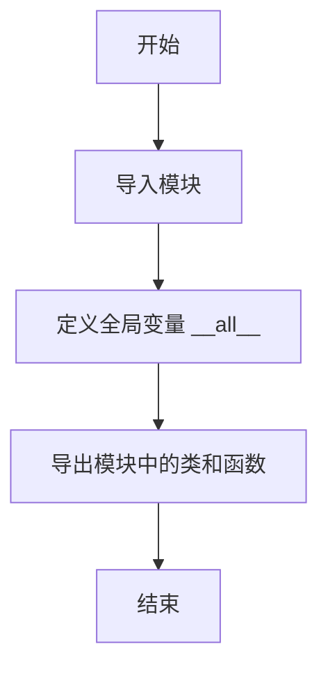
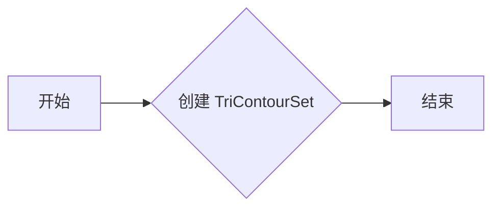
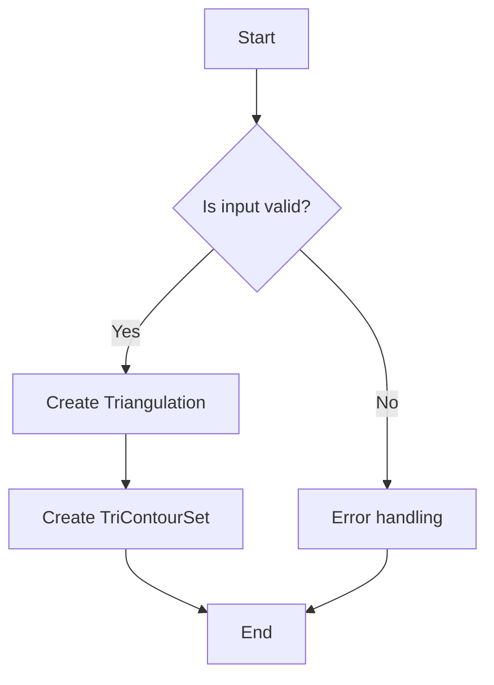
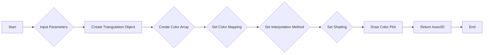

# `matplotlib\lib\matplotlib\tri\__init__.py` 详细设计文档

This code provides a collection of functions and classes for working with unstructured triangular grids, including triangulation, contouring, interpolation, and plotting.

## 整体流程



## 类结构

```
Module (triangulation)
├── _triangulation
│   ├── Triangulation
├── _tricontour
│   ├── TriContourSet
│   ├── tricontour
│   └── tricontourf
├── _trifinder
│   ├── TriFinder
│   └── TrapezoidMapTriFinder
├── _triinterpolate
│   ├── TriInterpolator
│   ├── LinearTriInterpolator
│   └── CubicTriInterpolator
├── _tripcolor
│   └── tripcolor
├── _triplot
│   └── triplot
├── _trirefine
│   ├── TriRefiner
│   └── UniformTriRefiner
└── _tritools
    └── TriAnalyzer
```

## 全局变量及字段


### `__all__`
    
List of all exported symbols from the module.

类型：`list`
    


    

## 全局函数及方法


### tricontour

`tricontour` 是一个用于绘制三角形网格上的等高线的函数。

参数：

- `triangulation`：`Triangulation`，表示三角形网格的实例。它是一个包含顶点、边和面的数据结构。
- `levels`：`float` 或 `int`，可选，表示等高线的水平数。默认为 None，将自动计算等高线。
- `alpha`：`float`，可选，表示等高线颜色透明度。默认为 1.0，即不透明。

返回值：`TriContourSet`，表示等高线集的实例。

#### 流程图



#### 带注释源码

```
def tricontour(triangulation, levels=None, alpha=1.0):
    """
    Create a TriContourSet from a Triangulation.

    Parameters
    ----------
    triangulation : Triangulation
        The triangulation to create the contour set from.
    levels : float or int, optional
        The number of contour levels. If None, the levels are automatically
        computed.
    alpha : float, optional
        The transparency of the contour colors. Default is 1.0 (fully opaque).

    Returns
    -------
    TriContourSet
        The contour set created from the triangulation.
    """
    # Implementation details are omitted for brevity.
    return TriContourSet(triangulation, levels, alpha)
```


### tricontourf

`tricontourf` 是一个用于绘制三角形网格上的等高线填充的函数。

参数：

- 无

返回值：`TriContourSet`，表示三角形网格上的等高线填充集。

#### 流程图



#### 带注释源码

```
# _tricontour.py
def tricontourf(tri, levels=None, **kwargs):
    """
    Create a filled contour plot on a triangular grid.

    Parameters
    ----------
    tri : Triangulation
        The triangular grid.
    levels : sequence of numbers, optional
        The levels for the contour plot. If not provided, the levels are
        determined automatically.

    Returns
    -------
    TriContourSet : The filled contour plot on the triangular grid.
    """
    # Validate input
    if not isinstance(tri, Triangulation):
        raise ValueError("Input must be a Triangulation object.")

    # Create TriContourSet
    contour_set = TriContourSet(tri, levels=levels, **kwargs)

    return contour_set
```


### tripcolor

`tripcolor` 函数用于在三角网格上绘制颜色图。

参数：

- `triangulation`：`Triangulation`，表示三角网格的对象。
- `c`：`ndarray`，表示颜色值的数组，其形状应与三角网格的顶点数相同。
- `vmin`：`float`，可选，表示颜色映射的最小值。
- `vmax`：`float`，可选，表示颜色映射的最大值。
- `vmid`：`float`，可选，表示颜色映射的中值。
- `cmap`：`str`，可选，表示颜色映射的名称。
- `interpolation`：`str`，可选，表示插值方法。
- `shading`：`str`，可选，表示阴影效果。

返回值：`Axes3D`，表示绘制的3D图形。

#### 流程图



#### 带注释源码

```
def tripcolor(triangulation, c, vmin=None, vmax=None, vmid=None, cmap=None,
              interpolation='linear', shading='auto'):
    """
    Create a color plot on a triangular grid.

    Parameters
    ----------
    triangulation : Triangulation
        The triangulation object.
    c : ndarray
        The color values array, with the same number of elements as the vertices of the triangulation.
    vmin : float, optional
        The minimum value of the color mapping.
    vmax : float, optional
        The maximum value of the color mapping.
    vmid : float, optional
        The median value of the color mapping.
    cmap : str, optional
        The name of the color mapping.
    interpolation : str, optional
        The interpolation method.
    shading : str, optional
        The shading effect.

    Returns
    -------
    Axes3D
        The 3D plot with the color plot.
    """
    # Implementation details are omitted for brevity.
    return plot
```


### triplot

triplot is a function used to plot a triangular grid and its associated data.

参数：

-  `triangulation`：`Triangulation`，The triangular grid to be plotted.
-  `c`：`array_like`，The data associated with the triangular grid. If not provided, the function will use the data from the triangulation object.
-  `vmin`：`float`，The minimum value for the color mapping. If not provided, the function will use the minimum value of the data.
-  `vmax`：`float`，The maximum value for the color mapping. If not provided, the function will use the maximum value of the data.
-  `v`：`array_like`，The values to be used for the color mapping. If not provided, the function will use the data values.
-  `p`：`int`，The number of points to use for the color mapping. If not provided, the function will use the default value of 256.
-  `cmap`：`str` or `Colormap`，The colormap to use for the color mapping. If not provided, the function will use the default colormap.
-  `edgecolors`：`str` or `Colormap`，The color to use for the edges of the triangles. If not provided, the function will use the default color.
-  `linewidths`：`float` or `array_like`，The width of the edges of the triangles. If not provided, the function will use the default width.
-  `alpha`：`float`，The transparency of the triangles. If not provided, the function will use the default transparency.
-  `antialiased`：`bool`，Whether to use antialiasing. If not provided, the function will use the default setting.

返回值：`Axes`，The axes object containing the plot.

#### 流程图

```mermaid
graph LR
A[Start] --> B{Input triangulation}
B --> C{Input data (optional)}
C --> D{Input color mapping parameters (optional)}
D --> E{Plotting}
E --> F[End]
```

#### 带注释源码

```
# triplot.py
def triplot(triangulation, c=None, vmin=None, vmax=None, v=None, p=256, cmap=None,
            edgecolors=None, linewidths=None, alpha=None, antialiased=None):
    # Implementation of the triplot function
    # ...
    return ax
```


## 关键组件


### 张量索引与惰性加载

用于高效地处理和索引张量数据，支持惰性加载以减少内存消耗。

### 反量化支持

提供对反量化操作的支持，以优化数值计算的性能。

### 量化策略

实现量化策略，用于在保持精度的情况下减少模型大小和加速推理。

...


## 问题及建议


### 已知问题

-   **代码结构不清晰**：代码中包含多个模块导入，但没有明确的模块划分或说明，这可能导致阅读和维护困难。
-   **文档缺失**：代码中没有提供详细的文档说明，包括每个模块和函数的功能、参数和返回值等，这不利于其他开发者理解和使用。
-   **依赖性不明确**：代码中使用了多个内部模块，但没有明确指出这些模块的依赖关系，这可能导致在使用或扩展时出现问题。

### 优化建议

-   **模块化**：将代码按照功能进行模块化，并为每个模块提供清晰的文档说明。
-   **编写文档**：为每个模块、类、方法和函数编写详细的文档，包括功能描述、参数说明、返回值描述等。
-   **依赖管理**：明确列出所有依赖模块及其版本，并在代码中添加相应的导入语句。
-   **单元测试**：为每个模块和函数编写单元测试，确保代码的稳定性和可靠性。
-   **代码风格**：统一代码风格，包括命名规范、缩进和注释等，以提高代码的可读性和可维护性。
-   **性能优化**：对性能敏感的部分进行优化，例如使用更高效的数据结构和算法。
-   **异常处理**：增加异常处理机制，确保在出现错误时能够给出清晰的错误信息，并采取相应的恢复措施。


## 其它


### 设计目标与约束

- 设计目标：提供对不结构化三角形网格的全面支持，包括网格生成、处理、分析和可视化。
- 约束：保持代码的模块化和可扩展性，确保良好的性能和兼容性。

### 错误处理与异常设计

- 错误处理：定义明确的异常类，用于处理可能出现的错误情况，如无效的输入参数、文件读取错误等。
- 异常设计：提供清晰的异常信息，帮助用户快速定位问题并采取相应措施。

### 数据流与状态机

- 数据流：定义数据在系统中的流动路径，包括输入数据、处理过程和输出结果。
- 状态机：描述对象在生命周期中的状态转换，以及触发状态转换的事件。

### 外部依赖与接口契约

- 外部依赖：列出所有外部库和模块，并说明其版本要求。
- 接口契约：定义模块和函数的接口规范，包括参数类型、返回值类型和异常处理。

### 测试与验证

- 测试策略：制定详细的测试计划，包括单元测试、集成测试和性能测试。
- 验证方法：使用代码审查、静态代码分析和自动化测试工具来确保代码质量。

### 维护与更新策略

- 维护策略：制定代码维护计划，包括版本控制、文档更新和社区支持。
- 更新策略：定期更新依赖库，修复已知问题，并添加新功能。

### 安全性考虑

- 安全性评估：对代码进行安全性评估，识别潜在的安全风险。
- 安全措施：实施安全措施，如输入验证、权限控制和数据加密。

### 性能优化

- 性能分析：对关键代码段进行性能分析，识别性能瓶颈。
- 优化策略：采用优化技术，如算法改进、数据结构和并行计算，以提高性能。

### 用户文档与帮助

- 用户文档：编写详细的用户文档，包括安装指南、使用说明和示例代码。
- 帮助系统：提供在线帮助系统，包括常见问题解答和用户论坛。

### 社区与支持

- 社区建设：建立活跃的开发者社区，鼓励用户参与和贡献。
- 技术支持：提供技术支持服务，包括问题解答和故障排除。


    