# `matplotlib\lib\matplotlib\tri\_triangulation.py` 详细设计文档

The code defines a class `Triangulation` for creating and manipulating unstructured triangular grids. It supports automatic Delaunay triangulation and allows for masking of triangles.

## 整体流程

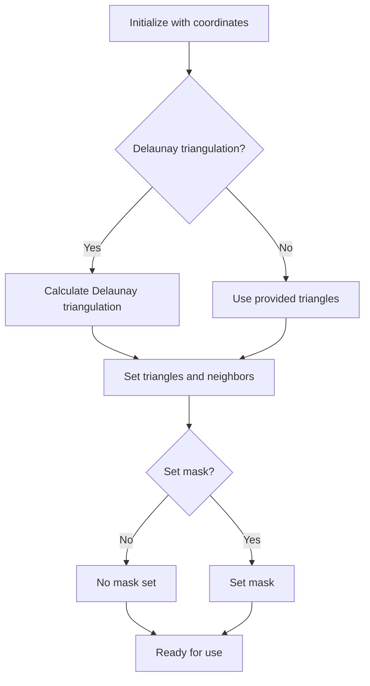

## 类结构

```
Triangulation (主类)
├── x (np.ndarray)
│   ├── y (np.ndarray)
│   ├── triangles (np.ndarray)
│   ├── mask (np.ndarray or None)
│   ├── is_delaunay (bool)
│   └── _edges (np.ndarray or None)
│       └── _neighbors (np.ndarray or None)
└── _cpp_triangulation (matplotlib._tri.Triangulation or None)
    └── _trifinder (matplotlib.tri._trifinder.TrapezoidMapTriFinder or None)
```

## 全局变量及字段


### `sys.flags.verbose`
    
Module containing flags for matplotlib's verbose output.

类型：`module`
    


### `np`
    
Module containing the NumPy library.

类型：`module`
    


### `_api`
    
Module containing API utilities for matplotlib.

类型：`module`
    


### `_qhull`
    
Module containing the Qhull library for Delaunay triangulation.

类型：`module`
    


### `_tri`
    
Module containing the Triangulation class for matplotlib.

类型：`module`
    


### `TrapezoidMapTriFinder`
    
Class representing the TrapezoidMapTriFinder for matplotlib's TriFinder.

类型：`class`
    


### `Triangulation.x`
    
Array of x-coordinates of the grid points.

类型：`np.ndarray`
    


### `Triangulation.y`
    
Array of y-coordinates of the grid points.

类型：`np.ndarray`
    


### `Triangulation.triangles`
    
Array of triangles, where each triangle is represented by three indices of the grid points.

类型：`np.ndarray`
    


### `Triangulation.mask`
    
Array indicating which triangles are masked out.

类型：`np.ndarray`
    


### `Triangulation.is_delaunay`
    
Flag indicating whether the triangulation is a Delaunay triangulation.

类型：`bool`
    


### `Triangulation._edges`
    
Array of edges of non-masked triangles.

类型：`np.ndarray`
    


### `Triangulation._neighbors`
    
Array of neighbor triangles for each triangle.

类型：`np.ndarray`
    


### `Triangulation._cpp_triangulation`
    
Underlying C++ Triangulation object.

类型：`object`
    


### `Triangulation._trifinder`
    
Default TriFinder object for the triangulation.

类型：`object`
    
    

## 全局函数及方法


### _qhull.delaunay

This function calculates the Delaunay triangulation of a set of points.

参数：

- `x`：`numpy.ndarray`，包含点的x坐标。
- `y`：`numpy.ndarray`，包含点的y坐标。
- `sys.flags.verbose`：`int`，控制输出信息的详细程度。

返回值：`numpy.ndarray`，包含三角形的顶点索引，形状为`(ntri, 3)`。

#### 流程图

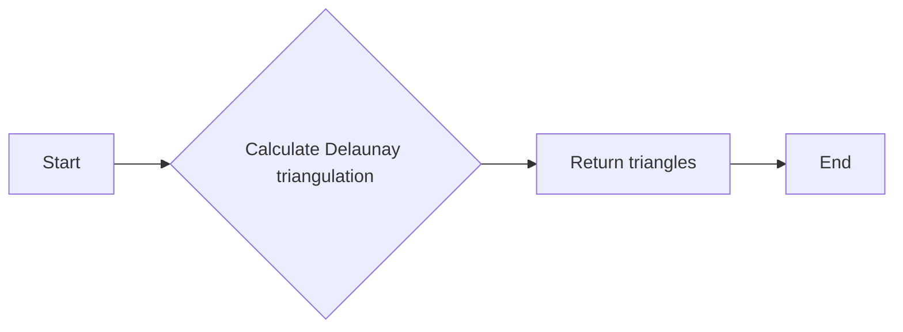

#### 带注释源码

```python
def delaunay(x, y, verbose=0):
    """
    Calculate the Delaunay triangulation of a set of points.

    Parameters
    ----------
    x : numpy.ndarray
        Array of x-coordinates of the points.
    y : numpy.ndarray
        Array of y-coordinates of the points.
    verbose : int, optional
        Control the verbosity of the output.

    Returns
    -------
    numpy.ndarray
        Array of triangles, where each triangle is represented by the indices of its vertices.
    """
    # Call the underlying C++ code to calculate the Delaunay triangulation.
    triangles = _triangulate(x, y, verbose)

    return triangles
```


### `Triangulation.__init__`

This method initializes a `Triangulation` object, which represents an unstructured triangular grid. It can either be created with user-specified triangles or automatically generated using a Delaunay triangulation.

参数：

- `x`：`array-like`，网格点的 x 坐标。
- `y`：`array-like`，网格点的 y 坐标。
- `triangles`：`array-like` of int，可选。每个三角形由三个点的索引组成，按逆时针顺序排列。如果未指定，则计算 Delaunay 三角剖分。
- `mask`：`array-like` of bool，可选。指定哪些三角形被屏蔽。

返回值：无

#### 流程图

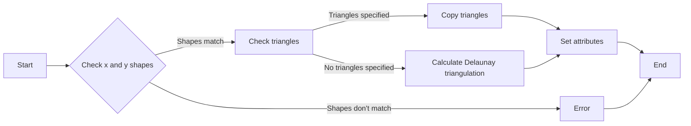

#### 带注释源码

```python
def __init__(self, x, y, triangles=None, mask=None):
    from matplotlib import _qhull

    self.x = np.asarray(x, dtype=np.float64)
    self.y = np.asarray(y, dtype=np.float64)
    if self.x.shape != self.y.shape or self.x.ndim != 1:
        raise ValueError("x and y must be equal-length 1D arrays, but "
                         f"found shapes {self.x.shape!r} and "
                         f"{self.y.shape!r}")

    self.mask = None
    self._edges = None
    self._neighbors = None
    self.is_delaunay = False

    if triangles is None:
        # No triangulation specified, so use matplotlib._qhull to obtain
        # Delaunay triangulation.
        self.triangles, self._neighbors = _qhull.delaunay(x, y, sys.flags.verbose)
        self.is_delaunay = True
    else:
        # Triangulation specified. Copy, since we may correct triangle
        # orientation.
        try:
            self.triangles = np.array(triangles, dtype=np.int32, order='C')
        except ValueError as e:
            raise ValueError('triangles must be a (N, 3) int array, not '
                             f'{triangles!r}') from e
        if self.triangles.ndim != 2 or self.triangles.shape[1] != 3:
            raise ValueError(
                'triangles must be a (N, 3) int array, but found shape '
                f'{self.triangles.shape!r}')
        if self.triangles.max() >= len(self.x):
            raise ValueError(
                'triangles are indices into the points and must be in the '
                f'range 0 <= i < {len(self.x)} but found value '
                f'{self.triangles.max()}')
        if self.triangles.min() < 0:
            raise ValueError(
                'triangles are indices into the points and must be in the '
                f'range 0 <= i < {len(self.x)} but found value '
                f'{self.triangles.min()}')

    # Underlying C++ object is not created until first needed.
    self._cpp_triangulation = None

    # Default TriFinder not created until needed.
    self._trifinder = None

    self.set_mask(mask)
```


### Triangulation.get_trifinder()

Return the default `matplotlib.tri.TriFinder` of this triangulation, creating it if necessary. This allows the same TriFinder object to be easily shared.

参数：

- `self`：`Triangulation`，当前三角剖分对象

返回值：`TrapezoidMapTriFinder`，`matplotlib.tri.TriFinder`对象，用于查找三角剖分中的三角形

#### 流程图

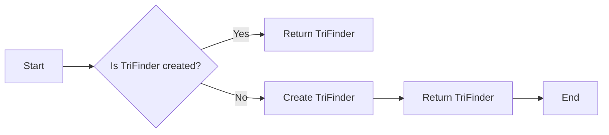

#### 带注释源码

```python
def get_trifinder(self):
    """
    Return the default `matplotlib.tri.TriFinder` of this
    triangulation, creating it if necessary.  This allows the same
    TriFinder object to be easily shared.
    """
    if self._trifinder is None:
        # Default TriFinder class.
        from matplotlib.tri._trifinder import TrapezoidMapTriFinder
        self._trifinder = TrapezoidMapTriFinder(self)
    return self._trifinder
```


### Triangulation.__init__

This method initializes a Triangulation object with the given coordinates and optionally specified triangles and mask.

参数：

- `x`：`array-like`，Grid points' x-coordinates.
- `y`：`array-like`，Grid points' y-coordinates.
- `triangles`：`array-like of int`，Optional triangles to use instead of the Delaunay triangulation. Must be a (N, 3) int array.
- `mask`：`array-like of bool`，Optional mask for triangles. Must have the same length as the triangles array.

返回值：无

#### 流程图

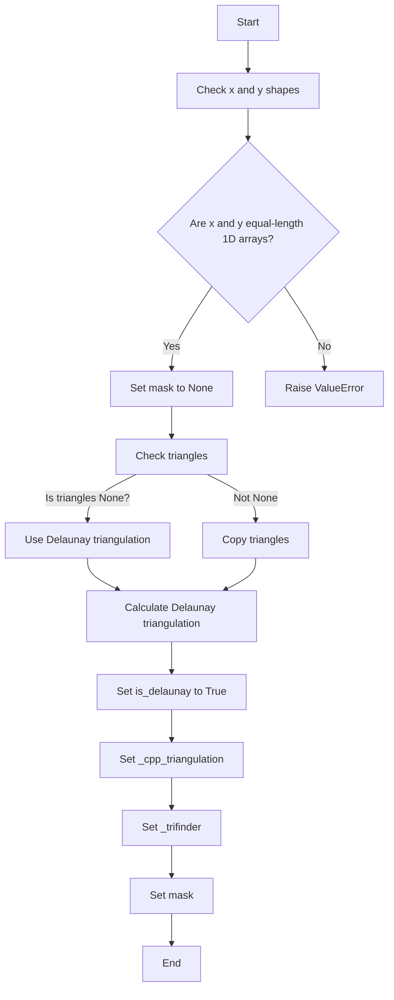

#### 带注释源码

```python
def __init__(self, x, y, triangles=None, mask=None):
    from matplotlib import _qhull

    self.x = np.asarray(x, dtype=np.float64)
    self.y = np.asarray(y, dtype=np.float64)
    if self.x.shape != self.y.shape or self.x.ndim != 1:
        raise ValueError("x and y must be equal-length 1D arrays, but "
                         f"found shapes {self.x.shape!r} and "
                         f"{self.y.shape!r}")

    self.mask = None
    self._edges = None
    self._neighbors = None
    self.is_delaunay = False

    if triangles is None:
        # No triangulation specified, so use matplotlib._qhull to obtain
        # Delaunay triangulation.
        self.triangles, self._neighbors = _qhull.delaunay(x, y, sys.flags.verbose)
        self.is_delaunay = True
    else:
        # Triangulation specified. Copy, since we may correct triangle
        # orientation.
        try:
            self.triangles = np.array(triangles, dtype=np.int32, order='C')
        except ValueError as e:
            raise ValueError('triangles must be a (N, 3) int array, not '
                             f'{triangles!r}') from e
        if self.triangles.ndim != 2 or self.triangles.shape[1] != 3:
            raise ValueError(
                'triangles must be a (N, 3) int array, but found shape '
                f'{self.triangles.shape!r}')
        if self.triangles.max() >= len(self.x):
            raise ValueError(
                'triangles are indices into the points and must be in the '
                f'range 0 <= i < {len(self.x)} but found value '
                f'{self.triangles.max()}')
        if self.triangles.min() < 0:
            raise ValueError(
                'triangles are indices into the points and must be in the '
                f'range 0 <= i < {len(self.x)} but found value '
                f'{self.triangles.min()}')

    # Underlying C++ object is not created until first needed.
    self._cpp_triangulation = None

    # Default TriFinder not created until needed.
    self._trifinder = None

    self.set_mask(mask)
```


### Triangulation.calculate_plane_coefficients

Calculate plane equation coefficients for all unmasked triangles from the point (x, y) coordinates and specified z-array of shape (npoints).

参数：

- `z`：`(npoints,) array-like`，The z-array of shape (npoints) containing the z-coordinates corresponding to the (x, y) coordinates.

返回值：`(npoints, 3) array`，The returned array has shape (npoints, 3) and allows z-value at (x, y) position in triangle tri to be calculated using `z = array[tri, 0] * x + array[tri, 1] * y + array[tri, 2]`.

#### 流程图

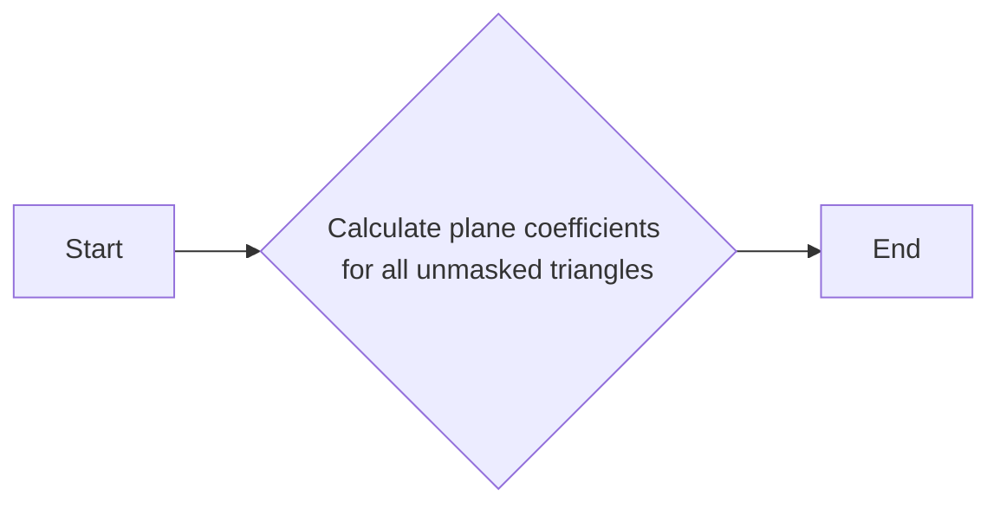

#### 带注释源码

```python
def calculate_plane_coefficients(self, z):
    """
    Calculate plane equation coefficients for all unmasked triangles from
    the point (x, y) coordinates and specified z-array of shape (npoints).
    The returned array has shape (npoints, 3) and allows z-value at (x, y)
    position in triangle tri to be calculated using
    ``z = array[tri, 0] * x  + array[tri, 1] * y + array[tri, 2]``.
    """
    return self.get_cpp_triangulation().calculate_plane_coefficients(z)
```


### Triangulation.edges

返回包含所有非掩码三角形边的整数数组。

参数：

- 无

返回值：`np.ndarray`，包含所有非掩码三角形边的整数数组。

#### 流程图

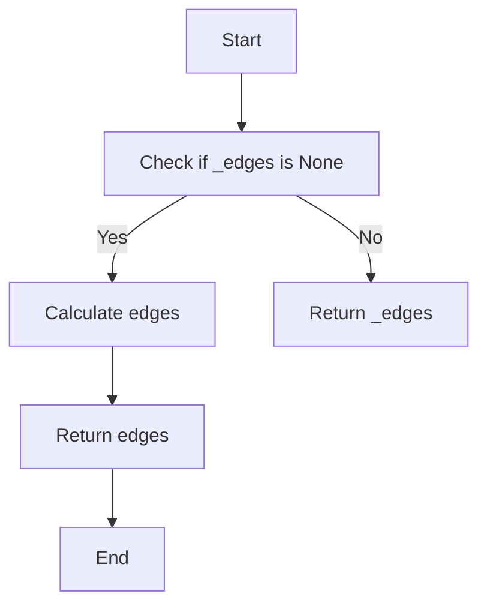

#### 带注释源码

```python
    @property
    def edges(self):
        """
        Return integer array of shape (nedges, 2) containing all edges of
        non-masked triangles.

        Each row defines an edge by its start point index and end point
        index.  Each edge appears only once, i.e. for an edge between points
        *i*  and *j*, there will only be either *(i, j)* or *(j, i)*.
        """
        if self._edges is None:
            self._edges = self.get_cpp_triangulation().get_edges()
        return self._edges
```


### Triangulation.get_cpp_triangulation

Return the underlying C++ Triangulation object, creating it if necessary.

参数：

- 无

返回值：`_tri.Triangulation`，The underlying C++ Triangulation object.

#### 流程图

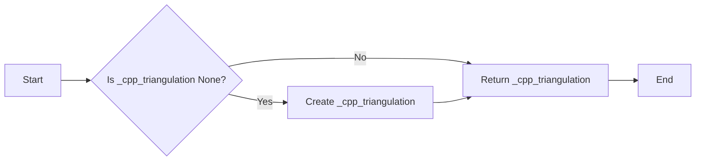

#### 带注释源码

```python
def get_cpp_triangulation(self):
    """
    Return the underlying C++ Triangulation object, creating it
    if necessary.
    """
    from matplotlib import _tri
    if self._cpp_triangulation is None:
        self._cpp_triangulation = _tri.Triangulation(
            self.x, self.y, self.triangles,
            self.mask if self.mask is not None else (),
            self._edges if self._edges is not None else (),
            self._neighbors if self._neighbors is not None else (),
            not self.is_delaunay)
    return self._cpp_triangulation
```


### Triangulation.get_masked_triangles

Return an array of triangles taking the mask into account.

参数：

- `self`：`Triangulation`，当前`Triangulation`对象

返回值：`np.ndarray`，考虑mask的三角形数组

#### 流程图

```mermaid
graph LR
A[Start] --> B{Check if mask is None?}
B -- Yes --> C[Return triangles]
B -- No --> D[Return triangles[~mask]]
D --> E[End]
```

#### 带注释源码

```python
def get_masked_triangles(self):
    """
    Return an array of triangles taking the mask into account.
    """
    if self.mask is not None:
        return self.triangles[~self.mask]
    else:
        return self.triangles
```


### Triangulation.get_from_args_and_kwargs

This function returns a Triangulation object from the provided arguments and keyword arguments, and also returns the remaining arguments and keyword arguments with the consumed values removed.

参数：

- `*args`：可变数量的位置参数，用于传递创建 Triangulation 对象所需的参数。
- `**kwargs`：关键字参数，用于传递创建 Triangulation 对象所需的参数。

返回值：`Triangulation`，返回创建的 Triangulation 对象。

#### 流程图

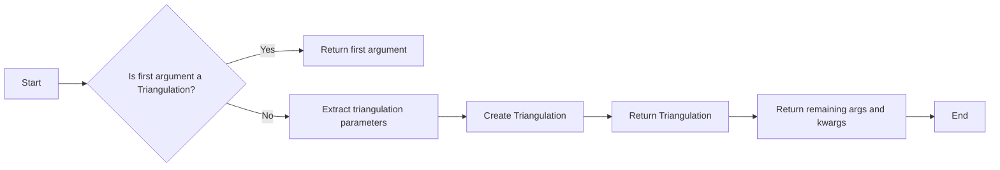

#### 带注释源码

```python
@staticmethod
def get_from_args_and_kwargs(*args, **kwargs):
    """
    Return a Triangulation object from the args and kwargs, and
    the remaining args and kwargs with the consumed values removed.

    There are two alternatives: either the first argument is a
    Triangulation object, in which case it is returned, or the args
    and kwargs are sufficient to create a new Triangulation to
    return.  In the latter case, see Triangulation.__init__ for
    the possible args and kwargs.
    """
    if isinstance(args[0], Triangulation):
        triangulation, *args = args
        if 'triangles' in kwargs:
            _api.warn_external(
                "Passing the keyword 'triangles' has no effect when also "
                "passing a Triangulation")
        if 'mask' in kwargs:
            _api.warn_external(
                "Passing the keyword 'mask' has no effect when also "
                "passing a Triangulation")
    else:
        x, y, triangles, mask, args, kwargs = \
            Triangulation._extract_triangulation_params(args, kwargs)
        triangulation = Triangulation(x, y, triangles, mask)
    return triangulation, args, kwargs
```


### Triangulation._extract_triangulation_params

This method extracts the triangulation parameters from the given arguments and keyword arguments.

参数：

- `args`：`tuple`，The positional arguments passed to the method.
- `kwargs`：`dict`，The keyword arguments passed to the method.

返回值：`tuple`，A tuple containing the extracted parameters:
- `x`：`numpy.ndarray`，The coordinates of the grid points.
- `y`：`numpy.ndarray`，The coordinates of the grid points.
- `triangles`：`numpy.ndarray` or `None`，The indices of the three points that make up the triangle.
- `mask`：`numpy.ndarray` or `None`，The mask for the triangles.
- `args`：`tuple`，The remaining positional arguments.
- `kwargs`：`dict`，The remaining keyword arguments.

#### 流程图

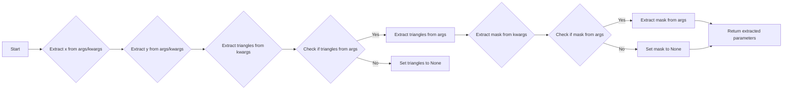

#### 带注释源码

```python
@staticmethod
def _extract_triangulation_params(args, kwargs):
    x, y, *args = args
    # Check triangles in kwargs then args.
    triangles = kwargs.pop('triangles', None)
    from_args = False
    if triangles is None and args:
        triangles = args[0]
        from_args = True
    if triangles is not None:
        try:
            triangles = np.asarray(triangles, dtype=np.int32)
        except ValueError:
            triangles = None
    if triangles is not None and (triangles.ndim != 2 or
                                  triangles.shape[1] != 3):
        triangles = None
    if triangles is not None and from_args:
        args = args[1:]  # Consumed first item in args.
    # Check for mask in kwargs.
    mask = kwargs.pop('mask', None)
    return x, y, triangles, mask, args, kwargs
``` 


### Triangulation.get_trifinder

Return the default `matplotlib.tri.TriFinder` of this triangulation, creating it if necessary. This allows the same TriFinder object to be easily shared.

参数：

- 无

返回值：`matplotlib.tri.TriFinder`，The default `TriFinder` object for this triangulation.

#### 流程图


#### 带注释源码

```python
def get_trifinder(self):
    """
    Return the default `matplotlib.tri.TriFinder` of this triangulation, creating it if necessary. This allows the same TriFinder object to be easily shared.
    """
    if self._trifinder is None:
        # Default TriFinder class.
        from matplotlib.tri._trifinder import TrapezoidMapTriFinder
        self._trifinder = TrapezoidMapTriFinder(self)
    return self._trifinder
```


### Triangulation.set_mask

Set or clear the mask array.

参数：

- `mask`：`None` 或 `bool` 数组，长度为 `ntri`，描述了哪些三角形被屏蔽。

返回值：无

#### 流程图

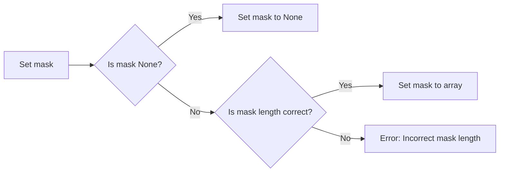

#### 带注释源码

```python
def set_mask(self, mask):
    """
    Set or clear the mask array.

    Parameters
    ----------
    mask : None or bool array of length ntri
    """
    if mask is None:
        self.mask = None
    else:
        self.mask = np.asarray(mask, dtype=bool)
        if self.mask.shape != (self.triangles.shape[0],):
            raise ValueError('mask array must have same length as '
                             'triangles array')

    # Set mask in C++ Triangulation.
    if self._cpp_triangulation is not None:
        self._cpp_triangulation.set_mask(
            self.mask if self.mask is not None else ())

    # Clear derived fields so they are recalculated when needed.
    self._edges = None
    self._neighbors = None

    # Recalculate TriFinder if it exists.
    if self._trifinder is not None:
        self._trifinder._initialize()
```


## 关键组件


### 张量索引与惰性加载

张量索引与惰性加载是代码中用于高效访问和操作大型数据集的关键组件。它允许在需要时才计算或加载数据，从而减少内存消耗和提高性能。

### 反量化支持

反量化支持是代码中用于处理量化数据的关键组件。它允许在量化过程中将数据从量化格式转换回原始格式，以便进行进一步处理或分析。

### 量化策略

量化策略是代码中用于优化数据存储和计算效率的关键组件。它通过减少数据精度来减少内存占用和计算时间，同时保持足够的精度以满足应用需求。


## 问题及建议


### 已知问题

-   **性能问题**：代码中使用了大量的numpy和matplotlib的内部函数，这些函数可能不是最优化的，特别是在处理大量数据时。
-   **代码可读性**：类和方法之间的依赖关系可能不是非常清晰，这可能导致代码难以理解和维护。
-   **错误处理**：代码中的一些错误检查可能不够全面，例如在设置mask时，没有检查mask的长度是否与triangles的长度匹配。
-   **全局变量和函数**：代码中使用了全局变量和函数，这可能导致代码难以测试和重用。

### 优化建议

-   **性能优化**：对numpy和matplotlib的函数进行性能分析，并使用更高效的替代方案。
-   **代码重构**：重构代码以提高可读性和可维护性，例如通过使用更清晰的命名和减少嵌套。
-   **错误处理**：增加更全面的错误检查，确保代码的健壮性。
-   **模块化**：将全局变量和函数封装到类中，以提高代码的可测试性和重用性。
-   **文档**：为代码添加更详细的文档，包括每个类和方法的功能和参数。
-   **单元测试**：编写单元测试以确保代码的正确性和稳定性。


## 其它


### 设计目标与约束

- 设计目标：
  - 提供一个灵活的三角剖分工具，能够处理用户指定的三角剖分或自动生成的Delaunay三角剖分。
  - 支持对三角剖分进行掩码处理，以便排除某些三角形。
  - 提供计算平面方程系数的方法，以便在三角剖分上计算z值。
  - 提供一个默认的`TriFinder`对象，以便于在三角剖分上进行查找操作。

- 约束：
  - 输入的x和y坐标必须是等长的一维数组。
  - 三角形的索引必须在0到点数减1的范围内。
  - 三角形的形状必须是(ntri, 3)的整数数组。

### 错误处理与异常设计

- 当输入的x和y坐标不是等长的一维数组时，抛出`ValueError`。
- 当三角形的索引超出范围时，抛出`ValueError`。
- 当掩码数组的长度与三角形数组的长度不匹配时，抛出`ValueError`。

### 数据流与状态机

- 数据流：
  - 输入：x和y坐标数组，可选的三角形数组，可选的掩码数组。
  - 输出：`Triangulation`对象。

- 状态机：
  - 初始化：创建`Triangulation`对象，设置x和y坐标，可选的三角形和掩码。
  - 计算Delaunay三角剖分：如果未指定三角形，则使用`_qhull`模块计算Delaunay三角剖分。
  - 计算平面方程系数：使用`calculate_plane_coefficients`方法计算平面方程系数。
  - 获取掩码三角形：使用`get_masked_triangles`方法获取掩码三角形。
  - 获取边：使用`edges`属性获取非掩码三角形的边。
  - 获取邻接三角形：使用`neighbors`属性获取邻接三角形。

### 外部依赖与接口契约

- 外部依赖：
  - NumPy：用于数组操作。
  - Matplotlib：用于Delaunay三角剖分和TriFinder。

- 接口契约：
  - `Triangulation`类必须提供初始化方法，用于创建新的`Triangulation`对象。
  - `Triangulation`类必须提供计算平面方程系数的方法。
  - `Triangulation`类必须提供获取掩码三角形的方法。
  - `Triangulation`类必须提供获取边的方法。
  - `Triangulation`类必须提供获取邻接三角形的方法。
  - `Triangulation`类必须提供获取`TriFinder`对象的方法。

    