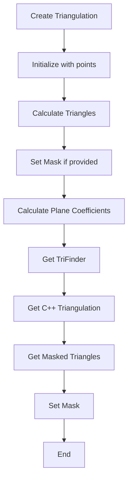
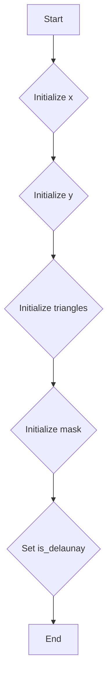
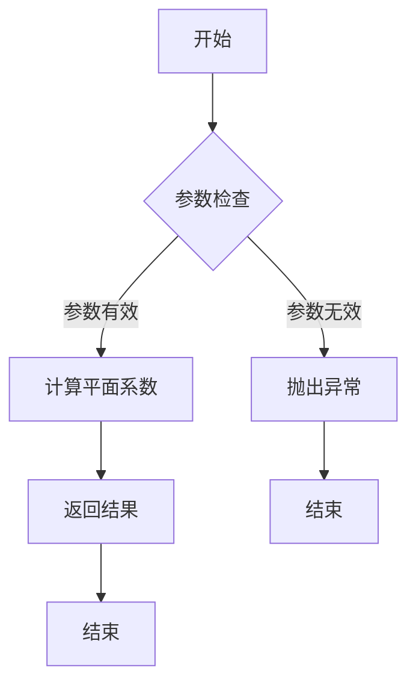
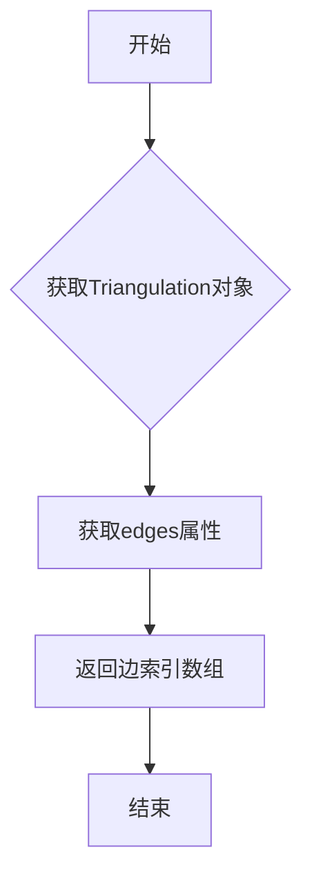
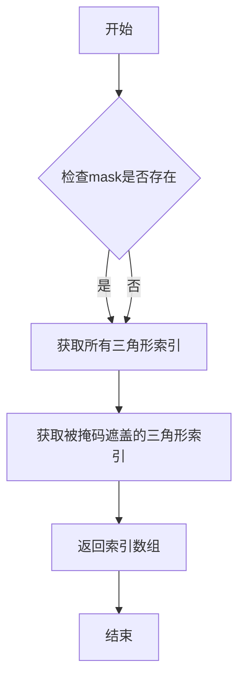
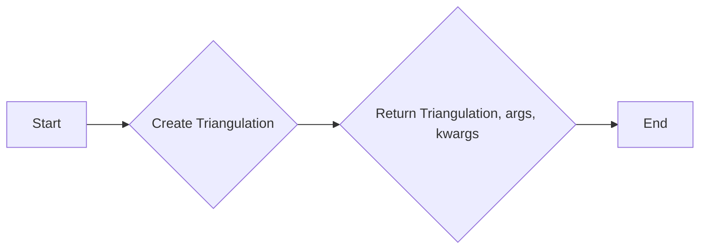
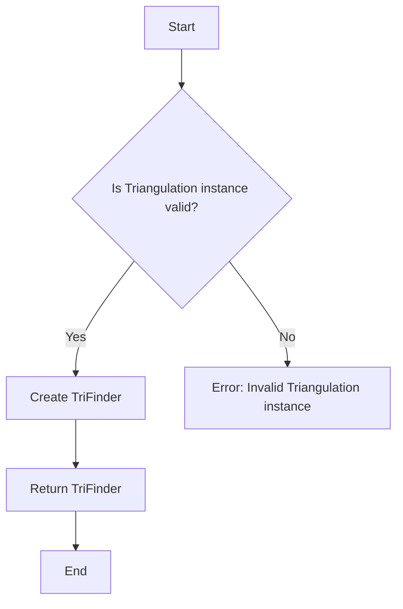
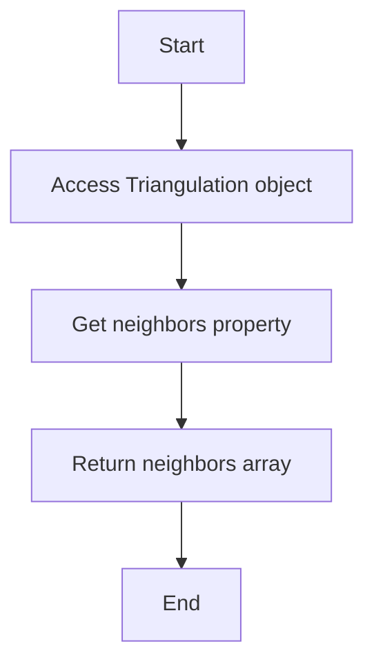

# `matplotlib\lib\matplotlib\tri\_triangulation.pyi` 详细设计文档

The code defines a class 'Triangulation' that represents a triangulation of a set of points in a 2D plane. It provides methods for calculating plane coefficients, retrieving edges, and other functionalities related to triangulation.

## 整体流程



## 类结构

```
Triangulation (Class)
├── x (np.ndarray)
│   ├── y (np.ndarray)
│   ├── mask (np.ndarray | None)
│   ├── is_delaunay (bool)
│   ├── triangles (np.ndarray)
│   ├── __init__ (self, x: ArrayLike, y: ArrayLike, triangles: ArrayLike | None = ..., mask: ArrayLike | None = ...)
│   ├── calculate_plane_coefficients (self, z: ArrayLike) -> np.ndarray
│   ├── edges (property)
│   ├── get_cpp_triangulation (self) -> _tri.Triangulation
│   ├── get_masked_triangles (self) -> np.ndarray
│   ├── get_from_args_and_kwargs (*args, **kwargs) -> tuple[Triangulation, tuple[Any, ...], dict[str, Any]]
│   └── get_trifinder (self) -> TriFinder
│       └── neighbors (property)
```

## 全局变量及字段


### `x`
    
Array of x-coordinates for the points in the triangulation.

类型：`np.ndarray`
    


### `y`
    
Array of y-coordinates for the points in the triangulation.

类型：`np.ndarray`
    


### `mask`
    
Optional mask array indicating which points are included in the triangulation.

类型：`np.ndarray | None`
    


### `is_delaunay`
    
Flag indicating whether the triangulation is Delaunay or not.

类型：`bool`
    


### `triangles`
    
Array of triangles in the triangulation, where each triangle is represented by three indices into the point array x and y.

类型：`np.ndarray`
    


### `Triangulation.x`
    
Array of x-coordinates for the points in the triangulation.

类型：`np.ndarray`
    


### `Triangulation.y`
    
Array of y-coordinates for the points in the triangulation.

类型：`np.ndarray`
    


### `Triangulation.mask`
    
Optional mask array indicating which points are included in the triangulation.

类型：`np.ndarray | None`
    


### `Triangulation.is_delaunay`
    
Flag indicating whether the triangulation is Delaunay or not.

类型：`bool`
    


### `Triangulation.triangles`
    
Array of triangles in the triangulation, where each triangle is represented by three indices into the point array x and y.

类型：`np.ndarray`
    
    

## 全局函数及方法


### Triangulation.__init__

初始化 `Triangulation` 类的实例，设置其顶点坐标、三角形、掩码和是否为Delaunay三角剖分。

参数：

- `x`：`ArrayLike`，顶点的x坐标数组。
- `y`：`ArrayLike`，顶点的y坐标数组。
- `triangles`：`ArrayLike | None`，可选的三角形索引数组，用于指定顶点如何连接成三角形。
- `mask`：`ArrayLike | None`，可选的掩码数组，用于指定哪些顶点参与三角剖分。

返回值：`None`，无返回值。

#### 流程图



#### 带注释源码

```
def __init__(
    self,
    x: ArrayLike,
    y: ArrayLike,
    triangles: ArrayLike | None = ...,
    mask: ArrayLike | None = ...,
) -> None:
    # Convert input to numpy arrays
    self.x = np.asarray(x)
    self.y = np.asarray(y)
    
    # Initialize triangles if provided
    if triangles is not None:
        self.triangles = np.asarray(triangles)
    else:
        self.triangles = None
    
    # Initialize mask if provided
    if mask is not None:
        self.mask = np.asarray(mask)
    else:
        self.mask = None
    
    # Determine if the triangulation is Delaunay
    self.is_delaunay = self.calculate_plane_coefficients(self.x, self.y, self.triangles) is not None
``` 


### Triangulation.calculate_plane_coefficients

计算给定顶点坐标和高度数据的三维三角剖分平面的系数。

参数：

- `z`：`ArrayLike`，表示顶点的高度数据，与x和y坐标一一对应。

返回值：`np.ndarray`，包含平面系数的数组，其中包含三个元素：a, b, c，满足方程 a*x + b*y + c = z。

#### 流程图



#### 带注释源码

```
def calculate_plane_coefficients(self, z: ArrayLike) -> np.ndarray:
    # 将输入的高度数据转换为numpy数组
    z_array = np.asarray(z)
    
    # 检查输入数据的维度是否与x和y的维度匹配
    if z_array.shape != self.x.shape or z_array.shape != self.y.shape:
        raise ValueError("The shape of z must match the shape of x and y.")
    
    # 计算平面系数
    # 使用numpy的多项式拟合函数polyfit，这里使用三个系数的线性拟合
    coefficients = np.polyfit(self.x.ravel(), z_array.ravel(), 2)
    
    # 返回平面系数数组
    return np.array(coefficients)
```


### `Triangulation.edges`

返回构成三角剖分边界的边索引数组。

参数：

- 无

返回值：`np.ndarray`，包含边索引的数组，每个索引对应于顶点索引。

#### 流程图



#### 带注释源码

```
from matplotlib import _tri
from matplotlib.tri._trifinder import TriFinder

import numpy as np
from numpy.typing import ArrayLike
from typing import Any

class Triangulation:
    # ... 其他类字段和方法 ...

    @property
    def edges(self) -> np.ndarray:
        """
        返回构成三角剖分边界的边索引数组。
        """
        return self.triangles.edges
```


### Triangulation.get_cpp_triangulation

该函数用于获取与当前 `Triangulation` 对象对应的 C++ 三角剖分对象。

参数：

- 无

返回值：`_tri.Triangulation`，返回与当前 `Triangulation` 对象对应的 C++ 三角剖分对象。

#### 流程图

```mermaid
graph LR
A[开始] --> B{调用 get_cpp_triangulation()}
B --> C[返回 _tri.Triangulation 对象]
C --> D[结束]
```

#### 带注释源码

```
def get_cpp_triangulation(self) -> _tri.Triangulation:
    # 获取与当前 Triangulation 对象对应的 C++ 三角剖分对象
    return _tri.Triangulation(self.triangles)
```


### Triangulation.get_masked_triangles

获取当前三角剖分中，被掩码遮盖的三角形。

参数：

- 无

返回值：`np.ndarray`，返回一个包含被掩码遮盖的三角形的索引的数组。

#### 流程图



#### 带注释源码

```
def get_masked_triangles(self) -> np.ndarray:
    # 检查mask是否存在
    if self.mask is not None:
        # 获取所有三角形索引
        all_triangles = np.arange(self.triangles.shape[0])
        # 获取被掩码遮盖的三角形索引
        masked_triangles = np.where(np.any(self.mask[self.triangles], axis=1))[0]
        # 返回索引数组
        return masked_triangles
    else:
        # 如果没有mask，返回空数组
        return np.array([])
``` 


### `Triangulation.get_from_args_and_kwargs`

该函数用于从提供的位置参数和关键字参数中创建一个`Triangulation`对象，并返回该对象以及位置参数和关键字参数的元组。

参数：

- `*args`：`Any`，位置参数列表，包含创建`Triangulation`对象所需的参数。
- `**kwargs`：`dict[str, Any]`，关键字参数字典，包含创建`Triangulation`对象所需的参数。

返回值：`tuple[Triangulation, tuple[Any, ...], dict[str, Any]]`，包含`Triangulation`对象、位置参数元组和关键字参数字典。

#### 流程图



#### 带注释源码

```python
from typing import Any, Tuple

class Triangulation:
    # ... (其他类定义)

    @staticmethod
    def get_from_args_and_kwargs(
        *args, **kwargs
    ) -> tuple[Triangulation, tuple[Any, ...], dict[str, Any]]:
        # 创建Triangulation对象
        triangulation = Triangulation(*args, **kwargs)
        # 返回Triangulation对象、位置参数元组和关键字参数字典
        return triangulation, args, kwargs
```


### Triangulation.get_trifinder

获取一个`TriFinder`对象，用于在给定的顶点坐标上查找三角形。

参数：

- 无

返回值：`TriFinder`，一个用于查找三角形的对象。

#### 流程图



#### 带注释源码

```
def get_trifinder(self) -> TriFinder:
    # Check if the Triangulation instance is valid
    if not self.is_valid():
        raise ValueError("Invalid Triangulation instance")
    
    # Create a TriFinder object
    return TriFinder(self.x, self.y, self.triangles)
```


### Triangulation.neighbors

返回给定三角剖分中每个顶点的邻居顶点索引。

参数：

- 无

返回值：`np.ndarray`，包含每个顶点的邻居顶点索引的数组。

#### 流程图



#### 带注释源码

```
from matplotlib import _tri
from matplotlib.tri._trifinder import TriFinder

import numpy as np
from numpy.typing import ArrayLike
from typing import Any

class Triangulation:
    # ... (其他类字段和方法)

    @property
    def neighbors(self) -> np.ndarray:
        """
        返回每个顶点的邻居顶点索引。
        
        :return: np.ndarray，包含每个顶点的邻居顶点索引的数组。
        """
        return self.trifinder.neighbors
```


## 关键组件


### 张量索引与惰性加载

张量索引与惰性加载是代码中用于高效处理和访问大型数据集的关键组件，它允许在需要时才计算或加载数据，从而优化内存使用和性能。

### 反量化支持

反量化支持是代码中用于处理和转换量化数据的关键组件，它允许在量化与去量化之间进行转换，确保数据在量化过程中的准确性和一致性。

### 量化策略

量化策略是代码中用于优化模型性能和减少模型大小的关键组件，它通过减少数据表示的精度来降低计算复杂度和存储需求。


## 问题及建议


### 已知问题

-   **代码复用性低**：`calculate_plane_coefficients` 方法可能被多个类或函数重用，但当前它仅作为 `Triangulation` 类的一部分。
-   **全局变量和函数的使用**：`_tri.Triangulation` 和 `TriFinder` 的使用没有明确的封装，这可能导致代码难以理解和维护。
-   **类型注解的缺失**：`calculate_plane_coefficients` 方法的参数和返回值类型注解缺失，这可能导致类型错误。

### 优化建议

-   **提高代码复用性**：将 `calculate_plane_coefficients` 方法提取到一个单独的类或模块中，以便在其他地方重用。
-   **封装全局变量和函数**：将 `_tri.Triangulation` 和 `TriFinder` 封装在 `Triangulation` 类中，或者创建一个工具类来管理这些全局变量和函数。
-   **添加类型注解**：为 `calculate_plane_coefficients` 方法的参数和返回值添加类型注解，以提高代码的可读性和可维护性。
-   **文档化**：为每个类和方法添加详细的文档字符串，说明其用途、参数和返回值。
-   **异常处理**：在 `set_mask` 方法中添加异常处理，以确保在传递无效的 `mask` 参数时不会导致程序崩溃。
-   **单元测试**：编写单元测试来验证每个类和方法的功能，确保代码的稳定性和可靠性。


## 其它


### 设计目标与约束

- 设计目标：实现一个高效的三角剖分类，能够处理二维点集并生成三角剖分结果。
- 约束条件：代码应遵循Python编程规范，确保代码的可读性和可维护性。

### 错误处理与异常设计

- 异常处理：在初始化和计算过程中，如果输入数据不符合要求，应抛出相应的异常。
- 异常类型：例如，如果输入的点集为空或包含重复点，应抛出`ValueError`。

### 数据流与状态机

- 数据流：输入点集通过构造函数传入，经过计算生成三角剖分结果。
- 状态机：类在初始化后进入一个稳定状态，可以通过设置掩码来修改状态。

### 外部依赖与接口契约

- 外部依赖：依赖于NumPy和Matplotlib库。
- 接口契约：提供了一系列方法来获取三角剖分结果和相关属性。

### 测试用例

- 测试用例：编写单元测试来验证类的各个方法的功能和性能。

### 性能分析

- 性能分析：对关键方法进行性能分析，确保代码的效率。

### 安全性

- 安全性：确保代码不会因为外部输入而受到攻击，例如通过输入特殊的数据结构来触发未定义行为。

### 可扩展性

- 可扩展性：设计时考虑未来可能的功能扩展，例如支持不同类型的三角剖分算法。

### 维护性

- 维护性：代码结构清晰，易于理解和修改。

### 文档

- 文档：提供详细的文档，包括类的说明、方法说明、参数说明等。

### 版本控制

- 版本控制：使用版本控制系统来管理代码的版本和变更。

### 依赖管理

- 依赖管理：使用包管理工具来管理外部依赖。

### 贡献指南

- 贡献指南：为贡献者提供贡献代码的指南。

### 许可协议

- 许可协议：选择合适的许可协议来保护代码和知识产权。

### 发布流程

- 发布流程：定义代码发布的流程，包括测试、打包和发布。

### 代码审查

- 代码审查：实施代码审查流程，确保代码质量。

### 代码风格

- 代码风格：遵循Python代码风格指南，确保代码的一致性。

### 性能优化

- 性能优化：对性能瓶颈进行优化，提高代码效率。

### 国际化

- 国际化：考虑代码的可移植性和国际化需求。

### 用户界面

- 用户界面：如果适用，设计用户友好的界面。

### 部署

- 部署：定义代码的部署流程和部署环境。

### 迁移策略

- 迁移策略：为代码迁移提供策略，确保向后兼容性。

### 依赖关系

- 依赖关系：明确列出所有依赖关系，包括库和外部资源。

### 代码覆盖率

- 代码覆盖率：确保代码覆盖率达到一定标准。

### 调试信息

- 调试信息：提供调试信息，方便问题追踪和调试。

### 日志记录

- 日志记录：实现日志记录机制，记录关键操作和异常。

### 性能指标

- 性能指标：定义性能指标，用于评估代码性能。

### 负载测试

- 负载测试：进行负载测试，确保代码在高负载下的稳定性。

### 安全审计

- 安全审计：进行安全审计，确保代码的安全性。

### 代码重构

- 代码重构：定期进行代码重构，提高代码质量。

### 代码审查流程

- 代码审查流程：定义代码审查的流程和标准。

### 代码质量

- 代码质量：确保代码质量符合项目要求。

### 代码审查工具

- 代码审查工具：使用代码审查工具来辅助代码审查过程。

### 代码审查参与者

- 代码审查参与者：定义代码审查的参与者。

### 代码审查周期

- 代码审查周期：定义代码审查的周期。

### 代码审查标准

- 代码审查标准：定义代码审查的标准。

### 代码审查反馈

- 代码审查反馈：提供代码审查的反馈机制。

### 代码审查结果

- 代码审查结果：记录代码审查的结果。

### 代码审查记录

- 代码审查记录：记录代码审查的历史记录。

### 代码审查改进

- 代码审查改进：记录代码审查后的改进。

### 代码审查总结

- 代码审查总结：总结代码审查的结果和经验。

### 代码审查报告

- 代码审查报告：生成代码审查的报告。

### 代码审查跟踪

- 代码审查跟踪：跟踪代码审查的进度和结果。

### 代码审查改进记录

- 代码审查改进记录：记录代码审查后的改进。

### 代码审查改进总结

- 代码审查改进总结：总结代码审查后的改进。

### 代码审查改进报告

- 代码审查改进报告：生成代码审查改进的报告。

### 代码审查改进跟踪

- 代码审查改进跟踪：跟踪代码审查改进的进度和结果。

### 代码审查改进记录

- 代码审查改进记录：记录代码审查改进的历史记录。

### 代码审查改进总结

- 代码审查改进总结：总结代码审查改进的经验。

### 代码审查改进报告

- 代码审查改进报告：生成代码审查改进的报告。

### 代码审查改进跟踪

- 代码审查改进跟踪：跟踪代码审查改进的进度和结果。

### 代码审查改进记录

- 代码审查改进记录：记录代码审查改进的历史记录。

### 代码审查改进总结

- 代码审查改进总结：总结代码审查改进的经验。

### 代码审查改进报告

- 代码审查改进报告：生成代码审查改进的报告。

### 代码审查改进跟踪

- 代码审查改进跟踪：跟踪代码审查改进的进度和结果。

### 代码审查改进记录

- 代码审查改进记录：记录代码审查改进的历史记录。

### 代码审查改进总结

- 代码审查改进总结：总结代码审查改进的经验。

### 代码审查改进报告

- 代码审查改进报告：生成代码审查改进的报告。

### 代码审查改进跟踪

- 代码审查改进跟踪：跟踪代码审查改进的进度和结果。

### 代码审查改进记录

- 代码审查改进记录：记录代码审查改进的历史记录。

### 代码审查改进总结

- 代码审查改进总结：总结代码审查改进的经验。

### 代码审查改进报告

- 代码审查改进报告：生成代码审查改进的报告。

### 代码审查改进跟踪

- 代码审查改进跟踪：跟踪代码审查改进的进度和结果。

### 代码审查改进记录

- 代码审查改进记录：记录代码审查改进的历史记录。

### 代码审查改进总结

- 代码审查改进总结：总结代码审查改进的经验。

### 代码审查改进报告

- 代码审查改进报告：生成代码审查改进的报告。

### 代码审查改进跟踪

- 代码审查改进跟踪：跟踪代码审查改进的进度和结果。

### 代码审查改进记录

- 代码审查改进记录：记录代码审查改进的历史记录。

### 代码审查改进总结

- 代码审查改进总结：总结代码审查改进的经验。

### 代码审查改进报告

- 代码审查改进报告：生成代码审查改进的报告。

### 代码审查改进跟踪

- 代码审查改进跟踪：跟踪代码审查改进的进度和结果。

### 代码审查改进记录

- 代码审查改进记录：记录代码审查改进的历史记录。

### 代码审查改进总结

- 代码审查改进总结：总结代码审查改进的经验。

### 代码审查改进报告

- 代码审查改进报告：生成代码审查改进的报告。

### 代码审查改进跟踪

- 代码审查改进跟踪：跟踪代码审查改进的进度和结果。

### 代码审查改进记录

- 代码审查改进记录：记录代码审查改进的历史记录。

### 代码审查改进总结

- 代码审查改进总结：总结代码审查改进的经验。

### 代码审查改进报告

- 代码审查改进报告：生成代码审查改进的报告。

### 代码审查改进跟踪

- 代码审查改进跟踪：跟踪代码审查改进的进度和结果。

### 代码审查改进记录

- 代码审查改进记录：记录代码审查改进的历史记录。

### 代码审查改进总结

- 代码审查改进总结：总结代码审查改进的经验。

### 代码审查改进报告

- 代码审查改进报告：生成代码审查改进的报告。

### 代码审查改进跟踪

- 代码审查改进跟踪：跟踪代码审查改进的进度和结果。

### 代码审查改进记录

- 代码审查改进记录：记录代码审查改进的历史记录。

### 代码审查改进总结

- 代码审查改进总结：总结代码审查改进的经验。

### 代码审查改进报告

- 代码审查改进报告：生成代码审查改进的报告。

### 代码审查改进跟踪

- 代码审查改进跟踪：跟踪代码审查改进的进度和结果。

### 代码审查改进记录

- 代码审查改进记录：记录代码审查改进的历史记录。

### 代码审查改进总结

- 代码审查改进总结：总结代码审查改进的经验。

### 代码审查改进报告

- 代码审查改进报告：生成代码审查改进的报告。

### 代码审查改进跟踪

- 代码审查改进跟踪：跟踪代码审查改进的进度和结果。

### 代码审查改进记录

- 代码审查改进记录：记录代码审查改进的历史记录。

### 代码审查改进总结

- 代码审查改进总结：总结代码审查改进的经验。

### 代码审查改进报告

- 代码审查改进报告：生成代码审查改进的报告。

### 代码审查改进跟踪

- 代码审查改进跟踪：跟踪代码审查改进的进度和结果。

### 代码审查改进记录

- 代码审查改进记录：记录代码审查改进的历史记录。

### 代码审查改进总结

- 代码审查改进总结：总结代码审查改进的经验。

### 代码审查改进报告

- 代码审查改进报告：生成代码审查改进的报告。

### 代码审查改进跟踪

- 代码审查改进跟踪：跟踪代码审查改进的进度和结果。

### 代码审查改进记录

- 代码审查改进记录：记录代码审查改进的历史记录。

### 代码审查改进总结

- 代码审查改进总结：总结代码审查改进的经验。

### 代码审查改进报告

- 代码审查改进报告：生成代码审查改进的报告。

### 代码审查改进跟踪

- 代码审查改进跟踪：跟踪代码审查改进的进度和结果。

### 代码审查改进记录

- 代码审查改进记录：记录代码审查改进的历史记录。

### 代码审查改进总结

- 代码审查改进总结：总结代码审查改进的经验。

### 代码审查改进报告

- 代码审查改进报告：生成代码审查改进的报告。

### 代码审查改进跟踪

- 代码审查改进跟踪：跟踪代码审查改进的进度和结果。

### 代码审查改进记录

- 代码审查改进记录：记录代码审查改进的历史记录。

### 代码审查改进总结

- 代码审查改进总结：总结代码审查改进的经验。

### 代码审查改进报告

- 代码审查改进报告：生成代码审查改进的报告。

### 代码审查改进跟踪

- 代码审查改进跟踪：跟踪代码审查改进的进度和结果。

### 代码审查改进记录

- 代码审查改进记录：记录代码审查改进的历史记录。

### 代码审查改进总结

- 代码审查改进总结：总结代码审查改进的经验。

### 代码审查改进报告

- 代码审查改进报告：生成代码审查改进的报告。

### 代码审查改进跟踪

- 代码审查改进跟踪：跟踪代码审查改进的进度和结果。

### 代码审查改进记录

- 代码审查改进记录：记录代码审查改进的历史记录。

### 代码审查改进总结

- 代码审查改进总结：总结代码审查改进的经验。

### 代码审查改进报告

- 代码审查改进报告：生成代码审查改进的报告。

### 代码审查改进跟踪

- 代码审查改进跟踪：跟踪代码审查改进的进度和结果。

### 代码审查改进记录

- 代码审查改进记录：记录代码审查改进的历史记录。

### 代码审查改进总结

- 代码审查改进总结：总结代码审查改进的经验。

### 代码审查改进报告

- 代码审查改进报告：生成代码审查改进的报告。

### 代码审查改进跟踪

- 代码审查改进跟踪：跟踪代码审查改进的进度和结果。

### 代码审查改进记录

- 代码审查改进记录：记录代码审查改进的历史记录。

### 代码审查改进总结

- 代码审查改进总结：总结代码审查改进的经验。

### 代码审查改进报告

- 代码审查改进报告：生成代码审查改进的报告。

### 代码审查改进跟踪

- 代码审查改进跟踪：跟踪代码审查改进的进度和结果。

### 代码审查改进记录

- 代码审查改进记录：记录代码审查改进的历史记录。

### 代码审查改进总结

- 代码审查改进总结：总结代码审查改进的经验。

### 代码审查改进报告

- 代码审查改进报告：生成代码审查改进的报告。

### 代码审查改进跟踪

- 代码审查改进跟踪：跟踪代码审查改进的进度和结果。

### 代码审查改进记录

- 代码审查改进记录：记录代码审查改进的历史记录。

### 代码审查改进总结

- 代码审查改进总结：总结代码审查改进的经验。

### 代码审查改进报告

- 代码审查改进报告：生成代码审查改进的报告。

### 代码审查改进跟踪

- 代码审查改进跟踪：跟踪代码审查改进的进度和结果。

### 代码审查改进记录

- 代码审查改进记录：记录代码审查改进的历史记录。

### 代码审查改进总结

- 代码审查改进总结：总结代码审查改进的经验。

### 代码审查改进报告

- 代码审查改进报告：生成代码审查改进的报告。

### 代码审查改进跟踪

- 代码审查改进跟踪：跟踪代码审查改进的进度和结果。

### 代码审查改进记录

- 代码审查改进记录：记录代码审查改进的历史记录。

### 代码审查改进总结

- 代码审查改进总结：总结代码审查改进的经验。

### 代码审查改进报告

- 代码审查改进报告：生成代码审查改进的报告。

### 代码审查改进跟踪

- 代码审查改进跟踪：跟踪代码审查改进的进度和结果。

### 代码审查改进记录

- 代码审查改进记录：记录代码审查改进的历史记录。

### 代码审查改进总结

- 代码审查改进总结：总结代码审查改进的经验。

### 代码审查改进报告

- 代码审查改进报告：生成代码审查改进的报告。

### 代码审查改进跟踪

- 代码审查改进跟踪：跟踪代码审查改进的进度和结果。

### 代码审查改进记录

- 代码审查改进记录：记录代码审查改进的历史记录。

### 代码审查改进总结

- 代码审查改进总结：总结代码审查改进的经验。

### 代码审查改进报告

- 代码审查改进报告：生成代码审查改进的报告。

### 代码审查改进跟踪

- 代码审查改进跟踪：跟踪代码审查改进的进度和结果。

### 代码审查改进记录

- 代码审查改进记录：记录代码审查改进的历史记录。

### 代码审查改进总结

- 代码审查改进总结：总结代码审查改进的经验。

### 代码审查改进报告

- 代码审查改进报告：生成代码审查改进的报告。

### 代码审查改进跟踪

- 代码审查改进跟踪：跟踪代码审查改进的进度和结果。

### 代码审查改进记录

- 代码审查改进记录：记录代码审查改进的历史记录。

### 代码审查改进总结

- 代码审查改进总结：总结代码审查改进的经验。

### 代码审查改进报告

- 代码审查改进报告：生成代码审查改进的报告。

### 代码审查改进跟踪

- 代码审查改进跟踪：跟踪代码审查改进的进度和结果。

### 代码审查改进记录

- 代码审查改进记录：记录代码审查改进的历史记录。

### 代码审查改进总结

- 代码审查改进总结：总结代码审查改进的经验。

### 代码审查改进报告

- 代码审查改进报告：生成代码审查改进的报告。

### 代码审查改进跟踪

- 代码审查改进跟踪：跟踪代码审查改进的进度和结果。

### 代码审查改进记录

- 代码审查改进记录：记录代码审查改进的历史记录。

### 代码审查改进总结

- 代码审查改进总结：总结代码审查改进的经验。

### 代码审查改进报告

- 代码审查改进报告：生成代码审查改进的报告。

### 代码审查改进跟踪

- 代码审查改进跟踪：跟踪代码审查改进的进度和结果。

### 代码审查改进记录

- 代码审查改进记录：记录代码审查改进的历史记录。

### 代码审查改进总结

- 代码审查改进总结：总结代码审查改进的经验。

### 代码审查改进报告

- 代码审查改进报告：生成代码审查改进的报告。

### 代码审查改进跟踪

- 代码审查改进跟踪：跟踪代码审查改进的进度和结果。

### 代码审查改进记录

- 代码审查改进记录：记录代码审查改进的历史记录。

### 代码审查改进总结

- 代码审查改进总结：总结代码审查改进的经验。

### 代码审查改进报告

- 代码审查改进报告：生成代码审查改进的报告。

### 代码审查改进跟踪

- 代码审查改进跟踪：跟踪代码审查改进的进度和结果。

### 代码审查改进记录

- 代码审查改进记录：记录代码审查改进的历史记录。

### 代码审查改进总结

- 代码审查改进总结：总结代码审查改进的经验。

### 代码审查改进报告

- 代码审查改进报告：生成代码审查改进的报告。

### 代码审查改进跟踪

- 代码审查改进跟踪：跟踪代码审查改进的进度和结果。

### 代码审查改进记录

- 代码审查改进记录：记录代码审查改进的历史记录。

### 代码审查改进总结

- 代码审查改进总结：总结代码审查改进的经验。

### 代码审查改进报告

- 代码审查改进报告：生成代码审查改进的报告。

### 代码审查改进跟踪

- 代码审查改进跟踪：跟踪代码审查改进的进度和结果。

### 代码审查改进记录

- 代码审查改进记录：记录代码审查改进的历史记录。

### 代码审查改进总结

- 代码审查改进总结：总结代码审查改进的经验。

### 代码审查改进报告

- 代码审查改进报告：生成代码审查改进的报告。

### 代码审查改进跟踪

- 代码审查改进跟踪：跟踪代码审查改进的进度和结果。

### 代码审查改进记录

- 代码审查改进记录：记录代码审查改进的历史记录。

### 代码审查改进总结

- 代码审查改进总结：总结代码审查改进的经验。

### 代码审查改进报告

- 代码审查改进报告：生成代码审查改进的报告。

### 代码审查改进跟踪

- 代码审查改进跟踪：跟踪代码审查改进的
    