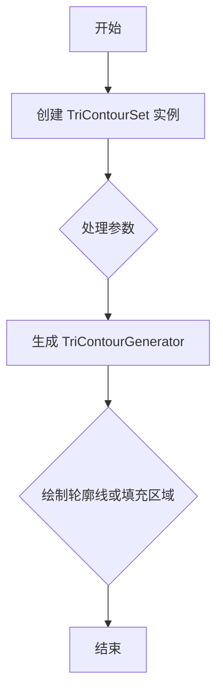
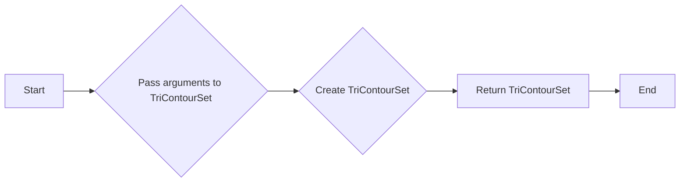
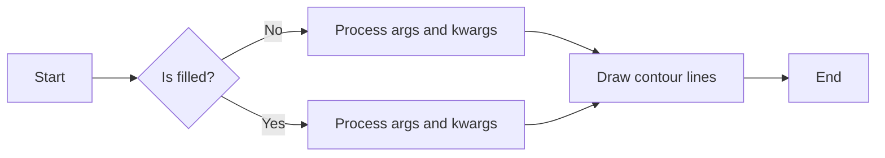
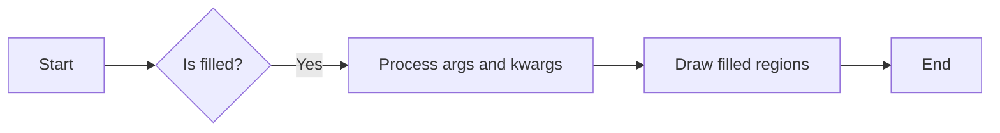

# `matplotlib\lib\matplotlib\tri\_tricontour.py` 详细设计文档

This code defines a class `TriContourSet` for creating and storing a set of contour lines or filled regions for a triangular grid. It also includes functions `tricontour` and `tricontourf` for drawing contour lines and filled regions on an unstructured triangular grid, respectively.

## 整体流程



## 类结构

```
TriContourSet (类)
├── _process_args (方法)
│   ├── _contour_args (方法)
│   └── _process_contour_level_args (方法)
└── tricontour (函数)
    └── tricontourf (函数)
```

## 全局变量及字段


### `_tri`
    
Module containing TriContourGenerator class

类型：`module`
    


### `_docstring`
    
Module containing docstring processing functions

类型：`module`
    


### `_tricontour_doc`
    
Docstring template for tricontour function

类型：`str`
    


### `_docstring.interpd`
    
Function for processing docstrings

类型：`function`
    


### `_docstring.Substitution`
    
Function for substituting parameters in docstrings

类型：`function`
    


### `TriContourSet.ax`
    
Axes object on which the contour set is drawn

类型：`Axes`
    


### `TriContourSet._contour_generator`
    
Generator for contour lines or filled regions

类型：`TriContourGenerator`
    


### `TriContourSet._mins`
    
Minimum values of x and y coordinates

类型：`list`
    


### `TriContourSet._maxs`
    
Maximum values of x and y coordinates

类型：`list`
    


### `TriContourSet.levels`
    
Levels at which contour lines are drawn

类型：`int or array-like`
    


### `TriContourSet.zmin`
    
Minimum value of z data

类型：`float`
    


### `TriContourSet.zmax`
    
Maximum value of z data

类型：`float`
    


### `TriContourSet.logscale`
    
Whether to use logarithmic scale for z data

类型：`bool`
    


### `TriContourSet.filled`
    
Whether to draw filled contour regions

类型：`bool`
    


### `TriContourSet.cmap`
    
Colormap for coloring contour lines or filled regions

类型：`Colormap`
    


### `TriContourSet.norm`
    
Normalization for colormap

类型：`Normalize`
    


### `TriContourSet.vmin`
    
Minimum value for colormap scaling

类型：`float`
    


### `TriContourSet.vmax`
    
Maximum value for colormap scaling

类型：`float`
    


### `TriContourSet.origin`
    
Orientation and position of z data

类型：`str`
    


### `TriContourSet.extent`
    
Outer pixel boundaries for z data

类型：`tuple`
    


### `TriContourSet.locator`
    
Locator for determining contour levels

类型：`Locator`
    


### `TriContourSet.extend`
    
How to handle values outside the levels range

类型：`str`
    


### `TriContourSet.xunits`
    
Override axis units for x data

类型：`ConversionInterface`
    


### `TriContourSet.yunits`
    
Override axis units for y data

类型：`ConversionInterface`
    


### `TriContourSet.antialiased`
    
Enable antialiasing for contour lines

类型：`bool`
    
    

## 全局函数及方法


### tricontour

tricontour 函数用于在二维三角形网格上绘制等高线。

参数：

- `ax`：`matplotlib.axes.Axes`，绘图轴对象。
- `*args`：传递给 TriContourSet 的参数。
- `**kwargs`：传递给 TriContourSet 的关键字参数。

返回值：`matplotlib.tri.TriContourSet`，等高线集对象。

#### 流程图



#### 带注释源码

```python
@_docstring.interpd
def tricontour(ax, *args, **kwargs):
    """
    %(_tricontour_doc)s

    linewidths : float or array-like, default: :rc:`contour.linewidth`
        The line width of the contour lines.

        If a number, all levels will be plotted with this linewidth.

        If a sequence, the levels in ascending order will be plotted with
        the linewidths in the order specified.

        If None, this falls back to :rc:`lines.linewidth`.

    linestyles : {*None*, 'solid', 'dashed', 'dashdot', 'dotted'}, optional
        If *linestyles* is *None*, the default is 'solid' unless the lines are
        monochrome.  In that case, negative contours will take their linestyle
        from :rc:`contour.negative_linestyle` setting.

        *linestyles* can also be an iterable of the above strings specifying a
        set of linestyles to be used. If this iterable is shorter than the
        number of contour levels it will be repeated as necessary.
    """
    kwargs['filled'] = False
    return TriContourSet(ax, *args, **kwargs)
```


### tricontour

Draw contour lines on an unstructured triangular grid.

参数：

- `ax`：`Axes`，The axes on which to draw the contour lines.
- `*args`：Variable length argument list. The remaining arguments and keyword arguments are described in the docstring of `~.Axes.tricontour`.
- `**kwargs`：Keyword arguments. The keyword arguments are described in the docstring of `~.Axes.tricontour`.

返回值：`TriContourSet`，A TriContourSet object representing the contour lines on the triangular grid.

#### 流程图



#### 带注释源码

```python
@_docstring.Substitution(func='tricontour', type='lines')
@_docstring.interpd
def tricontour(ax, *args, **kwargs):
    """
    %(_tricontour_doc)s

    linewidths : float or array-like, default: :rc:`contour.linewidth`
        The line width of the contour lines.

        If a number, all levels will be plotted with this linewidth.

        If a sequence, the levels in ascending order will be plotted with
        the linewidths in the order specified.

        If None, this falls back to :rc:`lines.linewidth`.

    linestyles : {*None*, 'solid', 'dashed', 'dashdot', 'dotted'}, optional
        If *linestyles* is *None*, the default is 'solid' unless the lines are
        monochrome.  In that case, negative contours will take their linestyle
        from :rc:`contour.negative_linestyle` setting.

        *linestyles* can also be an iterable of the above strings specifying a
        set of linestyles to be used. If this iterable is shorter than the
        number of contour levels it will be repeated as necessary.
    """
    kwargs['filled'] = False
    return TriContourSet(ax, *args, **kwargs)
```


### tricontourf

Draw filled regions on an unstructured triangular grid.

参数：

- `ax`：`Axes`，The axes on which to draw the filled regions.
- `*args`：Variable length argument list. The remaining arguments and keyword arguments are described in the docstring of `~.Axes.tricontourf`.
- `**kwargs`：Keyword arguments. The keyword arguments are described in the docstring of `~.Axes.tricontourf`.

返回值：`TriContourSet`，A TriContourSet object representing the filled regions on the triangular grid.

#### 流程图



#### 带注释源码

```python
@_docstring.Substitution(func='tricontourf', type='regions')
@_docstring.interpd
def tricontourf(ax, *args, **kwargs):
    """
    %(_tricontour_doc)s

    hatches : list[str], optional
        A list of crosshatch patterns to use on the filled areas.
        If None, no hatching will be added to the contour.

    Notes
    -----
    `.tricontourf` fills intervals that are closed at the top; that is, for
    boundaries *z1* and *z2*, the filled region is::

        z1 < Z <= z2

    except for the lowest interval, which is closed on both sides (i.e. it
    includes the lowest value).
    """
    kwargs['filled'] = True
    return TriContourSet(ax, *args, **kwargs)
```


### TriContourSet.__init__

This method initializes a TriContourSet object, which is used to create and store a set of contour lines or filled regions for a triangular grid.

参数：

- `ax`：`Axes`，The `Axes` object on which the contour lines or filled regions will be drawn.
- `*args`：Variable length argument list. The remaining arguments and keyword arguments are described in the docstring of `~.Axes.tricontour`.
- `**kwargs`：Keyword argument dictionary. The remaining arguments and keyword arguments are described in the docstring of `~.Axes.tricontour`.

返回值：无

#### 流程图

```mermaid
graph LR
A[Start] --> B{Is filled?}
B -- Yes --> C[Set filled to True]
B -- No --> D[Set filled to False]
C --> E[Call super().__init__ with ax, *args, **kwargs]
D --> E
E --> F[End]
```

#### 带注释源码

```python
def __init__(self, ax, *args, **kwargs):
    """
    Draw triangular grid contour lines or filled regions,
    depending on whether keyword arg *filled* is False
    (default) or True.

    The first argument of the initializer must be an `~.axes.Axes`
    object.  The remaining arguments and keyword arguments
    are described in the docstring of `~.Axes.tricontour`.
    """
    super().__init__(ax, *args, **kwargs)
```


### TriContourSet._process_args

Process args and kwargs.

参数：

- `args`：`tuple`，The positional arguments passed to the function.
- `kwargs`：`dict`，The keyword arguments passed to the function.

返回值：`dict`，The processed keyword arguments.

#### 流程图

```mermaid
graph LR
A[Start] --> B{Is args[0] a TriContourSet?}
B -- Yes --> C[Set levels, zmin, zmax, mins, maxs from args[0]]
B -- No --> D[Get tri and z from _contour_args]
D --> E[Create TriContourGenerator with tri and z]
E --> F[Set _contour_generator to C]
F --> G[Return kwargs]
G --> H[End]
```

#### 带注释源码

```python
def _process_args(self, *args, **kwargs):
    """
    Process args and kwargs.
    """
    if isinstance(args[0], TriContourSet):
        C = args[0]._contour_generator
        if self.levels is None:
            self.levels = args[0].levels
        self.zmin = args[0].zmin
        self.zmax = args[0].zmax
        self._mins = args[0]._mins
        self._maxs = args[0]._maxs
    else:
        from matplotlib import _tri
        tri, z = self._contour_args(args, kwargs)
        C = _tri.TriContourGenerator(tri.get_cpp_triangulation(), z)
        self._mins = [tri.x.min(), tri.y.min()]
        self._maxs = [tri.x.max(), tri.y.max()]

    self._contour_generator = C
    return kwargs
```


### TriContourSet._contour_args

This method processes the arguments for contouring on a triangular grid.

参数：

- `args`：`tuple`，The positional arguments for the contouring operation.
- `kwargs`：`dict`，The keyword arguments for the contouring operation.

返回值：`tuple`，A tuple containing the `Triangulation` object and the `z` values.

#### 流程图

```mermaid
graph LR
A[Start] --> B{Is args[0] a TriContourSet?}
B -- Yes --> C[Set levels, zmin, zmax, mins, maxs]
B -- No --> D[Get Triangulation and z from args and kwargs]
D --> E[Check z array shape]
E -- Same shape? --> F[Check z values]
F -- All finite? --> G[Create TriContourGenerator]
F -- Not all finite? --> H[Error: Non-finite values in z]
G --> I[Set zmax, zmin]
I --> J[Return (tri, z)]
C --> J
H --> J
```

#### 带注释源码

```python
def _contour_args(self, args, kwargs):
    tri, args, kwargs = Triangulation.get_from_args_and_kwargs(*args,
                                                                   **kwargs)
    z, *args = args
    z = np.ma.asarray(z)
    if z.shape != tri.x.shape:
        raise ValueError('z array must have same length as triangulation x'
                         ' and y arrays')

    # z values must be finite, only need to check points that are included
    # in the triangulation.
    z_check = z[np.unique(tri.get_masked_triangles())]
    if np.ma.is_masked(z_check):
        raise ValueError('z must not contain masked points within the '
                         'triangulation')
    if not np.isfinite(z_check).all():
        raise ValueError('z array must not contain non-finite values '
                         'within the triangulation')

    z = np.ma.masked_invalid(z, copy=False)
    self.zmax = float(z_check.max())
    self.zmin = float(z_check.min())
    if self.logscale and self.zmin <= 0:
        func = 'contourf' if self.filled else 'contour'
        raise ValueError(f'Cannot TriContourSet._contour_args log of negative values.')
    self._process_contour_level_args(args, z.dtype)
    return (tri, z)
```


### TriContourSet._process_contour_level_args

This method processes the contour level arguments for a triangular grid contour set.

参数：

- `args`：`tuple`，The positional arguments passed to the method.
- `dtype`：`numpy.dtype`，The data type of the `z` array.

返回值：`None`，This method does not return a value.

#### 流程图

```mermaid
graph LR
A[Start] --> B[Check if levels is None]
B -->|Yes| C[Set levels from args[0]]
B -->|No| D[Process levels]
D --> E[End]
```

#### 带注释源码

```python
def _process_contour_level_args(self, *args, **kwargs):
    """
    Process the contour level arguments for the triangular grid contour set.

    Parameters
    ----------
    args : tuple
        The positional arguments passed to the method.
    dtype : numpy.dtype
        The data type of the `z` array.

    Returns
    -------
    None
    """
    # Check if levels is None
    if self.levels is None:
        # Set levels from args[0]
        self.levels = args[0].levels
    else:
        # Process levels
        # (Implementation details are not shown as they are not provided in the given code snippet)
        pass
```


## 关键组件


### 张量索引与惰性加载

张量索引与惰性加载是用于处理和访问大型数据集的关键组件，它允许在数据被实际需要时才进行加载，从而减少内存消耗和提高性能。

### 反量化支持

反量化支持是用于将量化后的数据转换回原始数据类型的关键组件，它确保了量化过程不会丢失重要的数据信息。

### 量化策略

量化策略是用于将数据从高精度转换为低精度表示的关键组件，它有助于减少模型大小和提高推理速度，但可能会牺牲一些精度。


## 问题及建议


### 已知问题

-   **文档注释不完整**：代码中的文档字符串（docstrings）虽然提供了函数的基本描述，但缺乏详细的参数说明和返回值描述，这可能会给使用者带来困惑。
-   **代码重复**：`tricontour` 和 `tricontourf` 函数都调用了 `TriContourSet` 类，但它们只是改变了 `filled` 参数的值。这种重复可能导致维护困难。
-   **异常处理不足**：代码中没有对输入参数进行充分的异常处理，例如，没有检查 `z` 数组是否与 `triangulation` 的维度匹配。

### 优化建议

-   **完善文档注释**：为每个函数和类提供详细的文档注释，包括参数的详细说明、返回值的描述、可能的异常情况以及示例代码。
-   **减少代码重复**：将 `tricontour` 和 `tricontourf` 函数中的 `filled` 参数设置逻辑提取出来，作为一个单独的函数或方法，以减少代码重复。
-   **增强异常处理**：在函数中添加必要的异常处理，确保输入参数的有效性，并在出现错误时提供清晰的错误信息。
-   **代码重构**：考虑将 `TriContourSet` 类中的逻辑进一步分解，以提高代码的可读性和可维护性。
-   **性能优化**：对于处理大型数据集的情况，考虑优化 `TriContourSet` 类中的数据处理逻辑，以提高性能。


## 其它


### 设计目标与约束

- 设计目标：
  - 提供一个用于在三角形网格上绘制等高线或填充区域的类。
  - 允许用户通过多种方式指定三角形网格，包括使用`Triangulation`对象或通过点坐标。
  - 支持自定义等高线级别和颜色映射。
  - 提供与`Axes.tricontour`和`Axes.tricontourf`兼容的接口。

- 约束：
  - 必须使用NumPy数组处理数据。
  - 必须使用Matplotlib库进行绘图。
  - 必须遵循Matplotlib的文档字符串约定。

### 错误处理与异常设计

- 错误处理：
  - 如果`z`数组中的值不是有限的，将引发`ValueError`。
  - 如果`z`数组中的值不在三角形网格内，将引发`ValueError`。
  - 如果`z`数组中的值包含非有限值，将引发`ValueError`。

- 异常设计：
  - 使用`ValueError`来处理输入数据错误。
  - 使用`TypeError`来处理类型不匹配的错误。

### 数据流与状态机

- 数据流：
  - 用户输入三角形网格和高度值。
  - 系统处理输入并生成等高线或填充区域。
  - 系统将结果绘制到图上。

- 状态机：
  - 初始化状态：创建`TriContourSet`对象。
  - 处理输入状态：处理用户输入的三角形网格和高度值。
  - 绘制状态：将等高线或填充区域绘制到图上。

### 外部依赖与接口契约

- 外部依赖：
  - NumPy：用于处理数组数据。
  - Matplotlib：用于绘图。

- 接口契约：
  - `TriContourSet`类必须遵循Matplotlib的文档字符串约定。
  - `tricontour`和`tricontourf`函数必须遵循Matplotlib的文档字符串约定。
  - `TriContourSet`类必须能够处理来自`Axes.tricontour`和`Axes.tricontourf`的输入。

    