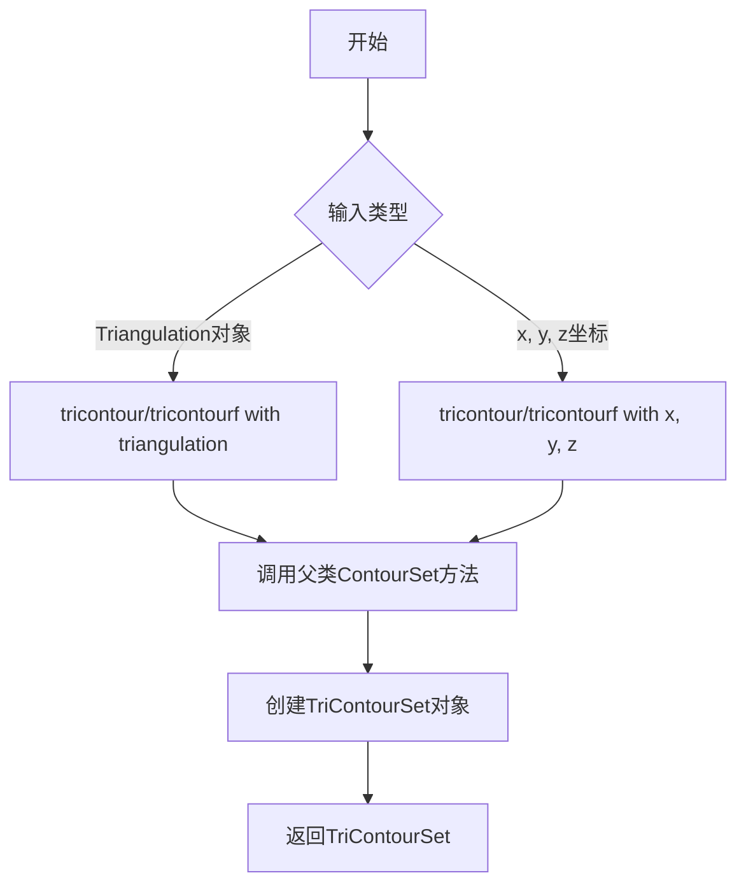
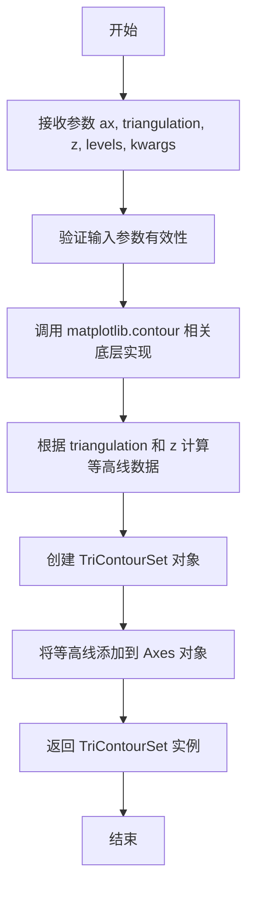
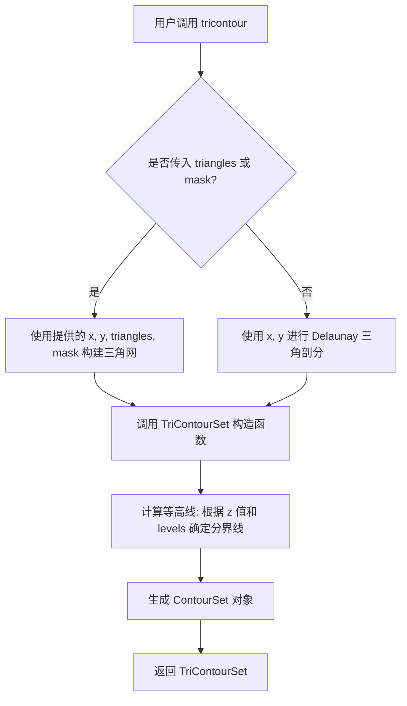
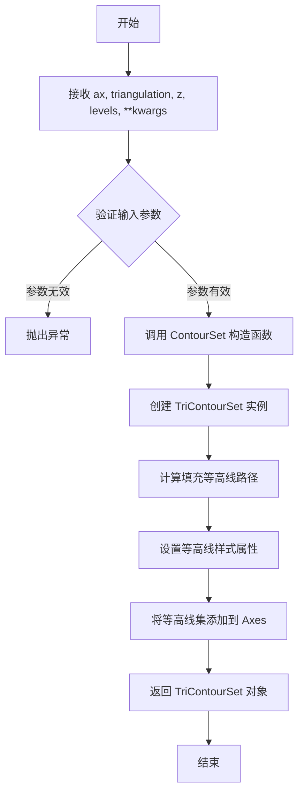
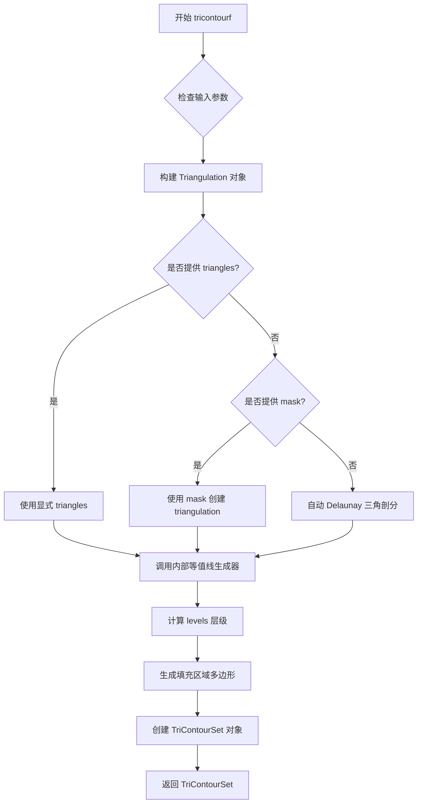
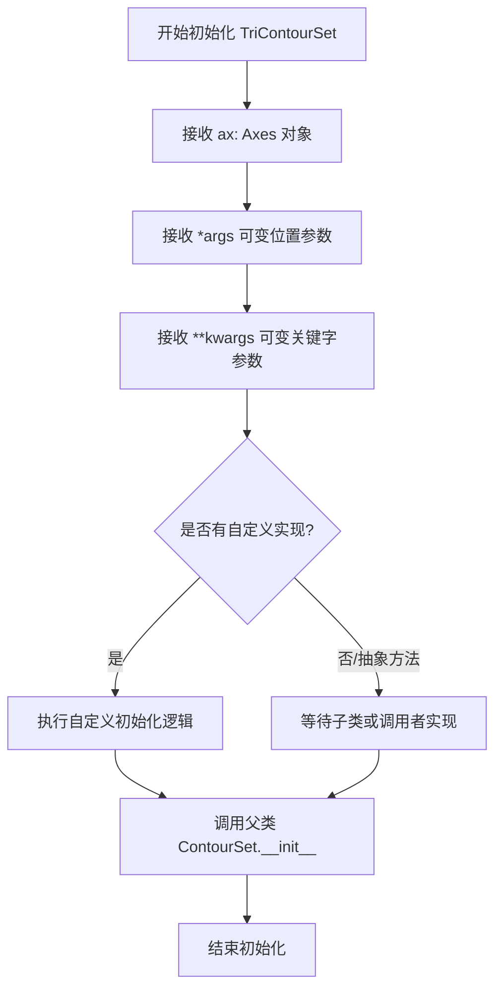

# `matplotlib\lib\matplotlib\tri\_tricontour.pyi` 详细设计文档

该模块提供了基于三角剖分(Triangulation)的等高线绘制功能，包括tricontour(等高线)和tricontourf(填充等高线)两个核心函数，支持通过Triangulation对象或直接的x、y、z坐标数据绘制三角形网格上的等高线图。

## 整体流程



## 类结构

```
ContourSet (matplotlib.contour.基类)
└── TriContourSet (本模块定义)
```

## 全局变量及字段


### `TriContourSet.ax`
    
matplotlib Axes 对象，用于承载等高线图

类型：`Axes`
    


### `tricontour.triangulation`
    
三角剖分对象，包含网格节点和连接信息

类型：`Triangulation`
    


### `tricontour.x`
    
x 坐标数组，表示网格点的横坐标

类型：`ArrayLike`
    


### `tricontour.y`
    
y 坐标数组，表示网格点的纵坐标

类型：`ArrayLike`
    


### `tricontour.z`
    
z 值数组，表示每个网格点上的标量值，用于生成等高线

类型：`ArrayLike`
    


### `tricontour.levels`
    
等高线的级别数量或具体的级别值数组

类型：`int | ArrayLike`
    


### `tricontour.triangles`
    
可选参数，指定三角形的顶点索引

类型：`ArrayLike`
    


### `tricontour.mask`
    
可选参数，用于遮罩特定三角形

类型：`ArrayLike`
    


### `tricontour.kwargs`
    
传递给底层 ContourSet 的额外关键字参数

类型：`Any`
    


### `tricontourf.triangulation`
    
三角剖分对象，包含网格节点和连接信息

类型：`Triangulation`
    


### `tricontourf.x`
    
x 坐标数组，表示网格点的横坐标

类型：`ArrayLike`
    


### `tricontourf.y`
    
y 坐标数组，表示网格点的纵坐标

类型：`ArrayLike`
    


### `tricontourf.z`
    
z 值数组，表示每个网格点上的标量值，用于生成填充等高线

类型：`ArrayLike`
    


### `tricontourf.levels`
    
等高线的级别数量或具体的级别值数组

类型：`int | ArrayLike`
    


### `tricontourf.triangles`
    
可选参数，指定三角形的顶点索引

类型：`ArrayLike`
    


### `tricontourf.mask`
    
可选参数，用于遮罩特定三角形

类型：`ArrayLike`
    


### `tricontourf.kwargs`
    
传递给底层 ContourSet 的额外关键字参数

类型：`Any`
    
    

## 全局函数及方法


### `tricontour`（重载1：基于Triangulation）

该函数是 matplotlib 中用于在给定三角剖分（Triangulation）上绘制等高线的核心方法，通过接收坐标轴对象、三角剖分数据和Z值数组，生成对应的等高线集合（TriContourSet）对象。

参数：

- `ax`：`Axes`，matplotlib 的坐标轴对象，用于承载生成的等高线
- `triangulation`：`Triangulation`，来自 matplotlib.tri._triangulation 模块的三角剖分对象，包含x、y坐标和三角形连接信息
- `z`：`ArrayLike`，与三角剖分节点对应的Z轴数值，用于计算等高线的数值区间
- `levels`：`int | ArrayLike`，可选参数，用于指定等高线的数量或具体数值，默认为省略值（...）
- `**kwargs`：可变关键字参数，传递给底层的 ContourSet 构造函数，用于自定义等高线样式（如颜色、线宽、标签等）

返回值：`TriContourSet`，表示生成的等高线集合对象，继承自 ContourSet，可用于进一步自定义或添加到图表中

#### 流程图



#### 带注释源码

```python
@overload
def tricontour(
    ax: Axes,                     # matplotlib 坐标轴对象，用于承载等高线
    triangulation: Triangulation, # 预定义的三角剖分对象（包含节点坐标和三角形索引）
    z: ArrayLike,                 # 与 triangulation 节点对应的数值数据，用于计算等高
    levels: int | ArrayLike = ...,  # 等高线的级别：整数表示数量，数组表示具体级别值
    **kwargs                     # 其他关键字参数，透传给 ContourSet
) -> TriContourSet: ...          # 返回等高线集合对象，用于后续渲染和自定义
```

#### 备注说明

- 该函数是 `tricontour` 的重载版本之一，专门接收预先构建好的 `Triangulation` 对象作为输入
- 与另一个重载版本（接收 x, y, z, triangles, mask 参数）相比，此版本更适合需要复用同一三角剖分的场景
- 函数内部实际实现位于 matplotlib C++ 扩展或底层 contour 模块中，此处仅为类型签名的stub定义
- 返回的 `TriContourSet` 实际上是一个 `ContourSet` 子类，可调用 `ax.clabel()` 添加标签或通过 `collections` 属性访问具体的等高线图形对象


### `tricontour` (重载2: 基于x, y, z坐标)

该函数是Matplotlib中用于在非结构化网格（如散点数据）上绘制等高线的核心接口之一。此重载允许用户直接传入x, y, z坐标数组以及可选的三角形拓扑信息(`triangles`)和数据掩码(`mask`)，而无需显式创建`Triangulation`对象。它在内部处理这些数据并返回一个`TriContourSet`对象用于渲染等高线。

参数：

- `ax`：`Axes`，Matplotlib的坐标轴对象，指定等高线绘制在哪个图表上。
- `x`：`ArrayLike`，一维数组，包含所有数据点的x坐标。
- `y`：`ArrayLike`，一维数组，包含所有数据点的y坐标。
- `z`：`ArrayLike`，一维数组，包含对应坐标点(x, y)的标量值，用于计算等高线的层级。
- `levels`：`int | ArrayLike`，指定等高线的数量或具体的层级值列表。默认值为`...`（通常对应自动计算）。
- `triangles`：`ArrayLike`，可选参数。显式定义三角形的顶点索引（通常为Nx3的整数数组）。默认为`None`，此时将基于x, y自动进行Delaunay三角剖分。关键字参数。
- `mask`：`ArrayLike`，可选参数。布尔类型数组，用于指定哪些三角形应该被忽略（不参与绘图）。关键字参数。
- `**kwargs`：其他关键字参数，直接传递给底层的等高线生成器，用于控制颜色、线宽、标签等样式。

返回值：`TriContourSet`，一个继承自`ContourSet`的对象，包含了所有生成的等高线（线条）和填充（fill）信息，可用于进一步定制图表。

#### 流程图



#### 带注释源码

```python
@overload
def tricontour(
    ax: Axes,
    x: ArrayLike,
    y: ArrayLike,
    z: ArrayLike,
    levels: int | ArrayLike = ...,
    *,
    triangles: ArrayLike = ...,
    mask: ArrayLike = ...,
    **kwargs
) -> TriContourSet: ...
```

**代码解释：**

1.  **`@overload` 装饰器**：这是类型提示的装饰器，用于指定当传入不同参数组合时函数的返回类型。这里定义的是基于原始坐标数组的调用方式。
2.  **参数 `ax`**：第一个必需参数必须是 `Axes` 对象，表示绘图的目标区域。
3.  **参数 `x, y, z`**：这三者描述了数据场。`x` 和 `y` 定义平面位置，`z` 定义高度值。
4.  **关键字参数 `*, triangles, mask`**：使用 `*` 强制后续参数必须以关键字形式传入（如 `tricontour(..., triangles=...)`）。这允许用户在不破坏位置参数顺序的情况下传入可选的拓扑结构。
5.  **`**kwargs`**：支持传递额外的Matplotlib等高线属性（如 `cmap`, `colors`, `linewidths`），增加了函数的灵活性。


### `tricontourf` (重载1: 基于Triangulation)

该函数是 matplotlib 中用于绘制基于三角剖分（Triangulation）的填充等高线图（filled contour）的核心接口，通过接收预先生成的 Triangulation 对象和对应的 Z 轴数据，在指定的坐标轴上生成填充等高线集。

参数：

- `ax`：`Axes`，matplotlib 的坐标轴对象，用于承载生成的等高线图
- `triangulation`：`Triangulation`，三角剖分对象，包含了 X、Y 坐标点及它们之间的拓扑连接关系
- `z`：`ArrayLike`，与 triangulation 中顶点对应的 Z 轴数值，用于计算等高线的数值区间
- `levels`：`int | ArrayLike`，等高线的级别数量或具体的等高线数值，默认为 `...`（matplotlib 会自动选择合适的级别）
- `**kwargs`：其他可选关键字参数，用于传递给底层的等高线生成器（如颜色、透明度、标签等）

返回值：`TriContourSet`，填充等高线集对象，包含生成的所有等高线多边形及其元数据

#### 流程图



#### 带注释源码

```python
@overload
def tricontourf(
    ax: Axes,                    # matplotlib 坐标轴对象，用于绘制等高线
    triangulation: Triangulation, # 三角剖分对象，包含 x, y 坐标及拓扑信息
    z: ArrayLike,                 # 对应 triangulation 顶点的 z 坐标值
    levels: int | ArrayLike = ..., # 等高线级别：整数表示数量，数组表示具体值
    **kwargs                      # 其他传递给 ContourSet 的关键字参数
) -> TriContourSet:              # 返回填充等高线集对象
    """
    基于 Triangulation 对象绘制填充等高线。
    
    此重载版本接收预先生成的 Triangulation 对象，适用于：
    - 已经构建好三角网格的情况
    - 需要复用同一 Triangulation 进行多次绘图的情况
    - 需要精细控制三角剖分参数的情况
    """
    ...
```


### `tricontourf`

此函数是 matplotlib 中用于绘制填充三角等值线图的核心函数之二（基于显式 x, y, z 坐标重载）。它接收二维平面坐标 x, y 和对应的标量值 z，通过可选的三角形索引 triangles 或掩码 mask 构建三角剖分，然后根据指定的 levels 计算等值线区域，并返回一个 TriContourSet 对象用于在 Axes 上渲染填充等值线图。

参数：

- `ax`：`Axes`，matplotlib 坐标轴对象，用于承载生成的等值线图
- `x`：`ArrayLike`，x 坐标数组，定义三角剖分节点的横坐标
- `y`：`ArrayLike`，y 坐标数组，定义三角剖分节点的纵坐标
- `z`：`ArrayLike`，z 值数组，与 x, y 对应的标量值，用于计算等值线
- `levels`：`int | ArrayLike`，等值线的数量或具体层级值，默认为省略号
- `triangles`：`ArrayLike`，可选参数，三角形的顶点索引数组，用于显式定义三角剖分
- `mask`：`ArrayLike`，可选参数，布尔数组，用于排除某些三角形
- `**kwargs`：任意关键字参数传递给底层等值线生成器

返回值：`TriContourSet`，包含填充等值线几何信息和样式的对象，可直接添加到 Axes 中渲染

#### 流程图



#### 带注释源码

```python
@overload
def tricontourf(
    ax: Axes,                      # 目标坐标轴对象
    x: ArrayLike,                  # x 坐标数组 (节点横坐标)
    y: ArrayLike,                  # y 坐标数组 (节点纵坐标)
    z: ArrayLike,                  # z 值数组 (用于计算等值线的标量值)
    levels: int | ArrayLike = ..., # 等值线层级: 整数表示数量, 数组表示具体值
    *,                             # 以下为关键字参数-only 参数
    triangles: ArrayLike = ...,    # 可选: 显式三角形索引 (N, 3) 形状
    mask: ArrayLike = ...,         # 可选: 三角形掩码数组
    **kwargs                       # 其他传递给等值线生成器的关键字参数
) -> TriContourSet: ...            # 返回: 填充等值线集合对象
```


### `TriContourSet.__init__`

描述：`TriContourSet` 类的初始化方法，用于创建三角形等高线集合对象。该方法继承自 `ContourSet`，接收 Axes 对象、位置参数和关键字参数来初始化三角形等高线集。由于是抽象方法定义（使用 `...` 表示），实际初始化逻辑由子类或外部调用者实现。

参数：

- `self`：`TriContourSet`，TriContourSet 实例本身
- `ax`：`Axes`，matplotlib 的 Axes 对象，用于绑定等高线绘制区域
- `*args`：`Any`，可变位置参数，用于传递父类 `ContourSet` 所需的额外位置参数（如数据坐标等）
- `**kwargs`：`Any`，可变关键字参数，用于传递父类 `ContourSet` 所需的额外关键字参数（如等级、颜色映射等）

返回值：`None`，无返回值（方法返回类型标注为 `None`）

#### 流程图



#### 带注释源码

```python
from matplotlib.axes import Axes
from matplotlib.contour import ContourSet
from matplotlib.tri._triangulation import Triangulation

from numpy.typing import ArrayLike
from typing import overload


class TriContourSet(ContourSet):
    """
    三角形等高线集合类，继承自 ContourSet。
    用于处理基于三角形网格的等高线绘制功能。
    """
    
    def __init__(self, ax: Axes, *args, **kwargs) -> None:
        """
        初始化 TriContourSet 对象。
        
        参数:
            ax: Axes 对象，指定等高线所属的坐标轴
            *args: 可变位置参数，传递给父类 ContourSet
            **kwargs: 可变关键字参数，传递给父类 ContourSet
            
        返回:
            None
        """
        ...  # 抽象方法实现，具体逻辑由调用者或子类提供
```

## 关键组件


### TriContourSet

继承自 ContourSet 的类，用于表示三角网格等高线/填充等高线的结果集，包含等高线的所有数据和属性。

### tricontour

绘制三角网格等高线的函数，提供两种重载形式：一种接受 Triangulation 对象，另一种直接接受 x, y, z 坐标数据，可指定等高线层级。

### tricontourf

绘制三角网格填充等高线的函数，提供两种重载形式：一种接受 Triangulation 对象，另一种直接接受 x, y, z 坐标数据，用于生成填充区域的等高线。

### Triangulation

三角网格数据结构，由 matplotlib.tri 模块提供，定义三角形的顶点连接关系。

### 参数 levels

指定等高线的数量或具体层级值，可以是整数表示等高线条数，也可以是数组表示具体等高线值。

### 参数 triangles

可选参数，用于显式指定三角形的顶点索引，当需要自定义网格划分时使用。

### 参数 mask

可选参数，用于屏蔽特定的三角形，控制哪些三角形参与等高线计算。


## 问题及建议


### 已知问题

-   `TriContourSet.__init__`方法仅包含类型注解和`...`作为实现，缺少实际构造函数逻辑
-   `tricontour`和`tricontourf`函数仅包含`@overload`装饰器声明，缺少实际函数实现
-   所有类和函数均缺少文档字符串（docstring），无法提供使用说明和参数描述
-   代码中TODO注释指出需要更明确的args/kwargs说明，但该TODO尚未完成
-   `triangles`和`mask`参数仅在第二个函数重载版本中出现，与第一个重载版本的参数签名不一致
-   `levels`参数在所有重载中默认为`...`（Ellipsis），缺乏明确的默认值说明

### 优化建议

-   实现`TriContourSet.__init__`方法的完整逻辑，调用父类`ContourSet`的构造函数
-   添加实际函数实现代码，而非仅保留函数重载声明
-   为所有公共类和方法添加详细的文档字符串，说明功能、参数和返回值
-   解决TODO注释中提出的问题，为所有kwargs提供更显式的类型注解和说明
-   考虑统一函数重载的参数设计，或明确文档说明两种调用方式的差异
-   明确`levels`参数的默认值行为，并在文档中说明其用法


## 其它


### 设计目标与约束

本模块的设计目标是在matplotlib中实现基于三角网格的等高线绘制功能，支持两种输入方式：直接使用Triangulation对象或通过x、y、z坐标数组。约束包括：必须依赖matplotlib的ContourSet基类，保持与现有contour/contourf API的一致性，支持levels参数的多样化设置（整数或数组），并通过@overload实现类型提示的重载。

### 错误处理与异常设计

输入验证：x、y、z数组长度必须一致；triangles数组形状必须与顶点数匹配；mask数组长度必须与三角形数量一致；levels为整数时表示自动选择的等高线数量，为数组时必须为有序数组。异常类型：ValueError用于参数格式错误；TypeError用于类型不匹配；RuntimeError用于底层渲染失败。由于函数签名使用...作为默认参数，实际异常处理由matplotlib基类ContourSet完成。

### 数据流与状态机

数据流：用户输入(三角网格坐标或Triangulation对象 + 标量场z) → 参数验证 → 传递给父类ContourSet初始化 → matplotlib内部计算等高线路径 → 返回TriContourSet对象用于渲染。状态机：初始状态(等待输入) → 验证状态(检查参数有效性) → 构造状态(创建TriContourSet实例) → 完成状态(返回结果对象)。

### 外部依赖与接口契约

核心依赖：matplotlib.axes.Axes（画布轴），matplotlib.contour.ContourSet（等高线集基类），matplotlib.tri._triangulation.Triangulation（三角网格），numpy.typing.ArrayLike（数组类型），typing.overload（函数重载）。接口契约：所有tricontour/tricontourf函数必须返回TriContourSet对象；ax参数必须为Axes实例；z参数必须为可转换为numpy数组的数值类型。

### 性能考虑

大规模数据：三角网格顶点数超过10^5时，应考虑使用Triangulation对象而非原始坐标数组以减少重复计算。渲染性能：等高线数量直接影响渲染时间，建议levels不超过50条。内存优化：mask参数可有效减少需计算的三角形数量。

### 兼容性考虑

Python版本：需支持Python 3.8+（使用Union语法|）。matplotlib版本：需与matplotlib 3.5+兼容。numpy版本：需支持numpy 1.20+。向后兼容：kwargs传递至基类，需确保基类接口稳定。

### 测试策略

单元测试：验证各种输入组合的参数传递正确性；测试空数组、单点等边界情况。集成测试：与matplotlib渲染管线集成测试；比较tricontour与标准contour的输出一致性。性能测试：大规模数据集的渲染时间基准测试。

### 使用示例

```python
import matplotlib.pyplot as plt
import numpy as np
from matplotlib.tri import Triangulation, tricontour

# 示例1：使用坐标数组
x = np.array([0, 1, 2, 0, 1, 2])
y = np.array([0, 0, 0, 1, 1, 1])
z = np.array([0, 1, 2, 2, 1, 0])
triangles = np.array([[0, 1, 3], [1, 4, 3], [1, 2, 4], [2, 5, 4]])
fig, ax = plt.subplots()
tricontour(ax, x, y, z, triangles=triangles, levels=5)

# 示例2：使用Triangulation对象
tri = Triangulation(x, y, triangles)
tricontourf(ax, tri, z, levels=[0, 0.5, 1, 1.5, 2])
```


    