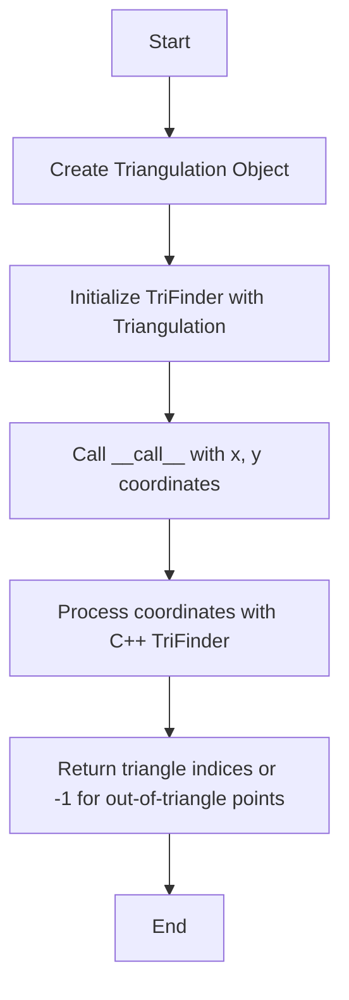
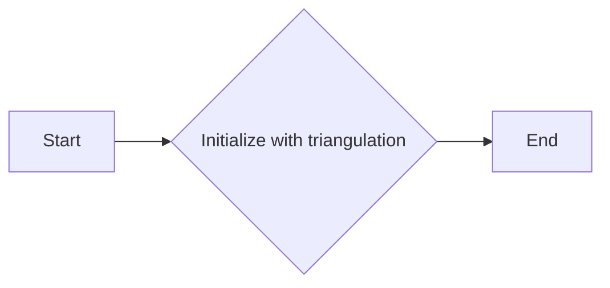
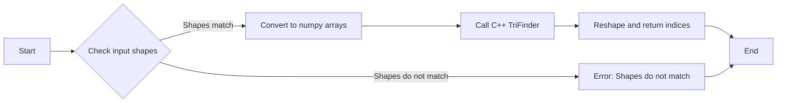
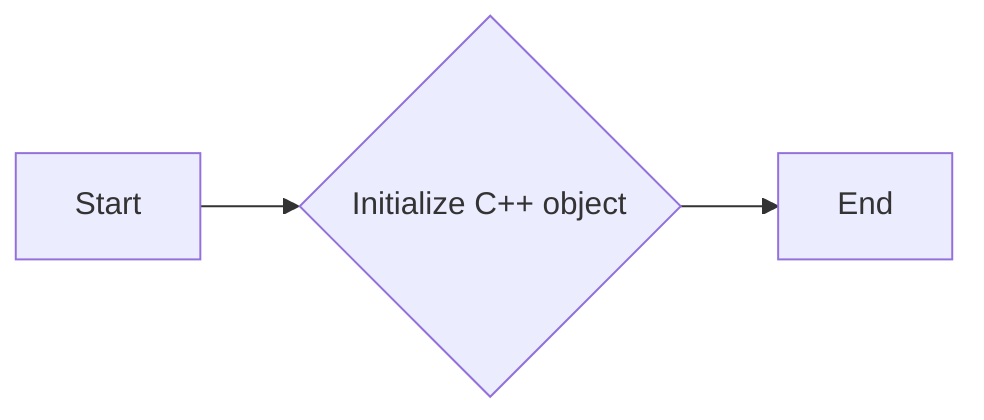
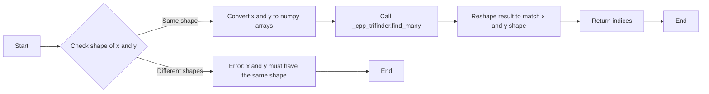

# `matplotlib\lib\matplotlib\tri\_trifinder.py` 详细设计文档

The code provides an abstract base class and a derived class for finding triangles in a triangulation using the trapezoid map algorithm.

## 整体流程



## 类结构

```
TriFinder (Abstract Base Class)
├── TrapezoidMapTriFinder (Derived Class)
```

## 全局变量及字段


### `TriFinder._triangulation`
    
The Triangulation object that the TriFinder is associated with.

类型：`matplotlib.tri.Triangulation`
    


### `TrapezoidMapTriFinder._cpp_trifinder`
    
The underlying C++ object that performs the trapezoid map algorithm.

类型：`matplotlib._tri.TrapezoidMapTriFinder`
    


### `TrapezoidMapTriFinder.self._initialize`
    
A method to initialize the underlying C++ object.

类型：`function`
    


### `TrapezoidMapTriFinder.self._print_tree`
    
A method to print a text representation of the node tree for debugging purposes.

类型：`function`
    


### `TrapezoidMapTriFinder.self._get_tree_stats`
    
A method to return statistics about the node tree.

类型：`function`
    


### `TrapezoidMapTriFinder.self._initialize`
    
A method to initialize the underlying C++ object.

类型：`function`
    


### `TrapezoidMapTriFinder.self._print_tree`
    
A method to print a text representation of the node tree for debugging purposes.

类型：`function`
    


### `TrapezoidMapTriFinder.self._get_tree_stats`
    
A method to return statistics about the node tree.

类型：`function`
    
    

## 全局函数及方法


### TriFinder.__init__

This method initializes a `TriFinder` object with a given triangulation.

参数：

- `triangulation`：`matplotlib.tri.Triangulation`，The triangulation object to be used for finding triangles.

返回值：无

#### 流程图



#### 带注释源码

```python
def __init__(self, triangulation):
    _api.check_isinstance(Triangulation, triangulation=triangulation)
    self._triangulation = triangulation
```


### TriFinder.__call__

This method is a part of the `TriFinder` class and is used to find the triangles in which specified points lie. It is an abstract method that must be implemented by derived classes.

参数：

- `x`：`array-like`，The x coordinates of the points to find the triangles for.
- `y`：`array-like`，The y coordinates of the points to find the triangles for.

返回值：`integer array`，An array with the same shape as `x` and `y`, containing the indices of the triangles in which the points lie. If a point does not lie within a triangle, the corresponding value is -1.

#### 流程图



#### 带注释源码

```python
def __call__(self, x, y):
    """
    Return an array containing the indices of the triangles in which the
    specified *x*, *y* points lie, or -1 for points that do not lie within
    a triangle.

    *x*, *y* are array-like x and y coordinates of the same shape and any
    number of dimensions.

    Returns integer array with the same shape and *x* and *y*.
    """
    x = np.asarray(x, dtype=np.float64)
    y = np.asarray(y, dtype=np.float64)
    if x.shape != y.shape:
        raise ValueError("x and y must be array-like with the same shape")

    # C++ does the heavy lifting, and expects 1D arrays.
    indices = (self._cpp_trifinder.find_many(x.ravel(), y.ravel())
               .reshape(x.shape))
    return indices
```


### TrapezoidMapTriFinder.__init__

This method initializes a `TrapezoidMapTriFinder` object, setting up the necessary C++ object for the trapezoid map algorithm.

参数：

- `triangulation`：`Triangulation`，The `Triangulation` object for which the trapezoid map algorithm will be used.

返回值：无

#### 流程图



#### 带注释源码

```python
def __init__(self, triangulation):
    from matplotlib import _tri
    _api.check_isinstance(Triangulation, triangulation=triangulation)
    self._triangulation = triangulation
    self._cpp_trifinder = _tri.TrapezoidMapTriFinder(triangulation.get_cpp_triangulation())
    self._initialize()
```


### TrapezoidMapTriFinder.__call__

This method returns an array containing the indices of the triangles in which the specified x, y points lie, or -1 for points that do not lie within a triangle.

参数：

- `x`：`array-like`，The x coordinates of the points.
- `y`：`array-like`，The y coordinates of the points.

返回值：`integer array`，An array with the same shape as x and y, containing the indices of the triangles in which the points lie.

#### 流程图



#### 带注释源码

```python
def __call__(self, x, y):
    """
    Return an array containing the indices of the triangles in which the
    specified *x*, *y* points lie, or -1 for points that do not lie within
    a triangle.

    *x*, *y* are array-like x and y coordinates of the same shape and any
    number of dimensions.

    Returns integer array with the same shape and *x* and *y*.
    """
    x = np.asarray(x, dtype=np.float64)
    y = np.asarray(y, dtype=np.float64)
    if x.shape != y.shape:
        raise ValueError("x and y must be array-like with the same shape")

    # C++ does the heavy lifting, and expects 1D arrays.
    indices = (self._cpp_trifinder.find_many(x.ravel(), y.ravel())
               .reshape(x.shape))
    return indices
```


### TrapezoidMapTriFinder._get_tree_stats

Return a list containing the statistics about the node tree.

参数：

- 无

返回值：`list`，A list containing the statistics about the node tree:
    0: number of nodes (tree size)
    1: number of unique nodes
    2: number of trapezoids (tree leaf nodes)
    3: number of unique trapezoids
    4: maximum parent count (max number of times a node is repeated in tree)
    5: maximum depth of tree (one more than the maximum number of comparisons needed to search through the tree)
    6: mean of all trapezoid depths (one more than the average number of comparisons needed to search through the tree)

#### 流程图

```mermaid
graph LR
A[Start] --> B{Call _cpp_trifinder.get_tree_stats()}
B --> C[Return statistics]
C --> D[End]
```

#### 带注释源码

```
def _get_tree_stats(self):
    """
    Return a python list containing the statistics about the node tree:
        0: number of nodes (tree size)
        1: number of unique nodes
        2: number of trapezoids (tree leaf nodes)
        3: number of unique trapezoids
        4: maximum parent count (max number of times a node is repeated in
               tree)
        5: maximum depth of tree (one more than the maximum number of
               comparisons needed to search through the tree)
        6: mean of all trapezoid depths (one more than the average number
               of comparisons needed to search through the tree)
    """
    return self._cpp_trifinder.get_tree_stats()
```


### `_initialize`

Initialize the underlying C++ object. Can be called multiple times if, for example, the triangulation is modified.

参数：

- `self`：`TrapezoidMapTriFinder`，当前类的实例

返回值：`None`，无返回值

#### 流程图

```mermaid
graph LR
A[Start] --> B{Call _cpp_trifinder.initialize()}
B --> C[End]
```

#### 带注释源码

```
def _initialize(self):
    """
    Initialize the underlying C++ object.  Can be called multiple times if,
    for example, the triangulation is modified.
    """
    self._cpp_trifinder.initialize()
``` 


### TrapezoidMapTriFinder._print_tree

Print a text representation of the node tree, which is useful for debugging purposes.

参数：

- 无

返回值：无

#### 流程图

```mermaid
graph TD
    A[Start] --> B[Call _cpp_trifinder.print_tree()]
    B --> C[End]
```

#### 带注释源码

```python
def _print_tree(self):
    """
    Print a text representation of the node tree, which is useful for
    debugging purposes.
    """
    self._cpp_trifinder.print_tree()
```


## 关键组件


### 张量索引与惰性加载

张量索引与惰性加载是代码中用于高效处理和访问多维数据结构的机制。

### 反量化支持

反量化支持是代码中实现的一种功能，允许对量化后的数据进行逆量化处理，以便恢复原始数据。

### 量化策略

量化策略是代码中用于将浮点数数据转换为固定点表示的方法，以减少内存使用和提高计算效率。


## 问题及建议


### 已知问题

-   **全局变量和函数的使用**：代码中使用了全局变量和函数，如 `_api` 和 `_tri`，这可能导致代码的可维护性和可测试性降低。全局变量的使用应该尽量避免，除非它们是必要的。
-   **异常处理**：代码中没有明确的异常处理机制，当输入数据不符合预期时，可能会抛出异常。应该添加适当的异常处理来提高代码的健壮性。
-   **文档不足**：类和方法缺少详细的文档说明，这可能会使得其他开发者难以理解代码的功能和用法。

### 优化建议

-   **移除全局变量和函数**：考虑将全局变量和函数封装在类中，或者使用参数传递的方式，以提高代码的模块化和可测试性。
-   **添加异常处理**：在关键的操作中添加异常处理，确保当输入数据不符合预期时，能够给出清晰的错误信息，并优雅地处理异常。
-   **完善文档**：为每个类和方法添加详细的文档说明，包括参数、返回值和异常情况，以便其他开发者能够更好地理解和使用代码。
-   **性能优化**：考虑对 `_cpp_trifinder.find_many` 方法进行性能优化，特别是在处理大型数据集时，因为该方法涉及到大量的数组操作。
-   **代码复用**：如果 `_get_tree_stats` 和 `_print_tree` 方法在其他地方也有使用，可以考虑将它们提取为独立的类或函数，以提高代码的复用性。


## 其它


### 设计目标与约束

- 设计目标：
  - 提供一个高效的方法来查找给定点集在三角剖分中的三角形索引。
  - 确保算法能够处理大型数据集，同时保持良好的性能。
  - 提供一个易于使用的接口，允许用户通过简单的函数调用获取结果。

- 约束条件：
  - 输入的三角剖分必须有效，即没有重复的点、由共线点形成的三角形或重叠的三角形。
  - 算法应具有一定的容错性，能够处理由共线点形成的三角形，但不应依赖于这种容错性。

### 错误处理与异常设计

- 错误处理：
  - 如果输入的三角剖分无效，将抛出异常。
  - 如果输入的 `x` 和 `y` 数组形状不匹配，将抛出 `ValueError`。
  - 如果在调用 C++ 库时发生错误，将抛出异常。

- 异常设计：
  - 使用 `ValueError` 来处理形状不匹配的错误。
  - 使用自定义异常来处理 C++ 库调用错误。

### 数据流与状态机

- 数据流：
  - 输入：三角剖分对象、点坐标数组。
  - 输出：三角形索引数组。
  - 过程：将点坐标数组转换为 C++ 库可以处理的格式，调用 C++ 库函数，将结果转换回 Python 数组。

- 状态机：
  - 初始化状态：创建 `TrapezoidMapTriFinder` 对象。
  - 运行状态：调用 `__call__` 方法，执行查找操作。
  - 结束状态：返回三角形索引数组。

### 外部依赖与接口契约

- 外部依赖：
  - NumPy：用于数组操作。
  - Matplotlib：用于访问三角剖分和 C++ 库。

- 接口契约：
  - `Triangulation` 类必须提供 `get_cpp_triangulation` 方法，以便访问底层的 C++ 对象。
  - `TrapezoidMapTriFinder` 类必须实现 `__call__` 方法，以执行查找操作。
  - `find_many` 和 `get_tree_stats` 等方法必须由 C++ 库提供。


    