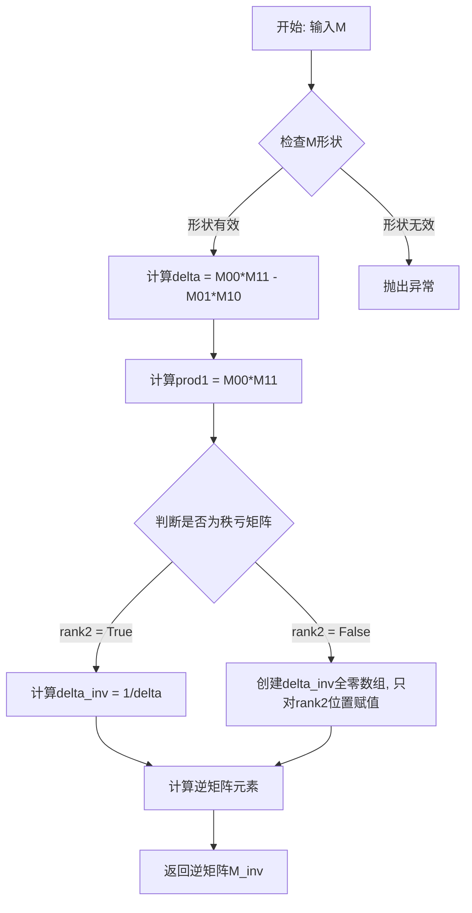
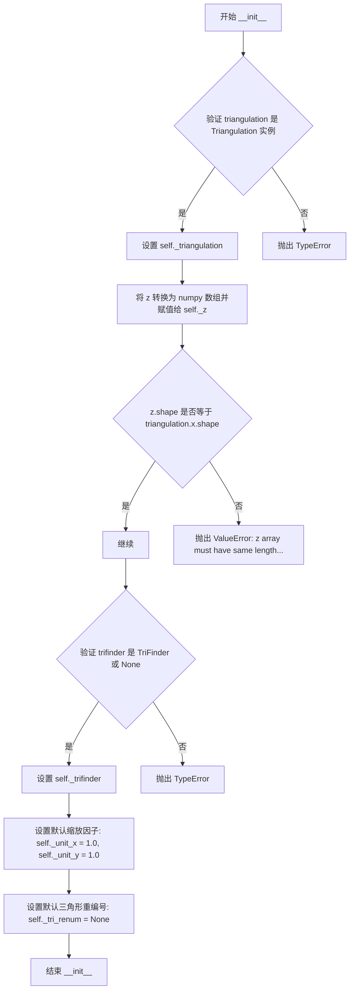
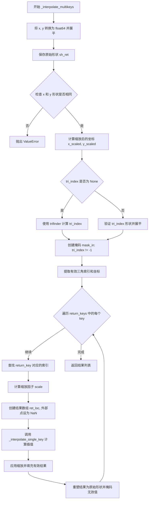
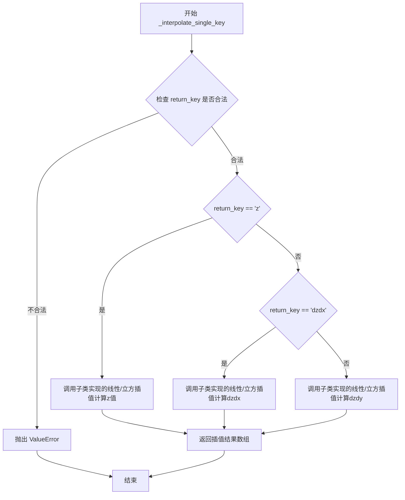
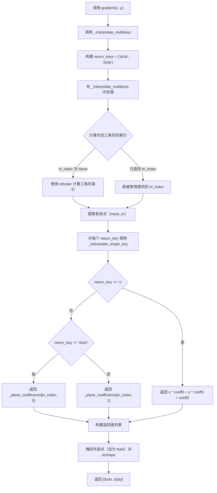
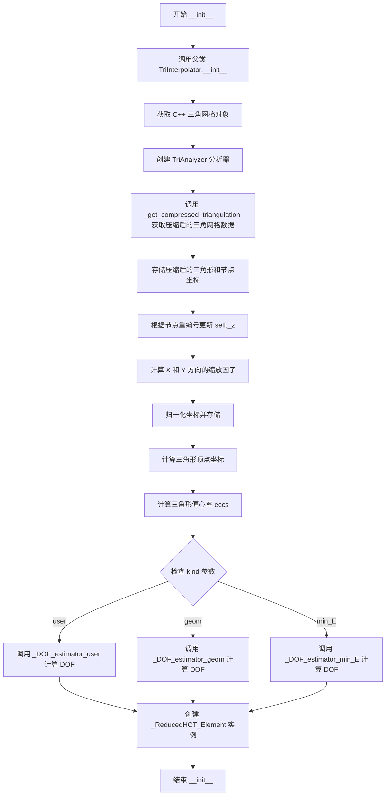
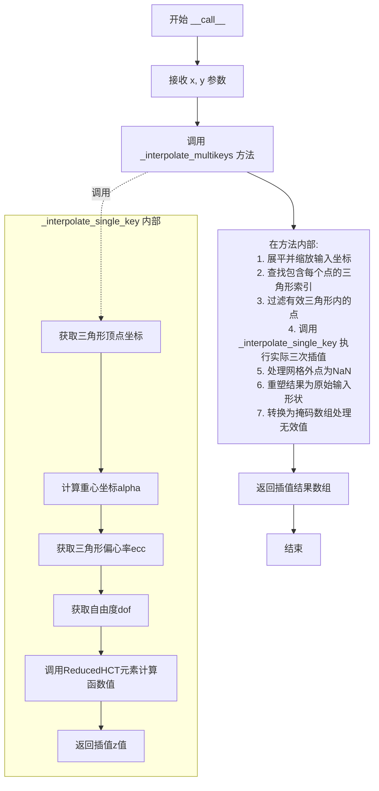
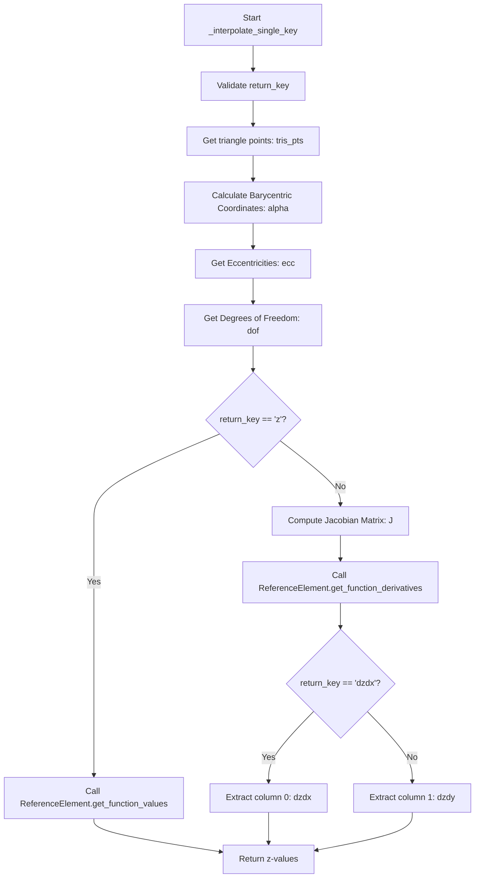

# `matplotlib\lib\matplotlib\tri\_triinterpolate.py` 详细设计文档

该代码提供了在三角网格上进行插值的工具，包括线性插值（基于平面）和三次插值（基于Clough-Tocher细分和HCT元素），支持用户自定义、几何近似或能量最小化等多种方式来估算梯度。

## 整体流程

```mermaid
graph TD
    A[用户: 创建 Triangulation] --> B[用户: 创建 Interpolator]
    B --> C{选择插值类型}
    C -->|Linear| D[LinearTriInterpolator]
    C -->|Cubic| E[CubicTriInterpolator]
    D --> F[调用 __call__(x, y)]
    E --> F
    F --> G[_interpolate_multikeys]
    G --> H[输入验证与 flattening]
    H --> I[计算包含三角形 tri_index]
    I --> J{tri_index != -1?}
    J -- 否 --> K[标记为 NaN/Mask]
    J -- 是 --> L[调用 _interpolate_single_key]
    L --> M[应用缩放系数]
    K --> N[Reshape & Return Masked Array]
    M --> N
```

## 类结构

```
TriInterpolator (抽象基类)
├── LinearTriInterpolator
└── CubicTriInterpolator
    ├── _ReducedHCT_Element (FEM元素实现)
    ├── _DOF_estimator (梯度估算基类)
    │   ├── _DOF_estimator_user
    │   ├── _DOF_estimator_geom
    │   └── _DOF_estimator_min_E
    └── _Sparse_Matrix_coo (PCG求解器矩阵格式)
全局辅助函数 (_cg, _safe_inv22_vectorized, etc.)
```

## 全局变量及字段


### `__all__`
    
Exports the public API: TriInterpolator, LinearTriInterpolator, and CubicTriInterpolator

类型：`tuple`
    


### `TriInterpolator._triangulation`
    
三角网格对象，包含网格的节点坐标和三角形拓扑信息

类型：`Triangulation`
    


### `TriInterpolator._z`
    
网格点上的z值数组，与 triangulation 的节点一一对应

类型：`ndarray`
    


### `TriInterpolator._trifinder`
    
三角形查找器，用于快速定位给定点所在的三角形索引

类型：`TriFinder`
    


### `TriInterpolator._unit_x`
    
x方向的缩放因子，用于归一化坐标以提高数值计算精度

类型：`float`
    


### `TriInterpolator._unit_y`
    
y方向的缩放因子，用于归一化坐标以提高数值计算精度

类型：`float`
    


### `TriInterpolator._tri_renum`
    
三角形重编号表，用于将外部三角形索引映射到内部压缩后的索引

类型：`ndarray`
    


### `LinearTriInterpolator._plane_coefficients`
    
线性平面方程系数，用于在每个三角形上进行线性插值计算

类型：`ndarray`
    


### `CubicTriInterpolator._triangles`
    
压缩后的三角形索引数组，仅包含有效的（未掩码）三角形

类型：`ndarray`
    


### `CubicTriInterpolator._pts`
    
压缩后的坐标点数组，仅包含有效的（被使用的）节点坐标

类型：`ndarray`
    


### `CubicTriInterpolator._tris_pts`
    
三角形顶点坐标数组，存储每个三角形的三个顶点坐标

类型：`ndarray`
    


### `CubicTriInterpolator._eccs`
    
三角形偏心率参数，用于HCT单元的形状函数计算

类型：`ndarray`
    


### `CubicTriInterpolator._dof`
    
自由度数组，存储每个三角形节点上的函数值和导数值

类型：`ndarray`
    


### `CubicTriInterpolator._ReferenceElement`
    
Reduced HCT 元素实例，用于计算三次插值及其导数

类型：`_ReducedHCT_Element`
    


### `_ReducedHCT_Element.M`
    
形状函数矩阵M，用于计算HCT单元的函数值

类型：`static ndarray`
    


### `_ReducedHCT_Element.M0`
    
形状函数矩阵M0，用于计算偏心率相关的函数值修正

类型：`static ndarray`
    


### `_ReducedHCT_Element.M1`
    
形状函数矩阵M1，用于计算偏心率相关的函数值修正

类型：`static ndarray`
    


### `_ReducedHCT_Element.M2`
    
形状函数矩阵M2，用于计算偏心率相关的函数值修正

类型：`static ndarray`
    


### `_ReducedHCT_Element.rotate_dV`
    
一阶导数的旋转矩阵，用于在三角形局部坐标系间转换

类型：`static ndarray`
    


### `_ReducedHCT_Element.rotate_d2V`
    
二阶导数的旋转矩阵，用于在三角形局部坐标系间转换

类型：`static ndarray`
    


### `_ReducedHCT_Element.gauss_pts`
    
高斯积分点坐标，用于数值积分计算弯曲能量

类型：`static ndarray`
    


### `_ReducedHCT_Element.gauss_w`
    
高斯积分权重，用于数值积分计算弯曲能量

类型：`static ndarray`
    


### `_ReducedHCT_Element.E`
    
弯曲能量刚度矩阵，用于计算曲率能量积分

类型：`static ndarray`
    


### `_DOF_estimator._pts`
    
插值器的坐标点数组

类型：`ndarray`
    


### `_DOF_estimator._tris_pts`
    
三角形顶点坐标数组

类型：`ndarray`
    


### `_DOF_estimator.z`
    
网格点上的z值数组

类型：`ndarray`
    


### `_DOF_estimator._triangles`
    
三角形索引数组

类型：`ndarray`
    


### `_DOF_estimator.dz`
    
节点上的导数值数组，存储dz/dx和dz/dy

类型：`ndarray`
    


### `_Sparse_Matrix_coo.n`
    
稀疏矩阵的行数

类型：`int`
    


### `_Sparse_Matrix_coo.m`
    
稀疏矩阵的列数

类型：`int`
    


### `_Sparse_Matrix_coo.vals`
    
COO格式稀疏矩阵的非零值数组

类型：`ndarray`
    


### `_Sparse_Matrix_coo.rows`
    
COO格式稀疏矩阵的行索引数组

类型：`ndarray`
    


### `_Sparse_Matrix_coo.cols`
    
COO格式稀疏矩阵的列索引数组

类型：`ndarray`
    
    

## 全局函数及方法


### `_cg`

该函数是预处理共轭梯度（Preconditioned Conjugate Gradient, PCG）迭代算法的实现，用于求解对称正定线性方程组 A·x = b。函数使用简单的 Jacobi（对角）预处理器，并通过迭代逼近获得解。

参数：

- `A`：`_Sparse_Matrix_coo`，必须在此之前通过 `compress_csc` 或 `compress_csr` 方法进行压缩的稀疏矩阵
- `b`：`array`，线性方程组的右端向量
- `x0`：`array`，可选，初始猜测向量，默认为零向量
- `tol`：`float`，可选，收敛容差，当相对残差低于此值时算法终止，默认为 1e-10
- `maxiter`：`int`，可选，最大迭代次数，即使未达到指定容差也会在达到此迭代次数后停止，默认为 1000

返回值：

- `x`：`array`，收敛后的解向量
- `err`：`float`，绝对误差 `np.linalg.norm(A.dot(x) - b)`

#### 流程图

```mermaid
flowchart TD
    A[开始 PCG 迭代] --> B[初始化: n = b.size]
    B --> C{验证矩阵维度}
    C -->|通过| D[计算 b 的范数 b_norm]
    D --> E[构建 Jacobi 预处理器 kvec]
    E --> F{判断 x0 是否为空}
    F -->|是| G[x = 初始化为零向量]
    F -->|否| H[x = x0]
    G --> I[初始化残差 r = b - A·x]
    H --> I
    I --> J[初始化 w = r / kvec]
    J --> K[初始化搜索方向 p = 0]
    K --> L[初始化 rho = r·w]
    L --> M[迭代计数器 k = 0]
    M --> N{检查收敛条件}
    N -->|rho 的平方根 <= tol * b_norm| O[收敛，跳出循环]
    N -->|k >= maxiter| P[达到最大迭代次数，跳出循环]
    N -->|继续迭代| Q[更新搜索方向 p = w + beta * p]
    Q --> R[计算 z = A · p]
    R --> S[计算步长 alpha = rho / (p · z)]
    S --> T[更新残差 r = r - alpha * z]
    T --> U[更新 w = r / kvec]
    U --> V[保存旧的 rho 到 rhoold]
    V --> W[计算新的 rho = r · w]
    W --> X[更新解 x = x + alpha * p]
    X --> Y[计算 beta = rho / rhoold]
    Y --> Z[迭代计数器 k += 1]
    Z --> M
    O --> AA[计算最终误差 err = norm(A·x - b)]
    P --> AA
    AA --> BB[返回 x 和 err]
```

#### 带注释源码

```python
def _cg(A, b, x0=None, tol=1.e-10, maxiter=1000):
    """
    Use Preconditioned Conjugate Gradient iteration to solve A x = b
    A simple Jacobi (diagonal) preconditioner is used.

    Parameters
    ----------
    A : _Sparse_Matrix_coo
        *A* must have been compressed before by compress_csc or
        compress_csr method.
    b : array
        Right hand side of the linear system.
    x0 : array, optional
        Starting guess for the solution. Defaults to the zero vector.
    tol : float, optional
        Tolerance to achieve. The algorithm terminates when the relative
        residual is below tol. Default is 1e-10.
    maxiter : int, optional
        Maximum number of iterations.  Iteration will stop after *maxiter*
        steps even if the specified tolerance has not been achieved. Defaults
        to 1000.

    Returns
    -------
    x : array
        The converged solution.
    err : float
        The absolute error np.linalg.norm(A.dot(x) - b)
    """
    # 获取右端向量的大小
    n = b.size
    # 验证稀疏矩阵 A 的维度与向量 b 匹配
    assert A.n == n
    assert A.m == n
    # 计算右端向量 b 的范数，用于相对残差计算
    b_norm = np.linalg.norm(b)

    # Jacobi 预处理器：使用矩阵 A 的对角元素
    kvec = A.diag
    # 对于对角元素小于 1e-6 的情况，保持为 1e-6 以避免数值问题
    kvec = np.maximum(kvec, 1e-6)

    # 初始猜测：如果未提供 x0，则使用零向量作为初始解
    if x0 is None:
        x = np.zeros(n)
    else:
        x = x0

    # 计算初始残差 r = b - A · x
    r = b - A.dot(x)
    # 预处理的残差 w = r / kvec（逐元素除法）
    w = r/kvec

    # 初始化搜索方向向量 p
    p = np.zeros(n)
    # 初始化参数 beta（用于更新搜索方向）
    beta = 0.0
    # 计算初始 rho = r · w（内积）
    rho = np.dot(r, w)
    # 迭代计数器
    k = 0

    # 遵循 C. T. Kelley 的 PCG 算法实现
    # 迭代终止条件：相对残差低于容差或达到最大迭代次数
    while (np.sqrt(abs(rho)) > tol*b_norm) and (k < maxiter):
        # 更新搜索方向：p = w + beta * p
        p = w + beta*p
        # 计算 A · p
        z = A.dot(p)
        # 计算步长 alpha = rho / (p · z)
        alpha = rho/np.dot(p, z)
        # 更新残差：r = r - alpha * z
        r = r - alpha*z
        # 预处理后的残差：w = r / kvec
        w = r/kvec
        # 保存旧的 rho 值用于计算 beta
        rhoold = rho
        # 计算新的 rho = r · w
        rho = np.dot(r, w)
        # 更新解向量：x = x + alpha * p
        x = x + alpha*p
        # 计算 beta = rho / rhoold
        beta = rho/rhoold
        # err = np.linalg.norm(A.dot(x) - b)  # 绝对精度 - 未使用
        # 迭代计数加一
        k += 1
    
    # 计算最终误差（收敛后的残差范数）
    err = np.linalg.norm(A.dot(x) - b)
    # 返回求解结果和误差
    return x, err
```


### `_safe_inv22_vectorized`

对2x2矩阵数组进行求逆运算，对于秩亏矩阵返回零矩阵。

参数：

- `M`：`numpy.ndarray`，形状为 (n, 2, 2) 的2x2矩阵数组，待求逆的矩阵

返回值：`numpy.ndarray`，形状为 (n, 2, 2) 的逆矩阵数组；对于秩亏矩阵返回零矩阵

#### 流程图



#### 带注释源码

```python
def _safe_inv22_vectorized(M):
    """
    Inversion of arrays of (2, 2) matrices, returns 0 for rank-deficient
    matrices.

    *M* : array of (2, 2) matrices to inverse, shape (n, 2, 2)
    """
    # 检查输入矩阵M的形状是否为(n, 2, 2)
    _api.check_shape((None, 2, 2), M=M)
    
    # 创建与输入形状相同的空数组用于存储逆矩阵
    M_inv = np.empty_like(M)
    
    # 计算行列式的第一个乘积项: M[0,0] * M[1,1]
    prod1 = M[:, 0, 0]*M[:, 1, 1]
    
    # 计算行列式 delta = a*d - b*c (对于2x2矩阵 [a,b;c,d])
    delta = prod1 - M[:, 0, 1]*M[:, 1, 0]

    # 判断是否为秩亏矩阵：行列式绝对值小于阈值的视为秩亏
    # 使用相对阈值1e-8*prod1来处理数值稳定性
    rank2 = (np.abs(delta) > 1e-8*np.abs(prod1))
    
    if np.all(rank2):
        # 正常流程：所有矩阵都是满秩的，直接计算逆矩阵
        delta_inv = 1./delta
    else:
        # 病理流程：存在秩亏矩阵，将delta_inv初始化为0，只对满秩矩阵计算
        delta_inv = np.zeros(M.shape[0])
        delta_inv[rank2] = 1./delta[rank2]

    # 根据2x2矩阵求逆公式计算逆矩阵元素
    # [a, b; c, d]^-1 = [d, -b; -c, a] / (ad-bc)
    M_inv[:, 0, 0] = M[:, 1, 1]*delta_inv
    M_inv[:, 0, 1] = -M[:, 0, 1]*delta_inv
    M_inv[:, 1, 0] = -M[:, 1, 0]*delta_inv
    M_inv[:, 1, 1] = M[:, 0, 0]*delta_inv
    
    return M_inv
```


### `_pseudo_inv22sym_vectorized`

该函数是一个向量化操作函数，用于对一组2x2对称矩阵求逆。对于满秩矩阵，使用标准求逆公式；对于秩亏矩阵（秩为0或1），返回Moore-Penrose伪逆，确保在计算三角形重心坐标时即使遇到退化三角形也能返回有效的重心坐标。

参数：
-  `M`：`np.ndarray`，形状为`(n, 2, 2)`的对称矩阵数组，待求逆的矩阵集合

返回值：`np.ndarray`，形状为`(n, 2, 2)`的逆矩阵数组，对应输入矩阵的逆或伪逆

#### 流程图

```mermaid
flowchart TD
    A[开始: 输入矩阵 M] --> B[检查矩阵形状 (n, 2, 2)]
    B --> C[计算行列式 delta = M00*M11 - M01*M10]
    C --> D{判断是否为满秩矩阵}
    D -->|是| E[标准求逆流程]
    D -->|否| F[处理秩亏矩阵]
    
    E --> E1[M_inv[0,0] = M[1,1] / delta]
    E1 --> E2[M_inv[0,1] = -M[0,1] / delta]
    E2 --> E3[M_inv[1,0] = -M[1,0] / delta]
    E3 --> E4[M_inv[1,1] = M[0,0] / delta]
    E4 --> G[返回 M_inv]
    
    F --> F1[分离秩2和秩0/1的矩阵]
    F1 --> F2[秩2矩阵使用标准公式]
    F2 --> F3[计算迹 tr = M[0,0] + M[1,1]]
    F3 --> F4[计算 sq_tr_inv = 1/tr²]
    F4 --> F5[秩0/1矩阵返回 M * sq_tr_inv]
    F5 --> G
    
    style D fill:#f9f,stroke:#333
    style F fill:#ff9,stroke:#333
```

#### 带注释源码

```
def _pseudo_inv22sym_vectorized(M):
    """
    对称2x2矩阵数组的求逆，返回秩亏矩阵的Moore-Penrose伪逆。
    
    当M秩为1时：M = trace(M) × P，其中P是Im(M)上的正交投影，
                返回 trace(M)^-1 × P == M / trace(M)**2
    当M秩为0时：返回零矩阵
    
    参数:
    -----------
    M : array of (2, 2) matrices, shape (n, 2, 2)
        待求逆的对称矩阵数组
    
    返回:
    -----------
    M_inv : array of (2, 2) matrices, shape (n, 2, 2)
        逆矩阵或伪逆矩阵数组
    """
    # 检查输入矩阵形状是否符合 (n, 2, 2)
    _api.check_shape((None, 2, 2), M=M)
    
    # 创建与输入同形状的输出数组
    M_inv = np.empty_like(M)
    
    # 计算行列式 delta = M00*M11 - M01*M10
    prod1 = M[:, 0, 0]*M[:, 1, 1]
    delta = prod1 - M[:, 0, 1]*M[:, 1, 0]
    
    # 判断矩阵是否为满秩（秩为2）
    # 使用阈值1e-8*np.abs(prod1)避免数值下溢
    rank2 = (np.abs(delta) > 1e-8*np.abs(prod1))
    
    if np.all(rank2):
        # ============ 正常流程：所有矩阵都是满秩的 ============
        # 标准2x2矩阵求逆公式:
        # M^-1 = 1/delta * [[M11, -M01], [-M10, M00]]
        
        M_inv[:, 0, 0] = M[:, 1, 1] / delta  # M11 / delta
        M_inv[:, 0, 1] = -M[:, 0, 1] / delta  # -M01 / delta
        M_inv[:, 1, 0] = -M[:, 1, 0] / delta  # -M10 / delta
        M_inv[:, 1, 1] = M[:, 0, 0] / delta   # M00 / delta
    else:
        # ============ 病理流程：存在秩亏矩阵 ============
        
        # 1) 子情况：秩为2的矩阵 - 使用标准求逆
        delta_r2 = delta[rank2]
        M_inv[rank2, 0, 0] = M[rank2, 1, 1] / delta_r2
        M_inv[rank2, 0, 1] = -M[rank2, 0, 1] / delta_r2
        M_inv[rank2, 1, 0] = -M[rank2, 1, 0] / delta_r2
        M_inv[rank2, 1, 1] = M[rank2, 0, 0] / delta_r2
        
        # 2) 子情况：秩为0或1的矩阵 - 计算伪逆
        rank01 = ~rank2  # 逻辑非，获取秩0/1的索引
        
        # 计算迹 tr = M[0,0] + M[1,1]
        tr = M[rank01, 0, 0] + M[rank01, 1, 1]
        
        # 检测迹是否接近零（避免除零）
        tr_zeros = (np.abs(tr) < 1.e-8)
        
        # 计算 1/tr²，非零迹使用 1/tr²，零迹使用 0
        # 公式：sq_tr_inv = (1 - tr_zeros) / (tr² + tr_zeros)
        # 这样当tr≈0时，sq_tr_inv=0，避免除零错误
        sq_tr_inv = (1.-tr_zeros) / (tr**2 + tr_zeros)
        
        # 对于秩0/1矩阵，伪逆为 M / tr²
        # 这相当于 M * (1/tr²)，当M秩为1时得到正确结果
        # 当M秩为0时（所有元素为0），结果仍为零矩阵
        M_inv[rank01, 0, 0] = M[rank01, 0, 0] * sq_tr_inv
        M_inv[rank01, 0, 1] = M[rank01, 0, 1] * sq_tr_inv
        M_inv[rank01, 1, 0] = M[rank01, 1, 0] * sq_tr_inv
        M_inv[rank01, 1, 1] = M[rank01, 1, 1] * sq_tr_inv
    
    return M_inv
```


### `_scalar_vectorized`

该函数实现标量与矩阵数组的向量化乘法操作，利用 NumPy 的广播机制将标量数组扩展为与矩阵相同的维度进行逐元素相乘。

参数：

- `scalar`：`numpy.ndarray`，一维标量数组，用于与矩阵进行逐元素乘法
- `M`：`numpy.ndarray`，三维矩阵数组，形状为 (n, n_rows, n_cols)，包含 n 个矩阵

返回值：`numpy.ndarray`，返回标量与矩阵的逐元素乘积，结果为三维数组，形状为 (n, n_rows, n_cols)

#### 流程图

```mermaid
graph TD
    A[开始 _scalar_vectorized] --> B[输入 scalar 和 M]
    B --> C[将 scalar 扩展为三维数组]
    C --> D[scalar[:, np.newaxis, np.newaxis]]
    D --> E[利用广播机制进行逐元素乘法]
    E --> F[返回结果数组]
    F --> G[结束]
```

#### 带注释源码

```python
def _scalar_vectorized(scalar, M):
    """
    Scalar product between scalars and matrices.
    
    该函数实现标量与矩阵数组的向量化乘法操作。通过 NumPy 的广播机制，
    将一维标量数组扩展为三维数组，然后与三维矩阵数组进行逐元素相乘。
    
    Parameters
    ----------
    scalar : numpy.ndarray
        一维标量数组，形状为 (n,)，包含 n 个标量值
    M : numpy.ndarray
        三维矩阵数组，形状为 (n, n_rows, n_cols)，包含 n 个 (n_rows, n_cols) 的矩阵
    
    Returns
    -------
    numpy.ndarray
        标量与矩阵的逐元素乘积，形状为 (n, n_rows, n_cols)
    """
    # 使用 np.newaxis 将标量数组从 (n,) 扩展为 (n, 1, 1)
    # 这样可以利用 NumPy 的广播机制与 M (n, n_rows, n_cols) 进行逐元素乘法
    # 扩展后的 scalar 形状为 (n, 1, 1)，广播后与 M 逐元素相乘
    return scalar[:, np.newaxis, np.newaxis] * M
```


### `_transpose_vectorized`

该函数用于对矩阵数组进行向量化转置操作，将存储为三维数组（形状为 (n, n_rows, n_cols)）的矩阵集合进行转置，使得每个矩阵的行列交换。

参数：

- `M`：`np.ndarray`，输入的矩阵数组，形状为 (n, n_rows, n_cols)，表示 n 个 n_rows × n_cols 的矩阵

返回值：`np.ndarray`，转置后的矩阵数组，形状为 (n, n_cols, n_rows)

#### 流程图

```mermaid
flowchart TD
    A[开始] --> B[输入矩阵数组 M, 形状 (n, rows, cols)]
    B --> C[调用 np.transpose]
    C --> D[指定轴顺序 [0, 2, 1]]
    D --> E[输出转置数组, 形状 (n, cols, rows)]
    E --> F[结束]
```

#### 带注释源码

```python
def _transpose_vectorized(M):
    """
    Transposition of an array of matrices *M*.
    
    此函数对三维数组中的每一个矩阵进行转置操作。
    输入是一个由多个矩阵组成的数组，形状为 (n, n_rows, n_cols)，
    输出是每个矩阵转置后的数组，形状为 (n, n_cols, n_rows)。
    
    Parameters
    ----------
    M : np.ndarray
        输入的矩阵数组，形状为 (n, n_rows, n_cols)
    
    Returns
    -------
    np.ndarray
        转置后的矩阵数组，形状为 (n, n_cols, n_rows)
    
    Example
    -------
    >>> import numpy as np
    >>> from matplotlib.tri._trifinder import _transpose_vectorized
    >>> M = np.array([[[1, 2, 3], [4, 5, 6]], [[7, 8, 9], [10, 11, 12]]])
    >>> M.shape
    (2, 2, 3)
    >>> _transpose_vectorized(M).shape
    (2, 3, 2)
    """
    # 使用 numpy 的 transpose 函数进行转置
    # 轴 [0, 2, 1] 表示：保持第0维不变，交换第1维和第2维
    return np.transpose(M, [0, 2, 1])
```


### `_roll_vectorized`

该函数是一个向量化的滚动操作函数，用于对矩阵数组沿指定轴根据给定的索引进行滚动（轮转）操作。

参数：

- `M`：`np.ndarray`，需要滚动的矩阵数组，形状为 (n, r, c)，即 n 个 r×c 的矩阵
- `roll_indices`：`np.ndarray`，一维整数数组，指定每个矩阵的滚动位移量
- `axis`：`int`，指定滚动的轴，0 表示沿行（第一轴）滚动，1 表示沿列（第二轴）滚动

返回值：`np.ndarray`，滚动后的矩阵数组，形状与输入 M 相同

#### 流程图

```mermaid
flowchart TD
    A[开始 _roll_vectorized] --> B{验证输入}
    B --> C{axis 是否为 0 或 1}
    C -->|否| D[抛出断言错误]
    C -->|是| E{M 的维度是否为 3}
    E -->|否| D
    E -->|是| F{roll_indices 是否为一维}
    F -->|否| D
    F -->|是| G{获取 M 的形状}
    G --> H{axis == 0?}
    H -->|是| I[按行滚动]
    H -->|否| J[按列滚动]
    I --> K[遍历每个位置]
    J --> K
    K --> L[M_roll[:, ir, ic] = M[:, (-roll_indices+ir)%r, ic]]
    K --> M[M_roll[:, ir, ic] = M[:, ir, (-roll_indices+ic)%c]]
    L --> N[返回 M_roll]
    M --> N
    N --> O[结束]
```

#### 带注释源码

```python
def _roll_vectorized(M, roll_indices, axis):
    """
    Roll an array of matrices along *axis* (0: rows, 1: columns) according to
    an array of indices *roll_indices*.
    
    Parameters
    ----------
    M : np.ndarray
        矩阵数组，形状为 (n, r, c)，包含 n 个 r×c 的矩阵
    roll_indices : np.ndarray
        一维整数数组，指定每个矩阵沿指定轴的滚动位移量
    axis : int
        滚动轴：0 表示沿行滚动（改变矩阵内元素的第一维索引），
        1 表示沿列滚动（改变矩阵内元素的第二维索引）
    
    Returns
    -------
    np.ndarray
        滚动后的矩阵数组，形状与 M 相同
    """
    # 验证 axis 参数有效（只能为 0 或 1）
    assert axis in [0, 1]
    # 验证 M 是三维数组
    ndim = M.ndim
    assert ndim == 3
    # 验证 roll_indices 是一维数组
    ndim_roll = roll_indices.ndim
    assert ndim_roll == 1
    # 获取 M 的形状信息
    sh = M.shape
    # 获取矩阵的行数和列数
    r, c = sh[-2:]
    # 验证 roll_indices 的长度与 M 的第一维大小匹配
    assert sh[0] == roll_indices.shape[0]
    # 创建索引数组，用于索引所有矩阵
    vec_indices = np.arange(sh[0], dtype=np.int32)

    # 构建滚动后的矩阵
    M_roll = np.empty_like(M)
    
    if axis == 0:
        # 沿行轴滚动：遍历矩阵的每个位置
        for ir in range(r):
            for ic in range(c):
                # 对第一维（行）进行滚动操作
                # 使用取模运算实现循环滚动
                M_roll[:, ir, ic] = M[vec_indices, (-roll_indices+ir) % r, ic]
    else:  # axis == 1
        # 沿列轴滚动：遍历矩阵的每个位置
        for ir in range(r):
            for ic in range(c):
                # 对第二维（列）进行滚动操作
                M_roll[:, ir, ic] = M[vec_indices, ir, (-roll_indices+ic) % c]
    
    return M_roll
```


### `_to_matrix_vectorized`

该函数用于将一组具有相同形状的 NumPy 数组构建成一个三维矩阵数组，是 CubicTriInterpolator 中处理三角网格计算的辅助函数。

参数：

- `M`：`list` 或 `tuple`，包含 ncols 个 nrows 维列表的嵌套结构，每个元素是形状为 sh 的数组。

返回值：`np.array`，形状为 (sh, nrow, ncols) 的三维数组，满足 `M_res[..., i, j] = M[i][j]`。

#### 流程图

```mermaid
flowchart TD
    A[开始] --> B{检查 M 是否为 tuple/list}
    B -->|否| C[抛出断言错误]
    B -->|是| D{检查所有元素是否为 tuple/list}
    D -->|否| E[抛出断言错误]
    D -->|是| F[计算列数向量 c_vec]
    F --> G{检查所有子列表长度是否相同}
    G -->|否| H[抛出断言错误]
    G -->|是| I[获取行数 r 和列数 c]
    I --> J[将第一个元素转为数组 M00]
    J --> K[获取数据类型 dt]
    K --> L[计算输出形状 sh = M00.shape[0], r, c]
    L --> M[创建空数组 M_ret]
    M --> N{遍历每一行 irow}
    N -->|是| O{遍历每一列 icol}
    O --> P[M_ret[:, irow, icol] = M[irow][icol]]
    P --> O
    O -->|否| N
    N -->|否| Q[返回 M_ret]
    Q --> Z[结束]
```

#### 带注释源码

```python
def _to_matrix_vectorized(M):
    """
    Build an array of matrices from individuals np.arrays of identical shapes.

    Parameters
    ----------
    M
        ncols-list of nrows-lists of shape sh.

    Returns
    -------
    M_res : np.array of shape (sh, nrow, ncols)
        *M_res* satisfies ``M_res[..., i, j] = M[i][j]``.
    """
    # 验证输入 M 是元组或列表类型
    assert isinstance(M, (tuple, list))
    # 验证 M 中的每个元素也都是元组或列表
    assert all(isinstance(item, (tuple, list)) for item in M)
    # 获取每个子列表的长度
    c_vec = np.asarray([len(item) for item in M])
    # 验证所有子列表长度相同
    assert np.all(c_vec-c_vec[0] == 0)
    # 获取行数和列数
    r = len(M)
    c = c_vec[0]
    # 将第一个元素转换为数组以获取形状和类型信息
    M00 = np.asarray(M[0][0])
    dt = M00.dtype
    # 构建输出数组的形状 [第一批大小, 行数, 列数]
    sh = [M00.shape[0], r, c]
    # 创建空的目标数组
    M_ret = np.empty(sh, dtype=dt)
    # 遍历每一行和每一列，将输入数据填入目标数组
    for irow in range(r):
        for icol in range(c):
            M_ret[:, irow, icol] = np.asarray(M[irow][icol])
    return M_ret
```


### `_extract_submatrices`

该函数用于从矩阵M中根据block_indices和block_size提取选定的块，支持按行或按列提取。

参数：

- `M`：`np.ndarray`，输入的矩阵，用于从中提取子矩阵块
- `block_indices`：`np.ndarray`，一维数组，指定要提取的块的索引
- `block_size`：`int`，每个块的大小（行数或列数）
- `axis`：`int`，提取轴向，0表示按行块提取，1表示按列块提取

返回值：`np.ndarray`，提取后的子矩阵数组，形状为 `[block_indices.shape[0], block_size, c]` (axis=0) 或 `[block_indices.shape[0], r, block_size]` (axis=1)

#### 流程图

```mermaid
flowchart TD
    A[开始] --> B{验证输入}
    B --> C{axis == 0?}
    C -->|Yes| D[计算输出形状: block_indices长度 x block_size x c]
    C -->|No| E[计算输出形状: block_indices长度 x r x block_size]
    D --> F[创建空数组 M_res]
    E --> F
    F --> G{axis == 0?}
    G -->|Yes| H[遍历 ir in range block_size]
    H --> I[M_res[:, ir, :] = M[(block_indices*block_size+ir), :]]
    G -->|No| J[遍历 ic in range block_size]
    J --> K[M_res[:, :, ic] = M[:, (block_indices*block_size+ic)]]
    I --> L[返回 M_res]
    K --> L
    L --> M[结束]
```

#### 带注释源码

```python
def _extract_submatrices(M, block_indices, block_size, axis):
    """
    Extract selected blocks of a matrices *M* depending on parameters
    *block_indices* and *block_size*.

    Returns the array of extracted matrices *Mres* so that ::

        M_res[..., ir, :] = M[(block_indices*block_size+ir), :]
    
    Parameters
    ----------
    M : np.ndarray
        输入矩阵，用于从中提取子矩阵块
    block_indices : np.ndarray
        一维数组，指定要提取的块的索引
    block_size : int
        每个块的大小（行数或列数）
    axis : int
        提取轴向，0表示按行块提取，1表示按列块提取
    
    Returns
    -------
    np.ndarray
        提取后的子矩阵数组
    """
    # 验证block_indices是一维数组
    assert block_indices.ndim == 1
    # 验证axis有效值
    assert axis in [0, 1]

    # 获取输入矩阵M的形状
    r, c = M.shape
    
    # 根据axis计算输出数组的形状
    if axis == 0:
        # 按行块提取: [块数量, 块大小, 列数]
        sh = [block_indices.shape[0], block_size, c]
    else:  # axis == 1
        # 按列块提取: [块数量, 行数, 块大小]
        sh = [block_indices.shape[0], r, block_size]

    # 获取数据类型
    dt = M.dtype
    
    # 创建输出数组
    M_res = np.empty(sh, dtype=dt)
    
    # 按行提取块
    if axis == 0:
        for ir in range(block_size):
            # 计算实际行索引: block_indices * block_size + ir
            M_res[:, ir, :] = M[(block_indices*block_size+ir), :]
    else:  # 按列提取块
        for ic in range(block_size):
            # 计算实际列索引: block_indices * block_size + ic
            M_res[:, :, ic] = M[:, (block_indices*block_size+ic)]

    return M_res
```


### `TriInterpolator.__init__`

该方法是 `TriInterpolator` 类的构造函数，用于初始化三角网格插值器。它接收三角剖分对象、插值数据数组和可选的三角查找器，进行参数验证后设置内部状态，包括三角剖分引用、z值数组、查找器实例以及默认的缩放因子和三角形重编号标识。

参数：

- `triangulation`：`Triangulation`，三角剖分对象，定义要插值的网格
- `z`：`array-like`，与网格点对应的数值数组，用于插值计算
- `trifinder`：`TriFinder` 或 `None`，可选，用于查找给定坐标所在的三角形

返回值：`None`，无返回值（构造函数）

#### 流程图



#### 带注释源码

```python
def __init__(self, triangulation, z, trifinder=None):
    """
    初始化 TriInterpolator。

    Parameters
    ----------
    triangulation : Triangulation
        三角剖分对象，包含网格点坐标和三角形连接信息。
    z : array-like
        与三角剖分点对应的数值数组，用于插值。
    trifinder : TriFinder, optional
        三角查找器实例，用于定位点所在的三角形。
        如果为 None，则使用 triangulation.get_trifinder() 获取默认查找器。
    """
    # 检查 triangulation 是否为 Triangulation 实例
    _api.check_isinstance(Triangulation, triangulation=triangulation)
    # 保存三角剖分引用到实例变量
    self._triangulation = triangulation

    # 将 z 转换为 numpy 数组
    self._z = np.asarray(z)
    # 验证 z 数组的长度是否与三角剖分的 x 坐标长度一致
    if self._z.shape != self._triangulation.x.shape:
        raise ValueError("z array must have same length as triangulation x"
                         " and y arrays")

    # 检查 trifinder 是否为 TriFinder 实例或 None
    _api.check_isinstance((TriFinder, None), trifinder=trifinder)
    # 如果未提供 trifinder，则获取三角剖分的默认查找器
    self._trifinder = trifinder or self._triangulation.get_trifinder()

    # 默认缩放因子：1.0（无缩放）
    # 缩放可用于对 x、y 数值大小敏感的插值计算
    # 详细说明见 _interpolate_multikeys 方法
    self._unit_x = 1.0
    self._unit_y = 1.0

    # 默认三角形重编号：None（无重编号）
    # 重编号可用于在复杂计算中避免不必要的重复运算
    # 详细说明见 _interpolate_multikeys 方法
    self._tri_renum = None
```


### `TriInterpolator._interpolate_multikeys`

这是一个通用的（私有）方法，为所有 TriInterpolators 定义。它是方法 `_interpolate_single_key` 的包装器，负责处理多维输入、坐标缩放、边界点处理等常见任务，而将实际的单键插值逻辑委托给子类实现。

参数：

- `x`：`array-like`，请求插值的 x 坐标
- `y`：`array-like`，请求插值的 y 坐标
- `tri_index`：`array-like of int`，可选，包含三角形索引的数组，与 x 和 y 形状相同。默认为 None，如果为 None，将通过 TriFinder 实例计算这些索引。（注意：对于网格外的点，tri_index[ipt] 应为 -1）
- `return_keys`：`tuple of keys from {'z', 'dzdx', 'dzdy'}`，定义要返回的插值数组及其顺序

返回值：`list of arrays`，包含按 return_keys 参数顺序定义的插值数组列表

#### 流程图



#### 带注释源码

```python
def _interpolate_multikeys(self, x, y, tri_index=None,
                           return_keys=('z',)):
    """
    Versatile (private) method defined for all TriInterpolators.

    :meth:`_interpolate_multikeys` is a wrapper around method
    :meth:`_interpolate_single_key` (to be defined in the child
    subclasses).
    :meth:`_interpolate_single_key actually performs the interpolation,
    but only for 1-dimensional inputs and at valid locations (inside
    unmasked triangles of the triangulation).

    The purpose of :meth:`_interpolate_multikeys` is to implement the
    following common tasks needed in all subclasses implementations:

    - calculation of containing triangles
    - dealing with more than one interpolation request at the same
      location (e.g., if the 2 derivatives are requested, it is
      unnecessary to compute the containing triangles twice)
    - scaling according to self._unit_x, self._unit_y
    - dealing with points outside of the grid (with fill value np.nan)
    - dealing with multi-dimensional *x*, *y* arrays: flattening for
      :meth:`_interpolate_params` call and final reshaping.

    (Note that np.vectorize could do most of those things very well for
    you, but it does it by function evaluations over successive tuples of
    the input arrays. Therefore, this tends to be more time-consuming than
    using optimized numpy functions - e.g., np.dot - which can be used
    easily on the flattened inputs, in the child-subclass methods
    :meth:`_interpolate_single_key`.)

    It is guaranteed that the calls to :meth:`_interpolate_single_key`
    will be done with flattened (1-d) array-like input parameters *x*, *y*
    and with flattened, valid `tri_index` arrays (no -1 index allowed).

    Parameters
    ----------
    x, y : array-like
        x and y coordinates where interpolated values are requested.
    tri_index : array-like of int, optional
        Array of the containing triangle indices, same shape as
        *x* and *y*. Defaults to None. If None, these indices
        will be computed by a TriFinder instance.
        (Note: For point outside the grid, tri_index[ipt] shall be -1).
    return_keys : tuple of keys from {'z', 'dzdx', 'dzdy'}
        Defines the interpolation arrays to return, and in which order.

    Returns
    -------
    list of arrays
        Each array-like contains the expected interpolated values in the
        order defined by *return_keys* parameter.
    """
    # Flattening and rescaling inputs arrays x, y
    # (initial shape is stored for output)
    x = np.asarray(x, dtype=np.float64)
    y = np.asarray(y, dtype=np.float64)
    sh_ret = x.shape  # 保存原始形状用于最终输出reshape
    # 验证 x 和 y 形状一致性
    if x.shape != y.shape:
        raise ValueError("x and y shall have same shapes."
                         f" Given: {x.shape} and {y.shape}")
    # 展平为1维数组以便后续处理
    x = np.ravel(x)
    y = np.ravel(y)
    # 应用缩放因子
    x_scaled = x/self._unit_x
    y_scaled = y/self._unit_y
    size_ret = np.size(x_scaled)  # 总元素数量

    # Computes & ravels the element indexes, extract the valid ones.
    # 如果未提供 tri_index，则通过 trifinder 计算
    if tri_index is None:
        tri_index = self._trifinder(x, y)
    else:
        # 验证提供的 tri_index 形状
        if tri_index.shape != sh_ret:
            raise ValueError(
                "tri_index array is provided and shall"
                " have same shape as x and y. Given: "
                f"{tri_index.shape} and {sh_ret}")
        tri_index = np.ravel(tri_index)

    # 创建掩码：有效三角形索引（不等于 -1）
    mask_in = (tri_index != -1)
    # 如果存在三角形重编号，则进行转换
    if self._tri_renum is None:
        valid_tri_index = tri_index[mask_in]
    else:
        valid_tri_index = self._tri_renum[tri_index[mask_in]]
    # 提取有效位置的坐标
    valid_x = x_scaled[mask_in]
    valid_y = y_scaled[mask_in]

    # 遍历每个请求的 return_key 进行插值
    ret = []
    for return_key in return_keys:
        # Find the return index associated with the key.
        # 将 key 映射到索引: 'z'->0, 'dzdx'->1, 'dzdy'->2
        try:
            return_index = {'z': 0, 'dzdx': 1, 'dzdy': 2}[return_key]
        except KeyError as err:
            raise ValueError("return_keys items shall take values in"
                             " {'z', 'dzdx', 'dzdy'}") from err

        # Sets the scale factor for f & df components
        # 根据返回类型设置缩放因子：z不缩放，dzdx按unit_x缩放，dzdy按unit_y缩放
        scale = [1., 1./self._unit_x, 1./self._unit_y][return_index]

        # Computes the interpolation
        # 初始化结果数组，外部点填充 NaN
        ret_loc = np.empty(size_ret, dtype=np.float64)
        ret_loc[~mask_in] = np.nan
        # 对有效点调用子类实现的单键插值方法
        ret_loc[mask_in] = self._interpolate_single_key(
            return_key, valid_tri_index, valid_x, valid_y) * scale
        # 重塑为原始形状并掩码无效值（NaN -> masked）
        ret += [np.ma.masked_invalid(ret_loc.reshape(sh_ret), copy=False)]

    return ret
```


### TriInterpolator._interpolate_single_key

该方法是TriInterpolator类的抽象方法，用于在三角剖分内（位于未屏蔽的三角形内）对点进行插值。具体实现由子类LinearTriInterpolator和CubicTriInterpolator提供。

参数：

- `return_key`：`{'z', 'dzdx', 'dzdy'}`，字符串类型，请求的值类型（z值或其导数）
- `tri_index`：`1D int array`，整型数组，有效的三角形索引（不能为-1）
- `x`：`1D array`，浮点型数组，与`tri_index`相同形状的x坐标
- `y`：`1D array`，浮点型数组，与`tri_index`相同形状的y坐标

返回值：`1-d array`，返回与`tri_index`大小相同的数组，包含指定类型的插值结果

#### 流程图



#### 带注释源码

```python
def _interpolate_single_key(self, return_key, tri_index, x, y):
    """
    Interpolate at points belonging to the triangulation
    (inside an unmasked triangles).

    Parameters
    ----------
    return_key : {'z', 'dzdx', 'dzdy'}
        The requested values (z or its derivatives).
    tri_index : 1D int array
        Valid triangle index (cannot be -1).
    x, y : 1D arrays, same shape as `tri_index`
        Valid locations where interpolation is requested.

    Returns
    -------
    1-d array
        Returned array of the same size as *tri_index*
    """
    # 抽象方法，抛出未实现错误
    # 子类 LinearTriInterpolator 和 CubicTriInterpolator 
    # 需要重写此方法以提供具体的插值实现
    raise NotImplementedError("TriInterpolator subclasses" +
                              "should implement _interpolate_single_key!")
```


### `LinearTriInterpolator.__init__`

该方法是 `LinearTriInterpolator` 类的构造函数，用于初始化线性三角插值器。它调用父类 `TriInterpolator` 的构造函数进行基本设置，并计算并存储每个三角形的平面系数，以便后续快速进行线性插值计算。

参数：

- `triangulation`：`matplotlib.tri.Triangulation`，要进行插值的三角剖分对象
- `z`：`array-like`，(npoints,) 数组，定义在网格点上的值，用于在三角形内部进行插值
- `trifinder`：`matplotlib.tri.TriFinder` 或 `None`，可选的三角查找器实例。如果未指定，将使用 Triangulation 的默认 TriFinder

返回值：`None`，无返回值（构造函数）

#### 流程图

```mermaid
graph TD
    A[开始 LinearTriInterpolator.__init__] --> B[调用 super().__init__<br/>TriInterpolator.__init__]
    B --> C[验证 triangulation 为 Triangulation 实例]
    B --> D[验证 z 与 triangulation 点数匹配]
    B --> E[设置 trifinder 或使用默认]
    B --> F[设置缩放因子 _unit_x, _unit_y 为 1.0]
    B --> G[设置三角形重编号 _tri_renum 为 None]
    G --> H[调用 calculate_plane_coefficients<br/>计算平面系数]
    H --> I[存储平面系数到<br/>self._plane_coefficients]
    I --> J[结束]
```

#### 带注释源码

```python
def __init__(self, triangulation, z, trifinder=None):
    """
    初始化线性三角插值器。

    Parameters
    ----------
    triangulation : `~matplotlib.tri.Triangulation`
        The triangulation to interpolate over.
    z : (npoints,) array-like
        Array of values, defined at grid points, to interpolate between.
    trifinder : `~matplotlib.tri.TriFinder`, optional
        If this is not specified, the Triangulation's default TriFinder will
        be used by calling `.Triangulation.get_trifinder`.
    """
    # 调用父类 TriInterpolator 的构造函数
    # 父类会进行以下验证和设置：
    # - 验证 triangulation 是 Triangulation 实例
    # - 验证 z 数组长度与 triangulation 的 x/y 点数匹配
    # - 验证 trifinder 是 TriFinder 实例或 None
    # - 设置 self._triangulation, self._z, self._trifinder
    # - 设置默认缩放因子 self._unit_x = 1.0, self._unit_y = 1.0
    # - 设置默认三角形重编号 self._tri_renum = None
    super().__init__(triangulation, z, trifinder)

    # 存储平面系数以加快插值计算速度
    # 每个三角形由一个平面表示，平面系数存储了:
    # [a, b, c] 使得平面上的点满足 z = a*x + b*y + c
    # 这些系数将在 _interpolate_single_key 方法中用于快速计算插值
    self._plane_coefficients = \
        self._triangulation.calculate_plane_coefficients(self._z)
```


### `LinearTriInterpolator.__call__`

该方法是`LinearTriInterpolator`类的核心调用接口，用于在三角网格上进行线性插值。它接收一组(x, y)坐标点，通过调用父类的`_interpolate_multikeys`通用插值方法，返回与输入坐标相同形状的掩码数组，其中包含插值后的z值，超出三角网格范围的位置将被掩码。

参数：

- `x`：`array-like`，x坐标，可以是任意形状和维度的数组
- `y`：`array-like`，y坐标，必须与x具有相同的形状

返回值：`np.ma.array`，掩码数组，形状与输入的x、y相同，包含插值后的z值；超出三角网格范围的点对应的值被掩码（为NaN）

#### 流程图

```mermaid
flowchart TD
    A[__call__ 被调用] --> B{检查输入参数}
    B -->|参数有效| C[调用 _interpolate_multikeys 方法]
    B -->|参数无效| D[抛出异常]
    
    C --> E[传入 x, y, tri_index=None, return_keys=('z',)]
    E --> F[_interpolate_multikeys 内部处理]
    F --> G[计算包含三角形索引]
    G --> H[对有效点进行线性插值计算]
    H --> I[对无效点设置NaN并掩码]
    I --> J[返回结果列表的的第一个元素]
    
    J --> K[返回掩码数组]
```

#### 带注释源码

```python
def __call__(self, x, y):
    """
    返回指定(x, y)点处的插值z值。
    
    Parameters
    ----------
    x, y : array-like
        x和y坐标，形状相同，可以是任意维度。
        
    Returns
    -------
    np.ma.array
        掩码数组，形状与x、y相同，包含插值后的z值。
        超出三角网格范围的点会被掩码。
    """
    # 调用父类的 _interpolate_multikeys 方法进行插值计算
    # tri_index=None 表示由方法内部自动计算包含三角形索引
    # return_keys=('z',) 指定只返回z值（插值结果），不返回导数
    # [0] 表示取返回列表中的第一个元素（即z值数组）
    return self._interpolate_multikeys(x, y, tri_index=None,
                                       return_keys=('z',))[0]

# 从父类复制文档字符串，保持API文档一致性
__call__.__doc__ = TriInterpolator._docstring__call__
```


### LinearTriInterpolator.gradient

该方法用于在三角网格上计算插值函数的梯度（即偏导数 ∂z/∂x 和 ∂z/∂y），返回一个包含两个掩码数组的列表，分别对应 x 方向和 y 方向的导数。

参数：

- `x`：`array-like`，x 坐标，与 y 具有相同的形状和任意数量的维度
- `y`：`array-like`，y 坐标，与 x 具有相同的形状和任意数量的维度

返回值：`list of np.ma.array`，包含两个掩码数组的列表 [dzdx, dzdy]。第一个数组存储 ∂z/∂x 的值，第二个数组存储 ∂z/∂y 的值。与三角剖分外部的 (x, y) 点相对应的值会被掩码。

#### 流程图



#### 带注释源码

```python
def gradient(self, x, y):
    """
    Returns a list of 2 masked arrays containing interpolated derivatives
    at the specified (x, y) points.

    Parameters
    ----------
    x, y : array-like
        x and y coordinates of the same shape and any number of
        dimensions.

    Returns
    -------
    dzdx, dzdy : np.ma.array
        2 masked arrays of the same shape as *x* and *y*; values
        corresponding to (x, y) points outside of the triangulation
        are masked out.
        The first returned array contains the values of
        :math:`\frac{\partial z}{\partial x}` and the second those of
        :math:`\frac{\partial z}{\partial y}`.
    """
    # 调用 _interpolate_multikeys 方法，指定返回导数类型
    # return_keys=('dzdx', 'dzdy') 表示需要计算 x 和 y 方向的偏导数
    return self._interpolate_multikeys(x, y, tri_index=None,
                                       return_keys=('dzdx', 'dzdy'))
```

该方法是对 `_interpolate_multikeys` 的包装器，将 `return_keys` 设置为 `('dzdx', 'dzdy')`，从而触发 `_interpolate_single_key` 方法中的导数计算逻辑：

```python
def _interpolate_single_key(self, return_key, tri_index, x, y):
    """
    Interpolate at points belonging to the triangulation
    (inside an unmasked triangles).

    Parameters
    ----------
    return_key : {'z', 'dzdx', 'dzdy'}
        The requested values (z or its derivatives).
    tri_index : 1D int array
        Valid triangle index (cannot be -1).
    x, y : 1D arrays, same shape as `tri_index`
        Valid locations where interpolation is requested.

    Returns
    -------
    1-d array
        Returned array of the same size as *tri_index*
    """
    # 验证 return_key 是否有效
    _api.check_in_list(['z', 'dzdx', 'dzdy'], return_key=return_key)
    
    if return_key == 'z':
        # 线性插值：z = a*x + b*y + c
        return (self._plane_coefficients[tri_index, 0]*x +
                self._plane_coefficients[tri_index, 1]*y +
                self._plane_coefficients[tri_index, 2])
    elif return_key == 'dzdx':
        # x 方向的偏导数：∂z/∂x = a（平面方程的 a 系数）
        return self._plane_coefficients[tri_index, 0]
    else:  # 'dzdy'
        # y 方向的偏导数：∂z/∂y = b（平面方程的 b 系数）
        return self._plane_coefficients[tri_index, 1]
```

该方法利用三角网格的线性插值特性：每个三角形由一个平面表示，平面方程为 z = ax + by + c，其中 a 和 b 分别是对 x 和 y 的偏导数（梯度）。通过预先计算的平面系数 `_plane_coefficients`，可以直接返回相应的导数值。


### `LinearTriInterpolator._interpolate_single_key`

该方法在三角形网格内（位于未屏蔽的三角形内）对点进行线性插值。它使用预先计算的平面系数，根据请求的返回键（z值或x/y方向导数）计算插值结果。

参数：

-  `return_key`：`{'z', 'dzdx', 'dzdy'}`，字符串类型，请求的插值类型（z值或偏导数）
-  `tri_index`：`1D int array`，整型数组，有效的三角形索引（不能为-1）
-  `x`：`1D array`，浮点型数组，与`tri_index`形状相同的有效插值点x坐标
-  `y`：`1D array`，浮点型数组，与`tri_index`形状相同的有效插值点y坐标

返回值：`1-d array`，返回与`tri_index`大小相同的浮点型数组，包含指定位置的插值结果

#### 流程图

```mermaid
flowchart TD
    A[开始 _interpolate_single_key] --> B{return_key == 'z'?}
    B -->|Yes| C[返回 plane_coefficients[tri_index, 0]*x + plane_coefficients[tri_index, 1]*y + plane_coefficients[tri_index, 2]]
    B -->|No| D{return_key == 'dzdx'?}
    D -->|Yes| E[返回 plane_coefficients[tri_index, 0]]
    D -->|No| F[返回 plane_coefficients[tri_index, 1]]
    C --> G[结束]
    E --> G
    F --> G
```

#### 带注释源码

```python
def _interpolate_single_key(self, return_key, tri_index, x, y):
    """
    在属于三角剖分的点（位于未屏蔽三角形内）进行插值。

    Parameters
    ----------
    return_key : {'z', 'dzdx', 'dzdy'}
        请求的值类型（z值或其偏导数）。
    tri_index : 1D int array
        有效的三角形索引（不能为-1）。
    x, y : 1D arrays, same shape as `tri_index`
        请求插值的有效位置坐标。

    Returns
    -------
    1-d array
        与 *tri_index* 大小相同的返回数组。
    """
    # 验证return_key是否在允许的取值范围内
    _api.check_in_list(['z', 'dzdx', 'dzdy'], return_key=return_key)
    
    # 根据return_key选择不同的计算路径
    if return_key == 'z':
        # 计算线性插值z值：使用三角形平面方程 z = a*x + b*y + c
        # plane_coefficients[tri_index, 0] 为系数a (对应x的系数)
        # plane_coefficients[tri_index, 1] 为系数b (对应y的系数)
        # plane_coefficients[tri_index, 2] 为常数项c
        return (self._plane_coefficients[tri_index, 0]*x +
                self._plane_coefficients[tri_index, 1]*y +
                self._plane_coefficients[tri_index, 2])
    elif return_key == 'dzdx':
        # 返回z关于x的偏导数，即平面方程中x的系数a
        return self._plane_coefficients[tri_index, 0]
    else:  # 'dzdy'
        # 返回z关于y的偏导数，即平面方程中y的系数b
        return self._plane_coefficients[tri_index, 1]
```


### `CubicTriInterpolator.__init__`

该方法是 `CubicTriInterpolator` 类的构造函数，负责初始化三次三角插值器。它调用父类构造函数，获取并压缩三角网格，计算缩放因子、三角形偏心率，并根据用户指定的 kind 参数计算自由度（DOF），最终加载 HCT 元素用于后续插值。

参数：

- `triangulation`：`Triangulation`，要插值的三角网格
- `z`：`array-like`，在网格点上定义的值数组，形状为 (npoints,)
- `kind`：`str`，可选，默认为 `'min_E'`，选择计算插值器导数的平滑算法，可选值包括 `'min_E'`（最小能量）、`'geom'`（几何近似）、`'user'`（用户自定义）
- `trifinder`：`TriFinder`，可选，用于查找点所在三角形的 finder 实例
- `dz`：`tuple of array-likes`，可选，仅当 `kind='user'` 时使用，格式为 `(dzdx, dzdy)`，表示在三角网格点上插值函数的一阶导数

返回值：无（`None`），该方法为初始化方法，仅设置实例状态

#### 流程图



#### 带注释源码

```python
def __init__(self, triangulation, z, kind='min_E', trifinder=None,
             dz=None):
    """
    初始化 CubicTriInterpolator 三次三角插值器。

    Parameters
    ----------
    triangulation : Triangulation
        要插值的三角网格。
    z : array-like, shape (npoints,)
        在网格点上定义的值数组。
    kind : {'min_E', 'geom', 'user'}, optional
        选择用于计算插值器导数的平滑算法（默认为 'min_E'）。
    trifinder : TriFinder, optional
        用于查找点所在三角形的 finder。
    dz : tuple of array-likes (dzdx, dzdy), optional
        仅当 kind='user' 时使用，用户提供的导数值。
    """
    # 1. 调用父类构造函数，验证并初始化基础属性
    super().__init__(triangulation, z, trifinder)

    # 2. 获取底层 C++ 三角网格对象
    # (加载过程中，triangulation._triangles 可能会被重新排序，
    # 使得所有最终三角形都是逆时针方向)
    self._triangulation.get_cpp_triangulation()

    # 3. 构建刚度矩阵并避免零能量伪模式
    # 仅在内部存储有效的（未掩码的）三角形和必要的（使用的）点坐标。
    # 需要计算并存储两个重编号表：
    # - 三角形重编号表，用于将 TriFinder 的结果翻译为内部存储的三角形编号
    # - 节点重编号表，用于将 self._z 值覆盖到新的（使用的）节点编号
    tri_analyzer = TriAnalyzer(self._triangulation)
    (compressed_triangles, compressed_x, compressed_y, tri_renum,
     node_renum) = tri_analyzer._get_compressed_triangulation()
    
    # 4. 存储压缩后的三角形和重编号表
    self._triangles = compressed_triangles
    self._tri_renum = tri_renum
    
    # 5. 考虑节点重编号，更新 self._z 值
    valid_node = (node_renum != -1)
    self._z[node_renum[valid_node]] = self._z[valid_node]

    # 6. 计算缩放因子（用于坐标归一化）
    self._unit_x = np.ptp(compressed_x)  # x 方向的跨度
    self._unit_y = np.ptp(compressed_y)  # y 方向的跨度
    
    # 7. 归一化坐标并存储
    self._pts = np.column_stack([compressed_x / self._unit_x,
                                 compressed_y / self._unit_y])
    
    # 8. 计算三角形顶点坐标
    self._tris_pts = self._pts[self._triangles]
    
    # 9. 计算三角形偏心率（用于 HCT 三角形形状函数）
    self._eccs = self._compute_tri_eccentricities(self._tris_pts)
    
    # 10. 验证 kind 参数并计算 DOF（自由度）
    _api.check_in_list(['user', 'geom', 'min_E'], kind=kind)
    self._dof = self._compute_dof(kind, dz=dz)
    
    # 11. 加载 HCT 元素用于插值计算
    self._ReferenceElement = _ReducedHCT_Element()
```


### `CubicTriInterpolator.__call__`

该方法是 `CubicTriInterpolator` 类的可调用接口，用于在三角网格上进行三次插值。它接收x和y坐标数组，通过调用父类的 `_interpolate_multikeys` 方法执行实际的插值计算，并返回与输入坐标相同形状的掩码数组，其中超出三角形网格范围的点会被遮罩。

参数：

-  `x`：`array-like`，x坐标，可以是任意形状和维度的数组
-  `y`：`array-like`，y坐标，与x形状相同的数组

返回值：`np.ma.array`，掩码数组，形状与输入的x和y相同，包含在对应(x, y)位置处的插值z值；超出三角形网格范围的点会被遮罩（masked out）

#### 流程图



#### 带注释源码

```python
def __call__(self, x, y):
    """
    返回指定(x, y)点处的插值。

    此方法是 CubicTriInterpolator 的可调用接口，
    实现了在三角网格上的三次插值功能。
    
    参数:
        x: array-like, x坐标
        y: array-like, y坐标
        
    返回:
        np.ma.array: 掩码数组，包含插值结果
    """
    # 调用父类的 _interpolate_multikeys 方法进行插值
    # 参数说明:
    #   - x, y: 输入的坐标点
    #   - tri_index=None: 让方法内部自动计算三角形索引
    #   - return_keys=('z',): 只请求z值的插值，不请求导数
    # 返回结果是列表，取第一个元素(索引0)即z值
    return self._interpolate_multikeys(x, y, tri_index=None,
                                       return_keys=('z',))[0]
    
# 设置 __call__ 方法的文档字符串
# 使用父类 TriInterpolator 定义的通用文档字符串
__call__.__doc__ = TriInterpolator._docstring__call__
```

#### 相关内部方法调用链

```python
# __call__ 方法的实际执行流程:

# 1. 调用 _interpolate_multikeys(x, y, tri_index=None, return_keys=('z',))
#    在 TriInterpolator 类中定义，主要完成:
#    - 展平输入数组 x, y
#    - 缩放坐标 (self._unit_x, self._unit_y)
#    - 使用 trifinder 查找每个点所在的三角形索引
#    - 过滤出有效三角形内的点
#    - 调用 _interpolate_single_key 执行实际插值计算

# 2. 调用 _interpolate_single_key(return_key, tri_index, x, y)
#    在 CubicTriInterpolator 类中定义，主要完成:
#    - tris_pts = self._tris_pts[tri_index]: 获取每个点所在三角形的顶点坐标
#    - alpha = self._get_alpha_vec(x, y, tris_pts): 计算重心坐标
#    - ecc = self._eccs[tri_index]: 获取三角形偏心率
#    - dof = np.expand_dims(self._dof[tri_index], axis=1): 获取自由度
#    - 调用 self._ReferenceElement.get_function_values(alpha, ecc, dof)
#      使用Reduced HCT元素计算函数值

# 3. get_function_values 方法
#    在 _ReducedHCT_Element 类中定义，使用Clough-Tocher细分格式
#    计算三次多项式在给定重心坐标处的函数值
```


### `CubicTriInterpolator.gradient`

该方法用于在三角网格上计算插值函数的梯度（即偏导数 ∂z/∂x 和 ∂z/∂y）。它调用内部方法 `_interpolate_multikeys` 来执行实际的分量计算，返回两个掩码数组分别表示 x 和 y 方向的导数。

参数：

-  `x`：`array-like`，x 坐标，与 y 具有相同的形状和任意数量的维度
-  `y`：`array-like`，y 坐标，与 x 具有相同的形状和任意数量的维度

返回值：`list of np.ma.array`，包含两个掩码数组的列表。第一个数组为 ∂z/∂x，第二个数组为 ∂z/∂y，数组形状与输入的 x、y 相同，超出三角剖分范围的值被掩码。

#### 流程图

```mermaid
flowchart TD
    A[调用 gradient(x, y)] --> B[调用 _interpolate_multikeys]
    B --> C{内部处理}
    C --> D[展平并缩放输入数组 x, y]
    C --> E[计算包含三角形索引 tri_index]
    C --> F[提取有效点]
    C --> G[对每个 return_key 调用 _interpolate_single_key]
    C --> H[处理无效点设为 NaN]
    C --> I[重塑结果并掩码无效值]
    I --> J[返回 ['dzdx', 'dzdy'] 列表]
```

#### 带注释源码

```python
def gradient(self, x, y):
    """
    Returns a list of 2 masked arrays containing interpolated derivatives
    at the specified (x, y) points.

    Parameters
    ----------
    x, y : array-like
        x and y coordinates of the same shape and any number of
        dimensions.

    Returns
    -------
    dzdx, dzdy : np.ma.array
        2 masked arrays of the same shape as *x* and *y*; values
        corresponding to (x, y) points outside of the triangulation
        are masked out.
        The first returned array contains the values of
        :math:`\frac{\partial z}{\partial x}` and the second those of
        :math:`\frac{\partial z}{\partial y}`.
    """
    # 调用内部通用插值方法，指定返回导数值
    # return_keys=('dzdx', 'dzdy') 指定需要计算 x 和 y 方向的偏导数
    return self._interpolate_multikeys(x, y, tri_index=None,
                                       return_keys=('dzdx', 'dzdy'))
```


### `CubicTriInterpolator._interpolate_single_key`

该方法是 `CubicTriInterpolator` 类的核心插值实现，负责在给定的三角形内对单一点（z值或导数值）进行三次插值计算。它首先获取对应三角形的顶点坐标，计算重心坐标，随后根据 `return_key` 的值调用 HCT（Hsieh-Clough-Tocher）参考元素的方法来求解函数值或偏导数。

参数：

- `return_key`：`str`，指定要返回的插值类型，可选值为 `'z'`（函数值）、`'dzdx'`（x方向导数）或 `'dzdy'`（y方向导数）。
- `tri_index`：`np.ndarray`，包含有效三角形索引的一维整型数组（不能为 -1）。
- `x`：`np.ndarray`，需要插值的 x 坐标，一维数组，与 `tri_index` 形状相同。
- `y`：`np.ndarray`，需要插值的 y 坐标，一维数组，与 `tri_index` 形状相同。

返回值：`np.ndarray`，返回插值结果（z值或导数值）的一维数组，数组大小与 `tri_index` 相同。

#### 流程图



#### 带注释源码

```python
def _interpolate_single_key(self, return_key, tri_index, x, y):
    """
    Interpolate at points belonging to the triangulation
    (inside an unmasked triangles).

    Parameters
    ----------
    return_key : {'z', 'dzdx', 'dzdy'}
        The requested values (z or its derivatives).
    tri_index : 1D int array
        Valid triangle index (cannot be -1).
    x, y : 1D arrays, same shape as `tri_index`
        Valid locations where interpolation is requested.

    Returns
    -------
    1-d array
        Returned array of the same size as *tri_index*
    """
    # 验证 return_key 是否为合法选项
    _api.check_in_list(['z', 'dzdx', 'dzdy'], return_key=return_key)
    
    # 1. 获取包含点的三角形顶点坐标 (shape: Nx3x2)
    tris_pts = self._tris_pts[tri_index]
    
    # 2. 计算这些点在其所在三角形中的重心坐标 alpha (shape: Nx3x1)
    # 这是一个向量化操作，用于并行计算所有点的坐标变换
    alpha = self._get_alpha_vec(x, y, tris_pts)
    
    # 3. 获取三角形偏心率 (Eccentricities)，用于 HCT 单元的形函数计算
    ecc = self._eccs[tri_index]
    
    # 4. 获取单元自由度 (Degrees of Freedom)，即节点上的函数值和导数值
    # 扩展维度以进行后续矩阵运算
    dof = np.expand_dims(self._dof[tri_index], axis=1)
    
    # 根据需求分支处理
    if return_key == 'z':
        # 插值计算函数值 z
        # 调用参考元素的 get_function_values 方法
        return self._ReferenceElement.get_function_values(
            alpha, ecc, dof)
    else: 
        # ('dzdx', 'dzdy') 分支
        # 计算从局部坐标 (ksi, eta) 到全局坐标 (x, y) 的雅可比矩阵
        J = self._get_jacobian(tris_pts)
        
        # 计算局部坐标系下的导数 d(z)/d(ksi), d(z)/d(eta)
        dzdx = self._ReferenceElement.get_function_derivatives(
            alpha, J, ecc, dof)
            
        if return_key == 'dzdx':
            # 提取全局坐标下的 x 偏导数 (矩阵第一行)
            return dzdx[:, 0, 0]
        else:
            # 提取全局坐标下的 y 偏导数 (矩阵第二行)
            return dzdx[:, 1, 0]
```


### `CubicTriInterpolator._compute_dof`

该方法用于根据指定的kind类型计算三角剖分节点的自由度（degree of freedom），它会根据不同的算法（user、geom或min_E）创建相应的_DOF_estimator子类实例，并调用其compute_dof_from_df方法获取最终的DOF数组。

参数：

- `self`：`CubicTriInterpolator`实例，隐含参数，包含插值器状态
- `kind`：`str`，取值为'user'、'geom'或'min_E'，用于选择计算梯度的_DOF_estimator子类
- `dz`：`tuple of array-likes (dzdx, dzdy)`，可选参数，仅当kind='user'时使用，提供用户自定义的偏导数

返回值：`numpy.ndarray`，形状为(npts, 2)，表示三角剖分节点处的梯度估计值（存储为reduced-HCT三角形单元的自由度）

#### 流程图

```mermaid
flowchart TD
    A[开始 _compute_dof] --> B{检查 kind == 'user'?}
    B -->|Yes| C{dz is None?}
    C -->|Yes| D[抛出 ValueError]
    C -->|No| E[创建 _DOF_estimator_user 实例]
    B -->|No| F{检查 kind == 'geom'?}
    F -->|Yes| G[创建 _DOF_estimator_geom 实例]
    F -->|No| H[创建 _DOF_estimator_min_E 实例]
    E --> I[调用 TE.compute_dof_from_df]
    G --> I
    H --> I
    I --> J[返回 DOF 数组]
```

#### 带注释源码

```python
def _compute_dof(self, kind, dz=None):
    """
    Compute and return nodal dofs according to kind.

    Parameters
    ----------
    kind : {'min_E', 'geom', 'user'}
        Choice of the _DOF_estimator subclass to estimate the gradient.
    dz : tuple of array-likes (dzdx, dzdy), optional
        Used only if *kind*=user; in this case passed to the
        :class:`_DOF_estimator_user`.

    Returns
    -------
    array-like, shape (npts, 2)
        Estimation of the gradient at triangulation nodes (stored as
        degree of freedoms of reduced-HCT triangle elements).
    """
    # 如果kind为'user'，则检查dz参数是否提供
    if kind == 'user':
        if dz is None:
            # 用户指定了user模式但未提供dz参数，抛出异常
            raise ValueError("For a CubicTriInterpolator with "
                             "*kind*='user', a valid *dz* "
                             "argument is expected.")
        # 创建用户自定义梯度估计器实例，传入dz参数
        TE = _DOF_estimator_user(self, dz=dz)
    # 如果kind为'geom'，创建几何近似估计器
    elif kind == 'geom':
        TE = _DOF_estimator_geom(self)
    # 默认情况（'min_E'），创建能量最小化估计器
    else:  # 'min_E', checked in __init__
        TE = _DOF_estimator_min_E(self)
    # 调用估计器的compute_dof_from_df方法计算并返回自由度
    return TE.compute_dof_from_df()
```


### `CubicTriInterpolator._get_alpha_vec`

该函数是一个静态方法，用于快速（向量化）计算给定点的重心坐标（barycentric coordinates）。它接收待插值点的x、y坐标以及包含三角形顶点坐标的三维数组，通过计算度量张量（metric tensor）的逆矩阵，将点坐标转换到三角形的局部参数空间中，最终返回每个点在其所在三角形内的三个重心坐标值。

参数：

- `x`：`array-like`，一维数组（形状为 (nx,)），待插值点的x坐标
- `y`：`array-like`，一维数组（形状为 (nx,)），待插值点的y坐标
- `tris_pts`：`array-like`，三维数组（形状为 (nx, 3, 2)），包含三角形顶点坐标，即每个待插值点所在三角形的三个顶点坐标

返回值：`array`，二维数组（形状为 (nx, 3)），返回每个点在其所在三角形内的重心坐标（alpha0, alpha1, alpha2），三个坐标之和为1

#### 流程图

```mermaid
flowchart TD
    A[开始: 接收x, y, tris_pts] --> B[计算三角形边向量a和b]
    B --> C[构造abT和ab矩阵]
    C --> D[计算OM向量: 点到三角形第一个顶点的向量]
    D --> E[计算度量张量metric = ab @ abT]
    E --> F[计算metric的伪逆metric_inv<br>处理退化/共线三角形]
    F --> G[计算Covar = ab @ OM_T]
    G --> H[计算ksi = metric_inv @ Covar<br>得到局部参数坐标]
    H --> I[根据ksi计算重心坐标alpha]
    I --> J[返回alpha数组]
```

#### 带注释源码

```python
@staticmethod
def _get_alpha_vec(x, y, tris_pts):
    """
    Fast (vectorized) function to compute barycentric coordinates alpha.

    Parameters
    ----------
    x, y : array-like of dim 1 (shape (nx,))
        Coordinates of the points whose points barycentric coordinates are
        requested.
    tris_pts : array like of dim 3 (shape: (nx, 3, 2))
        Coordinates of the containing triangles apexes.

    Returns
    -------
    array of dim 2 (shape (nx, 3))
        Barycentric coordinates of the points inside the containing
        triangles.
    """
    # 获取维度信息，ndim应该是2（因为tris_pts是nx×3×2）
    ndim = tris_pts.ndim-2

    # 计算三角形的两条边向量：
    # a = 顶点1 - 顶点0
    # b = 顶点2 - 顶点0
    a = tris_pts[:, 1, :] - tris_pts[:, 0, :]
    b = tris_pts[:, 2, :] - tris_pts[:, 0, :]
    
    # 将边向量堆叠成矩阵abT (nx, 2, 2)，然后转置得到ab
    abT = np.stack([a, b], axis=-1)
    ab = _transpose_vectorized(abT)
    
    # 计算从三角形第一个顶点到待插值点的向量OM
    # OM = [x, y] - tris_pts[:, 0, :]
    OM = np.stack([x, y], axis=1) - tris_pts[:, 0, :]

    # 计算度量张量（metric tensor）J @ J.T
    # 这是用于将全局坐标映射到局部参数空间的矩阵
    metric = ab @ abT
    
    # 处理共线（退化）情况：
    # 对于退化三角形，metric是奇异的，此时使用Moore-Penrose伪逆
    # 这确保了在退化情况下仍能返回有效的重心坐标
    metric_inv = _pseudo_inv22sym_vectorized(metric)
    
    # 计算协方差向量，用于求解局部参数坐标ksi
    # 将OM扩展到ndim维度后与ab相乘
    Covar = ab @ _transpose_vectorized(np.expand_dims(OM, ndim))
    
    # 求解ksi = metric_inv @ Covar
    # ksi是点相对于三角形第一个顶点的局部参数坐标
    ksi = metric_inv @ Covar
    
    # 根据ksi计算重心坐标alpha
    # alpha0 = 1 - ksi0 - ksi1
    # alpha1 = ksi0
    # alpha2 = ksi1
    alpha = _to_matrix_vectorized([
        [1-ksi[:, 0, 0]-ksi[:, 1, 0]], [ksi[:, 0, 0]], [ksi[:, 1, 0]]])
    
    # 返回形状为(nx, 3)的重心坐标数组
    return alpha
```


### `CubicTriInterpolator._get_jacobian`

该函数是一个静态方法，用于快速（向量化）计算三角形雅可比矩阵。该雅可比矩阵建立了从三角形第一顶点的局部参数坐标系到全局坐标系的线性变换关系，是计算插值函数导数的关键步骤。

参数：

- `tris_pts`：`numpy.ndarray`，维度为3，形状为 `(nx, 3, 2)`，包含nx个三角形的顶点坐标数组。

返回值：`numpy.ndarray`，维度为3，形状为 `(nx, 2, 2)`，返回每个三角形的雅可比矩阵。`J[itri, :, :]` 是三角形 `itri` 第一顶点处的雅可比矩阵，满足关系 `[dz/dksi] = [J] × [dz/dx]`，其中 x 是全局坐标，ksi 是三角形第一顶点局部参数坐标系中的元素参数坐标。

#### 流程图

```mermaid
flowchart TD
    A[开始: 输入 tris_pts] --> B[计算边向量 a = tris_pts[:, 1, :] - tris_pts[:, 0, :]]
    B --> C[计算边向量 b = tris_pts[:, 2, :] - tris_pts[:, 0, :]]
    C --> D[调用 _to_matrix_vectorized 构造 2x2 雅可比矩阵]
    D --> E[返回雅可比矩阵 J]
    
    subgraph "雅可比矩阵结构"
        F[a[:, 0], a[:, 1]]
        G[b[:, 0], b[:, 1]]
    end
    
    D -.-> F
    D -.-> G
```

#### 带注释源码

```python
@staticmethod
def _get_jacobian(tris_pts):
    """
    Fast (vectorized) function to compute triangle jacobian matrix.

    Parameters
    ----------
    tris_pts : array like of dim 3 (shape: (nx, 3, 2))
        Coordinates of the containing triangles apexes.

    Returns
    -------
    array of dim 3 (shape (nx, 2, 2))
        Barycentric coordinates of the points inside the containing
        triangles.
        J[itri, :, :] is the jacobian matrix at apex 0 of the triangle
        itri, so that the following (matrix) relationship holds:
           [dz/dksi] = [J] x [dz/dx]
        with x: global coordinates
             ksi: element parametric coordinates in triangle first apex
             local basis.
    """
    # 计算从第一顶点到第二顶点的边向量 a
    # a 的形状为 (nx, 2)，表示每个三角形的第一个边向量
    a = np.array(tris_pts[:, 1, :] - tris_pts[:, 0, :])
    
    # 计算从第一顶点到第三顶点的边向量 b
    # b 的形状为 (nx, 2)，表示每个三角形的第二个边向量
    b = np.array(tris_pts[:, 2, :] - tris_pts[:, 0, :])
    
    # 将边向量组合成雅可比矩阵 J
    # J 是一个 (nx, 2, 2) 的数组，每个元素 J[itri] 是一个 2x2 矩阵:
    # J = | a_x  b_x |
    #     | a_y  b_y |
    # 这个矩阵建立了从局部参数坐标 (ksi1, ksi2) 到全局坐标 (x, y) 的线性变换
    J = _to_matrix_vectorized([[a[:, 0], a[:, 1]],
                               [b[:, 0], b[:, 1]]])
    return J
```


### `CubicTriInterpolator._compute_tri_eccentricities`

该方法为 **CubicTriInterpolator** 类的静态成员，用于计算每个三角形的**偏心率（eccentricities）**，这些参数是 HCT（Reduced Hsieh‑Clough‑Tocher）单元构造形状函数所必需的特征量。

**参数：**

- `tris_pts`：`array‑like`，形状为 *(nₓ, 3, 2)*，表示所有三角形的三个顶点坐标（x, y）。

**返回值：**

- `array‑like`，形状为 *(nₓ, 3)*，返回每个三角形的三个偏心率值（即ecc0、ecc1、ecc2），用于后续的单元形状函数计算。

#### 流程图

```mermaid
flowchart TD
    A[输入 tris_pts] --> B[计算向量 a, b, c]
    B --> C[计算点积 dot_a, dot_b, dot_c]
    C --> D[计算偏心率<br>ecc0 = (dot_c - dot_b) / dot_a<br>ecc1 = (dot_a - dot_c) / dot_b<br>ecc2 = (dot_b - dot_a) / dot_c]
    D --> E[返回偏心率矩阵]
```

#### 带注释源码

```python
@staticmethod
def _compute_tri_eccentricities(tris_pts):
    """
    Compute triangle eccentricities.

    Parameters
    ----------
    tris_pts : array like of dim 3 (shape: (nx, 3, 2))
        Coordinates of the triangles apexes.

    Returns
    -------
    array like of dim 2 (shape: (nx, 3))
        The so-called eccentricity parameters [1] needed for HCT triangular
        element.
    """
    # 计算三角形三条边的向量（相对于顶点顺序）
    # a: 边 2->1, b: 边 0->2, c: 边 1->0
    a = np.expand_dims(tris_pts[:, 2, :] - tris_pts[:, 1, :], axis=2)
    b = np.expand_dims(tris_pts[:, 0, :] - tris_pts[:, 2, :], axis=2)
    c = np.expand_dims(tris_pts[:, 1, :] - tris_pts[:, 0, :], axis=2)

    # 计算各向量的点积（结果为列向量），注意不使用 np.squeeze，以免在
    # 只有一个三角形时产生维度错误
    dot_a = (_transpose_vectorized(a) @ a)[:, 0, 0]
    dot_b = (_transpose_vectorized(b) @ b)[:, 0, 0]
    dot_c = (_transpose_vectorized(c) @ c)[:, 0, 0]

    # 当某条边的长度为 0（退化三角形）时，会产生除零警告，
    # 这里选择不支持顶点重复的三角形。
    # 根据点积差计算每个三角形的偏心率
    return _to_matrix_vectorized([[(dot_c - dot_b) / dot_a],
                                  [(dot_a - dot_c) / dot_b],
                                  [(dot_b - dot_a) / dot_c]])
```


### `_ReducedHCT_Element.get_function_values`

该方法是`_ReducedHCT_Element`类的核心成员，用于在三角网格上进行三次HCT（Hsieh-Clough-Tocher）元素插值计算。它接收重心坐标、偏心率和自由度作为输入，通过应用HCT形状函数计算插值点的函数值。这是CubicTriInterpolator三次插值实现的关键组成部分，支持在三角网格上获得C1连续的插值结果。

参数：

- `alpha`：`numpy.ndarray` (N×3×1)，重心坐标数组（列矩阵数组），表示插值点在三角形内的重心坐标
- `ecc`：`numpy.ndarray` (N×3×1)，三角形偏心率数组（列矩阵数组），用于修正形状函数计算
- `dofs`：`numpy.ndarray` (N×1×9)，计算得到的自由度数组（行矩阵数组），包含每个三角形三个顶点处的函数值及导数信息

返回值：`numpy.ndarray`，返回N个插值点的函数值数组

#### 流程图

```mermaid
flowchart TD
    A[开始: get_function_values] --> B[确定最小alpha所在的子三角形subtri]
    B --> C[使用_roll_vectorized滚动alpha和ecc到子三角形坐标系]
    C --> D[提取滚动后的坐标x, y, z]
    D --> E[计算坐标的平方: x_sq, y_sq, z_sq]
    E --> F[构建形状函数矩阵V]
    F --> G[计算基础乘积: M @ V]
    G --> H[叠加偏心率修正项: M0, M1, M2]
    H --> I[滚动结果prod到正确位置]
    I --> J[计算最终插值值: dofs @ s]
    J --> K[提取返回结果并结束]
```

#### 带注释源码

```python
def get_function_values(self, alpha, ecc, dofs):
    """
    计算三次HCT元素在给定点的函数值
    
    Parameters
    ----------
    alpha : numpy.ndarray (N x 3 x 1)
        重心坐标数组，每行表示一个插值点的三个重心坐标
    ecc : numpy.ndarray (N x 3 x 1)
        三角形偏心率数组，用于形状函数的偏心率修正
    dofs : numpy.ndarray (N x 1 x 9)
        自由度数组，包含每个三角形节点上的函数值和导数
    
    Returns
    -------
    numpy.ndarray
        N个插值点的函数值
    """
    # 步骤1: 找到每个点所在的子三角形（重心坐标最小的角对应的子三角形）
    # 子三角形通过将原始三角形分割为3个小三角形得到
    subtri = np.argmin(alpha, axis=1)[:, 0]
    
    # 步骤2: 将坐标滚动到子三角形局部坐标系中
    # 这样可以将问题转换为标准子三角形上的计算
    ksi = _roll_vectorized(alpha, -subtri, axis=0)
    E = _roll_vectorized(ecc, -subtri, axis=0)
    
    # 步骤3: 提取局部坐标分量
    x = ksi[:, 0, 0]  # 第一个重心坐标
    y = ksi[:, 1, 0]  # 第二个重心坐标
    z = ksi[:, 2, 0]  # 第三个重心坐标
    
    # 步骤4: 计算坐标的平方和立方，用于后续形状函数计算
    x_sq = x*x
    y_sq = y*y
    z_sq = z*z
    
    # 步骤5: 构建形状函数矩阵V
    # V的每一列对应一个形状函数基，基函数为:
    # x^3, y^3, z^3, x^2*z, x^2*y, y^2*x, y^2*z, z^2*y, z^2*x, x*y*z
    V = _to_matrix_vectorized([
        [x_sq*x], [y_sq*y], [z_sq*z], [x_sq*z], [x_sq*y], [y_sq*x],
        [y_sq*z], [z_sq*y], [z_sq*x], [x*y*z]])
    
    # 步骤6: 计算形状函数值
    # 基础项: M @ V，其中M是形状函数系数矩阵
    prod = self.M @ V
    
    # 步骤7: 添加偏心率修正项
    # 偏心率修正用于处理非标准三角形形状
    # E[:, 0, 0], E[:, 1, 0], E[:, 2, 0]分别对应三个顶点的偏心率
    prod += _scalar_vectorized(E[:, 0, 0], self.M0 @ V)
    prod += _scalar_vectorized(E[:, 1, 0], self.M1 @ V)
    prod += _scalar_vectorized(E[:, 2, 0], self.M2 @ V)
    
    # 步骤8: 滚动结果矩阵以匹配原始三角形顶点顺序
    # 3*subtri表示每个子三角形对应结果的起始位置
    s = _roll_vectorized(prod, 3*subtri, axis=0)
    
    # 步骤9: 计算最终插值值
    # 将自由度与形状函数进行矩阵乘法，得到每个点的插值结果
    # 结果形状为(N, 1, 1)，通过[:, 0, 0]提取为一维数组
    return (dofs @ s)[:, 0, 0]
```


### `_ReducedHCT_Element.get_function_derivatives`

该方法用于计算三角形网格上插值函数的一阶导数（偏导数 ∂z/∂x 和 ∂z/∂y），并将结果从局部坐标系转换到全局坐标系。它是 Reduced HCT（Hsieh-Clough-Tocher）三角元形状函数实现的核心组成部分，用于三次三角插值。

参数：

-  `alpha`：`numpy.ndarray`，形状为 (N, 3, 1)，表示重心坐标数组（列矩阵形式）
-  `J`：`numpy.ndarray`，形状为 (N, 2, 2)，表示三角形第一个顶点的雅可比矩阵数组
-  `ecc`：`numpy.ndarray`，形状为 (N, 3, 1)，表示三角形偏心距数组（列矩阵形式）
-  `dofs`：`numpy.ndarray`，形状为 (N, 1, 9)，表示计算得到的自由度数组（行矩阵形式）

返回值：`numpy.ndarray`，形状为 (N, 2, 1)，返回全局坐标系中插值函数的偏导数值 [dz/dx, dz/dy]，以列矩阵形式呈现。

#### 流程图

```mermaid
flowchart TD
    A[输入: alpha, J, ecc, dofs] --> B[找到每个点的最小alpha子三角形索引subtri]
    B --> C[根据subtri滚动alpha和ecc得到ksi和E]
    C --> D[从ksi中提取x, y, z坐标并计算平方]
    D --> E[构建形状函数一阶导数矩阵dV]
    E --> F[将dV转换到第一个顶点坐标系]
    F --> G[计算M @ dV + E0 @ dV + E1 @ dV + E2 @ dV]
    G --> H[滚动结果得到dsdksi]
    H --> I[计算dfdksi = dofs @ dsdksi]
    I --> J[计算J的逆矩阵J_inv]
    J --> K[dfdx = J_inv @ dfdksi的转置]
    K --> L[返回dfdx转置结果]
```

#### 带注释源码

```python
def get_function_derivatives(self, alpha, J, ecc, dofs):
    """
    计算三角形网格上插值函数的一阶导数

    Parameters
    ----------
    alpha : (N x 3 x 1) array
        重心坐标数组（列矩阵）
    J : (N x 2 x 2) array
        雅可比矩阵数组（三角形第一个顶点处）
    ecc : (N x 3 x 1) array
        三角形偏心距数组（列矩阵）
    dofs : (N x 1 x 9) array
        自由度数组（行矩阵）

    Returns
    -------
    (N x 2 x 1) array
        全局坐标系中的导数值 [dz/dx, dz/dy]
    """
    # 1. 找到每个点所在的子三角形（最小alpha值对应的顶点）
    # 子三角形划分：Clough-Tocher方法将每个三角形分成3个子三角形
    subtri = np.argmin(alpha, axis=1)[:, 0]
    
    # 2. 滚动alpha和ecc以将子三角形移动到位置0
    # 这确保了后续计算在统一的子三角形坐标系中进行
    ksi = _roll_vectorized(alpha, -subtri, axis=0)
    E = _roll_vectorized(ecc, -subtri, axis=0)
    
    # 3. 提取滚动后的重心坐标分量
    x = ksi[:, 0, 0]  # 第一个分量
    y = ksi[:, 1, 0]  # 第二个分量
    z = ksi[:, 2, 0]  # 第三个分量
    
    # 4. 计算坐标平方以用于多项式求导
    x_sq = x*x
    y_sq = y*y
    z_sq = z*z
    
    # 5. 构建形状函数一阶导数矩阵dV
    # 这是对形状函数基函数求一阶偏导数得到的结果
    # 每行对应一个基函数，每列对应∂/∂ksi和∂/∂eta
    dV = _to_matrix_vectorized([
        [    -3.*x_sq,     -3.*x_sq],  # ∂V1/∂ksi, ∂V1/∂eta
        [     3.*y_sq,           0.],  # ∂V2/∂ksi, ∂V2/∂eta
        [          0.,      3.*z_sq],  # ∂V3/∂ksi, ∂V3/∂eta
        [     -2.*x*z, -2.*x*z+x_sq],  # ∂V4/∂ksi, ∂V4/∂eta
        [-2.*x*y+x_sq,      -2.*x*y],  # ∂V5/∂ksi, ∂V5/∂eta
        [ 2.*x*y-y_sq,        -y_sq],  # ∂V6/∂ksi, ∂V6/∂eta
        [      2.*y*z,         y_sq],  # ∂V7/∂ksi, ∂V7/∂eta
        [        z_sq,       2.*y*z],  # ∂V8/∂ksi, ∂V8/∂eta
        [       -z_sq,  2.*x*z-z_sq],  # ∂V9/∂ksi, ∂V9/∂eta
        [     x*z-y*z,      x*y-y*z]]) # ∂V10/∂ksi, ∂V10/∂eta
    
    # 6. 将dV转换到第一个顶点的局部坐标系
    # rotate_dV定义了从子三角形局部坐标到第一个顶点坐标系的转换矩阵
    dV = dV @ _extract_submatrices(
        self.rotate_dV, subtri, block_size=2, axis=0)
    
    # 7. 计算导数矩阵：结合基础矩阵和偏心距修正矩阵
    # M, M0, M1, M2 是预先定义的系数矩阵，用于构建完整的形状函数导数
    prod = self.M @ dV
    prod += _scalar_vectorized(E[:, 0, 0], self.M0 @ dV)  # 第一个偏心距分量贡献
    prod += _scalar_vectorized(E[:, 1, 0], self.M1 @ dV)  # 第二个偏心距分量贡献
    prod += _scalar_vectorized(E[:, 2, 0], self.M2 @ dV)  # 第三个偏心距分量贡献
    
    # 8. 滚动结果以恢复原始子三角形顺序
    dsdksi = _roll_vectorized(prod, 3*subtri, axis=0)
    
    # 9. 计算自由度对应的导数值
    dfdksi = dofs @ dsdksi  # 结果形状: (N, 2, 1)
    
    # 10. 将导数从局部参数坐标转换到全局笛卡尔坐标
    # 通过乘以雅可比矩阵的逆矩阵来实现坐标变换
    J_inv = _safe_inv22_vectorized(J)  # 处理退化三角形（返回零矩阵）
    dfdx = J_inv @ _transpose_vectorized(dfdksi)
    
    # 11. 返回转置后的结果，形状为 (N, 2, 1)
    return dfdx
```


### `_ReducedHCT_Element.get_function_hessians`

该方法是 Reduced HCT（Hsieh-Clough-Tocher）三角元素类的成员函数，用于计算插值函数的二阶导数（海森矩阵），即将局部坐标系中的二阶导数转换到全局坐标系中，返回 [d²z/dx², d²z/dy², d²z/dxdy] 形式的海森矩阵。

参数：

- `alpha`：`numpy.ndarray`（形状为 N×3×1），重心坐标数组（列矩阵数组）
- `J`：`numpy.ndarray`（形状为 N×2×2），雅可比矩阵数组（三角形第一顶点的雅可比矩阵）
- `ecc`：`numpy.ndarray`（形状为 N×3×1），三角形偏心率数组（列矩阵数组）
- `dofs`：`numpy.ndarray`（形状为 N×1×9），计算的自由度数组（行矩阵数组）

返回值：`numpy.ndarray`，形状为 (N×3×1) 的列矩阵，包含全局坐标系中插值函数的二阶导数值 [d²z/dx², d²z/dy², d²z/dxdy]

#### 流程图

```mermaid
flowchart TD
    A[开始: get_function_hessians] --> B[调用 get_d2Sidksij2 计算局部坐标系二阶导数]
    B --> C[计算 d2fdksi2 = dofs @ d2sdksi2]
    C --> D[调用 get_Hrot_from_J 获取旋转矩阵]
    D --> E[计算 d2fdx2 = d2fdksi2 @ H_rot]
    E --> F[转置结果并返回]
```

#### 带注释源码

```python
def get_function_hessians(self, alpha, J, ecc, dofs):
    """
    计算插值函数的二阶导数（海森矩阵）并转换到全局坐标系。

    Parameters
    ----------
    alpha : numpy.ndarray
        (N x 3 x 1) 数组，包含重心坐标（列矩阵形式）
    J : numpy.ndarray
        (N x 2 x 2) 数组，包含三角形第一顶点的雅可比矩阵
    ecc : numpy.ndarray
        (N x 3 x 1) 数组，包含三角形偏心率
    dofs : numpy.ndarray
        (N x 1 x 9) 数组，包含计算的自由度

    Returns
    -------
    numpy.ndarray
        (N x 3 x 1) 列矩阵，包含全局坐标系中的二阶导数
        [d²z/dx², d²z/dy², d²z/dxdy]
    """
    # 步骤1：计算局部坐标系（ksi方向）下的二阶导数
    # 调用 get_d2Sidksij2 方法获取形状函数的二阶导数
    d2sdksi2 = self.get_d2Sidksij2(alpha, ecc)
    
    # 步骤2：将局部二阶导数乘以自由度矩阵
    # 将自由度应用到二阶形状函数导数上
    d2fdksi2 = dofs @ d2sdksi2
    
    # 步骤3：从雅可比矩阵获取海森矩阵旋转矩阵
    # 该矩阵用于将局部坐标系中的二阶导数转换到全局坐标系
    H_rot = self.get_Hrot_from_J(J)
    
    # 步骤4：应用旋转矩阵得到全局坐标系中的二阶导数
    d2fdx2 = d2fdksi2 @ H_rot
    
    # 步骤5：转置结果并返回
    # 最终返回形状为 (N x 3 x 1) 的列矩阵
    return _transpose_vectorized(d2fdx2)
```


### `_ReducedHCT_Element.get_bending_matrices`

计算弯曲能量（Bending Energy）的单元刚度矩阵（Element Stiffness Matrix），将局部坐标系的刚度矩阵旋转到全局节点坐标系中。该方法是 Reduced HCT 三角形有限元元素的核心组成部分，用于后续的最小能量优化求解。

参数：

- `J`：`np.ndarray`，形状为 `(N, 2, 2)` 的雅可比矩阵数组，表示三角形第一个顶点的雅可比矩阵
- `ecc`：`np.ndarray`，形状为 `(N, 3, 1)` 的三角形偏心率数组（列矩阵形式）

返回值：`np.ndarray`，形状为 `(N, 9, 9)` 的单元刚度矩阵数组，表达在全局节点坐标系下，其中 `K_ij = integral[(d²zi/dx² + d²zi/dy²) * (d²zj/dx² + d²zj/dy²) dA]`

#### 流程图

```mermaid
flowchart TD
    A[开始: get_bending_matrices] --> B[获取输入参数 J, ecc]
    B --> C[计算矩阵数量 n = size(ecc, 0)]
    
    C --> D[步骤1: 旋转自由度到全局坐标]
    D --> D1[J1 = J0_to_J1 @ J]
    D1 --> D2[J2 = J0_to_J2 @ J]
    D2 --> D3[初始化 DOF_rot 零矩阵]
    D3 --> D4[设置 DOF_rot 对角块: 1, J, J1, J2]
    
    D --> E[步骤2: 计算 Hessian 旋转矩阵和面积]
    E --> E1[调用 get_Hrot_from_J]
    E1 --> E2[返回 H_rot 和 area]
    
    E --> F[步骤3: 高斯求积计算刚度矩阵]
    F --> F1[初始化 K = 零矩阵]
    F1 --> F2[遍历 9 个高斯点]
    F2 --> F3[计算该点 alpha 坐标]
    F3 --> F4[get_d2Sidksij2 计算二阶导数]
    F4 --> F5[d2Skdx2 = d2Skdksi2 @ H_rot]
    F5 --> F6[K += weight * d2Skdx2 @ E @ d2Skdx2.T]
    F2 -->|循环| F2
    F2 -->|结束| G
    
    G --> H[步骤4: 旋转到全局节点坐标]
    H --> H1[K = DOF_rot.T @ K @ DOF_rot]
    
    H --> I[步骤5: 乘以面积缩放]
    I --> I1[返回 area * K]
    
    I --> J[结束: 返回刚度矩阵]
```

#### 带注释源码

```python
def get_bending_matrices(self, J, ecc):
    """
    计算弯曲能量的单元刚度矩阵（全局坐标形式）
    
    参数:
        J: (N x 2 x 2) 雅可比矩阵数组
        ecc: (N x 3 x 1) 三角形偏心率数组
    
    返回:
        (N x 9 x 9) 全局坐标系下的单元刚度矩阵数组
    """
    n = np.size(ecc, 0)  # 获取三角形数量

    # ===== 步骤1: 构建自由度旋转矩阵 =====
    # 将局部坐标系的自由度旋转到全局坐标系
    J1 = self.J0_to_J1 @ J  # (N x 2 x 2): 顶点1的雅可比矩阵变换
    J2 = self.J0_to_J2 @ J  # (N x 2 x 2): 顶点2的雅可比矩阵变换
    
    # 初始化旋转矩阵为零
    DOF_rot = np.zeros([n, 9, 9], dtype=np.float64)
    
    # 设置旋转矩阵的各个块:
    # - 位置 (0,0), (3,3), (6,6): 函数值自由度，保持为1
    DOF_rot[:, 0, 0] = 1
    DOF_rot[:, 3, 3] = 1
    DOF_rot[:, 6, 6] = 1
    
    # - 位置 (1:3, 1:3): 第一个顶点的偏导数自由度，使用 J 变换
    DOF_rot[:, 1:3, 1:3] = J
    
    # - 位置 (4:6, 4:6): 第二个顶点的偏导数自由度，使用 J1 变换
    DOF_rot[:, 4:6, 4:6] = J1
    
    # - 位置 (7:9, 7:9): 第三个顶点的偏导数自由度，使用 J2 变换
    DOF_rot[:, 7:9, 7:9] = J2

    # ===== 步骤2: 计算 Hessian 旋转矩阵 =====
    # 获取 Hessian 从局部基底到全局坐标的旋转矩阵，同时返回三角形面积
    H_rot, area = self.get_Hrot_from_J(J, return_area=True)

    # ===== 步骤3: 高斯求积计算刚度矩阵 =====
    # 使用9点高斯积分精确计算弯曲能量积分
    K = np.zeros([n, 9, 9], dtype=np.float64)  # 初始化刚度矩阵
    weights = self.gauss_w    # 高斯权重 (9个点)
    pts = self.gauss_pts     # 高斯点坐标
    
    # 遍历每个高斯积分点
    for igauss in range(self.n_gauss):
        # 获取当前高斯点的重心坐标 alpha，并扩展维度为 (N x 3 x 1)
        alpha = np.tile(pts[igauss, :], n).reshape(n, 3)
        alpha = np.expand_dims(alpha, 2)
        weight = weights[igauss]
        
        # 计算形状函数的二阶导数（在局部坐标系中）
        d2Skdksi2 = self.get_d2Sidksij2(alpha, ecc)
        
        # 将二阶导数旋转到全局坐标系: d²S/dx² = H_rot @ d²S/dξ²
        d2Skdx2 = d2Skdksi2 @ H_rot
        
        # 累加贡献: K += weight * d²S/dx² @ E @ (d²S/dx²).T
        # 其中 E = [[1,0,0],[0,1,0],[0,0,2]] 是弯曲能量系数矩阵
        K += weight * (d2Skdx2 @ self.E @ _transpose_vectorized(d2Skdx2))

    # ===== 步骤4: 旋转到全局节点坐标 =====
    # 将刚度矩阵从局部自由度转换到全局节点自由度
    # K_global = DOF_rot.T @ K_local @ DOF_rot
    K = _transpose_vectorized(DOF_rot) @ K @ DOF_rot

    # ===== 步骤5: 乘以三角形面积 =====
    # 弯曲能量积分需要乘以三角形面积
    # 返回: area * K
    return _scalar_vectorized(area, K)
```


### `_ReducedHCT_Element.get_Kff_and_Ff`

该方法用于构建椭圆方程求解所需的全局刚度矩阵Kff和力向量Ff，应用于曲率能量最小化问题，其中函数值被约束而导数被释放。该方法计算自由度的刚度矩阵（Kff）和力向量（Ff），用于后续的有限元求解过程。

参数：

- `J`：`numpy.ndarray`，形状为 (N x 2 x 2)，雅可比矩阵数组，表示三角形第一顶点的雅可比矩阵
- `ecc`：`numpy.ndarray`，形状为 (N x 3 x 1)，三角形偏心率数组（列矩阵数组），用于HCT三角形元素的形状函数计算
- `triangles`：`numpy.ndarray`，形状为 (N x 3)，节点索引数组，表示每个三角形的三个顶点索引
- `Uc`：`numpy.ndarray`，形状为 (N x 3)，节点处施加的位移数组，对应于被约束的自由度（函数值）

返回值：

- `Kff_rows`：`numpy.ndarray`，Kff矩阵的行索引（COO格式）
- `Kff_cols`：`numpy.ndarray`，Kff矩阵的列索引（COO格式）
- `Kff_vals`：`numpy.ndarray`，Kff矩阵的值（COO格式）
- `Ff`：`numpy.ndarray`，力向量，维度为 npts * 3

#### 流程图

```mermaid
flowchart TD
    A[开始 get_Kff_and_Ff] --> B[获取三角形数量 ntri]
    B --> C[创建索引数组和标识未使用自由度]
    C --> D[定义自由度和约束自由度索引列表]
    D --> E[计算全局自由度索引]
    E --> F[计算弯曲刚度矩阵 get_bending_matrices]
    F --> G[提取Kff子矩阵和对应的行列索引]
    G --> H[提取Kfc约束子矩阵]
    H --> I[计算 Ff = -Kfc × Uc]
    I --> J[使用bincount聚合重复索引得到最终力向量]
    J --> K[返回 Kff_rows, Kff_cols, Kff_vals, Ff]
```

#### 带注释源码

```python
def get_Kff_and_Ff(self, J, ecc, triangles, Uc):
    """
    Build K and F for the following elliptic formulation:
    minimization of curvature energy with value of function at node
    imposed and derivatives 'free'.

    Build the global Kff matrix in cco format.
    Build the full Ff vec Ff = - Kfc x Uc.

    Parameters
    ----------
    *J* is a (N x 2 x 2) array of jacobian matrices (jacobian matrix at
    triangle first apex)
    *ecc* is a (N x 3 x 1) array (array of column-matrices) of triangle
    eccentricities
    *triangles* is a (N x 3) array of nodes indexes.
    *Uc* is (N x 3) array of imposed displacements at nodes

    Returns
    -------
    (Kff_rows, Kff_cols, Kff_vals) Kff matrix in COO format - Duplicate
    (row, col) entries must be summed.
    Ff: force vector - dim npts * 3
    """
    # 获取三角形数量
    ntri = np.size(ecc, 0)
    # 创建从0到ntri-1的整数序列，用于索引
    vec_range = np.arange(ntri, dtype=np.int32)
    # 初始化c_indices数组为-1，用于标记未使用的自由度
    c_indices = np.full(ntri, -1, dtype=np.int32)  # for unused dofs, -1
    # 定义自由度和约束自由度的索引
    # f_dof: 自由度数索引（对应导数: dz/dx, dz/dy）
    f_dof = [1, 2, 4, 5, 7, 8]
    # c_dof: 约束自由度数索引（对应函数值: z）
    c_dof = [0, 3, 6]

    # 构建全局自由度索引矩阵
    # vals, rows and cols indices in global dof numbering
    # 每个三角形有9个自由度（3个顶点 × 每个顶点3个自由度）
    f_dof_indices = _to_matrix_vectorized([[
        c_indices, triangles[:, 0]*2, triangles[:, 0]*2+1,
        c_indices, triangles[:, 1]*2, triangles[:, 1]*2+1,
        c_indices, triangles[:, 2]*2, triangles[:, 2]*2+1]])

    # 创建扩展索引数组，用于生成行索引
    expand_indices = np.ones([ntri, 9, 1], dtype=np.int32)
    # 计算K矩阵的行索引：转置以得到正确的广播
    f_row_indices = _transpose_vectorized(expand_indices @ f_dof_indices)
    # 计算K矩阵的列索引
    f_col_indices = expand_indices @ f_dof_indices
    
    # 调用方法计算每个三角形的弯曲刚度矩阵
    # K_elem: 形状为 (ntri, 9, 9) 的元素刚度矩阵数组
    K_elem = self.get_bending_matrices(J, ecc)

    # 提取子矩阵的说明与符号：
    # * 下标 f 表示'自由'自由度（即 dz/dx, dz/dy）
    # * 下标 c 表示'凝聚'（约束）自由度（即所有节点的 z 值）
    # * F = [Ff, Fc] 是力向量
    # * U = [Uf, Uc] 是施加的自由度向量
    #        [ Kff Kfc ]
    # * K =  [         ]  是拉普拉斯刚度矩阵
    #        [ Kcf Kff ]
    # * 由于 F = K × U，可得：Ff = - Kfc × Uc

    # 使用稀疏COO格式计算Kff刚度矩阵
    # 从完整元素刚度矩阵中提取自由自由度对应的子矩阵
    Kff_vals = np.ravel(K_elem[np.ix_(vec_range, f_dof, f_dof)])
    Kff_rows = np.ravel(f_row_indices[np.ix_(vec_range, f_dof, f_dof)])
    Kff_cols = np.ravel(f_col_indices[np.ix_(vec_range, f_dof, f_dof)])

    # 计算Ff力向量（稀疏COO格式）
    # 提取约束自由度与自由自由度之间的耦合子矩阵
    Kfc_elem = K_elem[np.ix_(vec_range, f_dof, c_dof)]
    # 扩展Uc维度以进行矩阵乘法
    Uc_elem = np.expand_dims(Uc, axis=2)
    # 计算 Ff = -Kfc × Uc
    Ff_elem = -(Kfc_elem @ Uc_elem)[:, :, 0]
    # 获取力向量的索引
    Ff_indices = f_dof_indices[np.ix_(vec_range, [0], f_dof)][:, 0, :]

    # 将力向量转换为密集格式
    # 需要对重复索引进行求和 - 使用bincount
    Ff = np.bincount(np.ravel(Ff_indices), weights=np.ravel(Ff_elem))
    return Kff_rows, Kff_cols, Kff_vals, Ff
```


### `_DOF_estimator.compute_dz`

该方法是 `_DOF_estimator` 基类的抽象方法，用于计算三角形网格节点处的梯度（偏导数 `dz/dx` 和 `dz/dy`）。不同的子类通过不同的策略（用户自定义、几何近似、能量最小化）来实现此方法，以支持 `CubicTriInterpolator` 的三次插值计算。

参数：

-  `**kwargs`：关键字参数集合，具体参数由子类实现决定
  - `_DOF_estimator_user`：接受 `dz` 参数，类型为 `tuple of array-likes (dzdx, dzdy)`
  - `_DOF_estimator_geom`：无额外参数
  - `_DOF_estimator_min_E`：无额外参数

返回值：`np.ndarray`，形状为 `(npts, 2)` 的二维数组，其中 `npts` 是三角网格节点数。每行包含 `[dzdx, dzdy]`，即每个节点处函数对 x 和 y 的偏导数估计值。

#### 流程图

```mermaid
flowchart TD
    A[开始 compute_dz] --> B{子类的 kind 类型}
    
    B -->|user| C[_DOF_estimator_user.compute_dz]
    B -->|geom| D[_DOF_estimator_geom.compute_dz]
    B -->|min_E| E[_DOF_estimator_min_E.compute_dz]
    
    C --> C1[获取用户提供的 dzdx, dzdy]
    C --> C2[按单位缩放: dzdx *= _unit_x]
    C --> C3[dzdy *= _unit_y]
    C --> C4[返回 vstack([dzdx, dzdy]).T]
    
    D --> D1[计算几何权重 compute_geom_weights]
    D --> D2[计算几何梯度 compute_geom_grads]
    D --> D3[使用权重平均计算节点梯度]
    D --> D4[返回估计的梯度数组]
    
    E --> E1[调用父类 geom 方法获取初始估计]
    E --> E2[构建刚度矩阵 Kff]
    E --> E3[构建力向量 Ff]
    E --> E4[使用 PCG 迭代求解最小化问题]
    E --> E5{收敛检查}
    E --> E5 -->|失败| E6[使用初始估计作为后备]
    E5 -->|成功| E7[从解向量构建 dz 数组]
    E7 --> E8[返回最终梯度数组]
    
    C4 --> F[结束]
    D4 --> F
    E6 --> F
    E8 --> F
```

#### 带注释源码

```python
class _DOF_estimator:
    """
    抽象基类：用于估计函数一阶导数并推断 CubicTriInterpolator 
    使用的 reduced HCT 元素的自由度。
    
    子类需实现 compute_dz 方法，返回 np.vstack([dfx, dfy]).T 形式的数组。
    """
    
    def __init__(self, interpolator, **kwargs):
        _api.check_isinstance(CubicTriInterpolator, interpolator=interpolator)
        # 保存插值器的内部数据引用
        self._pts = interpolator._pts              # 压缩后的节点坐标
        self._tris_pts = interpolator._tris_pts    # 三角形顶点坐标
        self.z = interpolator._z                   # 节点上的函数值
        self._triangles = interpolator._triangles # 三角形索引
        
        # 保存缩放因子，用于坐标归一化
        (self._unit_x, self._unit_y) = (interpolator._unit_x,
                                        interpolator._unit_y)
        # 计算梯度（导数）并存储
        self.dz = self.compute_dz(**kwargs)
        # 从梯度计算自由度向量
        self.compute_dof_from_df()

    def compute_dz(self, **kwargs):
        """
        抽象方法：计算节点处的梯度 (dz/dx, dz/dy)
        
        参数由子类定义，通常包括：
        - kind='user': 需要传入 dz=(dzdx, dzdy) 参数
        - kind='geom': 无需额外参数
        - kind='min_E': 无需额外参数，使用能量最小化求解
        
        返回：
            np.ndarray: 形状为 (npts, 2) 的导数数组
        """
        raise NotImplementedError

    def compute_dof_from_df(self):
        """
        根据计算得到的梯度，构建 reduced-HCT 元素的自由度向量。
        每个三角形有9个自由度：3个节点 × (z, dz/dx', dz/dy')
        """
        # 获取三角形 Jacobian 矩阵
        J = CubicTriInterpolator._get_jacobian(self._tris_pts)
        # 获取每个三角形顶点上的函数值
        tri_z = self.z[self._triangles]
        # 获取每个三角形顶点上的导数值
        tri_dz = self.dz[self._triangles]
        # 计算并返回三角形自由度向量
        tri_dof = self.get_dof_vec(tri_z, tri_dz, J)
        return tri_dof


class _DOF_estimator_user(_DOF_estimator):
    """用户直接提供梯度值；处理坐标缩放"""

    def compute_dz(self, dz):
        """
        使用用户提供的梯度值，考虑坐标缩放因子。
        
        参数：
            dz: tuple (dzdx, dzdy) - 用户提供的导数数组
        
        返回：
            np.ndarray: 缩放后的导数数组
        """
        (dzdx, dzdy) = dz
        # 应用缩放因子以还原到原始坐标系
        dzdx = dzdx * self._unit_x
        dzdy = dzdy * self._unit_y
        # 垂直堆叠为 (npts, 2) 形状的数组
        return np.vstack([dzdx, dzdy]).T


class _DOF_estimator_geom(_DOF_estimator):
    """快速几何近似，推荐用于大型数组"""

    def compute_dz(self):
        """
        通过加权平均计算节点梯度：
        1. 假设每个三角形上函数是线性的，计算该三角形上的近似梯度
        2. 对每个节点，收集共享该节点的所有三角形的梯度
        3. 根据各三角形在该节点处的角度作为权重进行加权平均
        
        返回：
            np.ndarray: 几何近似的节点梯度数组
        """
        # 计算每个三角形的几何权重（与角度相关）
        el_geom_w = self.compute_geom_weights()
        # 计算每个三角形的几何梯度（线性假设下）
        el_geom_grad = self.compute_geom_grads()

        # 权重之和：统计每个节点被多少个三角形共享
        w_node_sum = np.bincount(np.ravel(self._triangles),
                                 weights=np.ravel(el_geom_w))

        # 准备加权梯度数组
        dfx_el_w = np.empty_like(el_geom_w)
        dfy_el_w = np.empty_like(el_geom_w)
        # 对每个顶点应用权重
        for iapex in range(3):
            dfx_el_w[:, iapex] = el_geom_w[:, iapex]*el_geom_grad[:, 0]
            dfy_el_w[:, iapex] = el_geom_w[:, iapex]*el_geom_grad[:, 1]
        
        # 计算每个节点的加权梯度和
        dfx_node_sum = np.bincount(np.ravel(self._triangles),
                                   weights=np.ravel(dfx_el_w))
        dfy_node_sum = np.bincount(np.ravel(self._triangles),
                                   weights=np.ravel(dfy_el_w))

        # 最终梯度估计 = 加权和 / 权重和
        dfx_estim = dfx_node_sum/w_node_sum
        dfy_estim = dfy_node_sum/w_node_sum
        return np.vstack([dfx_estim, dfy_estim]).T


class _DOF_estimator_min_E(_DOF_estimator_geom):
    """
    最平滑近似：通过全局最小化弯曲能量来计算梯度
    能量泛函: E(f) = ∫[(∂²z/∂x² + ∂²z/∂y² + 2∂²z/∂x∂y)²] dA
    """
    
    def __init__(self, Interpolator):
        # 保存偏心率数据用于刚度矩阵计算
        self._eccs = Interpolator._eccs
        super().__init__(Interpolator)

    def compute_dz(self):
        """
        使用椭圆求解器最小化弯曲能量。
        采用专用的简单 PCG（预条件共轭梯度）稀疏求解器。
        
        返回：
            np.ndarray: 能量最小化得到的节点梯度数组
        """
        # 初始猜测：使用几何近似作为迭代起点
        dz_init = super().compute_dz()
        Uf0 = np.ravel(dz_init)

        # 获取参考元素和必要数据
        reference_element = _ReducedHCT_Element()
        J = CubicTriInterpolator._get_jacobian(self._tris_pts)
        eccs = self._eccs
        triangles = self._triangles
        Uc = self.z[self._triangles]

        # 构建刚度矩阵和力向量（COO 格式）
        Kff_rows, Kff_cols, Kff_vals, Ff = reference_element.get_Kff_and_Ff(
            J, eccs, triangles, Uc)

        # 构建稀疏矩阵并求解最小化问题
        tol = 1.e-10
        n_dof = Ff.shape[0]
        Kff_coo = _Sparse_Matrix_coo(Kff_vals, Kff_rows, Kff_cols,
                                     shape=(n_dof, n_dof))
        Kff_coo.compress_csc()
        
        # PCG 迭代求解
        Uf, err = _cg(A=Kff_coo, b=Ff, x0=Uf0, tol=tol)
        
        # 如果 PCG 未收敛，比较初始猜测和最终结果的误差
        err0 = np.linalg.norm(Kff_coo.dot(Uf0) - Ff)
        if err0 < err:
            # 发出警告并使用几何近似作为后备
            _api.warn_external("PCG sparse solver did not converge. "
                               "`geom` approximation is used instead.")
            Uf = Uf0

        # 从解向量重构 dz 数组（交替存储 dzdx 和 dzdy）
        dz = np.empty([self._pts.shape[0], 2], dtype=np.float64)
        dz[:, 0] = Uf[::2]   # 偶数索引为 dzdx
        dz[:, 1] = Uf[1::2]  # 奇数索引为 dzdy
        return dz
```


### `_DOF_estimator.compute_dof_from_df`

该方法根据计算得到的梯度信息，计算简化HCT（Hsieh-Clough-Tocher）三角元素的自由度（Degrees of Freedom）。它从三角形节点上的函数值和导数值出发，结合局部雅可比矩阵，生成每个三角形所需的9个自由度参数，用于后续的三次插值计算。

参数：
- 无显式参数（方法依赖于实例属性 `self._tris_pts`、`self.z`、`self._triangles` 和 `self.dz）

返回值：`numpy.ndarray`，形状为 `(ntri, 9)`，其中 ntri 是三角形数量。该数组存储了每个三角形的9个自由度值，格式为 `[f(A0), df(A0)·(A0A1+), df(A0)·(A0A1-), f(A1), df(A1)·(A1A2+), df(A1)·(A1A2-), f(A2), df(A2)·(A2A0+), df(A2)·(A2A0-)]`。

#### 流程图

```mermaid
flowchart TD
    A[开始 compute_dof_from_df] --> B[调用CubicTriInterpolator._get_jacobian获取三角形雅可比矩阵J]
    B --> C[从self.z中提取三角形节点上的函数值tri_z]
    C --> D[从self.dz中提取三角形节点上的导数值tri_dz]
    D --> E[调用get_dof_vec方法计算自由度向量]
    E --> F[返回tri_dof数组]
    
    subgraph get_dof_vec内部
    E --> G[计算J1和J2转换矩阵]
    G --> H[将节点导数tri_dz转换到局部坐标系]
    H --> I[组装9个自由度值到dof数组]
    end
```

#### 带注释源码

```python
def compute_dof_from_df(self):
    """
    Compute reduced-HCT elements degrees of freedom, from the gradient.
    
    该方法根据已计算的梯度信息（存储在self.dz中）计算每个三角形的自由度。
    自由度是三次三角插值所需的关键参数，定义了每个三角形节点上的函数值
    和导数值，用于构建HCT形状函数。
    
    Returns
    -------
    tri_dof : numpy.ndarray
        形状为(ntri, 9)的数组，包含每个三角形的9个自由度值
    """
    # 获取三角形顶点的雅可比矩阵，用于坐标变换
    # J 是从局部参数坐标到全局坐标的变换矩阵
    J = CubicTriInterpolator._get_jacobian(self._tris_pts)
    
    # 提取每个三角形三个顶点上的函数值z
    # tri_z 形状: (ntri, 3)，每行对应一个三角形的三个顶点值
    tri_z = self.z[self._triangles]
    
    # 提取每个三角形三个顶点上的导数值（梯度）
    # tri_dz 形状: (ntri, 3, 2)，存储每个顶点的(dzdx, dzdy)
    tri_dz = self.dz[self._triangles]
    
    # 调用静态方法get_dof_vec，根据函数值、导数和雅可比矩阵
    # 计算每个三角形的9个自由度
    tri_dof = self.get_dof_vec(tri_z, tri_dz, J)
    
    return tri_dof
```


### `_DOF_estimator.get_dof_vec`

该方法为静态方法，用于根据三角形节点处的函数值、梯度值和雅可比矩阵，计算还原 HCT 三角形单元的自由度向量（Degree of Freedom）。这是三次三角插值中的关键步骤，将节点上的函数值和导数转换为有限元计算所需的单元自由度。

参数：

- `tri_z`：`shape (3,) array`，节点处的函数值数组
- `tri_dz`：`shape (3, 2) array`，节点处的偏导数数组（df/dx, df/dy）
- `J`：`Jacobian matrix`，雅可比矩阵在顶点的局部坐标系下的表示

返回值：`shape (9,) array`，返回每个三角形的自由度向量，包含每个顶点处的函数值及两个方向导数

#### 流程图

```mermaid
flowchart TD
    A[开始: get_dof_vec] --> B[获取三角形顶点数量 npt]
    B --> C[初始化零数组 dof shape: npt×9]
    C --> D[计算变换矩阵 J1 J2]
    D --> E[对每个顶点计算局部导数]
    E --> F[组合全局导数 dfdksi]
    F --> G[填充自由度向量]
    G --> H[返回 dof 数组]
    
    E --> E1[计算 col0 = J @ tri_dz0]
    E --> E2[计算 col1 = J1 @ tri_dz1]
    E --> E3[计算 col2 = J2 @ tri_dz2]
    
    G --> G1[dof[0:7:3] = tri_z]
    G --> G2[dof[1:8:3] = dfdksi第一列]
    G --> G3[dof[2:9:3] = dfdksi第二列]
```

#### 带注释源码

```python
@staticmethod
def get_dof_vec(tri_z, tri_dz, J):
    """
    Compute the dof vector of a triangle, from the value of f, df and
    of the local Jacobian at each node.

    Parameters
    ----------
    tri_z : shape (3,) array
        f nodal values.
    tri_dz : shape (3, 2) array
        df/dx, df/dy nodal values.
    J
        Jacobian matrix in local basis of apex 0.

    Returns
    -------
    dof : shape (9,) array
        For each apex ``iapex``::

            dof[iapex*3+0] = f(Ai)
            dof[iapex*3+1] = df(Ai).(AiAi+)
            dof[iapex*3+2] = df(Ai).(AiAi-)
    """
    # 获取三角形数量
    npt = tri_z.shape[0]
    # 初始化自由度向量数组，每个三角形9个自由度（3个顶点×每顶点3个值）
    dof = np.zeros([npt, 9], dtype=np.float64)
    
    # 计算从顶点0到顶点1和顶点2的雅可比矩阵变换
    # J0_to_J1 和 J0_to_J2 是类级别的变换矩阵
    J1 = _ReducedHCT_Element.J0_to_J1 @ J
    J2 = _ReducedHCT_Element.J0_to_J2 @ J

    # 将每个顶点的梯度从全局坐标系变换到局部坐标系
    # tri_dz[:, 0, :] 包含所有三角形的 df/dx
    # tri_dz[:, 1, :] 包含所有三角形的 df/dy
    col0 = J @ np.expand_dims(tri_dz[:, 0, :], axis=2)
    col1 = J1 @ np.expand_dims(tri_dz[:, 1, :], axis=2)
    col2 = J2 @ np.expand_dims(tri_dz[:, 2, :], axis=2)

    # 将三个顶点的局部导数组合成矩阵形式
    dfdksi = _to_matrix_vectorized([
        [col0[:, 0, 0], col1[:, 0, 0], col2[:, 0, 0]],
        [col0[:, 1, 0], col1[:, 1, 0], col2[:, 1, 0]]])
    
    # 填充自由度向量：
    # 每3个一组：[f(Ai), df(Ai).(AiAi+), df(Ai).(AiAi-)]
    dof[:, 0:7:3] = tri_z                       # 位置0,3,6：函数值
    dof[:, 1:8:3] = dfdksi[:, 0]                # 位置1,4,7：第一个方向导数
    dof[:, 2:9:3] = dfdksi[:, 1]                # 位置2,5,8：第二个方向导数
    
    return dof
```


### `_Sparse_Matrix_coo.dot`

计算稀疏矩阵与稠密向量的点积，将COO格式的稀疏矩阵与输入向量相乘并返回结果向量。

参数：

- `self`：`_Sparse_Matrix_coo`，隐式参数，表示稀疏矩阵对象本身
- `V`：`np.ndarray`，形状为 `(self.m,)` 的稠密向量，与矩阵列数相匹配

返回值：`np.ndarray`，形状为 `(self.n,)` 的结果向量，为矩阵与向量的点积结果

#### 流程图

```mermaid
flowchart TD
    A["开始 dot(V)"] --> B{"检查 V.shape == (self.m,)"}
    B -- 否 --> C[抛出 AssertionError]
    B -- 是 --> D[计算 weights = self.vals * V[self.cols]]
    E[使用 np.bincount 计算加权和] --> F["返回结果数组<br/>形状: (self.n,)"]
    D --> E
```

#### 带注释源码

```python
def dot(self, V):
    """
    Dot product of self by a vector *V* in sparse-dense to dense format
    *V* dense vector of shape (self.m,).
    """
    # 断言检查输入向量 V 的维度是否与稀疏矩阵的列数 self.m 匹配
    assert V.shape == (self.m,)
    
    # 使用 np.bincount 计算稀疏矩阵与向量的点积
    # self.rows: 稀疏矩阵中非零元素的行索引
    # self.vals * V[self.cols]: 非零元素值乘以对应列索引的向量元素
    # minlength=self.m: 确保返回数组长度至少为 self.m
    return np.bincount(self.rows,
                       weights=self.vals*V[self.cols],
                       minlength=self.m)
```


### `_Sparse_Matrix_coo.compress_csc`

该方法用于将COO格式的稀疏矩阵压缩为CSC格式，通过合并重复位置的元素并对行列索引进行去重和排序。

参数：

- 无额外参数（仅`self`）

返回值：`None`，直接修改对象内部的`rows`、`cols`和`vals`属性

#### 流程图

```mermaid
flowchart TD
    A[开始 compress_csc] --> B[计算唯一键: rows + n\*cols]
    B --> C[调用 np.unique 去重]
    C --> D[提取唯一索引 unique]
    D --> E[更新 self.rows = self.rows[unique]]
    E --> F[更新 self.cols = self.cols[unique]]
    F --> G[使用 np.bincount 合并重复位置的 vals]
    G --> H[更新 self.vals = 合并后的值]
    H --> I[结束]
```

#### 带注释源码

```
def compress_csc(self):
    """
    Compress rows, cols, vals / summing duplicates. Sort for csc format.
    """
    # 第一步：计算唯一的行+列键值
    # 将二维的(row, col)索引转换为一维的唯一键，以便np.unique能识别重复项
    # 公式: key = row + n * col，确保每个(row, col)对映射到唯一的整数
    _, unique, indices = np.unique(
        self.rows + self.n*self.cols,
        return_index=True, return_inverse=True)
    
    # 第二步：根据唯一索引更新rows和cols数组
    # 保留去重后的行索引
    self.rows = self.rows[unique]
    # 保留去重后的列索引
    self.cols = self.cols[unique]
    
    # 第三步：使用np.bincount合并重复位置的values
    # indices数组记录了原始vals对应到去重后位置的重数
    # np.bincount会自动对相同索引的weights进行累加
    # 从而实现合并重复元素的功能
    self.vals = np.bincount(indices, weights=self.vals)
```


### `_Sparse_Matrix_coo.compress_csr`

该方法将COO格式的稀疏矩阵转换为CSR（压缩稀疏行）格式，通过合并重复项并排序来实现压缩。

参数：

- 无参数（仅使用实例属性 `self.vals`, `self.rows`, `self.cols`, `self.m`）

返回值：`无`（就地修改 `self.vals`, `self.rows`, `self.cols`）

#### 流程图

```mermaid
flowchart TD
    A[开始 compress_csr] --> B[计算唯一键: self.m * self.rows + self.cols]
    B --> C[调用 np.unique 获取唯一键、索引和逆索引]
    C --> D[从唯一索引更新 self.rows 和 self.cols]
    D --> E[使用 np.bincount 合并重复项的值权重]
    E --> F[就地更新 self.vals 为合并后的值]
    F --> G[结束]
```

#### 带注释源码

```python
def compress_csr(self):
    """
    Compress rows, cols, vals / summing duplicates. Sort for csr format.
    """
    # 步骤1: 计算每个元素的唯一键值（行*总列数 + 列），确保行列组合唯一
    _, unique, indices = np.unique(
        self.m*self.rows + self.cols,
        return_index=True, return_inverse=True)
    
    # 步骤2: 使用唯一索引更新行和列数组
    self.rows = self.rows[unique]
    self.cols = self.cols[unique]
    
    # 步骤3: 使用bincount和逆索引合并重复位置的values
    # indices告诉每个原始元素映射到哪个唯一位置，bincount累加相同位置的值
    self.vals = np.bincount(indices, weights=self.vals)
```


### `_Sparse_Matrix_coo.to_dense`

将COO格式的稀疏矩阵对象转换为numpy密集矩阵返回，主要用于调试目的。

参数：
- 无参数（实例方法，`self` 为隐含参数）

返回值：`numpy.ndarray`，返回与稀疏矩阵维度相同的密集矩阵表示

#### 流程图

```mermaid
graph TD
    A[开始 to_dense] --> B[创建零矩阵 ret, shape: n x m]
    B --> C[获取非零值数量 nvals]
    C --> D{遍历 i 从 0 到 nvals-1}
    D -->|是| E[ret[rows[i], cols[i]] += vals[i]]
    E --> D
    D -->|否| F[返回 ret 密集矩阵]
    F --> G[结束]
```

#### 带注释源码

```
def to_dense(self):
    """
    Return a dense matrix representing self, mainly for debugging purposes.
    """
    # 创建一个形状为 (self.n, self.m) 的零初始化浮点密集矩阵
    ret = np.zeros([self.n, self.m], dtype=np.float64)
    
    # 获取稀疏矩阵中非零元素的数量
    nvals = self.vals.size
    
    # 遍历所有非零条目，将COO格式数据填充到密集矩阵中
    # 使用 += 而不是 = 是为了处理可能存在的重复索引（会在compress阶段合并）
    for i in range(nvals):
        ret[self.rows[i], self.cols[i]] += self.vals[i]
    
    # 返回转换后的密集矩阵
    return ret
```

## 关键组件


### TriInterpolator
抽象基类，用于在三角网格上进行插值。处理三角剖分验证、输入扁平化、坐标缩放和包含三角形索引的查找，为子类提供统一的多键插值接口。

### LinearTriInterpolator
线性三角插值器。利用预计算的平面系数（每组三个）来表示三角形平面，实现网格上的连续线性插值。

### CubicTriInterpolator
三次三角插值器。基于约化 HCT (Clough-Tocher) 单元实现。支持三种策略计算节点导数（'min_E' 能量最小化、'geom' 几何近似、'user' 用户自定义），并处理网格压缩与坐标变换。

### _ReducedHCT_Element
有限元单元类。实现了 HCT 单元的形状函数、一阶/二阶导数计算，以及用于能量最小化的单元刚度矩阵计算。

### _DOF_estimators
私有类集合（`_DOF_estimator_user`, `_DOF_estimator_geom`, `_DOF_estimator_min_E`）。用于根据不同的算法策略估计三次插值所需的节点自由度（导数）。

### Sparse Solver & Matrix
私有实现。包含 COO 格式稀疏矩阵类 `_Sparse_Matrix_coo` 和预处理共轭梯度求解器 `_cg`，用于在 'min_E' 模式下求解弯曲能量最小化问题。

### Vectorized Math Utilities
向量化数学工具函数集（如 `_safe_inv22_vectorized`, `_pseudo_inv22sym_vectorized`, `_roll_vectorized` 等）。提供对数组形式矩阵的高效数学运算，处理退化和奇异矩阵的边界情况。

## 问题及建议


### 已知问题

-   **硬编码的魔法数字**：代码中多处使用硬编码的数值常量（如`1e-8`、`1e-10`、`1e-6`、`1000`、`1./18.`等），缺乏统一的配置管理，影响可维护性和可调优性。
-   **重复/相似逻辑**：`_safe_inv22_vectorized`和`_pseudo_inv22sym_vectorized`函数在处理病态矩阵时有重复的判断逻辑；`_to_matrix_vectorized`中的循环可以进一步向量化优化。
-   **文档不完整或误导**：部分方法（如`_ReducedHCT_Element.get_function_values`）的参数描述使用星号标记但实际参数说明不完整；`_docstring__call__`和`_docstringgradient`是类属性但被所有子类共享文档。
-   **代码可读性差**：多处使用复杂的多维数组索引和链式操作，如`ret_loc[mask_in] = self._interpolate_single_key(...) * scale`，难以快速理解计算流程。
-   **封装性不足**：子类实现方法（如`_interpolate_single_key`）直接访问父类的内部属性`_triangulation`、`_z`、`_unit_x`等，没有通过受保护的接口访问。
-   **命名不一致**：缩写词汇混用（如`tris_pts`、`eccs`、`dof`），与matplotlib其他模块的命名风格不完全统一。
-   **稀疏矩阵实现简陋**：`_Sparse_Matrix_coo`类仅支持COO格式，缺少其他常用格式（CSR/CSC）的高效转换和操作接口。
-   **错误处理粒度粗**：部分异常信息过于简略，如"z array must have same length"，未区分x和y数组长度不一致的具体情况。
-   **数值稳定性阈值缺乏说明**：`1e-8`、`1e-10`等容差值的选择依据和敏感性分析未在代码或文档中说明。

### 优化建议

-   **提取配置常量**：将所有魔法数字集中到模块顶部的常量定义区域（如`_DEFAULT_TOLERANCE = 1e-10`、`_MAX_PCG_ITERATIONS = 1000`），便于统一管理和文档说明。
-   **重构矩阵运算**：将`_safe_inv22_vectorized`和`_pseudo_inv22sym_vectorized`的公共逻辑提取为基础函数；将`_roll_vectorized`中的显式循环改用`np.take`或`np.roll`实现向量化。
-   **改进文档质量**：完善`_ReducedHCT_Element`类方法的参数描述，统一使用NumPy标准的docstring格式；考虑将共享文档字符串改为实际的方法或使用`functools.wraps`复用。
-   **增强封装性**：引入受保护的访问器方法（如`_get_scale_factors()`）供子类使用，而非直接访问内部变量。
-   **扩展稀疏矩阵功能**：增加CSR/CSC格式转换和基本的矩阵运算，提高大规模问题的求解效率。
-   **细化异常信息**：为不同错误场景提供更具体的错误消息，如区分x/y形状不匹配、tri_index形状错误等不同情况。
-   **添加类型提示**：为关键函数和方法添加类型注解（使用`typing`模块），提高代码的可读性和静态分析能力。
-   **性能分析标记**：使用`@functools.lru_cache`缓存可重用的计算结果（如`get_cpp_triangulation()`的结果），减少重复计算。


## 其它


### 设计目标与约束

本模块旨在为三角网格提供高质量的插值功能，支持线性插值和三次插值两种模式。线性插值保证连续性但导数不连续，适用于需要快速计算的场景；三次插值通过Clough-Tocher细分方案实现C1连续性，即函数及其一阶导数均连续。设计约束包括：输入的三角网格必须有效（无重复点），z数组长度需与网格点数匹配，插值点必须位于未被遮罩的三角形内部。此外，对于flat或almost flat的三角形有特殊处理逻辑以保证数值稳定性。

### 错误处理与异常设计

代码采用分层错误处理策略。入口层面使用_api.check_isinstance进行类型检查，确保triangulation为Triangulation实例，trifinder为TriFinder或None。形状验证在_interpolate_multikeys方法中进行，检查x和y形状一致性以及tri_index与x/y形状匹配。值域验证包括z数组长度检查、return_keys参数有效性验证（仅允许'z', 'dzdx', 'dzdy'）。kind参数通过_api.check_in_list验证，仅接受'user', 'geom', 'min_E'三种值。对于'user'模式，强制要求提供dz参数。数值稳定性相关的异常处理体现在矩阵求逆函数中，当检测到rank-deficient矩阵时返回零矩阵或伪逆而非抛出异常。PCG迭代器未收敛时会发出警告并回退到几何近似。

### 数据流与状态机

插值器的工作流程分为初始化和调用两个阶段。初始化阶段：TriInterpolator基类验证输入并存储triangulation、z值和trifinder；LinearTriInterpolator额外计算平面系数；CubicTriInterpolator执行压缩三角网格、计算renumbering表、计算偏心率、估计DOFs、加载参考元素等复杂预处理。调用阶段：用户通过__call__(x, y)或gradient(x, y)发起请求；_interpolate_multikeys负责扁平化输入、计算包含三角形、应用缩放、处理边界情况（返回NaN掩码）、重构输出形状；最终调用_interpolate_single_key执行实际插值。CubicTriInterpolator内部使用有限元方法，需要构建刚度矩阵、求解最小化问题，该过程使用自定义PCG求解器。

### 外部依赖与接口契约

核心依赖包括numpy提供数值计算能力、matplotlib._api提供装饰器和检查函数、matplotlib.tri.Triangulation提供网格数据结构、matplotlib.tri._trifinder提供三角形查找功能、matplotlib.tri._tritools提供TriAnalyzer工具。内部辅助函数（_safe_inv22_vectorized、_pseudo_inv22sym_vectorized等）依赖_api.check_shape进行形状验证。接口契约方面：TriInterpolator子类必须实现_interpolate_single_key方法；调用__call__或gradient时传入的x、y需为array-like且形状一致；返回值为掩码数组，外部点对应的位置被掩码；三次插值器支持kind='min_E'（能量最小化，默认）、'geom'（几何近似）、'user'（用户指定导数）三种模式。

### 性能考虑与优化空间

性能优化措施包括：使用numpy向量化操作替代循环；_interpolate_multikeys预计算并缓存包含三角形索引，避免重复查找；平面系数预计算存储在LinearTriInterpolator中；CubicTriInterpolator使用压缩三角网格减少计算量；PCG求解器采用对角Jacobi预条件子加速收敛。潜在优化方向：可考虑使用scipy.sparse替代自定义COO矩阵实现以利用更成熟的稀疏求解器；DOF估计的几何方法可考虑并行化；对于超大规模网格，可探索分层或自适应策略；当前实现未使用numba等JIT编译，可评估引入的可能性。

### 线程安全性分析

本模块非线程安全。TriInterpolator及其子类在初始化时修改实例状态（存储triangulation、计算平面系数、压缩三角网格等），且内部使用可变的numpy数组存储中间结果。多个线程同时创建插值器实例是安全的（因为每个线程有独立的对象），但共享同一插值器实例并从多线程调用__call__或gradient方法会导致竞态条件。设计决策符合matplotlib的典型使用模式（每个线程创建或独占使用插值器）。

### 版本兼容性与迁移考虑

代码明确使用numpy dtype参数（如np.float64、np.int32）确保跨版本兼容性。_api模块来自matplotlib内部，提供版本兼容的检查函数。潜在破坏性变更包括：_interpolate_multikeys的tri_index参数处理逻辑（当提供时的行为）；伪逆计算中epsilon阈值（1e-8）的选择；PCG求解器的收敛tol（1e-10）和最大迭代次数（1000）。若需要向前兼容，建议通过参数暴露这些阈值供用户调优。

### 测试策略建议

应覆盖的测试场景包括：基本功能测试（已知网格上的插值值验证）；边界情况测试（插值点位于三角形边缘、顶点、外部）；masked triangles处理；flat三角形处理（退化的三角形）；多种kind参数测试（min_E、geom、user）；大规模网格性能测试；数值精度测试（与解析解或高精度参考实现对比）。当前代码中包含大量内联注释说明预期行为，可作为测试用例设计的参考。

    