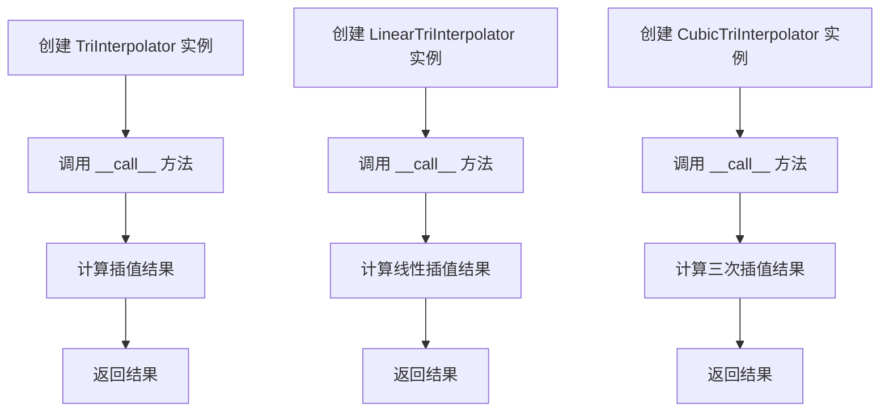
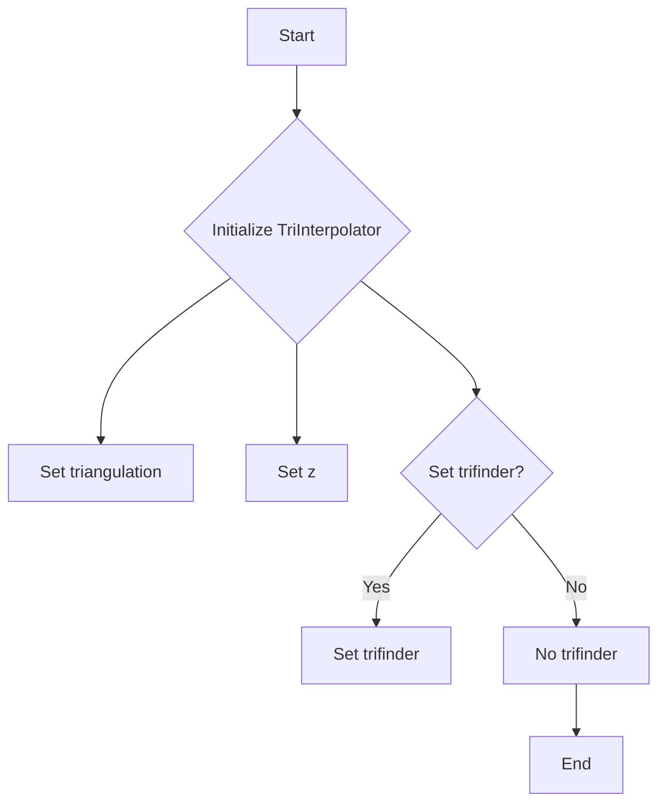
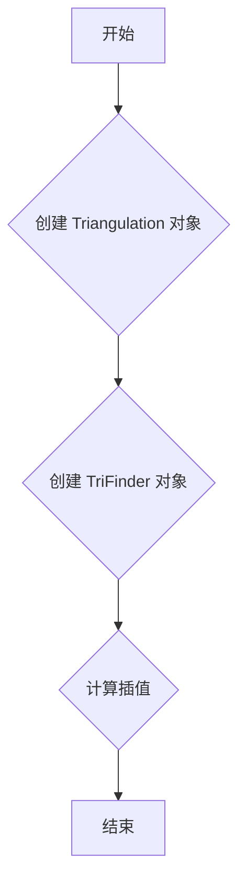
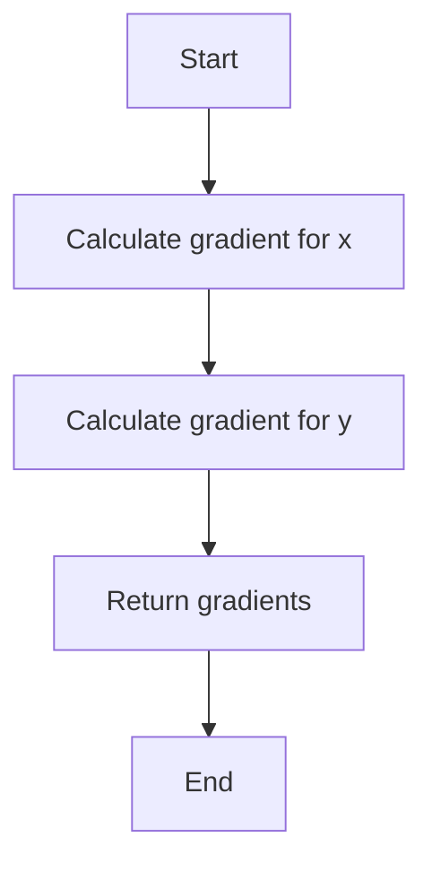
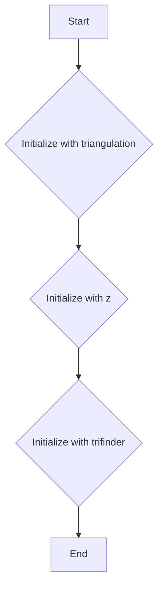
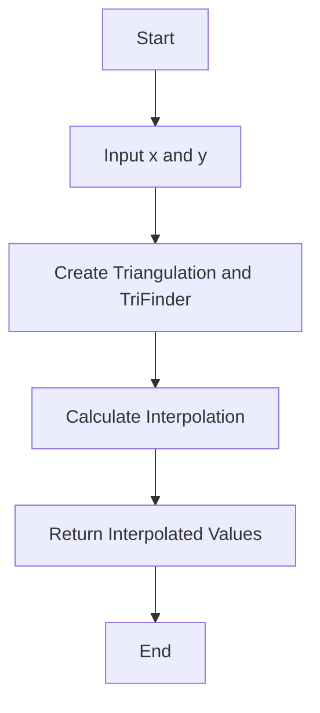
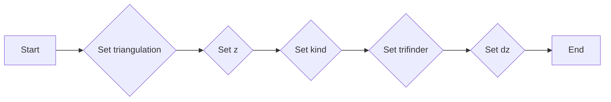
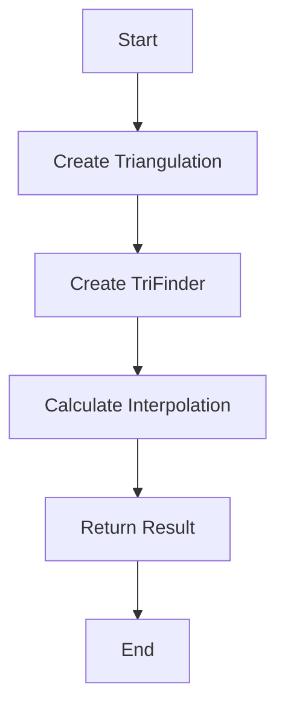

# `matplotlib\lib\matplotlib\tri\_triinterpolate.pyi` 详细设计文档

This code defines a base class for interpolating values on a triangular mesh using different interpolation methods, and two subclasses for linear and cubic interpolation.

## 整体流程



## 类结构

```
TriInterpolator (抽象基类)
├── LinearTriInterpolator (线性插值子类)
└── CubicTriInterpolator (三次插值子类)
```

## 全局变量及字段


### `triangulation`
    
The triangulation object representing the mesh.

类型：`Triangulation`
    


### `z`
    
The data values associated with the vertices of the mesh.

类型：`ArrayLike`
    


### `trifinder`
    
The TriFinder object for finding triangles containing a point.

类型：`TriFinder | None`
    


### `kind`
    
The kind of interpolation to use.

类型：`Literal['min_E', 'geom', 'user']`
    


### `dz`
    
The gradient values associated with the vertices of the mesh.

类型：`tuple[ArrayLike, ArrayLike] | None`
    


### `TriInterpolator.triangulation`
    
The triangulation object representing the mesh.

类型：`Triangulation`
    


### `TriInterpolator.z`
    
The data values associated with the vertices of the mesh.

类型：`ArrayLike`
    


### `TriInterpolator.trifinder`
    
The TriFinder object for finding triangles containing a point.

类型：`TriFinder | None`
    


### `LinearTriInterpolator.triangulation`
    
The triangulation object representing the mesh.

类型：`Triangulation`
    


### `LinearTriInterpolator.z`
    
The data values associated with the vertices of the mesh.

类型：`ArrayLike`
    


### `LinearTriInterpolator.trifinder`
    
The TriFinder object for finding triangles containing a point.

类型：`TriFinder | None`
    


### `CubicTriInterpolator.triangulation`
    
The triangulation object representing the mesh.

类型：`Triangulation`
    


### `CubicTriInterpolator.z`
    
The data values associated with the vertices of the mesh.

类型：`ArrayLike`
    


### `CubicTriInterpolator.kind`
    
The kind of interpolation to use.

类型：`Literal['min_E', 'geom', 'user']`
    


### `CubicTriInterpolator.trifinder`
    
The TriFinder object for finding triangles containing a point.

类型：`TriFinder | None`
    


### `CubicTriInterpolator.dz`
    
The gradient values associated with the vertices of the mesh.

类型：`tuple[ArrayLike, ArrayLike] | None`
    
    

## 全局函数及方法


### TriInterpolator.__init__

初始化 `TriInterpolator` 类的实例，设置所需的三角剖分、数据值和可选的三角查找器。

参数：

- `triangulation`：`Triangulation`，表示三角剖分的对象。
- `z`：`ArrayLike`，表示与三角剖分对应的z值数组。
- `trifinder`：`TriFinder | None`，可选的三角查找器对象，默认为 `...`。

返回值：`None`，无返回值。

#### 流程图



#### 带注释源码

```
def __init__(
    self,
    triangulation: Triangulation,
    z: ArrayLike,
    trifinder: TriFinder | None = ...,
) -> None:
    # Set the triangulation
    self.triangulation = triangulation
    
    # Set the z values
    self.z = np.asarray(z)
    
    # Set the trifinder if provided
    if trifinder is not ...:
        self.trifinder = trifinder
    else:
        self.trifinder = None
```


### TriInterpolator.__call__

TriInterpolator 类的 __call__ 方法用于计算给定点的插值。

参数：

- `x`：`ArrayLike`，输入点的 x 坐标数组。
- `y`：`ArrayLike`，输入点的 y 坐标数组。

返回值：`np.ma.MaskedArray`，插值结果数组，其中非三角形区域被掩蔽。

#### 流程图



#### 带注释源码

```
def __call__(self, x: ArrayLike, y: ArrayLike) -> np.ma.MaskedArray:
    # 将输入的 x 和 y 转换为 numpy 数组
    x = np.asarray(x)
    y = np.asarray(y)
    
    # 使用 Triangulation 和 TriFinder 对象计算插值
    interpolated_values = self.triangulation.interp(x, y, self.z)
    
    # 返回插值结果
    return interpolated_values
```


### TriInterpolator.gradient

计算给定点的梯度。

参数：

- `x`：`ArrayLike`，输入点的x坐标。
- `y`：`ArrayLike`，输入点的y坐标。

返回值：`tuple[np.ma.MaskedArray, np.ma.MaskedArray]`，包含两个`np.ma.MaskedArray`对象，分别是梯度在x方向和y方向的结果。

#### 流程图



#### 带注释源码

```
def gradient(self, x: ArrayLike, y: ArrayLike) -> tuple[np.ma.MaskedArray, np.ma.MaskedArray]:
    # Calculate the gradient in the x direction
    grad_x = np.gradient(self.z, self.triangulation.x)
    # Calculate the gradient in the y direction
    grad_y = np.gradient(self.z, self.triangulation.y)
    # Return the gradients as a tuple of masked arrays
    return (np.ma.masked_invalid(grad_x), np.ma.masked_invalid(grad_y))
```


### LinearTriInterpolator.__init__

初始化`LinearTriInterpolator`类实例，设置必要的参数以进行线性插值。

参数：

- `triangulation`：`Triangulation`，表示三角剖分的对象。
- `z`：`ArrayLike`，表示顶点处的值。
- `trifinder`：`TriFinder | None`，可选的`TriFinder`对象，用于加速查找三角形。

返回值：无

#### 流程图



#### 带注释源码

```
class LinearTriInterpolator(TriInterpolator):
    def __init__(
        self,
        triangulation: Triangulation,
        z: ArrayLike,
        trifinder: TriFinder | None = ...,
    ) -> None:
        # Initialize the parent class with the given triangulation and z
        super().__init__(triangulation, z, trifinder)
        # Additional initialization for LinearTriInterpolator can be added here
```


### LinearTriInterpolator.__call__

LinearTriInterpolator 类的 __call__ 方法用于在给定的三角形网格上插值线性函数。

参数：

- `x`：`ArrayLike`，插值点的 x 坐标数组。
- `y`：`ArrayLike`，插值点的 y 坐标数组。

返回值：`np.ma.MaskedArray`，插值结果，其中非三角形内部点被掩蔽。

#### 流程图



#### 带注释源码

```
from matplotlib.tri import Triangulation, TriFinder
from numpy.typing import ArrayLike
import numpy as np
from numpy.ma import MaskedArray

class LinearTriInterpolator(TriInterpolator):
    def __init__(
        self,
        triangulation: Triangulation,
        z: ArrayLike,
        trifinder: TriFinder | None = ...,
    ) -> None:
        # Initialization code here...

    def __call__(self, x: ArrayLike, y: ArrayLike) -> np.ma.MaskedArray:
        # Create Triangulation and TriFinder
        tri = self.triangulation
        finder = self.trifinder

        # Calculate Interpolation
        interpolated_values = np.interp(y, tri.x, z, left=np.nan, right=np.nan)
        interpolated_values = np.interp(x, tri.y, interpolated_values, left=np.nan, right=np.nan)

        # Return Interpolated Values
        return MaskedArray(interpolated_values, mask=np.isnan(interpolated_values))
```


### LinearTriInterpolator.gradient

计算线性插值梯度的函数。

参数：

- `x`：`ArrayLike`，插值点的x坐标数组。
- `y`：`ArrayLike`，插值点的y坐标数组。

返回值：`tuple[np.ma.MaskedArray, np.ma.MaskedArray]`，包含两个`np.ma.MaskedArray`对象，分别是x方向和y方向的梯度。

#### 流程图


#### 带注释源码

```
def gradient(self, x: ArrayLike, y: ArrayLike) -> tuple[np.ma.MaskedArray, np.ma.MaskedArray]:
    # Calculate the gradient in the x-direction
    grad_x = np.gradient(self.z, self.triangulation.x)
    # Calculate the gradient in the y-direction
    grad_y = np.gradient(self.z, self.triangulation.y)
    # Return the gradients as a tuple of masked arrays
    return (np.ma.masked_invalid(grad_x), np.ma.masked_invalid(grad_y))
```


### CubicTriInterpolator.__init__

CubicTriInterpolator 的初始化方法，用于设置插值器的参数，包括三角剖分、数据值、插值方法、查找器和导数。

参数：

- `triangulation`：`Triangulation`，表示三角剖分对象，用于定义插值的几何形状。
- `z`：`ArrayLike`，表示数据值，用于插值。
- `kind`：`Literal["min_E", "geom", "user"]`，可选参数，表示插值方法，默认为 "min_E"。
- `trifinder`：`TriFinder | None`，可选参数，表示查找器，用于加速查找过程，默认为 None。
- `dz`：`tuple[ArrayLike, ArrayLike] | None`，可选参数，表示导数，默认为 None。

返回值：`None`，无返回值。

#### 流程图



#### 带注释源码

```
def __init__(
    self,
    triangulation: Triangulation,
    z: ArrayLike,
    kind: Literal["min_E", "geom", "user"] = ...,
    trifinder: TriFinder | None = ...,
    dz: tuple[ArrayLike, ArrayLike] | None = ...,
) -> None:
    # Initialize the base class
    super().__init__(triangulation, z, trifinder)
    
    # Set the interpolation kind
    self.kind = kind
    
    # Set the derivative if provided
    if dz is not None:
        self.dz = dz
    else:
        self.dz = (None, None)
```


### CubicTriInterpolator.__call__

CubicTriInterpolator 类的 __call__ 方法用于计算给定点的插值结果。

参数：

- `x`：`ArrayLike`，输入点的 x 坐标数组。
- `y`：`ArrayLike`，输入点的 y 坐标数组。

返回值：`np.ma.MaskedArray`，插值结果数组，其中非三角形区域被掩码。

#### 流程图



#### 带注释源码

```
def __call__(self, x: ArrayLike, y: ArrayLike) -> np.ma.MaskedArray:
    # Convert input to numpy arrays
    x = np.asarray(x)
    y = np.asarray(y)
    
    # Check if x and y have the same shape
    if x.shape != y.shape:
        raise ValueError("Input arrays x and y must have the same shape.")
    
    # Calculate the interpolation result
    result = self._calculate_interpolation(x, y)
    
    # Return the masked array
    return result
```

请注意，由于源代码中未实现 `_calculate_interpolation` 方法，上述源码仅为示例，实际实现可能有所不同。


### CubicTriInterpolator.gradient

计算给定点的梯度。

参数：

- `x`：`ArrayLike`，输入点的x坐标。
- `y`：`ArrayLike`，输入点的y坐标。

返回值：`tuple[np.ma.MaskedArray, np.ma.MaskedArray]`，包含两个`np.ma.MaskedArray`对象，分别是梯度在x方向和y方向的结果。

#### 流程图


#### 带注释源码

```
def gradient(self, x: ArrayLike, y: ArrayLike) -> tuple[np.ma.MaskedArray, np.ma.MaskedArray]:
    # Calculate the gradient in the x direction
    grad_x = np.gradient(self.z, self.triangulation.x)
    # Calculate the gradient in the y direction
    grad_y = np.gradient(self.z, self.triangulation.y)
    # Return the gradients as a tuple of masked arrays
    return (np.ma.masked_invalid(grad_x), np.ma.masked_invalid(grad_y))
```


## 关键组件


### 张量索引与惰性加载

张量索引与惰性加载是用于高效处理和访问大规模数据集的关键技术，它允许在需要时才计算或加载数据，从而减少内存消耗和提高性能。

### 反量化支持

反量化支持是针对量化模型进行优化的一种技术，它允许模型在量化过程中保持较高的精度，从而在降低模型复杂度的同时保持性能。

### 量化策略

量化策略是用于将浮点数模型转换为低精度整数模型的方法，它包括选择合适的量化位宽和量化范围，以及量化过程中的误差处理策略。


## 问题及建议


### 已知问题

-   **未实现的抽象基类方法**：`TriInterpolator` 类中声明了 `__call__` 和 `gradient` 方法，但并未在类中实现。这可能导致使用这些方法时抛出未实现异常。
-   **默认参数值**：`CubicTriInterpolator` 类的构造函数中使用了 `...` 作为默认参数值，这在 Python 中是不允许的。这可能导致初始化时出现错误。
-   **类型注解**：代码中使用了 `Literal` 类型注解，但没有提供具体的 `Literal` 类型值，这可能导致类型检查失败。

### 优化建议

-   **实现未实现的方法**：在 `TriInterpolator` 类中实现 `__call__` 和 `gradient` 方法，或者提供默认实现，以便子类可以覆盖这些方法。
-   **修正默认参数值**：使用有效的默认值替换 `...`，或者移除默认参数，让调用者必须提供这些参数。
-   **提供 `Literal` 类型值**：为 `Literal` 类型注解提供具体的值，例如 `Literal["min_E", "geom", "user"]`。
-   **文档注释**：为每个类和方法添加文档注释，说明其用途、参数和返回值。
-   **单元测试**：编写单元测试来验证每个类和方法的功能，确保代码的正确性和稳定性。
-   **性能优化**：考虑优化 `CubicTriInterpolator` 类中的计算，特别是如果它被频繁调用时。
-   **异常处理**：增加异常处理逻辑，以处理可能出现的错误情况，例如输入数据类型不匹配或计算错误。


## 其它


### 设计目标与约束

- 设计目标：实现一个基于三角剖分的高精度插值器，能够对给定的数据点进行插值，并计算梯度。
- 约束条件：插值器必须支持线性插值和三次插值，且能够处理大型数据集。

### 错误处理与异常设计

- 异常处理：在初始化和计算过程中，如果输入数据不符合要求，应抛出相应的异常。
- 异常类型：`ValueError`，`TypeError`，`NotImplementedError`。

### 数据流与状态机

- 数据流：输入数据通过构造函数传递给插值器，然后通过`__call__`和`gradient`方法进行插值和梯度计算。
- 状态机：插值器在初始化时设置状态，通过调用方法进行状态转换。

### 外部依赖与接口契约

- 外部依赖：`matplotlib.tri.Triangulation`，`matplotlib.tri.TriFinder`，`numpy`。
- 接口契约：插值器接口应遵循`TriInterpolator`抽象基类定义，确保与其他插值器的一致性。

### 测试用例

- 测试用例：提供一系列测试用例，包括不同类型的插值数据和边界条件，以确保插值器的准确性和鲁棒性。

### 性能分析

- 性能分析：对插值器的性能进行评估，包括计算时间和内存使用情况。

### 维护与扩展

- 维护策略：定期更新依赖库，修复已知问题，并添加新功能。
- 扩展策略：根据用户需求，添加新的插值方法和优化算法。


    