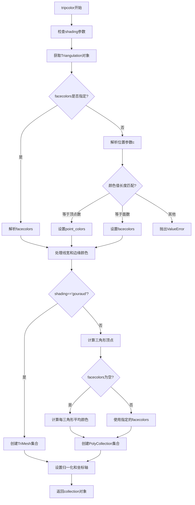
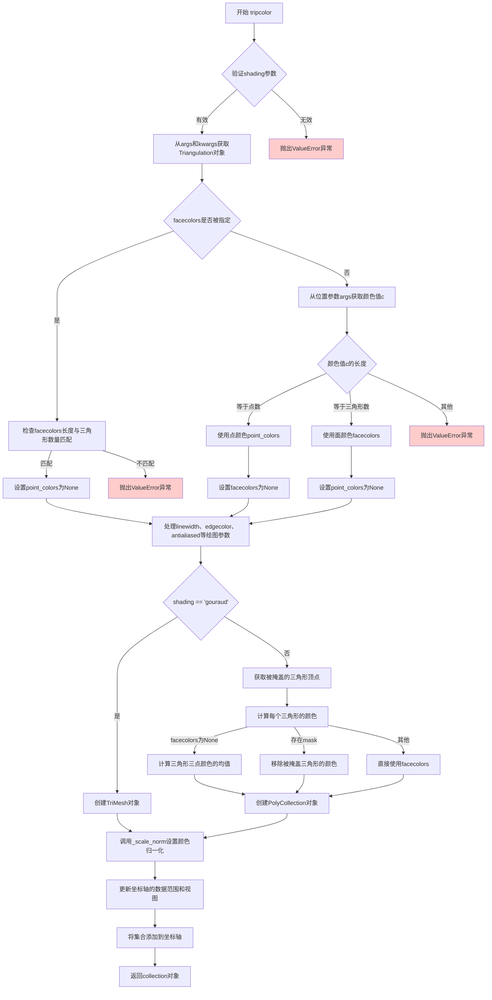

# `matplotlib\lib\matplotlib\tri\_tripcolor.py` 详细设计文档

该代码实现了matplotlib库中的tripcolor函数，用于根据三角网格创建伪彩色图（pseudocolor plot）。函数支持通过Triangulation对象或(x, y, triangles, mask)参数指定三角网格，并根据颜色值的位置（顶点或面）以及着色方式（flat或gouraud）创建TriMesh或PolyCollection集合对象。

## 整体流程



## 类结构

```
tripcolor (模块级函数)
依赖类:
├── Triangulation (matplotlib.tri._triangulation)
├── PolyCollection (matplotlib.collections)
└── TriMesh (matplotlib.collections)
```

## 全局变量及字段


### `tri`
    
三角网格对象

类型：`Triangulation`
    


### `args`
    
位置参数

类型：`tuple`
    


### `kwargs`
    
关键字参数

类型：`dict`
    


### `c`
    
颜色值数组

类型：`ndarray`
    


### `point_colors`
    
顶点颜色

类型：`ndarray or None`
    


### `facecolors`
    
三角形面颜色

类型：`ndarray or None`
    


### `linewidths`
    
线宽元组

类型：`tuple`
    


### `edgecolors`
    
边缘颜色

类型：`str`
    


### `ec`
    
边缘颜色简写

类型：`str`
    


### `maskedTris`
    
遮罩后的三角形索引

类型：`ndarray`
    


### `verts`
    
三角形顶点坐标

类型：`ndarray`
    


### `colors`
    
最终颜色值

类型：`ndarray`
    


### `collection`
    
返回的集合对象

类型：`PolyCollection or TriMesh`
    


### `minx`
    
坐标边界

类型：`float`
    


### `maxx`
    
坐标边界

类型：`float`
    


### `miny`
    
坐标边界

类型：`float`
    


### `maxy`
    
坐标边界

类型：`float`
    


### `corners`
    
坐标边界框

类型：`tuple`
    


    

## 全局函数及方法


### tripcolor

创建三角网格伪彩色图的主函数，支持基于点数据或面数据生成颜色，可选择flat或gouraud着色方式，返回PolyCollection（flat着色）或TriMesh（gouraud着色）类型的集合对象。

参数：

- `ax`：`matplotlib.axes.Axes`，绑定的坐标系对象，用于放置生成的三角网格图
- `*args`：可变位置参数，包含三角形网格定义参数（triangulation、x、y、triangles、mask）和颜色值c
- `alpha`：`float`，透明度值，范围0-1，默认为1.0
- `norm`：`matplotlib.colors.Normalize`，可选，归一化对象，用于颜色值的数据映射
- `cmap`：`str`或`matplotlib.colors.Colormap`，可选，颜色映射表名称或对象
- `vmin`：`float`，可选，颜色映射的最小值
- `vmax`：`float`，可选，颜色映射的最大值
- `shading`：`str`，着色方式，'flat'或'gouraud'，默认为'flat'
- `facecolors`：`array-like`，可选，直接指定三角形面颜色，优先级高于c参数
- `**kwargs`：`dict`，其他关键字参数，传递给Collection类的属性设置

返回值：`matplotlib.collections.PolyCollection`或`matplotlib.collections.TriMesh`，返回的图形集合对象，类型取决于shading参数：flat返回PolyCollection，gouraud返回TriMesh

#### 流程图



#### 带注释源码

```python
import numpy as np
from matplotlib import _api, _docstring
from matplotlib.collections import PolyCollection, TriMesh
from matplotlib.tri._triangulation import Triangulation


@_docstring.interpd
def tripcolor(ax, *args, alpha=1.0, norm=None, cmap=None, vmin=None,
              vmax=None, shading='flat', facecolors=None, **kwargs):
    """
    创建非结构化三角网格的伪彩色图。
    
    调用签名:
      tripcolor(triangulation, c, *, ...)
      tripcolor(x, y, c, *, [triangles=triangles], [mask=mask], ...)
    
    参数:
    ---------
    triangulation : Triangulation对象
        已创建的三角网格对象
    x, y, triangles, mask : 参数
        定义三角网格的参数，详见Triangulation
    c : array-like
        颜色值，可以是点或三角形上的值，由长度自动推断
    facecolors : array-like, 可选
        直接指定三角形面颜色
    shading : {'flat', 'gouraud'}, 默认: 'flat'
        着色方式
    cmap, norm, vmin, vmax : 颜色映射参数
        用于颜色值映射的参数
    **kwargs : Collection属性
        传递给集合对象的其他属性
        
    返回:
    -------
    PolyCollection或TriMesh
        取决于shading参数
    """
    # 验证shading参数是否为合法值
    _api.check_in_list(['flat', 'gouraud'], shading=shading)

    # 从位置参数和关键字参数中解析出Triangulation对象
    tri, args, kwargs = Triangulation.get_from_args_and_kwargs(*args, **kwargs)

    # 解析颜色参数：确定是使用点颜色还是面颜色
    if facecolors is not None:
        # 如果指定了facecolors关键字参数，发出警告并忽略位置参数c
        if args:
            _api.warn_external(
                "Positional parameter c has no effect when the keyword "
                "facecolors is given")
        point_colors = None
        # 验证facecolors数量与三角形数量匹配
        if len(facecolors) != len(tri.triangles):
            raise ValueError("The length of facecolors must match the number "
                             "of triangles")
    else:
        # 从位置参数获取颜色值c
        if not args:
            raise TypeError(
                "tripcolor() missing 1 required positional argument: 'c'; or "
                "1 required keyword-only argument: 'facecolors'")
        elif len(args) > 1:
            raise TypeError(f"Unexpected positional parameters: {args[1:]!r}")
        
        # 转换为numpy数组
        c = np.asarray(args[0])
        
        # 根据c的长度判断是点颜色还是面颜色
        if len(c) == len(tri.x):
            # 点数和颜色数相同时，优先使用点颜色
            point_colors = c
            facecolors = None
        elif len(c) == len(tri.triangles):
            # 颜色数等于三角形数时，使用面颜色
            point_colors = None
            facecolors = c
        else:
            raise ValueError('The length of c must match either the number '
                             'of points or the number of triangles')

    # 处理线宽、边缘颜色和抗锯齿等绘图参数
    linewidths = (0.25,)
    if 'linewidth' in kwargs:
        kwargs['linewidths'] = kwargs.pop('linewidth')
    kwargs.setdefault('linewidths', linewidths)

    edgecolors = 'none'
    if 'edgecolor' in kwargs:
        kwargs['edgecolors'] = kwargs.pop('edgecolor')
    ec = kwargs.setdefault('edgecolors', edgecolors)

    if 'antialiased' in kwargs:
        kwargs['antialiaseds'] = kwargs.pop('antialiased')
    if 'antialiaseds' not in kwargs and ec.lower() == "none":
        kwargs['antialiaseds'] = False

    # 根据shading参数创建不同的集合对象
    if shading == 'gouraud':
        # gouraud着色只能用于点颜色，不支持面颜色
        if facecolors is not None:
            raise ValueError(
                "shading='gouraud' can only be used when the colors "
                "are specified at the points, not at the faces.")
        # 创建TriMesh对象（使用Gouraud着色）
        collection = TriMesh(tri, alpha=alpha, array=point_colors,
                             cmap=cmap, norm=norm, **kwargs)
    else:  # 'flat'着色
        # 获取被掩盖的三角形顶点
        maskedTris = tri.get_masked_triangles()
        # 构建三角形顶点数组
        verts = np.stack((tri.x[maskedTris], tri.y[maskedTris]), axis=-1)

        # 确定颜色值
        if facecolors is None:
            # 如果没有指定面颜色，计算每个三角形三个顶点颜色的均值
            colors = point_colors[maskedTris].mean(axis=1)
        elif tri.mask is not None:
            # 如果存在mask，移除被掩盖三角形的颜色
            colors = facecolors[~tri.mask]
        else:
            colors = facecolors
        
        # 创建PolyCollection对象
        collection = PolyCollection(verts, alpha=alpha, array=colors,
                                    cmap=cmap, norm=norm, **kwargs)

    # 设置颜色归一化
    collection._scale_norm(norm, vmin, vmax)
    ax.grid(False)

    # 计算数据边界并更新坐标轴
    minx = tri.x.min()
    maxx = tri.x.max()
    miny = tri.y.min()
    maxy = tri.y.max()
    corners = (minx, miny), (maxx, maxy)
    ax.update_datalim(corners)
    ax.autoscale_view()
    
    # 添加集合到坐标轴并返回
    ax.add_collection(collection, autolim=False)
    return collection
```

### 关键组件信息

- **Triangulation**：三角网格数据容器，包含x、y坐标、三角形索引和可选的mask
- **PolyCollection**：多边形集合类，用于flat着色方式的三角形渲染
- **TriMesh**：三角网格集合类，用于gouraud着色方式的平滑渲染
- **Triangulation.get_from_args_and_kwargs**：静态方法，用于从函数参数中解析和构建Triangulation对象

### 潜在的技术债务与优化空间

1. **数据范围计算的冗余**：代码手动计算了min/max并更新datalim，但后续又调用autoscale_view，可能存在重复计算，可以考虑统一或优化
2. **参数解析的复杂性**：颜色参数（c、facecolors）的解析逻辑嵌套较深，包含多个条件分支和类型判断，可读性有待提升
3. **向后兼容性问题**：函数支持位置参数传递triangles，这种方式已被标记为不推荐，未来可能移除
4. **警告信息不够具体**：当facecolors与c同时使用时，仅发出警告而非明确报错，可能导致用户困惑

### 其它项目

#### 设计目标与约束

- **核心目标**：提供基于非结构化三角网格数据的伪彩色可视化功能
- **约束条件**：必须与matplotlib的坐标系系统集成，支持多种颜色映射和归一化方式
- **兼容性**：保持与Triangulation对象的紧密集成，支持多种输入形式

#### 错误处理与异常设计

- **参数验证**：使用`_api.check_in_list`验证shading参数，使用断言检查必需参数
- **类型错误**：当缺少必需参数c或facecolors时抛出TypeError
- **值错误**：当颜色数组长度不匹配时抛出ValueError，并提供明确的错误信息

#### 数据流与状态机

1. **输入解析阶段**：从*args和**kwargs中提取Triangulation和颜色数据
2. **颜色分类阶段**：根据颜色数据长度判断是点颜色还是面颜色
3. **集合创建阶段**：根据shading参数选择创建PolyCollection或TriMesh
4. **渲染准备阶段**：计算数据边界、更新坐标轴设置
5. **返回阶段**：返回集合对象供用户进一步操作

#### 外部依赖与接口契约

- **依赖库**：numpy（数值计算）、matplotlib.collections（图形集合）、matplotlib.tri._triangulation（三角网格）
- **上游接口**：接受Triangulation对象或x、y、triangles、mask参数
- **下游接口**：返回PolyCollection或TriMesh对象，这些对象可进一步通过matplotlib的Artist接口进行定制

## 关键组件


### 张量索引与惰性加载

代码使用 NumPy 数组进行高效的向量化索引操作。`maskedTris = tri.get_masked_triangles()` 获取掩码后的三角形索引，然后通过 `point_colors[maskedTris].mean(axis=1)` 实现批量计算每个三角形的平均颜色值，避免了 Python 循环带来的性能开销。

### 反量化支持

代码支持两种颜色值指定方式：点颜色（point_colors）和面颜色（facecolors）。当使用 'flat' 着色时，若提供点颜色，会自动计算三角形三个顶点颜色的均值（反量化过程）；若提供面颜色，则直接使用。该设计允许灵活的颜色数据输入格式。

### 量化策略

颜色映射通过 Matplotlib 的 norm、cmap、vmin、vmax 参数实现数据的标准化和色彩映射。`collection._scale_norm(norm, vmin, vmax)` 负责将颜色值映射到 [0, 1] 范围，再通过 cmap 转换为可视化颜色，支持线性归一化和其他自定义归一化方式。

### 参数解析与多态处理

函数通过 `Triangulation.get_from_args_and_kwargs` 统一解析多种输入形式（三角测量对象或 x, y, triangles, mask 参数），并通过位置参数和关键字参数灵活处理颜色输入，实现 API 的易用性与功能完整性的平衡。

### 着色器模式切换

代码根据 shading 参数在两种渲染模式间切换：'flat' 模式生成 PolyCollection，每个三角形使用单一颜色；'gouraud' 模式生成 TriMesh，在顶点间进行颜色插值渲染，实现平滑渐变效果。


## 问题及建议


### 已知问题

- **类型验证不足**：`np.asarray(args[0])` 未验证输入是否为有效的数值数组类型，也未检查 NaN 或 Inf 值
- **魔法数字**：`linewidths = (0.25,)` 是硬编码的魔法数字，缺乏解释
- **参数转换冗余**：手动处理 `linewidth` → `linewidths`、`edgecolor` → `edgecolors`、`antialiased` → `antialiaseds` 的向后兼容逻辑过于复杂，可简化
- **alpha 参数无验证**：未检查 `alpha` 是否在有效范围 [0, 1] 内
- **颜色处理逻辑复杂**：facecolors 和 point_colors 的判断分支存在重复逻辑，可抽象
- **性能潜在问题**：`point_colors[maskedTris].mean(axis=1)` 对所有三角形计算均值，即使部分已被 mask
- **字符串比较重复**：多次使用 `ec.lower() == "none"` 比较，可提取为常量
- **TODO 未解决**：存在未完成的 TODO 注释关于 autolim 优化

### 优化建议

- 添加输入验证：检查 c 和 facecolors 的 dtype、数值范围，验证 alpha 在 [0, 1] 内
- 将 `linewidths = (0.25,)` 提取为命名常量或配置参数
- 使用 `functools.lru_cache` 或预计算避免重复的 `get_masked_triangles()` 调用
- 将参数别名转换逻辑统一到一个辅助函数中处理
- 提取 "none" 字符串为常量 `EMPTY_EDGE_COLOR = 'none'`
- 简化颜色处理分支，将共有逻辑提取出来
- 将 vmin/vmax 的验证与 norm 的处理逻辑统一
- 解决 TODO 注释：测试是否可以移除显式的 limit 处理，改用 `autolim=True`


## 其它


### 设计目标与约束

本函数旨在为非结构化三角网格提供伪彩色可视化能力，支持多种输入方式（通过Triangulation对象或x/y/triangles/mask参数），并根据颜色数据长度自动推断颜色值是定义在点上还是三角形上。约束条件包括：shading仅支持'flat'和'gouraud'两种模式；当使用'gouraud'着色时颜色必须定义在点上；三角形数量与颜色数据长度必须匹配。

### 错误处理与异常设计

代码包含以下错误处理机制：1) 使用`_api.check_in_list`验证shading参数合法性；2) 当同时提供facecolors和位置参数c时发出警告；3) 缺少必需参数c或facecolors时抛出TypeError；4) 位置参数过多时抛出TypeError；5) c的长度既不等于点数也不等于三角形数时抛出ValueError；6) facecolors长度与三角形数不匹配时抛出ValueError；7) 'gouraud'着色但提供面颜色时抛出ValueError。所有异常都包含清晰的错误信息以帮助用户定位问题。

### 数据流与状态机

函数的数据流状态机包含以下主要分支：初始状态获取Triangulation对象；然后根据facecolors是否提供分为两条路径，若提供facecolors则忽略位置参数c，否则解析c参数；接着根据c的长度判断颜色是定义在点还是三角形上；最后根据shading参数选择创建TriMesh（'gouraud'）或PolyCollection（'flat'）。状态转换主要受输入参数类型和长度的影响。

### 外部依赖与接口契约

本函数依赖以下外部模块：numpy（数组操作）、matplotlib._api（API检查工具）、matplotlib._docstring（文档字符串处理）、matplotlib.collections（PolyCollection和TriMesh类）、matplotlib.tri._triangulation（Triangulation类）。接口契约要求：triangulation参数与x/y/triangles/mask参数互斥；c参数为位置参数不能作为关键字传递；facecolors优先级高于c；返回值为PolyCollection或TriMesh对象。

### 性能考虑与优化空间

当前实现存在以下潜在性能问题：1) `tri.get_masked_triangles()`可能重复计算被遮罩的三角形；2) `np.stack`创建新数组可能有额外开销；3) `mean(axis=1)`计算面颜色时对每个三角形都进行计算。可以考虑的优化包括：缓存遮罩三角形结果；使用视图而非拷贝；预先分配数组空间。此外，TODO注释指出显式限制处理可能可被autolim=True替代。

### 数值稳定性与边界条件

代码处理了以下边界情况：1) 当点数和三角形数相同时，优先使用点颜色（代码注释明确说明）；2) 处理被遮罩的三角形，从面颜色中排除；3) 当edgecolor为'none'时自动关闭抗锯齿以提高性能；4) 处理空数组和极限值（通过min/max获取数据范围）。数值稳定性方面使用numpy的数组操作避免显式循环。

### 安全性考虑

函数通过`_api.warn_external`发出警告而非抛出异常处理废弃用法；使用`np.asarray`进行类型转换但不修改输入数据；所有外部输入都经过验证后使用。潜在的输入安全风险较低，因为主要依赖matplotlib内部类型系统和numpy的数组操作。

### 版本兼容性

代码使用`@_docstring.interpd`装饰器处理文档字符串插值；`_api.check_in_list`和`_api.warn_external`提供了版本兼容的API检查机制；Collection属性通过kwargs传递保持了与基类的接口兼容性。未来需关注matplotlib主版本更新时Triangulation API的变化。

### 测试建议

建议添加以下测试用例：1) 仅提供Triangulation对象的正常情况；2) 提供x/y/c的正常情况；3) 三角形数与点数相同时使用点颜色的边界情况；4) 'gouraud'着色的正常情况；5) facecolors参数覆盖c参数的正常情况；6) 各种参数组合错误情况；7) 空数组输入情况；8) 大量数据点的性能基准测试。

    