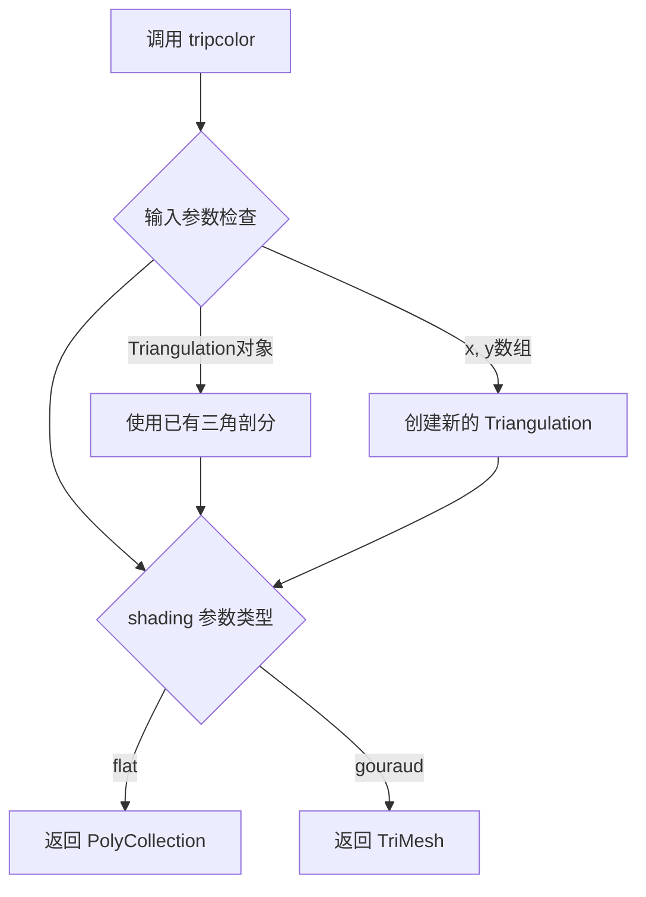
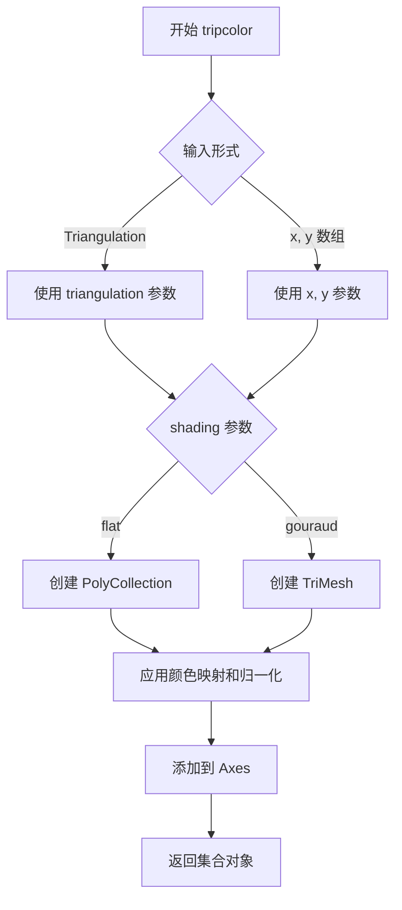

# `matplotlib\lib\matplotlib\tri\_tripcolor.pyi` 详细设计文档

该文件定义了 `tripcolor` 函数的重载签名，用于在非结构化三角网格上创建伪彩色图（pseudocolor plot），根据着色方式（shading）和输入参数类型（Triangulation对象或x,y坐标）返回 `PolyCollection` 或 `TriMesh` 集合对象。

## 整体流程



## 类结构

```
matplotlib.tri.tripcolor (Module)
└── tripcolor (Function Overloads)
    ├── Overload 1: (ax, triangulation, c, shading='flat') -> PolyCollection
    ├── Overload 2: (ax, x, y, c, shading='flat') -> PolyCollection
    ├── Overload 3: (ax, triangulation, c, shading='gouraud') -> TriMesh
    └── Overload 4: (ax, x, y, c, shading='gouraud') -> TriMesh
```

## 全局变量及字段


    

## 全局函数及方法


### `tripcolor`

`tripcolor` 是 matplotlib 库中的一个函数，用于在二维三角剖分网格上绘制填充多边形或 Gouraud 着色三角形。它接受三角剖分对象或坐标数组，以及颜色值数组，根据指定的着色方式（flat 或 gouraud）返回相应的集合对象（PolyCollection 或 TriMesh）。

参数：

- `ax`：`Axes`，matplotlib 的坐标轴对象，用于承载绘图
- `triangulation`：`Triangulation`，三角剖分对象，包含三角形连接信息
- `x`：`ArrayLike`，x 坐标数组
- `y`：`ArrayLike`，y 坐标数组
- `c`：`ArrayLike`，与每个三角形或顶点关联的颜色值数组
- `alpha`：`float`，透明度值（0-1）
- `norm`：`str | Normalize | None`，颜色映射的归一化对象或字符串
- `cmap`：`str | Colormap | None`，颜色映射名称或 Colormap 对象
- `vmin`：`float | None`，颜色映射最小值
- `vmax`：`float | None`，颜色映射最大值
- `shading`：`Literal["flat"] | Literal["gouraud"]`，着色方式，"flat" 为平面着色，"gouraud" 为 Gouraud 着色
- `facecolors`：`ArrayLike | None`，直接指定的面颜色数组
- `**kwargs`：其他关键字参数，传递给底层 PolyCollection 或 TriMesh

返回值：`PolyCollection | TriMesh`，当 shading="flat" 时返回 PolyCollection；当 shading="gouraud" 时返回 TriMesh

#### 流程图



#### 带注释源码

```python
from matplotlib.axes import Axes
from matplotlib.collections import PolyCollection, TriMesh
from matplotlib.colors import Normalize, Colormap
from matplotlib.tri._triangulation import Triangulation
from numpy.typing import ArrayLike
from typing import overload, Literal

# overload 装饰器用于提供精确的类型提示，IDE 可以根据调用参数推断返回类型

@overload
def tripcolor(
    ax: Axes,
    triangulation: Triangulation,
    c: ArrayLike = ...,
    *,
    alpha: float = ...,
    norm: str | Normalize | None = ...,
    cmap: str | Colormap | None = ...,
    vmin: float | None = ...,
    vmax: float | None = ...,
    shading: Literal["flat"] = ...,
    facecolors: ArrayLike | None = ...,
    **kwargs
) -> PolyCollection: ...

# 重载版本：使用 Triangulation 对象，flat 着色，返回 PolyCollection

@overload
def tripcolor(
    ax: Axes,
    x: ArrayLike,
    y: ArrayLike,
    c: ArrayLike = ...,
    *,
    alpha: float = ...,
    norm: str | Normalize | None = ...,
    cmap: str | Colormap | None = ...,
    vmin: float | None = ...,
    vmax: float | None = ...,
    shading: Literal["flat"] = ...,
    facecolors: ArrayLike | None = ...,
    **kwargs
) -> PolyCollection: ...

# 重载版本：使用 x, y 坐标数组，flat 着色，返回 PolyCollection

@overload
def tripcolor(
    ax: Axes,
    triangulation: Triangulation,
    c: ArrayLike = ...,
    *,
    alpha: float = ...,
    norm: str | Normalize | None = ...,
    cmap: str | Colormap | None = ...,
    vmin: float | None = ...,
    vmax: float | None = ...,
    shading: Literal["gouraud"],
    facecolors: ArrayLike | None = ...,
    **kwargs
) -> TriMesh: ...

# 重载版本：使用 Triangulation 对象，gouraud 着色，返回 TriMesh

@overload
def tripcolor(
    ax: Axes,
    x: ArrayLike,
    y: ArrayLike,
    c: ArrayLike = ...,
    *,
    alpha: float = ...,
    norm: str | Normalize | None = ...,
    cmap: str | Colormap | None = ...,
    vmin: float | None = ...,
    vmax: float | None = ...,
    shading: Literal["gouraud"],
    facecolors: ArrayLike | None = ...,
    **kwargs
) -> TriMesh: ...

# 重载版本：使用 x, y 坐标数组，gouraud 着色，返回 TriMesh
# 注意：源码仅包含类型提示定义，实际实现位于 matplotlib 库中
```

## 关键组件


### tripcolor函数重载（函数族）

tripcolor函数族是matplotlib中用于在三角形网格上创建颜色填充图的核心函数，通过四个函数重载定义不同参数组合下的返回类型，支持flat和gouraud两种着色模式。

### Triangulation参数组件

接收Triangulation对象作为三角形网格数据输入，封装了三角形的连接关系和拓扑信息，是tripcolor的核心输入参数之一。

### 坐标参数组件（x, y）

支持直接传入x、y坐标数组作为输入，提供了更灵活的数据输入方式，与Triangulation参数形成互斥的两种调用方式。

### 颜色数据参数组件（c）

ArrayLike类型的颜色值数组，用于定义每个三角形或顶点的颜色数值，通过colormap映射为可视化颜色。

### 着色模式参数组件（shading）

支持"flat"和"gouraud"两种着色模式：flat返回PolyCollection对象，按三角形面着色；gouraud返回TriMesh对象，实现顶点插值平滑着色。

### 颜色映射与归一化组件（cmap, norm, vmin, vmax）

提供完整的颜色映射控制：cmap指定颜色方案，norm定义数据到[0,1]的归一化方式，vmin/vmax限制颜色映射的数值范围。

### 透明度控制组件（alpha）

float类型的透明度参数，控制整个填充图层的透明度值。

### 返回值类型组件（PolyCollection, TriMesh）

根据shading参数返回不同类型：flat模式返回PolyCollection（多边形集合），gouraud模式返回TriMesh（三角网格），实现了两种不同的渲染策略。


## 问题及建议


### 已知问题

-   **大量代码重复**：四个 overload 函数之间存在大量重复的参数定义（alpha、norm、cmap、vmin、vmax、facecolors、**kwargs），每个都完整重复一遍，导致代码冗余且难以维护
-   **缺少 triangulation 的 triangles 参数组合**：当前只定义了 (triangulation) 和 (x, y) 两种传入方式，遗漏了 (x, y, triangles) 这种常见用法
-   **类型提示可能不准确**：`norm: str | Normalize | None` 中 str 类型可能是误标，matplotlib 的 norm 通常不接受字符串（除非是某些特定情况如 'linear'）
-   **shading 类型限制过严**：仅支持 "flat" 和 "gouraud"，但 matplotlib 实际可能支持更多 shading 模式（如 'auto' 等），且返回值类型与 shading 关联，但逻辑不够清晰
-   **缺少 c 和 facecolors 参数说明**：未明确说明这两个参数的关系和优先级，也未说明 c 的具体含义（是每个顶点的值还是每个三角形的值）
-   **返回值类型缺少进一步说明**：PolyCollection 和 TriMesh 的具体用途和区别没有在文档中体现
-   **类型注解位置问题**：这种 stub 文件应该放在 .pyi 文件中，而不是 .py 文件中（如果这是主代码文件的话）

### 优化建议

-   **提取公共参数为基类型**：使用 TypeVar 或 Protocol 定义公共参数集合，或使用 **kwargs 配合 TypedDict 减少重复
-   **补充完整的 overload**：添加 triangulation + triangles 参数组合的 overload
-   **统一参数类型**：norm 参数建议改为 `Normalize | None`，或者明确定义哪些字符串值是可接受的
-   **扩展 shading 类型**：使用 Literal["flat", "gouraud", ...] 或更通用的 str 类型，并在注释中说明所有支持的选项
-   **增加参数文档字符串**：在每个参数后添加解释性注释，说明参数的作用、取值范围、与返回值的关系
-   **重构返回值关联**：考虑将 shading 和返回值的关联关系通过更清晰的类型设计体现，或者添加类型守卫逻辑说明


## 其它


### 设计目标与约束

该代码定义了matplotlib中tripcolor函数的类型签名，旨在为三角网格数据提供两种不同的可视化渲染方式（flat和gouraud shading）。约束条件包括：必须接受Axes对象作为画布参数，triangulation或x/y坐标必须提供其一，shading参数限定为"flat"或"gouraud"，颜色数据c和facecolors不能同时提供，返回值类型根据shading参数在PolyCollection和TriMesh之间确定。

### 错误处理与异常设计

代码本身为类型注解无运行时验证，但实际实现应处理以下错误情况：当triangulation与x/y同时提供时应抛出TypeError；当c和facecolors同时非None时应抛出ValueError；当shading为"flat"但返回TriMesh时应抛出TypeError；当数组维度不匹配时应抛出ValueError。

### 数据流与状态机

数据流路径为：输入坐标(x,y)或Triangulation对象 → 构建三角网格 → 计算颜色值c或使用facecolors → 根据shading参数选择渲染模式 → 输出PolyCollection(flat)或TriMesh(gouraud)对象。状态转换主要发生在shading参数确定时，从统一的输入状态转换为两种不同的输出状态。

### 外部依赖与接口契约

该函数依赖matplotlib.axes.Axes（画布）、matplotlib.collections.PolyCollection和TriMesh（图形集合）、matplotlib.colors.Normalize和Colormap（颜色映射）、matplotlib.tri._triangulation.Triangulation（三角剖分）、numpy.typing.ArrayLike（数组类型）。接口契约要求调用者必须提供ax参数，triangulation与(x,y)参数互斥，shading参数仅接受"flat"或"gouraud"字符串字面量。

### 性能考量与优化空间

当前代码为静态类型定义无性能问题。实际实现中可考虑的优化点包括：当数据量较大时使用向量化操作替代循环；TriMesh可缓存三角网格索引以加速渲染；对于flat shading可考虑使用单色多边形渲染而非逐顶点着色。

### 兼容性考虑

该函数应保持与matplotlib 3.x系列的向后兼容性。shading="gouraud"模式返回TriMesh对象，而shading="flat"返回PolyCollection，这种设计应保持稳定。type hints使用了Python 3.10+的union语法和Literal类型，需注意版本兼容性。

### 使用示例与参考

典型用法包括：tripcolor(ax, triangulation, c, shading='flat')用于平面着色渲染；tripcolor(ax, x, y, c, shading='gouraud')用于Gouraud着色渲染。可参考matplotlib官方文档中triplot、contourf等相关函数的实现模式。

    