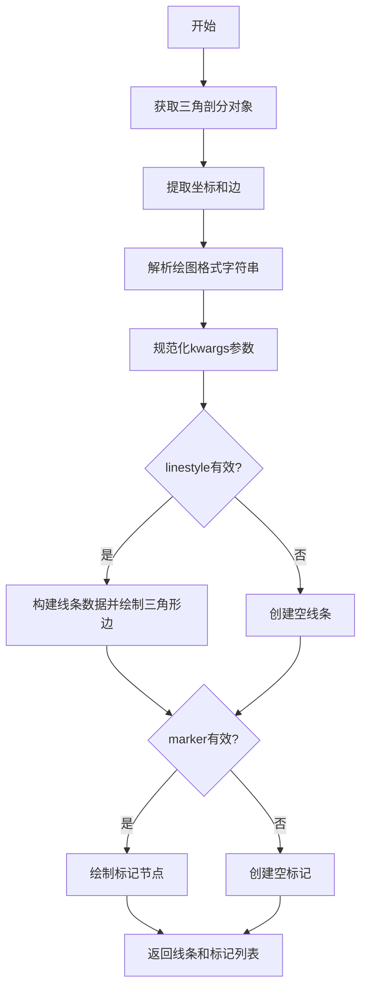
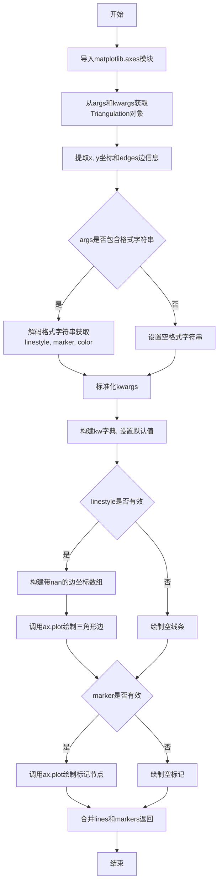

# `matplotlib\lib\matplotlib\tri\_triplot.py` 详细设计文档

该代码实现了一个用于绘制非结构化三角网格的函数triplot，能够将三角剖分结果显示为线条和/或标记节点，支持通过Triangulation对象或x、y坐标及三角形顶点来定义网格，并返回Line2D对象组成的线条和标记集合。

## 整体流程



## 类结构

```
无复杂类层次结构，主要为函数模块
triplot (主函数)
└── 内部调用 matplotlib.axes._base._process_plot_format
└── 内部调用 cbook.normalize_kwargs
```

## 全局变量及字段


### `tri`
    
从参数解析得到的三角网格对象

类型：`Triangulation`
    


### `args`
    
传递给函数的位置参数元组

类型：`tuple`
    


### `kwargs`
    
传递给函数的关键字参数字典

类型：`dict`
    


### `x`
    
三角网格的x坐标数组

类型：`numpy.ndarray`
    


### `y`
    
三角网格的y坐标数组

类型：`numpy.ndarray`
    


### `edges`
    
三角网格的边索引数组

类型：`numpy.ndarray`
    


### `fmt`
    
解析出的绘图格式字符串（如'ro-'）

类型：`str`
    


### `linestyle`
    
从格式字符串解析出的线条样式

类型：`str`
    


### `marker`
    
从格式字符串解析出的标记类型

类型：`str`
    


### `color`
    
从格式字符串解析出的颜色值

类型：`str`
    


### `kw`
    
规范化后的参数字典

类型：`dict`
    


### `kw_lines`
    
用于绘制三角边的参数字典

类型：`dict`
    


### `kw_markers`
    
用于绘制标记的参数字典

类型：`dict`
    


### `tri_lines_x`
    
在边之间插入nan值的x坐标数组

类型：`numpy.ndarray`
    


### `tri_lines_y`
    
在边之间插入nan值的y坐标数组

类型：`numpy.ndarray`
    


### `tri_lines`
    
绘制三角边返回的Line2D对象列表

类型：`list[matplotlib.lines.Line2D]`
    


### `tri_markers`
    
绘制标记返回的Line2D对象列表

类型：`list[matplotlib.lines.Line2D]`
    


    

## 全局函数及方法


### `triplot`

绘制非结构化三角形网格为线条和/or标记。主函数接受ax, *args, **kwargs参数，返回lines和markers的Line2D列表。

**参数：**

- `ax`：`matplotlib.axes.Axes`，Axes对象，用于绘制三角形网格
- `*args`：可变位置参数，用于传递Triangulation对象或其他参数（如x, y, triangles, mask等）
- `**kwargs`：关键字参数，用于传递绘图参数（如颜色、线型、标记等），将转发给Axes.plot

**返回值：** `List[matplotlib.lines.Line2D]`，返回三角形边（lines）和标记节点（markers）的Line2D对象列表

#### 流程图



#### 带注释源码

```python
def triplot(ax, *args, **kwargs):
    """
    绘制非结构化三角形网格为线条和/or标记。
    
    调用签名:
      triplot(triangulation, ...)
      triplot(x, y, [triangles], *, [mask=mask], ...)
    
    三角形网格可以通过传递Triangulation对象作为第一个参数来指定，
    或者通过传递点x, y以及可选的triangles和mask来指定。
    如果都未指定，则动态计算三角剖分。
    
    参数:
    -------
    triangulation : Triangulation
        已创建的三角网格对象
    x, y, triangles, mask
        定义三角网格的参数，详见Triangulation
    other_parameters
        其他所有参数都转发给Axes.plot
    
    返回值:
    -------
    lines : matplotlib.lines.Line2D
        绘制的三角形边
    markers : matplotlib.lines.Line2D
        绘制的标记节点
    """
    import matplotlib.axes

    # 从args和kwargs中获取Triangulation对象
    # 支持两种方式：1)直接传递Triangulation对象 2)传递x,y,triangles,mask参数
    tri, args, kwargs = Triangulation.get_from_args_and_kwargs(*args, **kwargs)
    
    # 提取三角剖分的数据：x坐标、y坐标、边信息
    x, y, edges = (tri.x, tri.y, tri.edges)

    # 解码绘图格式字符串（如'ro-'）
    # 格式：线条样式-标记-颜色
    fmt = args[0] if args else ""
    linestyle, marker, color = matplotlib.axes._base._process_plot_format(fmt)

    # 标准化kwargs，转换为Line2D接受的格式
    kw = cbook.normalize_kwargs(kwargs, mlines.Line2D)
    
    # 将解析出的格式参数设置到kw字典中（如果未指定则使用默认值）
    for key, val in zip(('linestyle', 'marker', 'color'),
                        (linestyle, marker, color)):
        if val is not None:
            kw.setdefault(key, val)

    # 绘制线条（三角形边）
    # 注意1: 如果在这里绘制标记，同一个标记点会被多次绘制（因为属于多条边）
    # 注意2: 使用插入nan值的方式比直接绘制边数组更高效
    linestyle = kw['linestyle']
    kw_lines = {
        **kw,
        'marker': 'None',  # 不绘制标记
        'zorder': kw.get('zorder', 1),  # 使用路径默认zorder
    }
    
    # 判断是否需要绘制边线
    if linestyle not in [None, 'None', '', ' ']:
        # 为每条边的两点之间插入nan值，实现断点效果
        # 这样可以将多条边绘制为一个Line2D对象，提高性能
        tri_lines_x = np.insert(x[edges], 2, np.nan, axis=1)
        tri_lines_y = np.insert(y[edges], 2, np.nan, axis=1)
        
        # 使用ravel()将二维数组展平为一维
        tri_lines = ax.plot(tri_lines_x.ravel(), tri_lines_y.ravel(),
                            **kw_lines)
    else:
        # 如果没有有效的线条样式，绘制空线条
        tri_lines = ax.plot([], [], **kw_lines)

    # 单独绘制标记（节点）
    marker = kw['marker']
    kw_markers = {
        **kw,
        'linestyle': 'None',  # 不绘制线条
    }
    # 移除label，避免重复图例
    kw_markers.pop('label', None)
    
    # 判断是否需要绘制标记
    if marker not in [None, 'None', '', ' ']:
        tri_markers = ax.plot(x, y, **kw_markers)
    else:
        # 如果没有有效的标记样式，绘制空标记
        tri_markers = ax.plot([], [], **kw_markers)

    # 返回线条和标记的Line2D对象列表
    return tri_lines + tri_markers
```

## 关键组件


### Triangulation.get_from_args_and_kwargs

解析函数参数和关键字参数，返回Triangulation对象。该方法是Triangulation类的工厂方法，用于从不同输入形式（已有Triangulation对象或x, y, triangles, mask参数）统一创建三角网格对象。

### 格式字符串处理模块 (_process_plot_format)

解析matplotlib绘图格式字符串（如'ro-'），提取linestyle、marker、color三个组件。该模块将用户友好的格式字符串转换为可独立指定的绘图参数。

### 线条绘制优化器

通过在边数组中插入nan值来优化三角形边绘制性能。核心技巧是在每条边的坐标数组中插入NaN值，使ax.plot能够一次性绘制所有边而不产生连线，同时显著提升执行速度。注释说明直接使用triang.x[edges].T会因连线导致错误。

### 标记绘制器

独立绘制三角网格节点标记。由于节点属于多条边，若与线条同时绘制会被重复绘制，因此采用分离策略。通过设置linestyle为'None'来禁用线条绘制，仅渲染标记点。

### kwargs规范化器 (cbook.normalize_kwargs)

标准化matplotlib的Line2D关键字参数，处理参数别名和兼容性问题。确保传入的关键字参数符合matplotlib的内部约定。

### 返回值组合器

将线条和标记的Line2D对象合并返回。tri_lines + tri_markers组合两种绘图元素，使调用者可以统一操作整个triplot结果。


## 问题及建议


### 已知问题

- **魔法字符串和硬编码值**：代码中多次出现 `'None'`, `''`, `' '` 等字符串用于判断空样式，缺乏统一的常量定义，可读性和可维护性差。
- **重复的绘图参数处理逻辑**：绘制线条和绘制标记时，创建 `kw_lines` 和 `kw_markers` 字典的逻辑高度重复，部分代码如处理空数据、设置默认值等被复制粘贴。
- **内部导入位置不当**：`import matplotlib.axes` 放在函数内部虽然节省了模块加载开销，但不够Pythonic，且每次调用函数都会执行该导入语句（虽然Python会缓存）。
- **参数解析与使用存在隐患**：`Triangulation.get_from_args_and_kwargs` 返回的 `args` 被修改后，代码中仍使用 `args[0]` 获取格式字符串，可能导致解析结果与预期不符。
- **numpy数组成员操作效率**：使用 `np.insert` 在每行后插入 nan 值，再 `ravel()` 展平，对于大型网格可能存在性能瓶颈，可考虑预分配数组或使用其他向量化方法。
- **缺乏类型注解**：函数参数和返回值均无类型提示，不利于静态分析和IDE支持，也不符合现代Python最佳实践。
- **错误处理缺失**：未对 `tri.x`, `tri.y`, `tri.edges` 的有效性进行校验，若传入无效的Triangulation对象可能导致隐藏bug。

### 优化建议

- **提取常量**：定义模块级常量如 `EMPTY_STYLES = (None, 'None', '', ' ')` 替代多处硬编码判断。
- **重构绘图逻辑**：将创建绘图参数字典的逻辑抽取为独立函数 `create_plot_kwargs(base_kwargs, line_style, marker, is_line=True)`，减少重复代码。
- **移动导入到模块顶部**：将 `import matplotlib.axes` 移至文件顶部或其他更合适的位置。
- **简化参数处理流程**：审查并统一 `args` 和 `kwargs` 的处理逻辑，确保解析后的参数使用一致。
- **优化数组操作**：评估并可能优化 `np.insert` 和 `ravel()` 的使用，考虑预先计算好带 nan 分隔符的数组形状以避免运行时插入开销。
- **添加类型注解**：为函数添加完整的类型签名，提升代码可读性和可维护性。
- **增强错误处理**：在关键位置添加参数有效性检查，提供更明确的错误信息。

## 其它


### 设计目标与约束

本函数的设计目标是提供一个便捷的接口，用于绘制非结构化三角网格，同时支持灵活的格式指定。约束条件包括：必须依赖 matplotlib 环境；不支持三维三角网格；格式字符串解析遵循 matplotlib 的标准约定。

### 错误处理与异常设计

当传入参数不符合要求时，主要通过 `Triangulation.get_from_args_and_kwargs` 方法进行参数验证和异常抛出。可能的异常情况包括：参数类型不匹配、格式字符串非法、坐标数组维度不一致等。函数本身不进行额外的异常捕获，异常会向上传播给调用者。

### 数据流与状态机

函数的数据流如下：1) 解析输入参数获取 Triangulation 对象；2) 解析格式字符串得到 linestyle、marker、color；3) 构建线条绘制参数并调用 ax.plot 绘制边；4) 构建标记绘制参数并调用 ax.plot 绘制节点；5) 返回合并后的 Line2D 对象列表。无复杂状态机设计。

### 外部依赖与接口契约

外部依赖包括：numpy（数值计算）、matplotlib.tri._triangulation.Triangulation（三角网格管理）、matplotlib.cbook.normalize_kwargs（参数规范化）、matplotlib.axes._base._process_plot_format（格式解析）、matplotlib.axes.Axes.plot（绘图）。接口契约：第一个参数可为 Triangulation 对象或坐标数组；支持关键字参数传递给 plot；返回值是 Line2D 对象列表。

### 性能考虑

代码通过插入 nan 值来分离多条边，而非逐条绘制，显著提升了绘制大量边时的性能。标记绘制与边绘制分离，避免了标记的重复绘制。

### 兼容性考虑

本函数兼容 matplotlib 2.x 及以上版本。格式字符串解析依赖 matplotlib 内部接口，可能随版本变化，需注意版本兼容性。

### 使用示例

```python
import matplotlib.pyplot as plt
import numpy as np

# 简单示例
x = np.array([0, 1, 0.5])
y = np.array([0, 0, 1])
triangles = np.array([[0, 1, 2]])

fig, ax = plt.subplots()
ax.triplot(x, y, triangles, 'ro-')
plt.show()
```

### 常见问题排查

1. 如果不显示线条，检查 linestyle 是否被正确解析；2. 如果不显示标记，检查 marker 是否被正确设置；3. 如果图形显示异常，检查坐标数组维度是否一致；4. 如果性能较差，确保未在循环中重复调用 triplot。

    