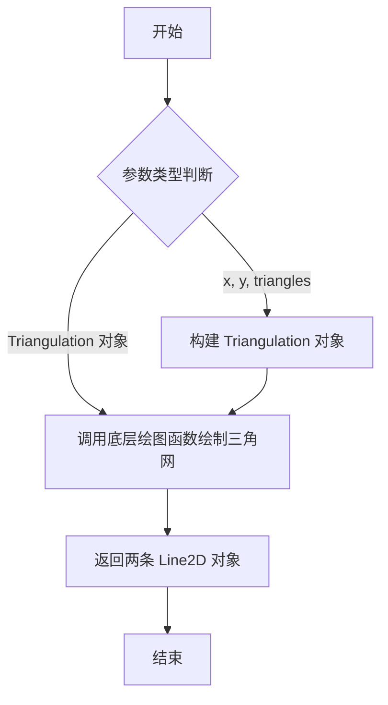
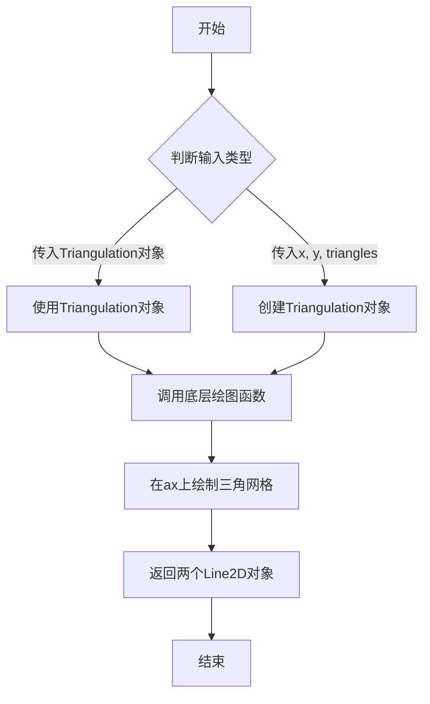

# `matplotlib\lib\matplotlib\tri\_triplot.pyi` 详细设计文档

该代码定义了一个 triplot 函数，用于在 matplotlib 的 Axes 上绘制三角剖分图。函数通过重载支持两种调用方式：直接传入 Triangulation 对象，或传入 x、y 坐标和三角形索引，最终返回两条 Line2D 对象来表示三角形的边。

## 整体流程



## 类结构

```
Triangulation (来自 matplotlib.tri._triangulation)
Axes (来自 matplotlib.axes)
Line2D (来自 matplotlib.lines)
```

## 全局变量及字段


### `triangulation`
    
三角剖分对象，包含x、y坐标和三角形索引信息

类型：`Triangulation`
    


### `x`
    
x坐标数组

类型：`ArrayLike`
    


### `y`
    
y坐标数组

类型：`ArrayLike`
    


### `triangles`
    
三角形索引数组，默认为省略号(...)

类型：`ArrayLike`
    


### `args`
    
可变位置参数，传递给底层绘图函数

类型：`tuple`
    


### `kwargs`
    
可变关键字参数，传递给底层绘图函数

类型：`dict`
    


### `ArrayLike`
    
numpy数组兼容类型，可以是列表、元组或numpy数组

类型：`numpy.typing.ArrayLike`
    


### `matplotlib.tri._triangulation.Triangulation`
    
三角剖分类，用于管理网格点和三角形索引

类型：`class`
    


### `matplotlib.axes.Axes`
    
matplotlib坐标轴类，用于绘制图形

类型：`class`
    


### `matplotlib.lines.Line2D`
    
2D线条类，表示 plotted line

类型：`class`
    


### `typing.overload`
    
用于函数重载的装饰器

类型：`decorator`
    
    

## 全局函数及方法


### `triplot`

`triplot` 是 matplotlib 库中的一个函数，用于在给定的 Axes 上绘制三角网格图（triangulation plot）。该函数支持两种调用方式：直接传入 Triangulation 对象，或者传入 x、y 坐标和三角形索引数组。函数返回两个 Line2D 对象，分别代表三角形的边和三角形内部。

参数：

- `ax`：`Axes`，matplotlib 的坐标轴对象，用于绘制三角网格图
- `triangulation`：`Triangulation`，三角剖分对象，包含网格连接信息（第一个重载）
- `x`：`ArrayLike`，x 坐标数组（第二个重载）
- `y`：`ArrayLike`，y 坐标数组（第二个重载）
- `triangles`：`ArrayLike`，三角形索引数组，可选参数，默认为省略号 ...（第二个重载）
- `*args`：可变位置参数，用于传递给底层绘图函数
- `**kwargs`：可变关键字参数，用于传递给底层绘图函数

返回值：`tuple[Line2D, Line2D]`，返回两个 Line2D 对象，分别表示三角形的边和三角形内部

#### 流程图



#### 带注释源码

```python
from matplotlib.tri._triangulation import Triangulation
from matplotlib.axes import Axes
from matplotlib.lines import Line2D

from typing import overload
from numpy.typing import ArrayLike

# 使用 @overload 装饰器定义函数重载，支持两种调用方式
# 方式一：直接传入 Triangulation 对象
@overload
def triplot(
    ax: Axes, triangulation: Triangulation, *args, **kwargs
) -> tuple[Line2D, Line2D]: ...

# 方式二：分别传入 x 坐标、y 坐标和三角形索引数组
@overload
def triplot(
    ax: Axes, x: ArrayLike, y: ArrayLike, triangles: ArrayLike = ..., *args, **kwargs
) -> tuple[Line2D, Line2D]: ...
```

## 关键组件


### triplot 函数重载

使用 `@overload` 装饰器定义了两个函数重载签名，第一个接受 Triangulation 对象，第二个接受 x、y 坐标和 triangles 数组，用于灵活绘制三角网格线。

### Triangulation 类

从 matplotlib.tri._triangulation 导入的三角剖分数据容器，用于存储和管理三角网格的顶点和三角形索引信息。

### Axes 类

matplotlib 的坐标轴对象，作为绘图容器，triplot 函数将使用此对象作为第一个参数来绘制图形。

### Line2D 类

matplotlib 中表示二维线条的对象，triplot 函数返回两个 Line2D 对象，分别代表三角网格的边和/或节点。

### ArrayLike 类型

NumPy 的数组类型提示，表示可以接受 NumPy 数组或类似数组的数据结构，用于 x、y 坐标和 triangles 索引的参数类型提示。

### 参数设计

使用 *args 和 **kwargs 实现可变参数传递，允许用户传递额外的绘图参数（如颜色、线型等）到底层绘图函数，提供灵活的 API 接口。


## 问题及建议


### 已知问题

- 函数实现缺失：使用`@overload`装饰器声明了两个函数签名，但函数体仅为空实现`...`，无法实际执行调用
- 文档缺失：没有任何docstring说明函数的功能、参数含义、返回值意义
- 参数语义不明确：`*args`和`**kwargs`的具体用途未明确说明，调用者无法得知可传递哪些额外参数
- 默认值使用不当：`triangles: ArrayLike = ...`使用省略号作为默认值，语义不清晰，应使用`None`或明确的默认值
- 返回值说明不足：返回`tuple[Line2D, Line2D]`但未说明这两个Line2D对象分别代表什么（线条？标记？）
- 类型提示不够精确：缺少对`*args`和`**kwargs`的具体类型约束

### 优化建议

- 添加完整的函数实现代码，替换空的`...`为实际逻辑
- 添加详细的docstring，包含函数功能说明、参数描述、返回值描述和使用示例
- 明确`*args`和`**kwargs`的类型和使用约束，或使用具体参数替代可变参数
- 将`triangles: ArrayLike = ...`改为`triangles: ArrayLike | None = None`并添加说明
- 为返回值添加命名tuple或dataclass以明确两个Line2D的具体含义
- 考虑添加运行时类型检查或使用`typing.Protocol`增强类型安全性


## 其它


### 设计目标与约束

该模块旨在提供简洁的API用于绘制二维三角剖分网格，支持多种输入格式（Triangulation对象或坐标数组），同时保持与matplotlib现有绘图接口的一致性。设计约束包括：必须兼容matplotlib 3.5+的Axes API，返回值必须遵循Line2D对象约定，支持任意额外的matplotlib线条属性参数。

### 错误处理与异常设计

主要异常场景包括：x/y/triangles数组维度不匹配时抛出ValueError；triangles索引超出边界时抛出IndexError；无效的Triangulation对象传入时由底层Triangulation类处理。函数本身通过@overload实现类型提示的静态检查，运行时错误由底层绘图函数传播。

### 数据流与状态机

函数接收ax（Axes对象）和三角网格数据两路输入，经过参数标准化后调用Axes.plot或Axes.polyplot进行实际绘制。状态转换路径为：参数解析 → Triangulation对象构造（如需要）→ 渲染命令执行 → Line2D对象返回。不涉及显式状态机。

### 外部依赖与接口契约

核心依赖包括：matplotlib.tri._triangulation.Triangulation（三角剖分计算）、matplotlib.axes.Axes（绘图上下文）、matplotlib.lines.Line2D（返回值类型）、numpy.typing.ArrayLike（数组输入协议）。接口契约规定：第一个参数必须为Axes实例，最后返回两个Line2D对象（线条和标记），*args和**kwargs透传给底层绘图函数。

### 性能考虑

当前实现每次调用都会构造新的Triangulation对象（当传入坐标数组时），对于频繁调用场景存在重复计算开销。优化方向包括：提供缓存机制或接受预计算的Triangulation对象以避免重复三角化。

### 兼容性考虑

该函数需要matplotlib ≥ 3.5.0（支持新的类型提示语法）。Python版本要求遵循matplotlib主版本支持策略，当前推荐Python 3.8+。与旧版本matplotlib的兼容通过try/import实现条件导入。

### 测试策略建议

应覆盖的核心测试场景：1) 使用Triangulation对象的完整工作流程；2) 使用x/y/triangles数组的调用；3) 额外参数传递（color、linewidth等）；4) 空数组和边界情况处理；5) 返回值类型和数量的验证。

### 版本历史与演进

当前为初始版本设计。基于可选功能扩展考虑：未来可增加等值线叠加、区域填充等高级功能。


    