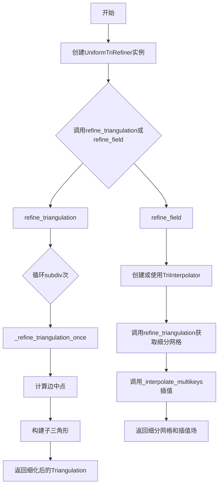
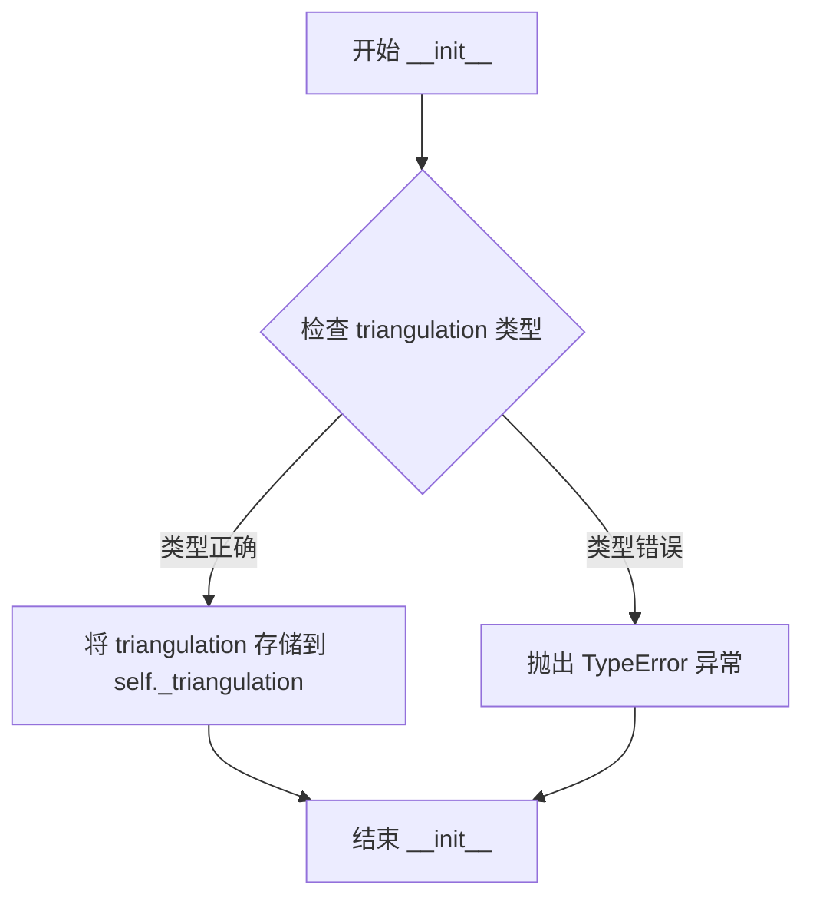
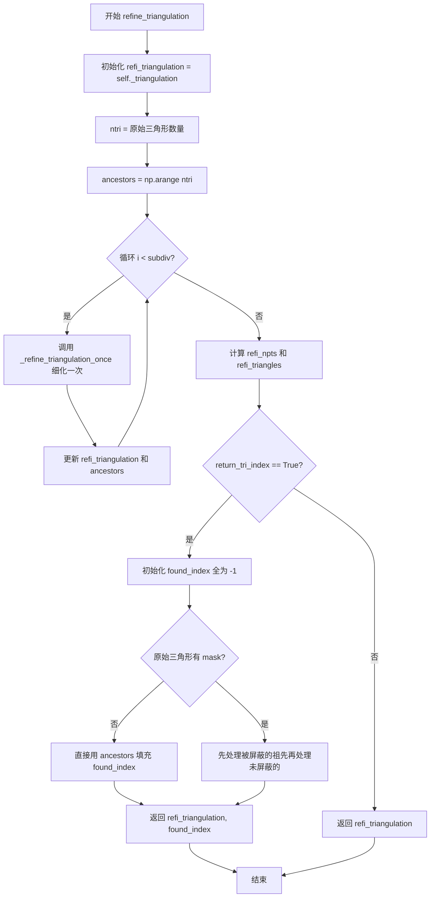
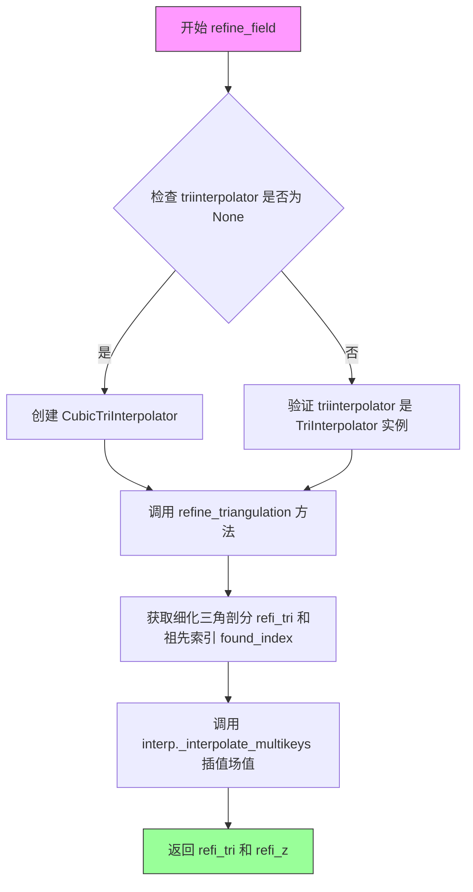
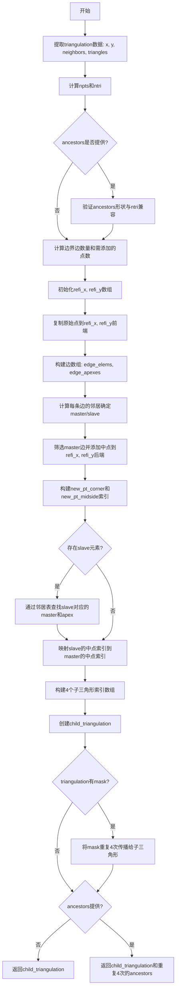

# `matplotlib\lib\matplotlib\tri\_trirefine.py` 详细设计文档

该模块提供了三角形网格的网格细化功能，通过递归细分方法将原始三角剖分细分为更密的网格。TriRefiner是抽象基类，UniformTriRefiner是具体实现类，支持均匀细化三角剖分和基于细化的场插值。

## 整体流程



## 类结构

```
TriRefiner (抽象基类)
└── UniformTriRefiner (均匀网格细化实现类)
```

## 全局变量及字段


### `TriRefiner._triangulation`
    
封装待细化的三角剖分对象

类型：`Triangulation`
    


### `UniformTriRefiner._triangulation`
    
继承自父类的三角剖分对象

类型：`Triangulation`
    
    

## 全局函数及方法


### `TriRefiner.__init__`

该方法是 TriRefiner 类的构造函数，用于初始化三角网格细化器。它接收一个 Triangulation 对象作为参数，并对其进行类型检查后存储为内部属性，供后续细化操作使用。

参数：

- `triangulation`：`Triangulation`，待细化的三角剖分对象

返回值：`None`，初始化 TriRefiner 实例

#### 流程图



#### 带注释源码

```python
def __init__(self, triangulation):
    """
    初始化 TriRefiner 实例。
    
    参数
    ----------
    triangulation : Triangulation
        待细化的三角剖分对象
    """
    # 使用 _api.check_isinstance 检查 triangulation 是否为 Triangulation 类型
    # 如果不是，会抛出 TypeError 异常
    _api.check_isinstance(Triangulation, triangulation=triangulation)
    
    # 将验证通过的 triangulation 对象存储为实例属性
    # 供后续 refine_triangulation 和 refine_field 方法使用
    self._triangulation = triangulation
```

#### 备注

- 该方法是 TriRefiner 抽象基类的构造函数，所有派生类（如 UniformTriRefiner）在初始化时都会调用父类的该方法
- 使用 `_api.check_isinstance` 而非内置 `isinstance` 是为了提供更友好的错误信息
- `self._triangulation` 是私有属性，存储了对原始三角剖分的引用，后续细化操作都基于此对象进行
- 该初始化方法不返回任何值（返回 None），因为它是构造函数，用于初始化对象状态


### UniformTriRefiner.__init__

该方法是 `UniformTriRefiner` 类的构造函数，用于初始化均匀网格细化器对象。它接收一个三角剖分对象作为参数，并调用父类 `TriRefiner` 的构造函数进行基类属性的初始化，同时对输入参数进行类型验证。

参数：

- `triangulation`：`Triangulation`，待细化的三角剖分对象

返回值：`None`，调用父类构造函数初始化

#### 流程图

```mermaid
flowchart TD
    A[开始 __init__] --> B[接收 triangulation 参数]
    B --> C[调用 super().__init__triangulation]
    C --> D[父类检查 triangulation 类型是否为 Triangulation]
    D --> E{类型检查通过?}
    E -->|是| F[将 triangulation 存储到 self._triangulation]
    E -->|否| G[抛出 TypeError 异常]
    F --> H[结束初始化]
    G --> H
```

#### 带注释源码

```python
def __init__(self, triangulation):
    """
    初始化 UniformTriRefiner 实例。

    Parameters
    ----------
    triangulation : Triangulation
        待细化的三角剖分对象
    """
    # 调用父类 TriRefiner 的构造函数进行初始化
    # 父类构造函数会执行以下操作：
    # 1. 使用 _api.check_isinstance 验证 triangulation 是否为 Triangulation 类型
    # 2. 将验证通过的 triangulation 存储到 self._triangulation 属性中
    super().__init__(triangulation)
```


### `UniformTriRefiner.refine_triangulation`

该方法通过递归细分的方式将封装的三解网格细化，每个父三角形被分割成4个子三角形（基于边的中点），递归层级由subdiv参数控制，可选择返回每个细化点所属原始三角形的索引。

参数：

- `return_tri_index`：`bool`，是否返回细化后每个点对应的原始三角形索引
- `subdiv`：`int`，递归细分层级，默认3

返回值：`Triangulation` 或 `(Triangulation, ndarray)`，返回细化后的三角剖分，可选返回每个点所属原始三角形索引

#### 流程图



#### 带注释源码

```python
def refine_triangulation(self, return_tri_index=False, subdiv=3):
    """
    Compute a uniformly refined triangulation *refi_triangulation* of
    the encapsulated :attr:`!triangulation`.

    This function refines the encapsulated triangulation by splitting each
    father triangle into 4 child sub-triangles built on the edges midside
    nodes, recursing *subdiv* times.  In the end, each triangle is hence
    divided into ``4**subdiv`` child triangles.

    Parameters
    ----------
    return_tri_index : bool, default: False
        Whether an index table indicating the father triangle index of each
        point is returned.
    subdiv : int, default: 3
        Recursion level for the subdivision.
        Each triangle is divided into ``4**subdiv`` child triangles;
        hence, the default results in 64 refined subtriangles for each
        triangle of the initial triangulation.

    Returns
    -------
    refi_triangulation : `~matplotlib.tri.Triangulation`
        The refined triangulation.
    found_index : int array
        Index of the initial triangulation containing triangle, for each
        point of *refi_triangulation*.
        Returned only if *return_tri_index* is set to True.
    """
    # 初始时，细化的三角剖分就是原始三角剖分
    refi_triangulation = self._triangulation
    # 获取原始三角形的数量
    ntri = refi_triangulation.triangles.shape[0]

    # Computes the triangulation ancestors numbers in the reference
    # triangulation.
    # 创建祖先数组，记录每个三角形对应的原始三角形索引
    ancestors = np.arange(ntri, dtype=np.int32)
    # 递归细化 subdiv 次
    for _ in range(subdiv):
        # 每次调用 _refine_triangulation_once 将每个三角形分成4个
        refi_triangulation, ancestors = self._refine_triangulation_once(
            refi_triangulation, ancestors)
    
    # 获取细化后点的数量和三角形
    refi_npts = refi_triangulation.x.shape[0]
    refi_triangles = refi_triangulation.triangles

    # Now we compute found_index table if needed
    # 如果需要返回每个点所属的原始三角形索引
    if return_tri_index:
        # We have to initialize found_index with -1 because some nodes
        # may very well belong to no triangle at all, e.g., in case of
        # Delaunay Triangulation with DuplicatePointWarning.
        # 初始化为-1，因为有些点可能不属于任何三角形（如有重复点警告时）
        found_index = np.full(refi_npts, -1, dtype=np.int32)
        tri_mask = self._triangulation.mask
        if tri_mask is None:
            # 无mask时，直接将祖先索引重复3次并reshape填充
            # 每个三角形有3个顶点，每个顶点都标记相同的祖先索引
            found_index[refi_triangles] = np.repeat(ancestors,
                                                    3).reshape(-1, 3)
        else:
            # There is a subtlety here: we want to avoid whenever possible
            # that refined points container is a masked triangle (which
            # would result in artifacts in plots).
            # So we impose the numbering from masked ancestors first,
            # then overwrite it with unmasked ancestor numbers.
            # 有mask时，先处理被屏蔽的祖先，再处理未屏蔽的，避免绘图伪影
            ancestor_mask = tri_mask[ancestors]
            found_index[refi_triangles[ancestor_mask, :]
                        ] = np.repeat(ancestors[ancestor_mask],
                                      3).reshape(-1, 3)
            found_index[refi_triangles[~ancestor_mask, :]
                        ] = np.repeat(ancestors[~ancestor_mask],
                                      3).reshape(-1, 3)
        return refi_triangulation, found_index
    else:
        return refi_triangulation
```

---

### 文件整体运行流程

1. **导入模块**：导入 numpy、matplotlib._api、Triangulation 和 _triinterpolate
2. **定义抽象基类 TriRefiner**：提供三角网格细化和插值的抽象接口
3. **实现 UniformTriRefiner 类**：
   - 继承自 TriRefiner
   - 实现 `refine_triangulation` 方法进行均匀网格细化
   - 实现 `refine_field` 方法进行场值细化
   - 实现 `_refine_triangulation_once` 静态方法进行单次细化

### 类详细信息

#### `TriRefiner` 类

- **基类**：无（抽象基类）
- **字段**：
  - `_triangulation`：`Triangulation`，封装的三角剖分对象

#### `UniformTriRefiner` 类

- **基类**：TriRefiner
- **字段**：
  - 继承自 TriRefiner 的 `_triangulation`

### 关键组件信息

| 名称 | 描述 |
|------|------|
| `_refine_triangulation_once` | 静态方法，将每个三角形分成4个子三角形的核心算法 |
| `ancestors` 数组 | 记录每个细化后三角形对应的原始三角形索引 |
| `found_index` 数组 | 记录每个细化后点所属的原始三角形索引 |

### 潜在技术债务与优化空间

1. **重复计算**：在计算 `found_index` 时，`np.repeat(ancestors, 3).reshape(-1, 3)` 可能在大规模数据下有性能问题
2. **内存分配**：每次递归都创建新的 Triangulation 对象，可能存在内存碎片化风险
3. **mask 处理逻辑复杂**：mask 处理的分支逻辑较复杂，可考虑提取为独立方法提高可读性

### 其它项目

#### 设计目标与约束
- 均匀细分：每个三角形被等分为4个子三角形
- 递归深度可控：通过 `subdiv` 参数控制细分层级
- 保持网格拓扑：细化后的网格保持 Delaunay 性质

#### 错误处理
- 使用 `_api.check_isinstance` 验证输入类型
- 在 `_refine_triangulation_once` 中验证 ancestors 数组形状兼容性

#### 数据流与状态机
- 主循环：for _ in range(subdiv) 进行递归细分
- 状态转移：原始三角形 → 子三角形 → 孙子三角形 → ...

#### 外部依赖
- `numpy`：数值计算
- `matplotlib._api`：API 检查
- `matplotlib.tri._triangulation`：Triangulation 类
- `matplotlib.tri._triinterpolate`：插值器


### `UniformTriRefiner.refine_field`

该方法对定义在原始三角剖分节点上的场值进行细化和插值，返回细化后的三角剖分和对应的插值场值。

参数：

- `z`：`array-like`，定义在原始三角剖分节点上的场值数组
- `triinterpolator`：`TriInterpolator, optional`，用于场插值的插值器，默认为`CubicTriInterpolator`
- `subdiv`：`int`，递归细分层级，默认3

返回值：`(Triangulation, ndarray)`，返回细化后的三角剖分和插值后的场值

#### 流程图



#### 带注释源码

```python
def refine_field(self, z, triinterpolator=None, subdiv=3):
    """
    Refine a field defined on the encapsulated triangulation.
    
    对定义在封装三角剖分上的场进行细化。

    Parameters
    ----------
    z : (npoints,) array-like
        Values of the field to refine, defined at the nodes of the
        encapsulated triangulation. (``n_points`` is the number of points
        in the initial triangulation)
        场值数组，定义在封装三角剖分的节点上
    triinterpolator : `~matplotlib.tri.TriInterpolator`, optional
        Interpolator used for field interpolation. If not specified,
        a `~matplotlib.tri.CubicTriInterpolator` will be used.
        用于场插值的插值器，未指定时使用 CubicTriInterpolator
    subdiv : int, default: 3
        Recursion level for the subdivision.
        Each triangle is divided into ``4**subdiv`` child triangles.
        递归细分级别，每个三角形被细分为 4**subdiv 个子三角形

    Returns
    -------
    refi_tri : `~matplotlib.tri.Triangulation`
         The returned refined triangulation.
         返回的细化三角剖分
    refi_z : 1D array of length: *refi_tri* node count.
         The returned interpolated field (at *refi_tri* nodes).
         返回的插值场值（在细化三角剖分节点处）
    """
    # 如果未提供插值器，则创建默认的 CubicTriInterpolator
    # 用于在细化后的网格点上插值场值
    if triinterpolator is None:
        interp = matplotlib.tri.CubicTriInterpolator(
            self._triangulation, z)
    else:
        # 验证提供的插值器是有效的 TriInterpolator 实例
        _api.check_isinstance(matplotlib.tri.TriInterpolator,
                              triinterpolator=triinterpolator)
        interp = triinterpolator

    # 调用 refine_triangulation 获取细化后的三角剖分
    # return_tri_index=True 返回每个细化点所属的原始三角形索引
    refi_tri, found_index = self.refine_triangulation(
        subdiv=subdiv, return_tri_index=True)
    
    # 使用插值器的 _interpolate_multikeys 方法
    # 在细化网格点上插值场值，found_index 用于定位每个点所属的原始三角形
    refi_z = interp._interpolate_multikeys(
        refi_tri.x, refi_tri.y, tri_index=found_index)[0]
    
    # 返回细化后的三角剖分和对应的插值场值
    return refi_tri, refi_z
```


### `UniformTriRefiner._refine_triangulation_once`

该静态方法执行单次三角剖分细化操作，将每个三角形分割为4个子三角形（在边中点处构建），同时处理被屏蔽的三角形并传播屏蔽状态。当提供ancestors参数时，返回细化的三角剖分及子祖先索引数组，用于跟踪父子关系。

参数：

- `triangulation`：`Triangulation`，待细化的三角剖分
- `ancestors`：`ndarray, optional`，祖先三角形索引数组，用于跟踪父子关系

返回值：`Triangulation` 或 `(Triangulation, ndarray)`，单次细化操作，返回子三角剖分和子祖先索引

#### 流程图



#### 带注释源码

```python
@staticmethod
def _refine_triangulation_once(triangulation, ancestors=None):
    """
    Refine a `.Triangulation` by splitting each triangle into 4
    child-masked_triangles built on the edges midside nodes.

    Masked triangles, if present, are also split, but their children
    returned masked.

    If *ancestors* is not provided, returns only a new triangulation:
    child_triangulation.

    If the array-like key table *ancestor* is given, it shall be of shape
    (ntri,) where ntri is the number of *triangulation* masked_triangles.
    In this case, the function returns
    (child_triangulation, child_ancestors)
    child_ancestors is defined so that the 4 child masked_triangles share
    the same index as their father: child_ancestors.shape = (4 * ntri,).
    """

    # ---- 步骤1: 提取三角剖分数据 ----
    x = triangulation.x
    y = triangulation.y

    # 根据triangulation文档: neighbors[i, j]是邻接三角形索引
    # 边为从点masked_triangles[i, j]到点masked_triangles[i, (j+1)%3]
    neighbors = triangulation.neighbors
    triangles = triangulation.triangles
    
    # ---- 步骤2: 获取点数和三角形数 ----
    npts = np.shape(x)[0]
    ntri = np.shape(triangles)[0]
    
    # ---- 步骤3: 验证ancestors参数 ----
    if ancestors is not None:
        ancestors = np.asarray(ancestors)
        if np.shape(ancestors) != (ntri,):
            raise ValueError(
                "Incompatible shapes provide for "
                "triangulation.masked_triangles and ancestors: "
                f"{np.shape(triangles)} and {np.shape(ancestors)}")

    # ---- 步骤4: 计算需添加的点数 ----
    # 提示: 每个顶点被2个三角形共享，除了边界
    # 统计边界边数量（neighbors == -1表示边界）
    borders = np.sum(neighbors == -1)
    # 计算需添加的边中点数量: (3*ntri + borders) // 2
    added_pts = (3*ntri + borders) // 2
    refi_npts = npts + added_pts
    
    # ---- 步骤5: 初始化细化后的坐标数组 ----
    refi_x = np.zeros(refi_npts)
    refi_y = np.zeros(refi_npts)

    # ---- 步骤6: 复制原始点到细化坐标数组的前端 ----
    refi_x[:npts] = x
    refi_y[:npts] = y

    # ---- 步骤7: 构建边数组用于计算中点 ----
    # 每条边由(三角形索引, 该三角形的顶点索引)定义
    # edge_elems: 边所在的三角形索引，重复3次(每个三角形3条边)
    # edge_apexes: 边的起始顶点索引(0,1,2循环)
    edge_elems = np.tile(np.arange(ntri, dtype=np.int32), 3)
    edge_apexes = np.repeat(np.arange(3, dtype=np.int32), ntri)
    
    # 获取每条边的邻居三角形索引
    edge_neighbors = neighbors[edge_elems, edge_apexes]
    
    # ---- 步骤8: 确定master和slave边 ----
    # master: 三角形索引大于邻居索引的边(或边界边，邻居为-1)
    # slave: 三角形索引小于邻居索引的边
    # 这样可避免重复添加共享边的中点
    mask_masters = (edge_elems > edge_neighbors)

    # ---- 步骤9: 添加master边的中点到细化坐标数组 ----
    masters = edge_elems[mask_masters]
    apex_masters = edge_apexes[mask_masters]
    
    # 计算中点坐标: (顶点A + 顶点B) * 0.5
    x_add = (x[triangles[masters, apex_masters]] +
             x[triangles[masters, (apex_masters+1) % 3]]) * 0.5
    y_add = (y[triangles[masters, apex_masters]] +
             y[triangles[masters, (apex_masters+1) % 3]]) * 0.5
    
    # 将中点添加到细化坐标数组的后端
    refi_x[npts:] = x_add
    refi_y[npts:] = y_add

    # ---- 步骤10: 构建新三角形的顶点索引 ----
    # 每个旧三角形产生4个新三角形
    # 需要6个点: 3个原顶点(corner) + 3个边中点(midside)
    
    # new_pt_corner: 原始三角形顶点索引
    new_pt_corner = triangles

    # new_pt_midside: 每个三角形每条边的中点索引
    # 需要通过master/slave关系确定
    new_pt_midside = np.empty([ntri, 3], dtype=np.int32)
    
    # ---- 步骤11: 处理master三角形的中点索引 ----
    cum_sum = npts  # 累计索引，从原始点数开始
    for imid in range(3):
        # 找出当前边是master的三角形
        mask_st_loc = (imid == apex_masters)
        n_masters_loc = np.sum(mask_st_loc)
        elem_masters_loc = masters[mask_st_loc]
        
        # 分配中点索引
        new_pt_midside[:, imid][elem_masters_loc] = np.arange(
            n_masters_loc, dtype=np.int32) + cum_sum
        cum_sum += n_masters_loc

    # ---- 步骤12: 处理slave三角形的中点索引 ----
    # slave边需要通过查找其master来获取中点索引
    mask_slaves = np.logical_not(mask_masters)
    slaves = edge_elems[mask_slaves]
    slaves_masters = edge_neighbors[mask_slaves]
    
    # 查找slave对应的master顶点apex
    # 条件: neighbors[slaves_masters, slave_masters_apex] == slaves
    diff_table = np.abs(neighbors[slaves_masters, :] -
                        np.outer(slaves, np.ones(3, dtype=np.int32)))
    slave_masters_apex = np.argmin(diff_table, axis=1)
    slaves_apex = edge_apexes[mask_slaves]
    
    # 将slave的中点映射到master的中点
    new_pt_midside[slaves, slaves_apex] = new_pt_midside[
        slaves_masters, slave_masters_apex]

    # ---- 步骤13: 构建4个子三角形 ----
    # 每个旧三角形分裂为4个子三角形:
    # 子三角形0: 原顶点0, 边0中点, 边2中点
    # 子三角形1: 原顶点1, 边1中点, 边0中点
    # 子三角形2: 原顶点2, 边2中点, 边1中点
    # 子三角形3: 边0中点, 边1中点, 边2中点(中心小三角形)
    child_triangles = np.empty([ntri*4, 3], dtype=np.int32)
    child_triangles[0::4, :] = np.vstack([
        new_pt_corner[:, 0], new_pt_midside[:, 0],
        new_pt_midside[:, 2]]).T
    child_triangles[1::4, :] = np.vstack([
        new_pt_corner[:, 1], new_pt_midside[:, 1],
        new_pt_midside[:, 0]]).T
    child_triangles[2::4, :] = np.vstack([
        new_pt_corner[:, 2], new_pt_midside[:, 2],
        new_pt_midside[:, 1]]).T
    child_triangles[3::4, :] = np.vstack([
        new_pt_midside[:, 0], new_pt_midside[:, 1],
        new_pt_midside[:, 2]]).T
    
    # 创建子三角剖分对象
    child_triangulation = Triangulation(refi_x, refi_y, child_triangles)

    # ---- 步骤14: 处理mask传播 ----
    # 如果原三角形被屏蔽，其4个子三角形也应被屏蔽
    if triangulation.mask is not None:
        child_triangulation.set_mask(np.repeat(triangulation.mask, 4))

    # ---- 步骤15: 返回结果 ----
    if ancestors is None:
        return child_triangulation
    else:
        # 每个祖先索引重复4次，对应4个子三角形
        return child_triangulation, np.repeat(ancestors, 4)
```

## 关键组件


### TriRefiner

抽象基类，封装Triangulation对象并提供网格细化和插值工具。定义了两个抽象方法 `refine_triangulation` 和 `refine_field`，派生类必须实现这些方法。

### UniformTriRefiner

实现均匀网格细化的类，通过递归细分将每个父三角形分割为4个子三角形。支持自定义细分层级（subdiv参数），可返回细化后的网格和每个点所属原始三角形的索引。

### refine_triangulation 方法

执行均匀网格细化，将封装的三 triangulation 细化为更密的网格。通过递归调用 `_refine_triangulation_once` 方法实现，每次迭代将每个三角形分成4个子三角形。可选返回每个细化点所属原始三角形索引（found_index）。

### refine_field 方法

在细化网格上插值场数据。使用 `TriInterpolator`（默认 `CubicTriInterpolator`）在细化后的网格节点上插值原始场值 z。返回细化后的三角形网格和插值后的场值。

### _refine_triangulation_once 静态方法

单次网格细化核心算法。计算每条边的中点，构建新的子三角形。对于边界边，只添加一次中点（避免重复）；对于内部边，被共享的两三角形通过邻居表协调中点索引。处理掩码三角形，其子三角形同样被掩码。

### 网格细分算法

将每个三角形分割为4个子三角形：新三角形的顶点包括原三个角点（corner）和三条边的中点（midside）。通过构建 `new_pt_corner` 和 `new_pt_midside` 索引表，使用向量化numpy操作高效处理。

### 祖先追踪机制

通过 `ancestors` 数组追踪每个细化三角形来源于哪个原始三角形。初始时 ancestors 为 [0, 1, 2, ...]，每次细化后扩展为原数组的4倍（每个父三角形对应4个子三角形）。

### 掩码处理逻辑

支持被掩码的三角形也能被细分，其子三角形同样被掩码。在计算 found_index 时，优先处理被掩码祖先，再覆盖未掩码祖先，以避免绘图伪影。

### 边界边与内部边处理

通过邻居表（neighbors）识别边界边（邻居索引为-1）。边界边只添加一个中点，内部边在两个三角形间共享中点索引，确保细化网格无重复点。


## 问题及建议


### 已知问题

- **废弃的NumPy类型使用**：代码中使用 `np.int32`、`np.intp` 等类型，在 NumPy 2.0+ 中已废弃，应使用 Python 原生的 `int` 类型或显式指定整数类型。
- **缺失的导入语句**：`refine_field` 方法中使用了 `matplotlib.tri.CubicTriInterpolator` 和 `matplotlib.tri.TriInterpolator`，但顶部只导入了 `matplotlib.tri._triinterpolate`，这可能导致运行时错误或隐式依赖。
- **未完成的文档注释**：`UniformTriRefiner` 类中的 `See Also` 部分被注释掉，但未完成，影响代码完整性。
- **魔法数字缺乏解释**：代码中多处使用 `3`（三角形三个顶点）、`4`（四分三角形）、`4**subdiv` 等魔法数字，缺乏常量定义或明确注释。
- **数组操作效率低下**：在 `_refine_triangulation_once` 方法中，使用了多次 `np.vstack` 和 `np.repeat` 操作，这些可以通过更高效的数组构造方式优化。
- **边界条件处理不明确**：在处理被遮罩（masked）三角形和边界边时，代码逻辑复杂且缺乏清晰注释，可能导致边缘情况下的潜在错误。
- **缺少类型注解**：整个模块没有使用类型提示（type hints），降低了代码的可维护性和可读性。

### 优化建议

- **替换废弃的NumPy类型**：将所有 `np.int32` 替换为 Python 的 `int` 或显式的 `np.intp`，确保与新版 NumPy 兼容。
- **完善导入语句**：显式导入所需的 `CubicTriTriInterpolator` 和 `TriInterpolator` 类，或使用 `matplotlib.tri` 模块的正确路径。
- **提取魔法数字为常量**：定义类或模块级常量（如 `NUM_TRIANGLE_VERTICES = 3`、`SUBDIVISION_FACTOR = 4`），提高代码可读性。
- **优化数组操作**：将 `np.vstack` 和 `np.repeat` 组合操作替换为预分配数组的直接索引赋值，减少中间数组创建。
- **增加类型注解**：为所有方法添加参数和返回值的类型注解，提升代码质量和 IDE 支持。
- **简化边界处理逻辑**：将复杂的边界和遮罩处理逻辑拆分为独立的辅助方法，并添加详细文档字符串。
- **添加单元测试边界条件**：增加对边界三角形、重复点、极端细分层级等边缘情况的测试覆盖。


## 其它


### 设计目标与约束

本模块的设计目标是实现三角网格的均匀细化（Uniform Mesh Refinement），通过递归细分方式将每个原始三角形细分为4^subdiv个子三角形，同时保持网格的几何属性和拓扑一致性。核心约束包括：1）输入必须是有效的matplotlib.tri.Triangulation对象；2）subdiv参数控制递归深度，默认值为3；3）细化过程中需正确处理被掩码（masked）的三角形，确保其子三角形同样被掩码；4）共享边仅生成一个中点节点，避免重复。

### 错误处理与异常设计

代码中的错误处理主要包括：1）类型检查，使用`_api.check_isinstance`确保triangulation参数为Triangulation实例，triinterpolator参数为TriInterpolator实例；2）形状兼容性检查，在_refine_triangulation_once方法中验证ancestors数组形状与三角形数量匹配，若不匹配则抛出ValueError；3）对于可能的DuplicatePointWarning，通过初始化found_index为-1来优雅处理不属于任何三角形的节点；4）掩码处理中的子索引覆盖策略，先应用掩码祖先编号，再覆盖非掩码编号，确保绘图时不产生伪影。

### 数据流与状态机

数据流遵循以下流程：输入Triangulation对象 → 初始化UniformTriRefiner → 调用refine_triangulation或refine_field → 递归执行_refine_triangulation_once（每轮将三角形数乘以4） → 返回细化后的Triangulation及可选的found_index索引表。状态转换：初始三角网格 → 第1次细分 → 第2次细分 → ... → 第subdiv次细分 → 最终细化网格。关键数据包括：ancestors数组记录每个子三角形的父三角形索引，found_index记录细化后每个节点所属的原始三角形。

### 外部依赖与接口契约

本模块依赖以下外部组件：1）numpy提供数组操作和数值计算；2）matplotlib.tri._triangulation.Triangulation类定义网格拓扑结构；3）matplotlib.tri._triinterpolate模块提供场值插值功能（CubicTriInterpolator或自定义TriInterpolator）；4）matplotlib._api模块提供类型检查装饰器。接口契约：refine_triangulation接受return_tri_index和subdiv参数，返回Triangulation或(Triangulation, found_index)元组；refine_field接受z数组、可选triinterpolator和subdiv参数，返回(refi_tri, refi_z)元组。

### 算法复杂度分析

时间复杂度为O(n × 4^subdiv)，其中n为原始三角形数量，subdiv为细分层级，因为每次迭代遍历所有现有三角形并生成4倍数量的子三角形。空间复杂度为O(n × 4^subdiv)，用于存储细化后的节点坐标、三角形拓扑以及可选的ancestors和found_index数组。算法通过识别"主-从"三角形对避免共享边上重复生成中点节点，将边数从O(3×ntri)优化为O((3×ntri + borders)/2)。

### 线程安全性

本类的实例方法直接操作numpy数组和Triangulation对象，没有显式的锁机制。在多线程环境下并发调用同一TriRefiner实例的方法可能存在竞态条件（虽然numpy数组操作通常原子化）。建议每个线程使用独立的TriRefiner实例，或在调用前进行适当的同步控制。静态方法_refine_triangulation_once无状态，可安全并发调用。

### 配置与扩展性

代码支持通过继承TriRefiner抽象基类实现其他细化策略（如自适应细化）。UniformTriRefiner的subdiv参数允许运行时动态调整细化程度。场值细化支持自定义插值器，通过triinterpolator参数注入。未来可扩展的方向包括：支持不同类型的网格（quadrilateral）、实现局部细化、添加并行计算支持。

### 测试与验证要点

关键测试场景包括：1）基本功能验证 - 细化后的网格包含正确数量的节点和三角形；2）掩码处理 - 验证被掩码三角形的子三角形同样被正确掩码；3）边界处理 - 验证Delaunay三角剖分中边界边的中点生成；4）重复点检测 - 处理可能导致部分节点不属于任何三角形的情况；5）场值插值 - 验证细化后场值的准确性和连续性；6）性能基准 - 测量大规模网格细化的时间和内存消耗。

    