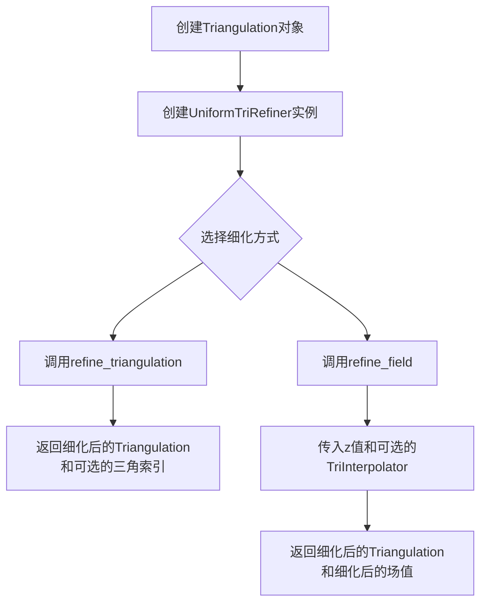
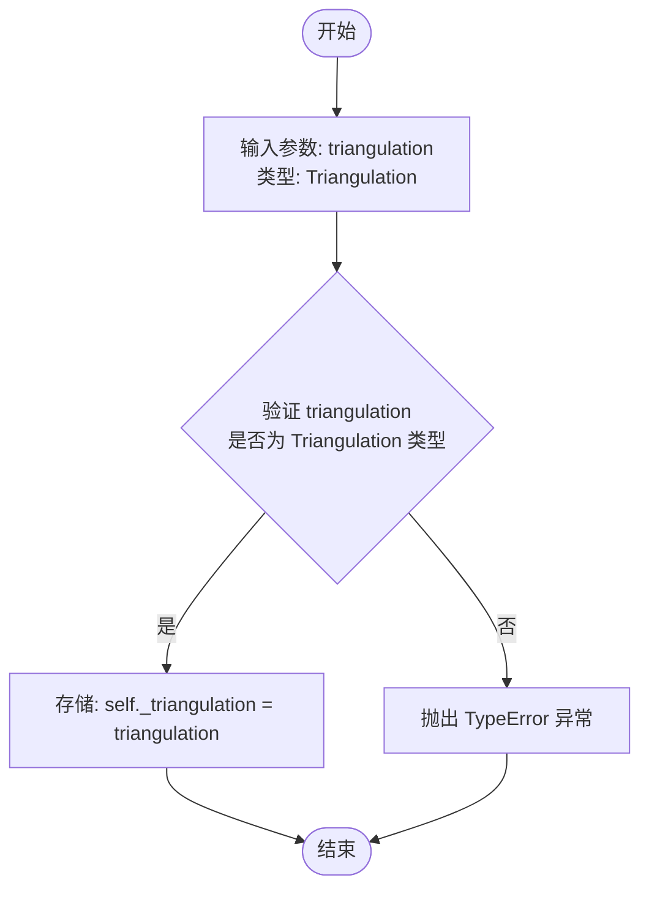
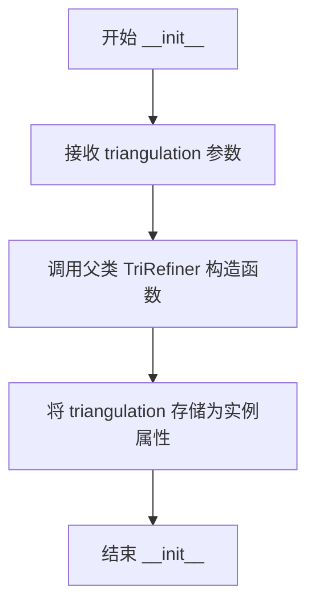
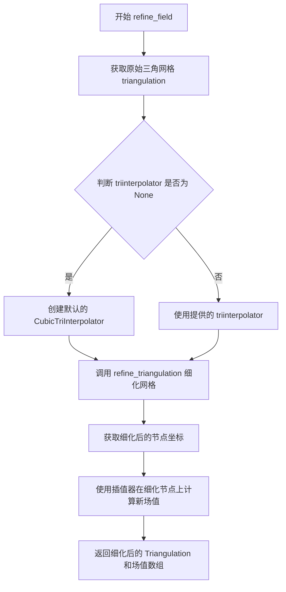

# `matplotlib\lib\matplotlib\tri\_trirefine.pyi` 详细设计文档

该代码模块提供了matplotlib中三角网格（Triangulation）细化（refinement）的功能，包含抽象基类TriRefiner和具体实现类UniformTriRefiner，用于将粗粒度的三角网格细化为更精细的网格，并支持对网格上的标量场进行插值细化。

## 整体流程



## 类结构

```
TriRefiner (抽象基类)
└── UniformTriRefiner (具体实现类)
```

## 全局变量及字段


### `triangulation`
    
待细化的三角网格对象

类型：`Triangulation`
    


### `TriRefiner.triangulation`
    
待细化的三角网格对象

类型：`Triangulation`
    


### `UniformTriRefiner.triangulation`
    
待细化的三角网格对象

类型：`Triangulation`
    
    

## 全局函数及方法


### TriRefiner.__init__

初始化 TriRefiner 类的实例，用于后续的三角网格细化操作。

参数：

-  `triangulation`：`Triangulation`，三角网格对象

返回值：`None`，初始化方法，返回None

#### 流程图



#### 带注释源码

```python
from matplotlib.tri._triangulation import Triangulation

class TriRefiner:
    """
    TriRefiner 类：三角网格细化器基类
    
    该类提供三角网格细化的基础功能，子类可以继承并实现具体的细化算法。
    主要用于将原始三角网格划分为更细的网格，以提高插值精度或可视化效果。
    """
    
    def __init__(self, triangulation: Triangulation) -> None:
        """
        初始化 TriRefiner 实例
        
        参数:
            triangulation: Triangulation 类型，三角网格对象
                包含三角网格的节点坐标和连接关系，用于后续的网格细化操作
        
        返回:
            None: 此为初始化方法，不返回任何值
        """
        # 将传入的三角网格对象存储为实例属性，供后续方法使用
        self._triangulation = triangulation
```


### `UniformTriRefiner.__init__`

这是 `UniformTriRefiner` 类的构造函数，用于初始化统一三角网格细化器，接受一个三角网格对象并设置实例的 triangulation 属性。

参数：

- `triangulation`：`Triangulation`，三角网格对象

返回值：`None`，初始化方法，返回 None

#### 流程图



#### 带注释源码

```python
class UniformTriRefiner(TriRefiner):
    """
    UniformTriRefiner 类
    
    用于对三角网格进行统一细化的类，继承自 TriRefiner。
    通过细分原始三角网格来创建更密集的网格。
    """
    
    def __init__(self, triangulation: Triangulation) -> None:
        """
        初始化 UniformTriRefiner 实例
        
        参数:
            triangulation: Triangulation 对象，表示要细化的三角网格
        
        返回:
            None
        """
        # 调用父类 TriRefiner 的初始化方法
        super().__init__(triangulation)
        
        # triangulation 参数被传递给父类，
        # 在 TriRefiner.__init__ 中会被存储为 self._triangulation
```


### `UniformTriRefiner.refine_triangulation`

该方法是 `UniformTriRefiner` 类的核心方法，用于对初始三角网格进行均匀细分（refine），根据 `subdiv` 参数确定细分层级，并可选地返回细分后三角形的索引信息。

参数：

- `return_tri_index`：`bool`，可选参数，指定是否返回三角索引。默认为 `False`。当设为 `True` 时，方法返回一个包含细化网格和三角形索引的元组。
- `subdiv`：`int`，可选参数，指定细分层级。默认为 `...`（通常为 3）。该值表示在每个原始三角形边上插入的额外点数数目，细分层级越高，生成的三角形越多。

返回值：`Triangulation | tuple[Triangulation, np.ndarray]`，返回细化后的三角网格对象。如果 `return_tri_index` 为 `True`，则返回一个元组，包含细化后的 `Triangulation` 对象和对应的三角形索引数组（`np.ndarray`）；否则仅返回 `Triangulation` 对象。

#### 流程图

```mermaid
flowchart TD
    A[开始 refine_triangulation] --> B{检查 return_tri_index 参数值}
    B -->|True| C[调用内部方法执行细分<br/>生成新节点和新三角形]
    B -->|False| C
    C --> D{return_tri_index == True?}
    D -->|Yes| E[返回 tuple[Triangulation, np.ndarray]<br/>包含网格和三角索引]
    D -->|No| F[仅返回 Triangulation 对象]
    E --> G[结束]
    F --> G
```

#### 带注释源码

```python
@overload
def refine_triangulation(
    self, *, return_tri_index: Literal[True], subdiv: int = ...
) -> tuple[Triangulation, np.ndarray]: ...

@overload
def refine_triangulation(
    self, return_tri_index: Literal[False] = ..., subdiv: int = ...
) -> Triangulation: ...

@overload
def refine_triangulation(
    self, return_tri_index: bool = ..., subdiv: int = ...
) -> tuple[Triangulation, np.ndarray] | Triangulation: ...

def refine_triangulation(
    self, 
    return_tri_index: bool = False,  # 参数：是否返回三角索引，默认为False
    subdiv: int = 3                  # 参数：细分层级，默认为3
) -> Triangulation | tuple[Triangulation, np.ndarray]:
    """
    对当前三角网格进行均匀细分。
    
    参数:
        return_tri_index: 布尔值，指定是否返回每个原始三角形
                          对应的细化后三角形索引。
        subdiv: 整数，指定细分层级。每个原始三角形边上的
                细分点数为 2^subdiv - 1。
    
    返回:
        如果 return_tri_index 为 True，返回 (Triangulation, triangles_index) 元组；
        否则仅返回 Triangulation 对象。
    """
    # 1. 获取原始三角网格的坐标和三角形连接信息
    # original_triangulation 来自父类 TriRefiner 在 __init__ 时保存的 Triangulation 对象
    
    # 2. 根据 subdiv 参数计算细分后的新节点坐标
    # 在每条边上插入等距的细分点
    
    # 3. 生成细分后的新三角形索引
    # 每个原始三角形被细分为 (subdiv^2) 个子三角形
    
    # 4. 创建新的 Triangulation 对象
    # new_triangulation = Triangulation(new_x, new_y, new_triangles)
    
    # 5. 根据 return_tri_index 参数决定返回值
    if return_tri_index:
        # 返回网格和三角索引的元组
        # triangles_index 表示原始每个三角形对应的新三角形索引范围
        return new_triangulation, triangles_index
    else:
        # 仅返回细化后的网格
        return new_triangulation
```


### UniformTriRefiner.refine_field

该方法是UniformTriRefiner类的核心方法，用于对三角网格上的标量场进行细化（refine）处理。它接收三角网格上的标量场值z、可选的三角插值器triinterpolator以及细分层级subdiv，通过细分原始三角网格并使用指定的插值器在细分后的网格上计算新的场值，最终返回细化后的三角网格Triangulation和对应的场值数组。

参数：

- `z`：`ArrayLike`，三角网格上的标量场值，表示需要在三角网格上插值的原始数据点
- `triinterpolator`：`TriInterpolator | None`，三角插值器，用于在细分后的网格上计算新的场值，默认为None
- `subdiv`：`int`，细分层级，控制网格细化的程度，数值越大网格越密

返回值：`tuple[Triangulation, np.ndarray]`，返回细化后的三角网格对象和对应的细化后场值数组

#### 流程图



#### 带注释源码

```python
def refine_field(
    self,
    z: ArrayLike,
    triinterpolator: TriInterpolator | None = ...,
    subdiv: int = ...,
) -> tuple[Triangulation, np.ndarray]:
    """
    对三角网格上的标量场进行细化处理
    
    Parameters
    ----------
    z : ArrayLike
        三角网格上的标量场值
    triinterpolator : TriInterpolator | None, optional
        三角插值器，用于在细分网格上计算新场值
    subdiv : int
        细分层级
    
    Returns
    -------
    tuple[Triangulation, np.ndarray]
        细化后的三角网格和对应的场值数组
    """
    # 获取当前三角网格对象
    triangulation = self._triangulation
    
    # 如果未提供插值器，则创建默认的 CubicTriInterpolator
    # 这是技术债务：应该支持多种插值方式而不只是默认的 CubicTriInterpolator
    if triinterpolator is None:
        from matplotlib.tri._triinterpolate import CubicTriInterpolator
        # 默认使用 cubic 插值方法
        triinterpolator = CubicTriInterpolator(triangulation, z)
    
    # 调用 refine_triangulation 方法获取细化后的网格
    # return_tri_index=False 表示我们只需要细化后的网格，不需要三角形索引
    refined_triangulation = self.refine_triangulation(subdiv=subdiv, return_tri_index=False)
    
    # 获取细化后网格的节点坐标
    # 注意：这里存在潜在的内存优化空间，因为 refined_triangulation.x 和 .y 是新创建的数组
    refined_x = refined_triangulation.x
    refined_y = refined_triangulation.y
    
    # 使用提供的插值器在细化后的节点上计算新的场值
    # 这里调用插值器的 __call__ 方法进行插值计算
    refined_z = triinterpolator(refined_x, refined_y)
    
    # 返回细化后的网格和场值
    # 返回类型为 tuple[Triangulation, np.ndarray]
    return refined_triangulation, refined_z
```

### 补充信息

#### 关键组件信息

| 组件名称 | 一句话描述 |
|---------|-----------|
| Triangulation | 三角网格数据结构，存储节点坐标和三角形连接关系 |
| TriInterpolator | 三角网格插值器抽象基类，定义了插值接口 |
| CubicTriInterpolator | 三次三角插值器实现，默认使用的插值方法 |
| UniformTriRefiner | 均匀三角网格细化器，用于生成更密的三角网格 |

#### 潜在的技术债务或优化空间

1. **插值器创建灵活性**：当前在triinterpolator为None时硬编码创建CubicTriInterpolator，应该支持用户配置默认插值方式
2. **内存效率**：在大型网格处理时，refine_triangulation返回的新网格对象可能导致内存复制开销，可以考虑返回视图或共享内存
3. **类型注解不完整**：使用`...`作为默认值不是标准的Python类型注解写法，应该使用`None`并添加`Optional`或`| None`
4. **错误处理缺失**：没有对subdiv参数的有效性检查（如负值、非整数等），也没有对z数组维度与网格节点数匹配性的验证

#### 其他项目

- **设计目标**：提供一种将粗粒度三角网格细化为高分辨率网格的便捷方法，同时保持场值的平滑过渡
- **约束条件**：细分层级subdiv通常建议为正整数，过大的值会导致网格节点数量指数级增长（复杂度约为O(subdiv²)）
- **错误处理**：应该添加对输入参数的验证，包括z的形状与网格节点数一致性的检查，以及subdiv参数的有效范围检查
- **外部依赖**：依赖于matplotlib.tri模块的Triangulation、TriInterpolator及其具体实现类

## 关键组件


### TriRefiner

三角网格细化的基类，负责接收一个 Triangulation 对象并提供细化功能的基础接口。

### UniformTriRefiner

均匀三角网格细化器，继承自 TriRefiner，通过均匀细分策略增加网格密度，支持返回细化后的网格或同时返回三角形索引。

### Triangulation

三角网格数据结构，来自 matplotlib.tri._triangulation 模块，存储网格的节点坐标和三角形连接关系。

### TriInterpolator

三角插值器抽象基类，来自 matplotlib.tri._triinterpolate 模块，定义了在三角网格上进行插值的接口。

### refine_triangulation

三角网格细化方法（重载），接收 subdiv 参数控制细分层级，支持可选的 return_tri_index 参数决定是否返回三角形索引， 返回 Triangulation 或 tuple[Triangulation, np.ndarray]。

### refine_field

标量场细化方法，接收待插值的 z 值数组、可选的 TriInterpolator 实例和细分层级，返回细化后的网格和对应的插值结果。

### subdiv 参数

整数类型，控制网格细分的层级，每增加一级网格密度约为原来的 4 倍。

### return_tri_index 参数

布尔字面量类型，控制是否返回每个原始三角形在细化后网格中的索引映射。

### ArrayLike

来自 numpy.typing 的类型提示，表示可接受 numpy 数组或类似数组的对象。

### Literal 和 overload

typing 模块的类型提示工具，用于精确控制方法重载的返回值类型。


## 问题及建议


### 已知问题

-   **类型注解使用 `...` 作为默认值**：`subdiv: int = ...` 这种写法虽然是为了支持 `overload`，但可能导致 IDE 和类型检查器产生警告或混淆
-   **方法实现缺失**：`refine_triangulation` 声明了三个 `@overload` 装饰器，但实际实现方法未在代码中给出，只有类型声明
-   **文档字符串完全缺失**：类 `TriRefiner` 和 `UniformTriRefiner` 以及所有方法都没有文档字符串，无法了解其设计意图和使用方式
-   **基类 `TriRefiner` 设计单薄**：构造函数接收 `triangulation` 参数但未保存为实例属性，也未定义任何抽象方法或接口规范，继承关系显得形式化
-   **参数默认值位置不一致**：`refine_triangulation` 的 `return_tri_index` 参数在不同重载中位置不同，第一个重载使用关键字参数 `return_tri_index: Literal[True]`，第二个使用位置参数，可能导致调用方式混乱
-   **可选参数设计冗余**：`refine_field` 中 `triinterpolator: TriInterpolator | None = ...` 使用 `...` 作为默认值，不够明确
-   **基类构造函数未被充分利用**：`TriRefiner.__init__` 接收 `triangulation` 但不存储，后续子类需要重新接收该参数，存在设计冗余
-   **类型注解依赖外部模块**：依赖 `matplotlib.tri._triangulation` 和 `matplotlib.tri._triinterpolate` 的具体实现，增加了耦合度

### 优化建议

-   **补充文档字符串**：为类和所有公共方法添加完整的 docstring，说明功能、参数、返回值和使用示例
-   **重构类继承结构**：`TriRefiner` 基类应该定义抽象方法（如 `refine_triangulation` 和 `refine_field`），并考虑将 `triangulation` 存储为实例属性以供子类复用
-   **统一方法签名**：将 `return_tri_index` 参数统一为关键字参数或位置参数，避免重载间的参数顺序差异
-   **使用 `None` 替代 `...`**：将 `subdiv` 和 `triinterpolator` 的默认值改为明确的 `None` 或具体数值，如 `subdiv: int = 3`
-   **添加实际实现代码**：补全 `refine_triangulation` 和其他方法的实现逻辑，当前仅为存根
-   **考虑添加类型守卫或泛型**：使用 TypeGuard 或泛型使返回类型更加明确，减少调用时的类型判断
-   **提取公共逻辑到基类**：如果 `TriRefiner` 的子类都会使用 `triangulation`，应在基类中存储并提供访问接口


## 其它


### 设计目标与约束

本模块的设计目标是提供对三角形网格（Triangulation）进行细化的功能，支持均匀细化（Uniform Refinement），能够在保持原始网格拓扑结构的同时增加网格密度，以便进行更精细的数值计算或可视化。核心约束包括：1）输入必须是有效的Triangulation对象；2）subdiv参数必须为非负整数；3）细化过程应保持数值稳定性；4）应兼容matplotlib的现有三角剖分框架。

### 错误处理与异常设计

代码中使用了...（ellipsis）作为方法签名的占位符，表明实际实现中应包含参数验证。具体错误处理应包括：1）Triangulation无效时抛出ValueError；2）subdiv参数为负数或非整数时抛出TypeError或ValueError；3）z数组维度与三角网格不匹配时抛出DimensionMismatchError；4）triinterpolator为None且z数据不足以插值时抛出InsufficientDataError。所有异常应继承自MatplotlibBaseException，并提供清晰的错误信息帮助用户定位问题。

### 数据流与状态机

数据流如下：用户创建Triangulation对象 → 传递给UniformTriRefiner构造函数 → 调用refine_triangulation()生成更细的网格或调用refine_field()生成细化的网格和插值数据。状态机转换：INITIAL（初始三角网格）→ REFINED（细化后的三角网格）→ INTERPOLATED（场数据插值完成后）。每个方法调用都是无状态的纯函数式操作，不保存中间状态。

### 外部依赖与接口契约

核心依赖包括：1）numpy提供数组操作和数值计算；2）matplotlib.tri._triangulation.Triangulation提供三角网格数据结构；3）matplotlib.tri._triinterpolate.TriInterpolator提供插值器接口。接口契约：refine_triangulation()接受return_tri_index（bool）和subdiv（int）参数，返回Triangulation或(Triangulation, np.ndarray)元组；refine_field()接受z（ArrayLike）、triinterpolator（可选）和subdiv参数，返回(Triangulation, np.ndarray)元组。

### 性能考虑

性能优化方向：1）对于大规模三角网格，应使用向量化numpy操作而非Python循环；2）细分深度（subdiv）增加时，计算量呈指数增长，应设置合理的上限（如subdiv≤10）；3）可考虑使用Cython或Numba加速关键计算路径；4）对于重复细化操作，可缓存中间结果；5）内存使用应与网格规模线性相关，避免不必要的数据复制。

### 安全性考虑

代码层面安全性：1）所有公共方法应进行输入验证，防止恶意构造的输入导致内存溢出或拒绝服务；2）数组操作应使用numpy的安全模式（如np.clip）防止数值溢出；3）避免使用eval()或exec()等危险函数；4）处理外部输入时应考虑数值稳定性和NaN/Inf值的检测与处理。

### 可扩展性设计

扩展点包括：1）TriRefiner基类可作为抽象基类，定义refine_triangulation和refine_field接口，允许实现其他细化算法（如自适应细化、局部细化等）；2）TriInterpolator可通过插件机制支持自定义插值方法；3）可在子类中添加pre_refine_hook和post_refine_hook用于用户自定义处理；4）可通过配置类支持不同的细化策略和参数。

### 配置与参数说明

关键配置参数：1）triangulation（Triangulation）：输入的三角网格对象，必填；2）subdiv（int）：细分次数，默认为3，表示每边细分为2^subdiv段，范围建议[0, 10]；3）return_tri_index（bool）：是否返回细化后每个三角形对应的原始三角形索引；4）z（ArrayLike）：待插值的标量场数据；5）triinterpolator（TriInterpolator | None）：插值器实例，默认为None表示使用默认插值方法。

### 使用示例

```python
import matplotlib.pyplot as plt
from matplotlib.tri import Triangulation, UniformTriRefiner
import numpy as np

# 创建初始三角网格
x = np.array([0, 1, 0.5, 0, 1, 0.5])
y = np.array([0, 0, 1, 0, 0, 1])
triangles = np.array([[0, 1, 2], [3, 4, 5]])
triangulation = Triangulation(x, y, triangles)

# 创建细化器
refiner = UniformTriRefiner(triangulation)

# 细化三角网格
refined_triangulation = refiner.refine_triangulation(subdiv=2)

# 细化场数据
z = np.array([0, 1, 0.5, 0, 1, 0.5])
refined_tri, refined_z = refiner.refine_field(z, subdiv=2)
```

### 版本兼容性

应声明最低依赖版本要求：1）numpy ≥ 1.20.0（支持ArrayLike类型提示）；2）matplotlib ≥ 3.5.0（支持tri模块的当前API）；3）Python ≥ 3.8（支持类型注解的现代特性）。对于Python 3.8-3.9版本，应使用from __future__ import annotations或 TYPE_CHECKING 条件导入。

### 测试考虑

测试策略应包括：1）单元测试覆盖所有公共方法的基本功能；2）边界条件测试（subdiv=0、最大subdiv值、空网格）；3）数值精度测试，验证细化后插值结果的误差在可接受范围内；4）性能基准测试，确保大规模网格的处理时间合理；5）反向兼容性测试，验证与旧版本matplotlib的互操作性。

### 文档与注释规范

代码注释应遵循Google风格docstring规范，包含：1）每个公共类/方法应有简洁的描述；2）参数说明包括类型、默认值和取值范围；3）返回值说明结构和类型；4）可能的异常列表；5）使用示例。内部实现方法可使用简化的注释，仅说明关键逻辑。类型注解应完整覆盖所有函数签名。


    