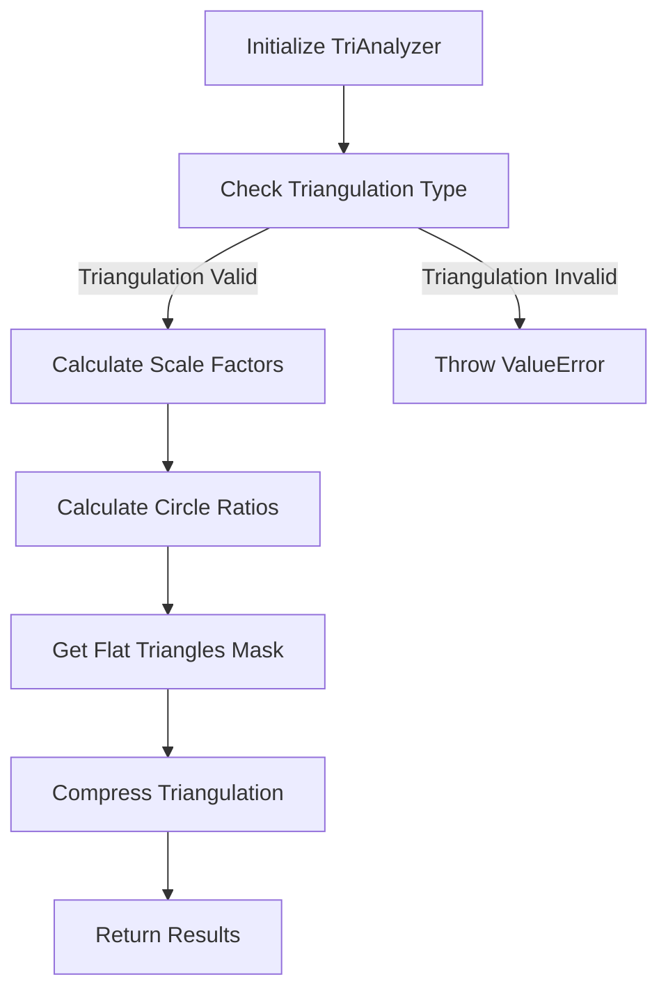
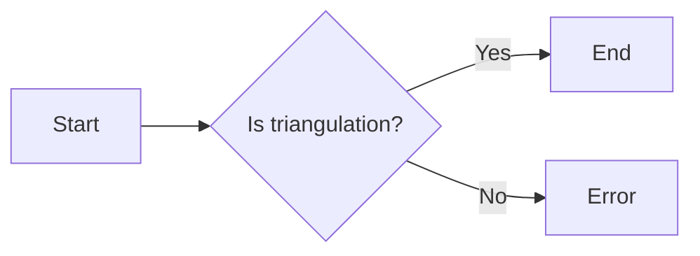
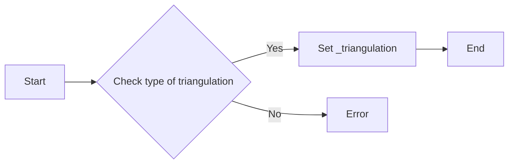
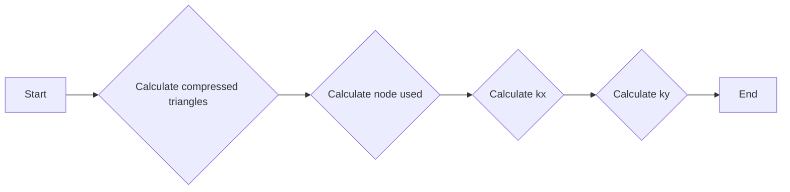
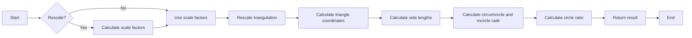
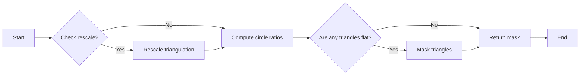
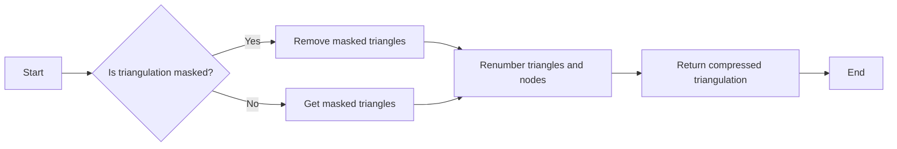
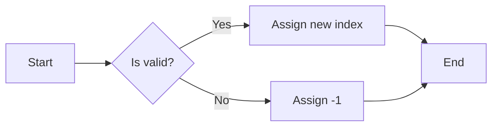

# `matplotlib\lib\matplotlib\tri\_tritools.py` 详细设计文档

This code provides tools for analyzing and improving triangular mesh data, including scaling, measuring triangle flatness, and removing excessively flat border triangles.

## 整体流程



## 类结构

```
TriAnalyzer (主类)
├── __init__(triangulation: Triangulation)
│   ├── _api.check_isinstance(Triangulation, triangulation)
│   └── self._triangulation = triangulation
├── scale_factors(): (float, float)
│   ├── compressed_triangles = self._triangulation.get_masked_triangles()
│   ├── node_used = (np.bincount(np.ravel(compressed_triangles), minlength=self._triangulation.x.size) != 0)
│   └── return (1 / np.ptp(self._triangulation.x[node_used]), 1 / np.ptp(self._triangulation.y[node_used]))
├── circle_ratios(rescale: bool = True): masked array
│   ├── pts = np.vstack([self._triangulation.x*kx, self._triangulation.y*ky]).T
│   ├── tri_pts = pts[self._triangulation.triangles]
│   ├── a = tri_pts[:, 1, :] - tri_pts[:, 0, :]
│   ├── b = tri_pts[:, 2, :] - tri_pts[:, 1, :]
│   ├── c = tri_pts[:, 0, :] - tri_pts[:, 2, :]
│   ├── a = np.hypot(a[:, 0], a[:, 1])
│   ├── b = np.hypot(b[:, 0], b[:, 1])
│   ├── c = np.hypot(c[:, 0], c[:, 1])
│   ├── s = (a+b+c)*0.5
│   ├── prod = s*(a+b-s)*(a+c-s)*(b+c-s)
│   ├── bool_flat = (prod == 0.)
│   ├── circum_radius = np.empty(ntri, dtype=np.float64)
│   ├── circum_radius[bool_flat] = np.inf
│   ├── abc = a*b*c
│   ├── circum_radius[~bool_flat] = abc[~bool_flat] / (4.0*np.sqrt(prod[~bool_flat]))
│   ├── in_radius = (a*b*c) / (4.0*circum_radius*s)
│   ├── circle_ratio = in_radius/circum_radius
│   ├── mask = self._triangulation.mask
│   └── return np.ma.array(circle_ratio, mask=mask)
├── get_flat_tri_mask(min_circle_ratio: float = 0.01, rescale: bool = True): array of bool
│   ├── mask_bad_ratio = self.circle_ratios(rescale) < min_circle_ratio
│   ├── current_mask = self._triangulation.mask
│   ├── valid_neighbors = np.copy(self._triangulation.neighbors)
│   ├── renum_neighbors = np.arange(ntri, dtype=np.int32)
│   ├── nadd = -1
│   ├── while nadd != 0
│   │   ├── wavefront = (np.min(valid_neighbors, axis=1) == -1) & ~current_mask
│   │   ├── added_mask = wavefront & mask_bad_ratio
│   │   ├── current_mask = added_mask | current_mask
│   │   ├── nadd = np.sum(added_mask)
│   │   ├── valid_neighbors[added_mask, :] = -1
│   │   ├── renum_neighbors[added_mask] = -1
│   │   ├── valid_neighbors = np.where(valid_neighbors == -1, -1, renum_neighbors[valid_neighbors])
│   └── return np.ma.filled(current_mask, True)
└── _get_compressed_triangulation(): (compressed_triangles, compressed_x, compressed_y, tri_renum, node_renum)
    ├── tri_mask = self._triangulation.mask
    ├── compressed_triangles = self._triangulation.get_masked_triangles()
    ├── ntri = self._triangulation.triangles.shape[0]
    ├── if tri_mask is not None
    │   ├── tri_renum = self._total_to_compress_renum(~tri_mask)
    │   └── else
    │       └── tri_renum = np.arange(ntri, dtype=np.int32)
    ├── valid_node = (np.bincount(np.ravel(compressed_triangles), minlength=self._triangulation.x.size) != 0)
    ├── compressed_x = self._triangulation.x[valid_node]
    ├── compressed_y = self._triangulation.y[valid_node]
    ├── node_renum = self._total_to_compress_renum(valid_node)
    ├── compressed_triangles = node_renum[compressed_triangles]
    └── return (compressed_triangles, compressed_x, compressed_y, tri_renum, node_renum)
```

## 全局变量及字段


### `_api`
    
Internal API module for matplotlib.

类型：`module`
    


### `np`
    
NumPy module for numerical operations.

类型：`module`
    


### `Triangulation`
    
matplotlib.tri.Triangulation class for triangular grids.

类型：`class`
    


### `TriAnalyzer._triangulation`
    
The encapsulated triangulation to analyze.

类型：`matplotlib.tri.Triangulation`
    
    

## 全局函数及方法


### `check_isinstance`

`_api.check_isinstance` 是一个静态方法，用于检查传入的对象是否为指定的类型。

参数：

- `triangulation`：`matplotlib.tri.Triangulation`，要检查的对象。

返回值：无

#### 流程图



#### 带注释源码

```python
_api.check_isinstance(Triangulation, triangulation=triangulation)
```


### TriAnalyzer.__init__

This method initializes a `TriAnalyzer` object with a given `Triangulation` object.

参数：

- `triangulation`：`matplotlib.tri.Triangulation`，The encapsulated triangulation to analyze.

返回值：无

#### 流程图



#### 带注释源码

```python
def __init__(self, triangulation):
    _api.check_isinstance(Triangulation, triangulation=triangulation)
    self._triangulation = triangulation
```


### TriAnalyzer.scale_factors

This method returns the scaling factors (kx, ky) to rescale the triangulation into a unit square.

参数：

- `triangulation`：`matplotlib.tri.Triangulation`，The encapsulated triangulation to analyze.

返回值：`(float, float)`，Scaling factors (kx, ky) so that the triangulation ``[triangulation.x * kx, triangulation.y * ky]`` fits exactly inside a unit square.

#### 流程图



#### 带注释源码

```python
    @property
    def scale_factors(self):
        """
        Factors to rescale the triangulation into a unit square.

        Returns
        -------
        (float, float)
            Scaling factors (kx, ky) so that the triangulation
            ``[triangulation.x * kx, triangulation.y * ky]``
            fits exactly inside a unit square.
        """
        compressed_triangles = self._triangulation.get_masked_triangles()
        node_used = (np.bincount(np.ravel(compressed_triangles),
                                 minlength=self._triangulation.x.size) != 0)
        return (1 / np.ptp(self._triangulation.x[node_used]),
                1 / np.ptp(self._triangulation.y[node_used]))
```


### TriAnalyzer.circle_ratios

This method calculates the ratio of the incircle radius over the circumcircle radius for each triangle in the triangulation. It provides a measure of the flatness of the triangles.

参数：

- `rescale`: `bool`，default: True
  If True, internally rescale the triangulation to fit inside a unit square mesh based on `scale_factors`. This rescaling accounts for the difference of scale which might exist between the 2 axis.

返回值：`masked array`
  Ratio of the incircle radius over the circumcircle radius, for each 'rescaled' triangle of the encapsulated triangulation. Values corresponding to masked triangles are masked out.

#### 流程图



#### 带注释源码

```python
def circle_ratios(self, rescale=True):
    # Coords rescaling
    if rescale:
        (kx, ky) = self.scale_factors
    else:
        (kx, ky) = (1.0, 1.0)
    pts = np.vstack([self._triangulation.x*kx,
                     self._triangulation.y*ky]).T
    tri_pts = pts[self._triangulation.triangles]
    # Computes the 3 side lengths
    a = tri_pts[:, 1, :] - tri_pts[:, 0, :]
    b = tri_pts[:, 2, :] - tri_pts[:, 1, :]
    c = tri_pts[:, 0, :] - tri_pts[:, 2, :]
    a = np.hypot(a[:, 0], a[:, 1])
    b = np.hypot(b[:, 0], b[:, 1])
    c = np.hypot(c[:, 0], c[:, 1])
    # circumcircle and incircle radii
    s = (a+b+c)*0.5
    prod = s*(a+b-s)*(a+c-s)*(b+c-s)
    # We have to deal with flat triangles with infinite circum_radius
    bool_flat = (prod == 0.)
    if np.any(bool_flat):
        # Pathologic flow
        ntri = tri_pts.shape[0]
        circum_radius = np.empty(ntri, dtype=np.float64)
        circum_radius[bool_flat] = np.inf
        abc = a*b*c
        circum_radius[~bool_flat] = abc[~bool_flat] / (
            4.0*np.sqrt(prod[~bool_flat]))
    else:
        # Normal optimized flow
        circum_radius = (a*b*c) / (4.0*np.sqrt(prod))
    in_radius = (a*b*c) / (4.0*circum_radius*s)
    circle_ratio = in_radius/circum_radius
    mask = self._triangulation.mask
    if mask is None:
        return circle_ratio
    else:
        return np.ma.array(circle_ratio, mask=mask)
```


### TriAnalyzer.get_flat_tri_mask

Eliminate excessively flat border triangles from the triangulation.

参数：

- `min_circle_ratio`：`float`，The minimum ratio of the incircle radius over the circumcircle radius for a triangle to be considered flat.
- `rescale`：`bool`，If True, internally rescale the triangulation to fit inside a unit square mesh.

返回值：`array of bool`，Mask to apply to encapsulated triangulation. All the initially masked triangles remain masked in the new mask.

#### 流程图



#### 带注释源码

```python
def get_flat_tri_mask(self, min_circle_ratio=0.01, rescale=True):
    # Recursively computes the mask_current_borders, true if a triangle is
    # at the border of the mesh OR touching the border through a chain of
    # invalid aspect ratio masked_triangles.
    ntri = self._triangulation.triangles.shape[0]
    mask_bad_ratio = self.circle_ratios(rescale) < min_circle_ratio

    current_mask = self._triangulation.mask
    if current_mask is None:
        current_mask = np.zeros(ntri, dtype=bool)
    valid_neighbors = np.copy(self._triangulation.neighbors)
    renum_neighbors = np.arange(ntri, dtype=np.int32)
    nadd = -1
    while nadd != 0:
        # The active wavefront is the triangles from the border (unmasked
        # but with a least 1 neighbor equal to -1
        wavefront = (np.min(valid_neighbors, axis=1) == -1) & ~current_mask
        # The element from the active wavefront will be masked if their
        # circle ratio is bad.
        added_mask = wavefront & mask_bad_ratio
        current_mask = added_mask | current_mask
        nadd = np.sum(added_mask)

        # now we have to update the tables valid_neighbors
        valid_neighbors[added_mask, :] = -1
        renum_neighbors[added_mask] = -1
        valid_neighbors = np.where(valid_neighbors == -1, -1,
                                   renum_neighbors[valid_neighbors])

    return np.ma.filled(current_mask, True)
```


### `_get_compressed_triangulation`

Compresses the encapsulated triangulation by removing masked triangles and renumbering the remaining triangles and nodes.

参数：

- `self`：`TriAnalyzer`，The instance of the TriAnalyzer class.

返回值：`tuple`，A tuple containing the compressed triangulation triangles, coordinates arrays, and renumbering tables.

#### 流程图



#### 带注释源码

```python
def _get_compressed_triangulation(self):
    """
    Compress (if masked) the encapsulated triangulation.

    Returns minimal-length triangles array (*compressed_triangles*) and
    coordinates arrays (*compressed_x*, *compressed_y*) that can still
    describe the unmasked triangles of the encapsulated triangulation.

    Returns
    -------
    compressed_triangles : array-like
        the returned compressed triangulation triangles
    compressed_x : array-like
        the returned compressed triangulation 1st coordinate
    compressed_y : array-like
        the returned compressed triangulation 2nd coordinate
    tri_renum : int array
        renumbering table to translate the triangle numbers from the
        encapsulated triangulation into the new (compressed) renumbering.
        -1 for masked triangles (deleted from *compressed_triangles*).
    node_renum : int array
        renumbering table to translate the point numbers from the
        encapsulated triangulation into the new (compressed) renumbering.
        -1 for unused points (i.e. those deleted from *compressed_x* and
        *compressed_y*).

    """
    # Valid triangles and renumbering
    tri_mask = self._triangulation.mask
    compressed_triangles = self._triangulation.get_masked_triangles()
    ntri = self._triangulation.triangles.shape[0]
    if tri_mask is not None:
        tri_renum = self._total_to_compress_renum(~tri_mask)
    else:
        tri_renum = np.arange(ntri, dtype=np.int32)

    # Valid nodes and renumbering
    valid_node = (np.bincount(np.ravel(compressed_triangles),
                                  minlength=self._triangulation.x.size) != 0)
    compressed_x = self._triangulation.x[valid_node]
    compressed_y = self._triangulation.y[valid_node]
    node_renum = self._total_to_compress_renum(valid_node)

    # Now renumbering the valid triangles nodes
    compressed_triangles = node_renum[compressed_triangles]

    return (compressed_triangles, compressed_x, compressed_y, tri_renum,
            node_renum)
``` 


### TriAnalyzer._total_to_compress_renum

This function generates a renumbering array for the valid and invalid elements of a triangulation.

参数：

- `valid`：`1D bool array`，A validity mask indicating which elements are valid.

返回值：`int array`，An array that maps the valid and invalid elements to their new indices in a compressed array.

#### 流程图



#### 带注释源码

```python
@staticmethod
def _total_to_compress_renum(valid):
    """
    Parameters
    ----------
    valid : 1D bool array
        Validity mask.

    Returns
    -------
    int array
        Array so that (`valid_array` being a compressed array
        based on a `masked_array` with mask ~*valid*):

        - For all i with valid[i] = True:
          valid_array[renum[i]] = masked_array[i]
        - For all i with valid[i] = False:
          renum[i] = -1 (invalid value)
    """
    renum = np.full(np.size(valid), -1, dtype=np.int32)
    n_valid = np.sum(valid)
    renum[valid] = np.arange(n_valid, dtype=np.int32)
    return renum
```


## 关键组件


### 张量索引与惰性加载

张量索引与惰性加载是用于高效处理和访问大型数据集的工具，它允许在需要时才计算或加载数据，从而减少内存消耗和提高性能。

### 反量化支持

反量化支持是用于将量化后的数据转换回原始数据类型的功能，这对于在量化过程中可能发生的精度损失进行修正非常重要。

### 量化策略

量化策略是用于将浮点数数据转换为固定点数表示的方法，这有助于减少模型大小和加速计算，但可能会牺牲一些精度。量化策略包括选择合适的量化位宽和量化范围等。

## 问题及建议


### 已知问题

-   **性能问题**：`circle_ratios` 方法中计算三角形边长和圆半径的代码可能存在性能瓶颈，特别是当处理大量三角形时。使用 `np.hypot` 和 `np.sqrt` 可能会导致重复计算和内存消耗。
-   **代码可读性**：`_get_compressed_triangulation` 方法中的代码逻辑较为复杂，包含多个嵌套循环和条件判断，这可能会降低代码的可读性和可维护性。
-   **错误处理**：代码中没有明确的错误处理机制，例如，当输入的 `triangulation` 参数不是 `matplotlib.tri.Triangulation` 类型时，没有抛出异常。

### 优化建议

-   **性能优化**：考虑使用向量化操作来减少循环的使用，例如，使用 `np.linalg.norm` 来计算边长，使用 `np.prod` 和 `np.sqrt` 来计算圆半径，这样可以提高代码的执行效率。
-   **代码重构**：将 `_get_compressed_triangulation` 方法中的逻辑分解为更小的函数，以提高代码的可读性和可维护性。
-   **错误处理**：在 `__init__` 方法中添加类型检查，确保输入的 `triangulation` 参数是 `matplotlib.tri.Triangulation` 类型，并在必要时抛出异常。
-   **文档注释**：为每个方法和属性添加详细的文档注释，包括参数描述、返回值描述和异常情况，以提高代码的可理解性。


## 其它


### 设计目标与约束

- 设计目标：
  - 提供对三角形网格的基本分析和改进工具。
  - 封装 `matplotlib.tri.Triangulation` 对象，并提供对网格的分析和改进功能。
  - 提供对网格质量评估和优化工具。
- 约束：
  - 必须使用 `matplotlib` 库中的 `Triangulation` 类。
  - 必须使用 NumPy 库进行数值计算。

### 错误处理与异常设计

- 错误处理：
  - 在初始化 `TriAnalyzer` 时，如果传入的 `triangulation` 不是 `matplotlib.tri.Triangulation` 类型，则抛出 `TypeError`。
  - 在计算 `scale_factors`、`circle_ratios` 和 `get_flat_tri_mask` 时，如果遇到无效的三角形（例如，边长为零的三角形），则抛出 `ValueError`。
- 异常设计：
  - 使用 `try-except` 块捕获可能发生的异常，并提供清晰的错误信息。

### 数据流与状态机

- 数据流：
  - 输入：`matplotlib.tri.Triangulation` 对象。
  - 输出：分析结果（例如，缩放因子、圆心比、平三角形掩码）。
- 状态机：
  - `TriAnalyzer` 类没有明确的状态机，但它的方法执行特定的操作，例如缩放网格、计算圆心比和创建平三角形掩码。

### 外部依赖与接口契约

- 外部依赖：
  - NumPy 库：用于数值计算。
  - Matplotlib 库：用于创建和操作 `Triangulation` 对象。
- 接口契约：
  - `TriAnalyzer` 类的接口契约定义了类的公共方法和属性。
  - `Triangulation` 类的接口契约定义了如何创建、修改和查询三角形网格。


    