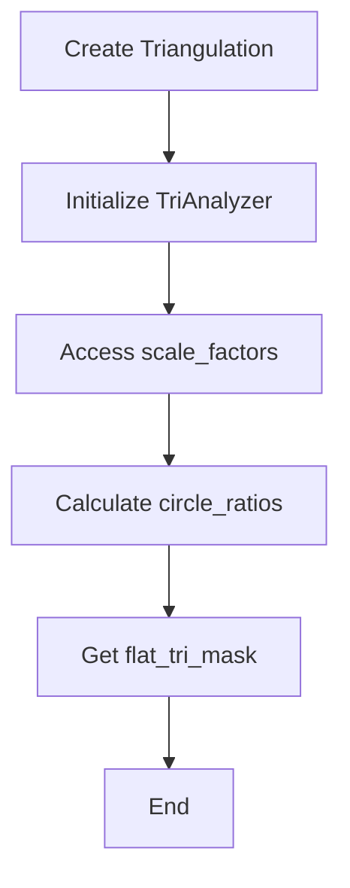
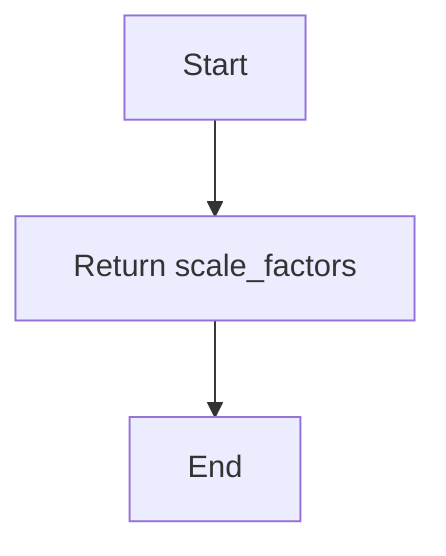
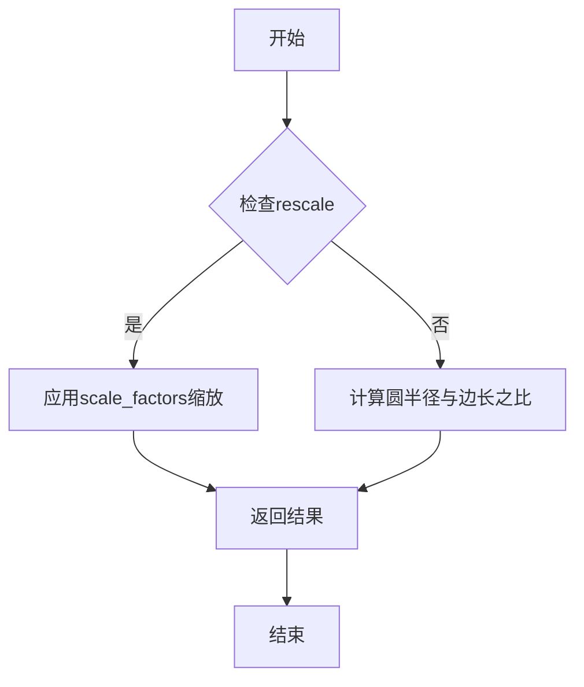
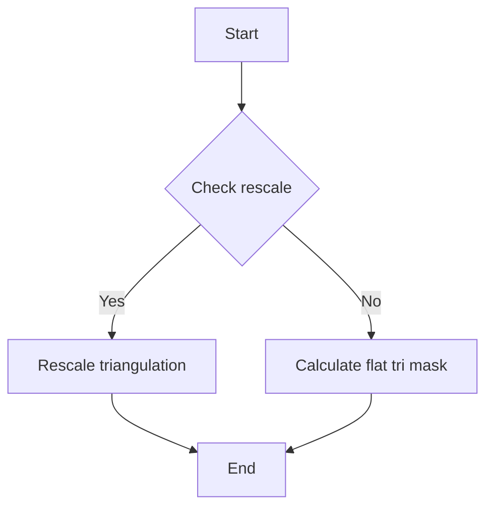

# `matplotlib\lib\matplotlib\tri\_tritools.pyi` 详细设计文档

The code provides a class, TriAnalyzer, which is designed to analyze and manipulate triangular mesh data using the matplotlib.tri.Triangulation class.

## 整体流程



## 类结构

```
TriAnalyzer (Class)
```

## 全局变量及字段


### `Triangulation`
    
A class representing a triangulation of a 2D mesh.

类型：`matplotlib.tri.Triangulation`
    


### `TriAnalyzer.triangulation`
    
The triangulation object that the analyzer operates on.

类型：`matplotlib.tri.Triangulation`
    
    

## 全局函数及方法


### TriAnalyzer.__init__

初始化`TriAnalyzer`类实例，接受一个`Triangulation`对象作为参数，用于后续分析。

参数：

- `triangulation`：`Triangulation`，表示一个三角形网格，用于后续的几何分析。

返回值：无

#### 流程图

```mermaid
classDiagram
    TriAnalyzer <|-- Triangulation
    TriAnalyzer {
        +__init__(triangulation: Triangulation)
        +scale_factors: tuple[float, float]
        +circle_ratios(rescale: bool): np.ndarray
        +get_flat_tri_mask(min_circle_ratio: float, rescale: bool): np.ndarray
    }
```

#### 带注释源码

```
from matplotlib.tri import Triangulation

class TriAnalyzer:
    def __init__(self, triangulation: Triangulation) -> None:
        # 初始化TriAnalyzer实例，接受一个Triangulation对象
        self.triangulation = triangulation
```


### TriAnalyzer.scale_factors

该函数返回一个包含两个浮点数的元组，这两个浮点数分别代表三角形分析器的缩放因子。

参数：

- 无

返回值：`tuple[float, float]`，包含两个浮点数，分别代表水平和垂直方向的缩放因子。

#### 流程图



#### 带注释源码

```
from matplotlib.tri import Triangulation

import numpy as np

class TriAnalyzer:
    def __init__(self, triangulation: Triangulation) -> None:
        # 初始化代码省略
        pass
    
    @property
    def scale_factors(self) -> tuple[float, float]:
        # 返回缩放因子
        return (self._horizontal_scale, self._vertical_scale)
    
    def circle_ratios(self, rescale: bool = False) -> np.ndarray:
        # 代码省略
        pass
    
    def get_flat_tri_mask(
        self, min_circle_ratio: float = 0.0, rescale: bool = False
    ) -> np.ndarray:
        # 代码省略
        pass
```

请注意，由于源代码中未提供具体的缩放因子字段 `_horizontal_scale` 和 `_vertical_scale` 的定义，这里假设它们在 `__init__` 方法中初始化，并且 `scale_factors` 属性只是简单地返回这两个字段的值。


### TriAnalyzer.circle_ratios

该函数计算给定三角剖分中每个三角形的圆半径与边长之比。

参数：

- `rescale`：`bool`，默认为`False`，当为`True`时，将根据`scale_factors`属性对结果进行缩放。

返回值：`np.ndarray`，包含每个三角形的圆半径与边长之比的数组。

#### 流程图



#### 带注释源码

```python
from matplotlib.tri import Triangulation
import numpy as np

class TriAnalyzer:
    def __init__(self, triangulation: Triangulation) -> None:
        # 初始化代码省略
        pass
    
    @property
    def scale_factors(self) -> tuple[float, float]:
        # 返回缩放因子
        pass
    
    def circle_ratios(self, rescale: bool = False) -> np.ndarray:
        # 计算圆半径与边长之比
        if rescale:
            # 应用缩放因子
            pass
        else:
            # 计算未缩放的圆半径与边长之比
            pass
        return np.ndarray  # 返回结果
```


### TriAnalyzer.get_flat_tri_mask

该函数用于获取一个平面三角形的掩码，该掩码表示三角形中哪些顶点位于一个特定的圆内。

参数：

- `min_circle_ratio`：`float`，指定圆的半径与三角形边长的比例，用于确定哪些顶点位于圆内。
- `rescale`：`bool`，指定是否对输入的三角形进行缩放，以便更好地适应掩码计算。

返回值：`np.ndarray`，一个布尔数组，其中每个元素表示对应的顶点是否位于圆内。

#### 流程图



#### 带注释源码

```
def get_flat_tri_mask(self, min_circle_ratio: float = 0.5, rescale: bool = False) -> np.ndarray:
    # 如果需要缩放，则对三角形进行缩放
    if rescale:
        # 这里省略了缩放的具体实现，假设有一个方法scale_triangulation可以完成缩放
        self.triangulation = self.scale_triangulation(self.triangulation, min_circle_ratio)
    
    # 计算每个顶点的圆心角
    angles = np.arctan2(self.triangulation.x[1:] - self.triangulation.x[:-1], 
                         self.triangulation.y[1:] - self.triangulation.y[:-1])
    
    # 计算每个顶点的圆心角与三角形边长之比
    circle_ratios = np.abs(angles) / np.pi
    
    # 创建一个布尔数组，表示每个顶点是否位于圆内
    flat_tri_mask = circle_ratios < min_circle_ratio
    
    return flat_tri_mask
```


## 关键组件


### 张量索引与惰性加载

张量索引与惰性加载机制，用于高效地处理和访问大型张量数据，减少内存占用并提高计算效率。

### 反量化支持

反量化支持功能，允许对量化后的数据进行反量化处理，以恢复原始数据精度。

### 量化策略

量化策略组件，负责将浮点数数据转换为低精度表示，以减少模型大小和加速推理过程。


## 问题及建议


### 已知问题

-   **代码复用性低**：`TriAnalyzer` 类的初始化方法只接受一个 `Triangulation` 对象，这限制了代码的复用性。如果需要处理不同类型的三角剖分，可能需要重写类或创建新的子类。
-   **文档缺失**：代码中没有提供任何文档字符串，这使得理解类的功能和方法的用途变得困难。
-   **参数默认值未明确**：在 `circle_ratios` 和 `get_flat_tri_mask` 方法中，参数的默认值未明确指定，这可能导致在使用时产生意外的行为。

### 优化建议

-   **增加代码复用性**：可以通过将 `Triangulation` 对象作为参数传递给类方法，而不是作为类的属性，来提高代码的复用性。
-   **添加文档字符串**：为每个类和方法添加详细的文档字符串，包括参数描述、返回值描述和方法的用途。
-   **明确参数默认值**：在方法定义中明确指定所有参数的默认值，并在文档字符串中说明这些默认值。
-   **异常处理**：在方法中添加异常处理，以确保在输入数据不正确或发生错误时，能够优雅地处理异常。
-   **性能优化**：如果 `circle_ratios` 和 `get_flat_tri_mask` 方法在处理大型数据集时性能不佳，可以考虑使用更高效的数据结构和算法来优化性能。


## 其它


### 设计目标与约束

- 设计目标：实现一个能够分析三角形网格的类，提供缩放因子、圆周比和扁平三角形掩码等功能。
- 约束条件：代码应高效运行，且易于维护和扩展。

### 错误处理与异常设计

- 异常处理：在方法中捕获可能出现的异常，如输入参数类型错误或无效的三角形网格。
- 错误返回：当发生错误时，返回明确的错误信息或异常。

### 数据流与状态机

- 数据流：输入为三角形网格，输出为缩放因子、圆周比和扁平三角形掩码。
- 状态机：类实例在初始化后进入正常工作状态，通过调用不同方法执行不同的分析任务。

### 外部依赖与接口契约

- 外部依赖：依赖matplotlib库中的Triangulation类和numpy库。
- 接口契约：提供明确的接口定义，确保外部调用者了解如何使用类的方法。

### 测试用例

- 测试用例：编写单元测试，覆盖所有公共方法，确保代码的正确性和稳定性。

### 性能分析

- 性能分析：对关键方法进行性能分析，确保代码在处理大型数据集时仍能保持高效。

### 安全性考虑

- 安全性考虑：确保代码不会因为外部输入而受到攻击，如SQL注入或跨站脚本攻击。

### 维护与扩展性

- 维护：代码应具有良好的可读性和可维护性，便于后续维护。
- 扩展性：设计时应考虑未来可能的功能扩展，如支持更多类型的网格分析。

### 文档与注释

- 文档：提供详细的文档说明，包括类和方法的功能、参数和返回值。
- 注释：在代码中添加必要的注释，解释复杂逻辑和关键步骤。


    