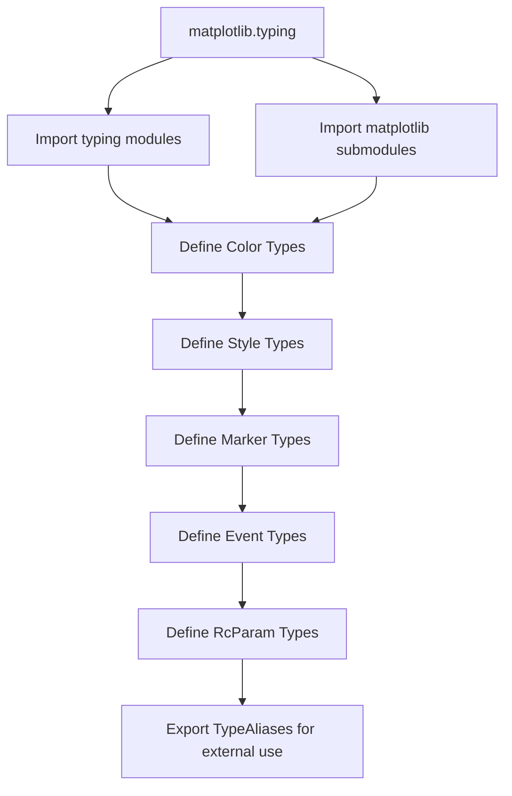

# `matplotlib\lib\matplotlib\typing.py` 详细设计文档

This module provides TypeAlias definitions for Matplotlib, offering comprehensive type annotations for colors, line styles, markers, events, rc parameters, and coordinate systems to support static type checking and IDE autocompletion.

## 整体流程



## 类结构

```
No class hierarchy - this is a pure typing module
```

## 全局变量及字段


### `RGBColorType`
    
Any RGB color specification accepted by Matplotlib.

类型：`TypeAlias = tuple[float, float, float] | str`
    


### `RGBAColorType`
    
Any RGBA color specification accepted by Matplotlib.

类型：`TypeAlias = str | tuple[float, float, float, float] | tuple[RGBColorType, float] | tuple[tuple[float, float, float, float], float]`
    


### `ColorType`
    
Any color specification accepted by Matplotlib. See :mpltype:`color`.

类型：`TypeAlias = RGBColorType | RGBAColorType`
    


### `RGBColourType`
    
Alias of `.RGBColorType`.

类型：`TypeAlias = RGBColorType`
    


### `RGBAColourType`
    
Alias of `.RGBAColorType`.

类型：`TypeAlias = RGBAColorType`
    


### `ColourType`
    
Alias of `.ColorType`.

类型：`TypeAlias = ColorType`
    


### `LineStyleType`
    
Any line style specification accepted by Matplotlib.

类型：`TypeAlias = Literal["-", "solid", "--", "dashed", "-.", "dashdot", ":", "dotted", "", "none", " ", "None"] | tuple[float, Sequence[float]]`
    


### `DrawStyleType`
    
Drawing style for line plots, controlling step rendering.

类型：`TypeAlias = Literal["default", "steps", "steps-pre", "steps-mid", "steps-post"]`
    


### `MarkEveryType`
    
Specification for marking every N points in a line plot.

类型：`TypeAlias = None | int | tuple[int, int] | slice | list[int] | float | tuple[float, float] | list[bool]`
    


### `MarkerType`
    
Marker specification for plot points.

类型：`TypeAlias = path.Path | MarkerStyle | str | Literal[...] | list[tuple[int, int]] | tuple[int, Literal[0, 1, 2], int]`
    


### `FillStyleType`
    
Marker fill styles indicating which parts of the marker are filled.

类型：`TypeAlias = Literal["full", "left", "right", "bottom", "top", "none"]`
    


### `JoinStyleType`
    
Line join styles determining how line segments are connected.

类型：`TypeAlias = JoinStyle | Literal["miter", "round", "bevel"]`
    


### `CapStyleType`
    
Line cap styles determining how line ends are rendered.

类型：`TypeAlias = CapStyle | Literal["butt", "projecting", "round"]`
    


### `LogLevel`
    
Literal type for valid logging levels accepted by `set_loglevel()`.

类型：`TypeAlias = Literal["NOTSET", "DEBUG", "INFO", "WARNING", "ERROR", "CRITICAL"]`
    


### `CoordsBaseType`
    
Base type for coordinate specifications in Matplotlib.

类型：`Union[str, Artist, Transform, Callable[[RendererBase], Union[Bbox, Transform]]]`
    


### `CoordsType`
    
Type for coordinate specifications, including single and tuple forms.

类型：`Union[CoordsBaseType, tuple[CoordsBaseType, CoordsBaseType]]`
    


### `RcStyleType`
    
Type for RC (resource configuration) style specification.

类型：`TypeAlias = str | dict[str, Any] | pathlib.Path | Sequence[str | pathlib.Path | dict[str, Any]]]`
    


### `HashableList`
    
A nested list of Hashable values.

类型：`TypeAlias = list[_HT | "HashableList[_HT]"]`
    


### `MouseEventType`
    
Literal type for mouse event names in Matplotlib.

类型：`TypeAlias = Literal["button_press_event", "button_release_event", "motion_notify_event", "scroll_event", "figure_enter_event", "figure_leave_event", "axes_enter_event", "axes_leave_event"]`
    


### `KeyEventType`
    
Literal type for keyboard event names in Matplotlib.

类型：`TypeAlias = Literal["key_press_event", "key_release_event"]`
    


### `DrawEventType`
    
Literal type for draw event name in Matplotlib.

类型：`TypeAlias = Literal["draw_event"]`
    


### `PickEventType`
    
Literal type for pick event name in Matplotlib.

类型：`TypeAlias = Literal["pick_event"]`
    


### `ResizeEventType`
    
Literal type for resize event name in Matplotlib.

类型：`TypeAlias = Literal["resize_event"]`
    


### `CloseEventType`
    
Literal type for close event name in Matplotlib.

类型：`TypeAlias = Literal["close_event"]`
    


### `EventType`
    
Union type of all event types in Matplotlib.

类型：`TypeAlias = Literal[MouseEventType, KeyEventType, DrawEventType, PickEventType, ResizeEventType, CloseEventType]`
    


### `LegendLocType`
    
Type for legend location specification, including string literals, 2D coordinates, or integer codes.

类型：`TypeAlias = Literal[...] | tuple[float, float] | int`
    


### `RcKeyType`
    
Literal type for all valid RC (resource configuration) parameter keys in Matplotlib.

类型：`TypeAlias = Literal[...]`
    


### `RcGroupKeyType`
    
Literal type for all valid RC parameter group keys in Matplotlib.

类型：`TypeAlias = Literal[...]`
    


    

## 全局函数及方法


## 关键组件


### 类型别名定义模块

该模块是Matplotlib的typing支持文件，定义了库中使用的各种类型别名，涵盖颜色规范、线条样式、标记类型、事件类型、坐标类型和RcParams配置键等，为Matplotlib及其下游库提供静态类型检查支持。

### 颜色类型组件

定义RGB、RGBA和通用颜色规范的类型别名，支持元组、字符串、十六进制等多种格式。

### 线条样式类型组件

定义所有可能的线条样式规范，包括-solid、--dashed、-.dashdot、:dotted及空值等字面量，以及浮点元组模式。

### 标记类型组件

定义标记的完整规范，包括Path对象、MarkerStyle对象、字符串标记名、整数标记码、坐标列表及特殊元组格式。

### 事件类型组件

定义所有GUI事件类型的字面量联合，包括鼠标事件（按钮按下/释放、运动通知、滚动、进入/离开）和键盘事件（按下/释放）。

### 坐标类型组件

定义坐标系统的灵活类型，接受字符串、Artist对象、Transform对象或可调用返回Bbox/Transform的函数。

### RcParams配置键类型组件

定义Matplotlib所有配置项键的完整字面量类型，覆盖axes、figure、legend、grid、font等所有配置分组。

### 哈希可列表类型组件

定义嵌套的哈希可列表类型，支持递归结构用于需要层级哈希数据的场景。

### 设计目标与约束

该模块为Matplotlib提供完整的类型支持，目标是为IDE和类型检查器提供准确的类型推断，约束是这些类型别名被视为 provisional 状态，可能随时变更。

### 潜在技术债务

当前模块存在以下优化空间：类型定义高度集中，单一文件包含数百个类型别名，难以维护；部分类型定义过于复杂（如RGBAColorType嵌套多层），影响可读性；大量字符串字面量手动列举，易产生遗漏或不一致。


## 问题及建议


### 已知问题

-   **Literal 类型手动维护成本高**：`RcKeyType` 和 `RcGroupKeyType` 包含数百个硬编码的字符串字面量，这些与 Matplotlib 的实际 RC 参数紧耦合。当添加、删除或重命名 RC 参数时，需要手动同步更新类型定义，容易出现不同步的情况。
-   **重复的类型别名**：存在多个等价的别名定义（如 `RGBColourType` / `RGBColorType`、`RGBAColourType` / `RGBAColorType`、`ColourType` / `ColorType`），虽然方便了不同拼写习惯的开发者，但增加了维护工作量和代码冗余。
-   **类型字面量含义不明确**：`MarkerType` 中的数字字面量（0-11）没有文档说明其具体含义，开发者无法从类型定义中理解这些值的用途。
-   **递归类型定义可能受限**：`HashableList` 使用了自引用递归定义，在某些类型检查器（如旧版 mypy）中可能无法正确推断或产生警告。
-   **部分 Callable 类型参数不完整**：`CoordsBaseType` 中的 `Callable[[RendererBase], Union[Bbox, Transform]]` 只指定了参数类型和返回值类型，缺少对异常抛出类型的标注，无法完整表达函数签名。
-   **类型定义顺序依赖**：多个类型相互依赖（如 `RGBColorType`、`RGBAColorType`、`ColorType`），修改顺序可能导致类型检查失败。

### 优化建议

-   **考虑使用动态类型生成**：对于 `RcKeyType` 和 `RcGroupKeyType`，可以研究是否可以从 RC 配置文件或运行时元数据自动生成，避免手动同步数百个字符串字面量。
-   **补充数字字面量的文档**：在 `MarkerType` 的 docstring 中明确说明数字 0-11 对应的标记类型，或改用具有明确语义的枚举常量。
-   **精简重复别名**：评估是否真的需要同时保留英式和美式拼写的别名，或至少在文档中说明这是历史兼容性保留。
-   **改进 Callable 类型定义**：为回调函数类型添加 `typing.Protocol` 或完整的函数签名定义，包括可能的异常类型。
-   **添加类型测试**：为这些类型别名编写类型检查测试用例，确保类型定义与实际 API 行为保持一致。
-   **文档增强**：为所有类型别名补充更详细的 docstring，说明每种类型的用途、合法取值范围及使用场景。


## 其它


### 1. 一段话描述

本模块是Matplotlib的类型支持模块，通过Python的TypeAlias机制定义了Matplotlib库中广泛使用的类型别名，涵盖颜色、线型、标记、事件、坐标、RC配置等核心概念，为Matplotlib及其下游库提供静态类型检查支持。

### 2. 文件的整体运行流程

本模块为纯类型定义文件，不包含可执行逻辑，仅在导入时向当前命名空间添加类型别名供其他模块在类型注解中使用。

### 3. 类的详细信息

本模块不包含任何类定义。

### 4. 全局变量和全局函数的详细信息

本模块不包含全局函数，仅包含类型别名定义。以下是所有类型别名及其详细信息：

#### 4.1 颜色相关类型别名

| 名称 | 类型 | 描述 |
|------|------|------|
| RGBColorType | TypeAlias = tuple[float, float, float] \| str | RGB颜色规格，支持浮点三元组或字符串格式 |
| RGBAColorType | TypeAlias = str \| tuple[float, float, float, float] \| tuple[RGBColorType, float] \| tuple[tuple[float, float, float, float], float] | RGBA颜色规格，支持多种格式包括hex字符串和带alpha的元组 |
| ColorType | TypeAlias = RGBColorType \| RGBAColorType | 任何Matplotlib可接受的颜色规格 |
| RGBColourType | TypeAlias = RGBColorType | RGBColorType的别名（英式拼写） |
| RGBAColourType | TypeAlias = RGBAColorType | RGBAColorType的别名（英式拼写） |
| ColourType | TypeAlias = ColorType | ColorType的别名（英式拼写） |

#### 4.2 样式相关类型别名

| 名称 | 类型 | 描述 |
|------|------|------|
| LineStyleType | TypeAlias = Literal["-", "solid", "--", "dashed", "-.", "dashdot", ":", "dotted", "", "none", " ", "None"] \| tuple[float, Sequence[float]] | 线型样式规格，支持文字线型和数值模式 |
| DrawStyleType | TypeAlias = Literal["default", "steps", "steps-pre", "steps-mid", "steps-post"] | 绘制步骤样式 |
| MarkEveryType | TypeAlias = None \| int \| tuple[int, int] \| slice \| list[int] \| float \| tuple[float, float] \| list[bool] | 标记间隔规格 |
| MarkerType | TypeAlias = path.Path \| MarkerStyle \| str \| Literal[...] \| list[tuple[int, int]] \| tuple[int, Literal[0, 1, 2], int] | 标记样式规格 |
| FillStyleType | TypeAlias = Literal["full", "left", "right", "bottom", "top", "none"] | 标记填充样式 |
| JoinStyleType | TypeAlias = JoinStyle \| Literal["miter", "round", "bevel"] | 线段连接样式 |
| CapStyleType | TypeAlias = CapStyle \| Literal["butt", "projecting", "round"] | 线段端点样式 |

#### 4.3 事件相关类型别名

| 名称 | 类型 | 描述 |
|------|------|------|
| MouseEventType | TypeAlias = Literal["button_press_event", "button_release_event", "motion_notify_event", "scroll_event", "figure_enter_event", "figure_leave_event", "axes_enter_event", "axes_leave_event"] | 鼠标事件类型字面量 |
| KeyEventType | TypeAlias = Literal["key_press_event", "key_release_event"] | 键盘事件类型字面量 |
| DrawEventType | TypeAlias = Literal["draw_event"] | 绘制事件类型字面量 |
| PickEventType | TypeAlias = Literal["pick_event"] | 拾取事件类型字面量 |
| ResizeEventType | TypeAlias = Literal["resize_event"] | 调整大小事件类型字面量 |
| CloseEventType | TypeAlias = Literal["close_event"] | 关闭事件类型字面量 |
| EventType | TypeAlias = Literal[MouseEventType, KeyEventType, DrawEventType, PickEventType, ResizeEventType, CloseEventType] | 所有事件类型的联合类型 |

#### 4.4 配置相关类型别名

| 名称 | 类型 | 描述 |
|------|------|------|
| LogLevel | TypeAlias = Literal["NOTSET", "DEBUG", "INFO", "WARNING", "ERROR", "CRITICAL"] | 日志级别字面量 |
| LegendLocType | TypeAlias = Literal[...] \| tuple[float, float] \| int | 图例位置规格 |
| RcStyleType | TypeAlias = str \| dict[str, Any] \| pathlib.Path \| Sequence[str \| pathlib.Path \| dict[str, Any]] | RC样式配置规格 |
| RcKeyType | TypeAlias = Literal[大量rc参数名字符串] | 有效RC键名字面量（约300+个键） |
| RcGroupKeyType | TypeAlias = Literal[大量rc组键名字符串] | 有效RC组键名字面量（约70+个组） |

#### 4.5 坐标与变换相关类型别名

| 名称 | 类型 | 描述 |
|------|------|------|
| CoordsBaseType | TypeAlias = str \| Artist \| Transform \| Callable[[RendererBase], Union[Bbox, Transform]] | 坐标基础类型 |
| CoordsType | TypeAlias = CoordsBaseType \| tuple[CoordsBaseType, CoordsBaseType] | 坐标类型，支持单个或二元组 |

#### 4.6 其他类型别名

| 名称 | 类型 | 描述 |
|------|------|------|
| HashableList | TypeVar(_HT, bound=Hashable) 的 TypeAlias = list[_HT \| "HashableList[_HT]"] | 可哈希值的嵌套列表 |

### 5. 关键组件信息

| 组件名称 | 一句话描述 |
|----------|------------|
| 类型别名系统 | 通过TypeAlias实现Matplotlib各类型实体的精确类型标注 |
| Literal类型 | 大量使用Literal约束枚举值范围，提升类型检查严格性 |
| 联合类型 | 通过Union和\|操作符组合多种可能类型，覆盖Matplotlib API的多样性 |
| RC配置类型 | 定义了完整的rc参数键名类型系统，用于配置管理 |

### 6. 潜在的技术债务或优化空间

1. **类型覆盖不完整**：RcKeyType和RcGroupKeyType为手写的长Literal列表，与实际rc参数可能存在同步问题，建议使用代码生成方式从配置定义自动生成
2. **英式拼写别名**：RGBColourType等英式拼写别名增加了维护负担，可考虑移除或统一
3. **HashableList递归类型**：使用TypeVar绑定Hashable的方式在某些类型检查器中可能产生递归类型推断问题
4. **警告状态**：模块标记为"provisional"状态，表明API可能随时变化，类型定义稳定性不足

### 7. 其它项目

#### 7.1 设计目标与约束

- **设计目标**：为Matplotlib提供完整的类型注解支持，使下游库和静态类型检查工具能够准确验证Matplotlib API的使用
- **约束条件**：保持与Python 3.9+的类型注解向后兼容性，使用TypeAlias而非TypeAliasType以支持更广泛的Python版本

#### 7.2 错误处理与异常设计

本模块为纯类型定义，不涉及运行时错误处理。类型错误将由类型检查器（如mypy）在静态分析阶段报告。

#### 7.3 数据流与状态机

无数据流或状态机设计，本模块为声明性类型定义。

#### 7.4 外部依赖与接口契约

- **依赖模块**：path、_enums、artist、backend_bases、markers、transforms
- **接口契约**：类型别名供外部模块在类型注解中使用，不涉及运行时接口
- **导入顺序**：类型别名定义遵循从具体到抽象的顺序，后续类型可引用前置类型

#### 7.5 使用示例

```python
# 颜色类型使用
def set_color(c: ColorType) -> None: ...

# 事件类型使用
def on_event(event: EventType) -> None: ...

# RC配置使用
def set_rc(key: RcKeyType, value: Any) -> None: ...
```

#### 7.6 版本兼容性说明

- 本模块使用Python 3.9+的TypeAlias语法
- Literal语法支持Python 3.8+但需要from __future__ import annotations
- 模块标记为provisional（临时）状态，可能在后续版本中调整

#### 7.7 类型字面量完整性

RcKeyType包含约300个rc参数键名，RcGroupKeyType包含约70个rc组键名，这些字面量列表需要与matplotlibrc文件中的实际参数保持同步，当前为手动维护状态。


    