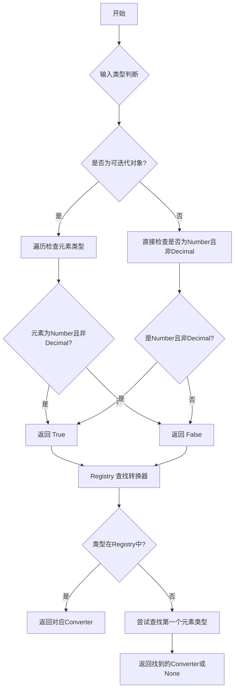
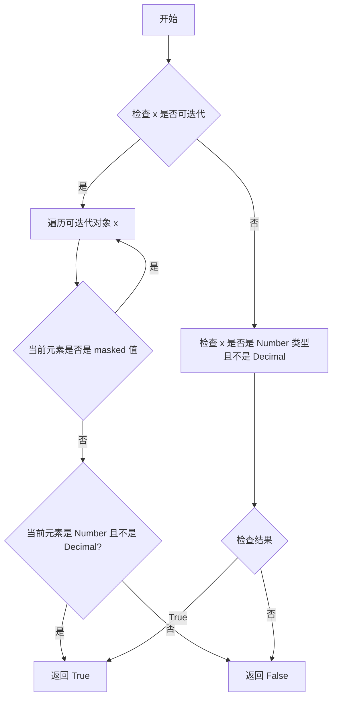
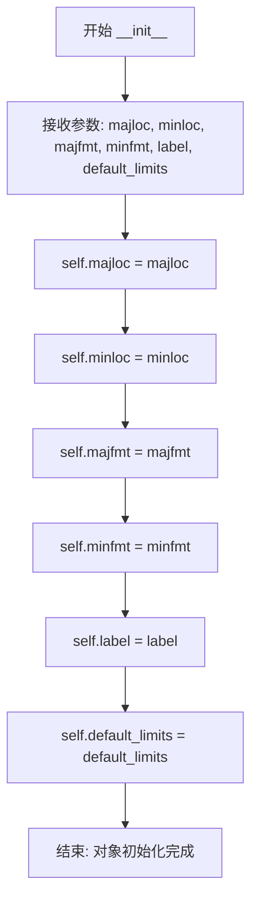
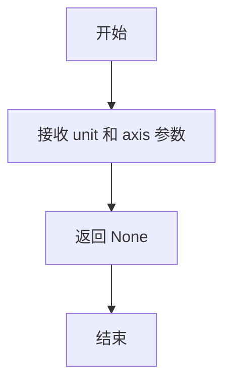
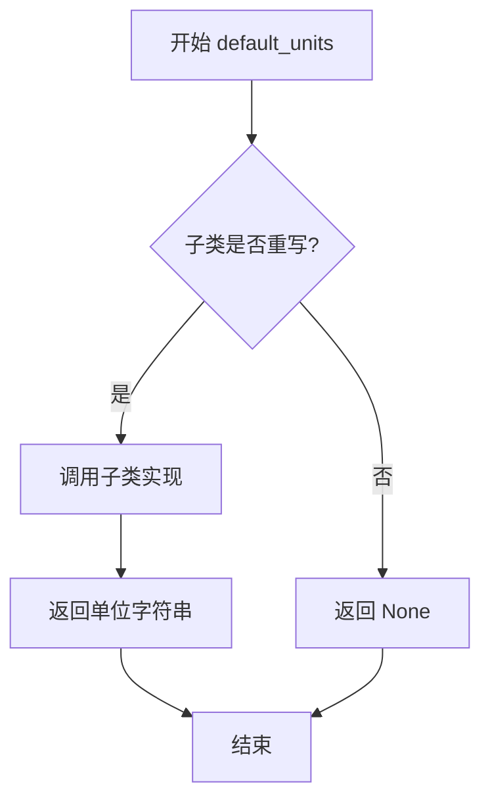
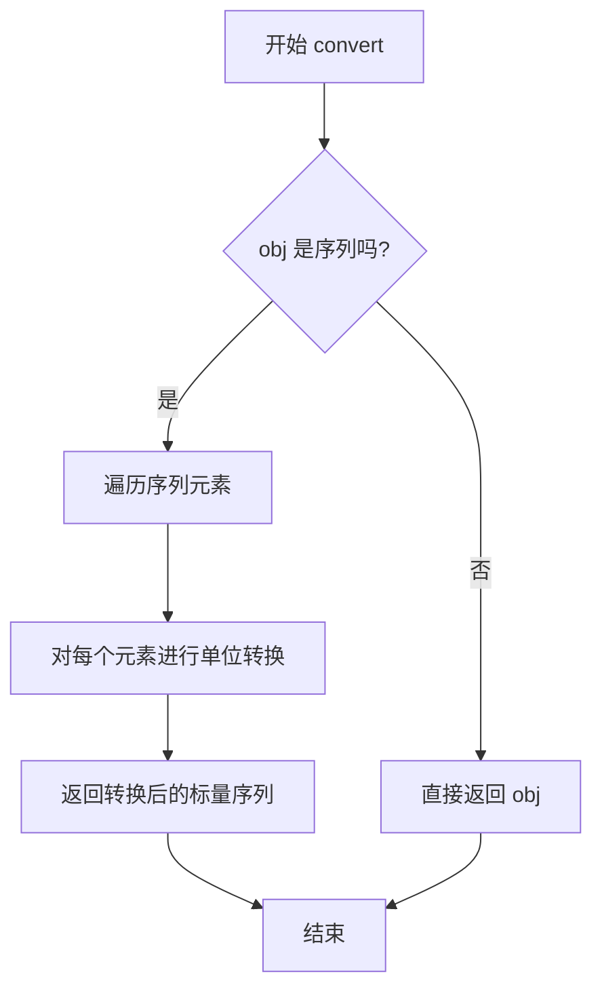

# `matplotlib\lib\matplotlib\units.py` 详细设计文档

该模块提供了 Matplotlib 与自定义数据类型（如带单位的对象、Decimal 等）的集成支持，通过注册机制将自定义类型转换为 Matplotlib 可处理的数值数组，并提供轴标签、刻度定位器和格式化器等 AxisInfo 信息。

## 整体流程



## 类结构

```
ConversionError (异常类)
AxisInfo (数据类)
ConversionInterface (抽象基类)
├── DecimalConverter (实现类)
Registry (字典子类)
└── registry (全局单例)
```

## 全局变量及字段


### `registry`
    
全局注册表实例，用于存储数据类型到转换器的映射

类型：`Registry`
    


### `AxisInfo.majloc`
    
主要刻度定位器

类型：`Locator or None`
    


### `AxisInfo.minloc`
    
次要刻度定位器

类型：`Locator or None`
    


### `AxisInfo.majfmt`
    
主要刻度格式化器

类型：`Formatter or None`
    


### `AxisInfo.minfmt`
    
次要刻度格式化器

类型：`Formatter or None`
    


### `AxisInfo.label`
    
轴标签

类型：`str or None`
    


### `AxisInfo.default_limits`
    
默认轴 limits

类型：`tuple or None`
    
    

## 全局函数及方法


### `_is_natively_supported`

该函数用于判断给定的值或值序列是否为Matplotlib原生支持的数值类型（排除Decimal类型）。

参数：

- `x`：任意类型，待检查的对象，可以是单个数值或可迭代对象

返回值：`bool`，返回True表示Matplotlib原生支持该类型（或包含该类型元素的数组），否则返回False

#### 流程图



#### 带注释源码

```python
def _is_natively_supported(x):
    """
    Return whether *x* is of a type that Matplotlib natively supports or an
    array of objects of such types.
    """
    # Matplotlib natively supports all number types except Decimal.
    if np.iterable(x):
        # Assume lists are homogeneous as other functions in unit system.
        # 遍历可迭代对象中的每个元素进行检查
        for thisx in x:
            # 跳过掩码值（masked values），继续检查下一个元素
            if thisx is ma.masked:
                continue
            # 检查元素是否为数字类型且不是Decimal
            # 注意：这里只检查第一个非掩码元素
            return isinstance(thisx, Number) and not isinstance(thisx, Decimal)
    else:
        # 非可迭代对象，直接检查是否为数字类型且不是Decimal
        # 注意：原代码中存在bug，使用了未定义的thisx变量，应为x
        return isinstance(x, Number) and not isinstance(thisx, Decimal)
```


### `AxisInfo.__init__`

该方法用于初始化 `AxisInfo` 类的实例，该类负责存储轴的标签、刻度定位器和格式化器等配置信息，支持默认轴标签、刻度标签和轴限的设置。

参数：

- `majloc`：`Locator` 或 `None`，可选，主要刻度的定位器
- `minloc`：`Locator` 或 `None`，可选，次要刻度的定位器
- `majfmt`：`Formatter` 或 `None`，可选，主要刻度的格式化器
- `minfmt`：`Formatter` 或 `None`，可选，次要刻度的格式化器
- `label`：`str` 或 `None`，可选，默认的轴标签
- `default_limits`：可选，当没有绘制数据时轴的默认最小和最大限制

返回值：`None`，该方法为构造函数，不返回任何值，仅初始化实例属性

#### 流程图



#### 带注释源码

```python
def __init__(self, majloc=None, minloc=None,
             majfmt=None, minfmt=None, label=None,
             default_limits=None):
    """
    初始化 AxisInfo 实例。

    Parameters
    ----------
    majloc, minloc : Locator, optional
        主要和次要刻度的定位器。
    majfmt, minfmt : Formatter, optional
        主要和次要刻度的格式化器。
    label : str, optional
        默认的轴标签。
    default_limits : optional
        当没有绘制数据时轴的默认最小和最大限制。

    Notes
    -----
    如果上述任何参数为 ``None``，轴将使用默认值。
    """
    # 主要刻度定位器，用于确定主要刻度的位置
    self.majloc = majloc
    # 次要刻度定位器，用于确定次要刻度的位置
    self.minloc = minloc
    # 主要刻度格式化器，用于格式化主要刻度的标签
    self.majfmt = majfmt
    # 次要刻度格式化器，用于格式化次要刻度的标签
    self.minfmt = minfmt
    # 轴标签，显示在轴上的文本标签
    self.label = label
    # 默认轴限制，当没有数据时轴的默认范围
    self.default_limits = default_limits
```


### `ConversionInterface.axisinfo`

返回给定轴的单位信息，用于支持默认轴标签、刻度标签和限制。

参数：

- `unit`：任意类型，单位标识
- `axis`：matplotlib axis对象，需要获取信息的轴

返回值：`AxisInfo` 或 `None`，返回轴的单位信息对象，如果返回 `None` 则使用默认行为

#### 流程图



#### 带注释源码

```python
@staticmethod
def axisinfo(unit, axis):
    """Return an `.AxisInfo` for the axis with the specified units."""
    return None
```

**说明**：这是一个静态方法，作为 ConversionInterface 的默认实现。在子类中可以重写此方法以提供具体的轴信息，例如自动日期定位器和格式化器。当返回 `None` 时，matplotlib 将使用默认的轴信息。该方法通常与 `convert` 和 `default_units` 方法配合使用，以实现自定义数据类型的完整支持。


### `ConversionInterface.default_units`

返回给定数据 `x` 的默认单位，用于轴的单元确定。如果无法确定单位，则返回 `None`。这是一个静态方法，由具体的转换器类重写以提供自定义的默认单位。

参数：

- `x`：`任意类型`，需要确定默认单位的数据对象，可以是单个值或序列
- `axis`：`matplotlib.axis.Axis`，绑定的轴对象，用于上下文信息和进一步的单元查询

返回值：`str 或 None`，返回默认的单元标识符（如 `'date'`、`'time'` 等），如果无法确定则返回 `None`

#### 流程图



#### 带注释源码

```python
@staticmethod
def default_units(x, axis):
    """
    Return the default unit for *x* or ``None`` for the given axis.
    
    Parameters
    ----------
    x : 任意类型
        需要确定默认单位的数据。可以是单个值、序列或任何自定义类型。
        具体类型取决于注册的转换器。
    axis : matplotlib.axis.Axis
        绑定的轴对象。用于提供上下文信息，如轴的属性和配置。
        转换器可以使用此参数来查询轴的当前状态或进行特定于轴的判断。
    
    Returns
    -------
    str 或 None
        默认的单元标识符字符串，如 'date'、'time' 等。
        如果数据 x 没有关联的默认单位，或者无法确定单位，则返回 None。
        
    Notes
    -----
    此方法是抽象接口方法，默认实现返回 None。
    具体的转换器类（如示例中的 DateConverter）应重写此方法，
    以返回适合其数据类型的默认单位。
    
    当 Matplotlib 绘图时遇到未知类型的数值，会调用此方法获取
    默认单位，然后使用返回的单位字符串查找对应的转换器进行
    坐标转换和轴标签设置。
    
    Example
    -------
    >>> class DateConverter(ConversionInterface):
    ...     @staticmethod
    ...     def default_units(x, axis):
    ...         return 'date'
    """
    return None
```


### `ConversionInterface.convert`

将自定义数据类型的对象使用指定的单位转换为Matplotlib可处理的数值数组。如果对象是序列，则返回转换后的序列，输出必须是可被numpy数组层使用的标量序列。

参数：

- `obj`：任意类型，要转换的对象，可以是单个值或序列
- `unit`：任意类型，用于指定转换的单位
- `axis`：Axis类型，用于指定转换所在的轴

返回值：`任意类型`，转换后的对象，如果是序列则返回转换后的标量序列

#### 流程图



#### 带注释源码

```python
@staticmethod
def convert(obj, unit, axis):
    """
    Convert *obj* using *unit* for the specified *axis*.

    If *obj* is a sequence, return the converted sequence.  The output must
    be a sequence of scalars that can be used by the numpy array layer.

    Parameters
    ----------
    obj : any
        The object to convert. Can be a single value or a sequence of values.
    unit : any
        The unit to use for conversion.
    axis : matplotlib.axis.Axis
        The axis for which the conversion is being performed.

    Returns
    -------
    any
        The converted object. If obj is a sequence, returns a sequence of
        scalars that can be used by the numpy array layer.
    """
    # 直接返回原始对象，这是基类的默认实现
    # 子类应重写此方法以实现实际的转换逻辑
    return obj
```


### `DecimalConverter.convert`

该方法用于将 `decimal.Decimal` 类型或其可迭代对象转换为浮点数或浮点数组，以便 Matplotlib 能够处理包含Decimal类型数据的图表。

参数：

- `value`：`decimal.Decimal or iterable`，需要转换的 Decimal 值或包含 Decimal 的可迭代对象（如列表、数组）
- `unit`：未使用，仅为保持接口一致性而存在
- `axis`：未使用，仅为保持接口一致性而存在

返回值：`float or numpy.ndarray`，转换后的浮点数（单值）或浮点数数组

#### 流程图

```mermaid
flowchart TD
    A[开始 convert] --> B{value 是否为 Decimal?}
    B -->|是| C[直接调用 float(value) 转换]
    B -->|否| D{value 是否为 MaskedArray?}
    D -->|是| E[使用 ma.asarray 转为 float 数组]
    D -->|否| F[使用 np.asarray 转为 float 数组]
    C --> G[返回 float 类型]
    E --> H[返回 numpy  masked array]
    F --> I[返回 numpy array]
```

#### 带注释源码

```python
@staticmethod
def convert(value, unit, axis):
    """
    Convert Decimals to floats.

    The *unit* and *axis* arguments are not used.

    Parameters
    ----------
    value : decimal.Decimal or iterable
        Decimal or list of Decimal need to be converted
    """
    # 检查输入是否为单一的 Decimal 对象
    if isinstance(value, Decimal):
        # 直接转换为 Python float 类型并返回
        return float(value)
    # 检查是否为 MaskedArray（带掩码的数组，用于处理缺失数据）
    elif isinstance(value, ma.MaskedArray):
        # 使用 numpy.ma.asarray 保持掩码信息并转换为 float 类型
        return ma.asarray(value, dtype=float)
    else:
        # 处理其他可迭代对象（如列表、普通数组）
        # 使用 numpy.asarray 转换为 float 类型数组
        return np.asarray(value, dtype=float)
```


### `Registry.get_converter`

获取给定值 `x` 的转换器接口实例，如果不存在则返回 `None`。该方法首先尝试从缓存中直接查找类型对应的转换器，如果未找到则尝试从第一个元素推断转换器。

参数：

- `self`：`Registry`，调用此方法的 Registry 实例（字典子类），用于存储类型到转换器的映射
- `x`：`Any`，需要获取转换器的值，可以是任意类型（数字、数组、可迭代对象、或支持转换为 numpy 数组的对象如 Pandas/xarray）

返回值：`ConversionInterface | None`，返回找到的转换器接口实例，如果无法确定转换器则返回 `None`

#### 流程图

```mermaid
flowchart TD
    A[开始: get_converter x] --> B[调用 cbook._unpack_to_numpy x 展开x]
    B --> C{isinstance x, np.ndarray?}
    C -->|是| D[获取底层数据并ravel展平]
    D --> E{x.size == 0?}
    E -->|是| F[递归调用 get_converter np.array[0 dtype=x.dtype]]
    E -->|否| G[从type x的MRO遍历查找缓存]
    C -->|否| G
    F --> L[返回结果]
    G --> H{在缓存中找到转换器?}
    H -->|是| L[返回转换器实例]
    H -->|否| I[尝试获取第一个有限元素]
    I --> J{获取成功?}
    J -->|否| K[返回None]
    J -->|是| K2{type first != type x?}
    K2 -->|是| B2[递归调用get_converter first]
    K2 -->|否| K
    B2 --> L
    K --> L
    L[结束]
```

#### 带注释源码

```python
def get_converter(self, x):
    """
    Get the converter interface instance for *x*, or None.
    
    参数:
        x: 需要获取转换器的值，支持多种类型：
           - 原始类型（如数字、Decimal）
           - numpy数组（包括MaskedArray）
           - 可迭代对象（如列表）
           - 支持转换为numpy数组的对象（如Pandas、xarray对象）
    
    返回:
        ConversionInterface | None: 找到的转换器实例，或None
    """
    # 展开Pandas或xarray对象为numpy数组，以便统一处理
    x = cbook._unpack_to_numpy(x)

    # 如果x是numpy数组，处理MaskedArray和空数组情况
    if isinstance(x, np.ndarray):
        # 获取底层数据（类型信息仅与类型相关）
        # 如果是普通ndarray，getdata()直接返回数组本身
        x = np.ma.getdata(x).ravel()
        
        # 如果数组为空，从dtype推断单位
        # 例如：空字符串数组dtype='<U1'，空浮点数数组dtype='float64'
        if not x.size:
            # 递归调用，用dtype创建包含单个元素的数组来推断转换器
            return self.get_converter(np.array([0], dtype=x.dtype))
    
    # 方法1：在缓存中查找（从type(x)的MRO向上查找）
    # MRO确保按类的继承层次从子类到父类顺序查找
    for cls in type(x).__mro__:
        try:
            # 尝试从字典（Registry）中获取cls对应的转换器
            return self[cls]
        except KeyError:
            # 未找到，继续查找父类
            pass
    
    # 方法2：如果缓存查找失败，尝试基于第一个元素查找
    try:
        # 获取第一个有限元素（跳过无穷大和NaN）
        first = cbook._safe_first_finite(x)
    except (TypeError, StopIteration):
        # x不可迭代或没有有限元素，放弃治疗
        pass
    else:
        # 避免对病态可迭代对象的无限递归
        # 例如：索引返回与原对象相同类型的可迭代对象时
        if type(first) is not type(x):
            # 递归用第一个元素的类型去查找转换器
            return self.get_converter(first)
    
    # 找不到任何转换器
    return None
```

## 关键组件


### ConversionInterface

核心抽象基类，定义了将自定义数据类型转换为Matplotlib可用值的最小接口，包含axisinfo、default_units和convert三个静态方法，用于轴信息获取、默认单位确定和数据转换。

### DecimalConverter

专门处理decimal.Decimal数据转换为float的转换器类，继承ConversionInterface，支持单个Decimal值、MaskedArray和可迭代对象的转换，将Decimal类型转换为浮点数以支持Matplotlib原生绘图。

### Registry

类型注册表类，继承dict，用于存储数据类型到转换器接口的映射关系。提供get_converter方法实现惰性加载和递归查找机制，支持numpy数组、MaskedArray的解包处理，以及基于第一个元素推断类型的策略。

### AxisInfo

轴信息数据类，用于封装轴的刻度定位器、格式化器和标签等配置信息。实例必须由ConversionInterface.axisinfo方法返回，支持major/minor刻度的独立配置和默认轴范围设置。

### _is_natively_supported

全局工具函数，判断输入是否为Matplotlib原生支持的数值类型。通过排除Decimal类型并检查Number实例，实现对单个值和可迭代对象的类型判断。

### registry

全局Registry单例实例，预注册了Decimal到DecimalConverter的映射关系，提供开箱即用的Decimal类型支持。


## 问题及建议


### 已知问题

-   **递归风险**：在`Registry.get_converter`方法中，当处理病态的可迭代对象时，递归调用`self.get_converter(first)`可能导致无限递归或栈溢出，尽管有`type(first) is not type(x)`的检查，但这个防护可能不够完善。
-   **类型推断不准确**：`Registry.get_converter`方法通过检查第一个元素来确定整个数组的类型，这种方式在处理异构数据或混合类型数组时可能产生错误的转换器选择。
-   **空数组处理推断**：`get_converter`中对空数组使用`np.array([0], dtype=x.dtype)`来推断单位，这种推断可能不准确且可能引入副作用。
-   **DecimalConverter类型检查不完整**：`convert`方法假设value要么是Decimal实例，要么是可迭代的，但没有处理混合类型的情况（如列表中同时包含Decimal和其他类型）。
-   **字符串误判风险**：在`_is_natively_supported`函数中，使用`np.iterable(x)`检查可迭代性，字符串是可迭代的，可能导致对字符串类型元素的错误处理。
-   **缺少异常传播**：`Registry.get_converter`在递归查找转换器时捕获了`TypeError`和`StopIteration`，但没有提供调试信息，难以追踪问题根源。

### 优化建议

-   **增加递归深度限制**：在`get_converter`的递归调用中添加最大递归深度限制，防止无限递归。
-   **改进类型推断逻辑**：考虑对数组进行更全面的类型检查，而不是仅依赖第一个元素，可以采样多个元素进行类型一致性检查。
-   **增强空数组处理**：对空数组的推断添加警告日志，或提供更明确的处理策略。
-   **完善类型检查**：在`DecimalConverter.convert`中添加对混合类型的处理逻辑，或者在文档中明确说明不支持混合类型。
-   **添加调试日志**：在`get_converter`中添加日志记录，以便在类型推断失败时能够追踪问题。
-   **考虑性能优化**：对于大型数组，`np.ma.getdata(x).ravel()`会创建数据副本，可以考虑使用视图或更高效的检查方式。
-   **增加单元测试覆盖**：针对边界情况（如空数组、混合类型、递归边界）添加测试用例。


## 其它


### 设计目标与约束

本模块的设计目标是提供一个轻量级、可扩展的单元转换框架，使Matplotlib能够支持任意自定义数据类型（如datetime、Decimal等）的绘图。核心约束包括：1）不假设任何特定单位实现，只要求注册ConversionInterface；2）保持与NumPy数组的无缝集成；3）通过Registry实现类型到转换器的映射，支持继承链查找。

### 错误处理与异常设计

模块定义了ConversionError作为TypeError的子类，用于处理转换过程中的错误。Registry.get_converter在以下情况返回None而非抛出异常：1）类型未在Registry中注册；2）空数组无法推断单位；3）迭代器为空或类型推断失败。这种设计避免因单位缺失导致绘图中断，允许调用方提供默认值。

### 数据流与状态机

数据转换流程为：原始数据输入 → Registry.get_converter查找对应Converter → 调用Converter.convert转换为浮点数数组 → 返回给Matplotlib进行绘图。AxisInfo对象在首次绘制时通过Converter.axisinfo获取，用于设置轴的标签、刻度定位器和格式化器。

### 外部依赖与接口契约

核心依赖包括：numpy（数值计算）、matplotlib.cbook（工具函数）。ConversionInterface规定三个抽象方法签名：convert(obj, unit, axis)返回数值数组、axisinfo(unit, axis)返回AxisInfo或None、default_units(x, axis)返回单位标识符。Registry实现了dict接口，键为数据类型（如datetime.date、Decimal），值为ConversionInterface实例。

### 性能考虑

性能关键点：1）Registry.get_converter使用类型MRO（方法解析顺序）缓存查找，首次失败时回退到首个元素推断；2）_is_natively_supported使用迭代检查，对大型数组可能产生O(n)开销；3）MaskedArray处理时通过getdata()直接访问底层数据避免复制。

### 安全性考虑

代码不涉及用户输入验证或敏感数据处理，主要安全关注点为：1）np.asarray的dtype=float转换可能引入数值精度损失；2）DecimalConverter对外部Decimal对象的转换需确保类型检查正确；3）Registry的动态类型注册需避免恶意类型覆盖。

### 测试策略

建议测试覆盖：1）Registry对已注册类型（Decimal）和未注册类型的查找行为；2）DecimalConverter对Decimal、列表、MaskedArray的转换结果正确性；3）_is_natively_supported对Number类型和Decimal的判别；4）空数组和单元素数组的边界情况处理；5）继承类型（如Number子类）的转换器查找。

### 版本兼容性

代码依赖numpy和matplotlib内部模块cbook。DecimalConverter直接继承ConversionInterface并复用父类默认实现，展示了向后兼容性设计。Registry._unpack_to_numpy调用需与matplotlib版本匹配，当前实现适用于常见的数据科学库（Pandas、Xarray）。

### 使用示例与扩展

扩展自定义转换器需：1）继承ConversionInterface；2）实现convert/axisinfo/default_units方法；3）向registry注册类型。典型用例包括datetime.date（已有示例）、pandas.Timestamp、xarray.DataArray等。集成时注意：convert返回的数组必须可直接用于numpy操作。

    