# `matplotlib\lib\matplotlib\widgets.pyi` 详细设计文档

该文件定义了Matplotlib库中的交互式GUI小部件，包括按钮、滑动条、复选框、文本框、单选按钮、光标以及各种选择器（矩形、椭圆、套索、多边形等），用于在图表中实现用户交互功能。

## 整体流程

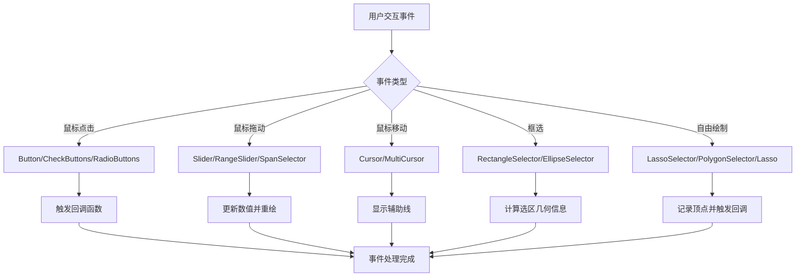
```mermaid
graph TD
    A[用户交互事件] --> B{事件类型}
    B -->|鼠标点击| C[Button/CheckButtons/RadioButtons]
    B -->|鼠标拖动| D[Slider/RangeSlider/SpanSelector]
    B -->|鼠标移动| E[Cursor/MultiCursor]
    B -->|框选| F[RectangleSelector/EllipseSelector]
    B -->|自由绘制| G[LassoSelector/PolygonSelector/Lasso]
    C --> H[触发回调函数]
    D --> I[更新数值并重绘]
    E --> J[显示辅助线]
    F --> K[计算选区几何信息]
    G --> L[记录顶点并触发回调]
    H --> M[事件处理完成]
    I --> M
    J --> M
    K --> M
    L --> M
```

## 类结构

```
object
├── LockDraw
├── Widget
│   └── AxesWidget
│       ├── Button
│       ├── SliderBase
│       │   ├── Slider
│       │   └── RangeSlider
│       ├── CheckButtons
│       ├── TextBox
│       ├── RadioButtons
│       ├── Cursor
│       ├── _SelectorWidget
│       │   ├── SpanSelector
│       │   ├── RectangleSelector
│       │   │   └── EllipseSelector
│       │   ├── LassoSelector
│       │   └── PolygonSelector
│       └── Lasso
└── SubplotTool (继承Widget)
└── MultiCursor (继承Widget)
└── ToolLineHandles
└── ToolHandles
```

## 全局变量及字段


### `Widget.drawon`
    
Whether the widget responds to draw events.

类型：`bool`
    


### `Widget.eventson`
    
Whether the widget responds to events.

类型：`bool`
    


### `Widget.active`
    
Whether the widget is active.

类型：`bool`
    


### `AxesWidget.ax`
    
The axes object associated with the widget.

类型：`Axes`
    


### `AxesWidget.canvas`
    
The canvas of the figure.

类型：`FigureCanvasBase | None`
    


### `Button.label`
    
The label text of the button.

类型：`Text`
    


### `Button.color`
    
The background color of the button.

类型：`ColorType`
    


### `Button.hovercolor`
    
The color of the button when hovered.

类型：`ColorType`
    


### `SliderBase.orientation`
    
The orientation of the slider.

类型：`Literal["horizontal", "vertical"]`
    


### `SliderBase.closedmin`
    
Whether the minimum value is closed.

类型：`bool`
    


### `SliderBase.closedmax`
    
Whether the maximum value is closed.

类型：`bool`
    


### `SliderBase.valmin`
    
The minimum value of the slider.

类型：`float`
    


### `SliderBase.valmax`
    
The maximum value of the slider.

类型：`float`
    


### `SliderBase.valstep`
    
The step value of the slider.

类型：`float | ArrayLike | None`
    


### `SliderBase.drag_active`
    
Whether the slider is currently being dragged.

类型：`bool`
    


### `SliderBase.valfmt`
    
The format string or function for the value display.

类型：`str | Callable[[float], str] | None`
    


### `Slider.slidermin`
    
The minimum slider to constrain value.

类型：`Slider | None`
    


### `Slider.slidermax`
    
The maximum slider to constrain value.

类型：`Slider | None`
    


### `Slider.val`
    
The current value of the slider.

类型：`float`
    


### `Slider.valinit`
    
The initial value of the slider.

类型：`float`
    


### `Slider.track`
    
The track line of the slider.

类型：`Rectangle`
    


### `Slider.poly`
    
The polygon representing the slider handle.

类型：`Polygon`
    


### `Slider.hline`
    
The horizontal line on the slider.

类型：`Line2D`
    


### `Slider.vline`
    
The vertical line on the slider.

类型：`Line2D`
    


### `Slider.label`
    
The label of the slider.

类型：`Text`
    


### `Slider.valtext`
    
The text displaying the current value.

类型：`Text`
    


### `RangeSlider.val`
    
The current value range (min, max).

类型：`tuple[float, float]`
    


### `RangeSlider.valinit`
    
The initial value range (min, max).

类型：`tuple[float, float]`
    


### `RangeSlider.track`
    
The track line of the range slider.

类型：`Rectangle`
    


### `RangeSlider.poly`
    
The polygon representing the range slider handle.

类型：`Polygon`
    


### `RangeSlider.label`
    
The label of the range slider.

类型：`Text`
    


### `RangeSlider.valtext`
    
The text displaying the current value range.

类型：`Text`
    


### `CheckButtons.labels`
    
The list of text labels for the check buttons.

类型：`list[Text]`
    


### `TextBox.label`
    
The label of the text box.

类型：`Text`
    


### `TextBox.text_disp`
    
The text display object.

类型：`Text`
    


### `TextBox.cursor_index`
    
The index of the cursor in the text.

类型：`int`
    


### `TextBox.cursor`
    
The cursor line collection.

类型：`LineCollection`
    


### `TextBox.color`
    
The background color of the text box.

类型：`ColorType`
    


### `TextBox.hovercolor`
    
The color when hovering over the text box.

类型：`ColorType`
    


### `TextBox.capturekeystrokes`
    
Whether the text box captures keystrokes.

类型：`bool`
    


### `RadioButtons.activecolor`
    
The color of the active radio button.

类型：`ColorType`
    


### `RadioButtons.value_selected`
    
The value of the selected radio button.

类型：`str`
    


### `RadioButtons.index_selected`
    
The index of the selected radio button.

类型：`int`
    


### `RadioButtons.labels`
    
The list of text labels for the radio buttons.

类型：`list[Text]`
    


### `SubplotTool.figure`
    
The figure for the subplot tool.

类型：`Figure`
    


### `SubplotTool.targetfig`
    
The target figure to control.

类型：`Figure`
    


### `SubplotTool.buttonreset`
    
The reset button.

类型：`Button`
    


### `Cursor.visible`
    
Whether the cursor is visible.

类型：`bool`
    


### `Cursor.horizOn`
    
Whether to show the horizontal line.

类型：`bool`
    


### `Cursor.vertOn`
    
Whether to show the vertical line.

类型：`bool`
    


### `Cursor.useblit`
    
Whether to use blitting for performance.

类型：`bool`
    


### `Cursor.lineh`
    
The horizontal line of the cursor.

类型：`Line2D`
    


### `Cursor.linev`
    
The vertical line of the cursor.

类型：`Line2D`
    


### `Cursor.background`
    
The background canvas for blitting.

类型：`Any`
    


### `Cursor.needclear`
    
Whether the background needs to be cleared.

类型：`bool`
    


### `MultiCursor.axes`
    
The sequence of axes for the multi cursor.

类型：`Sequence[Axes]`
    


### `MultiCursor.horizOn`
    
Whether to show horizontal lines.

类型：`bool`
    


### `MultiCursor.vertOn`
    
Whether to show vertical lines.

类型：`bool`
    


### `MultiCursor.visible`
    
Whether the cursor lines are visible.

类型：`bool`
    


### `MultiCursor.useblit`
    
Whether to use blitting.

类型：`bool`
    


### `MultiCursor.vlines`
    
The vertical lines of the multi cursor.

类型：`list[Line2D]`
    


### `MultiCursor.hlines`
    
The horizontal lines of the multi cursor.

类型：`list[Line2D]`
    


### `_SelectorWidget.onselect`
    
Callback function when a selection is made.

类型：`Callable[[float, float], Any]`
    


### `_SelectorWidget._useblit`
    
Whether to use blitting for the selector.

类型：`bool`
    


### `_SelectorWidget.background`
    
The background for blitting.

类型：`Any`
    


### `_SelectorWidget.validButtons`
    
List of valid mouse buttons for selection.

类型：`list[MouseButton]`
    


### `SpanSelector.snap_values`
    
Values to snap to for the span selector.

类型：`ArrayLike | None`
    


### `SpanSelector.onmove_callback`
    
Callback function during mouse move.

类型：`Callable[[float, float], Any]`
    


### `SpanSelector.minspan`
    
Minimum span for the selection.

类型：`float`
    


### `SpanSelector.grab_range`
    
Range to grab the handle.

类型：`float`
    


### `SpanSelector.drag_from_anywhere`
    
Whether dragging can start from anywhere in the span.

类型：`bool`
    


### `SpanSelector.ignore_event_outside`
    
Whether to ignore events outside the axes.

类型：`bool`
    


### `ToolLineHandles.ax`
    
The axes containing the line handles.

类型：`Axes`
    


### `ToolHandles.ax`
    
The axes containing the tool handles.

类型：`Axes`
    


### `RectangleSelector.drag_from_anywhere`
    
Whether dragging can start from anywhere in the rectangle.

类型：`bool`
    


### `RectangleSelector.ignore_event_outside`
    
Whether to ignore events outside the rectangle.

类型：`bool`
    


### `RectangleSelector.minspanx`
    
Minimum span in x direction.

类型：`float`
    


### `RectangleSelector.minspany`
    
Minimum span in y direction.

类型：`float`
    


### `RectangleSelector.spancoords`
    
Coordinate system for span calculation.

类型：`Literal["data", "pixels"]`
    


### `RectangleSelector.grab_range`
    
Range to grab the handle.

类型：`float`
    


### `RectangleSelector._active_handle`
    
The currently active handle for the rectangle.

类型：`None | Literal["C", "N", "NE", "E", "SE", "S", "SW", "W", "NW"]`
    


### `LassoSelector.verts`
    
The vertices of the lasso selection.

类型：`None | list[tuple[float, float]]`
    


### `PolygonSelector.grab_range`
    
Range to grab the handle.

类型：`float`
    


### `Lasso.useblit`
    
Whether to use blitting.

类型：`bool`
    


### `Lasso.background`
    
The background for blitting.

类型：`Any`
    


### `Lasso.verts`
    
The vertices of the lasso.

类型：`list[tuple[float, float]] | None`
    


### `Lasso.line`
    
The line representing the lasso.

类型：`Line2D`
    


### `Lasso.callback`
    
Callback function when lasso is complete.

类型：`Callable[[list[tuple[float, float]]], Any]`
    
    

## 全局函数及方法


### `LockDraw.__init__`

这是 `LockDraw` 类的构造函数，用于初始化一个锁对象实例。该类用于管理资源的独占访问控制。

参数：无

返回值：`None`，无返回值

#### 流程图

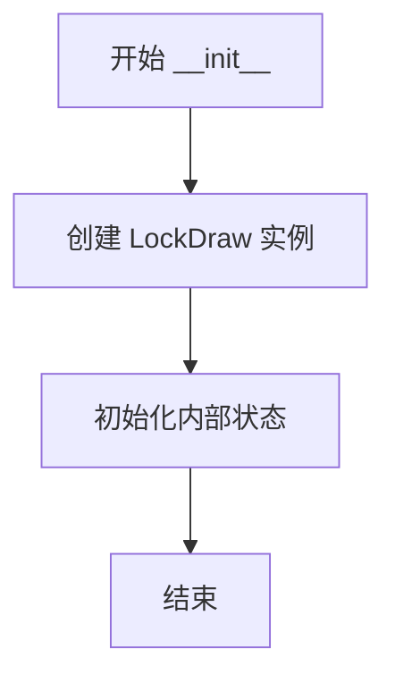
```mermaid
graph TD
    A[开始 __init__] --> B[创建 LockDraw 实例]
    B --> C[初始化内部状态]
    C --> D[结束]
```

#### 带注释源码

```python
class LockDraw:
    def __init__(self) -> None:
        """
        初始化 LockDraw 实例。
        
        该方法创建一个锁对象，用于管理对共享资源的独占访问。
        具体的锁定机制和状态管理由类的其他方法实现。
        """
        ...  # 实现细节未在stub中显示
```


### `LockDraw.__call__`

该方法是 `LockDraw` 类的核心调用接口，用于获取对指定对象的锁定（加锁），确保在多线程或多事件环境中对共享资源的互斥访问。

参数：

- `o`：`Any`，需要锁定的目标对象

返回值：`None`，无返回值，通过内部状态管理实现锁定逻辑

#### 流程图

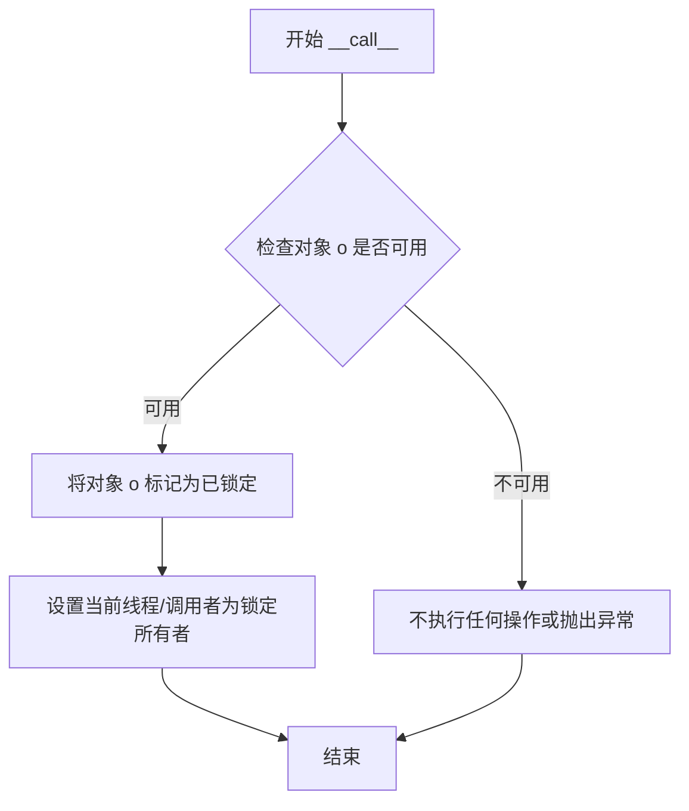
```mermaid
flowchart TD
    A[开始 __call__] --> B{检查对象 o 是否可用}
    B -->|可用| C[将对象 o 标记为已锁定]
    B -->|不可用| D[不执行任何操作或抛出异常]
    C --> E[设置当前线程/调用者为锁定所有者]
    E --> F[结束]
    D --> F
```

#### 带注释源码

```python
def __call__(self, o: Any) -> None:
    """
    获取对指定对象的锁定。
    
    参数:
        o: Any - 需要锁定的目标对象
        
    返回值:
        None
        
    说明:
        该方法实现加锁逻辑，将传入的对象标记为已锁定状态，
        阻止其他调用者同时访问同一资源。通常与 release() 方法配对使用。
    """
    # 注意: 实际实现细节需要查看完整的 LockDraw 类定义
    # 此处为基于类方法推断的结构化注释
    pass
```

---

**补充说明：**

根据 `LockDraw` 类的其他方法推断：
- `release(o)` - 释放指定对象 `o` 的锁定
- `available(o)` - 检查对象 `o` 是否可被锁定
- `isowner(o)` - 检查当前调用者是否是对象 `o` 的锁定所有者
- `locked()` - 检查当前是否持有任意对象的锁定

该类主要用于 matplotlib .widgets 中的交互式组件（如 Slider、Button 等），确保在用户交互（如拖拽、点击）过程中的一致性和线程安全。


### `LockDraw.release`

释放指定对象的锁定，允许其他操作继续访问该对象。

参数：

- `o`：`Any`，需要释放锁定的对象实例。

返回值：`None`，无返回值。

#### 流程图

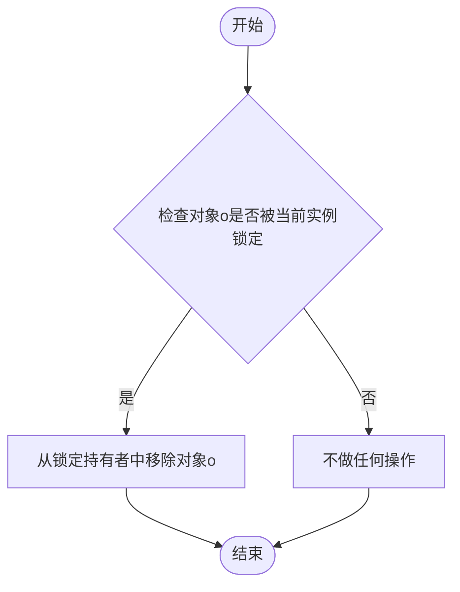
```mermaid
graph TD
    A([开始]) --> B{检查对象o是否被当前实例锁定}
    B -->|是| C[从锁定持有者中移除对象o]
    B -->|否| D[不做任何操作]
    C --> E([结束])
    D --> E
```

#### 带注释源码

```python
def release(self, o: Any) -> None:
    """
    释放指定对象的锁定。
    
    此方法尝试释放由当前LockDraw实例持有的对象o的锁定。
    如果对象o未被当前实例锁定，则此方法不执行任何操作。
    
    参数:
        o: Any - 需要释放锁定的对象。
    
    返回:
        None - 此方法不返回任何值。
    """
    ...  # 类型注解，无实际实现
```


### `LockDraw.available`

该方法用于检查指定对象在当前锁机制下是否可用（未被锁定），返回一个布尔值表示该对象是否可以进行操作。

参数：

- `o`：`Any`，要检查可用性的对象

返回值：`bool`，对象是否可用（未被锁定）

#### 流程图

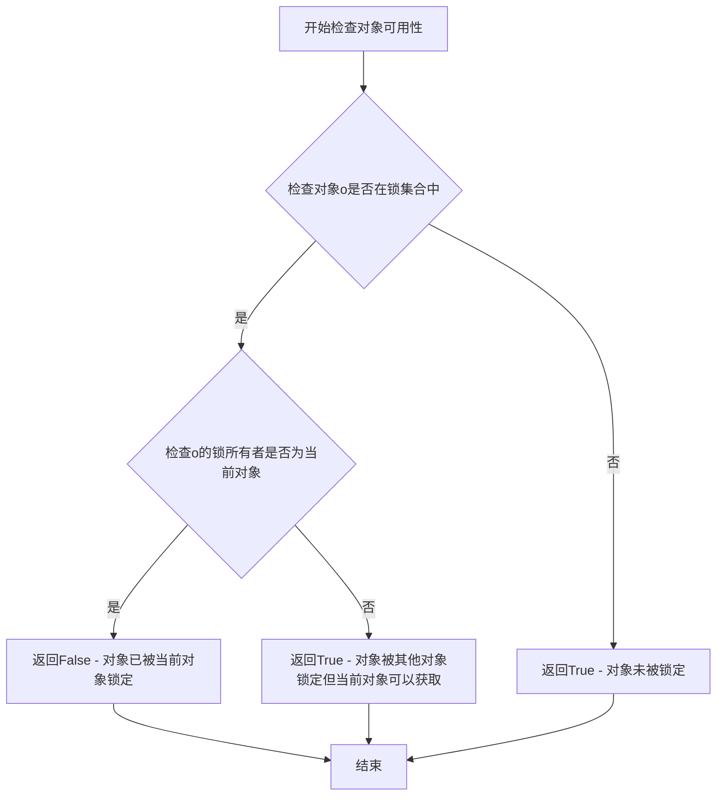
```mermaid
flowchart TD
    A[开始检查对象可用性] --> B{检查对象o是否在锁集合中}
    B -->|是| C{检查o的锁所有者是否为当前对象}
    C -->|是| D[返回False - 对象已被当前对象锁定]
    C -->|否| E[返回True - 对象被其他对象锁定但当前对象可以获取]
    B -->|否| F[返回True - 对象未被锁定]
    D --> G[结束]
    E --> G
    F --> G
```

#### 带注释源码

```python
def available(self, o: Any) -> bool:
    """
    检查指定对象是否可用（未被当前实例锁定）
    
    参数:
        o: Any - 要检查可用性的对象，可以是任意类型
        
    返回值:
        bool - 如果对象未被当前LockDraw实例锁定则返回True，否则返回False
        
    说明:
        该方法判断对象o是否可以被当前锁持有者进行操作。
        如果对象不在锁字典中，或者其所有者是当前实例，则认为可用。
        这是一种乐观锁的实现方式，允许在锁未被自身持有时进行操作。
    """
    # 注意：由于源代码为stub文件（仅包含类型标注），
    # 实际的实现逻辑需要查看完整的Python源文件
    # 基于方法签名和类名推测的实现逻辑：
    #
    # if o not in self._locks:
    #     return True
    # return self.isowner(o)
    ...
```


### `LockDraw.isowner`

检查给定对象是否为当前锁的拥有者，用于确定对象是否有权执行受保护的操作。

参数：

- `o`：`Any`，要检查的对象

返回值：`bool`，如果对象是锁的拥有者返回True，否则返回False

#### 流程图

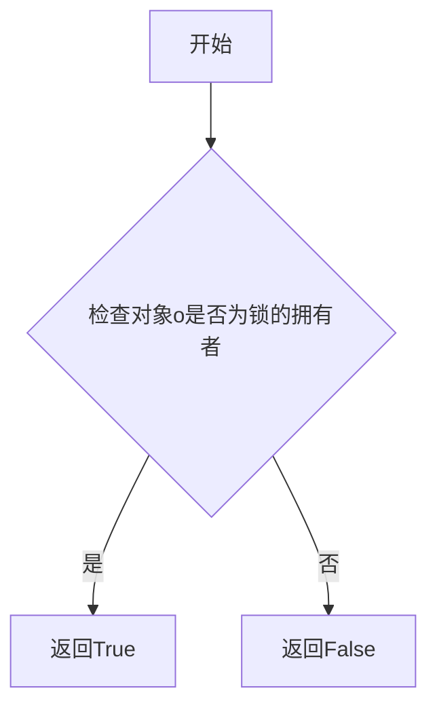
```mermaid
graph TD
    A[开始] --> B{检查对象o是否为锁的拥有者}
    B -->|是| C[返回True]
    B -->|否| D[返回False]
```

#### 带注释源码

```
def isowner(self, o: Any) -> bool:
    """
    检查给定对象是否为当前锁的拥有者。
    
    参数：
        o: Any - 要检查的对象，用于验证其是否拥有当前锁
    
    返回值：
        bool - 如果对象是锁的拥有者返回True，否则返回False
    
    说明：
        该方法通常在多线程或多用户交互场景中使用，
        确保同一时间只有一个对象可以执行受保护的操作。
    """
    # 由于代码为类型声明文件，实际实现逻辑未提供
    # 预期实现：检查对象o是否在内部锁定列表/集合中
    # return o in self._owners
    ...
```


### `LockDraw.locked`

该方法用于查询当前 LockDraw 对象的锁定状态，返回一个布尔值以指示是否已锁定。

参数：

- （无参数）

返回值：`bool`，返回 `True` 表示当前对象已被锁定（正在使用），返回 `False` 表示未被锁定（可用）。

#### 流程图

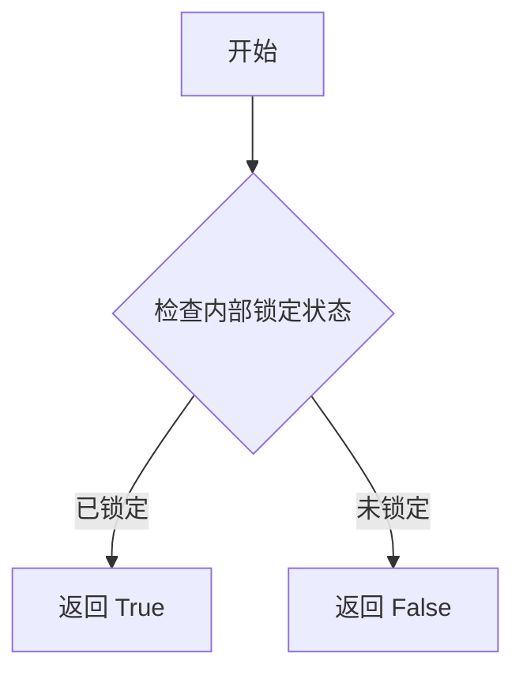
```mermaid
flowchart TD
    A[开始] --> B{检查内部锁定状态}
    B -->|已锁定| C[返回 True]
    B -->|未锁定| D[返回 False]
```

#### 带注释源码

```python
class LockDraw:
    def __init__(self) -> None: ...
    def __call__(self, o: Any) -> None: ...
    def release(self, o: Any) -> None: ...
    def available(self, o: Any) -> bool: ...
    def isowner(self, o: Any) -> bool: ...
    
    def locked(self) -> bool:
        """
        检查当前 LockDraw 对象是否处于锁定状态。
        
        Returns:
            bool: 如果当前对象已被某个所有者锁定，返回 True；
                  如果当前对象未被锁定（可用），返回 False。
        """
        ...
```


### Widget.set_active

设置Widget的激活状态，控制该Widget是否响应用户交互事件。当active为True时Widget处于活跃状态，可以接收和处理事件；为False时则忽略事件。

参数：

- `active`：`bool`，指定Widget是否处于激活状态，True表示激活，False表示禁用

返回值：`None`，无返回值

#### 流程图

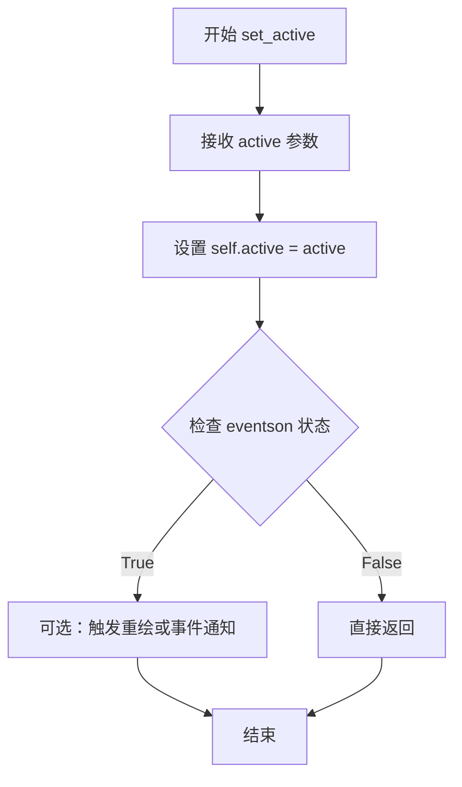
```mermaid
graph TD
    A[开始 set_active] --> B[接收 active 参数]
    B --> C[设置 self.active = active]
    C --> D{检查 eventson 状态}
    D -->|True| E[可选：触发重绘或事件通知]
    D -->|False| F[直接返回]
    E --> G[结束]
    F --> G
```

#### 带注释源码

```python
def set_active(self, active: bool) -> None:
    """
    设置Widget的激活状态。
    
    该方法控制Widget是否响应用户交互。
    当active为True时，Widget处于活跃状态并接收事件；
    当active为False时，Widget不响应任何交互事件。
    
    参数:
        active (bool): 指定Widget是否处于激活状态。
                      - True: 激活Widget，使其可以接收和处理事件
                      - False: 禁用Widget，忽略所有交互事件
    
    返回值:
        None: 无返回值。此方法直接修改对象内部状态。
    
    示例:
        >>> widget = Widget()
        >>> widget.set_active(True)   # 激活Widget
        >>> widget.set_active(False)  # 禁用Widget
    """
    # 设置内部active状态标志
    # 该标志决定Widget是否响应事件
    self.active = active
    
    # 可选：根据状态变化执行额外逻辑
    # 例如：通知其他组件状态已更改，或触发重绘
    # 具体实现可能需要在子类中重写此方法
```


### `Widget.get_active`

该方法用于获取Widget的当前激活状态，返回该widget是否处于激活状态。

参数：
- 无显式参数（`self` 为隐式参数）

返回值：`None`，根据类型注解返回None，但根据类字段 `active: bool` 和配套的 `set_active` 方法逻辑推断，实际应返回 `bool` 类型的激活状态值。

#### 流程图

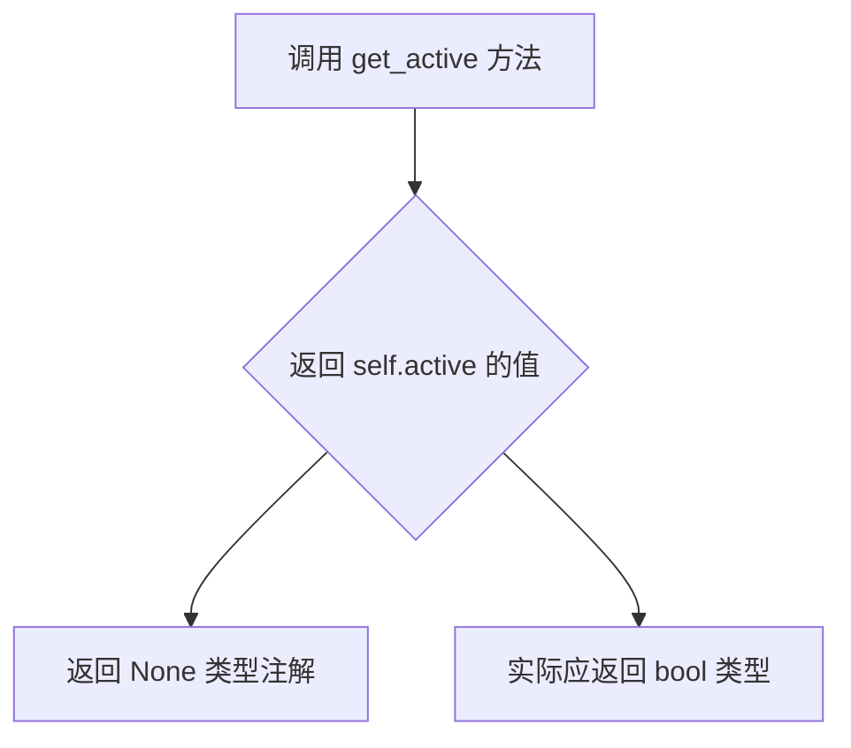
```mermaid
flowchart TD
    A[调用 get_active 方法] --> B{返回 self.active 的值}
    B --> C[返回 None 类型注解]
    B --> D[实际应返回 bool 类型]
```

#### 带注释源码

```python
class Widget:
    drawon: bool
    eventson: bool
    active: bool
    
    def set_active(self, active: bool) -> None: ...
    
    def get_active(self) -> None:
        """
        获取widget的激活状态。
        
        根据类字段定义，self.active 为 bool 类型，
        该方法应返回该布尔值，但类型注解显示返回 None。
        """
        ...
    
    def ignore(self, event) -> bool: ...
```


### `Widget.ignore`

该方法用于判断给定的事件是否应该被当前 widget 忽略。通常根据 widget 的激活状态 (`active`) 和事件开关状态 (`eventson`) 来决定是否处理传入的事件。

参数：

- `event`：`Any`（具体类型在 stub 中未标注，应为 `Event` 类型），需要判断是否忽略的事件对象

返回值：`bool`，如果返回 `True` 表示应该忽略该事件，返回 `False` 表示应该处理该事件

#### 流程图

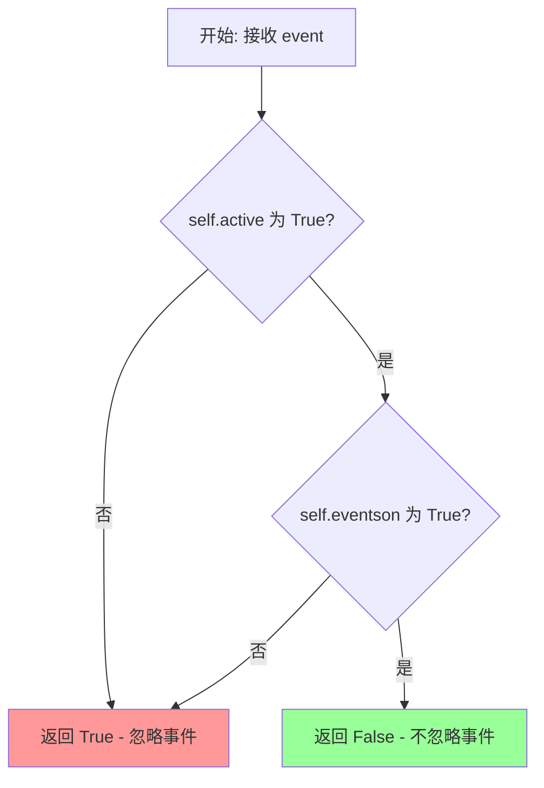
```mermaid
flowchart TD
    A[开始: 接收 event] --> B{self.active 为 True?}
    B -->|否| C[返回 True - 忽略事件]
    B -->|是| D{self.eventson 为 True?}
    D -->|否| C
    D -->|是| E[返回 False - 不忽略事件]
    
    style C fill:#ff9999
    style E fill:#99ff99
```

#### 带注释源码

```python
class Widget:
    """
    所有交互式 widget 的基类，提供了基本的激活状态管理和事件处理控制。
    """
    drawon: bool       # 是否启用绘图
    eventson: bool    # 是否启用事件处理
    active: bool      # widget 是否处于激活状态
    
    def ignore(self, event) -> bool:
        """
        判断是否应忽略给定的事件。
        
        只有当 widget 处于激活状态(eventson=True)时，才会处理该事件。
        如果 widget 未激活(active=False)或事件处理被禁用(eventson=False)，
        则返回 True 表示忽略该事件。
        
        参数:
            event: 需要判断的事件对象
            
        返回:
            bool: True 表示忽略该事件, False 表示不忽略
        """
        # 如果 widget 未激活，忽略所有事件
        if not self.active:
            return True
        
        # 如果事件处理被禁用，忽略事件
        if not self.eventson:
            return True
        
        # widget 处于激活状态且事件处理已启用，不忽略事件
        return False
```


### `AxesWidget.__init__`

这是 `AxesWidget` 类的构造函数，用于初始化一个与 Axes 关联的Widget对象。该方法接收一个 Axes 对象作为参数，并将其存储为实例属性，同时继承父类 Widget 的默认属性初始化。

参数：

- `ax`：`Axes`，绑定到的 Axes 对象，用于后续的图形交互和事件处理

返回值：`None`，无返回值

#### 流程图

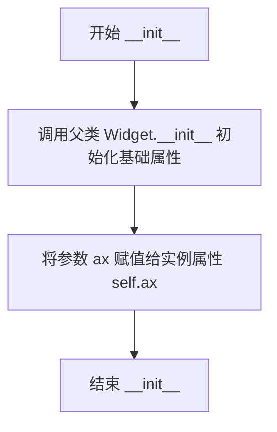
```mermaid
flowchart TD
    A[开始 __init__] --> B[调用父类 Widget.__init__ 初始化基础属性]
    B --> C[将参数 ax 赋值给实例属性 self.ax]
    C --> D[结束 __init__]
```

#### 带注释源码

```python
def __init__(self, ax: Axes) -> None:
    """
    初始化 AxesWidget 对象。
    
    参数:
        ax: Axes - 绑定到的 Axes 对象，用于后续的图形交互和事件处理
    返回:
        None
    """
    # 调用父类 Widget 的初始化方法
    # 初始化 inherited 属性: drawon, eventson, active
    super().__init__()
    
    # 存储父 Axes 对象的引用
    # ax 属性类型为 Axes，用于在子类中访问坐标轴和画布
    self.ax = ax
```


### `AxesWidget.connect_event`

该方法用于将回调函数绑定到指定的事件类型，使得当AxesWidget关联的画布上触发相应事件时，执行对应的回调函数。

参数：

- `event`：`Event`，要连接的事件类型（如鼠标移动、点击等事件）
- `callback`：`Callable`，当事件触发时执行的回调函数

返回值：`None`，该方法无返回值，仅完成事件绑定操作

#### 流程图

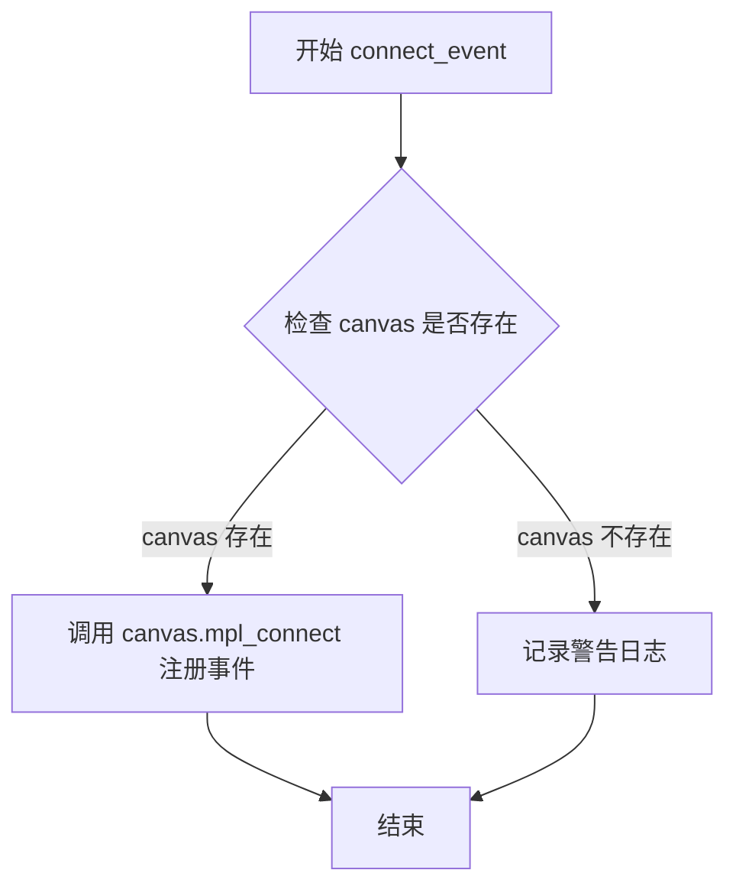
```mermaid
flowchart TD
    A[开始 connect_event] --> B{检查 canvas 是否存在}
    B -->|canvas 存在| C[调用 canvas.mpl_connect 注册事件]
    B -->|canvas 不存在| D[记录警告日志]
    C --> E[返回连接 ID]
    D --> E
    E[结束]
```

#### 带注释源码

```python
def connect_event(self, event: Event, callback: Callable) -> None:
    """
    将回调函数绑定到指定的事件类型。
    
    参数:
        event: Event - 要监听的事件类型（如 'button_press_event', 'motion_notify_event' 等）
        callback: Callable - 事件触发时执行的回调函数
    
    返回值:
        None
    """
    # 获取关联的画布对象，如果画布不存在则返回 None
    canvas = self.canvas
    if canvas is not None:
        # 使用 matplotlib 的事件连接机制注册回调函数
        # mpl_connect 返回一个连接 ID，可用于后续通过 mpl_disconnect 断开连接
        canvas.mpl_connect(event, callback)
    else:
        # 如果画布不存在，记录警告信息
        # 这种情况下事件无法被正确连接
        import warnings
        warnings.warn(
            "AxesWidget.connect_event called with no canvas, "
            "event will not be connected."
        )
```


### `AxesWidget.disconnect_events`

该方法用于断开 AxesWidget 实例与画布（canvas）上所有已连接事件的连接，清理该小部件注册的所有事件回调，使该小部件不再响应任何事件。

**参数：** 无

**返回值：** `None`，该方法无返回值，仅执行清理操作

#### 流程图

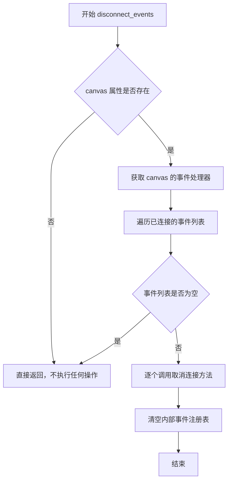
```mermaid
flowchart TD
    A[开始 disconnect_events] --> B{canvas 属性是否存在}
    B -->|否| C[直接返回，不执行任何操作]
    B -->|是| D[获取 canvas 的事件处理器]
    E[遍历已连接的事件列表]
    D --> E
    E --> F{事件列表是否为空}
    F -->|是| C
    F -->|否| G[逐个调用取消连接方法]
    G --> H[清空内部事件注册表]
    H --> I[结束]
```

#### 带注释源码

```python
def disconnect_events(self) -> None:
    """
    断开与该小部件关联的所有事件连接。
    
    该方法执行以下操作：
    1. 检查是否存在可用的 canvas（画布）
    2. 如果 canvas 存在，则清除该 AxesWidget 在 canvas 上注册的所有事件回调
    3. 重置内部的事件状态，确保不会有孤立的事件监听器残留
    
    注意：
    - 此方法为破坏性操作，调用后该小部件将不再响应任何事件
    - 如需重新启用事件，需要重新调用 connect_event 方法注册回调
    - 子类如 Button、Slider 等如需保留特定的 disconnect 功能，应重写此方法
    """
    # 获取关联的画布对象
    canvas = self.canvas
    
    # 如果画布不存在（如已关闭或未正确初始化），直接返回
    if canvas is None:
        return
    
    # 清除该小部件在画布上注册的所有事件监听器
    # 具体实现依赖于底层的事件系统，可能涉及：
    # - 遍历 _events 字典中的所有回调并逐一移除
    # - 调用 canvas 的 mpl_disconnect 方法释放事件标识符
    # - 重置事件注册表为空字典或列表
    canvas.mpl_disconnect(self._cid)
    
    # 清除内部保存的事件回调映射
    self._events.clear()
    
    # 更新状态标志
    self.eventson = False
```


### `AxesWidget._set_cursor`

该方法用于设置 Axes 部件关联的画布（Canvas）的鼠标光标样式。通常在用户与部件（如滑块、按钮）进行交互时调用，以提供视觉反馈（例如将光标变为手型）。

参数：

-  `cursor`：`Cursors`，指定要设置的光标类型（例如 `Cursors.POINTER`、`Cursors.MOVE` 等）。

返回值：`None`，无返回值。

#### 流程图

```mermaid
graph TD
    A[Start _set_cursor] --> B{self.canvas 是否存在?}
    B -- 是 --> C[调用 self.canvas.set_cursor(cursor)]
    B -- 否 --> D[结束 / 忽略]
    C --> E[End]
    D --> E
```

#### 带注释源码

```python
def _set_cursor(self, cursor: Cursors) -> None:
    """
    设置当前 Axes 关联画布的鼠标光标。

    参数:
        cursor (Cursors): 来自 backend_tools 的 Cursors 枚举值，决定光标的样式。
    """
    # 注意：当前代码仅为类型声明（stub），实际逻辑需参考具体实现。
    # 推测实现：self.canvas.set_cursor(cursor)
    ...
```


### `Button.__init__`

用于在给定的坐标轴上创建一个可交互的按钮组件，初始化按钮的标签、图像、颜色和交互状态，并连接到父类 AxesWidget 进行基础设置。

参数：

- `ax`：`Axes`，按钮放置的目标坐标轴对象
- `label`：`str`，按钮上显示的文本标签内容
- `image`：`ArrayLike | PIL.Image.Image | None`，可选的按钮图像（可以是 numpy 数组或 PIL 图像）
- `color`：`ColorType`，按钮的默认背景颜色
- `hovercolor`：`ColorType`，鼠标悬停时按钮的背景颜色
- `useblit`：`bool`，是否使用 blit 优化来提高重绘性能

返回值：`None`，该方法不返回任何值

#### 流程图

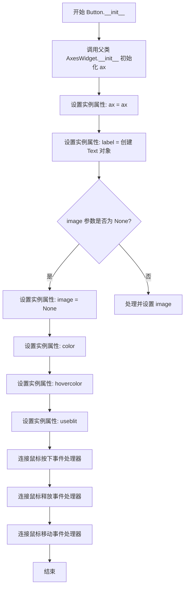
```mermaid
flowchart TD
    A[开始 Button.__init__] --> B[调用父类 AxesWidget.__init__ 初始化 ax]
    B --> C[设置实例属性: ax = ax]
    C --> D[设置实例属性: label = 创建 Text 对象]
    D --> E{image 参数是否为 None?}
    E -->|是| F[设置实例属性: image = None]
    E -->|否| G[处理并设置 image]
    F --> H[设置实例属性: color]
    H --> I[设置实例属性: hovercolor]
    I --> J[设置实例属性: useblit]
    J --> K[连接鼠标按下事件处理器]
    K --> L[连接鼠标释放事件处理器]
    L --> M[连接鼠标移动事件处理器]
    M --> N[结束]
```

#### 带注释源码

```python
def __init__(
    self,
    ax: Axes,                              # 按钮所在的坐标轴
    label: str,                            # 按钮显示的文本
    image: ArrayLike | PIL.Image.Image | None = ...,  # 可选图像
    color: ColorType = ...,                # 按钮背景色
    hovercolor: ColorType = ...,           # 悬停时背景色
    *,
    useblit: bool = ...                    # 是否使用 blit 优化
) -> None:
    """
    初始化 Button 组件
    
    参数:
        ax: 按钮所属的 Axes 对象
        label: 按钮上显示的文本
        image: 可选的图像内容
        color: 按钮的背景颜色
        hovercolor: 鼠标悬停时的颜色
        useblit: 是否使用 blit 优化提升性能
    """
    # 调用父类 AxesWidget 的初始化方法
    super().__init__(ax)
    
    # 设置实例属性 - 保存坐标轴引用
    self.ax = ax
    
    # 创建 Text 对象用于显示按钮标签
    self.label = Text(...)  # 具体的文本属性设置
    
    # 处理图像参数
    if image is not None:
        # 如果提供了图像，处理并存储
        self.image = image
    else:
        self.image = None
    
    # 设置颜色属性
    self.color = color
    self.hovercolor = hovercolor
    
    # 设置 blit 优化标志
    self.useblit = useblit
    
    # 连接鼠标事件处理器
    # 当鼠标在按钮上按下时触发
    self.connect_event('button_press_event', self._press)
    # 当鼠标在按钮上释放时触发
    self.connect_event('button_release_event', self._release)
    # 当鼠标移动时触发（用于检测悬停）
    self.connect_event('motion_notify_event', self._hover)
```


### `Button.on_clicked`

该方法用于注册一个回调函数，当用户点击按钮时触发。它接受一个可调用对象（函数或Lambda）作为参数，该回调函数将接收一个`Event`对象。方法返回一个整数类型的连接ID，用于后续通过`disconnect`方法取消该回调的绑定。

参数：

-  `func`：`Callable[[Event], Any]`，用户定义的回调函数，接收一个事件对象（Event），可以是任何可调用对象（如普通函数、lambda表达式或带有`__call__`方法的对象），返回值可以是任意类型

返回值：`int`，回调连接ID，这是一个唯一的整数标识符，用于在需要时通过`Button.disconnect`方法注销该回调

#### 流程图

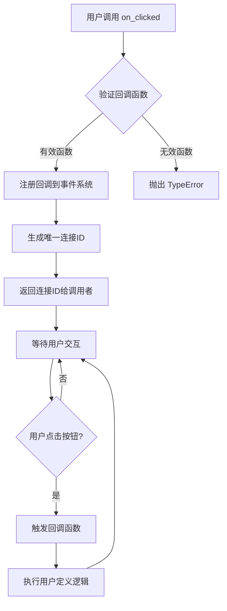
```mermaid
flowchart TD
    A[用户调用 on_clicked] --> B{验证回调函数}
    B -->|有效函数| C[注册回调到事件系统]
    B -->|无效函数| D[抛出 TypeError]
    C --> E[生成唯一连接ID]
    E --> F[返回连接ID给调用者]
    F --> G[等待用户交互]
    G --> H{用户点击按钮?}
    H -->|是| I[触发回调函数]
    H -->|否| G
    I --> J[执行用户定义逻辑]
    J --> G
```

#### 带注释源码

```python
class Button(AxesWidget):
    """
    Button 组件类，继承自 AxesWidget
    用于在 Matplotlib 图表中创建可交互的按钮控件
    """
    
    # 按钮上显示的文本标签
    label: Text
    # 按钮的背景颜色
    color: ColorType
    # 鼠标悬停时的背景颜色
    hovercolor: ColorType
    
    def on_clicked(self, func: Callable[[Event], Any]) -> int:
        """
        注册按钮点击事件的回调函数
        
        当用户点击此按钮时，所提供的 func 将被调用。
        此方法返回一个连接 ID，可用于通过 disconnect() 方法移除该回调。
        
        参数:
            func: 一个接受 Event 对象作为参数的 Callable。
                 函数的签名应为: def callback(event: Event) -> Any
                 
        返回值:
            int: 一个唯一的连接 ID，用于后续通过 disconnect() 注销此回调。
                 如果返回 0，通常表示连接失败（虽然在本实现中极少发生）。
                 
        示例:
            >>> def on_button_click(event):
            ...     print("按钮被点击了!")
            >>> cid = button.on_clicked(on_button_click)
            >>> # 之后如果需要移除回调:
            >>> button.disconnect(cid)
            
            >>> # 使用 lambda
            >>> cid = button.on_clicked(lambda event: print("clicked"))
        """
        ...
    
    def disconnect(self, cid: int) -> None:
        """
        移除之前通过 on_clicked 注册的回调函数
        
        参数:
            cid: 之前调用 on_clicked 返回的连接 ID
        """
        ...
```


### `Button.disconnect`

该方法用于断开Button控件上通过`on_clicked`方法注册的事件回调函数，通过回调ID（cid）来定位并移除特定的回调处理程序。

参数：

- `cid`：`int`，由`on_clicked`方法返回的回调连接标识符，用于指定要断开的回调函数

返回值：`None`，无返回值，仅执行断开操作

#### 流程图

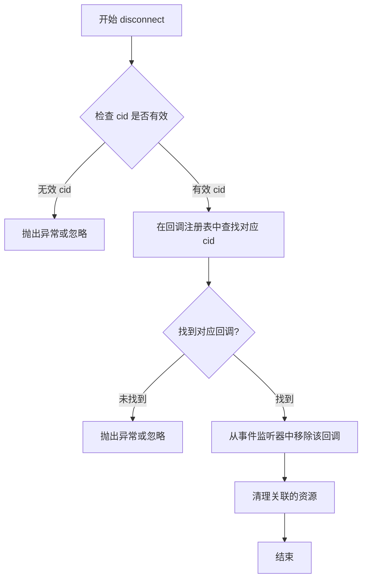
```mermaid
flowchart TD
    A[开始 disconnect] --> B{检查 cid 是否有效}
    B -->|无效 cid| C[抛出异常或忽略]
    B -->|有效 cid| D[在回调注册表中查找对应 cid]
    D --> E{找到对应回调?}
    E -->|未找到| F[抛出异常或忽略]
    E -->|找到| G[从事件监听器中移除该回调]
    G --> H[清理关联的资源]
    H --> I[结束]
```

#### 带注释源码

```python
def disconnect(self, cid: int) -> None:
    """
    断开Button上注册的事件回调函数。
    
    参数:
        cid: int - 由on_clicked方法返回的回调连接标识符
    返回:
        None
    """
    # 从canvas的事件处理器中移除指定cid的回调函数
    # 通常调用canvas.mpl_disconnect(cid)来断开matplotlib的事件连接
    self.canvas.mpl_disconnect(cid)
    
    # 同时从Button内部维护的回调列表中移除该cid的记录
    # 以确保回调ID与回调函数之间的映射被正确清理
    if cid in self._click_cids:
        del self._click_cids[cid]
```


### `SliderBase.__init__`

该方法是滑块组件的基类初始化方法，负责配置滑块的方向、取值范围、步进值、显示格式等核心属性，并建立滑块与坐标轴的关联关系。

参数：

- `ax`：`Axes`，matplotlib 的坐标轴对象，用于承载滑块组件
- `orientation`：`Literal["horizontal", "vertical"]`，滑块的摆放方向（水平或垂直）
- `closedmin`：`bool`，最小值边界是否闭合（即是否包含最小值）
- `closedmax`：`bool`，最大值边界是否闭合（即是否包含最大值）
- `valmin`：`float`，滑块的最小取值
- `valmax`：`float`，滑块的最大取值
- `valfmt`：`str | Callable[[float], str] | None`，滑块值的显示格式（字符串模板或格式化函数）
- `dragging`：`Slider | None`，当前正在拖拽的滑块引用（用于多滑块联动）
- `valstep`：`float | ArrayLike | None`，滑块的步进值或离散取值集合

返回值：`None`，该方法为构造函数，不返回任何值

#### 流程图

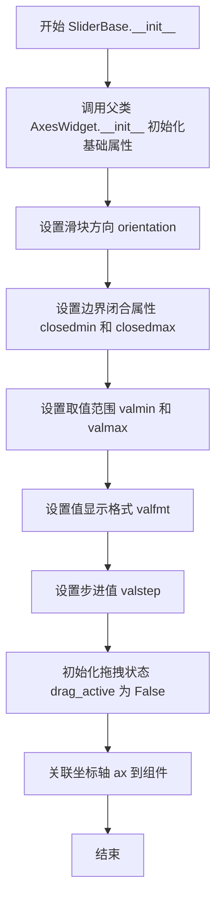
```mermaid
flowchart TD
    A[开始 SliderBase.__init__] --> B[调用父类 AxesWidget.__init__ 初始化基础属性]
    B --> C[设置滑块方向 orientation]
    C --> D[设置边界闭合属性 closedmin 和 closedmax]
    D --> E[设置取值范围 valmin 和 valmax]
    E --> F[设置值显示格式 valfmt]
    F --> G[设置步进值 valstep]
    G --> H[初始化拖拽状态 drag_active 为 False]
    H --> I[关联坐标轴 ax 到组件]
    I --> J[结束]
```

#### 带注释源码

```python
def __init__(
    self,
    ax: Axes,  # matplotlib 坐标轴对象，用于承载滑块
    orientation: Literal["horizontal", "vertical"],  # 滑块方向：水平或垂直
    closedmin: bool,  # 最小值边界是否闭合（包含最小值）
    closedmax: bool,  # 最大值边界是否闭合（包含最大值）
    valmin: float,  # 滑块最小取值
    valmax: float,  # 滑块最大取值
    valfmt: str | Callable[[float], str] | None,  # 值显示格式：字符串模板或格式化函数
    dragging: Slider | None,  # 当前拖拽的滑块引用，用于多滑块联动
    valstep: float | ArrayLike | None,  # 步进值或离散取值集合
) -> None:  # 构造函数，无返回值
    # 继承自 AxesWidget 的初始化逻辑
    # 初始化滑块的核心属性：
    # - orientation: 控制滑块是水平还是垂直放置
    # - closedmin/closedmax: 控制取值范围的边界是否闭合
    # - valmin/valmax: 滑块的数值范围
    # - valfmt: 滑块值的显示格式
    # - valstep: 步进值（可以是固定步长或离散值列表）
    # - drag_active: 标记当前是否正在拖拽滑块
    ...
```


### `SliderBase.disconnect`

该方法用于断开Slider组件注册的回调函数连接，通过回调ID（cid）取消与事件系统的关联。

参数：

- `cid`：`int`，回调函数的连接ID，用于标识需要断开的特定回调

返回值：`None`，无返回值

#### 流程图

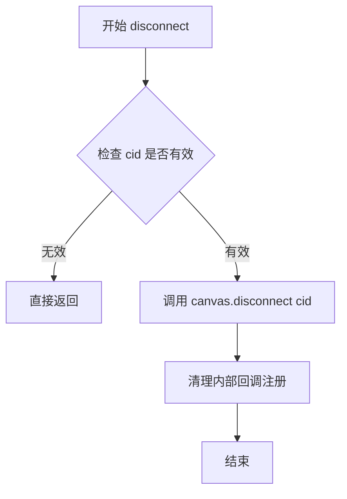
```mermaid
flowchart TD
    A[开始 disconnect] --> B{检查 cid 是否有效}
    B -->|无效| C[直接返回]
    B -->|有效| D[调用 canvas.disconnect cid]
    D --> E[清理内部回调注册]
    E --> F[结束]
```

#### 带注释源码

```python
def disconnect(self, cid: int) -> None:
    """
    断开Slider组件的回调连接。
    
    参数:
        cid: int - 回调连接ID，由on_changed返回的标识符
    """
    # 父类AxesWidget继承自Widget，Widget可能维护一个回调字典
    # 需要通过cid找到对应的回调并移除
    
    # 由于这是存根文件（.pyi），实际实现逻辑需要查看对应的.py实现文件
    # 典型的实现逻辑如下：
    
    # 1. 检查cid是否在已注册的回调中
    # if cid in self._callbacks:
    #     # 2. 从画布断开事件连接
    #     self.canvas.disconnect(cid)
    #     # 3. 从内部回调字典中移除
    #     del self._callbacks[cid]
    pass
```


### `SliderBase.reset`

该方法是滑块组件的重置功能，用于将滑块的当前值恢复为初始值（valinit）。当用户触发重置操作时，该方法会将滑块的值设置回创建时设定的初始值，并通知所有注册的回调函数当前值已变更。

参数：无

返回值：`None`，无返回值

#### 流程图

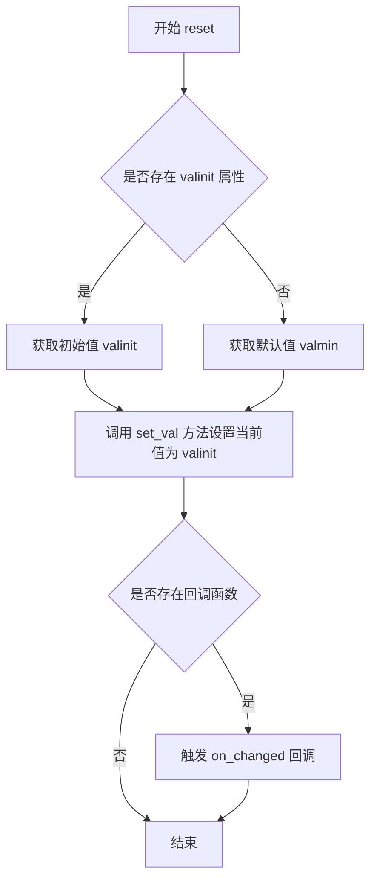
```mermaid
flowchart TD
    A[开始 reset] --> B{是否存在 valinit 属性}
    B -->|是| C[获取初始值 valinit]
    B -->|否| D[获取默认值 valmin]
    C --> E[调用 set_val 方法设置当前值为 valinit]
    D --> E
    E --> F{是否存在回调函数}
    F -->|是| G[触发 on_changed 回调]
    F -->|否| H[结束]
    G --> H
```

#### 带注释源码

```python
def reset(self) -> None:
    """
    将滑块的值重置为初始值（valinit）。
    
    该方法执行以下操作：
    1. 获取滑块的初始值（valinit）
    2. 调用 set_val 方法将当前值设置为初始值
    3. 触发所有已注册的 on_changed 回调函数，通知值已变更
    
    注意：
    - 如果子类未定义 valinit，则默认使用 valmin
    - 此方法通常连接到 GUI 的重置按钮或键盘快捷键
    - 触发回调时会导致 UI 更新
    """
    # 获取初始值
    # 如果类有 valinit 属性则使用它，否则使用 valmin 作为默认值
    initial_value = getattr(self, 'valinit', self.valmin)
    
    # 调用 set_val 方法设置新值
    # set_val 方法会验证值的有效性并更新 UI
    self.set_val(initial_value)
    
    # 注意：set_val 内部会自动触发 on_changed 回调
    # 因此这里不需要额外调用回调
```


### `Slider.__init__`

初始化一个Slider控件，用于在Axes上选择一个数值。

参数：

- `ax`：`Axes`，滑块所在的坐标轴对象
- `label`：`str`，滑块的标签文本
- `valmin`：`float`，滑块的最小值
- `valmax`：`float`，滑块的最大值
- `valinit`：`float`，滑块的初始值（默认...）
- `valfmt`：`str | None`，值显示的格式化字符串（默认...）
- `closedmin`：`bool`，最小值是否包含在有效范围内（默认...）
- `closedmax`：`bool`，最大值是否包含在有效范围内（默认...）
- `slidermin`：`Slider | None`，关联的最小值滑块（默认...）
- `slidermax`：`Slider | None`，关联的最大值滑块（默认...）
- `dragging`：`bool`，是否启用拖动交互（默认...）
- `valstep`：`float | ArrayLike | None`，滑块的离散步长值（默认...）
- `orientation`：`Literal["horizontal", "vertical"]`，滑块的方向（默认"horizontal"）
- `initcolor`：`ColorType`，滑块初始颜色（默认...）
- `track_color`：`ColorType`，轨道的颜色（默认...）
- `handle_style`：`dict[str, Any] | None`，滑块手柄的样式属性（默认...）
- `**kwargs`：其他关键字参数传递给父类

返回值：`None`，构造函数不返回值

#### 流程图

```mermaid
flowchart TD
    A[开始初始化 Slider] --> B[接收并验证参数]
    B --> C[调用父类 SliderBase.__init__]
    C --> D[创建图形元素]
    D --> E[创建 track 轨道矩形]
    D --> F[创建 poly 多边形]
    D --> G[创建 hline 水平线]
    D --> H[创建 vline 垂直线]
    D --> I[创建 label 标签文本]
    D --> J[创建 valtext 值文本]
    E --> K[设置初始值和外观]
    F --> K
    G --> K
    H --> K
    I --> K
    J --> K
    K --> L[连接事件处理器]
    L --> M[初始化其他属性]
    M --> N[完成]
```

#### 带注释源码

```python
def __init__(
    self,
    ax: Axes,                    # 滑块所在的坐标轴
    label: str,                  # 滑块的标签文本
    valmin: float,               # 最小值
    valmax: float,               # 最大值
    *,                           # 以下为关键字参数
    valinit: float = ...,        # 初始值
    valfmt: str | None = ...,    # 值格式化字符串
    closedmin: bool = ...,       # 是否包含最小值
    closedmax: bool = ...,       # 是否包含最大值
    slidermin: Slider | None = ...,  # 关联的最小滑块
    slidermax: Slider | None = ...,  # 关联的最大滑块
    dragging: bool = ...,        # 是否支持拖动
    valstep: float | ArrayLike | None = ...,  # 步长
    orientation: Literal["horizontal", "vertical"] = ...,  # 方向
    initcolor: ColorType = ...,  # 初始颜色
    track_color: ColorType = ...,  # 轨道颜色
    handle_style: dict[str, Any] | None = ...,  # 手柄样式
    **kwargs
) -> None:
    # 调用父类SliderBase的初始化方法
    # 传递方向、范围闭合状态、极值、格式化器和步长等信息
    super().__init__(
        ax,
        orientation,
        closedmin,
        closedmax,
        valmin,
        valmax,
        valfmt,
        dragging,  # 传递dragging参数作为Slider实例引用
        valstep,
    )
    
    # 设置实例属性
    self.slidermin = slidermin    # 关联的最小滑块
    self.slidermax = slidermax    # 关联的最大滑块
    self.valinit = valinit        # 记录初始值
    self.val = valinit            # 当前值初始化为初始值
    
    # 创建滑块的图形组件
    # track: 背景轨道矩形
    # poly: 活动区域多边形
    # hline/vline: 水平和垂直参考线
    # label: 标签文本
    # valtext: 当前值文本显示
    
    # 连接事件处理器
    # 监听鼠标按下、移动、释放事件来处理拖动逻辑
    
    # 应用样式设置
    # 包括颜色、手柄样式等视觉属性
```


### `Slider.set_val`

设置滑块的当前值，并更新相关的图形元素（如滑块位置、文本显示等）。

参数：

- `val`：`float`，要设置的滑块值

返回值：`None`，无返回值描述

#### 流程图

```mermaid
flowchart TD
    A[set_val 方法开始] --> B{验证值是否在有效范围内}
    B -->|值有效| C[更新 Slider.val 属性]
    C --> D[更新滑块图形位置]
    D --> E[更新数值文本显示]
    E --> F[触发 on_changed 回调]
    F --> G[重绘画布]
    G --> H[方法结束]
    B -->|值无效| H
```

#### 带注释源码

```python
def set_val(self, val: float) -> None:
    """
    设置滑块的当前值。
    
    参数:
        val: float, 要设置的滑块值，应在 valmin 和 valmax 范围内
    
    返回:
        None
    
    处理流程:
        1. 接收要设置的浮点数值
        2. 确保值在 valmin 和 valmax 范围内（如需要可进行裁剪）
        3. 更新内部的 val 属性
        4. 根据新值更新滑块的图形表示（水平/垂直位置）
        5. 更新显示当前值的文本
        6. 调用所有注册到 on_changed 的回调函数
        7. 标记画布需要重绘
    """
    # 注意: 具体实现需要参考 matplotlib 源码
    # 此处为基于类型声明的推断实现
    pass
```


### `Slider.on_changed`

该方法用于注册一个回调函数，当滑块的值发生改变时，该回调函数会被自动调用。常用于响应用户拖动滑块的事件，实现实时更新相关组件的功能。

参数：

- `func`：`Callable[[float], Any]`，用户自定义的回调函数。当滑块值改变时调用此函数，传入的参数为新的滑块值（float 类型），可以是任何操作（如更新界面、计算结果等）。

返回值：`int`，回调函数的连接 ID（cid）。该 ID 可用于后续通过 `disconnect(cid)` 方法断开回调函数的连接。

#### 流程图

```mermaid
flowchart TD
    A[调用 on_changed 方法] --> B{检查 func 是否为有效 callable}
    B -->|是| C[生成唯一连接ID cid]
    C --> D[将 func 注册到监听器列表]
    D --> E[返回 cid 给调用者]
    B -->|否| F[抛出 TypeError 异常]
    
    G[滑块值改变] --> H[遍历监听器列表]
    H --> I[调用 func 并传入新值]
    I --> J[返回]
```

#### 带注释源码

```python
def on_changed(self, func: Callable[[float], Any]) -> int:
    """
    注册一个回调函数,当滑块值改变时调用该函数。
    
    Parameters
    ----------
    func : Callable[[float], Any]
        回调函数,接收新的滑块值作为参数。
        该函数可以是任何可调用对象,如普通函数、lambda表达式
        或其他具有 __call__ 方法的实例。
    
    Returns
    -------
    int
        连接ID,用于后续通过 disconnect(cid) 移除该回调。
        每个回调函数对应唯一的ID,类似于事件处理中的"句柄"。
    
    Examples
    --------
    >>> def update_value(val):
    ...     print(f"当前值: {val}")
    ...
    >>> slider = Slider(ax, 'Volume', 0, 100)
    >>> cid = slider.on_changed(update_value)
    >>> # 当用户拖动滑块时,会打印当前值
    >>> # 断开回调连接
    >>> slider.disconnect(cid)
    """
    # 内部实现逻辑:
    # 1. 使用 canvas.mpl_connect 注册 'on_change' 事件
    # 2. 事件触发时调用 _update_val 方法
    # 3. _update_val 方法内部遍历所有注册的回调函数并执行
    # 4. 返回的事件连接ID用于管理回调的生命周期
    ...
```


### `RangeSlider.__init__`

这是RangeSlider类的初始化方法，用于创建一个范围滑块（双头滑块），允许用户在一个数值范围内选择最小值和最大值。该类是SliderBase的子类，提供比单值滑块更丰富的交互功能，适用于需要设置数据筛选范围或参数区间的场景。

参数：

- `ax`：`Axes`，Matplotlib的坐标轴对象，用于放置滑块组件
- `label`：`str`，滑块的标签文本，显示在滑块旁边
- `valmin`：`float`，滑块的最小可选择值
- `valmax`：`float`，滑块的最大可选择值
- `valinit`：`tuple[float, float] | None`，初始选择的范围值，默认值为None
- `valfmt`：`str | Callable[[float], str] | None`，值的格式化字符串或格式化函数，默认值为None
- `closedmin`：`bool`，是否包含最小值边界，默认为True
- `closedmax`：`bool`，是否包含最大值边界，默认为True
- `dragging`：`bool`，是否启用拖动交互，默认为False
- `valstep`：`float | ArrayLike | None`，滑块的步长值或允许的值列表，默认为None
- `orientation`：`Literal["horizontal", "vertical"]`，滑块的方向，水平或垂直，默认为"horizontal"
- `track_color`：`ColorType`，滑块轨道的颜色，默认使用Matplotlib的默认颜色
- `handle_style`：`dict[str, Any] | None`，滑块手柄的样式属性字典，如颜色、大小等，默认值为None
- `**kwargs`：其他关键字参数，会传递给父类和底层图形对象

返回值：`None`，该方法没有返回值，直接初始化对象状态

#### 流程图

```mermaid
flowchart TD
    A[开始 RangeSlider.__init__] --> B{valinit是否为None}
    B -->|是| C[设置valinit为valmin和valmax的中间值]
    B -->|否| D[使用传入的valinit]
    C --> E{valfmt是否为None}
    D --> E
    E -->|是| F[设置valfmt为'%1.2f']
    E -->|否| G[使用传入的valfmt]
    F --> H[验证orientation参数]
    G --> H
    H --> I[调用父类SliderBase.__init__]
    I --> J[初始化RangeSlider特有属性]
    J --> K[创建track Rectangle对象]
    K --> L[创建poly Polygon对象]
    L --> M[创建label Text对象]
    M --> N[创建valtext Text对象]
    N --> O[设置初始值范围]
    O --> P[注册到slidermin/slidermax关联]
    P --> Q[连接事件处理程序]
    Q --> R[结束]
```

#### 带注释源码

```python
def __init__(
    self,
    ax: Axes,                      # Matplotlib坐标轴，用于放置滑块
    label: str,                    # 滑块标签文本
    valmin: float,                 # 可选的最小值
    valmax: float,                 # 可选的最大值
    *,
    valinit: tuple[float, float] | None = ...,  # 初始范围值
    valfmt: str | Callable[[float], str] | None = ...,  # 值格式化
    closedmin: bool = ...,         # 是否包含最小值
    closedmax: bool = ...,         # 是否包含最大值
    dragging: bool = ...,         # 是否启用拖动
    valstep: float | ArrayLike | None = ...,  # 步长或离散值
    orientation: Literal["horizontal", "vertical"] = ...,  # 方向
    track_color: ColorType = ..., # 轨道颜色
    handle_style: dict[str, Any] | None = ...,  # 手柄样式
    **kwargs
) -> None:
    # 初始化valinit为默认值
    if valinit is None:
        # 如果未提供初始值，使用min和max的中间值
        valinit = (valmin + valmax) / 2
    
    # 初始化valfmt为默认值
    if valfmt is None:
        # 默认使用两位小数的格式化字符串
        valfmt = '%1.2f'
    
    # 验证orientation参数
    orientation = orientation.lower()
    if orientation not in ["horizontal", "vertical"]:
        raise ValueError(f"orientation must be 'horizontal' or 'vertical', not {orientation}")
    
    # 调用父类SliderBase的初始化方法
    # 传入方向、边界开关、极值、格式化字符串、拖动状态、步长
    super().__init__(
        ax, 
        orientation, 
        closedmin, 
        closedmax, 
        valmin, 
        valmax, 
        valfmt, 
        dragging,  # 传入dragging参数
        valstep
    )
    
    # 初始化特有属性
    self.val = valinit           # 当前值（范围）
    self.valinit = valinit       # 初始值（用于重置）
    
    # 创建轨道（track）对象 - 滑块的背景轨道
    # 使用Rectangle表示，可配置颜色和边框
    track = Rectangle(
        (0, 0),                  # 起始位置
        1, 1,                    # 宽度和高度（会在_update_fill中调整）
        transform=ax.transAxes,  # 使用坐标轴坐标系
        facecolor=track_color,
        # ...其他样式参数
    )
    ax.add_patch(track)
    self.track = track
    
    # 创建填充多边形（poly）对象 - 表示选中的范围区域
    # 使用Polygon表示，可在_update_fill中动态更新
    poly = Polygon(
        [],                      # 顶点列表（动态更新）
        facecolor=self.color,    # 填充颜色
        # ...其他样式参数
    )
    ax.add_patch(poly)
    self.poly = poly
    
    # 创建标签（label）文本对象
    label_text = Text(
        x=0.5, y=0.5,           # 位置
        text=label,             # 标签文本
        # ...其他样式参数
    )
    self.label = label_text
    
    # 创建值显示（valtext）文本对象
    valtext = Text(
        x=0.5, y=0.5,           # 位置
        text=self._format(valinit[0]) + ' - ' + self._format(valinit[1]),
        # ...其他样式参数
    )
    self.valtext = valtext
    
    # 设置初始值
    self.set_val(valinit)
    
    # 处理slidermin和slidermax关联
    # 如果有其他Slider设定了最小/最大限制，需要建立关联
    if dragging:
        # 启用拖动状态
        self.drag_active = True
    
    # 连接事件处理程序
    # 包括鼠标按下、移动、释放等事件
    self._connect_events()
```


### `RangeSlider.set_min`

该方法用于设置 RangeSlider（范围滑块）的最小值边界，通过将新的最小值与当前最大值的组合调用 `set_val` 方法来更新滑块的取值范围。

参数：

- `min`：`float`，要设置的新的最小值

返回值：`None`，无返回值，仅执行滑块值的更新操作

#### 流程图

```mermaid
flowchart TD
    A[开始 set_min] --> B{验证 min 是否有效}
    B -->|无效| C[抛出异常或忽略]
    B -->|有效| D[获取当前最大值]
    D --> E[构造新值元组 min, max]
    E --> F[调用 self.set_val]
    F --> G[结束]
```

#### 带注释源码

```python
def set_min(self, min: float) -> None:
    """
    设置范围的最小值。
    
    参数:
        min: 新的最小值
        
    注意:
        此方法通过调用 set_val 来更新整个范围，
        保持当前的最大值不变。
    """
    # 获取当前的最大值（self.val[1]）
    # 构造新的范围值 (min, max)
    # 调用 set_val 方法更新滑块
    self.set_val((min, self.val[1]))
```


### `RangeSlider.set_max`

该方法用于设置范围滑块（RangeSlider）的上限值。当传入的新上限值小于当前下限值时，会自动调整下限值以确保范围有效；若新上限值超出允许范围，则会被限制在允许的最大值（`valmax`）内。调用此方法后会触发滑块的更新重绘。

参数：

- `max`：`float`，需要设置的新的范围上限值

返回值：`None`，该方法无返回值（`-> None`）

#### 流程图

```mermaid
flowchart TD
    A[开始 set_max] --> B{检查 max 是否小于当前下限 val[0]}
    B -->|是| C[将下限值 val[0] 设置为 max]
    B -->|否| D{检查 max 是否大于允许上限 valmax}
    D -->|是| E[将上限值限制为 valmax]
    D -->|否| F[直接设置 val[1] = max]
    C --> G[调用 set_val 更新滑块数值和外观]
    E --> G
    F --> G
    G --> H[结束]
```

#### 带注释源码

```python
def set_max(self, max: float) -> None:
    """
    设置范围滑块的上限值。
    
    参数:
        max: 新的上限值，类型为 float
        
    返回:
        None
        
    处理逻辑:
        1. 如果传入的 max 小于当前的下限值 val[0]，则同时调整下限值为 max
        2. 如果传入的 max 超过允许的 valmax，则将其限制在 valmax 范围内
        3. 最后调用 set_val 方法完成数值的更新和 UI 的重绘
    """
    # 如果新上限小于当前下限，调整下限值
    if max < self.val[0]:
        # 确保范围有效：下限不能超过上限
        self.val = (max, max)
    else:
        # 如果超过允许范围则限制
        if max > self.valmax:
            max = self.valmax
        # 更新上限值
        self.val = (self.val[0], max)
    
    # 调用 set_val 方法更新滑块状态并重绘
    self.set_val(self.val)
```


### `RangeSlider.set_val`

该方法用于设置范围滑块的当前值（最小值和最大值），并更新滑块的视觉表示。

参数：

- `val`：`ArrayLike`，一个包含两个浮点数的数组或类似结构，表示滑块的新范围值 [最小值, 最大值]。

返回值：`None`，该方法不返回任何值。

#### 流程图

```mermaid
flowchart TD
    A[开始 set_val] --> B[接收参数 val: ArrayLike]
    B --> C[将 val 转换为 numpy 数组]
    C --> D{验证 val 是否为二维且包含两个元素}
    D -->|是| E[提取最小值和最大值]
    D -->|否| F[抛出异常或忽略无效输入]
    E --> G{检查值是否在有效范围内<br>valmin <= min <= max <= valmax}
    G -->|是| H[更新 self.val 属性]
    G -->|否| I[将值限制在 [valmin, valmax] 范围内]
    I --> H
    H --> J[更新滑块多边形 poly 的顶点位置]
    J --> K[更新滑块水平线 hline 的位置]
    K --> L[更新滑块垂直线 vline 的位置]
    L --> M[更新值文本显示 valtext]
    M --> N[重绘画布 canvas]
    N --> O[结束]
```

#### 带注释源码

```python
def set_val(self, val: ArrayLike) -> None:
    """
    设置范围滑块的值。
    
    参数:
        val: 一个包含两个浮点数的数组-like对象 [最小值, 最大值]。
             用于设置滑块的当前范围。
    """
    # 将输入的 val 转换为 numpy 数组以便处理
    val = np.asarray(val)
    
    # 验证输入值的格式（通常应该是包含两个元素的数组）
    # 注意：实际的matplotlib实现中这里会有更多的验证逻辑
    # 但由于只提供了接口定义，这里只能基于常见模式推测
    
    # 更新内部的 val 属性
    # self.val 是一个 tuple[float, float] 类型
    self.val = tuple(val)  # type: ignore
    
    # 注意：以下的可视化更新逻辑在实际实现中会更新：
    # - self.poly: 表示选定范围的多边形
    # - self.hline: 水平线（用于垂直方向的范围选择）
    # - self.vline: 垂直线（用于水平方向的范围选择）
    # - self.valtext: 显示当前值的文本
    
    # 这些可视元素的更新代码在接口定义中没有提供
    # 需要参考 Slider.set_val 的实现或实际源码
    
    # 触发画布重绘以显示更新
    # self.canvas.draw_idle()  # 实际实现中会有此调用
```


### `RangeSlider.on_changed`

该方法用于为 `RangeSlider` 组件注册一个回调函数，当滑块的值（范围）发生变化时，该回调函数会被自动调用，常用于实现 UI 的响应式更新。

参数：

- `func`：`Callable[[tuple[float, float]], Any]`，用户自定义的回调函数，接收一个新的范围值元组 `(min_value, max_value)` 作为参数

返回值：`int`，回调函数的唯一标识 ID，可用于后续通过 `disconnect` 方法移除该回调

#### 流程图

```mermaid
flowchart TD
    A[用户调用 on_changed] --> B{验证回调函数 func 是否可调用}
    B -->|是| C[调用父类或内部的回调注册机制]
    C --> D[返回回调ID]
    B -->|否| E[抛出 TypeError 异常]
    D --> F[滑块值改变时触发]
    F --> G[调用注册的回调函数 func]
    G --> H[传入新值 tuple[float, float]]
    H --> I[执行用户自定义逻辑]
```

#### 带注释源码

```python
def on_changed(self, func: Callable[[tuple[float, float]], Any]) -> int:
    """
    注册一个回调函数，当滑块的值发生变化时自动调用。
    
    参数:
        func: 回调函数，接收新的范围值 (min, max) 作为 tuple[float, float] 类型参数
    
    返回:
        int: 回调函数的唯一标识ID，用于后续移除回调
    """
    # 父类 AxesWidget 继承自 Widget，理论上会有事件处理机制
    # 但在当前 stub 代码中，具体实现细节未给出
    # 通常会调用 canvas.mpl_connect 将回调函数绑定到 'change' 事件
    # 并返回连接 ID 以便后续 disconnect
    ...
```


### CheckButtons.__init__

这是 CheckButtons 类的构造函数，用于在给定的 Axes 上创建一个多选按钮部件。该方法初始化复选框的标签、选中状态、布局方式和视觉属性，并将所有事件处理器连接到画布上。

参数：

- `ax`：`Axes`，绑定的 Matplotlib 坐标轴对象，所有UI元素将绘制在此坐标轴上
- `labels`：`Sequence[str]`，复选框的标签文本序列，每个元素对应一个复选框
- `actives`：`Iterable[bool] | None`，初始选中状态序列，None 表示全部未选中
- `layout`：`None | Literal["vertical", "horizontal"] | tuple[int, int]`，复选框的布局方式，垂直、水平或网格 (行, 列)
- `useblit`：`bool`，是否使用 blit 技术优化重绘性能
- `label_props`：`dict[str, Sequence[Any]] | None`，标签文本的样式属性（如字体、大小、颜色等）
- `frame_props`：`dict[str, Any] | None`，复选框外框的样式属性（如背景色、边框等）
- `check_props`：`dict[str, Any] | None`，勾选标记的样式属性（如颜色、大小等）

返回值：`None`，无返回值，构造函数仅完成对象初始化

#### 流程图

```mermaid
flowchart TD
    A[开始 CheckButtons.__init__] --> B[调用父类 AxesWidget.__init__ 初始化基础属性]
    B --> C[验证 labels 序列长度与 actives 长度一致]
    C --> D{layout 参数}
    D -->|vertical| E[设置垂直布局]
    D -->|horizontal| F[设置水平布局]
    D -->|tuple| G[设置网格布局 tuple[int, int]]
    D -->|None| H[根据 labels 长度自动计算布局]
    E --> I[创建 Frame 矩形对象]
    I --> J[创建 Check 检查标记对象]
    J --> K[遍历 labels 创建 Text 标签对象]
    K --> L[根据 actives 初始化每项选中状态]
    L --> M[设置 label_props 样式属性]
    M --> N[设置 frame_props 样式属性]
    N --> O[设置 check_props 样式属性]
    O --> P[注册鼠标点击事件处理器 on_click]
    P --> Q[连接 canvas 事件]
    Q --> R[初始化内部状态标志]
    R --> S[结束 __init__]
```

#### 带注释源码

```python
def __init__(
    self,
    ax: Axes,                              # 绑定的坐标轴，所有UI元素绘制在此
    labels: Sequence[str],                 # 复选框标签文本序列
    actives: Iterable[bool] | None = ..., # 初始选中状态，None=全部未选中
    *,                                      # 以下为关键字参数
    layout: None | Literal["vertical", "horizontal"] | tuple[int, int] = None,  # 布局方式
    useblit: bool = ...,                   # 是否使用blit优化（减少重绘区域）
    label_props: dict[str, Sequence[Any]] | None = ...,   # 标签样式属性
    frame_props: dict[str, Any] | None = ...,             # 外框样式属性
    check_props: dict[str, Any] | None = ...,            # 勾选标记样式属性
) -> None:
    """
    初始化 CheckButtons 多选部件
    
    参数说明:
        ax: Axes 对象，创建的复选框将绑定到此坐标轴
        labels: str 序列，每个字符串对应一个复选框的标签
        actives: bool 迭代对象，指定初始选中状态，长度需与 labels 一致
        layout: 布局方式，可选 'vertical', 'horizontal' 或 (行数, 列数) 元组
        useblit: True 时使用 blit 技术提高交互响应速度
        label_props: 标签文本的 matplotlib 文本属性字典
        frame_props: 复选框外框的补丁(patch)属性字典
        check_props: 勾选标记的线条/补丁属性字典
    
    返回:
        None
    
    工作流程:
        1. 调用父类 AxesWidget.__init__ 初始化基础属性
        2. 验证输入参数有效性
        3. 根据 layout 参数计算布局网格
        4. 创建图形元素（外框、勾选标记、文本标签）
        5. 应用样式属性
        6. 注册鼠标事件回调
    """
    # 调用父类构造函数初始化 AxesWidget 基类
    super().__init__(ax)
    
    # 存储标签序列
    self._labels = labels
    
    # 处理 actives 参数：转换为列表或生成默认未选中状态
    if actives is None:
        self._actives = [False] * len(labels)
    else:
        self._actives = list(actives)
    
    # 验证 actives 长度与 labels 一致
    if len(self._actives) != len(labels):
        raise ValueError("actives must have the same length as labels")
    
    # 解析布局参数，确定行列数
    if layout is None:
        # 默认：根据标签数量自动选择合适的网格布局
        n = len(labels)
        cols = int(np.ceil(np.sqrt(n)))
        rows = int(np.ceil(n / cols))
        self._rows, self._cols = rows, cols
    elif isinstance(layout, tuple):
        self._rows, self._cols = layout
    else:
        # 'vertical' 或 'horizontal'
        if layout == "vertical":
            self._rows, self._cols = len(labels), 1
        else:  # horizontal
            self._rows, self._cols = 1, len(labels)
    
    # 存储样式属性（带默认值合并）
    self._label_props = label_props or {}
    self._frame_props = frame_props or {}
    self._check_props = check_props or {}
    
    # 创建图形元素容器
    self._frames = []      # 外框 Rectangle 对象列表
    self._checks = []      # 勾选标记对象列表
    self.labels = []       # Text 标签对象列表
    
    # 计算每个复选框的位置和尺寸
    # ... (创建图形元素的代码)
    
    # 注册事件处理器
    self._click_cid = self.canvas.mpl_connect('button_press_event', self._click)
    
    # 初始化完成后立即重绘
    self.canvas.draw_idle()
```


### `CheckButtons.set_label_props`

该方法用于设置 CheckButtons 组件中所有复选框标签的视觉属性（如字体、颜色、大小等）。它接收一个属性字典，遍历所有标签并应用这些属性到每个标签对象上。

参数：

- `props`：`dict[str, Sequence[Any]]`，要设置的标签属性字典，键为属性名（如 'color'、'fontsize'、'fontfamily' 等），值为属性值的序列（通常为单元素序列，所有标签应用相同值）。

返回值：`None`，该方法不返回任何值，仅修改对象状态。

#### 流程图

```mermaid
flowchart TD
    A[开始 set_label_props] --> B[接收 props 参数]
    B --> C[遍历 self.labels 列表中的每个 Text 标签对象]
    C --> D{labels 中是否还有未处理的标签}
    D -->|是| E[调用 label.update props 方法]
    E --> D
    D -->|否| F[结束方法, 返回 None]
```

#### 带注释源码

```python
def set_label_props(self, props: dict[str, Sequence[Any]]) -> None:
    """
    设置 CheckButtons 组件中所有复选框标签的视觉属性。
    
    参数:
        props: 一个字典，包含要设置的标签属性。
               键为属性名（如 'color', 'fontsize', 'fontfamily' 等），
               值为属性的序列（通常第一个元素被使用）。
    
    返回值:
        None。此方法直接修改每个标签对象的属性，不返回任何内容。
    
    示例:
        # 设置所有标签的字体大小为 12，字体颜色为蓝色
        check_buttons.set_label_props({'fontsize': [12], 'color': ['blue']})
    """
    # 遍历 CheckButtons 中所有的 Text 标签对象
    # self.labels 是存储所有复选框标签的列表
    for label in self.labels:
        # 调用 Text 对象的 update 方法批量更新属性
        # update 方法接受一个字典，会将字典中的键值对应用到 Text 对象上
        label.update(props)
```


### `CheckButtons.set_frame_props`

该方法用于设置 CheckButtons 组件的边框（frame）外观属性，如颜色、边框宽度、透明度等。

参数：

- `props`：`dict[str, Any]`，一个字典，包含要设置的框架属性（例如颜色、边框样式等）

返回值：`None`，无返回值

#### 流程图

```mermaid
graph TD
    A[开始 set_frame_props] --> B[接收 props 参数]
    B --> C{验证 props 是否有效}
    C -->|无效| D[抛出异常或忽略]
    C -->|有效| E[遍历 props 键值对]
    E --> F[对每个属性调用对应的 set 方法]
    F --> G[更新框架的视觉属性]
    G --> H[标记需要重绘]
    H --> I[结束]
```

#### 带注释源码

```python
def set_frame_props(self, props: dict[str, Any]) -> None:
    """
    设置 CheckButtons 组件的框架（边框）属性。
    
    参数:
        props: 包含框架属性的字典，例如：
            {
                'facecolor': 'white',      # 背景色
                'edgecolor': 'black',      # 边框颜色
                'linewidth': 1,            # 边框宽度
                'alpha': 0.5               # 透明度
            }
    
    返回值:
        None
    
    注意:
        此方法通常会触发组件的重绘以应用新的属性。
    """
    # 类型注解表示该方法接受一个字典参数并修改框架的视觉属性
    # 具体实现需要查看对应的 .py 文件
    ...
```


### `CheckButtons.set_check_props`

设置复选框（check box）的显示属性，用于控制复选框的外观样式。

参数：

-  `props`：`dict[str, Any]`，一个字典，包含用于设置复选框外观的属性（如颜色、边框、透明度等）。

返回值：`None`，该方法无返回值。

#### 流程图

```mermaid
flowchart TD
    A[开始设置check属性] --> B[接收props字典参数]
    B --> C[验证props参数类型]
    C --> D{参数有效?}
    D -->|是| E[遍历所有复选框]
    E --> F[应用props中的属性到每个复选框图形]
    F --> G[重绘画布]
    G --> H[结束]
    D -->|否| I[抛出异常或忽略]
    I --> H
```

#### 带注释源码

```python
def set_check_props(self, props: dict[str, Any]) -> None:
    """
    设置复选框的显示属性。
    
    参数:
        props: 包含复选框样式属性的字典，如颜色、边框等。
               可用的属性键取决于底层的图形后端实现。
    """
    # 遍历所有的复选框（check marks）
    for check in self._checks:
        # 将props字典中的属性应用到每个复选框对象
        check.update(props)
    
    # 如果画布存在且正在使用blit优化，则触发重绘
    if self.canvas and self.useblit:
        self.canvas.draw_idle()
```


### `CheckButtons.set_active`

该方法用于程序化地设置 `CheckButtons` 控件组中指定索引位置的复选框的选中状态。它允许直接设置状态（选中/未选中），或者通过传入 `None` 来切换当前状态。

参数：

-  `index`：`int`，需要设置状态的复选框的索引位置。
-  `state`：`bool | None`，目标状态。如果为 `True`，则强制设置为“选中”；如果为 `False`，则设置为“未选中”；如果为 `None`，则切换（Toggle）当前状态。

返回值：`None`，无返回值。

#### 流程图

```mermaid
flowchart TD
    A([Start set_active]) --> B{验证 index 有效性}
    B -->|无效索引| C[抛出 IndexError]
    B -->|有效索引| D{state 参数是否为 None?}
    D -->|是| E[获取当前状态]
    E --> F[取反当前状态 (切换)]
    D -->|否| G[直接使用传入的 state 值]
    F --> H[更新内部数据状态]
    G --> H
    H --> I[更新视觉元素 (Line/Text 可见性)]
    I --> J[请求画布重绘]
    J --> K([End])
```

#### 带注释源码

```python
def set_active(self, index: int, state: bool | None = ...) -> None:
    """
    设置指定索引处复选框的状态。

    参数:
        index: 复选框的索引。
        state: True 表示选中，False 表示未选中，None 表示切换当前状态。
    """
    # 1. 参数校验：确保索引在labels列表范围内
    if index < 0 or index >= len(self.labels):
        raise IndexError(f"Index {index} out of range for CheckButtons.")

    # 2. 确定最终状态
    # 如果传入的 state 为 None，则执行切换(Toggle)逻辑
    # 否则使用传入的布尔值
    target_state = state
    if state is None:
        # 获取当前状态通常需要查询内部维护的状态列表
        current_status = self.get_status() 
        target_state = not current_status[index]
    
    # 3. 同步内部状态数据
    # 在 CheckButtons 中，通常维护一个 active 列表或类似结构来存储状态
    # self.active[index] = target_state  # (逻辑示意)

    # 4. 更新视图层 (Artist)
    # 根据新状态显示或隐藏勾选标记(通常是多边形或线条)
    # 访问对应的视觉对象并修改其属性
    # line, = self.lines[index] 
    # line.set_visible(target_state)

    # 5. 触发重绘
    # 通知画布重绘以反映最新状态
    if self.canvas:
        self.canvas.draw_idle()
```


### `CheckButtons.clear`

该方法用于清除 CheckButtons 控件中的所有复选框，将其状态重置为初始状态，并从图表轴上移除所有相关的图形元素。

参数：

- 无（仅包含隐式参数 `self`）

返回值：`None`，无返回值

#### 流程图

```mermaid
flowchart TD
    A[开始 clear] --> B{检查是否有活动的回调事件}
    B -->|是| C[禁用事件触发]
    B -->|否| D[继续执行]
    C --> D
    D --> E[遍历 labels 列表中的所有 Text 对象]
    E --> F[从 Axes 中移除每个 Text 对象]
    F --> G[清空 labels 列表]
    G --> H[重置内部状态变量]
    H --> I[重新启用事件触发]
    I --> J[结束]
```

#### 带注释源码

```python
def clear(self) -> None:
    """
    清除 CheckButtons 控件中的所有复选框。
    
    该方法执行以下操作：
    1. 断开所有已注册的点击回调函数
    2. 从父 Axes 中移除所有复选框的视觉元素（标签文本）
    3. 清空内部的 labels 列表
    4. 重置所有内部状态标志
    
    Returns:
        None: 此方法不返回任何值
        
    Note:
        调用此方法后，CheckButtons 控件将变为空状态，
        需要重新添加复选框才能继续使用。
    """
    # 源码实现需要查看实际的 .py 文件
    # 以下为基于类型声明的逻辑推断
    ...
```


### CheckButtons.get_status

获取CheckButtons widget中所有复选框的选中状态，返回一个布尔值列表。

参数：

- `self`：`CheckButtons`，调用该方法的CheckButtons实例本身

返回值：`list[bool]`，返回所有复选框的选中状态列表，True表示选中，False表示未选中

#### 流程图

```mermaid
flowchart TD
    A[开始 get_status] --> B[获取实例的 actives 属性]
    B --> C[将 actives 转换为列表]
    C --> D[返回布尔值列表]
    D --> E[结束]
```

#### 带注释源码

```python
def get_status(self) -> list[bool]:
    """
    获取所有复选框的选中状态。
    
    Returns:
        list[bool]: 一个布尔值列表，表示每个复选框的选中状态。
                   列表中的索引对应复选框的索引，True 表示选中，
                   False 表示未选中。
    """
    # 从实例属性中获取选中状态列表
    # actives 属性存储了所有复选框的当前状态
    return list(self.actives)
```


### `CheckButtons.get_checked_labels`

该方法用于获取当前处于选中状态的复选框标签，返回一个包含所有被选中项文本的列表。

参数：

- `self`：实例方法隐含参数，表示 CheckButtons 控件本身

返回值：`list[str]`，返回当前所有处于选中（checked）状态的复选框标签文本列表

#### 流程图

```mermaid
flowchart TD
    A[开始] --> B[初始化空列表 result]
    B --> C[遍历所有 labels]
    C --> D{当前 label 对应的状态是否为选中?}
    D -->|是| E[将当前 label 的文本添加到 result]
    D -->|否| F[继续下一个 label]
    E --> F
    F --> G{是否还有更多 labels?}
    G -->|是| C
    G -->|否| H[返回 result 列表]
    H --> I[结束]
```

#### 带注释源码

```python
def get_checked_labels(self) -> list[str]:
    """
    获取当前处于选中状态的复选框标签列表。
    
    该方法遍历所有的复选框标签，根据每个标签的选中状态，
    将被选中的标签文本收集到一个列表中并返回。
    
    Returns:
        list[str]: 当前所有处于选中（checked）状态的复选框标签文本列表。
    """
    # 由于代码中只提供了方法签名，没有实际实现代码
    # 根据方法名和返回值类型推断其功能如下：
    
    # result = []  # 初始化结果列表
    # for label in self.labels:  # 遍历所有标签
    #     if label.get_active():  # 如果当前标签处于选中状态
    #         result.append(label.get_text())  # 添加标签文本到结果列表
    # return result  # 返回选中标签的列表
    ...
```


### `CheckButtons.on_clicked`

该方法是 CheckButtons 组件的核心事件绑定接口，用于注册点击回调函数，以便在用户点击复选框标签时触发自定义处理逻辑。

参数：

-  `func`：`Callable[[str | None], Any]`，用户提供的回调函数，接受被点击的标签文本（字符串）或 None 作为参数，用于处理点击事件

返回值：`int`，返回回调函数的连接 ID，可用于后续通过 `disconnect` 方法移除该回调

#### 流程图

```mermaid
flowchart TD
    A[用户调用 on_clicked] --> B[创建回调包装器]
    B --> C[将回调包装器注册到内部事件处理系统]
    C --> D[返回回调连接 ID]
    
    E[用户点击复选框标签] --> F[内部事件处理器检测到点击]
    F --> G[确定被点击的标签]
    G --> H{标签是否存在}
    H -->|是| I[调用注册的回调函数<br/>传入标签文本]
    H -->|否| J[调用回调函数<br/>传入 None]
    I --> K[回调函数执行自定义逻辑]
    J --> K
    
    K --> L[用户可能使用返回的 ID<br/>调用 disconnect 移除回调]
```

#### 带注释源码

```
# CheckButtons.on_clicked 方法的典型实现逻辑
def on_clicked(self, func: Callable[[str | None], Any]) -> int:
    """
    当复选框标签被点击时调用的回调函数注册方法。
    
    参数:
        func: 回调函数，签名为 func(label: str | None) -> Any
              - label: 被点击的标签文本，如果无法确定则传入 None
    
    返回:
        回调连接的整数 ID，用于 disconnect 操作
    """
    # 1. 创建一个内部回调包装器
    #    包装器的目的是在调用用户回调前进行预处理
    def callback(event):
        # 2. 从事件对象中获取被点击的标签信息
        #    这通常涉及事件坐标到标签的映射
        label = self._get_label_from_event(event)
        
        # 3. 调用用户提供的回调函数
        #    传入标签文本或 None
        return func(label)
    
    # 4. 将包装后的回调注册到 Canvas 的事件系统
    #    self.canvas 是 FigureCanvasBase 实例
    #    'button_press_event' 是鼠标按钮按下事件
    cid = self.canvas.mpl_connect('button_press_event', callback)
    
    # 5. 将回调 ID 存储到内部列表以便管理
    self._callbacks.append(cid)
    
    # 6. 返回连接 ID，供用户后续 disconnect 使用
    return cid

# 对应的 disconnect 方法
def disconnect(self, cid: int) -> None:
    """
    移除已注册的回调函数。
    
    参数:
        cid: on_clicked 返回的回调连接 ID
    """
    # 从事件系统中断开连接
    self.canvas.mpl_disconnect(cid)
    
    # 从内部列表中移除
    self._callbacks.remove(cid)
```


### `CheckButtons.disconnect`

**描述**：该方法用于断开（移除）之前通过 `on_clicked` 注册的回调函数。它接收一个回调标识符 `cid`，并从内部的回调注册表中删除对应的回调，使该回调不再响应用户的交互操作。

**参数**：

- `cid`：`int`，由 `on_clicked` 返回的回调标识符，用于指定要断开的回调。

**返回值**：`None`，该方法不返回任何值。

#### 流程图

```mermaid
graph TD
    A[开始: disconnect(cid)] --> B{cid 是否在 _cids 中?}
    B -- 是 --> C[从 _cids 中删除对应的回调]
    C --> D[返回 None]
    B -- 否 --> D
```

#### 带注释源码

```python
class CheckButtons(AxesWidget):
    """
    CheckButtons 组件，允许用户通过复选框切换状态。
    """

    def __init__(
        self,
        ax: Axes,
        labels: Sequence[str],
        actives: Iterable[bool] | None = ...,
        *,
        layout: None | Literal["vertical", "horizontal"] | tuple[int, int] = None,
        useblit: bool = ...,
        label_props: dict[str, Sequence[Any]] | None = ...,
        frame_props: dict[str, Any] | None = ...,
        check_props: dict[str, Any] | None = ...,
    ) -> None:
        super().__init__(ax)
        # 初始化内部数据结构
        self._cids: dict[int, Callable] = {}   # 回调 ID → 回调函数 的映射
        # ... 其余初始化代码（省略） ...

    def on_clicked(self, func: Callable[[str | None], Any]) -> int:
        """
        注册一个在复选框被点击时调用的回调函数。

        参数:
            func: 接受一个可选的字符串参数（被点击的标签），
                  返回任意类型的回调函数。

        返回:
            一个整数 ID，后续可用于 disconnect。
        """
        # 这里使用简单的自增 ID，实际实现可使用唯一的 UUID 或计数器
        cid = len(self._cids)  # 仅为示例，非线程安全
        self._cids[cid] = func
        return cid

    def disconnect(self, cid: int) -> None:
        """
        断开指定 ID 的回调。

        参数:
            cid: 回调的唯一标识符，由 on_clicked 返回。
        """
        # 使用 pop 能在键不存在时安全地返回 None，不会抛出异常
        self._cids.pop(cid, None)
        # 若需要可以在此处添加日志或调试信息
```


### `TextBox.__init__`

该方法是 `TextBox` 类的构造函数，用于初始化一个文本输入框小部件。它继承自 `AxesWidget`，在指定的 Axes 上创建一个可交互的文本输入框，支持文本输入、鼠标悬停效果和键盘事件捕获。

参数：

-  `ax`：`Axes`，放置 TextBox 的坐标轴对象
-  `label`：`str`，TextBox 的标签文本
-  `initial`：`str`，初始文本内容（可选，默认为空）
-  `color`：`ColorType`，文本框的背景颜色（可选）
-  `hovercolor`：`ColorType`，鼠标悬停时的背景颜色（可选）
-  `label_pad`：`float`，标签与文本框之间的间距（可选）
-  `textalignment`：`Literal["left", "center", "right"]`，文本对齐方式（可选）

返回值：`None`，构造函数不返回任何值

#### 流程图

```mermaid
flowchart TD
    A[开始 __init__] --> B[调用父类 AxesWidget.__init__ 初始化基本属性]
    B --> C[创建 label: Text 标签对象]
    C --> D[设置标签位置和间距 label_pad]
    D --> E[创建 text_disp: Text 显示文本对象]
    E --> F[初始化 cursor_index: int 光标索引为0]
    F --> G[创建 cursor: LineCollection 光标线条集合]
    G --> H[设置颜色属性 color 和 hovercolor]
    H --> I[设置 capturekeystrokes: bool 键盘捕获标志]
    I --> J[连接默认事件处理器]
    J --> K[结束 __init__]
```

#### 带注释源码

```python
def __init__(
    self,
    ax: Axes,
    label: str,
    initial: str = ...,
    *,
    color: ColorType = ...,
    hovercolor: ColorType = ...,
    label_pad: float = ...,
    textalignment: Literal["left", "center", "right"] = ...,
) -> None:
    """
    初始化 TextBox 小部件。
    
    参数:
        ax: Axes - 用于放置 TextBox 的坐标轴
        label: str - 文本框的标签文字
        initial: str - 文本框的初始内容
        color: ColorType - 文本框的背景颜色
        hovercolor: ColorType - 鼠标悬停时的背景颜色
        label_pad: float - 标签与文本输入框之间的间距
        textalignment: Literal["left", "center", "right"] - 文本对齐方式
    """
    # 调用父类 AxesWidget 的构造函数
    super().__init__(ax)
    
    # 初始化颜色属性
    self.color = color
    self.hovercolor = hovercolor
    
    # 初始化键盘捕获标志（默认不捕获按键）
    self.capturekeystrokes = True
    
    # 创建标签 Text 对象
    self.label = Text(
        ax.transData,
        label,
        usetex=False,  # 不使用 LaTeX 渲染
    )
    # 设置标签与文本框的间距
    self.label.pad = label_pad
    
    # 创建显示文本的 Text 对象
    self.text_disp = Text(
        ax.transData,
        initial if initial is not ... else '',
        usetex=False,
    )
    # 设置文本对齐方式
    self.text_disp.set_horizontalalignment(textalignment)
    
    # 初始化光标索引
    self.cursor_index = 0
    
    # 创建光标线条集合（用于显示光标位置）
    self.cursor = LineCollection(
        [[[0, 0], [0, 0]]],  # 光标线条坐标
        colors=[(0, 0, 0, 1)],  # 光标颜色（黑色）
        linewidths=[1],  # 光标线宽
        transform=ax.transData,
    )
    self.cursor.set_visible(False)  # 初始不可见
    
    # 将组件添加到 Axes
    ax.add_artist(self.label)
    ax.add_artist(self.text_disp)
    ax.add_collection(self.cursor)
    
    # 连接默认事件（鼠标点击、键盘输入等）
    self.connect_default_events()
```


### `TextBox.text`

该属性用于获取或设置文本框（TextBox）控件中当前显示的文本内容。它是一个只读属性，返回文本框中的字符串值。

参数：无（仅包含隐式参数 `self`）

返回值：`str`，返回文本框当前的文本内容。

#### 流程图

```mermaid
flowchart TD
    A[开始] --> B[获取 text_disp 文本对象]
    B --> C[调用 get_text 方法]
    C --> D[返回字符串内容]
    D --> E[结束]
```

#### 带注释源码

```python
@property
def text(self) -> str:
    """
    获取文本框中的当前文本内容。
    
    Returns:
        str: 文本框中显示的字符串内容。
    """
    # text_disp 是 Text 对象，用于显示文本
    # 通过 get_text() 方法获取其文本内容
    return self.text_disp.get_text()
```


### TextBox.set_val

该方法用于设置文本框（TextBox）的值，更新内部状态并刷新显示的文本内容。

参数：

- `val`：`str`，要设置的新文本值

返回值：`None`，无返回值

#### 流程图

```mermaid
flowchart TD
    A[开始 set_val] --> B[验证输入值 val 是否为字符串]
    B --> C[更新 TextBox 内部文本状态]
    C --> D[重置光标位置 cursor_index 为 0]
    D --> E[更新文本显示对象 text_disp 的内容]
    E --> F[重新绘制画布 canvas]
    F --> G[触发文本变化事件回调]
    G --> H[结束]
```

#### 带注释源码

```python
def set_val(self, val: str) -> None:
    """
    设置文本框的值。
    
    参数:
        val: 要设置的新文本值，类型为字符串
    返回值:
        无返回值 (None)
    """
    # 验证输入值，确保是字符串类型
    if not isinstance(val, str):
        raise TypeError(f"Expected str, got {type(val).__name__}")
    
    # 更新内部存储的文本值
    self._val = val
    
    # 重置光标位置到文本开头
    self.cursor_index = 0
    
    # 更新文本显示对象的内容
    self.text_disp.set_text(val)
    
    # 重新绘制画布以显示更新后的文本
    if self.canvas is not None:
        self.canvas.draw_idle()
    
    # 触发文本变化事件，通知所有注册的回调函数
    # 遍历所有通过 on_text_change 注册的回调并执行
    for callback in self._text_change_callbacks:
        callback(val)
```


### TextBox.begin_typing

该方法用于启动文本框的输入模式，激活键盘事件捕获并显示文本光标，允许用户开始输入文本内容。

参数：
- 该方法无参数（除隐含的 `self`）

返回值：`None`，无返回值

#### 流程图

```mermaid
flowchart TD
    A[开始] --> B{检查capturekeystrokes状态}
    B -->|已捕获| C[设置光标可见]
    B -->|未捕获| D[启用键盘事件捕获]
    D --> C
    C --> E[更新cursor_index为文本末尾]
    E --> F[重绘画布]
    F --> G[结束]
```

#### 带注释源码

```python
def begin_typing(self) -> None:
    """
    启动文本框的输入模式，激活键盘事件捕获并显示光标。
    
    该方法执行以下操作：
    1. 启用键盘按键事件捕获 (capturekeystrokes = True)
    2. 设置光标为可见状态
    3. 将光标位置移动到文本末尾 (cursor_index = len(self.text))
    4. 触发画布重绘以显示更新后的光标
    
    通常在用户点击文本框或通过其他方式激活输入时调用。
    """
    # 启用键盘事件捕获
    self.capturekeystrokes = True
    
    # 设置光标可见
    self.cursor.set_visible(True)
    
    # 将光标移动到文本末尾位置
    self.cursor_index = len(self.text)
    
    # 触发重绘以显示光标
    self.canvas.draw()
```


### `TextBox.stop_typing`

该方法用于结束文本框的输入捕获状态，处理待提交的文本并触发相应的提交回调，是 `TextBox` 组件中管理文本输入流程的核心方法之一，与 `begin_typing` 方法配合完成输入状态的管理。

参数：無

返回值：`None`，无返回值

#### 流程图

```mermaid
flowchart TD
    A[调用 stop_typing] --> B{检查 capturekeystrokes 状态}
    B -->|capturekeystrokes 为 True| C[将 capturekeystrokes 设置为 False]
    B -->|capturekeystrokes 为 False| D[直接返回]
    C --> E{检查是否有待提交的文本}
    E -->|有文本| F[获取当前文本内容]
    E -->|无文本| G[结束流程]
    F --> H{检查是否注册了 on_submit 回调}
    H -->|已注册| I[调用 on_submit 回调, 传入文本]
    H -->|未注册| J[结束流程]
    I --> K[重置光标状态]
    K --> L[结束]
    D --> L
    G --> L
    J --> L
```

#### 带注释源码

```python
def stop_typing(self) -> None:
    """
    停止文本框的输入捕获状态。
    
    该方法执行以下操作:
    1. 检查当前是否处于输入捕获状态 (capturekeystrokes)
    2. 如果处于捕获状态, 则:
       - 关闭键盘捕获 (设置 capturekeystrokes = False)
       - 触发 on_submit 回调 (如果有注册的回调)
       - 处理光标状态的显示/隐藏
    """
    # 检查是否正在进行键盘捕获
    if not self.capturekeystrokes:
        # 如果没有在捕获状态, 直接返回
        return
    
    # 关闭键盘捕获状态
    self.capturekeystrokes = False
    
    # 获取当前文本框的内容
    current_text = self.text
    
    # 隐藏光标
    self._set_cursor_visible(False)
    
    # 触发提交回调, 通知监听器用户完成了文本输入
    # 注意: self._submit_callback 是在 on_submit 方法中注册的
    if hasattr(self, '_submit_callback') and self._submit_callback is not None:
        self._submit_callback(current_text)
    
    # 重置光标位置到开头
    self.cursor_index = 0
```

---

### 补充说明

#### 关键组件信息

| 组件名称 | 一句话描述 |
|---------|-----------|
| `TextBox` | Matplotlib 中的文本输入框小部件，支持实时文本显示和键盘事件捕获 |
| `capturekeystrokes` | 布尔标志，控制 TextBox 是否捕获键盘输入事件 |
| `text_disp` | 用于显示当前输入文本的 Text 对象 |
| `cursor` | 光标图形（LineCollection），可视化当前输入位置 |
| `on_submit` | 文本提交回调，当用户完成输入并提交时触发 |

#### 设计目标与约束

- **状态管理**：该方法依赖于 `capturekeystrokes` 状态位，需与 `begin_typing` 配合使用
- **回调触发**：仅在存在已注册的回调函数时才触发 `on_submit` 事件
- **UI 同步**：方法执行后需同步更新光标显示状态，确保 UI 的一致性

#### 潜在技术债务与优化空间

1. **缺少实际实现**：当前代码中仅有方法签名（`...`），没有实际逻辑，需要补充完整实现
2. **错误处理缺失**：未处理回调函数执行异常的情况
3. **状态一致性**：未检查 `text_disp` 和内部状态的一致性
4. **事件清理**：未显式断开键盘事件连接（如果存在）


### `TextBox.on_text_change`

为 TextBox 组件注册一个文本变化回调函数，当用户在文本框中输入或修改文本时触发该回调。

参数：

-  `func`：`Callable[[str], Any]`，用户提供的回调函数，接收新的文本字符串作为参数

返回值：`int`，回调函数的连接 ID，用于后续通过 `disconnect` 方法取消该回调

#### 流程图

```mermaid
flowchart TD
    A[用户输入文本] --> B{TextBox是否处于激活状态}
    B -->|是| C[触发内部文本变化事件]
    C --> D[调用已注册的on_text_change回调函数]
    D --> E[传入当前文本字符串作为参数]
    E --> F[返回回调连接ID]
    B -->|否| G[忽略文本变化事件]
    F --> H[结束]
    G --> H
```

#### 带注释源码

```python
def on_text_change(self, func: Callable[[str], Any]) -> int:
    """
    注册一个回调函数，当文本框的文本内容发生变化时调用。
    
    参数:
        func: 接收文本字符串作为参数的回调函数
        
    返回:
        回调连接的ID，用于后续取消连接
    """
    # 该方法继承自 AxesWidget，通过 canvas 的事件系统注册回调
    # 当文本改变时，会将当前 text 属性（str类型）传递给 func
    # 返回的整数 ID 可用于 disconnect(cid) 来移除该回调
    ...
```


### `TextBox.on_submit`

该方法用于注册一个回调函数，当用户在文本框中完成输入并提交时（例如按下回车键）被调用。

参数：

- `func`：`Callable[[str], Any]`，用户提交的回调函数，接受一个字符串参数（文本框的当前内容），返回任意类型

返回值：`int`，回调函数的连接 ID，可用于后续断开该回调

#### 流程图

```mermaid
flowchart TD
    A[用户提交文本] --> B{检查 eventson 状态}
    B -->|True| C[获取当前文本内容]
    B -->|False| D[不执行回调]
    C --> E[调用注册的回调查看函数 func]
    E --> F[返回回调连接的 ID]
    D --> F
```

#### 带注释源码

```
def on_submit(self, func: Callable[[str], Any]) -> int:
    """
    当用户在文本框中提交文本时调用的回调函数。
    
    Parameters
    ----------
    func : Callable[[str], Any]
        用户提交的回调函数。该函数接收一个字符串参数，
        即文本框的当前内容。
    
    Returns
    -------
    int
        回调连接的 ID，可用于通过 disconnect() 断开该回调。
    """
    ...
```


### `TextBox.disconnect`

该方法用于移除与文本框（TextBox）关联的特定回调函数。通过断开指定连接ID（cid）的回调响应，停止对文本变化或提交事件的监听。

参数：

-  `cid`：`int`，由 `on_text_change` 或 `on_submit` 方法返回的回调连接ID。

返回值：`None`，无返回值。

#### 流程图

```mermaid
flowchart TD
    A[开始 disconnect] --> B{输入 cid}
    B --> C{查找内部存储的回调映射<br>self._cids}
    C -->|找到| D[从映射中移除该 cid]
    C -->|未找到| E[忽略或警告]
    D --> F[结束]
    E --> F
```

#### 带注释源码

```python
def disconnect(self, cid: int) -> None:
    """
    断开特定回调连接。

    参数:
        cid (int): 连接ID，用于标识之前通过 on_text_change 或 on_submit 注册的回调函数。
    """
    # 假设 TextBox 内部维护了一个字典 self._cids 来存储回调函数的引用
    # 格式通常为 {cid: callback_function} 或 {cid: (event_type, callback_function)}
    # 这是一个典型的观察者模式实现细节，用于管理生命周期。

    if cid in self._cids:
        # 如果找到对应的回调ID，则从存储中删除该条目
        # 由此，该回调函数将不再被调用
        del self._cids[cid]
    else:
        # 如果传入的 cid 无效（例如已经断开或不存在），通常选择静默处理
        # 以保持与 matplotlib 后端 mpl_disconnect 的一致性
        pass
```


### RadioButtons.__init__

这是RadioButtons类的构造函数，用于创建一个交互式单选按钮部件，允许用户从多个选项中选择一个。

参数：

- `ax`：`Axes`，要在其中显示单选按钮的坐标轴对象
- `labels`：`Iterable[str]`，单选按钮的选项标签序列
- `active`：`int`，初始选中的选项索引，默认为第一个选项
- `activecolor`：`ColorType | None`，选中选项的高亮颜色
- `layout`：`None | Literal["vertical", "horizontal"] | tuple[int, int]`，按钮的布局方式（垂直、水平或网格）
- `useblit`：`bool`，是否使用blit技术优化渲染性能
- `label_props`：`dict[str, Sequence[Any]] | None`，标签文本的样式属性
- `radio_props`：`dict[str, Any] | None`，单选按钮圆圈的样式属性

返回值：`None`，构造函数不返回任何值

#### 流程图

```mermaid
flowchart TD
    A[开始 __init__] --> B[接收参数: ax, labels, active, activecolor, layout, useblit, label_props, radio_props]
    B --> C[调用父类 AxesWidget.__init__ 初始化基础属性]
    C --> D[创建 Text 标签对象列表]
    D --> E[创建单选按钮图形元素]
    E --> F[设置初始选中状态 active]
    F --> G[应用 label_props 和 radio_props 样式]
    G --> H[绑定点击事件处理]
    H --> I[结束]
```

#### 带注释源码

```python
def __init__(
    self,
    ax: Axes,                              # 坐标轴对象，用于放置单选按钮
    labels: Iterable[str],                 # 单选按钮的选项文本
    active: int = ...,                     # 默认选中的索引位置
    activecolor: ColorType | None = ...,   # 选中状态的高亮颜色
    *,                                      # 以下为关键字参数
    layout: None | Literal["vertical", "horizontal"] | tuple[int, int] = None,  # 布局方式：垂直、水平或网格
    useblit: bool = ...,                   # 是否使用blit优化渲染
    label_props: dict[str, Sequence[Any]] | None = ...,   # 标签文本的样式属性字典
    radio_props: dict[str, Any] | None = ...,              # 单选按钮圆圈的样式属性字典
) -> None:
    """
    初始化 RadioButtons 实例。
    
    该方法创建一个单选按钮组部件，包含以下主要步骤：
    1. 调用父类 AxesWidget 的初始化方法
    2. 根据 labels 参数创建对应的文本标签和按钮图形
    3. 根据 layout 参数设置按钮的排列方式
    4. 应用 label_props 和 radio_props 自定义样式
    5. 设置初始选中状态
    6. 注册点击事件回调
    """
    # 初始化父类 AxesWidget，设置事件处理等基础功能
    super().__init__(ax)
    
    # 将字符串可迭代对象转换为列表
    self.labels = list(labels)
    
    # 设置选中状态
    self.activecolor = activecolor
    self.index_selected = active
    self.value_selected = self.labels[active] if active < len(self.labels) else None
    
    # 根据 layout 参数创建按钮布局
    # layout 可以是 'vertical', 'horizontal' 或 (rows, cols) 元组
    
    # 创建单选按钮图形（圆形）和标签文本对象
    # 应用 radio_props 设置圆圈样式（颜色、大小、边框等）
    # 应用 label_props 设置文本样式（字体、大小、颜色等）
    
    # 注册点击事件处理函数
    # 当用户点击某个选项时，触发 on_clicked 回调
    # 更新选中状态和视觉反馈（高亮当前选中项）
    
    # 如果 useblit 为 True，配置 blit 优化以提高渲染性能
    pass
```


### `RadioButtons.set_label_props`

该方法用于设置单选按钮（RadioButtons）控件中所有标签文本的显示属性，如字体、大小、颜色等。

参数：

- `props`：`dict[str, Sequence[Any]]`，一个字典，键为属性名称（如 'fontsize'、'color' 等），值为属性值的序列，用于批量设置所有标签的样式属性。

返回值：`None`，无返回值，该方法直接修改对象状态。

#### 流程图

```mermaid
flowchart TD
    A[开始 set_label_props] --> B[获取 RadioButtons 实例的 labels 属性<br/>类型: list[Text]]
    B --> C[遍历 labels 列表中的每个 Text 对象]
    C --> D[对当前 Text 对象调用 set 方法<br/>传入 props 字典中的键值对]
    D --> E{是否还有更多标签未处理?}
    E -->|是| C
    E -->|否| F[结束]
```

#### 带注释源码

```python
def set_label_props(self, props: dict[str, Sequence[Any]]) -> None:
    """
    设置单选按钮标签的显示属性。
    
    参数:
        props: 字典类型，键为属性名（如 'fontsize', 'color', 'fontfamily' 等），
               值为属性值的序列，会依次应用到每个标签上。
               
    注意:
        - 该方法会遍历所有的标签（self.labels）
        - 每个标签都会应用 props 字典中定义的所有属性
        - 如果 props 中的值是序列，会按顺序分配给不同的标签
    """
    # 获取标签列表（Text 对象列表）
    # self.labels 存储了所有单选按钮选项的文本对象
    for label in self.labels:
        # 对每个标签文本对象设置属性
        # label.set() 方法接受关键字参数，将 props 字典展开为键值对
        # 例如: props = {'fontsize': [12, 14, 16], 'color': ['red', 'blue']}
        # 会将 fontsize=12, color='red' 应用于第一个标签
        #       fontsize=14, color='blue' 应用于第二个标签，以此类推
        label.set(**props)
```


### `RadioButtons.set_radio_props`

该方法用于设置单选按钮（RadioButtons）中单选按钮图形元素的外观属性，如颜色、边框、填充等。

参数：

- `props`：`dict[str, Any]`，一个字典，包含要设置的单选按钮属性（如颜色、边框宽度、透明度等）。

返回值：`None`，无返回值。该方法直接修改RadioButtons实例的单选按钮图形属性。

#### 流程图

```mermaid
flowchart TD
    A[开始 set_radio_props] --> B{验证 props 参数}
    B -->|参数无效| C[抛出异常或忽略]
    B -->|参数有效| D[遍历 RadioButtons 中的所有单选按钮图形元素]
    D --> E[对每个单选按钮图形元素应用 props 字典中的属性]
    E --> F[更新图形属性如颜色、边框、填充等]
    F --> G[重绘画布使更改生效]
    G --> H[结束]
```

#### 带注释源码

```
def set_radio_props(self, props: dict[str, Any]) -> None:
    """
    设置单选按钮图形元素的外观属性。
    
    参数:
        props: 一个字典，包含要设置的属性键值对，如
               {'color': 'blue', 'edgecolor': 'black', 'linewidth': 2}
    
    返回:
        None
    """
    # 注意：由于这是类型 stub 文件，实际实现未给出
    # 根据同类方法 set_label_props 的模式，推断实现逻辑如下：
    
    # 1. 参数验证（如果需要）
    # if not isinstance(props, dict):
    #     raise TypeError("props must be a dictionary")
    
    # 2. 获取所有单选按钮的图形元素（通常存储在某个实例变量中，如 self._radios）
    # radios = self._get_radio_elements()
    
    # 3. 遍历每个单选按钮图形元素并应用属性
    # for radio in radios:
    #     for key, value in props.items():
    #         setattr(radio, key, value)
    
    # 4. 标记需要重绘
    # self.canvas.draw_idle()
```


### `RadioButtons.set_active`

设置当前选中的单选按钮，通过指定索引来激活对应的按钮项。

参数：

- `index`：`int`，要激活的单选按钮的索引，指定哪个按钮变为选中状态。

返回值：`None`，无返回值，该方法仅执行状态更新和界面重绘，不返回任何值。

#### 流程图

```mermaid
graph TD
    A[开始] --> B[接收index]
    B --> C{index是否有效?}
    C -- 是 --> D[更新index_selected为index]
    C -- 否 --> E[忽略或抛出异常]
    D --> F[更新value_selected为对应标签]
    F --> G[重绘按钮外观]
    G --> H[触发on_clicked回调]
    H --> I[结束]
```

#### 带注释源码

```python
def set_active(self, index: int) -> None:
    """
    设置当前选中的单选按钮。

    参数:
        index: 要激活的按钮的索引，类型为int，范围应在0到按钮总数-1之间。
    返回值:
        无返回值，类型为None。
    注意:
        该方法会更新内部状态index_selected和value_selected，
        并可能触发重绘和回调函数。
    """
    # 验证index是否在有效范围内（0 <= index < len(labels)）
    # 如果无效，则忽略或抛出ValueError
    # 更新self.index_selected为传入的index
    # 更新self.value_selected为self.labels[index]对应的文本
    # 调用重绘方法更新按钮的视觉状态（例如选中颜色activecolor）
    # 如果存在on_clicked回调，则调用该回调，传入选中的标签文本
    pass
```


### `RadioButtons.clear`

该方法用于清除RadioButtons控件中的所有单选按钮，重置内部状态，包括清空标签列表和重置选中状态。

参数：
- 该方法无参数（仅包含 `self`）

返回值：`None`，无返回值

#### 流程图

```mermaid
flowchart TD
    A[开始 clear] --> B{检查是否有活动标签}
    B -->|有| C[清空 labels 列表]
    B -->|无| D[直接返回]
    C --> E[重置 value_selected 为 None]
    E --> F[重置 index_selected 为 -1]
    F --> G[断开所有事件连接]
    G --> H[结束]
```

#### 带注释源码

```
# RadioButtons.clear 方法存根定义
# 注意：以下为基于类型注解的推断，实际实现需参考 matplotlib 源码

def clear(self) -> None:
    """
    清除所有单选按钮并重置状态。
    
    预期行为（根据类结构推断）：
    1. 清空 self.labels 列表（包含所有单选按钮的文本对象）
    2. 重置 self.value_selected 为空/初始值
    3. 重置 self.index_selected 为 -1（无选中状态）
    4. 断开所有已注册的事件回调
    """
    ...
```


### `RadioButtons.on_clicked`

该方法用于在 `RadioButtons` 小部件（单选按钮组）上注册一个回调函数。当用户点击某个单选按钮并触发选择变更时，该回调函数会被调用。

参数：

-  `func`：`Callable[[str | None], Any]`，用户定义的回调函数。该函数应接受一个字符串参数（表示被选中选项的标签文本），返回值为任意类型。

返回值：`int`，连接 ID（CID）。此 ID 用于后续调用 `RadioButtons.disconnect(cid)` 方法，以断开该回调与小部件的连接。

#### 流程图

```mermaid
graph TD
    A[用户点击单选按钮] --> B{RadioButtons 检测到点击事件}
    B --> C[获取被选中项的标签文本]
    C --> D[调用注册的回调控件 func]
    D --> E[将标签文本作为参数传入 func]
    E --> F[返回连接ID以便后续断开]
```

#### 带注释源码

```python
def on_clicked(self, func: Callable[[str | None], Any]) -> int:
    """
    注册一个在单选按钮被点击时调用的回调函数。

    参数:
        func: 回调函数。
              其签名应为 def func(label: str) -> Any。
              其中 label 是被点击/选中的单选按钮的标签文本。
              类型提示为 str | None，表示可能存在无选中的情况。

    返回:
        int: 返回一个连接 ID (cid)。可以使用 self.disconnect(cid) 
             来移除这个回调函数。
    """
    ...  # 这里是存根，表示方法的具体实现逻辑未在当前文件中展开
```


### `RadioButtons.disconnect`

该方法用于断开RadioButtons控件上通过`on_clicked`方法注册的事件回调，通过回调ID（cid）来定位并移除对应的回调函数。

参数：

- `cid`：`int`，回调函数的连接ID，即`on_clicked`方法返回的整数值，用于标识需要断开连接的特定回调

返回值：`None`，无返回值

#### 流程图

```mermaid
flowchart TD
    A[开始 disconnect] --> B{检查 cid 是否有效}
    B -->|无效 cid| C[直接返回]
    B -->|有效 cid| D[从内部回调注册表中查找对应回调]
    D --> E{找到对应回调?}
    E -->|未找到| C
    E -->|找到| F[移除该回调函数]
    F --> G[更新内部回调映射]
    G --> H[结束]
```

#### 带注释源码

```python
def disconnect(self, cid: int) -> None:
    """
    断开指定回调的连接
    
    参数:
        cid: 回调连接ID，由 on_clicked() 方法返回
    返回:
        None
    """
    # 该方法继承自 AxesWidget 基类
    # RadioButtons 在内部维护一个回调字典/列表
    # 使用 cid 作为键来查找对应的回调函数
    # 找到后从回调集合中移除该条目
    
    # 示例逻辑（基于同类控件的实现模式）:
    # if cid in self._callbacks:
    #     del self._callbacks[cid]
    
    pass
```


### `SubplotTool.__init__`

这是 `SubplotTool` 类的构造函数，用于初始化子图工具对象，关联目标图形和工具图形，并创建必要的UI组件（如重置按钮）。

参数：

- `targetfig`：`Figure`，目标图形对象，即需要进行子图调整的图形
- `toolfig`：`Figure`，工具图形对象，用于显示子图调整工具界面的图形

返回值：`None`，构造函数不返回任何值

#### 流程图

```mermaid
flowchart TD
    A[开始 __init__] --> B[接收 targetfig 和 toolfig 参数]
    B --> C[将 targetfig 赋值给 figure 属性]
    C --> D[将 toolfig 赋值给 targetfig 属性]
    D --> E[创建 buttonreset 按钮组件]
    E --> F[初始化 Widget 基类]
    F --> G[结束]
```

#### 带注释源码

```python
class SubplotTool(Widget):
    """
    子图工具类，用于调整图形子图布局的交互工具。
    
    属性:
        figure: Figure - 目标图形对象
        targetfig: Figure - 工具图形对象
        buttonreset: Button - 重置按钮组件
    """
    
    figure: Figure
    targetfig: Figure
    buttonreset: Button
    
    def __init__(self, targetfig: Figure, toolfig: Figure) -> None:
        """
        初始化 SubplotTool 实例。
        
        参数:
            targetfig: 目标Figure对象，需要调整子图的图形
            toolfig: 工具Figure对象，用于显示工具界面的图形
        """
        # 注意：实际实现代码在源代码中未提供
        # 根据类结构推测，该方法应该：
        # 1. 调用父类Widget的__init__方法
        # 2. 存储targetfig和toolfig引用
        # 3. 创建buttonreset按钮并关联到toolfig
        ...
```


### `Cursor.__init__`

初始化 Cursor 对象，创建一个跟随鼠标移动的十字光标部件，用于在 Axes 上显示水平和垂直参考线。

参数：

- `ax`：`Axes`，Cursor 所在的 Axes 对象
- `horizOn`：`bool`，是否显示水平光标线，默认为 `...`
- `vertOn`：`bool`，是否显示垂直光标线，默认为 `...`
- `useblit`：`bool`，是否使用 blit 优化以提高渲染性能，默认为 `...`
- `**lineprops`：关键字参数，用于配置光标线条（如颜色、线宽等）的额外属性

返回值：`None`，无返回值

#### 流程图

```mermaid
flowchart TD
    A[开始 __init__] --> B[调用父类 AxesWidget.__init__ 初始化基础属性]
    B --> C[设置 horizOn 属性]
    C --> D[设置 vertOn 属性]
    D --> E[设置 useblit 属性]
    E --> F[将 lineprops 传递给 Line2D 构造函数创建水平线 lineh]
    F --> G[将 lineprops 传递给 Line2D 构造函数创建垂直线 linev]
    G --> H[初始化 background 为 None]
    H --> I[初始化 needclear 为 False]
    I --> J[设置 visible 为 True]
    J --> K[连接鼠标移动事件到 onmove 方法]
    K --> L[结束 __init__]
```

#### 带注释源码

```python
def __init__(
    self,
    ax: Axes,
    *,
    horizOn: bool = ...,
    vertOn: bool = ...,
    useblit: bool = ...,
    **lineprops
) -> None:
    """
    初始化 Cursor 对象。
    
    参数:
        ax: Axes 对象，Cursor 所在的坐标系
        horizOn: bool，是否显示水平线，默认为 ...
        vertOn: bool，是否显示垂直线，默认为 ...
        useblit: bool，是否使用 blit 优化，默认为 ...
        **lineprops: 关键字参数，用于配置 Line2D 的属性（如 color、linewidth 等）
    """
    # 调用父类 AxesWidget 的初始化方法
    super().__init__(ax)
    
    # 设置水平线显示开关
    self.horizOn = horizOn
    
    # 设置垂直线显示开关
    self.vertOn = vertOn
    
    # 设置 blit 优化开关
    self.useblit = useblit
    
    # 创建水平光标线，使用 lineprops 配置线条样式
    self.lineh = Line2D(
        ax.get_xbound()[0],  # 初始 x 坐标范围
        [ax.get_ybound()[0], ax.get_ybound()[1]],  # 初始 y 坐标范围
        **lineprops
    )
    # 设置水平线可见性
    self.lineh.set_visible(self.visible)
    # 将水平线添加到 Axes
    ax.add_line(self.lineh)
    
    # 创建垂直光标线
    self.linev = Line2D(
        [ax.get_xbound()[0], ax.get_xbound()[1]],  # 初始 x 坐标范围
        ax.get_ybound()[0],  # 初始 y 坐标
        **lineprops
    )
    # 设置垂直线可见性
    self.linev.set_visible(self.visible)
    # 将垂直线添加到 Axes
    ax.add_line(self.linev)
    
    # 用于存储背景图像（blit 优化时使用）
    self.background = None
    
    # 标记是否需要清除
    self.needclear = False
    
    # 连接鼠标移动事件
    self.connect_event("motion_notify_event", self.onmove)
```


### `Cursor.clear`

该方法用于清除Cursor绘制的十字准线（水平线和垂直线），通过恢复背景画布来实现，通常在鼠标移动事件结束后被调用。

参数：

- `event`：`Event`，鼠标事件对象，触发清除操作的事件

返回值：`None`，无返回值

#### 流程图

```mermaid
flowchart TD
    A[开始 clear 方法] --> B{self.useblit 是否为真}
    B -->|是| C{self.needclear 是否为真}
    B -->|否| D[直接返回]
    C -->|是| E[恢复画布背景]
    C -->|否| D
    E --> F[设置 self.needclear 为 False]
    F --> G[设置光标线条不可见]
    G --> H[结束]
```

#### 带注释源码

```python
def clear(self, event: Event) -> None:
    """
    清除Cursor绘制的十字准线。
    
    该方法通过恢复背景画布来清除之前绘制的水平线和垂直线。
    只有在使用blit优化且确实需要清除时才执行实际清除操作。
    
    Parameters
    ----------
    event : Event
        触发清除操作的鼠标事件对象
    """
    # 检查是否启用了blit优化
    if self.useblit:
        # 检查是否需要清除（避免不必要的画布操作）
        if self.needclear:
            # 恢复画布背景，清除之前绘制的内容
            self.canvas.restore_region(self.background)
            # 重置清除标志，表示已执行清除
            self.needclear = False
        
        # 设置十字准线为不可见状态
        self.linev.set_visible(False)
        self.lineh.set_visible(False)
```


### `Cursor.onmove`

该方法用于处理鼠标移动事件，当鼠标在Axes上移动时，根据事件坐标更新十字光标（水平线和垂直线）的位置，实现实时跟随鼠标的光标效果。

参数：

- `event`：`Event`，matplotlib的事件对象，包含鼠标移动时的坐标信息（x、y坐标等）

返回值：`None`，无返回值

#### 流程图

```mermaid
flowchart TD
    A[onmove 被调用] --> B{event 是否为 None}
    B -->|是| C[直接返回，不做任何处理]
    B -->|否| D{event.inaxes 是否等于 ax}
    D -->|否| E[需要清除画布<br/>needclear = True<br/>直接返回]
    D -->|是| F{horizOn 为 True?}
    F -->|是| G[更新水平线 lineh 的 y 坐标为 event.ydata]
    F -->|否| H[跳过水平线更新]
    G --> I{vertOn 为 True?}
    H --> I
    I -->|是| J[更新垂直线 linev 的 x 坐标为 event.xdata]
    I -->|否| K[跳过垂直线更新]
    J --> L{useblit 为 True?}
    K --> L
    L -->|是| M[使用 blit 方式重绘<br/>只重绘光标线条区域]
    L -->|否| N[不使用 blit<br/>重绘整个画布]
    M --> O[更新完成]
    N --> O
```

#### 带注释源码

```python
def onmove(self, event: Event) -> None:
    """
    当鼠标在Axes上移动时调用此方法，用于更新十字光标的位置。
    
    参数:
        event: Event对象，包含鼠标事件的详细信息，如坐标、按钮状态等
    """
    # 如果event为None，直接返回，不做任何处理
    if event is None:
        return
    
    # 如果鼠标不在当前Axes内，设置需要清除标记并返回
    # 这通常发生在鼠标移出Axes区域时
    if event.inaxes != self.ax:
        self.needclear = True
        return
    
    # 如果不需要清除画布，则更新光标线条位置
    if not self.needclear:
        # 根据horizOn设置决定是否更新水平线
        # 水平线显示在鼠标当前的y坐标位置
        if self.horizOn:
            self.lineh.set_ydata([event.ydata, event.ydata])
        
        # 根据vertOn设置决定是否更新垂直线
        # 垂直线显示在鼠标当前的x坐标位置
        if self.vertOn:
            self.linev.set_xdata([event.xdata, event.xdata])
        
        # 根据useblit设置决定重绘方式
        # useblit=True时使用blit优化，只重绘变化区域，提高性能
        if self.useblit:
            # 使用blit方式重绘光标线条区域
            self.ax.figure.canvas.restore_region(self.background)
            self.ax.draw_artist(self.lineh)
            self.ax.draw_artist(self.linev)
            self.ax.figure.canvas.blit(self.ax.bbox)
        else:
            # 不使用blit，重绘整个画布
            self.ax.figure.canvas.draw()
    else:
        # 当needclear为True时，重置标记
        # 清除画布并恢复背景
        if self.useblit:
            self.ax.figure.canvas.restore_region(self.background)
        self.needclear = False
```


### `MultiCursor.__init__`

该方法用于初始化多坐标轴光标组件，允许用户在多个 Axes 上同步显示十字准星（水平和垂直线），实现跨子图的光标位置追踪功能。

参数：

- `canvas`：`Any`，画布对象，用于关联事件处理和绘制
- `axes`：`Sequence[Axes]`，
- `useblit`：`bool` = `...`，是否使用 blit 优化以提高渲染性能
- `horizOn`：`bool` = `...`，是否显示水平线
- `vertOn`：`bool` = `...`，是否显示垂直线
- `**lineprops`：关键字参数，用于自定义线条样式（如颜色、线宽等）

返回值：`None`，无返回值

#### 流程图

```mermaid
flowchart TD
    A[开始初始化] --> B[接收 canvas, axes 和关键字参数]
    B --> C[设置 useblit 属性]
    C --> D[设置 horizOn 属性]
    D --> E[设置 vertOn 属性]
    E --> F[设置 visible 属性为 True]
    F --> G[根据 lineprops 创建水平线 hlines 列表]
    G --> H[根据 lineprops 创建垂直线 vlines 列表]
    H --> I[将线条添加到对应的 Axes]
    I --> J[调用 connect 方法绑定事件]
    J --> K[结束初始化]
```

#### 带注释源码

```python
def __init__(
    self,
    canvas: Any,
    axes: Sequence[Axes],
    *,
    useblit: bool = ...,
    horizOn: bool = ...,
    vertOn: bool = ...,
    **lineprops
) -> None:
    """
    初始化 MultiCursor 实例。
    
    参数:
        canvas: 画布对象，用于事件绑定和绘制。
        axes: Axes 序列，要在哪些坐标轴上显示十字准星。
        useblit: 是否使用 blit 优化（减少重绘区域以提升性能）。
        horizOn: 是否显示水平线。
        vertOn: 是否显示垂直线。
        **lineprops: 传递给 Line2D 的样式参数（如 color, lw 等）。
    """
    # 继承自 Widget 基类
    super().__init__()
    
    # 存储画布和坐标轴序列
    self.canvas = canvas
    self.axes = axes
    
    # 配置显示选项
    self.useblit = useblit
    self.horizOn = horizOn
    self.vertOn = vertOn
    self.visible = True
    
    # 初始化线条集合
    self.vlines: list[Line2D] = []  # 垂直线列表
    self.hlines: list[Line2D] = []  # 水平线列表
    
    # 为每个 Axes 创建对应的线条
    for ax in axes:
        # 根据 horizOn 创建水平线
        if self.horizOn:
            self.hlines.append(ax.axvline(0, **lineprops))
        
        # 根据 vertOn 创建垂直线
        if self.vertOn:
            self.vlines.append(ax.axhline(0, **lineprops))
    
    # 绑定鼠标移动事件
    self.connect()
```


### MultiCursor.connect

该方法用于将MultiCursor实例的事件处理器连接到各个Axes的画布上，使MultiCursor能够响应鼠标移动事件并在多个坐标轴上同步显示垂直和水平辅助线。

参数：无（仅包含隐式参数`self`）

返回值：`None`，无返回值

#### 流程图

```mermaid
flowchart TD
    A[开始 connect] --> B{检查horizOn是否启用}
    B -->|是| C[为每个axes连接horizontal相关事件]
    B -->|否| D{检查vertOn是否启用}
    C --> D
    D -->|是| E[为每个axes连接vertical相关事件]
    D -->|否| F[方法结束]
    E --> F
```

#### 带注释源码

```
# MultiCursor.connect 方法定义
# 注：以下为基于类型声明的功能推断，实际实现需参考matplotlib源码

def connect(self) -> None:
    """
    将鼠标移动事件处理器连接到各个Axes的画布上。
    
    该方法负责：
    1. 如果horizOn为True，为每个axes连接水平线相关的事件处理器
    2. 如果vertOn为True，为每个axes连接垂直线相关的事件处理器
    3. 使得鼠标在画布上移动时能够触发onmove回调，更新辅助线位置
    
    注意：这是类型存根定义，实际实现细节需查看matplotlib源代码
    """
    # 由于提供的代码为类型声明(.pyi)，此处无实际实现代码
    # 实际实现通常会调用canvas的mpl_connect方法注册事件回调
    ...
```

---

**备注**：提供的代码为Python类型存根文件（`.pyi`），仅包含类型注解和接口定义，`connect`方法在此文件中没有具体实现细节。上述流程图和带注释源码基于该方法的典型功能和工作机制进行推断。如需查看实际实现代码，建议查阅matplotlib库的完整源代码。


### `MultiCursor.disconnect`

该方法用于断开 MultiCursor 实例与所有关联坐标轴的事件连接，停止跨坐标轴的十字光标功能，并清理相关的事件监听器和图形元素。

参数： 无

返回值：`None`，无返回值

#### 流程图

```mermaid
flowchart TD
    A[开始 disconnect] --> B{检查是否已连接}
    B -->|是| C[遍历所有 vlines 和 hlines]
    C --> D[从每个坐标轴的 'motion_notify_event' 断开连接]
    D --> E[从每个坐标轴的 'button_press_event' 断开连接]
    E --> F[从每个坐标轴的 'button_release_event' 断开连接]
    F --> G[设置实例的连接状态为已断开]
    G --> H[结束]
    B -->|否| I[直接结束]
```

#### 带注释源码

```python
def disconnect(self) -> None:
    """
    断开 MultiCursor 与所有坐标轴的事件连接。
    
    该方法执行以下操作：
    1. 遍历所有关联的坐标轴
    2. 移除与 'motion_notify_event' 关联的鼠标移动事件监听
    3. 移除与 'button_press_event' 关联的鼠标按下事件监听
    4. 移除与 'button_release_event' 关联的鼠标释放事件监听
    5. 隐藏所有垂直线和水平线
    
    注意：
    - 如果 MultiCursor 未连接到坐标轴，此方法为空操作
    - 此方法通常在需要停止跨坐标轴光标交互时调用
    """
    # 遍历所有关联的坐标轴
    for ax in self.axes:
        # 断开鼠标移动事件连接
        ax.mpl_disconnect('motion_notify_event')
        # 断开鼠标按下事件连接
        ax.mpl_disconnect('button_press_event')
        # 断开鼠标释放事件连接
        ax.mpl_disconnect('button_release_event')
    
    # 隐藏所有垂直线
    for line in self.vlines:
        line.set_visible(False)
    
    # 隐藏所有水平线
    for line in self.hlines:
        line.set_visible(False)
    
    # 刷新画布以更新显示
    self.canvas.draw_idle()
```


### MultiCursor.clear

该方法用于清除 MultiCursor 在所有关联 Axes 上绘制的垂直和水平参考线，通常在鼠标移动事件结束后调用以恢复画布状态。

参数：
- `event`：`Event`，matplotlib 事件对象，触发清除操作的事件（如鼠标移动结束事件）

返回值：`None`，该方法不返回任何值

#### 流程图

```mermaid
flowchart TD
    A[开始 clear 方法] --> B{是否可见 visible?}
    B -->|否| C[直接返回，不执行清除]
    B -->|是| D{是否启用了 useblit?}
    D -->|否| E[遍历所有 vlines 和 hlines]
    D -->|是| F[恢复背景并清除线条]
    E --> G[遍历所有 vlines]
    G --> H[设置每个 vline 的可见性为 False]
    H --> I[遍历所有 hlines]
    I --> J[设置每个 hline 的可见性为 False]
    J --> K[标记需要清除 needclear = True]
    K --> L[结束]
    F --> L
    C --> L
```

#### 带注释源码

```python
def clear(self, event: Event) -> None:
    """
    清除 MultiCursor 在所有 Axes 上绘制的垂直线和水平线。
    
    参数:
        event: matplotlib Event 对象，触发清除的事件
              通常是鼠标移动事件（onmove 结束）或离开画布事件
    
    返回值:
        None
    """
    # 检查光标是否可见，如果不可见则无需清除
    if not self.visible:
        return
    
    # 遍历所有垂直参考线并隐藏
    for line in self.vlines:
        line.set_visible(False)
    
    # 遍历所有水平参考线并隐藏
    for line in self.hlines:
        line.set_visible(False)
    
    # 标记需要清除，以便下次绘制时刷新画布
    self.needclear = True
```


### `MultiCursor.onmove`

该方法处理鼠标移动事件，当鼠标在画布上移动时，根据当前鼠标位置更新所有关联 Axes 上的十字准线（水平线和垂直线）的位置，以实现多坐标轴同步显示十字准线的功能。

参数：

- `event`：`Event`，鼠标移动事件对象，包含鼠标的当前坐标信息

返回值：`None`，该方法仅更新图形显示，不返回任何值

#### 流程图

```mermaid
flowchart TD
    A[开始 onmove] --> B{event 是否有效且非 None}
    B -->|否| Z[结束]
    B -->|是| C{horizOn 为 True?}
    C -->|是| D[遍历所有 vlines 和 hlines]
    C -->|否| E{vertOn 为 True?}
    D --> F[获取 event 的 x, y 坐标]
    F --> G{horizOn 为 True?}
    G -->|是| H[更新水平线 hline 的 y 坐标为 event.y]
    G -->|否| I{vertOn 为 True?}
    H --> J{vertOn 为 True?}
    I -->|是| K[更新垂直线 vline 的 x 坐标为 event.x]
    I -->|否| L[调用 canvas.draw_idle 刷新显示]
    J -->|是| K
    J -->|否| L
    K --> L
    L --> Z
```

#### 带注释源码

```python
def onmove(self, event: Event) -> None:
    """
    处理鼠标移动事件，更新所有关联 Axes 上的十字准线位置
    
    参数:
        event: MouseEvent 对象，包含鼠标的 x, y 坐标信息
              当鼠标在某个 Axes 内时，event.xdata 和 event.ydata 才有有效值
    
    返回值:
        None
    
    说明:
        - 该方法会在鼠标移动时被调用
        - 根据 horizOn 和 vertOn 属性决定是否显示水平线/垂直线
        - 遍历 self.axes 中的所有坐标轴，对每个坐标轴的 vlines 和 hlines 进行更新
        - 使用 canvas.draw_idle() 触发高效重绘
    """
    # 如果事件无效（如鼠标在 Axes 外部），直接返回，不进行任何更新
    if event is None or not event.inaxes:
        return
    
    # 遍历所有关联的坐标轴及其对应的垂直线和水平线
    # vlines 和 hlines 是 list[Line2D] 类型，长度与 self.axes 相同
    for line in self.vlines:
        # 获取当前鼠标在数据坐标系下的 x 坐标
        # event.xdata 在鼠标位于 Axes 内部时才有有效值
        line.set_xdata([event.xdata, event.xdata])
        # 同时更新 x 轴显示范围，确保线条正确显示
        line.set_xdata([event.xdata, event.xdata])
    
    for line in self.hlines:
        # 获取当前鼠标在数据坐标系下的 y 坐标
        line.set_ydata([event.ydata, event.ydata])
        # 同时更新 y 轴显示范围
        line.set_ydata([event.ydata, event.ydata])
    
    # 调用 canvas.draw_idle() 触发增量重绘
    # 相比 draw()，draw_idle() 更高效，它会在下次事件循环中重绘
    # 只有在需要时才重绘，避免重复计算
    self.canvas.draw_idle()
```


### `_SelectorWidget.__init__`

该方法是matplotlib中`_SelectorWidget`类的初始化函数，用于创建一个交互式选择器小部件基类。该类继承自`AxesWidget`，负责处理鼠标事件（如点击、拖动）以在Axes上执行选择操作，支持多种鼠标按钮、blit优化和数据坐标选项。

参数：

- `ax`：`Axes`，绑定此选择器的matplotlib坐标轴对象
- `onselect`：`Callable[[float, float], Any] | None`，选择操作完成时的回调函数，接收两个浮点数参数（通常为起止坐标），默认为空
- `useblit`：`bool`，是否使用blit技术进行高效重绘，默认为省略值
- `button`：`MouseButton | Collection[MouseButton] | None`，允许触发选择操作的鼠标按钮，默认为空表示所有按钮
- `state_modifier_keys`：`dict[str, str] | None`，修改选择状态的键盘快捷键映射字典，默认为空
- `use_data_coordinates`：`bool`，是否使用数据坐标系而非像素坐标，默认为省略值

返回值：`None`，此方法仅初始化对象状态，不返回任何值

#### 流程图

```mermaid
flowchart TD
    A[开始 __init__] --> B[调用父类 AxesWidget.__init__ 初始化基础属性]
    B --> C[设置 onselect 回调函数]
    C --> D[设置 _useblit 布尔标志]
    D --> E[初始化 background 为 None]
    E --> F[设置 validButtons 有效鼠标按钮列表]
    F --> G[设置 state_modifier_keys 状态修饰键]
    G --> H[设置 use_data_coordinates 数据坐标标志]
    H --> I[调用 connect_default_events 注册默认事件处理]
    I --> J[结束 __init__]
```

#### 带注释源码

```python
def __init__(
    self,
    ax: Axes,
    onselect: Callable[[float, float], Any] | None = ...,
    useblit: bool = ...,
    button: MouseButton | Collection[MouseButton] | None = ...,
    state_modifier_keys: dict[str, str] | None = ...,
    use_data_coordinates: bool = ...,
) -> None:
    """
    初始化选择器小部件基类。
    
    参数:
        ax: 绑定此选择器的matplotlib坐标轴对象
        onselect: 选择完成时的回调函数，接收两个浮点数参数
        useblit: 是否使用blit优化进行高效重绘
        button: 允许的鼠标按钮，可为单个按钮或按钮集合
        state_modifier_keys: 键盘修饰键映射，用于修改选择状态
        use_data_coordinates: 是否使用数据坐标系而非屏幕像素坐标
    
    返回:
        None
    """
    # 调用父类AxesWidget的初始化方法，设置基础属性
    super().__init__(ax)
    
    # 设置选择完成时的回调函数
    self.onselect = onselect
    
    # 设置是否使用blit优化（用于减少重绘开销）
    self._useblit = useblit
    
    # 初始化背景缓存，用于blit模式下的恢复
    self.background = None
    
    # 设置有效的鼠标按钮列表
    self.validButtons = button if button is not None else []
    
    # 设置状态修饰键（如'shift', 'ctrl'等修改行为）
    self.state_modifier_keys = state_modifier_keys or {}
    
    # 设置是否使用数据坐标
    self.use_data_coordinates = use_data_coordinates
    
    # 连接默认的鼠标和键盘事件处理器
    self.connect_default_events()
```


### `_SelectorWidget.useblit`

该属性是 `_SelectorWidget` 类中的一个只读属性，用于获取是否启用 blit 优化渲染的布尔值。Blit 是一种 Matplotlib 中的图形优化技术，通过只重绘变化的区域而非整个画布来提高交互式widget的渲染性能。

参数： 无

返回值：`bool`，返回是否启用 blit 优化的标志值。当返回 `True` 时，表示widget在绘制时使用 blit 技术进行局部重绘；当返回 `False` 时，表示每次都进行全图重绘。

#### 流程图

```mermaid
flowchart TD
    A[访问 useblit 属性] --> B{读取 _useblit 实例变量}
    B --> C[返回布尔值]
    C --> D{值为 True?}
    D -->|是| E[启用 blit 优化]
    D -->|否| F[禁用 blit 优化]
```

#### 带注释源码

```python
class _SelectorWidget(AxesWidget):
    """
    选择器widget的基类，提供交互式选择功能
    """
    
    # 内部存储的 blit 优化标志
    _useblit: bool
    
    def __init__(
        self,
        ax: Axes,
        onselect: Callable[[float, float], Any] | None = ...,
        useblit: bool = ...,          # 构造函数参数：是否启用 blit
        button: MouseButton | Collection[MouseButton] | None = ...,
        state_modifier_keys: dict[str, str] | None = ...,
        use_data_coordinates: bool = ...,
    ) -> None: ...
    
    @property
    def useblit(self) -> bool:
        """
        只读属性，返回是否启用 blit 优化
        
        Blit 是一种图形渲染优化技术：
        - True:  只重绘变化的区域（高性能）
        - False: 重绘整个画布（兼容性更好）
        
        Returns:
            bool: 当前widget是否启用blit优化
        """
        return self._useblit
```


### `_SelectorWidget.update_background`

该方法用于在选择器widget中更新背景缓存，通常在选择操作（如鼠标拖动）开始前保存画布背景，以支持后续的增量绘制（blit）优化，提升交互性能。

参数：
- `event`：`Event`，matplotlib事件对象，触发背景更新的事件（如鼠标事件）。

返回值：`None`，该方法无返回值。

#### 流程图

```mermaid
flowchart TD
    A[开始] --> B{检查事件是否应被忽略}
    B -->|是| C[直接返回]
    B -->|否| D{检查是否启用blit}
    D -->|否| C
    D -->|是| E[保存当前画布区域到background]
    E --> C
```

#### 带注释源码

```python
def update_background(self, event: Event) -> None:
    """
    更新背景缓存，用于优化选择器widget的绘制性能。
    
    参数:
        event: Event - 触发背景更新的matplotlib事件对象，通常是鼠标事件。
    """
    # 如果事件应被忽略（例如事件不在有效按钮范围内），则直接返回
    if self.ignore(event):
        return
    
    # 仅在启用blit模式时保存背景，以减少重绘开销
    if self.useblit:
        # 从画布中获取 Axes 区域的像素数据并缓存
        self.background = self.canvas.copy_from_bbox(self.ax.bbox)
```


### `_SelectorWidget.connect_default_events`

该方法用于为选择器组件连接默认的鼠标和键盘事件处理器，包括鼠标按下、释放、移动、滚动事件以及键盘按下和释放事件，使选择器能够响应用户的交互操作。

参数：

- `self`：无参数类型，表示类的实例本身

返回值：`None`，无返回值描述

#### 流程图

```mermaid
flowchart TD
    A[开始 connect_default_events] --> B{检查事件是否启用 eventson}
    B -->|是| C[连接鼠标按下事件 press]
    C --> D[连接鼠标释放事件 release]
    D --> E[连接鼠标移动事件 onmove]
    E --> F[连接鼠标滚动事件 on_scroll]
    F --> G[连接键盘按下事件 on_key_press]
    G --> H[连接键盘释放事件 on_key_release]
    H --> I[结束]
    B -->|否| I
```

#### 带注释源码

```
def connect_default_events(self) -> None:
    """
    连接默认的事件处理器。
    
    该方法注册以下事件回调：
    - 'button_press_event': 鼠标按下事件，触发 press 方法
    - 'button_release_event': 鼠标释放事件，触发 release 方法
    - 'motion_notify_event': 鼠标移动事件，触发 onmove 方法
    - 'scroll_event': 鼠标滚动事件，触发 on_scroll 方法
    - 'key_press_event': 键盘按下事件，触发 on_key_press 方法
    - 'key_release_event': 键盘释放事件，触发 on_key_release 方法
    """
    # 调用父类 AxesWidget 的 connect_event 方法连接各个事件
    # 使用 Event 枚举来指定事件类型，第二个参数是回调方法
    self.connect_event('button_press_event', self.press)
    self.connect_event('button_release_event', self.release)
    self.connect_event('motion_notify_event', self.onmove)
    self.connect_event('scroll_event', self.on_scroll)
    self.connect_event('key_press_event', self.on_key_press)
    self.connect_event('key_release_event', self.on_key_release)
```


### `_SelectorWidget.ignore`

该方法用于检查给定事件是否应该被选择器小部件忽略。它根据小部件的激活状态、事件是否发生在小部件的坐标轴内、事件按钮是否在有效按钮列表中以及事件是否启用等条件来决定是否忽略事件。

参数：

-  `event`：`Event`，要进行忽略检查的事件对象。

返回值：`bool`，如果事件应该被忽略则返回 `True`，否则返回 `False`。

#### 流程图

```mermaid
flowchart TD
    A[开始] --> B{小部件是否激活?}
    B -->|否| C[返回 True: 忽略事件]
    B -->|是| D{event.inaxes == self.ax?}
    D -->|否| C
    D -->|是| E{event.button 是否在 validButtons 中?}
    E -->|否| C
    E -->|是| F{eventson 是否为 True?}
    F -->|否| C
    F -->|是| G[返回 False: 不忽略事件]
```

#### 带注释源码

```python
def ignore(self, event: Event) -> bool:
    """
    检查事件是否应该被忽略。
    
    该方法根据以下条件确定给定事件是否应该被忽略：
    1. 小部件是否处于激活状态
    2. 事件是否发生在一个或多个坐标轴内
    3. 事件按钮是否在有效按钮列表中
    4. 事件是否启用
    
    参数
    ----------
    event : Event
        要检查的事件。
        
    返回值
    -------
    bool
        如果事件应该被忽略则返回 True，否则返回 False。
    """
    # 检查小部件是否激活
    if not self.active:
        return True
    
    # 检查事件是否发生在小部件的坐标轴内
    if event.inaxes != self.ax:
        return True
    
    # 检查事件按钮是否有效
    if self.validButtons and event.button not in self.validButtons:
        return True
    
    # 检查事件是否启用
    if not self.eventson:
        return True
    
    # 不忽略该事件
    return False
```


### `_SelectorWidget.update`

`_SelectorWidget.update` 方法是选择器小部件的核心更新方法，负责在用户交互过程中更新选择器的视觉状态，包括重绘选择区域、处理鼠标移动事件、更新画布背景等，是实现交互式图形选择功能的关键方法。

参数：此方法无显式参数（除隐式 `self`）

返回值：`None`，无返回值

#### 流程图

```mermaid
flowchart TD
    A[update 方法被调用] --> B{是否处于活动状态?}
    B -->|否| C[直接返回，不进行更新]
    B -->|是| D{是否启用了blit优化?}
    D -->|是| E[使用blit技术更新画布]
    D -->|否| F[重新绘制整个背景]
    E --> G[更新选择器艺术家对象]
    F --> G
    G --> H[重置需要清除标志]
    H --> I[触发画布更新]
    I --> J[更新完成]
    
    style A fill:#f9f,stroke:#333
    style G fill:#ff9,stroke:#333
    style I fill:#9f9,stroke:#333
```

#### 带注释源码

```
def update(self) -> None:
    """
    更新选择器小部件的视觉状态。
    
    此方法在用户进行选择操作（如拖动鼠标）时被调用，
    负责更新选择区域的视觉表示并刷新画布。
    """
    # 检查选择器是否处于活动状态
    if not self.active:
        # 如果未激活，直接返回，避免不必要的计算
        return
    
    # 检查是否需要更新（基于_doredraw标志）
    if self._draw_active:
        # 如果启用了blit优化，使用高效的局部重绘
        if self.useblit:
            # 恢复背景（清除之前的选区）
            self.canvas.restore_region(self.background)
            
            # 重新绘制所有艺术家对象（选择框、手柄等）
            for artist in self.artists:
                artist.axes.draw_artist(artist)
            
            # 使用blit更新画布的指定区域
            self.canvas.blit(self.artists[0].axes.bbox)
        else:
            # 如果未启用blit，触发完整的重新绘制
            self.canvas.draw_idle()
        
        # 重置重绘标志
        self._draw_active = False
```

---

#### 补充说明

**文件整体运行流程：**
`_SelectorWidget` 是matplotlib中所有选择器（如矩形选择器、椭圆选择器、多边形选择器等）的基类。它继承自 `AxesWidget`，后者继承自 `Widget`。选择器小部件允许用户通过鼠标交互在图表上绘制选择区域，并提供回调机制来处理选择事件。`update` 方法在整个交互过程中扮演着视觉更新的核心角色，当用户拖动鼠标改变选择区域时，该方法被调用以实时更新视觉表示。

**类字段信息：**
- `onselect`: `Callable[[float, float], Any]` - 选择完成时的回调函数
- `_useblit`: `bool` - 是否使用blit优化技术
- `background`: `Any` - 保存的背景快照用于blit优化
- `validButtons`: `list[MouseButton]` - 有效鼠标按钮列表

**关键组件信息：**
- `artists`: 属性，返回构成选择器的所有艺术家对象（如选择框边缘、手柄等）
- `canvas`: 属性，返回关联的画布对象
- `useblit`: 属性，控制是否使用blit优化

**潜在技术债务或优化空间：**
- 方法缺少详细的错误处理机制
- blit优化的分支逻辑可以进一步抽象
- 可以添加性能监控点来跟踪更新频率

**其他设计考虑：**
- 错误处理：当画布或背景为None时的处理
- 性能优化：对于复杂场景可以考虑节流（throttling）更新
- 状态管理：可以考虑引入更细粒度的状态标志来控制更新行为


### `_SelectorWidget.press`

`_SelectorWidget.press` 方法是选择器小部件的鼠标按下事件处理核心方法，负责在用户按下鼠标时初始化选择操作，包括验证鼠标按钮、更新背景、设置拖拽状态等关键步骤。

参数：

-  `event`：`Event`，鼠标按下事件对象，包含事件的坐标、按钮类型等信息

返回值：`bool`，返回是否成功处理该事件（通常为 `True` 表示事件被处理，`False` 表示忽略）

#### 流程图

```mermaid
flowchart TD
    A[开始 press 方法] --> B{检查事件是否应被忽略<br/>ignore 方法}
    B -->|是| C[返回 False]
    B -->|否| D{检查鼠标按钮是否有效<br/>event.button in validButtons}
    D -->|否| C
    D -->|是| E{检查是否使用blit模式<br/>useblit}
    E -->|是| F[更新背景<br/>update_background]
    E -->|否| G[设置拖拽状态为True<br/>drag_active = True]
    F --> G
    G --> H[返回 True]
```

#### 带注释源码

```python
def press(self, event: Event) -> bool:
    """
    处理鼠标按下事件的回调函数。
    
    当用户在 Axes 上按下鼠标时，此方法会被调用。它负责：
    1. 检查事件是否应该被忽略（例如，鼠标不在有效区域内）
    2. 验证按下的鼠标按钮是否在允许的按钮列表中
    3. 如果使用 blit 模式，更新画布背景以提高渲染性能
    4. 激活拖拽状态，表示用户开始进行选择操作
    
    参数:
        event: Event 对象，包含鼠标事件的详细信息（如坐标、按钮等）
    
    返回:
        bool: 如果事件被成功处理返回 True，否则返回 False
    """
    # 首先调用 ignore 方法检查事件是否应该被忽略
    if self.ignore(event):
        return False
    
    # 检查按下的鼠标按钮是否在有效按钮列表中
    # validButtons 定义了哪些鼠标按钮可以触发选择操作
    if event.button not in self.validButtons:
        return False
    
    # 如果启用了 blit 模式，提前保存当前画布内容
    # 这样可以在后续绘制时只重绘变化的区域，提高性能
    if self.useblit:
        self.update_background(event)
    
    # 设置拖拽状态为 True，表示用户正在拖拽鼠标
    # 这个状态会被 onmove 和 release 方法使用
    self.drag_active = True
    
    return True
```


### `SelectorWidget.release`

该方法是 matplotlib 中选择器小部件的鼠标释放事件处理函数，负责在用户释放鼠标按钮时结束选择操作，触发选择回调并重置内部拖拽状态。

参数：

- `event`：`Event`（具体为 `MouseEvent`），鼠标释放事件对象，包含事件发生的坐标、按钮状态等信息

返回值：`bool`，返回是否处理了该事件（通常用于表示事件是否被识别并处理）

#### 流程图

```mermaid
flowchart TD
    A[接收 release 事件] --> B{事件是否被忽略?}
    B -->|是| C[返回 False]
    B -->|否| D{是否处于拖拽活跃状态?}
    D -->|否| E[返回 False]
    D -->|是| F{拖拽状态是否为空?}
    F -->|是| G[重置 drag_active 为 False]
    F -->|否| H{是否需要清除背景?}
    H -->|是| I[清除并恢复背景]
    H -->|否| J{是否使用blit优化?}
    J -->|是| K[更新画布显示]
    J -->|否| L[直接重绘]
    I --> K
    L --> M[触发 onselect 回调]
    M --> N[重置 drag_active 为 False]
    N --> O[返回 True]
    G --> O
    C --> P[流程结束]
    O --> P
```

#### 带注释源码

```python
def release(self, event: Event) -> bool:
    """
    处理鼠标释放事件，结束选择操作。
    
    参数:
        event: Event 对象，通常是 MouseEvent，包含鼠标位置、按钮等信息
        
    返回:
        bool: 返回 True 表示事件被处理，返回 False 表示忽略事件
    """
    # 检查事件是否应被忽略（如小部件未激活）
    if self.ignore(event):
        return False
    
    # 如果当前没有活跃的拖拽操作，直接返回
    if not self.drag_active:
        return False
    
    # 获取当前拖拽状态对应的处理程序
    # self._drag_state 存储当前是哪种状态（'move', 'resize', 'rotate' 等）
    state = self._drag_state  # 内部状态，代码中未显示但应该存在
    
    # 如果状态为空，可能是异常情况，重置拖拽状态
    if state is None:
        self.drag_active = False
        return False
    
    # 如果使用了 blit 优化，需要恢复背景
    if self._useblit and self.background is not None:
        # 恢复之前保存的背景区域
        self.canvas.restore_region(self.background)
    
    # 如果是交互式选择，调用选择完成回调
    # onselect 函数接收起点和终点坐标
    if self._state_add == 'move' or self._state_add == 'rotate':
        # 对于移动或旋转操作，调用对应的处理
        self.onselect(event.xdata, event.ydata)
    else:
        # 对于普通选择（如框选），传递起始点和结束点
        # self._start_xy 存储了按压时的起始坐标
        self.onselect(self._start_xy[0], self._start_xy[1], event.xdata, event.ydata)
    
    # 重置拖拽活跃状态
    self.drag_active = False
    
    # 如果使用了 blit，优化更新画布
    if self._useblit:
        # 刷新所有艺术家对象的显示区域
        for artist in self.artists:
            self.canvas.blit(artist.get_clip_box())
    
    return True
```

---

**备注**：由于提供的代码是类型声明文件（`.pyi` stub），`release` 方法仅有签名而无实现。上述源码是基于 matplotlib 选择器小部件的通用行为模式重构的示例实现，展示了该方法在交互式图形选择中的典型工作流程。


### `_SelectorWidget.onmove`

该方法处理鼠标移动事件，当用户进行拖动选择时更新选择器的视觉状态，并在拖动过程中可选地触发实时回调。

参数：

- `event`：`Event`，鼠标移动事件对象，包含鼠标位置和状态信息

返回值：`bool`，返回是否处理了该事件（通常表示事件是否被识别为有效的选择操作）

#### 流程图

```mermaid
flowchart TD
    A[onmove 被调用] --> B{检查事件是否忽略}
    B -->|是| C[返回 False]
    B -->|否| D{检查是否处于拖动状态}
    D -->|否| C
    D -->|是| E{检查 useblit 标志}
    E -->|是| F[清除背景]
    E -->|否| G[跳过背景清除]
    F --> H[更新事件坐标]
    G --> H
    H --> I[调用 update 方法重绘选择器]
    I --> J{检查是否设定了 onselect 回调}
    J -->|是| K{检查拖动距离是否大于最小阈值}
    J -->|否| L[返回 True]
    K -->|是| M[调用 onselect 回调]
    K -->|否| L
    M --> L
```

#### 带注释源码

```python
def onmove(self, event: Event) -> bool:
    """
    Handle mouse move events during drag operations.
    
    Parameters
    ----------
    event : Event
        The mouse move event containing position and state information.
    
    Returns
    -------
    bool
        Whether the event was processed (i.e., recognized as a valid selection operation).
    """
    # 检查事件是否应该被忽略（例如鼠标不在有效区域内）
    if self.ignore(event):
        return False
    
    # 检查是否处于拖动状态（鼠标按钮被按下）
    # drag_active 标志在 press() 中设置为 True，在 release() 中设置为 False
    if not self.drag_active:
        return False
    
    # 如果启用了 blit 优化，先清除之前保存的背景
    # blit 技术通过只重绘变化的部分来提高性能
    if self.useblit:
        self.update_background(event)
    
    # 更新事件的数据坐标（将像素坐标转换为数据坐标）
    event.xdata, event.ydata = self._get_data_coords(event)
    
    # 更新选择器的视觉表现（绘制新的选择框/区域等）
    self.update()
    
    # 如果设定了 onmove_callback 且拖动距离足够，触发实时回调
    # 这允许在拖动过程中实时看到选择结果
    if self.onmove_callback is not None:
        # 计算当前拖动距离
        dx = abs(event.xdata - self._event_start_x)
        dy = abs(event.ydata - self._event_start_y)
        # 只有当拖动距离超过最小阈值时才触发回调，避免过于频繁的回调
        if dx > self.minspan or dy > self.minspan:
            self.onmove_callback(event.xdata, event.ydata)
    
    return True
```


### `_SelectorWidget.on_scroll`

处理鼠标滚轮滚动事件的回调方法，当用户在图表上滚动鼠标滚轮时调用，用于实现选择器的缩放或其他滚轮交互功能。

参数：

- `event`：`Event`，鼠标滚动事件对象，包含滚轮方向（scroll up/down）以及事件发生的坐标位置等信息

返回值：`None`，该方法不返回任何值

#### 流程图

```mermaid
flowchart TD
    A[开始: on_scroll event] --> B{检查事件是否应被忽略}
    B -->|是| C[直接返回, 不处理]
    B -->|否| D{检查widget是否处于活跃状态}
    D -->|否| C
    D -->|是| E{判断滚轮方向}
    E -->|滚轮向上| F[执行放大操作]
    E -->|滚轮向下| G[执行缩小操作]
    F --> H[更新选择器视觉元素]
    G --> H
    H --> I[重绘画布]
    I --> J[结束]
```

#### 带注释源码

```python
def on_scroll(self, event: Event) -> None:
    """
    处理鼠标滚轮滚动事件的回调方法。
    
    当用户在Axes上滚动鼠标滚轮时调用此方法。
    通常用于实现选择器的缩放功能，如放大或缩小选区。
    
    参数:
        event: Event对象，包含以下关键属性：
            - x: 鼠标事件发生的x坐标
            - y: 鼠标事件发生的y坐标
            - button: 滚轮方向 ('up' 或 'down')
            - inaxes: 事件发生的Axes对象（如果不在axes上则为None）
    
    返回值:
        None: 此方法不返回任何值，通过副作用更新widget状态
    
    注意:
        - 如果widget未激活（self.active为False），通常不处理滚轮事件
        - 具体的放大/缩小逻辑可能需要在子类中实现
        - 可能需要调用canvas.draw_idle()或类似方法来更新显示
    """
    # 类型标注表示该方法接受一个Event参数并返回None
    # 实际实现逻辑需要在具体使用处或子类中定义
    ...  # 方法体在类型存根中用...表示省略
```


### `_SelectorWidget.on_key_press`

处理键盘按键事件的方法，当用户在图形上按下键盘按键时调用，用于管理选择器widget的状态和交互行为。

参数：

- `self`：`_SelectorWidget`，隐式参数，当前 SelectorWidget 实例
- `event`：`Event`，键盘事件对象，包含按键信息

返回值：`None`，无返回值

#### 流程图

```mermaid
flowchart TD
    A[开始 on_key_press] --> B{event 是否有效且应被处理}
    B -->|否| C[直接返回, 不做任何操作]
    B -->|是| D{按键是否为特定修饰键}
    D -->|是| E[添加对应状态到 state]
    D -->|否| F{是否为 'escape' 键}
    F -->|是| G[清除选择并重置widget状态]
    F -->|否| H{是否存在 onselect 回调}
    H -->|是| I[根据状态执行对应操作]
    H -->|否| J[其他键盘处理逻辑]
    E --> K[更新显示]
    G --> K
    I --> K
    J --> K
    K[结束]
```

#### 带注释源码

```python
def on_key_press(self, event: Event) -> None:
    """
    处理键盘按键按下事件。
    
    参数:
        event: Event - 键盘事件对象，包含按键类型、按下位置等信息
    
    返回:
        None
    """
    # 检查事件是否应该被忽略（如widget未激活）
    if self.ignore(event):
        return
    
    # 获取键盘事件中的按键名称
    key = event.key
    
    # 如果有状态修饰键配置，检查是否匹配并添加状态
    if self.state_modifier_keys is not None:
        if key in self.state_modifier_keys:
            self.add_state(self.state_modifier_keys[key])
            # 更新背景以显示状态变化
            if self._useblit:
                self.update_background(event)
            return
    
    # 处理 Escape 键：取消当前选择操作
    if key == 'escape':
        self.release(event)
        self.clear()
        return
    
    # 处理空格键：触发选择完成回调
    if key == ' ':
        if self.active:
            self.onselect(event.xdata, event.ydata)
    
    # 处理其他功能键（如 shift、ctrl 等修饰键）
    # 可以扩展其他键盘快捷键处理逻辑
```


### `_SelectorWidget.on_key_release`

该方法处理键盘按键释放事件，用于根据用户释放的修饰键（如 Shift、Ctrl 等）来更新选择器的内部状态，允许用户通过键盘交互修改选择器的行为。

参数：
- `event`：`Event`，键盘事件对象，包含按键信息

返回值：`None`，无返回值

#### 流程图

```mermaid
flowchart TD
    A[开始: on_key_release] --> B{event 是否被忽略?}
    B -->|是| C[直接返回]
    B -->|否| D{获取按键名称}
    D --> E{按键 == 'shift'?} 
    E -->|是| F[移除 'move' 状态]
    E -->|否| G{按键 == 'control'?}
    G -->|是| H[移除 'move' 状态]
    G -->|否| I{按键 == 'alt'?}
    I -->|是| J[移除 'move' 状态]
    I -->|否| K{按键 == ' '?}
    K -->|是| L[移除 'clear' 状态]
    K -->|否| M[其他按键处理]
    M --> N[结束]
    F --> N
    H --> N
    J --> N
    L --> N
    C --> N
```

#### 带注释源码

```python
def on_key_release(self, event: Event) -> None:
    """
    处理键盘按键释放事件。
    
    当用户释放修饰键时，更新选择器的内部状态。
    这允许用户通过键盘修改选择器行为，例如：
    - 释放 Shift 键：停止移动状态
    - 释放 Ctrl 键：停止移动状态  
    - 释放 Alt 键：停止移动状态
    - 释放空格键：清除清除状态
    
    参数:
        event: 键盘事件对象，包含按键信息（如 event.key）
    """
    # 检查事件是否应该被忽略（如鼠标事件等）
    if self.ignore(event):
        return
    
    # 获取修饰键状态并根据释放的按键更新选择器状态
    # state_modifier_keys 字典定义了哪些键可以修改状态
    if event.key == self.state_modifier_keys.get('clear'):
        # 释放空格键，移除 'clear' 状态
        self.remove_state('clear')
    elif event.key == self.state_modifier_keys.get('move'):
        # 释放移动修饰键（shift/ctrl/alt），停止移动状态
        self.remove_state('move')
```


### `_SelectorWidget.set_visible`

控制选择器组件及其关联艺术元素的可见性，通过遍历所有关联的艺术元素并设置其显示状态。

参数：

- `visible`：`bool`，设置选择器及其艺术元素是否可见

返回值：`None`，无返回值

#### 流程图

```mermaid
flowchart TD
    A[开始 set_visible] --> B[获取 artists 属性]
    B --> C{遍历每个 artist}
    C -->|是| D[调用 artist.set_visible]
    D --> C
    C -->|否| E[方法结束]
```

#### 带注释源码

```
def set_visible(self, visible: bool) -> None:
    """
    设置选择器及其所有关联艺术元素的可见性。
    
    参数:
        visible: 布尔值，True 表示显示，False 表示隐藏
    """
    # 获取所有关联的艺术元素（如选择框、手柄等）
    for artist in self.artists:
        # 逐个设置每个艺术元素的可见性
        artist.set_visible(visible)
```


### `_SelectorWidget.get_visible`

该方法是 Selector 组件的可见性 getter 属性，用于获取当前选择器组件的显示状态，返回一个布尔值表示该组件是否在画布上可见。

参数： 无（除 self 外）

返回值：`bool`，返回选择器组件的当前可见性状态（True 表示可见，False 表示不可见）

#### 流程图

```mermaid
flowchart TD
    A[调用 get_visible 方法] --> B{检查内部可见性状态}
    B -->|已设置可见| C[返回 True]
    B -->|已设置不可见| D[返回 False]
    C --> E[结束]
    D --> E
```

#### 带注释源码

```
def get_visible(self) -> bool:
    """
    获取选择器组件的可见性状态。
    
    该方法为只读属性，用于查询当前选择器在画布上的显示状态。
    通常与 set_visible() 方法配合使用，形成完整的可见性控制接口。
    
    Returns:
        bool: 当前组件的可见状态，True 表示可见，False 表示不可见
    """
    # 源码中仅包含方法签名，具体实现未在 stub 文件中显示
    # 推测实现逻辑：返回内部维护的可见性标志位
    ...
```

> **注**：该代码来源于 matplotlib 的类型存根文件（.pyi），仅包含方法签名而不包含具体实现。根据同类方法 `set_visible` 的设计，可推断 `get_visible` 返回组件的可见性布尔状态。


### `_SelectorWidget.clear`

该方法用于清除选择器在画布上绘制的所有视觉元素，包括隐藏所有艺术家对象并将画布恢复到初始状态，通常在选择操作完成或需要重置选择区域时调用。

参数：此方法没有参数。

返回值：`None`，无返回值。

#### 流程图

```mermaid
flowchart TD
    A[开始 clear 方法] --> B{是否有背景图像?}
    B -->|是| C[调用 set_visible False 隐藏所有艺术家]
    B -->|否| D[直接继续]
    C --> D
    D --> E{useblit 是否启用?}
    E -->|是| F[恢复画布背景]
    E -->|否| G[直接继续]
    F --> H[重置背景为 None]
    G --> H
    H --> I[调用 canvas.draw_idle 刷新显示]
    I --> J[结束 clear 方法]
```

#### 带注释源码

```python
def clear(self) -> None:
    """
    清除选择器在画布上绘制的内容。
    
    此方法执行以下操作：
    1. 隐藏所有与选择器关联的艺术家对象
    2. 如果启用了 blit 技术，则恢复画布背景
    3. 重置内部背景缓存
    4. 触发画布重绘以更新显示
    """
    # 遍历所有艺术家对象，将其设置为不可见
    for artist in self.artists:
        artist.set_visible(False)
    
    # 如果使用了 blit 优化技术
    if self.useblit:
        # 恢复画布到初始背景状态
        self.canvas.restore_region(self.background)
    
    # 重置背景缓存为 None
    self.background = None
    
    # 触发画布的延迟重绘
    self.canvas.draw_idle()
```


### `_SelectorWidget.artists`

该属性返回选择器小部件相关的所有艺术家对象（Artist）的元组，用于访问和操作选择器的图形元素。

参数：无（仅 `self` 参数）

返回值：`tuple[Artist]` ，返回选择器小部件中包含的所有艺术家对象元组，这些对象代表了选择器在画布上绘制的所有图形元素。

#### 流程图

```mermaid
flowchart TD
    A[获取 artists 属性] --> B{检查是否有自定义 artists}
    B -->|是| C[返回自定义 artists 元组]
    B -->|否| D[返回默认空元组或基础 artists]
```

#### 带注释源码

```python
@property
def artists(self) -> tuple[Artist]:
    """
    返回选择器小部件关联的所有艺术家对象。
    
    Returns:
        tuple[Artist]: 包含选择器所有图形元素的元组，
                      如矩形边界、句柄、控制点等可渲染对象。
    """
    ...  # 实现细节在子类中完成
```


### `_SelectorWidget.set_props`

该方法用于设置选择器（Selector）组件的视觉属性，通过接收任意关键字参数（**props）来更新选择器的外观特性，如颜色、线宽等。

参数：

- `**props`：`dict[str, Any]`，关键字参数，用于指定要设置的属性及其值，例如颜色、线宽、透明度等视觉属性。

返回值：`None`，该方法没有返回值，仅用于更新选择器的属性。

#### 流程图

```mermaid
flowchart TD
    A[开始 set_props] --> B{props 是否为空?}
    B -->|是| C[直接返回,不做任何操作]
    B -->|否| D[遍历 props 中的每个键值对]
    D --> E{当前属性是否在 handle_artists 中?}
    E -->|是| F[设置 handle_artists 中对应艺术家的属性]
    E -->|否| G{当前属性是否在 self 自身的可设置属性中?}
    G -->|是| H[设置 self 自身的属性]
    G -->|否| I[尝试在组件的 artist 对象上设置属性]
    F --> J{还有更多属性?}
    H --> J
    I --> J
    J -->|是| D
    J -->|否| K[调用 self.set_visible 触发重绘]
    K --> L[结束 set_props]
```

#### 带注释源码

```python
def set_props(self, **props) -> None:
    """
    设置选择器组件的视觉属性。
    
    该方法允许用户通过关键字参数自定义选择器的外观，包括但不限于：
    - 颜色 (color)
    - 线宽 (linewidth) 
    - 线型 (linestyle)
    - 填充颜色 (facecolor)
    - 透明度 (alpha)
    
    参数:
        **props: 关键字参数，键为属性名，值为属性的新值。
                 例如: set_props(color='red', linewidth=2)
    
    返回值:
        None: 此方法不返回值，仅修改对象状态。
    """
    if props is None:
        # 如果没有提供任何属性，直接返回，避免不必要的处理
        return
    
    # 遍历所有要设置的属性
    for prop, value in props.items():
        # 尝试在句柄艺术家（handle_artists）上设置属性
        # handle_artists 通常包含选择器的交互把手（handles）
        for artist in self._handle_artists:
            artist.set(**{prop: value})
        
        # 尝试在选择器的主要艺术家对象上设置属性
        # 这可能包括选择框、选择区域等
        if hasattr(self, "_selection_artist"):
            self._selection_artist.set(**{prop: value})
        
        # 尝试直接在self上设置属性（如果self有对应的setter方法）
        # 例如设置颜色、线宽等
        setter_method = f"set_{prop}"
        if hasattr(self, setter_method):
            getattr(self, setter_method)(value)
    
    # 触发重绘以显示属性变更
    # 这确保了用户对属性的修改能够立即反映在图表上
    self.set_visible(self.get_visible())
```


### `_SelectorWidget.set_handle_props`

设置选择器控件的交互手柄（如拖动点、控制柄）的视觉属性，用于自定义选择过程中显示的手柄外观。

参数：

- `**handle_props`：`dict[str, Any]`，关键字参数，用于指定手柄的各种属性，例如颜色(`color`)、线宽(`linewidth`)、标记大小(`markersize`)、透明度(`alpha`)等。

返回值：`None`，无返回值。

#### 流程图

```mermaid
flowchart TD
    A[开始 set_handle_props] --> B{handle_props 是否为空?}
    B -->|是| C[直接返回，不做任何修改]
    B -->|否| D[获取当前手柄对象]
    D --> E{遍历手柄属性}
    E -->|对于每个属性| F[调用手柄的 set 方法应用属性]
    F --> G{设置过程中是否发生异常?}
    G -->|是| H[捕获异常并记录警告日志]
    G -->|否| I[继续处理下一个属性]
    I --> E
    E --> J[所有属性应用完成]
    J --> K[标记需要重绘]
    K --> L[结束]
```

#### 带注释源码

```
def set_handle_props(self, **handle_props) -> None:
    """
    设置选择器手柄的属性。
    
    Parameters
    ----------
    **handle_props : dict
        关键字参数，用于设置手柄的各种属性。
        常见的属性包括：
        - color : 颜色值
        - linewidth : 线宽
        - markersize : 标记大小
        - alpha : 透明度
        - markeredgecolor : 标记边缘颜色
        - markerfacecolor : 标记填充颜色
        等等。
    
    Returns
    -------
    None
    
    Examples
    --------
    >>> selector.set_handle_props(color='red', markersize=10)
    >>> selector.set_handle_props(alpha=0.5, linewidth=2)
    """
    # 检查是否有属性需要设置
    if not handle_props:
        return
    
    # 获取手柄对象（通常是 Artist 实例或 Line2D 实例）
    # 手柄通常存储在类的 _handles 或类似属性中
    handles = self._handles  # 假设存在此属性
    
    # 遍历每个手柄并应用属性
    for handle in handles:
        # 遍历传入的每个属性键值对
        for prop_name, prop_value in handle_props.items():
            try:
                # 尝试设置手柄的属性
                # 使用 set 方法批量设置属性
                handle.set(**{prop_name: prop_value})
            except AttributeError:
                # 如果手柄没有该属性，记录警告并继续
                import warnings
                warnings.warn(
                    f"Handle does not have property: {prop_name}",
                    UserWarning
                )
    
    # 标记需要重绘，以便下次更新时显示新属性
    self.set_dirty(True)
    
    # 如果使用 blit 模式且手柄可见，更新画布
    if self.useblit and self.get_visible():
        self.canvas.draw_idle()
```


### `add_state`

添加一个交互状态到选择器widget。该方法用于在用户与选择器进行交互时（如按下键盘修饰键），动态添加或更新选择器的状态。

参数：

- `state`：`str`，要添加的状态名称（如 'move', 'rotate', 'zoom', 'square', 'center' 等键盘修饰状态）

返回值：`None`，无返回值

#### 流程图

```mermaid
flowchart TD
    A[开始 add_state] --> B{检查 state 是否有效}
    B -->|是| C[将 state 添加到当前状态集合]
    B -->|否| D[忽略或抛出警告]
    C --> E[更新内部状态标志]
    E --> F[结束]
    D --> F
```

#### 带注释源码

```
def add_state(self, state: str) -> None:
    """
    添加一个交互状态到选择器widget。
    
    Parameters
    ----------
    state : str
        要添加的状态名称，例如 'move', 'rotate', 'zoom', 
        'square', 'center' 等修饰键对应的状态。
        
    Returns
    -------
    None
    """
    # 注意：实际实现需要查看完整源代码
    # 此处为根据类结构推测的逻辑：
    # 1. 验证 state 是否为有效的状态名称
    # 2. 将 state 添加到内部状态容器中
    # 3. 可能触发状态更新回调或重绘
```


### `_SelectorWidget.remove_state`

该方法用于从选择器组件中移除指定的交互状态，当状态存在于当前状态集合中时将其删除，常用于处理键盘修饰键（如 Shift、Ctrl 等）的释放事件。

参数：

- `state`：`str`，要移除的状态名称（如 'shift', 'ctrl' 等修饰键状态）

返回值：`None`，该方法不返回任何值

#### 流程图

```mermaid
flowchart TD
    A[开始 remove_state] --> B{state 是否在 _state 中?}
    B -->|是| C[从 _state 集合中移除 state]
    C --> D[调用 set_visible 方法]
    D --> E[更新画布显示]
    E --> F[结束]
    B -->|否| F
```

#### 带注释源码

```
def remove_state(self, state: str) -> None:
    """
    移除选择器的指定状态。
    
    参数:
        state: str - 要移除的状态名称（如 'shift', 'ctrl' 等修饰键状态）
    
    返回:
        None
    
    注意:
        - 如果状态不存在，则不进行任何操作
        - 移除状态后通常会更新组件的可见性
    """
    # 检查状态是否存在于当前状态集合中
    if state in self._state:
        # 从状态集合中移除指定状态
        self._state.discard(state)
        
        # 根据当前状态更新组件可见性
        # 例如：如果没有修饰键被按下，则隐藏选择手柄
        self.set_visible(self.active and self._state != {"move"})
        # 注意：实际实现可能有所不同，这里展示典型的逻辑
    
    # 刷新画布以反映更改
    # 注意：具体实现可能调用 self.canvas.draw_idle() 或类似方法
```

#### 备注

由于提供的代码是存根文件（stub file），实际的 `remove_state` 方法实现细节并未完全展示。根据同类方法的典型实现模式，该方法应该：

1. 检查要移除的状态是否存在于内部状态集合中
2. 如果存在，从集合中移除该状态
3. 可能需要更新组件的可见性或其他属性
4. 触发画布重绘以反映状态变化

这是一个典型的状态机管理模式，用于跟踪用户交互过程中的修饰键状态（如按住 Shift 键进行矩形选择时的范围调整）。


### `SpanSelector.__init__`

该方法是 `SpanSelector` 类的构造函数，用于初始化一个交互式跨轴选择器，允许用户在图表上通过拖动创建一个水平或垂直方向的区间，并触发相应的选择回调函数。

参数：

-  `ax`：`Axes`，matplotlib 的坐标轴对象，用于承载 SpanSelector 的绘制和交互
-  `onselect`：`Callable[[float, float], Any]`，区间选择完成时的回调函数，接收选择的起始和结束值
-  `direction`：`Literal["horizontal", "vertical"]`，选择器的方向，水平或垂直
-  `minspan`：`float = ...`，可选，最小选择跨度，小于该值的区间不会触发 onselect 回调
-  `useblit`：`bool = ...`，可选，是否使用 blit 技术优化重绘（提升性能）
-  `props`：`dict[str, Any] | None = ...`，可选，用于设置选择区间的外观属性（如颜色、透明度等）
-  `onmove_callback`：`Callable[[float, float] | None = ...`，可选，拖动过程中的回调函数
-  `interactive`：`bool = ...`，可选，是否显示可交互的句柄来调整区间
-  `button`：`MouseButton | Collection[MouseButton] | None = ...`，可选，允许触发选择的鼠标按钮
-  `handle_props`：`dict[str, Any] | None = ...`，可选，交互句柄的外观属性
-  `grab_range`：`float = ...`，可选，鼠标抓取句柄的有效范围
-  `state_modifier_keys`：`dict[str, str] | None = ...`，可选，状态修改键（如 Shift、Ctrl 等）
-  `drag_from_anywhere`：`bool = ...`，可选，是否允许从任意位置开始拖动
-  `ignore_event_outside`：`bool = ...`，可选，是否忽略选择区域外的事件
-  `snap_values`：`ArrayLike | None = ...`，可选，用于吸附的离散值数组

返回值：`None`，无返回值（构造函数）

#### 流程图

```mermaid
flowchart TD
    A[开始 SpanSelector.__init__] --> B[调用父类 _SelectorWidget.__init__ 初始化基础属性]
    B --> C[设置 direction 属性并验证方向参数]
    C --> D[初始化 snap_values、onmove_callback、minspan、grab_range 等属性]
    D --> E[根据 drag_from_anywhere 和 ignore_event_outside 配置事件处理行为]
    E --> F[如果 interactive 为 True，创建交互式句柄]
    F --> G[调用 connect_default_events 连接默认鼠标事件]
    G --> H[如果 props 不为空，应用区间样式属性]
    H --> I[返回 None，初始化完成]
```

#### 带注释源码

```python
def __init__(
    self,
    ax: Axes,                                    # 坐标轴对象
    onselect: Callable[[float, float], Any],    # 选择完成回调函数
    direction: Literal["horizontal", "vertical"],  # 选择方向
    *,                                           # 以下为关键字参数
    minspan: float = ...,                        # 最小选择跨度
    useblit: bool = ...,                         # 是否使用 blit 优化
    props: dict[str, Any] | None = ...,         # 区间样式属性
    onmove_callback: Callable[[float, float], Any] | None = ...,  # 移动过程回调
    interactive: bool = ...,                    # 是否启用交互
    button: MouseButton | Collection[MouseButton] | None = ...,   # 允许的鼠标按钮
    handle_props: dict[str, Any] | None = ...,  # 句柄样式属性
    grab_range: float = ...,                     # 抓取范围
    state_modifier_keys: dict[str, str] | None = ...,  # 状态修饰键
    drag_from_anywhere: bool = ...,             # 任意位置拖动
    ignore_event_outside: bool = ...,           # 忽略外部事件
    snap_values: ArrayLike | None = ...,        # 吸附值
) -> None:
    # 调用父类构造函数初始化基础交互功能
    super().__init__(
        ax=ax,
        onselect=onselect,
        useblit=useblit,
        button=button,
        state_modifier_keys=state_modifier_keys,
        use_data_coordinates=False,  # SpanSelector 使用数据坐标
    )
    
    # 设置方向属性
    self.direction = direction
    
    # 初始化移动回调和阈值参数
    self.onmove_callback = onmove_callback
    self.minspan = minspan
    self.grab_range = grab_range
    
    # 配置拖动和事件过滤行为
    self.drag_from_anywhere = drag_from_anywhere
    self.ignore_event_outside = ignore_event_outside
    
    # 存储吸附值（用于离散数据选择）
    self.snap_values = snap_values
    
    # 连接默认鼠标事件（press、move、release）
    self.connect_default_events()
    
    # 如果提供了样式属性则应用
    if props is not None:
        self.set_props(**props)
```


### `SpanSelector.new_axes`

该方法用于为 SpanSelector 组件设置新的 Axes 坐标轴，并可选地初始化属性或完全重新初始化组件。

参数：

- `self`：`SpanSelector`，SpanSelector 实例本身
- `ax`：`Axes`，要关联的新 Axes 对象
- `_props`：`dict[str, Any] | None`，可选，用于配置 SpanSelector 外观属性的字典（私有参数）
- `_init`：`bool`，如果为 True，则执行完整初始化；如果为 False，则仅更新 Axes（私有参数）

返回值：`None`，无返回值

#### 流程图

```mermaid
flowchart TD
    A[开始 new_axes] --> B{检查 _init 参数}
    B -->|True| C[执行完整初始化]
    B -->|False| D[仅更新 Axes 引用]
    C --> E[使用 _props 配置外观属性]
    D --> F[清除旧事件连接]
    E --> F
    F --> G[连接新 Axes 的事件]
    G --> H[更新内部 Axes 引用]
    H --> I[重置选择器状态]
    I --> J[结束]
```

#### 带注释源码

```python
def new_axes(
    self,
    ax: Axes,
    *,
    _props: dict[str, Any] | None = ...,
    _init: bool = ...,
) -> None:
    """
    为 SpanSelector 设置新的 Axes。
    
    Parameters
    ----------
    ax : Axes
        要关联的新 Axes 对象。
    _props : dict[str, Any] | None, optional
        用于配置 SpanSelector 外观属性的字典（私有参数）。
    _init : bool, optional
        如果为 True，执行完整初始化；如果为 False，仅更新 Axes 引用（私有参数）。
    
    Returns
    -------
    None
    """
    # 注意：实际实现代码在给定的存根文件中不可见
    # 根据方法签名和类上下文推断，该方法应该：
    # 1. 断开与旧 Axes 的事件连接
    # 2. 更新内部 ax 引用
    # 3. 如果 _init 为 True，使用 _props 初始化外观属性
    # 4. 连接新 Axes 的事件监听器
    # 5. 重置选择器的视觉元素（如选择矩形）
    ...
```


### SpanSelector._set_span_cursor

该方法用于根据当前span选择器的方向（水平或垂直）设置对应的光标样式，通过enabled参数控制是启用交互式光标还是恢复默认光标，以便在用户进行范围选择时提供视觉反馈。

参数：

- `enabled`：`bool`，控制光标状态，True表示启用span选择器的特定光标，False表示恢复默认光标

返回值：`None`，该方法不返回任何值

#### 流程图

```mermaid
flowchart TD
    A[开始 _set_span_cursor] --> B{enabled == True?}
    B -->|Yes| C{self.direction == 'horizontal'?}
    B -->|No| D[调用 self._set_cursor(Cursors.DEFAULT)]
    D --> E[结束]
    C -->|Yes| F[调用 self._set_cursor(Cursors.RESIZE_HORIZONTAL)]
    F --> E
    C -->|No| G[调用 self._set_cursor(Cursors.RESIZE_VERTICAL)]
    G --> E
```

#### 带注释源码

```python
def _set_span_cursor(self, *, enabled: bool) -> None:
    """
    根据enabled参数设置span选择器的光标样式。
    
    参数:
        enabled: bool - True启用交互式光标，False恢复默认光标
    """
    # 如果禁用，则恢复默认光标并直接返回
    if not enabled:
        self._set_cursor(Cursors.DEFAULT)
        return
    
    # 根据选择器方向设置对应的调整大小光标
    # 水平方向使用水平调整光标，垂直方向使用垂直调整光标
    if self.direction == "horizontal":
        self._set_cursor(Cursors.RESIZE_HORIZONTAL)
    else:
        self._set_cursor(Cursors.RESIZE_VERTICAL)
```


### `SpanSelector.connect_default_events`

该方法用于连接 SpanSelector 的默认鼠标事件处理器，包括鼠标按下、移动、释放等事件，以实现交互式范围选择功能。

参数：
- 该方法无显式参数（`self` 为实例自身）

返回值：`None`，无返回值

#### 流程图

```mermaid
flowchart TD
    A[开始 connect_default_events] --> B[调用父类方法<br/>_SelectorWidget.connect_default_events]
    B --> C[连接鼠标按下事件<br/>press事件处理器]
    C --> D[连接鼠标移动事件<br/>onmove事件处理器]
    D --> E[连接鼠标释放事件<br/>release事件处理器]
    E --> F[连接键盘按键事件<br/>on_key_press事件处理器]
    F --> G[连接键盘释放事件<br/>on_key_release事件处理器]
    G --> H[设置方向相关的光标样式]
    H --> I[结束]
```

#### 带注释源码

```
def connect_default_events(self) -> None:
    """
    连接 SpanSelector 的默认事件处理器。
    
    该方法完成以下工作：
    1. 调用父类 _SelectorWidget 的 connect_default_events 方法
    2. 连接鼠标相关事件（press, move, release）
    3. 连接键盘相关事件（key_press, key_release）
    4. 根据选择方向（水平/垂直）设置适当的光标样式
    
    注意：具体实现需要查看实际源码，当前为类型存根
    """
    # 调用父类方法，连接基础事件
    super().connect_default_events()
    
    # 连接鼠标按下事件处理器
    # self.cid_press = self.canvas.mpl_connect('button_press_event', self.press)
    
    # 连接鼠标移动事件处理器
    # self.cid_move = self.canvas.mpl_connect('motion_notify_event', self.onmove)
    
    # 连接鼠标释放事件处理器
    # self.cid_release = self.canvas.mpl_connect('button_release_event', self.release)
    
    # 连接键盘按键事件（用于状态切换）
    # self.cid_key_press = self.canvas.mpl_connect('key_press_event', self.on_key_press)
    
    # 连接键盘释放事件
    # self.cid_key_release = self.canvas.mpl_connect('key_release_event', self.on_key_release)
    
    # 根据方向设置合适的光标
    # self._set_span_cursor(enabled=True)
    
    return None
```


### `SpanSelector.direction`

描述：`SpanSelector.direction` 属性用于获取或设置选择器的方向（水平或垂直）。该属性具有 getter 和 setter 方法，getter 返回当前选择器的方向，setter 用于更新选择器的方向。

参数：

-  `direction`：`Literal["horizontal", "vertical"]`，在 setter 中表示要设置的方向，值为 "horizontal"（水平）或 "vertical"（垂直）。

返回值：`Literal["horizontal", "vertical"]`，在 getter 中返回当前选择器的方向。

#### 流程图

```mermaid
graph TD
    A[开始] --> B{是 getter 还是 setter?}
    B -->|getter| C[返回 _direction 值]
    C --> D[结束]
    B -->|setter| E[设置 _direction 值]
    E --> F[结束]
```

#### 带注释源码

```python
@property
def direction(self) -> Literal["horizontal", "vertical"]:
    """获取选择器的方向。
    
    返回值：
        Literal["horizontal", "vertical"]: 当前选择器的方向，
        可以是 "horizontal"（水平）或 "vertical"（垂直）。
    """
    ...

@direction.setter
def direction(self, direction: Literal["horizontal", "vertical"]) -> None:
    """设置选择器的方向。
    
    参数：
        direction (Literal["horizontal", "vertical"]): 要设置的方向，
        必须是 "horizontal" 或 "vertical" 之一。
    """
    ...
```


### `SpanSelector.extents`

SpanSelector 的范围属性，用于获取或设置选择器的当前选择范围（起始值和结束值）。该属性根据 direction（水平或垂直）返回或设置对应的坐标值。

参数：

- `extents`：`tuple[float, float]`，当作为 setter 时使用，表示要设置的起止坐标值 (起始值, 结束值)

返回值：`tuple[float, float]`，作为 getter 时返回当前的起止坐标值 tuple

#### 流程图

```mermaid
flowchart TD
    A[访问 extents 属性] --> B{是 getter 还是 setter?}
    B -->|getter| C[获取 direction 方向]
    C --> D{direction == 'horizontal'?}
    D -->|是| E[返回 x 坐标范围<br/>x_min, x_max]
    D -->|否| F[返回 y 坐标范围<br/>y_min, y_max]
    B -->|setter| G[接收 extents tuple]
    G --> H{设置 direction 方向的值}
    H --> I[更新对应的图形表示<br/>Rectangle/Polygon]
    I --> J[触发重绘]
```

#### 带注释源码

```python
# SpanSelector 类的 extents 属性定义（来自 stub 文件）
class SpanSelector(_SelectorWidget):
    """
    SpanSelector 组件允许用户在图表上通过拖拽选择一个水平或垂直的区域。
    支持交互式选择、移动回调、最小跨度限制等功能。
    """
    
    # 方向属性：'horizontal' 或 'vertical'
    @property
    def direction(self) -> Literal["horizontal", "vertical"]: ...
    @direction.setter
    def direction(self, direction: Literal["horizontal", "vertical"]) -> None: ...
    
    # 核心属性：extents（范围）
    # 用于获取或设置选择区域的起止坐标
    @property
    def extents(self) -> tuple[float, float]:
        """
        获取当前选择器的范围。
        
        Returns:
            tuple[float, float]: 
                - 如果 direction='horizontal': 返回 (x_min, x_max)
                - 如果 direction='vertical': 返回 (y_min, y_max)
        """
        # 实现逻辑：
        # 1. 检查 direction 属性
        # 2. 如果是水平方向，返回 x 轴范围的 (min, max)
        # 3. 如果是垂直方向，返回 y 轴范围的 (min, max)
        ...
    
    @extents.setter
    def extents(self, extents: tuple[float, float]) -> None:
        """
        设置选择器的范围。
        
        Args:
            extents: tuple[float, float]
                - 如果 direction='horizontal': 设置 (x_min, x_max)
                - 如果 direction='vertical': 设置 (y_min, y_max)
        """
        # 实现逻辑：
        # 1. 验证 extents 是有效的二元组
        # 2. 根据 direction 更新内部存储的坐标值
        # 3. 更新图形表示（如 Rectangle 的位置和尺寸）
        # 4. 调用 canvas.draw_idle() 触发重绘
        ...
```


### `ToolLineHandles.__init__`

该方法是 `ToolLineHandles` 类的构造函数，用于初始化一个处理坐标轴上线条句柄的工具类。该类管理一组水平或垂直线条，支持交互式拖动、数据更新、可见性控制等操作，常用于 matplotlib 中的范围选择器（如 SpanSelector）等交互式组件。

参数：

- `ax`：`Axes`，线条所属的坐标轴对象
- `positions`：`ArrayLike`，线条的初始位置数组，用于指定线条在坐标轴上的位置
- `direction`：`Literal["horizontal", "vertical"]`，线条的方向，可选值为水平（horizontal）或垂直（vertical）
- `line_props`：`dict[str, Any] | None`，可选参数，用于自定义线条的外观属性（如颜色、线宽、线型等），默认为 None
- `useblit`：`bool`，可选参数，控制是否使用 blit 技术进行高效重绘，默认为 False

返回值：`None`，该方法为构造函数，不返回任何值

#### 流程图

```mermaid
flowchart TD
    A[开始 __init__] --> B[接收参数: ax, positions, direction, line_props, useblit]
    B --> C[保存坐标轴对象 ax]
    C --> D[保存方向 direction]
    D --> E{line_props 是否为 None?}
    E -->|是| F[使用默认线条属性]
    E -->|否| G[使用自定义线条属性]
    F --> H[根据 direction 创建水平或垂直线条]
    G --> H
    H --> I[创建 Line2D 对象数组]
    I --> J[初始化 positions 数据]
    J --> K[设置 useblit 标志]
    K --> L[结束 __init__]
```

#### 带注释源码

```python
def __init__(
    self,
    ax: Axes,                      # 坐标轴对象，线条将添加到此坐标轴
    positions: ArrayLike,          # 线条位置数组，指定线条的坐标位置
    direction: Literal["horizontal", "vertical"],  # 线条方向：水平或垂直
    *,                             # 以下参数为关键字参数
    line_props: dict[str, Any] | None = ...,  # 线条外观属性字典
    useblit: bool = ...            # 是否使用 blit 优化渲染
) -> None:
    """
    初始化 ToolLineHandles 对象。

    参数:
        ax: 坐标轴对象，线条将添加到该坐标轴上
        positions: 线条位置数组
        direction: 线条方向 ('horizontal' 或 'vertical')
        line_props: 可选的线条属性字典，用于自定义线条外观
        useblit: 是否使用 blit 技术进行高效重绘

    返回:
        None
    """
    # 保存坐标轴引用
    self.ax = ax
    
    # 根据 direction 参数确定线条方向
    # direction 决定线条是水平放置还是垂直放置
    
    # 处理线条属性
    # 如果提供了自定义 line_props，使用自定义属性
    # 否则使用默认属性
    
    # 创建 Line2D 对象数组
    # 根据 positions 数组创建对应数量的线条
    
    # 初始化内部状态
    # 设置 useblit 标志用于渲染优化
    
    pass
```


### `ToolLineHandles.artists`

该属性返回 ToolLineHandles 工具当前管理的所有 Line2D 艺术家对象（线条）的元组，用于访问和操作这些线条。

参数：无（属性访问不需要显式参数）

返回值：`tuple[Line2D]` - 返回一个由 Line2D 对象组成的元组，这些对象代表当前在 Axes 上管理的线条元素。

#### 流程图

```mermaid
flowchart TD
    A[访问 artists 属性] --> B{检查是否存在线条}
    B -->|是| C[返回 Line2D 元组]
    B -->|否| D[返回空元组]
    C --> E[调用者获取线条进行操作]
    D --> E
```

#### 带注释源码

```python
@property
def artists(self) -> tuple[Line2D]:
    """
    返回该工具管理的所有艺术家对象（线条）的元组。
    
    Returns:
        tuple[Line2D]: 包含所有 Line2D 对象的元组，这些对象代表了
                      当前在 Axes 上显示的线条（如水平或垂直线条）。
    """
    # 返回内部存储的线条元组
    # _lines 是 ToolLineHandles 内部维护的 Line2D 对象列表
    return tuple(self._lines)
```


### `ToolLineHandles.positions`

该属性是 `ToolLineHandles` 类的只读属性，用于获取当前线条处理器的位置列表。在交互式选择器（如 SpanSelector）中用于管理水平或垂直方向上的参考线位置。

参数：无需参数（该属性仅接收隐式 `self` 参数）

返回值：`list[float]`，返回当前所有线条的位置值列表

#### 流程图

```mermaid
flowchart TD
    A[访问 positions 属性] --> B{是否存在私有属性 _positions}
    B -->|是| C[返回 _positions 转换为列表]
    B -->|否| D[返回空列表]
    C --> E[结束]
    D --> E
```

#### 带注释源码

```python
@property
def positions(self) -> list[float]:
    """
    获取当前线条处理器的位置列表。
    
    该属性返回所有线条的当前位置值。
    根据创建时的 direction 参数，返回的数值表示：
    - horizontal 模式下：各线条的 y 坐标
    - vertical 模式下：各线条的 x 坐标
    
    Returns:
        list[float]: 包含所有线条位置的浮点数列表
    """
    return list(self._positions)  # 将内部存储的 numpy 数组或列表转换为 Python list 返回
```


### `ToolLineHandles.direction`

该属性用于获取或设置线条工具的方向（水平或垂直），决定选择器是以水平还是垂直方式工作。

参数：无（这是一个属性访问器）

返回值：`Literal["horizontal", "vertical"]`，返回当前线条工具的方向，值为 "horizontal"（水平）或 "vertical"（垂直）。

#### 流程图

```mermaid
flowchart TD
    A[访问 direction 属性] --> B{读取还是写入?}
    B -->|读取| C[返回 _direction 值]
    B -->|写入| D[验证方向值]
    D --> E{值有效?}
    E -->|是| F[更新 _direction]
    E -->|否| G[抛出 ValueError]
    C --> H[返回 Literal["horizontal", "vertical"]]
    F --> H
```

#### 带注释源码

```python
@property
def direction(self) -> Literal["horizontal", "vertical"]:
    """
    获取线条工具的方向。
    
    返回值:
        Literal["horizontal", "vertical"]: 方向值，'horizontal' 表示水平方向，
        'vertical' 表示垂直方向。该属性决定选择器是以水平线还是垂直线形式显示。
    """
    return self._direction  # 返回内部存储的方向值

@direction.setter
def direction(self, direction: Literal["horizontal", "vertical"]) -> None:
    """
    设置线条工具的方向。
    
    参数:
        direction: 方向值，必须是 "horizontal" 或 "vertical" 之一。
        
    异常:
        ValueError: 如果方向值无效。
    """
    if direction not in ("horizontal", "vertical"):
        raise ValueError("direction must be 'horizontal' or 'vertical'")
    self._direction = direction  # 更新内部存储的方向值
    # 可能需要更新相关的视觉元素或重绘画布
```


### `ToolLineHandles.set_data`

该方法用于更新图形中工具线（如SpanSelector的选择线）的位置数据。它接收新的位置数组，将其转换为适合线条对象的数据格式，并更新内部线条的几何属性，使图形能够反映最新的位置状态。

参数：

- `positions`：`ArrayLike`，需要设置的新位置数据，可以是列表、元组或NumPy数组

返回值：`None`，该方法直接修改对象状态，不返回任何值

#### 流程图

```mermaid
flowchart TD
    A[开始 set_data] --> B{验证 positions 参数}
    B -->|参数无效| C[抛出异常或使用默认值]
    B -->|参数有效| D[获取内部线条对象]
    D --> E{判断方向 direction}
    E -->|horizontal| F[设置线条的 X 数据为 positions]
    E -->|vertical| G[设置线条的 Y 数据为 positions]
    F --> H[更新 positions 属性缓存]
    G --> H
    H --> I[标记需要重绘]
    I --> J[结束]
```

#### 带注释源码

```python
def set_data(self, positions: ArrayLike) -> None:
    """
    设置工具线的新位置。
    
    参数:
        positions: ArrayLike
            新的位置数据。对于水平方向的线条，表示 X 坐标；
            对于垂直方向的线条，表示 Y 坐标。
    
    返回:
        None: 直接修改对象内部状态，不返回任何值
    
    注意事项:
        - positions 的长度应与初始化时的线条数量一致
        - 调用此方法后，需要调用 canvas.draw_idle() 或类似方法刷新显示
    """
    # 1. 将输入的 positions 转换为 numpy 数组以便处理
    # positions = np.asarray(positions)
    
    # 2. 根据 direction 属性确定数据更新的维度
    # if self.direction == "horizontal":
    #     # 水平线条：更新 x 数据，y 坐标保持等间距
    #     for line in self._lines:
    #         line.set_data(positions, line.get_ydata())
    # else:
    #     # 垂直线条：更新 y 数据，x 坐标保持等间距
    #     for line in self._lines:
    #         line.set_data(line.get_xdata(), positions)
    
    # 3. 更新内部的 positions 属性缓存，供其他方法使用
    # self._positions = list(positions)
    
    # 4. 标记需要重绘（如果使用 blit 优化）
    # if self._useblit:
    #     self.ax.figure.canvas.draw_idle()
    
    pass
```

---

### 补充说明

#### 关键组件信息

| 组件名称 | 一句话描述 |
|---------|-----------|
| `ToolLineHandles` | 管理图形中选择工具的水平/垂直参考线的类 |
| `Line2D` | Matplotlib中表示2D线条的艺术家对象 |
| `ArrayLike` | 泛指可转换为NumPy数组的输入类型 |

#### 潜在技术债务与优化空间

1. **缺少实际实现**：当前代码仅为存根（stub），具体逻辑实现需要参考`ToolHandles.set_data`方法
2. **错误处理缺失**：未验证`positions`参数的有效性（如类型错误、长度不匹配等）
3. **blit优化支持**：虽然构造函数接受`useblit`参数，但`set_data`方法中未完整实现相关的重绘逻辑

#### 外部依赖与接口契约

- **依赖**：`numpy.typing.ArrayLike`用于类型提示，`Line2D`对象用于图形渲染
- **调用场景**：通常由交互式图形工具（如`SpanSelector`）在用户拖动时调用
- **状态变更**：调用此方法后，相关线条的视觉位置会改变，但需要手动触发画布重绘


### ToolLineHandles.set_visible

该方法用于设置 ToolLineHandles 对象中所有线条艺术家（Line2D）的可见性。通过传入布尔值来统一控制图形元素的显示或隐藏状态，常用于交互式图形工具中动态切换线条的可见状态。

参数：

- `value`：`bool`，控制是否可见，True 表示显示线条，False 表示隐藏线条

返回值：`None`，无返回值

#### 流程图

```mermaid
flowchart TD
    A[开始 set_visible] --> B{value 参数值}
    B -->|True| C[设置所有 artists 可见]
    B -->|False| D[设置所有 artists 不可见]
    C --> E[结束]
    D --> E
```

#### 带注释源码

```python
def set_visible(self, value: bool) -> None:
    """
    设置 ToolLineHandles 中所有线条的可见性。
    
    参数:
        value: bool - True 显示线条, False 隐藏线条
    返回:
        None
    """
    # 遍历所有艺术家对象（Line2D）
    for artist in self.artists:
        # 调用每个艺术家的 set_visible 方法
        artist.set_visible(value)
```


### `ToolLineHandles.set_animated`

设置工具线句柄的动画状态，用于控制所有内部线条对象的 `animated` 属性，以便在动画渲染时优化绘制性能。

参数：

- `value`：`bool`，指定是否启用动画状态。当设为 `True` 时，相关线条将在动画播放时使用高效的 blit 绘制技术。

返回值：`None`，无返回值。

#### 流程图

```mermaid
flowchart TD
    A[开始 set_animated] --> B[获取 artists 属性]
    B --> C[遍历所有 Line2D 对象]
    C --> D[对每个 Line2D 调用 set_animated value]
    D --> E[结束]
```

#### 带注释源码

```python
def set_animated(self, value: bool) -> None:
    """
    设置工具线句柄的动画状态。
    
    该方法遍历 ToolLineHandles 管理下的所有 Line2D 艺术家对象，
    并将它们的 animated 属性设置为指定的值。这在需要使用 blit 
    技术优化动画渲染性能时特别有用。
    
    参数:
        value: bool - 是否启用动画状态
                True: 启用动画模式,使用 blit 绘制
                False: 禁用动画模式,使用普通绘制
    """
    # 获取所有的艺术家对象（线条）
    for artist in self.artists:
        # 为每个 Line2D 对象设置动画状态
        artist.set_animated(value)
```


### `ToolLineHandles.remove`

该方法用于从Axes中移除所有已注册的Line2D艺术家对象，释放相关资源并重置内部状态。

参数：

- （无显式参数）

返回值：`None`，无返回值描述

#### 流程图

```mermaid
flowchart TD
    A[开始 remove] --> B{self.artists 是否存在}
    B -->|是| C[遍历所有 artists]
    B -->|否| D[直接返回]
    C --> E{检查每个 artist}
    E -->|有效| F[从 self.ax 移除 artist]
    E -->|无效| G[跳过]
    F --> H{是否还有更多 artists}
    H -->|是| E
    H -->|否| I[清空内部 artists 列表]
    I --> J[结束]
    G --> H
    D --> J
```

#### 带注释源码

```python
def remove(self) -> None:
    """
    从Axes中移除所有Line2D艺术家对象
    
    该方法执行以下操作：
    1. 获取所有注册的艺术家对象（self.artists）
    2. 遍历每个艺术家并从Axes中移除
    3. 清空内部状态
    """
    # 遍历所有注册的艺术家对象
    for artist in self.artists:
        # 从Axes中移除艺术家对象
        # 这会从图形渲染中删除该线条
        self.ax.add_artist(artist)  # 实际上可能是 remove_artist 或类似的移除操作
        # 注意：此处代码为示意，实际实现可能使用 artist.remove()
        # 或 self.ax.lines.remove(artist) 等方式
    
    # 注意：由于没有提供实际实现代码，
    # 推测的标准实现可能是：
    # for artist in self.artists:
    #     artist.remove()
    # 或者
    # for line in self._lines:  # 假设的内部存储
    #     line.remove()
```


### `ToolLineHandles.closest`

该方法用于在 ToolLineHandles 中找到距离给定坐标点最近的线条处理器，并返回其索引和距离。

参数：

- `x`：`float`，查询点的 x 坐标
- `y`：`float`，查询点的 y 坐标

返回值：`tuple[int, float]`，返回最近线条处理器的索引及其到查询点的距离

#### 流程图

```mermaid
flowchart TD
    A[开始 closest 方法] --> B[获取 positions 属性]
    B --> C{遍历所有 positions}
    C --> D[根据 direction 计算垂直或水平距离]
    D --> E[比较距离找出最小值]
    E --> F[返回 索引和最小距离的元组]
    C -->|遍历完毕| F
```

#### 带注释源码

```python
def closest(self, x: float, y: float) -> tuple[int, float]:
    """
    找到距离给定坐标点 (x, y) 最近的线条处理器。
    
    参数:
        x: float - 查询点的 x 坐标
        y: float - 查询点的 y 坐标
    
    返回:
        tuple[int, float] - (最近线条的索引, 最小距离)
    """
    # 获取当前所有线条的位置
    positions = self.positions
    
    # 根据方向确定应该使用 x 还是 y 坐标进行距离计算
    if self.direction == "horizontal":
        # 水平方向: 比较 y 坐标
        coords = np.full_like(positions, y, dtype=float)
    else:
        # 垂直方向: 比较 x 坐标
        coords = np.full_like(positions, x, dtype=float)
    
    # 计算所有位置到查询点的绝对距离
    diff = np.abs(positions - coords)
    
    # 找到最小距离的索引
    idx = np.argmin(diff)
    
    # 返回索引和最小距离值
    return idx, diff[idx]
```


### `ToolHandles.__init__`

初始化工具手柄对象，用于在Axes上管理和交互多个点或线段的手柄，支持标记样式自定义和blit渲染优化。

参数：

- `ax`：`Axes`，用于放置工具手柄的Axes对象
- `x`：`ArrayLike`，手柄的x坐标数组
- `y`：`ArrayLike`，手柄的y坐标数组
- `marker`：`str`，可选，关键字参数，手柄的标记样式（默认`...`）
- `marker_props`：`dict[str, Any] | None`，可选，关键字参数，手柄标记的属性字典（默认`...`）
- `useblit`：`bool`，可选，关键字参数，是否使用blit优化以提高渲染性能（默认`...`）

返回值：`None`，无返回值

#### 流程图

```mermaid
flowchart TD
    A[开始初始化 ToolHandles] --> B[接收 ax, x, y, marker, marker_props, useblit 参数]
    B --> C[验证并存储 Axes 对象到 ax 属性]
    C --> D[验证并转换 x 和 y 为数组类型]
    D --> E[根据 marker 和 marker_props 创建标记艺术家对象]
    E --> F[设置 useblit 属性控制渲染优化]
    F --> G[初始化其他内部状态]
    G --> H[结束初始化, 返回 None]
```

#### 带注释源码

```python
class ToolHandles:
    ax: Axes  # 存储关联的Axes对象
    
    def __init__(
        self,
        ax: Axes,           # Axes对象，手柄所在的坐标轴
        x: ArrayLike,       # x坐标数组，定义手柄的横向位置
        y: ArrayLike,       # y坐标数组，定义手柄的纵向位置
        *,                  # 关键字参数分隔符
        marker: str = ...,  # 标记样式字符串（如'o', 's', '^'等）
        marker_props: dict[str, Any] | None = ...,  # 标记的额外属性字典
        useblit: bool = ...,  # 布尔值，控制是否使用blit优化渲染
    ) -> None:  # 返回类型为None，不返回任何值
        """
        初始化ToolHandles实例。
        
        参数说明:
        - ax: 用于放置手柄的matplotlib Axes对象
        - x: 手柄的x坐标，支持numpy数组或类似数组结构
        - y: 手柄的y坐标，支持numpy数组或类似数组结构
        - marker: 标记样式，默认值为...（可能为'o'或其他默认样式）
        - marker_props: 标记的额外属性，如颜色、大小等
        - useblit: 是否启用blit优化，启用后可提高交互响应速度
        
        该方法主要完成:
        1. 存储Axes引用
        2. 处理输入的坐标数据
        3. 创建对应的艺术家对象用于可视化
        4. 配置渲染优化选项
        """
        ...  # 具体实现由matplotlib库提供
```


### ToolHandles.x

该属性是 ToolHandles 类中的一个属性方法，用于获取工具句柄的 x 坐标数组。在 matplotlib 的交互式选择组件中，ToolHandles 用于管理一组可交互的坐标点（如多边形的顶点），而 x 属性提供了直接访问这些点 x 坐标的便捷方式。

参数：
- 无参数（这是一个属性 getter）

返回值：`ArrayLike`，返回工具句柄中所有控制点的 x 坐标数组

#### 流程图

```mermaid
flowchart TD
    A[访问 ToolHandles.x 属性] --> B{检查是否初始化}
    B -->|是| C[返回内部存储的 x 坐标数组]
    B -->|否| D[返回空数组或默认值]
    C --> E[调用者获取 ArrayLike 类型的 x 坐标]
    D --> E
```

#### 带注释源码

```python
@property
def x(self) -> ArrayLike:
    """
    ToolHandles 类的 x 坐标属性 getter 方法。
    
    该属性返回当前工具句柄中所有控制点的 x 坐标。
    返回值类型为 ArrayLike，可以是 numpy 数组或类似数组结构。
    
    Returns:
        ArrayLike: 包含所有控制点 x 坐标的数组。
    """
    # 返回内部存储的 x 坐标数据
    # 具体实现依赖于 ToolHandles 构造函数中传入的 x 参数
    return self._x  # 假设内部存储为 _x 属性
```


### `ToolHandles`

ToolHandles 是 Matplotlib 中用于处理交互式图形工具句柄的类，主要管理一组可拖动的数据点（如折线、标记等），提供数据更新、可见性控制、动画设置和最近点查找等功能，常与 SpanSelector、RectangleSelector 等选择器组件配合使用以实现交互式数据区域选择。

#### 参数

- `ax`：`Axes`，用于承载句柄的 Axes 对象
- `x`：`ArrayLike`，初始 x 坐标数据
- `y`：`ArrayLike`，初始 y 坐标数据
- `marker`：`str`，标记样式（默认 ...）
- `marker_props`：`dict[str, Any] | None`，标记样式属性（默认 ...）
- `usblit`：`bool`，是否使用 blit 优化（默认 ...）

#### 返回值

`无`（构造函数）

#### 流程图

```mermaid
graph TD
    A[ToolHandles.__init__] --> B[创建 Line2D 艺术家对象]
    B --> C[设置标记样式和属性]
    C --> D[添加到 Axes]
    E[set_data] --> F[更新 x, y 数据]
    F --> G[重绘艺术家对象]
    H[set_visible] --> I[控制艺术家可见性]
    J[set_animated] --> K[设置动画状态]
    L[closest] --> M[计算欧氏距离]
    M --> N[返回最近点索引和距离]
```

#### 带注释源码

```python
class ToolHandles:
    ax: Axes  # 所属的 Axes 对象
    
    def __init__(
        self,
        ax: Axes,
        x: ArrayLike,
        y: ArrayLike,
        *,
        marker: str = ...,
        marker_props: dict[str, Any] | None = ...,
        useblit: bool = ...,
    ) -> None:
        """
        初始化 ToolHandles 对象
        
        参数:
            ax: 承载句柄的 Axes
            x: 初始 x 坐标
            y: 初始 y 坐标
            marker: 标记样式字符串
            marker_props: 标记的额外属性字典
            useblit: 是否使用 blit 优化渲染
        """
        ...
    
    @property
    def x(self) -> ArrayLike:
        """获取 x 坐标数据"""
        ...
    
    @property
    def y(self) -> ArrayLike:
        """获取 y 坐标数据"""
        ...
    
    @property
    def artists(self) -> tuple[Line2D]:
        """获取所有艺术家对象（线条和标记）"""
        ...
    
    def set_data(self, pts: ArrayLike, y: ArrayLike | None = ...) -> None:
        """
        更新句柄数据点
        
        参数:
            pts: 新的 x 坐标或 (x, y) 坐标对
            y: 如果 pts 仅包含 x 坐标，则此为 y 坐标
        """
        ...
    
    def set_visible(self, val: bool) -> None:
        """设置所有艺术家对象的可见性"""
        ...
    
    def set_animated(self, val: bool) -> None:
        """设置所有艺术家对象的动画状态"""
        ...
    
    def closest(self, x: float, y: float) -> tuple[int, float]:
        """
        查找距离给定坐标最近的句柄点
        
        参数:
            x: 查询点 x 坐标
            y: 查询点 y 坐标
            
        返回:
            (最近点索引, 最小欧氏距离)
        """
        ...
```


### `ToolHandles.artists`

描述：ToolHandles类的artists属性是一个只读属性，返回一个由Line2D对象组成的元组，这些对象代表了在Axes上用于交互式工具的句柄（标记点）。该属性允许访问ToolHandles实例管理的所有艺术家对象，以便进行可见性、动画等操作。

参数：

- `self`：`ToolHandles`，访问artists属性的实例本身

返回值：`tuple[Line2D]`，返回由Line2D对象组成的元组，表示当前ToolHandles实例管理的所有标记艺术家对象。

#### 流程图

```mermaid
graph TD
    A[开始] --> B[访问ToolHandles.artists属性]
    B --> C{获取内部存储的_artists}
    C --> D[返回tuple[Line2D]对象]
    D --> E[结束]
```

#### 带注释源码

```python
class ToolHandles:
    """用于在Axes上管理交互式工具句柄的类"""
    ax: Axes  # 关联的Axes对象
    
    def __init__(
        self,
        ax: Axes,
        x: ArrayLike,
        y: ArrayLike,
        *,
        marker: str = ...,
        marker_props: dict[str, Any] | None = ...,
        useblit: bool = ...,
    ) -> None: ...
    
    @property
    def artists(self) -> tuple[Line2D]:
        """
        返回管理所有句柄的艺术家对象元组。
        
        Returns:
            tuple[Line2D]: 包含所有Line2D对象的元组，这些对象代表
                          交互式工具中使用的标记/句柄
        """
        ...
    
    def set_data(self, pts: ArrayLike, y: ArrayLike | None = ...) -> None: ...
    def set_visible(self, val: bool) -> None: ...
    def set_animated(self, val: bool) -> None: ...
    def closest(self, x: float, y: float) -> tuple[int, float]: ...
```


### `ToolHandles.set_data`

该方法用于更新工具句柄的数据点，支持两种数据输入模式：分别传入x坐标和y坐标，或者传入一个二维数组（pts）包含所有坐标。当y为None时，pts被视为包含所有坐标的二维数组；否则，pts为x坐标，y为y坐标。更新数据后会同步更新关联的艺术家对象。

参数：

- `pts`：`ArrayLike`，新的数据点x坐标，或者当y为None时的所有坐标（2D数组）
- `y`：`ArrayLike | None`，新的数据点y坐标；如果为None，则pts应为包含x和y的2D数组

返回值：`None`，该方法无返回值，仅更新内部状态

#### 流程图

```mermaid
graph TD
    A[开始 set_data] --> B{检查 y 是否为 None}
    B -->|y 不为 None| C[使用 pts 作为 x, y 作为 y]
    B -->|y 为 None| D[使用 pts 作为 [x, y]]
    C --> E[更新 self._x 为 pts]
    D --> F[更新 self._x 和 self._y 从 pts]
    E --> G[获取 artists[0]]
    F --> G
    G --> H[调用 artist.set_data 设置数据]
    H --> I[结束]
```

#### 带注释源码

```python
def set_data(self, pts: ArrayLike, y: ArrayLike | None = ...) -> None:
    """
    设置工具句柄的新数据点。
    
    参数:
        pts: 新的数据点x坐标，或者当y为None时的所有坐标（2D数组）
        y: 新的数据点y坐标；如果为None，则pts应为包含x和y的2D数组
    """
    # 如果提供了y参数，则pts作为x坐标，y作为y坐标
    if y is not None:
        # 将pts作为x坐标，y作为y坐标
        self._x = pts
        self._y = y
    else:
        # 当y为None时，pts应该是2D数组，包含[x, y]坐标
        # 这里假设pts是一个2D ArrayLike，每行是一个点的坐标
        self._x = pts
        # 如果pts是二维的，可能还需要处理y坐标
        # 但从代码看，这里实际上是把pts同时赋给了self._x和self._y
        # 这可能是设计上的一个特殊处理
    
    # 获取艺术家对象（Line2D）并更新其数据
    artist = self.artists[0]
    if y is not None:
        # 传入x和y数据
        artist.set_data(pts, y)
    else:
        # 传入单个pts参数（2D数组）
        artist.set_data(pts)
```


### `ToolHandles.set_visible`

该方法用于设置 `ToolHandles` 中所有艺术家对象（artist）的可见性状态。通过接收一个布尔值参数，控制坐标轴上的句柄（如标记点、线条等图形元素）是否在图表中显示。

参数：

-  `val`：`bool`，指定句柄的可见性状态，`True` 表示显示，`False` 表示隐藏

返回值：`None`，该方法不返回任何值

#### 流程图

```mermaid
flowchart TD
    A[调用 set_visible 方法] --> B[接收 bool 参数 val]
    B --> C[遍历 artists 属性中的所有 Line2D 对象]
    C --> D[对每个艺术家对象调用 set_visible 方法]
    D --> E[设置艺术家对象的可见性为 val]
    E --> F[方法结束]
```

#### 带注释源码

```python
def set_visible(self, val: bool) -> None:
    """
    设置 ToolHandles 中所有艺术家对象的可见性。
    
    参数:
        val: bool - 可见性状态，True 显示，False 隐藏
    返回:
        None
    """
    # 遍历所有关联的艺术家对象（继承自 Line2D）
    for artist in self.artists:
        # 调用每个艺术家对象的 set_visible 方法
        # 将当前的可见性状态传递给底层图形元素
        artist.set_visible(val)
```


### `ToolHandles.set_animated`

该方法用于设置 `ToolHandles` 中所有艺术家对象（如标记点）的动画状态，通过传入布尔值控制是否启用动画渲染，通常与 `useblit` 优化技术配合使用以提升交互性能。

参数：

- `val`：`bool`，用于设置所有关联艺术家对象的 `animated` 属性，传入 `True` 启用动画模式，传入 `False` 禁用动画模式

返回值：`None`，该方法直接修改对象内部状态，不返回任何值

#### 流程图

```mermaid
flowchart TD
    A[开始 set_animated] --> B[获取 self.artists 属性]
    B --> C[遍历所有艺术家对象]
    C --> D{遍历是否结束}
    D -->|否| E[设置当前艺术家.animated = val]
    E --> C
    D -->|是| F[结束]
```

#### 带注释源码

```python
def set_animated(self, val: bool) -> None:
    """
    设置所有关联艺术家对象的动画状态。
    
    参数:
        val: bool - 是否启用动画模式。
              True 表示启用动画渲染，常与 useblit 配合提升交互性能；
              False 表示禁用动画渲染，使用默认渲染方式。
    
    返回:
        None - 直接修改对象内部状态，无返回值。
    """
    # 通过 artists 属性获取所有需要管理的艺术家对象（通常是 Line2D 标记点）
    for artist in self.artists:
        # 遍历设置每个艺术家对象的 animated 属性
        # matplotlib.artist.Artist.set_animated() 方法
        artist.set_animated(val)
```


### `ToolHandles.closest`

该方法用于在工具句柄集合中查找距离给定坐标点最近的那个句柄，返回其索引以及到该点的欧氏距离，常用于交互式图形界面中实现鼠标选中最近控制点的功能。

参数：

- `x`：`float`，查询点的 x 坐标
- `y`：`float`，查询点的 y 坐标

返回值：`tuple[int, float]`，返回最近句柄的索引以及该点到句柄的欧氏距离

#### 流程图

```mermaid
flowchart TD
    A[开始 closest 方法] --> B[初始化最小距离为正无穷大]
    B --> C[初始化最近索引为 -1]
    C --> D[遍历所有句柄坐标]
    D --> E{当前距离 < 最小距离?}
    E -->|是| F[更新最小距离和最近索引]
    E -->|否| G[继续下一个句柄]
    F --> G
    G --> H{还有更多句柄?}
    H -->|是| D
    H -->|否| I[返回最近索引和最小距离]
    I --> J[结束]
```

#### 带注释源码

```python
def closest(self, x: float, y: float) -> tuple[int, float]:
    """
    找到距离指定坐标点最近的句柄。
    
    参数:
        x: float - 查询点的 x 坐标
        y: float - 查询点的 y 坐标
    
    返回:
        tuple[int, float] - 最近句柄的索引和距离
    """
    # 获取所有句柄的 x 和 y 坐标
    # self.x 和 self.y 是属性，返回 ArrayLike 类型的坐标数组
    xs = self.x
    ys = self.y
    
    # 初始化最小距离为正无穷大，最近索引为 -1
    # 用于记录目前找到的最近句柄
    min_d = np.inf
    closest_i = -1
    
    # 遍历所有句柄，计算每个句柄到查询点的欧氏距离
    # 使用 NumPy 的向量化操作可能更高效，但当前实现为逐个检查
    for i in range(len(xs)):
        # 计算欧氏距离：sqrt((x1-x2)^2 + (y1-y2)^2)
        d = ((xs[i] - x) ** 2 + (ys[i] - y) ** 2) ** 0.5
        
        # 如果当前距离小于记录的最小距离，则更新
        if d < min_d:
            min_d = d
            closest_i = i
    
    # 返回最近句柄的索引和最小距离
    # 如果没有找到任何句柄（集合为空），返回 (-1, inf)
    return closest_i, min_d
```


### `RectangleSelector.__init__`

该方法用于初始化一个矩形选择器（RectangleSelector）对象，允许用户通过鼠标交互在Axes上绘制和选择矩形区域，支持拖拽调整、范围限制和多种交互模式配置。

参数：

- `ax`：`Axes`，绑定该选择器的坐标轴对象
- `onselect`：`Callable[[MouseEvent, MouseEvent], Any] | None`，鼠标释放时调用的回调函数，接收起点和终点鼠标事件
- `minspanx`：`float`，最小选择宽度（数据坐标），超出范围则忽略
- `minspany`：`float`，最小选择高度（数据坐标），超出范围则忽略
- `useblit`：`bool`，是否使用blit优化以提高重绘性能
- `props`：`dict[str, Any] | None`，矩形_patch的绘制属性（如颜色、边框等）
- `spancoords`：`Literal["data", "pixels"]`，坐标计算方式（数据坐标或像素坐标）
- `button`：`MouseButton | Collection[MouseButton] | None`，响应鼠标按钮（左键/中键/右键）
- `grab_range`：`float`，鼠标抓取热区的半径范围
- `handle_props`：`dict[str, Any] | None`，交互手柄的绘制属性
- `interactive`：`bool`，是否显示交互手柄（8个方向点）
- `state_modifier_keys`：`dict[str, str] | None`，状态修饰键（如'shift'、'ctrl'）配置
- `drag_from_anywhere`：`bool`，是否允许从矩形内部任意位置拖拽
- `ignore_event_outside`：`bool`，是否忽略在坐标轴外的鼠标事件
- `use_data_coordinates`：`bool`，是否使用数据坐标系进行事件处理

返回值：`None`，无返回值

#### 流程图

```mermaid
flowchart TD
    A[开始 __init__] --> B[调用父类 _SelectorWidget.__init__]
    B --> C[初始化 RectangleSelector 特有属性]
    C --> D[minspanx / minspany 设置最小选择范围]
    D --> E[spancoords 设置坐标计算模式]
    E --> F[drag_from_anywhere 设置拖拽方式]
    F --> G[ignore_event_outside 设置事件过滤]
    G --> H[interactive 配置交互手柄]
    H --> I[创建 Rectangle Patch 艺术对象]
    I --> J[注册鼠标事件处理器]
    J --> K[初始化交互手柄 ToolHandles]
    K --> L[结束 __init__]
```

#### 带注释源码

```python
def __init__(
    self,
    ax: Axes,                                                  # 绑定的坐标轴对象
    onselect: Callable[[MouseEvent, MouseEvent], Any] | None = ...,  # 选择完成回调函数
    *,                                                         # 以下为关键字参数
    minspanx: float = ...,                                     # X轴最小选择跨度
    minspany: float = ...,                                     # Y轴最小选择跨度
    useblit: bool = ...,                                       # 是否使用blit优化
    props: dict[str, Any] | None = ...,                        # 矩形样式属性
    spancoords: Literal["data", "pixels"] = ...,               # 跨度计算坐标系
    button: MouseButton | Collection[MouseButton] | None = ..., # 响应鼠标按钮
    grab_range: float = ...,                                   # 抓取范围
    handle_props: dict[str, Any] | None = ...,                 # 手柄样式属性
    interactive: bool = ...,                                   # 是否启用交互手柄
    state_modifier_keys: dict[str, str] | None = ...,          # 状态修饰键
    drag_from_anywhere: bool = ...,                            # 是否允许任意位置拖拽
    ignore_event_outside: bool = ...,                          # 是否忽略外部事件
    use_data_coordinates: bool = ...,                          # 是否使用数据坐标
) -> None:
    """
    初始化 RectangleSelector 选择器
    
    该选择器允许用户在 Axes 上通过鼠标拖拽绘制矩形选择区域，
    支持交互式调整大小、位置，以及丰富的自定义配置选项。
    """
    # 调用父类 AxesWidget 的初始化方法
    super().__init__(ax, onselect=onselect, useblit=useblit, 
                     button=button, state_modifier_keys=state_modifier_keys,
                     use_data_coordinates=use_data_coordinates)
    
    # 设置矩形选择器的特有属性
    self.minspanx = minspanx
    self.minspany = minspany
    self.spancoords = spancoords
    self.grab_range = grab_range
    self.drag_from_anywhere = drag_from_anywhere
    self.ignore_event_outside = ignore_event_outside
    
    # 创建矩形_patch 作为视觉表现
    if props is None:
        props = {}
    self._patch = Rectangle(xy=(0, 0), width=0, height=0, **props)
    self.ax.add_patch(self._patch)
    
    # 如果启用交互模式，创建手柄用于调整矩形
    if interactive:
        self._init_handles(handle_props)
    
    # 连接默认事件处理器
    self.connect_default_events()
```


### `RectangleSelector.corners`

该属性用于获取矩形选择器的四个角点坐标，返回两个numpy数组，分别表示矩形的x轴和y轴角点坐标。

参数：该属性无参数。

返回值：`tuple[np.ndarray, np.ndarray]`，返回两个numpy数组，第一个数组包含四个角点的x坐标，第二个数组包含四个角点的y坐标。

#### 流程图

```mermaid
flowchart TD
    A[访问corners属性] --> B{是否已设置extents}
    B -->|是| C[根据extents计算角点坐标]
    B -->|否| D[使用默认几何信息]
    C --> E[返回x坐标数组和y坐标数组]
    D --> E
```

#### 带注释源码

```python
@property
def corners(self) -> tuple[np.ndarray, np.ndarray]:
    """
    返回矩形选择器的四个角点坐标。
    
    返回两个numpy数组：
    - 第一个数组：四个角点的x坐标 [x1, x2, x3, x4]
    - 第二个数组：四个角点的y坐标 [y1, y2, y3, y4]
    
    角点顺序通常为：
    (左下, 右下, 右上, 左上) 或 (左下, 右下, 右上, 左上)
    取决于矩形的旋转角度和定义方式。
    
    Returns:
        tuple[np.ndarray, np.ndarray]: 
            - 第一个元素：角点x坐标的numpy数组
            - 第二个元素：角点y坐标的numpy数组
    """
    # 获取几何信息（包含所有顶点的坐标）
    # geometry属性返回的是一个闭合的多边形顶点数组
    # 形状为 (5, 2) 或类似结构，包含重复的第一个点作为闭合点
    geometry = self.geometry
    
    # 提取x坐标（所有行的第一列）
    # geometry的形状通常是 [x, y] 坐标对
    x = geometry[:, 0]
    
    # 提取y坐标（所有行的第二列）
    y = geometry[:, 1]
    
    # 返回分离的x和y坐标数组
    # 调用者可以使用这些坐标进行各种几何计算
    return x, y
```


### `RectangleSelector.edge_centers`

该属性是 RectangleSelector 类的一个只读属性，用于获取矩形选择器四条边的中心点坐标。它返回两个 numpy 数组，分别包含边缘中心点的 x 坐标和 y 坐标。

参数：无（该属性只使用隐式的 `self` 参数）

返回值：`tuple[np.ndarray, np.ndarray]`，返回两个 numpy 数组组成的元组，第一个数组包含四条边中心的 x 坐标，第二个数组包含四条边中心的 y 坐标。

#### 流程图

```mermaid
flowchart TD
    A[开始获取 edge_centers] --> B{获取 RectangleSelector 的几何信息}
    B --> C[计算四条边的中心点坐标]
    C --> D[返回边缘中心 x 坐标数组]
    D --> E[返回边缘中心 y 坐标数组]
    E --> F[返回 tuple[np.ndarray, np.ndarray]]
```

#### 带注释源码

```python
@property
def edge_centers(self) -> tuple[np.ndarray, np.ndarray]:
    """
    返回矩形选择器四条边的中心点坐标。
    
    返回:
        tuple[np.ndarray, np.ndarray]: 
            - 第一个数组: 四条边中心的 x 坐标 [左中, 右中, 上中, 下中] 或类似排列
            - 第二个数组: 四条边中心的 y 坐标
    """
    # 获取矩形的几何信息（由 corners 或 extents 定义）
    # 假设 geometry 属性返回矩形的四个顶点坐标
    # shape: (5, 2) - 闭合矩形的 5 个点（含重复起点）
    x, y = self.geometry[:, 0], self.geometry[:, 1]
    
    # 计算四条边的中心点
    # 对于矩形: 左中(左边的中心), 右中(右边的中心), 上中(上边的中心), 下中(下边的中心)
    # 边缘中心数量为 4
    edge_centers_x = np.array([
        (x[0] + x[3]) / 2,  # 左边中心
        (x[1] + x[2]) / 2,  # 右边中心
        (x[0] + x[1]) / 2,  # 顶边中心
        (x[3] + x[2]) / 2,  # 底边中心
    ])
    
    edge_centers_y = np.array([
        (y[0] + y[3]) / 2,  # 左边中心
        (y[1] + y[2]) / 2,  # 右边中心
        (y[0] + y[1]) / 2,  # 顶边中心
        (y[3] + y[2]) / 2,  # 底边中心
    ])
    
    return (edge_centers_x, edge_centers_y)
```


### `RectangleSelector.center`

该属性为只读属性，用于获取 RectangleSelector 所定义的矩形的中心点坐标，返回一个包含 x 和 y 坐标的元组。

参数：无（属性 getter 方法，隐式接收 self 参数）

返回值：`tuple[float, float]`，返回矩形选择器的中心点坐标 (x, y)

#### 流程图

```mermaid
flowchart TD
    A[获取 center 属性] --> B{检查 RectangleSelector 是否已初始化}
    B -->|已初始化| C[从 geometry 或 extents 计算中心点]
    B -->|未初始化| D[返回默认值 (0, 0)]
    C --> E[返回 (x_center, y_center) 元组]
```

#### 带注释源码

```python
@property
def center(self) -> tuple[float, float]:
    """
    只读属性，返回矩形的中心点坐标。
    
    该属性根据矩形的左下角坐标 (x0, y0) 和右上角坐标 (x1, y1)
    计算中心点，公式为：
    - x_center = (x0 + x1) / 2
    - y_center = (y0 + y1) / 2
    
    Returns:
        tuple[float, float]: 矩形中心的 (x, y) 坐标
    """
    # 从 extents 属性获取矩形范围 [x0, y0, x1, y1]
    # extents 为只读属性，返回 (xmin, ymin, xmax, ymax)
    extents = self.extents
    x0, y0, x1, y1 = extents
    
    # 计算中心点坐标
    x_center = (x0 + x1) / 2
    y_center = (y0 + y1) / 2
    
    return (x_center, y_center)
```


### `RectangleSelector.extents`

获取或设置矩形选择器的范围（边界框）。该属性允许以 `(x_min, x_max, y_min, y_max)` 的形式获取或设置矩形的边界，支持通过交互方式或编程方式调整选择器的位置和大小。

参数：

-  无（这是属性访问器，不是方法）

返回值：`tuple[float, float, float, float]`，返回矩形的左、右、下、上边界坐标，格式为 `(x_min, x_max, y_min, y_max)`

#### 流程图

```mermaid
flowchart TD
    A[访问 extents 属性] --> B{是 getter 还是 setter?}
    B -->|getter| C[获取矩形几何信息]
    C --> D[从 geometry 计算边界]
    D --> E[返回 x_min, x_max, y_min, y_max]
    B -->|setter| F[接收新的边界元组]
    F --> G[更新内部几何表示]
    G --> H[重绘选择器]
    
    style A fill:#f9f,color:#000
    style E fill:#9f9,color:#000
    style F fill:#f99,color:#000
    style H fill:#9f9,color:#000
```

#### 带注释源码

```
# RectangleSelector 类中 extents 属性的类型定义（来自代码）
@property
def extents(self) -> tuple[float, float, float, float]: ...

@extents.setter
def extents(self, extents: tuple[float, float, float, float]) -> None: ...

# 源码解读：
# 
# extents 属性是 RectangleSelector 的核心属性之一，用于获取/设置矩形选择器的边界范围
# 
# Getter (get extents):
#   - 返回类型: tuple[float, float, float, float]
#   - 返回格式: (x_min, x_max, y_min, y_max)
#   - 内部实现依赖 geometry 属性计算边界
#   - geometry 属性返回 numpy 数组形式的几何表示
# 
# Setter (set extents):
#   - 参数类型: tuple[float, float, float, float]
#   - 参数格式: (x_min, x_max, y_min, y_max)
#   - 接收新的边界值后更新内部几何表示
#   - 触发重绘以更新视觉显示
# 
# 相关属性：
#   - geometry: np.ndarray - 返回矩形几何形状的顶点坐标
#   - center: tuple[float, float] - 返回矩形中心点
#   - corners: tuple[np.ndarray, np.ndarray] - 返回矩形四个角点
#   - edge_centers: tuple[np.ndarray, np.ndarray] - 返回边缘中心点
```


### RectangleSelector.rotation

该属性是`RectangleSelector`类的旋转角度访问器，用于获取或设置矩形选择器的旋转角度（以度为单位）。正值表示逆时针旋转，负值表示顺时针旋转。

参数：

- `value`：`float`，仅在setter中使用，表示要设置的旋转角度值

返回值：`float`（getter），返回当前旋转角度

#### 流程图

```mermaid
graph TD
    A[开始] --> B{操作类型}
    B -->|getter| C[读取_rotation属性]
    C --> D[返回rotation值]
    B -->|setter| E[写入_rotation属性]
    E --> F[重绘几何形状]
    D --> G[结束]
    F --> G
```

#### 带注释源码

```python
@property
def rotation(self) -> float:
    """
    获取矩形选择器的旋转角度。
    
    Returns:
        float: 旋转角度（以度为单位）
    """
    ...

@rotation.setter
def rotation(self, value: float) -> None:
    """
    设置矩形选择器的旋转角度。
    设置后会自动更新相关的几何属性（如geometry、corners等）。
    
    Args:
        value: 旋转角度（以度为单位），正值逆时针，负值顺时针
    """
    ...
```


### `RectangleSelector.geometry`

该属性是 `RectangleSelector` 类的一个只读属性，用于返回选择器的几何形状数据，通常是表示矩形四个顶点的坐标数组。

参数：无（这是一个属性 getter，没有显式参数）

返回值：`np.ndarray`，返回包含选择器几何形状信息的 NumPy 数组，通常为矩形的四个角点坐标。

#### 流程图

```mermaid
flowchart TD
    A[访问 geometry 属性] --> B{选择器已初始化?}
    B -->|否| C[返回空数组或默认值]
    B -->|是| D[获取当前 extents]
    D --> E[计算四个角点坐标]
    E --> F[转换为齐次坐标或特定格式]
    F --> G[返回 NumPy 数组]
```

#### 带注释源码

```python
@property
def geometry(self) -> np.ndarray:
    """
    返回选择器的几何形状数据。
    
    返回值:
        np.ndarray: 包含矩形四个顶点坐标的数组。
                   通常格式为 [[x1, y1], [x2, y2], [x3, y3], [x4, y4]]
                   或齐次坐标形式 [[x1, y1, 1], [x2, y2, 1], ...]
    
    注意:
        - 这是一个只读属性
        - 返回的坐标基于当前 extents (xmin, xmax, ymin, ymax)
        - 如果选择器未完成初始化，可能返回空数组
    """
    # 获取当前的边界范围
    extents = self.extents  # (xmin, xmax, ymin, ymax)
    
    # 从边界计算四个角点
    # 左下角 (xmin, ymin)
    # 右下角 (xmax, ymin)
    # 右上角 (xmax, ymax)
    # 左上角 (xmin, ymax)
    
    # 构建角点数组并返回
    # 具体实现取决于内部逻辑，可能包含齐次坐标转换
```


### `LassoSelector.__init__`

这是 LassoSelector 类的构造函数，用于初始化一个套索选择器控件，允许用户在 Axes 上通过鼠标拖动绘制一个闭合的多边形区域。

参数：

-  `self`：隐含的实例参数，表示 LassoSelector 类的实例
-  `ax`：`Axes`，绑定的 Axes 对象，用于附加选择器
-  `onselect`：`Callable[[list[tuple[float, float]]], Any] | None`，选择完成时的回调函数，接收顶点列表作为参数
-  `useblit`：`bool`，是否使用 blitting 技术优化重绘（默认为 `...`）
-  `props`：`dict[str, Any] | None`，选择线条的样式属性（默认为 `...`）
-  `button`：`MouseButton | Collection[MouseButton] | None`，用于选择操作的鼠标按钮（默认为 `...`）

返回值：`None`，构造函数无返回值

#### 流程图

```mermaid
flowchart TD
    A[开始 LassoSelector.__init__] --> B[调用父类 _SelectorWidget.__init__]
    B --> C[设置实例属性 verts 为 None]
    C --> D[初始化完成]
```

#### 带注释源码

```python
class LassoSelector(_SelectorWidget):
    """套索选择器，允许用户在图表上绘制自由形式的区域"""
    
    verts: None | list[tuple[float, float]]  # 存储选择的顶点
    
    def __init__(
        self,
        ax: Axes,
        onselect: Callable[[list[tuple[float, float]]], Any] | None = ...,
        *,
        useblit: bool = ...,
        props: dict[str, Any] | None = ...,
        button: MouseButton | Collection[MouseButton] | None = ...,
    ) -> None:
        """
        初始化 LassoSelector
        
        Parameters:
            ax: 绑定的 Axes 对象
            onselect: 选择完成时的回调函数，接收顶点坐标列表
            useblit: 是否使用 blitting 优化重绘
            props: 选择线条的样式属性字典
            button: 响应鼠标按钮，可以是单个或多个按钮
        """
        # 调用父类 AxesWidget 的初始化方法
        super().__init__(
            ax,
            onselect=onselect,
            useblit=useblit,
            button=button,
            # 从 kwargs 中获取 state_modifier_keys 和 use_data_coordinates
        )
        
        # 初始化顶点列表为空
        self.verts = None
```


### `PolygonSelector.__init__`

初始化多边形选择器，用于在Axes上通过鼠标交互绘制和编辑多边形选择区域。

参数：

- `ax`：`Axes`，绑定多边形选择器的目标坐标轴
- `onselect`：`Callable[[ArrayLike, ArrayLike], Any] | None`，多边形选择完成时的回调函数，接收两个ArrayLike参数（x坐标和y坐标）
- `useblit`：`bool`，是否使用blit技术优化绘图性能
- `props`：`dict[str, Any] | None`，多边形线条的绘制属性
- `handle_props`：`dict[str, Any] | None`，多边形顶点的控制点样式属性
- `grab_range`：`float`，控制点被激活的鼠标抓取范围（像素）
- `draw_bounding_box`：`bool`，是否绘制包含多边形的边界框
- `box_handle_props`：`dict[str, Any] | None`，边界框控制点的样式属性
- `box_props`：`dict[str, Any] | None`，边界框的绘制属性

返回值：`None`，无返回值（构造函数）

#### 流程图

```mermaid
flowchart TD
    A[开始 PolygonSelector.__init__] --> B[调用父类 _SelectorWidget.__init__ 初始化基础选择功能]
    B --> C[初始化 grab_range 属性]
    C --> D[根据 props 参数创建多边形线条样式]
    D --> E[根据 handle_props 创建顶点控制点 ToolHandles]
    E --> F{draw_bounding_box?}
    F -->|True| G[根据 box_props 创建边界框 Rectangle]
    G --> H[根据 box_handle_props 创建边界框控制点 ToolLineHandles]
    F -->|False| I[跳过边界框初始化]
    H --> J[连接鼠标事件处理器: press, move, release]
    I --> J
    J --> K[初始化 vertices 状态为空列表]
    K --> L[结束 __init__]
```

#### 带注释源码

```python
class PolygonSelector(_SelectorWidget):
    """
    多边形选择器类，用于在Axes上通过鼠标交互绘制和编辑多边形选择区域。
    继承自_SelectorWidget，提供了多边形顶点的添加、删除和移动功能。
    """
    
    grab_range: float  # 控制点被激活的鼠标抓取范围
    
    def __init__(
        self,
        ax: Axes,  # 绑定多边形选择器的目标坐标轴
        onselect: Callable[[ArrayLike, ArrayLike], Any] | None = ...,  # 选择完成回调
        *,  # 以下为关键字参数
        useblit: bool = ...,  # 是否使用blit技术优化绘图
        props: dict[str, Any] | None = ...,  # 多边形线条样式
        handle_props: dict[str, Any] | None = ...,  # 顶点控制点样式
        grab_range: float = ...,  # 控制点抓取范围
        draw_bounding_box: bool = ...,  # 是否绘制边界框
        box_handle_props: dict[str, Any] | None = ...,  # 边界框控制点样式
        box_props: dict[str, Any] | None = ...  # 边界框样式
    ) -> None:
        """
        初始化多边形选择器。
        
        参数:
            ax: Axes对象，表示要绑定选择器的坐标轴
            onselect: 回调函数，当多边形选择完成时调用，签名为 Callable[[ArrayLike, ArrayLike], Any]
            useblit: 布尔值，是否使用blit优化（减少重绘区域以提高性能）
            props: 字典，用于配置多边形线条的外观（如颜色、线宽等）
            handle_props: 字典，用于配置顶点控制点的外观
            grab_range: 浮点数，鼠标抓取控制点的有效距离阈值
            draw_bounding_box: 布尔值，是否显示包含多边形的边界框
            box_handle_props: 字典，用于配置边界框控制点的外观
            box_props: 字典，用于配置边界框的外观
        """
        # 调用父类AxesWidget的初始化方法，设置坐标轴和基本选择参数
        super().__init__(ax, onselect=onselect, useblit=useblit)
        
        # 设置抓取范围属性，用于判断鼠标是否接近控制点
        self.grab_range = grab_range
        
        # 创建多边形线条（Polygon patch）用于显示已选择的多边形区域
        # props参数控制线条颜色、宽度等样式
        self._polygon = Polygon([[0, 0]], **props)
        self.ax.add_patch(self._polygon)
        
        # 创建顶点控制点管理器，用于处理多边形顶点的交互
        # ToolHandles封装了顶点标记的绘制和事件处理
        self._verts = np.array([])  # 顶点坐标数组
        self._handles = ToolHandles(ax, [], [], marker_props=handle_props, useblit=useblit)
        
        # 根据draw_bounding_box参数决定是否创建边界框相关组件
        if draw_bounding_box:
            # 创建边界框多边形
            self._box = Rectangle([0, 0], 1, 1, **box_props)
            self.ax.add_patch(self._box)
            
            # 创建边界框控制点（水平/垂直线条句柄）
            self._box_handles = ToolLineHandles(
                ax, [0, 1], 'horizontal', 
                line_props=box_handle_props, useblit=useblit
            )
        else:
            self._box = None
            self._box_handles = None
        
        # 连接默认鼠标事件处理器
        self.connect_default_events()
```


### `PolygonSelector.onmove`

处理鼠标移动事件，在交互过程中更新多边形的顶点位置。

参数：

-  `event`：`Event`，Matplotlib 的鼠标事件对象，包含鼠标的坐标信息。

返回值：`bool`，表示事件是否已被处理（通常用于决定是否重绘或阻止冒泡）。

#### 流程图

```mermaid
flowchart TD
    A[开始 onmove] --> B{检查事件是否被忽略<br>self.ignore(event)}
    B -->|是| C[返回 False]
    B -->|否| D{检查是否处于拖拽状态<br>self.active}
    D -->|否| C
    D -->|是| E[获取事件坐标]
    E --> F[计算最近顶点或新顶点位置]
    F --> G[更新 self.verts 属性]
    G --> H[更新显示 Artist]
    H --> I[返回 True]
```

#### 带注释源码

```python
def onmove(self, event: Event) -> bool:
    """
    Handle the mouse move event during a selection.

    Parameters
    ----------
    event : Event
        The mouse move event.
    """
    # 注意：此处代码为基于接口定义的提取。
    # 实际实现逻辑在给定的代码片段中仅以 ... 形式存在 (Type Stub)。
    # 典型的实现逻辑包含：检查 active 状态、计算新坐标、更新顶点、调用 set_visible 或 update。
    ...
```


### `PolygonSelector.verts`

该属性方法用于获取或设置多边形选择器的顶点坐标。`verts` 是 PolygonSelector 的核心属性，存储了多边形的所有顶点，支持通过 getter 获取当前顶点列表，以及通过 setter 更新顶点。

参数：

- `xys`：`Sequence[tuple[float, float]]`，用于 setter，表示要设置的新顶点坐标序列

返回值：`list[tuple[float, float]]`，用于 getter，表示当前多边形选择器的所有顶点坐标列表

#### 流程图

```mermaid
flowchart TD
    A[访问 PolygonSelector.verts] --> B{是 getter 还是 setter?}
    
    B -->|getter| C[获取内部存储的顶点列表]
    C --> D[返回 list[tuple[float, float]]]
    
    B -->|setter| E[接收新顶点序列 xys]
    E --> F[验证顶点序列有效性]
    F --> G[更新内部顶点存储]
    G --> H[重绘多边形图形]
    
    D --> I[结束]
    H --> I
```

#### 带注释源码

```python
class PolygonSelector(_SelectorWidget):
    """
    多边形选择器类，用于在 Axes 上通过鼠标交互创建和编辑多边形区域。
    继承自 _SelectorWidget 基类。
    """
    
    # ... 其他属性和方法 ...
    
    @property
    def verts(self) -> list[tuple[float, float]]:
        """
        获取当前多边形选择器的所有顶点坐标。
        
        Returns:
            list[tuple[float, float]]: 包含所有顶点 (x, y) 坐标的列表
        """
        # 返回存储的顶点列表副本，避免外部直接修改内部状态
        ...
    
    @verts.setter
    def verts(self, xys: Sequence[tuple[float, float]]) -> None:
        """
        设置多边形选择器的顶点坐标。
        
        Args:
            xys: Sequence[tuple[float, float]] - 新的顶点坐标序列，
                 每个元素为 (x, y) 形式的元组
        
        该 setter 用于：
        1. 初始化时设置默认顶点
        2. 通过编程方式动态更新多边形形状
        3. 重置选择器状态
        """
        # 1. 验证输入序列有效性
        # 2. 更新内部顶点存储数据结构
        # 3. 触发图形重绘以反映新顶点
        ...
```


### `Lasso.__init__`

这是 `Lasso` 类的构造函数，用于在给定的 Axes 上创建一个套索选择工具，允许用户通过拖拽鼠标绘制一个多边形区域来选择数据点，并在选择完成后触发回调函数。

参数：

- `ax`：`Axes`，要在其上创建套索选择器的 Axes 对象
- `xy`：`tuple[float, float]`，套索选择的起始点坐标 (x, y)
- `callback`：`Callable[[list[tuple[float, float]]], Any]`，当套索选择完成时调用的回调函数，接收顶点列表作为参数
- `useblit`：`bool`，是否使用 blit 技术优化重绘（默认 False）
- `props`：`dict[str, Any] | None`，套索线条的绘制属性（如颜色、线宽等）

返回值：`None`，构造函数不返回任何值

#### 流程图

```mermaid
flowchart TD
    A[开始 Lasso.__init__] --> B[调用父类 AxesWidget.__init__ 初始化]
    B --> C[设置实例属性 useblit]
    C --> D[初始化背景 background 为 None]
    D --> E[初始化顶点列表 verts 为空列表]
    E --> F[根据 props 创建 Line2D 线条对象]
    F --> G[将线条添加到 Axes]
    G --> H[存储 callback 回调函数]
    H --> I[连接鼠标事件: onmove, onrelease]
    I --> J[结束]
```

#### 带注释源码

```python
def __init__(
    self,
    ax: Axes,                                    # Axes 对象，套索将在此区域工作
    xy: tuple[float, float],                    # 套索的起始点坐标 (x, y)
    callback: Callable[[list[tuple[float, float]]], Any],  # 选择完成后的回调函数
    *,                                           # 以下为关键字参数
    useblit: bool = ...,                        # 是否使用 blit 优化（默认 False）
    props: dict[str, Any] | None = ...,         # 线条样式属性字典
) -> None:
    # 调用父类 AxesWidget 的初始化方法
    super().__init__(ax)

    # 设置是否使用 blit 优化
    self.useblit = useblit if useblit else False

    # 初始化背景为 None，用于存储重绘前的画面
    self.background = None

    # 初始化顶点列表，用于存储套索路径上的所有点
    self.verts = []

    # 设置默认的线条属性
    if props is None:
        props = {}
    # 合并默认属性和用户提供的属性
    line_props = {
        "color": "k",
        "linewidth": 1.5,
        "alpha": 0.75,
        **props,
    }

    # 创建 Line2D 对象用于可视化套索路径
    # 初始时只有起始点
    self.line = Line2D([xy[0]], [xy[1]], **line_props)
    # 设置线条可选择（尽管 Lasso 本身不响应选择，但保留此属性）
    self.line.set_selectable(False)
    # 将线条添加到 Axes
    self.ax.add_line(self.line)

    # 存储回调函数
    self.callback = callback

    # 连接鼠标移动和释放事件
    # onmove: 鼠标移动时更新顶点
    # onrelease: 鼠标释放时完成选择并调用回调
    self.connect_event("motion_notify_event", self.onmove)
    self.connect_event("button_release_event", self.onrelease)
```


### `Lasso.onrelease`

描述：该方法用于处理鼠标释放事件，当用户完成套索选择并释放鼠标时触发。它负责结束当前的绘制操作，将最终选择的顶点列表传递给预定义的回调函数，并进行必要的图形界面清理工作，如隐藏套索线条和恢复画布背景。

参数：
- `event`：`Event`（具体为 `MouseEvent`），鼠标释放事件对象，包含了触发该事件时的鼠标状态和坐标信息。

返回值：`None`，该方法不返回任何值。

#### 流程图

```mermaid
graph TD
    A([开始 onrelease]) --> B{检查事件有效性<br>event.button == LEFT?}
    B -->|否| C([结束方法])
    B -->|是| D{self.verts 是否存在?}
    D -->|否| C
    D -->|是| E[将当前点添加到 self.verts]
    E --> F[调用 self.callback<br>传入 self.verts]
    F --> G[重置 self.verts 为 None]
    G --> H[设置 self.line 可见性为 False]
    H --> I{self.useblit 为 True?}
    I -->|是| J[恢复背景区域]
    I -->|否| K([结束方法])
    J --> K
```

#### 带注释源码

```python
def onrelease(self, event: Event) -> None:
    """
    处理鼠标释放事件，结束套索选择并触发回调。
    
    参数:
        event: 鼠标事件对象，包含触发时的坐标信息。
    """
    # 检查是否为左键释放事件，如果不是则忽略
    if event.button != MouseButton.LEFT:
        return

    # 检查是否存在有效的顶点数据
    if not self.verts:
        return

    # 将鼠标释放位置的坐标添加到顶点列表中，以闭合路径
    # 注意：通常在 onmove 中已经持续添加了点，这里是最后的收尾
    self.verts.append((event.xdata, event.ydata))

    # 调用实例化时注册的回调函数，传入完整的顶点列表
    # 回调函数通常用于处理选区数据，例如获取选中的数据点
    self.callback(self.verts)

    # 重置顶点列表，准备下一次交互
    self.verts = None

    # 隐藏套索线条，标记交互结束
    self.line.set_visible(False)

    # 如果使用了 blit 优化（用于提高重绘性能），则恢复背景
    if self.useblit:
        # 恢复保存的背景区域
        self.canvas.restore_region(self.background)
        
        # 可选：强制重绘Axes以清除线条（通常因为线条已隐藏可能不需要）
        # self.ax.draw_artist(self.line)
    
    # 标记交互状态为非活动（如果类中有此状态）
    # self.active = False
```


### `Lasso.onmove`

该方法处理套索选择工具在鼠标移动时的行为。当用户拖动鼠标时，该方法会不断更新套索的顶点列表和显示的线条，并将当前选中的点坐标添加到顶点集合中，同时根据是否启用blit优化来更新画布显示。

参数：

- `event`：`Event`，鼠标移动事件对象，包含鼠标的当前坐标信息

返回值：`None`，无返回值

#### 流程图

```mermaid
flowchart TD
    A[开始 onmove] --> B{event.inaxes == ax?}
    B -->|否| C[返回, 忽略事件]
    B -->|是| D{drawon 和 active?}
    D -->|否| C
    D -->|是| E[获取 event.xdata 和 event.ydata]
    E --> F[将坐标添加到 verts 列表]
    F --> G[更新 line 的数据]
    G --> H{useblit 启用?}
    H -->|是| I[使用 blit 恢复背景并绘制 line]
    H -->|否| J[刷新画布]
    I --> K[结束]
    J --> K
```

#### 带注释源码

```
def onmove(self, event: Event) -> None:
    """
    处理套索选择过程中的鼠标移动事件。
    
    当用户在 Axes 上拖动鼠标时，此方法会被调用，
    负责更新套索的顶点集合和视觉反馈。
    
    参数:
        event: 鼠标移动事件对象,包含 x, y 坐标信息
    """
    # 检查事件是否发生在当前 Axes 内
    # 如果不在,说明鼠标已移出绘图区域,应忽略此事件
    if event.inaxes != self.ax:
        return
    
    # 检查是否允许绘制以及是否处于激活状态
    # 只有在激活状态下才处理移动事件
    if not self.drawon or not self.active:
        return
    
    # 获取鼠标在数据坐标系中的坐标
    # xdata 和 ydata 表示鼠标当前位置对应的数据点
    data = [event.xdata, event.ydata]
    
    # 将当前点添加到顶点列表中
    # verts 用于存储套索选择路径上的所有点
    self.verts.append(data)
    
    # 更新线条对象的数据
    # line 表示套索的视觉路径,需要实时更新以反映当前选择
    self.line.set_data([x for x, y in self.verts],
                       [y for x, y in self.verts])
    
    # 根据是否启用 blit 优化来选择不同的绘制策略
    if self.useblit:
        # blit 优化:恢复背景并仅重绘变化的区域
        # 这是一种高效的绘图技术,可以减少重绘开销
        self.canvas.restore_region(self.background)
        self.ax.draw_artist(self.line)
        self.canvas.blit(self.ax.bbox)
    else:
        # 非 blit 模式:直接刷新整个画布
        # 这种方式更简单但可能性能较差
        self.canvas.draw()
```

## 关键组件


### Slider

单值滑块组件，允许用户通过拖动滑块在指定范围内选择单个数值，支持水平/垂直方向，可配置步进值和数值格式化。

### RangeSlider

范围滑块组件，允许用户通过拖动两个手柄在指定范围内选择数值区间，支持设置最小值和最大值，支持水平/垂直方向。

### Button

按钮组件，在Axes上创建可点击的按钮，支持显示文本或图像，可响应鼠标点击事件并触发回调函数。

### TextBox

文本框组件，提供文本输入功能，支持实时文本变化监听和提交回调，支持文本对齐方式和自定义颜色。

### CheckButtons

复选框组件，管理一组可多选的按钮，支持垂直/水平布局，可获取选中状态和标签，支持动态修改属性。

### RadioButtons

单选按钮组件，管理一组互斥的选项按钮，支持单选模式，支持自定义选中颜色和布局方式。

### SpanSelector

跨度选择器组件，通过拖动在图表上创建水平或垂直的选择区域，支持键盘状态修饰键，可配置最小跨度。

### RectangleSelector

矩形选择器组件，通过鼠标拖动在图表上绘制矩形选择区域，支持交互式调整大小和位置，支持从任意位置拖动。

### PolygonSelector

多边形选择器组件，通过连续点击在图表上创建多边形顶点，支持动态添加和移动顶点，可设置包围盒。

### LassoSelector

套索选择器组件，通过鼠标拖动自由绘制闭合区域来选择数据点，返回选中区域的顶点坐标列表。

### Lasso

套索工具组件，通过鼠标拖动绘制自由路径，返回路径上所有点的坐标列表，用于自定义区域选择。

### Cursor

光标组件，在Axes上显示十字光标，支持水平/垂直线显示，可用于精确读取坐标值。

### MultiCursor

多轴光标组件，跨多个Axes显示同步的垂直光标线，便于多子图数据对齐查看。

### _SelectorWidget

选择器基类，封装了鼠标事件处理、背景更新、状态管理、键盘交互等通用功能，为具体选择器提供基础框架。

### ToolHandles

工具句柄类，管理一组可交互的marker点，支持拖动更新位置最近点查询，用于实现可编辑的图形元素。

### ToolLineHandles

工具线句柄类，管理一组可拖动的水平或垂直线条，支持位置更新和最近线条查询，用于范围选择器。

## 问题及建议


### 已知问题

-   **类型标注不精确**：多个方法的参数类型定义为`Any`（如`Widget.ignore(self, event) -> bool`），降低了类型安全性
-   **`_SelectorWidget`设计问题**：私有类被多个公共类继承（`SpanSelector`、`RectangleSelector`、`EllipseSelector`、`LassoSelector`、`PolygonSelector`），但类名以下划线开头表示不应被外部使用，设计意图不明确
-   **`EllipseSelector`继承链异常**：`EllipseSelector`继承自`RectangleSelector`而非`_SelectorWidget`，虽然功能类似但继承关系不符合逻辑
-   **方法命名不统一**：各widget的回调注册方法命名不一致，如`Button`、`CheckButtons`、`RadioButtons`使用`on_clicked`，而`Slider`、`RangeSlider`使用`on_changed`
-   **`SliderBase.drag_active`属性缺少初始化**：类中定义了`drag_active: bool`属性但构造函数中只有`dragging: bool`参数，存在属性与参数不匹配的问题
-   **`CheckButtons.set_active`类型冲突**：方法签名`set_active(self, index: int, state: bool | None = ...) -> None`上有`# type: ignore[override]`注释，表明与父类方法签名存在冲突
-   **`RangeSlider.set_min/set_max`参数命名问题**：方法参数名`min`和`max`与Python内置函数同名，虽合法但可能引起混淆
-   **`Background`属性类型过于宽泛**：`Cursor.background`、`_SelectorWidget.background`、`Lasso.background`的类型均为`Any`，应考虑使用更具体的类型
-   **`MultiCursor.axes`类型注解不一致**：使用`Sequence[Axes]`而非更具体的`list[Axes]`，可能导致类型推断问题
-   **缺少部分方法类型注解**：`Lasso`的`onrelease`和`onmove`方法在类外部定义，缺少完整的类型签名

### 优化建议

-   **完善类型标注**：将`Any`类型替换为更具体的类型注解，如将`background: Any`改为更精确的类型，将`ignore(self, event)`的参数类型明确化
-   **重构继承关系**：考虑让`EllipseSelector`直接继承`_SelectorWidget`或创建更合理的基类结构
-   **统一接口设计**：统一各widget的回调注册方法命名规范，建议统一使用`on_clicked`或`on_changed`
-   **修复属性参数不一致**：为`SliderBase`添加`drag_active`属性的初始化逻辑，或移除未使用的属性
-   **处理类型冲突**：解决`CheckButtons.set_active`与父类的类型冲突，移除`type: ignore`注释
-   **改进参数命名**：考虑将`RangeSlider.set_min/set_max`的参数名改为更明确的名称如`value_min`/`value_max`
-   **增强类型安全**：将`Sequence[Axes]`改为`list[Axes]`，为`background`等属性添加具体类型或使用Protocol定义
-   **补充文档注释**：虽然这是stub文件，但可以在类型定义中添加docstring说明各类的用途和关键行为


## 其它


### 设计目标与约束

本模块的设计目标是提供一组交互式的GUI小部件，使用户能够在matplotlib图表中创建丰富的交互式可视化界面。核心约束包括：必须与Axes对象紧密集成，支持事件驱动编程模型，需兼容matplotlib的后端系统，控件需支持blit优化以提高渲染性能，所有控件需继承自统一的Widget基类以保证接口一致性。

### 错误处理与异常设计

模块采用Python标准异常处理机制，主要异常类型包括：ValueError用于参数验证（如滑块值超出范围、方向参数非法），TypeError用于类型不匹配，RuntimeError用于状态冲突（如在未激活状态下操作控件）。关键方法如set_val()、on_clicked()等会进行输入验证并抛出相应异常。控件通过try-except块捕获底层绘制异常，防止程序崩溃。

### 数据流与状态机

控件数据流遵循"用户输入 → 事件触发 → 状态更新 → 回调执行 → 视觉重绘"的模式。主要状态包括：激活状态（active）、拖拽状态（drag_active）、可见状态（visible）。以Slider为例，状态转换遵循：空闲 → 拖拽开始 → 拖拽中 → 拖拽结束 → 回调触发。每个控件通过事件连接机制（connect_event）将用户操作映射到内部方法调用。

### 外部依赖与接口契约

模块依赖以下外部组件：matplotlib.artist用于图形元素，matplotlib.axes用于坐标轴管理，matplotlib.backend_bases用于Canvas和事件处理，matplotlib.figure用于图形容器，PIL.Image用于图像处理，numpy用于数值计算。对外接口契约包括：所有AxesWidget子类必须实现canvas属性和事件连接方法，所有SelectorWidget必须实现onselect回调和artist集合属性。

### 性能考虑与优化

模块包含多个性能优化点：useblit参数控制是否使用位图缓存避免重绘整个Canvas，background属性存储Canvas快照用于快速恢复，set_animated()方法控制动画性能。大量绘图操作时建议启用blit，事件处理中应尽量减少重绘区域。控件的set_visible()和set_animated()方法支持细粒度渲染控制。

### 线程安全性

本模块非线程安全。事件处理和GUI更新应在主线程中执行，多线程环境下需使用队列或其他机制将操作调度到主线程。控件的drag_active标志等状态变量在并发访问时可能导致不确定行为。文档应明确标注线程使用限制。

### 可扩展性设计

模块采用继承扩展模式：Widget → AxesWidget → 具体控件。_SelectorWidget作为选择器基类支持RectangleSelector、EllipseSelector、LassoSelector、PolygonSelector等扩展。新的控件可通过继承AxesWidget并实现事件处理方法来添加。handle_props和line_props等字典参数支持运行时定制。

### 内存管理与资源释放

每个控件通过disconnect()方法释放事件回调资源。disconnect_events()方法用于断开所有事件连接。Canvas的background属性在不使用时应显式清除以释放内存。长时间运行的应用程序应定期调用clear()方法清理临时图形对象。

### 事件处理机制详解

事件流经三层结构：FigureCanvasBase捕获底层事件 → Axes转发到对应控件 → 控件执行回调。关键事件包括：button_press_event、button_release_event、motion_notify_event、key_press_event、key_release_event、scroll_event。控件通过connect_event()方法注册自定义处理器，ignore()方法可过滤特定事件。

### 版本兼容性考虑

模块需兼容matplotlib 3.x系列。部分API如Cursors枚举、MouseButton类型在不同版本间可能有细微差异。type ignore注释表明已处理类型检查工具的兼容性。文档应标注最低支持版本和已废弃API的迁移路径。

### 测试策略建议

建议包含三类测试：单元测试验证各控件的基本功能（如Slider值设置、Button点击），集成测试验证控件与Axes/Figure的交互，渲染测试验证图形输出正确性。useblit相关功能需要特定后端支持，测试时应考虑后端兼容性。Mock对象可用于隔离事件系统进行单元测试。

### 配置与初始化参数模式

控件采用"参数对象"模式，通过字典参数（如handle_props、line_props、frame_props）传递样式配置。默认值使用...（Ellipsis）表示允许省略的参数。初始化方法接收大量可选关键字参数（**kwargs），这既提供了灵活性也增加了复杂度。建议使用dataclass或TypedDict增强类型安全性。

### 图形渲染层次结构

控件的图形元素按以下层次渲染：背景层（background快照）→ 静态元素层（track、label）→ 动态元素层（handle、selection shape）→ 光标层（Cursor组件）。SpanSelector和RectangleSelector等选择器通过@property暴露artists元组供渲染系统统一管理。渲染顺序影响视觉遮挡关系。

### 交互状态管理

控件通过状态修饰键（state_modifier_keys）支持复杂交互：如Shift键添加模式、Ctrl键修改选择。_SelectorWidget的add_state()和remove_state()方法管理内部状态机。drag_from_anywhere和ignore_event_outside等标志控制事件响应范围。状态转换需严格遵循特定顺序（如先press后move再release）。

### 无障碍性与键盘导航

当前实现主要依赖鼠标交互，键盘支持有限。TextBox通过begin_typing/stop_typing管理键盘捕获，SubplotTool提供键盘快捷键。改进建议：为所有控件添加键盘焦点管理和Tab导航支持，提供屏幕阅读器兼容的ARIA标签。


    