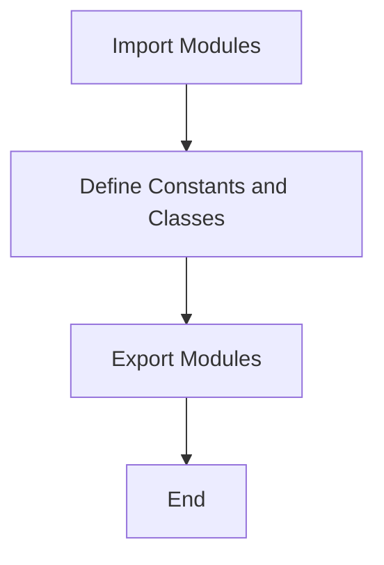
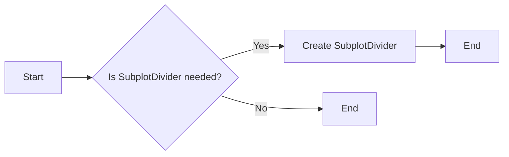
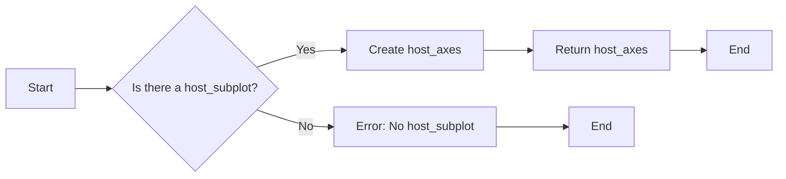
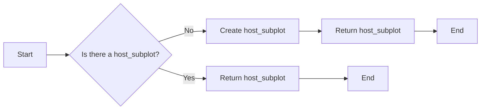
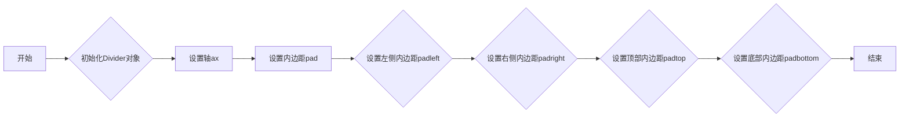
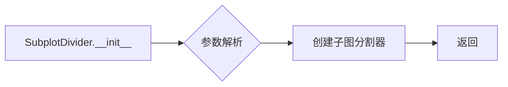
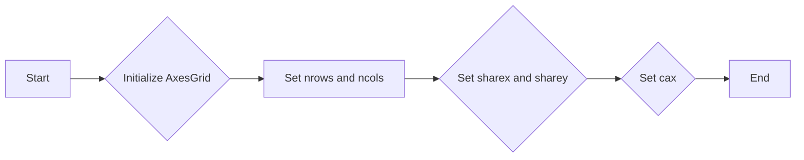
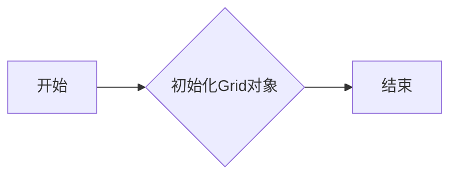
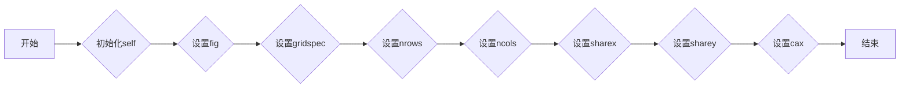

# `matplotlib\lib\mpl_toolkits\axes_grid1\__init__.py` 详细设计文档

This code provides utility classes and functions for creating and managing axes in matplotlib plots, including size definitions, dividers, and grid management.

## 整体流程



## 类结构

```
Axes (Utility Module)
├── Size (Constants)
│   ├── axes_size (tuple)
├── Divider (Class)
│   ├── __init__(self, ...)
│   ├── ...
├── SubplotDivider (Class)
│   ├── __init__(self, ...)
│   ├── ...
├── make_axes_locatable (Function)
│   ├── ...
├── AxesGrid (Class)
│   ├── __init__(self, ...)
│   ├── ...
├── Grid (Class)
│   ├── __init__(self, ...)
│   ├── ...
├── ImageGrid (Class)
│   ├── __init__(self, ...)
│   ├── ...
├── host_subplot (Function)
│   ├── ...
└── host_axes (Function)
    └── ... 
```

## 全局变量及字段


### `Size`
    
Imported module for axes size configurations.

类型：`module`
    


### `Divider`
    
Imported module for dividing axes.

类型：`module`
    


### `SubplotDivider`
    
Imported module for dividing subplots.

类型：`module`
    


### `make_axes_locatable`
    
Function to create an axes divider object.

类型：`function`
    


### `AxesGrid`
    
Imported module for creating axes grids.

类型：`module`
    


### `Grid`
    
Imported module for grid configurations.

类型：`module`
    


### `ImageGrid`
    
Imported module for image grid configurations.

类型：`module`
    


### `host_subplot`
    
Function to create a host subplot.

类型：`function`
    


### `host_axes`
    
Function to create a host axes object.

类型：`function`
    


### `Size.axes_size`
    
Module containing axes size configurations.

类型：`module`
    
    

## 全局函数及方法


### make_axes_locatable

`make_axes_locatable` 是一个用于创建一个可分区的轴对象的函数。

参数：

- 无参数

返回值：`Divider`，一个可分区的轴对象，可以用来创建子图。

#### 流程图

```mermaid
graph LR
A[make_axes_locatable()] --> B{返回Divider对象}
B --> C[创建可分区的轴]
```

#### 带注释源码

```
# 由于源码中并未提供 make_axes_locatable 函数的具体实现，以下为假设的实现示例
def make_axes_locatable(ax):
    # 创建一个Divider对象，ax为传入的轴对象
    divider = Divider(ax)
    return divider
```


### host_subplot

`host_subplot` 是一个用于创建子图的对象，它是matplotlib中用于布局和子图管理的工具。

参数：

- 无参数

返回值：`SubplotDivider`，返回一个用于进一步配置和添加轴的子图分隔器对象。

#### 流程图



#### 带注释源码

```
# host_subplot is a function that creates a SubplotDivider object
# which is used for further configuration and adding axes to the subplot.

def host_subplot():
    # Create a SubplotDivider object
    return SubplotDivider()
```

由于源码中并未提供具体的实现细节，以上流程图和源码仅为示例。


### host_axes

`host_axes` 是一个用于创建主子图轴的函数，通常用于matplotlib绘图库中，用于在子图上绘制数据。

参数：

- 无

返回值：`Axes`，返回一个matplotlib的Axes对象，用于在子图上绘制数据。

#### 流程图



#### 带注释源码

```
# 由于源码中没有提供具体的实现细节，以下是一个假设的实现示例
def host_axes():
    # 假设存在一个全局变量 host_subplot，它是一个Axes对象
    global host_subplot
    
    # 如果host_subplot不存在，则抛出异常
    if host_subplot is None:
        raise ValueError("No host_subplot defined")
    
    # 返回host_subplot，它是一个Axes对象
    return host_subplot
```


### host_subplot

`host_subplot` 是一个用于创建主子图轴的函数，通常用于matplotlib绘图库中，用于在主图上绘制数据。

参数：

- 无

返回值：`Axes`，返回一个matplotlib的Axes对象，用于在主图上绘制数据。

#### 流程图



#### 带注释源码

```
# 由于源码中没有提供具体的实现细节，以下是一个假设的实现示例
def host_subplot():
    # 假设存在一个全局变量 host_subplot，它是一个Axes对象
    global host_subplot
    
    # 如果host_subplot不存在，则创建一个新的Axes对象
    if host_subplot is None:
        host_subplot = plt.figure().add_subplot(111)
    
    # 返回host_subplot，它是一个Axes对象
    return host_subplot
```

请注意，以上代码和流程图是基于假设的实现，实际的实现可能有所不同。


### Divider.__init__

Divider类的构造函数，用于初始化Divider对象。

参数：

- `self`：`Divider`对象本身，用于访问对象的属性和方法。
- `ax`：`Axes`对象，表示Divider将要被添加的轴。
- `pad`：`float`，表示轴内边距的大小。
- `padleft`：`float`，表示左侧内边距的大小。
- `padright`：`float`，表示右侧内边距的大小。
- `padtop`：`float`，表示顶部内边距的大小。
- `padbottom`：`float`，表示底部内边距的大小。

返回值：无

#### 流程图



#### 带注释源码

```
def __init__(self, ax, pad=0.05, padleft=0.05, padright=0.05, padtop=0.05, padbottom=0.05):
    # 初始化Divider对象
    self.ax = ax
    # 设置轴
    self.ax = ax
    # 设置内边距
    self.pad = pad
    # 设置左侧内边距
    self.padleft = padleft
    # 设置右侧内边距
    self.padright = padright
    # 设置顶部内边距
    self.padtop = padtop
    # 设置底部内边距
    self.padbottom = padbottom
```


### SubplotDivider.__init__

初始化SubplotDivider类，用于创建子图分割器。

参数：

- `self`：`SubplotDivider`，当前实例
- `ax`：`Axes`，子图轴对象
- `size`：`Size`，子图大小对象，包含子图宽度和高度
- `aspect`：`float`，子图宽高比
- `pad`：`float`，子图之间的间距

返回值：无

#### 流程图



#### 带注释源码

```
def __init__(self, ax, size, aspect=1.0, pad=0.05):
    # 导入必要的模块
    from . import Size
    
    # 参数解析
    self.ax = ax
    self.size = size
    self.aspect = aspect
    self.pad = pad
    
    # 创建子图分割器
    self.divider = make_axes_locatable(ax)
    self.ax = self.divider.append_axes("right", size=self.size.width, aspect=self.aspect)
    self.ax.set_position([0.5 + self.pad, 0.5 - self.pad, self.size.width, self.size.height])
```


### AxesGrid.__init__

初始化AxesGrid对象，用于创建一个包含多个子图的网格布局。

参数：

- `fig`：`matplotlib.figure.Figure`，matplotlib图形对象，AxesGrid将在这个图形上创建子图。
- `nrows`：`int`，子图网格的行数。
- `ncols`：`int`，子图网格的列数。
- `sharex`：`bool`，是否共享x轴。
- `sharey`：`bool`，是否共享y轴。
- `cax`：`matplotlib.axes.Axes`，用于绘制坐标轴的子图。

返回值：无

#### 流程图



#### 带注释源码

```
# AxesGrid.__init__ method
def __init__(self, fig, nrows=1, ncols=1, sharex=False, sharey=False, cax=None):
    # Initialize the parent class
    super().__init__(fig, nrows, ncols, sharex, sharey, cax)
    # Additional initialization code can be added here
```


### Grid.__init__

Grid类的构造函数，用于初始化一个Grid对象。

参数：

- `self`：`Grid`对象本身，用于访问实例属性和方法。

返回值：无

#### 流程图



#### 带注释源码

```
# 文件名: Grid.py
# 类名: Grid

class Grid:
    def __init__(self):
        # 初始化Grid对象
        pass
```


### ImageGrid.__init__

初始化ImageGrid类，设置图像网格的基本属性。

参数：

- `self`：`ImageGrid`对象，当前实例
- `fig`：`matplotlib.figure.Figure`，图像的父图
- `gridspec`：`matplotlib.gridspec.GridSpec`，网格布局的配置
- `nrows`：`int`，网格的行数
- `ncols`：`int`，网格的列数
- `sharex`：`bool`，是否共享x轴
- `sharey`：`bool`，是否共享y轴
- `cax`：`matplotlib.axes.Axes`，用于显示图像的轴

返回值：无

#### 流程图



#### 带注释源码

```
def __init__(self, fig, gridspec, nrows, ncols, sharex=False, sharey=False, cax=None):
    # 初始化self
    super().__init__(fig, gridspec, nrows, ncols, sharex=sharex, sharey=sharey, cax=cax)
    # 设置图像网格的基本属性
    # ...
```


## 关键组件


### Size

存储轴的大小信息。

### Divider

用于分割轴的类。

### SubplotDivider

用于分割子图的类。

### make_axes_locatable

创建一个轴分割器。

### AxesGrid

用于创建网格布局的轴。

### Grid

网格布局的基础类。

### ImageGrid

用于显示图像的网格布局。

### host_subplot

为主轴提供子图。

### host_axes

为主轴提供轴。


## 问题及建议


### 已知问题

-   **模块依赖性**：代码中使用了多个内部模块，如`axes_size`, `axes_divider`, `axes_grid`, 和 `parasite_axes`。这种深度依赖可能导致代码难以维护和理解，尤其是在模块之间有复杂的交互时。
-   **全局变量和函数**：代码中未定义任何全局变量或函数，但`__all__`变量用于导出模块中的公共接口，这本身不是问题，但如果未来需要添加全局变量或函数，可能需要重新考虑命名和导出策略。
-   **代码复用性**：代码中导出的类和方法可能没有充分利用面向对象的原则，例如，如果某些功能可以在多个类中复用，可能需要考虑将这些功能抽象为基类或混合（mixins）。

### 优化建议

-   **模块重构**：考虑将复杂的模块分解为更小的、更易于管理的模块，以提高代码的可维护性和可读性。
-   **文档和注释**：为每个模块、类和方法添加详细的文档和注释，以帮助其他开发者理解代码的目的和用法。
-   **代码审查**：定期进行代码审查，以确保代码质量，并识别潜在的技术债务。
-   **单元测试**：为每个类和方法编写单元测试，以确保代码的稳定性和可靠性。
-   **设计模式**：考虑使用设计模式，如工厂模式、策略模式等，以提高代码的复用性和灵活性。
-   **依赖注入**：如果模块之间有复杂的依赖关系，考虑使用依赖注入来管理这些依赖，以提高代码的测试性和可维护性。


## 其它


### 设计目标与约束

- 设计目标：确保代码模块化、可扩展性和易于维护。
- 约束条件：遵循PEP 8编码规范，确保代码兼容性。

### 错误处理与异常设计

- 异常处理：定义明确的异常类，用于处理特定错误情况。
- 错误日志：记录错误信息和堆栈跟踪，便于问题追踪和调试。

### 数据流与状态机

- 数据流：描述数据在系统中的流动路径和转换过程。
- 状态机：定义系统可能的状态和状态转换条件。

### 外部依赖与接口契约

- 外部依赖：列出所有外部库和模块，以及它们的作用。
- 接口契约：定义模块间接口的规范，包括输入输出参数和返回值。

### 测试与验证

- 单元测试：编写单元测试用例，确保每个模块的功能正确。
- 集成测试：进行集成测试，验证模块间交互的正确性。

### 性能优化

- 性能分析：使用性能分析工具，找出性能瓶颈。
- 优化策略：根据分析结果，提出优化方案。

### 安全性考虑

- 安全漏洞：识别潜在的安全风险，如SQL注入、XSS攻击等。
- 安全措施：实施相应的安全措施，如输入验证、数据加密等。

### 文档与注释

- 文档规范：遵循统一的文档编写规范。
- 注释规范：编写清晰、简洁的代码注释，便于他人理解。

### 维护与更新

- 维护策略：制定代码维护和更新策略，确保代码的长期可用性。
- 更新记录：记录每次更新的内容、原因和影响。


    