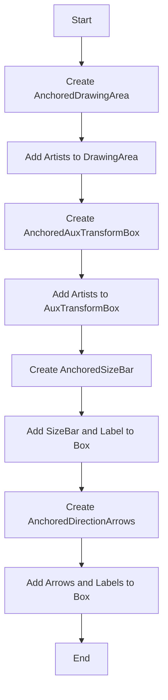
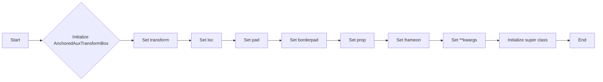
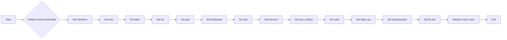
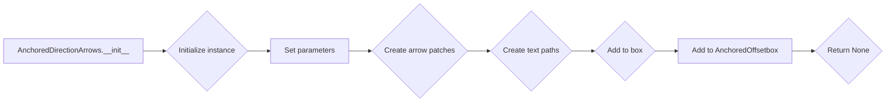

# `matplotlib\lib\mpl_toolkits\axes_grid1\anchored_artists.py` 详细设计文档

This code defines a set of classes for creating anchored artists in matplotlib, which are used to display various graphical elements such as drawing areas, size bars, and direction arrows with labels.

## 整体流程



## 类结构

```
AnchoredDrawingArea
├── AnchoredAuxTransformBox
│   ├── AnchoredSizeBar
│   └── AnchoredDirectionArrows
└── ... 
```

## 全局变量及字段


### `__all__`
    
List of module-level names to be exported.

类型：`list`
    


### `AnchoredDrawingArea.da`
    
Container for artists to display in pixels.

类型：`DrawingArea`
    


### `AnchoredDrawingArea.drawing_area`
    
Container for artists to display in pixels.

类型：`DrawingArea`
    


### `AnchoredAuxTransformBox.drawing_area`
    
Container for artists to display with transformed coordinates.

类型：`AuxTransformBox`
    


### `AnchoredSizeBar.size_bar`
    
Container for the size bar.

类型：`AuxTransformBox`
    


### `AnchoredSizeBar.txt_label`
    
Container for the label of the size bar.

类型：`TextArea`
    


### `AnchoredSizeBar._box`
    
Container for the size bar and label.

类型：`VPacker`
    


### `AnchoredDirectionArrows.box`
    
Container for the arrows and labels.

类型：`AuxTransformBox`
    


### `AnchoredDirectionArrows.arrow_x`
    
Arrow indicating the x-direction.

类型：`FancyArrowPatch`
    


### `AnchoredDirectionArrows.arrow_y`
    
Arrow indicating the y-direction.

类型：`FancyArrowPatch`
    


### `AnchoredDirectionArrows.p_x`
    
Path for the x-direction arrow label.

类型：`PathPatch`
    


### `AnchoredDirectionArrows.p_y`
    
Path for the y-direction arrow label.

类型：`PathPatch`
    
    

## 全局函数及方法


### AnchoredDrawingArea.__init__

This method initializes an instance of the `AnchoredDrawingArea` class, which is a subclass of `AnchoredOffsetbox`. It creates a container with a fixed size and a fillable `.DrawingArea` where artists can be added.

参数：

- `width`：`float`，容器宽度，以像素为单位。
- `height`：`float`，容器高度，以像素为单位。
- `xdescent`：`float`，容器在x方向上的下降量，以像素为单位。
- `ydescent`：`float`，容器在y方向上的下降量，以像素为单位。
- `loc`：`str`，此艺术家的位置。有效的位置包括 'upper left', 'upper center', 'upper right', 'center left', 'center', 'center right', 'lower left', 'lower center', 'lower right'。为了向后兼容，也可以接受数值。
- `pad`：`float`，默认值为0.4，子对象周围的填充量，以字体大小为单位。
- `borderpad`：`float`，默认值为0.5，边框填充量，以字体大小为单位。
- `prop`：`~matplotlib.font_manager.FontProperties`，可选，用作填充的字体属性。
- `frameon`：`bool`，默认值为True，如果为True，则围绕此艺术家绘制一个框。
- `**kwargs`：关键字参数，传递给`.AnchoredOffsetbox`。

返回值：无

#### 流程图

```mermaid
graph LR
A[AnchoredDrawingArea.__init__] --> B{Create DrawingArea}
B --> C{Set width, height, xdescent, ydescent}
C --> D{Set drawing_area attribute}
D --> E{Call super().__init__}
E --> F[End]
```

#### 带注释源码

```python
def __init__(self, width, height, xdescent, ydescent,
             loc, pad=0.4, borderpad=0.5, prop=None, frameon=True,
             **kwargs):
    self.da = DrawingArea(width, height, xdescent, ydescent)
    self.drawing_area = self.da

    super().__init__(
        loc, pad=pad, borderpad=borderpad, child=self.da, prop=None,
        frameon=frameon, **kwargs
    )
```


### AnchoredAuxTransformBox.__init__

This method initializes an instance of the `AnchoredAuxTransformBox` class, which is a subclass of `AnchoredOffsetbox`. It creates an anchored container with transformed coordinates for artists to display.

参数：

- `transform`：`~matplotlib.transforms.Transform`，The transformation object for the coordinate system in use, i.e., `!matplotlib.axes.Axes.transData`.
- `loc`：`str`，Location of this artist. Valid locations are 'upper left', 'upper center', 'upper right', 'center left', 'center', 'center right', 'lower left', 'lower center', 'lower right'. For backward compatibility, numeric values are accepted as well. See the parameter *loc* of `.Legend` for details.
- `pad`：`float`，default: 0.4，Padding around the child objects, in fraction of the font size.
- `borderpad`：`float`，default: 0.5，Border padding, in fraction of the font size.
- `prop`：`~matplotlib.font_manager.FontProperties`，optional，Font property used as a reference for paddings.
- `frameon`：`bool`，default: True，If True, draw a box around this artist.
- `**kwargs`：Keyword arguments forwarded to `.AnchoredOffsetbox`.

返回值：`None`，This method does not return any value.

#### 流程图



#### 带注释源码

```python
def __init__(self, transform, loc,
                 pad=0.4, borderpad=0.5, prop=None, frameon=True, **kwargs):
    """
    An anchored container with transformed coordinates.

    Artists added to the *drawing_area* are scaled according to the
    coordinates of the transformation used. The dimensions of this artist
    will scale to contain the artists added.

    Parameters
    ----------
    transform : ~matplotlib.transforms.Transform
        The transformation object for the coordinate system in use, i.e.,
        :attr:`!matplotlib.axes.Axes.transData`.
    loc : str
        Location of this artist.  Valid locations are
        'upper left', 'upper center', 'upper right',
        'center left', 'center', 'center right',
        'lower left', 'lower center', 'lower right'.
        For backward compatibility, numeric values are accepted as well.
        See the parameter *loc* of `.Legend` for details.
    pad : float, default: 0.4
        Padding around the child objects, in fraction of the font size.
    borderpad : float, default: 0.5
        Border padding, in fraction of the font size.
    prop : ~matplotlib.font_manager.FontProperties, optional
        Font property used as a reference for paddings.
    frameon : bool, default: True
        If True, draw a box around this artist.
    **kwargs
        Keyword arguments forwarded to `.AnchoredOffsetbox`.

    Attributes
    ----------
    drawing_area : ~matplotlib.offsetbox.AuxTransformBox
        A container for artists to display.

    Examples
    --------
    To display an ellipse in the upper left, with a width of 0.1 and
    height of 0.4 in data coordinates:

    >>> box = AnchoredAuxTransformBox(ax.transData, loc='upper left')
    >>> el = Ellipse((0, 0), width=0.1, height=0.4, angle=30)
    >>> box.drawing_area.add_artist(el)
    >>> ax.add_artist(box)
    """
    self.drawing_area = AuxTransformBox(transform)

    super().__init__(loc, pad=pad, borderpad=borderpad,
                     child=self.drawing_area, prop=prop, frameon=frameon,
                     **kwargs)
```


### AnchoredSizeBar.__init__

This method initializes an instance of the `AnchoredSizeBar` class, which is used to draw a horizontal scale bar with a center-aligned label underneath.

参数：

- `transform`：`~matplotlib.transforms.Transform`，The transformation object for the coordinate system in use, i.e., :attr:`!matplotlib.axes.Axes.transData`.
- `size`：`float`，Horizontal length of the size bar, given in coordinates of *transform*.
- `label`：`str`，Label to display.
- `loc`：`str`，Location of the size bar. Valid locations are 'upper left', 'upper center', 'upper right', 'center left', 'center', 'center right', 'lower left', 'lower center', 'lower right'. For backward compatibility, numeric values are accepted as well.
- `pad`：`float`，default: 0.1，Padding around the label and size bar, in fraction of the font size.
- `borderpad`：`float`，default: 0.1，Border padding, in fraction of the font size.
- `sep`：`float`，default: 2，Separation between the label and the size bar, in points.
- `frameon`：`bool`，default: True，If True, draw a box around the horizontal bar and label.
- `size_vertical`：`float`，default: 0，Vertical length of the size bar, given in coordinates of *transform*.
- `color`：`str`，default: 'black'，Color for the size bar and label.
- `label_top`：`bool`，default: False，If True, the label will be over the size bar.
- `fontproperties`：`~matplotlib.font_manager.FontProperties`，optional，Font properties for the label text.
- `fill_bar`：`bool`，optional，If True and if *size_vertical* is nonzero, the size bar will be filled in with the color specified by the size bar. Defaults to True if *size_vertical* is greater than zero and False otherwise.
- `**kwargs`：Keyword arguments forwarded to `.AnchoredOffsetbox`.

返回值：`None`，This method does not return any value.

#### 流程图



#### 带注释源码

```python
class AnchoredSizeBar(AnchoredOffsetbox):
    def __init__(self, transform, size, label, loc,
                 pad=0.1, borderpad=0.1, sep=2,
                 frameon=True, size_vertical=0, color='black',
                 label_top=False, fontproperties=None, fill_bar=None,
                 **kwargs):
        if fill_bar is None:
            fill_bar = size_vertical > 0

        self.size_bar = AuxTransformBox(transform)
        self.size_bar.add_artist(Rectangle((0, 0), size, size_vertical,
                                           fill=fill_bar, facecolor=color,
                                           edgecolor=color))

        if fontproperties is None and 'prop' in kwargs:
            fontproperties = kwargs.pop('prop')

        if fontproperties is None:
            textprops = {'color': color}
        else:
            textprops = {'color': color, 'fontproperties': fontproperties}

        self.txt_label = TextArea(label, textprops=textprops)

        if label_top:
            _box_children = [self.txt_label, self.size_bar]
        else:
            _box_children = [self.size_bar, self.txt_label]

        self._box = VPacker(children=_box_children,
                            align="center",
                            pad=0, sep=sep)

        super().__init__(loc, pad=pad, borderpad=borderpad, child=self._box,
                         prop=fontproperties, frameon=frameon, **kwargs)
```


### AnchoredDirectionArrows.__init__

This method initializes an instance of the `AnchoredDirectionArrows` class, which is used to draw two perpendicular arrows to indicate directions in a matplotlib plot.

参数：

- `transform`：`~matplotlib.transforms.Transform`，The transformation object for the coordinate system in use, i.e., :attr:`!matplotlib.axes.Axes.transAxes`.
- `label_x`：`str`，Label text for the x arrow.
- `label_y`：`str`，Label text for the y arrow.
- `length`：`float`，Length of the arrow, given in coordinates of *transform*.
- `fontsize`：`float`，Size of label strings, given in coordinates of *transform*.
- `loc`：`str`，Location of the arrow. Valid locations are 'upper left', 'upper center', 'upper right', 'center left', 'center', 'center right', 'lower left', 'lower center', 'lower right'.
- `angle`：`float`，The angle of the arrows in degrees.
- `aspect_ratio`：`float`，The ratio of the length of arrow_x and arrow_y.
- `pad`：`float`，Padding around the labels and arrows, in fraction of the font size.
- `borderpad`：`float`，Border padding, in fraction of the font size.
- `frameon`：`bool`，If True, draw a box around the arrows and labels.
- `color`：`str`，Color for the arrows and labels.
- `alpha`：`float`，Alpha values of the arrows and labels.
- `sep_x`：`float`，Separation between the arrows and labels in coordinates of *transform*.
- `sep_y`：`float`，Separation between the arrows and labels in coordinates of *transform*.
- `fontproperties`：`~matplotlib.font_manager.FontProperties`，Font properties for the label text.
- `back_length`：`float`，Fraction of the arrow behind the arrow crossing.
- `head_width`：`float`，Width of arrow head, sent to `.ArrowStyle`.
- `head_length`：`float`，Length of arrow head, sent to `.ArrowStyle`.
- `tail_width`：`float`，Width of arrow tail, sent to `.ArrowStyle`.
- `text_props`：`dict`，Properties of the text, passed to `.TextPath`.
- `arrow_props`：`dict`，Properties of the arrows, passed to `.FancyArrowPatch`.
- `**kwargs`：Keyword arguments forwarded to `.AnchoredOffsetbox`.

返回值：`None`，This method does not return any value.

#### 流程图



#### 带注释源码

```python
def __init__(self, transform, label_x, label_y, length=0.15,
                 fontsize=0.08, loc='upper left', angle=0, aspect_ratio=1,
                 pad=0.4, borderpad=0.4, frameon=False, color='w', alpha=1,
                 sep_x=0.01, sep_y=0, fontproperties=None, back_length=0.15,
                 head_width=10, head_length=15, tail_width=2,
                 text_props=None, arrow_props=None,
                 **kwargs):
    # ... (rest of the method implementation)
```


## 关键组件


### 张量索引与惰性加载

张量索引与惰性加载是代码中的关键组件，用于高效地处理和访问大型数据集，同时减少内存消耗。

### 反量化支持

反量化支持是代码中的关键组件，允许对量化后的数据进行逆量化处理，以便进行进一步的分析或处理。

### 量化策略

量化策略是代码中的关键组件，用于将浮点数数据转换为低精度表示，以减少模型大小和加速推理过程。


## 问题及建议


### 已知问题

-   **代码重复性**：多个类（AnchoredDrawingArea, AnchoredAuxTransformBox, AnchoredSizeBar, AnchoredDirectionArrows）具有相似的初始化方法和属性，这可能导致维护困难。
-   **参数传递**：一些类方法中使用了大量的关键字参数，这可能导致代码难以阅读和理解。
-   **文档不足**：代码注释不够详细，特别是对于一些复杂的逻辑和算法。

### 优化建议

-   **重构代码**：将重复的代码提取到单独的函数或类中，以减少代码重复性。
-   **简化参数传递**：尽量使用明确的参数名称和类型，避免使用大量的关键字参数。
-   **增强文档**：为每个类和方法添加详细的注释，解释其功能和参数。
-   **代码审查**：定期进行代码审查，以确保代码质量和一致性。
-   **单元测试**：编写单元测试来验证代码的正确性和稳定性。
-   **性能优化**：分析代码性能，并针对热点进行优化。


## 其它


### 设计目标与约束

- 设计目标：
  - 提供一个模块化的接口，用于在matplotlib中添加自定义的锚定图形元素。
  - 确保图形元素能够适应不同的坐标系统和缩放级别。
  - 提供灵活的配置选项，允许用户自定义图形元素的外观和行为。

- 约束：
  - 必须兼容matplotlib的现有API和功能。
  - 图形元素应尽可能轻量，以避免对性能的影响。
  - 应遵循matplotlib的编码标准和最佳实践。

### 错误处理与异常设计

- 错误处理：
  - 对于无效的参数值，应抛出适当的异常。
  - 在初始化图形元素时，应检查参数的有效性，并在必要时提供默认值。

- 异常设计：
  - 使用Python的内置异常类，如`ValueError`和`TypeError`。
  - 异常消息应提供足够的信息，以便用户能够诊断问题。

### 数据流与状态机

- 数据流：
  - 用户通过类方法或全局函数创建图形元素。
  - 图形元素的数据流主要涉及参数传递和属性设置。

- 状态机：
  - 图形元素的状态由其属性和配置决定。
  - 状态机不适用于此代码，因为图形元素的状态不涉及状态转换。

### 外部依赖与接口契约

- 外部依赖：
  - 依赖于matplotlib库中的类和函数。
  - 依赖于numpy库进行数值计算。

- 接口契约：
  - 类方法和全局函数的接口应清晰、一致。
  - 应提供文档说明每个接口的功能和参数。


    