# `matplotlib\lib\mpl_toolkits\axes_grid1\axes_divider.py` 详细设计文档

该代码提供了一套用于在绘图时调整多个坐标轴位置的类和方法，通过基于水平和垂直尺寸列表将矩形区域划分为多个子区域，实现灵活的坐标轴布局管理。核心类Divider及其子类（SubplotDivider、AxesDivider、HBoxDivider、VBoxDivider）支持基于子图几何、现有坐标轴或等高/等宽约束的多种布局策略。

## 整体流程

```mermaid
graph TD
    A[开始] --> B[创建Divider实例]
    B --> C{布局类型?}
    C -->|普通布局| D[Divider/SubplotDivider]
    C -->|基于坐标轴| E[AxesDivider]
    C -->|水平等高| F[HBoxDivider]
    C -->|垂直等宽| G[VBoxDivider]
    D --> H[设置horizontal/vertical sizes]
    E --> H
    F --> H
    G --> H
    H --> I[调用new_locator创建定位器]
    I --> J[返回functools.partial对象]
    J --> K[渲染时调用locator(ax, renderer)]
    K --> L[_locate计算实际位置]
    L --> M{是否需要等高/等宽?}
    M -->|是| N[调用_locate函数计算约束]
    M -->|否| O[使用_calc_k和_calc_offsets计算]
    N --> P[返回Bbox.from_bounds]
    O --> P
    P --> Q[结束]
```

## 类结构

```
Divider (基类 - 坐标轴定位基类)
├── SubplotDivider (基于子图几何的定位器)
│   ├── HBoxDivider (水平布局，等高约束)
│   └── VBoxDivider (垂直布局，等宽约束)
└── AxesDivider (基于现有坐标轴的定位器)
```

## 全局变量及字段


### `_locate`
    
辅助函数，用于在HBoxDivider和VBoxDivider中定位轴的位置

类型：`function`
    


### `Divider._fig`
    
matplotlib Figure对象

类型：`Figure`
    


### `Divider._pos`
    
将被分割的矩形位置

类型：`tuple of 4 floats`
    


### `Divider._horizontal`
    
水平分割的大小列表

类型：`list of axes_size`
    


### `Divider._vertical`
    
垂直分割的大小列表

类型：`list of axes_size`
    


### `Divider._anchor`
    
锚点位置

类型：`str or tuple`
    


### `Divider._aspect`
    
是否保持宽高比

类型：`bool`
    


### `Divider._xrefindex`
    
x方向引用索引，用于跟踪左侧添加的尺寸数量

类型：`int`
    


### `Divider._yrefindex`
    
y方向引用索引，用于跟踪底部添加的尺寸数量

类型：`int`
    


### `Divider._locator`
    
用于运行时定位的调用对象

类型：`callable or None`
    


### `SubplotDivider.figure`
    
matplotlib Figure对象

类型：`Figure`
    


### `SubplotDivider._subplotspec`
    
子图规格对象

类型：`SubplotSpec`
    


### `AxesDivider._axes`
    
matplotlib Axes对象

类型：`Axes`
    


### `AxesDivider._xref`
    
x方向的参考大小

类型：`axes_size`
    


### `AxesDivider._yref`
    
y方向的参考大小

类型：`axes_size`
    
    

## 全局函数及方法


### `Divider._locate`

这是 `Divider` 类的核心定位方法，用于根据给定的单元格坐标计算并返回该单元格的边界框（Bbox）。它处理水平 和垂直分割、纵横比调整，并返回最终的定位信息。

参数：

- `nx`：`int`，列起始位置，指定要定位的列索引
- `ny`：`int`，行起始位置，指定要定位的行索引
- `nx1`：`int or None`，列结束位置（不含），当为 None 时表示单列
- `ny1`：`int or None`，行结束位置（不含），当为 None 时表示单行
- `axes`：`matplotlib.axes.Axes`，Axes 对象，用于获取运行时位置
- `renderer`：`matplotlib.backend_bases.RendererBase`，渲染器，用于计算尺寸

返回值：`matplotlib.transforms.Bbox`，返回计算得到的单元格边界框，包含左上角坐标、宽度和高度

#### 流程图

```mermaid
flowchart TD
    A[开始 _locate] --> B[调整索引: nx += _xrefindex, ny += _yrefindex]
    B --> C[获取图形尺寸: fig_w, fig_h]
    C --> D[获取位置: x, y, w, h = get_position_runtime]
    D --> E[获取水平和垂直尺寸: hsizes, vsizes]
    E --> F[计算缩放因子: k_h, k_v]
    F --> G{是否有 aspect?}
    G -->|Yes| H[使用 min(k_h, k_v) 保持比例]
    G -->|No| I[分别使用 k_h 和 k_v]
    H --> J[计算偏移 ox, oy 并锚定]
    I --> K[计算偏移 ox, oy]
    K --> L[处理 None 索引: nx1=-1, ny1=-1]
    J --> L
    L --> M[计算最终边界: x1, y1, w1, h1]
    M --> N[返回 Bbox.from_bounds]
```

#### 带注释源码

```python
def _locate(self, nx, ny, nx1, ny1, axes, renderer):
    """
    Implementation of ``divider.new_locator().__call__``.

    The axes locator callable returned by ``new_locator()`` is created as
    a `functools.partial` of this method with *nx*, *ny*, *nx1*, and *ny1*
    specifying the requested cell.
    """
    # 1. 调整索引偏移量，考虑左侧/底部追加的尺寸
    nx += self._xrefindex
    nx1 += self._xrefindex
    ny += self._yrefindex
    ny1 += self._yrefindex

    # 2. 获取图形尺寸（英寸）
    fig_w, fig_h = self._fig.bbox.size / self._fig.dpi
    
    # 3. 获取运行时位置（可能由 locator 动态计算）
    x, y, w, h = self.get_position_runtime(axes, renderer)

    # 4. 获取水平和垂直尺寸数组
    hsizes = self.get_horizontal_sizes(renderer)
    vsizes = self.get_vertical_sizes(renderer)
    
    # 5. 计算缩放因子 k，使得相对尺寸加绝对尺寸等于总尺寸
    k_h = self._calc_k(hsizes, fig_w * w)
    k_v = self._calc_k(vsizes, fig_h * h)

    # 6. 如果设置了 aspect（保持纵横比），使用较小的 k 值
    if self.get_aspect():
        k = min(k_h, k_v)
        # 计算偏移量
        ox = self._calc_offsets(hsizes, k)
        oy = self._calc_offsets(vsizes, k)

        # 计算实际宽高比
        ww = (ox[-1] - ox[0]) / fig_w
        hh = (oy[-1] - oy[0]) / fig_h
        # 创建边界框并进行锚定定位
        pb = mtransforms.Bbox.from_bounds(x, y, w, h)
        pb1 = mtransforms.Bbox.from_bounds(x, y, ww, hh)
        x0, y0 = pb1.anchored(self.get_anchor(), pb).p0

    else:
        # 不保持纵横比，分别使用各自的 k 值
        ox = self._calc_offsets(hsizes, k_h)
        oy = self._calc_offsets(vsizes, k_v)
        x0, y0 = x, y

    # 7. 处理 None 索引（-1 表示到最后一个）
    if nx1 is None:
        nx1 = -1
    if ny1 is None:
        ny1 = -1

    # 8. 计算最终的位置和尺寸（转换为图形坐标比例）
    x1, w1 = x0 + ox[nx] / fig_w, (ox[nx1] - ox[nx]) / fig_w
    y1, h1 = y0 + oy[ny] / fig_h, (oy[ny1] - oy[ny]) / fig_h

    # 9. 返回计算得到的边界框
    return mtransforms.Bbox.from_bounds(x1, y1, w1, h1)
```


### `make_axes_locatable`

该函数用于为给定的 Axes 创建布局分隔器（Divider），并将定位器应用到 Axes 上，以便在绘图时调整多个 Axes 的位置。

参数：

- `axes`：`matplotlib.axes.Axes`，需要创建布局分隔器的 Axes 对象

返回值：`AxesDivider`，返回创建的分隔器对象，可用于进一步配置子 Axes 的布局

#### 流程图

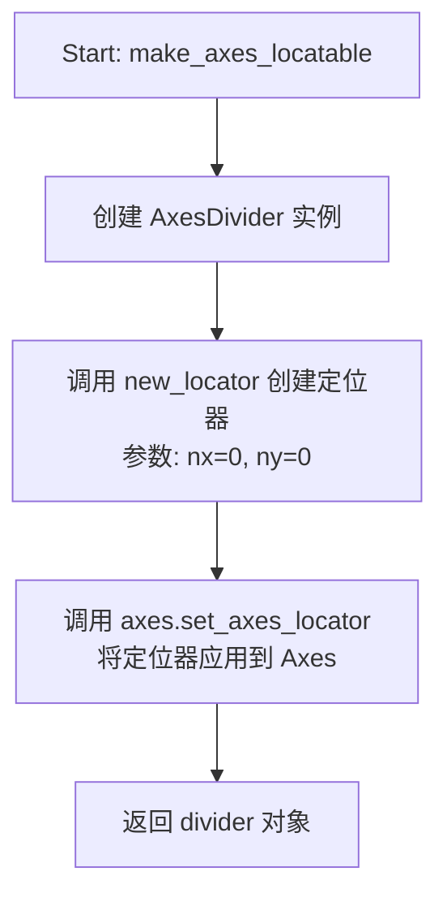

#### 带注释源码

```python
def make_axes_locatable(axes):
    """
    为指定的 Axes 创建布局分隔器并设置定位器。

    Parameters
    ----------
    axes : matplotlib.axes.Axes
        需要创建布局分隔器的 Axes 对象

    Returns
    -------
    AxesDivider
        创建的分隔器对象，可用于添加额外的子 Axes
    """
    # 步骤1: 创建 AxesDivider 实例，基于已存在的 Axes
    divider = AxesDivider(axes)
    
    # 步骤2: 创建定位器，用于定位第一个单元格 (0, 0)
    # 这将创建一个可调用对象，在绘制时计算 Axes 的位置
    locator = divider.new_locator(nx=0, ny=0)
    
    # 步骤3: 将定位器设置为 Axes 的 axes_locator
    # 这样 Axes 的位置将由 divider 在绘制时确定
    axes.set_axes_locator(locator)

    # 步骤4: 返回 divider 对象，供调用者进一步添加子 Axes
    return divider
```


### `make_axes_area_auto_adjustable`

该函数用于为指定的 Axes 添加自动可调整的填充区域，以考虑坐标轴的装饰元素（如标题、标签、刻度和刻度标签）在布局中的占用空间。函数通过调用 `make_axes_locatable` 创建布局分隔符，并利用 `Divider.add_auto_adjustable_area` 方法实现自动调整功能。

参数：

- `ax`：`matplotlib.axes.Axes`，需要自动调整区域的坐标轴对象
- `use_axes`：`matplotlib.axes.Axes` 或 `list[matplotlib.axes.Axes]`，可选，用于计算装饰边距的坐标轴，默认为 `ax` 本身（即自动考虑自身轴的装饰）
- `pad`：`float`，默认值为 0.1额外的填充大小（英寸）
- `adjust_dirs`：`list[str]`，可选，要添加填充的方向列表，默认为 `["left", "right", "bottom", "top"]`（全部四个方向）

返回值：`None`，该函数直接修改传入坐标轴的布局，不返回任何值

#### 流程图

```mermaid
flowchart TD
    A[开始 make_axes_area_auto_adjustable] --> B{adjust_dirs是否为None?}
    B -->|是| C[设置adjust_dirs为默认列表<br/>['left', 'right', 'bottom', 'top']]
    B -->|否| D[使用传入的adjust_dirs]
    C --> E[调用make_axes_locatable<br/>创建Divider对象]
    D --> E
    E --> F{use_axes是否为None?}
    F -->|是| G[设置use_axes为ax<br/>使用当前坐标轴的装饰]
    F -->|否| H[使用传入的use_axes]
    G --> I[调用divider.add_auto_adjustable_area<br/>添加自动可调整区域]
    H --> I
    I --> J[结束]
    
    style A fill:#e1f5fe
    style I fill:#fff3e0
    style J fill:#e8f5e9
```

#### 带注释源码

```python
def make_axes_area_auto_adjustable(
        ax, use_axes=None, pad=0.1, adjust_dirs=None):
    """
    Add auto-adjustable padding around *ax* to take its decorations (title,
    labels, ticks, ticklabels) into account during layout, using
    `.Divider.add_auto_adjustable_area`.

    By default, padding is determined from the decorations of *ax*.
    Pass *use_axes* to consider the decorations of other Axes instead.
    
    Parameters
    ----------
    ax : matplotlib.axes.Axes
        The Axes whose layout area is to be auto-adjusted.
    use_axes : matplotlib.axes.Axes or list of matplotlib.axes.Axes, optional
        The Axes whose decorations are taken into account. If None, uses *ax*.
    pad : float, default: 0.1
        Additional padding in inches.
    adjust_dirs : list of {"left", "right", "bottom", "top"}, optional
        The sides where padding is added; defaults to all four sides.
    """
    # 如果未指定调整方向，默认对四个方向都进行调整
    # 这确保了即使调用者没有明确指定方向，也能覆盖所有边
    if adjust_dirs is None:
        adjust_dirs = ["left", "right", "bottom", "top"]
    
    # 创建布局分隔器（Divider），这会为坐标轴设置一个定位器
    # make_axes_locatable 返回一个 AxesDivider 对象，并设置 ax 的 axes_locator
    # 定位器用于在绘制时确定坐标轴的位置
    divider = make_axes_locatable(ax)
    
    # 如果未指定要考虑的装饰坐标轴，默认使用传入的 ax 本身
    # 这允许函数自动考虑当前坐标轴的标题、标签等装饰元素
    if use_axes is None:
        use_axes = ax
    
    # 调用 Divider 的 add_auto_adjustable_area 方法
    # 该方法会根据 use_axes 的装饰（标题、轴标签、刻度、刻度标签等）
    # 自动计算并添加适当的填充空间
    # pad 参数提供额外的填充，adjust_dirs 指定填充应用到哪些边
    divider.add_auto_adjustable_area(use_axes=use_axes, pad=pad,
                                     adjust_dirs=adjust_dirs)
```


### `Divider.__init__`

这是 `Divider` 类的构造函数，用于初始化一个用于在绘图时调整多个坐标轴位置的分配器对象。该方法接收图形、位置、水平和垂直分割大小等参数，并设置相关的实例属性。

参数：

- `fig`：`Figure`，matplotlib 的图形对象
- `pos`：`tuple of 4 floats`，将被分割的矩形区域位置
- `horizontal`：`list of mpl_toolkits.axes_grid1.axes_size`，水平分割的大小列表
- `vertical`：`list of mpl_toolkits.axes_grid1.axes_size`，垂直分割的大小列表
- `aspect`：`bool`，可选，是否调整矩形区域使水平和垂直刻度具有相同比例
- `anchor`：`(float, float)` 或 `{'C', 'SW', 'S', 'SE', 'E', 'NE', 'N', 'NW', 'W'}`，默认 `'C'`，当 aspect 为 True 时放置缩放后矩形的位置

返回值：`None`，构造函数没有返回值

#### 流程图

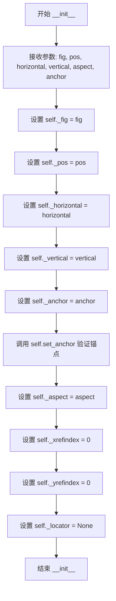

#### 带注释源码

```python
def __init__(self, fig, pos, horizontal, vertical,
             aspect=None, anchor="C"):
    """
    Parameters
    ----------
    fig : Figure
    pos : tuple of 4 floats
        Position of the rectangle that will be divided.
    horizontal : list of :mod:`~mpl_toolkits.axes_grid1.axes_size`
        Sizes for horizontal division.
    vertical : list of :mod:`~mpl_toolkits.axes_grid1.axes_size`
        Sizes for vertical division.
    aspect : bool, optional
        Whether overall rectangular area is reduced so that the relative
        part of the horizontal and vertical scales have the same scale.
    anchor : (float, float) or {'C', 'SW', 'S', 'SE', 'E', 'NE', 'N', \
'NW', 'W'}, default: 'C'
        Placement of the reduced rectangle, when *aspect* is True.
    """

    # 保存图形对象引用
    self._fig = fig
    # 保存矩形区域位置 [x0, y0, width, height]
    self._pos = pos
    # 保存水平分割大小列表
    self._horizontal = horizontal
    # 保存垂直分割大小列表
    self._vertical = vertical
    # 保存锚点位置（先保存原始值用于后续验证）
    self._anchor = anchor
    # 调用 set_anchor 进行验证并设置正确的锚点格式
    self.set_anchor(anchor)
    # 保存宽高比设置
    self._aspect = aspect
    # x 方向的参考索引，用于定位
    self._xrefindex = 0
    # y 方向的参考索引，用于定位
    self._yrefindex = 0
    # 定位器，可用于运行时动态计算位置
    self._locator = None
```


### `Divider.get_horizontal_sizes`

获取水平方向（水平分割）的尺寸数组。该方法通过渲染器计算每个水平尺寸对象的实际大小，并以NumPy数组的形式返回所有水平尺寸的列表。

参数：

- `renderer`：渲染器对象，用于计算每个水平尺寸对象的实际大小

返回值：`numpy.ndarray`，包含所有水平尺寸的NumPy数组

#### 流程图

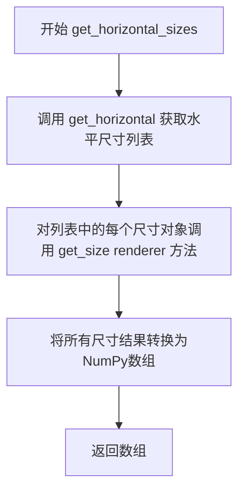

#### 带注释源码

```python
def get_horizontal_sizes(self, renderer):
    """
    获取水平方向的尺寸数组。
    
    Parameters
    ----------
    renderer : 对象
        渲染器对象，用于计算每个尺寸对象的具体大小
        
    Returns
    -------
    numpy.ndarray
        包含所有水平尺寸的NumPy数组
    """
    # 获取水平尺寸列表（通过get_horizontal方法）
    # 然后对每个尺寸对象调用get_size方法获取实际渲染大小
    # 最后将结果包装成NumPy数组返回
    return np.array([s.get_size(renderer) for s in self.get_horizontal()])
```


### `Divider.get_vertical_sizes`

该方法用于获取垂直方向的分割尺寸，通过渲染器计算每个垂直大小对象的实际像素尺寸，并将结果以numpy数组的形式返回。

参数：

- `renderer`：`RendererBase`，渲染器对象，用于计算每个垂直尺寸对象的实际大小

返回值：`numpy.ndarray`，包含每个垂直分割实际尺寸的numpy数组

#### 流程图

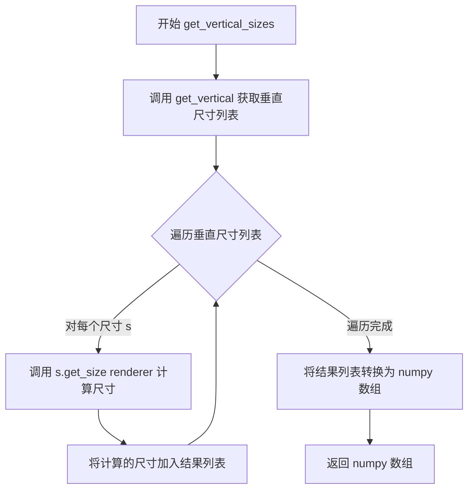

#### 带注释源码

```python
def get_vertical_sizes(self, renderer):
    """
    获取垂直分割的尺寸数组。
    
    Parameters
    ----------
    renderer : RendererBase
        渲染器对象，用于计算每个垂直尺寸对象的实际大小。
    
    Returns
    -------
    numpy.ndarray
        包含每个垂直分割实际尺寸的numpy数组。
    """
    # 获取垂直尺寸列表（包含Size对象的列表）
    vertical_sizes = self.get_vertical()
    
    # 遍历每个垂直尺寸对象，调用其get_size方法获取实际像素尺寸
    # 并将所有尺寸组成列表，最后转换为numpy数组返回
    return np.array([s.get_size(renderer) for s in vertical_sizes])
```


### Divider.set_position

该方法用于设置分割器的矩形区域位置。它接受一个包含4个浮点数的元组作为参数，并将其赋值给内部属性 `_pos`，从而更新Divider对象管理的矩形区域位置。

参数：

- `pos`：`tuple of 4 floats`，要设置的矩形区域位置

返回值：`None`，无返回值，仅修改对象内部状态

#### 流程图

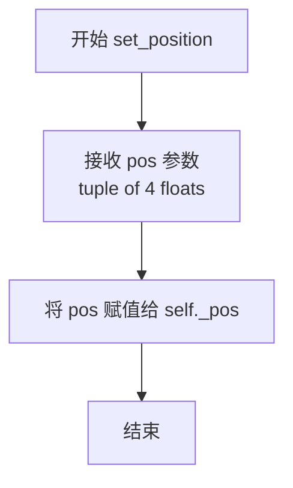

#### 带注释源码

```python
def set_position(self, pos):
    """
    Set the position of the rectangle.

    Parameters
    ----------
    pos : tuple of 4 floats
        position of the rectangle that will be divided
    """
    # 将传入的位置元组赋值给实例属性 _pos
    # 该属性存储了Divider要分割的矩形区域位置信息
    # 格式为 (x, y, width, height)，其中 x, y 为左下角坐标
    # width, height 为矩形的宽度和高度（均为相对坐标，范围0-1）
    self._pos = pos
```


### `Divider.get_position`

获取分隔矩形的位置信息。该方法是一个简单的访问器（getter），返回初始化时设置的矩形位置坐标。

参数：無

返回值：`tuple of 4 floats`，表示矩形的位置，格式为 (x, y, width, height)

#### 流程图

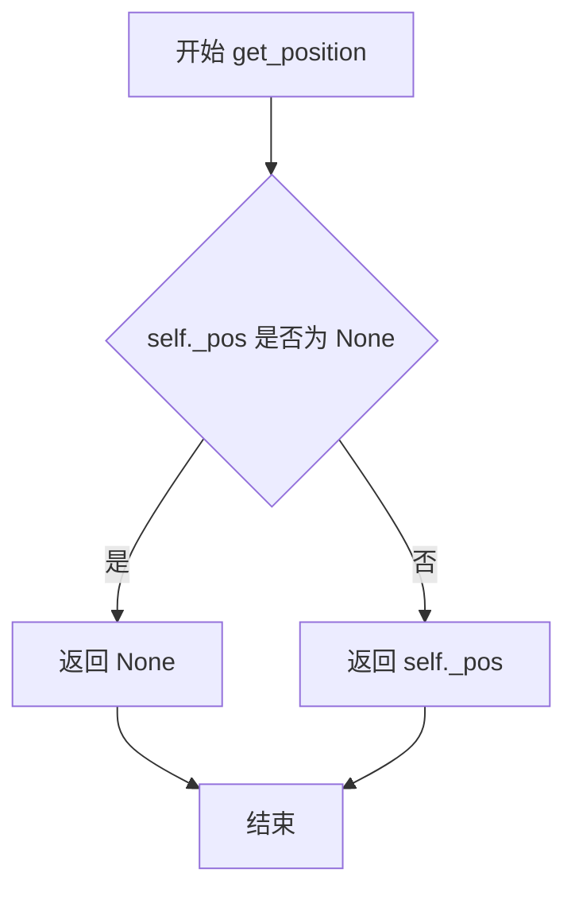

#### 带注释源码

```python
def get_position(self):
    """Return the position of the rectangle."""
    return self._pos
```

**代码说明：**

- `self._pos` 是 `Divider` 类在初始化时接收的位置参数，类型为 `tuple of 4 floats`
- 该方法为只读访问器，不接受任何参数
- 返回的元组格式通常为 `(x, y, width, height)`，表示矩形的左下角坐标及宽高
- `Divider` 类的 `set_position` 方法可以修改此值
- 注意：`SubplotDivider` 和 `AxesDivider` 子类重写了此方法，以返回不同的位置计算逻辑


### `Divider.set_anchor`

该方法用于设置 `Divider`（分割器）的锚点。锚点决定了当需要保持宽高比（aspect）时，子轴在分配矩形区域内的对齐位置（例如居中、左上角等）。方法内部会对传入的 `anchor` 参数进行类型和有效性检查。

参数：

- `anchor`：`str` 或 `tuple` 或 `list`，锚点坐标或方向标识。
  - 如果是字符串，必须是 `'C'`, `'SW'`, `'S'`, `'SE'`, `'E'`, `'NE'`, `'N'`, `'NW'`, `'W'` 之一。
  - 如果是元组或列表，必须是包含两个浮点数 `(x, y)` 的 2-tuple，表示相对坐标（0-1 之间）。

返回值：`None`，该方法无返回值，仅修改对象内部状态。

#### 流程图

```mermaid
flowchart TD
    Start([开始 set_anchor]) --> CheckType{anchor 是字符串?}
    
    %% 分支：anchor 是字符串
    CheckType -- 是 --> ValidateStr[调用 _api.check_in_list 验证字符串有效性]
    ValidateStr --> SetAnchor[设置 self._anchor = anchor]
    
    %% 分支：anchor 不是字符串
    CheckType -- 否 --> CheckSeq{anchor 是 tuple 或 list?}
    
    %% 如果是序列，进一步检查长度
    CheckSeq -- 是 --> CheckLen{len(anchor) == 2?}
    CheckLen -- 是 --> SetAnchor
    
    %% 错误处理分支
    CheckSeq -- 否 --> RaiseTypeError[抛出 TypeError]
    CheckLen -- 否 --> RaiseTypeError
    
    %% 结束
    SetAnchor --> End([结束])
    RaiseTypeError --> End
```

#### 带注释源码

```python
def set_anchor(self, anchor):
    """
    Parameters
    ----------
    anchor : (float, float) or {'C', 'SW', 'S', 'SE', 'E', 'NE', 'N', \
'NW', 'W'}
        Either an (*x*, *y*) pair of relative coordinates (0 is left or
        bottom, 1 is right or top), 'C' (center), or a cardinal direction
        ('SW', southwest, is bottom left, etc.).

    See Also
    --------
    .Axes.set_anchor
    """
    # 如果 anchor 是字符串类型（例如 'C', 'SW'），则需要验证其是否为有效的预定义常量
    if isinstance(anchor, str):
        # _api.check_in_list 会检查 anchor 是否在 mtransforms.Bbox.coefs 中，
        # 如果不在会抛出异常
        _api.check_in_list(mtransforms.Bbox.coefs, anchor=anchor)
    # 如果不是字符串，则必须是包含两个元素的元组或列表
    # 这里使用了短路求值和 isinstance 的组合来判断类型和长度
    elif not isinstance(anchor, (tuple, list)) or len(anchor) != 2:
        raise TypeError("anchor must be str or 2-tuple")
    
    # 验证通过后，将 anchor 值存储到实例属性 _anchor 中
    self._anchor = anchor
```


### `Divider.get_anchor`

该方法用于获取分隔器（Divider）的锚点位置，锚点用于指定当设置宽高比时矩形区域的放置位置。

参数：无

返回值：`str` 或 `tuple`，锚点位置，可以是字符串（如 'C'、'SW'、'S' 等）或二维元组 (float, float)

#### 流程图

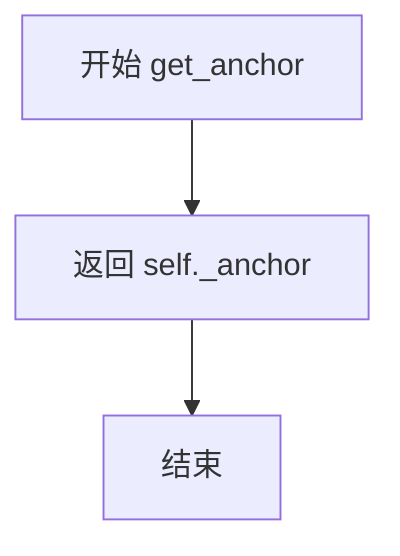

#### 带注释源码

```python
def get_anchor(self):
    """
    Return the anchor.
    
    Returns
    -------
    str or tuple
        The anchor point, which can be either:
        - A string like 'C' (center), 'SW' (southwest), 'S' (south), etc.
        - A tuple (x, y) of relative coordinates where 0 is left/bottom 
          and 1 is right/top.
    
    See Also
    --------
    set_anchor : Method to set the anchor value.
    """
    return self._anchor
```


### `Divider.get_subplotspec`

该方法是 `Divider` 类的基类方法，用于获取子图规范（SubplotSpec）。在基类 `Divider` 中，该方法直接返回 `None`，表示不支持子图规范。子类 `SubplotDivider` 和 `AxesDivider` 重写此方法以提供实际的 SubplotSpec 实例。

参数：
- 无（仅包含隐式参数 `self`）

返回值：`None`，返回 `None` 表示基类不支持获取 SubplotSpec

#### 流程图

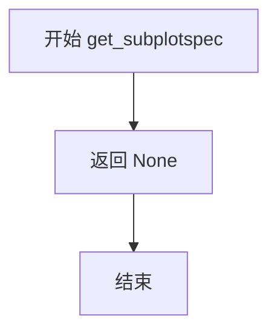

#### 带注释源码

```python
def get_subplotspec(self):
    """
    Get the SubplotSpec instance.

    Returns
    -------
    SubplotSpec or None
        The SubplotSpec instance associated with this divider,
        or None if not available (as in the base Divider class).
    """
    return None
```


### `Divider.set_horizontal`

设置水平分割的大小列表，用于划分矩形区域。

参数：

-  `h`：`list of mpl_toolkits.axes_grid1.axes_size`，水平分割的大小列表

返回值：`None`，无返回值（该方法直接修改实例属性）

#### 流程图

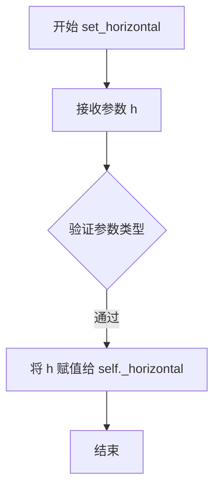

#### 带注释源码

```python
def set_horizontal(self, h):
    """
    Set the horizontal sizes for division.

    Parameters
    ----------
    h : list of :mod:`~mpl_toolkits.axes_grid1.axes_size`
        sizes for horizontal division
    """
    self._horizontal = h  # 将传入的水平分割大小列表赋值给实例属性
```


### `Divider.get_horizontal`

获取水平方向的分割大小列表。该方法是 `Divider` 类的简单 getter 方法，用于返回初始化时或通过 `set_horizontal` 设置的水平分割尺寸。

参数：无（除 `self` 外）

返回值：`list`，返回存储在 `Divider` 实例中的水平分割尺寸列表。

#### 流程图

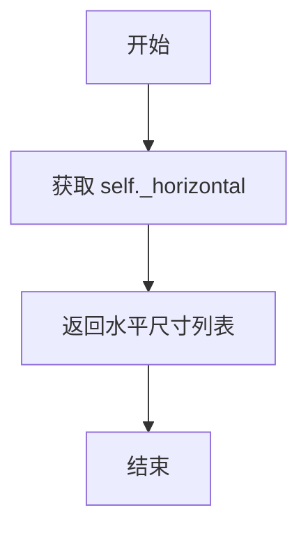

#### 带注释源码

```python
def get_horizontal(self):
    """
    返回水平方向的分割尺寸。

    该方法是一个简单的 getter，用于获取在初始化 Divider 时传入的
    水平分割尺寸列表，或者通过 set_horizontal 方法设置的尺寸列表。

    Returns
    -------
    list
        包含水平分割尺寸对象的列表，这些对象来自
        mpl_toolkits.axes_grid1.axes_size 模块。
    """
    return self._horizontal
```


### `Divider.set_vertical`

该方法用于设置垂直分割的尺寸列表，更新 `Divider` 实例的垂直分割参数。

参数：

-  `v`：`list of :mod:`~mpl_toolkits.axes_grid1.axes_size`"，用于垂直分割的尺寸列表

返回值：`None`，无返回值

#### 流程图

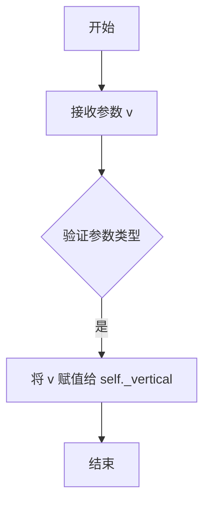

#### 带注释源码

```python
def set_vertical(self, v):
    """
    设置垂直分割的尺寸列表。

    Parameters
    ----------
    v : list of :mod:`~mpl_toolkits.axes_grid1.axes_size`
        用于垂直分割的尺寸列表。这些尺寸对象定义了
        矩形区域在垂直方向上如何被划分。
    """
    # 将传入的垂直尺寸列表赋值给实例变量 _vertical
    # 这个列表会被后续的 get_vertical_sizes 方法使用
    # 来计算每个分割区域的实际像素大小
    self._vertical = v
```


### `Divider.get_vertical`

获取垂直分割的大小列表，用于返回在初始化时定义的垂直尺寸（来自 `mpl_toolkits.axes_grid1.axes_size` 模块），这些尺寸决定了矩形区域在垂直方向上的分割方式。

参数：
- `self`：`Divider` 类实例本身，无需显式传递

返回值：`list`，返回垂直分割的尺寸列表（`self._vertical`），包含用于垂直划分矩形的尺寸对象。

#### 流程图

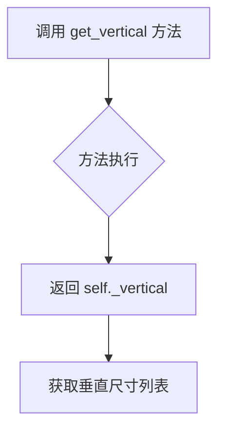

#### 带注释源码

```python
def get_vertical(self):
    """
    Return vertical sizes.
    
    该方法是一个简单的 getter 方法，用于获取在 Divider 初始化时定义的垂直尺寸列表。
    这些尺寸对象决定了矩形区域在垂直方向上如何被分割。
    
    Returns
    -------
    list
        垂直分割的尺寸列表，包含来自 mpl_toolkits.axes_grid1.axes_size 模块的尺寸对象。
    """
    return self._vertical
```


### Divider.set_aspect

设置Divider对象的宽高比属性，用于控制整体矩形区域是否按比例缩放。

参数：
-  `aspect`：`bool`，指定是否保持宽高比

返回值：`None`，无返回值

#### 流程图

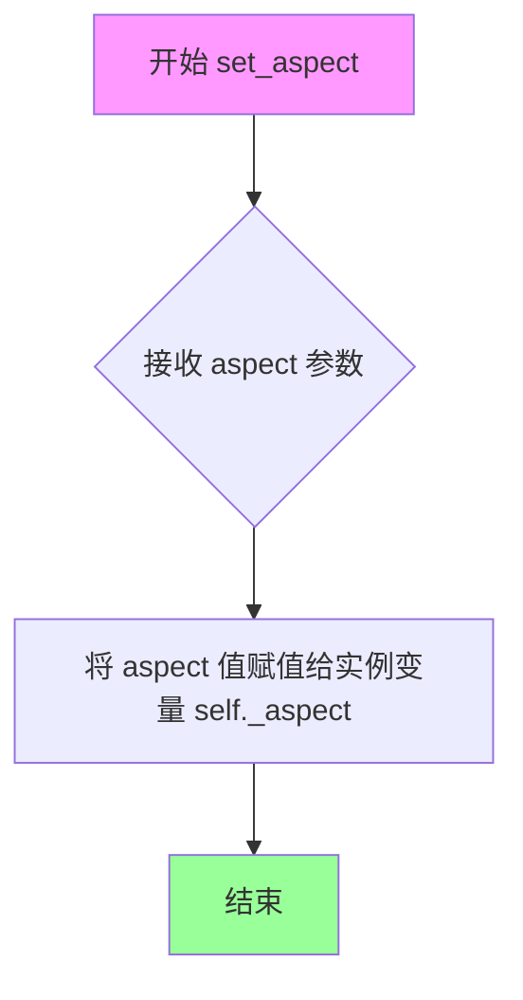

#### 带注释源码

```python
def set_aspect(self, aspect=False):
    """
    Parameters
    ----------
    aspect : bool
        是否保持宽高比。当设置为 True 时，水平
        和垂直方向的相对比例将保持一致。
    """
    # 将传入的 aspect 参数保存到实例变量 _aspect 中
    # 该属性会在 _locate 方法中被使用，用于决定
    # 是否需要对水平和垂直方向应用相同的缩放因子
    self._aspect = aspect
```


### `Divider.get_aspect`

该方法为 `Divider` 类的简单访问器，用于返回当前设置的 `aspect` 属性值，表示是否对分割后的区域进行宽高比约束。

参数： 无

返回值：`bool` 或 `None`，返回 `aspect` 的设置值。当为 `True` 时表示启用宽高比约束，`False` 表示禁用，`None` 表示未设置。

#### 流程图

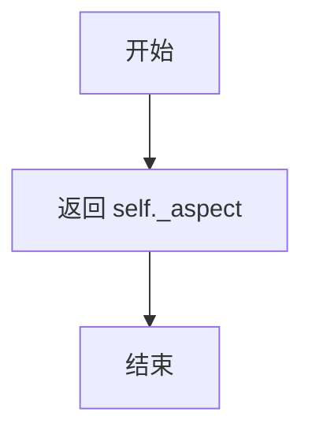

#### 带注释源码

```python
def get_aspect(self):
    """
    Return aspect.

    Returns
    -------
    bool or None
        The aspect setting. True means aspect constraint is enabled,
        False means disabled, and None means not set.
    """
    return self._aspect
```


### `Divider.set_locator`

该方法用于设置定位器（locator），该定位器可在运行时动态计算轴的位置，实现灵活的轴布局调整。

参数：

- `_locator`：任意类型，用于设置定位器，该定位器应是一个可调用对象，接受 `ax` 和 `renderer` 参数并返回表示位置边界的 `Bbox` 对象。传入 `None` 表示清除定位器。

返回值：`None`，无返回值，仅进行属性赋值操作。

#### 流程图

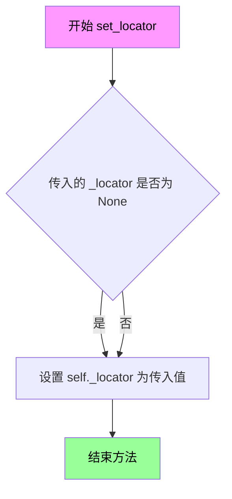

#### 带注释源码

```python
def set_locator(self, _locator):
    """
    设置定位器，该定位器用于在运行时动态计算轴的位置。
    
    Parameters
    ----------
    _locator : callable or None
        定位器可调用对象，签名应为 locator(ax, renderer) -> Bbox。
        当为 None 时，表示清除之前设置的定位器。
        该定位器可覆盖静态的 get_position() 方法返回的位置，
        实现动态布局调整。
    """
    self._locator = _locator  # 将传入的定位器赋值给实例属性
```


### `Divider.get_locator`

该方法用于获取当前axes定位器（locator），该定位器是一个可调用对象，用于在运行时确定axes的位置。如果没有设置定位器，则返回None。

参数：无

返回值：`None` 或 `Callable`，返回当前设置的axes定位器，如果没有设置则返回None。

#### 流程图

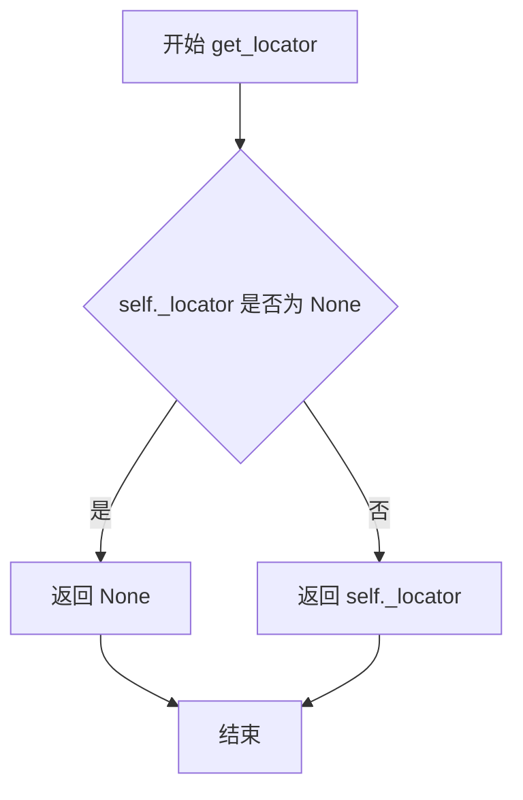

#### 带注释源码

```python
def get_locator(self):
    """
    获取当前设置的 axes 定位器。
    
    该定位器是一个可调用对象，用于在运行时动态计算 axes 的位置。
    当需要动态调整 axes 位置时，可以通过 set_locator() 设置此定位器。
    
    Returns
    -------
    locator : None or callable
        当前设置的定位器对象，如果未设置则返回 None。
        返回的对象通常是通过 new_locator() 方法创建的 functools.partial 对象，
        可在绘制时调用以确定 axes 的实际位置和大小。
    """
    return self._locator
```


### `Divider.get_position_runtime`

获取轴在运行时的位置。如果设置了定位器（locator），则使用定位器计算位置；否则返回预定义的位置。

参数：

- `ax`：`matplotlib.axes.Axes`，需要定位的轴对象
- `renderer`：`matplotlib.backend_bases.RendererBase`，图形渲染器，用于计算定位器返回的最终位置

返回值：`tuple of 4 floats`，返回位置边界框 (x, y, width, height)

#### 流程图

```mermaid
flowchart TD
    A[开始 get_position_runtime] --> B{检查 self._locator 是否为 None}
    B -->|是| C[调用 self.get_position 返回预定义位置]
    B -->|否| D[调用 self._locator 获取定位器]
    D --> E[获取定位器的 bounds 属性]
    E --> F[返回位置边界框]
    C --> F
```

#### 带注释源码

```python
def get_position_runtime(self, ax, renderer):
    """
    获取轴在运行时的实际位置。

    如果divider设置了locator（定位器），则通过locator计算轴的精确位置；
    否则返回divider的预设位置。

    Parameters
    ----------
    ax : matplotlib.axes.Axes
        需要定位的轴对象
    renderer : matplotlib.backend_bases.RendererBase
        渲染器对象，用于定位器计算实际像素位置

    Returns
    -------
    tuple of 4 floats
        位置边界框 (x, y, width, height)
    """
    # 检查是否设置了定位器
    if self._locator is None:
        # 未设置定位器时，返回预设的静态位置
        return self.get_position()
    else:
        # 已设置定位器时，调用定位器计算实际位置
        # 定位器是一个可调用对象，接收ax和renderer参数
        # 返回一个Bbox对象，其bounds属性为 (x, y, width, height)
        return self._locator(ax, renderer).bounds
```


### `Divider._calc_k`

该静态方法用于计算布局分割中的缩放因子 k，使得所有分割区域的相对大小乘以 k 加上绝对大小之和等于指定的总数，常用于计算水平或垂直方向上的分割系数。

参数：

- `sizes`：`numpy.ndarray`，形状为 (n, 2) 的数组，每行包含 (相对大小, 绝对大小)，用于表示各分割区域的尺寸属性
- `total`：`float`，目标总大小，即所有分割区域实际占用尺寸的总和

返回值：`float`，计算得到的缩放因子 k。如果相对大小之和为 0，则返回 0

#### 流程图

```mermaid
flowchart TD
    A[开始 _calc_k] --> B[输入 sizes 和 total]
    B --> C[计算 sizes 数组在轴 0 上的总和]
    C --> D[得到 rel_sum 和 abs_sum]
    D --> E{rel_sum 是否为 0?}
    E -->|是| F[返回 0]
    E -->|否| G[计算 k = (total - abs_sum) / rel_sum]
    G --> H[返回 k]
```

#### 带注释源码

```python
@staticmethod
def _calc_k(sizes, total):
    """
    计算分割系数 k，使得 sum(rel_size * k + abs_size) == total。
    
    Parameters
    ----------
    sizes : numpy.ndarray
        形状为 (n, 2) 的数组，每行包含 (相对大小, 绝对大小)。
        用于表示各分割区域的尺寸信息。
    total : float
        目标总大小，所有分割区域实际占用尺寸的总和。
    
    Returns
    -------
    float
        计算得到的缩放因子 k。如果相对大小之和为 0，则返回 0。
    """
    # 使用 numpy 的 sum 方法沿轴 0 计算列总和
    # 结果是一个长度为 2 的数组：[相对大小总和, 绝对大小总和]
    rel_sum, abs_sum = sizes.sum(0)
    
    # 如果相对大小总和非零，计算 k 因子
    # 推导：sum(rel * k + abs) = total
    #      k * sum(rel) + sum(abs) = total
    #      k = (total - sum(abs)) / sum(rel)
    return (total - abs_sum) / rel_sum if rel_sum else 0
```


### `Divider._calc_offsets`

该方法为静态方法，用于根据相对大小和绝对大小计算累积偏移量。它接收一个包含相对大小和绝对大小的二维数组以及一个缩放因子k，通过矩阵运算将两者组合后计算累积和，返回各分区的起始位置偏移量。

参数：

- `sizes`：`numpy.ndarray`，形状为 (n, 2) 的二维数组，每行包含 (rel_size, abs_size)，分别表示相对大小和绝对大小
- `k`：`float`，缩放因子，用于调整相对大小部分的权重

返回值：`numpy.ndarray`，一维数组，表示累积偏移位置，从0开始，依次为各分区的起始坐标

#### 流程图

```mermaid
flowchart TD
    A[开始 _calc_offsets] --> B[输入 sizes (n×2数组) 和 k (缩放因子)]
    B --> C[构造矩阵 [k, 1]]
    C --> D[执行矩阵乘法 sizes @ [k, 1]]
    D --> E{计算结果}
    E -->|结果为 n 维数组| F[在结果前插入 0]
    F --> G[计算累积和 np.cumsum]
    G --> H[返回累积偏移数组]
```

#### 带注释源码

```python
@staticmethod
def _calc_offsets(sizes, k):
    """
    应用 k 因子到 (n, 2) 大小的数组 (rel_size, abs_size);
    返回累积偏移位置。

    Parameters
    ----------
    sizes : numpy.ndarray
        形状为 (n, 2) 的二维数组，每列表示 (相对大小, 绝对大小)
    k : float
        缩放因子，用于调整相对大小的权重

    Returns
    -------
    numpy.ndarray
        累积偏移位置数组，用于确定各子区域的起始坐标
    """
    # sizes @ [k, 1] 执行矩阵乘法:
    # - 第一列 (rel_size) 乘以 k
    # - 第二列 (abs_size) 乘以 1
    # 结果是一个 n 维数组，表示每个分区调整后的宽度
    # [0, *(sizes @ [k, 1])] 在结果前面添加 0 作为起始偏移
    # np.cumsum 计算累积和，得到每个分区的起始位置
    return np.cumsum([0, *(sizes @ [k, 1])])
```


### `Divider.new_locator`

该方法用于为指定的单元格创建一个可调用的轴定位器（axes locator），返回一个 `functools.partial` 对象，该对象可在绘制时确定轴的位置。

参数：

- `nx`：`int`，指定列位置的整数
- `ny`：`int`，指定行位置的整数
- `nx1`：`int | None`，当为 `None` 时指定单个 `nx` 列；否则指定从 `nx` 到 `nx1`（不含 `nx1` 列）的列范围
- `ny1`：`int | None`，同 `nx1`，但用于行位置

返回值：`functools.partial`，一个可调用对象，用于在绘制时定位轴的位置

#### 流程图

```mermaid
flowchart TD
    A[开始 new_locator] --> B{检查 nx1 是否为 None}
    B -->|是| C[nx1 = nx + 1]
    B -->|否| D{检查 ny1 是否为 None}
    C --> D
    D -->|是| E[ny1 = ny + 1]
    D -->|否| F[获取 xref = self._xrefindex]
    E --> F
    F --> G[获取 yref = self._yrefindex]
    G --> H[创建 functools.partial 对象]
    H --> I[设置 partial 对象的 get_subplotspec 方法]
    I --> J[返回 locator]
```

#### 带注释源码

```python
def new_locator(self, nx, ny, nx1=None, ny1=None):
    """
    Return an axes locator callable for the specified cell.

    Parameters
    ----------
    nx, nx1 : int
        Integers specifying the column-position of the
        cell. When *nx1* is None, a single *nx*-th column is
        specified. Otherwise, location of columns spanning between *nx*
        to *nx1* (but excluding *nx1*-th column) is specified.
    ny, ny1 : int
        Same as *nx* and *nx1*, but for row positions.
    """
    # 如果未指定 nx1，则默认选择单列（从 nx 到 nx+1）
    if nx1 is None:
        nx1 = nx + 1
    # 如果未指定 ny1，则默认选择单行（从 ny 到 ny+1）
    if ny1 is None:
        ny1 = ny + 1
    
    # 注释说明：
    # append_size("left") 会在水平尺寸列表的开头添加新尺寸；
    # 这个偏移变换使 new_locator(nx=2, ...) 等效于 new_locator(nx=3, ...)。
    # 为了考虑这一点，我们记录 nx - self._xrefindex（而非 nx），
    # 其中 _xrefindex 每次调用 append_size("left") 会加 1，
    # 并在 _locate 中重新加上 self._xrefindex 来计算实际轴位置。
    # y 方向同理。
    
    # 获取当前水平方向的引用索引（用于处理左侧添加的尺寸）
    xref = self._xrefindex
    # 获取当前垂直方向的引用索引（用于处理底部添加的尺寸）
    yref = self._yrefindex
    
    # 创建 functools.partial 对象，绑定 _locate 方法和调整后的索引
    # 索引减去 xref/yref 是为了在 _locate 中加回来时得到正确的位置
    locator = functools.partial(
        self._locate, nx - xref, ny - yref, nx1 - xref, ny1 - yref)
    
    # 将 get_subplotspec 方法绑定到返回的 locator 对象上
    locator.get_subplotspec = self.get_subplotspec
    
    # 返回可调用的定位器对象
    return locator
```


### `Divider._locate`

该方法是 `Divider` 类的核心定位方法，实现了通过 `new_locator()` 创建的轴定位器的实际定位逻辑。它根据水平/垂直分割尺寸、渲染器信息以及单元格索引，计算并返回指定单元格在图形中的精确边界框（Bbox），支持固定宽高比模式。

参数：

- `nx`：`int`，列索引，指定要定位的单元格所在的列位置
- `ny`：`int`，行索引，指定要定位的单元格所在的行位置
- `nx1`：`int` 或 `None`，结束列索引，指定单元格列范围的结束位置（不含该列），为 None 时表示单列
- `ny1`：`int` 或 `None`，结束行索引，指定单元格行范围的结束位置（不含该行），为 None 时表示单行
- `axes`：`~matplotlib.axes.Axes`，需要定位的 Axes 对象，用于获取运行时位置
- `renderer`：`~matplotlib.backend_bases.RendererBase`，渲染器对象，用于计算尺寸

返回值：`~matplotlib.transforms.Bbox`，返回计算得到的单元格边界框，包含了该单元格在图形中的 x、y 坐标以及宽高信息

#### 流程图

```mermaid
flowchart TD
    A[开始 _locate] --> B[调整索引: nx += _xrefindex<br/>nx1 += _xrefindex<br/>ny += _yrefindex<br/>ny1 += _yrefindex]
    B --> C[获取图形尺寸: fig_w, fig_h = fig.bbox.size / fig.dpi]
    C --> D[获取运行时位置: x, y, w, h = get_position_runtime]
    D --> E[获取分割尺寸: hsizes, vsizes]
    E --> F[计算缩放因子: k_h, k_v]
    F --> G{是否需要固定宽高比?}
    G -->|是| H[取最小因子: k = min(k_h, k_v)]
    H --> I[计算偏移: ox, oy]
    I --> J[计算实际宽高: ww, hh]
    J --> K[创建锚定边界框并获取起点: x0, y0]
    G -->|否| L[使用各自因子: k_h, k_v]
    L --> M[计算偏移: ox, oy]
    M --> N[直接使用原始位置: x0, y0 = x, y]
    K --> O[处理默认索引: nx1=-1, ny1=-1 if None]
    N --> O
    O --> P[计算最终边界框坐标: x1, y1, w1, h1]
    P --> Q[返回 Bbox.from_bounds]
```

#### 带注释源码

```python
def _locate(self, nx, ny, nx1, ny1, axes, renderer):
    """
    Implementation of ``divider.new_locator().__call__``.

    The axes locator callable returned by ``new_locator()`` is created as
    a `functools.partial` of this method with *nx*, *ny*, *nx1*, and *ny1*
    specifying the requested cell.
    """
    # 调整索引以考虑前置插入的尺寸元素
    nx += self._xrefindex
    nx1 += self._xrefindex
    ny += self._yrefindex
    ny1 += self._yrefindex

    # 获取图形尺寸（英寸）
    fig_w, fig_h = self._fig.bbox.size / self._fig.dpi
    
    # 获取 Axes 的运行时位置（可能被定位器修改）
    x, y, w, h = self.get_position_runtime(axes, renderer)

    # 获取水平和垂直方向的分割尺寸数组
    hsizes = self.get_horizontal_sizes(renderer)
    vsizes = self.get_vertical_sizes(renderer)
    
    # 计算水平和垂直方向的缩放因子 k
    # 使得 sum(rel_size * k + abs_size) 等于可用空间
    k_h = self._calc_k(hsizes, fig_w * w)
    k_v = self._calc_k(vsizes, fig_h * h)

    # 根据是否需要保持宽高比来计算偏移
    if self.get_aspect():
        # 取最小因子以确保两个方向都能容纳
        k = min(k_h, k_v)
        # 使用统一因子计算偏移
        ox = self._calc_offsets(hsizes, k)
        oy = self._calc_offsets(vsizes, k)

        # 计算缩放后的总宽高（相对于图形尺寸的比例）
        ww = (ox[-1] - ox[0]) / fig_w
        hh = (oy[-1] - oy[0]) / fig_h
        
        # 创建原始和缩放后的边界框
        pb = mtransforms.Bbox.from_bounds(x, y, w, h)
        pb1 = mtransforms.Bbox.from_bounds(x, y, ww, hh)
        # 根据锚点位置获取实际起始点
        x0, y0 = pb1.anchored(self.get_anchor(), pb).p0

    else:
        # 不保持宽高比时，水平和垂直使用各自的因子
        ox = self._calc_offsets(hsizes, k_h)
        oy = self._calc_offsets(vsizes, k_v)
        # 直接使用原始位置作为起点
        x0, y0 = x, y

    # 处理默认的结束索引
    if nx1 is None:
        nx1 = -1
    if ny1 is None:
        ny1 = -1

    # 计算最终单元格的边界框坐标和尺寸
    # 偏移量除以图形尺寸得到比例值
    x1, w1 = x0 + ox[nx] / fig_w, (ox[nx1] - ox[nx]) / fig_w
    y1, h1 = y0 + oy[ny] / fig_h, (oy[ny1] - oy[ny]) / fig_h

    # 返回计算得到的边界框
    return mtransforms.Bbox.from_bounds(x1, y1, w1, h1)
```


### `Divider.append_size`

该方法用于在分割器的水平或垂直尺寸列表中指定位置添加新的尺寸对象，同时维护引用索引以支持动态布局。

参数：

- `position`：`str`，位置标识，必须是 "left"、"right"、"bottom" 或 "top" 之一，表示添加尺寸的方向
- `size`：`mpl_toolkits.axes_grid1.axes_size`，要添加的尺寸对象

返回值：`None`，无返回值

#### 流程图

```mermaid
flowchart TD
    A[开始 append_size] --> B{检查 position 是否有效}
    B -->|无效| C[抛出异常]
    B -->|有效| D{position == "left"?}
    D -->|是| E[在 _horizontal 列表开头插入 size]
    E --> F[_xrefindex += 1]
    F --> M[结束]
    D -->|否| G{position == "right"?}
    G -->|是| H[在 _horizontal 列表末尾追加 size]
    H --> M
    G -->|否| I{position == "bottom"?}
    I -->|是| J[在 _vertical 列表开头插入 size]
    J --> K[_yrefindex += 1]
    K --> M
    I -->|否| L[在 _vertical 列表末尾追加 size]
    L --> M
```

#### 带注释源码

```python
def append_size(self, position, size):
    """
    在分割器的尺寸列表中添加一个新的尺寸。

    Parameters
    ----------
    position : str
        位置标识，必须是 "left"、"right"、"bottom" 或 "top" 之一。
        - "left"：在水平尺寸列表的开头插入
        - "right"：在水平尺寸列表的末尾追加
        - "bottom"：在垂直尺寸列表的开头插入
        - "top"：在垂直尺寸列表的末尾追加
    size : mpl_toolkits.axes_grid1.axes_size
        要添加的尺寸对象，用于定义axes的大小
    """
    # 验证position参数是否在允许的列表中
    _api.check_in_list(["left", "right", "bottom", "top"],
                       position=position)
    
    # 根据position参数在不同的列表中添加size
    if position == "left":
        # 在水平尺寸列表的开头插入新尺寸
        self._horizontal.insert(0, size)
        # 递增xrefindex以反映新增的左侧尺寸
        self._xrefindex += 1
    elif position == "right":
        # 在水平尺寸列表的末尾追加新尺寸
        self._horizontal.append(size)
    elif position == "bottom":
        # 在垂直尺寸列表的开头插入新尺寸
        self._vertical.insert(0, size)
        # 递增yrefindex以反映新增的底部尺寸
        self._yrefindex += 1
    else:  # 'top'
        # 在垂直尺寸列表的末尾追加新尺寸
        self._vertical.append(size)
```


### `Divider.add_auto_adjustable_area`

该方法用于在布局时自动调整指定轴周围的填充区域，以容纳轴的装饰元素（标题、标签、刻度、刻度标签等）。

参数：

- `self`：`Divider`，Divider类的实例（隐式参数）
- `use_axes`：`~matplotlib.axes.Axes` 或 `~matplotlib.axes.Axes` 列表，需要考虑其装饰器的轴
- `pad`：`float`，默认值为 0.1额外的填充大小，单位为英寸
- `adjust_dirs`：`list of {"left", "right", "bottom", "top"}`，可选参数，默认为 None（全部四边），指定添加填充的方向

返回值：`None`，该方法直接修改Divider的内部状态，不返回任何值

#### 流程图

```mermaid
graph TD
    A[开始] --> B{adjust_dirs is None?}
    B -->|是| C[adjust_dirs = ['left', 'right', 'bottom', 'top']]
    B -->|否| D[使用传入的adjust_dirs]
    C --> E[遍历 adjust_dirs 中的每个方向 d]
    D --> E
    E --> F[创建 Size._AxesDecorationsSize use_axes, d]
    F --> G[计算 pad 后的总大小]
    G --> H[调用 self.append_size 添加尺寸到对应方向]
    H --> I{是否还有更多方向?}
    I -->|是| E
    I -->|否| J[结束]
```

#### 带注释源码

```python
def add_auto_adjustable_area(self, use_axes, pad=0.1, adjust_dirs=None):
    """
    Add auto-adjustable padding around *use_axes* to take their decorations
    (title, labels, ticks, ticklabels) into account during layout.

    Parameters
    ----------
    use_axes : `~matplotlib.axes.Axes` or list of `~matplotlib.axes.Axes`
        The Axes whose decorations are taken into account.
    pad : float, default: 0.1
        Additional padding in inches.
    adjust_dirs : list of {"left", "right", "bottom", "top"}, optional
        The sides where padding is added; defaults to all four sides.
    """
    # 如果未指定adjust_dirs，默认使用全部四个方向
    if adjust_dirs is None:
        adjust_dirs = ["left", "right", "bottom", "top"]
    
    # 遍历指定的方向，为每个方向添加装饰器尺寸和额外填充
    for d in adjust_dirs:
        # 创建轴装饰器尺寸对象，并加上额外的pad值
        # _AxesDecorationsSize 用于计算指定方向的装饰器所需空间
        self.append_size(d, Size._AxesDecorationsSize(use_axes, d) + pad)
```


### `SubplotDivider.__init__`

该方法是`SubplotDivider`类的构造函数，用于初始化一个基于子图几何规格的矩形区域分割器。它继承自`Divider`类，并结合`SubplotSpec`来实现子图的布局管理，支持水平/垂直分割尺寸、宽高比和锚点设置。

参数：

- `fig`：`~matplotlib.figure.Figure`，matplotlib的图形对象，作为所有子图的容器
- `*args`：tuple (*nrows*, *ncols*, *index*) or int，子图的几何规格，指定子图数组的行列数以及要创建的子图索引。索引从左上角1开始向右增加；当三位数都小于10时，可传入单一3位数（如234表示(2,3,4)）
- `horizontal`：list of :mod:`~mpl_toolkits.axes_grid1.axes_size`，可选，用于水平分割的尺寸列表
- `vertical`：list of :mod:`~mpl_toolkits.axes_grid1.axes_size`，可选，用于垂直分割的尺寸列表
- `aspect`：bool，可选，是否调整矩形区域使水平和垂直刻度具有相同比例
- `anchor`：(float, float) or {'C', 'SW', 'S', 'SE', 'E', 'NE', 'N', 'NW', 'W'}，默认'C'，当aspect为True时，缩小矩形的放置位置

返回值：无（`__init__`方法返回`None`），通过设置实例属性完成初始化

#### 流程图

```mermaid
flowchart TD
    A[开始 __init__] --> B[保存fig到self.figure]
    B --> C[调用父类Divider.__init__]
    C --> D[传入位置坐标[0,0,1,1]]
    D --> E[horizontal和vertical使用空列表默认值]
    E --> F[设置subplotspec属性]
    F --> G[通过SubplotSpec._from_subplot_args创建]
    G --> H[调用set_subplotspec保存]
    H --> I[结束]
```

#### 带注释源码

```python
def __init__(self, fig, *args, horizontal=None, vertical=None,
             aspect=None, anchor='C'):
    """
    Parameters
    ----------
    fig : `~matplotlib.figure.Figure`

    *args : tuple (*nrows*, *ncols*, *index*) or int
        The array of subplots in the figure has dimensions ``(nrows,
        ncols)``, and *index* is the index of the subplot being created.
        *index* starts at 1 in the upper left corner and increases to the
        right.

        If *nrows*, *ncols*, and *index* are all single digit numbers, then
        *args* can be passed as a single 3-digit number (e.g. 234 for
        (2, 3, 4)).
    horizontal : list of :mod:`~mpl_toolkits.axes_grid1.axes_size`, optional
        Sizes for horizontal division.
    vertical : list of :mod:`~mpl_toolkits.axes_grid1.axes_size`, optional
        Sizes for vertical division.
    aspect : bool, optional
        Whether overall rectangular area is reduced so that the relative
        part of the horizontal and vertical scales have the same scale.
    anchor : (float, float) or {'C', 'SW', 'S', 'SE', 'E', 'NE', 'N', \
'NW', 'W'}, default: 'C'
        Placement of the reduced rectangle, when *aspect* is True.
    """
    # 将图形对象保存为实例属性，供后续方法使用
    self.figure = fig
    # 调用父类Divider的构造函数进行基础初始化
    # 位置设置为[0, 0, 1, 1]，表示整个子图区域（归一化坐标）
    # horizontal和vertical使用or操作符处理None情况，默认为空列表
    super().__init__(fig, [0, 0, 1, 1],
                     horizontal=horizontal or [], vertical=vertical or [],
                     aspect=aspect, anchor=anchor)
    # 通过SubplotSpec._from_subplot_args从子图参数创建SubplotSpec实例
    # 并调用set_subplotspec方法保存到实例属性
    self.set_subplotspec(SubplotSpec._from_subplot_args(fig, args))
```


### `SubplotDivider.get_position`

该方法是 SubplotDivider 类中的定位方法，用于获取子图框的边界位置。它通过获取子图规范（SubplotSpec）的位置信息并返回其边界元组，为子图的布局提供精确的坐标信息。

参数： 无（仅包含隐式参数 `self`）

返回值：`tuple of 4 floats`，返回子图框的边界坐标 (x, y, width, height)

#### 流程图

```mermaid
flowchart TD
    A[开始 get_position] --> B[获取子图规范]
    B --> C[调用 subplotspec.get_position figure]
    C --> D[获取位置对象 Bbox]
    D --> E[提取 bounds 属性]
    E --> F[返回边界元组 x, y, w, h]
```

#### 带注释源码

```python
def get_position(self):
    """
    Return the bounds of the subplot box.
    
    此方法重写了基类 Divider.get_position，用于获取子图框的精确边界。
    它通过 SubplotSpec 接口获取与图形关联的位置信息，返回标准的
    matplotlib 边界格式 (x0, y0, width, height)。
    
    Returns
    -------
    tuple of 4 floats
        子图框的边界，格式为 (x, y, width, height)，其中:
        - x: 子图左下角的 x 坐标
        - y: 子图左下角的 y 坐标
        - width: 子图的宽度
        - height: 子图的高度
    """
    # 获取子图规范对象
    subplotspec = self.get_subplotspec()
    
    # 调用子图规范的 get_position 方法，传入图形对象
    # 返回一个 Bbox 对象
    position = subplotspec.get_position(self.figure)
    
    # 提取 Bbox 对象的边界属性，返回 (x, y, width, height) 元组
    return position.bounds
```


### `SubplotDivider.get_subplotspec`

获取与该 SubplotDivider 关联的 SubplotSpec 实例，用于获取子图的位置信息和网格规范。

参数：

- （无参数，仅 `self`）

返回值：`SubplotSpec`，返回存储在当前 SubplotDivider 中的 SubplotSpec 实例，该实例定义了子图的网格布局和位置信息。

#### 流程图

```mermaid
flowchart TD
    A[开始 get_subplotspec] --> B{返回 self._subplotspec}
    B --> C[结束]
```

#### 带注释源码

```python
def get_subplotspec(self):
    """Get the SubplotSpec instance."""
    return self._subplotspec
```

**代码解析**：

- `self._subplotspec` 是 SubplotDivider 在初始化时通过 `set_subplotspec` 方法设置的对象
- 该方法是 `Divider` 基类中同名方法的重写，基类实现返回 `None`
- SubplotSpec 对象包含了子图的行、列索引以及在图形中的位置信息
- 此方法通常与 `get_position()` 方法配合使用，后者内部调用了 `get_subplotspec().get_position(self.figure)` 来获取实际的坐标 bounds


### `SubplotDivider.set_subplotspec`

该方法用于设置SubplotDivider的SubplotSpec实例，并根据传入的SubplotSpec更新内部的位置信息，确保子图分割器与子图规范保持同步。

参数：

- `subplotspec`：`SubplotSpec`，要设置的SubplotSpec实例，定义了子图的网格规格和位置信息

返回值：`None`，该方法无返回值，仅更新内部状态

#### 流程图

```mermaid
flowchart TD
    A[开始 set_subplotspec] --> B[接收 subplotspec 参数]
    B --> C[将 subplotspec 赋值给 self._subplotspec]
    C --> D[调用 subplotspec.get_position获取位置信息]
    D --> E[调用 self.set_position更新内部位置]
    E --> F[结束]
```

#### 带注释源码

```python
def set_subplotspec(self, subplotspec):
    """Set the SubplotSpec instance."""
    # 将传入的 SubplotSpec 实例保存到类的私有属性中
    self._subplotspec = subplotspec
    
    # 获取 SubplotSpec 对应的位置信息（包含 figure 引用）
    # 并调用父类的 set_position 方法更新内部存储的位置
    # 这确保了 Divider 的位置与 SubplotSpec 的位置保持同步
    self.set_position(subplotspec.get_position(self.figure))
```


### AxesDivider.__init__

这是`AxesDivider`类的构造函数，用于基于已存在的坐标轴（Axes）创建一个分割器（Divider）。该分割器会根据已存在的坐标轴来定义水平 和垂直方向的参考尺寸，从而实现自动布局计算。

参数：

- `self`：实例对象，Python自动传递的实例引用
- `axes`：`matplotlib.axes.Axes`，需要被分割的已存在坐标轴对象
- `xref`：可选的`Size._Base`类型，水平方向的参考尺寸，默认为`None`（自动创建`Size.AxesX(axes)`）
- `yref`：可选的`Size._Base`类型，垂直方向的参考尺寸，默认为`None`（自动创建`Size.AxesY(axes)`）

返回值：`None`，构造函数无返回值

#### 流程图

```mermaid
flowchart TD
    A[开始 __init__] --> B[接收 axes, xref, yref 参数]
    B --> C[保存 axes 到 self._axes]
    C --> D{判断 xref 是否为 None?}
    D -->|是| E[创建 Size.AxesX(axes) 作为水平参考]
    D -->|否| F[使用传入的 xref 作为水平参考]
    E --> G{判断 yref 是否为 None?}
    F --> G
    G -->|是| H[创建 Size.AxesY(axes) 作为垂直参考]
    G -->|否| I[使用传入的 yref 作为垂直参考]
    H --> J[调用父类 Divider.__init__]
    I --> J
    J --> K[传入 fig=axes.get_figure, pos=None, horizontal=[_xref], vertical=[_yref], aspect=None, anchor='C']
    K --> L[结束 __init__]
```

#### 带注释源码

```python
def __init__(self, axes, xref=None, yref=None):
    """
    Parameters
    ----------
    axes : :class:`~matplotlib.axes.Axes`
        需要被分割的已存在坐标轴对象
    xref
        水平方向的参考尺寸，用于确定水平分割的比例。
        如果为None，则自动创建基于axes宽度的参考尺寸
    yref
        垂直方向的参考尺寸，用于确定垂直分割的比例。
        如果为None，则自动创建基于axes高度的参考尺寸
    """
    # 保存对原始坐标轴的引用，后续用于获取位置等信息
    self._axes = axes
    
    # 如果未指定水平参考尺寸，则自动创建基于axes宽度的AxesX对象
    if xref is None:
        self._xref = Size.AxesX(axes)
    else:
        self._xref = xref
    
    # 如果未指定垂直参考尺寸，则自动创建基于axes高度的AxesY对象
    if yref is None:
        self._yref = Size.AxesY(axes)
    else:
        self._yref = yref

    # 调用父类Divider的初始化方法
    # - fig: 从axes获取对应的Figure对象
    # - pos: 设为None，表示位置将在后续从axes获取
    # - horizontal: 水平分割尺寸列表，初始只包含xref参考
    # - vertical: 垂直分割尺寸列表，初始只包含yref参考
    # - aspect: 设为None，不强制保持宽高比
    # - anchor: 设为'C'（居中），当aspect为True时使用
    super().__init__(fig=axes.get_figure(), pos=None,
                     horizontal=[self._xref], vertical=[self._yref],
                     aspect=None, anchor="C")
```


### `AxesDivider._get_new_axes`

该方法用于在 AxesDivider 中创建一个新的 axes 实例。它获取当前 axes 的 figure 和原始位置，并使用指定的 axes_class（默认为当前 axes 的类型）创建新的 axes。

参数：

- `axes_class`：`type` 或 `None`，要创建的 axes 的类类型。如果为 None，则使用当前 axes 的类型（即 `type(self._axes)`）
- `**kwargs`：关键字参数，这些参数会被传递给 axes 类的构造函数

返回值：`matplotlib.axes.Axes`，返回新创建的 axes 实例

#### 流程图

```mermaid
flowchart TD
    A[开始 _get_new_axes] --> B{axes_class is None?}
    B -->|是| C[axes_class = type(self._axes)]
    B -->|否| D[使用传入的 axes_class]
    C --> E[获取 figure: self._axes.get_figure()]
    D --> E
    E --> F[获取原始位置: self._axes.get_position(original=True)]
    F --> G[调用 axes_class 构造函数: axes_class(fig, pos, **kwargs)]
    G --> H[返回新创建的 axes 实例]
```

#### 带注释源码

```python
def _get_new_axes(self, *, axes_class=None, **kwargs):
    """
    创建并返回一个新的 axes 实例。
    
    Parameters
    ----------
    axes_class : subclass type of `~matplotlib.axes.Axes`, optional
        要创建的 axes 的类型。如果为 None，则使用当前 axes 的类型。
    **kwargs : dict
        传递给 axes 构造函数的其他关键字参数。
    
    Returns
    -------
    axes : matplotlib.axes.Axes
        新创建的 axes 实例。
    """
    # 获取当前关联的 axes 对象
    axes = self._axes
    
    # 如果未指定 axes_class，则默认使用当前 axes 的类型
    if axes_class is None:
        axes_class = type(axes)
    
    # 使用原 axes 的 figure 和原始位置创建新 axes
    # axes.get_figure() 获取所属的 Figure 对象
    # axes.get_position(original=True) 获取原始的 axes 位置（不被修改后的位置）
    # **kwargs 会传递额外的参数给 axes 构造函数
    return axes_class(axes.get_figure(), axes.get_position(original=True),
                      **kwargs)
```


### `AxesDivider.new_horizontal`

该方法是 `AxesDivider` 类的成员方法，用于在水平方向（左侧或右侧）添加新的子 Axes，并返回该 Axes 对象。它是 `append_axes` 方法的内部实现辅助方法。

参数：

- `self`：隐式参数，`AxesDivider` 实例本身
- `size`：`Size._Base` 或 float 或 str，新添加_axes的宽度
- `pad`：`Size._Base` 或 float 或 str，可选参数，默认值为 `None`（由 `mpl.rcParams["figure.subplot.wspace"] * self._xref` 计算得出），表示新_axes与主_axes之间的间距
- `pack_start`：`bool`，可选参数，默认值为 `False`，当为 `True` 时表示添加到左侧，当为 `False` 时表示添加到右侧
- `**kwargs`：可变关键字参数，会传递给创建新_axes的函数

返回值：`~matplotlib.axes.Axes`，返回新创建的子 Axes 对象

#### 流程图

```mermaid
flowchart TD
    A[开始 new_horizontal] --> B{判断 pad 是否为 None}
    B -->|是| C[pad = mpl.rcParams['figure.subplot.wspace'] * self._xref]
    B -->|否| D{pad 是否为 Size._Base 实例}
    C --> E[确定位置: pos = 'left' if pack_start else 'right']
    D -->|否| F[pad = Size.from_any(pad, fraction_ref=self._xref)]
    D -->|是| E
    F --> E
    E --> G{pad 是否为真值}
    G -->|是| H[调用 self.append_size 添加 pad 到水平列表]
    G -->|否| I{size 是否为 Size._Base 实例}
    H --> I
    I -->|否| J[size = Size.from_any(size, fraction_ref=self._xref)]
    I -->|是| K[调用 self.append_size 添加 size 到水平列表]
    J --> K
    K --> L{计算 nx 值}
    L -->|pack_start=True| M[nx = 0]
    L -->|pack_start=False| N[nx = len(self._horizontal) - 1]
    M --> O[调用 self.new_locator 创建 locator]
    N --> O
    O --> P[调用 self._get_new_axes 创建新 axes]
    P --> Q[调用 ax.set_axes_locator 设置定位器]
    Q --> R[返回新创建的 ax]
```

#### 带注释源码

```python
def new_horizontal(self, size, pad=None, pack_start=False, **kwargs):
    """
    Helper method for ``append_axes("left")`` and ``append_axes("right")``.

    See the documentation of `append_axes` for more details.

    :meta private:
    """
    # 如果未指定 pad，则使用 figure.subplot.wspace 参数乘以 xref 计算默认间距
    if pad is None:
        pad = mpl.rcParams["figure.subplot.wspace"] * self._xref
    
    # 根据 pack_start 参数确定添加位置：左侧或右侧
    pos = "left" if pack_start else "right"
    
    # 如果 pad 非空，则将其添加到水平尺寸列表中
    # 如果 pad 不是 Size._Base 实例，则先转换为 Size 对象
    if pad:
        if not isinstance(pad, Size._Base):
            pad = Size.from_any(pad, fraction_ref=self._xref)
        self.append_size(pos, pad)
    
    # 如果 size 不是 Size._Base 实例，则先转换为 Size 对象
    if not isinstance(size, Size._Base):
        size = Size.from_any(size, fraction_ref=self._xref)
    
    # 将 size 添加到水平尺寸列表中
    self.append_size(pos, size)
    
    # 创建 locator 来定位新 axes 的位置
    # 如果 pack_start 为 True，则使用第一个位置 (nx=0)
    # 否则使用最后一个位置 (nx=len(self._horizontal) - 1)
    locator = self.new_locator(
        nx=0 if pack_start else len(self._horizontal) - 1,
        ny=self._yrefindex)
    
    # 创建新的 axes 对象
    ax = self._get_new_axes(**kwargs)
    
    # 为新 axes 设置定位器
    ax.set_axes_locator(locator)
    
    # 返回新创建的 axes 对象
    return ax
```


### `AxesDivider.new_vertical`

该方法是 `AxesDivider` 类的成员方法，用于在已存在的 axes 基础上创建一个新的垂直方向（顶部或底部）的 axes，并返回该新 axes。它是 `append_axes("top")` 和 `append_axes("bottom")` 的底层实现辅助方法。

参数：

- `self`：`AxesDivider` 实例，隐式参数，表示当前的分隔器对象
- `size`：`:mod:`~mpl_toolkits.axes_grid1.axes_size` 或 float 或 str，新 axes 的高度尺寸；float 或 str 参数会被解释为基于 `self._yref` 的尺寸
- `pad`：`:mod:`~mpl_toolkits.axes_grid1.axes_size` 或 float 或 str，可选，默认为 None，新 axes 与主 axes 之间的间距；float 或 str 参数会被解释为基于 `self._yref` 的尺寸；默认值为 `rcParams["figure.subplot.hspace"] * self._yref`
- `pack_start`：bool，可选，默认为 False，若为 True，则新 axes 添加在底部（"bottom"）；若为 False，则添加在顶部（"top"）
- `**kwargs`：任意关键字参数，这些参数会被传递给新创建的新 axes 的构造函数

返回值：`~matplotlib.axes.Axes`，返回新创建的 axes 对象

#### 流程图

```mermaid
flowchart TD
    A[开始 new_vertical] --> B{pad is None?}
    B -->|是| C[pad = rcParams['figure.subplot.hspace'] * self._yref]
    B -->|否| D{pad 是 Size._Base 实例?}
    C --> D
    D -->|是| E{pack_start is True?}
    D -->|否| F[pad = Size.from_any(pad, fraction_ref=self._yref)]
    F --> E
    E -->|是| G[pos = 'bottom']
    E -->|否| H[pos = 'top']
    G --> I{pad 非空?}
    H --> I
    I -->|是| J[self.append_size pos, pad]
    I -->|否| K{size 是 Size._Base 实例?}
    J --> K
    K -->|是| L[size 是 Size._Base 实例?]
    K -->|否| M[size = Size.from_any size, fraction_ref=self._yref]
    M --> L
    L --> N[self.append_size pos, size]
    N --> O{pack_start is True?}
    O -->|是| P[ny = 0]
    O -->|否| Q[ny = len self._vertical - 1]
    P --> R[locator = self.new_locator nx=self._xrefindex, ny=ny]
    Q --> R
    R --> S[ax = self._get_new_axes kwargs]
    S --> T[ax.set_axes_locator locator]
    T --> U[返回 ax]
```

#### 带注释源码

```python
def new_vertical(self, size, pad=None, pack_start=False, **kwargs):
    """
    Helper method for ``append_axes("top")`` and ``append_axes("bottom")``.

    See the documentation of `append_axes` for more details.

    :meta private:
    """
    # 如果未指定 pad，则使用 rcParams 中的 figure.subplot.hspace 乘以 y 轴参考尺寸
    if pad is None:
        pad = mpl.rcParams["figure.subplot.hspace"] * self._yref
    
    # 确定新 axes 的位置：pack_start 为 True 时放在底部，否则放在顶部
    pos = "bottom" if pack_start else "top"
    
    # 如果 pad 存在且不是 Size._Base 实例，则将其转换为 Size 对象
    # 使用 _yref 作为分数参考
    if pad:
        if not isinstance(pad, Size._Base):
            pad = Size.from_any(pad, fraction_ref=self._yref)
        # 将 pad 尺寸添加到垂直尺寸列表中
        self.append_size(pos, pad)
    
    # 如果 size 不是 Size._Base 实例，则将其转换为 Size 对象
    # 使用 _yref 作为分数参考
    if not isinstance(size, Size._Base):
        size = Size.from_any(size, fraction_ref=self._yref)
    # 将 size 尺寸添加到垂直尺寸列表中
    self.append_size(pos, size)
    
    # 创建 axes 定位器，确定新 axes 在网格中的位置
    # 如果 pack_start 为 True，则定位在第一个垂直位置（ny=0）
    # 否则定位在最后一个垂直位置
    locator = self.new_locator(
        nx=self._xrefindex,
        ny=0 if pack_start else len(self._vertical) - 1)
    
    # 创建新的 axes 对象
    ax = self._get_new_axes(**kwargs)
    # 为新 axes 设置定位器
    ax.set_axes_locator(locator)
    
    # 返回新创建的 axes
    return ax
```


### `AxesDivider.append_axes`

在主轴的给定侧添加新轴。

参数：

- `position`：`str`（"left"、"right"、"bottom" 或 "top"），新轴相对于主轴的放置位置
- `size`：`axes_size` 或 `float` 或 `str`，轴的宽度或高度
- `pad`：`axes_size` 或 `float` 或 `str`，轴之间的填充距离，默认为 `None`
- `axes_class`：`Axes` 的子类类型，可选，新轴的类型，默认为主轴的类型
- `**kwargs`：所有额外的关键字参数传递给创建的轴

返回值：`Axes`，创建的新轴对象

#### 流程图

```mermaid
flowchart TD
    A[开始 append_axes] --> B{验证 position 参数}
    B -->|left| C[选择 new_horizontal, pack_start=True]
    B -->|right| D[选择 new_horizontal, pack_start=False]
    B -->|bottom| E[选择 new_vertical, pack_start=True]
    B -->|top| F[选择 new_vertical, pack_start=False]
    C --> G[调用 create_axes 方法]
    D --> G
    E --> G
    F --> G
    G --> H[创建新 Axes 对象]
    H --> I[将新轴添加到图形]
    I --> J[返回新创建的 Axes 对象]
```

#### 带注释源码

```python
def append_axes(self, position, size, pad=None, *, axes_class=None,
                **kwargs):
    """
    Add a new axes on a given side of the main axes.

    Parameters
    ----------
    position : {"left", "right", "bottom", "top"}
        Where the new axes is positioned relative to the main axes.
    size : :mod:`~mpl_toolkits.axes_grid1.axes_size` or float or str
        The axes width or height.  float or str arguments are interpreted
        as ``axes_size.from_any(size, AxesX(<main_axes>))`` for left or
        right axes, and likewise with ``AxesY`` for bottom or top axes.
    pad : :mod:`~mpl_toolkits.axes_grid1.axes_size` or float or str
        Padding between the axes.  float or str arguments are interpreted
        as for *size*.  Defaults to :rc:`figure.subplot.wspace` times the
        main Axes width (left or right axes) or :rc:`figure.subplot.hspace`
        times the main Axes height (bottom or top axes).
    axes_class : subclass type of `~.axes.Axes`, optional
        The type of the new axes.  Defaults to the type of the main axes.
    **kwargs
        All extra keywords arguments are passed to the created axes.
    """
    # 根据 position 参数获取对应的创建函数和 pack_start 标志
    # left/right 使用 new_horizontal，bottom/top 使用 new_vertical
    # pack_start=True 表示从起始位置开始打包
    create_axes, pack_start = _api.getitem_checked({
        "left": (self.new_horizontal, True),
        "right": (self.new_horizontal, False),
        "bottom": (self.new_vertical, True),
        "top": (self.new_vertical, False),
    }, position=position)
    # 调用相应的创建方法生成新轴
    ax = create_axes(
        size, pad, pack_start=pack_start, axes_class=axes_class, **kwargs)
    # 将新创建的轴添加到图形中
    self._fig.add_axes(ax)
    # 返回新创建的轴对象
    return ax
```


### `AxesDivider.get_aspect`

获取 Axes 的宽高比设置。如果未明确设置 aspect，则从底层 axes 获取；如果底层 axes 的 aspect 为 "auto"，返回 False，否则返回 True。

参数： 无

返回值：`bool`，返回是否启用 aspect 约束。True 表示保持宽高比，False 表示不保持。

#### 流程图

```mermaid
flowchart TD
    A[开始 get_aspect] --> B{self._aspect 是否为 None?}
    B -->|是| C[调用 self._axes.get_aspect]
    C --> D{aspect == 'auto'?}
    D -->|是| E[返回 False]
    D -->|否| F[返回 True]
    B -->|否| G[返回 self._aspect]
    E --> H[结束]
    F --> H
    G --> H
```

#### 带注释源码

```python
def get_aspect(self):
    """
    获取 Axes 的宽高比设置。

    如果当前 Divider 的 _aspect 属性为 None，则从底层 axes 对象获取；
    否则直接返回已设置的 _aspect 值。当底层 axes 的 aspect 为 'auto' 时
    返回 False，表示不保持宽高比；否则返回 True。

    返回值
    -------
    bool
        是否启用 aspect 约束。True 表示保持宽高比，False 表示不保持。
    """
    # 检查是否已明确设置 aspect
    if self._aspect is None:
        # 从底层 axes 获取 aspect 设置
        aspect = self._axes.get_aspect()
        # 判断 aspect 是否为 'auto'
        if aspect == "auto":
            # 'auto' 表示不强制保持宽高比
            return False
        else:
            # 其他情况（如具体数值或 'equal'）表示需要保持宽高比
            return True
    else:
        # 如果已经明确设置了 aspect，直接返回该值
        return self._aspect
```


### AxesDivider.get_position

获取 AxesDivider 的位置边界。如果未设置位置，则返回底层 axes 的位置；否则返回已设置的位置。

参数：

- （无参数）

返回值：`tuple of 4 floats`，返回矩形区域的边界 (x, y, width, height)

#### 流程图

```mermaid
flowchart TD
    A[开始 get_position] --> B{self._pos 是否为 None?}
    B -->|是| C[调用 self._axes.get_position original=True]
    C --> D[获取 bbox.bounds]
    D --> E[返回 bounds 元组]
    B -->|否| F[直接返回 self._pos]
    E --> G[结束]
    F --> G
```

#### 带注释源码

```python
def get_position(self):
    """
    获取分割器的位置边界。

    Returns
    -------
    tuple of 4 floats
        位置边界 (x, y, width, height)
    """
    # 检查是否已显式设置位置
    if self._pos is None:
        # 如果未设置位置，则从底层 axes 获取原始位置
        bbox = self._axes.get_position(original=True)
        # 返回 bbox 的边界元组 (x, y, width, height)
        return bbox.bounds
    else:
        # 如果已设置位置，直接返回已设置的位置
        return self._pos
```


### `AxesDivider.get_anchor`

该方法用于获取 `AxesDivider` 的锚点（anchor）。如果锚点未设置（为 `None`），则返回底层 Axes 的锚点；否则返回自身设置的锚点。

参数：无（仅包含 `self`）

返回值：`any`，返回锚点位置，可以是字符串（如 `'C'`, `'SW'`）或坐标元组 `(float, float)`。

#### 流程图

```mermaid
flowchart TD
    A[开始 get_anchor] --> B{self._anchor is None?}
    B -->|是| C[返回 self._axes.get_anchor()]
    B -->|否| D[返回 self._anchor]
    C --> E[结束]
    D --> E
```

#### 带注释源码

```python
def get_anchor(self):
    """
    Return the anchor of the AxesDivider.

    If the anchor is not set (i.e., self._anchor is None), the method
    returns the anchor of the underlying axes (self._axes). Otherwise,
    it returns the explicitly set anchor value.

    Returns
    -------
    any
        The anchor, which can be a string like 'C', 'SW', etc., or a
        tuple of floats (x, y) representing relative coordinates.
    """
    if self._anchor is None:
        # If no anchor is set for the divider, fall back to the axes' anchor
        return self._axes.get_anchor()
    else:
        # Return the explicitly set anchor for the divider
        return self._anchor
```


### AxesDivider.get_subplotspec

该方法用于获取与AxesDivider关联的轴对象的SubplotSpec实例，以便在子图布局中获取子图规范信息。

参数：
- 无（仅包含self参数）

返回值：`SubplotSpec`，返回关联轴对象的SubplotSpec实例，用于描述子图的网格规范信息。

#### 流程图

```mermaid
flowchart TD
    A[调用 AxesDivider.get_subplotspec] --> B{检查关联的axes对象}
    B --> C[调用 self._axes.get_subplotspec]
    C --> D[返回 SubplotSpec 实例]
```

#### 带注释源码

```python
def get_subplotspec(self):
    """
    获取与当前AxesDivider关联的轴对象的SubplotSpec实例。
    
    该方法直接委托给底层axes对象的get_subplotspec方法，
    用于获取子图的网格规范信息，以便在布局计算中使用。
    
    Returns
    -------
    SubplotSpec
        关联轴对象的SubplotSpec实例，描述子图的网格布局规范。
    """
    return self._axes.get_subplotspec()
```


### `HBoxDivider.new_locator`

该方法用于在水平盒子布局（HBoxDivider）中创建一个轴定位器（axes locator），该定位器可确定特定单元格中轴的位置。由于HBoxDivider是水平布局且保持等高，因此只需要指定列位置（行位置固定为0）。

参数：
- `nx`：`int`，指定列位置的整数，定位特定的列。
- `nx1`：`int | None`，可选参数，指定列范围的结束位置。当为`None`时，表示只选择单个`nx`指定的列；否则指定从`nx`到`nx1`（不含`nx1`）的列范围。

返回值：`Callable`，返回一个可调用对象（axes locator），该对象可作为轴的`axes_locator`属性，用于在绘制时确定轴的位置。

#### 流程图

```mermaid
flowchart TD
    A[开始 new_locator] --> B{检查 nx1 是否为 None}
    B -->|是| C[nx1 = nx + 1]
    B -->|否| D[保持 nx1 不变]
    C --> E[调用父类 new_locator 方法]
    D --> E
    E --> F[参数: nx, 0, nx1, 0]
    F --> G[返回 locator 可调用对象]
    
    style A fill:#f9f,color:#333
    style G fill:#9f9,color:#333
```

#### 带注释源码

```python
def new_locator(self, nx, nx1=None):
    """
    Create an axes locator callable for the specified cell.

    Parameters
    ----------
    nx, nx1 : int
        Integers specifying the column-position of the
        cell. When *nx1* is None, a single *nx*-th column is
        specified. Otherwise, location of columns spanning between *nx*
        to *nx1* (but excluding *nx1*-th column) is specified.
    """
    # 调用父类 Divider 的 new_locator 方法
    # 传入参数: nx, 0, nx1, 0
    # 其中 0 表示行位置固定为0（因为HBoxDivider是水平布局，保持等高）
    # nx1 如果为 None，在父类方法中会自动处理为 nx+1
    return super().new_locator(nx, 0, nx1, 0)
```


### `HBoxDivider._locate`

该方法是 `HBoxDivider` 类的核心定位方法，用于在水平布局中计算指定单元格的边界框位置。它通过调用全局辅助函数 `_locate` 来计算水平分隔轴的布局，确保所有轴具有相等的高度。

参数：

- `nx`：`int`，列起始位置索引
- `ny`：`int`，行起始位置索引（对于 HBoxDivider 固定为 0）
- `nx1`：`int` 或 `None`，列结束位置索引（不含），当为 None 时表示到最后一列
- `ny1`：`int` 或 `None`，行结束位置索引（对于 HBoxDivider 固定为 0）
- `axes`：`matplotlib.axes.Axes`，需要定位的 axes 对象
- `renderer`：`matplotlib.backend_bases.RendererBase`，渲染器对象，用于计算尺寸

返回值：`matplotlib.transforms.Bbox`，返回计算得到的单元格边界框对象，包含位置和尺寸信息

#### 流程图

```mermaid
flowchart TD
    A[开始 _locate] --> B[调整列索引 nx, nx1]
    B --> C[获取图形尺寸 fig_w, fig_h]
    C --> D[获取运行时位置 x, y, w, h]
    D --> E[获取水平尺寸 summed_ws 和垂直尺寸 equal_hs]
    E --> F[调用 _locate 全局函数计算基础布局]
    F --> G{检查 nx1 是否为 None}
    G -->|是| H[nx1 = -1]
    G -->|否| I[保持 nx1 不变]
    H --> J[计算最终 x1, w1]
    I --> J
    J --> K[设置 y1 = y0, h1 = hh]
    K --> L[返回 Bbox.from_bounds]
```

#### 带注释源码

```python
def _locate(self, nx, ny, nx1, ny1, axes, renderer):
    # docstring inherited
    # 调整列索引，加上水平引用索引（处理 prepend/append 导致的偏移）
    nx += self._xrefindex
    nx1 += self._xrefindex
    
    # 获取图形尺寸（英寸）
    fig_w, fig_h = self._fig.bbox.size / self._fig.dpi
    
    # 获取 axes 在运行时的新位置（如果设置了 locator 则使用 locator 计算）
    x, y, w, h = self.get_position_runtime(axes, renderer)
    
    # 获取水平尺寸（所有列宽）和垂直尺寸（所有行高，用于等高计算）
    summed_ws = self.get_horizontal_sizes(renderer)
    equal_hs = self.get_vertical_sizes(renderer)
    
    # 调用全局 _locate 函数计算基础布局
    # 参数：位置、尺寸、水平累计宽度、垂直等高、图形尺寸、锚点
    x0, y0, ox, hh = _locate(
        x, y, w, h, summed_ws, equal_hs, fig_w, fig_h, self.get_anchor())
    
    # 处理结束列索引的默认值
    if nx1 is None:
        nx1 = -1
    
    # 计算最终的 x 坐标和宽度
    # x1 = 起始x + 第nx列的偏移 / 图形宽度
    # w1 = (第nx1列偏移 - 第nx列偏移) / 图形宽度
    x1, w1 = x0 + ox[nx] / fig_w, (ox[nx1] - ox[nx]) / fig_w
    
    # HBoxDivider 确保所有轴高度相等，因此 y1 和 h1 来自计算得到的统一高度
    y1, h1 = y0, hh
    
    # 返回计算得到的边界框
    return mtransforms.Bbox.from_bounds(x1, y1, w1, h1)
```


### `VBoxDivider.new_locator`

该方法用于为垂直布局的子图分割器创建一个轴定位器（axes locator），该定位器可在绘图时将轴放置在指定的单元格位置。由于 VBoxDivider 用于垂直堆叠轴（确保相等宽度），该方法实际上调用父类的 new_locator 方法，但固定列索引为 0（仅使用第一列），只允许指定行位置。

参数：

- `ny`：`int`，指定行的位置索引，从 0 开始计数。
- `ny1`：`int`，可选参数，指定结束行位置（不包含 ny1 指定的行）。当为 None 时，表示选择单个 ny 指定的行。

返回值：`callable`，返回一个可调用对象（functools.partial），可用作 axes 的 axes_locator。该对象在被调用时返回指定单元格的 Bbox 边界框。

#### 流程图

```mermaid
flowchart TD
    A[开始 new_locator] --> B{ny1 是否为 None}
    B -->|是| C[ny1 = ny + 1]
    B -->|否| D[保持 ny1 不变]
    C --> E[获取 xref = self._xrefindex]
    D --> E
    E --> F[获取 yref = self._yrefindex]
    F --> G[调用父类 Divider.new_locator<br/>传入参数 0, ny, 0, ny1]
    G --> H[父类方法内部:<br/>计算 xref 和 yref 偏移]
    H --> I[创建 functools.partial<br/>绑定 self._locate 方法]
    I --> J[设置 get_subplotspec 属性]
    J --> K[返回 locator 可调用对象]
```

#### 带注释源码

```python
def new_locator(self, ny, ny1=None):
    """
    Create an axes locator callable for the specified cell.

    Parameters
    ----------
    ny, ny1 : int
        Integers specifying the row-position of the
        cell. When *ny1* is None, a single *ny*-th row is
        specified. Otherwise, location of rows spanning between *ny*
        to *ny1* (but excluding *ny1*-th row) is specified.
    """
    # VBoxDivider 用于垂直布局轴，确保它们具有相等的宽度
    # 因此列位置固定为 0（只使用单列），只允许指定行位置
    # 调用父类 SubplotDivider 的 new_locator，传入 (0, ny, 0, ny1)
    # 这会创建一个定位器，用于定位垂直堆叠中的特定行
    return super().new_locator(0, ny, 0, ny1)
```


### `VBoxDivider._locate`

该方法是 VBoxDivider 类的核心定位方法，用于在垂直布局中计算子图的边界框（Bbox）。它通过调用全局辅助函数 `_locate` 来计算偏移量，并根据给定的单元格索引（nx, ny, nx1, ny1）返回对应的 Bbox 对象。

参数：

- `nx`：`int`，列索引，指定子图的列位置
- `ny`：`int`，行索引，指定子图的行位置
- `nx1`：`int` 或 `None`，结束列索引（不包含），用于指定跨越多列的单元格，None 表示单列
- `ny1`：`int` 或 `None`，结束行索引（不包含），用于指定跨越多行的单元格，None 表示单行
- `axes`：`~matplotlib.axes.Axes`，_axes 对象，用于获取运行时位置
- `renderer`：`~matplotlib.backend_bases.RendererBase`，渲染器对象，用于计算尺寸

返回值：`~matplotlib.transforms.Bbox`，计算得到的子图边界框，包含位置和尺寸信息

#### 流程图

```mermaid
flowchart TD
    A[开始 _locate] --> B[调整索引: ny += _yrefindex, ny1 += _yrefindex]
    B --> C[获取图形尺寸: fig_w, fig_h = _fig.bbox.size / _fig.dpi]
    C --> D[获取子图位置: x, y, w, h = get_position_runtime]
    D --> E[获取垂直和水平尺寸: summed_hs, equal_ws]
    E --> F[调用 _locate 函数计算 y0, x0, oy, ww]
    F --> G{检查 ny1 是否为 None}
    G -->|是| H[ny1 = -1]
    G -->|否| I[保持 ny1 不变]
    H --> J[计算最终位置和尺寸: x1, w1, y1, h1]
    I --> J
    J --> K[返回 Bbox.from_bounds]
```

#### 带注释源码

```python
def _locate(self, nx, ny, nx1, ny1, axes, renderer):
    # docstring inherited
    # 将 _yrefindex 加到 ny 和 ny1 上，以考虑左侧插入的尺寸
    ny += self._yrefindex
    ny1 += self._yrefindex

    # 计算图形尺寸（英寸）
    fig_w, fig_h = self._fig.bbox.size / self._fig.dpi

    # 获取子图在图形上的位置（运行时位置，如果存在 locator 则调用它）
    x, y, w, h = self.get_position_runtime(axes, renderer)

    # 获取垂直方向的累加尺寸（用于计算高度）和水平方向的等宽尺寸
    summed_hs = self.get_vertical_sizes(renderer)
    equal_ws = self.get_horizontal_sizes(renderer)

    # 调用全局辅助函数 _locate 进行核心布局计算
    # 注意：参数顺序调整为 (y, x, h, w, summed_hs, equal_ws, fig_h, fig_w, anchor)
    # 这是因为 VBoxDivider 是垂直布局，需要交换 x/y 和 w/h 的角色
    y0, x0, oy, ww = _locate(
        y, x, h, w, summed_hs, equal_ws, fig_h, fig_w, self.get_anchor())

    # 如果 nx1 为 None，则设为 -1 表示最后一列
    if ny1 is None:
        ny1 = -1

    # 计算最终的位置和尺寸
    # x1, w1: 水平和宽度保持不变（因为是等宽布局）
    x1, w1 = x0, ww
    # y1: 起始位置 + 垂直偏移 / 图形高度
    # h1: (结束偏移 - 起始偏移) / 图形高度
    y1, h1 = y0 + oy[ny] / fig_h, (oy[ny1] - oy[ny]) / fig_h

    # 返回计算得到的边界框
    return mtransforms.Bbox.from_bounds(x1, y1, w1, h1)
```

## 关键组件


### Divider 类

核心的 Axes 定位类，负责根据水平和垂直尺寸列表划分矩形区域，并生成用于定位 axes 的 callable 对象。通过 `new_locator` 方法创建定位器，支持 aspect 比例调整和锚点定位。

### SubplotDivider 类

继承自 Divider，其矩形区域由子图几何（nrows, ncols, index）指定。通过 `SubplotSpec` 获取位置信息，适用于网格布局的子图定位场景。

### AxesDivider 类

基于预存在的 Axes 进行分割的 Divider 变体。内部维护 AxesX 和 AxesY 引用尺寸，提供 `new_horizontal` 和 `new_vertical` 方法用于在主轴四周添加新 axes，支持 `append_axes` 便捷接口。

### HBoxDivider 类

水平布局的 SubplotDivider 子类，确保所有 axes 具有相同的高度。通过 `_locate` 函数和线性方程组求解实现等高约束，适用于并排显示多个图表的场景。

### VBoxDivider 类

垂直布局的 SubplotDivider 子类，确保所有 axes 具有相同的宽度。逻辑与 HBoxDivider 类似但方向相反，适用于上下堆叠显示多个图表的场景。

### make_axes_locatable 函数

便捷工厂函数，接受 Axes 对象，创建对应的 AxesDivider 并设置Locator。返回配置好的 Divider 实例，用于后续添加辅助 axes。

### make_axes_area_auto_adjustable 函数

为指定 axes 添加自动可调 padding 的辅助函数，考虑标题、标签、刻度等装饰元素，通过调用 Divider 的 `add_auto_adjustable_area` 方法实现布局优化。

### _locate 辅助函数

HBoxDivider 和 VBoxDivider 内部使用的定位计算函数，通过构建线性方程组求解 k 因子，实现等高/等宽约束下的坐标计算，返回调整后的边界框参数。


## 问题及建议


### 已知问题

- **代码重复**：HBoxDivider和VBoxDivider的_locate方法与基类Divider的_locate方法存在大量重复代码，可以考虑提取公共逻辑。
- **类型提示缺失**：整个代码中没有使用Python类型提示（Type Hints），降低了代码的可读性和可维护性。
- **方法覆盖不一致**：AxesDivider重写了get_position、get_anchor和get_aspect方法，但逻辑与基类重复，且没有调用super()。
- **文档字符串不完整**：_calc_k、_calc_offsets和_locate等核心方法的实现细节缺少详细说明。
- **边界条件处理**：_locate方法中对nx1=None和ny1=None的处理使用硬编码的-1值，语义不清晰。
- **冗余的属性检查**：get_aspect方法在AxesDivider中进行了多次类型和值的判断，逻辑可以简化。

### 优化建议

- 引入Python类型提示，定义明确的数据结构如SizeSpec或LocatorResult。
- 将_locate的核心计算逻辑提取为独立的辅助函数或基类方法，减少HBoxDivider和VBoxDivider中的重复代码。
- 统一方法命名和属性访问模式，简化get_aspect等方法的实现。
- 为静态方法_calc_k和_calc_offsets添加详细的数学公式说明文档。
- 考虑添加缓存机制存储已计算的sizes和positions，避免重复计算。

## 其它


### 设计目标与约束

本模块的设计目标是提供一套灵活的 axes 定位机制，能够在 matplotlib 图形中动态调整多个 axes 的位置和大小。主要约束包括：1) 依赖 matplotlib 核心库和 gridspec 模块；2) 支持绝对尺寸和相对尺寸混合使用；3) 支持 aspect ratio 保持；4) 兼容现有的 axes locator 机制；5) 必须与 Figure 和 Axes 对象紧密集成。

### 错误处理与异常设计

本模块的错误处理主要通过 `_api.check_in_list` 进行参数验证，使用 `TypeError` 处理类型不正确的参数。当传入无效的 anchor 值时会触发异常。当 `rel_sum` 为零时 `_calc_k` 方法返回 0 以避免除零错误。Locator 相关方法在找不到时返回 None。整体采用防御式编程，参数边界和类型检查充分，但部分异常信息可以更加详细以提升可调试性。

### 数据流与状态机

数据流主要经过以下路径：初始化时接收 Figure、位置、水平/垂直尺寸列表 → 通过 `get_horizontal_sizes` 和 `get_vertical_sizes` 获取渲染器计算的尺寸 → `new_locator` 创建可调用对象 → 实际渲染时 `_locate` 方法计算最终坐标。状态机方面：Divider 维护位置、锚点、宽高比、定位器等状态；SubplotDivider 增加 SubplotSpec 状态；AxesDivider 关联现有 Axes 并基于 AxesX/AxesY 计算参考尺寸；HBoxDivider/VBoxDivider 在定位时引入等高/等宽约束求解。

### 外部依赖与接口契约

本模块依赖以下外部组件：1) `matplotlib` 核心库用于 Figure、rcParams 等；2) `matplotlib.transforms` 中的 Bbox 和相关变换；3) `matplotlib.gridspec` 中的 SubplotSpec；4) `mpl_toolkits.axes_grid1.axes_size` 模块提供的尺寸抽象类；5) `numpy` 用于数值计算。接口契约包括：Divider 需实现 get_position、set_position、get_anchor、set_anchor、new_locator 等方法；尺寸对象需实现 get_size(renderer) 方法；Locator 需实现 __call__(axes, renderer) 返回 Bbox。


    