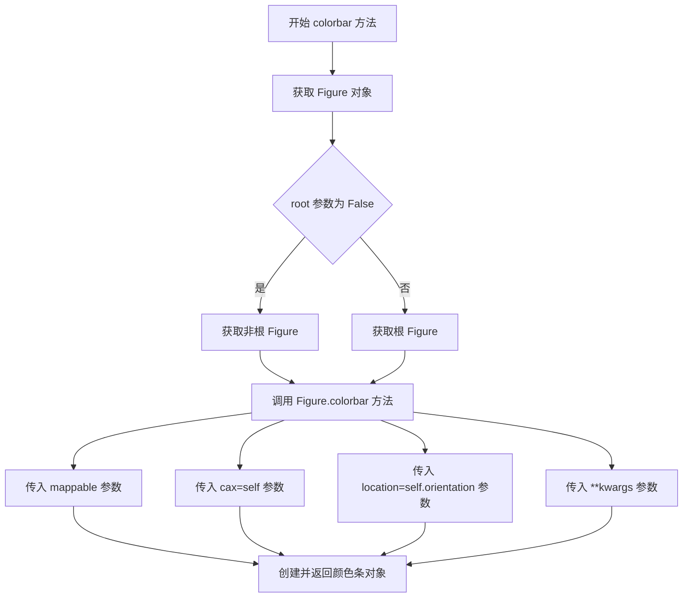
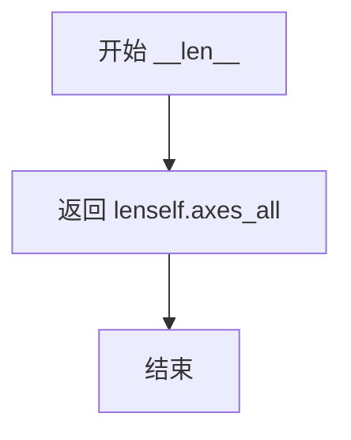
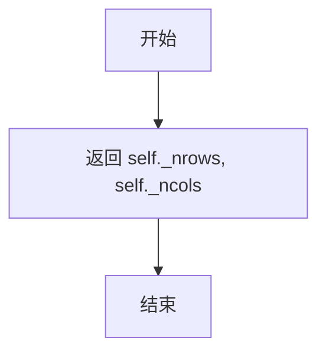
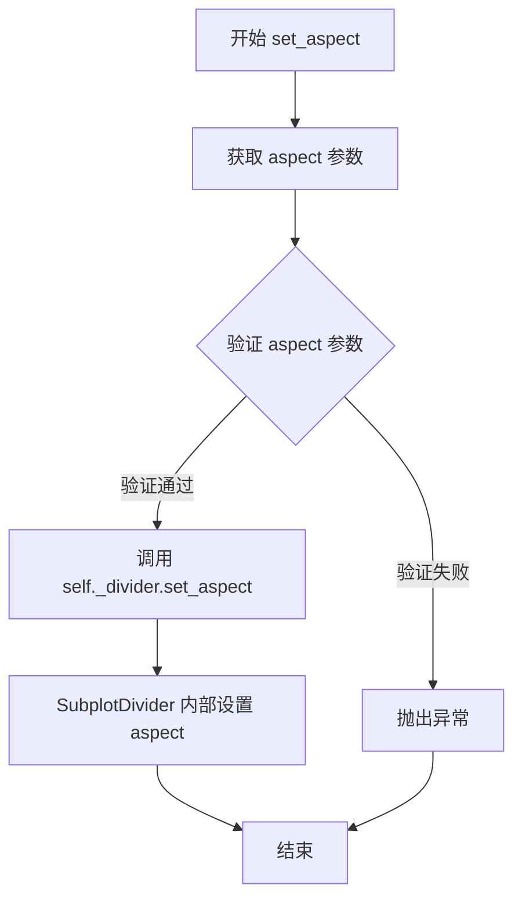
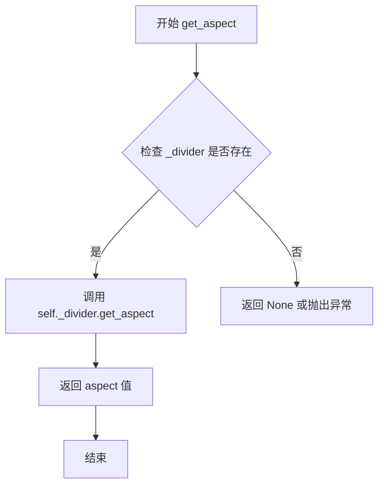
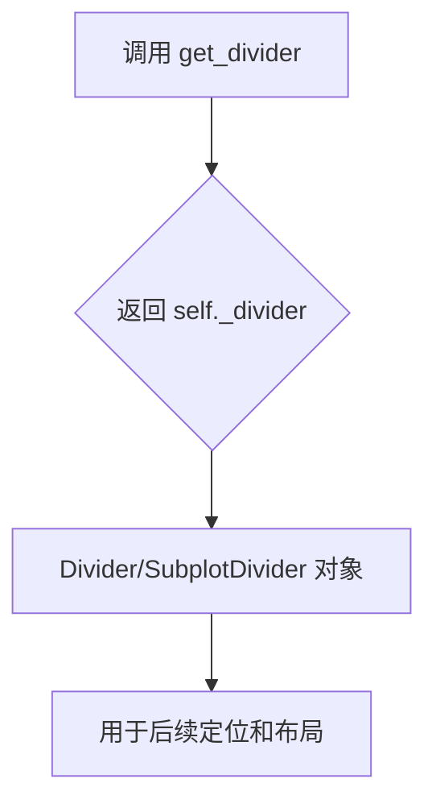
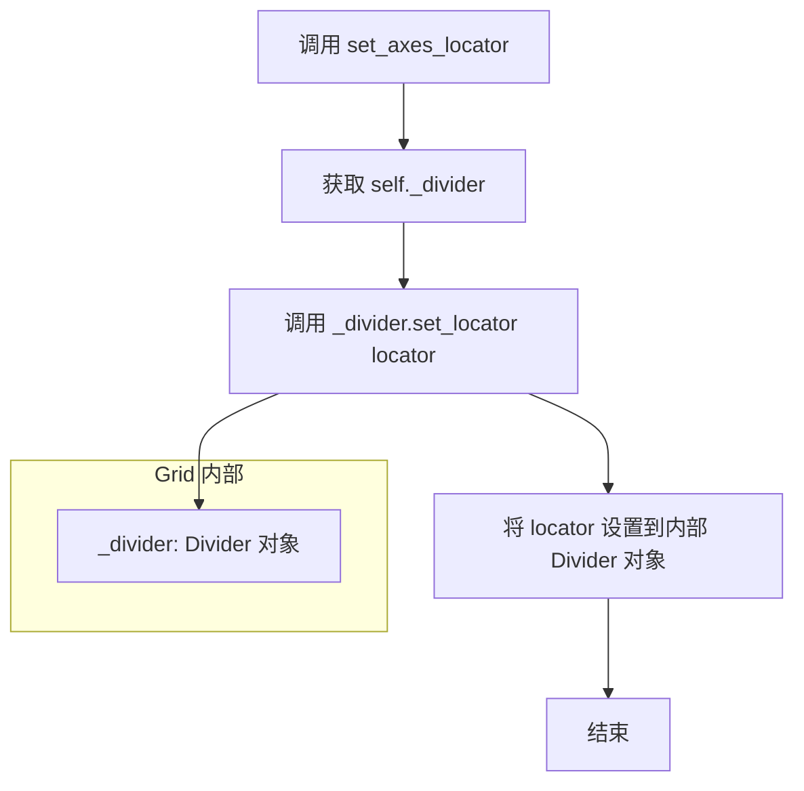
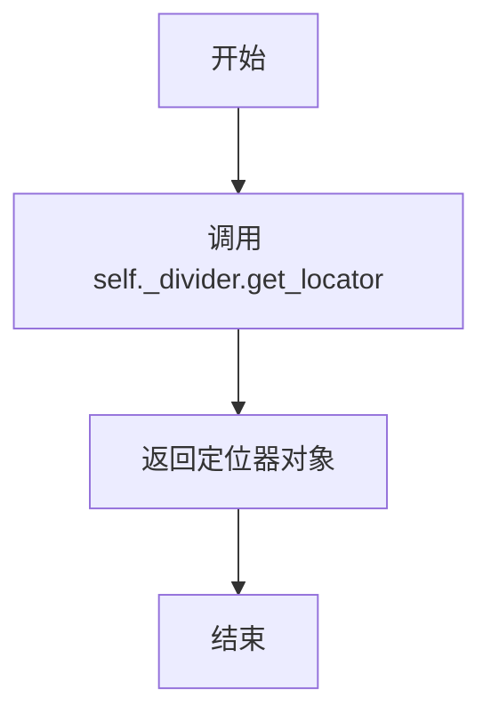
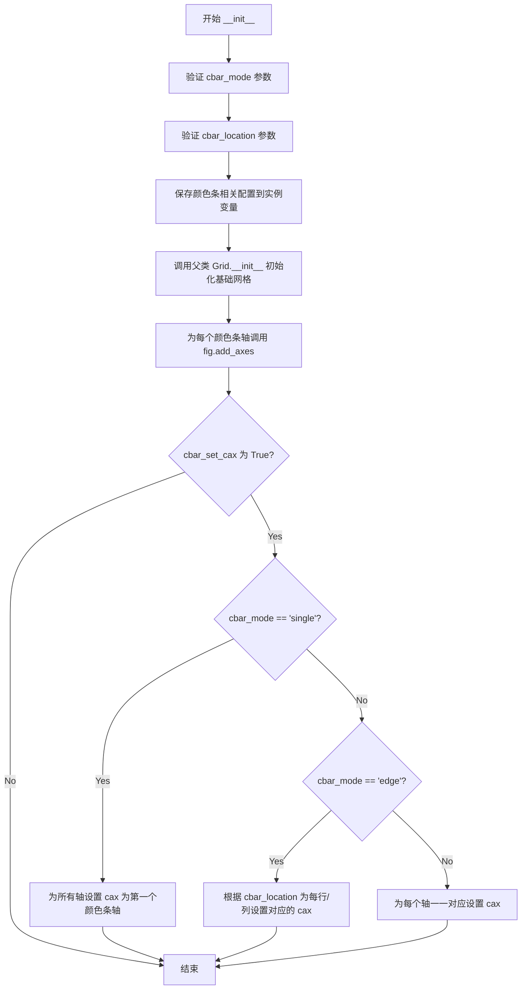
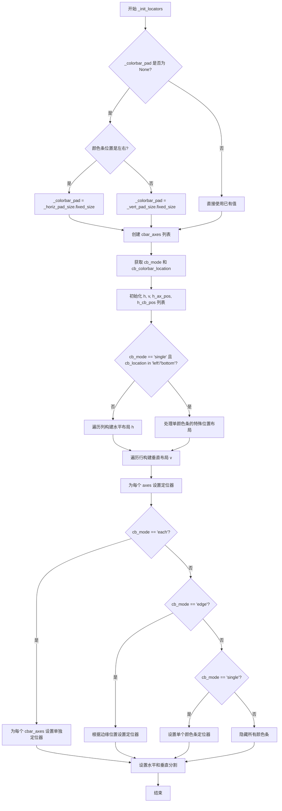

# `matplotlib\lib\mpl_toolkits\axes_grid1\axes_grid.py` 详细设计文档

This module provides the `Grid` and `ImageGrid` classes for Matplotlib, facilitating the creation and management of a grid of Axes with flexible positioning, aspect ratio control, and automatic colorbar generation for image visualization.

## 整体流程

```mermaid
graph TD
    A[User creates ImageGrid] --> B{Grid.__init__}
    B --> C[Calculate rows/cols and padding]
    C --> D[Create Divider (Subplot or Simple)]
    D --> E[Instantiate Axes array]
    E --> F[Grid._init_locators: Set axis spacing]
    F --> G{Is ImageGrid?}
    G -- No --> H[Add Axes to Figure]
    G -- Yes --> I[ImageGrid._init_locators]
    I --> J[Create Colorbar Axes based on mode]
    J --> K[Calculate colorbar layout geometry]
    K --> H
    H --> L[Setup Labels and Aspect]
```

## 类结构

```
Grid (Base Layout Manager)
└── ImageGrid (Specialized for Images & Colorbars)
CbarAxesBase (Base class mixin for colorbars)
└── _cbaraxes_class_factory (Factory generated class)
```

## 全局变量及字段


### `_cbaraxes_class_factory`
    
A factory function created by cbook._make_class_factory that generates CbarAxes classes with specific naming

类型：`function`
    


### `AxesGrid`
    
Alias for ImageGrid class, representing a grid of Axes for image display with colorbar support

类型：`class`
    


### `CbarAxesBase.orientation`
    
Orientation of the colorbar axes, determines the location for colorbar placement

类型：`str`
    


### `Grid._nrows`
    
Number of rows in the axes grid

类型：`int`
    


### `Grid._ncols`
    
Number of columns in the axes grid

类型：`int`
    


### `Grid._direction`
    
Direction of axis creation order, either 'row' or 'column'

类型：`str`
    


### `Grid.axes_all`
    
Flat list containing all Axes objects in the grid

类型：`list`
    


### `Grid.axes_row`
    
2D list of Axes indexed by row, accessible as axes_row[row][col]

类型：`list`
    


### `Grid.axes_column`
    
2D list of Axes indexed by column, accessible as axes_column[col][row]

类型：`list`
    


### `Grid.axes_llc`
    
The Axes object in the lower left corner of the grid

类型：`Axes`
    


### `Grid._divider`
    
The SubplotDivider or Divider object that manages the grid layout and positioning

类型：`Divider`
    


### `Grid._horiz_pad_size`
    
Fixed size object representing horizontal padding between axes

类型：`Size`
    


### `Grid._vert_pad_size`
    
Fixed size object representing vertical padding between axes

类型：`Size`
    


### `ImageGrid._colorbar_mode`
    
Colorbar creation mode: 'each', 'single', 'edge', or None

类型：`str`
    


### `ImageGrid._colorbar_location`
    
Location of colorbar axes: 'left', 'right', 'bottom', or 'top'

类型：`str`
    


### `ImageGrid._colorbar_pad`
    
Padding distance between the image axes and colorbar axes in inches

类型：`float`
    


### `ImageGrid._colorbar_size`
    
Size specification for colorbar, default is '5%' of axes size

类型：`str`
    


### `ImageGrid.cbar_axes`
    
List of colorbar Axes objects associated with the image grid

类型：`list`
    
    

## 全局函数及方法


### `CbarAxesBase.__init__`

该函数是 `CbarAxesBase` 类的构造函数，用于初始化颜色条坐标轴（Colorbar Axes）实例。它接收位置参数和关键字参数传递给父类 Axes，并强制要求指定 `orientation` 参数以确定颜色条的朝向（水平或垂直）。

参数：

-  `self`：隐式参数，表示类的实例本身。
-  `*args`：`tuple`，可变位置参数，通常传递给父类 Axes 的构造函数（如图形对象 `fig`、位置 `rect` 等）。
-  `orientation`：`str`，颜色条的朝向（必选关键字参数），例如 `'left'`, `'right'`, `'top'`, `'bottom'`。
-  `**kwargs`：`dict`，可变关键字参数，通常传递给父类 Axes 的构造函数（如 `projection`, `polar`, `sharex`, `sharey` 等）。

返回值：`None`，该方法不返回任何值，仅初始化对象状态。

#### 流程图

```mermaid
graph TD
    A([开始 __init__]) --> B{接收参数: args, orientation, kwargs}
    B --> C[设置实例属性: self.orientation = orientation]
    C --> D[调用父类初始化方法: super().__init__(*args, **kwargs)]
    D --> E([结束])
```

#### 带注释源码

```python
def __init__(self, *args, orientation, **kwargs):
    """
    初始化 CbarAxesBase 实例。

    Parameters
    ----------
    *args : tuple
        位置参数，传递给父类 Axes 构造函数。
    orientation : str
        颜色条的方向，例如 'right', 'left', 'top', 'bottom'。
    **kwargs : dict
        关键字参数，传递给父类 Axes 构造函数。
    """
    # 1. 将传入的方向参数保存为实例属性，供 colorbar 方法后续使用
    self.orientation = orientation
    # 2. 调用父类（混合的 Axes 类）的构造函数，完成 axes 的基本初始化
    super().__init__(*args, **kwargs)
```


### `CbarAxesBase.colorbar`

该方法是 `CbarAxesBase` 类中的颜色条创建方法，用于为 `mappable`（如图像等可映射对象）在指定的颜色条轴上创建颜色条，通过获取根Figure并调用其colorbar方法实现。

参数：

- `mappable`：待绑定的可映射对象（如 `AxesImage`、`ContourSet` 等），需要添加颜色条的数据。
- `**kwargs`：可选关键字参数，会传递给 Figure 的 colorbar 方法。

返回值：`matplotlib.colorbar.Colorbar`，创建的颜色条对象。

#### 流程图



#### 带注释源码

```python
def colorbar(self, mappable, **kwargs):
    """
    为 mappable 创建颜色条并放置在当前 axes 上。

    Parameters
    ----------
    mappable : ScalarMappable or ContourSet
        需要添加颜色条的可映射对象，通常是 AxesImage、ContourSet 等。
    **kwargs : dict
        传递给 Figure.colorbar 的其他关键字参数，
        例如 label、orientation、extend、shrink 等。

    Returns
    -------
    colorbar : Colorbar
        创建的颜色条对象。
    """
    # 获取当前 axes 所属的 Figure 对象（root=False 表示获取非根 Figure）
    # 然后调用 Figure 的 colorbar 方法创建颜色条
    return self.get_figure(root=False).colorbar(
        mappable,              # 要绑定的可映射对象
        cax=self,              # 将颜色条绘制在当前 axes（self）上
        location=self.orientation,  # 颜色条的位置（由初始化时的 orientation 决定）
        **kwargs              # 其他用户指定的参数
    )
```


### Grid.__init__

该方法是 Grid 类的构造函数，用于初始化一个轴网格（AxesGrid）。它接受图形、位置、行列数、轴间距、轴共享模式和标签模式等参数，创建指定数量的 Axes 对象并布局到图形中，同时支持轴的定位器和标签模式设置。

参数：

- `fig`：`.Figure`，父图形对象
- `rect`：(float, float, float, float), (int, int, int), int, 或 `~.SubplotSpec`，轴的位置，可以是四元组、三位数子图位置代码或 SubplotSpec
- `nrows_ncols`：(int, int)，网格的行数和列数
- `n_axes`：int, optional，如果给定，只创建网格中的前 n_axes 个轴
- `direction`：{"row", "column"}，default: "row"，轴创建的顺序（按行或按列）
- `axes_pad`：float or (float, float)，default: 0.02，轴之间的填充，可以是单个值或(水平填充, 垂直填充)
- `share_all`：bool，default: False，是否所有轴共享 x 和 y 轴
- `share_x`：bool，default: True，是否列中的所有轴共享 x 轴
- `share_y`：bool，default: True，是否行中的所有轴共享 y 轴
- `label_mode`：{"L", "1", "all", "keep"}，default: "L"，确定哪些轴将获得刻度标签
- `axes_class`：subclass of `matplotlib.axes.Axes`，default: `.mpl_axes.Axes`，要创建的轴类型
- `aspect`：bool，default: False，轴的宽高比是否遵循数据限制的宽高比

返回值：无（`None`），构造函数不返回值

#### 流程图

```mermaid
flowchart TD
    A[开始 __init__] --> B[解包 nrows_ncols 获取 _nrows, _ncols]
    B --> C{检查 n_axes 是否为 None}
    C -->|是| D[n_axes = _nrows * _ncols]
    C -->|否| E{验证 n_axes 有效性}
    D --> F
    E -->|有效| F[继续处理]
    E -->|无效| F1[抛出 ValueError]
    F --> G[计算水平/垂直填充尺寸]
    G --> H[验证 direction 参数]
    H --> I[设置 _direction]
    I --> J{检查 axes_class}
    J -->|None| K[使用默认轴类]
    J -->|list/tuple| L[使用 functools.partial 创建类]
    K --> M
    L --> M[设置 axes_class]
    M --> N{检查 rect 类型]
    N -->|Number/SubplotSpec| O[创建 SubplotDivider]
    N -->|len==3| P[创建 SubplotDivider]
    N -->|len==4| Q[创建 Divider]
    N -->|其他| R[抛出 TypeError]
    O --> S
    P --> S
    Q --> S
    R --> S
    S --> T[获取 divider 位置 rect]
    T --> U[创建 axes_array 全空数组]
    U --> V[循环创建 n_axes 个轴]
    V --> V1{share_all?}
    V1 -->|是| V2[sharex = sharey = axes_array[0, 0]]
    V1 -->|否| V3{share_x?}
    V3 -->|是| V4[sharex = axes_array[0, col]]
    V3 -->|否| V5[sharex = None]
    V4 --> V6
    V5 --> V6{share_y?}
    V6 -->|是| V7[sharey = axes_array[row, 0]]
    V6 -->|否| V8[sharey = None]
    V7 --> V9
    V8 --> V9
    V2 --> V9
    V9 --> V10[创建轴对象并放入数组]
    V10 --> V{循环结束?}
    V -->|否| V1
    V -->|是| W[展平 axes_array 为 axes_all]
    W --> X[构建 axes_row 和 axes_column]
    X --> Y[设置 axes_llc]
    Y --> Z[调用 _init_locators]
    Z --> AA[将所有轴添加到图形]
    AA --> BB[调用 set_label_mode]
    BB --> CC[结束 __init__]
```

#### 带注释源码

```python
def __init__(self, fig,
             rect,
             nrows_ncols,
             n_axes=None,
             direction="row",
             axes_pad=0.02,
             *,
             share_all=False,
             share_x=True,
             share_y=True,
             label_mode="L",
             axes_class=None,
             aspect=False,
             ):
    """
    Parameters
    ----------
    fig : `.Figure`
        The parent figure.
    rect : (float, float, float, float), (int, int, int), int, or \
`~.SubplotSpec`
        The axes position, as a ``(left, bottom, width, height)`` tuple,
        as a three-digit subplot position code (e.g., ``(1, 2, 1)`` or
        ``121``), or as a `~.SubplotSpec`.
    nrows_ncols : (int, int)
        Number of rows and columns in the grid.
    n_axes : int, optional
        If given, only the first *n_axes* axes in the grid are created.
    direction : {"row", "column"}, default: "row"
        Whether axes are created in row-major ("row by row") or
        column-major order ("column by column").  This also affects the
        order in which axes are accessed using indexing (``grid[index]``).
    axes_pad : float or (float, float), default: 0.02
        Padding or (horizontal padding, vertical padding) between axes, in
        inches.
    share_all : bool, default: False
        Whether all axes share their x- and y-axis.  Overrides *share_x*
        and *share_y*.
    share_x : bool, default: True
        Whether all axes of a column share their x-axis.
    share_y : bool, default: True
        Whether all axes of a row share their y-axis.
    label_mode : {"L", "1", "all", "keep"}, default: "L"
        Determines which axes will get tick labels:

        - "L": All axes on the left column get vertical tick labels;
          all axes on the bottom row get horizontal tick labels.
        - "1": Only the bottom left axes is labelled.
        - "all": All axes are labelled.
        - "keep": Do not do anything.

    axes_class : subclass of `matplotlib.axes.Axes`, default: `.mpl_axes.Axes`
        The type of Axes to create.
    aspect : bool, default: False
        Whether the axes aspect ratio follows the aspect ratio of the data
        limits.
    """
    # 解包行数和列数
    self._nrows, self._ncols = nrows_ncols

    # 如果未指定 n_axes，则创建所有轴
    if n_axes is None:
        n_axes = self._nrows * self._ncols
    else:
        # 验证 n_axes 的有效性：必须为正且不超过总轴数
        if not 0 < n_axes <= self._nrows * self._ncols:
            raise ValueError(
                "n_axes must be positive and not larger than nrows*ncols")

    # 使用 Size.Fixed 创建水平和垂直填充大小
    # np.broadcast_to 确保 axes_pad 可以是单个值或二元组
    self._horiz_pad_size, self._vert_pad_size = map(
        Size.Fixed, np.broadcast_to(axes_pad, 2))

    # 验证 direction 参数并设置
    _api.check_in_list(["column", "row"], direction=direction)
    self._direction = direction

    # 处理 axes_class：如果未指定使用默认类，否则使用 functools.partial 包装
    if axes_class is None:
        axes_class = self._defaultAxesClass
    elif isinstance(axes_class, (list, tuple)):
        cls, kwargs = axes_class
        axes_class = functools.partial(cls, **kwargs)

    # 准备分割器的关键字参数
    kw = dict(horizontal=[], vertical=[], aspect=aspect)
    
    # 根据 rect 的类型创建不同的分割器
    if isinstance(rect, (Number, SubplotSpec)):
        # 数字或 SubplotSpec：创建 SubplotDivider
        self._divider = SubplotDivider(fig, rect, **kw)
    elif len(rect) == 3:
        # 三位数子图位置：创建 SubplotDivider
        self._divider = SubplotDivider(fig, *rect, **kw)
    elif len(rect) == 4:
        # 四元组位置：创建 Divider
        self._divider = Divider(fig, rect, **kw)
    else:
        raise TypeError("Incorrect rect format")

    # 获取分割器的实际位置
    rect = self._divider.get_position()

    # 创建空的 axes 数组
    axes_array = np.full((self._nrows, self._ncols), None, dtype=object)
    
    # 循环创建指定数量的轴
    for i in range(n_axes):
        # 计算当前索引对应的列和行
        col, row = self._get_col_row(i)
        
        # 确定是否共享轴
        if share_all:
            # share_all 为 True 时，所有轴共享第一个轴
            sharex = sharey = axes_array[0, 0]
        else:
            # 否则根据 share_x 和 share_y 设置共享
            sharex = axes_array[0, col] if share_x else None
            sharey = axes_array[row, 0] if share_y else None
        
        # 创建轴对象并存储到数组中
        axes_array[row, col] = axes_class(
            fig, rect, sharex=sharex, sharey=sharey)
    
    # 将数组展平为一维列表，根据方向选择 C（行优先）或 F（列优先）顺序
    self.axes_all = axes_array.ravel(
        order="C" if self._direction == "row" else "F").tolist()[:n_axes]
    
    # 构建二维列表 axes_row 和 axes_column
    self.axes_row = [[ax for ax in row if ax] for row in axes_array]
    self.axes_column = [[ax for ax in col if ax] for col in axes_array.T]
    
    # 获取左下角轴（第一列最后一行）
    self.axes_llc = self.axes_column[0][-1]

    # 初始化定位器
    self._init_locators()

    # 将所有轴添加到图形中
    for ax in self.axes_all:
        fig.add_axes(ax)

    # 设置标签模式
    self.set_label_mode(label_mode)
```


### `Grid._init_locators`

该方法用于初始化网格的定位器（locators），设置水平/垂直分隔符的尺寸（使用 `Size.Scaled` 和填充尺寸），并为网格中的每个 Axes 设置定位器以确定其位置。

参数：
- 该方法无显式参数（仅包含 `self`）

返回值：`None`，无返回值

#### 流程图

```mermaid
flowchart TD
    A[开始 _init_locators] --> B[设置水平分隔符]
    B --> C[set_horizontal: [Size.Scaled(1), horiz_pad] × (ncols-1) + Size.Scaled(1)]
    C --> D[设置垂直分隔符]
    D --> E[set_vertical: [Size.Scaled(1), vert_pad] × (nrows-1) + Size.Scaled(1)]
    E --> F{遍历所有 axes}
    F -->|i = 0 到 n_axes-1| G[获取当前 axes 的 col, row]
    G --> H[new_locator: nx=2×col, ny=2×(nrows-1-row)]
    H --> I[axes_all[i].set_axes_locator]
    I --> F
    F -->|遍历结束| J[结束]
```

#### 带注释源码

```python
def _init_locators(self):
    """
    初始化网格的定位器。
    
    该方法完成以下工作：
    1. 设置水平方向的尺寸分布（基于列数和水平填充）
    2. 设置垂直方向的尺寸分布（基于行数和垂直填充）
    3. 为每个 Axes 设置定位器以确定其在网格中的位置
    """
    # 设置水平分隔符：创建交替的 [Scaled(1), horiz_pad] 列表，最后加上 Scaled(1)
    # 例如：3列 -> [Scaled(1), pad, Scaled(1), pad, Scaled(1)]
    self._divider.set_horizontal(
        [Size.Scaled(1), self._horiz_pad_size] * (self._ncols-1) + [Size.Scaled(1)])
    
    # 设置垂直分隔符：创建交替的 [Scaled(1), vert_pad] 列表，最后加上 Scaled(1)
    # 例如：2行 -> [Scaled(1), pad, Scaled(1)]
    self._divider.set_vertical(
        [Size.Scaled(1), self._vert_pad_size] * (self._nrows-1) + [Size.Scaled(1)])
    
    # 遍历网格中的每个 Axes，为其设置定位器
    for i in range(self.n_axes):
        # 根据索引计算列和行号
        col, row = self._get_col_row(i)
        # 计算 nx 和 ny 参数：
        # - nx = 2 * col（水平方向的位置索引）
        # - ny = 2 * (nrows - 1 - row)（垂直方向的位置索引，从上往下计算）
        self.axes_all[i].set_axes_locator(
            self._divider.new_locator(nx=2 * col, ny=2 * (self._nrows - 1 - row)))
```


### `Grid._get_col_row`

该方法根据网格的方向（"row" 或 "column"），将一个线性索引 n 转换为二维网格中的列索引和行索引。当方向为 column-major 时，使用 nrows 进行除法模运算；当方向为 row-major 时，使用 ncols 进行除法模运算。

参数：

- `n`：`int`，要转换的一维线性索引

返回值：`(int, int)`，返回列索引 col 和行索引 row 组成的元组

#### 流程图

```mermaid
flowchart TD
    A[开始] --> B{self._direction == 'column'?}
    B -->|是| C[col, row = divmod(n, self._nrows)]
    B -->|否| D[row, col = divmod(n, self._ncols)]
    C --> E[返回 (col, row)]
    D --> E
    E --> F[结束]
```

#### 带注释源码

```python
def _get_col_row(self, n):
    """
    将线性索引 n 转换为二维网格的 (列, 行) 坐标。

    Parameters
    ----------
    n : int
        线性索引值，范围从 0 到 n_axes-1

    Returns
    -------
    col, row : tuple of int
        列索引和行索引
    """
    # 如果方向为 column-major（按列优先）
    if self._direction == "column":
        # divmod 返回 (商, 余数)，即 (列索引, 行索引)
        col, row = divmod(n, self._nrows)
    else:
        # 默认按 row-major（按行优先）
        # divmod 返回 (行索引, 列索引)
        row, col = divmod(n, self._ncols)

    return col, row
```


### `Grid.__len__`

该方法是一个Python特殊方法（dunder method），用于返回Grid对象中轴（Axes）的数量，使得Grid实例可以直接使用len()函数获取其包含的轴总数。

参数：
- 该方法无显式参数（隐式参数`self`表示实例本身）

返回值：`int`，返回`axes_all`列表的长度，即网格中创建的轴总数。

#### 流程图



#### 带注释源码

```python
def __len__(self):
    """
    返回网格中轴的数量。
    
    该方法实现了Python的len()协议，使得可以直接使用len(grid)
    获取Grid实例中包含的轴的数量。等价于访问grid.n_axes属性。
    
    Returns
    -------
    int
        网格中创建的轴的总数，即axes_all列表的长度。
    """
    return len(self.axes_all)
```


### `Grid.__getitem__`

该方法为 `Grid` 类提供索引访问功能，允许通过整数索引或切片访问网格中存储的 Axes 对象。

参数：

- `i`：`int` 或 `slice`，要访问的轴的索引或切片

返回值：`any`，返回对应的 Axes 对象（当 `i` 为整数时）或 Axes 对象列表（当 `i` 为切片时）

#### 流程图

```mermaid
flowchart TD
    A[开始 __getitem__] --> B{接收索引 i}
    B --> C[访问 self.axes_all[i]]
    C --> D{返回结果}
    D --> E[整数索引: 返回单个 Axes 对象]
    D --> F[切片: 返回 Axes 对象列表]
```

#### 带注释源码

```python
def __getitem__(self, i):
    """
    通过索引访问网格中的 Axes 对象。

    参数
    ----------
    i : int 或 slice
        要访问的轴的索引或切片。

    返回
    -------
    any
        当 i 为整数时返回单个 Axes 对象；
        当 i 为切片时返回 Axes 对象列表。
    """
    return self.axes_all[i]
```


### `Grid.get_geometry`

该方法用于获取网格的行数和列数，是 `Grid` 类的简单属性访问方法，直接返回在初始化时设置的内部属性 `_nrows` 和 `_ncols`。

参数： 无（仅包含 `self` 参数，但 `self` 不计入方法签名）

返回值： `tuple[int, int]`，返回网格的行数和列数，格式为 `(nrows, ncols)`

#### 流程图



#### 带注释源码

```python
def get_geometry(self):
    """
    Return the number of rows and columns of the grid as (nrows, ncols).
    """
    # 直接返回内部属性 _nrows 和 _ncols
    # _nrows: 网格的行数，在 __init__ 中通过 nrows_ncols 参数设置
    # _ncols: 网络的列数，在 __init__ 中通过 nrows_ncols 参数设置
    return self._nrows, self._ncols
```


### `Grid.set_axes_pad`

设置网格中 Axes 之间的填充间距（水平填充和垂直填充），通过修改内部存储的水平/垂直填充大小对象（`_horiz_pad_size` 和 `_vert_pad_size`）来实现布局调整。

参数：

- `axes_pad`：`tuple[float, float]`，包含两个浮点数的元组，表示 (水平填充, 垂直填充)，单位为英寸

返回值：`None`，无返回值，该方法直接修改对象内部状态

#### 流程图

```mermaid
flowchart TD
    A[开始 set_axes_pad] --> B[接收 axes_pad 参数]
    B --> C{验证 axes_pad 格式}
    C -->|格式正确| D[将 axes_pad[0] 赋值给 _horiz_pad_size.fixed_size]
    D --> E[将 axes_pad[1] 赋值给 _vert_pad_size.fixed_size]
    E --> F[结束]
    C -->|格式错误| G[抛出异常或使用默认值]
```

#### 带注释源码

```python
def set_axes_pad(self, axes_pad):
    """
    Set the padding between the axes.

    Parameters
    ----------
    axes_pad : (float, float)
        The padding (horizontal pad, vertical pad) in inches.
    """
    # 将元组的第一个元素（水平填充）赋值给内部水平填充大小对象的 fixed_size 属性
    self._horiz_pad_size.fixed_size = axes_pad[0]
    # 将元组的第二个元素（垂直填充）赋值给内部垂直填充大小对象的 fixed_size 属性
    self._vert_pad_size.fixed_size = axes_pad[1]
```


### `Grid.get_axes_pad`

获取网格中坐标轴之间的填充（间距）。

参数：

- 此方法无参数（除隐式 `self`）

返回值：`tuple[float, float]`，返回水平填充（hpad）和垂直填充（vpad），单位为英寸。

#### 流程图

```mermaid
flowchart TD
    A[开始 get_axes_pad] --> B[读取 self._horiz_pad_size.fixed_size]
    B --> C[读取 self._vert_pad_size.fixed_size]
    C --> D[返回元组 (hpad, vpad)]
    D --> E[结束]
```

#### 带注释源码

```python
def get_axes_pad(self):
    """
    Return the axes padding.

    Returns
    -------
    hpad, vpad
        Padding (horizontal pad, vertical pad) in inches.
    """
    # 从内部存储的水平填充尺寸对象中获取固定大小值
    # _horiz_pad_size 是一个 Size.Fixed 实例
    hpad = self._horiz_pad_size.fixed_size
    
    # 从内部存储的垂直填充尺寸对象中获取固定大小值
    # _vert_pad_size 是一个 Size.Fixed 实例
    vpad = self._vert_pad_size.fixed_size
    
    # 返回包含水平和垂直填充的元组
    return (hpad, vpad)
```


### `Grid.set_aspect`

设置网格中 SubplotDivider 的纵横比（aspect），该属性控制子图的宽高比行为。

参数：

- `aspect`：参数类型未在代码中明确标注（根据调用上下文推断为 `bool` 或类似可设置纵横比的参数），描述为 Subplot 的宽高比设置值

返回值：`None`，无返回值，该方法直接修改内部对象状态

#### 流程图



#### 带注释源码

```python
def set_aspect(self, aspect):
    """
    Set the aspect of the SubplotDivider.
    
    Parameters
    ----------
    aspect : bool or str or None
        The aspect ratio to set for the SubplotDivider. This controls
        how the axes in the grid will scale relative to each other
        and the figure. Possible values include:
        - True or 'auto': Let the axes determine their own aspect
        - False: Equal aspect ratio (square)
        - A numeric value: Custom aspect ratio
    
    Returns
    -------
    None
        This method does not return a value; it modifies the internal
        state of the SubplotDivider directly.
    """
    # 调用内部 _divider 对象的 set_aspect 方法
    # _divider 是 SubplotDivider 或 Divider 类型的实例
    self._divider.set_aspect(aspect)
```


### `Grid.get_aspect`

获取网格中 SubplotDivider 的长宽比（aspect）设置。

参数：
- 无（仅包含 `self` 隐式参数）

返回值：`bool` 或 `float`，返回 SubplotDivider 的长宽比设置。当为 `False` 时表示不使用固定长宽比；当为数值时表示具体的长宽比值。

#### 流程图



#### 带注释源码

```python
def get_aspect(self):
    """
    Return the aspect of the SubplotDivider.
    
    此方法是一个简单的委托方法，将获取长宽比的请求转发到底层的 
    SubplotDivider 或 Divider 对象。该对象在 Grid 初始化时创建，
    并负责管理网格中 Axes 的布局和几何属性。
    
    Returns
    -------
    bool or float
        SubplotDivider 的 aspect 设置：
        - False: 不强制要求特定的长宽比
        - True: 使用数据限制的长宽比
        - 数值: 强制使用指定的长宽比值
    """
    return self._divider.get_aspect()
```


### Grid.set_label_mode

该方法用于定义网格中哪些坐标轴应该显示刻度标签。根据传入的标签模式（"L"、"1"、"all"或"keep"），方法会遍历网格中的所有坐标轴，并控制底部轴和左侧轴的刻度标签与标签的显示状态。

参数：

- `mode`：`str`，标签模式，值为"L"、"1"、"all"或"keep"之一。"L"表示左侧列和底行显示标签；"1"表示仅左下角坐标轴显示标签；"all"表示所有坐标轴显示标签；"keep"表示保持当前状态不变。

返回值：`None`，该方法无返回值，直接修改坐标轴对象的内部状态。

#### 流程图

```mermaid
flowchart TD
    A[开始 set_label_mode] --> B{验证 mode 是否合法}
    B -->|不合法| C[抛出异常]
    B -->|合法| D{mode == 'keep'}
    D -->|是| E[直接返回]
    D -->|否| F[遍历网格所有坐标位置 i, j]
    F --> G[尝试获取坐标轴 ax = axes_row[i][j]]
    G --> H{获取成功?}
    H -->|否| I[继续下一次循环]
    H -->是 --> J{ax.axis 是 MethodType?}
    J -->|是| K[创建 SimpleAxisArtist 对象]
    J -->|否| L[直接获取 axis 字典中的轴]
    K --> M[计算 display_at_bottom]
    L --> M
    M --> N[计算 display_at_left]
    N --> O[切换底部轴的显示状态]
    O --> P[切换左侧轴的显示状态]
    P --> Q{还有更多坐标?}
    Q -->|是| F
    Q -->|否| R[结束]
```

#### 带注释源码

```python
def set_label_mode(self, mode):
    """
    Define which axes have tick labels.

    Parameters
    ----------
    mode : {"L", "1", "all", "keep"}
        The label mode:

        - "L": All axes on the left column get vertical tick labels;
          all axes on the bottom row get horizontal tick labels.
        - "1": Only the bottom left axes is labelled.
        - "all": All axes are labelled.
        - "keep": Do not do anything.
    """
    # 验证 mode 参数是否在允许的列表中
    _api.check_in_list(["all", "L", "1", "keep"], mode=mode)
    
    # 如果 mode 为 "keep"，不改变现有标签状态，直接返回
    if mode == "keep":
        return
    
    # 遍历网格中的所有行和列索引
    for i, j in np.ndindex(self._nrows, self._ncols):
        try:
            # 尝试从 axes_row 二维数组中获取对应的坐标轴对象
            ax = self.axes_row[i][j]
        except IndexError:
            # 如果索引越界（如网格中有空位置），跳过本次循环
            continue
        
        # 根据坐标轴类型判断如何获取底部轴和左侧轴
        # 如果 axis 是 MethodType，说明使用的是较新的 SimpleAxisArtist
        if isinstance(ax.axis, MethodType):
            # 创建底部轴的 SimpleAxisArtist 对象
            bottom_axis = SimpleAxisArtist(ax.xaxis, 1, ax.spines["bottom"])
            # 创建左侧轴的 SimpleAxisArtist 对象
            left_axis = SimpleAxisArtist(ax.yaxis, 1, ax.spines["left"])
        else:
            # 否则直接从 axis 字典中获取（较旧的 API）
            bottom_axis = ax.axis["bottom"]
            left_axis = ax.axis["left"]
        
        # 根据 mode 确定底部轴是否应该显示标签
        # "L" 模式：仅最后一行（底行）显示
        # "1" 模式：仅最后一行且第一列（右下角）显示
        # "all" 模式：所有坐标轴都显示
        display_at_bottom = (i == self._nrows - 1 if mode == "L" else
                             i == self._nrows - 1 and j == 0 if mode == "1" else
                             True)  # if mode == "all"
        
        # 根据 mode 确定左侧轴是否应该显示标签
        # "L" 模式：仅第一列（左侧列）显示
        # "1" 模式：仅最后一行且第一列（左下角）显示
        # "all" 模式：所有坐标轴都显示
        display_at_left = (j == 0 if mode == "L" else
                           i == self._nrows - 1 and j == 0 if mode == "1" else
                           True)  # if mode == "all"
        
        # 控制底部轴的刻度标签和标签本身的显示状态
        bottom_axis.toggle(ticklabels=display_at_bottom, label=display_at_bottom)
        
        # 控制左侧轴的刻度标签和标签本身的显示状态
        left_axis.toggle(ticklabels=display_at_left, label=display_at_left)
```


### Grid.get_divider

该方法用于获取网格的分割器（Divider）对象，该对象负责定位网格中的坐标轴（Axes）。

参数： 无

返回值：`Divider` 或 `SubplotDivider`，返回用于定位网格中 Axes 的分割器对象。

#### 流程图



#### 带注释源码

```python
def get_divider(self):
    """
    获取网格的分割器。

    该方法返回在 Grid 初始化时创建的 Divider 或 SubplotDivider 对象。
    该分割器负责管理网格中所有坐标轴的定位和布局。

    Returns
    -------
    Divider or SubplotDivider
        用于定位网格中坐标轴的分割器对象。
    """
    return self._divider
```


### `Grid.set_axes_locator`

设置网格中所有 Axes 的定位器（locator），用于控制每个 Axes 在网格中的位置和布局。

参数：

- `locator`：定位器对象，用于指定 Axes 在网格中的位置。该定位器通过 `_divider.set_locator()` 方法设置到所有 Axes 上。

返回值：`None`，该方法无返回值，仅执行副作用（设置定位器）。

#### 流程图



#### 带注释源码

```python
def set_axes_locator(self, locator):
    """
    设置网格中所有 Axes 的定位器。

    Parameters
    ----------
    locator : object
        定位器对象，用于确定每个 Axes 在网格中的位置。
        该对象会被传递给内部的 Divider 对象进行管理。
    """
    # 调用内部 _divider 对象的 set_locator 方法
    # _divider 是 Divider 或 SubplotDivider 实例
    # 负责管理网格的布局和定位
    self._divider.set_locator(locator)
```


### Grid.get_axes_locator

该方法用于获取当前网格中 axes 所使用的定位器（locator），该定位器控制 axes 在图表中的位置布局。

参数：

- 该方法无显式参数（仅包含 `self` 隐式参数）

返回值：`Locator`，返回当前设置的 axes 定位器对象，用于确定 axes 在网格中的位置。

#### 流程图



#### 带注释源码

```python
def get_axes_locator(self):
    """
    获取当前 axes 的定位器。

    该方法直接委托给内部创建的 Divider 对象的 get_locator 方法，
    返回当前用于确定 axes 位置的定位器（Locator）对象。
    定位器决定了 axes 在网格布局中的具体位置和大小。

    Returns
    -------
    Locator
        当前设置的 axes 定位器对象，用于控制 axes 的布局位置。
    """
    return self._divider.get_locator()  # 调用 _divider 的 get_locator 方法获取定位器
```


### ImageGrid.__init__

该方法是`ImageGrid`类的构造函数，负责初始化一个用于显示图像的轴网格。它继承自`Grid`类，并增加了颜色条（colorbar）管理的功能。该方法验证参数、调用父类初始化、创建颜色条轴，并根据`cbar_mode`和`cbar_set_cax`将颜色条轴绑定到各个图像轴。

参数：

- `self`：隐式参数，ImageGrid实例本身
- `fig`：`matplotlib.figure.Figure`，父图形对象
- `rect`：`tuple` 或 `int`，轴位置，可以是四元组(left, bottom, width, height)或三位数子图代码
- `nrows_ncols`：`tuple`，行数和列数，格式为(int, int)
- `n_axes`：`int`，可选参数，如果指定则只创建前n_axes个轴
- `direction`：`str`，轴的创建顺序，"row"或"column"，默认"row"
- `axes_pad`：`float`或`tuple`，轴之间的填充，可为单个值或(水平填充, 垂直填充)，默认0.02
- `share_all`：`bool`，是否所有轴共享x和y轴，默认False
- `aspect`：`bool`，轴宽高比是否遵循数据限制，默认True
- `label_mode`：`str`，决定哪些轴获得刻度标签，"L"、"1"、"all"或"keep"，默认"L"
- `cbar_mode`：`str`，颜色条模式，"each"、"single"、"edge"或None，默认None
- `cbar_location`：`str`，颜色条位置，"left"、"right"、"bottom"或"top"，默认"right"
- `cbar_pad`：`float`，图像轴与颜色条轴之间的填充，默认None（自动计算）
- `cbar_size`：`str`，颜色条大小，默认"5%"
- `cbar_set_cax`：`bool`，是否为每个轴绑定cax属性到对应的cbar_axes，默认True
- `axes_class`：`Axes`子类，可选，自定义轴类型，默认mpl_axes.Axes

返回值：无（构造函数）

#### 流程图



#### 带注释源码

```python
def __init__(self, fig,
             rect,
             nrows_ncols,
             n_axes=None,
             direction="row",
             axes_pad=0.02,
             *,
             share_all=False,
             aspect=True,
             label_mode="L",
             cbar_mode=None,
             cbar_location="right",
             cbar_pad=None,
             cbar_size="5%",
             cbar_set_cax=True,
             axes_class=None,
             ):
        """
        ImageGrid 构造函数参数说明：
        - fig: 父图形对象
        - rect: 轴位置规格
        - nrows_ncols: 网格行列数
        - n_axes: 可选的轴数量限制
        - direction: 轴创建顺序
        - axes_pad: 轴间填充
        - share_all: 是否全部共享
        - aspect: 是否保持宽高比
        - label_mode: 标签显示模式
        - cbar_mode: 颜色条模式
        - cbar_location: 颜色条位置
        - cbar_pad: 颜色条填充
        - cbar_size: 颜色条尺寸
        - cbar_set_cax: 是否设置 cax
        - axes_class: 轴类
        """
        # 验证 cbar_mode 参数是否合法
        _api.check_in_list(["each", "single", "edge", None],
                           cbar_mode=cbar_mode)
        # 验证 cbar_location 参数是否合法
        _api.check_in_list(["left", "right", "bottom", "top"],
                           cbar_location=cbar_location)
        
        # 保存颜色条相关配置到实例变量
        self._colorbar_mode = cbar_mode
        self._colorbar_location = cbar_location
        self._colorbar_pad = cbar_pad
        self._colorbar_size = cbar_size
        
        # 调用父类 Grid 的初始化方法
        # 传递大部分参数，固定 share_x=True, share_y=True
        # 因为 ImageGrid 强制所有列共享 x 轴，所有行共享 y 轴
        super().__init__(
            fig, rect, nrows_ncols, n_axes,
            direction=direction, axes_pad=axes_pad,
            share_all=share_all, share_x=True, share_y=True, aspect=aspect,
            label_mode=label_mode, axes_class=axes_class)

        # 将所有颜色条轴添加到图形中
        for ax in self.cbar_axes:
            fig.add_axes(ax)

        # 根据 cbar_set_cax 和 cbar_mode 设置每个轴的 cax 属性
        if cbar_set_cax:
            if self._colorbar_mode == "single":
                # single 模式：所有图像轴共享一个颜色条
                for ax in self.axes_all:
                    ax.cax = self.cbar_axes[0]
            elif self._colorbar_mode == "edge":
                # edge 模式：根据行列位置分配颜色条
                for index, ax in enumerate(self.axes_all):
                    col, row = self._colorbar_indexing(index)
                    if self._colorbar_location in ("left", "right"):
                        ax.cax = self.cbar_axes[row]
                    else:
                        ax.cax = self.cbar_axes[col]
            else:
                # each 或 None 模式：一对一绑定
                for ax, cax in zip(self.axes_all, self.cbar_axes):
                    ax.cax = cax
```


### `ImageGrid._init_locators`

该方法继承自 `Grid` 类并被重写，用于初始化 ImageGrid 的定位器（locators）和颜色条（colorbar）相关配置。它在 ImageGrid 初始化过程中被调用，主要功能包括：设置颜色条_axes、计算水平和垂直分割尺寸、配置每个 axes 和颜色条的定位器，以及处理不同的颜色条模式（"each"、"single"、"edge"或None）。

参数：

- `self`：隐式参数，ImageGrid 实例本身，无需外部传入

返回值：`None`，该方法直接修改对象状态，不返回任何值

#### 流程图



#### 带注释源码

```python
def _init_locators(self):
    # 稍微滥用此方法将颜色条创建注入到初始化中
    # （因为父类 Grid 也会调用 _init_locators）

    # 1. 确定颜色条 padding
    if self._colorbar_pad is None:
        # 判断是水平还是垂直排列
        if self._colorbar_location in ("left", "right"):
            # 水平排列时，使用水平 padding
            self._colorbar_pad = self._horiz_pad_size.fixed_size
        else:
            # 垂直排列时，使用垂直 padding
            self._colorbar_pad = self._vert_pad_size.fixed_size

    # 2. 为每个 axes 创建对应的颜色条 axes
    # 使用 cbook._make_class_factory 创建的类工厂生成 CbarAxes
    self.cbar_axes = [
        _cbaraxes_class_factory(self._defaultAxesClass)(
            self.axes_all[0].get_figure(root=False), 
            self._divider.get_position(),
            orientation=self._colorbar_location)
        for _ in range(self.n_axes)]

    # 3. 获取颜色条模式 和 位置
    cb_mode = self._colorbar_mode
    cb_location = self._colorbar_location

    # 4. 初始化水平和垂直布局列表
    h = []  # 水平布局
    v = []  # 垂直布局

    h_ax_pos = []  # 每个 axes 在水平布局中的索引位置
    h_cb_pos = []  # 每个颜色条在水平布局中的索引位置

    # 5. 处理单颜色条模式（single）且位置在左侧或底部的情况
    if cb_mode == "single" and cb_location in ("left", "bottom"):
        if cb_location == "left":
            # 左侧：计算高度尺寸
            sz = self._nrows * Size.AxesX(self.axes_llc)
            h.append(Size.from_any(self._colorbar_size, sz))
            h.append(Size.from_any(self._colorbar_pad, sz))
            # 设置定位器：跨越所有行
            locator = self._divider.new_locator(nx=0, ny=0, ny1=-1)
        elif cb_location == "bottom":
            # 底部：计算宽度尺寸
            sz = self._ncols * Size.AxesY(self.axes_llc)
            v.append(Size.from_any(self._colorbar_size, sz))
            v.append(Size.from_any(self._colorbar_pad, sz))
            # 设置定位器：跨越所有列
            locator = self._divider.new_locator(nx=0, nx1=-1, ny=0)
        
        # 隐藏所有颜色条，然后只显示第一个
        for i in range(self.n_axes):
            self.cbar_axes[i].set_visible(False)
        self.cbar_axes[0].set_axes_locator(locator)
        self.cbar_axes[0].set_visible(True)

    # 6. 遍历第一行（列方向）构建水平布局
    for col, ax in enumerate(self.axes_row[0]):
        if col != 0:
            # 列之间添加 padding
            h.append(self._horiz_pad_size)

        # 计算当前列的宽度尺寸
        if ax:
            sz = Size.AxesX(ax, aspect="axes", ref_ax=self.axes_all[0])
        else:
            sz = Size.AxesX(self.axes_all[0],
                            aspect="axes", ref_ax=self.axes_all[0])

        # 根据颜色条位置添加颜色条布局
        if (cb_location == "left"
                and (cb_mode == "each"
                     or (cb_mode == "edge" and col == 0))):
            h_cb_pos.append(len(h))
            h.append(Size.from_any(self._colorbar_size, sz))
            h.append(Size.from_any(self._colorbar_pad, sz))

        h_ax_pos.append(len(h))
        h.append(sz)

        if (cb_location == "right"
                and (cb_mode == "each"
                     or (cb_mode == "edge" and col == self._ncols - 1))):
            h.append(Size.from_any(self._colorbar_pad, sz))
            h_cb_pos.append(len(h))
            h.append(Size.from_any(self._colorbar_size, sz))

    # 7. 遍历第一列（行方向，从底部到顶部）构建垂直布局
    v_ax_pos = []
    v_cb_pos = []
    for row, ax in enumerate(self.axes_column[0][::-1]):  # 反向遍历
        if row != 0:
            v.append(self._vert_pad_size)

        # 计算当前行的高度尺寸
        if ax:
            sz = Size.AxesY(ax, aspect="axes", ref_ax=self.axes_all[0])
        else:
            sz = Size.AxesY(self.axes_all[0],
                            aspect="axes", ref_ax=self.axes_all[0])

        # 根据颜色条位置添加颜色条布局
        if (cb_location == "bottom"
                and (cb_mode == "each"
                     or (cb_mode == "edge" and row == 0))):
            v_cb_pos.append(len(v))
            v.append(Size.from_any(self._colorbar_size, sz))
            v.append(Size.from_any(self._colorbar_pad, sz))

        v_ax_pos.append(len(v))
        v.append(sz)

        if (cb_location == "top"
                and (cb_mode == "each"
                     or (cb_mode == "edge" and row == self._nrows - 1))):
            v.append(Size.from_any(self._colorbar_pad, sz))
            v_cb_pos.append(len(v))
            v.append(Size.from_any(self._colorbar_size, sz))

    # 8. 为每个 axes 设置定位器
    for i in range(self.n_axes):
        col, row = self._get_col_row(i)
        # 计算定位器：基于列和行的位置
        locator = self._divider.new_locator(nx=h_ax_pos[col],
                                            ny=v_ax_pos[self._nrows-1-row])
        self.axes_all[i].set_axes_locator(locator)

        # 9. 根据颜色条模式设置颜色条定位器
        if cb_mode == "each":
            if cb_location in ("right", "left"):
                # 水平颜色条
                locator = self._divider.new_locator(
                    nx=h_cb_pos[col], ny=v_ax_pos[self._nrows - 1 - row])

            elif cb_location in ("top", "bottom"):
                # 垂直颜色条
                locator = self._divider.new_locator(
                    nx=h_ax_pos[col], ny=v_cb_pos[self._nrows - 1 - row])

            self.cbar_axes[i].set_axes_locator(locator)
        
        elif cb_mode == "edge":
            if (cb_location == "left" and col == 0
                    or cb_location == "right" and col == self._ncols - 1):
                # 边缘列的颜色条
                locator = self._divider.new_locator(
                    nx=h_cb_pos[0], ny=v_ax_pos[self._nrows - 1 - row])
                self.cbar_axes[row].set_axes_locator(locator)
            elif (cb_location == "bottom" and row == self._nrows - 1
                  or cb_location == "top" and row == 0):
                # 边缘行的颜色条
                locator = self._divider.new_locator(nx=h_ax_pos[col],
                                                    ny=v_cb_pos[0])
                self.cbar_axes[col].set_axes_locator(locator)

    # 10. 处理 single 模式（右侧或顶部）
    if cb_mode == "single":
        if cb_location == "right":
            sz = self._nrows * Size.AxesX(self.axes_llc)
            h.append(Size.from_any(self._colorbar_pad, sz))
            h.append(Size.from_any(self._colorbar_size, sz))
            locator = self._divider.new_locator(nx=-2, ny=0, ny1=-1)
        elif cb_location == "top":
            sz = self._ncols * Size.AxesY(self.axes_llc)
            v.append(Size.from_any(self._colorbar_pad, sz))
            v.append(Size.from_any(self._colorbar_size, sz))
            locator = self._divider.new_locator(nx=0, nx1=-1, ny=-2)
        
        if cb_location in ("right", "top"):
            for i in range(self.n_axes):
                self.cbar_axes[i].set_visible(False)
            self.cbar_axes[0].set_axes_locator(locator)
            self.cbar_axes[0].set_visible(True)
    
    # 11. 设置所有颜色条 axes 的可见性
    elif cb_mode == "each":
        for i in range(self.n_axes):
            self.cbar_axes[i].set_visible(True)
    elif cb_mode == "edge":
        if cb_location in ("right", "left"):
            count = self._nrows
        else:
            count = self._ncols
        for i in range(count):
            self.cbar_axes[i].set_visible(True)
        for j in range(i + 1, self.n_axes):
            self.cbar_axes[j].set_visible(False)
    else:
        # None 模式：隐藏所有颜色条
        for i in range(self.n_axes):
            self.cbar_axes[i].set_visible(False)
            self.cbar_axes[i].set_position([1., 1., 0.001, 0.001],
                                           which="active")

    # 12. 最终设置分割器
    self._divider.set_horizontal(h)
    self._divider.set_vertical(v)
```

## 关键组件


### CbarAxesBase

颜色条坐标轴基类，提供颜色条创建功能，封装了颜色条坐标轴的方向设置和颜色条创建逻辑。

### _cbaraxes_class_factory

工厂函数，用于动态创建颜色条坐标轴类，绑定到指定的Axes基类和类名。

### Grid

核心网格布局类，负责管理matplotlib中Axes的位置和大小，支持行/列主序创建、可配置的轴共享、标签模式控制，以及基于Normalized figure coordinates的定位。

### ImageGrid

专门用于图像显示的网格布局类，继承自Grid，强制列共享x轴、行共享y轴，提供颜色条创建功能，支持多种颜色条模式（each/single/edge）和位置配置。


## 问题及建议


### 已知问题

-   **初始化方法覆盖问题**：`Grid._init_locators`方法在`ImageGrid`中被完全重写，导致父类初始化逻辑被替换，虽然通过`super().__init__`调用了父类，但`ImageGrid._init_locators`中需要重新实现大量相同的布局逻辑，造成代码重复和潜在的维护困难。
-   **私有属性直接访问**：`ImageGrid`类中大量直接访问父类的私有属性（如`_horiz_pad_size`、`_vert_pad_size`、`_nrows`、`_ncols`等），违反了面向对象的封装原则，使得子类与父类实现细节紧密耦合。
-   **代码复杂度过高**：`ImageGrid._init_locators`方法超过200行，包含大量嵌套的条件判断和循环，逻辑复杂难以理解和维护，应拆分为多个小的私有方法。
-   **缺少类型注解**：整个代码文件中没有任何函数参数或返回值的类型注解，不利于静态类型检查工具（如mypy）的使用，降低了代码的可读性和安全性。
-   **魔法数字和硬编码**：多处使用硬编码数值（如`0.02`、`"5%"`、`2 * col`、`2 * (self._nrows - 1 - row)`等），缺乏有意义的命名常量，降低了代码的可配置性。
-   **冗余参数处理**：在`ImageGrid.__init__`中强制设置`share_x=True, share_y=True`，同时接受`share_all`参数并通过条件覆盖，这种参数处理逻辑容易造成混淆。
-   **axes_array使用object类型**：`np.full((self._nrows, self._ncols), None, dtype=object)`使用object类型数组存储axes，降低了代码的可读性和类型安全性。
-   **属性property使用lambda**：`n_axes`属性使用`property(lambda self: len(self.axes_all))`这种已弃用的lambda语法，应使用标准的property装饰器方式。

### 优化建议

-   **提取布局计算逻辑**：将`ImageGrid._init_locators`中的颜色栏布局计算逻辑拆分为独立的私有方法，如`_compute_colorbar_layout`、`_compute_axis_layout`等，每个方法负责单一职责。
-   **重构私有属性访问**：考虑将需要子类访问的私有属性改为受保护（单下划线）或提供 protected 方法访问，避免直接访问实现细节。
-   **添加类型注解**：为所有方法参数和返回值添加类型注解，提高代码的可维护性和IDE支持。
-   **提取常量**：将常用的数值提取为类常量或模块级常量，如`DEFAULT_AXES_PAD = 0.02`、`DEFAULT_CBAR_SIZE = "5%"`等。
-   **简化初始化流程**：重构`ImageGrid.__init__`的参数处理逻辑，明确`share_all`、`share_x`、`share_y`参数的优先级和相互作用。
-   **改进属性定义**：使用标准property装饰器替代lambda语法，或者直接使用`@property`装饰的方法。

## 其它


### 设计目标与约束

**设计目标：**
- 提供灵活的Axes网格布局功能，支持指定行列数和axes间距
- 支持axes之间的坐标轴共享（share_x, share_y），便于多子图联动
- 提供多种标签模式（"L", "1", "all", "keep"）以控制刻度标签显示
- ImageGrid专门针对图像显示场景优化，强制行列共享axes并提供颜色条支持

**设计约束：**
- rect参数必须为合法格式：(float, float, float, float)、(int, int, int)、int或SubplotSpec
- n_axes必须为正数且不超过nrows*ncols
- direction仅支持"row"和"column"
- axes_pad支持单个float或(float, float)元组
- cbar_mode仅支持{"each", "single", "edge", None}
- cbar_location仅支持{"left", "right", "bottom", "top"}

### 错误处理与异常设计

**参数校验异常：**
- ValueError：当n_axes不在有效范围(0, nrows*ncols]内时抛出
- TypeError：当rect格式不正确或axes_class类型非法时抛出
- _api.check_in_list：用于校验direction、label_mode、cbar_mode、cbar_location等枚举参数

**异常传播机制：**
- 异常在__init__阶段早期捕获，防止创建无效对象
- 子类ImageGrid在调用super().__init__前进行颜色条参数校验

### 数据流与状态机

**数据流转过程：**
1. **初始化阶段**：接收fig, rect, nrows_ncols等参数，创建Divider/SubplotDivider
2. **Axes创建阶段**：根据nrows_ncols创建axes_array二维数组，建立axes间共享关系
3. **定位器设置阶段**：_init_locators()设置axes_locator，控制每个axes在figure中的位置
4. **标签模式应用**：set_label_mode()根据mode决定哪些axes显示刻度标签
5. **ImageGrid特化**：额外创建cbar_axes，根据cbar_mode和cbar_location设置颜色条布局

**状态机逻辑（颜色条定位）：**
- 状态由(cb_mode, cb_location)组合决定
- cb_mode="single"：所有axes共享一个颜色条，位置由cb_location决定
- cb_mode="each"：每个axes独立颜色条
- cb_mode="edge"：仅边缘axes有颜色条
- cb_mode=None：无颜色条

### 外部依赖与接口契约

**核心依赖模块：**
- matplotlib._api：提供参数装饰器(rename_parameter, check_in_list, deprecated)和装饰器支持
- matplotlib.cbook：提供_make_class_factory用于创建CbarAxes类
- matplotlib.gridspec.SubplotSpec：subplot规范定义
- matplotlib.axes_divider：Size, SubplotDivider, Divider用于布局计算
- matplotlib.mpl_axes：Axes, SimpleAxisArtist用于axes创建和刻度标签控制

**公共接口契约：**
- Grid类：创建后可迭代，支持grid[i]访问，len(grid)返回axes数量
- ImageGrid类：额外提供cbar_axes属性访问颜色条axes
- cbar_set_cax=True时，每个ax拥有ax.cax属性指向对应的颜色条axes

### 性能考虑与优化空间

**当前优化措施：**
- axes_array使用np.full预分配，避免动态扩展开销
- 使用axes_locator一次性设置位置，避免重复计算
- cbar_mode="single"时仅创建一个可见的cbar_axes

**潜在优化空间：**
- _init_locators方法代码冗长，可拆分为私有方法如_init_cbar_layout, _setup_ax_locators
- set_label_mode中axes_row[i][j]的try-except IndexError模式可优化
- 颜色条创建逻辑与Grid基类耦合较重，可考虑提取ColorbarLayoutMixin

### 兼容性考虑

**版本兼容性：**
- @_api.rename_parameter("3.11", "ngrids", "n_axes")：3.11版本重命名参数
- @_api.deprecated('3.11')：ngrids属性标记为废弃
- cbar_mode="single"在3.10版本改变了axes_pad行为

**API稳定性：**
- Grid类为公共API，ImageGrid别名为AxesGrid供兼容使用
- 属性axes_all, axes_row, axes_column, axes_llc, n_axes为公共接口

### 使用示例

```python
# 基础Grid使用
fig = plt.figure()
grid = Grid(fig, (2, 2), direction='row', axes_pad=0.1)

# ImageGrid使用（图像显示场景）
fig, axes = plt.subplots()
im = axes.imshow(data)
grid = ImageGrid(fig, (2, 3), cbar_mode="each", cbar_location="right")
for ax, im in zip(grid.axes_all, images):
    im = ax.imshow(im_data)
    ax.cax = im.colorbar(ax)

# 标签模式使用
grid.set_label_mode("L")  # 左边列显示y标签，底边行显示x标签
```


    