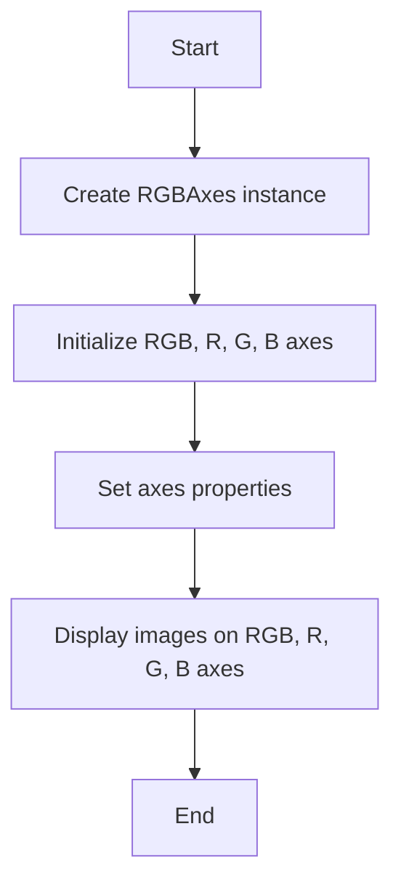
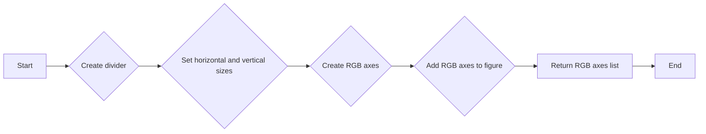
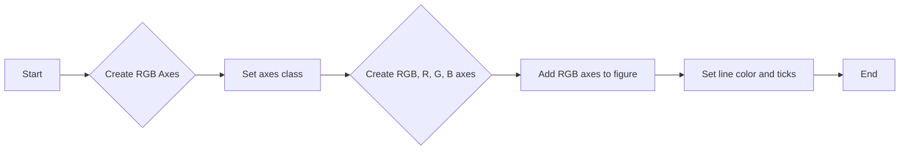
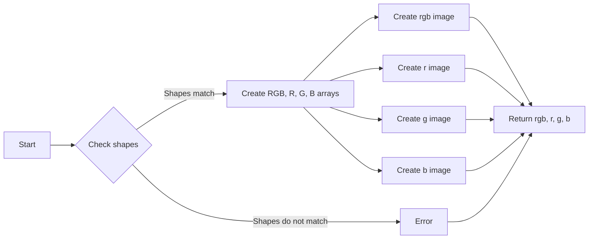

# `matplotlib\lib\mpl_toolkits\axes_grid1\axes_rgb.py` 详细设计文档

This code defines a class `RGBAxes` that creates a four-panel layout for RGB, R, G, and B channels of an image using Matplotlib. It allows for displaying and manipulating these channels separately within the same figure.

## 整体流程



## 类结构

```
RGBAxes (主类)
├── _defaultAxesClass (类属性)
│   ├── Axes (matplotlib.axes.Axes)
└── __init__ (构造函数)
    ├── pad (参数)
    ├── axes_class (参数)
    ├── *args (参数)
    └── **kwargs (参数)
└── imshow_rgb (方法)
    ├── r (参数)
    ├── g (参数)
    ├── b (参数)
    └── **kwargs (参数)
```

## 全局变量及字段


### `pad`
    
Fraction of the Axes height to put as padding.

类型：`float`
    


### `axes_class`
    
Axes class to use. If not provided, the same class as *ax* is used.

类型：`matplotlib.axes.Axes or None`
    


### `_defaultAxesClass`
    
The default Axes class to use for the RGB, R, G, and B Axes, which is `.mpl_axes.Axes` by default.

类型：`matplotlib.axes.Axes`
    


### `RGBAxes._defaultAxesClass`
    
The default Axes class to use for the RGB, R, G, and B Axes, which is `.mpl_axes.Axes` by default.

类型：`matplotlib.axes.Axes`
    
    

## 全局函数及方法


### make_rgb_axes

This function creates a set of RGB axes within a given matplotlib axes instance. It divides the axes into four sections for RGB, R, G, and B channels, and returns a list of the created axes instances.

参数：

- `ax`：`matplotlib.axes.Axes`，The axes instance to create the RGB Axes in.
- `pad`：`float`，Fraction of the Axes height to pad. Default is 0.01.
- `axes_class`：`matplotlib.axes.Axes` or `None`，Axes class to use for the R, G, and B Axes. If `None`, use the same class as `ax`.
- `**kwargs`：Forwarded to `axes_class` init for the R, G, and B Axes.

返回值：`list`，List of the created RGB, R, G, and B axes instances.

#### 流程图



#### 带注释源码

```python
def make_rgb_axes(ax, pad=0.01, axes_class=None, **kwargs):
    """
    Parameters
    ----------
    ax : `~matplotlib.axes.Axes`
        Axes instance to create the RGB Axes in.
    pad : float, optional
        Fraction of the Axes height to pad.
    axes_class : `matplotlib.axes.Axes` or None, optional
        Axes class to use for the R, G, and B Axes. If None, use
        the same class as *ax*.
    **kwargs
        Forwarded to *axes_class* init for the R, G, and B Axes.
    """

    divider = make_axes_locatable(ax)

    pad_size = pad * Size.AxesY(ax)

    xsize = ((1-2*pad)/3) * Size.AxesX(ax)
    ysize = ((1-2*pad)/3) * Size.AxesY(ax)

    divider.set_horizontal([Size.AxesX(ax), pad_size, xsize])
    divider.set_vertical([ysize, pad_size, ysize, pad_size, ysize])

    ax.set_axes_locator(divider.new_locator(0, 0, ny1=-1))

    ax_rgb = []
    if axes_class is None:
        axes_class = type(ax)

    for ny in [4, 2, 0]:
        ax1 = axes_class(ax.get_figure(), ax.get_position(original=True),
                         sharex=ax, sharey=ax, **kwargs)
        locator = divider.new_locator(nx=2, ny=ny)
        ax1.set_axes_locator(locator)
        for t in ax1.yaxis.get_ticklabels() + ax1.xaxis.get_ticklabels():
            t.set_visible(False)
        try:
            for axis in ax1.axis.values():
                axis.major_ticklabels.set_visible(False)
        except AttributeError:
            pass

        ax_rgb.append(ax1)

    fig = ax.get_figure()
    for ax1 in ax_rgb:
        fig.add_axes(ax1)

    return ax_rgb
``` 


### RGBAxes.__init__

This method initializes an instance of the RGBAxes class, which is used to create a 4-panel `~matplotlib.axes.Axes.imshow` for RGB, R, G, and B channels.

参数：

- `*args`：`Any`，Forwarded to *axes_class* init for the RGB Axes
- `**kwargs`：`Any`，Forwarded to *axes_class* init for the RGB, R, G, and B Axes
- `pad`：`float`，default: 0，Fraction of the Axes height to put as padding.
- `axes_class`：`~matplotlib.axes.Axes`，Axes class to use. If not provided, ``_defaultAxesClass`` is used.

返回值：`None`，This method does not return any value.

#### 流程图



#### 带注释源码

```python
def __init__(self, *args, pad=0, **kwargs):
    axes_class = kwargs.pop("axes_class", self._defaultAxesClass)
    self.RGB = ax = axes_class(*args, **kwargs)
    ax.get_figure().add_axes(ax)
    self.R, self.G, self.B = make_rgb_axes(
        ax, pad=pad, axes_class=axes_class, **kwargs)
    # Set the line color and ticks for the axes.
    for ax1 in [self.RGB, self.R, self.G, self.B]:
        if isinstance(ax1.axis, MethodType):
            ad = Axes.AxisDict(self)
            ad.update(
                bottom=SimpleAxisArtist(ax1.xaxis, 1, ax1.spines["bottom"]),
                top=SimpleAxisArtist(ax1.xaxis, 2, ax1.spines["top"]),
                left=SimpleAxisArtist(ax1.yaxis, 1, ax1.spines["left"]),
                right=SimpleAxisArtist(ax1.yaxis, 2, ax1.spines["right"]))
        else:
            ad = ax1.axis
        ad[:].line.set_color("w")
        ad[:].major_ticks.set_markeredgecolor("w")
```


### imshow_rgb

Create the four images {rgb, r, g, b}.

参数：

- r：`array-like`，The red channel array.
- g：`array-like`，The green channel array.
- b：`array-like`，The blue channel array.
- **kwargs：`dict`，Additional keyword arguments to be passed to `~.Axes.imshow` calls for the four images.

返回值：`tuple`，A tuple containing four `~matplotlib.image.AxesImage` objects representing the images rgb, r, g, and b.

#### 流程图



#### 带注释源码

```python
def imshow_rgb(self, r, g, b, **kwargs):
    """
    Create the four images {rgb, r, g, b}.

    Parameters
    ----------
    r, g, b : array-like
        The red, green, and blue arrays.
    **kwargs
        Forwarded to `~.Axes.imshow` calls for the four images.

    Returns
    -------
    rgb : `~matplotlib.image.AxesImage`
    r : `~matplotlib.image.AxesImage`
    g : `~matplotlib.image.AxesImage`
    b : `~matplotlib.image.AxesImage`
    """
    if not (r.shape == g.shape == b.shape):
        raise ValueError(
            f'Input shapes ({r.shape}, {g.shape}, {b.shape}) do not match')
    RGB = np.dstack([r, g, b])
    R = np.zeros_like(RGB)
    R[:, :, 0] = r
    G = np.zeros_like(RGB)
    G[:, :, 1] = g
    B = np.zeros_like(RGB)
    B[:, :, 2] = b
    im_rgb = self.RGB.imshow(RGB, **kwargs)
    im_r = self.R.imshow(R, **kwargs)
    im_g = self.G.imshow(G, **kwargs)
    im_b = self.B.imshow(B, **kwargs)
    return im_rgb, im_r, im_g, im_b
``` 


## 关键组件


### 张量索引与惰性加载

张量索引与惰性加载是代码中用于处理和访问多维数据结构的机制，允许在需要时才计算或加载数据，从而提高效率和性能。

### 反量化支持

反量化支持是代码中实现的一种功能，允许对量化后的数据进行反量化处理，以便进行精确的计算和分析。

### 量化策略

量化策略是代码中用于将浮点数数据转换为固定点数表示的方法，以减少内存使用和提高计算速度。


## 问题及建议


### 已知问题

-   **代码重复性**：`make_rgb_axes` 函数和 `imshow_rgb` 方法中存在大量的代码重复，特别是在创建和配置子轴时。这可能导致维护困难，如果需要修改子轴的创建或配置，需要在多个地方进行更改。
-   **异常处理**：在 `imshow_rgb` 方法中，如果输入数组形状不匹配，会抛出一个 `ValueError`。虽然这是一个合理的做法，但没有提供任何关于如何处理这种错误的上下文信息，例如是否应该记录错误或提供替代方案。
-   **全局变量和函数**：代码中使用了全局变量和函数，如 `Size` 和 `SimpleAxisArtist`，但没有提供这些组件的详细说明或文档，这可能导致理解和使用上的困难。

### 优化建议

-   **代码重构**：将 `make_rgb_axes` 函数和 `imshow_rgb` 方法中的重复代码提取到单独的函数中，以减少代码重复并提高可维护性。
-   **增强异常处理**：在抛出异常之前，可以添加一些额外的日志记录或错误处理逻辑，以便更好地理解错误发生的原因和上下文。
-   **文档和注释**：为全局变量和函数提供详细的文档和注释，以便其他开发者能够更好地理解和使用它们。
-   **性能优化**：如果 `imshow_rgb` 方法被频繁调用，可以考虑使用缓存机制来存储已经计算过的图像，以减少重复计算和提高性能。
-   **接口契约**：明确定义外部依赖和接口契约，以便其他组件能够正确地使用 `RGBAxes` 类。


## 其它


### 设计目标与约束

- 设计目标：
  - 提供一个模块化的RGB图像显示功能，允许用户在单个matplotlib图上显示RGB图像及其单独的红色、绿色和蓝色通道。
  - 确保图像显示的准确性和一致性。
  - 提供灵活的配置选项，允许用户自定义图像显示的布局和样式。

- 约束：
  - 必须使用matplotlib库进行图像显示。
  - 应尽可能减少对matplotlib库的依赖，以保持代码的独立性和可移植性。

### 错误处理与异常设计

- 错误处理：
  - 当输入的数组形状不匹配时，`imshow_rgb`方法将抛出`ValueError`异常。
  - 当提供的参数类型不正确时，将抛出`TypeError`异常。

- 异常设计：
  - 使用try-except块捕获和处理可能发生的异常，确保程序的健壮性。

### 数据流与状态机

- 数据流：
  - 用户输入的RGB图像数据通过`imshow_rgb`方法传递到各个通道。
  - 每个通道的图像数据被处理并显示在相应的子图上。

- 状态机：
  - 该类没有明确的状态机，但图像显示过程涉及一系列状态转换，如初始化、图像处理和显示。

### 外部依赖与接口契约

- 外部依赖：
  - matplotlib库：用于图像显示和布局。
  - numpy库：用于处理图像数据。

- 接口契约：
  - `make_rgb_axes`函数负责创建RGB图像的子图布局。
  - `imshow_rgb`方法负责显示RGB图像及其通道图像。


    