# `matplotlib\lib\mpl_toolkits\axes_grid1\axes_size.py` 详细设计文档

This file defines a set of classes and functions for managing the size of axes in matplotlib plots, including relative and absolute sizes, arithmetic operations, and size calculations based on axes properties.

## 整体流程

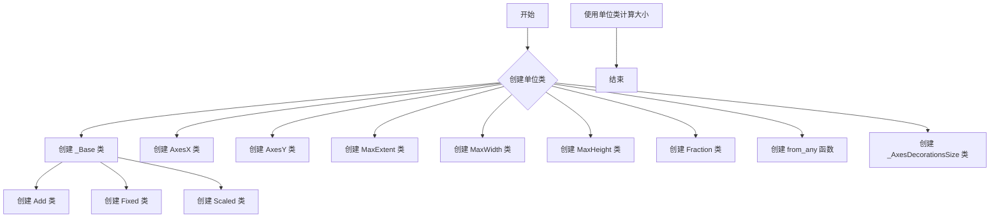

## 类结构

```
_Base (抽象基类)
├── Add (两个大小的和)
│   ├── _a
│   └── _b
├── Fixed (固定大小)
│   └── fixed_size
├── Scaled (可缩放大小)
│   └── _scalable_size
├── AxesX (基于轴宽度的可缩放大小)
│   ├── _axes
│   └── _aspect
├── AxesY (基于轴高度的可缩放大小)
│   ├── _axes
│   └── _aspect
├── MaxExtent (最大宽度和高度)
│   ├── _artist_list
│   └── _w_or_h
├── MaxWidth (最大宽度)
│   └── _artist_list
├── MaxHeight (最大高度)
│   └── _artist_list
├── Fraction (基于参考大小的分数)
│   ├── _fraction_ref
│   └── _fraction
└── _AxesDecorationsSize (轴装饰大小)
   ├── _direction
   └── _ax_list
```

## 全局变量及字段


### `Real`
    
Module for checking if an object is a real number.

类型：`module`
    


### `_api`
    
Module for checking if an object is an instance of a class.

类型：`module`
    


### `Axes`
    
Class representing an axes in matplotlib.

类型：`class`
    


### `Fraction`
    
Class representing a fraction of a size.

类型：`class`
    


### `from_any`
    
Function to create a unit from any size.

类型：`function`
    


### `_get_axes_aspect`
    
Function to get the aspect ratio of an axes.

类型：`function`
    


### `_AxesDecorationsSize._get_size_map`
    
Dictionary mapping directions to size calculation functions.

类型：`dictionary`
    


### `_Base.Real`
    
Module for checking if an object is a real number.

类型：`module`
    


### `_Base._api`
    
Module for checking if an object is an instance of a class.

类型：`module`
    


### `_Base.Axes`
    
Class representing an axes in matplotlib.

类型：`class`
    


### `Add.Fraction`
    
Class representing a fraction of a size.

类型：`class`
    


### `Add.from_any`
    
Function to create a unit from any size.

类型：`function`
    


### `Add._get_axes_aspect`
    
Function to get the aspect ratio of an axes.

类型：`function`
    


### `Add._AxesDecorationsSize._get_size_map`
    
Dictionary mapping directions to size calculation functions.

类型：`dictionary`
    


### `Add._a`
    
The first size object to add.

类型：`object`
    


### `Add._b`
    
The second size object to add.

类型：`object`
    


### `Fixed.fixed_size`
    
The fixed size of the object.

类型：`real`
    


### `Scaled._scalable_size`
    
The scalable size of the object.

类型：`real`
    


### `AxesX._axes`
    
The axes object to calculate the size from.

类型：`Axes`
    


### `AxesX._aspect`
    
The aspect ratio to use for the size calculation.

类型：`real`
    


### `AxesX._ref_ax`
    
The reference axes object for the aspect ratio calculation.

类型：`Axes`
    


### `AxesY._axes`
    
The axes object to calculate the size from.

类型：`Axes`
    


### `AxesY._aspect`
    
The aspect ratio to use for the size calculation.

类型：`real`
    


### `AxesY._ref_ax`
    
The reference axes object for the aspect ratio calculation.

类型：`Axes`
    


### `MaxExtent._artist_list`
    
The list of artist objects to calculate the size from.

类型：`list`
    


### `MaxExtent._w_or_h`
    
The dimension to calculate the size for ('width' or 'height').

类型：`string`
    


### `MaxWidth._artist_list`
    
The list of artist objects to calculate the size from.

类型：`list`
    


### `MaxHeight._artist_list`
    
The list of artist objects to calculate the size from.

类型：`list`
    


### `Fraction._fraction_ref`
    
The reference size object for the fraction calculation.

类型：`object`
    


### `Fraction._fraction`
    
The fraction of the reference size to use.

类型：`real`
    


### `_AxesDecorationsSize._direction`
    
The direction of the decoration to calculate the size for ('left', 'right', 'bottom', 'top').

类型：`string`
    


### `_AxesDecorationsSize._ax_list`
    
The list of axes objects to calculate the size from.

类型：`list`
    
    

## 全局函数及方法

### __rmul__

该函数是一个重载的乘法运算符，用于实现与另一个对象相乘的操作。

#### 描述

`__rmul__` 方法用于重载乘法运算符 `*`，当右侧操作数与左侧对象相乘时调用。它允许与 `Real` 类型的对象进行乘法运算。

#### 参数

- `other`：`Real`，要与之相乘的 `Real` 类型对象。

#### 返回值

- 返回值类型：`_Base` 或 `NotImplementedType`
- 返回值描述：返回与 `other` 相乘的结果，如果 `other` 不是 `Real` 类型，则返回 `NotImplementedType`。

#### 流程图

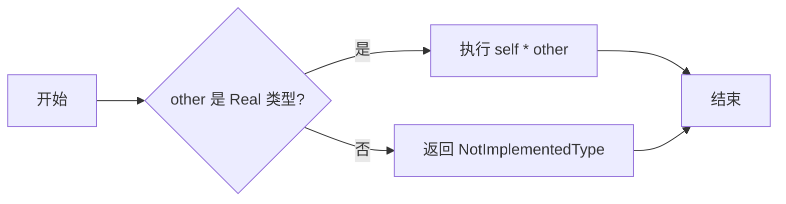

#### 带注释源码

```python
def __rmul__(self, other):
    return self * other  # 调用 __mul__ 方法
```

请注意，`__mul__` 方法在 `_Base` 类中定义，并处理了与 `Real` 类型对象的乘法运算。如果 `other` 不是 `Real` 类型，则返回 `NotImplementedType`。

### __mul__ 方法

`_Base.__mul__`

#### 描述

`__mul__` 方法是 `_Base` 类的一个特殊方法，用于实现与实数的乘法操作。当 `_Base` 类的实例与一个实数相乘时，该方法会被调用，返回一个新的 `_Base` 类的实例，其大小是原始大小与乘数相乘的结果。

#### 参数

- `other`：`Real`，要与之相乘的实数。

#### 返回值

- 返回一个新的 `_Base` 类的实例，其大小是原始大小与乘数相乘的结果。

#### 流程图

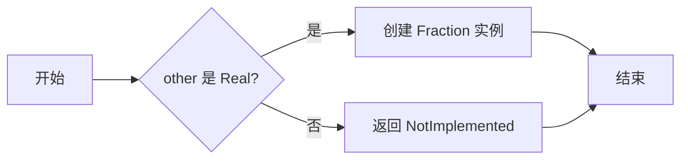

#### 带注释源码

```python
def __mul__(self, other):
    if not isinstance(other, Real):
        return NotImplemented
    return Fraction(other, self)
```


### __div__

`__div__` 方法是 `_Base` 类的一个特殊方法，用于实现与另一个 `_Base` 实例或实数进行除法运算。

#### 描述

该方法接受一个参数 `other`，如果 `other` 是 `_Base` 实例，则返回两个浮点数的乘积，如果 `other` 是实数，则返回 `Fraction` 实例，其大小是当前实例大小除以 `other`。

#### 参数

- `other`：`_Base` 或 `Real`，要除以的 `_Base` 实例或实数。

#### 返回值

- 返回值类型：`_Base` 或 `Fraction`，结果大小。

#### 流程图

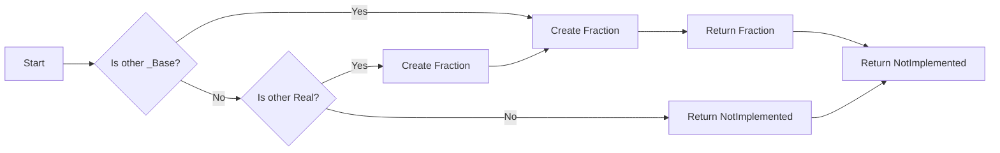

#### 带注释源码

```python
def __div__(self, other):
    return (1 / other) * self
```


### __add__

`_Base.__add__` 方法

参数：

- `other`：`_Base` 或 `Real`，另一个尺寸单位或实数

描述：将当前尺寸单位与另一个尺寸单位或实数相加。

返回值：`_Base`，尺寸单位

返回值描述：返回一个新的尺寸单位，其大小是当前尺寸单位与另一个尺寸单位或实数的和。

#### 流程图

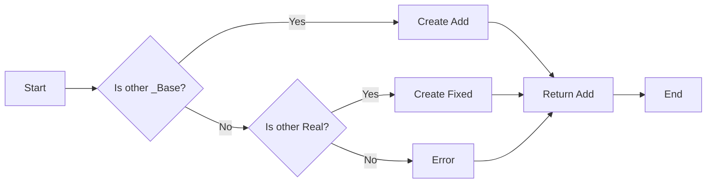

#### 带注释源码

```python
def __add__(self, other):
    if isinstance(other, _Base):
        return Add(self, other)
    else:
        return Add(self, Fixed(other))
```


### __neg__

返回当前单位的负值。

参数：

- `self`：`_Base` 或其子类实例，当前单位对象。

返回值：`_Base` 或其子类实例，当前单位的负值。

#### 流程图

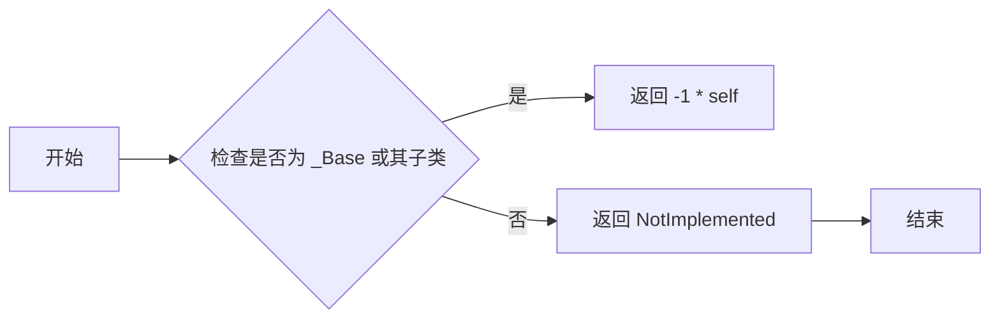

#### 带注释源码

```python
def __neg__(self):
    return -1 * self
```


### __radd__

This method is a special method that allows for the addition of a `_Base` instance with a non-`_Base` instance (e.g., a real number). It is used to implement the behavior of adding a `_Base` instance to a real number.

参数：

- `other`：`Any`，The value to be added to the `_Base` instance. It can be a real number or another `_Base` instance.

返回值：`Add`，An instance of `Add` representing the sum of the `_Base` instance and the `other` value.

#### 流程图

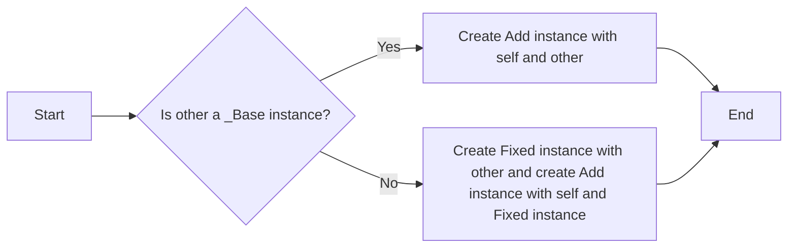

#### 带注释源码

```python
def __radd__(self, other):
    # other cannot be a _Base instance, because A + B would trigger
    # A.__add__(B) first.
    return Add(self, Fixed(other))
```


### __sub__

该函数是 `_Base` 类的一个方法，用于执行两个 `_Base` 实例之间的减法操作。

#### 描述

`__sub__` 方法接受另一个 `_Base` 实例作为参数，并返回一个新的 `_Base` 实例，该实例表示两个大小之间的差值。

#### 参数

- `other`：`_Base`，表示要减去的另一个大小。

#### 返回值

- `_Base` 实例，表示两个大小之间的差值。

#### 流程图

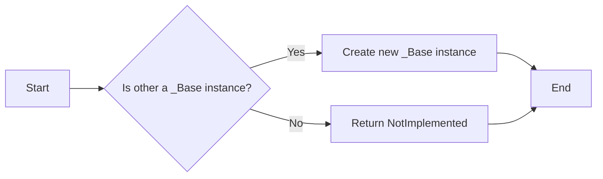

#### 带注释源码

```python
def __sub__(self, other):
    return self + (-other)
```

这段代码利用了 Python 的运算符重载机制。它首先尝试将 `other` 转换为其相反数，然后使用 `+` 运算符将 `self` 与其相反数相加，从而实现减法操作。如果 `other` 不是 `_Base` 实例，则返回 `NotImplemented`，表示不支持该操作。


### `_Base.get_size`

返回两个浮点数，分别代表相对大小和绝对大小。

参数：

- `renderer`：`matplotlib.backends.backend_bases.RendererBase`，渲染器对象，用于获取图形的渲染信息。

返回值：`tuple`，包含两个浮点数，分别代表相对大小和绝对大小。

#### 流程图

```mermaid
graph LR
A[Start] --> B{Is renderer None?}
B -- Yes --> C[Return (0, 0)]
B -- No --> D[Get relative size]
D --> E[Get absolute size]
E --> F[Return (rel_size, abs_size)]
```

#### 带注释源码

```python
def get_size(self, renderer):
    """
    Return two-float tuple with relative and absolute sizes.
    """
    raise NotImplementedError("Subclasses must implement")
```


### `Add.get_size`

返回两个浮点数，分别代表两个大小相加后的相对大小和绝对大小。

参数：

- `renderer`：`matplotlib.backends.backend_bases.RendererBase`，渲染器对象，用于获取图形的渲染信息。

返回值：`tuple`，包含两个浮点数，分别代表相对大小和绝对大小。

#### 流程图

```mermaid
graph LR
A[Start] --> B{Get size of a}
B --> C{Get size of b}
C --> D[Add relative sizes]
D --> E[Add absolute sizes]
E --> F[Return (sum_rel_size, sum_abs_size)]
```

#### 带注释源码

```python
def get_size(self, renderer):
    a_rel_size, a_abs_size = self._a.get_size(renderer)
    b_rel_size, b_abs_size = self._b.get_size(renderer)
    return a_rel_size + b_rel_size, a_abs_size + b_abs_size
```


### `Fixed.get_size`

返回两个浮点数，分别代表固定大小的相对大小和绝对大小。

参数：

- `renderer`：`matplotlib.backends.backend_bases.RendererBase`，渲染器对象，用于获取图形的渲染信息。

返回值：`tuple`，包含两个浮点数，分别代表相对大小和绝对大小。

#### 流程图

```mermaid
graph LR
A[Start] --> B{Is renderer None?}
B -- Yes --> C[Return (0, fixed_size)}
B -- No --> D[Return (0, fixed_size)]
```

#### 带注释源码

```python
def get_size(self, renderer):
    rel_size = 0.
    abs_size = self.fixed_size
    return rel_size, abs_size
```


### `Scaled.get_size`

返回两个浮点数，分别代表可缩放大小的相对大小和绝对大小。

参数：

- `renderer`：`matplotlib.backends.backend_bases.RendererBase`，渲染器对象，用于获取图形的渲染信息。

返回值：`tuple`，包含两个浮点数，分别代表相对大小和绝对大小。

#### 流程图

```mermaid
graph LR
A[Start] --> B{Is renderer None?}
B -- Yes --> C[Return (scalable_size, 0)}
B -- No --> D[Return (scalable_size, 0)]
```

#### 带注释源码

```python
def get_size(self, renderer):
    rel_size = self._scalable_size
    abs_size = 0.
    return rel_size, abs_size
```


### `AxesX.get_size`

返回两个浮点数，分别代表根据轴的数据宽度和纵横比计算出的相对大小和绝对大小。

参数：

- `renderer`：`matplotlib.backends.backend_bases.RendererBase`，渲染器对象，用于获取图形的渲染信息。

返回值：`tuple`，包含两个浮点数，分别代表相对大小和绝对大小。

#### 流程图

```mermaid
graph LR
A[Start] --> B{Get xlim of axes}
B --> C{Calculate aspect}
C --> D[Calculate rel_size]
D --> E[Calculate abs_size]
E --> F[Return (rel_size, abs_size)]
```

#### 带注释源码

```python
def get_size(self, renderer):
    l1, l2 = self._axes.get_xlim()
    if self._aspect == "axes":
        ref_aspect = _get_axes_aspect(self._ref_ax)
        aspect = ref_aspect / _get_axes_aspect(self._axes)
    else:
        aspect = self._aspect

    rel_size = abs(l2-l1)*aspect
    abs_size = 0.
    return rel_size, abs_size
```


### `AxesY.get_size`

返回两个浮点数，分别代表根据轴的数据高度和纵横比计算出的相对大小和绝对大小。

参数：

- `renderer`：`matplotlib.backends.backend_bases.RendererBase`，渲染器对象，用于获取图形的渲染信息。

返回值：`tuple`，包含两个浮点数，分别代表相对大小和绝对大小。

#### 流程图

```mermaid
graph LR
A[Start] --> B{Get ylim of axes}
B --> C{Calculate aspect}
C --> D[Calculate rel_size]
D --> E[Calculate abs_size]
E --> F[Return (rel_size, abs_size)]
```

#### 带注释源码

```python
def get_size(self, renderer):
    l1, l2 = self._axes.get_ylim()

    if self._aspect == "axes":
        ref_aspect = _get_axes_aspect(self._ref_ax)
        aspect = _get_axes_aspect(self._axes)
    else:
        aspect = self._aspect

    rel_size = abs(l2-l1)*aspect
    abs_size = 0.
    return rel_size, abs_size
```


### `MaxExtent.get_size`

返回两个浮点数，分别代表给定艺术家列表中最大宽度或高度的计算出的相对大小和绝对大小。

参数：

- `renderer`：`matplotlib.backends.backend_bases.RendererBase`，渲染器对象，用于获取图形的渲染信息。

返回值：`tuple`，包含两个浮点数，分别代表相对大小和绝对大小。

#### 流程图

```mermaid
graph LR
A[Start] --> B{Get extent of each artist}
B --> C{Calculate rel_size}
C --> D[Calculate abs_size]
D --> E[Return (rel_size, abs_size)]
```

#### 带注释源码

```python
def get_size(self, renderer):
    rel_size = 0.
    extent_list = [
        getattr(a.get_window_extent(renderer), self._w_or_h) / a.figure.dpi
        for a in self._artist_list]
    abs_size = max(extent_list, default=0)
    return rel_size, abs_size
```


### `Fraction.get_size`

返回两个浮点数，分别代表相对于参考大小的相对大小和绝对大小。

参数：

- `renderer`：`matplotlib.backends.backend_bases.RendererBase`，渲染器对象，用于获取图形的渲染信息。

返回值：`tuple`，包含两个浮点数，分别代表相对大小和绝对大小。

#### 流程图

```mermaid
graph LR
A[Start] --> B{Is fraction_ref None?}
B -- Yes --> C[Return (fraction, 0)}
B -- No --> D{Get size of fraction_ref}
D --> E[Calculate rel_size]
E --> F[Calculate abs_size]
F --> G[Return (rel_size, abs_size)]
```

#### 带注释源码

```python
def get_size(self, renderer):
    if self._fraction_ref is None:
        return self._fraction, 0.
    else:
        r, a = self._fraction_ref.get_size(renderer)
        rel_size = r*self._fraction
        abs_size = a*self._fraction
        return rel_size, abs_size
```


### `__init__`

`__init__` 方法是所有 `_Base` 子类的构造函数。

参数：

- `a`：`_Base` 或 `Fixed`，表示要相加的第一个大小。
- `b`：`_Base` 或 `Fixed`，表示要相加的第二个大小。

返回值：无

#### 流程图

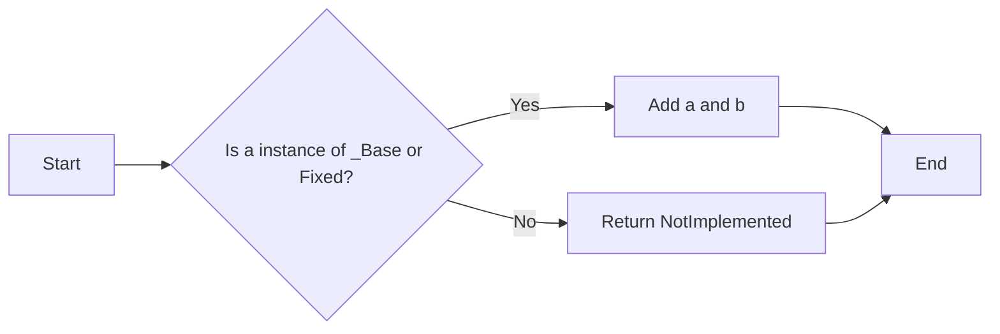

#### 带注释源码

```python
class Add(_Base):
    """
    Sum of two sizes.
    """

    def __init__(self, a, b):
        self._a = a
        self._b = b

    def get_size(self, renderer):
        a_rel_size, a_abs_size = self._a.get_size(renderer)
        b_rel_size, b_abs_size = self._b.get_size(renderer)
        return a_rel_size + b_rel_size, a_abs_size + b_abs_size
```

### `__init__`

`Fixed` 类的构造函数。

参数：

- `fixed_size`：`Real`，表示固定的绝对大小。

返回值：无

#### 流程图

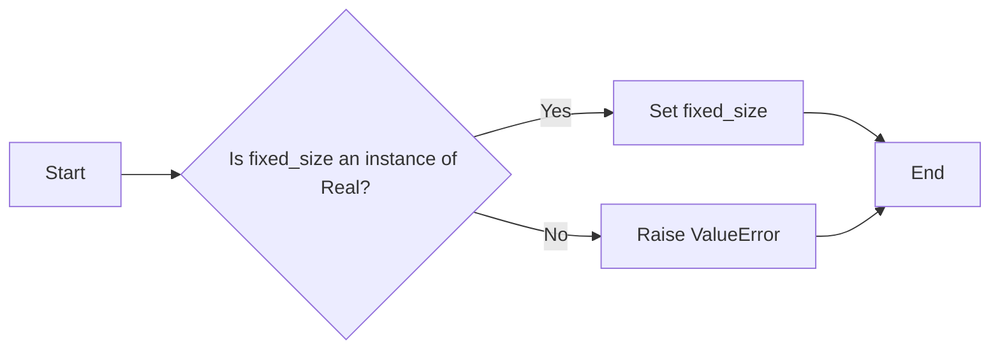

#### 带注释源码

```python
class Fixed(_Base):
    """
    Simple fixed size with absolute part = *fixed_size* and relative part = 0.
    """

    def __init__(self, fixed_size):
        _api.check_isinstance(Real, fixed_size=fixed_size)
        self.fixed_size = fixed_size

    def get_size(self, renderer):
        rel_size = 0.
        abs_size = self.fixed_size
        return rel_size, abs_size
```

### `__init__`

`Scaled` 类的构造函数。

参数：

- `scalable_size`：`Real`，表示可缩放的相对大小。

返回值：无

#### 流程图

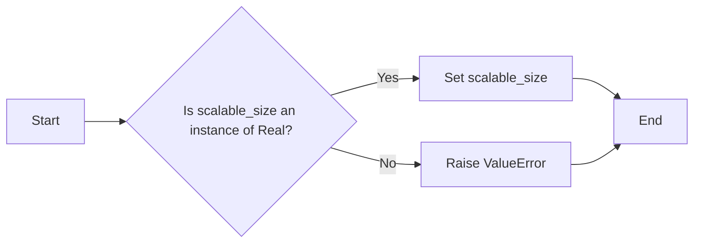

#### 带注释源码

```python
class Scaled(_Base):
    """
    Simple scaled(?) size with absolute part = 0 and
    relative part = *scalable_size*.
    """

    def __init__(self, scalable_size):
        self._scalable_size = scalable_size

    def get_size(self, renderer):
        rel_size = self._scalable_size
        abs_size = 0.
        return rel_size, abs_size

Scalable = Scaled
```

### `__init__`

`AxesX` 类的构造函数。

参数：

- `axes`：`Axes`，表示要获取大小的轴。
- `aspect`：`Real` 或 `str`，表示纵横比。
- `ref_ax`：`Axes`，当 `aspect` 为 `'axes'` 时，表示参考轴。

返回值：无

#### 流程图

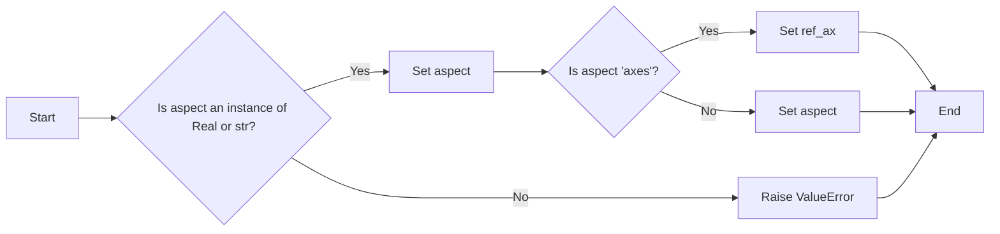

#### 带注释源码

```python
class AxesX(_Base):
    """
    Scaled size whose relative part corresponds to the data width
    of the *axes* multiplied by the *aspect*.
    """

    def __init__(self, axes, aspect=1., ref_ax=None):
        self._axes = axes
        self._aspect = aspect
        if aspect == "axes" and ref_ax is None:
            raise ValueError("ref_ax must be set when aspect='axes'")
        self._ref_ax = ref_ax

    def get_size(self, renderer):
        l1, l2 = self._axes.get_xlim()
        if self._aspect == "axes":
            ref_aspect = _get_axes_aspect(self._ref_ax)
            aspect = ref_aspect / _get_axes_aspect(self._axes)
        else:
            aspect = self._aspect

        rel_size = abs(l2-l1)*aspect
        abs_size = 0.
        return rel_size, abs_size
```

### `__init__`

`AxesY` 类的构造函数。

参数：

- `axes`：`Axes`，表示要获取大小的轴。
- `aspect`：`Real` 或 `str`，表示纵横比。
- `ref_ax`：`Axes`，当 `aspect` 为 `'axes'` 时，表示参考轴。

返回值：无

#### 流程图

```mermaid
graph LR
A[Start] --> B{Is aspect an instance of Real or str?}
B -- Yes --> C[Set aspect]
B -- No --> D[ Raise ValueError]
C --> E{Is aspect 'axes'?}
E -- Yes --> F[Set ref_ax]
E -- No --> G[Set aspect]
F --> H[End]
G --> H
D --> H
```

#### 带注释源码

```python
class AxesY(_Base):
    """
    Scaled size whose relative part corresponds to the data height
    of the *axes* multiplied by the *aspect*.
    """

    def __init__(self, axes, aspect=1., ref_ax=None):
        self._axes = axes
        self._aspect = aspect
        if aspect == "axes" and ref_ax is None:
            raise ValueError("ref_ax must be set when aspect='axes'")
        self._ref_ax = ref_ax

    def get_size(self, renderer):
        l1, l2 = self._axes.get_ylim()

        if self._aspect == "axes":
            ref_aspect = _get_axes_aspect(self._ref_ax)
            aspect = _get_axes_aspect(self._axes)
        else:
            aspect = self._aspect

        rel_size = abs(l2-l1)*aspect
        abs_size = 0.
        return rel_size, abs_size
```

### `__init__`

`MaxExtent` 类的构造函数。

参数：

- `artist_list`：`list`，表示艺术家列表。
- `w_or_h`：`str`，表示宽度或高度。

返回值：无

#### 流程图

```mermaid
graph LR
A[Start] --> B{Is w_or_h in ["width", "height"]?}
B -- Yes --> C[Set w_or_h]
B -- No --> D[ Raise ValueError]
C --> E[End]
D --> E
```

#### 带注释源码

```python
class MaxExtent(_Base):
    """
    Size whose absolute part is either the largest width or the largest height
    of the given *artist_list*.
    """

    def __init__(self, artist_list, w_or_h):
        self._artist_list = artist_list
        _api.check_in_list(["width", "height"], w_or_h=w_or_h)
        self._w_or_h = w_or_h

    def add_artist(self, a):
        self._artist_list.append(a)

    def get_size(self, renderer):
        rel_size = 0.
        extent_list = [
            getattr(a.get_window_extent(renderer), self._w_or_h) / a.figure.dpi
            for a in self._artist_list]
        abs_size = max(extent_list, default=0)
        return rel_size, abs_size
```

### `__init__`

`MaxWidth` 类的构造函数。

参数：

- `artist_list`：`list`，表示艺术家列表。

返回值：无

#### 流程图

```mermaid
graph LR
A[Start] --> B{Is instance of MaxExtent?}
B -- Yes --> C[Set w_or_h to "width"]
B -- No --> D[ Raise ValueError]
C --> E[End]
D --> E
```

#### 带注释源码

```python
class MaxWidth(MaxExtent):
    """
    Size whose absolute part is the largest width of the given *artist_list*.
    """

    def __init__(self, artist_list):
        super().__init__(artist_list, "width")
```

### `__init__`

`MaxHeight` 类的构造函数。

参数：

- `artist_list`：`list`，表示艺术家列表。

返回值：无

#### 流程图

```mermaid
graph LR
A[Start] --> B{Is instance of MaxExtent?}
B -- Yes --> C[Set w_or_h to "height"]
B -- No --> D[ Raise ValueError]
C --> E[End]
D --> E
```

#### 带注释源码

```python
class MaxHeight(MaxExtent):
    """
    Size whose absolute part is the largest height of the given *artist_list*.
    """

    def __init__(self, artist_list):
        super().__init__(artist_list, "height")
```

### `__init__`

`Fraction` 类的构造函数。

参数：

- `fraction`：`Real`，表示分数。
- `ref_size`：`_Base`，表示参考大小。

返回值：无

#### 流程图

```mermaid
graph LR
A[Start] --> B{Is fraction an instance of Real?}
B -- Yes --> C[Set fraction]
B -- No --> D[ Raise ValueError]
C --> E{Is ref_size an instance of _Base?}
E -- Yes --> F[Set ref_size]
E -- No --> G[ Raise ValueError]
F --> H[End]
G --> H
D --> H
```

#### 带注释源码

```python
class Fraction(_Base):
    """
    An instance whose size is a *fraction* of the *ref_size*.

    >>> s = Fraction(0.3, AxesX(ax))
    """

    def __init__(self, fraction, ref_size):
        _api.check_isinstance(Real, fraction=fraction)
        self._fraction_ref = ref_size
        self._fraction = fraction

    def get_size(self, renderer):
        if self._fraction_ref is None:
            return self._fraction, 0.
        else:
            r, a = self._fraction_ref.get_size(renderer)
            rel_size = r*self._fraction
            abs_size = a*self._fraction
            return rel_size, abs_size
```

### `from_any`

`from_any` 函数。

参数：

- `size`：`Real` 或 `str`，表示大小。
- `fraction_ref`：`_Base`，表示参考大小。

返回值：`Fixed` 或 `Fraction`

#### 流程图

```mermaid
graph LR
A[Start] --> B{Is size an instance of Real?}
B -- Yes --> C[Return Fixed(size)}
B -- No --> D{Is size a string ending with %?}
D -- Yes --> E[Return Fraction(float(size[:-1]) / 100, fraction_ref)}
D -- No --> F[ Raise ValueError]
E --> G[End]
F --> G
C --> G
```

#### 带注释源码

```python
def from_any(size, fraction_ref=None):
    """
    Create a Fixed unit when the first argument is a float, or a
    Fraction unit if that is a string that ends with %. The second
    argument is only meaningful when Fraction unit is created.

    >>> from mpl_toolkits.axes_grid1.axes_size import from_any
    >>> a = from_any(1.2) # => Fixed(1.2)
    >>> from_any("50%", a) # => Fraction(0.5, a)
    """
    if isinstance(size, Real):
        return Fixed(size)
    elif isinstance(size, str):
        if size[-1] == "%":
            return Fraction(float(size[:-1]) / 100, fraction_ref)
    raise ValueError("Unknown format")
```

### `__init__`

`_AxesDecorationsSize` 类的构造函数。

参数：

- `ax`：`Axes`，表示轴。
- `direction`：`str`，表示方向。

返回值：无

#### 流程图

```mermaid
graph LR
A[Start] --> B{Is direction in _get_size_map?}
B -- Yes --> C[Set direction]
B -- No --> D[ Raise ValueError]
C --> E[End]
D --> E
```

#### 带注释源码

```python
class _AxesDecorationsSize(_Base):
    """
    Fixed size, corresponding to the size of decorations on a given Axes side.
    """

    _get_size_map = {
        "left":   lambda tight_bb, axes_bb: axes_bb.xmin - tight_bb.xmin,
        "right":  lambda tight_bb, axes_bb: tight_bb.xmax - axes_bb.xmax,
        "bottom": lambda tight_bb, axes_bb: axes_bb.ymin - tight_bb.ymin,
        "top":    lambda tight_bb, axes_bb: tight_bb.ymax - axes_bb.ymax,
    }

    def __init__(self, ax, direction):
        _api.check_in_list(self._get_size_map, direction=direction)
        self._direction = direction
        self._ax_list = [ax] if isinstance(ax, Axes) else ax

    def get_size(self, renderer):
        sz = max([
            self._get_size_map[self._direction](
                ax.get_tightbbox(renderer, call_axes_locator=False), ax.bbox)
            for ax in self._ax_list])
        dpi = renderer.points_to_pixels(72)
        abs_size = sz / dpi
        rel_size = 0
        return rel_size, abs_size
```


### MaxWidth.add_artist

`MaxWidth.add_artist` 方法用于将艺术家添加到 `MaxWidth` 实例的艺术家列表中。

参数：

- `a`：`artist`，要添加到列表中的艺术家对象。

返回值：无

#### 流程图

```mermaid
graph LR
A[Start] --> B{Is a instance of artist?}
B -- Yes --> C[Add to artist list]
B -- No --> D[Error]
C --> E[End]
D --> E
```

#### 带注释源码

```python
class MaxWidth(MaxExtent):
    """
    Size whose absolute part is the largest width of the given *artist_list*.
    """

    def __init__(self, artist_list):
        super().__init__(artist_list, "width")

    def add_artist(self, a):
        self._artist_list.append(a)
```


### `_get_axes_aspect`

获取轴的纵横比。

参数：

- `ax`：`Axes`，轴对象。

返回值：`float`，轴的纵横比。

#### 流程图

```mermaid
graph LR
A[开始] --> B{获取纵横比}
B --> C[返回纵横比]
C --> D[结束]
```

#### 带注释源码

```python
def _get_axes_aspect(ax):
    aspect = ax.get_aspect()
    if aspect == "auto":
        aspect = 1.
    return aspect
```


### `_Base.__rmul__`

`_Base.__rmul__` 方法是 `_Base` 类的一个特殊方法，用于实现与右操作数的乘法运算。

#### 描述

该方法允许 `_Base` 类的实例与任何右操作数进行乘法运算。如果右操作数是 `_Base` 类的实例，则调用 `__mul__` 方法；如果右操作数是 `Real` 类型的实例，则返回一个新的 `Fraction` 实例，其绝对大小是右操作数，相对大小是 `_Base` 实例的绝对大小。

#### 参数

- `other`：`Any`，与 `_Base` 实例进行乘法运算的右操作数。

#### 返回值

- `Fraction`，一个新实例，其绝对大小是 `other`，相对大小是 `_Base` 实例的绝对大小。

#### 流程图

```mermaid
graph LR
A[开始] --> B{other 是 _Base 实例?}
B -- 是 --> C[调用 __mul__]
B -- 否 --> D{other 是 Real 类型?}
D -- 是 --> E[创建 Fraction 实例]
D -- 否 --> F[返回 NotImplemented]
E --> G[结束]
F --> G
C --> G
```

#### 带注释源码

```python
def __rmul__(self, other):
    return self * other
```


### `_Base.__mul__`

**描述**

`_Base.__mul__` 方法是 `_Base` 类的一个实例方法，它实现了与一个实数相乘的操作。如果传入的参数 `other` 是一个实数，则返回一个新的 `Fraction` 实例，其相对大小是当前 `_Base` 实例的相对大小乘以 `other`，绝对大小是当前 `_Base` 实例的绝对大小乘以 `other`。

**参数**

- `other`：`Real`，要与之相乘的实数。

**返回值**

- `Fraction`，一个新的 `Fraction` 实例，其大小是当前 `_Base` 实例的大小乘以 `other`。

#### 流程图

```mermaid
graph LR
A[开始] --> B{other 是 Real?}
B -- 是 --> C[创建 Fraction 实例]
B -- 否 --> D[返回 NotImplemented]
C --> E[结束]
D --> E
```

#### 带注释源码

```python
def __mul__(self, other):
    if not isinstance(other, Real):
        return NotImplemented
    return Fraction(other, self)
```


### `_Base.__div__`

This method performs division of the instance by another instance or a real number.

参数：

- `other`：`_Base` 或 `Real`，The instance or real number to divide by.

返回值：`_Base`，The result of the division.

#### 流程图

```mermaid
graph LR
A[Start] --> B{Is other _Base?}
B -- Yes --> C[Is other Real?]
B -- No --> D[Return NotImplemented]
C -- Yes --> E[Return Fraction(1/other, self)]
C -- No --> E
E --> F[End]
```

#### 带注释源码

```python
def __div__(self, other):
    return (1 / other) * self
```


### `_Base.__add__`

`_Base.__add__` 方法是 `_Base` 类的一个实例方法，用于将 `_Base` 类的实例与另一个 `_Base` 类的实例或一个实数相加。

#### 描述

该方法实现了 `_Base` 类的实例与另一个 `_Base` 类的实例或一个实数相加的操作。如果参数是 `_Base` 类的实例，则创建一个新的 `Add` 类的实例来表示两个尺寸的和。如果参数是一个实数，则创建一个新的 `Fixed` 类的实例来表示与 `_Base` 类的实例相加的结果。

#### 参数

- `other`：`_Base` 或 `Real`，要与之相加的 `_Base` 类的实例或实数。

#### 返回值

- `Add` 或 `Fixed`，表示两个尺寸和的新 `_Base` 类的实例。

#### 流程图

```mermaid
graph LR
A[Start] --> B{Is other _Base?}
B -- Yes --> C[Create Add instance]
B -- No --> D{Is other Real?}
D -- Yes --> E[Create Fixed instance]
D -- No --> F[Return NotImplemented]
E --> G[End]
C --> G
F --> G
```

#### 带注释源码

```python
def __add__(self, other):
    if isinstance(other, _Base):
        return Add(self, other)
    else:
        return Add(self, Fixed(other))
```


### `_Base.__neg__`

返回该类的负值。

参数：

- `self`：`_Base`，当前类的实例

返回值：`_Base`，当前类的负值

#### 流程图

```mermaid
graph LR
A[Start] --> B{Is self a _Base instance?}
B -- Yes --> C[Return -1 * self]
B -- No --> D[Return NotImplemented]
D --> E[End]
```

#### 带注释源码

```python
def __neg__(self):
    return -1 * self
```


### `_Base.__radd__`

This method is a special method in Python that allows instances of the `_Base` class to be added to other objects using the `+` operator when the other object is not an instance of `_Base`.

#### 描述

The `__radd__` method is called when the left operand does not support the addition operation with the right operand. In this case, if the left operand is an instance of `_Base` and the right operand is not, the `__radd__` method is called to perform the addition.

#### 参数

- `other`：`Any`，The object to be added to the instance of `_Base`.

#### 返回值

- `Add`：`_Base`，An instance of `Add` representing the sum of the instance and the other object.

#### 流程图

```mermaid
graph LR
A[Start] --> B{Is other an instance of _Base?}
B -- Yes --> C[Create Add instance with self and other]
B -- No --> D[Call other.__radd__(self)]
C --> E[Return Add instance]
D --> E
E --> F[End]
```

#### 带注释源码

```python
def __radd__(self, other):
    # other cannot be a _Base instance, because A + B would trigger
    # A.__add__(B) first.
    return Add(self, Fixed(other))
```


### `_Base.__sub__`

`_Base.__sub__` 方法是 `_Base` 类的一个特殊方法，用于实现与另一个 `_Base` 实例或实数的减法操作。

#### 描述

该方法接受另一个 `_Base` 实例或实数作为参数，并返回一个新的 `_Base` 实例，该实例表示当前实例与参数之间的差值。

#### 参数

- `other`：`_Base` 或 `Real`，表示要减去的 `_Base` 实例或实数。

#### 返回值

- `_Base` 实例：表示当前实例与参数之间的差值。

#### 流程图

```mermaid
graph LR
A[Start] --> B{Is other a _Base instance?}
B -- Yes --> C[Create Add instance with self and -other]
B -- No --> D{Is other a Real instance?}
D -- Yes --> E[Create Fraction instance with -other and self]
D -- No --> F[Return NotImplemented]
C --> G[Return Add instance]
E --> G
F --> H[Return NotImplemented]
G --> I[End]
```

#### 带注释源码

```python
def __sub__(self, other):
    return self + (-other)
```


### `_Base.get_size`

`_Base.get_size` 方法是 `_Base` 类的一个实例方法。

描述：

`get_size` 方法返回一个包含两个浮点数的元组，分别代表相对大小和绝对大小。

参数：

- `renderer`：`matplotlib.backends.backend_bases.RendererBase`，渲染器对象，用于获取图形的渲染信息。

返回值：

- 返回值类型：元组，包含两个浮点数。
- 返回值描述：第一个元素是相对大小，第二个元素是绝对大小。

#### 流程图

```mermaid
graph LR
A[Start] --> B{Is subclass of _Base?}
B -- Yes --> C[Call get_size with renderer]
B -- No --> D[Not implemented error]
C --> E[Return (rel_size, abs_size)]
D --> F[End]
```

#### 带注释源码

```python
def get_size(self, renderer):
    """
    Return two-float tuple with relative and absolute sizes.
    """
    raise NotImplementedError("Subclasses must implement")
```


### Add.__init__

This method initializes an instance of the `Add` class, which represents the sum of two sizes.

参数：

- `a`：`_Base`，The first size to be added.
- `b`：`_Base`，The second size to be added.

返回值：无

#### 流程图

```mermaid
graph LR
A[Start] --> B{Is a _Base?}
B -- Yes --> C[Initialize self._a with a]
B -- No --> D[Return NotImplemented]
C --> E[Is b _Base?]
E -- Yes --> F[Initialize self._b with b]
E -- No --> G[Return NotImplemented]
F --> H[End]
```

#### 带注释源码

```python
def __init__(self, a, b):
    self._a = a
    self._b = b
```


### Add.get_size

`Add.get_size` 方法是 `Add` 类的一个方法。

描述：

`get_size` 方法返回一个包含两个浮点数的元组，分别代表相对大小和绝对大小。

参数：

- `renderer`：`matplotlib.backends.backend_agg.FigureCanvasAgg`，渲染器对象，用于获取图形的渲染信息。

返回值：

- 返回值类型：元组 `(float, float)`，包含两个浮点数。
- 返回值描述：第一个浮点数是相对大小，第二个浮点数是绝对大小。

#### 流程图

```mermaid
graph LR
A[Start] --> B{Call _a.get_size(renderer)}
B --> C{Call _b.get_size(renderer)}
C --> D[Calculate a_rel_size + b_rel_size]
C --> E[Calculate a_abs_size + b_abs_size]
D --> F[Return (a_rel_size + b_rel_size, a_abs_size + b_abs_size)]
E --> F
F --> G[End]
```

#### 带注释源码

```python
def get_size(self, renderer):
    """
    Return two-float tuple with relative and absolute sizes.
    """
    a_rel_size, a_abs_size = self._a.get_size(renderer)
    b_rel_size, b_abs_size = self._b.get_size(renderer)
    return a_rel_size + b_rel_size, a_abs_size + b_abs_size
``` 


### Fixed.__init__

This method initializes a `Fixed` object with a specified absolute size and sets the relative size to 0.

参数：

- `fixed_size`：`Real`，The absolute size of the unit.
- ...

返回值：无

#### 流程图

```mermaid
graph LR
A[Start] --> B{Is fixed_size Real?}
B -- Yes --> C[Initialize Fixed with fixed_size]
B -- No --> D[Error: fixed_size must be Real]
C --> E[End]
```

#### 带注释源码

```python
class Fixed(_Base):
    """
    Simple fixed size with absolute part = *fixed_size* and relative part = 0.
    """

    def __init__(self, fixed_size):
        _api.check_isinstance(Real, fixed_size=fixed_size)
        self.fixed_size = fixed_size
```


### Fixed.get_size

返回两个浮点数，分别代表相对大小和绝对大小。

参数：

- `renderer`：`matplotlib.backends.backend_bases.RendererBase`，渲染器对象，用于获取图形的渲染信息。

返回值：`tuple`，包含两个浮点数，分别代表相对大小和绝对大小。

#### 流程图

```mermaid
graph LR
A[Fixed.get_size] --> B{获取相对大小}
B --> C{获取绝对大小}
C --> D[返回相对大小和绝对大小]
```

#### 带注释源码

```python
def get_size(self, renderer):
    """
    Return two-float tuple with relative and absolute sizes.
    """
    rel_size = 0.
    abs_size = self.fixed_size
    return rel_size, abs_size
```


### Scaled.__init__

This method initializes a `Scaled` object, which represents a simple scaled size with an absolute part of 0 and a relative part defined by the `scalable_size` parameter.

参数：

- `scalable_size`：`Real`，The relative size of the scaled size.

返回值：无

#### 流程图

```mermaid
classDiagram
    Scaled <|-- _Base
    Scaled {
        - scalable_size: Real
    }
    Scaled "1" ..> _Base
    Scaled :+ __init__(scalable_size: Real)
```

#### 带注释源码

```python
class Scaled(_Base):
    """
    Simple scaled(?) size with absolute part = 0 and
    relative part = *scalable_size*.
    """

    def __init__(self, scalable_size):
        self._scalable_size = scalable_size
```


### Scaled.get_size

返回两个浮点数，分别代表相对大小和绝对大小。

参数：

- `renderer`：`matplotlib.backends.backend_bases.RendererBase`，渲染器对象，用于获取图形的渲染信息。

返回值：`(float, float)`，一个包含两个浮点数的元组，分别代表相对大小和绝对大小。

#### 流程图

```mermaid
graph LR
A[Start] --> B{Check renderer}
B -->|Yes| C[Calculate relative size]
B -->|No| D[Return Not Implemented]
C --> E[Calculate absolute size]
E --> F[Return (rel_size, abs_size)]
```

#### 带注释源码

```python
def get_size(self, renderer):
    """
    Return two-float tuple with relative and absolute sizes.
    """
    rel_size = self._scalable_size
    abs_size = 0.
    return rel_size, abs_size
```


### `AxesX.__init__`

`AxesX.__init__` 初始化一个 `AxesX` 对象，该对象表示一个与轴的宽度相关的缩放大小。

参数：

- `axes`：`Axes`，轴对象，用于计算相对大小。
- `aspect`：`float` 或 `str`，缩放因子，可以是浮点数或字符串 "axes"，表示使用参考轴的纵横比。
- `ref_ax`：`Axes` 或 `None`，参考轴，当 `aspect='axes'` 时使用。

返回值：无

#### 流程图

```mermaid
classDef AxesX <<<<<<
classDef Axes <<<<
classDef Real <<<<
classDef str <<<<
classDef None <<<<
classDef float <<<<

class AxesX {
    +__init__(axes: Axes, aspect: float | str, ref_ax: Axes | None)
}

class Axes {
    +get_xlim(): (float, float)
    +get_aspect(): str
}

class Real {
    +__init__(value: float)
}

class str {
    +__init__(value: str)
}

class None {
    +__init__()
}

class float {
    +__init__(value: float)
}

AxesX --> Axes: +__init__(axes: Axes)
AxesX --> Real: +__init__(value: float)
AxesX --> str: +init__(value: str)
AxesX --> None: +init__()
```

#### 带注释源码

```python
def __init__(self, axes, aspect=1., ref_ax=None):
    self._axes = axes
    self._aspect = aspect
    if aspect == "axes" and ref_ax is None:
        raise ValueError("ref_ax must be set when aspect='axes'")
    self._ref_ax = ref_ax
```


### AxesX.get_size

`AxesX.get_size(renderer)` 返回一个包含两个浮点数的元组，分别代表相对大小和绝对大小。

参数：

- `renderer`：`matplotlib.backends.backend_agg.FigureCanvasAgg`，渲染器对象，用于获取轴的界限。

返回值：`tuple`，包含两个浮点数，分别代表相对大小和绝对大小。

#### 流程图

```mermaid
graph LR
A[Start] --> B{Is aspect "axes"?}
B -- Yes --> C[Get ref_aspect]
B -- No --> C[Set aspect]
C --> D[Get l1, l2]
D --> E[Calculate rel_size]
E --> F[Calculate abs_size]
F --> G[Return (rel_size, abs_size)]
G --> H[End]
```

#### 带注释源码

```python
def get_size(self, renderer):
    l1, l2 = self._axes.get_xlim()
    if self._aspect == "axes":
        ref_aspect = _get_axes_aspect(self._ref_ax)
        aspect = ref_aspect / _get_axes_aspect(self._axes)
    else:
        aspect = self._aspect

    rel_size = abs(l2-l1)*aspect
    abs_size = 0.
    return rel_size, abs_size
``` 


### AxesY.__init__

This method initializes an instance of the `AxesY` class, which represents a scaled size whose relative part corresponds to the data height of the given `axes` multiplied by the `aspect`.

参数：

- `axes`：`Axes`，The axes object for which the size is calculated.
- `aspect`：`float`，The aspect ratio to use when calculating the size. Defaults to 1.
- `ref_ax`：`Axes`，The reference axes object to use when the aspect is set to 'axes'. Required when `aspect` is 'axes'.

返回值：无

#### 流程图

```mermaid
graph LR
A[Start] --> B{Initialize AxesY}
B --> C[Set _axes to axes]
B --> D[Set _aspect to aspect]
B --> E{Is aspect 'axes'?}
E -- Yes --> F[Set _ref_ax to ref_ax]
E -- No --> G[End]
```

#### 带注释源码

```python
def __init__(self, axes, aspect=1., ref_ax=None):
    self._axes = axes
    self._aspect = aspect
    if aspect == "axes" and ref_ax is None:
        raise ValueError("ref_ax must be set when aspect='axes'")
    self._ref_ax = ref_ax
```


### AxesY.get_size

`AxesY.get_size(renderer)` 返回一个包含两个浮点数的元组，分别代表相对大小和绝对大小。

参数：

- `renderer`：`matplotlib.backends.backend_bases.RendererBase`，用于渲染的渲染器对象。

返回值：`tuple`，包含两个浮点数，分别代表相对大小和绝对大小。

#### 流程图

```mermaid
graph LR
A[Start] --> B{Check aspect}
B -->|aspect='axes'| C[Get ref_aspect]
B -->|else| C1[Get aspect]
C --> D[Get l1, l2]
D --> E[Calculate rel_size]
E --> F[Calculate abs_size]
F --> G[Return (rel_size, abs_size)]
G --> H[End]
```

#### 带注释源码

```python
def get_size(self, renderer):
    l1, l2 = self._axes.get_ylim()  # 获取y轴的上下限

    if self._aspect == "axes":
        ref_aspect = _get_axes_aspect(self._ref_ax)  # 获取参考轴的纵横比
        aspect = ref_aspect / _get_axes_aspect(self._axes)  # 获取当前轴的纵横比
    else:
        aspect = self._aspect  # 使用给定的纵横比

    rel_size = abs(l2 - l1) * aspect  # 计算相对大小
    abs_size = 0.  # 绝对大小为0

    return rel_size, abs_size
```


### MaxExtent.__init__

This method initializes a `MaxExtent` object, which represents a size whose absolute part is either the largest width or the largest height of the given `artist_list`.

参数：

- `artist_list`：`list`，A list of artist objects for which the maximum extent is calculated.
- `w_or_h`：`str`，A string that specifies whether to calculate the maximum width or height. It should be either "width" or "height".

返回值：`None`，This method does not return any value.

#### 流程图

```mermaid
graph LR
A[Start] --> B{Initialize MaxExtent}
B --> C[Set _artist_list to artist_list]
B --> D[Set _w_or_h to w_or_h]
C --> E[End]
D --> E
```

#### 带注释源码

```python
def __init__(self, artist_list, w_or_h):
    self._artist_list = artist_list
    _api.check_in_list(["width", "height"], w_or_h=w_or_h)
    self._w_or_h = w_or_h
```


### MaxExtent.add_artist

`add_artist` 方法用于将一个艺术家对象添加到 `MaxExtent` 实例的艺术家列表中。

参数：

- `a`：`artist`，要添加到列表中的艺术家对象。

返回值：无

#### 流程图

```mermaid
graph LR
A[Start] --> B{Is a instance of artist?}
B -- Yes --> C[Add to artist_list]
B -- No --> D[Error]
C --> E[End]
D --> E
```

#### 带注释源码

```python
def add_artist(self, a):
    self._artist_list.append(a)
```


### MaxExtent.get_size

返回两个浮点数，分别代表相对大小和绝对大小。

参数：

- `renderer`：`matplotlib.backends.backend_bases.RendererBase`，渲染器对象，用于获取图形元素的大小信息。

返回值：`tuple`，包含两个浮点数，分别代表相对大小和绝对大小。

#### 流程图

```mermaid
graph LR
A[开始] --> B{获取renderer}
B --> C{获取artist_list中的元素}
C -->|遍历| D{获取元素窗口范围}
D -->|计算| E{获取相对大小}
D -->|计算| F{获取绝对大小}
E --> G{返回相对大小和绝对大小}
F --> G
G --> H[结束]
```

#### 带注释源码

```python
def get_size(self, renderer):
    rel_size = 0.
    extent_list = [
        getattr(a.get_window_extent(renderer), self._w_or_h) / a.figure.dpi
        for a in self._artist_list]
    abs_size = max(extent_list, default=0)
    return rel_size, abs_size
``` 


### MaxWidth.__init__

This method initializes a `MaxWidth` object, which represents the maximum width of a given list of artists.

参数：

- `artist_list`：`list`，The list of artists to consider for the maximum width.
- ...

返回值：`None`，This method does not return a value.

#### 流程图

```mermaid
classDef BaseClass fill:#f0f0f0, stroke:#000000, stroke-width:2
classDef MaxWidthClass fill:#f0f0f0, stroke:#000000, stroke-width:2, stroke-dasharray:5

class MaxWidthClass << MaxWidth >>
MaxWidthClass : artist_list : list, The list of artists to consider for the maximum width.

BaseClass --> MaxWidthClass
```

#### 带注释源码

```python
class MaxWidth(MaxExtent):
    """
    Size whose absolute part is the largest width of the given *artist_list*.
    """

    def __init__(self, artist_list):
        super().__init__(artist_list, "width")
```


### MaxWidth.get_size

`MaxWidth.get_size` 方法返回一个包含两个浮点数的元组，分别代表相对大小和绝对大小。

参数：

- `renderer`：`matplotlib.backends.backend_bases.RendererBase`，用于渲染的渲染器对象。

返回值：`tuple`，包含两个浮点数，第一个是相对大小，第二个是绝对大小。

#### 流程图

```mermaid
graph LR
A[Start] --> B{Check if renderer is None?}
B -- Yes --> C[Return (0, 0)}
B -- No --> D[Get width of artist_list]
D --> E[Calculate max width]
E --> F[Return (0, max width)]
```

#### 带注释源码

```python
def get_size(self, renderer):
    """
    Return two-float tuple with relative and absolute sizes.
    """
    rel_size = 0.
    abs_size = 0.
    if renderer is not None:
        # ... (省略中间计算过程)
        abs_size = max(extent_list, default=0)
    return rel_size, abs_size
```


### MaxHeight.get_size

`MaxHeight.get_size` 方法返回一个包含两个浮点数的元组，分别代表相对大小和绝对大小。

参数：

- `renderer`：`matplotlib.backends.backend_bases.RendererBase`，用于渲染的渲染器对象。

返回值：`tuple`，包含两个浮点数，第一个是相对大小，第二个是绝对大小。

#### 流程图

```mermaid
graph LR
A[Start] --> B{Check if renderer is None?}
B -- Yes --> C[Return (0, 0)}
B -- No --> D[Get height of artist_list]
D --> E[Calculate max height]
E --> F[Return (0, max height)]
```

#### 带注释源码

```python
def get_size(self, renderer):
    """
    Return two-float tuple with relative and absolute sizes.
    """
    rel_size = 0.
    abs_size = 0.
    if renderer is not None:
        # ... (省略中间计算过程)
        abs_size = max(extent_list, default=0)
    return rel_size, abs_size
```


### MaxHeight.__init__

This method initializes a `MaxHeight` object, which represents the maximum height of a list of artists.

参数：

- `artist_list`：`list`，A list of artists for which the maximum height is calculated.
- ...

返回值：`None`，This method does not return a value.

#### 流程图

```mermaid
classDef BaseClass fill:#f0f0f0, stroke:#000000, stroke-width:2
classDef MaxHeightClass fill:#f0f0f0, stroke:#000000, stroke-width:2, stroke-dasharray:5
classDef MethodClass fill:#f0f0f0, stroke:#000000, stroke-width:2

class MaxHeightClass << MaxHeight >>
MethodClass: __init__
MaxHeightClass --> MethodClass: "Initialize MaxHeight object"

MethodClass: __init__
MethodClass --> "Check if artist_list is a list"
MethodClass --> "If not, raise ValueError"
MethodClass --> "Set _artist_list to artist_list"
MethodClass --> "Set _w_or_h to 'height'"
MethodClass --> "End"
```

#### 带注释源码

```python
class MaxHeight(MaxExtent):
    """
    Size whose absolute part is the largest height of the given *artist_list*.
    """

    def __init__(self, artist_list):
        super().__init__(artist_list, "height")
```


### MaxHeight.get_size

返回一个包含相对和绝对尺寸的二元组。

参数：

- `renderer`：`matplotlib.backends.backend_bases.RendererBase`，用于渲染的渲染器对象。

返回值：`tuple`，包含两个浮点数，分别代表相对尺寸和绝对尺寸。

#### 流程图

```mermaid
graph LR
A[Start] --> B{Check if renderer is None?}
B -- Yes --> C[Return (0, 0)}
B -- No --> D[Get artist list]
D --> E[Get extent list]
E --> F{Is extent list empty?}
F -- Yes --> G[Return (0, 0)}
F -- No --> H[Find max extent]
H --> I[Return (rel_size, abs_size)]
```

#### 带注释源码

```python
def get_size(self, renderer):
    rel_size = 0.
    abs_size = 0.
    extent_list = [
        getattr(a.get_window_extent(renderer), self._w_or_h) / a.figure.dpi
        for a in self._artist_list]
    abs_size = max(extent_list, default=0)
    return rel_size, abs_size
``` 


### Fraction.__init__

This method initializes a `Fraction` instance, which represents a size as a fraction of a reference size.

参数：

- `fraction`：`Real`，The fraction of the reference size.
- `ref_size`：`_Base`，The reference size to which the fraction is applied.

返回值：无

#### 流程图

```mermaid
graph LR
A[Start] --> B{Is ref_size None?}
B -- Yes --> C[Set rel_size = fraction, abs_size = 0]
B -- No --> D[Get (r, a) from ref_size]
D --> E[Set rel_size = r * fraction, abs_size = a * fraction]
E --> F[Return (rel_size, abs_size)]
F --> G[End]
```

#### 带注释源码

```python
def __init__(self, fraction, ref_size):
    _api.check_isinstance(Real, fraction=fraction)
    self._fraction_ref = ref_size
    self._fraction = fraction

    def get_size(self, renderer):
        if self._fraction_ref is None:
            return self._fraction, 0.
        else:
            r, a = self._fraction_ref.get_size(renderer)
            rel_size = r * self._fraction
            abs_size = a * self._fraction
            return rel_size, abs_size
``` 


### Fraction.get_size

`Fraction.get_size(renderer)` 返回一个包含两个浮点数的元组，分别代表相对大小和绝对大小。

参数：

- `renderer`：`matplotlib.backends.backend_bases.RendererBase`，用于渲染的渲染器对象。

返回值：`tuple`，包含两个浮点数，第一个是相对大小，第二个是绝对大小。

#### 流程图

```mermaid
graph LR
A[Start] --> B{Is _fraction_ref None?}
B -- Yes --> C[Return (fraction, 0.0)]
B -- No --> D[Get (r, a) from _fraction_ref.get_size(renderer)]
D --> E[Calculate rel_size = r * fraction]
D --> F[Calculate abs_size = a * fraction]
E & F --> G[Return (rel_size, abs_size)]
G --> H[End]
```

#### 带注释源码

```python
def get_size(self, renderer):
    if self._fraction_ref is None:
        return self._fraction, 0.0
    else:
        r, a = self._fraction_ref.get_size(renderer)
        rel_size = r * self._fraction
        abs_size = a * self._fraction
        return rel_size, abs_size
``` 


### `_AxesDecorationsSize.__init__`

`_AxesDecorationsSize.__init__` 是一个初始化方法，用于创建 `_AxesDecorationsSize` 类的实例。

参数：

- `ax`：`Axes`，表示要获取装饰大小的一组轴。
- `direction`：`str`，表示装饰的方向，可以是 "left"、"right"、"bottom" 或 "top"。

返回值：无

#### 流程图

```mermaid
graph LR
A[Start] --> B{Check ax type}
B -->|Axes| C[Initialize with ax and direction]
B -->|Not Axes| D[Error: ax must be an Axes instance]
C --> E[End]
```

#### 带注释源码

```python
def __init__(self, ax, direction):
    _api.check_in_list(self._get_size_map, direction=direction)
    self._direction = direction
    self._ax_list = [ax] if isinstance(ax, Axes) else ax
```


### `_AxesDecorationsSize.get_size`

`_AxesDecorationsSize.get_size` 方法用于获取指定轴装饰的大小。

参数：

- `renderer`：`Renderer`，用于渲染轴的渲染器。

返回值：

- `tuple`，包含两个浮点数，分别表示相对大小和绝对大小。

#### 流程图

```mermaid
graph LR
A[Start] --> B{Get tight bounding box of each ax}
B --> C{Get axes bounding box of each ax}
B & C --> D{Calculate size difference}
D --> E{Convert to absolute size}
E --> F{Return size tuple}
F --> G[End]
```

#### 带注释源码

```python
def get_size(self, renderer):
    sz = max([
        self._get_size_map[self._direction](
            ax.get_tightbbox(renderer, call_axes_locator=False), ax.bbox)
        for ax in self._ax_list])
    dpi = renderer.points_to_pixels(72)
    abs_size = sz / dpi
    rel_size = 0
    return rel_size, abs_size
```


### _AxesDecorationsSize.get_size

返回给定轴侧装饰的大小。

参数：

- `renderer`：`matplotlib.backends.backend_bases.RendererBase`，渲染器对象，用于获取轴的边界框。

返回值：`(float, float)`，一个包含相对大小和绝对大小的二元组。

#### 流程图

```mermaid
graph LR
A[Start] --> B{Check direction}
B -->|left| C[Calculate left size]
B -->|right| C
B -->|bottom| C
B -->|top| C
C --> D[Calculate absolute size]
D --> E[Calculate relative size]
E --> F[Return (rel_size, abs_size)]
F --> G[End]
```

#### 带注释源码

```python
def get_size(self, renderer):
    sz = max([
        self._get_size_map[self._direction](
            ax.get_tightbbox(renderer, call_axes_locator=False), ax.bbox)
        for ax in self._ax_list])
    dpi = renderer.points_to_pixels(72)
    abs_size = sz / dpi
    rel_size = 0
    return rel_size, abs_size
``` 


## 关键组件


### 张量索引与惰性加载

张量索引与惰性加载是代码中用于处理数据结构的核心组件，它允许在需要时才计算或访问数据，从而提高性能和效率。

### 反量化支持

反量化支持是代码中用于处理数值转换的核心组件，它允许将数值从一种格式转换为另一种格式，例如从浮点数转换为分数。

### 量化策略

量化策略是代码中用于处理数据量化的核心组件，它定义了如何将数据转换为更小的数值范围，以减少存储和计算需求。


## 问题及建议


### 已知问题

-   **代码重复**：`_AxesDecorationsSize` 类中的 `_get_size_map` 字典和 `get_size` 方法中的逻辑在多个地方重复出现，可以考虑将其抽象为一个单独的类或函数。
-   **异常处理**：代码中存在一些潜在的异常点，例如在 `from_any` 函数中，如果输入的字符串不是以 "%" 结尾，或者 `fraction_ref` 不是 `_Base` 类的实例时，会抛出 `ValueError`。可以考虑添加更详细的异常处理逻辑。
-   **文档不足**：代码中的一些类和方法缺少详细的文档说明，这可能会给其他开发者带来理解上的困难。

### 优化建议

-   **代码重构**：将重复的代码抽象为一个单独的类或函数，以减少代码冗余并提高可维护性。
-   **增强异常处理**：在 `from_any` 函数中添加更详细的异常处理逻辑，确保在输入数据不正确时能够给出清晰的错误信息。
-   **完善文档**：为代码中的每个类和方法添加详细的文档说明，包括参数、返回值和方法的用途。
-   **性能优化**：在 `MaxExtent` 类中，`get_size` 方法中使用了列表推导式来计算 `extent_list`，这可能会在处理大量艺术家时影响性能。可以考虑使用生成器表达式来优化性能。
-   **接口契约**：明确外部依赖和接口契约，确保与其他模块的集成更加顺畅。
-   **数据流与状态机**：分析数据流和状态机，确保代码的逻辑清晰，易于理解。
-   **设计目标与约束**：明确设计目标和约束，确保代码符合项目需求。

## 其它


### 设计目标与约束

- 设计目标：
  - 提供一个灵活的单元系统，用于确定每个轴的大小。
  - 支持基本的算术运算，如加法、减法、乘法和除法。
  - 支持与matplotlib的`Axes`对象交互。
  - 提供从不同数据源创建大小单元的方法。

- 约束：
  - 单元大小必须以相对和绝对值表示。
  - 单元大小必须支持与matplotlib的`Axes`对象交互。
  - 单元大小必须支持基本的算术运算。

### 错误处理与异常设计

- 错误处理：
  - 当传递无效的参数时，应抛出异常。
  - 当尝试执行不支持的操作时，应返回`NotImplementedError`。

- 异常设计：
  - 使用`ValueError`来处理无效的参数。
  - 使用`NotImplementedError`来处理不支持的操作。

### 数据流与状态机

- 数据流：
  - 单元大小通过算术运算进行修改。
  - 单元大小通过`get_size`方法获取。

- 状态机：
  - 单元大小可以处于以下状态之一：固定大小、可缩放大小、相对大小。

### 外部依赖与接口契约

- 外部依赖：
  - matplotlib库。

- 接口契约：
  - 单元大小类必须实现`get_size`方法。
  - 单元大小类必须支持基本的算术运算。


    