# `matplotlib\lib\mpl_toolkits\axes_grid1\inset_locator.py` 详细设计文档

该模块提供了在matplotlib中创建、定位和标记内嵌坐标轴（inset axes）的功能，支持基于尺寸和缩放的定位器，以及用于可视化内嵌区域与父坐标轴关系的连接线和补丁。

## 整体流程

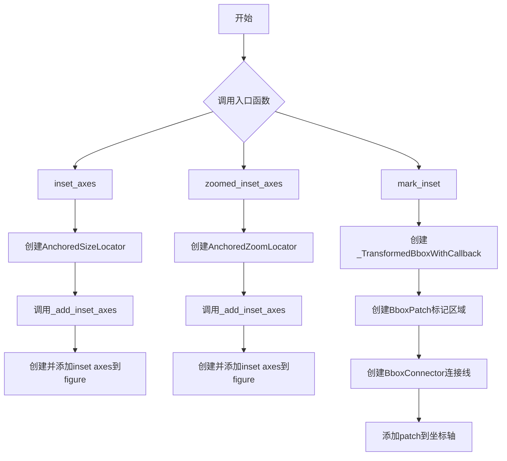

## 类结构

```
AnchoredOffsetbox (基类)
├── AnchoredLocatorBase (抽象基类)
│   ├── AnchoredSizeLocator (尺寸定位器)
│   └── AnchoredZoomLocator (缩放定位器)
Patch (基类)
├── BboxPatch (bbox形状补丁)
├── BboxConnector (bbox连接线)
│   └── BboxConnectorPatch (bbox四边形连接)
TransformedBbox (基类)
└── _TransformedBboxWithCallback (带回调的bbox)
```

## 全局变量及字段


### `Size`
    
axes_size模块的别名，用于尺寸计算

类型：`axes_size模块别名`
    


### `HostAxes`
    
主机坐标轴类，用于支持多个坐标轴

类型：`parasite_axes模块中的主机坐标轴类`
    


### `AnchoredLocatorBase.AnchoredLocatorBase.bbox_to_anchor`
    
定位锚点

类型：`tuple或Bbox`
    


### `AnchoredLocatorBase.AnchoredLocatorBase.offsetbox`
    
偏移框

类型：`OffsetBox或None`
    


### `AnchoredLocatorBase.AnchoredLocatorBase.loc`
    
位置

类型：`int或str`
    


### `AnchoredLocatorBase.AnchoredLocatorBase.borderpad`
    
边框间距

类型：`float`
    


### `AnchoredLocatorBase.AnchoredLocatorBase.bbox_transform`
    
坐标变换

类型：`Transform或None`
    


### `AnchoredSizeLocator.AnchoredSizeLocator.x_size`
    
X方向尺寸

类型：`Size`
    


### `AnchoredSizeLocator.AnchoredSizeLocator.y_size`
    
Y方向尺寸

类型：`Size`
    


### `AnchoredZoomLocator.AnchoredZoomLocator.parent_axes`
    
父坐标轴

类型：`Axes`
    


### `AnchoredZoomLocator.AnchoredZoomLocator.zoom`
    
缩放因子

类型：`float`
    


### `BboxPatch.BboxPatch.bbox`
    
边界框

类型：`Bbox`
    


### `BboxConnector.BboxConnector.bbox1`
    
第一个边界框

类型：`Bbox或Rectangle`
    


### `BboxConnector.BboxConnector.bbox2`
    
第二个边界框

类型：`Bbox或Rectangle`
    


### `BboxConnector.BboxConnector.loc1`
    
第一个位置

类型：`int`
    


### `BboxConnector.BboxConnector.loc2`
    
第二个位置

类型：`int或None`
    


### `BboxConnectorPatch.BboxConnectorPatch.loc1b`
    
第一个边界框第二位置

类型：`int`
    


### `BboxConnectorPatch.BboxConnectorPatch.loc2b`
    
第二个边界框第二位置

类型：`int`
    


### `_TransformedBboxWithCallback._TransformedBboxWithCallback._callback`
    
回调函数

类型：`callable`
    
    

## 全局函数及方法


### `_add_inset_axes`

辅助函数，用于添加内嵌坐标轴并在其中禁用导航功能。

参数：

- `parent_axes`：`matplotlib.axes.Axes`，父坐标轴对象，用于获取图形和位置信息
- `axes_class`：类型，默认值为 `HostAxes`，用于指定创建的坐标轴类
- `axes_kwargs`：`dict` 或 `None`，可选的坐标轴构造参数字典
- `axes_locator`：定位器对象，用于指定内嵌坐标轴的位置和大小

返回值：`matplotlib.axes.Axes`，新创建的内嵌坐标轴对象

#### 流程图

```mermaid
flowchart TD
    A[开始] --> B{axes_class is None?}
    B -->|是| C[设置 axes_class = HostAxes]
    B -->|否| D{axes_kwargs is None?}
    C --> D
    D -->|是| E[设置 axes_kwargs = {}]
    D -->|否| F[获取父坐标轴的图形对象]
    E --> F
    F --> G[调用 parent_axes.get_figure root=False]
    H[创建 inset_axes 对象]
    F --> H
    H --> I[设置 navigate=False 并合并 axes_kwargs 和 axes_locator]
    I --> J[调用 fig.add_axes 添加坐标轴]
    J --> K[返回新创建的坐标轴对象]
```

#### 带注释源码

```python
def _add_inset_axes(parent_axes, axes_class, axes_kwargs, axes_locator):
    """
    Helper function to add an inset axes and disable navigation in it.
    
    Parameters
    ----------
    parent_axes : matplotlib.axes.Axes
        父坐标轴对象
    axes_class : type
        要创建的坐标轴类，默认为 HostAxes
    axes_kwargs : dict or None
        传递给坐标轴构造器的额外关键字参数
    axes_locator : object
        控制内嵌坐标轴位置和大小的定位器对象
    
    Returns
    -------
    matplotlib.axes.Axes
        新创建的内嵌坐标轴对象
    """
    # 如果未指定坐标轴类，使用默认的 HostAxes
    if axes_class is None:
        axes_class = HostAxes
    # 如果未指定坐标轴参数字典，初始化为空字典
    if axes_kwargs is None:
        axes_kwargs = {}
    # 获取父坐标轴所属的图形对象，root=False 表示获取最近的父亲图形
    fig = parent_axes.get_figure(root=False)
    # 创建内嵌坐标轴对象，禁用导航并设置定位器
    inset_axes = axes_class(
        fig, parent_axes.get_position(),
        **{"navigate": False, **axes_kwargs, "axes_locator": axes_locator})
    # 将内嵌坐标轴添加到图形中并返回
    return fig.add_axes(inset_axes)
```


### `inset_axes`

**描述**：创建一个嵌入在父坐标轴（`parent_axes`）中的内嵌坐标轴（Inset Axes），并根据指定的宽高、位置和锚点进行布局。该函数允许用户在一个图表中创建“图中图”，并支持绝对尺寸和相对尺寸。

#### 参数

- `parent_axes`：`matplotlib.axes.Axes`，要放置内嵌坐标轴的父坐标轴对象。
- `width`：`float or str`，内嵌坐标轴的宽度。如果为浮点数，则单位为英寸（例如 `1.5`）；如果为字符串，则表示相对父坐标轴的比例（例如 `'30%'`）。
- `height`：`float or str`，内嵌坐标轴的高度。格式同 `width`。
- `loc`：`str`，内嵌坐标轴在锚点框中的位置，默认为 `'upper right'`。可选值包括 `'upper left'`, `'lower right'` 等。
- `bbox_to_anchor`：`tuple or matplotlib.transforms.BboxBase`，可选。内嵌坐标轴所要锚定的边界框（Bbox）。如果为 `None`，则默认使用 `parent_axes.bbox`。如果是元组，可以是 `[left, bottom, width, height]` 或 `[left, bottom]`。
- `bbox_transform`：`matplotlib.transforms.Transform`，可选。用于转换 `bbox_to_anchor` 的变换。默认为 `IdentityTransform`（像素坐标）。常设置为 `parent_axes.transAxes` 以使用轴坐标。
- `axes_class`：`type`，可选。指定要创建的内嵌坐标轴的类，默认为 `HostAxes`（一种支持多轴对齐的宿主坐标轴）。
- `axes_kwargs`：`dict`，可选。传递给坐标轴构造器的额外关键字参数。
- `borderpad`：`float or tuple`，默认 0.5。内嵌坐标轴与 `bbox_to_anchor` 之间的间距。单位为轴的字体大小（磅）。

#### 返回值

- `inset_axes`：`axes_class`（通常为 `matplotlib.axes.Axes` 的子类），创建成功的内嵌坐标轴对象。

#### 流程图

```mermaid
graph TD
    A([开始: inset_axes]) --> B{检查 bbox_transform 与 bbox_to_anchor}
    B -->|是: 使用轴/图形变换但未提供锚点| C[警告: 需要边界框]
    C --> D[设置 bbox_to_anchor = (0, 0, 1, 1)]
    B -->|否| E{bbox_to_anchor is None?}
    E -->|是| F[设置 bbox_to_anchor = parent_axes.bbox]
    E --> G{宽/高为相对单位 & 锚点为元组?}
    G -->|是| H{检查 len(bbox_to_anchor) == 4?}
    H -->|否| I[抛出 ValueError: 相对单位需提供4元组]
    H -->|是| J[创建 AnchoredSizeLocator]
    G -->|否| J
    D --> J
    F --> J
    J --> K[调用 _add_inset_axes]
    K --> L[获取 Figure 对象]
    L --> M[实例化坐标轴类 (默认HostAxes)]
    M --> N[配置参数: navigate=False, axes_locator]
    N --> O[fig.add_axes 添加坐标轴]
    O --> P([返回: inset_axes])
```

#### 带注释源码

```python
from matplotlib import _api
from .parasite_axes import HostAxes


def _add_inset_axes(parent_axes, axes_class, axes_kwargs, axes_locator):
    """
    辅助函数：添加内嵌坐标轴并在其中禁用导航。
    
    参数:
        parent_axes: 父坐标轴。
        axes_class: 要创建的坐标轴类。
        axes_kwargs: 坐标轴的关键字参数。
        axes_locator: 用于定位坐标轴的定位器。
    """
    # 1. 确定坐标轴类，默认为 HostAxes
    if axes_class is None:
        axes_class = HostAxes
    # 2. 确定关键字参数
    if axes_kwargs is None:
        axes_kwargs = {}
        
    # 3. 获取父坐标轴所在的 Figure
    fig = parent_axes.get_figure(root=False)
    
    # 4. 创建内嵌坐标轴实例
    # 注意：这里变量名 shadowing 了外层的 inset_axes 函数名，这是代码中的一点瑕疵（技术债务）
    inset_axes = axes_class(
        fig, parent_axes.get_position(),
        **{"navigate": False, **axes_kwargs, "axes_locator": axes_locator})
        
    # 5. 将其添加到 Figure 中并返回
    return fig.add_axes(inset_axes)


def inset_axes(parent_axes, width, height, loc='upper right',
               bbox_to_anchor=None, bbox_transform=None,
               axes_class=None, axes_kwargs=None,
               borderpad=0.5):
    """
    创建具有给定宽度和高度的内嵌坐标轴。
    """
    # 1. 检查是否使用了轴变换或图形变换，但未提供锚点
    # 如果是，发出警告并自动设置一个默认全屏锚点
    if (bbox_transform in [parent_axes.transAxes,
                           parent_axes.get_figure(root=False).transFigure]
            and bbox_to_anchor is None):
        _api.warn_external("Using the axes or figure transform requires a "
                           "bounding box in the respective coordinates. "
                           "Using bbox_to_anchor=(0, 0, 1, 1) now.")
        bbox_to_anchor = (0, 0, 1, 1)
        
    # 2. 如果 bbox_to_anchor 未指定，默认使用父坐标轴的边界框
    if bbox_to_anchor is None:
        bbox_to_anchor = parent_axes.bbox
        
    # 3. 验证逻辑：如果使用相对尺寸（字符串），锚点必须是4元组或Bbox对象
    if (isinstance(bbox_to_anchor, tuple) and
            (isinstance(width, str) or isinstance(height, str))):
        if len(bbox_to_anchor) != 4:
            raise ValueError("Using relative units for width or height "
                             "requires to provide a 4-tuple or a "
                             "`Bbox` instance to `bbox_to_anchor.")

    # 4. 创建定位器 AnchoredSizeLocator，用于计算内嵌坐标轴的实际位置和大小
    # 5. 调用内部方法 _add_inset_axes 完成创建
    return _add_inset_axes(
        parent_axes, axes_class, axes_kwargs,
        AnchoredSizeLocator(
            bbox_to_anchor, width, height, loc=loc,
            bbox_transform=bbox_transform, borderpad=borderpad))
```


### `zoomed_inset_axes`

创建通过缩放父坐标轴而得到的内嵌坐标轴。该函数通过 `AnchoredZoomLocator` 定位器将父坐标轴的视图范围按指定缩放因子进行变换，从而创建一个显示父坐标轴局部区域放大的内嵌坐标轴。

参数：

- `parent_axes`：`matplotlib.axes.Axes`，要放置内嵌坐标轴的父坐标轴
- `zoom`：`float`，数据坐标的缩放因子。*zoom* > 1 会放大坐标（即"放大"），而 *zoom* < 1 会缩小坐标（即"缩小"）
- `loc`：`str`，默认 `'upper right'`，放置内嵌坐标轴的位置。有效位置包括 'upper left'、'upper center'、'upper right'、'center left'、'center'、'center right'、'lower left'、'lower center'、'lower right'
- `bbox_to_anchor`：`tuple` 或 `~matplotlib.transforms.BboxBase`，可选，内嵌坐标轴要锚定的边界框。如果为 None，则使用 *parent_axes.bbox*
- `bbox_transform`：`~matplotlib.transforms.Transform`，可选，容纳内嵌坐标轴的边界框的变换。如果为 None，则使用 `.transforms.IdentityTransform`（即像素坐标）
- `axes_class`：`~matplotlib.axes.Axes` 类型，默认 `.HostAxes`，新创建的内嵌坐标轴的类型
- `axes_kwargs`：`dict`，可选，要传递给内嵌坐标轴构造函数的关键字参数
- `borderpad`：`float`，默认 0.5，内嵌坐标轴与 bbox_to_anchor 之间的填充。单位为坐标轴字体大小

返回值：`axes_class`，创建的内嵌坐标轴对象

#### 流程图

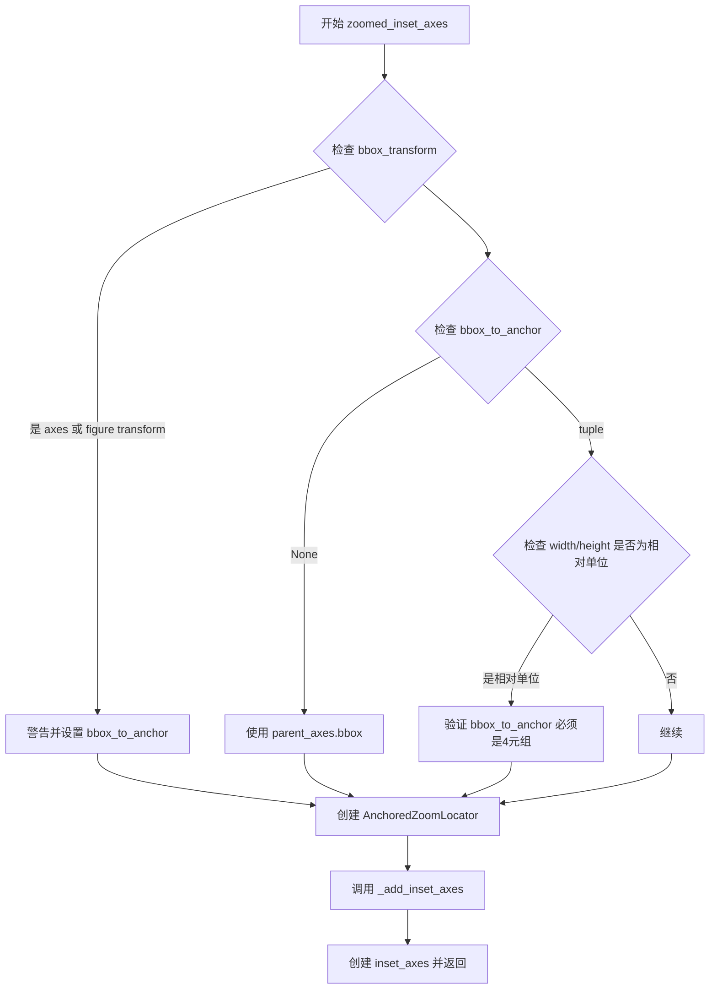

#### 带注释源码

```python
@_docstring.interpd
def zoomed_inset_axes(parent_axes, zoom, loc='upper right',
                      bbox_to_anchor=None, bbox_transform=None,
                      axes_class=None, axes_kwargs=None,
                      borderpad=0.5):
    """
    Create an anchored inset axes by scaling a parent axes. For usage, also see
    :doc:`the examples </gallery/axes_grid1/inset_locator_demo2>`.

    Parameters
    ----------
    parent_axes : `~matplotlib.axes.Axes`
        Axes to place the inset axes.

    zoom : float
        Scaling factor of the data axes. *zoom* > 1 will enlarge the
        coordinates (i.e., "zoomed in"), while *zoom* < 1 will shrink the
        coordinates (i.e., "zoomed out").

    loc : str, default: 'upper right'
        Location to place the inset axes.  Valid locations are
        'upper left', 'upper center', 'upper right',
        'center left', 'center', 'center right',
        'lower left', 'lower center', 'lower right'.
        For backward compatibility, numeric values are accepted as well.
        See the parameter *loc* of `.Legend` for details.

    bbox_to_anchor : tuple or `~matplotlib.transforms.BboxBase`, optional
        Bbox that the inset axes will be anchored to. If None,
        *parent_axes.bbox* is used. If a tuple, can be either
        [left, bottom, width, height], or [left, bottom].
        If the kwargs *width* and/or *height* are specified in relative units,
        the 2-tuple [left, bottom] cannot be used. Note that
        the units of the bounding box are determined through the transform
        in use. When using *bbox_to_anchor* it almost always makes sense to
        also specify a *bbox_transform*. This might often be the axes transform
        *parent_axes.transAxes*.

    bbox_transform : `~matplotlib.transforms.Transform`, optional
        Transformation for the bbox that contains the inset axes.
        If None, a `.transforms.IdentityTransform` is used (i.e. pixel
        coordinates). This is useful when not providing any argument to
        *bbox_to_anchor*. When using *bbox_to_anchor* it almost always makes
        sense to also specify a *bbox_transform*. This might often be the
        axes transform *parent_axes.transAxes*. Inversely, when specifying
        the axes- or figure-transform here, be aware that not specifying
        *bbox_to_anchor* will use *parent_axes.bbox*, the units of which are
        in display (pixel) coordinates.

    axes_class : `~matplotlib.axes.Axes` type, default: `.HostAxes`
        The type of the newly created inset axes.

    axes_kwargs : dict, optional
        Keyword arguments to pass to the constructor of the inset axes.
        Valid arguments include:

        %(Axes:kwdoc)s

    borderpad : float, default: 0.5
        Padding between inset axes and the bbox_to_anchor.
        The units are axes font size, i.e. for a default font size of 10 points
        *borderpad = 0.5* is equivalent to a padding of 5 points.

    Returns
    -------
    inset_axes : *axes_class*
        Inset axes object created.
    """

    # 调用 _add_inset_axes 辅助函数，传入 AnchoredZoomLocator 作为定位器
    # AnchoredZoomLocator 根据 parent_axes 和 zoom 参数计算内嵌坐标轴的大小和位置
    return _add_inset_axes(
        parent_axes, axes_class, axes_kwargs,
        AnchoredZoomLocator(
            parent_axes, zoom=zoom, loc=loc,
            bbox_to_anchor=bbox_to_anchor, bbox_transform=bbox_transform,
            borderpad=borderpad))
```


### `mark_inset`

该函数用于在父坐标轴上绘制一个矩形框，标记嵌入坐标轴所代表的区域，并通过连接线在拐角处将嵌入坐标轴与其对应区域连接起来，形成"缩放"效果。

参数：

-  `parent_axes`：`matplotlib.axes.Axes`，包含嵌入坐标轴区域的父坐标轴
-  `inset_axes`：`matplotlib.axes.Axes`，嵌入坐标轴对象
-  `loc1`：`{1, 2, 3, 4}`，用于连接嵌入坐标轴与其区域的第一个拐角位置
-  `loc2`：`{1, 2, 3, 4}`，用于连接嵌入坐标轴与其区域的第二个拐角位置
-  `**kwargs`：传递给补丁对象的 Patch 属性参数

返回值：`(pp, p1, p2)`，其中：
-  `pp`：`matplotlib.patches.Patch`，表示嵌入坐标轴区域的矩形补丁对象
-  `p1`：`matplotlib.patches.Patch`，连接第一个拐角的线段补丁对象
-  `p2`：`matplotlib.patches.Patch`，连接第二个拐角的线段补丁对象

#### 流程图

```mermaid
flowchart TD
    A[开始 mark_inset] --> B{检查 fill 参数}
    B -->|未设置| C[根据 kwargs 中的颜色关键字设置 fill 默认值]
    B -->|已设置| D[保持原有 fill 设置]
    C --> E[创建 _TransformedBboxWithCallback 对象 rect]
    D --> E
    E --> F[创建 BboxPatch 对象 pp]
    F --> G[将 pp 添加到 parent_axes]
    H[创建 BboxConnector 对象 p1] --> I[将 p1 添加到 inset_axes]
    I --> J[设置 p1.set_clip_on=False]
    K[创建 BboxConnector 对象 p2] --> L[将 p2 添加到 inset_axes]
    L --> M[设置 p2.set_clip_on=False]
    J --> N[返回 (pp, p1, p2)]
    M --> N
```

#### 带注释源码

```python
@_docstring.interpd
def mark_inset(parent_axes, inset_axes, loc1, loc2, **kwargs):
    """
    Draw a box to mark the location of an area represented by an inset axes.

    This function draws a box in *parent_axes* at the bounding box of
    *inset_axes*, and shows a connection with the inset axes by drawing lines
    at the corners, giving a "zoomed in" effect.

    Parameters
    ----------
    parent_axes : `~matplotlib.axes.Axes`
        Axes which contains the area of the inset axes.

    inset_axes : `~matplotlib.axes.Axes`
        The inset axes.

    loc1, loc2 : {1, 2, 3, 4}
        Corners to use for connecting the inset axes and the area in the
        parent axes.

    **kwargs
        Patch properties for the lines and box drawn:

        %(Patch:kwdoc)s

    Returns
    -------
    pp : `~matplotlib.patches.Patch`
        The patch drawn to represent the area of the inset axes.

    p1, p2 : `~matplotlib.patches.Patch`
        The patches connecting two corners of the inset axes and its area.
    """
    # 创建带有回调的变换边界框，用于在获取点时unstale父坐标轴的视图限制
    # inset_axes.viewLim 定义了嵌入坐标轴的数据区域
    # parent_axes.transData 将数据坐标转换为显示坐标
    rect = _TransformedBboxWithCallback(
        inset_axes.viewLim, parent_axes.transData,
        callback=parent_axes._unstale_viewLim)

    # 设置默认填充属性：如果 kwargs 中包含 fc, facecolor 或 color，
    # 则默认 fill 为 True，否则保持原值
    kwargs.setdefault("fill", bool({'fc', 'facecolor', 'color'}.intersection(kwargs)))
    
    # 创建表示嵌入坐标轴区域的矩形补丁
    pp = BboxPatch(rect, **kwargs)
    # 将矩形补丁添加到父坐标轴
    parent_axes.add_patch(pp)

    # 创建第一个连接线补丁，连接嵌入坐标轴边界框和标记区域的一个拐角
    p1 = BboxConnector(inset_axes.bbox, rect, loc1=loc1, **kwargs)
    inset_axes.add_patch(p1)
    # 确保连接线不会被裁剪
    p1.set_clip_on(False)
    
    # 创建第二个连接线补丁，连接嵌入坐标轴边界框和标记区域的另一个拐角
    p2 = BboxConnector(inset_axes.bbox, rect, loc1=loc2, **kwargs)
    inset_axes.add_patch(p2)
    # 确保连接线不会被裁剪
    p2.set_clip_on(False)

    # 返回矩形补丁和两个连接线补丁
    return pp, p1, p2
```


### AnchoredLocatorBase.__init__

该方法是 `AnchoredLocatorBase` 类的构造函数。它负责初始化嵌入轴（Inset Axes）定位器的基础配置，通过调用其父类 `AnchoredOffsetbox` 的初始化方法，设置定位器相对于锚定框（bbox_to_anchor）的位置、边框间距以及坐标变换，并将内部子元素置为空，垫片（pad）置为零。

参数：

- `bbox_to_anchor`：`tuple` 或 `Bbox`，用于定义嵌入轴定位的参考边界框（通常是父 axes 的边界框）。
- `offsetbox`：`AnchoredOffsetbox` 或 `None`，在基类中通常被忽略或传为 `None`，用于指定要定位的物体。
- `loc`：`int` 或 `str`，定位代码（如 'upper right', 1 等），指定相对于锚定框的位置。
- `borderpad`：`float`，默认为 0.5，锚定框与嵌入轴之间的内边距（以字体大小为单位）。
- `bbox_transform`：`Transform`，默认为 `None`，应用于 `bbox_to_anchor` 的坐标变换（如使用父 axes 的坐标系统）。

返回值：`None`。该方法为初始化方法，不返回任何值，仅修改对象内部状态。

#### 流程图

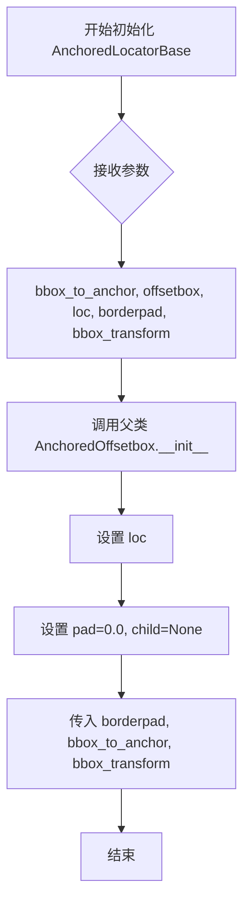

#### 带注释源码

```python
def __init__(self, bbox_to_anchor, offsetbox, loc,
             borderpad=0.5, bbox_transform=None):
    """
    初始化 AnchoredLocatorBase。

    参数:
        bbox_to_anchor: 定位器要锚定到的 Bbox 或坐标元组。
        offsetbox: 在基类中通常为 None。
        loc: 位置代码 (例如 'upper right')。
        borderpad: 边框间距。
        bbox_transform: 坐标变换。
    """
    # 调用父类 AnchoredOffsetbox 的构造函数
    # 传入位置信息，并强制设置 pad=0 (因为定位器本身负责计算偏移，不需要额外垫片)
    # child=None 表示该定位器不是一个包含子元素的容器，而是一个纯粹的布局算法
    super().__init__(
        loc, pad=0., child=None, borderpad=borderpad,
        bbox_to_anchor=bbox_to_anchor, bbox_transform=bbox_transform
    )
```


### `AnchoredLocatorBase.draw`

该方法是 `AnchoredLocatorBase` 类的绘制方法，但实现为抛出 `RuntimeError` 异常，表明该基类不应该被直接调用绘制功能，具体的绘制逻辑应由子类实现。

参数：

-  `renderer`：`RendererBase`，渲染器对象，用于将图形绘制到画布上

返回值：`None`，该方法不返回任何值，而是抛出 `RuntimeError` 异常

#### 流程图

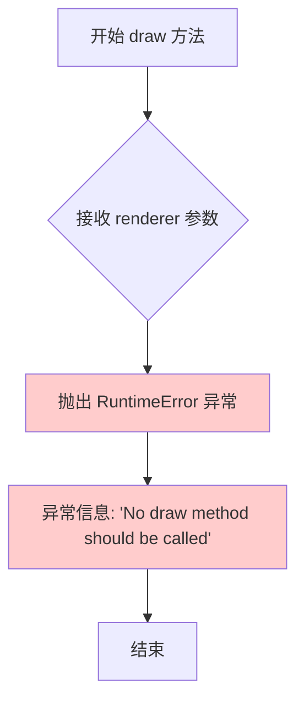

#### 带注释源码

```python
def draw(self, renderer):
    """
    绘制方法（基类实现，抛出异常）。
    
    该方法在 AnchoredLocatorBase 基类中被定义为一个不应该被调用的方法。
    当实例调用此方法时，会抛出一个 RuntimeError 异常，表明该类的设计意图
    是作为其他定位器的基类，而不是直接用于绘制。具体的绘制逻辑应该由
    子类（如 AnchoredSizeLocator、AnchoredZoomLocator）根据实际需求实现。
    
    Parameters
    ----------
    renderer : RendererBase
        matplotlib 的渲染器对象，用于将图形元素绘制到画布上。
        虽然该参数在此方法中未被使用（因为直接抛出异常），但保留该参数
        是为了保持与父类 AnchoredOffsetbox 的 draw 方法签名一致。
    
    Raises
    ------
    RuntimeError
        总是抛出此异常，表明不应该调用此方法。
    """
    raise RuntimeError("No draw method should be called")
```


### `AnchoredLocatorBase.__call__`

该方法是 `AnchoredLocatorBase` 类的可调用接口，用于根据给定的 Axes 和渲染器计算并返回边界框在画布坐标系中的位置。它通过获取窗口范围、计算偏移量，并使用子图的逆变换将边界框从子图坐标转换为画布坐标。

参数：

- `ax`：`matplotlib.axes.Axes`，要定位边界框的目标 Axes 对象
- `renderer`：`matplotlib.backend_bases.RendererBase`，渲染器对象，用于计算边界框；如果为 `None`，则自动从图形对象获取

返回值：`matplotlib.transforms.TransformedBbox`，返回变换后的边界框，位于画布（子图）坐标系中

#### 流程图

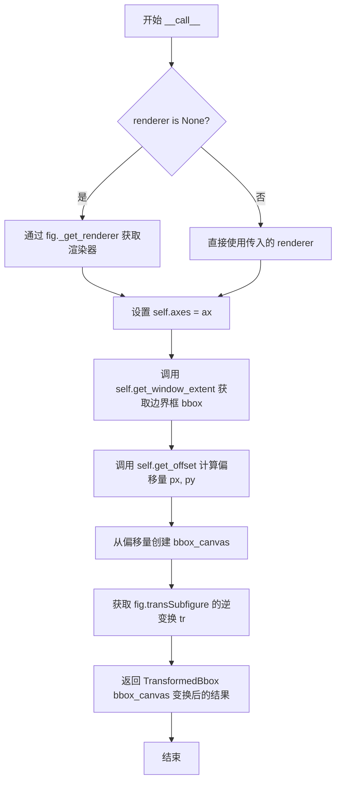

#### 带注释源码

```python
def __call__(self, ax, renderer):
    """
    计算并返回边界框在画布坐标系中的位置。

    Parameters
    ----------
    ax : matplotlib.axes.Axes
        要定位边界框的目标 Axes 对象。
    renderer : matplotlib.backend_bases.RendererBase, optional
        渲染器对象，用于计算边界框。如果为 None，则自动获取。

    Returns
    -------
    TransformedBbox
        变换后的边界框，位于画布坐标系中。
    """
    # 获取 Axes 所在的图形对象
    # root=False 表示获取最近的父图形（subfigure）
    fig = ax.get_figure(root=False)

    # 如果未提供渲染器，则从图形对象自动获取
    if renderer is None:
        renderer = fig._get_renderer()

    # 将当前 Axes 对象关联到 self.axes
    # 以便后续方法（如 get_bbox_to_anchor）可以使用
    self.axes = ax

    # 获取当前定位器的窗口范围（即边界框在子图坐标系中的位置）
    bbox = self.get_window_extent(renderer)

    # 计算偏移量
    # get_offset 方法根据边界框的宽高和位置计算最终的像素偏移位置
    # 参数分别为：边界框宽度、边界框高度、x偏移、y偏移、渲染器
    px, py = self.get_offset(bbox.width, bbox.height, 0, 0, renderer)

    # 根据偏移量创建画布坐标系中的边界框
    # 从_bounds(px, py, width, height) 创建以 px, py 为左下角，宽高为 bbox.width, bbox.height 的边界框
    bbox_canvas = Bbox.from_bounds(px, py, bbox.width, bbox.height)

    # 获取子图变换的逆变换，将子图坐标转换为画布坐标
    tr = fig.transSubfigure.inverted()

    # 返回变换后的边界框
    # TransformedBbox 将边界框 bbox_canvas 通过逆变换 tr 转换到画布坐标系
    return TransformedBbox(bbox_canvas, tr)
```


### `AnchoredSizeLocator.__init__`

初始化一个定位器，用于在锚定框内根据给定的尺寸定位和调整内嵌坐标轴（inset axes）的大小。

参数：

- `bbox_to_anchor`：类型：`tuple` 或 `~matplotlib.transforms.Bbox`，用于指定内嵌坐标轴所要锚定到的边界框。如果为 `None`，则使用父坐标轴的边界框。
- `x_size`：类型：`float` 或 `str`，指定内嵌坐标轴的宽度。可以是浮点数（英寸）或字符串（相对单位，如 `'40%%'`）。
- `y_size`：类型：`float` 或 `str`，指定内嵌坐标轴的高度。可以是浮点数（英寸）或字符串（相对单位，如 `'30%%'`）。
- `loc`：类型：`str` 或 `int`，指定内嵌坐标轴放置的位置（如 `'upper right'`、`'lower left'` 等），默认为 `'upper right'`。
- `borderpad`：类型：`float`，默认值：`0.5`，指定内嵌坐标轴与锚定边界框之间的填充间距，单位为坐标轴字体大小。
- `bbox_transform`：类型：`~matplotlib.transforms.Transform`，默认值：`None`，指定 `bbox_to_anchor` 的坐标变换。如果为 `None`，则使用 `IdentityTransform`。

返回值：`None`，`__init__` 方法不返回任何值（构造函数）。

#### 流程图

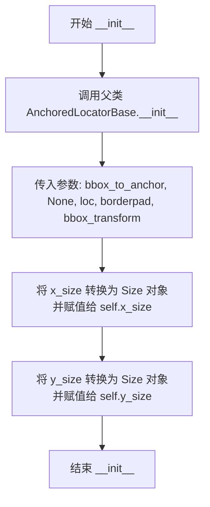

#### 带注释源码

```python
def __init__(self, bbox_to_anchor, x_size, y_size, loc,
             borderpad=0.5, bbox_transform=None):
    """
    初始化 AnchoredSizeLocator 实例。

    参数:
        bbox_to_anchor: 锚定目标边界框，可以是 Bbox 对象或 (left, bottom, width, height) 元组。
        x_size: 宽度尺寸，可以是浮点数（英寸）或字符串（相对单位）。
        y_size: 高度尺寸，可以是浮点数（英寸）或字符串（相对单位）。
        loc: 位置字符串或数字，表示内嵌坐标轴在锚定框中的位置。
        borderpad: 边界填充，默认为 0.5（以字体大小为单位）。
        bbox_transform: 应用于 bbox_to_anchor 的坐标变换，默认为 None（使用像素坐标）。
    """
    # 调用父类 AnchoredLocatorBase 的构造函数
    # 传入 loc、pad=0、child=None、borderpad 和 bbox 相关参数
    # 第二个参数为 None，表示不使用 offsetbox
    super().__init__(
        bbox_to_anchor, None, loc,
        borderpad=borderpad, bbox_transform=bbox_transform
    )

    # 将 x_size 转换为 Size 对象
    # Size.from_any() 能够处理多种输入格式：浮点数、字符串、Size 对象等
    self.x_size = Size.from_any(x_size)

    # 将 y_size 转换为 Size 对象
    self.y_size = Size.from_any(y_size)
```


### `AnchoredSizeLocator.get_bbox`

获取边界框，根据锚点边界框、尺寸比例和绝对尺寸计算内嵌坐标轴的宽度和高度，并应用基于字体大小的内边距，返回最终的边界框对象。

参数：

-  `renderer`：`RendererBase`，用于获取渲染信息（如 DPI 转换、字体大小）的渲染器对象

返回值：`Bbox`，计算并填充内边距后的边界框对象

#### 流程图

```mermaid
flowchart TD
    A[开始 get_bbox] --> B[获取锚点边界框 bbox_to_anchor]
    B --> C[计算 DPI 转换系数: dpi = renderer.points_to_pixels(72)]
    C --> D[获取 x 方向尺寸: r, a = x_size.get_size renderer]
    D --> E[计算宽度: width = bbox.width * r + a * dpi]
    E --> F[获取 y 方向尺寸: r, a = y_size.get_size renderer]
    F --> G[计算高度: height = bbox.height * r + a * dpi]
    G --> H[计算字体大小: fontsize = renderer.points_to_pixels prop.get_size_in_points]
    H --> I[计算内边距: pad = self.pad * fontsize]
    I --> J[创建边界框: Bbox.from_bounds 0, 0, width, height]
    J --> K[应用内边距: .padded pad]
    K --> L[返回 Bbox 对象]
```

#### 带注释源码

```python
def get_bbox(self, renderer):
    # 获取锚点边界框，用于确定内嵌坐标轴的参考区域
    bbox = self.get_bbox_to_anchor()
    
    # 计算 DPI 转换系数 (72 points per inch)
    dpi = renderer.points_to_pixels(72.)

    # 获取 x 方向的尺寸比例 (r) 和绝对尺寸 (a)
    r, a = self.x_size.get_size(renderer)
    # 计算实际宽度：相对比例部分 + 绝对部分（转换为像素）
    width = bbox.width * r + a * dpi
    
    # 获取 y 方向的尺寸比例 (r) 和绝对尺寸 (a)
    r, a = self.y_size.get_size(renderer)
    # 计算实际高度：相对比例部分 + 绝对部分（转换为像素）
    height = bbox.height * r + a * dpi

    # 计算字体大小（以像素为单位）
    fontsize = renderer.points_to_pixels(self.prop.get_size_in_points())
    # 计算内边距，基于字体大小
    pad = self.pad * fontsize

    # 从原点创建边界框，并应用内边距
    return Bbox.from_bounds(0, 0, width, height).padded(pad)
```


### AnchoredZoomLocator.__init__

这是一个初始化方法，用于创建锚定缩放定位器实例。该方法接收父坐标轴、缩放因子和位置等参数，将父坐标轴和缩放因子保存为实例属性，并在未指定锚定框时自动使用父坐标轴的边界框，最后调用父类的初始化方法完成基类属性的设置。

参数：

- `self`：隐式参数，表示实例本身
- `parent_axes`：`matplotlib.axes.Axes`，父坐标轴对象，用于确定缩放定位器的参考坐标系
- `zoom`：`float`，缩放因子，用于控制内嵌坐标轴的缩放比例（大于1表示放大，小于1表示缩小）
- `loc`：`int` 或 `str`，位置参数，指定内嵌坐标轴在父坐标轴中的位置（如 'upper right'、'lower left' 等）
- `borderpad`：`float`，默认值为 0.5，内嵌坐标轴与锚定框之间的填充间距，单位为坐标轴字体大小
- `bbox_to_anchor`：`tuple` 或 `matplotlib.transforms.BboxBase`，默认值为 None，锚定框的位置和大小，如果为 None 则使用 parent_axes.bbox
- `bbox_transform`：`matplotlib.transforms.Transform`，默认值为 None，用于变换 bbox_to_anchor 的坐标变换

返回值：无（`None`），该方法为构造函数，不返回任何值

#### 流程图

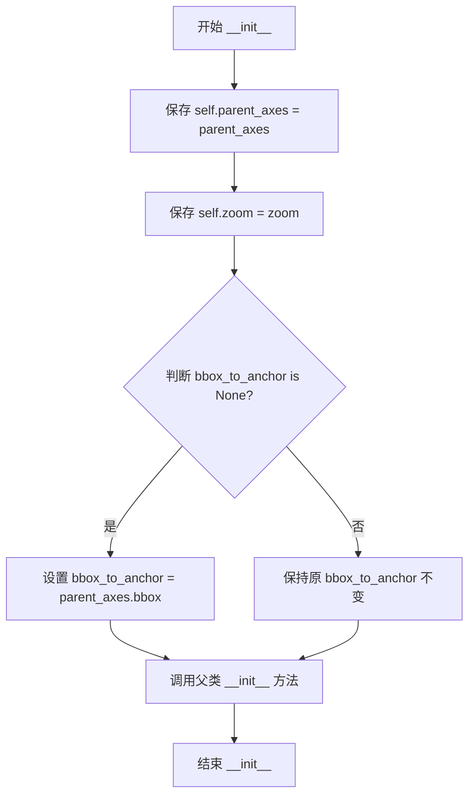

#### 带注释源码

```python
def __init__(self, parent_axes, zoom, loc,
             borderpad=0.5,
             bbox_to_anchor=None,
             bbox_transform=None):
    """
    初始化 AnchoredZoomLocator 实例。

    Parameters
    ----------
    parent_axes : matplotlib.axes.Axes
        父坐标轴对象，缩放定位器将基于此坐标轴进行定位。
    zoom : float
        缩放因子，决定内嵌坐标轴相对于父坐标轴视图范围的缩放比例。
    loc : int or str
        位置参数，指定内嵌坐标轴在父坐标轴中的放置位置。
    borderpad : float, default: 0.5
        内嵌坐标轴与锚定框之间的填充间距。
    bbox_to_anchor : tuple or BboxBase, optional
        锚定框，用于定位内嵌坐标轴。如果为 None，则使用父坐标轴的边界框。
    bbox_transform : Transform, optional
        坐标变换，用于变换 bbox_to_anchor 的坐标。
    """
    # 将父坐标轴保存为实例属性，供后续方法（如 get_bbox）使用
    self.parent_axes = parent_axes
    
    # 将缩放因子保存为实例属性，用于计算内嵌坐标轴的尺寸
    self.zoom = zoom
    
    # 如果未指定锚定框，则默认使用父坐标轴的边界框
    if bbox_to_anchor is None:
        bbox_to_anchor = parent_axes.bbox
    
    # 调用父类 AnchoredLocatorBase 的初始化方法
    # 传递锚定框、None（offsetbox）、位置、边框填充和变换等参数
    super().__init__(
        bbox_to_anchor, None, loc, borderpad=borderpad,
        bbox_transform=bbox_transform)
```


### AnchoredZoomLocator.get_bbox

获取缩放后内嵌坐标轴的边界框，用于确定内嵌坐标轴在父坐标轴中的位置和大小。

参数：

- `renderer`：`matplotlib.backend_bases.RendererBase`，渲染器对象，用于获取字体大小和进行像素单位转换

返回值：`matplotlib.transforms.Bbox`，计算得到的边界框对象，包含内嵌坐标轴的宽度、高度以及填充区域

#### 流程图

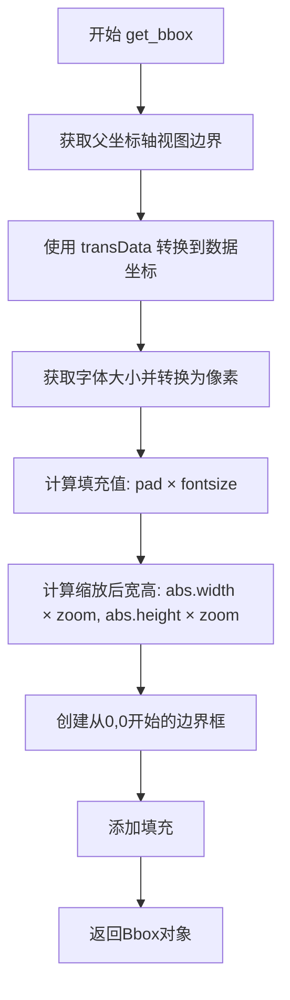

#### 带注释源码

```python
def get_bbox(self, renderer):
    """
    获取内嵌坐标轴的边界框
    
    Parameters
    ----------
    renderer : matplotlib.backend_bases.RendererBase
        渲染器对象，用于获取字体大小和进行像素转换
    
    Returns
    -------
    matplotlib.transforms.Bbox
        包含内嵌坐标轴位置和尺寸的边界框
    """
    # 获取父坐标轴的视图边界（viewLim），即数据坐标范围
    # self.axes 继承自父类 AnchoredLocatorBase，表示当前内嵌坐标轴
    bb = self.parent_axes.transData.transform_bbox(self.axes.viewLim)
    
    # 获取字体大小并转换为像素单位
    # self.prop 继承自父类，包含字体属性
    fontsize = renderer.points_to_pixels(self.prop.get_size_in_points())
    
    # 计算填充值：borderpad × 字体像素大小
    # borderpad 存储在 self.pad 中，默认为0.5
    pad = self.pad * fontsize
    
    # 计算缩放后的宽度和高度
    # 使用 abs() 处理可能的负值缩放
    # self.zoom 为缩放因子，>1 表示放大，<1 表示缩小
    scaled_width = abs(bb.width * self.zoom)
    scaled_height = abs(bb.height * self.zoom)
    
    # 创建从原点(0,0)开始的边界框，并添加填充
    # padded() 方法在四周添加相同的填充值
    return (
        Bbox.from_bounds(0, 0, scaled_width, scaled_height)
        .padded(pad)
    )
```


### `BboxPatch.__init__`

初始化BboxPatch对象，用于显示由Bbox边界定义的形状补丁。

参数：

- `bbox`：`matplotlib.transforms.Bbox`，用于定义此补丁范围的Bbox对象
- `**kwargs`：Patch属性，关键字参数，传递给父类Patch的额外参数

返回值：`None`，构造函数无返回值

#### 流程图

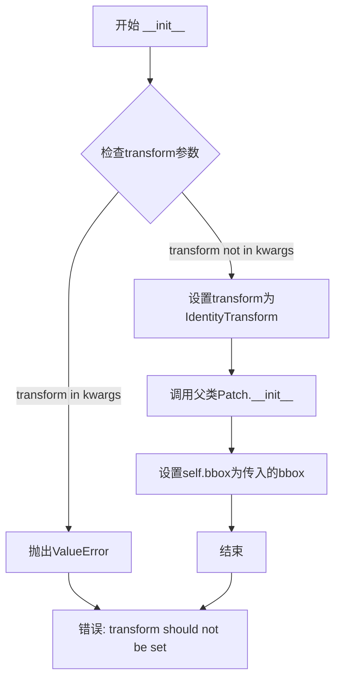

#### 带注释源码

```python
class BboxPatch(Patch):
    @_docstring.interpd
    def __init__(self, bbox, **kwargs):
        """
        Patch showing the shape bounded by a Bbox.

        Parameters
        ----------
        bbox : `~matplotlib.transforms.Bbox`
            Bbox to use for the extents of this patch.

        **kwargs
            Patch properties. Valid arguments include:

            %(Patch:kwdoc)s
        """
        # 检查调用者是否尝试直接设置transform
        # BboxPatch需要使用IdentityTransform，不允许外部设置
        if "transform" in kwargs:
            raise ValueError("transform should not be set")

        # 强制使用IdentityTransform作为该补丁的变换
        # 这是因为Bbox已经包含了位置信息，不需要额外的坐标变换
        kwargs["transform"] = IdentityTransform()
        
        # 调用父类Patch的初始化方法
        super().__init__(**kwargs)
        
        # 存储传入的Bbox对象，用于后续get_path方法中获取边界信息
        self.bbox = bbox
```


### `BboxPatch.get_path`

获取由Bbox定义的区域路径形状，返回一个表示该区域的闭合路径对象。

参数：

- （无参数，仅包含self隐式参数）

返回值：`Path`，返回一个闭合的四边形路径，该路径由Bbox的边界定义（按顺序连接左下、左上、右上、右下四个角点）

#### 流程图

```mermaid
flowchart TD
    A[开始 get_path] --> B[获取self.bbox.extents]
    B --> C[解包扩展边界: x0, y0, x1, y1]
    C --> D[创建闭合路径]
    D --> E[按顺序连接四个角点: (x0,y0) -> (x1,y0) -> (x1,y1) -> (x0,y1)]
    E --> F[返回Path对象]
```

#### 带注释源码

```python
def get_path(self):
    # 继承自父类的docstring
    # 获取bbox的扩展边界（左下角x, 左下角y, 右上角x, 右上角y）
    x0, y0, x1, y1 = self.bbox.extents
    # 创建并返回一个闭合的四边形路径
    # 路径顶点顺序：左下角 -> 右下角 -> 右上角 -> 左上角 -> 回到左下角（闭合）
    return Path._create_closed([(x0, y0), (x1, y0), (x1, y1), (x0, y1)])
```


### BboxConnector.__init__

该方法是 `BboxConnector` 类的构造函数，用于初始化一个连接两个边界框（Bbox）的直线补丁（Patch）对象。它接收两个边界框、连接位置以及可选的 Patch 属性关键字参数，设置变换为 IdentityTransform，并根据提供的颜色参数自动决定是否填充。

参数：

- `self`：`BboxConnector` 实例本身（Python 自动传入）
- `bbox1`：`~matplotlib.transforms.Bbox`，第一个要连接的边界框
- `bbox2`：`~matplotlib.transforms.Bbox`，第二个要连接的边界框
- `loc1`：`{1, 2, 3, 4}`，第一个边界框的连接角点（1=右上，2=左上，3=左下，4=右下）
- `loc2`：`{1, 2, 3, 4} | None`，可选，第二个边界框的连接角点，默认为 `loc1` 的值
- `**kwargs`：`dict`，Patch 属性的关键字参数（如 facecolor、edgecolor 等）

返回值：`None`，该方法为构造函数，不返回值，直接修改对象状态

#### 流程图

```mermaid
flowchart TD
    A[开始 __init__] --> B{检查 transform 是否在 kwargs 中}
    B -->|是| C[抛出 ValueError: transform should not be set]
    B -->|否| D[设置 kwargs['transform'] = IdentityTransform]
    D --> E{检查是否存在颜色相关关键字}
    E -->|是| F[设置 kwargs['fill'] = True]
    E -->|否| G[设置 kwargs['fill'] = False]
    F --> H[调用父类 Patch.__init__(**kwargs)]
    G --> H
    H --> I[保存实例属性: bbox1, bbox2, loc1, loc2]
    I --> J[结束]
    C --> J
```

#### 带注释源码

```python
@_docstring.interpd
def __init__(self, bbox1, bbox2, loc1, loc2=None, **kwargs):
    """
    Connect two bboxes with a straight line.

    Parameters
    ----------
    bbox1, bbox2 : `~matplotlib.transforms.Bbox`
        Bounding boxes to connect.

    loc1, loc2 : {1, 2, 3, 4}
        Corner of *bbox1* and *bbox2* to draw the line. Valid values are::

            'upper right'  : 1,
            'upper left'   : 2,
            'lower left'   : 3,
            'lower right'  : 4

        *loc2* is optional and defaults to *loc1*.

    **kwargs
        Patch properties for the line drawn. Valid arguments include:

        %(Patch:kwdoc)s
    """
    # 检查是否手动设置了 transform，用户不应直接设置此参数
    # 因为 BboxConnector 使用 IdentityTransform 来绘制本地坐标
    if "transform" in kwargs:
        raise ValueError("transform should not be set")

    # 强制设置 transform 为 IdentityTransform，确保在本地坐标系中绘制
    kwargs["transform"] = IdentityTransform()
    
    # 自动检测是否需要填充：
    # 如果 kwargs 中包含 'fc'（fillcolor）、'facecolor' 或 'color' 任一关键字
    # 则设置 fill 为 True，否则为 False
    kwargs.setdefault(
        "fill", bool({'fc', 'facecolor', 'color'}.intersection(kwargs)))
    
    # 调用父类 Patch 的初始化方法，完成 Patch 对象的构建
    super().__init__(**kwargs)
    
    # 保存边界框和连接位置到实例属性，供 get_path 方法使用
    self.bbox1 = bbox1
    self.bbox2 = bbox2
    self.loc1 = loc1
    self.loc2 = loc2
```


### `BboxConnector.get_path`

获取连接两个边界框的路径，用于在图表中绘制从第一个边界框到第二个边界框的连线。

参数：此方法无显式参数（`self` 为实例自身）

返回值：`Path`，返回一条连接两个边界框指定角点的路径对象

#### 流程图

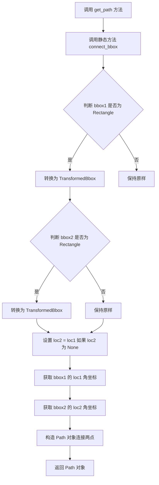

#### 带注释源码

```python
def get_path(self):
    # 继承自父类的 docstring
    # 调用静态方法 connect_bbox，传入两个边界框和对应的角位置
    # 返回连接两个边界框指定角的路径对象
    return self.connect_bbox(self.bbox1, self.bbox2,
                             self.loc1, self.loc2)
```


### `BboxConnector.get_bbox_edge_pos`

获取边界框（bbox）指定角的位置坐标。该静态方法根据传入的位置编码（loc）返回边界框四个角之一的具体坐标，常用于在matplotlib中连接两个边界框的角点绘制连接线。

参数：

- `bbox`：`~matplotlib.transforms.Bbox`，边界框对象，用于获取其.extents属性（返回x0, y0, x1, y1）
- `loc`：`int`，位置编码，指定要获取的角点位置。有效值为1（上右）、2（上左）、3（下左）、4（下右）

返回值：`Tuple[float, float]`，返回指定角点的(x, y)坐标元组

#### 流程图

```mermaid
flowchart TD
    A[开始] --> B[输入: bbox, loc]
    B --> C[获取bbox.extents<br/>x0, y0, x1, y1]
    C --> D{loc == 1?}
    D -->|Yes| E[返回 (x1, y1)<br/>右上角]
    D -->|No| F{loc == 2?}
    F -->|Yes| G[返回 (x0, y1)<br/>左上角]
    F -->|No| H{loc == 3?}
    H -->|Yes| I[返回 (x0, y0)<br/>左下角]
    H -->|No| J{loc == 4?}
    J -->|Yes| K[返回 (x1, y0)<br/>右下角]
    J -->|No| L[隐式返回None<br/>Python返回None]
    E --> M[结束]
    G --> M
    I --> M
    K --> M
    L --> M
```

#### 带注释源码

```python
@staticmethod
def get_bbox_edge_pos(bbox, loc):
    """
    Return the ``(x, y)`` coordinates of corner *loc* of *bbox*; parameters
    behave as documented for the `.BboxConnector` constructor.
    """
    # 从bbox获取其边界范围，返回(x0, y0, x1, y1)
    # x0, y0: 左下角坐标
    # x1, y1: 右上角坐标
    x0, y0, x1, y1 = bbox.extents
    
    # 根据loc参数值确定返回哪个角点的坐标
    if loc == 1:
        # 位置1: 右上角 (upper right)
        return x1, y1
    elif loc == 2:
        # 位置2: 左上角 (upper left)
        return x0, y1
    elif loc == 3:
        # 位置3: 左下角 (lower left)
        return x0, y0
    elif loc == 4:
        # 位置4: 右下角 (lower right)
        return x1, y0
    # 注意: 如果loc为其他值，方法隐式返回None
```


### `BboxConnector.connect_bbox`

该静态方法用于构造一条连接两个边界框指定角点的路径，可将 Rectangle 对象自动转换为 TransformedBbox，并支持默认使用同一角点位置连接。

参数：

- `bbox1`：`Bbox` 或 `Rectangle`，第一个边界框
- `bbox2`：`Bbox` 或 `Rectangle`，第二个边界框
- `loc1`：`int`，第一个边界框的角点位置（1-4）
- `loc2`：`int` 或 `None`，第二个边界框的角点位置，默认为 `None`（等同于 `loc1`）

返回值：`Path`，返回一条连接两个边界框角点的直线路径

#### 流程图

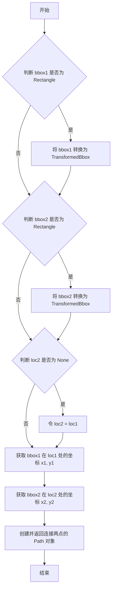

#### 带注释源码

```python
@staticmethod
def connect_bbox(bbox1, bbox2, loc1, loc2=None):
    """
    Construct a `.Path` connecting corner *loc1* of *bbox1* to corner
    *loc2* of *bbox2*, where parameters behave as documented as for the
    `.BboxConnector` constructor.
    """
    # 如果 bbox1 是 Rectangle 对象，则将其转换为 TransformedBbox
    # 这样可以统一使用 Bbox 接口进行处理
    if isinstance(bbox1, Rectangle):
        bbox1 = TransformedBbox(Bbox.unit(), bbox1.get_transform())
    
    # 同样的转换逻辑应用于 bbox2
    if isinstance(bbox2, Rectangle):
        bbox2 = TransformedBbox(Bbox.unit(), bbox2.get_transform())
    
    # 如果未指定 loc2，默认使用与 loc1 相同的角点位置
    if loc2 is None:
        loc2 = loc1
    
    # 获取 bbox1 在指定角点 loc1 处的坐标 (x1, y1)
    x1, y1 = BboxConnector.get_bbox_edge_pos(bbox1, loc1)
    
    # 获取 bbox2 在指定角点 loc2 处的坐标 (x2, y2)
    x2, y2 = BboxConnector.get_bbox_edge_pos(bbox2, loc2)
    
    # 创建并返回一条连接两个角点的直线路径
    return Path([[x1, y1], [x2, y2]])
```


### BboxConnectorPatch.__init__

该方法是 `BboxConnectorPatch` 类的构造函数，用于初始化一个连接两个边界框的四边形（quadrilateral）对象。四边形由两条线段定义，每条线段连接两个边界框的角点，从而形成四边形的四条边。

参数：

- `bbox1`：`matplotlib.transforms.Bbox`，要连接的第一个边界框
- `bbox2`：`matplotlib.transforms.Bbox`，要连接的第二个边界框
- `loc1a`：`int`（取值为 1, 2, 3, 4），第一条线段在 `bbox1` 上的起始角点位置
- `loc2a`：`int`（取值为 1, 2, 3, 4），第一条线段在 `bbox2` 上的结束角点位置
- `loc1b`：`int`（取值为 1, 2, 3, 4），第二条线段在 `bbox1` 上的起始角点位置
- `loc2b`：`int`（取值为 1, 2, 3, 4），第二条线段在 `bbox2` 上的结束角点位置
- `**kwargs`：可变关键字参数，用于传递 Patch 相关的属性（如颜色、透明度等）

返回值：无（`None`），构造函数不返回值，仅初始化对象状态

#### 流程图

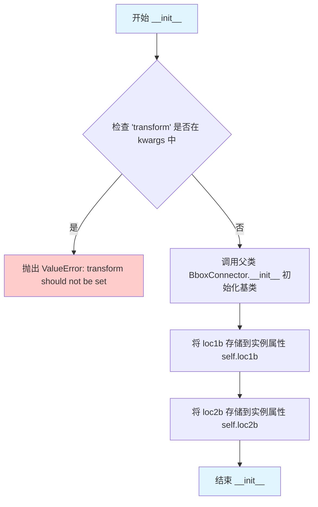

#### 带注释源码

```python
@_docstring.interpd
def __init__(self, bbox1, bbox2, loc1a, loc2a, loc1b, loc2b, **kwargs):
    """
    Connect two bboxes with a quadrilateral.

    The quadrilateral is specified by two lines that start and end at
    corners of the bboxes. The four sides of the quadrilateral are defined
    by the two lines given, the line between the two corners specified in
    *bbox1* and the line between the two corners specified in *bbox2*.

    Parameters
    ----------
    bbox1, bbox2 : `~matplotlib.transforms.Bbox`
        Bounding boxes to connect.

    loc1a, loc2a, loc1b, loc2b : {1, 2, 3, 4}
        The first line connects corners *loc1a* of *bbox1* and *loc2a* of
        *bbox2*; the second line connects corners *loc1b* of *bbox1* and
        *loc2b* of *bbox2*.  Valid values are::

            'upper right'  : 1,
            'upper left'   : 2,
            'lower left'   : 3,
            'lower right'  : 4

    **kwargs
        Patch properties for the line drawn:

        %(Patch:kwdoc)s
    """
    # 检查用户是否尝试设置 transform 属性，如果是则抛出异常
    # 因为 BboxConnectorPatch 内部使用 IdentityTransform
    if "transform" in kwargs:
        raise ValueError("transform should not be set")
    
    # 调用父类 BboxConnector 的构造方法，初始化两条线段中的第一条
    # 父类会设置 bbox1, bbox2, loc1 (=loc1a), loc2 (=loc2a) 等属性
    super().__init__(bbox1, bbox2, loc1a, loc2a, **kwargs)
    
    # 存储第二条线段在 bbox1 上的角点位置
    self.loc1b = loc1b
    
    # 存储第二条线段在 bbox2 上的角点位置
    self.loc2b = loc2b
```


### `BboxConnectorPatch.get_path`

该方法用于获取连接两个边界框的四边形路径。通过调用父类的 `connect_bbox` 方法生成两条连接线，然后合并这两个路径的顶点形成四边形，最后返回该路径对象。

参数： 该方法没有显式参数（除了隐式的 `self`）。

返回值：`Path`，返回连接两个边界框的四边形路径对象。

#### 流程图

```mermaid
flowchart TD
    A[开始 get_path] --> B[调用 connect_bbox<br/>连接 bbox1 和 bbox2 的指定角<br/>参数: self.bbox1, self.bbox2, self.loc1, self.loc2]
    B --> C[调用 connect_bbox<br/>反向连接 bbox2 和 bbox1 的指定角<br/>参数: self.bbox2, self.bbox1, self.loc2b, self.loc1b]
    C --> D[合并路径顶点<br/>path_merged = path1.vertices + path2.vertices + 第一个顶点]
    D --> E[创建并返回 Path 对象<br/>Path(path_merged)]
    E --> F[结束]
```

#### 带注释源码

```python
def get_path(self):
    # docstring inherited
    # 调用父类 BboxConnector 的 connect_bbox 静态方法
    # 生成从 bbox1 的 loc1 角到 bbox2 的 loc2 角的直线路径
    path1 = self.connect_bbox(self.bbox1, self.bbox2, self.loc1, self.loc2)
    
    # 再次调用 connect_bbox，但反向连接：
    # 从 bbox2 的 loc2b 角连接到 bbox1 的 loc1b 角
    # 这样形成四边形的另外两条边
    path2 = self.connect_bbox(self.bbox2, self.bbox1,
                              self.loc2b, self.loc1b)
    
    # 合并两条路径的顶点：
    # 1. path1 的所有顶点
    # 2. path2 的所有顶点
    # 3. 再次添加 path1 的第一个顶点以闭合四边形
    path_merged = [*path1.vertices, *path2.vertices, path1.vertices[0]]
    
    # 使用合并后的顶点创建最终的 Path 对象并返回
    return Path(path_merged)
```


### `_TransformedBboxWithCallback.__init__`

描述：初始化 `_TransformedBboxWithCallback` 类的实例。该类是 `TransformedBbox` 的变体，通过在获取边界框坐标点（`get_points`）前调用回调函数来处理特定逻辑（例如刷新父坐标轴的视图限制），从而确保在绘制连接线时数据处于最新状态。

参数：

- `*args`：`Any`，可变位置参数，传递给父类 `TransformedBbox` 的构造函数。通常包含 `bbox`（边界框对象）和 `transform`（变换对象）。
- `callback`：`Callable`，一个回调函数。该函数会在 `get_points` 方法被调用时首先执行，用于执行必要的状态更新（如 unstale viewLim）。
- `**kwargs`：`Any`，可变关键字参数，传递给父类 `TransformedBbox` 的构造函数。

返回值：`None`，构造函数不返回任何值。

#### 流程图

```mermaid
flowchart TD
    Start((__init__)) --> Input[接收 args, callback, kwargs]
    Input --> SuperCall[调用 super().__init__(*args, **kwargs)]
    SuperCall --> StoreCallback[将 callback 赋值给 self._callback]
    StoreCallback --> End((return))
```

#### 带注释源码

```python
class _TransformedBboxWithCallback(TransformedBbox):
    """
    Variant of `.TransformBbox` which calls *callback* before returning points.

    Used by `.mark_inset` to unstale the parent axes' viewlim as needed.
    """

    def __init__(self, *args, callback, **kwargs):
        # 调用父类 TransformedBbox 的构造函数，初始化基类状态
        # args 通常包含 bbox 和 transform
        super().__init__(*args, **kwargs)
        
        # 将传入的回调函数保存为实例属性，供 get_points 方法使用
        self._callback = callback

    def get_points(self):
        # 在获取点之前调用预先保存的回调函数
        self._callback()
        # 调用父类的 get_points 方法获取变换后的坐标点
        return super().get_points()
```


### `_TransformedBboxWithCallback.get_points`

获取变换后的边界框点，并在返回点之前调用预设的回调函数。

参数：
- `self`：`_TransformedBboxWithCallback`，调用该方法的对象实例，隐含参数。

返回值：`继承自 TransformedBbox.get_points 的返回类型`，通常为 `numpy.ndarray`，包含边界框的四个角点坐标，描述变换后的边界框。

#### 流程图

```mermaid
graph TD
    A[开始] --> B[调用 self._callback]
    B --> C[调用父类 TransformedBbox 的 get_points 方法]
    C --> D[返回点数组]
```

#### 带注释源码

```python
def get_points(self):
    """
    获取变换后的边界框点，并在返回前调用回调函数。
    
    该方法重写了 TransformedBbox 的 get_points，用于在返回点之前
    执行预设的回调函数，通常用于确保父轴的视图限制已更新。
    """
    self._callback()  # 调用初始化时设置的回调函数（如 parent_axes._unstale_viewLim）
    return super().get_points()  # 调用父类方法获取变换后的边界框点并返回
```

## 关键组件


### AnchoredLocatorBase

基础定位器类，继承自AnchoredOffsetbox，用于在父坐标轴中定位嵌入坐标轴的位置。提供call方法返回转换后的边界框。

### AnchoredSizeLocator

基于大小的定位器，根据指定的宽度和高度计算嵌入坐标轴的边界框。支持绝对大小和相对大小（百分比）。

### AnchoredZoomLocator

基于缩放的定位器，根据父坐标轴的视图范围和缩放因子计算嵌入坐标轴的边界框。

### BboxPatch

边界框补丁类，继承自Patch，用于绘制由Bbox定义的矩形区域。

### BboxConnector

边界框连接器类，继承自Patch，用于在两个边界框的角之间绘制连接线。

### BboxConnectorPatch

边界框连接器补丁类，继承自BboxConnector，用于在两个边界框之间绘制四边形连接。

### _TransformedBboxWithCallback

带回调的变换边界框类，继承自TransformedBbox，在返回点之前调用回调函数，用于mark_inset中取消stale状态。

### inset_axes

创建嵌入坐标轴的主函数，支持绝对尺寸和相对尺寸（百分比），可自定义锚定框和变换。

### zoomed_inset_axes

创建缩放嵌入坐标轴的函数，根据缩放因子放大或缩小父坐标轴的视图范围。

### mark_inset

标记嵌入区域函数，在父坐标轴中绘制边框和连接线，展示嵌入坐标轴与原始区域的关系。

### _add_inset_axes

辅助函数，用于实际添加嵌入坐标轴到图形中，并禁用导航功能。


## 问题及建议


### 已知问题

- **重复的transform检查逻辑**：BboxPatch、BboxConnector和BboxConnectorPatch类中都存在重复的`if "transform" in kwargs: raise ValueError("transform should not be set")`检查代码，违反DRY原则。
- **硬编码的默认值**：borderpad的默认值0.5在多个位置重复出现，且缺少集中管理。
- **类型检查方式低效**：在`inset_axes`函数中使用`isinstance(xxx, str)`进行重复的类型检查，可以简化为更高效的逻辑。
- **fill属性判断逻辑重复**：在BboxConnector和mark_inset函数中都使用了相同的集合交集判断逻辑来设置fill默认值，代码重复。
- **异常信息不够具体**：AnchoredLocatorBase.draw方法抛出通用的RuntimeError，缺少具体的错误上下文信息。
- **缺少输入验证**：某些方法（如get_bbox_edge_pos）对loc参数缺少范围验证，当传入无效值时可能产生难以调试的问题。
- **文档字符串不完整**：部分静态方法如get_bbox_edge_pos缺少参数说明。

### 优化建议

- **提取公共验证逻辑**：将transform检查和fill默认值设置逻辑抽取为基类方法或工具函数。
- **使用枚举或常量类**：定义Location枚举来替代数字1-4，提高代码可读性和类型安全。
- **合并类型检查逻辑**：将bbox_to_anchor和width/height的类型检查逻辑合并简化。
- **添加参数验证**：在get_bbox_edge_pos方法中添加loc参数的验证逻辑。
- **改进错误信息**：为AnchoredLocatorBase.draw方法的异常添加更多上下文信息。
- **集中管理默认值**：考虑使用配置类或字典集中管理默认参数值。
- **增强类型注解**：为关键方法添加类型注解以提高代码可维护性。


## 其它


### 设计目标与约束

本模块的核心设计目标是提供一种灵活且用户友好的方式来创建和管理嵌入轴（inset axes），使用户能够在主图表中创建具有相对大小和位置的插入图表，并支持缩放inset axes以突出显示细节区域。设计约束包括：1）width和height参数支持绝对尺寸（英寸）和相对尺寸（百分比）两种模式；2）bbox_to_anchor和bbox_transform必须协调工作以正确定位inset axes；3）所有尺寸计算需考虑DPI以确保跨不同显示配置的准确性；4）inset axes默认禁用导航功能以避免与主axes的导航冲突。

### 错误处理与异常设计

代码中的错误处理主要体现在参数验证和边界检查。在inset_axes函数中，当bbox_transform设置为axes或figure transform但未提供bbox_to_anchor时会发出警告并自动设置默认值；当使用相对单位（百分比）的width或height时，必须提供4元组的bbox_to_anchor而非2元组。AnchoredLocatorBase的draw方法被重写为抛出RuntimeError以防止直接调用绘制。BboxPatch和BboxConnector的构造函数会检查并拒绝用户传入的transform参数，因为这些类使用IdentityTransform。ValueError用于参数格式错误，TypeError用于类型不匹配，RuntimeError用于不应被调用的方法。

### 数据流与状态机

数据流从用户调用inset_axes或zoomed_inset_axes开始，首先进行参数规范化处理（bbox_to_anchor的默认值设置），然后创建相应的定位器（AnchoredSizeLocator或AnchoredZoomLocator），接着通过_add_inset_axes辅助函数创建实际的axes对象并关联定位器，最后返回inset axes对象供用户使用。定位器在每次axes需要重新计算布局时被调用（通过__call__方法），该方法获取参考bbox，计算相对尺寸，并返回转换后的画布坐标Bbox。状态转换主要体现在定位器对象的不同状态：初始化状态、绑定到axes后的状态、以及每次渲染时的计算状态。

### 外部依赖与接口契约

本模块依赖以下外部组件：matplotlib.offsetbox.AnchoredOffsetbox作为定位器基类；matplotlib.patches.Patch及其子类用于绘制边界框和连接线；matplotlib.path.Path用于创建连接路径；matplotlib.transforms模块提供坐标变换功能（IdentityTransform、TransformedBbox、Bbox）；matplotlib.axes_size模块提供尺寸规格化功能；.parasite_axes.HostAxes作为默认的axes类；matplotlib._api和_docstring用于API装饰和文档。所有公共函数（inset_axes、zoomed_inset_axes、mark_inset）都有完整的文档字符串，描述参数类型、返回值和使用注意事项。模块还通过_ docstring.interpd装饰器支持文档插值。

### 模块交互与协作

AnchoredLocatorBase作为所有定位器的抽象基类，封装了与axes绑定的通用逻辑；AnchoredSizeLocator实现基于固定或相对尺寸的定位；AnchoredZoomLocator实现基于父axes视图范围的缩放定位。BboxPatch、BboxConnector和BboxConnectorPatch三个类负责视觉元素的绘制，它们共同使用BboxConnector.get_bbox_edge_pos和BboxConnector.connect_bbox静态方法来处理边界框角落的坐标计算。_add_inset_axes是内部辅助函数，封装了创建inset axes的通用流程。mark_inset函数使用_TransformedBboxWithCallback来在获取边界框点之前触发父axes的unstale操作，确保视图限制的正确性。

### 性能考量与优化空间

当前实现的主要性能考量点包括：每次渲染时都重新计算定位器的窗口范围（通过get_window_extent），这在静态图表场景下可能存在冗余计算；相对尺寸的计算依赖于renderer的DPI转换，每帧都会调用renderer.points_to_pixels。潜在的优化方向包括：1）缓存计算结果并在axes尺寸或DPI变化时主动失效；2）对于zoom定位器，可以考虑缓存transData的变换结果；3）mark_inset中的回调机制可以扩展为更通用的状态监听模式。当前实现对于大多数使用场景已经足够高效，优化主要针对高频重绘场景。

### 版本兼容性注意事项

本模块的部分功能具有版本特定的行为：borderpad参数在3.11版本之前只支持float类型，3.11版本新增了tuple形式的(x, y) padding支持；bbox_to_anchor为None时的默认值逻辑在不同时期有所变化；AnchoredZoomLocator的get_bbox实现在不同matplotlib版本中可能存在细节差异。建议使用matplotlib 3.5以上版本以获得完整功能支持，所有公共API在文档中标注了版本信息。

    