# `matplotlib\lib\mpl_toolkits\axes_grid1\mpl_axes.py` 详细设计文档

This code extends the functionality of Matplotlib's Axes class by providing a chained object access and additional methods for axis manipulation.

## 整体流程

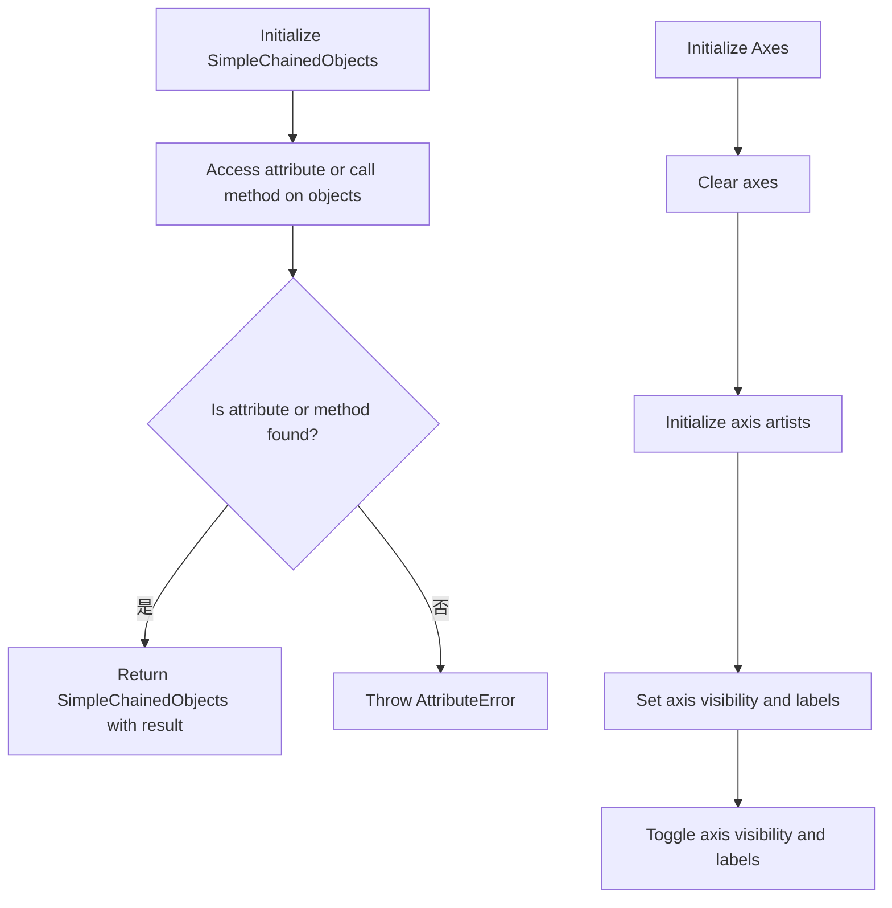

## 类结构

```
SimpleChainedObjects
├── Axes
│   ├── AxisDict
│   └── SimpleAxisArtist
```

## 全局变量及字段


### `_a`
    
An instance of SimpleChainedObjects used for chaining attribute access.

类型：`SimpleChainedObjects`
    


### `_axis_direction`
    
The direction of the axis (e.g., 'bottom', 'top', 'left', 'right').

类型：`str`
    


### `_axisnum`
    
The number of the axis (1 or 2).

类型：`int`
    


### `_axis`
    
The axis object associated with the SimpleAxisArtist.

类型：`matplotlib.axis.Axis`
    


### `_axislines`
    
A dictionary-like object that represents the axis lines of the Axes object.

类型：`Axes.AxisDict`
    


### `_line`
    
The spine object associated with the SimpleAxisArtist.

类型：`matplotlib.spines.Spine`
    


### `_ticks`
    
A list of tick objects associated with the axis.

类型：`list`
    


### `_ticklabels`
    
A list of tick label objects associated with the axis.

类型：`list`
    


### `_label`
    
The label object associated with the axis.

类型：`matplotlib.text.Text`
    


### `SimpleChainedObjects._objects`
    
A list of objects that the SimpleChainedObjects instance is chaining.

类型：`list`
    


### `Axes._axislines`
    
A dictionary-like object that represents the axis lines of the Axes object.

类型：`Axes.AxisDict`
    


### `Axes.AxisDict.axes`
    
A list of axes objects that the AxisDict is initialized with.

类型：`list`
    


### `SimpleAxisArtist._axis`
    
The axis object associated with the SimpleAxisArtist.

类型：`matplotlib.axis.Axis`
    


### `SimpleAxisArtist._axisnum`
    
The number of the axis (1 or 2).

类型：`int`
    


### `SimpleAxisArtist.line`
    
The spine object associated with the SimpleAxisArtist.

类型：`matplotlib.spines.Spine`
    
    

## 全局函数及方法


### SimpleChainedObjects.__init__

初始化SimpleChainedObjects类，接受一个对象列表作为参数，并将这些对象存储为类的内部属性。

参数：

- `objects`：`list`，一个包含对象的列表，这些对象将被存储并用于后续操作。

返回值：无

#### 流程图

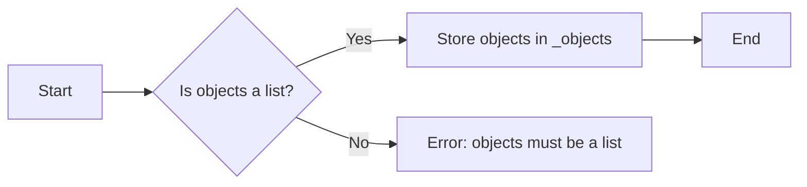

#### 带注释源码

```python
def __init__(self, objects):
    # Check if objects is a list
    if not isinstance(objects, list):
        raise TypeError("objects must be a list")
    
    # Store the objects in the instance's _objects attribute
    self._objects = objects
```


### SimpleChainedObjects.__getattr__

该函数用于实现一个链式调用机制，当尝试访问一个对象属性时，如果属性不存在，则返回一个新的`SimpleChainedObjects`实例，该实例包含原始对象属性值的列表。

参数：

- `k`：`str`，要访问的属性名称。

返回值：`SimpleChainedObjects`，包含原始对象属性值的列表。

#### 流程图

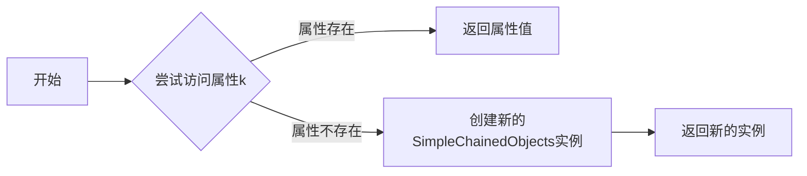

#### 带注释源码

```python
def __getattr__(self, k):
    _a = SimpleChainedObjects([getattr(a, k) for a in self._objects])
    return _a
``` 


### SimpleChainedObjects.__call__

该函数允许调用链中的所有对象，并将传入的参数传递给它们。

参数：

- `*args`：`Any`，任意数量的位置参数，将被传递给链中的每个对象。
- `**kwargs`：`Any`，任意数量的关键字参数，将被传递给链中的每个对象。

返回值：`None`，该函数不返回任何值，而是调用链中的每个对象。

#### 流程图

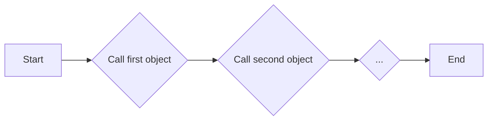

#### 带注释源码

```python
def __call__(self, *args, **kwargs):
    for m in self._objects:
        m(*args, **kwargs)
```


### `Axes.__init__`

初始化 `Axes` 类的实例，设置轴对象。

参数：

- `objects`：`list`，包含轴对象的列表。

返回值：无

#### 流程图

```mermaid
classDiagram
    class Axes {
        :objects: list
    }
    Axes --> :objects:
    Axes :<<init>>()
```

#### 带注释源码

```python
class Axes(maxes.Axes):
    def __init__(self, objects):
        # 初始化父类
        super().__init__()
        # 设置轴对象
        self._objects = objects
```


### Axes.clear

清除轴上的所有元素，包括轴标签、刻度线和刻度标签。

参数：

- 无

返回值：无

#### 流程图

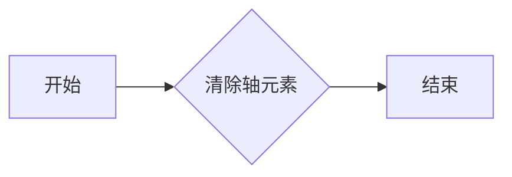

#### 带注释源码

```python
def clear(self):
    # docstring inherited
    super().clear()
    # Init axis artists.
    self._axislines = self.AxisDict(self)
    self._axislines.update(
        bottom=SimpleAxisArtist(self.xaxis, 1, self.spines["bottom"]),
        top=SimpleAxisArtist(self.xaxis, 2, self.spines["top"]),
        left=SimpleAxisArtist(self.yaxis, 1, self.spines["left"]),
        right=SimpleAxisArtist(self.yaxis, 2, self.spines["right"]))
```


### `Axes.axis`

`Axes.axis` 方法是 `matplotlib.axes.Axes` 类的一个方法，用于设置轴的属性。

参数：

- `*v`：`Any`，表示传递给 `maxes.Axes.axis` 方法的任意数量的参数。
- `**kwargs`：`Any`，表示传递给 `maxes.Axes.axis` 方法的任意数量的关键字参数。

返回值：`None`，该方法不返回任何值。

#### 流程图

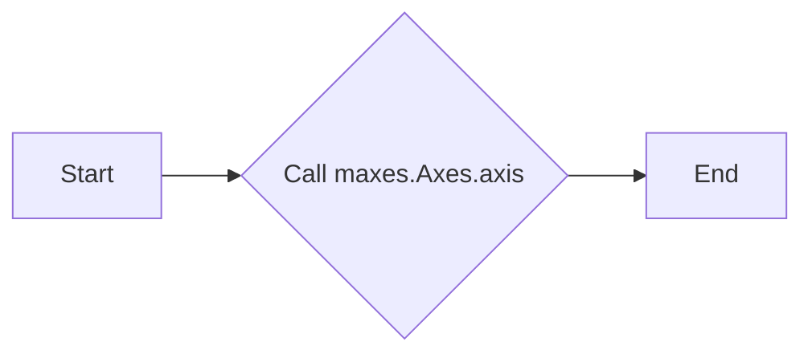

#### 带注释源码

```python
def __call__(self, *v, **kwargs):
    return maxes.Axes.axis(self.axes, *v, **kwargs)
```


### `Axes.set_visible`

`Axes.set_visible` 方法用于设置轴的可视性。

参数：

- `b`：`bool`，一个布尔值，用于设置轴是否可见。

返回值：`None`，此方法不返回任何值。

#### 流程图

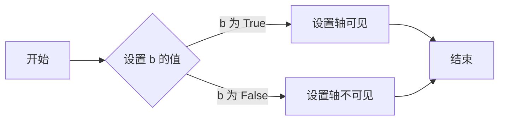

#### 带注释源码

```python
def set_visible(self, b):
    self.toggle(all=b)
    self.line.set_visible(b)
    self._axis.set_visible(True)
    super().set_visible(b)
```


### `Axes.set_label`

设置轴标签的文本。

参数：

- `txt`：`str`，要设置的轴标签文本。

返回值：`None`，没有返回值。

#### 流程图

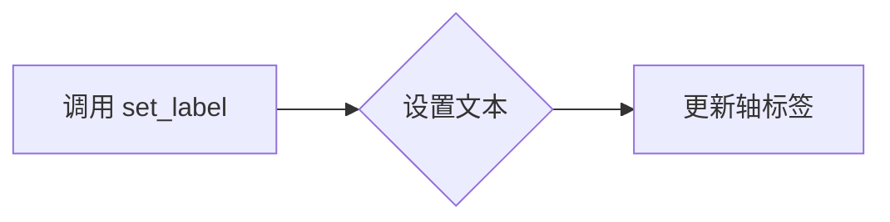

#### 带注释源码

```python
def set_label(self, txt):
    self._axis.set_label_text(txt)
```


### `SimpleAxisArtist.toggle`

`SimpleAxisArtist.toggle` 方法用于切换轴上的不同元素（如刻度、标签等）的可见性。

参数：

- `all`：`bool`，如果为 `True`，则切换所有元素的可见性；如果为 `False`，则隐藏所有元素；如果为 `None`，则不改变任何元素的可见性。
- `ticks`：`bool`，如果为 `True`，则显示刻度；如果为 `False`，则隐藏刻度；如果为 `None`，则不改变刻度的可见性。
- `ticklabels`：`bool`，如果为 `True`，则显示刻度标签；如果为 `False`，则隐藏刻度标签；如果为 `None`，则不改变刻度标签的可见性。
- `label`：`bool`，如果为 `True`，则显示轴标签；如果为 `False`，则隐藏轴标签；如果为 `None`，则不改变轴标签的可见性。

返回值：`None`，该方法不返回任何值。

#### 流程图

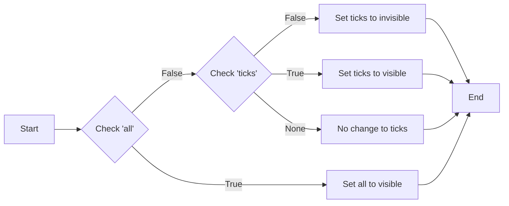

#### 带注释源码

```python
def toggle(self, all=None, ticks=None, ticklabels=None, label=None):
    if all:
        _ticks, _ticklabels, _label = True, True, True
    elif all is not None:
        _ticks, _ticklabels, _label = False, False, False
    else:
        _ticks, _ticklabels, _label = None, None, None

    if ticks is not None:
        _ticks = ticks
    if ticklabels is not None:
        _ticklabels = ticklabels
    if label is not None:
        _label = label

    if _ticks is not None:
        tickparam = {f"tick{self._axisnum}On": _ticks}
        self._axis.set_tick_params(**tickparam)
    if _ticklabels is not None:
        tickparam = {f"label{self._axisnum}On": _ticklabels}
        self._axis.set_tick_params(**tickparam)

    if _label is not None:
        pos = self._axis.get_label_position()
        if (pos == self._axis_direction) and not _label:
            self._axis.label.set_visible(False)
        elif _label:
            self._axis.label.set_visible(True)
            self._axis.set_label_position(self._axis_direction)
``` 


### `Axes.AxisDict.__init__`

初始化 `Axes.AxisDict` 类，设置轴对象列表。

参数：

- `axes`：`list`，包含轴对象的列表。

返回值：无

#### 流程图

```mermaid
classDiagram
    class Axes.AxisDict {
        list axes : list
    }
    Axes.AxisDict <|-- dict
    Axes.AxisDict {
        +__init__(axes : list)
    }
```

#### 带注释源码

```python
class Axes(Axes):
    class AxisDict(dict):
        def __init__(self, axes):
            self.axes = axes
            super().__init__()
            # 初始化轴对象列表
```


### `Axes.AxisDict.__getitem__`

获取指定键的轴对象。

参数：

- `k`：`{类型}`，指定要获取的轴对象的键，可以是字符串、元组或切片。

返回值：`{类型}`，返回与指定键对应的轴对象。

#### 流程图

```mermaid
graph LR
A[开始] --> B{检查k的类型}
B -- 字符串 --> C[返回dict.__getitem__(k)]
B -- 元组 --> D[创建SimpleChainedObjects对象]
D --> E[遍历元组中的每个元素]
E --> F[使用super().__getitem__获取元素]
F --> G[返回SimpleChainedObjects对象]
B -- 切片 --> H[检查切片参数]
H -- 无参数 --> I[返回SimpleChainedObjects(list(self.values()))]
H -- 有参数 --> J[抛出异常]
J --> K[结束]
```

#### 带注释源码

```python
def __getitem__(self, k):
    if isinstance(k, tuple):
        r = SimpleChainedObjects(
            [super(Axes.AxisDict, self).__getitem__(k1) for k1 in k])
        return r
    elif isinstance(k, slice):
        if k.start is None and k.stop is None and k.step is None:
            return SimpleChainedObjects(list(self.values()))
        else:
            raise ValueError("Unsupported slice")
    else:
        return dict.__getitem__(self, k)
``` 


### `SimpleChainedObjects.__call__`

`SimpleChainedObjects` 类的 `__call__` 方法允许调用链中的所有对象。

参数：

- `*args`：任意数量的位置参数，将被传递给链中的每个对象。
- `**kwargs`：任意数量的关键字参数，将被传递给链中的每个对象。

返回值：无，该方法不返回值，而是调用链中的每个对象。

#### 流程图


#### 带注释源码

```python
def __call__(self, *args, **kwargs):
    for m in self._objects:
        m(*args, **kwargs)
```


### SimpleAxisArtist.__init__

初始化SimpleAxisArtist对象，设置轴对象、轴编号和脊对象。

参数：

- `axis`：`XAxis` 或 `YAxis`，轴对象。
- `axisnum`：`int`，轴编号，用于确定轴的方向。
- `spine`：`matplotlib.spines.Spine`，脊对象，代表轴的边框。

返回值：无

#### 流程图

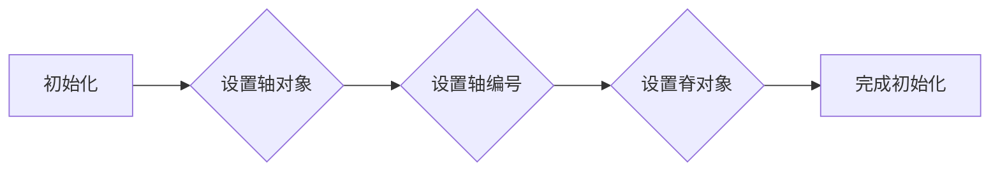

#### 带注释源码

```python
def __init__(self, axis, axisnum, spine):
    self._axis = axis
    self._axisnum = axisnum
    self.line = spine

    if isinstance(axis, XAxis):
        self._axis_direction = ["bottom", "top"][axisnum-1]
    elif isinstance(axis, YAxis):
        self._axis_direction = ["left", "right"][axisnum-1]
    else:
        raise ValueError(
            f"axis must be instance of XAxis or YAxis, but got {axis}")
    super().__init__()
```


### SimpleAxisArtist.major_ticks

返回轴的主要刻度对象。

参数：

- 无

返回值：`SimpleChainedObjects`，包含轴的主要刻度对象。

#### 流程图

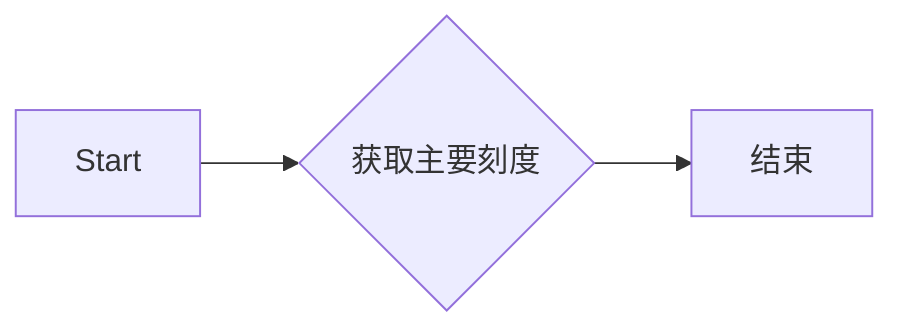

#### 带注释源码

```python
    @property
    def major_ticks(self):
        tickline = "tick%dline" % self._axisnum
        return SimpleChainedObjects([getattr(tick, tickline)
                                     for tick in self._axis.get_major_ticks()])
```


### SimpleAxisArtist.major_ticklabels

获取指定轴的主要刻度标签。

参数：

- 无

返回值：`SimpleChainedObjects`，包含指定轴的主要刻度标签对象。

#### 流程图

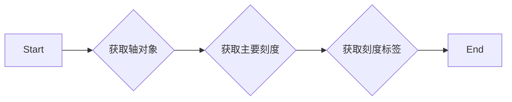

#### 带注释源码

```python
    @property
    def major_ticklabels(self):
        label = "label%d" % self._axisnum
        return SimpleChainedObjects([getattr(tick, label)
                                     for tick in self._axis.get_major_ticks()])
```


### SimpleAxisArtist.label

返回轴标签的文本。

参数：

- 无

返回值：

- `str`，轴标签的文本

#### 流程图

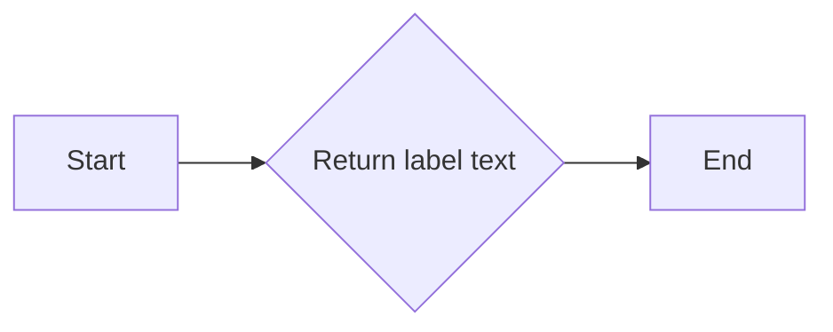

#### 带注释源码

```python
    @property
    def label(self):
        return self._axis.label
```


### SimpleAxisArtist.set_visible

该函数用于设置SimpleAxisArtist对象的可见性。

参数：

- `b`：`bool`，表示是否显示该轴。

返回值：无

#### 流程图

```mermaid
graph LR
A[开始] --> B{参数b是否为True?}
B -- 是 --> C[设置所有属性可见]
B -- 否 --> D[设置所有属性不可见]
C --> E[设置line可见性]
D --> E
E --> F[设置axis可见性]
F --> G[调用super().set_visible(b)]
G --> H[结束]
```

#### 带注释源码

```python
def set_visible(self, b):
    self.toggle(all=b)
    self.line.set_visible(b)
    self._axis.set_visible(True)
    super().set_visible(b)
```


### SimpleAxisArtist.set_label

设置轴标签的文本。

参数：

- `txt`：`str`，要设置的标签文本。

返回值：无

#### 流程图

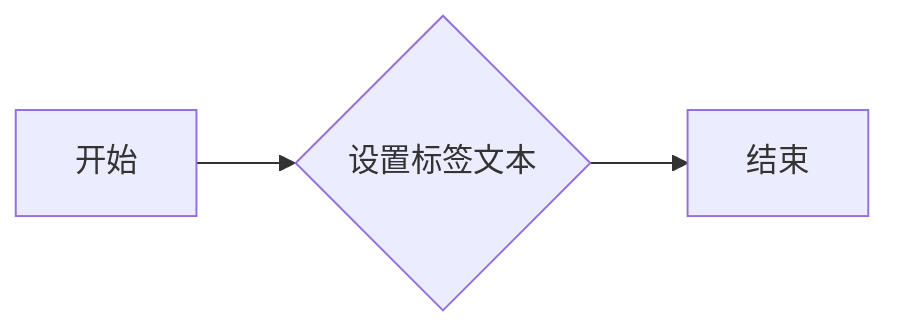

#### 带注释源码

```python
def set_label(self, txt):
    self._axis.set_label_text(txt)
```


### SimpleAxisArtist.toggle

Toggle the visibility of axis elements such as ticks, tick labels, and axis label.

参数：

- `all`：`bool`，If set to True, all axis elements will be toggled. If set to False, all axis elements will be hidden. If not provided, the state will not be changed.
- `ticks`：`bool`，If set to True, the ticks will be visible. If set to False, the ticks will be hidden. If not provided, the state will not be changed.
- `ticklabels`：`bool`，If set to True, the tick labels will be visible. If set to False, the tick labels will be hidden. If not provided, the state will not be changed.
- `label`：`bool`，If set to True, the axis label will be visible. If set to False, the axis label will be hidden. If not provided, the state will not be changed.

返回值：`None`，This method does not return any value.

#### 流程图

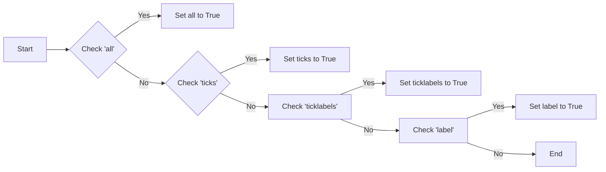

#### 带注释源码

```python
def toggle(self, all=None, ticks=None, ticklabels=None, label=None):
    # Determine the state of each element based on the provided arguments
    if all:
        _ticks, _ticklabels, _label = True, True, True
    elif all is not None:
        _ticks, _ticklabels, _label = False, False, False
    else:
        _ticks, _ticklabels, _label = None, None, None

    # If 'ticks' is provided, update the tick visibility
    if _ticks is not None:
        tickparam = {f"tick{self._axisnum}On": _ticks}
        self._axis.set_tick_params(**tickparam)

    # If 'ticklabels' is provided, update the tick label visibility
    if _ticklabels is not None:
        tickparam = {f"label{self._axisnum}On": _ticklabels}
        self._axis.set_tick_params(**tickparam)

    # If 'label' is provided, update the axis label visibility
    if _label is not None:
        pos = self._axis.get_label_position()
        if (pos == self._axis_direction) and not _label:
            self._axis.label.set_visible(False)
        elif _label:
            self._axis.label.set_visible(True)
            self._axis.set_label_position(self._axis_direction)
```


## 关键组件


### 张量索引与惰性加载

支持通过链式调用索引张量元素，同时延迟加载元素以优化性能。

### 反量化支持

提供反量化功能，允许在量化过程中进行逆量化操作。

### 量化策略

实现多种量化策略，包括全局量化、局部量化等，以适应不同的量化需求。


## 问题及建议


### 已知问题

-   **全局变量和函数缺失**：代码中没有使用全局变量和全局函数，因此不存在此类问题。
-   **代码可读性**：`SimpleChainedObjects` 类的 `__getattr__` 方法使用了列表推导式和 `getattr`，这可能会降低代码的可读性，特别是对于不熟悉 Python 特性的开发者。
-   **异常处理**：代码中没有明确的异常处理机制，例如在 `SimpleAxisArtist` 的构造函数中，如果传入的 `axis` 不是 `XAxis` 或 `YAxis` 的实例，会抛出 `ValueError`，但没有进一步的异常处理或日志记录。
-   **性能**：`SimpleChainedObjects` 类的 `__getattr__` 方法在每次调用时都会创建新的实例，这可能会对性能产生负面影响，尤其是在处理大量对象时。

### 优化建议

-   **增加文档字符串**：为类和方法添加详细的文档字符串，以提高代码的可读性和可维护性。
-   **异常处理**：在可能抛出异常的地方添加异常处理逻辑，例如在 `SimpleAxisArtist` 的构造函数中，可以捕获异常并记录错误信息。
-   **性能优化**：考虑使用缓存机制来避免在 `SimpleChainedObjects` 的 `__getattr__` 方法中重复计算，例如使用 `lru_cache`。
-   **代码重构**：考虑将 `SimpleChainedObjects` 类的 `__getattr__` 方法重构为更简洁的形式，例如使用属性装饰器。
-   **单元测试**：编写单元测试来验证代码的功能和性能，确保代码的稳定性和可靠性。


## 其它


### 设计目标与约束

- 设计目标：
  - 提供一个灵活的轴对象，可以轻松地访问和操作matplotlib轴上的元素。
  - 支持链式调用，以便连续操作轴上的元素。
  - 保持与matplotlib轴对象的兼容性，同时扩展其功能。

- 约束：
  - 必须使用matplotlib库中的类和方法。
  - 不能修改matplotlib轴对象的原始实现。
  - 需要确保代码的可读性和可维护性。

### 错误处理与异常设计

- 错误处理：
  - 当尝试使用不支持的切片操作时，抛出`ValueError`。
  - 当尝试访问不存在的属性时，抛出`AttributeError`。
  - 当轴对象不是`XAxis`或`YAxis`的实例时，抛出`ValueError`。

- 异常设计：
  - 使用try-except块捕获和处理可能发生的异常。
  - 提供清晰的错误消息，帮助用户理解问题所在。

### 数据流与状态机

- 数据流：
  - 用户通过链式调用访问和操作轴上的元素。
  - 数据从用户传递到`SimpleChainedObjects`类，然后传递到matplotlib轴对象。

- 状态机：
  - `SimpleChainedObjects`类管理轴上的元素状态，如可见性、标签等。
  - `SimpleAxisArtist`类管理轴上特定元素的状态。

### 外部依赖与接口契约

- 外部依赖：
  - 依赖于matplotlib库中的`Axes`, `XAxis`, `YAxis`, `Artist`等类。

- 接口契约：
  - `SimpleChainedObjects`类提供了一个链式调用的接口。
  - `SimpleAxisArtist`类提供了一个访问和操作轴上特定元素的方法。
  - `Axes.AxisDict`类提供了一个字典接口，用于访问轴上的元素。


    