# `matplotlib\lib\mpl_toolkits\axes_grid1\parasite_axes.py` 详细设计文档

This code defines a custom axes class that can host additional axes (parasite axes) within the same figure. It provides functionality to create and manage these parasite axes, allowing for complex visualizations with multiple axes sharing the same coordinate system.

## 整体流程

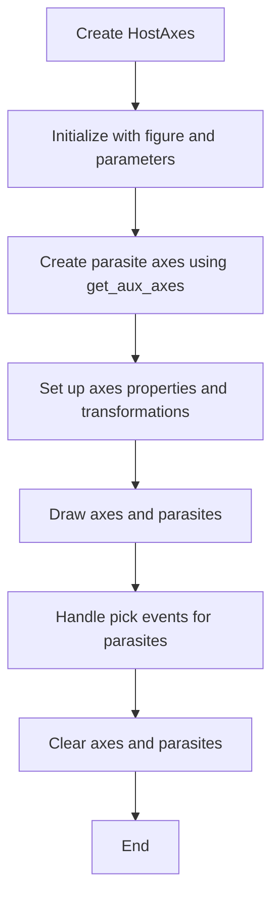

## 类结构

```
HostAxesBase (HostAxes基类)
├── ParasiteAxesBase (ParasiteAxes基类)
│   ├── _set_lim_and_transforms
│   ├── set_viewlim_mode
│   ├── get_viewlim_mode
│   ├── _sync_lims
│   └── ...
└── host_axes_class_factory (类工厂)
```

## 全局变量及字段


### `parasite_axes_class_factory`
    
A class factory for creating ParasiteAxesBase subclasses.

类型：`function`
    


### `host_axes_class_factory`
    
A class factory for creating HostAxesBase subclasses.

类型：`function`
    


### `host_subplot_class_factory`
    
A class factory for creating HostAxesBase subclasses.

类型：`function`
    


### `ParasiteAxesBase._parent_axes`
    
The parent Axes object to which the ParasiteAxesBase is attached.

类型：`Axes`
    


### `ParasiteAxesBase.transAux`
    
The auxiliary transform for the ParasiteAxesBase.

类型：`Transform`
    


### `ParasiteAxesBase._viewlim_mode`
    
The mode for setting the view limits of the ParasiteAxesBase.

类型：`str`
    


### `HostAxesBase.parasites`
    
A list of parasite Axes objects attached to the HostAxesBase.

类型：`list`
    
    

## 全局函数及方法


### host_axes

创建一个可以作为寄生轴宿主的轴。

参数：

- `*args`：传递给底层 `~.axes.Axes` 对象创建的参数。
- `axes_class`：`~.axes.Axes` 子类，默认为 `Axes`。
- `figure`：`~matplotlib.figure.Figure` 对象，轴将被添加到其中。默认为当前图 `pyplot.gcf()`。
- `**kwargs`：传递给寄生轴构造函数的其他参数。

返回值：`~.axes.Axes` 对象，创建的宿主轴。

#### 流程图

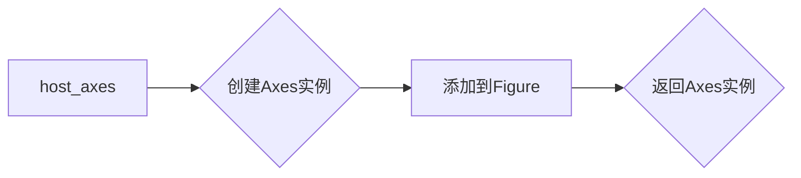

#### 带注释源码

```python
def host_axes(*args, axes_class=Axes, figure=None, **kwargs):
    import matplotlib.pyplot as plt
    host_axes_class = host_axes_class_factory(axes_class)
    if figure is None:
        figure = plt.gcf()
    ax = host_axes_class(figure, *args, **kwargs)
    figure.add_axes(ax)
    return ax
```


### ParasiteAxesBase.__init__

初始化ParasiteAxesBase类，创建一个寄生轴对象。

参数：

- `parent_axes`：`Axes`，父轴对象，寄生轴将附加到该轴上。
- `aux_transform`：`Transform`或`None`，可选，辅助变换，用于设置寄生轴的坐标系统。
- `viewlim_mode`：`None`或`"equal"`或`"transform"`，可选，视图限制模式，用于设置视图限制。
- `**kwargs`：其他参数，将传递给Axes构造函数。

返回值：无

#### 流程图

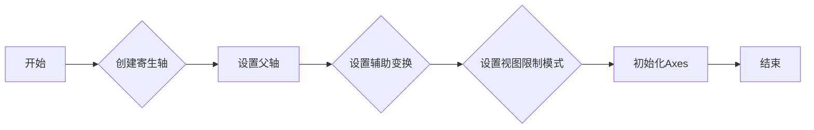

#### 带注释源码

```python
def __init__(self, parent_axes, aux_transform=None,
             *, viewlim_mode=None, **kwargs):
    # 创建寄生轴
    self._parent_axes = parent_axes
    # 设置辅助变换
    self.transAux = aux_transform
    # 设置视图限制模式
    self.set_viewlim_mode(viewlim_mode)
    # 设置frameon为False
    kwargs["frameon"] = False
    # 初始化Axes
    super().__init__(parent_axes.get_figure(root=False),
                     parent_axes._position, **kwargs)
```


### ParasiteAxesBase.clear

清除ParasiteAxesBase实例及其子元素的所有绘制元素，并将所有子元素的可见性设置为False。

参数：

- 无

返回值：无

#### 流程图

```mermaid
graph LR
A[开始] --> B{调用super().clear()}
B --> C{调用martist.setp(self.get_children(), visible=False)}
C --> D[结束]
```

#### 带注释源码

```python
def clear(self):
    super().clear()  # 调用父类Axes的clear方法
    martist.setp(self.get_children(), visible=False)  # 将所有子元素的可见性设置为False
    self._get_lines = self._parent_axes._get_lines  # 从父轴获取线条信息
    self._parent_axes.callbacks._connect_picklable(
        "xlim_changed", self._sync_lims)  # 连接xlim_changed事件
    self._parent_axes.callbacks._connect_picklable(
        "ylim_changed", self._sync_lims)  # 连接ylim_changed事件
``` 


### ParasiteAxesBase.get_axes_locator

获取父轴的轴定位器。

参数：

- 无

返回值：`AxesLocator`，返回父轴的轴定位器。

#### 流程图

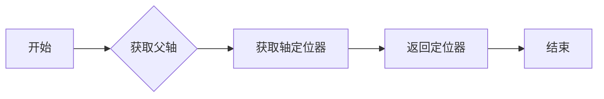

#### 带注释源码

```python
def get_axes_locator(self):
    return self._parent_axes.get_axes_locator()
```


### ParasiteAxesBase.pick

This method handles pick events for the parasite axes. It first calls the base class's `pick` method to handle pick events registered on the axes associated with each child. Then, it handles additional pick events from the host axes.

参数：

- `mouseevent`：`matplotlib.event.Event`，The mouse event that triggered the pick.

返回值：`None`，This method does not return a value.

#### 流程图

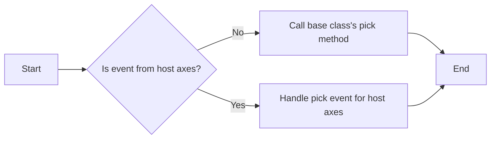

#### 带注释源码

```python
def pick(self, mouseevent):
    # This most likely goes to Artist.pick (depending on axes_class given
    # to the factory), which only handles pick events registered on the
    # axes associated with each child:
    super().pick(mouseevent)
    # But parasite axes are additionally given pick events from their host
    # axes (cf. HostAxesBase.pick), which we handle here:
    for a in self.get_children():
        if (hasattr(mouseevent.inaxes, "parasites")
                and self in mouseevent.inaxes.parasites):
            a.pick(mouseevent)
```


### ParasiteAxesBase._set_lim_and_transforms

This method sets the limits and transformations for the parasite axes.

参数：

- `self`：`ParasiteAxesBase`对象，表示当前实例

返回值：无

#### 流程图

```mermaid
graph LR
A[Start] --> B{self.transAux is not None?}
B -- Yes --> C[Set transAxes and transData]
C --> D[Set _xaxis_transform and _yaxis_transform]
D --> E[End]
B -- No --> F[Call super()._set_lim_and_transforms]
F --> E
```

#### 带注释源码

```python
def _set_lim_and_transforms(self):
    if self.transAux is not None:
        self.transAxes = self._parent_axes.transAxes
        self.transData = self.transAux + self._parent_axes.transData
        self._xaxis_transform = mtransforms.blended_transform_factory(
            self.transData, self.transAxes)
        self._yaxis_transform = mtransforms.blended_transform_factory(
            self.transAxes, self.transData)
    else:
        super()._set_lim_and_transforms()
``` 


### ParasiteAxesBase.set_viewlim_mode

设置子轴的视图限制模式。

参数：

- `mode`：`str`，视图限制模式，可以是 "equal"（等比例）、"transform"（变换）或 `None`（独立）。

返回值：无

#### 流程图

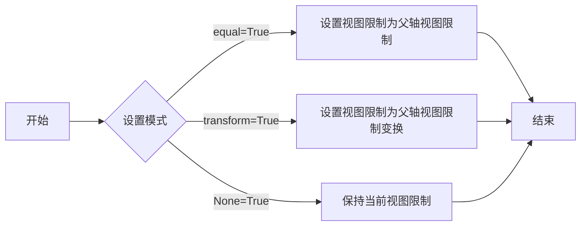

#### 带注释源码

```python
def set_viewlim_mode(self, mode):
    _api.check_in_list([None, "equal", "transform"], mode=mode)
    self._viewlim_mode = mode
    self._sync_lims(self._parent_axes)
``` 


### ParasiteAxesBase.get_viewlim_mode

获取或设置子轴的视图限制模式。

参数：

- 无

返回值：`str`，视图限制模式，可以是 "equal", "transform" 或 None。

#### 流程图

```mermaid
graph LR
A[开始] --> B{检查模式}
B -->|模式为 "equal"| C[设置视图限制为父轴视图限制]
B -->|模式为 "transform"| D[设置视图限制为父轴视图限制变换]
B -->|模式为 None| E[不改变视图限制]
C --> F[结束]
D --> F
E --> F
```

#### 带注释源码

```python
def get_viewlim_mode(self):
    return self._viewlim_mode
```


### ParasiteAxesBase._sync_lims

同步子轴的视图限制。

参数：

- `parent`：`Axes`，父轴对象，其视图限制将被同步到子轴。

返回值：无

#### 流程图

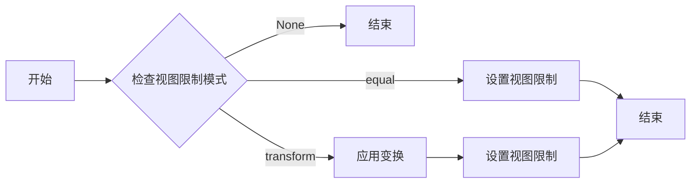

#### 带注释源码

```python
def _sync_lims(self, parent):
    viewlim = parent.viewLim.frozen()
    mode = self.get_viewlim_mode()
    if mode is None:
        pass
    elif mode == "equal":
        self.viewLim.set(viewlim)
    elif mode == "transform":
        self.viewLim.set(viewlim.transformed(self.transAux.inverted()))
    else:
        _api.check_in_list([None, "equal", "transform"], mode=mode)
``` 


### HostAxesBase.__init__

This method initializes the HostAxesBase class, setting up the basic properties and configurations for the host axes that can accommodate parasitic axes.

参数：

- `*args`：`Any`，Positional arguments to be passed to the parent class constructor.
- `**kwargs`：`Any`，Keyword arguments to be passed to the parent class constructor.

返回值：`None`，This method does not return any value.

#### 流程图

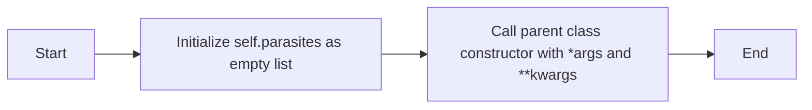

#### 带注释源码

```python
def __init__(self, *args, **kwargs):
    self.parasites = []  # Initialize the list to hold parasites
    super().__init__(*args, **kwargs)  # Call the parent class constructor
```


### HostAxesBase.get_aux_axes

This method adds a parasite axes to the host axes.

参数：

- `tr`：`~matplotlib.transforms.Transform` 或 `None`，默认 `None`。If a `.Transform` is provided, the following relation will hold: `parasite.transData = tr + host.transData`. If `None`, the parasite's and the host's `transData` are unrelated.
- `viewlim_mode`：`{"equal", "transform", None}`，默认 `"equal"`。How the parasite's view limits are set: directly equal to the parent axes ("equal"), equal after application of *tr* ("transform"), or independently (None).
- `axes_class`：`~matplotlib.axes.Axes` 的子类类型，可选。The `~.axes.Axes` subclass that is instantiated. If None, the base class of the host axes is used.
- `**kwargs`：Other parameters are forwarded to the parasite axes constructor.

返回值：`~matplotlib.axes.Axes`，The added parasite axes.

#### 流程图

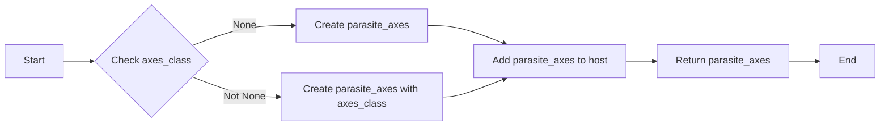

#### 带注释源码

```python
def get_aux_axes(
        self, tr=None, viewlim_mode="equal", axes_class=None, **kwargs):
    """
    Add a parasite axes to this host.

    Despite this method's name, this should actually be thought of as an
    ``add_parasite_axes`` method.

    Parameters
    ----------
    tr : `~matplotlib.transforms.Transform` or None, default: None
        If a `.Transform`, the following relation will hold:
        ``parasite.transData = tr + host.transData``.
        If None, the parasite's and the host's ``transData`` are unrelated.
    viewlim_mode : {"equal", "transform", None}, default: "equal"
        How the parasite's view limits are set: directly equal to the
        parent axes ("equal"), equal after application of *tr*
        ("transform"), or independently (None).
    axes_class : subclass type of `~matplotlib.axes.Axes`, optional
        The `~.axes.Axes` subclass that is instantiated.  If None, the base
        class of the host axes is used.
    **kwargs
        Other parameters are forwarded to the parasite axes constructor.
    """
    if axes_class is None:
        axes_class = self._base_axes_class
    parasite_axes_class = parasite_axes_class_factory(axes_class)
    ax2 = parasite_axes_class(
        self, tr, viewlim_mode=viewlim_mode, **kwargs)
    # note that ax2.transData == tr + ax1.transData
    # Anything you draw in ax2 will match the ticks and grids of ax1.
    self.parasites.append(ax2)
    ax2._remove_method = self.parasites.remove
    return ax2
```


### HostAxesBase.draw

This method draws the host axes and its parasites.

参数：

- `renderer`：`matplotlib.backend_bases.RendererBase`，The renderer object that is used to draw the axes.

返回值：`None`，This method does not return any value.

#### 流程图

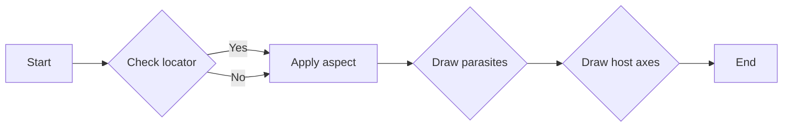

#### 带注释源码

```python
def draw(self, renderer):
    orig_children_len = len(self._children)

    locator = self.get_axes_locator()
    if locator:
        pos = locator(self, renderer)
        self.set_position(pos, which="active")
        self.apply_aspect(pos)
    else:
        self.apply_aspect()

    rect = self.get_position()
    for ax in self.parasites:
        ax.apply_aspect(rect)
        self._children.extend(ax.get_children())

    super().draw(renderer)
    del self._children[orig_children_len:]
```


### HostAxesBase.clear

清除HostAxesBase及其所有子轴的图形元素。

参数：

- 无

返回值：无

#### 流程图

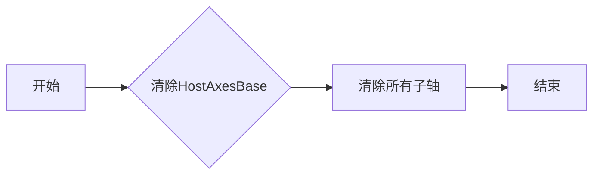

#### 带注释源码

```python
def clear(self):
    super().clear()  # 调用父类Axes的clear方法
    for ax in self.parasites:
        ax.clear()  # 遍历所有子轴并调用它们的clear方法
```


### HostAxesBase.pick

This method handles pick events for the host axes, including passing the events to the parasite axes.

参数：

- `mouseevent`：`matplotlib.event.Event`，The mouse event that triggered the pick.

返回值：`None`，This method does not return a value.

#### 流程图

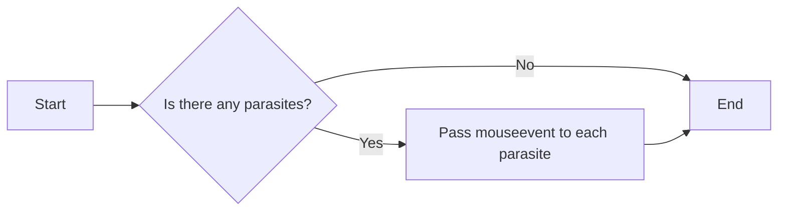

#### 带注释源码

```python
def pick(self, mouseevent):
    # Call the pick method of the base class to handle pick events for the host axes
    super().pick(mouseevent)
    # Pass pick events on to parasite axes and their children
    for a in self.parasites:
        a.pick(mouseevent)
```


### HostAxesBase.twin

Create a twin Axes with a shared x-axis but independent y-axis.

参数：

- `axes_class`：`Axes`，The `~.axes.Axes` subclass that is instantiated. If None, the base class of the host axes is used.

返回值：`Axes`，The twin Axes with a shared x-axis but independent y-axis.

#### 流程图

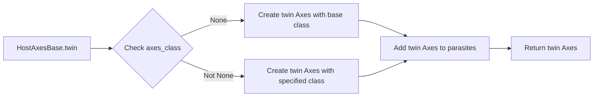

#### 带注释源码

```python
def twinx(self, axes_class=None):
    """
    Create a twin of Axes with a shared x-axis but independent y-axis.

    The y-axis of self will have ticks on the left and the returned axes
    will have ticks on the right.
    """
    ax = self._add_twin_axes(axes_class, sharex=self)
    self.axis["right"].set_visible(False)
    ax.axis["right"].set_visible(True)
    ax.axis["left", "top", "bottom"].set_visible(False)
    return ax
```


### HostAxesBase.twin

Create a twin of Axes with no shared axis.

参数：

- `aux_trans`：`matplotlib.transforms.Transform` 或 `None`，The transform to be applied to the twin axes. If `None`, the twin axes will have the same limits as the host axes.
- `axes_class`：`subclass type` of `matplotlib.axes.Axes`，The `Axes` subclass that is instantiated. If `None`, the base class of the host axes is used.

返回值：`matplotlib.axes.Axes`，The twin axes object.

#### 流程图

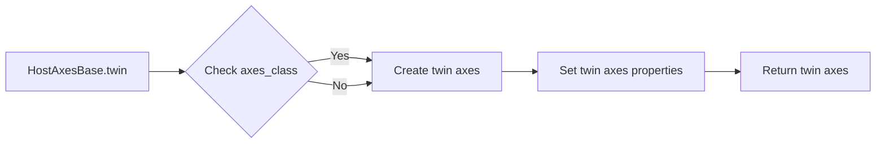

#### 带注释源码

```python
def twin(self, aux_trans=None, axes_class=None):
    """
    Create a twin of Axes with no shared axis.

    While self will have ticks on the left and bottom axis, the returned
    axes will have ticks on the top and right axis.
    """
    if aux_trans is None:
        aux_trans = mtransforms.IdentityTransform()
    ax = self._add_twin_axes(axes_class, aux_transform=aux_trans, viewlim_mode="transform")
    self.axis["top", "right"].set_visible(False)
    ax.axis["top", "right"].set_visible(True)
    ax.axis["left", "bottom"].set_visible(False)
    return ax
```


### HostAxesBase.twin

Create a twin of Axes with a shared x-axis but independent y-axis.

参数：

- `axes_class`：`Axes`，The `~.axes.Axes` subclass that is instantiated. If None, the base class of the host axes is used.

返回值：`Axes`，The twin Axes object with a shared x-axis but independent y-axis.

#### 流程图

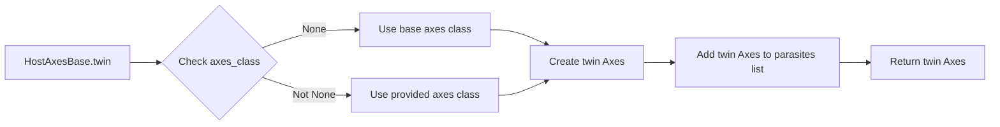

#### 带注释源码

```python
def twinx(self, axes_class=None):
    """
    Create a twin of Axes with a shared x-axis but independent y-axis.

    The y-axis of self will have ticks on the left and the returned axes
    will have ticks on the right.
    """
    ax = self._add_twin_axes(axes_class, sharex=self)
    self.axis["right"].set_visible(False)
    ax.axis["right"].set_visible(True)
    ax.axis["left", "top", "bottom"].set_visible(False)
    return ax
```


### HostAxesBase._add_twin_axes

This method is a helper method for creating a twin axes in the HostAxesBase class. It is used to create a new axes that shares one axis (either x or y) with the host axes but has an independent axis for the other dimension.

参数：

- `axes_class`：`subclasses of matplotlib.axes.Axes`，The `~.axes.Axes` subclass that is instantiated. If None, the base class of the host axes is used.
- `**kwargs`：Other parameters are forwarded to the parasite axes constructor.

返回值：`matplotlib.axes.Axes`，The newly created twin axes.

#### 流程图

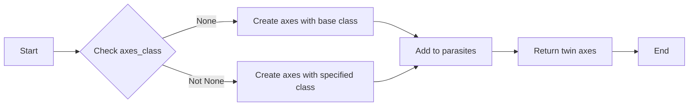

#### 带注释源码

```python
def _add_twin_axes(self, axes_class=None, **kwargs):
    """
    Helper for `.twinx`/`.twiny`/`.twin`.

    *kwargs* are forwarded to the parasite axes constructor.
    """
    if axes_class is None:
        axes_class = self._base_axes_class
    ax = parasite_axes_class_factory(axes_class)(self, **kwargs)
    self.parasites.append(ax)
    ax._remove_method = self._remove_any_twin
    return ax
```


### HostAxesBase._remove_any_twin

Removes a twin axes from the host axes and restores the visibility of the original axes' ticks and labels.

参数：

- `ax`：`Axes`，The twin axes to be removed from the host axes.

返回值：`None`，No return value.

#### 流程图

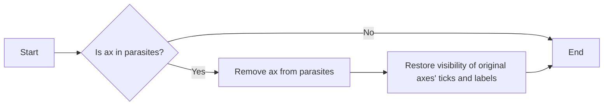

#### 带注释源码

```python
def _remove_any_twin(self, ax):
    # Remove the twin axes from the parasites list
    self.parasites.remove(ax)
    # Restore the visibility of the original axes' ticks and labels
    restore = ["top", "right"]
    if ax._sharex:
        restore.remove("top")
    if ax._sharey:
        restore.remove("right")
    self.axis[tuple(restore)].set_visible(True)
    self.axis[tuple(restore)].toggle(ticklabels=False, label=False)
```


### HostAxesBase.get_tightbbox

This method calculates the tight bounding box for the host axes and its parasites.

参数：

- `renderer`: `matplotlib.backend_bases.RendererBase`，The renderer object to use for drawing. Defaults to None, which means the renderer will be determined from the current context.
- `call_axes_locator`: `bool`，Whether to call the axes locator to determine the position of the axes. Defaults to True.
- `bbox_extra_artists`: `list`，A list of extra artists to include in the bounding box calculation. Defaults to None.

返回值：`matplotlib.transforms.Bbox`，The tight bounding box for the host axes and its parasites.

#### 流程图

```mermaid
graph LR
A[Start] --> B{Check renderer}
B -->|Yes| C[Calculate bounding boxes for parasites]
B -->|No| D[Use current renderer]
C --> E[Calculate bounding box for host axes]
E --> F[Union bounding boxes]
F --> G[Return bounding box]
G --> H[End]
```

#### 带注释源码

```python
def get_tightbbox(self, renderer=None, *, call_axes_locator=True,
                  bbox_extra_artists=None):
    bbs = [
        *[ax.get_tightbbox(renderer, call_axes_locator=call_axes_locator)
          for ax in self.parasites],
        super().get_tightbbox(renderer,
                              call_axes_locator=call_axes_locator,
                              bbox_extra_artists=bbox_extra_artists)]
    return Bbox.union([b for b in bbs if b.width != 0 or b.height != 0])
```


### host_axes_class_factory._make_class_factory

该函数用于创建一个类工厂，用于生成特定类型的轴类。

参数：

- `Axes_class`：`Axes`类的子类，用于生成轴实例。
- `name_template`：用于生成类名的模板字符串。

返回值：`ClassFactory`对象，用于创建轴实例。

#### 流程图

```mermaid
graph LR
A[Start] --> B{Is Axes_class a subclass of Axes?}
B -- Yes --> C[Create ClassFactory with Axes_class and name_template]
B -- No --> D[Error: Axes_class must be a subclass of Axes]
C --> E[End]
D --> E
```

#### 带注释源码

```python
def _make_class_factory(Axes_class, name_template):
    """
    Create a class factory for a given Axes class.

    Parameters
    ----------
    Axes_class : type
        The Axes class to create instances of.
    name_template : str
        The template string to use for generating the class name.

    Returns
    -------
    ClassFactory
        The class factory object.
    """
    class ClassFactory:
        def __init__(self, Axes_class, name_template):
            self._Axes_class = Axes_class
            self._name_template = name_template

        def __call__(self, *args, **kwargs):
            class_name = self._name_template.format(self._Axes_class.__name__)
            class_ = type(class_name, (self._Axes_class,), {})
            return class_(self._Axes_class, *args, **kwargs)

    return ClassFactory
```


## 关键组件


### 张量索引与惰性加载

张量索引与惰性加载是代码中用于高效处理大型数据集的关键组件，它允许在需要时才计算数据，从而减少内存消耗和提高性能。

### 反量化支持

反量化支持是代码中用于处理量化数据的关键组件，它允许在量化与反量化之间进行转换，确保数据在量化过程中的准确性和一致性。

### 量化策略

量化策略是代码中用于优化数据表示和存储的关键组件，它通过减少数据精度来减少内存使用，同时保持足够的精度以满足应用需求。


## 问题及建议


### 已知问题

-   **代码重复**: `HostAxesBase` 类中的 `draw` 和 `clear` 方法在处理 `parasites` 时存在重复代码。每次调用这些方法时，都需要遍历 `parasites` 列表并对其子元素进行操作，这可能导致维护困难。
-   **全局变量和函数**: 代码中使用了全局变量和函数，如 `parasite_axes_class_factory` 和 `host_axes_class_factory`，这可能导致代码难以理解和维护，尤其是在大型项目中。
-   **异常处理**: 代码中没有明显的异常处理机制，这可能导致在运行时遇到错误时程序崩溃。

### 优化建议

-   **代码重构**: 将 `draw` 和 `clear` 方法中的重复代码提取到单独的函数中，以减少代码重复并提高可维护性。
-   **使用类变量**: 将全局变量和函数转换为类变量或实例变量，以提高代码的可读性和可维护性。
-   **异常处理**: 在代码中添加异常处理机制，以捕获和处理可能发生的错误，从而提高程序的健壮性。
-   **文档注释**: 为代码添加详细的文档注释，以帮助其他开发者理解代码的功能和用法。
-   **单元测试**: 编写单元测试来验证代码的正确性和稳定性，以确保代码在未来的修改中保持功能。


## 其它


### 设计目标与约束

- 设计目标：
  - 提供一个灵活的机制来创建与现有轴（Axes）相关联的辅助轴（ParasiteAxes）。
  - 允许辅助轴共享主轴的某些属性，如视图限制和坐标变换。
  - 提供创建具有独立轴的辅助轴的方法，以便在同一图上绘制不同类型的图表。

- 约束：
  - 必须与matplotlib库兼容，并遵循其API。
  - 辅助轴应尽可能轻量，以减少对性能的影响。
  - 应提供清晰的文档和示例，以帮助用户理解和使用这些类。

### 错误处理与异常设计

- 错误处理：
  - 在初始化和操作轴时，应捕获并处理可能发生的异常，如无效的参数或操作。
  - 使用matplotlib的内置异常，如`ValueError`和`TypeError`。

- 异常设计：
  - 提供明确的错误消息，以便用户了解问题所在。
  - 在可能的情况下，提供恢复或回退机制。

### 数据流与状态机

- 数据流：
  - 辅助轴接收来自主轴的视图限制和坐标变换信息。
  - 辅助轴将事件（如鼠标点击）传递给主轴。

- 状态机：
  - 辅助轴可以处于不同的状态，如“正常”、“选择”和“拾取”。
  - 状态转换由用户交互或轴操作触发。

### 外部依赖与接口契约

- 外部依赖：
  - 依赖于matplotlib库，特别是`Axes`和`Figure`类。

- 接口契约：
  - `ParasiteAxesBase`和`HostAxesBase`类定义了与辅助轴和主轴交互的接口。
  - `host_axes`函数提供了一个创建主轴的接口，该主轴可以容纳辅助轴。

    