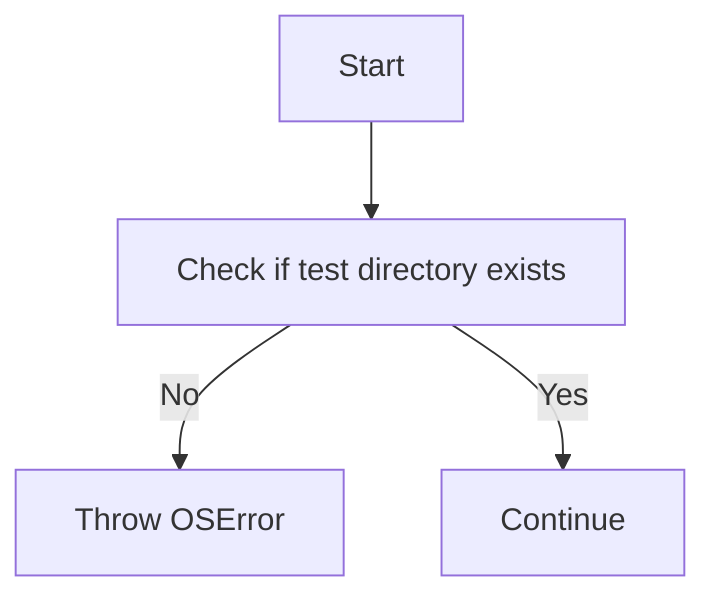

# `matplotlib\lib\mpl_toolkits\axes_grid1\tests\__init__.py` 详细设计文档

The code checks if a specific test directory exists and raises an OSError if it does not, indicating that test data might be missing.

## 整体流程



## 类结构

```
No class structure, as the code is a single script with no classes.
```

## 全局变量及字段


### `OSError`
    
Exception raised when an operation or function fails due to an invalid or inappropriate argument.

类型：`Exception`
    


    

## 全局函数及方法


### `Path(__file__).parent / "baseline_images"`

该函数用于检查测试目录是否存在。

参数：

- `__file__`：`str`，当前文件的路径
- `parent`：`Path`，当前文件的父目录的路径
- `"baseline_images"`：`str`，子目录的名称

返回值：`Path`，父目录下子目录的路径

#### 流程图


#### 带注释源码

```
from pathlib import Path

# Check that the test directories exist
if not (Path(__file__).parent / "baseline_images").exists():
    raise OSError(
        'The baseline image directory does not exist. '
        'This is most likely because the test data is not installed. '
        'You may need to install matplotlib from source to get the '
        'test data.')
```


### not

该函数用于检查指定的路径是否存在，如果不存在则抛出异常。

参数：

- `Path(__file__).parent / "baseline_images"`：`Path`，表示当前文件所在目录的子目录"baseline_images"，用于检查该目录是否存在。

返回值：无，如果目录不存在则抛出`OSError`异常。

#### 流程图


#### 带注释源码

```
from pathlib import Path

# Check that the test directories exist
if not (Path(__file__).parent / "baseline_images").exists():
    raise OSError(
        'The baseline image directory does not exist. '
        'This is most likely because the test data is not installed. '
        'You may need to install matplotlib from source to get the '
        'test data.')
```


### `Path.exists()`

该函数用于检查指定的路径是否存在。

参数：

- `path`：`Path`，表示要检查的路径对象。

返回值：`bool`，如果路径存在则返回 `True`，否则返回 `False`。

#### 流程图

```mermaid
graph TD
    A[Start] --> B{Path.exists()}
    B -->|存在| C[Return True]
    B -->|不存在| D[Return False]
    D --> E[End]
```

#### 带注释源码

```python
from pathlib import Path

# Check that the test directories exist
if not (Path(__file__).parent / "baseline_images").exists():
    raise OSError(
        'The baseline image directory does not exist. '
        'This is most likely because the test data is not installed. '
        'You may need to install matplotlib from source to get the '
        'test data.')
```


## 关键组件


### 张量索引与惰性加载

张量索引与惰性加载是处理大型数据集时常用的技术，它允许在需要时才加载数据的一部分，从而减少内存消耗和提高效率。

### 反量化支持

反量化支持是指系统对量化操作的反向操作，即从量化后的数据恢复到原始数据，这对于模型验证和调试非常重要。

### 量化策略

量化策略是指将浮点数数据转换为固定点数表示的方法，以减少模型大小和提高计算效率。


## 问题及建议


### 已知问题

-   {问题1}：代码中使用了硬编码的目录路径，这可能导致可移植性差。如果项目需要在不同的环境中运行，可能需要根据环境变量或配置文件来动态确定路径。
-   {问题2}：错误处理仅限于检查目录是否存在，没有提供更详细的错误信息，这可能会使得问题诊断变得困难。

### 优化建议

-   {建议1}：引入配置文件或环境变量来管理目录路径，以提高代码的可移植性和灵活性。
-   {建议2}：在抛出异常时，提供更详细的错误信息，包括可能的解决方案或下一步操作，以帮助用户解决问题。
-   {建议3}：考虑使用日志记录机制来记录错误信息，以便于问题追踪和调试。


## 其它


### 设计目标与约束

- 设计目标：确保测试数据目录存在，以便进行测试。
- 约束：测试数据目录必须存在，否则无法进行测试。

### 错误处理与异常设计

- 异常设计：当测试数据目录不存在时，抛出`OSError`异常。
- 错误处理：异常信息应提供足够的信息，以便用户了解问题原因和可能的解决方案。

### 数据流与状态机

- 数据流：代码检查测试数据目录是否存在，如果不存在，则抛出异常。
- 状态机：无状态机应用，代码仅进行一次检查。

### 外部依赖与接口契约

- 外部依赖：`pathlib`模块用于路径操作。
- 接口契约：无外部接口，代码仅用于内部检查。

### 安全性与权限

- 安全性：无敏感数据操作，安全性主要依赖于测试数据目录的访问权限。
- 权限：无特殊权限要求，普通用户权限即可。

### 性能考量

- 性能：代码执行时间极短，对性能影响可以忽略不计。

### 可维护性与可扩展性

- 可维护性：代码结构简单，易于理解和维护。
- 可扩展性：代码易于扩展，可以通过添加更多的检查逻辑来适应不同的测试需求。

### 测试与验证

- 测试：应编写单元测试来验证测试数据目录存在性的检查逻辑。
- 验证：通过测试确保代码在测试数据目录不存在时能够正确抛出异常。

### 文档与注释

- 文档：提供详细的设计文档，包括代码的功能、结构、异常处理等信息。
- 注释：代码中应包含必要的注释，解释关键代码段的作用。

### 代码风格与规范

- 代码风格：遵循PEP 8编码规范，确保代码的可读性和一致性。
- 规范：使用适当的命名约定和代码组织结构，提高代码的可维护性。


    